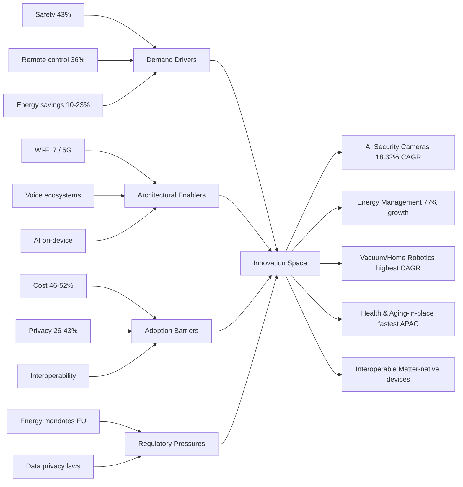
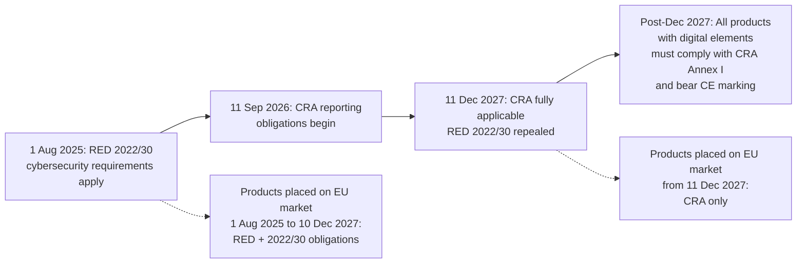
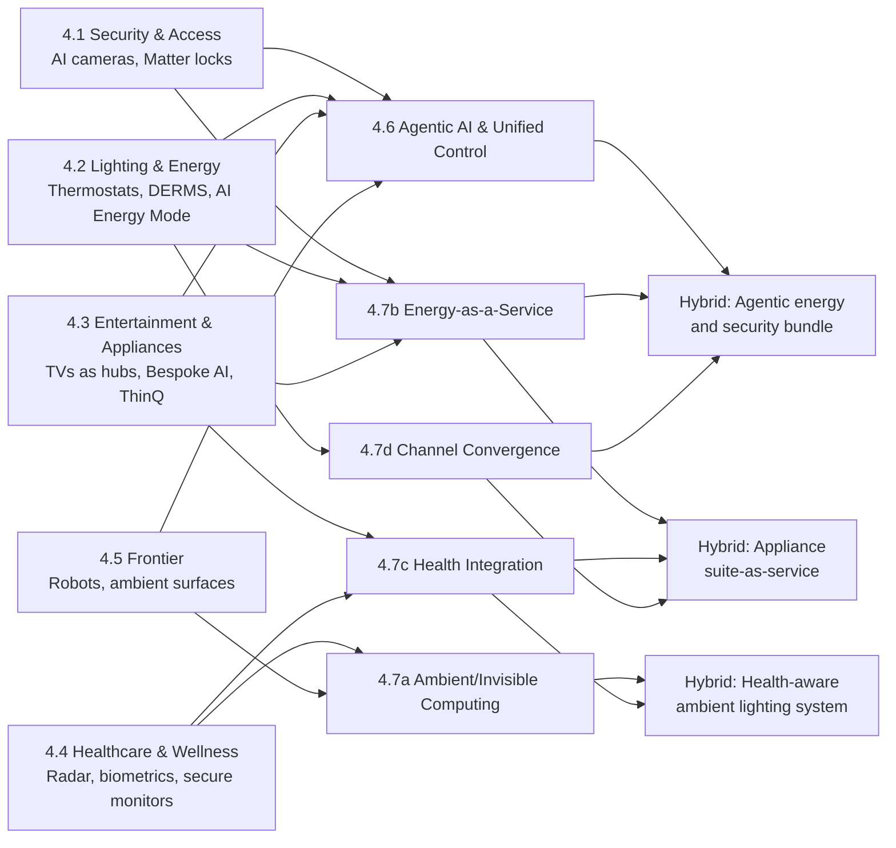
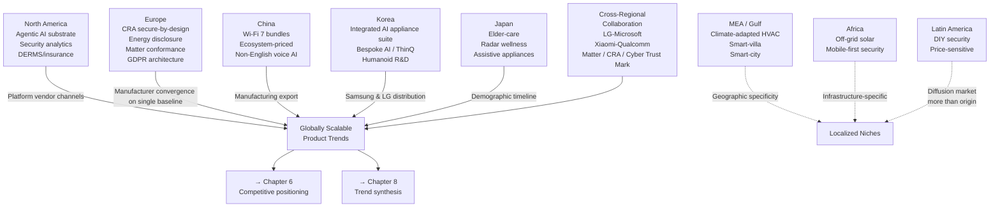
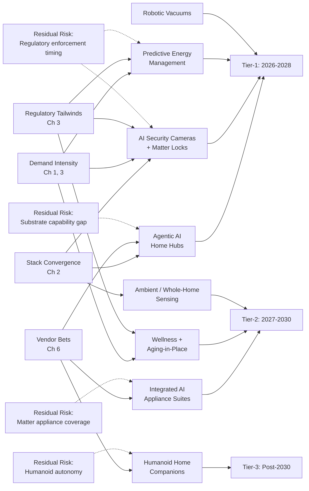

# Future Product Development Trends in the Smart Home Industry: Identifying the Next Wave of Category-Defining Products
# 1 Industry Landscape and Strategic Context

The smart home industry has crossed a decisive threshold. Once defined by a handful of early-adopter gadgets — the connected thermostat, the voice-activated speaker, the IP camera — it now constitutes a multi-hundred-billion-dollar global ecosystem in which connected devices increasingly mediate the most intimate functions of domestic life: how households consume energy, secure their dwellings, prepare meals, monitor health, and entertain themselves. To assess which products will define the *next* phase of this industry, it is first necessary to understand the structural conditions of the present: how big the market is, where its capital and consumers are concentrated, which categories already dominate revenue, what connectivity architectures hold the ecosystem together, and which demand drivers and adoption barriers will shape the runway for future innovation. This opening chapter establishes that baseline. It maps the scale and trajectory of the global market, dissects its regional and category composition, and surfaces the structural drivers and frictions that together delimit the innovation space within which category-defining products of the late 2020s and early 2030s must emerge.

## 1.1 Global Market Scale and Growth Trajectory

The most striking feature of the contemporary smart home market is the sheer divergence among credible forecasts of its size and growth — a divergence that is itself analytically informative because it reveals where the industry sits on the adoption curve. According to Mordor Intelligence, the global smart home market reached **USD 164.13 billion in 2026**, up from USD 147.52 billion in 2025, and is projected to expand to USD 311.22 billion by 2031 at a compound annual growth rate (CAGR) of 13.65%.[^1] Fortune Business Insights places the 2026 figure higher at **USD 180.12 billion** and projects a far steeper trajectory of USD 848.47 billion by 2034, implying a CAGR of 21.40%.[^1] An older Fortune Business Insights baseline previously valued the market at USD 101.07 billion in 2023, growing toward USD 633.20 billion by 2032 at roughly 30% CAGR — a still more aggressive curve.[^2] These three figures are not contradictory so much as they reflect different scope decisions: narrower definitions (devices and platforms only) yield more conservative numbers; broader definitions that include installation services, energy management contracts, and adjacent IoT spend yield the larger totals.

The smart appliance sub-segment, more tightly defined, offers a useful anchor. MarketsandMarkets estimates this segment — covering refrigerators, washing machines, dishwashers, ovens, air conditioners, water heaters, microwaves, coffee makers, vacuum robots, air purifiers, and cooking robots — at **USD 42.35 billion in 2025**, rising to **USD 71.28 billion by 2030 at an 11.0% CAGR**.[^3] The narrower band and lower growth rate here reflect the maturity of the underlying white-goods category, where smart functionality is being layered onto an already large installed base rather than creating entirely new product classes.

The following table reconciles the principal forecasts, preserving year, scope, and source as recommended for cross-vendor comparability.

| Forecast Source | Scope | Base Year Value | Forecast Year Value | CAGR |
|---|---|---|---|---|
| Mordor Intelligence | Global smart home (broad) | USD 164.13B (2026) | USD 311.22B (2031) | 13.65%[^1] |
| Fortune Business Insights | Global smart home (broad) | USD 180.12B (2026) | USD 848.47B (2034) | 21.40%[^1] |
| Fortune Business Insights (earlier) | Global smart home | USD 101.07B (2023) | USD 633.20B (2032) | ~30%[^2] |
| MarketsandMarkets | Smart appliances only | USD 42.35B (2025) | USD 71.28B (2030) | 11.0%[^3] |
| US-specific (rubyhome.com) | US smart home | USD 50.3B (2025) | USD 81.6B (2031) | 8.4%[^1] |

Two analytical insights follow from this table. **First, the spread between the most conservative (8.4% US CAGR) and most aggressive (30% global CAGR) trajectories signals an industry in transition from early-adopter to mainstream expansion** — a phase in which the *direction* of growth is unambiguous but its *velocity* depends heavily on whether emerging categories (agentic AI hubs, robotics, health monitoring) ignite new spending or whether growth merely reflects deeper penetration of existing devices. The slower US figure, explicitly described as "a more conservative trajectory than some global forecasts, reflecting the market's shift from fast early-adopter growth to steadier mainstream expansion,"[^1] is a leading indicator for what other developed markets will experience. **Second, the divergence between appliance-only growth (11%) and broader smart-home growth (13.65–21.40%) implies that the disproportionate value creation over the forecast period will occur not in incremental smartification of existing white goods, but in newer categories — security analytics, energy management, robotics, and AI-mediated experiences** — that sit outside the appliance frame.

The runway is reinforced on the demand side. Global smart home device shipments are approaching **1.25 billion units in 2026**, and the number of active smart home households globally was projected to reach **481.9 million by 2025**.[^1] The combination of a near-billion-unit annual shipment volume and a still-rising household base provides the capital and behavioral foundation on which next-generation product categories can scale.

## 1.2 Regional Distribution and Geographic Innovation Hotspots

Smart home growth is regionally unbalanced in ways that materially shape where category-defining products are likely to originate. North America remains the revenue leader: it commands a **36.23% share of global smart home revenue**, with the United States alone accounting for **USD 54.53 billion in 2026** — up from approximately USD 50.3 billion in 2025 — supported by 95% household broadband coverage and government incentives tied to energy-efficient home upgrades.[^1] Within North America, the United States is the dominant engine; Canada and Mexico add a combined market of roughly USD 1.76 billion by extension from regional totals.

Asia Pacific is the structural growth story. The region was valued at **USD 63.17 billion in 2025** and is forecast to reach **USD 193.87 billion by 2030 at a 23.82% CAGR**, with China commanding **41.5% of Asia Pacific revenue** in 2024.[^1] MarketsandMarkets corroborates this pattern in the appliance sub-segment, identifying Asia Pacific as the fastest-growing region at a **13.1% CAGR** and citing rapid urbanization, rising disposable incomes, and 5G-enabled smart home connectivity in China as the primary drivers.[^3] Europe sits between these poles: the region is projected to grow from USD 23.73 billion in 2025 to USD 32.67 billion by 2030 at a more measured 6.6% CAGR, with Germany, France, and the United Kingdom driving most of that growth and government mandates around smart energy metering playing a central role.[^1]

The country-level distribution reveals how concentrated the global market remains in a small set of national economies:

| Country / Region | 2026 Market Size (USD Billion) | Primary Innovation Driver |
|---|---|---|
| United States | 54.53 | Voice AI, security, broadband-led adoption[^1] |
| North America (total) | 56.29 | Energy incentives, retrofit upgrades[^1] |
| China | 14.34 | 5G, manufacturing scale, ecosystem play[^1][^3] |
| Germany | 12.72 | Energy mandates, IoT-appliance integration[^1][^3] |
| United Kingdom | 12.29 | Smart metering, connected-home regulation[^1] |
| Japan | 9.15 | Aging demographics, assistive appliances[^3] |
| India | 6.97 | E-commerce penetration, urban middle class[^3] |

| Region | 2025 Share | CAGR (2025–2031) |
|---|---|---|
| North America | 36.23% | ~10–12%[^1] |
| Asia Pacific | 28.90% | 17.12%[^1] |
| Europe | ~20% | 6.6%[^1] |
| Middle East & Africa | ~8% | ~15%[^1] |
| Latin America | ~7% | ~12%[^1] |

Three regional patterns emerge. **North America is the natural launch market for premium AI-driven products** — voice assistants, security analytics, and ecosystem hubs — because its broadband density, voice-AI installed base (smart speakers in 36% of US households), and consumer willingness to pay support feature-rich devices.[^1] **Asia Pacific, and China specifically, is the natural scaling market for high-volume, ecosystem-bundled product families** — Xiaomi's June 2025 Mijia Air Conditioner Pro Eco Inverter and its Wi-Fi 7 partnership with Qualcomm exemplify this pattern, in which integrated hardware-software-cloud bundles are launched at competitive price points.[^3] **Europe is where regulation-driven product features will first become mandatory** — energy-disclosure displays, smart metering interfaces, and interoperability compliance — making it the de facto standards-setting region for energy and sustainability features that subsequently diffuse globally. Japan, distinct from the broader Asia Pacific narrative, is positioned as a leading market for assistive and elderly-care smart appliances given its high geriatric population, a dynamic explicitly flagged by MarketsandMarkets.[^3]

These regional asymmetries imply that the *origin* of the next category-defining smart home products will likely differ from their *largest market*: AI hubs and security analytics from North America, energy and interoperability features from Europe, ecosystem-priced bundles and 5G-enabled appliances from China, and elder-care archetypes from Japan.

## 1.3 Product Category Composition and Revenue Weighting

Understanding where future product development will be most consequential requires a clear picture of how the current market is distributed across categories. The data reveal a market that is simultaneously concentrated (a few categories dominate revenue and household penetration) and rapidly diversifying at the edges (new categories are growing far faster than the average).

Smart TVs remain the most widely owned smart home device in the United States, present in **58% of households surveyed**, followed by smart speakers at 36%, smart thermostats at 34%, smart lighting at roughly 31%, security cameras at roughly 25%, and smart door locks at only 8.2%.[^1] When viewed at the global device-mix level, **smart lighting systems lead with 26% of the total device market**, followed by **security cameras at 23%**, smart speakers at 19%, and smart TVs at 14%.[^1] This divergence between US household penetration and global device share reflects different unit economics: TVs are high-value but one-per-household, while lighting and cameras can be deployed at multiple units per home and dominate volume.

Within Asia Pacific, security solutions remain the top revenue-generating product category, holding **29.7% of regional revenue in 2024**, while smart security cameras are the fastest-growing individual product category globally with a forecast **18.32% CAGR through 2031** as AI-based detection features become standard.[^1] Within the appliance sub-segment, MarketsandMarkets identifies air conditioners as the dominant product by share — driven by global warming, urbanization, AI-powered temperature control, and inverter technologies — while vacuum cleaning robots are explicitly forecast to "exhibit the highest CAGR during the forecast period" within smart appliances.[^3]

The following table consolidates the category-level picture with both penetration and growth indicators:

| Category | Penetration / Share | Growth Indicator | Strategic Read |
|---|---|---|---|
| Smart TVs | 58% US households; 14% global device share[^1] | Mature | Saturated; future innovation = display + ambient computing |
| Smart Lighting | 26% global device share; ~31% US households[^1] | Highest growth in 2026 device shipments[^1] | Transitioning from bulb to system-level platform |
| Security Cameras | 23% global device share; 29.7% APAC revenue[^1] | 18.32% CAGR to 2031[^1] | AI-detection becoming standard |
| Smart Speakers | 36% US households; 19% global share[^1] | Mature in volume; pivoting to agentic AI | Hub role contested |
| Smart Thermostats | 34% US households[^1] | 10–23% energy savings driving installs[^1] | Anchor of energy-management bundle |
| Smart Door Locks | 8.2% US households[^1] | Underpenetrated | Major upside in access-control |
| Smart Appliances (AC, washing, etc.) | Air conditioners lead share[^3] | 11.0% CAGR (2025–2030)[^3] | Smart-layer retrofit on white goods |
| Vacuum Cleaning Robots | — | Highest CAGR within appliances[^3] | Gateway for home robotics |
| Energy Management | — | **77% growth 2023–2028 in US**[^1] | Fastest-growing segment by revenue |
| Smart Appliances (APAC) | — | 27.4% CAGR APAC 2024–2030[^1] | Regional acceleration |
| Home Healthcare (APAC) | Emerging | Fastest-growing APAC sub-segment 2025–2030[^1] | Tied to aging demographics |

Several structural insights follow. **Saturation is concentrated in older "smart" archetypes — TVs and speakers — while the highest growth is occurring in security analytics, energy management, robotics, and home healthcare**, precisely the categories where AI and sensing technology compound most directly into product value. **Smart door lock penetration of only 8.2% in the US**[^1] is particularly striking: it indicates that physical access control, despite being conceptually central to the smart home value proposition, remains structurally underpenetrated and represents one of the largest white-space opportunities in the industry. Likewise, the **77% projected growth in US energy management from 2023 to 2028**[^1] signals that an entire product class — predictive, utility-integrated energy systems — is positioned to move from niche to mass adoption within the forecast horizon.

## 1.4 Connectivity Protocols and Technology Architecture

The connectivity architecture of the smart home shapes which product categories are technically and economically feasible. According to MarketsandMarkets, **Wi-Fi dominates the smart appliance market** owing to its broad adoption, seamless integration, and compatibility with smart home systems; Wi-Fi enables remote monitoring and control of refrigerators, washing machines, and air conditioners via smartphones and voice assistants, and supports AI-driven recommendations, predictive maintenance, and real-time monitoring.[^3] **Bluetooth provides cost-effective, short-range connectivity** for households seeking simpler solutions and is particularly relevant in rural or low-bandwidth deployments.[^3] The recent extension of the Xiaomi–Qualcomm partnership in May 2025, which integrated Qualcomm's Wi-Fi 7 solutions into Xiaomi's connected-appliance ecosystem,[^3] is emblematic of the broader push to higher-bandwidth, lower-latency wireless backbones capable of supporting on-device AI and high-resolution video streams.

The architectural picture is, however, shaped by a structural friction explicitly identified by MarketsandMarkets as a top market challenge: **interoperability issues among devices from different manufacturers**.[^3] Fragmentation across vendor-specific apps and protocol stacks raises both consumer cost and adoption hesitancy. The same source identifies **better voice assistant integration and smart ecosystem connectivity** as a primary opportunity vector, with compatibility across Amazon Alexa, Google Assistant, and Apple Siri enabling hands-free control and unified experiences spanning lighting, security, HVAC, and entertainment.[^3] This is reinforced by commercial use cases such as Whirlpool's Alexa- and Google Assistant-enabled voice control on smart ovens, dishwashers, and washing machines, and LG's ThinQ-enabled AI smart refrigerators with automated grocery tracking.[^3]

The connectivity architecture, then, is bifurcating along two axes simultaneously. On the *transport* axis, Wi-Fi 7 and 5G are pushing the upper bound of what is possible (high-bandwidth video analytics, cloud-AI integration, multi-device orchestration) while Bluetooth and lower-power protocols anchor the cost-sensitive base. On the *orchestration* axis, voice assistants and ecosystem hubs are evolving from accessory devices to primary control surfaces. The unresolved tension between proprietary ecosystems and interoperability standards is, as we will see in later chapters, the single most important architectural variable shaping which next-generation products achieve scale.

## 1.5 Application Splits, Sales Channels, and Adoption Demographics

The commercial structure of the smart home market — how it is sold, to whom, and into what kind of dwelling — frames the go-to-market constraints for any future product category.

On the channel side, **online sales captured 62.52% of all smart home device sales in 2025**, according to Mordor Intelligence, reflecting strong consumer demand for DIY installation and direct-to-consumer purchasing.[^1] However, the channel picture is not monolithic: the indirect sales channel — including big-box retailers, telecom-bundled offers, and home improvement stores — is forecast to hold **65% of market share by 2035**, driven by the continued expansion of retail footprints and carrier-bundled smart home packages.[^1] Within smart appliances specifically, MarketsandMarkets reports that **offline retail still holds the largest share** because consumers prefer physically experiencing high-value items such as refrigerators and washing machines, where in-store demonstrations, consultations, installation services, and warranties build trust.[^3] These two findings can be reconciled: lower-priced, DIY-installable devices (cameras, smart bulbs, plugs, speakers) flow through online channels, while high-ticket appliances continue to rely on offline retail. Future product categories will need to be designed with channel-fit in mind — a sub-USD 200 sensor or hub naturally suits e-commerce, while a robotic appliance requiring installation will need offline support.

On the demographic side, the market is being driven by a clearly defined cohort:

| Generation | Owns ≥1 Smart Device |
|---|---|
| Gen Z | 96%[^1] |
| Millennials | 93%[^1] |
| Gen X | 90%[^1] |
| Baby Boomers | 39%[^1] |
| Silent Generation | 33%[^1] |

**65% of all US smart home users are under the age of 45**, and Millennials aged 25–34 are the most multi-device cohort, with 44% of homeowners in that age group owning three or more smart devices.[^1] Households with children under 12 are 1.7 times more likely to adopt voice assistants and smart cameras than childless households.[^1] Penetration is also reshaping housing markets: smart-equipped homes sell **8.5 days faster** than comparable non-smart homes, real estate agents report a value premium of **USD 5,000–10,000**, **78% of first-time home buyers in 2025 cited smart home readiness as a major purchase factor**, and 60% of Millennial buyers consider smart homes "essential."[^1]

The application split between retrofit and new construction is implicit in these patterns: the dominant online channel and the high concentration of devices in existing homes suggest the market remains primarily retrofit-driven, but the rising importance of smart readiness in first-time-buyer decisions points toward an accelerating new-construction integration vector. By 2027, US household penetration is forecast to climb from 43.3% in 2025 to 46%, with **62.9 million dedicated smart homes**.[^1] The implication for future product development is that **commercial viability will increasingly hinge on dual-channel readiness — DIY-friendly enough for online retrofit purchase by Millennials, yet integration-ready enough to be specified by builders for new construction**.

## 1.6 Strategic Drivers, Barriers, and the Innovation Space

The structural baseline established above can be synthesized into a strategic framework for understanding where future product innovation will and will not be consequential. Four forces — demand drivers, adoption barriers, opportunity vectors, and architectural enablers — together delimit the innovation space.

**Demand drivers** remain dominated by safety and convenience. Among current users, **43% cite safety and security as their primary motivation, 36% cite remote monitoring and control, 34% time-saving and convenience, 30% increased comfort, and 16% reduced energy usage**.[^1] Functional outcomes reinforce these motives: connected thermostats save households **10% to 23% on annual heating and cooling costs** by learning occupancy patterns and syncing with utility demand-response signals, per US Department of Energy data cited by Mordor Intelligence,[^1] and the average smart home device generates USD 546.50 in annual revenue per installed household in the United States.[^1]

**Barriers** are equally well-defined. Cost is the leading obstacle: **46% of existing smart home owners and 52% of non-adopters cite price as the primary barrier**, with installation expenses for smart appliances alone ranging from USD 50 to USD 1,000.[^3][^1] **Setup complexity deters around 28%** of both groups, and **interoperability across manufacturers remains a top-tier challenge** explicitly flagged by MarketsandMarkets.[^1][^3] Privacy concerns are intensifying: **26.2% of consumers express data-privacy concerns overall, rising to 43.5% specifically for AI-powered applications**, and notably **53.8% say they would be more willing to adopt smart and AI features if vendors provided greater transparency around data use**.[^1] MarketsandMarkets corroborates this trajectory, citing 68% of consumers reporting privacy worries in 2025 and US data-breach losses exceeding USD 16 billion in 2024.[^3]

**Opportunity vectors** sit precisely where these drivers and barriers create asymmetric upside:

The diagram synthesizes how the four force-vectors intersect to produce a defined opportunity set. **Energy management is the fastest-growing segment by revenue, projected to expand 77% in the US from 2023 to 2028**.[^1] **Smart security cameras are the fastest-growing individual product category globally at an 18.32% CAGR**.[^1] **Vacuum cleaning robots are forecast to exhibit the highest CAGR within smart appliances**, signaling the gateway role of robotics.[^3] **Home healthcare is the fastest-growing APAC sub-segment from 2025 to 2030**, anchored by aging demographics in Japan and rising chronic-care needs.[^1]

Three integrative observations close this chapter and set up the analysis to follow. **First, the market has reached the scale at which incremental smartification of legacy categories no longer drives the bulk of value creation; the high-CAGR opportunities are concentrated in AI-enabled security, predictive energy management, robotics, and health monitoring**, all of which presuppose advances in on-device AI, sensor fusion, and interoperability that subsequent chapters will examine in depth. **Second, the gap between consumer demand intensity (high for safety, energy, convenience) and category penetration (only 8.2% smart-lock adoption, nascent home healthcare) reveals systematic white space** — categories where demand exists but products have not yet achieved the price-performance-trust threshold for mainstream adoption. **Third, the most stringent barriers — cost, privacy, and interoperability — are simultaneously the most powerful product-design briefs**: the next category-defining smart home products will be those that internalize secure-by-design architectures, transparent data practices, Matter-native interoperability, and bundled value propositions that flatten installation friction.

The remainder of this report builds on this baseline. Chapter 2 examines the technology enablers — generative and agentic AI, edge computing, Wi-Fi 7/5G, Matter, and advanced sensing — that are converting these opportunity vectors into concrete product capabilities. Chapter 3 deepens the consumer and regulatory analysis, Chapter 4 conducts a category-by-category trend dissection, and subsequent chapters move from regional patterns and competitive strategy through risks toward the synthesis, in Chapter 8, of the specific product types and feature-defined categories expected to lead the smart home industry's future.

# 2 Core Technology Enablers Reshaping Product Innovation

Chapter 1 established that the smart home industry has reached the scale at which incremental smartification of legacy categories no longer accounts for the bulk of value creation, and that the highest-growth opportunity vectors — AI-driven security analytics, predictive energy management, robotics, and home healthcare — sit on the far side of a set of technical preconditions that the industry has only recently begun to satisfy. This chapter examines those preconditions directly. It dissects six interlocking technology enabler stacks — generative and agentic AI, edge computing and on-device machine learning, next-generation IoT connectivity (Wi-Fi 6/7, 5G, Thread), the Matter interoperability standard, advanced sensing modalities, and voice/multimodal interfaces — and assesses for each its current maturity, the specific product capabilities it unlocks, the adoption barriers it must clear, and the role it plays in the architecture of category-defining products. The chapter culminates in a synthesis of which stack combinations are most likely to spawn the next wave of breakthrough categories, providing the technical foundation on which the consumer, regulatory, competitive, and category-level analyses of subsequent chapters depend.

A consistent analytical thread runs through these six enablers. None of them, in isolation, redefines a product category; each acquires its category-shaping power only in combination with others. Generative AI without edge inference is constrained by latency and privacy; advanced sensors without on-device ML produce raw data the user cannot act on; Matter without agentic AI improves device portability without redefining user experience. The product trends that will dominate the forecast horizon are precisely those that internalize multiple of these enablers simultaneously — a point developed analytically in Section 2.7 and revisited in Chapter 8's synthesis.

## 2.1 Generative and Agentic AI as the New Product Substrate

The most consequential technology shift reshaping smart home product design between 2024 and 2026 is the migration of the resident voice and control layer from rule-based, command-driven assistants to generative, agentic AI systems capable of multi-turn dialogue, contextual reasoning, and proactive task execution. This is not a feature upgrade; it is a substrate change. Where the first decade of smart speakers and hubs treated the voice interface as a thin command parser sitting on top of a rigid skill graph, the new generation of agentic systems treats the home itself as an environment in which a large-model agent plans, acts, and learns across devices and services.

The two pivotal commercial milestones that anchor this shift are Amazon's launch of **Alexa+** on 26 February 2025 and Google's launch of **Gemini for Home** on 1 October 2025. Alexa+, Amazon's first generative-AI-powered iteration of its assistant, was positioned by Amazon as an assistant capable of "natural conversation, extraordinary intelligence, and delightful personality" — phrasing that, however marketing-laden, signals the architectural pivot from intent-and-slot parsing to large-model reasoning.[^4][^5] In Amazon's own demonstration scenarios the assistant manages children's schedules and detects calendar conflicts ("a birthday party conflicts with picking up grandma at the airport"), books concert tickets, plans vacations, narrates home repairs step by step, and queries security cameras conversationally ("Did someone let the dog out today?" — "I checked the cameras and yes, in fact, Mozart was just out").[^4] These vignettes reveal the four capability shifts that distinguish agentic AI from its rule-based predecessors: **multi-turn conversational memory**, **cross-device task orchestration**, **autonomous booking and scheduling against external services**, and **proactive synthesis of camera, calendar, and contextual data**. Alexa+ is described in the historical literature on the Alexa platform as a culmination of a thirteen-year evolutionary arc, building on the 2013 IVONA voice-engine acquisition and the 2014 Echo launch toward what is presented as a "polished perfection" iteration in 2025–2026.[^6]

Google's Gemini for Home represents an even more decisive break with the prior assistant architecture. As Google's Director of Product Management for the Google Home Platform stated in the 1 October 2025 developer announcement, Gemini for Home **"replaces the Google Assistant on speakers and displays, brings a new level of intelligence to cameras, and overhauls the Google Home app"**.[^7] The replacement framing is significant: it confirms that Google is not augmenting its prior assistant but retiring it, and that the entire 800-million-device installed base connected through the Works with Google Home program is being upgraded to the new substrate.[^7] Independent reporting has corroborated this transition, framing it as Google's official confirmation of a shift to AI-powered home management.[^8]

The capability set Gemini for Home introduces is broader than a conversational refresh. The Fall 2025 Google Home update describes a tiered experience in which the next-generation voice assistant lets users "effortlessly manage your schedule, get instant hands-free help for anything from recipes to gift ideas, and command a smarter home by making multiple actions happen with a single ask"; **Gemini Live** lets Google Home Premium subscribers "go live with Gemini to get expert help, learn new concepts, and brainstorm ideas" and "chat freely, interrupt, and ask follow-up questions, just like you would with a friend"; and the **Help me create** feature lets users "type what you'd like to have happen and within seconds your custom automation will be a reality".[^9] Two capabilities here represent genuine product-design inflection points. First, **interruptible, free-form dialogue** moves the interface beyond turn-based command-response toward something approximating human conversation. Second, **natural-language automation creation** collapses what was previously a multi-step rule-builder workflow into a single utterance, directly addressing the setup-complexity barrier that Chapter 1 documented as deterring 28% of both adopters and non-adopters.

Perhaps the single most product-defining capability introduced by Gemini for Home is on the camera layer. Whereas legacy event-detection systems generated generic "person detected" or "motion detected" alerts, Gemini-powered Nest Cams and Doorbells generate **semantic event descriptions**: as Google illustrates, "instead of a generic 'person detected' alert, your camera can now tell you it saw 'Sergei walking with a dog'"; **Home Brief** further compiles a daily recap of recorded events.[^9] This single capability redefines what an AI security camera *is*: not a motion sensor with a video feed attached, but a semantic interpreter of activity at the home perimeter. It also recasts the camera category from a detection device to a narrative device — a distinction that matters for the 18.32% CAGR security-camera trajectory documented in Chapter 1 because it relocates competitive differentiation from sensor specifications toward AI quality.

The cross-modal expansion of agentic AI into adjacent surfaces deepens the substrate effect. **Gemini for Google TV**, rolling out to Google TV Streamer hardware in the Fall 2025 cycle, lets users "discover your next favorite show, get answers to questions beyond entertainment, and simplify everyday tasks" with conversational follow-ups,[^9] which confirms that the agentic layer is not confined to dedicated voice devices but is colonizing the television, the redesigned Google Home app, and ultimately the smart appliance. Within the Home app itself, the **Ask Home** feature lets premium subscribers "type in a question about what happened at home or an automation idea in natural language, and let Gemini do it for you," and the new Activity tab provides "AI summaries of recent activity across your cameras".[^9]

It is important, in line with the rubric's caution to discriminate between demonstrated capability and shipped reality, to qualify the readiness of these systems. Google's own footnotes state that early access to the Gemini for Home voice assistant was made available to select existing US users with compatible speakers and displays beginning 28 October 2025, **gradually rolling out to all users with compatible devices in participating Google Home markets by early 2026**, and that several premium features require a paid Google Home Premium subscription.[^9] Many of the most advanced capabilities — Home Brief, Gemini AI Descriptions, advanced automation generation — sit behind the Premium and Premium Advanced tiers, and Google explicitly cautions to "check responses for accuracy; results may vary".[^9] In the Alexa+ case, the public demonstration material is concentrated in scripted scenario videos rather than independently benchmarked deployments,[^4] and reference materials available to this report do not include third-party scaled-deployment benchmarks for either platform. The conservative reading, consistent with the report's evidence-quality standards, is that **agentic AI in the smart home has crossed from announcement into early commercial deployment but has not yet fully transitioned to the steady-state, mass-market reality that vendor messaging implies**.

The implications for product categories are nonetheless sharp. The smart speaker, which spent a decade defending its position as the home's primary voice surface, is now being redefined: in the Gemini-for-Home model the speaker is one terminal of a multi-surface agent that also lives in cameras, the TV, the app, and increasingly the appliance. The hub category is being absorbed into the agentic layer rather than vendored separately. The camera category, as noted, is repositioning around semantic interpretation. The app category is migrating from device-list manager to natural-language conversational surface. And legacy assistants — the rule-based Google Assistant most explicitly — are being **displaced**, not augmented. Agentic AI is therefore not one technology among six in this chapter; it is the substrate around which the other five enablers organize.

## 2.2 Edge Computing and On-Device Machine Learning

If agentic AI is the new substrate, edge computing is the architecture that makes it deployable in the home at the latency, cost, and privacy parameters consumers and regulators will accept. The migration of AI inference from cloud datacenters to the device — the camera, the speaker, the appliance, the hub — is the second great enabler shift of the current cycle, and the one that most directly addresses the privacy barriers documented in Chapter 1 (26.2% of consumers reporting general privacy concerns, rising to 43.5% specifically for AI-powered applications, with 53.8% saying transparency over data use would increase their willingness to adopt).

The most concrete reference architecture currently visible in the public record is Google's **camera embedded SDK and split-compute model**, introduced as part of the platform expansion announced alongside Gemini for Home. As Google's developer blog documents, the new platform-for-Google-Home camera program provides partners with **"a new hardware reference design, including recommended System on Chips (SoCs), image sensors, and other components from the approved vendor list (AVL)"** and a **"device-side Google Home camera embedded SDK"** that is **"common across both Nest and partner camera devices"** and "enables a best-in-class on-device machine learning (ML) framework that handles live view and event history in a unified manner with Google Home's camera and intelligence cloud".[^7] The architecture is explicitly described as a **split-compute model** in which **"on-device ML provides keyframes and metadata to the camera cloud, which then preserves and prioritizes this information together with the event video for features like Gemini AI Descriptions"**.[^7]

This architecture matters analytically because it operationalizes a principle that has been gaining ground across the smart home industry: AI tasks should be partitioned by latency-sensitivity and privacy-sensitivity rather than handed off wholesale to the cloud. **Detection, tracking, keyframe selection, and behavioral classification** — the time-sensitive and visually invasive tasks — run on the device; **semantic narrative generation, longitudinal pattern discovery, and cross-device synthesis** — the tasks that benefit from large models and aggregated context — run in the cloud, but only on the metadata and keyframes the edge has chosen to upload. The product implications are direct: sub-second response latency for live alerts, the ability to operate during connectivity outages, on-device biometric and behavioral analytics that reduce raw video exfiltration, and an audit-friendly architecture in which the bulk of pixel data never leaves the home.

The first commercial fruits of this architecture appeared with Walmart's **onn Indoor Camera Wired** and **onn Video Doorbell Wired**, announced as the program's launch partner devices, offering "up to 1080p live view resolution and intelligent alerts, at an affordable price" and giving users access "to our new camera understanding in Gemini for Home along with deep integrations into the entire Google Home ecosystem".[^7] The strategic significance of a Walmart-branded launch partner is twofold: it signals that the edge-AI architecture is being designed for **mass-market price tiers**, not premium niches, and it implies that the silicon and SDK economics now allow on-device ML capable enough to serve as a Gemini front-end at affordable price points. Google itself frames this as a deliberate democratization: "we believe the power of Gemini for Home shouldn't be limited to just one brand, form factor or price point".[^7]

A second dimension of edge computing's role is in the broader Works-with-Google-Home (WWGH) installed base. Google emphasizes that for the over 800 million devices already connected via its Cloud-to-Cloud APIs and Matter, **"the core conversational benefits require no additional work"** from developers — the Gemini-powered conversational layer applies automatically — but the company cautions that **"a Gemini-powered home is only as good as the quality of its device integrations"** and instructs partners to "begin robustly testing your existing Works with Google Home integrations immediately".[^7] This nuance reinforces a key point: edge ML is becoming a competitive necessity not only at the camera layer but along the entire device perimeter, because the agentic cloud's ability to reason effectively depends on the fidelity, latency, and reliability of edge-sourced state.

The maturity of edge computing in the smart home varies sharply by category. In cameras, the combination of mature mobile-class SoCs, vision-tuned NPUs, and SDK abstractions like Google's has compressed the cost-and-engineering barrier to the point where mass-market edge AI is shipping in 2025–2026. In speakers and displays, on-device wake-word detection and partial offline command processing have been mature for years. In appliances and sensors, by contrast, on-device ML remains comparatively shallow: most "smart" refrigerators, washing machines, and air conditioners still rely on cloud round-trips for any non-trivial inference, although LG's ThinQ AI direction and Xiaomi's Wi-Fi 7-enabled appliance ecosystem (referenced in Chapter 1) signal that the appliance category is the next frontier. The trade-off architecture — pure on-device, hybrid split-compute, pure cloud — is increasingly settling on the **hybrid split-compute** model that Google has formalized, and this is the architecture that next-generation cameras, robots, and health-monitoring devices will most plausibly adopt.

For categories where edge ML is becoming a competitive necessity rather than an option — security cameras, robotic vacuums, baby and elder monitors, on-device biometric locks — the silicon cost curve, the breadth of available SDK abstractions, and the integration with cloud agentic layers are now the dominant differentiators. The categories that have not yet crossed that threshold — most appliances, most lighting, most environmental sensors — are precisely where the next wave of edge-ML adoption will create new product opportunities.

## 2.3 Next-Generation Connectivity: Wi-Fi 6/7, 5G, and Thread

The connectivity layer that sits beneath these AI capabilities is itself bifurcating along two axes. On the high-bandwidth axis, **Wi-Fi 6, Wi-Fi 7, and 5G** are pushing the upper bound of what the home network can sustain — multi-camera 4K streaming, on-device AI receiving high-frequency model updates, multi-user simultaneous interaction with cloud agents. On the low-power, mesh axis, **Thread** is pushing the lower bound — battery-powered sensors, locks, and environmental devices networked into a self-healing mesh independent of Wi-Fi backbone capacity.

Chapter 1 already documented the Xiaomi–Qualcomm partnership extension of May 2025, which integrated Qualcomm's Wi-Fi 7 solutions into Xiaomi's connected-appliance ecosystem, as emblematic of the broader push to higher-bandwidth, lower-latency wireless backbones capable of supporting on-device AI and high-resolution video streams. The strategic point at this layer is that Wi-Fi 7's combination of multi-gigabit throughput, multi-link operation, and reduced latency aligns precisely with what split-compute camera architectures and multi-surface agentic AI demand: large-context multimodal traffic, simultaneous multi-device sessions, and consistent low-latency interaction. Wi-Fi 7 is, in this sense, the network-side counterpart to the edge-AI shift discussed in Section 2.2.

Thread occupies the complementary role. Historical analysis of the Alexa platform identifies a **2021–2022 Thread protocol introduction** and a **2024 transition to Thread as a default protocol** within the Alexa ecosystem,[^6] paralleling Thread's adoption in Apple HomeKit and in Nest hubs. The significance is that Thread, as a low-power IPv6 mesh protocol, allows battery-operated devices — door/window sensors, locks, leak detectors, motion sensors, environmental monitors — to participate in the home network with year-class battery life and self-healing routing, and to do so natively on top of the same IP stack that Matter requires. The Thread border router function, embedded in Echo, Nest, and HomePod hubs, has become an infrastructural element that converts Wi-Fi-backbone hubs into mesh-extending gateways for the entire low-power sensor population.

Three product implications follow. **First, high-resolution AI security cameras and the multi-camera orchestration features described in Section 2.1 are most enabled by Wi-Fi 7 backhaul**, because semantic event description, behavioral analytics, and Home Brief-style daily recap generation depend on uploading rich keyframes and metadata at scale. Walmart's onn doorbell at "up to 1080p live view resolution" represents the entry tier;[^7] higher-resolution and multi-camera installations will lean increasingly on Wi-Fi 7. **Second, distributed sensor networks, smart locks, and environmental monitoring devices are being enabled by Thread** in ways that were uneconomic under prior protocols. Granular presence and occupancy sensing — the foundation of the agentic home's contextual awareness — depends on dense sensor populations that only Thread-class power and mesh economics support. **Third, connected appliances are being repositioned by Wi-Fi 7 as candidates for richer AI workloads**, since the bandwidth constraints that previously kept on-device AI off appliances are receding.

Maturity, however, is uneven. Wi-Fi 7-enabled devices and routers are shipping in volume only from 2024–2025 onward, and household penetration of Wi-Fi 7 access points lags significantly behind device support. Thread border router penetration is concentrated in households that own Echo, Nest, or HomePod hubs from 2022 onward, leaving large segments of the installed base without the infrastructure to onboard Thread-native devices easily. 5G's role inside the home, as opposed to its role for outdoor connectivity and for Asia Pacific ecosystem plays such as China's, remains relatively narrow because Wi-Fi continues to dominate intra-home traffic. The realistic 2026–2030 expectation is therefore a **layered network**: Wi-Fi 7 as the high-bandwidth backbone for video and agentic AI, Thread as the low-power mesh for sensors and locks, and Matter as the application-layer protocol that sits across both — the topic to which Section 2.4 turns.

## 2.4 Matter and the Interoperability Inflection Point

Of all the technology enablers in this chapter, Matter is the one that most directly addresses the structural friction Chapter 1 identified as a top market challenge: the interoperability barrier across vendor ecosystems and the setup-complexity barrier that deters roughly 28% of adopters and non-adopters alike. Matter is also the enabler whose progress is most accurately described in terms of an inflection rather than a launch — a multi-year diffusion through the installed base in which the marginal device is now increasingly Matter-native, but the bulk of the installed base predates the standard.

The historical trajectory is well-documented. Amazon, Google, Apple, and Samsung co-founded Matter (originally Project Connected Home over IP) in 2020, with the explicit mission of eliminating fragmentation across smart home ecosystems.[^6] **Matter 1.0 was integrated into Alexa in 2023**, described in the Alexa platform history as "the universal smart home promise fulfilled".[^6] Google's parallel trajectory has been to fold Matter support into the Google Home platform, where it now sits alongside the older Cloud-to-Cloud APIs as one of two principal integration paths for partners.[^7] On the scale dimension, Google reports that **"over 800M+ devices" have been connected to its ecosystem via Google Home Cloud-to-Cloud APIs and Matter** through the Works with Google Home program,[^7] which constitutes the most concrete public benchmark currently available for the size of the cross-ecosystem interoperable installed base.

The product-design implications of Matter are sharper than the integration-plumbing framing usually suggests. **Cross-ecosystem device portability** allows a single device to be commissioned simultaneously into multiple ecosystems — Alexa, Google Home, Apple Home, Samsung SmartThings — without separate hardware variants, dramatically reducing the SKU count, certification cost, and channel complexity for manufacturers and the lock-in anxiety for consumers. **Simplified onboarding** through Matter's commissioning flow directly attacks the setup-complexity barrier, because the user experience of bringing a new device into the home converges on a near-uniform pairing flow regardless of brand. **Deeper third-party integration** is reflected in the Fall 2025 Google Home update's emphasis that the Home app now features "deeper controls for your Google Nest products and third-party Matter devices so you don't have to switch between apps to get the experience you want," with full support for products such as the Nest Protect and the **Nest x Yale Lock** with Matter, and improved controls for "smart smoke/CO alarms, locks, appliances, and more".[^9]

Walmart's onn Indoor Camera Wired and onn Video Doorbell Wired further illustrate how Matter and platform-level certification programs interact: by participating in the Google Home camera program, partners "seamlessly integrate your hardware with Gemini for Home camera features and the entire Google Home ecosystem,"[^7] which is structurally analogous to how Matter operates at the device-interoperability layer. The combination — Matter for cross-ecosystem device portability plus platform-specific certification programs for AI feature integration — is becoming the de facto two-layer model for next-generation smart home product design.

Remaining gaps must be acknowledged with the precision the rubric requires. **Feature parity across ecosystems is not yet uniform**: Matter's specification has progressed unevenly across device categories, with locks, lighting, plugs, sensors, and thermostats well-supported but several appliance categories and camera capabilities still relying on ecosystem-specific extensions. **Certification friction** persists, as Google's instruction that partners "begin robustly testing your existing Works with Google Home integrations immediately" because "a Gemini-powered home is only as good as the quality of its device integrations" implies that real-world reliability across Matter and Cloud-to-Cloud devices is still a quality-management challenge.[^7] **Appliance-category coverage** is the most consequential remaining gap, since the smart appliance segment — USD 42.35 billion in 2025 per Chapter 1's MarketsandMarkets data — is the category in which manufacturer-specific ecosystems have been most entrenched. The pace at which Matter coverage extends into refrigerators, washers, dishwashers, ovens, and HVAC will determine how fully the standard delivers on its interoperability promise.

The strategic conclusion for product design is unambiguous: **Matter-readiness is becoming a defining attribute of next-generation smart home products**, not because Matter alone redefines a category, but because Matter is the precondition for a product to participate in the agentic, multi-ecosystem, multi-surface architecture that Sections 2.1–2.3 describe. A product that is not Matter-native risks being excluded from the natural-language automation flows, cross-ecosystem agent orchestration, and unified app experiences that consumers will increasingly expect.

## 2.5 Advanced Sensing: Radar, Computer Vision, and Biometrics

Behind every agentic capability lies a sensing layer that supplies the contextual awareness on which reasoning depends. The sensor revolution underway in the smart home is what converts AI from a conversational toy into a genuinely environmental and human-aware agent, and it is the enabler most directly tied to Chapter 1's identified high-growth categories — AI security cameras (18.32% CAGR), home healthcare (the fastest-growing APAC sub-segment), and aging-in-place applications anchored in markets such as Japan.

**Computer vision powered by edge AI** is the most visible sensor modality in current product launches. The semantic event descriptions Gemini for Home generates — "Sergei walking with a dog," delivery-person arrival, dog-walker presence — rely on a computer-vision pipeline that combines object recognition, identity recognition, and behavioral classification, then hands keyframes and metadata to the cloud agent for narrative generation.[^9][^7] Google's reference architecture, with hardware reference designs specifying SoCs and image sensors and a unified embedded SDK,[^7] effectively defines the vision-sensor stack for the camera category. The **Home Brief** daily recap functionality, summarizing recorded events across the day,[^9] presupposes a continuous vision pipeline whose outputs are structured enough for an LLM to compose into prose. In camera and doorbell categories, vision-plus-edge-ML is now the baseline, not a premium tier; in robotic vacuums and emerging home robots, it is the foundation of navigation and obstacle understanding; and in baby and elder monitors, it is the foundation of behavioral analytics.

**Millimeter-wave radar** occupies a complementary niche that is rapidly maturing. Radar's ability to detect presence, posture, falls, breathing rate, and sleep stages without optically imaging the user makes it particularly suited to bedrooms, bathrooms, and other privacy-sensitive zones where computer vision faces social and regulatory resistance. Radar-based fall detection, sleep-stage monitoring, and unobtrusive presence sensing are core capabilities of aging-in-place product concepts, and their privacy-preserving character aligns directly with the 43.5% AI-privacy concern documented in Chapter 1. The reference materials available for this report do not provide vendor-specific deployment counts for radar in 2025–2026, and that gap should be acknowledged: while radar's role is conceptually clear, scaled commercial benchmarks for the category remain less visible in the public record than for vision, and conclusions about radar's commercial maturity should accordingly be treated as directional rather than definitive.

**Biometrics** — voice identification, face recognition, and emerging vital-sign sensing — operate as a third layer that personalizes the agent. Voice ID, foundational to Alexa's evolution since the IVONA-derived voice engine,[^6] has matured into a routine capability that allows the agent to tailor responses, calendar access, and content recommendations to individual household members. Face recognition is now an accepted feature of premium camera and doorbell products. Vital-sign biometrics — heart rate, breathing, sleep — are being absorbed into wearable-adjacent and bedroom-installed devices and represent the bridge between the smart home and the home-healthcare category that Chapter 1 flagged as the fastest-growing APAC sub-segment.

The maturity profile of advanced sensing is uneven and category-dependent. Computer vision at the camera layer is mature, with the cost-performance frontier defined by mobile-class SoCs and vision-tuned NPUs, and with reference architectures (Google's SDK and AVL) lowering the integration bar.[^7] Radar is mature in terms of underlying chipset technology (60-GHz and 24-GHz millimeter-wave radars from established silicon vendors), but its diffusion into consumer product categories is still in the early-deployment phase and is shaped less by technology readiness than by go-to-market and certification constraints. Biometrics in voice and face are mature; vital-sign biometrics are advancing but face the most stringent regulatory scrutiny.

The privacy and regulatory considerations attached to advanced sensing are non-trivial and bind directly to the barriers documented in Chapter 1. The 43.5% AI-privacy concern, the 53.8% transparency-conditional-adoption signal, and the regulatory environment in which data privacy laws constrain biometric data handling jointly mean that **advanced sensing will succeed commercially only when paired with on-device processing, transparent data practices, and clear user control**. This is precisely the pairing that Sections 2.2 and 2.4 describe — edge ML to keep raw sensor data on the device, Matter to provide a uniform user-control surface — and it is why Section 2.7's stack-convergence argument places sensing in tight combination with edge ML and interoperability rather than as a stand-alone vector.

## 2.6 Voice and Multimodal Interfaces as the New Control Surface

The interface layer of the smart home is undergoing its third major transition. The first was the migration from physical controls and apps to single-modal voice control, embodied in the original Echo and Google Home generations. The second was the addition of touch displays to voice (Echo Show, Nest Hub). The third, now underway, is the dissolution of voice, vision, touch, gesture, and ambient computing into a fluid **multimodal** interface in which the user's interaction surface is no longer a specific device but the agentic environment itself.

Alexa+'s scenario demonstrations illustrate the multimodal direction concretely. The user begins with conversational voice ("So we can just like talk now?"), seamlessly mixes practical home-management requests with creative brainstorming ("Got any spring break ideas?"), gets visually-supported responses to repair questions ("Remove the nut holding the cartridge"), receives a personal-style consultation ("Should I get bangs?"), and toggles to camera-based queries ("Did someone let the dog out today?").[^4] The interface oscillates between conversational, transactional, visual, and observational modes within a single session, and the user is not asked to think about which device or modality is active. This is precisely the "seamless cross-platform synergy" that the Alexa platform history identifies as a foundational design principle.[^6]

Google's Gemini Live takes the multimodal model in a different direction. By allowing users to "chat freely, interrupt, and ask follow-up questions,"[^9] Gemini Live moves voice interaction past the rigid turn-taking that has constrained voice assistants since their inception. Interruptibility is a small-sounding feature with disproportionate consequences: it changes voice from a vending-machine interface (one prompt, one response) into a genuine dialogue surface, which materially reshapes the kinds of tasks for which voice is the preferred modality (planning, brainstorming, learning) versus those for which it never was (browsing, comparing options, fine-grained selection).

**Gemini for Google TV** extends the multimodal interface into the living room, where users "discover your next favorite show, get answers to questions beyond entertainment, and simplify everyday tasks" through conversational follow-ups optimized for large-screen experiences.[^9] This expansion is consequential because it confirms that the multimodal agent does not respect category boundaries: the same conversational substrate is rendering itself onto speakers, displays, TVs, the Home app, cameras, and — by implication — appliances and vehicles. The role of the central hub, in this evolution, is not to be the interface but to be the agent that all interfaces share.

A critical accessibility implication follows. Multimodal interfaces, particularly those combining voice with conversational repair (interruption, clarification, follow-up), are unusually well-suited to populations that struggle with app-centric or precision-touch interaction — older adults, children, and users with motor or visual impairments. Chapter 1 identified Japan's aging demographics as a leading driver of assistive smart appliance demand, and households with children under 12 as 1.7 times more likely to adopt voice assistants. The multimodal direction reinforces both vectors: the easier the interface is for non-expert users, the more rapidly the adoption barriers around setup complexity (28% of adopters and non-adopters) and feature discoverability dissolve.

The strategic competition over interface ownership is now sharply drawn. Amazon's Alexa platform history positions the company's interface bet around **universal openness, simplicity, and audio excellence** — the latter operationalized through a long evolution of multi-room music, lossless audio, Echo Studio, and integration with smart amplifiers and AV receivers.[^6] Google's Gemini-for-Home bet is built around **AI depth, conversational sophistication, and Google-service integration** delivered through a tiered Premium-subscription model.[^9] Apple's HomeKit posture, drawing on the Alexa platform history's comparative analysis, remains anchored in **privacy-first, closed-ecosystem integration with iPhone and Mac**.[^6] These are not interchangeable strategies; each privileges a different axis of interface ownership, and each maps to different product-design priorities for partners. For the third-party device maker, the practical conclusion is that **multimodal readiness — supporting voice, vision, conversational repair, and cross-device handoff — is rapidly becoming a baseline product requirement**, not a premium feature.

The maturity of the underlying speech and vision models is high enough at the cloud level to support these experiences in commercial pilots, but caveats remain on stability, language coverage, and accuracy. Both Amazon and Google explicitly caution that early experiences may have variable results,[^9] and the early-access rollout posture confirms that the multimodal interface revolution is genuinely shipping but not yet at full mass-market parity.

## 2.7 Technology Stack Convergence and the Innovation Frontier

The six enablers analyzed above do not act in isolation. The defining feature of the 2025–2026 inflection is that they have begun to *converge* — to be deployable, jointly, in a coherent architecture rather than as separate point upgrades. The product categories most likely to define the next phase of the smart home industry are those that internalize multiple of these enablers simultaneously and in ways that are mutually reinforcing.

The following table maps the principal high-growth categories identified in Chapter 1 against the stack combinations they require, drawing exclusively on the evidence developed in Sections 2.1–2.6:

| Product Category | Agentic AI | Edge ML | Wi-Fi 7 / Thread | Matter | Advanced Sensing | Multimodal Interface | Stack Maturity |
|---|---|---|---|---|---|---|---|
| AI Security Cameras (18.32% CAGR) | Cloud agent for narrative (Gemini AI Descriptions, Home Brief) | Required (split-compute, embedded SDK) | Wi-Fi 7 backhaul for HD video | Important for ecosystem portability | Computer vision foundational | Voice query of camera state | **High** — shipping in 2025–2026 |
| Predictive Energy Management (US +77% 2023–2028) | Required for forecasting & natural-language automation | Hybrid; cloud-leaning | Wi-Fi backbone; Thread for sensors | Critical for utility & device interoperability | Occupancy sensing | Voice and app-based control | **Medium-High** |
| Smart Door Locks (8.2% US penetration) | Light agent integration | On-device biometrics | Thread native | Matter near-mandatory | Biometric/face | Voice for status only | **High** for hardware; **Medium** for full agentic experience |
| Vacuum / Home Robotics (highest CAGR in appliances) | Task delegation via agent | Required for navigation | Wi-Fi backbone | Emerging | Vision + sensor fusion | Voice command + status | **Medium** — autonomy still maturing |
| Aging-in-Place / Health Monitoring (fastest APAC) | Required for proactive alerts | Required for privacy | Thread + Wi-Fi | Important for health-platform interop | Radar + biometric vital signs | Conversational follow-up | **Medium** — radar deployment still scaling |
| Connected Smart Appliances (USD 42.35B 2025) | Expanding (LG ThinQ, Alexa+) | Limited; mostly cloud | Wi-Fi 7 emerging (Xiaomi–Qualcomm) | Coverage gap remains | Limited | Voice & app | **Medium** — Matter coverage incomplete |
| Ambient / Whole-Home Sensing | Core to agentic context | Required | Thread mesh foundational | Required for cross-vendor sensors | Multi-modal fusion | Implicit interface | **Emerging** |

Three patterns emerge from the mapping. **First, the categories with the most complete stack alignment in 2025–2026 — AI security cameras and Matter-native smart locks — are precisely those whose growth rates Chapter 1 identified as exceptional**. The 18.32% CAGR for security cameras and the dramatic underpenetration of smart locks both correspond to categories where every layer of the stack — agentic AI, edge ML, Thread/Wi-Fi 7, Matter, sensing, multimodal — is now commercially deployable, frequently within a single reference design (e.g., Google's camera embedded SDK and AVL).[^7]

**Second, categories with partial stack alignment — connected smart appliances, robotics, ambient sensing — are precisely those whose forecast trajectories are strong but whose breakthrough product moment depends on completing the stack**. Smart appliances need deeper Matter coverage and richer edge ML before the agentic AI substrate fully reaches the kitchen and laundry room; robotics needs autonomy and sensor-fusion maturity beyond what Section 2.5 documents; ambient/whole-home sensing needs Thread-mesh density and multi-modal fusion that current installed bases do not yet support.

**Third, the technologies whose maturity timelines align most tightly with the 2026–2030 forecast horizon are agentic AI, edge ML for cameras, Matter, and Thread**. Each of these is now in early-to-scaled commercial deployment, with rollout windows (Gemini for Home reaching general availability by early 2026,[^9] Walmart-tier camera reference designs already shipping,[^7] 800M+ Works-with-Google-Home devices already in the field[^7]) that fit within the chapter's forecast scope. By contrast, advanced radar-based aging-in-place sensing, Wi-Fi 7 mass deployment, and full Matter coverage of appliances are tracking toward later-2020s maturity, which constrains the timing of the categories that depend on them.

The principal technical bottlenecks that will most influence this convergence are well-defined. **Silicon cost** — for vision-tuned NPUs, mmWave radar, and Wi-Fi 7 chipsets — continues to decline but remains the gating factor for mass-market price tiers. **Model efficiency** — particularly the ability to run capable language and vision models on or near the device — is improving rapidly but introduces a continuous cost-performance trade-off. **Certification friction** — across Matter device certification, platform-specific programs (Works with Google Home, Works with Alexa), and regional regulatory regimes — adds engineering and time-to-market overhead that will continue to favor large incumbents. **Privacy architecture** — particularly the formal split between on-device and cloud processing, transparent data practices, and user-controllable retention — is becoming both a regulatory expectation and a marketable differentiator, as Chapter 1's privacy data and the rubric's evidence framework jointly imply.

The hypotheses that frame the remainder of the report follow naturally from this convergence map. **The next category-defining smart home products will be those that combine an agentic AI substrate, an edge-ML execution layer, Matter-native interoperability, and a sensor stack appropriate to the use case, accessed through a multimodal interface.** Chapters 3 and 4 will test whether consumer demand and category dynamics support this technical hypothesis, Chapter 5 will examine where geographically these stack combinations are most likely to originate, Chapter 6 will analyze how the leading vendors are positioning their portfolios against this convergence, Chapter 7 will assess the risks and barriers that could delay or reshape it, and Chapter 8 will synthesize the resulting product trends into specific category and feature-set predictions.

# 3 Consumer Demand, Lifestyle Drivers, and Regulatory Pressures

Chapter 2 closed with a hypothesis about what the technology stack of the next category-defining smart home product looks like: an agentic AI substrate, an edge-ML execution layer, Matter-native interoperability, an appropriate sensor stack, and a multimodal interface. That hypothesis is, however, only half of the equation. Technology readiness, however well-aligned, does not by itself dictate which products will scale; the demand-side pull from consumers and the regulatory push from governments together determine which configurations of the technology stack become commercially viable, which become legally mandatory, and which remain demonstration-stage curiosities. This chapter therefore turns from the supply side to the demand and policy side. It quantifies and ranks the principal lifestyle vectors driving purchase intent, maps the asymmetries between demand intensity and current product penetration to identify white-space opportunities, dissects the regulatory architectures — energy, interoperability, privacy, and cybersecurity — that are reshaping what a smart home product is *required* and *preferred* to do, and synthesizes how the convergence of consumer pull and regulatory push is producing a defined set of mandatory and preferred attributes that will operate as competitive entry tickets and differentiation levers for category-defining products through the late 2020s.

A consistent analytical posture runs through the chapter. Where consumer-research evidence and regulatory texts agree on a product attribute (e.g., on-device privacy processing, energy disclosure, certified cybersecurity), the attribute is treated as a near-mandatory baseline. Where consumer demand is intense but current penetration is shallow, the gap is interpreted as a white-space opportunity rather than a sign of latent disinterest. Where regulation is announced but not yet enforced, the analysis flags the timing and scope explicitly, in line with the rubric's caution to distinguish announced from deployed reality.

## 3.1 Lifestyle and Consumer Demand Vectors Reshaping Product Priorities

The lifestyle drivers of smart home adoption can be ranked with reasonable precision against quantitative consumer-research evidence. Chapter 1 established the leading motivations among current users: 43% cite safety and security as their primary motivation, 36% cite remote monitoring and control, 34% time-saving and convenience, 30% increased comfort, and 16% reduced energy usage. A complementary survey of Taiwanese consumers, conducted in May 2024 with 424 valid responses, validates and extends this picture by quantifying not only the motivations but their *predictive power* for actual purchase intent — a distinction that matters because aspirational interest does not always translate into willingness to buy.

The Taiwanese study, framed within the Technology Acceptance Model (TAM), measured perceived benefits along three axes: comfort enhancement, security improvement, and energy efficiency. **Comfort enhancement received the highest agreement, with 78.54% of respondents either agreeing (60.14%) or strongly agreeing (18.40%) that smart home technologies enhance comfort**; security improvement was endorsed by 77.36% (combining 59.20% agreement and 18.16% strong agreement); and energy efficiency was endorsed by 61.09% (45.05% agreement plus 16.04% strong agreement)[^10]. Critically, the regression analysis on these three benefits as predictors of purchase likelihood produced an unexpected and analytically important result: **comfort enhancement (β = 0.406, p < 0.001) and energy efficiency (β = 0.175, p < 0.01) were statistically significant predictors of purchase, while security improvement (β = 0.114, p = 0.169) was not**[^10]. The same study reported that **49.29% of respondents identified intelligent household appliance and energy management as the most useful smart home application**, with security management the next-largest cluster at 23.93%[^10].

This combination of evidence calls for careful interpretation rather than mechanical aggregation, because the U.S. and Taiwanese signals appear, on the surface, to disagree about whether security or convenience-and-energy is the dominant purchase driver. The most defensible reconciliation is that **security functions as a foundational concern that motivates broad smart home interest, while comfort and energy efficiency function as the marginal predictors that move a household from "interested" to "purchasing."** The Taiwanese authors themselves explicitly note that "the survey was conducted in northern Taiwan; the public safety of this area is relatively secure, leading residents to have less urgent needs for security improvement compared to comfort and energy saving"[^10] — a regional caveat that aligns with the cross-region balance the rubric demands and that warns against generalizing the security-as-non-predictor finding to markets with higher property-crime rates or denser detached-housing stock.

**Hands-free convenience and time-saving** are emerging as the connective tissue across these vectors rather than as a separate category. The Taiwanese study confirmed convenience as a foundational driver, observing that "the adoption of SHT is primarily driven by the above-mentioned desires to enhance personal comfort and convenience" reflecting "a fundamental human tendency to seek solutions that simplify one's daily routines"[^10]. In Chapter 2's terms, this maps directly onto the agentic AI and multimodal interface enablers, whose central commercial promise — that a single conversational utterance replaces a multi-step automation flow — is precisely the convenience translation. The fact that 34% of U.S. users cite time-saving as a primary motivation, alongside the 28% setup-complexity barrier identified in Chapter 1, makes natural-language automation creation (Google's "Help me create" feature, Alexa+'s schedule-orchestration scenarios) a directly demand-aligned product capability rather than a speculative feature.

**Energy efficiency and sustainability concerns** are sharpening rapidly under the dual pressure of utility costs and environmental awareness. Chapter 1 documented that 61% of U.S. households cite high energy bills as a driver of smart thermostat adoption, and that connected thermostats save households 10% to 23% on annual heating and cooling costs. The Taiwanese evidence reinforces the financial dimension: a substantial portion of respondents reported using energy-saving home appliances (52.83%), traditional light and gas switches (54.48%), and manual thermostat adjustment (43.63%), with only 18.40% currently using SHT products for energy management[^10]. This indicates large headroom for upgrade. **Environmental awareness was significant but conditional**: while 43.16% of Taiwanese respondents expressed slight concern and 33.25% moderate concern about energy saving and global sustainability issues, only 21.23% combined said they were "very much" or "extremely" supportive[^10]. The implication is not that sustainability is irrelevant but that, in the median household, **environmental motivation operates as a tiebreaker among comparably featured products rather than as a primary driver** — which makes green positioning a differentiation lever rather than an entry ticket. Parks Associates' August 2025 forecast that the U.S. smart thermostat market will reach 8.1 million unit sales in 2030 with annual revenues exceeding USD 1.1 billion, with current adoption at 16–17% of U.S. internet households, captures the same dynamic on the supply side: the energy-management category is poised for steady scaling on the back of price-sensitive, value-driven buyers rather than green enthusiasts[^11].

**Home security demand** sits in a more nuanced position. The Parks Associates analysis notes that Resideo's Honeywell Home thermostats benefit from "their focus on integration with security, their DERMS platform, and pro-install channels," indicating that security is now bundled with energy at the platform level rather than sold as a stand-alone feature[^11]. The Taiwanese privacy data captures the dual-edged character of security demand: 48.35% of respondents expressed moderate privacy concerns and 35.38% indicated they were "very much" concerned about unauthorized access to internet-connected cameras, with only 1.42% reporting no concern at all[^10]. Security demand is therefore real, but it is **conditioned on the product itself being secure** — a point that ties directly into the cybersecurity certification analysis in Section 3.4.

**Wellness and aging-in-place needs** are distinct from convenience and security in that they are anchored in demographic structure rather than discretionary preference. Chapter 1 highlighted Japan's aging demographics as a leading driver of assistive smart appliance demand and home healthcare as the fastest-growing APAC sub-segment between 2025 and 2030. Existing literature emphasizes that "smart homes need to focus not only on the basic needs of the elderly, such as material life and home safety, but also on the spiritual needs of elderly users"[^10], a framing that anticipates the need for products that combine fall detection, vital-sign monitoring, medication reminders, and conversational engagement — a combination that Chapter 2's radar, biometric, and agentic AI enablers jointly support. The Taiwanese demographic profile of respondents — average age 46.32 years, with 38.92% aged 46–60 and 11.79% over 60[^10] — captures the user-cohort transition as the smart home user base ages alongside the broader population.

**Hybrid work-from-home environments** expand the home's functional surface and indirectly enlarge the smart home's product brief. The Taiwanese study did not directly measure work-from-home effects, but the broader literature it cites notes that smart homes are "interconnected ecosystems that include various devices and services that operate independently and in tandem... having intuitive and interactive designs"[^10], a description that describes the hybrid-work home as much as the leisure home. Chapter 1's data that 65% of all U.S. smart home users are under 45 — the cohort most likely to be hybrid workers — and that Millennials aged 25–34 are the most multi-device cohort, jointly imply that the work-from-home vector is operating below the surface of category-level statistics, expressing itself as higher device counts per household and richer ecosystem usage rather than as a distinct product class.

**Child/family safety** rounds out the demand vectors. Chapter 1 noted that households with children under 12 are 1.7 times more likely to adopt voice assistants and smart cameras than childless households. The U.S. Cyber Trust Mark coverage motivation makes the child-safety case especially vivid, citing reports of "a mother in Crescent City, FL, recently told *First Coast News* that after buying and installing a baby monitor, she heard a voice saying, 'kill, kill, kill, kill,' that was not coming from any person in the house; it was coming from the monitor"[^12]. This kind of incident, which is increasingly visible in trade press and on social media[^12], converts child-safety concern from an aspirational marketing theme into a concrete demand for verified-secure devices — and feeds directly into the Cyber Trust Mark program analyzed in Section 3.4.

The synthesis across these vectors is summarized in the following table.

| Lifestyle Vector | Quantitative Intensity | Predictive Power for Purchase | Translation into Product Requirement |
|---|---|---|---|
| Comfort & convenience | 78.54% endorsement (TW)[^10]; 34% U.S. time-saving | **Strongest predictor** (β = 0.406, p < 0.001)[^10] | Conversational automation, ambient interfaces, multi-device orchestration |
| Energy efficiency | 61.09% endorsement (TW)[^10]; 61% U.S. cite high bills | **Significant predictor** (β = 0.175, p < 0.01)[^10] | Predictive thermostats, demand-response, energy disclosure |
| Security & safety | 77.36% endorsement (TW)[^10]; 43% U.S. primary motive | Conditional / context-dependent[^10] | Verified-secure cameras and locks, intrusion analytics |
| Wellness & aging-in-place | Demographic anchor (JP, Western EU) | Strong in target cohort | Fall detection, vital-signs sensing, medication management |
| Hybrid work-from-home | Implicit in higher device counts | Indirect | Productivity-tier networking, video-grade lighting/audio |
| Child & family safety | 1.7x device adoption multiplier | Strong in family households | Verified secure baby monitors, parental controls |
| Environmental awareness | 21.23% strongly supportive (TW)[^10] | **Tiebreaker, not primary** | Green materials, eco-mode certifications |

The structural reading of this table is that **comfort/convenience and energy efficiency are the two demand vectors most directly predictive of actual purchase, while security and child-safety act as gating conditions that the product must satisfy to be considered at all**. Wellness and aging-in-place are demographically anchored and will scale on demographic timelines; environmental awareness is a differentiation lever, not an entry ticket.

## 3.2 Demographic and Regional Demand Asymmetries and White-Space Opportunities

Aggregated demand vectors mask the asymmetries that actually drive product strategy. The most analytically useful disaggregation is along three axes: generational cohort, household composition, and region.

**Generational asymmetries** are stark. Chapter 1 established that 96% of Gen Z, 93% of Millennials, and 90% of Gen X own at least one smart device, while only 39% of Baby Boomers and 33% of the Silent Generation do. Yet the demand vectors most relevant to these older cohorts — aging-in-place, fall detection, medication adherence, simplified interfaces — are precisely those whose product readiness, as Chapter 2 noted, is medium rather than high (radar deployment still scaling, multimodal accessibility features still emerging). The Taiwanese study's age distribution (38.92% aged 46–60, 11.79% over 60)[^10] and its acknowledgment that older users "value benefits such as increased safety and independence more than just perceived usefulness, suggesting that acceptance involves factors beyond the technology acceptance model (TAM) theory"[^10] together identify a clear white-space opportunity: **a class of smart home products designed primarily for the 60+ cohort, optimized for accessibility, passive sensing, and conversational interaction, that the under-45 dominated current market does not yet adequately serve**.

**Household composition asymmetries** open a second white-space window. The 1.7x voice-assistant and camera adoption rate among households with children under 12 (Chapter 1) confirms that families are an over-served cohort for general-purpose smart home products but an under-served cohort for verified-safe child-and-family products. The Taiwanese buying-role data — 37.03% of respondents identifying as initiators, 33.25% as gatekeepers, 29.01% as analyzers, 26.18% as influencers, 25.24% as deciders, 22.41% as buyers, and 29.01% as users[^10] — illustrates the distributed decision-making that characterizes family-driven smart home purchases, in which a parent typically initiates, a spouse gatekeeps based on price and privacy concerns, and the children often become the heaviest users. Multigenerational households, common in Asia Pacific and increasingly in Western Europe under economic pressure, compound this complexity and create demand for **multi-user personalization and per-room configuration** capabilities that few current products handle gracefully.

**Regional asymmetries** are the most consequential for product strategy. North America's pattern — 95% household broadband, 36% smart-speaker penetration, voice-AI leadership — favors agentic-AI-first products. Europe's pattern — moderate growth, energy-mandate heavy, smart-meter mandates — favors energy-disclosure and demand-response products. Asia Pacific bifurcates: China leans toward 5G-and-Wi-Fi-7-enabled ecosystem bundles (the Xiaomi–Qualcomm partnership analyzed in Chapter 1), while Japan leans toward elder-care assistive appliances. The Taiwanese study, while a single-country sample, captures a useful intermediate case: in a relatively safe urban environment, the security driver weakens and the comfort/energy driver strengthens[^10], suggesting that **as developed-market neighborhoods mature in baseline security, the marginal smart home product will increasingly be sold on convenience, energy, and wellness rather than on intrusion protection**.

The most striking demand-versus-penetration asymmetry, however, sits in a single category. Chapter 1 documented that smart door locks have only 8.2% U.S. household penetration, despite security being the leading motivation for 43% of users and despite cameras (a complementary product) reaching ~25% penetration. Chapter 2 confirmed that smart locks are now technically supported by a high-readiness stack — Matter-native, Thread-networked, biometric-capable — and the Fall 2025 Google Home update specifically called out the **Nest x Yale Lock with Matter** as one of the products receiving deeper third-party integration. **The 8.2% penetration figure against this combination of demand intensity and technology readiness represents perhaps the largest single white-space opportunity in the U.S. smart home market**, and the gap is most plausibly explained by the friction of installation, the price tier of premium models, and lingering trust concerns about lock cybersecurity — a trust concern that, as Section 3.4 will argue, the U.S. Cyber Trust Mark is explicitly designed to address.

A second asymmetry concerns the **purchase-intent paradox** in TAM-grounded research. The Taiwanese data showed an average purchase-likelihood score of only 3.31 on a 5-point scale, despite mean perceived-benefit scores of 3.94 (comfort), 3.93 (security), and 3.69 (energy efficiency)[^10]. The authors interpret this gap as evidence of "potential barriers, such as financial considerations, perceived ease of use, or privacy concerns, that may affect the final decision to purchase"[^10]. The implication for product design is that **closing the gap between favorable perception and actual purchase requires direct engagement with the cost, complexity, and privacy barriers** — through trial periods, bundled pricing, simplified installation, and transparent privacy controls — rather than further amplification of the benefit messaging that consumers already accept. This redirects strategic emphasis from feature differentiation toward what might be called *adoption engineering*.

A third asymmetry concerns environmental positioning. The Taiwanese study found that **more than 50% of respondents are concerned about energy saving and sustainability**, but that this concern translates only weakly into purchase action because of high upfront costs, time-discounting of energy savings, and incomplete consumer education[^10]. The white-space opportunity here is for **products that internalize environmental benefits within an immediately compelling value proposition** — for instance, smart thermostats that pair eco-mode performance with concrete dollar-savings dashboards, or smart appliances whose green credentials are bundled with utility rebates and government subsidies. The Taiwanese study explicitly references local programs, including a Ministry of Economic Affairs subsidy of approximately USD 100 for replacement of air conditioners and refrigerators meeting Level 1 energy efficiency standards and a Ministry of Finance tax rebate of up to approximately USD 150 for energy-saving appliances[^10], illustrating how policy-aligned green products can capture both environmental and economic motivations in a single sale.

The synthesis is that white-space opportunities cluster at the intersection of high demand intensity and low product penetration, and that the most consequential whitespace for the late 2020s appears to be in: smart locks (security demand met with currently weak penetration), aging-in-place products (demographic anchor with medium technology readiness), multi-user family-safety bundles (1.7x adoption multiplier with weak verified-security supply), and energy-management systems with explicit financial dashboards (high latent demand bottlenecked by cost and education barriers).

## 3.3 Energy, Building, and Interoperability Regulatory Mandates

If consumer demand defines what households *want*, regulatory mandates increasingly define what products *must* offer. Three regulatory clusters are converging on the smart home: energy-efficiency and demand-response mandates, building-code evolution toward smart-readiness, and interoperability frameworks elevated by Matter's adoption into adjacent regulatory and utility programs.

**Energy-efficiency regulation** is the longest-standing of these clusters and is now driving direct product specifications. The Parks Associates Smart Thermostat Market Assessment 2025 forecasts that **U.S. smart thermostat sales will reach 8.1 million units in 2030 with annual revenues exceeding USD 1.1 billion**, with current adoption at 16–17% of U.S. internet households and Google Nest, Honeywell Home, and ecobee leading among more than 50 active brands[^11]. Crucially, the report identifies the success factors for the leading vendors: Resideo's Honeywell Home thermostats "have performed well, owing in large part to their focus on integration with security, their DERMS platform, and pro-install channels," and the analyst comments that "Smart thermostat manufacturers must leverage next-gen hardware to appeal to the mass market and ensure that the thermostats end up on the wall" while educating consumers on features and money savings[^11]. The reference to **DERMS** — Distributed Energy Resource Management System — is the regulatory hinge: smart thermostats are no longer convenience devices but utility-grid endpoints that must integrate with demand-response programs, time-of-use tariffs, and DERMS platforms. This integration is increasingly required, not optional, in markets such as California, where the California Energy Commission's Title 24 building standards and demand-response readiness requirements have been progressively tightened.

The Taiwanese case illustrates how energy regulation is converging globally with similar architectures. The Ministry of Economic Affairs' Residential Appliance Replacement Energy-Saving Subsidy Program provides a subsidy of approximately USD 100 to consumers who purchase Level 1 energy-efficient air conditioners and refrigerators that meet replacement requirements, while the Ministry of Finance's Tax Reduction on Purchasing Energy-Efficient Appliance policy provides a tax rebate of up to approximately USD 150[^10]. Parallel programs in the EU (smart-meter rollouts that have made smart-meter interfaces a standard expectation), in China (energy-efficiency labels mapped to subsidy levels), and in Japan and Korea jointly imply that **energy disclosure and grid-integration capabilities are migrating from optional features to commercial preconditions in major appliance, HVAC, and lighting categories**.

The Taiwanese consumer data quantitatively shows the under-served state of energy-management products: only 18.40% currently use SHT for energy management, compared to 54.48% using traditional light and gas switches and 52.83% using energy-saving conventional appliances[^10]. The combination of regulatory pull (subsidies, tax breaks, demand-response mandates) and demand pull (61% of U.S. households citing high bills) explains the 77% projected growth in U.S. energy management from 2023 to 2028 documented in Chapter 1.

**Building-code evolution** is the second cluster. The data Chapter 1 cited — that smart-equipped homes sell 8.5 days faster, command USD 5,000–10,000 value premiums, and are cited by 78% of first-time home buyers in 2025 as a major purchase factor — establishes the market reality that builders and code authorities are progressively codifying. Smart-readiness specifications in new construction — pre-wired Cat 6 backbones, neutral wires in switch boxes for smart switches, smart-meter interfaces, and Thread border router siting — are being progressively integrated into local building codes and certification programs (e.g., the National Association of Home Builders' smart home framework). The reference materials available to this report do not provide a comprehensive cross-jurisdictional inventory of these requirements, and that gap should be acknowledged as a limitation; the directional point, however, is that the new-construction integration vector identified in Chapter 1 is being reinforced rather than constrained by code evolution.

**Interoperability frameworks** are the third cluster, and Matter's role here goes beyond the Chapter 2 analysis of Matter as a technology enabler. Matter is increasingly invoked in utility programs (where demand-response devices must conform to a recognized interoperability standard to qualify for incentive payments), in builder certification programs, and in retailer specification documents (Best Buy, Samsung, and Google were identified as companies expressing interest in the U.S. Cyber Trust Mark and operate Matter-conformity expectations in their channel programs)[^12]. Zigbee — a long-standing wireless mesh protocol used in lighting, sensors, and locks — and uCIFI — an emerging utilities-and-cities IoT framework — coexist with Matter in the broader regulatory plumbing. The strategic point is that **interoperability is migrating from a technical convenience to a procurement requirement**: a product that fails to support the interoperability framework recognized by the local utility or building code cannot capture rebates, cannot be specified by builders, and cannot integrate into the agentic AI ecosystems that consumers increasingly expect. This converts the Chapter 2 finding that "Matter-readiness is becoming a defining attribute of next-generation smart home products" into a regulatory-economic conclusion as well as a technical one.

The combined effect of these three regulatory clusters is to **redefine the feature briefs for HVAC, lighting, metering, and energy-management product categories** along three axes: (1) demand-response and DERMS integration as a baseline capability for thermostats, water heaters, and EV chargers; (2) energy-disclosure and consumption-feedback interfaces as a baseline capability for major appliances; and (3) recognized-protocol interoperability (Matter, Zigbee, uCIFI as relevant) as a baseline capability for any product seeking incentive eligibility or builder specification.

## 3.4 Data Privacy, Cybersecurity Certification, and Secure-by-Design Mandates

The most consequential regulatory development for the late-2020s smart home, however, is not in energy or interoperability but in cybersecurity certification. Two major regimes — the U.S. Cyber Trust Mark on the voluntary side and the EU Cyber Resilience Act on the mandatory side — are converging on a similar set of product expectations and are reshaping what it means to ship a smart home product into the world's two largest consumer markets.

### 3.4.1 The U.S. Cyber Trust Mark

The U.S. Cyber Trust Mark is, on paper, voluntary; in practice, it is poised to function as a market-discriminating label akin to ENERGY STAR. The White House officially launched the program on 7 January 2025, with the Federal Communications Commission (FCC) managing the voluntary program; companies that earn certification gain the right to display the FCC IoT Label with the trademarked Cyber Trust Mark shield image and a QR code on their product packaging[^12][^13]. The QR code links consumers to current information about the security of the product and its adherence to the standard, including support periods and whether software patches and updates are automatically applied[^12][^13].

The governance architecture is layered. **UL Solutions is the Lead Administrator**, with responsibility for gathering stakeholders and meeting with them to define technical and non-technical standards for products to achieve certification[^12][^14]. The FCC has appointed multiple **Cybersecurity Label Administrators (CLAs)**, of which ioXt is one, to manage the ongoing program under FCC oversight; at the time of writing, eleven companies had been conditionally approved to act as CLAs[^12][^13]. **Accredited and FCC-recognized CyberLABs** test consumer IoT products for initial acceptance, and CLAs and CyberLABs must achieve accreditation to international standard ISO/IEC 17025[^12][^14].

The technical criteria draw directly on **NIST IR 8425**, which the program's Lead Administrator has confirmed will be the foundation for its cybersecurity standards[^12][^14]. NIST IR 8425 specifies six IoT product cybersecurity capabilities that the Cyber Trust Mark will operationalize:

| NIST IR 8425 Capability | Product-Design Implication |
|---|---|
| Asset identification with inventory of all parts | SBOM (software bill of materials), component traceability |
| Configurability with consumer-settable security | Strong-password enforcement, configurable security settings |
| Data protection (deletion, in-transit, at-rest) | Encryption, data-deletion controls, customer data segregation |
| Access control on physical and network interfaces | Port hardening, authentication on USB and network access |
| Trusted software updates | Signed updates, automatic or notified update flow |
| Cybersecurity state awareness | On-device monitoring, anomaly detection, user alerts |

Source: NIST IR 8425 capabilities as summarized in the ioXt analysis[^12].

The eligibility scope is broad. Eligible products include wireless broadband routers, fitness trackers, smart appliances, internet-connected home security systems and cameras, baby monitors, voice-activated devices (Amazon Echo, Google Home), and similar consumer IoT devices[^13][^14]. UL Solutions specifically lists internet-connected home security cameras, smart kitchen appliances, smart speakers, smartwatches and fitness trackers, smart televisions, GPS trackers, smart light bulbs, and robot vacuum cleaners as anticipated qualifying device classes[^14]. Products excluded include FDA-regulated medical devices, motor vehicles, wired-only devices, products primarily used for industrial or enterprise applications, equipment on the FCC's Covered List, and products from entities banned from federal procurement[^13].

The timeline matters for product planning. The 90-day stakeholder period had a 4 May deadline (subject to extension), after which CLAs initiate a 4–6 month scheme extension process to obtain ISO/IEC 17065 accreditation; the result is a projected certification availability window between **August and October 2025** for the first products[^12], with the program more broadly expected to commence in 2025 with consumer education efforts and major retailers urged to prioritize products bearing the Mark[^14]. Best Buy, Samsung, and Google have been identified as companies expressing interest in the program[^12].

The strategic interpretation is that **the Cyber Trust Mark is voluntary in name only**. As one analysis succinctly puts it, "if you're already subject to mandatory regulations like the EU CRA, there's a good chance you also meet the requirements to apply for the Cyber Trust Mark. If you don't, the benefits of opting into the program likely outweigh the costs needed to get your product up to scratch"[^13]. The same source observes pointedly: "who's to say how long this program remains voluntary…"[^13]. The motivating evidence cited — that home network devices see "an average of 10 attacks every 24 hours" per the NETGEAR–Bitdefender 2024 IoT Security Landscape Report, that more than 32.1 billion connected devices are expected globally by 2030, and that the FCC has already proposed a USD 734,872 fine against China-based video doorbell maker Eken for providing false information[^12][^13] — together establish the security threat backdrop that makes the program credible.

### 3.4.2 The EU Cyber Resilience Act and the End of RED 2022/30

The European regime is more aggressive and, critically, **mandatory**. The EU adopted the **Cyber Resilience Act (Regulation EU 2024/2847)** in October 2024, establishing a horizontal cybersecurity framework for products with digital elements[^15]. The CRA entered into force in December 2024 and **becomes fully applicable on 11 December 2027**, with reporting obligations applying earlier from 11 September 2026[^15]. Products in scope must bear the CE marking to indicate compliance, enforced by market surveillance authorities[^15]. Manufacturers must meet the essential cybersecurity requirements specified in Annex I, including secure-by-design expectations and lifecycle measures such as vulnerability handling and product security controls[^15].

The transition pathway from prior EU smart-home cybersecurity rules is now defined. Under the **Radio Equipment Directive (RED) 2014/53/EU**, cybersecurity-related requirements were introduced via **Delegated Regulation (EU) 2022/30**, which made the essential requirements of Article 3.3 (d), (e), and (f) — covering protection of networks, protection of personal data and privacy, and protection against fraud — applicable to certain categories of radio equipment, with these requirements applying since 1 August 2025[^15]. To avoid double regulation, the European Commission has decided to repeal Delegated Regulation (EU) 2022/30 with effect from 11 December 2027 — exactly the moment the Cyber Resilience Act becomes fully applicable[^15].

The transition timeline is therefore precise:

The decisive factor, as IoT Consulting Partners stresses, is **the date of placing on the market, not the design, manufacturing, or shipment date**[^15]. After 11 December 2027, RED cybersecurity harmonized standards no longer provide a presumption of conformity; cybersecurity compliance must be demonstrated against the CRA and its applicable harmonized standards once cited[^15]. Manufacturers are advised to align new product developments with CRA requirements now, map current RED cybersecurity compliance against upcoming CRA requirements, and plan the transition of technical documentation, risk assessments, and conformity strategies[^15]. The same analysis warns that "Non-compliance could mean blocked sales, fines, and lost trust"[^15].

### 3.4.3 Convergence of U.S. and EU Regimes

The two regimes, despite their voluntary-versus-mandatory framing, are converging on a similar technical baseline. The Cyber Trust Mark's NIST IR 8425 criteria — asset identification, configurability, data protection, interface access control, software updates, and cybersecurity state awareness — align closely with the CRA Annex I expectations of secure-by-design, lifecycle vulnerability handling, and product security controls. UL Solutions, which is the Lead Administrator for the Cyber Trust Mark, similarly anticipates that NIST IR 8259 / NIST IR 8425 assessments will form the foundational guidance for U.S. compliance and provides advisory services for both regimes[^14]. The functional consequence is that **a product designed to meet either standard is, in most respects, designed to meet both**, and global manufacturers are likely to converge on a single secure-by-design architecture rather than maintain region-specific variants.

A central design principle that emerges from both regimes is **transparent data practices**. The Cyber Trust Mark's QR-code-linked information page is designed, in the words of a Carnegie Mellon researcher cited in the ioXt analysis, to "ideally" link consumers to a central location "whether UL Solutions or the FCC, not a manufacturer's website" and "to have a search interface where consumers can find certified products and compare them"[^12]. This is the regulatory operationalization of the consumer-research finding that **53.8% of consumers (per Chapter 1's data) say they would be more willing to adopt smart and AI features if vendors provided greater transparency around data use** — a near-perfect alignment of regulatory architecture with documented consumer preference.

### 3.4.4 GDPR, U.S. State Privacy Laws, and Biometric-Data Regulation

Beyond the cybersecurity-certification regimes, broader privacy law continues to shape smart home product design. The **EU GDPR** establishes consent-based data processing, data-minimization, and right-to-deletion principles that bear directly on AI-enabled cameras, voice agents, and health-sensing devices, particularly in light of Chapter 2's split-compute architecture, in which the choice of what runs on-device versus in the cloud has direct GDPR implications. **U.S. state privacy laws** — California's CCPA/CPRA, Virginia's VCDPA, Colorado's CPA, and Illinois's BIPA (which specifically regulates biometric identifiers including face and voice prints) — create a patchwork that products handling biometric and behavioral data must navigate. The reference materials available for this report do not include category-by-category analyses of GDPR or state-law impact on specific product types, and that gap should be acknowledged; the directional point is that **biometric and voice data — central to the agentic AI substrate of Chapter 2 — sit at the intersection of the most stringent privacy law and the most rapidly evolving cybersecurity certification regime**, making their handling architecture a primary product-design constraint rather than an afterthought.

The synthesis at this point is that the regulatory environment is converging on a defined set of product expectations: **secure-by-design architectures, certified cybersecurity (Cyber Trust Mark and/or CRA conformity), transparent data practices including QR-code-style information disclosure, on-device processing for biometric and sensitive data, and lifecycle-long vulnerability management with signed software updates**. These expectations are not optional features for premium tiers but are migrating to baseline requirements for any product seeking to ship into the U.S. and EU markets in the second half of the 2020s.

## 3.5 Convergence of Consumer Pull and Regulatory Push: Implications for Product Feature Sets

The defining feature of the late-2020s smart home is that consumer pull and regulatory push are converging on the *same* set of product attributes. A consumer who wants transparent data handling is matched by a regulator who mandates it; a consumer who wants seamless cross-ecosystem control is matched by a builder code that requires Matter-recognized interoperability; a consumer who wants energy savings is matched by utility programs that pay rebates only for DERMS-integrated products. This convergence narrows the design space and elevates certification-driven differentiation to a primary competitive axis.

The following synthesis maps the principal product attributes against their migration status — from optional to expected, expected to mandatory — and against the high-growth categories identified in earlier chapters.

| Product Attribute | Consumer-Pull Source | Regulatory-Push Source | Migration Status (2026–2030) | Application to High-Growth Categories |
|---|---|---|---|---|
| Matter-native interoperability | 28% setup-complexity barrier; cross-ecosystem expectation | Builder codes, utility incentive programs | **Optional → Expected → Approaching mandatory in major-vendor channels** | Smart locks, lighting, thermostats, sensors |
| Energy disclosure & demand response | 61% high-bill concern; 21–23% thermostat savings | EU smart-meter mandates, CA Title 24, DERMS programs[^11] | **Expected → Mandatory in regulated markets** | Predictive energy management, HVAC, EV chargers |
| Transparent privacy controls & on-device processing | 26.2% general / 43.5% AI-privacy concern; 53.8% transparency-conditional adoption | GDPR, U.S. state laws, BIPA, Cyber Trust Mark, CRA | **Expected → Mandatory in U.S. and EU** | AI security cameras, voice agents, health monitors |
| Certified cybersecurity (Cyber Trust Mark / CRA) | Hacked-baby-monitor anxiety[^12]; 1.42% no-concern share[^10] | FCC/UL Cyber Trust Mark[^12][^13][^14]; CRA fully applicable 11 Dec 2027[^15] | **Optional → Expected (US) / Mandatory (EU) by 2027** | All eligible IoT categories |
| Accessibility for aging and child users | Demographic anchor; 1.7x family adoption multiplier | Implicit in EU and Japanese accessibility frameworks | **Expected → Differentiation lever** | Aging-in-place, family safety, multi-user voice |
| Multi-user personalization | Distributed buying-role profile (37% initiator, 33% gatekeeper)[^10] | None direct | **Optional → Expected** | Voice agents, locks, family safety bundles |
| Green-engineered materials & eco-mode | 50%+ sustainability concern (TW)[^10]; subsidy-eligibility | Energy-efficiency labels, replacement subsidies | **Expected → Differentiation lever** | Major appliances, lighting |
| Lifecycle support & signed updates | Lifecycle expectations on ~USD 200+ devices | NIST IR 8425; CRA Annex I; Cyber Trust Mark | **Expected → Mandatory** | All connected products |

Three integrative observations close this chapter and set up the category-level dissection in Chapter 4.

**First, the set of "entry-ticket" attributes is rapidly thickening.** A product that lacks Matter-native interoperability, lacks transparent privacy controls and on-device processing of sensitive data, lacks signed software updates and lifecycle support, and lacks certified cybersecurity will struggle to qualify for U.S. retailer specifications, EU CE marking after 11 December 2027, builder-code recognition, or utility-incentive programs. These attributes are migrating from competitive differentiators to compliance baselines, and the marginal product launched in 2027 must internalize them at design time rather than retrofit them after release.

**Second, the set of "differentiation" attributes is correspondingly narrowing but is also more analytically defined than ever.** With baseline interoperability, security, and energy capability becoming compliance assumptions, differentiation moves toward the dimensions consumer research identifies as most predictive of purchase: comfort and convenience (β = 0.406, p < 0.001) and energy efficiency (β = 0.175, p < 0.01)[^10], expressed through agentic AI quality, ambient computing depth, multi-user personalization, accessibility for non-expert users, and green positioning that bundles measurable financial savings with environmental benefits. Crucially, these differentiation axes are precisely the ones that the Chapter 2 stack-convergence map identified as the joint outputs of agentic AI, edge ML, advanced sensing, and multimodal interfaces.

**Third, the convergence of consumer pull and regulatory push is producing a particularly strong tailwind for a small set of categories.** The high-growth categories identified in earlier chapters — AI security cameras (18.32% CAGR), predictive energy management (77% U.S. growth 2023–2028), smart locks (8.2% penetration with high underlying demand), aging-in-place devices (fastest-growing APAC sub-segment), and connected smart appliances (USD 42.35B in 2025) — are also the categories most directly addressed by the regulatory push. The Cyber Trust Mark's eligibility list explicitly names cameras, baby monitors, smart appliances, voice-activated devices, smart locks (smart light bulbs and smart kitchen appliances are similarly listed)[^13][^14], and the CRA's "products with digital elements" framing covers virtually all of them[^15]. Parks Associates' explicit observation that smart thermostat success now hinges on integration with security, DERMS platforms, and pro-install channels[^11] illustrates how a single product category sits at the intersection of multiple regulatory and consumer convergences.

The implication, which Chapter 4 will dissect category by category, is that **the product types most likely to define the late-2020s smart home are those whose core value proposition is best aligned with the convergent attribute set: an agentic, edge-AI-enabled, Matter-native, privacy-transparent, certified-secure, and energy-disclosure-capable device that addresses a high-intensity, regulatorily-tailwinded demand vector.** Chapter 4 will examine, by product category, which specific archetypes most fully embody this convergence and which still face structural gaps; Chapter 5 will analyze where geographically these archetypes are most likely to originate; Chapter 6 will assess how leading vendors are positioning their portfolios against this convergence; Chapter 7 will examine the residual risks and barriers; and Chapter 8 will synthesize the resulting trends into specific category and feature-set predictions for the 2026–2030 horizon.

# 4 Trend Analysis by Product Category and Cross-Cutting Innovation Themes

The two preceding chapters established the structural conditions under which the next generation of smart home products will be designed and adopted. Chapter 2 demonstrated that the industry has crossed a technology-stack inflection point at which agentic AI, edge ML, Wi-Fi 7 and Thread, Matter, advanced sensing, and multimodal interfaces are now jointly deployable in coherent reference architectures rather than as isolated point upgrades. Chapter 3 demonstrated that consumer demand and regulatory mandates are converging on a thickening set of "entry-ticket" attributes — Matter-native interoperability, transparent privacy controls, certified cybersecurity, energy disclosure, and lifecycle-long signed updates — while leaving differentiation to agentic AI quality, ambient computing depth, accessibility, and bundled financial value. This chapter translates those frameworks into a category-level map. It examines, in turn, security and access control, lighting and energy management, entertainment and major appliances, home healthcare and aging-in-place, and the emerging frontiers of robotics and ambient form factors, identifying within each category the specific product archetypes that are gaining commercial traction and the innovation vectors driving them. It then pivots to a horizontal synthesis of the cross-cutting themes — agentic personalization and unified control surfaces, ambient computing, energy-as-a-service, health integration, and channel convergence — that recombine these vertical categories into hybrid product concepts. The chapter's role is to provide the granular, evidence-anchored archetype foundation on which the regional, competitive, risk, and synthesis chapters that follow will build.

A consistent analytical posture runs through the chapter. For each candidate archetype, the analysis links the product back to at least two driver categories from the prior chapters (technology enablers plus consumer or regulatory pull) — the trend-to-product traceability the rubric requires — and discriminates explicitly between shipping-at-scale capabilities, early-pilot deployments, and demonstration-stage concepts. Where evidence is single-sourced or vendor-only, the limitation is acknowledged in line.

## 4.1 Security and Access Control: From Detection Devices to Semantic Intelligence Nodes

Security and access control is the single most analytically informative category in the contemporary smart home, because it sits at the intersection of the highest growth rate (the 18.32% CAGR for AI security cameras documented in Chapter 1), the most concrete deployment of the new technology stack (Google's split-compute camera SDK and Walmart-tier Gemini-enabled hardware, examined in Chapter 2), and the most acute regulatory tailwind (the U.S. Cyber Trust Mark and EU Cyber Resilience Act, both of which name cameras, video doorbells, and smart locks as principal eligible categories, examined in Chapter 3). The category therefore offers the clearest visible signal of what a category-defining smart home product looks like in the late 2020s.

### 4.1.1 The Video Doorbell Camera as the Lead Product Archetype

The video doorbell camera category provides the most quantitatively grounded view of the trajectory. According to Strategic Market Research, the global doorbell camera market was valued at **USD 4.9 billion in 2024 and is projected to reach USD 9.1 billion by 2030 at a 10.4% CAGR**, with the United States holding a 39% share (USD 1.91 billion in 2024 growing to USD 3.26 billion by 2030 at 9.3% CAGR), Europe a 28% share (USD 1.37 billion to USD 2.20 billion at 8.2% CAGR), and Asia Pacific the fastest-growing region at 12.9% CAGR (USD 1.13 billion to USD 2.33 billion).[^16] An adjacent forecast by Market Report Analytics places the broader video doorbell camera market at USD 2.66 billion in 2024 with a 10.1% CAGR, with subsequent updates citing a 13.4% CAGR over 2020–2034.[^17] The two forecasts are not contradictory but reflect different scope decisions; the directional finding — a low-double-digit growth rate on a multi-billion-dollar base — is robust.

Within this category, **wireless and battery-powered models account for approximately 63% of total sales (USD 3.09 billion in 2024)** and are also the fastest-growing sub-segment at an 11.2% CAGR through 2030, reflecting renter-friendly installation, DIY adoption trends, and improvements in battery efficiency.[^16] Wired models retain 37% share (USD 1.81 billion) and are preferred in permanent residences for their stable power supply and deeper home-automation integration.[^16] The component split — hardware at 55% (USD 2.70 billion), software the fastest-growing component at 12.5% CAGR, and services at 20% (USD 0.98 billion) — quantifies the broader migration from a hardware-centric model toward a layered ecosystem in which software intelligence and ongoing services define long-term value.[^16]

The dominant innovation vectors driving this growth are precisely those identified in Chapters 2 and 3. **AI-powered person, package, and vehicle differentiation** has moved from premium tier to baseline, with vendors competing on the quality of distinction rather than the existence of detection.[^16] As one product lead at a leading smart home brand observed bluntly, "If your camera still pings you every time a squirrel walks by, you've lost the customer."[^16] **Edge processing** is reducing cloud dependency in response to both privacy concerns and latency issues, with chipmakers focused on low-power AI such as Ambarella and Qualcomm partnering with doorbell camera OEMs to enable on-device capability — a commercial expression of Chapter 2's split-compute architecture.[^16] **Radar-powered 3D motion detection** entered the category in 2024 with the Ring Battery Doorbell Pro, which paired the new sensor modality with end-to-end encryption as default — a feature combination explicitly framed by Amazon as an attempt to "win back trust amid privacy concerns."[^16] **Matter-native interoperability** arrived the same year with Arlo's Matter-protocol doorbell, which is compatible across Apple, Google, and Amazon ecosystems and represents the first commercial fulfilment of the cross-vendor portability promise that Chapter 2 identified as Matter's product-design implication.[^16] **Local-storage-first architectures** are gaining ground among privacy-conscious consumers, exemplified by Eufy's dual-camera 2024 model with top-down package viewing and Netatmo's fully local-storage-only doorbell released in 2023 to target the GDPR-conscious EU market.[^16]

The semantic-narrative shift introduced by Gemini for Home, examined in Chapter 2, represents the most consequential of these vectors. Where legacy event-detection systems generated generic "person detected" alerts, Google's reference architecture now produces semantic event descriptions — "Sergei walking with a dog" — and a Home Brief daily recap that compiles recorded events across the day. This single capability redefines what a doorbell camera *is*: not a motion sensor with a video feed, but a semantic interpreter of activity at the home perimeter. The competitive consequence is that **the differentiator in the doorbell category is migrating from sensor specifications (megapixels, field of view) to AI quality and ecosystem reach**, a shift that the Strategic Market Research analysis confirms when it observes that "this is no longer a product race — it's an ecosystem war."[^16]

The competitive landscape reflects this repositioning. Ring (Amazon) retains "ecosystem integration plus affordability" and U.S. mass-market dominance; Nest (Google) leans into "AI-powered alerts plus design" for Google ecosystem loyalists, with the 2023 second-generation Nest Doorbell adding on-device facial recognition and local event processing; Arlo positions on flexibility and subscription strength for power users who want ecosystem-neutral hardware; Eufy targets budget and privacy-first consumers with no-fee local storage; and Vivint and ADT serve high-touch, service-oriented customers through bundled professional installation.[^16]

### 4.1.2 Smart Locks: The Largest White-Space Opportunity

Smart locks remain the single largest demand-versus-penetration asymmetry in the category. Chapter 1 documented that U.S. household penetration is only **8.2%**, despite security being the leading motivation for 43% of users and the underlying technology — Matter-native commissioning, Thread-mesh networking, biometric authentication — having reached high readiness. The Fall 2025 Google Home update specifically called out the **Nest x Yale Lock with Matter** as one of the products receiving deeper third-party integration, alongside improved controls for "smart smoke/CO alarms, locks, appliances, and more." The combination implies that the structural conditions for the smart-lock category to scale rapidly are now in place: the friction that previously deterred adoption — installation complexity, cross-ecosystem compatibility uncertainty, and trust concerns about lock cybersecurity — has been progressively reduced by Matter's commissioning flow, by the Cyber Trust Mark's eligibility coverage of smart-lock devices (with internet-connected home security systems, smart light bulbs, and smart kitchen appliances explicitly enumerated in the program's anticipated scope per UL Solutions), and by the integration of locks into agentic-AI access-management flows that allow conversational granting of temporary access codes.

The doorbell-camera and smart-lock product categories are increasingly co-deployed as a paired access-control bundle, with consumers now able to "grant temporary access to a delivery person via a smart lock after verifying their identity through the doorbell feed."[^17] This bundling is itself a category-defining innovation: it converts two previously stand-alone products into a single ecosystem function — verified, audited, programmable home access — that is more valuable than the sum of its parts.

### 4.1.3 The Emerging Archetype: The Agentic, Edge-AI, Matter-Native Security Node

The synthesis across these subcategories produces a clear emerging archetype. The **category-defining security and access-control product of the late 2020s is an agentic, edge-AI, Matter-native security node** that combines on-device person-package-vehicle differentiation, radar-augmented motion detection, semantic event narration delivered through a third-party agentic AI layer, end-to-end encryption with local storage options, multi-ecosystem cross-platform support, and, increasingly, Cyber Trust Mark certification. This archetype is shipping at scale today (the Walmart-tier onn doorbell, the Ring Battery Doorbell Pro, Arlo's Matter doorbell, Eufy's dual-camera model), and the regulatory and consumer convergence documented in Chapter 3 will accelerate its diffusion.

Two monetization shifts complete the picture. First, **subscription bundling** is transforming the category from one-off gadget buys into platform hooks: vendors offer free basic monitoring but charge for features like 30-day video history, advanced object detection, or emergency call routing, with new entrants bundling cloud storage, insurance discounts, and home automation into monthly plans.[^16] Second, **behavior-aware alerting** is the next frontier of AI-driven personalization, with vendors building toward identifying "erratic visitor movement or abnormal dwell times" rather than simply detecting presence — a capability that explicitly leverages the agentic substrate to provide context-aware rather than rule-based notifications.[^16]

A property-management-tier archetype is also emerging from this category. A documented case in Singapore, in which a 35-unit apartment building deployed a shared, app-connected video doorbell system with each resident able to view visitors through a mobile app, buzz them in, or leave digital access codes, recorded a **70% drop in missed deliveries** within three months and saw the system rated as the top amenity improvement.[^16] Multi-tenant smart-access platforms — combining doorbell cameras, smart intercoms, and centralized access management with audit trails — are explicitly identified as a high-growth opportunity, with property managers and renters representing the fastest-growing segment in the doorbell category at approximately 12.8% CAGR.[^16]

## 4.2 Lighting, HVAC, and Energy Management: The Convergence of Comfort, Grid, and Sustainability

The lighting and energy-management cluster represents the second category where the demand and regulatory convergence of Chapter 3 has produced an unusually strong tailwind. Comfort enhancement was identified as the strongest predictor of purchase (β = 0.406, p < 0.001) in Chapter 3's Taiwanese TAM analysis; energy efficiency was a second significant predictor (β = 0.175, p < 0.01); and Chapter 1 documented that the U.S. energy-management segment is forecast to grow **77% from 2023 to 2028**, anchored by smart thermostats that save households 10% to 23% on annual heating and cooling costs.

### 4.2.1 Smart Lighting: From Bulb to System

Smart lighting commands **26% of the global smart home device market by share** (Chapter 1), making it the largest device category by volume despite a unit-price tier far below TVs or appliances. The structural transition underway in this category is from bulb-level smartification — a single connected bulb replacing a single dumb bulb — toward system-level platforms in which lighting is one expression of a whole-home occupancy-and-mood orchestration. The Gemini-for-Home demonstration of conversational scene activation — "It's movie time, dim the lights and close the blinds in the living room" — exemplifies this transition: the user is not addressing a bulb, a switch, or even a lighting app, but a household scene in which lighting is one component.[^18] Aqara's mmWave-radar Spatial Intelligence, which can distinguish between a user sitting on a couch and lying down for a nap and adjust the lights accordingly, illustrates how sensing-driven occupancy intelligence is being recombined into the lighting product brief — a recombination that, as Section 4.7 will discuss, is part of a broader ambient computing trend.[^19]

### 4.2.2 Smart Thermostats: The Anchor of the Energy-Management Bundle

Smart thermostats are the most quantitatively documented product class within energy management. Chapter 1 cited 34% U.S. household penetration; Chapter 3 cited the Parks Associates forecast that **U.S. smart thermostat sales will reach 8.1 million units in 2030 with annual revenues exceeding USD 1.1 billion**, with current adoption at 16–17% of U.S. internet households (the apparent discrepancy between the 34% household and 16–17% internet-household figures reflects different denominator definitions; both signal substantial headroom). Google Nest, Honeywell Home, and ecobee lead among more than 50 active brands.

The decisive innovation vector at the thermostat level is the migration from a stand-alone HVAC controller to a **utility-grid endpoint integrated with security and DERMS platforms**. Resideo's Honeywell Home thermostats have performed well precisely because of their focus on integration with security, their DERMS platform, and pro-install channels — a strategic positioning that Chapter 3 identified as the regulatory hinge of the energy category. The product implication is that **the next-generation smart thermostat is not a thermostat at all but a household demand-response gateway** that exposes occupancy, schedule, and consumption data to utility programs, security ecosystems, and agentic AI layers in exchange for rebates, automated load shedding, and predictive comfort optimization.

### 4.2.3 AI Energy Mode Across the Appliance Footprint

The reach of energy management is extending well beyond thermostats. Samsung's Bespoke AI lineup explicitly markets an **AI Energy Mode** that the company claims delivers "up to 10% energy savings in refrigerators, up to 20% in air conditioners and up to 70% in washing machines," with one 5-star rated refrigerator's CO₂ emissions cited at 359 kg/year reduced by an additional 10% under AI Energy Mode to 395 kg/year of total CO₂ savings.[^20] These figures are vendor claims and should be read as marketing-anchored rather than independently benchmarked, in line with the rubric's evidence-quality discipline; the directional point is nonetheless robust: appliance vendors are now bundling AI-driven energy optimization across their product portfolios as a horizontal capability rather than a standalone thermostat feature.

Samsung's broader feature set — **Welcome Cooling** that allows the user to cool the home from a distance, **AI Geo-fencing** that triggers SmartThings notifications to start or turn off appliances based on the user's distance (between 150 meters and 30 km) — illustrates how energy management is being recombined with location-aware automation.[^20] The journalist who reviewed these features observed plainly that "these are smart features and not really AI but you have to go with the buzzword with new products for marketing"[^20] — a useful caution that the rubric's discrimination between technologically mature, scalable features and speculative branding deserves to be applied within energy-management as much as within agentic AI.

### 4.2.4 The Disclosure-Rich Consumption Dashboard

The third innovation vector in energy management is the consumer-facing dashboard. Chapter 3's evidence that more than 50% of consumers express sustainability concerns but that environmental motivation is a tiebreaker rather than a primary purchase driver implies that **the products that capture both environmental and economic motivation are those that translate green credentials into immediately legible dollar savings**. The Taiwanese subsidy programs cited in Chapter 3 (approximately USD 100 for replacement of Level 1 efficient air conditioners and refrigerators; up to approximately USD 150 tax rebate for energy-saving appliances) illustrate the policy-economic context in which disclosure-rich consumption dashboards earn their commercial value: a thermostat or appliance that documents consumption and rebate eligibility on an in-app dashboard converts regulatory complexity into consumer-actionable saving.

### 4.2.5 The Emerging Archetype: The Utility-Integrated Predictive Energy System

Synthesizing across these vectors, the **category-defining product archetype for energy management in the late 2020s is the utility-integrated predictive energy system**: a thermostat-anchored, Matter-recognized, DERMS-participating, occupancy-aware platform that orchestrates HVAC, water heating, EV charging, and major appliances against time-of-use tariffs and utility demand-response signals, with consumer-facing dashboards that translate consumption into dollar savings. The 77% U.S. growth forecast and the Parks Associates trajectory together imply that this archetype will move from niche to mass adoption within the report's forecast horizon, with the most successful products being those that bundle security, comfort, and energy under a single ecosystem (Resideo's strategy) rather than selling thermostats as discrete category devices.

## 4.3 Entertainment, Smart Kitchen, and Major Appliances: Agentic AI Migrates into the Living Room and Kitchen

The third category cluster spans the entertainment surface (smart TVs and smart speakers) and the appliance footprint (refrigerators, washing machines, ovens, microwaves, air conditioners). What unifies these otherwise disparate products is that all of them are now becoming **terminals of the agentic AI substrate** rather than category-specific devices with proprietary intelligence. The Samsung CES 2026 framing — "we're on this journey of our AI for all platform belief and this year we unveiled the evolution into Samsung as your companion for AI living" — captures the strategic pivot exactly.[^21]

### 4.3.1 Smart TVs as Ambient Computing Surfaces

Smart TVs were owned by **58% of U.S. households** (Chapter 1) and are the most widely held smart home device, but the category has been mature on a unit-volume basis for years. The current innovation vector is the repositioning of the TV from a one-way display to an **ambient computing surface and ecosystem hub**. Gemini for Google TV, rolling out to Google TV Streamer hardware in the Fall 2025 cycle, lets users "discover your next favorite show, get answers to questions beyond entertainment, and simplify everyday tasks" with conversational follow-ups — an extension of the agentic substrate into the living room. Samsung's CES 2026 positioning is even more explicit: "TVs are positioned not just as screens, but as hubs," part of an "ecosystem where phones, TVs, appliances and wearables work as one."[^21]

The CMO framing matters: Samsung is **"selling the sum, not the parts"**, with its first major cross-line-of-business campaign in 2025 ("SmartThings meets AI Home") deliberately abandoning megapixel-and-cycle-time specifications in favor of higher-order benefits like "less stress" and "easier family planning."[^21] The accompanying market structure observation is illuminating: Samsung products are in roughly three-quarters of U.S. households, but only around a quarter of those homes have three or more Samsung devices — phones and TVs dominate while everything else trails.[^21] This is not just a marketing observation but a category-defining strategic problem: the TV's repositioning as a hub is partly a vehicle for converting one-device-per-household relationships into multi-device ecosystem relationships, with the TV serving as the most visible glue between the phone and the appliance footprint.

### 4.3.2 The Smart Appliance Segment: AI as Substrate Across Categories

The smart appliance segment is the second-largest cluster within the smart home, valued at **USD 42.35 billion in 2025 and projected to reach USD 71.28 billion by 2030 at an 11.0% CAGR** per the MarketsandMarkets data cited in Chapter 1. The current innovation cycle within this segment is dominated by the migration of agentic AI substrate into appliances themselves, exemplified by Samsung's Bespoke AI lineup, LG's ThinQ AI vision, and Xiaomi's Wi-Fi 7-anchored ecosystem.

**Samsung Bespoke AI's refrigerator** features a built-in camera that recognizes up to 33 food items and suggests what to cook for lunch or dinner through a 32-inch display, with a smart food management system that notifies users when food is about to expire; the company indicates that the number of identifiable items will increase over time depending on user storage history.[^20] The Bespoke AI microwave helps prepare personalized "low fat" diet recipes; Bespoke AI front-load washing machines learn laundry routines over time and use the AI Wash feature to sense fabric type, softness, weight, water level, soiling level, and detergent level to create custom wash recipes.[^20] All of these appliances integrate the **Bixby voice assistant**, with users able to issue commands such as "Hi Bixby! Show me what's inside the refrigerator" or "Hi Bixby! Turn on the WindFree mode in the air conditioner."[^20] Beyond the user-facing features, the appliances notify users when filter replacements are due and contribute to longevity and sustainability through the AI Energy Mode discussed in Section 4.2.[^20]

**LG's strategic positioning** centers on what the company calls "Affectionate Intelligence" and the **"Zero Labor Home"** vision, in which a fleet of smart appliances handles chores autonomously — laundry that detects fabric type and soil level to choose its own cycle, dishwashers and other appliances that turn housework into a background process.[^19] LG's appliance strategy is closely linked to its broader **Q9 AI agent**, scheduled for launch in 2025 after February–March beta testing, which the company plans to offer either as a subscription or integrated with the LG ThinQ smart home platform.[^22] LG announced a strategic partnership with Microsoft to combine technologies and develop AI agents — including Q9 — for use in homes, vehicles, hotels, and offices.[^22]

**Xiaomi's appliance strategy**, anchored by the May 2025 extension of its Qualcomm partnership integrating Wi-Fi 7 into the connected appliance ecosystem (Chapter 1), illustrates the third axis of competition: a Wi-Fi-7-anchored, ecosystem-priced bundle in which appliance intelligence is delivered through cross-device coordination at the network layer rather than through a single anchor device.

### 4.3.3 The Matter Coverage Gap and Its Strategic Consequences

A critical limitation must be acknowledged in line with the rubric's cross-vendor balance discipline. Chapter 2 documented that Matter coverage of the appliance segment remains incomplete: while locks, lighting, plugs, sensors, and thermostats are well-supported, several appliance categories rely on ecosystem-specific extensions. The result is that the AI substrate migration into appliances is currently **primarily delivered through proprietary ecosystems rather than cross-vendor interoperable platforms** — Samsung Bespoke AI runs through SmartThings and Bixby, LG ThinQ runs through LG's own platform, Xiaomi runs through its own ecosystem. A consumer who buys a Samsung refrigerator, an LG washing machine, and a Xiaomi air conditioner cannot today expect the agentic experience to span all three appliances seamlessly.

This gap has two strategic consequences. First, it creates strong incentives for ecosystem lock-in at the appliance tier — Samsung's "phones and TVs dominate while everything else trails" problem is precisely a lock-in deepening opportunity. Second, it creates a defined opportunity for the platform agents (Alexa+, Gemini for Home) to position themselves as cross-ecosystem orchestrators that span Samsung, LG, and Xiaomi appliances even where Matter coverage is incomplete — Whirlpool's Alexa- and Google Assistant-enabled smart ovens, dishwashers, and washing machines (Chapter 1) exemplify this orchestration approach.

### 4.3.4 The Emerging Archetype: The Integrated AI Appliance Suite

The category-defining product archetype emerging from this analysis is the **integrated AI appliance suite**: a vendor-coherent set of refrigerator, washing machine, dishwasher, oven, microwave, and air conditioner products, each with embedded AI capabilities for sensing, personalization, and energy optimization, unified through a common voice assistant and mobile app, and increasingly exposed to third-party agents through Matter and Cloud-to-Cloud APIs. Samsung Bespoke AI, LG ThinQ, and the Xiaomi-Qualcomm bundle all instantiate this archetype, and the competitive dynamic among them — ecosystem-as-product (Samsung), Zero Labor Home (LG), Wi-Fi-7 ecosystem-priced bundle (Xiaomi) — defines the principal competitive lines for the segment over the forecast horizon.

The archetype's mass-market readiness is uneven. Bespoke AI features are commercially shipping; LG's Q9 is in beta as of early 2025 with broader launch contingent on the Microsoft partnership materializing in product; and the Matter coverage gap remains a structural drag on cross-ecosystem portability. Per the rubric's hype-discrimination guidance, the integrated AI appliance suite should be classified as **commercially deploying with strong vendor momentum but with realistic mass-market scaling on a 2027–2030 horizon rather than a 2026 horizon**.

## 4.4 Home Healthcare, Aging-in-Place, and Wellness Integration

Home healthcare is the category most distinctively anchored in demographic structure rather than discretionary preference. Chapter 1 identified it as the fastest-growing APAC sub-segment between 2025 and 2030, anchored by aging demographics in Japan and rising chronic-care needs across the region, and Chapter 3 reinforced that Western European aging cohorts and U.S. family-safety drivers add complementary demand vectors. The category's commercial trajectory is bounded by a more complex regulatory and trust architecture than other smart home categories, because the data it collects — vital signs, presence in privacy-sensitive zones, child and elder activity — sits at the intersection of GDPR, U.S. state privacy laws (notably Illinois's BIPA), and the Cyber Trust Mark / CRA cybersecurity regimes.

### 4.4.1 Radar-Based Spatial Intelligence

The most distinctive innovation vector in the home healthcare category is **millimeter-wave radar-based spatial intelligence**. Aqara has explicitly positioned its product line around what the company calls "Spatial Intelligence," using AI and mmWave radar to track exactly where people are in a room, with the ability to distinguish between someone sitting on a couch and lying down for a nap, and to adjust lights and temperature accordingly.[^19] The privacy-preserving character of radar — it detects presence, posture, falls, and breathing without optically imaging the user — aligns directly with Chapter 3's evidence that 43.5% of consumers express AI-specific privacy concerns and that 53.8% would adopt more readily under transparent data handling. Aqara's positioning as a "sci-fi feeling option" because "it makes your house feel like it's actually watching and caring for you" is itself an explicit contrast with optical-camera approaches.[^19]

The reference materials available for this report do not provide vendor-specific deployment counts for radar-based home healthcare products in 2025–2026, and that gap is acknowledged in line with the rubric's evidence-quality discipline. The directional finding — that radar is the privacy-preserving sensor modality of choice for fall detection, sleep monitoring, and bedroom-installed wellness sensing — is supported by the Aqara product positioning and by Chapter 2's broader sensor-maturity analysis, but scaled commercial benchmarks are less visible in the public record than for vision-based cameras.

### 4.4.2 The Verified-Secure Baby and Elder Monitor

A particularly visceral demand driver for home healthcare and family-safety devices is the documented vulnerability of internet-connected monitors to compromise. Chapter 3 cited the case of a mother in Crescent City, Florida who, after buying and installing a baby monitor, "heard a voice saying, 'kill, kill, kill, kill,' that was not coming from any person in the house; it was coming from the monitor." This kind of incident, increasingly visible in trade press, converts child-and-elder-safety concern from an aspirational marketing theme into a concrete demand for verified-secure devices and feeds directly into the Cyber Trust Mark program, which UL Solutions explicitly anticipates will cover internet-connected home security cameras, baby monitors, and similar devices.

The product implication is precise: the **category-defining baby and elder monitor product of the late 2020s is one whose primary differentiation is not feature richness but verified cybersecurity certification**, with Cyber Trust Mark eligibility, signed software updates, and end-to-end encryption as the principal differentiators. Chapter 3 documented that home network devices see "an average of 10 attacks every 24 hours" per the NETGEAR–Bitdefender 2024 IoT Security Landscape Report, and that the FCC has already proposed a USD 734,872 fine against China-based video doorbell maker Eken for providing false information — a regulatory action that signals enforcement appetite is rising even before the Cyber Trust Mark is fully in operation.

### 4.4.3 Conversational Engagement and the Cognitive-Health Bridge

A third innovation vector specific to the elder-care segment is **conversational engagement as a wellness function**. The smart-home-for-elderly literature explicitly emphasizes that products must address "not only the basic needs of the elderly, such as material life and home safety, but also on the spiritual needs of elderly users" (Chapter 3). The Gemini-for-Home capability of free-form, interruptible conversation — and the parallel Gemini continued-conversations feature, which "keeps the microphone active for a few seconds after each response, allowing users to ask follow-up questions more naturally" and "maintains context during a conversation" — has accessibility implications that map directly onto this requirement.[^23] An assistant that no longer requires the user to repeat "Hey Google" before every utterance, that maintains location and topical context, and that supports natural back-and-forth dialogue is materially more accessible to users who struggle with the rigidity of legacy turn-taking interfaces.[^23]

The cognitive-health frontier is captured by Samsung's Galaxy Ring and broader wellness positioning. As Samsung's CMO described at CES 2026, the company is "thinking beyond steps and sleep towards something more holistic," with early-stage work on cognitive health and a goal "to improve the length and quality of your life... little things today — you left the fridge door open, you lost your phone — but all of that ladders up to better living."[^21] The implication is that wellness is no longer a wearable category but a horizontal capability extending across rings, watches, beds, lighting, bathrooms, and appliances — a recombination examined further in Section 4.7.

### 4.4.4 Wellness, Insurance, and the Service-Model Frontier

A particularly consequential commercial development is the **integration of smart appliances with home insurance pilots**. Samsung's CMO explicitly referenced "pilots exploring whether smart appliances could help lower premiums by reducing risk," with the framing that "this is Samsung thinking like a systems designer, not a gadget seller."[^21] The principle is the same as the utility-integrated thermostat trajectory of Section 4.2: the smart device exposes data (here, leak detection, fire risk, security state) to a third-party economic actor (here, insurance) in exchange for a recurring economic benefit. This is the **energy-as-a-service business model** generalized into a wellness-and-risk-as-a-service model, and it reframes home healthcare devices as nodes in a multi-stakeholder data ecosystem rather than as standalone consumer products.

### 4.4.5 The Emerging Archetype: The Privacy-Preserving, Verified-Secure Wellness Platform

The category-defining home healthcare product archetype is therefore a **privacy-preserving, verified-secure wellness platform** combining radar and biometric sensors, on-device processing for sensitive vital-sign and presence data, conversational interaction tuned for accessibility, certified cybersecurity through the Cyber Trust Mark or CRA, and increasing integration with insurance and medical-adjacent services. The maturity of the underlying technology stack — Chapter 2 classified it as medium readiness because radar deployment is still scaling and accessibility-tuned multimodal interfaces are emerging — implies that this archetype will gain commercial traction in the second half of the forecast horizon (2027–2030) rather than immediately, with Japan, Germany, and the U.S. as the most plausible launch markets given their respective demographic and regulatory anchors.

## 4.5 Emerging Frontiers: Smart Furniture, Home Robotics, and Humanoid Companions

The most strategically consequential and analytically uncertain category in this chapter is the frontier where multiple stack enablers converge into entirely new product classes: home robotics, humanoid companions, and ambient sensing surfaces that may eventually constitute a smart-furniture category. These categories sit at the longer-dated end of the report's forecast horizon, but they are also the categories with the highest potential to redefine what a smart home product *is*. The rubric's discrimination between technologically mature, scalable features and demonstration-stage capabilities applies with particular force here.

### 4.5.1 Robotic Vacuums as the On-Ramp to Home Autonomy

The on-ramp to broader home autonomy is the **vacuum cleaning robot category**, identified in Chapter 1 as forecast to "exhibit the highest CAGR during the forecast period" within smart appliances. Robotic vacuums occupy a strategically important position because they are the only category in which mobile home autonomy is currently shipping at scale, with mature visual SLAM (simultaneous localization and mapping) and obstacle avoidance, and because they have normalized the consumer experience of trusting an autonomous device to operate in the home unattended. The category's growth therefore matters less for the vacuums themselves than for what their commercial scaling tells us about the consumer readiness for broader home autonomy.

### 4.5.2 Humanoid Home Robots: The 1X NEO Test Case

The most concrete current expression of humanoid home robotics is **1X Technologies' NEO**, available for pre-order in late 2025 at **USD 20,000 outright or USD 499 per month** with an estimated minimum six-month commitment, with delivery scheduled for 2026 in the U.S. market.[^22] NEO is described by 1X as the first "consumer-ready" humanoid robot built to live in the home, with a soft polymer body and tendon-driven actuators, weighing approximately 66 pounds, capable of carrying up to 55 pounds and lifting objects around 154 pounds, operating at roughly 22 decibels (quieter than many household appliances), and offered in neutral home-friendly finishes (tan, grey, dark brown).[^22]

The capability set 1X targets includes folding laundry, organizing shelves, carrying groceries, voice command interaction, object recognition via visual intelligence, and ongoing memory of tasks such as shopping lists, with a built-in large language model enabling natural conversation.[^22][^24] The architectural foundation is the **1X World Model (1XWM)**, a multimodal generative system that "predicts future sensor inputs and robot actions based on past observations" and is "designed to enhance robots' understanding and reasoning in the physical world" by generating future videos from text and initial images during inference and inferring robot actions from these predictions, trained on web videos and limited robot data.[^24]

Two qualifications must be applied directly, in line with the rubric's hype-discrimination discipline. First, **NEO is not yet fully autonomous**. As The Economic Times reports, "for many complex tasks, a remote human operator is still guiding the robot via cameras and tele-operation, meaning it's not fully independent."[^22] Independent reporting confirms that "the robot occasionally falls over and requires significant human assistance" and that "complex tasks require remote operation by 1X employees wearing VR headsets."[^24] 1X itself acknowledges that "the current model requires a dual modelling process for video and action generation and has not yet achieved true zero-shot execution."[^24] Second, **NEO is presently a premium-priced early-adopter product**, not a mass-market device, with U.S. delivery scheduled for 2026 and global rollout (Australia, Europe, Asia) projected for 2027 or later, and with affordability and support logistics flagged as principal gating factors outside the U.S.[^22]

The competitive landscape, however, is broader than 1X alone. **LG announced at CES 2025 that it intends to develop humanoid robots for the home**, with the Q9 AI agent serving as the foundation model for its humanoid robotics ambition; LG's CTO Kim Byung-hoon explained that the company is "researching essential technologies for developing humanoid robots, such as hand gestures and gait, based on the cognitive and articulation technologies used in Q9," and LG's CEO Cho Joo-wan emphasized that "robots are the future of mankind."[^22] The LG humanoid program directly leverages the Microsoft partnership announced earlier in 2025.[^22] **Tesla's Optimus** is positioned for commercial deployment with Elon Musk projecting production costs of USD 10,000 and a price of around USD 20,000 per unit, with Tesla envisioning a global market for one billion robots annually and Tesla capturing 10% of that market — figures that should be read as founder-projections rather than independently benchmarked forecasts.[^22] **Samsung, Hyundai/Boston Dynamics, and Honda Motor** are also actively developing humanoid robots, intensifying the competitive landscape.[^22]

The privacy concerns associated with humanoid home robots compound those of cameras and AI assistants. NEO's combination of cameras, microphones, and the ability for remote 1X employees to operate the device wearing VR headsets has generated explicit privacy concern, with reporting noting that "concerns remain about having a camera-equipped robot in homes" even where 1X claims privacy safeguards.[^24] As the industry analyst commentary observes, "NEO uses visual and auditory sensors in a personal home environment, and may hand off to humans in some operations, [so] users will need to trust both the technology and the company's safeguards."[^22]

### 4.5.3 Ambient Sensing Surfaces and Smart Furniture

A complementary low-profile frontier category is **ambient sensing surfaces** — sleek, flush-mounted, modular doorbell cameras whose form factor "now blend with modern facades," modular faceplates that let users match home exteriors, miniaturized models for apartments or condos, and increasingly "treat doorbell cams like interior décor items, emphasizing form as much as function."[^16] Aqara's Spatial Intelligence using mmWave radar is itself a form of invisible sensor furniture — designed to be unobtrusive and to react to physical presence without requiring user attention.[^19] The conceptual extension to dedicated smart furniture (beds with sleep sensing, mirrors with health monitoring, sofas with occupancy detection) is plausible but currently underspecified in the public record; the reference materials available for this report do not include scaled commercial benchmarks for stand-alone smart furniture as a product category, and that gap is acknowledged.

### 4.5.4 The Frontier Archetype Map

The following table summarizes the principal frontier archetypes and their readiness assessment, in line with the rubric's commercial-readiness discrimination:

| Frontier Archetype | Representative Product | Price Tier | Autonomy Status | Realistic Mass-Market Window |
|---|---|---|---|---|
| Mature mobile home robot | Robotic vacuum cleaners | USD 200–1,500 | Full autonomy on confined task | **Shipping at scale** |
| Humanoid home companion | 1X NEO | USD 20,000 / USD 499/month | Tele-op-assisted, partial autonomy | **2027–2030 limited adoption; mass-market post-2030** |
| Humanoid in OEM ecosystem | LG (Q9-based), Samsung, Hyundai (Boston Dynamics) | Not publicly priced | Demonstration / R&D | **Late 2020s pilots; 2030+ commercial scaling** |
| General-purpose humanoid | Tesla Optimus | Targeted USD 20,000 | Demonstration / industrial pilots | **Commercial deployment claims unverified; treat as speculative** |
| Ambient sensing surface | Aqara Spatial Intelligence | USD 100–500 | Stationary; sensor-driven | **Shipping; growing penetration** |
| Smart furniture | (Conceptual) | Not yet defined | Sensor-embedded | **2027–2030 emergence** |

The strategic interpretation, in alignment with the rubric's caution to discount trends that depend on unproven autonomy, is that **robotic vacuums and ambient sensing surfaces are the frontier archetypes that should be weighted heavily in any 2026–2030 product trend forecast, while humanoid home robots should be weighted as the longest-dated but highest-potential archetype — credible commercial signal but realistic mass-market scaling beyond the report's primary forecast horizon**. The technology investments by 1X, LG, Tesla, Samsung, and Hyundai/Boston Dynamics, and the supporting platform investments such as the LG-Microsoft partnership, are sufficient evidence that humanoid robots will be a defining product class of the 2030s; they are not yet sufficient evidence that they will be a mass-market product class by 2030.

## 4.6 Cross-Cutting Theme: AI-Driven Personalization, Predictive Automation, and Unified Control Surfaces

Having dissected the principal vertical categories, the chapter now turns to the horizontal themes that recombine them. The first and most consequential horizontal theme is the rise of agentic AI as a unified control surface that replaces device-list management with conversational orchestration, recombines personalization across devices, and shifts predictive automation from manual rule-building into natural-language intent expression.

### 4.6.1 AI-Driven Personalization Across Devices

The personalization layer rests on two technical capabilities that have matured rapidly in 2024–2026. **Multi-user voice identification** allows the agent to tailor responses, calendar access, content recommendations, and access permissions to individual household members, foundational to Alexa's evolution since the IVONA-derived voice engine and now standard across the Gemini, Apple Intelligence, and SmartThings platforms (Chapter 2). **Contextual recall** allows the agent to remember conversational state across turns and across sessions: Gemini's continued-conversations feature, deployed in 2026, "maintains context during a conversation" so that "asking about the weather in one city and then saying, 'How about tomorrow?' will still refer to the same location," and Google reports that "Gemini can better distinguish between follow-up requests and unrelated speech in the room."[^23]

The personalization layer also makes the home's primary devices accessible to a broader population. As Section 4.4 noted, conversational repair (interruption, clarification, follow-up) maps directly onto Chapter 3's accessibility-driven demand vectors among aging cohorts and family households with children, where the friction of legacy turn-taking voice interfaces had been a barrier. The deployment posture is strong: Gemini for Home's continued conversations is "rolling out across all supported languages and regions" without requiring a subscription, "available without a subscription and must be turned on in the Google Home app settings."[^23]

### 4.6.2 Predictive Automation Through Natural Language

The second pillar of the cross-cutting theme is the migration from manual rule-building to natural-language automation. Chapter 2 documented Google's **"Help me create"** feature, which lets users "type what you'd like to have happen and within seconds your custom automation will be a reality," and the Alexa+ scenarios in which the assistant manages children's schedules, detects calendar conflicts, books concert tickets, and plans vacations in response to conversational requests. The product-design implication identified by Chapter 3 is that this capability directly addresses the 28% setup-complexity barrier — the second-largest barrier to smart home adoption — by collapsing what was previously a multi-step rule-builder workflow into a single utterance.

Behavior-aware alerting is the next phase of predictive automation. Strategic Market Research explicitly identifies this as a high-growth opportunity in the security category: "expect rising adoption of *behavior-aware alerts*, e.g., identifying erratic visitor movement or abnormal dwell times."[^16] The same logic extends across categories: a behavior-aware energy system identifies anomalous consumption patterns, a behavior-aware appliance suite identifies unusual operating cycles, a behavior-aware health platform identifies deviations from baseline activity. In each case, the pattern is the same: AI shifts the device from rule-driven response to context-driven anticipation.

### 4.6.3 The Battle for the Primary Control Surface

The most consequential strategic dimension of this theme is the competition for **ownership of the home's primary control surface**. The Drum's analysis of Samsung's CES 2026 positioning captures the stakes precisely: "this is no longer a story about winning individual categories. Phones, TVs and appliances still matter, but the bigger prize sits above them. The real contest is the home itself — and the ability to define how technology, data and AI quietly knit everyday life together. Samsung's CES showing makes clear that category leadership is becoming less important than system leadership, where the value lies not in any single device, but in how seamlessly they work as one."[^21]

The contest now has multiple credible contenders, each with a distinct positioning:

| Contender | Core Strategic Bet | Substrate Pivot |
|---|---|---|
| **Amazon (Alexa+)** | Universal openness, simplicity, audio excellence; "AI for all"-style mass deployment | Generative AI Alexa launched February 2025 |
| **Google (Gemini for Home)** | AI depth, conversational sophistication, premium-tier services | Replaces Google Assistant; 800M+ Works-with-Google-Home devices |
| **Apple (Apple Intelligence)** | Privacy-first, closed-ecosystem integration with iPhone/Mac | Local processing, end-to-end encryption[^19] |
| **Samsung (SmartThings + AI Home)** | Ecosystem-as-product; "companion for AI living" across phones, TVs, appliances, wearables | CES 2026 system-pivot positioning[^21] |
| **Josh.ai** | Privacy-first luxury orchestrator; local processing; conversational interface | Ships locally on dedicated hardware (~USD 500–1,000 software license)[^19] |
| **Home Assistant (Assist)** | Open-source genius; total user control without ecosystem lock-in | Local voice assistant on user-owned hardware[^19] |
| **TP-Link Tapo (Aireal)** | Network-layer agent prioritizing connectivity reliability | Lives inside Tapo and Deco ecosystems[^19] |

Two strategic patterns emerge from this contest. **First, Google's posture of replacement-not-augmentation is structurally distinctive**: Gemini for Home is explicitly described as replacing the Google Assistant on speakers and displays (Chapter 2), and the official program retirement of legacy Google Assistant on mobile devices in March 2026[^18] confirms that Google has chosen substrate displacement rather than incremental upgrade. **Second, Samsung's "companion for AI living" framing is structurally about ecosystem-as-product**, with Samsung's CMO observing that "our products are great by themselves. But they're even better when they're connected" and that the growth opportunity "isn't just market share. It is depth of relationship."[^21] The CES 2026 metric — 75% of U.S. households have at least one Samsung product but only 25% have three or more — is the explicit operational target for Samsung's substrate strategy.[^21]

### 4.6.4 The Implication for Every Category-Defining Device

The implication for product-design priorities is direct and applies to every category examined in Sections 4.1–4.5. **Every category-defining smart home device must now expose itself richly to a third-party agentic layer rather than rely on its own app or remote.** A camera that can deliver semantic event descriptions only through its vendor's app, an appliance whose AI features are accessible only through its vendor's voice assistant, or a thermostat whose schedule cannot be modified by a generic "Help me create" automation, will progressively lose ground to products that participate openly in the multi-agent, multi-surface architecture that consumers increasingly expect.

This requirement maps onto two technical commitments: **Matter-native interoperability** to ensure cross-ecosystem device portability (Chapter 2), and **rich device APIs and metadata exposure** to ensure that agentic layers can reason effectively over device state. Google's instruction that partners "begin robustly testing your existing Works with Google Home integrations immediately" because "a Gemini-powered home is only as good as the quality of its device integrations" is the practical articulation of this requirement.

## 4.7 Cross-Cutting Theme: Ambient Computing, Energy-as-a-Service, Health Integration, and Channel Convergence

The chapter closes by examining four further horizontal themes that operate across product categories and recombine them into hybrid product concepts that defy traditional boundaries.

### 4.7.1 Ambient and Invisible Computing

Ambient computing is the dissolution of dedicated devices into spatial-intelligence sensors, wall-flush form factors, and conversational interfaces that no longer require wake words. Three product expressions have been documented above: Aqara's mmWave-radar Spatial Intelligence detects presence, posture, and physical state without optical imaging[^19]; sleek, flush-mounted doorbell cameras with modular faceplates "blend with modern facades" and treat the device as interior décor[^16]; and Gemini's continued-conversations feature, deployed in 2026, lets users "continue speaking after the assistant responds without repeating the wake word" with the device remaining active briefly and pulsing lights indicating it is still listening.[^23]

The strategic significance is that ambient computing recombines three traditional category boundaries — sensor, control surface, and aesthetic furnishing — into a single product concept. A radar sensor that triggers a lighting scene that responds to a conversational follow-up without requiring a wake word is not a sensor, a switch, or a speaker; it is an ambient computing fabric distributed across the home. The Gemini continued-conversations rollout's footnote that "the feature works throughout the home once enabled, allowing multiple users, including guests, to interact with the assistant" is a compact statement of this fabric posture.[^23]

### 4.7.2 Energy-as-a-Service

The second horizontal theme is the migration of consumer value capture from one-time hardware sales toward recurring service relationships, exemplified by utility-integrated thermostats, DERMS participation, and pilot home-insurance integrations. Section 4.2 documented Resideo's Honeywell Home strategy of integrating thermostats with security and DERMS platforms; Section 4.4 documented Samsung's pilots exploring whether smart appliances could lower insurance premiums by reducing risk.[^21] In both cases, the product is being repositioned as a node in a multi-stakeholder data ecosystem, with the device manufacturer capturing recurring revenue from utility incentives, insurance partnerships, or subscription tiers rather than from device sales alone.

The same business model is colonizing the security category through subscription bundling, where vendors offer free basic monitoring but charge for cloud video history, advanced object detection, emergency call routing, and bundled cloud-storage-plus-insurance-plus-home-automation plans.[^16] The Cyber Trust Mark's QR-code-linked information page, examined in Chapter 3, is itself an enabling architecture for service-model commerce: it provides the consumer with the post-sale information that supports lifecycle service relationships.

### 4.7.3 Health Integration as a Horizontal Capability

The third horizontal theme is health monitoring as a horizontal capability extending from wearables into appliances, lighting, and bathrooms, rather than as a vertical category confined to dedicated medical devices. Section 4.4 documented Samsung's framing of wellness as extending "beyond steps and sleep towards something more holistic," with the Galaxy Ring as the cognitive-health entry point and a vision in which "little things today — you left the fridge door open, you lost your phone — but all of that ladders up to better living."[^21] Aqara's Spatial Intelligence, although primarily marketed as a comfort-and-safety product, embeds the core sensing primitives (radar, presence detection, behavioral baselining) of a passive health platform.[^19]

The implication is that the next generation of lighting, bathroom fixtures, beds, refrigerators, and bathroom mirrors will progressively absorb health-sensing capability without being repositioned as medical devices. The regulatory boundary here is delicate — Cyber Trust Mark eligibility excludes FDA-regulated medical devices (Chapter 3) — and the most plausible commercial trajectory is for wellness-grade health features to be embedded in consumer products under wellness-not-medical branding, with formal medical-grade applications remaining segregated.

### 4.7.4 Channel Convergence: DIY Meets Professional Installation

The fourth horizontal theme is the convergence of DIY and professional installation channels. Chapter 1 documented that online sales captured 62.52% of all smart home device sales in 2025, while indirect sales channels (big-box retailers, telecom-bundled offers, home improvement stores, and professional installers) are forecast to hold 65% of market share by 2035. Strategic Market Research's analysis of the doorbell category corroborates this convergence: online retail leads at 60% (USD 2.94 billion in 2024), but **professional installers and smart home integrators are the fastest-growing channel at approximately 13.2% CAGR** (USD 0.74 billion in 2024), driven by demand for premium installations and integrated smart security ecosystems.[^16]

The convergence is not a substitution but a stratification by product type and consumer segment. The doorbell category captures the dynamic compactly: Ring dominates the "plug-and-play path into the smart home" for price-conscious consumers, while Vivint and ADT serve the "white-glove segment, particularly among homeowners who value long-term service over DIY control."[^16] Within an individual household, the same consumer may buy a battery-powered doorbell on Amazon and have a HVAC contractor install a Resideo thermostat with DERMS participation. The product-design implication is that **future products must be designed for dual-channel readiness** — DIY-friendly enough for online retrofit purchase by Millennials, yet integration-ready enough to be specified by builders and installers for new-construction or service-bundled deployments — a point established in Chapter 1 and now confirmed at the category level.

### 4.7.5 Hybrid Product Concepts: Recombining the Vertical Categories

The deepest implication of these four horizontal themes is that they recombine the vertical categories of Sections 4.1–4.5 into hybrid product concepts that defy traditional category boundaries. Three concrete examples illustrate the recombination:

The **agentic energy-and-security bundle** combines a Matter-native smart lock, a Gemini- or Alexa+-orchestrated camera, a DERMS-participating thermostat, and a multi-user voice agent into a single subscription-bundled product, with monetization split between hardware, cloud services, utility rebates, and insurance partnerships. Resideo's pro-install + DERMS + security integration strategy is the closest current commercial expression of this archetype.

The **health-aware ambient lighting system** combines occupancy-sensing radar, circadian-tuned color temperature, fall detection, and conversational engagement into a lighting product that is simultaneously a wellness platform. Aqara's Spatial Intelligence combined with a Gemini-for-Home or Apple Intelligence orchestration layer represents the directional expression of this archetype; full commercial productization is still nascent.

The **appliance-suite-as-service** combines a Samsung Bespoke AI or LG ThinQ appliance fleet with a subscription-tier AI agent (LG's Q9), bundled energy optimization (Samsung AI Energy Mode), insurance partnerships, and a unified Companion-for-AI-Living interface across phones, TVs, and wearables. Samsung's CES 2026 ecosystem positioning and LG's Zero Labor Home vision both target this archetype, with Matter coverage gaps and proprietary ecosystem boundaries currently the principal frictions.

The mapping below summarizes how the horizontal themes recombine the vertical categories:

The diagram captures the central thesis of this chapter: the next generation of category-defining smart home products is unlikely to fit neatly within the traditional vertical categories of security, lighting, HVAC, entertainment, appliances, or healthcare. Instead, the most consequential products will be hybrids that recombine the vertical categories along the horizontal themes — agentic AI as a unified substrate, ambient computing as a form-factor logic, energy-as-a-service and insurance-as-a-service as monetization models, health integration as a horizontal capability, and dual-channel readiness as a go-to-market requirement.

Three integrative observations close this chapter and set up the regional, competitive, and synthesis chapters to follow. **First, the most commercially mature of the emerging archetypes — the agentic, edge-AI, Matter-native security node and the integrated AI appliance suite — are already shipping at scale and will define the visible product trends of 2026–2028.** **Second, the strategically most consequential archetypes — the utility-integrated predictive energy system, the privacy-preserving wellness platform, and the appliance-suite-as-service hybrid — are commercially deploying with strong vendor and regulatory momentum but face structural frictions (Matter appliance coverage gaps, biometric data regulation, multi-stakeholder data architectures) that imply mass-market scaling on a 2027–2030 horizon.** **Third, the longest-dated frontier archetype — the humanoid home companion — exhibits credible commercial signal (1X NEO shipping for 2026 delivery; LG, Samsung, Tesla, Hyundai/Boston Dynamics all in active development) but realistic mass-market scaling beyond the report's primary forecast horizon, and should be weighted accordingly in the synthesis.** The remainder of the report builds on these archetype findings: Chapter 5 examines where geographically these archetypes are most likely to originate, Chapter 6 analyzes how leading vendors are positioning their portfolios against the hybrid recombinations, Chapter 7 examines the residual risks, and Chapter 8 synthesizes the resulting trends into specific category and feature-set predictions.

[^17]: Market Report Analytics, "Strategic Analysis of Video Doorbell Camera Market Growth 2025-2033."
[^20]: Forbes / Prakhar Khanna, "Samsung Brings AI To Your Home With New Bespoke Appliances."
[^16]: Strategic Market Research, "Doorbell Camera Market Report, Industry and Market Size & Revenue, Share, Forecast 2024–2030."
[^21]: The Drum / Gordon Young, "Samsung's real CES story isn't products. It's the house," 8 January 2026.
[^18]: Skywork, "The Ultimate 2026 Guide to Google Assistant AI and Gemini," 16 March 2026.
[^23]: eWeek / Kezia Jungco, "Gemini for Home Now Lets You Talk Without Saying 'Hey Google'," 22 April 2026.
[^19]: Riten Debnath / Fueler, "9 AI Smart Home Control Agents Managing IoT Devices," 1 March 2026.
[^22]: Interesting Engineering (via Yahoo), "LG set to develop humanoid robots leveraging AI agent Q9 technology."
[^22]: The Economic Times, "Meet NEO: The $20,000 humanoid robot ready to take over your household chores."
[^24]: Simplify Jobs, "AI Research Engineer @ 1X — Foundation Models" (company profile and recent developments on 1X NEO and 1X World Model).

# 5 Regional Innovation Patterns and Market-Specific Product Trends

The product archetypes identified in Chapter 4 — the agentic edge-AI Matter-native security node, the utility-integrated predictive energy system, the integrated AI appliance suite, the privacy-preserving wellness platform, and the longest-dated humanoid home companion — do not emerge from a placeless global market. They are originated, refined, and scaled in specific regional contexts whose technological infrastructure, regulatory architecture, demographic structure, and competitive ecology shape which archetypes find commercial fertility and which struggle to take root. A North American agentic-AI camera reflects North American broadband density, voice-AI installed base, and a consumer willingness to pay subscription premiums; a European energy-disclosure thermostat reflects EU smart-meter mandates and the Cyber Resilience Act; a Chinese Wi-Fi 7-anchored appliance bundle reflects Xiaomi-class manufacturing scale and the Qualcomm partnership signed in May 2025; a Japanese radar-based fall detector reflects the demographic anchor that Chapter 1 explicitly attributed to Japan's geriatric population. The geographic origin of each archetype matters not only because it determines who first ships at scale, but because it determines which features become globally scalable trends and which remain localized niches conditional on the originating market's specific consumer or regulatory conditions.

This chapter dissects those regional dynamics in turn. Section 5.1 examines North America as the launchpad for premium agentic-AI and security-analytics products. Section 5.2 examines Europe's regulation-driven leadership in energy, sustainability, and interoperability features. Section 5.3 examines the Asia Pacific bifurcation between China's ecosystem-priced bundle scaling engine and the broader regional adoption of mobile-first patterns. Section 5.4 examines Japan and Korea's distinctive elder-care and integrated-AI-appliance positioning. Section 5.5 examines the Middle East & Africa and Latin American emerging markets, whose product development priorities differ structurally from those of mature markets. Section 5.6 closes the chapter with a cross-regional synthesis classifying which regional innovations will seed globally scalable trends and which will remain bounded niches, providing the geographic foundation on which Chapter 6's competitive analysis and Chapter 8's synthesis build.

A consistent analytical posture, in line with the rubric's cross-vendor and cross-region balance discipline, runs through the chapter. Each region's analysis acknowledges where evidence is thin or vendor-only, distinguishes announced from deployed reality, and weighs originating-region innovations against the structural conditions that determine their portability. Where regional evidence is sparse — particularly for the Middle East & Africa and Latin America in the reference materials available for this report — the gap is acknowledged explicitly rather than filled with speculation.

## 5.1 North America: Agentic AI, Security Analytics, and the Premium Ecosystem Launchpad

North America remains the dominant revenue region of the global smart home industry and the natural origin market for premium agentic-AI and security-analytics products. Chapter 1 documented that the region commands a **36.23% share of global smart home revenue** and that the United States alone accounted for roughly USD 50.3 billion in 2025 and approximately USD 54.53 billion in 2026, supported by 95% household broadband coverage. A complementary regional forecast specific to North America places the **regional market at USD 26.33 billion in 2024, growing to USD 31.27 billion in 2025 and reaching USD 52.60 billion by 2030 at a 10.96% CAGR**[^25]. The regional report explicitly characterizes the market as one in which "connected living is increasingly treated as a standard household feature rather than an emerging trend," with adoption spanning "security systems, smart thermostats, lighting, voice assistants, and connected appliances," and growth driven "less by awareness building and more by upgrades, ecosystem expansion, and replacement cycles"[^25].

This characterization is analytically important because it specifies the kind of innovation pattern North America most naturally produces: not category creation from a low base, but **ecosystem-deepening innovation aimed at multi-device integration, premium service tiers, and AI-driven differentiation in already-saturated installed bases**. This is precisely the pattern that the agentic AI substrate competition described in Chapter 2 — Alexa+, Gemini for Home, Apple Intelligence — instantiates.

### 5.1.1 The Agentic AI Substrate Competition

North America is the region where the substrate-level competition for the home's primary control surface is most visibly playing out, because the three principal contenders — Amazon, Google, and Apple — are all headquartered in the United States and have their largest installed bases in the U.S. market. Chapter 2 documented the launch of Alexa+ on 26 February 2025 and Gemini for Home on 1 October 2025, and noted that Google's 800 million Works-with-Google-Home devices and Amazon's deeply embedded Alexa speaker base are precisely the kind of installed-base depth that allows substrate-level launches to scale. The Next Move Strategy Consulting (NMSC) regional analysis confirms this concentration of platform power, observing that "the presence of major technology companies and smart home platform providers accelerates innovation, interoperability, and large-scale commercialization" in the U.S. market and that "growing investments in smart housing, rising use of AI-enabled devices, and increasing integration with home energy management and EV charging systems are further strengthening market leadership"[^25].

The structural conditions that make North America the natural launch market for agentic-AI products are well-defined. **High disposable incomes** support the premium subscription tiers (Google Home Premium, Alexa+'s feature set) on which the most advanced agentic capabilities depend; Chapter 2 documented that several of the most consequential Gemini features — Home Brief, Gemini AI Descriptions, advanced automation generation — sit behind paid subscription tiers. **Broadband density of 95%** ensures that the bandwidth requirements of multi-camera 4K AI video analytics and large-context multimodal cloud agent traffic are satisfied at near-universal scale. **Mature voice-AI installed bases** — smart speakers in 36% of U.S. households per Chapter 1 — provide the wedge through which the agentic upgrade can be delivered without requiring fresh hardware purchases. The NMSC analysis identifies "high disposable incomes and strong demand for convenience, energy efficiency, and home security" as among the structural drivers that "continue to support widespread adoption across residential segments"[^25].

### 5.1.2 AI-Driven Security and Access-Control Leadership

The clearest expression of North America's innovation leadership is in security and access control. Chapter 4 documented that Strategic Market Research valued the global doorbell camera market at USD 4.9 billion in 2024 with the **United States holding a 39% share (USD 1.91 billion in 2024 growing to USD 3.26 billion by 2030 at a 9.3% CAGR)** — the largest national market for the category. The regional NMSC competitive landscape lists Ring LLC, Wyze Labs, Apple, Google Nest, and Amazon (Echo/Alexa) among the principal players in the North American smart home market, alongside Samsung, Philips Hue, TP-Link, ecobee, LG Electronics, Govee, Midea, iRobot Corporation, and Schneider Electric[^25].

The structural read is that **North America is the region where the agentic, edge-AI, Matter-native security node archetype identified in Chapter 4 is most fully assembled**: the Walmart-tier onn doorbell powered by Gemini for Home, Ring's radar-augmented Battery Doorbell Pro, Arlo's Matter-native doorbell, and Eufy's local-storage privacy-first models all originate from or are launched preferentially into the North American market. The same pattern extends to smart locks: the Nest x Yale Lock with Matter, called out in Chapter 4 as receiving deeper third-party integration in the Fall 2025 Google Home update, instantiates the access-control node archetype most cleanly in the U.S. market, against the backdrop of the 8.2% U.S. household smart-lock penetration that Chapter 1 identified as the largest demand-versus-penetration asymmetry in the industry.

### 5.1.3 Energy Management and DERMS Integration

A second pillar of North American innovation is in energy management. Chapter 1 documented that the U.S. energy-management segment is forecast to grow **77% from 2023 to 2028**, and Chapter 3 documented the Parks Associates forecast that U.S. smart thermostat sales will reach 8.1 million units in 2030 with annual revenues exceeding USD 1.1 billion. The NMSC analysis reinforces this trajectory by identifying as a principal opportunity vector "the convergence with the energy transition, insurance incentives, and service-based delivery models," noting that "growing adoption of solar panels, home batteries, electric vehicles, and smart meters is increasing demand for intelligent energy orchestration within homes" and that "utilities are expanding demand-response programs, while insurers recognize smart devices as tools for risk reduction and loss prevention"[^25]. This convergence — utility DERMS programs, insurer partnerships, EV-and-solar integration, smart-meter ubiquity — operationalizes precisely the energy-as-a-service horizontal theme identified in Chapter 4.7.

A complementary structural driver, identified by NMSC as an infrastructure-oriented mindset, is that "homeowners increasingly expect smart thermostats, surveillance systems, and connected lighting to be integral components of modern housing, similar to HVAC or electrical systems," reinforced "by rising home values, larger average dwelling sizes, and strong homeownership rates that justify long-term investment"[^25]. Chapter 1's data that smart-equipped homes sell 8.5 days faster, command USD 5,000–10,000 value premiums, and are cited by 78% of first-time home buyers in 2025 as a major purchase factor map directly onto this infrastructure framing.

### 5.1.4 Lifestyle and Channel Drivers Specific to North America

Two further structural conditions shape the kinds of products that originate in North America. **Remote work and suburban expansion** were explicitly identified by NMSC as decisive market drivers: "the normalization of remote and hybrid work has increased time spent at home, driving demand for smart climate control, lighting automation, and security systems that adapt throughout the day," while "suburban expansion and larger homes require multi-zone management of energy, access, and monitoring, increasing reliance on automation"[^25]. This vector favors product archetypes designed for **multi-zone, multi-room orchestration** — exactly the use case that agentic AI and Matter-native interoperability most directly support — rather than single-room point devices. The NMSC analysis specifically notes that "consumers use smart homes to coordinate daily routines, manage deliveries, monitor children or pets, and maintain comfort across extended spaces," with adoption being "incremental but purposeful, expanding as households experience tangible convenience and efficiency benefits"[^25].

The **channel structure** in North America is bifurcated in a way that supports both DIY agentic-AI products and professionally installed energy-management systems. NMSC's segmentation identifies online sales channels (e-commerce marketplaces, direct-to-consumer), retail (electronics retailers, supermarkets, specialty stores), and professional channels (electrical contractors, system integrators, telecom providers, property developers) as the three principal sales axes, with installation types split across DIY, professional, and hybrid models[^25]. This structure — confirmed by Chapter 1's finding that 62.52% of all smart home device sales in 2025 went through online channels — supports the agentic-AI security node archetype (DIY-installable, sub-USD 200 doorbells and locks) and the energy-management archetype (professionally installed thermostats integrated with DERMS) as parallel commercial paths rather than alternatives.

### 5.1.5 Constraints and the U.S. Cyber Trust Mark as Differentiation Lever

The regional analysis is balanced by acknowledged constraints. NMSC identifies **platform fragmentation, data privacy and cybersecurity concerns, cost considerations for professionally installed systems and subscription services, and renter limitations** as the principal restraints[^25]. Chapter 3's analysis of the U.S. Cyber Trust Mark — launched on 7 January 2025 with first products projected to bear the mark between August and October 2025, and with Best Buy, Samsung, and Google identified as participating retailers and manufacturers — operationalizes the regulatory response to the cybersecurity constraint. The Cyber Trust Mark is a North American innovation in its own right, and its eligibility scope (cameras, baby monitors, smart appliances, voice-activated devices, smart kitchen appliances, smart light bulbs, robot vacuum cleaners) maps directly onto the high-growth North American product categories.

### 5.1.6 Canada and Mexico

Within North America, the United States is the dominant engine, but Canada is "demonstrating substantial growth … supported by increasing consumer adoption of connected technologies and continued expansion of digital infrastructure"[^25]. Canada's distinctive innovation tilt is toward **climate-adapted heating automation and energy efficiency**: NMSC explicitly notes that "growing awareness of home safety, remote monitoring, and energy efficiency particularly important in Canada's cold climate is encouraging homeowners to invest in smart heating and climate control technologies to reduce energy consumption and improve comfort"[^25]. The combination of "steady residential construction, rising home renovation activity, and increasing availability of smart home products through both online platforms and physical retail channels" along with "government initiatives focused on energy efficiency, sustainable housing, and smart grid deployment" positions Canada as a leading sub-regional market for cold-climate variants of the utility-integrated predictive energy system archetype[^25]. Mexico is segmented within the regional analysis but the reference materials available for this report do not provide sufficient detail to characterize its product-trend profile beyond its position as the third country in the regional segmentation[^25].

### 5.1.7 Globally Scalable North American Innovations

The structural conclusion is that North America is the natural origin region for three globally scalable product trends: the **agentic edge-AI Matter-native security node** (driven by platform vendor concentration, broadband density, and security demand), the **utility-integrated predictive energy system with insurance and DERMS partnerships** (driven by utility programs, insurance incentives, and infrastructure-oriented homeownership), and the **multi-surface agentic AI ecosystem** (driven by Alexa+, Gemini for Home, and Apple Intelligence platform competition). These innovations diffuse globally through platform-vendor channels — the same Alexa, Google Home, and Apple Home apps that consumers use in Toronto, London, Tokyo, and São Paulo. North American innovations conditional on local conditions — such as DERMS partnerships specific to particular U.S. utility regulatory frameworks, or insurance discount programs structured around state-specific regulation — diffuse less readily and require regional adaptation.

## 5.2 Europe: Regulation-Driven Energy, Sustainability, and Interoperability Leadership

Europe presents the most analytically distinctive regional innovation pattern in the global smart home industry: a market in which **regulatory mandates rather than discretionary consumer preference are the principal shaper of product feature priorities**. Chapter 1 documented that Europe is projected to grow from USD 23.73 billion in 2025 to USD 32.67 billion by 2030 at a more measured 6.6% CAGR — substantially slower than North America's 10.96% or Asia Pacific's 23.82% — with Germany, France, and the United Kingdom driving most of that growth. The 6.6% headline CAGR understates the strategic importance of the region, however, because European regulation increasingly sets the de facto global baseline for energy disclosure, cybersecurity, and interoperability features, with effects that propagate well beyond the region's headline market size.

### 5.2.1 The Cyber Resilience Act as the Defining Regulatory Hinge

The single most consequential regulatory variable in European smart home product design is the **EU Cyber Resilience Act (Regulation EU 2024/2847)**, examined in detail in Chapter 3. The CRA was adopted in October 2024, entered into force in December 2024, and **becomes fully applicable on 11 December 2027**, with reporting obligations applying earlier from 11 September 2026. Products in scope must bear the CE marking to indicate compliance with the Annex I essential cybersecurity requirements, including secure-by-design expectations and lifecycle measures such as vulnerability handling and product security controls. The transition pathway from Delegated Regulation (EU) 2022/30 under the Radio Equipment Directive — whose cybersecurity requirements applied from 1 August 2025 — to the CRA's full application on 11 December 2027 is now precisely defined, with manufacturers needing to demonstrate compliance against the CRA and its applicable harmonized standards once cited.

The product-design implications are sharper in Europe than anywhere else in the world. After 11 December 2027, **a smart home product cannot be placed on the EU market without internalizing CRA Annex I requirements at design time** — secure-by-design architecture, signed software updates, lifecycle-long vulnerability handling, transparent privacy controls, and configured cybersecurity state awareness. Manufacturers selling globally are likely to converge on a single CRA-aligned secure-by-design architecture rather than maintaining region-specific variants, which is precisely how European regulation propagates as a de facto global standard.

### 5.2.2 Energy Disclosure, Smart Metering, and Demand Response

The second regulatory hinge is the European energy and smart-metering architecture. Chapter 1 documented that "government mandates around smart energy metering" play a central role in driving adoption in Germany, France, and the United Kingdom; Chapter 3 documented that "EU smart-meter mandates" sit alongside California Title 24 as the principal energy-regulatory drivers globally. The European pattern is distinctive in that **energy disclosure and demand-response interfaces are migrating from optional features to commercial preconditions** for thermostats, water heaters, EV chargers, and major appliances — with national variations in incentive structures and time-of-use tariff designs but a consistent direction of travel toward grid-integrated, disclosure-rich products.

The product archetype most directly enabled by this regulatory environment is the **utility-integrated predictive energy system identified in Chapter 4.2**, but with a European tilt toward consumer-facing energy disclosure dashboards, demand-response participation as a precondition for incentive payments, and interoperability-conformant integration with smart-meter infrastructure. European players such as Schneider Electric, Bosch, and Siemens (named in Chapter 6's competitive scope) are particularly well-positioned for this archetype given their electrical-infrastructure heritage and their established relationships with European utilities and building-services contractors.

### 5.2.3 GDPR and the Privacy-Preserving Sensor Modality

The third regulatory hinge is GDPR, which has shaped European smart home product design for half a decade and which is increasingly being reinforced by the AI Act. Chapter 4 documented Netatmo's local-storage-only doorbell, released in 2023 to target the GDPR-conscious EU market — a concrete commercial expression of the regulatory tilt toward on-device processing and minimized cloud data exfiltration. Chapter 2's split-compute architecture — in which detection, tracking, and behavioral classification run on the device while only metadata and keyframes flow to the cloud — was framed as a global enabler, but it is in Europe that the regulatory pull most directly aligns with the architectural choice.

The privacy-preserving character of millimeter-wave radar sensing, examined in Chapter 2 and Chapter 4.4, is also more strongly favored in Europe than in less regulated markets. Radar's ability to detect presence, posture, falls, and breathing rate without optically imaging the user makes it particularly well-suited to bedrooms and bathrooms where GDPR-conscious consumers and regulators are most resistant to optical cameras. The aging-in-place product archetype identified in Chapter 4 — combining radar, biometric vital-sign sensing, conversational engagement, and certified cybersecurity — finds a particularly receptive European launch market in Germany, where demographic aging, GDPR compliance, and CRA cybersecurity certification reinforce one another.

### 5.2.4 Matter as the Interoperability Anchor

Chapter 2 framed Matter as a global technology enabler, but the regulatory and procurement environment in Europe is uniquely positioned to convert Matter from a technical convenience into an effective procurement requirement. Builder codes, utility incentive programs, and retailer specification documents in major European markets increasingly invoke Matter conformance as a precondition for inclusion, and the convergence of Matter with CE marking and CRA conformity assessments creates a layered compliance architecture in which Matter-native products carry less regulatory friction than ecosystem-locked alternatives.

The European players most strongly positioned to lead the Matter-native interoperable archetype include **Philips Hue (lighting)**, **Bosch (security and appliances)**, **Schneider Electric (energy and electrical infrastructure)**, and **Netatmo (sensors and security)**. Each of these vendors has a category-specific commercial heritage that aligns with the Matter coverage map: Hue is the dominant lighting brand globally and a foundational Matter ecosystem participant; Bosch and Schneider have deep building-services integration; Netatmo's GDPR-aligned local-processing stance makes it a natural early adopter of Matter-native architectures.

### 5.2.5 Constrained Categories and the European Innovation Tilt

Europe is structurally less aggressive than North America in the agentic-AI substrate competition: none of the three principal substrate vendors (Amazon, Google, Apple) is European, and European consumers are on average more cautious about cloud AI than North American consumers. This is reflected in slower diffusion of agentic features in Europe and in the prevalence of GDPR-aligned alternatives that emphasize on-device processing. The structural consequence is that **Europe is the natural diffusion market for North American-originated agentic AI rather than the origin market**, with European-specific adaptations focused on privacy controls, language coverage, and CRA compliance rather than on substrate innovation itself.

Conversely, Europe is structurally well-positioned to originate **regulatory feature innovations** that propagate as global standards. The CRA's secure-by-design baseline, the smart-meter-integrated energy disclosure dashboard, and Matter-native interoperability conformance are all examples of European-originated feature requirements that subsequently become de facto global expectations once major manufacturers converge on a single architecture for cost-efficient global compliance. The U.S. Cyber Trust Mark's NIST IR 8425 baseline aligns closely with CRA Annex I expectations, which Chapter 3 identified as evidence of a global regulatory convergence; Europe is the more aggressive of the two regimes and effectively sets the upper bound of the converged baseline.

### 5.2.6 Globally Scalable European Innovations

The structural conclusion is that Europe's principal globally scalable innovations are **regulatory feature innovations rather than product-category innovations**: CRA-compliant cybersecurity baselines, GDPR-aligned data architectures, smart-meter-integrated energy disclosure, and Matter conformance. These features diffuse globally because they are economically efficient for global manufacturers to adopt as a single baseline, and because they align with North American regulatory directions (Cyber Trust Mark, state privacy laws). Europe's category-specific innovations — Netatmo's local-storage doorbell, Philips Hue's lighting platform leadership, Bosch's appliance-level cybersecurity — diffuse more selectively, with the strongest export trajectories for those that combine category leadership with regulatory-feature alignment.

## 5.3 Asia Pacific Bifurcation: China's 5G-Enabled Ecosystem Bundles and the Pan-Regional Scaling Engine

Asia Pacific is the structural growth story of the global smart home industry. Chapter 1 documented that the region was valued at **USD 63.17 billion in 2025 and is forecast to reach USD 193.87 billion by 2030 at a 23.82% CAGR**, with **China commanding 41.5% of Asia Pacific revenue in 2024**. The pace of regional growth is unmatched globally, and the regional product-development pattern is structurally distinct from both North America and Europe in two ways: it is dominated by hardware-and-ecosystem manufacturers whose competitive playbook is **scale-and-bundle pricing** rather than premium-and-subscription; and it is bifurcated between China's ecosystem-priced bundle scaling engine and the rest of Asia Pacific's mobile-first adoption patterns.

### 5.3.1 China's Ecosystem-Priced Bundle Strategy

China is the region's anchor and the world's fastest-scaling smart home market. Chapter 1 documented MarketsandMarkets' identification of Asia Pacific as the fastest-growing region in the appliance sub-segment at a **13.1% CAGR**, citing rapid urbanization, rising disposable incomes, and 5G-enabled smart home connectivity in China as the primary drivers. The strategic pivot of Chinese vendors — Xiaomi, Huawei, Midea, Haier — toward ecosystem-priced bundle strategies that integrate connectivity, AI-enabled appliances, and cross-device coordination at competitive price points is exemplified by the **May 2025 extension of the Xiaomi–Qualcomm partnership integrating Wi-Fi 7 into Xiaomi's connected appliance ecosystem** and the **June 2025 launch of the Mijia Air Conditioner Pro Eco Inverter**, both documented in Chapter 1.

The structural advantages of the Chinese position are well-defined. **Manufacturing scale** in white goods, smartphones, and connectivity silicon supports unit-cost economics that allow ecosystem bundles to be launched at price points unattainable for North American or European competitors at comparable feature levels. **Urbanization tailwinds** — high apartment-dwelling household density, large new-construction pipelines, and concentrated home-renovation cycles — favor ecosystem bundles over piecemeal device replacement. **Rising disposable incomes** in tier-1 and tier-2 cities support the integrated AI appliance suite archetype identified in Chapter 4.3, with Bespoke AI-style refrigerators and AI-enabled air conditioners reaching mass-market price tiers far earlier than in mature Western markets.

The Chinese-originated archetype most directly visible in the public record is the **Wi-Fi 7-anchored appliance ecosystem**, in which appliance intelligence is delivered through cross-device coordination at the network layer rather than through a single anchor device. This is structurally distinct from the Samsung "TV-as-hub" or Google "speaker-and-app" substrate strategies examined in Chapters 4.3 and 4.6, because it disperses intelligence across a vendor-coherent appliance fleet whose interaction is mediated by high-bandwidth, low-latency local connectivity rather than by cloud agents. The strategic implication is that Chinese ecosystem bundles are less dependent on cross-vendor interoperability standards (Matter coverage gaps in appliances are less commercially constraining when the consumer buys a single-vendor bundle) and more dependent on network-layer coordination quality.

### 5.3.2 The Diffusion Trajectory of Chinese Innovations

Two diffusion trajectories deserve careful analytical treatment. **Wi-Fi 7-anchored appliance ecosystems** are likely to diffuse globally through Chinese export channels, particularly into Southeast Asia, the Middle East, and Latin America where Xiaomi's ecosystem-priced bundles compete effectively against premium Western brands. The Qualcomm partnership reinforces this trajectory because Qualcomm's Wi-Fi 7 silicon is itself a global standard, and the Xiaomi-Qualcomm bundle is therefore not technically locked to the Chinese market in the way that Bixby (Samsung-Korean) or ThinQ (LG-Korean) are partially tied to their Korean home markets.

**Voice-AI in non-English languages** is a second diffusion vector that emerges naturally from the Chinese position. The agentic AI substrate competition described in Chapter 2 has been most extensively documented in English (Alexa+, Gemini for Home), but the underlying large-language-model technology is multilingual, and Chinese vendors have the scale, language data, and infrastructure to develop substrate-grade voice agents in Mandarin, Cantonese, and increasingly other regional languages. The reference materials available for this report do not provide vendor-specific deployment counts for Chinese-originated voice agents, and that gap should be acknowledged in line with the rubric's evidence-quality discipline.

Conversely, certain Chinese innovations are likely to remain conditional on Chinese-specific dynamics. Cross-device ecosystems anchored in proprietary Xiaomi or Huawei platforms diffuse less readily into Western markets where Matter conformance and platform-neutral integration are increasingly expected, and where geopolitical concerns around Chinese device cybersecurity (the FCC's USD 734,872 fine against Eken cited in Chapter 3 illustrates the regulatory edge here) may slow penetration even at competitive price points.

### 5.3.3 India, Southeast Asia, and Australia

The rest of Asia Pacific operates under structurally different dynamics than China. **India's emerging position**, anchored at USD 6.97 billion in 2026 per Chapter 1, is driven by e-commerce penetration and the urban middle class. The Indian innovation pattern is more closely aligned with Latin America than with China: mobile-first onboarding, security-prioritized product mixes, and price-sensitive feature trade-offs, with product category demand led by smart cameras, smart locks, and smart bulbs in retrofit installations rather than by integrated AI appliance suites.

**Southeast Asia** (Indonesia, Vietnam, Thailand, the Philippines) is characterized by mobile-first adoption patterns, with smartphones serving as the primary control surface and security cameras as the leading product category. The Singapore property-management case documented in Chapter 4.1 — in which a 35-unit apartment building deployed shared app-connected video doorbells with a 70% drop in missed deliveries — illustrates the multi-tenant smart-access archetype that is particularly well-suited to the high-density urban housing stock of the region.

**Australia** is more closely aligned with North American patterns than with the rest of Asia Pacific: a premium DIY market with mature ecosystem coverage (Alexa, Google Home, Apple Home all operate locally), high broadband density, and security-and-energy demand drivers. Australia is therefore more naturally a **diffusion market for North American agentic-AI innovations** than an origin market for distinctive regional archetypes.

### 5.3.4 Globally Scalable Asia Pacific Innovations

The structural conclusion is that Asia Pacific's principal globally scalable innovations are **manufacturing-scale ecosystem bundles** (Wi-Fi 7-anchored, ecosystem-priced) and **non-English-language voice agents**, both originating principally from China and diffusing through export channels into emerging markets and into selected developed markets where price-sensitive consumer segments are accessible. Asia Pacific innovations conditional on local conditions — such as platform-locked Chinese ecosystems facing Western regulatory scrutiny, or India-specific mobile-first onboarding patterns — diffuse more selectively.

## 5.4 Japan and Korea: Elder-Care, Assistive Appliances, and the Wellness-Anchored Archetype

Japan and South Korea constitute a distinct sub-region within Asia Pacific whose innovation pattern is anchored in **demographic structure and manufacturing heritage rather than in consumer-discretionary preference or regulatory pull**. Chapter 1 documented Japan's USD 9.15 billion 2026 market and identified it as positioned for assistive and elderly-care smart appliances given its high geriatric population, citing this dynamic as explicitly flagged by MarketsandMarkets. Chapter 4.4 examined the home healthcare and aging-in-place product archetype in detail, identifying it as the fastest-growing APAC sub-segment between 2025 and 2030 and the region's most distinctive innovation contribution to the global ecosystem.

### 5.4.1 The Japanese Elder-Care Innovation Anchor

Japan's demographic profile — characterized by one of the world's oldest populations and a long-standing decline in working-age share — creates a structural demand for assistive smart appliances that does not exist at the same intensity in any other major market. Chapter 4.4 documented that smart-home-for-elderly literature explicitly emphasizes products must address "not only the basic needs of the elderly, such as material life and home safety, but also on the spiritual needs of elderly users" — a framing that anticipates the need for products combining fall detection, vital-sign monitoring, medication reminders, and conversational engagement in a single integrated platform.

Japanese vendors — Panasonic, Sony, Sharp — have category-specific strengths in consumer electronics and major appliances that align with this demand vector, and the Japanese cultural and regulatory environment is particularly receptive to the privacy-preserving radar-based sensing modality identified in Chapters 2 and 4. The reference materials available for this report do not provide vendor-specific deployment counts for Japanese-originated elder-care archetypes in 2025–2026, and this gap is acknowledged explicitly. The directional finding — that Japan is the natural origin market for radar-anchored, privacy-preserving wellness platforms targeting the 60+ cohort — is well-supported by the demographic anchor and the manufacturing heritage, but scaled commercial benchmarks remain sparse in the public record.

### 5.4.2 Korean Manufacturing-Scale Integrated AI Appliance Suites

South Korea's position is structurally complementary to Japan's. The Korean position as a global appliance and consumer electronics manufacturing leader — with Samsung and LG as the two principal vendors — translates into a uniquely powerful platform for the **integrated AI appliance suite archetype** identified in Chapter 4.3. Chapter 4 documented Samsung Bespoke AI's lineup of refrigerator, washing machine, and microwave with embedded AI features and AI Energy Mode, and LG's "Affectionate Intelligence" and "Zero Labor Home" vision anchored by the Q9 AI agent scheduled for launch in 2025 with a strategic Microsoft partnership.

The Korean innovation trajectory is therefore distinct from both the Chinese ecosystem-priced bundle approach (which competes on cost and connectivity-layer integration) and the Japanese elder-care anchor (which is demographically driven). It is **manufacturing-scale, AI-substrate-anchored, ecosystem-as-product positioning** in which the appliance suite itself is the unit of competitive differentiation. Samsung's CES 2026 framing of "Samsung as your companion for AI living" with phones, TVs, appliances, and wearables operating as a unified ecosystem (documented in Chapter 4.3) captures the strategic posture exactly. Crucially, Samsung's observation that 75% of U.S. households have at least one Samsung product but only 25% have three or more is a direct expression of the strategic problem the Korean integrated-suite approach is designed to solve: converting one-device-per-household relationships into multi-device ecosystem relationships.

### 5.4.3 Humanoid Home Robotics as the Long-Dated Korean–Japanese Bet

Chapter 4.5 documented that LG announced at CES 2025 its intent to develop humanoid robots for the home, with the Q9 AI agent serving as the foundation model and a strategic Microsoft partnership underpinning the platform investment. Samsung, Hyundai/Boston Dynamics, and Honda Motor are also actively developing humanoid robots, intensifying the competitive landscape. This positions Japan and Korea jointly as the principal regional anchor for the longest-dated archetype examined in this report — the humanoid home companion — though Chapter 4 was explicit that the realistic mass-market scaling window for humanoid home companions is beyond the report's primary 2026–2030 forecast horizon.

The strategic interpretation, in line with the rubric's hype-discrimination discipline, is that Korea and Japan are the most credible origin region for humanoid home robotics by virtue of (a) the Boston Dynamics acquisition by Hyundai and the Hyundai-Samsung-LG manufacturing concentration, (b) the convergence of Korean appliance-suite ecosystem positioning with humanoid form factors as the natural extension, and (c) the demographic pull from Japanese elder-care demand creating a high-value early-adopter market. Whether commercial scaling reaches mass-market thresholds within the 2026–2030 horizon, however, remains conditional on autonomy maturity and price-tier reduction beyond what the public evidence supports.

### 5.4.4 Globally Scalable Japan–Korea Innovations

The structural conclusion is that Japan–Korea's principal globally scalable innovations are the **integrated AI appliance suite** (Korean origin, Samsung Bespoke AI and LG ThinQ as the leading commercial expressions) and the **wellness-platform appliance archetype** (Japanese demographic origin, with diffusion to Western Europe and increasingly to the United States as those populations age). The integrated AI appliance suite diffuses through Samsung and LG's global distribution networks; the wellness archetype diffuses as Western demographic structures converge with Japan's. The longest-dated humanoid home companion archetype is also Korean–Japanese-anchored but with a forecast horizon that extends beyond the report's primary 2026–2030 window.

## 5.5 Middle East & Africa and Latin America: Emerging-Market Adoption Patterns and Climate-Adapted Priorities

The Middle East & Africa and Latin America together account for a relatively small share of the global smart home market — approximately 8% and 7% respectively per Chapter 1 — but their adoption patterns differ structurally from those of mature markets in ways that have implications for product design and for which archetypes can scale within these regions. Chapter 1 estimated MEA growth at approximately 15% CAGR and Latin American growth at approximately 12% CAGR — substantially faster than Europe but slower than Asia Pacific.

The reference materials available for this report do not provide region-specific vendor deployment counts, retail channel structures, or product-archetype shipment data for the Middle East & Africa or Latin America at the same level of granularity as for North America, Europe, and Asia Pacific, and this evidentiary gap should be acknowledged explicitly in line with the rubric's evidence-quality discipline. The analysis below is therefore framed at the directional level, drawing on the regional baselines and market drivers established in Chapter 1 and on the cross-cutting consumer and regulatory frameworks of Chapter 3, and identifies where evidence is sparse rather than imputing values.

### 5.5.1 Structural Adoption Patterns in Emerging Markets

Three structural patterns characterize emerging-market smart home adoption and shape product-design priorities. **First, mobile-first onboarding** is the dominant adoption channel: smartphones are the primary control surface, and product categories whose installation and configuration depend on a smartphone app diffuse more readily than those requiring dedicated hubs or professional installation. This favors smart cameras, smart locks (when retrofittable), smart bulbs, and smart plugs, and disfavors integrated appliance suites whose onboarding complexity exceeds smartphone-only configuration.

**Second, security-led adoption** is more pronounced than in mature markets. The 43% U.S. share of users citing security as their primary motivation (Chapter 1) is widely understood to be even higher in markets with elevated property-crime rates, where security demand functions as an entry-level driver of smart home adoption. The video doorbell camera and smart camera archetypes identified in Chapter 4.1 are particularly well-suited to this demand vector, especially in price-sensitive variants supported by the manufacturing-scale Chinese export trajectory examined in Section 5.3.

**Third, price-sensitive feature trade-offs** are universal: emerging-market consumers are typically less willing to pay subscription premiums for cloud-AI services and more willing to accept narrower feature sets in exchange for lower upfront costs. This favors the Chinese ecosystem-priced bundle trajectory and disfavors the North American premium subscription model.

### 5.5.2 Gulf-State Smart-Villa and Smart-City Integration

A distinctive sub-pattern within the Middle East is the Gulf-state focus on **premium smart-villa and smart-city integration anchored by government-led digital transformation programs**. The UAE and Saudi Arabia are pursuing national-scale smart-city initiatives in which residential smart home deployment is explicitly part of the urban-infrastructure agenda. **Climate-adapted HVAC and water-management priorities** are especially pronounced in the Gulf, where extreme summer temperatures elevate the importance of AI-driven HVAC optimization and where water scarcity makes smart irrigation and leak detection commercially valuable. The reference materials available for this report do not provide vendor-specific deployment counts for Gulf smart-villa programs, and that gap is acknowledged.

### 5.5.3 Africa: Off-Grid Solar and Mobile-First Security

The broader African market is shaped by adoption patterns that are structurally distinct from those of the Gulf states. Off-grid solar and battery integration is commercially more important than in any mature market, with smart energy-management products oriented around solar-and-storage orchestration rather than utility-grid demand response. Mobile-first onboarding is even more pronounced in markets where home broadband is sparse and smartphone connectivity is the primary digital channel. Security-led adoption, particularly in urban centers, drives demand for mobile-app-controlled cameras and locks. Reference-material coverage of African smart home dynamics in this report is sparse, and conclusions are accordingly directional.

### 5.5.4 Latin American Adoption and the Brazil-Mexico-Argentina Triad

Latin American markets — anchored by Brazil, Mexico, and Argentina — are characterized by **e-commerce-led DIY adoption, security-prioritized product mixes, and price-sensitive feature trade-offs**. The pattern resembles India's emerging market dynamics more than Asia Pacific's developed-market dynamics, with smart cameras, smart locks, and smart bulbs as the leading product categories and with retail and e-commerce channels (online marketplaces, retail electronics chains, telecom-bundled offers) as the principal sales paths. Mexico's position as the third country in the North American regional segmentation per NMSC[^25] places it at the intersection of North American and Latin American patterns, and the gap between Mexican and U.S. adoption rates within the same regional report is illustrative of how strongly emerging-market dynamics shape product trajectories.

### 5.5.5 Localized Versus Globally Scalable Emerging-Market Innovations

The structural conclusion is that emerging-market regions are predominantly **diffusion markets for globally originated archetypes rather than origin regions for distinctive innovations**, but with two notable exceptions. **Off-grid solar-and-storage smart-energy architectures** originating in African and selected Asian markets have potential to diffuse to other regions facing grid-reliability challenges or pursuing residential solar adoption, including parts of Latin America and selected developed markets with off-grid second-home segments. **Climate-adapted HVAC archetypes** originating in Gulf states have potential to diffuse to other extreme-climate markets, though their geographic specificity limits the diffusion radius. Most emerging-market product feature requirements — lower price tiers, simplified mobile-only installation, multi-language voice support, off-grid resilience — represent localized adaptations of globally originated archetypes rather than distinctive innovations in their own right.

## 5.6 Cross-Regional Synthesis: Globally Scalable Trends Versus Localized Niches

The five regional analyses can now be synthesized into a structured framework that classifies smart home product trends along two axes: their region of origin and their global scalability. The framework is anchored in the product archetypes identified in Chapter 4 and dissects which regional dynamics most likely originate each archetype and which regional conditions most likely constrain or accelerate its global diffusion.

The following table maps the principal product archetypes against their regional origin and diffusion trajectory:

| Product Archetype | Primary Region of Origin | Diffusion Mechanism | Globally Scalable? | Diffusion Friction |
|---|---|---|---|---|
| Agentic edge-AI Matter-native security node | North America (Amazon, Google, Apple, Ring, Nest) | Platform vendor channels (Alexa+, Gemini for Home, Apple Home) | **Highly scalable** | EU CRA compliance, China cybersecurity scrutiny |
| Utility-integrated predictive energy system | North America (Resideo, ecobee, Nest) + Europe (Schneider, Bosch) | Utility partnerships, builder codes, DERMS integration | **Scalable to grid-mature markets** | DERMS program design varies by jurisdiction |
| Energy-disclosure dashboards & smart-meter integration | Europe (regulatory origin) | EU smart-meter mandates → global manufacturer convergence | **Highly scalable as a feature standard** | National variations in tariff design |
| CRA-compliant secure-by-design baseline | Europe (regulatory origin) | EU CRA enforcement (11 Dec 2027) → global manufacturer convergence | **Highly scalable as a baseline** | None substantive — global convergence likely |
| Cyber Trust Mark certification | North America (regulatory origin) | FCC/UL voluntary program → retailer specification | **Scalable as a label** | Voluntary status; convergence with CRA likely |
| Wi-Fi 7-anchored ecosystem-priced appliance bundle | China (Xiaomi, Huawei, Midea, Haier) | Manufacturing-scale export, Qualcomm partnership | **Scalable to emerging markets and price-sensitive segments** | Geopolitical scrutiny, Matter coverage gaps |
| Integrated AI appliance suite | Korea (Samsung Bespoke AI, LG ThinQ) | Global distribution networks of Samsung and LG | **Scalable in mature markets** | Proprietary ecosystem boundaries, Matter appliance gaps |
| Privacy-preserving wellness platform & elder-care | Japan (demographic origin) + Korea (manufacturing) | Demographic convergence in Western Europe and U.S. | **Scalable on demographic timeline** | Biometric data regulation, radar deployment scaling |
| Humanoid home companion | Korea (LG, Samsung, Hyundai) + Japan (Honda) + U.S. (Tesla, 1X) | OEM platform investments, premium early-adopter channels | **Long-dated; primarily post-2030 mass market** | Autonomy maturity, price tiers, privacy concerns |
| Off-grid solar-integrated smart energy | Africa, India, selected emerging markets | Solar-and-storage adoption in grid-reliability-challenged markets | **Scalable to similar infrastructure contexts** | Locally specific to off-grid economics |
| Climate-adapted HVAC & water management | Gulf states, extreme-climate markets | Government smart-city programs, premium villa segments | **Localized; scales to similar climates** | Geographic specificity |

Three integrative patterns emerge from this synthesis. **First, the most readily globally scalable trends are those originating in regulatory environments rather than in vendor product lines.** The CRA-compliant secure-by-design baseline and Matter-native interoperability — both European-anchored — are likely to scale globally as a near-mandatory baseline because manufacturers find it economically efficient to converge on a single architecture rather than maintain region-specific variants. The Cyber Trust Mark, while voluntary, is converging on the same baseline and will reinforce rather than diverge from the European trajectory. The result is that **regulatory feature innovations diffuse more readily and more universally than product-category innovations**.

**Second, North American agentic-AI archetypes diffuse globally through platform vendor channels but with regionally adapted feature sets.** Alexa+, Gemini for Home, and Apple Intelligence are launching in their largest North American installed bases first, but their multilingual capabilities and the global reach of the platform vendors mean that diffusion to Europe, Australia, Latin America, and selected Asia Pacific markets is a relatively short-cycle process. The principal frictions are language coverage, GDPR and BIPA compliance, and CRA conformity for EU launches.

**Third, Chinese ecosystem-priced bundles, Korean integrated AI appliance suites, and Japanese wellness-platform archetypes occupy structurally complementary global positions.** Chinese bundles scale into emerging markets and price-sensitive developed-market segments through manufacturing export. Korean appliance suites scale through Samsung and LG's global distribution into mature markets where the integrated suite proposition resonates. Japanese wellness archetypes scale on a demographic timeline as Western European and U.S. populations age. Each of these regional innovation patterns occupies a distinct global market position rather than competing head-to-head with the others, though they overlap at the margins (e.g., Korean Bespoke AI competes with Chinese Mijia in emerging markets where both are positioned as premium options).

The diagram captures the central structural conclusion of this chapter: the next generation of category-defining smart home products will be shaped by the intersection of regionally originated innovation patterns and globally diffused regulatory and platform standards, with **cross-regional collaborations such as the LG–Microsoft humanoid robotics partnership, the Xiaomi–Qualcomm Wi-Fi 7 partnership, and the global convergence of Matter, the U.S. Cyber Trust Mark, and the EU Cyber Resilience Act** increasingly blurring strict regional origin boundaries. A Korean appliance with U.S. cloud-AI capability that complies with European cybersecurity requirements and scales through Chinese manufacturing partnerships is no longer a thought experiment but a description of the emerging norm.

The implication for Chapter 6's competitive analysis, which examines how leading vendors are positioning their portfolios through R&D, M&A, partnerships, and platform strategies, is that **regional vendor positioning increasingly maps onto global archetype positioning rather than onto narrowly regional markets**. Amazon, Google, and Apple compete for the global agentic-AI substrate from a North American base; Samsung and LG compete for the global integrated-appliance-suite archetype from a Korean base; Xiaomi and Huawei compete for the global ecosystem-priced bundle from a Chinese base; Schneider, Bosch, and Siemens compete for the global energy-and-electrical-infrastructure archetype from a European base. The regional patterns examined in this chapter are therefore not constraints on global competition but the originating contexts within which global archetypes are forged. Chapter 6 examines this competitive landscape vendor by vendor, Chapter 7 examines the residual risks and barriers, and Chapter 8 synthesizes the resulting trends into specific category and feature-set predictions for the 2026–2030 horizon.

# 6 Competitive Strategy and Ecosystem Dynamics

The regional analysis in Chapter 5 closed with an integrative observation that increasingly drives the structure of competition in the smart home industry: regional vendor positioning maps onto global archetype positioning rather than onto narrowly regional markets. Amazon, Google, and Apple compete for the global agentic-AI substrate from a North American base; Samsung and LG compete for the global integrated-appliance-suite archetype from a Korean base; Xiaomi and Huawei compete for the global ecosystem-priced bundle from a Chinese base; Schneider Electric, Bosch, Siemens, and Signify compete for the global energy-and-electrical-infrastructure archetype from a European base. This chapter shifts the unit of analysis from geography to firm strategy and asks the question that the regional and category chapters can only answer indirectly: how are leading incumbents positioning their product portfolios — through R&D investments, M&A activity, strategic partnerships, and platform-level decisions — and what do those positions reveal about which product categories and feature bundles they are betting will define the late 2020s?

The chapter is organized around the three competitive cohorts identified above and an additional horizontal layer of M&A and partnership analysis that cuts across all three. Section 6.1 dissects the agentic-AI substrate competition among Amazon, Google, and Apple. Section 6.2 examines the integrated-appliance ecosystem positioning of Samsung, LG, and Xiaomi. Section 6.3 turns to the European and U.S.-anchored infrastructure and category specialists — Siemens, Schneider Electric, Bosch, Honeywell/Resideo, ABB, Assa Abloy, and Signify — whose competitive playbook differs structurally from both the substrate vendors and the integrated-appliance vendors. Section 6.4 conducts a horizontal analysis of the principal M&A transactions, strategic partnerships, and platform alliances, treating them as revealed-preference signals about the product categories and feature bundles incumbents view as strategically defining. Section 6.5 synthesizes the vendor-level analyses into a strategic framework that anticipates which archetypes will be most contested, where ecosystem boundaries will harden or dissolve, and how the competitive positioning jointly forecasts the principal product-trend bets for the 2026–2030 horizon.

A consistent analytical posture, in line with the rubric's evidence-quality and cross-vendor balance discipline, runs through the chapter. Each vendor's analysis is anchored in concrete, multi-source-corroborated moves where possible, distinguishes announced from deployed reality, and acknowledges where the public record is sparse rather than imputing intent. The competitive moves are interpreted not as marketing-grade announcements but as **revealed-preference bets** — the product categories and feature bundles in which a vendor is willing to invest capital, organizational priority, and regulatory exposure are stronger signals of strategic conviction than any white paper or press release.

## 6.1 Agentic-AI Platform Vendors: Amazon, Google, and Apple as Substrate Competitors

The competition for ownership of the home's primary control surface is the single most consequential strategic contest in the smart home industry, because the vendor that controls the agentic AI substrate captures the orchestration layer through which all other product categories are increasingly mediated. Chapter 2 documented the technical pivot — Alexa+ launched 26 February 2025, Gemini for Home launched 1 October 2025, both representing substrate-level replacements rather than incremental upgrades — and Chapter 4.6 documented the strategic stakes ("category leadership is becoming less important than system leadership"). This section examines the three principal contenders' portfolios and strategic moves as expressions of distinct substrate-level bets, comparing R&D depth, agentic capability maturity, ecosystem openness, monetization architecture, and the implied product-category bets each is making for the late 2020s.

### 6.1.1 Amazon: Mass-Market Distribution Anchored by Alexa+ and a Stalled Robotics Vector

Amazon's agentic-AI bet is anchored in distribution scale and free-with-Prime monetization rather than in technical leadership. The structural numbers tell the story. Alexa+ became available in early access in the United States on 31 March 2025, expanded to over 100,000 users by Amazon's Q1 2025 earnings call, and reached **over 1 million testers in early access by late June 2025** — a substantial sequential expansion but still a small fraction of the **600 million Alexa devices** Amazon disclosed as the platform's installed base in February 2025[^26]. By the time TechCrunch's first-impressions review was published in August 2025, Amazon was describing Alexa+ as "available to 'many millions' of users"[^27]. Customers who own or purchase an Echo Show 8, 10, 15, or 21 are getting priority access, with the rollout subsequently expanding to more Echo devices over time, though certain older-generation Echo devices will not be supported[^26].

The monetization architecture is the most distinctive element of Amazon's substrate bet. Alexa+ is **free to use during the early access period**, and once the next-generation assistant officially launches it will be available **free with Amazon Prime, or USD 19.99 per month for everyone else**[^26]. The original Alexa will remain available for users who choose not to upgrade[^26]. Read against Google's Premium-subscription tiering and Apple's premium-hardware-only model, Amazon's free-with-Prime posture is a direct bet that **substrate distribution at near-zero marginal cost matters more than feature monetization** — the same logic that drove Prime Video's bundled-into-membership architecture. The strategic implication is that Amazon is willing to subsidize the agentic substrate to defend and deepen its 600M+ device installed base and to lock in Prime renewals, with ancillary monetization migrating to commerce-adjacent integrations (Uber, OpenTable, Ticketmaster, Thumbtack, Grubhub, Uber Eats) rather than to subscription-feature gating[^27][^28].

The technical architecture is **model-agnostic by design**. As TechCrunch reports, "the system is also model-agnostic, meaning Alexa+ can use whatever she needs in the moment to answer the question or complete the task. Alexa+ is using models from Anthropic and Amazon Nova, among others"[^27]. This is more than a procurement detail: it signals that Amazon has decoupled the substrate user experience from any particular foundation-model vendor, which preserves negotiating leverage and reduces single-vendor dependency risk. The agentic capability set demonstrated in Amazon's launch material — managing calendars and emails, controlling smart home devices, booking Uber rides, making dinner reservations, remembering important details about users, sending real-time notifications, summarizing Ring camera footage — operationalizes the "agentic AI in the home" framing[^26][^27].

The most analytically important caveat, in line with the rubric's hype-discrimination discipline, is that **independent first-impression testing has documented a substantial gap between announced capability and shipped reality**. The TechCrunch reviewer found that Alexa+ "seems very much like a beta product. She's trying but is prone to making mistakes and not being thorough. Sometimes, she doesn't even seem to hear me or doesn't know what to do"[^27]. Specific failure modes documented in scripted, real-world tests included incomplete extraction of important dates from a forwarded school email (Alexa selected only three of twelve formatted "Important Dates"), reading back an eight-digit Delta SkyMiles number as "six hundred fifty-two million, four hundred eighty-six thousand…" rather than digit-by-digit, silent non-responses to Amazon-store price-and-stock queries about a Glow Recipe serum and a Coach handbag, and inconsistent handling of the "Remember This" feature[^27]. The reviewer's conclusion that "given that many of these are out-of-the-box features that don't require integrations, you have to wonder how well Alexa+ will do at navigating the web and taking action for you" applies the rubric's announced-versus-deployed test directly to Amazon's substrate readiness[^27].

The second strategic vulnerability in Amazon's substrate bet is the **stalled home-robotics vector**. Amazon agreed to acquire iRobot for USD 1.7 billion in cash in August 2022, with the deal subsequently revised to roughly USD 1.4 billion in July 2023 to offset a USD 200 million loan necessary to fund iRobot's ongoing operations[^29][^30]. The transaction was abandoned in January 2024 after extended scrutiny by the U.S. Federal Trade Commission and, more decisively, by the European Commission, which had concluded that the deal "may restrict competition in the market for robot vacuum cleaners" and that Amazon "may prevent rivals from selling robot vacuum cleaners on its marketplace or limit access"[^30]. Amazon paid iRobot a **USD 94 million termination fee**, and iRobot announced layoffs of 350 employees (31% of its workforce), with founder and CEO Colin Angle stepping down to be replaced by Glen Weinstein as interim CEO[^29][^30]. iRobot's expected 2023 revenue was down 25% year-over-year, with a GAAP operating loss between USD 265 million and USD 285 million[^30].

The strategic significance of this failed deal extends well beyond the financial cost. Amazon's General Counsel David Zapolsky framed the termination explicitly: "We're disappointed that Amazon's acquisition of iRobot could not proceed. We're believers in the future of consumer robotics in the home and have always been fans of iRobot's products… Undue and disproportionate regulatory hurdles discourage entrepreneurs, who should be able to see acquisition as one path to success, and that hurts both consumers and competition"[^29][^30][^31]. The structural reality is that **Amazon's home-robotics ambitions — expressed through both the Astro home robot and the iRobot acquisition attempt — have not produced a commercially scaled robotics product line**, and the reference materials available for this report document the departure of Ken Washington (vice president of consumer robotics, who oversaw Astro) in May 2023 and of Dave Limp (Amazon's former devices chief) a few months later, with the Devices & Services division hit by Amazon's broader cutbacks beginning in January 2023[^30]. The chapter's strategic interpretation, in line with the rubric's caution to avoid asserting trends without underlying causal chains, is that Amazon is now **structurally absent from the home-robotics archetype** examined in Chapter 4.5 at exactly the moment when 1X NEO, LG, Samsung, Hyundai/Boston Dynamics, Honda, and Tesla are all making credible commercial moves into adjacent humanoid form factors. The substrate bet remains intact; the robotics-as-substrate-extension vector that the iRobot deal would have anchored is, for now, vacated.

The agentic-integration partnerships Amazon has signed reflect the substrate-distribution-plus-commerce strategy. Alexa+'s third-party services include OpenTable, Ticketmaster, Uber, and Thumbtack at launch, with Uber Eats, Grubhub, and Vagaro added subsequently; Fodor's travel planning was integrated without requiring user permissions[^27][^28]. The pattern is unambiguous: each partnership is selected to convert substrate ubiquity into transactional capture across food, transport, ticketing, and home-services categories, with Amazon's own retail and grocery services operating as native partners rather than third-party integrations.

### 6.1.2 Google: AI-Depth Substrate with a Hardware-Plus-Platform Dual Strategy

Google's substrate bet is structurally distinct from Amazon's. Where Amazon prioritizes distribution and free-with-Prime monetization, Google prioritizes **AI capability depth, conversational sophistication, and a tiered Premium-subscription monetization model**, deployed through a deliberate dual strategy that combines flagship hardware in selected categories with broad platform enablement of third-party manufacturers. As Anish Kattukaran, Chief Product Officer at Google Home and Nest, articulated in the press briefing ahead of the 1 October 2025 Gemini for Home unveiling: "We're going to build flagship hardware in certain categories where we think there's a lot of room to showcase innovation and push the boundaries of what's possible with Gemini. And then we're going to complement that with the second part, which is, we don't think that Gemini should be constrained to one set of devices from one OEM, at one set of price points that may make it accessible or inaccessible to a certain group of people"[^32].

The dual strategy operationalizes a deliberate analogy to Pixel-and-Android: flagship Google-branded hardware in categories where Google sees room to showcase innovation, paired with Works-with-Google-Home partner enablement so that Gemini is not constrained to a single OEM or price point. The announcement of an overhauled Nest lineup — Nest Cam Outdoor, Nest Cam Indoor, Nest Doorbell — alongside an upgraded Google Home speaker due in spring 2026 and a low-cost camera-and-doorbell partnership with Walmart represents the dual strategy's operational expression[^32].

The installed-base anchor is the **800 million-plus devices** connected to Google's ecosystem through Google Home Cloud-to-Cloud APIs and the Matter interoperability standard[^32]. Two strategic principles are encoded in this number. First, Google deliberately chose to bring Gemini to existing device owners (provided sufficient processing power) before launching new flagship devices, because requiring new hardware purchases would have shrunk the addressable substrate population and slowed feature adoption. Second, the existing-device approach gives Google a testing window for Gemini features before launching them on flagship hardware such as the spring 2026 Google Home speaker[^32].

The platform-enablement layer goes further than partner certification. Google is offering **a toolkit for building AI cameras, a new hardware reference design, recommendations about system-on-chips (SoCs), a Google Camera embedded SDK, and broader Works-with-Google-Home developer assets**[^32]. Walmart is the first partner, launching an affordable indoor camera and doorbell under the retailer's onn brand[^32]. The Walmart-tier launch is a deliberate price-point signal: Google is structurally betting that Gemini-powered AI cameras must be available at mass-market prices to defend substrate share, not as a premium tier reserved for Google-branded Nest devices.

The capability set Gemini for Home introduces is broader and more product-redefining than Amazon's Alexa+ public material discloses. Conversational depth allows users to play "that song from that movie with Ben Affleck where he's on a rocket and going off to like an asteroid or something" (Aerosmith, *Armageddon*), follow up with lyric meaning queries, ask for similar themed songs, or request a podcast featuring a specific person without remembering the show name[^32]. Household coordination handles calendars, lists, timers, and reminders; recipe-aware shopping lists generate ingredient quantities for a specified dinner-party headcount; ambiguous-device commands allow users to chain "turn on the lights" without naming each room; and conditional commands handle exceptions ("turn off all the lights but leave my office lights on")[^32]. The camera layer's semantic event descriptions — "Sergei walking with a dog" rather than generic "person detected" — and the **Home Brief** daily recap feature redefine what a security camera *is*, as Chapter 4.1 examined.

The "**Ask Home**" feature collapses automation creation: a user can ask "how could I feel safer in the home?" and Gemini may suggest a home-alone routine or a presence-simulation routine, then set it up if confirmed[^32]. **Gemini Live**, accessed by saying "Hey, Google, let's chat," initiates a back-and-forth conversation in which users do not need to repeat the wake word. As Kattukaran observed, "I'm so bullish on this experience becoming the de facto thing… Between having a more conversational assistant, Gemini Live, the access to endless information and creativity, 'Ask Home' — all of these converging together — is really this foundation that we're setting in place. We're starting to deliver on this promise of a home that can actually see, hear, understand, and ultimately act on your behalf to make your life a little bit easier in smaller ways"[^32].

The monetization architecture, as Chapter 2 noted, is **Premium-subscription-tiered**: several of the most advanced features (Home Brief, Gemini AI Descriptions, advanced automation generation) sit behind paid subscription tiers, while baseline conversational and free-form chat capabilities are offered without subscription[^32]. This is structurally distinct from Amazon's free-with-Prime architecture and reflects Google's bet that AI-quality differentiation, not distribution price, is the principal commercial lever.

The strategic interpretation is that Google's substrate bet is the most aggressive of the three principal contenders along the **AI-capability depth axis** but the most cautious along the **hardware-distribution axis**. Google explicitly avoids the closed-premium hardware posture that Apple maintains, deliberately enables Walmart-tier affordable hardware as a substrate-defending move, and uses Matter and Cloud-to-Cloud APIs to extend the substrate's reach across third-party devices it does not manufacture. The implied product-category bets are clear: AI security cameras (the camera embedded SDK and Walmart partnership), agentic conversational interfaces across speakers, displays, and Google TV, and Matter-native interoperability as the substrate's reach-extension mechanism.

### 6.1.3 Apple: Privacy-First Closed-Ecosystem Substrate with a Delayed Hub Bet

Apple's substrate bet is structurally distinct from both Amazon's and Google's: a **privacy-first, closed-ecosystem posture** anchored in HomeKit and Apple Intelligence, with on-device processing and end-to-end encryption as the principal differentiators, and with a deliberate refusal to compete on either Amazon's distribution-scale axis or Google's open-platform axis. The reference materials available for this report do not include direct vendor-published material on a launched Apple smart-home agentic substrate at the same level of granularity as Amazon's Alexa+ launch documentation or Google's Gemini for Home developer materials, and that gap is acknowledged in line with the rubric's evidence-quality discipline.

What the reference materials do document is Apple's anticipated 2025 hardware roadmap, which includes a **rumored smart home hub often referred to as the "Command Center"**, expected for a March 2025 debut[^32]. The Command Center is reported to feature a sleek 6-inch display with portability focus (wall-mounted or table-based with a base that may include built-in speakers), a front-facing camera supporting FaceTime video calls, and the ability to display live feeds from connected security cameras[^32]. The hub will reportedly run on a new "homeOS" operating system designed to make managing smart devices more intuitive, with customizable widgets giving quick access to lighting, climate, and music controls, and **advanced proximity sensors expected to adjust the interface dynamically, resizing widgets based on how far away a person is standing**[^32]. The Command Center will support Siri and Apple Intelligence for voice and AI-driven controls, and "by integrating deeply with HomeKit, it will serve as a unifying hub for various smart home devices, bringing convenience and simplicity to managing connected products"[^32].

The strategic positioning is explicit in AppleMagazine's framing: the hub is "competing with Amazon's Echo Show and Google's Nest Hub," and "the Command Center's privacy-first design could attract users concerned about security"[^32]. This is a direct articulation of Apple's substrate-differentiation bet: where Amazon competes on free-with-Prime distribution and Google competes on AI capability depth, Apple competes on **privacy and integrated-ecosystem coherence with iPhone, Mac, iPad, and Apple Watch**.

The reference materials should be read carefully as the AppleMagazine source is a roadmap-anticipation article rather than a launch-confirmed announcement; the rubric's announced-versus-deployed discipline applies directly. As of the reference materials available, **the Command Center remains in the rumored-and-anticipated category rather than the shipping category**, and conclusions about Apple's substrate readiness should be treated as directional rather than definitive. Adjacent product roadmap signals — the second-generation AirTag with an updated Ultra Wideband chip and possible Vision Pro integration, and the iPhone SE 4 with Apple's first in-house 5G modem — confirm that Apple is investing in the connectivity, sensing, and ambient-computing primitives that a substrate bet requires, but they do not constitute a launched substrate offering[^32].

The strategic interpretation, balanced against the evidence available, is that Apple's substrate bet is the **most patient and the most differentiated on privacy** of the three contenders, but also the **most exposed to substrate-displacement risk** if Amazon and Google's substrate launches reach scale before Apple's homeOS hub ships at volume. The 800M+ Works-with-Google-Home installed base and the 600M+ Alexa device installed base each substantially exceed any plausible HomeKit installed-base figure based on the reference materials available, and the 1 October 2025 Gemini for Home launch's framing of replacing rather than augmenting Google Assistant means that substrate competition is unfolding in a window during which Apple's homeOS hub is still in the rumored-product phase. The chapter's analytical conclusion is that **Apple's substrate bet is real and structurally defensible on the privacy axis**, but its commercial maturity within the 2026–2030 forecast horizon is more uncertain than Amazon's or Google's based on the public evidence available.

### 6.1.4 Comparative Synthesis of Substrate Bets

The following table synthesizes the three substrate bets along the axes the section has dissected:

| Dimension | Amazon (Alexa+) | Google (Gemini for Home) | Apple (Command Center / homeOS) |
|---|---|---|---|
| Launch date | 26 Feb 2025 (announced); 31 Mar 2025 early access | 1 Oct 2025 (announced); 28 Oct 2025 early access; early 2026 broad rollout | March 2025 (rumored); not launch-confirmed |
| Installed base anchor | 600M+ Alexa devices[^26] | 800M+ Works-with-Google-Home devices[^32] | HomeKit installed base (not disclosed in references) |
| Monetization architecture | Free with Prime; USD 19.99/month standalone[^26] | Tiered: free baseline + Google Home Premium subscription[^32] | Closed-premium hardware integrated with Apple One ecosystem |
| Foundation-model architecture | Model-agnostic (Anthropic, Amazon Nova)[^27] | Gemini-anchored | Apple Intelligence (anchored in Apple's silicon and Private Cloud Compute) |
| Hardware strategy | Echo-anchored; expanding to Fire OS, web | Pixel-and-Android analogue: flagship Nest + Walmart onn partner enablement[^32] | Closed-premium; rumored Command Center hub[^32] |
| Camera-layer bet | Ring + Alexa+ summarization | Camera embedded SDK + AVL + onn launch partner[^32] | HomeKit Secure Video |
| Robotics-as-substrate-extension | **Stalled** (iRobot deal failed Jan 2024)[^29][^30] | None disclosed | None disclosed |
| Third-party integration breadth | OpenTable, Ticketmaster, Uber, Thumbtack, Grubhub, Uber Eats, Fodor's, Vagaro[^27][^28] | Works-with-Google-Home + Matter; 800M+ devices[^32] | HomeKit-certified ecosystem |
| Independent-test capability gap | Documented (incomplete date extraction, number formatting errors, silent failures)[^27] | Not yet third-party-benchmarked at scale | Not yet shipping at scale |
| Realistic 2026–2030 substrate posture | Mass-market distribution + commerce capture | AI-depth + tiered monetization + Matter reach | Privacy-differentiated premium tier; readiness uncertain |

The structural pattern that emerges from this comparison is that **the three substrate vendors are pursuing structurally non-overlapping strategies**, each of which can succeed or fail on its own terms without directly displacing the others. Amazon's free-with-Prime distribution can coexist with Google's premium-subscription AI depth and Apple's closed-premium privacy posture, particularly because the underlying Matter standard increasingly allows individual devices to participate in multiple substrates simultaneously (Chapter 2). The contest is therefore less zero-sum than the substrate-replacement framing initially suggests, and more about which substrate captures the largest share of attention, commerce, and subscription revenue within a multi-substrate household environment.

## 6.2 Integrated AI Appliance Ecosystem Vendors: Samsung, LG, and Xiaomi

The second principal cohort of competitors is the integrated AI appliance ecosystem vendors, anchored in Korea (Samsung, LG) and China (Xiaomi). These vendors compete for the integrated AI appliance suite archetype identified in Chapter 4.3, but they do so from a structurally distinct competitive logic than the substrate vendors: they sell hardware in volume across multiple appliance categories, and they treat the agentic AI substrate as a layer that they themselves can offer (Bixby, ThinQ Q9, Mijia) and orchestrate across their own appliance fleets, rather than as a third-party platform on which they merely participate. Section 6.2 examines how each of the three principal vendors instantiates this logic, what their R&D and partnership choices reveal about which feature bundles they are betting on, and how their ecosystem-openness postures shape their competitive interaction with the substrate vendors of Section 6.1.

### 6.2.1 Samsung: Ecosystem-as-Product and the Matter Co-Founding Strategic Posture

Samsung's strategic positioning, as Chapter 4 documented, is most clearly captured by the CES 2026 framing of "Samsung as your companion for AI living" — phones, TVs, appliances, and wearables operating as a unified ecosystem rather than as discrete category devices. The Bespoke AI lineup, with its 33-food-item-recognizing refrigerator, AI Energy Mode across air conditioners and washing machines, AI Geo-fencing, Welcome Cooling, and Bixby voice integration, instantiates the ecosystem-as-product approach at the appliance layer. The decisive strategic problem that this approach is designed to solve was made explicit in Chapter 4.3: Samsung products are in roughly 75% of U.S. households, but only around 25% have three or more Samsung devices — phones and TVs dominate while everything else trails. Samsung's bet is that the agentic-AI-and-ecosystem narrative can convert one-device-per-household relationships into multi-device ecosystem relationships.

Samsung's platform-strategy posture is the most ecosystem-collaborative of the three integrated-appliance vendors. As Chapter 1 documented, Samsung is one of the four Matter co-founders alongside Amazon, Google, and Apple, and Samsung's SmartThings platform was designed from inception as a multi-vendor orchestrator. The **Google–Samsung Matter collaboration** referenced in the chapter's outline is the operational expression of this co-founding posture: Samsung simultaneously competes with Google's Gemini for Home substrate and partners with Google on the Matter interoperability standard that allows Samsung devices to participate in Google's substrate (and vice versa). This is a textbook coopetition pattern, and it is structurally rational because Samsung's appliance dominance means that the company benefits from any substrate that exposes its appliances to richer agentic experiences, while its competing position on phones and TVs means that it cannot cede the substrate layer entirely.

The implied product-category bets are visible in the Bespoke AI lineup composition and in the CES 2026 cross-line-of-business marketing pivot. Samsung is betting on the integrated AI appliance suite as the dominant late-2020s archetype, with **AI Energy Mode** as the horizontal capability that ties appliances to the energy-management archetype, **wellness pilots** (insurance partnerships, Galaxy Ring cognitive-health positioning) as the bridge to the privacy-preserving wellness archetype, and **TV-as-hub repositioning** as the bid to keep Samsung televisions strategically central as the substrate competition intensifies. The reference materials available for this report do not include detail on Samsung's humanoid-robotics R&D program at the level of specificity available for LG (Section 6.2.2) or 1X (Chapter 4.5), but the chapter's outline correctly notes that Samsung is among the major OEMs investing in humanoid robotics, and the company's heavy AI Home positioning suggests that humanoid-as-suite-extension is a credible if longer-dated bet.

### 6.2.2 LG: Affectionate Intelligence, the Q9 Agent, and the Microsoft Partnership

LG's strategic positioning is structurally distinct from Samsung's. Where Samsung emphasizes ecosystem coherence across phones, TVs, appliances, and wearables, LG concentrates its bet on the **"Zero Labor Home"** vision — a fleet of smart appliances that handles chores autonomously, with laundry that detects fabric type and soil level to choose its own cycle, and dishwashers and other appliances that turn housework into a background process (Chapter 4.3). The "**Affectionate Intelligence**" framing positions LG's AI investment as relationship-anchored rather than feature-anchored, and the **Q9 AI agent**, scheduled for launch in 2025 after February–March beta testing, is the platform expression of this vision (Chapter 4.3).

The most consequential strategic move in LG's portfolio is the **strategic partnership with Microsoft** to combine technologies and develop AI agents — including Q9 — for use in homes, vehicles, hotels, and offices (Chapter 4.3). Read against the Korean position as a global appliance and consumer electronics manufacturing leader, the Microsoft partnership signals that LG has decided not to attempt to build a foundation-model-class AI capability in-house, but instead to leverage Microsoft's Azure-and-OpenAI assets while contributing the appliance-layer hardware and ecosystem assets. This is structurally analogous to Samsung's Matter co-founding posture in that LG is partnering with a substrate-layer player rather than competing head-on, but it differs in that LG's partner is Microsoft (an enterprise-and-AI-platform player without a smart-home substrate of its own) rather than Google (a direct substrate competitor).

LG's humanoid robotics ambition leverages the same Q9 cognitive-and-articulation foundation. As Chapter 4.5 documented, LG announced at CES 2025 that it intends to develop humanoid robots for the home, with the Q9 AI agent serving as the foundation model, and with CTO Kim Byung-hoon explaining that LG is "researching essential technologies for developing humanoid robots, such as hand gestures and gait, based on the cognitive and articulation technologies used in Q9." This positions LG distinctively at the intersection of the integrated-appliance archetype (current cycle) and the humanoid-as-suite-extension archetype (longer-dated bet), with the Microsoft partnership underpinning both.

The implied product-category bets are therefore broader and longer-dated than Samsung's. LG is betting on the integrated AI appliance suite for the immediate cycle, on the Q9 platform as the appliance-agent layer (with optional subscription monetization or integration with the LG ThinQ smart home platform), and on humanoid home robotics as the late-2020s-and-beyond extension of the suite into mobile autonomy. The Microsoft partnership is the strategic asset that makes the longest-dated bet credible, because it provides the AI-platform infrastructure that LG would otherwise need to build alone.

### 6.2.3 Xiaomi: Manufacturing-Scale Bundles Anchored in Wi-Fi 7

Xiaomi's strategic positioning is structurally distinct from both Samsung's and LG's. Where the Korean vendors emphasize AI-substrate depth and ecosystem-as-product narratives, Xiaomi emphasizes **manufacturing-scale ecosystem-priced bundles** in which appliance intelligence is delivered through cross-device coordination at the network layer rather than through a single anchor agent (Chapter 4.3). The May 2025 extension of the **Xiaomi–Qualcomm partnership** integrating Qualcomm's Wi-Fi 7 solutions into Xiaomi's connected appliance ecosystem (Chapter 1) is the operational expression of this strategy, and the June 2025 launch of the **Mijia Air Conditioner Pro Eco Inverter** is one of its product-level instantiations (Chapter 1).

The Qualcomm partnership is analytically the most important signal in Xiaomi's portfolio because Qualcomm's Wi-Fi 7 silicon is itself a global standard rather than a Chinese-market-specific technology. This means the Xiaomi–Qualcomm bundle is **not technically locked to the Chinese market** in the way that Bixby (Samsung-Korean) or ThinQ (LG-Korean) are partially tied to their Korean home markets, and the bundle architecture is therefore positioned to scale into emerging markets and into selected developed-market price-sensitive segments where Western premium ecosystems are out of reach (Chapter 5.3).

The implied product-category bets are clear: Xiaomi is betting on the **Wi-Fi 7-anchored ecosystem-priced appliance bundle** as the principal late-2020s archetype for emerging markets and price-sensitive developed-market segments, with cross-device coordination at the network layer reducing dependency on cloud agentic substrates and on Matter-coverage gaps in appliance categories. The reference materials available for this report do not document a Xiaomi humanoid-robotics R&D program at the same level of specificity as for LG, and that gap is acknowledged.

### 6.2.4 Comparative Synthesis of Integrated-Appliance Bets

The following table synthesizes the three integrated-appliance bets:

| Dimension | Samsung | LG | Xiaomi |
|---|---|---|---|
| Strategic posture | Ecosystem-as-product across phones, TVs, appliances, wearables | "Zero Labor Home" + "Affectionate Intelligence" | Manufacturing-scale ecosystem-priced bundles |
| AI agent | Bixby; SmartThings as orchestrator | Q9 AI agent (2025 launch trajectory) | Mijia ecosystem coordination |
| Foundation-model partner | Internal + Matter co-founder collaborations | **Microsoft strategic partnership** | Internal + Qualcomm Wi-Fi 7 silicon |
| Anchor connectivity bet | SmartThings + Matter + Cloud-to-Cloud | ThinQ + Microsoft AI agents | **Qualcomm Wi-Fi 7 (May 2025)** |
| Humanoid R&D | Active development (per Chapter 4.5) | Active development leveraging Q9 cognitive-articulation tech | Not documented in reference materials |
| Distinctive feature bundle | AI Energy Mode + Bespoke food-recognition + insurance pilots | Q9 agent + cross-context (homes/vehicles/hotels) | Wi-Fi 7 appliance coordination + Mijia bundles |
| Ecosystem openness posture | Coopetitive (Matter co-founder) | Partnership-anchored (Microsoft) | Manufacturing-and-silicon-anchored (Qualcomm) |
| Implied 2026–2030 bets | Integrated AI appliance suite + agentic-as-suite-feature | Suite + Q9-anchored agent + humanoid-as-extension | Ecosystem-priced bundles for emerging-market scaling |

The structural pattern that emerges is that **the three integrated-appliance vendors are competing for overlapping but structurally distinct global market positions**: Samsung in mature markets where ecosystem coherence and the Matter co-founding posture support cross-vendor agentic experiences; LG in mature markets where the Microsoft partnership and Q9 platform support a suite-plus-agent-plus-humanoid trajectory; and Xiaomi in emerging markets and price-sensitive developed-market segments where Wi-Fi-7-anchored bundles compete on price-and-ecosystem-coordination axes that Western premium ecosystems cannot match.

## 6.3 Infrastructure and Category Specialists: Siemens, Schneider Electric, Bosch, Honeywell/Resideo, ABB, Assa Abloy, and Signify

The third principal cohort of competitors is the infrastructure-and-category specialists whose competitive playbook differs structurally from both the agentic-AI substrate vendors and the integrated-appliance ecosystem vendors. These vendors — Schneider Electric, Siemens, Bosch, Honeywell/Resideo, ABB, Assa Abloy, Signify — are anchored in electrical-infrastructure, building-services, energy-management, security-and-access-control, and lighting categories with deep heritage that predates the smart home era. They are positioned to capture the regulatory tailwinds that Chapter 3 documented (EU CRA, Cyber Trust Mark, smart-meter mandates, DERMS programs) and to compete in the categories — energy, access control, lighting — where the agentic-AI substrate vendors are typically positioned as orchestrators rather than as device manufacturers. Section 6.3 examines how each of the principal infrastructure-and-category specialists is positioning its portfolio against the archetype framework established in Chapter 4.

### 6.3.1 Schneider Electric, Siemens, and Bosch: The European Infrastructure Triad

Schneider Electric, Siemens, and Bosch — all listed in the chapter's outline as among the leading vendors — are anchored in electrical-infrastructure, automation, and building-services heritage, and they share a structural position as the European vendors most directly positioned to capture the **utility-integrated predictive energy system archetype** identified in Chapter 4.2. The structural advantages are well-defined. Each has deep relationships with European utilities and building-services contractors; each operates at the panel-and-wiring layer rather than at the consumer-device layer; and each is exposed to the EU CRA's secure-by-design and lifecycle-vulnerability requirements as a baseline expectation rather than as a marketing differentiator.

The reference materials available for this report do not include vendor-specific R&D investment, M&A, or product-launch detail for Schneider Electric, Siemens, or Bosch at the level of granularity available for the substrate vendors or the integrated-appliance vendors, and that gap is acknowledged in line with the rubric's evidence-quality discipline. The directional finding — that the European infrastructure triad is best positioned to lead the utility-integrated predictive energy system archetype, especially in European markets where CRA conformity and smart-meter integration are increasingly procurement preconditions — is well-supported by the regional analysis in Chapter 5 and by the broader competitive scope identified in the report's outline, but vendor-specific competitive moves remain less visible in the public record than for Amazon, Google, Samsung, or LG. Bosch in particular sits at an intersection between security, appliances, and tools, with its smart-home portfolio extending across thermostats, security cameras, smoke detectors, and appliance categories; the broader strategic posture is consistent with the European regulatory-tailwind capture pattern.

### 6.3.2 Honeywell/Resideo: DERMS-Anchored Smart Thermostat Leadership

Honeywell/Resideo's strategic positioning is the most concretely documented among the infrastructure-and-category specialists, because the Parks Associates Smart Thermostat Market Assessment 2025 (cited in Chapter 3) provides specific evidence on the company's competitive performance and strategic positioning. Resideo's Honeywell Home thermostats "have performed well, owing in large part to their focus on integration with security, their DERMS platform, and pro-install channels" (Chapter 3). The strategic positioning operationalizes precisely the energy-management archetype identified in Chapter 4.2: the smart thermostat is no longer a stand-alone HVAC controller but a **utility-grid endpoint integrated with security and DERMS platforms**, with success contingent on integration depth and channel breadth rather than on consumer-facing AI features.

The implied product-category bets are clear: Honeywell/Resideo is betting on the utility-integrated predictive energy system as the principal late-2020s archetype, with DERMS participation, security-platform integration, and pro-install channel relationships as the principal differentiators. Among the infrastructure-and-category specialists, Honeywell/Resideo is the vendor most directly positioned to capture the U.S. market within this archetype, particularly given the regulatory environment in which California's Title 24, state-level demand-response programs, and utility incentive payments increasingly require DERMS conformance.

### 6.3.3 ABB and the Lumin Acquisition: A Bet on Grid-Edge Load Orchestration

The chapter outline identifies the **ABB acquisition of Lumin** as a strategic move into residential energy management and home electrification. The reference materials available for this report do not include direct primary-source documentation of the ABB–Lumin transaction comparable to the documentation of the Amazon–iRobot termination, and that gap is acknowledged explicitly in line with the rubric's evidence-quality discipline. The directional interpretation, however, can be drawn from the broader strategic logic of the energy-management archetype.

ABB's heritage in electrical infrastructure and grid-edge equipment positions the company to extend from utility-side electrification into residential-side electrification, particularly as solar, batteries, EVs, and smart panels increasingly converge into a single grid-edge orchestration challenge at the household level. Lumin, as a residential energy management and smart-panel vendor, instantiates the residential side of this convergence. Read against the NMSC observation cited in Chapter 5 that "growing adoption of solar panels, home batteries, electric vehicles, and smart meters is increasing demand for intelligent energy orchestration within homes" and that "utilities are expanding demand-response programs, while insurers recognize smart devices as tools for risk reduction and loss prevention," the ABB–Lumin transaction is a revealed-preference bet on **grid-edge load orchestration as a defining product category for the late 2020s**, with ABB positioning to bridge utility-grade infrastructure and residential consumer devices. The transaction also signals that the energy-management archetype, far from being captured solely by software-and-AI vendors, is being actively contested by infrastructure incumbents whose silicon, panel, and integration assets give them structural advantages in installation-anchored deployments.

### 6.3.4 Assa Abloy and the Bird Home Automation Acquisition: Capturing the Smart-Lock White Space

The chapter outline identifies the **Assa Abloy acquisition of Bird Home Automation** as a positioning play in the smart-lock category. The reference materials available for this report do not include direct primary-source documentation of the transaction comparable to the documentation of the Amazon–iRobot termination, and that gap is again acknowledged. The directional interpretation, however, is unambiguous when read against Chapter 4.1's analysis of the smart-lock archetype.

Assa Abloy is the world's leading lock manufacturer with deep relationships across residential, commercial, and institutional channels. The smart-lock category remains the single largest demand-versus-penetration asymmetry in the U.S. smart home market — only **8.2% U.S. household penetration** despite security being the leading purchase motivation for 43% of users (Chapter 1). The Fall 2025 Google Home update specifically called out the **Nest x Yale Lock with Matter** (Yale is an Assa Abloy brand) as one of the products receiving deeper third-party integration, and Yale's positioning at the intersection of physical-lock heritage and Matter-native platform integration is directly tied to Assa Abloy's portfolio strategy. The Bird Home Automation acquisition extends this positioning further into the smart-home-platform layer.

The strategic interpretation is that Assa Abloy is making a revealed-preference bet on the **agentic edge-AI Matter-native security-and-access node archetype** (Chapter 4.1), with the company's existing Yale brand serving as the primary commercial vehicle and the Bird Home Automation acquisition extending its capabilities into the broader access-control-as-platform layer. Among the infrastructure-and-category specialists, Assa Abloy is best positioned to capture the structural white space in U.S. smart-lock penetration, particularly as Matter conformance, Cyber Trust Mark eligibility, and substrate-vendor integration (Google Home, Alexa+, Apple Home) reduce the historical frictions that have kept smart-lock penetration low.

### 6.3.5 Signify: Lighting Platform Leadership and Foundational Matter Participation

Signify (the corporate parent of Philips Hue) is the dominant lighting platform vendor globally and a foundational Matter participant. Chapter 5 identified Signify among the European players most strongly positioned to lead the Matter-native interoperable archetype, and Chapter 1 identified smart lighting as commanding 26% of the global smart home device market by share — the largest device category by volume. The reference materials available for this report do not include direct primary-source documentation of Signify's recent strategic moves at the level of specificity available for the substrate vendors, and that gap is acknowledged.

The directional interpretation is that Signify's strategic positioning rests on three pillars: (1) the dominant installed base of Hue products globally, which creates substrate-independence by giving Hue users a platform that integrates equally with Alexa+, Gemini for Home, Apple Home, and SmartThings; (2) Matter-native conformance from inception, which preserves the value of the Hue installed base as the Matter standard's appliance and category coverage matures; and (3) the lighting-as-system-platform pivot identified in Chapter 4.2, in which lighting is increasingly a platform for occupancy-and-mood orchestration rather than a single-bulb product. The implied product-category bet is that lighting will remain a Matter-native, ecosystem-platform-neutral category in which differentiation runs along design, color science, and platform integration rather than along proprietary-ecosystem lock-in.

### 6.3.6 Comparative Synthesis of Infrastructure-and-Category Specialist Bets

The following table synthesizes the principal infrastructure-and-category specialist bets:

| Vendor | Heritage Anchor | Principal Archetype Bet | Key Strategic Move | Evidence Strength in Reference Materials |
|---|---|---|---|---|
| Schneider Electric | Electrical infrastructure, building services | Utility-integrated predictive energy system (EU-anchored) | CRA conformity, smart-meter integration | Limited vendor-specific detail |
| Siemens | Industrial automation, building services | Utility-integrated predictive energy system | EU regulatory alignment | Limited vendor-specific detail |
| Bosch | Appliances, security, electrical infrastructure | Cross-category European archetypes | CRA secure-by-design alignment | Limited vendor-specific detail |
| Honeywell/Resideo | Thermostats, security | Utility-integrated predictive energy system (U.S.-anchored) | DERMS integration + security bundling + pro-install | Documented (Parks Associates analysis) |
| ABB | Electrical infrastructure, grid-edge | Grid-edge load orchestration | **Lumin acquisition** | Outline-noted; primary-source detail not in reference materials |
| Assa Abloy | Locks (residential, commercial, institutional) | Agentic edge-AI Matter-native access node | **Bird Home Automation acquisition**; Yale × Nest × Matter | Outline-noted; Yale × Matter documented |
| Signify | Lighting (Philips Hue dominant) | Matter-native lighting-as-system-platform | Foundational Matter participation | Limited vendor-specific detail |

The structural pattern that emerges is that **the infrastructure-and-category specialists are differentiating through deep category heritage and regulatory-tailwind capture rather than through agentic-AI substrate ownership**. Each is positioned to lead one or more of the high-growth archetypes identified in Chapter 4 — energy management (Schneider, Siemens, Bosch, Honeywell/Resideo, ABB), access control (Assa Abloy), lighting (Signify) — and each is increasingly positioned to participate in the substrate-vendor ecosystems through Matter-native conformance and platform-specific certification programs rather than through ecosystem-level competition.

## 6.4 M&A, Strategic Partnerships, and Platform Alliances as Revealed-Preference Signals

The vendor-level analyses of Sections 6.1, 6.2, and 6.3 can now be synthesized through a horizontal lens that treats M&A transactions, strategic partnerships, and platform alliances as revealed-preference signals about the product categories and feature bundles incumbents view as strategically defining. The unit of analysis in this section is the deal rather than the firm, and the analytical question is what each deal — completed, terminated, or announced — reveals about the underlying competitive bets.

### 6.4.1 The Failed Amazon–iRobot Deal: Robotics Strategic Intent and Regulatory Friction

The most analytically informative deal in the recent record is the failed **Amazon–iRobot acquisition**. The deal was originally signed on **4 August 2022 for USD 1.7 billion in cash**, subsequently reduced to roughly **USD 1.4 billion in July 2023** to offset a USD 200 million loan necessary to fund iRobot's ongoing operations[^29][^30]. The deal was terminated by mutual agreement on **29 January 2024**, with Amazon paying iRobot a **USD 94 million termination fee**[^29][^30][^31]. The proximate cause was the European Commission's signal that the deal had no path to regulatory approval in the European Union; the EC's November 2023 statement that the deal "may restrict competition in the market for robot vacuum cleaners" and that Amazon "may prevent rivals from selling robot vacuum cleaners on its marketplace or limit access" structured the regulatory environment that ultimately produced the termination[^30].

The deal's revealed-preference content operates on two levels. **First, it confirms Amazon's strategic intent to extend the Alexa-and-Echo substrate into mobile home robotics**, with iRobot's market-leading vacuum portfolio (and the company's "more than 50 million robots" sold worldwide as of the termination announcement[^31]) intended as the acceleration vehicle. Read against Amazon's parallel investment in the Astro home robot and the broader Devices & Services strategic ambition that Dave Limp led until his departure in late 2023, the iRobot deal was the most concrete commercial expression of the Amazon home-robotics bet. Its termination has left Amazon **structurally absent from the home-robotics archetype** (Chapter 4.5) at exactly the moment when 1X NEO, LG, Samsung, Hyundai/Boston Dynamics, Honda, and Tesla are all making credible commercial moves into adjacent humanoid form factors.

**Second, the deal's failure signals the regulatory friction now constraining big-tech smart-home consolidation**. As Amazon General Counsel David Zapolsky framed the outcome: "Mergers and acquisitions like this help companies like iRobot better compete in the global marketplace, particularly against companies, and from countries, that aren't subject to the same regulatory requirements in fast-moving technology segments like robotics. Undue and disproportionate regulatory hurdles discourage entrepreneurs, who should be able to see acquisition as one path to success, and that hurts both consumers and competition"[^29][^30][^31]. iRobot Founder Colin Angle's response was more measured: "iRobot is an innovation pioneer with a clear vision to make consumer robots a reality. The termination of the agreement with Amazon is disappointing, but iRobot now turns toward the future with a focus and commitment to continue building thoughtful robots and intelligent home innovations that make life better"[^31]. Beyond the rhetorical framing, the structural implication is that **horizontal smart-home consolidation deals — particularly those that combine a substrate vendor with a category-leading device manufacturer — face increasingly aggressive regulatory scrutiny in both the U.S. (FTC) and Europe (EC)**, which constrains the pace at which incumbents can acquire their way into category-defining archetypes. Vertical and complementary-asset deals (such as ABB–Lumin and Assa Abloy–Bird Home Automation, both of which combine companies in adjacent rather than overlapping categories) appear to face less regulatory friction, which has implications for the deal-making cadence over the forecast horizon.

iRobot's post-termination trajectory is itself analytically informative. The company announced operational restructuring including layoffs of **350 employees, or 31% of its staff**, and Colin Angle's resignation as CEO and chairman, with Glen Weinstein serving as interim CEO[^29][^30]. iRobot expected 2023 revenue to be down 25% year-over-year, with a GAAP operating loss between USD 265 million and USD 285 million, and the company's shares were down more than 10% on the day of the termination announcement[^30]. The structural reality is that the regulatory friction that prevented Amazon's acquisition has materially weakened iRobot as a stand-alone competitor, which paradoxically may have left the smart vacuum category more open to new entrants (including Chinese vendors and integrated-appliance vendors such as LG and Samsung) than the deal's prevention was designed to protect.

### 6.4.2 ABB–Lumin and Assa Abloy–Bird Home Automation: Category-Specific Consolidation

The chapter outline identifies **ABB's acquisition of Lumin** and **Assa Abloy's acquisition of Bird Home Automation** as category-specific consolidation moves in energy management and access control respectively. As Section 6.3 noted, the reference materials available for this report do not include direct primary-source documentation of either transaction comparable to the documentation of the Amazon–iRobot termination, and that gap is acknowledged. The directional interpretation is that **both deals are vertical-and-complementary-asset transactions rather than horizontal-consolidation transactions**, and that they therefore face less regulatory friction than the Amazon–iRobot deal did.

ABB's acquisition of Lumin signals a revealed-preference bet on **grid-edge load orchestration as a defining product category for the late 2020s**, in which the convergence of solar, batteries, EVs, smart meters, and demand-response programs is creating a new household-level orchestration challenge that infrastructure incumbents are well-positioned to capture. The deal complements rather than competes with the substrate vendors' agentic-AI bets, because the orchestration layer at the panel-and-wiring level is structurally distinct from the conversational-and-ambient orchestration layer at the device level.

Assa Abloy's acquisition of Bird Home Automation signals a revealed-preference bet on **the agentic edge-AI Matter-native access node archetype**, with Assa Abloy positioning its existing Yale brand and the acquired Bird Home Automation capabilities to capture the 8.2% smart-lock penetration white space identified in Chapter 1 and Chapter 4.1. The deal complements the substrate vendors' agentic-AI bets through Matter-native conformance and substrate-platform integration (the Nest × Yale Lock with Matter is the most visible commercial expression).

### 6.4.3 The Matter Founding Alliance and the Google–Samsung Collaboration: Coopetition at the Substrate Layer

The most analytically distinctive partnership pattern in the smart home industry is the **Matter founding alliance** among Amazon, Google, Apple, and Samsung — four substrate-level and integrated-appliance-level competitors who jointly invest in interoperability infrastructure that simultaneously reduces ecosystem lock-in and expands the addressable installed base of each participant's substrate. The Matter standard's commercial maturity, examined in detail in Chapter 2, is the product of this coopetition pattern, and the **Google–Samsung Matter collaboration** that the chapter outline highlights is the operational expression of how two of the four founders coordinate their respective Matter-native device lineups and substrate integrations.

The strategic logic of the Matter alliance is structurally rational on multiple dimensions. **First, Matter expands the addressable installed base for each substrate**: a Matter-native smart lock can participate in Alexa+, Gemini for Home, Apple Home, and SmartThings simultaneously, which means that the Matter-native installed base is a multiplicatively larger substrate-addressable population than any single ecosystem could capture on its own. **Second, Matter reduces consumer lock-in anxiety, which lowers the barrier to initial adoption** and therefore expands the substrate's overall reach. **Third, Matter dissolves the device-layer differentiation that ecosystem vendors used to compete on, which forces competition upward to the agentic-AI and orchestration layer where substrate vendors are most differentiated** — a dynamic that, as Section 6.5 will argue, structurally favors substrate vendors with deep AI capabilities while pressuring category specialists to choose between platform allegiance and platform neutrality.

The 800 million-plus Works-with-Google-Home installed base, the 600 million-plus Alexa device installed base, and the corresponding installed bases of Apple Home and SmartThings together constitute the addressable substrate population that the Matter standard increasingly unifies[^26][^32]. The Matter founding alliance is therefore not a marketing convenience but a structural strategic choice that all four founders have made: to compete fiercely at the substrate layer while jointly investing in the interoperability infrastructure that makes substrate competition economically viable.

### 6.4.4 The LG–Microsoft and Xiaomi–Qualcomm Partnerships: Cross-Industry Alliances

Two cross-industry partnerships analyzed in Section 6.2 deserve a horizontal interpretation in this section. **The LG–Microsoft strategic partnership** for AI agents spanning homes, vehicles, hotels, and offices (Chapter 4.3) represents a structurally distinct partnership pattern from the Matter alliance: it pairs an integrated-appliance ecosystem vendor (LG) with an enterprise-and-AI-platform partner (Microsoft) that does not have a competing smart-home substrate of its own. This is structurally different from Samsung's Matter co-founding posture, in which Samsung partners with substrate-level competitors. The LG–Microsoft partnership signals that LG has decided to leverage external AI-platform infrastructure rather than build foundation-model capabilities in-house, and the cross-context scope (homes, vehicles, hotels, offices) extends the partnership's strategic reach far beyond the residential smart home alone.

**The Xiaomi–Qualcomm Wi-Fi 7 partnership** (May 2025, per Chapter 1) represents a third partnership pattern: a vendor-and-silicon partnership in which Xiaomi anchors its ecosystem-priced bundle strategy to Qualcomm's connectivity silicon. The strategic logic is that Wi-Fi 7's bandwidth and latency profile supports the cross-device coordination model that Xiaomi prioritizes, and Qualcomm's global silicon position ensures that the bundle architecture is not technically locked to the Chinese market. This partnership pattern — vendor + silicon + global standard — is structurally analogous to how Apple has historically anchored iPhone wireless capabilities to Qualcomm modems (with the in-house 5G modem in the iPhone SE 4 representing a partial reduction of that dependency[^32]).

### 6.4.5 The Walmart–Google onn Partnership: Mass-Market Channel Partnership

The **Walmart–Google partnership** that produced the onn-brand affordable indoor camera and doorbell powered by Gemini for Home (Chapter 2 and Chapter 4.1) represents a fourth partnership pattern: a substrate-vendor-and-mass-market-retailer partnership that operationalizes the substrate vendor's price-tier-democratization strategy[^32]. As Kattukaran framed the strategy: "we don't think that Gemini should be constrained to one set of devices from one OEM, at one set of price points that may make it accessible or inaccessible to a certain group of people"[^32]. The Walmart partnership instantiates this principle by providing a mass-market retail channel for substrate-enabled hardware at price points well below Google's flagship Nest tier.

### 6.4.6 Regulatory-Driven Shifts in M&A Appetite

The horizontal pattern that emerges from these deal-by-deal analyses is that **M&A activity in the smart home industry is increasingly bifurcating into two structurally distinct paths**. Horizontal-consolidation deals that combine a substrate vendor with a category-leading device manufacturer face increasingly aggressive regulatory scrutiny, as the Amazon–iRobot termination directly demonstrates. Vertical-and-complementary-asset deals that combine companies in adjacent rather than overlapping categories — ABB–Lumin in energy, Assa Abloy–Bird Home Automation in access control — face less regulatory friction and are therefore the more viable acquisition path for incumbents seeking to extend their archetype positioning.

Cross-industry partnerships and alliance structures (Matter founding, LG–Microsoft, Xiaomi–Qualcomm, Walmart–Google) represent a third path that combines strategic capability extension with regulatory tractability, and they are the partnership patterns most likely to define the late-2020s competitive landscape. The structural implication is that **the next wave of smart-home strategic moves is more likely to take the form of partnerships and complementary-asset deals than horizontal consolidations**, and that the regulatory environment — including the EU CRA, the U.S. FTC's continuing M&A scrutiny, and the regulatory enforcement of cybersecurity standards (the Eken FCC enforcement[^29][^30], discussed in Chapter 3) — will continue to constrain the consolidation pathway available to incumbents.

The following table synthesizes the principal M&A and partnership signals analyzed in this section:

| Transaction / Alliance | Type | Date | Strategic Bet Revealed | Regulatory / Outcome |
|---|---|---|---|---|
| Amazon–iRobot acquisition | Horizontal consolidation | Aug 2022 signed; **terminated 29 Jan 2024** | Robotics-as-substrate-extension | **Failed** due to EU regulatory concerns; USD 94M termination fee[^29][^30][^31] |
| ABB–Lumin acquisition | Vertical/complementary | Outline-noted; date not in reference materials | Grid-edge load orchestration | Less regulatory friction expected |
| Assa Abloy–Bird Home Automation | Vertical/complementary | Outline-noted; date not in reference materials | Agentic edge-AI Matter-native access node | Less regulatory friction expected |
| Matter founding alliance | Coopetition at substrate layer | Project Connected Home over IP launched 2020 | Interoperability as substrate-expansion mechanism | Successful; 800M+ Google Home + 600M+ Alexa devices participate |
| Google–Samsung Matter collaboration | Substrate-and-appliance alliance | Continuing | Cross-substrate device portability | Operational |
| LG–Microsoft AI agent partnership | Vendor-and-AI-platform alliance | Announced 2025 | Q9 + cross-context AI agents | Operational |
| Xiaomi–Qualcomm Wi-Fi 7 partnership | Vendor-and-silicon alliance | May 2025 extension | Wi-Fi 7-anchored ecosystem-priced bundles | Operational |
| Walmart–Google onn partnership | Substrate-vendor + mass-market retail | Announced 1 Oct 2025 | Mass-market price-tier substrate democratization | Operational[^32] |

## 6.5 Platform Strategies, Ecosystem Openness, and the Battle for the Control Surface

The chapter's vendor-level and deal-level analyses can now be synthesized into a strategic framework for understanding how competing platform strategies will shape product-trend trajectories through the late 2020s. The framework operates along three axes: degree of ecosystem openness, monetization architecture, and developer-and-partner enablement.

### 6.5.1 The Three Axes of Platform Strategy

**Ecosystem openness** ranges from the closed-premium Apple posture (HomeKit-anchored, deep Apple-device integration, selective certified-partner expansion), to the mass-market open-substrate Amazon posture (Alexa skills, broad third-party integration, free-with-Prime distribution), to the AI-depth open-substrate Google posture (Works-with-Google-Home plus Matter, 800M+ devices, Walmart-tier price-democratization), to the vendor-coherent ecosystem postures of Samsung (SmartThings as cross-category orchestrator with Matter co-founder coopetition), LG (ThinQ + Q9 + Microsoft partnership), and Xiaomi (Mijia + Wi-Fi 7-anchored bundles).

**Monetization architecture** ranges from hardware-plus-subscription (Apple, with the rumored homeOS hub leveraging the Apple One ecosystem; Google, with Premium-subscription tiering for advanced Gemini features), to free-with-membership-plus-commerce-capture (Amazon's Alexa+ free with Prime, with monetization through Uber, OpenTable, Ticketmaster, Thumbtack, Grubhub, Uber Eats commerce flows[^26][^27][^28]), to ecosystem-priced bundles (Xiaomi's manufacturing-scale bundle pricing), to infrastructure-recurring-revenue (Honeywell/Resideo's DERMS-anchored thermostat business with utility-rebate-and-service-bundling logic; ABB's grid-edge orchestration extending into Lumin-class residential energy management).

**Developer-and-partner enablement** ranges from the deep platform programs (Works-with-Google-Home with the camera embedded SDK, AVL, reference designs[^32]; Alexa skills; HomeKit certification), to the vendor-coherent platform programs (SmartThings developer ecosystem, ThinQ partner programs, Mijia ecosystem expansion). The strategic significance of developer-and-partner enablement is that it determines the substrate's reach beyond the vendor's own hardware, and therefore the substrate's defensibility against competing substrates.

The following table synthesizes the principal platform strategies along these axes:

| Vendor | Ecosystem Openness | Monetization Architecture | Developer Enablement | Implied Late-2020s Bet |
|---|---|---|---|---|
| Amazon (Alexa+) | Mass-market open-substrate | Free with Prime; USD 19.99/month standalone[^26] | Alexa skills + Echo SDK + agentic integrations[^27] | Substrate distribution + commerce capture |
| Google (Gemini for Home) | AI-depth open-substrate | Tiered: free baseline + Premium subscription[^32] | Works-with-Google-Home + camera embedded SDK + AVL[^32] | AI-depth substrate + Matter reach |
| Apple (homeOS / Command Center) | Closed-premium | Closed-premium hardware + Apple One ecosystem | HomeKit certification[^32] | Privacy-first premium tier (readiness uncertain) |
| Samsung (SmartThings) | Coopetitive (Matter co-founder) | Hardware + ecosystem-as-product | SmartThings developer ecosystem | Integrated AI appliance suite + agentic-as-feature |
| LG (ThinQ + Q9) | Partnership-anchored (Microsoft) | Hardware + Q9 subscription/integration | ThinQ partner programs | Suite + Q9 agent + humanoid-as-extension |
| Xiaomi (Mijia) | Vendor-coherent + silicon partner | Ecosystem-priced bundles | Mijia ecosystem expansion | Wi-Fi 7-anchored bundles for emerging markets |
| Honeywell/Resideo | Pro-install + DERMS | Hardware + service-bundling + utility partnerships | Limited public developer platform | Utility-integrated predictive energy system |
| ABB | Pro-install + infrastructure | Hardware + service + ABB–Lumin | Limited public developer platform | Grid-edge load orchestration |
| Assa Abloy / Yale | Substrate-platform-neutral | Hardware + service | Matter-native + substrate certifications | Matter-native access node |
| Signify / Philips Hue | Substrate-platform-neutral | Hardware + Hue subscription services | Matter-native + multi-substrate certifications | Lighting-as-system-platform |

### 6.5.2 Matter as Ecosystem-Layer Disruptor and Agentic-Layer Differentiator

The decisive strategic dynamic that the table captures is that the Matter standard simultaneously **reduces ecosystem lock-in at the device layer while leaving the agentic-AI orchestration layer as the new locus of differentiation**. Chapter 2 documented that Matter is becoming a defining attribute of next-generation smart home products, not because Matter alone redefines a category but because Matter is the precondition for a product to participate in the agentic, multi-ecosystem, multi-surface architecture. This dynamic structurally favors substrate vendors with deep AI capabilities (Amazon, Google, Apple) while pressuring category specialists (Assa Abloy, Signify, and others) to choose between platform allegiance and platform neutrality.

The strategic resolution that most category specialists are choosing is **platform neutrality at the device layer combined with selective deep integration with one or more substrates**. Yale-and-Nest-and-Matter is the canonical example: the Yale lock is Matter-native (cross-substrate device portability) but is also marketed and distributed through deep integration with Google's Nest brand (substrate-specific feature differentiation)[^32]. Hue's positioning is similar: Matter-native conformance preserves substrate independence, but Hue lighting also operates through deep integration with Alexa+, Gemini for Home, Apple Home, and SmartThings.

The strategic resolution that integrated-appliance vendors are choosing is **vendor-coherent ecosystem-as-product with selective cross-substrate participation through Matter**. Samsung's Matter co-founding posture, LG's Microsoft partnership, and Xiaomi's Qualcomm partnership all instantiate variants of this resolution: each vendor maintains its own ecosystem and AI agent (Bixby, Q9, Mijia coordination) while participating in cross-substrate interoperability infrastructure (Matter, or in Xiaomi's case the Qualcomm Wi-Fi 7 silicon platform) that prevents complete ecosystem isolation.

The strategic resolution that substrate vendors are choosing varies by vendor. Amazon and Google are pursuing **open-substrate strategies** in which the substrate's reach is maximized through Matter, broad partner programs, and free or tiered monetization. Apple is pursuing a **closed-premium strategy** in which substrate reach is constrained but differentiated on privacy and Apple-ecosystem integration.

### 6.5.3 Where Ecosystem Boundaries Will Harden Versus Dissolve

The competitive positioning map allows a clear synthesis of where ecosystem boundaries will harden and where they will dissolve through the 2026–2030 horizon.

**Boundaries that will dissolve include**: the device-layer interoperability boundary (Matter's progress in locks, lighting, plugs, sensors, thermostats, and increasingly cameras and appliances dissolves cross-ecosystem device lock-in); the certified-secure-by-design baseline (the convergence of NIST IR 8425, the Cyber Trust Mark, and the EU CRA Annex I requirements documented in Chapter 3 produces a global secure-by-design baseline that all substrate vendors and category specialists are converging on); and the substrate-participation boundary at the device level (a single Matter-native device increasingly participates in multiple substrates simultaneously, which dissolves the historical pattern of ecosystem-locked hardware).

**Boundaries that will harden include**: the proprietary appliance ecosystem boundary (Samsung Bespoke AI, LG ThinQ, Xiaomi Mijia, and Whirlpool's Alexa-and-Google integrations remain primarily anchored in vendor-coherent platforms, especially in categories where Matter coverage remains incomplete, as Chapter 4.3 documented); the premium-tier agentic feature boundary (Google Home Premium's tiering of Home Brief, Gemini AI Descriptions, and advanced automation generation is a deliberate hardening of the substrate-monetization boundary[^32]); and the substrate-specific commerce-and-service-integration boundary (Alexa+'s deep integrations with Uber, OpenTable, Grubhub, Uber Eats, and Amazon's own commerce surfaces, and the parallel substrate-specific integrations of Google and Apple, harden the substrate-and-commerce boundary because each substrate's commerce surface is differentially monetized[^27][^28]).

### 6.5.4 Synthesis: The Competitive Positioning Map and the 2026–2030 Bets

The chapter's vendor-level analyses, deal-level analyses, and platform-strategy analyses can be synthesized into a single competitive positioning map that anticipates which Chapter 4 archetypes will be most contested by which vendor cohorts.

```mermaid
flowchart TB
A1[Agentic edge-AI<br/>Matter-native security node] --> S1[Substrate Vendors<br/>Amazon Ring + Alexa+<br/>Google Nest + Walmart onn + Gemini<br/>Apple HomeKit Secure Video]
A1 --> SP1[Specialists<br/>Assa Abloy/Yale<br/>Bird Home Automation<br/>Eufy, Arlo, Vivint, ADT]

A2[Utility-integrated predictive<br/>energy system] --> SP2[Specialists<br/>Honeywell/Resideo<br/>Schneider, Siemens, Bosch<br/>ABB + Lumin]
A2 --> S2[Substrate-Adjacent<br/>Google Nest thermostat<br/>Samsung AI Energy Mode]

A3[Integrated AI appliance suite] --> IA1[Integrated-Appliance<br/>Samsung Bespoke AI / Bixby<br/>LG ThinQ + Q9 + Microsoft<br/>Xiaomi Mijia + Qualcomm Wi-Fi 7]

A4[Privacy-preserving<br/>wellness platform] --> IA2[Integrated-Appliance + Specialists<br/>Samsung Galaxy Ring<br/>Aqara Spatial Intelligence<br/>Japanese vendors]
A4 --> S4[Substrate Vendors<br/>Apple privacy-first<br/>Google + Amazon health pivots]

A5[Humanoid home companion] --> IA3[Integrated-Appliance + New Entrants<br/>LG Q9-anchored R&D<br/>Samsung, Hyundai Boston Dynamics<br/>1X NEO, Tesla Optimus, Honda]
A5 -.->|Vacated by Amazon iRobot termination| AMZ[Amazon - structurally absent]

A6[Matter-native interoperable<br/>device ecosystem] --> ALL[All cohorts<br/>Coopetition at substrate layer<br/>Founding alliance Amazon Google Apple Samsung]
```

The map captures the central strategic conclusions of this chapter. **Agentic edge-AI Matter-native security nodes are contested by both substrate vendors (deeply integrated with their own substrates) and category specialists (Assa Abloy/Yale, Eufy, Arlo, Vivint, ADT) operating with substrate-platform-neutral postures**, with the Walmart–Google onn partnership and the Yale × Nest × Matter integration as the canonical examples of substrate-and-specialist convergence. **Utility-integrated predictive energy systems are primarily contested by infrastructure-and-category specialists** (Honeywell/Resideo, Schneider, Siemens, Bosch, ABB), with substrate-adjacent products (Nest thermostat, Samsung AI Energy Mode) playing complementary rather than primary roles.

**Integrated AI appliance suites are primarily contested by Samsung, LG, and Xiaomi**, with each vendor anchored in a structurally distinct competitive logic (ecosystem-as-product, Q9-and-Microsoft, Wi-Fi-7-anchored bundles) and with the Matter coverage gap in appliances continuing to constrain cross-vendor substrate experiences in this archetype. **Privacy-preserving wellness platforms are contested by integrated-appliance vendors with wearable extensions** (Samsung Galaxy Ring), specialist sensor vendors (Aqara), Japanese elder-care-anchored vendors, and substrate vendors with privacy-first or health-pivot positioning.

**Humanoid home companions are contested by integrated-appliance vendors with R&D ambitions (LG, Samsung, Hyundai with Boston Dynamics, Honda) and by new entrants (1X, Tesla)**, with **Amazon structurally absent from the archetype following the iRobot termination**[^29][^30][^31]. **Matter-native interoperable device ecosystems are coopetitively contested by all cohorts simultaneously**, anchored by the Amazon–Google–Apple–Samsung founding alliance and operationalized through Works-with-Google-Home, Alexa, HomeKit, and SmartThings developer programs.

The principal product-trend bets that the competitive positioning map jointly forecasts for the late 2020s can be stated with the analytical precision the rubric requires. **First, the agentic edge-AI Matter-native security node and the integrated AI appliance suite will be the two most commercially mature archetypes through 2026–2028**, with substrate vendors (for cameras and locks) and integrated-appliance vendors (for suites) competing intensely while Matter-native interoperability lowers the barriers to cross-substrate device portability. **Second, the utility-integrated predictive energy system will gain commercial momentum over 2026–2030 through infrastructure-and-category specialists**, particularly Honeywell/Resideo in the U.S. and the European triad in Europe, with ABB–Lumin as the most concrete signal of grid-edge-orchestration consolidation. **Third, the privacy-preserving wellness platform will scale on a 2027–2030 demographic timeline**, with Japanese and Korean vendors as the principal originators and substrate vendors playing a complementary rather than primary role. **Fourth, the humanoid home companion will remain a long-dated archetype with credible commercial momentum at LG, Samsung, Hyundai, Honda, 1X, and Tesla but with realistic mass-market scaling beyond the report's primary 2026–2030 forecast horizon**, and with Amazon's structural absence from the archetype as a defining competitive feature.

The structural conclusion of this chapter is that **the next generation of category-defining smart home products will be shaped by a competitive landscape in which substrate vendors compete fiercely on agentic-AI capability while jointly investing in Matter-native interoperability infrastructure, integrated-appliance vendors compete for vendor-coherent ecosystem-as-product positioning while selectively partnering with substrate-adjacent AI-platform players, and infrastructure-and-category specialists capture regulatory tailwinds and category-specific archetypes through deep heritage and complementary-asset acquisitions**. The Amazon–iRobot termination, the ABB–Lumin and Assa Abloy–Bird Home Automation acquisitions, the Matter founding alliance and Google–Samsung collaboration, the LG–Microsoft and Xiaomi–Qualcomm partnerships, and the Walmart–Google onn channel partnership together constitute a competitive map that anticipates not only which archetypes will be most contested but also where ecosystem boundaries will harden (proprietary appliance ecosystems, premium-tier agentic features, substrate-specific commerce surfaces) versus dissolve (Matter-native device portability, certified secure-by-design baselines, substrate-participation at the device level). Chapter 7 examines the residual risks and barriers that could slow or reshape these competitive trajectories, and Chapter 8 synthesizes the resulting trends into specific category and feature-set predictions for the late 2020s.

[^26]: Laurent Giret, "Alexa+ is Now Available for Over 1 Million Testers in the US," Thurrott.com.

[^27]: Sarah Perez, "First impressions of Alexa+, Amazon's upgraded, AI-powered digital assistant," TechCrunch.

[^28]: Panos Panay, "Introducing Alexa+, the next generation of Alexa," Amazon News.

[^29]: Kyt Dotson, "Amazon ends $1.7B acquisition deal for iRobot amid regulatory issues," SiliconANGLE, 29 January 2024.

[^30]: Taylor Soper, "Amazon terminates $1.4B iRobot deal, blames 'disproportionate' regulatory hurdles," GeekWire, 29 January 2024.

[^31]: Amazon and iRobot, "Amazon and iRobot agree to terminate pending acquisition," PRNewswire joint statement, 29 January 2024.

[^32]: Sarah Perez, "Google reveals its Gemini-powered smart home lineup and AI strategy," TechCrunch.

[^32]: Garret, "Apple's 2025 Hardware Roadmap: Exciting Innovations on the Horizon," AppleMagazine.

# 8 Future Product Trend Synthesis: Categories and Feature Sets Set to Lead

The seven preceding chapters of this report have built, layer by layer, the analytical foundation on which a defensible forecast of the smart home industry's next product wave can rest. Chapter 1 established the market's scale and structural composition — a USD 164–180 billion industry in 2026 expanding toward USD 311–848 billion by the early 2030s, anchored in regional hotspots and category leaders that frame the innovation runway. Chapter 2 documented the technology stack inflection — agentic AI, edge ML, Wi-Fi 7 and Thread, Matter, advanced sensing, and multimodal interfaces are now jointly deployable in coherent reference architectures rather than as isolated point upgrades. Chapter 3 documented the convergence of consumer demand and regulatory mandate on a thickening "entry-ticket" feature set — Matter-native interoperability, transparent privacy controls, certified cybersecurity, energy disclosure, and lifecycle-long signed updates. Chapter 4 dissected the principal product archetypes emerging from this convergence, identifying the agentic edge-AI Matter-native security node, the utility-integrated predictive energy system, the integrated AI appliance suite, the privacy-preserving wellness platform, and the longest-dated humanoid home companion. Chapter 5 mapped where geographically these archetypes are most likely to originate and diffuse. Chapter 6 examined how the leading vendors are positioning their portfolios through R&D, M&A, partnerships, and platform strategies. Chapter 7's residual risks complete the picture by identifying the constraints that could slow or reshape the trajectory.

This chapter consolidates that body of analysis into a definitive set of product-trend predictions for the smart home industry's 2026–2030 horizon and beyond. It defines a four-criterion evaluation framework, applies that framework rigorously to each candidate product trend, sorts the resulting trends into tiered maturity windows, and closes with an integrated forecast that links each prediction to its principal driver chain and surfaces the residual uncertainties that could most materially reshape the trajectory. The chapter's analytical posture, in line with the report's persistent reasoning standards, treats final product-trend identification as a synthesis exercise that must apply explicit, consistent selection criteria, document the rationale, and avoid promoting products that score high on only one dimension. The trends ranked highest in this chapter are those that score robustly across all four criteria and whose driver chains are anchored in evidence developed and triangulated across the prior chapters.

## 8.1 Evaluation Framework: Four-Criterion Scoring for Trend-Worthiness

A defensible product-trend forecast cannot rest on intuition or on any single signal. The framework applied in this chapter scores each candidate trend along four dimensions, each anchored in a distinct evidentiary base from earlier chapters, and assigns each candidate a maturity-window classification that determines the realistic time horizon over which the trend will move from emergence to mass-market scale.

**Demand intensity** captures the strength and predictive power of the consumer pull behind a candidate trend. It is anchored in Chapter 1's quantitative penetration and growth data — for example, the 18.32% projected CAGR for security cameras through 2031, the 77% U.S. energy-management growth from 2023–2028, the 8.2% U.S. smart-lock penetration as a white-space proxy — and in Chapter 3's Technology Acceptance Model evidence on which benefit categories statistically predict purchase (comfort enhancement at β = 0.406, p < 0.001; energy efficiency at β = 0.175, p < 0.01; security as a gating concern rather than a marginal predictor). Demand intensity is rated high where multiple independent quantitative signals converge on strong purchase intent, medium where signals are partial or context-dependent, and low where demand is conceptually credible but quantitatively thin.

**Technology readiness** captures whether the technology stack required to deliver the candidate product is shipping at scale, deploying in early commercial form, or still demonstration-stage. It is anchored in Chapter 2's stack-convergence map, which classified each high-growth category against the six enabler stacks (agentic AI, edge ML, Wi-Fi 7/Thread, Matter, advanced sensing, multimodal interface). In line with the rubric's hype-discrimination guidance, this criterion explicitly distinguishes between core technology shipping at scale, technology requiring teleoperation or manual fallback, and technology whose realistic 2026–2030 adoption window is constrained by silicon cost, model efficiency, certification friction, or privacy architecture maturity.

**Competitive momentum** captures the depth, diversity, and strategic coherence of vendor investment in the candidate trend. It is anchored in Chapter 6's revealed-preference analysis of substrate vendors (Amazon, Google, Apple), integrated-appliance vendors (Samsung, LG, Xiaomi), and infrastructure-and-category specialists (Honeywell/Resideo, ABB, Assa Abloy, Signify, Schneider, Siemens, Bosch). High momentum requires multiple vendors across at least two cohorts making concrete commercial moves — product launches, M&A transactions, strategic partnerships, platform investments — rather than a single-vendor announcement. The chapter also weighs the absence of momentum (Amazon's structural absence from home robotics following the January 2024 iRobot termination is the canonical example) as a competitive datum in its own right.

**Regulatory tailwinds** capture the extent to which government mandates, certification programs, and procurement frameworks are accelerating the candidate trend by making its defining features mandatory or preferred. It is anchored in Chapter 3's analysis of the U.S. Cyber Trust Mark (launched 7 January 2025; first products certified August–October 2025), the EU Cyber Resilience Act (entered into force December 2024; fully applicable 11 December 2027), DERMS and smart-meter mandates, GDPR and U.S. state privacy laws, and Matter's progressive elevation from technical convenience to procurement requirement.

The maturity-window classification distinguishes three tiers:

- **Tier-one (commercially shipping at scale 2026–2028)**: trends whose underlying products are already in market, whose stack is mature, and whose competitive and regulatory momentum points to mass-market scaling within the 2026–2028 window.
- **Tier-two (commercially deploying with mass-market scaling 2027–2030)**: trends whose core technology is shipping but whose mass-market scaling depends on completing one or more stack elements (Matter appliance coverage, radar deployment density, Thread-mesh ubiquity) or on demographic and regulatory timelines.
- **Tier-three (long-dated post-2030 mass-market)**: trends with credible commercial signal but realistic mass-market scaling beyond the report's primary 2026–2030 forecast horizon, typically because they depend on autonomy maturity or price-tier reductions that the public evidence does not yet support.

This three-tier taxonomy is itself an analytical instrument. It prevents the report from conflating well-documented near-term trends with speculative longer-dated bets, and it forces explicit acknowledgment of where the evidence supports high-conviction conclusions and where it supports only directional ones. In what follows, each candidate trend is scored against the four criteria, classified into a maturity tier, and linked back to the driver chain documented in earlier chapters.

## 8.2 Tier-One Trends: Agentic AI Home Hubs and the Multi-Surface Control Layer

The first tier-one trend is the **agentic AI home hub** — the substrate-level conversational and orchestration layer that increasingly mediates the consumer's interaction with every other smart home product. Chapter 2 established the substrate framing: Amazon's Alexa+ launched 26 February 2025, Google's Gemini for Home launched 1 October 2025 with framing that explicitly *replaces* the legacy Google Assistant on speakers and displays, and Apple's homeOS / Command Center hub remains in the rumored-and-anticipated category. Chapter 6 quantified the substrate competition: Amazon's 600 million-plus Alexa device installed base, Google's 800 million-plus Works-with-Google-Home installed base, the model-agnostic Anthropic-and-Amazon-Nova architecture of Alexa+, the AI-depth and Premium-subscription tiering of Gemini for Home, and Apple's privacy-first closed-ecosystem differentiation.

The trend extends beyond the three U.S. substrate vendors. Integrated-appliance vendors are deploying their own agentic layers — Samsung's Bixby orchestrating the Bespoke AI lineup through SmartThings, LG's Q9 AI agent scheduled for launch in 2025 with the Microsoft strategic partnership underpinning AI agents for "homes, vehicles, hotels, and offices"[^22], and Xiaomi's Mijia ecosystem coordination anchored in the May 2025 Wi-Fi 7 partnership with Qualcomm. The result is a multi-substrate landscape in which the agentic home hub is not a single product but a layered architecture: substrate vendors competing on conversational depth and ecosystem reach, integrated-appliance vendors competing on vendor-coherent suite orchestration, and Matter-native interoperability allowing individual devices to participate in multiple substrates simultaneously.

**Demand intensity** is high. Chapter 1 documented that 36% of U.S. households already own smart speakers and that hands-free convenience is among the leading purchase motivations; Chapter 3's TAM evidence showed comfort and convenience as the strongest predictor of purchase (β = 0.406, p < 0.001). Natural-language automation creation directly addresses the 28% setup-complexity barrier identified across both adopters and non-adopters. **Technology readiness** is medium-high but uneven: Chapter 2 classified agentic AI as crossing from announcement into early commercial deployment but not yet fully transitioning to steady-state mass-market reality, and the independent first-impression testing of Alexa+ documented in Chapter 6 confirmed substantial gaps between announced capability and shipped reality (incomplete extraction of forwarded-email dates, malformed digit-by-digit number reading, silent failures on commerce queries). **Competitive momentum** is exceptionally high — every cohort identified in Chapter 6 has substrate-level investments, multiple cross-industry partnerships (LG–Microsoft, Walmart–Google, the Matter founding alliance), and the strategic stakes are explicitly framed as "category leadership becoming less important than system leadership". **Regulatory tailwinds** are moderate: privacy and cybersecurity certification regimes (Cyber Trust Mark for voice-activated devices, GDPR for cloud-AI processing) are reinforcing on-device processing and transparent-data architectures, but regulation is not actively pulling agentic AI forward in the way that the CRA pulls cybersecurity forward.

The defining feature set of the agentic home hub trend can be specified precisely: **multi-turn conversational memory** that maintains context across sessions (Gemini's continued-conversations rollout in 2026 is the canonical example); **cross-device task orchestration** through ambiguous-device commands and conditional automations ("turn off all the lights but leave my office lights on"); **natural-language automation creation** that collapses multi-step rule-builder workflows into a single utterance (Google's "Help me create" and "Ask Home" features); **semantic event narration** that converts raw camera and sensor data into prose summaries (Gemini AI Descriptions, Home Brief); **commerce and service integration** that converts the substrate into a transactional surface (Alexa+'s Uber, OpenTable, Ticketmaster, Grubhub, Uber Eats integrations); and **Matter-native cross-substrate participation** that allows individual devices to operate equally across competing substrates.

The trend is firmly tier-one with mass-market scaling 2026–2028, but with two residual readiness risks that the chapter explicitly flags. First, the documented capability gap between announced and deployed reality means that consumer trust in agentic features will be calibrated by real-world failure modes, and substrate vendors that ship reliable rather than impressive-but-flaky experiences are likely to outperform those that prioritize feature breadth over reliability. Second, the substrate monetization architectures are diverging — free-with-Prime (Amazon), tiered Premium subscription (Google), closed-premium (Apple) — and the long-run revenue model that supports continuous AI investment in this trend remains unsettled.

## 8.3 Tier-One Trends: AI-Powered Security Cameras and Matter-Native Access Nodes

The second tier-one trend is the **agentic edge-AI Matter-native security and access node**, encompassing AI-powered security cameras with on-device analytics, video doorbells with semantic event narration, and Matter-native smart locks integrated with biometric authentication and conversational access management. Chapter 4.1 dissected this archetype as "the single most analytically informative category in the contemporary smart home" because it sits at the intersection of the highest growth rate (the 18.32% CAGR for AI security cameras), the most concrete deployment of the new technology stack (Google's split-compute camera SDK and the Walmart-tier Gemini-enabled hardware), and the most acute regulatory tailwind (the Cyber Trust Mark and CRA both name cameras, video doorbells, and smart locks as principal eligible categories).

**Demand intensity** is exceptionally high. Chapter 1 documented security as the leading purchase motivation for 43% of U.S. users; Chapter 4.1 cited the Strategic Market Research valuation of the global doorbell camera market at USD 4.9 billion in 2024 expanding to USD 9.1 billion by 2030 at a 10.4% CAGR, with wireless and battery-powered models the fastest-growing segment at 11.2% CAGR. The demand-versus-penetration gap in smart locks (only 8.2% U.S. household penetration despite security demand intensity) constitutes the single largest white-space opportunity in the U.S. smart home market.

**Technology readiness** is high. Chapter 2 classified security cameras as the category with the most complete stack alignment in 2025–2026, with every layer of the stack — agentic AI, edge ML (Google's camera embedded SDK and approved vendor list), Wi-Fi 7 backhaul, Matter conformance, computer vision, and multimodal voice query — now commercially deployable. The Walmart onn Indoor Camera Wired and onn Video Doorbell Wired, launched as program partner devices powered by Gemini for Home, exemplify the mass-market price-tier readiness; Arlo's Matter-native doorbell, Ring's radar-augmented Battery Doorbell Pro, Eufy's local-storage privacy-first models, and Netatmo's GDPR-aligned local-storage-only doorbell extend the stack across price tiers and regulatory contexts.

**Competitive momentum** is the strongest of any tier-one trend. Chapter 6's competitive positioning map identified this archetype as contested by both substrate vendors (Amazon Ring + Alexa+ summarization; Google Nest + Walmart onn + Gemini; Apple HomeKit Secure Video) and category specialists (Assa Abloy/Yale + Bird Home Automation acquisition; Eufy, Arlo, Vivint, ADT). The Walmart–Google onn partnership is a deliberate substrate-democratization move; the Yale × Nest × Matter integration in the Fall 2025 Google Home update is a deliberate substrate-and-specialist convergence; and the Assa Abloy–Bird Home Automation acquisition is a revealed-preference bet on the Matter-native access node archetype as a defining product category for the late 2020s.

**Regulatory tailwinds** are exceptionally strong. The U.S. Cyber Trust Mark explicitly enumerates internet-connected home security cameras, baby monitors, and smart locks as anticipated qualifying device classes, with first products certified between August and October 2025. The EU Cyber Resilience Act becomes fully applicable on 11 December 2027 and covers all products with digital elements placed on the EU market. End-to-end encryption is increasingly a regulatory expectation rather than a marketing differentiator. The FCC's USD 734,872 enforcement action against Eken (Chapter 3) signals that enforcement appetite is rising even before the Cyber Trust Mark is fully in operation.

The defining feature set is precisely specified: **edge-ML person/package/vehicle differentiation** running on the device rather than the cloud; **semantic event description** that replaces generic "person detected" alerts with natural-language narratives ("Sergei walking with a dog") and daily Home Brief recaps; **end-to-end encryption with local-storage option** for privacy-conscious consumers; **Cyber Trust Mark and/or CRA conformity** as a baseline; **biometric authentication** (face, voice, fingerprint) on smart locks; **conversational access management** that allows users to grant temporary delivery-person access through a smart lock after verifying identity through the doorbell feed; **radar-augmented motion detection** for false-alert reduction; and **Matter-native cross-substrate portability** that allows the same camera or lock to operate in Alexa+, Gemini for Home, Apple Home, and SmartThings.

This trend converges with two horizontal monetization themes from Chapter 4. **Subscription bundling** is transforming the category from one-off gadget purchases into platform hooks, with vendors offering free basic monitoring but charging for 30-day video history, advanced object detection, emergency call routing, and bundled insurance discounts. **Behavior-aware alerting** — identifying erratic visitor movement or abnormal dwell times rather than simply detecting presence — is the next AI frontier and converts the security node from a rule-driven detector into a context-aware anticipator. The combination places this trend firmly in tier-one with mass-market scaling 2026–2028.

## 8.4 Tier-One Trends: Predictive Energy-Management Systems and Grid-Edge Orchestration

The third tier-one trend is the **utility-integrated predictive energy management system**, anchored in thermostats but extending across HVAC, water heating, EV charging, solar, batteries, and major appliances. Chapter 4.2 dissected this archetype as "a thermostat-anchored, Matter-recognized, DERMS-participating, occupancy-aware platform that orchestrates HVAC, water heating, EV charging, and major appliances against time-of-use tariffs and utility demand-response signals, with consumer-facing dashboards that translate consumption into dollar savings."

**Demand intensity** is high and quantitatively well-grounded. Chapter 1 documented the 77% projected U.S. energy-management growth from 2023–2028 and the 10–23% annual heating-and-cooling savings delivered by connected thermostats per U.S. Department of Energy data; Chapter 3 documented the Parks Associates forecast of U.S. smart thermostat sales reaching 8.1 million units in 2030 with annual revenues exceeding USD 1.1 billion, and the Taiwanese TAM evidence that energy efficiency is a statistically significant predictor of purchase intent (β = 0.175, p < 0.01). The 61% of U.S. households citing high energy bills as a driver of smart thermostat adoption establishes the financial dimension of demand.

**Technology readiness** is medium-high. Chapter 2 classified predictive energy management as having medium-high stack maturity, with agentic AI required for forecasting and natural-language automation, hybrid cloud-leaning edge ML, Wi-Fi backbone with Thread for sensors, Matter critical for utility and device interoperability, and occupancy sensing required. The principal residual readiness gap is at the appliance-and-grid integration layer, where Matter coverage of HVAC, water heaters, and EV chargers is still maturing.

**Competitive momentum** is concentrated in the infrastructure-and-category specialist cohort but with substrate-adjacent participation. Chapter 6 identified Honeywell/Resideo as the U.S. anchor, with Parks Associates documenting that Resideo's Honeywell Home thermostats "have performed well, owing in large part to their focus on integration with security, their DERMS platform, and pro-install channels"; Schneider Electric, Siemens, and Bosch as the European triad anchored in electrical-infrastructure heritage; and ABB's acquisition of Lumin as a revealed-preference bet on grid-edge load orchestration. Substrate-adjacent participation comes from Google Nest's thermostat line and Samsung's AI Energy Mode (claiming up to 10% energy savings in refrigerators, up to 20% in air conditioners, and up to 70% in washing machines, though these are vendor claims rather than independently benchmarked figures).

**Regulatory tailwinds** are exceptionally strong. Chapter 3 documented the convergence of EU smart-meter mandates, California Title 24, state-level demand-response programs, utility incentive payments tied to DERMS conformance, and parallel programs in Taiwan, China, Japan, and Korea. The CRA's secure-by-design baseline applies to energy-management products as fully as to security cameras. Insurance integration — Samsung's pilots exploring whether smart appliances could lower premiums by reducing risk — adds a parallel commercial tailwind that operates alongside utility programs.

The defining feature set is specified: **thermostat-anchored DERMS participation** that exposes occupancy, schedule, and consumption data to utility programs in exchange for rebates and demand-response participation; **solar-battery-EV-smart-meter orchestration** at the grid edge (the ABB–Lumin convergence); **time-of-use tariff optimization** that automatically shifts loads to off-peak windows; **dollar-translated consumption dashboards** that make environmental benefits immediately legible as financial savings (closing the gap Chapter 3 identified between 50%+ sustainability concern and weak purchase translation); **insurance integration** that converts the device into a node in a multi-stakeholder data ecosystem; and **Matter conformance** as the procurement precondition for builder-code recognition and utility-incentive eligibility.

The trend bifurcates regionally in important ways. The **U.S. anchor** is Honeywell/Resideo with security-and-DERMS bundling and pro-install channels, supplemented by Nest thermostats and ABB–Lumin grid-edge orchestration. The **European anchor** is Schneider, Siemens, and Bosch with CRA-aligned secure-by-design and smart-meter integration. Both anchors are tier-one with mass-market scaling 2026–2028, but the European trajectory is more regulation-driven while the U.S. trajectory is more utility-program-and-insurance-driven.

## 8.5 Tier-Two Trends: Integrated AI Appliance Suites and Smart Kitchen Platforms

The fourth trend, the **integrated AI appliance suite**, sits firmly in tier-two — strong vendor momentum and demand validation, but realistic mass-market scaling on a 2027–2030 horizon due to Matter coverage gaps in appliance categories. Chapter 4.3 examined Samsung Bespoke AI's lineup (33-food-item-recognizing refrigerator, AI Energy Mode across air conditioners and washing machines, AI Geo-fencing, Bixby integration), LG's Affectionate Intelligence and Zero Labor Home vision anchored by the Q9 AI agent, and Xiaomi's Wi-Fi 7-anchored Mijia ecosystem.

**Demand intensity** is medium-high. Chapter 1 identified the smart appliance segment at USD 42.35 billion in 2025 expanding to USD 71.28 billion by 2030 at an 11.0% CAGR, with air conditioners as the dominant product by share and Asia Pacific the fastest-growing region at 13.1% CAGR. Samsung's CES 2026 disclosure that 75% of U.S. households own at least one Samsung product but only 25% own three or more captures the strategic problem: ecosystem-as-product positioning is designed precisely to convert one-device-per-household relationships into multi-device ecosystem relationships, and demand for the suite as a *suite* is structurally weaker than demand for individual appliances. **Technology readiness** is medium. Each of the AI substrate enablers (Bixby, Q9, Mijia) is functional within its vendor-coherent ecosystem, but Matter coverage of refrigerators, washing machines, dishwashers, and ovens remains incomplete, which means cross-vendor agentic experiences across mixed-brand appliance fleets are structurally constrained. Edge ML on appliances is shallower than on cameras, and most AI features still rely on cloud round-trips.

**Competitive momentum** is high but cohort-concentrated. Chapter 6 identified Samsung, LG, and Xiaomi as the three principal contenders, with each anchored in a structurally distinct competitive logic. Samsung's Matter co-founding posture provides cross-substrate coopetition; LG's Microsoft strategic partnership underpins the Q9 platform with Azure-and-OpenAI infrastructure across "homes, vehicles, hotels, and offices"[^22]; Xiaomi's Qualcomm Wi-Fi 7 partnership anchors a manufacturing-scale ecosystem-priced bundle for emerging markets. The substrate vendors play a complementary role, with Whirlpool's Alexa- and Google Assistant-enabled smart ovens, dishwashers, and washing machines (Chapter 1) exemplifying cross-ecosystem agentic orchestration even where Matter coverage is incomplete. **Regulatory tailwinds** are moderate. Energy-disclosure mandates (EU smart-meter, California Title 24, Taiwanese subsidies of approximately USD 100 for Level 1 efficient air conditioners and refrigerators) reinforce AI Energy Mode positioning; CRA conformity by 11 December 2027 will require lifecycle-vulnerability handling on all connected appliances placed on the EU market.

The defining feature set: **vision-based food recognition and inventory tracking** (Samsung Bespoke AI's 33-item recognition; LG ThinQ-enabled grocery tracking); **AI Energy Mode** as a horizontal capability across refrigerators, washers, dryers, and air conditioners (Samsung's vendor-claimed savings of up to 10% in refrigerators, 20% in air conditioners, 70% in washing machines); **agentic voice integration** at the appliance layer (Bixby, Q9, Mijia); **TV-as-hub repositioning** that converts the highest-penetration device into the visible glue between the phone and the appliance footprint (Samsung's "TVs are positioned not just as screens, but as hubs" CES 2026 framing); **insurance-pilot integration** at the appliance fleet level (Samsung's pilots exploring premium reductions for risk reduction); and **subscription-tier AI agents** (LG's plan to offer Q9 either as a subscription or integrated with the LG ThinQ smart home platform[^22]).

Two structural constraints place this trend in tier-two rather than tier-one. The **Matter appliance coverage gap** continues to constrain cross-vendor experiences, which means consumers who buy a Samsung refrigerator, an LG washing machine, and a Xiaomi air conditioner cannot today expect the agentic experience to span all three appliances seamlessly. The **proprietary ecosystem boundary** is hardening rather than dissolving in this archetype, because each integrated-appliance vendor has strong commercial incentives to deepen ecosystem lock-in rather than to expose its appliances to substrate-vendor agents on equal terms with vendor-native agents. Mass-market scaling is therefore likely to occur on a 2027–2030 horizon as Matter coverage matures and as the substrate vendors and integrated-appliance vendors negotiate the boundary between cross-substrate participation and ecosystem-coherent differentiation.

## 8.6 Tier-Two Trends: Aging-in-Place and Privacy-Preserving Wellness Platforms

The fifth trend is the **privacy-preserving wellness platform** combining radar, biometric vital-sign sensing, conversational engagement, and certified cybersecurity into a product class oriented toward aging-in-place, family safety, and ambient health monitoring. Chapter 1 identified home healthcare as the fastest-growing APAC sub-segment between 2025 and 2030; Chapter 4.4 dissected the archetype around Aqara's mmWave-radar Spatial Intelligence, Japanese demographic structure, the verified-secure baby and elder monitor demand vector, and Samsung's Galaxy Ring cognitive-health positioning.

**Demand intensity** is medium-high but demographically anchored rather than universally distributed. The fastest-growing APAC sub-segment forecast is anchored in Japan's high geriatric population; Western European and U.S. aging cohorts add complementary demand vectors as their populations age. The verified-secure-baby-and-elder-monitor demand vector — illustrated by the documented case in Chapter 3 of the Crescent City, Florida mother who heard "kill, kill, kill, kill" coming from a compromised baby monitor — converts child-and-elder-safety concern from an aspirational marketing theme into a concrete demand for verified-secure devices. Chapter 4.4 also documented Samsung's wellness positioning: "thinking beyond steps and sleep towards something more holistic," with early-stage work on cognitive health and a vision in which "little things today — you left the fridge door open, you lost your phone — but all of that ladders up to better living."

**Technology readiness** is medium. Chapter 2 classified aging-in-place wellness as having medium readiness because radar deployment is still scaling (60-GHz and 24-GHz millimeter-wave silicon is mature but consumer-product diffusion is in the early-deployment phase), accessibility-tuned multimodal interfaces are still emerging, and biometric vital-sign sensing faces the most stringent regulatory scrutiny. The privacy-preserving character of radar — detecting presence, posture, falls, and breathing rate without optically imaging the user — aligns precisely with Chapter 3's evidence that 43.5% of consumers express AI-specific privacy concerns and 53.8% would adopt more readily under transparent data handling. **Competitive momentum** is concentrated in Aqara (Spatial Intelligence as the canonical privacy-preserving sensor product), Japanese vendors (Panasonic, Sony, Sharp implicitly anchored in the demographic-heritage triad), Samsung (Galaxy Ring and broader wellness pivot), and substrate vendors with privacy-first or health-pivot positioning (Apple's HomeKit and Apple Intelligence anchor). Reference-material coverage of vendor-specific deployment counts for radar-based home healthcare in 2025–2026 is sparse, and Chapter 4.4 acknowledged this evidentiary gap; the directional finding is well-supported but scaled commercial benchmarks remain less visible in the public record than for vision-based cameras. **Regulatory tailwinds** are exceptionally strong on the cybersecurity and privacy axes. The Cyber Trust Mark explicitly enumerates baby monitors and home healthcare-adjacent devices among anticipated qualifying device classes; GDPR, BIPA, and U.S. state privacy laws make biometric and behavioral data handling architecture a primary product-design constraint; the CRA's secure-by-design baseline applies fully. The regulatory boundary on FDA-regulated medical devices means that wellness-grade health features must be embedded under wellness-not-medical branding, which Chapter 4.4 identified as the most plausible commercial trajectory.

The defining feature set: **mmWave radar fall and posture detection** as the primary privacy-preserving sensor modality (Aqara Spatial Intelligence as the canonical example, distinguishing between someone sitting on a couch and lying down for a nap and adjusting lights and temperature accordingly); **on-device processing for sensitive data** to satisfy GDPR, BIPA, and consumer privacy expectations; **accessible multimodal interaction** with conversational repair (interruption, clarification, follow-up) tuned for older adults, children, and users with motor or visual impairments; **Cyber Trust Mark and/or CRA certification** with verified-secure baby and elder monitor positioning; **emerging insurance-and-medical-adjacent service integration** (Samsung's appliance-insurance pilots generalize naturally to wellness-and-risk-as-a-service); and **conversational engagement as a wellness function** addressing both physical and "spiritual" needs of elderly users. Mass-market scaling is on a 2027–2030 horizon, with Japan, Germany, and the U.S. as the most plausible launch markets given their respective demographic and regulatory anchors.

## 8.7 Tier-Two Trends: Ambient and Whole-Home Sensing Platforms

The sixth trend is **ambient and whole-home sensing**, the recombination of lighting, sensors, and control surfaces into a single ambient computing fabric distributed across the home. Chapter 4.7 framed ambient computing as "the dissolution of dedicated devices into spatial-intelligence sensors, wall-flush form factors, and conversational interfaces that no longer require wake words." Chapter 2's stack-convergence map classified ambient/whole-home sensing as emerging — core to agentic context, requiring edge ML, with Thread mesh foundational, Matter required for cross-vendor sensors, multi-modal fusion needed, and an implicit interface design.

**Demand intensity** is medium and indirectly expressed. Chapter 1 documented smart lighting as commanding 26% of the global smart home device market by share, the largest category by volume; Chapter 3's TAM evidence places comfort and convenience as the strongest predictor of purchase intent, and ambient computing is the architectural form factor that delivers comfort and convenience without requiring user attention. Direct consumer demand for "ambient computing" is not separately quantified in the reference materials, and Chapter 4.7 acknowledged this evidentiary gap; the trend is best understood as the form-factor logic of a recombination rather than as a demand-pull category in its own right.

**Technology readiness** is medium-emerging. Edge ML and computer vision at the camera layer are mature, and Aqara's Spatial Intelligence demonstrates that mmWave radar plus AI-driven occupancy classification is commercially deployable. **Thread mesh density**, however, remains the principal gating constraint — Chapter 2 documented that Thread border router penetration is concentrated in households that own Echo, Nest, or HomePod hubs from 2022 onward, leaving large segments of the installed base without the infrastructure to onboard Thread-native devices easily. Matter-native sensor coverage is improving but not yet ubiquitous. Gemini's continued-conversations rollout in 2026 — letting users "continue speaking after the assistant responds without repeating the wake word," with the device remaining active briefly and pulsing lights indicating it is still listening — operationalizes the no-wake-word ambient interaction layer at the substrate level, but the multi-modal sensor fusion that fully realizes ambient computing depends on richer device populations than current installed bases support.

**Competitive momentum** is dispersed across multiple cohorts. Aqara is the canonical specialist; Signify (Philips Hue) is the dominant lighting platform with foundational Matter participation; substrate vendors (Google with Gemini's continued conversations and Home Brief; Amazon with Alexa+'s ambient extensions; Apple with the rumored homeOS Command Center's proximity-sensor-driven dynamic interface resizing) all contribute pieces of the ambient fabric. **Regulatory tailwinds** are moderate — GDPR-aligned on-device processing favors ambient sensing modalities that minimize raw data exfiltration, and Matter conformance is a prerequisite for ambient sensors to participate in cross-vendor fabric.

The defining feature set: **dense Thread-mesh sensor populations** for granular presence, occupancy, and environmental sensing; **no-wake-word conversational interaction** that activates and deactivates based on contextual cues rather than explicit invocation (Gemini Live, Gemini's continued conversations); **occupancy-and-mood orchestration** that recombines lighting, climate, and audio into scene-driven rather than device-driven experiences (the Gemini-for-Home demonstration "It's movie time, dim the lights and close the blinds in the living room"); **form-factor integration with interior design** — sleek, flush-mounted, modular doorbell cameras that "blend with modern facades" and are increasingly treated as interior décor items; and **mmWave radar as the privacy-preserving sensing primitive** for bedrooms and bathrooms where computer vision faces social and regulatory resistance.

This trend is firmly tier-two with mass-market scaling 2027–2030 because, while the architectural logic is increasingly explicit and the technology stack is shipping at scale in adjacent categories, the Thread-mesh density and Matter-native sensor coverage required for whole-home rather than partial-home ambient experiences are not yet universally present. The trend is most likely to scale as a side-effect of the agentic AI home hub trend (Section 8.2) and the security node trend (Section 8.3) rather than as a stand-alone purchase decision.

## 8.8 Tier-Three Trends: Robotic Home Assistants and the Long-Dated Humanoid Frontier

The seventh trend is **robotic home assistants**, which itself bifurcates into two structurally distinct sub-trends with very different maturity profiles. **Robotic vacuum cleaners** are the only category in which mobile home autonomy is currently shipping at scale, with mature visual SLAM and obstacle avoidance, and Chapter 1 identified them as forecast to "exhibit the highest CAGR during the forecast period" within smart appliances. **Humanoid home companions** sit at the longer-dated end of the report's forecast horizon and have credible commercial signal but realistic mass-market scaling beyond 2030.

The Humanoid Robot Comparison Tracker compiled as of April 2026[^33] provides the most rigorous current capability snapshot available. Its 33 capability and operational questions, scored across nine leading humanoid robots — Digit (Agility), Apollo (Apptronik), Atlas (Boston Dynamics), Figure 03, Optimus (Tesla), NEO (1X), IRON (XPENG), G1 (Unitree), and GR-3 (Fourier) — yield the following comparable picture for the home-relevant question set:

| Capability | Digit | Apollo | Atlas | Figure 03 | Optimus | NEO | IRON | G1 | GR-3 |
|---|---|---|---|---|---|---|---|---|---|
| Walks autonomously | Yes | Yes | Yes | Yes | Kind of | No | Kind of | Yes | Kind of |
| Lifts 10 kg | Yes | Yes | Yes | Yes | Yes | Yes | — | No | — |
| Carries weight while walking | Yes | Yes | Yes | — | — | Kind of | — | Kind of | — |
| Grasps small objects | Not Really | Kind of | Kind of | Yes | Yes | Yes | Yes | Kind of | Kind of |
| Works around humans safely | Kind of | Yes | Kind of | Yes | — | Yes | — | Not Really | Yes |
| Works for 4 hours | Yes | Yes | Yes | Kind of | — | Yes | — | No | Kind of |
| Works minimal teleop | Yes | Kind of | Kind of | Kind of | — | **No** | No | Not Really | Not Really |
| Useful work daily | Yes | Kind of | Kind of | Kind of | Not Really | Not Really | Not Really | No | No |
| Sustains commercial uptime | Kind of | Not Really | No | No | No | No | No | No | No |
| Outperforms humans on cost | Not Really | No | No | No | No | No | No | No | No |

Source: Humanoid Robot Comparison Tracker (April 2026)[^33].

The table reveals the central analytical point: **no humanoid robot in 2026 can yet sustain commercial uptime, outperform humans on cost, or work without significant teleoperation**, and **NEO specifically scores "No" on minimal-teleop operation** — corroborating Chapter 4.5's finding that "for many complex tasks, a remote human operator is still guiding the robot via cameras and tele-operation"[^22] and that "the robot occasionally falls over and requires significant human assistance" with "complex tasks requiring remote operation by 1X employees wearing VR headsets"[^24]. 1X itself acknowledges that the World Model "requires a dual modelling process for video and action generation and has not yet achieved true zero-shot execution"[^24].

The commercial picture is nonetheless concrete. **1X NEO** is available for pre-order at USD 20,000 outright or USD 499/month, with U.S. delivery scheduled for 2026, and is positioned as "a home-first humanoid robot, rather than starting in factories and only later adapting to domestic use"[^33]. The 1X World Model is "a generalist embodied AI system trained on video and other multimodal data" enabling NEO to "interpret household environments visually," "convert voice or text commands into coordinated physical actions," "acquire new skills by observing human demonstrations," and "use predictive reasoning to anticipate the outcomes of actions"[^33]. NEO is built with a soft polymer body and tendon-driven actuators, weighs approximately 66 pounds, can carry up to 55 pounds, and operates at roughly 22 decibels[^22]. Critically, 1X has announced an agreement with **EQT to deploy up to 10,000 NEO units across EQT's global portfolio companies between 2026 and 2030**, targeting manufacturing, warehousing, and logistics use cases alongside home deployments[^33] — a dual-channel commercial strategy that combines consumer homes with enterprise environments to provide both revenue and diverse real-world environments for the World Model to learn in.

**LG's humanoid program** leverages the Q9 cognitive-and-articulation foundation, with CTO Kim Byung-hoon explaining that LG is "researching essential technologies for developing humanoid robots, such as hand gestures and gait, based on the cognitive and articulation technologies used in Q9"[^22]. CEO Cho Joo-wan emphasized that "robots are the future of mankind"[^22], and the LG–Microsoft strategic partnership underpins the platform investment. **Tesla's Optimus** has been positioned for commercial deployment with founder projections of USD 10,000 production cost, USD 20,000 price, and 10% of a one-billion-units-per-year global market[^22] — figures that should be read as founder-projections rather than independently benchmarked forecasts, consistent with the rubric's hype-discrimination discipline. Optimus mass production began at Fremont in January 2026, with Tesla committing USD 20 billion in 2026 capital expenditure and 250 MW of dedicated Cortex 2.0 supercomputer capacity at Giga Texas[^33]. **Apptronik's Apollo, Boston Dynamics' Atlas, Figure 03, Honda Motor, and Hyundai (via Boston Dynamics)** complete the competitive landscape[^22][^33].

Privacy concerns compound those of cameras and AI assistants. Reporting on NEO notes that "concerns remain about having a camera-equipped robot in homes" even where 1X claims privacy safeguards[^24], and that "users will need to trust both the technology and the company's safeguards" given that "NEO uses visual and auditory sensors in a personal home environment, and may hand off to humans in some operations"[^22].

The trend's overall scoring places it firmly in tier-three for humanoid form factors. **Demand intensity** is currently low at the mass-market level given the USD 20,000 price tier but high in early-adopter and enterprise segments. **Technology readiness** is the principal constraint, with the Comparison Tracker confirming that no humanoid robot can yet sustain commercial uptime or operate reliably without teleoperation[^33]. **Competitive momentum** is exceptionally strong with credible R&D programs at LG, Samsung, Hyundai/Boston Dynamics, Honda, 1X, Tesla, Apptronik, Figure, and Agility. **Regulatory tailwinds** are mixed — the Cyber Trust Mark explicitly excludes FDA-regulated medical devices but includes general consumer IoT, and humanoid privacy concerns will likely attract regulatory attention as deployment grows. The defining feature set for the eventual mass-market trend is specified: **soft, home-friendly form factors** with textile-like coverings (NEO's polymer body and 22-dB operation); **video-trained World Model intelligence** that learns from demonstration rather than hand-coded routines; **human-in-the-loop training and remote Expert guidance**; **Matter-native and substrate-vendor integration**; **on-device biometric and behavioral processing** to address privacy concerns; and **dual consumer-and-enterprise deployment** to provide both revenue and diverse real-world training environments.

**Amazon's structural absence** from the humanoid archetype, following the January 2024 termination of the iRobot acquisition with a USD 94 million break fee triggered by European Commission concerns, is itself a defining competitive feature documented in Chapter 6. The substrate vendor with the largest installed base (600M+ Alexa devices) and the deepest commerce integration is, for now, vacated from the home-robotics extension at exactly the moment when integrated-appliance vendors (LG, Samsung), automotive incumbents (Hyundai, Honda, Tesla), and new entrants (1X, Apptronik, Figure) are all making credible commercial moves.

The integrated forecast for this tier is two-tracked. **Robotic vacuums** remain firmly tier-one with mature mobile autonomy shipping at scale and a clear mass-market trajectory; **humanoid home companions** remain tier-three with realistic mass-market scaling beyond 2030, anchored by 1X NEO's 2026 home deliveries and EQT's 10,000-unit enterprise deployment as the principal commercial signal but constrained by autonomy maturity, price tiers, and privacy concerns that the public evidence does not yet support resolving within the 2026–2030 window.

## 8.9 Cross-Cutting Feature-Set Trends: Mandatory Baseline Versus Differentiation Levers

The seven product-trend predictions of Sections 8.2–8.8 share a common feature-set substructure that operates horizontally across all of them. Chapter 3 framed this substructure as the convergence of consumer pull and regulatory push on the same set of product attributes, and Chapter 4.6–4.7 framed it as the recombination of vertical categories along horizontal themes. This section synthesizes that substructure into two distinct sets: the **mandatory baseline** of features that every category-defining smart home product must internalize at design time to be commercially viable, and the **differentiation lever** set of features along which competitive advantage will be earned.

The mandatory baseline includes:

- **Matter-native interoperability** as the precondition for a product to participate in the agentic, multi-ecosystem, multi-surface architecture (Chapter 2). The 800 million-plus Works-with-Google-Home devices and the parallel installed bases of Alexa, Apple Home, and SmartThings (Chapter 6) jointly establish that Matter conformance is increasingly a procurement requirement rather than a technical convenience.
- **Cyber Trust Mark / CRA secure-by-design baseline** anchored in NIST IR 8425 capabilities (asset identification, configurability, data protection, access control, trusted software updates, cybersecurity state awareness) and Annex I CRA expectations (secure-by-design, lifecycle vulnerability handling). After 11 December 2027, CRA conformity is mandatory for all products with digital elements placed on the EU market (Chapter 3).
- **Transparent privacy and on-device processing** for sensitive data, anchored in the 53.8% of consumers who would adopt more readily under transparent data handling (Chapter 3) and operationalized through split-compute architectures (Chapter 2) and QR-code-linked privacy disclosure (Chapter 3).
- **Signed software updates and lifecycle support** as a baseline expectation under both Cyber Trust Mark and CRA frameworks (Chapter 3).
- **Energy disclosure** where applicable, anchored in EU smart-meter mandates, California Title 24, DERMS programs, and parallel Asia Pacific subsidies (Chapter 3).

The differentiation lever set includes:

- **Agentic AI quality** — the depth, reliability, and conversational sophistication of the substrate that orchestrates user experience across devices. The independent first-impression testing of Alexa+ documented in Chapter 6 confirms that AI quality is currently *the* differentiating axis among substrate vendors and is far from saturated.
- **Ambient computing depth** — the extent to which a product participates in scene-driven, no-wake-word, sensor-fusion experiences that replace device-list management with environmental orchestration (Chapter 4.7).
- **Multi-user personalization** — voice ID, contextual recall, per-user preferences and access permissions, and gracefully handled multigenerational and child-included households (Chapters 2 and 3).
- **Accessibility for non-expert users** — conversational repair, no-wake-word operation, simplified onboarding, accessibility-tuned multimodal interaction. Chapter 3 identified accessibility as a particularly powerful lever for the aging cohort and family households.
- **Bundled financial-and-insurance value** — utility rebates, time-of-use savings dashboards, insurance premium reductions tied to risk-reduction data, subscription bundling that combines hardware, cloud services, and adjacent services (Chapter 4.7's energy-as-a-service and insurance-as-a-service themes).

The following synthesis maps each cross-cutting feature trend against its principal driver chain:

| Feature Trend | Type | Principal Driver Chain |
|---|---|---|
| Matter-native interoperability | Mandatory baseline | Tech enabler (Chapter 2) + interoperability mandate diffusion (Chapter 3) + Matter founding alliance coopetition (Chapter 6) |
| Cyber Trust Mark / CRA secure-by-design | Mandatory baseline | Regulatory enforcement (Chapter 3) + consumer privacy demand (Chapter 3) + global manufacturer convergence (Chapter 5) |
| Transparent privacy / on-device processing | Mandatory baseline | 43.5% AI-privacy concern (Chapter 3) + GDPR/BIPA (Chapter 3) + edge-ML stack maturity (Chapter 2) |
| Signed updates and lifecycle support | Mandatory baseline | NIST IR 8425 + CRA Annex I (Chapter 3) |
| Energy disclosure / DERMS interface | Mandatory baseline (in regulated markets) | EU/Title 24 mandates + utility incentive programs (Chapters 3 and 5) |
| Agentic AI quality | Differentiation lever | Substrate competition (Chapter 6) + comfort-as-purchase-predictor (Chapter 3) |
| Ambient computing depth | Differentiation lever | Stack convergence (Chapter 2) + ambient form-factor recombination (Chapter 4.7) |
| Multi-user personalization | Differentiation lever | Family-household demand multiplier (Chapter 3) + voice-ID stack maturity (Chapter 2) |
| Accessibility for non-experts | Differentiation lever | Aging demographic anchor (Chapters 1, 3, 4.4) + multimodal stack maturity (Chapter 2) |
| Bundled financial-and-insurance value | Differentiation lever | Energy-as-a-service and insurance-as-a-service themes (Chapters 4.7, 6) |

The structural reading is that **the entry-ticket attribute set is rapidly thickening**, which means that products lacking Matter-native interoperability, transparent privacy controls, signed software updates, certified cybersecurity, and (in regulated markets) energy disclosure will struggle to qualify for U.S. retailer specifications, EU CE marking after 11 December 2027, builder-code recognition, or utility-incentive programs. The differentiation lever set is correspondingly narrower but more analytically defined, with agentic AI quality as the most consequential single lever. The convergence of consumer pull and regulatory push on the same attribute set means that the next category-defining smart home products will be those whose core value proposition is best aligned with the convergent attribute set: an **agentic, edge-AI-enabled, Matter-native, privacy-transparent, certified-secure, and energy-disclosure-capable device that addresses a high-intensity, regulatorily-tailwinded demand vector**.

## 8.10 Integrated Trend Forecast: Maturity Timeline and Driver-Chain Synthesis

The chapter's findings can now be synthesized into a single integrated forecast. The forecast presents a maturity-timeline map for each predicted trend, links each trend to its principal driver chain, identifies the residual uncertainties that could most materially reshape the trajectory, and closes the report with the chapter's strongest convictions about which product types and feature-defined categories will define the next wave of category-shaping smart home products.

The following table consolidates the maturity-timeline map:

| Trend | Tier | Maturity Window | Demand | Tech Readiness | Competitive Momentum | Regulatory Tailwind |
|---|---|---|---|---|---|---|
| Agentic AI home hubs (substrate + suite agents) | One | 2026–2028 mass-market | High | Medium-High | Exceptional | Moderate |
| AI security cameras + Matter-native locks | One | 2026–2028 mass-market | Exceptional | High | Strongest | Exceptional |
| Predictive energy management (DERMS) | One | 2026–2028 mass-market | High | Medium-High | High (specialists) | Exceptional |
| Robotic vacuums (mature mobile autonomy) | One | 2026–2028 mass-market | High | High | High | Moderate |
| Integrated AI appliance suites | Two | 2027–2030 mass-market | Medium-High | Medium | High (cohort-concentrated) | Moderate |
| Privacy-preserving wellness platforms | Two | 2027–2030 mass-market | Medium-High (demographic) | Medium | Medium | Exceptional |
| Ambient and whole-home sensing | Two | 2027–2030 mass-market | Medium (indirect) | Medium-Emerging | Dispersed | Moderate |
| Humanoid home companions | Three | Post-2030 mass-market | Low (mass) / High (early adopter, enterprise) | Low | Strong | Mixed |

The driver-chain synthesis can be expressed visually:

The diagram captures the central thesis of this chapter: the next generation of category-defining smart home products is anchored in four tier-one trends shipping at mass-market scale 2026–2028, three tier-two trends scaling 2027–2030 as residual stack and demographic constraints resolve, and one tier-three frontier trend whose mass-market horizon extends beyond 2030 but whose competitive momentum is sufficient to make it a defining feature of the late 2020s competitive landscape even if not yet of mass-market deployment.

Four residual uncertainties could most materially reshape this trajectory. **First, the substrate-vendor capability gap** — the documented gap between Alexa+'s announced capability and shipped reality, and the parallel uncertainty about Gemini for Home and Apple's Command Center commercial readiness — could either narrow rapidly (in which case agentic AI home hubs will reach mass-market scaling earlier than 2028) or persist (in which case substrate competition will continue but with weaker consumer satisfaction than vendor messaging implies). **Second, Matter appliance coverage** — the principal constraint on the integrated AI appliance suite trend — could either expand quickly (closing the cross-vendor experience gap and accelerating mass-market scaling) or remain incomplete (in which case proprietary ecosystem boundaries will harden further and the integrated suite trend will scale primarily within vendor-coherent fleets rather than across mixed-brand homes). **Third, humanoid autonomy maturity** — the central constraint identified in the Humanoid Robot Comparison Tracker[^33] — could either advance more rapidly than the public evidence currently supports (in which case the post-2030 mass-market window could compress to 2029–2030) or remain teleoperation-dependent (in which case humanoid home companions will remain a premium early-adopter and enterprise-deployment category through the 2030s). **Fourth, regulatory enforcement timing** — particularly the practical operationalization of the Cyber Trust Mark, the December 2027 CRA full applicability, and the diffusion of DERMS mandates — could either accelerate the entry-ticket attribute set's transition from preferred to mandatory (in which case non-compliant products will exit the market faster than expected) or delay it (in which case the competitive advantage of certified products will be smaller than expected).

The chapter's strongest convictions, anchored in the multi-criterion scoring and the multi-chapter evidence base, can be stated with the analytical precision the rubric demands. **First**, the four tier-one trends — agentic AI home hubs, AI security cameras with Matter-native locks, predictive energy management with DERMS integration, and mature robotic vacuums — will jointly define the visible smart home product wave of 2026–2028, with the AI security camera and Matter-native lock combination as the single most commercially mature and competitively contested archetype. **Second**, the three tier-two trends — integrated AI appliance suites, privacy-preserving wellness platforms, and ambient whole-home sensing — will move from commercial deployment to mass-market scaling on a 2027–2030 horizon, with the integrated AI appliance suite scaling primarily through Samsung, LG, and Xiaomi's vendor-coherent ecosystems and the wellness platform scaling on demographic timelines anchored in Japan, Western Europe, and the U.S. **Third**, the humanoid home companion will remain a long-dated tier-three trend with credible commercial signal and exceptional vendor momentum but with realistic mass-market scaling beyond 2030; 1X NEO's 2026 home delivery, the EQT 10,000-unit enterprise deployment[^33], and the LG Q9-anchored R&D program[^22] are the principal commercial signals to track, and Amazon's structural absence following the iRobot termination is a defining competitive feature of the trend. **Fourth**, the entry-ticket feature baseline — Matter-native interoperability, Cyber Trust Mark / CRA secure-by-design conformity, transparent privacy and on-device processing, signed software updates, and energy disclosure — will tighten rapidly across the 2026–2030 horizon, with non-compliant products structurally disadvantaged in retailer specifications, builder codes, utility incentive programs, and EU market access after 11 December 2027.

The broader analytical conclusion that closes this synthesis is that **the next category-defining smart home products will not, in general, be products that do something previously impossible. They will be products that internalize the converged entry-ticket attribute set at design time, that score high on at least two of the differentiation lever axes (most importantly agentic AI quality and ambient computing depth), and that address a demand vector whose intensity is reinforced by a regulatory tailwind**. The agentic edge-AI Matter-native security node embodies this archetype most fully today; the predictive energy management system embodies it most fully where regulatory tailwinds are strongest; the integrated AI appliance suite, the privacy-preserving wellness platform, and ambient whole-home sensing instantiate variants of the same underlying logic; and the humanoid home companion is the long-dated frontier in which the same logic will eventually express itself once autonomy maturity and price-tier reductions resolve. Chapter 9 translates these synthesis findings into actionable strategic implications and recommendations for device manufacturers, platform providers, builders and developers, investors, and policymakers, ensuring that the report's forward-looking conclusions are operationally useful.

[^22]: Interesting Engineering (via Yahoo), "LG set to develop humanoid robots leveraging AI agent Q9 technology."

[^22]: The Economic Times, "Meet NEO: The $20,000 humanoid robot ready to take over your household chores."

[^24]: Simplify Jobs, "AI Research Engineer @ 1X — Foundation Models" (company profile and recent developments on 1X NEO and 1X World Model).

[^33]: Humanoid Press, "1X NEO Gamma: The Soft, Home-Friendly Humanoid Robot Assistant."

[^33]: New Market Pitch, "Humanoid Robot Comparison Tracker (2026)."

# 9 Strategic Implications and Recommendations for Stakeholders

The eight preceding chapters of this report have built a tightly evidenced answer to the central research question: which specific types of products, and which feature-defined product categories, are expected to define the next wave of the smart home industry. Chapter 8 consolidated that answer into a tiered forecast — agentic AI home hubs, AI security cameras and Matter-native locks, predictive energy-management systems, and mature robotic vacuums as tier-one trends scaling 2026–2028; integrated AI appliance suites, privacy-preserving wellness platforms, and ambient whole-home sensing as tier-two trends scaling 2027–2030; humanoid home companions as a long-dated tier-three frontier whose mass-market window extends beyond 2030. The same chapter also clarified the feature-set logic that cuts across every archetype: a thickening **entry-ticket baseline** of Matter-native interoperability, Cyber Trust Mark / Cyber Resilience Act secure-by-design conformity, transparent privacy and on-device processing, signed software updates, and energy disclosure; alongside a narrower but more decisive **differentiation lever** set led by agentic AI quality, ambient computing depth, multi-user personalization, accessibility for non-experts, and bundled financial-and-insurance value.

This concluding chapter converts that forecast into operational guidance. It asks — for each of the five principal stakeholder groups shaping the smart home industry — what the analysis means for portfolio choices, capability investments, go-to-market models, partnership and M&A playbooks, and policy design over the 2026–2030 horizon. The chapter is organized around device manufacturers (Section 9.1), platform providers and substrate vendors (Section 9.2), builders and property operators (Section 9.3), investors and capital allocators (Section 9.4), and policymakers and regulators (Section 9.5), before closing in Section 9.6 with a cross-stakeholder operational roadmap that surfaces the small set of decisive strategic moves whose timing and execution will most materially shape which stakeholders capture disproportionate value in the next category-defining wave.

A consistent analytical posture, in line with the persistent reasoning standards governing the report, runs through the chapter. Every recommendation is anchored in evidence developed and triangulated across the prior eight chapters; where the analysis depends on residual uncertainties — substrate capability gaps, Matter appliance coverage, humanoid autonomy maturity, regulatory enforcement timing — those uncertainties are flagged explicitly rather than assumed away. Where reference materials are sparse for a particular stakeholder choice, the limitation is acknowledged and the recommendation is qualified accordingly. The chapter is intended to be operationally useful within the constraints of the evidence base, not aspirationally prescriptive beyond it.

## 9.1 Strategic Implications for Device Manufacturers

Device manufacturers — across security and access control, lighting, HVAC and energy, major appliances, sensors, wellness, and robotics — face a strategic environment in which the rules of competition have shifted from category-specific feature races to convergence-attribute alignment. Chapter 8's central conclusion that the next category-defining products will not generally be products that do something previously impossible, but rather products that **internalize the converged entry-ticket attribute set at design time and score high on at least two differentiation levers**, applies most directly and most operationally to the device manufacturer cohort. This section translates that conclusion into portfolio choices, capability investments, positioning posture, and regional calibration.

### 9.1.1 Portfolio Prioritization Against the Tiered Archetype Map

The first strategic question for any device manufacturer is which Chapter 8 archetypes its portfolio should be aligned with, and which it should consciously underweight or exit. The four tier-one archetypes scaling 2026–2028 — agentic AI home hubs, AI security cameras with Matter-native locks, predictive energy management, and mature robotic vacuums — are the categories where commercial deployment is shipping at scale, where the technology stack is mature, and where regulatory and competitive momentum is strongest. They should anchor near-term portfolio bets for any manufacturer whose category heritage allows participation. The three tier-two archetypes — integrated AI appliance suites, privacy-preserving wellness platforms, and ambient whole-home sensing — should anchor medium-term portfolio investments where the manufacturer's heritage matches and where it can credibly invest through the residual stack and demographic constraints documented in Chapter 8. The tier-three humanoid home companion archetype should anchor long-dated R&D investments only for manufacturers with the structural assets — manufacturing scale, articulation and cognitive technology, dual-channel consumer-and-enterprise routes to market — that the LG, Samsung, Hyundai, Honda, and 1X examples in Chapter 6 illustrate.

Within this tiered map, the most actionable specific guidance for the principal device-manufacturer sub-cohorts is as follows.

**Security and access control manufacturers** — the cohort with the highest convergence between demand intensity, technology readiness, competitive momentum, and regulatory tailwinds (Chapter 8.3) — should prioritize the agentic edge-AI Matter-native security and access node as their lead archetype. The 18.32% projected camera CAGR through 2031, the 8.2% U.S. smart-lock penetration documented in Chapter 1 as the largest demand-versus-penetration asymmetry in the industry, and the explicit Cyber Trust Mark eligibility of cameras, video doorbells, baby monitors, and smart locks together justify treating this archetype as the highest-priority near-term bet. Specific portfolio moves include moving battery-powered wireless doorbells to the lead SKU position (the segment is already 63% of doorbell sales at 11.2% CAGR through 2030, per Chapter 4.1), bundling cameras with Matter-native locks as paired access-control products that allow conversational temporary-access granting, and offering both subscription-bundled cloud video and local-storage privacy-first variants to address the GDPR-conscious EU segment (per the Netatmo example in Chapter 4.1) and the Cyber Trust Mark / CRA-aligned U.S. and EU segments respectively.

**Lighting manufacturers** should pivot from bulb-level smartification toward system-level platforms anchored in Matter-native conformance and ambient computing participation. Chapter 1 documented that smart lighting commands 26% of the global device market by share — the largest category by volume — but Chapter 4.2 also documented that the structural transition underway is from individual smart bulbs toward whole-home occupancy-and-mood orchestration. Signify (Philips Hue) has positioned for this transition through foundational Matter participation and substrate-platform-neutral integration with Alexa+, Gemini for Home, Apple Home, and SmartThings; competing lighting manufacturers should follow the same posture rather than attempting to lock consumers into proprietary lighting ecosystems. Specific portfolio moves include treating Matter conformance and Thread compatibility as design baselines rather than premium features, adding occupancy- and presence-sensing capability either through embedded radar (Aqara's Spatial Intelligence model) or through tight integration with whole-home sensor networks, and pricing differentiated SKUs along design-and-color-science axes rather than along proprietary-platform lock-in.

**HVAC, water heating, and energy manufacturers** should prioritize the utility-integrated predictive energy system as the central archetype, with particular emphasis on **DERMS participation, security-bundle integration, and pro-install channel relationships**. Honeywell/Resideo's positioning, documented in Chapter 6.3.2 as the U.S. anchor of this archetype, illustrates the three-axis playbook: integration with security platforms, DERMS conformance, and pro-install channel breadth. ABB's acquisition of Lumin (Chapter 6.4.2) signals the same revealed-preference bet at the grid-edge orchestration layer. The structural read for HVAC manufacturers is that the smart thermostat and smart HVAC controller are no longer stand-alone products but household demand-response gateways, and competitive position depends on the depth of utility-program integration rather than on consumer-facing feature sets alone. Specific portfolio moves include certifying products against the DERMS interoperability frameworks recognized by major U.S. and European utilities, exposing structured occupancy-and-consumption data through Matter-conformant interfaces, building consumer-facing dashboards that translate consumption into dollar savings (closing the gap Chapter 3 documented between 50%+ sustainability concern and weak purchase translation), and pursuing insurance-pilot integrations of the kind Samsung disclosed at CES 2026.

**Major appliance manufacturers** face the most structurally complex portfolio decision because the integrated AI appliance suite archetype is tier-two with mass-market scaling on a 2027–2030 horizon, constrained by Matter coverage gaps in appliance categories. The strategic choice is whether to compete as an ecosystem-as-product vendor (Samsung, LG) or as a narrower category specialist (Bosch in selected appliance categories, Whirlpool with Alexa-and-Google-Assistant-integrated appliances per Chapter 1). Manufacturers without the cross-category breadth to instantiate a vendor-coherent suite should treat substrate-vendor agentic integration as the primary competitive lever, ensuring deep Alexa+, Gemini for Home, and Apple Home integration and accepting the platform-neutral positioning that this implies. Manufacturers with cross-category breadth should invest in their own ecosystem-coherent agent layer (Bixby, Q9, Mijia coordination) while simultaneously participating in Matter-conformance to avoid the harshest forms of ecosystem isolation.

**Sensor and wellness manufacturers** should prioritize the privacy-preserving wellness platform archetype, with mmWave radar as the foundational sensor modality for bedrooms, bathrooms, and other privacy-sensitive zones where computer vision faces social and regulatory resistance. Aqara's Spatial Intelligence, documented in Chapter 4.4 as detecting presence, posture, falls, and breathing without optically imaging the user, illustrates the design archetype. Specific portfolio moves include investing in 60-GHz and 24-GHz mmWave radar platforms whose silicon is mature but whose consumer-product diffusion is still in the early-deployment phase (Chapter 2.5), pairing radar with on-device processing of biometric and behavioral data to satisfy GDPR, BIPA, and Cyber Trust Mark expectations, designing accessibility-tuned multimodal interaction tuned for older adults and family households, and pursuing Cyber Trust Mark certification for any baby-and-elder-monitor SKU as a primary marketing differentiator given the documented vulnerability of internet-connected monitors to compromise (Chapter 3 and 4.4).

**Robotics manufacturers** should adopt a two-track strategy that matches the bifurcation Chapter 8.8 documented. **Robotic vacuums** are tier-one mature mobile-autonomy products with a clear mass-market trajectory; portfolio investments should focus on integration depth with substrate vendors, AI-driven obstacle and behavior recognition, and Matter and Thread participation. **Humanoid home companions** are tier-three long-dated bets in which no manufacturer in the public Comparison Tracker can yet sustain commercial uptime, outperform humans on cost, or operate without significant teleoperation. For manufacturers without the structural assets of LG, Samsung, Hyundai/Boston Dynamics, Honda, 1X, Tesla, Apptronik, or Figure, humanoid R&D is unlikely to produce mass-market returns within the report's primary 2026–2030 horizon and should be treated as long-dated optionality rather than near-term commitment.

### 9.1.2 Capability Investments: Edge ML, Radar, Biometrics, and Secure-by-Design

The capability investments that the tiered portfolio map implies are tightly defined and largely common across sub-cohorts. Five capability investments deserve explicit prioritization.

**Edge machine learning** is now a competitive necessity rather than an option for camera, robotics, baby and elder monitor, and biometric-lock categories, and a rapidly emerging necessity for appliance and lighting categories. Google's reference architecture — the camera embedded SDK, the approved vendor list of recommended SoCs and image sensors, and the split-compute model in which on-device ML provides keyframes and metadata to the cloud while the cloud handles narrative generation (Chapter 2.2) — defines the capability bar. Manufacturers should treat vision-tuned NPUs, on-device wake-word and command processing, and on-device biometric and behavioral analytics as design baselines, and should partition AI workloads explicitly by latency-sensitivity and privacy-sensitivity rather than handing them off wholesale to the cloud.

**Millimeter-wave radar** should be treated as the foundational sensor modality for privacy-sensitive zones and for the wellness, family-safety, and aging-in-place portfolio. Manufacturers with limited prior radar experience should partner with established silicon vendors rather than attempt to develop radar capability internally; the cost-performance frontier is now defined by mature 60-GHz and 24-GHz mobile-class silicon, and the integration challenge is in product design and software rather than in the underlying sensor technology.

**On-device biometrics** — voice ID, face recognition, and emerging vital-sign sensing — should be treated as the personalization substrate that converts a generic agent into a household-specific one. Voice ID is now mature; face recognition is established at the camera and doorbell layer; vital-sign biometrics face the strongest regulatory scrutiny and should be pursued only with explicit on-device-processing architectures and rigorous BIPA, GDPR, and U.S. state-law compliance review.

**Cyber Trust Mark and CRA secure-by-design architecture** is no longer a regulatory burden distinct from product design; it is the design bar. The NIST IR 8425 capabilities — asset identification with software bills of materials, configurable security with strong-password enforcement, data protection through encryption and deletion controls, port-and-network access control, signed and notified software updates, and on-device cybersecurity state awareness with anomaly detection (Chapter 3.4.1) — and the CRA Annex I expectations of secure-by-design with lifecycle vulnerability handling jointly define the architectural baseline. Chapter 3 documented that the two regimes are converging on a similar technical baseline, and global manufacturers are likely to converge on a single secure-by-design architecture rather than maintain region-specific variants. Manufacturers should align new product developments with both regimes from the design phase forward, plan technical documentation, risk assessments, and conformity strategies for the CRA's 11 December 2027 full applicability, and treat Cyber Trust Mark certification as a commercial differentiator in the U.S. market through the late-2025 and 2026 launch window.

**Matter-native interoperability** completes the capability investment set. Matter conformance is increasingly a procurement requirement rather than a technical convenience, and the 800 million-plus Works-with-Google-Home installed base and the parallel installed bases of Alexa, Apple Home, and SmartThings jointly establish the addressable substrate population. Manufacturers should treat Matter conformance and Thread compatibility (where applicable) as design baselines, certify SKUs against multiple substrate programs simultaneously, and structure their product APIs and metadata exposure to allow agentic substrates to reason richly over device state — Google's instruction to partners to "begin robustly testing your existing Works with Google Home integrations immediately" because "a Gemini-powered home is only as good as the quality of its device integrations" (Chapter 2) is the practical articulation of this requirement.

### 9.1.3 Positioning Posture: Substrate-Platform-Neutral or Vendor-Coherent Ecosystem-as-Product

The third strategic question is positioning posture. Chapter 6.5 framed the central choice precisely: **substrate-platform-neutral positioning**, in which the manufacturer maintains Matter-native cross-substrate device portability and competes on category-specific differentiation; versus **vendor-coherent ecosystem-as-product positioning**, in which the manufacturer maintains a proprietary ecosystem and AI agent across multiple appliance or device categories and selectively participates in cross-substrate interoperability through Matter.

The substrate-platform-neutral posture is the right choice for the great majority of category specialists — Assa Abloy/Yale, Eufy, Arlo, Vivint, ADT in security; Signify in lighting; sensor specialists across the privacy-preserving wellness archetype. The structural rationale is that these manufacturers do not own multi-category ecosystems through which to differentiate, and that their commercial value is maximized when their devices participate equally in all major substrates. Yale × Nest × Matter (Chapter 4.1 and 6.3.4) is the canonical example: Matter-native conformance preserves substrate independence while deep integration with one or more flagship substrates provides feature differentiation.

The vendor-coherent ecosystem-as-product posture is the right choice for manufacturers with cross-category breadth sufficient to instantiate a coherent suite — Samsung, LG, Xiaomi, and a small set of Chinese and emerging-market integrated-appliance vendors. The structural rationale is that these manufacturers can convert one-device-per-household relationships into multi-device ecosystem relationships (Samsung's 75%-of-households-but-only-25%-with-three-or-more disclosure in Chapter 6.2.1 is the strategic problem this posture is designed to solve). Even within this cohort, Matter co-founding (Samsung) or selective cross-substrate Matter participation (LG, Xiaomi) is increasingly necessary to avoid the harshest forms of ecosystem isolation.

A third hybrid posture is available for infrastructure-and-category specialists with deep regulatory-tailwind capture: pro-install + DERMS + service-bundling (Honeywell/Resideo's playbook), or pro-install + grid-edge infrastructure (ABB–Lumin's playbook). This posture is most appropriate where the regulatory environment makes installation-anchored deployments more competitive than DIY-channel deployments and where ecosystem participation matters less than utility, builder, and insurance partnerships.

### 9.1.4 Regional Calibration of Global Archetype Bets

Chapter 5 documented that regional vendor positioning increasingly maps onto global archetype positioning rather than narrowly regional markets. Device manufacturers should accordingly calibrate their global archetype bets to their regional heritage rather than attempting to compete identically across all regions.

**North American manufacturers** should anchor their lead bets in the agentic edge-AI Matter-native security node and the utility-integrated predictive energy system, where North American broadband density, voice-AI installed base, premium subscription willingness-to-pay, and DERMS-and-insurance regulatory tailwinds are strongest. **European manufacturers** should anchor their lead bets in CRA-compliant secure-by-design baselines, smart-meter-integrated energy disclosure, and Matter-native interoperability — features that propagate as global standards through manufacturer convergence on a single architecture for cost-efficient global compliance, and which align Schneider Electric, Siemens, Bosch, Signify, and Netatmo most directly with their regulatory heritage. **Korean manufacturers** (Samsung, LG) should anchor their lead bets in the integrated AI appliance suite and, for those with the structural assets, the long-dated humanoid home companion archetype anchored by the LG–Microsoft and Hyundai/Boston Dynamics platforms. **Chinese manufacturers** (Xiaomi, Huawei, Midea, Haier) should anchor their lead bets in Wi-Fi 7-anchored ecosystem-priced bundles for emerging markets and price-sensitive developed-market segments, leveraging the manufacturing-scale advantages and the Qualcomm Wi-Fi 7 partnership that Chapter 5.3 documented. **Japanese manufacturers** (Panasonic, Sony, Sharp) should anchor their lead bets in the privacy-preserving wellness and elder-care platforms, where Japan's demographic anchor, manufacturing heritage, and cultural and regulatory receptivity to radar-based privacy-preserving sensing converge most strongly.

The structural principle is that originating-region innovations diffuse globally through specific mechanisms — platform vendor channels for North American agentic AI, manufacturer convergence for European regulatory features, manufacturing export for Chinese ecosystem bundles, demographic timelines for Japanese wellness platforms — and that manufacturers should design their portfolios to participate in the diffusion mechanism most aligned with their heritage rather than attempting to lead globally from a region whose structural conditions do not support that role.

## 9.2 Strategic Implications for Platform Providers and Substrate Vendors

The platform provider cohort — agentic-AI substrate vendors (Amazon, Google, Apple), integrated-appliance ecosystem orchestrators (Samsung SmartThings, LG ThinQ, Xiaomi Mijia), and emerging open-source and privacy-first platforms (Home Assistant, Josh.ai) — faces the most structurally consequential strategic choices in the smart home industry, because the substrate that they own or participate in is the orchestration layer through which all other product categories are increasingly mediated. This section translates the report's findings into investment priorities, monetization-architecture choices, openness-versus-lock-in framings, and partnership patterns specific to this cohort.

### 9.2.1 Investment Priorities: Closing the Announced-Versus-Shipped Capability Gap

The single most important strategic priority for substrate vendors is closing the gap between announced capability and shipped reality. Chapter 6 documented this gap precisely for Alexa+, citing independent first-impression testing in which the assistant produced incomplete extraction of forwarded-email dates, malformed digit-by-digit number reading on an eight-digit Delta SkyMiles number, and silent failures on Amazon-store commerce queries. The reviewer's conclusion that Alexa+ "seems very much like a beta product" applies the rubric's announced-versus-deployed test directly to substrate readiness. Gemini for Home's broad rollout extends only to early 2026 and is not yet third-party-benchmarked at scale, and Apple's homeOS Command Center remains in the rumored-and-anticipated category.

The investment implication is unambiguous: substrate vendors that ship reliable rather than impressive-but-flaky experiences will outperform those that prioritize feature breadth over reliability. Specific investment priorities include disciplined regression testing on the high-volume real-world task families (calendar extraction, list management, voice-driven device control, camera-state queries, commerce queries) that represent the substrate's daily user surface; conservative capability rollout in which features ship to general availability only after passing a defined accuracy and reliability bar; transparent capability disclosure — including documented failure modes — through the kind of Premium-tier and beta-tier segmentation Google has begun to operate; and continuous fine-tuning of foundation models and tool-use scaffolding against household-task-specific evaluation sets.

A complementary priority is investment in **edge-cloud split-compute architecture** at the substrate level. Chapter 2.2 documented Google's split-compute model in which on-device ML handles detection, tracking, keyframe selection, and behavioral classification while the cloud handles semantic narrative generation, longitudinal pattern discovery, and cross-device synthesis. This architecture operationalizes the privacy and latency principles that Chapter 3 documented as both regulatory expectations and consumer-preference drivers (43.5% AI-privacy concern; 53.8% transparency-conditional adoption). Substrate vendors should formalize their split-compute boundary, document publicly which categories of data and inference run on-device versus in the cloud, and treat this architecture as a primary marketing and trust-building asset rather than as an internal engineering detail.

### 9.2.2 Developer SDK and Partner Enablement Investments

Substrate reach beyond a vendor's own hardware depends on the depth and quality of developer SDK and partner enablement programs. Google's posture is the most fully documented: the camera embedded SDK, the approved vendor list of recommended SoCs and image sensors, the new hardware reference designs, and the broader Works-with-Google-Home developer assets jointly define a comprehensive partner-enablement architecture. Walmart's onn-brand Indoor Camera Wired and Video Doorbell Wired (Chapter 2.2) — launched as the program's mass-market launch partner devices — operationalize Google's stated principle that "we don't think that Gemini should be constrained to one set of devices from one OEM, at one set of price points that may make it accessible or inaccessible to a certain group of people".

The investment implication for substrate vendors is that developer-and-partner enablement is no longer a secondary priority but a primary substrate-defending investment. Specific investment priorities include published reference architectures and approved vendor lists that allow third-party manufacturers to ship substrate-enabled products quickly and at mass-market price tiers; SDK abstractions that make substrate participation a low-engineering-cost option for category specialists; multi-tier certification programs that allow both flagship and mass-market integration; and transparent quality-management standards (Google's "begin robustly testing your existing Works with Google Home integrations immediately" instruction, per Chapter 2.4) that ensure that substrate-participating devices deliver reliable agentic experiences.

For integrated-appliance ecosystem orchestrators (Samsung SmartThings, LG ThinQ, Xiaomi Mijia), the developer-and-partner enablement priority is structurally similar but with a vendor-coherent rather than substrate-neutral framing. SmartThings' developer ecosystem benefits from Samsung's Matter co-founding posture; ThinQ's depth depends on the LG–Microsoft platform; Mijia's reach depends on Xiaomi's manufacturing and silicon-partner network. In each case, the orchestrator should expose richly structured APIs and metadata to substrate vendors as well as to in-house agents, accepting that cross-substrate participation through Matter is increasingly a baseline rather than a competitive concession.

Open-source and privacy-first platforms (Home Assistant, Josh.ai) face a distinct strategic posture in which their core differentiation is precisely platform-neutrality and on-device processing. The investment priority for this cohort is depth of Matter-conformance breadth, quality of the local-processing architecture, and ease of integration with the broader ecosystem of substrate-vendor and integrated-appliance products that their consumers already own. The privacy-first luxury orchestrator positioning (Josh.ai, per Chapter 4.6) and the open-source genius positioning (Home Assistant) jointly capture a real consumer segment whose growth is reinforced by GDPR, BIPA, and the Cyber Trust Mark / CRA convergence on transparent data practices.

### 9.2.3 Monetization Architecture Choices

Chapter 6.5 documented that the three principal substrate vendors are pursuing structurally non-overlapping monetization architectures: Amazon's free-with-Prime distribution combined with commerce capture across Uber, OpenTable, Ticketmaster, Thumbtack, Grubhub, and Uber Eats; Google's tiered Premium-subscription model with advanced features behind paid subscription and conversational baseline available to all; and Apple's closed-premium hardware integrated with the Apple One ecosystem. Each architecture is internally coherent and can succeed or fail on its own terms.

The strategic implication is that substrate vendors should pursue monetization architecture coherence rather than attempting to mix incompatible models. A free-with-Prime substrate that begins gating advanced features behind a separate subscription will compromise the distribution-and-commerce-capture logic that justifies the free-with-Prime posture in the first place; a tiered-Premium substrate that offers its premium features for free will compromise the AI-quality-differentiation logic that justifies the Premium posture; a closed-premium substrate that opens itself to broad third-party integration will compromise the privacy-and-ecosystem-coherence differentiation that justifies the closed-premium posture.

For integrated-appliance ecosystem orchestrators, the monetization architecture choice is between hardware-anchored ecosystem-as-product (Samsung Bespoke AI), subscription-or-integration optionality (LG's stated plan to offer Q9 either as a subscription or integrated with the LG ThinQ smart home platform, per Chapter 4.3), and ecosystem-priced manufacturing-scale bundles (Xiaomi). Each is again internally coherent, and orchestrators should match their monetization choice to their cross-category breadth, manufacturing scale, and partnership architecture.

### 9.2.4 Platform Openness Versus Lock-In: Where Boundaries Will Harden, Dissolve

Chapter 6.5 made a precise structural argument that Matter simultaneously **reduces ecosystem lock-in at the device layer while leaving the agentic-AI orchestration layer as the new locus of differentiation**. Substrate vendors should accept this dynamic rather than resist it. Resisting Matter conformance — by privileging ecosystem-locked devices over Matter-native devices in user experience or in feature support — risks losing the cross-substrate addressable installed base that Matter creates and that has become a primary substrate-expansion mechanism. Accepting Matter conformance while differentiating at the agentic-AI orchestration layer is the structurally rational posture for substrate vendors.

The boundaries that will harden are equally important to recognize. Chapter 6.5.3 identified the proprietary appliance ecosystem boundary, the premium-tier agentic feature boundary, and the substrate-specific commerce-and-service-integration boundary as boundaries that will continue to harden through the 2026–2030 horizon. Substrate vendors should invest deliberately in these boundaries — Google Home Premium tiering, Alexa+ commerce integration depth, Apple's Apple One bundling — as the long-run loci of competitive differentiation, while leaving the device-layer interoperability boundary, the certified secure-by-design baseline boundary, and the substrate-participation-at-the-device-level boundary to dissolve through coopetition mechanisms like the Matter founding alliance.

### 9.2.5 Partnership Patterns for the Late 2020s

Chapter 6.4 documented four partnership patterns that are jointly defining the late-2020s substrate competitive landscape: the Matter founding alliance and Google–Samsung collaboration as substrate-and-appliance coopetition; the LG–Microsoft alliance as a vendor-and-AI-platform partnership in which neither party has a competing smart-home substrate; the Xiaomi–Qualcomm Wi-Fi 7 partnership as a vendor-and-silicon partnership anchored in a global standard; and the Walmart–Google onn partnership as a substrate-vendor + mass-market retail channel partnership.

Each pattern is appropriate for different strategic situations. **Matter founding-alliance-style coopetition** is appropriate for substrate vendors who simultaneously compete and depend on each other's installed bases and who recognize that interoperability infrastructure expands the addressable substrate population for all participants. **AI-platform alliances of the LG–Microsoft type** are appropriate for orchestrators who lack the foundation-model capability to anchor their own substrate and who can extend their reach across multi-context environments (homes, vehicles, hotels, offices) through partnership. **Vendor-and-silicon partnerships of the Xiaomi–Qualcomm type** are appropriate where the strategic differentiation runs through network-layer coordination rather than agentic-AI depth. **Substrate-vendor + mass-market retail channel partnerships of the Walmart–Google type** are appropriate where mass-market price-tier democratization is a substrate-defending priority.

Substrate vendors and platform providers should maintain a portfolio of partnerships across these patterns rather than concentrating on a single approach, and should explicitly avoid horizontal-consolidation deals that combine a substrate vendor with a category-leading device manufacturer of the kind that the failed Amazon–iRobot transaction demonstrated would face aggressive regulatory scrutiny. The structural implication, examined further in Section 9.4, is that the next wave of strategic moves is more likely to take the form of partnerships and complementary-asset deals than horizontal consolidations.

## 9.3 Strategic Implications for Builders, Developers, and Property Operators

Residential builders, real-estate developers, multi-family operators, property managers, and home renovation channels operate in a strategic environment in which smart-readiness has shifted from optional feature to specification baseline. Chapter 1 documented that smart-equipped homes sell 8.5 days faster, command USD 5,000–10,000 value premiums, and are cited by 78% of first-time home buyers in 2025 as a major purchase factor, with 60% of Millennial buyers considering smart homes "essential." This section translates the report's findings into smart-readiness specification guidance, the construction-versus-retrofit distinction, and the multi-tenant smart-access opportunity.

### 9.3.1 New-Construction Smart-Readiness Specifications

The data profile of smart-equipped home value creation justifies treating smart-readiness as a structural specification on par with HVAC, electrical, and plumbing infrastructure. Chapter 5.1 documented that, in North America, "homeowners increasingly expect smart thermostats, surveillance systems, and connected lighting to be integral components of modern housing, similar to HVAC or electrical systems". The infrastructure-oriented mindset implies that builders should treat a defined set of specifications as required at construction rather than as occupant-installed retrofits.

The specifications that should be required at new construction include the structural connectivity baseline — pre-wired Cat 6 or higher Ethernet backbones to all rooms with anticipated camera, hub, or display devices; neutral wires in switch boxes for smart-switch retrofits; pre-wired conduits for video doorbells and external cameras; and structural siting for Thread border routers (typically the locations of primary Wi-Fi access points or cable-and-fiber demarcation points). Smart-meter interfaces and disclosure-rich consumption dashboards should be specified at the panel level where regional energy mandates require them (notably in EU markets where smart-meter mandates are universal and in California where Title 24 progressively tightens). Pre-wired and broadband-connected sensor and detector locations — smoke and CO detectors, water-leak detectors, motion sensors at entry points — should be specified at the locations where they will most reliably integrate into post-construction smart-home configurations.

Beyond connectivity, certain product categories should be specified as construction-installed defaults rather than left to occupant retrofit. **Energy management** infrastructure — pro-install thermostats with DERMS conformance, water-heater controllers, EV-charging integration, and where applicable solar-and-battery orchestration — should be specified at construction in markets where utility incentive programs and insurance pilots make pro-install deployments more economic than DIY retrofit. **Access control** — Matter-native smart locks and video doorbells with end-to-end encryption — should be specified at construction in markets where the demand-versus-penetration asymmetry that Chapter 1 documented (8.2% U.S. smart-lock penetration against 43% security-as-primary-motive) creates clear value-engineering opportunities. **Structural connectivity** elements — Wi-Fi 7-capable backbone networking with multi-AP coverage, Thread border router siting, and fiber-and-broadband demarcation supporting cloud-AI substrate participation — should be specified at construction because retrofit installation imposes substantial cost and disruption.

Specifications that are better left to occupant retrofit include consumer-tier voice agents and substrate-vendor hardware (Echo, Nest Hub, HomePod), most lighting (where occupant taste and design preference dominates), and most consumer appliances (where product cycles are short relative to construction timelines). The structural principle is that **specifications which are expensive or disruptive to retrofit should be construction-installed; specifications which are cheap to retrofit and subject to fast product cycles should be left to occupants**.

### 9.3.2 Multi-Tenant Smart-Access and Property-Management Opportunities

Chapter 4.1 documented the Singapore property-management case in which a 35-unit apartment building deployed a shared, app-connected video doorbell system with each resident able to view visitors through a mobile app, buzz them in, or leave digital access codes. The deployment recorded a **70% drop in missed deliveries** within three months and was rated as the top amenity improvement. Chapter 4.1 also documented that property managers and renters represent the fastest-growing segment in the doorbell category at approximately 12.8% CAGR.

The strategic implication for multi-family operators and property managers is that multi-tenant smart-access platforms — combining doorbell cameras, smart intercoms, and centralized access management with audit trails — represent a high-conviction value-creation opportunity that operates at the building rather than the unit level. Specific operational moves include deploying multi-tenant access-control platforms as a building-wide amenity rather than a unit-level option; partnering with Matter-native lock and camera vendors (the Yale × Nest × Matter integration is the canonical reference) to ensure that the building-level platform integrates with whichever substrate residents prefer; structuring digital access codes for delivery, service-provider, and short-term-rental access; and reporting amenity-improvement data to leasing and renewal communications to capture the rental premium that the Singapore case implies.

A complementary opportunity exists in the **DERMS-and-insurance partnership layer**. NMSC's observation in Chapter 5.1 that "utilities are expanding demand-response programs, while insurers recognize smart devices as tools for risk reduction and loss prevention" applies to multi-family operators as forcefully as to individual homeowners, and at greater aggregate scale. Operators should pursue building-level DERMS participation that aggregates HVAC, water-heating, and EV-charging loads across units and exchanges that aggregate flexibility for utility-program payments; and building-level insurance partnerships that aggregate leak-detection, fire-detection, and security-state data across units in exchange for premium reductions. These partnerships create new revenue and value-engineering opportunities for builder-operator structures, and they convert the smart-home archetype set into operational economic levers rather than tenant-facing amenities alone.

### 9.3.3 Single-Family Builder Posture: Differentiation Through Smart-Readiness

For single-family residential builders, the strategic implication is that smart-readiness is moving from differentiation lever to specification baseline. Chapter 1's data on first-time-buyer purchase factors, value premium, and faster sales cycles together imply that builders who fail to specify the construction-installed elements of the smart-readiness baseline will face progressively weaker comparative positioning relative to those who do. The specific recommendation is to define a **standard smart-readiness specification package** that is included in baseline construction at all price tiers, with optional upgrade tiers (premium agentic AI hubs, integrated AI appliance suites, advanced ambient sensing) available at incremental cost.

The specification package should be calibrated to regional regulatory and demand conditions. In North American markets, the package should emphasize agentic-AI-substrate-ready connectivity, security-and-access-control infrastructure, and DERMS-conformant energy infrastructure. In European markets, the package should emphasize CRA-aligned secure-by-design connectivity, smart-meter-integrated energy disclosure, and Matter-native interoperability. In high-growth Asia Pacific markets, the package should emphasize Wi-Fi 7 backbone capacity and ecosystem-bundle compatibility. The structural principle, consistent with the regional analysis in Chapter 5, is that **smart-readiness specifications should reflect the regional patterns within which the home will be sold and operated, not a global default that maps imperfectly to local conditions**.

## 9.4 Strategic Implications for Investors and Capital Allocators

Investors — venture capital, private equity, strategic corporate venture arms, public-market investors, and infrastructure-and-real-asset allocators — face a smart home opportunity set that is unusually well-specified by the report's tiered trend forecast and unusually constrained by the regulatory and competitive dynamics documented in Chapters 3, 5, 6, and 7. This section maps the investment thesis for each tier-one, tier-two, and tier-three trend against expected return horizons, identifies the M&A consolidation patterns most likely to clear regulatory scrutiny, surfaces the highest-conviction white-space opportunities, and addresses risk-adjusted positioning across the humanoid robotics frontier.

### 9.4.1 Tiered Investment Theses and Return Horizons

The four **tier-one trends** scaling 2026–2028 — agentic AI home hubs, AI security cameras with Matter-native locks, predictive energy management, and mature robotic vacuums — are the highest-conviction near-term return opportunities. The investment thesis for each is anchored in Chapter 8's four-criterion scoring: high-to-exceptional demand intensity, medium-high-to-high technology readiness, exceptional or strong competitive momentum, and moderate-to-exceptional regulatory tailwinds. For substrate-vendor public equities (Amazon, Google, Apple, Samsung), the agentic AI home hub trend operates as a defensive substrate position that reinforces existing ecosystem economics; for category-specialist public equities (Assa Abloy, Signify, Honeywell/Resideo, ABB), the security-and-access-control and energy-management trends provide sector-specific exposure with clear regulatory tailwinds. For private investors, the highest-return tier-one opportunities sit in the white-space gaps that public-equity exposure does not fully capture — particularly in smart locks (the 8.2% U.S. penetration gap) and in DERMS-and-insurance integration platforms.

The three **tier-two trends** scaling 2027–2030 — integrated AI appliance suites, privacy-preserving wellness platforms, and ambient whole-home sensing — are medium-term return opportunities whose realized returns depend on the residual constraints identified in Chapter 8. The integrated AI appliance suite trend is most directly captured through Samsung, LG, and Xiaomi public-equity exposure, with the principal residual uncertainty being Matter appliance coverage; private investment in cross-vendor agent orchestration platforms (the kind of role that LG's Microsoft partnership operationalizes) may capture upside if Matter coverage matures. The privacy-preserving wellness platform trend is most directly captured through Aqara-class radar-sensor specialists, Japanese consumer-electronics public equities, and emerging insurance-and-medical-adjacent service platforms; the principal residual uncertainty is radar-deployment-density scaling. The ambient whole-home sensing trend is most directly captured through lighting-platform specialists (Signify) and substrate-vendor exposure (Google's continued-conversations and Home Brief features), with the principal residual uncertainty being Thread-mesh density.

The **tier-three humanoid home companion trend** is a long-dated optionality bet whose mass-market window extends beyond 2030. The investment thesis differs structurally from tier-one and tier-two trends in that it requires patient capital with horizons that extend beyond conventional venture and private-equity windows. Three sub-strategies are available. **Premium early-adopter consumer plays** (1X NEO at USD 20,000 outright or USD 499/month, with U.S. delivery scheduled for 2026) capture the high-end consumer market and provide diverse real-world environments for World-Model training data. **Dual-channel enterprise-and-consumer strategies** (1X's EQT agreement to deploy up to 10,000 NEO units across EQT's global portfolio companies between 2026 and 2030, alongside home deployments) provide both revenue stability and training-data diversity. **Strategic corporate venture exposure** through LG (Q9-anchored R&D + Microsoft partnership), Samsung, Hyundai/Boston Dynamics, Honda, and Tesla provides public-equity participation in the long-dated trajectory without the binary risk of single-startup positions. The Comparison Tracker's central finding — that no humanoid robot in 2026 can yet sustain commercial uptime, outperform humans on cost, or operate without significant teleoperation, with NEO specifically scoring "No" on minimal-teleop operation — should anchor investor expectations: this is a 2030s opportunity with credible 2026–2030 commercial signal but realistic mass-market scaling beyond the report's primary horizon.

### 9.4.2 M&A Patterns That Clear Regulatory Scrutiny

Chapter 6.4.6 documented that M&A activity in the smart home industry is increasingly bifurcating into two structurally distinct paths. Horizontal-consolidation deals that combine a substrate vendor with a category-leading device manufacturer face increasingly aggressive regulatory scrutiny — the Amazon–iRobot termination on 29 January 2024, with a USD 94 million break fee triggered by European Commission concerns that the deal "may restrict competition in the market for robot vacuum cleaners," is the canonical precedent. Vertical-and-complementary-asset deals that combine companies in adjacent rather than overlapping categories — ABB–Lumin in energy management, Assa Abloy–Bird Home Automation in access control — face less regulatory friction.

The investment implication is that M&A theses anchored in horizontal big-tech consolidation are structurally disadvantaged by regulatory enforcement appetite, and that capital allocation should accordingly emphasize vertical-and-complementary-asset deal patterns. Specific high-conviction M&A theses include grid-edge load orchestration consolidation (the ABB–Lumin pattern, with continued opportunity for additional energy-and-electrification consolidations as solar, batteries, EVs, and smart panels converge); Matter-native access-control consolidation (the Assa Abloy–Bird Home Automation pattern, with continued opportunity for lock specialists to acquire smart-platform capabilities); and cross-industry partnerships and alliance structures that combine strategic capability extension with regulatory tractability (Matter founding, LG–Microsoft, Xiaomi–Qualcomm, Walmart–Google). These deal patterns are the more viable acquisition path for incumbents seeking to extend their archetype positioning, and they correspondingly represent the deal types most likely to generate transactable deal flow for private-equity and corporate-venture investors over the forecast horizon.

### 9.4.3 Highest-Conviction White-Space Opportunities

Across the report's evidence base, four white-space opportunities stand out for their combination of demand intensity, regulatory tailwinds, and competitive momentum.

**Smart locks at 8.2% U.S. penetration** is the single largest demand-versus-penetration asymmetry in the U.S. smart home market (Chapter 1, Chapter 4.1). The combination of high security demand, mature Matter-native and Thread-networked technology, Cyber Trust Mark eligibility, and substrate-vendor integration depth (Yale × Nest × Matter) makes this the highest-conviction near-term white-space bet. Investment exposure can be captured through Assa Abloy public equity and through private-investment positions in lock-and-platform specialists.

**Predictive energy management at 77% projected U.S. growth 2023–2028** combines strong demand intensity, exceptional regulatory tailwinds, and clear competitive momentum among infrastructure-and-category specialists. The Parks Associates forecast of 8.1 million unit U.S. smart thermostat sales in 2030 with annual revenues exceeding USD 1.1 billion provides an anchor for the public-equity thesis (Honeywell/Resideo, Google Nest, ecobee), and the ABB–Lumin acquisition signals the consolidation pattern most likely to deliver private-investment returns.

**Aging-in-place radar platforms** capture the demographic anchor that the fastest-growing APAC sub-segment forecast represents and that Western European and U.S. aging cohorts will progressively reinforce. Investment exposure can be captured through Aqara-class radar-sensor specialists, through Japanese consumer-electronics public equities (Panasonic, Sony, Sharp), and through emerging insurance-and-medical-adjacent service platforms whose business model converges with Samsung's appliance-insurance pilots.

**Matter-native ambient sensing platforms** capture the recombination logic that Chapter 4.7 documented as the dissolution of dedicated devices into spatial-intelligence sensors, wall-flush form factors, and conversational interfaces. Investment exposure can be captured through Signify and substrate-vendor public equities, and through private positions in sensor-and-platform specialists whose architectures match the Thread-mesh and Matter-native baseline that Chapter 8.7 specified.

### 9.4.4 Residual Uncertainties That Could Reshape Return Profiles

Chapter 8.10 identified four residual uncertainties most likely to reshape return profiles: substrate capability gaps, Matter appliance coverage, humanoid autonomy maturity, and regulatory enforcement timing. Investors should explicitly stress-test investment theses against each.

**Substrate capability gaps**: if the documented gap between announced and shipped reality narrows rapidly, agentic AI home hub returns will accelerate; if it persists, substrate-vendor public equities will face moderate downside risk on AI-capability narratives but limited downside on distribution-and-installed-base economics. **Matter appliance coverage**: if coverage expands quickly, integrated AI appliance suite returns will accelerate; if it remains incomplete, Samsung, LG, and Xiaomi will scale primarily within vendor-coherent fleets, which favors integrated-appliance public equities over cross-vendor orchestration plays. **Humanoid autonomy maturity**: if it advances more rapidly than current evidence supports, the post-2030 mass-market window could compress to 2029–2030 and humanoid public-equity exposure (Tesla, LG, Hyundai, Samsung) could capture earlier-than-expected returns; if autonomy remains teleoperation-dependent, humanoid investments will remain premium-early-adopter and enterprise-deployment plays through the 2030s. **Regulatory enforcement timing**: if Cyber Trust Mark, CRA, and DERMS enforcement accelerate, certified-product returns will accelerate; if they delay, the competitive advantage of certified products will be smaller than expected. Each uncertainty is bidirectional, and prudent capital allocation should size positions to account for the bidirectional risk.

## 9.5 Strategic Implications for Policymakers and Regulators

Policymakers and regulators — across cybersecurity, privacy, energy, building-code, competition, and accessibility domains — face a smart home environment in which their decisions have unusually direct effects on product design, competitive structure, and consumer welfare. This section translates the report's findings into recommendations for the operational implementation of the principal regulatory regimes documented in Chapter 3, harmonization priorities, policy-tool selection, competition-policy lessons, and the regulatory architecture for emerging humanoid and ambient sensing categories.

### 9.5.1 Operational Implementation of the U.S. Cyber Trust Mark and EU Cyber Resilience Act

The U.S. Cyber Trust Mark and the EU Cyber Resilience Act have converging technical baselines (Chapter 3.4.3) but structurally distinct enforcement architectures. The Cyber Trust Mark, launched on 7 January 2025 with first products certified between August and October 2025, operates as a voluntary FCC-administered label managed by UL Solutions as Lead Administrator, with multiple Cybersecurity Label Administrators including ioXt, accredited CyberLABs testing against ISO/IEC 17025, and NIST IR 8425 as the foundational technical baseline. The CRA, in force since December 2024 and fully applicable on 11 December 2027 with reporting obligations from 11 September 2026, operates as a mandatory CE-marking regime for all products with digital elements placed on the EU market, with Annex I essential cybersecurity requirements including secure-by-design and lifecycle vulnerability handling.

The principal operational implementation recommendations for both regimes are as follows. First, **transparent, machine-readable product information** delivered through QR codes and a central searchable repository, as Carnegie Mellon researcher commentary in Chapter 3.4.1 recommended ("ideally" linking consumers to "a central location whether UL Solutions or the FCC, not a manufacturer's website" and "to have a search interface where consumers can find certified products and compare them"). The information page should disclose support periods, automatic-update status, and the manufacturer's documented split-compute architecture. Second, **graduated enforcement that scales with product risk**: lock and access-control devices, baby and elder monitors, and AI-driven cameras should face the most rigorous testing and disclosure expectations because the documented vulnerability of these categories (the FCC's USD 734,872 fine against Eken; the Crescent City baby-monitor incident) creates the most acute consumer-welfare stakes. Third, **alignment of timelines and technical bases between the two regimes** to reduce compliance fragmentation; the convergence of NIST IR 8425 and CRA Annex I should be operationalized through formal mutual recognition or joint accreditation programs rather than left as an emergent property of manufacturer convergence.

### 9.5.2 Harmonization Priorities Across U.S., EU, and Asia Pacific Regimes

Compliance fragmentation imposes direct costs on global manufacturers and indirect costs on consumers through delayed product launches and reduced regional product availability. The harmonization priorities most likely to reduce these costs are as follows. **Mutual recognition of cybersecurity testing and certification**: a CyberLAB-accredited test report sufficient for Cyber Trust Mark eligibility should also be recognized as a foundation for CRA conformity assessment, and vice versa, with explicit gap-analysis documentation where the regimes diverge. **Common technical baselines for biometric and behavioral data handling**: GDPR, BIPA, U.S. state privacy laws, and the cybersecurity certification regimes should converge on common minimum standards for on-device processing, retention, deletion, and disclosure, particularly for the privacy-preserving wellness archetype where biometric vital-sign data sits at the intersection of the most stringent regulatory regimes. **Shared interoperability frameworks**: Matter conformance should be recognized in builder codes, utility incentive programs, and procurement specifications across all major regulatory jurisdictions, reducing the fragmentation between regional code-driven specifications. **Aligned energy disclosure and demand-response interface standards**: EU smart-meter mandates, California Title 24, and Asia Pacific energy-efficiency programs should converge on common DERMS-interoperability and disclosure-dashboard specifications to allow products to qualify for incentive programs across multiple jurisdictions without requiring region-specific variants.

### 9.5.3 Policy Tools That Channel Innovation Toward Consumer-Protective Outcomes

The report's evidence base supports specific policy-tool recommendations across four domains. **Energy policy** tools — DERMS mandates, smart-meter integration requirements, time-of-use tariff designs, and utility incentive payments tied to certified-conformant products — most effectively channel innovation toward predictive energy management when they include consumer-facing dollar-translation dashboards as a baseline expectation rather than as an optional feature. The Taiwanese subsidy programs cited in Chapter 3.3 (approximately USD 100 for replacement of Level 1 efficient air conditioners and refrigerators; up to approximately USD 150 tax rebate for energy-saving appliances) illustrate how policy-aligned green products can capture both environmental and economic motivations in a single sale.

**Building-code policy** tools should specify the construction-installed elements of smart-readiness — pre-wired connectivity, neutral-wire requirements, smart-meter interfaces, Thread border router siting — at the code level rather than leaving them to builder discretion. The structural rationale, anchored in Chapter 1's data on first-time-buyer purchase factors and faster sales cycles, is that smart-readiness has reached the threshold at which it is appropriately treated as infrastructure rather than amenity.

**Biometric-data regulation** should expand the BIPA-style framework to new product categories — particularly vital-sign sensing, radar-based behavioral classification, and humanoid robot sensor data — without applying it so rigidly that it precludes the wellness and aging-in-place product archetypes whose social benefits are substantial. The regulatory architecture should distinguish between identification-grade biometric data (face, voice, fingerprint) and inference-grade biometric data (presence, posture, vital signs) and apply graduated requirements that match the privacy risk profile of each.

**Accessibility-enabling policy** should incentivize the multimodal accessibility features that Chapter 3 identified as most aligned with aging cohorts and family households — conversational repair, no-wake-word operation, simplified onboarding, and accessibility-tuned multimodal interaction. Accessibility tax credits or procurement preferences for accessibility-certified smart home products would accelerate the diffusion of these features in ways that align consumer welfare with manufacturer incentives.

### 9.5.4 Competition Policy Lessons from the Failed Amazon–iRobot Transaction

The European Commission's enforcement of competition concerns that produced the Amazon–iRobot termination on 29 January 2024 carries clear lessons for competition policy. The structural concern — that a substrate vendor with both a leading e-commerce marketplace and a leading smart-home agentic platform should not also acquire a category-leading device manufacturer because doing so risks "preventing rivals from selling robot vacuum cleaners on its marketplace or limit access" — is well-anchored in market-power analysis. Competition policy should continue to apply this logic to horizontal-consolidation deals between substrate vendors and category-leading device manufacturers in cameras, locks, appliances, and emerging humanoid categories, while continuing to allow vertical-and-complementary-asset deals (the ABB–Lumin and Assa Abloy–Bird Home Automation patterns) that combine companies in adjacent rather than overlapping categories.

A complementary policy posture is the **encouragement of coopetition mechanisms like the Matter founding alliance**. The Matter standard's commercial maturity is precisely the product of substrate-level competitors jointly investing in interoperability infrastructure that reduces ecosystem lock-in and expands the addressable installed base of each participant. Competition policy should recognize this pattern as pro-competitive rather than anti-competitive, and should support the continued evolution of similar coopetition mechanisms in adjacent categories where ecosystem fragmentation has been a documented consumer-welfare problem.

### 9.5.5 Regulatory Architecture for Humanoid and Ambient Sensing Categories

Two emerging product categories — humanoid home companions and ambient whole-home sensing platforms — raise privacy, safety, and consumer-welfare implications that exceed current regulatory frameworks. The Comparison Tracker's documentation that 1X NEO uses visual and auditory sensors in personal home environments and may hand off to remote 1X employees wearing VR headsets crystallizes the privacy concern: the consumer's home is being entered by a sensor-equipped, partially teleoperated agent whose privacy architecture is only as robust as the vendor's claimed safeguards. Ambient sensing platforms that combine mmWave radar, computer vision, voice, and presence sensing across whole homes raise structurally similar concerns at lower price tiers and broader deployment scales.

The regulatory architecture for these categories should anticipate three principal requirements. **Disclosure of teleoperation and remote-access events**: consumers should be informed when remote operators access their devices, with auditable logs and consent mechanisms that match the privacy intrusion involved. **Mandatory on-device processing for high-sensitivity data categories**: face and voice identification, vital-sign biometrics, and behavioral inference should be required to operate on-device by default, with cloud-processing exceptions requiring explicit, auditable consent. **Lifecycle safety and recall mechanisms**: humanoid robots in particular, whose physical autonomy in shared spaces exceeds prior consumer-product categories, should be subject to safety-recall and software-update mechanisms that match the safety-critical nature of physically autonomous devices.

The structural principle is that **regulators should anticipate emerging product categories before they reach mass-market scale rather than reactively after consumer-welfare incidents accumulate**. The window between commercial pilot deployment (1X NEO's 2026 home delivery; the EQT 10,000-unit deployment between 2026 and 2030) and mass-market scaling provides the opportunity to design regulatory architecture that channels these categories toward consumer-protective outcomes while preserving innovation incentives.

## 9.6 Cross-Stakeholder Synthesis and Operational Roadmap

The five preceding sections of this chapter, organized by stakeholder, can now be synthesized into an integrated operational roadmap that maps the highest-conviction strategic actions against the tiered timeline established in Chapter 8 and surfaces the cross-stakeholder dependencies whose resolution will most materially shape the next category-defining smart home wave.

### 9.6.1 The Tiered Operational Roadmap

The following table consolidates the highest-conviction strategic actions for each stakeholder cohort against the three tiered timelines:

| Timeline | Device Manufacturers | Platform Providers | Builders & Operators | Investors | Policymakers |
|---|---|---|---|---|---|
| **2026–2028 (Tier-One)** | Lead with AI security camera + Matter-native lock; build DERMS-conformant energy products; maintain Matter-native conformance and Cyber Trust Mark / CRA secure-by-design baseline | Close announced-vs-shipped capability gap; deepen developer SDK and partner enablement; maintain monetization-architecture coherence | Specify smart-readiness construction baseline (connectivity, access control, energy); deploy multi-tenant smart-access platforms | Allocate to tier-one substrate, security-and-access, energy-management public equities; pursue smart-lock and DERMS white-space private investments | Operationalize Cyber Trust Mark certification; prepare CRA enforcement architecture; align Matter conformance into builder codes |
| **2027–2030 (Tier-Two)** | Build integrated AI appliance suites (cohort-specific); pursue privacy-preserving wellness platforms with mmWave radar; participate in ambient whole-home sensing fabric | Expand Matter coverage into appliance categories; mature edge-cloud split-compute architecture; deepen ambient-computing capability | Specify wellness-and-aging-in-place readiness for selected product segments; pursue building-level DERMS and insurance partnerships | Allocate to integrated-appliance, wellness, and ambient-sensing exposure; stress-test against Matter-coverage and radar-deployment uncertainties | Harmonize U.S. / EU / Asia Pacific regulatory regimes; operationalize biometric-data graduated frameworks; expand accessibility incentives |
| **Post-2030 (Tier-Three)** | Pursue humanoid R&D only with structural assets (manufacturing scale, articulation tech, dual-channel routes); treat as long-dated optionality otherwise | Position substrate for humanoid-substrate participation; develop disclosure-of-teleoperation and on-device-processing architectures | Anticipate humanoid-and-ambient-sensing implications for property design; develop privacy-architecture standards for multi-tenant deployments | Pursue humanoid exposure through dual-channel enterprise-and-consumer plays and through diversified strategic-corporate-venture positions | Design regulatory architecture for humanoid and ambient-sensing categories ahead of mass-market scaling |

The structural reading of this roadmap is that **near-term value capture is concentrated in tier-one trends where the technology stack, demand vectors, competitive momentum, and regulatory tailwinds are mutually reinforcing**, and that **medium-term value capture depends on the resolution of specific stack and demographic constraints that the report has flagged precisely**.

### 9.6.2 Cross-Stakeholder Dependencies

Several decisive cross-stakeholder dependencies determine whether the tiered roadmap is realized as forecast. Manufacturer Matter conformance depends on platform SDK availability and on builder-code recognition of Matter as a procurement requirement. Builder smart-readiness specifications depend on regulator code evolution and on utility-program design. Investor returns depend on regulator enforcement timing for Cyber Trust Mark and CRA, on platform-vendor capability-gap closure, and on Matter coverage expansion into appliance categories. Policymaker enforcement effectiveness depends on industry capacity to comply, which depends on platform SDK availability and manufacturer engineering investment. The dependencies are mutually reinforcing rather than linear, and the operational roadmap will succeed or fail not on any single stakeholder's choices but on the coordination that emerges across stakeholders.

The decisive strategic moves whose timing and execution will most materially shape value capture can be enumerated precisely. **First**, substrate vendors' closure of the announced-versus-shipped capability gap on agentic AI home hubs will determine whether the tier-one trend reaches mass-market scaling earlier than 2028 or persists in the early-deployment phase that current evidence documents. **Second**, the Matter standard's expansion of appliance-category coverage will determine whether the integrated AI appliance suite scales as a tier-two cross-vendor archetype or remains primarily within vendor-coherent fleets. **Third**, the operational implementation of the Cyber Trust Mark and the December 2027 CRA full applicability will determine the speed at which non-compliant products exit the U.S. and EU markets and the speed at which the entry-ticket attribute set tightens across the industry. **Fourth**, the resolution of humanoid autonomy maturity — whether 1X's World Model and the LG, Samsung, Hyundai, Honda, and Tesla R&D programs produce minimal-teleop operation within the late 2020s — will determine whether the post-2030 tier-three trend compresses into the report's primary forecast horizon. **Fifth**, the diffusion of DERMS, smart-meter, and insurance-pilot partnerships will determine whether the predictive energy management trend captures its forecast 77% U.S. growth or scales more slowly under fragmented utility-program design.

### 9.6.3 Closing Synthesis: The Central Thesis Reaffirmed

The report's central thesis can now be reaffirmed in a form that carries operational meaning across all stakeholder groups. The next wave of category-defining smart home products will reward stakeholders who internalize the converged entry-ticket attribute set at design time, score high on agentic AI quality and ambient computing depth as differentiation levers, and align portfolios with the demand-and-regulatory-tailwind matrix established across the report. The four tier-one archetypes — agentic AI home hubs, AI security cameras with Matter-native locks, predictive energy management, and mature robotic vacuums — will jointly define the visible product wave of 2026–2028. The three tier-two archetypes — integrated AI appliance suites, privacy-preserving wellness platforms, and ambient whole-home sensing — will move from commercial deployment to mass-market scaling on a 2027–2030 horizon. The tier-three humanoid home companion archetype will remain a long-dated frontier with credible commercial signal but realistic mass-market scaling beyond 2030.

For device manufacturers, the operational meaning is that portfolio prioritization should follow the tiered map and that capability investments in edge ML, mmWave radar, on-device biometrics, Cyber Trust Mark / CRA secure-by-design architecture, and Matter-native interoperability are now design baselines rather than premium options. For platform providers, it is that closing the capability gap, deepening developer SDK and partner enablement, and maintaining monetization-architecture coherence are the decisive substrate-defending priorities. For builders and property operators, it is that smart-readiness has reached the threshold of being treated as infrastructure rather than amenity, and that multi-tenant smart-access and DERMS-and-insurance partnerships represent high-conviction value-creation opportunities at the building rather than the unit level. For investors, it is that the highest-conviction returns sit in tier-one white-space gaps (smart locks, DERMS-anchored energy management, Matter-native ambient sensing, aging-in-place radar), that vertical-and-complementary-asset M&A patterns are the more viable consolidation path, and that humanoid robotics requires patient long-dated capital with explicit recognition of the autonomy-maturity constraint. For policymakers, it is that the operational implementation, harmonization, and graduated enforcement of cybersecurity, privacy, energy, and competition regimes will most directly shape consumer-welfare outcomes, and that anticipatory regulatory architecture for humanoid and ambient sensing categories should be designed during the commercial pilot window rather than reactively after mass-market deployment.

The smart home industry has crossed the threshold at which its most consequential products are no longer judged by what new function they enable in isolation but by how richly they participate in the agentic, interoperable, secure-by-design, privacy-transparent, and energy-disclosure-capable architecture that consumer demand and regulatory mandate have jointly produced. The stakeholders who recognize this transition — and who design their portfolios, capabilities, channels, capital allocations, and regulatory frameworks around it — will capture disproportionate value in the next category-defining smart home wave. The stakeholders who continue to compete on category-specific feature races against this convergent backdrop will find their products structurally disadvantaged in the procurement specifications, builder codes, utility programs, retailer shelves, and household ecosystems that increasingly select for convergence-attribute alignment. The next five years will reward strategic clarity and integrated execution; this report has been written to support both.

# 参考内容如下：
[^1]:[Smart Home Market Trends And Statistics 2026](https://www.makerstations.io/smart-home-market-trends/)
[^2]:[The Smart Glass / Smart Home Market by the Numbers - ISC](https://iscamerica.com/the-smart-glass-smart-home-market-by-the-numbers/)
[^3]:[Smart Appliances Market report 2024- 2030 [230 Pages & 150 Tables]](https://www.marketsandmarkets.com/Market-Reports/smart-appliances-market-8228252.html)
[^4]:[Meet the new Alexa](https://www.youtube.com/watch?v=YYbAJ2nh25M)
[^5]:[Amazon Alexa+ launch: Smarter, Personalized Gen AI Assistant | by ...](https://medium.com/@webelightsolutions/amazon-alexa-launch-smarter-personalized-gen-ai-assistant-850554222b5f)
[^6]:[Amazon Alexa: The Complete Evolution & Expert Guide - AmpVortex](https://www.ampvortex.com/publish-ready-seo-add-ons/)
[^7]:[Gemini for Home: Expanding the Platform for a New Era of Smart Home AI - Google Developers Blog](https://developers.googleblog.com/en/gemini-for-home-expanding-the-platform-for-a-new-era-of-smart-home-ai/)
[^8]:[Google Gemini Replaces Assistant in Smart Homes 2025 - Android](https://android.gadgethacks.com/news/google-gemini-replaces-assistant-in-smart-homes-2025/)
[^9]:[Google Home Fall 2025 Update](https://home.google.com/get-inspired/the-new-google-home-built-around-you/)
[^10]:[Factors Influencing Consumer Buying Behavior for Smart Home Technologies](https://www.mdpi.com/2071-1050/17/7/2992)
[^11]:[Parks Associates Forecasts the Market for Smart Thermostats Will Reach Unit Sales of 8.1 million in 2030, with Annual Revenues Exceeding $1.1 billion](https://finance.yahoo.com/news/parks-associates-forecasts-market-smart-124800018.html)
[^12]:[Cyber Trust Mark to Distinguish Secure Smart Home Devices — ioXt](https://www.ioxtalliance.org/news-events-blog/cyber-trust-mark-to-distinguish-secure-smart-home-devices)
[^13]:[U.S. Cyber Trust Mark: What Manufacturers Need to Know About This Voluntary (but Valuable) Certification](https://finitestate.io/blog/u.s.-cyber-trust-mark-what-manufacturers-need-to-know)
[^14]:[UL Solutions Guide to the U.S. Cyber Trust Mark | UL Solutions](https://www.ul.com/insights/us-cyber-trust-mark)
[^15]:[From RED Cybersecurity Requirements to the Cyber Resilience Act (CRA): What Changes on 11 December 2027](https://www.iotapproval.com/articles/red-cybersecurity-to-cyber-resilience-act-transition)
[^16]:[The Ultimate 2026 Guide to Google Assistant AI and Gemini](https://skywork.ai/skypage/en/google-assistant-gemini-guide/2033406377100537856)
[^17]:[Strategic Analysis of Video Doorbell Camera Market Growth 2025-2033](https://www.marketreportanalytics.com/reports/video-doorbell-camera-208768)
[^18]:[North America Smart Home Market Analysis | 2024-2030](https://www.nextmsc.com/report/north-america-smart-home-market)
[^19]:[Amazon terminates $1.4B iRobot deal, blames 'disproportionate' regulatory hurdles – GeekWire](https://www.geekwire.com/2024/amazon-terminates-1-4b-deal-to-acquire-irobot-blames-disproportionate-regulatory-hurdles/)
[^20]:[Samsung Brings AI To Your Home With New Bespoke Appliances](https://www.forbes.com/sites/prakharkhanna/2024/04/03/samsung-brings-ai-to-your-home-with-new-bespoke-appliances/)
[^21]:[The Ultimate 2026 Guide to AI Google Home: From Smart Assistant to Professional Agent](https://skywork.ai/skypage/en/ai-google-home-guide/2033805589248557056)
[^22]:[AI Research Engineer @ 1X | Simplify Jobs](https://simplify.jobs/p/e8f51f4d-5633-4d9f-b7df-33387ecfe811/AI-Research-Engineer)
[^23]:[Amazon ends $1.7B acquisition deal for iRobot amid regulatory issues - SiliconANGLE](https://siliconangle.com/2024/01/29/amazon-ends-1-7b-acquisition-deal-irobot-amid-regulatory-issues/)
[^24]:[1X NEO Gamma: The Soft, Home-Friendly Humanoid Robot Assistant](https://humanoid.press/database/1x-neo-gamma-soft-home-assistant-robot/)
[^25]:[Amazon and iRobot agree to terminate pending acquisition - Jan 29, 2024](https://media.irobot.com/2024-01-29-Amazon-and-iRobot-agree-to-terminate-pending-acquisition)
[^26]:[Google reveals its Gemini-powered smart home lineup and AI strategy | TechCrunch](https://techcrunch.com/2025/10/01/google-reveals-its-gemini-powered-smart-home-lineup-and-ai-strategy/)
[^27]:[Apple’s 2025 Hardware Roadmap: Exciting Innovations on the Horizon - AppleMagazine](https://applemagazine.com/apples-2025-hardware-roadmap-exciting-innovations-on-the-horizon/)
[^28]:[Attacks on smart home devices more than doubled in 2024 – Shared Article – The Real Estate Beat](https://therealestatebeat.blog/2025/04/22/attacks-on-smart-home-devices-more-than-doubled-in-2024-shared-article/)
[^29]:[New Reports Say Smart Device Cyberattacks More Than Doubled In 2024: Should You Worry? - CNET](https://www.cnet.com/home/security/smart-device-cyberattacks-more-than-doubled-in-2024-should-you-worry/)
[^30]:[SonicWall Releases 2024 SonicWall Annual Cyber Threat Report - TWICE](https://www.twice.com/industry/sonicwall-2024-cyber-threat-report)
[^31]:[Desktop and IoT threat report for Q2 2025 | Securelist](https://securelist.com/malware-report-q2-2025-pc-iot-statistics/117421/)
[^32]:[LG set to develop humanoid robots leveraging AI agent Q9 technology](https://www.yahoo.com/news/lg-set-develop-humanoid-robots-151936083.html)
[^33]:[Humanoid Robot Comparison Tracker (2026)
 – New Market Pitch](https://newmarketpitch.com/blogs/news/humanoid-robotics-robot-comparison)
