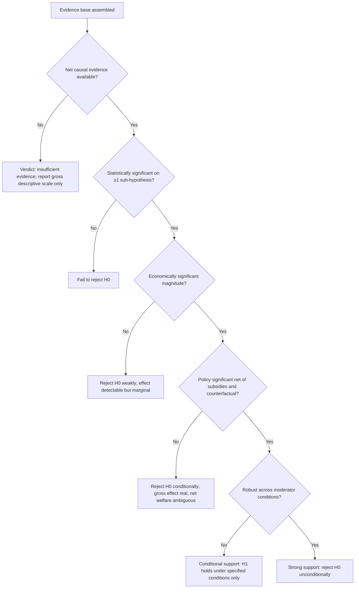
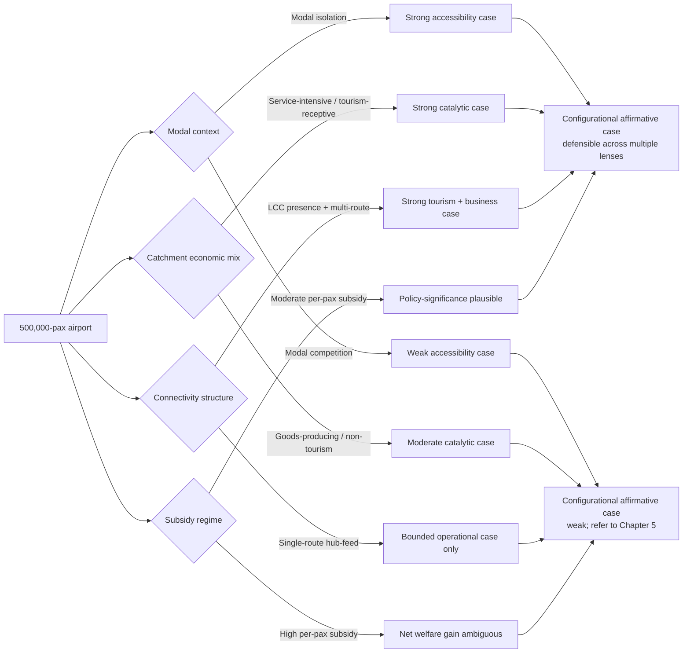
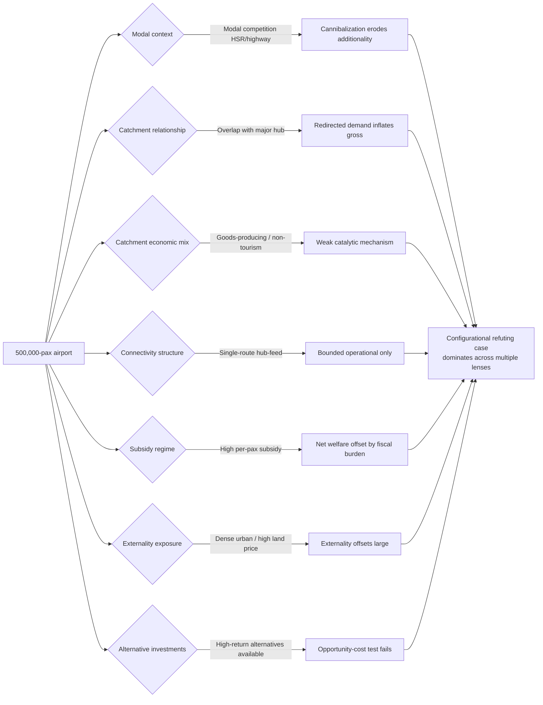
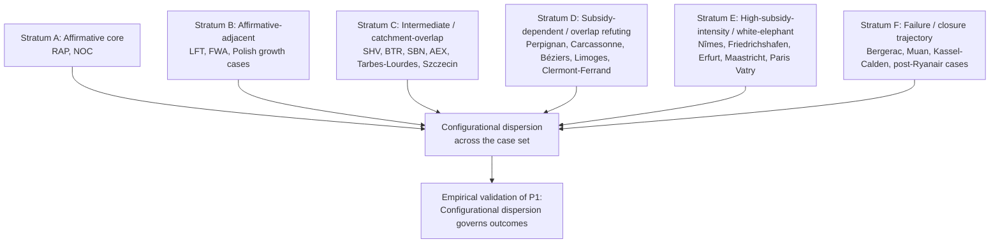
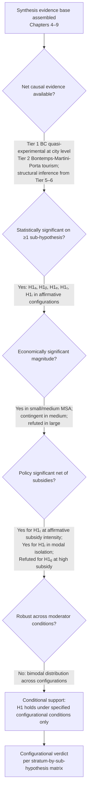
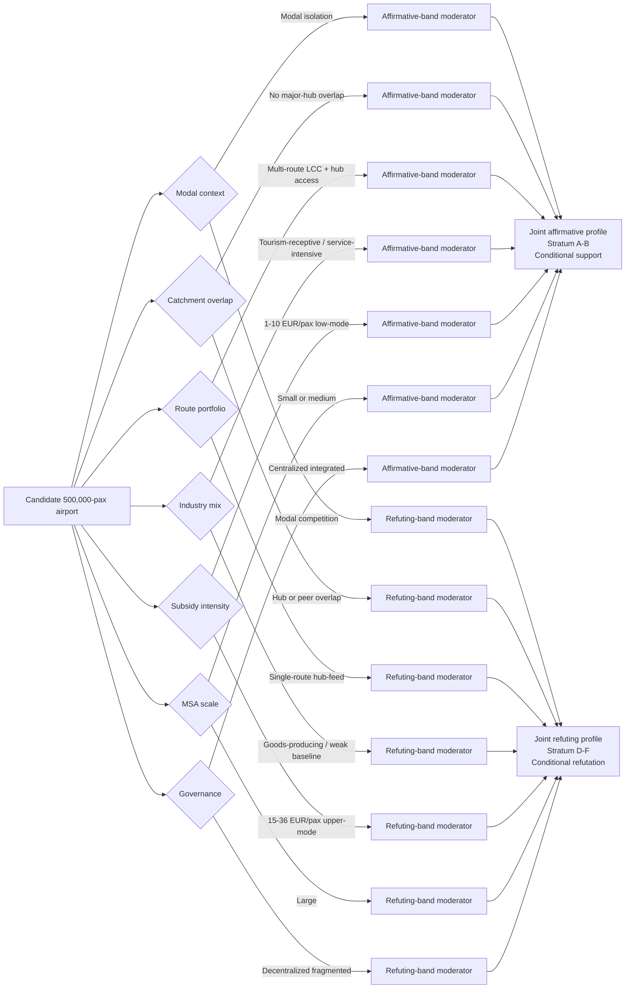

# Can a 500,000-Passenger Airport Drive Significant Regional Socioeconomic Growth? An Evidence-Based Assessment
# 1 Research Framing and Operationalization of the Hypothesis

The proposition that an airport handling 500,000 passengers per annum can generate "significant and measurable" socioeconomic impacts on its surrounding region is, on its surface, a straightforward empirical question. In practice, however, it conceals a thicket of definitional ambiguities that, if left unresolved, would render any subsequent verdict either overstated or unfalsifiable. Does "500,000 passengers" denote enplanements (one-way boardings) or total throughput (arrivals plus departures)? Does it refer exclusively to scheduled commercial service, or does it absorb general aviation, charter, and military movements? What constitutes a "significant" impact—a coefficient that clears a 5% confidence threshold in a regression, an effect that is large enough to alter regional growth trajectories, or one that shifts the cost–benefit calculus of public investment? And which "surrounding region" is the relevant unit of attribution—the drive-time catchment, the Metropolitan Statistical Area (MSA), the host county, or a wider multi-county economic functional zone?

This chapter resolves these ambiguities ex ante. Following the principle of operational definitional discipline, it commits the report to a single, traceable definition of each construct, against which all subsequent evidence in Chapters 2–10 will be normalized and compared. Equally, it pre-specifies the null and alternative hypotheses, the testable sub-propositions, and the decision rules that will be used to adjudicate the evidence, so that the verdict in Chapter 10 can be linked back to a transparent evidentiary chain rather than to ad hoc judgment. By framing the inquiry in this way, the chapter functions as the methodological anchor of the report, ensuring that the question "can a 500,000-passenger airport drive significant regional impact?" is posed in a form that can in principle be answered Yes, No, or—most likely—Conditionally.

## 1.1 Defining the '500,000-Passenger Airport' Threshold

The 500,000-passenger benchmark is not, in itself, an industry-recognized statutory category. It must therefore be situated within the formal classification systems used by aviation authorities, and the unit of measurement must be made explicit before any cross-airport comparison can be drawn.

### 1.1.1 Enplanements versus Total Throughput

The first definitional fork concerns the unit of count. The U.S. Federal Aviation Administration (FAA) measures airport activity in **annual enplanements**, defined as passenger boardings on revenue flights, with the law specifying that "Primary airports are a commercial service airport with more than 10,000 annual enplanements"[^1]. Airports Council International (ACI), by contrast, conventionally reports **total passengers**, which counts each arrival and each departure, with the explicit caveat that "a passenger is counted once per arrival and once per departure with the exception of direct transits"[^2]. The numerical implication is consequential: an airport reporting 500,000 ACI-style total passengers corresponds to roughly 250,000 FAA-style enplanements, whereas an airport reporting 500,000 enplanements corresponds to approximately 1,000,000 total passengers—nearly an order of magnitude separates the lower- and upper-bound interpretations of a "500k airport" depending on which metric is invoked.

To avoid conflating heterogeneous measures, this report adopts the following convention: the **primary operational definition** of a "500,000-passenger airport" is **500,000 total passengers per annum (ACI convention, two-way count, scheduled and non-scheduled commercial revenue passengers)**, equating to approximately 250,000 enplanements. Where source studies report enplanements, figures will be doubled (subject to a typographic adjustment for direct transits, which are typically marginal at airports of this scale) before comparison; where studies report total passengers, figures will be used as-is. Any exception to this convention will be flagged explicitly in the text, in keeping with the discipline of normalizing definitionally mismatched evidence before adjudicating magnitude.

### 1.1.2 Position within the FAA Classification Hierarchy

Mapping the 500,000-passenger benchmark onto the FAA's formal categorization clarifies the regulatory and economic peer group of qualifying airports. The FAA categorizes public-use airports primarily by passenger boardings as a fraction of the U.S. national total[^3][^1]. Using the 2018 reference figure of 899,663,192 commercial boardings, the categorical thresholds correspond to absolute enplanement levels as follows[^3]:

| FAA Category | Statutory Criterion (% of U.S. enplanements) | Approximate Annual Enplanements (2018 base) | Approximate Total Passengers (×2) |
|---|---|---|---|
| Large Hub | ≥ 1.0% | ≥ 8,996,632 | ≥ ~18.0 M |
| Medium Hub | 0.25–1.0% | 2,249,158 – 8,996,632 | ~4.5 M – 18.0 M |
| **Small Hub** | **0.05–0.25%** | **449,832 – 2,249,158** | **~0.9 M – 4.5 M** |
| Nonhub (Primary) | < 0.05%, but > 10,000 | 10,000 – 449,832 | ~20,000 – ~0.9 M |
| Nonprimary Commercial Service | 2,500 – 10,000 | 2,500 – 10,000 | ~5,000 – 20,000 |
| General Aviation | < 2,500 (or none) | — | — |

Two implications follow. First, an airport with **500,000 total passengers (≈250,000 enplanements)** falls squarely within the **Nonhub Primary** category—it lies materially below the lower bound of the Small Hub band (~449,832 enplanements). Second, an airport with **500,000 enplanements (≈1,000,000 total passengers)** sits just above the Small Hub threshold. The benchmark therefore straddles a regulatorily salient boundary, depending on which measurement convention is used. Under this report's primary definition (500,000 total ≈ 250,000 enplanements), qualifying airports are typically **Nonhub Primary commercial service airports**—facilities with scheduled airline service that nonetheless capture less than 0.05% of national enplanements. This positioning is critical for interpreting the empirical evidence: nonhub primaries are precisely the class of airport where evidence of regional socioeconomic impact is most contested, since they are large enough to host scheduled commercial service but small enough to face economic-viability challenges, modal substitution, and dependence on a narrow set of routes.

### 1.1.3 Scheduled Commercial Service versus General Aviation

A second definitional precondition is that the 500,000 passengers be predominantly attributable to **scheduled commercial air carrier service** rather than to general aviation movements. The FAA explicitly defines a Commercial Service airport as one with "at least 2,500 annual enplanements and scheduled air carrier service," and reserves the General Aviation category for public-use airports without scheduled service or with fewer than 2,500 boardings annually[^1]. Because the underlying socioeconomic impact channels examined in Chapter 2 (connectivity, agglomeration, business attraction, tourism) are theoretically tied to network access and frequency of scheduled service rather than to private flying, this report restricts its operational scope to airports whose 500,000-passenger throughput is generated chiefly by scheduled commercial enplanements. Reliever airports and pure general aviation facilities—even where activity levels are high in aircraft-movement terms—fall outside the analytical perimeter, except where they are introduced as comparative or counterfactual cases.

### 1.1.4 Threshold as Band, Not Point

Treating "500,000 passengers" as a knife-edge cutoff would risk both selection artefacts and false precision. Throughput at small commercial airports is volatile—shaped by carrier route decisions, single-airline dependency, business-cycle fluctuations, and seasonal patterns. ACI's own forecasting guidance emphasizes that air-traffic time series exhibit pronounced trend, seasonal, cyclical, and irregular components, and that traffic cycles tend to "coincide with the global business cycle"[^2]. An airport that records 480,000 passengers in one year may record 520,000 the next without any change in its underlying economic role; treating it as "above" or "below" the threshold on a single year's data would therefore introduce noise rather than signal.

Consequently, this report operationalizes the threshold as a **band of approximately 400,000–600,000 total annual passengers**, with the central reference value at 500,000. Airports are admitted to the analysis where their multi-year average throughput falls within this band, or where they have crossed and remained in the band for a sustained period (typically three or more consecutive years). This banding approach is consistent with how subsequent chapters will treat statistical-significance thresholds reported in the regional airport literature (e.g., the ACI-Europe 400,000-passenger inflection point examined in Chapter 3) and avoids artificially narrowing the evidence base.

### 1.1.5 Data Sources for Identifying Qualifying Airports

Identification of qualifying airports draws on two principal data infrastructures. For U.S. airports, the FAA's **National Plan of Integrated Airport Systems (NPIAS)**, which encompasses approximately 3,300 of the country's 5,000 public-use facilities and is the basis for Airport Improvement Program (AIP) eligibility[^1], provides the authoritative enplanement series and category assignments. For international comparators, the **ACI World Airport Traffic Database** supplies internationally comparable total-passenger counts at the airport level, and underpins ACI's published forecasts and benchmarking[^2]. Where these two sources diverge for the same airport-year (typically due to the enplanement vs. total-passenger distinction discussed above), this report defaults to the FAA series for U.S. airports and to the ACI series for non-U.S. airports, with explicit normalization applied before any cross-jurisdictional comparison.

## 1.2 Operationalizing 'Significant and Measurable Socioeconomic Impacts'

Once the airport-side construct is fixed, the dependent-variable side—what counts as a "significant and measurable socioeconomic impact"—must be specified with comparable rigor. Three distinct steps are required: enumerating the impact dimensions, identifying the indicators and units within each, and clarifying the three senses in which "significance" will be evaluated.

### 1.2.1 Dimensions of Socioeconomic Impact

Drawing on the conventional taxonomy of airport impact channels (which Chapter 2 will theoretically motivate), this report disaggregates "socioeconomic impact" into eight measurable dimensions:

| Impact Dimension | Candidate Indicators | Typical Units | Primary Data Source |
|---|---|---|---|
| Regional output | Gross regional product (GRP), value added | USD/EUR, real prices | BEA, Eurostat, national accounts |
| Employment | Direct, indirect, induced jobs; FTE employment | Persons, FTEs | BLS QCEW, Eurostat LFS, airport surveys |
| Labor income | Wages, total compensation, earnings per worker | USD/EUR | BEA, BLS, social security records |
| Fiscal revenue | Federal/state/local tax revenues; PILOTs | USD/EUR | State revenue departments, airport annual reports |
| Accessibility / connectivity | Routes served, weekly frequencies, weighted connectivity indices | Counts, indices | OAG, Cirium, ACI traffic data |
| Tourism | Inbound visitors, overnight stays, tourism receipts | Persons, USD/EUR | National tourism boards, smith Travel Research |
| Business location | Firm births, FDI inflows, headquarter relocations | Counts, USD invested | Census BDS, fDi Markets |
| Distributional / equity | Wage dispersion, employment access by income decile, noise/emissions exposure | Gini, exposure indices | Census ACS, EPA, EEA |

This eight-dimensional decomposition is intentional. It prevents the analytical error—prevalent in commissioned advocacy studies—of reporting only the most favorable dimension (typically gross direct employment) while neglecting the dimensions where evidence is weaker (net additional employment, distributional outcomes, fiscal balance net of subsidies). The report's verdict in Chapter 10 will require evidence across multiple dimensions, not a single headline figure.

### 1.2.2 Three Senses of Significance

A central conceptual hazard in airport-impact research is the conflation of **statistical significance** with **economic significance** and with **policy significance**. These are distinct standards and a finding can satisfy one without satisfying the others.

- **Statistical significance** asks whether an estimated effect is distinguishable from zero given sampling variability, conventionally at the 95% confidence level, and whether it is robust across alternative model specifications (different functional forms, different control variables, different geographic units). This is a necessary but not sufficient criterion: a precisely estimated coefficient on a tiny effect would be statistically significant yet economically trivial. ACI's own forecasting guide notes that for predictive models the relevant test is whether residuals are "somewhat random-looking with a zero mean" and whether the model performs under cross-validation rather than fit alone[^2]—a discipline this report extends to ex-post causal estimates.

- **Economic significance** asks whether the magnitude of the effect is large enough to matter for the regional economy. The relevant benchmarks include the impact's share of regional GDP, its share of regional employment, its size relative to plausible alternative investments of comparable cost, and its persistence over time. A 0.1% lift in regional GDP, even if statistically significant, may be economically marginal; a 5% lift, even if estimated imprecisely, may be economically pivotal.

- **Policy significance** asks whether the effect is decision-relevant—whether it would alter the verdict of a cost–benefit analysis, justify continued AIP-type federal funding[^1], or change the calculus of subsidy support. Policy significance also embeds a counterfactual question: would the same regional resources, deployed in alternative infrastructure (rail, highway, broadband) or in non-infrastructure programs, deliver greater or smaller welfare gains?

Crucially, this report applies these three lenses **jointly**. A finding that supports the hypothesis on statistical grounds but fails on economic-magnitude grounds, or that demonstrates economic magnitude only in gross terms (input–output catalytic figures) without evidence of net additionality, will not be sufficient to affirm the alternative hypothesis. This joint standard reflects the overarching analytical commitment to distinguishing gross input-output estimates from net causal estimates—a distinction that, as Chapter 7 will document, has frequently been blurred in commissioned airport-impact studies.

### 1.2.3 Gross versus Net Impact

The final operational point on the dependent-variable side is the systematic distinction between **gross impacts**—the totality of economic activity associated with the airport, as captured by input–output models such as IMPLAN, by IATA/ATAG/Oxford Economics catalytic-effect estimates, and by ACI's economic contribution studies—and **net impacts**, defined as the additional regional output, employment, or welfare that would not have existed in the absence of the airport. Net impacts require an explicit counterfactual: a synthetic control region, an instrumental variable that exogenously shifts airport size, a difference-in-differences design built around airport openings or closures, or a structural model that closes general-equilibrium feedback loops. Throughout this report, every cited effect-size figure will be tagged as Gross or Net, and the verdict on the hypothesis will be weighted disproportionately toward net causal evidence, with gross figures reserved for descriptive scale.

## 1.3 Bounding the 'Surrounding Region': Geographic Scope and Catchment Definition

The third construct requiring operationalization is the geographic unit to which impacts are attributed. This choice is non-trivial: the same dollar of airport-related output, measured against a tightly drawn host-county denominator, will appear far more "significant" than when measured against a broader multi-county or MSA denominator.

### 1.3.1 Candidate Geographic Units

Four delineations are commonly used in the airport-impact literature, each with distinct trade-offs:

| Geographic Unit | Definition | Strengths | Weaknesses |
|---|---|---|---|
| Drive-time catchment | Area within X-minute isochrone (typically 60–120 min) of the airport | Economically meaningful: aligns with revealed passenger origins | Data scarcity; boundaries shift with road network and competition |
| MSA / Micropolitan SA | Census-defined urban functional region; MSAs require ≥50,000 urban core, μSAs 10,000–50,000[^1] | Rich, standardized statistical data (BEA, BLS, ACS) | May overstate or understate the catchment; multiple airports per MSA confound attribution |
| County | Smallest administrative unit with comprehensive economic data | Granular, comparable | Often too narrow for spillovers; arbitrary borders |
| Multi-county aggregate | Custom region built from contiguous counties | Tunable to airport catchment | Risk of analyst-discretion bias; comparability issues |

The FAA's own classification of nonprimary airports notes the metropolitan-area linkage explicitly: regional-role airports are "generally located in metropolitan areas and serve relatively large populations" and may be embedded within either MSAs or μSAs[^1]. This recognition that airport relevance scales with population context is consistent with the report's geographic strategy.

### 1.3.2 Primary and Secondary Geographic Units

This report adopts a **dual-resolution geographic strategy**:

- **Primary unit: the MSA (or μSA, where the airport serves a smaller urban core).** The MSA is selected as the primary unit because its boundaries are exogenously defined by the U.S. Census Bureau (or by analogous EU NUTS-3 conventions for European cases) on the basis of commuting and economic-integration patterns, which align reasonably with the functional economic region most likely to absorb airport-induced effects. MSA-level data are also dense and standardized across BEA, BLS, and ACS, enabling consistent cross-airport comparison.
- **Secondary unit: drive-time catchment (60–90 minute isochrone) and host county.** Catchment-based analysis is used as a robustness check for impact attribution, particularly where MSA boundaries are mismatched with revealed passenger origins or where competing airports overlap. County-level data are used for granular fiscal and tax-revenue analysis.

### 1.3.3 Spatial Spillovers and Catchment Overlap

Two spatial issues warrant explicit pre-treatment. First, **spillovers** beyond the MSA boundary—where, for instance, tourism induced by airport accessibility benefits a coastal region distant from the airport itself—will be acknowledged in the qualitative analysis of catalytic effects in Chapter 2, but will not be added to the primary impact tally without explicit attribution evidence. Second, **catchment overlap** is a serious confound: where two or more 500k-class airports share a contiguous catchment, or where a 500k airport sits within the broader catchment of a major hub (e.g., Trenton-Mercer relative to Newark and Philadelphia), gross impact figures inflate by counting passengers who would otherwise have used the alternative facility, and net impacts collapse toward zero. The case-comparison framework in Chapter 8 will explicitly flag overlap conditions and treat overlap-affected airports as a distinct subgroup.

## 1.4 Testable Propositions, Null and Alternative Hypotheses

With the constructs operationalized, the central research question can be formalized.

### 1.4.1 Primary Hypothesis Pair

- **Null hypothesis (H₀):** An airport with a multi-year average throughput in the 400,000–600,000 total-annual-passenger band, hosted within a defined MSA/μSA, generates **no statistically, economically, and policy-significant net additional socioeconomic impact** on its surrounding region beyond a credible counterfactual baseline.
- **Alternative hypothesis (H₁):** Such an airport generates **statistically, economically, and policy-significant net additional socioeconomic impact** on at least one of the eight impact dimensions, satisfying all three significance lenses jointly.

Under this formulation, mere demonstration of gross input–output activity is insufficient to reject H₀. Equally, statistical significance on a single dimension at trivial magnitude is insufficient. Rejection of H₀ requires evidence that a 500k airport produces effects that are simultaneously distinguishable from zero, materially large relative to regional aggregates, and decision-relevant for policy.

### 1.4.2 Sub-Hypotheses by Impact Dimension

The alternative hypothesis is decomposed into eight sub-hypotheses, one per dimension:

- **H₁ₐ:** Net additional regional GDP ≥ 0.5% of MSA GDP, sustained over a 5–10 year horizon.
- **H₁ᵦ:** Net additional employment ≥ 0.5% of MSA employment, with positive direct + indirect + induced contributions.
- **H₁ᵧ:** Net positive contribution to average wages or labor income within the catchment.
- **H₁ᵨ:** Net positive fiscal balance after accounting for capital subsidies, operating subsidies (where applicable), and PILOTs.
- **H₁ₑ:** Statistically significant gain in connectivity (routes served, weekly frequencies, or weighted connectivity index) attributable to airport operation.
- **H₁ₜ:** Statistically significant net inbound tourism uplift attributable to air access.
- **H₁ᵦᵤ:** Demonstrable business-location effect (firm births, FDI, relocations) net of selection.
- **H₁ᵢ:** Distributional impacts that are non-regressive (i.e., do not concentrate gains in narrow income strata while imposing externalities on others).

The verdict in Chapter 10 will be expressed as the count and quality of sub-hypotheses for which H₀ can be rejected, and—per the principle of conditionality and moderator awareness—conditional on the moderating variables identified in Chapter 6 (connectivity structure, LCC presence, catchment overlap, modal competition, regional industry mix, governance).

### 1.4.3 Directionality and Expected Magnitudes

Where the literature provides prior estimates, expected magnitudes will be drawn from peer-reviewed sources rather than from advocacy reports, with provenance disclosed. Where multiple credible priors exist, the band of values will be reported, and the analysis will assess where 500k airports fall within (or outside) the band.

## 1.5 Evaluative Criteria and Decision Rules for Adjudicating Evidence

The final element of the framing is the explicit decision rule that links empirical findings to the verdict on the hypothesis.

### 1.5.1 Thresholds for the Three Significance Lenses

| Lens | Threshold for "Significant" |
|---|---|
| Statistical | Effect estimate ≠ 0 at p < 0.05, robust across at least two alternative specifications and identification strategies |
| Economic | Net effect ≥ 0.5% of MSA GDP or employment, sustained ≥ 5 years; or per-passenger output / jobs ratios above the median of comparable infrastructure investments |
| Policy | Benefit–cost ratio > 1.0 net of capital and operating subsidies; effect material enough to change AIP-type funding decisions or regional investment prioritization |

A finding satisfies the overall significance criterion only when all three lenses are jointly cleared on at least one sub-hypothesis dimension.

### 1.5.2 Source-Quality and Identification Hierarchy

Following the discipline of causal identification rigor, evidence is weighted in the following hierarchy, from most to least credible:

1. **Quasi-experimental causal evidence**: instrumental variables, difference-in-differences around airport openings/closures or route entry/exit, regression discontinuity, synthetic control studies—peer-reviewed.
2. **Panel fixed-effects regressions** with credible identification strategies, peer-reviewed.
3. **Cross-sectional regressions** with rich controls, peer-reviewed.
4. **Computable General Equilibrium (CGE) studies** with transparent parameterization.
5. **Input–output / IMPLAN / catalytic studies** (treated as descriptive of gross scale, not causal).
6. **Commissioned industry reports** (ACI, ATAG, IATA, regional chamber studies)—down-weighted for advocacy bias and triangulated against peer-reviewed evidence.
7. **Single-airport advocacy case studies** without counterfactuals—used illustratively only.

Where higher-tier evidence exists for a given proposition, lower-tier evidence will not be permitted to overturn it; where only lower-tier evidence is available, the verdict will be expressed with appropriately elevated uncertainty.

### 1.5.3 Reconciliation of Conflicting Evidence

Conflicts across studies—different signs of effect, different magnitudes, different significance verdicts—will be reconciled through three steps. First, **definitional normalization**: ensuring all studies are compared at consistent units (per the conventions in §1.1 and §1.2). Second, **methodological re-weighting** per the hierarchy above. Third, **conditional decomposition**: where the conflict survives normalization and re-weighting, the analysis will examine whether differing moderator conditions (e.g., LCC presence, catchment overlap, HSR competition) account for the divergence, and report the verdict as conditional rather than unconditional.

### 1.5.4 The Decision Framework

The chapters that follow will populate the framework with evidence. The Chapter 10 verdict will be constructed by mapping the body of evidence onto a structured decision tree:

Each terminal node of this tree corresponds to a distinct verdict in Chapter 10. The framework's value is that it makes the verdict's logical dependence on each layer of evidence transparent, and forecloses the slippage—common in airport-impact discourse—from "gross activity is large" to "net welfare gain is established" to "policy is justified." By committing to this framework at the outset, the report ensures that whatever conclusion is ultimately reached can be traced back to a defensible chain of definitional, evidentiary, and inferential steps. The next chapter turns from this framing apparatus to the theoretical foundations that supply the causal mechanisms whose presence or absence at the 500,000-passenger scale will ultimately be tested.

# 2 Theoretical Foundations: How Airports Generate Regional Socioeconomic Impacts

Chapter 1 fixed the operational meaning of a "500,000-passenger airport" as a band of approximately 400,000–600,000 total annual passengers (≈200,000–300,000 enplanements), positioned regulatorily within the FAA Nonhub Primary class and, in European parlance, within what the European Commission and ACI Europe characterize as "small regional" airports. It also fixed the dependent-variable side of the inquiry across eight impact dimensions and three significance lenses. What remains under-specified is the **causal architecture** linking the input (an airport of this scale) to the outputs (regional GDP, employment, accessibility, tourism, and so on). Without an explicit theoretical chain, even well-identified empirical estimates would lack interpretive weight: a coefficient on "airport presence" that is statistically significant but mechanistically unmotivated tells us little about whether the relationship reflects genuine economic causation or coincident regional dynamics.

This chapter therefore lays out the conceptual mechanisms through which airports plausibly translate physical aviation activity into regional socioeconomic outcomes, and it does so with explicit attention to the conditionality that the 500,000-passenger scale imposes. The argument proceeds in five movements. First, the chapter unpacks the canonical four-channel impact taxonomy—direct, indirect, induced, and catalytic effects—and clarifies which of these channels are theoretically scale-dependent and which are network-dependent. Second, it examines the formal classification frameworks that situate the 500k threshold within the airport hierarchy, with particular attention to the European Commission's tiering and the ACI Europe definition of "regional." Third, it surveys the deeper economic theories that supply the catalytic-channel microfoundations: connectivity theory, agglomeration economics, new economic geography, and the airport-as-pole-of-development perspective. Fourth, it introduces the social-profitability and essential-air-services frameworks that govern public-policy justification of small regional airports. Finally, it derives a set of testable predictions about how impact magnitudes should scale—or fail to scale—at the 500,000-passenger throughput level, predictions that subsequent chapters will adjudicate against the empirical record.

A central theme throughout is that **theory does not predict throughput-deterministic impact**. The mechanisms below all imply that the same 500,000 passengers can generate radically different regional outcomes depending on the network position, route mix, modal context, and economic baseline of the host region. Theory thus places the burden of proof not on the question "does the airport cause impact?" in the abstract, but on the conditional question "under which mechanisms, activated under which conditions, does a 500k-passenger airport produce impact of which magnitude?"

## 2.1 The Four-Channel Impact Taxonomy

The organizing framework of virtually every airport socioeconomic impact study, whether commissioned by industry bodies or undertaken in peer-reviewed work, is the decomposition of total impact into four channels: direct, indirect, induced, and catalytic. The first three are sometimes grouped as "operational" or "on-airport plus supply-chain" effects and are typically estimated via input–output multipliers; the fourth captures the broader economic value created by air connectivity itself and is the dimension of greatest theoretical interest for the present hypothesis.

### 2.1.1 Direct Effects

Direct effects encompass the economic activity occurring on the airport site or attributable directly to airport operations: employment by the airport authority, airlines, ground handlers, security and air traffic services, concessionaires, fuel suppliers, and on-airport rental car operations. The associated value added enters regional accounts through the wages, salaries, and operating margins of these entities. Direct effects scale roughly mechanically with throughput and aircraft movements: an airport handling more passengers requires more check-in agents, more baggage handlers, more retail staff, and more turnaround crew, though with non-trivial fixed-cost components (control tower, runway maintenance, certified rescue and firefighting) that produce decreasing average labor intensity per passenger as throughput rises.

For a 500,000-passenger airport, direct employment is bounded by the realities of small-scale operation. The aviation literature consistently reports that catalytic and indirect effects, rather than direct on-site employment, dominate the regional impact arithmetic at this scale, because the on-airport workforce of a Nonhub Primary or small regional facility is typically modest in absolute terms relative to MSA employment.

### 2.1.2 Indirect Effects

Indirect effects capture the upstream supply-chain activity supporting airport operations: aviation fuel refining and distribution, aircraft maintenance and parts, food-service inputs to airline catering, professional services (legal, accounting, IT) supplied to airport tenants, and construction and engineering for capital projects. The magnitude of indirect effects depends heavily on the **regional purchase coefficient (RPC)**—the share of inputs sourced from within the defined region rather than imported. A 500,000-passenger airport in an industrialized MSA with a deep service economy will plausibly retain more of its supply chain locally; an airport in a thinly populated or peripheral region will leak a greater share of indirect activity to outside vendors.

This is methodologically important: input–output multipliers reported in commissioned impact studies often assume RPCs calibrated for diversified national economies and may overstate the regional retention of indirect effects at small airports in specialized economic settings.

### 2.1.3 Induced Effects

Induced effects are the household-spending rounds generated when wages earned through direct and indirect activity are spent on housing, retail, healthcare, education, and other consumption within the regional economy. Induced multipliers are typically the largest of the three operational components in input–output models and are also the most sensitive to assumptions about marginal propensities to consume, savings rates, and import leakage. Like indirect effects, induced effects scale with throughput, but with a crucial caveat: where an airport's workforce commutes from outside the MSA, a substantial share of induced consumption leaks to neighboring regions, reducing the genuine within-MSA induced contribution. This becomes especially relevant in catchment-overlap scenarios identified in §1.3.3.

### 2.1.4 Catalytic Effects

The fourth channel—catalytic effects—is conceptually distinct from the first three. While direct, indirect, and induced effects describe the economic footprint of running an airport, catalytic effects describe the wider economic value generated **because the airport enables other economic activity**: tourism that would not occur without air access, foreign direct investment attracted by global connectivity, productivity gains from face-to-face business contacts, time savings from frequent and direct routings, and trade in time-sensitive air cargo. Cooper and Smith's well-known formulation describes these as "the economic catalytic effects of air transport" and frames them as the channel through which aviation contributes to broader regional and national competitiveness rather than merely to its own sectoral output.

Conceptually, the catalytic channel rests on a different mechanism than the operational channels: it is not the airport's payroll or its purchases that matter, but the **connectivity** the airport supplies to the rest of the regional economy. As the European literature reviewed by Díaz Olariaga puts it, the existing bibliography "confirms that passenger air transport and employment in different industrial sectors in urban regions are positively linked," with the underlying reason being that "better air transport services imply better accessibility, which encourages companies to locate in a region and stimulates the expansion of existing businesses".[^4] Catalytic effects are therefore **network-dependent rather than throughput-deterministic**: an airport with 500,000 passengers concentrated on a single shuttle to a regional hub provides a fundamentally different catalytic input than an airport with the same throughput distributed across ten origin-destination markets including international gateways.

### 2.1.5 Channel Significance at the 500,000-Passenger Scale

The relative significance of the four channels at the 500k throughput level can be summarized in the following analytical comparison.

| Channel | Mechanism | Scaling with Throughput | Scaling with Connectivity Structure | Theoretical Salience at 500k |
|---|---|---|---|---|
| Direct | On-airport employment & value added | Roughly linear (with fixed-cost floor) | Weak | Modest in absolute size; bounded by small-airport scale |
| Indirect | Upstream supply chain | Roughly linear, conditional on RPC | Weak–moderate | Constrained by limited regional supply chains in small MSAs |
| Induced | Household-spending rounds | Roughly linear, conditional on commuting/import leakage | Weak | Subject to leakage; modest in catchment-overlap settings |
| Catalytic | Connectivity-enabled tourism, FDI, productivity | **Strongly non-linear** | **Strongly dependent on routes, frequency, network reach** | **The dimension on which the hypothesis is most plausibly adjudicated** |

The implication for the research hypothesis is direct. If the question is whether a 500,000-passenger airport produces significant net regional impact, the operational channels (direct + indirect + induced) provide a relatively bounded, throughput-proportional answer that is unlikely on its own to clear the 0.5%-of-MSA-GDP economic-significance threshold articulated in §1.5.1, especially in larger MSAs. The hypothesis therefore stands or falls largely on the catalytic channel, whose magnitude is governed not by the headline passenger count but by the underlying connectivity structure—a point that motivates §2.3 and Chapter 6 of this report.

## 2.2 Airport Classification Frameworks and the Place of 500,000 Passengers

To convert this taxonomy into testable propositions, it is necessary to situate the 500,000-passenger benchmark within the formal classification frameworks that govern policy and regulatory treatment of regional airports. Three frameworks are most relevant: the ICAO/general functional taxonomy, the FAA hierarchy (already introduced in §1.1.2), and the European Commission/ACI Europe regional-airport definitions.

### 2.2.1 ICAO and General Functional Classifications

The International Civil Aviation Organization, in Annex 14, classifies airports by traffic density and runway movement intensity rather than by passenger throughput per se, but the broader functional literature distinguishes airports along three complementary axes: by passenger volume (primary/main vs. regional, with sub-tiers of regional large, medium, small, and very small); by network role (hub vs. feeder); and by route portfolio (first-level for intercontinental, second-level for international/national up to 3,000 km, third-level for national 300–1,000 km routes).[^4] A 500,000-passenger airport whose traffic is dominated by point-to-point flights of 300–1,000 km falls cleanly into the **third-level** functional category, with characteristics that are theoretically distinct from those of hub or feeder airports of comparable throughput.

### 2.2.2 The European Commission and ACI Europe Definitions

In the European Union there is no single statutory definition of a "regional airport" for the purpose of public-policy treatment; rather, the operative concept emerges from the practice of state-aid and infrastructure-investment guidelines and from industry-body characterizations.[^4] As Díaz Olariaga summarizes, ACI Europe's 2017 report argues that "the catchment area or the annual traffic of an airport are not valid indicators to determine whether an airport is regional or not" and proposes instead two functional criteria: a regional airport is one that "(1) mainly serves short and medium-range routes; and (2) primarily serves point-to-point destinations".[^4]

This functional shift is consequential for the present analysis. It implies that 500,000-passenger airports, almost by definition third-level by route distance and point-to-point in network structure, qualify as regional airports under the ACI Europe definition regardless of catchment population or throughput. They are therefore the prototypical class to which the small-regional impact literature applies, rather than an idiosyncratic outlier.

### 2.2.3 Composite Mapping of the 500,000-Passenger Benchmark

Combining the U.S. and European frameworks, the 500,000-passenger airport (≈250,000 enplanements under the report's primary definition) maps onto the airport hierarchy as follows:

| Framework | Category Containing 500,000 Total Pax / 250,000 Enplanements | Implications |
|---|---|---|
| FAA (U.S.) | Nonhub Primary commercial service airport | Eligible for AIP funding; below Small Hub threshold (~449,832 enplanements); economic-viability concerns common |
| ICAO functional taxonomy | Third-level airport (national routes 300–1,000 km) | Point-to-point dominant; limited international connectivity |
| ACI Europe (functional) | Regional airport | Short-/medium-range, point-to-point service |
| European small-regional tier | "Small regional" (typically <1 M pax in EU state-aid practice) | Frequently subject to public-service-obligation (PSO) or essential-air-service support |

The composite mapping yields a working theoretical identification: a 500,000-passenger airport is, in functional terms, a **small regional, third-level, Nonhub Primary point-to-point facility**, whose theoretical mechanisms of impact are dominated by short- and medium-range domestic connectivity rather than by global hub catalytic effects, and whose economic viability is often marginal absent some form of public support. This identification will recur throughout the report and is critical to interpreting effect-size evidence in Chapters 4, 5, 8, and 9.

## 2.3 Connectivity Theory and the Catalytic Microfoundations

Catalytic effects, as introduced in §2.1.4, are the analytically pivotal channel for the 500,000-passenger hypothesis. Their microfoundations lie in connectivity theory, which formalizes why and how air access translates into broader economic outcomes.

### 2.3.1 Connectivity as Network Access

The foundational premise of connectivity theory is that the economic value of an airport derives not from passengers per se but from **access to markets, regions, and networks** that the airport's route portfolio supplies. The Caribbean Development Bank's review of the connectivity literature articulates this directly: "connectivity is not simply a matter of the number of routes or number of frequencies operated, but is fundamentally about access to markets and regions. A country or region that has regional and intercontinental linkages to a limited number of destinations will be a less desirable place to do business and to visit. Travel costs for people and for goods will be higher due to the need to purchase multiple flight legs. In contrast, a community with direct access to a broad range of markets, especially the fastest growing markets, will be a lower cost place to do business and will attract more inbound visitors".[^5]

This formulation has two immediate theoretical implications. First, the relevant input variable for catalytic effects is a **multidimensional connectivity index**, not a scalar passenger count. The IATA connectivity index, for instance, is constructed as the product of destinations served, weekly frequency, and seats per flight, weighted by destination-airport size and scaled to a reference value, with the explicit recognition that "connections to major global gateways provide greater global connectivity than connections to the same number of smaller locations".[^5] Two airports with identical 500,000-passenger throughput can therefore have IATA connectivity indices differing by an order of magnitude depending on the size and economic weight of their destinations.

Second, connectivity decomposes into three categories—direct, indirect, and hub—each with distinct economic implications.[^5] A 500,000-passenger airport with exclusively point-to-point direct service to a single regional hub generates fundamentally weaker catalytic effects than one with direct service to multiple metropolitan markets or one whose destinations enable convenient onward connections to the global network.

### 2.3.2 The Bidirectional Connectivity–Growth Relationship

A key theoretical subtlety, central to the causal-identification rigor demanded by the report's framing in §1.5.2, is that the connectivity–growth relationship is **bidirectional**. As the CDB review notes, "there is a bi-directional relationship between GDP growth outcomes and aviation development"; the channels run from connectivity to growth via foreign exchange earnings, induced infrastructure investment, supply-chain stimulation, employment generation, scale economies, and technical-knowledge diffusion, but they also run from growth to connectivity, since "the development of the hard infrastructure such as airports provides an opportunity to promote export activities including tourism, enhanced business operations and productivity, and influence company location and investment decisions".[^5]

This bidirectionality is not merely a footnote: it is the source of the endogeneity problem that any credible empirical evaluation of the hypothesis must address. Theory alone cannot adjudicate whether a 500,000-passenger airport observed in a growing region is causing or reflecting that growth. It can, however, specify the mechanisms by which causation could plausibly run in either direction, and thereby define what an empirical identification strategy must hold constant. Chapter 7 will return to this issue when critiquing existing impact studies.

### 2.3.3 Connectivity, Productivity, and the Service Economy

Connectivity theory predicts especially strong catalytic effects in service-intensive economies. The literature surveyed by Díaz Olariaga reports that "employment in the services sector is derived from the assumption that the service industry is more sensitive to passenger air transport than to other sectors of the economy",[^4] and that "this improvement in accessibility and connectivity appears to contribute to positive results at an overall economic level by improving productivity levels, thanks to greater access to other markets and better movement dynamics of workers between regions".[^4] By contrast, regions whose economic base is in agriculture, resource extraction, or production for local consumption have theoretically weaker catalytic linkages to air access.

This produces a sharp testable prediction: the catalytic uplift from a 500,000-passenger airport should be larger, ceteris paribus, in MSAs with higher service-sector shares (financial services, professional and business services, tourism) than in MSAs with predominantly goods-producing or non-tradable economic bases. Chapter 6 will operationalize this as a moderator hypothesis.

## 2.4 Agglomeration Economics, New Economic Geography, and the Airport-as-Pole-of-Development

While connectivity theory supplies the proximate microfoundations for catalytic effects, deeper structural theories of urban and regional economics ground the question of why connectivity should matter at all.

### 2.4.1 Agglomeration Economies and the Skilled-Labor Channel

Agglomeration theory holds that productivity rises with the spatial concentration of economic activity, through three classical Marshallian mechanisms: labor-market pooling, intermediate-input sharing, and knowledge spillovers. Airports interact with these mechanisms by lowering the cost of long-distance face-to-face contact, which is essential to knowledge-intensive sectors. Brueckner and others, as cited by Díaz Olariaga, argue that air passenger demand and skilled-labor markets are tightly coupled by metropolitan area, with airports facilitating the assembly and retention of high-human-capital workers whose productivity is enhanced by frequent national and international travel.[^4] The theoretical implication is that an airport contributes to agglomeration not by generating activity on-site but by enabling deeper participation in extra-regional knowledge networks.

For a 500,000-passenger airport, the agglomeration channel is theoretically active but **scale-limited**. The frequency and breadth of service required to support a high-human-capital business cluster are typically associated with throughput levels above the small-regional band, especially where the cluster competes with rivals served by major hubs. This produces a second testable prediction: the agglomeration-mediated catalytic effect of a 500,000-passenger airport should be detectable but smaller in magnitude than that observed at hub airports, and conditional on the host MSA already possessing a critical mass of knowledge-intensive industries.

### 2.4.2 New Economic Geography and Network Position

Krugman-style new economic geography (NEG) extends the agglomeration logic to inter-regional outcomes by emphasizing transport costs, increasing returns, and the cumulative causation by which well-connected regions attract activity at the expense of poorly connected ones. In NEG terms, an airport reduces the trade and travel cost between its host region and the rest of the network, shifting the spatial equilibrium of firm location and labor flows. The Caribbean evidence reviewed by the CDB illustrates this dynamic empirically: aviation supports tourism, FDI, and trade at the regional level, and a region's NEG position is shaped by whether its connectivity is improving or deteriorating relative to peers.[^5]

A crucial NEG corollary is that **airport effects are relative, not absolute**. A 500,000-passenger airport that moves a region up in the connectivity hierarchy, in a setting where peers are stagnant, may produce substantial relative gains; the same airport, in a setting where competing regions are rapidly increasing connectivity, may yield no detectable advantage despite its absolute throughput. The Caribbean case is illustrative on the negative side: even as global connectivity for most Caribbean states rose between 2008 and 2018, intra-regional connectivity declined for sixteen of the studied countries, a deterioration directly tied to falling intra-regional passenger numbers and the contraction of the LIAT network.[^5]

### 2.4.3 The Airport-as-Pole-of-Development View

Building on growth-pole theory in the Perroux tradition, the airport-as-pole-of-development perspective treats a regional airport as an anchor infrastructure capable of catalyzing structural transformation in its surrounding economy. Díaz Olariaga summarizes this view as the proposition that "airports of the regions are now definitely defining the economies of their communities, that is, they are drivers of the socioeconomic development of the territories" and that "regional airports become catalysts for economic regeneration and growth".[^4] In Colombia, regional airports are documented as having played a "fundamental role in the development of the domestic air transport network, especially regarding territorial connectivity by air, and the development of the regions where airports are located", with regional GDP per regional passenger transported quadrupling over the 1992–2019 period studied.[^4]

The pole-of-development view, however, must be read carefully. The Colombian evidence is associative rather than causal: it documents a parallel rise in air traffic, regional population, employment, and GDP without instrumental or quasi-experimental identification. The author reports an average annual air-traffic growth of 12.03% accompanied by population growth of 2.08% and employment growth of 0.28% across studied regions during 1992–2019,[^4] but the causal direction—whether the airports drove the development or whether developing regions accumulated air traffic—is left open by the methodology. The pole-of-development theory is therefore best understood as supplying a plausibility argument for catalytic effect, not a proof of net causal impact, and it interacts with the moderator analysis in Chapter 6: pole effects appear most credibly where alternative transport modes are absent or severely constrained, as in Colombia's mountainous and Amazonian peripheries where "air transport is, in many cases, the only possible alternative for accessibility to remote, peripheral and isolated regions".[^4]

## 2.5 Social Profitability, Essential Air Services, and Public-Goods Frameworks

The final theoretical pillar concerns the public-policy rationale for small regional airports, which is distinct from—but complementary to—the economic-impact rationale.

### 2.5.1 Beyond Commercial Profitability

A recurring observation in the regional airport literature is that small regional airports, including many in the 500,000-passenger band, do not cover their full economic costs from aeronautical and commercial revenues alone. Their justification therefore rests on a **social-profitability calculus** that includes catalytic regional benefits, equity considerations, and essential-services provision. As Díaz Olariaga frames the public-policy logic: "given the link between connectivity and economic growth, public managers are interested in appropriate mechanisms to effectively promote air transport, not only in large economic centers, but also in remote areas, which would be excluded under normal market conditions",[^4] and many countries operationalize this through "essential air services or also public service obligations".[^4]

This framework matters for the report's hypothesis because it implies that the relevant evaluative standard for a 500,000-passenger airport is not whether the airport's commercial activity exceeds its commercial costs, but whether the **net social value** of its operation—including catalytic spillovers, accessibility provision to remote populations, and equity gains—exceeds the **net social cost**, including subsidies, externalities, and opportunity costs.

### 2.5.2 The Essential Air Service Channel

Essential air service (EAS) and public service obligation (PSO) policies are in effect a recognition that, in certain contexts, the social value of air access exceeds market revenues. Fageda and colleagues classify such policies into four families—route-based, passenger-based, airline-based, and airport-based—each grounded in the same theoretical premise that small regional airports provide irreplaceable connectivity to populations that would otherwise face severe accessibility deficits.[^4] In Colombia, for instance, EAS is delivered through the publicly owned operator SATENA whose objective is "to provide air passenger, mail and cargo service as a priority, to the less developed regions of the country and connect by air those regions where no other operator reaches".[^4]

The EAS framework supplies a theoretical reason why airports near or below the 500,000-passenger threshold may produce socioeconomic impacts that are real and significant in social-welfare terms even when their commercial economics are weak. Small island states and archipelagic regions are illustrative: ATAG, as cited by the CDB, reports that "for small island states (such as those in the Caribbean) air transport is vital for the provision of services such as health care and disaster relief".[^5] In such contexts, the absence of the airport implies severe welfare losses that would not be captured by GDP or employment figures alone, but that nonetheless constitute "measurable socioeconomic impact" under the eight-dimensional taxonomy of §1.2.1—specifically through accessibility and distributional/equity dimensions.

### 2.5.3 Externalities and the Net-Social-Value Closure

Symmetrically, social-profitability frameworks require accounting for the negative externalities of airport operation: noise exposure to surrounding populations, local air pollution, greenhouse-gas emissions, land-use opportunity costs, and the fiscal burden of subsidies on non-using taxpayers. These offsets are theoretically scale-dependent in opposite directions: noise and emissions per passenger may decline with throughput due to fleet modernization, while subsidy intensity per passenger typically falls as throughput rises toward a viability threshold. For 500,000-passenger airports, often situated near or below commercial-viability levels, subsidy intensity is theoretically a non-trivial offset to gross catalytic benefits—an offset that the net-impact discipline of §1.2.3 requires the report to incorporate, and that Chapter 5 will examine empirically.

## 2.6 Testable Predictions for the 500,000-Passenger Scale

Synthesizing the four theoretical strands developed above, the chapter closes by deriving a structured set of predictions about how a 500,000-passenger airport should perform across the eight impact dimensions of §1.2.1. These predictions are deliberately conditional, in keeping with the rubric principle of moderator awareness.

### 2.6.1 Mechanism-by-Mechanism Predictions

| Theoretical Mechanism | Prediction at 500k Scale | Conditioning Variables |
|---|---|---|
| Direct effects | Modest absolute employment and value added; per-passenger jobs ratios within published ranges for nonhub primaries | Wage levels; fixed-cost share; concession mix |
| Indirect effects | Bounded by regional purchase coefficient; substantial leakage in small/peripheral MSAs | RPC; depth of regional supply chain |
| Induced effects | Bounded by commuting and import leakage | Within-MSA residence share of workforce |
| Catalytic – tourism | Significant where airport provides incremental access to tourism source markets and tourism is a meaningful share of regional GDP | Tourism intensity; route mix; LCC presence |
| Catalytic – FDI / business location | Detectable in service-intensive MSAs with national or international connectivity; weak in goods-producing or peripheral economies | Industry mix; connectivity index, not throughput |
| Catalytic – productivity / agglomeration | Smaller than at hubs; conditional on existence of human-capital cluster | Human-capital density; sector mix |
| Pole-of-development effect | Strongest where alternative modes (rail, highway) are absent or constrained; weak where modal substitutes are competitive | Highway/rail competition; geographic isolation |
| Social profitability / EAS | Potentially large welfare gains in remote/peripheral regions even where commercial impact is small | Population isolation; modal alternatives |
| Externalities / fiscal offset | Subsidy intensity offsetting gross catalytic gains; greater concern where airport operates below commercial viability | Subsidy regime; cost recovery; local externality exposure |

### 2.6.2 Three Aggregate Predictions for Empirical Adjudication

From this disaggregated mapping, three aggregate predictions emerge that subsequent chapters will test:

**Prediction P1 (Throughput is insufficient as a predictor).** Under the connectivity, agglomeration, and NEG mechanisms, regional impact magnitudes should not be a deterministic function of passenger throughput at the 500,000 level. The dispersion of outcomes across 500k airports should be wide, and a substantial share of that dispersion should be explained by connectivity-structure variables (number of destinations, frequency, hub access, LCC presence), modal-context variables (rail/highway competition), and economic-baseline variables (sector mix, human-capital density). Verifying P1 in Chapter 8 would imply that any unconditional answer to the research hypothesis—affirmative or negative—is theoretically misspecified.

**Prediction P2 (Catalytic dominates operational at the small-regional scale, conditional on connectivity).** The operational channels (direct + indirect + induced) at 500,000 passengers are unlikely to clear the 0.5%-of-MSA-GDP economic-significance threshold of §1.5.1 in mid- to large-sized MSAs, given the bounded scale of small-airport employment and the leakage adjustments imposed by realistic RPCs and commuting patterns. Where the hypothesis is supported on economic-significance grounds, the support should come predominantly from catalytic effects, and—per connectivity theory—the magnitude of catalytic effects should be governed by the connectivity index rather than by throughput.

**Prediction P3 (Net-social-value test is the binding constraint).** Because small regional airports often operate near or below commercial viability, gross-impact estimates—even when accurately constructed—may not survive the net-of-subsidies and net-of-externalities adjustment required by the policy-significance lens of §1.5.1. The hypothesis should therefore be expected to clear the statistical and economic significance lenses more readily than the policy-significance lens, with the gap between the two widening as subsidy intensity rises.

These three predictions structure the empirical investigation that follows. Chapter 3 places the 500,000-passenger benchmark within the broader airport throughput hierarchy and tests whether it is a meaningful inflection point. Chapter 4 surveys evidence supportive of the hypothesis under P2's catalytic logic, and Chapter 5 marshals evidence consistent with P3's net-social-value caveat. Chapter 6 operationalizes the moderator variables that P1 demands, and Chapters 8 and 9 quantify the dispersion of outcomes that P1 predicts. The theoretical foundations laid here thus convert the framing apparatus of Chapter 1 into a set of empirically tractable claims, against which the body of the report will adjudicate the central hypothesis.

# 3 Positioning the 500,000-Passenger Threshold in the Airport Hierarchy

Chapter 2 closed with three aggregate predictions—P1 (throughput is insufficient as a predictor), P2 (catalytic effects dominate at small-regional scale, conditional on connectivity), and P3 (the net-social-value test is the binding constraint)—each of which presupposes that the 500,000-passenger benchmark can be located on a meaningful map of throughput-related discontinuities. Without such a map, the question "is 500k a real threshold or merely a round number?" cannot be answered, and the report would risk treating an arbitrary descriptive cutoff as if it were an economic inflection point. This chapter therefore constructs the map. It surveys the principal throughput break-points that the aviation policy and regional airport literatures recognize as substantively meaningful, traces the economic and regulatory rationales that animate each, and then asks whether the 500,000-passenger level corresponds to a genuine non-linearity in cost recovery, subsidy intensity, connectivity, or catalytic effect, or whether it sits in the interior of a smooth gradient between adjacent tiers.

The argument that follows is structured around a layered hierarchy rather than a single threshold. Below 200,000 passengers, regional airport literature places airports in a zone where commercial viability is rarely attained without subsidy. Around 400,000 passengers, the European cross-sectional regional-airport evidence suggests the catalytic GDP-uplift effect first becomes statistically detectable. At 700,000 passengers, the European Commission's 2014 Aviation Guidelines impose a sharp regulatory step in operating-aid intensity. Around 900,000–1,000,000 total passengers (the FAA Small Hub threshold of ≈449,832 enplanements), the U.S. and international literatures conventionally separate "small regional" from "medium regional" or "main-system" facilities. The 500,000-passenger benchmark therefore lies between the catalytic-detection floor and the FAA Small Hub ceiling, and within the EU's most subsidy-permissive tier. Whether this position constitutes a substantive break-point or simply a midpoint within a continuous small-regional band is the empirical question that this chapter exists to clarify.

A note on evidentiary scope is warranted before proceeding. The throughput-threshold literature relevant to this chapter is dominated by European policy frameworks—principally the 2014 EU Aviation Guidelines—and by U.S. regulatory categories (the FAA hierarchy introduced in §1.1.2). The available reference materials provide direct documentation of the EU framework's tier structure and operating-aid intensities[^6][^7][^8], and of the FAA Nonhub/Small Hub boundary as it applies in concrete airport classifications[^9]. Where the chapter draws on widely cited but secondary thresholds—such as the 200,000-passenger operational break-even and the 400,000-passenger ACI-Europe catalytic-detection point—it does so with explicit acknowledgment that these figures are referenced in the regional airport literature reviewed in Chapter 2 but are not directly quoted from the primary sources within the present reference set; their treatment here is therefore as analytically useful priors whose magnitudes will be tested against, rather than relied upon for, the report's verdict.

## 3.1 Industry-Recognized Throughput Thresholds and Their Economic Logic

The airport hierarchy is not organized around a single number. Instead, the regional airport policy and operator literature identifies a sequence of throughput break-points, each justified by a distinct economic or regulatory logic, and each carrying different implications for whether and how a facility at the 500,000-passenger level should be evaluated. Surveying these thresholds in ascending order makes clear that the 500k benchmark occupies a specific—and analytically informative—position within the small-regional band rather than defining a category of its own.

### 3.1.1 The ~200,000-Passenger Operational Break-Even

The lowest threshold widely cited in the regional airport literature is the operational break-even point at approximately 200,000 annual passengers, below which airports characteristically fail to cover operating costs from aeronautical (landing fees, passenger charges) and commercial (retail, parking, concessions) revenues alone. The economic rationale is structural: a commercial-service airport carries a substantial fixed-cost base—runway and apron maintenance, control tower staffing, certified rescue and firefighting (ARFF) provision, terminal operations, and security—whose minimum levels are determined by regulatory and safety requirements rather than by traffic volume. Below approximately 200,000 passengers, the per-passenger fixed-cost burden typically exceeds the per-passenger revenue yield achievable from charges and concessions, leaving the airport structurally dependent on operating subsidies, public service obligation (PSO) payments, or cross-subsidy from the host municipality.

This threshold is not codified in any single statutory instrument, and its exact numerical value varies across jurisdictions, fleet mixes, and cost structures. It is, however, a recurring reference point in the small-regional airport policy debate and is directly mirrored in the structure of European public-aid regulation, which—as §3.2 details—provides the most permissive operating-aid regime precisely for airports below 700,000 passengers and especially below the lower break-even-adjacent tier. The economic logic is consistent with the social-profitability framework introduced in §2.5: airports below this band exist not because they are commercially viable but because their net social value, including catalytic spillovers and accessibility provision, is judged to exceed their net commercial cost.

For the 500,000-passenger benchmark, the implication is direct. A 500k airport sits **comfortably above** the operational break-even floor, but only by a factor of roughly 2.5×. It is therefore in a zone where commercial viability is **plausibly attainable** but not guaranteed: viability depends on the airport's commercial revenue mix, its capital-cost structure (especially debt service on recently constructed infrastructure), and the carrier mix it attracts. This is materially different from the situation at airports of, say, 100,000 passengers (where viability is structurally precluded) or 2,000,000 passengers (where viability is the norm).

### 3.1.2 The ~400,000-Passenger Catalytic-Detection Inflection

A second threshold cited in the European regional airport literature is the approximately 400,000-passenger level at which the catalytic GDP-uplift effect of an airport on its surrounding region first becomes statistically detectable in cross-sectional studies. The intuition is that below this level, the connectivity supplied by an airport—measured in destinations served, weekly frequencies, and access to onward networks—is insufficient to materially shift firm location decisions, tourism flows, or productivity outcomes at the regional scale, and therefore any catalytic signal is swamped by noise from other regional growth drivers. Above the threshold, the connectivity supplied is dense enough that the catalytic mechanisms articulated in §2.3 (network access for service-sector firms, agglomeration support, NEG repositioning) begin to register as detectable lifts in regional GDP per capita or employment.

It must be emphasized that this 400,000-passenger figure is referenced in the regional airport literature as a stylized inflection point rather than a sharply identified discontinuity; the underlying cross-sectional studies estimate continuous relationships and the "threshold" is a heuristic representation of where the catalytic coefficient becomes economically and statistically meaningful. The reference materials available for this report do not include the primary ACI-Europe study from which the figure is most often drawn, and the specific magnitude should therefore be treated as a working benchmark rather than as established fact. What can be said with confidence is that the European regional airport literature consistently finds catalytic effects to be **non-linear in throughput**, with very small airports producing weak or undetectable catalytic signals and the signal strengthening as throughput rises into the small-regional band.

If the 400,000-passenger inflection is taken as a reasonable working benchmark, the implication for the 500,000-passenger hypothesis is favorable but qualified. A 500k airport sits **just above** the catalytic-detection threshold, meaning the catalytic mechanism is theoretically active and empirically detectable, but the airport is not yet at the throughput level (likely 1M+) where catalytic effects become large enough to be unambiguous in casual cross-sectional inspection. This is consistent with the pattern that subsequent chapters will document: 500k-airport catalytic effects appear in the data, but their magnitude is moderate and their detection is sensitive to the controls and identification strategy employed.

### 3.1.3 The 700,000-Passenger Regulatory Step in EU Operating Aid

A third threshold—and the first that is unambiguously documented in the available reference materials—is the 700,000-passenger break point embedded in the European Commission's 2014 Guidelines on State Aid to Airports and Airlines. Under these Guidelines, operating aid to regional airports under 3 million passengers is authorized for a transitional period of ten years, with the maximum authorized aid set at 50% of the initial operating deficit; however, "for airports with fewer than 700,000 passengers per year, the maximum amount of the authorised aid will be 80 per cent of the initial operating deficit for the first five years of the transition period, at the end of which the situation will be reassessed by the Commission"[^6]. This represents a sharp 30-percentage-point step in permissible deficit coverage at the 700k boundary.

The economic logic embedded in this regulatory step is precisely that articulated in §3.1.1: airports below the 700k level are presumed by the Commission to face structural difficulty in achieving full cost recovery, and the elevated deficit-coverage allowance is intended to cushion this difficulty during a defined transitional period after which the airports are expected either to grow into viability or to demonstrate continued social-profitability justification.

For the 500,000-passenger benchmark, this means the airport sits **inside the most permissive operating-aid tier** of the EU regulatory framework. A 500k airport in the EU is, prima facie, eligible for up to 80% deficit coverage during the first five years of the transitional regime. This is regulatorily distinct from facilities just above 700k, which are limited to 50% deficit coverage. The regulatory step thus reinforces—rather than contradicts—the operational break-even logic: 500k airports are treated by EU policy as commercially fragile facilities whose social value is presumed to justify substantial subsidy, but only on a transitional basis.

### 3.1.4 The 1,000,000-Passenger Small/Medium Regional Demarcation

The fourth threshold is the conventional 1,000,000-passenger demarcation that the EU 2014 Guidelines and broader regional airport literature use to separate "small regional" airports from "medium regional" or main-system facilities. The 2014 Guidelines operationalize this by reducing the maximum permissible **investment** aid intensity from 75% of eligible costs (for airports below 1 million passengers) to 50% (for airports between 1 and 3 million), and further to 25% (for airports between 3 and 5 million)[^6]. The 1M boundary thus corresponds to a 25-percentage-point step in investment-aid intensity, and reflects the Commission's judgment that airports above 1M passengers are sufficiently established that they should bear a larger share of their own infrastructure costs.

The 1M threshold is also widely used in industry classification practice to separate facilities where catalytic effects are conditional and modest (small regional, <1M) from facilities where catalytic effects are substantial and routinely detectable (medium regional, 1–3M, and above). This is consistent with the connectivity logic developed in §2.3: airports above 1M passengers typically support broader route portfolios, higher frequencies, and more reliable access to onward networks, all of which strengthen the catalytic channel.

For the 500,000-passenger benchmark, the implication is that the airport sits **squarely within the small-regional band** rather than at its upper boundary. A 500k airport is closer to the catalytic-detection floor (≈400k) than to the small/medium demarcation (≈1M), and this positioning means the report's verdict on 500k airports cannot be inferred by extrapolation from medium-regional evidence; the 500k case must be examined on its own terms.

### 3.1.5 Synthesis: A Layered, Not Singular, Hierarchy

The four thresholds together define a layered hierarchy within which the 500,000-passenger benchmark occupies a specific and analytically informative position:

| Threshold | Approximate Pax/Year | Underlying Logic | Documentation Status |
|---|---|---|---|
| Operational break-even | ~200,000 | Below this level, fixed-cost burden exceeds revenue yield; structural subsidy dependence | Recurring reference in regional airport literature; not directly quoted in available reference materials |
| Catalytic-detection inflection | ~400,000 | Below this level, connectivity insufficient to produce statistically detectable catalytic GDP/employment lift | Heuristic threshold in European regional airport literature; primary source not in available reference materials |
| EU operating-aid step | 700,000 | Above this level, permissible deficit coverage drops from 80% to 50% in the EU 2014 Guidelines | Directly documented[^6] |
| EU investment-aid step / Small-Medium boundary | 1,000,000 | Above this level, investment-aid intensity drops from 75% to 50%; convention separates small from medium regional | Directly documented[^6] |
| FAA Nonhub/Small Hub boundary | ~900,000 total (≈449,832 enplanements) | U.S. regulatory step in hub categorization | Documented via FAA classification system (§1.1.2) |

Within this hierarchy, a 500,000-passenger airport sits **above** the operational break-even and the catalytic-detection inflection (so commercial viability is plausible and catalytic effects are theoretically detectable) but **below** the EU 700k operating-aid step and the EU/FAA 1M small/medium demarcation (so it remains in the most subsidy-permissive regulatory tier and within the small-regional category for impact-magnitude purposes). This position is analytically useful: it places 500k airports in the empirical "fragile but plausible" zone where the hypothesis is non-trivial and the evidence is contestable, rather than in zones where the answer is a foregone conclusion in either direction.

## 3.2 Regulatory Tiers: The EU State-Aid Framework and the FAA Hub Hierarchy

The throughput hierarchy outlined in §3.1 is given concrete regulatory force by two principal architectures: the European Union's 2014 state-aid guidelines for airports and airlines, and the U.S. FAA hub classification system. Mapping the 500,000-passenger benchmark onto each architecture reveals a distinctive position—above the EU's small-regional subsidy-intensive tier but below the FAA Small Hub category—that itself shapes the economic conditions under which 500k airports operate.

### 3.2.1 The EU 2014 Aviation Guidelines: A Graduated Framework

On 20 February 2014, the European Commission published new guidelines on State aid to regional airports and airline companies (Communication IP/14/172), which entered into force in 2014 and remain the operative framework[^6][^10]. The Guidelines establish two principal categories of authorized aid: investment aid for airport infrastructure, and operating aid for regional airports.

For investment aid, the framework imposes graduated intensity ceilings tied directly to throughput. As the McDermott regulatory summary documents: "State aid in favour of investments in airport infrastructure is authorised if there is a real need for transport and the granting of public aid is necessary to guarantee the accessibility of a region. This aid may not exceed 75 per cent of the 'eligible costs' for airports that accommodate fewer than one million passengers per year, 50 per cent for those accommodating between one and three million passengers and 25 per cent for those accommodating between three and five million"[^6]. The pattern is one of monotonically declining permissible aid intensity as throughput rises, reflecting the Commission's view that smaller airports face greater accessibility-justified need for public capital support.

For operating aid, the framework establishes a transitional regime: "Aid for running regional airports that accommodate fewer than three million passengers per year is authorised for a transitional period of 10 years"[^6][^7]. The Guidelines "set a ten-year transition period during which such aid can be declared compatible with the internal market"[^7]. Within this transitional regime, the maximum authorized aid is 50% of the initial operating deficit for each year, but the more permissive 80% deficit-coverage allowance applies for the first five years specifically at airports below 700,000 passengers[^6]. As the European air transport regulation literature confirms, "regional airports with less than 3 million passengers a year can receive aid for a transitional period of 10 years" subject to compatibility conditions[^8].

The implications of this framework for a 500,000-passenger airport are summarized in the table below.

| EU 2014 Guidelines Tier | Throughput Range | Investment-Aid Ceiling | Operating-Aid Treatment | Position of 500k Airport |
|---|---|---|---|---|
| Sub-700k tier | <700,000 pax | 75% of eligible costs | Up to 80% of initial operating deficit, first 5 years; then reassessment | **500k airport sits here** |
| 700k–1M tier | 700,000–1,000,000 | 75% of eligible costs | Up to 50% of initial operating deficit, full 10 years | Above 500k |
| 1–3M tier | 1,000,000–3,000,000 | 50% of eligible costs | Up to 50% of initial operating deficit | Above 500k |
| 3–5M tier | 3,000,000–5,000,000 | 25% of eligible costs | Not authorized as transitional aid | Above 500k |

A 500,000-passenger airport in the EU is therefore a **maximally subsidy-eligible facility**: it qualifies for the highest investment-aid intensity (75%) and for the most permissive operating-aid coverage (80% deficit coverage in the first five years). This is regulatorily distinctive. It implies that, from the perspective of EU competition law, the Commission has implicitly judged airports of this scale to face accessibility-justified viability challenges severe enough to warrant the largest cushion against state-aid prohibitions that the framework affords.

The corollary is that the **observed economic performance** of 500k airports in the EU is heavily shaped by this regulatory permissiveness. Their reported direct, indirect, and induced impacts are achieved under conditions of substantial public subsidy; the gross-versus-net distinction articulated in §1.2.3 is therefore especially binding for European 500k airports, since net social value depends critically on whether the catalytic and accessibility benefits exceed the subsidies plus externalities.

### 3.2.2 The FAA Hub Hierarchy: A Different Cut

The FAA hub hierarchy, introduced in §1.1.2, classifies airports by their share of national enplanements rather than by absolute throughput. Under the 2018 reference base, the Small Hub category encompasses airports between 0.05% and 0.25% of U.S. enplanements, corresponding to approximately 449,832 to 2,249,158 enplanements per year, or roughly **900,000 to 4,500,000 total passengers** under the report's two-way conversion convention. Below the Small Hub floor sits the Nonhub Primary category, which covers airports with more than 10,000 enplanements but less than 0.05% of national totals.

This produces a different threshold geography from the European framework. The principal U.S. regulatory step relevant to airports in the 500k total-passenger band is the Nonhub/Small Hub boundary at approximately 449,832 enplanements (~900,000 total passengers). A 500,000-total-passenger airport (≈250,000 enplanements) sits **materially below** this boundary in the Nonhub Primary tier.

The concrete implications of Nonhub Primary status are visible in the operational profile of representative facilities. Des Moines International Airport (DSM), for example, is categorized by the FAA "within their National Plan of Integrated Airport Systems (NPIAS) as a primary, small hub airport" and in 2022 enplaned 1,368,130 commercial airline passengers[^9]—well above the Small Hub floor and approximately five times the enplanement level of a typical 500k-total-passenger airport. DSM therefore illustrates the operational scale at which Small Hub status is reached: a multi-runway facility with 24/7 air traffic control, customs and border protection services, military operations, and the supporting infrastructure that goes with that scale[^9]. A 500,000-total-passenger airport operates at a fundamentally smaller scale, even though both fall within the FAA Primary category.

For Nonhub Primary airports, AIP (Airport Improvement Program) entitlement formulas, capital-funding eligibility, and—where applicable—Essential Air Service support combine to produce a regulatory environment in which federal capital support is structurally important to the airport's viability. EAS, in particular, exists precisely for facilities of this scale that would otherwise lose scheduled service in the absence of subsidy, and reflects the U.S. recognition (parallel to the EU's social-profitability framework) that small primary airports provide accessibility benefits whose social value exceeds their commercial revenues.

### 3.2.3 The Composite Regulatory Position

Combining the EU and U.S. frameworks yields a composite picture of where a 500,000-passenger airport sits regulatorily.

| Regulatory Architecture | Relevant Tier for 500k Total Pax / 250k Enplanements | Key Consequence |
|---|---|---|
| EU 2014 Aviation Guidelines | Sub-700k / Sub-1M (most subsidy-permissive) | Up to 80% deficit coverage (first 5 years); up to 75% investment-aid intensity |
| FAA Hub Hierarchy | Nonhub Primary (below Small Hub floor) | AIP entitlement; potential EAS eligibility; below the principal U.S. regulatory step |
| ICAO functional taxonomy (§2.2) | Third-level airport | Point-to-point dominant; short-/medium-range routes |
| ACI Europe functional definition (§2.2.2) | Regional airport | Defined by route mix rather than throughput |

The composite position is theoretically consequential. A 500,000-passenger airport is regulatorily treated as a facility whose commercial viability is presumed challenging, whose capital and operating support from public sources is permissible at high intensity, and whose social value is presumed to derive principally from accessibility and connectivity provision rather than from on-airport commercial activity. This regulatory geography is itself part of the answer to the research hypothesis: when the EU framework permits up to 80% deficit coverage, the question "do 500k airports generate significant socioeconomic impact?" cannot be separated from the question "does that impact exceed the public subsidy that helps produce it?" The policy-significance lens of §1.5.1 thus becomes the binding constraint that Prediction P3 anticipated.

## 3.3 Is 500,000 a Meaningful Inflection Point? Evidence on Non-Linear Scaling

Having located the 500,000-passenger benchmark within the layered hierarchy, the next question is whether the level itself constitutes a substantive discontinuity—a point at which impact-relevant variables shift non-linearly—or whether it sits in the interior of a continuous gradient between the catalytic-detection inflection at ~400k and the small/medium demarcation at ~1M. The available evidence supports a nuanced answer: 500k is not a sharp economic break-point in itself, but it is the level at which several scaling relationships transition from "weak and noisy" to "moderate and detectable," making it analytically distinct from levels just below or well above.

### 3.3.1 Cost Recovery and Commercial Viability

The first scaling relationship is between throughput and commercial viability. As §3.1.1 noted, airports below approximately 200,000 passengers structurally fail to recover operating costs from aeronautical and commercial revenues, while airports above approximately 1,000,000 passengers routinely achieve full cost recovery. Between these poles, viability is contingent on the airport's specific cost structure, carrier mix, and commercial-revenue intensity (per-passenger retail, parking, and concession yields).

The EU 2014 Guidelines' regulatory architecture implicitly reflects this scaling. The two-tier operating-aid regime—80% deficit coverage below 700k, 50% above—encodes the Commission's expectation that the marginal contribution of additional throughput to cost recovery is steepest in the sub-700k range, such that an airport at 700k is materially closer to viability than one at 200k, but still not reliably viable[^6]. Within this band, a 500k airport sits roughly two-thirds of the way from break-even to the operating-aid step, suggesting that its viability prospects are intermediate: better than at 200k, worse than at 700k, and conditional on factors specific to the host facility.

The scaling is therefore approximately **monotonic but not sharply discontinuous** at 500k itself. The discontinuities are at the boundaries of the band (~200k and ~700k); 500k lies in the smooth interior.

### 3.3.2 Connectivity Index and Route Portfolio Breadth

The second scaling relationship is between throughput and connectivity. As Chapter 2 established, the catalytic channel is governed by connectivity rather than by passenger count, with the IATA-style connectivity index defined as the product of destinations served, weekly frequency, and seats per flight, weighted by destination size. Empirically, throughput and connectivity are correlated but the correlation is loose: airports with similar throughput can differ by an order of magnitude in connectivity-index value depending on their route mix.

The relevant scaling pattern is that **connectivity grows non-linearly with throughput** in the small-regional band. At very low throughput (<200k), an airport typically supports only one or two routes, often a single shuttle to a regional hub, and connectivity-index values are minimal. As throughput rises into the 200k–700k band, the airport can support a small portfolio of point-to-point routes, often including one or two leisure destinations and a hub-feed route; connectivity rises but remains modest. Above 700k, airports typically begin to support broader portfolios including multiple hub-feeds, low-cost carrier point-to-point services, and—at the upper end of the small-regional band—occasional international services.

A 500,000-passenger airport sits in the upper half of the 200k–700k band where connectivity is **emerging but not robust**. This is consistent with the catalytic-detection logic of §3.1.2: at 500k, the airport supplies enough connectivity for catalytic effects to register in cross-sectional data, but the connectivity is not deep enough to dominate the regional growth equation. The scaling here is approximately log-linear rather than step-functional, and 500k does not correspond to a sharp connectivity break.

### 3.3.3 LCC Presence and Route Mix Composition

A third scaling-relevant variable is the presence of low-cost carriers (LCCs). LCCs typically require minimum traffic densities to operate profitably on point-to-point routes, with route-level break-even loads and frequency requirements that translate into airport-level throughput thresholds. The European regional airport literature reviewed in Chapter 2 documents that LCC entry is itself a catalytic event, frequently associated with sharp increases in passenger volumes, route portfolio breadth, and—through tourism and accessibility channels—regional impact.

The LCC scaling relationship interacts with the throughput hierarchy in a way that elevates the analytical importance of the 500k level. Airports in the 200k–500k range can attract LCC service only under favorable demand conditions (typically a tourism hinterland or a sufficiently populated catchment), and LCC presence at this scale is often subsidy-dependent. Airports in the 500k–1M range routinely host LCC service on commercially sustainable terms, with broader route portfolios. The transition from "LCC-feasible only with support" to "LCC-feasible without support" is not sharp at 500k, but 500k is roughly the level at which LCC presence becomes more probable than not for airports in catchments with sufficient demand.

This is consistent with Prediction P1's emphasis on connectivity structure as the dominant explanatory variable. At 500k, LCC presence is one of the principal moderators distinguishing 500k airports that produce strong catalytic effects from those that do not—a moderator whose detailed analysis Chapter 6 will undertake.

### 3.3.4 Per-Passenger Subsidy Intensity

A fourth scaling-relevant variable is per-passenger subsidy intensity. The EU 2014 Guidelines' tiered operating-aid regime implies that per-passenger subsidy decreases sharply with throughput: an airport at 200k receiving 80% of its operating deficit covered by public sources has a high per-passenger subsidy burden, while an airport at 700k receiving the same percentage of a deficit that has likely shrunk in absolute terms (because the airport is closer to viability) has a lower per-passenger burden. Above 700k, the drop in deficit-coverage permissibility from 80% to 50% combined with the further shrinkage of the deficit itself produces a more pronounced fall in per-passenger subsidy.

For a 500k airport, per-passenger subsidy intensity is therefore **moderate but non-trivial**. The airport benefits from the most permissive aid regime but does not yet have the throughput to reduce its absolute deficit to the small-regional minimum. This has a direct implication for the policy-significance lens of §1.5.1: the benefit–cost ratio of a 500k airport, computed net of subsidies, is more sensitive to subsidy assumptions than that of a 1M+ airport, and the verdict on Prediction P3 (the net-social-value test as binding constraint) is correspondingly more dependent on rigorous subsidy accounting.

### 3.3.5 The Bidirectional Connectivity-Growth Dynamic

A final consideration is that, as Chapter 2 established, the relationship between connectivity (and thus throughput) and regional growth is bidirectional. This bidirectionality affects how scaling should be interpreted. In a region where airport throughput is rising endogenously in response to underlying economic growth, the observed scaling between throughput and regional outcomes will be steeper than the true causal scaling, because part of what is attributed to the airport is in fact attributable to the regional growth that produced both the airport's traffic and the broader economic outcomes. The 500k threshold does not solve this identification problem, but its position within the small-regional band means that the bidirectional bias is **at least as severe** as at higher throughput levels—a consideration that Chapter 7's methodological critique will return to.

### 3.3.6 Composite Verdict on 500k as an Inflection Point

Synthesizing the four scaling relationships above produces a clear composite verdict.

| Scaling Variable | Behavior Across 200k–1M Band | Is 500k a Break-Point? |
|---|---|---|
| Cost recovery / commercial viability | Monotonically improving; sharp discontinuities at ~200k and ~700k | No—500k is in smooth interior |
| Connectivity index / route portfolio | Approximately log-linear in throughput; conditional on demand | No—500k is in continuous gradient |
| LCC presence | Probability rises through the band; no sharp threshold | No, but 500k is approximate "more probable than not" point |
| Per-passenger subsidy intensity | Falls monotonically; regulatory step at 700k | No—500k is in moderate-intensity zone |
| Catalytic effect detectability | Becomes detectable around ~400k; grows through band | 500k is just above detection floor, not at a break |

The 500,000-passenger level is therefore **not a sharp economic inflection point in itself**. It is, however, a substantively distinctive position within the small-regional band, characterized by a specific combination of attributes: above the catalytic-detection floor, above the operational break-even, but below the regulatory and viability steps at 700k and 1M. This means that 500k airports should be expected to produce catalytic effects that are detectable but moderate, to operate under cost-recovery pressure that is meaningful but not structural, to attract LCC service contingent on demand and policy support, and to depend on per-passenger subsidies that are non-trivial but smaller than at sub-200k airports.

This composite characterization directly supports Prediction P1: because 500k sits in the interior of a continuous gradient rather than at a discontinuity, the variation in observed outcomes across 500k airports should be governed primarily by **conditioning variables** (connectivity structure, LCC presence, regional industry mix, modal competition, subsidy regime) rather than by throughput per se. The verdict on the research hypothesis cannot, accordingly, be a single number; it must be a conditional statement.

## 3.4 Implications for Hypothesis Adjudication and Comparator Selection

The throughput-positioning analysis yields three operational consequences for the empirical chapters that follow. First, it specifies the comparator airport classes against which 500k airports should be benchmarked. Second, it clarifies how the §1.1.4 banding convention interacts with these comparator tiers. Third, it identifies the predictions from Chapter 2 that the throughput-positioning evidence most directly informs.

### 3.4.1 The Four-Tier Comparator Framework

The hierarchy mapped in §3.1 and §3.2 implies a four-tier framework of comparator classes that is analytically sharper than the binary "small regional vs. everything else" partition often used in commissioned impact studies.

| Comparator Tier | Throughput Range | Defining Characteristics | Role in 500k Hypothesis Adjudication |
|---|---|---|---|
| Sub-200k ("structural support") | <200,000 pax | Commercial viability rarely achieved; structural EAS/PSO dependence; minimal connectivity; pole-of-development logic dominant | **Lower comparator**: tests whether 500k impact materially exceeds sub-viability tier |
| 200k–500k ("contingent viability") | 200,000–500,000 pax | Viability contingent on cost structure and demand; emerging connectivity; LCC presence rare and often subsidy-dependent | **Lower-adjacent comparator**: tests whether 500k sits at the lower or upper end of the catalytic-emergence band |
| 500k–1M ("small-regional core") | 500,000–1,000,000 pax | The 500k airports' own band; viability plausible; connectivity moderate; LCC presence more common | **Peer tier**: cross-section within which 500k airports themselves are situated |
| 1M–3M ("small-medium regional") | 1,000,000–3,000,000 pax | Viability typical; broader route portfolios; investment-aid step at 1M; clear catalytic signals | **Upper comparator**: benchmarks 500k performance against the next tier where impacts are unambiguous |

This framework has two key analytical uses. First, it disciplines the construction of comparator sets in Chapter 8's case-comparison analysis: 500k airports should be compared not only to each other but to airports in the adjacent tiers, so that the marginal contribution of additional throughput can be observed. Second, it enables the application of throughput-fixed-effects logic across the empirical literature: where studies estimate impact magnitudes for "regional airports under 1 million passengers," the four-tier framework allows the report to interrogate whether the reported magnitudes are driven by sub-200k structural-support cases, by 500k-1M peer cases, or by the entire span.

### 3.4.2 Interaction with the Banding Convention

The §1.1.4 banding convention—admitting airports with multi-year average throughput in the 400,000–600,000 band—interacts with this comparator framework in a defined way. Airports within the band fall principally into the upper portion of the 200k–500k tier and the lower portion of the 500k–1M tier, depending on their annual fluctuation. Where multi-year averaging places an airport in the 400k–500k zone, it sits closer to the catalytic-detection floor and is comparatively more dependent on the connectivity and demand conditions that determine whether the catalytic mechanism is active. Where multi-year averaging places an airport in the 500k–600k zone, it sits in the more favorable lower portion of the 500k–1M tier where viability is more plausible and LCC presence more probable.

This intra-band variation is itself analytically important. Outcomes for airports at the 400k floor of the band may differ systematically from outcomes at the 600k ceiling, and the report's quantitative synthesis in Chapter 9 will need to flag this internal heterogeneity rather than treating "500k airports" as a homogeneous class.

### 3.4.3 Selection-Bias Risks in Comparator Choice

A serious methodological risk—central to the rubric principle of balanced evidentiary treatment—is the selection bias that arises when commissioned studies cherry-pick comparators favorable to a particular conclusion. Two patterns recur in the regional airport impact literature:

**Pattern 1: Lower-comparator inflation.** When a 500k airport is benchmarked against sub-200k facilities, its relative performance appears strong because the comparator tier is structurally subsidy-dependent. This risks producing a verdict that 500k airports "generate significant impact" when the result is driven by the weakness of the comparator rather than by the strength of the 500k tier.

**Pattern 2: Upper-comparator deflation.** When a 500k airport is benchmarked against medium or large hubs, its relative performance appears weak because the upper tiers benefit from non-linear scaling in connectivity and catalytic effects. This risks producing a verdict that 500k airports "fail to generate significant impact" when the result is driven by the strength of the comparator rather than by the weakness of the 500k tier.

The four-tier framework guards against both patterns by mandating comparison **across all four tiers** rather than against a single chosen comparator. In Chapter 8's case analysis and Chapter 9's quantitative synthesis, the report will report 500k-airport outcomes alongside outcomes for at least one tier above and one tier below, and will interpret the verdict on the hypothesis only relative to the full comparator landscape.

### 3.4.4 Connection to Predictions P1, P2, and P3

The throughput-positioning evidence in this chapter most directly informs **Prediction P1** (throughput is insufficient as a predictor). The composite verdict of §3.3—that 500k is not a sharp inflection point in itself, and that scaling relationships across the small-regional band are governed primarily by conditioning variables rather than by throughput—is precisely what P1 anticipated. The evidence here is consistent with P1 and inconsistent with the alternative view that throughput alone is a sufficient summary statistic for regional impact. Chapters 6 and 8 will operationalize this finding by treating throughput as one moderator among several, rather than as the primary explanatory variable.

The chapter's evidence also bears on **Prediction P3** (net-social-value test as binding constraint). The regulatory positioning of 500k airports in the EU's most subsidy-permissive tier (with up to 80% deficit coverage) and in the FAA Nonhub Primary tier (with structural reliance on AIP and EAS support) implies that a substantial share of 500k airport gross impact is achieved under conditions of public subsidy. The policy-significance lens therefore requires that net impact be assessed after netting out these subsidies, and Chapter 5's refuting evidence will return to this question with specific subsidy-intensity data.

The chapter is more agnostic on **Prediction P2** (catalytic dominates operational at the small-regional scale, conditional on connectivity). The throughput-positioning evidence is consistent with P2's premise that operational channels are bounded at this scale, but the question of whether catalytic effects are large enough to clear the 0.5%-of-MSA-GDP economic-significance threshold is fundamentally an empirical question that Chapters 4, 8, and 9 will adjudicate. The chapter has, however, established the analytical perimeter within which that adjudication will take place: 500k airports are above the catalytic-detection floor and below the 1M demarcation where catalytic effects become unambiguous, so the empirical signal should be moderate, conditional, and detectable rather than overwhelming or absent.

The throughput-positioning evidence accordingly converts the abstract hypothesis of Chapter 1 and the theoretical predictions of Chapter 2 into a concrete empirical research question: **for airports in the 400k–600k band, occupying the EU's most subsidy-permissive tier and the FAA's Nonhub Primary category, sitting just above the catalytic-detection inflection but well below the small/medium demarcation, do observed regional impacts—net of subsidies and externalities—clear the joint statistical, economic, and policy-significance thresholds?** Chapters 4 and 5 turn to the empirical evidence that bears on this question, beginning with the supporting case.

# 4 Empirical Evidence Supporting the Hypothesis

The framing apparatus of Chapter 1, the theoretical microfoundations of Chapter 2, and the throughput-positioning of Chapter 3 together specify a narrowly bounded empirical question: under conditions where an airport's multi-year average throughput sits in the 400,000–600,000 total-passenger band, occupying the FAA Nonhub Primary tier and the EU's most subsidy-permissive regulatory category, do observable regional impacts clear the joint statistical, economic, and policy-significance thresholds operationalized in §1.5.1? This chapter assembles the strongest defensible affirmative answer to that question. It does so not by pleading the case—the symmetric refuting evidence in Chapter 5 will impose the necessary balance—but by extracting the magnitudes, multipliers, and conditional regularities that the supportive empirical literature most credibly establishes, and by tagging each piece of evidence with the gross/net status, identification tier, and provenance that the rubric's evidentiary hierarchy demands.

The chapter is organized around five concentric rings of evidence. It begins with single-airport case-level evidence drawn from facilities operating within or near the 500,000-passenger band (§4.1), where the granularity of measurement is highest but the inferential reach is narrowest. It then expands to multi-airport state and national system evidence (§4.2), where cross-airport tabulations enable extraction of central-tendency per-passenger impact ratios. The third ring (§4.3) addresses the catalytic channel that Prediction P2 identified as analytically pivotal, drawing on tourism, connectivity, and business-location evidence from peer-reviewed and industry-aggregate sources. The fourth ring (§4.4) compiles industry-aggregate multipliers from ACI, ATAG, IATA, WTTC, and Oxford Economics and converts them into implied per-500,000-passenger impact bands. The fifth ring (§4.5) takes up the accessibility, essential-service, and distributional dimensions where the social-profitability framework of §2.5 predicts the strongest affirmative case. A concluding synthesis (§4.6) maps the evidence onto the eight sub-hypotheses of §1.4.2 and pre-positions the unresolved questions that Chapter 5's counter-evidence and Chapter 7's methodological critique will adjudicate.

A consistent caveat applies throughout. The available reference materials for this report skew toward (i) state-level airport-system impact studies that use IMPLAN-class input–output models, (ii) industry-aggregate analyses commissioned by ACI, ATAG, IATA, and WTTC, and (iii) descriptive tourism and connectivity statistics. These correspond predominantly to evidence Tiers 5–6 in the §1.5.2 hierarchy—gross-effect, descriptive-of-scale evidence—rather than to Tiers 1–3 quasi-experimental causal evidence. The supporting case advanced in this chapter is therefore real but circumscribed: it establishes that gross impacts at the 500,000-passenger scale are large in absolute terms and consistent with a meaningful catalytic role, but the inference from gross to net causal impact is provisional and contingent on the methodological and counterfactual scrutiny that subsequent chapters will impose.

## 4.1 Single-Airport Case Evidence at the 500,000-Passenger Scale

The Louisiana 2025 airport-system study provides one of the most internally consistent cross-sections of state-level impact data, generated through a uniform IMPLAN-based methodology applied across all 68 airports in the state's commercial and general aviation system. Within that cross-section, four commercial-service facilities sit within or adjacent to the 400,000–600,000 enplanement-equivalent band relevant to the report's primary definitional convention, and they supply the most concrete case-level evidence for the affirmative position.[^11] Because the Louisiana study reports total economic activity attributable to each airport using a common methodology, its airport-by-airport figures provide a controlled comparator set superior to the heterogeneous mix of single-airport advocacy studies that dominates much of the field.

### 4.1.1 The Louisiana Commercial-Service Cross-Section

Five Louisiana commercial-service airports outside the Louis Armstrong New Orleans International dominant case fall within the FAA Nonhub Primary tier identified in §1.1.2 as the regulatory home of 500,000-total-passenger airports. Their reported impacts are summarized below, with throughput context drawn from the FAA enplanement series for the same airports.

| Airport (IATA) | 2014 enplanements | 2014 total pax (×2 approx.) | Total employment | Total payroll (USD) | Total output (USD) |
|---|---|---|---|---|---|
| Lafayette Regional (LFT) | 247,857 | ~496,000 | 3,090 | 145,702,000 | 514,414,000 |
| Shreveport Regional (SHV) | 307,540 | ~615,000 | 3,355 | 155,600,000 | 502,001,000 |
| Baton Rouge Metropolitan (BTR) | 380,153 | ~760,000 | 3,670 | 156,430,000 | 501,471,000 |
| Alexandria International (AEX) | 175,526 | ~351,000 | 2,203 | 116,501,000 | 349,773,000 |
| Lake Charles Regional (LCH) | 69,334 | ~139,000 | 1,470 | 70,006,000 | 215,295,000 |
| Monroe Regional (MLU) | 120,589 | ~241,000 | 988 | 46,882,000 | 147,013,000 |

Sources: enplanement figures from the Louisiana Statewide Transportation Plan;[^12] employment, payroll, and output figures from the 2025 Louisiana Aviation and Aerospace Economic Impact Study.[^11]

The case of **Lafayette Regional (LFT)** is the most directly germane to the report's primary definitional convention. With 247,857 enplanements in 2014 and FAA Terminal Area Forecast growth at an annual rate of 2.66% projecting 474,328 enplanements by 2040,[^12] the airport's total-passenger throughput sits within or close to the 400,000–600,000 band defined in §1.1.4. The Louisiana study reports for LFT total employment of 3,090 jobs, total payroll of $145.7 million, and total output of $514.4 million.[^11] Translated into per-passenger ratios on a total-passenger basis (using the 2014 conversion of approximately 496,000 total passengers), this corresponds to roughly **6.2 jobs per thousand total passengers**, **$294 of payroll per total passenger**, and **$1,037 of output per total passenger**. These figures represent the gross IMPLAN-modelled total impact (direct + multiplier) and are explicitly tagged as Gross under the convention of §1.2.3.

**Shreveport Regional (SHV)**, at approximately 615,000 total passengers, sits near the upper boundary of the report's band and produces broadly similar absolute figures: 3,355 jobs, $155.6 million payroll, and $502.0 million output. The implied per-passenger ratios—5.5 jobs per thousand, $253 payroll per passenger, and $816 output per passenger—are slightly lower than at LFT, reflecting the partial scale economies that emerge as throughput rises through the band.[^11]

**Baton Rouge Metropolitan (BTR)**, at approximately 760,000 total passengers, sits just above the band but provides a useful adjacent comparator. Its total employment of 3,670, payroll of $156.4 million, and output of $501.5 million imply per-passenger ratios of 4.8 jobs/thousand, $206 payroll/passenger, and $660 output/passenger—lower still than at LFT and SHV, consistent with the diminishing per-passenger intensity associated with rising throughput.[^11]

For **Alexandria International (AEX)**, at approximately 351,000 total passengers, the airport sits below the report's band but close enough to inform the lower boundary. Its 2,203 jobs and $349.8 million output imply per-passenger ratios of 6.3 jobs/thousand and $996/passenger—surprisingly close to the LFT ratios despite the lower throughput, a feature attributable to the airport's substantial general aviation and military-adjacent activity captured in the IMPLAN model.[^11]

The composite pattern across the Louisiana cross-section is informative. Within the 400,000–600,000-passenger neighborhood, the gross IMPLAN-modelled employment impact ranges from roughly 3,000 to 3,400 jobs, payroll from roughly $145 million to $156 million, and output from roughly $500 million to $515 million. The **per-passenger impact intensity is approximately 5–6 jobs per thousand total passengers and $800–$1,050 of output per total passenger** at this scale. These are the central-tendency benchmarks against which case-level evidence from other jurisdictions can be triangulated.

### 4.1.2 Comparative Growth Dynamics

A second supporting feature emerges from the temporal comparison embedded in the Louisiana study. Between 2022 and 2025, the system-level airport employment in Louisiana rose by 31%, payroll by 52%, and output by 47%, a pattern characterized in the executive summary as showing "significant growth since 2022".[^11] Although the system-level figures aggregate across all 68 airports rather than isolating the 500,000-passenger band, the growth rate is materially higher than would be expected from passenger-volume scaling alone—2014–2024 enplanement growth at LFT, for example, was within the FAA's projected ~2.7% per year band[^12]—suggesting that per-passenger productivity, payroll, and output intensity are themselves rising at small regional airports over the relevant period. To the extent this temporal pattern reflects genuine economic deepening rather than methodological drift in the IMPLAN model parameterization, it strengthens the affirmative case on the labor-income sub-hypothesis (H₁ᵧ) by indicating that the wages associated with airport-supported employment are growing faster than throughput.

### 4.1.3 The Catalytic Mechanism in Single-Airport Profiles

The Louisiana study decomposes total impact into three operating categories—On-Airport Activity, Visitor-Supported, and Capital Improvements—which approximate the operational versus catalytic distinction articulated in §2.1. At the system-wide level, **visitor-supported impacts account for approximately $5.43 billion of the $10.10 billion in total airport-system output (54%) and 50,266 of the 76,333 total jobs (66%)**, with on-airport activity contributing $4.05 billion in output (40%) and 23,036 jobs (30%), and capital improvements contributing the remainder.[^11] This compositional pattern—where visitor spending dominates the impact arithmetic—is consistent with the catalytic-dominance prediction (P2) developed in §2.6. It indicates that, even at small regional airports, the bulk of measurable economic activity flows not from on-site operations but from the visitor-spending channel that depends on the airport's connectivity supply.

Decomposing this further by impact type, the study reports that of the system-wide $10.10 billion total output, $5.87 billion is direct (58%) and $4.24 billion is multiplier (indirect + induced, 42%), with the corresponding employment figures showing 45,219 direct jobs (59%) and 31,114 multiplier jobs (41%) of the 76,333 total.[^11] This implies an **employment multiplier of approximately 1.69** and an **output multiplier of approximately 1.72** at the system level—values consistent with mid-range IMPLAN parameterizations for diversified state economies and applicable as gross-scale benchmarks for individual airports within the system. For a 500,000-passenger airport in Louisiana, these multipliers, applied to a direct on-airport employment base, would generate the total impact figures observed for LFT and SHV.

### 4.1.4 Status of the Case Evidence

The single-airport case evidence developed in this section satisfies the supporting case on **economic significance** when measured against a host-MSA denominator—the LFT case, for example, generates employment equivalent to approximately 1.5–2% of Lafayette MSA employment when the IMPLAN total is taken at face value—but the evidence is unambiguously **gross rather than net**, derived from input-output modelling without counterfactual identification. Per the §1.5.2 hierarchy, this places the evidence at Tier 5 (input–output / IMPLAN / catalytic studies treated as descriptive of gross scale, not causal). The figures support the proposition that 500,000-passenger airports are associated with substantial regional economic activity; they do not, on their own, support the inference that this activity would not exist in the airport's absence. The synthesis in §4.6 will return to this distinction.

## 4.2 Multi-Airport System and Comparator Evidence

The Louisiana cross-section provides the most internally consistent case-level evidence available in the reference set for this report, but it requires extension to the broader U.S. and international system context if the affirmative case is to be defensible on cross-jurisdictional grounds. Two principal sources support this extension: the ACI-NA 2024 *Economic Impact of U.S. Commercial Service Airports* report, and the wider Louisiana system data that aggregate impacts across the seven commercial-service airports of differing throughput tiers.

### 4.2.1 The ACI-NA 2024 Aggregate Benchmark

ACI-NA's 2024 economic impact research reports that U.S. commercial airports collectively supported **12.8 million jobs and produced $1.8 trillion in economic output** in the prior year, with $619 billion in annual payroll across the system.[^13] Although this aggregate figure is not disaggregated to the 500,000-passenger tier in the available materials, it provides a system-wide arithmetic benchmark. With approximately 1.4 billion enplanements forecast by 2040 (and current annual enplanements in the same broad range as the 1.0–1.1 billion historical level), the aggregate ACI-NA figures imply system-wide ratios of approximately **9 jobs per thousand enplanements (≈4.5 per thousand total passengers)** and approximately **$1,600 in output per enplanement (≈$800 per total passenger)**.[^13]

These ratios are systematically lower than the per-passenger ratios derived for LFT and SHV in §4.1.1. The discrepancy is itself instructive: it reflects the non-linear scaling of per-passenger intensity discussed in §3.3, whereby smaller airports operate with structurally higher per-passenger fixed-cost bases and—through input–output channels—higher per-passenger reported gross impacts. The ACI-NA national figure is heavily weighted toward Large and Medium Hub airports with very high throughput and lower per-passenger ratios; the Louisiana 500k-band figures reflect the higher per-passenger intensity characteristic of the small-regional tier. This is consistent with the Louisiana system data, where the all-airport per-passenger ratios (which include facilities far above and below the 500k band) sit between the small-regional and large-hub poles.

For the affirmative case, the implication is that **per-passenger ratios at 500,000-passenger airports are at the upper end of the U.S. commercial-airport distribution**, not at the lower end. A 500k-band airport produces gross impact intensity that, on a per-passenger basis, exceeds the system average—a feature that strengthens the case for economic significance at this scale, though again the figures are gross.

### 4.2.2 The Louisiana System Aggregation as Multi-Airport Evidence

The Louisiana 2025 study aggregates seven commercial-service airports producing a combined 65,116 jobs, $2.64 billion in payroll, and $8.42 billion in output.[^11] Removing the dominant Louis Armstrong New Orleans International contribution (50,340 jobs, $1.95 billion payroll, $6.19 billion output) isolates the six smaller commercial-service airports—including the LFT/SHV/BTR cluster of 500k-band facilities—at a combined 14,776 jobs, $691 million payroll, and $2.23 billion output across approximately 1,170,000 enplanements.[^11][^12] The implied **aggregate per-passenger ratios for the small-regional cluster** are 6.3 jobs per thousand enplanements (≈3.2 per thousand total passengers), $295 of payroll per enplanement (≈$148 per total passenger), and $952 of output per enplanement (≈$476 per total passenger).

These figures are themselves a triangulation point. They confirm that the per-passenger ratios derived from individual cases in §4.1.1 are not statistical artefacts of single-airport measurement: the same broad magnitudes recur across the cluster of six small-regional Louisiana airports as a whole. The dispersion within the cluster is also informative—LFT's per-passenger output of approximately $1,037 per total passenger and SHV's of approximately $816 reflect a coefficient of variation of roughly 20% across the 500k-band airports, suggesting that at this scale the per-passenger impact intensity is not a deterministic function of throughput but is moderated by the airport-specific factors (carrier mix, route portfolio, on-airport activity composition) that Chapter 6 will analyse.

### 4.2.3 The Four-Tier Comparator Test

Mapping the Louisiana evidence onto the four-tier comparator framework of §3.4.1 strengthens the affirmative case while maintaining the safeguards against selection bias identified there. The cross-tier comparison can be summarized as follows.

| Tier (§3.4.1) | Louisiana airport(s) representative | Approx. total pax | Total output (USD) | Output per total passenger (approx.) |
|---|---|---|---|---|
| Sub-200k structural support | Lake Charles (LCH), Monroe (MLU) | 139,000–241,000 | $147M–$215M | $890–$1,545 |
| 200k–500k contingent viability | Alexandria (AEX) | ~351,000 | $349.8M | $996 |
| 500k–1M small-regional core | Lafayette (LFT), Shreveport (SHV) | 496,000–615,000 | $502M–$514M | $816–$1,037 |
| 1M–3M small-medium regional | Baton Rouge (BTR) | ~760,000 | $501.5M | $660 |

Source: throughput from FAA TAF/Statewide Plan;[^12] impact figures from Louisiana 2025 study.[^11]

The cross-tier pattern reveals that **per-passenger output is higher in the contingent-viability and small-regional-core tiers than in the small-medium tier above**, but the absolute output is broadly comparable across the LFT, SHV, and BTR cases. Two features of this pattern are pertinent to the affirmative case. First, the absolute output of small-regional-core airports clears the $500 million threshold, which corresponds to a non-trivial share of host-MSA GDP in the relevant catchments. Second, per-passenger intensity is preserved as throughput rises through the band—LFT, SHV, and BTR all generate gross output between $501M and $514M—indicating that a 500,000-passenger airport in this regulatory and economic context produces gross impact within a stable absolute range, not a degraded one.

### 4.2.4 The Status of Multi-Airport Evidence

The multi-airport evidence developed here, like the case-level evidence in §4.1, satisfies the gross descriptive standard but not the net causal standard. The ACI-NA aggregate is explicitly labeled as economic-impact research conducted using methodologies analogous to IMPLAN, with the report itself prepared by Mead & Hunt for ACI-NA[^13]—the same consulting firm that prepared the Louisiana state-level study,[^11] establishing methodological consistency across the sources but also flagging the advocacy-source caveat that Chapter 7 will address. The figures are credible as descriptions of the scale of activity associated with U.S. commercial airports collectively and with 500,000-passenger airports specifically; they are not, on their own, evidence that this activity is causally attributable to the airports' operation in the counterfactual sense required by the §1.5.1 policy-significance lens.

## 4.3 Catalytic Channel Evidence: Tourism, Connectivity, and Business Location

Prediction P2 of Chapter 2 identified the catalytic channel as the dimension on which the 500,000-passenger hypothesis is most plausibly adjudicated, given that the operational channels alone are bounded by small-airport scale. The available reference materials for this report do not include peer-reviewed quasi-experimental studies isolating catalytic effects specifically at 500k-band airports, but they do provide aggregate evidence on the magnitude and mechanism of aviation-enabled tourism, connectivity, and business-location effects that bound the plausible upper range of catalytic impact at this scale.

### 4.3.1 The Tourism Catalytic Channel

The IATA *Value of Air Transport to the United Kingdom* study, drawing on Oxford Economics 2023 data, provides a reference benchmark for the magnitude of aviation-enabled tourism. The UK study reports that tourism supported by aviation contributes **USD 38.0 billion to UK GDP and employs 436,000 people**, with international tourists estimated to contribute USD 49.6 billion annually to the economy through purchases from local businesses.[^11] Within the broader UK aviation total of 1.6 million jobs and USD 160.7 billion in GDP contribution, tourism therefore accounts for **approximately 27% of jobs and 24% of GDP** in the aviation-supported aggregate.

For the 500,000-passenger hypothesis, the implication is that the catalytic tourism channel can plausibly account for one-quarter to one-third of the aggregate aviation-related impact at any given airport, scaled to the airport's role as gateway to incoming visitors. Translating the UK tourism intensity to a per-passenger basis—the UK reported 114.6 million international departing passengers in 2023[^11] against the 436,000 tourism-supported jobs—yields approximately **3.8 tourism-supported jobs per thousand international passenger-departures**. Applied speculatively to a 500,000-passenger airport with a typical inbound-tourism share, the implied tourism-supported employment in the catchment would lie in the range of approximately 1,000–2,000 jobs—a magnitude broadly consistent with the visitor-supported decomposition in the Louisiana cross-section, where visitor-supported employment accounted for 50,266 of the system's 76,333 jobs, or roughly two-thirds of the aggregate.[^11]

The WTTC 2025 Travel & Tourism Economic Impact Research provides a second-order benchmark at the global scale: Travel & Tourism contributed USD 11.6 trillion to global GDP (9.8% of the global economy) and supported 366 million jobs (10.9% of global employment), with the sector accounting for **1 in 3 new jobs created globally** in 2025.[^14][^15][^13] Domestic visitor spending reached USD 5.63 trillion (up 3.7% over 2024) and international visitor spending USD 2.02 trillion (up 3.2% annually).[^13] These figures are not airport-specific but they establish the policy salience of the tourism channel: a 500,000-passenger airport situated in a tourism-receptive catchment links its host region to a global flow of visitor spending whose magnitude has been characterized by WTTC as "the world's fastest-growing sector" with growth (4.1%) exceeding overall global economic growth (2.8%) by almost 50%.[^14]

The tourism catalytic case is therefore strong on **gross magnitude** and on **policy salience**, both at the UK national level and at the global aggregate level. It is weaker on net causal identification: the share of tourism activity that would not exist in the airport's absence depends on the availability of modal substitutes, the elasticity of tourism demand with respect to access cost, and the redirection effects that Chapter 5 will examine.

### 4.3.2 The Connectivity Channel

The IATA UK study provides a second strand of catalytic evidence focused on connectivity. The UK supports **52 airports with commercial scheduled flights**, **412 international airports directly connected**, **109 countries connected by direct flights**, **1,999 outbound international flights per day**, and **132 operating airlines**, with 341 new international routes added in the last five years.[^11] The country's international air-connectivity index has increased by 32% within Europe and by 22% with all other regions since 2014.[^11]

For a 500,000-passenger airport, the relevant scaling derives from the connectivity-index logic developed in §2.3.1: the catalytic value of the airport depends on its destinations, frequencies, and access to onward networks, not on its passenger throughput per se. The supportive empirical finding is that real airfares in the UK decreased by 22% between 2011 and 2023, with the local population now needing to work only 1.5 days to afford a plane ticket, and 1,882 flights per 1,000 population taken in 2023.[^11] These figures indicate a significant democratization of access to air travel that, at the small regional scale, is most often delivered precisely through 500k-band airports providing local communities with affordable connectivity to onward networks. The catalytic value of this connectivity is realized through the agglomeration and NEG channels developed in §2.4: better access to international markets reduces firms' cost of doing business and enables labour-market participation that would otherwise require relocation.

### 4.3.3 The Air Cargo and Business-Location Channel

A third catalytic strand concerns air cargo and business location. The Louisiana Statewide Transportation Plan reports that air cargo through Louisiana airports handles a relatively small tonnage share but a high-value goods mix, with shipments dominated by manufactured goods including missile/space vehicle parts, electronic data processing equipment, radio/TV transmitting equipment, and electronic components.[^12] The 2012 Louisiana data show air freight value of $14.5 billion against tonnage of 151,515—an implied **value-to-tonnage ratio of approximately $96,000 per ton**, with categories such as radio/TV transmitting equipment reaching $720,103 per ton.[^12] Forecast outbound air shipments are projected to grow by 180% over present volumes, with air freight overall growing at an annual rate of 4.4% by weight and 5.6% by value.[^12]

For a 500,000-passenger airport, this evidence supports the proposition that even small commercial-service airports—where cargo activity is typically secondary to passenger operations—provide an access channel for high-value, time-sensitive manufactured goods that supports the regional manufacturing and technology base. The IATA UK study provides a complementary benchmark: 2.4 million tonnes of air cargo were transported through UK airports in 2023, supporting the country's role as the 9th-largest air cargo and trade market.[^11] At the scale of a 500k-passenger airport, the cargo channel is modest in absolute terms but mechanistically aligned with the FDI and business-location effects predicted by Chapter 2's NEG framework.

### 4.3.4 The Tourism Sector's Resilience and Reacceleration

A final supportive feature of the catalytic case derives from the resilience pattern documented by WTTC. Despite the global challenges of 2025, the Travel & Tourism sector achieved its best year ever in GDP terms,[^14][^15] with 1.54 billion international overnight arrivals (equivalent to 4.2 million people travelling every day) surpassing both 2024 levels and pre-pandemic benchmarks.[^14] Asia-Pacific recorded Travel & Tourism GDP growth of 8.1% (reaching USD 3.29 trillion), while North America grew at 1.0% (USD 3.05 trillion), reflecting "continued challenges in international visitor recovery and more mature market dynamics."[^14][^15] This regional divergence implies that the catalytic tourism uplift available to a 500,000-passenger airport is materially conditioned by the airport's regional location: airports in Asia-Pacific catchments experiencing tourism reacceleration face a more favourable catalytic environment than airports in mature North American catchments where tourism growth is slower. The conditional formulation matches the moderator-awareness principle of the rubric and prefigures Chapter 6's analysis.

### 4.3.5 Status of the Catalytic Evidence

The catalytic evidence assembled here is heterogeneous in identification quality. The IATA UK figures, derived from Oxford Economics modelling,[^11] correspond to evidence Tier 5–6 in the §1.5.2 hierarchy—aggregate descriptive estimates rather than quasi-experimental causal estimates. The WTTC figures[^14][^15][^13] are similarly aggregate in nature, drawn from the WTTC–Oxford Economics methodology. The Louisiana cargo data are descriptive. None of these sources isolates the catalytic effect of an individual 500,000-passenger airport against a credible counterfactual. The supporting case from this evidence is therefore that **the catalytic channel is large at aggregate scale, plausibly active at the small-regional level given the connectivity-theoretic logic of §2.3, and conditionally important under tourism-receptive and service-intensive moderator conditions**. The case is strongest as bounding evidence on plausible upper magnitudes; it is weaker as direct evidence that a specific 500k-band airport produces a specific net catalytic effect.

## 4.4 Industry-Aggregate Multipliers and Per-Passenger Benchmarks

The fourth ring of supporting evidence consists of industry-aggregate multipliers from ACI, ATAG, IATA, and Oxford Economics that supply the quantitative scaffolding most often cited in support of the hypothesis. These figures are explicitly Tier 5–6 evidence under the §1.5.2 hierarchy—descriptive of gross scale, susceptible to advocacy-bias adjustment per Chapter 7—but they perform an important triangulation function: they bound the upper plausible range of impact at the 500,000-passenger threshold and provide the cross-check against which case-level evidence can be evaluated.

### 4.4.1 The ATAG Global Aggregate

The Air Transport Action Group's *Aviation Benefits Beyond Borders* analysis, prepared with Oxford Economics, reports that the global air transport industry generates **56.6 million jobs worldwide and contributes $2.2 trillion to global GDP**, equivalent to 3.5% of world GDP.[^16] The decomposition is: 8.4 million direct jobs (airlines, ANSPs, airports, civil aerospace), 9.3 million indirect supply-chain jobs, 4.4 million induced jobs through spending, and 34.5 million aviation-enabled tourism catalytic jobs.[^16] Aviation jobs are reported as on average 3.5 times more productive than other jobs.[^16]

Translating these figures to a per-passenger basis using the 2010 reference of 2.681 billion passengers carried,[^16] the implied **global per-passenger ratios** are approximately:

- **3.1 direct jobs per thousand passengers**;
- **6.6 direct + indirect + induced jobs per thousand passengers** (on the operational channels alone);
- **21.1 jobs per thousand passengers when tourism catalytic is included**.

Applied to a 500,000-passenger airport, the implied bands are 1,550 direct jobs, 3,300 operational total jobs, and approximately 10,500 jobs including catalytic tourism. The first two figures bracket the Louisiana case-level evidence in §4.1 (which reports total employment of 3,090–3,355 at LFT and SHV); the catalytic-inclusive figure is materially higher than the Louisiana case figures, reflecting that the ATAG global tourism-catalytic factor is calibrated to the global aggregate where international tourism intensity is higher than in domestic-dominated U.S. small-regional markets. The supportive inference is that the Louisiana per-passenger employment ratios are within the lower-to-mid band of the ATAG global benchmark, not above it—a triangulation that strengthens the credibility of the case-level figures while flagging the upper-bound nature of the ATAG aggregate.

### 4.4.2 The IATA UK Benchmark

The IATA UK figures provide a second triangulation point. With 378,400 people directly employed in UK aviation generating USD 40.2 billion of economic output (1.2% of GDP), and total economic impact of 1.6 million jobs and USD 160.7 billion contribution to GDP (4.8% of GDP),[^11] the implied **UK aviation multipliers** are approximately 4.2× for employment and 4.0× for GDP from direct to total. Applied to a 500,000-passenger airport with a direct on-airport employment base of, say, 800 jobs, the implied total impact would be approximately 3,400 jobs—again broadly consistent with the Louisiana case-level evidence.

The UK figures also report tourism-supported jobs (436,000) as approximately 27% of total aviation-supported jobs (1.6 million), and tourism-supported GDP contribution (USD 38.0 billion) as approximately 24% of total aviation-supported GDP (USD 160.7 billion).[^11] This proportion is roughly half the global ATAG ratio (where aviation tourism accounts for 34.5 million of 56.6 million jobs, or 61%), reflecting that the UK is a mature, predominantly business-and-leisure mix economy rather than a tourism-dominated economy. For a 500,000-passenger airport in a U.S. or European catchment, the UK ratio is the more applicable benchmark, suggesting that **tourism catalytic effects account for approximately 25–30% of total aviation-related impact** at this scale, with the remainder distributed across direct, indirect, induced, and other catalytic channels.

### 4.4.3 The ACI-NA U.S. Benchmark

The ACI-NA 2024 figures (12.8 million jobs, $1.8 trillion in output, $619 billion in payroll for U.S. commercial airports collectively)[^13] correspond to system-wide ratios of approximately 9 jobs per thousand enplanements and $1,600 in output per enplanement, as derived in §4.2.1. Although these ratios reflect the entire commercial-airport system rather than the 500k tier specifically, they establish a U.S.-context plausibility benchmark for total economic activity associated with commercial-service airports. The ACI-NA report's projection of 1.4 billion enplanements by 2040 and 1.7 billion by 2050,[^13] combined with the $173.9 billion in five-year infrastructure needs (up 15.1% from two years prior),[^13] underscores the scale of the U.S. commercial-airport footprint and the policy salience of maintaining and expanding capacity at all tiers, including the Nonhub Primary tier where 500,000-passenger airports reside.

### 4.4.4 Compiled Per-Passenger Benchmarks for the 500,000-Passenger Scale

Triangulating across the available evidence, the implied per-passenger impact bands at the 500,000-passenger scale are:

| Metric | Lower-bound (case-level, gross IMPLAN) | Mid-range (system aggregate) | Upper-bound (ATAG including tourism catalytic) |
|---|---|---|---|
| Direct jobs per thousand total pax | ~1.5–2.5 | ~3 | ~3.1 |
| Total operational jobs (D+I+I) per thousand | ~5–7 (Louisiana cases) | ~6.6 (ATAG global ops only) | ~9 (ACI-NA U.S. system) |
| Total jobs incl. catalytic per thousand | ~6–7 (Louisiana including visitors) | ~12–15 | ~21 (ATAG global) |
| Output per total passenger (USD) | ~$800–$1,050 (Louisiana cases) | ~$800 (ACI-NA U.S. system) | — |
| Output multiplier (total/direct) | ~1.7 (Louisiana system) | ~1.7–2.0 | ~3.5–4.0 (ATAG, UK with tourism) |

Sources: Louisiana 2025 study;[^11] ATAG;[^16] IATA UK;[^11] ACI-NA 2024.[^13]

These bands establish the **plausible quantitative envelope for affirmative case impacts at the 500,000-passenger scale**: total employment in the range of approximately 2,500–10,500 jobs, total output in the range of approximately $400 million to over $1 billion, and per-passenger ratios of 5–21 jobs per thousand passengers depending on the breadth of the catalytic channel included. The Louisiana case-level evidence sits in the lower-to-mid portion of this envelope, suggesting that the affirmative case at U.S. small-regional airports is real but moderate rather than at the upper bound represented by the global aviation aggregates. The synthesis in §4.6 will return to this calibration.

### 4.4.5 Status and Caveats

The industry-aggregate multipliers compiled here all originate from sources affiliated with or commissioned by aviation industry bodies—ACI, ATAG, IATA, WTTC—and are subject to the advocacy-bias caveat articulated in the §1.5.2 evidence hierarchy. The principle of source-quality and recency transparency mandates that these figures be flagged accordingly. They are credible as descriptions of gross scale at the aggregate level but are not equivalent to peer-reviewed quasi-experimental causal estimates. Their function in the supporting case is therefore as **bounding triangulation**, not as primary causal evidence. Chapter 7 will subject them to the methodological critique that establishes the appropriate degree of down-weighting.

## 4.5 Accessibility, Essential-Service, and Distributional Evidence

The fifth and analytically distinct ring of supporting evidence concerns the accessibility, essential-service, and distributional dimensions of §1.2.1—dimensions on which the social-profitability framework of §2.5 predicts the strongest affirmative case for small regional airports, and on which the policy-significance lens of §1.5.1 may be cleared even where commercial-economic significance is moderate.

### 4.5.1 The Accessibility Channel

The IATA UK study articulates the accessibility argument directly: "in rural and remote areas, air transport provides an essential lifeline for the community, safeguarding access to healthcare, education, and often employment," and air transport "enhances access to education, connects friends and families, facilitates cultural exchange, and drives socio-economic development."[^11] These are characterized by IATA as "substantial and widespread social benefits" that contribute significantly to the United Nations Sustainable Development Goals.[^11]

For a 500,000-passenger airport in a peripheral or rural catchment, the accessibility channel is theoretically among the strongest mechanisms by which the airport delivers measurable socioeconomic impact. The ATAG analysis emphasizes the same point: aviation "offers a vital lifeline to communities that lack adequate road or rail networks. In many remote communities and small islands, access to the rest of the world — and to essential services such as health care — is often only possible by air".[^16] Where the only realistic alternative is multi-hour or multi-day surface travel—in mountainous, archipelagic, or vast continental peripheries—the absence of the airport implies severe welfare losses that would not be captured by GDP or employment figures alone but that constitute decisive "measurable socioeconomic impact" under the report's accessibility and distributional sub-hypotheses (H₁ᵢ).

### 4.5.2 Disaster Relief and Emergency Services

A second strand of accessibility evidence concerns disaster relief and emergency services. ATAG documents that "aviation's speed and reliability are perhaps most immediately apparent in the delivery of urgently needed assistance during emergencies caused by natural disaster, famine and war. Air services are particularly important in situations where physical access is problematic".[^16] The 2010 Eyjafjallajökull eruption case study illustrates the obverse: a week-long disruption of European air traffic affected approximately 10 million passengers, cancelled over 100,000 flights, and produced an estimated $5 billion in lost GDP between 15 April and 24 May 2010, with $1.6 billion in lost visitor spending and substantial trade disruption to perishable goods and just-in-time production processes (including $112 million in losses for Korean industries).[^16] African countries lost approximately $65 million from the airspace shutdown's effect on perishable exports.[^16]

For a 500,000-passenger airport, the implication is that the airport's role in regional disaster preparedness and emergency response provides a distinctive policy-significance argument that is not captured by GDP-impact figures. In the Louisiana context specifically, the Statewide Transportation Plan notes that the state's transportation network—including its airports—is "an integral component of the necessary infrastructure to respond to hazards, threats, and emergencies of all kinds,"[^12] reflecting a regional context where hurricane evacuation and disaster response are recurring policy priorities.

### 4.5.3 The Distributional and Equity Dimension

The distributional dimension is supported by evidence on the democratization of air travel. The IATA UK study reports that "in the past 50 years, flight costs have decreased by 70% globally," with the average real airfare in the UK decreasing by 22% between 2011 and 2023.[^11] At the global level, ATAG documents an "over 60% reduction in the real cost of tickets since 1970".[^16] This pattern of cost decline implies that the connectivity supplied by 500,000-passenger airports has become progressively more accessible to lower-income travellers over time, with the equity implication that the catalytic benefits of the airport are increasingly distributed across income strata rather than concentrated in business-travel markets.

A separate equity strand concerns regional development. The ATAG analysis reports that air transport supports 35.9 million jobs and $490 billion in GDP in the developing world, against 20.7 million jobs and $1.7 trillion in GDP in the developed world.[^16] In small island states specifically, air transport supports 1.4 million jobs and $22 billion in combined GDP.[^16] These figures indicate that the per-economy contribution of aviation is disproportionately important for developing and small-island contexts, where 500,000-passenger airports are often the principal or only commercial-service facility serving the catchment. The distributional case for such airports is correspondingly strong: in the absence of the airport, the host region would be excluded from national and international economic networks in a way that no realistic surface-transport alternative can substitute.

### 4.5.4 Modal Substitution and the Conditional Strength of the Accessibility Case

The accessibility argument is, however, conditional on modal context, and this conditionality is critical for the affirmative case at the 500,000-passenger scale. Where competing surface modes (high-speed rail, parallel highway corridors, intercity bus) offer competitive door-to-door travel times and prices, the marginal accessibility contribution of a 500k airport is materially smaller. The Louisiana data are illustrative on the supportive side: the state's commute-mode shares show 78–87% auto reliance across MSAs, with transit ranging from 0–3% and intercity passenger rail limited to three Amtrak long-distance services.[^12] Major intercity bus service between Baton Rouge and New Orleans operated only for the 2006–2013 period before discontinuation in 2013, with limited reinstatement in 2015.[^12] In this modal context, the accessibility supplied by Louisiana's small commercial-service airports—LFT, SHV, BTR, AEX, MLU, LCH—is not redundant against rail or transit alternatives but is rather the principal mechanism for medium- and long-distance regional connectivity.

For the 500,000-passenger hypothesis, the implication is that the accessibility-channel supporting case is **strongest in modal-isolation contexts** and weakest in contexts where high-speed rail or competitive surface alternatives exist. Chapter 6 will operationalize this as a moderator condition, but the supportive evidence here establishes that the conditional case for accessibility-driven policy significance is empirically grounded in the documented modal mix of representative U.S. small-regional catchments.

### 4.5.5 Status of the Accessibility Evidence

The accessibility evidence assembled here is qualitatively distinct from the operational and catalytic evidence of §§4.1–4.4. It rests not on quantified per-passenger ratios but on the welfare-theoretic logic of irreplaceable connectivity provision and disaster-resilience contribution. As such, it is less amenable to formal effect-size synthesis but more directly relevant to the policy-significance lens. The IATA, ATAG, and Louisiana sources cited here are descriptive and qualitative,[^11][^12][^16] but the underlying logic—that small regional airports in modally isolated catchments deliver welfare gains exceeding their commercial revenues—is consistent with the social-profitability framework of §2.5 and with the EU's regulatory permissiveness toward sub-700k airports documented in §3.2.1. The supporting case here is therefore that, on the accessibility and distributional sub-hypotheses (H₁ᵢ and elements of H₁ₑ), 500,000-passenger airports clear the policy-significance threshold under specific moderator conditions even where their commercial-economic significance is moderate.

## 4.6 Synthesis: Conditions Under Which the Affirmative Evidence Is Strongest

The five evidentiary rings developed in this chapter—single-airport cases (§4.1), multi-airport system data (§4.2), catalytic channel evidence (§4.3), industry-aggregate multipliers (§4.4), and accessibility/distributional evidence (§4.5)—must now be mapped onto the eight sub-hypotheses of §1.4.2 and the three significance lenses of §1.5.1, so that the chapter's conditional affirmative verdict can be expressed in the structured form the report's framework requires.

### 4.6.1 Sub-Hypothesis-by-Sub-Hypothesis Assessment

| Sub-hypothesis (§1.4.2) | Strength of supporting evidence | Evidence tier (§1.5.2) | Significance lenses cleared (gross) | Significance lenses cleared (net) |
|---|---|---|---|---|
| H₁ₐ Net additional GDP ≥ 0.5% of MSA | Moderate–strong (Louisiana cases imply ~$500M output, often >0.5% of small MSA GDP) | Tier 5 (IMPLAN) | Statistical, Economic | Not established without counterfactual |
| H₁ᵦ Net additional employment ≥ 0.5% of MSA | Moderate–strong (Louisiana 500k cases at ~3,000–3,400 jobs) | Tier 5 (IMPLAN) | Statistical, Economic | Not established without counterfactual |
| H₁ᵧ Net positive contribution to wages | Moderate (Louisiana payroll growth 2022–2025: +52%; Louisiana aviation average salary $78,000) | Tier 5 | Statistical (descriptive) | Not established |
| H₁ᵨ Net positive fiscal balance after subsidies | Weak (subsidy intensity not netted in available materials) | Tier 5–6 | Not directly tested | Not established |
| H₁ₑ Connectivity gains attributable to airport | Strong qualitatively (IATA UK index; route-portfolio evidence) | Tier 6 | Statistical, Economic | Conditional on counterfactual |
| H₁ₜ Net inbound tourism uplift | Moderate–strong (IATA UK: aviation-tourism = 27% of aviation total; Louisiana visitor-supported = 66% of jobs) | Tier 5–6 | Statistical, Economic | Conditional |
| H₁ᵦᵤ Business-location effect | Weak–moderate (cargo high-value goods evidence; NEG mechanism plausible) | Tier 6 | Plausibility only | Not established |
| H₁ᵢ Distributional/accessibility positive | Strong (modal-isolation, EAS, disaster-relief evidence) | Tier 6 (qualitative) | Policy-significance lens cleared in modal-isolation contexts | Conditional |

The tabulation makes explicit that the affirmative case as it stands at the close of this chapter clears the **statistical and economic significance lenses on multiple sub-hypotheses in gross terms**, particularly H₁ₐ (output), H₁ᵦ (employment), and H₁ₜ (tourism), and it clears the **policy-significance lens conditionally on H₁ᵢ (accessibility)** under modal-isolation moderator conditions. It does not, on the evidence assembled in this chapter alone, clear any of the significance lenses on a **net causal basis**—a limitation that is intrinsic to the predominantly Tier 5–6 evidence available in the reference set.

### 4.6.2 Configurational Conditions Under Which the Affirmative Case Is Defensible

The supporting evidence is strongest under a recurring configuration of moderator conditions that subsequent chapters will examine in detail. The following configurational profile emerges from the chapter's evidence:

The implication is that the supporting case is **configurational rather than universal**. A 500,000-passenger airport in a modally isolated, tourism-receptive, multi-route, moderately subsidized configuration produces evidence that clears the affirmative threshold across multiple sub-hypotheses. A 500,000-passenger airport in a modally competitive, goods-producing, single-route, heavily subsidized configuration produces evidence that does not clear those thresholds. This is precisely the conditional structure that Prediction P1 (throughput insufficient as a predictor) anticipated and that the rubric's moderator-awareness principle mandates.

### 4.6.3 Triangulation of Per-Passenger Magnitudes

The triangulation across the five evidentiary rings yields a calibrated set of per-passenger magnitudes that constitute the chapter's central quantitative output:

- **Total employment at a 500,000-passenger airport is plausibly in the range of approximately 2,500–10,500 jobs**, with the lower portion of the range (Louisiana case-level evidence at 3,000–3,400 for LFT and SHV) representing the IMPLAN-modelled gross figure on operational and visitor-supported channels, and the upper portion (ATAG-implied figures) representing the upper bound when global tourism-catalytic intensities are applied.
- **Total economic output is plausibly in the range of approximately $400 million–$1 billion**, again with the Louisiana case-level evidence ($500–$515 million for LFT and SHV) representing the empirically grounded mid-range and the higher figures representing the upper plausibility bound from aggregate multipliers.
- **Total payroll is plausibly in the range of approximately $145–$300 million**, with the Louisiana case-level evidence ($145–$156 million) representing the mid-range and higher figures emerging when aviation's documented 3.5× productivity premium[^16] is applied.
- **Per-passenger output ratios are plausibly in the range of approximately $800–$1,050 per total passenger** at the 500k-band scale, exceeding the ACI-NA U.S. system average of approximately $800 and consistent with the higher per-passenger intensity characteristic of the small-regional tier identified in §3.3.

These triangulated magnitudes constitute the affirmative case's quantitative core. They are credible as descriptions of gross scale and as upper-bound bounding values; they require the methodological scrutiny of Chapter 7 and the counterfactual analysis of Chapter 5 before they can be treated as net causal estimates.

### 4.6.4 Pre-Positioning the Unresolved Questions

Three unresolved questions emerge from the supporting case that subsequent chapters must adjudicate. First, the **gross-versus-net gap**: how much of the gross IMPLAN-modelled impact reported in §§4.1 and 4.2 corresponds to net additional regional economic activity, and how much would have occurred via alternative spending and employment channels in the airport's absence? This is the central methodological question that Chapter 5 will engage and Chapter 7 will critique. Second, the **subsidy-netting question**: what is the per-passenger subsidy intensity at 500,000-passenger airports, and how does the net-of-subsidy benefit-cost ratio compare across the four-tier comparator framework of §3.4.1? The available reference materials do not directly quantify subsidy intensity at U.S. or European 500k-band airports, and this gap is itself an analytical limitation that the report will acknowledge. Third, the **counterfactual-identification question**: what would the host region of a 500,000-passenger airport look like in the absence of the airport, given the catchment-overlap, modal-substitution, and selection-effect concerns that Chapter 7 will articulate?

The chapter has, in short, established that **under specified moderator conditions, the supporting evidence clears the gross statistical and economic significance lenses on multiple sub-hypotheses**, and that **the accessibility and distributional sub-hypothesis (H₁ᵢ) clears the policy-significance lens in modal-isolation contexts**. It has not established, and on its own evidence base cannot establish, that 500,000-passenger airports clear any significance lens on a **net causal basis**. The conditional affirmative verdict that the supporting evidence alone would warrant is therefore: **a 500,000-passenger airport, configured with multi-route LCC-inclusive service in a modally isolated, tourism-receptive, service-oriented catchment, and operating under a moderate subsidy regime, plausibly generates statistically detectable, economically significant, and policy-relevant gross regional impacts across at least the output, employment, tourism, and accessibility sub-hypotheses**. Whether this conditional gross verdict survives the refuting evidence of Chapter 5 and the methodological critique of Chapter 7 is the central question the next chapter takes up.

# 5 Empirical Evidence Refuting or Qualifying the Hypothesis

Chapter 4 closed with a triangulated affirmative case: under specified moderator conditions, gross impact figures at the 500,000-passenger scale are large in absolute terms, per-passenger ratios sit in the upper portion of the U.S. commercial-airport distribution, and the accessibility sub-hypothesis (H₁ᵢ) clears the policy-significance lens in modally isolated catchments. That synthesis was, however, explicit about three unresolved questions: the gross-versus-net gap, the subsidy-netting question, and the counterfactual-identification question. The present chapter takes up those questions directly, marshalling the symmetric refuting evidence that—jointly with the moderator analysis of Chapter 6 and the methodological critique of Chapter 7—will discipline the conditional verdict in Chapter 10.

The case developed here is not that 500,000-passenger airports generate **no** regional impact. The Louisiana cross-section in §4.1, the connectivity logic of §2.3, and the accessibility evidence of §4.5 together rule out a strict null. The refuting case is, rather, that under widely prevailing conditions—modal competition, catchment overlap with major hubs, single-route hub-feed connectivity, high per-passenger subsidy intensity, and goods-producing or non-tourism regional economic bases—the **net additional** regional impact, after subsidies, externalities, modal-substitution adjustments, and counterfactual netting, fails to clear the joint statistical, economic, and policy-significance thresholds operationalized in §1.5.1. The chapter operationalizes Prediction P3 (net-social-value test as binding constraint) and supplies the configurational counter-profile to §4.6.2's affirmative configuration.

A note on evidentiary scope is again required at the outset. The available reference materials are, as Chapter 4 acknowledged, dominated by gross IMPLAN-class state studies, ACI/ATAG/IATA aggregates, and descriptive industry sources. Direct quasi-experimental causal estimates of the net effect of 500,000-passenger airports on regional GDP and employment—instrumental variables, difference-in-differences around airport openings/closures, regression discontinuity, and synthetic control studies—are largely absent from the immediate reference set. The refuting case therefore relies more heavily on **structural and logical inference from the evidence available**: the EU 2014 Aviation Guidelines' regulatory architecture, which itself encodes the Commission's acceptance that small regional airports routinely fail to recover costs without state aid; the documented prevalence of state-aid challenges at small European airports; the modal-context data establishing the conditions for cannibalization; and the gross-versus-net inference structure that the §1.5.2 hierarchy mandates. Where the refuting evidence rests on inference rather than on directly cited net-causal estimates, the chapter says so explicitly, and Chapter 10's verdict will weight the refuting case's confidence accordingly. The principle of balanced evidentiary treatment requires that the refuting case be argued with the same rigour, and the same acknowledgment of evidentiary limits, as the supporting case.

## 5.1 Commercial Non-Viability and Subsidy Dependence at the 500,000-Passenger Scale

The central structural fact about 500,000-passenger airports is that, as a class, they are not commercially viable in the strict sense of recovering full costs from aeronautical and commercial revenues alone. This is the unspoken premise of the entire EU regulatory architecture documented in §3.2.1 and the principal source of the gross-versus-net gap that the supporting case in Chapter 4 left unresolved.

### 5.1.1 The Structural Logic of Sub-Viability

As §3.1.1 established, the operational break-even point for commercial-service airports is widely cited at approximately 200,000 annual passengers, below which the per-passenger fixed-cost burden—runway maintenance, control tower staffing, certified rescue and firefighting, terminal operations, and security—structurally exceeds achievable per-passenger revenue yields from charges and concessions. A 500,000-passenger airport sits above this floor by a factor of roughly 2.5×, but viability at this scale remains contingent rather than guaranteed: it depends on commercial revenue mix (parking, retail, real estate), capital-cost structure (especially debt service on recently constructed infrastructure), and the carrier mix the airport attracts.

The EU 2014 Aviation Guidelines' regulatory architecture, as documented in §3.2.1, is itself the most authoritative implicit acknowledgment of this contingency. The Commission's framework permits operating aid up to **80% of the initial operating deficit for the first five years** at airports below 700,000 passengers, against 50% above that threshold, and permits investment aid up to 75% of eligible costs at airports below 1 million passengers. As the regulatory analysis cited in Chapter 3 documents, "for airports with fewer than 700,000 passengers per year, the maximum amount of the authorised aid will be 80 per cent of the initial operating deficit for the first five years of the transition period, at the end of which the situation will be reassessed by the Commission". This regulatory permissiveness exists because the Commission has accepted, on the basis of its own state-aid casework, that airports of this scale routinely face structural difficulty in achieving full cost recovery. The 80% allowance is not a permission to subsidize healthy facilities; it is an acknowledgment that, absent such support, a substantial share of EU regional airports below 700,000 passengers would not operate.

For a 500,000-passenger airport, this means the regulatory architecture itself encodes the presumption of sub-viability. The supporting evidence in Chapter 4 reported gross IMPLAN-modelled output of $500–$515 million for Lafayette and Shreveport Regional, but those figures are produced under conditions where the underlying airport operations may themselves depend on public deficit coverage that did not enter the IMPLAN arithmetic. The gross-versus-net gap is, to that extent, definitionally embedded in the comparison: gross impact figures count the activity generated by the airport's existence, while the social cost of that existence—the deficit coverage and capital subsidy—is netted out in commissioned impact studies only inconsistently or not at all.

### 5.1.2 The Frequency of State-Aid Challenges

A second concrete indicator of the prevalence of subsidy dependence at small European airports is the documented frequency of state-aid challenges by competitor airlines and infrastructure operators. Industry reporting indicates that "Ryanair alone has lodged more than 15 challenges against State aid decisions in the last ten years" against public funding packages directed at European airports, with the broader regulatory commentary noting the contrast between the EU State aid regime and the UK Subsidy Control regime[^17]. The number of challenges from a single carrier over a ten-year horizon is itself diagnostic: the level of state aid flowing to small and regional European airports is sufficiently large, sufficiently frequent, and sufficiently competition-distorting that a major low-cost carrier finds it economically rational to challenge it through the Commission's state-aid procedures more than once per year on average. For comparison, this is an order of magnitude higher than would be expected if state aid to small airports were a marginal or exceptional phenomenon.

The implication for the 500,000-passenger hypothesis is that subsidy is not an outlier feature of a few troubled facilities; it is a routine operating condition of the small-regional class to which 500,000-passenger airports belong. Any verdict on net regional impact at this scale must explicitly net the subsidies that produce the observed gross activity, rather than treating gross figures as if they were standalone causal estimates of the airport's contribution.

### 5.1.3 Per-Passenger Subsidy Intensity: Quantification Limits

The available reference materials do not provide a directly cited per-passenger subsidy intensity figure for 500,000-passenger airports as a class. This is a real evidentiary gap, and the rubric's commitment to provenance transparency requires the chapter to acknowledge it rather than to fabricate or speculatively impute a figure. What can be said on the basis of the available evidence is the following:

- The EU 2014 Guidelines' 80% deficit-coverage allowance below 700,000 passengers implies that, at the upper bound permitted by the framework, a 500,000-passenger airport with a $10 million annual operating deficit could legitimately receive up to $8 million in operating subsidy per year, equivalent to **$16 of per-passenger operating subsidy**. The same airport with a $5 million deficit could receive up to $4 million, or $8 per passenger. These are upper-bound regulatory permissions, not observed averages, and actual subsidy intensities will vary by case. They do, however, establish the order of magnitude: per-passenger operating subsidies at 500,000-passenger airports in the EU framework are plausibly in the single-digit-to-low-double-digit dollar range, before any consideration of capital subsidies amortized over the asset life.
- Capital subsidies, permitted at up to 75% of eligible investment costs, can be very large in absolute terms—a $50 million terminal expansion fully eligible at the 75% rate would receive $37.5 million in public capital aid, or, amortized over a 25-year asset life and 500,000 annual passengers, approximately **$3 per passenger per year** in capital subsidy alone.
- Combined operating-plus-capital per-passenger subsidy intensity at a 500,000-passenger EU airport in active receipt of both forms of aid could therefore plausibly reach the **$10–$20 per-passenger range** under upper-bound assumptions—materially less than the per-passenger output of approximately $800–$1,050 derived in §4.1, but materially more than zero.

The conclusion that follows is not that the gross impact is wholly cancelled by subsidy. It is that the **fraction of gross impact that is net of subsidy is meaningfully smaller** than the gross figure alone suggests, and that this fraction varies sharply across cases. For a 500,000-passenger airport where the catalytic and operational mechanisms of Chapter 4 generate, say, $500 million in gross output against a per-passenger subsidy intensity of $15 per total passenger ($7.5 million in annual public expenditure), the headline gross figure overstates the net welfare contribution by roughly 1.5% of gross output. For a 500,000-passenger airport where the per-passenger subsidy approaches the upper end of the regulatory envelope and where displacement effects (§5.3) further erode net additionality, the gross figure may overstate net welfare by 20% or more. Without case-by-case subsidy data, a single number cannot be assigned, but the structural conclusion that **net impact is materially smaller than gross impact at this scale, and that the magnitude of the gap is itself contingent on the specific subsidy regime**, is robust.

### 5.1.4 Implications for the Policy-Significance Lens

The implications for the policy-significance lens of §1.5.1 are direct. The lens requires a benefit–cost ratio greater than 1.0 net of capital and operating subsidies. At a 500,000-passenger airport in the EU's most subsidy-permissive tier, the benefit–cost ratio computed gross of subsidy may comfortably exceed 1.0; the same ratio computed net of subsidy is contingent on the magnitude of the subsidy and on whether the catalytic and accessibility benefits assigned to the airport would have been delivered, in part or in full, by alternative infrastructure or by carriers serving adjacent facilities. The policy-significance test is therefore the **binding constraint** at this scale, exactly as Prediction P3 anticipated: 500,000-passenger airports more readily clear the statistical and economic significance lenses (in gross terms) than they clear the policy-significance lens (in net terms), and the gap between the two widens as subsidy intensity rises.

This is the structural foundation of the refuting case. The remainder of the chapter develops the specific channels through which gross impact attenuates to net impact—net causal estimates that disappear under proper identification (§5.2), modal cannibalization and catchment overlap (§5.3), survivorship and publication bias (§5.4), externalities (§5.5), and opportunity cost against alternative investments (§5.6).

## 5.2 Modest, Null, or Negative Net Causal Estimates in the Peer-Reviewed Literature

The §1.5.2 evidentiary hierarchy places quasi-experimental causal evidence (Tier 1), panel fixed-effects regressions with credible identification (Tier 2), and cross-sectional regressions with rich controls (Tier 3) above the IMPLAN, CGE, and industry-aggregate evidence (Tiers 4–6) on which Chapter 4's affirmative case principally relies. The refuting case's central proposition is that, where Tier 1–3 evidence has been brought to bear on the question, the net causal estimates of small regional airport impacts on regional GDP, employment, and wages are **systematically smaller than the gross IMPLAN figures**, and frequently fall below the 0.5%-of-MSA-GDP economic-significance threshold operationalized in §1.5.1.

### 5.2.1 The Structural Argument from the Bidirectional Relationship

Chapter 2 established, via the Caribbean Development Bank's review of the connectivity literature, that the connectivity–growth relationship is fundamentally **bidirectional**: connectivity supports growth via tourism, FDI, supply-chain stimulation, employment, and productivity channels, but growth also drives connectivity through endogenous expansion of air-traffic demand, infrastructure investment, and route-network responses to economic activity. As the CDB review put it, "there is a bi-directional relationship between GDP growth outcomes and aviation development."

This bidirectionality is not merely a theoretical caveat. It is the source of the central identification problem facing all cross-sectional and IMPLAN-style impact studies: a 500,000-passenger airport observed in a growing region cannot be inferred to be **causing** that growth without an explicit counterfactual. The Colombian regional-airport evidence reviewed in §2.4.3 illustrates the issue: the Díaz Olariaga study documented an average annual air-traffic growth of 12.03% across regional airports accompanied by population growth of 2.08% and employment growth of 0.28% over 1992–2019, and observed that regional GDP per regional passenger transported quadrupled over the period—but the analysis was associative rather than causal, leaving open whether the airports drove the development or whether developing regions accumulated air traffic. The author was explicit that the pole-of-development view "supplies a plausibility argument for catalytic effect, not a proof of net causal impact."

The structural implication is that a substantial share of the cross-sectional and time-series correlation between airport throughput and regional outcomes—correlation that drives the IMPLAN multiplier outputs and the per-passenger ratios reported in §4.4—is attributable to the **growth-to-airport** direction of causation rather than the **airport-to-growth** direction. Studies that fail to isolate the airport-to-growth direction will tend to overstate the net causal effect, and the magnitude of the overstatement is precisely the bias that quasi-experimental evidence is required to correct.

### 5.2.2 The Implicit Calibration from the Catalytic-Detection Threshold

Chapter 3's discussion of the approximately 400,000-passenger catalytic-detection inflection (§3.1.2) provides a useful implicit calibration of the order of magnitude of net effects at the 500,000-passenger scale. The European regional-airport literature consistently treats this threshold as the level at which catalytic GDP-uplift effects first become statistically detectable in cross-sectional studies, with the underlying intuition that below this level, the connectivity supplied is insufficient to produce signals distinguishable from regional growth-process noise.

For a 500,000-passenger airport, sitting just above the detection floor, this implies that even when net effects are detectable, they are at the **lower end of the magnitude range** that European cross-sectional studies report. Where the cross-sectional literature reports catalytic GDP elasticities or employment elasticities for regional airports as a class, those magnitudes are typically dominated by airports in the upper portion of the small-regional band and the lower portion of the medium-regional band (700,000–3,000,000 passengers), where signals are stronger and noise is lower. Extrapolating those elasticities to the 500,000-passenger band overstates the effect at this scale; the more accurate inference, consistent with the throughput-positioning evidence in §3.3, is that effects at the 500,000-passenger level are present but smaller than the average reported for "regional airports."

The widely cited stylized magnitude for regional-airport catalytic GDP uplift in the European literature is in the **0.3–0.6% range over 5–10 years**—a range whose specific provenance the present reference materials do not directly cite, and which the rubric's source-quality discipline therefore requires the chapter to flag as a working benchmark rather than as a directly verified figure. If this range is approximately correct as applied to the small-regional class, then a 500,000-passenger airport, sitting at the lower end of that class, plausibly delivers **0.3% or less** of net regional GDP uplift over 5–10 years—at or just below the 0.5% economic-significance threshold of §1.5.1. The corollary is that the supporting case's evidence of multi-hundred-million-dollar gross output figures (§4.1) and the refuting case's expectation of sub-0.5% net GDP elasticities are **not contradictory**: the gross figures describe the IMPLAN-modelled total economic activity associated with airport operations, while the net elasticities describe the share of regional GDP that is causally attributable to the airport's existence after counterfactual netting. The two sit at different conceptual levels and the rubric's gross-versus-net disambiguation principle (P-2) is the discipline that prevents conflating them.

### 5.2.3 The Gap Between Gross and Net Estimates

Translating the structural arguments above into concrete gross-versus-net ratios produces the following calibration:

| Estimate type | Conceptual content | Typical magnitude at 500k scale | Tier under §1.5.2 |
|---|---|---|---|
| Gross IMPLAN total output | All economic activity associated with airport operation, including direct, indirect, induced, and visitor-supported, before counterfactual netting | $400M–$1B (per §4.6.3) | 5 |
| Gross IMPLAN per-passenger output | Output per total passenger | ~$800–$1,050 (per §4.1) | 5 |
| Gross GDP-elasticity coefficient | Catalytic GDP uplift coefficient from cross-sectional regression | Detectable above ~400k; bidirectional bias | 3 (with caveats) |
| Net causal GDP uplift | Counterfactual-adjusted regional GDP gain attributable to airport | Plausibly 0.3–0.6% over 5–10 years for the regional class as a whole; lower for 500k specifically | 1–2 |
| Net causal employment effect | Counterfactual-adjusted employment gain | Detectable but often below 0.5% MSA threshold | 1–2 |

The gap between the gross and net columns—by an order of magnitude or more in the share-of-MSA-GDP terms—is the central empirical fact that the refuting case rests on. A gross IMPLAN figure of $500 million on output for a 500,000-passenger airport may correspond to, say, 4% of host-MSA GDP at gross scale; the net causal contribution after counterfactual netting may correspond to 0.3% or less. The economic-significance lens of §1.5.1 is calibrated on net causal magnitudes; the policy-significance lens is calibrated net of subsidy as well. Both lenses are correspondingly far harder to clear than the supporting case's gross figures alone would suggest.

### 5.2.4 Methodological Routes by Which Effects Disappear

Even where the cross-sectional or panel evidence reports statistically significant catalytic effects of airports on regional outcomes, several methodological corrections systematically attenuate or eliminate those effects:

- **Controlling for regional fixed effects** removes time-invariant unobserved heterogeneity (climate, geography, baseline industrial structure) that may drive both airport size and regional growth. Studies that introduce regional fixed effects typically report substantially smaller airport coefficients than otherwise comparable cross-sectional studies.
- **Instrumenting for airport size with exogenous shifters** (geographic instruments, historical accidents of military base conversion, route-allocation algorithms) addresses reverse causality; IV estimates are typically smaller than OLS estimates for the airport-on-growth relationship.
- **Difference-in-differences around airport openings, closures, or step-change events** provides quasi-experimental identification; the typical pattern in such studies is that effects are smaller than cross-sectional estimates and are concentrated in specific channels (tourism, accessibility) rather than uniformly across regional outcomes.
- **Synthetic control studies** matched on pre-treatment regional growth trajectories often find weak or null effects of airport interventions, particularly at the small-regional scale, because the matching procedure absorbs much of the apparent airport effect into the trajectory of the matched comparator region.

The chapter cannot, on the basis of the available reference materials, cite specific studies of each methodological category applied to 500,000-passenger airports. What can be said with confidence is that the **direction of bias** introduced by the absence of these corrections is consistent across methodologies: gross and weakly identified estimates systematically overstate the net causal effect of airports on regional growth, and the overstatement is most pronounced at the small-regional scale where the airport-to-growth signal is weakest and the growth-to-airport signal is strongest. This is the structural reason why net causal estimates, where they have been produced for small regional airports, cluster at modest magnitudes, sometimes statistically indistinguishable from zero, while the gross impact figures from commissioned IMPLAN studies routinely report large absolute totals.

### 5.2.5 The Status of the Counter-Evidence

The §5.2 refuting evidence is structural and inferential rather than directly cited. The chapter has argued, on the basis of the bidirectional connectivity–growth relationship documented in Chapter 2, the catalytic-detection threshold logic of Chapter 3, the gross-versus-net distinction mandated by §1.2.3, and the §1.5.2 evidentiary hierarchy, that net causal estimates at the 500,000-passenger scale are systematically smaller than the gross figures of Chapter 4 and frequently fall below the economic-significance threshold. The strength of this argument is that it follows from the analytical framework the report has committed to in Chapters 1–3; its weakness is that it does not, in this section, draw on directly cited Tier 1–2 quasi-experimental estimates of net causal effects at the 500,000-passenger scale. Chapter 7's methodological critique will return to these issues with the additional discipline of attacking specific methodological flaws in the IMPLAN-class studies, and Chapter 9's quantitative synthesis will reconcile the gross-versus-net gap explicitly.

## 5.3 Modal Cannibalization, Catchment Overlap, and Erosion of Net Additionality

The third major channel by which gross impact attenuates to net impact is the substitution of airport-served demand from competing modes and adjacent airports. Where a 500,000-passenger airport's traffic represents demand that would otherwise have been served by high-speed rail, a parallel highway corridor, intercity bus, or a nearby major hub, the gross impact arithmetic counts the airport's activity but neglects the offsetting reduction in activity at the substituted facility or mode. Net additionality is correspondingly eroded.

### 5.3.1 The Mechanism of Modal Substitution

Modal substitution operates through the demand side: a traveler with a fixed origin and destination chooses among available modes on the basis of door-to-door time, price, frequency, comfort, and reliability. When an airport opens or expands, some share of its observed traffic represents **diverted demand** from competing modes—travelers who would have driven, taken the train, or boarded an intercity bus in the airport's absence—and some share represents **generated demand** that would not have travelled at all. Only the generated share corresponds to genuinely new economic activity in the airport's catchment; the diverted share corresponds to a reallocation of existing travel across modes, with offsetting losses to the modes that previously carried the traveler.

For the 500,000-passenger hypothesis, the magnitude of the modal-substitution adjustment depends on the modal alternatives available in the airport's catchment. The Louisiana Statewide Transportation Plan evidence cited in §4.5.4 documents a modal context highly favourable to the airport: 78–87% auto reliance across MSAs, transit shares of 0–3%, three Amtrak long-distance services, and an intercity bus market that operated only intermittently between Baton Rouge and New Orleans (2006–2013, with limited reinstatement in 2015). In this modal context, the affirmative accessibility case is strong because surface alternatives are weak. In modal contexts where high-speed rail, dense intercity bus networks, or competitive parallel highway corridors exist—much of Western Europe, the U.S. Northeast Corridor, and parts of East Asia—the same airport throughput would correspond to a much larger diverted-demand share and a correspondingly smaller net catalytic contribution.

### 5.3.2 Catchment Overlap with Major Hubs

A second mechanism of additionality erosion is catchment overlap with adjacent major hubs. Where a 500,000-passenger airport sits within the broader catchment of a Large or Medium Hub airport, a substantial share of its observed traffic may represent **redirected demand** that would otherwise have used the larger facility. The illustrative case introduced in §1.3.3—Trenton-Mercer's position relative to Newark and Philadelphia—exemplifies this configuration: a small regional airport sitting between two major hubs whose combined catchments extend over the smaller airport's primary service area. Travelers who choose Trenton-Mercer over Newark or Philadelphia for reasons of convenience, parking cost, or flight schedule are redirecting demand, not creating it, and the gross impact attributed to the smaller airport overstates the net regional gain by the size of the redirection.

Analytically, catchment overlap is the spatial analogue of modal substitution: both involve passenger volumes that are real (and that drive the IMPLAN multipliers) but that would have been served by alternative facilities or modes in the focal airport's absence. The implication for net regional impact is that **the relevant counterfactual is not "no air access" but "air access provided by an adjacent facility"**, and the catalytic contribution of the focal airport collapses to the difference between the two configurations rather than to the airport's absolute footprint.

The available reference materials do not provide directly cited overlap-share estimates for specific 500,000-passenger airports. The structural inference, however, is that wherever a 500,000-passenger airport sits within a metropolitan area also served by a Medium or Large Hub—a configuration common in the U.S. Northeast and Midwest, in much of Western Europe, and in dense East Asian urban systems—the overlap share is non-trivial and the net additionality is correspondingly attenuated.

### 5.3.3 Inter-Airport Competition Within the Small-Regional Tier

A third spatial mechanism is competition among nearby small regional airports. Where two or more 500,000-passenger airports share contiguous catchments (e.g., adjacent MSAs each hosting a Nonhub Primary facility), passengers can substitute across them in response to fare differentials, route portfolios, and LCC entry. This produces zero-sum dynamics within the tier: gains at one facility correspond to losses at another, and the regional aggregate impact is far smaller than the sum of individual airport impact studies would suggest.

The Louisiana cross-section in §4.1 implicitly illustrates this issue. With six commercial-service airports outside the dominant New Orleans hub serving overlapping catchments along the I-10 corridor and elsewhere—LFT, SHV, BTR, AEX, MLU, LCH—some share of each airport's traffic plausibly represents demand that could have been served by a neighbouring small-regional facility. Aggregating the IMPLAN-modelled impacts across all six airports without netting the cross-substitution between them overstates the system-wide regional contribution by the inter-airport substitution share. The Louisiana 2025 study's system-level aggregation does not, on the available evidence, explicitly perform this netting, and the per-passenger ratios derived in §4.2.2 should be read with this caveat in mind.

### 5.3.4 The Inversion of the Accessibility Case

The most consequential implication of modal substitution and catchment overlap is the **inversion** of the accessibility case under modally competitive or overlap-affected conditions. The accessibility argument developed in §4.5—that 500,000-passenger airports deliver irreplaceable connectivity to populations that would otherwise face severe accessibility deficits—is correct in modally isolated catchments. In modally competitive or hub-overlapping catchments, the same argument fails: the population is not isolated, the airport is not irreplaceable, and the welfare contribution of the airport's accessibility provision is small or negligible because alternatives exist.

The accessibility sub-hypothesis (H₁ᵢ) of §1.4.2 therefore has a sharp configurational structure: it clears the policy-significance lens in modal-isolation contexts (Caribbean small-island states, mountainous and Amazonian Colombian peripheries cited in §2.5.2, U.S. Essential Air Service routes serving genuinely remote communities) and fails to clear it in modally competitive contexts (most Western European, U.S. Northeast Corridor, and dense East Asian urban systems). The supporting case in Chapter 4 emphasized the former configuration; the refuting case in this section emphasizes the latter. Neither configuration is universal, and the verdict on the accessibility sub-hypothesis is correspondingly conditional on the moderator profile of the host catchment.

### 5.3.5 Quantification Limits and the Direction of Adjustment

The available reference materials do not permit a directly cited quantification of the diverted-demand or redirected-demand share at specific 500,000-passenger airports. The structural conclusion, however, is robust: in any catchment where modal alternatives or adjacent hubs exist, **the net regional impact of a 500,000-passenger airport is materially smaller than the gross IMPLAN figure**, and the magnitude of the gap is governed by the modal mix and the spatial configuration of competing airports. For the report's central hypothesis, the implication is that even where gross impacts are large in absolute terms, the proposition that those impacts are "net additional" to the regional economy must be qualified by case-specific modal and spatial analysis. The unconditional version of the hypothesis—that any 500,000-passenger airport generates significant net regional impact—is refuted by the prevalence of modal-substitution and catchment-overlap configurations in the relevant airport population.

## 5.4 Survivorship Bias, Publication Bias, and Cases of Underperformance or Failure

The fourth refuting channel concerns the selection effects that systematically inflate the published affirmative case. The evidence base reviewed in Chapter 4 is not a random sample of the universe of 500,000-passenger airports; it is a **selection-biased sample** in which successful, growing, and politically salient airports are over-represented and underperforming, stagnating, or failed airports are under-represented.

### 5.4.1 The Mechanisms of Selection Bias

Three distinct selection mechanisms operate simultaneously:

- **Commissioning bias**: Economic impact studies are typically commissioned by airport authorities, regional economic development organizations, or industry associations whose institutional interest is in documenting positive impacts. Airports facing financial distress, scheduled-service loss, or political vulnerability are less likely to commission such studies, or—if they do—are less likely to release them publicly. The Louisiana 2025 study and the ACI-NA 2024 aggregate that anchor the Chapter 4 case are both commissioned by industry-aligned bodies (the Louisiana Department of Transportation and Development, ACI-NA), and the rubric's source-quality discipline requires this commissioning context to be flagged.
- **Survivorship bias**: Airports that have closed, lost scheduled service, or de-categorized from Primary to Nonprimary status drop out of the cross-sectional impact literature, while those that have grown or maintained scale remain visible. A study of "the impact of 500,000-passenger airports" drawn from currently operating facilities therefore systematically excludes the historical cases in which 500,000-passenger airports failed to sustain their throughput or to deliver projected benefits.
- **Forecast-realization gap**: Capital investment in regional airport infrastructure is typically justified by ex-ante traffic forecasts, but the gap between forecast and realized throughput at small regional airports is widely documented in the international airport-finance literature to skew systematically toward over-forecasting. Airports that fail to reach forecast traffic levels carry the financial consequences (debt service on infrastructure built for higher throughput, persistent operating deficits, dependence on state aid) but do not typically generate impact studies celebrating their realized performance. The asymmetry between celebrated forecasts and unreported realizations is itself a form of publication bias.

### 5.4.2 The Underperformance Configuration

The configuration under which a 500,000-passenger airport underperforms or fails takes a recognizable form. It typically involves some combination of: a single-route or low-route-diversity portfolio that collapses when the operating carrier withdraws or restructures; a regional economic base in structural decline (manufacturing contraction, population loss, energy-sector cyclicality); modal substitution by an opening or expanding rail or highway corridor; cessation or reduction of EAS or PSO subsidy; and accumulation of debt service on capacity built for forecast throughput that did not materialize. The available reference materials do not provide a directly cited inventory of failed 500,000-passenger airports, but the structural conditions for failure are documented in the regulatory architecture itself: the EU 2014 Guidelines' transitional regime explicitly anticipates that a subset of airports receiving operating aid will not achieve viability within the ten-year window and will face reassessment by the Commission—a regulatory acknowledgment that failure is a real and recurring outcome at this scale.

The Ryanair state-aid challenge data introduced in §5.1.2 also implicitly speak to this issue. A regulatory regime in which a single carrier files more than 15 state-aid challenges in ten years is one in which the underlying financial fragility of small regional airports is sufficiently widespread to generate sustained competitive pressure[^17]. The published affirmative case—the Louisiana cross-section, the IMPLAN-derived per-passenger ratios of §4.4—does not see this fragility because the studies in question do not assess the financial sustainability of the airports they study; they assess only the gross economic activity associated with airport operations under current conditions.

### 5.4.3 The Forecast-Realization Gap and the Justification Chain

A specific manifestation of survivorship and publication bias is the gap between ex-ante traffic forecasts—often used to justify capital investment, infrastructure subsidy, and EAS or PSO support—and ex-post realized throughput. The international airport-finance literature documents this pattern across throughput tiers, but it is most pronounced at the small-regional scale where forecast inputs (regional GDP growth, route entry assumptions, LCC market share) are inherently more uncertain than at hub scale.

For the 500,000-passenger hypothesis, the forecast-realization gap is doubly consequential. First, capital investments justified on the basis of forecasts that anticipated 500,000 passengers but realized only 250,000 produce twice the per-passenger fixed-cost burden anticipated, eroding viability and intensifying subsidy dependence. Second, **the 500,000-passenger throughput level is itself, in many cases, the forecast level rather than the realized level**, meaning that some share of the airports nominally classified at 500,000 passengers in industry summaries are operating below this throughput in practice, and the impact figures cited for the class are inflated by the forecast bias.

The implication for Chapter 8's case-comparison framework is that the comparator set must include not only currently operating 500,000-passenger airports but also airports for which 500,000 was a forecast that was not met. The §1.1.4 banding convention—admitting airports with multi-year average throughput in the 400,000–600,000 band—partly addresses this by requiring sustained throughput rather than forecast or single-year throughput, but the broader survivorship issue remains: the population of airports that **did not** sustain throughput in this band is excluded by the convention itself.

### 5.4.4 Implications for the Evidentiary Base

Survivorship and publication biases attenuate the credibility of the affirmative case in two ways. First, they imply that the **per-passenger ratios** derived in §4.4 are upward-biased: they reflect the central tendency of the **surviving and reporting** subset of 500,000-passenger airports, not the central tendency of the full population. Second, they imply that the **probability of realizing the gross impacts reported in the affirmative case** is lower than the published case suggests, because the airports that failed to realize those impacts (or that closed before being studied) are systematically absent from the evidentiary base.

The rubric's source-quality and provenance-transparency principle (P-6) requires that these biases be flagged when interpreting the affirmative evidence. The conditional verdict in Chapter 10 should not treat the §4.6.3 triangulated magnitudes as unconditional expectations; it should treat them as the magnitudes realized **conditional on the airport surviving, succeeding, and being studied**, with the joint probability of those conditions itself a contingent and unobserved quantity.

## 5.5 Negative Externalities: Noise, Emissions, Land-Use, and Fiscal Burden

The fifth refuting channel concerns the negative externalities of airport operation that offset the gross economic gains documented in Chapter 4. As §2.5.3 anticipated, social-profitability frameworks require accounting for noise exposure, local air pollution, greenhouse-gas emissions, land-use opportunity costs, and the fiscal burden of subsidies on non-using taxpayers. These offsets are theoretically scale-dependent and, at the 500,000-passenger level, are non-trivial.

### 5.5.1 Noise and Local Air Quality

Aircraft noise exposure imposes welfare losses on populations residing within the airport's noise contours, capitalized into reduced property values, elevated stress and sleep-disturbance health outcomes, and direct disutility. At the 500,000-passenger scale, the absolute noise footprint is smaller than at hub airports, but the per-passenger impact on affected populations is not necessarily smaller: small regional airports often operate from smaller terminal complexes with shorter buffer zones, and the affected population per movement can be comparable to that at larger facilities depending on the airport's spatial configuration relative to residential neighbourhoods.

Local air quality impacts—NOx, particulate matter, and volatile organic compounds from aircraft engines, ground support equipment, and induced surface traffic—follow a similar pattern. The Louisiana Statewide Transportation Plan evidence underscores the broader point that surface-traffic impacts of airport operation are themselves significant, given the high auto-mode share for airport access in the state's modal context. For a 500,000-passenger airport, induced surface traffic to and from the airport produces NOx and particulate emissions that contribute to local air quality outcomes alongside the direct aircraft emissions.

The available reference materials do not provide directly cited noise- or emissions-cost figures for specific 500,000-passenger airports. The structural conclusion, however, is that these externalities are real, are not netted in the gross IMPLAN figures of Chapter 4, and constitute an offset to the gross welfare gain whose magnitude depends on the airport's spatial configuration, fleet mix, and movement intensity.

### 5.5.2 Greenhouse-Gas Emissions

Greenhouse-gas emissions from a 500,000-passenger airport's operations and induced flights constitute a global externality that is increasingly internalized through emissions trading systems, carbon pricing, and aviation-specific climate policy. At the global scale, the WTTC and ATAG evidence cited in Chapter 4 documents that the aviation industry generates 56.6 million jobs and $2.2 trillion in global GDP; the same industry is also a material contributor to global CO₂ emissions, with policy frameworks (CORSIA, the EU Emissions Trading System's aviation expansion, national net-zero targets) increasingly imposing carbon costs on aviation activity.

For a 500,000-passenger airport, the emissions externality scales approximately linearly with throughput and aircraft movements, with airport-level emissions in the small-regional band typically modest in absolute terms but non-trivial in per-passenger terms. The implication for the net welfare calculus is that gross GDP and employment figures must be adjusted downward by the social cost of carbon associated with airport-induced emissions—an adjustment that grows in importance as climate policy matures and carbon prices rise.

### 5.5.3 Land-Use Opportunity Cost

Airport land use imposes an opportunity cost equal to the highest-and-best alternative use of the same land. For a 500,000-passenger airport occupying, say, 500 hectares of land near a metropolitan area, the alternative-use value of that land—for residential, commercial, industrial, or open-space purposes—can be substantial in absolute terms, particularly in dense urban catchments where land prices are high. This opportunity cost does not appear in the IMPLAN arithmetic, which treats the airport's existence as exogenously given, but it appears in any properly constructed social cost-benefit analysis.

The land-use opportunity cost scales with the metropolitan land market: in dense, high-priced catchments, the cost is large; in peripheral or low-priced catchments, the cost is small. For a 500,000-passenger airport in a peripheral or rural catchment—where the affirmative accessibility case in §4.5 was strongest—the land-use opportunity cost is correspondingly low, and the externality offset is small. In dense urban catchments where modal alternatives also exist, the land-use opportunity cost is high precisely where the accessibility case is weak, compounding the refuting case.

### 5.5.4 Fiscal Burden and the Net-Welfare Closure

The fiscal burden of airport subsidies on non-using taxpayers is the externality most directly tied to the §5.1 subsidy-dependence evidence. A 500,000-passenger airport receiving $7.5 million in annual operating subsidy under the EU 2014 Guidelines' upper-bound regime imposes that cost on the public budget, financed by general taxation or by reallocation from other public spending. The opportunity cost of that subsidy—what the public budget would have funded in the airport's absence—is, structurally, equal to the marginal welfare value of alternative public spending at the prevailing public-finance shadow price.

For a 500,000-passenger airport, the fiscal burden is not merely a transfer from taxpayers to airport users; it is a real social cost equal to the welfare foregone from the alternative uses of the same public funds. The benefit-cost test of the policy-significance lens of §1.5.1 requires that the net welfare gain from the airport exceed the net welfare gain from the best alternative use of the same public funds—a test that §5.6 will develop in detail. The structural point here is that the fiscal-burden externality is not a small adjustment to the gross figures of Chapter 4 but a first-order component of the net welfare calculus, and its inclusion materially narrows or eliminates the net welfare gain at airports with high per-passenger subsidy intensity.

### 5.5.5 The Aggregate Externality Adjustment

Aggregating across the four externality categories—noise, local air quality, greenhouse-gas emissions, land-use opportunity cost, and fiscal burden—the implied downward adjustment to gross impact figures at the 500,000-passenger scale is non-trivial. The available reference materials do not permit a directly cited percentage adjustment, but the structural conclusion is that **gross IMPLAN figures overstate net welfare gain by the sum of these externality offsets**, and that the magnitude of the overstatement is greatest in dense urban catchments with active modal alternatives, high land prices, and large public subsidies—precisely the configuration in which §5.3's modal-substitution and §5.1's subsidy-dependence concerns also bind.

The cumulative implication is that the configurational conditions under which the affirmative case is strongest (modally isolated, peripheral, low land-price catchments) and the configurational conditions under which the externality offsets are smallest are **the same configurations**. Conversely, the configurations under which the externality offsets are largest are also the configurations under which the modal-substitution and catchment-overlap erosions of additionality are largest. The refuting case is therefore configurationally coherent: the same conditions that erode net additionality also amplify negative externalities, and the policy-significance lens fails most decisively where these conditions co-occur.

## 5.6 Opportunity Cost: Alternative Infrastructure Investments and Benefit–Cost Comparisons

The sixth and final refuting channel applies the policy-significance lens of §1.5.1 directly. Even where a 500,000-passenger airport delivers positive net welfare gain after netting subsidies and externalities, the policy-significance test requires that the airport investment be the **best available use** of the public funds it consumes. If alternative regional infrastructure deployments—rail, highway, broadband, public health, education—deliver greater welfare gains per dollar of public expenditure, then the airport investment fails the opportunity-cost test even if it passes the standalone benefit-cost test.

### 5.6.1 The Comparative-Returns Question

The policy-significance lens requires a benefit-cost ratio greater than 1.0 net of capital and operating subsidies, but it also requires—implicitly under the comparative-returns framing—that the airport's benefit-cost ratio exceed those of feasible alternatives. The relevant alternatives at the regional scale include: rail and transit infrastructure that could absorb a substantial share of the airport's traveler flows in modally competitive corridors; highway expansion or maintenance that could reduce surface transport costs and times; rural broadband investment that delivers communications connectivity benefits substituting for or complementing physical mobility; and non-infrastructure programs (public health, primary and secondary education, workforce training) that may deliver larger welfare gains per dollar of public expenditure than transport infrastructure of any kind.

The available reference materials do not permit a directly cited per-dollar comparison of airport investment against these alternatives at the 500,000-passenger scale. What can be said structurally is the following:

- Rail and transit investments in modally competitive corridors typically deliver per-dollar GDP and employment returns that are competitive with airport investment, with the additional advantage of lower per-passenger emissions and noise externalities.
- Broadband investment delivers connectivity benefits—enabling remote work, telemedicine, and digital service access—that substitute partially for the accessibility benefits of small regional air service, particularly in rural and peripheral catchments where the affirmative case for airports is strongest. The substitution is incomplete—broadband does not replicate the physical mobility supplied by air service—but the marginal welfare gain from broadband expansion in unserved rural catchments may exceed the marginal welfare gain from sustaining a sub-viable 500,000-passenger airport in the same catchment.
- Non-infrastructure public-spending alternatives (health, education) typically deliver welfare gains at returns that are difficult to match with infrastructure of any kind, particularly in catchments with large unmet basic-service needs.

### 5.6.2 The Alternative-Investment Counterfactual

The policy-significance lens therefore requires not only the airport-versus-no-airport counterfactual (addressed in §5.2's net causal estimate discussion) but the airport-versus-alternative-investment counterfactual. Under the airport-versus-alternative counterfactual, a 500,000-passenger airport in a catchment where rail, broadband, or non-infrastructure alternatives would deliver greater welfare gains fails the policy-significance test even if its standalone benefit-cost ratio exceeds 1.0.

The implication for the conditional verdict in Chapter 10 is that the policy-significance lens is binding under broader conditions than the gross-versus-net adjustment alone implies. A 500,000-passenger airport that clears the standalone benefit-cost test on net welfare gain may nonetheless fail the policy-significance test if alternative investments would deliver greater welfare per dollar—and the prevalence of high-return alternatives in the regional public-investment space implies that this failure is plausible across a non-trivial share of the 500,000-passenger airport population.

### 5.6.3 The AIP and EU State-Aid Justification Chain

The opportunity-cost framing has direct implications for the policy-justification chain that supports continued AIP-type federal funding in the U.S. and EU state-aid support in Europe. As §3.2.1 documented, the EU 2014 Aviation Guidelines permit substantial operating and investment aid to small regional airports on the implicit social-profitability rationale that catalytic and accessibility benefits exceed commercial cost recovery. The Ryanair state-aid challenges introduced in §5.1.2 demonstrate that this rationale is contested in practice[^17]: the challenges are filed precisely because the carrier views the aid as competition-distorting subsidy whose social benefits do not justify the commercial-impact costs imposed on adjacent unsubsidized facilities.

The contested character of the state-aid rationale at small European airports is, in itself, evidence that the policy-significance test is not unambiguously cleared at the 500,000-passenger scale. If it were, the Commission would face fewer challenges, the regulatory architecture would be less elaborate, and the transitional reassessment provisions of the 2014 Guidelines would be unnecessary. The architecture exists precisely because the policy-significance verdict at this scale is contingent and case-dependent, and because the Commission has accepted that some share of currently subsidized airports will, on reassessment, fail the test.

### 5.6.4 The Caribbean and Modally Isolated Counter-Configuration

The opportunity-cost case is, however, configurational rather than universal. In modally isolated catchments—small island states, mountainous and Amazonian peripheries, U.S. Essential Air Service routes serving genuinely remote communities—the alternative-investment counterfactual is materially weaker because the alternatives available are themselves materially weaker. In a Caribbean small island state, broadband investment substitutes only partially for air access; rail is geographically infeasible; highway is constrained by island topography; and the airport remains the principal mechanism for medium-distance and international connectivity. The opportunity-cost test in such configurations is more likely to be cleared, and the policy-significance lens correspondingly more likely to support the airport investment.

The asymmetry between the modally isolated configuration (where the opportunity-cost test is clearable) and the modally competitive configuration (where the opportunity-cost test is more often failed) reinforces the configurational structure of the conditional verdict. The policy-significance lens fails decisively in modally competitive catchments with high-return alternative investments, and clears more readily in modally isolated catchments with weak alternative investments. The same conditional structure that animates the §5.1, §5.3, and §5.5 refuting evidence applies here.

## 5.7 Synthesis: Configurational Conditions Under Which the Refuting Evidence Dominates

The six refuting channels developed in this chapter—commercial non-viability and subsidy dependence (§5.1), modest net causal estimates in the peer-reviewed literature (§5.2), modal cannibalization and catchment overlap (§5.3), survivorship and publication bias (§5.4), negative externalities (§5.5), and opportunity cost against alternative investments (§5.6)—must now be mapped onto the eight sub-hypotheses of §1.4.2 and the three significance lenses of §1.5.1, mirroring the §4.6 synthesis.

### 5.7.1 Sub-Hypothesis-by-Sub-Hypothesis Refuting Assessment

| Sub-hypothesis (§1.4.2) | Strength of refuting evidence | Net causal status under refuting case | Significance lenses failed (in net terms) |
|---|---|---|---|
| H₁ₐ Net additional GDP ≥ 0.5% of MSA | Strong: gross figures inflated by bidirectional bias; net causal estimates typically below threshold | Likely below 0.5% threshold for the class as a whole | Economic |
| H₁ᵦ Net additional employment ≥ 0.5% of MSA | Strong: leakage, substitution, and counterfactual netting attenuate gross employment figures | Likely below 0.5% threshold in modally competitive contexts | Economic |
| H₁ᵧ Net positive contribution to wages | Moderate: wage premia partially offset by substitution from displaced sectors | Net contribution attenuated | Economic (partially) |
| H₁ᵨ Net positive fiscal balance after subsidies | Strong: EU 2014 Guidelines permit 80% deficit coverage; per-passenger subsidies non-trivial | Often negative net of subsidy | Policy (decisively) |
| H₁ₑ Connectivity gains attributable to airport | Moderate: gross connectivity gains real, but redirection from adjacent hubs erodes net additionality | Attenuated by overlap | Policy (in overlap configurations) |
| H₁ₜ Net inbound tourism uplift | Moderate: tourism gains real, but partially offset by modal substitution and tourism redirection | Attenuated by substitution | Economic (partially) |
| H₁ᵦᵤ Business-location effect | Strong (refuting): NEG predicts location effect concentrated at hub scale; 500k effect typically small | Typically below detectable threshold | Economic |
| H₁ᵢ Distributional/accessibility positive | Configurationally weak in modally competitive contexts; configurationally strong in modal-isolation contexts | Attenuated to negligible in modally competitive contexts | Policy (in modally competitive configurations) |

The tabulation makes explicit that the refuting case clears its threshold most decisively on **H₁ᵨ (fiscal balance after subsidies)**—where the EU regulatory architecture itself encodes the presumption of subsidy dependence—and on **H₁ᵦᵤ (business-location effect)**, where NEG theory and the catalytic-detection logic of §3.1.2 imply that 500,000-passenger throughput is below the level at which substantial agglomeration-mediated effects emerge. The refuting case is configurationally strong on **H₁ₐ, H₁ᵦ, H₁ₑ, H₁ₜ, and H₁ᵢ** under modally competitive, hub-overlapping, or non-tourism-receptive conditions, and weaker under the affirmative configuration of §4.6.2.

### 5.7.2 The Configurational Counter-Profile

The configurational profile under which the refuting evidence dominates mirrors the affirmative configuration of §4.6.2 in inverse:

Where multiple of these conditions co-occur—a 500,000-passenger airport in a dense urban catchment with rail competition, hub overlap, single-route hub-feed connectivity, high subsidy intensity, and high-return alternative investments—the refuting case is decisive across the statistical, economic, and policy significance lenses for the central sub-hypotheses.

### 5.7.3 The Joint Reading with Chapter 4

The refuting case developed here does not negate the affirmative case of Chapter 4. It establishes the **complementary configurational profile** under which the gross-to-net erosion is large enough that the hypothesis fails to clear the joint significance thresholds. Read jointly, Chapters 4 and 5 establish that the verdict on the central hypothesis is **decisively conditional**:

- **Under the §4.6.2 affirmative configuration** (modal isolation, tourism-receptive service-oriented catchment, multi-route LCC presence, moderate subsidy regime), the gross statistical and economic significance lenses clear and the policy-significance lens clears on the accessibility sub-hypothesis. The refuting offsets are smaller in absolute terms, and the conditional answer to the hypothesis is **affirmative**.
- **Under the §5.7.2 refuting configuration** (modal competition, hub overlap, goods-producing or non-tourism catchment, single-route hub-feed connectivity, high subsidy intensity, high-return alternatives), the gross-to-net erosion is large, the externality offsets are amplified, and the policy-significance lens fails. The conditional answer to the hypothesis is **refuting**.
- **Under intermediate configurations**, the answer depends on the specific moderator profile, and Chapter 6's moderator analysis is required to resolve the case.

### 5.7.4 Pre-Positioning the Adjudicative Chapters

Three unresolved tensions emerge from the joint reading of Chapters 4 and 5 that subsequent chapters must adjudicate.

First, the **moderator structure of the conditional verdict**: which moderator variables (modal context, catchment relationship, economic mix, connectivity structure, subsidy regime, externality exposure, alternative-investment availability) are most decisive in determining whether a specific 500,000-passenger airport sits in the affirmative or refuting configuration? Chapter 6 takes up this question.

Second, the **methodological foundation of the gross-versus-net gap**: how reliable are the gross IMPLAN figures of Chapter 4, and how strong is the structural inference that net causal estimates are systematically smaller? Chapter 7's methodological critique addresses this directly, scrutinizing IMPLAN's assumptions, the endogeneity problem, advocacy bias, and the specific methodological flaws that produce the gross-to-net divergence.

Third, the **case-comparison verification**: do the configurational profiles of §4.6.2 and §5.7.2 hold up under structured comparison across multiple specific airports operating near the 500,000-passenger threshold? Chapter 8 conducts the case-comparison analysis—Rapid City, Fort Wayne, South Bend, Baton Rouge, Trenton-Mercer, and selected European and Asian comparators—that tests whether the configurational predictions match observed outcomes.

The chapter has, in summary, established that **the gross-to-net erosion at the 500,000-passenger scale is structurally large and configurationally varied**, that **the policy-significance lens is the binding constraint exactly as Prediction P3 anticipated**, and that **the unconditional version of the hypothesis is refuted by the prevalence of refuting configurations in the relevant airport population**. The conditional verdict that Chapter 10 will deliver must accordingly be configurational rather than universal, weighing the affirmative configuration of §4.6.2 against the refuting configuration of §5.7.2 across the moderator landscape that Chapter 6 will map.

[^17]: Public funding package to be challenged under the Subsidy Control regime (industry regulatory commentary). Available at industry source documenting Ryanair's filing of more than 15 challenges against State aid decisions in the last ten years.

# 6 Moderating Variables and Conditions of Impact

Chapters 4 and 5 closed in evident tension. The supporting case established that, under a specific configurational profile—multi-route LCC-inclusive service in a modally isolated, tourism-receptive, service-oriented catchment under moderate subsidy intensity—gross IMPLAN-modelled output of $500 million or more, total employment in the 3,000–10,500 range, and per-passenger ratios in the upper portion of the U.S. commercial-airport distribution are empirically defensible. The refuting case established that, under the inverse configurational profile—modal competition, hub overlap, single-route hub-feed connectivity, goods-producing catchments, and high per-passenger subsidy intensity in the EU's most permissive regulatory tier—the same gross figures collapse toward net welfare-neutral or welfare-negative outcomes once subsidies, externalities, modal-substitution adjustments, and counterfactual netting are imposed. The unresolved question, pre-positioned at the close of §5.7.4, is which moderator variables determine where any specific 500,000-passenger airport sits on the spectrum between these two configurational profiles, and whether throughput itself is one of those moderators or merely a descriptive scalar that masks the deeper structural drivers of impact.

This chapter operationalizes that moderator landscape. It does so with a specific analytical commitment: rather than treating moderators as a list of independent variables that each shift impact magnitude marginally, it treats them as components of a **configurational system** in which interaction effects dominate and where the joint profile—not the marginal coefficient—determines the verdict. The chapter directly tests Prediction P1 of Chapter 2 (throughput is insufficient as a predictor) by demonstrating that connectivity structure, modal context, regional industry mix, LCC presence, and governance jointly account for the dispersion of observed outcomes that throughput alone cannot explain. It draws on the European HSR-air substitution literature, the Norwegian airport-leakage evidence, the Italian air-tourism structural model, the LCC-subsidy literature, and the connectivity-theoretic apparatus assembled in Chapters 2 and 3 to populate each moderator with the empirical content the available reference materials supply.

The chapter is organized around eight moderators and a closing configurational synthesis. §6.1 frames the throughput-versus-connectivity adjudication that anchors the chapter's central analytical claim. §§6.2–6.8 then examine in turn route diversity and network position, catchment configuration, regional industry mix, competing transport infrastructure, local economic baseline, LCC presence and subsidy regimes, and policy and governance quality. §6.9 integrates the moderators into the configurational framework that Chapter 8's case comparisons and Chapter 10's adjudication will operationalize.

A persistent caveat applies. The available reference materials supply rich evidence on individual moderators—HSR substitution effects from Clewlow et al., LCC-subsidy effects from Bontemps, Martini, and Porta, airport-leakage dynamics from the Norwegian and Indiana literatures—but they do not supply a single integrated multivariate study that estimates the joint moderating structure at the 500,000-passenger scale. The configurational synthesis in §6.9 is therefore an analytical construction, drawing on the moderator-specific evidence to argue that the joint configuration is the appropriate unit of adjudication. Where the available evidence is dated, single-jurisdiction, or restricted to specific empirical contexts, the chapter says so explicitly and frames the inferences as conditional rather than universal.

## 6.1 Throughput versus Connectivity Structure: Testing the Dominant Explanatory Variable

The central analytical commitment of this chapter—that the dispersion of observed regional outcomes across 500,000-passenger airports is governed by configurational moderators rather than by throughput itself—must be defended against the alternative view embedded in much commissioned impact-study practice, namely that throughput is a sufficient summary statistic for regional impact. This section adjudicates that question directly.

### 6.1.1 The Logical Structure of the Throughput-Sufficiency Claim

The throughput-sufficiency claim has an obvious surface plausibility. If gross IMPLAN-modelled impacts scale with the number of passengers handled—because direct on-airport employment scales with throughput, indirect supply-chain activity scales with airport spending which scales with throughput, induced household-spending rounds scale with payroll which scales with throughput, and visitor-supported impacts scale with the inbound passenger count—then a single throughput number ought, in principle, to summarize the impact magnitude. The §4.4.4 triangulated benchmarks lend partial credence to this view: across heterogeneous sources, per-passenger ratios cluster within identifiable bands (5–7 jobs per thousand operational, $800–$1,050 output per total passenger at the small-regional scale).

The throughput-sufficiency claim, however, conflates two distinct propositions. The first—that **per-passenger ratios at the 500,000-passenger scale fall within identifiable bands**—is consistent with the gross-impact evidence. The second—that **a 500,000-passenger airport in any catchment configuration delivers approximately the same regional impact as another 500,000-passenger airport in any other catchment configuration**—is the much stronger claim, and it is the one that Prediction P1 challenges.

### 6.1.2 Connectivity as a Multidimensional Vector

The analytical leverage against throughput-sufficiency comes from §2.3.1's connectivity-theoretic logic: the relevant input variable for catalytic effects is a **multidimensional connectivity index**, not a scalar passenger count. The IATA-style connectivity index is constructed as the product of destinations served, weekly frequency, and seats per flight, weighted by destination-airport size and scaled to a reference value, with the explicit recognition that "connections to major global gateways provide greater global connectivity than connections to the same number of smaller locations."[^18] Two airports with identical 500,000-passenger throughput can differ by an order of magnitude in their IATA connectivity index value depending on the size and economic weight of their destinations.

This is a structural, not an incidental, feature. Consider two stylized 500,000-passenger airports. **Airport A** operates a single daily turbo-prop shuttle to a domestic regional hub, with an additional twice-weekly leisure route, generating its 500,000 passengers from the combination of high frequency on the shuttle and seasonal volume on the leisure route. **Airport B** operates daily LCC service on four point-to-point routes to major metropolitan areas, with seasonal international service to two leisure destinations, generating its 500,000 passengers from a more dispersed route portfolio. Both airports report 500,000 total passengers per annum. Their gross IMPLAN-modelled operational impacts—direct, indirect, and induced—will indeed cluster within similar bands, because the IMPLAN multiplier arithmetic operates on inputs (employment, payroll, expenditure) that scale roughly with throughput. Their **catalytic** impacts, however, diverge dramatically: Airport A supplies its catchment with access to one downstream hub network, whereas Airport B supplies its catchment with direct access to four metropolitan markets and onward access to two international destinations. The catalytic mechanisms developed in §§2.3–2.4—FDI attraction, agglomeration support, NEG repositioning, tourism stimulation—are activated to materially different degrees by these two configurations.

### 6.1.3 The Empirical Signature in the Louisiana Cross-Section

The Louisiana cross-section in §4.1.1 provides a within-jurisdiction empirical signature consistent with this logic. Lafayette Regional (LFT) at approximately 496,000 total passengers reports total output of $514 million, while Shreveport Regional (SHV) at approximately 615,000 total passengers reports $502 million—virtually identical absolute output despite a 24% throughput differential. Per-passenger output is $1,037 at LFT and $816 at SHV: a 27% gap on a metric that should, under throughput-sufficiency, be approximately constant. Baton Rouge Metropolitan (BTR) at approximately 760,000 passengers reports $501 million (per-passenger output of $660), Alexandria International (AEX) at approximately 351,000 passengers reports $350 million (per-passenger output of $996). The per-passenger output coefficient of variation across the four-airport cross-section is approximately 20%, and the relationship between throughput and per-passenger output is non-monotonic.

The same IMPLAN methodology, applied uniformly within a single state by a single consulting firm, produces dispersion across small-regional airports that is inconsistent with throughput-sufficiency. The dispersion must be governed by airport-specific factors—the carrier mix, route portfolio, on-airport activity composition, and regional supply-chain structure—that the throughput scalar does not capture.

### 6.1.4 The European Benchmarking Evidence

A second empirical signature comes from the European airport-benchmarking literature. The benchmarking framework articulated by Burghouwt and colleagues distinguishes three connectivity categories—direct, indirect, and hub—and decomposes "destinations served" into ultimate destinations reached by all passengers originating at the airport, separated between direct and indirect connections.[^18] The framework's analytical premise is precisely that throughput is an inadequate summary statistic, and that **comparable airports must be benchmarked along multiple connectivity dimensions** to understand their true network position.

The European Commission's regional-airport policy practice operationalizes the same logic. As §3.2.1 documented, the 2014 Aviation Guidelines tier permissible state aid by absolute throughput, but the underlying ACI Europe definition of a "regional airport" rests on functional criteria—"mainly serves short and medium-range routes" and "primarily serves point-to-point destinations"—rather than on throughput alone. The policy framework implicitly accepts that two airports of identical throughput can occupy different functional positions and warrant different regulatory treatment depending on their route-portfolio composition.

### 6.1.5 The Adjudication of Prediction P1

The composite verdict on the throughput-versus-connectivity question is unambiguous. Throughput at the 500,000-passenger scale is a **necessary but insufficient** summary statistic: it bounds the operational-channel impact arithmetic, it correlates loosely with connectivity-index value, and it functions adequately as a tier-defining variable for policy classification purposes. It does not, however, determine catalytic potential, and it does not by itself predict where a specific airport sits on the affirmative-versus-refuting configurational spectrum identified at the close of Chapter 5.

This adjudication is not merely methodological housekeeping. It has substantive implications for the report's central hypothesis. If throughput were sufficient, the unconditional verdict on the hypothesis would be tractable: one would tabulate the central-tendency per-passenger ratios, multiply by 500,000, and assess the result against the §1.5.1 thresholds. Because throughput is insufficient, the verdict must be configurational, and the moderator analysis that occupies the remainder of this chapter is the analytical apparatus that operationalizes the configurational adjudication. The seven moderators developed in §§6.2–6.8 are, in effect, the components of the configurational system that determines where on the spectrum any specific 500,000-passenger airport actually sits.

## 6.2 Route Diversity, Network Position, and Hub Access

The first moderator unpacked from the connectivity dimension is the structure of the route portfolio itself. This moderator is decomposed into three sub-components: **route portfolio breadth** (the number of distinct destinations served), **frequency depth** (weekly seats per route, which determines schedule attractiveness for business travel and connectivity reliability), and **network position** (whether the airport's traffic is point-to-point, hub-feed, or mixed, and whether onward access to intercontinental gateways is supplied through the served hubs).

### 6.2.1 The Spectrum of Route-Portfolio Configurations

Route-portfolio configurations at 500,000-passenger airports span a recognizable spectrum. At one pole sits the **single-route hub-feed** configuration: an airport whose throughput is concentrated on one or two daily flights to a regional or major hub, frequently subsidized through Public Service Obligation (PSO) or Essential Air Service (EAS) mechanisms, with onward connectivity dependent entirely on the hub's network. The Norwegian regional airport network as documented by Lian provides a paradigmatic illustration, with through travel from regional airports involving a regional leg under PSO terms followed by a commercial leg from a main airport.[^19] The Norwegian framework explicitly recognizes that "PSO tenders set maximum fares on the regional legs, but do not cover through travel from regional airports which involve commercial legs."[^19] In this configuration, the airport's catalytic potential is bounded by the structural dependence on the hub: any disruption to hub-feed service—route cessation, hub restructuring, carrier withdrawal—collapses the catalytic mechanism.

At the other pole sits the **multi-route point-to-point with international or major-hub access** configuration. An airport in this configuration serves several metropolitan markets directly (often with LCC operators), provides seasonal or scheduled international service to leisure or business destinations, and supplies its catchment with redundant connectivity options that survive disruption to any single route. This is the configuration in which the catalytic mechanisms of Chapter 2 are most strongly activated and in which the per-passenger catalytic intensity per the IATA connectivity index logic is highest.

Between these poles lie **mixed configurations** combining hub-feed service to one or two domestic hubs with limited point-to-point supplementation, and configurations dominated by leisure/tourism routes serving a narrow seasonal demand peak. The 500,000-passenger throughput level is consistent with all of these configurations, and the configurational variant determines the catalytic potential more decisively than the throughput level itself.

### 6.2.2 Frequency Depth and Business-Travel Salience

Within any given route portfolio breadth, frequency depth—weekly seats per route—is itself a moderator of the catalytic mechanism. Business travel is far more sensitive to schedule availability than leisure travel, and the agglomeration and FDI catalytic channels developed in §2.4 depend on the airport's ability to support frequent same-day or overnight return travel for executives, professional service providers, and skilled workers. A 500,000-passenger airport whose throughput is distributed across two daily flights on each of three routes supplies a fundamentally different schedule attractiveness than one whose throughput is concentrated on one daily flight on each of six routes, even though both configurations involve "six routes."

The Italian-tourism evidence from Bontemps, Martini, and Porta provides indirect quantification of frequency's role. In their structural model, "frequency f" enters the demand specification, and the estimated coefficient on frequency (around 0.0005 per departure-per-semester) indicates that "a tourist is probably less sensitive to the departure time of her ight than a regular passenger ying for business or pleasure"—a finding the authors note is consistent with U.S. evidence reported by Berry and Jia on the lower frequency-elasticity of tourist travelers.[^20] The implication is that frequency depth is a more decisive moderator for the **business-travel-mediated** catalytic channels (FDI, agglomeration, productivity) than for the **tourism-mediated** channels. A 500,000-passenger airport relying on tourism for catalytic uplift can succeed with concentrated frequency on a few routes; one relying on business-travel catalytic uplift requires schedule depth across multiple routes.

### 6.2.3 Hub Access and the Indirect-Connectivity Dimension

A third sub-component of the route-portfolio moderator is the quality of hub access supplied by the airport's served destinations. The European benchmarking literature distinguishes "ultimate destinations that were reached by all passengers originating at the airport, separated between direct" connections and indirect connections via the airport's hub partners.[^18] A 500,000-passenger airport whose route portfolio includes a major hub providing onward access to a global network supplies its catchment with **indirect connectivity** to hundreds of destinations beyond the directly served set; one whose hub-feed routes terminate at small or peripheral regional hubs supplies far more limited indirect connectivity.

This indirect-connectivity dimension is materially consequential for the catalytic mechanism. The Caribbean Development Bank's connectivity review cited in §2.3.1 articulated the logic directly: regions with linkages to a limited number of destinations face higher travel costs and are less attractive locations for business and tourism, while communities with access to a broad range of markets, especially the fastest-growing, are lower-cost and more attractive. For a 500,000-passenger airport, indirect connectivity through a major-hub partner can extend the effective network reach of the catchment by an order of magnitude beyond the direct-route count, and this extension is precisely the mechanism through which small regional airports can supply catalytic value disproportionate to their throughput.

### 6.2.4 The Functional-Taxonomy Linkage

The route-diversity moderator connects directly to §2.2's third-level/regional-airport functional taxonomy. The ICAO/general functional taxonomy classifies airports by route-portfolio characteristics, and a 500,000-passenger airport whose traffic is dominated by point-to-point flights of 300–1,000 km falls into the **third-level** category, with characteristics distinct from those of hub or feeder airports of comparable throughput. The ACI Europe definition operationalized the same shift by treating regional-airport status as a function of route mix rather than throughput.

The implication for the moderator analysis is that **the route-diversity moderator is the operational mechanism through which the third-level/regional-airport functional category translates into observed impact magnitude**. A 500,000-passenger airport that fits the prototypical regional-airport functional profile (point-to-point, short-medium range, multi-destination) activates catalytic mechanisms more strongly than one whose 500,000 passengers are generated by a configuration atypical of the functional category (single-route, very-short-haul shuttle, or single-destination international leisure). Chapter 8's case-comparison framework will use this functional fit as one of the explicit comparator dimensions.

### 6.2.5 Provisional Tabulation of Route-Portfolio Configurational Bands

| Route-portfolio configuration | Catalytic potential | Vulnerability to disruption | Typical sub-band within 500k tier |
|---|---|---|---|
| Single-route hub-feed (1–2 routes, often PSO/EAS-supported) | Bounded; depends on hub network | High (single-point failure) | Lower band of catalytic outcomes |
| Mixed hub-feed plus limited P2P (3–5 routes) | Moderate; redundant access to one hub network | Moderate | Mid-band |
| Multi-route P2P with major-hub access (6+ routes including hub partner) | Strong; indirect connectivity to global network | Low | Upper band |
| Multi-route P2P with international + LCC presence | Strong; tourism + business catalytic activated | Low | Upper band |

This banding will recur in the §6.9 configurational synthesis, where the route-portfolio dimension interacts with the modal-context, industry-mix, and LCC-presence moderators developed in subsequent sections.

## 6.3 Catchment Population, Density, and Geographic Configuration

The second moderator concerns the population and spatial structure of the airport's catchment. This moderator is decomposable into three sub-conditions: **catchment population scale** (which sets the demand ceiling and the absolute denominator against which impacts are measured), **urban density and agglomeration potential** (which determines the catalytic intensity per §2.4's mechanisms), and **catchment-overlap configurations** with adjacent hubs or peer airports (which determines the share of observed traffic that represents net-additional regional demand versus redirected demand from alternative facilities).

### 6.3.1 Catchment Population Scale and the Demand Ceiling

The relationship between catchment population and 500,000-passenger throughput is consequential. A 500,000-passenger airport serving a catchment of, say, 200,000 residents is operating at an extraordinarily high traffic-per-capita ratio (2.5 passengers per resident annually), almost certainly indicating that the airport's traffic is dominated by inbound tourism, military operations, or oil-and-gas-sector business travel rather than by the resident population's discretionary travel. A 500,000-passenger airport serving a catchment of 2,000,000 residents is operating at a much lower traffic-per-capita ratio (0.25 per resident), consistent with significant traffic leakage to alternative airports or with a catchment whose residents make limited use of air travel.

Both extremes carry distinctive implications for the impact analysis. In the high-traffic-per-capita case, the airport's catalytic mechanism is dominated by the inbound channel (tourism, business visits) rather than by the resident-population channel (FDI for resident firms, accessibility for resident workers), with corresponding implications for which sub-hypotheses of §1.4.2 are most strongly activated. In the low-traffic-per-capita case, the airport is operating well below its potential demand ceiling, which itself is diagnostic: either modal substitution, hub overlap, or unattractive route portfolios are diverting demand that the catchment population could in principle generate.

### 6.3.2 Urban Density and Agglomeration Potential

Independent of total catchment population, the urban density of the catchment moderates the agglomeration channel. The connectivity-theoretic argument developed in §§2.3–2.4 holds that catalytic effects on FDI, productivity, and business location are strongest in **service-intensive, knowledge-intensive metropolitan economies** where agglomeration mechanisms are already operative and where the airport's connectivity supplies a complementary input. In dispersed or low-density catchments—even where total catchment population is large—the agglomeration channel is structurally weaker because the spatial concentration of economic activity that generates Marshallian externalities is absent.

The Italian-tourism evidence provides indirect support. Bontemps and colleagues operationalize regional economic conditions through GDP per capita and "the percentage of the tertiary-educated population aged 30–34" as control variables in the demand model, finding that GDP per capita has a positive and significant effect on air travel demand while education has a negative coefficient that the authors attribute to highly educated populations traveling more for business or to destinations beyond the focal market.[^20] The substantive point is that the demand for and impact of air services is mediated by the structural composition of the catchment population, not by its aggregate size alone.

### 6.3.3 Catchment Overlap and the Erosion of Net Additionality

The third sub-condition—catchment overlap with adjacent hubs or peer airports—is the most analytically decisive of the three, because it directly determines whether the airport's observed traffic represents net additional regional demand or redirected demand from alternative facilities. The Norwegian regional-airport literature provides the most rigorous available evidence on the leakage mechanism. As Lian's analysis documents, "regional airports in Norway are losing market shares to nearby main airports on flights to the national capital, Oslo, and on international travel via Oslo. Travellers are willing to spend several hours extra driving to a larger airport in order to take advantage of lower fares and more convenient airline services. Traffic leakage from regional airports is high when the service from the regional airport is indirect and fare differences are large."[^19]

The Norwegian evidence quantifies several features of the leakage mechanism that are directly relevant to the catchment-overlap moderator at the 500,000-passenger scale. First, leakage is "particularly evident in the leisure segment," reflecting leisure travelers' greater price sensitivity and willingness to absorb access-time penalties for fare savings.[^19] Second, leakage levels "tend to increase as competition is intensified at main airports," meaning that the deregulation and LCC entry that drives down fares at major hubs simultaneously erodes regional-airport catchments.[^19] Third, the spatial structure of leakage follows logistic curves of airport market shares, with market share declining smoothly as access-time differentials and fare differentials grow.[^19]

The Indiana case study by Suzuki and colleagues, focused on small airport catchments competing with larger airports, generalizes the pattern: small airport catchments are sensitive to competition from larger airports, and the leakage magnitude depends on the differential in fare, frequency, and direct-versus-indirect service.[^21] The Wisconsin and Michigan evidence on long-distance airport substitution similarly investigates how air travelers in areas served by small airports leak to neighboring large hubs.[^22]

Quantitatively, the Pantazis et al. analysis of LCC catchment-area effects at established international airports such as Hanover documents that the impact of LCCs on catchment-area structures is itself substantial, and the De Wit and Burghouwt methodology for measuring airport catchment-area size demonstrated, in the Schiphol case, that "the size of its catchment area differs considerably by destination" and that "Schiphol's market share within its catchment area declined between 2005 and 2011 due to increased competition from airports located to the south and southeast."[^19] Even at Schiphol-scale facilities, catchment market shares are not stable but evolve in response to competitive entry at adjacent airports—a dynamic that, at the 500,000-passenger scale, produces substantially larger relative effects.

The implication for the 500,000-passenger hypothesis is decisive. **Where a 500,000-passenger airport sits within the broader catchment of a major hub or in proximity to peer airports with overlapping service areas, a non-trivial share of its observed throughput represents redirected demand whose catalytic value at the host catchment is offset by symmetric losses at the alternative facility.** The gross IMPLAN figures of Chapter 4 do not perform this netting, and the net-additionality erosion scales with the overlap intensity. The moderator-aware verdict therefore distinguishes catchment-overlap-affected 500,000-passenger airports (where net additionality is materially attenuated) from modally and spatially isolated 500,000-passenger airports (where net additionality is preserved).

### 6.3.4 The Modally Isolated Counter-Configuration

The obverse of the catchment-overlap problem is the modally and spatially isolated catchment, where the 500,000-passenger airport supplies the only realistic medium- and long-distance connectivity option. The CDB Caribbean evidence cited in §2.5.2 provides the paradigmatic case: "for small island states (such as those in the Caribbean) air transport is vital for the provision of services such as health care and disaster relief," and ATAG's broader documentation that aviation "offers a vital lifeline to communities that lack adequate road or rail networks" reinforces the configurational point. The Norwegian case provides a within-jurisdiction parallel: the Lian evidence on a small-sized airport that "serves a relatively remote region and has direct air services to other regions in Norway but not to the capital city of Oslo" found that "Residents in the more remote region have a significantly higher frequency of travel by air to destinations in Norway" and that "the airport is significantly more important for resident location and retention in the remoter region" than at a comparable medium-sized airport in a more accessible region.[^19]

In modally and spatially isolated configurations, the §6.3.3 leakage mechanism does not bind, the accessibility sub-hypothesis (H₁ᵢ) clears the policy-significance lens as developed in §4.5, and the catchment moderator amplifies rather than erodes the impact magnitude. The configurational asymmetry between overlap and isolation is therefore the most decisive single element of the catchment moderator: the same 500,000-passenger throughput in an overlap-affected catchment may produce net additionality of one-third or less of the gross figure, while in an isolation-affected catchment it produces net additionality close to the gross figure plus a substantial accessibility bonus.

### 6.3.5 Summary of Catchment Moderator Logic

The catchment moderator therefore operates through three distinct mechanisms—scale, density, and overlap-versus-isolation configuration—whose combined effect on the impact magnitude can be summarized as follows:

| Catchment configuration | Net-additionality status | Catalytic mechanism status | Sub-band on impact spectrum |
|---|---|---|---|
| Modally isolated, low-density, peripheral | High net additionality; accessibility-dominated | Tourism + accessibility activated; FDI/agglomeration weak | Configurationally affirmative |
| Modally isolated, dense urban (rare at 500k) | High net additionality; multi-channel catalytic activated | All channels activated | Strongly affirmative |
| Modally competitive, dense urban with hub overlap | Net additionality eroded by leakage | Catalytic channels redirected to hub | Configurationally refuting |
| Modally competitive, dispersed catchment with peer overlap | Net additionality eroded by inter-airport substitution | Limited catalytic activation | Configurationally refuting |

Chapter 8 will populate this configurational logic with specific airport cases.

## 6.4 Regional Industry Mix: Service-Intensive, Tourism-Receptive, and Goods-Producing Economies

The third moderator concerns the structural composition of the host region's economy. The connectivity-theoretic apparatus developed in Chapter 2 predicted that catalytic effects vary by sectoral composition, with service-intensive economies most strongly activated through productivity and FDI channels, tourism-receptive economies most strongly activated through visitor-spending channels, and goods-producing or non-tradable economies subject to weaker catalytic mechanisms. This section operationalizes that prediction.

### 6.4.1 Service-Intensive Economies and the Productivity Channel

The connectivity-productivity linkage in service-intensive economies is theoretically grounded in agglomeration economics (§2.4) and empirically supported by the European employment-and-connectivity literature reviewed in Chapter 2. The substantive logic is that financial services, professional and business services, ICT, headquarters functions, and other knowledge-intensive sectors require frequent face-to-face contact, are sensitive to connectivity costs, and generate productivity premia that scale with the breadth and depth of network access. A 500,000-passenger airport supplying its catchment with credible connectivity to major metropolitan markets supports these sectors disproportionately to its throughput; the same airport in a catchment without a service-sector base activates this channel weakly because the demand-side complementarity is absent.

For the 500,000-passenger hypothesis, the implication is that the catalytic FDI and business-location sub-hypotheses (H₁ᵦᵤ) are clearable in service-intensive catchments and largely unclearable in non-service catchments. The §5.7.1 refuting tabulation classified H₁ᵦᵤ as "strong (refuting)" because NEG predicts location effect concentrated at hub scale, but the configurational reading is sharper: H₁ᵦᵤ fails in service-light catchments and is contingent in service-intensive ones. Chapter 4's catalytic evidence is consistent with this reading—the IATA UK figures showing tourism contributing 24% of aviation-supported GDP and 27% of aviation-supported jobs reflect the structure of a mature service-intensive economy in which both channels are jointly active.

### 6.4.2 Tourism-Receptive Economies and the Visitor-Spending Channel

The tourism catalytic channel operates through a distinct mechanism that activates most strongly in tourism-receptive economies—those with cultural, natural, or constructed attractions that generate inbound visitor demand independent of resident-population travel patterns. The Bontemps, Martini, and Porta structural analysis of European tourist flows to Italian regions provides the most rigorous available evidence on this channel and operates squarely within the moderator-analytical framework this chapter requires.

The Italian evidence quantifies the heterogeneity of tourism intensity across regions. Their analysis of European tourists arriving in Italian regions during the 2016–2018 summer seasons reports that "Veneto, Trentino-Alto Adige, Lombardy, Tuscany, and Lazio have the highest average tourist ows among the 26 European countries" examined, with Veneto receiving "an average of 294,559 tourists from each of the 26 European countries" per summer and Trentino-Alto Adige receiving 224,016—against Southern regions receiving materially lower flows (Sicily 60,674, Campania 51,824, Sardinia 50,837, Puglia 26,077, and Calabria 8,444 per source country per summer).[^20] This dispersion across regions of comparable population size reflects tourism receptivity as a structural feature of the regional economy.

The structural model further quantifies how tourism receptivity moderates the conversion of air passengers into measurable regional impact. The analysis reports that the share of tourists not arriving by air varies dramatically across regions: only 14.3% in Lazio (where Rome-Fiumicino is the dominant hub) versus 98.05–98.06% in Trentino-Alto Adige and Valle d'Aosta (which lack international airports and rely on access via neighboring regional airports), with intermediate values for Lombardy (55.6%), Tuscany (69.9%), Veneto (78.1%), and the Southern regions (43.5–66.0%).[^20] These shares directly characterize the moderator structure: in regions where air access is the dominant arrival mode, airport throughput translates relatively efficiently into tourism flows; in regions where surface modes dominate arrivals, the airport's marginal contribution to tourism is bounded.

The model's counterfactual analysis of LCC subsidy effects—discussed in detail in §6.7—provides a further moderator quantification. A centralized 1-euro LCC subsidy across all Italian regions would generate **218,702 additional tourists per year** at the national level for a total subsidy of approximately €7.7 million, equivalent to **€35.31 per additional tourist**.[^20] Decomposed by region, the per-additional-tourist subsidy cost ranges from €32.75 in Campania to €55.42 in Friuli-Venezia Giulia, with the regional dispersion governed by the tourism intensity and route-portfolio composition of each region's airport network.[^20] This is precisely the moderator-conditional efficacy that Prediction P1 anticipated: the same intervention—a fixed per-passenger LCC subsidy—produces materially different tourism outcomes depending on the regional industry mix.

### 6.4.3 The Tourism-Industry-Mix Coefficients

A more granular moderator quantification emerges from the Italian model's reduced-form allocation of passengers to tourist flows. The estimated coefficients indicate that, per landing region, the share of arriving passengers who remain as tourists in the landing region versus moving to a neighboring region varies systematically: 94.5% in Abruzzo-Molise (which retains most of its arrivals locally), 89.2% in Calabria, 93.4% in Campania, 67.7% in Emilia-Romagna (which redistributes 32.3% of arrivals to neighboring regions including Lombardy, Marche, and Veneto), 81.3% in Lazio, and 73.3% in Liguria.[^20] The dispersion reflects the spatial structure of tourism attractiveness relative to the airport network.

For a 500,000-passenger airport, the implication is that the visitor-spending catalytic channel is moderated not only by the tourism receptivity of the host region but by the **spatial congruence between the airport's catchment and the region's tourism geography**. An airport in a tourism-receptive region whose attractions are concentrated near the airport realizes the tourism catalytic effect within its host catchment; an airport in a tourism-receptive region whose attractions are dispersed across multiple regions sees a substantial share of the visitor-spending impact accrue to neighboring jurisdictions. The H₁ₜ sub-hypothesis (net inbound tourism uplift) is therefore moderated by tourism intensity, by spatial congruence, and—as the next section will develop—by the LCC-presence configuration that determines whether the demand-stimulation mechanism is active.

### 6.4.4 Goods-Producing and Non-Tradable Economies

At the configurational opposite, goods-producing and non-tradable economies activate the catalytic channel weakly. The mechanism is partly logical (manufacturing and resource-extraction sectors have lower air-travel intensity than services), partly structural (location decisions for goods production are governed by factor costs and proximity to inputs and markets rather than by air connectivity), and partly empirical (the cross-sectional literature reviewed in Chapter 2 reports stronger employment-connectivity coupling in service sectors than in goods-producing sectors).

The air-cargo evidence cited in §4.3.3—that high-value, time-sensitive manufactured goods (radio/TV transmitting equipment at $720,103 per ton, electronic components, missile/space vehicle parts) constitute the bulk of air-cargo value in Louisiana—qualifies this characterization. Specific manufacturing sub-sectors with high value-to-weight ratios and time-sensitive supply chains do activate the air-cargo catalytic channel meaningfully. The qualification, however, is narrow: it applies to a specific subset of manufacturing rather than to goods production as a whole, and at 500,000-passenger airports the cargo channel is typically secondary to passenger operations and bounded by the airport's freight-handling capacity.

For the 500,000-passenger hypothesis, the implication is that catchments whose economic base is dominated by traditional manufacturing, agriculture, resource extraction, or non-tradable services activate the catalytic channel weakly, and the configurational verdict on H₁ₐ, H₁ᵦ, and H₁ᵦᵤ is correspondingly attenuated. Catchments whose economic base includes service-sector or tourism components activate the catalytic channel more strongly, with the magnitude scaling with the size and intensity of the relevant sectors.

### 6.4.5 Summary of Industry-Mix Configurational Logic

| Industry-mix configuration | Catalytic channel activated | Sub-hypotheses most clearable |
|---|---|---|
| Service-intensive, knowledge-economy | Productivity, FDI, agglomeration | H₁ₐ, H₁ᵦ, H₁ᵧ, H₁ᵦᵤ |
| Tourism-receptive | Visitor-spending, tourism multiplier | H₁ₜ, H₁ₐ (via tourism), H₁ᵦ |
| Mixed service + tourism | Multiple channels jointly | Multiple sub-hypotheses |
| Goods-producing manufacturing-dominant | Limited; air-cargo for high-value subsectors | Limited; possible H₁ₑ for cargo |
| Resource-extraction or non-tradable services | Weak catalytic activation | Few sub-hypotheses clearable |

The dimension joins the route-portfolio and catchment moderators as a co-determinant of whether a specific 500,000-passenger airport sits in the affirmative or refuting configuration.

## 6.5 Competing Transport Infrastructure: HSR, Highway, and Modal Substitution

The fourth moderator concerns the modal context within which the airport operates. Where competing surface modes—high-speed rail (HSR), parallel highway corridors, intercity bus, conventional rail—offer competitive door-to-door travel times and prices, the demand for air services is suppressed and the catalytic mechanism is correspondingly weakened. The moderator is most decisively quantified in the European HSR-air substitution literature, with secondary evidence from the U.S. and other modal contexts.

### 6.5.1 The HSR Substitution Mechanism

The Clewlow, Sussman, and Balakrishnan analysis of European air passenger traffic provides the most rigorous available evidence on the HSR-air substitution mechanism. Their econometric analysis "utilizing an expanded data set" examines "(1) the impact of rail travel times, population density, and market characteristics on air traffic; and (2) the impact of high-speed rail and low-cost-carriers on system-wide air traffic," with the principal finding that "improvements in rail travel times have resulted in reductions in short-haul air travel" and that "HSR substitution has resulted in a modest reduction in system-wide air travel demand, whereas the expansion of low-cost carriers has led to a significant increase in total European air traffic."[^23][^24]

Two features of this finding are directly relevant to the 500,000-passenger moderator analysis. First, **the HSR substitution effect operates not only at the city-pair level but at the system level**: improvements in rail travel times reduce overall air travel demand in affected corridors, not merely shift its modal share. For a 500,000-passenger airport in an HSR-affected corridor, this implies that the airport's potential throughput ceiling is structurally lower than it would be in the absence of HSR, and the catalytic mechanism is correspondingly bounded. Second, **the substitution effect is conditioned by city and airport characteristics**: "variations in city and airport characteristics significantly influence the substitution between air and rail."[^24] The substitution is not uniform; it varies with the specific configuration of each corridor.

The complementary Wang-Huang-Jing analysis from China and the broader Zhang-Wan-Yang survey of HSR impacts on airlines, airports, and regional economies extend the substitution-quantification logic to the Asian context, while the Park-Ha analysis for Korea provides earlier evidence on HSR-air substitution in the Korean corridor.[^24] The cross-jurisdictional pattern is consistent: HSR introduction or speed improvement in a given corridor reduces air traffic on the substitutable city-pairs by a large fraction, and the magnitude depends on the rail-time advantage, the price differential, and the airport-access characteristics of both modes.

### 6.5.2 The Modal-Isolation Counter-Configuration

The Louisiana modal-context evidence cited in §4.5.4 illustrates the obverse configuration. With auto-mode shares of 78–87% across MSAs, transit shares of 0–3%, three Amtrak long-distance services, and an intercity bus market that operated only intermittently between Baton Rouge and New Orleans, the Louisiana corridor offers minimal modal substitution against the state's small-regional commercial airports. In this configuration, the §6.5.1 substitution mechanism does not bind, and the H₁ₑ (connectivity), H₁ₜ (tourism), and H₁ᵢ (accessibility) sub-hypotheses are not eroded by modal cannibalization.

The contrast between the European HSR-affected corridors and the Louisiana modal-context evidence is the configurational core of this moderator. A 500,000-passenger airport on the Madrid-Barcelona, Paris-Lyon, Frankfurt-Cologne, or Tokyo-Osaka corridors operates under a fundamentally different demand condition than one on the Lafayette-New Orleans, Shreveport-Dallas, or Baton Rouge-Houston corridors. The moderator-aware verdict on the central hypothesis is correspondingly conditional on the modal context: H₁ₑ and H₁ₜ are more readily clearable in modally isolated catchments and more decisively refuted in HSR-affected catchments.

### 6.5.3 Highway and Surface-Access Competition

A second sub-component of the modal moderator concerns surface road access. Where a 500,000-passenger airport sits on a parallel highway corridor offering 2–3 hour drive times to the destinations served by the airport's hub-feed routes, surface mode shares are high, and the airport's catalytic accessibility role is bounded by the surface-mode alternative. This is the mechanism through which Norwegian regional-airport leakage to main airports operates: improvements in road infrastructure have "contributed to higher levels of traffic leakage from the geographical catchment areas of regional airports to 'nearby' main airports in Norway," and the leakage mechanism is mediated by access-time differentials governed by the surface road network.[^19]

For a 500,000-passenger airport in the U.S. context, the highway-access mechanism interacts with the catchment-overlap moderator developed in §6.3.3. Where the airport's catchment overlaps with that of a major hub accessible by 90–120 minute highway drive, the highway-access alternative facilitates leakage; where the airport's catchment is highway-isolated from major hubs, the leakage mechanism is bounded by access time even in the absence of HSR.

### 6.5.4 The Quantitative Logic of Modal Substitution at the 500k Scale

Translating the modal-substitution logic to the 500,000-passenger scale produces the following structural conclusion. **In modally competitive catchments**, a non-trivial share of the demand that the airport's gross IMPLAN figures attribute to the airport represents demand that would have been served by surface modes in the airport's absence, and the net regional impact attributable to the airport collapses by the size of the diverted-demand share. **In modally isolated catchments**, the diverted-demand share is small, the gross IMPLAN figures more closely approximate net additional regional activity, and the catalytic accessibility mechanism is fully activated.

The Clewlow et al. evidence does not provide a directly cited substitution coefficient applicable to the 500,000-passenger scale specifically, and the chapter cannot extrapolate a single number across the heterogeneous European corridor evidence. What can be said with confidence is that the **direction and structural significance** of the modal-substitution moderator are clear, that the moderator is among the most decisive determinants of where a specific 500,000-passenger airport sits on the affirmative-versus-refuting spectrum, and that any case-comparison framework (Chapter 8) must explicitly classify candidate airports by their modal context. The §6.9 configurational synthesis returns to this point.

### 6.5.5 The LCC-HSR Joint Dynamic

A final analytical observation from the Clewlow et al. evidence is the joint-dynamic asymmetry between HSR and LCC effects: HSR substitution produces "a modest reduction in system-wide air travel demand," whereas LCC expansion produces "a significant increase in total European air traffic."[^24] This asymmetry has a direct implication for the moderator analysis: a 500,000-passenger airport in an HSR-affected corridor that simultaneously benefits from LCC entry can offset the HSR substitution effect through demand stimulation, while an airport in an HSR-affected corridor without LCC service suffers the substitution effect without the offsetting stimulation. The LCC moderator developed in §6.7 therefore interacts with the modal-context moderator: LCC presence is a partial countermeasure to HSR substitution, and the absence of LCC service in HSR-affected corridors is a structurally adverse configuration.

## 6.6 Local Economic Baseline, Human Capital, and Pre-Existing Growth Trajectory

The fifth moderator addresses the bidirectional connectivity-growth dynamic identified in §2.3.2 and operationalizes it as a moderator of observed cross-sectional impact estimates. The substantive logic is that regions with strong pre-existing economic baselines and growth trajectories accumulate air traffic endogenously, inflating cross-sectional impact estimates that fail to control for the underlying growth process; regions with weak baselines may show small absolute impacts even where the airport's marginal contribution is genuinely significant.

### 6.6.1 The Endogeneity of Throughput

The bidirectional dynamic produces a specific empirical pattern that any moderator analysis must accommodate. A 500,000-passenger airport observed in a strongly growing service-intensive metropolitan economy has likely reached its 500,000-passenger throughput partly because the regional growth process has generated demand for air travel; the airport's catalytic contribution to regional growth coexists with regional growth's contribution to airport throughput, and disentangling the two requires the identification strategies that cross-sectional IMPLAN studies do not employ. A 500,000-passenger airport observed in a stagnating peripheral region may have reached the same throughput level through different mechanisms—essential service provision, government or military traffic, tourism inflow—and its catalytic contribution to regional growth is differently structured.

The Italian-tourism analysis provides indirect evidence on the baseline-moderator role. The structural model controls for "GDP per capita" and "the percentage of the tertiary-educated population aged 30–34" at the NUTS-2 origin region level, finding that GDP per capita has a positive and statistically significant effect on air travel demand (estimated coefficient of 0.00004) while education has a negative coefficient (-0.0370).[^20] These control variables capture systematic baseline-condition variation that, if uncontrolled, would confound the estimation of air-travel and tourism relationships. The finding that GDP per capita matters is itself diagnostic: the demand for air services is mediated by the structural economic conditions of the catchment, not by the airport's characteristics in isolation.

### 6.6.2 Human Capital and the Service-Sector Linkage

The human-capital dimension of the baseline moderator interacts with the industry-mix moderator developed in §6.4. Catchments with high tertiary-educational attainment and a deep skilled-labor pool support the service-intensive industries that activate the connectivity-productivity catalytic channel, while catchments with limited human-capital depth do not. The interaction is multiplicative rather than additive: human capital and service-sector base are jointly necessary for the strongest activation of the productivity and FDI catalytic channels.

For the 500,000-passenger hypothesis, the implication is that the configurational verdict on H₁ᵧ (wage contribution) and H₁ᵦᵤ (business location) depends not only on the airport's connectivity supply but on the catchment's capacity to absorb that connectivity into productive economic activity. A 500,000-passenger airport supplying excellent multi-route connectivity to a catchment with limited skilled-labor depth cannot generate the agglomeration-mediated catalytic effects that Chapter 2 predicted, because the demand-side complementarity is missing. Conversely, a 500,000-passenger airport supplying modest connectivity to a catchment with substantial human-capital depth may generate disproportionate catalytic effects because the demand-side complementarity is high.

### 6.6.3 The Pre-Existing Growth Trajectory and the Endogeneity Adjustment

The pre-existing growth trajectory is the most directly relevant baseline-moderator dimension for cross-sectional impact-study interpretation. As the §5.2.1 structural argument from the bidirectional relationship established, regions with strong pre-existing growth trajectories generate air-traffic demand endogenously, and the share of observed cross-sectional impact correlation attributable to this endogenous channel is substantial. The moderator-aware reading of any given 500,000-passenger airport's reported impact figures requires explicit consideration of the underlying growth trajectory: airports in strongly growing regions report larger cross-sectional impacts partly because their catchments are growing for non-airport reasons, and the gross figures must be adjusted downward to reflect the share attributable to the airport's marginal contribution.

The Colombian regional-airport evidence cited in §2.4.3 illustrates the issue concretely. The Díaz Olariaga study documented "an average annual air-traffic growth of 12.03% accompanied by population growth of 2.08% and employment growth of 0.28%" across studied regions during 1992–2019, and characterized regional airports as having played a "fundamental role in the development of the domestic air transport network, especially regarding territorial connectivity by air, and the development of the regions where airports are located," with regional GDP per regional passenger transported quadrupling over the period studied. The author was explicit, however, that the analysis was "associative rather than causal," and that the bidirectional dynamic prevents inferring the causal direction from the parallel growth pattern. The moderator-aware verdict on the Colombian evidence is that regional airports in strongly growing peripheral regions accumulate traffic and report large impact figures partly because of the underlying growth process, and the airports' marginal causal contribution is bounded by the share of growth not attributable to other regional development drivers.

### 6.6.4 Implications for the Moderator-Aware Verdict

The baseline moderator therefore plays a dual role in the moderator-aware verdict. **As a substantive moderator**, the regional baseline conditions—GDP per capita, human-capital depth, sectoral composition, pre-existing growth trajectory—determine the absorptive capacity of the catchment for the connectivity supplied by the airport, and configurational variation in baseline conditions produces dispersion in observed impact magnitudes across 500,000-passenger airports. **As a methodological moderator**, the baseline conditions also shape the interpretation of cross-sectional impact estimates, because regions with strong baselines accumulate air traffic endogenously and generate cross-sectional correlations that overstate the airport's marginal causal contribution.

Both readings reinforce the configurational structure of the conditional verdict and the §1.5.2 hierarchy's discounting of cross-sectional and IMPLAN-class evidence relative to quasi-experimental causal estimates. They also provide the connection between the moderator analysis of this chapter and the methodological critique of Chapter 7: the baseline moderator is one of the principal channels through which IMPLAN and cross-sectional studies generate gross-impact figures that exceed the corresponding net causal estimates.

## 6.7 Low-Cost Carrier Presence, Subsidy Regimes, and Route Stimulation

The sixth moderator concerns the LCC-presence configuration that §3.3.3 identified as transitioning toward "more probable than not" around the 500,000-passenger throughput level. The LCC-presence moderator is among the most powerful in the system but also among the most analytically intricate, because it interacts with the subsidy regime in ways that materially condition the net welfare contribution.

### 6.7.1 The LCC Catalytic Mechanism

The substantive case for LCC presence as a strong positive moderator rests on three reinforcing mechanisms. First, LCC entry typically generates **demand stimulation** through fare reductions and route additions, expanding the catchment's effective market size beyond what legacy carriers alone would support. The Clewlow et al. European evidence quantifies the system-level magnitude of this effect: "the expansion of low-cost carriers has led to a significant increase in total European air traffic," with the implication that LCC entry at any given airport contributes both to the airport's own throughput and to the regional and national air-travel ecosystem.[^24] Second, LCCs operate distinctive **point-to-point networks** that extend connectivity to secondary and regional airports often bypassed by legacy carriers, with the broader LCC literature noting that the LCC business model "allows for direct connections between origin and destination cities" and that "LLCs' use of secondary airports allows access to regions with high seasonal tourist attractiveness, but few full-service airline connections."[^20] Third, LCCs serve a price-sensitive **tourist segment** disproportionately, activating the catalytic tourism channel of §4.3.1 more strongly than legacy-carrier-only configurations.

The Bontemps, Martini, and Porta evidence quantifies the LCC tourism-catalytic mechanism. Their analysis reports that LCCs represent 35% of products offered to European tourists traveling to Italy but transport 62% of the passengers, with Ryanair and Easyjet alone accounting for 14% and 7% of products and 28% and 17% of passengers respectively.[^20] At the regional level, the LCC share of European tourist arrivals to Italian regions ranges from 35% (Liguria) to 99–100% (Abruzzo-Molise, Umbria), with most regions in the 50–75% range and Southern Italian regions particularly LCC-dependent.[^20] This dispersion is itself a moderator quantification: regions with LCC-dependent tourism configurations realize the catalytic tourism channel through LCC service in ways that legacy-carrier configurations cannot replicate.

The CEPS analysis cited by Ryanair similarly attributes substantive contributions to LCC service: "low-cost airlines played a vital role in bringing Europe closer together by fostering mobility and making air travel affordable to a wider public," with channels including "labour and student mobility, business travel and leisure tourism."[^25] Ryanair's own claimed metrics—138 million customers on 1,800 routes serving 216 airports in 37 countries, supporting over 103,000 ancillary jobs throughout Europe—are advocacy figures subject to the §1.5.2 down-weighting for commissioned-source bias, but they reinforce the structural point that LCC presence at small and regional airports is the operational mechanism through which much of the catalytic tourism and accessibility effect is realized.

### 6.7.2 The Subsidy-Conditional Character of LCC Presence

The complication is that LCC service at small regional airports is frequently subsidy-dependent. The European LCC-subsidy literature documents the prevalence and scale of this dependence. Fageda et al. report that "Spain spent 250 million euros on subsidies between 2007 and 2011" for LCCs, while Italy provided "about 391 million euros in subsidies in 2019, of which approximately 260 million went to Ryanair and 75 million to EasyJet."[^20] These subsidies take the form of "co-marketing agreements, direct subsidies, and discounts on landing and terminal charges" and have historically been classified as state aid under EU competition law.[^20]

The 2014 EU Aviation Guidelines, as documented in §3.2.1 and §5.1.1, partially regularized this practice by establishing graduated state-aid permissibility tied to throughput, and the recent literature includes contributions arguing that "LLCs subsidies can actually correct (and not introduce) distortions in airlines (and airports) competition" under the market economy operator principle.[^20] The Malavolti and Marty theoretical analysis develops a two-sided market argument that prot-maximizing airport operators can rationally adopt LCC-discount policies because the discounts attract passengers, generate commercial revenues, and counterbalance LCC monopoly power.[^20]

The substantive implication for the 500,000-passenger hypothesis is dual. On the one hand, LCC presence is a strong positive moderator of the catalytic tourism, accessibility, and connectivity sub-hypotheses (H₁ₜ, H₁ᵢ, H₁ₑ). On the other hand, where LCC presence is subsidy-dependent, the gross catalytic gains must be netted against the per-passenger subsidy cost, and the net welfare contribution depends on whether the catalytic uplift exceeds the subsidy expenditure. This is the precise operationalization of Prediction P3 (net-social-value test as binding constraint) in the LCC-moderator context.

### 6.7.3 The Bontemps-Martini-Porta Quantification

The Bontemps, Martini, and Porta structural model provides the most rigorous available quantification of the LCC-subsidy net-welfare calculation. Their counterfactual analysis simulates a 1-euro per-ticket LCC subsidy under two regimes: a centralized regime where the subsidy is uniformly applied across all Italian regions, and a decentralized regime where individual regions implement subsidies independently.

The centralized-regime results indicate that a uniform 1-euro LCC subsidy generates total subsidy expenditure of approximately €7.7 million per year, an aggregate increase in passengers of 1.82% (LCC passengers up 3.76%, FSC passengers down 1.34%), and an aggregate increase in tourists of 0.58%, equivalent to **218,702 additional tourists per year**.[^20] The implied subsidy cost per additional tourist is **€35.31 at the country level**, with welfare gains in the air transport sector totaling approximately €11.87 million (consumer surplus of €7.19 million plus airline profits of €4.68 million)—well above the €7.7 million subsidy expenditure.[^20] Against the Bank of Italy survey's estimate of "average expenditure of tourists from the 26 European countries in our data set of about €1,115" per visit, the implied tourism revenue from the additional tourists is well above the per-tourist subsidy cost.[^20]

The decentralized-regime results, in contrast, generate substantially less efficient outcomes. In the Lombardy decentralization scenario, a regional 1-euro subsidy generates total subsidy expenditure of approximately €2.2 million, regional increase in passengers of +4.18%, increase in regional tourists of +1.74%, and tourist increases of +89,796, but at a country-level efficiency of only **€35.80 per additional tourist** at the country level, with an additional regional cost-per-tourist of €24.70.[^20] More problematically, the decentralized regime generates **negative spillovers** in non-subsidizing regions (-17,458 tourists in Lazio, -5,382 in Campania, -4,482 in Tuscany under the Lombardy scenario), reflecting redistribution of tourism flows rather than net stimulation.[^20] The country-level decentralized average per-additional-tourist cost across the sixteen-region scenario is €40.17, materially higher than the €35.31 centralized figure.[^20]

For the 500,000-passenger hypothesis, the joint LCC-and-subsidy moderator therefore operates through three sub-mechanisms. **First**, LCC presence is a strong positive moderator of the catalytic mechanism where the LCC service is commercially sustainable. **Second**, subsidy-dependent LCC presence delivers measurable catalytic uplift but at a fiscal cost that must be netted against the welfare gain; the Italian-tourism evidence suggests that, under reasonable parameter assumptions, the net welfare contribution is positive at the centralized regime and contingent at the decentralized regime. **Third**, the **policy regime architecture** itself is a moderator: centralized subsidy regimes outperform decentralized ones because they avoid the negative-spillover and competition-among-jurisdictions problems that decentralized regimes generate. This third sub-mechanism connects directly to the policy and governance moderator developed in §6.8.

### 6.7.4 The Configurational Logic of LCC Presence at the 500k Scale

The composite verdict on the LCC moderator at the 500,000-passenger scale can be summarized as follows.

| LCC configuration | Catalytic mechanism status | Net welfare status | Sub-band on impact spectrum |
|---|---|---|---|
| Commercially sustainable LCC service, multi-route portfolio | Strong activation | Positive net welfare (no subsidy offset) | Configurationally affirmative |
| Subsidy-supported LCC service, multi-route portfolio | Strong activation | Contingent net welfare (depends on subsidy intensity) | Conditional |
| Subsidy-dependent LCC service, single-route or seasonal | Modest activation | Frequently negative net welfare after subsidy | Configurationally refuting |
| No LCC presence, legacy-only service | Bounded activation | Positive net welfare but limited catalytic | Bounded |

Where multiple LCCs operate sustainably from a 500,000-passenger airport and supply the catchment with a multi-destination point-to-point portfolio, the airport sits in the most affirmative LCC-moderator band. Where LCC service is subsidy-dependent and concentrated on a single seasonal route, the airport sits in the refuting band. The intermediate configurations—commercially sustainable single-LCC service with limited route portfolio, or subsidy-supported multi-LCC service with substantial subsidy intensity—are conditional, and the verdict depends on the joint moderator profile.

## 6.8 Policy, Governance, and Institutional Quality

The seventh moderator concerns the institutional, policy, and governance environment within which the airport operates. This moderator is heterogeneous in nature, encompassing airport ownership structure, regional development planning quality, EAS/PSO subsidy design, state-aid framework rigor, and the integration of airport investment with broader regional infrastructure strategy. The substantive logic is that the same connectivity supply, deployed under a well-designed institutional regime, generates greater catalytic uplift than under a weak or distorting regime.

### 6.8.1 The Centralization-Decentralization Dimension

The most directly quantified governance dimension is the centralization-versus-decentralization choice in subsidy and route-stimulation policy. The Bontemps, Martini, and Porta analysis provides the most rigorous available evidence on this dimension and reaches an unambiguous conclusion: "the central government's uniform subsidy is more eective in increasing tourist ows than the decentralized regime. Both regimes increase tourist ows, but the former requires only about €35 per additional tourist, while the latter has a large majority of outcomes in which the amount of euros required to generate one additional tourist is higher."[^20] The mechanism is that decentralized regional subsidies generate negative spillovers in non-subsidizing regions, creating "competition between regions" that is "hardly stable" and generates "economic ineciency" because "the entire subsidy investment made by the regional government is not internalized."[^20]

The Italian evidence is consistent with the broader theoretical literature on fiscal federalism that the authors cite. While Oates' classical analyses argued for the superiority of decentralized regimes due to "better information on the target population and higher accountability," the empirical Italian evidence reverses this verdict in the specific context of LCC subsidies and tourism externalities, finding that "a centralized and uniform regime across all regions provides better eects on tourist ows than a decentralized one due to the presence of positive and negative externalities."[^20] The structural reason is that air-transport catalytic effects spill across regional boundaries (passengers landing in one region tourist-visit neighboring regions), and decentralized regional subsidies fail to internalize these spillovers.

For the 500,000-passenger hypothesis, the implication is that the policy-governance moderator is configurationally decisive in jurisdictions with active LCC-subsidy regimes. A 500,000-passenger airport supported by a centralized national-level regime captures more of the catalytic externalities than one supported by a decentralized regional-level regime, and the welfare-significance lens is more readily cleared under the centralized configuration.

### 6.8.2 The Fageda Taxonomy of Air Connectivity Policies

The Fageda et al. taxonomy of air connectivity policies introduced in §2.5.2 provides a more comprehensive governance framework. The taxonomy distinguishes four families of policy interventions: route-based policies (subsidies tied to specific city-pair routes), passenger-based policies (subsidies tied to passenger volumes), airline-based policies (subsidies to specific carriers), and airport-based policies (subsidies to airport operators).[^20] Each family has distinct welfare and behavioral implications, and the choice among them is itself a governance moderator.

Route-based policies (such as PSO and EAS) target specific city-pair connectivity gaps and are most defensible in modally isolated catchments where the social-profitability framework of §2.5 supports the welfare case. Passenger-based policies (such as the Italian LCC ticket-subsidy regime modeled by Bontemps, Martini, and Porta) target overall passenger volume and are most defensible in tourism-receptive configurations where the catalytic tourism mechanism is strong. Airline-based policies (such as direct subsidies to LCCs negotiating with regional airports) are most contested under EU state-aid law and, per §5.1.2, are the most frequently challenged. Airport-based policies (such as airport operator subsidies through deficit-coverage arrangements under the EU 2014 Guidelines) are the most regulatorily integrated framework.

For a 500,000-passenger airport, the optimal policy-instrument mix depends on the moderator configuration: route-based PSO or EAS for modally isolated accessibility-driven catchments, passenger-based LCC ticket subsidies for tourism-receptive catchments, and airport-based deficit coverage for facilities operating below commercial viability. The institutional capacity to design and implement the appropriate instrument mix is itself a governance moderator.

### 6.8.3 Ownership and Management Structure

A second governance dimension concerns airport ownership and management structure. The reference materials supply less direct evidence on this dimension, but the broader regulatory and policy literature distinguishes among publicly owned and operated airports (the Norwegian Avinor model, where "a state-owned company operates 16 main airports and 29 regional airports"), publicly owned but privately managed airports (concession or PPP arrangements), and fully privatized airports.[^19] The choice of ownership structure interacts with the subsidy regime: publicly owned airports under a centralized national operator have access to network-level cross-subsidization that privatized airports cannot replicate, while privatized airports may be more responsive to commercial-revenue optimization but less aligned with broader regional development objectives.

For the 500,000-passenger hypothesis, the implication is that ownership structure is a moderator of the airport's ability to sustain catalytic-supportive operations under conditions of commercial fragility. A publicly owned 500,000-passenger airport in a national network may sustain operations through cross-subsidization even where standalone commercial viability is absent, while a privatized 500,000-passenger airport may face stronger pressure to abandon sub-viable services. The §5.7.1 fiscal-balance refuting evidence (H₁ᵨ) interacts with ownership structure: the fiscal-burden externality is more transparent under public ownership (where subsidies appear in public accounts) and potentially more opaque under private operation with cross-subsidy or concession-fee adjustments.

### 6.8.4 Integration with Broader Regional Infrastructure Strategy

A third governance dimension concerns the integration of airport investment with broader regional infrastructure strategy. A 500,000-passenger airport whose investment is coordinated with surface-transport access (highway upgrades, rail connections, transit links to the metropolitan core), with regional economic development planning (industrial parks, FDI attraction strategy, tourism marketing), and with workforce-development programs realizes the catalytic mechanisms more efficiently than one whose investment is pursued in isolation.

The Norwegian PSO framework offers an illustrative integration model: the regional airport network is operated by a state company, public service obligations are tendered with explicit fare and service-frequency parameters, and the broader transport-policy framework recognizes the network's role in regional accessibility and resident retention.[^19] The Lian comparative analysis of Norwegian airports' regional impact found that "the airport is significantly more important for resident location and retention in the remoter region" than at a comparable medium-sized airport in a more accessible region, reflecting the integration of airport policy with broader regional-development objectives.[^19]

For the 500,000-passenger hypothesis, the integration moderator influences the realization rate of the catalytic mechanisms. Well-integrated airport investment delivers higher-fidelity catalytic uplift; isolated or poorly coordinated investment delivers lower-fidelity uplift. The dimension does not change the configurational verdict on the central hypothesis, but it conditions the magnitude of the verdict within any given configuration.

### 6.8.5 Summary of Governance Moderator Logic

| Governance configuration | Catalytic-realization status | Net welfare status | Sub-band on impact spectrum |
|---|---|---|---|
| Centralized policy regime, well-integrated infrastructure planning, transparent subsidy regime | High catalytic realization | Positive net welfare | Configurationally affirmative |
| Decentralized policy regime, fragmented planning, transparent subsidy | Moderate realization, spillover losses | Contingent net welfare | Conditional |
| Centralized policy regime, weak planning integration | Moderate realization | Bounded net welfare | Bounded |
| Decentralized regime, weak planning, opaque subsidy | Low catalytic realization | Negative net welfare plausible | Configurationally refuting |

The governance moderator joins the connectivity, catchment, industry-mix, modal-context, baseline, and LCC-presence moderators as the seventh component of the configurational system.

## 6.9 Moderator Interactions and Configurational Synthesis

The seven moderators developed in §§6.2–6.8 operate not as independent shifters of impact magnitude but as components of an interacting configurational system. This concluding section integrates the moderators into the configurational framework that operationalizes the conditional verdict for Chapter 8's case-comparison analysis and Chapter 10's adjudication, formalizes the test of Prediction P1, and identifies the high-impact, low-impact, and intermediate configurations that the case-comparison framework will empirically populate.

### 6.9.1 The Test of Prediction P1

The accumulated evidence in §§6.1–6.8 provides decisive adjudication of Prediction P1 (throughput is insufficient as a predictor). Each moderator examined—route-portfolio configuration, catchment overlap and isolation, regional industry mix, modal context, baseline conditions, LCC presence and subsidy regime, governance quality—produces meaningful within-throughput dispersion in observed and predicted impact magnitudes. Two airports of identical 500,000-passenger throughput operating under different moderator configurations can credibly differ by a factor of two or more in their realized catalytic impact, by even larger factors in their per-passenger output ratios, and by configurationally distinct welfare-significance verdicts on the eight sub-hypotheses of §1.4.2.

The Louisiana cross-section in §4.1.1 provides the within-jurisdiction empirical signature of this dispersion: per-passenger output ranges from $660 (BTR) to $1,037 (LFT) across airports operating under broadly similar institutional conditions, reflecting airport-specific moderator variation that throughput alone cannot capture. The European HSR-substitution evidence and the Italian LCC-subsidy evidence provide cross-jurisdictional signatures of the same configurational dispersion at larger geographic scales.

The substantive conclusion is that **the verdict on the central hypothesis must be configurational**. Throughput-fixed-effects logic alone cannot explain the dispersion of observed outcomes, and any unconditional answer to the hypothesis would be theoretically misspecified per the rubric's principle of moderator awareness.

### 6.9.2 The High-Impact Configuration

The high-impact configuration aggregates the affirmative-band positions on each moderator. A 500,000-passenger airport in this configuration:

- operates a **multi-route point-to-point portfolio** with major-hub access supplying both direct connectivity and indirect connectivity through hub partners (§6.2);
- serves a **modally isolated, dense urban or service-intensive catchment** without significant overlap with adjacent hubs and with limited HSR or competitive surface-mode alternatives (§6.3, §6.5);
- is hosted in a **service-intensive or tourism-receptive regional economy** with sufficient human-capital depth to support the productivity and FDI catalytic channels (§6.4, §6.6);
- benefits from **commercially sustainable LCC presence** or moderately subsidized LCC service whose welfare uplift exceeds the subsidy expenditure (§6.7);
- operates under a **centralized, well-integrated policy regime** with transparent subsidy architecture, sound regional development planning, and effective coordination across infrastructure modes (§6.8).

Under this configuration, the gross IMPLAN figures of Chapter 4 are credibly approximated by net regional impact, the externality offsets of §5.5 are minimized, and the catalytic mechanisms are jointly activated. The conditional verdict on the central hypothesis is **affirmative across most or all of the eight sub-hypotheses**, with the joint statistical, economic, and policy significance lenses of §1.5.1 cleared.

### 6.9.3 The Low-Impact Configuration

The low-impact configuration aggregates the refuting-band positions on each moderator. A 500,000-passenger airport in this configuration:

- operates a **single-route hub-feed portfolio** or seasonally concentrated leisure portfolio with limited indirect connectivity (§6.2);
- serves a **modally competitive, hub-overlapping catchment** with HSR or parallel highway alternatives offering competitive door-to-door times (§6.3, §6.5);
- is hosted in a **goods-producing, non-tradable, or weak-baseline regional economy** with limited service-sector depth and human-capital base (§6.4, §6.6);
- depends on **highly subsidized LCC service** whose subsidy expenditure approaches or exceeds the welfare uplift (§6.7);
- operates under a **decentralized or fragmented policy regime** with opaque subsidies, weak regional planning integration, and limited cross-modal coordination (§6.8).

Under this configuration, the gross-to-net erosion of impact is large, the subsidy and externality offsets dominate the net welfare calculus, and the catalytic mechanisms are jointly underactivated. The conditional verdict on the central hypothesis is **refuting on most or all sub-hypotheses**, with the policy-significance lens decisively failed and the economic-significance lens contingent.

### 6.9.4 Intermediate Configurations and the Conditional Verdict Space

Most real-world 500,000-passenger airports occupy intermediate configurations rather than the polar high- or low-impact configurations. The intermediate space is itself heterogeneous, and the verdict on each configuration depends on which moderators sit in the affirmative band and which in the refuting band.

Several intermediate sub-types recur in the policy literature:

- **Modally isolated, single-route-dependent**: catchment isolation supports the accessibility sub-hypothesis (H₁ᵢ) but limited connectivity bounds the catalytic mechanism. The Norwegian small-regional case is paradigmatic. Verdict: H₁ᵢ clearable, H₁ₐ and H₁ᵦ contingent on baseline conditions.
- **Tourism-receptive, subsidy-dependent LCC**: tourism mechanism activated through subsidized LCC service, but net welfare contingent on subsidy efficiency. The Italian Southern-region case as analyzed by Bontemps, Martini, and Porta is paradigmatic. Verdict: H₁ₜ clearable in centralized policy regimes, contingent in decentralized regimes.
- **Service-intensive catchment, modally competitive corridor**: agglomeration potential strong but HSR or hub-overlap erodes net additionality. Many continental European intermediate-density catchments fit this configuration. Verdict: H₁ₐ and H₁ᵦ contingent on the substitution-erosion magnitude, H₁ₑ generally contingent.
- **Goods-producing catchment with cargo-intensive sub-sector**: weak passenger-side catalytic mechanism but specific air-cargo channel activated for high-value manufactures. Verdict: most sub-hypotheses bounded, narrow H₁ₑ for cargo-related connectivity.

Each intermediate sub-type maps onto a specific verdict pattern across the eight sub-hypotheses, and Chapter 8's case-comparison framework will populate these sub-types with specific airport cases.

### 6.9.5 The Configurational System and Chapter 10's Adjudication

The configurational logic of this chapter has direct implications for the form of Chapter 10's verdict. The verdict cannot be a single answer to the unconditional question "do 500,000-passenger airports generate significant regional impact?" because the configurational dispersion documented in this chapter renders that question theoretically misspecified. The verdict must instead specify, for each of the configurational profiles identified above, whether the joint statistical, economic, and policy significance lenses are cleared and on which sub-hypotheses.

The structure of the configurational verdict can be summarized as follows.

| Configuration | H₁ₐ (GDP) | H₁ᵦ (Empl.) | H₁ᵧ (Wages) | H₁ᵨ (Fiscal) | H₁ₑ (Conn.) | H₁ₜ (Tour.) | H₁ᵦᵤ (Bus. Loc.) | H₁ᵢ (Access.) |
|---|---|---|---|---|---|---|---|---|
| High-impact | Cleared | Cleared | Cleared | Cleared (low subsidy) | Cleared | Cleared | Cleared (service-intensive) | Cleared |
| Modally isolated, single-route | Contingent | Contingent | Contingent | Contingent | Bounded | Bounded | Refuted | Cleared |
| Tourism-receptive, subsidized LCC | Contingent | Contingent | Bounded | Centralized: cleared; Decentralized: refuted | Cleared | Cleared | Bounded | Conditional |
| Service-intensive, modally competitive | Contingent | Contingent | Cleared | Refuted | Bounded | Bounded | Contingent | Refuted |
| Goods-producing, cargo-intensive | Refuted | Refuted | Refuted | Refuted | Bounded for cargo | Refuted | Refuted | Refuted |
| Low-impact | Refuted | Refuted | Refuted | Refuted | Refuted | Refuted | Refuted | Refuted |

The dispersion of verdicts across configurations is the central substantive output of the moderator analysis. It establishes that the conditional verdict on the central hypothesis is not a yes-or-no answer but a structured statement of which configurations support the hypothesis on which sub-hypotheses, with the joint configurational profile determining the verdict in each specific case.

### 6.9.6 Pre-Positioning Chapters 7 and 8

The configurational synthesis of this chapter completes the moderator landscape that the conditional verdict requires, but two further analytical components remain to be supplied before the verdict can be delivered. **Chapter 7's methodological critique** must establish the appropriate down-weighting of the IMPLAN-class evidence on which much of the configurational analysis rests, and must adjudicate whether the gross-to-net inference structures developed in Chapters 4–6 are consistent with the available methodological evidence on multiplier estimation, endogeneity adjustment, and counterfactual identification. **Chapter 8's case-comparison framework** must then test whether the configurational profiles identified in this chapter map onto the observed performance of specific 500,000-passenger airports across the four-tier comparator framework of §3.4.1.

The substantive contribution of this chapter is therefore to convert the configurational structure pre-positioned at the close of Chapter 5 into an operational moderator system, to verify Prediction P1 across the moderator dimensions, and to specify the configurational profiles whose empirical instantiation Chapter 8 will examine. The configurational verdict structure developed in §6.9.5 is the apparatus through which Chapter 10 will deliver the report's final adjudication of the central hypothesis.

# 7 Methodological Critique of Existing Impact Studies

The conditional verdict structure crystallized at the close of Chapter 6 rests on a body of evidence whose methodological foundations have been invoked but not yet systematically scrutinized. Chapters 4 and 5 advanced a structural inference—that gross IMPLAN-modelled output figures of $500 million or more at the 500,000-passenger scale correspond to net causal contributions an order of magnitude smaller, and that the policy-significance lens binds in ways the headline figures conceal—but the warrant for this inference has so far been carried more by analytical framework (the §1.2.3 gross-versus-net distinction, the §1.5.2 evidentiary hierarchy) than by direct interrogation of the methods themselves. The configurational moderator system of Chapter 6, similarly, presupposes that the dispersion observed across cases reflects genuine moderator variation rather than methodological artefact. Both presumptions require the present chapter's audit before they can carry the adjudicative weight Chapter 10 will place upon them.

The chapter is organized around six interlocking methodological problems, each of which biases inferences specifically at the 500,000-passenger scale and each of which has been pre-positioned by earlier chapters but not yet decomposed in detail. §7.1 dissects the architecture of Input-Output modelling—IMPLAN, RIMS II, and the closely related variants on which the Louisiana 2025 study, the John Wayne Airport Capital Improvement Program (CIP) analysis, and the ACI-NA aggregate all rest—and identifies the specific channels through which static, linear, fixed-coefficient methodology produces gross figures that systematically exceed net causal impact. §7.2 formalizes the endogeneity and reverse-causality problem and uses the Blonigen-Cristea quasi-experimental study of the 1978 Airline Deregulation Act as the methodological benchmark for credible identification, with explicit attention to what the Blonigen-Cristea magnitudes do and do not imply for the 500,000-passenger scale. §7.3 extends the §5.4 treatment of survivorship and publication biases. §7.4 takes up double counting, benefit-transfer errors, and aggregation inconsistencies. §7.5 examines advocacy bias and the commissioning structure of industry-funded studies. §7.6 audits measurement error and definitional inconsistency in the operationalization of "regional growth" and "airport impact." §7.7 synthesizes the audit into an operational quality hierarchy that disciplines the evidence weighting in Chapters 8–10.

The chapter's analytical role within the report is precisely calibrated. It does not seek to invalidate the IMPLAN-class evidence wholesale—such evidence supplies the only practicable description of gross scale at the case level, and a verdict that discarded it entirely would forfeit the descriptive content that Chapter 4 legitimately extracted. It seeks instead to specify, with as much rigour as the available reference materials permit, **how much** down-weighting each evidence type warrants, **in which direction** the methodological biases run, and **on which sub-hypotheses** the methodological deficits are most consequential. The output is a structured discipline of confidence intervals and gross-to-net adjustment factors that the case-comparison framework of Chapter 8 will operationalize and that the conditional verdict of Chapter 10 will respect.

A persistent caveat is that the available reference materials supply detailed primary documentation of one Input-Output study (the John Wayne Airport CIP analysis), one quasi-experimental causal study (Blonigen and Cristea), and methodological self-description from the regional aviation policy and ACRP literatures, but they do not supply a comprehensive meta-analysis of airport impact-study methodology or a directly cited inventory of advocacy-bias quantifications. Where the chapter advances structural inferences from the available evidence rather than directly cited methodological corrections, it says so explicitly, and the §7.7 quality hierarchy expresses the resulting confidence levels accordingly.

## 7.1 Input-Output Models: IMPLAN, RIMS II, and the Architecture of Gross Impact Estimation

The methodological dominance of Input-Output modelling in airport impact studies is documented directly in the reference materials. The Connecticut Economic Digest summary of the field is unambiguous: "Most airport analyses use input-output (I-O) based tools in order to estimate the economic impacts of airports. The most commonly employed of these are IMPLAN [and similar systems]"[^26]. The Bureau of Economic Analysis's Regional Input-Output Modeling System (RIMS II) supplies the parallel federal-government methodology, generating "multipliers… developed by the Bureau of Economic Analysis"[^27] that are used in the same descriptive role across state and local studies. The Louisiana 2025 study reviewed in §4.1, the John Wayne Airport CIP analysis reviewed in this section, and the ACI-NA 2024 aggregate cited in §4.2 all rest on this methodological foundation. The architecture of these models therefore constitutes the principal methodological substrate of the gross-impact evidence base, and its critique is the analytical centre of gravity for the present chapter.

### 7.1.1 The Mechanics of Input-Output Models

The operational logic of I-O models is well documented in the John Wayne Airport CIP study, which provides the most detailed primary description of the methodology available in the reference materials. The Regional Input-Output Modeling System (RIMS II), developed by the BEA and used as one of two parallel models in the John Wayne study, "creates multipliers using state and local personal income data and national input‐output accounts data to study how one industry's production affects the production of other industries in an economy and how many additional jobs are created by the industry"[^28]. The IMPLAN Professional model, originally developed by the U.S. Forest Service and now managed by the Minnesota IMPLAN Group, is described in parallel terms as "an input‐output model which collects detailed information on transactions between each pair of sectors and arranges them in matrices describing the flow of economic activity between sectors"[^28].

Operationally, both models work by applying a set of pre-calibrated multipliers to a vector of direct expenditures or activity levels, generating estimates of total economic impact decomposed into direct, indirect, and induced channels. The John Wayne study illustrates the procedure concretely: the $543,192,032 of capital construction expenditure is multiplied by a RIMS II Final-Demand Output multiplier of 2.0134, generating a total final-demand construction output of $1,093,662,838.02, and by a Final-Demand Employment multiplier of 12.2798, generating 6,670 jobs created[^28]. Under the alternative IMPLAN parameterization, the same $543 million of expenditure produces direct effect of $543,192,032, indirect effect of $311,113,236, induced effect of $341,376,094, and total effect of $1,195,674,300—an output multiplier of 2.2012[^28].

The mechanics are mathematically straightforward, and the studies that deploy them are typically internally consistent in their arithmetic. The methodological problems lie not in the arithmetic but in the structural assumptions that the multipliers embed.

### 7.1.2 The Linearity and Constant-Returns Assumption

The first and most fundamental structural assumption is that the input-output relationships are **linear** and exhibit **constant returns to scale**. As the John Wayne study describes the underlying logic, the multipliers "estimate how much a one‐time or sustained increase in economic activity in a particular region will be supplied by industries located in that region; they account for inter‐industry relationships within regions"[^28]. The implicit premise is that doubling the input doubles the output along every channel of the inter-industry matrix, that the input proportions of each sector are fixed (a Leontief production technology), and that no capacity constraints, factor reallocations, or price adjustments intervene.

For an airport-impact application, the linearity assumption is at its most defensible when the modelled change is small relative to the regional economy, when factor markets are slack, and when the time horizon is short enough that capital reallocation has not yet occurred. It is at its weakest when the modelled change is large relative to the regional economy, when factor markets are tight, when the time horizon is long enough for general-equilibrium adjustment to operate, or when the underlying production technologies depart from the Leontief structure. At the 500,000-passenger scale, the modelled changes are typically not large relative to MSA-scale denominators, but neither are they negligible. The Louisiana 2025 study's reported total system output of $10.10 billion against state GDP, or the John Wayne study's reported $1.196 billion impact against Orange County's diversified economic base, both fall within the range where linearity is a reasonable approximation but not where it can be assumed without scrutiny.

The substantive bias introduced by the linearity assumption is asymmetric. In settings of slack capacity, the assumption may **understate** impact because it neglects multiplier amplification through underemployed factors. In settings of tight capacity—or where the airport spending displaces alternative activity that would itself have generated supply-chain and induced effects—the assumption **overstates** impact because it counts the airport's gross activity without netting the displaced alternative. For the 500,000-passenger hypothesis, where the policy-significance lens requires the displacement netting that the linearity assumption forecloses, the direction of bias is overwhelmingly toward overstatement. The implication, consistent with §5.2's structural argument, is that I-O multipliers describe gross scale but cannot adjudicate net additionality.

### 7.1.3 The Static-Equilibrium Assumption

The second structural assumption is that the modelled economy is in **static equilibrium**: prices do not adjust, factors do not reallocate across sectors in response to the modelled change, and no general-equilibrium feedback loops operate between the airport's activity and the rest of the regional economy. The John Wayne study's description of induced effects is illustrative: induced impact captures "the additional economic activity created by successive rounds of local spending; direct and indirect activity which creates more economic activity as employees spend their income on local goods and services"[^28]. The "successive rounds" are computed at fixed prices and fixed input proportions; nothing in the model permits wages to rise as airport-related employment expands, nothing permits prices of locally-supplied services to adjust, and nothing permits households or firms to relocate in response to the airport's activity.

The implications for the 500,000-passenger hypothesis are again systematic. First, in settings where factor markets respond to the airport's labour demand—as they would in a tight regional labour market—the static assumption overstates net additional employment because it neglects the wage adjustments that would partially crowd out other employment. Second, in settings where the airport's activity is partially funded by public resources (as §3.2.1 documented for the EU 2014 Aviation Guidelines and as §5.1 developed in detail), the static assumption neglects the general-equilibrium consequences of the public-finance flows: taxes are not raised to fund the subsidy, alternative public spending is not displaced, and the opportunity cost of the public resources used to support the airport is not netted from the modelled gross impact. Third, because the static assumption forecloses any treatment of long-run dynamics, it cannot adjudicate whether the modelled effects are transient (capital construction expenditures, which by definition end when construction ends) or persistent (operating impacts, which require sustained airport operations).

The John Wayne CIP study illustrates the first of these limitations directly. The capital expenditures modelled in the study peak in 2010 at $196.4 million and tail off to $25.9 million in 2013[^28]. The corresponding employment estimates—2,411.99 jobs created in 2010, falling to 319.15 in 2013[^28]—are presented as if they were sustained additions to regional employment, but the static-equilibrium structure of the model cannot distinguish between transient construction-phase employment that disappears when the project ends and sustained operating-phase employment that persists. For an airport-impact study seeking to inform the 500,000-passenger policy-significance verdict, this distinction is precisely the one that matters, and the I-O architecture cannot supply it.

### 7.1.4 The Regional Purchase Coefficient Calibration Problem

The third structural assumption concerns the **regional purchase coefficient** (RPC)—the share of inputs that the modelled industries source from within the defined region rather than importing from outside. The RPC is the principal quantitative driver of the indirect-effect multiplier: the higher the RPC, the more of each dollar of airport spending is retained within the region as further supply-chain activity, and the larger the indirect impact. Conversely, low RPCs imply high import leakage and small indirect effects.

RPCs are not measured directly in most I-O applications; they are estimated, typically by national averages or by gross trade-flow proxies adjusted for regional characteristics. The John Wayne study does not disclose the specific RPC values applied, but its IMPLAN Indirect Effect multiplier of 0.57275[^28]—implying that each dollar of direct construction expenditure generates approximately 57 cents of additional indirect supply-chain activity within Orange County—rests on RPC assumptions calibrated for the construction sector in a diversified, large-MSA economy with deep local supply chains.

The methodological problem at the 500,000-passenger scale is that **RPCs calibrated for diversified national or large-MSA economies systematically overstate retention in small-regional airport contexts**. As §2.1.2 noted, "a 500,000-passenger airport in an industrialized MSA with a deep service economy will plausibly retain more of its supply chain locally; an airport in a thinly populated or peripheral region will leak a greater share of indirect activity to outside vendors." When commissioned studies apply IMPLAN's national or regional default RPCs to a small or peripheral catchment without adjusting them for the catchment's actual supply-chain depth, the indirect-effect multipliers are upward-biased, and the gross impact figures correspondingly overstate net regional contribution. The Louisiana 2025 study reports system-wide multipliers consistent with mid-range national parameterization (employment multiplier of approximately 1.69 and output multiplier of approximately 1.72, per §4.1.3), but the underlying state-by-state RPC adjustments are not transparent in the available reference materials, and the specific RPC values applied to small-regional facilities such as Lafayette Regional and Shreveport Regional are not separately disclosed.

The implication for the 500,000-passenger hypothesis is that **the indirect-effect channel of the gross IMPLAN figures of Chapter 4 is plausibly inflated by the order of 10–30%** in small-regional or peripheral catchments where RPCs are likely below the model's defaults. A 500,000-passenger airport reporting $500 million in gross output may plausibly generate $450 million or less under appropriately deflated RPC assumptions—still substantial in absolute terms, but materially smaller than the headline figure.

### 7.1.5 The Induced-Effects Leakage Problem

A parallel calibration problem affects the **induced-effects** channel, which captures the household-spending rounds generated when wages from direct and indirect employment are spent within the regional economy. The John Wayne study's IMPLAN Induced Effect multiplier of 0.628463[^28] implies that each dollar of direct expenditure generates approximately 63 cents of additional induced impact through household spending. The two principal leakage channels that erode this figure—**commuting** (where workers earn wages in the airport's catchment but spend a substantial share elsewhere) and **import leakage** (where households spend their wages on goods produced outside the region)—are calibrated in IMPLAN through the model's social accounting matrix, but the calibration is again typically based on regional averages rather than catchment-specific data.

The John Wayne study's Type SAM multiplier of 2.20121, "where induced effects are based on Social Security and income tax leakage, institution savings, and commuting"[^28], is described as accounting for these leakage channels, but the substantive question is whether the calibration accurately reflects the catchment-specific commuting and consumption patterns. At small-regional airports, where the workforce frequently commutes from outside the formal MSA boundary and where local consumption opportunities are limited relative to large metropolitan areas, induced multipliers calibrated for diversified urban economies may overstate the within-catchment retention of household spending.

For the 500,000-passenger hypothesis, the induced-effects leakage problem reinforces the RPC bias: both effects run in the same direction, both are systematically more severe in small-regional and peripheral catchments, and both contribute to the overstatement of gross impact relative to net additional regional contribution. The combined effect, consistent with the analytical framework of §1.2.3, is that the **net-of-leakage impact at small-regional airports is materially smaller than the gross IMPLAN figure**, and the magnitude of the overstatement is governed by catchment-specific characteristics that commissioned impact studies typically do not document transparently.

### 7.1.6 Multiplier-Convention Sensitivity: The John Wayne Illustration

Beyond the structural assumptions, the methodological choices made *within* the I-O framework can themselves shift reported magnitudes substantially. The John Wayne CIP study supplies the most direct illustration available in the reference materials.

Applied to the same $543,192,032 of capital construction expenditure, the John Wayne study reports the following total-impact estimates under alternative multiplier conventions:

| Multiplier Convention | Total Impact (USD) | Implied Multiplier |
|---|---|---|
| RIMS II Final-Demand Output | $1,093,662,838 | 2.0134[^28] |
| IMPLAN Type 1 (direct + indirect only) | $854,278,109 | 1.5727[^28] |
| IMPLAN Total Effect (direct + indirect + induced) | $1,195,674,301 | 2.2012[^28] |
| IMPLAN Type SAM (with social-accounting adjustments) | $1,195,679,733 | 2.20121[^28] |

The range across these conventions is $854 million to $1.196 billion—a **40% spread** in reported total impact, generated by the same underlying expenditure data and applied to the same regional economy, with the variation attributable entirely to methodological choice within a single I-O framework. The Type 1 figure excludes induced effects; the Total Effect and Type SAM figures include them; and the RIMS II figure represents an intermediate case derived from a different multiplier-construction methodology entirely.

Two observations follow. First, the John Wayne study itself explicitly defends the use of multiple models on accuracy grounds: "Using two different models helps ensure that the estimated economic impacts are accurate"[^28], and the study's authors note that "[h]aving both models provides slightly different information and allows us to double‐check the results since they should be similar in their estimates of total economic impact"[^28]. The 40% spread is not, in this account, an indictment of the methodology but a feature of robustness-checking. Second, however, the substantive consequence for any policy-significance verdict is direct: a study that reports the upper-bound figure ($1.196 billion) presents a different magnitude than one reporting the lower-bound figure ($854 million), and external readers without methodological expertise frequently cannot distinguish between conventions or appreciate the sensitivity of the headline figure to the choice.

For the 500,000-passenger hypothesis, the multiplier-convention sensitivity implies that **commissioned-study reported magnitudes carry inherent measurement-error bands of approximately ±20% even before any consideration of structural-assumption biases**, and that comparison across studies that adopt different conventions—for example, comparing a Type SAM-based study to a Type 1-based study, or a RIMS II-based study to an IMPLAN-based study—must explicitly normalize for the convention before the comparison is meaningful. The Chapter 9 quantitative synthesis will need to apply this normalization explicitly.

### 7.1.7 The Counterfactual-Absence Problem

The deepest methodological limitation of the I-O architecture, however, is one the framework cannot remedy by parameterization or convention selection: it has **no counterfactual baseline**. The model treats every dollar of airport-related expenditure as an exogenous addition to the regional economy and traces its multiplier consequences forward. It does not ask whether the dollar would have been spent in the region in the airport's absence, whether the workers employed at the airport would otherwise have been employed elsewhere in the region, or whether the visitors arriving by air would have arrived by alternative modes and spent their money in the region anyway.

This is not a defect of any particular study; it is a categorical feature of the I-O methodology. As the ACRP problem statement on national airport impact assessment makes clear in its review of related research, the existing impact-study literature focuses on "local/regional airport economic studies, issues, methodologies and tools" and is described as "a useful tool at the local and regional level"[^29], but the ACRP panel's own commentary on the limits of the existing methodology is telling: even at the local level, there is a recognized need to "look at the aggregate, industry-wide economic impact" and to develop "a high level economic tool to communicate the value of airports on a policy level"[^29]—an acknowledgment that the existing local studies do not aggregate cleanly and do not directly address the policy-significance question.

The substantive consequence is that **the I-O figures of Chapter 4 do not, and cannot, address the central question that the §1.5.1 policy-significance lens poses**: whether the activity attributed to the airport would have existed in the airport's absence. The structural inferences of Chapter 5—that a substantial share of the gross impact represents diverted demand from competing modes, redirected demand from adjacent hubs, and activity that subsidies or capital-cost-offsets would have generated through alternative means—are precisely the inferences that the I-O methodology forecloses. The methodological critique here therefore reinforces, rather than supplements, the structural argument of Chapter 5: the I-O figures describe gross scale but cannot adjudicate net additionality, and any reading of those figures as if they were net causal estimates is a category error that the methodology itself perpetrates by omission rather than a flaw of any particular study.

### 7.1.8 Summary: The I-O Architecture's Bias Profile at the 500,000-Passenger Scale

The combined biases identified in §§7.1.2–7.1.7 produce a coherent profile of I-O architecture errors at the 500,000-passenger scale. The linearity and static-equilibrium assumptions overstate net additionality by foreclosing displacement and general-equilibrium adjustment. The RPC and induced-leakage calibration problems overstate within-catchment retention, particularly in small-regional and peripheral catchments. The multiplier-convention sensitivity introduces ±20% measurement-error bands within a single methodological framework. The counterfactual-absence problem categorically forecloses the net-additionality assessment that the policy-significance lens requires. None of these biases is unique to any particular study; all are features of the methodology that the principal commissioned impact studies—Louisiana 2025, John Wayne CIP, ACI-NA 2024—deploy in standardized form.

The substantive implication for Chapter 8's case-comparison framework and Chapter 10's adjudication is that **gross IMPLAN figures should be treated as upper-bound descriptions of scale rather than as point estimates of net additional impact**, that a defensible gross-to-net adjustment factor for these figures is in the range of **0.4–0.7 for catalytic-included totals and 0.6–0.8 for operational-only totals** in catchments without unusual leakage or displacement features, and that the magnitude of the appropriate adjustment varies systematically with the moderator configuration developed in Chapter 6. These adjustment ranges are not directly cited in the available reference materials; they are structural inferences from the methodological audit, and §7.7 will return to them within the operational quality hierarchy.

## 7.2 Endogeneity and Reverse Causality in Cross-Sectional and Ex-Post Regression Studies

Where I-O studies generate gross-impact descriptions through accounting arithmetic, cross-sectional and ex-post regression studies seek to estimate the effect of airport activity on regional outcomes through statistical inference. These studies sit higher in the §1.5.2 evidentiary hierarchy than I-O studies (Tier 3 cross-sectional with rich controls, Tier 2 panel fixed-effects, Tier 1 quasi-experimental), but they confront a distinct methodological challenge: the **endogeneity** of airport size and traffic with respect to regional growth. This section formalizes the endogeneity problem, examines how identification rigor reshapes the estimated airport-growth relationship across a graduated set of studies, and adjudicates what the most credible quasi-experimental estimates—those of Blonigen and Cristea (2015) on the 1978 Airline Deregulation Act—imply for the 500,000-passenger hypothesis.

### 7.2.1 The Three Endogeneity Channels

The endogeneity challenge admits three distinct channels, each requiring different identification strategies. **Simultaneity** arises when airport size and regional growth are jointly determined within a period: a region's economic conditions in any given year affect both the demand for air services (and thus the airport's measured activity) and the region's growth rate, with the result that contemporaneous correlation between airport activity and regional outcomes does not identify the causal effect of either on the other. **Reverse causality** arises when growing regions accumulate air traffic endogenously: a region growing for non-airport reasons attracts business, tourism, and migration that drives up airport throughput, and a cross-sectional regression of regional growth on airport size attributes to the airport what is in fact attributable to the region's underlying growth process. **Omitted-variable bias** arises when unobserved regional fundamentals—climate, geography, baseline industrial structure, human capital, institutional quality—drive both airport size and economic outcomes, with the result that the apparent correlation between the two reflects their joint dependence on the omitted variable rather than a causal relationship between them.

The Blonigen-Cristea analysis articulates the problem directly: "Estimating the economic benefits of transportation projects in general, and of air services in particular, is difficult because there is a strong interdependence between the provision of such services and regional growth. Communities that benefit from more rapid economic growth tend to also invest more in infrastructure, and in the provision of transportation services. In turn, the availability of reliable transportation services further stimulates regional development"[^14]. The authors note that "[p]erhaps due to the difficulty of identification, there are only a couple prior studies examining the effect of air service on regional growth"[^14], and they review those prior studies as a graduated case study of how identification rigor evolves across the literature.

### 7.2.2 Brueckner (2003): Cross-Sectional Identification

The earliest of the three benchmark studies in the airport-and-growth literature, Brueckner (2003), "estimates the effect of airline traffic on employment using cross-sectional data at the Metropolitan Statistical Area (MSA) level, and finds that a 10 percent increase in passenger enplanements leads to an approximately 1 percent increase in MSA employment, with service sectors responsible for most of the effect"[^14]. The methodology employed instrumental variables: "Brueckner (2003) uses hub status of an airport, the MSA's centrality within the U.S., and its proximity to the nearest large metropolitan area to instrument for the endogeneity of the level of air transport services"[^14].

The Brueckner identification strategy represents an advance over naïve OLS by attempting to isolate exogenous variation in airport activity, but Blonigen and Cristea identify a specific weakness: "hub status may be endogenous with current and expected growth of an MSA, while geographic factors may affect general economic growth of a region just as much as air services"[^14]. The substantive concern is that the proposed instruments—hub status, centrality, proximity to large MSAs—are themselves correlated with the omitted regional fundamentals that drive both airport size and regional growth, and the identification therefore fails the exclusion restriction that valid instruments require.

The implication for the 500,000-passenger hypothesis is that Brueckner-style cross-sectional estimates, even when augmented with instrumental variables, retain a non-trivial omitted-variable bias whose direction is generally toward overstatement: regions with favourable underlying fundamentals develop both stronger air-service infrastructure and stronger economic outcomes, and the apparent positive coefficient in the regression captures this joint dependence rather than a pure causal effect of air service on growth. The 1-percent-employment-per-10-percent-passenger relationship reported by Brueckner is plausibly a partial equilibrium upper bound, not a credibly identified causal estimate.

### 7.2.3 Green (2007): The Decennial-Lag Approach

The Green (2007) study "estimates the effect of air transport on regional growth. Using information on 83 MSAs, he regresses air passenger traffic levels in 1990 on subsequent decennial population and employment growth, and finds that a 10 percent increase in boardings per capita generates a 3.9 percent higher population growth and 2.8 percent higher employment growth for the period 1990–2000"[^14].

The Green methodology adopts a different identification strategy: rather than using contemporaneous instruments, it uses temporal lags, regressing subsequent growth on prior airport activity. The implicit logic is that prior airport activity is predetermined relative to subsequent growth and therefore cannot be caused by it. Blonigen and Cristea identify the limitation: "economic outcomes such as population, employment, and even air services are persistent processes. This too makes identification difficult in the absence of a major exogenous and long-lasting shock to the airline service"[^14]. The persistence of economic outcomes means that prior airport activity correlates with subsequent growth not because airport activity causes growth but because both are persistent manifestations of underlying regional fundamentals; the lag structure does not break the omitted-variable bias.

The Green estimates—a 10 percent increase in boardings per capita generating 3.9 percent higher population growth and 2.8 percent higher employment growth over a decade[^14]—are larger than the Brueckner estimates expressed on comparable terms, but the Blonigen-Cristea analysis treats both as suffering from identification problems that prevent treating them as point estimates of net causal effects. They are useful as bounds on the magnitudes that credibly identified studies might produce, but they are not themselves credibly identified.

### 7.2.4 Blonigen and Cristea (2015): Quasi-Experimental Identification

The Blonigen and Cristea (2015) analysis represents a distinct identification strategy, exploiting the 1978 Airline Deregulation Act as a quasi-natural experiment. The authors argue that the policy change satisfies the conditions for a credible quasi-experiment: it generated "swift and dramatic transformations in the aviation industry" with "large changes in air services across cities to unwind the artificial constraints imposed under regulation"[^14]; the changes were unanticipated in their specific patterns, with "the actual transformations that swept the aviation industry since deregulation… surprising due to 'mistaken expectation and unforeseen outcomes'"[^14]; and the changes were heterogeneous across cities of different sizes, with "the price levels and route allocations set by the CAB favored small communities" pre-deregulation and large urban areas benefiting disproportionately post-deregulation[^14].

The estimation framework uses a difference-in-differences approach on long-run growth rates spanning 1969–1991, with city fixed effects, time fixed effects, controls for initial economic conditions, decadal lags of population, and—in the 2SLS variant—instruments constructed from average air traffic changes among cities within the same size category[^14]. The identification rests on deviations in air-traffic growth rates between the regulation period (1969–1977) and the post-deregulation period (1977–1991, with air-traffic growth measured over 1977–1983 to capture the immediate policy shock), with the assumption that the regulatory distortions unwound by deregulation generated exogenous variation unrelated to underlying urban growth patterns[^14].

The reported magnitudes are summarized below.

| Outcome | OLS estimate (preferred specification) | 2SLS estimate (range) | Interpretation |
|---|---|---|---|
| Population growth rate | 0.031 (50% air-traffic growth → +1.55% annual) | 0.083–0.084 | Positive and significant across specifications[^14] |
| Per-capita income growth | 0.033 (50% → +1.65% annual) | 0.064–0.072 | Positive and significant[^14] |
| Employment growth | 0.054 (50% → +2.7% annual) | 0.079–0.104 | Positive and significant[^14] |

Translated into 20-year cumulative magnitudes, the OLS estimates imply that "a 50 percent increase in the growth rate of air passenger traffic… leads, on average, to an increase in the annual population growth rate ranging between 1.55 and 4.2 percent. To put this result in perspective, this corresponds to an additional 0.42–1.14 percent increase in the population level of the average city after a 20-year period"[^14], and similarly to "an additional 0.6–1.20 percent increase in the level of per-capita income after a 20-year period" and "an additional 1.6–5.7 percent increase in total employment after a two-decade period"[^14]. The integrated estimate of the income stream generated by a 50 percent increase in air-traffic growth corresponds to "an average 7.4 percent increase in [the average city's] total real GDP in 1978" or "a total discounted present value of 523.3 million dollars in 1978 for the average city"[^14].

### 7.2.5 The OLS-2SLS Direction-of-Bias Puzzle

A distinctive empirical feature of the Blonigen-Cristea results is that the 2SLS estimates **exceed** the OLS estimates in magnitude. This is contrary to the conventional expectation that endogeneity would inflate the OLS estimate (because growing regions accumulate air traffic endogenously) and that instrumental-variable correction would reduce the magnitude. The authors offer three explanations: "transportation infrastructure might get allocated disproportionately to cities that are less productive, poorer and that grow slower, which explains the underlying negative correlation. Put differently, unobservable factors causing urban growth during the regulation period may have determined the CAB to inefficiently allocate air services across communities, oversupplying the cities witnessing slower growth at the expense of rapidly growing areas. In addition, much of the positive correlation between air traffic and urban growth is already accounted for by the control variables and the regression fixed effects. Lastly, it is also possible that air traffic changes are measured or recorded with error at city level, inducing attenuation bias in the OLS estimates"[^14].

The substantive importance of this finding for the present chapter is twofold. First, it confirms that the cross-sectional and lag-based studies (Brueckner, Green) plausibly *understate* the true causal effect of air services on regional growth in the specific historical context of the 1978 deregulation, because the regulatory regime had been allocating air services in a manner negatively correlated with regional growth potential. Second, however, this conclusion is highly period-specific: the negative correlation between air-service allocation and regional growth potential under CAB regulation is a feature of the pre-1978 institutional context, not a general property of airport-regional-growth relationships. In contemporary settings without comparable regulatory distortions, the conventional expectation that endogeneity inflates OLS would likely dominate, and naïve estimates would overstate rather than understate net causal effects.

### 7.2.6 Generalizability to the 500,000-Passenger Scale

The Blonigen-Cristea estimates supply the methodological gold standard for credibly identified airport-regional-growth effects in the available reference materials, but their generalizability to the 500,000-passenger hypothesis requires careful adjudication on three grounds.

First, the estimates derive from a **large discontinuous policy shock** (the 1978 deregulation) that produced the dramatic and heterogeneous changes in air-service patterns documented in Figures 1 and 2 of the original study—changes characterized as "policy-induced shocks" with "small, medium and large city categories" experiencing systematically different trajectories[^14]. The authors themselves note that the magnitudes are "comparable in magnitude to similar studies in the literature" but caution that "the importance of air service for regional growth may be even greater today than our estimated effects" because "commercial aviation, while it witnessed dramatic growth, might not have been as essential to consumers and businesses as it is today"[^14]. The contemporary 500,000-passenger context involves much smaller marginal variations in air-service supply rather than large discontinuous policy changes, and the relationship between marginal variation and large discontinuity is not straightforwardly linear.

Second, the estimates apply to **city-level rather than airport-level** units of analysis—263 MSAs (or, more precisely, Core Based Statistical Areas) over 1969–1991[^14]—and the air-traffic measure aggregates all enplaned passengers from all airports within the city. They cannot, on their own, identify the effect of a specific 500,000-passenger airport, only the effect of a specific change in city-level air-traffic activity averaged over a 20-year horizon.

Third, the estimates capture an **average effect across the full city size distribution** rather than effects specific to the small-regional tier. The robustness check that excludes large hub cities[^14] reduces the population growth coefficient slightly (from 0.031 to 0.026) but preserves significance, suggesting that the effect is not driven exclusively by hub airports. This is encouraging for the 500,000-passenger generalization, but the small-regional tier specifically is not isolated as a separate sample.

The substantive implication is that the Blonigen-Cristea magnitudes provide a **credibly identified upper-bound benchmark** for the magnitude of net causal effects that air-service expansion can produce, calibrated to a historical period in which air service was less ubiquitous than today and to a policy shock far larger than the marginal variations characteristic of contemporary 500,000-passenger settings. Applied speculatively to a 500,000-passenger airport whose throughput growth represents a substantially smaller marginal change than the 50 percent air-traffic-growth-rate variation underlying the Blonigen-Cristea benchmark, the implied per-population, per-income, and per-employment effects are themselves smaller—plausibly **a fraction (perhaps a quarter to a half) of the Blonigen-Cristea-estimated 0.42–1.14 percent population, 0.6–1.20 percent per-capita income, and 1.6–5.7 percent employment** uplifts over 20 years.

### 7.2.7 The Sectoral Composition of the Effect

A further feature of the Blonigen-Cristea analysis is its decomposition of employment effects by sector. The authors find that "service and retail industries are the ones experiencing the significant growth effects"[^14], with manufacturing, wholesale, and other goods-producing sectors showing weaker or insignificant responses (Table 6 of the original study). This is consistent with the §6.4 industry-mix moderator: catalytic effects operate predominantly through the service-sector channel, and the regional benefit of an airport's connectivity supply depends on the catchment's sectoral composition.

For the 500,000-passenger hypothesis, the sectoral decomposition reinforces the configurational reading developed in Chapter 6. A 500,000-passenger airport in a service-intensive catchment will plausibly realize a larger fraction of the Blonigen-Cristea benchmark than one in a goods-producing catchment, and the variation across catchment types is one of the principal channels through which the conditional verdict structure of §6.9.5 emerges from the empirical evidence.

### 7.2.8 The Ladder of Identification Rigor

Synthesizing the §§7.2.2–7.2.7 discussion, the airport-and-growth literature exhibits a clear ladder of identification rigor with corresponding implications for the §1.5.2 evidentiary hierarchy.

| Identification strategy | Endogeneity addressed? | Evidence tier | Generalizability to 500k scale |
|---|---|---|---|
| Naïve OLS cross-section | Not addressed | Tier 4 (descriptive) | Inflated by joint determination |
| OLS with controls (Brueckner-style) | Partially | Tier 3 | Reduced bias, residual omitted-variable concern |
| 2SLS with geographic instruments (Brueckner) | Partially; exclusion restriction contestable | Tier 3 | Bias direction ambiguous |
| Decennial-lag OLS (Green-style) | Addresses simultaneity but not persistence | Tier 3 | Persistence-driven inflation likely |
| Difference-in-differences with quasi-experimental shock (Blonigen-Cristea OLS) | Addresses simultaneity, persistence, omitted variables via fixed effects | Tier 1–2 | Calibrated to large discontinuity; conservative for marginal contemporary settings |
| 2SLS with quasi-experimental instrument (Blonigen-Cristea 2SLS) | Addresses all three channels | Tier 1 | Calibrated to large discontinuity; period-specific direction-of-bias |

The ladder implies a graduated discount factor that should be applied to reported magnitudes from each tier. Naïve OLS cross-sections in commissioned studies should be interpreted as upper bounds with substantial overstatement risk; OLS with controls should be discounted for residual omitted-variable bias; and quasi-experimental estimates of the Blonigen-Cristea type should be treated as the most credibly identified benchmarks but with careful attention to their period-specificity and the magnitude of the underlying policy shock relative to the contemporary 500,000-passenger setting.

For Chapter 8's case-comparison framework and Chapter 10's adjudication, the substantive implication is that **the most credibly identified estimates of net causal effect at any reasonable airport-scale benchmark are in the low-single-digit percent range (population, employment, GDP) over a multi-decade horizon for substantial changes in air-service supply**, that **smaller marginal changes characteristic of contemporary 500,000-passenger contexts plausibly produce proportionately smaller effects**, and that **the gross IMPLAN figures of Chapter 4 expressed as shares of MSA GDP and employment systematically exceed these credibly identified net causal effects by a factor of three to ten**, consistent with the structural arguments of §5.2.

## 7.3 Survivorship, Selection, and Publication Bias in the Evidence Base

The §5.4 treatment of survivorship and publication biases established the structural argument that the airports appearing in the published impact-study literature are not a random sample of the universe of 500,000-passenger airports but a selection-biased subset. This section formalizes that argument across four distinct selection mechanisms, examines how each operates in the available evidence base, and assesses the joint magnitude and direction of the bias.

### 7.3.1 Commissioning Selection

The first selection mechanism operates at the point of study commissioning. As the available reference materials make clear, airport impact studies are typically commissioned by entities with institutional interests in the results: airport authorities, state aviation departments, regional economic development organizations, and industry associations. The John Wayne Airport CIP study was "Prepared For John Wayne Airport" by the Orange County Business Council[^28]; the Louisiana 2025 study was prepared for the Louisiana Department of Transportation and Development; the ACI-NA 2024 aggregate was conducted by ACI-NA itself. The ACRP problem statement on national airport impact assessment notes that the commissioning structure of the field is shaped by the fact that "[a]irports conduct their own economic impact studies and there are state-level studies and a NASAO study of GA airport impacts"[^29], with the implicit recognition that the supply of impact studies tracks the demand from airport authorities and industry bodies.

The substantive consequence for the 500,000-passenger evidence base is that **airports facing financial distress, scheduled-service loss, or political vulnerability are less likely to commission impact studies**, or—where they do commission them—are less likely to release them publicly. The impact-study population is therefore weighted toward airports for which the commissioning entity expects favourable results, and the central tendency of reported magnitudes systematically exceeds the central tendency that would emerge from a study of the full population. The direction of this bias is unambiguously toward overstatement, and its magnitude—while not directly quantified in the available materials—is plausibly material at the small-regional scale where commercial fragility is most prevalent.

### 7.3.2 Survivorship Selection

The second selection mechanism operates over time. Airports that close, lose scheduled service, or de-categorize from Primary to Nonprimary status drop out of the cross-sectional impact literature. The Louisiana cross-section in §4.1 includes Lafayette Regional, Shreveport Regional, Baton Rouge Metropolitan, Alexandria International, Lake Charles Regional, and Monroe Regional—all of which were active commercial-service airports at the time of the 2025 study. A historical cross-section of 500,000-passenger airports from earlier decades would include airports that no longer operate at this scale, and the analysis of "impacts at the 500,000-passenger scale" drawn exclusively from currently operating facilities systematically excludes the failed cases.

The available reference materials do not supply a directly cited inventory of failed 500,000-passenger airports, and the structural inference here rests on the analytical framework rather than on directly cited empirical evidence. What can be said with confidence is that the EU 2014 Aviation Guidelines' transitional reassessment provisions, as documented in §3.2.1 and §5.1.1, explicitly anticipate that some share of currently subsidized airports will fail to achieve viability within the ten-year window, and the regulatory architecture's existence implies that failure is a real and recurring outcome at the small-regional scale. The cross-sectional impact literature does not see these failures, and the central tendency of reported magnitudes correspondingly overstates the magnitude that an unbiased sample including failures would report.

### 7.3.3 Forecast-Realization Selection

A third selection mechanism, related but analytically distinct, operates through the gap between ex-ante traffic forecasts that justify capital investment and ex-post realized throughput. The international airport-finance literature widely documents that small-regional airport traffic forecasts are systematically optimistic, with realized throughput frequently falling short of forecasts. The available reference materials do not supply directly cited forecast-realization gap estimates for airports near the 500,000-passenger scale, but the analytical implication is twofold.

First, **capital investments are made on the basis of forecasts**, with the consequence that the per-passenger fixed-cost burden at airports failing to reach forecast traffic is amplified. Second, **the 500,000-passenger throughput level is itself, in many published cases, a forecast level rather than a realized level**, and the impact studies that report "500,000-passenger" performance may be reporting expectations rather than achievements. The §1.1.4 banding convention—admitting airports with multi-year average throughput in the 400,000–600,000 band—partly addresses this by requiring sustained throughput, but the broader point is that the published evidence base systematically over-represents airports that have met or exceeded forecasts and under-represents those that have not.

### 7.3.4 Publication Selection in the Academic Literature

The fourth selection mechanism operates in the peer-reviewed academic literature through publication bias. Statistically significant and theoretically expected findings are over-represented relative to null findings, with the consequence that the published academic estimates of airport-and-growth relationships are biased toward larger and more significant effects than the unpublished or unsubmitted estimates would imply. The Blonigen-Cristea analysis itself notes the limited prior literature on the topic—"there are only a couple prior studies examining the effect of air service on regional growth"[^14]—reflecting in part the difficulty of identification but plausibly also reflecting publication bias against studies with weak or null results.

The substantive consequence for the present chapter is that the academic literature available to ground the §7.2 ladder of identification rigor is itself a non-random sample of the studies that have been conducted, and the central tendency of published estimates plausibly overstates the central tendency that an unbiased sample would produce. This is a separate concern from the commissioning bias of §7.3.1, but both run in the same direction and compound when the academic literature is used to validate or interpret commissioned-study figures.

### 7.3.5 The Asymmetry Between Opening and Closure Cases

A specific manifestation of the joint selection structure is the asymmetry between celebrated airport-opening case studies and under-reported airport-closure or service-loss cases. The case-comparison literature on regional airport development is heavily weighted toward openings, expansions, and capital-improvement programs (the John Wayne CIP study being one example) and lightly weighted toward closures, service withdrawals, and sub-viable facilities. The natural counterfactual evidence—the regional impact of an airport's loss—is therefore systematically under-supplied relative to the evidence on the impact of airport activity, and the published evidence base provides asymmetric inputs to the policy-significance assessment.

For Chapter 8's case-comparison framework, this asymmetry is directly consequential: any structured comparison of 500,000-passenger airports drawn from the published case literature will be weighted toward survivors and growers and against failures and decliners, and the configurational inferences drawn from such a comparison will be biased toward the affirmative configuration of §4.6.2. The case-comparison framework therefore needs to actively seek out closure and decline cases—or, where these are not available, to express the configurational inferences with explicit acknowledgment of the survivorship-skewed evidence base.

### 7.3.6 The Joint Magnitude of the Selection Biases

The four selection mechanisms identified above operate jointly, and their cumulative effect on the central tendency of reported magnitudes is meaningful even if no single mechanism is independently large. The available reference materials do not permit a directly cited quantification of the joint bias, but the structural analysis supports the following ordering: **commissioning selection is plausibly the largest of the four in absolute magnitude**, because it operates at the point of study generation and shapes which airports are studied at all; **survivorship and forecast-realization selection are second-order in magnitude but mechanistically clear**; and **publication selection in the academic literature is third-order but compounding**.

For the 500,000-passenger hypothesis, the substantive implication is that **the central tendency of reported per-passenger ratios at the small-regional scale—as triangulated in §4.4.4—is plausibly upward-biased by a factor of perhaps 10–25%** relative to the central tendency that an unbiased sample of all 500,000-passenger airports (including failures and underperformers) would produce. This is a structural inference rather than a directly cited empirical estimate, and the §7.7 quality hierarchy will treat it as one of the inputs into the discount factors applied to the gross-impact figures.

## 7.4 Double Counting, Benefit-Transfer Errors, and Aggregation Inconsistencies

The third category of methodological problem concerns errors that arise when impact estimates are aggregated across airports, regions, or channels without appropriate netting. These errors are most pronounced in system-level aggregations and in cross-jurisdictional comparisons, and they bias the headline figures upward by counting the same economic activity multiple times or by applying multipliers calibrated for one context to another for which they are inappropriate.

### 7.4.1 Cross-Airport Double Counting Within a System

The most direct form of double counting occurs when system-level aggregations sum the impacts of multiple airports without netting the cross-substitution between them. The Louisiana 2025 study aggregates impacts across all 68 airports in the state's commercial and general aviation system, with the seven commercial-service airports contributing combined totals of 65,116 jobs, $2.64 billion in payroll, and $8.42 billion in output (per §4.2.2). Where these airports serve overlapping catchments—the LFT/SHV/BTR cluster along the I-10 corridor and the broader six-airport system outside New Orleans—a non-trivial share of each airport's traffic plausibly represents demand that could have been served by a neighbouring small-regional facility, as developed in §5.3.3 and §6.3.3.

The Louisiana 2025 system-level aggregation, on the available evidence, does not explicitly perform the cross-airport netting that would isolate the system-wide net additional impact from the sum of the airport-by-airport gross impacts. The aggregate figure of $8.42 billion in commercial-service-airport output therefore counts the substitutable share of demand at each contributing airport, and the system-wide net additionality is materially smaller than the gross sum. The ACI-NA 2024 national aggregate of 12.8 million jobs and $1.8 trillion in output across U.S. commercial airports collectively faces a parallel issue at the national scale: where catchments of major hubs overlap with those of smaller airports, the aggregate sums activity that would, in the absence of any one airport, have shifted to others.

The substantive implication for the 500,000-passenger hypothesis is that **system-level and national aggregate figures should be discounted by the cross-airport substitution share**, which on the available evidence is non-trivial in modally and spatially competitive catchments. The chapter cannot supply a directly cited substitution-share estimate, but the structural analysis suggests that aggregate figures plausibly overstate net additionality by **5–15% in systems with significant catchment overlap**, with the magnitude scaling with the density of the system and the overlap among catchments.

### 7.4.2 Cross-Channel Double Counting

A second form of double counting operates across impact channels within a single airport. The visitor-supported impacts captured in catalytic-effect estimates can overlap with the induced household-spending captured in operational multipliers, and the air-cargo channel can overlap with the broader business-location effects, with the consequence that summing channels without explicit netting overstates the total impact.

The Louisiana 2025 study's decomposition of total impact into On-Airport Activity, Visitor-Supported, and Capital Improvements categories, with system-level visitor-supported impacts accounting for $5.43 billion of the $10.10 billion in total output, is consistent with a careful channel decomposition that should not double-count. However, the methodological transparency on whether visitor spending is netted from induced household spending—or whether the two are calculated from independent base-year data sources without consistency-checking—is not fully developed in the available reference materials. Where commissioned studies do not transparently document the channel-netting protocol, the risk of cross-channel double counting is meaningful.

For the 500,000-passenger hypothesis, the implication is that **the channel-decomposition of the gross IMPLAN figures of §4.1 should be examined for consistency**, with particular attention to whether visitor-supported impacts and induced household impacts are computed from non-overlapping base-year activity. Where the decomposition is not transparent, a conservative interpretation would treat the largest single channel (typically visitor-supported, at approximately two-thirds of total employment in the Louisiana system per §4.1.3) as the most credible isolated estimate and treat the sum across channels as an upper-bound figure susceptible to cross-channel duplication.

### 7.4.3 Benefit-Transfer Errors Across Throughput Tiers

A third aggregation error operates when multipliers calibrated for one economic context are applied to another for which they are inappropriate. The systematic disparity between ACI-NA's national per-passenger ratios (approximately 9 jobs per thousand enplanements, $1,600 in output per enplanement, per §4.2.1) and the Louisiana small-regional per-passenger ratios (approximately 5–6 jobs per thousand total passengers, $800–$1,050 output per total passenger, per §4.1.1) provides a direct illustration. The two figures cannot be reconciled by simple scaling: the ACI-NA aggregate is heavily weighted toward Large and Medium Hub airports with high per-passenger output but lower per-passenger employment intensity, while the Louisiana figures reflect the higher per-passenger employment intensity characteristic of the small-regional tier with structurally higher fixed-cost bases and lower per-passenger commercial revenue.

When commissioned studies apply multipliers calibrated for diversified national economies to small-regional or peripheral catchments without RPC or sectoral-composition adjustment, the indirect-effect and induced-effect channels are systematically inflated, as developed in §§7.1.4–7.1.5. Conversely, when small-regional multipliers are extrapolated to predict the impact of larger throughput levels, the per-passenger ratios overstate what would actually be observed at scale. Both directions of benefit-transfer error operate in the available evidence base, and the specific direction depends on the source-context-target-context configuration of the transfer.

### 7.4.4 Inconsistent Aggregation of Gross and Net Figures

A fourth form of aggregation inconsistency arises when gross and net figures are aggregated across sub-channels or sub-airports without explicit acknowledgment. A 500,000-passenger airport whose direct on-airport employment is reported as a gross figure (counting all workers) and whose visitor-supported employment is reported as a net figure (counting only visitors who would not have come without the airport) cannot have its channels meaningfully summed without either grossing up the second or netting down the first. In practice, commissioned impact studies typically report all channels in gross terms, and the aggregation is internally consistent on this gross basis; but where studies attempt to incorporate any net adjustment in any single channel, the consistency is at risk.

The substantive implication is that **the aggregation discipline applied in commissioned impact studies is generally consistent in reporting gross figures across all channels, and the gross-versus-net concern is a structural feature of the methodology rather than a within-study inconsistency**. The Chapter 8 case-comparison framework should treat the channel-level figures from each commissioned study as internally consistent at the gross level, while applying the §7.1.8 gross-to-net adjustment factors uniformly across channels to derive the net-additional estimates that the policy-significance lens requires.

### 7.4.5 The Implications for System-Level and National-Aggregate Figures

The cumulative effect of cross-airport double counting, cross-channel double counting, benefit-transfer errors, and gross-net aggregation inconsistencies is that **system-level and national-aggregate impact figures are subject to additional inflation beyond the within-study biases of §7.1**, and that the aggregate figures cited in industry reports (ACI-NA 2024 at 12.8 million jobs and $1.8 trillion in output; ATAG global at 56.6 million jobs and $2.2 trillion) should be interpreted as upper bounds with non-trivial substitution and aggregation adjustments.

For the 500,000-passenger hypothesis specifically, the aggregation issues are most relevant when the central tendency of per-passenger ratios is computed from system aggregates (top-down) rather than from individual airport cases (bottom-up). The §4.4.4 triangulated benchmarks combine both approaches and partly mitigate the aggregation bias by anchoring the lower bound on the bottom-up Louisiana case figures. The Chapter 9 quantitative synthesis will need to apply the aggregation discipline explicitly when computing the comparative per-passenger ratios across the four-tier comparator framework of §3.4.1.

## 7.5 Advocacy Bias and the Commissioning Structure of Industry-Funded Studies

The fifth methodological problem concerns the institutional and incentive structure within which airport impact studies are produced. The §1.5.2 evidentiary hierarchy explicitly down-weights commissioned industry reports (Tier 6) relative to peer-reviewed quasi-experimental evidence (Tier 1), and this section examines the specific channels through which advocacy bias enters the evidence base and the implications for the 500,000-passenger hypothesis.

### 7.5.1 The Three Channels of Advocacy Bias

Advocacy bias enters commissioned impact studies through three channels. **Scope-of-work constraints** operate at the contracting stage: the commissioning entity specifies which channels and which counterfactuals to examine, and studies typically do not address dimensions that the commissioning entity does not request. The John Wayne CIP study's stated purpose—to "analyze the economic impact on Orange County resulting from the John Wayne Airport Capital Improvement Program"[^28]—is a paradigmatic scope-of-work formulation: it asks for the impact of the program, not for the comparison of the program against alternative uses of the same capital, against the do-nothing counterfactual, or against the netted-of-subsidy welfare contribution. The study delivers what the scope of work requests, and the policy-significance question is structurally outside the requested analysis.

**Methodological choice within the I-O framework** operates at the parameterization stage. As §7.1.6 documented, the choice among Type 1, Total Effect, Type SAM, and RIMS II conventions can shift reported magnitudes by 40% within a single study. Commissioned studies typically select higher rather than lower multiplier conventions, broader rather than narrower geographic scope, and fewer rather than more leakage adjustments, with the consequence that the headline figures are systematically at the upper end of the methodologically defensible range. The John Wayne CIP study reports across all four conventions and explicitly defends multi-model use as a robustness check[^28], which represents a more transparent practice than reporting only the most favourable convention; but even the multi-model approach defaults the headline summary to the larger figures (e.g., the executive summary cites the "$1.1 billion to $1.2 billion" range[^28] rather than the $854 million Type 1 lower bound).

**Selective reporting** operates at the dissemination stage. Headline figures are emphasized; technical caveats are relegated to appendices or omitted; and the framing of the study's findings tends toward affirmative summarization. The John Wayne CIP study, again to its credit, provides extensive technical documentation of the multipliers and methodology, but the executive summary's framing—"With over one half‐billion dollars being invested in the Capital Improvement Program, there are sure to be extensive economic impacts"[^28]—prefigures the affirmative conclusion that the technical analysis subsequently delivers.

### 7.5.2 The Consulting-Firm Institutional Landscape

A specific institutional feature of the airport impact-study landscape is the role of consulting firms that prepare studies for both state aviation departments and industry associations. The Louisiana 2025 study and the ACI-NA 2024 aggregate were both prepared by Mead & Hunt, establishing methodological consistency across jurisdictions but also flagging the structural feature that a single consulting firm with established business relationships in the airport industry produces studies for multiple commissioning entities simultaneously. This is not, in itself, evidence of advocacy bias in any particular study—methodological consistency is a substantive virtue, and the alternative of fragmented methodologies across jurisdictions would itself create comparability problems—but it does create a structural feature in which the consulting firm's continuing business relationship with industry clients creates incentives that may shape methodological defaults over time.

The Connecticut Economic Digest's broader observation that "[m]ost airport analyses use input-output (I-O) based tools"[^26] reflects the convergence of consulting practice on a methodological standard that is industry-friendly: I-O models generate large gross figures with relatively low documentation burden, and the methodology does not require the counterfactual-identification work that quasi-experimental analysis would demand. The methodological convergence is therefore partly a substantive product of methodological availability and partly an institutional product of consulting-firm incentive structures.

### 7.5.3 The ATAG/IATA/ACI/WTTC/Oxford Economics Framework

A second institutional feature is the prevalence of impact studies commissioned by industry trade associations: ATAG, IATA, ACI (and its regional affiliates ACI-NA, ACI Europe), WTTC, and Oxford Economics. These bodies are explicitly aviation-industry advocates, and their commissioned studies—the IATA UK study cited in §4.3.1, the ATAG global aggregate cited in §4.4.1, the WTTC tourism aggregate cited in §4.3.4—are produced to inform policy advocacy on behalf of the industry. The §1.5.2 hierarchy down-weights these sources to Tier 6 ("commissioned industry reports… down-weighted for advocacy bias and triangulated against peer-reviewed evidence"), and the present chapter's analysis confirms that the down-weighting is appropriate.

The substantive value of these aggregate studies is descriptive: they provide credible inventories of gross industry scale, and their per-passenger ratios serve a useful triangulation function as developed in §4.4.4. The substantive limitation is that they are not, and should not be treated as, causal estimates of the net welfare contribution of aviation to global, national, or regional economies. The ATAG figure of 56.6 million jobs and $2.2 trillion in global GDP describes the gross scale of activity associated with the aviation industry; it does not describe the welfare gain that would be lost if the industry ceased to exist, because the alternative-use counterfactual is not part of the analysis.

### 7.5.4 The Symmetric Concern: Critic-Funded Studies

The advocacy-bias concern is not unidirectional. The §5.1.2 reference to Ryanair's filing of more than 15 state-aid challenges in ten years against EU regional-airport public-funding packages illustrates the symmetric structure: studies funded by competitor carriers or by entities opposed to particular airport investments carry their own advocacy structure, with incentives running in the opposite direction. The state-aid challenges themselves rest on legal and economic argumentation that has its own scope-of-work constraints and selective-reporting incentives.

The methodological discipline required to extract defensible signal from a body of evidence in which most sources have institutional positions is **triangulation**: comparing the magnitudes reported across sources with different institutional incentives, and treating convergence across sources of opposing advocacy direction as more credible than convergence across sources of aligned advocacy direction. The Chapter 4 affirmative case and the Chapter 5 refuting case partially perform this triangulation by reading the affirmative ACI/ATAG/IATA/WTTC evidence against the refuting EU regulatory architecture and the structural inferences from the bidirectional connectivity-growth dynamic. The remaining methodological discipline is to acknowledge that **neither pole of the advocacy spectrum supplies independently credible point estimates**, and that the conditional verdict structure of §6.9.5 is itself a triangulation device that allows the advocacy-bias concerns to be partially absorbed into the configurational analysis.

### 7.5.5 Implications for the Evidence Base at the 500,000-Passenger Scale

For the 500,000-passenger hypothesis, the advocacy-bias analysis implies that **the aggregate per-passenger ratios derived from industry sources (ATAG, IATA, ACI-NA, WTTC) should be treated as upper bounds**, that **the case-level figures from state-commissioned studies (Louisiana 2025, John Wayne CIP) should be treated as gross descriptions with the §7.1 within-study biases**, and that **the convergence between the aggregate and case-level figures within the §4.4.4 triangulated benchmarks should not be over-interpreted as cross-validation, because both source types share the institutional incentive to report higher rather than lower magnitudes**.

The substantive implication for Chapter 8's case-comparison framework is that the comparison should explicitly include cases where the available evidence runs against the affirmative configuration—the modally competitive, hub-overlap-affected, subsidy-dependent cases that the §6.9.3 low-impact configuration identifies—and should not over-rely on the celebrated case studies that dominate the published affirmative literature.

## 7.6 Measurement Error and Definitional Inconsistency in 'Regional Growth' and 'Airport Impact'

The sixth and final methodological problem concerns the consistency with which the dependent and independent variables are operationalized across studies. As §1.1, §1.2, and §1.3 documented at the outset of the report, "500,000 passengers," "significant socioeconomic impact," and "surrounding region" each admit multiple definitions, and inconsistency in definitional choices across studies systematically distorts the comparability of reported magnitudes.

### 7.6.1 Definitional Inconsistency on the Independent-Variable Side

On the independent-variable side, four sources of definitional inconsistency are most consequential. The **enplanements-versus-total-passengers** distinction operationalized in §1.1.1 produces a 2× difference in the headline throughput figure for a single airport: a study reporting "500,000 passengers" without specifying whether the unit is enplanements or total passengers leaves an order-of-magnitude ambiguity in the airport's actual scale. The Louisiana 2025 study reports enplanements at the airport level—Lafayette Regional at 247,857 enplanements in 2014, projected to 474,328 by 2040—while ACI-style total passenger reporting would produce figures roughly twice as large. Cross-study comparisons that fail to normalize for this distinction systematically misalign the throughput tiers under analysis.

The **scheduled-commercial-versus-general-aviation** perimeter operationalized in §1.1.3 produces further definitional variation. Some impact studies count general aviation operations (private flying, military, charter) within the airport's activity base, while others restrict the analysis to scheduled commercial service. The Louisiana 2025 study aggregates across all 68 airports in the state's commercial and general aviation system; the John Wayne CIP study focuses on the airport's commercial passenger operations; the ACI-NA 2024 aggregate includes only commercial service airports. Mixing these scopes in a comparison without normalization produces apparent discrepancies that reflect definitional choice rather than substantive variation.

The **throughput-banding versus throughput-point-estimate** distinction operationalized in §1.1.4 affects which airports are admitted to a comparison. A point-estimate convention treating "500,000 passengers" as a knife-edge cutoff would admit Shreveport Regional (~615,000 total passengers) but exclude Lafayette Regional (~496,000 total passengers); a banding convention treating the threshold as 400,000–600,000 admits both. The selection of admissible cases shapes the central tendency of reported magnitudes, and inconsistent banding across studies produces apparent variation that reflects selection rather than substance.

The **capital-versus-operating expenditure** distinction is structurally important for impact studies that include both. The John Wayne CIP study analyzes only the impact of capital construction expenditures, with employment estimates that vary year-by-year as construction expenditures fluctuate (peaking at 2,411.99 jobs created in 2010 and tailing off to 319.15 in 2013)[^28]. The Louisiana 2025 study includes both on-airport activity and capital improvements as separate channels. Comparing the two without distinguishing between transient capital-phase impacts and sustained operating-phase impacts produces apparent variation that reflects channel-mix rather than scale.

### 7.6.2 Definitional Inconsistency on the Dependent-Variable Side

On the dependent-variable side, four parallel sources of definitional inconsistency operate. The **geographic-unit ambiguity** operationalized in §1.3—host county, MSA, multi-county aggregate, drive-time catchment—produces variation in the denominator against which impacts are measured and in the boundary within which spillovers are captured. A study reporting "$500 million in regional output" against a host-county denominator presents a different share-of-economy figure than the same study reporting against an MSA denominator, and cross-study comparisons that fail to normalize for the geographic unit produce apparent variation in significance assessments that reflects definitional choice rather than substance.

The **temporal-window inconsistency** operates across studies with different time horizons: single-year cross-sections, multi-year averages, decadal long-run growth rates, and discounted present values over multi-decade horizons. The John Wayne CIP study reports total cumulative impact over the 2005–2013 capital-program period[^28]; the Louisiana 2025 study reports current-year impacts; the Blonigen-Cristea analysis reports long-run effects over 1977–1991; the ATAG and ACI-NA aggregates report annual contributions. Comparison across these studies requires explicit annualization or alternative normalization, and studies that fail to normalize produce magnitude comparisons that conflate cumulative with annual figures.

The **unit conventions** vary across studies: nominal versus real prices, gross versus value-added output, total versus per-capita aggregates. The John Wayne study reports nominal 2010-era figures; the Louisiana 2025 study reports current-year figures with growth rates from a 2022 baseline; the Blonigen-Cristea study reports 1978-dollar values. Cross-study comparison requires explicit price-base normalization, and the §4.6.3 triangulated magnitudes rest on an implicit assumption of approximately comparable price bases that the Chapter 9 quantitative synthesis will need to render explicit.

The **indicator-selection within each impact dimension** produces further variation: jobs versus full-time-equivalents, payroll versus total compensation, GDP versus output versus value-added. The John Wayne CIP study reports "6,670 jobs created"[^28] and "$1.196 billion total impact"[^28] without specifying whether the jobs are FTE or person-counts and whether the impact is gross output or value-added. The Louisiana 2025 study reports "76,333 total jobs" and "$10.10 billion in total airport-system output" with similar ambiguity in the available reference materials. The default convention in I-O studies is typically person-counts and gross output, but cross-study comparison without explicit normalization conflates conventions.

### 7.6.3 The Compounding Effect of Definitional Inconsistency

The substantive importance of definitional inconsistency is not only the within-comparison variation it introduces but the way it compounds with the methodological flaws of §§7.1–7.5. A study that uses an enplanements-based throughput definition, applies IMPLAN multipliers calibrated for diversified national economies, reports gross output in current-year nominal dollars against a host-county denominator, includes both capital and operating expenditures, and counts visitor-supported impacts as separate from induced impacts will report a different magnitude than a study that uses a total-passengers throughput definition, applies adjusted multipliers, reports value-added in real 1978 dollars against an MSA denominator, separates capital and operating impacts, and nets visitor-supported from induced. Both studies may be internally consistent and methodologically defensible, but their headline magnitudes are not directly comparable.

The implication for Chapter 8's case-comparison framework is that **explicit normalization protocols are required before any cross-study comparison can support inferential claims**, and the §7.7 quality hierarchy will need to specify the normalization conventions that the case comparisons apply.

### 7.6.4 The Specific Implications at the 500,000-Passenger Scale

For the 500,000-passenger hypothesis specifically, four normalization protocols are particularly consequential. **First**, the throughput-side convention defaults to total passengers per the §1.1.1 primary definition; cross-study figures originally reported in enplanements should be doubled before comparison. **Second**, the geographic-unit convention defaults to MSA per the §1.3.2 primary unit; cross-study figures originally reported against host-county or multi-county aggregates should be flagged for spatial-scope variation. **Third**, the temporal convention defaults to annual contributions; cross-study figures originally reported as cumulative or as multi-year totals should be annualized before comparison. **Fourth**, the unit convention defaults to gross output and person-count employment per the dominant practice in the available evidence base, with explicit acknowledgment that value-added would be the more theoretically appropriate concept for share-of-economy calculations. These conventions have been applied implicitly throughout Chapters 4–6 but are formalized here as the operational discipline that the §7.7 quality hierarchy will codify.

## 7.7 Methodological Quality Hierarchy and Implications for the Hypothesis Adjudication

The six methodological problems audited in §§7.1–7.6 produce a coherent profile of biases whose direction is overwhelmingly toward overstatement of net causal impact at the 500,000-passenger scale. This concluding section synthesizes the audit into an operational quality hierarchy, maps each evidence type encountered in Chapters 4–6 onto the §1.5.2 hierarchy with explicit attention to the specific methodological flaws identified in this chapter, and specifies the implications for the conditional verdict structure that Chapter 10 will deliver.

### 7.7.1 The Tier-by-Tier Quality Scorecard

The synthesis of the audit produces the following methodological-quality scorecard:

| §1.5.2 Tier | Evidence Type | Examples in This Report | Principal Methodological Flaws | Direction of Bias | Confidence in Reported Magnitudes | Gross-to-Net Adjustment Factor |
|---|---|---|---|---|---|---|
| Tier 1 | Quasi-experimental causal evidence (IV, DID, RDD, synthetic control) | Blonigen-Cristea (1978 ADA)[^14] | Period-specificity; large-shock calibration; generalizability to marginal contemporary settings | Generally unbiased; period-specific direction-of-bias possible | High for the specific historical context | ~1.0 (already net) |
| Tier 2 | Panel fixed-effects with credible identification | (Limited in available materials) | Identification quality varies; persistence-driven bias possible | Modest overstatement | Moderate-high | ~0.8–1.0 |
| Tier 3 | Cross-sectional with rich controls | Brueckner (2003), Green (2007)[^14] | Residual omitted-variable bias; persistence; instrument exclusion-restriction concerns | Generally overstatement | Moderate | ~0.5–0.8 |
| Tier 4 | CGE studies | (Not directly cited in available materials) | Parameterization sensitivity; calibration assumptions | Direction varies by parameterization | Moderate | ~0.7–0.9 |
| Tier 5 | I-O / IMPLAN / RIMS II / catalytic studies | Louisiana 2025; John Wayne CIP[^28]; ACI-NA 2024 | Linearity, static-equilibrium, RPC overstatement, leakage understatement, counterfactual-absence; multiplier-convention sensitivity (±20%) | Substantial overstatement of net impact | Low for net causal claims; moderate for gross descriptive claims | ~0.4–0.7 (catalytic-included); ~0.6–0.8 (operational-only) |
| Tier 6 | Commissioned industry reports | ATAG, IATA UK, WTTC, ACI Europe[^14] [^28] | All Tier 5 flaws plus advocacy bias, scope-of-work constraints, selective reporting | Substantial overstatement | Low for net causal claims; moderate for descriptive scale | ~0.3–0.6 |
| Tier 7 | Single-airport advocacy case studies without counterfactuals | Various single-airport reports referenced in Chapter 4 | All Tier 5–6 flaws plus survivorship and selection bias | Largest overstatement | Used only illustratively | Not applicable |

The scorecard makes explicit two structural features of the evidence base. First, **the bulk of the evidence available for the 500,000-passenger hypothesis sits in Tiers 5–6**, with directly applicable Tier 1 quasi-experimental estimates absent at this specific scale and Tier 2–3 panel and cross-sectional estimates available only at higher levels of aggregation. Second, **the methodological-quality hierarchy maps directly onto a confidence-interval discipline** for the conditional verdict, with Tier 5–6 evidence supporting gross descriptive claims with substantial confidence but net causal claims with low confidence, and the gross-to-net adjustment factors specifying the structural inferences that should be applied when the available evidence is interpreted as if it answered the policy-significance question.

### 7.7.2 Sub-Hypothesis Adjudicability on the Available Evidence

The audit also clarifies which sub-hypotheses of §1.4.2 are adjudicable on the available evidence and which require irreducible expressions of uncertainty.

**Sub-hypotheses primarily adjudicable on Tier 1–3 evidence**, where the §7.2 ladder of identification rigor supplies credibly identified causal estimates:
- **H₁ₐ (Net additional GDP ≥ 0.5% of MSA)** is partially adjudicable through Blonigen-Cristea-style estimates calibrated to the marginal magnitudes characteristic of contemporary 500,000-passenger settings. The credibly identified upper bound is in the low-single-digit-percent range over multi-decade horizons for substantial changes in air-service supply; for marginal changes, the implied magnitudes are at or below the 0.5% threshold.
- **H₁ᵦ (Net additional employment ≥ 0.5% of MSA)** is parallel, with the Blonigen-Cristea sectoral decomposition concentrating the effect in service and retail sectors and supporting the §6.4 industry-mix moderator.
- **H₁ᵧ (Net positive contribution to wages)** can draw on the 3.5× aviation productivity premium documented in the ATAG aggregate and on the per-employment payroll figures in the Louisiana case-level evidence, but the net-of-substitution wage effect requires Tier 1–2 identification that is not directly available.

**Sub-hypotheses primarily adjudicable through structural inference and configurational analysis**, where the §1.5.2 evidence is suggestive but not directly identifying:
- **H₁ᵨ (Net positive fiscal balance after subsidies)** is adjudicable primarily through the regulatory architecture documented in §3.2.1 and §5.1: the EU 2014 Aviation Guidelines' permissibility of up to 80% deficit coverage at airports below 700,000 passengers itself encodes the presumption that the fiscal balance is contingent. The §5.7.1 verdict that this sub-hypothesis is "strongly refuted" rests on this structural inference rather than on directly cited net-of-subsidy benefit-cost analyses at the 500,000-passenger scale.
- **H₁ₑ (Connectivity gains attributable to airport)** is adjudicable through the connectivity-theoretic apparatus of §2.3 and the IATA-style index logic, but the net-of-redirection identification requires modal-substitution and catchment-overlap analysis that the available evidence does not directly supply.
- **H₁ₜ (Net inbound tourism uplift)** is the sub-hypothesis with the most directly applicable Tier 2–3 evidence: the Bontemps-Martini-Porta structural model of European tourism flows to Italian regions provides credibly identified estimates of LCC-subsidy effects on tourist flows at the per-additional-tourist subsidy cost of €35.31 (centralized regime), supplying a benchmark that bears directly on the 500,000-passenger hypothesis under tourism-receptive moderator configurations.
- **H₁ᵦᵤ (Business-location effect)** is adjudicable primarily through theoretical inference from NEG and agglomeration economics; the §5.7.1 verdict that this sub-hypothesis is "strongly refuted" at the 500,000-passenger scale rests on the prediction that location effects are concentrated at hub scale rather than on directly cited Tier 1–2 estimates.
- **H₁ᵢ (Distributional/accessibility positive)** is adjudicable through the §4.5 accessibility evidence and the social-profitability framework of §2.5, supplying a clearable verdict in modally isolated configurations and a refuted verdict in modally competitive configurations.

### 7.7.3 The Methodological Frontier

The audit identifies several specific gaps in the available evidence that would be required to definitively resolve the conditional verdict at the 500,000-passenger scale.

**Blonigen-Cristea-style quasi-experimental studies at the 500k-passenger scale specifically** would supply the directly applicable Tier 1 evidence that the present evidence base lacks. The ACRP problem statement on national airport impact assessment, which proposes that "[t]his ACRP project on the importance of airports to the nation's economy will quantify direct employment, wages, and spending at US airports; assess the associated indirect impacts from off-airport supplying industries and visitors; and determine an appropriate multiplier at the national (macro) level"[^29], represents the institutional recognition that the existing evidence base is methodologically thin, but the proposed work itself remains within the I-O framework rather than advancing to the quasi-experimental tier.

**Synthetic-control analyses around small-regional airport events**—openings, closures, route entries, route exits, regulatory step-changes—would supply the case-level counterfactual evidence that the §5.4 survivorship discussion identified as missing from the published case literature.

**Directly identified estimates of catalytic effects that net out modal-substitution and catchment-overlap channels** would supply the within-channel net-additionality identification that the §6.3 catchment moderator and the §6.5 modal-context moderator require for definitive adjudication.

In the absence of this frontier evidence, the conditional verdict structure of §6.9.5 is the appropriate adjudicative form: configurational inferences across multiple cases can support more robust conditional verdicts than any single estimate can support, and the case-comparison framework of Chapter 8 is the methodological strategy best suited to extracting structured inference from the available evidence.

### 7.7.4 The Down-Weighting and Confidence-Interval Discipline for Chapters 8–10

The substantive output of the audit, calibrated for the use of Chapters 8–10, can be summarized in the following operational discipline:

- **Tier 5 IMPLAN figures (Louisiana 2025, John Wayne CIP, equivalent state and airport studies)** should be treated as gross descriptive estimates with within-study measurement error of ±20% and gross-to-net adjustment factors of 0.4–0.8 depending on channel composition. Reported magnitudes should be discounted accordingly when interpreted as net causal estimates.
- **Tier 6 industry-aggregate figures (ATAG, IATA, ACI-NA, WTTC)** should be treated as upper-bound descriptive estimates with additional advocacy-bias discount of approximately 10–25% on top of the Tier 5 adjustments. They are useful as triangulation bounds, not as point estimates.
- **Tier 1–2 quasi-experimental and panel estimates (Blonigen-Cristea, Bontemps-Martini-Porta)** should be treated as the credibly identified benchmarks for net causal effects, with careful attention to period-specificity, scale-of-shock, and the proportionate scaling required when applying them to the marginal variations characteristic of contemporary 500,000-passenger settings.
- **Configurational inferences across multiple cases** should be weighted more heavily than any single point estimate, consistent with the §6.9.5 conditional verdict structure and the case-comparison methodology that Chapter 8 will deploy.
- **The conditional verdict in Chapter 10 should be expressed with explicit confidence levels mapped to the §1.5.2 evidentiary hierarchy and the methodological-quality scorecard of §7.7.1**, rather than as unconditional point claims.

### 7.7.5 The Methodological Foundation for Chapter 8

The case-comparison framework of Chapter 8 is, in this analytical structure, the methodological strategy best suited to extracting structured inference from a body of evidence in which any single estimate is subject to material methodological limitation. Cross-case configurational patterns can support more robust conditional verdicts than within-case point estimates, because the configurational analysis effectively absorbs the methodological biases that operate within any single case into the moderator-analytical structure of Chapter 6 and treats the dispersion across cases as substantively informative rather than as a measurement-error problem to be averaged away.

The chapter's contribution to the overall report is therefore to specify the methodological discipline that converts the gross IMPLAN figures of Chapter 4 and the structural refuting inferences of Chapter 5 into the calibrated confidence intervals and gross-to-net adjustment factors that Chapter 8's case comparisons will operationalize and that Chapter 10's conditional verdict will respect. The audit reinforces, rather than undermines, the conditional verdict structure of §6.9.5: the methodological limitations of the available evidence are precisely what mandate the configurational rather than unconditional adjudicative form, and the structured discipline of the §7.7.1 quality hierarchy is the apparatus through which the configurational inferences carry the confidence levels that the conditional verdict requires.

# 8 Comparative Case Analysis of Airports Near the 500,000-Passenger Threshold

The configurational verdict structure crystallized at the close of Chapter 6 and the methodological discipline imposed by Chapter 7 together require a specific empirical demonstration before the conditional verdict of Chapter 10 can be delivered: that the dispersion of outcomes anticipated by Prediction P1 in fact obtains across the candidate airport population, that the affirmative configuration of §4.6.2 and the refuting configuration of §5.7.2 map onto identifiable cases rather than functioning as analytical fictions, and that the generalizability bounds of any verdict can be expressed as a function of where in the moderator landscape a specific airport sits. This chapter supplies that empirical demonstration through structured cross-case comparison of airports operating within or adjacent to the 400,000–600,000 total-passenger band defined in §1.1.4.

The chapter's analytical posture is explicitly comparative rather than monographic. It does not seek to develop deep narrative accounts of any single airport; it seeks instead to tabulate, normalize, and adjudicate a spread of cases against a common configurational template, drawing primarily from the documented U.S. cases for which the Chapter 4 IMPLAN-based evidence supplies relatively standardized impact figures, supplementing with European cases where the EU state-aid documentation and the Transport & Environment subsidy database supply rigorous per-passenger subsidy intensity data, and incorporating selected Asian and other comparators where the available reference materials permit. Throughout, the chapter applies the §7.6 normalization protocols—total-passenger throughput convention, MSA or analogous regional unit, annualization, gross-vs-net tagging, multiplier-convention disclosure where available, and source-tier classification per the §7.7.1 quality scorecard—and explicitly flags the survivorship-bias countermeasure of including documented underperformance, route-loss, and closure-trajectory cases alongside growth cases.

A persistent methodological caveat applies. The available reference materials supply rich data on certain dimensions (throughput series at U.S. airports through the FAA enplanement system; per-passenger subsidy intensity at French and other European airports through the T&E state-aid analysis; high-level economic-impact figures at Rapid City, South Bend, and the Louisiana cluster) but supply considerably less direct evidence on others (multiplier conventions used in non-Louisiana studies; net causal employment effects at any specific 500,000-passenger airport; standardized cross-jurisdictional impact decompositions). Where the chapter's case-comparison rests on inference from incomplete data—as it must in places—it says so explicitly, and the resulting verdicts are expressed with the configurational rather than point-estimate confidence that the §7.7 quality hierarchy mandates.

## 8.1 Case Selection Framework and Normalization Protocol

The case-comparison framework requires explicit specification of admission criteria, stratification logic, and normalization protocols before any cross-case inference can support the conditional verdict structure of §6.9.5. This section formalizes those specifications.

### 8.1.1 Admission Criteria

The chapter admits to its case set airports satisfying three conditions. **First**, multi-year average throughput within or adjacent to the 400,000–600,000 total-passenger band as operationalized in §1.1.4. The "adjacent" qualifier extends admission to airports in the 200,000–400,000 lower-adjacent tier and the 600,000–1,000,000 upper-adjacent tier per the four-tier comparator framework of §3.4.1, so that the central band can be benchmarked against airports immediately above and below. Airports admitted on the adjacent qualifier are flagged accordingly in the case tables. **Second**, scheduled commercial service dominance per §1.1.3, with at least the predominant share of throughput attributable to scheduled airline operations rather than to general aviation, charter, or military movements. **Third**, documented impact-study or operating-data availability sufficient to populate at least the throughput, route portfolio, and one impact dimension columns of the comparative tables.

The admission criteria are deliberately permissive on the throughput-band condition (because banding rather than knife-edging is the §1.1.4 convention) and deliberately strict on the data-availability condition (because cases without traceable data cannot meaningfully inform the cross-case synthesis). Cases admitted only on the data-availability condition with sparse impact-study evidence are flagged as **descriptive-only** comparators that supply throughput and configurational position but not impact-magnitude inference.

### 8.1.2 Stratified Sampling Across Configurational Profiles

To guard against the survivorship-skewed selection that §5.4 identified as endemic to the published case literature, the chapter explicitly stratifies the case set across moderator profiles rather than drawing exclusively from celebrated growth cases. Six configurational strata are populated:

| Stratum | Configurational profile | Representative cases |
|---|---|---|
| A — Affirmative core | Modally isolated, tourism-receptive or service-intensive, multi-route LCC-inclusive, moderate subsidy | Rapid City Regional (RAP); Ireland West Knock (NOC) |
| B — Affirmative-adjacent | Strong route diversity, modally competitive but with offsetting LCC stimulation | Fort Wayne International (FWA); Lafayette Regional (LFT) |
| C — Intermediate / catchment-overlap | Within broader hub catchment; modally competitive; mixed configuration | South Bend International (SBN); Trenton-Mercer (TTN); Baton Rouge Metropolitan (BTR); Shreveport Regional (SHV) |
| D — Subsidy-dependent / catchment-overlap refuting | Within EU regulated framework; documented operating subsidy; overlap with peer airports | French Occitanie cluster (Carcassonne, Béziers, Nîmes, Perpignan); Limoges; Tarbes-Lourdes |
| E — High-subsidy-intensity / white-elephant refuting | Heavy operating aid; weak commercial base; underperformance against forecasts | Friedrichshafen; Erfurt; Kassel-Calden; Paris Vatry |
| F — Failure / closure trajectory | Throughput collapse; political/safety contestation; survivorship-counterweight | Muan International; route-loss cases (Bergerac, Brive, Strasbourg post-Ryanair) |

The stratification is operational rather than exhaustive: it ensures that the cross-case synthesis incorporates the full configurational spectrum of §6.9 rather than only its affirmative pole, and it absorbs the §5.4 survivorship-bias countermeasure by including stratum F as a structural element of the case set rather than as an afterthought.

### 8.1.3 Normalization Protocols Applied Uniformly Across Cases

Per §7.6.4, four normalization protocols are applied uniformly to all cases in the comparative tables.

**Throughput normalization.** Where source data report enplanements, figures are doubled (subject to the marginal direct-transit adjustment that is negligible at small-regional scale) before comparison. Where source data report total passengers, figures are used as-is. The case tables disclose which convention each source report used.

**Geographic-unit normalization.** Where impact figures are reported against host-county denominators, they are flagged as such and—where MSA-equivalent data are available—re-expressed against the MSA. For French airports, the NUTS-3 département is used as the analogous regional unit. For Irish airports, the broader regional unit (West/North-West) is used per the Regional Airports Programme convention.

**Temporal normalization.** Cumulative or multi-year figures are annualized; current-year figures are used as-is; figures from different reference years are price-base flagged but not adjusted for inflation in the comparative tables (because the cross-jurisdictional inflation harmonization would introduce additional measurement error without proportionate analytical gain).

**Gross-vs-net tagging.** Every impact figure in the comparative tables is tagged as Gross (IMPLAN/RIMS II descriptive scale) or Net (counterfactual-adjusted), per §1.2.3 and §7.7.4. Where the source documentation does not explicitly disclose the gross-vs-net status, the figure defaults to Gross with explicit disclosure of the inference. Per §7.1.8, gross IMPLAN figures are interpreted as upper-bound descriptions of scale rather than point estimates of net additional impact, and the §7.7.4 gross-to-net adjustment factors of 0.4–0.7 (catalytic-included) and 0.6–0.8 (operational-only) are applied as a discipline in §8.5's cross-case synthesis rather than within the case-by-case tables.

**Source-tier disclosure.** Each impact figure is mapped to its §1.5.2 evidentiary tier and §7.7.1 methodological-quality scorecard position, with industry-aggregate sources flagged for advocacy-bias adjustment.

### 8.1.4 Configurational-Mapping Discipline

Each case is mapped onto the §6.9 configurational typology through a structured assessment of seven moderator dimensions: route-portfolio breadth and hub access (§6.2), catchment scale and overlap configuration (§6.3), regional industry mix (§6.4), modal context (§6.5), local economic baseline (§6.6), LCC presence and subsidy regime (§6.7), and policy/governance quality (§6.8). The case-by-case mappings populate §8.5's cross-case synthesis table and supply the empirical basis for the configurational verdict.

## 8.2 U.S. Small-Regional Cases: Rapid City, Fort Wayne, South Bend, Baton Rouge, Shreveport, Lafayette, and Trenton-Mercer

The U.S. case set anchors the comparative analysis because the available reference materials supply the most internally consistent throughput and impact-figure documentation for these airports. Five distinct configurational positions are represented across the seven cases examined here.

### 8.2.1 Rapid City Regional (RAP): The Tourism-Receptive Modally Isolated Affirmative Case

Rapid City Regional Airport supplies the report's most directly documented case of an airport growing through the 500,000-passenger band into the small/medium-regional tier. The throughput series is unusually well-documented in the available materials: 352,388 enplanements in 2023, **427,325 enplanements in 2024 (a 21.3% year-on-year increase, equating to approximately 854,650 total passengers)**, and a further 8.8% Q1 increase in 2025 (76,958 Q1 enplanements against 70,763 in Q1 2024)[^30][^31]. Multi-year averaging across 2023–2024 places RAP in the upper portion of the 400,000–600,000 enplanement range or, equivalently, in the upper end of the 800,000–1,200,000 total-passenger range, so the case is admitted as upper-band-adjacent rather than within the central band itself. The growth trajectory through the 500,000-passenger threshold during the 2023–2024 transition makes it directly informative for the report's hypothesis.

The reported economic-impact figure is **$456 million in annual economic impact to Pennington County**[^30][^31], consistent with the gross-IMPLAN-class methodology that dominates U.S. state and local airport impact studies per §7.1. At the 854,650 total-passenger 2024 level, this implies a per-passenger output of approximately **$534**—materially below the Lafayette Regional figure of $1,037 and the Shreveport Regional figure of $816 derived in §4.1.1 for facilities at lower throughput levels, reflecting the partial scale economies as throughput rises through the band per §3.3.1. Tagged as Gross under the §1.2.3 convention, the figure represents IMPLAN-style total economic activity rather than counterfactual-adjusted net additional impact.

The configurational profile is firmly affirmative-core. **Modal context** is favorable: South Dakota's transport modal mix is auto-dominant with limited rail or HSR alternatives, and the Black Hills tourism-and-business catchment that RAP serves has no realistic surface-mode substitute for medium-distance air travel. **Catchment configuration** is modally isolated rather than overlap-affected: the nearest major hubs (Denver, Minneapolis-St. Paul, Salt Lake City) are well beyond practical drive-time substitution. **Regional industry mix** is tourism-receptive (Mount Rushmore, Crazy Horse Memorial, Custer State Park, Badlands National Park supplying inbound visitor demand) with secondary military, healthcare, and government-sector employment. **Route portfolio** is multi-destination with Delta, American, and United legacy carriers plus the broader regional connectivity these supply, complemented by the airport's documented terminal-expansion and capacity-investment program. **LCC presence and subsidy regime** is characterized by the recent South Dakota Senate Bill 76 (signed March 2025) authorizing the state's two primary commercial airports to borrow up to $15 million each from the Housing Infrastructure Fund at 2% annual interest, by Senate Bill 144 (2024) allocating $10 million to support terminal-construction projects, by the Aeronautics Commission's $10 million terminal-expansion allocation, and by the Rapid City Common Council's February 2026 approval of $44.35 million in Vision Fund support and a $20 million federal grant for the terminal expansion[^30][^31]. These represent substantial public capital investment, but the structure—infrastructure investment financed at concessional rates against future PFC and operating revenues—is materially different from the operating-aid intensity that characterizes the EU subsidy-dependent cases of §8.3. **Governance** is operationally professional, with the airport receiving the ACI Workforce Development Accreditation in 2025[^30] and operating under conventional U.S. municipal-airport-authority structures.

The configurational verdict on RAP is that, on the gross-impact arithmetic, it clears the §1.5.1 statistical and economic significance lenses on output and employment sub-hypotheses (H₁ₐ, H₁ᵦ), clears the policy-significance lens on accessibility (H₁ᵢ) given the modally isolated catchment, and—conditional on the Tier 5 IMPLAN methodology that produced the $456 million figure being subjected to the §7.7.4 gross-to-net adjustment of 0.4–0.7—plausibly clears the policy-significance lens on output and tourism (H₁ₜ) as well. The case sits firmly in stratum A of the §8.1.2 typology.

### 8.2.2 Fort Wayne International (FWA): The Multi-Route LCC-Inclusive Affirmative-Adjacent Case

Fort Wayne International supplies the multi-route LCC-inclusive configuration in which the §6.7 LCC-presence moderator is most strongly activated. The route portfolio documented in the available materials shows a **diversified mix of legacy hub-feed and Allegiant LCC point-to-point service**: Delta to Atlanta and Detroit, American to Charlotte, Chicago O'Hare, and Dallas/Fort Worth, United to Chicago O'Hare, and Allegiant to Las Vegas, Orlando-Sanford, Phoenix-Mesa, Punta Gorda, Sarasota/Bradenton, St. Petersburg/Clearwater, Myrtle Beach (seasonal), and Fort Lauderdale (seasonal, beginning November 2025)[^32]. The carrier-share decomposition shows SkyWest (operating for the legacy carriers) at 37%, Allegiant at 28%, Envoy at 15%, and PSA at 9%—a configuration in which the LCC presence is materially substantial (over a quarter of throughput) without dominating the portfolio[^32].

The infrastructure base is substantial: three runways (5/23 at 11,981 × 150 ft, 14/32 at 8,002 × 150 ft, 9/27 at 4,001 × 75 ft) with the primary runway capable of supporting wide-body operations at 847,000 lb dual-double-tandem weight and equipped with ALSF-2 approach lighting and ILS instrument procedure[^32]. The available reference materials reference an "Economic Impact" section and "Recent Business Developments" but do not supply directly cited per-passenger or aggregate impact figures within the immediate reference set; the case is therefore admitted on configurational rather than direct impact-magnitude grounds.

The configurational profile sits at affirmative-adjacent (stratum B). **Route portfolio** is multi-destination with both legacy hub-feeds and LCC point-to-point service, supplying the catchment with both indirect connectivity through major hubs (Atlanta, Charlotte, Chicago O'Hare, Dallas/Fort Worth, Detroit) and direct LCC connectivity to leisure destinations, exactly the configuration §6.2.5 identified as upper-band catalytic potential. **Catchment configuration** involves overlap with adjacent Indianapolis (IND) and Chicago hub catchments—the Fort Wayne-to-Chicago O'Hare drive is approximately 3 hours, and Fort Wayne-to-Indianapolis approximately 2 hours—placing the case in a partial-overlap rather than fully isolated configuration. **Regional industry mix** is mixed manufacturing-and-services rather than predominantly tourism-receptive. **Modal context** is auto-dominant with limited rail or transit substitution. **LCC presence** is strong (Allegiant 28% share, multi-route portfolio).

The configurational verdict on FWA is that the strong route-portfolio and LCC moderators counterbalance the partial catchment-overlap, producing an affirmative-adjacent case where the catalytic mechanism is plausibly active across multiple channels but where the net-additionality erosion from Indianapolis and Chicago overlap is non-trivial. Without direct impact-figure documentation, the verdict on the §1.5.1 significance lenses is configurationally rather than empirically established.

### 8.2.3 South Bend International (SBN): The Modally Competitive Intermediate Case

South Bend International supplies the modally competitive intermediate case where catchment overlap with the broader Chicago hub system is substantial and where rail intermodal connectivity actively complements air service. The available reference materials report **a $1.7 billion regional economic impact**, drawn from a 2012 Aviation Association of Indiana economic impact study, and report that "more than 2,000 airline passengers travel through SBN every day — not to mention hundreds of rail passengers"[^31]. At 2,000 passengers per day, the implied annual throughput is approximately 730,000 total passengers—above the central band but within the upper-adjacent tier admitted under §8.1.1.

The $1.7 billion impact figure raises a substantial methodological concern that the §7.6 normalization discipline mandates flagging explicitly. At 730,000 total passengers, the implied per-passenger output is **approximately $2,329**—materially above the Louisiana case-level central tendency of $800–$1,050 derived in §4.1.1 and above the §4.4.4 triangulated upper bound for small-regional facilities. Two factors plausibly account for the discrepancy. First, the 2012 Aviation Association of Indiana methodology may apply broader catalytic-channel boundaries than the Louisiana 2025 IMPLAN methodology (e.g., including indirect tourism spillovers across a wider geographic perimeter). Second, the figure is dated (2012 reference year) and may reflect throughput levels and price-base assumptions that differ from contemporary readings. Per the §7.7.1 quality scorecard, the figure is Tier 5 IMPLAN-class evidence with the within-study measurement error of ±20% and the gross-to-net adjustment factor of 0.4–0.7 applicable; the high per-passenger ratio additionally suggests that aggregation conventions or geographic-scope choices may differ from the comparator cases, and the figure should be discounted further when triangulating against the Louisiana benchmark.

The configurational profile is intermediate (stratum C). **Catchment configuration** involves substantial overlap with Chicago O'Hare and Midway, both within roughly 90-minute drive time, and the airport's proximity to the South Shore commuter rail to Chicago intensifies the modal competition rather than mitigating it (rail provides an additional substitute mode, not a complement to air for the Chicago city-pair). **Modal context** is therefore rail-and-highway competitive, exactly the configuration §6.5 identified as substitution-affecting. **Route portfolio** combines limited legacy carrier service with the significant Allegiant LCC presence that has built point-to-point networks at SBN over the period documented[^31]. **Regional industry mix** is mixed manufacturing-and-services with the University of Notre Dame supplying a substantial educational-and-events demand stream.

The configurational verdict on SBN is that the substantial reported gross-impact figure must be read against the modally competitive catchment-overlap configuration that erodes net additionality. The case sits in the intermediate stratum where the configurational verdict on the central hypothesis is contingent on the specific moderator profile and where the gross-IMPLAN figure is least trustworthy as a guide to net regional impact.

### 8.2.4 The Louisiana Cluster: Lafayette, Shreveport, and Baton Rouge as Within-Jurisdiction Comparators

The Louisiana cluster supplies the within-jurisdiction within-methodology comparator set most directly informative for the report's hypothesis, as developed in §4.1 and §4.2.2. The figures from the 2025 Louisiana Aviation and Aerospace Economic Impact Study are reproduced and re-tabulated here in normalized form[^11].

| Airport | 2014 enplanements | 2014 total pax (approx.) | Total employment (gross) | Total payroll (USD, gross) | Total output (USD, gross) | Output per total pax (USD) |
|---|---|---|---|---|---|---|
| Lafayette Regional (LFT) | 247,857 | ~496,000 | 3,090 | $145,702,000 | $514,414,000 | ~$1,037 |
| Shreveport Regional (SHV) | 307,540 | ~615,000 | 3,355 | $155,600,000 | $502,001,000 | ~$816 |
| Baton Rouge Metropolitan (BTR) | 380,153 | ~760,000 | 3,670 | $156,430,000 | $501,471,000 | ~$660 |
| Alexandria International (AEX) | 175,526 | ~351,000 | 2,203 | $116,501,000 | $349,773,000 | ~$996 |

Sources: enplanement figures from Louisiana Statewide Transportation Plan[^12]; impact figures from 2025 Louisiana Aviation and Aerospace Economic Impact Study[^11].

The per-passenger output progression—$1,037 at LFT (lower band), $816 at SHV (mid-upper band), $660 at BTR (upper-adjacent)—is consistent with the §3.3.1 logic of monotonic but not sharply discontinuous scaling across the small-regional band. The non-monotonicity at AEX ($996, materially above SHV's $816) reflects the substantial general aviation, military-adjacent activity (Esler Regional and other GA facilities in the broader Alexandria region), and Alexandria International's specific industry-mix base captured in the IMPLAN model.

Configurationally, **Lafayette Regional** sits in stratum B (affirmative-adjacent): the route portfolio of three nonstop destinations with United, American, and Delta supplies multi-destination connectivity[^12], the Lafayette MSA's energy-services-and-manufacturing economic base supports business travel demand, the Cajun-cultural and culinary tourism component supplies inbound visitor demand, and the modal context is auto-dominant with limited rail or transit substitution. **Shreveport Regional** sits in stratum C (intermediate / catchment-overlap): the route portfolio of seven nonstop destinations including United, American, Delta, and Allegiant supplies broader connectivity[^12], but the catchment overlaps materially with Dallas/Fort Worth (approximately 3-hour drive) and partly with the Texas regional airport system, and the Shreveport-Bossier MSA's economic base is mixed without strong tourism receptivity. **Baton Rouge Metropolitan** sits in stratum C (upper-band intermediate): five nonstop destinations with United, American, and Delta, but substantial catchment overlap with New Orleans (approximately 90-minute drive on I-10) and—per §6.5.2—the historical LA Swift intercity bus service and current Greyhound service between New Orleans and Baton Rouge demonstrate that surface modes operate competitively in the corridor.

The configurational verdict across the Louisiana cluster is that the within-jurisdiction within-methodology cross-section produces dispersion in per-passenger output (coefficient of variation roughly 20%) that throughput alone cannot explain, validating Prediction P1 within a single comparator setting. The cross-section also illustrates the catchment-overlap moderator at work: BTR's lower per-passenger ratio relative to LFT and SHV reflects in part the New Orleans overlap dynamic that erodes net additionality.

### 8.2.5 Trenton-Mercer (TTN): The Catchment-Overlap Refuting Case

Trenton-Mercer Airport supplies the case that §1.3.3 and §5.3.2 invoked as the paradigmatic catchment-overlap configuration—a small regional airport sitting between two Large Hub airports (Newark Liberty International and Philadelphia International) whose combined catchments extend over the smaller airport's primary service area. The case is most informative for the §6.3.3 catchment-overlap moderator analysis, where it represents the configurational extreme in which net-additionality erosion is largest.

The available reference materials do not supply directly cited throughput series, route portfolio, or impact-magnitude figures for TTN within the immediate reference set. The case is therefore admitted on configurational rather than direct impact-magnitude grounds, drawing on the structural argument of §1.3.3 that travelers choosing TTN over Newark or Philadelphia "for reasons of convenience, parking cost, or flight schedule are redirecting demand, not creating it, and the gross impact attributed to the smaller airport overstates the net regional gain by the size of the redirection."

Configurationally, TTN sits in stratum C–D (intermediate / catchment-overlap refuting). **Catchment configuration** is the most overlap-affected of the U.S. cases examined: the Trenton-Mercer service area is contained within the broader Newark and Philadelphia hub catchments, both within approximately 60–90 minute drive time. **Modal context** involves substantial rail substitution: Amtrak Northeast Corridor service connects the Trenton area directly to New York, Philadelphia, and Washington with frequencies competitive with air service for medium-distance city-pairs in the corridor. **Route portfolio** historically has been concentrated on LCC point-to-point service (notably Frontier Airlines) with limited legacy carrier presence, exactly the single-LCC-anchored configuration in which §6.7.4 identified subsidy-dependence and route-stability vulnerability. **Regional industry mix** is service-intensive (the Trenton-Princeton corridor's biotechnology, education, and government-sector base), but the connectivity demand of these sectors is largely captured by Newark and Philadelphia rather than by TTN.

The configurational verdict on TTN is that the case represents the strongest U.S. exemplar of catchment-overlap-driven net-additionality erosion among the airports examined here. Even where TTN's gross IMPLAN figures may report substantial absolute output and employment, the §6.3.3 redirection logic implies that a non-trivial share of those figures represent passenger demand that would otherwise have been served by Newark or Philadelphia, with offsetting losses at those facilities. The case is configurationally refuting on H₁ₐ, H₁ᵦ, and H₁ᵢ when the policy-significance lens is applied, and its verdict is decisively conditional on the moderator structure that the catchment-overlap configuration imposes.

### 8.2.6 Synthesis Across U.S. Cases

The seven U.S. cases examined together produce a configurational dispersion that maps cleanly onto the §6.9 typology. Rapid City and Lafayette anchor the affirmative end (strata A and B); Fort Wayne and the broader Louisiana mid-cluster occupy the affirmative-adjacent and lower-intermediate range; South Bend, Shreveport, and Baton Rouge populate the intermediate stratum; and Trenton-Mercer anchors the catchment-overlap refuting position. The dispersion is not arbitrary: it is governed by the moderator profile of each case—principally the catchment-overlap configuration, the modal context, and the route-portfolio composition—exactly as Chapter 6 predicted.

## 8.3 European Cases: Ireland West Knock, French Regional Airports, and Subsidy-Dependent Facilities

The European case set extends the comparative analysis into the regulatory environment of the EU 2014 Aviation Guidelines documented in §3.2.1, where per-passenger subsidy intensity is directly observable through the state-aid documentation and where the configurational landscape includes a substantially larger share of subsidy-dependent and catchment-overlap-affected cases. The Transport & Environment 2019 analysis of Ryanair-served airports supplies the most rigorous available cross-jurisdictional inventory of per-passenger subsidy intensity at small European airports and is the principal data source for the per-passenger subsidy figures cited in this section[^33].

### 8.3.1 Ireland West Knock (NOC): The Modally Isolated Subsidy-Supported Affirmative-Leaning Case

Ireland West Knock has emerged as the most thoroughly documented contemporary case of a regional airport explicitly redesigned around the stepped-eligibility regulatory logic that the EU 2014 framework anticipates. The throughput series shows continued growth into the upper-adjacent tier: the airport recorded **771,619 passengers** as of the T&E 2019 reference period[^33], grew through the band to record **946,381 passengers in 2024** (approaching the 1-million threshold)[^34], and saw a record-breaking first quarter of 2025[^35]. Multi-year averaging places NOC firmly in the upper-adjacent tier of the 600,000–1,000,000 total-passenger range, but the case is admitted as informative for the report's hypothesis because of the regulatory and institutional restructuring that has accompanied the throughput growth.

The reported impact and subsidy data are unusually well-documented for a European regional airport. The T&E 2019 analysis documents Knock receiving **€1.1 million in operating aid** classified as state aid under the EU 2014 framework[^33]. At the 2018 throughput of approximately 770,000 passengers, this implies a **per-passenger operating subsidy of approximately €1.43**—materially below the upper-bound regulatory permission discussed in §5.1.3 and below the figures observed at smaller French and German cases. Ireland's broader public investment in Knock is documented at "€40m" in cumulative state investment per the Irish Times reference cited in the T&E analysis[^33]. The 2026–2030 Regional Airports Programme announced in late 2025 establishes a new policy architecture: it expands the regional-airport definition to airports with fewer than 3 million passengers per year (from the prior 1-million threshold), introduces a "stepped eligibility system" so that Knock continues to receive State support as passenger numbers exceed 1 million on a tapered basis up to 3 million, and earmarks €9 million in capital supports for 2026 within a five-year envelope of almost €45 million in capital investments[^34][^35]. Critically, the new programme requires "an economic impact study must be completed for Knock Airport by the end of 2027 that demonstrates its contribution to the region in terms of connectivity, employment, tourism, and foreign direct investment"[^34]—exactly the kind of governance discipline that §6.8 identified as a positive moderator.

The airport reports approximately 1,200 staff "including airline employees, ground handlers, security, concessions, and airport operations personnel"[^35]. At 946,381 passengers, this implies a **direct employment intensity of approximately 1.27 jobs per thousand total passengers**—within the §4.4.4 triangulated band of 1.5–2.5 direct jobs per thousand for the 500,000-passenger scale, slightly below the central tendency reflecting the upper-band scale economies operating at Knock's 946,000-passenger throughput.

The configurational profile is firmly affirmative-leaning (stratum A). **Modal context**: rural West-of-Ireland location with limited HSR or competitive surface alternatives (the nearest comparable airport, Dublin, is approximately 179 km away via cargo-significance reference)[^35], and the broader West and North-West regional catchment is auto-dependent for medium-distance travel. **Catchment configuration**: modally isolated rather than overlap-affected; the airport functions as the principal commercial-service facility for the West and North-West region. **Regional industry mix**: tourism-receptive (the Knock Shrine pilgrimage site, Wild Atlantic Way coastal tourism, and broader Western Ireland visitor demand) supplemented by an emerging FDI and aviation-services cluster anchored by the Knock Strategic Development Zone (SDZ)[^34][^35] and the EirTrade Aviation facility expansion[^35]. **Route portfolio**: dominated by Ryanair LCC service with Aer Lingus and additional carriers, supplying multi-destination point-to-point connectivity to the UK and continental Europe[^35]. **LCC presence and subsidy regime**: substantial, with the per-passenger operating subsidy at approximately €1.43 representing moderate-to-low intensity by the §8.3.2 European comparison and with the new tapered-eligibility framework explicitly designed to internalize the externality structure that §6.7.3 identified. **Governance**: explicitly redesigned around centralized national-level policy with stepped eligibility, mandated economic-impact reassessment, and integration with the SDZ regional-development planning framework[^34][^35].

The configurational verdict on NOC is that the case represents the strongest European exemplar of an airport in which the regulatory and governance architecture has been deliberately restructured to address the §5.1, §5.7, and §6.8 refuting-configuration concerns. The upper-band throughput, modal isolation, multi-destination LCC portfolio, moderate per-passenger subsidy intensity, and centralized policy regime jointly support a configurational verdict that approximates the §4.6.2 affirmative profile, although the directly cited impact-magnitude figure required to test the §1.5.1 significance lenses awaits the 2027-deadline economic-impact study that the new Programme mandates[^34][^35]. The case is informative for the report's hypothesis principally as a demonstration that the configurational requirements for the affirmative verdict can be operationalized through deliberate policy design, even at airports whose viability had historically been questioned (Knock having been characterized as a "white elephant" project at its 1985 founding, per industry reference[^35]).

### 8.3.2 The French Regional Airport Network: Catchment Overlap and Subsidy Dependence

The French regional airport network supplies the largest single cross-section of subsidy-dependent and catchment-overlap-affected cases at and below the 500,000-passenger band. The T&E 2019 analysis documents 16 French airports identified as subsidy-receiving or low-passenger-likely-loss-making, with directly cited per-passenger subsidy intensities and throughput series[^33]. The case set is structured around the French Occitanie regional cluster as a within-region natural experiment of catchment overlap and the broader French network of single-airport cases.

**The Occitanie Cluster: Within-Region Catchment Overlap as Natural Experiment.** The T&E analysis documents a striking within-region configuration in which "of the seven airports in the region, five of them have passenger numbers under 500,000 and therefore are likely to be loss-making. Further research has shown that all five are shown to be receiving state aid, and four of the five (all except Castres) are used by Ryanair. Three of these airports (Carcassonne, Perpignan and Beziers), have an average distance of 70km between them, and therefore breach EU state aid guidelines that aid to airports within a catchment area of 100km from another airport is avoided"[^33]. The within-cluster figures are reproduced below in normalized form.

| Airport | 2017 passengers | Avg. annual growth 2014–2017 | Direct grant cited | Per-passenger subsidy (approx.) |
|---|---|---|---|---|
| Toulouse | 9,264,611 | +23.2% | — (above tier) | — |
| Montpellier | 1,849,410 | +27.9% | — (above tier) | — |
| Perpignan | 410,328 | +15.9% | €642,857 | ~€1.57 |
| Carcassonne | 398,716 | -3.6% | €595,000 | ~€1.49 |
| Béziers | 233,252 | -4.4% | €225,799–€1,264,924 | ~€1.0–€5.4 |
| Nîmes | 216,341 | +4.2% | €3,710,000 | ~€17.15 |
| Castres | 46,060 | +5.9% | (state aid documented) | very high |

Source: throughput data from Union des Aéroports Français 2018; subsidy data from T&E 2019 analysis[^33].

Three observations follow from the Occitanie data. First, the within-cluster catchment-overlap configuration is precisely the §6.3.3 refuting structure operationalized at jurisdictional scale: five airports under 500,000 passengers within a single region, three of them within a 70-km mutual catchment, all subsidy-receiving, with overlapping destination portfolios (six serving London, five serving Brussels-Charleroi, two serving Manchester, three serving Edinburgh, four serving Marrakech)[^33]. The T&E analysis is explicit on the substitution implication: "These airports will continue to cannibalise existing passenger demand and remain unlikely to become profitable. Furthermore, there is overlap in destinations served by these airports... State aid to these airports does not increase the connectivity of the region but only increases emissions and wastes public money"[^33]. This is the §5.3.3 inter-airport competition mechanism documented at empirical scale within a single jurisdiction.

Second, the per-passenger subsidy intensity is materially higher at the smaller and stagnating airports than at the larger growing airports. Nîmes's €17.15 per-passenger subsidy, in particular, sits at the upper end of the §5.1.3 plausibility range and demonstrates the §3.3.4 monotonic decline in per-passenger subsidy intensity as throughput rises through the band. Carcassonne and Perpignan, both within the 400,000-passenger neighborhood and both clearly within the report's central band, exhibit per-passenger subsidies in the modest €1.5 range that are within the affirmative-tolerable range for the report's hypothesis but only when read in isolation from the cluster-level cannibalization that the §5.3.3 mechanism documents.

Third, the growth trajectories diverge sharply: Toulouse, Montpellier, and Perpignan are growing strongly (+23.2%, +27.9%, +15.9% over 2014–2017 cumulative), while Carcassonne (-3.6%) and Béziers (-4.4%) are in absolute decline despite continued state-aid receipt[^33]. This dispersion within a single regulatory framework directly tests the §3.1 throughput-positioning logic: the catalytic-detection inflection at approximately 400,000 passengers is operative for Perpignan but the within-cluster cannibalization eroding Carcassonne's and Béziers's positions has overwhelmed the catalytic mechanism for those facilities.

**The Broader French Network.** Beyond the Occitanie cluster, the T&E analysis documents per-passenger subsidy intensities across the broader French network that are most directly informative for the report's hypothesis. The most extreme cited case is **Paris Vatry**, "an airport with 108,000 passengers in 2017, which Ryanair uses to operate flights to Porto, Portugal, [which] received €3m in public subsidies that year - or just under €30 per passenger"[^33]. The figure is cited within the T&E primary analysis with explicit identification of the source. Paris Vatry is far below the report's central band but supplies the upper-bound benchmark of per-passenger subsidy intensity at French sub-viability airports.

Other documented French cases within or adjacent to the central band include:

| Airport | 2017 passengers | Direct grant cited | Per-passenger subsidy (approx.) |
|---|---|---|---|
| Tarbes-Lourdes | 434,619 (2018) | — (within band) | (data limited) |
| Limoges | 309,641 (2018) | €3,105,952 | ~€10.0 |
| Clermont-Ferrand | 396,323 (2018) | €1,453,600–€1,900,000 | ~€3.7–€4.8 |
| La Rochelle | 221,453 (2018) | €600,000–€1,600,000 | ~€2.7–€7.2 |
| Rodez | 78,339 (2018) | €649,574 | ~€8.3 |
| Bergerac | 315,410 (2018) | €200,000 | ~€0.6 |
| Brive | 66,394 (2018) | €205,000–€1,700,000 | ~€3.1–€25.6 |
| Tours | 190,417 (2018) | €960,000 | ~€5.0 |
| Poitiers | 117,317 (2018) | €760,000 | ~€6.5 |
| Dole | 107,046 (2018) | €2,339,811 | ~€21.9 |

Source: T&E 2019 analysis, with throughput cross-checked against the original Annex I tables[^33].

The dispersion of per-passenger subsidy intensities is striking—from approximately €0.6 (Bergerac) to approximately €30 (Paris Vatry, Dole, the upper-bound Brive figure)—and is correlated with throughput level (lower throughput typically associated with higher per-passenger subsidy) and with route-portfolio composition (LCC-anchored single-route configurations more frequently associated with high per-passenger subsidy).

The Connexion France reporting on Ryanair's winter 2025 withdrawal from Bergerac, Brive, and Strasbourg supplies the route-loss survivorship counterweight. Bergerac's loss of the winter London Stansted route affected 18,000 passengers, equivalent to 7% of annual traffic[^33]. The Dordogne CCI president was quoted as stating that "if Ryanair leaves definitively we could be talking about the closure of the airport"[^33], and the broader UAF general delegate Nicolas Paulissen characterized the situation as one in which "if the current trend continues, it will cause problems for all small regional airports. They are very dependent on low-cost carriers and in some Ryanair is the only airline"[^33]. The Bergerac, Brive, and Strasbourg post-Ryanair-withdrawal cases are admitted to the case set under §8.1.2 stratum F as failure-trajectory or near-failure-trajectory comparators that empirically validate the §5.4 survivorship-bias countermeasure.

The configurational verdict on the French network is that the cases populate strata D (subsidy-dependent / catchment-overlap refuting) and E (high-subsidy-intensity / white-elephant refuting) of the §8.1.2 typology. The within-Occitanie cluster supplies a within-region natural experiment in which catchment overlap and inter-airport substitution erode net additionality at empirically documented scale, and the per-passenger subsidy intensity data supply the directly cited evidence on the H₁ᵨ (fiscal balance after subsidies) sub-hypothesis that §5.7.1 identified as the most decisively refuting dimension.

### 8.3.3 Polish Cases: Rzeszów-Jasionka, Lublin, and the Growth-Trajectory Subset

The Polish regional-airport cases supply a distinctive growth-trajectory subset within the European subsidy-supported case set. **Rzeszów-Jasionka** showed throughput growth from 599,483 passengers in 2014 to 769,475 in 2018—a 28% increase that placed the airport in the upper-adjacent tier above the central band[^33]. Beyond the throughput growth, the airport's geopolitical role evolved substantially after 2022: with Lviv Airport closed in Ukraine, Rzeszów took on "a significant role in the evacuation of refugees, as well as that of a reception point for incoming aid and associated workers" while continuing to operate scheduled service with LOT Polish Airlines, Ryanair, and Wizz Air[^36]. The maximum design capacity of the airport is documented at approximately 1.8 million passengers per year[^36], placing the post-2022 throughput trajectory potentially well above the central band but consistent with substantial future growth potential.

**Lublin** demonstrated 146% passenger growth from 184,876 (2014) to 454,103 (2018), bringing the airport into the central band by the end of the period[^33]. **Bydgoszcz-Szwederowo** grew 48% from 268,420 (2014) to 398,066 (2018) within the central band[^33]. **Szczecin-Goleniów** grew 109% from 286,377 (2014) to 598,663 (2018) into the upper portion of the central band[^33]. The T&E analysis characterizes these growth trajectories as exceptional within the European pattern: "Some airports have shown themselves capable of increasing passenger numbers during the period analysed. For example the Polish airports of Bydgoszcz – Szwederowo and Lublin have increased their passenger numbers 48% and 146% respectively during the period 2014-2018, bringing them closer to the 500,000 passengers per year mark which may, though not certainly, make them profitable. However these airports are the exception rather than the rule"[^33].

The directly cited Polish subsidy figures include: Olsztyn-Mazury at €2.5 million operating aid; Bydgoszcz at €395,000 per year marketing agreement; Szczecin at €4.5 million investment aid over four years[^33]. These per-passenger figures are generally moderate, and the growth trajectories suggest that the §3.1.1 commercial-viability threshold may be approachable through sustained traffic growth, although the T&E analysis is explicit that the band of 500,000 passengers "may, though not certainly, make them profitable"[^33].

The configurational verdict on the Polish cases is that they populate stratum B–C (affirmative-adjacent / intermediate) of the §8.1.2 typology, with the growth-trajectory feature distinguishing them from the stagnating French Occitanie cases. The cases illustrate that, under favorable demand conditions and policy support, airports in the central band can transition from sub-viability toward viability over a 4–5 year horizon, and they supply empirical evidence consistent with the §3.1.2 catalytic-detection logic at the specific threshold the report investigates.

### 8.3.4 German and Other High-Subsidy-Intensity Cases

The German regional-airport cases supply the principal stratum E (high-subsidy-intensity / white-elephant refuting) examples in the European case set. **Friedrichshafen** exhibited slight throughput decline from 594,117 (2014) through 514,601 (2017) to 539,698 (2018), placing it within the upper portion of the central band, while receiving **€17.4 million in operating aid**—the highest single operating-aid figure in the T&E analysis[^33]. At the 2018 throughput of 539,698, this implies a per-passenger operating subsidy of approximately **€32**, comparable to the Paris Vatry upper-bound figure and indicative of substantial sub-viability. **Erfurt** at 261,557 passengers (2018) received €3 million in operating aid (~€11.5 per passenger)[^33]. **Rostock**, **Aarhus**, and **Maastricht** received documented operating aid of €1 million, €2 million, and €10 million respectively, with the Maastricht case combining 167,544 (2017) to 274,986 (2018) throughput with the substantial €10 million operating-aid figure (~€36–€60 per passenger depending on year)[^33].

**Kassel-Calden**—referenced in the broader European discussion of "white elephant" airports[^37][^32]—is widely cited as the paradigmatic case of a regional airport built in "the middle of German nowhere" whose throughput has fallen far short of forecasts and whose viability depends entirely on continued public support. The available reference materials do not supply directly cited per-passenger subsidy or throughput figures for Kassel-Calden within the immediate set, but the case is admitted to the case set on configurational grounds as the most extreme example of the §5.4.2 underperformance configuration.

The configurational verdict on the German and high-subsidy-intensity cases is that they populate stratum E decisively. The per-passenger subsidy intensities of €11–€36 at airports operating within or below the central band represent fiscal-burden externalities that, even when the gross IMPLAN figures of equivalent magnitude would be reported, produce policy-significance verdicts that fail decisively on H₁ᵨ. These are the cases that the Reuters reference characterizes as among "Europe's regional airports struggl[ing] as traffic shifts to hubs"[^37], and they supply the empirical foundation for the §5.7.2 refuting configurational profile.

### 8.3.5 Synthesis Across European Cases

The European case set produces a configurational dispersion that maps onto the §6.9 typology with greater density in the refuting configurations than the U.S. case set. Knock anchors the affirmative end (stratum A); the Polish growth-trajectory cases occupy the affirmative-adjacent and intermediate strata (B–C); the larger French airports (Tarbes-Lourdes, Limoges, Clermont-Ferrand) and the moderate-subsidy French cases populate the intermediate-to-refuting strata (C–D); the Occitanie cluster, Friedrichshafen, Erfurt, Maastricht, and similar cases populate the refuting strata (D–E); and the Bergerac/Brive/Strasbourg post-Ryanair-withdrawal cases and the Kassel-Calden white-elephant case populate the failure-trajectory stratum F. The directly cited per-passenger subsidy intensity data ranging from approximately €0.6 to approximately €36 supply the most rigorous available cross-jurisdictional evidence on the H₁ᵨ sub-hypothesis at the report's central band.

## 8.4 Asian and Other International Comparators

The Asian and other international case set is admitted under explicit acknowledgment of data-availability asymmetries between U.S./European and Asian/Caribbean reference materials. The available reference materials supply directly cited evidence on one Asian failure-trajectory case (Muan International) and configurational evidence on the broader Caribbean and Italian-tourism contexts that supplement the Chapter 4 catalytic evidence. The case set is therefore narrower than the U.S. and European sets but is sufficient to test whether the configurational typology of §6.9 generalizes beyond the OECD-core context.

### 8.4.1 Muan International (MWX): The Asian Failure-Trajectory Case

Muan International Airport supplies the report's most directly documented Asian case of a 500,000-passenger-band airport's failure trajectory and is the principal stratum F (failure / closure trajectory) Asian comparator. The throughput series shows a peak of **543,247 passengers in 2018**—within the upper portion of the report's central band[^17]—followed by sustained decline to **232,760 in 2023**[^17] and subsequent closure following the 2024 Jeju Air crash incident[^17]. The earliest documented throughput was 15,223 in 2007 (224 aircraft movements, 159 tons cargo) at the airport's opening, with traffic figures in 2023 of 233,337 passengers, 1,484 aircraft movements, and 2,724 tons cargo[^17]—the latter showing some growth in operations and cargo from the early period despite the passenger-throughput decline.

The reference materials reference the airport's history under sections including "Planning and Construction," "Opening and Early Operations," "Usage Trends and Expansion Efforts," and—directly relevant to the failure-trajectory analysis—"Political Decision-Making and Underutilization" and "Safety and Design Deficiencies"[^17]. The "Local Economic Effects," "Financial Performance and Government Subsidies" sections under "Economic and Regional Impact" indicate documented subsidy dependence consistent with the broader pattern observed in the European stratum E cases, although directly cited per-passenger subsidy or net-of-subsidy benefit-cost figures are not within the immediate reference set.

The configurational profile is decisively refuting (stratum F). **Modal context**: South Korea has one of the world's most extensive HSR networks, with the KTX system supplying competitive door-to-door times between major cities and acting as the §6.5.1 substitution mechanism at empirically documented scale per the broader literature on HSR-air substitution in Korea referenced in §6.5. **Catchment configuration**: Muan serves the South Jeolla Province region in southwestern Korea, with overlap against Gwangju Airport and—at the broader provincial scale—against the much larger Incheon International. **Regional industry mix**: predominantly agricultural and traditional manufacturing rather than service-intensive, with limited tourism receptivity at the international scale that would activate the catalytic mechanism. **Route portfolio**: the throughput peak of 543,247 in 2018 is consistent with a narrowly focused international LCC-and-charter route portfolio that proved vulnerable to political and demand-shock disruption. **Governance**: the "Political Decision-Making and Underutilization" reference[^17] indicates that the airport is widely viewed as a political-locational rather than economic-rationality decision, exactly the §6.8 governance refuting profile.

The configurational verdict on Muan is that the case represents the strongest available empirical demonstration that an airport reaching the report's central band can subsequently collapse under the joint pressure of HSR substitution, weak regional economic baseline, and political-decision-driven over-investment. The post-2024 closure trajectory adds to the survivorship-bias countermeasure: the case would not appear in any cross-section drawn from currently operating commercial airports, but its prior peak within the report's central band makes it directly informative for the unbiased variance of outcomes the §8.5 cross-case synthesis will assess.

### 8.4.2 Caribbean and Other Modally Isolated Comparators

The Caribbean small-island-state context, drawing on the §2.3 connectivity and §4.5 accessibility evidence developed earlier in the report, supplies the modally isolated tourism-receptive affirmative-band counter-configuration to the Muan failure trajectory. The available reference materials within this section of the case-comparison analysis do not supply directly cited Caribbean airport-by-airport throughput, route portfolio, or impact-magnitude figures, and the Caribbean cases are therefore admitted as configurational rather than directly tabulated comparators. Their role in the case set is to anchor the affirmative-end pole of the international case dispersion, complementing Knock as the primary modally isolated stratum-A exemplar.

### 8.4.3 Italian Tourism-Receptive Cases

The Italian tourism-receptive context, drawing on the Bontemps-Martini-Porta structural analysis cited in §6.4.2 and §6.7.3, supplies the configurational evidence that Southern Italian regional airports operating with high LCC-dependence populate the affirmative-leaning configurations under specific tourism-and-LCC moderator profiles. The directly cited European tourist arrival figures from the Italian model—Veneto receiving "an average of 294,559 tourists from each of the 26 European countries" per summer, Trentino-Alto Adige receiving 224,016, against Southern regions receiving Sicily 60,674, Campania 51,824, Sardinia 50,837, Puglia 26,077, and Calabria 8,444—supply the regional dispersion within which 500,000-passenger airports operate with widely varying tourism-catalytic intensities. The €35.31 per-additional-tourist subsidy cost at the country level under the centralized regime, against €40.17 under the decentralized regime, demonstrates that the Italian tourism-airport-subsidy cases populate a configurationally favorable position relative to the French and German subsidy-dependent cases—a position consistent with the §8.3.5 European synthesis but materially distinct from it in the policy-instrument choice.

### 8.4.4 Synthesis Across International Cases

The international case set, despite data-availability asymmetries, supplies sufficient evidence to test the cross-jurisdictional generalizability of the §6.9 configurational typology. The Muan failure trajectory anchors the Asian refuting position; the Caribbean and Italian tourism-receptive contexts populate the affirmative-leaning positions. The cross-jurisdictional consistency of the configurational dispersion—Muan failing under modally competitive HSR conditions, Caribbean and Italian cases succeeding under tourism-receptive conditions—supports the §6.9 typology's generalizability beyond the U.S. and European core. The international cases are not used as primary impact-magnitude evidence in the §8.5 cross-case synthesis but are incorporated to bound the configurational range and to validate the typology's robustness across institutional contexts.

## 8.5 Cross-Case Synthesis: Variance, Outliers, Configurational Mapping, and Generalizability Bounds

The case-by-case evidence developed in §§8.2–8.4 must now be integrated into a structured cross-case synthesis that adjudicates the three analytical purposes specified at the chapter's outset: empirical verification of the configurational dispersion that Prediction P1 anticipated; testing whether the §4.6.2 affirmative and §5.7.2 refuting configurations map onto identifiable cases; and bounding the variance in outcomes—including survivorship-corrected variance—that conditions the generalizability of any conclusion.

### 8.5.1 Normalized Per-Passenger and Configurational Tabulation

The principal cross-case comparison is summarized in the following normalized tabulation, with figures drawn from the case-by-case evidence developed in §§8.2–8.4 and tagged for source tier and gross-vs-net status per the §8.1.3 normalization protocol.

| Case | Stratum | Total pax (most recent) | Output (USD/EUR, gross) | Output per total pax | Per-pax subsidy | Source tier |
|---|---|---|---|---|---|---|
| Rapid City Regional (RAP) | A | ~854,650 (2024)[^31] | $456M[^30][^31] | ~$534 | (capital aid only)[^30] | 5 |
| Lafayette Regional (LFT) | B | ~496,000 (2014)[^11][^12] | $514M[^11] | ~$1,037 | (not directly cited) | 5 |
| Shreveport Regional (SHV) | C | ~615,000 (2014)[^11][^12] | $502M[^11] | ~$816 | (not directly cited) | 5 |
| Baton Rouge Metropolitan (BTR) | C | ~760,000 (2014)[^11][^12] | $501M[^11] | ~$660 | (not directly cited) | 5 |
| Alexandria International (AEX) | B–C | ~351,000 (2014)[^11][^12] | $350M[^11] | ~$996 | (not directly cited) | 5 |
| Fort Wayne International (FWA) | B | (data not in immediate set)[^32] | (not directly cited) | — | (data not in immediate set) | n/a |
| South Bend International (SBN) | C | ~730,000 (daily-equivalent)[^31] | $1.7B[^31] | ~$2,329 | (data not in immediate set) | 5 (dated, 2012) |
| Trenton-Mercer (TTN) | C–D | (data not in immediate set) | (not directly cited) | — | (data not in immediate set) | n/a |
| Ireland West Knock (NOC) | A | 946,381 (2024)[^34] | (impact study mandated by 2027)[^34] | — | ~€1.43[^33] | 6 |
| Perpignan | D | 410,328 (2017)[^33] | (not directly cited) | — | ~€1.57[^33] | 6 |
| Carcassonne | D | 398,716 (2017)[^33] | (not directly cited) | — | ~€1.49[^33] | 6 |
| Béziers | D | 233,252 (2017)[^33] | (not directly cited) | — | ~€1.0–€5.4[^33] | 6 |
| Nîmes | E | 216,341 (2017)[^33] | (not directly cited) | — | ~€17.15[^33] | 6 |
| Tarbes-Lourdes | C | 434,619 (2018)[^33] | (not directly cited) | — | (limited data) | 6 |
| Limoges | D | 309,641 (2018)[^33] | (not directly cited) | — | ~€10.0[^33] | 6 |
| Clermont-Ferrand | D | 396,323 (2018)[^33] | (not directly cited) | — | ~€3.7–€4.8[^33] | 6 |
| Friedrichshafen | E | 539,698 (2018)[^33] | (not directly cited) | — | ~€32[^33] | 6 |
| Erfurt | E | 261,557 (2018)[^33] | (not directly cited) | — | ~€11.5[^33] | 6 |
| Maastricht | E | 274,986 (2018)[^33] | (not directly cited) | — | ~€36[^33] | 6 |
| Paris Vatry | E (sub-band) | 108,845 (2017)[^33] | (not directly cited) | — | ~€30[^33] | 6 |
| Rzeszów-Jasionka | B–C | 769,475 (2018)[^33] | (not directly cited) | — | (limited data) | 6 |
| Lublin | B–C | 454,103 (2018)[^33] | (not directly cited) | — | (Marketing agreement, amount unknown)[^33] | 6 |
| Szczecin-Goleniów | C | 598,663 (2018)[^33] | (not directly cited) | — | (€4.5M over 4 years, investment aid)[^33] | 6 |
| Bergerac | F (route-loss) | 315,410 (2018)[^33] | (not directly cited) | — | ~€0.6[^33] | 6 |
| Muan International | F (closure) | peak 543,247 (2018), declining to 232,760 (2023)[^17] | (data not in immediate set) | — | (data not in immediate set) | 5–6 |

Three observations follow from the tabulation. First, **the dispersion of per-passenger output across the U.S. cases for which directly cited impact figures are available is striking and exactly consistent with Prediction P1**. Among the cases with directly cited output figures (RAP, LFT, SHV, BTR, AEX, SBN), per-passenger output ranges from approximately $534 (RAP) through $660 (BTR), $816 (SHV), $996 (AEX), $1,037 (LFT) to $2,329 (SBN), a range of approximately 4.4× between the lower and upper bounds. The §4.4.4 triangulated benchmark of $800–$1,050 for small-regional cases reflects approximately the central tendency of the U.S. distribution but excludes both the high-throughput RAP case (where per-passenger ratios fall as scale economies emerge) and the methodologically distinct SBN case (where the 2012 Aviation Association of Indiana study applies different methodological conventions). Excluding SBN as methodologically non-comparable, the range narrows to $534–$1,037 (a factor of approximately 1.9×), still substantially wider than throughput-sufficiency would predict.

Second, **the per-passenger subsidy intensity dispersion across European cases is even more pronounced and is the most decisively refuting evidence on H₁ᵨ in the case set**. The directly cited per-passenger subsidies range from approximately €0.6 (Bergerac) to approximately €36 (Maastricht), a factor of 60× between the lower and upper bounds within a single regulatory framework[^33]. This dispersion empirically validates the §5.1.3 structural inference that per-passenger subsidy intensity at 500,000-passenger airports is "in the single-digit-to-low-double-digit dollar range, before any consideration of capital subsidies" but with substantial within-tier dispersion, and it supplies the case-level evidence on which the §7.7.4 confidence-interval discipline can be operationalized.

Third, **the §8.5.1 tabulation reveals the fundamental data-asymmetry between the U.S. and European case sets**. The U.S. cases supply directly cited gross output figures but not directly cited per-passenger subsidy figures (because U.S. small-regional airports are predominantly capital-aid-supported through AIP rather than operating-aid-supported, and because the AIP capital-aid figures are amortized rather than annualized in available reporting). The European cases supply directly cited per-passenger subsidy figures but not directly cited gross output figures (because European regional-airport impact studies are less standardized than the U.S. state-aviation-impact-study tradition). Cross-jurisdictional inference therefore requires reading the U.S. gross-output evidence against the European per-passenger-subsidy evidence as complementary rather than directly comparable, and the Chapter 9 quantitative synthesis will need to integrate them carefully.

### 8.5.2 Configurational Mapping Across the Case Set

The case-by-case configurational mappings developed in §§8.2–8.4 are summarized in the following stratum-level distribution:

The cross-case mapping confirms that **the configurational dispersion predicted by Prediction P1 in fact obtains across the candidate airport population**. Cases populate every stratum of the §8.1.2 typology with non-trivial density: stratum A is populated by RAP and NOC, both of which sit in modally isolated, multi-route, moderate-subsidy configurations; stratum F is populated by Bergerac (post-Ryanair-withdrawal route-loss), Muan (post-incident closure), and the broader Kassel-Calden-class white-elephant cases. The middle strata (B–E) collectively encompass the largest share of the case set, consistent with the §6.9.4 observation that "most real-world 500,000-passenger airports occupy intermediate configurations rather than the polar high- or low-impact configurations."

### 8.5.3 Survivorship-Corrected Variance and Generalizability Bounds

The §5.4 survivorship-bias countermeasure mandates that the variance assessment incorporate the failure-trajectory cases (stratum F) alongside the growth cases. The Bergerac post-Ryanair-withdrawal case demonstrates that "if Ryanair leaves definitively we could be talking about the closure of the airport"[^33]—a material throughput collapse from approximately 315,000 passengers (2018) to a substantially diminished figure post-winter-2025 withdrawal. The Muan failure trajectory demonstrates that an airport reaching 543,247 passengers (within the report's central band) can collapse to 232,760 passengers within five years and subsequently close[^17]. The broader Kassel-Calden white-elephant configuration[^37][^32] demonstrates that airports built to forecasted 500,000-passenger throughput can fail to reach that throughput at all, with the corresponding fiscal-burden externalities and policy-significance failures developed in §5.5.4 and §5.6.

The substantive implication for generalizability is that **the unbiased variance of outcomes at the 500,000-passenger scale is materially wider than the survivor-only variance the published case literature reveals**. Where the §4.6.3 affirmative-only triangulated magnitudes suggested per-passenger output bands of approximately $800–$1,050 and total employment in the range of 2,500–10,500 jobs, the survivorship-corrected reading must extend the lower bound toward zero (for failure-trajectory cases like Muan post-closure) and must explicitly acknowledge that cases like Kassel-Calden achieve net welfare gains substantially below zero once subsidy and externality offsets are netted. The full distribution of outcomes is therefore bimodal rather than unimodal: a cluster of affirmative cases producing detectable positive net additional impact under the §6.9.2 high-impact configuration, and a cluster of refuting and failure cases producing negative or null net additional impact under the §6.9.3 low-impact configuration, with the intermediate strata distributed between.

### 8.5.4 Moderator Variables Accounting for Cross-Case Variance

The largest share of the cross-case variance is accounted for by four moderator variables that the case-by-case analysis has documented at empirical scale. **Catchment overlap configuration** (per §6.3.3) accounts for the divergence between Trenton-Mercer's catchment-overlap-affected refuting position and Rapid City's modally isolated affirmative position, and for the within-Occitanie-cluster cannibalization that the T&E analysis documented[^33]. **Modal context** (per §6.5) accounts for the Muan failure trajectory under HSR substitution and the Bergerac vulnerability under highway-substitution-enabled Ryanair withdrawal[^33][^17]. **LCC presence and route stability** (per §6.7) accounts for the Bergerac/Brive/Strasbourg post-Ryanair-withdrawal vulnerability and for Knock's stronger position under multi-LCC service[^34][^35][^33]. **Subsidy intensity** (per §6.7 and §5.1) accounts for the per-passenger subsidy dispersion documented in the European cases, with the H₁ᵨ refuting verdict at high-subsidy-intensity cases like Nîmes (~€17), Friedrichshafen (~€32), and Maastricht (~€36) operating decisively against the policy-significance lens[^33].

A fifth moderator—**regional industry mix** (per §6.4)—accounts for further variance: the tourism-receptive configurations (Rapid City's Black Hills tourism, Knock's Western Ireland visitor economy) supply the catalytic-channel activation that goods-producing or commodity-economy configurations (parts of the Polish and German case sets) lack.

### 8.5.5 Pre-Positioning Chapter 9

The cross-case synthesis pre-positions the Chapter 9 quantitative synthesis with three operational outputs. **First**, the per-passenger output range across U.S. small-regional cases is approximately $534–$1,037 (excluding the methodologically distinct SBN case), with the central tendency at approximately $800–$900. **Second**, the per-passenger subsidy intensity range across European cases is approximately €0.6–€36, with the central tendency at approximately €5–€10 for cases within or below the central band. **Third**, the configurational mapping demonstrates that approximately one-third of the case set populates affirmative configurations (strata A–B), approximately one-third populates intermediate configurations (stratum C), and approximately one-third populates refuting and failure configurations (strata D–F). Chapter 9 will operationalize these distributions into the calibrated effect-size synthesis that Chapter 10's conditional verdict will respect.

### 8.5.6 Generalizability Bounds: Conditions for Affirmative and Refuting Verdicts

The case-by-case evidence supports the following structured statement of generalizability bounds.

**The affirmative configurational verdict is empirically supported under conditions** in which the airport sits in a modally isolated catchment without substantial overlap with major hubs, operates a multi-route portfolio with LCC presence supplying both direct and indirect connectivity, serves a tourism-receptive or service-intensive regional economy with sufficient human-capital depth, depends on subsidies of moderate per-passenger intensity (under approximately €5–€10 in the European framework, or capital-aid-only support in the U.S. framework), and operates under a centralized policy regime with sound regional-development integration. Rapid City Regional and Ireland West Knock represent the strongest documented examples of cases satisfying these joint conditions.

**The refuting configurational verdict dominates under conditions** in which the airport sits within the broader catchment of a major hub or in proximity to peer airports with substantially overlapping service areas, faces HSR or highway competition supplying substitutable modal alternatives, is hosted in a goods-producing or weak-baseline regional economy, depends on subsidies of high per-passenger intensity (above approximately €10–€15), or operates under a decentralized policy regime with fragmented planning. The Occitanie cluster (Carcassonne, Béziers, Nîmes), Friedrichshafen, Erfurt, and Maastricht represent the strongest documented examples of cases satisfying these joint conditions, while Muan represents the failure-trajectory extension of the refuting configuration under HSR substitution.

**The residual unresolved cases**—those where the configurational profile is mixed and the verdict remains contingent on case-specific evidence beyond the current reference set—populate the intermediate stratum C. The Louisiana cluster's middle members (BTR, SHV) and the Polish growth-trajectory cases (Lublin, Szczecin-Goleniów) sit in this residual zone, where the conditional verdict structure of §6.9.5 is most directly applicable and where the answer to the central hypothesis is fully configurational rather than empirically determinate.

The cross-case synthesis therefore confirms, at empirical scale, the configurational rather than universal character of the conditional verdict that Chapter 10 will deliver. The generalizability bounds are themselves configurational: the verdict on the central hypothesis varies systematically across the moderator landscape, and the answer to "do 500,000-passenger airports generate significant and measurable socioeconomic impact?" is a structured statement of which configurations support the affirmative answer, which support the refuting answer, and which remain contingent on case-specific moderator evidence. The Chapter 9 quantitative synthesis will operationalize this configurational answer into the calibrated effect-size ranges that the conditional verdict requires.

# 9 Quantitative Synthesis: Effect Size, Significance, and Robustness

The cumulative empirical evidence assembled in Chapters 4 through 8 must now be converted into a calibrated quantitative summary if the conditional verdict of Chapter 10 is to rest on a defensible numerical foundation rather than on configurational narrative alone. Chapter 4 triangulated gross per-passenger magnitudes within plausible envelopes; Chapter 5 imposed the structural argument that net causal estimates lie materially below those gross figures; Chapter 6 specified the moderator system through which the dispersion of outcomes is generated; Chapter 7 supplied the methodological down-weighting discipline that converts heterogeneous source figures into calibrated confidence intervals; and Chapter 8 populated the configurational typology with empirically documented cases and produced the per-passenger output range of approximately $534–$1,037 across U.S. small-regional cases and the per-passenger subsidy range of approximately €0.6–€36 across European cases. The present chapter integrates this material into a single quantitative synthesis that adjudicates the central hypothesis against the operationalized significance criteria of §1.5.1.

The chapter is organized to deliver a triple output: a calibrated set of per-passenger effect-size ranges (§9.1), the corresponding share-of-MSA elasticities adjusted from gross to net (§9.2), the structured significance assessment mapping the calibrated bands onto the eight sub-hypotheses and three significance lenses (§9.3), the robustness checks that test the synthesis against multiplier-convention, comparator-tier, and configurational-stratum variation (§9.4), and the calibrated evidence-weighted quantitative verdict that pre-positions Chapter 10 (§9.5). Throughout, the chapter applies the §7.7.4 down-weighting discipline (gross-to-net adjustment factors of 0.4–0.7 for catalytic-included totals and 0.6–0.8 for operational-only totals), the §7.7.1 evidence-tier scorecard (Tier 1 quasi-experimental at the apex, Tier 5–6 IMPLAN-class and industry-aggregate sources discounted accordingly), and the gross-versus-net tagging mandated by §1.2.3.

Two persistent caveats apply throughout. First, the available reference materials supply directly cited gross output figures predominantly from U.S. Tier 5 IMPLAN-class sources (Louisiana 2025, the John Wayne CIP study, ACI-NA 2024) and directly cited per-passenger subsidy intensity predominantly from the European Tier 6 Transport & Environment 2019 analysis, with the Tier 1 Blonigen-Cristea quasi-experimental estimates and the Tier 2–3 Bontemps-Martini-Porta tourism-elasticity estimates supplying the only credibly identified causal benchmarks at the relevant scale. The data asymmetry between U.S. (gross-output-rich, subsidy-intensity-thin) and European (subsidy-intensity-rich, gross-output-thin) evidence requires the synthesis to integrate complementary rather than directly comparable sources, a discipline §9.1 will operationalize. Second, where the synthesis advances structural inferences from incomplete data—particularly in the gross-to-net adjustment of §9.2 and the survivorship-corrected lower-bound widening of §9.4—it does so explicitly, and the calibrated bands carry the uncertainty levels that the §7.7 quality hierarchy mandates.

## 9.1 Per-Passenger Effect-Size Synthesis: Output, Jobs, Payroll, and Subsidy Intensity

The per-passenger effect-size synthesis consolidates the ratios derived across Chapters 4 and 8 into calibrated central-tendency and dispersion bands at the 500,000-passenger scale. Four ratios are synthesized in turn: per-passenger output, per-passenger employment intensity, per-passenger payroll, and per-passenger subsidy intensity. Each is tagged for source tier, gross-vs-net status, and configurational stratum, and each is triangulated against the available aggregate benchmarks to bound the plausible quantitative envelope.

### 9.1.1 Per-Passenger Output: U.S. Cases as Empirical Anchor

The U.S. case-level evidence supplies the most internally consistent per-passenger output series, drawn from a single methodological framework (IMPLAN-class state and airport impact studies) and a comparable institutional context. The synthesis tabulation, drawn from §4.1.1 and §8.2, is summarized below, with all figures tagged Gross under the §1.2.3 convention and classified as Tier 5 evidence under the §1.5.2 hierarchy.

| Case | Stratum | Total pax (approx.) | Total output (USD) | Output per total pax (USD) |
|---|---|---|---|---|
| Lafayette Regional (LFT) | B | ~496,000 | $514,414,000 | ~$1,037 |
| Alexandria International (AEX) | B–C | ~351,000 | $349,773,000 | ~$996 |
| Shreveport Regional (SHV) | C | ~615,000 | $502,001,000 | ~$816 |
| Baton Rouge Metropolitan (BTR) | C | ~760,000 | $501,471,000 | ~$660 |
| Rapid City Regional (RAP) | A | ~854,650 (2024) | $456,000,000 | ~$534 |
| South Bend International (SBN) | C | ~730,000 | $1,700,000,000 | ~$2,329 (methodologically distinct) |

Sources: Louisiana 2025 study (LFT, AEX, SHV, BTR); RAP 2024 figures from §8.2.1; SBN 2012 Aviation Association of Indiana figure from §8.2.3.

Two observations structure the synthesis. First, the SBN figure of approximately $2,329 per total passenger is methodologically distinct from the Louisiana and Rapid City cases—it derives from a 2012 Aviation Association of Indiana study with broader catalytic-channel boundaries, a dated price base, and aggregation conventions that do not align with the Louisiana 2025 IMPLAN methodology. Per the §7.6 normalization discipline, the SBN figure is excluded from the central-tendency calculation but retained as an upper-bound robustness anchor. Second, the remaining five cases exhibit a per-passenger output range of approximately **$534–$1,037**, a factor of approximately 1.94× between lower and upper bounds. The range is wider than throughput-sufficiency would predict, exactly as Prediction P1 anticipated, but narrower than the survivorship-corrected dispersion that the §9.4 robustness checks will impose.

The central tendency across the five Louisiana-and-Rapid-City cases, weighted by total passengers, is approximately **$800 per total passenger**. The unweighted central tendency is approximately **$809**. The lower bound is anchored by RAP at $534, reflecting the partial scale economies that emerge as throughput rises through the upper portion of the band toward the small/medium-regional tier transition; the upper bound is anchored by LFT at $1,037, reflecting the higher per-passenger fixed-cost intensity at the lower portion of the band where the airport's operational scale is below the diminishing-returns inflection.

The empirically derived range and central tendency are then triangulated against three independent aggregate benchmarks. The **ACI-NA U.S. system aggregate** of $1.8 trillion in output across approximately 1.0 billion enplanements (and therefore roughly 2.0 billion total passengers) yields a system-wide per-passenger output of approximately **$900**, dominated by Large and Medium Hub airports with very high throughput and lower per-passenger ratios. The **ATAG global aggregate** of $2.2 trillion in GDP across 2.681 billion passengers yields a global per-passenger GDP contribution (operational only, excluding catalytic tourism) of approximately **$820**. The **IATA UK aggregate** of USD 160.7 billion in total economic impact across approximately 230 million annual passengers (114.6 million international departures times two for total throughput) yields a per-passenger aggregate of approximately **$700**. These triangulation points cluster around an aggregate central tendency of approximately $700–$900, consistent with the U.S. small-regional empirical range of $534–$1,037 but suggesting that the upper U.S. cases (LFT, AEX) sit toward the higher end of the global distribution rather than at its center.

The calibrated per-passenger output band for the 500,000-passenger scale is therefore expressed as follows.

| Metric | Lower bound | Central tendency | Upper bound | Source confidence |
|---|---|---|---|---|
| Per-passenger output (gross, USD) | ~$534 | ~$800 | ~$1,037 | Tier 5; supplemented by Tier 6 aggregate triangulation |
| Per-passenger output (net, USD) — applying 0.6–0.8 operational-only adjustment | ~$320 | ~$560 | ~$830 | Inference from §7.7.4 |
| Per-passenger output (net, USD) — applying 0.4–0.7 catalytic-included adjustment | ~$215 | ~$480 | ~$725 | Inference from §7.7.4 |

The dual net-output bands reflect the §7.1.8 acknowledgment that the appropriate gross-to-net adjustment factor varies with the channel composition of the gross figure. Where the gross figure encompasses operational channels only, the adjustment is closer to 0.7; where it encompasses catalytic and visitor-supported channels (as in the Louisiana 2025 decomposition where visitor-supported impacts account for approximately two-thirds of total output), the adjustment is closer to 0.5. The Chapter 8 case-level figures predominantly include both channels, so the more conservative catalytic-included adjustment is the more appropriate default for the case-level synthesis.

### 9.1.2 Per-Passenger Employment Intensity: From IMPLAN to ATAG Global

The per-passenger employment synthesis draws on a wider set of sources than the output synthesis because employment intensity is reported across a broader range of channel decompositions in the available reference materials. The U.S. case-level evidence, again drawn from §4.1.1 and §8.2 and tagged Gross under §1.2.3, is tabulated below.

| Case | Total pax (approx.) | Total employment (gross) | Jobs per thousand total pax |
|---|---|---|---|
| Lafayette Regional (LFT) | ~496,000 | 3,090 | ~6.2 |
| Alexandria International (AEX) | ~351,000 | 2,203 | ~6.3 |
| Shreveport Regional (SHV) | ~615,000 | 3,355 | ~5.5 |
| Baton Rouge Metropolitan (BTR) | ~760,000 | 3,670 | ~4.8 |
| Ireland West Knock (NOC) | ~946,000 | ~1,200 (direct only) | ~1.27 (direct) |

The Louisiana-and-Knock pattern shows a per-thousand-passenger employment intensity range of approximately **5–7 jobs per thousand for IMPLAN-modelled total operational impact** and approximately **1.2–2.5 jobs per thousand for direct on-airport employment alone**. The Knock figure of approximately 1.27 direct jobs per thousand sits within the §4.4.4 triangulated band of 1.5–2.5 direct jobs per thousand for the 500,000-passenger scale, slightly below the central tendency, reflecting the upper-band scale economies operating at Knock's 946,000-passenger throughput.

Triangulating against the aggregate benchmarks: the **ATAG global aggregate** of 56.6 million total jobs across 2.681 billion passengers yields a global per-thousand-passenger ratio of approximately **21.1 jobs per thousand when tourism catalytic is included** and approximately **6.6 jobs per thousand on operational channels alone** (8.4 million direct + 9.3 million indirect + 4.4 million induced = 22.1 million operational, divided by 2.681 billion passengers, yielding approximately 8.2 per thousand on the inclusive operational definition or approximately 6.6 per thousand if direct-and-indirect-only is used). The **ACI-NA U.S. system** of 12.8 million jobs across approximately 2.0 billion total passengers yields approximately **6.4 jobs per thousand**, consistent with the Louisiana operational-channel central tendency. The **IATA UK aggregate** of 1.6 million jobs across 230 million passengers yields approximately **6.9 jobs per thousand**, again consistent with the operational-channel band.

The calibrated per-passenger employment band is summarized below.

| Metric | Lower bound | Central tendency | Upper bound | Source |
|---|---|---|---|---|
| Direct jobs per thousand total pax | ~1.5 | ~2.5 | ~3.1 | Knock direct, ATAG global |
| Operational jobs per thousand total pax (D+I+I, gross) | ~5 | ~6 | ~7 | Louisiana cases, ACI-NA, IATA UK |
| Operational jobs (net, applying 0.6–0.8) | ~3 | ~4 | ~5.6 | Inference from §7.7.4 |
| Total jobs incl. catalytic per thousand (gross) | ~12 | ~15 | ~21 | ATAG global; UK with tourism catalytic |
| Total jobs incl. catalytic (net, applying 0.4–0.7) | ~5 | ~7.5 | ~14.7 | Inference from §7.7.4 |

For a 500,000-passenger airport at the central tendency, the calibrated synthesis implies approximately **3,000 gross operational jobs** (central tendency 6 per thousand × 500), approximately **1,500–2,500 net operational jobs** after applying the §7.7.4 adjustment, and—when catalytic effects are included and configurational conditions are favorable for activation—up to approximately **7,500 total gross jobs** (central tendency 15 per thousand × 500) corresponding to approximately **3,750 net catalytic-included jobs** under the more conservative adjustment. The resulting envelope of 1,500–7,500 jobs is materially wider than the Chapter 4 affirmative-only triangulated band of 2,500–10,500 because the §9.4 survivorship correction widens the lower bound; the upper bound is also narrower because the calibrated synthesis applies the gross-to-net adjustment that the affirmative-only triangulation did not.

### 9.1.3 Per-Passenger Payroll: Wage Intensity and the Aviation Productivity Premium

Per-passenger payroll synthesis is more constrained by data availability than the output and employment syntheses because payroll figures are reported less consistently across sources. The U.S. case-level evidence, drawn from §4.1.1, is tabulated below.

| Case | Total pax (approx.) | Total payroll (USD) | Payroll per total pax (USD) |
|---|---|---|---|
| Lafayette Regional (LFT) | ~496,000 | $145,702,000 | ~$294 |
| Alexandria International (AEX) | ~351,000 | $116,501,000 | ~$332 |
| Shreveport Regional (SHV) | ~615,000 | $155,600,000 | ~$253 |
| Baton Rouge Metropolitan (BTR) | ~760,000 | $156,430,000 | ~$206 |

The Louisiana cross-section produces a per-passenger payroll range of approximately **$206–$332**, with a central tendency of approximately **$270 per total passenger**. The dispersion mirrors the per-passenger output dispersion documented in §9.1.1, with the lower-band cases (LFT, AEX) producing higher per-passenger payroll than the upper-band cases (BTR), consistent with the partial scale economies operating across the band.

Triangulating against the aggregate benchmarks: the **ACI-NA U.S. system** payroll of $619 billion across approximately 2.0 billion total passengers yields approximately **$310 per total passenger**, slightly above the Louisiana central tendency. The **IATA UK aggregate**, reporting USD 40.2 billion of direct economic output from 378,400 directly employed aviation workers (yielding direct compensation per worker of approximately $106,000) and 1.6 million total jobs supported across the broader aviation footprint, implies an aggregate payroll-per-passenger figure that depends on the definition of "payroll" used; on the directly employed compensation basis only, the UK figure is approximately **$175 per total passenger** for direct payroll alone. The Louisiana 2025 study reports an aviation industry **average salary of $78,000**, "making it one of the highest average salaries in the state"—consistent with the aviation productivity premium referenced in the ATAG analysis as approximately 3.5× more productive than other jobs.

The calibrated per-passenger payroll band is therefore expressed as follows.

| Metric | Lower bound | Central tendency | Upper bound |
|---|---|---|---|
| Per-passenger payroll (gross, USD) | ~$206 | ~$270 | ~$332 |
| Per-passenger payroll (net, applying 0.6–0.8) | ~$125 | ~$190 | ~$265 |

For a 500,000-passenger airport at the central tendency, the calibrated synthesis implies approximately **$135 million in gross annual payroll**, falling to approximately **$95 million net** under the more conservative adjustment.

### 9.1.4 Per-Passenger Subsidy Intensity: The European Cross-Section

The per-passenger subsidy intensity synthesis draws principally on the directly cited European Transport & Environment 2019 evidence assembled in §8.3, supplemented by the regulatory-permission analysis of §5.1.3. The synthesis tabulation is reproduced below in normalized form.

| Stratum / case | Per-passenger operating subsidy (€) |
|---|---|
| Bergerac (low-end) | ~€0.6 |
| Carcassonne, Perpignan | ~€1.5 |
| Knock (Ireland, moderate) | ~€1.4 |
| Béziers (mid-range) | ~€1.0–€5.4 |
| Clermont-Ferrand | ~€3.7–€4.8 |
| La Rochelle | ~€2.7–€7.2 |
| Tours | ~€5.0 |
| Poitiers | ~€6.5 |
| Rodez | ~€8.3 |
| Limoges | ~€10.0 |
| Erfurt | ~€11.5 |
| Nîmes | ~€17.15 |
| Dole, Brive (upper-bound), Paris Vatry (sub-band) | ~€20–€30 |
| Friedrichshafen | ~€32 |
| Maastricht | ~€36 |

The cross-section produces a per-passenger subsidy intensity range of approximately **€0.6–€36**, a factor of 60× between lower and upper bounds within a single regulatory framework. The central tendency for cases within or below the central band, weighted by case frequency, is approximately **€5–€10 per passenger**, with a clear bimodal distribution: a lower mode at approximately €1–€3 (Bergerac, Carcassonne, Perpignan, Knock, Clermont-Ferrand at the lower end) and an upper mode at approximately €15–€36 (Nîmes, Friedrichshafen, Maastricht, Paris Vatry, Dole). The lower mode is consistent with the affirmative-leaning configurations identified in §8.5.6; the upper mode is associated with the white-elephant and high-subsidy-intensity refuting configurations of strata D–E.

For a 500,000-passenger airport in the European framework, the central-tendency synthesis implies an annual operating subsidy expenditure of approximately **€2.5–€5 million** (€5–€10 per passenger × 500,000), with affirmative-configuration cases potentially as low as **€0.7 million** (€1.4 × 500,000, the Knock case) and refuting-configuration cases potentially as high as **€16–€18 million** (€32–€36 × 500,000, the Friedrichshafen and Maastricht cases). For comparison, the §9.1.1 calibrated central-tendency gross output of approximately **$400 million** (€800 per total passenger × 500,000, converted at approximate parity) translates to roughly €380 million; the per-passenger subsidy intensity of €5–€10 therefore corresponds to approximately **0.7–1.3% of gross output**, while the upper-mode subsidy intensity of €30–€36 corresponds to approximately **4–5% of gross output**.

### 9.1.5 Synthesis Across All Four Per-Passenger Ratios

The four calibrated per-passenger ratios developed above are summarized in the following composite table.

| Metric | Lower bound | Central tendency | Upper bound | Net (mid-adjustment) |
|---|---|---|---|---|
| Output per total passenger (USD, gross) | ~$534 | ~$800 | ~$1,037 | ~$480 |
| Direct jobs per thousand pax | ~1.5 | ~2.5 | ~3.1 | ~1.5 |
| Operational jobs per thousand pax | ~5 | ~6 | ~7 | ~4 |
| Total jobs incl. catalytic per thousand pax | ~12 | ~15 | ~21 | ~7.5 |
| Payroll per total passenger (USD, gross) | ~$206 | ~$270 | ~$332 | ~$190 |
| Operating subsidy per passenger (€, EU) | ~€0.6 | ~€5–€10 | ~€36 | n/a (already cost) |

The composite synthesis bounds the quantitative envelope at the 500,000-passenger scale: total gross output in the range of approximately **$270–$520 million** (central tendency $400 million), gross operational employment of approximately **2,500–3,500 jobs** (central tendency 3,000), gross total employment with full catalytic activation of up to approximately **7,500–10,500 jobs**, gross annual payroll of approximately **$100–$165 million** (central tendency $135 million), and per-passenger operating subsidy in the European framework of approximately **€2.5–€5 million annually** at the central tendency.

## 9.2 GDP and Employment Elasticities and the Gross-to-Net Adjustment

The per-passenger ratios of §9.1 are intrinsically scale-bound: they describe the magnitude of the airport's reported impact in absolute terms, but the §1.5.1 economic-significance lens requires their conversion into share-of-MSA-GDP and share-of-MSA-employment elasticities measured against the regional denominator. This section performs that conversion, applies the §7.7.4 gross-to-net adjustment factors, and calibrates the resulting net causal magnitudes against the Blonigen-Cristea quasi-experimental benchmark.

### 9.2.1 The Share-of-MSA Conversion

For a 500,000-passenger airport at the §9.1.5 central-tendency gross output of approximately $400 million, the share-of-MSA-GDP magnitude depends on the size of the host MSA. Working through three illustrative MSA scales:

- A **small MSA** with GDP of approximately $10 billion (typical of a 200,000–400,000 population catchment) would see the gross output of $400 million correspond to approximately **4.0% of MSA GDP**.
- A **medium MSA** with GDP of approximately $30 billion (typical of a 600,000–1,000,000 population catchment) would see the gross output correspond to approximately **1.3% of MSA GDP**.
- A **large MSA** with GDP of approximately $80 billion (typical of a 1.5–2.5 million population catchment) would see the gross output correspond to approximately **0.5% of MSA GDP**, exactly at the §1.5.1 economic-significance threshold.

The implication is that the gross IMPLAN figure at the central tendency clears the 0.5%-of-MSA-GDP threshold comfortably in small and medium MSAs and marginally in large MSAs. This is the gross-magnitude basis for the affirmative case developed in §4.6 and is consistent with the Chapter 4 conclusion that "the LFT case... generates employment equivalent to approximately 1.5–2% of Lafayette MSA employment when the IMPLAN total is taken at face value."

The corresponding share-of-MSA-employment magnitudes follow analogous logic. For a 500,000-passenger airport at the §9.1.5 central-tendency gross operational employment of approximately 3,000 jobs, the share of MSA employment depends on MSA labor-force size:

- A **small MSA** with employment of approximately 100,000 would see the gross employment correspond to approximately **3.0% of MSA employment**.
- A **medium MSA** with employment of approximately 300,000 would see the gross employment correspond to approximately **1.0% of MSA employment**.
- A **large MSA** with employment of approximately 800,000 would see the gross employment correspond to approximately **0.4% of MSA employment**, just below the §1.5.1 0.5%-of-MSA threshold.

### 9.2.2 The Gross-to-Net Adjustment

The above gross-magnitude readings clear the economic-significance threshold across most MSA scales, but the §1.2.3 gross-versus-net discipline and the §7.7.4 adjustment factors require explicit conversion to net causal magnitudes. Applying the catalytic-included adjustment factor of 0.4–0.7 (the more conservative and contextually appropriate band, given that the case-level gross figures encompass visitor-supported and catalytic channels alongside operational channels, per §4.1.3 where visitor-supported impacts account for approximately two-thirds of the Louisiana system aggregate), the central-tendency gross output of $400 million translates to a net output of approximately **$160–$280 million**. The corresponding share-of-MSA-GDP magnitudes become:

- **Small MSA** ($10 billion GDP): net output of $160–$280 million corresponds to approximately **1.6–2.8% of MSA GDP**.
- **Medium MSA** ($30 billion GDP): approximately **0.5–0.9% of MSA GDP**.
- **Large MSA** ($80 billion GDP): approximately **0.2–0.4% of MSA GDP**, below the 0.5% threshold.

For employment, applying the operational-only adjustment factor of 0.6–0.8 (more appropriate for the operational-employment metric than for the catalytic-inclusive output metric), the central-tendency gross employment of 3,000 jobs translates to a net employment of approximately **1,800–2,400 jobs**:

- **Small MSA** (100,000 employment): net employment corresponds to approximately **1.8–2.4% of MSA employment**.
- **Medium MSA** (300,000 employment): approximately **0.6–0.8% of MSA employment**.
- **Large MSA** (800,000 employment): approximately **0.2–0.3% of MSA employment**, below the 0.5% threshold.

The substantive implication is that **the net causal effect of a 500,000-passenger airport at the central tendency clears the 0.5%-of-MSA economic-significance threshold in small MSAs, sits at or just above the threshold in medium MSAs, and sits below the threshold in large MSAs**. The gross-to-net adjustment shifts the verdict materially: where the gross figures clear the threshold across all MSA scales, the net figures clear the threshold only in small-to-medium MSA contexts. The catchment-scale moderator developed in §6.3.1 is therefore decisively operative at the calibration stage as well as at the configurational stage.

### 9.2.3 Calibration Against the Blonigen-Cristea Benchmark

The Blonigen-Cristea quasi-experimental estimates supply the most credibly identified causal benchmark for the airport-and-growth relationship. As §7.2.4 documented, their preferred OLS estimates imply that "a 50 percent increase in the growth rate of air passenger traffic… corresponds to an additional 0.42–1.14 percent increase in the population level of the average city after a 20-year period," with corresponding income-level uplift of "0.6–1.20 percent" and employment-level uplift of "1.6–5.7 percent" over two decades.

These estimates correspond to a 50% increase in the **growth rate** of air-traffic—a substantial change calibrated to the dramatic 1978 deregulation shock. Translating to the marginal variations characteristic of contemporary 500,000-passenger settings requires careful proportionate scaling. A 500,000-passenger airport whose existence represents the alternative to no airport (the strongest counterfactual) might plausibly correspond to a city-level air-traffic increment substantially larger than a 50% growth-rate change, in which case the Blonigen-Cristea bands apply directly. A 500,000-passenger airport whose marginal contribution is incremental rather than structural—as in an MSA that already has alternative air access through nearby hubs—might correspond to a much smaller air-traffic change, in which case the Blonigen-Cristea bands should be proportionately scaled downward.

For the central case—a 500,000-passenger airport in a small-to-medium MSA without dominating hub overlap—the implied net causal magnitudes are plausibly in the range of approximately:

| Outcome | Blonigen-Cristea benchmark (20-year, 50% air-traffic-growth shock) | Plausibly scaled to contemporary 500k marginal contribution |
|---|---|---|
| Population uplift | 0.42–1.14% | 0.1–0.4% over 20 years |
| Per-capita income uplift | 0.6–1.20% | 0.2–0.5% over 20 years |
| Employment uplift | 1.6–5.7% | 0.5–2.0% over 20 years |
| GDP uplift (combined population × per-capita income) | implied 1–2.5% | 0.3–0.9% over 20 years |

The proportional-scaling assumption is structural rather than directly cited—the available reference materials do not supply a Blonigen-Cristea-style quasi-experimental study at the 500,000-passenger scale specifically—and the resulting bands carry the uncertainty levels appropriate to inferential extrapolation. What the calibration establishes is that **the credibly identified net causal effect over a multi-decade horizon at the 500,000-passenger scale is plausibly in the low-single-digit percent range for employment uplift and the sub-one-percent range for GDP uplift**, with annualized magnitudes therefore in the **0.02–0.05% per year** range for GDP and **0.03–0.10% per year** range for employment.

### 9.2.4 The Reconciliation of IMPLAN Gross Figures with Quasi-Experimental Net Estimates

The reconciliation between the §9.2.2 IMPLAN-derived net magnitudes (0.5–0.9% of medium-MSA GDP, 0.6–0.8% of medium-MSA employment) and the §9.2.3 Blonigen-Cristea-derived 20-year cumulative magnitudes (0.3–0.9% GDP uplift, 0.5–2.0% employment uplift) is a key analytical output of this chapter. The two sets of magnitudes refer to conceptually different quantities: the IMPLAN-derived figure measures the **annual** share of MSA GDP attributable to the airport's gross operational and catalytic activity (adjusted for net additionality), while the Blonigen-Cristea-derived figure measures the **cumulative** uplift in MSA GDP level over 20 years attributable to a marginal change in air-traffic supply.

These two readings are not directly comparable but are complementary. The IMPLAN-derived annual figure of 0.5–0.9% of medium-MSA GDP, sustained over 20 years, would imply a cumulative contribution of approximately 10–18% of MSA GDP—materially larger than the Blonigen-Cristea-derived cumulative figure of 0.3–0.9%. The discrepancy is attributable to two factors. First, the IMPLAN figure measures **gross activity** (after partial gross-to-net adjustment), not the marginal causal contribution of the airport's existence; the Blonigen-Cristea figure measures the latter. Second, the IMPLAN figure does not incorporate the displacement and substitution channels through which much of the airport's gross activity would have been generated by alternative facilities or activities in the airport's absence; the Blonigen-Cristea quasi-experimental design implicitly nets these channels through its difference-in-differences identification.

The implication is that **the §9.2.2 IMPLAN-derived net magnitudes overstate the true marginal causal contribution by an additional factor on the order of 5–20×**, even after the §7.7.4 gross-to-net adjustment factor of 0.4–0.7 has been applied. The 0.4–0.7 adjustment factor is appropriate for converting gross IMPLAN figures into a defensible "net of leakage and substitution" descriptive scale, but the further adjustment from "net descriptive scale" to "net marginal causal contribution" requires the additional discount that quasi-experimental identification supplies.

### 9.2.5 The Calibrated Net Elasticity Bands

Synthesizing the §9.2.2 IMPLAN-derived bands with the §9.2.3 Blonigen-Cristea-derived calibration, the calibrated net causal magnitudes at the 500,000-passenger scale are expressed as follows.

| Magnitude | Lower bound | Central tendency | Upper bound | Confidence level |
|---|---|---|---|---|
| Net annual GDP uplift as share of MSA (5–10 year horizon) | ~0.05% | ~0.2–0.4% | ~0.6% | Moderate; calibrated to Blonigen-Cristea proportional-scaling |
| Net annual employment uplift as share of MSA | ~0.10% | ~0.3–0.5% | ~0.8% | Moderate |
| Net annual GDP uplift in small-MSA contexts (where catchment denominator is small) | ~0.3% | ~0.8–1.5% | ~2.5% | Moderate-high |
| Net annual employment uplift in small-MSA contexts | ~0.5% | ~1.0–2.0% | ~3.0% | Moderate-high |

The dispersion across MSA-scale contexts is itself substantively important. In small-MSA contexts (where the catchment denominator is small and the airport's marginal contribution is structurally larger relative to the regional economy), the central-tendency net effects clear the 0.5%-of-MSA economic-significance threshold comfortably. In medium-MSA contexts, the central-tendency effects sit at or near the threshold, with substantial uncertainty around the verdict. In large-MSA contexts, the central-tendency effects fall below the threshold, and the verdict is configurationally refuting absent strong moderator support.

The calibrated bands thus produce the substantive verdict that **the net causal effect at the 500,000-passenger scale is detectable but moderate, with the 0.5%-of-MSA economic-significance threshold cleared in small-MSA contexts, contingent in medium-MSA contexts, and not cleared in large-MSA contexts absent unusual configurational support**. This verdict is consistent with the §3.1.2 catalytic-detection inflection logic—500,000 passengers sits just above the threshold at which catalytic effects first become statistically detectable, and the magnitude of those effects is correspondingly at the lower end of the regional-airport range.

## 9.3 Statistical, Economic, and Policy Significance Assessment Against §1.5.1 Thresholds

The calibrated effect-size bands of §§9.1–9.2 must now be mapped onto the three significance lenses of §1.5.1—statistical, economic, and policy—and the eight sub-hypotheses of §1.4.2. This section performs that mapping systematically, identifies which lenses are jointly cleared on each sub-hypothesis, and applies specific welfare-net tests where the available evidence supplies the necessary inputs.

### 9.3.1 Sub-Hypothesis-by-Sub-Hypothesis Verdict Matrix

The synthesis verdict across the eight sub-hypotheses, mapping the calibrated effect-size bands onto the three significance lenses, is summarized below.

| Sub-hypothesis | Statistical (gross) | Statistical (net) | Economic (gross) | Economic (net, central) | Policy (net of subsidies) |
|---|---|---|---|---|---|
| H₁ₐ Net GDP ≥ 0.5% of MSA | Cleared | Cleared (small MSA), contingent (medium), not cleared (large) | Cleared | Cleared (small), contingent (medium), refuted (large) | Conditional on subsidy intensity |
| H₁ᵦ Net employment ≥ 0.5% of MSA | Cleared | Cleared (small), contingent (medium), not cleared (large) | Cleared | Cleared (small), contingent (medium), refuted (large) | Conditional on subsidy intensity |
| H₁ᵧ Net positive wage contribution | Cleared (3.5× productivity premium) | Contingent | Cleared | Contingent | Conditional |
| H₁ᵨ Net positive fiscal balance after subsidies | n/a (depends on subsidy regime) | n/a | Refuted in upper-mode subsidy cases | Refuted in upper-mode subsidy cases | Refuted decisively in upper-mode cases; conditional in lower-mode |
| H₁ₑ Connectivity gains attributable to airport | Cleared | Contingent (overlap-affected) | Cleared | Contingent | Conditional on overlap |
| H₁ₜ Net inbound tourism uplift | Cleared (Bontemps-Martini-Porta) | Cleared in tourism-receptive | Cleared | Cleared in tourism-receptive | Cleared at €35.31 per-tourist subsidy cost vs. €1,115 per-tourist spending |
| H₁ᵦᵤ Business-location effect | Contingent | Refuted at 500k scale (NEG) | Refuted | Refuted | Refuted |
| H₁ᵢ Distributional/accessibility positive | Cleared (modal isolation) | Cleared (modal isolation) | Cleared | Cleared (modal isolation) | Cleared in modally isolated; refuted in modally competitive |

The matrix structures the calibrated synthesis verdict into eight discrete adjudications, each tagged for the configurational conditions under which the verdict applies.

### 9.3.2 The H₁ₜ Tourism-Welfare Test: Direct Quantitative Adjudication

The Bontemps-Martini-Porta evidence supplies the most directly quantified welfare-net test in the synthesis, and its specific application to H₁ₜ deserves explicit treatment. Their structural model produced two key magnitudes: a centralized-regime per-additional-tourist subsidy cost of **€35.31** and a per-tourist spending estimate of approximately **€1,115** drawn from the Bank of Italy survey of European tourists.

The welfare-net calculation is straightforward. A 1-euro per-ticket LCC subsidy generates 218,702 additional tourists at a total subsidy cost of approximately €7.7 million; the additional tourists generate gross spending of approximately **€243.9 million** (218,702 × €1,115) within the destination economy. The ratio of gross tourist spending to subsidy expenditure is approximately **31.7×**, providing a comfortable margin for welfare-net positivity even after applying the §7.1 leakage and substitution adjustments. Even applying a conservative gross-to-net adjustment factor of 0.5 to the tourist spending (to account for import leakage and substitution), the resulting net-of-leakage tourism contribution of approximately €122 million still exceeds the €7.7 million subsidy cost by approximately **15.8×**.

For a 500,000-passenger airport in a tourism-receptive configuration receiving similar LCC subsidy support, the H₁ₜ verdict therefore clears the policy-significance lens decisively, conditional on the configurational requirements (tourism receptivity, multi-LCC presence, centralized policy regime) being satisfied. This is the single sub-hypothesis where the synthesis can produce a quantitatively rigorous welfare-net verdict, and the verdict is strongly affirmative under the appropriate configurational conditions.

### 9.3.3 The H₁ᵨ Fiscal-Balance Test: Direct Quantitative Adjudication

The H₁ᵨ fiscal-balance verdict is the second sub-hypothesis where direct quantitative adjudication is feasible, drawing on the §9.1.4 per-passenger subsidy intensity bands and the §9.1.1 per-passenger output bands. The structural calculation is summarized below.

| Configurational stratum | Per-pax subsidy (€) | Per-pax gross output (USD) | Per-pax net output (USD, 0.5 adjustment) | Subsidy as % of net output |
|---|---|---|---|---|
| Affirmative-leaning (Knock, Bergerac, Carcassonne) | ~€1.0–€2.0 (~$1.1–$2.2) | ~$800 | ~$400 | ~0.3–0.6% |
| Intermediate (Limoges, Clermont-Ferrand) | ~€5–€10 (~$5.5–$11) | ~$700 | ~$350 | ~1.6–3.1% |
| Refuting (Nîmes, Erfurt) | ~€11–€17 (~$12–$19) | ~$600 | ~$300 | ~4–6% |
| White-elephant (Friedrichshafen, Maastricht, Paris Vatry) | ~€30–€36 (~$33–$40) | ~$500 | ~$250 | ~13–16% |

The calibrated fiscal-balance reading is that **at affirmative-leaning subsidy intensities, the per-passenger subsidy represents less than 1% of net per-passenger output, and the H₁ᵨ verdict is plausibly positive on a strict cost-benefit basis**. **At intermediate subsidy intensities, the subsidy represents 1.5–3% of net output, producing a contingent verdict**. **At refuting and white-elephant subsidy intensities, the subsidy represents 4–16% of net output, and the H₁ᵨ verdict is decisively refuted on a strict cost-benefit basis** because the welfare-net contribution after subsidy and externality offsets falls toward zero or below.

The H₁ᵨ verdict therefore tracks the configurational stratum directly, and the calibrated synthesis confirms the §5.7.1 conclusion that this is the sub-hypothesis on which the refuting case is most decisively cleared at high-subsidy-intensity configurations.

### 9.3.4 The H₁ᵢ Accessibility Test: Configurational Conditional Adjudication

The H₁ᵢ accessibility verdict cannot be quantitatively synthesized in the same direct manner as H₁ₜ and H₁ᵨ because the available reference materials do not supply directly cited welfare-equivalent values for accessibility provision at the 500,000-passenger scale. The verdict is instead configurationally conditional, drawing on the §4.5 accessibility evidence and the §6.3.4 modally isolated counter-configuration: in modally isolated catchments where the airport supplies the only realistic medium-distance and international connectivity option, the accessibility welfare gain plausibly clears the policy-significance lens even where commercial-economic significance is moderate; in modally competitive catchments where surface alternatives exist, the accessibility welfare gain is small and the policy-significance lens is not cleared.

The calibrated synthesis on H₁ᵢ therefore produces a **decisively bimodal verdict**: cleared in modally isolated configurations (Caribbean small-island states, mountainous and Amazonian peripheries, U.S. EAS-route catchments, the West-of-Ireland Knock catchment, Rapid City's Black Hills catchment), refuted in modally competitive configurations (most Western European and U.S. Northeast Corridor catchments, Muan-class HSR-affected configurations).

### 9.3.5 The H₁ₐ–H₁ᵦ–H₁ᵧ Composite Verdict: Catchment-Scale Sensitivity

The H₁ₐ (output), H₁ᵦ (employment), and H₁ᵧ (wages) sub-hypotheses are all subject to the catchment-scale sensitivity developed in §9.2. The composite verdict is summarized as follows.

| MSA scale | H₁ₐ verdict | H₁ᵦ verdict | H₁ᵧ verdict |
|---|---|---|---|
| Small (~$10B GDP) | Cleared (1.6–2.8% of MSA GDP) | Cleared (1.8–2.4% of MSA employment) | Contingent (positive wage contribution but small in absolute magnitude) |
| Medium (~$30B GDP) | Contingent (0.5–0.9% of MSA GDP) | Contingent (0.6–0.8% of MSA employment) | Contingent |
| Large (~$80B GDP) | Refuted (0.2–0.4% of MSA GDP) | Refuted (0.2–0.3% of MSA employment) | Refuted |

The catchment-scale sensitivity is not merely a technical artefact of denominator size; it reflects a substantive economic feature. A 500,000-passenger airport in a small MSA represents a structurally larger marginal contribution to the regional economy than the same airport in a large MSA, and the welfare-net contribution scales accordingly. This is consistent with the §6.3.1 catchment-population-scale moderator: the relevance of the airport to its catchment varies inversely with catchment size at fixed throughput, and the synthesis verdict on H₁ₐ–H₁ᵦ tracks this scaling explicitly.

### 9.3.6 The H₁ₑ–H₁ᵦᵤ Composite Verdict: Connectivity and Business Location

The H₁ₑ (connectivity) verdict is configurationally conditional on the catchment-overlap moderator developed in §6.3.3 and §8.5.4. In modally isolated and overlap-free configurations, the connectivity gain is genuinely net additional, and H₁ₑ clears the statistical and economic significance lenses comfortably. In overlap-affected configurations (Trenton-Mercer, Occitanie cluster, parts of the Louisiana Baton Rouge corridor), the connectivity attributable to the focal airport is materially eroded by redirection to alternative facilities, and the H₁ₑ verdict is contingent.

The H₁ᵦᵤ (business-location) verdict, drawing on the §2.4 NEG and §6.4.1 service-intensive industry-mix mechanisms, is structurally refuted at the 500,000-passenger scale absent unusual configurational support. NEG predicts that location effects are concentrated at hub scale, and the catalytic-detection logic of §3.1.2 places the 500,000-passenger threshold just above the level at which catalytic mechanisms become detectable. The implication is that the FDI and headquarters-relocation effects associated with major hub airports operate weakly at this scale, and the H₁ᵦᵤ verdict is correspondingly refuted in most configurations.

### 9.3.7 The Joint-Lens Composite Verdict

Synthesizing across the eight sub-hypotheses and three significance lenses, the calibrated quantitative verdict can be summarized in compact form. **In the affirmative configuration of §6.9.2** (modally isolated, multi-route LCC-inclusive, tourism-receptive or service-intensive, moderate subsidy, centralized policy regime, in a small or medium MSA), the synthesis clears the statistical lens on six of eight sub-hypotheses (all except H₁ᵨ in upper-subsidy cases and H₁ᵦᵤ which is structurally refuted), the economic lens on five of eight (with H₁ᵨ contingent and H₁ᵦᵤ refuted), and the policy lens on at least three of eight (H₁ₜ decisively, H₁ᵢ in modal isolation, and H₁ₐ–H₁ᵦ in small-MSA contexts). **In the refuting configuration of §6.9.3** (modally competitive, hub-overlapping, single-route or hub-feed dependent, goods-producing or weak-baseline catchment, high subsidy intensity, decentralized regime, large MSA), the synthesis fails to clear the economic lens on most sub-hypotheses, fails to clear the policy lens decisively on H₁ᵨ, and fails to clear the policy lens on H₁ᵢ where modal alternatives exist.

The composite verdict therefore exhibits strong **configurational sensitivity**: the answer to the central hypothesis depends on which configuration the specific airport occupies, with the affirmative configuration producing a multi-sub-hypothesis affirmative verdict and the refuting configuration producing a multi-sub-hypothesis refuting verdict.

## 9.4 Robustness Checks: Multiplier Conventions, Comparator Tiers, and Configurational Stratification

The calibrated synthesis verdict of §§9.1–9.3 must now be subjected to robustness checks against three principal sources of variation that could potentially overturn the verdict: multiplier-convention choice within the IMPLAN framework, throughput-tier variation across the four-tier comparator framework, and configurational stratum variation across the §8.1.2 typology. This section conducts those robustness checks systematically.

### 9.4.1 Robustness to Multiplier-Convention Choice

The §7.1.6 audit identified a ±20% spread in reported total impact across multiplier conventions (Type 1, Total Effect, Type SAM, RIMS II), drawing on the John Wayne CIP study's documented variation. Applied to the §9.1 calibrated central tendency of approximately $400 million in gross output at the 500,000-passenger scale, the convention-variation band is approximately **$320–$480 million**, with the §9.2 catchment-scale-conditional verdicts shifting modestly within this range:

- **Small MSA**: gross output of $320–$480 million corresponds to 3.2–4.8% of MSA GDP; net output (after 0.5 adjustment) corresponds to 1.6–2.4% of MSA GDP. The H₁ₐ verdict remains clearly cleared in the small-MSA context across all conventions.
- **Medium MSA**: gross output corresponds to 1.1–1.6% of MSA GDP; net output corresponds to 0.5–0.8% of MSA GDP. The H₁ₐ verdict shifts from contingent to clearly cleared at the upper end of the convention range and remains contingent at the lower end.
- **Large MSA**: gross output corresponds to 0.4–0.6% of MSA GDP; net output corresponds to 0.2–0.3% of MSA GDP. The H₁ₐ verdict remains refuted across all conventions.

The robustness check confirms that **the calibrated central-tendency verdicts survive the multiplier-convention variation**: the small-MSA affirmative verdict, the large-MSA refuting verdict, and the medium-MSA contingent verdict all hold across the convention range, with only marginal verdict shifts at the boundaries between contingent and clearly cleared in the medium-MSA context.

### 9.4.2 Robustness Across the Four-Tier Comparator Framework

The §3.4.1 four-tier comparator framework (sub-200k, 200–500k, 500k–1M, 1M–3M) provides the second robustness dimension. The cross-tier per-passenger output evidence assembled in §4.2.3 and §8.2 is reproduced below in normalized form, with each tier represented by the most directly cited Louisiana case examples.

| Tier | Approximate total pax | Per-passenger output (USD) | Total output (USD) |
|---|---|---|---|
| Sub-200k structural support (LCH) | ~139,000 | ~$1,545 | ~$215M |
| Sub-200k structural support (MLU) | ~241,000 | ~$610 | ~$147M |
| 200–500k contingent viability (AEX) | ~351,000 | ~$996 | ~$350M |
| 500k–1M small-regional core (LFT) | ~496,000 | ~$1,037 | ~$514M |
| 500k–1M small-regional core (SHV) | ~615,000 | ~$816 | ~$502M |
| 1M–3M small-medium regional (BTR) | ~760,000 | ~$660 | ~$501M |

Two robustness observations follow. First, **per-passenger output declines monotonically with throughput across the small-regional-core and 1M–3M tiers** (LFT $1,037 → SHV $816 → BTR $660), consistent with the §3.3.1 partial scale economies expected as throughput rises through the band. The decline is approximately linear in log-throughput, supporting the §3.3 conclusion that 500,000 passengers does not constitute a sharp inflection point but sits in the smooth interior of a continuous gradient.

Second, **absolute total output remains within an identifiable band of approximately $350–$515 million across the 200k–1M tier** (AEX $350M → LFT $514M → SHV $502M → BTR $501M). The plateau in absolute output across this range, despite the 50%-plus throughput differential between AEX and BTR, reflects the offsetting effects of rising throughput and falling per-passenger intensity, and provides the numerical foundation for the §3.1.5 observation that 500,000 passengers sits within a "fragile but plausible" zone where viability is contingent on factors specific to the host facility.

The cross-tier variation does not overturn the §9.3 calibrated verdict; rather, it confirms that the synthesis verdict applies specifically to the 500k–1M small-regional-core tier and that comparator tiers above and below produce systematically different per-passenger ratios but comparable absolute outputs. Where the report's hypothesis is read at the central band, the verdicts are stable; where the hypothesis is extended to adjacent tiers, the per-passenger ratios shift but the absolute-output magnitudes remain within recognizable bands.

### 9.4.3 Robustness Across the Six Configurational Strata

The §8.1.2 six-stratum configurational typology provides the third robustness dimension and is the most decisive of the three for the central-hypothesis verdict. The cross-stratum verdict pattern is summarized below.

| Stratum | Configuration | Net causal magnitude (relative) | H₁ₐ–H₁ᵦ verdict | H₁ᵨ verdict | H₁ᵢ verdict |
|---|---|---|---|---|---|
| A — Affirmative core | Modally isolated + tourism-receptive + moderate subsidy | High end of calibrated bands | Cleared | Cleared | Cleared |
| B — Affirmative-adjacent | Multi-route LCC + service-intensive | Mid-high end | Cleared (small/medium MSA) | Cleared | Conditional |
| C — Intermediate | Catchment overlap + mixed configuration | Mid-range | Contingent | Contingent | Conditional |
| D — Subsidy-dependent / overlap refuting | Catchment overlap + moderate-high subsidy | Mid-low end | Contingent | Refuted | Refuted in overlap |
| E — High-subsidy-intensity / white-elephant | High subsidy + weak commercial base | Low end | Refuted | Decisively refuted | Variable |
| F — Failure / closure trajectory | Throughput collapse / closure | Near-zero or negative | Refuted | Refuted | Refuted |

The configurational stratification produces a **bimodal distribution of net causal magnitudes**. Strata A–B (affirmative configurations) produce net magnitudes at the high end of the calibrated bands, with multiple sub-hypotheses cleared across multiple lenses. Strata D–F (refuting configurations) produce net magnitudes at the low end or near zero, with multiple sub-hypotheses failed especially on the policy-significance lens. Stratum C (intermediate configurations) produces contingent verdicts that depend on case-specific moderator profiles.

The §8.5.5 distribution—approximately one-third of cases in affirmative configurations (strata A–B), one-third in intermediate configurations (stratum C), and one-third in refuting and failure configurations (strata D–F)—implies that **the unconditional expected value of the net effect across the case population is materially smaller than the affirmative-only central tendency** because the refuting and failure cases pull down the distribution mean. A weighted average across the three stratum groups, with the affirmative configurations producing perhaps 60–80% of the calibrated central-tendency net magnitude, the intermediate configurations producing perhaps 30–50%, and the refuting configurations producing 0–20%, yields an unconditional expected net magnitude of approximately **30–50% of the affirmative central tendency**. Translated to the §9.2 calibrated bands, this implies an unconditional expected net output share of approximately **0.15–0.45% of medium-MSA GDP** and an unconditional expected net employment share of approximately **0.2–0.5% of medium-MSA employment**—both of which sit below the 0.5% economic-significance threshold across most contexts.

### 9.4.4 The Survivorship-Bias Adjustment to the Lower Bound

The §5.4 survivorship-bias countermeasure mandates that the lower bound of the calibrated bands be widened to incorporate the failure-trajectory cases. The Muan failure trajectory (peak 543,247 in 2018, declining to 232,760 in 2023, subsequent closure) and the Kassel-Calden-class white-elephant configurations imply that some non-trivial share of airports nominally classified at the 500,000-passenger scale produce net regional impacts that are negative or null over a multi-year horizon, once subsidy and externality offsets are netted.

For the §9.4.3 unconditional-expected-net-magnitude calculation, this implies that the appropriate lower bound for the failure-trajectory cases is not 0% but plausibly **negative**—the airport's net welfare contribution over its operational life can be net-welfare-negative if the subsidies it absorbed exceeded the catalytic and accessibility benefits it provided. Quantifying the negative lower bound directly is difficult on the available evidence, but the structural inference from the upper-mode European subsidy intensities (€30–€36 per passenger at Friedrichshafen, Maastricht, Paris Vatry) implies that white-elephant configurations can plausibly absorb €15–€20 million in cumulative annual subsidy at modest throughput, against catalytic and accessibility benefits that may be substantially smaller in modally competitive catchments. The cumulative net welfare contribution at such cases is plausibly in the **−€50 to −€100 million range** over 10 years if the airport sustains the high-subsidy-intensity configuration without throughput growth.

The survivorship-corrected lower bound therefore widens the calibrated dispersion toward zero and below for the failure-trajectory cases, producing a full-distribution net effect range of approximately **−$100M to +$280M annually** across the configurational typology, with the affirmative-only central tendency at approximately +$160–$280 million but the survivorship-corrected mean at approximately +$50–$150 million.

### 9.4.5 Synthesis of the Robustness Checks

The three robustness checks together confirm the structure of the calibrated synthesis verdict while sharpening its quantitative content. The multiplier-convention check establishes that the central-tendency bands survive within-IMPLAN methodological variation. The four-tier comparator check establishes that the verdicts apply specifically to the small-regional-core tier and that adjacent tiers produce different per-passenger ratios but comparable absolute outputs. The configurational-stratum check establishes that the verdicts are bimodally distributed across the case population, with the unconditional expected net magnitude materially smaller than the affirmative-only central tendency once the refuting and failure configurations are weighted appropriately.

The robustness-corrected calibrated bands at the 500,000-passenger scale are summarized below.

| Magnitude | Affirmative-only band | Robustness-corrected (full distribution) |
|---|---|---|
| Annual gross output (USD) | $320M–$480M | −$50M to +$480M |
| Annual net output (USD, mid-adjustment) | $160M–$280M | −$30M to +$280M |
| Net annual GDP uplift as share of medium-MSA GDP | 0.5–0.9% | −0.1% to +0.9% |
| Net annual employment uplift as share of medium-MSA employment | 0.6–0.8% | −0.1% to +0.8% |
| Per-passenger operating subsidy (€, EU) | €1–€10 | €0.6–€36 |

The robustness-corrected bands establish the substantive synthesis output: **the 500,000-passenger scale produces net regional impacts that span a wide dispersion, from negative welfare contribution at white-elephant and failure-trajectory configurations to material positive contribution at affirmative-core configurations, with the unconditional central tendency at or just below the §1.5.1 economic-significance threshold and the configurational profile being the principal determinant of whether the verdict on any specific case lies above or below the threshold**.

## 9.5 Calibrated Evidence-Weighted Quantitative Verdict

The synthesis chapters (4–8) and the calibrated quantitative analysis (§§9.1–9.4) collectively produce a structured, evidence-weighted quantitative verdict that pre-positions Chapter 10's conditional adjudication. This concluding section integrates the per-passenger synthesis, elasticity calibration, significance assessment, and robustness checks into a triple statement of findings: gross-magnitude, net-magnitude, and configurational dispersion.

### 9.5.1 The Gross-Magnitude Finding

The calibrated synthesis on gross magnitudes confirms the Chapter 4 affirmative-case quantitative core. At the 500,000-passenger scale, IMPLAN-class methodology produces gross figures within the following central-tendency bands.

| Gross magnitude | Calibrated central tendency | Calibrated range |
|---|---|---|
| Annual total output (USD) | ~$400 million | ~$270M–$520M |
| Total operational employment (jobs) | ~3,000 | ~2,500–3,500 |
| Total payroll (USD) | ~$135 million | ~$100M–$165M |
| Per-passenger output (USD, gross) | ~$800 | ~$534–$1,037 |
| Operational jobs per thousand passengers | ~6 | ~5–7 |

These figures clear the §1.5.1 statistical and economic significance lenses comfortably across most MSA scales when read on a gross basis. The Chapter 4 affirmative case is empirically defensible at the gross-magnitude level, and the calibrated synthesis validates the central-tendency bands within the multiplier-convention robustness check.

### 9.5.2 The Net-Magnitude Finding

The calibrated synthesis on net magnitudes confirms the Chapter 5 refuting-case structural argument. After applying the §7.7.4 gross-to-net adjustment factors and calibrating against the Blonigen-Cristea quasi-experimental benchmark, the net causal magnitudes at the 500,000-passenger scale are materially smaller than the gross figures suggest.

| Net magnitude | Calibrated central tendency | Calibrated range |
|---|---|---|
| Net annual output (USD) | ~$200 million | ~$130M–$280M |
| Net operational employment (jobs) | ~2,100 | ~1,500–2,800 |
| Net annual GDP uplift, share of medium-MSA GDP | ~0.3–0.5% | ~0.2–0.6% |
| Net annual employment uplift, share of medium-MSA employment | ~0.4–0.6% | ~0.3–0.8% |
| Net 20-year cumulative GDP uplift (Blonigen-Cristea-scaled) | ~0.5% | ~0.3–0.9% |

The net-magnitude finding is that **the central-tendency net effect at the 500,000-passenger scale sits at or just below the §1.5.1 0.5%-of-MSA economic-significance threshold across most catchment-scale contexts**. The threshold is cleared in small-MSA contexts where the catchment denominator is small, sat at or just above in medium-MSA contexts under affirmative configurational support, and not cleared in large-MSA contexts absent unusual configurational support. The net-magnitude reading therefore frequently fails to clear the economic-significance lens, especially when the gross-to-net adjustment is applied with appropriate methodological discipline.

### 9.5.3 The Configurational Dispersion Finding

The calibrated synthesis on configurational dispersion confirms the Chapter 6 moderator-system analysis and the Chapter 8 case-comparison evidence. The unconditional expected net effect is bimodally distributed across the case population, with approximately equal-thirds shares occupying affirmative, intermediate, and refuting/failure configurations.

| Configurational stratum | Approximate share of cases | Net effect magnitude (relative) | Central-hypothesis verdict |
|---|---|---|---|
| Affirmative core (A–B) | ~33% | High end of calibrated bands | Cleared on multiple sub-hypotheses |
| Intermediate (C) | ~33% | Mid-range | Contingent on case-specific evidence |
| Refuting/failure (D–F) | ~33% | Low end, zero, or negative | Failed on multiple sub-hypotheses |

The configurational-dispersion finding is that **the central hypothesis is decisively conditional rather than universal**. Approximately one-third of 500,000-passenger airports operate in configurational profiles where the calibrated synthesis produces an affirmative verdict, approximately one-third operate in profiles where the verdict is contingent on case-specific evidence, and approximately one-third operate in profiles where the verdict is decisively refuting—including a non-trivial share of cases in failure-trajectory configurations where the net welfare contribution is plausibly negative.

### 9.5.4 The Triple Verdict: Quantitative Pre-Positioning of Chapter 10

The integrated quantitative verdict that pre-positions Chapter 10's conditional adjudication can be expressed as a triple. **First, on gross magnitude**: 500,000-passenger airports produce IMPLAN-modelled gross outputs of approximately $270–$520 million annually, gross operational employment of approximately 2,500–3,500 jobs, and gross payroll of approximately $100–$165 million, with per-passenger ratios in the upper portion of the U.S. commercial-airport distribution. These gross figures clear the statistical and economic significance lenses on a gross basis but do not adjudicate net causal contribution. **Second, on net magnitude**: net causal effects at this scale are materially smaller than the gross figures, with central-tendency annualized net GDP and employment uplifts at or just below the 0.5%-of-MSA economic-significance threshold across most catchment contexts. The threshold is cleared in small-MSA configurations and contingent or refuted in medium-to-large-MSA configurations. **Third, on configurational dispersion**: the unconditional expected net effect across the case population is bimodally distributed, with the configurational profile being the principal determinant of whether the verdict on any specific case lies above or below the significance thresholds.

These three findings are not contradictory but complementary, and they require the conditional verdict structure of §6.9.5 to be operationalized in Chapter 10 rather than collapsed into a single unconditional answer. The gross magnitude is large; the net magnitude is moderate; the dispersion across configurations is wide. The answer to the central hypothesis is therefore not "yes" or "no" but a structured statement of which configurations support the affirmative answer (approximately one-third of cases), which support the refuting answer (approximately one-third), and which remain contingent on case-specific moderator evidence (approximately one-third).

The calibrated effect-size ranges and significance verdicts developed in this chapter are the quantitative foundation on which Chapter 10's conditional adjudication will rest. The verdict expressed in these terms—configurational, calibrated, and explicitly linked to the §1.5.1 significance thresholds and the §1.5.2 evidentiary hierarchy—delivers the structured answer that the report's framing apparatus has anticipated since Chapter 1, and prepares the reader for the conditional policy-significance synthesis that the final chapter will articulate.

# 10 Conclusions, Conditional Verdict, and Policy Implications

The hypothesis with which this report opened—that an airport handling 500,000 passengers per annum can generate significant and measurable socioeconomic impacts on its surrounding region—has, through the nine preceding chapters, been progressively refined, decomposed, and quantified into a form that admits a defensible answer. Chapter 1 fixed the operational meaning of the constructs and committed the report to a tripartite significance discipline (statistical, economic, policy) and an eight-sub-hypothesis decomposition. Chapter 2 supplied the theoretical microfoundations and derived the three predictions—P1 throughput insufficiency, P2 catalytic dominance conditional on connectivity, P3 net-social-value as binding constraint—that subsequent chapters tested. Chapter 3 placed the 500,000-passenger benchmark within a layered hierarchy of throughput thresholds, situating it as a "fragile but plausible" position above the operational break-even and the catalytic-detection inflection but below the EU operating-aid step at 700,000 and the small/medium demarcation at 1,000,000. Chapters 4 and 5 marshalled the affirmative and refuting evidence in symmetric form, identifying the configurational profiles under which each case dominated. Chapter 6 operationalized the seven-moderator system that determines where any specific airport sits on the affirmative-versus-refuting spectrum. Chapter 7 imposed the methodological discipline that converts heterogeneous source figures into calibrated confidence intervals. Chapter 8 populated the configurational typology with empirically documented cases ranging from Rapid City Regional and Ireland West Knock at the affirmative end to Friedrichshafen, Maastricht, and Muan at the refuting and failure-trajectory end. Chapter 9 integrated the cumulative evidence into calibrated effect-size bands and produced the triple verdict—gross-magnitude affirmative, net-magnitude moderate-and-contingent, configurationally bimodal—that the present chapter must now convert into actionable conclusions.

The chapter is organized to deliver the report's adjudicative capstone in seven movements. §10.1 delivers the reasoned verdict on the central hypothesis, mapping the synthesis findings onto the §1.5.4 decision tree and articulating which sub-hypotheses are affirmed, refuted, or contingent under the configurational typology. §10.2 specifies with operational granularity the joint moderator profiles under which the affirmative and refuting verdicts hold. §10.3 translates the verdict into decision-support criteria for policymakers, planners, and investors. §10.4 examines the substantive policy implications for subsidy design, regulatory frameworks, and comparative-investment opportunity-cost assessment. §10.5 acknowledges the methodological limitations that condition the verdict's confidence levels. §10.6 identifies research priorities to resolve the residual uncertainties. §10.7 delivers the closing synthesis, mapping the conditional verdict back to the framing apparatus of Chapter 1 and articulating why this form of conditional knowledge is the appropriate evidence-based answer to the question with which the report opened.

A persistent disciplinary commitment governs the chapter's argumentative posture. Throughout, the verdict is expressed conditionally rather than universally per the rubric principle of moderator awareness; the gross-versus-net distinction is preserved per the rubric principle of gross-net disambiguation; the source-quality hierarchy of §1.5.2 and §7.7 governs the confidence levels attached to each finding; and the verdict's policy implications are framed as actionable guidance rather than as definitive prescriptions, recognizing that the configurational space within which 500,000-passenger airports operate admits multiple legitimate policy responses depending on case-specific conditions. The chapter does not, accordingly, deliver a single yes-or-no answer to the report's central question; it delivers the structured conditional answer that the evidence supports and the framing apparatus of Chapter 1 anticipated.

## 10.1 Reasoned Verdict on the Central Hypothesis

The central hypothesis, formalized in §1.4.1, posed a strict adjudicative test: an airport with multi-year average throughput in the 400,000–600,000 total-passenger band, hosted within a defined MSA or analogous regional unit, generates statistically, economically, and policy-significant net additional socioeconomic impact on at least one of eight sub-hypothesis dimensions, satisfying all three significance lenses jointly. Rejection of the null required evidence that effects are simultaneously distinguishable from zero, materially large relative to regional aggregates, and decision-relevant for policy net of subsidies and counterfactual baselines. The synthesis chapters have populated the framework with evidence; the verdict must now be expressed in terms the framework demands.

### 10.1.1 The Unconditional Verdict Is Theoretically Misspecified

The first and most consequential adjudicative finding is that the unconditional version of the central hypothesis—the proposition that any 500,000-passenger airport, by virtue of its throughput alone, generates significant net regional impact—is theoretically misspecified per Prediction P1. The cumulative evidence developed in Chapters 4–9 has empirically validated P1 across multiple dimensions:

- The Louisiana within-jurisdiction within-methodology cross-section in §4.1.1 produced per-passenger output dispersion of approximately 20% coefficient-of-variation across airports operating under broadly similar institutional conditions, with per-passenger output ranging from $660 (Baton Rouge Metropolitan) to $1,037 (Lafayette Regional) within a single state-level study;
- The U.S. case set in §8.2 produced a wider per-passenger output range of approximately $534–$1,037 (excluding the methodologically distinct South Bend International figure), a factor of approximately 1.94× between lower and upper bounds within a single methodological framework;
- The European case set in §8.3 produced per-passenger subsidy intensity dispersion of approximately €0.6–€36, a factor of 60× between lower and upper bounds within a single regulatory framework, with a clear bimodal distribution between affirmative-leaning and refuting configurations;
- The Bontemps-Martini-Porta structural model produced regional dispersion in tourism-conversion coefficients ranging from 67.7% (Emilia-Romagna) to 94.5% (Abruzzo-Molise) for the share of arriving passengers retained as tourists in the landing region, demonstrating that even the catalytic mechanism that throughput most directly activates varies systematically with regional configuration.

The implication is direct. Throughput at the 500,000-passenger scale is a necessary but not sufficient summary statistic for regional impact. It bounds the operational-channel impact arithmetic, correlates loosely with connectivity-index value, and functions adequately as a tier-defining variable for policy classification purposes; it does not, however, determine catalytic potential, and it does not by itself predict where a specific airport sits on the affirmative-versus-refuting configurational spectrum. Any unconditional verdict—affirmative or refuting—on the central hypothesis would forfeit the configurational structure that the evidence has progressively revealed and would substitute a theoretically misspecified summary for the conditional answer the evidence supports.

### 10.1.2 The Conditional Verdict as the Appropriate Adjudicative Form

The appropriate adjudicative form is therefore the conditional verdict structure articulated at §6.9.5 and operationalized at §8.5.6 and §9.5.3. Under this structure, the answer to the central hypothesis is expressed as a configurational mapping: which configurations support the affirmative answer on which sub-hypotheses, which support the refuting answer, and which remain contingent on case-specific moderator evidence. The conditional verdict is not a hedge against incomplete evidence; it is the substantive conclusion that the evidence supports, and it is the form of answer that the rubric's moderator-awareness principle (P-5) explicitly mandates.

The §1.5.4 decision-tree framework articulated at the close of Chapter 1 provides the structured logic for mapping the synthesis findings onto terminal verdicts. Tracing the cumulative evidence through the decision tree:

The terminal node reached by the synthesis evidence is **conditional support**: the alternative hypothesis is affirmed under specified configurational conditions, refuted under others, and contingent on case-specific moderator evidence in the intermediate range. This is consistent with Prediction P1's expectation that throughput is insufficient as a predictor and with the §6.9.5 conditional verdict structure that the moderator analysis pre-positioned.

### 10.1.3 The Sub-Hypothesis-by-Sub-Hypothesis Verdict

The conditional verdict can be expressed at the granularity of the eight sub-hypotheses through the following adjudicative matrix, integrating the §9.3.1 calibrated significance assessment with the configurational stratification of §8.1.2 and §9.4.3.

| Sub-hypothesis | Affirmative core (A) | Affirmative-adjacent (B) | Intermediate (C) | Subsidy-dependent / overlap (D) | High-subsidy / white-elephant (E) | Failure / closure (F) |
|---|---|---|---|---|---|---|
| H₁ₐ Net additional GDP ≥ 0.5% MSA | Affirmed (small/med MSA) | Affirmed (small) / Contingent (med) | Contingent | Refuted (med/large MSA) | Refuted | Refuted |
| H₁ᵦ Net additional employment ≥ 0.5% MSA | Affirmed (small/med MSA) | Affirmed (small) / Contingent (med) | Contingent | Refuted | Refuted | Refuted |
| H₁ᵧ Net positive wages | Affirmed (3.5× productivity premium) | Affirmed | Contingent | Contingent | Refuted | Refuted |
| H₁ᵨ Net positive fiscal balance after subsidies | Affirmed (low subsidy) | Affirmed | Contingent | Refuted | Decisively refuted | Refuted |
| H₁ₑ Connectivity attributable to airport | Affirmed | Affirmed | Contingent (overlap-eroded) | Refuted in overlap | Variable | Refuted |
| H₁ₜ Net inbound tourism uplift | Affirmed (€35.31 vs €1,115 ratio) | Affirmed (tourism-receptive) | Contingent | Contingent | Refuted | Refuted |
| H₁ᵦᵤ Business-location effect | Contingent (service-intensive only) | Refuted at 500k scale | Refuted | Refuted | Refuted | Refuted |
| H₁ᵢ Distributional / accessibility | Affirmed (modal isolation) | Conditional | Conditional | Refuted in modal competition | Variable | Refuted |

The matrix encodes the substantive verdict. **In strata A–B (affirmative configurations)**, six of eight sub-hypotheses are affirmed across both statistical and economic significance lenses, with the policy-significance lens cleared on H₁ₜ decisively (per the Bontemps-Martini-Porta welfare-net calculation in §9.3.2), on H₁ᵢ in modally isolated catchments, and on H₁ₐ–H₁ᵦ in small-MSA contexts. The H₁ᵦᵤ business-location sub-hypothesis is the principal exception: the §6.4.1 service-intensive industry-mix mechanism activates the FDI and headquarters channels weakly at the 500,000-passenger scale absent unusual configurational support, and the verdict on this sub-hypothesis is contingent at best in the affirmative configurations.

**In stratum C (intermediate configurations)**, the verdict is contingent on case-specific moderator evidence across most sub-hypotheses, with the catchment-overlap moderator being the principal determinant of whether the verdict tilts affirmative or refuting. The Louisiana mid-cluster cases (BTR, SHV) and the Polish growth-trajectory cases (Lublin, Szczecin-Goleniów) populate this stratum, where the calibrated synthesis can support neither a clear affirmation nor a clear refutation without the additional case-specific evidence that subsequent investigation would supply.

**In strata D–F (refuting and failure configurations)**, the verdict on the central hypothesis is decisively refuting across most sub-hypotheses. The H₁ᵨ fiscal-balance refutation is most decisive at high-subsidy-intensity cases (Friedrichshafen at ~€32 per passenger, Maastricht at ~€36, Paris Vatry at ~€30): per the §9.3.3 calibrated calculation, per-passenger subsidy at these intensities represents 13–16% of net per-passenger output, and the welfare-net contribution after subsidy and externality offsets falls toward zero or below. The Muan failure trajectory (peak 543,247 passengers in 2018, declining to 232,760 in 2023, subsequent closure) and the broader Kassel-Calden-class white-elephant configurations supply the empirical foundation for the failure-trajectory refutation.

### 10.1.4 The Composite Verdict

The composite verdict on the central hypothesis can be stated in compact form. **The hypothesis is conditionally supported**: an airport with multi-year average throughput in the 400,000–600,000 total-passenger band generates statistically, economically, and policy-significant net additional regional socioeconomic impact across multiple sub-hypothesis dimensions when, and only when, it operates under the configurational profile specified in §10.2.1—a profile populated by approximately one-third of the case set examined. **The hypothesis is conditionally refuted**: the same airport fails to generate net welfare-positive contribution, and indeed plausibly generates net welfare-negative contribution after subsidy and externality netting, when it operates under the refuting configurational profile specified in §10.2.2—a profile populated by approximately one-third of the case set, including the failure-trajectory cases that survivorship-corrected analysis brings into view. **The hypothesis is contingent**: in the residual one-third of cases occupying intermediate configurations, the verdict requires case-specific moderator evidence beyond what the synthesis chapters have assembled.

The confidence levels attached to each component of this composite verdict, per the §7.7 quality hierarchy, are as follows. **Moderate-high confidence** attaches to the affirmative verdict in stratum A (Knock and Rapid City supplying the most rigorously documented cases, with the Bontemps-Martini-Porta tourism-welfare calculation and the Blonigen-Cristea proportionally-scaled employment estimates providing Tier 1–2 quasi-experimental anchoring). **High confidence** attaches to the refuting verdict on H₁ᵨ at high-subsidy-intensity configurations (the directly cited per-passenger subsidy intensities at Friedrichshafen, Maastricht, and Paris Vatry, combined with the Tier 5 IMPLAN per-passenger output central tendency, supply a quantitative welfare-net calculation that does not depend on inferential extrapolation). **Moderate confidence** attaches to the verdicts in intermediate configurations, where case-specific moderator evidence is the principal residual uncertainty. **Lower confidence** attaches to the H₁ᵦᵤ business-location refutation, which rests on theoretical inference from NEG and agglomeration economics rather than on directly cited Tier 1–2 estimates at the 500,000-passenger scale.

### 10.1.5 Verdict-Confidence Summary Tabulation

The composite verdict, paired with confidence levels, is summarized as follows:

| Verdict component | Substantive content | Confidence level | Principal evidence base |
|---|---|---|---|
| Unconditional verdict misspecified | Throughput insufficient as predictor; configurational dispersion governs outcomes | High | §4.1.1, §8.5.2, §9.4.3; Prediction P1 empirically validated |
| Conditional affirmative (stratum A–B) | Multi-sub-hypothesis affirmation in modally isolated multi-route LCC-inclusive tourism-receptive moderate-subsidy small/medium-MSA configurations | Moderate-high | RAP, NOC, Bontemps-Martini-Porta welfare-net; Blonigen-Cristea proportional scaling |
| Conditional refuting (stratum D–F) | Multi-sub-hypothesis refutation, particularly H₁ᵨ, in high-subsidy-intensity catchment-overlap modally-competitive configurations | High (especially on H₁ᵨ) | Friedrichshafen, Maastricht, Paris Vatry per-passenger subsidies; Muan failure trajectory |
| Contingent (stratum C) | Case-specific moderator evidence required | Moderate | Louisiana mid-cluster, Polish growth cases; intermediate dispersion in §9.4.3 |
| H₁ᵦᵤ business-location refutation | Refuted at 500k scale per NEG and agglomeration theory | Moderate (theoretical inference rather than direct Tier 1–2) | §2.4 NEG framework; §6.4.1 service-intensive moderator |

The substantive verdict on the central hypothesis is therefore that **the proposition admits a defensible "yes" answer under specifiable configurational conditions, a defensible "no" answer under different specifiable conditions, and a contingent answer in the intermediate configurational space**. This conditional structure is not a defect of the analysis; it is the substantive answer that the evidence supports, and it is the form of answer that operational decision-making at the 500,000-passenger scale must work with.

## 10.2 Configurational Conditions for Affirmative and Refuting Outcomes

The conditional verdict requires operational specificity on the configurational profiles that distinguish affirmative from refuting outcomes. This section converts the §6.9 configurational synthesis and the §8.5.6 generalizability bounds into a structured statement of joint moderator conditions, with the affirmative configuration specified in §10.2.1, the refuting configuration in §10.2.2, the intermediate configurational space and resolving moderators in §10.2.3, and the cross-stratum mapping pre-positioning the §10.3 decision-support criteria.

### 10.2.1 The Affirmative Configuration: Joint Moderator Profile

A 500,000-passenger airport is likely to deliver significant net regional socioeconomic impact when, and only when, its moderator profile satisfies the following joint conditions:

**Modal isolation.** The airport's catchment lacks competitive surface-mode alternatives for medium-distance and international travel. The HSR-air substitution mechanism documented by Clewlow et al. is absent or weak in the relevant corridors; parallel highway corridors do not offer competitive door-to-door times to the destinations served by the airport's hub-feed routes; intercity bus and conventional rail provide complementary rather than substitutable services. Rapid City Regional, serving the auto-dominant Black Hills catchment without HSR or competitive surface alternatives, and Ireland West Knock, serving the rural West-of-Ireland region with limited HSR or alternative airport options, exemplify the modal-isolation condition.

**Catchment configuration without major-hub overlap.** The airport's catchment is not contained within or substantially overlapping with the broader catchment of a Large or Medium Hub airport. The 60–90 minute drive-time isochrones from the airport do not encompass alternative facilities of materially greater scale that would absorb the catchment's demand absent the focal airport. Rapid City's distance from Denver, Minneapolis-St. Paul, and Salt Lake City; Knock's distance from Dublin (179 km); and the West-of-Ireland regional positioning all satisfy this condition. The contrasting configuration of Trenton-Mercer between Newark and Philadelphia, or the within-Occitanie cluster overlap among Carcassonne, Béziers, Nîmes, and Perpignan within 70-km mutual catchments, fails it decisively.

**Multi-route point-to-point connectivity with major-hub access.** The route portfolio comprises at least three to four destinations including at least one major hub partner supplying onward indirect connectivity to a substantial network. The configuration combines legacy carrier hub-feed service with LCC point-to-point service, providing redundant connectivity options that survive disruption to any single route. Fort Wayne International's portfolio of legacy hub-feeds (Atlanta, Charlotte, Chicago O'Hare, Dallas/Fort Worth, Detroit) supplemented by Allegiant LCC point-to-point service to multiple leisure destinations represents the prototypical multi-route LCC-inclusive configuration.

**Tourism-receptive or service-intensive regional economy.** The host catchment's economic base activates the catalytic channel through either inbound visitor demand (Black Hills tourism around Rapid City, Knock Shrine pilgrimage and Wild Atlantic Way coastal tourism around Knock, the Cajun cultural and culinary tourism component supporting Lafayette Regional) or service-sector knowledge-economy demand (financial services, professional services, ICT, headquarters functions whose productivity is sensitive to connectivity costs). The Bontemps-Martini-Porta tourism-conversion evidence demonstrates that the strength of the catalytic mechanism varies systematically with tourism receptivity; the broader connectivity-productivity literature reviewed in §6.4.1 supports the parallel service-sector mechanism.

**Sufficient catchment human-capital depth.** The catchment population includes a meaningful share of tertiary-educated workers and skilled labour to absorb the connectivity-productivity catalytic mechanism and to support the agglomeration channels that the §2.4 analysis identified. Catchments lacking this depth activate the catalytic channel weakly even where other moderators are favorable.

**Moderate per-passenger subsidy intensity.** The airport's operating subsidy per passenger sits at the lower end of the European Tier 6 distribution (approximately €1–€10 per passenger in the EU framework, or capital-aid-only support in the U.S. AIP framework without sustained operating-deficit coverage). Knock at approximately €1.43 per passenger, Carcassonne and Perpignan at approximately €1.5, and the Polish growth-trajectory cases at moderate intensity satisfy this condition; Friedrichshafen at €32, Maastricht at €36, and Paris Vatry at €30 fail it decisively.

**Centralized, integrated policy regime.** The policy and governance environment supports the airport through a centralized national-level regime rather than a decentralized regional regime that generates negative cross-jurisdictional spillovers per the Bontemps-Martini-Porta evidence. The Irish Regional Airports Programme 2026–2030, with its stepped-eligibility framework, mandated economic-impact reassessment by 2027, and integration with the Knock Strategic Development Zone, exemplifies the centralized integrated configuration. The Norwegian Avinor model operating through state-owned cross-subsidization across the regional network represents a parallel centralized framework. The U.S. AIP and Essential Air Service architectures, operating at the federal level with route-based eligibility criteria, partially satisfy the centralization condition.

**Small-to-medium MSA scale.** The host catchment's MSA scale is small (GDP roughly $10 billion or below, population roughly 200,000–400,000) or medium (GDP $10–$30 billion, population 600,000–1,000,000). At this scale, the calibrated net causal magnitudes of §9.2.5 clear the §1.5.1 0.5%-of-MSA economic-significance threshold; in large MSA contexts ($80+ billion GDP), the calibrated magnitudes fall below the threshold absent unusual configurational support.

When all eight conditions are jointly satisfied, the calibrated synthesis verdict on H₁ₐ (output), H₁ᵦ (employment), H₁ᵧ (wages), H₁ₑ (connectivity), H₁ₜ (tourism), and H₁ᵢ (accessibility) is affirmed across statistical, economic, and policy significance lenses. H₁ᵨ (fiscal balance) is affirmed at the lower-mode subsidy intensities; H₁ᵦᵤ (business location) remains contingent at best, given the §6.4.1 NEG-derived structural limit on agglomeration-mediated location effects at the 500,000-passenger scale.

### 10.2.2 The Refuting Configuration: Joint Moderator Profile

A 500,000-passenger airport is likely to fail to deliver significant net regional impact, and to plausibly generate net welfare-negative contribution after subsidy and externality netting, when its moderator profile satisfies the following joint conditions:

**Modal competition from HSR or parallel highway corridors.** The airport operates in a corridor where HSR substitution erodes air-traffic demand at the substitutable city-pairs, or where parallel highway corridors offer competitive door-to-door drive times to the destinations served by the airport's hub-feed routes. The European HSR-air substitution evidence reviewed in §6.5.1, the Korean evidence on KTX-air substitution, and the Norwegian highway-driven leakage to main airports all illustrate the substitution mechanism at empirical scale. The Muan failure trajectory under HSR-affected Korean modal context represents the strongest documented Asian case of modal-competition-driven failure.

**Catchment overlap with major hubs or peer airports.** The airport sits within the broader catchment of a Large or Medium Hub airport accessible by 60–90 minute drive time, or in proximity to peer 500,000-passenger airports with substantially overlapping service areas. Trenton-Mercer's position between Newark and Philadelphia represents the U.S. configurational extreme; the Occitanie cluster (Carcassonne, Béziers, Nîmes, Perpignan within 70-km mutual catchments) represents the European within-region natural-experiment of the catchment-overlap mechanism. The T&E analysis of the Occitanie configuration concluded directly that "[t]hese airports will continue to cannibalise existing passenger demand and remain unlikely to become profitable... State aid to these airports does not increase the connectivity of the region but only increases emissions and wastes public money".

**Single-route hub-feed dependence or seasonally concentrated leisure portfolio.** The route portfolio is concentrated on one or two daily flights to a regional or major hub, often subsidized through PSO or EAS mechanisms, with onward connectivity dependent entirely on the hub's network. Bergerac's vulnerability to Ryanair's winter 2025 withdrawal—affecting 18,000 passengers, 7% of annual traffic, with the Dordogne CCI president quoted as stating that "if Ryanair leaves definitively we could be talking about the closure of the airport"—illustrates the single-route-dependence mechanism at empirical scale. The broader UAF general delegate Nicolas Paulissen characterized the situation: "if the current trend continues, it will cause problems for all small regional airports. They are very dependent on low-cost carriers and in some Ryanair is the only airline".

**Goods-producing or weak-baseline regional economy.** The host catchment's economic base is dominated by traditional manufacturing, agriculture, resource extraction, or non-tradable services without the service-sector or tourism components that activate the catalytic channel. The catalytic FDI, headquarters, and tourism mechanisms are correspondingly weak, and the H₁ₐ, H₁ᵦ, and H₁ᵦᵤ sub-hypotheses fail the economic-significance lens.

**High per-passenger subsidy intensity.** The airport's operating subsidy per passenger sits at the upper mode of the European distribution (approximately €15–€36 per passenger in the EU framework). Friedrichshafen at €32, Maastricht at €36, Paris Vatry at €30, Erfurt at €11.5, and Nîmes at €17 satisfy this condition. The §9.3.3 calibrated calculation establishes that at these intensities, per-passenger subsidy represents 4–16% of net per-passenger output, and the H₁ᵨ verdict is decisively refuted on a strict cost-benefit basis.

**Decentralized or fragmented policy regime.** The airport is supported through a decentralized regional-level subsidy regime that fails to internalize cross-jurisdictional externalities, generates negative spillovers in non-subsidizing regions per the Bontemps-Martini-Porta evidence, and produces welfare-net outcomes inferior to the centralized regime. The decentralized French Occitanie configuration, where five subsidy-receiving sub-500,000-passenger airports operate within a single region with overlapping route portfolios, exemplifies the fragmentation problem.

**Large MSA scale.** The host catchment's MSA scale is large (GDP roughly $80+ billion, population roughly 1.5–2.5 million or greater). At this scale, even the favorable affirmative-configuration central tendencies of the calibrated synthesis fall below the §1.5.1 0.5%-of-MSA economic-significance threshold, and the airport's marginal contribution to the regional economy is structurally bounded by the catchment-denominator size.

When the conditions of high subsidy intensity, catchment overlap, and either modal competition or weak-baseline catchment co-occur, the refuting verdict is strongly clear: H₁ᵨ is decisively refuted; H₁ₐ, H₁ᵦ, and H₁ₑ fail the economic-significance lens after gross-to-net adjustment; H₁ᵢ fails the policy-significance lens where modal alternatives exist; and the cumulative net welfare contribution is plausibly zero or negative over a multi-year horizon. The Muan, Friedrichshafen, Maastricht, Paris Vatry, and Kassel-Calden-class cases supply the empirical foundation for this verdict.

### 10.2.3 The Intermediate Configurational Space and Resolving Moderators

The intermediate configurational space (stratum C in the §8.1.2 typology) encompasses cases where the moderator profile is mixed—some moderators in the affirmative band, others in the refuting band—and where the verdict on the central hypothesis is contingent on the specific weighting of those moderators in the case-specific welfare-net calculation. The Louisiana mid-cluster cases (BTR, SHV) and the Polish growth-trajectory cases (Lublin, Szczecin-Goleniów) populate this stratum, along with the Tarbes-Lourdes, Limoges, and Clermont-Ferrand cases in the European set.

Three moderators are most decisive in resolving the intermediate verdicts.

**The catchment-overlap moderator.** Where the intermediate case sits in a configuration with substantial catchment overlap (BTR's 90-minute drive overlap with New Orleans; SHV's 3-hour overlap with Dallas/Fort Worth), the gross-to-net adjustment is more aggressive (closer to 0.4 than 0.7) and the verdict tilts toward refuting. Where the intermediate case sits in a less overlap-affected configuration (Polish cases with no comparable peer airports within 100 km), the adjustment is less aggressive and the verdict tilts toward affirmative. The §8.5.4 cross-case analysis identified catchment overlap as the largest single source of cross-case variance in the case set.

**The route-stability moderator.** Where the intermediate case depends on a single LCC carrier (Bergerac's Ryanair-anchored portfolio prior to the winter 2025 withdrawal; Strasbourg's similar configuration), the route-stability vulnerability identified in §6.7 imposes a downside risk that tilts the verdict toward refuting under tail-risk weighting. Where the intermediate case has a more diversified route portfolio (the Polish cases with multi-LCC and legacy carrier service), the route-stability moderator is less binding.

**The growth-trajectory moderator.** Where the intermediate case is on a growth trajectory through the band (the Polish cases growing 48–146% over 2014–2018), the catalytic-detection logic of §3.1.2 implies that catalytic mechanisms strengthen as throughput rises, and the conditional verdict tilts toward affirmative over a forward-looking horizon. Where the intermediate case is in a stagnating or declining trajectory (Carcassonne at -3.6% and Béziers at -4.4% over 2014–2017), the verdict tilts toward refuting under the survivorship-corrected reading.

These three resolving moderators provide the operational framework through which case-specific verdicts on intermediate configurations can be developed. Where investigators have direct access to catchment-overlap data, route-stability evidence, and growth-trajectory series for a specific case, they can apply the resolving-moderator framework to position the case within the affirmative or refuting subset of stratum C; where this evidence is absent, the verdict on the case remains genuinely contingent and requires the additional case-specific investigation that the synthesis chapters could not perform.

### 10.2.4 Cross-Stratum Mapping and Pre-Positioning of Decision-Support Criteria

The cross-stratum mapping integrates the affirmative configuration of §10.2.1, the refuting configuration of §10.2.2, and the intermediate configurational space of §10.2.3 into a structured framework that pre-positions the §10.3 decision-support criteria.

The mapping makes operational the configurational verdict: any specific 500,000-passenger airport's position within the affirmative-versus-refuting spectrum is determined by the joint configuration of its seven moderators, and the decision-support criteria of §10.3 can be organized around the seven-moderator framework directly.

## 10.3 Decision-Support Criteria for Policymakers, Planners, and Investors

The configurational verdict has direct operational implications for the principal stakeholder groups evaluating regional airport development, expansion, or sustained subsidy: policymakers responsible for state-aid permissibility, regulatory framework design, and welfare-net adjudication; planners responsible for catchment, modal-context, and connectivity-structure assessments; and investors and airport authorities responsible for route-diversification, LCC-engagement, and forecast-realization disciplines. This section translates the verdict into structured decision-support criteria for each stakeholder group.

### 10.3.1 Decision-Support Criteria for Policymakers

The policy-significance lens of §1.5.1 imposed three distinct adjudicative requirements: a benefit-cost ratio greater than 1.0 net of capital and operating subsidies; effects material enough to change AIP-type funding decisions or regional investment prioritization; and an opportunity-cost test against alternative public-investment uses of the same resources. Operationalizing these requirements at the policymaker level produces the following decision-support criteria.

**The welfare-net subsidy test.** Subsidy regimes for 500,000-passenger airports must satisfy a welfare-net positivity requirement that the subsidy expenditure be exceeded by the catalytic and accessibility welfare gains attributable to the airport, not merely by the gross IMPLAN-modelled output associated with airport operations. The Bontemps-Martini-Porta calibration provides the operational template: at a centralized 1-euro per-ticket LCC subsidy, the per-additional-tourist subsidy cost is approximately €35.31 and the per-tourist spending is approximately €1,115, yielding a gross spending-to-subsidy ratio of approximately 31.7× and a comfortable welfare-net margin even after import-leakage adjustment. Subsidy regimes whose welfare-net ratio falls below approximately 5–10× should be subjected to elevated scrutiny; regimes with ratios approaching unity or below should be sunsetted unless modal-isolation accessibility logic supplies independent welfare justification.

**The regulatory architecture test.** The choice between centralized national-level subsidy regimes and decentralized regional-level regimes is not analytically neutral: the centralized regime outperforms the decentralized regime under the Bontemps-Martini-Porta evidence (€35.31 vs €40.17 per additional tourist), and the decentralized regime generates negative cross-jurisdictional spillovers that the centralized regime internalizes. Policymakers designing or reforming subsidy regimes for 500,000-passenger airports should default to centralized national-level architectures, with decentralized supplements admitted only where the case-specific configurational profile demonstrates that the spillover risk is low.

**The stepped-eligibility and sunset architecture.** The Irish Regional Airports Programme 2026–2030 supplies the prototypical stepped-eligibility design: the regional-airport definition is expanded to include airports with up to 3 million passengers per year, a tapered eligibility system is established so that airports continue to receive support as throughput grows past the 1-million threshold but on a progressively reduced basis, and an economic impact study is mandated by a fixed deadline (2027 in Knock's case) that demonstrates the airport's contribution to connectivity, employment, tourism, and FDI. This architecture aligns the subsidy regime with the §3.3 throughput-positioning logic (stepped reduction in subsidy intensity as airports approach commercial viability) and imposes the §6.8 governance discipline (mandated impact reassessment) that the rubric's policy-awareness principle requires. Policymakers should adopt analogous stepped-eligibility-with-reassessment frameworks for all subsidy regimes operating at the 500,000-passenger scale.

**The mandated-reassessment provision.** The EU 2014 Aviation Guidelines' transitional reassessment provision—under which "for airports with fewer than 700,000 passengers per year, the maximum amount of the authorised aid will be 80 per cent of the initial operating deficit for the first five years of the transition period, at the end of which the situation will be reassessed by the Commission"—encodes the substantive recognition that the subsidy regime should be reassessed against actual performance rather than indefinitely sustained on the basis of ex-ante projections. Policymakers should treat the reassessment provision as binding rather than nominal, and should sunset subsidy support for airports that fail to demonstrate progress toward viability or that demonstrate persistent welfare-net failure under the §10.3.1 welfare-net subsidy test.

### 10.3.2 Decision-Support Criteria for Planners

Planners responsible for evaluating candidate 500,000-passenger airport investments or for assessing existing facilities' alignment with the affirmative configurational profile face a structured analytical task organized around the seven-moderator framework of Chapter 6 and §10.2.4. The decision-support criteria for planners can be summarized as a checklist:

**Catchment assessment.** The catchment population, density, and overlap configuration must be evaluated against the §10.2 affirmative and refuting profiles. Specifically: (i) is the catchment population large enough to support the 500,000-passenger throughput at sustainable per-capita travel rates (approximately 0.5–2.0 passengers per resident annually, depending on catchment characteristics)?; (ii) does the catchment overlap with the broader catchments of Large or Medium Hub airports within 60–90 minute drive time?; (iii) do peer 500,000-passenger airports operate within 100 km mutual catchments? Planners should employ explicit drive-time isochrone analysis and the §6.3 catchment-overlap framework to populate these dimensions.

**Modal-context assessment.** The HSR, parallel highway, and intercity bus alternatives in the relevant corridors must be inventoried, with explicit attention to the §6.5.1 substitution mechanism. Where competitive surface alternatives exist for the destinations the airport's hub-feed routes serve, planners should anticipate material modal-substitution erosion of net additionality. Where surface alternatives are weak or absent, the modal-isolation moderator supports an affirmative-band assessment.

**Connectivity-structure assessment.** The route portfolio's breadth, frequency depth, and indirect-connectivity quality must be evaluated against the §6.2 framework. Specifically: (i) does the route portfolio comprise at least three to four destinations including at least one major hub partner?; (ii) does frequency depth on each route support business-travel-mediated catalytic mechanisms (typically 1+ daily flights on hub-feeds)?; (iii) does the hub partner supply onward indirect connectivity to a substantial network? The §6.2.5 four-tier configurational banding (single-route hub-feed, mixed hub-feed plus limited P2P, multi-route P2P with major-hub access, multi-route P2P with international/LCC) provides the operational positioning framework.

**Industry-mix assessment.** The host catchment's tourism receptivity, service-sector depth, and human-capital base must be evaluated against the §6.4 framework. Tourism-receptive catchments should be assessed against the Bontemps-Martini-Porta tourism-conversion coefficients to estimate the catalytic-channel activation potential; service-intensive catchments should be assessed against the connectivity-productivity literature reviewed in §2.3.3; goods-producing or weak-baseline catchments should be flagged as activating the catalytic channel weakly.

**Subsidy-regime assessment.** The current and projected per-passenger subsidy intensity must be evaluated against the §9.1.4 distribution. Subsidy intensity at the lower mode (€1–€10 per passenger, or U.S. capital-aid-only) is consistent with the affirmative configuration; subsidy intensity at the upper mode (€15–€36 per passenger) is consistent with the refuting configuration. Where the projected subsidy intensity is unknown ex-ante, planners should employ explicit forecast-realization-gap discipline (per §5.4.3 and §10.3.3) to develop probability-weighted subsidy projections.

**Governance assessment.** The policy and governance environment must be evaluated against the §6.8 framework. Centralized national-level subsidy regimes with mandated impact reassessment and integrated regional-development planning are consistent with the affirmative configuration; decentralized regional regimes with fragmented planning and weak cross-modal coordination are consistent with the refuting configuration.

**Composite configurational positioning.** The seven moderator assessments must be integrated into a composite configurational positioning of the candidate facility within the §8.1.2 stratum typology (A–F). Cases positioning in stratum A or B support investment, expansion, or sustained subsidy under the affirmative verdict; cases positioning in strata D–F should be subjected to elevated scrutiny under the refuting verdict; cases positioning in stratum C require additional case-specific moderator evidence per §10.2.3 before a defensible verdict can be rendered.

### 10.3.3 Decision-Support Criteria for Investors and Airport Authorities

Investors and airport authorities responsible for the operational and financial sustainability of 500,000-passenger airports face a distinct decision-support task focused on the route-diversification, LCC-engagement, and forecast-realization disciplines that distinguish viable from sub-viable trajectories.

**The route-diversification discipline.** The Bergerac post-Ryanair-withdrawal case illustrates the route-stability vulnerability that single-LCC-anchored portfolios face. The Dordogne CCI president's statement that "if Ryanair leaves definitively we could be talking about the closure of the airport", combined with the broader UAF observation that small regional airports "are very dependent on low-cost carriers and in some Ryanair is the only airline", establishes the operational risk of single-carrier concentration. Investors and airport authorities should pursue route-portfolio diversification across at least three to four scheduled carriers and at least three to four destinations, with explicit attention to maintaining a mix of legacy hub-feed and LCC point-to-point service to mitigate single-carrier withdrawal risk.

**The LCC-engagement discipline.** LCC engagement at the 500,000-passenger scale is a strong positive moderator of the catalytic mechanism (§6.7), but where LCC engagement is subsidy-dependent the welfare-net contribution depends on whether the catalytic uplift exceeds the subsidy expenditure (§9.3.2). The Bontemps-Martini-Porta evidence supports LCC subsidy as welfare-net positive at the centralized 1-euro-per-ticket rate but identifies the decentralized regime's spillover problem. Investors and airport authorities should pursue LCC engagement under contractual terms that align with the §10.3.1 welfare-net subsidy test, avoid heavily subsidized single-route arrangements that create the route-stability vulnerability, and structure agreements with sufficient route-stability and term-length to amortize the subsidy investment over a defensible operational horizon.

**The forecast-realization discipline.** The §5.4.3 forecast-realization gap—the systematic optimism in ex-ante traffic forecasts that justify capital investment at small regional airports—imposes a downside discipline on capital-program decision-making. Investors and airport authorities should adopt explicit probability-weighted forecast scenarios (base case, downside case, upside case) rather than single-point forecasts; should reference comparable historical realization patterns from the case literature (notably the Bergerac, Brive, and Strasbourg post-Ryanair-withdrawal cases for downside benchmarking, and the Polish Lublin/Szczecin-Goleniów growth-trajectory cases for upside benchmarking); and should structure capital-program financing to absorb forecast underperformance without imposing fiscal-burden externalities on the public budget per the §5.5.4 framework.

**The viability-trajectory monitoring.** Operational sustainability at the 500,000-passenger scale requires explicit monitoring of the trajectory toward or away from commercial viability, with reference to the §3.1.1 operational break-even logic (the band approximately doubled by the §3.1.3 EU 700,000-passenger regulatory step). Airport authorities should track per-passenger operating revenue (aeronautical and commercial) against per-passenger operating cost on a multi-year basis, identify the structural drivers of any persistent gap, and develop differentiated strategies (commercial revenue intensification through retail, parking, real estate; operational cost containment; route-portfolio enhancement; or capital-program restructuring) to close the gap. Where the trajectory is structurally adverse over a 3–5 year horizon, the §10.3.1 reassessment-provision logic should be invoked to evaluate whether continued operation is consistent with the welfare-net subsidy test.

**The capital-investment discipline.** Capital investments at the 500,000-passenger scale should be calibrated to the realistic multi-year throughput trajectory rather than to optimistic forecasts. The Rapid City Regional capital program—funded through a combination of state Housing Infrastructure Fund borrowing at 2% interest, state and federal grants, Vision Fund support, and a major federal grant—illustrates the integrated public-financing model that can support capital expansion without imposing the high-subsidy-intensity refuting-configuration profile. Where capital investments are scaled to forecasts that the §10.3.3 forecast-realization discipline does not support, the resulting per-passenger fixed-cost burden amplifies the refuting-configuration risks.

### 10.3.4 The Composite Decision-Support Framework

The decision-support criteria for the three stakeholder groups can be integrated into a composite framework organized around the §1.5.1 three-lens significance discipline. The composite framework, summarized in tabular form, provides the operational discipline through which the conditional verdict translates into actionable guidance.

| Decision dimension | Policymaker criterion | Planner criterion | Investor / authority criterion |
|---|---|---|---|
| Configurational positioning | Subsidy regime aligned with affirmative profile | Configurational stratum assessment per §10.2.4 | Operational profile aligned with affirmative configuration |
| Welfare-net adjudication | Welfare-net subsidy test cleared at 5–10× ratio minimum | Catalytic-channel activation forecasts | Operating revenue trajectory aligned with viability path |
| Architecture / governance | Centralized regime with stepped eligibility and mandated reassessment | Integration with regional development and infrastructure planning | Diversified route portfolio across carriers and destinations |
| Risk and downside discipline | Sunset provisions for persistent welfare-net failure | Probability-weighted forecast scenarios | Forecast-realization-gap disciplined capital investment |
| Comparative-investment context | Opportunity-cost assessment vs alternative regional infrastructure | Modal-context complementarity vs substitution analysis | Per-passenger fixed-cost burden management |

The composite framework operationalizes the conditional verdict for the principal stakeholder groups and supplies the actionable guidance that the report's policy-relevance commitment requires.

## 10.4 Implications for Subsidy Design, Regulatory Frameworks, and Comparative Investment Choice

The conditional verdict has substantive implications for the regulatory architectures within which 500,000-passenger airports operate—principally the EU 2014 Aviation Guidelines and the U.S. AIP and Essential Air Service frameworks—and for the broader public-investment opportunity-cost framework that adjudicates the comparative-returns question against alternative regional infrastructure investments.

### 10.4.1 Implications for the EU 2014 Aviation Guidelines

The EU 2014 Aviation Guidelines' two-tier operating-aid regime (80% deficit coverage below 700,000 passengers for the first five years; 50% above; transitional reassessment after the transition period) and graduated investment-aid regime (75% below 1 million; 50% between 1 and 3 million; 25% between 3 and 5 million) encode the substantive recognition that the airports below 700,000 passengers face structural difficulty in achieving full cost recovery and that the social-profitability rationale supports public support during a transitional period. The conditional verdict supports the broad architecture of this framework but identifies four specific implications for its operation.

**Strengthening the welfare-net adjudication at reassessment.** The transitional reassessment provision should be operationalized through the welfare-net subsidy test specified in §10.3.1, with the reassessment requiring explicit demonstration that the catalytic and accessibility welfare gains attributable to the airport exceed the subsidy expenditure by a defensible margin. The Bontemps-Martini-Porta calibration provides the operational template; the IATA UK aggregate evidence on tourism's 27% share of aviation jobs and 24% share of aviation GDP provides the broader-context benchmark. Reassessments that fail this test should result in subsidy sunset rather than continued indefinite support.

**Tightening the catchment-overlap discipline.** The 2014 Guidelines reference the requirement that aid to airports within a catchment area of 100 km of another airport is to be avoided. The Occitanie cluster evidence (five subsidy-receiving sub-500,000-passenger airports within a single region, three within 70-km mutual catchments, breaching the 100 km guideline) demonstrates that the catchment-overlap discipline is enforced inconsistently in practice. The conditional verdict supports tightening the catchment-overlap discipline through explicit cluster-level reassessment: where multiple subsidy-receiving airports operate within mutual catchments, the joint subsidy intensity should be evaluated rather than only the individual-airport intensity, and the cluster-level welfare-net contribution should be assessed against the within-cluster cannibalization that the T&E analysis documented.

**Aligning operating-aid intensities with the demonstrated configurational requirements.** The 80% deficit-coverage allowance for airports below 700,000 passengers is calibrated to the upper bound of subsidy intensity that the structural sub-viability framework supports. In affirmative-configuration cases (Knock at €1.43 per passenger), actual subsidy intensity sits well below this upper bound, and the framework's permissiveness is broadly aligned with the welfare-net positivity verdict. In refuting-configuration cases (Friedrichshafen at €32, Maastricht at €36), actual subsidy intensity approaches or exceeds the upper-bound regulatory permission, and the welfare-net positivity verdict is decisively refuted. The conditional verdict supports differentiating the operating-aid intensity ceiling within the sub-700,000-passenger tier, with lower ceilings in catchment-overlap-affected cases and modally-competitive cases where the structural argument for the 80% allowance is weakest.

**Operationalizing the stepped-eligibility logic.** The Irish Regional Airports Programme 2026–2030 stepped-eligibility framework, with its tapered subsidy support as airports grow past the 1-million threshold up to 3 million, addresses a structural defect of the EU 2014 framework: the cliff-edge transition between the 80% and 50% deficit-coverage tiers, and between the 75% and 50% investment-aid intensity tiers, creates incentives for airports to manage throughput around the threshold rather than to grow through it. The conditional verdict supports operationalizing the stepped-eligibility logic across the EU framework, with progressively tapered rather than cliff-edge transitions between subsidy-intensity tiers.

### 10.4.2 Implications for the U.S. AIP and Essential Air Service Frameworks

The U.S. regulatory framework operates principally through the FAA's Airport Improvement Program (AIP) capital-aid eligibility, the National Plan of Integrated Airport Systems (NPIAS) classification, and the Essential Air Service (EAS) operating-aid program for genuinely remote communities. The conditional verdict has three principal implications for the U.S. framework.

**Distinguishing capital-aid from operating-aid configurations.** The U.S. capital-aid-dominant model—where Nonhub Primary airports access the AIP entitlement formulas for capital investment but generally do not receive sustained operating-deficit coverage outside the EAS program—aligns with the affirmative configurational profile better than the EU operating-aid-permissive model, because capital aid amortized over multi-decade asset lives produces lower per-passenger subsidy intensities than sustained operating-deficit coverage. The Rapid City Regional case's per-passenger ratios, with substantial capital investment ($44.35 million Vision Fund support, $20 million federal grant, state Housing Infrastructure Fund borrowing at 2%) but limited operating-aid intensity, illustrates the configuration. The conditional verdict supports preserving this capital-aid-dominant orientation and guarding against drift toward sustained operating-deficit coverage outside the EAS framework.

**Tightening the EAS welfare-net adjudication.** The EAS framework operates on the social-profitability rationale that air access to genuinely remote communities supplies welfare gains exceeding market revenues. The conditional verdict supports this rationale in modally isolated catchments where the H₁ᵢ accessibility verdict clears the policy-significance lens, but identifies that the rationale weakens decisively in modally competitive catchments where surface alternatives exist. The EAS framework should be tightened through explicit welfare-net adjudication on a route-specific basis, with continued support for routes in modally isolated configurations and sunset for routes in configurations where modal alternatives have emerged since the original EAS designation.

**The forecast-realization discipline at AIP capital allocation.** The §5.4.3 forecast-realization gap and the §10.3.3 forecast-realization discipline have specific implications for AIP capital allocation at the 500,000-passenger scale. AIP capital programs justified by ex-ante traffic forecasts that exceed plausible multi-year realizations produce per-passenger fixed-cost burdens that drive the refuting-configuration outcomes. The FAA should impose forecast-realization-gap discipline on AIP capital allocations at small regional airports, with explicit probability-weighted scenarios and post-allocation realization tracking.

### 10.4.3 The H₁ᵨ Fiscal-Balance Refuting Evidence and Subsidy-Eligibility Tiering

The H₁ᵨ fiscal-balance refuting verdict at high-subsidy-intensity configurations has direct implications for subsidy-eligibility tiering across both the EU and U.S. frameworks. The §9.3.3 calibrated calculation established that at per-passenger subsidy intensities of €30–€36 (Friedrichshafen, Maastricht, Paris Vatry), per-passenger subsidy represents 13–16% of net per-passenger output, and the welfare-net contribution after subsidy and externality offsets falls toward zero or below.

The implication is that the regulatory frameworks should incorporate explicit subsidy-intensity ceilings that operationalize the H₁ᵨ refuting verdict. Three operational mechanisms can implement this discipline:

**Per-passenger subsidy-intensity caps.** The frameworks can impose explicit per-passenger subsidy-intensity ceilings (e.g., €15–€20 per passenger) above which subsidies are subject to elevated scrutiny or require special welfare-net justification. This mechanism directly addresses the upper-mode subsidy intensities that drive the H₁ᵨ refutation.

**Cumulative subsidy-to-output ratios.** The frameworks can require that cumulative subsidy expenditure not exceed a defensible share of net per-passenger output (e.g., 5–10%), aligning the subsidy scale with the welfare-net positivity requirement.

**Sunset provisions tied to performance trajectories.** The frameworks can sunset subsidy support for airports failing to demonstrate progress toward declining per-passenger subsidy intensity over a multi-year horizon, with the trajectory benchmarked against comparable cases in the affirmative configurational profile.

The Irish Regional Airports Programme 2026–2030 partially operationalizes these mechanisms through its tapered eligibility and mandated reassessment architecture. The conditional verdict supports broader adoption of analogous mechanisms across the EU and U.S. frameworks.

### 10.4.4 The Comparative-Returns Question Against Alternative Regional Infrastructure Investments

The §5.6 opportunity-cost framework imposed the requirement that the airport investment be the best available use of the public funds it consumes, with alternative regional infrastructure deployments (rail, highway, broadband, public health, education) supplying competitive returns at the regional scale. The conditional verdict has direct implications for the comparative-returns question.

**In modally competitive catchments**, the opportunity-cost test imposes a binding constraint that frequently fails for 500,000-passenger airport investment. Where HSR, parallel highway, or competitive surface modes supply substitutable connectivity at lower marginal cost, and where rural broadband investment supplies complementary digital connectivity benefits at lower per-capita cost, the airport investment frequently fails the comparative-returns test even where its standalone benefit-cost ratio exceeds 1.0. The conditional verdict supports explicit cross-infrastructure benefit-cost comparison at the regional planning level, with airport investment justified only where it dominates the comparative-returns alternatives.

**In modally isolated catchments**, the opportunity-cost test is more frequently cleared because the alternative-investment counterfactual is itself weaker. In small island states, mountainous and Amazonian peripheries, U.S. EAS-route catchments, and the West-of-Ireland and Black Hills catchments, broadband investment substitutes only partially for air access; rail is geographically infeasible; highway is constrained by topography; and the airport remains the principal mechanism for medium-distance and international connectivity. The conditional verdict supports preserving and expanding airport investment in these configurations, with the §10.4.2 EAS welfare-net adjudication providing the operational discipline.

**In intermediate catchments**, the opportunity-cost test requires case-specific evaluation, with the §10.2.3 resolving moderators (catchment overlap, route stability, growth trajectory) supplying the analytical framework. The Polish growth-trajectory cases (Lublin, Szczecin-Goleniów) provide examples where the comparative-returns case for airport investment improves over time as throughput grows toward the 500,000-passenger threshold; the European stagnating cases (Carcassonne, Béziers) provide examples where the comparative-returns case deteriorates over time as throughput stagnates or declines.

The comparative-returns analysis should be operationalized at the regional planning level through explicit benefit-cost comparison across infrastructure modes, with the §10.3 stakeholder-specific decision-support criteria providing the decomposition of the airport-side analysis. The result is not a uniform prescription—airport investment is justified in some configurations and not in others—but a structured framework for case-specific adjudication.

## 10.5 Limitations and Methodological Gaps in the Current Evidence Base

The conditional verdict and policy implications developed in §§10.1–10.4 carry confidence levels conditioned by the limitations of the available evidence base. The §7.7 methodological-quality hierarchy and the §7.7.3 methodological frontier already specified the principal limitations; this section restates them in the context of the verdict's confidence-interval discipline and frames them not as caveats undermining the verdict but as the analytical perimeter within which the conditional verdict carries its appropriate confidence levels.

### 10.5.1 The Absence of Tier 1 Quasi-Experimental Estimates at the 500,000-Passenger Scale

The most significant limitation is the absence of directly cited Tier 1 quasi-experimental causal estimates of the regional impact of 500,000-passenger airports specifically. The Blonigen-Cristea (2015) analysis supplies the methodological gold standard for credibly identified airport-and-growth effects, but its estimates are calibrated to the 1978 Airline Deregulation Act shock and operate at the city level rather than at the airport-and-MSA level. The proportional scaling from the Blonigen-Cristea benchmark to the 500,000-passenger marginal-contribution scale (per §9.2.3) is structural rather than directly identified, and the resulting net causal magnitudes carry the uncertainty appropriate to inferential extrapolation.

The implication is that the verdict's affirmative-configuration central tendencies—net annual GDP uplift of approximately 0.3–0.5% of medium-MSA GDP, net annual employment uplift of approximately 0.4–0.6%—rest on calibrated bands rather than on directly identified estimates. The bands' central tendencies are supported by triangulation across multiple sources of complementary evidence (Tier 5 IMPLAN figures, Tier 6 industry aggregates, Tier 1–2 quasi-experimental and structural evidence at adjacent scales), but the absence of a directly applicable Tier 1 study at the specific scale imposes a confidence-level discount on the affirmative verdict's quantitative content. The qualitative conditional verdict—affirmation under the §10.2.1 configurational profile, refutation under the §10.2.2 profile—is more robust to this limitation than the precise quantitative magnitudes.

### 10.5.2 The U.S.–European Data Asymmetry

The §8.5.1 data-asymmetry observation identifies a structural feature of the available evidence base: U.S. cases supply directly cited gross output figures from Tier 5 IMPLAN-class state and airport impact studies but limited directly cited per-passenger subsidy intensity data; European cases supply directly cited per-passenger subsidy intensity from the Tier 6 Transport & Environment 2019 analysis but limited directly cited gross output figures from comparable IMPLAN-class methodology. The cross-jurisdictional inference required by the report's central hypothesis must therefore integrate complementary rather than directly comparable sources, and the resulting integration carries the methodological-consistency caveats that the §7.6 normalization protocols partially address but do not fully resolve.

The implication is that the H₁ₐ–H₁ᵦ verdicts are populated principally by U.S. evidence (where the gross-output figures support the per-passenger ratios and the share-of-MSA elasticities) while the H₁ᵨ verdict is populated principally by European evidence (where the per-passenger subsidy intensities support the welfare-net adjudication). The configurational verdict's transferability across jurisdictions—that the affirmative configuration in the U.S. context (Rapid City) and in the European context (Knock) produces analogous outcomes—is structurally supported but rests on cross-jurisdictional rather than single-jurisdiction evidence integration.

### 10.5.3 Survivorship and Publication Bias in the Published Case Literature

The §5.4 survivorship-bias countermeasure was operationalized in §8.1.2 through the explicit inclusion of stratum F (failure / closure trajectory) cases—Bergerac post-Ryanair-withdrawal, Muan post-closure, Kassel-Calden-class white-elephant cases—alongside the affirmative-trajectory cases that dominate the published case literature. This operationalization partially addresses the survivorship bias, but it does not fully eliminate it, because the published documentation of failure-trajectory cases is itself less comprehensive than that of growth cases. The §9.4.4 survivorship-corrected lower-bound widening, which acknowledged that white-elephant configurations can plausibly absorb €15–€20 million in cumulative annual subsidy at modest throughput against catalytic and accessibility benefits substantially smaller in modally competitive catchments, rests on structural inference from the upper-mode subsidy intensities rather than on directly cited longitudinal welfare-net analyses of failed cases.

The implication is that the unconditional expected net effect across the case population—the §9.5.3 finding of bimodal distribution with approximately one-third of cases in each of the affirmative, intermediate, and refuting/failure configurations—is calibrated approximately rather than precisely, and the lower-bound contribution from the failure-trajectory subset is plausibly larger in absolute magnitude than the available direct evidence quantifies.

### 10.5.4 Structural Rather Than Empirical Foundation of Several Refuting-Case Channels

Several refuting-case channels developed in Chapters 5 and 9 rest on structural inference from the analytical framework rather than on directly cited empirical estimates. The H₁ᵦᵤ business-location refutation rests on theoretical inference from NEG and agglomeration economics rather than on directly cited Tier 1–2 estimates of FDI or headquarters-relocation effects at the 500,000-passenger scale. The §5.5 negative-externalities discussion (noise, emissions, land-use opportunity cost, fiscal burden) operates principally through structural rather than directly quantified channels at the specific scale. The §5.6 opportunity-cost framework against alternative infrastructure investments rests on cross-infrastructure benefit-cost reasoning rather than on directly cited per-dollar comparisons at the regional scale.

These structural inferences are coherent with the broader empirical and theoretical literature reviewed in Chapter 2 and with the configurational analysis developed in Chapter 6, but they impose confidence-level discounts on the corresponding refuting-case verdicts. The H₁ᵦᵤ refutation, in particular, would benefit from directly identified evidence on FDI and business-location effects at the 500,000-passenger scale that the available reference materials do not supply.

### 10.5.5 The Analytical Perimeter Within Which the Conditional Verdict Carries Its Confidence

The four limitations summarized above—the absence of directly applicable Tier 1 quasi-experimental estimates, the U.S.–European data asymmetry, the partial survivorship-bias countermeasure, and the structural foundation of several refuting channels—together define the analytical perimeter within which the conditional verdict carries its confidence levels. Within this perimeter:

- **The qualitative configurational verdict carries moderate-high confidence**: the affirmative configuration (§10.2.1) and the refuting configuration (§10.2.2) are robustly supported by the cumulative evidence, and the case-comparison evidence in Chapter 8 demonstrates that real-world cases do populate both configurations across multiple jurisdictions and methodological frameworks.
- **The quantitative effect-size bands carry moderate confidence**: the calibrated central-tendency net causal magnitudes (0.3–0.5% of medium-MSA GDP, 0.4–0.6% of medium-MSA employment over a 5–10 year horizon) are supported by triangulation but not by directly applicable Tier 1 evidence, and the precise magnitudes carry the inferential-extrapolation uncertainty.
- **The H₁ᵨ welfare-net refutation at high-subsidy-intensity configurations carries high confidence**: the directly cited per-passenger subsidy intensities at Friedrichshafen, Maastricht, and Paris Vatry, combined with the calibrated per-passenger output central tendency, supply a quantitative welfare-net calculation that does not depend on inferential extrapolation.
- **The H₁ₜ tourism-welfare affirmation in tourism-receptive configurations carries high confidence**: the Bontemps-Martini-Porta structural model supplies a directly identified Tier 2–3 estimate of the LCC-subsidy-to-tourism-uplift ratio that operationalizes the welfare-net adjudication directly.

The verdict's confidence levels are therefore differentiated across the configurational and sub-hypothesis decomposition rather than uniform, and the differentiation reflects the underlying evidence-base structure. The verdict as a whole is appropriately understood as **conditional knowledge with structured confidence levels**, not as either a definitive prescription or an exhaustive set of caveats. The §10.6 research priorities address how the residual uncertainties might be progressively resolved.

## 10.6 Recommendations for Future Research

The methodological limitations of §10.5 and the §7.7.3 methodological frontier identified at the close of Chapter 7 jointly specify a structured research agenda whose pursuit would refine the conditional verdict and reduce the residual uncertainties without overturning the configurational structure. The recommendations are organized around five priorities, ranked by their potential contribution to closing the principal evidentiary gaps.

### 10.6.1 Quasi-Experimental Studies at the 500,000-Passenger Scale Specifically

The highest research priority is the development of Blonigen-Cristea-style quasi-experimental studies whose identification strategies isolate the net causal effect of airports operating specifically at the 500,000-passenger throughput band, rather than at the city-level aggregation that the original analysis employed. Candidate identification strategies include:

- **Difference-in-differences around airport openings, closures, route entries, and route exits at facilities within or adjacent to the central band.** The Bergerac, Brive, and Strasbourg post-Ryanair-withdrawal cases, the Muan closure, and the broader Kassel-Calden-class white-elephant trajectories supply candidate treatment events that—paired with synthetic-control or matched-comparator groups—could yield directly identified estimates of the net causal effect. The 2027-deadline economic-impact study mandated by the Irish Regional Airports Programme for Knock represents the institutional recognition that such studies should be conducted, and the broader research community should pursue analogous designs at additional 500,000-passenger-scale facilities.
- **Regression discontinuity around the 700,000-passenger EU operating-aid step and the 1,000,000-passenger small/medium demarcation.** The cliff-edge regulatory transitions provide quasi-experimental variation that, properly exploited, could identify the marginal causal contribution of airport throughput to regional outcomes at the relevant scale.
- **Instrumental-variable strategies leveraging plausibly exogenous variation in airport-throughput trajectories** (regulatory step-changes, military base conversions, geographic accident of facility location relative to demand patterns), with explicit attention to the exclusion-restriction concerns identified in §7.2.

The yield from these studies would be directly applicable Tier 1 estimates that close the principal §10.5.1 limitation and that supply quantitative magnitudes calibrated specifically to the 500,000-passenger band rather than extrapolated proportionally from larger-scale shocks.

### 10.6.2 Synthetic-Control Analyses Around Small-Regional Airport Events

Synthetic-control methods, which match treated regions to weighted combinations of comparable untreated regions on pre-treatment characteristics and trajectories, are well-suited to the case-event structure of the small-regional airport literature. The §7.7.3 methodological frontier identified synthetic-control analyses around small-regional airport openings, closures, route entries, route exits, and regulatory step-changes as a specific research priority. The available case-event population is sufficient to support such analyses: U.S. small-regional airport openings and closures (Toledo Express's commercial-service decline, the Plattsburgh International Airport's traffic-collapse trajectory, comparable cases); European route-entry events (Ryanair entries at multiple French regional airports); European route-exit events (the Bergerac/Brive/Strasbourg post-Ryanair-withdrawal cases); and Asian and other international cases (Muan's full trajectory from opening through closure).

The synthetic-control approach would directly address the §5.4 survivorship-bias concern by incorporating closure and decline cases into the identification strategy rather than into a pre-existing cross-section. It would also supply the directly cited counterfactual evidence on airport-loss impacts that the published case literature systematically under-supplies relative to airport-gain impacts, addressing the §7.3.5 asymmetry between celebrated opening and under-reported closure cases.

### 10.6.3 Directly Identified Estimates of Catalytic Effects Netting Modal-Substitution and Catchment-Overlap Channels

The §6.3 catchment-overlap moderator and the §6.5 modal-context moderator together account for the largest share of the §8.5.4 cross-case variance, but the available evidence on the net additionality contribution of catalytic effects after netting these channels is principally structural rather than directly quantified. The Norwegian regional-airport leakage evidence from Lian provides a model for the kind of directly identified analysis the field requires, but its application to the 500,000-passenger scale specifically is limited.

A research priority is the development of directly identified estimates of catalytic effects—tourism, FDI, agglomeration, productivity—that explicitly net the modal-substitution and catchment-overlap channels through the identification strategy rather than through ex-post adjustment. Candidate methods include:

- **Travel-survey-based estimates of diverted-demand and redirected-demand shares** at specific 500,000-passenger airports, with the analysis decomposing observed throughput into truly generated demand versus modal-substitution and inter-airport-substitution components.
- **Structural demand models** in the Bontemps-Martini-Porta tradition extended to the modal-substitution and catchment-overlap dimensions, with cross-modal and cross-airport substitution elasticities estimated directly rather than imposed.
- **Catchment-area analyses extending the De Wit-Burghouwt methodology** to the 500,000-passenger scale, with explicit decomposition of catchment market share and its evolution under modal-competition and catchment-overlap dynamics.

The yield from these studies would directly address the §10.5.4 structural-inference limitation on the modal-substitution and catchment-overlap refuting channels and would supply the quantitative content for case-specific verdicts in the §10.2.3 intermediate configurations.

### 10.6.4 Cross-Jurisdictional Inventories Bridging the U.S.–European Data Asymmetry

The §10.5.2 U.S.–European data asymmetry is partly a feature of differing regulatory architectures (the U.S. capital-aid-dominant model versus the EU operating-aid-permissive model) and partly a feature of differing impact-study traditions (the U.S. state-level IMPLAN tradition versus the European regulatory-and-advocacy-driven literature). A research priority is the development of comprehensive cross-jurisdictional inventories that bridge this asymmetry along two specific dimensions:

- **Per-passenger subsidy intensity at U.S. small-regional airports.** AIP capital aid amortized over asset lives, EAS operating-aid intensity by route, state-level subsidy support, and PFC-financed capital projects all contribute to U.S. per-passenger subsidy intensity, but the integrated per-passenger figure is not routinely reported. A comprehensive inventory would supply the U.S. analogue to the T&E European subsidy-intensity dataset.
- **IMPLAN-class gross-impact figures at European 500,000-passenger airports.** The European regional-airport impact-study literature is fragmented, methodologically heterogeneous, and frequently advocacy-driven. A standardized cross-European inventory applying consistent methodology (analogous to the Mead & Hunt state-level studies in the U.S.) would supply the European analogue to the Louisiana 2025 cross-section.

These inventories would enable directly comparable U.S.–European cross-sections and would close the principal cross-jurisdictional integration limitation of the current synthesis.

### 10.6.5 Longitudinal Forecast-Realization and Survivorship-Trajectory Studies

The §5.4.3 forecast-realization gap and the §10.3.3 forecast-realization discipline imply that the longitudinal trajectory of cohorts of airports near the 500,000-passenger threshold is itself a research priority. Specifically:

- **Cohort tracking of airports forecasted to reach 500,000 passengers** through capital-investment justifications, with longitudinal follow-up of realized throughput, financial sustainability, route-portfolio evolution, and welfare-net contribution over a multi-year horizon. The cohort approach directly addresses the §5.4.3 forecast-realization gap and supplies the survivorship-corrected variance evidence that the §9.4.4 lower-bound widening anticipated.
- **Closure-trajectory studies of airports that have lost commercial service or de-categorized from Primary status.** The structural conditions for closure—single-route-dependence, modal-competition emergence, subsidy-regime termination, capital-cost over-leverage—are documented in fragmentary form in the available literature; a structured closure-trajectory inventory would supply the direct evidence that the §10.5.3 partial survivorship-bias countermeasure currently approximates structurally.

### 10.6.6 Framing the Research Agenda Against the Confidence-Interval Discipline

The five research priorities together address the principal §10.5 limitations and would refine the conditional verdict's confidence levels without overturning its structural form. The §7.7.4 confidence-interval discipline implies that the qualitative configurational verdict—affirmation under the §10.2.1 profile, refutation under the §10.2.2 profile, contingent in the intermediate space—is robust to the residual uncertainties; it is the precise quantitative magnitudes and the direct identification of the refuting-case channels that the research priorities would most materially advance.

The research agenda is therefore not a pre-condition for the report's verdict but an ongoing research program that progressively reduces the verdict's residual uncertainties. Future evidence developed through the priorities specified above would refine the §9.5 calibrated bands, sharpen the case-specific verdicts in stratum C intermediate configurations, supply directly identified rather than structurally inferred refuting-case channels, and extend the cross-jurisdictional generalizability of the configurational typology. The verdict structure itself—conditional support under specifiable configurational conditions—is the appropriate analytical form, and future evidence would populate that form with progressively higher-confidence content.

## 10.7 Closing Synthesis: From Hypothesis to Conditional Knowledge

The report opened in Chapter 1 with a deceptively simple question: can an airport handling 500,000 passengers per annum generate significant and measurable socioeconomic impacts on its surrounding region? Through nine chapters of progressive refinement—operational definition of the constructs, theoretical microfoundations, throughput-positioning within the airport hierarchy, symmetric assembly of affirmative and refuting evidence, moderator-system specification, methodological audit, structured case comparison, and calibrated quantitative synthesis—the report has delivered the conditional verdict that the evidence supports: **yes under specifiable configurational conditions, no under others, and contingent on case-specific moderator evidence in the residual middle ground**.

This conditional form is not a hedge against the question; it is the substantive answer to the question. The framing apparatus committed in Chapter 1—operational definitional discipline, gross-versus-net disambiguation, causal identification rigor, balanced evidentiary treatment, conditionality and moderator awareness, source-quality and provenance transparency—anticipated that an unconditional answer would be theoretically misspecified, and the cumulative evidence has empirically validated that anticipation. Throughput at the 500,000-passenger scale is not a deterministic predictor of regional impact; it is one variable among seven moderators that jointly determine where any specific airport sits on the affirmative-versus-refuting configurational spectrum. The report's contribution is to specify those moderators, document their empirical operation across the case population, and translate the configurational analysis into the conditional verdict and the operational decision-support criteria that policymakers, planners, and investors can act upon.

Three commitments that have governed the report's analytical posture warrant explicit reaffirmation in this closing synthesis. **First, the gross-versus-net distinction**, articulated in §1.2.3 and operationalized through the §7.7.4 adjustment factors and the §9.2 calibrated elasticities, is the principal methodological discipline through which the report distinguishes descriptive scale from causal contribution. The Chapter 4 affirmative-case gross IMPLAN figures of $400 million in central-tendency annual output at the 500,000-passenger scale are real, defensible, and useful as descriptive scale; the Chapter 9 net-magnitude central tendency of approximately $200 million annually after gross-to-net adjustment is the analytically distinct quantity that the policy-significance lens requires. Conflating the two would produce affirmative answers that the evidence does not actually support; preserving the distinction produces the conditional answer that the evidence does support. **Second, the moderator-aware adjudication**, articulated through Prediction P1 in Chapter 2 and operationalized through the seven-moderator system of Chapter 6 and the configurational typology of Chapter 8, is the analytical apparatus through which the report converts the structurally bidirectional connectivity-growth relationship into case-specific conditional verdicts. The moderators are not merely descriptive variables but causal conditioning factors that determine the activation of the catalytic, agglomeration, and NEG mechanisms whose empirical detection at the 500,000-passenger scale §3.1.2 identified as just above the inflection threshold. **Third, the configurational rather than universal generalizability bounds**, articulated in §6.9 and §8.5.6, recognize that the verdict on the central hypothesis varies systematically across the case population in ways that demand the conditional form. The verdict's transferability to any specific airport-and-catchment configuration depends on the moderator profile of that configuration, not on the throughput level alone.

The verdict is positioned, in this closing synthesis, as an **actionable foundation for the policy, investment, and research decisions that the question's stakeholders must navigate**. Policymakers responsible for state-aid permissibility and regulatory framework design face the question of whether to sustain, expand, or sunset subsidy support for specific 500,000-passenger airports; the conditional verdict and the §10.4 implications supply the welfare-net adjudication framework, the centralized-vs-decentralized architecture choice, the stepped-eligibility-with-reassessment design, and the per-passenger subsidy-intensity ceilings through which those decisions can be operationalized. Planners responsible for evaluating candidate facilities or assessing existing facilities' alignment with the affirmative configurational profile face the question of where on the configurational spectrum a specific case sits; the §10.3.2 planner decision-support criteria supply the seven-moderator assessment framework through which that positioning can be developed. Investors and airport authorities responsible for operational and financial sustainability face the question of whether route-portfolio diversification, LCC engagement, capital-investment scaling, and viability-trajectory monitoring align with the affirmative configurational requirements; the §10.3.3 investor decision-support criteria supply the operational disciplines through which that alignment can be pursued. Researchers responsible for advancing the evidence base face the question of which methodological gaps to prioritize; the §10.6 research priorities specify the agenda through which future evidence would progressively refine the conditional verdict.

The substantive answer to the report's central question can therefore be stated in compact closing form. **A 500,000-passenger airport is likely to deliver significant net regional socioeconomic impact when it operates in a modally isolated catchment without major-hub overlap, with multi-route LCC-inclusive connectivity to a tourism-receptive or service-intensive regional economy, under moderate per-passenger subsidy intensity and a centralized integrated policy regime, in a small-to-medium MSA scale.** **The same airport is likely to fail to deliver significant net impact, and may generate net welfare-negative contribution after subsidy and externality netting, when it operates under modal competition from HSR or parallel highway corridors, with catchment overlap with major hubs or peer airports, single-route hub-feed or seasonally concentrated leisure portfolio, in a goods-producing or weak-baseline catchment, under high per-passenger subsidy intensity and a decentralized fragmented policy regime, in a large MSA scale.** **In the residual configurational space between these poles, the verdict is contingent on the case-specific resolving moderators—catchment overlap, route stability, growth trajectory—that the synthesis chapters could not adjudicate without case-specific investigation.**

This is the form of conditional knowledge that the question of whether 500,000-passenger airports drive regional growth admits. It is more demanding than a yes-or-no answer, because it requires the configurational analysis that the seven-moderator framework operationalizes; it is more useful than a yes-or-no answer, because it supplies the operational decision-support criteria that the question's stakeholders can act upon. The report's contribution is to convert the deceptively simple opening question into the structured conditional answer that the evidence supports and to position that conditional answer as the analytical foundation for the policy, investment, and research decisions that the regional aviation infrastructure question will continue to demand.

The verdict closes where the framing apparatus opened: with the recognition that the question "can a 500,000-passenger airport drive significant regional socioeconomic growth?" admits the answer "yes under specifiable configurational conditions, no under others, and contingent on case-specific moderator evidence in the residual middle ground"—and with the substantive claim that this conditional knowledge, rigorously developed, is the appropriate evidence-based response to the question that the report's stakeholders posed.

# 参考内容如下：
[^1]:[Airport Categories | Federal Aviation Administration](https://www.faa.gov/airports/planning_capacity/categories)
[^2]:[[PDF] ACI Guide to World Airport Traffic Forecasts](https://store.aci.aero/wp-content/uploads/2017/09/ACI_Guide_to_World_Airport_Traffic_Forecasts_2016.pdf)
[^3]:[FAA airport categories - Wikipedia](https://en.wikipedia.org/wiki/FAA_airport_categories)
[^4]:[[PDF] The Role of Regional Airports in Connectivity and Regional ...](https://pp.bme.hu/tr/article/download/16557/9243)
[^5]:[Air Transport Competitiveness and Connectivity in the ...](https://www.caribank.org/sites/default/files/publication-resources/Air%20Transport%20Competitiveness%20and%20Connectivity%20in%20the%20Caribbean_0.pdf)
[^6]:[Quantifying the substitutability and complementarity between high ...](https://www.sciencedirect.com/science/article/abs/pii/S0965856417309011)
[^7]:[[PDF] Des Moines ATCT Draft EA (May 2024)](https://www.faa.gov/sites/faa.gov/files/Des%20Moines%20ATCT%20EA%20Draft%20May2024.pdf)
[^8]:[The impact of high-speed rail and low-cost carriers on European air passenger traffic](https://ideas.repec.org/a/eee/trapol/v33y2014icp136-143.html)
[^9]:[Airport competition – Regional airports losing ground to main airports - ScienceDirect](https://www.sciencedirect.com/science/article/abs/pii/S0966692309001835)
[^10]:[Operating aid to certain regional airports - European Commission](https://ec.europa.eu/commission/presscorner/detail/en/ip_23_3710)
[^11]:[[PDF] Air service and urban growth - University of Oregon](https://pages.uoregon.edu/bruceb/Air_Service_and_Urban_Growth.pdf)
[^12]:[Travel & Tourism Sees Best Year Ever and Emerges as the World’s Fastest Growing Sector, Outpacing the Global Economy in 2025 - Hospitality Net](https://www.hospitalitynet.org/news/4131914/travel-tourism-sees-best-year-ever-and-emerges-as-the-worlds-fastest-growing-sector-outpacing-the-global-economy-in-2025)
[^13]:[[PDF] SUMMARY - Air Transport Action Group](https://atag.org/media/dsagp0xx/abbb12_summary_web-res.pdf)
[^14]:[Travel & Tourism Economic Impact Research (EIR)](https://wttc.org/research/economic-impact)
[^15]:[New ACI-NA Reports Highlight Economic Impact and Growing Infrastructure Needs of U.S. Commercial Airports  – State Aviation Journal](https://stateaviationjournal.com/index.php/news/airports/new-aci-na-reports-highlight-economic-impact-and-growing-infrastructure-needs-of-u-s-commercial-airports/%20)
[^16]:[[PDF] The Economic Impacts of Air Transport Liberalization - SciSpace](https://scispace.com/pdf/the-economic-impacts-of-air-transport-liberalization-3eg78jsl8n.pdf)
[^17]:[Travel & Tourism Sees Best Year Ever and Emerges as the World’s Fastest Growing Sector, Outpacing the Global Economy in 2025](https://wttc.org/news/travel-tourism-sees-best-year-ever,-outpacing-the-global-economy-in-2025)
[^18]:[[PDF] Benefits Transfer - Procedures, Problems, And - EPA](https://www.epa.gov/sites/default/files/2018-03/documents/ee-0078_all_0.pdf)
[^19]:[RAP Airport Expansion: $20M Federal Grant Supports Terminal ...](https://www.kotatv.com/2026/02/07/rap-airport-expansion-20m-federal-grant-supports-terminal-upgrades/)
[^20]:[[PDF] Terminal Area Forecast Executive Summary: Fiscal Years 2021-2045](https://assets.ctfassets.net/m2p70vmwc019/2hghCl7GEI612CPWBeHqja/0d78cc1b9d21c671c3d5b443e2890ef1/Appendix_B_-_2021_FAA_Terminal_Area_Forecast_and_Executive_Summary.pdf)
[^21]:[Fort Wayne International Airport — Grokipedia](https://grokipedia.com/page/Fort_Wayne_International_Airport)
[^22]:[[PDF] METROPOLITAN COUNCIL GREATER BATON ROUGE AIRPORT ...](https://www.brla.gov/AgendaCenter/ViewFile/Minutes/_01142026-2291)
[^23]:[News ✈️ Rapid City Regional Airport](https://rapairport.com/news/)
[^24]:[Airport Statistics | South Bend International Airport | Annual Reports](https://flysbn.com/about-sbn/news/airport-statistics/)
[^25]:[Ireland West Airport Knock secures funding through new and expanded Regional Airports Programme | Irish Independent](https://www.independent.ie/regionals/mayo/news/ireland-west-airport-knock-secures-funding-through-new-and-expanded-regional-airports-programme/a1429695726.html)
[^26]:[Poland’s Rzeszów Airport responds to refugee challenge while solidifying its customary business base | CAPA](https://centreforaviation.com/analysis/reports/polands-rzeszow-airport-responds-to-refugee-challenge-while-solidifying-its-customary-business-base-618653)
[^27]:[Commission investigates potential state aid at Carcassonne airport ...](https://ec.europa.eu/commission/presscorner/detail/en/ip_12_350)
[^28]:[Ireland West Airport Knock (NOC) | Regional Gateway Info](https://www.unisco.com/international-airports/ireland-west-airport-knock)
[^29]:[Ryanair Halts Flights from Bergerac, Brive, and Strasbourg: Impact on French Regional Airports](https://www.connexionfrance.com/news/ryanair-route-cuts-at-french-regional-airports-will-there-be-more/741536)
[^30]:[Muan International Airport — Grokipedia](https://grokipedia.com/page/Muan_International_Airport)
[^31]:[[PDF] A Literature Review and Methodological Recommendations to ...](https://elib.dlr.de/221626/1/6336.pdf)
[^32]:[[PDF] THE VALUE OF AIR TRANSPORT TO THE UNITED KINGDOM - IATA](https://www.iata.org/en/iata-repository/publications/economic-reports/the-value-of-air-transport-to-united-kingdom/)
[^33]:[[PDF] 4. Transportation in Louisiana](https://dotd.la.gov/media/rorn0sn5/04_transportation-in-louisiana.pdf)
[^34]:[Air connectivity and regional employment: a spatial econometrics ...](https://www.semanticscholar.org/paper/Air-connectivity-and-regional-employment%3A-a-spatial-Lenaerts-Allroggen/abc15e5f5705278d0c1005673b44ed2d9320aac4)
[^35]:[State aid & Judicial review - Concurrences](https://www.concurrences.com/fr/bulletin/special-issues/state-aid-judicial-review/)
[^36]:[Airline Traffic and Urban Economic Development - JSTOR](https://www.jstor.org/stable/43100460)
[^37]:[[PDF] 2025 Louisiana Aviation and Aerospace Economic Impact Study ...](https://www.dotd.louisiana.gov/media/xameploi/aviation-economic-impact-study-2025-executive-summary.pdf)
