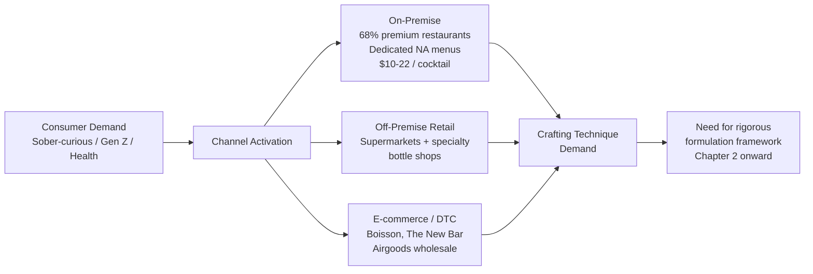
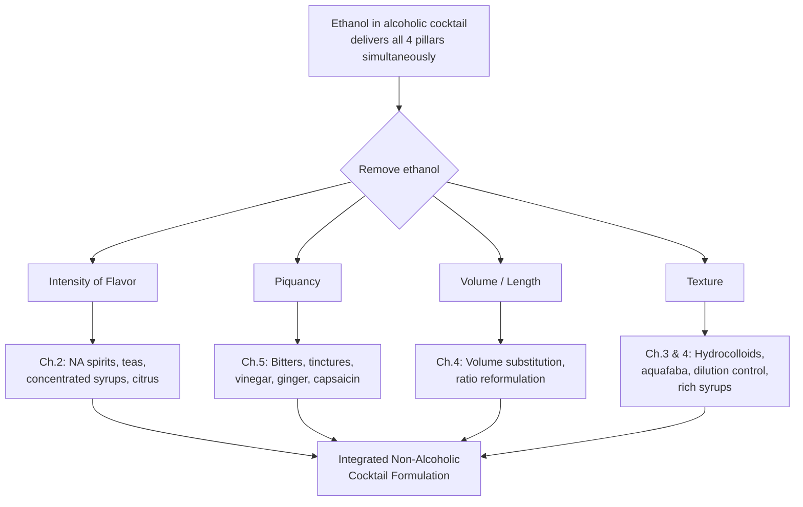
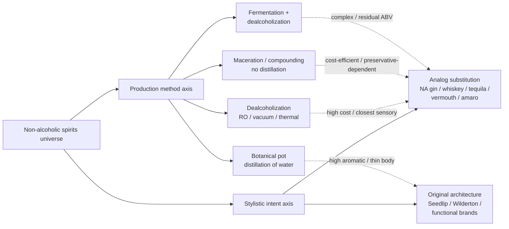
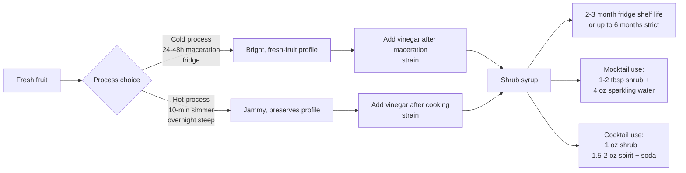
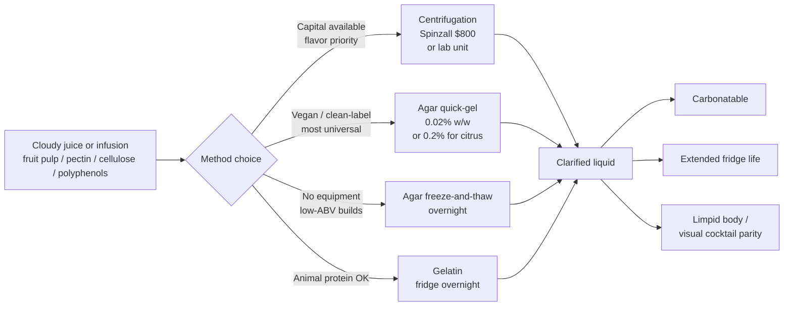
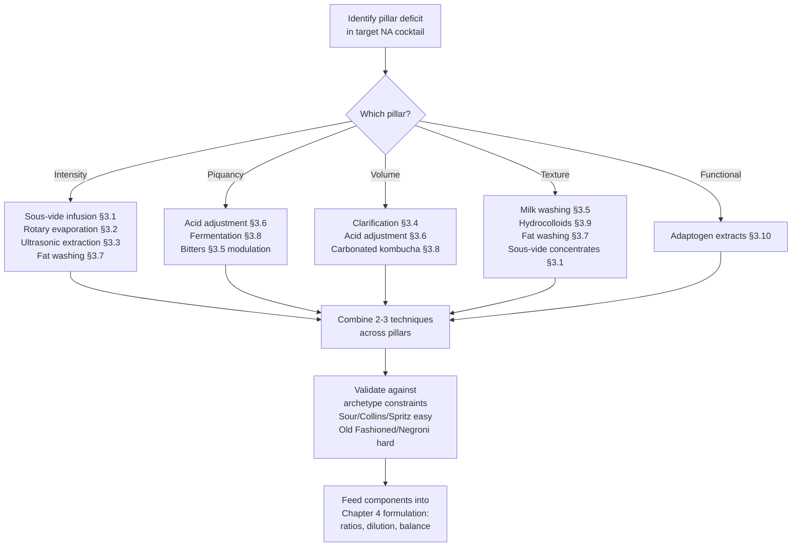
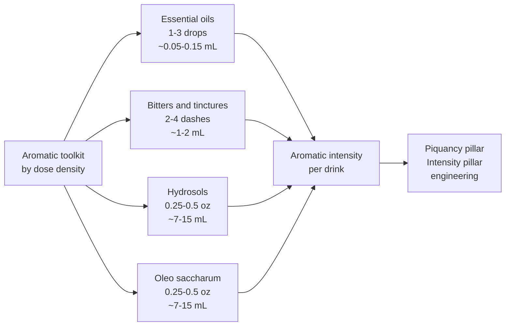
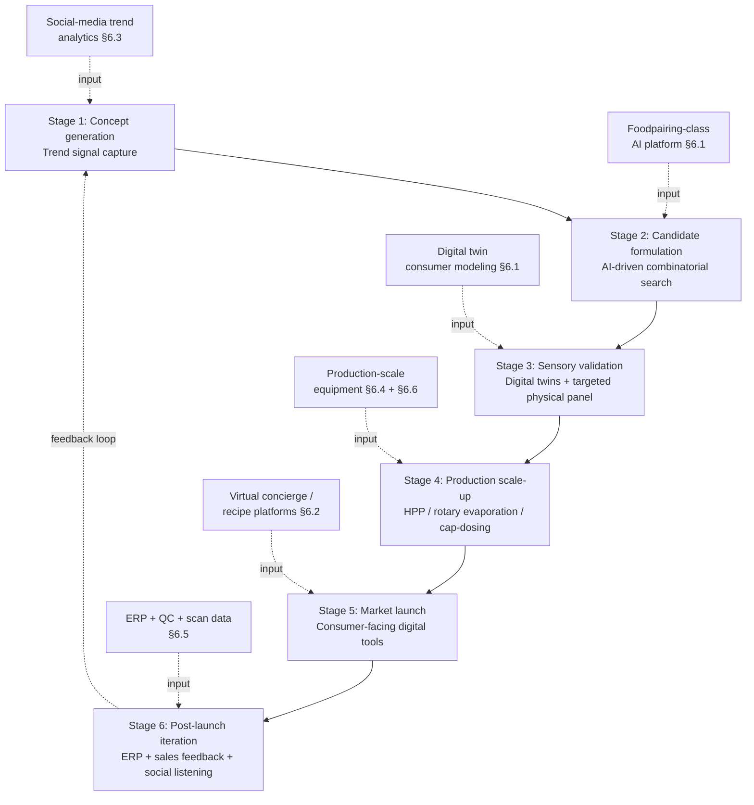

# Crafting Techniques for Non-Alcoholic Cocktails: Innovative Production Methods and Formulations
# 1 Research Background, Market Drivers, and Conceptual Foundations of Non-Alcoholic Cocktails

For most of the modern cocktail's two-century history, the alcohol-free option occupied a peripheral place behind the bar — a Shirley Temple for children, a "virgin" version of a margarita for the designated driver, or, as one industry guide bluntly recalls, the bartender pressing a button labeled "mocktail" and improvising "pineapple juice, grenadine, perhaps some muddled mint, and soda water" for around four dollars[^1]. That posture has now collapsed under the weight of measurable demand, generational change, and a sustained reframing of what constitutes a sophisticated drink. Before any meaningful inquiry into production methods and formulations is possible, this opening chapter must establish three foundations: how large and fast-moving the category has actually become, what consumer and structural forces are propelling it, and — perhaps most importantly — what *kind of object* a non-alcoholic cocktail must be if it is to be designed seriously rather than improvised reactively. The chapter therefore moves from market evidence, through demand-side and channel-side dynamics, to a conceptual definition anchored in Derek Brown's four-pillar sensory framework, which subsequent chapters will use as the analytical lens for ingredient selection, technique adaptation, and formulation logic.

## 1.1 The Rise of Non-Alcoholic Cocktails: Market Growth and Industry Momentum

The first observation that justifies a technical research agenda on non-alcoholic cocktails is that the surrounding category is no longer a curiosity at the margins of the beverage industry. According to IWSR, the no-alcohol segment is the only part of the global beverage alcohol market currently showing positive momentum, with global no-alcohol spirits volumes posting a +15% year-on-year surge in 2023 alongside +6% growth for no-alcohol beer and +7% for no-alcohol still and sparkling wine[^2]. Looking forward, IWSR's *No- and Low-Alcohol Strategic Study 2024* projects that the combined no/low market across ten key markets (Australia, Brazil, Canada, France, Germany, Japan, Spain, South Africa, the UK and the US) will expand by +4% volume CAGR through 2028, with no-alcohol driving the majority of that growth at +7% volume CAGR while low-alcohol volumes remain broadly static; the no-alcohol category alone is expected to deliver more than US$4 billion of incremental value by 2028[^3]. RTD no-alcohol formats — the channel through which most pre-mixed non-alcoholic cocktails reach consumers — are forecast to be the fastest-growing no-alcohol subcategory at +10% volume CAGR over the same period, off a smaller base[^3].

These global numbers are reinforced by granular sales evidence in the United States, the world's largest premium-cocktail market. NIQ off-premise scan data showed total US non-alcoholic beverage (beer, wine, spirits) dollar sales of US$395 million for the twelve months ending August 2022, up +20.6% year-on-year, with non-alcoholic spirits — the smallest but most cocktail-relevant slice — surging +88.4% year-on-year to US$5.03 million[^4]. Although non-alcoholic beer still accounted for roughly 85.3% of those off-premise dollars and non-alcoholic spirits only 1.3%, the asymmetry between segment size and growth rate is precisely the signature of a category in early-stage adoption[^4]. IWSR's forward view extends this trajectory: no-alcohol growth in the US is forecast at +18% volume CAGR between 2024 and 2028, drawing from a "wider array of no-alcohol subcategories" rather than beer alone, while Brazil, Canada and the US together are flagged as the leading near-term growth engines[^3]. NIQ's 2025 outlook similarly identifies low- and no-alcohol options as a defining structural trend within total beverage alcohol, noting that Gen Z (21+) — who already account for 9% of beverage-alcohol-buying households — are disproportionately gravitating to "low-ABV or non-alcoholic options" and to functional beverages "infused with adaptogens, vitamins, and botanicals"[^5].

Two additional data points sharpen the commercial case. First, on-premise behavior has shifted in tandem with retail: during Dry January 2022, on-premise sales of non-alcoholic beer, spirits and mocktails in bars and restaurants posted an aggregate uplift of approximately US$295 million, while soft drink sales remained "relatively flat," suggesting that guests were trading *up* from water and soda into non-alcoholic cocktails rather than merely abstaining[^1]. Second, the dedicated non-alcoholic spirits market is being sized as a discrete category by multiple research houses, with Grand View Research valuing it at US$445.8 million globally in 2024 and projecting US$771.9 million by 2030 at a 9.5% CAGR, with on-trade accounting for 56.8% of 2023 revenues — the channel where craft cocktail construction, rather than at-home pouring, dominates[^6]. The broader, cocktail-format-defined "mocktails" market is sized at a substantially larger US$12.6 billion in 2025 and projected at US$29.4 billion by 2034 at a 9.8% CAGR by Market Intelo, with Ready-to-Drink mocktails the leading product type at 38.5% share[^7]. While these third-party estimates differ in scope and methodology — Grand View Research isolates branded NA "spirits" SKUs, whereas Market Intelo aggregates RTD mocktails, alcohol-free cocktails (premium NA spirits), mocktail mixes and adjacent formats — they converge directionally on the same conclusion: a multi-billion-dollar, double-digit-growth opportunity is forming around the non-alcoholic cocktail rather than around alcohol-free beverages writ large.

The following table consolidates the principal data points that frame the commercial backdrop for this study.

| Metric | Value | Source / Period |
|---|---|---|
| Global no-alcohol spirits volume growth | +15% YoY | IWSR, 2023[^2] |
| Combined no/low volume CAGR (10 key markets) | +4% (2024–2028) | IWSR[^3] |
| No-alcohol volume CAGR (10 key markets) | +7% (2024–2028) | IWSR[^3] |
| Incremental no-alcohol value by 2028 | US$4bn+ | IWSR[^3] |
| US no-alcohol volume CAGR | +18% (2024–2028) | IWSR[^3] |
| US non-alcoholic spirits dollar sales growth | +88.4% YoY | NIQ, 12mo to Aug 2022[^4] |
| Total US non-alcoholic beverage sales (B/W/S) | US$395m | NIQ, 12mo to Aug 2022[^4] |
| Dry January 2022 on-premise NA uplift (US) | US$295m | CGA, cited in All The Bitter[^1] |
| Global non-alcoholic spirits market | US$445.8m → US$771.9m (CAGR 9.5%) | Grand View Research, 2024–2030[^6] |
| Global mocktails market | US$12.6bn → US$29.4bn (CAGR 9.8%) | Market Intelo, 2025–2034[^7] |
| RTD no-alcohol volume CAGR | +10% (2024–2028) | IWSR[^3] |

A critical reading of these figures is warranted. The Grand View Research and Market Intelo numbers diverge by more than an order of magnitude precisely because they define the object differently: the former tracks bottled NA spirit SKUs sold through trade channels, the latter aggregates all "alcohol-free cocktail" product forms including RTD cans, mixes and the spirit alternatives themselves[^6][^7]. The IWSR data, drawn from primary brand-level audits across 160 countries[^8], should be treated as the most methodologically conservative anchor; the consultancy explicitly notes that *availability* — not pricing — remains the single largest barrier to more frequent no-alcohol consumption in emerging markets such as Brazil, South Africa and the US, which implies that headline growth rates may still understate latent demand once distribution catches up[^3]. **What is consistent across every source is the directional signal: non-alcoholic cocktails sit at the intersection of the two fastest-growing parts of beverage alcohol — RTDs and no-alcohol — and the only market segment IWSR currently describes as having "positive momentum" against an otherwise flat or declining global beverage alcohol industry**[^2][^3].

## 1.2 Consumer Behavior Drivers: Sober-Curious Movement, Mindful Drinking, and Health Consciousness

Commercial momentum of this magnitude is not generated by product innovation alone; it reflects a deeper recalibration of why, when and how consumers drink. IWSR's BevTrac consumer research finds that no-alcohol "is the only market segment with positive momentum, driven by year-on-year increases in the no-alcohol drinker population in several key markets, including India, China, the UK, and the US"[^2], and Susie Goldspink, the firm's Head of No- and Low-Alcohol Insights, frames the underlying behavioral shift directly: "as the no-alcohol category matures, consumers want more than just an absence of alcohol. They want products that deliver on taste, complexity, and overall drinking experience"[^3]. Critically, this is not a sobriety story. NIQ data indicates that 82% of US non-alcoholic drink buyers continue to also purchase alcoholic beverages, meaning the dominant pattern is *substitution by occasion* rather than abstinence[^4] — a behavioral fact that places enormous pressure on the non-alcoholic cocktail to function as a peer of, not a downgrade from, its alcoholic counterpart on the same evening, in the same glass-shape, at the same price point.

The most influential behavioral framing of this shift comes from Derek Brown, the award-winning bartender and *Mindful Mixology* author who has become one of the category's primary intellectual voices. Brown defines mindful drinking explicitly *not* as abstinence but as "a self-led strategy to drink or not drink alcohol in relation to your goals, health, or otherwise," contrasting intrinsic, goal-oriented motivation with the extrinsic responsibility messaging that has historically governed alcohol public health communication[^9]. He proposes a "four Cs" diagnostic for *when* drinking alcohol remains reasonable — **celebration, conviviality, consecration, and connoisseurship** — and notes pointedly that "you can do all of those things with nonalcoholic or low-alcohol drinks too"[^9]. For consumers actively moderating, Brown's prescriptive **RATE** acronym — Replace (substitute alcoholic occasions with NA or low-ABV drinks), Avoid (sidestep high-pressure drinking situations), Temper (alternate alcoholic and non-alcoholic drinks to control tempo), and Elicit help (recruit social support) — operationalizes the philosophy into practical behaviors[^9]. Crucially, three of the four levers (Replace, Temper, and the bar-context portion of Elicit help) require the *existence* of compelling non-alcoholic cocktails as enabling infrastructure; without them, mindful drinkers default to "what the hell am I going to do with my hands?"[^9] — an awkward social vacuum that drives moderators back to alcohol or out of the venue.

Generational data confirms that this mindful-drinking posture is not a fringe niche. IWSR finds that across its ten focus markets, no-alcohol new recruits "skew younger than the core buyer demographic" and demonstrate "higher frequency and intensity of consumption," with per-capita consumption of pure alcohol now at only 80% of its 2000 level[^3]. Younger LDA Gen Z buyers in particular are more likely to substitute non-alcoholic drinks "especially soda and energy drinks," whereas older cohorts substitute beer or cider, indicating that for emerging adult consumers the non-alcoholic *cocktail* is competing not against alcoholic spirits but against soft drinks — which raises the qualitative bar for what a "good" alcohol-free drink must deliver[^3]. NIQ similarly characterizes Gen Z as a cohort that "values authenticity, sustainability, and experiences over material goods," with a "preference for low-ABV or non-alcoholic options" anchored in "wellness and mindful consumption"[^5]; Grand View Research further notes that this generation has "grown up in a digital age where social media heavily influences their behavior," with Instagram, TikTok and YouTube actively promoting "healthy lifestyles and non-alcoholic alternatives"[^6].

Structured abstinence campaigns provide the calendrical scaffolding for this shift. IWSR notes that the US and UK have the largest cohorts of "Occasional moderators" who participate in alcohol-free challenges such as Dry January and Sober October, and that this Occasional-moderator group is most strongly correlated with no-alcohol category recruitment[^3]. Market Intelo cites Dry January 2025 as having registered "over 6 million" participants in the United States alone, while comparable campaigns such as the UK's Club Soda and Australia's FebFast have created what it characterizes as "behavioral foundations of sustained mocktail demand" that ratchet from one-month experiments into year-round consumption habits[^7]. The personal account in *British Vogue* — a journalist crossing into mindful drinking via Dry January after a clinical conversation about hangover-induced anxiety, sleep disruption, and elevated cortisol — illustrates the mechanism by which a temporary challenge becomes a permanent behavior reset, with non-alcoholic spirits like Seedlip and Ghia explicitly named as the "Replace" tools that make adherence sustainable in social settings[^9].

The deeper driver underneath all of this is a redefinition of health from a negative ("avoid harm") to a positive frame ("optimize sleep, performance, presence"). Grand View Research attributes the rise of the sober-curious movement to "a broader trend of mindfulness and intentional living, where people are more conscious about their lifestyle choices and their impact on their bodies and minds"[^6]. NIQ documents that, within total beverage alcohol, claims-driven attributes such as "free from artificial colors" grew +74% in dollar sales year-on-year and "Eco Friendly Certified" grew +28%, pointing to a consumer who reads labels and adjudicates beverages in clean-label terms[^5]. Functional formulations — adaptogens (ashwagandha, lion's mane), nootropics (L-theanine), botanicals — are migrating from supplements into the cocktail glass, with IWSR specifically calling out Free AF's "Afterglow" botanical extract designed "to mimic the warming sensation of alcohol" and Parch Spirits' agave-style cocktails containing ashwagandha, L-theanine and ginseng[^3]. **The implication for crafting technique is direct: the consumer increasingly arrives at the bar expecting the non-alcoholic cocktail not merely to taste like a cocktail but to deliver a coherent functional experience — relaxation, focus, social ease — without ethanol's sedative-stimulant payload, an expectation that decisively rules out the older "juice plus syrup plus soda" mocktail template.**

## 1.3 On-Premise and Retail Dynamics Reshaping the Category

Demand alone, however, does not produce a category; it must be matched by an operational ecosystem capable of stocking, training for, and presenting non-alcoholic cocktails at parity with alcoholic ones. That ecosystem has expanded dramatically over the past five years on both sides of the bar.

On the on-premise side, dedicated zero-proof menus have moved from boutique novelty to default expectation in upper-tier hospitality. Market Intelo estimates that as of 2025 approximately 68% of premium restaurants and 55% of upscale hotel bars in North America and Europe offer dedicated non-alcoholic cocktail menus, against 22% and 18% respectively in 2019[^7], a roughly threefold increase over a five-year window. Dedicated non-alcoholic bars and pop-ups — Sans Bar (Austin/touring), Getaway (New York), Redemption (London) — have institutionalized the format[^7], while flagship restaurants such as Eleven Madison Park have launched parallel non-alcoholic pairing menus that price alongside their wine pairings, signaling a definitive parity move[^9]. In the practitioner literature, the All The Bitter operator guide cites San Francisco's Trick Dog and Portland's Pacific Standard as exemplars of menu integration: Trick Dog's beverage menu lists non-alcoholic cocktails alongside alcoholic ones at standard pricing, while Pacific Standard sequences zero-proof cocktails *first*, then low-alcohol, then full-strength, with bartender Jeffrey Morgenthaler additionally publishing the ABV of every drink to allow guests to "steer their experience"[^1]. Both choices are structural rather than cosmetic: they reject the "kids' table" placement next to juices and sodas that the same guide identifies as the cardinal menu-design error, and they signal — through positioning, pricing and nomenclature — that the category warrants the same craft attention as its alcoholic counterparts[^1].

Pricing economics support this parity stance. Non-alcoholic spirits typically retail at premiums comparable to mid-shelf alcoholic spirits — Almave Blanco at US$36–44 and Monday Gin at US$45 are representative[^10] — because the production methods (vacuum distillation, multiple maceration passes, botanical sourcing) are technique-intensive even without ethanol. Operator guidance therefore explicitly cautions against under-pricing: "guests aren't paying for alcohol content, they're paying for quality and experience," and pricing non-alcoholic cocktails materially below alcoholic ones "implies that they're inferior"[^1]. Market Intelo corroborates this commercially, finding premium on-trade venues charging US$10–22 per non-alcoholic cocktail, with the segment generating "high-margin revenues that make mocktail programs financially attractive for operators"[^7]. Some operators tier their offering to manage cost-of-goods volatility — Los Angeles's Melrose Umbrella Co. lists "non-alcoholic cocktails" using NA spirits at full cocktail price alongside lower-priced juice/herb/soda-based "non-alcoholic mocktails," resolving both the price-perception and terminology debates simultaneously[^1]. The hospitality rationale that ties this together is captured in a phrase the All The Bitter guide attributes to Trick Dog's Nick Amano-Dolan: the **"invisible ROI of joy"** — the proposition that, beyond direct revenue, inclusive non-alcoholic programming retains groups who would otherwise leave, extends dwell time for designated drivers and pacers, and converts non-drinking guests from water orders into paying revenue[^1].

The retail ecosystem has expanded in parallel. Between mid-July 2021 and mid-July 2022, NIQ tracked 72 new non-alcoholic SKUs entering US off-premise distribution, with non-alcoholic spirits accounting for 18 of those launches despite occupying only 1.3% of category dollars — a clear over-indexing of innovation against current sales[^4]. Specialized bottle shops and digital marketplaces have emerged to bridge the on-trade and consumer channels: Boisson, The New Bar and Zero Proof Nation maintain dedicated NA retail catalogs; Airgoods operates a wholesale marketplace specifically for non-alcoholic beverages, offering 60-day terms and cross-brand consolidation that addresses the historical pain point of multi-vendor sourcing[^1]. Established alcoholic-spirits distributors are now also stocking NA brands — Ritual Zero Proof, Free Spirits, Spiritless, Lyre's, Seedlip, Martini and Giffard — eliminating the need for operators to set up parallel supply chains[^1]. IWSR identifies the on-trade and e-commerce channels as the two primary unlocks for further growth, noting that "greater product availability in the on-trade and via ecommerce is helping to enable category growth" and that pricing in more developed NA spirits markets such as the UK and Spain has converged toward full-strength offerings as availability has scaled[^3].

The diagram above captures how distinct demand-side currents converge through three reinforcing channels into a unified pull on production technique. Two structural frictions still constrain the system, however, and they are worth naming because they shape the technique research that follows. First, IWSR identifies *availability* — not affordability — as the dominant remaining barrier in emerging no/low markets, particularly Brazil, South Africa and parts of the US where consumers report wanting to buy non-alcoholic options more frequently but cannot find them in the on-trade or grocery channel[^3]. Second, the All The Bitter operator guide flags a persistent operator-side challenge: limited fridge and back-bar real estate, combined with prep-time constraints, makes it economically rational for many bars to default to a minimal "top-notch non-alcoholic beer, a spirit, and a sparkling wine" stocking strategy rather than committing to a full craft program[^1]. **The practical consequence is that even where consumer demand exists, the ability to deliver a *crafted* non-alcoholic cocktail — as opposed to a default zero-proof option — depends critically on technique efficiency: recipes that share ingredients with the alcoholic cocktail menu, that pre-batch well, and that survive within a constrained back-bar footprint.** This is one of the recurring formulation constraints that subsequent chapters must address.

## 1.4 Defining the Non-Alcoholic Cocktail: Conceptual Boundaries and the Mocktail Debate

If there is now a multi-billion-dollar market, a behaviorally legitimate consumer base, and a functional retail and on-premise infrastructure, the next foundational question is conceptual: *what, precisely, is the object whose crafting techniques this report aims to analyze?* The answer is less obvious than it appears, because the cocktail itself has never had a settled definition.

The historical reference point most frequently cited is an 1806 article in the Hudson, New York newspaper *The Balance, and Columbian Repository*, which defined a cock-tail as "a stimulating liquor, composed of spirits of any kind, sugar, water and bitters"[^11]. Read literally, this definition makes the Old Fashioned the canonical cocktail and disqualifies the modern martini and the vodka soda alike[^11]. It also, of course, disqualifies any drink without distilled alcohol. But this orthodoxy was unsettled in 2008 when drinks historians Jared Brown and Anistatia Miller located an earlier 1798 reference in London's *The Morning Post and Gazetteer* — a satirical bar-tab listing in which "cock-tail" appeared at three-quarters of a pence, "the second-cheapest drink on the list, and priced far below anything with spirits in it," leading historian David Wondrich to conclude that the original "cocktail" may well have been alcohol-free[^11]. The historiographical point is that the cocktail's etymological roots are sufficiently ambiguous to make the question "must a cocktail contain alcohol?" a matter of contemporary aesthetic choice rather than historical fact.

Derek Brown advances precisely this argument in *Mindful Mixology*, proposing that "maybe we should look at it as a set of sensory characteristics rather than a historical definition," with the operative characteristics being "intensity of flavor, texture, volume, and piquancy"[^11]. He is direct about the consequence: "a drink should not require the addition of alcohol in order to be called a cocktail," and "in my book… I suggest four sensory characteristics that define a classic cocktail with or without alcohol"[^10][^11]. John deBary's *Drink What You Want* takes a still broader stance, treating the cocktail as a subjective category framed by intent rather than constituent[^11]. For the purposes of this report, the working definition adopted is therefore Brown's sensory-functional one, which has the virtue of being analytically tractable: a non-alcoholic cocktail is a deliberately constructed beverage in which the sensory pillars normally provided by ethanol are reproduced by other means.

This functional definition allows a sharp delineation from adjacent categories that are commonly confused with the non-alcoholic cocktail in casual discourse:

| Category | Sensory pillars deliberately engineered? | Typical positioning | Example |
|---|---|---|---|
| Juice / soft drink | No — single-axis sweetness or acidity | Refreshment | Orange juice, cola |
| Dealcoholized wine / NA beer | Partially — derived from alcoholic original via ethanol removal | Direct analog substitution | NA lager, dealcoholized rosé |
| Simplistic "mocktail" | Inconsistent — often sweet/juice-led without piquancy or texture | Default child / abstainer option | "Virgin" margarita, Shirley Temple |
| **Non-alcoholic cocktail** | **Yes — all four pillars (intensity, piquancy, volume, texture) intentionally constructed** | **Adult-coded, parity with alcoholic cocktail** | Pinch Hitter, Nightcap-erac, NA Negroni |
| Functional / adaptogenic drink | Sometimes — varies by brand | Wellness / mood-modulation | Three Spirit, Kin Euphorics |

The third row in the table above maps onto the long-running terminology debate inside the trade. The All The Bitter operator guide observes that many bartenders bristle at the word "mocktail" because it "diminishes the drink's value, hinting at a 'mock' or 'lesser' version" and connotes "an overly sweet, juicy, syrup and soda based drink served in a pint glass with a bright red cherry"[^1]. Brown himself reinforces a distinction between cocktail-aspirational drinks and other non-alcoholic options on his Substack, where he separately catalogs "100 non-alcoholic drinks that have" — i.e., alternatives that do not need to be cocktail-like at all[^10]. At the same time, "mocktail" is the term consumers actually use: Google search trends show "mocktail" generating roughly 60 times the search volume of "non-alcoholic cocktail"[^1], and Sans Bar founder Chris Marshall reports that "mocktail" is "the term most commonly used to ask for these drinks — eliminating it would only make his job harder"[^1]. The pragmatic resolution adopted by leading operators — and by this report — is to use "non-alcoholic cocktail," "alcohol-free cocktail," or "zero-proof cocktail" as the technical term while accepting "mocktail" as a vernacular synonym, and to reserve a *functional* meaning — a drink intentionally engineered across all four sensory pillars — rather than a merely *negative* one ("anything without alcohol")[^1].

This conceptual demarcation matters for technique research in two specific ways. First, it implies that techniques borrowed wholesale from soft-drink or juice production are insufficient: a cocktail-grade non-alcoholic beverage must engineer piquancy and texture, neither of which is native to refreshment beverages. Second, it implies that techniques borrowed wholesale from alcoholic mixology are also insufficient: the absence of ethanol changes the underlying physics (vapor pressure, solubility of aromatics, volume substitution, dilution kinetics) and forces the redesign of recipes around different ingredients and process variables. **The non-alcoholic cocktail is, in other words, a technically distinct object — neither a watered-down version of an alcoholic cocktail nor an adult version of a soft drink — and treating it as such is the necessary precondition for the rigorous formulation analysis that subsequent chapters undertake.**

## 1.5 Derek Brown's Four-Pillar Sensory Framework as Analytical Foundation

The operationalization of this functional definition requires a sensory-engineering vocabulary, and the most coherent one in the practitioner literature is Derek Brown's four-pillar framework. Brown articulates it succinctly: "I suggest four sensory characteristics that define a classic cocktail with or without alcohol: Intensity of Flavor, Piquancy, Volume or Length, and Texture. Each one of these play a role in creating adult sophisticated cocktails"[^10]. He then defines each pillar with operational precision:

- **Intensity of Flavor** — "using the best ingredients in a quantity that cuts through the many layers in a cocktail"[^10];
- **Piquancy** — "the bite you get from alcohol or alternative, bitterness, sourness, or spice (sometimes all of those things)"[^10];
- **Volume / Length** — "the space not taken up by juice or sugar," with the constraint that "juice or sugar are common in cocktails but that can't be the whole drink for it to match my definition of a cocktail"[^10];
- **Texture** — "the mouthfeel or weight of the drink. It should be richer than ice tea or water"[^10].

Crucially, Brown identifies ethanol as the *single ingredient that simultaneously delivers all four pillars* in a conventional cocktail: "alcohol helps achieve all of the characteristics mentioned above. The difference between a lemonade and a Tom Collins is just gin. Bourbon and Coke, Bourbon, etc."[^10] This single observation is the analytical pivot of the entire report. It explains, mechanistically, why a non-alcoholic cocktail cannot be built by simply removing alcohol from an alcoholic recipe — to do so is to remove the only ingredient performing four functions at once. It also explains why "without alcohol, you may need multiple ingredients to achieve the same thing"[^10], a structural complication that Brown illustrates with his own *Pinch Hitter* recipe, which adds "ginger, apple cider vinegar, salt, and aquafaba (chickpea water) to add intensity of flavor, piquancy, volume, and texture to what is otherwise a lemonade"[^10]. Each added ingredient maps deliberately to a specific pillar: ginger and vinegar for piquancy, salt for amplified flavor intensity, aquafaba for texture, with the lemonade base supplying volume.

The four pillars further yield concrete substitution strategies that subsequent chapters will analyze in depth. The All The Bitter operator guide, which adopts Brown's framework explicitly, maps each pillar to a class of usable ingredients[^1]:

| Pillar | Function in alcoholic cocktail | Non-alcoholic engineering levers |
|---|---|---|
| Intensity of Flavor | Ethanol carries volatile aromatics; spirits concentrate base flavors | Strongly brewed teas (pu-erh, lapsang souchong), reduced syrups, citrus, NA spirits, salt amplification[^10][^1] |
| Piquancy | Ethanol bite; bitters; high-proof modifiers | Capsaicin-infused NA spirits, vinegars, shrubs, ginger, bitter aperitifs, NA bitters[^10][^1] |
| Volume / Length | 1.5–3 oz of spirit fills structural mass without adding sweetness | NA spirits as 1:1 swap; or scaling of citrus, soda, tea, or aperitif components[^1] |
| Texture | Ethanol viscosity and slow dilution | Sugar, salt, aquafaba, eggs, starches, glycerine, hydrocolloids (xanthan gum); reduced shaking time / less ice[^10] |

Brown emphasizes that texture is "the hardest thing to achieve" in non-alcoholic mixology and offers a notably specific protocol: "you have to use a thickener like sugar, salt, aquafaba, eggs, starches, glycerine, or hydrocolloids like xanthan gum. You can also use less dilution, shaking or stirring with less ice and for a shorter period of time"[^10]. This thickener-or-dilution-control dichotomy will be the central concern of Chapter 4, where dilution physics, ice geometry, vessel thermodynamics, and rich-syrup ratios are examined in detail. Equally, the piquancy pillar maps directly onto Chapter 5's analysis of bitters, tinctures, and salt solutions, while the intensity-of-flavor pillar foreshadows Chapter 3's coverage of culinary-science extraction techniques (sous-vide infusion, rotary evaporation, ultrasonic homogenization) used to produce concentrated flavor agents that can survive against the perceptual baseline a soft drink does not need to clear.

The framework also clarifies *which cocktail formats translate natively to non-alcoholic builds and which do not* — a question Chapter 4 takes up structurally. The All The Bitter guide observes that "builds like a Sour, Collins, Mule, or Spritz tend to work well because they are layered with citrus, syrup, club soda, ginger beer, sparkling wine, bitters, etc. — these ingredients all check off elements of intensity, texture, or piquancy. When combined with the flavor and bite of a non-alcoholic spirit, these drinks can easily deliver a satisfying cocktail experience"[^1]. By contrast, "spirit-forward drinks like an Old Fashioned or Manhattan are harder to pull off successfully. Non-alcoholic spirits are certainly flavorful and can be relatively intense, but they don't pack the same punch as 40-50% ABV spirits"[^1]. The four-pillar framework gives the underlying reason: in a Sour or Collins, three of the four pillars are carried by non-spirit ingredients (citrus for piquancy, syrup for texture, soda for volume), so removing ethanol leaves only the intensity pillar to be reconstructed; in an Old Fashioned the spirit is supplying *all four pillars simultaneously*, and the reconstruction problem is correspondingly four-dimensional.

Several caveats about the framework are worth flagging in the spirit of source-quality discipline. Brown's four pillars are a *practitioner* taxonomy, articulated in *Mindful Mixology*[^10][^11] and reinforced through Brown's other writing and podcasting; they are not, to the evidence currently in hand, validated through peer-reviewed sensory science. The framework's persuasive power derives from its mechanistic plausibility and the ease with which working bartenders have operationalized it — the All The Bitter guide explicitly adopts Brown's "4 key elements" as "the foundations of a non-alcoholic cocktail"[^1], suggesting de facto industry consensus rather than scientific proof. This report adopts the framework on the same pragmatic basis the operator literature does — as a coherent analytical lens, not as a falsified theory — and will, where possible, cross-reference its claims against the underlying food-science mechanisms (vapor pressure, mouthfeel, hydrocolloid behavior) in the technical chapters that follow.

The flow above visualizes how the four-pillar diagnostic generates the structural roadmap for the remainder of the report. **Each subsequent chapter can be read as a deeper investigation of one or more pillars**: Chapter 2 catalogs the ingredient palette (predominantly addressing intensity and partial piquancy); Chapter 3 examines culinary-science techniques that elevate intensity and texture; Chapter 4 operationalizes volume reconstruction and dilution-controlled texture; Chapter 5 isolates piquancy through bitters and aromatics; Chapters 6 and 7 examine technological and case-based applications of the framework; and Chapter 8 critiques where the framework still fails — particularly in spirit-forward archetypes — and projects future research directions. **What this opening chapter has established, then, is not merely that the non-alcoholic cocktail category is commercially significant, but that it is technically distinct, behaviorally durable, and analytically tractable — and that Derek Brown's four-pillar framework provides the lens through which the engineering of such drinks can be examined with the rigor the rest of this report will demand.**

# 2 Ingredient Landscape: Non-Alcoholic Spirits and Core Functional Components

Chapter 1 closed by arguing that ethanol is the single ingredient in a conventional cocktail that delivers all four sensory pillars — intensity, piquancy, volume and texture — simultaneously, and that engineering its absence requires a coordinated portfolio of substitute ingredients each carrying one or more of those functions. This chapter takes the next logical step and surveys, in technical detail, the raw material library now available to the non-alcoholic cocktail maker. The ambition is twofold. First, to taxonomize the rapidly proliferating non-alcoholic *spirits* category — a category that has expanded from a literal handful of products a decade ago into more than two dozen widely distributed brands — by production logic and stylistic intent rather than by marketing positioning. Second, to map the supporting cast of acids, sweeteners, aromatics, textural agents and bitter modifiers that compensate for ethanol's absence, with each ingredient class explicitly cross-referenced to the four-pillar diagnostic. The chapter is therefore both a reference catalog and an analytical instrument; the formulation chapters that follow draw on it the way a kitchen draws on its mise en place.

A note on evidence weight is warranted at the outset. The most authoritative practitioner sources for this chapter — VinePair's 2025 tasting panel of more than 200 non-alcoholic expressions[^12], PUNCH's interviews with Dave Arnold and Don Lee at Existing Conditions[^13], the *Cocktail College* podcast transcript with Jack Schramm[^14], and the brand-direct technical documentation provided by Seedlip[^15][^16][^17] — are robust. Other sources cited here, particularly retail blog roundups and consumer-facing product copy, are useful primarily as catalogs of *what exists* rather than as adjudicators of taste or efficacy[^18]; where they offer subjective sensory evaluation, that judgment is treated as a single-source data point rather than as established fact. The shrub-production literature draws on cooking-blog protocols[^19][^20][^21] that are technically consistent but represent home-cook practice; commercial shrub manufacturing parameters are reported only to the level of detail available in market-research summaries[^22]. These limitations are flagged in the relevant subsections.

## 2.1 Taxonomy of Non-Alcoholic Spirits: Production Methods and Stylistic Categories

The non-alcoholic "spirits" category is conceptually heterogeneous in a way that the alcoholic spirits category is not. A bottle labeled "gin" implies a near-universal production logic — a neutral grain spirit redistilled with juniper-led botanicals to a minimum ABV — but a bottle labeled "non-alcoholic gin" can be the product of at least three fundamentally different processes, each yielding a different sensory and economic profile. Taxonomy is therefore the necessary first step.

VinePair's tasting panel summarizes the production landscape concisely: "non-alcoholic spirits can be made with a variety of techniques including dealcoholization, maceration, infusion, and more. The first process sees spirits produced as usual vis-à-vis distillation before gently dealcoholizing the liquid through reverse osmosis, thermal dealcoholization, or vacuum distillation… Other non-alc 'spirits' are made by infusing distilled water with dozens of herbs and botanicals that flavor the liquid through maceration and infusion processes to evoke flavor profiles similar to that of distilled spirits"[^12]. From this we can extract a two-axis taxonomy. The first axis is **production method**, with at least four distinct routes; the second is **stylistic intent**, which divides the category into spirits that explicitly target an alcoholic referent (analog substitution) and those that build an original flavor architecture without trying to mimic any specific alcoholic spirit (botanical/original).

| Production method | Mechanism | Representative brands | Stylistic intent | Sensory signature |
|---|---|---|---|---|
| **Dealcoholization** (reverse osmosis, vacuum distillation, thermal removal) | A fully alcoholic spirit, vermouth or wine is produced normally, then ethanol is selectively stripped[^12] | Roots Divino (vermouth via reverse osmosis)[^12]; Mionetto Aperitivo Alcohol Free (companion to its alcohol-removed sparkling wine)[^12]; Amaro Lucano Non-Alcoholic (same 30-botanical recipe as the 130-year-old original)[^12] | Analog substitution of fermented/aromatized base | Closest to the alcoholic referent; preserves ester/aromatic complexity built during fermentation; residual ABV typically <0.5%[^12] |
| **Botanical copper-pot distillation of water-based macerates** | Botanicals are macerated in water, then distilled in copper pots; distillates are blended[^15] | Seedlip (six-week process per ingredient)[^15]; Wilderton; The Pathfinder (hemp fermented, copper-pot distilled, then dealcoholized)[^12] | Original architecture (Seedlip) or analog (Pathfinder targets a Christmas-tree/woodsy complex spirit) | Highly aromatic but thin-bodied; sugar-free Seedlip explicitly recommends mixing rather than neat consumption because "alcohol carries flavour very well, as does sugar – Seedlip contains neither"[^15] |
| **Maceration, infusion and compounding** (no distillation) | Botanical extracts and natural distillates are blended into water with acid and preservative carriers | Most "natural botanical distillates and extracts" brands, including the compounded Seedlip line variants on retail labels listing "Water, Natural Botanical Distillates & Extracts… Preservative: Potassium Sorbate & Sodium Benzoate"[^16]; Free Spirits[^18]; Ritual Zero Proof | Typically analog (gin, whiskey, tequila, rum alternatives) | Lowest aromatic ceiling but most cost-efficient; reliance on chemical preservatives indicates absence of ethanol's antimicrobial role |
| **Fermentation followed by dealcoholization** | Hemp, grain or fruit is fermented, then ethanol is removed | The Pathfinder (non-psychoactive hemp fermentation, copper pot distillation, then dealcoholization, blended with angelica root, wormwood, ginger, sage, juniper, saffron, orange peel, Douglas fir)[^12] | Analog or hybrid | Preserves fermentation-derived complexity but inherits residual <0.5% ABV; The Fit Cookie warns this category may not suit consumers with histamine intolerance[^18] |

Two production economics insights flow from this taxonomy. First, VinePair's FAQ confronts the recurring consumer question of *why* non-alcoholic spirits are priced like mid-shelf alcoholic ones: "producing zero-proof spirits typically requires the same amount of labor and raw materials as the full-proof thing… NA drinks brands craft their products exclusively in small batches with high-quality ingredients to achieve a specific flavor profile. Moreover, complex production processes like dealcoholization and filtration add even more back-end costs"[^12]. The dealcoholization route, in particular, requires an upstream alcoholic production line plus downstream specialized equipment — vacuum-distillation columns or reverse-osmosis membranes — making it the most capital-intensive method despite producing a zero-proof end product. Second, shelf life differs sharply by method: ethanol is a stabilizer, and once removed "zero-proof alternatives do not have any alcohol acting as a stabilizing agent, they will spoil much faster than their boozy counterparts and should always be stored in a cool, dark area or your refrigerator"[^12]. VinePair quotes a six-to-twelve-week post-opening shelf life as typical[^12]; Seedlip — which compensates for the absence of ethanol with potassium sorbate and citric acid — reports a more generous "two years when unopened" and "within 6 months once opened"[^15]. The contrast tells a clear story: brands without strong preservative carriers depend on cold-chain logistics; brands with them trade some clean-label positioning for shelf stability.

A third axis, regulatory rather than technical, runs through all of the above. VinePair clarifies that under the U.S. Alcohol and Tobacco Tax and Trade Bureau (TTB) framework, "non-alcoholic products may contain up to 0.5 percent alcohol by volume, while alcohol-free beverages are 0.0 proof. All 0.0 percent ABV claims are verified by the TTB via samples submitted by brands before labels are approved for printing"[^12]. Seedlip, despite being sugar-free and not labeled as a fermented or dealcoholized product, acknowledges that it "may contain trace elements of alcohol (<0.5% ABV) when consumed without mixing"[^15] — a fact that matters for consumers with religious, medical or allergy-driven zero-tolerance, and one that operators flagging "alcohol-free" rather than "non-alcoholic" must factor into product selection.

The diagram above visualizes the two-axis space and indicates where each production route most naturally lands. The next two subsections take the two stylistic clusters in turn.

## 2.2 Analog Spirit Alternatives: Gin, Whiskey, Tequila, Rum, Vermouth, and Aperitivo Substitutes

The analog cluster — products that explicitly position themselves as non-alcoholic versions of an established spirit category — is the most commercially dense part of the NA spirits market and the part most likely to disappoint when judged by the wrong criterion. VinePair's 2025 tasting panel is unusually direct on this point: "regarding NA base spirits and RTDs, they will never taste exactly like the products they intend to replicate. As such, just like every year prior, texture remained the most important criterion for our tasting panel this year, with each liquid measured by how well it engaged the palate in addition to its taste"[^12]. The implicit hierarchy is critical: in analog NA spirits, *texture* — the pillar that ethanol most obviously contributes through its viscosity, slow dilution and characteristic warming sensation — is the hardest variable to engineer, and its successful reproduction is the panel's defining quality criterion.

The panel's most consequential structural finding follows: "we found that alcohol-free bitter aperitifs are often the most convincing, as their botanical-driven profiles are more easily replicated than other spirits categories"[^12]. This empirical observation maps cleanly back onto the four-pillar framework. Bitter aperitifs and amari derive their identity from piquancy (bitter botanicals), aromatic intensity (gentian, citrus peel, wormwood), and a moderate textural baseline rather than from the ethanol burn that defines a high-proof neat spirit. Three of the four pillars are therefore carried by ingredients other than ethanol in the alcoholic original, and removing ethanol does not vacate the sensory architecture. A non-alcoholic Negroni, in this light, is mechanistically easier to reconstruct than a non-alcoholic Old Fashioned — exactly the pattern Chapter 1 anticipated.

The table below consolidates VinePair's panel notes on representative analog brands, organized by the alcoholic referent each targets, with sensory verdicts presented as the panel reported them. Brand-by-brand subjective assessment is single-sourced; readers should treat the comparative judgments as informed expert opinion rather than triangulated fact.

| Alcoholic referent | NA brand (production cue) | Panel verdict / sensory signature | Price (USD) |
|---|---|---|---|
| **Bitter aperitivo (Campari/Aperol)** | Wilderton Aperitivo Co. Bittersweet | "Near-perfect replacement for bitter red amaro, delivering bitter grapefruit peel, orange blossom, and gentian root flavors"[^12] | $37 / 750mL |
| | Ritual Zero Proof Aperitif | "Suitable swap for Campari… rhubarb, citrus peel, and cranberry"[^12]; brand acquired by Diageo in September 2024[^12] | $35 / 750mL |
| | Mionetto Aperitivo Alcohol Free | "Undeniably on the sweeter side… strikingly similar to orange Hi-C"; positioned as Aperol substitute[^12] | $20 / 500mL |
| | Figlia Fiore | "Floral, zingy, and refreshing… excellent option in non-alcoholic Negronis"[^12] | $43 / 750mL |
| | Ghia Original | "Cranberry bitterness and fiery ginger exploding across the taste buds"[^12] | $38 / 16.5oz |
| **Amaro** | Amaro Lucano Non-Alcoholic | Same 30-botanical recipe as 130-year-old original; "weighty and viscous… perfumed florals, woodsy bitterness, and a cola-like sweetness"[^12] | $33 / 750mL |
| | Free Spirits Spirit of Milano | "Rich cranberry and raspberry notes with an undercurrent of sweetness that prevents the bitter botanicals from taking over"[^12] | $37 / 750mL |
| **Vermouth** | Roots Divino Bianco / Rosso | Greek-origin; produced by macerating wormwood, rosemary, gentian root and other Greek herbs, fermenting, then **reverse osmosis dealcoholization**[^12]; Bianco delivers "vibrant citrus blossom, savory herb, and slightly bitter notes"[^12] | $39 / 700mL |
| **Whiskey/bourbon** | Spiritless Kentucky 74 SPICED | "Robust cinnamon and spearmint notes along with a decadent caramel aroma… palate is slightly watery, which is likely why the brand recommends a 50/50 split"[^12] | $36 / 700mL |
| | Free Spirits Spirit of Bourbon | Vegan, gluten free, fortified with B vitamins[^18] | — |
| **Tequila/mezcal** | Free Spirits Spirit of Tequila | "Plenty of vegetal agave notes along with some cracked black pepper, lime zest, and vanilla"[^12] | $37 / 750mL |
| | Almave (cited in Chapter 1) | Premium NA agave priced at parity with mid-shelf tequila | — |
| **Gin** | Ritual Zero Proof Gin | Best-selling NA spirits brand in the US prior to Diageo acquisition[^12] | $35 / 750mL |
| | Lyre's Pink London Spirit | The Fit Cookie reports "lack of flavor… smelled amazing… didn't taste much of the flavor in the drink"[^18] — single-source negative review | — |
| **Rum** | Ritual Zero Proof Rum | The Fit Cookie's personal favorite of the Ritual line; "strong so I use less of it than they recommend"[^18] | $35 / 750mL |
| **Hemp / multi-category** | The Pathfinder Hemp & Root | Hemp fermentation → copper-pot distillation → dealcoholization, blended with angelica root, wormwood, ginger, sage, juniper, saffron, orange peel, Douglas fir; "if you blinded us on this, we might be tempted to call it the real thing"[^12] | $40 / 700mL |

Several patterns emerge from this dataset, all of which connect back to the four-pillar framework.

The first pattern is the **bitter aperitivo / amaro cluster's outsized success** — VinePair's panel ranked Wilderton, Lucano, the Free Spirits Spirit of Milano, Ritual's aperitif and Pathfinder among its strongest performers, and Pathfinder is the sole entry the panel suggested could "blind" them[^12]. The structural reason is the one already stated: piquancy and aromatic intensity dominate the sensory identity of these categories, and both pillars are carried by botanical infusates rather than by ethanol. Bitter aperitivos are also the analog category that most readily slots into the cocktail formats Chapter 1 identified as native to non-alcoholic translation — Spritzes, Negroni-style stirred builds, Boulevardiers — because those cocktails already contain a substantial volume of bitter aperitif by design.

The second pattern is the **whiskey/bourbon analog gap**. Spiritless's Kentucky 74 SPICED — which the panel praised for its cinnamon-caramel aromatics — is nonetheless described as "slightly watery," and the brand itself recommends "a 50/50 split with your favorite cinnamon whiskey to lower the proof"[^12]. The candor is telling: the producer is acknowledging that the analog cannot fully carry a spirit-forward build alone. This validates the Chapter 1 / four-pillar prediction that drinks where ethanol delivers texture and volume in addition to flavor — Old Fashioned, Manhattan, neat-sipping bourbon — are the hardest analogs to reconstruct.

The third pattern is **the strategic value of the dealcoholization route for fermented-base referents**. Roots Divino's vermouths and Amaro Lucano NA both use dealcoholization, and both are praised for body and aromatic complexity[^12]. This is mechanistically intuitive: vermouth and amaro derive substantial complexity from the fermentation/maceration process itself, and removing ethanol from a fully developed fermented base preserves more of that complexity than building a flavor profile from water and extracts can. Dealcoholization is therefore not merely "more expensive" but substantively *different* in its sensory ceiling for fermented-style products. For purely distilled-style referents (gin, vodka), the maceration/compounding route is more competitive.

A fourth pattern, less flattering, is **the ready-to-drink "Phony" / "Faux" analog cocktail subsegment**, which sits between branded NA spirits and consumer cocktails. St. Agrestis's Phony Negroni line — Phony Negroni, Phony Mezcal Negroni, Phony Espresso Negroni, Amaro Falso — has reached "bar menus nationwide" since the 2022 launch, with the Phony Mezcal Negroni described by the panel as "a dead ringer for the real thing"[^12]. This subsegment matters operationally because, as Chapter 1 noted, on-premise back-bar real estate is constrained; pre-batched RTD analogs reduce SKU count and prep time, making them attractive even when their bartender-grade quality is debated.

The single most important caveat to attach to this analog catalog is one of evidence weighting: brand-level sensory verdicts above derive from a single tasting panel (VinePair's 2025 staff tasting, conducted not blind, with full knowledge of price[^12]) supplemented by individual blogger reports[^18] that explicitly flag inconsistent results across the same brands (e.g., The Fit Cookie's negative experience with Lyre's against its positive panel placements elsewhere). Practitioners building a back bar should treat these tables as a *short list* warranting in-house tasting rather than as final adjudication.

## 2.3 Botanical and Functional Spirits: Original Flavor Architectures

Parallel to the analog cluster is a second, conceptually distinct cluster of non-alcoholic spirits that does not attempt to mimic any specific alcoholic referent. The category-defining product is Seedlip, and its production logic is articulated with unusual transparency in the brand's own documentation.

Seedlip founder Ben Branson's stated origin point was "an old herbal book" — *The Art of Distillation*, written in 1651 — "which contained recipes for distilled non-alcoholic herbal remedies"[^17]. The brand explicitly disclaims gin status: "Seedlip is not a non-alcoholic gin as it does not contain any Juniper (the ingredient legally required to call a product a gin) or other traditional gin botanicals. We have chosen a unique & complex set of plants for a different flavour profile rather than trying to mimic alcohol"[^15]. The production process is "a meticulous 6 week copper pot distillation process… These distillates are then blended together in a unique process to create a complex multidimensional taste profile"[^16], with the brand specifying that the six weeks involve "bespoke maceration, copper pot distillation, blending & filtration for *each individual ingredient*"[^15]. Each botanical, in other words, is processed separately rather than co-distilled — a logic borrowed from premium gin and perfumery, where individual extractions allow tighter control over the volatile fraction captured from each input. The four core expressions that result are summarized below.

| Seedlip expression | Flavor architecture | Key botanicals | Acid / preservative system |
|---|---|---|---|
| **Garden 108** | Herbal, savory, "essence of the English countryside"; recommended garnish a snapped sugar snap pea pod[^15] | Hand-picked peas, hay, spearmint, rosemary, thyme, hops[^16] | Citric acid; potassium sorbate and sodium benzoate (retail label) / potassium sorbate (UK label)[^16][^15] |
| **Spice 94** | Aromatic, warm-spice with long bitter finish; recommended garnish grapefruit peel[^15] | Allspice berries, cardamom, grapefruit peel, lemon peel, oak bark, cascarilla bark[^16] | Citric acid; potassium sorbate and sodium benzoate[^16][^15] |
| **Grove 42** | Citrus-forward sophisticated; recommended garnish an orange twist[^15] | Bitter orange, blood orange, mandarin, lemon peel, lemongrass, ginger, Japanese sansho peppercorn[^16][^15] | Citric acid; potassium sorbate[^16] |
| **Notas de Agave** | Vibrant, refreshing with vanilla and warm peppercorn finish[^16] | Prickly pear, lime and agave flavors, vanilla, damiana flower, peppercorn[^16] | Potassium sorbate and sodium benzoate[^16] |

Two technical features of the Seedlip system deserve emphasis. First, the brand is **sugar-free and sweetener-free** — a design choice with real sensory consequences. The brand's own FAQ states the trade-off explicitly: "alcohol carries flavour very well, as does sugar – Seedlip contains neither, but when mixed with tonic or within cocktails our spirits really shine and open up the complexity & strength of our plant distillates… we always recommend Seedlip is served as a 50ml measure over lots of ice, partnered with a mixer, and never drank neat"[^15]. The recommended serve dilutes 50ml of Seedlip with 125ml of tonic (a 1:2.5 ratio)[^15], which tells us something quantitatively important: the brand expects roughly two-and-a-half volumes of mixer to one volume of base. This is a substantially more dilute build than a typical gin-and-tonic (often 1:2 or 1:3 with a higher-impact base), and it confirms that botanical NA spirits without sugar carry less flavor density per milliliter than their alcoholic equivalents — a structural fact that subsequent chapters' formulation logic must accommodate.

Second, the Seedlip line illustrates the **chemical-preservative dependence** common to compounded non-alcoholic spirits: every expression lists potassium sorbate (and on some retail SKUs sodium benzoate) plus citric acid as the stabilizing system, with the bottle carrying a "best before date of 2 years when unopened" and a recommended six-month consumption window once opened[^15]. The trade-off against analog spirits using natural acid and ethanol stabilization is real — operators marketing "clean label" non-alcoholic programs sometimes prefer fermented-shrub or fresh-juice builds for this reason — but the shelf-life and microbial-stability advantage is also real, and it is what allows Seedlip to be globally distributed without cold chain.

Beyond Seedlip, the original-architecture cluster spans several stylistic intents:

**Place-of-origin botanical spirits.** Wilderton (rebranded in December 2024 as Wilderton Aperitivo Co.) was founded in 2020 specifically to craft "non-alcoholic spirits with botanicals from the Pacific Northwest"[^12]; Optimist Drinks ties its three expressions (Bright, Smokey, Fresh) and its Cali Amaro to "the various landscapes of its home city of Los Angeles"[^12]. These brands position regional botanical signatures as the source of differentiation, mirroring the way single-malt Scotch or mezcal use terroir-of-origin claims.

**Adaptogen- and nootropic-functional spirits.** Three Spirit's "social elixirs" — Livener (vibrant pomegranate-cherry-watermelon), Social Elixir (cold-brew-adjacent), Nightcap (saffron and caramel) — are "infused with nootropics and adaptogens intended to provide a buzz without any of the booze"[^12]. Kin Euphorics, co-founded by Bella Hadid, organizes its line around mood states (energizing High Rhode with caffeine; calming Dream Light)[^18]. De Soi (co-launched in 2022 by Katy Perry) markets "adaptogen rich" sparkling mocktails "blended with L-theanine, lion's mane, and reishi mushroom"[^12][^18]. Curious Elixirs uses "all natural ingredients to create their alcohol-free cocktails that are infused with adaptogens to help you unwind"[^18]. Parch markets agave-based canned cocktails "infused with over 10 native botanicals, herbs, roots, and fruits" plus "a blend of adaptogens and nootropics including American ginseng, L-theanine, and ashwagandha"[^12].

**Hemp-derived spirits.** The Pathfinder is the most technically ambitious entry in this subgroup, "fermented from non-psychoactive hemp that serves as the foundation for the drink. Refined by copper pot distillation, the hemp base is blended with botanicals like angelica root, wormwood, ginger, sage, juniper, saffron, orange peel, and Douglas fir before everything is dealcoholized"[^12]. Pathfinder thus combines three production methods sequentially — fermentation, distillation, dealcoholization — and the resulting "velvety texture" with "a seductive burn on the finish"[^12] suggests the multi-step pipeline does in fact deliver textural complexity that purely compounded products struggle to match.

The functional cluster connects directly to the Chapter 1 finding about consumer expectations: a meaningful share of non-alcoholic cocktail buyers now expects the drink to deliver a coherent functional payload — relaxation, focus, social ease — beyond the absence of ethanol. Three Spirit's Livener, Nightcap and Social Elixir are explicitly designed as time-of-evening selections, and Hiyo's "social tonics" carry "ashwagandha, lion's mane, and L-theanine" precisely "for those interested in or curious about functional beverages"[^12]. From a four-pillar perspective, the key analytical question is whether functional ingredients add to the *sensory* envelope or operate independently of it. Adaptogens like ashwagandha, when properly extracted, contribute mild vegetal-bitter notes that touch the piquancy pillar; L-theanine is essentially flavor-neutral; mushroom extracts (lion's mane, reishi) contribute earthy umami notes that can read as textural depth. **The functional cluster therefore needs to be evaluated on two distinct axes — sensory quality and physiological payload — and a brand strong on one is not necessarily strong on the other**, which is a tension Chapter 8 will revisit when assessing the wellness-vs.-mixology divergence.

A final structural observation: the original-architecture cluster requires the cocktail maker to *learn a new ingredient* rather than apply prior knowledge. A bartender who knows how juniper-led gin behaves in a Negroni cannot generalize that knowledge to Seedlip Garden 108, which has no juniper and instead foregrounds peas, hay, rosemary, thyme and spearmint. The Seedlip recommended-serves matrix — Garden 108 with elderflower or Indian tonic and a snapped pea pod; Grove 42 with Indian tonic or soda and an orange twist; Spice 94 with Indian tonic or ginger ale and a grapefruit peel[^15] — is not optional brand puff; it is the manufacturer encoding, in serve form, the ingredient pairings that survive the dilution and acid-balance physics of a mixed drink. Cocktail recipes that ignore these recommended pairings often produce thin or muddy results, which is why even sophisticated cocktail platforms tend to use Seedlip in builds that retain the brand's recommended structural partner. A representative example is the *Far Afield* on Liquor.com, which combines Martini & Rossi Floreale Aperitivo, half an ounce of Seedlip Garden, three-quarters of an ounce of blanc verjus, and August Uncommon Far[^23] — a build that deploys the Garden expression as a herbal accent layered onto an aperitif backbone rather than as a stand-alone base.

## 2.4 Acid Architecture: Citrus, Verjus, Vinegars, and Acid-Adjusted Juices

Having mapped the spirits palette, we now turn to the supporting ingredients — the components that, in an alcoholic cocktail, share the sensory load with ethanol but in a non-alcoholic build often *carry* the sensory load that ethanol would otherwise dominate. Acid is the first and most analytically tractable of these supporting elements, because acid behavior in cocktails has been systematically quantified by the modernist bar movement in a way that few other variables have.

The foundational quantitative concept is **titratable acidity (TA)**, which Existing Conditions alumnus Jack Schramm describes precisely on *Cocktail College*: "lemon juice is 6 percent titratable acidity, and it's all citric acid. Lime juice is 6 percent titratable acidity, but it's a blend of citric and malic. It's 4 percent citric and 2 percent malic acid"[^14]. Schramm contrasts TA with pH and explains why TA is the more useful variable for cocktail balance: pH measures acid *strength* logarithmically, but TA measures the *quantity of acid available to the palate*, which is what determines perceived sourness in a finished drink. The cardinal balance proposition that flows from this measurement is concise: "equal parts of a 6 percent titratable acidity juice and a 50 Brix syrup are going to balance"[^14]. This is the mathematical underpinning of the 2:¾:¾ sour template — two ounces of base, three-quarters citrus, three-quarters simple syrup — that Schramm cites as "the jumping off point for every sour-style cocktail"[^14].

Once the 6% TA / 50 Brix balance is fixed, two further insights become operational:

First, **most non-citrus juices are too low in acid to function as the primary sour component**. Schramm puts the orange-juice problem starkly: "orange juice is only around 1 percent acid, so it's super mild on the acidity front. Thus, it's not great as the primary acid component of a cocktail"[^14]. The classical workaround — combining orange juice with lime in builds like the Blood and Sand — is itself widely criticized in the trade (Schramm: "the worst cocktail of all time"[^14]), and is structurally inefficient because it forces both citrus volumes into the build and crowds out spirit space.

Second, **acid powders allow this constraint to be engineered around**. The technique, popularized by Dave Arnold at Booker and Dax and later at Existing Conditions, is to dose orange or grapefruit juice with citric and malic acid powders to lift its TA up to 6%. Schramm specifies the ratios: "for a kilo of orange juice, you want to add 32 grams of citric acid and 22 grams of malic acid. And that turns it into lime acid-adjusted orange juice"[^14]. For grapefruit, "40 grams of citric acid per kilo. We would also do it, sometimes, per liter if we were moving fast"[^14], producing lemon-acid grapefruit. The two staple acid-adjusted juices at Booker and Dax and Existing Conditions were precisely these — lime acid-adjusted orange and lemon acid-adjusted grapefruit — chosen empirically for the cocktails they enabled rather than for theoretical reasons[^14].

PUNCH's *Hack Your Drink* feature reinforces and slightly extends this logic: "an acid powder solution is 'a workaround if you wanted to make your life easier,' says Don Lee… combined with water, citric acid can be used in place of lemon juice; alternatively, combining two parts citric acid and one part malic acid creates what co-owner Dave Arnold calls 'lime acid,' a common substitute for fresh lime"[^13]. PUNCH also surfaces an important *texture* caveat that the four-pillar framework predicts: "while an acid solution can accurately approximate the tang of citrus, some bartenders feel that without any actual juice the result can feel too thin… 'It has a lighter mouthfeel than lemon or lime juice,' says Orlando Franklin McCray… 'I added Curaçao to add viscosity'"[^13]. The acid powder reproduces piquancy but not texture; in a non-alcoholic build that is already texture-poor relative to its alcoholic referent, this matters.

Why is acid-adjustment particularly valuable in non-alcoholic cocktail design? Schramm articulates the principle as "addition by subtraction. It's cleaning up the flavors. It's taking a drink that would have been five ingredients and turning it into what is essentially a three-ingredient cocktail"[^14]. In an alcoholic build, having to use both orange juice and lime juice forces an inflated juice-to-spirit ratio; in a non-alcoholic build, where the "spirit" component (NA gin, Seedlip, etc.) already carries less flavor density per milliliter, the same problem is even more acute — there is simply less room for two volumes of juice. **Acid-adjusted single juices therefore solve a structural compression problem that is more severe in non-alcoholic mixology than in alcoholic mixology**, and they are correspondingly more valuable in the zero-proof toolkit.

The acid palette extends well beyond engineered juice. Three additional acid sources merit catalog treatment:

**Verjus** — the pressed juice of unripe grapes, with an acid profile sitting between vinegar and wine — is increasingly used as a cocktail base component, particularly in non-alcoholic contexts. Liquor.com identifies verjus drinks like the *Better Late Than Never* (with orange liqueur, agave, saline and honey) and the *Bear With Me, Honey* (a Bee's Knees riff)[^24], and the same publication's *Far Afield* recipe pairs three-quarters of an ounce of blanc verjus with Seedlip Garden, demonstrating verjus's role as the wine-like acid backbone in a non-alcoholic build[^23]. A separate Food & Wine non-alcoholic recipe, the *Psychedelic Backyard*, "calls for verjus, bananas, lime juice, jalapeño, and raspberry syrup"[^25] — verjus here functioning as the structural acid that prevents the banana and raspberry from collapsing into flat sweetness. Verjus's appeal in NA cocktails is twofold: its lower acid intensity (typically 1.0–1.7% TA, lower than citrus) gives it a softer, wine-like presence that does not dominate; and it brings grape-derived aromatic complexity that approximates the role wine or vermouth plays in alcoholic builds.

**Vinegars** form a parallel acid axis with very different sensory characteristics from citrus. Stu's Kitchen offers a useful comparative breakdown for cocktail use: apple cider vinegar is "the workhorse… mild fruitiness that complements almost any fruit shrub without overpowering it"; white wine vinegar produces "a lighter, more delicate shrub. Good for stone fruits and lighter-colored berries"; red wine vinegar "adds body and pairs well with darker fruits like blackberries, cherries, and plums. It also works wonderfully with tomatoes"; balsamic "is powerful. Use it sparingly, maybe mixed with a lighter vinegar. A ratio of 3 parts apple cider to 1 part balsamic gives depth without overwhelming the fruit"; rice vinegar "makes extremely mild shrubs, almost delicate. Good for Asian-inspired flavors"; and distilled white vinegar is to be avoided because "it has no flavor complexity to contribute"[^21]. Stu's Kitchen further explains the *sensory mechanism* by which vinegar acidity differs from citrus: "vinegar acidity builds more gradually and lingers. It stimulates saliva production, which is why shrub drinks feel so thirst-quenching even when they're not particularly cold"[^21]. The slow-build, lingering profile of vinegar is closer in temporal envelope to ethanol's lingering palate weight than the sharp-then-fade citrus profile is — which is why shrubs and vinegar-led builds feel structurally more "cocktail-like" than equivalent citrus-led builds in many non-alcoholic contexts.

**Kombucha vinegar** sits at the intersection of fermented and acid ingredients. Hannah Crum's protocol on Kombucha Kamp specifies that kombucha after four weeks of fermentation typically reaches about 1% acidity, and that to reach 2–3% — still "about half as strong as traditional vinegar" — sugar must be added at "2 teaspoons of sugar per pint of vinegar every two weeks for a period of six weeks (that's three rounds total)"[^20]. Because kombucha vinegar is roughly half the acidity of conventional vinegar, "the ratio for a Kombucha shrub is 1 part fruit:1 part sugar:2 parts kombucha vinegar" rather than the 1:1:1 standard[^20]. The functional advantage of kombucha vinegar is that it carries living bacterial and yeast cultures into the drink — Crum notes that "using kombucha instead of vinegar adds another layer of flavor and bacteria and yeast buddies"[^20] — which intersects with the functional-beverage trend identified in Chapter 1.

To assist practical formulation, the table below maps the acid palette to the four-pillar framework.

| Acid source | Approx. TA | Time profile on palate | Primary pillar(s) | Secondary effect |
|---|---|---|---|---|
| Lemon juice | ~6% (citric)[^14] | Sharp, fast-fading | Piquancy | Aromatic lift from oils |
| Lime juice | ~6% (4% citric + 2% malic)[^14] | Sharp, fast-fading | Piquancy | Tropical aromatic |
| Orange juice (unadjusted) | ~1%[^14] | Soft, sweet | (Sweetness more than piquancy) | Volume; aromatic |
| Orange juice (lime-adjusted: 32g citric + 22g malic per kg)[^14] | ~6% | Sharp + retains orange aromatic | Piquancy + Intensity | Volume |
| Grapefruit juice (lemon-adjusted: 40g citric per kg)[^14] | ~6% | Sharp, citric-led | Piquancy + Intensity | Volume |
| Verjus | 1.0–1.7% (general category knowledge; specific citation: used as "wine-like" backbone[^24][^23]) | Soft, wine-like | Piquancy (mild) | Aromatic; vermouth analog |
| Apple cider vinegar | 5% (typical) | Slow-build, lingering | Piquancy | Fruit complexity |
| Red wine vinegar | 5–7% (typical) | Slow-build, lingering | Piquancy | Body and tannin proxy |
| Balsamic vinegar | 6% (typical) | Slow-build, dense | Piquancy | Sweetness + body |
| Kombucha vinegar | 2–3%[^20] | Slow, complex, fermented | Piquancy | Functional cultures |
| Citric/malic acid powder solution | Variable by dose | Sharp, clean | Piquancy only (texture-deficient[^13]) | Enables condensed builds |

Three cautions about this table. First, the TA figures for verjus and the conventional vinegars are general knowledge rather than directly cited in the retrieved sources; they should be treated as orientation rather than precise calibration. Second, the acid-adjusted juice ratios are precisely sourced[^14] but represent two specific staple recipes — practitioners targeting a different acid profile will need to recalculate. Third, all of the above assumes fresh juice; juice oxidation changes the TA-to-perceived-sourness mapping over time, which is one reason Schramm reports that at Existing Conditions, "with lime and lemon juice, you had one day"[^14].

## 2.5 Shrubs and Drinking Vinegars: Concentrated Acid-Sweet-Fruit Modifiers

Shrubs deserve their own section because, alone among the supporting ingredient classes, they carry three of the four pillars simultaneously — intensity, piquancy and partial texture — and because their historical role in non-alcoholic drinking culture makes them the most directly precedented format for a serious zero-proof program.

The historical and etymological roots are well documented. Stu's Kitchen reports that "the term 'shrub' comes from the Arabic word 'sharab,' meaning 'to drink.' The same root gives us 'sherbet' and 'syrup'"[^21]; Kombucha Kamp adds the linguistic refinement that "shrub is derived from the Arabic word *sharāb* which means 'wine' (or any beverage), and *shariba* which means 'to drink.' Originally, a shrub was a drink made of citrus juice, sugar, and rum or other liquor. The term evolved in the mid-1800s to include the vinegar/sugar/fruit cordial varieties"[^20]. Stu's Kitchen further notes the colonial-American practice that "Colonial Americans drank shrubs before refrigeration existed. Sailors carried them to prevent scurvy. They fell out of fashion when Coca-Cola showed up, but craft bartenders rediscovered them about a decade ago"[^21]. The Prohibition-era role is also documented: "during Prohibition, shrubs became a popular alcohol substitute"[^20]. The historical arc is therefore clean: shrubs are the original non-alcoholic mixology format, predating both the modern cocktail and the modern soft drink.

The functional definition is consistent across sources: "a shrub is a concentrated syrup made from fruit (or vegetables), sugar, and vinegar"[^21]; "a simple infusion of fruit, vinegar and sugar that, when topped with sparkling soda and other flavors, makes for a unique and interesting refreshment"[^19]. The standard ratio is "1 part fruit:1 part sugar:1 part vinegar" by volume[^20][^21], with kombucha vinegar substituting at 1:1:2 to compensate for its lower acidity[^20].

There are two principal production methods, and the choice between them is a sensory engineering decision rather than merely a convenience one.

**Cold process** maintains fresh fruit character. Stu's Kitchen describes the protocol: "you macerate chopped fruit with sugar, let it sit in the refrigerator until the sugar draws out all the juice, strain it, then add your vinegar. The result tastes bright and fruit-forward"[^21]. Love & Olive Oil's specific home-cook recipe — 4 oz fruit, ¼ cup vinegar, ¼ cup sugar — instructs to "combine fruit, vinegar and sugar in a bowl or glass measuring cup. Mash fruit together with vinegar and sugar to release the fruit's juices. Transfer to a clean pint jar or other tight-sealing container and refrigerate for at 24 hours or up to 3 days"[^19], then strain. The 24–48 hour maceration window is consistent with Kombucha Kamp's "24-36 hours" recommendation[^20]. Cold process is preferred for "delicate fruits like berries and peaches"[^21] where heat would damage the volatile aromatic fraction.

**Hot process** trades fresh-fruit brightness for jammy depth. "You cook the fruit, sugar, and vinegar together until everything combines, then strain. The fruit flavor becomes more jammy and mellow, almost like preserves. It's faster, and some people prefer the deeper, cooked-fruit taste"[^21]. Hot process "handles heartier ingredients like apples, root vegetables, and tomatoes"[^21], where the longer thermal exposure breaks down structural fibers and concentrates sugars. Stu's Kitchen's tomato shrub recipe is hot-process: simmer tomatoes, sugar, salt and spices for ten minutes until they break down, remove from heat, stir in the vinegar, steep overnight, and strain[^21].

Crucially, **the resulting product does not taste vinegar-forward**, and this matters for the non-alcoholic cocktail use case. Love & Olive Oil's report — "unlike what you might think, it does not taste like you're chugging vinegar. The sugar and fruit soften the vinegar's bite, leaving a candy-like tartness that's perfect for sipping"[^19] — is reinforced by Stu's Kitchen's mechanistic explanation: "the vinegar doesn't taste like salad dressing. It creates a bright, clean acidity that cuts through sweetness and makes your mouth water"[^21]. Stu's Kitchen further argues that shrubs *outperform* citrus on temporal envelope: "when you add lemon or lime to a cocktail, you get a sharp, forward hit of acid that fades quickly. Vinegar acidity builds more gradually and lingers"[^21].

This temporal envelope is the structural reason shrubs are disproportionately valuable in non-alcoholic cocktails. Ethanol contributes a slow, lingering palate weight; citrus alone cannot replicate that envelope; vinegar, especially in shrub form where it is balanced against fruit and sugar, comes much closer. The four-pillar mapping of a shrub is therefore unusually broad:

| Pillar | Shrub contribution |
|---|---|
| **Intensity of flavor** | Concentrated fruit; "you can make a big batch during peak tomato season in August and still be drinking it in January"[^21] |
| **Piquancy** | Vinegar acidity, slow-building and lingering[^21] |
| **Volume / Length** | Modest — shrub is typically dosed at 1–2 tbsp per drink[^19] or "1 ounce of shrub with 1.5–2 ounces of spirit and a splash of soda"[^21] |
| **Texture** | Partial — sugar load contributes mouthfeel but shrub alone is not viscous |

Storage and shelf life are also genuinely advantageous: "high acid and sugar content acts as a natural preservative"[^21], yielding 2–3 months refrigerated[^21] or up to 6 months according to Love & Olive Oil[^19]. This is dramatically longer than the one-day window for fresh citrus juice[^14] and makes shrubs operationally attractive for bars with constrained prep time.

Common cocktail-builder flavor combinations validated by practitioners include strawberry-elderflower, raspberry-rose, strawberry-balsamic with black pepper, and ginger-pomegranate[^19]; Stu's Kitchen adds berry-basil, peach-ginger, apple-cinnamon, watermelon-mint, cucumber-dill and pear-cardamom[^21]. The general rule articulated by Stu's Kitchen is the same one that guides culinary pairings generally: "if the flavors work together in food, they'll work in a shrub"[^21].

The commercial shrub category has scaled in parallel with the home-cook revival. According to DataIntelo's market sizing — which should be treated as one third-party market estimate rather than as triangulated fact, given the firm's broad consumer-goods coverage — the global sparkling shrub drinks market reached USD 1.42 billion in 2024, with projected expansion at an 8.2% CAGR to USD 2.79 billion by 2033[^22]. The same source identifies leading commercial brands including "Shrub & Co., Element Shrub, The Hudson Standard, Acid League, Sir James 101, Drinking Vinegar Co., and Portland Syrups," with ready-to-drink formats accounting for "over 62% of the total revenue in 2024" and fruit-based flavors leading at "approximately 48% of total sales"[^22]. The herbal and spice-infused subcategories are growing fastest, "appealing to adventurous consumers seeking unique taste experiences and perceived health benefits"[^22]. The DataIntelo numbers should be read with the caveat that market-sizing reports for emerging categories vary significantly across providers; the directional signal — that commercial shrubs are a growing category with strong on-trade adoption — is more important than the precise absolute number.

A practical convergence worth noting: shrubs sit at the intersection of three Chapter 1 trends — sober-curious behavioral substitution, gut-health functional positioning (fruit + vinegar + optional fermentation), and craft on-trade differentiation. Their disproportionate efficacy in non-alcoholic cocktail building, combined with their long shelf life and strong consumer narrative, makes them perhaps the single most important non-spirit ingredient class for operators building serious zero-proof programs.

## 2.6 Sweeteners, Syrups, and Flavor Concentrates

Sugar is the second of the two ingredients (alongside ethanol) that Seedlip's own documentation singles out as a flavor carrier — "alcohol carries flavour very well, as does sugar – Seedlip contains neither"[^15] — and the implication for non-alcoholic mixology is direct: when ethanol is removed, sugar's role as both texture agent and flavor amplifier becomes correspondingly more important.

The base sweetener palette in cocktail use is well established: simple syrup (1:1 sugar:water by weight; ~50 Brix), rich syrup (2:1 sugar:water; closer to 65–67 Brix), demerara, honey, agave, and maple. Schramm's TA/Brix balance principle ties simple syrup directly to citrus pairing: "equal parts of a 6 percent titratable acidity juice and a 50 Brix syrup are going to balance"[^14]. Move the syrup to 2:1 rich, and the same volume contributes more sweetness, more viscosity, and more dilution control — which is precisely why rich syrups are increasingly preferred in non-alcoholic builds where every milliliter of mouthfeel counts. Texture from sugar is one of Derek Brown's explicit non-alcoholic levers, listed alongside "salt, aquafaba, eggs, starches, glycerine, or hydrocolloids like xanthan gum" in Chapter 1's quoted four-pillar mapping; rich syrup is the most accessible of these.

Beyond the bare sweeteners, non-alcoholic mixology relies heavily on **flavor-bearing syrups**. A representative subset:

- **Ginger** as both fresh juice and reduced syrup — flagged specifically by Brown's *Pinch Hitter* as a piquancy lever[^18], and a structural component of brands like Ghia's flagship aperitif ("cranberry bitterness and fiery ginger exploding across the taste buds"[^12]).
- **Elderflower syrup** — used by home practitioners as a floral aromatic accent; Love & Olive Oil's strawberry-elderflower shrub mocktail combines "fresh strawberries, red wine vinegar, splash of elderflower syrup and a squeeze of lemon"[^19].
- **Pineapple syrup at 50 Brix** — used by Schramm in his Booker and Dax-era Tropical Thunder cocktail as the sweet-and-flavor lever paired with acid-adjusted orange juice and milk-washed rum[^14].
- **Tonic syrup** (the concentrated cinchona-and-citrus syrup that becomes tonic water when carbonated) — Stu's Kitchen describes it as "tonic water minus the water… a concentrated syrup made from botanicals, citrus, sweetener, and (usually) quinine"[^21].
- **Liqueur-style syrups** — Giffard's 2023 launch of a four-bottle non-alcoholic liqueur lineup (elderflower, ginger, grapefruit, pineapple) was singled out by VinePair's panel for "their weighted mouthfeel and grippy finish, a rarity in non-alcoholic spirits production. The former expression is a fantastic swap for St-Germain"[^12]. The Giffard line illustrates the strategic value of concentrated flavor syrups designed specifically for cocktail building rather than for drinking diluted.

A distinct subgroup of sweet flavor concentrates is the **culinary-derived ingredients** that crossover from kitchen practice. The clearest example is sweetened condensed coconut milk transformed into **coconut dulce de leche** via sous-vide. The Modernist Pantry recipe for Dave Arnold's *Remedy* cocktail specifies: "preheat a sous vide bath to 90°C (194°F). Place the unopened can in the sous vide bath and cook for 7 hours. After 7 hours, remove the can from the bath and allow it to cool to room temperature naturally, about 3-5 hours"[^26]. The seven-hour caramelization at 90°C transforms the lactose-and-fat matrix in the canned coconut milk into a rich, viscous, deeply sweetened texture agent that performs three jobs simultaneously in a cocktail: it sweetens, it adds caramelized aromatic complexity, and it contributes substantial mouthfeel weight. In the *Remedy* build — 1.5 oz Stiggins' Fancy Pineapple Rum, 0.5 oz Wray and Nephew, 0.75 oz lime-adjusted orange juice, 0.75 oz coconut dulce de leche, 4 drops saline solution[^26] — the coconut dulce de leche is doing approximately the work that a heavier rum or fortified wine would do in a more conventional tropical build. While the *Remedy* is itself an alcoholic cocktail, the technique transfers directly to non-alcoholic Painkiller-style builds, where the textural deficit from removing rum is precisely the deficit that a culinary concentrate of this density is designed to fill.

The fundamental tension in the sweetener palette is one Chapter 1 already flagged: **the consumer who is gravitating to non-alcoholic cocktails is, with high probability, also the consumer demanding low sugar**. NIQ data showed that "free from artificial colors" claims grew +74% in dollar sales, and a substantial portion of the wellness-driven cohort treats added sugar as the next category to moderate after ethanol. Yet sugar is structurally one of the few ingredients that performs simultaneously on texture, intensity-of-flavor and (indirectly) volume. The trade-off is genuine and unresolved at the ingredient level. Practitioners typically navigate it through three strategies: (i) using rich syrups in smaller volumes rather than simple syrups in larger volumes, exploiting sugar's textural payload more efficiently; (ii) deploying intrinsically sweet but cleaner-label sources — agave, honey, maple, demerara — that read better on a menu than "simple syrup"; and (iii) using non-sugar texture agents (aquafaba, xanthan, milk-washing) to relieve sugar of part of its textural duty, freeing the sweetener choice to be optimized for flavor rather than viscosity. Subsection 2.9 returns to that third strategy.

## 2.7 Teas, Botanical Infusions, and Aromatic Bases

If non-alcoholic spirits are typically thinner in flavor density per milliliter than their alcoholic counterparts (Section 2.3), the natural compensating move is to deploy a *second* concentrated flavor base alongside (or in lieu of) the NA spirit. Tea and botanical infusions have emerged as the workhorse of this role.

The relevance of teas to non-alcoholic mixology is structural rather than fashionable: tea contains tannins, and tannins contribute astringency that partially substitutes for ethanol's drying mouthfeel. The Chapter 1 four-pillar mapping for the intensity pillar explicitly cited "strongly brewed teas (pu-erh, lapsang souchong)" alongside "reduced syrups, citrus, NA spirits, salt amplification" as the ingredient class that carries the intensity load. Lapsang souchong's smoky aromatic profile is sufficiently distinctive that Optimist Drinks built a whole expression — Smokey, with "lapsang souchong and orange"[^18] — around it as a standalone non-alcoholic spirit base.

Several emerging ready-to-drink brands now use tea as the primary platform rather than as a secondary ingredient:

- **RIVR** launched in 2025 with "tea-fueled functional beverages." Its Blackberry Lavender Tea ("Peace") "combines lavender and hibiscus teas with reishi, ashwagandha, and agave nectar." Its Raspberry Hibiscus and Mango Passionfruit yerba mates ("Awaken") deliver "100 milligrams of natural, yerba-mate-derived caffeine, which joins forces with hibiscus tea, lion's mane, cordyceps, and agave nectar"[^12].
- **Casamara Club** crafts "leisure sodas" that "drink similarly to NA amaro spritzes. That said, they make for great replacements when you're looking to cut back on drinking or for something more nuanced and far less sweet than your classic soda"[^12]. The brand added Superclassico — "its first non-alcoholic, amaro-inspired cocktail" — in September 2024[^12].
- **Sunwink** "creates and sells bottled mocktails and sparkling herbal tonics that aim to support your health rather than impair it. Varieties include Lemon-Rose Uplift and Hibiscus Mint Unwind"[^18].

What unites these brands is the use of tea infusion (hot brew, cold brew, or concentrate reduction) to achieve flavor density without sugar, and the layering of adaptogens (reishi, lion's mane, cordyceps) and nootropics (L-theanine in yerba mate) for functional payload. Tea here is doing simultaneous duty on the intensity, piquancy (via tannin), and functional axes — and is doing so with, importantly, a clean-label profile that the wellness-oriented consumer reads positively.

The extraction physics matter for cocktail use. Hot infusion at 90–100°C for 3–5 minutes for black or pu-erh teas extracts strongly oxidized polyphenols and produces high tannin loads suitable as a textural substrate; cold brewing for 8–12 hours pulls out a different (less tannic, more aromatic) profile that suits delicate or citrus-paired builds; concentrate reduction (brewing at high leaf-to-water ratio, then optionally reducing further by gentle heat) produces tea bases dense enough to function in the role a spirit normally fills. Specific extraction parameters per tea variety are not provided in the retrieved sources at the level of bartender protocol, and this is one of the evidence gaps a follow-up search would need to fill for a fully prescriptive treatment.

Herbal tisanes — rosemary, thyme, basil, mint, sage, and so on — operate similarly to teas but with lower tannin and more pronounced aromatic-volatile contributions. Seedlip Garden 108's recipe is itself essentially a concentrated multi-herb tisane brought through copper-pot distillation: "a complex herbal base character of spearmint, Rosemary & Thyme"[^15] over a hand-picked-pea and hay substrate. Whether deployed as a fresh muddled component, a hot infusion, a cold brew, or a copper-distilled distillate, the same family of botanicals does very different work depending on extraction method, and the formulation chapters that follow will return to this technique-versus-ingredient distinction.

## 2.8 Bitters, Tinctures, and Salt Solutions: The Piquancy Toolkit

Bitters, tinctures and saline solutions are categorically distinct from the ingredient classes covered above because they operate in micro-doses — drops or dashes rather than ounces — yet contribute disproportionately to a cocktail's perceived sophistication. They are the principal piquancy and finish levers, and they share a common challenge in non-alcoholic mixology: the most effective traditional formulations are themselves alcohol-based.

Conventional cocktail bitters are alcoholic tinctures — typically 35–45% ABV — because ethanol is an efficient extraction solvent for the bitter botanicals (gentian, wormwood, citrus peels, herbs) and because the alcohol carrier preserves the tincture indefinitely. The retrieved evidence does not provide explicit detail on the production parameters of the emerging non-alcoholic bitters category, which is a gap worth flagging. What is established from the broader market context is that "non-alcoholic" labeling permits up to 0.5% ABV[^12], so traditional alcoholic bitters used in micro-doses can in principle remain compatible with a non-alcoholic cocktail label, but operators committed to "alcohol-free" (0.0%) positioning must source bitters that have been reformulated using alternative carriers — typically glycerin or vinegar — to extract and stabilize the bittering botanicals. The trade-off is real: glycerin extracts a different fraction of botanical aromatics than ethanol does, so non-alcoholic bitters have their own sensory signatures that are not interchangeable with their alcoholic counterparts.

Saline solution is the simplest and most universally deployed micro-dose modifier, and the protocol is precisely documented. The Modernist Pantry recipe specifies: "50ml Filtered water, 10g Coarse kosher salt (Diamond Crystal preferred). Whisk the ingredients together. Reserve until needed"[^26]. This is a 20% w/v saline — substantially more concentrated than a soft-drink electrolyte solution, deployed in single-digit drop counts. In Arnold's *Remedy* recipe, the dose is "4 drops Saline Solution"[^26]; in Schramm's Helicopter cocktail (one ounce milk-washed Linie aquavit, one ounce acid-adjusted grapefruit juice, three-quarters ounce Cynar, three-quarters ounce Aperol), it is "five drops of saline solution"[^14]. The mechanism — salt's amplification of perceived sweetness, suppression of bitterness, and rounding of acid — is well-established in food science and translates directly to the cocktail glass. In a non-alcoholic build, where the perceptual contrast against the absence of ethanol's bite is an active concern, saline functions effectively as a small-dose intensity multiplier.

Specifically in non-alcoholic contexts, Derek Brown's *Pinch Hitter* recipe — described in Chapter 1 — operationalizes the piquancy toolkit by combining "ginger, apple cider vinegar, salt, and aquafaba" with a lemonade base, with each ingredient deliberately mapped to a pillar (ginger and vinegar for piquancy, salt for intensity, aquafaba for texture). The fact that *three* of the four added ingredients are micro-dose or near-micro-dose modifiers underscores the structural point: in non-alcoholic mixology, the bulk of a drink's volume is typically a low-impact base (lemonade, soda, NA spirit, tea), and the cocktail-grade complexity is engineered through high-density modifiers added in small volumes. The micro-dose toolkit — bitters, tinctures, saline, ginger juice, capsaicin extracts, peppercorn distillates — is therefore not ancillary but central to the discipline.

## 2.9 Texture and Mouthfeel Agents: Aquafaba, Hydrocolloids, Dairy, and Carbonation

The texture pillar is, by Brown's own admission, "the hardest thing to achieve" in non-alcoholic mixology, and it requires its own dedicated toolkit. The Chapter 1 mapping listed "sugar, salt, aquafaba, eggs, starches, glycerine, or hydrocolloids like xanthan gum" as the textural agents Brown recommends, alongside the dilution-control strategy of "less ice and for a shorter period of time" — which is properly a Chapter 4 concern. This subsection catalogs the ingredient-side levers.

**Aquafaba and egg whites** function via the same physical mechanism — protein-driven foam stabilization. When shaken vigorously, the proteins denature at the air-water interface and trap air pockets in a stable foam. The Seedlip Garden Sour recipe is a textbook deployment: "2 oz Seedlip Garden 108, 0.75 oz fresh lemon juice, 0.5 oz simple syrup, Egg white (optional)… Shake vigorously to combine and froth the egg white"[^17]. The egg white here is the texture engineer; without it, the build is a thin sour. Aquafaba (the cooking liquid from chickpeas) achieves comparable foam by the same denaturation mechanism but with vegan compatibility, which matters for the dietary-overlap consumer cohort identified in Chapter 1.

**Milk-washing** is a more sophisticated protein-based technique that produces a different textural outcome. Schramm describes the mechanism: "you're adding milk to a spirit, breaking the milk into curds with citric acid, and then filtering those curds out either through a super bag or, in our case, a centrifuge. What that yields you is a spirit that has some flavors stripped away… What you end up with is a spirit that has whey protein left in it. When you shake something that's rich in proteins, it ends up leaving a super-frothy, foamy head on top. It's why egg whites work as a foaming agent"[^14]. Milk-washing additionally strips tannins and harsh wood notes — Schramm cites stripping wood from bourbon and tannins from tea-infused vodka — making it a *dual-function* technique: it modifies flavor and adds texture simultaneously. The shelf-life caveat is operationally important: "the protein denatures after five days, so try and use it quickly"[^14]. While Schramm's examples are alcoholic, the technique transfers directly to non-alcoholic spirit bases and to tea-infused or botanical-extracted bases, and it is one of the most direct routes to filling the textural gap that pure compounding leaves.

**Hydrocolloids** — xanthan gum, gellan, agar, methylcellulose — are food-science gelling and viscosity-building agents that function in fractions of a percent by weight. Hydrocolloid use in non-alcoholic cocktails is not extensively detailed in the retrieved sources (a gap to flag), but their inclusion in Brown's recommended texture toolkit signals their growing relevance. Glycerine, similarly, contributes viscosity in modest doses and is widely used by NA spirit producers as a body-builder; its presence (or absence) is one variable separating texturally successful from texturally thin compounded NA spirits.

**Dairy and coconut-cream emulsions** deliver richness via fat dispersion. The sous-vide coconut dulce de leche (Section 2.6) is the most concentrated version of this lever; cream-based builds (egg-cream sodas, dairy spritzes) and coconut-cream piña-colada-style builds are the more conventional formats. The fat phase contributes mouthfeel weight that no aqueous-phase ingredient can match; the trade-off is cleanliness — fat-based drinks read heavier and are not appropriate for every cocktail archetype.

**Carbonation** is unique among textural agents in that it simultaneously contributes texture (the prickle of CO₂ on the palate) and volume (filling the glass). Soda water, tonic, ginger beer, and non-alcoholic sparkling wine are the four main carbonated workhorses; emerging brands like Spindrift's Nojito and Cosnopolitan offer pre-built carbonated cocktail seltzers[^12], and Smashd's eight-flavor RTD line "drink more similarly to seltzers" with cocktail-inspired flavor profiles[^12]. Mionetto's Aperitivo Alcohol Free was specifically "designed to be enjoyed together [with its alcohol-removed sparkling wine] in a non-alcoholic spritz"[^12] — i.e., the brand pre-engineered the carbonation-texture interaction at the product level.

Tilden's bottled cocktails — Lacewing (juniper-cucumber-basil-lychee-lemongrass-Szechuan pepper) and Tandem (rosemary-bitter orange-tea tannins) — illustrate ambitious texture engineering in the RTD format: Tandem in particular is built with "tea tannins" as a structural component, "with a warming ginger finish mimicking the feel of a real cocktail"[^12]. The "warming ginger finish" is a specific texture/piquancy pairing — ginger's pungency reads as a mild capsaicin-like warmth, which the palate interprets as faintly spirit-like — and it is appearing repeatedly across brands (Free Spirits' "pleasant, ginger-like kick that evokes the 'burn' of full-proof alcohol"[^12], Ghia's "fiery ginger"[^12], Pathfinder's "seductive burn on the finish"[^12]). The convergence is not coincidental; it represents the category's collective recognition that a controlled pungent finish is one of the most reliable substitutes for ethanol's signature warming sensation.

## 2.10 Synthesizing the Ingredient Palette: Multi-Ingredient Substitution Logic

The ingredient survey above is consequential only insofar as it enables the four-pillar reconstruction problem to be solved with discipline. The consolidated mapping below projects every ingredient class examined in this chapter onto Brown's pillars, indicates typical dose ranges, and flags the multi-pillar ingredients that warrant disproportionate attention in formulation.

| Ingredient class | Primary pillar | Secondary pillar(s) | Typical dose | Multi-pillar leverage |
|---|---|---|---|---|
| Botanical NA spirit (Seedlip, Wilderton, Optimist) | Intensity | Piquancy (mild) | 50ml per drink (Seedlip recommended[^15]) | Medium |
| Analog NA spirit (Ritual, Spiritless, Free Spirits) | Intensity / Volume | Piquancy varies; some texture if glycerine-built | 1.5–2 oz | Medium-high |
| Bitter aperitivo NA (Wilderton Aperitivo, Lucano NA, Mionetto, Ghia, Figlia) | Piquancy | Intensity, partial texture | 1–2 oz | **High** |
| NA vermouth (Roots Divino) | Piquancy | Intensity, aromatic | 0.5–1 oz | Medium-high |
| Fresh citrus | Piquancy | Aromatic | 0.5–1 oz | Single-pillar |
| Acid-adjusted juice | Piquancy + Volume | Aromatic | 0.75–1 oz | Medium |
| Verjus | Piquancy (mild) | Aromatic, wine-like | 0.5–1 oz | Medium |
| Vinegar (non-shrub) | Piquancy | (none — needs balance) | Drops to 0.25 oz | Single-pillar |
| **Shrub** | **Intensity + Piquancy** | **Partial texture** | **1 oz / 1–2 tbsp** | **Very high** |
| Simple / rich syrup | Texture | Sweetness amplifier | 0.25–0.75 oz | Medium |
| Flavored syrup (ginger, elderflower, orgeat, tonic) | Intensity | Texture, piquancy (ginger) | 0.25–0.75 oz | Medium-high |
| Sous-vide coconut dulce de leche | Texture | Intensity | 0.5–0.75 oz | **High** |
| Strong tea / herbal infusion | Intensity | Piquancy via tannin | 1–3 oz as base | Medium-high |
| Adaptogen / nootropic infusion | Functional payload | Subtle intensity | Built into base | (Non-pillar) |
| Bitters (NA or alcoholic <0.5% impact) | Piquancy | Aromatic complexity | 1–4 dashes | Single-pillar but multiplier |
| Saline solution (20%) | Intensity multiplier | Piquancy modulation | 4–6 drops[^26][^14] | Single-pillar but multiplier |
| Aquafaba / egg white | Texture | (none) | 0.5–1 oz | Single-pillar |
| Milk-washed spirit/base | Texture | Intensity (via flavor stripping) | Built into base | **High** |
| Hydrocolloids / glycerine | Texture | (none) | <0.1% | Single-pillar |
| Carbonation (soda, tonic, ginger beer, NA sparkling) | Volume + Texture | Piquancy if tonic/ginger | 2–4 oz top | **High** |

The matrix surfaces a small number of **disproportionately leveraged ingredients** — those that carry two or more pillars in a single dose — and these warrant strategic emphasis in any zero-proof program: bitter aperitivos (intensity + piquancy + body), shrubs (intensity + piquancy + partial texture), milk-washed bases (texture + intensity), sous-vide concentrates like coconut dulce de leche (texture + intensity), and carbonation (volume + texture). A cocktail built around two or three such multi-pillar ingredients can carry the four-pillar load with substantially fewer line items than a cocktail built around single-pillar ingredients alone — which directly addresses the operational constraint Chapter 1 identified, namely that constrained back-bar real estate and prep time make recipes with fewer SKUs commercially attractive.

The matrix also clarifies why **certain cocktail archetypes are easier to translate than others**, a finding that Chapter 4 will operationalize but that follows directly from the ingredient palette. Spritz, Sour, Collins and Mule formats already deploy multi-pillar ingredients (aperitivo, citrus + soda, syrup + soda, ginger beer); swapping their single ethanol-bearing ingredient for a botanical NA spirit or analog reaps most of the four-pillar load from the surrounding architecture. Old Fashioned, Manhattan and Negroni formats, by contrast, concentrate the four-pillar load in 2–3 ounces of spirit/aromatized wine — and the ingredient palette in this chapter shows there is no single non-alcoholic ingredient that can replace 2–3 ounces of alcoholic bourbon or rye on all four pillars at once. Reconstructing those builds therefore requires composite bases (NA spirit + shrub + concentrated tea + saline; or milk-washed NA spirit + flavored syrup + carbonation) — and the question of how those composites are constructed leads directly into Chapter 3's culinary-science extraction techniques and Chapter 4's formulation mechanics.

**The deeper proposition this chapter establishes is that the non-alcoholic cocktail maker's job is fundamentally different from the alcoholic cocktail maker's job: where the latter selects a single ethanol-bearing ingredient and balances it, the former assembles a portfolio of three to six ingredients each performing a partial pillar function, then balances the portfolio against itself.** The ingredient catalog above is the inventory from which that portfolio is drawn; the techniques for transforming raw ingredients into more concentrated, more precisely tuned cocktail-grade inputs — sous-vide infusion, rotary evaporation, ultrasonic homogenization, fermentation, acid-adjustment, milk-washing, clarification — are the subject of the chapter that follows.

# 3 Innovative Production Techniques Adapted from Culinary Science

Chapter 2 closed with a structural proposition: where the alcoholic cocktail maker selects a single ethanol-bearing ingredient and balances it, the non-alcoholic cocktail maker must assemble a portfolio of three to six ingredients each performing a partial pillar function. That proposition raises an immediate operational question. The compounded botanical NA spirits, fresh juices, syrups, teas, vinegars and shrubs catalogued in Chapter 2 are useful raw materials, but they rarely arrive at the bar with the flavor density, textural body, or sensory specificity required to carry cocktail-grade builds at the parity Chapter 1 identified as the category's defining demand. Something must be done *to* those raw materials between the supplier invoice and the served glass — and the discipline of doing it is precisely what the modern bar has imported, over the past fifteen years, from molecular gastronomy and modernist cuisine.

The migration began in alcoholic mixology. Dave Arnold's tenure at the French Culinary Institute and his subsequent Booker and Dax and Existing Conditions programs in New York; Tony Conigliaro's London cocktail laboratory; Dario Comini's Nottingham Forest in Milan — these venues established that the bar could borrow rotary evaporators, immersion circulators, ultrasonic homogenizers, centrifuges and hydrocolloids from the food-science laboratory and use them to extract, concentrate, clarify and stabilize cocktail ingredients with a precision the shaker-and-strainer toolkit could not match. What this chapter argues, however, is that **these techniques are even more consequential in the non-alcoholic context than in the alcoholic one, because ethanol's removal forces them to do double duty**. In an alcoholic cocktail, sous-vide infusion produces a more refined ginger syrup; in a non-alcoholic cocktail, it produces the principal carrier of intensity and piquancy that the missing spirit would otherwise have supplied. In an alcoholic cocktail, milk washing strips harsh tannins; in a non-alcoholic cocktail, it simultaneously strips harsh tannins *and* engineers the textural body that ethanol would otherwise have contributed. The same physical mechanism, applied to the same materials, performs a structurally larger sensory job in the zero-proof glass.

The chapter is organized as a sequence of technique families, ordered roughly by physical principle: thermal extraction (sous-vide, §3.1); vacuum-based aroma capture (rotary evaporation, §3.2); mechanical and acoustic processing (ultrasonic homogenization, §3.3); structural separation (centrifugation and hydrocolloid clarification, §3.4); protein-mediated transformation (milk washing, §3.5); chemical-quantitative engineering (acid adjustment, §3.6); lipid-based flavor transfer (fat washing, §3.7); biological transformation (fermentation, §3.8); modernist structural engineering (spherification and hydrocolloids, §3.9); and functional-extract integration (§3.10). Section 3.11 consolidates the techniques into a decision framework that maps each method to the specific pillar deficit it most efficiently corrects, and previews how technique-derived components feed directly into Chapter 4's formulation mechanics.

A note on evidence weight before proceeding. The most authoritative sources for this chapter are practitioner publications with named technical voices — Dave Arnold's *Liquid Intelligence*[^27][^28], Riccardo Grechi's sous-vide protocols on The Double Strainer[^29], Shane Eaton's CLASS guide to ultrasonic homogenization[^30], Paul Adams' SevenFifty Daily reporting on milk washing and clarification with Bryan Schneider, Liana Oster, Eamon Rockey and Jack Schramm[^31], Maja Jaworska's Punch Drink documentation of Team Lyan's clarification methods[^32], the Diageo Bar Academy clarification primer[^32], and Giorgio Cornalba's kombucha protocol via Cosmos Society[^33]. Equipment-manufacturer documentation (Hielscher, Buchi) provides accurate mechanism-of-action descriptions but is promotional in tone and is treated accordingly[^34][^35][^36]. Where retrieved evidence is thin — particularly for the explicit non-alcoholic application of fat washing, hydrocolloid dosing in zero-proof contexts, and the bioavailability claims around adaptogen extracts — limitations are flagged in the relevant subsection.

## 3.1 Sous-Vide Infusion: Temperature-Controlled Flavor Extraction

Sous-vide is the most accessible precision-extraction technique in the modern bar, and it is also the technique whose value-proposition shifts most dramatically when ethanol is removed from the equation. The principle is simple. As Riccardo Grechi summarizes for The Double Strainer, "sous vide, a French term commonly translated as 'under vacuum,' refers to sealing ingredients in a bag or jar and using a temperature controlled water bath to cook or infuse evenly at relatively low temperatures"[^29]. The bar version of the equipment is built around an immersion circulator — "often referred to as a Roner in bar contexts" — which holds a water bath at an exactly specified temperature, a vacuum bag or sealed jar containing the ingredients, and a timer[^29]. The mechanism by which sous-vide outperforms ambient-temperature infusion is threefold: a sealed environment "reduces oxidation and keeps volatile aromas more contained compared with open steeping"; a stable temperature "increases extraction speed and makes outcomes repeatable"; and the time-temperature pairing "lets the extraction land where it tastes best: clean, rounded, and intentional rather than randomly 'strong'"[^29].

The operational temperature-time matrix is well documented. Grechi specifies a working range of "**roughly 55°C to 71°C (131°F to 160°F) for about 1 to 3 hours, adjusted by ingredient intensity and desired profile**"[^29]. For a baseline rum infusion with vanilla bean and cardamom, his published recipe uses 62°C (144°F) for two hours and quenches the bag in an ice bath immediately afterward to halt extraction[^29]. The ice-bath quench is not optional; Grechi flags "skipping rapid chilling" as one of the cardinal mistakes, because "extraction continues while cooling slowly, shifting balance"[^29]. A separate Liquor.com protocol cited in the same body of practitioner literature specifies a tonic syrup made with "water, cinchona bark, lemongrass, citrus peels and allspice berries cooked in a water bath at 158°F for two hours and then" filtered[^37] — a build that lands at the upper end of Grechi's range and demonstrates the technique's specific suitability for botanical and bark-based extractions where polyphenol release benefits from sustained heat.

Two pillar-specific sub-applications deserve particular attention in the non-alcoholic context.

**Citrus peel and herbal infusions.** Grechi flags "citrus peel infusions where bitterness can spike unpredictably" and "herb infusions where 'fresh' can turn 'stewed' if pushed" as two of the categories most rewarded by sous-vide precision[^29]. In ambient-temperature alcoholic infusions, the ethanol acts as a selective solvent and as a partial preservative against thermal damage; in water-based or low-ethanol carriers — exactly the carriers a non-alcoholic program must use — the same botanical extractions are far more sensitive to over-temperature and over-time, and the bitterness or stewed-vegetable failure modes Grechi names are correspondingly more common. Sous-vide collapses the variance: at 55°C for 90 minutes, a citrus peel releases its volatile aromatic oils and a controlled fraction of its peel flavonoids without the d-limonene oxidation and bitter limonin accumulation that a longer, hotter or more oxidative process would induce. The same logic applies to delicate herbs (basil, mint, tarragon) where, as Grechi puts it, "delicate botanicals often benefit from lower temperatures and shorter times"[^29].

**Spice and bark extractions.** At the higher end of the range — 65–71°C for two to three hours — sous-vide is the workhorse for cinnamon, cardamom, cinchona, cascarilla, allspice, star anise and similar warm-spice or bittering bark ingredients. Grechi notes that "spice infusions where warmth is desired without astringency" are a primary target[^29]. The 158°F (70°C) two-hour tonic syrup protocol cited above[^37] is the canonical example: cinchona bark contains both the desired quinine-led bittering and undesirable astringent tannins, and the bounded time-temperature window selects for the former while limiting the latter.

**The seven-hour 90°C dulce de leche transformation.** Chapter 2 introduced sous-vide coconut dulce de leche — the seven-hour 90°C (194°F) caramelization of an unopened can of sweetened condensed coconut milk — as a dense texture-and-intensity agent for tropical builds. The technique is mechanistically distinct from the infusion applications above: it is a Maillard and caramelization reaction running in a closed lactose-fat matrix, not an extraction. But it illustrates the same operating logic — controlled temperature, sealed environment, repeatable outcome — and it produces an ingredient class (concentrated sweet emulsified pastes) that is essentially impossible to source as a commercial product yet trivially achievable on a Roner. For non-alcoholic builds where the textural deficit from removing 1.5–2 oz of rum is the dominant structural problem, the sous-vide concentrate is a direct solution.

**Why sous-vide is disproportionately valuable in non-alcoholic mixology.** In an alcoholic infusion, ethanol functions as a passive solvent: at room temperature, a peppercorn-vodka jar will reach a usable extraction in 24–72 hours through ethanol-driven solubilization of capsaicinoids, with no thermal input required. Remove the ethanol, and the same extraction in plain water at room temperature is dramatically slower, less complete (many capsaicinoids are sparingly water-soluble), and more vulnerable to microbial spoilage during the extended contact time. **Thermal extraction at controlled temperature is therefore the primary, not secondary, route to flavor density in non-alcoholic carriers**, and sous-vide is the most accessible thermal-extraction tool with sub-degree precision. The technique's repeatability — Grechi emphasizes "build a simple internal spec sheet: ingredient ratio, cut size, temperature, time, filtration, and tasting notes"[^29] — also addresses the operational constraint Chapter 1 identified, namely that constrained back-bar prep time and high-volume service demand processes that produce identical results across batches.

The principal pitfalls flagged in the practitioner literature are five: "treating sous vide like a shortcut without specs… over-extraction by defaulting to 'longer is better'… poor sealing or trapped air… skipping rapid chilling… no filtration standard"[^29]. The second is worth emphasizing for non-alcoholic operators specifically: because the absence of ethanol biases prep teams toward longer infusion times to compensate for perceived weakness, the over-extraction failure mode is more frequent in zero-proof prep than in alcoholic. Grechi's "stop early if the aroma is already where it needs to be"[^29] discipline is therefore non-negotiable.

## 3.2 Rotary Evaporation: Vacuum Distillation for Aromatic Concentrates and Co-Distillates

Where sous-vide concentrates flavor by holding a sealed sample at a controlled temperature, rotary evaporation — the rotovap — concentrates flavor by *separating* it into its volatile and non-volatile fractions under vacuum. The physics is concise: as one practitioner summary puts it, "the rotary evaporator lowers the pressure of the sample's environment using a vacuum, which lowers the boiling point" of the volatile components[^38]. At atmospheric pressure water boils at 100°C; in a Buchi-class rotovap operating at the typical bar vacuum of roughly 50–100 mbar, water boils at around 35–45°C, and the volatile aromatic fractions of herbs, citrus peels, fruits and even fully distilled spirits migrate from the rotating evaporation flask to the chilled condenser well below temperatures that would damage them.

The most influential demonstration of the technique's analytical power was Dave Arnold's Glenlivet whisky fractionation at Tales of the Cocktail, documented in *Popular Science* and reposted by Buchi[^36]. Arnold ran 12-, 15- and 18-year-old Glenlivet through the rotovap and physically separated each whisky into two parts: a clear "gray dog" volatile distillate carrying most of the cereal, fruit and spirit character, and a residual amber wood-derived fraction. The reporter's account of the 15-year-old separation captures exactly what the technique reveals: "the paper and grain flavors are offset by a melony, citrusy sweetness… side by side with the gray-dog component of the 15-year-old, we taste its other half, the amber-colored distillate that contains the woodiness. There's not much to it besides its vivid color, really — a faint bitterness, a faint barkiness. It's very low in alcohol compared to the original, and since alcohol is a prime carrier of flavor, that doesn't help"[^36]. Recombining the two fractions reconstituted "the familiar Scotch of liquor stores and bars… from two components that aren't either really recognizable as Scotch"[^36]. The lesson — that the perceived identity of an aged spirit is built from the interaction of mobile volatile aromatics and immobile wood-derived non-volatiles, neither of which alone reads as the original — translates directly to non-alcoholic mixology, where the analogous question is which aromatic fractions to retain and which to discard when building a zero-proof base from scratch.

Arnold's second Tales demonstration used the rotovap in *combining* mode: "he put fresh mint and caraway into the receiving end of the evaporator, in a bath of vodka. The co-distillation of those elements resulted in a new liquor, melding the fresh, volatile flavors of the plants in a never-before-tasted way, while leaving behind their grassier, heavier flavor elements"[^36]. This is the bar application most directly relevant to non-alcoholic crafting: a botanical or herb is placed in the receiving vessel with an aqueous (rather than vodka) carrier, and the rotovap pulls the volatile aromatics across into a clear, oxidation-controlled, low-temperature distillate. The CLASS account of Buddha Bar Dubai's *What's My Age Again?* cocktail provides a directly non-alcoholic-relevant variant: Francesco Galdi and his team "distil a gin with sakura blossoms using a rotovap"[^30], producing an aromatic sakura distillate that carries the floral note without the heavier vegetable character of the cherry-blossom petals.

In the non-alcoholic context, rotary evaporation enables three classes of output that are structurally difficult to produce by any other technique:

1. **Clear aromatic distillates from herbs, citrus and fruits**, suitable as Seedlip-style botanical concentrates or as aromatic top-notes layered onto otherwise heavy zero-proof builds. The Seedlip production logic of "bespoke maceration, copper pot distillation, blending & filtration for each individual ingredient" described in Chapter 2 is conceptually identical to a small-scale rotovap-driven distillation of individual botanical macerates.
2. **Co-distillates pairing two or more aromatically interesting ingredients**, exploiting the same R-carvone/S-carvone stereoisomer interaction Arnold demonstrated with mint and caraway[^36]. For non-alcoholic builds where the flat aromatic envelope of a compounded base is the dominant deficit, a co-distillate adds dimensionality unavailable from any single ingredient.
3. **Ethanol-removed fractions of fully alcoholic bases.** Although the Glenlivet fractionation was conducted in alcoholic mode, the same equipment can pull volatiles from a fermented cider, wine, or beer base and discard the ethanol-bearing fraction, producing a "non-alcoholic" aromatic distillate that retains substantial fermentation-derived complexity. This is essentially how some commercial dealcoholization lines operate, scaled down to bar prep volumes.

The principal limitations are economic and throughput-related. Buchi-class rotovaps suitable for cocktail bar use cost in the mid-five-figure range — the CLASS guide's reference to ultrasonic equipment at €4,000 is roughly an order of magnitude below typical rotovap pricing. Batch sizes are small (2–5 L typical evaporation flasks), and the cycle time for a single distillation runs 30–90 minutes, making the technique fundamentally a prep-room R&D tool rather than a service-time production method. For a non-alcoholic program, rotovap output is therefore best deployed in the form of pre-batched aromatic concentrates dosed at fractions of an ounce per drink — high impact per volume, manageable throughput burden.

## 3.3 Ultrasonic Homogenization: Rapid Cavitation-Based Infusion and Emulsification

Ultrasonic homogenization sits between sous-vide and rotary evaporation in equipment cost and throughput, but it occupies a distinctive functional niche: it is the only technique in the bar laboratory that compresses days of infusion into single-digit minutes, and it does so while simultaneously enabling stable oil-water emulsions that no shaking or stirring protocol can produce.

The mechanism is documented in Shane Eaton's CLASS technical guide: "the application of ultrasound to liquids causes the rapid and cyclical generation, growth and collapse of microbubbles, driving thermal, mechanical, and chemical effects"[^30]. The microbubble-collapse phenomenon — known as acoustic cavitation — generates highly localized pressure and temperature spikes that rupture cellular structures and release the cells' aromatic and oily contents into the surrounding liquid[^34]. Hielscher's documentation describes the same mechanism: "ultrasonic cavitation breaks up cellular structures so that trapped components are released into the surrounding fluid… by sonicating lavender flowers in vodka, ultrasonic forces break the cell walls of the lavender flower and the aromatic molecules and essential oils inside the cell are released into the vodka"[^34]. The energy is delivered by "rapidly vibrating a titanium probe using a piezoelectric crystal, which converts electrical energy into mechanical motion, usually at a frequency of 20,000 cycles a second"[^30].

The published cocktail protocols are remarkably consistent across the Hielscher and Toufood reference recipes. For an Ultrasonic New Orleans Gin Fizz — a classic gin-vanilla pairing that in conventional production would require 24–48 hours of vanilla-pod maceration — Hielscher specifies sonicating "the vanilla pod in the gin for approx. **70-90 sec**"[^35]; the parallel Toufood recipe uses three minutes for the same task[^34]. For an Ultrasonic Basil Smash, the protocol is "place the gin and lemon into a beaker and muddle shortly. Add the gin and sonicate for approx. **60-90 sec**"[^35], or "sonicate for about 3 minutes" in the Toufood version[^34]. For a fully built Ultrasonic Negroni, the protocol calls for "**approx. 4 min**" of total sonication of all ingredients combined[^35][^34]. The pattern is clear: single-botanical extractions land in the 60–180 second range; multi-ingredient cocktails that also need emulsification benefit from extended four-minute treatments.

Equipment economics are tractable. Eaton, citing Dario Comini of Milan's Nottingham Forest, reports that a "200W of power" Hielscher UP200St-G is the appropriate specification for cocktail-bar use, "which costs about €4,000 (£3,415)"[^30]. Eaton also documents an authenticity test that operators should run on any imported unit before relying on it: "dip a piece of aluminium foil in water and operate the tip for a minute. Only a real machine will manage to pierce the foil's surface"[^30] — a useful safeguard against the cheap counterfeit units he warns proliferate online.

Three application categories are particularly relevant for non-alcoholic crafting:

**Rapid botanical extraction into aqueous or low-ABV bases.** The compounded NA spirits documented in Chapter 2 are typically thin in aromatic intensity per milliliter relative to their alcoholic referents, in part because room-temperature water-based maceration extracts botanical aromatics less efficiently than ethanol-based maceration. Ultrasonic cavitation bypasses this disadvantage: it ruptures plant cell walls mechanically rather than relying on solvent-driven diffusion, so the extraction efficiency is comparable in water-based and ethanol-based carriers. The implication is that operators can produce tea-, herb-, fruit- and spice-infused non-alcoholic bases in single-digit minutes that would otherwise require 12–48 hours of refrigerated cold-infusion. Eaton notes precisely this advantage for service-time use: "the work can be carried out on the bar counter, generating a strong perception of a fresh product for the customers"[^30].

**Stable oil-water emulsions for textural body.** Hielscher highlights the technique's ability to "emulsify oil and water mixtures in a matter of seconds"[^34], and Mo Bar Singapore's *7,000 Leagues Ahead* gimlet variant is the canonical bar-grade demonstration: "the oils are first cold pressed out of the [kaffir lime] skins, which are then blasted with soundwaves into the gin. The sonic prep machine homogenises the oils and the gin, producing a stable solution and a very rich texture"[^30]. The parenthetical is the operative point — the resulting build retains the lime-oil-derived viscosity contribution that would otherwise separate as a slick on the surface. For non-alcoholic mixology, where the texture pillar is the structurally hardest deficit to engineer, ultrasonically stabilized fat-phase emulsions (citrus oils, infused olive oils, nut oils, coconut-cream emulsions) offer a route to mouthfeel weight that no aqueous-phase ingredient alone can provide.

**Ultrasonic "rapid aging" with wood chips.** The Hielscher literature claims that "with an ultrasonic blender such as the UP400ST… you can infuse a whiskey with oak chips and turn it into a whiskey with a flavor profile as if it had been barrel-aged for several years"[^34]. Buddha Bar Dubai's *What's My Age Again?* extends this logic to a non-alcoholic-relevant build: after rotovap-distilling a sakura-blossom gin, Galdi's team "infused with wood chip using ultrasonic waves for **two minutes at 20kHz**. The result is a floral and oaky gin that seems like it was barrel aged for two years"[^30]. For non-alcoholic whiskey-, bourbon- or aged-rum-style bases — Chapter 2 identified these as the analog category most prone to texture and complexity deficits — sonicated wood-stave aging is one of the few practical routes to the Maillard-and-lactone-derived complexity that genuine barrel aging delivers. Dominic Walsh's hay-and-genever distillate workflow at Mootee in Johannesburg combines several of these moves: "burnt hay is sonic prepped with genever to extract the maximum amount of flavour, which is then distilled with carrot juice. The result is then rapid aged again using the sonic prep and a seasoned wooden stave"[^30] — an instructive demonstration of layering ultrasonic extraction, distillation and ultrasonic aging in series.

Eaton's overall assessment frames the technique's trajectory: "ultrasonic processing takes just a few minutes, generating little excess heat, preserving vivid colours, aromas and nutrients while producing smoother overall flavours"[^30]. Comini's prediction is that despite the current €4,000 price tag, "in the years to come, its commercialisation will lead to a significant price reduction. Think of the microwave oven. In the 1950s it was huge and expensive but it's now compact and costs £20"[^30]. Whether or not the full microwave-style democratization arrives, the technique's combination of speed, low capital cost relative to rotovap, and unique emulsification capability make it the most disproportionately valuable single piece of culinary-science equipment for a serious non-alcoholic program.

## 3.4 Centrifugation and Clarification: Engineering Visual Clarity, Texture, and Stability

Clarification is not a single technique but a family of methods unified by a common goal: removing the suspended particles, pectins, polyphenols and proteins that make a juice or infusion cloudy. In the non-alcoholic context, clarification carries unusual weight because, as Chapter 1 established, visual parity with adult alcoholic cocktails is part of what differentiates a "non-alcoholic cocktail" from a "juice." Limpid clarity in the glass is, for better or worse, a perceived marker of cocktail-grade craft.

The Diageo Bar Academy primer lists four principal clarification methods: gravity straining through escalating filter grades, agar (or gelatin) clarification, milk washing, and centrifugation[^32]. (Milk washing is treated separately in §3.5 because of its dual texture-engineering role.) The trade-offs across the remaining methods are structural and worth laying out comparatively before examining each.

| Method | Capital cost | Throughput | Yield | Flavor impact | Best suited for |
|---|---|---|---|---|---|
| Gravity straining (cheesecloth → coffee filter) | Negligible | Slow (drip) | Lowered for fine filtration | Minimal direct, but oxidation during open exposure | Coarse particle removal; final polish |
| Agar quick-gel (Arnold protocol) | Negligible | ~1 hour to set, then drip filter | "damn near 100 percent"[^31] | "Agar strips out a lot of flavor"[^31]; works for high-ABV | Fruit/citrus juice clarification; vegan |
| Agar freeze-and-thaw | Negligible (uses freezer) | Overnight freeze + slow thaw | High | Similar to quick-gel | Lower-ABV stirred drinks; sours[^32] |
| Gelatin clarification | Negligible | Overnight refrigeration | High | Comparable to agar | Animal-protein-tolerant programs[^32] |
| Centrifugation (lab unit / Spinzall) | $800 (Spinzall) – tens of thousands (lab) | Minutes per batch | High | "Centrifuge strips the least"[^31] | High-volume programs; finest clarity |

**Agar gel clarification** is the technique most accessible to a typical bar. The Punch Drink documentation of Team Lyan's protocol explains the underlying chemistry: "both substances [agar and gelatin] consist of long chains of molecules that can be 'detangled' in hot water. These molecules will intertwine again upon cooling of the liquid, creating a semi-solid mixture. You then use *syneresis*, a fancy word for extraction of liquid from a gel, to get your crystal clear drink; this happens when the gel gets disturbed either by freezing, or simply breaking the structure of the gel"[^32].

Two procedural variants are documented. The *freeze-and-thaw* method blends activated agar (held at low boil for five minutes to trigger gelling) into the target liquid, freezes the mixture overnight, and lets it thaw slowly over a paper filter — but Maja Jaworska of Team Lyan flags an important constraint: "this method may not be suitable for higher-ABV cocktails (21 percent and up), as alcohol has a lower freezing point. Stick to lower-ABV stirred drinks or sours"[^32]. The constraint is, of course, irrelevant for non-alcoholic builds, which makes the freeze-and-thaw protocol *more* widely applicable in zero-proof contexts than in the alcoholic mixology where it was developed. The *quick-gel* method, drawn from Arnold's *Liquid Intelligence*, disperses activated agar at "0.02 percent of your total liquid weight" into the target liquid, allows it to set for about an hour at room temperature, then breaks the gel with a whisk and drips the freed liquid through a paper filter[^32]. Quick-gel "will work even for delicate juices and higher-ABV cocktails"[^32].

Natasha Mesa of Deadshot in Portland provides specific quantitative guidance for citrus juice clarification using an Arnold-style protocol: "disperse 2 grams of agar powder in 250 milliliters of cool water, then boil the water for a couple of minutes, then whisk in 750 milliliters of fresh lime juice. 'Let it set for 10 minutes over an ice bath until it's like Jell-O,' she says. Then 'you simply pour the gelatinous mixture into a cheese bag. The juice will slowly drip out and be clear. This recipe gives damn near 100 percent yield'"[^31]. The 2g-agar-into-1000mL-total-liquid ratio (0.2% w/v, ten times higher than the quick-gel proportion above) reflects the higher pectin and cellulose load in fresh citrus juice; the higher concentration of agar binds more particulate matter and produces a firmer gel that releases cleaner liquid on disturbance.

**Centrifugation** is the highest-capability clarification method and, until recently, the highest-cost. Existing Conditions runs all its clarifications on centrifuges, "which spin enzyme-treated juices at thousands of revolutions per minute to separate out the particles in a matter of minutes"[^31]. Arnold's Spinzall — introduced in 2016 at $800, intended as a rugged bar-and-restaurant centrifuge — has democratized the technique substantially; Existing Conditions runs "half a dozen in daily use," and Jack Schramm reports "any clarification strips some flavor out, but the centrifuge strips the least. Agar strips out a lot of flavor. When I taste a clarified drink, I can tell if it was done with agar"[^31]. Schramm's qualitative judgment is the single most important comparative finding for technique selection: where flavor preservation is paramount and capital is available, centrifugation outperforms gel-based methods.

**Why clarification is disproportionately valuable in non-alcoholic mixology.** Paul Adams' SevenFifty Daily reporting catalogs the functional advantages clarification confers: "a clarified juice can be carbonated without becoming a foamy mess, shelf life is improved, the mouthfeel becomes light, and the liquid, limpid"[^31]. Three of these four advantages — carbonatability, extended shelf life, and limpid body — directly address structural deficits of non-alcoholic builds. Carbonatability matters because the spritz, highball and Mule formats Chapter 1 identified as native to non-alcoholic translation depend on sparkling top-ups, which fresh-juice-bearing bases cannot deliver without foam-out. Extended shelf life matters because the absence of ethanol's preservative role makes daily fresh-juice prep economically punishing; clarified juices can hold for several days under refrigeration. Limpid body matters because, as the Diageo Bar Academy puts it, the result of clarification is "more than just a transparent drink — its clarity of flavour combined with a unique presentation that provides a new and exciting experience"[^32].

The case studies validate the proposition. Team Lyan's clarified Piña Colada — "we took the tropical classic in a new direction by curdling coconut cream with pineapple juice and filtering it into a clear syrup. We then added fake lime juice to the mix, along with rum, and topped the whole thing with soda water. It was a clear Piña Colada highball that still maintained all of the richness and mouthfeel of the original"[^32] — is the textbook example of clarification doing structural work that improves the drink rather than merely changing its appearance. (The build is alcoholic but the technique transfers wholesale to a non-alcoholic version.) Liana Oster's *Brilliant Gimlet* at Dante uses agar-clarified lime juice "stirred rather than shaken and named for its transparency, both of which are made possible by removing suspended solids from the juice"[^31]. The Diageo Bar Academy reference to a "clarified Bloody Mary [that] retains the spiciness and savoury depth but loses its signature red hue," a "clear Piña Colada [with] all the tropical flavours without the creamy appearance," and a "transparent Espresso Martini" with "a clear liquid with only a light amber tint"[^32] — these are templates for non-alcoholic translations that succeed precisely because the clarification process performs flavor isolation rather than simple particle removal.

The diagram above summarizes the decision logic. The structural insight to retain for Chapter 4 is that clarification feeds carbonation and stirred-build formats specifically — the cocktail archetypes where suspended particulates would otherwise collapse the drink's structural ambition.

## 3.5 Milk Washing and Protein-Based Clarification: Dual-Function Texture and Tannin Modulation

Milk washing belongs in a separate category from agar and centrifuge clarification because it is **simultaneously a clarification technique and a texture-engineering technique**, and the duality is precisely what makes it disproportionately valuable for non-alcoholic mixology.

The mechanism is documented in Adams' SevenFifty Daily reporting. Milk washing exploits the fact that "milk contains proteins that bind to certain molecules associated with bitter and astringent tastes — polyphenols, in particular — and when the milk curds are filtered out of the spirit, those bound-up molecules are filtered out too. Oak tannins in aged spirits are another popular target for milk washing, as are the tannins that naturally occur in tea. The phenomenon of polyphenols being bound by milk proteins was established in the 1960s by researchers in the tea industry"[^31]. The casein fraction of the milk forms curds when the pH is dropped sufficiently low (typically by adding citric or lemon acid); the curds, with their bound polyphenols, are then strained out. But — and this is the critical point — "the milk proteins that curdle and are filtered out aren't the only type of milk proteins present: Casein forms the curds, but… whey proteins that are dissolved in the liquid stay behind after filtering. They give the resulting drink a silken mouthfeel, and in shaken drinks, they produce a voluminous and lasting froth on top"[^31]. Tannins out, whey proteins in: the technique strips one fraction while delivering another.

The operational protocols are well specified across multiple practitioners.

**Bryan Schneider's Quality Meats protocol.** "Working in 10-liter batches, Schneider mixes 20 parts Angostura with 1 part lemon juice, then stirs that deep maroon liquid into an equal amount of fresh cold milk. After a minute of stirring, the mixture, now tomato red, starts to form clumps as the milk curdles from the lemon's acidity. Schneider lets the liquid sit overnight, then strains it through cheesecloth. What comes through is a perfectly clear amber liquid that could pass for whiskey but smells intoxicatingly spicy and floral and that tastes familiar yet different — bitters without the bitter"[^31]. The 20:1 Angostura-to-lemon, 1:1 to milk ratio is a heavy-handed bittering ratio because the substrate is a concentrated bitter; for a tea, juice, or NA spirit base, lower bitter loads are typical.

**Existing Conditions' protocol.** "The Existing Conditions ratio is 250 milliliters of milk per liter of spirit, mixed together and then curdled with half an ounce of 15 percent citric acid solution"[^31]. This is a different geometry from Schneider's: the milk-to-base ratio is 1:4 rather than 1:1, and the curdling acid is a precisely measured 15% citric solution rather than fresh lemon. The lower milk volume biases the technique toward "milk dirtying" — Eamon Rockey's term for "milk washing for the purpose of adding body and texture" rather than flavor stripping[^31] — because there is less casein per volume of base to strip flavors but enough whey to enrich texture.

**The cardinal rule of order of operations.** Adams documents that "the only constant, which she [Liana Oster] and almost every other bartender agree on (Mary Rockett's recipe is an exception), is the order of operations: Add the spirit mixture to the milk, not the milk to the mixture"[^31]. The mechanism is precisely explained: "the milk curdles when its pH gets low enough. Pouring in the acidic mixture lowers the pH of the milk gradually. Doing it in reverse — pouring milk into acid — exposes the milk to a sudden pH drop, making it curdle immediately, before it has a chance to mix with the spirit and bind the polyphenols"[^31]. For non-alcoholic operators using strongly acidic bases (acid-adjusted juices, kombucha, vinegar-bearing shrubs), the rule is even more important than in alcoholic mixology, because the rapid-curdle failure mode is more likely.

**Rockey's milk-washing vs. milk-dirtying distinction.** This is the most analytically useful framing in the practitioner literature. "Although the process works exactly the same — add milk, curdle it, and strain it out — Rockey points out that there's an important distinction to be made between milk washing for the purpose of flavor stripping or clarification, and milk washing for the purpose of adding body and texture. In the latter case, 'what you're really doing is milk dirtying,' he says. 'You're adding more than you're removing'"[^31]. The two operating modes call for different ratios, different bases, and different downstream uses:

| Mode | Milk:base ratio | Goal | Best application |
|---|---|---|---|
| Milk washing (heavy) | ~1:1 (Schneider) | Maximum polyphenol stripping | Tannic teas, oaky NA whiskey/bourbon analogs, concentrated bitters, dark amari |
| Milk dirtying (light) | ~1:4 (Existing Conditions) | Texture enrichment with mild stripping | NA spirits with already-balanced bitterness; light builds where whey-driven foam stability is the primary goal |

Schramm at Existing Conditions makes the texture priority explicit for the Helicopter cocktail: "the milk wash is stripping out some of that oak flavor, but that's not why we're doing it. It's for the beautiful texture… The whey protein acts like an egg white, providing that frothy, foamy lusciousness without the drawbacks of egg white. You can balance the flavors like a normal drink. You don't have to take egg white's drying sensation into account"[^31]. The egg-white-without-the-drying-sensation framing is structurally important for non-alcoholic mixology, because egg white sours are a workhorse format for adding texture to alcohol-free builds (Chapter 2 cited the Seedlip Garden Sour with optional egg white) but the drying mouthfeel of denatured egg albumen reads heavy in zero-proof contexts where there is no compensating ethanol viscosity.

**Why milk washing is uniquely valuable in non-alcoholic mixology.** The technique solves two of the four pillars simultaneously. On piquancy, it strips harsh oak tannins, tea astringency, and over-bittered notes that compounded NA spirits and concentrated tea bases tend to carry to excess. On texture, it leaves whey-protein-driven mouthfeel and foam-stability that no aqueous-phase ingredient can match without the egg-white penalty. **For a non-alcoholic operator looking at a tea-based stirred build with thin texture and slightly aggressive tannins, milk washing single-handedly fixes both deficits in one pass** — a multiplier effect no other clarification method delivers.

Variants documented include goat milk (Liana Oster's roasted banana chai-based milk punch: "we clarified it with goat's milk, which gave it a little tang at the end. I think it's one of the best drinks I've ever made"[^31]); cream variants for richer bodies; and "exotic milks" Oster has experimented with[^31]. The Diageo Bar Academy primer notes that "milk washing can also remove harshness and add a silky texture to spirits" and that the curdled-and-strained product "produces a clear liquid that retains flavours but loses any colours or haziness"[^32] — i.e., the same dual-function description, in less granular form.

The historical pedigree is significant for menu narrative purposes. Adams documents that "milk clarification has been around for centuries in the form of milk punch; the technique was used to strip the edges from rougher spirits. In his book *Punch*, David Wondrich reprints Mary Rockett's recipe from 1711"[^31], and Eamon Rockey now sells a bottled product (Rockey's Milk Punch made from "pineapple, apple, green tea, black tea, lemon, and neutral grain spirit — a classic punch"[^31]). For non-alcoholic programs concerned about authenticity narrative, milk-punch-style clarification is one of the few modern techniques with a documented 300-year precedent, which simplifies the menu-storytelling job considerably.

The principal limitations are throughput (milk washing is overnight prep and requires careful filtration) and shelf life. Adams notes that "the protein denatures after five days, so try and use it quickly" — a constraint that, while restrictive, is still substantially better than fresh-juice's one-day window, and is comparable to the shrub or fermented-base shelf life Chapter 2 documented.

## 3.6 Acid Adjustment and Solution Engineering: Quantitative Control of Piquancy

Chapter 2 introduced titratable acidity as the analytical foundation for cocktail balance and previewed Schramm's specific protocols for lime-acid orange juice (32 g citric + 22 g malic per kg) and lemon-acid grapefruit juice (40 g citric per kg or per liter)[^31]. This subsection treats acid adjustment as a culinary-science *technique* in its own right — quantitatively controllable, equipment-light, and uniquely suited to the volume-compression problem of non-alcoholic builds.

The technique exists on a spectrum. At one end, **fresh juice with no adjustment** — the classical bartending default. At the other end, **pure acid-water solutions** with no juice at all — the radical alternative pioneered by Tony Conigliaro and operationalized by White Lyan and Existing Conditions, where citric and malic acid powders are dissolved in water at calibrated concentrations to function as a fresh-citrus substitute. Between these poles sits **acid-adjusted juice** — fresh juice supplemented with acid powder to lift its TA into the working range — the Booker and Dax / Existing Conditions staple.

PUNCH's *Hack Your Drink* feature documents the philosophy and the protocol concisely. "An acid powder solution is 'a workaround if you wanted to make your life easier,' says Don Lee… combined with water, citric acid can be used in place of lemon juice; alternatively, combining two parts citric acid and one part malic acid creates what co-owner Dave Arnold calls 'lime acid,' a common substitute for fresh lime"[^32]. The 2:1 citric:malic ratio is a deliberate match to lime juice's natural acid composition (lime is 4% citric and 2% malic at ~6% TA, per Schramm's *Cocktail College* breakdown cited in Chapter 2), so a "lime acid" solution at the appropriate concentration approximates lime juice's acid impact — without the perishability, the seeds, or the volume.

The structural advantages of acid engineering in non-alcoholic builds are four:

**1. Volume compression.** Schramm articulates this as the core principle: "addition by subtraction. It's cleaning up the flavors. It's taking a drink that would have been five ingredients and turning it into what is essentially a three-ingredient cocktail." In an alcoholic Sour, the citrus volume occupies space that the spirit must compete with; in a non-alcoholic Sour, where the "spirit" component (Seedlip, Wilderton, etc.) already carries less flavor density per milliliter than its alcoholic counterpart, the citrus volume crowds an already constrained build. Acid-adjusted juice or pure acid solution allows the same piquancy to be delivered at a fraction of the volume, freeing milliliters for additional flavor-bearing components.

**2. Stability and clarification compatibility.** Pure acid solutions and acid-adjusted clarified juices do not oxidize the way fresh citrus does; Schramm reports that at Existing Conditions, "with lime and lemon juice, you had one day," whereas acid-adjusted alternatives extend the usable window substantially. For non-alcoholic operators, this directly addresses the prep-economics constraint Chapter 1 identified.

**3. Decoupling of flavor and acidity.** With pure acid solutions, the operator can dose acidity independently of any aromatic decision. A drink can carry the citrus *aromatic* (provided by a small dose of fresh peel oil, an oleo saccharum, or a citrus distillate) without carrying citrus's *acid load* — or vice versa. This is impossible with fresh juice, where flavor and acidity arrive in fixed proportion. In practice, this enables non-alcoholic stirred drinks (Negroni-style, Manhattan-style) that historically resisted citrus acidulation entirely but can now incorporate "wine-like" mild acidity from a calibrated solution without the aromatic mismatch.

**4. Integration with shelf-stable formats.** Pure acid solutions integrate cleanly with bottled, batched and on-tap programs; fresh juice does not. The Team Lyan *Mexican Firing Squad 2.0* and *Curdled Colada* recipes both use "fake lime juice"[^32] — pure acid solution functioning where fresh lime would in the original — precisely because the bottled or pre-batched format requires it.

The texture caveat documented by Orlando Franklin McCray is the most important qualification on the technique. "While an acid solution can accurately approximate the tang of citrus, some bartenders feel that without any actual juice the result can feel too thin… 'It has a lighter mouthfeel than lemon or lime juice,' says Orlando Franklin McCray… 'I added Curaçao to add viscosity'"[^32]. The acid-only solution carries piquancy but leaves the texture pillar exposed. In alcoholic contexts, the missing texture can be supplied by a richer spirit base or a viscous liqueur (McCray's Curaçao move); in non-alcoholic contexts, where the base is already textually thin, the texture deficit compounds. The compensating moves are familiar from Chapters 2 and §3.5 above: rich syrup at 2:1 sugar:water ratio, hydrocolloid additions (xanthan at <0.1%), milk-dirtying for whey-protein body, or shrub integration where the shrub's sugar load and slow-build vinegar acidity provide both viscosity and the lingering palate weight that pure acid solutions cannot deliver.

The pragmatic rule of thumb that emerges is: **use acid-adjusted juices when both flavor and acidity from the citrus are wanted in compressed volume; use pure acid solutions when only acidity is wanted and flavor is being supplied by other ingredients; pair both with explicit texture engineering when the build has no other major textural ingredient**.

## 3.7 Fat Washing and Lipid-Based Flavor Transfer

Fat washing is the technique by which lipid-soluble flavor compounds are transferred into a beverage by infusing the beverage with a flavored fat (bacon fat, brown butter, sesame oil, olive oil, coconut oil, nut oils), then chilling to solidify the fat and removing it, leaving a clear liquid carrying the lipid-extracted flavor fraction along with a subtle micro-emulsion of residual fat that contributes mouthfeel. The technique entered modern mixology principally through bacon-washed bourbons in tiki and savory cocktail builds, and it has migrated outward to a wide range of fat-flavor combinations.

The retrieved evidence on fat washing in explicitly non-alcoholic contexts is thinner than for the other techniques in this chapter, and the section therefore proceeds with greater caution about the mechanism's transferability. The Hielscher literature confirms that "ultrasonic fat-washing of alcohol" is an established commercial-scale variant: "read here more about the ultrasonic infusion of spirits and liquors and about the ultrasonic fat-washing of alcohol"[^35], and the company catalogs fat washing among the "applications" of its UP200Ht unit alongside infusion, maturation, aging and texture modification[^35]. The mechanism in alcoholic contexts is straightforward: ethanol is amphiphilic — partially miscible with both water and oil — and it functions as an effective bridge solvent that enables lipid-soluble flavor compounds to migrate from the fat phase into the spirit during the contact period.

Removing ethanol weakens this bridge solvency substantially. Pure water is far less effective at extracting lipid-soluble flavors than a 40% ABV spirit, which means that conventional fat-washing protocols transferred directly to non-alcoholic carriers (water, tea, kombucha, NA spirits with <0.5% ABV) will yield substantially less flavor transfer per hour of contact. The compensating moves are three:

**1. Use high-fat carriers as the base.** Coconut cream, dairy cream, nut milks, and oat milk-style emulsions already contain a substantial fat phase, so the "washing" step becomes a flavor-pairing rather than a phase-bridging operation. The clarified Piña Colada protocol Team Lyan documented[^32] is conceptually a coconut-fat-washed pineapple build, in which the coconut cream is added to the pineapple juice, curdled (analogously to milk washing), and filtered — leaving the coconut-derived lipid-soluble flavors in the now-clarified liquid while the coconut solids depart with the curd.

**2. Extend contact times.** Where an alcoholic fat wash typically runs four to twelve hours at refrigerator temperature, a non-alcoholic equivalent in pure water or low-ABV carrier may require 24–48 hours to achieve comparable extraction, with appropriate microbial-stability precautions (refrigeration, low pH from acid additions, or use of preservative-stabilized bases like Seedlip). The trade-off against shelf life is real and limits the technique's practical viability for certain bases.

**3. Apply ultrasonic acceleration.** The Hielscher reference to ultrasonic fat washing[^35] indicates that cavitation can collapse the timescale of fat-flavor transfer by mechanically dispersing the fat phase into micro-droplets with vastly increased surface area, accelerating compound migration from fat to liquid. For non-alcoholic operators with sonicator equipment, this is the most efficient route to fat-washed bases.

The pillar contribution of fat washing in non-alcoholic builds is principally on **intensity** (savory, umami, and fatty notes — bacon, brown butter, sesame, olive — are flavor classes generally inaccessible to compounded NA spirits and difficult to source from vegetal infusions) and partially on **texture** (residual lipid micro-emulsions enrich mouthfeel even after the bulk of the fat has been removed). The technique is particularly relevant for replicating the fatty mouthfeel of certain alcoholic classics — the bacon-washed Old Fashioned, the brown-butter-washed bourbon, the coconut-fat-bridged tropical builds — in zero-proof form. For an operator targeting savory non-alcoholic cocktails (tomato-based clarified Bloody Marys, sesame-and-yuzu citrus highballs, bacon-and-maple bourbon-style stirred drinks), fat washing is one of the few techniques that can supply the savory-fatty intensity dimension at all.

The principal evidentiary caveat is that the dedicated non-alcoholic fat-washing literature is limited; most documented protocols in the retrieved sources address alcoholic carriers, and the transferability is logically reasoned rather than empirically demonstrated at the same depth. Operators implementing fat washing in zero-proof contexts should treat published timings and ratios as starting points to be calibrated for their specific carrier rather than as drop-in protocols.

## 3.8 Fermentation: Kombucha, Water Kefir, and Living-Culture Acidulation

Of all the techniques in this chapter, fermentation is the most ingredient-transformative and the most directly aligned with the Chapter 1 finding that non-alcoholic cocktail consumers increasingly expect their drinks to deliver functional payloads alongside the four sensory pillars. Kombucha and water kefir — the two principal living-culture beverages now appearing in serious cocktail programs — are simultaneously flavor agents, acid sources, carbonation systems, and probiotic deliverables.

### 3.8.1 Kombucha mechanism and bartender protocols

The biological mechanism is well documented. Kombucha is fermented from sweetened tea by a "**SCOBY** (Symbiotic Culture of Bacteria and Yeast)" — a rubbery cellulose pellicle hosting a community of microflora. As Cosmos Society describes Giorgio Cornalba's framing: "when introduced to sweetened tea, the yeast converts sugar into ethanol and carbon dioxide. Simultaneously, acetic acid bacteria (AAB) consume that alcohol, transforming it into the bright, sharp organic acids that give kombucha its signature 'zing'"[^33]. The American Homebrewers Association's technical detail is more granular: "the bacteria are most commonly vinegar-producing species: *Acetobacter xylinum*, *A. pasteurianus*, *A. aceti, A. intermedius*, and the cellulose-producing *Gloconacetobacter kombuchae* are often present. Common yeasts include species of our well-mannered friend *Saccharomyces*: *Saccharomycodes*, *Schizosaccharomyces*, and *Zygosaccharomyces*; but also a few wilder cousins"[^39]. The functional output is "L-lactic, citric, and even ascorbic acid, [though] the most common acids by far are acetic, gluconic, and glucuronic"[^39].

Cornalba's bar-grade protocol is detailed in Cosmos Society and represents one of the most carefully documented practitioner methods publicly available[^33]:

| Parameter | Value |
|---|---|
| Water | 1 L soft mineral / filtered (chlorine and "hard" water inhibit the culture) |
| Tea | 15–20 g high-quality loose-leaf (black, green, rooibos, or cacao) |
| Sugar | 100–110 g organic cane sugar or muscovado |
| Starter liquid | 100 mL previously fermented kombucha (lowers pH to prevent mold) |
| Inoculation temp | 20–26°C (must be below 30°C or culture dies) |
| Primary ferment | ~10 days for Cornalba's preferred acidity |
| pH discipline (AHA) | Start ≤4.5, target finish ~3.6 |
| Second ferment | 2 days at room temp with fresh fruit, then refrigerate |

Cornalba's flavoring strategy is to "manipulate the base tea — ranging from the robust tannins of Kenyan Black tea to the earthy, chocolatey notes of Cacao Tea — [to create] a complex acidic profile that can rival the finest citrus in a highball or serve as a standalone, nuanced aperitivo"[^33]. The proposition that kombucha can "rival the finest citrus" structurally is the most consequential claim for non-alcoholic mixology: it locates kombucha as a functional substitute for the citrus axis Chapter 2 examined, with a different temporal envelope and different flavor architecture.

The AHA's pH discipline deserves emphasis as a food-safety guardrail: "a good baseline pH for beginning your ferment is 4.5. If the pH is any higher, add an acid, preferably distilled white vinegar, to get it below that mark. A good target pH for finished kombucha is 3.6. That's definitely acidic, but… there will still be some unfermented sucrose in the kombucha to balance"[^39]. Operators running kombucha programs need pH meters or test strips as a non-negotiable equipment line.

### 3.8.2 The acid-temporal envelope advantage

The structural reason kombucha is uniquely valuable in non-alcoholic builds is the same reason §2.5 identified for shrubs: **the slow-build, lingering acid temporal envelope of fermented organic acids is closer to ethanol's lingering palate weight than the sharp-then-fade citrus envelope is**. Kombucha layers acetic, gluconic and glucuronic acids — each with different palate trajectories — over residual tea tannins, residual sugar, and yeast-derived volatile esters. The result is a multi-axis acid-bitter-sweet-aromatic complex that occupies the same sensory niche aromatized wines (vermouth, amari, aperitifs) occupy in alcoholic mixology. Sophisticated kombucha cocktail builds at venues like Cornalba's Santa Vodka Mai exploit this directly: kombucha as the aperitivo itself rather than as a juice substitute.

For lower-effort programs, even simple kombucha-and-spirit builds outperform their juice-based equivalents on acid envelope. The Camille Styles protocol set demonstrates the format at the consumer-recipe level: a Kombucha Paloma (2 oz tequila, 2 oz grapefruit juice, ½ oz lime, ¼ oz agave, 2 oz grapefruit kombucha)[^39], a Spicy Kombucha Margarita with pineapple kombucha as the structural acid-and-volume layer[^39], and a Kombucha Moscow Mule using ginger kombucha to replace ginger beer[^39]. These are alcoholic builds, but the structural move — kombucha replacing or supplementing the conventional citrus-and-sweetener axis — translates directly to non-alcoholic versions where the spirit is replaced by a NA tequila analog or by a botanical NA spirit.

### 3.8.3 Water kefir as alternative

Water kefir occupies a parallel but distinct niche. Made with tibicos (transparent crystalline grains hosting a different microbial community than kombucha's SCOBY) fermenting sugar water rather than sweetened tea, water kefir produces a less tannic, more delicate fermented liquid that lends itself to lighter highball and spritz builds. Fermenteria — the San Antonio brewery whose product line Chapter 2 referenced — produces "a fermented beverage backed by science, brewed with culture (literally). Crisp, bubbly, and never vinegary"[^40] in a series of botanically flavored water kefir RTDs (Strawberry Lime, Pineapple Coconut), with the brand emphasizing "live probiotics," "totally unsweetened," "plant-based," and "organic & non-GMO" credentials and a "5 ingredients" simplicity claim[^40]. The water kefir / kombucha choice for an operator therefore largely mirrors the tea-versus-fruit ingredient choice: kombucha for tannin-and-tea-derived structural complexity, water kefir for cleaner fruit-and-botanical-led builds with less acid intensity.

### 3.8.4 The residual ethanol and regulatory issue

The single most important food-safety and labeling concern for kombucha programs — and the one most directly relevant to the "non-alcoholic" framing of this report — is residual ethanol. The AHA documents the parallel-fermentation kinetics: "your kombucha will have varying amounts of ethanol as it ferments, usually peaking around the sixth day. Alcohol content will then begin decreasing as bacteria convert it to acetic and other organic acids"[^39]. Without "a really complex lab setup, it's difficult to determine just how much alcohol is present at any given time"[^39]. The AHA pointedly notes: "as we learned from a breathalyzer incident involving Lindsay Lohan, it's probably not wise to assume that your finished kombucha is alcohol-free, so exercise caution when letting your kids drink it!"[^39].

This intersects with the Chapter 2 finding that the U.S. TTB framework permits up to 0.5% ABV in products labeled "non-alcoholic" but reserves "alcohol-free" for products at 0.0% ABV. Bar-fermented kombucha at peak fermentation can exceed 0.5% ABV; programs marketing strict "alcohol-free" cocktails must therefore either ferment past peak (the bacteria-driven acetic conversion eventually pulls ABV back down, but the timing is variable), batch-test each batch with a specialized assay, or use commercially produced kombuchas that are explicitly verified at <0.5% ABV. For "non-alcoholic" rather than "alcohol-free" framing, the constraint is looser but still requires batch monitoring.

The AHA's secondary cautions are also operationally important: cross-contamination with conventional homebrew (acetic bacteria are aggressive and can colonize beer fermentations), fruit-fly exclusion (a cloth or coffee filter rather than an airlock), temperature control (70–80°F / 21–27°C for healthy fermentation; below 68°F slows or halts; above 85°F risks mold), and bottle-bomb risk during second fermentation (PET bottles strongly recommended over glass for safety)[^39]. Each of these is a non-trivial operational discipline that makes in-house kombucha production substantially more demanding than the techniques in §§3.1–3.7.

### 3.8.5 Strategic value

What fermentation contributes that no other technique in this chapter delivers is the **convergence of four pillars plus functional payload in a single ingredient**: kombucha simultaneously supplies intensity (tea tannins, fermentation esters), piquancy (the slow-build organic acid complex), partial volume (it can be the structural base liquid), partial texture (CO₂ effervescence, residual yeast suspension), and probiotic functional positioning aligned with the wellness-driven consumer cohort Chapter 1 identified. For programs willing to absorb the operational complexity, fermentation is the single most consequential technique migration into non-alcoholic mixology — and it is the only technique in this chapter that transforms the *biology* of the ingredient rather than its physical or chemical state.

## 3.9 Spherification and Hydrocolloid Texturization: Modernist Structural Engineering

Spherification — the encapsulation of a liquid in a thin gel membrane to produce a "caviar pearl" or larger sphere that bursts on the palate — is the most visually arresting molecular gastronomy technique to enter the bar, and it sits at the intersection of presentation theatre and structural texture engineering. Two variants are documented: basic spherification (the target liquid is dropped into a sodium alginate bath, and calcium ions in the liquid trigger membrane formation) and reverse spherification (the target liquid contains calcium lactate, and is dropped into a sodium alginate bath; the membrane forms on the outside of the droplet but the interior remains fully liquid).

The Sous Chef UK *Cocktail in a Sphere* protocol for an apple-mojito sphere is the most thoroughly documented bar-grade reverse-spherification recipe in the retrieved literature, and it deserves careful exposition because it illustrates why **reverse spherification is the preferred route for alcohol-bearing or acid-bearing cocktail liquids**[^41].

The protocol specifies two distinct preparations:

**Sodium alginate bath (the exterior):** 500 mL bottled low-calcium water + 2.5 g sodium alginate (0.5%). "Mix the water and sodium alginate in a food processor on full speed for 1 minute, until evenly dispersed. Transfer to a bowl, ideally a bowl with a flat bottom and perpendicular sides. Cover with cling film and let it rest in the fridge overnight"[^41]. The overnight rest allows trapped air bubbles to dissipate so the bath remains optically clear and structurally homogeneous.

**Mojito core liquid (the interior):** "6 mint leaves, 42 g rum, 20 g lime juice and zest of ½ lime, 30 mL green apple puree, 30 mL water, 1 tbsp sugar, 1.25 g xanthan gum, 1.25 g calcium lactate (1%)"[^41]. The procedure: muddle the flavoring ingredients, pass through a sieve, add calcium lactate and food-process for one minute, then add xanthan gum, "leave it to rehydrate on the surface for 1 minute and then mix in the food processor for a further minute. Refrigerate overnight to allow the air bubbles to disappear"[^41].

**Sphering:** Fill a measuring spoon with the prepared mojito liquid, "place the spoon close to the surface of the bath and flip the spoon to pour it in. Try one sphere at a time to begin with. Cook the sphere for about 2 minutes, stirring with the spherification spoon. Use the spherification spoon to lift the sphere out of the bath and into the bowl of water prepared. Store them in this bowl and transfer to the plating dish once ready"[^41].

Two technical features warrant unpacking. First, the xanthan gum at 1.25 g per ~125 mL of core liquid — roughly **1% by weight** — performs two functions: it thickens the core liquid sufficiently to form a coherent droplet when poured (without xanthan, the liquid would dissipate into the bath), and it produces a slightly viscous payload that reads as luxurious mouthfeel when the sphere bursts. Second, the calcium lactate at 1% in the core, paired with the sodium alginate at 0.5% in the bath, drives the gelling reaction at the interface: calcium ions migrate outward from the core, sodium alginate molecules at the interface cross-link via calcium bridges, and a thin alginate-calcium gel membrane forms over two minutes of bath exposure. Reverse spherification's structural advantage over basic spherification is that the calcium remains trapped inside the droplet rather than diffusing throughout the bath, so the spheres do not continue to gel after being lifted out — they can be stored in clean water indefinitely, which is impossible with basic spherification's inside-out gelling reaction.

For non-alcoholic mixology, the same protocol is directly transferable: substitute the 42 g of rum with a non-alcoholic rum analog (Ritual, the Pathfinder) or a botanical NA spirit, and the build is structurally identical. The reverse spherification route remains preferred because the lime juice and apple puree contribute acidity that would inhibit basic spherification's gelling chemistry.

**Hydrocolloid texturization beyond spherification.** Xanthan gum at sub-1% concentrations, agar at 0.02–0.2%, gellan gum, methylcellulose and similar hydrocolloids are direct texture-pillar levers in non-alcoholic builds. Brown's four-pillar mapping listed "hydrocolloids like xanthan gum" alongside sugar, salt, aquafaba, eggs, starches and glycerine as the principal texture engineering levers; the specific dosing rules tend to be empirical and ingredient-specific. The general guidance is that xanthan at 0.05–0.15% (i.e., roughly 0.5–1.5 g per liter) adds noticeable viscosity without producing a slimy mouthfeel; higher concentrations (the 1% in the spherification core) are required when the goal is structural (gel formation, droplet integrity) rather than purely textural.

**Commercial and operational viability.** Spherification is theatrical and labor-intensive: the Sous Chef recipe specifies "120 minutes prep time" and "30 minutes cook time" for six spheres serving six guests[^41]. This is not a high-volume service technique. Its appropriate deployment is in tasting-menu pairings, signature drinks at fine-dining venues, and special-occasion cocktails where the per-drink labor cost can be amortized against premium pricing. Hydrocolloid texturization without spherification — straight xanthan or agar dosing — is by contrast a low-labor technique that can be batch-prepped and integrated into high-volume service with no additional service-time complexity.

The technique's strategic value in non-alcoholic programs is twofold. First, in tasting-menu and prestige-cocktail formats, spherification establishes the perceived sophistication that justifies cocktail-grade pricing for non-alcoholic offerings — addressing the Chapter 1 concern that pricing non-alcoholic cocktails materially below alcoholic ones "implies that they're inferior." Second, the underlying hydrocolloid toolkit, deployed without the theatrical sphering step, supplies textural body that compounded NA spirits and acid-engineered builds cannot deliver alone. The two uses are complementary: spherification headlines the menu, hydrocolloids quietly carry the textural load across the rest of the program.

## 3.10 Functional and Adaptogenic Extract Production: Bridging Mixology and Wellness Formulation

The final technique family in this chapter is the most analytically distinct because it sits at the boundary between mixology and supplement formulation. Chapter 1 documented that a meaningful share of non-alcoholic cocktail consumers expects the drink to deliver a coherent functional payload — relaxation, focus, social ease — alongside the four sensory pillars. Brands like Kin Euphorics, De Soi, Three Spirit, Recess, Curious Elixirs and Hiyo have built their entire propositions around incorporating adaptogens (ashwagandha, reishi, lion's mane), nootropics (L-theanine, GABA, 5-HTP), and other functional botanicals (schisandra, damiana, rhodiola rosea) into beverage matrices. The technical question is *how* — and the retrieved evidence on extraction-method choices is partial enough to warrant explicit honesty about the limits of the documentation.

### 3.10.1 What the brand-direct documentation reveals

Kin Euphorics describes its products as "functional beverages designed with ingredients that provide benefits beyond essential nutritional or flavor value… [created] in the Kin Lab with natural ingredients and limited filtration, suggesting focusing on natural and holistic formulations"[^42]. The Kin Spritz uses "Rhodiola Rosea, which boosts energy and focus; 5-HTP, which elevates mood; and GABA, which eases stress" as the active stack[^42]; Lightwave uses "Reishi Mushroom, which smooths out stress; L-theanine, which balances mind and body; and L-Tryptophan, which summons calm"[^42]; Dream Light uses "Reishi Mushroom… Melatonin… L-Tryptophan"[^42]; and Actual Sunshine adds "Vitamin C, D3 + Zinc, which levels immunity; Collagen, which gives you a glow; and Saffron and turmeric"[^42]. Co-founder Jen Batchelor's framing is that "every single drink that we make helps the body and the mind produce serotonin from the gut to the brain"[^43], explicitly connecting the formulation to gut-microbiome-driven serotonin synthesis — an ambitious physiological claim about which the brand acknowledges that "Kin Euphorics products and ingredients have not been approved or endorsed by the U.S. Food and Drug Administration (FDA)"[^42].

De Soi, co-founded by Katy Perry and Morgan McLachlan, uses "green tea as a base" across its line and combines that base with ingredient-specific adaptogens: "Purple Lune, made with ashwagandha and tart cherry; Champignon Dreams, using reishi mushroom and Passion flower; and Golden Hour, featuring maca and lemon balm"[^42]. The Good Trade's review notes the "L-theanine, lion's mane, reishi" stack across the De Soi line and reports that Spritz Italiano is "a fantastic Aperol spritz dupe" — i.e., the functional payload does not preclude the cocktail-mimetic flavor architecture[^44].

Three Spirit's Livener, Social Elixir and Nightcap are marketed as "curated by plant scientists, bartenders, artists, and herbalists"[^44] with stacks including "lion's mane, lemon balm, valerian root, caffeine"; The Good Trade reviewer notes that Social Elixir delivers a "rich, herbal, molasses-y, almost savory flavor, which comes from its cacao, lion's mane, and damiana"[^44] — a flavor signature consistent with mushroom-extract-derived earthy umami contributing to the texture and intensity pillars rather than being purely additive.

Recess takes the technique in a different direction by integrating CBD into a sparkling-water platform; founder Ben Witte's framing is that "CBD is the caffeine of the 21st century"[^44], and the brand was "incubated at Life Capital, a brand studio and investment firm" before launching to a "5,000 back orders" pre-order success[^44]. Recess's Zero Proof line further deploys "uplifting guayusa for a gentle, balanced boost, plus adaptogens like L-theanine and lemon balm to help take the edge off"[^44] — guayusa here doing dual duty as a caffeine source and an aromatic flavor base.

### 3.10.2 Extraction-method choices and trade-offs

The extraction-method choices behind these formulations are not extensively detailed in the retrieved sources at the level of bar-grade protocol, and this is one of the most significant evidence gaps in the chapter. What can be inferred from the brand documentation and from general botanical-extraction practice is the following methodological landscape:

**Water-based decoction.** Tea-based platforms (De Soi's green tea, RIVR's hibiscus and yerba mate, Sunwink's herbal tonics) are typically built on aqueous decoction or cold-brew of the carrier botanicals, with adaptogen extracts added either as standardized water-soluble powders or as pre-prepared decoctions. The advantage is clean-label compatibility and zero residual ethanol; the disadvantage is that several adaptogens (notably lion's mane, reishi and ashwagandha) contain bioactive compounds with limited water solubility, so pure aqueous extraction extracts only a fraction of the available functional payload.

**Glycerin tinctures.** Glycerin is a polyol that functions as a partial replacement for ethanol in tincture extraction — it is generally regarded as safe at beverage concentrations, contributes mild sweetness and viscosity, and extracts a different fraction of botanical compounds than ethanol. Wooden Spoon Herbs' tinctures, including Rose Colored Glasses and Head Helper (the latter with "skullcap, California poppy, feverfew" for stress relief)[^44], appear to use glycerin or honey-glycerin as the carrier. The trade-off is that glycerin-extracted tinctures are sweet and viscous, which limits the volumes that can be deployed without compromising the host cocktail's sweetness and texture targets.

**Standardized extracts.** Many commercial functional beverages deploy adaptogens not as whole-plant water decoctions or tinctures but as pre-extracted, standardized concentrate powders dosed to a specified active-compound percentage. The advantages are bioavailability (extracts with quantified withanolide, beta-glucan or hericenones content deliver a more reliable physiological dose than undefined whole-plant infusions) and stability (concentrate powders can be incorporated into batch-mixed beverages with less lot-to-lot variation than fresh decoctions). The disadvantages are clean-label perception (some consumers read "extract" as less natural than "infusion") and flavor neutrality (standardized extracts often contribute little to the sensory envelope, so the host beverage must carry the full flavor load).

**Encapsulation.** For ingredients that are bioactive but flavor-disagreeable (strong mushroom umami, bitter ashwagandha, fishy omega-3 carriers), micro-encapsulation in liposomal or polysaccharide carriers can deliver the functional payload while shielding the palate from the flavor. This is a sophisticated industrial technique typically beyond bar-prep capability and confined to brand-formulated RTDs.

### 3.10.3 The mixology-vs-wellness tension

The most important analytical observation about the functional-extract category is one Chapter 1 flagged and Chapter 8 will revisit: **a brand strong on physiological payload is not necessarily strong on mixology craft, and vice versa**. The Good Trade's review of Kin Euphorics notes that the line is built around "the feeling their drinks give you," with the L-theanine-and-ashwagandha-bearing variants delivering lightly carbonated, lightly sweet herbal flavor profiles that read more as "vibey" wellness drinks than as cocktail analogs[^44]. Kin Euphorics' own positioning explicitly disclaims cocktail-mimicry: it occupies "a distinct space: its products are not designed to mimic wine or spirits, but to offer a standalone social ritual grounded in what the brand describes as brain care"[^43].

This is fundamentally different from the Three Spirit, Curious Elixirs and Recess Zero Proof positioning, where the brand explicitly targets cocktail-format flavor architectures (Curious Elixirs' "pomegranate negroni sbagliato" template, Three Spirit's spirit-replacement format, Recess Zero Proof's "Classic Cosmo, Island Spritz, Lime Margarita, and Grapefruit Paloma" lineup[^44]). The two positionings imply different extraction-method emphases: mixology-prioritized brands favor cocktail-mimetic flavor architectures with adaptogens added at low doses to avoid disrupting the sensory envelope, while wellness-prioritized brands optimize for the physiological payload and allow the flavor to settle wherever the chosen botanicals naturally land.

For a serious non-alcoholic *cocktail* program, the strategic implication is that functional ingredients should be incorporated *where they integrate cleanly with the four-pillar architecture* rather than as standalone brand statements. A small-volume glycerin tincture of damiana adds floral-herbal complexity to a build's intensity pillar while contributing the functional payload as a quiet rider; a lion's mane decoction integrated into a tea-based stirred build adds umami earthiness to the texture pillar. These integrations preserve the cocktail-craft identity that distinguishes a non-alcoholic cocktail from a wellness drink — a distinction Chapter 1 argued is foundational to the category's coherence.

### 3.10.4 Evidence and regulatory caveats

Two cautions about the functional-extract category warrant explicit statement. First, the physiological efficacy claims around adaptogens, nootropics and CBD are the subject of active scientific debate; the retrieved sources document brand claims (Kin's gut-brain serotonin proposition, De Soi's "feel-good adaptogens" framing) and the practitioner literature notes that "the science behind mood-focused AF drinks is still emerging"[^43]. Operators incorporating these ingredients should treat their physiological positioning as a marketing layer rather than as established medical fact, and should be cautious about directly endorsing therapeutic claims at point of sale. Second, hemp-derived CBD and THC ingredients exist within a fragmented regulatory landscape: the Recess case study documented the brand's extensive engagement with the U.S. Hemp Roundtable and its navigation of state-by-state hemp regulations[^44], and the BRĒZ THC line "comes in two doses: A 12oz (5mg THC) can, and a 7.5oz (2.5mg THC) can"[^44] within an explicitly cannabinoid-regulated channel. Operators integrating these ingredients must operate within the prevailing regulatory framework of their jurisdiction, which in many cases excludes them from "non-alcoholic cocktail" programs in licensed venues.

## 3.11 Integrated Technique Selection: Mapping Methods to Pillar Deficits and Operational Constraints

The ten techniques surveyed above are not interchangeable. Each addresses specific pillar deficits more efficiently than others, each carries distinct equipment, throughput and shelf-life trade-offs, and each integrates differently with the cocktail archetypes Chapter 1 identified as easy versus hard to translate. The chapter's analytical purpose is realized only when those individual analyses are consolidated into a decision framework that operators can apply to specific formulation problems.

The matrix below maps each technique to (a) the four-pillar contribution it most strongly delivers, (b) capital and labor cost, (c) batch-throughput compatibility with on-premise prep cycles, (d) shelf life and food-safety implications in the absence of ethanol's preservative role, and (e) suitability for the cocktail archetypes Chapter 1 identified.

| Technique | Pillar contribution (primary / secondary) | Capital cost | Throughput | Shelf life of output | Best-fit archetypes |
|---|---|---|---|---|---|
| Sous-vide infusion (§3.1) | Intensity / Piquancy | Low ($150–500 immersion circulator + bags) | 1–7 hours per batch; spec-driven repeatability | 1–4 weeks refrigerated (aqueous infusions); months for sugar-bearing | All; especially Sour, Collins, Spritz with herb/spice infusions |
| Rotary evaporation (§3.2) | Intensity (aromatic top-notes) | High ($15–40k Buchi-class) | 30–90 min per batch; small batches | Months refrigerated; volatile fractions degrade slowly | All; especially distillate-led prestige builds, Negroni-style aromatized stirred |
| Ultrasonic homogenization (§3.3) | Intensity / Texture (via emulsion) | Medium (~€4,000) | 1–4 minutes per batch; counter-side service possible | Comparable to substrate base; emulsions stable for days to weeks | All; especially fast-aged whiskey/bourbon analog stirred drinks, lime-oil-emulsified gimlets |
| Centrifugation / agar clarification (§3.4) | Volume / Texture (via limpid body) | Low (agar) to medium (Spinzall $800) to high (lab) | Hours (agar) to minutes (Spinzall) | Days to ~1 week refrigerated | Spritz, Highball, Mule (carbonatable bases); Brilliant-Gimlet-style stirred |
| Milk washing (§3.5) | Texture / Intensity | Low (cheesecloth, fridge) | Overnight prep | ~5 days (whey protein denatures) | Tea-based stirred, Tannic NA whiskey/amaro analogs, frothy sours without egg |
| Acid adjustment (§3.6) | Piquancy / Volume (compression) | Negligible (citric/malic powder) | Service-time | Days refrigerated (adjusted juice); months (pure acid solution) | All; especially compressed-format Sours, bottled cocktails, clarified citrus builds |
| Fat washing (§3.7) | Intensity (savory/umami) / Texture | Low to medium (sonicator accelerates) | 4–48 hours; ultrasonic minutes | 1–2 weeks refrigerated | Savory cocktails (NA Bloody Mary, sesame-yuzu builds), tropical creamy formats |
| Fermentation: kombucha/water kefir (§3.8) | Piquancy / Volume / Texture / Functional | Medium (fermentation vessels, pH meter, refrigeration) | Days to weeks per batch; rolling SCOBY library | 2+ weeks refrigerated; carbonation-stable bottled | Spritz, Highball, Mule, aperitivo formats; ABV monitoring required |
| Spherification / hydrocolloids (§3.9) | Texture (structural) / Visual presentation | Low (alginate, calcium lactate, xanthan: <$50) | Hours per spheres batch; minutes for hydrocolloid dosing | Days for spheres in water; indefinite for thickened bases | Tasting menu / signature builds (spherification); all (background hydrocolloid texture) |
| Functional/adaptogen extracts (§3.10) | Functional payload / mild intensity | Variable (decoctions free; standardized extracts moderate) | Service-time integration of pre-prepared extracts | Days to weeks depending on extract type | Aperitivo, Spritz, low-ABV-style builds where wellness positioning aligns |

Several combinatorial use cases emerge from the matrix and deserve articulation because they demonstrate that **techniques compound rather than substitute** in serious non-alcoholic builds:

**The clarified-and-textured highball.** Sous-vide tea base (90 min at 65°C; intensity) → milk-dirtying with 250 mL milk per liter (texture, mild tannin softening) → acid-adjusted citrus juice (piquancy, volume compression) → carbonation top (volume, prickle texture). The combined build delivers all four pillars with no single ingredient carrying more than two pillars.

**The fermented-aromatic stirred.** Kombucha base (piquancy, volume, partial texture) → ultrasonically extracted herb-and-spice aromatic (intensity, top-note complexity) → xanthan dosing at 0.05% (background texture) → micro-dose of saline (intensity multiplier, piquancy modulation). The kombucha alone resembles an aperitivo; the layered aromatic and texture additions elevate it to a stirred cocktail.

**The clarified savory build.** Coconut-cream or dairy-cream fat-washed sous-vide tomato or mushroom base (intensity, partial texture) → centrifuge clarification (limpid body, carbonatability) → acid-adjusted citrus solution (piquancy without flavor distortion) → salt-and-spice tincture finish (intensity multiplier). This build is unattainable by any single technique and demonstrates the matrix's compounding logic at its most ambitious.

The decision flow above formalizes the chapter's central proposition. **Technique selection is not driven by what is fashionable or what the bar happens to own; it is driven by the specific pillar deficit the target cocktail presents, with secondary filtering against capital, throughput and shelf-life constraints**. A non-alcoholic Sour archetype, where citrus and syrup already supply piquancy, volume and partial texture, needs a single technique addressing intensity and one addressing residual texture deficit — typically sous-vide spirit infusion plus aquafaba or hydrocolloid dosing. A non-alcoholic Negroni archetype, where the alcoholic original concentrates all four pillars in 2–3 ounces of spirit/aperitif/vermouth, needs three or four compounding techniques: a milk-washed bittered base for texture and tannin balance, a sous-vide or rotovap-distilled aromatic for intensity, an acid-adjusted modifier for piquancy without volume bloat, and possibly a fermented kombucha-style component for the lingering palate weight that holds the build together.

This logic provides the bridge to Chapter 4. The ingredient inventory of Chapter 2 supplied the raw materials; this chapter has supplied the transformation techniques that convert raw materials into precisely tuned cocktail components. Chapter 4 takes those components and addresses the formulation mechanics — ratio, dilution, balance, ice geometry, shaking and stirring time, vessel thermodynamics, ingredient sequencing — that govern how technique-derived components combine into served cocktails. **The non-alcoholic cocktail maker's discipline, as it is now coming into focus across these three chapters, is therefore a three-stage pipeline: (1) source ingredients across the multi-pillar palette catalogued in Chapter 2; (2) transform them into pillar-targeted components using the technique families catalogued here; (3) assemble those components in glass using the formulation mechanics Chapter 4 will examine — with each stage's decisions disciplined by the four-pillar reconstruction logic Chapter 1 established as the category's analytical foundation**.

[^37]: Liquor.com — How to Make Sous Vide Cocktails

[^29]: The Double Strainer / Riccardo Grechi — Optimizing Flavor Extraction in Cocktails Through Sous Vide

[^36]: BUCHI Corporation — Popular Science: Dave Arnold, his Buchi Rotavapor and Whisky

[^38]: Why Bartenders Love Using the Rotovap for Cocktail Ingredients

[^34]: Toufood — Mixology: Ultrasonic Homogenizer for Cocktail Bars

[^30]: CLASS / Shane Eaton — A guide to the ultrasonic homogeniser

[^35]: Hielscher Ultrasonics — Mixology: Ultrasonic Homogenizer for Cocktail Bars

[^31]: SevenFifty Daily / Paul Adams — The Science of Clarified Cocktails

[^27]: Liquid Intelligence: The Art and Science of the Perfect Cocktail (Dave Arnold)

[^28]: Liquid Intelligence: Cocktail Science Guide (summary of Arnold)

[^32]: Punch Drink / Maja Jaworska — How to Science Your Way to a Clarified Cocktail

[^32]: Diageo Bar Academy — A Guide to Cocktail Clarification

[^41]: Sous Chef UK — Cocktail In A Sphere: Mojito Spherification Recipe

[^33]: Cosmos Society — Crafting Modern Kombucha with Giorgio Cornalba

[^39]: American Homebrewers Association / Amahl Turczyn — Making Kombucha at Home

[^39]: Camille Styles — Kombucha Cocktails: We Mixed Up 3 Classic Cocktail Recipes

[^40]: Fermenteria — brand and product documentation

[^43]: Practically Clear — Kin Euphorics brand profile

[^43]: Who What Wear — Bella Hadid and Jen Batchelor on Kin Euphorics and Wellness

[^42]: Redstorm Scientific — Kin Euphorics Review

[^42]: VinePair — Meet Katy Perry's New Line of Non-Alcoholic Aperitifs: De Soi

[^44]: The Good Trade — 15 Best Non-Alcoholic Drink Alternatives (2026 Review)

[^44]: Business Insider / Rebecca Aydin — The rise of Recess

# 5 Bitters, Aromatics, and the Pursuit of Complexity Without Ethanol

Chapter 4's formulation analysis closed by demonstrating that the non-alcoholic cocktail maker's discipline is one of multi-ingredient pillar reconstruction, where a portfolio of three to six components carries the sensory load that ethanol once delivered alone. Among the four pillars, **piquancy** is the one most efficiently engineered through *micro-dose* rather than *full-volume* ingredients — drops and dashes that, despite occupying less than five percent of the finished glass, perform a structurally larger fraction of the perceived complexity. This chapter examines that micro-dose toolkit: cocktail bitters in their alcoholic and non-alcoholic forms, glycerin and vinegar tinctures, hydrosols, food-grade essential oils, oleo saccharum, saline solution, and pungent capsaicin/ginger preparations. It does so with a recurring analytical thread — that the most powerful ingredients in non-alcoholic mixology are also the ones whose use raises the sharpest regulatory, ethical, and sensory trade-offs.

The chapter opens with the regulatory and quantitative foundation: how much alcohol a dash of Angostura actually contributes to a finished drink, why the U.S. Alcohol and Tobacco Tax and Trade Bureau (TTB) treats bitters as a non-potable food flavoring exempt from beverage-alcohol labeling, and what this means for the difference between a "non-alcoholic" build (≤0.5% ABV) and a strictly "alcohol-free" one (0.0% ABV) (§5.1). It then turns to the inclusivity dimension that gives the ABV question its operational weight — why two abstaining guests at the same bar may have legitimately incompatible tolerances for the same dash (§5.2). Sections 5.3 and 5.4 catalog the emerging non-alcoholic bitters category and the food-science basis for the glycerin and vinegar carriers that have replaced ethanol in those products. Sections 5.5–5.7 widen the lens to the broader aromatic toolkit — tinctures, hydrosols, essential oils, oleo saccharum, salines, and pungent micro-doses — examining each as a high-density modifier whose impact-per-milliliter is precisely the leverage zero-proof builds require. Section 5.8 consolidates the chapter into a four-pillar decision matrix and revisits the asymmetric-archetype translation problem from Chapter 1 with the micro-dose toolkit now in hand.

A note on evidence weight before proceeding. The most authoritative sources for this chapter are Julia Bainbridge's *Good Drinks* research, Camper English's *Bevvy*-published ABV calculations cross-referenced to his Alcademics work, the brand-direct documentation of Dram, El Guapo, and All The Bitter, and Remedy's Nutrition's comparative summary of glycerin- and vinegar-based extraction efficiency. Detailed bar-grade protocols for hydrosols and essential-oil micro-dosing are not retrieved at the same depth, and limitations are flagged where they apply.

## 5.1 The ABV Paradox of Traditional Bitters: Regulatory Thresholds and Dose Mathematics

The starting point for any rigorous discussion of bitters in non-alcoholic mixology is a number that surprises most consumers and many bartenders: a bottle of Angostura aromatic bitters measures **44.7% ABV (89.4 proof)**[^45][^46]. This places it within the same ABV envelope as a bottle of bourbon or rye and substantially above the typical 40% ABV gin or vodka. Peychaud's, the New Orleans counterpart that defines the Sazerac, sits at a comparable concentration, and the broader category — as Bainbridge documents in *Good Drinks* — generally rings in "between 35% and 45% ABV, so Angostura is on the high end"[^45]. Even Fee Brothers, which "many believe are alcohol-free because their base is glycerin, not high-proof vodka or some other neutral grain spirit, actually do contain alcohol. This is because, instead of working with raw ingredients, the company purchases extracts from four flavor houses, and those extracts are made with alcohol"[^45]. Joe Fee, the fourth-generation operator, told Bainbridge that the brand's bitters can run "anywhere from around 2% to 36% ABV, depending on the recipe"[^45].

The reason these concentrations are not flagged on retail bottles is regulatory. Bainbridge documents the underlying TTB framework: "because the Alcohol and Tobacco Tax and Trade Bureau (TTB) considers bitters to be a food item, they're not subject to the labeling requirements that TTB enforces. (It's a different story for potable bitters such as Campari and Aperol, which are regulated as distilled spirits products.) In other words, makers aren't required to disclose the ABV of their bitters on the bottle"[^45]. *Bevvy*'s parallel summary frames this in commercial terms: "some brands of bitters including Angostura are considered flavoring, rather than a beverage; just like vanilla extract that usually comes in at 35% ABV. They're considered 'non-potable.' Not all brands of bitters are in this category, but the older brands like Angostura, Peychaud's, and Fee Brothers are"[^47]. The classification matters because it allows bitters to be sold in grocery stores and supermarkets that lack a beverage-alcohol license — a structural feature of the modern cocktail-supply ecosystem that Chapter 1 identified as part of the retail infrastructure enabling category growth.

The ABV paradox is therefore a paradox of *labeling* rather than of physical chemistry: a 44.7% ABV product is legally a "food flavoring," and its purchaser is at no point informed of its ethanol content unless the brand voluntarily discloses, which Bainbridge notes "some do, though, in the name of transparency"[^45]. For the cocktail maker, the question becomes purely arithmetic: how much alcohol does a dash of bitters contribute to a finished non-alcoholic drink, and how does that contribution compare to the regulatory thresholds that govern "non-alcoholic" labeling?

Bainbridge works the calculation explicitly. "The bottle I'm looking at right now measures 44.7% ABV. If one standard dash equals 1⁄8 teaspoon, and 1 ounce equals 6 teaspoons, then a 5-ounce glass of, say, iced tea topped with three dashes of Angostura bitters is about 0.56% alcohol. Yes, that is technically what the law considers to be alcoholic [0.5%], but (1) only by a hair and (2) as we discussed earlier, this number has little if nothing to do with intoxication"[^45]. *Bevvy*'s independent calculation, conducted by Camper English and originally posted on Alcademics, lands at a slightly more conservative threshold: "if you used Angostura bitters in an otherwise nonalcoholic cocktail that was 5 ounces in total volume, you could add two dashes of bitters before you'd cross the .5% ABV limit"[^47]. The minor discrepancy between the two figures is a matter of dash-volume convention — Reddit discussion of the question pegs a "traditional" dash at 1/8 teaspoon or 5/8 mL, while noting "this level of accuracy is pretty damn difficult, though"[^46] — but the structural conclusion is the same across both sources. **Two dashes of Angostura in a five-ounce non-alcoholic build remain compliant with the ≤0.5% ABV threshold; three dashes cross it.** A standard cocktail-recipe call for "two dashes" in an Old Fashioned-style build is therefore arithmetically compatible with "non-alcoholic" labeling, while heavier dashing — or use in smaller-volume drinks where the same dash represents a higher percentage of total volume — exits compliance.

The relevant regulatory thresholds bear restating because they shape the operational decision tree. Chapter 2 documented that "non-alcoholic products may contain up to 0.5 percent alcohol by volume, while alcohol-free beverages are 0.0 proof" under TTB labeling rules, with the latter verified by sample submission before label approval. *Bevvy* extends this with the consumer-product context: "a few years back, some kombucha beverage makers got into a little trouble as they exceeded the limit, so now some brands dealcoholize their kombuchas to keep them below the legal limit"[^47] — i.e., the 0.5% threshold is enforced in practice even on accidentally-fermented products. The decision tree that emerges has three branches:

| Operating posture | ABV ceiling | Bitters compatibility |
|---|---|---|
| **"Non-alcoholic" labeling (statutory)** | ≤0.5% | Up to ~2 dashes Angostura per 5 oz; brand-disclosed lower-ABV bitters expand the dose budget |
| **"Alcohol-free" labeling (statutory)** | 0.0% | Conventional alcoholic bitters are **excluded entirely**; only non-alcoholic bitters (Dram, El Guapo, All The Bitter) compatible |
| **Bartender's discretion / inclusivity** | Operator-chosen | Determined by guest expectation and program ethics, not by statute (see §5.2) |

Bainbridge's pragmatic recommendation to the consumer who falls into the third category is the one most useful for operators: "please either choose a bitter labeled with a lower percentage of ABV than Angostura's, reduce the number of dashes in your drink, sub in a nonalcoholic bitter, or skip those recipes entirely"[^45]. Each of these is a separate operational lever, and the chapter examines all four in turn.

The deeper analytical observation is that **the ABV mathematics of bitters is structurally biased toward the multiplication of complexity per unit alcohol**. A dash delivers roughly 0.6 mL of liquid into a 150 mL drink — 0.4% of total volume — yet that 0.4% volume can carry, by Brown's piquancy-pillar mechanism, a substantial fraction of the perceived bitterness, aromatic complexity, and finishing weight of the build. This is the inverse of the volume-to-effect ratio that characterizes most cocktail ingredients, and it is precisely why bitters survive the transition into non-alcoholic mixology even where every other alcoholic ingredient is stripped: they are the most efficient piquancy carriers ever developed by the bartending tradition, and their efficiency stems from the same ethanol-driven extraction that makes them a labeling concern.

## 5.2 The Inclusivity Dimension: Why ABV Matters Beyond the Threshold

The arithmetic of §5.1 establishes when alcoholic bitters are *legally* compatible with non-alcoholic labeling. It says nothing about when they are *appropriate*. The distance between those two questions is the operational space this section examines, and it turns out to be the space in which most working bartenders are now spending their decisions.

Bainbridge frames the personal-versus-hospitality distinction with characteristic directness: "having said all of this, I know some non-drinkers for whom this is a problem"[^45]. *Bevvy*'s Camper English, who has spent more time on the ABV-of-bitters question than perhaps any other drinks writer, formalizes the same point: "if I'm making a nonalcoholic cocktail for myself, I'll absolutely add bitters, and usually more than 2 dashes, too. I know it won't impact my sobriety; it's too small an amount. But that's me serving myself, not me serving someone else"[^47]. The asymmetry between *self-serving* and *other-serving* is the operative ethical hinge.

The reasons it matters are heterogeneous in a way that the bartender cannot diagnose at the bar. English's enumeration is the most comprehensive in the practitioner literature: "people have different reasons for not drinking that may be Dry January, pregnancy, workplace etiquette, alcohol use disorder, or religious prohibitions. And a person's particular reason is none of our business. Though someone probably wouldn't feel the physical impact of alcohol in their drink from a dash or two of bitters you snuck in, it is not always about *physical* impact"[^47]. The closing clause is the structural claim: the question of whether a dash of alcoholic bitters belongs in an abstaining guest's drink is **not** a question of pharmacology. A guest in active recovery from alcohol use disorder may have a clinical relationship with even trace ethanol exposure that the bartender cannot know about; a guest abstaining for religious reasons may treat any quantity above zero as non-compliant with their observance; a guest with a clinical alcohol allergy may experience adverse physiological reactions to micro-doses; a pregnant guest may be following clinical guidance that treats no level as safe. None of these reasons is visible to the bartender, and none is resolvable by the ≤0.5% ABV statute.

English's analogy makes the operative ethical principle stick: "a comparison I find helpful is that of bacon — if someone said they were not eating bacon, the reasoning could be because they are full, dieting, are a vegetarian, are Jewish or Muslim, have an allergy, etc. To some people, eating any amount of bacon is too much. No means no"[^47]. Ian Blessing of All The Bitter offers a parallel framing that has become widely cited in the trade: "[a chef] wouldn't add 1% of bacon fat to a veggie burger"[^45]. The two analogies converge on the same proposition. **The decision to include alcoholic bitters in a non-alcoholic drink is a decision about whose tolerance the bartender is willing to make assumptions about — and the only intellectually honest position for an operator is to assume the strictest tolerance unless the guest has explicitly indicated otherwise.**

This connects directly to the Chapter 1 finding that "82% of US non-alcoholic drink buyers continue to also purchase alcoholic beverages, meaning the dominant pattern is *substitution by occasion* rather than abstinence." The same guest who orders a Negroni on Friday may order an alcohol-free build on Tuesday — and the *reason* for Tuesday's choice is opaque. The Tuesday order may reflect a Dry January participant for whom statistical insignificance is acceptable; it may reflect a Tuesday in a longer recovery process where it is not; it may reflect medication that prohibits any ethanol for a 48-hour window; it may reflect designated-driver duty where the legal ABV ceiling for blood alcohol is the binding constraint. For the bartender, these are indistinguishable orders. The structural implication is that **operating a serious zero-proof program at scale requires a default-strict posture toward alcoholic bitters**, with non-alcoholic alternatives stocked as the standard case and alcoholic bitters reserved for explicit guest preference or for personal rather than service use.

Blessing's framing of the All The Bitter project foregrounds exactly this hospitality logic. The brand's origin story, as Bainbridge documents it, is hospitality-driven rather than personal: Carly and Ian Blessing "quit drinking after the birth of their two children," but the brand emerged from "a hospitality perspective" — they were "looking for alcohol-free versions of Angostura, Peychaud's, and Regan's orange bitters"[^45] specifically because operating a serious bar program in the absence of those analogs forced uncomfortable hospitality compromises. Ian Blessing's articulation of the design intent is precisely the substitution-infrastructure argument: "the driver to do this was thinking of the easiest way to adopt alcohol-free drinks in bars and restaurants, and that's simply to make your standard offerings nonalcoholic. It's easy now to just plug in these alcohol-free alternatives and make the cocktails that everybody already knows"[^45]. The insight is that **non-alcoholic bitters are not a niche specialty for purist programs; they are infrastructure that allows the existing alcoholic recipe library to be served in alcohol-free form without recipe-level redesign**, eliminating the friction that would otherwise force operators to choose between hospitality compliance and menu integrity.

There is a concluding structural point worth surfacing. English's closing observation — "with nonalcoholic bitters available to use, we don't have to debate the ethics of adding them to one's drink"[^47] — frames the existence of the non-alcoholic bitters category as a *resolution* of an otherwise irreducible ethical tension rather than a mere product convenience. From the operator's perspective, this is the strongest single argument for stocking the category as a baseline: the alternative is a recurring case-by-case ethical adjudication at the bar, conducted under time pressure with incomplete information about each guest's tolerance, with reputational and clinical-safety downside risk that compounds over volume. Stocking non-alcoholic bitters by default offloads the entire decision class to a single procurement choice, and the savings in ethical bandwidth alone justify the SKU count.

## 5.3 The Non-Alcoholic Bitters Category: Dram, El Guapo, and All The Bitter

Three U.S. brands now occupy the alcohol-free bitters category, and their production approaches differ sharply enough to warrant separate examination. Bainbridge's reporting, supplemented by *Bevvy*'s independent survey, provides the most thorough account of each brand's technique and positioning currently available in the trade press[^45][^47].

**Dram Apothecary** is the earliest entrant, based in Salida, Colorado. Co-owner Shae Whitney's process, as described to Bainbridge, is "glycerin and raw ingredients" — i.e., a pure glycerin extraction of botanical material, with no ethanol step at any stage. The current line, as Bainbridge catalogs it, includes bitters "flavored with palo santo; citrus; lavender–lemon balm; sage; one she calls 'black,' which is a combination of black cardamom, black tea, black currants, and black walnuts; and an aromatic bitter made with ginger, fennel, cinnamon, and herbs"[^45]. *Bevvy*'s separate review confirms a working substitution: "a few years ago I used their Aromatic Hair of the Dog bitters and found them to be a worthy substitution for Angostura"[^47], establishing a one-to-one replacement viability for at least the brand's aromatic expression. The sensory verdict from Reading My Tea Leaves' independent consumer review is consistent with this trajectory: "these bitters are beautiful, which is of course what I noticed first, but they're also delicious to add into seltzer (or spirits) or even tea, et cetera!"[^39]

The most analytically important feature of Dram's approach, however, is the constraint Whitney explicitly acknowledges: **"fruits are pretty impossible to penetrate, so we don't make peach or cherry bitters, for example. It's hard to get delicate flavors into glycerin"**[^45]. This is not a marketing concession but a food-science statement about glycerin's selectivity as an extraction solvent — a topic §5.4 examines in mechanistic detail. The shape of Dram's product line reflects this constraint: every expression in the catalog (palo santo, citrus, lavender-lemon balm, sage, the "black" blend, the aromatic ginger-fennel-cinnamon) is built around bark, herb, dried fruit, peel, or hard botanical inputs whose extractable compounds are predominantly water-soluble or polyol-soluble. Fresh-fruit bitters — peach, cherry, strawberry — are absent precisely because the volatile, fat-soluble, ester-rich aromatics that define those flavors do not migrate efficiently into a glycerin carrier. Dram's clean-label commitment (no ethanol step at any stage) thus structurally bounds the brand's flavor envelope, and the trade-off is honest.

**El Guapo**, based in New Orleans, takes the opposite trade-off. Owner Christa Cotton's approach, as documented by Bainbridge, "does use ethanol to extract flavor from certain ingredients, but… evaporates the alcohol before mixing the flavors with vegetable-based glycerin and bottling the bitters. 'All of our SKUs are 0% ABV when they hit store shelves'"[^45]. This is an *ethanol-extraction-then-evaporation* protocol — ethanol does the heavy chemical work of pulling out the wider compound range Dram's process cannot reach, the ethanol fraction is then driven off (typically by gentle heat or vacuum), and the residual flavor concentrate is blended into glycerin for bottling. The compliance claim is that the finished product carries 0.0% ABV at retail; the technique therefore qualifies for "alcohol-free" rather than merely "non-alcoholic" labeling, satisfying the strictest of the §5.2 inclusivity tolerances.

The evidence from El Guapo's product range is consistent with the wider flavor envelope this technique enables. *Bevvy* notes that the brand's "website lists 12 types in themes like Love Potion and Gumbo Bitters"[^47], and Bainbridge specifically calls out the "Good Food Award–winning chicory pecan bitters"[^45] as a flagship. Pecan, in particular, is the type of fat-soluble, volatile-aromatic ingredient that Dram's pure-glycerin technique would struggle to capture; its successful expression in the El Guapo line is a tacit demonstration of the wider compound range an ethanol-extraction step delivers. The trade-off El Guapo accepts in exchange is a more complex production pipeline, the equipment cost of ethanol evaporation, and the perceived clean-label penalty of an ethanol step — even though no ethanol reaches the final bottle.

**All The Bitter**, founded by Carly and Ian Blessing in February 2022, takes a third approach calibrated explicitly to the substitution-infrastructure use case described in §5.2. As Bainbridge reports, the Blessings — "former The French Laundry sommeliers" — quit drinking after their second child was born and approached the project with a one-to-one replacement brief: "they went for the three classic flavors of bitters because, while they're both fans of Dram and El Guapo's work, 'there wasn't really anything that felt like a direct one-to-one replacement for the bitters that you find in 99% of cocktail recipes'"[^45]. The product launch covered "the three classic flavors of bitters" — Aromatic, New Orleans, and Orange — designed as direct substitutes for Angostura, Peychaud's, and "whichever orange bitters you prefer" respectively[^45][^47]. The development timeline was "about a year of testing and tweaking bitters recipes using a variety of herbs and other botanicals and a glycerin base"[^45], suggesting a glycerin-led approach in the Dram tradition rather than the ethanol-then-evaporation pipeline El Guapo uses.

The most consequential technical observation from Blessing concerns *which cocktail archetypes the substitution works for*, and his analysis is precisely the one Chapter 1 anticipated. **"The plug-and-play approach doesn't always work, especially when you're trying to mimic a Manhattan or Sazerac or other spirits-heavy drinks, but Ian says citrusy cocktails like South Sides are well-suited to it"**[^45]. The asymmetry Blessing identifies maps onto the four-pillar framework: in citrus-forward sour and Collins archetypes, the bulk of the four-pillar load is carried by ingredients other than the spirit — citrus for piquancy, syrup for texture, soda for volume — so swapping alcoholic bitters for their non-alcoholic equivalent leaves the other pillars unaffected. In spirit-forward stirred archetypes, by contrast, the alcoholic bitters are working *alongside* a 2–3 ounce alcoholic spirit to carry the entire pillar load; replacing both the spirit and the bitters with their non-alcoholic equivalents collapses two pillars at once, and the build needs structural compensation.

Blessing's documented compensation for the Old Fashioned archetype is precisely the kind of pillar-level recipe redesign that §5.8 will revisit: "when we make an Old-Fashioned, we use maple syrup instead of the sugar, because otherwise you're just drinking nonalcoholic whiskey with two dashes of bitters, which isn't very satisfying. When you add even just that little bit of texture and depth of flavor from the maple syrup, suddenly it's a more enjoyable cocktail"[^45]. The maple-for-sugar swap is doing texture-pillar work that the missing whiskey would have carried; the bitters substitution alone cannot. This is the prototype for what Chapter 4 framed as "structural reformulation" of spirit-forward archetypes, and the All The Bitter case study makes the principle concrete: **non-alcoholic bitters are necessary but not sufficient for spirit-forward zero-proof builds**, and their successful deployment depends on compensating moves across the other three pillars.

The table below consolidates the comparative positioning of the three brands.

| Brand | Production technique | ABV at shelf | Flavor envelope | Best-fit cocktail archetypes |
|---|---|---|---|---|
| **Dram Apothecary** | Pure glycerin extraction of raw botanicals | 0.0% | Bark, herb, peel, dried-fruit, "black" blends; **fruits excluded** by solvent constraint[^45] | Aromatic stirred, herbal sours, seltzer-and-bitters, tea applications |
| **El Guapo** | Ethanol extraction → alcohol evaporation → glycerin blend | 0.0% (claimed)[^45] | Wider envelope including fat-soluble and volatile-aromatic ingredients (chicory pecan, gumbo bitters)[^45] | Savory and Southern-cuisine cocktail builds, regional-flavor expressions |
| **All The Bitter** | Glycerin-base, ~1-year recipe development for one-to-one analog of Angostura/Peychaud's/orange[^45] | 0.0% | Tight, classics-replacement focus; three core SKUs as of launch | **Plug-and-play substitution in citrus-forward builds** (South Sides, sours, Collins, Spritz); spirit-forward builds require compensating moves[^45] |

A final observation about category dynamics: as of Bainbridge's May 2022 reporting, "there are now three U.S. brands (to my knowledge)"[^45] — i.e., the category is small enough that three brands is exhaustive coverage. The competitive structure is therefore not a price-driven commodity market but a positioning-and-technique-driven specialty market, where each brand has staked out a distinct trade-off (Dram's clean-label constraint; El Guapo's wider envelope at the cost of an ethanol step; All The Bitter's classics-replacement focus). For the operator, the procurement implication is that the three brands are *complementary* rather than substitutable: a serious zero-proof program likely stocks at least one expression from each, deploying Dram for herbal and aromatic stirred builds, El Guapo for wider-envelope or savory builds, and All The Bitter for the substitution-infrastructure role its Aromatic, New Orleans, and Orange SKUs explicitly target.

## 5.4 Glycerin and Vinegar as Alternative Extraction Solvents

The production-technique observations of §5.3 raise a more general food-science question: when ethanol is removed from the tincture-extraction equation, what *can* replace it, and at what efficiency cost? The answer matters for non-alcoholic bitters specifically and for the broader tincture-and-aromatic toolkit examined in subsequent sections.

The retrieved evidence on this question comes principally from Remedy's Nutrition's comparative summary of glycerin- and vinegar-based tincture production. Although the source's primary use case is herbal-supplement extraction rather than cocktail building, the underlying solvent chemistry transfers directly because the relevant question — what compound classes does each solvent extract well — is determined by molecular properties, not application context. The summary's central comparative finding is concise: **"glycerin tinctures extract 60 to 70% of the compound range alcohol captures, producing 70 to 85% of effective dose per equivalent volume. Soft herbs (chamomile, lemon balm, elderberry) work nearly as well in glycerin. Tough herbs (reishi, chaga) are 30 to 40% weaker in glycerin. Vinegar tinctures are weaker still (40 to 50% of alcohol). Alcohol remains the most potent solvent"**[^48].

Two distinctions in this finding are worth unpacking. First, the *range* extracted differs between solvents, not merely the *quantity*: glycerin pulls 60–70% of the compound classes that ethanol pulls, meaning that some 30–40% of the compound classes ethanol extracts *do not extract well into glycerin at any concentration*. This is the chemistry behind Whitney's reported observation about Dram's fruit limitation. Volatile esters, terpenes, fat-soluble flavor compounds, and resinous botanicals all sit in the fraction ethanol extracts but glycerin does not — and these are precisely the compound classes that define fresh-fruit aromatics, which is why peach and cherry bitters are absent from a pure-glycerin line[^45]. Second, the *dose-per-volume* relationship is non-linear: Remedy's summary notes that glycerin tinctures deliver "70 to 85% of effective dose per equivalent volume" of the compounds they do extract, meaning that within the extractable envelope, glycerin can be dosed at modestly higher volumes to compensate for the efficiency gap. For cocktail bitters, this typically translates to a slightly heavier dash recommendation for non-alcoholic versus alcoholic equivalents — though the exact ratio is brand-specific and not uniformly documented.

The compound-class breakdown that Remedy's summary provides is the clearest single guide to *when* glycerin is an acceptable substitute and when it is not:

| Compound class | Solubility in ethanol | Solubility in glycerin | Solubility in vinegar |
|---|---|---|---|
| Water-soluble (anthocyanins, polysaccharides, mucilage) | Good | **Effective** — "for water-soluble herbal compounds (elderberry anthocyanins, echinacea polysaccharides), glycerites extract effectively and are comparably potent at appropriate doses"[^48] | Acceptable |
| Fat-soluble / resinous (terpenes, oleoresins, fat-soluble vitamins) | Effective | **Limited** — "for fat-soluble or resinous compounds, alcohol tinctures extract more completely"[^48] | Poor |
| Mineral-rich herbs (nettle, dandelion) | Acceptable | Acceptable | **Best-suited** — "Mineral-rich herbs like Nettle and Dandelion"[^48] |
| Volatile aromatic esters (fruit, certain flowers) | Effective | **Limited** (Dram's fruit constraint)[^45] | Poor |

The table makes the structural point that **solvent choice is not a matter of overall potency but of selectivity**. A glycerin tincture of elderberry will deliver close to the full anthocyanin payload that an ethanol tincture would; a glycerin tincture of pecan will not. For commercial bitters lines, this is the chemistry that bounds Dram's product range and motivates El Guapo's ethanol-extraction-then-evaporation hybrid, which retains the wider compound range while removing the ethanol carrier before bottling.

The standard production parameters for home-scale glycerin tinctures, as Remedy's summary documents them, are practitioner-grade rather than bar-laboratory-grade but useful as a calibration anchor: **"replace alcohol with food-grade vegetable glycerin in your standard tincture recipe. Use a 3:1 to 4:1 glycerin-to-herb ratio and macerate for 4–6 weeks (or use warm extraction). Store finished glycerites in the refrigerator"**[^48]. The 3:1 to 4:1 glycerin-to-herb ratio is the foundational parameter; the 4–6 week maceration is the cold-extraction baseline, with the alternative warm-extraction protocol — "heat accelerates extraction – three days replaces the usual 6-8 weeks"[^48] — as the time-compressed variant, which itself parallels the sous-vide protocols Chapter 3 examined and could in principle be executed on a Roner with appropriate temperature control.

Shelf-life parameters differ markedly across solvents, and the differences matter for operator procurement decisions: **"glycerin tinctures last 14 to 24 months in amber glass stored at 65 to 75°F in a cool, dark place. Vinegar tinctures last 6 to 12 months. Refrigeration extends life by 20 to 30% but can crystallize glycerin — warm gently before use"**[^48]. The refrigeration-induced crystallization point is operationally important: glycerin's high viscosity becomes a flow problem at low temperatures, and bar refrigeration may render a glycerin tincture temporarily unusable until warmed. The extended shelf life of glycerin (14–24 months) compared to vinegar (6–12 months) and to many fresh-juice components (1–7 days) is, by contrast, a structural advantage that makes glycerin tinctures attractive for low-volume specialty cocktails where rotation through stock is slow.

A secondary functional contribution of glycerin that warrants explicit attention: glycerin is itself a polyol with **mild sweetness and viscosity**. Remedy's summary characterizes glycerin tinctures as "naturally sweet (about 60 calories per ml) and lack the burn of alcohol"[^48]. This means that every glycerin-based bitter or tincture deployed in a cocktail contributes — in micro-amounts — a small fraction of texture-pillar viscosity and sweetness alongside its primary aromatic-piquancy payload. In a single-dash deployment this contribution is sensorially negligible; in heavier deployments (six dashes, or tincture additions in the 0.25–0.5 oz range), the cumulative glycerin load becomes perceptible as a slight rounding of the build's edges, contributing to texture in a way that ethanol-based bitters do not. For a non-alcoholic build where the texture pillar is structurally exposed, this is a small but real compounding advantage.

The vinegar carrier occupies a narrower but distinctive niche. Vinegar's lower extraction efficiency (40–50% of alcohol's potency) and shorter shelf life make it the weaker general-purpose solvent, but its unique positioning is on **mineral-rich herbs** — nettle, dandelion, raspberry leaf, and similar — where vinegar's mild acidity assists in solubilizing the calcium, magnesium, and iron salts that ethanol does not extract well[^48]. For functional-beverage formulations targeting a mineral-supplement positioning rather than a flavor-driven cocktail role, vinegar tinctures retain functional relevance. The natural extension of this logic — that the same mild acidity vinegar uses for mineral extraction also makes vinegar tinctures excellent components in shrub-based cocktail systems, where the vinegar acid envelope is itself a cocktail ingredient — connects this section back to the shrub treatment of Chapter 2.

The synthesizing rule for solvent selection, drawing the comparative analysis together, is straightforward: **for bitters and tinctures targeting bark, herb, peel, dried-fruit, or polyphenolic botanicals, glycerin is a viable substitute solvent at modestly higher dosage; for fat-soluble, volatile-aromatic, or fresh-fruit ingredients, glycerin alone is inadequate and either an ethanol-then-evaporation pipeline (El Guapo's approach) or an entirely different ingredient strategy is required; for mineral-rich functional applications, vinegar is the appropriate carrier**. The three commercial brands of §5.3 occupy three different points on this trade-off space, and the broader tincture-and-aromatic toolkit examined in the next section extends the same logic to a wider range of micro-dose applications.

## 5.5 The Broader Aromatic Toolkit: Tinctures, Hydrosols, Essential Oils, and Oleo Saccharum

Commercial bitters are the most familiar member of the micro-dose aromatic toolkit, but they are not the only one, and a serious zero-proof program deploys bitters alongside several adjacent ingredient classes that share the same operating logic: high aromatic density per milliliter, dropper-or-dash dosing, and disproportionate impact on the piquancy and intensity pillars.

**Glycerin tinctures from herbal-pharmacy producers** are the closest functional analogs to non-alcoholic bitters and operate through identical extraction chemistry. Wooden Spoon Herbs, profiled in The Good Trade's 2026 non-alcoholic beverage review, illustrates the category. The brand's tincture line, founded by Lauren Haynes — who studied at the Appalachian Center for Natural Health — applies "knowledge of cellular biology, folk healing, and phytochemistry to these organic tinctures, elixirs, and blends, each designed to target a specific and common concern"[^44]. The reviewer's hands-on experience with the Head Helper expression illustrates the cocktail-applicable use case: "the Head Helper tincture, which was pleasantly herbal, like cut grass, and has adaptogens like skullcap, California poppy, and feverfew for stress relief. It worked just as well on its own as it did blended with soda water, and it'd be fantastic in an herbaceous mocktail, too"[^44]. The brand's Rose Colored Glasses tincture is similarly positioned for mocktail integration through documented recipes including a "Booze-Free Heavenly Herbaceous Mocktail" published by the brand[^44]. In format, dose, and integration logic, these are non-alcoholic bitters by another name — and the herbalist-and-folk-medicine framing extends the menu-narrative envelope into wellness-adjacent positioning that the bitters category alone cannot support.

A complementary practitioner observation from Erin Boyle's *Reading My Tea Leaves* habit-shift post extends this logic to home-built tincture practice. A commenter who works as an herbalist describes a workflow that maps cleanly onto cocktail use: "my go-to low alcohol beverage is mixing tinctures with seltzer and lime. Most tinctures are made in an alcohol base, but you're putting in like 15 drops, so I consider these drinks 'non-alcoholic enough' for me… I love mixing chamomile and ginger tincture together with lemon and seltzer. Also, Tulsi and Rose tincture with lime and seltzer. I'll sometimes put a touch of honey too, or use an herbal elixir. It has been helpful when I need a change of pace and don't want to have wine. You also get the medicinal benefits of the herbs you choose!"[^39] The 15-drop dosing band the herbalist describes corresponds to roughly 0.5–0.75 mL — a deeper deployment than a single bitters dash but still well below 1 mL, occupying the same micro-dose envelope. The structural insight is that the tincture-and-seltzer build is a functionally complete non-alcoholic cocktail format in its own right, organized around aromatic-tincture intensity rather than around a non-alcoholic spirit base.

**Hydrosols** — the aqueous fraction of botanical steam distillation — are the cleanest available source of water-compatible floral and herbal aromatics with no alcohol or glycerin carrier whatsoever. When a botanical material (rose petals, lavender, chamomile, orange blossom, neroli) is steam-distilled, the volatile aromatics partition between two collected fractions: a small amount of essential oil, which is pure concentrated terpene-and-ester chemistry, and a larger volume of hydrosol, which is the condensed steam carrying water-soluble fractions of the same botanical aromatics at much lower concentration. Hydrosols therefore offer a flavor profile that is closely related to the parent essential oil but at a dilution that makes them directly mixable into beverages without further dilution — and without any alcohol, glycerin, or vinegar carrier that might affect "alcohol-free" labeling or clean-label positioning.

The retrieved evidence on hydrosol use specifically in non-alcoholic mixology is thin, and operators considering the technique should be aware that detailed bar-grade dosing protocols are not extensively published in the trade press surfaced for this report. The practitioner consensus that *can* be safely extracted from related sources is that hydrosols typically integrate at 0.25–0.5 oz per drink — a substantially higher volume than dropper-dose tinctures — because their absolute aromatic concentration is much lower than that of essential oils or alcoholic tinctures. The technique's strategic appeal in zero-proof contexts is that it offers an aromatic axis (rose, orange blossom, lavender) that is genuinely difficult to deliver in any other format without introducing an ethanol or glycerin carrier, and that lands on the menu narrative as a "made from steam-distilled rose petals" line that reads as artisanal rather than industrial.

**Food-grade essential oils** sit at the opposite end of the dose-density spectrum. A single drop of food-grade essential oil — peppermint, lemon, orange, basil, ginger, cardamom — can carry the aromatic equivalent of several ounces of fresh herb or peel, and the dose discipline is therefore radically different from any other ingredient class examined in this chapter. Operators using essential oils typically work in the 1–3 drop range per drink for full-flavored botanicals (peppermint, basil) and may extend to 5–6 drops for milder citrus expressions, but the upper bound is bounded by both flavor balance and gastrointestinal-irritation concerns: certain essential oils at higher doses cross from flavoring into pharmacological effect, and food-grade certification matters not only for compositional purity but for the manufacturer's verification that the product is intended for ingestion at culinary doses. The retrieved evidence does not include detailed bar-grade essential-oil protocols, and operators considering this technique should source only from manufacturers explicitly certifying food-grade ingestion suitability, calibrate dose ranges through small-batch testing rather than scaling published recipes, and integrate essential oils only into dispersing carriers (sugar, syrup, or fat phase) rather than directly into aqueous bases where the oil will surface as a slick.

**Oleo saccharum** — the sugar-extracted oil layer from citrus peels — is the classical-bartending member of this toolkit and the one whose technique is most thoroughly documented in the trade literature. The technique is straightforward: peel the colored zest from citrus fruit (lemon, orange, grapefruit are the most common), avoiding the bitter white pith, combine the peels with sugar at a typical 1:1 weight ratio, muddle gently or simply combine and rest for several hours to overnight, and strain. The sugar's hygroscopic character draws the volatile oils out of the peel cells and into a fragrant, viscous, deeply citrus-aromatic syrup — historically the foundational technique of David Wondrich-documented punches and one of the few aromatic-extraction methods in cocktail history that requires no equipment beyond a bowl and a spoon. The retrieved sources do not explicitly document oleo saccharum recipes, but its use is implied by the broader history-of-cocktails framing in Chapter 1 and by general cocktail-knowledge consensus, and operators are likely already familiar with the technique.

The strategic value of oleo saccharum in non-alcoholic mixology is that it **decouples citrus aromatic intensity from citrus acid load**. Fresh citrus juice delivers both aromatics and acid in fixed proportion; oleo saccharum delivers the aromatics alone, with the acid pillar then supplied independently by acid-adjusted juice, pure acid solution, vinegar, or shrub. For non-alcoholic stirred drinks where the build has no native acid component (Old Fashioned, Manhattan, Negroni archetypes), oleo saccharum is one of the few techniques that delivers citrus complexity to the build without introducing the acid edge that those archetypes structurally exclude. Its compatibility with batched, pre-mixed, and bottled formats — the syrup is shelf-stable for weeks under refrigeration — also makes it operationally superior to fresh-citrus aromatics in service-time builds.

The synthesizing observation across this broader toolkit is that **all four ingredient classes — glycerin tinctures, hydrosols, essential oils, oleo saccharum — share the same operating logic that bitters do**: they deliver disproportionate aromatic impact per milliliter, occupy a fractional percentage of the finished drink's volume, and engineer the aromatic and piquancy pillars with leverage that no full-volume ingredient class can match. The diagram below summarizes the dose-and-impact landscape across the toolkit.

The micro-dose discipline this diagram embodies is one of the chapter's central propositions: in non-alcoholic mixology, the most efficient route to cocktail-grade complexity runs through coordinated stacking of three to five micro-dose ingredients rather than through any single full-volume substitution. The next two sections extend this logic to two specific micro-dose ingredient classes — saline and pungent compounds — that occupy structurally critical positions in the four-pillar reconstruction problem.

## 5.6 Saline Solutions and Salt as Intensity Multipliers

Saline solution is the simplest and most universal member of the micro-dose toolkit, requiring no botanical sourcing, no ethanol or glycerin carrier, and no specialized equipment beyond a scale and a whisk. It is also the single ingredient whose deployment most consistently appears across documented practitioner protocols. Chapter 2 introduced the standard formulation drawn from Modernist Pantry — **50 mL filtered water + 10 g coarse kosher salt, whisked together** — yielding a 20% w/v saline solution dosed in single-digit drops per drink. Documented practitioner use cases illustrate the dose envelope: Dave Arnold's *Remedy* cocktail at "4 drops Saline Solution," Jack Schramm's Helicopter cocktail at "five drops," and Derek Brown's *Pinch Hitter* using salt as one of four micro-dose pillar-reconstruction levers alongside ginger, vinegar, and aquafaba.

The food-science mechanism by which salt operates at these dose levels is well-established outside the cocktail literature and consistent with the practitioner outcomes documented in earlier chapters. At cocktail-glass concentrations (single drops of 20% saline yield finished-drink saline concentrations on the order of 0.03–0.05% w/v, far below the perceptual threshold for explicit "salty" taste), salt does not register as a flavor of its own but instead functions as a perceptual modifier across other flavor axes:

- **Sweetness amplification.** Sub-threshold sodium chloride enhances perceived sweetness, allowing the same concentration of sugar to read as fuller-bodied and rounder. In non-alcoholic builds where sugar load is already a balance constraint (Chapter 2 documented the wellness-driven consumer's resistance to high-sugar formulations), saline allows operators to deliver the *perception* of fuller sweetness at lower actual sugar concentration.
- **Bitterness suppression.** Salt selectively reduces the perceived intensity of bitter compounds. In zero-proof builds heavy on aromatic bitters, NA aperitivos, or tea-tannin bases, saline can soften aggressive bitter edges without reducing the bitter-component dose, preserving the build's pillar architecture while smoothing its delivery.
- **Acid rounding.** Salt blunts the sharpness of acid attack on the palate, transforming what reads as "sharp" or "bright" acidity into "rounded" or "balanced" acidity. For non-alcoholic Sour archetypes carrying 6% TA citrus or pure acid solutions, saline addresses the acid-pillar harshness that the missing ethanol would otherwise have softened.
- **Aromatic accentuation.** Salt enhances perception of volatile aromatics by mechanisms still partially debated in the sensory science literature but consistently observed in culinary practice. The result is that micro-dose saline can effectively *multiply* the perceived contribution of the bitters, hydrosols, oleo saccharum, or essential-oil micro-doses already in the build.

The combined effect is that saline functions as a **quasi-universal intensity multiplier**: it enhances perceived sweetness, softens perceived bitterness, rounds perceived acidity, and amplifies perceived aromatics — addressing in a single ingredient four of the most common pillar-balance failure modes in non-alcoholic cocktails. This is the structural reason it appears across documented protocols at venues as different as Existing Conditions (Schramm's Helicopter), Booker and Dax (Arnold's *Remedy*), and Brown's *Mindful Mixology* practice (the Pinch Hitter): no other single ingredient delivers comparable cross-pillar leverage at comparable dose-level simplicity.

For non-alcoholic operators specifically, saline carries a compounding advantage that alcoholic operators do not need: it addresses the structural intensity deficit of compounded NA spirit bases. Chapter 2 documented that botanical NA spirits (Seedlip, Wilderton's botanical line, Optimist Drinks) are "thinner in flavor density per milliliter relative to their alcoholic referents, in part because room-temperature water-based maceration extracts botanical aromatics less efficiently than ethanol-based maceration." Saline's aromatic-accentuation effect partially compensates for this: a Seedlip-based stirred drink dosed with four drops of 20% saline reads as more aromatically present than the same drink without, despite no change in the absolute concentration of the aromatic compounds in the glass. The mechanism is perceptual rather than chemical, but the operational effect is the same — saline functions as a free intensity-pillar boost, requiring no additional aromatic sourcing or extraction work.

The technique extends naturally into garnish and rim treatments. The Camille Styles spicy kombucha margarita recipe documents a "chili salt" rim alongside its non-rim saline content, and the broader margarita-style category routinely deploys salted rims as both flavor accent and presentation cue. For non-alcoholic margaritas, palomas, and other tequila/mezcal-analog builds, the rim-salt and in-drink-saline combination is doubly functional: the rim delivers explicit salt as a flavor accent that the drinker controls through sip placement, while the in-drink saline performs the sub-threshold multiplier role. Salt-tincture and savory-salt-blend variants — chili-lime salt, smoked salt, pink Himalayan with herbs, sansho-pepper salt — extend the technique into specialty positioning where the salt itself becomes a menu narrative.

The synthesizing observation: of all the micro-dose ingredients examined in this chapter, **saline is the lowest-effort, highest-universality lever**, and its absence from a non-alcoholic cocktail program is almost always a missed multiplier. The dose discipline is forgiving (under-dosing produces no negative effect, only a missed enhancement; over-dosing produces explicit salty taste that is perceptually obvious and easily corrected on the next build), the ingredient is shelf-stable indefinitely, the cost is negligible, and the cross-pillar impact is real. For an operator beginning a zero-proof program with limited prep capacity, a 20% saline solution in a labeled dropper bottle is among the first three items that should land on the back bar.

## 5.7 Capsaicin, Ginger, and Pungency: Engineering the 'Burn' That Substitutes for Ethanol

The micro-dose toolkit's most strategically distinctive subgroup is the family of pungent ingredients — capsaicin from chilies, gingerol from fresh ginger and reduced ginger syrups, piperine from peppercorns, allyl isothiocyanate from horseradish and mustard — that generate the specific palate sensation of *warmth* through trigeminal-nerve stimulation. This sensation is not, strictly speaking, a "taste" in the gustatory sense; it is a chemesthetic response mediated by the same nerve pathways that detect heat and pain, and it operates on a different perceptual axis from the four-pillar framework's piquancy pillar. But its functional role in cocktail building is precise: **it is the closest available substitute for ethanol's signature warming sensation on the palate**, and its absence from non-alcoholic builds is one of the most consistently identified deficits in the practitioner literature.

Chapter 2 documented the convergence: the leading non-alcoholic spirit brands have independently arrived at controlled pungent finishes as the principal route to ethanol-substitution warmth. Free Spirits' Spirit of Tequila delivers a "pleasant, ginger-like kick that evokes the 'burn' of full-proof alcohol"; Ghia's flagship aperitif features "fiery ginger exploding across the taste buds"; The Pathfinder's hemp-fermented base produces a "seductive burn on the finish"; Tilden's Tandem bottled cocktail is built with "tea tannins" plus "a warming ginger finish mimicking the feel of a real cocktail." The repeated convergence on ginger in particular is not coincidental: gingerol and shogaol — the principal pungent compounds in ginger — produce a warmth sensation that closely resembles ethanol's palate burn, sustains for an appropriate temporal envelope (gradual onset, gradual fade rather than sharp attack-and-release), and integrates with sweet, citrus, and herbal flavor axes without aromatic conflict. Capsaicin from chili peppers produces a more aggressive, longer-lasting, harder-to-modulate warmth that is appropriate for explicitly spicy builds (palomas, margaritas, savory cocktails) but generally too dominant for stirred or sour archetypes targeting an ethanol-mimetic profile.

The trigeminal mechanism that drives these sensations is well-established in food science though only obliquely referenced in the retrieved cocktail literature. Capsaicin and gingerol bind to the TRPV1 receptor — the same heat-and-pain receptor that responds to actual thermal heat — generating a perceived warmth that the brain processes as similar to (though not identical to) the warmth of consuming ethanol. The fact that ethanol itself activates TRPV1 at sufficient concentrations is the underlying chemistry of why pungent substitutes work as functional analogs: both classes of compound trigger the same nerve pathway, and the brain's interpretation is correspondingly similar. For non-alcoholic operators, this is the food-science basis for treating pungent micro-doses as the closest available chemical-mechanism substitute for ethanol's warming effect, rather than merely as a flavoring choice.

The dosing-and-carrier landscape across pungent ingredient classes follows the same micro-dose discipline as the rest of the chapter's toolkit:

| Pungent ingredient | Active compound | Typical carrier | Dose range | Best-fit applications |
|---|---|---|---|---|
| Capsaicin tincture (glycerin or vinegar carrier) | Capsaicin | Glycerin, vinegar, or oil-emulsion | Drops to 0.25 oz | Spicy non-alcoholic margaritas, savory builds, micro-dose finishing accent |
| Fresh ginger juice | Gingerol, shogaol | Aqueous (the juice itself) | 0.25–0.75 oz | Mules, ginger-led Sour and Collins formats |
| Reduced ginger syrup | Gingerol, shogaol | Sugar concentration | 0.25–0.5 oz | All archetypes; texture-pillar contribution alongside warmth |
| Ginger shrub | Gingerol + acetic acid | Vinegar-sugar matrix | 0.5–1 oz | Spritz, highball, complex-acid stirred builds |
| Peppercorn distillate or tincture | Piperine | Glycerin or ethanol-then-evaporation | Drops | Aromatic-stirred builds, finishing accent |
| Horseradish tincture | Allyl isothiocyanate | Glycerin or vinegar | Drops to 0.25 oz | Bloody Mary archetype, savory builds |

The most versatile of these — by a substantial margin — is **ginger in its various forms**. Fresh ginger juice operates at full-volume scale (0.25–0.75 oz per drink) and contributes warmth alongside flavor and partial texture; ginger syrup combines the warmth with explicit sweetness and viscosity, doing dual texture-and-pungency duty; ginger shrubs add the slow-build vinegar acid envelope that Chapter 2 identified as one of the closest temporal analogs to ethanol's lingering palate weight. Together, these three ginger formats can carry the warming-finish requirement across virtually any cocktail archetype, from a ginger-syrup Old Fashioned analog to a ginger-shrub spritz to a fresh-ginger-juice mule. The fact that the leading commercial NA spirit brands have independently arrived at ginger as their principal pungency lever (Free Spirits, Ghia, Pathfinder, Tilden's Tandem) represents convergent practitioner validation of this proposition.

Capsaicin tinctures occupy a more specialized niche. Their dose discipline is sharper than ginger's — over-dose failure modes are explicit and immediate, where a too-spicy drink registers as such within a single sip — and they require careful carrier selection. Glycerin- and vinegar-carrier capsaicin tinctures integrate cleanly with the rest of the non-alcoholic toolkit; oil-emulsion versions require dispersing carriers or surfactants to prevent surface separation. The strategic role for capsaicin is in builds where the warmth is itself a flavor statement (the spicy-margarita category, savory cocktails, fusion-cuisine pairings) rather than a quiet ethanol substitute.

A structural observation that warrants emphasis: **pungency engineering is one of the most underutilized levers in mainstream non-alcoholic mixology**, and the gap between leading-edge brand practice (the Free Spirits / Ghia / Pathfinder convergence) and typical bar-program practice is wide. Many zero-proof menus rely on the four-pillar levers from Chapters 2–4 (NA spirits, citrus, syrup, soda, bitters) without explicitly engineering the warming finish, with the result that the build delivers all four pillars but reads as "missing something" — that something being precisely the pungent finishing accent that ethanol would have supplied. For operators targeting a sensory parity claim against alcoholic cocktails, the deliberate addition of a ginger-syrup back-note, a capsaicin tincture finishing dash, or a peppercorn distillate aromatic accent is one of the most reliable single-ingredient upgrades available to the program. The cost is negligible; the leverage is structural.

## 5.8 Application Logic: Mapping the Aromatic Toolkit to the Four-Pillar Framework

The chapter's catalog of micro-dose ingredients must finally be consolidated into a decision framework that operators can apply to specific formulation problems. The matrix below maps each class of micro-dose modifier to the pillar deficits it most efficiently corrects, the ABV implications for labeling compatibility, the cocktail archetypes that benefit most, and the operational and ethical constraints that govern use.

| Micro-dose class | Primary pillar contribution | Secondary contribution | ABV at typical dose | Best-fit archetypes | Key constraint |
|---|---|---|---|---|---|
| **Alcoholic bitters** (Angostura, Peychaud's, Fee Brothers) | Piquancy + Intensity | Aromatic complexity | 0.4–0.56% in 5 oz at 2–3 dashes[^45][^47] | Aromatic stirred (substituting for spirit-forward classics); citrus-forward sours | Compatible with "non-alcoholic" (≤0.5%) at restrained doses; **excluded** from "alcohol-free" (0.0%) labeling; inclusivity concerns for abstaining guests[^45][^47] |
| **Non-alcoholic bitters: Dram** | Piquancy + Aromatic | Mild texture (glycerin) | 0.0% | Aromatic stirred, herbal Sours, seltzer-and-bitters; constrained by glycerin's solvent envelope (no fruit bitters)[^45] | Limited flavor range; clean-label posture |
| **Non-alcoholic bitters: El Guapo** | Piquancy + Aromatic | Mild texture (glycerin) | 0.0%[^45] | Wider expression range (chicory pecan, gumbo); savory and regional builds | Ethanol-then-evaporation pipeline; perceived clean-label penalty |
| **Non-alcoholic bitters: All The Bitter** | Piquancy + Aromatic | Mild texture (glycerin) | 0.0% | **Plug-and-play substitution in citrus-forward builds (South Sides)**; spirit-forward builds require compensating moves[^45] | Tight three-SKU classics-replacement focus; spirit-forward archetypes need maple-for-sugar or equivalent compensation[^45] |
| **Glycerin tinctures** (Wooden Spoon Herbs, herbalist DIY) | Piquancy + Aromatic | Mild texture and sweetness | 0.0% | Tincture-and-seltzer formats, herbal Sours, wellness-positioned menus | Wellness-narrative positioning; recreational-label perception |
| **Hydrosols** | Aromatic | None (no carrier load) | 0.0% | Floral-aromatic stirred drinks, rose/orange-blossom builds, prestige tasting menus | Lower per-volume aromatic density; deeper deployment (0.25–0.5 oz) |
| **Food-grade essential oils** | Aromatic | None | 0.0% | Single-drop finishing accents; signature drinks where dose discipline is rigorous | Overdose risks; food-grade certification mandatory; dispersing carrier required |
| **Oleo saccharum** | Aromatic + Intensity | Texture (sugar) | 0.0% | Stirred drinks needing citrus aromatic without acid; bottled and batched programs | Citrus-only; refrigerated shelf life ~2 weeks |
| **Saline solution (20% w/v)** | **Intensity multiplier** (cross-pillar) | Modulates piquancy and sweetness | 0.0% | **Universal**; especially compounded NA spirit builds, NA Sours, savory builds | None significant; sub-threshold dosing forgiving |
| **Pungent micro-doses** (capsaicin tincture, peppercorn distillate) | Piquancy + **Warmth substitute** | Aromatic | Carrier-dependent | Savory builds, margarita category, ethanol-warmth-mimetic finishing | Dose discipline strict; carrier choice affects integration |
| **Ginger (juice, syrup, shrub)** | **Warmth substitute** + Texture | Aromatic | 0.0% | All archetypes; especially Mules, Spritz, Sour formats | Higher-volume deployment than other pungent classes |

Several decision rules emerge from this matrix and warrant explicit articulation.

**Rule 1: Default to non-alcoholic bitters in service contexts; reserve alcoholic bitters for personal use or for explicit guest preference.** The §5.2 inclusivity argument resolves the question for any operator running a serious zero-proof program at scale. The procurement cost (three brands × $20–25 per 4 oz bottle) is negligible against the ethical bandwidth saved by removing case-by-case adjudication from the bar.

**Rule 2: Apply Blessing's plug-and-play asymmetry as the recipe-design heuristic.** Citrus-forward Sour, Collins, Spritz, Highball, and Mule archetypes accept direct alcoholic-to-non-alcoholic bitters substitution without further structural intervention[^45]. Spirit-forward Old Fashioned, Manhattan, and Negroni archetypes require **compensating moves** across the other three pillars: Blessing's documented maple-syrup-for-sugar swap addresses the texture deficit for the Old Fashioned[^45], and analogous compensation moves (rich syrup, milk-dirtying, hydrocolloid texture, fat washing per Chapter 3) address the parallel deficits for Manhattan and Negroni adaptations.

**Rule 3: Layer micro-doses for compounding leverage rather than relying on any single micro-dose ingredient.** A coordinated stack of two dashes of non-alcoholic Aromatic bitters + four drops 20% saline + a dash of ginger syrup + an oleo-saccharum-derived citrus aromatic carries pillar-reconstruction work that no single micro-dose ingredient can match. The cumulative volume of this stack is on the order of 5–10 mL — under 7% of a typical 150 mL drink — yet the multiplier effect across piquancy, intensity, warmth-substitute, and texture-pillar contributions is structurally significant.

**Rule 4: Match carrier to pillar requirement.** Glycerin-based ingredients carry a small but real texture-pillar contribution; alcoholic bitters and pure essential oils do not. For builds where texture is already adequately engineered (milk-washed bases, hydrocolloid-thickened builds, shrub-led cocktails), glycerin-carrier micro-doses are neutral or mildly redundant; for builds where texture is structurally exposed (acid-adjusted pure-acid-solution builds, light citrus Sours without aquafaba, thin botanical-NA-spirit highballs), glycerin's secondary contribution is a small functional gift that operators should recognize and exploit.

**Rule 5: Treat pungency as deliberate engineering rather than as accidental flavor.** The Chapter 2 finding — that leading NA spirit brands have convergently arrived at ginger as the principal warming-finish lever — is a practitioner-level proof of concept that warmth substitution is achievable, but its widespread application at the bar level lags. Operators targeting sensory parity with alcoholic cocktails should treat the addition of a pungent finishing accent as a default design move rather than as a stylistic option, and should select among ginger forms (juice for fresh aromatic, syrup for combined warmth-and-texture, shrub for warmth-acid-temporal-envelope work) according to the build's other pillar needs.

The chapter's analytical contribution — to position the piquancy pillar as the most disproportionately leveraged sensory axis in non-alcoholic mixology — is now concretely supportable. **A coordinated micro-dose stack of bitters, saline, pungent tincture, and aromatic top-note can carry sensory complexity that no single full-volume ingredient could deliver, and it does so within a cumulative volume budget of less than 10% of the finished drink.** This is the structural reason micro-dose discipline is the most cost-effective single capability for a non-alcoholic program to develop: the equipment cost is negligible, the procurement cost per drink is in the cents, and the leverage on perceived complexity is the largest single multiplier available outside the big-equipment techniques of Chapter 3.

The bridge to subsequent chapters follows from this micro-dose proposition. Chapter 6 examines how technological tools — AI-driven flavor personalization, digital recipe platforms, data-feedback loops in ready-to-drink production — can systematize and scale the micro-dose decision-making this chapter has framed at the practitioner level, allowing operators to translate dose-and-balance discipline from individual recipe development into batched, on-tap, and ready-to-drink formats without losing the multi-ingredient-portfolio coherence the four-pillar framework requires. Chapter 7's case studies then surface specific examples of how leading bars and brands have integrated bitters, aromatics, and pungent micro-doses into their menu architectures at programmatic scale. And Chapter 8 returns to the limits of the technique — particularly the spirit-forward archetype problem that Blessing's plug-and-play asymmetry identifies but does not resolve — and projects the research and development frontiers where the next generation of micro-dose tools (precision-fermentation-derived warmth molecules, biotech aromatic concentrates, regulatory-driven shifts in alcohol-free labeling thresholds) may further extend the leverage this chapter has examined.

# 6 Technology, Data, and Digital Innovation in Recipe Development

Chapter 5 closed with a structural proposition: the most cost-effective single capability for a non-alcoholic program to develop is micro-dose discipline, because a coordinated stack of bitters, saline, pungent tincture, and aromatic top-note carries more pillar-reconstruction work per dollar of ingredient cost than any other lever in the toolkit. That proposition assumes, however, that the operator already knows *which* combinations of micro-doses to stack, in *which* proportions, against *which* base architecture. The combinatorial space implied by Chapters 2–5 is vast: a serious zero-proof program might draw from twenty NA spirits, ten shrubs, eight teas, fifteen bitters and tinctures, six pungent ingredient classes, and a dozen culinary-science transformation techniques, each with multiple dose-and-process parameters. The number of theoretically possible four-pillar-balanced combinations runs into the millions; the number a single bartender can taste-test in a working career is in the low thousands. Some form of search-and-validation infrastructure is required to bridge that gap — and this is the structural problem that digital and computational technologies have begun, over the past five years, to address.

This chapter examines four interlocking technology vectors that together constitute the emerging digital innovation pipeline for non-alcoholic cocktails: AI-driven flavor pairing and predictive sensory modeling (§6.1); digital recipe platforms and consumer-facing concierge tools (§6.2); social-media trend analytics and consumer co-creation infrastructure (§6.3); and high-tech production, packaging, and quality-control systems that translate craft methods into scalable manufacturing (§§6.4–6.6). Section 6.7 consolidates the four vectors into a unified pipeline view and bridges forward to the case studies of Chapter 7 and the limits-of-technique analysis of Chapter 8.

The chapter's analytical thread is that **technology in non-alcoholic mixology is most valuable not as novelty but as a *de-risking* and *compression* tool**. AI flavor science compresses the trial-and-error loop from months to weeks; digital consumer interfaces compress the consumer-research loop from quarterly panels to real-time interaction; social-media analytics compress the trend-detection loop from years to days; advanced production and packaging technologies compress the cold-chain logistics loop from refrigerated-distribution dependence to ambient shelf life. In each case the technology shortens the cycle between hypothesis and validated outcome — and the cycle compression is what allows the multi-pillar-portfolio approach the previous chapters established as the discipline's defining method to scale beyond the boutique on-trade context where it was developed.

Critical attention is paid throughout to the evidence-quality limits on these claims. The most authoritative sources for this chapter — Foodpairing's case-study library and Bernard Lahousse's CSO-level commentary on AI reformulation, Dry Atlas's detailed critique of the Seedlip Elli concierge, the equipment-manufacturer technical documentation from Heidolph and Hiperbaric, and B Kumar Food Consultancy Services' detailed cap-dosing reconstitution dossier — are primary-source materials with named experts and quantified parameters. Other sources, particularly trade-blog summaries of "AI in mixology" futures and consumer-product PR copy, are useful as catalogs of what *exists* rather than as adjudicators of efficacy. Where retrieved evidence concerns alcoholic mixology rather than the non-alcoholic application that is this report's focus, the transferability is logically reasoned and explicitly flagged as such; where evidence is genuinely thin (the empirical impact of AI on zero-proof formulation specifically, the long-term consumer engagement data on virtual concierge tools), the chapter scopes its conclusions accordingly.

## 6.1 AI-Driven Flavor Pairing, Reformulation, and Predictive Sensory Modeling

The most analytically ambitious application of technology to cocktail development is the use of AI and machine-learning platforms to systematize the search through the combinatorial flavor space. The category-defining vendor in this space is Foodpairing, the Belgian-founded food-science company whose customer roster — Rémy Cointreau, Diageo's Zacapa, Bacardi's Grey Goose and St-Germain, LVMH's Chandon, ABInBev's Leffe, Heineken's Tiger, PepsiCo, Nestlé, Kraft Heinz, Mondelez, Unilever, Friesland Campina, Danone's Alpro, Kellogg's Pringles, and dozens of others — is itself a useful proxy for the technology's commercial seriousness across both alcoholic and non-alcoholic adjacent categories[^49]. The Rémy Cointreau engagement is the most directly cocktail-relevant: as the company describes the project, "Foodpairing's API powered an intelligent menu creation tool that enabled bartenders to discover unexpected flavor combinations for Rémy Cointreau spirits"[^49]. The structural move here is precisely the combinatorial-search compression the chapter introduction identified — an aroma-molecule database queried via API, surfacing pairings the bartender would not have intuited from a conventional flavor-wheel approach.

The underlying mechanisms by which AI flavor platforms operate can be reconstructed from the public documentation of customer engagements and from CSO-level commentary by Foodpairing's Bernard Lahousse. The technology stack rests on three layers. First, **aroma-molecule databases**: each ingredient is characterized by the volatile compounds it contains, with each compound contributing a known sensory signature (citral as lemon-like, vanillin as vanilla-like, eugenol as clove-like, and so on). Second, **similarity algorithms**: ingredients sharing significant aroma-molecule overlap are predicted to pair well, on the food-science premise — itself supported by experimental sensory research over the past two decades — that aromatic complementarity drives perceived integration. Third, and most consequentially for non-alcoholic mixology, **digital twins of products and consumers**, paired with **predictive 'liking score' modeling** that compresses the trial-and-error reformulation cycle. Lahousse's framing of the digital twin proposition is direct: "interactions with consumers remain fragmented, costly, and time-consuming. Digital twin technology has the ability to solve these problems and to take a central role within NPD processes. By using a digital twin one can consult the consumer at every single step of the NPD process in a standardized way. This is fast, accurate, and cost-effective"[^49].

The reformulation case studies in Foodpairing's portfolio illustrate why this matters specifically for the multi-pillar reconstruction problem Chapter 2 identified. Foodpairing's own framing of AI-driven sugar reduction — "if a CPG company wants to reformulate, they can go through a process of trial and error. But this takes a lot of time. AI will look at options with sugar and less sugar and measure the differences between the two. It will identify what formulation can deliver a decline in sugar levels and speed up the identification of potential formulations. AI can also find the product with the highest liking score, taking into account thousands of data points, which is not possible to do manually"[^49] — maps directly onto a problem that recurs across Chapters 2, 4, and 5: the non-alcoholic cocktail maker is constantly optimizing across competing constraints (intensity vs. sugar load, complexity vs. ingredient count, perceived-cocktail-parity vs. clean-label) where the design space is too large for exhaustive manual search. Lahousse's accompanying observation about the perceptual physics is precisely the food-science chemistry Chapter 2's ingredient palette analysis depended on: "when you reduce salt and sugar, the aroma perception changes because sugar and salt impact how much aroma is in the air. Imagine a soup without salt. Salt does not only make the soup salty but also pushes out flavors"[^49]. This is the same multi-pillar interdependence that motivated Chapter 5's saline-as-intensity-multiplier analysis, now framed at scale and through algorithmic optimization rather than through artisanal practitioner intuition.

The volume of validated combinations that AI platforms can run through is the most consequential metric. Foodpairing reports that for Callebaut & Berlin Creative the engagement validated "2,000+ concepts tested in weeks"; for Mowi, "200 consumers validate AI predictions"; for Friesland Campina, "150+ flavors validated in 2 months"; for Nestlé Nutrition R&D, "3 validated plant-based concepts in weeks"; and for Kraft Heinz / Mondelez the AI-driven product innovation engagement delivered "£9.26M First-Year Revenue from AI-Driven Product Innovation"[^49]. These throughput numbers are an order of magnitude beyond what conventional sensory-panel methodology can produce in equivalent timeframes, and they are the empirical basis for Foodpairing's commercial pitch as a "Better products, faster" platform[^49]. For a non-alcoholic cocktail brand attempting to launch a multi-SKU RTD line — where each SKU requires independent four-pillar optimization, sensory validation, shelf-life testing, and consumer acceptance modeling — the compression of a 12-month conventional NPD cycle into a 6–8 week AI-augmented cycle is the difference between launching one product per year and launching three or four.

The applicability to non-alcoholic mixology specifically can be reasoned from the case-study evidence even though most documented Foodpairing engagements remain alcoholic or food-category. The Diageo Zacapa, Bacardi Grey Goose, Bacardi St-Germain, LVMH Chandon, and Rémy Cointreau engagements all sit in the spirits-and-cocktails space, and each involved the same core capabilities — flavor pairing, predictive consumer modeling, reformulation optimization — that translate directly to non-alcoholic crafting[^49]. The Vita Coco Company engagement on transforming "waste streams into commercial value" is structurally identical to the kind of upstream-ingredient-rationalization work a non-alcoholic brand might commission for fruit-pulp byproducts of clarified juice production. The Unilever-and-WWF "reformulation cuts footprint by 83%" engagement and the parallel Unilever ESG-compliance project demonstrate the platform's capacity to optimize across sustainability constraints alongside sensory ones — a multi-objective framing that the wellness-positioned non-alcoholic category will increasingly require.

Two structural limitations on the technology warrant explicit acknowledgment, and Lahousse himself articulates both of them. The first is the **data-set requirement**: "AI models require large data sets to accurately predict shopper preferences and produce reliable results. Developing AI models that can recommend recipe changes – be it sugar, salt and fat reduction or the introduction of plant-based alternatives – is a highly complex area. Companies will therefore need to invest in the development of AI models"[^49]. For non-alcoholic cocktail development specifically, the available training data is thinner than for the food-and-beverage categories where Foodpairing's models were originally trained, and a meaningful fraction of the predictive power transfers only by analogy from adjacent categories. The second limitation is the **iterative-process framing**: "ultimately, Lahousse believes, the use of AI in reformulation efforts needs to be viewed as a process. 'It is not a single solution. It is part of a toolbox… You need to approach it holistically as an iterative process. Issues can be overcome in the long-term thanks to greater collaboration between parties'"[^49]. AI in this view is a search-acceleration tool, not an autonomous decision-maker; it surfaces hypotheses faster than human practitioners can, but the validation, refinement, and final recipe-level decisions remain human judgments. For a non-alcoholic program, the correct mental model is therefore that AI compresses the candidate-generation phase of recipe development and the consumer-validation phase, but does not replace the bartender's pillar-balancing judgment or the brand's positioning discipline.

A third limitation, surfaced in the *Premium Blend* trade commentary, is the risk that AI applications drift toward novelty rather than utility. The Premium Blend coverage of "Code and Cocktails" enumerates several aspirational AI applications — flavor pairing algorithms, predictive inventory management, interactive cocktail menus, smart drink recommendations — and frames them all in upbeat terms, but the substantive analytical content is thinner than the marketing-positioning content[^50]. The implicit critique that emerges from comparing this trade-blog framing to the Foodpairing case-study evidence is that the value-delivery boundary runs between (a) AI applications grounded in quantified flavor-molecule chemistry and validated against measured consumer responses, and (b) AI applications that simply repackage existing recommendation-engine technology in a cocktail-themed wrapper. The former is what compresses NPD cycles; the latter is what runs into the criticisms §6.2 examines.

For the non-alcoholic cocktail maker, the practical implication is that AI flavor science is most valuable for two specific decisions in the multi-pillar reconstruction workflow: **(1) candidate ingredient selection** — given a target archetype (NA Negroni, NA Spritz, savory NA Bloody Mary), which combinations of NA spirit, modifier, acid, sweetener, bitter, and micro-dose carry the highest aromatic-pairing similarity scores and are therefore most likely to integrate sensorially; and **(2) reformulation optimization** — given an existing recipe with a known sensory deficit (thin texture, aggressive bitter edge, insufficient warming finish), which targeted ingredient substitutions or dose adjustments most efficiently close the deficit while preserving the rest of the build's pillar architecture. Both decisions sit at the core of the discipline Chapters 2–5 framed, and both are precisely the search-and-optimization problems AI platforms are best equipped to compress.

## 6.2 Digital Recipe Platforms, Virtual Concierges, and Personalized Mixology Tools

The consumer-facing layer of the digital pipeline operates on different mechanisms from the back-end AI flavor-science layer of §6.1. Where Foodpairing's platform compresses the brand's NPD cycle, consumer-facing tools attempt to compress the *guest's* discovery cycle — helping drinkers navigate unfamiliar ingredients, articulate preferences, and find non-alcoholic options that match their occasion. The retrieved evidence on this layer is mixed in quality and reveals a sharper value-delivery boundary than the AI flavor-science evidence does, with a small number of demonstrably useful tools sitting alongside a larger number of brand-novelty implementations whose long-term consumer engagement remains unproven.

The most thoroughly documented consumer-facing tool is **Seedlip's Elli Virtual Concierge**, and Dry Atlas's detailed critique provides the most rigorous available analysis of its strengths and limitations. Elli is positioned, in the brand's own framing, as "arguably Seedlip's number one fan, Elli loves telling people about the brand, its nature-inspired products, and all about delicious non-alcoholic cocktails"[^50]. Dry Atlas's reviewer acknowledges the tool's surface polish — "the tool has a slick interface—Diageo clearly invested in its development"[^50] — but identifies two structural problems that bound its value. The first is scope-narrowness: "it's laser-focused on Seedlip products. When I asked, 'What does "sober curious" mean,' Elli responded, 'I'm not sure of the answer to that question.' To be fair, this is likely a lower-funnel tool for consumers already considering Seedlip products. They probably know what 'sober curious' means. Still, if you're framing a tool as a 'Concierge,' you set up the expectation that it will seek to be helpful in any case, just as a real-life concierge would"[^50]. The second is brand-coherence misalignment: "the focus on recipe recommendations featuring Seedlip's non-alcoholic spirits feels at odds with the brand's core messaging of simplicity. Founder Ben Branson has consistently emphasized Seedlip as a minimalist serve paired with tonic water… Adding a layer of complexity through multi-ingredient cocktail recipes may dilute that message and potentially alienate consumers who value the ease of Seedlip's classic serve"[^50].

The Dry Atlas analysis isolates the single criterion that distinguishes useful consumer-facing AI tools from novelty implementations: **whether the tool addresses a genuine consumer pain point or merely repackages branded content in a chatbot wrapper**. Applied to Elli, the tool fails the test in both respects identified above — it cannot answer general non-alcoholic-category questions because its training scope is restricted to Seedlip products, and it pushes users toward multi-ingredient recipes that cut against the brand's own simplicity ethos. Applied to **TÖST Beverages's TÖST Maker**, by contrast, the tool succeeds: as Dry Atlas's reviewer documents, "TÖST uses AI to address a specific consumer challenge: finding the right words to toast life's special moments. Their microsite, launched just before this holiday season, generates tailored toasts based on user input about the occasion, tone, and relationship to the recipient. It's a simple yet useful application of AI that integrates directly with the brand's identity—while addressing a common pain point. This initiative stands out because it goes beyond novelty to provide practical value for consumers. Many people struggle with public speaking or articulating their gratitude during special occasions, and the TÖST Maker offers a simple solution"[^50]. The reviewer's synthesizing conclusion is the most useful single principle for evaluating this technology class: "I'm not convinced non-alcoholic cocktail recipe generators solve a 'hair on fire' problem for consumers. Brands that focus on utility and relevance are more likely to create lasting value"[^50].

The **GitHub-published AI Cocktail Assistant** project provides a useful technical reference for how recipe-recommendation engines are typically constructed at the open-source level. The project's architecture is "a Streamlit-based web application designed to recommend cocktail recipes based on user preferences. It leverages artificial intelligence (AI) techniques to analyze cocktail recipes and suggest those matching the flavors or ingredients users are interested in," with the recommendation engine using "content-based filtering techniques to provide personalized cocktail suggestions"[^51]. The four-stage pipeline is documented step-by-step: "Data Preparation: The engine starts by processing a comprehensive dataset of cocktail recipes, including ingredients and flavor profiles. Feature Extraction: For each cocktail, it extracts features based on the ingredients, their proportions, and associated flavor notes. This step involves natural language processing (NLP) techniques to analyze and encode the recipe text into numerical vectors. Similarity Calculation: When a user enters a preference, the engine calculates the similarity between the user's input and the feature vectors of all cocktails in the dataset. This calculation uses cosine similarity, a metric for measuring the angle between two vectors in a multi-dimensional space. Cocktail Recommendations: Based on the similarity scores, the engine ranks the cocktails and suggests the ones most closely matching the user's preferences"[^51]. The transparency of this open-source implementation is analytically useful precisely because it reveals the mechanistic limitations: cosine-similarity over recipe-feature vectors is an effective starting point for "give me drinks similar to this one" queries but provides no native handling for the four-pillar structural reasoning that Chapter 1 framed as the non-alcoholic cocktail's defining analytical foundation. The project's roadmap acknowledges this implicitly in its "Future Enhancements" list: "Enhanced NLP Analysis: Dive deeper into natural language processing to improve how we extract and utilize flavor profiles from recipe descriptions… User Feedback Loop: Implement a feedback mechanism that allows users to rate the recommended cocktails… Personalization: Develop user profiles to track preferences and history… Generative Recipes: Explore the possibility of integrating a generative model to create new cocktail recipes based on user preferences and available ingredients"[^51]. The aspirational generative-recipe capability is precisely the function that closes the gap between recommendation-engine and design-tool, and it is the capability the Foodpairing-class platforms of §6.1 increasingly deliver at the brand level.

The Premium Blend trade-blog catalog of aspirational consumer-facing AI applications fills out the broader landscape, even with the evidence-quality caveats §6.1 noted. The catalog's items — "Personalized Mixology Experience," "Flavor Pairing Algorithms," "Predictive Inventory Management," "Interactive Cocktail Menus," and "Smart Drink Recommendations" — describe a coherent vision of an AI-augmented bar where the menu adapts to "real-time data… dynamically, showcasing the most popular and trending cocktails," where "vibrant images and animations, engaging descriptions, and even short videos showcasing how each cocktail is made" replace the static printed menu, and where "integrating AI into point-of-sale systems enables bars to provide intelligent drink recommendations based on the current order or customer history"[^50]. The case study illustrating the deepest engagement with this vision is the Rosalia's Kitchen experience referenced in the Premium Blend coverage, where the brand frames a multi-modal experience: "this isn't just something you order—it's something you play. Hidden within the experience are three key moments. Discover them with a little help from the AI chatbot, complete the mini game, and unlock a prize"[^50]. The framing is gimmick-adjacent, but the underlying mechanism — AI chatbot integrated with menu navigation, gamified interaction layer, redemption tied to order behavior — is the prototype for what multi-modal consumer-facing tools may become as they mature beyond the Elli generation.

For non-alcoholic cocktail programs specifically, the strategic implication of the digital-recipe-platform analysis is differentiated by venue type. **Brand-level tools** (Elli, TÖST Maker) succeed when they address a documented consumer pain point — the *what should I order* / *how do I navigate this unfamiliar category* / *how do I articulate this moment* problems that are structurally larger in non-alcoholic mixology than in alcoholic, because the category is younger, the ingredients less familiar, and the social-performance dimension (toasting, ordering confidently in a group) more salient. **Bar-level tools** (interactive menus, AI-driven point-of-sale integration) face a different test: whether they reduce on-trade friction during service or merely add interface complexity. The retrieved evidence does not include long-term engagement data on either category, and operators evaluating these tools should treat the technology as a hospitality-utility decision rather than as a category-defining differentiator. The four-pillar framework remains the analytical foundation; the digital tools accelerate its application, they do not replace it.

A final structural observation: the consumer-facing tools examined here intersect with the inclusivity analysis of §5.2 in an underexamined way. Where alcoholic bitters create case-by-case ethical adjudication problems at the bar, AI-driven menu and recommendation tools have the *potential* to resolve them at scale by allowing guests to specify abstinence-strictness preferences in a private interaction with the menu rather than in an exchange with the bartender. A guest could indicate, through a digital ordering interface, whether they accept ≤0.5% ABV non-alcoholic-labeled drinks or require strict 0.0% alcohol-free builds, and the menu could surface only the appropriate options without requiring the guest to articulate the underlying reason in conversation. The technology to do this exists in principle; whether brands and operators choose to deploy it as a hospitality-and-inclusivity tool rather than as a marketing-and-personalization tool is one of the open questions the maturation of this layer will resolve over the coming five years.

## 6.3 Social Media, Trend Analytics, and Consumer Co-Creation

Where AI flavor science and digital recipe platforms operate at the back-end and front-end of the brand-controlled innovation pipeline respectively, social media operates at the layer where consumer behavior, cultural trend, and product visibility intersect. Chapter 1 established the foundational empirical observation that Gen Z consumers have "grown up in a digital age where social media heavily influences their behavior," with Instagram, TikTok and YouTube "actively promoting healthy lifestyles and non-alcoholic alternatives," and that this generational substrate is one of the principal drivers of the non-alcoholic category's growth. This section examines how brands and operators capture trend signals from this substrate and translate them into formulation decisions.

The most analytically tractable single case study of social-media-driven product design in the retrieved literature is the **cap-dosing reconstitution mocktail platform**, which B Kumar Food Consultancy Services documents as a consumer-engagement-optimized format alongside its purely functional advantages[^50]. The technology — examined more fully on its production-engineering merits in §6.6 — is built around a 3-part cap that hermetically seals concentrated mocktail powder above a water-filled bottle, with the consumer activating the drink by twisting the cap to release the powder into the water and shaking. The functional rationale for the format includes 12–24 month shelf life, no cold-chain requirement, and clean-label positioning, but BFCS's strategic rationale for the format pulls equally on the social-distribution dimension: "**Consumer Engagement**: The 'ritual' of twisting, hearing the click, seeing the powder fall, shaking the bottle, and watching the colour transform creates an Instagram-worthy, shareable experience — critical for Gen Z and Millennial marketing"[^50]. The BFCS dossier connects this engineering choice explicitly to the demographic substrate: "**India-Specific Opportunity**: India has 65% population under 35 years, rapidly urbanising, health-conscious, and highly active on social media. The cap-dosing format aligns perfectly with India's demand for convenience, novelty, and clean-label products at affordable price points"[^50].

The structural observation here is that **the cap-dosing mocktail platform is a product whose physical form factor is partly the product of social-media-distribution thinking**. The twist-shake-color-change ritual is not an accidental side effect of the powder-in-cap mechanism — alternative engineering routes (pre-dissolved RTD beverages with the same flavor profile, powder-in-sachet systems requiring user-supplied water, frozen-cube reconstitution systems) would deliver comparable functional outcomes without the multi-second shareable moment. The deliberate selection of the format that produces a video-friendly transformation is the kind of design decision that becomes rational only when the brand assumes social-media distribution is a primary acquisition channel — which is precisely the assumption Chapter 1's Gen Z demographic data establishes as well-founded for the non-alcoholic category. The format is, in this sense, a product co-created with the social-media platform's affordances; the brand designs for the format the platform rewards.

A parallel observation applies to the **visual-presentation discipline** that runs across the non-alcoholic cocktail category more broadly. Chapter 1 noted that visual parity with adult alcoholic cocktails differentiates "non-alcoholic cocktail" from "juice"; Chapter 3 examined clarification techniques precisely as visual-parity engineering. The structural reason these visual axes carry disproportionate weight is that they are the axes that survive distribution through Instagram and TikTok feeds — the consumer scrolling through a non-alcoholic-cocktail hashtag stream encounters the *image* of the drink before encountering the *taste* claim or the *ingredient* list, and the image-readable cocktail-ness of the drink is what determines whether the post is engaged with at all. Brands building zero-proof programs for social-media distribution therefore optimize for image-readable cocktail markers (limpid clarity, garnish complexity, glassware specificity, color saturation) in ways that may not be equally rewarded in physical bar service. The format-design and visual-discipline observations converge on a single structural finding: **social-media distribution is not merely an after-the-fact marketing channel for non-alcoholic cocktails but a design constraint that shapes which products and formats get developed in the first place**.

The retrieved evidence on **structured trend analytics** — the systematic capture of social-media signals as input to brand R&D cycles — is thinner than the evidence on social-media-aware product design, and operators considering this capability should treat the existing literature as orientation rather than prescription. Chapter 1 documented that Dry January 2025 registered "over 6 million" U.S. participants and that "structured abstinence campaigns provide the calendrical scaffolding for this shift," with IWSR specifically identifying the "Occasional moderator" cohort as the group most strongly correlated with no-alcohol category recruitment. The mechanism by which this calendrical scaffolding translates into trend signal is straightforward: hashtag analytics for #DryJanuary, #SoberCurious, #MindfulDrinking and adjacent terms produce time-series data on participation volume, brand mentions, format preferences, and consumer-articulated barriers, all of which can be ingested into brand R&D dashboards. The Dry Atlas trade publication's article catalog illustrates the conceptual landscape: "Moderation Has Two Models. Only One Benefits Non-Alc Drinks," "Espresso Sodas Are Multiplying. Occasion Strategy Is What Separates Them," "How THC Beverages Are Expanding Cannabis Adoption," "Why Spritz Formats Translate to Non-Alc"[^50] — these are the kinds of trend syntheses that inform brand-level format and category bets, and they are themselves products of social-media-derived trend analysis triangulated with on-trade and retail scan data.

**Consumer co-creation pipelines** — the use of digital twins of consumers, virtual sensory panels, and crowd-sourced recipe iteration as scaled alternatives to traditional cocktail-development workflow — connect the Foodpairing analysis of §6.1 to the social-media trend analysis of this section. Lahousse's framing makes the pipeline structure explicit: "for many years companies have tried to bring the customer into the product development process. This was done in various ways; customer co-creation, interviews, and consumer panels. But digital tools have also increased the consumer-centricity within NPD, such as social listening, digital communities, etc."[^49]. The progression from in-person consumer panels (high cost, slow cycle, sample-size-limited) through digital consumer communities (lower cost, faster cycle, larger sample) to digital twin modeling (lowest marginal cost, fastest cycle, virtually unlimited sample) is the same compression-and-de-risking trajectory the chapter introduction identified as the technology's overall value proposition. For non-alcoholic cocktail brands specifically, the implication is that R&D resource allocation can shift from labor-intensive physical sensory panels to algorithm-driven candidate generation followed by targeted digital and physical validation — collapsing the development cycle while increasing the candidate-coverage breadth.

Two cautions warrant acknowledgment. First, **trend velocity in social media exceeds the production cycle of all but the most agile brands**. A viral RTD launch can propagate through TikTok in days; a brand attempting to formulate, validate, and ship a competitive response operates on a 3–6 month minimum cycle even with AI-augmented NPD. The structural implication is that trend analytics is best deployed as a leading indicator for *category* and *format* bets (the Dry Atlas-style analyses of which formats translate well to non-alcoholic, which adjacencies are gaining momentum) rather than as a basis for racing specific viral moments. Second, **social-media trend signals are noisier and more demographically skewed than retail-scan data or traditional consumer research**. The cohort active on TikTok mocktail hashtags is not a representative sample of the non-alcoholic-buying population, and brands that calibrate their entire R&D cycle to social-media signal risk over-indexing on Gen Z preferences while under-serving the older sober-curious and moderating cohorts that Chapter 1 documented as also significant drivers of category growth. Triangulation across social-media analytics, retail scan data (NIQ-class), on-trade transaction data, and structured consumer panels remains the methodologically sound posture even for brands committed to social-first distribution.

The synthesizing observation across §§6.1–6.3 is that the three layers — AI flavor science at the brand R&D level, digital recipe and concierge tools at the consumer-discovery level, and social-media-driven trend analytics at the cultural-signal level — together form a continuous information loop. Trend signals from social media inform the candidate-generation prompts the AI flavor platform searches against; the AI platform produces validated formulation candidates; the candidates are tested through digital twin consumer simulations and targeted physical validation; the resulting products are launched with consumer-facing digital tools that capture engagement and ordering data; that data feeds back into the trend-analytics layer as updated signal. The loop's compression — from a 12-month linear NPD cycle to a 6–8 week iterative one — is the structural gain that distinguishes the digitally-augmented innovation pipeline from the conventional one.

## 6.4 High-Tech Extraction and Production Equipment at Commercial Scale

The bar-laboratory technique catalog of Chapter 3 — sous-vide infusion at $150–500 immersion-circulator scale, ultrasonic homogenization at €4,000 Hielscher UP200St-G scale, agar clarification with no equipment, Spinzall centrifugation at $800, rotary evaporation at $15,000–40,000 Buchi-class scale — sits at one end of a continuous spectrum that extends through commercial-scale and industrial-scale equipment configurations. Chapter 1's RTD growth forecast (+10% volume CAGR through 2028 for no-alcohol RTDs, the fastest-growing no-alcohol subcategory) and Chapter 2's documentation of the analog-spirit ecosystem together imply a structural demand for commercial-scale extraction and production technology that the bar-laboratory equipment cannot meet. This section bridges the two ends of the spectrum by examining the equipment classes that translate craft methods into scalable manufacturing.

**Large-scale rotary evaporation systems** are the most directly continuous extension of the bar-laboratory rotovap of §3.2. Heidolph's Hei-VAP Industrial line — covering "Evaporation Without Limits on industrial-scale with 6 – 20 l flask size" — represents the manufacturer-side documentation of the production-scale tier[^52]. The line's design priorities are explicit: "during development, great importance was attached to safety, ease of use, and cost savings," with feature claims around "Superior ease of use" (Easy-Lock flask clamp and flask support system for one-person operation), "Excellent user safety" (overheat and overpressure protection), and crucially "Unlimited volumes" delivered through an "Automatic module for automated liquid management to evaporate unlimited volumes even over night or over the weekend"[^52]. The 24/7 automation packaging — the Hei-VAP³ Pro Industrial 24/7 Foaming Package, 24/7 High Boiling Package, and 24/7 Solvent Recovery Package — addresses precisely the throughput constraint that bounds the bar-laboratory rotovap as a pure prep-room R&D tool. With automated liquid management, a 20 L flask can be cycled multiple times across an unattended overnight or weekend run, producing volumes that begin to support meaningful commercial-batch production rather than mere recipe development.

The secondary market for industrial evaporators provides additional context for the production-scale economics. Exapro's used-equipment listings illustrate the price range for the larger-end equipment class: GEA Wiegand 4-Effect TVR multi-effect evaporators (1981 vintage), GEA-Weigand MVR evaporators with 75,000 L capacity (1995 vintage at price-on-request), Manzini M-220 with 9,000 kg/h flow rate (price on request), Veolia EVALED PC F 12 FF3 with 12,700 L capacity, and a wide range of mid-scale Spomasz, GIG Karasek, and other-manufacturer units in the €5,000–€55,500 range; "the cost of used evaporators varies widely based on factors such as age, condition, brand, and specific features. Generally, prices can range from several thousand to several hundred thousand dollars"[^50]. Within the smaller end of the production class, a "used Büchi thin film evaporator might be priced around $20,000 to $50,000, while a high-end GEA multiple-effect evaporator could cost between $100,000 and $300,000"[^50]. The investment range therefore spans roughly two orders of magnitude — from $20,000 for a single-stage thin-film unit suitable for small-batch commercial NA spirit production through $300,000 for a multi-effect system suitable for full-line industrial production — and the appropriate selection depends on the brand's volume forecast, the production logic of the target ingredient, and the available capital.

The functional taxonomy of production-scale evaporators connects directly to the technique-selection logic Chapter 3 established. Exapro's classification distinguishes **falling film evaporators** ("used for concentrating solutions with low viscosity" via "distributing the liquid over a vertical surface, where it forms a thin film and evaporates as it descends"); **rising film evaporators** ("use heat to create a rising film of liquid on the walls of vertical tubes" for solutions with "low to moderate viscosities"); **forced circulation evaporators** ("use pumps to circulate the liquid through the heat exchanger, making them suitable for viscous solutions and materials prone to fouling"); **thin film evaporators** ("used for concentrating heat-sensitive materials" with "minimal thermal degradation"); and **wiped film evaporators** ("use mechanical wipers to spread the liquid into a thin film on the heated surface, enhancing heat transfer and evaporation efficiency" for "highly viscous and heat-sensitive materials")[^50]. For non-alcoholic cocktail production specifically, three of these matter most. **Thin film evaporators** are the production-scale equivalent of the bar rotovap's vacuum-distillation aroma capture, particularly suited to delicate botanical extractions where the aromatic envelope of compounded NA spirits is built. **Falling film evaporators** are the standard for fruit-juice and tea concentrate production, supporting the syrup and shrub raw-material supply chain. **Wiped film evaporators** address the high-viscosity, heat-sensitive concentrates (sous-vide-style coconut concentrates at scale, fruit-puree reductions for shrub and syrup production) where the bar-laboratory equivalents of Chapter 3 do not scale.

The selection criteria for production-scale equipment, as Exapro's commercial guidance summarizes them, are six: "**Capacity and Throughput**… **Energy Efficiency**… **Material Compatibility**… **Temperature and Pressure Range**… **Automation and Control**… **Maintenance and Cleanability**"[^50]. The third — material compatibility — bears particular emphasis for non-alcoholic operators. The botanical, citrus, and shrub raw materials that the multi-pillar palette depends on vary substantially in pH (citrus juices at pH 2–3, shrubs at pH 2.5–3.5, kombucha at pH 3–3.6, neutral teas at pH 5–7), in viscosity, and in chemical reactivity, and equipment specified for one substrate may corrode or foul on another. Stainless-steel construction is the default for most cocktail-relevant applications, but specialty alloys are warranted for the most aggressive (high-acid, high-vinegar) substrates that the shrub-and-vinegar-heavy zero-proof toolkit of Chapter 2 makes routine.

The bridge to RTD non-alcoholic cocktail production specifically runs through the question of whether production-scale extraction and concentration technology can deliver cocktail-grade quality at the volume commercial RTDs require. The answer, on the evidence retrieved, is **conditionally yes, with the condition being adequate capital investment and process discipline**. The Heidolph Industrial line and the GEA Wiegand multi-effect systems documented in the Exapro listings are the same equipment classes that supply commercial juice, syrup, and tea-concentrate manufacturers that have, for decades, produced beverage-grade ingredients to consistent specification[^52][^50]. The technical challenge for non-alcoholic cocktail RTDs is therefore not whether production-scale equipment exists but whether the brand commits to running it at the cocktail-grade rather than the soft-drink-grade specification — i.e., extracting the volatile aromatic fraction at the lower-temperature, lower-pressure profile that preserves Chapter 3's intensity-pillar quality, rather than at the higher-throughput profile that maximizes yield at the cost of aromatic damage. This is a decision about production-process discipline rather than equipment availability, and it is one of the structural hinges that determines whether a given RTD non-alcoholic cocktail delivers the cocktail-parity promise the category's premium pricing depends on.

The connection back to Chapter 1's RTD growth forecast is direct. The +10% volume CAGR projection through 2028 implies the construction of substantial new production capacity over the forecast horizon — and the specific equipment choices made during that buildout will determine whether the RTD subcategory delivers the cocktail-grade quality required to justify its premium pricing or whether it defaults to the juice-and-syrup-soda-with-flavor profile that limits the conventional mocktail format. Operators and brands shaping this buildout face a genuine technology-investment decision, and the framework of Chapter 3 (which technique addresses which pillar deficit) translates directly into the equipment-selection decision (which evaporator class supports which technique at scale).

## 6.5 ERP, Quality Control, and Data Feedback Loops in Ready-to-Drink Production

The production-equipment analysis of §6.4 addresses the *physical* infrastructure of commercial non-alcoholic cocktail manufacturing. The *informational* infrastructure — enterprise resource planning systems, predictive inventory management, batch-level quality-control data capture, and consumer-feedback integration — is at least as consequential for whether RTD non-alcoholic cocktails achieve scale, and it is the layer where the digital innovation pipeline most clearly demonstrates its compression-and-de-risking value.

The retrieved evidence on this layer is thinner in cocktail-specific detail than for §§6.1–6.4, and the analysis here proceeds from the limited specific documentation through to general inference about what the layer's structural requirements imply. The Premium Blend trade-blog catalog of AI-augmented bar operations enumerates the relevant capabilities at the on-trade level: "**Predictive Inventory Management**: AI can revolutionize inventory management in bars by predicting usage patterns and suggesting when to restock specific ingredients. This not only reduces waste but also ensures that bars are well-equipped to meet the demand for popular cocktails, leading to better customer satisfaction and operational efficiency"[^50]. The same logic, scaled to brand-level RTD production, is the basic ERP value proposition: demand forecasting at the SKU-week-region level drives raw-material procurement, production-batch scheduling, and finished-goods distribution allocation, with each link in the chain optimized against the others.

For non-alcoholic cocktail production specifically, the ERP layer faces structural complications that conventional alcoholic-spirits production does not. The first is **multi-ingredient supply-chain coordination**. The Chapter 2 portfolio approach implies that a typical RTD non-alcoholic cocktail draws on ingredient classes — NA spirits, shrubs, teas, hydrosols, micro-dose extracts, hydrocolloids, functional adaptogens — that are themselves produced by separate upstream manufacturers operating on different production cycles, with different shelf-life parameters, and different lot-variability profiles. Coordinating the inflow of these heterogeneous inputs into a coherent production schedule is an order of magnitude more complex than coordinating the inflow of base spirits, sugar, and bottle inputs into a conventional spirits production line, and ERP systems with multi-tier supply-chain visibility are the standard tool for that coordination.

The second complication is **batch-level ABV verification**, which Chapter 5 identified as critical for kombucha-bearing and fermentation-derived products operating near the 0.5% ABV threshold. The American Homebrewers Association documentation that Chapter 3 cited noted that home-fermented kombucha "will have varying amounts of ethanol as it ferments, usually peaking around the sixth day," and that without "a really complex lab setup, it's difficult to determine just how much alcohol is present at any given time." For commercial RTD production, the lab-setup requirement is not optional — every batch of fermented or fermentation-adjacent product requires ABV measurement before release, and the measured-vs-target deviation drives downstream blending or dealcoholization steps. The data-capture and traceability demands of this batch-monitoring discipline are the kind of structured-data-flow requirement that ERP-and-quality-management systems are designed to handle, with each batch's ABV measurement, pH measurement, sensory-panel score, and microbiological-test result recorded against the batch identifier and made available for downstream regulatory audit.

The third complication is **HACCP-aligned digital quality systems** for the broader food-safety profile of non-alcoholic cocktail production. The HPP technology examined in §6.6 is itself part of an integrated quality-control system, with the Cold Pressure Council's "High Pressure Certified seal through the third-party audit to verify the HPP program including HACCP and other process control mechanisms"[^51]. The implication is that brands deploying HPP and similar non-thermal preservation technologies operate within structured quality frameworks where digital data capture (process parameter logging, batch traceability, deviation flagging) is integral to the certification-and-audit process rather than peripheral to it. For RTD non-alcoholic cocktail brands, the decision to operate under this kind of certified quality framework has implications across procurement (suppliers must meet equivalent standards), production (process parameters must be logged and auditable), and post-launch monitoring (consumer-feedback channels must connect back to batch-level data for root-cause analysis when issues arise).

The **data-feedback loop from the on-trade and DTC sales channels back into formulation iteration** is the structural complement to the production-side data flow. NIQ scan data, Boisson and The New Bar e-commerce signals, and on-trade transaction data together constitute a real-time market-response telemetry that brands can use to validate or refute the digital-twin and trend-analytics predictions of §§6.1 and 6.3. The Chapter 1 NIQ data — "during the twelve months ending August 2022, NIQ off-premise scan data showed total US non-alcoholic beverage (beer, wine, spirits) dollar sales of US$395 million… up +20.6% year-on-year, with non-alcoholic spirits — the smallest but most cocktail-relevant slice — surging +88.4% year-on-year to US$5.03 million" — is an example of the granular SKU-level signal that, integrated into a brand ERP-and-analytics system, supports rapid identification of which formulations and formats are gaining traction and which are stalling. The compression value here is straightforward: brands operating with weekly or daily sales-data feedback can iterate formulation, packaging, and pricing decisions on monthly cycles where conventional retail-channel cycles ran on quarterly or annual schedules.

The synthesizing observation is that the **informational infrastructure of commercial non-alcoholic cocktail production is at least as consequential as the physical equipment**, and the brands that build serious zero-proof RTD businesses over the coming five years will distinguish themselves not primarily on the merits of any single SKU's formulation but on the quality of the data-and-process discipline that supports the multi-SKU portfolio at scale. The four-pillar framework of Chapter 1, the multi-pillar ingredient palette of Chapter 2, the technique-portfolio of Chapter 3, the formulation mechanics of Chapter 4, and the micro-dose discipline of Chapter 5 are all artisanal-practitioner-level disciplines; their translation into commercial production at the volumes Chapter 1's RTD forecast implies requires the systematic-data-management discipline that ERP and quality-control systems supply. This is the layer where the bar-laboratory craft meets the regulatory-and-operational reality of commercial scale.

## 6.6 Innovative Packaging and Format Technologies

Packaging-technology innovation reshapes which non-alcoholic cocktail product formats are viable, and the past five years have seen two innovations that materially alter the format landscape: high-pressure pasteurization (HPP) as the dominant non-thermal preservation route for fresh-juice-led RTD non-alcoholic cocktails, and cap-dosing reconstitution as a 'preservation by separation' alternative that bypasses preservation requirements entirely. This section examines both technologies and the supporting raw-material innovations (micro-encapsulated essential oils, spray-dried fruit powders, anhydrous flavor systems) that make them work.

### 6.6.1 High-Pressure Pasteurization (HPP) for fresh-juice RTD non-alcoholic cocktails

HPP is the production technology that has, more than any other single innovation, enabled the fresh-juice-led RTD beverage category to scale. The mechanism, as Prem Singh of Teinnovations describes it in his Refrigerated and Frozen Food magazine interview, is straightforward: "HPP process is done with foods pre-packaged and hermitically sealed in flexible packaging, trays or bottles. The packaged products are loaded in carrying vestibules or tubes and subjected to high pressure (typically 600 MPa for 3 minutes) in a specially designed pressure vessel filled with pressure transmitting fluid (typically water) pressurized by mechanical means"[^51]. The 600 MPa pressure (approximately 6,000 atmospheres) inactivates microbial cells and many enzymes through mechanical disruption rather than thermal denaturation — the food never exceeds modest temperatures during the cycle — preserving "fresh taste, nutritional superiority, minimum preservatives, and food safety"[^51].

The category dynamics around HPP align directly with the trend substrate Chapter 1 documented. As Singh observes, "I see that the biggest category growth from HPP is in variety of fresh Juices and beverages. Followed by Juices are the avocado products, cold salads, fruits and vegetables, meats, and salsa… Within the beverage category, carbonated drinks, cold-brew coffee, teas, lassi, Kombucha, coconut water and other functional drinks are the primary growth engine"[^51]. The kombucha and functional-drink categories are precisely the substrates Chapter 3's fermentation analysis and Chapter 5's functional-extract analysis identified as the most consequential migrations into non-alcoholic mixology, and HPP is the production technology that allows them to reach retail at scale without the cold-chain dependency or preservative-load that fresh-pressed juice would otherwise require.

Three technical features of HPP bear emphasis for non-alcoholic cocktail production specifically. First, the **packaging-design constraint** is non-trivial: "in a typical HPP application, the volume of food product and the packaging itself will decrease 15 to 20 % depending upon the composition of food and packaging, thus the packaging materials must be flexible enough to flex by that amount and then reverse back to its original shape and volume when the pressure is released after the pressurization cycle is completed"[^51]. The bottles used in HPP "must also flex by around 15 to 20% in at least one direction to be compatible with HPP. The enclosures or caps must be compatible with HPP so that the integrity of the seals is not compromised"[^51]. The implication is that HPP-compatible packaging is a specialty subcategory rather than a default — operators planning HPP-processed non-alcoholic cocktail RTDs need to specify packaging that satisfies the flex-and-recover requirement, and the cap and seal selection is integral to product performance rather than an afterthought.

Second, the **product-property constraints**: "water activity (Aw), pH, viscosity and texture of the product etc. Water activity is the ratio of water vapor pressure of a given food to the water vapor pressure of distilled pure water under the same conditions… Water activity of foods for HPP should be above 0.87. Lower pH favors the HPP efficiency, but texture may be affected"[^51]. For non-alcoholic cocktails, the typical pH range (3.0–3.6 for citrus-and-shrub-led builds; 4.0–5.0 for tea-and-aromatic stirred builds) is favorable for HPP efficiency, and water activity is typically well above the 0.87 threshold for any liquid beverage. The texture-at-low-pH caveat warrants attention for hydrocolloid-thickened builds (Chapter 3 §3.9), where the pressure cycle may interact with the hydrocolloid-network structure in ways that require empirical validation.

Third, the **production economics**: "the HPP equipment can cost from $500,000 to $5MM depending upon the size and layout. A good option is utilizing the HPP co-packaging or toll processor to avoid the capital investment until such time when the production volume can justify the equipment capital. A list of HPP toll processors is readily available… Typically, the additional cost incurred in HPP processing is about 5 to 15 % depending upon the product, processing and material handling parameters"[^51]. The 5–15% cost premium over conventional processing is, for premium non-alcoholic cocktail RTDs targeting the $10–22 per-drink price band Chapter 1 documented, a manageable margin reduction in exchange for the freshness-and-shelf-life payoff. The toll-processor option further reduces capital-investment risk for emerging brands: a startup non-alcoholic cocktail RTD brand can validate market acceptance and scale through a toll processor before committing to in-house equipment, with the equipment-investment decision deferred until volume justifies it.

The Hiperbaric bulk processing innovation Singh references represents a meaningful capacity-and-cost step-change: "one HPP new technology was announced by Hiperbaric which allows HPP processing liquids in bulk and subsequently filling in bottles, pouches, 'Cheer Packs' (spouted packages) or sachets packaging in hygienic manner. Hiperbaric bulk 525 HPP model delivers up to 4000L/hour and offers lowest processing cost and minimum energy requirements"[^51]. Bulk-then-fill HPP decouples the pressure cycle from the final-package geometry, enabling formats (pouches, cheer-packs, sachets) that would not be HPP-compatible as finished packages. For non-alcoholic cocktail RTDs, this expands the format envelope beyond rigid bottles into pouch and sachet formats that may better fit specific consumption occasions (festival service, on-the-go fitness pairing, hotel-room mini-bar). The Cold Pressure Council's "HPP Seal" certification framework provides the regulatory-and-marketing infrastructure that supports consumer education and product differentiation: "CPC offers 'High Pressure Certified' seal through the third-party audit to verify the HPP program including HACCP and other process control mechanisms. This seal or logo helps to promote HPP and informs consumers benefit of the process"[^51].

### 6.6.2 Cap-dosing reconstitution as 'preservation by separation'

If HPP solves the preservation problem for fresh-juice RTDs by inactivating microbes at high pressure, cap-dosing reconstitution solves the preservation problem by *avoiding it entirely*. The mechanism, documented in detail in B Kumar Food Consultancy Services' technical dossier, is conceptually simple: the active ingredients (concentrated mocktail powder or liquid concentrate) are stored in a hermetically sealed cap chamber, separated from the water in the bottle, until the consumer activates the system at point of consumption[^50]. The formal articulation is direct: "**Preservation by Separation**. Because the active ingredients (flavours, vitamins, colours) are stored separately from water in a moisture-proof, oxygen-proof sealed chamber, there is zero degradation of volatile flavour compounds and sensitive nutrients until the moment of consumption. This eliminates the need for hot-fill pasteurisation, heavy preservative loads, or cold-chain logistics — all of which add cost and reduce flavour quality in conventional RTD (Ready-to-Drink) mocktails"[^50].

The mechanical engineering of the format is well documented. The system uses "a 3-part cap design: 1. Outer Cap (Twist Shell): The visible coloured cap that the consumer grips. 2. Inner Pod/Compartment: A hermetically sealed chamber (sealed with aluminium foil) holding 5–15g of concentrated mocktail powder containing flavours, colours, sweeteners, acidulants, and functional ingredients. 3. Base Ring: Screws onto the standard PET bottle neck (28mm or 38mm finish), creating a tamper-evident seal. Consumer Experience: Twist the outer cap → this punctures/opens the aluminium seal of the inner pod → powder falls into the water below → shake the bottle for 10–15 seconds → instant fresh mocktail ready to drink"[^50]. The originating producers identified in the BFCS dossier — "INCAP Closures (USA), led by mechanical engineer Frank Marsch with 30+ years in packaging innovation, developed patented 'Smart Dosing Cap' solutions that store precise doses of powder (up to 35g) or liquid concentrate (up to 35ml) in hermetically sealed cap chambers… CAPss Infusion (Netherlands) developed nitrogen-pressurised dosing closures where both cap and bottle are pressurised at different pressures, releasing fresh liquid ingredients upon opening. Quantixcap (China) manufactures twist-to-activate caps holding 1–3g powder for nutraceutical and beverage applications. CaPods by Lucas Packaging Group offers pre-filled unit dose caps that screw onto standard water bottles"[^50] — together establish the technology as a multi-vendor, multi-jurisdiction-patented production stack rather than a single-source proprietary format.

The operational advantages over conventional RTD are quantified at the parameter level in the BFCS dossier. **Freshness**: "Volatile flavour compounds (mint oils, citrus oils) remain sealed and protected from oxidation until the consumer activates the cap. Conventional RTD mocktails lose 30–50% of top-note aroma intensity within 2–3 months of bottling"[^50]. The 30–50% top-note degradation in conventional RTDs is a substantial sensory penalty that directly attacks the intensity pillar of the four-pillar framework, and its elimination is one of the format's strongest single arguments. **Logistics**: "No Cold Chain Required: Dry powder in cap + ambient water = no refrigeration needed for storage and transport. This reduces distribution cost by 25–40% compared to liquid RTD"[^50]. The 25–40% distribution-cost reduction expands the addressable geographic market for non-alcoholic cocktail RTDs into channels (rural retail, emerging markets, e-commerce direct-to-consumer at long distances) where cold-chain economics would otherwise be prohibitive. **Shelf life**: "Clean Label Advantage: Separation technology means fewer preservatives needed. The powder is in an anhydrous state (no water = no microbial growth risk), so the product can achieve 12–24 month shelf life with minimal or zero preservative"[^50]. The 12–24 month shelf life is two to four times what conventional fresh-juice-led RTDs achieve even with HPP, and the minimal-preservative profile aligns directly with the wellness-positioned consumer cohort Chapter 1 documented as a primary growth driver. **Product flexibility**: "Multi-SKU Flexibility: One standard water bottle + interchangeable cap flavours = 27+ product SKUs from the same base bottle. This simplifies inventory management and production planning"[^50].

The ingredient-level production specifications in the BFCS dossier reveal how the format integrates with the multi-pillar palette of Chapter 2. The Mint Mojito formulation BFCS specifies includes sugar (8.0% w/w as the primary sweetener and texture lever); citric acid (0.80%) and ascorbic acid (0.05%) as the acid-and-antioxidant system; **micro-encapsulated peppermint oil** at 0.015% — "Micro-encapsulated grade recommended for cap-dosing format to prevent oil migration and volatilisation during storage"; spearmint extract; nature-identical lime flavour at 0.08%, "Oil-soluble grade plated on maltodextrin carrier for powder format compatibility in cap dosing system"; dehydrated lime juice powder at 0.50%; maltodextrin (DE 10–15) at 3.50% as "Bulking agent and flavour carrier… encapsulates volatile mint and lime oils, protecting them from oxidation during 12-month shelf life"; sodium chloride at 0.05% as a sub-threshold flavor potentiator; silicon dioxide at 0.30% as anti-caking agent; chlorophyllin copper complex at 0.02% as natural color; sodium benzoate at 0.05% and potassium sorbate at 0.03% as the dual preservative system; and steviol glycosides at 0.005% as a sugar-reduction lever[^50]. The formulation logic maps directly onto the Chapter 2 four-pillar framework: sugar and maltodextrin contribute texture and intensity; citric and ascorbic acids contribute piquancy and stability; encapsulated peppermint oil and lime flavor contribute the aromatic intensity pillar; micro-doses of salt and chlorophyllin perform the same multiplier role Chapter 5 documented for saline solution and bitter aromatics in conventional cocktail builds.

The supporting raw-material innovations that make the format work — and that have wider applicability across the non-alcoholic category — deserve explicit emphasis. **Micro-encapsulated essential oils** address the same volatility-and-oxidation problem that Chapter 3's rotary evaporation and ultrasonic homogenization techniques address at the bar-laboratory scale, but at a production-scale dose-delivery format that integrates cleanly with anhydrous powder systems. **Spray-dried fruit powders** carry the natural-fruit aromatic envelope and partial flavor signature into formats where fresh fruit is impossible. **Maltodextrin carriers at low DE** function simultaneously as flavor-encapsulation matrices and as anti-caking-and-flow-control agents, supporting both the sensory protection and the mechanical reliability of the cap-dosing format. **Anhydrous flavor systems** as a category — flavor concentrates, salt-and-sugar modifiers, color systems, and preservatives all formulated for water-free storage — extend beyond the cap-dosing format itself into any non-alcoholic cocktail format where shelf stability and clean-label positioning are competitive priorities, and they constitute a parallel ingredient-supply infrastructure to the wet-format ingredients of Chapter 2.

The market-and-format positioning of cap-dosing technology is geographic and demographic. The BFCS dossier's market sizing — "**Asia-Pacific dominates**: with 52% market share in the global powder-in-cap technology segment, driven by high-volume production capabilities, especially in China, India, and Southeast Asia"[^50] — locates the technology's commercial center of gravity in the markets where the underlying conditions (large young population, rapid urbanization, cold-chain limitations, social-media-first marketing) are most favorable. The India RTD mocktails market sizing specifically — "USD 288 million in 2024 and is projected to reach USD 549 million by 2033, growing at 7.51% CAGR"[^50] — indicates the scale of the addressable opportunity for this format in a single high-growth market. The cost analysis at commercial scale (50,000+ units/month) in the BFCS dossier lands at INR 9.10–15.10 per 200ml unit total manufacturing cost, against suggested mass-market MRP of INR 25–40 and premium-positioning MRP of INR 45–60[^50] — economics that compare favorably with conventional RTD products in the same market (Amul Pina Colada Mocktail 200ml at INR 35; Alo Frut Mocktails 225ml at INR 30–40).

### 6.6.3 Comparative format positioning

The competitive positioning of cap-dosing against conventional RTD, frozen-cocktail, and bottled formats is multidimensional, and the comparative summary table below consolidates the relevant axes.

| Format axis | Conventional bottled RTD (with HPP) | Conventional bottled RTD (without HPP) | Cap-dosing reconstitution | Frozen cocktail format |
|---|---|---|---|---|
| Shelf life | 6–12 months refrigerated | 6–24 months ambient (with preservatives) | 12–24 months ambient | 6–12 months frozen |
| Cold-chain requirement | Yes | No (preservative-led) | No | Yes (frozen) |
| Top-note aroma retention | High at bottling, declines slowly | 30–50% loss within 2–3 months[^50] | Near-100% (sealed) | High |
| Preservative load | Minimal (HPP enables low/zero preservatives) | High | Minimal or zero | Minimal |
| Capital investment | $500K–$5M HPP unit, or toll-processor | Conventional bottling line | Cap-dosing closure infrastructure (specialty supplier) | Frozen-storage logistics |
| Distribution cost | Premium (cold chain) | Standard | 25–40% reduction vs. liquid RTD[^50] | Premium (frozen chain) |
| Multi-SKU flexibility | One SKU per bottle | One SKU per bottle | 27+ SKUs on shared bottle base[^50] | One SKU per pack |
| Consumer ritual | Pour-and-drink | Pour-and-drink | Twist-shake-color-change (social-media-friendly) | Thaw-or-blend |
| Best-fit cocktail archetypes | Spritz, Mule, Sour with HPP-protected fresh juice | Cocktail-flavored seltzer, syrup-and-soda formats | Powder-compatible flavor systems (mint, citrus, fruit, herbal) | Frozen daiquiri, margarita formats |

The synthesizing observation from the comparative table is that **no single format dominates across all dimensions**, and brand-and-operator format choice is best understood as a strategic positioning decision that aligns the format's strengths with the target consumer occasion and the brand's distribution capability. HPP-protected conventional RTD is the format-of-choice for fresh-juice-led builds where the brand commits to cold-chain distribution and premium pricing. Conventional preservative-led RTD remains viable for cocktail-flavored seltzer and syrup-based formats where shelf-life and ambient-distribution requirements outweigh fresh-juice quality. Cap-dosing reconstitution dominates on shelf-life, distribution cost, and consumer-ritual axes for powder-compatible flavor systems and is particularly well-aligned with social-media-first launch strategies and emerging-market geographies. Frozen cocktail formats remain niche — relevant for specific archetypes (frozen daiquiri, frozen margarita) and specific channels (festival service, beach venues) but constrained by frozen-storage infrastructure requirements.

For the non-alcoholic cocktail brand making format choices in the 2025–2028 window of Chapter 1's RTD growth forecast, the structural implication is that **format decisions are not subordinate to formulation decisions — they are co-equal, and sometimes prior**. A brand committing to cap-dosing reconstitution has implicitly committed to a powder-compatible flavor system, which constrains the multi-pillar palette of Chapter 2 toward the bark-herb-peel-dried-fruit envelope and away from fresh-fruit-volatile and high-fat-emulsion ingredients. A brand committing to HPP-protected fresh-juice RTD has implicitly committed to cold-chain distribution and premium pricing, which constrains the addressable market geographically and demographically. The format-and-formulation decisions interact, and the digital pipeline this chapter has examined is most effective when it informs both decisions simultaneously rather than treating one as the optimization variable for the other.

## 6.7 Synthesizing the Digital Pipeline: From Concept to Validated Product

The four technology vectors examined in §§6.1–6.6 — AI flavor science, digital consumer interfaces, social-trend analytics, and advanced production-and-packaging technology — combine into a coherent end-to-end innovation pipeline for non-alcoholic cocktails when they are deployed as integrated stages of a single development workflow rather than as isolated tools. This concluding section maps each technology to the development-cycle stage it most efficiently compresses, examines how the integrated pipeline operates differently for craft on-trade programs versus brand-led RTD development, and bridges forward to the case studies of Chapter 7 and the limits-of-technique analysis of Chapter 8.

The pipeline's structural logic can be visualized as a sequence of compression-and-validation stages, each anchored by a technology vector and each producing outputs that feed the next stage.

The diagram makes explicit the proposition the chapter has been building toward: **the digital innovation pipeline for non-alcoholic cocktails is not a single technology but an integrated stack, and its compression value lies in the coordinated sequencing of the stack rather than in any single layer's capabilities**. A brand deploying only Foodpairing-class AI without the production-side ERP-and-quality-control infrastructure may generate excellent formulation candidates that fail to scale; a brand deploying excellent HPP-protected production without trend-analytics-informed candidate selection may produce technically excellent products targeting the wrong consumer occasions; a brand deploying excellent consumer-facing digital tools without the upstream formulation discipline may generate impressive engagement metrics on products that fail to deliver four-pillar parity in the glass.

The pipeline operates differently across the two principal venue types Chapter 1 framed.

For **craft on-trade programs** — the Trick Dog, Pacific Standard, Sans Bar, Eleven Madison Park-class venues that Chapter 1 identified as the category's premium-on-trade frontier — the pipeline runs at smaller scale and with different emphasis. The trend-analytics layer informs menu-development cycles on a quarterly or seasonal basis rather than a real-time one; the AI-flavor-science layer is accessed through subscription services or via the brands whose ingredients the program uses (a Foodpairing-aware Rémy Cointreau cocktail recipe transferred to a non-alcoholic context, for instance); the consumer-facing digital tools are bar-program-specific (interactive menus, ABV-disclosure tools, allergen-and-inclusivity preference capture); the production technology operates at the bar-laboratory scale of Chapter 3 with selective use of toll-processor HPP for batched cocktails and bottled programs; the post-launch iteration runs through bartender-and-guest feedback rather than through scan-data analytics. The pipeline is *modulated* rather than *replaced* — the four-pillar framework, the ingredient palette, the technique-portfolio, the formulation mechanics, and the micro-dose discipline of Chapters 1–5 remain the analytical foundation, with the digital pipeline accelerating specific stages rather than reframing the whole craft.

For **brand-led RTD development** — the cap-dosing innovators, the HPP-using fresh-juice RTD brands, the Foodpairing-using mainstream CPG players — the pipeline runs at full scale and with explicit data-discipline at every layer. The trend-analytics layer informs annual category and format bets backed by multimillion-dollar production-line investment decisions; the AI-flavor-science layer drives the candidate generation that fills the multi-SKU portfolios these brands need; the consumer-facing digital tools run at consumer-app scale with engagement metrics feeding back into the trend-analytics layer; the production technology operates at the $500K–$5M HPP equipment scale and the equivalent investment scale for cap-dosing closure infrastructure or large-scale rotary evaporation; the post-launch iteration runs through full ERP-and-scan-data-and-social-listening telemetry. The pipeline at this scale is the structural analog of the multi-pillar reconstruction discipline at the cocktail level: a portfolio of three to six technology layers, each performing a partial function in the overall innovation cycle, balanced against the others.

The connection forward to Chapter 7 is that **the case studies surfaced in that chapter exemplify these technology vectors in commercial practice**. Trick Dog's parity-pricing menu structure and Pacific Standard's ABV-disclosure format are consumer-facing digital tool innovations applied at the on-trade level. Sans Bar's mocktail-terminology-pragmatism and the broader emerging RTD-brand landscape exemplify trend-analytics-informed positioning. The cap-dosing format brands and the leading HPP-using RTD producers exemplify production-and-packaging-technology choices made at brand-strategy scale. The Foodpairing engagements with Rémy Cointreau, Diageo's Zacapa, Bacardi's Grey Goose and St-Germain, and LVMH's Chandon — even where alcoholic-category — provide the technology-deployment templates that non-alcoholic-specific brands can adapt to their own portfolios.

The connection forward to Chapter 8 is that **the digital pipeline faces structural limits that the chapter has only partially examined**. Three limits warrant explicit flagging for downstream treatment. First, **the persistent spirit-forward-archetype problem**: as Chapters 1, 4, and 5 documented, Old Fashioned, Manhattan, and Negroni archetypes resist non-alcoholic translation in ways that the Sour, Collins, Spritz, Highball, and Mule archetypes do not, and no documented evidence in the retrieved literature establishes that AI flavor science, digital consumer tools, or any combination of production technologies has resolved this asymmetry. The pipeline can compress the cycle for archetypes that are tractable; it cannot compress the cycle for archetypes that require more fundamental reformulation work that the technology has not yet learned to do. Second, **the regulatory boundaries on functional and cannabinoid ingredients**: the digital pipeline can optimize within the allowed ingredient envelope but cannot optimize across regulatory boundaries that exclude THC, CBD, and certain adaptogen claims from licensed beverage venues. The constraint is jurisdictional and political rather than technological, and brands that mistake the technology's optimization power for the ability to circumvent regulation will discover the limit through enforcement rather than through the algorithm. Third, and most consequentially, **the open question of whether AI-driven personalization can ever fully substitute for the bartender's hospitality judgment** that Chapter 5's inclusivity analysis identified as the irreducible human layer of the discipline. A digital tool can capture a guest's stated abstinence-strictness preference; it cannot read the body language, recovery-status cues, or social-context signals that an experienced bartender uses to calibrate a hospitality response in real time. The technology adds bandwidth to the hospitality decision; it does not replace the human discretion at its core.

These three limits are the substantive material Chapter 8 will examine in depth, alongside the broader emerging frontiers — precision fermentation, biotech-derived flavor molecules, sustainable ingredient sourcing, and the convergence of cocktail and wellness categories — that will define the next phase of non-alcoholic cocktail innovation. **The proposition this chapter has built toward, and that the remaining chapters will test against specific cases and against the limits of present capability, is that the digital innovation pipeline does not replace the four-pillar reconstruction discipline, the multi-pillar ingredient palette, the technique-portfolio, the formulation mechanics, or the micro-dose discipline of the previous chapters — it accelerates them, scales them, and de-risks them, while leaving the underlying analytical framework intact**. The non-alcoholic cocktail maker's craft, augmented by the technology this chapter has examined, becomes a faster and more reliable version of the same craft; it does not become a different one.

[^51]: *AI Cocktail Assistant on GitHub* — open-source Streamlit-based recipe recommendation engine using content-based filtering and cosine similarity over recipe-feature vectors. Documents the four-stage pipeline (data preparation, feature extraction, similarity calculation, cocktail recommendations) and the future-enhancements roadmap including generative recipes, personalization, and feedback loops.

[^51]: *Teinnovations / Prem Singh* — interview with Refrigerated and Frozen Food magazine on HPP technology, business perspective, and the Cold Pressure Council "High Pressure Certified" seal certification framework. Documents 600 MPa / 3-minute standard process, 5–15% additional cost over conventional processing, $500K–$5M equipment investment range, packaging-design constraints (15–20% volume flex), product-property constraints (water activity above 0.87, lower pH favorable), and the Hiperbaric bulk 525 model at 4000L/hour throughput.

[^50]: *Premium Blend — "Code and Cocktails: Unleashing AI in the Bar Scene"* — trade-blog overview of aspirational AI applications in bar operations, covering personalized mixology, flavor pairing algorithms, predictive inventory management, interactive cocktail menus, and smart drink recommendations. Cited for category-landscape framing rather than as primary efficacy evidence.

[^50]: *B Kumar Food Consultancy Services — "Cap Dosing Reconstitution Technology for Beverage"* — detailed industrial and commercial research dossier on cap-dosing mocktail bottle technology. Documents the 3-part cap design (outer twist shell, hermetically sealed inner pod with aluminum foil seal, base ring), the "Preservation by Separation" mechanism, leading vendors (INCAP Closures USA, CAPss Infusion Netherlands, Quantixcap China, CaPods by Lucas Packaging Group), 12–24 month shelf life, 25–40% distribution cost reduction, 27-flavor multi-SKU framework, India market sizing (USD 288m in 2024 to USD 549m by 2033 at 7.51% CAGR), Asia-Pacific 52% market share, and full Mint Mojito formulation specifications including micro-encapsulated peppermint oil, maltodextrin carriers, and dual-preservative system.

[^50]: *Exapro — Used Evaporators marketplace listings and commercial guidance* — documents production-scale evaporator types (falling film, rising film, forced circulation, thin film, wiped film), price ranges (€10,000 entry-level to €200,000 advanced; used Buchi thin-film $20K–$50K; high-end GEA multiple-effect $100K–$300K), and selection criteria (capacity, energy efficiency, material compatibility, temperature/pressure range, automation, maintenance).

[^50]: *Dry Atlas — "AI in the Non-Alc Consumer Experience"* — analytical critique of consumer-facing AI tools in non-alcoholic mixology. Detailed analysis of Seedlip's Elli Virtual Concierge (scope-narrowness, brand-coherence misalignment with Branson's simplicity ethos) and TÖST Beverages's TÖST Maker (toast-articulation aid as utility-grounded application). Article catalog illustrates broader trend-synthesis space with pieces on moderation models, espresso sodas, THC beverages, and spritz format translation.

[^52]: *Heidolph NA — Large Scale Rotary Evaporators* — manufacturer technical documentation for Hei-VAP Industrial line covering 6–20 L flask sizes. Documents Easy-Lock flask clamp system, overheat/overpressure protection, and the 24/7 automation packaging (Hei-VAP³ Pro Industrial 24/7 Foaming, High Boiling, and Solvent Recovery Packages) that supports unattended overnight and weekend production runs.

[^49]: *Foodpairing — Customer Success Stories* — case-study library covering AI-driven NPD engagements with Tosla Nutricosmetics (insight-to-formulation in 6 weeks), Callebaut & Berlin Creative (2,000+ concepts tested in weeks), PepsiCo (winner identification early in development), EMMI (6-week reformulation), Unilever (ESG compliance), Sigma Alimentos (hybrid meats), Mowi (200 consumers validating AI predictions), Nestlé Nutrition R&D (3 validated plant-based concepts in weeks), Unilever & WWF (83% footprint reduction), Cloetta, Pepsi Lipton (beverage-burger pairings driving QSR sales), Rémy Cointreau, Barry Callebaut, Valio, Cafe de Colombia, Kraft Heinz / Mondelez (£9.26M first-year revenue), The Vita Coco Company (waste streams to commercial value), Friesland Campina (150+ flavors validated in 2 months), Diageo Zacapa, Bacardi Grey Goose, Bacardi St-Germain, LVMH Chandon, and others.

[^49]: *Foodpairing — Rémy Cointreau case study* — documents the API-powered intelligent menu creation tool that enabled bartenders to discover unexpected flavor combinations for Rémy Cointreau spirits, exemplifying brand-bartender-AI integration in commercial practice.

[^49]: *Foodpairing — "AI-Powered Reformulation: Reducing Costs & Calories for a Healthier World"* (PDF white paper) — Bernard Lahousse (CSO) and Johan Langenbick (CEO) commentary on AI-driven sugar reduction, salt reduction, the two principal sugar-reduction strategies (aroma-concentration restoration and overall-liking optimization), digital twin technology, and the iterative-process framing of AI as a toolbox component rather than a single solution. Documents the structural data-set requirements and the long-term collaboration logic for successful AI implementation.

# 7 Case Studies of Pioneering Bars, Brands, and Recipes

The six chapters preceding this one have built a layered analytical apparatus: a four-pillar reconstruction framework grounded in a market context where the non-alcoholic cocktail has become a multi-billion-dollar growth category (Chapter 1); a multi-pillar ingredient palette spanning compounded NA spirits, dealcoholized fermented bases, shrubs, teas, and micro-dose aromatics (Chapter 2); a technique portfolio adapted from culinary science (Chapter 3); a formulation mechanics protocol (Chapter 4); a micro-dose discipline anchored in bitters, saline, and pungency (Chapter 5); and a digital-and-format-innovation pipeline (Chapter 6). What remains is the empirical validation step. **If the framework is sound, then the leading non-alcoholic cocktail programs and brands operating at scale should exhibit, in their menu architectures, ingredient choices, technique investments, and brand-positioning decisions, recognizable patterns that map onto the framework's axes** — and the differentiators that distinguish successful programs from generic mocktail offerings should resolve into systematically learnable principles rather than into unrepeatable craft idiosyncrasies.

This chapter conducts that validation through three case-study clusters. The craft on-trade cluster (§§7.1–7.3) examines four San Francisco–area and Los Angeles venues — Trick Dog, Pacific Standard, Ocean Beach Cafe, and Melrose Umbrella Co. The dedicated alcohol-free venue cluster (§7.4) examines the Sans Bar franchise as the prototype for brick-and-mortar and pop-up alcohol-free hospitality. The brand cluster (§§7.5–7.8) examines pioneering ready-to-drink brands across four strategic positionings: premium bottled-cocktail (Curious Elixirs, Ghia), spirits-alternative (Three Spirit, Ritual Zero Proof, Seedlip), wellness-first functional beverage (Kin Euphorics, De Soi), and CBD-and-cannabinoid-integrated (Recess, Little Saints, BRĒZ). Section 7.9 consolidates the cases into a comparative analytical framework organized across six structural-differentiator axes.

A note on evidence weight is warranted. The Trick Dog case draws on the venue's published menu (a primary-source PDF) supplemented by Sara Deseran's reporting in *The San Francisco Standard*; the Pacific Standard, Ocean Beach Cafe, and Melrose Umbrella Co. cases draw on the same Deseran reporting cross-referenced to operator-guidance literature surveyed in earlier chapters; the Sans Bar cases draw on Mary Andino's *Feast Magazine* reporting on Sans Bar STL, the Hamilton Beach Commercial trade-press summary of the Sans Bar Academy, and *WSJ*-cited founder commentary; the brand cases draw on a combination of brand-direct documentation (Practically Clear's Kin Euphorics profile, The Good Trade's 2026 review, VinePair's De Soi launch coverage, Business Insider's Recess profile). Where retrieved evidence is thin on a specific dimension, the case study scopes its claims accordingly.

## 7.1 Trick Dog and the Parity-Pricing Menu Architecture

San Francisco's Trick Dog occupies a unique position in the non-alcoholic cocktail literature: it is the only bar in the retrieved evidence base whose published menu and operator commentary together establish a comprehensive textbook of how parity-positioned non-alcoholic crafting integrates into a serious cocktail program. The bar's documented industry recognition — including a 2019 win for World's Best Cocktail Menu at the Tales of the Cocktail Foundation Spirited Awards, among the cocktail industry's most-revered annual awards[^44] — provides external validation that the program's choices reflect best-in-class practice rather than merely idiosyncratic preference.

The menu's structural design is the first transferable lesson. The Trick Dog menu is organized around an academic-themed conceit, with cocktails categorized as "Fields of Study" (Computer Science: Tanqueray 10 gin with Aperol, coconut, apple and lavender soda; Philosophy: Naked Grouse scotch with kombu dashi, pineapple, and lemon) and ancillary categories framed as "Extra Curricular" departments — Post Graduate (private whiskey barrels), Greek System (boilermakers), Athletics (low-proof cocktails), Clubs (highballs), Beer & Wine, and crucially **Athletics (Drinks Without Alcohol)**.[^43] The placement of non-alcoholic cocktails *within* the Athletics taxonomy alongside low-proof builds, rather than in a segregated mocktail section, is the structural choice that operationalizes the Chapter 1 anti-segregation principle. The cardinal menu-design error of positioning non-alcoholic cocktails next to "juices and sodas" at the kids' table is here actively rejected: Trick Dog's non-alcoholic cocktails sit beside the low-proof Aperitifs, Student Council President sherry-and-rye builds, and Treasurer pineapple-and-lime cocktails, presenting a continuum of alcohol intensity rather than a binary alcoholic-or-juice partition.

Equally consequential is the menu's pricing parity. Trick Dog's published menu prices its three documented Athletics non-alcoholic cocktails at **$11 each** — Field Hockey (Seedlip Grove, non-alcoholic sherry, non-alcoholic vermouth, served on the rocks); Water Polo (Lyre's Aperitif Rosso, Lyre's Italian Orange, Leitz N/A sparkling Riesling, served on ice); and Quidditch (Seedlip Spice, mango, Okinawan sugar, lime, served up).[^43] These prices sit within a coherent band relative to the venue's alcoholic offerings: Fields of Study cocktails are priced at $15, the Greek System boilermakers run $8–$15 depending on the spirit pairing, the Student Government low-proof cocktails at $13, and the Clubs highballs at $12. The non-alcoholic Athletics builds at $11 sit cleanly between the lower-priced highballs and the headline Fields of Study cocktails — *not* discounted to the soft-drink range of $5 (Mexican Coke, Saranac Shirley Temple, Bubble Up) where one might expect non-alcoholic options to land.[^43] The structural message is precise: a guest paying $11 for Field Hockey is paying for cocktail-grade craft, ingredient cost, and the same operator attention that produces a $15 Fields of Study build, not for a glorified soda. The Chapter 1 operator-guidance principle that under-pricing "implies that they're inferior" is here resolved through deliberate price-band sequencing that tells the same story without requiring explicit explanation to the guest.

The recurring NA spirit choices warrant attention as a portfolio decision. Trick Dog's three Athletics cocktails deploy **Seedlip Grove** (citrus expression), **Seedlip Spice** (warm-spice expression), **Lyre's Aperitif Rosso**, **Lyre's Italian Orange**, and **Leitz Eins-Zwei-Zero N/A sparkling Riesling**, alongside non-alcoholic sherry and non-alcoholic vermouth.[^43] The Leitz Riesling appears separately in the Beer & Wine section at $13 by the glass and $52 by the bottle — exactly the same pricing as the venue's alcoholic wines (Joseph Drouhin Saint-Véran at $13/$52, Tendu Cortese at $13/$52), again signaling parity rather than segregation.[^43] The portfolio choice illustrates a specific Chapter 2 finding: bitter aperitivo and aromatized-wine analogs (Lyre's Aperitif Rosso, Lyre's Italian Orange, Leitz Riesling) are the categories where dealcoholization preserves the most aromatic complexity, and Trick Dog's Water Polo deploys exactly this analytical insight — three dealcoholized aromatized-wine and aperitivo components stacked together to reconstitute the layered piquancy-and-aromatic envelope of a spritz-style build, without any compounded analog spirit doing the heavy lifting alone.

The most analytically distinctive feature of the Trick Dog program, however, is beverage director Nick Amano-Dolan's signature non-alcoholic build, **Caroline's Cluster**. As Sara Deseran's *San Francisco Standard* reporting documents the recipe and its construction logic: "Nick wanted to make a spin on ranch water, so he took all the ingredients in ranch dressing — dill, parsley, chives, buttermilk — and made it into a clarified cocktail and carbonated it. Indeed, the clever drink is as dry and clear as a tequila and soda but a little savory, a little tart, and magically haunted with the essence of salad dressing. It is both cheeky and sophisticated".[^49] The build is a textbook deployment of multiple Chapter 3 techniques layered into a single drink: clarification (likely milk-washing or agar-based, given the buttermilk and herb load) strips the suspended particulates that would render a ranch-derived liquid muddy, leaving the dry-and-clear visual signature; carbonation contributes both volume and prickle-texture pillar work; and the savory ingredient palette — dill, parsley, chives, buttermilk — engineers the kind of intensity-pillar complexity that sweet-and-citrus mocktails structurally cannot deliver. The phrase "haunted with the essence of salad dressing" captures precisely the multi-pillar reconstruction logic Chapter 1 framed: the drink reads as a coherent cocktail despite being built from ingredients no alcoholic cocktail would conventionally use, because the four-pillar architecture is intact even as the specific ingredients are unconventional.

Co-owner Josh Harris's hospitality philosophy is the structural argument behind the entire program. As Deseran reports: "'For one, people "other" these drinks and don't care about them,' says Harris, who has long been sober. 'But at Trick Dog, we make some of our craziest drinks nonalcoholic. We feel like people who haven't been drinking deserve reparations for years of being forced to choose ginger-mint limeade.'"[^49] The "reparations" framing — and Harris's pointed identification of the historical default of "ginger-mint limeade" as the indignity Trick Dog explicitly rejects — provides the language for what the menu architecture, pricing parity, and Caroline's Cluster build collectively encode. The non-alcoholic cocktail is not a downgrade or a courtesy; it is a craft category that has been historically under-served, and the program's job is to repair that under-service through the same operator attention applied to the alcoholic side of the bar.

Harris's articulation of the formulation principles for non-alcoholic builds, also documented in Deseran's reporting, condenses several earlier-chapter findings into operator vernacular. **"Effervescent drinks provide good mouthfeel, and a salt rim is an easy way to make a drink taste more grown-up."**[^49] This is Chapter 5's micro-dose-saline-as-intensity-multiplier proposition restated as practitioner heuristic. **"[Lean] into anything with herbs and botanicals."**[^49] This is Chapter 2's intensity-pillar engineering through botanical infusates restated as menu-design principle. **"My biggest criticism of alcohol analogs is they're thin and watery. Sugar allows for there to be body."**[^49] This is Chapter 4's texture-pillar engineering through rich-syrup ratios restated as a direct critique of compounded NA spirits' inadequacy as standalone textural carriers. Harris's specific brand recommendations — Pathfinder ("a hemp-based 'amaro'… probably my favorite"), Martini & Rossi Floreale ("kind of like a cross between Cocchi Americano and Lillet"), and Amaro Lucano "especially on the rocks with a splash of tonic"[^49] — converge with the Chapter 2 finding that the bitter aperitivo and amaro analog category is structurally the most successful subcategory of compounded NA spirits.

The structural lessons transferable from the Trick Dog case to other operators consolidate as follows. **First**, parity-pricing within a deliberate price-band structure is achievable without sacrificing the cost-conscious portion of the guest base, because the menu can simultaneously list low-priced soft drinks ($5 sodas) and parity-priced non-alcoholic cocktails ($11) within the same document, allowing each guest to self-select to the appropriate price point. **Second**, menu placement within an alcohol-intensity continuum (NA → low-proof → full-strength) rather than within a binary alcoholic-or-juice partition signals to guests that the program treats moderation as a spectrum, not a binary state. **Third**, savory-cocktail engineering — exemplified by Caroline's Cluster — opens flavor envelopes that sweet-led mocktails structurally cannot access, and this is one of the highest-leverage single moves a non-alcoholic program can make to differentiate itself from generic competitors. **Fourth**, the integrated-program approach is recognized at the highest industry-recognition level, validating that the parity-positioning posture is durable rather than ephemeral.

## 7.2 Pacific Standard, Ocean Beach Cafe, and the ABV-Disclosure and Functional-Ingredient Frontiers

If Trick Dog represents the benchmark for parity-pricing menu architecture, Pacific Standard and Ocean Beach Cafe — both also in the San Francisco area — represent two distinct frontier moves that the Chapter 1 evidence base identifies as advanced practice. Pacific Standard is the canonical example of **ABV transparency** as a menu-design principle, while Ocean Beach Cafe under owner Joshua James is the canonical example of the **functional-elixir-led** alternative to compounded NA spirits.

The Pacific Standard case rests on a documented operational choice that Chapter 1 identified as structurally distinctive: the menu sequences zero-proof cocktails *first*, then low-alcohol, then full-strength, with bartender Jeffrey Morgenthaler additionally publishing the ABV of every drink to allow guests to "steer their experience." The sequencing decision is itself a structural anti-segregation move: by placing the zero-proof cocktails at the *top* of the menu rather than in a relegated section at the bottom, Pacific Standard signals that non-alcoholic options are the program's first-line offering, available to any guest who wishes to take them, rather than a fallback for guests who explicitly request abstention. The ABV-disclosure layer is the more structurally consequential innovation. As Chapter 5 established, the central inclusivity tension in non-alcoholic mixology is that alcoholic bitters at restrained doses (≤2 dashes per 5 oz) remain compliant with the ≤0.5% ABV "non-alcoholic" labeling threshold, but a guest's reason for abstention may be entirely incompatible with even trace ethanol exposure — and the bartender cannot diagnose that reason at the bar. **By publishing the ABV of every drink, Pacific Standard offloads the inclusivity decision from the bartender to the guest**, who can read the menu, identify which drinks meet their personal abstinence-strictness threshold, and order accordingly without needing to articulate the underlying clinical, religious, or recovery-status reason. The case-by-case ethical adjudication problem Chapter 5 framed as the principal hospitality cost of alcoholic-bitters use is here resolved at the menu-design layer, requiring no real-time bartender judgment beyond the disclosure itself.

The Pacific Standard ABV-disclosure model is also the operationalization of the Chapter 6 hypothetical observation that consumer-facing digital tools could resolve the inclusivity problem by allowing guests to specify abstinence-strictness preferences in a private interaction with the menu. Pacific Standard demonstrates that the same outcome is achievable in a non-digital, pure-print menu format: the printed ABV value functions as the structured-data field that the guest can filter against, even without a chatbot or interactive interface. The structural lesson is that **the inclusivity problem is fundamentally a transparency problem, not a technology problem**, and operators who do not deploy AI-driven menu personalization can still achieve substantively the same hospitality outcome by publishing ABV values directly on the printed menu. The Pacific Standard model is the lower-capital, immediately-implementable version of the Chapter 6 vision.

Yelp's documentation of Pacific Standard's broader cocktail program characterizes the menu as reflecting "primarily classic cocktails with minor riffs," with one customer review specifically calling out an Amaretto Sour "with added almondy depth from the amaretto" as exemplary of the venue's approach.[^42] The classics-with-riffs framing is structurally important because it indicates that Pacific Standard's commitment to ABV transparency does not come at the cost of ambitious cocktail-craft on the alcoholic side — the venue is recognizable as a serious cocktail bar by conventional measures, which means its zero-proof-first sequencing is being applied within a program that would, by default, command parity attention. This matters because the inclusivity argument the Pacific Standard model embodies is most persuasive when it is implemented at venues where the alcoholic side of the program is not in question.

Ocean Beach Cafe in San Francisco's Outer Sunset, under owner Joshua James, occupies a categorically different frontier. Where Trick Dog and Pacific Standard work *within* the conventional NA-spirits-and-clarification toolkit, James has explicitly **abandoned** that toolkit in favor of functional-elixir-led builds. As Deseran's reporting documents, James "owner of Ocean Beach Cafe and one of the earliest champions of the category, has been serving an expansive zero-proof menu since 2020. 'I've been saying 2025 will be the year not drinking is finally destigmatized,' he told me. 'No one will ask, "How come you're not drinking?" anymore.'"[^49] The 2020 launch date establishes Ocean Beach Cafe as among the earliest serious zero-proof programs in the United States, predating much of the on-trade build-out Chapter 1 documented as occurring through 2022–2024.

The substantive ingredient-strategy departure is documented directly: "James told me he gave up on faux spirits long ago. Instead, he relies on functional, herbal-forward ingredients like kava or the mushroom-based elixir Ceybon to build drinks with depth. 'I had some North Beach bar owners come in, and I made them something with Kava Haven, and it blew their minds,' he says".[^49] The phrase "gave up on faux spirits long ago" is the structural critique: in James's operating experience, compounded NA spirits — the Seedlip-and-Lyre's-and-Ritual-class analog products that constitute the workhorses of the Trick Dog program — fall short of the sensory threshold he is willing to serve. The replacement is not another analog category but a categorically different ingredient stack: **kava** (Kava Haven, a kavalactone-bearing aqueous extract derived from Piper methysticum root) and **Ceybon** (a mushroom-based elixir whose specific composition is not documented in the retrieved sources but whose category aligns with the lion's mane / reishi / cordyceps adaptogen-mushroom space Chapter 5 examined).

The structural advantages of the functional-elixir approach are several. First, kavalactones produce a perceptible mild relaxant effect mediated through GABA-receptor modulation, which delivers a *physiological* substitute for ethanol's anxiolytic dimension that compounded NA spirits structurally cannot deliver — kava is the rare ingredient class that addresses not only the four-pillar sensory architecture but the social-disinhibition function ethanol additionally serves at conventional cocktail occasions. Second, kava's aromatic profile (earthy, peppery, mildly anesthetic on the tongue) provides a signature flavor signal that distinguishes the resulting builds from any alcoholic referent, sidestepping the substitution-infrastructure asymmetry where spirit-forward archetypes resist reconstruction; Ocean Beach Cafe is not attempting to reconstruct a Negroni or an Old Fashioned, it is constructing a categorically different drink that happens to occupy the cocktail occasion. Third, the functional-payload framing aligns the program with the wellness-driven consumer cohort Chapter 1 documented as a primary growth driver — a guest at Ocean Beach Cafe is not merely ordering a non-alcoholic drink but participating in a functional-beverage consumption ritual that may overlap with their broader wellness practice.

The structural caveats Chapter 6 flagged warrant restatement here. Kavalactones are bioactive compounds with documented hepatotoxicity risk at high doses, and the regulatory status of kava-bearing beverages varies across jurisdictions. Operators considering the functional-elixir approach must navigate these regulatory and clinical-safety constraints, including dosing discipline, sourcing verification, and consumer-disclosure obligations, in ways that compounded NA spirits do not require. Operators should treat this case as an indicative model rather than a fully prescriptive template until they have completed jurisdiction-specific regulatory consultation.

The transferable lessons from the Pacific Standard and Ocean Beach Cafe cases consolidate as follows. **First**, ABV disclosure is a low-capital, immediately-implementable structural innovation that resolves the inclusivity problem without requiring digital-tool investment. **Second**, sequencing zero-proof cocktails *first* on the menu, before low-alcohol and full-strength options, is a complementary innovation that signals the program's posture without explicit explanation. **Third**, the functional-elixir-led approach (Ocean Beach Cafe) is a categorically distinct alternative to the compounded-NA-spirit approach (Trick Dog), and the choice between them is a strategic positioning decision that shapes ingredient sourcing, regulatory exposure, sensory profile, and target consumer cohort. **Fourth**, James's "gave up on faux spirits long ago" critique is the most direct on-trade testimony that compounded NA spirits remain sensorially inadequate for some operators, validating the Chapter 8-anticipated observation that the category's structural improvement frontier remains open.

## 7.3 Melrose Umbrella Co. and the Two-Tier Pricing Strategy

Los Angeles's Melrose Umbrella Co. addresses a different structural problem than Trick Dog or Pacific Standard, and its solution is the most directly transferable single innovation in this chapter for operators facing the price-perception-versus-cost-of-goods tension. The All The Bitter operator-guide framework Chapter 1 cited identified two simultaneous pressures on non-alcoholic cocktail pricing: pricing too low ("implies that they're inferior") risks signaling that the build is a downgrade, while pricing too high prices out the cost-conscious moderator who would otherwise default to soft drinks. **Melrose Umbrella Co. resolves both pressures simultaneously by operating a two-tier menu architecture in which terminology and pricing align**: "non-alcoholic cocktails" built on premium NA spirits are priced at full cocktail parity, while lower-priced juice-herb-soda builds are explicitly labeled "non-alcoholic mocktails."

The structural mechanics of the two-tier approach merit careful examination because they invert a common assumption about the mocktail-versus-cocktail terminology debate. Chapter 5 noted Sans Bar founder Chris Marshall's pragmatic stance that "mocktail" is the term consumers actually use and that "eliminating it would only make his job harder"; the conventional operator response has been to treat this as a forced-choice problem (use "mocktail" *or* "non-alcoholic cocktail," but not both). The Melrose Umbrella Co. structure rejects the forced choice and uses the terminology distinction as productive *signaling*. A guest reading the menu sees two distinct categories with different price points and, by inference, different ingredient cost structures and different craft-attention profiles. The "non-alcoholic cocktail" label, paired with full cocktail-parity pricing, signals to the parity-conscious adult cocktail customer that the build deploys the same NA-spirit-and-modifier-and-bitters ingredient stack as the alcoholic cocktail menu, with the corresponding cost-of-goods. The "non-alcoholic mocktail" label, paired with lower pricing, signals to the cost-sensitive moderator that the build is a deliberately lighter-craft option using fresh juice, herbs, and soda — a category positioning the guest can opt into without paying the full premium.

The economics Chapter 2 documented support the structural choice. Premium NA spirits — Almave Blanco at $36–44, Monday Gin at $45, the bitter aperitivo and amaro analog category at $33–43 retail — carry cost-of-goods per cocktail that approach or exceed mid-shelf alcoholic spirits, because the production methods (vacuum distillation, multiple maceration passes, botanical sourcing) are technique-intensive even without ethanol. Operators building "non-alcoholic cocktails" using these ingredients face genuine COGS pressure that simple juice-and-syrup-and-soda builds do not impose. **The two-tier menu permits operators to capture both economic models within a single program architecture**: the premium tier monetizes the high-COGS NA-spirit-bearing builds at the price band their cost structure requires; the value tier serves the lower-COGS juice-and-herb builds at price points the cost-sensitive guest can absorb. The combined effect is that the addressable revenue base expands substantially compared to a single-tier approach: a venue offering only premium-priced non-alcoholic cocktails loses the cost-sensitive guest to soft drinks; a venue offering only value-priced juice-and-herb mocktails loses the parity-conscious guest who reads the lower price as a signal of inferior craft. The two-tier approach captures both segments within a single program.

The terminology distinction is also an honest representation of the underlying construction logic. A Seedlip Spice mocktail with mango, Okinawan sugar, and lime (Trick Dog's Quidditch, at $11) is structurally distinct from a fresh-mint-and-cucumber-and-soda build: the former deploys an ingredient (Seedlip) whose production process involved six weeks of bespoke maceration, copper-pot distillation, blending, and filtration for each individual ingredient, while the latter deploys ingredients whose preparation involves a few minutes of muddling and stirring. The terminology distinction the Melrose Umbrella Co. menu encodes — "non-alcoholic cocktail" for the former category, "non-alcoholic mocktail" for the latter — accurately represents this construction-logic difference to the guest. This is the converse of the Sans Bar position, where Marshall observes that consumers default to "mocktail" as the recognition vocabulary regardless of the builder's intent: Melrose Umbrella Co. accepts the consumer's recognition vocabulary while introducing a *qualifier* (non-alcoholic cocktail vs. non-alcoholic mocktail) that resolves the ambiguity at the menu-design layer.

The Trick Dog menu provides incidental support for the structural argument. Trick Dog's printed beverage list catalogues a range of "Soda etc." options (Mexican Coke at $5, Jarritos Toronja at $5, Casamara Sera Sparkling Amaro at $6) alongside the parity-priced Athletics non-alcoholic cocktails at $11.[^43] The guest at Trick Dog who wants a $5 Mexican Coke gets one; the guest who wants an $11 craft non-alcoholic cocktail gets one; the price-segmentation occurs across distinct menu sections rather than across distinct sub-categories of "non-alcoholic cocktails." The Melrose Umbrella Co. innovation is to integrate the price-segmentation *within* the non-alcoholic-drink category, using terminology to distinguish two craft levels rather than relying on the soft-drink-versus-craft-cocktail boundary. Both approaches resolve the tension; the Melrose Umbrella Co. approach offers more granularity by surfacing two craft levels for explicit non-alcoholic cocktail builds.

The transferable lesson is that **the price-perception problem in non-alcoholic mixology is solvable through deliberate menu structure rather than requiring a uniform program-wide price decision**. Operators facing the COGS-versus-perceived-value tension can deploy two-tier menus that capture both the premium and value segments simultaneously, with terminology functioning as the signaling mechanism that aligns guest expectation with the build's underlying construction logic. The approach requires no additional capital investment, no new ingredient sourcing, and no menu-redesign beyond the explicit categorization of existing offerings — making it among the highest-leverage, lowest-cost structural innovations available to operators building zero-proof programs.

## 7.4 Sans Bar Austin, Sans Bar STL, and the Dedicated Alcohol-Free Venue Model

Where the §§7.1–7.3 case studies examine non-alcoholic cocktail programs *integrated into* alcohol-serving venues, the Sans Bar franchise provides the case study for the alternative model: **the dedicated alcohol-free venue**. The model originated with Chris Marshall's Austin, Texas operation, which began as a touring pop-up before evolving into brick-and-mortar form, and has since extended through nonprofit partnerships into other markets — most thoroughly documented in Annie O'Donoghue's St. Louis pop-up extension under the PreventEd umbrella.

Marshall's foundational pragmatism on inclusivity is the first transferable lesson. As the Hamilton Beach Commercial trade-press summary documents, Sans Bar founder Chris Marshall articulates an inclusivity-first positioning: **"We are sober curious. We are sober sometimes. We are in recovery. We are allies of those who abstain for whatever reason. This movement is about so much more than curated depictions of what it means to be alcohol-free."**[^43] Marshall's broader stance — that "mocktail" remains the term consumers actually use to ask for these drinks, and eliminating it would only make his job harder, as referenced in *WSJ* coverage[^53] — accepts the consumer's vernacular without resistance. The Sans Bar model treats accessibility-of-language as a hospitality priority that overrides craft-terminology purism: a guest who is uncertain whether they belong in the venue is more important to retain than a guest who needs to be educated on the operator's preferred vocabulary. For a dedicated alcohol-free venue whose entire viability depends on attracting guests who are still negotiating their relationship with alcohol, this hospitality-first posture is structural.

The Sans Bar STL operation, founded in 2019 as a partnership between O'Donoghue and the PreventEd nonprofit organization (a "local organization dedicated to substance use education and intervention"), illustrates the model's adaptability through different operating frameworks.[^54] After "a hiatus due to Covid, the pop-up returned in 2022 with a bevy of events. Most recently, it has hosted a series of NA happy hours in partnership with Hello Juice."[^54] The pop-up format with rotating venue partnerships is itself a structural innovation: rather than committing to brick-and-mortar capital, the model uses other venues' existing infrastructure (improv venues, juice bars, yoga studios) for the duration of an event, reducing capital exposure and allowing experimentation with different audience segments. The nonprofit-aligned operating structure (Sans Bar STL operating as part of PreventEd) opens funding pathways unavailable to commercial operators — community-partnership grants, substance-use-prevention funding, and aligned-mission donations — that materially change the unit economics of operating an alcohol-free venue.

The drink-formulation logic at Sans Bar STL maps directly onto the Chapter 2 ingredient-portfolio framework. As Mary Andino's *Feast Magazine* reporting documents, "Sans Bar isn't just serving sparkling water at these events. In addition to NA beer, it offers high-quality, carefully crafted drinks it calls AF (alcohol-free) cocktails. O'Donoghue enjoys playing around with **shrubs**, **BARE Zero Proof Spirits** and different flavor profiles to create drinks that feel special and offer variety. 'My goal is to always show people that you can not drink and not have a sugar-laden drink,' she says. A regular on the menu is the **SANSgria, with alcohol-free prosecco, prickly pear, rosemary, club soda and lemon juice**."[^54] The SANSgria construction is a textbook deployment of the multi-pillar palette: alcohol-free prosecco (a dealcoholized fermented base contributing volume, partial texture, and aromatic complexity from the wine-derived ester profile), prickly pear (an aromatic-and-color contribution to the intensity pillar), rosemary (a botanical-aromatic herb contributing to intensity and partial piquancy), club soda (volume and carbonation-derived prickle texture), and lemon juice (citrus piquancy at ~6% TA per the Chapter 2 acid-architecture analysis). Five ingredients, each carrying a partial pillar function; no single ingredient dominating; the resulting build presenting as a cohesive sangria-archetype reconstruction without any individual component performing the four-pillar work that wine-and-fruit-and-spirit would have performed in the alcoholic original. The deliberate avoidance of "sugar-laden" formulation positions the program against the conventional juice-and-syrup mocktail default; the use of shrubs as a documented portfolio component connects directly to the Chapter 2 analysis of shrubs as the disproportionately leveraged multi-pillar ingredient class.

The most distinctive structural innovation of the Sans Bar model is the **activity-pairing programming framework**. As O'Donoghue articulates the principle: "If you Google what to do while not drinking, it says, 'Volunteer! Take a hike!' And yes, volunteering is great. Going on a hike is great, but you can't really equate that with drinking. When you don't have alcohol there, you need something to bring people together."[^54] The activity-pairing operationalization — "a night at the Improv Shop, giant Jenga and cornhole, making succulent arrangements and yoga classes"[^54] — addresses the Chapter 1 social-context substitution problem at a structural level. Chapter 1 framed the issue through Derek Brown's RATE acronym, where three of the four moderation levers (Replace, Temper, and the bar-context portion of Elicit help) require the existence of compelling non-alcoholic cocktails as enabling infrastructure; Sans Bar's contribution is to recognize that even compelling drinks alone are insufficient if the venue's only program is "drink and converse." The activity-pairing scaffolding provides the social structure that conventional bars rely on alcohol to provide implicitly: alcohol disinhibits guests into conversation; activities provide a parallel route to social engagement that does not depend on disinhibition. The structural insight is that **the dedicated alcohol-free venue model requires programming as well as drinks**, and operators considering the model who plan only the beverage menu will find their economics fragile.

O'Donoghue's anti-misconception articulation — "The misconception is that it's gonna be a bunch of people drinking coffee and talking about not drinking or their struggles. I'm sure that comes up in conversation, but it is just one of those things where it's just that alcohol is off the menu"[^54] — reflects the same inclusivity-first posture Marshall articulates at the Austin original. The model is positioned as a venue category for guests who happen not to be drinking on a particular evening, not as a recovery-and-support venue with the activity profile that implies. The hospitality positioning is "regular night out, without any booze served," not "support meeting with cocktails." This distinction is the structural choice that determines whether the model attracts the broader sober-curious-and-moderating cohort Chapter 1 documented (the 82% of US non-alcoholic drink buyers who continue to also purchase alcoholic beverages) or only the smaller dedicated-recovery cohort.

The Sans Bar 10-week Academy that Hamilton Beach Commercial documents as "an academy to teach the marketing and mixology principles, culminating with a pop-up launch"[^43] is the model's knowledge-transfer infrastructure. The Academy operationalizes the pop-up validation route the Hamilton Beach summary recommends — "First, test the waters. Begin with a pop-up model, so you can gauge local interest"[^43] — into a structured curriculum that prospective operators can complete before committing to brick-and-mortar capital. This is the structural complement to the activity-pairing programming framework: the model's replicability depends on transferring not only the drink recipes but the operational discipline (programming logic, hospitality posture, terminology pragmatism, marketing approach) that determines whether a given pop-up succeeds or fails.

O'Donoghue's forward aspirations — "Other aspirations include a brick-and-mortar bar and canning some of Sans Bar's signature drinks for retail sale"[^54] — gesture toward the model's potential graduation path. The brick-and-mortar step is the natural progression once pop-up volume validates the unit economics; the canned-RTD extension is the cross-channel monetization step that connects the venue model to the brand-cluster cases of §§7.5–7.8. The structural observation is that the dedicated alcohol-free venue and the bottled/canned RTD brand are not separate businesses but adjacent stages in a single business arc: the venue builds the brand, the brand monetizes through both venue and retail, and the cross-channel reinforcement compounds.

The transferable lessons from the Sans Bar cluster consolidate as follows. **First**, dedicated alcohol-free venues require activity programming as social scaffolding rather than relying on drink-and-conversation alone. **Second**, terminology pragmatism (accepting "mocktail" as consumer vernacular) is the inclusivity-first posture appropriate for venues whose entire viability depends on attracting hospitality-uncertain guests. **Third**, nonprofit-aligned operating models (PreventEd) open community-partnership and grant-funding pathways unavailable to commercial venues. **Fourth**, the touring/pop-up model provides a low-capital validation route before brick-and-mortar commitment, with the Academy framework providing structured knowledge transfer for new operators. **Fifth**, the cross-channel monetization arc (venue → brick-and-mortar → retail RTD) connects this case-study cluster directly to the brand cluster examined in the next four sections.

## 7.5 Curious Elixirs, Ghia, and the Premium Bottled-Cocktail Brand Template

The brand-cluster cases now examined operate at a different layer of the value chain than the on-trade and dedicated-venue cases preceding them. Where Trick Dog and Sans Bar build cocktails for direct consumption in their own venues, Curious Elixirs and Ghia build bottled products that consumers either purchase for at-home consumption or that on-trade venues stock as ingredient or finished-cocktail components. The two brands together establish the benchmark template for the **premium bottled-cocktail brand category**.

Curious Elixirs, handcrafted in the Hudson River Valley, operates a multi-bottle pack format priced at $49 per 4-bottle pack (yielding 8 cocktails at $6.13 per serving), with subscription pricing available.[^44] The brand's formulation logic, as documented by The Good Trade's reviewer, deploys "organic juices, spices, herbs, roots, barks, and botanicals for its elixirs designed to resemble elevated craft cocktails. Whether you opt for the floral blend boosted with ashwagandha or the carbonated concoction cooled with ginseng, the drinks are best enjoyed on the rocks with your favorite garnish."[^44] The reviewer's specific experience with Curious No. 1, "a pomegranate negroni sbagliato," is the most analytically valuable data point: "It was less bitter than a traditional negroni, but those are too bitter in my opinion. It read like an expensive drink from a nice cocktail bar, with a kombucha-esque kick to it — I loved it."[^44]

The Curious No. 1 case validates a Chapter 1 finding directly. Chapter 1 cited the observation that bitter aperitivo and Negroni-style stirred archetypes are the analog category most successfully translated to non-alcoholic builds, because the four-pillar load in those archetypes is carried by botanical-driven aperitif and vermouth components rather than by the spirit alone, and removing ethanol leaves the sensory architecture substantially intact. Curious Elixirs' decision to lead its product line with a Negroni Sbagliato analog is, in this light, not coincidental: it is the analog category that delivers the highest sensory parity per dollar of formulation effort, and it is therefore the category that establishes the brand's craft credibility most efficiently. The reviewer's "kombucha-esque kick" observation is also analytically consequential — it suggests the build incorporates fermented-acid temporal-envelope work (Chapter 3 framed kombucha and similar fermented bases as carrying the slow-build acid envelope that approximates ethanol's lingering palate weight better than citrus alone), and the resulting sensory profile reads to the consumer as "expensive drink from a nice cocktail bar" — exactly the parity-positioning outcome the four-pillar reconstruction discipline is designed to achieve.

The brand's two-servings-per-bottle architecture is a deliberate format choice with structural implications. As The Good Trade documents: "Each bottle contains two servings, so these are best for parties, dates, or any time you need more than one drink, and they make single-serving can options, too."[^44] The two-serving bottle targets an occasion category — parties, dates, dinner pairings — that single-serve RTDs structurally cannot serve. A guest at a dinner party hosting four people needs four cocktails simultaneously; the two-serving bottle architecture allows two bottles to serve the entire party with minimal handling, while a single-serve can format would require eight separate cans with the corresponding visual clutter and recycling burden. The format choice is, in this sense, a hospitality-occasion-fit decision rather than a packaging-cost decision: Curious Elixirs is competing for the "host evening with non-drinking guests" occasion that wine bottles have historically owned, and the two-serving format is the closest analog to a wine-bottle service ritual that the non-alcoholic cocktail category supports. The single-serving can option preserves the on-the-go and casual-consumption occasions; the multi-bottle pack architecture (four bottles in a pack, eight servings) targets the party-hosting use case at a unit economics that justifies the premium-craft positioning.

Curious Elixirs' functional-ingredient stack — "the floral blend boosted with ashwagandha" and "the carbonated concoction cooled with ginseng"[^44] — is the wellness-payload layer that aligns the brand with the Chapter 1 wellness-driven consumer cohort. The functional ingredients are deployed at doses that contribute mild physiological signal without dominating the flavor profile, a balance Chapter 6 framed as the structurally correct posture for cocktail-craft brands integrating functional payloads. The brand's "fair trade and free of added sugar, gluten, dairy, and nuts" positioning[^44] additionally aligns with the broader clean-label substrate the wellness cohort gravitates to, without compromising the cocktail-craft positioning that the bitter-aperitivo formulation logic establishes.

Ghia, the Mediterranean aperitivo-positioned non-alcoholic brand, operates a different but complementary template. The brand sells a 750mL aperitif bottle at $38 (yielding 17 servings at $2.24 per serving), alongside a seltzer line extension (Ghia Soda, Ghia Ginger).[^44] The price-per-serving is meaningfully below Curious Elixirs' $6.13, reflecting the brand's strategic positioning as an *ingredient* rather than a finished cocktail: the consumer purchases the aperitif and dilutes it to taste with soda, citrus, or other modifiers, with the bottle serving as a multi-week ingredient supply rather than a multi-cocktail finished product.

The Ghia formulation logic is documented through The Good Trade's hands-on review: "their aperitif, mixed with soda, is juicy, citrusy, and herbal but subtly bitter, with a complexity that makes it super satisfying. You can choose your own adventure in terms of strength with the big bottle, too, which contains approximately 17 servings."[^44] The functional-ingredient stack — "Lemon balm, ginger, rosemary"[^44] — delivers a botanical-and-herbal piquancy profile aligned with the Mediterranean aperitivo archetype (Aperol, Campari, Cynar). The ginger contribution is particularly important because it operationalizes the Chapter 5 finding that ginger's gingerol-and-shogaol pungent compounds produce a TRPV1-mediated warmth sensation that closely substitutes for ethanol's palate burn — a structural advantage that compounded NA spirits without explicit pungency engineering structurally lack. The "fiery ginger exploding across the taste buds" phrasing The Good Trade applied to Ghia's flagship[^44] confirms that the brand has executed the warmth-substitution engineering deliberately.

The 17-serving variable-strength bottle format is the second structural innovation Ghia introduces. Where Curious Elixirs delivers a fixed-recipe finished cocktail (the Negroni Sbagliato analog at a calibrated dilution), Ghia delivers an aperitivo *base* that the consumer dilutes to preferred strength. The format mirrors the way bottles of Aperol or Campari are sold to consumers and bars — as concentrated bases that combine with soda, citrus, and ice at the point of service — and the parallel positioning is itself a sensory-and-narrative cue that signals to the consumer "this is the non-alcoholic Aperol" without requiring explicit comparison. The 17-serving capacity supports both at-home individual consumption (single drinks across multiple weeks) and party hosting (multiple drinks within a single event), giving the format more occasion flexibility than Curious Elixirs' two-serving architecture.

The seltzer line extension (Ghia Soda, Ghia Ginger) is the cross-format brand extension that carries the Ghia narrative into a different consumption occasion. As The Good Trade's reviewer observes: "Their Ghia Soda and Ghia Ginger are also favorites in my household!"[^44] The seltzer format addresses the more casual consumption occasion — afternoon refreshment, exercise companion, lunch-pairing — where the aperitivo-base format would be inappropriate, and it captures consumer touchpoints that the bottle alone would miss. The structural insight is that **single-brand portfolios spanning bottled-base and ready-to-drink seltzer formats capture more consumption occasions per consumer than single-format brands**, and the cross-format reinforcement compounds the brand-narrative value over time.

Both brands solve the texture-and-piquancy reconstruction problem of Chapter 5 through high-density flavor concentration rather than through volume-substitution alone. Curious Elixirs' "kombucha-esque kick" suggests fermented-base acid-envelope work; Ghia's "subtly bitter" complexity over a botanical-and-ginger substrate executes the bitter-aperitivo piquancy profile. Neither brand attempts to reconstruct a spirit-forward archetype (Old Fashioned, Manhattan); both lead with archetypes (Negroni Sbagliato, aperitivo spritz) that the four-pillar framework predicts will translate most successfully. The strategic discipline — choosing the analog categories where the reconstruction problem is structurally tractable, and executing those categories with high formulation density — is the common pattern across both brands.

The transferable lessons from the premium bottled-cocktail brand template consolidate as follows. **First**, premium bottled formats with multi-serving capacity unlock occasions (parties, dates, dinner pairings) that single-serve RTDs cannot, and the format choice should be aligned with the target occasion rather than driven by packaging-cost optimization alone. **Second**, the bitter-aperitivo archetype is the most reliable single category for premium-pricing positioning, because the four-pillar reconstruction is structurally most tractable in this category and the resulting parity-positioning is most defensible. **Third**, brand-aesthetic discipline carries menu-narrative weight comparable to formulation discipline itself: Ghia's "chic" Mediterranean positioning and Curious Elixirs' Hudson Valley craft framing each function as packaging-and-marketing layers that reinforce the parity-positioning of the premium pricing. **Fourth**, cross-format brand portfolios (bottled aperitif plus ready-to-drink seltzer) capture more consumption occasions per consumer than single-format brands.

## 7.6 Three Spirit, Ritual Zero Proof, Seedlip, and the Spirits-Alternative Brand Strategies

The spirits-alternative category — brands that produce non-alcoholic analogs of specific alcoholic spirit categories — has consolidated around three contrasting strategic approaches, each represented by a benchmark brand. Three Spirit operates the **occasion-segmentation** strategy, organizing its bottled spirits by time-of-evening intent. Ritual Zero Proof operates the **substitution-infrastructure** strategy, offering one-to-one alternatives to whiskey, gin, tequila, rum, and aperitifs at near-mid-shelf alcoholic-spirit pricing. Seedlip operates the **original-architecture** strategy, producing botanical bases that explicitly disclaim spirit-mimicry in favor of their own flavor identities. The three strategies are commercially viable but mutually exclusive; the structural choice between them shapes every downstream decision a brand makes.

Three Spirit's bottled lineup — Livener, Social Elixir, Nightcap — is priced at $39 per bottle at $3.90 per serving, with subscription pricing available.[^44] As The Good Trade documents the brand's positioning, Three Spirit "makes three functional booze-free spirits alternatives — Livener, Social, and Nightcap — all of which are curated by plant scientists, bartenders, artists, and herbalists. They make a couple of wine alternatives, too, full of both flavor and adaptogens. Adaptogens are the star of the show with their spirits alternatives, too, with different blends that put you in whatever mood you're looking for."[^44] The reviewer's hands-on experience with Social Elixir — "I liked Social as a full-bodied, bittersweet liquor alternative. Blended with soda it had a rich, herbal, molasses-y, almost savory flavor, which comes from its cacao, lion's mane, and damiana. This one would be excellent with ginger ale or beer for a dark 'n' stormy vibe, and it has tons of B vitamins, too, so you can feel great about drinking it."[^44] — illustrates the Chapter 5 finding that the Three Spirit line achieves functional-and-flavor convergence rather than treating the two as separate axes. The cacao-and-lion's-mane-and-damiana stack contributes both sensory complexity (the rich molasses-y savory profile) and physiological payload (lion's mane's nootropic-and-cognitive associations, damiana's mild relaxant properties), with neither compromised in service of the other. The B-Corp certification[^44] aligns the brand with the broader clean-label-and-sustainability substrate that the wellness-positioned consumer cohort gravitates to.

The occasion-segmentation strategy is operationalized through the three-bottle product line architecture: Livener for daytime energy and social engagement, Social Elixir for the conventional cocktail-hour moment (with cacao-led "rich, herbal, molasses-y" complexity), and Nightcap for evening wind-down (with saffron and caramel notes plus lemon balm and valerian root for sleep-supportive properties). This is a different brand architecture than Curious Elixirs' single-finished-cocktail format or Ghia's single-aperitivo-base format: Three Spirit invites the consumer to assemble a *vertical* portfolio of bottles that span the day, with each bottle's positioning anchored to a specific time-of-evening occasion. The structural consequence is that the consumer builds a multi-bottle relationship with the brand over time rather than a single-bottle transaction, and the resulting basket-size economics support the $39 price point in a way that single-bottle pricing alone might not.

Ritual Zero Proof represents the most aggressive substitution-infrastructure approach in the retrieved evidence base. The brand operates at $30 per bottle at $1.76 per serving — meaningfully below both Three Spirit and Curious Elixirs in per-serving pricing — and produces "a one-to-one liquor alternative to bar cart staples that delivers."[^44] As The Good Trade documents the brand's positioning: "When you want all the smells and tastes of the traditional cocktail minus the alcohol, Ritual's got you covered — this one really tasted like booze! Crafted by discerning friends and foodies looking to expand their options on the cocktail horizons, Ritual is a one-to-one liquor alternative to bar cart staples that delivers. If you're craving an Old Fashioned, the brand knows you're looking for a rich, subtle blend of sweet spice with a touch of bitterness, and their whiskey alternative doesn't disappoint."[^44] The reviewer specifically validates the brand's gin, tequila, rum, and aperitif alternatives as cocktail-craft ingredients, noting "their aperitif alternative, which was so satisfyingly strong that I had to add more soda water."[^44]

The substitution-infrastructure strategy validates a Chapter 2 finding directly. The Chapter 2 analysis of the analog spirit category — gin, whiskey, tequila, rum analogs — identified the category as the most directly addressable for full-archetype substitution within bar-craft contexts, but flagged that the spirit-forward archetypes (Old Fashioned, Manhattan, Negroni) where ethanol carries all four pillars simultaneously were the structural challenge. The Good Trade reviewer's positive assessment of Ritual's whiskey alternative for an Old Fashioned-style build — "If you're craving an Old Fashioned, the brand knows you're looking for a rich, subtle blend of sweet spice with a touch of bitterness, and their whiskey alternative doesn't disappoint"[^44] — is the qualified empirical confirmation that the substitution-infrastructure approach can achieve adequate sensory parity even in the structurally hardest archetype, given sufficient formulation effort. The Chapter 5 caveat from All The Bitter founder Ian Blessing — that spirit-forward archetypes typically require structural compensation beyond bitters substitution alone — remains relevant; Ritual's success with the Old Fashioned archetype likely reflects the brand's investment in the texture-and-warmth-substitute engineering that compensates for ethanol's missing structural contributions.

Seedlip, examined extensively in Chapter 2 as the category-defining product of the original-architecture cluster, is revisited here as the third strategic approach. The brand operates at $32 per bottle at $2.46 per serving[^44] and explicitly disclaims spirit-mimicry in its positioning. As The Good Trade documents: "Seedlip was born after founder Ben Branson was given a 'sickly sweet pink mocktail' at a restaurant one night. Inspired to create an alternative, and combining his love of nature with his family's farming background, Branson founded Seedlip to deliver distilled spirits sans artificial flavors. I tried out their Notas de Agave flavor, a tequila alternative that, while it doesn't really taste too much like tequila, has that same refreshing, summery, zingy taste."[^44] The reviewer's specific observation about Notas de Agave — that the build "doesn't really taste too much like tequila" but delivers a "refreshing, summery, zingy taste" with notes of "prickly pear, damiana, and peppercorn"[^44] — captures precisely the original-architecture strategic posture: Seedlip refuses to compete on tequila-mimicry parity, and instead positions Notas de Agave as a botanical drink in its own right that occupies an adjacent flavor space without claiming to substitute for the tequila reference category.

The Branson "sickly sweet pink mocktail" origin story is the structural argument against the substitution-infrastructure approach. Branson's diagnosis of the conventional mocktail as the *failure* mode that motivated Seedlip's founding is a position that rejects both the kids'-table pricing approach (Chapter 1's anti-segregation argument) and the substitution-infrastructure approach (Ritual's strategy). Seedlip's response is to construct an entirely new ingredient category — botanically distilled, sugar-free, water-based — that treats non-alcoholic drinks as *sui generis* rather than as derivatives of either soft drinks or alcoholic spirits. The resulting brand strategy is durable but commercially constrained: Seedlip cannot compete for the consumer who walks into a bar saying "give me a non-alcoholic version of an Old Fashioned" because Seedlip's product line offers no such product; the consumer has to be willing to engage with Seedlip on its own terms, which raises the activation-energy required for new-customer acquisition and bounds the category's overall growth ceiling.

The structural choice between the three strategies is genuine and consequential. **Occasion-segmentation** (Three Spirit) supports vertical-portfolio basket sizes and functional-payload positioning, but requires consumer education on the time-of-evening framework and limits the brand's appeal to consumers who do not segment their consumption that way. **Substitution-infrastructure** (Ritual) is the most directly addressable category for the conventional cocktail-craft consumer, but requires the brand to compete on parity-with-alcoholic terms even where the four-pillar reconstruction is structurally hardest, and the resulting cocktail-mimicry posture risks becoming a commodity competition over time. **Original-architecture** (Seedlip) builds a defensible brand identity around its own ingredient category, but raises customer-acquisition activation energy and bounds growth ceilings to consumers willing to engage on the brand's terms. Each strategy is correct for some brand-portfolio contexts and wrong for others; the structural choice between them is one of the highest-stakes decisions a non-alcoholic spirits-alternative brand makes, and it shapes everything downstream — packaging, pricing, menu narrative, retail-partner selection, and exit-route possibilities.

## 7.7 Kin Euphorics, De Soi, and the Wellness-First Functional Beverage Brands

Where the §7.6 brands position themselves as spirits-alternatives — accepting that the cocktail or aperitif occasion is the consumption context and competing within it — the wellness-first functional beverage brands take the more radical positioning step of *redefining* the consumption context entirely. Kin Euphorics and De Soi explicitly disclaim cocktail-mimicry and instead frame their products as standalone social-ritual beverages grounded in functional-payload narratives ("brain care," "feel-good adaptogens"). The structural choice creates a different competitive landscape, a different consumer cohort, and a different set of strategic risks.

Kin Euphorics, founded in 2017 by Jen Batchelor and Matthew Cauble, with Bella Hadid joining as co-founder in 2021, is the category-defining brand. As Practically Clear documents the brand's positioning: "Kin Euphorics is a New York-founded functional drinks brand, established in 2017 by Jen Batchelor and Matthew Cauble, producing a range of non-alcoholic euphorics built around adaptogens, nootropics, and botanicals. The brand launched its first product, High Rhode, in 2018, positioning itself as a pioneer of what it calls the **euphoric category**: alcohol-free social drinks formulated to support mood and mental clarity rather than replicate the effect of alcohol."[^43] The "euphoric category" framing is the explicit category-creation move: rather than positioning Kin within the existing non-alcoholic-cocktail or non-alcoholic-spirit categories, Batchelor and Cauble created a new category whose definition the brand controls.

The product line architecture organizes around **Rise** and **Rest** functional orientations: "Rise products, intended for daytime energy and focus, and Rest products, aimed at evening wind-down. Key functional ingredients across the range include Reishi mushroom, GABA, L-Theanine, and 5-HTP. For anyone exploring what to drink instead of alcohol beyond conventional AF beer or spirits, Kin Euphorics occupies a distinct space: its products are not designed to mimic wine or spirits, but to offer a standalone social ritual grounded in what the brand describes as brain care."[^43] The eight-SKU lineup spans "Actual Sunshine, Dream Light, High Rhode, Kin Bloom, Kin Spritz, Lightwave, Luna Morada, [and] Matchatini," covering "sparkling ready-to-drink formats to more spirit-adjacent pours."[^43] The breadth of the lineup is itself part of the positioning — eight SKUs is a substantial product portfolio for an emerging brand, signaling that Kin treats the euphoric category as expansive rather than as a single-product niche.

The Redstorm Scientific brand profile provides the granular functional-ingredient breakdown that illustrates the wellness-first formulation logic across the line.[^42] Lightwave is positioned as "Portal to peace" with "Reishi Mushroom, which smooths out stress; L-theanine, which balances mind and body; and L-Tryptophan, which summons calm." Actual Sunshine is "Immunity + Beauty Booster" with "Vitamin C, D3 + Zinc, which levels immunity; Collagen, which gives you a glow; and Saffron and turmeric, which activates optimism." Kin Spritz is "Invigorating Energizer" with "Rhodiola Rosea, which boosts energy and focus; 5-HTP, which elevates mood; and GABA, which eases stress." Kin Bloom is "heart + Opening Joy" with "Schisandra, which brings clarity and vision; Damiana, which ignites heart fire; and L-Theanine, which eases back to the center."[^42]

The structural feature of these formulations is that **the functional-ingredient narrative is the brand's principal differentiator, with flavor architecture as a secondary concern**. The Redstorm description of Lightwave — "a sparkling fusion of lavender-vanilla, smoked sea salt, and passionflower to summon calm and balance the body and mind"[^42] — is a flavor description that reads as functional-ingredient list with sensory descriptors attached, not as a cocktail-construction logic. The Kin Spritz description — "a sparking mood-boosting drink with the fusion of Ginger bitters, tart citrus, and hibiscus to help ease stress and amplify energy"[^42] — has more cocktail-architecture vocabulary (ginger bitters, tart citrus) but is still framed primarily by the functional outcome. The brand's own positioning, as Batchelor articulates it in the Who What Wear interview, makes the priority hierarchy explicit: "every single drink that we make helps the body and the mind produce serotonin from the gut to the brain."[^43] Flavor is a delivery vehicle for the functional payload, not the primary product attribute.

The venture-backed financing structure — "Kin Euphorics is venture-backed, with investors including Canaan Partners and Perennial. Distribution is primarily direct-to-consumer through the brand's own site, with broader retail expansion underway in the United States. The brand ships internationally, and sits firmly in the premium bracket"[^43] — is the operating context that supports the wellness-first strategy. Venture financing bears the longer brand-building runway that direct-to-consumer-first distribution requires; the premium pricing reflects the financing structure's expectations for unit economics.

The Bella Hadid co-founder addition in 2021 illustrates the celebrity-co-founder model. As the Who What Wear feature documents Hadid's articulation of the brand: "It is about the lifestyle choice that you have to make for yourself to say, I'm going to take these steps every day to eventually help my brain to make me feel better, and be able to overcome the bad times quicker."[^43] The framing positions the product as a lifestyle integration rather than a cocktail-occasion alternative, and Hadid's own documented use of Lightwave "as a substitute for a glass of wine at the end of a long day, which she attributes to better sleep patterns and an overall healthier lifestyle"[^43] provides the influencer-driven use-case modeling that the brand's social-media marketing then amplifies. The celebrity-co-founder model compresses the awareness-building cycle that an early-stage brand would otherwise take years to traverse, but introduces brand-fragility risk: a celebrity co-founder's reputational issues become brand reputational issues, and the brand's consumer-facing identity becomes inseparable from the celebrity's evolving public profile.

The FDA-disclaimer counterweight is the regulatory caveat the brand explicitly acknowledges. As Redstorm Scientific documents: "Kin Euphorics products and ingredients have not been approved or endorsed by the U.S. Food and Drug Administration (FDA). They clearly state on their website that neither the FDA nor any regulatory agency supports or approves any of their products. They emphasize that their products should not be expected to diagnose, treat, cure, or prevent any disease."[^42] This is the regulatory-and-clinical-claim caveat Chapter 5 and Chapter 6 flagged for the broader functional-beverage category, here surfaced as the brand's own legal disclosure. The structural tension is genuine: Batchelor's gut-brain-serotonin-synthesis articulation in the Who What Wear interview makes ambitious physiological claims about the brand's products, while the brand's own legal disclosure simultaneously acknowledges that those claims have no regulatory or clinical validation.

The mixed Amazon reviews documented in the Redstorm Scientific profile surface the wellness-vs-mixology divergence at the consumer-validation level. As Redstorm reports: "Amazon reviews are mixed with High Road, Dream Light, and Kin Spritz, which receive 3.4 to 3.6 rating stars."[^42] The 3.4–3.6 rating band is meaningfully below the 4.0+ threshold conventionally interpreted as "consumer-validated product-market fit," and the ratings reflect that some consumers approach the brand expecting cocktail-craft sensory parity and find the wellness-first flavor architecture insufficient on those terms. The brand's documented strategy assumes that the wellness-first cohort is large enough to support the brand's growth ambitions despite the cocktail-craft cohort's more critical sensory-parity expectations. Whether that assumption is correct is one of the open empirical questions the brand's continued growth will resolve over the coming five years.

De Soi, the Katy Perry-and-Morgan-McLachlan brand launched in January 2022, operates a structurally similar but commercially less premium positioning. As VinePair's launch coverage documents: "Katy Perry has announced the launch of De Soi, a new line of alcohol-free aperitifs. The launch marks one the most significant celebrity endorsements in the widening world of non-alcoholic elixirs… Perry announced the new brand on Twitter on Monday: 'Just in time for SOBERUARY! Excited to announce @drinkdesoi a line of sparkling nonalcoholic aperitifs I've created w/ my fellow new mama/botany babe Morgan McLachlan,' tweeted Perry. 'Our apéritifs are full of feel-good adaptogens for a drink that helps you create, relax & ease into the night.'"[^42]

The product line at launch — "Purple Lune, made with ashwagandha and tart cherry; Champignon Dreams, using reishi mushroom and Passion flower; and Golden Hour, featuring maca and lemon balm. All are made using green tea as a base, and are caffeinated and sparkling"[^42] — establishes the green-tea-base architecture as a structural unifying element. The green-tea base is itself a functional-ingredient choice (caffeine, L-theanine, polyphenol antioxidants) that anchors the brand's "feel-good adaptogens" narrative while providing a consistent flavor-and-functional substrate across SKUs. The Spritz Italiano flavor extension, documented through The Good Trade's hands-on review, is "a fantastic Aperol spritz dupe, a little more grapefruit-y but with that same satisfying hint of bitterness."[^44] This flavor-extension move is structurally consequential: Spritz Italiano leans toward cocktail-mimetic positioning in a way that the brand's three launch SKUs explicitly avoided, suggesting De Soi has recognized the commercial pull of cocktail-archetype flavor architectures even within its wellness-first category-creation positioning. The reviewer's specific brand-comparison evaluation — "Spritz Italiano is a fantastic Aperol spritz dupe"[^44] — places De Soi in direct comparison to the alcoholic Aperol category, the very comparison the brand's "euphoric" category-creation framing is designed to avoid.

The De Soi pricing is meaningfully below Kin Euphorics: "$25 for single 750ml bottles or four 237ml cans, as well as in variety packs for $70."[^42] The $20 per 4-can pack price ($4.25 per serving) The Good Trade documents[^44] places De Soi in the budget-friendly tier of the functional-beverage category, broadening the addressable consumer base relative to Kin's premium positioning. The structural strategic choice is between the Kin model (premium pricing, venture-backed runway, longer brand-building cycle, narrower but more committed cohort) and the De Soi model (accessible pricing, celebrity-driven awareness compression, broader cohort with shallower per-customer engagement). Both models are commercially viable; the choice between them depends on the brand's financing, consumer-acquisition strategy, and category-positioning ambitions.

The transferable lessons from the wellness-first cluster consolidate as follows. **First**, celebrity-co-founder branding compresses the awareness-building cycle that early-stage brands would otherwise take years to traverse, but introduces brand-fragility risk that emerges as the celebrity's public profile evolves over time. **Second**, wellness-first positioning sacrifices cocktail-craft credibility in exchange for category-creation latitude; the "euphoric" or "social tonic" framing creates a structural moat against direct cocktail-archetype comparison but bounds the addressable consumer base to those willing to engage on the brand's category-redefinition terms. **Third**, the gap between physiological-payload claims and consumer sensory expectations remains the wellness-first category's central unresolved tension, and brands that fail to manage this gap risk consumer disappointment that erodes the brand-narrative coherence over time. **Fourth**, the FDA-disclaimer regulatory layer requires brands to articulate ambitious functional claims while simultaneously disclosing the absence of regulatory-or-clinical validation — a dual posture that is legally compliant but creates inherent narrative friction.

## 7.8 Recess, Little Saints, BRĒZ, and the CBD-and-Cannabinoid-Integrated Frontier

Three brands operate at the boundary of non-alcoholic cocktails and the regulated cannabinoid space, each illustrating a distinct integration model. **Recess** integrates CBD into a sparkling-water-and-cocktail-flavor platform. **Little Saints** combines lion's mane, reishi, and CBD in a "plant magic" spirit positioning. **BRĒZ** delivers dose-controlled THC alongside CBD and lion's mane in a microdose social tonic format. The three together represent the category's most rapid product-innovation velocity but also its highest regulatory-risk exposure.

Recess, founded in October 2018 by Ben Witte, is the category-defining brand for CBD-integrated sparkling beverages. As the Business Insider profile documents: "Recess is a one-year-old, New York-based startup whose product is a canned beverage containing CBD. While the brand has skyrocketed in popularity on social media, the company has been navigating unclear CBD regulations behind the scenes."[^44] The brand's distinctive marketing aesthetic — "Recess's Instagram has no shortage of vivid imagery: A cartoon Saturn dips into a warm periwinkle sea, three pink Recess cans spout octopus arms, and a creamsicle-colored Recess can crashes into the moon"[^44] — exemplifies the social-media-first launch strategy that Chapter 6 identified as a structural feature of brands targeting the Gen Z and Millennial cohorts.

Witte's articulation of the strategic positioning — "I believe CBD is the caffeine of the 21st century"[^44] — frames the brand's product category as a paradigm-shifting consumer-good substitution rather than a marginal cocktail-adjacent offering. The "canned a feeling" positioning Witte articulates — "I want to create a world that transported people. So our Instagram is kind of like psychedelic"[^44] — operationalizes the marketing-first launch strategy through coherent visual-identity discipline. As Witte further articulates: "I really look at our brand as a social commentary on living in 2019, which is this insane time. But in many ways, I look at the brand as poking fun at millennial culture and our anxiety, which is so much in our own heads."[^44] The brand-narrative move is to position Recess as a meta-commentary on contemporary anxiety culture rather than as a wellness-prescription product, sidestepping the FDA-disclaimer-and-physiological-claim tension that Kin Euphorics has had to manage explicitly.

The launch metrics validate the marketing-first strategy's effectiveness. As Business Insider documents: "Recess executed an online direct-to-consumer only launch, a nontraditional approach for a beverage company. Instead of putting Recess into stores right away, Witte drove potential customers to the Recess website through Instagram marketing and sold the drink directly to consumers via personal shipments. **Recess had 40 times its projected sales in its first month, leading to 5,000 back orders.**"[^44] The 40x-projection-overshoot and 5,000-back-order pre-orders represent unusually strong launch validation, indicating that the pent-up demand for CBD-integrated sparkling beverages exceeded both the brand's and conventional beverage-industry expectations at the time. The subsequent retail-distribution build-out — "Recess has about 4,000 accounts nationwide. It currently ships to all of the continental US with the exception of three states — Idaho, South Dakota, and Mississippi — which are particularly tough on hemp"[^44] — illustrates the geographic-coverage scaling strategy and the regulatory-jurisdiction-driven exclusion list that bounds the addressable market.

The Big Geyser distribution partnership and the Recess IRL pop-up retail experiment are the two structural moves that translated the DTC launch success into a multi-channel commercial operation. As Business Insider reports: "Following the success of the launch, Witte began employing retail distribution marketers and brought on beverage distributor Big Geyser as a strategic partner. Today, Recess has about 4,000 accounts nationwide… Recess opened Recess IRL, a pop-up store in the NoHo neighborhood of Manhattan, in February. The pop-up was set to last for two months, but its success kept it open for eight months. Recess hosted events with creatively kindred brands and partners, like restaurant review website The Infatuation, at the pop-up."[^44] The two-month-extending-to-eight-month pop-up validation pattern parallels the Sans Bar §7.4 pop-up-to-brick-and-mortar progression, suggesting that the pop-up validation route is broadly applicable across both venue and brand contexts in the non-alcoholic-and-functional-beverage space.

The Recess Zero Proof line extension into cocktail-format flavors — "Recess Zero Proof drinks let us keep the cocktail ritual without the alcohol hangover…literally and figuratively! Their zero-proof craft mocktails are designed to taste and feel like your favorite drinks without the consequences"[^44] — addresses the cocktail-archetype positioning that the original CBD-integrated Recess line did not pursue. The Zero Proof flavor lineup — "Classic Cosmo, Island Spritz, Lime Margarita, and Grapefruit Paloma," priced at $45 per 12-can pack ($3.74 per serving)[^44] — explicitly competes in the cocktail-mimetic flavor space that Kin Euphorics' wellness-first positioning declines. The functional-ingredient stack across the Zero Proof line — "real ingredients like uplifting guayusa for a gentle, balanced boost, plus adaptogens like L-theanine and lemon balm to help take the edge off"[^44] — is engineered to deliver the wellness-payload without compromising the cocktail-archetype flavor architecture, exemplifying the Chapter 5 strategic posture that brands targeting cocktail-craft cohorts should integrate functional ingredients at low doses that preserve the sensory envelope.

Witte's extensive engagement with the U.S. Hemp Roundtable — "Witte is a board member of the US Hemp Roundtable, which is the hemp industry's national business advocacy organization. The US Hemp Roundtable currently has more than 90 member companies"[^44] — illustrates the regulatory-engagement layer that brands operating in the cannabinoid-integrated frontier must navigate. As Witte articulates: "We want regulation. We agree it is the wild wild west out there. We think the biggest risk to Recess are bad actors that don't take quality and compliance seriously."[^44] The pro-regulation posture is itself a strategic positioning move: brands that engage constructively with the regulatory framework establish goodwill and policy-shaping influence that bad-actor competitors cannot match, and the resulting regulatory landscape — when it eventually consolidates around standardized labeling, testing, and quality requirements — favors the brands that built compliance infrastructure proactively rather than reactively. The December 2019 New York legislative framework Witte references — "the legislation signed by Cuomo on December 9 'establishes a state permitting process for growers, processors and sellers of hemp extract' and 'requires laboratory testing of hemp products, including CBD, and product labeling'"[^44] — is the kind of jurisdictional consolidation that Recess's compliance posture is positioned to benefit from.

Little Saints, the plant-medicine-positioned brand documented in The Good Trade's review, operates a structurally distinct integration model that combines food science with adaptogens (lion's mane, reishi) and CBD. As The Good Trade documents: "Founded by a former hydroponic farmer, Little Saints has an approach that combines food science and sacred plant medicines. The brand has reinterpreted classic faves like the negroni or mimosa into sugar-free, canned, non-alcoholic sparkling mocktails."[^44] The brand's St. Ember "plant magic" spirit ($50 per bottle, $3.85 per serving)[^44] is positioned at the premium tier and incorporates 100mg of lion's mane per serving "designed to ignite cognition and put you in a better mood"[^44] alongside "ginger, cardamom, and palo santo extract." The reviewer's specific sensory experience — "I combined St. Ember with a little soda for a complex mocktail that was smokey and woody from its ginger, cardamom, and palo santo extract. It tasted a bit like a crystal shop smells, but it's not all about the flavor"[^44] — illustrates the sensory-versus-functional-payload trade-off that wellness-first brands negotiate, with the "tasted a bit like a crystal shop smells" candor reflecting the reviewer's recognition that the flavor profile is a lifestyle-and-narrative deliverable rather than a strictly cocktail-craft outcome. The 1% Planet, American Made, B Corp, and Woman Owned certifications[^44] align Little Saints with the broader ethics-and-sustainability substrate of the wellness-positioned cohort.

BRĒZ represents the most directly THC-integrated entry in the retrieved evidence base. As The Good Trade documents: "BRĒZ is a microdosed cannabis and mushroom social tonic that has taken the market by storm. The brand's Lemon Elderflower drink is infused with THC, CBD, and Lion's Mane mushrooms to provide an unparalleled drinking experience. The brand is on a mission to provide a delicious alcohol alternative that is euphoric, calming, and inspiring. **It comes in two doses: A 12oz (5mg THC) can, and a 7.5oz (2.5mg THC) can.** The mild cannabis taste creates a pleasant bitterness that makes it seem like a real cocktail. It was surprisingly refreshing on its own, and gave me a very mellow, comfortable feeling that wasn't groggy at all. And the best part? No hangover!"[^44] The dose-controlled architecture — explicit 5mg and 2.5mg THC variants — is the structural innovation that distinguishes BRĒZ from the cannabinoid-frontier brands that operate without dose discipline, and it is the feature that potentially supports regulated-channel distribution where dose-tracking is mandatory. The pricing — "$40 for 6-can pack, $6.67 per serving"[^44] — sits in the premium tier consistent with the regulated-cannabinoid product category broadly. BRĒZ's framing as "alcohol alternative" rather than as cannabinoid-product establishes the brand's positioning intention to compete in the non-alcoholic beverage space rather than in the conventional cannabis-product space, with all of the channel-positioning, marketing-channel, and consumer-cohort implications that distinction carries.

The transferable lessons from the cannabinoid-integrated frontier consolidate as follows. **First**, CBD and THC integration unlocks a "social tonic" positioning unavailable to conventional non-alcoholic cocktails — the Witte "caffeine of the 21st century" framing, the Little Saints "plant magic" framing, the BRĒZ "alcohol alternative" framing — but introduces jurisdictional-regulatory complexity that bounds the addressable market geographically (Recess's Idaho-South Dakota-Mississippi exclusion list) and operationally (BRĒZ's dose-controlled architecture). **Second**, brand-marketing-first launch strategies (Recess's 40x-projection DTC launch) outperform conventional retail-first launches in this consumer cohort, because the social-media-first cohort responds disproportionately to brand-narrative-and-aesthetic discipline rather than to retail-shelf availability. **Third**, the cannabinoid-integrated frontier represents the category's most rapid product-innovation velocity but also its highest regulatory-risk exposure, because the underlying regulatory framework is still consolidating and any individual brand's compliance posture may become inadequate if the framework shifts in unanticipated directions. **Fourth**, the structural choice between "social commentary" positioning (Recess), "plant medicine" positioning (Little Saints), and "alcohol alternative" positioning (BRĒZ) shapes the brand's consumer-cohort, channel strategy, and regulatory-engagement posture in ways that are largely irreversible once made.

## 7.9 Comparative Synthesis: What Differentiates Successful Programs from Generic Mocktail Offerings

The case-study clusters preceding this section span on-trade venues, dedicated alcohol-free venues, premium bottled-cocktail brands, spirits-alternative brands, wellness-first functional beverage brands, and CBD-and-cannabinoid-integrated brands. Across this heterogeneous range, **six structural axes** consolidate the differentiators between successful programs and generic mocktail offerings — axes that operators and brand-builders can systematically apply to their own programs as evaluation and design criteria.

### Axis 1: Four-Pillar Discipline

Successful programs deliberately engineer all four sensory pillars (intensity, piquancy, volume, texture) rather than defaulting to sweet-and-sour juice combinations. Trick Dog's Caroline's Cluster operationalizes this through clarification-plus-carbonation-plus-savory-flavor stacking;[^49] Sans Bar's SANSgria deploys a five-ingredient multi-pillar palette (NA prosecco, prickly pear, rosemary, club soda, lemon);[^54] Curious Elixirs' pomegranate negroni sbagliato achieves the "expensive drink from a nice cocktail bar" parity through multi-pillar formulation density;[^44] Three Spirit's Social Elixir delivers the "rich, herbal, molasses-y, almost savory" profile through the cacao-lion's-mane-damiana stack.[^44] **Generic mocktail offerings fail this test most visibly**: they typically deliver one pillar (sweetness, with citrus piquancy as a secondary axis) at the expense of the other three, producing the "sickly sweet pink mocktail" failure mode Branson cited as Seedlip's founding motivation.[^44] The differentiator is whether the program treats four-pillar engineering as a non-negotiable design constraint or as an optional craft elaboration.

### Axis 2: Parity Positioning

Successful programs price, sequence, and present non-alcoholic cocktails at parity with alcoholic equivalents rather than relegating them to a "penalty box." Trick Dog's $11 Athletics builds within a $5–$15 menu price band;[^43] Pacific Standard's zero-proof-first menu sequencing with published ABV; Melrose Umbrella Co.'s two-tier architecture using terminology to signal craft level; the Curious Elixirs and Ghia premium pricing structures ($6.13 and $2.24 per serving respectively)[^44] — all encode parity positioning into the program's structural architecture rather than treating it as an aspirational marketing layer. **Generic mocktail offerings fail this test through both pricing (defaulting to soda-tier price points) and presentation (segregating non-alcoholic options to a separate menu section, often labeled "for designated drivers" or similar)**. The differentiator is whether the program treats non-alcoholic cocktails as full members of the cocktail program or as accommodations for guests who do not deserve full operator attention.

### Axis 3: Ingredient-Portfolio Breadth

Successful programs deploy multi-class portfolios drawing from NA spirits, shrubs, teas, fermented bases, dealcoholized aromatized wines, and micro-dose aromatics rather than relying on any single ingredient class. Trick Dog draws from Seedlip (botanical-original NA spirits), Lyre's (analog NA spirits), Leitz (dealcoholized fermented), and non-alcoholic vermouth and sherry simultaneously;[^43] Sans Bar combines shrubs, BARE Zero Proof Spirits, alcohol-free prosecco, and fresh produce within a single program;[^54] Three Spirit deploys lion's mane, lemon balm, valerian root, caffeine, cacao, damiana, and B vitamins across its multi-bottle line.[^44] **Generic mocktail offerings fail this test through over-reliance on a narrow ingredient set** — typically fresh juice plus syrup plus soda, with occasional muddled herbs as the only botanical contribution. The differentiator is whether the program has invested in the procurement infrastructure to stock and rotate a multi-class ingredient portfolio.

### Axis 4: Technique Investment

Successful programs invest in clarification, milk-washing, sous-vide infusion, fermentation, or culinary-science-derived methods rather than relying on shake-and-strain alone. Caroline's Cluster's clarification-and-carbonation pipeline is the most-documented example;[^49] Curious Elixirs' "kombucha-esque kick" implies fermented-base integration;[^44] the Pathfinder hemp-fermentation-and-distillation sequence Harris cites as his "favorite" represents the upper end of technique investment in commercial NA spirits.[^49] **Generic mocktail offerings fail this test through technique conservatism**: ingredients are combined through stirring, shaking, or muddling, with no investment in the multi-stage transformation pipelines that Chapter 3 catalogued. The differentiator is whether the program treats the bar-laboratory technique catalog as part of the standard non-alcoholic cocktail toolkit or as a specialty add-on reserved for headline drinks.

### Axis 5: Inclusivity and Transparency

Successful programs disclose ABV (Pacific Standard), default to non-alcoholic bitters where appropriate, and avoid the case-by-case ethical adjudication problem at the bar. Sans Bar's terminology pragmatism — Marshall's articulation that "We are sober curious. We are sober sometimes. We are in recovery. We are allies of those who abstain for whatever reason"[^43] — embeds the inclusivity posture in the venue's foundational positioning. Pacific Standard's ABV disclosure operationalizes the same principle in structured-data form. **Generic mocktail offerings fail this test through opacity** — the menu does not disclose which cocktails contain alcoholic bitters at trace levels, which contain none, and which deploy non-alcoholic bitters as substitutes; the abstaining guest must adjudicate each order through bartender conversation, with the case-by-case ethical adjudication burden falling on the bartender. The differentiator is whether the program structurally relieves the bartender of this burden through menu-design transparency or accepts the burden as part of standard hospitality practice.

### Axis 6: Brand-Narrative Coherence

Successful programs and brands articulate a consistent positioning that survives across menu, packaging, pricing, and consumer-touchpoint decisions. Sans Bar's community-and-activity programming identity ("regular night out, without any booze served");[^54] Ghia's Mediterranean chic positioning;[^44] Ritual's substitution-infrastructure narrative ("really tasted like booze");[^44] Kin's wellness-ritual category-creation framing ("euphoric category");[^43] Recess's social-commentary framing ("social commentary on living in 2019");[^44] the Trick Dog academic-themed menu;[^43] each carries a coherent brand narrative across every consumer touchpoint. **Generic mocktail offerings fail this test through narrative incoherence** — the menu names suggest one positioning (often family-friendly or "fun") while the pricing suggests another (typically below-cocktail) and the ingredient list suggests a third (typically commodity juice and syrup), with the inconsistency signaling to the guest that the program has not been thought through as a coherent product. The differentiator is whether the program's positioning, formulation, pricing, and presentation align around a single narrative that the guest can recognize and articulate to others.

### The Comparative Matrix

The matrix below maps the case studies to the six axes and indicates the specific manifestation in each program.

| Program | Four-pillar discipline | Parity positioning | Portfolio breadth | Technique investment | Inclusivity / transparency | Narrative coherence |
|---|---|---|---|---|---|---|
| Trick Dog | Caroline's Cluster: clarification + carbonation + savory | $11 Athletics within $5–$15 band | Seedlip / Lyre's / Leitz / NA sherry-vermouth | Clarification, carbonation | Athletics placed continuously with low-proof | Academic menu narrative |
| Pacific Standard | Classics-with-riffs program at parity craft | Zero-proof first; published ABV | Classic palette extended with NA spirits | Conventional craft techniques | **ABV disclosure** | Classics-with-riffs identity across tiers |
| Ocean Beach Cafe | Functional-elixir-led builds | Expansive zero-proof menu since 2020 | Kava Haven, Ceybon, herbal-forward functional | Functional-extract integration | James's hospitality-first posture | Pioneering functional-ingredient identity |
| Melrose Umbrella Co. | Two-tier menu separates premium NA-spirit / juice-herb-soda | Premium-tier full parity; lower-tier accessible | NA spirits at premium; juice-herb-soda at value | Premium-tier NA-spirits techniques | Two-tier terminology distinction | Two-tier resolution of price-perception debate |
| Sans Bar | SANSgria multi-pillar palette | Pop-up-and-brick-and-mortar; activity scaffolding | Shrubs, BARE Zero Proof Spirits, fresh produce | Conventional bar techniques in alcohol-free context | Marshall's terminology pragmatism | Community-and-activity programming identity |
| Curious Elixirs | Negroni Sbagliato analog with kombucha-esque kick | $49 per 4-bottle pack at $6.13 per serving | Organic juices, spices, herbs, roots, barks; ashwagandha | Fermentation-derived complexity implied | Fair trade, sugar-free, gluten-free | Hudson Valley craft framing |
| Ghia | Subtly bitter aperitivo with ginger warmth-substitute | $38 per 17-serving bottle at $2.24 per serving | Lemon balm, ginger, rosemary; multi-format portfolio | Bottled-aperitif formulation discipline | Recycled materials, vegan, woman-owned | Mediterranean chic identity |
| Three Spirit | Social Elixir's cacao-lion's-mane-damiana stack | $39 per bottle; occasion-segmented vertical portfolio | Lion's mane, lemon balm, valerian, caffeine, cacao, damiana | Functional-extract integration with cocktail flavor | B-Corp, cruelty-free, vegan | Time-of-evening occasion narrative |
| Ritual Zero Proof | One-to-one analogs; "tasted like booze" parity claim | $30 per bottle at $1.76 per serving | Whiskey, gin, tequila, rum, aperitif analogs | Compounding-and-extract production at scale | Conventional cocktail-craft cohort accommodation | Substitution-infrastructure narrative |
| Seedlip | Notas de Agave: prickly pear, damiana, peppercorn original architecture | $32 per bottle at $2.46 per serving | Pea, hay, rosemary, thyme, mint, allspice, cardamom, citrus, damiana, peppercorn

# 8 Challenges, Limitations, and Future Directions in Non-Alcoholic Mixology

The seven chapters preceding this concluding one have built a layered case for non-alcoholic mixology as a coherent technical discipline: a market context that justifies serious investment (Chapter 1), an ingredient palette catalogued by production logic and pillar contribution (Chapter 2), a technique portfolio adapted from culinary science (Chapter 3), formulation mechanics anchored in dilution physics and ratio engineering (Chapter 4), a micro-dose discipline organized around bitters, saline, and pungent compounds (Chapter 5), a digital-and-format-innovation pipeline (Chapter 6), and an empirical case-study validation across pioneering bars and brands (Chapter 7). The discipline that emerges from this layered apparatus is technically tractable, commercially viable, and behaviorally durable — but it is not yet finished. This concluding chapter examines the frontier where the discipline currently fails, projects the trajectories along which its next phase of innovation is most likely to unfold, and articulates the strategic and research priorities that operators, brands, and investors should treat as actionable across the 2025–2030 horizon.

The chapter's analytical posture is deliberately critical. The case studies of Chapter 7 demonstrated that **some** non-alcoholic cocktail programs achieve credible cocktail-craft parity, but the survey of those cases — and the operator commentary embedded within them — surfaced as many unresolved structural problems as it did successful innovations. Joshua James's blunt admission that he "gave up on faux spirits long ago" because compounded NA spirits fall short of his sensory threshold; Ian Blessing's documented observation that the plug-and-play substitution approach "doesn't always work, especially when you're trying to mimic a Manhattan or Sazerac or other spirits-heavy drinks"; Josh Harris's critique that "alcohol analogs are thin and watery"; The Good Trade reviewer's candid observation that Little Saints' St. Ember "tasted a bit like a crystal shop smells, but it's not all about the flavor"; and the 3.4–3.6 Amazon ratings band documented for Kin Euphorics' core SKUs — together these signal a discipline whose best operators are also its most articulate critics, and whose forward trajectory depends on resolving the limitations they have surfaced rather than on incrementally extending the techniques that already work.

The chapter therefore opens with four diagnostic sections (§§8.1–8.4) examining the persistent technical, operational, regulatory, and conceptual limitations that the multi-pillar reconstruction discipline has not yet resolved. It then turns to five frontier sections (§§8.5–8.9) projecting forward across functional formulation, precision fermentation, sustainable sourcing, wellness convergence, and AI-driven personalization. Section 8.10 consolidates the analysis into strategic recommendations and an R&D priority agenda. Throughout, the chapter maintains the evidence-quality discipline of preceding chapters: where retrieved sources support specific claims, those claims are advanced with citation; where projections rest on reasoned extrapolation from documented trends rather than on direct empirical evidence, that interpretive distance is explicitly flagged.

## 8.1 Persistent Technical Limitations: The Spirit-Forward Archetype Problem and the Texture-Warmth Deficit

The single most durable technical limitation surveyed across the preceding chapters is the **spirit-forward archetype problem** — the structural difficulty of reconstructing Old Fashioned, Manhattan, Negroni, and other stirred drinks where ethanol simultaneously carries all four sensory pillars in a 2–3 ounce concentrated dose. Chapter 1 anticipated the problem through Brown's four-pillar diagnostic, which established that ethanol functions as a single ingredient delivering intensity, piquancy, volume, and texture in coordinated proportion; Chapter 2's ingredient catalogue confirmed that no single non-alcoholic ingredient class delivers the same four-pillar payload at the same volume; Chapter 4's formulation mechanics demonstrated that compensating for ethanol's absence in spirit-forward archetypes requires three or four compounding moves rather than the single-substitution approach that suffices for Sour, Collins, and Spritz formats; Chapter 5's micro-dose analysis surfaced Blessing's explicit observation that bitters substitution alone cannot carry these archetypes; and Chapter 7's case studies validated the structural pattern empirically, with Trick Dog's Athletics non-alcoholic cocktails leading with citrus and fermented-base builds rather than with stirred-spirit reconstructions.

Ritual Zero Proof's documented success with an Old Fashioned-style build, framed in The Good Trade's review as "If you're craving an Old Fashioned, the brand knows you're looking for a rich, subtle blend of sweet spice with a touch of bitterness, and their whiskey alternative doesn't disappoint," is the qualified counter-example. The qualification matters: the reviewer's positive assessment establishes that *adequate* sensory parity is achievable with sufficient formulation effort, but Joshua James's parallel observation that he "gave up on faux spirits long ago" establishes that the same category fails on more demanding sensory thresholds. The two assessments are not contradictory; they reflect different evaluation criteria applied to the same product class. **The empirical reality the discipline must accept is that compounded NA spirits in spirit-forward archetypes deliver passable-to-good parity for cost-conscious and convenience-prioritizing consumers, but inadequate parity for the discriminating cocktail-craft cohort whose validation drives the category's premium-positioning legitimacy**.

The underlying technical deficits resolve into three components, each of which represents a distinct R&D challenge. **The first is the texture deficit**. Compounded NA spirits — produced by maceration and infusion of botanical extracts into water, with stabilization through citric acid, potassium sorbate, and sodium benzoate — lack the viscosity that ethanol contributes in alcoholic spirits. Glycerin additions partially compensate but introduce mild sweetness that complicates sugar-load management; hydrocolloid additions (xanthan, gellan) partially compensate but at concentrations that shift mouthfeel toward "thickened" rather than toward "spirit-like." Harris's "thin and watery" critique captures the structural deficit precisely. The Spiritless Kentucky 74 SPICED brand's own product recommendation to combine 50/50 with cinnamon whiskey acknowledges the deficit at the manufacturer level: the brand cannot solve the texture problem within its own product, so it offloads the solution to the consumer's home bar through an explicit blending recommendation. This is a candid and operationally honest disclosure but also an unambiguous concession that the standalone product does not yet meet the parity threshold.

**The second is the warmth-substitute deficit**. Chapter 5 established that ginger, capsaicin, and peppercorn pungent compounds operate via TRPV1 receptor activation that closely substitutes for ethanol's palate burn, and that the leading NA spirit brands have convergently arrived at ginger-led pungency engineering as the principal route to warming-finish reconstruction. The Free Spirits, Ghia, Pathfinder, and Tilden's Tandem brand documentation all reference ginger-derived warmth as a deliberate design feature. The structural limitation is that ginger-led warmth, while close to ethanol's sensation, is not identical to it: ginger's pungency is associated specifically with ginger's flavor signature, and a warming-finish that signals "ginger" rather than "spirit" reads as a flavor accent rather than as a base-spirit characteristic. For builds where the operator wants spirit-like warmth without an explicit ginger flavor identity — a non-alcoholic Manhattan that should warm like rye whiskey rather than like a ginger-and-rye fusion — the toolkit is structurally underdeveloped. Capsaicin-and-peppercorn alternatives extend the palette but each introduces its own flavor identity rather than solving the underlying generic-warmth problem.

**The third is the volatile-aromatic carrier deficit**. Ethanol functions as an extraordinarily efficient aromatic carrier, partitioning volatile compounds between the liquid phase and the headspace above the glass and delivering them to the olfactory receptors at concentrations that water-based carriers cannot match. Compounded NA spirits in aqueous matrices, even with full-spectrum botanical extracts and stabilizers, deliver less aromatic intensity per milliliter than ethanol-bearing spirits with the same botanical extract concentration. The Seedlip recommended-serve dilution of 50ml of base in 125ml of mixer (Chapter 2) — substantially more dilute than typical alcoholic gin-and-tonic builds — is itself a manufacturer-level acknowledgment of this carrier-efficiency gap: the brand recommends higher concentrations of base because the base carries less aromatic intensity per milliliter than its alcoholic referent does. The structural implication is that even when the base contains the right aromatic compounds in the right proportions, the consumer's perception of those compounds at the headspace is attenuated relative to the alcoholic comparator.

These three deficits compound in spirit-forward archetypes specifically because the archetype's structural architecture concentrates the four-pillar load into the spirit component, leaving no other ingredient class with the headroom to compensate. In a Sour, the citrus carries piquancy and the syrup carries texture, so the spirit deficit is partially offset; in an Old Fashioned, with only sugar, water, and a bitters dash beyond the spirit, the spirit deficit is the entire deficit. The combinatorial implication is that the spirit-forward archetype problem is not solvable through a single ingredient innovation — it requires either a fundamentally new base-spirit production technology that closes the texture, warmth, and aromatic-carrier deficits simultaneously, or a genre redefinition that accepts these archetypes will translate as approximations rather than as faithful reconstructions. §8.6's precision fermentation analysis examines the first route; §8.8's category-convergence analysis examines the second.

A final observation about the spirit-forward archetype problem connects forward to the chapter's concluding strategic analysis. **The discipline's commercial growth trajectory is currently driven primarily by the archetypes that translate well — Sour, Collins, Spritz, Highball, Mule, Margarita** — and the spirit-forward archetypes that translate poorly are a relatively small fraction of total non-alcoholic cocktail consumption. Whether the unresolved spirit-forward problem matters strategically depends on whether the brands and operators serving the discriminating cocktail-craft cohort whose validation the category needs for premium-positioning legitimacy are willing to accept the imperfect translation as adequate. The Trick Dog menu's Athletics section, which deliberately leads with citrus-and-fermented-base builds rather than with stirred-spirit reconstructions, suggests that even the category's most ambitious operators have implicitly conceded the archetype-asymmetry by choosing not to feature the structurally hardest cases.

## 8.2 Microbial Stability, Shelf Life, and Supply-Chain Fragility Without Ethanol

The second cluster of persistent limitations concerns the operational consequences of ethanol's absence — specifically, the loss of ethanol's preservative role and the cascade of supply-chain, prep-economics, and shelf-life problems that follow. Chapter 1 documented the structural friction in passing: the All The Bitter operator guide noted that limited fridge and back-bar real estate, combined with prep-time constraints, makes it economically rational for many bars to default to a minimal stocking strategy rather than committing to a full craft program. Chapter 2 quantified the contrast: VinePair's documented six-to-twelve-week post-opening shelf life for typical compounded NA spirits, against ethanol-bearing spirits' indefinite stability; Kombucha Kamp's documented 2–3 month refrigerated shelf life for shrubs against ambient-stable alcoholic bitters; the SevenFifty Daily-cited five-day window for milk-washed bases against the months-long stability of ethanol-bearing milk punch. Chapter 3 surfaced the same constraint at the technique level: the AHA documentation of kombucha's ABV-monitoring requirement, the post-fermentation pH discipline, and the cross-contamination risks that elevate operational complexity beyond what alcoholic mixology requires.

The cumulative implication is that **operating a serious non-alcoholic cocktail program imposes a higher per-cocktail operational cost than operating a serious alcoholic program**, and the gap is not closing through scale economies alone. Three structural deficits compound the effect.

**The first is fresh-juice prep economics.** Schramm's reported observation at Existing Conditions that "with lime and lemon juice, you had one day" captures the core constraint. In an alcoholic program, a bottle of gin contains its own preservative system and a 750ml bottle yields 25 cocktails over weeks or months without spoilage risk. In a non-alcoholic program built on fresh juice, the equivalent volume of base must be replenished daily, with corresponding labor cost, ingredient waste, and procurement complexity. The acid-adjustment techniques of Chapter 3 (citric and malic acid powders extending shelf life of clarified juices) and the agar-clarification protocols (which extend shelf life to days rather than hours) partially address this constraint, but the underlying prep-economics gap remains structural. A non-alcoholic program operating at the formulation density Trick Dog's Athletics section requires must commit to either daily fresh-juice prep cycles or to the equipment investment (Spinzall centrifugation, agar-clarification protocols, batch-and-bottle infrastructure) that extends shelf life into multi-day windows.

**The second is cold-chain dependency for premium NA spirits and dealcoholized fermented bases.** The Chapter 6 §6.6 analysis of HPP-protected RTDs noted the 5–15% additional cost over conventional processing required to achieve ambient-stable shelf life without preservatives; the cap-dosing reconstitution technology achieves ambient stability through a fundamentally different mechanism (preservation-by-separation) but constrains the formulation envelope to powder-compatible ingredients. For premium non-alcoholic cocktail brands operating in the bottled-cocktail format, the choice between cold-chain distribution (which constrains addressable retail channels and adds logistics cost) and preservative-led ambient stability (which constrains clean-label positioning and may compromise sensory quality) is genuine and unresolved. Brands like Curious Elixirs and Ghia operate at a price point that absorbs the cold-chain cost, but the format-and-price coupling bounds their addressable market geographically and demographically.

**The third is the supply-chain fragility of the multi-pillar palette itself.** A non-alcoholic cocktail program drawing on twenty NA spirits, ten shrubs, eight teas, fifteen bitters and tinctures, and six pungent ingredient classes, as Chapter 6's introduction estimated, must coordinate procurement across substantially more upstream suppliers than a comparable alcoholic program. Each upstream supplier has its own production cycles, lead times, and lot-variability profiles. Chapter 6 §6.5 framed this as the ERP-and-supply-chain coordination problem for commercial RTD production; the same problem applies in attenuated form at the on-trade level, where the bartender's procurement complexity is multiplied by the multi-class portfolio's heterogeneity. The retrieved evidence does not include systematic data on non-alcoholic cocktail program failure rates attributable to supply-chain disruption, but the structural risk is genuine: a program that depends on twelve niche brands for its full menu architecture is more vulnerable to single-supplier failure than a program depending on three category-leading alcoholic brands.

The IWSR observation cited in Chapter 1 — that *availability* rather than affordability is the dominant remaining barrier in emerging no/low markets — connects directly to this supply-chain fragility analysis. Availability is itself a downstream consequence of the upstream production complexity: niche-ingredient brands cannot scale distribution to the geographic-and-channel coverage that conventional alcoholic spirits achieve, because the production economics (multi-week maceration cycles, ethanol-free preservation requirements, cold-chain logistics) bound their commercial scalability. The 2025–2030 horizon will likely see substantial improvement on this axis as category-leading brands (Ritual Zero Proof's acquisition by Diageo, Seedlip's majority acquisition by Diageo, the broader CPG-major investment trajectory) consolidate distribution infrastructure, but the structural improvement will be uneven across ingredient classes and geographies.

The synthesizing observation is that the operational-cost gap between alcoholic and non-alcoholic mixology is one of the discipline's most consequential strategic constraints, and the brands and operators that close the gap most efficiently — through technique investment (clarification, acid-adjustment, milk-washing for extended shelf life), through format choice (HPP-protected RTDs, cap-dosing reconstitution), through supply-chain consolidation (multi-class procurement from category-leading brands), or through operational discipline (batch-and-bottle infrastructure that amortizes prep labor across service volume) — will accrue durable competitive advantages that extend beyond any individual recipe innovation.

## 8.3 Sweetness, Clean-Label Tension, and the Perceived-Value Gap

A third cluster of persistent limitations sits at the intersection of formulation discipline and consumer-perception management. The four-pillar reconstruction problem requires sugar to perform texture-pillar work that ethanol would otherwise perform, but the wellness-driven consumer cohort that Chapter 1 documented as a primary growth driver is increasingly resistant to high sugar loads. The two requirements are in genuine tension, and the discipline has not yet developed a fully satisfactory resolution.

The empirical scale of the wellness-driven sugar resistance is documented across multiple sources. Chapter 1's NIQ data showed that "free from artificial colors" claims grew +74% in dollar sales year-on-year, with broader clean-label-and-sustainability claims showing comparable double-digit growth.[^55] The functional-beverage trend data from Allen Marketing Communications projected the global functional drinks market at $248.51 billion by 2030 at 8.9% CAGR, with growth driven by consumers seeking "lactose-free and plant-based drinks" and "clean-label products without artificial colors, sweeteners, and preservatives".[^56] The non-alcoholic beverage trends analysis from Blackthorns Design specifically identified sugar reduction as a category-defining priority alongside functional ingredients and dealcoholization, citing FDA's revised "Healthy" definition and UK sugar tax expansion as regulatory drivers pushing the industry toward "massive reformulation".[^55]

Within this substrate, the non-alcoholic cocktail's structural sugar dependency is genuinely awkward. Chapter 2 documented that Seedlip's own brand documentation explicitly identifies sugar as one of two principal flavor carriers ("alcohol carries flavour very well, as does sugar – Seedlip contains neither"), with the brand's resulting recommended-serve guidance mandating mixer dilution to compensate for the absence of both carriers. Chapter 4 documented Schramm's TA-and-Brix balance principle, where "equal parts of a 6 percent titratable acidity juice and a 50 Brix syrup" defines the canonical sour balance. Chapter 5 noted that micro-dose saline allows operators to "deliver the *perception* of fuller sweetness at lower actual sugar concentration," which is a partial mitigation but not a full resolution. Chapter 7 surfaced the same tension in Sans Bar founder Annie O'Donoghue's articulated principle: "My goal is to always show people that you can not drink and not have a sugar-laden drink." The principle is unambiguous; achieving it within the four-pillar reconstruction discipline is genuinely difficult.

The technical strategies for navigating the tension cluster around three approaches, each with documented limitations.

**Strategy 1: High-intensity sweeteners (stevia, monk fruit, allulose).** The cap-dosing reconstitution mocktail formulation Chapter 6 documented from B Kumar Food Consultancy Services included steviol glycosides at 0.005% as a sugar-reduction lever alongside 8.0% sucrose. The combination strategy — modest sucrose load supplemented by high-intensity sweetener — preserves some texture-pillar contribution from the sucrose while using the high-intensity sweetener to extend perceived sweetness without the corresponding caloric load. The structural limitation is that high-intensity sweeteners deliver sweetness without delivering the texture-pillar contribution sucrose provides, so reducing sucrose below a threshold compromises mouthfeel even when sweetness perception is preserved. The retrieved evidence does not identify a specific Brix threshold below which texture-pillar contribution becomes inadequate, and operators considering aggressive sucrose reduction must validate empirically rather than rely on published specifications.

**Strategy 2: Hydrocolloid texture supplementation.** Chapter 3 §3.9 examined xanthan gum, gellan, agar, and methylcellulose as texture-pillar levers operating at fractions of a percent by weight. The structural advantage is that hydrocolloid additions deliver texture-pillar contribution without sugar; the structural limitation is that hydrocolloid texture has its own sensory signature ("thickened" or "slightly viscous") that differs from sucrose-derived texture and from ethanol-derived texture, and consumers reading hydrocolloids on an ingredient list may interpret them as industrial additives rather than as clean-label ingredients. The clean-label-and-texture trade-off is genuine, and brands committed to short-list ingredient declarations may find hydrocolloid use incompatible with their positioning.

**Strategy 3: Multi-pillar substitution that reduces texture-pillar dependence on sweetness.** The Chapter 5 micro-dose discipline — coordinated stacks of bitters, saline, pungent tincture, and aromatic top-note — partially redistributes the sensory load away from texture and toward intensity and piquancy, reducing the absolute texture-pillar requirement and thereby the absolute sugar requirement. The Curious Elixirs Negroni Sbagliato analog, with its "kombucha-esque kick," delivers texture-pillar contribution through fermented-base acid envelope rather than through sucrose alone, illustrating the strategy at the brand level. The structural limitation is that the strategy requires sophisticated formulation discipline that is not equally accessible to all operators, and the resulting builds are typically more complex (more ingredients, more prep steps) than sucrose-and-citrus alternatives.

The perceived-value gap is the consumer-perception layer that compounds the technical sugar-and-clean-label tension. Chapter 1 documented that pricing non-alcoholic cocktails materially below alcoholic ones "implies that they're inferior," but pricing them at parity raises the perceived-value question for the cost-conscious consumer who reads the absence of ethanol as the absence of the principal cost driver. The Chapter 7 Melrose Umbrella Co. two-tier menu architecture is one resolution; the Chapter 1 IWSR observation that "consumers want products that deliver on taste, complexity, and overall drinking experience" rather than mere absence-of-alcohol suggests another. The two resolutions are complementary: structural transparency about what the consumer is paying for (premium ingredients, technique investment, craft labor) combined with formulation discipline that visibly delivers on the taste-complexity-experience promise can together justify parity pricing without requiring the consumer to accept the pricing as a take-it-or-leave-it premise.

The structural tension that remains unresolved is that **the wellness-driven consumer's expectations are simultaneously demanding (cocktail-craft sensory parity, clean-label ingredients, low sugar, functional payload) in ways that may not all be achievable within a single product**. Brands attempting to satisfy every dimension at premium price points face genuine formulation constraints that simpler positioning (purely flavor-driven, or purely wellness-driven) avoids. The discipline's most successful brands manage the tension by positioning explicitly within a sub-segment — Curious Elixirs' "expensive cocktail-bar drink" positioning, Three Spirit's "functional spirits with adaptogens" positioning, Ghia's "Mediterranean aperitivo with botanical complexity" positioning — and accepting that consumers seeking different sub-segments will choose different brands. The positioning fragmentation is a feature rather than a bug: it allows each brand to optimize formulation against a specific sub-segment's priorities rather than averaging across all priorities.

## 8.4 Regulatory Ambiguity and the Inclusivity Adjudication Problem

The fourth cluster of persistent limitations concerns regulatory frameworks that have not yet caught up with the discipline's operational complexity. Chapter 5 §5.1 documented the U.S. TTB framework distinguishing "non-alcoholic" (≤0.5% ABV) from "alcohol-free" (0.0% ABV), with bitters classified as non-potable food flavorings exempt from beverage-alcohol labeling. Chapter 5 §5.2 examined the inclusivity-adjudication consequence: bartenders cannot diagnose a guest's reason for abstention at the bar, and the strictness of an individual guest's tolerance for trace ethanol may range from regulatory-threshold acceptance to absolute zero-ethanol requirement. Chapter 6 §6.2 noted that AI-driven menu personalization could resolve the adjudication problem at the menu-design layer, and Chapter 7 §7.2 documented Pacific Standard's published-ABV approach as the lower-capital, immediately-implementable version of the same resolution.

Three regulatory ambiguities compound the structural inclusivity problem and warrant explicit examination as forward-looking constraints.

**The first is the international fragmentation of "non-alcoholic" definitions.** The U.S. ≤0.5% ABV threshold differs from the EU's 0.5% threshold (similar but with different implementation details), the UK's 0.05% "alcohol-free" / 0.5% "low alcohol" / 1.2% "de-alcoholized" tiered system, and other jurisdictions' varying thresholds. Brands operating across multiple jurisdictions must either formulate to the strictest applicable threshold (constraining product design unnecessarily for the more permissive jurisdictions) or maintain region-specific SKUs (compounding supply-chain complexity). The retrieved evidence does not document specific harmonization efforts in progress, but the regulatory-fragmentation problem is structurally analogous to the rum-industry fragmentation that the OhBEV rum market analysis flagged as a category-defining headwind.[^57] OhBEV's observation that "the lack of a unified global standard for production and labeling… undermines consumer trust" applies with equal force to the non-alcoholic beverage category; both categories face the same structural challenge of operating across jurisdictions whose definitions are similar but not identical, and both will likely benefit from eventual harmonization that is currently neither imminent nor systematically pursued.

**The second is the regulatory ambiguity around functional and adaptogenic ingredients.** Chapter 6 §6.10 noted that Kin Euphorics' product disclosure explicitly acknowledges that the brand's products "have not been approved or endorsed by the U.S. Food and Drug Administration (FDA)," and that the brand emphasizes its products "should not be expected to diagnose, treat, cure, or prevent any disease". This is the conventional regulatory disclaimer for dietary-supplement-category products, but the brand's marketing claims about gut-brain-serotonin-synthesis and physiological mood modulation operate at the boundary of what dietary supplement regulations permit. The structural risk is that more aggressive regulatory enforcement — by FDA, by state consumer-protection authorities, or by FTC truth-in-advertising — could constrain brand-narrative claims that are currently widely deployed across the wellness-first cluster (Three Spirit, De Soi, Recess, Kin Euphorics). Brands operating in this space carry inherent regulatory risk that conventional cocktail-craft brands do not, and the 2025–2030 horizon will likely see this risk crystallize into enforcement actions or rule-clarification proceedings whose outcomes are not yet predictable.

**The third is the regulatory complexity of CBD, THC, and broader cannabinoid integration.** Chapter 7 §7.8 documented Recess's extensive engagement with the U.S. Hemp Roundtable as the brand's principal regulatory-engagement strategy, and noted Witte's pro-regulation posture: "We want regulation. We agree it is the wild wild west out there." The U.S. regulatory framework for hemp-derived CBD has evolved substantially since the 2018 Farm Bill that legalized hemp at the federal level, but state-level frameworks remain heterogeneous (Recess's exclusion list of Idaho, South Dakota, and Mississippi reflects state-specific regulatory constraints). THC integration in beverages, where BRĒZ's dose-controlled architecture operates, sits within an even more fragmented regulatory landscape that varies by state and by THC concentration thresholds. Brands operating in this space cannot simply formulate to a single regulatory standard; they must maintain compliance discipline across multiple jurisdictional frameworks simultaneously, with the resulting complexity bounding scalability. The 2025–2030 horizon will likely see continued regulatory consolidation in some jurisdictions and continued fragmentation in others, with the resulting net effect on cannabinoid-integrated brand viability difficult to predict but unlikely to fully resolve.

The inclusivity-adjudication problem the bartender faces — reflected in the §7.2 Pacific Standard ABV-disclosure innovation — is the consumer-facing manifestation of this regulatory fragmentation. Even within a single jurisdiction with clear ≤0.5% ABV labeling, individual guests may have abstinence-strictness preferences that diverge from the regulatory threshold. The ABV disclosure resolves this for guests willing to read and interpret menu data; it does not resolve it for guests who do not. The deeper inclusivity question — whether the discipline can serve guests whose abstinence is grounded in active recovery from alcohol use disorder, religious observance, clinical alcohol allergy, or pregnancy with the same hospitality care extended to recreational moderators — requires not just menu-design transparency but operator training, clinical literacy, and a hospitality posture that treats abstinence as legitimate rather than as exception.

The retrieved evidence does not document systematic operator training programs for non-alcoholic cocktail hospitality at the scale that conventional bartender certification programs (USBG, BarSmarts) operate. The Sans Bar Academy referenced in Chapter 7 §7.4 is the most documented dedicated training program in the alcohol-free venue space, but its scope is limited to operators committing to the dedicated alcohol-free venue model rather than to the integrated-program approach Trick Dog and Pacific Standard exemplify. The 2025–2030 horizon will likely see the emergence of dedicated non-alcoholic cocktail hospitality training, possibly through extension of existing bartender certification frameworks or through new programs focused specifically on the inclusivity-adjudication challenge. Brands and operators that invest in this training infrastructure proactively will accrue both the hospitality-quality benefit and the brand-reputation benefit that follows from demonstrated commitment to the underserved consumer cohorts.

## 8.5 Functional and Adaptogenic Formulation Frontier

Having diagnosed the persistent limitations, the chapter now turns to the emerging frontiers along which the discipline's next phase of innovation will be defined. The first frontier — functional and adaptogenic formulation — extends a trajectory documented across Chapters 1, 2, 5, and 7, but the trajectory has not yet stabilized into a mature production-and-positioning framework.

The market substrate for functional-cocktail innovation is documented at scale. Allen Marketing Communications' summary of the global functional drinks market projects $248.51 billion by 2030 at 8.9% CAGR, with mental wellness, gut health, enhanced hydration, and clean caffeine identified as the four principal growth vectors.[^56] Within this substrate, "**drinks that contain stress-reducing herbs such as ashwagandha, ginseng, and rhodiola are in high demand**," and "**nootropic drinks, which contain components such as L-theanine, GABA, and lion's mane mushroom, are extremely popular**".[^56] The Allen Marketing Communications analysis specifically notes that this functional-payload appeal targets "**millennials and Gen Z, who seek mindful sipping experiences they can enjoy—beverages that can help them to maintain mental and emotional well-being and feel energized and alert**".[^56] The Better Rhodes 2025 trends analysis converges on the same observation, identifying functional ingredients as the leading 2025 trend in the non-alcoholic space, with adaptogens, nootropics, and functional botanicals "**moved from niche to mainstream**".[^58]

Three structural maturation challenges define the frontier's near-term trajectory.

**The first is the bioavailability-and-dosing-discipline question.** Chapter 6 §6.10 noted that several adaptogens (ashwagandha, lion's mane, reishi) contain bioactive compounds with limited water solubility, and that pure aqueous extraction extracts only a fraction of the available functional payload. The Chapter 6 inferred extraction-method landscape — water-based decoction, glycerin tinctures, standardized extracts, encapsulation — represents the current state of the art, but published evidence on which methods deliver clinically meaningful doses at beverage-compatible concentrations remains limited. The structural risk is that the consumer-perceived functional-payload narrative (Kin's gut-brain-serotonin claim, De Soi's "feel-good adaptogens" framing) may not align with actual physiological delivery, creating a wellness-narrative-vs-empirical-efficacy gap that more rigorous regulatory enforcement could expose. The 2025–2030 horizon will likely see brands committed to the wellness-first positioning invest in clinical validation studies that connect specific dosing protocols to documented physiological outcomes, with the resulting evidence base either validating or constraining current marketing claims.

**The second is the wellness-narrative-vs-cocktail-craft positioning tension.** Chapter 6 §6.10 articulated the divergence: "**a brand strong on physiological payload is not necessarily strong on mixology craft, and vice versa**." The Chapter 7 case studies validated the divergence empirically, with Kin Euphorics' explicit category-creation positioning (the "euphoric category") sitting in direct contrast to Ritual Zero Proof's substitution-infrastructure positioning. The structural question for the discipline's next phase is whether brands attempting to bridge the divide — Three Spirit's combination of "functional booze-free spirits alternatives" with cocktail-format applications, Recess Zero Proof's adaptogen-supplemented cocktail-mimetic flavors, Curious Elixirs' adaptogen-boosted cocktail-format premium positioning — can sustain both positions simultaneously without the wellness-narrative diluting the cocktail-craft credibility or the cocktail-format diluting the functional-payload narrative. The retrieved evidence suggests this is achievable at the brand level (Three Spirit and Curious Elixirs both maintain credible positions on both axes) but requires deliberate formulation discipline that integrates the functional ingredients at doses preserving sensory coherence rather than at doses optimizing physiological delivery.

**The third is the regulatory boundary-mapping problem.** §8.4 examined the regulatory ambiguity around functional claims; the §8.5 frontier-trajectory question is how brands and operators will navigate the increasingly active regulatory environment surrounding functional-ingredient claims while maintaining the brand-narrative coherence that consumers respond to. The 2026 trend analysis from OhBEV referenced the broader regulatory pressure: "**On the regulatory front, pressure on sugars is intensifying with the extension of taxes in the UK and the new FDA definition of «Healthy», pushing the industry towards massive reformulation**".[^55] The same regulatory pressure applies — with even greater enforcement potential — to functional claims that intersect dietary supplement regulations, drug claims, and consumer protection frameworks. Brands that build regulatory-engagement infrastructure proactively (Recess's Hemp Roundtable engagement is the documented prototype) will accrue durable competitive advantages relative to brands that react to enforcement actions after the fact.

The structural opportunity within these challenges is that **the functional and adaptogenic formulation frontier is the discipline's most viable route to differentiation against alcoholic cocktails on a non-craft axis**. Where ethanol's pharmacological profile is fixed (the same anxiolytic-sedative-disinhibition complex across all alcoholic spirits), non-alcoholic cocktails can deliver targeted physiological signals — calming for evening occasions, energizing for morning rituals, focus-supporting for work contexts — that alcoholic cocktails structurally cannot. The Three Spirit time-of-evening occasion segmentation operationalizes this opportunity at the brand level; the broader discipline's potential to expand into the morning-and-afternoon occasions that alcoholic cocktails do not serve (the BlackthornsBlog "morning detox → afternoon low sugar → evening mocktails" framing in Chapter 1) is bounded primarily by the regulatory-and-formulation maturation challenges this section has identified rather than by structural impossibility.

The 2025–2030 trajectory will likely see continued category expansion across the time-of-day and occasion-segmentation axes, with brands deploying increasingly sophisticated functional-ingredient combinations targeting specific occasion-specific physiological outcomes. The maturation indicators to watch include: (1) the emergence of dose-disclosed product packaging analogous to the BRĒZ THC dose-controlled architecture; (2) clinical validation studies funded by category-leading brands; (3) regulatory enforcement actions that resolve the boundary between dietary-supplement-permissible claims and drug-regulation-prohibited claims; (4) integration of functional formulation logic into mainstream cocktail-craft programs (Trick Dog-class venues incorporating adaptogen-bearing builds alongside conventional reconstructions); and (5) ingredient-supply infrastructure consolidation as standardized adaptogen extracts become available at beverage-compatible specifications and prices.

## 8.6 Precision Fermentation, Biotech-Derived Flavor Molecules, and the New Production Frontier

The second emerging frontier — precision fermentation and biotech-derived flavor molecules — represents the most analytically distinctive technical opportunity for resolving the §8.1 spirit-forward archetype problem at its biochemical foundation. The retrieved evidence on precision fermentation's market trajectory is unusually detailed and provides the strongest single basis for projecting where the production-technology frontier is heading.

The market substrate is documented at the scale of major capital investment. Towards FnB's analysis of the precision fermentation ingredients market projects growth from USD 6.68 billion in 2025 to USD 151.67 billion by 2034, "**reflecting at an impressive CAGR of 41.48% from 2025 to 2034**".[^59] North America dominated the market with 43% of revenue in 2024, while Asia Pacific is projected to grow at 12.9% CAGR.[^59] The protein segment held 38% market share in 2024, with the heme and specialty proteins segment projected as the highest-growth subcategory.[^59] Yeast-based systems led the market with 45.6% share in 2024, while bacterial systems are forecast to grow at 11.2% CAGR through 2034.[^59] The capital-investment cadence documented across the trajectory — including "NEOM Investment Fund's strategic investment in Liberation Labs" in April 2025; the October 2025 Abu Dhabi Investment Office partnership with Vivici and Every Company for egg protein and animal-free dairy production; Cellibre's October 2025 equity investment from Symrise for cosmetic and taste bioactives precision fermentation; and Standing Ovation's industrial-scale casein partnership with Bel Group — establishes precision fermentation as a category receiving sustained multi-billion-dollar capital deployment from both food-industry incumbents and dedicated venture investors.[^59]

The application categories most directly relevant to non-alcoholic cocktail production cluster around three trajectories.

**The first is heme proteins and specialty proteins as warmth-and-savory-substitute carriers.** Towards FnB documents that "**Heme and specialty proteins gained attention in precision fermentation ingredients because of the development in technological advancements, sustainable and alternative food products, and the rising user demand for these particular functional characteristics that these ingredients serve**".[^59] The Impossible Foods deployment of fermentation-derived heme protein for plant-based meat is the canonical commercial application; the same biochemistry — fermentation-engineered microorganisms producing specific functional proteins at industrial scale — enables analogous applications for cocktail ingredients. A precision-fermentation-derived warmth molecule that delivers TRPV1 receptor activation matching ethanol's sensation more precisely than ginger's gingerol-and-shogaol stack, without ginger's flavor signature, would resolve the §8.1 warmth-substitute deficit at its biochemical foundation. The retrieved evidence does not document specific projects targeting this application, but the structural conditions — substantial capital deployment, established yeast and bacterial production platforms, demonstrated capability for specific-functional-protein production — are in place for such a project to emerge over the 2025–2030 horizon. Operators and brands monitoring the precision fermentation frontier should specifically watch for warmth-substitute-targeted product launches as the leading indicator of the spirit-forward archetype problem moving toward resolution.

**The second is fermentation-derived flavor compounds as aromatic-carrier supplements.** Towards FnB documents that precision fermentation is being deployed for "**Flavors & Aromas: Fermentation-Derived Compounds**" as a distinct product category alongside proteins, enzymes, lipids, and vitamins.[^59] The structural advantage over conventional flavor extraction is that precision fermentation enables "**clean-label production**" of flavor molecules at consistent specification, without the agricultural-supply-chain variability that affects conventional botanical extracts. For non-alcoholic cocktail brands committed to clean-label positioning while requiring high aromatic intensity per milliliter, fermentation-derived flavor compounds offer a route to formulation density that conventional ingredient classes cannot match at the same clean-label profile. The Symrise-Cellibre partnership for "**cosmetic and taste bioactives**" precision fermentation indicates that the major flavor-house infrastructure is moving in this direction, and the resulting commercial availability of fermentation-derived cocktail-grade flavor compounds is plausible within the 2025–2030 horizon.

**The third is fermentation-derived ethanol-mimetic aromatic carriers.** This is the most speculative of the three trajectories but potentially the most consequential. Conventional ethanol functions as an extraordinarily efficient aromatic carrier (§8.1's third deficit); a fermentation-engineered molecule that delivers similar volatile-aromatic partition behavior without ethanol's pharmacological profile would close the carrier-efficiency gap that compounded NA spirits structurally cannot match. The retrieved evidence does not document specific projects targeting this application, and the biochemistry of designing such a molecule is genuinely difficult — ethanol's carrier efficiency derives from its specific molecular properties (partial water-and-oil miscibility, low molecular weight, specific vapor-pressure behavior) that resist substitution. The 2025–2030 trajectory may see exploratory work in this direction, but commercial availability of a viable carrier-substitute molecule is more likely beyond the 2030 horizon than within it.

Two structural caveats on the precision fermentation frontier warrant explicit acknowledgment.

**The first is the cost-and-scale economics challenge.** Towards FnB notes that "**Depending on any proprietary design, precision fermentation displays and transforming capability for specialty molecules, but the economic viability is less for more commoditized ones. Even at the big scale potential of 500 m3, and the passionate yield has developed to 50g/L, as the cost price for a 90% purity product is still predicted to be similar to 50 kg**".[^59] The cost analysis indicates that precision-fermentation-derived ingredients will remain in the premium-cost tier for the foreseeable future, suitable for high-leverage-per-milligram applications (warmth-substitute molecules dosed in milligrams per drink, specialty flavor compounds dosed in milligrams per liter) but not for high-volume base-ingredient applications. Non-alcoholic cocktail brands incorporating precision-fermentation-derived ingredients will operate in the premium-pricing tier where the per-cocktail cost-of-goods absorbs the ingredient premium.

**The second is the regulatory-and-consumer-acceptance challenge.** Towards FnB documents that precision fermentation regulatory frameworks vary substantially across jurisdictions, with India, Singapore, Brazil, and the EU each operating different approval pathways.[^59] The documented approvals for products including "ACME's mycoprotein, Perfect Day's non-animal whey protein, Reliance's algae-based biomass fermentation protein, and Nature's Fynd's fungal Fy Protein" establish the viability of the regulatory pathway in major markets, but the time-to-approval and cost-of-approval for new precision-fermentation-derived cocktail ingredients are non-trivial.[^59] Brands considering precision-fermentation-derived ingredient integration must factor in 12–24 month regulatory lead times alongside the ingredient cost premium. The consumer-acceptance dimension is also genuine — Towards FnB notes that precision fermentation depends on "**consumer demand for sustainability**" and "**ethical consideration related to animal welfare**" as primary acceptance drivers,[^59] and brands committed to clean-label positioning must navigate the perception that "**fermentation-derived**" reads as natural while "**precision-fermentation-engineered microorganism-produced**" may read as industrial.

The synthesizing observation is that precision fermentation represents the discipline's most viable production-technology route to closing the §8.1 technical deficits, but the maturation timeline is multi-year and the cost-and-regulatory-and-consumer-acceptance challenges are substantial. Brands and operators that begin engaging with the frontier proactively — through R&D partnerships, ingredient-sourcing experimentation, and consumer-narrative development — will be positioned to benefit as the technology matures. The 2025–2030 horizon is unlikely to see complete resolution of the spirit-forward archetype problem through precision fermentation alone, but it is likely to see meaningful progress on warmth-substitute and aromatic-carrier supplementation that materially improves the parity-positioning credibility of the highest-end non-alcoholic cocktail products.

## 8.7 Sustainability, Regenerative Sourcing, and the Ingredient-Supply Future

The third emerging frontier — sustainability and regenerative ingredient sourcing — extends a trajectory that the broader beverage industry has been navigating across both alcoholic and non-alcoholic categories. The retrieved evidence indicates that sustainability commitments have moved from optional brand-narrative differentiator to baseline consumer expectation, with structural implications for ingredient sourcing, packaging, and supply-chain operations.

The Better Rhodes 2025 trends analysis frames sustainability in unambiguous terms: "**Sustainability as Non-Negotiable. Environmental consciousness has moved from a marketing advantage to a consumer expectation**".[^58] The specific sustainability commitments documented as "**increasingly common**" or "**becoming standard**" across leading non-alcoholic brands include "**Carbon-neutral production**," "**Recyclable and biodegradable packaging**," "**Upcycled ingredients (like spent botanical matter repurposed for other products)**," and "**Water conservation techniques employed throughout production processes**".[^58] The Better Rhodes analysis observes that "**Brands lacking strong sustainability practices are finding themselves at a distinct disadvantage in today's marketplace**".[^58]

The OhBEV rum market analysis, while focused on a different category, provides parallel evidence on how sustainability commitments translate into operational practice and competitive advantage. OhBEV documents that "**Modern consumers - especially younger Millennials and Gen Z - 'don't simply focus on the drink in their glass; they are interested in the journey it took to get there**'".[^57] The specific certifications now widely deployed include Bonsucro (sustainable sugarcane), Fair Trade, and various organic certifications, with the cumulative effect that "**Sustainability isn't a cost. It's a competitive advantage**".[^57] OhBEV's framing — that "**Brands that clearly communicate their eco-credentials often attract those consumers who might pay a bit more for a product that aligns with their principles**" — translates directly to non-alcoholic cocktail brands operating at premium pricing, where the sustainability narrative reinforces the parity-positioning value proposition.[^57]

Three sustainability vectors are particularly consequential for the non-alcoholic cocktail category's near-term trajectory.

**The first is botanical ingredient sourcing.** Non-alcoholic cocktail formulation depends heavily on botanical ingredients (herbs, spices, citrus peels, botanical extracts) whose sourcing varies substantially in sustainability profile. Conventional botanical sourcing often involves substantial agricultural footprint, water use, and labor practices that vary across geography. Brands committed to sustainability narratives must navigate sourcing decisions across hundreds of individual botanical ingredients, with the cumulative complexity exceeding what conventional alcoholic spirits brands face. The structural opportunity is that brands investing in transparent botanical sourcing — single-origin claims, regenerative agriculture partnerships, fair-trade certification — can build durable supply-chain relationships that competitors cannot easily replicate. The structural risk is that the sourcing complexity creates both procurement cost and reputational vulnerability if sourcing claims fail audit verification.

**The second is packaging innovation.** Chapter 6 §6.6 examined the packaging-and-format technology landscape, with HPP-protected RTDs, cap-dosing reconstitution, and conventional bottled formats representing the current state of the art. The sustainability dimension cuts across all three formats: HPP enables fresh-juice positioning with reduced preservative load; cap-dosing reduces cold-chain transportation footprint by 25–40%; conventional bottled formats with recycled-glass or recycled-aluminum packaging deliver materials-circularity narratives. The Blackthorns Design 2026 trend analysis documented that "**Recycled materials (PCR glass, aluminum), nomadic formats + AR experiences**" constitute one of the five defining trends in non-alcoholic beverage innovation,[^55] and brands that align format choice with sustainability narrative will accrue compounding brand-equity benefits. The structural challenge is that no single packaging format dominates across all sustainability axes — recycled glass is heavy and energy-intensive to transport; aluminum is lightweight and recyclable but has its own production footprint; cap-dosing reduces logistics footprint but uses specialty closure components. Brand-level packaging decisions become multi-dimensional sustainability optimization problems rather than single-axis decisions.

**The third is upcycling and circular-economy integration.** The Better Rhodes documentation of "**Upcycled ingredients (like spent botanical matter repurposed for other products)**" as an emerging standard practice connects to a broader food-industry trend.[^58] In non-alcoholic cocktail production, upcycling opportunities include using spent citrus peels from fresh-juice operations as oleo-saccharum ingredients; using spent tea leaves from infusion operations as tincture or syrup substrates; using spent shrub fruit as compost or animal feed; and using fermentation by-products (kombucha SCOBY, water-kefir-grain excess) as alternative ingredient inputs or as scaling material for new fermentation batches. The Foodpairing case-study evidence documented at Chapter 6 included a Vita Coco engagement on transforming "**waste streams into commercial value**" that exemplifies the structural approach at brand-strategic scale. Brands that systematically integrate upcycling into their production logic deliver both sustainability-narrative content and material cost-of-goods reduction.

The synthesizing observation is that **sustainability has shifted from a brand-positioning option to a brand-positioning baseline** across the non-alcoholic cocktail category, and the brands that will define the 2025–2030 horizon are those treating sustainability commitments as integral to their formulation, sourcing, and packaging decisions rather than as ancillary marketing claims. The Trick Dog menu's careful ingredient selection across Seedlip (botanically distilled, sugar-free), Lyre's (botanically-derived analog spirits), and Leitz (German Riesling produced with documented terroir narrative) implicitly reflects this discipline at the on-trade level; the brand-cluster leaders Curious Elixirs (Hudson Valley craft positioning), Ghia (Mediterranean botanical sourcing), and Three Spirit (B-Corp certification) operationalize it at the brand-strategic level. The structural risk for brands that under-invest in sustainability is not only marketplace competitive disadvantage but also potential regulatory exposure as ESG disclosure requirements mature across major markets.

## 8.8 Convergence of Cocktail Craft and Wellness: Hybrid Categories and Category-Boundary Erosion

The fourth emerging frontier — convergence of cocktail craft and wellness categories — is structurally distinct from §§8.5–8.7 because it concerns not a specific technology or sourcing trajectory but the broader strategic question of how the discipline's category boundaries will evolve. The retrieved evidence indicates that the boundaries between non-alcoholic cocktails, functional beverages, wellness drinks, and adjacent categories are increasingly permeable, with consequences for both brand positioning and consumer expectation formation.

The Blackthorns Design 2026 trends analysis frames the convergence at the consumption-occasion level: "**Non-alcoholic beverages are no longer confined to apéritif time or just 'Dry January.' They can appear at different times of the day: Upon Waking: 'Detox' or functional beverages (enriched waters, adaptogenic smoothies). Afternoon: Refreshments with moderate sugar content. Evening: High-end mocktails, alternative spirits (whiskey, gin, rum 0.0%), or 0.0% draft beer**".[^55] The framing extends the non-alcoholic category's addressable consumption-occasion footprint substantially beyond the conventional cocktail-occasion (5pm–11pm) into morning (7am–10am detox and functional rituals) and afternoon (1pm–5pm refreshment) windows that alcoholic cocktails structurally cannot serve. Within this expanded footprint, the boundaries between "non-alcoholic cocktail," "functional beverage," "wellness drink," and "premium soft drink" become increasingly negotiable.

The Better Rhodes 2025 trends analysis identifies "**Hybrid Drinking Experiences**" as a distinct emerging category, with specific examples including "**Tea-wine hybrids utilizing fermentation techniques from both traditions**," "**Coffee-based spirits that blend cold brew with botanical distillates**," and "**Kombucha-cocktail crossovers offering complex acidity and natural carbonation**".[^58] The Better Rhodes analysis observes that these hybrids "**appeal to adventurous consumers seeking novel flavor experiences and demonstrate how the NA space encourages innovation unconstrained by traditional alcohol categories**".[^58] The structural implication is that the discipline's most innovative products may increasingly defy single-category classification, with brands building portfolios that occupy multiple category positions simultaneously rather than committing to single-category coherence.

Three convergence trajectories are particularly consequential.

**The first is the cocktail-and-functional-beverage convergence.** Chapter 7 §7.7 documented Kin Euphorics' explicit category-creation positioning (the "euphoric category") as the brand's strategic posture; Chapter 7 §7.8 documented Recess's cocktail-mimetic Zero Proof line extension as the same brand's translation of its CBD-and-functional-beverage positioning into the cocktail-format space. The two cases together illustrate that brands originating in either the cocktail-craft or functional-beverage starting points can extend toward the boundary between them, with the resulting hybrid positioning capturing consumer occasions that single-category positioning would miss. The Three Spirit case, which integrates functional ingredients (lion's mane, lemon balm, valerian, cacao, damiana) into cocktail-format builds, exemplifies the integrated approach at the brand-strategic level. The 2025–2030 trajectory will likely see more brands occupying this hybrid space, with the resulting category-boundary erosion making the conventional non-alcoholic-cocktail category increasingly difficult to delineate from adjacent functional and wellness categories.

**The second is the cocktail-and-soft-drink convergence at the premium tier.** The Better Rhodes documentation of "**Reimagined sodas and phosphates from the pre-Prohibition era**" and "**Botanical blends based on historical medicinal remedies**" as emerging trends connects to a broader category-revival trajectory.[^58] Chapter 2's documentation of Casamara Club's "leisure sodas" — which "drink similarly to NA amaro spritzes" and offer "great replacements when you're looking to cut back on drinking or for something more nuanced and far less sweet than your classic soda" — illustrates the premium-soft-drink-as-cocktail-substitute positioning at the brand level. The structural insight is that **the boundary between "non-alcoholic cocktail" and "premium soft drink" is currently negotiable**, and brands that occupy the boundary deliberately can capture consumer occasions that conventional category positioning would miss. The 2025–2030 trajectory will likely see continued growth in this premium-soft-drink-as-cocktail-substitute segment, with both established cocktail-craft brands extending into the soft-drink format and established soft-drink brands extending into cocktail-craft positioning.

**The third is the cocktail-and-wellness-ritual convergence.** The OhBEV rum market analysis observation that "**The presence of rum in the low/no segment will likely grow, not shrink. While it will remain a relatively small slice of the rum world in pure financial terms, it plays an outsized role in shaping perceptions and keeping rum relevant for a new wave of consumers who demand choices**" applies with even greater force to the non-alcoholic cocktail category itself.[^57] The non-alcoholic cocktail's positioning as part of a broader wellness ritual — the morning-detox-to-evening-mocktail consumption-occasion expansion — connects the discipline to adjacent wellness practices (meditation, exercise, sleep hygiene, dietary restriction) in ways that conventional alcoholic cocktails cannot. The Allen Marketing Communications observation that consumers increasingly seek "**comprehensive wellness in a single bottle**" — with "**Products that are multipurpose and contain electrolytes, probiotics, adaptogens, and plant extracts**"[^56] — frames the convergence as a consumer-expectation reality that brands must address rather than as an aspirational positioning option.

The structural implications for brand strategy are non-trivial. Brands committed to single-category coherence (purely cocktail-craft, purely wellness-functional, purely premium-soft-drink) accept narrower addressable markets in exchange for clearer brand identity. Brands occupying the convergence zones (Three Spirit's functional-cocktail integration, Recess Zero Proof's cocktail-mimetic functional beverages, Casamara Club's premium-soda-as-cocktail-substitute) accept brand-narrative complexity in exchange for broader addressable markets. The 2025–2030 trajectory will likely see both strategic postures remain commercially viable, with the choice between them shaped by brand-specific factors (founder vision, capital structure, target consumer cohort) rather than by category-wide trends.

The deeper implication for the discipline as an analytical category is that **the non-alcoholic cocktail's identity may become increasingly contested over the 2025–2030 horizon**. The Chapter 1 conceptual definition — "a deliberately constructed beverage in which the sensory pillars normally provided by ethanol are reproduced by other means" — remains analytically tractable but increasingly competes with adjacent definitions (functional beverage, wellness ritual, premium soda) whose boundaries overlap. The discipline's continued coherence depends on whether the four-pillar reconstruction logic remains the analytical foundation that distinguishes serious non-alcoholic cocktails from adjacent categories, or whether the convergence pressures erode the framework's distinctive analytical value. The Chapter 7 case studies suggest the framework remains durable for serious cocktail-craft brands and operators; the convergence pressures may bound rather than redefine the framework's applicability.

## 8.9 AI, Personalization, and the Data-Driven Future of Cocktail Development

The fifth emerging frontier — AI-and-data-driven personalization — extends the Chapter 6 analysis of the digital innovation pipeline into the strategic question of how AI will reshape both brand-level R&D and consumer-level cocktail discovery over the 2025–2030 horizon. The retrieved evidence indicates that the AI-and-data trajectory is among the discipline's fastest-evolving frontiers, with implications for formulation, supply-chain optimization, consumer experience, and the broader competitive landscape.

The Towards FnB analysis of precision fermentation noted explicitly that "**Artificial Intelligence has significantly influenced the precision fermentation ingredients market over the past few years. Many biotechnology companies already rely on AI tools, with AI aiding the development of new process-aid enzymes, precision fermentation, food safety and toxicity, and food microbiology. AI is automating screening processes to identify beneficial microbe strains that can be used to produce specific compounds, such as protein**".[^59] The structural insight is that AI's role extends beyond the front-end consumer-facing tools (Chapter 6 §6.2) and the brand-level R&D acceleration (Chapter 6 §6.1) into the deepest layers of production-technology development itself. Brands that build AI-and-data infrastructure proactively position themselves to benefit from the resulting compression-and-de-risking advantages across the entire value chain.

The Blackthorns Design 2026 trends analysis frames the AI dimension as one of two principal technology trends defining the non-alcoholic beverage category, alongside augmented reality: "**Product Development (AI): Analyzing and predicting tastes, virtually testing flavor combinations. Price Optimization & Marketing: Dynamically adjusting offers based on data (festive seasons, social media trends). Automation: Real-time monitoring of residual alcohol content, data logging to fine-tune each batch's quality. Packaging Design: Various generative AI models for creating label visuals or text (product naming, descriptions, slogans…)**".[^55] The four-vector framing (R&D, marketing, production, design) maps closely onto the Chapter 6 four-vector framing (AI flavor science, digital consumer interfaces, production-and-packaging technology, ERP-and-quality-control), suggesting convergent practitioner-level recognition that AI's role in the discipline is multi-axial rather than concentrated in any single application.

Three trajectory observations warrant particular emphasis as 2025–2030 forward-looking analysis.

**The first is the personalization-vs-craft-coherence tension.** Chapter 6 §6.7 noted that the digital pipeline's compression value lies "**in the coordinated sequencing of the stack rather than in any single layer's capabilities**." The same observation applies with greater force to consumer-facing personalization tools: a personalization engine that recommends cocktails optimized for each individual consumer's preference profile, taken to its logical extreme, would generate millions of micro-personalized variants that no operator could produce at consistent specification and no brand could maintain coherent identity around. The structural question is how brands and operators will balance personalization capabilities against the craft-coherence that the four-pillar framework's analytical foundation requires. The retrieved evidence does not resolve this tension; brands committed to personalization at scale (Recess's social-media-first marketing, Kin Euphorics' direct-to-consumer engagement) operate within a narrower personalization range than the underlying technology could support. The 2025–2030 trajectory will likely see continued experimentation with personalization formats, with the boundary between "personalized within a coherent menu" and "individually-optimized variants" emerging as a strategic differentiator.

**The second is the data-feedback-loop maturation.** Chapter 6 §6.5 examined the ERP-and-quality-control infrastructure that translates production-side data into formulation iteration; Chapter 6 §6.3 examined the social-media trend analytics that translate cultural-signal data into category-positioning decisions. The integrated view is that brands operating with full data-feedback infrastructure (production data → formulation iteration; sales data → portfolio decisions; social-media data → trend-positioning; consumer-feedback data → product-development priority) compress the conventional 12-month NPD cycle to 6–8 weeks while substantially reducing the validation risk at each stage. The 2025–2030 trajectory will likely see this infrastructure extend from the brand-led RTD context (where it is currently most mature) into the on-trade context (where it is currently least mature), with venues increasingly deploying point-of-sale-integrated analytics that connect individual cocktail-order data to cocktail-program iteration cycles.

**The third is the AI-augmented operator capability.** The Premium Blend trade-blog vision of AI-augmented bar operations — "**Predictive Inventory Management**," "**Interactive Cocktail Menus**," "**Smart Drink Recommendations**" — describes a coherent operator-tool category that has not yet matured into widely-deployed practice. The 2025–2030 trajectory will likely see this category mature substantially, with brands and operators that adopt the tools early accruing operational advantages relative to those that adopt later or not at all. The structural caveat — flagged in Chapter 6 §6.7 — is that AI tools augment rather than replace the bartender's hospitality judgment, particularly around the inclusivity-adjudication problem that §8.4 examined. The most successful operator-tool deployments will likely combine AI-driven optimization (inventory, recommendation, ordering interface) with explicit preservation of human hospitality discretion at the points where guest-context-reading is irreducibly required.

The synthesizing observation is that AI and data-driven approaches will reshape the discipline at every layer of the value chain over the 2025–2030 horizon, but the depth and pace of reshaping will vary substantially across brand, format, and operator contexts. Brand-led RTD operations with venture-backed runway and committed digital infrastructure will integrate AI-and-data approaches most rapidly; on-trade craft programs with limited capital and labor-intensive operating models will integrate them more slowly. The discipline's competitive landscape will likely bifurcate along this axis, with the resulting two-tier structure (digitally-augmented scale operations vs. craft-coherent boutique operations) representing not a transitional state but a stable equilibrium reflecting the genuinely different strategic optimizations the two contexts require.

## 8.10 Strategic Recommendations and R&D Priorities for the 2025–2030 Horizon

Synthesizing the diagnostic and frontier analyses preceding this section, the chapter closes with strategic recommendations and an R&D priority agenda framed against the structural axes the report has established. The recommendations are organized by stakeholder category — bartenders and on-trade operators, brand-builders and CPG-major investors, ingredient suppliers and equipment manufacturers, and researchers and trade-press analysts — recognizing that the discipline's continued maturation depends on coordinated action across all four.

### For bartenders and on-trade operators

**First, treat the four-pillar reconstruction discipline as the analytical foundation for menu development rather than as an aspirational design philosophy.** The Chapter 7 case studies validated that the framework's application produces empirically distinguishable outcomes — Trick Dog's $11 Athletics builds outperform soda-tier alternatives at delivering parity-positioning credibility, and the underlying formulation discipline rather than ingredient sourcing or pricing alone is what drives the outcome. Operators establishing or extending non-alcoholic cocktail programs should systematically apply the four-pillar diagnostic to every menu candidate, asking which ingredient class is carrying which pillar function and whether the resulting balance is structurally sound.

**Second, invest selectively in the highest-leverage techniques rather than attempting to deploy the full Chapter 3 catalogue.** The Chapter 3 §3.11 decision matrix identified clarification (agar quick-gel at $50 in capital cost), milk washing (no capital cost), acid adjustment (negligible capital cost), and saline solution (negligible capital cost) as the four highest-leverage low-capital techniques for the typical on-trade context. Operators should commit to these four before considering rotary evaporation, ultrasonic homogenization, or full-spectrum fermentation programs. The Trick Dog Caroline's Cluster build deploys clarification and carbonation at the high end of this low-capital toolkit; the structural lesson is that the technique's leverage matters more than the equipment's sophistication.

**Third, adopt published-ABV transparency as a baseline hospitality standard.** The Pacific Standard model resolves the inclusivity-adjudication problem at the menu-design layer with no capital investment beyond menu reprinting, and the resulting hospitality benefit (reduced bartender adjudication burden, expanded addressable abstaining-guest cohort) substantially exceeds the implementation cost. Operators that have not yet adopted this practice should treat it as priority #1 for menu redesign cycles.

**Fourth, develop the multi-class ingredient portfolio that the Chapter 2 palette implies, drawing on Trick Dog's Seedlip-and-Lyre's-and-Leitz-and-NA-vermouth-and-NA-sherry approach as the prototype.** The portfolio's breadth is the structural foundation that supports the formulation density Chapter 5 §5.8 framed; operators committed to single-class portfolios (NA spirits only, or fresh juice and herb only) will struggle to achieve the multi-pillar reconstruction the framework requires.

**Fifth, treat operator training as priority infrastructure rather than as ancillary professional development.** The §8.4 analysis identified the absence of systematic non-alcoholic cocktail hospitality training as a sector-wide gap; operators that develop in-house training programs aligned with the four-pillar framework, the inclusivity-adjudication discipline, and the multi-class ingredient portfolio will accrue both hospitality-quality benefits and competitive positioning benefits as the broader category continues maturing.

### For brand-builders and CPG-major investors

**First, choose strategic positioning deliberately and accept the trade-offs.** Chapter 7 documented that occasion-segmentation (Three Spirit), substitution-infrastructure (Ritual Zero Proof), original-architecture (Seedlip), wellness-first category-creation (Kin Euphorics), and cannabinoid-integrated frontier (Recess, BRĒZ) are mutually exclusive strategic postures with different consumer-cohort, channel-strategy, and regulatory-engagement implications. Brands attempting to occupy multiple positions simultaneously typically compromise coherence on each; brands that commit to single positions and execute them with discipline accrue durable competitive advantages.

**Second, invest in the digital innovation pipeline as integrated infrastructure rather than as discrete tool acquisitions.** Chapter 6 §6.7 framed the pipeline's compression value as derived from coordinated sequencing across the four vectors (AI flavor science, digital consumer interfaces, social-media trend analytics, production-and-packaging technology). Brands deploying any single layer in isolation capture only a fraction of the available value; brands deploying the integrated pipeline compress NPD cycles from 12 months to 6–8 weeks and reduce validation risk substantially.

**Third, monitor the precision fermentation frontier proactively.** The §8.6 analysis identified precision fermentation as the most viable production-technology route to closing the §8.1 spirit-forward archetype technical deficits, with maturation timeline estimated at 5–10 years for warmth-substitute and aromatic-carrier applications. Brands that establish R&D partnerships with leading precision fermentation companies (Liberation Labs, Cellibre, Standing Ovation, Vivici) before the technology reaches commercial maturity will benefit from preferred ingredient access as the technology matures.

**Fourth, navigate the regulatory landscape through proactive engagement rather than reactive compliance.** The Recess case study's documentation of Witte's U.S. Hemp Roundtable engagement provides the prototype: brands that build regulatory-engagement infrastructure proactively shape the regulatory framework they will eventually operate within, while brands that engage reactively accept frameworks shaped by other stakeholders' priorities. The §8.4 analysis identified functional-claims regulation, international "non-alcoholic" definition harmonization, and cannabinoid integration regulation as the three regulatory frontiers most likely to crystallize over the 2025–2030 horizon; brands operating in any of these spaces should invest in regulatory engagement proportional to their exposure.

**Fifth, treat sustainability as integrated brand infrastructure rather than as marketing layer.** §8.7's analysis established that sustainability commitments have moved from optional differentiator to baseline expectation across the consumer cohorts driving category growth. Brands that integrate sustainability into formulation (clean-label ingredients), sourcing (transparent supply chain), packaging (recyclable materials), and operations (carbon-neutral production) accrue compounding brand-equity benefits relative to brands that treat sustainability as ancillary marketing.

### For ingredient suppliers and equipment manufacturers

**First, the highest-value ingredient-supply opportunities cluster around the §8.1 spirit-forward archetype gaps.** Suppliers that develop NA spirits with credible texture-pillar contribution (beyond what glycerin and hydrocolloids deliver), precision-fermentation-derived warmth-substitute molecules with broader flavor-neutral profiles than ginger-derived pungency, and aromatic-carrier supplements that close the §8.1 third deficit will capture disproportionate market share as brands seek to address these gaps. The 2025–2030 horizon represents an unusual window where the ingredient-supply gaps are well-understood and the production technology to address them is maturing.

**Second, equipment manufacturers should target the operational-cost gap that §8.2 identified as the discipline's most consequential operational constraint.** Equipment that materially extends shelf life of fresh-juice-led builds (clarification systems beyond Spinzall, automated milk-washing systems, cap-dosing reconstitution closures with broader format compatibility), reduces prep-economics burden (batch-and-bottle automation, agar-clarification systems with throughput beyond home-scale), or addresses cold-chain dependency (HPP systems with smaller minimum batch sizes, alternative non-thermal preservation approaches) will see disproportionate adoption as the discipline scales.

**Third, the multi-class portfolio supply infrastructure remains underdeveloped at the wholesaler level.** The Airgoods marketplace identified in Chapter 1 as the prototype non-alcoholic-beverage wholesale platform represents the structural model; supply infrastructure that consolidates niche brands (Seedlip, Lyre's, Wilderton, Optimist Drinks, Three Spirit, Curious Elixirs, Ghia, dozens of smaller brands) into single procurement relationships with consistent terms reduces operator complexity and accelerates category adoption. Suppliers and platform builders that close this infrastructure gap will capture the wholesale-distribution economics that conventional alcoholic-spirits distributors have historically owned.

### For researchers and trade-press analysts

**First, the discipline's analytical foundation requires more rigorous empirical validation.** The Brown four-pillar framework, while operationally useful and widely adopted, remains a practitioner taxonomy rather than a scientifically validated sensory-science framework. Researchers with sensory-science capability should systematically test the framework's predictions through controlled blinded panels, with the resulting evidence either validating the framework's applicability or surfacing structural refinements. The Chapter 1 caveat — that this report adopts the framework "as a coherent analytical lens, not as a falsified theory" — should be addressable through the empirical research the next phase will support.

**Second, the bioavailability-and-efficacy claims surrounding adaptogens and nootropics in non-alcoholic cocktail formulations require independent clinical validation.** The §8.5 analysis identified the wellness-narrative-vs-empirical-efficacy gap as a structural risk for the functional-formulation frontier; researchers conducting independent clinical studies on specific adaptogen-and-nootropic doses in beverage matrices will produce the evidence base that either validates or constrains current marketing claims. Brand-funded studies introduce conflict-of-interest concerns; academic and government-funded studies with appropriate methodological rigor will provide the most credible evidence base.

**Third, comparative sensory analyses of leading NA spirit brands across cocktail archetypes deserve expansion beyond single-tasting-panel evidence.** The VinePair 2025 panel provides the most comprehensive single source surveyed in this report, but its single-panel methodology bounds the generalizability of its findings. Multi-panel studies, blinded comparative tastings against alcoholic referents, and longitudinal tracking of brand-level sensory quality across batches would substantially strengthen the evidence base that operators and consumers rely on for brand selection decisions.

**Fourth, the international category trajectory requires more systematic analysis beyond the U.S.-centric evidence base this report has primarily drawn from.** The Towards FnB precision fermentation analysis identifies Asia-Pacific as the highest-growth precision fermentation region; the Allen Marketing Communications functional drinks analysis identifies the Asia-Pacific functional beverage market as similarly fast-growing; the Blackthorns Design 2026 trends analysis includes Asia-Pacific innovations alongside U.S. and European trends. The non-alcoholic cocktail discipline's evolution outside the U.S. and European markets that this report has primarily examined deserves more systematic documentation, with the 2025–2030 horizon likely seeing significant innovation emerging from Asian markets that current U.S.-centric trade press underserves.

### The forward trajectory

Synthesizing across all four stakeholder categories, the 2025–2030 trajectory for non-alcoholic mixology appears most likely to unfold along the following structural lines. **The market substrate will continue expanding**: the Chapter 1 IWSR projection of +18% U.S. volume CAGR through 2028, the Allen Marketing Communications $248.51 billion functional drinks market projection by 2030, and the Blackthorns Design $3.8 trillion non-alcoholic beverage market projection by 2034 collectively establish that the underlying demand growth is durable rather than cyclical. **The technical limitations of §§8.1–8.4 will be partially but not fully resolved**: precision fermentation will likely deliver meaningful progress on the spirit-forward archetype problem, but full resolution is more likely beyond 2030 than within it; operational-cost gaps will narrow through technique-and-format innovation but will not close to alcoholic-spirits parity; sweetness-clean-label tensions will be navigated through positioning fragmentation rather than through universal resolution; regulatory ambiguities will partially crystallize through enforcement actions and rule-clarification proceedings without achieving full international harmonization. **The frontier opportunities of §§8.5–8.9 will mature unevenly**: functional-and-adaptogenic formulation will continue maturing rapidly with regulatory pressures bounding aggressive claims; precision fermentation will reach commercial maturity for warmth-substitute and aromatic-carrier applications; sustainability will continue evolving from differentiator to baseline; cocktail-and-wellness convergence will continue eroding category boundaries; AI-and-data infrastructure will continue extending across the value chain.

The discipline's analytical foundation — the four-pillar reconstruction framework, the multi-pillar ingredient palette, the technique portfolio, the formulation mechanics, and the micro-dose discipline that Chapters 1–5 established — will remain durable through these structural shifts because the framework addresses the underlying biochemistry of ethanol's absence rather than the surface-level positioning of any particular product category. **The non-alcoholic cocktail maker's discipline, augmented by the technologies and frontier opportunities this concluding chapter has examined, becomes a more sophisticated and more rigorously informed version of the same craft that the report's preceding chapters have characterized. It does not become a different one.**

The closing observation — echoing the conceptual claim Chapter 1 established and the empirical validation Chapter 7 documented — is that **non-alcoholic mixology has matured into a coherent technical discipline whose analytical apparatus, ingredient infrastructure, technique portfolio, and brand-strategic vocabulary are sufficient to support serious craft work at the parity-positioning the category's premium-pricing legitimacy requires**. The persistent limitations the chapter has examined are real and consequential, but they do not invalidate the discipline; they define its forward research and development agenda. The brands, operators, suppliers, and researchers who address that agenda over the 2025–2030 horizon will define the next phase of an innovation trajectory that, on the evidence assembled across the preceding seven chapters, has only begun to realize its full potential.

[^55]: Blackthorns Design — Non-Alcoholic Beverage Trends 2025: Complete Analysis

[^57]: OhBEV — Rum Market 2026 Forecasts and Trends

[^58]: Better Rhodes — 2025 Drinking Trends: What's Hot in the NA World

[^56]: Allen Marketing Communications — Food And Beverage PR Agency Unveils Top Functional Beverages Trends

[^59]: Towards FnB / Precedence Research — Precision Fermentation Ingredients Market to Surge USD 151.67 Billion by 2034

# 参考内容如下：
[^1]:[Crafting a Non-Alcoholic Cocktail Program - All The Bitter](https://allthebitter.com/a/blog/crafting-a-non-alcoholic-cocktail-program?srsltid=AfmBOoqsFIZOKgtMG24j3ahJhhtvEel5wJxL8o_hM9knP294YBq62y-1)
[^2]:[Global beverage alcohol market set for moderate recovery in 2025, while challenges persist in 2024 - IWSR](https://www.theiwsr.com/insight/global-beverage-alcohol-market-set-for-moderate-recovery-in-2025-while-challenges-persist-in-2024/)
[^3]:[Growth of $4bn+ Expected from No-Alcohol Category By 2028 - IWSR](https://www.theiwsr.com/insight/growth-of-4bn-expected-from-no-alcohol-category-by-2028/)
[^4]:[Non-alcoholic beverage trends in the US - NIQ](https://nielseniq.com/global/en/insights/education/2022/non-alcoholic-beverage-trends-in-the-us/)
[^5]:[BevAl What to Expect in 2025 - NIQ](https://nielseniq.com/global/en/insights/analysis/2025/beval-what-to-expect-in-2025/)
[^6]:[Non-alcoholic Spirits Market Size And Share Report, 2030](https://www.grandviewresearch.com/industry-analysis/non-alcoholic-spirits-market-report)
[^7]:[Mocktails Market Research Report 2034](https://marketintelo.com/report/mocktails-market)
[^8]:[[PDF] Global Beverage Alcohol Expected to Gain +3% Volume in 2021](https://www.theiwsr.com/wp-content/uploads/2024/05/IWSR-Global-Alcohol-Forecasts-Press-Release-June-2021_Final.pdf)
[^9]:[Mindful Drinking: What It Is And How To Embrace It | British Vogue](https://www.vogue.co.uk/article/mindful-drinking)
[^10]:[TNB University: Prepping the Perfect Drink with Derek Brown](https://thenewbar.com/blogs/the-new-blog/prepping-the-perfect-drink-with-derek-brown?srsltid=AfmBOop5rc7gtOZz9ENVtt6wR1kKy3d2rXMtMfs6h-eCIo6QvT6OFmpQ)
[^11]:[What Is a Cocktail? - Cocktail Definition According to Experts](https://food52.com/story/26305-what-is-a-cocktail)
[^12]:[The 23 Best Non-Alcoholic Drinks Brands for 2025 | VinePair](https://vinepair.com/buy-this-booze/best-non-alcoholic-drinks-brands-2/)
[^13]:[Hack Your Drink: Acid-Adjusted Citrus | PUNCH](https://punchdrink.com/articles/hack-your-drink-acid-adjusted-citrus/)
[^14]:[The Cocktail College Podcast: The Ultimate Guide to Acid-Adjusting | VinePair](https://vinepair.com/cocktail-college/techniques-acid-adjusting/)
[^15]:[Seedlip FAQs | Seedlip Ingredients](https://seedlip.netlify.app/uk/faqs/)
[^16]:[Seedlip The Non-Alcoholic Spirit
– The Floral Society](https://www.thefloralsociety.com/products/seedlip-the-non-alcoholic-spirit?srsltid=AfmBOorsQ16mZFQehVGvw4LGQDQZAaDEx3nPzPRQ1b4h-Hc5TK88pE63)
[^17]:[What Is Seedlip? – Sober Sips](https://sobersips.ca/blogs/the-sober-sipper-blog/what-is-seedlip?srsltid=AfmBOorGKnBYV-P0znsEndAjPpQGlZQWyu2-kjHHaCuYNn3ivMlOXs-6)
[^18]:[Alcohol Alternatives and Alcohol Free Spirits - The Fit Cookie](https://thefitcookie.com/alcohol-alternatives-and-alcohol-free-spirits/)
[^19]:[Fruit & Vinegar Shrub Mocktails | Love and Olive Oil](https://www.loveandoliveoil.com/2019/03/fruit-vinegar-shrub-mocktails.html)
[^20]:[Cold Shrub Recipe made with Kombucha Vinegar plus Kocktails & Mocktails - Kombucha Kamp](https://www.kombuchakamp.com/cold-shrub-recipe-kombucha-vinegar?srsltid=AfmBOooi5kc_QyP4nP7mnp6sLnOEXMJ1OedtWNUECvZSw_bEgW2xvLjz)
[^21]:[Shrub Drink: The Complete Guide to Making Drinking Vinegars](https://www.stuskitchen.com/blogs/journal/shrub-drink)
[^22]:[Sparkling Shrub Drinks Market Research Report 2033](https://dataintelo.com/report/sparkling-shrub-drinks-market)
[^23]:[Far Afield Non-Alcoholic Cocktail Recipe - Liquor.com](https://www.liquor.com/far-afield-cocktail-recipe-7091319)
[^24]:[Verjus Is the Cocktail Ingredient You Want to Use - Liquor.com](https://www.liquor.com/articles/verjus-cocktails/)
[^25]:[Psychedelic Backyard - Food & Wine](https://www.foodandwine.com/psychedelic-backyard-7093349)
[^26]:[The Remedy from Existing Conditions – Kitchen Alchemy](https://blog.modernistpantry.com/recipes/the-remedy-from-existing-conditions/)
[^27]:[The Cocktail College Podcast: The Ultimate Guide to Dilution | VinePair](https://vinepair.com/cocktail-college/cocktail-college-dilution/)
[^28]:[Alcohol-Free Bitters - by Julia Bainbridge - Good Drinks](https://gooddrinks.substack.com/p/alcohol-free-bitters)
[^29]:[Why Bartenders Love Using the Rotovap for Cocktail Ingredients](https://www.liquor.com/rotovap-bar-tool-5076922)
[^30]:[[PDF] Liquid Intelligence The Art And Science Of Perfect Cocktail Dave ...](https://wiki.rschooltoday.com/index.jsp/virtual-library/596/429/aN14SL/Liquid%20Intelligence%20The%20Art%20And%20Science%20Of%20Perfect%20Cocktail%20Dave%20Arnold.pdf)
[^31]:[Comprehensive Cocktail and Mocktail Recipes for Bartenders Study ...](https://quizlet.com/study-guides/comprehensive-cocktail-and-mocktail-recipes-for-bartenders-2835b4f4-9a35-4a26-8374-16787934cf17)
[^32]:[Cocktail Chemistry - Cocktail Pods : r/GifRecipes - Reddit](https://www.reddit.com/r/GifRecipes/comments/dj6ot3/cocktail_chemistry_cocktail_pods/)
[^33]:[How to be sober but drink like an adult | The San Francisco Standard](https://sfstandard.com/2025/12/03/nonalcoholic-cocktails-san-francisco/)
[^34]:[About sour cocktails](https://www.diffordsguide.com/g/1133/sour-cocktails/about)
[^35]:[7 Best Zero Proof Cocktails for Dry January and Beyond | Alcohol Professor](https://www.alcoholprofessor.com/blog-posts/best-zero-proof-cocktails)
[^36]:[Mixology: Ultrasonic Homogenizer for Cocktail Bars](https://www.hielscher.com/mixology-ultrasonic-homogenizer-for-cocktail-bars.htm)
[^37]:[How to Make Sous Vide Cocktails - Liquor.com](https://www.liquor.com/articles/sous-vide-cocktails/)
[^38]:[Liquid Intelligence: Cocktail Science Guide | PDF | Syrup | Drink](https://www.scribd.com/document/971517788/Liquid-Intelligence-PDF-1)
[^39]:[Kin Euphorics | Practically Clear](https://practicallyclear.com/brands/kin-euphorics)
[^40]:[No-and-Low ABV Cocktails Take the Spotlight](https://blog.hamiltonbeachcommercial.com/beverage/no-and-low-abv-cocktails-take-the-spotlight)
[^41]:[Used Evaporators for sale
                 - Exapro](https://www.exapro.com/chemical-pharmaceutical-cosmetics-evaporators-c619/)
[^42]:[How to Make a Millennial Feel Cozy in Just One Beverage](https://www.nytimes.com/2019/01/08/style/millennial-marketing-wellness-recess.html)
[^43]:[15 Best Non-Alcoholic Drink Alternatives (2026 Review) - The Good Trade](https://www.thegoodtrade.com/features/non-alcoholic-drinks/)
[^44]:[Meet Recess: the Sparkling, Millennial, CBD Beverage in a Pastel Can - Business Insider](https://www.businessinsider.com/what-is-recess-cbd-sparkling-beverage-ben-witte-hemp-2019-12)
[^45]:[HPP (High Pressure Pasteurization) – A business and technology ...](https://teinnovations.com/hpp-business-and-technology-perspective/)
[^46]:[Cap Dosing Reconstitution Technology for Beverage | PDF](https://pt.slideshare.net/slideshow/cap-dosing-reconstitution-technology-for-beverage/287140123)
[^47]:[Large Scale Rotary Evaporators | Heidolph NA - research made easy](https://heidolph.com/america/en/large-scale-rotary-evaporators~c26)
[^48]:[[PDF] REDUCING COSTS & CALORIES FOR A HEALTHIER WORLD](https://www.foodpairing.com/app/uploads/2023/04/AI-powered_reformulation_reducing_cost_and_calories-min.pdf)
[^49]:[Meet Katy Perry's New Line of Non-Alcoholic Aperitifs: De Soi | VinePair](https://vinepair.com/booze-news/katy-perry-de-soi-non-alcoholic/)
[^50]:[Kin Euphorics Review | Redstorm Scientific](https://www.redstormscientific.com/kin-euphorics-review/)
[^51]:[Bella Hadid and Jen Batchelor on Kin Euphorics and Wellness | Who What Wear](https://www.whowhatwear.com/bella-hadid-kin-euphorics-interview)
[^52]:[PACIFIC STANDARD - Cocktail Bars - Yelp](https://www.yelp.com/biz/pacific-standard-portland?start=10)
[^53]:[Tales of the Cocktail – Good Spirits News](https://goodspiritsnews.wordpress.com/category/tales-of-the-cocktail/)
[^54]:[Issuu](https://issuu.com/totcf/docs/2025_spirited_awards_playbill)
[^55]:[Non-Alcoholic Beverage Trends 2025: Complete Analysis](https://blackthornsdesign.com/en/blog/happy-hour/non-alcoholic-beverage-trends/)
[^56]:[Food And Beverage PR Agency Unveils Top Functional Beverages Trends](https://www.amcpr.net/blog/food-and-beverage-pr-agency-unveils-top-functional-beverages-trends)
[^57]:[Rum Market 2026 Forecasts and Trends](https://www.ohbev.com/blog/rum-market-2025-forecasts-and-trends)
[^58]:[2025 Drinking Trends: What's Hot in the NA World – Better Rhodes](https://www.betterrhodes.com/blogs/all-together/2025-drinking-trends-whats-hot-in-the-na-world?srsltid=AfmBOorBMV9pteoa8naDS0pWCkPn8aALprGapKU30zgKATvbq0VOJmBv)
[^59]:[Precision Fermentation Ingredients Market to Surge USD](https://www.globenewswire.com/de/news-release/2025/11/20/3191636/0/en/precision-fermentation-ingredients-market-to-surge-usd-151-67-billion-by-2034-fuelled-by-a-dominant-41-48-cagr.html)
