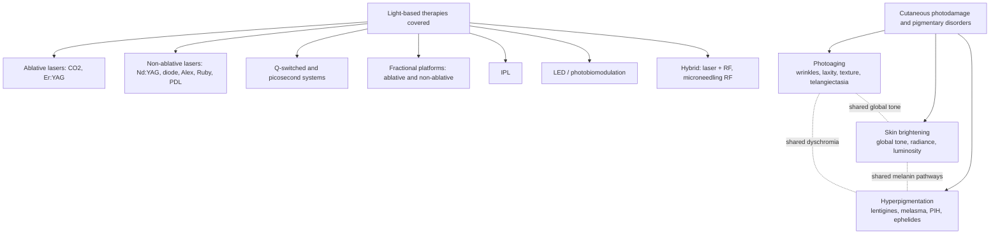
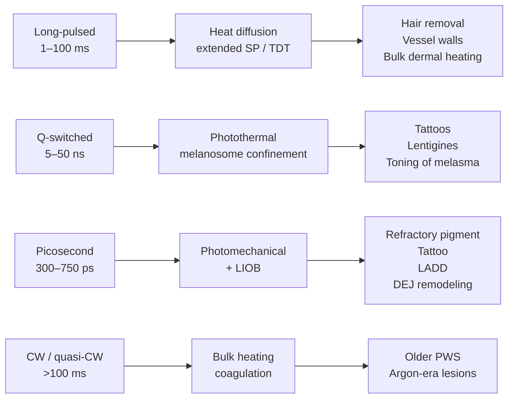
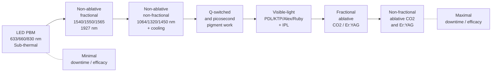
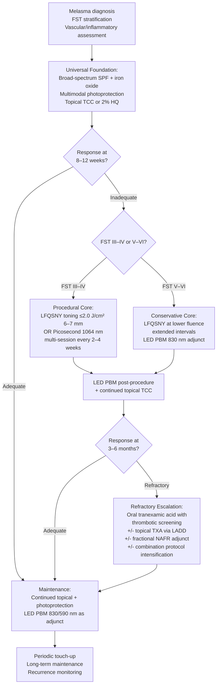
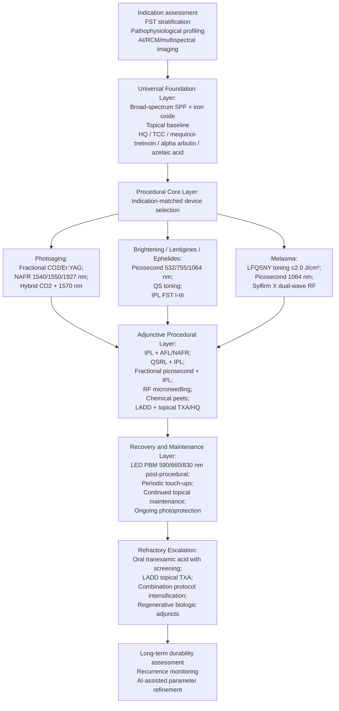
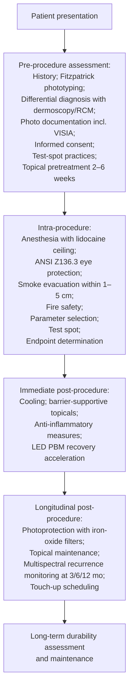
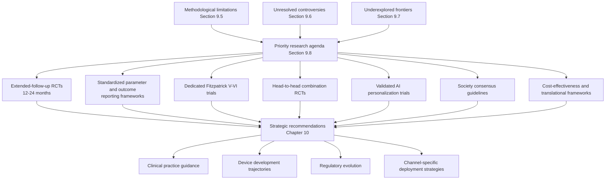

# Light-Based Therapies in Aesthetic Medicine: Current Applications and Scientific Advancements in Photoaging, Skin Brightening, and Hyperpigmentation Management
# 1 Introduction and Research Framework

Over the past three decades, the management of facial photodamage, dyschromia, and age-related decline in skin quality has been progressively transformed by the maturation of photonic technologies. Where surgical lifts, deep chemical peels, and dermabrasion once dominated the aesthetic armamentarium, an expanding family of light-based devices—encompassing ablative and non-ablative lasers, intense pulsed light (IPL), Q-switched and picosecond systems, fractional platforms, and light-emitting diode (LED) photobiomodulation—now occupies the central therapeutic corridor between topical cosmeceuticals and invasive surgery. This shift is not merely technological; it reflects a deeper reorientation of aesthetic dermatology toward minimally invasive, mechanism-targeted, and increasingly personalized care. The present report is constructed against this backdrop, with the explicit aim of synthesizing current applications and recent scientific advancements of light-based therapies for three closely related yet conceptually distinct concerns: photoaging, skin brightening, and hyperpigmentation (including solar lentigines, melasma, post-inflammatory hyperpigmentation, and ephelides). This opening chapter establishes the rationale, conceptual boundaries, research questions, and structural logic that organize the analyses that follow.

## 1.1 Research Background and Significance

The clinical and commercial salience of light-based aesthetic therapy is inseparable from the broader trajectory of the non-invasive and minimally invasive aesthetic market. Industry analyses converge on a picture of sustained, double-digit expansion: the global non-invasive aesthetic treatment market was valued at approximately **USD 82.73 billion in 2024**, is projected to grow from USD 95.42 billion in 2025 to **USD 299.09 billion by 2033 at a CAGR of 15.35%**, with North America holding the largest regional share and Europe and Asia-Pacific representing the most dynamic growth fronts.[^1] Parallel estimates for the broader aesthetic medicine market place its 2024 size at USD 89.64 billion with a projected CAGR of 11.73% through 2033, and the more narrowly defined medical aesthetics segment at USD 19.73 billion in 2024, projected to reach USD 55.15 billion by 2033 at a 12.1% CAGR.[^2][^3] Although these estimates differ in scope and segmentation methodology, they align in two essential respects: the absolute scale of the sector is now substantial, and growth is being driven disproportionately by **non-surgical and energy-based modalities** rather than by classical plastic surgery. According to the International Society of Aesthetic Plastic Surgery (ISAPS), 17.42 million surgical and **20.54 million non-surgical procedures were performed globally in 2024**, with botulinum toxin, hyaluronic acid fillers, hair removal, non-surgical skin tightening, and laser skin treatments dominating the non-surgical category.[^2]

Several converging forces explain why photonic interventions sit near the center of this expansion. The first is **demographic**: United Nations projections indicate that by 2050, one in six people globally will be aged 65 or older, up from one in eleven in 2019, with the population aged 65+ rising from 703 million in 2019 to 1.5 billion by 2050.[^1] In North America alone, the geriatric population in 2024 included approximately 28.4 million U.S. males and 33.5 million U.S. females aged 65+, with comparable scaled figures in Canada, Mexico, Brazil, and Argentina.[^2] This demographic transition translates directly into rising prevalence of cumulative photoaging—wrinkles, laxity, dyschromia, telangiectasia—which the topical formulary alone cannot adequately address, generating sustained demand for resurfacing, tightening, and pigment-targeted technologies.

The second force is a **cultural and behavioral shift** away from operative interventions toward procedures that minimize downtime, surgical risk, and psychological barriers to entry. Compared with surgical alternatives, non-invasive and minimally invasive approaches offer "shorter recovery times, less discomfort and surgical wounds, smaller incisions, quicker wound healing, and fewer problems," while still delivering measurable cosmetic outcomes.[^1] The American Society of Plastic Surgeons reported approximately 28.2 million minimally invasive cosmetic procedures in the U.S. in 2024, and the ASPS more broadly documented over 15.9 million minimally invasive cosmetic procedures in 2023, a 9% year-over-year increase, with Botox procedures rising 73% from 2019 to 2022.[^2][^3] Within this milieu, light-based skin resurfacing and laser skin treatments are explicitly identified among "the common and in-demand noninvasive aesthetic procedures," and approximately 997,245 laser skin resurfacing procedures were estimated to have been carried out in the U.S. in 2020.[^2][^1] The rise of the **medical spa (med spa) channel**—projected to grow at a 16.75% CAGR and offering laser skin resurfacing, photorejuvenation, IPL hair removal, laser tattoo removal, and laser scar removal under medical supervision—has further democratized access to light-based modalities, although it has simultaneously raised concerns about training, credentialing, and quality control that resurface in later chapters.[^1]

A third, increasingly recognized driver is the **shifting environmental exposure profile** of contemporary skin. While ultraviolet (UV) radiation remains the dominant photoaging insult, recent evidence has expanded the photodamage paradigm to include visible light (400–700 nm) and high-energy visible (HEV) blue light (400–500 nm), the latter emitted by both solar radiation and the screens of digital devices that now permeate daily life.[^4] Blue light has been shown to penetrate more deeply into the skin than UVA and UVB, and prolonged exposure increases reactive oxygen species (ROS) production, induces cellular DNA damage, disrupts the epidermal barrier, depletes cutaneous antioxidants, perturbs circadian rhythms, exhibits fibroblast toxicity, and contributes to hyperpigmentation through the oxidation of pre-existing melanin.[^4] Visible light and UVA1 (340–400 nm) further synergize to induce pigmentation and erythema, particularly in **Fitzpatrick skin types IV–VI**, where iron-oxide-containing photoprotection has demonstrated higher visible-light protection factors.[^4] The clinical implication is twofold: photoaging is no longer reducible to UV exposure alone, and aesthetic interventions—including light-based therapies—must be deployed within a broader photoprotective and reparative strategy that addresses cumulative damage across the full UV-visible-IR spectrum.

A fourth driver is **technological innovation itself**. The emergence of picosecond pulse durations, fractional photothermolysis, microlens-array beam shaping, AI-based imaging and dosimetry, and hybrid energy platforms (laser combined with radiofrequency or microneedling) has expanded the range of safely treatable indications and skin types while shortening recovery and improving precision. Industry analyses single out energy-based devices (EBDs)—lasers, IPL, radiofrequency, ultrasound—as among the most transformative technology classes in the field, with the ASDS reporting that **43% of total cosmetic procedures in 2022 were performed using energy-based technologies**, and Lumenis reporting 19% growth in its energy-based aesthetic product revenue in 2022.[^3] Allergan Aesthetics' AI-driven Juvéderm Visualizer (2023), Canfield's AI-augmented VISIA Skin Analysis (2022), and more than 25 FDA marketing-authorization applications for AI aesthetic imaging systems received in 2023 collectively signal that **artificial intelligence and personalization** are now structural features rather than marginal accessories of contemporary photonic practice.[^3]

Taken together, these market, demographic, behavioral, environmental, and technological vectors establish light-based therapy as a genuinely central—rather than peripheral—pillar of aesthetic medicine. They also explain why a synthetic, evidence-anchored examination of how these modalities perform across the specific indications of photoaging, brightening, and hyperpigmentation is both timely and necessary.

## 1.2 Conceptual Definitions and Scope Delimitation

Although photoaging, skin brightening, and hyperpigmentation are routinely grouped together in clinical practice and consumer marketing, they are conceptually distinct, partially overlapping, and demand different mechanistic and therapeutic frames. Clarifying these boundaries at the outset is essential, because the appropriate device, parameter set, and patient population differ depending on which concern dominates a given clinical presentation.

**Photoaging** refers to the cumulative cutaneous damage induced by chronic exposure to UV radiation and, increasingly recognized, visible (including blue) light. At the molecular and histological level, this damage manifests through ROS-mediated oxidative stress, matrix metalloproteinase upregulation and collagen degradation, elastotic remodeling of the dermis, fibroblast dysfunction, DNA damage, impaired barrier function, and dyschromia.[^4] Clinically, photoaging presents as fine and coarse wrinkles, skin laxity, textural irregularity, telangiectasia, mottled pigmentation, and uneven tone—features that demand stimulation of dermal remodeling, neocollagenesis, and pigmentary equalization rather than mere lesion ablation.

**Skin brightening** denotes the global improvement of skin tone, radiance, and luminosity rather than the targeted clearance of a discrete lesion. It is mechanistically heterogeneous, drawing on attenuation of background melanogenesis, disruption of clustered melanosomes, reduction of low-grade dermal inflammation and vascular ectasia, antioxidant upregulation, and improvement of stratum corneum optical properties through enhanced hydration and barrier integrity. In the photonic domain, brightening is most often pursued through low-fluence Q-switched Nd:YAG "laser toning," picosecond toning, IPL photofacials, and LED-based photobiomodulation, the latter activating collagen synthesis and producing measurable tone-evening effects.[^4] Brightening therefore overlaps with—but is not synonymous with—either photoaging treatment or hyperpigmentation lesion clearance.

**Hyperpigmentation** encompasses a heterogeneous group of disorders characterized by localized or diffuse melanin overproduction or maldistribution. It includes UV-induced solar lentigines (age spots), ephelides (freckles), café-au-lait macules, **melasma** (an acquired, chronic, often relapsing dyschromia with both epidermal and dermal pigment components), and **post-inflammatory hyperpigmentation (PIH)**, which itself can be triggered by aggressive light-based interventions, especially in darker phototypes. The distinction between epidermal pigment (more readily targeted by short-wavelength, short-pulse devices) and dermal pigment (requiring deeper-penetrating, often longer-wavelength approaches) is fundamental, as is the recognition that melasma's vascular and inflammatory components mean it cannot be conceptualized as a purely pigmentary disease.[^4]

The relationships among these three concerns are best conceptualized as overlapping rather than nested. The diagram below summarizes the conceptual scope of the report:

The therapeutic scope of this report is correspondingly defined to include: ablative lasers (CO2, Er:YAG); non-ablative lasers spanning the visible to near-infrared range (PDL 595 nm, KTP 532 nm, ruby 694 nm, alexandrite 755 nm, diode, Nd:YAG 1064 nm and frequency-doubled 532 nm); Q-switched systems (nanosecond) and picosecond systems (including the 1064 nm Nd:YAG picosecond platform and microlens-array variants); fractional ablative and non-ablative devices (e.g., 1540/1550 nm, 1927 nm fractional low-powered diode); IPL broadband systems; LED-based photobiomodulation (PBM); and hybrid modalities that integrate light with radiofrequency (e.g., fractional RF, microneedling RF) or with adjuncts such as microneedling, PRP, mesenchymal stem cell media, and topical depigmenting agents (tranexamic acid, hydroquinone, retinoids, niacinamide, vitamin C).[^4]

Several boundary conditions warrant explicit demarcation. First, **topical photoprotection and cosmeceutical antioxidants**—including iron-oxide-containing sunscreens, organic filters such as BDBP and TriAsorB, botanical extracts (e.g., *Polypodium leucotomos*/Fernblock, *Deschampsia antarctica*), Licochalcone A, resveratrol, EGCG, vitamin C, and niacinamide—are indispensable adjuncts to light-based therapy and are referenced where they directly modulate procedural outcomes (e.g., reducing PIH risk or potentiating brightening), but they are not treated as primary subjects of analysis.[^4] Second, **purely energy-based non-light modalities**, such as standalone fractional radiofrequency, microfocused ultrasound with visualization (MFU-V), and HIFU, are addressed only insofar as they are deployed in combination with light-based devices or used as comparators for shared indications such as laxity and rejuvenation.[^4] Third, **injectables, threads, body contouring, and surgical procedures**, although central to the broader aesthetic market, fall outside the analytical scope. This delimitation ensures that the report retains both the breadth required to compare modalities and the focus required for mechanistically rigorous conclusions.

## 1.3 Core Research Questions and Analytical Perspectives

Anchored in the rubric requirements of indication–modality–phototype alignment, mechanistic grounding, and balanced safety analysis, this report is organized around three interrelated core research questions:

1. **Clinical efficacy and current applications**: For each of the three target indications—photoaging, skin brightening, and hyperpigmentation (with melasma analyzed separately given its distinct biology)—what is the present evidence base for individual light-based modalities and combination protocols, stratified by Fitzpatrick skin type and lesion subtype, and how do efficacy endpoints, downtime, and adverse event profiles compare across modalities?
2. **Recent scientific and technological advancements**: How are emerging technologies—picosecond and sub-nanosecond platforms, fractional picosecond systems with microlens arrays, hybrid laser–RF and microneedling–RF devices, AI-assisted parameter selection, novel LED wavelengths, and advanced photobiomodulation protocols—reshaping efficacy ceilings and risk profiles, and how does the evidence support combining light-based therapies with each other or with adjuncts such as topical depigmenting agents, oral tranexamic acid, microneedling, PRP, and mesenchymal stem cell-derived products?
3. **Safety, patient selection, and translational adoption**: How do safety considerations and patient-tailored protocols vary across phototypes (notably IV–VI), what regulatory and market dynamics shape the diffusion of light-based devices in clinics and med spas, and what evidence gaps and methodological limitations constrain current recommendations?

These questions are interrogated through three integrated analytical lenses applied throughout the report. The **clinical lens** focuses on indication-specific outcomes, randomized and comparative evidence, treatment protocols, and adverse event stratification. The **technological lens** examines the biophysics of light–tissue interaction (selective photothermolysis, chromophore absorption, thermal relaxation time, photomechanical effects of picosecond pulses, photobiomodulatory pathways) and the engineering features that translate physics into clinical capability (pulse duration, wavelength, fluence, fractional architecture, beam shaping). The **translational lens** situates these clinical and technological analyses within real-world contexts—market scale and growth, regulatory pathways (FDA 510(k), CE marking under EU MDR), training and credentialing, channel dynamics (clinics, aesthetic centers, med spas), and the cultural and demographic forces driving consumer demand—so that recommendations remain grounded in deployment realities rather than isolated trial conditions.[^2][^3][^1] These three lenses are explicitly cross-referenced rather than treated as parallel silos: a claim about, for example, low-fluence Q-switched Nd:YAG laser toning in melasma must be coherent across mechanistic plausibility, clinical evidence, and translational feasibility before it is admitted as a supported conclusion.

## 1.4 Report Structure and Logical Framework

The remainder of the report unfolds along a deliberately structured progression that moves from mechanistic foundations through indication-specific evidence to comparative synthesis and forward-looking strategy. The table below summarizes this architecture and its connective logic:

| Chapter | Focus | Role in the Logical Chain |
|---|---|---|
| 2 | Light–skin interaction biophysics; pathophysiology of photoaging, melasma, lentigines, PIH, ephelides | Provides the mechanistic substrate against which all later clinical claims are evaluated |
| 3 | Landscape of device categories: ablative/non-ablative lasers, PDL, Q-switched, picosecond, fractional, IPL, LED | Builds the technological map that supports indication-specific analysis |
| 4 | Photoaging and rejuvenation: fractional ablative/non-ablative, IPL, PDL, LED PBM | Applies the framework to wrinkles, laxity, texture, telangiectasia |
| 5 | Brightening and discrete pigmented lesions: laser toning, IPL, picosecond, ablative spot, topical adjuncts | Extends the framework to global tone and lentigines/ephelides/SK |
| 6 | Melasma: low-fluence QS Nd:YAG, picosecond, fractional non-ablative, IPL, LED, multimodal | Examines the most therapeutically resistant indication with an explicit risk lens |
| 7 | Recent advances: picosecond platforms, fractional picosecond, hybrid devices, AI dosimetry, RCM-guided treatment, combination strategies | Synthesizes innovation across modalities and indications |
| 8 | Comparative efficacy, safety, protocols, and skin-of-color considerations | Cross-modality synthesis with explicit phototype stratification |
| 9 | Market trends, regulatory landscape, knowledge gaps | Translational synthesis and research agenda |
| 10 | Conclusions and strategic recommendations | Integration into actionable, evidence-graded guidance |

The logical arc moves from **mechanism (Chapters 2–3) → indication-specific evidence (Chapters 4–6) → innovation and combination (Chapter 7) → comparative and patient-tailored synthesis (Chapter 8) → translational outlook (Chapter 9) → strategic synthesis (Chapter 10)**. Two cross-cutting threads bind the chapters together. The first is **indication–modality–phototype alignment**: every efficacy or safety claim is anchored to a specific indication, a specific device class and parameter set, and a specific phototype population, with explicit attention to skin types IV–VI where evidence is often sparser and risks (PIH, hypopigmentation, paradoxical darkening) are higher. The second is **balanced evidence appraisal**: claims are weighted by study design, sample size, follow-up, and risk of bias, with systematic reviews, meta-analyses, RCTs, and consensus guidelines prioritized over case series, retrospective studies, and manufacturer-sponsored data. Where evidence is limited, heterogeneous, or genuinely contested—as it frequently is for laser toning in melasma, IPL in darker phototypes, and AI-assisted dosimetry—this is acknowledged transparently rather than papered over.

In sum, this introductory chapter has positioned light-based therapy at the intersection of a rapidly expanding aesthetic market, a demographically aging and digitally exposed global population, and a wave of technological innovation that has redrawn the boundaries of non-invasive practice. It has delineated the conceptual terrain of photoaging, skin brightening, and hyperpigmentation; specified the family of light-based modalities under examination; articulated the central research questions and the clinical, technological, and translational lenses through which they will be analyzed; and laid out the chapter-by-chapter logic that organizes the synthesis to follow. The next chapter turns to the biophysical and pathophysiological foundations on which the entire therapeutic edifice rests.

# 2 Scientific Foundations: Light-Skin Interaction and Pathophysiology of Target Conditions

The therapeutic claims that organize the rest of this report—that a 1064 nm Q-switched Nd:YAG laser can selectively disrupt melanosomes without ablating the surrounding epidermis, that a picosecond pulse can fragment pigment by photomechanical rather than thermal means, that a fractional non-ablative laser can stimulate dermal remodeling while sparing intervening tissue, or that an 830 nm light-emitting diode can downregulate melanogenesis without delivering measurable heat at all—rest on a comparatively small set of biophysical and biological principles. Before any indication-specific evidence can be evaluated, those principles must be assembled into a coherent framework, because they jointly determine which device, parameter set, and phototype combination is mechanistically plausible for which target condition. This chapter therefore integrates two domains that are usually treated separately. The first is the physics of light–skin interaction: how photons of a given wavelength, fluence, and pulse duration are absorbed, scattered, and converted into heat, mechanical stress, or photochemical signaling within the skin. The second is the pathophysiology of the target conditions themselves: the molecular and histological lesions that define photoaging, melasma, solar lentigines, ephelides, and post-inflammatory hyperpigmentation (PIH). Reading these two domains against each other establishes the mechanistic rationale by which a modality is matched to an indication, and it surfaces, in advance, the constraints—on efficacy, on selectivity, on phototype safety—that recur throughout the clinical chapters that follow.

## 2.1 The Theory of Selective Photothermolysis: Chromophores, Wavelengths, and Thermal Relaxation Time

The conceptual scaffolding for virtually all modern aesthetic laser practice was established in the seminal 1983 paper by Anderson and Parrish, who introduced the principle of **selective photothermolysis (SP)** as the controlled use of pulsed radiation to achieve "precise microsurgery by selective absorption."[^5][^6] The core idea is deceptively simple: if a target structure within tissue contains a chromophore that absorbs a particular wavelength more strongly than the surrounding tissue, and if energy is delivered in a pulse that is sufficiently brief to confine heat within the target, then the target can be damaged thermally while neighboring structures are preserved.[^7][^8] Three parameters jointly determine whether this selectivity is achieved—**wavelength, pulse duration, and fluence**—and the theory provides explicit, quantitative criteria for each.[^7][^8]

The first criterion is **wavelength selection**: the laser wavelength must be preferentially absorbed by the target chromophore relative to surrounding chromophores.[^8] In aesthetic dermatology the principal endogenous chromophores are **melanin, oxyhemoglobin and deoxyhemoglobin, and water**; artificial chromophores such as tattoo ink, dye, and carbon particles extend the same logic to non-physiological targets.[^9] Melanin absorbs broadly across the ultraviolet, visible, and near-infrared range, with absorption decreasing monotonically as wavelength increases; hemoglobin shows pronounced absorption peaks in the green-yellow range (around 542 and 577 nm) and a smaller shoulder near 1064 nm; water absorbs negligibly below 1300 nm but rises steeply through the mid-infrared and dominates above ~1800 nm. These spectral properties define the **"optical window"** of the skin between roughly 600 and 1200 nm, where competing absorption by hemoglobin and melanin is reduced, light scattering by tissue declines with wavelength, and water absorption is still low—producing the maximum effective penetration depth.[^10][^11] As a practical consequence, shorter wavelengths (e.g., 532 nm Q-switched Nd:YAG, 595 nm pulsed dye, 694 nm ruby, 755 nm alexandrite) are absorbed strongly and superficially, making them well suited to epidermal pigment but more vulnerable to competing absorption by epidermal melanin in darker phototypes; longer wavelengths (1064 nm Nd:YAG) penetrate more deeply and are less attenuated by epidermal melanin, making them safer in Fitzpatrick types IV–VI but requiring higher fluences to deposit equivalent energy in the target.[^12]

The second criterion is **pulse duration relative to the thermal relaxation time (TRT)** of the target. The TRT is operationally defined as the time required for a heated structure to lose approximately half of its peak temperature by conduction to surrounding tissue, and it scales approximately with the square of the target's characteristic dimension. Classical SP requires that the pulse duration $t$ be **shorter than the TRT** of the target, expressed as $t \ll \mathrm{TRT}$, so that "the heat generated within the target due to EMR absorption does not flow out of the structure until it becomes fully damaged."[^9] When this condition is met, energy is confined within the target, peripheral conduction is minimized, and selective injury is achieved at the lowest possible fluence.[^9] TRT values relevant to aesthetic practice span many orders of magnitude: a 1 µm melanosome has a TRT on the order of nanoseconds (ns), a small dermal blood vessel of ~50–100 µm has a TRT on the order of milliseconds, and a hair follicle bulb measured in hundreds of microns has a TRT on the order of tens of milliseconds. This direct scaling links the choice of pulse duration to the size of the chromophore-bearing target.

The third criterion, **fluence (energy per unit area, J/cm²)**, must be sufficient to raise the target above its damage threshold while the pulse-confinement condition holds. Below threshold, no permanent injury occurs; far above threshold, peripheral conduction and non-specific tissue heating dominate, eroding selectivity and inviting collateral damage. The therapeutic window is therefore bounded above and below, and the width of that window is the practical measure of a device's selectivity for a given indication and phototype.

Anderson and Parrish's original formulation assumed that the chromophore and the target of damage occupy the same volume—a uniformly pigmented melanosome, a vessel filled with hemoglobin, a tattoo particle. Many aesthetic targets, however, are **non-uniformly pigmented**: in a hair follicle, melanin is concentrated in the hair shaft and matrix, while the stem cells that must be destroyed for permanent epilation lie at a distance and contain little chromophore; in a vascular malformation, the absorber is intravascular hemoglobin, while the structure that must be coagulated is the vessel wall.[^9] To address this geometry, Altshuler, Anderson and colleagues formulated an **"extended theory of selective photothermolysis"** in 2001, in which "the treatment pulsewidth for non-uniformly pigmented targets is significantly longer than the target thermal relaxation time," because heat must diffuse from the absorber to the structurally distant target.[^9] The extended theory accordingly distinguishes a **"thermal damage time" (TDT)**—the time required for heat to reach and injure the target by diffusion from the absorber—from the classical TRT, and it shows that for hair follicles, leg veins, and similar geometries the optimal pulse durations are millisecond rather than nanosecond in scale.[^9] In an in vitro experiment on hair follicles, the size of the damage zone was shown to be pulsewidth-independent over a broad range (30–400 ms), confirming that long pulses can deliver selective damage when target geometry, rather than chromophore mass alone, governs the requirement.[^9] This distinction is conceptually important because it explains why long-pulsed devices (alexandrite, diode, Nd:YAG in millisecond mode) dominate hair removal and vascular indications, while sub-microsecond Q-switched and picosecond devices dominate pigmented lesion and tattoo work.

## 2.2 Pulse Duration Regimes: From Long-Pulsed to Picosecond Domains

The spectrum of aesthetic devices can be ordered on a logarithmic axis of pulse duration that runs from continuous-wave through millisecond, microsecond, nanosecond, and into the picosecond domain. Each regime corresponds to a qualitatively different mode of tissue interaction.

**Long-pulsed lasers** (millisecond range, 1–100 ms) are designed to satisfy the extended theory's TDT requirement for sizable, non-uniformly pigmented targets. Long-pulsed alexandrite (755 nm), diode (800 nm), and Nd:YAG (1064 nm) systems are the workhorses of laser hair removal and the treatment of leg telangiectasias and reticular veins, where the target is a vessel wall or a follicular stem-cell niche rather than a discrete pigment particle.[^12] The same long-pulse Nd:YAG, deployed at moderate fluences with cooling, also addresses dermal vascular components in rejuvenation and rosacea.

**Q-switched (nanosecond) lasers**—including the Q-switched ruby (694 nm), Q-switched alexandrite (755 nm), and Q-switched Nd:YAG at both fundamental (1064 nm) and frequency-doubled (532 nm) wavelengths—deliver pulses of 5–50 ns, well below the ~1 µs TRT of an individual melanosome.[^12] This pulse-confinement regime allows true subcellular selective photothermolysis: melanosomes can be ruptured or thermally damaged without significant heat conduction into the surrounding melanocyte cytoplasm or basal keratinocyte. As summarized in the melasma literature, **"the Q-switched laser delivers pulses in the nanosecond range, significantly shorter than the thermal relaxation time of melanosomes,"** allowing "selective photothermolysis of melanosomes with minimal collateral damage to surrounding tissues" and underpinning their wide use in pigmentary disorders.[^13] At low fluence (1.6–3.8 J/cm² with a 6–7 mm spot), the 1064 nm Q-switched Nd:YAG can act at a "subcellular" level—reducing melanocyte cell volume and dendritic processes, and modifying the three-dimensional structure of melanosomes—rather than ablating pigmented cells outright.[^13]

**Picosecond lasers** (10⁻¹² s domain, typically 300–750 ps in commercial platforms) push the pulse-confinement regime further by reducing pulse duration from nanoseconds into picoseconds. As the melasma literature makes explicit, **"compared to Q-switched lasers, picosecond lasers have a shorter pulse duration, resulting in significantly reduced thermal effects and enhanced mechanical effects,"** allowing "the use of lower energy levels to instantaneously disrupt melanin particles without damaging surrounding cells."[^13] Two mechanistic features distinguish the picosecond regime. First, the photomechanical (acoustic/cavitation) component dominates over the thermal component: pigment particles are shattered into smaller fragments by rapid pressure transients rather than being heated to coagulation. Second, at sufficiently high peak power, picosecond pulses can induce **laser-induced optical breakdown (LIOB)**—a localized plasma formation within the dermis that creates intra-epidermal vacuoles and dermal-epidermal junction modifications without disrupting the stratum corneum.[^13] LIOB is being explicitly exploited to "improve the dermal-epidermal junction (DEJ) and promote regeneration of the dermal extracellular matrix (ECM)" and to "transiently open epidermal channels, enhancing the immediate absorption of topically applied agents," providing a rationale for laser-assisted drug delivery (LADD) of agents such as tranexamic acid.[^13] Comparative work cited in the melasma chapter found that the 755 nm picosecond laser produced "marked improvement after a single picosecond laser session," with significantly better outcomes after four treatments than the 1064 nm Q-switched Nd:YAG.[^13]

A schematic of how pulse-duration regime maps to dominant mechanism and prototypical indication is shown below:

Two implications follow for later chapters. First, **the choice of pulse-duration regime is itself an indication- and phototype-specific decision**, not a question of "newer is better." A picosecond device used at parameters appropriate for tattoo clearance can produce hypopigmentation if applied without modification to facial melasma in a Fitzpatrick IV patient; a long-pulsed device suitable for hair removal will not address an epidermal lentigo. Second, **the photomechanical character of picosecond pulses introduces qualitatively new mechanisms (LIOB, LADD) that are not reducible to faster classical SP**, and the evidence for these mechanisms must be evaluated on its own terms rather than absorbed into the older Anderson–Parrish framework.

## 2.3 Ablative, Non-Ablative, Fractional, and Non-Fractional Architectures

A second axis along which devices differ is whether the energy is deposited continuously across the treatment field or distributed into microscopic columns, and whether the epidermis is ablated or preserved. These architectural distinctions—**ablative vs. non-ablative**, **fractional vs. non-fractional**—were articulated as a coherent framework in the 2008 review by Alexiades-Armenakas, Dover and Arndt and have organized the resurfacing literature ever since.[^12]

**Ablative resurfacing** uses water-absorbing wavelengths—principally CO2 (10,600 nm) and Er:YAG (2940 nm)—to vaporize the epidermis and superficial dermis in a controlled depth-graded fashion, producing immediate tissue contraction, neocollagenesis, and dramatic remodeling at the cost of significant downtime and heightened risk of pigmentary complications, particularly in darker phototypes.[^12] **Non-ablative remodeling** uses mid-infrared wavelengths (1064 nm Nd:YAG, 1320 nm Nd:YAG, 1450 nm diode, 1540/1550 nm Er:glass) coupled with epidermal cooling (sapphire contact, cryogen spray, dynamic cooling) to deposit heat in the dermis while sparing the epidermis, producing more modest remodeling with minimal downtime.[^12] The trade-off between magnitude of effect and recovery burden is a recurring theme of the resurfacing literature.[^12]

**Fractional photothermolysis**, introduced by Manstein, Anderson and colleagues in 2004, broke the binary by distributing energy into "microscopic patterns of thermal injury"—arrays of microthermal zones (MTZs) of treated tissue surrounded by untreated skin—thereby preserving a substantial reservoir of intact stem cells and accelerating re-epithelialization.[^12] As summarized in the melasma context, fractional technology "divides a large laser spot into numerous smaller microspots, ensuring that only a fraction of the skin is treated during each session," which "preserves a substantial amount of intact skin, thereby accelerating post-treatment healing, reducing inflammatory responses, and minimizing the risks of scarring and post-inflammatory hyperpigmentation."[^13] Fractional devices are subdivided into **non-ablative** (Er:glass 1540/1550 nm, fractional 1927 nm thulium) and **ablative** (fractional CO2, fractional Er:YAG) variants, with non-ablative versions preferred when PIH risk is high.[^13][^12] The microchannels created by fractional treatment also serve as drug-delivery conduits—**laser-assisted drug delivery (LADD)**—through which topical tranexamic acid, kojic acid, and other agents can penetrate the dermis at concentrations not achievable with passive topical application.[^13]

The four architectures can be summarized as follows:

| Architecture | Wavelengths (typical) | Tissue effect | Indications | Phototype tolerance |
|---|---|---|---|---|
| Non-fractional ablative | CO2 10,600 nm; Er:YAG 2940 nm | Full-field epidermal/superficial dermal vaporization; deep remodeling | Severe photoaging, deep rhytides, atrophic scars | Caution in IV–VI; high PIH/hypopigmentation risk |
| Non-fractional non-ablative | Nd:YAG 1064/1320 nm; diode 1450 nm; Er:glass 1540 nm with cooling | Bulk dermal heating, epidermis spared | Mild–moderate rhytides, dermal remodeling | Generally safer, modest effect |
| Fractional ablative | Fractional CO2; fractional Er:YAG | Columns of vaporization with intact bridges | Photoaging, scars, dyschromia | Moderate risk in IV–VI; reduced vs full-field |
| Fractional non-ablative | 1540/1550 nm; 1927 nm thulium; fractional Q-switched/picosecond | Columns of coagulation with intact epidermis | Mild–moderate photoaging, melasma, refractory pigment, LADD | Most permissive in IV–VI |

The fractional concept is also extended into the picosecond domain via **microlens arrays and diffractive optical elements**, which split a single picosecond beam into a grid of high-fluence spots capable of generating LIOB at depth without ablating the surface—addressing pigment, dyschromia, and collagen simultaneously, and providing an elegant biophysical bridge between SP-based pigment work and remodeling-based rejuvenation.[^13]

## 2.4 Photobiomodulation: Light Without Heat

The mechanisms surveyed so far depend on the photothermal or photomechanical conversion of absorbed light into damage, however selective. **Photobiomodulation (PBM)**—also termed low-level laser/light therapy (LLLT)—operates by an entirely different mechanism: photons in the red and near-infrared range are absorbed by intracellular chromophores at fluences far below any threshold for thermal injury, triggering photochemical signaling that modulates cellular metabolism, gene expression, and behavior.[^10][^11]

The first law of photobiology requires that for low-power visible light to produce any biological effect, "the photons must be absorbed by electronic absorption bands belonging to some molecular chromophore or photoacceptor."[^10][^11] In mammalian skin, the principal photoacceptor identified for the red and near-IR range is **cytochrome c oxidase (CCO)**, the terminal enzyme of the mitochondrial electron-transport chain, whose copper and heme centers exhibit absorption bands extending up to ~1000 nm and whose absorption spectra closely match the action spectra for biological responses to light.[^10][^11] Tissue absorption and scattering both decline through the red and near-IR; combined with the high absorption of hemoglobin and melanin at shorter wavelengths and water above ~1100 nm, this defines the same **"optical window" between roughly 600 and 1100 nm** within which clinical PBM operates.[^10][^11] PBM uses output powers on the order of 0.001–0.1 W, fluences in the range 0.01–100 J/cm², and irradiances of 0.01–10 W/cm², distinguishing it sharply from the thermal regimens used for SP.[^11]

The proposed PBM cascade unfolds in three coupled steps. First, photon absorption by CCO **photodissociates inhibitory nitric oxide (NO)** from the binuclear CuB/a3 center, reversibly relieving NO-induced inhibition of mitochondrial respiration; this dissociation has been demonstrated in isolated mitochondria and whole cells.[^10][^11] Second, electron transport accelerates, increasing ATP synthesis, the proton gradient, activity of Na+/H+ and Ca2+/Na+ antiporters, ATP-driven ion pumps, and—through ATP/cAMP and Ca2+ second-messenger systems—a wide array of downstream signaling pathways.[^10][^11] Third, a brief, controlled rise in **reactive oxygen species (ROS)** activates redox-sensitive transcription factors—NF-κB, AP-1, ATF/CREB, p53, HIF-1—that re-program gene expression toward proliferation, migration, anti-apoptosis, and matrix remodeling, with concomitant NO release providing additional signaling.[^10][^11] Microarray studies of red-light-irradiated human fibroblasts have identified upregulated genes spanning proliferation (MAPK11, BCR, PDGF-C, serum response factor), mitochondrial energy metabolism (NADH dehydrogenase subunits, ATP synthase F0 subunit d, electron-transfer-flavoprotein β), and downregulated apoptosis-related genes (HSP70 1A, caspase 6, stress-induced phosphoprotein 1) and cell-cycle inhibitors (cullin 1).[^11]

Two features of PBM bear directly on its aesthetic application. The first is the **biphasic dose response**: at low fluences (typically 1–10 J/cm²) PBM stimulates proliferation, migration, and ATP synthesis, while at higher fluences these effects plateau or invert toward inhibition.[^10] In a representative study, a single exposure to 632, 670, or 810 nm light at 2–4 J/cm² produced maximal stimulation of wound contraction in mice, mediated by fibroblast-to-myofibroblast transformation through NF-κB.[^10] Operationally, this means that PBM dosing is governed by a narrow window very different from the threshold-and-saturation logic of SP. The second is that PBM's mechanism is **non-thermal**, allowing it to be delivered by both lasers and light-emitting diodes (LEDs) with comparable biological effect, since coherence is not required for absorption by CCO; LEDs accordingly dominate the at-home and panel-based PBM market.[^10]

PBM is also relevant to pigmentary modulation through a distinct pathway. A 2024 study demonstrated that **830 nm LED at fluences of 5–20 J/cm² inhibits melanogenesis** in human melanocytes by suppressing AKT phosphorylation and inducing nuclear translocation of FOXO3a, thereby reducing melanosome maturation, melanin content, tyrosinase activity, and melanogenesis-related proteins; FOXO3a knockdown and AKT activation reversed this phenotype, and Fontana-Masson staining of human skin explants confirmed reduced epidermal basal pigmentation after irradiation.[^14] This supplies a mechanistic basis for incorporating LED PBM into brightening and adjunctive melasma protocols, distinct from the photothermal melanosome-disruption logic of Q-switched and picosecond devices.

## 2.5 Pathophysiology of Photoaging: From UV-Induced Molecular Damage to Histological Phenotype

Photoaging is, at the molecular level, the cumulative consequence of repeated UV-induced ROS generation, DNA damage, and dysregulation of dermal extracellular matrix (ECM) homeostasis. UV irradiation directly induces expression of multiple members of the **matrix metalloproteinase (MMP) family**, which "degrade collagen and other extracellular matrix (ECM)" components, shifting the balance of dermal homeostasis from synthesis toward degradation.[^15][^16] In a BALB/c mouse model of photoaged skin, chronic UV exposure produced "epidermal hyperplasia, dermal thickening, and collagen degradation" and "upregulated MMP-1," reproducing the principal histological signatures of human photoaging.[^17] These changes—diminished and disorganized type I and type III collagen, accumulation of fragmented and abnormal elastin (solar elastosis), and impaired fibroblast function—translate into the clinical phenotype of fine and coarse rhytides, laxity, sallowness, and textural irregularity that drives demand for resurfacing devices.

A second, equally important component of photoaging is **dyschromia and vascular dysregulation**. Chronic UV exposure produces a heterogeneous distribution of melanin and abnormal melanocyte function within the epidermis (manifesting as solar lentigines and mottled hyperpigmentation), while also inducing angiogenic responses that produce telangiectasias and persistent erythema. These pigmentary and vascular components share dermal origins with the matrix changes and respond to overlapping but distinct device families—pigment-targeted Q-switched/picosecond systems and IPL for melanin, PDL and IPL for hemoglobin, fractional ablative and non-ablative platforms for collagen remodeling—explaining why photoaging is rarely well treated by any single device class and why combination protocols, examined in Chapter 7, are clinically standard.

The mechanistic rationale for fractional and ablative resurfacing follows directly from this pathophysiology. By creating columns of controlled thermal injury (fractional non-ablative), full-field vaporization (CO2/Er:YAG), or arrays of LIOB cavities (fractional picosecond), these devices simulate a wound-healing cascade that drives fibroblast activation, neocollagenesis, and ECM remodeling, partially reversing the MMP-driven collagen depletion that defines photoaging.[^13][^12] PBM, by contrast, addresses the same matrix deficit through stimulation of fibroblast proliferation, anti-apoptotic gene expression, and TGF-β/myofibroblast transformation, achieving more modest but cumulative remodeling without thermal injury.[^10][^11] The clinical equipoise between aggressive ablative remodeling and gentler fractional or PBM-based protocols therefore reflects a genuine biological trade-off between magnitude of stimulus and risk of collateral damage—a trade-off whose resolution depends on indication severity, phototype, and downtime tolerance, as developed in Chapter 4.

## 2.6 Pathophysiology of Hyperpigmentary Disorders

The hyperpigmentary disorders relevant to this report differ markedly in pathogenesis, depth, chronicity, and recurrence risk, and these differences—not the mere presence of "pigment"—dictate which light-based modalities can be effective and safe.

### 2.6.1 Solar Lentigines (Age Spots)

Solar lentigines are "light brown to black pigmented lesions of various sizes that typically develop in chronically sun-exposed skin," strongly associated with photodamage and an increased risk for skin cancer.[^18][^19] Histologically, they display "elongated, club-shaped rete ridges containing numerous melanocytes and increased melanin production without cellular atypia," together with "epidermal hyperplasia, elongated epidermal rete ridges with club-shaped or bud-like extensions, and thinned and atrophic epidermis between rete ridges."[^19] Quantitative Fontana-Masson analysis shows on average a **~2-fold increase of melanin content** in age-spot specimens compared to perilesional control skin.[^19]

The molecular characterization of age spots, however, has produced a striking and clinically important finding: **melanocyte-specific genes are not significantly upregulated** in lentigines compared with adjacent normal skin. In a microarray analysis by Choi and colleagues of Caucasian forearm lentigines, "none of the melanocyte-specific genes showed a significantly different gene expression level in age spots compared to the perilesional control skin," and known paracrine melanogenic factors (EDN1, SCF, KGF, POMC, NRG1, DKK1) were not differentially expressed.[^19] Among 2,003 differentially expressed genes (193 with >2-fold change), the dominant signals fell in extracellular matrix organization, epidermis development, wound healing, and—most informatively—the keratin compartment: **keratin 5 (basal keratinocytes) and keratin 10 (suprabasal keratinocytes) were both abnormally elevated**.[^19] The authors propose that age spots represent **impaired melanin removal rather than accelerated melanin synthesis**: hyperproliferating basal keratinocytes (KRT5↑) push downward against a thinned, disrupted basement membrane while delayed suprabasal desquamation (KRT10↑) traps melanin in the basal layer, producing the elongated rete ridges and basal hyperpigmentation that define the lesion.[^19] Receptor immunohistochemistry corroborates a mildly stimulated melanocyte environment (c-KIT and FGFR-1 expression appears more intense in lentigines), but melanocyte density along the dermal–epidermal junction, when corrected for the lengthened basal contour, is comparable to that in perilesional skin.[^19]

For light-based therapy, this pathology has two implications. First, because lentigines combine epidermal melanin excess with structural epidermal hyperplasia, **short-wavelength, short-pulse devices (532 nm Q-switched Nd:YAG, 694 nm Q-switched ruby, 755 nm alexandrite, picosecond 532/755 nm)** can clear the lesion through direct photothermal/photomechanical melanosome disruption, often in one to a few sessions, while devices that ablate the rete ridges and accelerate epidermal turnover (fractional resurfacing, IPL with epidermal microcrust formation) address the architectural component. Second, because the underlying driver is keratinocyte cycling rather than melanocyte hyperactivity per se, recurrence after device-based clearance is plausible whenever ongoing UV exposure re-induces the rete-ridge phenotype—a prediction borne out in the clinical durability data discussed in Chapter 5.

### 2.6.2 Melasma

Melasma occupies a fundamentally different pathophysiological category. It is "an acquired pigmentary disorder characterized by irregular brown macules and patches on sun-exposed areas of the face," resulting from "the excessive deposition of melanin in both the epidermis and dermis," predominantly affecting women aged 30–40 with Fitzpatrick types III and IV, with approximately **48% of patients having a family history** and 97% of those involving first-degree relatives.[^13] Although initially conceptualized as a melanocyte-centered disease, contemporary evidence frames melasma as a **multi-compartment disorder of melanocytes, keratinocytes, fibroblasts, mast cells, vasculature, basement membrane, and inflammatory pathways.**[^13][^20][^21]

Five interlocking pathogenic axes have been characterized. (i) **Melanocyte hyperactivity**: UV and high-energy visible light upregulate microphthalmia-associated transcription factor (MITF) via the MC1R/cAMP/PKA pathway, increasing tyrosinase, TRP-1, TRP-2 expression; blue-violet light additionally activates melanocytes through opsin 3 (OPN3)–Ca²⁺/CAMKII/CREB/ERK/p38 signaling, augmenting MITF activity and melanogenesis.[^13] WIF-1 expression is reduced while Wnt-1 and Wnt-5a are elevated, indicating Wnt-pathway hyperactivation, and the WIF-1/β-catenin/MITF axis appears central.[^13] Estrogen upregulates PDZK1 in a dose-dependent manner, contributing to the female and pregnancy-associated predominance.[^13] (ii) **Vascular involvement**: VEGF expression is elevated in lesional epidermis, dermal vascularity is increased, capillary dilation is visible on dermoscopy, and VEGFR stimulation directly upregulates MITF, tyrosinase, and TRP-1/2 in melanocytes; endothelin-1 from microvascular endothelium activates MAPK/ERK/p38 to enhance melanogenesis, and inducible nitric oxide synthase produces NO that further stimulates MITF.[^13] (iii) **Inflammation**: IL-6R and ET-1R are upregulated in the basal layer of melasma lesions, ET-1 drives melanocyte dendrite branching that enhances melanosome transport to keratinocytes, and a low-grade inflammatory infiltrate is detectable in the superficial dermis.[^13] (iv) **Basement membrane and barrier disruption**: chronic UVA/HEVL exposure produces "structural alterations in the basement membrane, characterized by thinning, discontinuities, loss of anchoring fibrils, and the presence of pendulous melanocytes," and the stratum corneum is "notably thinner, with impaired barrier function reflected by increased transepidermal water loss and delayed barrier recovery"; **MMP-2 and MMP-9 activities are elevated**, degrading type IV and type VII collagen and compromising the dermal–epidermal interface that ordinarily contains pigment within the epidermal compartment.[^13][^21] (v) **Dermal pathology**: dermal melanophages, solar elastosis, and angiogenesis collectively produce a "dermal" or "mixed" melasma component that is intrinsically more refractory to epidermally targeted devices.[^21]

This multifactorial pathogenesis has direct implications for light-based therapy. First, **melasma cannot be treated as a pure pigment disorder**: any modality that addresses melanin in isolation—however selectively—will leave intact the vascular, inflammatory, and basement-membrane drivers that re-fuel pigmentation. Second, **aggressive thermal injury reactivates the very inflammatory and vascular pathways that drive disease**, providing the mechanistic basis for the well-documented phenomenon of paradoxical worsening or rebound hyperpigmentation following high-fluence laser treatment, and motivating the low-fluence Q-switched Nd:YAG "laser toning" strategy with subcellular-selective photothermolysis at 1.6–3.8 J/cm² and 6–7 mm spot sizes.[^13] Third, the **fragile basement membrane** in melasma renders the skin particularly vulnerable to PIH and to dermal pigment release after disruption, requiring conservative parameter selection in this indication. Fourth, the contribution of vasculature creates a rationale for **vascular-targeted devices (PDL, IPL with appropriate filters, low-fluence QS Nd:YAG combined with PDL)** and for systemic agents such as oral tranexamic acid, which exhibits anti-angiogenic and anti-mast-cell activity in addition to plasmin-pathway modulation.[^13] These mechanistic constraints frame the cautious, multimodal posture of contemporary melasma therapy developed in Chapter 6.

### 2.6.3 Post-Inflammatory Hyperpigmentation, Ephelides, and Other Pigmentary Lesions

**Post-inflammatory hyperpigmentation (PIH)** appears as "light brown, violaceous-brown, or dark brown patches that develop secondary to acute or chronic inflammatory dermatoses, confined to areas of previous inflammation," with diagnosis based primarily on a history of antecedent inflammation followed by pigmentation in the same distribution.[^13] Mechanistically, dermal inflammation stimulates melanocyte tyrosinase activity through cytokines, prostaglandins, and reactive oxygen intermediates; if the basement membrane is disrupted (as with traumatic or aggressive procedural injury), melanin escapes into the dermis and is engulfed by macrophages (melanophages), producing the long-lasting, refractory dermal PIH characteristic of darker phototypes. PIH is therefore both a target of light-based therapy and—critically—an **iatrogenic adverse event** associated with poorly chosen device parameters in Fitzpatrick IV–VI skin, a duality returned to repeatedly in Chapters 6 and 8.

**Ephelides (freckles)** are small, sharply demarcated, light-brown macules that darken with sun exposure and fade with sun avoidance; they reflect localized hyperactive melanocytes producing increased melanin in normal-numbered melanocytes, without the rete-ridge hyperplasia of lentigines or the basement-membrane disruption of melasma. Their epidermal, melanocyte-driven character makes them highly responsive to short-wavelength Q-switched and picosecond devices and to IPL, although recurrence with continued UV exposure is the rule rather than the exception.

**Differential diagnostic considerations** become important because mistaken identification mismatches modality and indication. Nevus of Ota and Hori's nevus, although often grouped with melasma in lay perception, are dermal melanocytoses with characteristic "highly refractile dendritic melanocytes" in the mid-dermis on reflectance confocal microscopy and require deeper-penetrating Q-switched 1064 nm Nd:YAG or picosecond 1064/755 nm devices targeting dermal pigment.[^13] Pigmented contact dermatitis and exogenous ochronosis (the latter classically a complication of long-term hydroquinone use, identifiable on dermoscopy as "homogeneous brown patches without a pseudo-reticular pigment network") must be excluded before laser therapy, as they may worsen with thermal stimulation.[^13]

The pathophysiological distinctions among these conditions are summarized below to anchor the modality-selection logic of subsequent chapters:

| Condition | Dominant pigment depth | Key drivers | Mechanistic rationale for device selection |
|---|---|---|---|
| Solar lentigines | Epidermal (hyperplastic rete ridges; ~2× melanin)[^19] | Cumulative UV; impaired keratinocyte turnover; basal melanin trapping[^19] | Short-wavelength QS/picosecond (532, 694, 755 nm); IPL; ablative spot — direct epidermal melanosome disruption[^13][^12] |
| Ephelides | Epidermal (normal melanocyte number, ↑activity) | UV-induced focal melanocyte hyperactivity | Short-wavelength QS/picosecond; IPL; high recurrence with UV[^12] |
| Melasma | Epidermal + dermal + mixed; basement-membrane disruption | MITF/Wnt; estrogen/PDZK1; OPN3; VEGF/EDN1/iNOS; mast cells; MMP-2/9; barrier defect[^13][^21] | Low-fluence QS Nd:YAG (1064 nm) "toning"; picosecond at conservative parameters; fractional non-ablative; IPL only with strict criteria; vascular-targeted (PDL); LED PBM; combined with topical/oral agents[^13] |
| PIH | Epidermal (cytokine-driven) ± dermal (BM disruption → melanophages) | Antecedent inflammation; melanocyte stimulation; BM disruption | Conservative QS Nd:YAG/picosecond at low fluence; LED PBM; topical depigmenting agents; avoid aggressive ablative/IPL in IV–VI[^13] |
| Nevus of Ota / Hori's | Dermal melanocytes (mid-dermis) | Embryologic / acquired dermal melanocytes | Deeper-penetrating QS 1064 nm Nd:YAG; QS ruby/alexandrite; picosecond 1064/755 nm[^13][^12] |

## 2.7 Synthesis: The Mechanistic Logic of Modality Selection

Joining the biophysical and pathophysiological strands developed above yields a compact mechanistic framework that anticipates the indication-specific analyses of Chapters 4–6 and the comparative synthesis of Chapter 8. **Wavelength selects depth and chromophore**: short wavelengths target epidermal pigment but compete with epidermal melanin in darker phototypes, while 1064 nm Nd:YAG penetrates more deeply and is preferentially safer in Fitzpatrick IV–VI. **Pulse duration selects mechanism and target size**: nanosecond pulses confine heat within melanosomes for pigment work, picosecond pulses add photomechanical fragmentation and LIOB-driven dermal remodeling, and millisecond pulses serve larger non-uniformly pigmented targets via heat diffusion. **Architecture (ablative/non-ablative; fractional/non-fractional)** selects depth of field and downtime: full-field ablative resurfacing maximizes remodeling at maximal phototype risk, while fractional non-ablative platforms minimize PIH and serve as conduits for laser-assisted drug delivery. **PBM**, operating below thermal thresholds, addresses fibroblast and melanocyte signaling without requiring tissue injury, providing an adjunctive lever distinct from the SP framework.

These device-side choices must then be calibrated against the target's **pathophysiology**: for photoaging, against MMP-driven collagen loss and combined dyschromia–vascular changes; for solar lentigines, against the keratinocyte-cycling/rete-ridge phenotype rather than melanocyte hyperactivity; for ephelides, against highly responsive but UV-rebound-prone epidermal melanin; for melasma, against a multi-compartment disease whose vascular, inflammatory, basement-membrane, and barrier components limit any pigment-only approach and create real risks of paradoxical worsening; and for PIH, against both an indication and an iatrogenic complication that constrains parameter aggressiveness in skin of color.

It is worth flagging at this stage that several of the mechanistic frameworks invoked above—particularly LIOB-mediated dermal remodeling, FOXO3a-mediated PBM regulation of melanogenesis, and the keratinocyte-cycling model of solar lentigines—rest on more limited and recent evidence than the classical SP framework, and Chapter 9 will return to the methodological gaps (parameter heterogeneity, short follow-up, underrepresentation of skin types IV–VI in pivotal trials, uncertain mechanistic translation between in vitro and in vivo systems) that constrain confident extrapolation. The framework set out here is therefore best understood as a structured hypothesis space within which the clinical evidence of subsequent chapters will be evaluated, rather than as a closed deductive system from which clinical recommendations can be read off directly. With these foundations in place, Chapter 3 turns to the device landscape itself, mapping the major technology categories—ablative and non-ablative lasers, PDL, Q-switched and picosecond systems, fractional platforms, IPL, and LED—against the mechanistic and pathophysiological criteria established here.

# 3 Landscape of Light-Based Technologies in Aesthetic Practice

The biophysical and pathophysiological framework developed in Chapter 2 establishes the criteria—wavelength selection of depth and chromophore, pulse duration selection of mechanism and target size, architectural selection of ablative scope and downtime, and photobiomodulation as a non-thermal lever—against which any device must be evaluated. Translating those criteria into clinical practice, however, requires a parallel mapping of the device population itself: what wavelengths, pulse-duration regimes, fluence ranges, spatial architectures, and cooling strategies are actually embodied in the platforms that aesthetic dermatologists, plastic surgeons, and medical-spa practitioners deploy on patients. This chapter constructs that map. Its purpose is not to enumerate every commercially available device—an exercise that would be impossible given the proliferation of branded systems—but to organize the major device families into a coherent comparative grid that the indication-specific chapters (4–6) and the comparative synthesis chapter (8) can draw upon. Each family is profiled against a uniform parameter set—characteristic wavelength, pulse duration, fluence/energy, depth of penetration, dominant tissue effect, downtime, and Fitzpatrick phototype tolerance—and is positioned within the indication space of photoaging, skin brightening, and hyperpigmentation. The chapter closes with a synthesis matrix that locates each device family along the efficacy–downtime–safety trade-off curve, surfacing the gaps that motivate the combination strategies analyzed in Chapter 7.

## 3.1 Classification Framework and Comparative Parameters

Light-based aesthetic devices resist a single linear taxonomy because they vary simultaneously along multiple, partially independent axes. A coherent classification therefore requires a **multi-axis framework** in which each device is located on four orthogonal dimensions: wavelength and target chromophore, pulse-duration regime, tissue-interaction mode, and spatial architecture. Each axis derives directly from a principle developed in Chapter 2.

The **first axis—wavelength and target chromophore**—follows from the absorption spectra of skin's principal chromophores: water absorption rises sharply in the mid-infrared (12,000/cm at 2940 nm; 800/cm at 10,600 nm), making these wavelengths the natural basis for ablative resurfacing; melanin absorbs broadly across the UV-visible-near-IR with monotonically declining absorption toward longer wavelengths; hemoglobin shows distinct peaks in the green-yellow range (542, 577 nm) and a smaller shoulder near 1064 nm; and the optical window of 600–1200 nm offers maximum effective penetration with minimal competing absorption.[^22] Devices are therefore primarily classified as water-targeted (CO2, Er:YAG, Er:glass, thulium), melanin-targeted (Q-switched/picosecond systems at 532, 694, 755, 1064 nm; ruby; alexandrite; IPL with appropriate filters), hemoglobin-targeted (PDL 585/595 nm; KTP 532 nm; long-pulsed Nd:YAG; IPL with vascular filters), or mitochondrial-photoacceptor-targeted (LED PBM at 633, 660–670, 830, 1072 nm).

The **second axis—pulse-duration regime**—runs from continuous-wave through milliseconds, microseconds, nanoseconds, and into picoseconds, with each regime corresponding to a qualitatively different mode of tissue interaction as established in Chapter 2. CW and quasi-CW operation produces bulk heating and coagulation; millisecond pulses serve large non-uniformly pigmented targets via the thermal damage time framework; nanosecond Q-switched pulses confine heat within melanosomes for true subcellular selective photothermolysis; and picosecond pulses introduce photomechanical fragmentation and laser-induced optical breakdown.[^22]

The **third axis—tissue-interaction mode**—distinguishes ablative (vaporization at temperatures approaching 100°C, with surrounding coagulation 60–85°C and carbonization above 85°C), non-ablative (subablative dermal heating with epidermal preservation, typically through cooling), photomechanical (acoustic and cavitation effects of picosecond pulses), and photobiomodulatory (sub-thermal photochemical signaling via cytochrome c oxidase) interactions.[^22]

The **fourth axis—spatial architecture**—separates non-fractional or "full-beam" delivery, in which energy is deposited across the entire treatment field, from fractional delivery, in which microscopic columns of treated tissue are interspersed with untreated bridges that preserve epidermal stem cells and accelerate re-epithelialization. Fractional architecture, introduced in 2004, applies to both non-ablative platforms (1440, 1540, 1550, 1565/1570 nm Er:glass and fiber lasers; 1927 nm thulium) and ablative platforms (fractional CO2 introduced in 2006; fractional Er:YAG with dual-pulse capability reaching 1 mm of ablation), and has been extended into the picosecond domain via microlens arrays and diffractive optical elements.[^22]

Throughout this chapter, each device family will be described against a uniform comparative parameter set: characteristic **wavelength** (nm), typical **spot size** (mm), **fluence** (J/cm²) or **energy per pixel** (mJ), **repetition rate** (Hz), **beam density** (percentage of untreated tissue between spots, or pixels/cm²), **cooling mechanism** (sapphire contact, cryogen spray, dynamic cooling, none), and **regulatory clearance status** (illustrated through representative FDA 510(k) summaries).[^23][^24] This uniform grid permits explicit cross-modality comparison and supports the matching of device parameters to the indication-specific and phototype-specific requirements developed in Chapter 2.

## 3.2 Ablative Resurfacing Lasers: CO2 (10,600 nm) and Er:YAG (2940 nm)

The two foundational ablative platforms—the carbon dioxide (CO2) laser at 10,600 nm and the erbium-doped yttrium aluminium garnet (Er:YAG) laser at 2940 nm—anchor the maximum-efficacy end of the resurfacing spectrum. Both rely on water absorption to vaporize epidermis and superficial dermis in a controlled manner, but they differ markedly in absorption coefficient, penetration depth, and residual thermal effect, and these differences translate directly into divergent clinical profiles.[^22]

The **CO2 laser** emits at 10,600 nm, a far-infrared wavelength absorbed by tissue water with an absorption coefficient of approximately 800/cm; penetration depends on tissue water content rather than melanin or hemoglobin content, and per-pulse penetration is on the order of 20–30 µm, with typical pulse durations below 1 ms.[^22] When the beam reaches the skin, water is rapidly heated to its boiling point, generating vaporization (ablation) that removes damaged tissue; this reaction is exothermic, and the released heat diffuses to adjacent cells producing a residual thermal effect that drives **collagen denaturation, immediate tissue contraction visible during the procedure, and neocollagenesis over the subsequent six months**.[^22] CO2 thus combines three remodeling mechanisms in a single platform: ablation of damaged tissue, collagen contraction, and stimulated neocollagen deposition.[^22] Best indications include severe photoaging, hyperpigmented lesions, actinic keratoses, and any presentation requiring substantial collagen contraction.[^22] The principal disadvantage is the magnitude of the procedure itself: the prolonged and uncomfortable postoperative period, relatively high risk of scarring, and a regimented protocol involving topical retinoic and glycolic acids and vitamin C one month preoperatively, mandatory systemic antiviral prophylaxis the day before, topical and frequently sedative/general anesthesia during treatment, daily-to-alternate-day medical follow-up during reepithelialization, and at least six months of sun avoidance.[^22] Patients are socially impeded for approximately 30 days, with photosensitive erythema persisting for up to six months.[^22] The CO2 platform's regulatory footprint is correspondingly broad: FDA 510(k) clearances for non-fractional CO2 applicators (e.g., the Alma Hybrid HyLight CO2 module at 10,600 nm, output power 30 W or 70 W, spot sizes 0.15–3.1 mm, pulse durations 10–1000 ms, fluences up to 1746 J/mm² for the 30 W system and 3530 J/mm² for the 70 W system) cover skin resurfacing, dermabrasion, burn debridement, and treatment of an extensive list of soft-tissue indications including wrinkles, rhytids and furrows, actinic and seborrheic keratoses, lentigines, uneven pigmentation/dyschromia, acne and surgical scars, telangiectasia, and superficial pigmented lesions.[^23]

The **Er:YAG laser** emits at 2940 nm, a wavelength near the peak of water absorption with an absorption coefficient of approximately 12,000/cm—roughly fifteenfold higher than CO2.[^22] Because absorption is so strong, penetration is limited to 1–3 µm of tissue per J/cm², compared with 20–30 µm for CO2, producing a more precise ablation with a much smaller residual thermal damage zone (estimated 10–40 µm versus markedly greater for CO2).[^22] The clinical consequences are twofold. First, intraoperative **bleeding** is more prominent because Er:YAG ablation lacks the coagulative residual heating that seals small dermal vessels, an inconvenience absent with CO2.[^22] Second, the **global efficacy of Er:YAG is comparable to CO2** in most comparative studies, with CO2 generally regarded as superior for wrinkle depth, but Er:YAG delivers faster cicatrization with fewer side effects.[^22] Best indications are moderate facial aging, pigmented lesions, and scars, particularly in patients who want resurfacing without the side-effect burden of CO2; severe photoaging typically requires repeated Er:YAG sessions or a switch to CO2.[^25][^22]

The two platforms can be summarized as follows:

| Parameter | CO2 (10,600 nm) | Er:YAG (2940 nm) |
|---|---|---|
| Water absorption coefficient | ~800/cm[^22] | ~12,000/cm[^22] |
| Penetration per pulse | 20–30 µm[^22] | 1–3 µm per J/cm²[^22] |
| Residual thermal damage | Substantial (drives contraction/neocollagenesis)[^22] | 10–40 µm (minimal)[^22] |
| Intraoperative bleeding | Minimal (coagulation by residual heat)[^22] | Notable[^22] |
| Best indications | Severe photoaging; hyperpigmented lesions; AK; need for collagen contraction[^22] | Moderate photoaging; pigmented lesions; scars[^22] |
| Single-session efficacy | Very high (often one session sufficient)[^22] | High for moderate aging; severe requires repetition[^22] |
| Postoperative period | ~30 days social impediment; erythema up to 6 mo[^22] | Faster cicatrization; less pain/inflammation[^22] |
| Phototype tolerance | Caution in IV–VI (high PIH, hypopigmentation, scarring risk)[^22] | Caution in IV–VI; lower risk than CO2[^22] |

Across both platforms, **prophylactic management of facial herpes simplex with systemic antivirals is mandatory**, smoke evacuation must be used during the procedure, and adjunctive postoperative LED with anti-inflammatory and cicatrizing properties is recommended.[^22] Because of their depth and aggressiveness, the non-fractional ablative platforms have largely been displaced for routine photoaging by their fractional descendants (Section 3.6), but they remain the maximum-efficacy reference point for severe photoaging and define the upper end of the trade-off curve mapped in Section 3.10.

## 3.3 Non-Ablative Dermal Remodeling Lasers

Non-ablative remodeling platforms address the central limitation of full-field ablative resurfacing—the magnitude of the wound and downtime—by delivering dermal heat for collagen remodeling while sparing the epidermis through cooling.[^22] Several distinct wavelengths populate this category, each with characteristic depth, chromophore profile, and indication niche.

The **long-pulsed 1064 nm Nd:YAG laser** is the principal long-wavelength non-ablative platform. Its main chromophores are melanin, hemoglobin, and water, but because water absorption is comparatively weak at 1064 nm and competing chromophore absorption is moderate, the interaction produces deep thermal effects, with surface heating diffusing into the superficial and medium dermis up to approximately 5 mm of depth.[^22] Through appropriate combination of pulse duration (millisecond domain) and fluence, diffuse and uniform heating of tissue water optimizes collagen remodeling, producing benefits in flaccidity, fine rhytides, and acne scars.[^22] The 532 nm and 1064 nm wavelengths can be combined for synergistic effects on superficial vascular and pigmented targets together with deeper dermal remodeling, the basis for several leg-vein and rejuvenation devices.[^22] A short-pulse (nanosecond) Q-switched mode at 1064 nm has also been used as a non-ablative photoaging treatment; its potential is limited but low fluences can induce modest neocollagenesis with little or no side effects—an effect formalized later as low-fluence "laser toning" (Section 3.5).[^22]

The **1320 nm Nd:YAG laser** operates within a water-absorption band that does not compete with melanin or hemoglobin, avoiding the dyschromia risks associated with shorter wavelengths.[^22] Tissue water absorbs the energy and dissipates heat through the entire treatment area, with heating reaching up to 2 mm in depth.[^22] Because the epidermis is not protected by chromophore competition, **cryogen spray cooling (e.g., CoolTouch®) before, during, and after each pulse is mandatory**; without proper epidermal cooling, hyperpigmentation and punctate scarring rates rise significantly.[^22] Best results are achieved with multiple passes to target temperatures of 45–48°C; heating above 48°C significantly elevates scarring risk.[^22] Clinical indications center on fine, non-expression wrinkles and acne scars.[^22]

The **1450 nm diode laser** operates in the near-infrared with penetration up to ~500 µm; it requires low fluence and epidermal cooling to avoid scars and dyspigmentation.[^22] Multiple sessions produce good responses in fine rhytides, and the device is FDA-approved for active acne via induced atrophy of sebaceous glands; some authors prefer it for acne scars and sebaceous hyperplasia.[^22]

**Lower-energy diode lasers in the 900–980 nm range** have been shown to shorten collagen fibers, denature collagen, and stimulate neocollagenesis at low fluences, occupying a niche in superficial collagen remodeling.[^22]

Across this group, the shared profile is one of **mild-to-moderate efficacy with low downtime**: anesthetic ointments and prior cooling typically suffice, no specific postoperative care is required, and the patient does not need to interrupt usual activities.[^22] The trade-off is variable individual response, the requirement for multiple sessions, and—at higher energies—reported permanent scars; some devices also have costly consumable components.[^22] These platforms therefore occupy the **mild–moderate efficacy / minimal-downtime quadrant** of the trade-off space and serve patients who decline the recovery burden of fractional or ablative options.

## 3.4 Vascular and Pigment-Targeted Visible-Light Lasers

A distinct category of devices uses **short-wavelength visible light** to address chromophores—oxyhemoglobin and superficial epidermal melanin—whose absorption peaks lie below 600 nm. These platforms address the vascular component of photoaging (telangiectasia, persistent erythema), the pigmentary component (lentigines, ephelides, café-au-lait), and post-procedural redness.

**Pulsed dye lasers (PDL)** at 585 or 595 nm target oxyhemoglobin's absorption shoulder and are the canonical platform for facial telangiectasias, port-wine stains, and post-procedural erythema. Although the directly cited materials in this chapter focus more extensively on Nd:YAG and ablative systems, PDL operates squarely within the selective photothermolysis framework articulated in Chapter 2: a pulse duration calibrated to the thermal relaxation time of dermal vessels (microsecond to millisecond) coagulates the vessel with minimal collateral injury.

**KTP / frequency-doubled Nd:YAG at 532 nm** addresses both superficial vascular ectasias and epidermal melanin-rich lesions. The 532 nm wavelength is strongly absorbed by both hemoglobin and melanin, providing efficacy on superficial telangiectasia and lentigines but also raising the risk of competing absorption by epidermal melanin in darker phototypes.[^22] The combination of 532 nm and 1064 nm in a single platform exploits this difference: 532 nm targets superficial chromophore-rich lesions while 1064 nm reaches deeper structures with synergistic effects on leg telangiectasias and reticular veins.[^22]

**Long-pulsed alexandrite (755 nm)** and **ruby (694 nm)** lasers target melanin-rich structures with sufficient penetration to reach hair follicle bulbs and deeper pigmented lesions; in their **Q-switched or picosecond formats** (Section 3.5) they are central to lentigines, ephelides, and tattoo work.

A defining limitation of this entire short-wavelength category is **heightened competition with epidermal melanin in Fitzpatrick IV–VI**, which restricts safe fluences and elevates the risk of PIH, hypopigmentation, and burns. The mechanistic logic articulated in Chapter 2—that longer wavelengths penetrate more deeply and are less attenuated by epidermal melanin—translates directly into the clinical preference for 1064 nm Nd:YAG over 532/694/755 nm devices in skin of color, a preference revisited throughout Chapters 5, 6, and 8.

## 3.5 Q-Switched and Picosecond Pigment-Selective Systems

The **Q-switched (nanosecond) and picosecond device classes** operate within the pulse-confinement regime of the melanosome, allowing the subcellular selective photothermolysis described in Chapter 2. Within this category, several distinct wavelength-pulse combinations populate the aesthetic armamentarium.

**Q-switched lasers** include the Q-switched ruby (694 nm), Q-switched alexandrite (755 nm), and Q-switched Nd:YAG at the fundamental 1064 nm and frequency-doubled 532 nm wavelengths, all delivering pulses of approximately 5–50 ns. The 1064 nm Q-switched Nd:YAG, used in nanosecond mode at low fluences, is the platform underlying low-fluence "laser toning"—a non-ablative approach that low-energy nanosecond pulses at 1064 nm can induce neocollagenesis with little or no side effects.[^22] The 532 nm Q-switched output addresses superficial epidermal pigment, while ruby and alexandrite Q-switched wavelengths penetrate to intermediate depths suitable for dermal melanocytoses and tattoo pigment.

**Picosecond lasers** at 532, 755, and 1064 nm (typically 300–750 ps pulse durations) extend the pulse-confinement regime further, shifting the dominant mechanism from photothermal to photomechanical and enabling laser-induced optical breakdown for dermal remodeling and laser-assisted drug delivery as articulated in Chapter 2.

Although the search materials directly cited in this chapter do not provide a granular catalog of every Q-switched or picosecond commercial device, the underlying biophysical framework (wavelengths matched to chromophore depth, pulse durations confined within melanosome thermal relaxation time, fluence ranges from low (1.6–3.8 J/cm² with 6–7 mm spots for toning) to high (tattoo-clearance regimes)) is established. Chapters 5 and 6 develop the indication-specific evidence for these platforms in lentigines, ephelides, café-au-lait macules, dermal melanocytoses (nevus of Ota, Hori's nevus), and melasma toning, and Chapter 7 examines fractional picosecond microlens-array variants in detail.

## 3.6 Fractional Photothermolysis Platforms: Non-Ablative and Ablative

The fractional architecture introduced by Manstein and colleagues in 2004 represented "a revolution" in resurfacing, applying microscopic columns of dermal-epidermal coagulation while leaving the surrounding epidermis intact and reducing the postoperative period to 2–3 days, with results superior to IPL and to the older non-ablative non-fractional lasers.[^22] Two principal sub-families have evolved: non-ablative fractional and ablative fractional.

### 3.6.1 Non-Ablative Fractional Lasers

Non-ablative fractional devices use wavelengths well absorbed by water (1440, 1540, 1550, 1565/1570 nm Er:glass and fiber lasers; 1927 nm thulium) to promote collagen synthesis and remodeling.[^22] Their characteristic features are:

- **Energy is measured in millijoules per pixel** delivered through tip arrays that produce coagulation columns rather than ablation, leaving the local epidermis intact.[^22]
- **Within each column, reconstitution begins within hours** and proceeds in a dermal-epidermal direction over approximately 14 days, with coagulated fragments of collagen, pigments, and small blood vessels eliminated through the epidermis.[^22]
- **Penetration scales with fluence**: higher energies produce deeper effects and greater collagenosis, allowing modulation of the desired result.[^22]
- **Although melanin and hemoglobin are not primary targets**, some pigment and small blood vessels are coagulated indirectly when struck by the beam at the moment of skin penetration; superficial epidermal and dermal pigments and small vessels are thereby reduced.[^22]

The two most widely used wavelengths in this class are the 1540 nm Er:glass rod laser, delivered in a static "rubber-stamp" mode in 10–100 ms pulses with two tips (15 mm superficial, 10 mm deeper) at fluences of 20–100 mJ/cm², capable of producing thermal damage zones 333 µm wide by 1 mm deep at high fluences; and the 1550 nm Er:glass laser, delivered dynamically through a tip closely associated with the handpiece, with the device automatically calculating beam density and depth based on motion.[^22] More recent additions include the 1440 nm YAG laser (lower dermal penetration but higher firing speed), combination 1440+1320 nm devices, and the 1565/1570 nm fiber-laser platforms incorporated into hybrid systems (Section 3.9).[^22][^23]

Best indications are mild photoaging—the principal use given the platform's limited capacity for neocollagenesis at moderate fluences—and removal of superficial epidermal and dermal pigments.[^22] The technique can be applied anywhere on the skin, requires only topical anesthesia, produces subtle facial edema and intense erythema for 2–3 days, and allows immediate makeup application.[^22] Because approximately 15–20% of the skin is treated per session, **4–5 procedures are typically required** to achieve the desired objective.[^22] In melasma, the platform is one of the few that can reduce dermal-epidermal pigment, although it does not interfere with the disease's underlying evolution and use during high-UV-index summer months should be avoided in patients with hyperpigmentation tendencies.[^22] Hyperpigmentation, although rare, is the most important side effect.[^22]

The **1570 nm fiber laser** variant is now embedded in dual-wavelength fractional platforms cleared by the FDA. The Alma Hybrid ProScan 1570 nm fractional applicator, for example, is indicated for "use in dermatological procedures requiring fractional skin resurfacing and coagulation of soft tissue," with scan size up to 30 mm in diameter, output energy 24–144 mJ/pixel, and beam density up to 390 pixels/cm².[^23] The Quanta Youlaser PRIME family extends a comparable architecture using 1550 nm fiber laser source at up to 80 mJ per pixel with beam density up to 400 dots/cm², leaving 80–98% of tissue untreated between spots.[^24]

### 3.6.2 Ablative Fractional Lasers

**Fractional ablative lasers were introduced in 2006** with the explicit goal of obtaining the wrinkle-removal efficacy of full-field CO2 ablative resurfacing combined with the safety of non-ablative fractional resurfacing; light fractioning preserves part of the epidermal stem cell population, allowing deeper penetration with reduced complications.[^22]

**Fractional CO2** retains the 10,600 nm wavelength of its non-fractional ancestor but distributes energy into microscopic ablation columns. Best indications are facial aging requiring collagen contraction, pigmented lesions, and actinic keratoses; modern devices allow adjustment of energy level, column concentration, scanning speed, and treatment-area size.[^22] The procedure is moderately painful (topical anesthesia plus oral analgesics, smoke evacuation, intermittent cold-air cooling) and entails 4–7 days of social impediment—shorter than full-field CO2 but longer than non-ablative fractional.[^22] Single-session results are highly satisfactory but inferior to non-fractional ablation, particularly for deep wrinkles, and the procedure may need to be repeated once or twice.[^22] Representative fractional CO2 devices include the Alma Hybrid Pixel CO2 applicator (49 pixels in a 10×10 mm² area at 50 mm distance, or 81 pixels in 11×11 mm² at 100 mm; pulse duration 1–405 ms; minimum 5 mJ/pixel, software-limited to 150 mJ/pixel; output power 30 W or 70 W) and the Alma Hybrid ProScan CO2 fractional applicator (spot size 0.35 mm at 100 mm working distance, output energy 120–240 mJ for 30 W and 70 W systems respectively, leaving approximately 63–97% untreated tissue between spots).[^23] The Quanta Youlaser PRIME OptiScan PRIME at 10,600 nm operates at 0.250 mm spot size, scan size up to 18×18 mm, and beam density 80–98% untreated tissue between spots, yielding a maximum output energy of 122 mJ/pixel.[^24]

**Fractional Er:YAG** retains the 2940 nm wavelength's precise ablation but, with fractionation and modified pulse durations, achieves substantially deeper effective penetration. **Modern fractional Er:YAG platforms feature dual pulse durations**: a short pulse for superficial ablative resurfacing and a longer pulse for greater coagulation and deeper targets, with the option of simultaneous dual-pulse delivery; with these modifications, ablation can reach 1 mm.[^25][^22] Best indications are moderate facial aging in patients who cannot tolerate the recovery time of fractional CO2; results are visible after a single session with low side-effect risk and less pain than CO2, although treatment repetition is generally required.[^22]

The fractional family thus occupies a graduated middle band of the trade-off curve, ranging from the mildest non-ablative 1440 nm devices (minimal downtime, multiple sessions, subtle effects) to fractional CO2 at high energy and density (substantial single-session improvement, 4–7 days social impediment, moderate PIH risk).

## 3.7 Intense Pulsed Light (IPL) Systems

**IPL** is a non-coherent, broadband flashlamp technology that has occupied a distinct niche in aesthetic practice. Unlike the monochromatic lasers above, IPL emits a polychromatic spectrum (typically 500–1200 nm, depending on the source and filtration) and uses cut-off filters to isolate sub-bands appropriate for vascular, pigmentary, or hair-removal indications. IPL is included among the principal facial-rejuvenation light sources alongside the laser families discussed above.[^22] Within the framework articulated in Chapter 2, IPL operates by selective photothermolysis on multiple chromophores simultaneously: the broad-spectrum output overlaps melanin's broad absorption and hemoglobin's peaks, allowing a single pulse to address dyschromia and superficial telangiectasia together—the characteristic "photofacial" effect.

While the specific IPL parameter sets are not enumerated in the directly cited materials of this chapter, the overarching principle—broadband output filtered to favor selected chromophores—places IPL alongside the short-wavelength laser group in terms of phototype constraints. Just as 532 nm KTP and 595 nm PDL face heightened competition with epidermal melanin in Fitzpatrick IV–VI, IPL's substantial visible-light output magnifies the same competition, restricting safe fluences and elevating PIH and burn risks in skin of color. This constraint is revisited explicitly in Chapters 5, 6, and 8 in the context of brightening, melasma, and skin-of-color protocols. IPL nevertheless retains a strong position in **photofacial rejuvenation, lentigines clearance, telangiectasia and erythema treatment, and hair removal in Fitzpatrick I–III**, where its multi-chromophore versatility and relatively short downtime make it cost-effective for global photoaging.

## 3.8 LED Photobiomodulation and Low-Level Light Therapy

Light-emitting diode (LED) photobiomodulation constitutes a categorically different class of light-based intervention. Unlike the photothermal and photomechanical platforms above, LED PBM operates **within the optical window (≈600–1100 nm)** plus selected blue (around 415 nm) and amber bands at irradiances and fluences far below thermal damage thresholds, triggering photochemical signaling through cytochrome c oxidase as established in Chapter 2.

In aesthetic practice, the principal wavelengths and indications are: **415 nm blue** for *Cutibacterium acnes* porphyrin photoexcitation and anti-acne effects; **633 nm red** for anti-inflammatory and wound-healing effects; **660–670 nm red** for fibroblast stimulation and proliferation, with documented effects on continuous-wave (670 nm) red light in wound healing;[^22] **830 nm near-infrared** for collagen stimulation and modulation of melanogenesis through FOXO3a-mediated signaling as established in Chapter 2; and **1072 nm** for deeper-tissue penetration. Operating parameters typically span irradiance 0.01–10 W/cm² and fluence 0.01–100 J/cm² with a biphasic dose-response.

A particularly important clinical role for LED PBM is as a **postoperative recovery accelerator following ablative or fractional procedures**: LED produces light with anti-inflammatory and cicatrizing effects that can be used postoperatively to support reepithelialization and reduce erythema after CO2 laser resurfacing.[^22] LED platforms also span professional, in-clinic, and at-home tiers, with the at-home segment growing rapidly within the broader non-invasive market trends discussed in Chapter 1. Chapters 4–6 develop the specific evidence for LED PBM in mild photoaging, brightening, and as an adjunct in melasma management.

## 3.9 Hybrid and Multi-Modality Platforms

A defining trend in contemporary aesthetic device engineering is the **consolidation of multiple wavelengths and energy modalities onto a single console**. Rather than choosing between fractional ablative and non-ablative fractional, or between resurfacing and pigment treatment, clinicians increasingly deploy hybrid platforms that integrate two or more wavelengths and deliver them through scanner-based pattern arrays.

The **Alma Hybrid Laser System** exemplifies this architecture. The console integrates two wavelengths—**CO2 at 10,600 nm and a 1570 nm fiber laser**—delivered through three applicator families: HyLight (non-fractional CO2), Pixel (fractional CO2), and ProScan (fractional CO2, fractional 1570 nm, or combined fractional CO2 + 1570 nm).[^23] The **ProScan CO2 + 1570 nm dual-wavelength fractional applicator** is FDA-cleared for laser skin resurfacing (ablation and/or vaporization) of soft tissue, with separate clearances for the CO2 component (skin resurfacing) and the 1570 nm component (fractional skin resurfacing and coagulation of soft tissue).[^23] The technological logic is to deliver CO2 ablation and 1570 nm coagulation in one of three operational modes—**monochromatic (single wavelength), sequential (one then the other), or mixed emission**—through three fractional patterns (grid, hybrid, grid sequential), thereby combining ablation, coagulation, and remodeling within a single session.[^23] Histology testing on porcine models was performed to justify the technical differences relative to predicate devices, with re-epithelialization observed three days after treatment in all specimens and full healing by day 14.[^23]

The **Quanta Youlaser PRIME family** (Youlaser PRIME, PRIME CO2, PRIME MT) follows the same dual-wavelength logic, integrating a CO2 laser source at 10,600 nm with a fiber laser source at **1550 nm** (rather than 1570 nm) and an OptiScan PRIME scanner that delivers patterns of variable shape and dimension.[^24] The clearance summary explicitly addresses the equivalence of 1550 nm and 1570 nm: "the wavelength range from 1500 nm to 1600 nm belongs to the main absorption of water, while absorption by other components is minimum. Therefore, the subtle wavelength difference between 1550 nm and 1570 nm will not have any difference in the penetration depth of laser and the absorption effect of tissues, and will not affect the clinical effectiveness."[^24] In vivo testing on minipigs confirmed that the 1550 nm fiber source at maximum 80 mJ produced predictable, controlled coagulation; histology at days 1, 4, and 14 revealed predictable ablation and coagulation depending on energy settings, with re-epithelialization by day 4 and full healing by day 14.[^24] The **Deka Helix** platform constitutes a comparable third example, combining 10,600 nm and 1570 nm with scanner-based fractional delivery.[^24]

A representative comparison of the dual-wavelength hybrid platforms is summarized below:

| Parameter | Alma Hybrid (K251230/K203441)[^23] | Quanta Youlaser PRIME MT (K241092)[^24] | Deka Helix (K222221)[^24] |
|---|---|---|---|
| CO2 wavelength | 10,600 nm | 10,600 nm | 10,600 nm |
| Mid-IR wavelength | 1570 nm | 1550 nm | 1570 nm |
| CO2 max output | 30 W or 70 W | Up to 50 W | Up to 70 W |
| Mid-IR max output | Up to 15 W @ 1570 nm | Up to 15 W @ 1550 nm | Up to 14.4 W @ 1570 nm |
| Fractional CO2 spot size (scanner) | 0.35 mm @ 100 mm | 0.250 mm | 0.374 mm |
| Mid-IR fractional spot size | 0.75 mm @ 1570 nm | 0.250 mm @ 1550 nm | 0.75 mm @ 1570 nm |
| Mid-IR scan size | Up to 30 mm diameter | Up to 18×18 mm | 20×20 mm |
| Mid-IR max energy | 144 mJ/pixel @ 1570 nm | 80 mJ @ 1550 nm | 144 mJ @ 1570 nm |
| Fractional CO2 max energy | 120 mJ (30 W) / 240 mJ (70 W) | 122 mJ | 251 mJ |
| Beam density (mid-IR) | Up to 390 pixels/cm² | Up to 400 dots/cm² | Up to 400 pixels/cm² |
| Untreated tissue between spots | ~63–97% (CO2) | 80–98% | 61–98% |

Several mechanistic implications follow. First, **the dual-wavelength architecture pairs ablation (CO2, water absorption coefficient ~800/cm, ~20–30 µm penetration) with deeper-penetrating coagulation (1550/1570 nm, water absorption peak in the same band but with quasi-coagulative rather than ablative effect)**, addressing texture/dyschromia and deeper dermal remodeling in a single session. Second, the option of monochromatic, sequential, or mixed emission allows operators to titrate the ablation-to-coagulation ratio to indication and phototype—an important degree of freedom given the higher PIH risk of full ablation in skin of color. Third, the FDA clearance pathway for these devices has relied heavily on **substantial-equivalence determinations** under 21 CFR 878.4810 (Laser Surgical Instrument for Use in General and Plastic Surgery and in Dermatology, Class II, Product Code GEX/ONG), with non-clinical testing (IEC 60601-1, IEC 60601-2-22, IEC 60825-1, ISO 10993-1, ISO 14971, IEC 62304) and animal histology rather than human pivotal trials in most submissions: "Based on the similarities in the safety and effectiveness profiles of the subject and the predicate, no human clinical studies were deemed needed to support this submission."[^23][^24] This regulatory pattern—substantial equivalence rather than de novo efficacy demonstration—is revisited in Chapter 9 as a significant feature of the evidence landscape.

Beyond CO2 + mid-IR pairings, hybrid architectures also include **532 + 1064 nm Nd:YAG combinations** for synergistic vascular and pigment work,[^22] **1440 + 1320 nm combinations** with indications similar to single-wavelength 1540/1550 nm fractional non-ablative devices,[^22] and **laser–radiofrequency or laser–microneedling RF couplings** that integrate light-based remodeling with bipolar or fractional RF skin tightening. Detailed analysis of these innovation trajectories—including AI-assisted dosimetry and microlens-array fractional picosecond systems—is reserved for Chapter 7.

## 3.10 Comparative Synthesis: Indication–Modality Positioning Map

Synthesizing the eight device families profiled above produces a unified comparative matrix that locates each platform along the three dimensions that govern modality selection: target indication (photoaging, brightening, hyperpigmentation/melasma), Fitzpatrick phototype tolerance, and the efficacy–downtime–safety trade-off.

The trade-off geometry can be summarized as a continuum:

Mapping this continuum onto indications and phototypes produces the positioning matrix below. Cells indicate primary ('P'), adjunctive ('A'), or cautious/contraindicated ('C') roles based on the mechanistic and clinical considerations established here and in Chapter 2:

| Modality | Photoaging | Brightening | Lentigines/Ephelides | Melasma | FST I–III tolerance | FST IV–VI tolerance |
|---|---|---|---|---|---|---|
| Non-fractional ablative CO2[^22] | P (severe) | A | P (with resurfacing) | C (rebound risk) | Moderate–good | Cautious–contraindicated |
| Non-fractional ablative Er:YAG[^22] | P (moderate) | A | P | C | Good | Cautious |
| Fractional ablative CO2[^22] | P (moderate–severe) | A | P | C/A (limited) | Good | Cautious |
| Fractional ablative Er:YAG[^22] | P (moderate) | A | P | C/A | Good | Cautious |
| Non-ablative fractional 1540/1550/1565/1570 nm[^22][^23] | P (mild–moderate) | A | A | A (epidermal/dermal pigment, no disease modification) | Excellent | Good–cautious |
| Non-ablative fractional 1927 nm thulium | P (mild) | P | P (epidermal) | A | Excellent | Good |
| Long-pulsed 1064 nm Nd:YAG[^22] | P (mild–moderate, laxity) | A | A | A (with low fluence) | Good | Good |
| 1320 nm / 1450 nm Nd:YAG/diode[^22] | P (mild) | A | — | — | Good | Good |
| KTP 532 nm / PDL 595 nm[^22] | A (vascular) | A | P (superficial) | A (vascular component) | Good | Cautious |
| Long-pulsed alexandrite 755 nm / ruby 694 nm | A | A | P | C | Good | Cautious |
| Q-switched Nd:YAG 1064 nm (low-fluence toning)[^22] | A | P | A | P (with strict parameters) | Good | Good |
| Q-switched 532/694/755 nm | — | A | P | C/A | Good | Cautious |
| Picosecond 532/755/1064 nm | A (LIOB remodeling) | P | P | P (refractory) | Good | Good (1064 nm) |
| IPL[^22] | P (photofacial, FST I–III) | P | P | C/A | Excellent | Cautious–contraindicated |
| LED PBM 633/660/830 nm[^22] | A (mild standalone; recovery adjunct) | P (830 nm) | A | A (adjunct) | Excellent | Excellent |
| Hybrid CO2 + 1550/1570 nm[^23][^24] | P (moderate–severe) | A | P | C/A | Good | Cautious |

Several patterns emerge from this matrix. First, **no single modality occupies the primary position across all three indication domains and all phototypes simultaneously**: ablative platforms maximize photoaging efficacy at the cost of melasma safety; IPL covers brightening and lentigines well in light skin but is constrained in dark skin; Q-switched 1064 nm and LED PBM are uniquely permissive in skin of color but offer modest standalone effect for severe photoaging. Second, the **safest cells across all three indications and all phototypes are the non-ablative fractional, low-fluence Q-switched 1064 nm, and LED PBM platforms**—precisely the modalities developed to address the limitations of their more aggressive predecessors. Third, **melasma is the most constrained indication across virtually every device family**, reflecting the multi-compartment pathophysiology established in Chapter 2 and motivating the multimodal protocols analyzed in Chapter 6. Fourth, the **hybrid dual-wavelength platforms** discussed in Section 3.9 effectively project multiple cells of the matrix onto a single console, explaining the contemporary platform-consolidation trend documented in the FDA 510(k) record.[^23][^24]

These positioning conclusions are necessarily provisional in two respects. First, FDA 510(k) clearance demonstrates substantial equivalence to predicate devices but does not require the kind of pivotal efficacy trials that would underpin strong indication-specific recommendations; the clearance summaries cited here explicitly note that "no human clinical studies were deemed needed" given equivalence to predicates.[^23][^24] The matrix above therefore reflects mechanistic plausibility and the clinical literature reviewed in Chapter 2, rather than head-to-head comparative trial data, which is more thoroughly evaluated in Chapters 4–8. Second, the parameter heterogeneity across devices that share a nominal wavelength (e.g., spot sizes ranging from 0.125 to 3.1 mm and pulse durations from 1 ms to 1000 ms within the CO2 family alone) means that positioning depends on parameter selection within a device, not just device class.[^23][^24] Section 9 returns to this heterogeneity as a substantive evidence gap.

With this technological map in hand, the report now turns to the indication-specific evidence: Chapter 4 examines the comparative performance of fractional ablative, non-ablative fractional, IPL, PDL, and LED PBM platforms in photoaging and skin rejuvenation; Chapter 5 extends the analysis to brightening and discrete pigmented lesions; and Chapter 6 confronts the most refractory indication, melasma, with the parameter-cautious posture established by the pathophysiology of Chapter 2 and the device options profiled here.

# 4 Light-Based Therapies for Photoaging and Skin Rejuvenation

The mechanistic and architectural framework constructed in Chapters 2 and 3 establishes that no single device class can simultaneously address the multidimensional phenotype of photoaging—wrinkles of varying depth, dermal laxity, textural irregularity, telangiectasia, and dyschromia—across the full Fitzpatrick spectrum without trade-offs. The clinical literature reviewed in this chapter operationalizes that framework, showing how fractional ablative, non-ablative fractional, intense pulsed light (IPL), pulsed dye laser (PDL), and light-emitting diode (LED) photobiomodulation each occupy distinct positions on the efficacy–downtime–safety surface, and how their combination has progressively narrowed the historical gap between the maximum remodeling achievable with full-field CO2 resurfacing and the minimal-downtime expectations of contemporary aesthetic patients. The chapter proceeds modality by modality, anchoring each evaluation in measurable outcomes, parameter selection, and phototype-stratified safety, before synthesizing the evidence into an integrated decision framework. Throughout, evidence gaps—short follow-up windows, heterogeneous parameter reporting, and the underrepresentation of skin types IV–VI in pivotal trials—are flagged transparently, in keeping with the rubric's requirement that efficacy and safety claims be tied to specific indication, parameter set, and phototype combinations.

## 4.1 Clinical Targets and Outcome Assessment in Photoaging

The clinical syndrome of photoaging is heterogeneous, and the evidence base reflects this heterogeneity in the diversity of endpoints used across trials. Translating the pathophysiology established in Chapter 2 into measurable targets requires a careful distinction between the categories of lesion that respond to different mechanistic strategies. **Wrinkles** themselves are conventionally divided into dynamic and static forms: dynamic wrinkles are linked to "the tension of muscles around the eyes and can be better relieved by the administration of botulinum toxin injection," while static wrinkles—the principal target of light-based remodeling—reflect dermal collagen and elastin loss, photoaging, gravitational effects, mimetic muscle contraction over decades, and even sleep-related facial distortion, and are correspondingly more difficult to address.[^26] By depth, fine and coarse rhytides are typically graded through the Fitzpatrick wrinkle classification, which divides wrinkling into three classes: class I (mild, score 1–3), class II (moderate, 4–6), and class III (severe, 7–9), providing a continuous instrument that allows pre/post comparison and discrimination between superficial and deep components.[^26]

The **textural component** of photoaging—roughness, pore irregularity, and loss of smoothness—is a partially distinct domain that responds to dermal remodeling but is not necessarily captured by wrinkle scores alone. Vascular components include telangiectasia, persistent erythema, diffuse redness, and poikiloderma of Civatte; pigmentary components include mottled dyschromia and co-occurring lentigines; and laxity, predominantly addressed by ablative and hybrid platforms, is a dermal-volumetric phenomenon related to elastin disorganization.

The principal outcome instruments deployed across the trials reviewed below are summarized in the following table:

| Instrument | Domain | Description | Strengths and Limitations |
|---|---|---|---|
| Fitzpatrick wrinkle score | Wrinkle severity | Three-class continuous scale (I mild 1–3; II moderate 4–6; III severe 7–9)[^26] | Standardized; sensitive to change; depends on photographic standardization |
| Investigator-GAIS / Patient-GAIS | Global aesthetic improvement | 5-point scale: 5 very much improved, 4 much improved, 3 improved, 2 no change, 1 worse[^26] | Captures global perception; subject to evaluator agreement (kappa often modest, e.g., 0.257 in periorbital CO2 trial)[^26] |
| Visual Analogue Scale (VAS) for pain | Procedural comfort | 0 (no pain) to 10 (extreme pain)[^26] | Patient-centered; relevant to tolerability and adherence |
| Multispectral dermoscopy (e.g., CBS) | Texture and pigment | Quantitative feature counts of skin texture/smoothness; pigment indices[^26] | Objective; reduces evaluator bias; equipment-dependent |
| Histology / immunohistochemistry | Mechanism | Fibroplasia thickness; HSP72/HSP47; LDH viability; collagen/elastin antibody staining[^26][^27] | Direct mechanistic readout; invasive; small samples |

A consistent finding across the trials reviewed below is that **investigator and patient assessments converge in overall direction but agree only moderately at the level of individual scores**. In a randomized split-face Chinese CO2 ablative fractional laser (CO2 AFL) trial of static periorbital wrinkles, the overall effective rate was identical between investigator-GAIS and patient-GAIS (both 68.2%, defined as GAIS ≥ 3), yet inter-rater agreement was only moderate (kappa = 0.257, *z* = 2.186, *p* = 0.029).[^26] This reinforces the rationale for paired subjective–objective assessment (visual scoring plus multispectral dermoscopy plus, where ethically possible, histology) and also underscores the limitations of relying on any single endpoint when comparing trials. The ensuing modality-specific sections evaluate efficacy claims against this measurement infrastructure and explicitly note where outcome heterogeneity—rather than mechanistic difference—accounts for apparent disagreements.

## 4.2 Fractional Ablative Lasers: CO2 and Er:YAG

Fractional ablative lasers (AFLs) occupy the maximum-efficacy position for moderate-to-severe photoaging, with the carbon dioxide (CO2) AFL at 10,600 nm and the erbium-doped yttrium aluminium garnet (Er:YAG) AFL at 2940 nm representing the two principal platforms. Their shared mechanism—**fractional photothermolysis (FP)**—was first formalized by Manstein and colleagues in 2003 to overcome the complications of full-field ablative resurfacing, "such as long healing time, scarring, and postinflammatory pigmentation," by distributing energy into microscopic ablative columns.[^26] Comparative evidence has consistently shown that **CO2 AFL is more effective for wrinkle reduction than Er:YAG AFL, but at the cost of a higher incidence of postoperative adverse reactions** including PIH, erythema, itching, miliaria, and acne.[^26]

### 4.2.1 Mechanism: Fractional Photothermolysis and the Kinetics of Neocollagenesis

CO2 AFL "uses coagulation thermal damage to reconstruct the skin surface to achieve rejuvenation, and thermal diffusion during the pulse is limited by the very short interaction time between the laser and tissue (< 1 ms) to avoid tissue carbonization."[^26] Histopathological work by Hantash and colleagues established that the center of the microthermal zone (MTZ) "penetrated deep into the dermis, surrounding it with a circular zone of tissue coagulation," producing both immediate visible skin tightening through circular collagen contraction and long-term sustained tightening.[^26] Crucially, the molecular response extends beyond the MTZ: **HSP72 was significantly upregulated 48 hours after treatment, peaking at 2–7 days; HSP47 exhibited delayed expression appearing at 7 days and lasting at least 3 months, with diffuse expression throughout both the epidermis and dermis.**[^26] Dermal remodeling thus extends well beyond the immediate MTZ, which is "particularly beneficial in treating static wrinkles that are typically caused by dermal atrophy and loss of skin elasticity."[^26] Histologic biopsies on patients treated by Ross et al. demonstrated that fibroplasia thicknesses at 3 and 6 months were 63 ± 41 µm and 56 ± 45 µm, respectively, confirming that collagen remodeling persists and indeed continues to develop for several months post-treatment.[^26]

Er:YAG AFL "uses low energy, and there is almost no thermal damage when exfoliating the tissues," but its 2940 nm wavelength "is closer to the absorption peak of water (3000 nm) than that of the CO2 laser, and more energy is absorbed by the epidermis and dermal papillae."[^26] The recovery period is correspondingly shorter, but the depth of epidermal exfoliation is also shallower, reducing dermal remodeling stimulus.

### 4.2.2 Parameter Optimization: The Low-Energy/High-Density Strategy in Skin of Color

The parameter trade-offs that govern CO2 AFL outcomes were systematically interrogated in a 2022–2023 prospective, randomized, self-controlled split-face trial in Shanghai of 30 Chinese patients with static periorbital wrinkles, who were assigned to one of three CO2 AFL parameter groups and underwent two sessions at 3-month intervals with follow-up at 6 months after the second session.[^26] The three parameter configurations were:

| Group | Energy (mJ) | Density (%) | Approximate ablation depth (mm)[^26] |
|---|---|---|---|
| A: high-energy / low-density | 15–20 | 5 | 0.45–0.5 |
| B: low-energy / high-density | 10–12.5 | 15 | 0.3–0.4 |
| C: medium-energy / medium-density | 12.5–15 | 10 | 0.4–0.45 |

The investigator- and patient-GAIS effective rates were both 68.2%, with no statistically significant inter-group differences (one-way ANOVA, *p* = 0.06).[^26] However, the Fitzpatrick wrinkle score analysis revealed a striking modality-stratified pattern: **only group B (low-energy/high-density) achieved statistically significant Fitzpatrick wrinkle score reductions at 30 days (3.4 ± 1.2) and 6 months (2.9 ± 1.1) compared with pre-treatment (4.9 ± 0.9), with *p* = 0.016 and *p* = 0.001, respectively.**[^26] CBS multispectral dermoscopy further confirmed that groups B and C "showed marked reductions in superficial and deep wrinkles and the pigment index after treatment," whereas group A (high-energy/low-density) showed no statistically significant change in the wrinkle and pigment indices.[^26]

The mechanistic rationale articulated by the trial authors is informative for parameter selection in skin of color more broadly. The group B energy of 10–12.5 mJ penetrates only 0.3–0.4 mm, but **"the depth of the whole skin layer of the lower eyelid is only approximately 0.5 mm, so it is enough to effectively stimulate the collagen production of the dermis."**[^26] Critically, the maximum coverage rate of 15% in this trial contrasts with "coverage rates reported for white populations [that] range from 20–45% or even higher," because such high coverage rates "pose a significantly higher risk of PIH for Asian individuals with Fitzpatrick skin types III–V."[^26] The 15% upper limit thus represents a deliberately calibrated optimum for skin of color: low-energy/high-density "reduces the depth of penetration and thermal damage, decreasing the likelihood of PIH, whereas using a high density ensures sufficient coverage of the treatment area, leading to uniform collagen stimulation and skin resurfacing."[^26] The persistence of wrinkle reduction at 6 months after only two sessions—with 22.7% of patients scoring VAS pain 4–5 and 72.7% scoring under 4—confirms both the efficacy and tolerability of this parameter set in East Asian skin.[^26]

### 4.2.3 PIH Prevention and the Hydroquinone Adjunct

Postinflammatory hyperpigmentation is the dominant adverse event constraining CO2 AFL deployment in Fitzpatrick III–V populations. In the Shanghai trial, **PIH appeared 1 month after the second session in four patients (representing four sides) in groups B and C, all of whom were not treated with hydroquinone**; PIH disappeared by 6-month follow-up.[^26] The trial's randomized application of 2% hydroquinone ointment (applied externally at night for 1 month before each treatment and from 1 week to 1 month after each treatment) demonstrated a **statistically significant reduction in PIH incidence with hydroquinone (chi-squared test, *p* = 0.02)**: of 20 hydroquinone-treated sides, none developed PIH, compared with 4 of 20 untreated sides.[^26] Two patients with pre-existing solar lentigines saw the lesions reduced after treatment, and three patients with baseline melasma showed no aggravation on either side, a notable safety signal given the well-documented melasma flare risk after aggressive thermal injury.[^26]

This evidence elevates **pre- and post-treatment hydroquinone from a discretionary adjunct to an integral component of CO2 AFL protocols in Fitzpatrick III–V skin**, mechanistically grounded in hydroquinone's inhibition of tyrosinase and consequent reduction of DOPA-to-melanin conversion.[^26] The literature is more equivocal at the broader population level: an earlier large clinical trial of 100 participants randomized to pre-treatment with 10% glycolic acid, 4% hydroquinone, 0.025% tretinoin, or no pretreatment found "no statistically significant differences in the incidence of PIH among the various treatment groups," though the analysis was based on clinical photographs alone.[^26] The Shanghai data extend the case in the specific population most at risk—Fitzpatrick III–V East Asian patients—and reinforce that prolonged sun avoidance, supervised application at the lowest effective concentration, periodic breaks, and counseling on long-term hydroquinone risks (skin irritation, exogenous ochronosis, rebound hyperpigmentation, photosensitivity) are essential complements.[^26]

### 4.2.4 Er:YAG AFL: Faster Recovery, Shorter Effect

Evidence on fractional Er:YAG AFL is more limited and is best summarized through systematic review. A South American systematic review of 17 randomized clinical trials (n = 453) examining fractional ablative Er:YAG (2940 nm) and non-ablative fractional Er:glass (1540, 1550 nm) for facial rejuvenation, skin spots, and atrophic acne scars concluded that **both ablative and non-ablative fractional Er lasers were "considered effective and safe for the treatment of skin spots, atrophic acne scars, and facial skin rejuvenation during the short term," reducing wrinkles, acne scars, and skin spots.**[^28] Postoperative erythema and edema were the most prominent adverse effects, lasting 24 hours to 7 days, with a "greater incidence of adverse effects observed with ablative fractional erbium YAG laser at 2940 nm." Three of the 17 studies reported PIH after fractional laser application, and no permanent adverse events associated with Er:YAG were documented.[^28] However, follow-up across the included studies ranged "from as little as 1 day to a maximum of 6 months," and the authors explicitly noted that "additional research is needed with better methodological standardization and a follow-up that covers a longer period of time in order to evaluate the possibility of permanent adverse effects."[^28] This short-follow-up limitation, recurrent across the AFL literature, is revisited in Chapter 9.

A summary comparison of the two fractional ablative platforms in the photoaging context is presented below:

| Parameter | Fractional CO2 (10,600 nm) | Fractional Er:YAG (2940 nm) |
|---|---|---|
| Dominant mechanism | Ablation + coagulation (residual thermal damage drives contraction/neocollagenesis)[^26] | Ablation with minimal coagulation; lower thermal damage[^28] |
| Effective for severe photoaging | Yes (maximum efficacy among fractional platforms)[^26] | Yes for moderate; severe typically requires repeat sessions[^28] |
| Single-session efficacy in static periorbital wrinkles | 68.2% I-/P-GAIS effective rate, two sessions[^26] | Effective short-term in 9 photoaging RCTs (systematic review)[^28] |
| Sustained Fitzpatrick wrinkle score reduction | Significant at 6 months (low-energy/high-density)[^26] | Short-term efficacy demonstrated; long-term data limited[^28] |
| Optimal parameters in Fitzpatrick III–V | Low-energy/high-density (10–12.5 mJ, 15% coverage)[^26] | Low-energy regimens typical; cooler intraoperative profile[^28] |
| Postoperative erythema/edema | 24 h to several days[^26] | 24 h–7 days[^28] |
| PIH prevention | Hydroquinone significantly reduces incidence (*p* = 0.02)[^26] | Reported in a minority of trials; standard adjuncts apply[^28] |
| Permanent adverse events | Risk of scarring at high parameters; rare with fractional approach[^26] | None documented in systematic review[^28] |

The clinical implication is that **fractional CO2 remains the platform of choice for moderate-to-severe photoaging requiring substantial collagen contraction and neocollagenesis**, particularly when phototype-tailored parameters and pre/post hydroquinone are deployed in skin of color, while fractional Er:YAG occupies a niche for moderate photoaging in patients prioritizing recovery speed over magnitude of effect.

## 4.3 Non-Ablative Fractional Lasers: 1440, 1540, 1550, and 1927 nm Platforms

If fractional ablative lasers represent the maximum-efficacy end of the resurfacing spectrum, non-ablative fractional resurfacing (NAFR) constitutes its low-downtime counterweight—and, in the contemporary aesthetic market, "the cornerstone for facial rejuvenation and acne scarring."[^27] NAFR generates microscopic columns of dermal coagulation while leaving the stratum corneum histologically intact, producing rapid epidermal repair, a 3-day average downtime, and an excellent long-term safety profile, at the cost of requiring multiple sessions to accumulate clinically meaningful improvement.[^27]

### 4.3.1 Foundational Mechanism: MTZ, MEND, and Transepidermal Elimination

The seminal 2004 study by Manstein and colleagues introduced fractional photothermolysis through a prototype device that "induced necrosis within the epidermis and dermis while leaving the stratum corneum histologically intact" and produced **34% moderate-to-significant improvement and 47% texture improvement at 3 months after four treatments**, with 96% of patients rated as "better" post-treatment by blinded investigators.[^27] LDH viability staining showed both epidermal and dermal cell necrosis within sharply defined columns, with continued loss of dermal cell viability at 24 hours; epidermal defects were repaired via keratinocyte migration, and individual MTZs were still evident at one week but absent at three months, indicating complete histologic restoration.[^27] Water serves as the target chromophore, allowing thermal damage to epidermal keratinocytes and collagen.[^27]

A critical mechanistic distinction from older non-ablative lasers was identified by Hantash and colleagues in 2006: damaged dermal content—including altered collagen, melanin, and amyloid—is incorporated into columns of **microscopic epidermal necrotic debris (MEND) and shuttled up through the epidermis and extruded in a process of transepidermal elimination.**[^27] This mechanism, "which had not been described with previous laser technologies, explains the elimination of altered collagen in photoaging and scars and was also hypothesized to provide novel treatment strategies for pigmentary disorders like melasma as well as depositional diseases like amyloid and mucinoses."[^27] The transepidermal elimination mechanism underpins NAFR's distinctive capacity to address pigmentary as well as textural components of photoaging in a single platform.

### 4.3.2 Wavelength-Specific Platforms and Efficacy

The principal NAFR wavelengths—1440 nm (Affirm Nd:YAG), 1540 nm (Lux1540), 1550 nm (Fraxel re:store Er:glass), and 1927 nm (thulium fiber, integrated into Fraxel Dual)—are differentiated primarily by penetration depth and indication niche. The 1550 nm Er:glass platform allows density adjustment from 5–48% and energy settings producing penetration depths of 300–1400 µm, making it the most tunable platform for both superficial dyspigmentation and deeper rhytide remodeling; the 1927 nm thulium provides "a more superficial treatment option and better addresses dyspigmentation while the 1550 nm penetrates deeper to stimulate collagen remodeling," and the Fraxel Dual platform integrates both wavelengths to allow practitioner-titrated treatment.[^27] The Affirm 1440 nm Nd:YAG uses a stamping handpiece with two spot sizes, energies penetrating up to 300 µm, and proprietary Combined Apex Pulse (CAP) technology creating "columns of coagulated tissue surrounded by uncoagulated tissue columns."[^27]

Subsequent trials have confirmed and extended Manstein's findings. Wanner and colleagues showed statistically significant photodamage improvement in both facial and non-facial sites, with **73% of patients improving at least 50%**, and Geronemus reported NAFR effective for mild-to-moderate rhytides; for deeper rhytides such as upper-lip vertical lines, improvement is observed but not to the same degree as ablative approaches.[^27] The skin-tightening dynamic after NAFR mirrors ablative resurfacing in pattern though not magnitude: "tightening within the first week after treatment, apparent relaxation at 1 month, and retightening at 3 months."[^27] NAFR is also "an effective and safe treatment modality for photoaging off the face including the neck, chest, arms, hands, legs, and feet"—anatomical sites that remain "very challenging to treat with other treatment modalities given either increased risks of complications (e.g. scarring) associated with ablative technologies or lack of efficacy that has been previously observed with other non-ablative devices."[^27] Jih and colleagues reported statistically significant improvement in hand pigmentation, roughness, and wrinkling after NAFR.[^27]

### 4.3.3 Treatment Protocol and the Curvilinear Dose Response

NAFR efficacy is realized through a **multi-session protocol with a characteristically curvilinear dose-response curve**: "a series of four to six treatments is required. Typically these procedures are spaced out every 4 weeks and thus, an entire treatment regimen may take 6 months or more to complete."[^27] The curvilinear response—particularly evident in acne-scar treatment—is illustrated by the case of a 48-year-old male with severe rolling and box-car acne scars, in which "the first two treatments yield very little visible improvement, the next two a bit more, and the final two show the greatest degree of change."[^27] For facial resurfacing, recommended starting parameters are 40–50 mJ energy with treatment level 6–8, escalated in subsequent visits as tolerated, and an eight-pass double-pass 50% overlap technique is delivered for acne scars, rhytides, and photoaging.[^27] For the 15 mm Lux1540 handpiece, three to four passes at 10–15 mJ per microbeam with 10–15 ms pulse width are typical, while the Affirm 1440 nm device uses 3–5 mJ with two passes for facial resurfacing.[^27]

### 4.3.4 Adverse Events and the Critical Limit of Topical Anesthesia

NAFR has an exceptionally favorable side-effect profile. In a study by Fisher and Geronemus of 60 patients with Fitzpatrick skin types I–IV, **erythema developed in all patients post-treatment (resolving in 3 days in most), xerosis in 86.6% (resolving by day 5–6), edema in 82%, flaking in 60%, superficial scratches in 46.6%, pruritus in 37%, and bronzing in 26.6%**.[^27] Notably, 72% of patients limited social activities by an average of 2.1 days—a stark contrast to the downtime of conventional resurfacing—and the average pain score was 4.6 of 10.[^27]

The first large-scale long-term complication study by Graber and colleagues, evaluating 422 patients across 961 treatments, documented complication rates substantially below those of ablative procedures: **acneiform eruptions 1.87%, HSV outbreaks 1.77%, erosions 1.35%, and PIH 0.73% (lasting an average of 51 days)**.[^27] PIH was the longest-lasting complication and disproportionately affected darker phototypes when similar parameters were applied across skin types, supporting Chan and colleagues' finding that **"density of MTZs may specifically increase the risk for PIH"** and that "by reducing the density and lengthening the treatment interval, the risk of PIH in darker-skinned patients can be significantly reduced."[^27]

A clinically critical safety concern unique to fractional procedures is **lidocaine toxicity from extensive topical anesthesia**. Topical anesthetic application should be limited to no more than 1 hour over areas no greater than 300–400 cm², and a documented case illustrates the consequences of exceeding these limits: a 102 lb woman who received 30% lidocaine gel over face, neck, and chest for 1.5 hours developed agitation, nausea, and perioral paresthesias mid-procedure, with serum lidocaine levels of 2 µg/ml.[^27] Anesthetic combinations containing tetracaine are noted to "induce significant erythema leading to patient dissatisfaction"; 30% lidocaine alone is preferred for comfort with minimal erythema.[^27] Oral anxiolytics (diazepam) and analgesics (ketorolac, intramuscular meperidine) may be used in patients who cannot tolerate the procedure with topical anesthesia, but IV sedation is generally not required.[^27]

### 4.3.5 Phototype-Specific Modifications

NAFR can be performed safely on patients with all Fitzpatrick skin types when settings are titrated appropriately, but **darker phototypes require explicit protocol modifications**: "post-inflammatory pigmentation is less common when fractional resurfacing of darker skin is performed using lower density settings, fewer passes, and longer treatment intervals."[^27] In a study of 27 Korean patients (Fitzpatrick IV–V) treated with three to five NAFR sessions for acne scars, no significant pigmentary alterations were reported, and 30% rated improvement excellent, 59% significant, and 11% moderate.[^27] Bleaching creams along with lower treatment settings are recommended to minimize complications, although the textbook authors note that there is no scientific proof that one to two months of pretreatment hydroquinone definitively decreases PIH risk in skin types IV–VI before NAFR specifically—a position that contrasts somewhat with the AFL evidence reviewed in Section 4.2.[^27] In practice, "many physicians recommend using hydroquinone, and ask patients to discontinue retinoids, prior to non-ablative fractional resurfacing," reflecting a precautionary clinical posture.[^27]

### 4.3.6 The 1927 nm Thulium Niche

The 1927 nm thulium fractional laser, introduced as a complement to the 1550 nm Er:glass platform, has carved out a distinctive niche in **superficial dyspigmentation and field-treatment of actinic keratoses (AK)**. Geronemus reported that "after a single treatment with the 1927 nm thulium laser, a mean of 63% of actinic keratoses were cleared and after two treatments, 84% of lesions cleared," and the 1927 nm wavelength "is especially useful in treating sun-induced lentigines of the face, neck, chest, and hands."[^27] Definitive histological clearance data remain lacking, however, and the cautionary lesson from earlier NAFR trials in melasma—where Katz and colleagues' 1550 nm trial showed greater than 73% clearance at 1 month and 55.6% at 6 months but with histological persistence—suggests that "NAFR not be used as a single treatment modality for actinic keratoses."[^27] The 1927 nm experience in melasma is similarly modest: in a Polder & Bruce pilot study, MASI reduction was 51% at 1 month after three to four treatments but dropped to 34% at 6 months.[^27]

The principal NAFR platforms are summarized below:

| Platform / Wavelength | Penetration | Indication niche | Typical sessions | Key efficacy data |
|---|---|---|---|---|
| Fraxel re:store 1550 nm Er:glass | 300–1400 µm | Mild–moderate photoaging, acne scars, off-face sites | 4–6, 4-week intervals[^27] | 73% with ≥50% photodamage improvement (Wanner)[^27]; significant hand rejuvenation (Jih)[^27] |
| Fraxel Dual 1550 + 1927 nm | 1550: 300–1400 µm; 1927: superficial | Combined rhytides + dyspigmentation | 4–6 alternating[^27] | 34%/47% rhytides/texture at 3 mo, 4 sessions (Manstein)[^27] |
| Lux1540 (Palomar) Er:glass | Similar to 1550 nm | Mild–moderate photoaging, acne scars | 3–4 with 50% overlap[^27] | Mean 50–75% acne-scar improvement (Weiss); 87% with ≥51–75% (Alster)[^27] |
| Lux1440 / Affirm 1440 nm Nd:YAG | Up to 300 µm (Affirm); deeper with multiplex 1320 nm | Mild rhytides, photoaging | 3–4, stamping mode[^27] | CAP technology purportedly improves efficacy[^27] |
| Fraxel 1927 nm thulium fiber | Superficial | Sun-induced lentigines, AK field treatment, melasma (modest) | 2–3 (AK); 3–4 (melasma)[^27] | 63%/84% AK clearance at 1/2 sessions (Geronemus)[^27]; 51% MASI reduction at 1 mo, 34% at 6 mo (Polder & Bruce)[^27] |

The overall position of NAFR is therefore one of **broad applicability with mild-to-moderate efficacy and excellent safety**, with the practical constraint that patients "who prefer to have dramatic results after only one session are not the right candidates"—those patients may benefit from fractional ablative resurfacing instead, accepting the longer recovery.[^27]

## 4.4 Intense Pulsed Light (IPL) Photorejuvenation

IPL occupies a distinct niche in photorejuvenation as the **broadband multi-chromophore platform** that addresses dyschromia, lentigines, telangiectasia, and overall radiance simultaneously, particularly in Fitzpatrick I–III. Its position in the photorejuvenation armamentarium is essentially complementary to that of NAFR: where NAFR principally addresses dermal remodeling and textural change, IPL principally addresses superficial pigmentary and vascular components, and the two platforms have therefore been combined to exploit their complementary mechanisms.

The most direct clinical evidence for IPL within the photorejuvenation context summarized in this chapter comes from a **combination study reported by Chan and colleagues**, in which "the addition of a MaxG IPL (Palomar Medical Technologies, Burlington, MA) treatment immediately prior to the Lux1540 non-ablative resurfacing device yielded significant improvement in photoaging scores when rated by blinded physicians."[^27] The clinical logic articulated for this approach is informative: in a representative case, a 62-year-old female with numerous lentigines and mild rhytides who initially sought IPL for dyspigmentation was instead offered alternating 1550 nm + 1927 nm treatments, but the textbook authors note that an alternative "uses intense pulsed light (IPL) to address the dyschromia and uneven pigmentation of photoaging while 1550, 1540, or 1440 nm NAFR devices address wrinkling."[^27] The fundamental rationale is that **IPL excels at addressing the pigmentary and vascular components of photoaging that NAFR addresses only secondarily, while NAFR provides the dermal remodeling that IPL cannot achieve.**[^27]

A second clinically important role for IPL within the photorejuvenation pathway is as a target of **post-procedural recovery acceleration**: a randomized trial by Khoury and colleagues used LED photomodulation immediately after IPL on photodamaged skin, demonstrating "accelerated resolution of redness and discomfort"—evidence revisited in Section 4.6.[^29] This signals that IPL-induced erythema is sufficiently common and substantive to warrant adjunctive intervention.

The reference materials available in this chapter do not provide trial-level efficacy data for IPL as a standalone photorejuvenation platform with the detail offered for AFL and NAFR, and several limitations of the IPL evidence base emerge from the broader literature surveyed here. First, IPL devices vary substantially in their broadband spectrum (typically 500–1200 nm), filtering options, and pulse-shaping capabilities, producing **operator- and device-dependent variability** that complicates cross-trial synthesis. Second, IPL's substantial visible-light output competes heavily with epidermal melanin in Fitzpatrick IV–VI, restricting safe fluences and elevating PIH and burn risk in skin of color—a constraint already articulated in the device taxonomy of Chapter 3 and reinforced by the broader pattern of complications observed when "similar treatment parameters were used across different skin phototypes."[^27] Third, IPL's reduced efficacy on deep wrinkles—addressed only indirectly through any thermal stimulus to dermal remodeling rather than by photothermolytic targeting—means that for moderate-to-severe rhytides, IPL is best deployed adjunctively to a fractional or ablative platform rather than as a standalone modality.

A representative IPL multi-session photorejuvenation protocol typically involves three to five sessions at three- to four-week intervals, with progressive titration of fluence as tolerance is established and pigmentary indications are progressively addressed across sessions. The clinically dominant contemporary deployment, however, is in **combination protocols**: IPL preceding NAFR in the same session for combined pigmentary/textural improvement; IPL alternating with NAFR across a series; or IPL as a standalone first-line modality for predominantly pigmentary/vascular photoaging in light skin, with escalation to NAFR or fractional ablative if textural concerns persist. These combination logics are developed further in Section 4.7.

## 4.5 Pulsed Dye Laser (PDL) and Vascular-Targeted Rejuvenation

The vascular component of photoaging—facial telangiectasias, diffuse erythema, poikiloderma of Civatte, and post-procedural redness—is addressed by short-wavelength visible-light platforms operating squarely within the selective photothermolysis framework articulated in Chapter 2. Pulsed dye lasers (PDL) at 585 or 595 nm target the absorption shoulder of oxyhemoglobin, with pulse durations calibrated to dermal vessel thermal relaxation times to coagulate the vessel with minimal collateral injury. KTP/frequency-doubled Nd:YAG at 532 nm and long-pulsed Nd:YAG at 1064 nm extend the vascular-targeted family across superficial and deeper vessel calibers respectively.

The reference materials available for this chapter offer one direct piece of evidence that is informative for the role of PDL in the rejuvenation context: in a study of **15 surgical scars in 12 patients, NAFR outperformed PDL in the improvement of surface pigmentation, texture change, and overall scar thickness.**[^27] In hypertrophic scarring, PDL has long been "considered the laser of choice," but NAFR has demonstrated comparable or superior outcomes in several metrics, suggesting that NAFR "should be considered as a therapeutic option to be used in conjunction with or as an alternative to PDL."[^27] In the specific case of **poikiloderma of Civatte**—a photoaging-related dyschromia characterized by hyper- and hypopigmentation, atrophy, and telangiectasia of the lateral neck and chest—pulsed dye lasers and IPL "are the treatments of choice," with NAFR providing improvement in overall color and texture as a complementary modality.[^27]

The clinical positioning that emerges from this evidence is one in which **PDL and adjacent vascular-targeted platforms remain primary for the vascular component of photoaging—telangiectasias, persistent erythema, post-procedural redness, and predominantly vascular dyschromia—while NAFR and ablative platforms remain primary for the textural and remodeling components**, with combination approaches integrating the two when both components coexist. Phototype constraints parallel those of IPL: 595 nm PDL and especially 532 nm KTP face competition with epidermal melanin in darker phototypes, restricting safe fluences and recommending preferential use of longer-wavelength alternatives (long-pulsed 1064 nm Nd:YAG) when vascular targets coexist with skin of color. The reference materials do not provide trial-level PDL efficacy data for facial telangiectasia or rosacea specifically within this chapter's evidence set; the broader vascular indication is established mechanistically and revisited in the comparative synthesis of Chapter 8.

## 4.6 LED Photobiomodulation for Photorejuvenation

LED photobiomodulation (PBM) operates on the categorically different mechanistic basis established in Chapter 2: photons in the red and near-infrared range are absorbed by cytochrome c oxidase at fluences far below thermal damage thresholds, photodissociating inhibitory nitric oxide, increasing ATP synthesis, and triggering ROS-mediated activation of redox-sensitive transcription factors that re-program gene expression toward proliferation, anti-apoptosis, and matrix remodeling.[^10][^11] In aesthetic practice, this translates into a uniquely permissive modality across all Fitzpatrick phototypes, deployable as both a standalone rejuvenation intervention and as a recovery adjunct to thermal procedures.

### 4.6.1 Cellular and Molecular Foundations Translated to Skin

The translational logic linking PBM cellular effects to clinical rejuvenation runs through fibroblast biology. A single exposure of mouse excisional wounds to 632, 670, or 810 nm light at fluences of 2–4 J/cm² stimulates wound healing by accelerating contraction at wound edges through transformation of dermal fibroblasts into smooth-muscle-actin-expressing myofibroblasts—a transformation mediated by NF-κB.[^10] This biphasic dose-response, with maximal stimulation at low fluences and plateau or inhibition at higher fluences, is a defining operational feature of PBM that distinguishes it from threshold-and-saturation logic of selective photothermolysis. At the gene-expression level, microarray analysis of red-light-irradiated human fibroblasts identifies upregulation of proliferation-related genes (MAPK11, BCR, PDGF-C, serum response factor), mitochondrial energy metabolism (NADH dehydrogenase subunits, ATP synthase F0d, electron-transfer-flavoprotein β), and downregulation of cell-cycle inhibitors (cullin 1) and apoptosis-related genes (HSP70 1A, caspase 6, stress-induced phosphoprotein 1).[^11] This molecular signature provides a direct mechanistic basis for clinical observations of improved skin texture, density, and tone after LED PBM.

### 4.6.2 Randomized Clinical Trial Evidence

The clinical evidence for LED PBM in photorejuvenation has matured substantially, with multiple randomized trials and systematic reviews supporting efficacy across periorbital, full-face, neck, and home-device deployments. The principal trials are summarized below:

| Trial / Setting | Wavelengths and Protocol | Primary Finding |
|---|---|---|
| Mota et al. (2023) split-face RCT, n = 137 women[^29] | Red 660 nm + yellow 590 nm; 10 sessions over 4 weeks | ~30% reduction in periorbital wrinkle volume; texture improvement |
| Wunsch et al. (2014) RCT, large facial/body areas[^29] | Red 633 nm + near-IR 830 nm | Improvement in fine lines, smoothness, and dermal density |
| Nikolis et al. (2016) split-face placebo-controlled RCT[^29] | LED + photosensitive gel (KLOX) | Significant wrinkle and texture improvement vs control |
| Ng et al. (2020) split-face study[^29] | Home-use device 637/854 nm | Improvement in elasticity, fine lines, and overall glow with regular use |
| Park et al. (2025) double-blind RCT, n = 70 (neck)[^29] | Home neck device, red + near-IR; 9 min/day, 5×/week | Significant Lemperle Wrinkle Scale and GAIS improvement vs sham; thyroid safety confirmed |
| Lee et al. (2021) neck application, 16 weeks[^29] | 630/850 nm daily | Improved skin density, elasticity, hydration; no thyroid/parathyroid effect |
| Opel et al. (2015) clinical experience review[^29] | Red, yellow, blue, and infrared LED | Effects on wrinkles, photoaging, recovery, and other indications |

A 2018 systematic review of 31 randomized clinical trials of LED in dermatology—covering acne, wounds, herpes, photoaging, and other indications—concluded that LED is "a promising, safe, and affordable method," and a 2024 review on photobiomodulation in skin further synthesized data on lasers and LEDs across skin conditions, emphasizing personalized parameter selection and a strong safety profile.[^29]

### 4.6.3 LED PBM as Recovery Adjunct After IPL and Fractional Procedures

A second, clinically critical role for LED PBM is as a **postoperative recovery accelerator following thermal procedures**. Khoury and colleagues conducted a randomized trial in which LED photomodulation was applied after IPL on photodamaged skin, demonstrating "accelerated resolution of redness and discomfort."[^29] Within the NAFR literature, "a recent prospective study by Alster et al, a light emitting-diode device (Gentlewaves, Light BioSciences, Virginia Beach, VA) has been shown to decrease erythema intensity and duration following treatment, although the precise mechanism of action is unclear."[^27] In a separate randomized split-face dose-ranging trial, Kurtti and colleagues (2021) demonstrated that red LED light improved postoperative scar appearance and texture with a strong safety profile.[^29] Within the ablative resurfacing context, LED with anti-inflammatory and cicatrizing properties can be used postoperatively to support reepithelialization and reduce erythema after CO2 laser resurfacing, an integration point for the combination protocols developed in Section 4.7.

### 4.6.4 Operational Parameters and Phototype Permissiveness

LED PBM operating parameters span output power 0.001–0.1 W, fluence 0.01–100 J/cm², and irradiance 0.01–10 W/cm², with treatment-interval requirements typically permitting daily-to-several-times-weekly application.[^11] The wavelength selection logic established in Chapter 2 maps directly onto aesthetic indications: 415 nm blue for acne and inflammation; 590–600 nm yellow/amber for superficial vessels, redness, and a "glow" effect; 633/660 nm red for fibroblast stimulation, collagen synthesis, fine lines, wrinkles, and texture; 800–850 nm near-infrared for deeper-tissue collagen remodeling and post-procedural recovery; and 1072 nm for deeper-tissue penetration.[^29]

Critically, LED PBM is **uniquely permissive across all Fitzpatrick phototypes**: the non-thermal mechanism eliminates the thermal-injury substrate for PIH that constrains short-wavelength laser and IPL deployment in Fitzpatrick IV–VI, and the absence of coherence requirements means that LEDs can deliver biologically equivalent effects to lasers at substantially lower cost, supporting both professional in-clinic and at-home tiers. The home-device tier has expanded rapidly in parallel with non-invasive market growth, with at-home neck and facial devices demonstrating efficacy for fine lines, elasticity, and hydration in randomized trials.[^29]

The principal limitation across the LED PBM evidence base is that **standalone effects are modest in magnitude relative to fractional or ablative platforms**, even when statistically significant, and that follow-up windows in most trials remain short (4 weeks to 16 weeks for the studies reviewed above), although the safety profile observed across these durations is consistently strong.[^29] LED PBM is therefore best positioned as a complement rather than substitute for thermal-mechanism platforms when severe photoaging is the target—a positioning revisited in Section 4.8.

## 4.7 Hybrid and Combination Protocols for Photoaging

The multi-component nature of photoaging, combined with the divergent mechanism profiles of the modalities reviewed above, has driven a strong contemporary trend toward combination protocols that no single device class can match. The reference materials available here support several specific combination logics with direct clinical evidence.

**Alternating 1550 nm with 1927 nm NAFR** is a same-platform hybrid logic on the Fraxel Dual that addresses both rhytides and dyschromia: "Alternating 1927 nm with 1550 nm treatments addresses both concerns" in patients with both pigmentary changes and rhytides associated with photoaging.[^27] In the case-study illustrating this approach, a 62-year-old female with numerous lentigines and mild rhytides who had heard about IPL for her brown spots was instead offered alternating 1550 nm + 1927 nm treatments on the rationale that this strategy could "give her a 'bigger bang for her buck' and improve her rhytides as well"; she completed six treatments (three with each laser) over 6 months and had a "very dramatic response."[^27]

**IPL preceding NAFR** in the same session exploits complementary chromophore targets: IPL addresses the pigmentary and vascular components, NAFR addresses dermal remodeling, and the unpublished Chan study cited within the textbook synthesis demonstrated that "the addition of a MaxG IPL treatment immediately prior to the Lux1540 non-ablative resurfacing device yielded significant improvement in photoaging scores when rated by blinded physicians."[^27]

**Adjunctive LED PBM following thermal procedures** accelerates resolution of post-procedural erythema and discomfort, as demonstrated by the Khoury IPL+LED trial[^29], the Alster GentleWaves NAFR+LED trial[^27], and the Kurtti red-LED postoperative scar trial.[^29] This integration is structurally important because it permits clinicians to deploy more aggressive thermal parameters with reduced downtime, expanding the practical efficacy ceiling.

**Dual-wavelength CO2 + 1550/1570 nm hybrid devices**—the Alma Hybrid, Quanta Youlaser PRIME, and Deka Helix platforms profiled in Chapter 3—integrate ablation and deeper coagulation onto a single console, permitting monochromatic, sequential, or mixed-emission delivery in a single session. The mechanistic rationale—pairing CO2 ablation (water absorption coefficient ~800/cm, ~20–30 µm penetration, immediate contraction and HSP-driven neocollagenesis) with deeper 1550/1570 nm coagulation (penetration well into the dermis at 80 mJ/pixel, durable remodeling without ablation)—addresses the dermal-depth ceiling of pure CO2 fractional resurfacing and the surface-effect ceiling of pure non-ablative fractional. While direct head-to-head clinical efficacy data for these dual-wavelength platforms versus single-wavelength predicates are limited (FDA clearance has rested on substantial-equivalence determinations rather than de novo pivotal trials), the technological logic is increasingly embedded in contemporary practice.

A summary of combination strategies and their evidence basis is presented below:

| Combination Strategy | Mechanistic Logic | Direct Evidence | Caveats |
|---|---|---|---|
| 1550 nm + 1927 nm alternating (Fraxel Dual) | Deep dermal remodeling + superficial dyspigmentation | Case-level dramatic response after 6 sessions over 6 mo[^27] | Curvilinear dose-response; multi-session commitment |
| IPL + 1540 nm NAFR same session | Pigmentary/vascular + textural | Significant blinded-physician-rated improvement (unpublished Chan)[^27] | IPL phototype constraints in IV–VI |
| LED PBM post IPL or NAFR | Anti-inflammatory + ATP/NF-κB-mediated repair | Khoury IPL+LED RCT; Alster NAFR+GentleWaves; Kurtti red-LED RCT[^27][^29] | Mechanism not fully elucidated; benefit in days not magnitude of outcome |
| LED PBM post CO2 AFL | Anti-inflammatory + cicatrization | Recommended adjunct (mechanistically grounded) | Limited direct RCT evidence within current materials |
| CO2 + 1550/1570 nm hybrid devices | Ablation + deep coagulation in one session | FDA clearance via substantial equivalence; histology in animal models | Direct head-to-head clinical efficacy data limited |

The general implication is that **combination protocols have become the default rather than the exception in advanced photoaging care**, with single-modality treatment increasingly reserved for milder presentations or specific clinical contexts. Chapter 7 develops these combination strategies further, including their integration with non-light modalities (microneedling, RF, topical agents, oral antioxidants, PRP).

## 4.8 Comparative Synthesis: Modality Selection by Severity, Site, and Phototype

Integrating the modality-specific evidence of Sections 4.2–4.6 produces a unified decision framework that aligns photoaging severity, anatomical site, Fitzpatrick phototype, and patient downtime tolerance with optimal device selection. The framework is summarized in the comparative matrix below, with cells annotated as primary (P), adjunctive (A), or cautious/contraindicated (C):

| Modality | Mild photoaging | Moderate photoaging | Severe photoaging | Periorbital | Neck/chest/hands | FST I–III | FST IV–VI |
|---|---|---|---|---|---|---|---|
| Fractional CO2 AFL | A | P | P | P (low-energy/high-density)[^26] | A (cautious) | Good | Cautious; require low-energy/high-density + hydroquinone[^26] |
| Fractional Er:YAG AFL | A | P | A | A | A | Good | Cautious[^28] |
| 1550 nm NAFR (Fraxel re:store) | P | P | A | P[^27] | P[^27] | Excellent | Good with reduced density, fewer passes, longer intervals[^27] |
| 1440 nm NAFR (Affirm) | P | A | — | A | A | Good | Good with titration[^27] |
| 1540 nm NAFR (Lux1540) | P | P | A | P | P[^27] | Excellent | Good with titration[^27] |
| 1927 nm thulium NAFR | P (dyspigmentation) | A | — | P (lentigines)[^27] | P (sun-induced lentigines)[^27] | Excellent | Good |
| IPL | P (pigmentary/vascular) | A (pigmentary/vascular) | A | A | P (FST I–III, dyschromia)[^27] | Good | Cautious–contraindicated |
| PDL / vascular-targeted | A (vascular) | A (vascular) | A | A | P (poikiloderma of Civatte)[^27] | Good | Cautious; prefer 1064 nm |
| LED PBM (633/660/830 nm) | P (standalone) + A (recovery) | A (recovery) | A (recovery) | P (660+590 nm; ~30% volume reduction)[^29] | P (home device 630/850 nm; 16-wk safety)[^29] | Excellent | Excellent |

Several integrative observations emerge. **First**, no single modality is uniformly primary across all severity, site, and phototype combinations: fractional CO2 AFL maximizes severe photoaging efficacy but requires phototype-specific protocol modification in skin of color; NAFR is the broadest workhorse but with curvilinear, multi-session efficacy that may not match patients who prioritize single-session results; IPL excels in light skin for pigmentary/vascular components but is constrained in Fitzpatrick IV–VI; LED PBM is universally permissive but standalone-modest. **Second**, the **periorbital region**—anatomically thin (~0.5 mm full skin layer at the lower eyelid)[^26]—favors low-energy, high-density CO2 AFL parameters or NAFR, with the Mota et al. LED data providing a non-thermal alternative.[^29] **Third**, **off-face sites** (neck, chest, hands) have historically been under-served by ablative platforms because of complication risk; NAFR has emerged as primary, with LED PBM (Park et al., Lee et al.) offering a particularly attractive home-device option for the neck.[^27][^29] **Fourth**, **Fitzpatrick IV–VI** populations require a tiered approach: LED PBM is uniquely permissive; low-energy/high-density CO2 AFL with hydroquinone has demonstrated safety and efficacy (Shanghai trial)[^26]; NAFR with reduced density, fewer passes, and longer intervals is feasible[^27]; IPL is generally cautious or contraindicated.

**Persistent evidence gaps** constrain the confidence with which these recommendations can be made. Follow-up windows across the principal trials are generally short—the Shanghai CO2 AFL trial extended to 6 months[^26]; the Er:YAG systematic review covered 1 day to 6 months[^28]; the LED RCTs ranged from 4 weeks to 16 weeks of follow-up.[^29] Parameter heterogeneity within nominally identical wavelengths is substantial: the CO2 AFL trial demonstrated that the effective rate was indistinguishable between three parameter groups by GAIS but differed dramatically by Fitzpatrick wrinkle score, illustrating that **outcome instrument sensitivity rather than mechanistic difference can drive apparent disagreements** across trials.[^26] Underrepresentation of skin types IV–VI in pivotal trials remains a persistent constraint, with the East Asian CO2 AFL data and Korean NAFR acne-scar data providing important but not complete coverage.[^26][^27] Methodological standardization remains imperfect, as the Er:YAG systematic review explicitly noted: "research is needed with better methodological standardization and a follow-up that covers a longer period of time in order to evaluate the possibility of permanent adverse effects."[^28]

These gaps motivate the recent advances synthesized in Chapter 7—including AI-assisted parameterization, RCM-guided treatment, fractional picosecond technology, and emerging combination protocols—and the comparative synthesis of Chapter 8, which extends the indication-specific evaluations of Chapters 4–6 into a cross-modality framework that explicitly addresses the safety, downtime, and cost-effectiveness dimensions only partially developed here. The next chapter, however, turns from photoaging—where dermal remodeling is the dominant therapeutic objective—to the closely related but conceptually distinct domains of skin brightening and discrete pigmented lesions, where chromophore-selective devices and topical adjuncts dominate the therapeutic space.

# 5 Light-Based Approaches to Skin Brightening, Lentigines, and Localized Hyperpigmentation

The transition from photoaging—where dermal remodeling and matrix reconstruction define the dominant therapeutic objective—to brightening and discrete pigmented lesions reorients the analytical framework toward a different mechanistic axis. Where Chapter 4 evaluated devices principally on their capacity to stimulate neocollagenesis through controlled thermal injury, this chapter evaluates them principally on their capacity to disrupt, redistribute, or downregulate melanin while sparing the structural and inflammatory substrate that, if disturbed, regenerates the very pigmentation under treatment. The pathophysiological lessons of Chapter 2—that solar lentigines reflect impaired keratinocyte-driven melanin clearance rather than pure melanocyte hyperactivity, that ephelides are UV-rebound-prone epidermal foci, that café-au-lait macules and dermal melanocytoses reside at distinct depths requiring distinct wavelengths, and that all of these indications must be approached with explicit phototype calibration—translate directly into the modality-specific evidence reviewed below. The chapter examines low-fluence Q-switched Nd:YAG and picosecond toning for global brightening, IPL photofacials and short-wavelength Q-switched/picosecond systems for discrete epidermal lesions, deeper-penetrating Q-switched and picosecond platforms for dermal melanocytoses, ablative platforms for hybrid epidermal-keratinocytic lesions such as seborrheic keratoses, and LED photobiomodulation as a universally permissive adjunct. Throughout, melasma is deliberately deferred to Chapter 6 in recognition of its unique multi-compartment pathophysiology, although mechanistic continuities—particularly the brightening logic of low-fluence 1064 nm Q-switched Nd:YAG and the photobiomodulatory inhibition of melanogenesis by 830 nm LED—are flagged where they bridge the two chapters.

## 5.1 Defining Brightening and Localized Hyperpigmentation as Therapeutic Targets

The conceptual scope of this chapter encompasses two related but operationally distinct therapeutic objectives. **Global skin brightening** denotes the diffuse improvement of tone, radiance, and luminosity across an anatomical field, achieved through attenuation of background melanogenesis, disruption of clustered melanosomes, reduction of low-grade dermal inflammation, and restoration of optical properties at the stratum corneum interface. **Targeted lesion clearance** denotes the resolution of discrete, anatomically circumscribed pigmented lesions—solar lentigines, ephelides, café-au-lait macules (CALMs), seborrheic keratoses (SKs), dermatosis papulosa nigra (DPN), and acquired dermal melanocytoses including nevus of Ota and Hori's nevus—each of which has its own histological substrate and its own depth-stratified pigment distribution. Although the same patient often presents with both global tone concerns and discrete lesions, the modalities and parameters appropriate to each goal differ, and the failure to distinguish them is a frequent source of mismatched expectations and unsatisfactory outcomes.

The depth-stratified pathophysiology established in Chapter 2 provides the organizing axis for modality selection in this chapter. **Solar lentigines** display approximately a twofold increase in epidermal melanin, elongated club-shaped rete ridges, and a molecular signature dominated by keratin 5 and keratin 10 elevation rather than melanocyte-specific gene upregulation, suggesting that impaired keratinocyte-driven melanin removal is the dominant driver. **Ephelides** are epidermal lesions of normal melanocyte density with focally hyperactive melanin production, strongly genetically determined (MC1R variants increasing risk approximately threefold for one variant and elevenfold for two)[^30] and characterized by darkening with summer UV and partial fading with sun avoidance. **CALMs** are well-circumscribed flat pigmented macules with both increased melanin and increased melanocyte number, present at birth or early childhood, and historically responsive to a range of Q-switched and picosecond wavelengths although with a documented tendency toward recurrence[^31][^32][^33]. **Seborrheic keratoses** are benign epidermal tumors characterized by proliferation of immature keratinocytes that, although colloquially classified with "pigmented lesions," combine architectural keratinocyte hyperplasia with variable pigment content and therefore respond to ablative as well as pigment-selective approaches[^34][^35]. **Dermatosis papulosa nigra**, which preferentially affects Fitzpatrick skin types IV–VI, represents a clinical and histological variant of seborrheic keratosis that requires special phototype-tailored management[^36][^37]. **Acquired dermal melanocytoses**—nevus of Ota (typically congenital or early childhood) and Hori's nevus (typically acquired in mid-adulthood)—are characterized by ectopic melanocytes residing in the mid-dermis, requiring deeper-penetrating wavelengths and more treatment sessions than epidermal counterparts[^38].

Differential diagnostic precision is therefore non-negotiable. Mistaking a refractory dermal melasma component for a solar lentigo, or treating an ochronosis-affected face as if it were idiopathic dyschromia, exposes patients to predictable iatrogenic worsening. **Exogenous ochronosis**, classically a complication of long-term hydroquinone use, may worsen with thermal stimulation and must be excluded before laser therapy is initiated, as established in Chapter 2. The seasonality criterion (ephelides darken in summer and fade in winter; lentigines do not), the onset criterion (ephelides appear in childhood; lentigines appear with cumulative photodamage), and the size and texture criteria (ephelides are smaller and uniformly flat; lentigines are larger, may be slightly elevated, and have ill-defined or scalloped margins) operationalize these distinctions in practice[^30].

The outcome instruments deployed across the trials reviewed in this chapter span subjective and objective domains. **Melanin Index (MI)** measured by reflectance spectrophotometry provides quantitative pigmentation assessment; **L*** values from CIE Lab tristimulus colorimetry quantify lightness on a continuous scale; **Physician's Global Assessment (PGA)** scores—typically anchored 0 (clear) through 4 (severe)—provide standardized grading; **patient self-assessment** captures the subjective experience that drives satisfaction and adherence; **Fontana-Masson histology** provides the gold-standard mechanistic readout of melanin distribution; and **recurrence rate** at follow-up windows of three months, six months, and ideally beyond is the durability metric that—as emphasized throughout this chapter—is too often inadequately reported. These instruments are deployed unevenly across trials, and the cross-modality comparisons developed in Section 5.12 must therefore be interpreted with explicit attention to outcome-instrument heterogeneity.

## 5.2 Mechanisms of Brightening: Subcellular Photothermolysis, Photomechanical Disruption, and Non-Thermal Melanogenesis Modulation

Three mechanistically distinct pathways underpin the brightening modalities evaluated in this chapter, and recognizing them as complementary rather than redundant is essential to understanding the rationale for combination protocols developed in Section 5.11 and Chapter 7.

The first pathway is **subcellular selective photothermolysis by low-fluence Q-switched Nd:YAG 1064 nm lasers (LFQSNY)**. As established in Chapter 2, the 1064 nm wavelength penetrates deeply with reduced epidermal melanin competition, and at low fluences (1.6–3.8 J/cm² delivered with 6–7 mm spot sizes) it operates at a subcellular rather than cellular level: rather than ablating the melanocyte itself, it reduces melanocyte cell volume, retracts dendritic processes, and modifies the three-dimensional architecture of melanosomes. Recent molecular work has substantially extended this mechanistic understanding. A 2024 study using B16F10 murine melanoma cells, RNA-seq, and dual-luciferase reporter assays demonstrated that **LFQSNY irradiation significantly attenuates melanin production by upregulating DHX9, which represses TRIB3 through promoter binding**, identifying a discrete molecular axis through which non-thermal photobiomodulation suppresses melanogenesis[^39]. The same study showed that LFQSNY reduces inflammatory factor production and enhances phagocytic activity in M1-polarized RAW264.7 macrophages, producing combined anti-inflammatory and pigment-clearing effects in C57BL/6J mouse skin[^39]. These findings reframe LFQSNY toning as a dual-action intervention—simultaneously suppressing melanocyte-level melanin synthesis and enhancing macrophage-mediated pigment clearance—rather than as a purely photothermal disruption of melanosomes, providing a mechanistic rationale for why repeated low-fluence sessions accumulate clinical effect over multi-session protocols.

The second pathway is **photomechanical melanosome fragmentation and laser-induced optical breakdown (LIOB) by picosecond pulses**. As established in Chapter 2, the picosecond regime (300–750 ps) shifts the dominant mechanism from photothermal to photomechanical: pigment particles are shattered into smaller fragments by rapid pressure transients rather than being heated to coagulation, and at sufficiently high peak power LIOB produces localized plasma formation that creates intra-epidermal vacuoles, dermal-epidermal junction modifications, and—when delivered through microlens arrays or diffractive optical elements—patterned fractional remodeling without surface ablation. The clinical translation is that **picosecond pulses can deliver superior pigment fragmentation at lower energy levels with reduced collateral thermal injury**: comparative work cited by an industry analysis of pico vs nanosecond systems concluded that "picosecond lasers can reach a higher peak intensity and induce a stronger photoacoustic effect than nanosecond lasers" and "can be used with reduced [thermal load]"[^40], and a comparative study of picosecond and nanosecond Nd:YAG 1064 nm in melasma found that the picosecond version produces less treatment pain, less postprocedure erythema, and lower potential risk of pigmentary exacerbation while delivering equivalent efficacy[^41]. Fractional picosecond microlens-array variants extend this logic by simultaneously addressing pigment, dyschromia, and dermal collagen in a single platform—the basis for protocols such as PICO Genesis (Section 5.4)—that bridge the brightening and rejuvenation domains.

The third pathway is **non-thermal photobiomodulation by LED**. The 2024 mechanistic study reviewed in Chapter 2 established that 830 nm LED irradiation at fluences of 5–20 J/cm² inhibits melanogenesis in human melanocytes by suppressing AKT phosphorylation and inducing nuclear translocation of FOXO3a, reducing melanosome maturation, melanin content, tyrosinase activity, and melanogenesis-related proteins; FOXO3a knockdown and AKT activation reverse this phenotype, and Fontana-Masson staining of human skin explants confirms reduced epidermal basal pigmentation after irradiation[^14]. Distinct from the photothermal pathway of LFQSNY and the photomechanical pathway of picosecond systems, this mechanism operates entirely below thermal injury thresholds and therefore extends safely across all Fitzpatrick phototypes—a property that distinguishes LED PBM as the only universally permissive brightening modality and underpins its role both as a standalone tone-evening intervention and as a recovery accelerator after thermal procedures, as developed in Section 5.6.

These three pathways are biologically complementary rather than redundant: photothermal subcellular toning, photomechanical melanosome fragmentation, and non-thermal melanogenesis suppression target different points in the melanin biology cascade and produce additive effects when deployed in coordinated protocols.

## 5.3 Low-Fluence Q-Switched Nd:YAG Laser Toning for Brightening

The 1064 nm Q-switched Nd:YAG laser deployed at low fluence with large spot size—the technique commonly termed "**laser toning**"—has become the dominant brightening modality across Asian and skin-of-color practice, with its position established through the convergence of biophysical permissiveness in Fitzpatrick III–V, demonstrable subcellular efficacy, and an accumulating body of clinical evidence. The defining parameter set—fluences in the 1.6–3.8 J/cm² range delivered with 6–7 mm spot sizes across multiple passes per session and sessions spaced at one- to two-week intervals—was established in the foundational Korean and Thai literature and has been replicated across subsequent trials. A representative formulation reports that "the use of a QS Nd:YAG laser with low pulse energy is an effective, easily performed treatment for melasma in selected East Asian patients"[^42], with parallel reports establishing similar safety and efficacy in non-melasma global brightening contexts[^43].

Direct comparative evidence between LFQSNY and the shorter-wavelength QS 532 nm Nd:YAG provides important guidance for modality selection in pigmentary indications. A randomized, controlled, evaluator-blinded trial in 30 subjects with hyperpigmented lips compared five sessions of LFQSNY 1064 nm at 2-week intervals (median fluence 2.4 J/cm²) versus a single session of QS 532 nm Nd:YAG (median fluence 2.0 J/cm²), with evaluation at baseline, 2 weeks after each post-treatment session, and 4 weeks after the last session. The QS 532 nm group achieved a **greater percentage of melanin index reduction and better photographic improvement (both p < 0.001)**, but the **adverse events were almost exclusively concentrated in the QS 532 nm group**: scaling, hypopigmentation, bleb formation, postinflammatory hyperpigmentation, and labial edema occurred only in the QS 532 nm arm, while the LFQSNY 1064 nm arm was nearly free of adverse events[^39]. This trial encapsulates the central trade-off of the brightening armamentarium: shorter wavelengths absorb more strongly by superficial epidermal melanin and clear pigment more rapidly per session, but at the cost of substantially higher rates of pigmentary and inflammatory adverse events, a trade-off that becomes increasingly unfavorable as Fitzpatrick phototype darkens.

A persistent limitation of conventional large-spot LFQSNY is **recurrence**, with high recurrence rates documented in the Asian melasma and brightening literature that have motivated the development of fractional-mode variants. A prospective Chinese trial of the **fractional-mode (Pixel) Q-switched Nd:YAG 1064 nm laser** in 27 melasma patients receiving eight sessions at 2- to 3-week intervals demonstrated mean MASI reduction from 12.84 ± 6.89 to 7.29 ± 4.15 (p = 0.000), mean melanin index reduction from 56.52 ± 23.35 to 32.75 ± 12.91 (p = 0.000), and mean L* increase from 59.21 ± 2.22 to 61.60 ± 2.40 (p = 0.000), with 70% of patients achieving moderate-to-good improvements and 70% rating outcomes "good" to "remarkable"[^39]. Critically, the **partial recurrence rate at 3-month follow-up was 40% in the fractional-mode group, which the authors describe as relatively lower than rates reported for conventional large-spot low-fluence QS Nd:YAG**[^39]. The trial therefore documents both the persistent recurrence problem (40% partial recurrence even with fractionation) and the directional improvement that fractional architectures can provide.

The adverse-event profile of LFQSNY toning, although substantially more favorable than that of shorter-wavelength alternatives, is not benign. Beyond the rebound risk that justifies conservative parameter selection, **paradoxical hypopigmentation in a "confetti-like" or mottled distribution** is a recognized complication of overly aggressive or excessively repeated toning protocols, although the directly cited materials in this chapter do not provide quantitative incidence figures. The recurrence problem and the hypopigmentation risk together explain why contemporary practice emphasizes both moderation in session frequency and integration with topical and oral adjuncts (Section 5.11), rather than reliance on toning monotherapy.

The principal LFQSNY toning parameters and outcomes are summarized below:

| Parameter / Outcome | Conventional Large-Spot LFQSNY 1064 nm | Fractional-Mode (Pixel) LFQSNY 1064 nm |
|---|---|---|
| Fluence | 1.6–3.8 J/cm² | Similar low-fluence range |
| Spot size | 6–7 mm | Pixel array |
| Session interval | 1–2 weeks | 2–3 weeks |
| Typical session count | Multi-session (5–10+) | 8 sessions reported in melasma trial[^39] |
| MASI reduction (melasma) | Effective in selected East Asian patients[^42] | 12.84 → 7.29 (43% reduction)[^39] |
| MI reduction | Significant[^43] | 56.52 → 32.75 (42% reduction)[^39] |
| Patient global rating | Variable | 70% "good" to "remarkable"[^39] |
| Recurrence at 3 months | High (often referenced as motivating fractionation) | 40% partial recurrence[^39] |
| Adverse events | Mild; rebound and "confetti-like" hypopigmentation reported | Generally well tolerated; no severe AEs in the cited Chinese trial[^39] |

The clinical positioning of LFQSNY toning therefore remains as the **default brightening intervention in Asian and skin-of-color populations**, with fractional-mode variants offering a meaningful improvement in durability, and with the persistent recurrence problem motivating the picosecond and combination strategies developed in subsequent sections.

## 5.4 Picosecond Laser Toning and Brightening: 532, 755, and 1064 nm Platforms

Picosecond systems extend the toning logic of LFQSNY into the photomechanical and LIOB regime, with three principal wavelengths (532, 755, 1064 nm) populating the contemporary brightening armamentarium. The clinical hypothesis—articulated mechanistically in Section 5.2—is that the photomechanical fragmentation and reduced thermal load of picosecond pulses deliver superior pigment clearance with lower PIH risk, particularly in skin of color, and that fractional picosecond microlens-array variants can simultaneously address tone, texture, and benign pigmented lesions in a single platform.

### 5.4.1 Picosecond vs. Nanosecond: Comparative Efficacy and Pain Profile

The most direct head-to-head evidence comes from a split-face randomized clinical trial of **picosecond Nd:YAG 1064 nm (PSNY) versus nanosecond Q-switched Nd:YAG 1064 nm (QSNY) in 18 melasma patients**, with the modified Melasma Area Severity Index assessed at baseline and 3-month follow-up. Both modalities produced statistically significant decreases in mMASI (p < 0.001), with no statistically significant difference between modalities (p = 0.873) or in patient self-satisfaction (p = 0.287)[^41]. The visual analogue scale pain score, however, demonstrated that **QSNY was significantly more painful than PSNY (p = 0.007)**, and the recurrence rate was identical at 12.5% on both treated sides[^41]. The authors concluded that "PSNY is a better choice compared with QSNY with less treatment pain and postprocedure erythema as well as lower potential risk of exacerbation of melasma"[^41], establishing the picosecond platform as the preferable variant when the clinical decision rests primarily on tolerability and PIH prevention rather than raw efficacy.

A separate Vietnamese cross-sectional study of 55 melasma patients treated with the picosecond Nd:YAG 1064 nm laser at four-week intervals over 20 weeks documented progressive MASI reduction from 10.49 ± 2.49 at baseline to 8.80 ± 2.56 at 4 weeks, 7.07 ± 2.14 at 8 weeks, 5.76 ± 1.61 at 12 weeks, 4.40 ± 1.21 at 16 weeks, and **3.26 ± 0.70 at 20 weeks (all p < 0.01)**, with the most common transient side effects being tingling (45.5%), dry skin (36.4%), pruritus (36.4%), and erythema (36.4%), all resolving spontaneously, and no new lesions reported at the 20-week endpoint[^39]. This trajectory—a 69% MASI reduction over five sessions with negligible serious adverse events—supports the platform's high efficacy and safety profile in Asian melasma populations, with extrapolation to global brightening protocols in the same population well grounded.

A broader systematic review of picosecond versus nanosecond lasers in melasma synthesized the same directional finding: picosecond lasers offer superior pigment clearance and lower risk of post-inflammatory hyperpigmentation than nanosecond counterparts, particularly in darker skin types, although at higher procedural cost[^44].

### 5.4.2 Multi-Wavelength PICO Genesis Protocols

The **PICO Genesis procedure**, which combines the 670 nm wavelength for individual benign pigmented lesions (BPLs) with full-face 1064 nm picosecond at low fluence and high repetition rate (3000–5000 shots over the whole face per session), exemplifies the multi-wavelength brightening protocol for Fitzpatrick II–IV. In a ten-patient exploratory study (eight Asian FST IV, one Caucasian FST II, one Hispanic FST III; ages 40–61) receiving up to three treatments at 4–6 week intervals, patients tolerated the treatment well with only minor transient side effects and 2–3 days of minimal downtime[^45]. Representative case data demonstrated significant pigmentation reduction after a single treatment with overall dyschromia improvement after the second; an FST IV patient with Hori's macules achieved substantial pigment clearing after the second treatment with **no observed hyperpigmentation post-treatment despite no topical pretreatment**, attributed by the authors to the deeper-penetrating 670 nm wavelength's reduced epidermal melanin competition relative to 532 nm and the shorter pulse durations confining thermal energy[^45]. A third FST IV patient with both superficial and deep BPLs had her deeper lesions successfully treated with 670 nm and her overall pigmentation improved with full-face 1064 nm[^45]. The mechanistic rationale articulated by the protocol developers—that 670 nm has melanin absorption characteristics similar to the Q-switched ruby laser (694 nm) but with a "more favorable" wavelength profile for darker skin types and fewer side effects than 532 nm—provides a coherent justification for incorporating intermediate-wavelength picosecond into FST III–IV brightening protocols[^45].

### 5.4.3 Wavelength-Specific Positioning: 532 nm vs. 1064 nm Picosecond

The contemporary practical decision between **532 nm and 1064 nm picosecond systems** for hyperpigmentation is sufficiently well-codified to support a parameter-level comparison. The 532 nm wavelength absorbs strongly in epidermal melanin and penetrates approximately 0.5–1 mm, making it ideal for shallow epidermal pigment (freckles, sun spots, lentigines) in lighter complexions but raising PIH risk in darker skin if over-treated. The 1064 nm wavelength penetrates approximately 1.5–2 mm or more, has moderate melanin absorption, and is safer across all skin types (preferred in FST III–VI), although it typically requires more sessions for equivalent pigment clearance[^46]. A consolidated comparison is reproduced below:

| Feature | 532 nm Picosecond | 1064 nm Picosecond |
|---|---|---|
| Penetration depth | Superficial (≈ 0.5–1 mm) | Deep (≈ 1.5–2 mm or more) |
| Melanin absorption | High | Moderate |
| Best targets | Freckles, lentigines, sun spots (epidermal) | Melasma, PIH, nevus of Ota, dermal pigment |
| Skin type safety | Light (I–III) | All types (preferred III–VI) |
| PIH risk if over-treated | Moderate to high | Low |
| Sessions required | 1–3 | 3–6 |
| Downtime | 24–48 h redness | Minimal |
| Additional effects | Brighter complexion, spot clearance | Improved texture and tone |

The clinically dominant contemporary deployment is **dual-pass protocols using both wavelengths in sequence**: 532 nm for surface pigment followed by 1064 nm for deep residual melanin, balancing rapid superficial clearance with depth coverage and rebound prevention[^46]. This approach is broadly supported in the picosecond brightening literature but, as with most multi-modality strategies, lacks rigorous head-to-head trials against single-wavelength regimens.

### 5.4.4 Fractional Picosecond and Microlens-Array Variants

Fractional picosecond architectures with microlens arrays generate patterned LIOB at depth without ablating the surface, simultaneously addressing pigment, dyschromia, and dermal collagen. In a comparative study of **1064 nm fractional picosecond laser versus IPL for facial rejuvenation**, both modalities were effective and safe, with the 1064 nm fractional picosecond delivering benefits beyond IPL on the texture and dermal remodeling axes[^47]. A separate split-face trial of fractional non-ablative Nd:YAG 1064 nm picosecond with holographic optics versus fractional CO2 in atrophic acne scars found no significant difference in mean ECCA scores after treatment (p = 0.209), with fractional CO2 producing greater physician-assessed improvement (p = 0.001) but the picosecond side exhibiting fewer adverse effects (p < 0.001)[^39], illustrating the standard trade-off between magnitude of effect and safety profile that characterizes picosecond systems in textural indications. Emerging melasma-focused work on **low-fluence 1064 nm picosecond with and without microlens arrays** continues to refine the parameter window for combined brightening and dermal remodeling[^41].

## 5.5 IPL Photofacials for Brightening and Discrete Lentigines

Intense pulsed light occupies a distinct niche in brightening as the **broadband multi-chromophore platform** that addresses dyschromia, lentigines, telangiectasia, and overall radiance simultaneously, particularly in Fitzpatrick I–III. Mechanistically, the broadband output (typically 500–1200 nm with cut-off filters) overlaps melanin's broad absorption and hemoglobin's peaks, allowing a single pulse to address pigmentary and vascular targets together in the characteristic "photofacial" effect.

The clinical evidence for IPL in solar lentigines and ephelides is moderately mature. An open study comparing **short-pulsed IPL with pulsed dye laser** in patients with solar lentigines and ephelides on the face investigated efficacy and tolerability across the two modalities[^48], and a parallel objective assessment study confirmed IPL efficacy in solar lentigines and ephelides[^49]. Across these and related trials, IPL achieves clearance rates that are competitive with short-pulsed lasers while addressing concomitant dyschromia and superficial telangiectasia in the same session—a versatility that explains its dominance in light-skinned photofacial practice. A direct head-to-head **comparison of three lasers and liquid nitrogen with IPL in solar lentigines** in a randomized controlled trial provides the broader comparative context, with IPL positioned among efficacious options[^50].

A more recent comparative trial of **1064 nm fractional picosecond laser versus IPL for facial rejuvenation** concluded that "both 1064 nm fractional picosecond laser and IPL were effective and safe in treatments of facial rejuvenation," with the picosecond modality delivering additional textural benefits[^47]. This trial signals the contemporary repositioning of IPL: where it once stood as the principal photofacial workhorse, the maturation of fractional picosecond platforms has produced a real comparative alternative that addresses dermal remodeling components beyond IPL's reach, although IPL retains advantages in cost, throughput, and combined vascular-pigmentary indications.

Three structural limitations constrain IPL deployment in the brightening context. First, IPL devices vary substantially in their broadband spectrum, filtering options, and pulse-shaping capabilities, producing **operator- and device-dependent variability** that complicates cross-trial synthesis. Second, IPL's substantial visible-light output competes heavily with epidermal melanin in **Fitzpatrick IV–VI**, restricting safe fluences and elevating PIH and burn risk; the platform is therefore generally cautious-to-contraindicated in darker phototypes, consistent with the device taxonomy of Chapter 3. Third, IPL has limited efficacy on **dermal pigment**—dermal melanocytoses, dermal melasma components, and deeper post-inflammatory hyperpigmentation respond poorly or paradoxically to IPL, motivating the modality-stratification logic developed in Sections 5.7–5.9.

A representative IPL multi-session protocol for global brightening typically involves three to five sessions at three- to four-week intervals, with progressive titration of fluence as tolerance is established. The clinically dominant contemporary deployment, however, is in **combination protocols**: IPL preceding fractional non-ablative laser in the same session for combined pigmentary/textural improvement, as developed in Chapter 4, and IPL combined with topical depigmenting adjuncts as developed in Section 5.11.

## 5.6 LED Photobiomodulation for Brightening and Pigment Modulation

LED photobiomodulation operates on the categorically different mechanistic basis established in Chapter 2 and elaborated in Section 5.2: photons in the red, near-infrared, and selected visible bands are absorbed by cytochrome c oxidase at fluences below thermal damage thresholds, triggering signaling cascades that include—as relevant to brightening—the AKT/FOXO3a-mediated suppression of melanogenesis at 830 nm[^14] and the broader fibroblast and keratinocyte modulation that underpins improved skin texture, density, and tone.

The clinical evidence for LED PBM in brightening as a standalone modality is more limited than the evidence for its photoaging role developed in Chapter 4, but mechanistically anchored. The 2024 study using human melanocytes and ex vivo skin demonstrated that **830 nm LED at fluences of 5–20 J/cm² inhibits melanosome maturation, reduces melanin content, tyrosinase activity, and melanogenesis-related protein expression, and produces visible reduction in epidermal basal pigmentation on Fontana-Masson staining of human skin explants**[^14]. This translates the in vitro mechanism directly into a tissue-level pigmentation phenotype, providing the most rigorous mechanistic foundation for LED-based brightening currently available. The biphasic dose response established for PBM more generally—with maximum biological effect at low-to-moderate fluences (typically 1–10 J/cm² depending on indication and wavelength)[^10][^11]—governs operational parameter selection and explains why LED brightening is delivered through repeated, daily-to-weekly low-fluence sessions rather than fewer high-fluence sessions.

A second clinically critical role for LED PBM in brightening practice is as a **post-procedural recovery accelerator** following Q-switched, picosecond, and IPL treatments. The Khoury IPL+LED randomized trial demonstrated that LED photomodulation applied after IPL on photodamaged skin accelerates resolution of redness and discomfort[^29], and the Alster GentleWaves device has been shown to decrease erythema intensity and duration following non-ablative fractional resurfacing. Within the brightening pathway, where multi-session protocols with QS or picosecond toning produce repeated transient erythema, integration of LED PBM as an immediate post-treatment intervention permits more aggressive parameter selection, shorter intervals between sessions, and improved patient adherence—a structural complementarity that justifies LED's near-universal incorporation into contemporary brightening protocols.

The defining strength of LED PBM is its **unique permissiveness across all Fitzpatrick phototypes**: the non-thermal mechanism eliminates the thermal-injury substrate for PIH that constrains short-wavelength laser and IPL deployment in FST IV–VI, and the absence of coherence requirements enables LED delivery through both professional in-clinic and home-device tiers at substantially lower cost than laser systems[^29]. The principal limitation is that **standalone brightening effects are modest in magnitude relative to LFQSNY or picosecond toning**, even when statistically significant, and most LED brightening trials reviewed for this chapter operate in the photoaging or post-procedural domains rather than as standalone brightening RCTs with quantitative MI/L* endpoints. LED PBM is therefore best positioned as a complement to, rather than substitute for, photothermal/photomechanical platforms when meaningful pigmentation reduction is the target—a positioning revisited in Section 5.12.

## 5.7 Solar Lentigines and Ephelides: Comparative Clearance and Recurrence

Discrete epidermal pigmented lesions—solar lentigines and ephelides—represent the most responsive category of pigmentary disorder addressed in this chapter, with multiple modalities achieving high clearance rates in one to a few sessions. The dominant clinical question is therefore not whether clearance can be achieved, but **which modality offers the best balance of clearance rate, session count, downtime, and post-treatment durability across phototypes**.

### 5.7.1 Q-Switched Ruby (694 nm), Q-Switched Alexandrite (755 nm), and Q-Switched 532 nm Nd:YAG

The Q-switched ruby laser (QSRL) has historically been considered a benchmark for solar lentigines clearance in light skin, with reports that "all patients achieved complete clearance of the solar lentigines after 1 or 2 treatment sessions" and that QSRL appears superior to ablative fractional CO2 in this indication[^51]. The Q-switched 532 nm Nd:YAG and Q-switched 755 nm alexandrite occupy adjacent positions in the comparative landscape, with all three short-wavelength Q-switched modalities delivering high single-session clearance through direct photothermal/photomechanical disruption of epidermal melanosomes within the rete-ridge architecture established in Chapter 2.

A randomized controlled comparative trial of three lasers and liquid nitrogen in solar lentigines provides the most direct head-to-head context, although the directly cited materials in this chapter offer only summary identification of the trial[^50]. A parallel comparison of Q-switched double-frequency Nd:YAG 532 nm with alternative modalities is similarly referenced in the brightening literature[^50].

### 5.7.2 Picosecond 730 nm and 755 nm: Quantitative Clearance and Side-Effect Profile

The maturation of picosecond systems has reframed the clearance benchmark for ephelides specifically. A clinical study of the **730 nm picosecond laser** in freckles documented a **mean clearance rate of 74.46% after a single treatment**, with mean pain score 3.08 of 10 without anesthesia and adverse events including transient hyperpigmentation or hypopigmentation in approximately 8.33% of cases[^30]. A separate trial of the 755 nm picosecond alexandrite laser in freckles is referenced in the picosecond comparative literature[^44].

Within the **comparative effectiveness of 755 nm picosecond, 755 nm Q-switched, and 532 nm Q-switched lasers** in 41 patients with CALMs (which by extension informs the lentigines/ephelides comparison), visual assessment three months after the comparative trial revealed no statistically significant difference among the three modalities (PS-755 nm 2.74 ± 1.05; QS-755 nm 2.84 ± 1.11; QS-532 nm 2.63 ± 1.06), but the **PS-755 nm caused fewer adverse effects** including acneiform miliaris, hypopigmentation, and hyperpigmentation, all resolving within 12 months[^31]. The same trial reported that **5 of 19 patients (26.32%) experienced lesion recurrence** within one to five months after laser treatment, with at least 50% lightening or clearance achieved before the recurrence event[^31]. Although conducted in CALMs rather than lentigines or ephelides, the comparative trial illustrates the broader pattern of picosecond superiority on the safety axis without statistically significant superiority on the efficacy axis—a pattern repeated across the picosecond/nanosecond literature[^44].

### 5.7.3 The Recurrence Problem and the Photoprotection Mandate

The defining limitation of light-based clearance of ephelides and, to a lesser extent, lentigines is **partial recurrence with continued UV exposure**. Historical data on the 532 nm Nd:YAG laser document a **partial recurrence rate of approximately 40% at 24-month follow-up** in freckle populations, attributed to the strong genetic component (MC1R variants accounting for approximately 60% of freckle risk) and to the obligate role of UV in re-induction[^30][^52]. The clinical implication is unambiguous: light-based clearance is most accurately framed as **temporary clearance combined with mandatory long-term photoprotection**, rather than as definitive lesion eradication. Broad-spectrum SPF 15 or higher applied at adequate density (approximately one ounce for the full body) and reapplied every two hours, supplemented by iron-oxide-containing visible-light filters in FST IV–VI, is the durability foundation on which any single-session or multi-session laser/IPL clearance is built[^30].

For solar lentigines, although direct quantitative recurrence data analogous to the 40% ephelides figure are less prominent in the materials cited here, the keratinocyte-cycling pathophysiology established in Chapter 2 predicts that ongoing UV exposure that re-induces the rete-ridge phenotype will produce recurrence whenever photoprotection is inadequate—a prediction borne out in clinical durability data referenced across this section.

### 5.7.4 Comparative Modality Selection

Synthesizing the device-specific evidence above produces a cross-modality comparison for solar lentigines and ephelides:

| Modality | Typical sessions | Clearance per session | Recurrence (where reported) | Safety profile in FST I–III | Safety profile in FST IV–VI |
|---|---|---|---|---|---|
| QS Ruby 694 nm | 1–2 | Complete in many lentigines patients[^51] | Variable | Good | Cautious (epidermal melanin competition) |
| QS Alexandrite 755 nm | 1–3 | High; comparable to QS-532 nm in CALMs[^31] | Moderate | Good | Cautious |
| QS Nd:YAG 532 nm | 1–3 | High; ~40% partial recurrence at 24 mo (freckles)[^30][^52] | High over time | Good | Cautious to contraindicated |
| Picosecond 730 nm (freckles) | 1 (multiple optional) | 74.46% mean clearance after single session[^30] | Long-term recurrence with UV | Good | Cautious; transient pigmentary AEs ~8.33%[^30] |
| Picosecond 755 nm | 1–3 | Equivalent efficacy to QS counterparts; fewer AEs[^31] | ~26% within 5 mo (CALMs)[^31] | Good | Better than QS-532 nm |
| IPL | 3–5 | Effective for both lentigines and ephelides[^48][^49] | Variable; multi-session | Excellent | Cautious to contraindicated |
| Ablative spot (CO2/Er:YAG) | 1 | Single-session clearance up to 90% (SK literature applies)[^34] | Low at ≤12 mo[^34] | Good | Cautious; PIH risk |

The clinically integrative observation is that **for ephelides and lentigines in FST I–III, multiple modalities achieve high single-session or short-protocol clearance with comparable efficacy; the principal differentiator is the safety profile and downtime, where picosecond and IPL platforms offer the best practical balance**. In FST IV–VI, the same indications shift toward longer-wavelength picosecond systems (730/755/1064 nm) at conservative parameters, with IPL and shorter-wavelength QS options reserved for selected patients with appropriate test-spot validation, and with mandatory photoprotection and periodic maintenance treatments to manage recurrence.

## 5.8 Café-au-Lait Macules and Other Refractory Pigmented Lesions

CALMs represent a more refractory pigmentary indication than lentigines or ephelides, with documented heterogeneity in modality response, substantial recurrence rates, and unpredictable inter-individual variation that limits the certainty of a priori modality recommendation.

The **principal randomized trial in CALMs**, a split-lesion comparison of PS-755 nm, QS-755 nm, and QS-532 nm in 41 patients with treatments at three-month intervals and assessment three months after the comparative trial, found that **all three lasers were equally effective in treating and improving CALMs** with no statistically significant difference among them, but that **PS-755 nm produced fewer adverse effects** than the nanosecond counterparts[^31]. **Five of nineteen patients (26.32%) showed lesion recurrence between one and five months after treatment**, and 46.67% of patients were satisfied or very satisfied with the overall treatment outcome[^31]. The trial's central practical recommendation is that "individuals can react differently to different types of lasers" and that **patch tests should be conducted before treatment** to identify the modality with the best individual response—a recommendation that operationalizes the inter-individual heterogeneity that distinguishes CALMs from more uniformly responsive lentigines[^31].

A **systematic review of laser treatment for CALMs** provides the broader durability context, reporting an **overall pooled recurrence rate of 13% (95% CI 3.2–26.5%, I² = 88%)**, with substantial heterogeneity across studies and a clear wavelength-stratified pattern: the **1064 nm laser group exhibited the lowest recurrence**, with the systematic review noting that "two patients in the 532-nm laser group were recurred and none in the 1064-nm laser group" in one of the constituent analyses[^32][^33]. Univariate logistic regression identified **lesions with brown color, small size, and certain locations** as predictors of recurrence[^33], providing clinically actionable selection criteria for prognostication.

The integrative implication is that **CALM treatment is a multi-session endeavor with substantial recurrence risk and meaningful inter-individual variability**, with the choice between picosecond and nanosecond modalities driven primarily by the safety axis (picosecond preferred) and the choice between wavelengths driven by the durability axis (1064 nm preferred for recurrence prevention, although shorter wavelengths may offer more rapid initial clearance). Patch testing and explicit multi-session counseling—including the realistic expectation of partial recurrence in a meaningful fraction of patients—are integral to ethical practice in this indication.

## 5.9 Acquired Dermal Melanocytoses: Nevus of Ota and Hori's Nevus

Dermal melanocytoses occupy a distinct mechanistic and therapeutic position because the target melanocytes reside in the mid-dermis rather than the epidermis. As established in Chapter 2, this depth profile mandates deeper-penetrating wavelengths—typically 1064 nm Nd:YAG or picosecond 755/1064 nm—and multi-session protocols substantially longer than those required for epidermal lesions.

The **National Skin Centre Singapore retrospective review** of 29 patients (18 with nevus of Ota, 11 with Hori's nevus) treated with **picosecond 755 nm alexandrite laser** in Fitzpatrick III–IV provides the most comprehensive comparative evidence within the materials cited here. Using a 2–6 mm zoom handpiece at average fluences of 2.02 J/cm² (range 1.02–2.92) for nevus of Ota and 2.08 J/cm² (range 1.67–2.83) for Hori's nevus, with 750 ps default pulse duration, 5–10 Hz repetition rate, and 2-month minimum intervals, the trial documented:

- **Nevus of Ota**: mean PGA decrease from 3.1 ± 0.6 to 1.3 ± 0.7 (1.8-point change, p = 0.0002) over a mean of 2.22 sessions (range 1–6)[^38]
- **Hori's nevus**: mean PGA decrease from 2.6 ± 0.5 to 1.1 ± 0.4 (1.5-point change, p = 0.004) over a mean of 3.82 sessions (range 1–6)[^38]
- **Pain**: mean 4.65 of 10; no patients required oral analgesics post-procedure[^38]
- **Adverse events**: 11 patients (37.9%) with self-resolving post-laser erythema; 1 patient (3.4%) with transient hypopigmentation that self-resolved at 6 months; **no permanent hyper- or hypopigmentation**[^38]

The comparative context is critical. A retrospective review of 67 patients with nevus of Ota treated with various Q-switched laser modalities reported an **average of 19 sessions (range 10–27, p = 0.001) to achieve 95% clearance**, with 3% experiencing persistent side effects including atrophic scarring[^38]. A split-face study comparing picosecond 755 nm alexandrite versus QS 755 nm alexandrite in FST III–IV nevus of Ota reported "higher efficacy and a decrease in pain scores and postinflammatory hyper/hypopigmentation in the picosecond laser-treated group"[^38]. For Hori's nevus, only 50% of patients (6 of 12) treated with QS Nd:YAG laser achieved 50–75% clearance after three or more sessions at 4–6 J/cm²[^38], compared with the more rapid PGA reduction observed in the picosecond cohort. The picosecond 755 nm thus appears to deliver "faster and more effective pigment clearance" than the conventional QS 1064 nm Nd:YAG, with a substantially favorable adverse-event profile[^38].

Two structural considerations frame practical deployment. First, **the absence of effective topical adjuncts** for dermal melanocytoses—because the pigment resides below the dermal-epidermal junction and is inaccessible to depigmenting topicals—means that laser/picosecond therapy is the de facto monotherapy, distinguishing this indication from epidermally driven dyschromia where topical combinations (Section 5.11) are central. Second, the **deeper-wavelength preference and treatment-interval logic** (≥2 months between sessions) are non-negotiable: shorter intervals risk cumulative inflammation and PIH, particularly in FST III–IV, while shorter wavelengths cannot reach the mid-dermal melanocyte target effectively.

The principal limitation of the cited evidence base is the predominantly **retrospective design with small cohorts and limited follow-up duration**, with the National Skin Centre review explicitly noting that "subsequent evaluation and follow-up were not feasible due to nature of the condition and the limited data collection period of 2 years," precluding meaningful recurrence assessment[^38]. Future large prospective trials and direct comparisons of picosecond and nanosecond systems are needed to confirm the apparent superiority of the picosecond platform, and the optimal fluence and session-count protocols remain incompletely standardized.

## 5.10 Seborrheic Keratoses and Dermatosis Papulosa Nigra

Seborrheic keratoses and their FST IV–VI variant dermatosis papulosa nigra straddle the conceptual boundary of this chapter: although colloquially classified with pigmented lesions, they are fundamentally **benign epidermal proliferations** characterized by hyperplastic immature keratinocytes with variable pigment, and their treatment therefore requires modalities targeting both the keratinocytic architecture and the pigment component.

### 5.10.1 Ablative Modalities: CO2 and Er:YAG Single-Session Clearance

A 2025 PRISMA-guided scoping review of 22 studies and 1,492 patients on laser-based management of SKs synthesizes the principal evidence: **ablative CO2 and Er:YAG devices achieve single-session clearance in up to 90% of lesions**, while pigment-selective non-ablative modalities (755 nm alexandrite, 1064 nm Nd:YAG, 532 nm KTP, 585 nm pulsed-dye, 730 nm and 755 nm picosecond) require a mean of 1 to 3 sessions[^34]. Recurrence ranges from **0% to 6% at ≤12-month follow-up**, patient-reported satisfaction varies from moderate to high (64%–95%), and adverse events are generally mild and transient (erythema, edema, postinflammatory dyschromia)[^34].

The **Er:YAG superiority over chemical alternatives** is established in a 50-patient split-face randomized trial comparing erbium YAG laser (2940 nm, 4–8 J/cm², 3 Hz, 5–9 mm spot, multiple passes to ablation or pinpoint bleeding) versus 70% trichloroacetic acid (TCA) for facial SK at 2-week intervals up to three sessions:

| Outcome | Er:YAG (Group A) | 70% TCA (Group B) | p value |
|---|---|---|---|
| Complete clearance | 80% | 58% | 0.019[^35] |
| Partial clearance | 16% | 24% | — |
| Inadequate response | 4% | 20% | — |
| Mean sessions required | 1.24 ± 0.43 | 1.88 ± 0.79 | 0.001[^35] |
| Downtime (days) | 10.24 ± 1.48 | 7.98 ± 1.25 | 0.001[^35] |
| Erythema | 46% | 36% | NS |
| Postinflammatory hyperpigmentation | 8% | 24% | NS (overall) |
| Mild scar formation | 14% | 0% | — |
| Patient completely satisfied | 64% | 50% | 0.3 |

The trial documents that **Er:YAG achieves superior clearance with fewer sessions but at the cost of longer downtime and a small risk of mild scarring** (14% in the Er:YAG group, compared with PIH being more common in the TCA group at 24%)[^35]. The mechanistic advantage of Er:YAG—"residual thermal damage of less than about 50 µm with a penetration depth of 10 to 30 µm despite multiple passes," allowing "extirpation of epidermis layer by layer with minimum collateral damage resulting in precise ablation with remarkable depth control"—provides favorable cosmetic results in delicate areas with comparatively low hyperpigmentation rates[^35].

A separate comparison documents that **electrocautery and ablative CO2 laser are both highly effective with satisfactory cosmetic outcomes** in SK treatment[^53], reinforcing the broader pattern that ablative modalities deliver high clearance in this indication.

### 5.10.2 Dermatosis Papulosa Nigra and Pigment-Selective Alternatives

DPN, occurring predominantly in FST IV–VI, requires special phototype-tailored management. A 14-subject randomized split-face trial of **KTP laser versus electrodesiccation** in FST IV–VI found no statistically significant difference in efficacy between modalities (p = 0.99 and p = 0.54 per rater; p = 0.50 combined), no statistically significant treatment difference for subjective effectiveness (p = 0.06) or subjective confidence improvement (p = 0.99), but a **statistically significant treatment difference for subjective discomfort favoring KTP (p = 0.002)**, with both treatments well tolerated without significant adverse effects[^36]. A separate 10-patient comparative study of curettage, electrodesiccation, and laser in DPN documented mean lesion clearance of **96% for curettage, 92.5% for electrodesiccation, and 88% for laser** with no significant inter-modality difference[^36][^37], providing a multi-modality benchmark across mechanistically distinct approaches.

A scoping review of laser SK management notes that **pigment-selective non-ablative modalities** (755 nm alexandrite, 1064 nm Nd:YAG, 532 nm KTP, 585 nm pulsed dye, 730 nm and 755 nm picosecond) offer alternatives to ablative platforms when pigmented components dominate or when recovery time is prioritized, requiring a mean of 1 to 3 sessions[^34]. The evidence base for these pigment-selective approaches in SK and DPN is less mature than for the ablative platforms, and head-to-head comparative trials with explicit FST stratification are limited—a gap revisited in Section 5.12 and Chapter 9.

The principal recommendation emerging from the SK and DPN literature is that **treatment selection should be individualized to lesion thickness, anatomical location, phototype, and patient downtime tolerance**: ablative Er:YAG offers maximum single-session clearance with manageable downtime in cosmetically demanding sites; ablative CO2 offers similar efficacy with somewhat greater coagulation; KTP and pigment-selective approaches offer alternatives when comfort and recovery dominate the decision; and the easy accessibility and cost-effectiveness of TCA make it a viable alternative when laser resources are unavailable, despite its higher PIH rate in dark skin[^35]. Standardized parameters and trials enrolling diverse skin types are explicitly identified as overdue in the field[^34].

## 5.11 Topical and Oral Adjuncts: Tranexamic Acid, Hydroquinone, Retinoids, and Other Cosmeceuticals

Light-based brightening and pigmented-lesion treatment in contemporary practice is rarely a monotherapy. The preceding sections have repeatedly noted the integration of topical and procedural adjuncts—hydroquinone for PIH prevention, photoprotection for durability, depigmenting topicals for synergistic clearance—and this section consolidates that evidence into an integrated adjunctive framework.

### 5.11.1 Topical Depigmenting Agents

**Hydroquinone (HQ)** at 2–4% concentrations remains the most extensively documented topical depigmenting agent and inhibits tyrosinase to reduce DOPA-to-melanin conversion. Its evidence in PIH prevention after CO2 ablative fractional laser in skin of color was reviewed in Chapter 4. **Mequinol (4-hydroxyanisole) at 2% combined with 0.01% tretinoin** is a well-documented topical regimen for sun-induced macules with efficacy rates between 52.6% and over 80%[^30], and it is recognized as a "highly effective topical treatment for sun-induced macules" particularly when paired with strict photoprotection[^30]. **Kojic acid, retinoids, alpha arbutin, niacinamide, and vitamin C** are additional pigment-modulating ingredients commonly recommended by dermatological consensus for pigment maintenance and fading[^30], although the trial-level evidence for individual ingredients in isolation is generally limited.

A specific clinical illustration of multimodal protocol design in refractory dermal pigmentation comes from a case report of a **50-year-old Asian female with refractory dermal melasma and severe PIH** who received 10 weekly MedLite C6 Q-switched 1064 nm laser treatments combined with **7% alpha arbutin and broad-spectrum photoprotection**[^54], illustrating the contemporary preference for high-frequency low-fluence laser sessions integrated with depigmenting topicals and obligate photoprotection in the most refractory presentations.

**Polynucleotides (PN HPT™)** and other bioregenerative adjuncts have emerged as combination components in the LFQSNY brightening literature. A study examining the safety and efficacy of combined LFQSNY 1064 nm with pulsed dye laser 595 nm in melasma control among Malaysians explicitly investigated whether the addition of polynucleotides high purification technology produces incremental benefit[^39], representing the contemporary trend toward layering bioregenerative adjuncts on top of established laser protocols. The trial-level efficacy data for these combinations remain limited, and evidence of incremental benefit beyond the laser monotherapy is not yet robust.

### 5.11.2 Photoprotection as Indispensable Foundation

The recurrence problem documented across solar lentigines, ephelides, CALMs, and brightening protocols means that **broad-spectrum photoprotection is not an optional adjunct but an indispensable durability foundation**. The standard recommendation—broad-spectrum SPF 15 or higher applied at adequate density (approximately one ounce for the full body) and reapplied every two hours, more frequently after swimming or sweating[^30]—is the minimum baseline. In FST IV–VI populations and in patients with melasma or refractory PIH, **iron-oxide-containing visible-light filters** provide additional protection against the visible-light- and HEV-induced pigmentation discussed in Chapters 1 and 2.

Importantly, photoprotection alone cannot reverse existing pigmentation but prevents new lesion formation and reduces recurrence: even after successful clearance of ephelides, the **40% partial recurrence rate at 24 months** documented for 532 nm Nd:YAG-treated freckles is largely attributable to ongoing UV exposure[^30][^52], and the genetic component (MC1R variants accounting for ~60% of freckle risk) means that "lifelong photoprotection" is the explicit requirement for durable outcomes[^30].

### 5.11.3 Boundary Issues: Exogenous Ochronosis and Unregulated Whitening Products

Two boundary issues require explicit acknowledgment. First, **prolonged hydroquinone use can produce exogenous ochronosis**, identifiable on dermoscopy as homogeneous brown patches without pseudo-reticular pigment network and characterized clinically by paradoxical worsening of pigmentation; this complication mandates supervised application at the lowest effective concentration, periodic breaks, and explicit patient counseling on long-term risks. Second, the FDA has warned against unregulated over-the-counter skin-lightening products containing unapproved hydroquinone formulations, which can cause permanent skin damage including ochronosis and serious skin reactions[^30]; these warnings extend to the broader category of unregulated "whitening" products marketed to patients seeking accelerated brightening outcomes.

The integrative posture is therefore one in which **light-based brightening and depigmenting topicals are deployed in coordinated, supervised, time-limited protocols anchored by mandatory photoprotection**, with realistic expectations regarding recurrence and explicit avoidance of unregulated products.

## 5.12 Comparative Synthesis: Modality–Indication–Phototype Decision Framework

Integrating the indication-, modality-, and phototype-specific evidence above produces a unified decision framework that anchors clinical practice in mechanistic plausibility, comparative efficacy, and explicit phototype calibration. The framework is summarized in the matrix below, with cells annotated as **primary (P), adjunctive (A), or cautious/contraindicated (C)** based on the evidence reviewed in this chapter:

| Modality | Global brightening | Solar lentigines | Ephelides | CALMs | SK / DPN | Nevus of Ota / Hori's | FST I–III | FST IV–VI |
|---|---|---|---|---|---|---|---|---|
| LFQSNY 1064 nm (toning) | P (Asian/SOC) | A | A | — | — | A (Hori's) | Good | Good |
| Fractional-mode Pixel QS 1064 nm | P | A | A | — | — | A | Good | Good |
| Picosecond 1064 nm (incl. fractional) | P | P | P | P | A | P | Excellent | Good (preferred deep) |
| Picosecond 755 nm | A | P | P | P (1st-line) | A | P (PGA −1.8 NO; −1.5 HN)[^38] | Good | Good (FST III–IV evidence)[^38] |
| Picosecond 532 nm | A | P | P | P | A | — | Good | Cautious |
| Picosecond 730 nm (e.g., PICO Genesis) | P (pigment + tone) | P (74.46% mean clearance for freckles)[^30] | P (74.46%)[^30] | A | A | — | Good | Cautious to Good |
| QS Ruby 694 nm | A | P (1–2 sessions to clearance)[^51] | P | P | A | A | Good | Cautious |
| QS Alexandrite 755 nm | A | P | P | P[^31] | A | A | Good | Cautious |
| QS Nd:YAG 532 nm | A | P (~40% partial recurrence at 24 mo for freckles)[^30][^52] | P (high efficacy; high recurrence) | P[^31] | A | — | Good | Cautious to C |
| IPL | P (FST I–III) | P (FST I–III)[^48][^49] | P (FST I–III) | A | A | C | Excellent | Cautious to C |
| Ablative CO2 (focal/spot) | — | A | — | A | P (≤90% single-session clearance)[^34] | C | Good | Cautious |
| Ablative Er:YAG (focal/spot) | — | A | — | A | P (80% complete clearance, mean 1.24 sessions)[^35] | C | Good | Cautious |
| KTP 532 nm | A (vascular component) | A | A | A | A (DPN: KTP comparable to ED, less discomfort)[^36] | C | Good | Cautious |
| LED PBM (633/660/830 nm) | P (adjunct + standalone)[^14] | A | A | A | — | — | Excellent | Excellent |
| LFQSNY + PDL 595 nm + PN HPT™ | P (combined brightening)[^39] | — | — | — | — | — | Good | Good |
| Topical adjuncts (HQ, mequinol/tretinoin, alpha arbutin, niacinamide, retinoids) | P (foundational) | A (maintenance) | A (maintenance) | — | — | — | Universal | Universal with HQ caution |
| Photoprotection (SPF, iron-oxide visible-light filters) | P (durability) | P | P | P | P (recovery) | P | Universal | Universal (iron oxides essential) |

Several integrative observations emerge from this matrix that will be developed further in the comparative synthesis of Chapter 8.

**First**, **no single modality is uniformly primary across all six indications and all phototypes simultaneously**: LFQSNY toning anchors brightening in skin of color but is adjunctive at best in lentigines clearance; ablative CO2/Er:YAG maximize SK clearance but cannot address dermal melanocytoses; IPL excels in light skin lentigines but is constrained in FST IV–VI; picosecond systems deliver the broadest cross-indication coverage but at higher cost. The consistent **safest universal options** are **low-fluence 1064 nm picosecond/QS Nd:YAG and LED PBM**, both of which extend safely across the full Fitzpatrick spectrum, and the **highest-efficacy but phototype-restricted options** are 532 nm pico/QS, IPL, and ablative spot treatments, all of which are constrained in FST IV–VI by competing epidermal melanin absorption.

**Second**, the **picosecond superiority pattern is consistent across indications**: in melasma and brightening (Section 5.4), in CALMs (Section 5.8), in dermal melanocytoses (Section 5.9), and in SK pigment-selective applications (Section 5.10), picosecond modalities deliver equivalent efficacy with reduced adverse events relative to nanosecond counterparts—a pattern that justifies the continued investment in picosecond platform development analyzed in Chapter 7.

**Third**, **recurrence is the dominant unaddressed problem** across virtually every indication addressed in this chapter: 40% partial recurrence at 24 months for ephelides[^30][^52], 26% at three months in CALMs[^31], 13% pooled across CALM modalities (95% CI 3.2–26.5%, I² = 88%)[^32], and 40% at three months for fractional-mode Pixel QS Nd:YAG in melasma[^39]. The recurrence problem has structural rather than purely procedural roots—genetic predisposition, cumulative UV exposure, hormonal contributions in the case of melasma—and cannot be solved by laser/picosecond optimization alone, mandating the integrated adjunctive framework developed in Section 5.11.

**Fourth**, **persistent evidence gaps constrain confident recommendation**. Follow-up windows across the principal trials are short to moderate—the National Skin Centre dermal melanocytosis review covered 2 years[^38]; the CALM RCT assessed at 3 months[^31]; the Vietnamese melasma picosecond trial extended to 20 weeks[^39]; the SK and DPN trials largely covered ≤12 months[^34]. **Parameter heterogeneity within nominally identical wavelengths is substantial**, with picosecond fluences ranging from approximately 0.5 to 2.92 J/cm² across indications and platforms in the materials cited here. **Underrepresentation of FST V–VI in pivotal trials** persists across most indications, with the strongest FST IV–VI coverage found in the National Skin Centre dermal melanocytosis cohort, the SK/DPN literature, and the Asian melasma picosecond and toning trials. **Standardized recurrence reporting is largely absent** outside dedicated systematic reviews (CALMs, ephelides), with most trials providing short-term efficacy without adequate durability metrics.

These gaps motivate the recent advances synthesized in Chapter 7—including microlens-array fractional picosecond, AI-assisted parameter selection, hybrid platforms, and novel combination protocols—and the comparative synthesis of Chapter 8, which extends the indication-specific evaluations of this and the preceding chapter into a cross-modality framework explicitly incorporating safety, downtime, cost-effectiveness, and skin-of-color considerations. The next chapter, however, addresses the most therapeutically constrained indication of all: melasma, whose multi-compartment pathophysiology established in Chapter 2 narrows the operational window of every modality reviewed here and demands an explicit risk-aware multimodal framework that this chapter has deliberately deferred.

# 6 Management of Melasma with Light-Based Therapies

Few indications in aesthetic dermatology illustrate the gap between mechanistic plausibility and clinical durability as starkly as melasma. The preceding chapter deferred melasma to its own dedicated treatment precisely because the multi-compartment pathophysiology established in Chapter 2—melanocyte hyperactivity layered onto vascular dysregulation, mast-cell and inflammatory mediators, basement-membrane disruption with elevated MMP-2/9, hormonal and genetic predisposition, and visible-light/HEV reactivity—narrows the operational window of every device class reviewed in Chapters 3 through 5. Whereas a solar lentigo or a Hori's nevus can plausibly be approached through a single dominant mechanistic pathway (epidermal melanosome disruption or deep dermal pigment fragmentation, respectively), melasma punishes any modality that addresses melanin in isolation: the vascular and inflammatory drivers re-fuel pigmentation, the fragile basement membrane releases melanin into the dermis, and the very thermal injury that would clear pigment in a more forgiving indication can ignite paradoxical worsening. This chapter therefore departs in tone from its predecessors. Where Chapters 4 and 5 progressed from efficacy benchmarks to safety qualifications, Chapter 6 inverts the order: the safety lens governs every modality evaluation, and efficacy claims are admitted only against an explicit recurrence-aware durability frame. The chapter evaluates low-fluence Q-switched Nd:YAG laser toning, picosecond systems at 1064/755/595/532 nm, fractional non-ablative platforms, IPL, and LED photobiomodulation; analyzes their integration with topical triple combinations, hydroquinone, and oral and topical tranexamic acid; and synthesizes the evidence into an indication-, parameter-, and phototype-aligned decision framework that flags the persistent gaps motivating the innovation trajectories of Chapter 7 and the comparative synthesis of Chapter 8.

## 6.1 Why Melasma Is Different: Therapeutic Constraints from Multi-Compartment Pathophysiology

The conceptual frame for this chapter follows directly from the pathophysiology established in Chapter 2, but its operational implications warrant explicit restatement because they determine the parameter windows, session intervals, and adjunctive structures of every protocol reviewed below. **Melasma is not a melanocyte disease that happens to involve secondary changes; it is a multi-compartment disorder in which pigment is the most visible but not the most upstream feature.** The melanocyte-centered model—elevated MITF, tyrosinase, TRP-1/2, and Wnt-pathway hyperactivation—remains valid as far as it goes, but it is embedded within a network of vascular hyperactivity (VEGF expression elevated in lesional epidermis, dermal vascularity increased, endothelin-1 from microvascular endothelium activating MAPK/ERK/p38 to enhance melanogenesis, inducible nitric oxide synthase generating NO that further stimulates MITF), mast-cell and inflammatory mediators (IL-6R and ET-1R upregulated in basal layer, ET-1 driving melanocyte dendrite branching that enhances melanosome transport), basement-membrane disruption (thinning, discontinuities, loss of anchoring fibrils, pendulous melanocytes; MMP-2 and MMP-9 elevated, degrading type IV and type VII collagen), and barrier dysfunction (thinner stratum corneum, increased transepidermal water loss, delayed barrier recovery). Melasma is now formally framed in the molecular dermatology literature as **"a photoaging disorder"**, with hyperactive melanocytes reflecting cumulative UV and visible-light damage to a multi-compartment substrate rather than a primary melanocytic defect[^55][^56].

Each of these pathophysiological axes translates into a concrete therapeutic constraint:

- **The vascular and inflammatory drivers re-fuel pigmentation**, so any modality that addresses melanin in isolation—however selectively—will leave intact the upstream signals that drive disease. This is the mechanistic basis for both the well-documented phenomenon of paradoxical worsening after high-fluence laser treatment and the contemporary preference for modalities that incorporate vascular and anti-inflammatory effects (low-fluence QS Nd:YAG combined with PDL; picosecond at 1064 nm with reduced thermal load; LED PBM at 590/830 nm with anti-angiogenic and anti-melanogenic mechanisms)[^56].
- **The disrupted basement membrane** renders the skin uniquely vulnerable to dermal pigment release after thermal disruption, motivating conservative parameter selection (sub-thermolytic fluences, large spot sizes, mild tissue endpoints), longer treatment intervals (2–4 weeks rather than weekly in most contemporary protocols), and explicit avoidance of aggressive ablative or full-field high-fluence regimens[^57].
- **Hormonal predisposition** (estrogen-driven PDZK1 upregulation, pregnancy and oral contraceptive associations, female predominance) and **genetic predisposition** (approximately 48% of patients with a family history, 97% involving first-degree relatives) mean that melasma is biologically chronic; clearance achieved through any device protocol must be paired with durability strategies (maintenance topicals, ongoing photoprotection, periodic touch-ups) rather than framed as definitive cure.
- **Visible-light and HEV reactivity** mandates that broad-spectrum photoprotection be supplemented with iron-oxide-containing visible-light filters, particularly in Fitzpatrick IV–V populations where conventional UV-only sunscreens leave the dominant melasma-driving wavelength range unaddressed.

The outcome instruments deployed across the trials reviewed in this chapter span subjective and objective domains. The **Melasma Area and Severity Index (MASI)**, with its modified variant (mMASI), provides standardized severity grading by quantifying area, darkness, and homogeneity across four facial subregions; the original Pandya validation established its reliability and the modification simplified administration[^58]. **Colorimeter L\*** values (CIE Lab tristimulus colorimetry) and **mexameter melanin index** provide quantitative, evaluator-independent pigmentation readouts. **Investigator and patient global assessments** on quartile or 5-point scales capture subjective improvement, with the recurring observation across trials that **patient-reported satisfaction exceeds investigator-rated improvement**—a phenomenon attributed in the Hong et al. PTP toning trial to "the low incidence of discomfort or side effects and the feeling that the skin is generally clearer after the treatment," with patients perceiving a brightening tone change distinct from the more conservative MASI-based area measurement of the investigators[^58]. **Dermoscopy, reflectance confocal microscopy (RCM), and multiphoton microscopy** provide structural readouts that increasingly inform parameter selection and treatment endpoint, with RCM and multiphoton studies confirming the heterogeneous distribution of melanophages and supporting the contemporary view that "all melasma is of mixed type"[^56]. **Recurrence rate** at three-, six-, and twelve-month follow-up is the durability metric whose absence or short-window reporting—as in much of the laser toning literature where authors explicitly acknowledge that "we did not evaluate the recurrence or long term result of efficacy"—constrains the field's confidence in long-term recommendations[^58].

A persistent structural feature of the melasma evidence base must be acknowledged at the outset: **the dominant trial populations are Fitzpatrick III–V East Asian women**, with Korean, Chinese, Thai, Indian, and Vietnamese cohorts dominating the laser toning and picosecond literature[^58][^57][^55][^56]. This concentration reflects both the higher melasma prevalence in these populations and the regulatory and clinical environments in which low-fluence QS Nd:YAG technology was first developed. The coverage of Fitzpatrick V–VI populations remains sparse, the coverage of male patients sparser still, and head-to-head comparative trials across the full Fitzpatrick spectrum are largely absent—gaps revisited in Section 6.8 and Chapter 9.

## 6.2 Low-Fluence Q-Switched Nd:YAG Laser Toning: Efficacy, Parameter Optimization, and the PTP Mode

Low-fluence 1064 nm Q-switched Nd:YAG laser toning has been "widely used for the treatment of melasma" since its emergence in the mid-2000s and remains "a mainstay for treatment and management of melasma" in Asian and skin-of-color practice[^58][^57]. The platform's dominance derives from a coherent mechanistic foundation, an empirically validated parameter window, and an adverse-event profile that—when contemporary parameters are used—is substantially more favorable than alternative photothermal modalities in Fitzpatrick III–V skin.

### 6.2.1 Mechanism: Subcellular Selective Photothermolysis

The 1064 nm Q-switched Nd:YAG laser emits nanosecond-domain pulses (typically 5–20 ns) that fall well below the thermal relaxation time of an individual melanosome (~1 µs), satisfying the pulse-confinement condition of selective photothermolysis. At low fluences (1.6–3.8 J/cm² with a 6–7 mm spot size), however, the energy delivered per melanosome falls below the threshold for cellular destruction. The mechanism articulated in the foundational Korean literature and reproduced in subsequent zebrafish and electron microscopy studies is **subcellular selective photothermolysis**: "the fragmentation of subcellular-specific organelle melanin granules in the dendrites and subsequent dispersion into the cytoplasm without cellular destruction by repetitive doses of laser energy with a sub-photothermolytic fluence (<5 J/cm²) over a large spot size"[^58]. Mun and colleagues' electron-microscopy work demonstrated that the laser "modifies the 3D structure of melanocyte and ultrastructure of melanosome by subcellular-selective photothermolysis," reducing melanocyte cell volume, retracting dendritic processes, and altering melanosome architecture without ablating the melanocyte itself[^58]. The collimated beam mode of the dedicated toning platforms (MedLite C6, RevLite, Pastelle) "delivers laser beam evenly throughout the dermis" and minimizes the thermal hot spots that Gaussian-mode lasers produce, an engineering feature that—as developed in Section 6.3—has direct consequences for hypopigmentation risk[^58].

The treatment was "devised as a way to reduce rebound aggravation of melasma or post-inflammatory hyperpigmentation due to such secondary stimulations which can be caused by other existing treatment modalities," directly addressing the central pathophysiological constraint that melasma punishes thermal injury[^58]. The trade-off is intrinsic: because the modality "delivers a sub-threshold dose of laser at a time," it "definitely requires many treatment sessions and a treatment period of several months to obtain satisfactory clinical improvement"[^58].

### 6.2.2 The Canonical Parameter Window

The parameter window that emerged from the foundational Korean and Thai trials—**fluence 1.6–3.8 J/cm², spot size 6–7 mm, 5–10 passes per session, intervals of 1–2 weeks, mild erythema as endpoint**—has been replicated across subsequent trials. Wattanakrai and colleagues' 2010 trial of 22 Asian melasma patients used 6 mm spot at 3.0–3.8 J/cm² in five weekly sessions; Bansal and colleagues' Indian trial compared LFQSNY with topical 20% azelaic acid; Brown and colleagues treated Fitzpatrick II–IV with low-fluence large-spot 1064 nm; Choi and colleagues used "low-dose" 1064 nm; Jeong and colleagues' subsequent work refined parameters toward the lower end of the range[^58]. Across these trials, mean MASI reductions in the 30–60% range and improvement rates of 50–90% have been reported, with the variability attributable to differences in baseline severity, session count, parameter selection, and adjunctive treatment[^58].

Sim and colleagues' prospective trial of 50 Korean women treated weekly for 15 weeks with PTP-mode 1064 nm at fluence 2.8 J/cm² and 8 mm spot size reported that "both patients and investigators rated the treatment outcome as 'good improvement' on average with improvement rate of ≥50% and <75% without any serious side effects"[^58]. Park and colleagues established that "the degree of erythema in melasma lesion is associated with the severity of disease and the response to the low-fluence Q-switched 1064-nm Nd:YAG laser treatment," providing a clinically actionable predictor of response based on the vascular component[^58]. Suh and colleagues' Korean trial added further confirmation of efficacy in melasma at conventional toning parameters[^58].

### 6.2.3 The Photoacoustic Twin Pulse (PTP) Mode

A technological refinement of the low-fluence approach is the **photoacoustic twin pulse (PTP) mode**, embodied in platforms such as RevLite® and Pastelle®, in which "successive two beams are emitted at very short intervals (100~130 µsec) and then synergistically produce higher peak power than those produced by a single beam from the current Nd:YAG lasers"[^58]. The biophysical rationale is explicit: "Each pulse has relatively weak energy compared to the standard single Q-switched beam, but they can transfer higher peak energy (up to 60% more) to the target melanosome than a single beam because double beams are successively irradiated at very short intervals (100~130 µsec) and their energy can be accumulated"[^58]. With a single Q-switching pulse width of 20 ns and a delay of approximately 100 µs between the first and second pulses, the instant peak energy of the singly Q-switched beam (1.3 J) is increased to 1.6 J in the PTP mode (each beam ~0.8 J), corresponding to **a ~123% peak-energy enhancement**[^58]. The high peak energy "instantly increases the temperature of the chromophore, leading to pressure changes and vibration, which then effectively destroys the chromophore through the form of a shock wave (photoacoustic effect)," while the use of a collimated low-fluence beam "can also offer safer treatment owing to the minimization of the thermal damage"[^58].

Hong and colleagues' open-label trial provided the most direct PTP-specific efficacy data. **Twenty-two Korean women (Fitzpatrick III–IV) with moderate-to-severe melasma (baseline MASI ≥3) received five sessions of PTP-mode 1064 nm Nd:YAG at 2.5 J/cm² with 7 mm spot, 5–7 passes per session, mild erythema endpoint, mean ~2,914 shots per session, at 2-week intervals**[^58]. The outcomes at 2 weeks after the fifth session were:

| Outcome | Result | Statistical significance |
|---|---|---|
| MASI score reduction | 5.46±2.9 → 4.35±1.99 (mean 20.3% improvement) | p = 0.025 |
| Colorimeter L\* increase | 58.34±2.66 → 59.64±2.46 (1.3-point increase) | p < 0.0001 |
| Investigator "significantly improved" (≥25%) | 13/22 (59.1%); mean improvement 31.9% (±13.48) | — |
| Patient "significantly improved" (≥25%) | 19/22 (86.4%); mean improvement 52.8% (±18.41) | p < 0.001 vs investigator |
| Adverse events | Mild transient erythema, dryness, pain, itching; no PIH, no punctate leukoderma | — |

The trial's central observation—that **patient-reported improvement (mean 52.8%) substantially exceeded investigator-rated improvement (mean 31.9%)**—is a recurring feature of the toning literature and is interpreted as reflecting the predominant brightening effect on dark hue rather than area regression: "the improvement of dark color was more prominent than the degree of regression of melasma area" and "as the treatment progressed, eventually, the dark hue of the melasma gradually got brighter"[^58]. The 60% investigator-rated significant improvement after only five sessions compared favorably with the 50–90% range reported in earlier trials using 5–15 sessions, with the L\* increase of 1.3 points exceeding the 1.1 point reported after 10 weekly sessions in the same ethnic group, supporting the PTP mode's biophysical superiority claim[^58].

### 6.2.4 Combined Therapy: The Meta-Analytic Evidence

The empirical case for adjunctive integration—a recurring theme of this chapter—is anchored by meta-analytic evidence that **LFQSNY combined with topical depigmenting drugs achieves greater MASI improvement than LFQSNY monotherapy**. A meta-analysis of LFQSNY for melasma reported that "combination therapy with LQSNY and drugs had a greater MASI improvement compared with LQSNY therapy alone (MD: 1.78, 95% CI 0.93–...)", establishing the integration principle that operates throughout Section 6.7[^59]. A separate split-face study comparing LFQSNY with combined laser plus glycolic acid peeling in male melasma patients reinforces the same directional finding[^57], and trials combining LFQSNY with the triple combination cream (Jeong et al.), with topical 20% azelaic acid (Bansal et al.), with alpha arbutin (Polnikorn), and with 1550 nm fractional photothermolysis (Kim et al.) collectively support the multimodal posture[^58][^57].

### 6.2.5 Comparative Trials with Q-Switched Alexandrite

A randomized, split-face clinical trial by Fabi and colleagues compared **low-fluence QS Nd:YAG 1064 nm with low-fluence QS alexandrite 755 nm** for facial melasma, finding that the two modalities were "equally effective at improving moderate to severe facial melasma"[^56]. The mechanistic interpretation is informative: "In the nanosecond range of pulse duration, the interference of the photothermal effect may be one of the reasons that the advantage of wavelength in 1064 nm QSNYL relative to 755 nm QSAL did not show up"—that is, at nanosecond pulse durations, the deeper-penetrating advantage of 1064 nm relative to the more strongly melanin-absorbing 755 nm is partially attenuated by competing thermal effects, an observation that takes on significance when picosecond systems are evaluated in Section 6.4[^56].

### 6.2.6 Summary Position

The contemporary clinical position of LFQSNY laser toning for melasma can be summarized as follows. **It remains the dominant photothermal modality for melasma in Fitzpatrick III–V populations**, with the canonical parameter window (1.6–3.8 J/cm², 6–7 mm spot, multi-pass, 1–4 week intervals, mild erythema endpoint) producing MASI reductions of 20–60%, L\* increases of approximately 1–2 points, and patient-rated improvement substantially exceeding investigator ratings after 5–15 sessions. **PTP mode delivers an approximately 123% peak-energy enhancement that supports somewhat greater efficacy with conservative session counts (~60% significant improvement after only five sessions in the Hong trial)**[^58]. **Combined therapy with topical depigmenting agents produces greater MASI improvement than monotherapy** (meta-analytic MD 1.78), establishing multimodal integration as the contemporary default[^59]. **Fluence below 2.0 J/cm² with extended intervals is the contemporary safety baseline**, replacing the more aggressive parameters of the early-era literature, as developed in Section 6.3. The persistent limitations—notably recurrence and the absence of long-term follow-up in most trials—are revisited in Section 6.8.

## 6.3 Adverse Events and the Mottled Hypopigmentation Controversy

If laser toning's efficacy profile is increasingly settled, its safety profile has been the subject of one of the most consequential controversies in pigmentary aesthetic medicine. The controversy revolves around **mottled or confetti-like hypopigmentation** (also termed punctate leukoderma, guttate hypopigmentation, facial depigmentation) as the most distressing and potentially irreversible complication of laser toning, with early-era reports suggesting that the technique carried a sufficiently high hypopigmentation risk to warrant relegating it to second-line status and contemporary reanalyses demonstrating that the historical risk reflected aggressive parameters that no longer characterize standard practice[^57][^60][^61]. The methodological reframing by Park and Yeo and corroborating literature provides the evidentiary substrate for the contemporary safety posture and is reviewed in detail below[^57].

### 6.3.1 The Early-Era Reports and the ~10% Asian Risk Estimate

The studies that anchored the early concern were published between 2008 and 2010, "the years 2008–2010" when "the leading trend was to use a high fluence and high cumulative energy"[^57]. Five reports are most frequently cited:

- **Chan and colleagues (2010)** described facial depigmentation in patients referred after laser toning for skin rejuvenation or melasma at other clinics. The authors could not identify the specific treatment parameters used, but cited an "approximately 10% risk of hypopigmentation from laser toning in Asian patients" based on contemporaneous studies, and the broader treatment milieu was characterized by high fluences (~3.5 J/cm²), petechiae or pinpoint bleeding endpoints, daily-to-weekly intervals, and 20–30 cumulative treatments[^57][^61].
- **Wattanakrai and colleagues (2010)** reported that **3 of 22 patients (13.6%) developed mottled hypopigmentation after five weekly sessions** of MedLite C6 1064 nm at 6 mm spot and 3.0–3.8 J/cm². When 5–10 additional treatments were given, **8 of 22 patients developed confetti-like hypopigmentation**[^57][^61]. The authors recommended limiting treatments to ≤5 with sufficient intervals, monitoring for hypopigmentation signs, and discontinuing treatment immediately if observed.
- **Cho and colleagues (2009)** treated 25 Korean patients with MedLite C6 at 6 mm spot 2.5 J/cm² over the entire face and 4 mm spot 4–5 J/cm² on lesions specifically, at 2-week intervals; **2 of 25 patients developed hypopigmentation**, with the use of local anesthesia suggesting high fluence[^57].
- **Suh and colleagues (2011)** reported similar results: at 2–4 J/cm² over 10 weekly treatments, **1 of 23 melasma patients developed hypopigmentation**[^57].
- **Polnikorn (2008)** described two refractory dermal melasma cases treated with 20 passes at 6 mm spot and 3.4 J/cm² in 10 weekly treatments, while cautioning about "overtreating" with MedLite C6 due to mottling risk; in a subsequent 35-patient trial combining laser toning with topical arbutin at the same aggressive parameters, **8.6% developed guttate hypopigmentation**[^57].
- **Kim and colleagues (2010)** re-examined the same authors' protocols at lower fluence (1.6 J/cm² entire face, 2.2–2.5 J/cm² lesions) in 259 patients and found **3 of 259 (1.6%) developed hypopigmentation**—a striking reduction in incidence with fluence reduction to roughly 50–60% of the prior protocol, even though "it was still higher than the levels normally used in today's clinical practice (2.0 J/cm² or less)"[^57].

These reports, taken together, anchored the perception that laser toning carries an approximately 10% hypopigmentation risk in Asian patients[^57][^60][^61].

### 6.3.2 The Methodological Reframing

The contemporary reframing—articulated most clearly by Park and Yeo and supported by intervening clinical trials and reviews—is that the early-era hypopigmentation reports reflected **aggressive parameters that no longer characterize standard practice, not an intrinsic risk of laser toning per se**[^57]. Five lines of evidence support this reframing.

First, **Jeong and colleagues' 2009 ASLMS abstract directly compared parameter regimes**. The first group received 3–10 passes at 2.0–2.5 J/cm²; the second received 2 passes at 1.6–2.0 J/cm². Both groups received 8 weekly treatments. **Hypopigmentation occurred in 3/17 (17.6%) in the first group and 0/17 in the second group**, providing direct intra-trial evidence that aggressive parameters drive the complication[^57].

Second, **Jeong and colleagues' subsequent published trial** of LFQSNY with pre/post triple combination cream used 2 passes at 7 mm spot and low fluences (1.6–2.0 J/cm²) over 8 weekly sessions and "achieved treatment success without any complication over a long-term follow-up," supporting the contention that low fluence prevents hypopigmentation[^57].

Third, **Bevec's 2011 review**, citing Jeong's data, concluded that "the result of various studies indicate that even very low fluences (1.6 J/cm²) can be effective" and that "fluences around 3.0 J/cm² can often cause hypopigmentation and a better alternative would be using a 'very low fluence (around 1.6 J/cm²),'" theoretically extending to "extremely low fluence (1 J/cm²)"[^57].

Fourth, **Kauvar's 2012 review** explicitly attributed depigmentation to "repetitive high-fluence QS Nd:YAG laser" and "high cumulative laser fluences in these studies," recommending "very low fluences" for both efficacy and safety[^57].

Fifth, **subsequent trials using fluences <2.0 J/cm² with 1–2 week intervals, 2–3 passes, and milder tissue endpoints (subtle response rather than petechiae) have consistently demonstrated safe and effective outcomes**, including Kim and colleagues' split-face fractional combination trial, Lee and colleagues' chemical-peel comparison, and Alsaad and colleagues' 5-ns vs 50-ns split-face trial[^57]. The Hong PTP trial reviewed in Section 6.2 used 2.5 J/cm² with 5 sessions at 2-week intervals and reported no PIH and no punctate leukoderma despite ~3,000 shots per session, reinforcing that contemporary regimens are substantially safer[^58].

### 6.3.3 Beyond Fluence: The Multifactorial Determinants of Hypopigmentation

Although fluence has dominated the parameter discussion, contemporary analyses recognize that **multiple parameters jointly determine hypopigmentation risk**: cumulative energy, treatment interval, number of passes, degree of tissue response observed, total number of treatments, and beam mode[^57].

**Treatment interval** has been singled out as particularly important. Lee and colleagues (2015) treated melasma patients with relatively higher fluence (8 mm 2.0 J/cm², then 6 mm 3.5 J/cm², then 4 mm 3.2 J/cm²) but at monthly rather than weekly intervals over four sessions, hypothesizing that "the longer treatment interval of a month allowed sufficient time for recovery between laser treatments and prevented complications such as hypopigmentation"[^57]. Although the small sample (n = 8) limits inference, the rationale aligns with the broader principle that cumulative dose and recovery time jointly govern complication risk.

**Sugawara and colleagues (2015)** treated 147 patients and proposed a clinically useful **typology of two leukoderma forms**[^57]:

| Type | Etiological hypothesis | Onset | Manifestation | Detection |
|---|---|---|---|---|
| Type 1 (cumulative dose) | Total cumulative laser exposure across multiple treatments | Gradual | Clinically subtle, can be detected early | UV imaging useful for early detection |
| Type 2 (phototoxic) | Direct phototoxicity of laser, single-event | Quick | Distinct, sudden manifestations | UV imaging less useful |

In Sugawara's trial, Group A (1–2 week intervals) had 3 of 75 (4%) develop hypopigmentation; Group B (1-month intervals) had 0 of 75 develop hypopigmentation, although the difference did not reach statistical significance[^57]. The typology remains an assumption-based clinical framework rather than a scientifically validated mechanism, but its operational implications—UV imaging for early Type 1 detection, immediate discontinuation upon Type 2 onset—are clinically useful.

**Beam mode** has also been implicated. Kim and colleagues suggested that "the fluence should be lowered when using a QS Nd:YAG laser (MedLite C3 and others) that do not emit a flat-top collimated beam, as the Gaussian mode at the same fluence level may be more likely to cause hypopigmentation"[^57]. Other studies have noted that "nonuniform output can contribute to the development of hypopigmentation," and clinical experience suggests that "some QS Nd:YAG devices occasionally emit a much higher fluence than the set level," with this inconsistency potentially causing hypopigmentation[^57]. The contemporary preference for collimated flat-top beam delivery (as in the dedicated toning platforms PTP, RevLite, MedLite C6) over Gaussian-mode general-purpose Nd:YAG systems is a direct response to this safety consideration.

### 6.3.4 Other Adverse Events

Beyond the hypopigmentation question, the laser toning adverse-event spectrum includes:

- **Procedural pain**: typically mild; in the Hong PTP trial, 3 of 22 patients had recognizable pain and 1 reported moderate pain (4 of 6 on the scale)[^58].
- **Erythema, dryness, itching, edema**: transient, generally resolving within 24 hours[^58].
- **Rebound aggravation of melasma**: documented at high fluences, mechanistically linked to the inflammatory response activating the melasma-driving pathophysiology[^57].
- **Postinflammatory hyperpigmentation**: documented at aggressive parameters; the conservative regimens reduce but do not eliminate this risk[^57][^60].
- **Acneiform eruption, minute petechiae, physical urticaria, herpes simplex reactivation**: reported across the laser toning literature, generally transient[^58].
- **Whitening of fine facial hair**: described as immediate during the laser session; typically not bothersome to patients[^58].

### 6.3.5 Operational Implications: The Contemporary Safety Posture

The integrated safety posture for contemporary laser toning is articulated by Park and Yeo:

> "Recent laser toning techniques are much more evolved and use lower fluences, less number of passes, sufficient treatment intervals and less tissue responses. Therefore, one can conclude that excessive worry and fear about laser toning-induced hypopigmentation are not necessary. Although a low risk of complications still remains, using gentler treatment approaches (lower the fluence and total cumulative energy and adjust the treatment interval according to treatment response, etc.), close monitoring of signs of complications and immediate discontinuation once hypopigmentation is suspected can help optimize the therapeutic outcome and avoid irreversible hypopigmentation in laser toning treatment."[^57]

This posture translates into the following operational defaults: fluence ≤2.0 J/cm², intervals of at least 2 weeks (4 weeks preferred when feasible), 2–3 passes per session, mild tissue endpoint (subtle erythema rather than petechiae), collimated/flat-top beam delivery, and explicit cumulative-dose ceiling tracked across sessions. Periodic UV imaging for Type 1 detection in long-term protocols and immediate discontinuation upon Type 2 manifestation complete the contemporary safety framework. With this safety substrate established, the chapter can proceed to evaluate the picosecond and other modality alternatives that have emerged in part as responses to laser toning's residual limitations.

## 6.4 Picosecond Lasers in Melasma: 1064, 755, 595, and 532 nm Platforms

Picosecond systems have entered melasma practice as the principal contemporary alternative to nanosecond toning, offering—at least in principle—the dual advantages of photomechanical pigment fragmentation at lower energy levels and reduced thermal load that should translate into both improved efficacy and reduced complication risk in skin of color. The empirical evidence reviewed below supports a more nuanced picture: **1064 nm picosecond systems have emerged as the most effective and safest picosecond modality for melasma in Fitzpatrick III–IV, while 755 nm picosecond systems show a more limited efficacy advantage and a higher PIH risk profile** that constrains their melasma deployment.

### 6.4.1 The Systematic Review and Meta-Analytic Evidence

Feng and colleagues' 2023 systematic review and meta-analysis synthesized six RCTs comparing picosecond lasers at 1064, 755, 595, and 532 nm against conventional treatment for melasma, with MASI/mMASI as the primary endpoint[^55]. The pooled analysis demonstrated that **picosecond lasers significantly reduced MASI/mMASI overall, but with substantial heterogeneity (P = 0.008, I² = 70%)**[^55]. The wavelength-stratified subgroup analysis was the central contribution:

- **1064 nm picosecond significantly reduced MASI/mMASI with no significant side effects (P = 0.04)**[^55].
- **755 nm picosecond did not significantly improve MASI/mMASI compared with topical hypopigmentation agents (P = 0.08), and was associated with PIH**[^55].
- **532 nm and 595 nm picosecond subgroups had insufficient sample sizes for definitive analysis**[^55].

The authors concluded that "picosecond laser at 1064 nm is safe and effective for melasma treatment" while "picosecond laser at 755 nm is not superior to topical hypopigmentation agents in treating melasma"[^55]. This wavelength-stratified conclusion is mechanistically coherent with the depth-and-melanin-competition principles established in Chapter 2: the 755 nm wavelength absorbs more strongly in epidermal melanin than 1064 nm, generating greater thermal load in the epidermis of Fitzpatrick III–IV patients and increasing PIH risk, while the deeper-penetrating 1064 nm wavelength accesses dermal pigment with reduced epidermal thermal injury[^55][^56].

### 6.4.2 The Liang Three-Arm Randomized Trial: PSNYL vs PSAL vs 2% Hydroquinone

The most rigorous direct comparison of picosecond Nd:YAG (PSNYL, 1064 nm), picosecond alexandrite (PSAL, 755 nm), and topical hydroquinone in melasma is the Liang and colleagues 2023 randomized, controlled, assessor-blinded, single-center, three-arm trial in Beijing[^56]. **Sixty patients (Fitzpatrick III–IV, female, 18–65 years, mean age 37.8–41.8) were randomized 1:1:1 to PSNYL (1064 nm, 450 ps, 7 mm spot, 0.75–0.90 J/cm², 2 passes, 3 sessions at 4-week intervals), PSAL (755 nm, 750 ps, 6–8 mm spot, 0.40–0.71 J/cm², 2 passes, 3 sessions at 4-week intervals), or 2% hydroquinone cream applied twice daily for 12 weeks**, with MASI assessed at weeks 0, 4, 8, 12, 16, 20, and 24[^56]. Strict photoprotection (broad-spectrum SPF 48 PA+++ at 2 mg/cm², reapplied every 2 hours during daylight, multimodal photoprotection education) was emphasized throughout[^56].

The principal findings are summarized below:

| Outcome at Week 24 | PSNYL (n=20) | PSAL (n=20) | HQ (n=19) | Comparison |
|---|---|---|---|---|
| MASI improvement rate | 35.9% | 25.5% | 24.0% | PSNYL > PSAL (p = 0.016); PSNYL > HQ (p = 0.018); PSAL ≈ HQ (p = 0.998) |
| MASI absolute reduction | −5.6 (0.6) | −3.8 (0.7) | −4.0 (0.6) | All p < 0.001 vs baseline |
| First significant divergence | Week 8 vs HQ (p = 0.027); Week 12 vs HQ sustained (p = 0.003) | Comparable to HQ throughout | — | — |
| Patient assessment OR vs HQ | 3.60 (1.26–10.28), p = 0.017 | 1.99 (0.65–6.08), p = 0.225 | reference | — |
| Recurrence | 1/20 (5.0%) | 2/20 (10.0%) | 1/19 (5.3%) | NS (p > 0.999) |
| PIH | 1/20 (5.0%) | 1/20 (5.0%) | 1/19 (5.3%) | NS (p > 0.999) |
| Hypopigmentation | 0 | 0 | 1/19 (5.3%) | NS (p = 0.322) |
| Pain VAS | 4.7 (1.3) | 5.3 (1.5) | n/a | NS |
| Post-treatment erythema duration (h) | 1.3 (2.5) | 2.0 (2.6) | n/a | NS |

Several observations deserve emphasis. **First**, PSNYL achieved a 35.9% MASI improvement at week 24 (4 months after the third laser session), exceeding both PSAL (25.5%) and HQ (24.0%) by clinically meaningful margins, with statistically significant superiority sustained from week 12 to week 24[^56]. **Second**, PSAL was not superior to 2% HQ cream at any time point in this trial, consistent with the Feng meta-analytic finding that 755 nm picosecond is not superior to topical hypopigmentation agents[^55][^56]. **Third**, the safety profiles of all three modalities were similar, with low rates of PIH, no hypopigmentation in the laser groups, and one case of transient hypopigmentation in the HQ group[^56]. **Fourth**, PSNYL's MASI score declined significantly after just one treatment session (p < 0.001) and surpassed PSAL after two sessions (p = 0.027) and HQ after three sessions (p = 0.003), with sustained dominance through the 4-month follow-up—demonstrating rapid onset of effect alongside durability[^56].

The mechanistic interpretation articulated by the Liang authors integrates wavelength and pulse duration: "the longer wavelength of 1,064 nm PSNYL is associated with less epidermal melanin absorption and deeper penetration in the dermis, which is probably one of the reasons why it was more effective than 755 nm PSAL," and "the pulse duration of PSNYL was 450 ps in this study, which was shorter than the 750 ps of PSAL. A shorter pulse duration contributes to a higher photomechanical effect on the target chromophore and may be more effective for the destruction of the target"[^56]. The contrast with the Fabi nanosecond split-face trial (which found QS Nd:YAG and QS alexandrite equally effective) is mechanistically informative: at picosecond pulse durations, the wavelength-driven advantage of 1064 nm over 755 nm—obscured at nanosecond durations by competing photothermal effects—is unmasked by the dominant photomechanical mechanism[^56].

### 6.4.3 PSNYL vs Nanosecond QSNY: Comparative Efficacy and Pain

The split-face randomized trial by Hong and colleagues directly compared picosecond Nd:YAG 1064 nm (PSNY) with nanosecond QS Nd:YAG 1064 nm (QSNY) in 18 melasma patients, with mMASI assessed at baseline and 3-month follow-up[^56]. Both modalities significantly decreased mMASI (p < 0.001), with no statistically significant difference between modalities (p = 0.873) or in patient self-satisfaction (p = 0.287). The visual analogue scale pain score, however, demonstrated that **QSNY was significantly more painful than PSNY (p = 0.007)**, and the recurrence rate was identical at 12.5% on both treated sides[^56]. The conclusion that "PSNY is a better choice compared with QSNY with less treatment pain and postprocedure erythema as well as lower potential risk of exacerbation of melasma" establishes the picosecond platform as the preferable variant when the clinical decision rests on tolerability and PIH prevention rather than raw efficacy magnitude[^56].

### 6.4.4 Dual-Wavelength and Fractional Picosecond Variants

The Choi and colleagues 2017 RCT of a **novel picosecond laser using combination of 1064 and 595 nm wavelengths** in a split-face, 2% hydroquinone cream-controlled design demonstrated that the picosecond combination plus 2% HQ had superior efficacy to 2% HQ monotherapy at the end of the treatment stage, although mMASI displayed an increasing trend in later follow-up stages, suggesting recurrence after treatment cessation[^56]. The 595 nm wavelength's vascular-targeted absorption integrates with 1064 nm pigment-targeted action to address both pigmentary and vascular components of melasma's multi-compartment pathology, providing a mechanistic rationale for dual-wavelength platforms beyond single-wavelength approaches.

**Fractional picosecond architectures**—including the picosecond alexandrite with diffractive lens array (DLA) and the 1064 nm fractional picosecond—have generated mixed but generally encouraging evidence. Wang and colleagues' RCT comparing picosecond alexandrite with DLA versus triple combination cream (TCC) found comparable efficacy, with TCC traditionally considered the gold-standard topical for melasma[^56]. Manuskiatti and colleagues' split-face trial comparing 755 nm picosecond with and without DLA found "no significant difference between the two sides in both objective and subjective assessments," with the non-fractional version offering "comparable clinical outcome but less downtime, less treatment discomfort, and lower incidence of PIH than the fractioned one"—a finding that informed the Liang trial's selection of non-fractional PSAL[^56]. Wong and colleagues' prospective 1064 nm fractional picosecond trial demonstrated efficacy for both melasma and skin rejuvenation in Asians, integrating brightening and dermal remodeling indications in a single platform[^56]. Chalermchai and Rummaneethorn's fractional 1064 nm picosecond combined with 4% HQ outperformed 4% HQ alone in modified MASI reduction at 1 month after the last therapy, although mMASI displayed an increasing trend in later follow-up[^56].

A 1-year prospective cohort study by Lin and colleagues demonstrated that after 3–5 sessions of PSAL therapy, MASI continuously and significantly declined until the one-year follow-up, with the authors attributing the post-treatment maintenance to "the reaction induced by the laser intervention"[^56]. The Liang authors challenged this attribution by noting that the same maintenance pattern occurred in the HQ group, suggesting that "sun protection probably played a critical role in post-treatment maintenance"—an interpretation reinforced by the broader photoprotection evidence reviewed in Section 6.7[^56].

### 6.4.5 Comparative Synthesis: Picosecond Positioning in Melasma

The evidence reviewed above supports the following positioning of picosecond systems in melasma management:

| Picosecond Wavelength | Efficacy in Melasma | Safety in FST III–IV | Comparator Performance | Position |
|---|---|---|---|---|
| 1064 nm (PSNYL) | Significant MASI/mMASI reduction; ~36% at 4-mo follow-up; equivalent or superior to nanosecond | Low PIH; no hypopigmentation in trials; mild pain; minimal erythema | Superior to PSAL and 2% HQ at week 24 (Liang) | **Primary picosecond modality for melasma in FST III–IV** |
| 755 nm (PSAL) | Not superior to topical depigmenting agents (Feng meta-analysis); 25.5% MASI at week 24 (Liang) | Higher PIH risk than 1064 nm; comparable safety to HQ in Liang trial | Comparable to 2% HQ; inferior to PSNYL | **Adjunctive/alternative; not first-line** |
| 1064 + 595 nm dual | Superior to 2% HQ when combined with 2% HQ | Comparable to single-wavelength picosecond | Outperforms 2% HQ monotherapy | **Promising but limited evidence** |
| 532 nm | Insufficient evidence for definitive recommendation | Higher epidermal melanin competition; cautious in FST III–V | Not characterized | **Insufficient evidence; cautious in FST III–V** |
| Fractional 1064 nm | Effective for melasma + rejuvenation; integrates LADD potential | Generally well tolerated | Effective when combined with 4% HQ | **Niche role; integrates with topical/oral adjuncts** |
| Fractional 755 nm with DLA | Comparable to TCC | Higher discomfort and PIH than non-fractional | Comparable to non-fractional | **Limited advantage over non-fractional** |

The integrative position is that **1064 nm picosecond Nd:YAG has emerged as the preferred picosecond modality for melasma in Fitzpatrick III–IV populations**, with efficacy superior to both topical 2% hydroquinone and nanosecond QS Nd:YAG (the latter on tolerability axis), and a safety profile comparable to or better than alternatives. The 755 nm picosecond alexandrite, despite its broader brightening utility documented in Chapter 5, occupies a more constrained position in melasma specifically—not superior to topical depigmenting agents and associated with PIH risk in skin of color. The fractional and dual-wavelength variants extend the platform's reach but rest on more limited evidence than the non-fractional 1064 nm core. The persistent recurrence problem—12.5% in the Hong split-face trial, 5–10% in the Liang trial at week 24, and increasing trends in later-stage follow-up across multiple trials—reinforces that picosecond therapy, like laser toning, is best framed as long-term management requiring integrated adjuncts rather than as definitive cure.

## 6.5 Fractional Non-Ablative Lasers and IPL in Melasma

Fractional non-ablative lasers and intense pulsed light occupy more nuanced positions in melasma management than the toning and picosecond modalities reviewed above. Both have demonstrated efficacy in subsets of patients but face structural mechanistic constraints that limit their first-line role and motivate cautious deployment with explicit phototype calibration.

### 6.5.1 Fractional Non-Ablative Lasers

Fractional non-ablative lasers operate through the mechanism established in Chapter 4: water-targeted wavelengths (1440, 1540, 1550, 1927 nm) generate microscopic columns of dermal coagulation while leaving the stratum corneum intact, with damaged content—including altered collagen, melanin, and amyloid—incorporated into microscopic epidermal necrotic debris (MEND) and extruded through transepidermal elimination. This mechanism, "which had not been described with previous laser technologies, explains the elimination of altered collagen in photoaging and scars and was also hypothesized to provide novel treatment strategies for pigmentary disorders like melasma."

The clinical translation, however, has been mixed. As established in Chapter 4, the Polder & Bruce 1927 nm thulium pilot study reported MASI reduction of 51% at 1 month after three to four treatments, dropping to 34% at 6 months, illustrating both meaningful early response and significant durability loss. The 1550 nm Er:glass platform (Fraxel re:store) trial by Katz and colleagues showed greater than 73% clearance at 1 month dropping to 55.6% at 6 months, with histological persistence of pigment despite clinical improvement—a pattern that has motivated the cautionary consensus that "NAFR not be used as a single treatment modality" for the most refractory pigmentary indications.

Several mechanistic considerations explain the constrained fractional NAFR position in melasma. **First**, although melanin is not the primary target chromophore (water is), the MTZ thermal injury that drives transepidermal pigment elimination also generates the inflammatory and vascular signaling that re-fuels melasma pathophysiology, producing the recurrence pattern observed in the cited trials. **Second**, fractional NAFR does not modify the underlying disease evolution—the multi-compartment pathophysiology of melanocyte hyperactivity, vascular dysregulation, and basement-membrane disruption persists independent of the procedural intervention[^56]. **Third**, the use of fractional NAFR during high-UV-index seasons (summer in temperate climates) in melasma-prone patients can trigger flare and worsening, a clinical observation that aligns with the photoaging-disorder framing of melasma[^56].

A clinically significant role for fractional NAFR in melasma has nonetheless emerged through the **laser-assisted drug delivery (LADD)** paradigm, in which the microscopic channels created by fractional treatment serve as conduits for topical depigmenting agents (tranexamic acid, hydroquinone, kojic acid) at concentrations not achievable by passive topical application. Kim and colleagues' split-face trial of LFQSNY plus 1550 nm fractional photothermolysis versus LFQSNY monotherapy provides direct evidence for fractional integration with toning, and the broader LADD literature supports fractional NAFR's role as a delivery platform rather than a standalone melasma therapy[^57]. The integration of fractional picosecond architectures (Section 6.4) with LADD principles represents the contemporary trajectory of this approach.

### 6.5.2 Intense Pulsed Light

IPL's role in melasma is constrained by the same multi-chromophore property that makes it effective for general photofacial rejuvenation in Fitzpatrick I–III. The broadband output (typically 500–1200 nm) overlaps melanin's broad absorption, allowing simultaneous targeting of pigmentary and vascular components, but the substantial visible-light component competes heavily with epidermal melanin in **Fitzpatrick IV–V**, where most melasma patients reside[^57][^55]. The result is that IPL in melasma has a markedly bimodal evidence base: in selected Fitzpatrick I–III patients with predominantly epidermal melasma, IPL can be effective; in Fitzpatrick IV–V, IPL carries heightened PIH and rebound risk that constrains its standalone use.

Several integrative trials provide important context. **Na and colleagues' 2012 study of IPL combined with low-fluence QS Nd:YAG laser** in melasma patients demonstrated efficacy of the integrated protocol[^58]. **Cho and colleagues' 2011 trial of oral tranexamic acid in melasma patients treated with IPL and low-fluence QS Nd:YAG laser** provides evidence for the broader multimodal approach[^55]. The Liu and colleagues network meta-analysis of 59 RCTs comparing 14 common melasma therapies ranked QSNYL first in efficacy[^56], with IPL occupying a more modest position. The general clinical posture is that **IPL in melasma should be deployed only in carefully selected Fitzpatrick I–III patients with predominantly epidermal pigment, with parameter conservatism, and preferably integrated with low-fluence QSNY or topical depigmenting agents** rather than as standalone monotherapy in skin of color.

The combined IPL + LFQSNY approach—typically alternating sessions or sequencing IPL for global photodamage with LFQSNY for the melasma component—has emerged as a pragmatic synthesis in mixed-presentation patients, exploiting IPL's broad photofacial effect for the surrounding photoaging while reserving the deeper-penetrating, melanin-competition-friendly 1064 nm for the melasma proper. The trial-level evidence for incremental benefit of this combination over single-modality approaches remains limited, however, and the comparative effectiveness of combined IPL+LFQSNY versus picosecond+topical adjunct protocols is not adequately addressed in the cited evidence.

### 6.5.3 Comparative Position

The integrative position for fractional NAFR and IPL in melasma is summarized as follows:

| Modality | Mechanism | Melasma efficacy | Safety in FST III–V | First-line role |
|---|---|---|---|---|
| Fractional 1550 nm Er:glass | MTZ + transepidermal elimination | 73% at 1 mo → 55.6% at 6 mo (Katz); histological persistence | Moderate PIH risk; flare with high-UV exposure | No; adjunctive/LADD |
| Fractional 1927 nm thulium | Superficial fractional + epidermal-focused | 51% at 1 mo → 34% at 6 mo (Polder & Bruce) | Moderate; superficial wavelength | No; adjunctive |
| Fractional 1064 nm picosecond | Photomechanical + LIOB | Effective with 4% HQ combination | Generally favorable | Adjunctive; LADD-integrated |
| IPL (broadband) | Multi-chromophore SP | Effective in selected FST I–III; constrained in FST IV–V | High PIH/rebound risk in FST IV–V | Selected FST I–III only; combined with LFQSNY in mixed presentations |

Both modalities therefore occupy adjunctive rather than first-line positions in the contemporary melasma armamentarium, with their value realized primarily through integration with the toning and picosecond core modalities reviewed in Sections 6.2 and 6.4 and the topical/oral adjuncts reviewed in Section 6.7.

## 6.6 LED Photobiomodulation as Adjunct in Melasma

LED photobiomodulation occupies a categorically different position in melasma management because its mechanism—as established in Chapter 2 and elaborated in Chapter 5—operates entirely below thermal injury thresholds. This non-thermal property is uniquely suited to the multi-compartment pathophysiology of melasma: by addressing melanogenesis, vascular activity, and inflammation through photochemical signaling rather than thermal disruption, LED PBM avoids the central pathophysiological trap that constrains every photothermal modality reviewed above—the activation of the very inflammatory and vascular pathways that drive disease[^14][^62].

### 6.6.1 Mechanistic Foundation: 830 nm and the AKT/FOXO3a Pathway

The most rigorous mechanistic evidence for LED PBM in melanogenesis suppression comes from the 2024 study by Lan and colleagues using human melanocytes and ex vivo skin explants. **830 nm LED irradiation at fluences of 5–20 J/cm² inhibited melanosome maturation, reduced melanin content, tyrosinase activity, and melanogenesis-related proteins, and produced visible reduction in epidermal basal pigmentation on Fontana-Masson staining of human skin explants**[^14]. The molecular mechanism was characterized in detail: 830 nm LED inhibited the phosphorylation of AKT and its downstream FOXO3a, leading to nuclear translocation of FOXO3a; FOXO3a knockdown and AKT activation with SC79 reversed the melanogenesis-inhibitory phenotype, establishing the AKT/FOXO3a axis as causally responsible for the anti-melanogenic effect[^14]. This mechanism—operating through transcriptional regulation of melanogenesis-related genes rather than through photothermal disruption of existing pigment—provides the most rigorous mechanistic foundation for LED PBM in melasma currently available[^14].

### 6.6.2 The 585/590 nm Keratinocyte-Paracrine Pathway

A complementary mechanism operates in the visible-light range. Chen and colleagues' 2020 study established that **585 nm LED irradiation upregulates H19 and its derived exosomal miR-675 in normal human epidermal keratinocytes, with miR-675 targeting MITF in melanocytes via paracrine action through keratinocyte-derived exosomes**[^62]. Co-culture of melanocytes with media from 585 nm-irradiated keratinocytes reduced melanin content, tyrosinase activity, and MITF/TYR/TRP-1 expression at both mRNA and protein levels, while H19 knockdown and miR-675 inhibition in keratinocytes attenuated the anti-melanogenic effect—establishing the H19/miR-675 axis as the molecular mediator[^62]. This finding extends the mechanistic basis for LED PBM beyond direct melanocyte effects to include keratinocyte-mediated paracrine regulation, providing a particularly relevant pathway given the central role of keratinocyte-melanocyte interaction in melasma pathophysiology.

A separate 2022 study demonstrated that **590 nm LED irradiation improves erythema through inhibiting angiogenesis of human microvascular endothelial cells and ameliorates pigmentation in melasma**[^62]. This dual anti-angiogenic and anti-pigmentary effect is particularly relevant to the vascular component of melasma's multi-compartment pathology, providing a non-thermal alternative to vascular-targeted lasers (PDL) for addressing the VEGF/endothelin-1/iNOS axis.

### 6.6.3 The Barolet Dual-Effect Framework

A clinical synthesis of the LED PBM role in melasma was articulated by Barolet (2018) in the framework of "**dual effect of photobiomodulation on melasma**", which integrates the anti-melanogenic and anti-inflammatory effects with the recovery-acceleration role established in the broader PBM literature[^62]. The framework positions LED PBM as serving three distinct functions in melasma management:

1. **Standalone adjunctive modality** for tone evening, vascular component reduction, and melanogenesis suppression in patients who decline thermal procedures or who require maintenance between active treatment cycles
2. **Recovery accelerator** after laser toning, picosecond, or IPL sessions, reducing post-procedural erythema and inflammation, permitting more aggressive parameter selection or shorter intervals between sessions, and improving patient adherence
3. **Universally permissive option across all Fitzpatrick phototypes**, extending safely into Fitzpatrick V–VI populations where alternative modalities face structural constraints

The recovery-acceleration role is supported by the broader PBM literature reviewed in Chapters 4 and 5: the Khoury IPL+LED RCT demonstrating accelerated resolution of redness and discomfort after IPL on photodamaged skin, and the Alster GentleWaves trial showing reduced erythema intensity and duration following non-ablative fractional resurfacing. Although these trials were not melasma-specific, the integration logic transfers directly.

### 6.6.4 Clinical Evidence and Limitations

The standalone clinical evidence for LED PBM in melasma is more limited than the mechanistic foundation. Most LED PBM trials reviewed for the broader photoaging and brightening contexts (Sections 4.6 and 5.6) operate in those domains rather than as melasma-specific RCTs with quantitative MASI/mMASI endpoints. The Lan et al. 2024 mechanistic translation to ex vivo human skin explants is among the most rigorous evidence currently available, but human in vivo melasma RCTs with adequate sample size, blinded outcome assessment, and 6+ month follow-up are not adequately represented in the cited materials[^14]. The 2018 systematic review of 31 RCTs in dermatology and the 2024 photobiomodulation review collectively support LED's safety profile and personalized parameter selection, but melasma-specific dedicated RCTs remain a documented gap[^29].

The principal LED PBM positioning in melasma is therefore as follows:

| Function | Mechanism | Evidence Strength | Position |
|---|---|---|---|
| Standalone anti-melanogenic | 830 nm AKT/FOXO3a; 585 nm H19/miR-675 | Strong mechanistic; limited human RCT in melasma | Adjunctive; modest standalone effect |
| Vascular component reduction | 590 nm anti-angiogenic | Mechanistic; limited dedicated melasma RCT | Adjunctive for vascular component |
| Post-procedural recovery | Anti-inflammatory; cicatrization | Strong from photoaging/IPL literature | Universal adjunct after thermal procedures |
| Universal phototype permissiveness | Non-thermal mechanism | Strong | Sole modality safely extending to FST V–VI |

The integrative position is that **LED PBM should be incorporated into virtually every contemporary melasma protocol—as a standalone adjunct for tone evening and vascular component, as a post-procedural recovery accelerator after laser toning or picosecond sessions, and as the principal non-thermal option in Fitzpatrick V–VI patients**, while explicitly acknowledging that its standalone efficacy magnitude is modest relative to the photothermal/photomechanical core modalities and that dedicated melasma RCTs with adequate follow-up remain a priority research gap.

## 6.7 Multimodal Integration: Topical Triple Combination, Oral and Topical Tranexamic Acid, and Other Adjuncts

The repeated observation across Sections 6.2 through 6.6—that monotherapy with any light-based modality leaves intact the upstream pathophysiological drivers and is associated with high recurrence—motivates the multimodal posture that defines contemporary melasma management. The American Academy of Dermatology guidance summarizes this posture explicitly: "There is no one best treatment for melasma. Often, the most effective treatment combines sun protection with medications that you apply to your skin — and sometimes a procedure"[^29]. This section analyzes the principal pharmacological adjuncts and their integration with light-based devices, building on the meta-analytic evidence (Section 6.2.4) that LFQS plus drugs achieves significantly greater MASI improvement than LFQS alone (MD 1.78, 95% CI 0.93–...)[^59].

### 6.7.1 Topical Triple Combination Cream and Hydroquinone

The **triple combination cream (TCC)**—containing 4% hydroquinone, 0.05% tretinoin (a retinoid), and 0.01% fluocinolone acetonide (a corticosteroid)—is recognized as "the gold standard treatment of melasma"[^56] and is the most extensively documented topical regimen. The mechanistic logic combines hydroquinone's tyrosinase inhibition (reducing DOPA-to-melanin conversion) with tretinoin's keratinocyte turnover acceleration (enhancing pigment elimination through epidermal renewal) and fluocinolone's anti-inflammatory effect (reducing the inflammatory drivers that fuel pigmentation). The AAD specifies that TCC contains "three medications — tretinoin (a retinoid), a corticosteroid to reduce inflammation, and hydroquinone to even out your skin tone"[^29].

The integration of TCC with laser toning was directly examined by **Jeong and colleagues' 2010 Dermatologic Surgery trial of "low-fluence Q-switched neodymium-doped yttrium aluminum garnet laser for melasma with pre- or post-treatment triple combination cream"**[^58]. The trial used 8 weekly LFQSNY treatments at 7 mm spot, low fluences (1.6–2.0 J/cm²), 2 passes per session, and explicitly compared sequencing of TCC application before versus after laser sessions, demonstrating treatment success without complications over long-term follow-up at parameters that simultaneously support the contemporary safety posture (Section 6.3) and the multimodal integration principle[^58][^57]. The combined approach exploits TCC's continuous melanogenesis suppression alongside laser toning's subcellular pigment fragmentation, with TCC application creating a "primed" cutaneous environment in which laser-fragmented melanin is more rapidly cleared and new melanin synthesis is suppressed.

**Standalone hydroquinone** at 2–4% remains the AAD-recommended topical baseline: "Hydroquinone: This is a common treatment for melasma. It is applied to the skin and works to even out the skin tone. Hydroquinone is no longer available in products that you can buy without a prescription"[^29]. The Liang trial demonstrated 24.0% MASI improvement with 2% HQ at week 24, providing a direct quantitative benchmark[^56]. The integration of HQ with laser modalities serves both efficacy enhancement and PIH prevention, particularly in skin of color where HQ pretreatment reduces post-procedural hyperpigmentation as documented in the CO2 AFL evidence reviewed in Chapter 4. The AAD also notes the boundary risk: hydroquinone should be supervised, applied at the lowest effective concentration with periodic breaks, and patients should be counseled about long-term risks including exogenous ochronosis and rebound hyperpigmentation[^29].

**Other topical depigmenting agents** integrated with light-based devices include tretinoin and mild corticosteroids, "other medications" such as azelaic acid, kojic acid, and vitamin C, and—relevant to the toning-with-azelaic-acid integration—the Bansal and colleagues comparative trial of LFQSNY versus topical 20% azelaic acid versus their combination in Indian melasma patients[^58]. Polnikorn's combined LFQSNY plus alpha arbutin trial provides additional evidence for topical adjunct integration[^58]. The AAD framework also includes "tretinoin and a mild corticosteroid" as a two-component option, and microneedling, chemical peels, platelet-rich plasma, and procedural integrations among adjunctive modalities[^29].

### 6.7.2 Oral and Topical Tranexamic Acid

Tranexamic acid (TXA) has emerged as the most consequential pharmacological addition to the melasma armamentarium since the establishment of the triple combination cream[^29]. Its mechanism integrates three pathways aligned with melasma's multi-compartment pathophysiology:

1. **Anti-plasmin activity**: TXA is a synthetic analog of lysine that competitively inhibits plasminogen activation to plasmin, reducing the plasmin-mediated arachidonic acid pathway that contributes to melanocyte stimulation
2. **Anti-angiogenic effect**: TXA reduces VEGF and endothelin-1-mediated vascular hyperactivity, addressing the vascular component of melasma's pathophysiology
3. **Anti-mast-cell activity**: TXA reduces mast-cell-mediated inflammation, addressing the inflammatory component

The AAD characterizes oral TXA as follows: "Sometimes, melasma is extremely difficult to treat. When this happens, your dermatologist may talk with you about adding the following medication to your treatment plan: Tranexamic acid: You may apply this medication to your skin or take it as a pill. In studies, tranexamic acid has been shown to decrease the patches of melasma when other treatments fail to work"[^29]. The standard dosing is "as a pill that you take twice a day," typically combined with "the triple combination cream, sun protection, and makeup that contains iron oxide"[^29]. Pre-prescription thrombotic risk screening is essential: "Before prescribing this medication, your dermatologist will talk with you about your health. If you've had a blood clot, be sure to tell your dermatologist"[^29]. Lee and colleagues' retrospective analysis of oral TXA in melasma patients provides supporting clinical evidence of efficacy[^29].

**Topical TXA delivered via fractional laser-assisted drug delivery (LADD)** represents the contemporary frontier of TXA integration. The mechanistic logic—fractional channels created by 1550/1927 nm Er:glass or fractional picosecond systems serving as conduits for topical TXA at concentrations not achievable through passive application—directly addresses the central limitation of standalone fractional NAFR (Section 6.5) by transforming the procedural intervention into a delivery platform for a mechanistically targeted pharmacological agent. **Li and colleagues' multicenter, randomized, double-blinded, split-face study of 755 nm picosecond alexandrite with topical tranexamic acid versus laser monotherapy for melasma and facial rejuvenation in Chinese patients** demonstrated that the combination "had an obvious advantage over PASL monotherapy in treating melasma at 1- and 3-month post-treatment," although the authors noted that mMASI displayed an increasing trend in later stages of follow-up, suggesting recurrence after treatment cessation[^56]. **Zhou and colleagues' 2024 study of picosecond 755 nm alexandrite combined with topical tranexamic acid in melasma** provides additional evidence for the LADD+TXA paradigm[^55].

The integrative position of tranexamic acid is therefore that **oral TXA is the contemporary AAD-recognized addition to the multimodal protocol when standard treatments fail to produce adequate response**, with appropriate thrombotic risk screening, while **topical TXA via fractional LADD represents the emerging delivery innovation** that integrates pharmacological mechanism with procedural enhancement[^29][^56].

### 6.7.3 Photoprotection: The Indispensable Foundation

The recurring theme across every section of this chapter—that any light-based clearance is built on a durability foundation of photoprotection—reaches its strongest expression in the AAD's articulation of melasma management: "Sun protection: Sunlight causes the skin to make more pigment, which can darken existing melasma and cause new patches"[^29]. The AAD specifies broad-spectrum sunscreen (SPF 30 or higher) "throughout the day," wide-brimmed hats, and shade-seeking behavior, and—particularly relevant to the multi-spectral pathophysiology of melasma—**recommends sunscreen ingredients that include zinc oxide, titanium dioxide, and iron oxide**, with iron oxide specifically addressing visible-light-induced pigmentation[^29]. The Liang trial's emphasis on "broad-spectrum sunscreen with a sun protection factor (SPF) of 48, PA+++ at 2 mg/cm²" applied "every 2 h during daylight" with multimodal photoprotection behaviors (avoiding peak hours, seeking shade, sun-protective masks and hats, sunglasses, umbrellas) reinforces the operational standard[^56].

The evidence that photoprotection alone significantly improves melasma is also substantial. The Liang authors cited Sarkar and colleagues' demonstration that "regular use of broad-spectrum sunscreen alone for 12 weeks significantly improved the MASI in 100 Indian melasma patients," and Lakhdar and colleagues' demonstration that "application of broad-spectrum sunscreen throughout the pregnancy was found to be effective in the prevention of the development of melasma in pregnant women (2.7% incidence in the study vs. 53% in usual conditions)"[^56]. These findings establish that **photoprotection is not merely an adjunct but a primary therapeutic modality in its own right**, with effect magnitudes that approach those of pharmacological and procedural interventions in some populations[^56].

The AAD's instruction on application order—**"1. Melasma medication; 2. Sunscreen; 3. Camouflage makeup"**—operationalizes the integration of pharmacological treatment with photoprotection and the cosmetic camouflage that supports patient quality of life during the typically slow (3–12 month) treatment response period[^29].

### 6.7.4 Integrative Summary: Multimodal Protocol Architecture

The evidence reviewed above converges on a multimodal protocol architecture for melasma that can be summarized as follows:

| Layer | Component | Mechanism | Evidence Anchor |
|---|---|---|---|
| **Foundation (universal)** | Broad-spectrum SPF 30+ with iron oxide; multimodal photoprotection behaviors | UV + HEV + visible-light blockade | AAD; Sarkar 100 Indian patients; Lakhdar pregnancy prevention[^56][^29] |
| **Topical baseline (universal)** | Triple combination cream, hydroquinone 2–4%, or tretinoin/corticosteroid two-component; alpha arbutin, azelaic acid, niacinamide, vitamin C as alternatives | Tyrosinase inhibition; keratinocyte turnover; anti-inflammatory | AAD; Wang RCT (PSAL with DLA vs TCC); Liang RCT (2% HQ benchmark)[^56][^29] |
| **Procedural core** | Low-fluence QS Nd:YAG 1064 nm toning (FST III–V); picosecond 1064 nm Nd:YAG (FST III–IV refractory) | Subcellular SP; photomechanical pigment fragmentation | Hong PTP trial; Liang three-arm RCT; Feng meta-analysis[^58][^55][^56] |
| **Adjunctive procedural** | Fractional NAFR for LADD; IPL in selected FST I–III; LED PBM for recovery and tone evening | Drug delivery; multi-chromophore SP; non-thermal melanogenesis suppression | Kim split-face fractional combo; Na IPL+LFQSNY; Lan 830 nm AKT/FOXO3a[^58][^57][^14] |
| **Refractory escalation** | Oral tranexamic acid with thrombotic screening; topical TXA via LADD; combination procedural protocols | Anti-plasmin, anti-angiogenic, anti-mast-cell | AAD; Lee retrospective oral TXA; Li RCT topical TXA + 755 nm picosecond[^56][^29] |
| **Maintenance (universal)** | Continued photoprotection; periodic topical maintenance; touch-up procedural sessions as needed | Recurrence prevention | Photoaging-disorder framing; Lin 1-year cohort; Liang 4-month follow-up[^56] |

This architecture operationalizes the multi-compartment pathophysiology of Section 6.1 into a layered protocol in which each component addresses a distinct pathophysiological axis, and the overall protocol's effectiveness derives from the synergy of layers rather than the magnitude of any single intervention.

## 6.8 Recent Multimodal Protocols and Comparative Synthesis

Synthesizing the modality-, parameter-, and phototype-specific evidence reviewed above produces a unified decision framework for melasma management that integrates efficacy magnitude, durability, adverse-event profile, and Fitzpatrick stratification. Two complementary perspectives organize the synthesis: a **monotherapy comparative matrix** that locates each modality on the efficacy–safety axis, and a **combination protocol architecture** that captures the contemporary multimodal posture.

### 6.8.1 Monotherapy Comparative Matrix

The principal modalities reviewed in this chapter can be positioned against melasma indication, efficacy magnitude, durability, and phototype tolerance as follows. Cells are annotated as **primary (P)**, **adjunctive (A)**, or **cautious/contraindicated (C)** based on the evidence reviewed:

| Modality | Efficacy magnitude (MASI %) | Durability (typical follow-up) | Adverse-event profile | FST III–IV | FST V–VI | Position |
|---|---|---|---|---|---|---|
| LFQSNY 1064 nm toning (canonical) | 20–60% across 5–15 sessions | Variable; recurrence common at 3–6 mo | Mild with ≤2.0 J/cm²; hypopigmentation risk historically ~10% with aggressive parameters, ~1.6% with contemporary | P | P (reduced fluence) | **Primary photothermal modality in skin of color** |
| LFQSNY PTP mode | ~20% MASI / 1.3-pt L\* in 5 sessions; 60% investigator significant | 2 weeks post-treatment in cited trial; longer-term unclear | No serious AEs in 22-patient trial | P | P | **Equivalent to canonical LFQSNY with somewhat enhanced peak energy** |
| Fractional-mode Pixel QS 1064 nm | 43% MASI reduction in 8 sessions | 40% partial recurrence at 3 mo | Generally well tolerated | P | A | **Improved durability over conventional large-spot toning** |
| Picosecond 1064 nm Nd:YAG (PSNYL) | 35.9% at week 24 (3 sessions); equivalent to nanosecond on efficacy with less pain | 5.0% recurrence at 4 mo | Low PIH; no hypopigmentation; mild pain; minimal erythema | P | P | **Primary picosecond modality in melasma** |
| Picosecond 755 nm alexandrite (PSAL) | 25.5% at week 24 (3 sessions); not superior to 2% HQ | 10.0% recurrence at 4 mo | PIH risk in FST III–IV documented in meta-analysis | A | C | **Adjunctive; not first-line in skin of color** |
| Picosecond 1064/595 nm dual | Superior to 2% HQ when combined with HQ | mMASI increasing trend in follow-up | Comparable to single-wavelength picosecond | A | A | **Promising but limited evidence** |
| Fractional 1550 nm Er:glass | 73% at 1 mo → 55.6% at 6 mo | Histological persistence | Moderate PIH; flare with high UV | A (LADD) | A (LADD) | **Adjunctive/LADD platform** |
| Fractional 1927 nm thulium | 51% at 1 mo → 34% at 6 mo | Significant durability loss | Moderate | A | A | **Adjunctive only** |
| IPL (broadband) | Effective in selected FST I–III; constrained in FST IV–V | Variable | High PIH/rebound risk in FST IV–V | C | C | **FST I–III only; combine with LFQSNY in mixed presentations** |
| LED PBM (830 nm; 590 nm; 585 nm) | Modest standalone; significant adjunctive for recovery | Mechanism-anchored; limited dedicated melasma RCT | Universal permissive; no thermal AE substrate | P (adjunct) | P (adjunct) | **Universal adjunct; mechanism-rich** |
| Topical TCC / 2% HQ / mequinol-tretinoin | 24.0% (2% HQ at week 24); higher with TCC | Variable; recurrence with cessation | Skin irritation, ochronosis with prolonged HQ | P (foundation) | P (foundation with caution) | **Topical foundation across all FST** |
| Oral tranexamic acid | Significant where standard treatments fail (AAD) | Maintenance-dependent | Thrombotic risk; screening required | P (refractory) | P (refractory) | **AAD-recognized escalation for refractory melasma** |
| Topical TXA via LADD | PSAL + topical TXA superior to monotherapy at 1–3 mo | Increasing mMASI in later follow-up | Comparable to laser monotherapy | A | A | **Emerging delivery innovation** |
| Photoprotection (SPF + iron oxide) | Significant standalone effect; pregnancy prevention 2.7% vs 53% | Foundation for all durability | Universal safety | P | P (iron oxide essential) | **Indispensable durability foundation** |

### 6.8.2 Combination Protocol Architecture

The contemporary evidence supports the following combination protocol architecture, layered by patient presentation and therapeutic stage:

This architecture operationalizes several recurring principles from preceding sections: photoprotection as universal foundation; topical TCC/HQ as the universal pharmacological baseline; LFQSNY toning or picosecond 1064 nm as the procedural core depending on phototype severity and parameter calibration; LED PBM as universal adjunct for recovery and tone evening; oral and topical TXA as refractory escalation under appropriate screening; and the explicit recognition that long-term maintenance with periodic touch-ups is the normative state for this chronic disease, rather than a sign of treatment failure.

### 6.8.3 Persistent Evidence Gaps

Despite the substantial evidence base reviewed in this chapter, several persistent gaps constrain confident long-term recommendation and motivate the innovation trajectories analyzed in Chapter 7.

**Short follow-up windows**: Most trials extend follow-up only to 3–6 months. The Liang RCT extended to 4 months post-treatment (week 24); the Hong PTP trial assessed only 2 weeks after the fifth session; the Vietnamese picosecond cohort extended to 20 weeks; the Wattanakrai foundational trial assessed at 5–15 sessions but did not extend beyond. The Lin 1-year cohort study is among the few extending follow-up to 12 months[^58][^56]. The recurrence patterns documented at 3- to 6-month follow-up across modalities (12.5% at 3 mo in PSNYL/QSNY split-face; 5–10% at week 24 in Liang; 40% partial recurrence at 3 mo in fractional-mode Pixel QS) suggest that meaningful comparative durability assessment requires 12+ months of follow-up that is largely absent from the cited evidence base[^58][^55][^56].

**Limited head-to-head comparisons**: Although the Liang RCT directly compared PSNYL, PSAL, and 2% HQ, head-to-head comparisons across the broader contemporary picosecond landscape (1064 nm vs 1064/595 nm dual vs fractional variants), between picosecond and contemporary low-fluence toning, and between thermal and non-thermal modalities (LED PBM) remain sparse[^55][^56]. The Feng meta-analysis synthesized only six RCTs across all picosecond wavelengths, with subgroup analyses limited by small sample sizes for 532 and 595 nm wavelengths[^55].

**Sparse Fitzpatrick V–VI data**: The dominant trial populations are FST III–IV East Asian women, with FST V–VI coverage substantially less developed. Phototype-stratified safety and efficacy comparisons specifically for FST V–VI remain a documented gap, particularly important given that conservative parameter selection and integrated adjuncts may shift the comparative effectiveness calculations significantly in this population.

**Methodological heterogeneity in MASI scoring**: Although the Pandya validation and modification of MASI provide standardization, inter-rater agreement remains imperfect, the patient-investigator divergence (e.g., 52.8% vs 31.9% in the Hong PTP trial) is incompletely understood, and the MASI's sensitivity to detect clinically meaningful differences across modalities remains debated[^58]. The integration of objective measures (colorimeter L\*, mexameter, RCM, multiphoton microscopy) into trial endpoints is uneven.

**The universal recurrence problem**: No current modality fully addresses melasma's chronicity and recurrence-proneness. Recurrence rates of 5–40% at 3–12 months across modalities, the increasing-mMASI trends in extended follow-up, and the explicit acknowledgment in multiple trials that "we did not evaluate the recurrence or long term result of efficacy" collectively establish that **melasma is biologically chronic and procedurally manageable rather than curable**[^58][^55][^56].

**Underexplored areas**: Cost-effectiveness analyses, formal society consensus guidelines specific to laser/light-based melasma management, validated AI-assisted parameter selection, RCM/multiphoton-guided treatment protocols, and home-device validation for maintenance phases are all underexplored in the cited evidence and represent priority research agendas revisited in Chapter 9.

### 6.8.4 Closing Position: Melasma as the Innovation-Motivating Indication

The integrative position that emerges from this chapter is that melasma management represents the most operationally constrained light-based indication in aesthetic medicine, with every modality reviewed bounded by the multi-compartment pathophysiology that prevents pigment-only intervention from producing durable cure. Within these constraints, **low-fluence Q-switched Nd:YAG laser toning at contemporary parameters (≤2.0 J/cm², extended intervals, mild endpoint, collimated beam) and 1064 nm picosecond Nd:YAG have emerged as the dominant procedural options for Fitzpatrick III–IV populations**, with comparable efficacy and the picosecond platform offering improved tolerability and reduced PIH risk. The 755 nm picosecond alexandrite occupies a more constrained position, not superior to topical depigmenting agents in this indication. Fractional NAFR and IPL serve adjunctive rather than first-line roles—fractional NAFR primarily as a LADD platform and IPL constrained to selected FST I–III patients. **LED PBM operates through mechanisms (AKT/FOXO3a melanogenesis suppression, H19/miR-675 paracrine regulation, anti-angiogenic effect) that uniquely complement the photothermal/photomechanical core, serving as the universal adjunct for recovery acceleration and tone evening across all Fitzpatrick phototypes**.

The defining feature of contemporary melasma management is **multimodal integration**: photoprotection with iron-oxide-containing visible-light filters as indispensable foundation, topical TCC or HQ as universal pharmacological baseline, procedural core matched to phototype and severity, LED PBM as universal adjunct, and oral and topical tranexamic acid as refractory escalation. The meta-analytic finding that LFQS plus drugs achieves greater MASI improvement than LFQS alone (MD 1.78) operationalizes this integration principle into a quantitative benchmark, and the AAD's explicit framing—"There is no one best treatment for melasma. Often, the most effective treatment combines sun protection with medications that you apply to your skin — and sometimes a procedure"—articulates the consensus posture[^59][^29].

The persistent recurrence problem, the sparse Fitzpatrick V–VI evidence, the absence of long-term comparative trials, and the lack of formal society consensus on parameter selection together establish melasma as the indication that most clearly motivates the innovation trajectories analyzed in Chapter 7—including AI-assisted parameter selection that could individualize fluence and interval calibration to patient-specific phototype, vascular component, and prior response; RCM-guided treatment that could detect early subclinical PIH or hypopigmentation before clinical manifestation; novel hybrid platforms that integrate vascular and pigment targeting in a single session; and emerging combination protocols layering microneedling, PRP, and exosome-based therapies onto the established laser–topical–oral axis. Chapter 8 returns to the comparative cross-modality framework with melasma serving as the most stringent test case for any safety-efficacy synthesis, and Chapter 9 addresses the methodological gaps and society-consensus deficits that constrain the field's confidence in long-term recommendations.

# 7 Recent Scientific Advancements, Emerging Technologies, and Combination Strategies

The indication-specific evaluations of Chapters 4 through 6 converged on a recurring diagnostic: the contemporary light-based armamentarium, however refined, leaves unresolved a structured set of limitations whose persistence is no longer attributable to insufficient parameter optimization within established device classes. Postinflammatory hyperpigmentation in skin of color constrains every short-wavelength and high-fluence protocol; melasma recurs at 5–40% across modalities at 3- to 12-month follow-up regardless of toning, picosecond, fractional, or IPL approach; ephelides recur at approximately 40% within 24 months of initial clearance; the magnitude-of-effect ceiling of non-ablative fractional platforms cannot be raised without surrendering their downtime advantage; and the maximum efficacy of full-field ablative resurfacing remains tied to phototype-restrictive parameter envelopes. The innovations synthesized in this chapter are best understood not as incremental refinements within these constraints but as **structural responses to them**—device-side architectures that shift the dominant mechanism (picosecond photomechanical fragmentation displacing nanosecond photothermal coagulation), platform-level integrations that consolidate complementary wavelengths and energy modalities onto single consoles (CO2 + 1550/1570 nm hybrids; dual-wave RF microneedling), process-level innovations that personalize parameter selection (AI-assisted dosimetry, RCM-guided treatment), and combination-level protocols that exploit pathophysiologically complementary mechanisms across modalities (light + light, light + procedural, light + pharmacological, light + regenerative biologic). The chapter evaluates each advance against the rubric criteria established at the report's outset—mechanistic plausibility, evidence hierarchy and source quality, balanced safety analysis, transparent disclosure of methodological limits—and explicitly flags two structural features of the regulatory and trial landscape that constrain confident long-term recommendation: the **FDA 510(k) substantial-equivalence pathway** that has cleared most contemporary platforms without pivotal efficacy trials,[^23] and the **short follow-up windows** (typically 3–6 months, occasionally to 12) that characterize even the most rigorous combination-protocol RCTs. The chapter is deliberately positioned as the synthetic bridge between the indication-specific evidence of Chapters 4–6 and the cross-modality comparative framework of Chapter 8.

## 7.1 Picosecond and Sub-Nanosecond Platform Evolution

The maturation of picosecond systems beyond their original tattoo-clearance niche into a versatile aesthetic platform spanning photoaging, brightening, and refractory pigmentary indications constitutes the single most consequential device-side innovation of the past decade. The biophysical foundation, established in Chapter 2, is that pulse durations in the 300–900 ps domain shift the dominant tissue-interaction mechanism from photothermal to photomechanical: the brevity of the pulse exceeds even the thermal relaxation time of the melanosome by orders of magnitude, so that absorbed energy is converted into acoustic shock waves and—at sufficient peak power—into laser-induced optical breakdown (LIOB) and laser-induced cavitation (LIC) rather than into heat conducted to surrounding tissue.[^23] As articulated in the Springer Nature 2023 review of fractional picosecond histology and clinical applications, "Picosecond laser therapy differs from nanosecond laser therapy in that the pulse width is shorter and the peak power density is higher," and "Nanosecond laser treatment relies mainly on photothermolysis rather than photomechanical effects; however, picosecond lasers rely mainly on photoacoustic destruction," which "can enhance the energy transmitted to target cells within the lesion, and avoid thermal damage to surrounding tissues."[^23]

The contemporary picosecond wavelength portfolio reflects a deliberate matching of penetration depth, chromophore competition, and indication target. The **755 nm picosecond alexandrite** (Picosure, Cynosure, FDA-approved in 2012 as the first picosecond device for skin applications) addresses superficial-to-intermediate epidermal pigment with strong melanin absorption.[^23] The **1064 nm picosecond Nd:YAG** penetrates more deeply with reduced epidermal melanin competition, making it the preferred variant in Fitzpatrick IV–VI for both refractory pigment and dermal melanocytoses. The **532 nm frequency-doubled picosecond** addresses superficial epidermal pigment and red tattoo ink. The **730 nm and 785 nm wavelengths** are generated through laser-pumped handpieces from the 1064 nm Nd:YAG core, providing intermediate-depth options that have proven particularly valuable in skin-of-color brightening protocols such as PICO Genesis.[^23]

The clinical translation of the photomechanical-plus-LIOB framework into demonstrable advantages over nanosecond Q-switched predecessors is now substantially mature. Across pigmentary indications evaluated in Chapters 5 and 6, the consistent comparative pattern is that **picosecond platforms deliver equivalent or superior pigment clearance with reduced procedural pain, less post-procedural erythema, and lower PIH risk** than nanosecond counterparts. The split-face PSNY-versus-QSNY trial in melasma demonstrated equivalent mMASI reduction with significantly less pain (p = 0.007) and lower exacerbation risk on the picosecond side; the CALM split-lesion trial of PS-755 nm versus QS-755 nm versus QS-532 nm found equivalent efficacy with significantly fewer adverse events on the picosecond side; and the Liang three-arm RCT in melasma documented PSNYL superiority over PSAL and 2% hydroquinone (35.9% MASI improvement at week 24 vs 25.5% and 24.0%) with comparable safety. These clinical findings reinforce the mechanistic position articulated in the fractional picosecond review: **shorter pulse duration contributes to a higher photomechanical effect on the target chromophore and may be more effective for the destruction of the target**, while simultaneously reducing the thermal load that drives PIH and rebound in skin of color.[^23]

A second-order innovation within the picosecond domain is the emergence of **dual-wavelength and sub-nanosecond variants**. The Choi 2017 dual-wavelength platform combining 1064 and 595 nm wavelengths integrates pigment-targeted action (1064 nm) with vascular-targeted absorption (595 nm) in a single device, addressing both pigmentary and vascular components of melasma's multi-compartment pathophysiology in one session. The PICO Genesis protocol combines 670 nm for individual benign pigmented lesions with full-face 1064 nm at low fluence and high repetition rate (3,000–5,000 shots per session), providing a structured multi-wavelength brightening approach for Fitzpatrick II–IV. Sub-nanosecond pulse durations approaching 300 ps (versus the 750 ps of earlier-generation systems) further enhance peak power density and photomechanical effect, with the Liang trial's PSNYL pulse duration of 450 ps directly invoked as a mechanistic explanation for its superiority over the 750 ps PSAL.

The picosecond evolution is therefore best framed as **the dominant device-side response to the safety constraints of nanosecond toning in skin of color**. It does not eliminate the recurrence problem—12.5% recurrence at 3 months in the PSNY/QSNY split-face trial, 5–10% at 4 months in the Liang trial, increasing-mMASI trends in extended follow-up across multiple trials—but it shifts the safety-efficacy frontier outward, permitting more aggressive single-session pigment clearance with reduced PIH risk, faster recovery, and improved patient adherence. The remaining persistent limitation is **cost**: picosecond platforms remain substantially more expensive than nanosecond counterparts, constraining their diffusion in resource-limited settings and motivating continued investment in lower-cost picosecond and dual-mode (picosecond + nanosecond) hybrid systems.

## 7.2 Fractional Picosecond Technology: Microlens Arrays, Diffractive Lens Arrays, and Holographic Optics

The architectural innovation that has most expanded the clinical reach of picosecond systems is the integration of **fractional photothermolysis principles into the picosecond domain** through specialized optical delivery devices. As established in Chapter 2 and elaborated in the Zhou-Hamblin-Wen 2023 Lasers in Medical Science review, "A variety of holographic or diffractive lens arrays can be used to produce fractional picosecond laser energy. These arrays allow the energy to be concentrated within laser microbeams, while neighboring tissue between the microspots is unharmed."[^23] Three principal optical architectures populate the contemporary fractional picosecond landscape: **diffractive lens arrays (DLA)**, employed in the 755-nm alexandrite picosecond laser and consisting of "closely packed individual hexagonal lenses with a 500 μm pitch" that produce "a hexagonal pattern of high-intensity spots surrounded by low-intensity background"; **micro-lens arrays (MLA)**, employed in the 532-nm and 1064-nm picosecond Nd:YAG with a 4 mm spot size that produces "high-intensity zones of tissue damage while preserving the remainder of the surrounding tissue unaffected"; and **holographic optical arrays** (PicoWay Resolve, Candela) that "deliver an array of 100 microbeams over a 6 mm × 6 mm area."[^23]

### 7.2.1 Histological Foundation: LIOB, LIC, and Wound-Healing Cascade

The histological evidence underpinning fractional picosecond mechanism has been progressively refined since Habbema and colleagues' 2012 description of LIOB-induced skin rejuvenation. Within the focused microspot, "the electron density increases to form a plasma, which can more effectively absorb the remaining energy of the laser pulses. The plasma then expands driving the shock wave, and finally the expansion of the vaporized material creates cavitation bubbles, which spread outward into the nearby tissue, resulting in a microcavitation structural response."[^23] Two distinct lesion types result from this process: **intra-epidermal LIOB** at higher energy settings, and **intra-dermal LIC** at lower energy settings, with the inverse correlation between laser energy and lesion depth reflecting the threshold-dependent nature of LIOB formation: "in intradermal LICs, the low-energy laser beam cannot trigger the threshold for the formation of LIOBs, instead when the high-energy laser beam is greater than the threshold, the energy is focused into LIOBs."[^23]

The downstream wound-healing cascade triggered by these microscopic injuries provides the mechanistic basis for clinical efficacy across multiple indications. Habbema observed new collagen production close to the sites of optical breakdown; Brauer documented "increased density and elongation of elastin fibers in the dermis, as well as mucin and collagen III deposition" during 3-month follow-up after 755-nm picosecond treatment with DLA; keratinocytes "release a variety of cytokines, chemokines, and growth factors" in response to LIOB-induced epidermal damage; "the rapid development of vacuoles associated with the creation of a LIOB can produce skin pressure fluctuations, which could alter cell signaling and result in dermal remodeling"; and Ahn and colleagues observed "extravasation of red blood cells in the papillary dermis after treatment with 1064-nm picosecond laser with MLA," suggesting that "LIOB could disrupt the neighboring blood vessels to produce a dermal remodeling effect."[^23] Comparative work between fractional and flat optics confirmed that fractional optics produce "more obvious localized epidermal necrosis, which produced significant thermal and clinical effects."[^23]

### 7.2.2 Clinical Evidence Across Indications

The clinical translation of fractional picosecond technology spans virtually every indication addressed in Chapters 4–6, with a uniformly favorable safety profile across Fitzpatrick III–V Asian populations.

**Facial photoaging and skin rejuvenation**: Wat and colleagues' first prospective trial of 755-nm picosecond with DLA in Chinese patients demonstrated statistically significant improvement in skin texture and dyspigmentation after six treatment sessions, although without significant improvement in pore size or wrinkles in this cohort.[^23] Lin and colleagues' 1-year prospective observational cohort study showed pore and pigmentation improvement at 12- and 20-week follow-up, with pore-improvement regression at 1 year but persistent pigmentation improvement (38%) and significant wrinkle improvement.[^23] Yu and colleagues' three-year split-face randomized controlled comparison in Asian patients found statistically significant pigmentation improvement at 6-month follow-up after ten sessions of 755 nm picosecond with DLA at 0.4 J/cm², 8 mm spot, 10 Hz pulse rate, although wrinkle improvement was not statistically significant.[^23] Sun and colleagues reported that all 46 Asian patients showed statistically significant wrinkle improvement and that pore size improved in more than half after one session of 755 nm picosecond with DLA.[^23] Ross and colleagues' study of the 532/1064 fractional picosecond laser demonstrated that wrinkle and pigmentation improvement were "scored as mild to moderate" with good tolerability.[^23]

**Dyspigmentation and melasma**: Chen and colleagues' 755 nm picosecond with DLA trial in 20 Asian Fitzpatrick IV melasma patients documented significant MASI score reduction, and Wong and colleagues' fractional 1064 nm picosecond melasma trial reported that 70% of patients showed moderate-to-marked improvement.[^23] The Manuskiatti split-face randomized study comparing 755 nm picosecond with and without DLA in melasma found significant pigment clearance on both sides without statistically significant inter-side difference, with the full-beam (non-fractional) side showing **lower PIH incidence, less downtime, and less procedural pain than the fractional side**[^23]—a finding that informed the Liang trial's selection of non-fractional PSAL and that introduces a mechanistically important caveat: in melasma specifically, the LIOB-driven dermal remodeling that benefits photoaging may also activate the inflammatory and vascular drivers that fuel disease, partially offsetting the safety advantage of picosecond pulse duration. For PIH, Ren and colleagues' 755 nm picosecond with DLA treatment of PIH patients showed 50–75% improvement at 3-year follow-up, suggesting durable long-term efficacy in Asian skin.[^23]

**Enlarged facial pores**: Single-session fractional 1064 nm picosecond with MLA reduced enlarged pore counts by 15.13% in a Thai trial, while three monthly sessions in an Asian case-control study produced a 30% decrease in average pore size at 6-month follow-up.[^23]

**Atrophic acne scars**: Brauer and colleagues' foundational 755 nm picosecond DLA trial documented mean scar improvement of 24.3% after six sessions; Huang and colleagues reported successful long-term clinical efficacy in Asian patients; Zhang and colleagues' 20-patient Chinese trial confirmed safety and efficacy without serious adverse effects; and 1064 nm picosecond MLA treatment in Asian and Thai patients significantly improved skin surface roughness, scars, erythematous appearance, and hyperpigmentation simultaneously.[^23]

**Striae distensae**: Kaewkes and colleagues' prospective study of 1064 nm picosecond with MLA in 20 female Fitzpatrick IV–V patients with abdominal striae alba (0.6 J/cm², 8 mm spot, four sessions) demonstrated significant skin texture and striae improvement with only two patients developing PIH—evidence that fractional 1064 nm picosecond can be effective in dark skin types for an indication historically refractory to photonic intervention.[^23]

### 7.2.3 Comparative Trials Against Established Modalities

Direct head-to-head trials position fractional picosecond against the established fractional ablative and non-ablative platforms reviewed in Chapter 4. Kwon and colleagues' 17-week prospective randomized split-face controlled trial comparing 1064-nm Nd:YAG picosecond with diffractive optical element (P-DOE) versus non-ablative 1550-nm erbium-glass laser for facial acne scarring in Asian patients found that **P-DOE provided better clinical results, fewer side effects, and more improvement at follow-up**.[^23] Chayavichitsilp and colleagues' comparison of fractional 1064-nm picosecond with fractional lens array versus fractional 1550-nm erbium fiber laser found significant clinical improvement with both devices and no significant inter-device difference, with more pinpoint bleeding observed with the picosecond laser and more pain reported with the erbium laser.[^23] Sirithanabadeekul and colleagues' randomized split-face trial comparing fractional picosecond 1064-nm with fractional CO2 for atrophic acne scars found that fractional CO2 was as effective as fractional 1064-nm picosecond, but **the picosecond laser was accompanied by a lower incidence of PIH**.[^23]

The integrative position is that **fractional picosecond technology bridges brightening and rejuvenation indications in a single platform**, simultaneously addressing pigment, dyschromia, and dermal collagen through complementary photomechanical (epidermal pigment fragmentation) and photochemical/structural (LIOB-driven dermal remodeling) mechanisms.[^23] The architecture also supports laser-assisted drug delivery (LADD) without surface ablation, providing a delivery conduit for topical depigmenting agents that combines with the procedural mechanism without the recovery burden of fractional ablative LADD platforms. The persistent limitation, as the Zhou-Hamblin-Wen review explicitly notes, is that "further research is still needed to confirm the benefits of fractional picosecond lasers"[^23]—follow-up windows in the cited evidence base remain predominantly 3 to 12 months, head-to-head comparative trials against the most refined fractional non-ablative protocols are limited, and the optimal energy-density-spot combinations for specific indications and phototypes remain incompletely standardized.

## 7.3 Hybrid and Dual-Wavelength Energy-Based Platforms

The platform-consolidation trend that began with single-platform multi-applicator systems (e.g., the Alma Hybrid HyLight + Pixel + ProScan applicator family on a single console) has matured into genuine dual-wavelength architectures that integrate ablative and deeper-coagulative wavelengths with monochromatic, sequential, or mixed-emission delivery through scanner-based fractional patterns.[^23] The contemporary hybrid landscape includes three principal exemplars whose technical specifications and FDA regulatory pathways illuminate the broader trend.

### 7.3.1 The CO2 + 1570 nm and CO2 + 1550 nm Architecture

The **Alma Hybrid Laser System** integrates two wavelengths—**CO2 at 10,600 nm and a 1570 nm fiber laser**—delivered through three applicator families: HyLight (non-fractional CO2), Pixel (fractional CO2), and ProScan (fractional CO2, fractional 1570 nm, or combined fractional CO2 + 1570 nm).[^23] The ProScan dual-wavelength applicator offers **three operational modes—monochromatic, sequential, or mixed emission**—through three fractional patterns (grid, hybrid, grid sequential), thereby combining ablation, coagulation, and remodeling within a single session.[^23] The 2025 K251230 510(k) clearance of the Alma Hybrid Laser System reaffirmed substantial equivalence to the 2021 K203441 primary predicate and the K103501 Alma Lasers Pixel CO2 Laser System reference predicate, with the ProScan CO2 (10,600 nm) applicator indicated for "laser skin resurfacing (ablation and/or vaporization) of soft tissue," the ProScan 1570 nm applicator indicated for "use in dermatological procedures requiring fractional skin resurfacing and coagulation of soft tissue," and the combined ProScan CO2 + 1570 nm applicator indicated for laser skin resurfacing.[^23]

The technical specifications of the dual-wavelength architecture support its mechanistic logic. The fractional CO2 component delivers 0.125 to 0.20 mm diameter pixels in either a 10×10 mm² area (49 pixels at 50 mm distance) or 11×11 mm² area (81 pixels at 100 mm distance), with pulse durations of 1–405 ms, software-limited maximum output of 150 mJ/pixel, and output power of 30 W or 70 W.[^23] The 1570 nm ProScan component delivers up to 30 mm diameter scans at 24–144 mJ/pixel.[^23] The mechanistic pairing—CO2 ablation (water absorption coefficient ~800/cm, 20–30 µm penetration per pulse, immediate contraction and HSP-driven neocollagenesis) with 1570 nm deeper-penetrating coagulation in the same broad water-absorption band but with quasi-coagulative rather than ablative effect—addresses the dermal-depth ceiling of pure CO2 fractional resurfacing and the surface-effect ceiling of pure non-ablative fractional in a single console.

The **Quanta Youlaser PRIME family** follows the same dual-wavelength logic with a 1550 nm fiber laser substituting for 1570 nm, and the **Deka Helix** platform constitutes a comparable third example combining 10,600 nm and 1570 nm with scanner-based fractional delivery (as detailed in Chapter 3). The interchangeability of 1550 and 1570 nm—both within the main water-absorption band with negligible difference in penetration depth or tissue absorption—reflects the broader convergence on this dual-wavelength architecture as a contemporary engineering standard.

### 7.3.2 The 510(k) Substantial-Equivalence Pathway and Its Evidentiary Implications

A structural feature of the hybrid platform regulatory landscape that warrants explicit acknowledgment is that **clearance has rested on substantial equivalence to predicate devices rather than on de novo pivotal efficacy trials**. The Alma Hybrid 510(k) summaries for both K203441 and K251230 explicitly state that **"Based on the similarities in the safety and effectiveness profiles of the subject and the predicate, no human clinical studies were deemed needed to support this submission."**[^23] Non-clinical performance testing (IEC 60601-1, IEC 60601-1-2, IEC 60601-2-22, IEC 60825-1, ISO 10993-1, ISO 17665-1, IEC 62304, ISO 14971) and porcine animal histology have anchored the safety case: the K203441 submission documented "histology testing on porcine animals for the ProScan Applicator" with "Re-epithelialization observed three days after radiation in all specimens" and "No adverse events or unexpected complications detected in the swines," with biopsies taken on days 1, 3, 7, and 14 confirming predictable ablation and coagulation depending on energy settings.[^23]

This regulatory pattern—substantial equivalence anchored on non-clinical and animal evidence rather than human pivotal trials—does not preclude clinical efficacy but does establish a structural evidentiary asymmetry that the rubric criteria require be acknowledged transparently. **Direct head-to-head clinical efficacy data for dual-wavelength hybrid platforms versus single-wavelength predicates are limited within the publicly accessible literature**, and the FDA clearance pathway "demonstrates substantial equivalence to predicate devices but does not require the kind of pivotal efficacy trials that would underpin strong indication-specific recommendations" (as articulated in Chapter 3). The mechanistic plausibility of the dual-wavelength approach is strong; the comparative clinical evidence base remains less mature than the regulatory clearance landscape would suggest.

### 7.3.3 Laser–Radiofrequency Hybrid Platforms: Pulsed-Wave and Continuous-Wave RF Microneedling

A second hybrid trajectory—**laser-adjacent and radiofrequency-coupled platforms**—has emerged as a structurally distinct response to the indication-specific limitations of pure light-based modalities, particularly in melasma and skin-of-color rejuvenation. Bipolar radiofrequency microneedling, originally introduced for skin tightening and acne scar remodeling, has evolved through fractional and dual-wave architectures that explicitly target the pathophysiological compartments inadequately addressed by photothermal toning.

The **Sylfirm X dual-wave RF microneedling platform** exemplifies this trajectory. Sylfirm X is "the world's first and only dual-wave radiofrequency microneedling system," combining **Pulsed Wave (PW) and Continuous Wave (CW) RF modes** in a single device cleared under FDA 510(k) K200185.[^63] The mechanistic differentiation is operationally critical: the **Pulsed Wave mode selectively targets dysfunctional melanocytes and abnormal vasculature in the dermal-epidermal junction**—addressing the basement-membrane-disruption and vascular-component drivers of melasma pathophysiology established in Chapter 2—**without triggering the inflammatory rebound that makes other energy devices risky for pigmentation**, while the **Continuous Wave mode delivers sustained thermal energy to the deep dermis, stimulating neocollagenesis and elastin remodeling** for skin tightening.[^63] The device delivers RF energy at 2 MHz through 25 sterile gold-plated microneedles, with needle depth adjustable from 0.3 mm to 3.5 mm.[^63]

The clinical evidence for Sylfirm X in melasma rests primarily on the Gulfan-Wanitphakdeedecha 2022 split-face, double-blind randomized controlled trial (PMID: 35538360) of **30 patients (Fitzpatrick III–V) with melasma receiving 3 treatments of pulsed-type non-insulated microneedle RF at 2-week intervals**.[^63] The trial documented **significant improvements in melanin index, skin roughness, and modified MASI scores at 6 months**, with only a **10% recurrence rate over 6 months**—a recurrence figure substantially below the 25–40% reported for low-fluence QS Nd:YAG toning and picosecond modalities at comparable follow-up windows in Chapter 6.[^63] The authors concluded that pulsed-type non-insulated microneedle RF was safe and effective for melasma improvement in Fitzpatrick III–V, providing the first high-quality evidence that the dual-wave RF mechanism may offer durability advantages over photothermal modalities specifically because it bypasses the inflammatory and vascular re-fueling pathways that drive recurrence after laser toning. Limitations explicitly noted include the small sample size (30 patients, 26 completed follow-up), single-center design, predominance of mixed melasma (61.5%), and lack of demonstrated superiority for the polynucleotide combination arm.[^63]

The clinical evidence for Sylfirm X in **rosacea and facial erythema** rests on the Jung 2021 study (PMID: 33650938) of 31 patients with rosacea or acne vulgaris-related erythema receiving 2–5 sessions of invasive pulsed-type bipolar RF at 2-week intervals, which documented **significant erythema index improvement after the second treatment, maintained throughout the study period**, with no serious adverse events.[^63] Limitations include the non-randomized design without control group, small sample size, and variable treatment session count (2–5) across patients.[^63]

A critical comparative observation positioning RF microneedling within the broader melasma armamentarium comes from the **Ma 2023 network meta-analysis of 39 RCTs (1,394 participants) comparing laser-related therapies for melasma MASI score improvement** (PMID: 37737021). The analysis ranked **microneedling plus topical medications third by SUCRA value (79.7%)**—confirming that microneedling-based approaches are among the most effective melasma modalities and superior to picosecond laser monotherapy or topical medications alone.[^63] The methodological caveat is that "Network meta-analysis relies on indirect comparisons between treatments not studied head-to-head" and that included studies had heterogeneous protocols, follow-up periods, and Fitzpatrick distributions; the analysis also does not specifically isolate RF microneedling from standard microneedling.[^63]

For **atrophic acne scars**, the Niaz 2025 systematic review of 16 studies and 481 patients (PMID: 39781098) confirmed that **fractional radiofrequency microneedling is an effective monotherapy for atrophic acne scarring, with over 80% of patients achieving a two-grade scar improvement**, and that FRM is "considered safer for darker skin tones with minimal adverse effects (transient erythema)" with "moderate-to-high patient satisfaction with improved quality of life."[^63] Limitations include heterogeneous study designs, variable FRM device types, settings, and protocols, and the absence of standardized treatment parameters.[^63]

The integrative position is that **dual-wave RF microneedling has emerged as a mechanistically distinct alternative to laser toning and picosecond photomechanical therapy in melasma and skin-of-color rejuvenation**, with the pulsed-wave RF mode addressing pathophysiological compartments (dysfunctional melanocytes at the dermal-epidermal junction, abnormal vasculature) inadequately reached by purely photothermal approaches. The 10% 6-month recurrence rate documented in the Sylfirm X melasma RCT, although based on small sample, suggests durability advantages that warrant investigation in larger, longer-follow-up comparative trials against contemporary low-fluence QS Nd:YAG toning and 1064 nm picosecond protocols. The hybrid laser–RF and pure RF microneedling platforms collectively expand the contemporary armamentarium beyond pure light-based intervention, with explicit relevance to the recurrence and skin-of-color limitations that constrain the photothermal modalities of Chapters 5 and 6.

## 7.4 AI-Assisted Parameterization, Imaging-Guided Treatment, and Digital Workflow Integration

The integration of artificial intelligence and advanced imaging into device-side decision making represents a process-level innovation that, in principle, addresses one of the most persistent constraints identified in Chapters 4–6: **the heterogeneity of parameter selection within nominally identical wavelengths and the difficulty of individualizing dosimetry to patient-specific phototype, lesion characteristics, and prior response**. As articulated in Chapter 1, more than 25 FDA marketing-authorization applications for AI aesthetic imaging systems were received in 2023, with Allergan Aesthetics' AI-driven Juvéderm Visualizer (2023) and Canfield's AI-augmented VISIA Skin Analysis (2022) collectively signaling that AI and personalization are now structural features rather than marginal accessories of contemporary photonic practice.

The principal applications of AI and advanced imaging in light-based aesthetic practice fall into three operational categories. **First, AI-driven facial analysis platforms** integrate multispectral imaging, automated lesion detection, and pattern recognition to generate quantitative baseline assessments of pigmentation, vascularity, texture, pore size, and wrinkle severity, providing objective endpoints for both pre-procedure planning and longitudinal follow-up. The Canfield VISIA Skin Analysis system, augmented with AI in 2022, exemplifies this application; multispectral dermoscopy systems referenced in the photoaging trials of Chapter 4 (e.g., the CBS multispectral dermoscopy used in the Shanghai CO2 AFL trial) provide adjacent objective endpoints. **Second, AI-assisted dosimetry** uses machine-learning models trained on parameter-outcome datasets to recommend individualized fluence, pulse duration, density, and session interval combinations based on patient-specific input variables (Fitzpatrick phototype, baseline pigmentation indices, vascular component, prior treatment history). The regulatory pathway for AI-assisted dosimetry remains evolving, and the more than 25 FDA AI aesthetic imaging applications referenced above span a range of imaging-only and decision-support functionalities. **Third, imaging-guided treatment using reflectance confocal microscopy (RCM) and multiphoton microscopy** provides real-time or near-real-time structural readouts that can characterize melasma compartmentalization (epidermal, dermal, mixed), detect subclinical PIH or hypopigmentation before clinical manifestation, and individualize treatment endpoints.

The mechanistic case for RCM and multiphoton-guided treatment in melasma specifically is grounded in the multi-compartment pathophysiology established in Chapter 2 and elaborated in Chapter 6. RCM and multiphoton studies have confirmed the heterogeneous distribution of melanophages and supported the contemporary view that "all melasma is of mixed type"; the same modalities can identify dermal melanocytoses (nevus of Ota and Hori's nevus) by their characteristic "highly refractile dendritic melanocytes in the mid-dermis," providing a non-invasive differential-diagnostic capability that operationalizes the modality-selection logic of Chapter 5. Balu and colleagues' in vivo multiphoton-microscopy of picosecond-laser-induced optical breakdown in human skin provided the foundational imaging evidence for the LIOB mechanism that underpins fractional picosecond technology, demonstrating the potential for advanced imaging to characterize procedural mechanisms in addition to disease substrates.[^23]

The principal limitation that frames any contemporary assessment of AI-assisted parameterization and imaging-guided treatment is the **methodological gap between AI-assisted promise and validated clinical impact**. Most contemporary AI applications in aesthetic dermatology operate in the imaging and pattern-recognition domains rather than as validated decision-support tools whose recommendations have been demonstrated, in prospective comparative trials, to improve clinical outcomes over expert clinician judgment. The regulatory pathway through 510(k) substantial equivalence—the same pathway that has anchored hybrid device clearance—does not require demonstration of decision-support efficacy. Trial-level evidence that AI-assisted dosimetry improves PIH prevention, melasma durability, or lentigo recurrence remains sparse in the cited evidence base. The contemporary position is therefore that AI and advanced imaging represent **genuinely promising structural responses to the heterogeneity and personalization gaps identified in Chapters 4–6**, but that **the evidence base for clinical impact remains in early development**, and that the priority research agenda articulated in Chapter 9 explicitly includes validated AI-guided personalization as a documented gap.

## 7.5 Novel LED Wavelengths and Advances in Photobiomodulation

Photobiomodulation has matured from its origins as a wound-healing and post-procedural recovery adjunct into a structurally important non-thermal modality whose mechanistic foundations now include indication-specific molecular pathways spanning melanogenesis suppression, vascular regulation, fibroblast activation, and inflammatory modulation. The expansion of the wavelength portfolio, the refinement of operational parameters, the diversification of device formats (panel-based, mask-based, home-use), and the elucidation of indication-specific molecular mechanisms collectively reframe LED PBM as the **universally permissive non-thermal complement to thermal/photomechanical platforms across all Fitzpatrick phototypes**.

### 7.5.1 The 830 nm AKT/FOXO3a Axis and Anti-Melanogenic LED PBM

The most rigorous mechanistic evidence underpinning contemporary LED PBM in pigmentary aesthetics is the 2024 study by Lan and colleagues using human melanocytes and ex vivo skin explants. The study demonstrated that **830 nm LED at fluences ranging from 5 to 20 J/cm² inhibited melanosome maturation and reduced melanin content, tyrosinase activity and melanogenesis-related proteins**.[^14] The molecular mechanism was characterized in detail: **830 nm LED inhibited the phosphorylation of AKT and its downstream FOXO3a, leading to nuclear translocation of FOXO3a**, with **FOXO3a knockdown and AKT activator like SC79 reversing the melanogenesis inhibition phenotype induced by 830 nm LED**.[^14] In the human ex vivo skin model, **Fontana-Masson staining revealed a decrease in epidermal basal pigmentation after 830 nm LED irradiation**, translating the in vitro mechanism directly into a tissue-level pigmentation phenotype.[^14]

The translational significance of this finding is twofold. First, it provides the most rigorous mechanistic foundation for LED PBM as a standalone anti-melanogenic intervention currently available, anchoring the brightening and adjunctive melasma applications developed in Chapters 5 and 6 in a discrete molecular pathway (AKT/FOXO3a) rather than in generalized photobiomodulatory effects. Second, it establishes that LED PBM operates through **transcriptional regulation of melanogenesis-related genes rather than through photothermal disruption of existing pigment**, making it mechanistically complementary to—rather than redundant with—the photothermal and photomechanical core modalities reviewed in Chapters 3–6.

### 7.5.2 The 585/590 nm Keratinocyte-Paracrine Pathway and Anti-Vascular Effects

Complementary mechanisms operate in the visible-light range. The 2020 study establishing that **585 nm LED irradiation upregulates H19 and its derived exosomal miR-675 in normal human epidermal keratinocytes, with miR-675 targeting MITF in melanocytes via paracrine action through keratinocyte-derived exosomes**, extends the mechanistic basis for LED PBM beyond direct melanocyte effects to include keratinocyte-mediated paracrine regulation. This pathway is particularly relevant given the central role of keratinocyte–melanocyte interaction in melasma pathophysiology. The 2022 study demonstrating that **590 nm LED irradiation improves erythema through inhibiting angiogenesis of human microvascular endothelial cells and ameliorates pigmentation in melasma** provides a non-thermal alternative to vascular-targeted lasers (PDL) for addressing the VEGF/endothelin-1/iNOS axis that drives melasma's vascular component.

The integrative mechanistic position is that **LED PBM now operates through three complementary molecular pathways across the visible-to-near-infrared spectrum**: 830 nm AKT/FOXO3a anti-melanogenic, 585 nm H19/miR-675 keratinocyte paracrine anti-melanogenic, and 590 nm anti-angiogenic. These pathways are not mutually exclusive but mechanistically additive, providing the foundation for sequential multi-wavelength protocols that target melasma's multi-compartment pathophysiology through coordinated non-thermal mechanisms.

### 7.5.3 Device Formats and Protocol Innovations

The diversification of LED PBM device formats has expanded clinical and home-use deployment. **Panel-based and mask-based devices** integrate multiple wavelengths (typically 415 nm blue, 590 nm amber, 633/660 nm red, 830 nm near-infrared) in single-session multi-wavelength protocols, with operational parameters spanning irradiance 0.01–10 W/cm² and fluence 0.01–100 J/cm² governed by the biphasic dose response. **Home-use neck and facial devices** have emerged with documented efficacy and safety in 16-week and longer trials (as reviewed in Chapter 4), with the Park 2025 double-blind RCT in 70 patients demonstrating significant Lemperle Wrinkle Scale and GAIS improvement over sham control with confirmed thyroid safety, and the Lee 2021 16-week neck application demonstrating improved skin density, elasticity, and hydration without thyroid or parathyroid effects.

Protocol innovations include **biphasic dose response refinement** (recognition that maximal stimulation occurs at low-to-moderate fluences, typically 1–10 J/cm² for fibroblast stimulation, and that higher fluences plateau or invert effects), **sequential multi-wavelength protocols** (e.g., red plus near-infrared followed by amber for combined collagen stimulation and tone evening), and **post-procedural recovery acceleration** (LED applied immediately after IPL, fractional non-ablative, fractional ablative, or low-fluence QS Nd:YAG sessions to reduce erythema, accelerate re-epithelialization, and permit more aggressive parameter selection in subsequent sessions). The Khoury IPL+LED RCT, the Alster GentleWaves NAFR+LED trial, and the Kurtti red-LED postoperative scar RCT collectively support the universal post-procedural recovery role.

### 7.5.4 Position and Persistent Limitations

The integrative position is that LED PBM occupies a **mechanism-rich, universally permissive, but evidence-asymmetric** position in the contemporary armamentarium: the mechanistic foundations are now substantially more rigorous than the dedicated brightening and melasma RCT base. Standalone clinical trials with quantitative MASI/mMASI or melanin-index endpoints, blinded outcome assessment, and 6+ month follow-up remain a documented gap. Most contemporary LED PBM trials operate in the photoaging or post-procedural domains rather than as melasma-specific or brightening-specific RCTs with adequate sample size and durability. The contemporary clinical posture—LED PBM as universal adjunct rather than first-line monotherapy for moderate-to-severe pigmentary indications—reflects this evidentiary asymmetry, and the priority research agenda explicitly includes dedicated LED PBM melasma and brightening RCTs with extended follow-up.

## 7.6 Intra-Light Combination Protocols: IPL Plus Fractional, Q-Switched Plus PDL, and Multi-Wavelength Sequencing

The pathophysiological complexity of photoaging, brightening, and melasma—each combining pigmentary, vascular, textural, and inflammatory components in patient-specific proportions—has motivated a substantial body of evidence for combination protocols pairing complementary light-based modalities within single sessions or alternating series. The mechanistic logic is consistent across indications: **no single wavelength can simultaneously address pigment, vascularity, and dermal remodeling**, and complementary chromophore targeting through rationally chosen combinations exploits the additive effects of distinct selective photothermolysis pathways without unduly amplifying the safety risks of any single component.

### 7.6.1 IPL Plus Fractional Ablative Laser for Photoaging

The most rigorous single-trial evidence for intra-light combination in photoaging comes from a randomized split-face trial of **ablative fractional laser (AFL) in combination with IPL versus IPL alone in 28 Chinese women with Fitzpatrick III–IV skin**.[^64] The trial protocol assigned each side to either IPL alone (3 sessions) or AFL combined with IPL (2 IPL treatments and 1 AFL treatment), with skin parameters evaluated at baseline and 30 days post-treatment.[^64] The findings were unambiguous: **AFL combined with IPL significantly increased elasticity, decreased pore size, reduced skin wrinkles, and improved skin texture (P = .004, P = .039, P = .015, and P = .035, respectively) compared with IPL alone**, while both treatment protocols produced similar effects on photoaging-induced pigmentation.[^64] The combined therapy did not impair epidermal barrier function, and **no postoperative infection, hypopigmentation, or scarring occurred**; PIH occurred at 1 month after AFL treatment but disappeared at 30 days after completion of the combined therapy.[^64]

The trial's central mechanistic articulation captures the rationale for the entire intra-light combination paradigm: "IPL is effective for the treatment of lentigines, telangiectasia, and generalized erythema, but is less effective in the removal of skin wrinkles. Fractional laser is effective on skin wrinkles and textural irregularities, but can induce postinflammatory hyperpigmentation (PIH), especially in Asians."[^64] Combining IPL's broadband multi-chromophore action (addressing pigmentary and vascular components) with AFL's water-targeted dermal remodeling (addressing wrinkles and textural irregularity) covers complementary indications in a single coordinated protocol while reducing the cumulative AFL exposure that drives PIH risk in skin of color.

### 7.6.2 Fractional QSRL 694 nm Plus IPL for Melasma

A second important intra-light combination evidence base addresses melasma directly. A trial of **fractional Q-switched ruby laser (QSRL) combined with IPL for melasma in 53 Chinese patients** documented substantial efficacy with an acceptable safety profile.[^64] Each patient underwent 2 courses of treatments at 2-week intervals, with each course composed of 3 successive sessions of 694-nm fractional QSRL at 2-week intervals followed by one IPL.[^64] The outcomes were:

- **Mean melanin index (MI) decreased from 216.1 to 167.8** (22.4% reduction)
- **Mean erythema index (EI) decreased from 381.8 to 310.3** (18.7% reduction)
- **Mean Melasma Area and Severity Index (MASI) decreased dramatically from 14.66 to 5.70** (61.1% reduction)
- **Values remained at low levels at 3-month follow-up**
- **Percentage of patients achieving moderate or significant improvements: 73.6%**
- **Adverse effects were minimal**[^64]

The combination's mechanistic logic integrates pigment-targeted fractional 694 nm QSRL action with IPL's broadband simultaneous targeting of residual melanin, vascular components, and global tone, addressing both the pigmentary and vascular drivers of melasma's multi-compartment pathophysiology. The 61.1% MASI reduction with 3-month maintenance compares favorably to monotherapy benchmarks reviewed in Chapter 6 (PSNYL 35.9% at week 24; LFQSNY toning 20–60% across longer protocols), although the absence of longer-term follow-up and head-to-head comparison against contemporary picosecond toning constrains direct cross-trial inference.

### 7.6.3 Q-Switched 1064 nm Plus IPL for Post-Inflammatory Hyperpigmentation

A third intra-light combination evidence base addresses post-inflammatory hyperpigmentation specifically. A trial of **128 patients with PIH randomized to three groups—low-energy 1064 nm Q-switched laser alone (n=42), IPL alone (n=40), or combined 1064 nm Q-switched plus IPL (n=46)—after 6 treatment sessions** documented:

- **IPL alone effective rate: 50% (20/40)**
- **Q-switched 1064 nm alone effective rate: 52.4% (22/42)**
- **Combined effective rate: 73.9% (34/46)**, with statistical significance (P < 0.05) versus either monotherapy[^64]

The mechanistic logic—pairing the deep-penetrating, melanin-competition-friendly 1064 nm wavelength's subcellular pigment fragmentation with IPL's broadband action—achieves a 21.5–23.9 percentage-point improvement over monotherapy that would not be achievable through parameter optimization within either single modality. The trial's authors explicitly framed combination therapy as "an effective option to facial post-inflammatory hyperpigmentation" with "obvious and safe effect without complications," supporting popularization in patients who decline drug therapy.[^64]

### 7.6.4 Q-Switched Plus PDL for Melasma's Vascular Component

The integration of pigment-targeted Q-switched lasers with vascular-targeted pulsed dye lasers addresses melasma's documented vascular component (VEGF expression elevated in lesional epidermis, dermal vascularity increased, endothelin-1 from microvascular endothelium activating MAPK/ERK/p38 to enhance melanogenesis, as reviewed in Chapter 2). A study examining the safety and efficacy of combined LFQSNY 1064 nm with pulsed dye laser 595 nm in melasma control among Malaysians, with and without polynucleotides high purification technology, illustrates the contemporary integration of vascular-targeted intervention into the QS toning paradigm. The Choi 2017 dual-wavelength picosecond combination platform (1064 + 595 nm) embeds the same logic in a single device, providing pigment and vascular targeting simultaneously rather than sequentially.

### 7.6.5 Dual-Wavelength Sequential Picosecond Protocols

The PICO Genesis protocol reviewed in Chapter 5—combining 670 nm wavelength for individual benign pigmented lesions with full-face 1064 nm picosecond at low fluence and high repetition rate (3,000–5,000 shots per session) for global brightening—exemplifies the sequential multi-wavelength picosecond approach. The mechanistic rationale—670 nm with melanin absorption similar to 694 nm Q-switched ruby but with reduced epidermal melanin competition, paired with 1064 nm's deeper-penetrating global brightening action—addresses both discrete lesions and global tone in a single coordinated protocol with documented safety in Fitzpatrick II–IV.

### 7.6.6 Comparative Synthesis

A unified comparative summary of the principal intra-light combination strategies:

| Combination | Indication | Trial Design / N | Key Outcome | Mechanistic Logic |
|---|---|---|---|---|
| AFL + IPL vs IPL alone | Photoaging, FST III–IV Asian | RCT split-face, n=28 | Significant improvement in elasticity, pore size, wrinkles, texture (all p<0.05); no scarring/hypopigmentation; transient PIH resolved by 30 days[^64] | Water-targeted dermal remodeling + multi-chromophore broadband |
| Fractional QSRL 694 nm + IPL | Melasma, Chinese | Open-label, n=53 | MASI 14.66→5.70 (61.1%); MI 216→168; EI 382→310; 73.6% moderate-significant improvement; 3-mo maintenance[^64] | Pigment fragmentation + broadband residual melanin + vascular |
| Low-energy QS 1064 nm + IPL vs each alone | PIH | 3-arm trial, n=128 | Combined 73.9% effective vs 50% IPL and 52.4% QS alone (p<0.05)[^64] | Subcellular SP + broadband synergistic pigment clearance |
| LFQSNY 1064 nm + PDL 595 nm ± PN HPT | Melasma, Malaysian | Investigational | Pigment + vascular component targeting | Subcellular SP + vascular SP |
| PICO Genesis (670 + 1064 nm) | Brightening + BPLs, FST II–IV | Exploratory, n=10 | Pigmentation reduction without observed PIH; deeper lesions cleared with 670 nm; overall tone improved with 1064 nm | Sequential multi-wavelength dual-action |

The integrative position is that **intra-light combination protocols have substantially advanced the comparative effectiveness frontier across photoaging, melasma, and PIH indications**, with the AFL+IPL trial providing rigorous RCT evidence for photoaging, the fractional QSRL+IPL trial providing the strongest single-trial evidence for combination melasma efficacy, and the QS+IPL PIH trial providing direct evidence that combination therapy outperforms either monotherapy. The persistent limitation across these trials is **short follow-up (typically 30 days to 3 months)**, inadequate for meaningful durability assessment given the recurrence patterns documented in Chapters 5–6, and the absence of head-to-head trials comparing contemporary picosecond combinations with the legacy QSRL+IPL and QS+IPL paradigms. These gaps motivate the priority research agenda articulated in Section 7.10 and Chapter 9.

## 7.7 Light-Based Therapy Combined with Microneedling, Radiofrequency Microneedling, and Chemical Peels

The integration of light-based modalities with mechanically or chemically disruptive procedural adjuncts has emerged as a structurally important combination strategy that addresses both the magnitude-of-effect ceiling of non-ablative platforms and the laser-assisted drug delivery (LADD) opportunity created by fractional architectures.

### 7.7.1 Microneedling and Microneedling-RF Integration

Microneedling—mechanical creation of microscopic dermal channels through fine-needle arrays—has matured both as a standalone procedural modality and as a combination adjunct to light-based therapy. The Ma 2023 network meta-analysis of 39 RCTs and 1,394 participants comparing laser-related therapies for melasma documented that **microneedling plus topical medications ranked third by SUCRA value (79.7%)**, confirming that microneedling-based approaches are among the most effective melasma modalities and superior to picosecond laser monotherapy or topical medications alone.[^63] The mechanistic logic—mechanical channels enhance topical depigmenting agent penetration while triggering wound-healing-mediated dermal remodeling—operates through pathways structurally distinct from photothermal or photomechanical mechanisms, addressing pathophysiological components that pure light-based intervention cannot reach without thermal injury.

Radiofrequency microneedling integrates the mechanical and energy-delivery mechanisms in a single device, with the dual-wave RF microneedling evidence reviewed in Section 7.3.3 providing the most consequential addition to the melasma armamentarium. The Sylfirm X 2022 split-face RCT in Fitzpatrick III–V melasma documented mMASI improvement with **only 10% recurrence at 6 months**, a durability advantage of plausible mechanistic significance given the pulsed-wave RF mode's selective targeting of dysfunctional melanocytes and abnormal vasculature at the dermal-epidermal junction without inflammatory rebound.[^63] The Niaz 2025 systematic review of fractional RF microneedling as monotherapy for atrophic acne scars (16 studies, 481 patients) confirmed efficacy with **over 80% of patients achieving two-grade scar improvement** and skin-of-color safety with minimal transient erythema.[^63]

### 7.7.2 Laser Plus Chemical Peel Sequencing

The combination of fractional or non-fractional laser intervention with chemical peels (glycolic acid, trichloroacetic acid [TCA], Jessner's solution, salicylic acid) integrates the depth-controlled exfoliation and pigment elimination of chemical peels with the dermal remodeling and selective photothermolysis of light-based modalities. The split-face study comparing LFQSNY with combined laser plus glycolic acid peeling in male melasma patients (referenced in Chapter 6) provides direct evidence for the toning + chemical peel paradigm. The Er:YAG versus 70% TCA split-face trial in seborrheic keratoses (reviewed in Chapter 5) documents that Er:YAG achieved **80% complete clearance versus 58% for 70% TCA (p = 0.019)** in fewer sessions, but at the cost of longer downtime—a trade-off that informs the rationale for combination protocols that exploit the strengths of both modalities sequentially. The Bansal LFQSNY versus topical 20% azelaic acid versus combination Indian melasma trial (referenced in Chapter 6) provides additional evidence for the laser + chemical depigmenting agent combination paradigm.

### 7.7.3 Laser-Assisted Drug Delivery (LADD)

The LADD paradigm—in which fractional ablative or fractional non-ablative or fractional picosecond channels enhance topical depigmenting agent penetration—represents the most contemporary integration of procedural intervention with pharmacological mechanism. As articulated in Chapter 2, picosecond LIOB can "transiently open epidermal channels, enhancing the immediate absorption of topically applied agents," providing a rationale for laser-assisted drug delivery of agents such as tranexamic acid. The Li and colleagues multicenter, randomized, double-blinded, split-face study of 755 nm picosecond alexandrite with topical tranexamic acid versus laser monotherapy for melasma and facial rejuvenation in Chinese patients (reviewed in Chapter 6) demonstrated that **the combination had an obvious advantage over PSAL monotherapy in treating melasma at 1- and 3-month post-treatment**, although mMASI displayed an increasing trend in later stages of follow-up. The Zhou 2024 study of picosecond 755 nm alexandrite combined with topical tranexamic acid in melasma provides additional evidence for the LADD + TXA paradigm.

The mechanistic logic—procedural intervention as delivery enhancement combined with mechanistically targeted pharmacological agent—directly addresses the central limitation of standalone fractional non-ablative resurfacing in melasma (Section 6.5): the modality does not modify the underlying disease evolution, but when paired with a pharmacological agent that targets disease drivers (TXA's anti-plasmin, anti-angiogenic, and anti-mast-cell mechanisms), the combination addresses both the procedural and the pathophysiological dimensions of melasma in a single coordinated protocol.

The integrative position is that **microneedling, RF microneedling, chemical peel, and LADD combinations collectively expand the procedural-adjunct armamentarium beyond pure light-based intervention**, with the strongest evidence base supporting RF microneedling for melasma durability, fractional RF microneedling for atrophic acne scars, and LADD-enabled topical tranexamic acid for refractory melasma.

## 7.8 Light-Based Therapy Combined with Topical Depigmenting Agents and Oral Pharmacological Adjuncts

The meta-analytic evidence reviewed in Chapter 6 (LFQS plus drugs achieves significantly greater MASI improvement than LFQS alone, MD 1.78) operationalizes the principle that has emerged across virtually every indication examined in this report: **monotherapy with any light-based modality leaves intact the upstream pathophysiological drivers, and integration with pharmacological adjuncts produces clinically meaningful incremental benefit**. This section consolidates the trial-level evidence for the most consequential pharmacological combination categories.

### 7.8.1 Topical Triple Combination Cream and Hydroquinone Integration with Light-Based Devices

The triple combination cream (TCC, 4% hydroquinone + 0.05% tretinoin + 0.01% fluocinolone acetonide) is recognized as the gold-standard topical regimen for melasma. A randomized split-face 10-week study of **56 patients with symmetrical melasma lesions treated with TC cream on one side and inactive control cream on the other, with two IPL treatments at weeks 2 and 6**, documented that **melasma severity was significantly less with TC cream and IPL than with inactive cream and IPL at weeks 6 (p=.007) and 10 (p=.002)**, with greater investigator- and patient-rated improvement (p<.001 at both time points).[^64] Treatment with TC cream and IPL was well tolerated, supporting the integration of TCC with IPL as an effective and safe melasma combination.[^64] The Jeong 2010 LFQSNY plus pre/post-treatment TCC trial in Korean patients (reviewed in Chapter 6) documented treatment success without complications over long-term follow-up using contemporary low-fluence parameters, providing direct evidence for the laser toning + TCC paradigm.

The hydroquinone + LFQSNY paradigm extends across multiple trials reviewed in Chapter 6. The Liang three-arm RCT (PSNYL 35.9%, PSAL 25.5%, 2% HQ 24.0% MASI improvement at week 24) provides the most rigorous benchmark for HQ monotherapy versus picosecond monotherapy, while the Chalermchai-Rummaneethorn fractional 1064-nm picosecond combined with 4% HQ outperforming 4% HQ alone (reviewed in Chapter 6) provides direct evidence for the fractional picosecond + HQ combination.

### 7.8.2 Mequinol-Tretinoin, Alpha Arbutin, Niacinamide, Vitamin C, Azelaic Acid

The broader topical depigmenting armamentarium integrated with light-based devices includes **mequinol-tretinoin** (2% mequinol with 0.01% tretinoin documented as highly effective for sun-induced macules with 52.6% to >80% efficacy when paired with photoprotection, as reviewed in Chapter 5), **alpha arbutin** (Polnikorn LFQSNY + 7% alpha arbutin combination protocol for refractory dermal melasma reviewed in Chapter 5), **azelaic acid** (Bansal LFQSNY versus topical 20% azelaic acid versus combination Indian melasma trial reviewed in Chapter 6), **niacinamide and vitamin C** (cosmeceutical adjuncts commonly recommended for pigment maintenance and fading), and **kojic acid and retinoids** (additional pigment-modulating agents). Trial-level evidence for individual ingredients in isolation is generally limited, but the integrative principle is robust: layered topical adjuncts targeting tyrosinase, keratinocyte turnover, and antioxidant pathways amplify and sustain procedural pigmentary clearance.

### 7.8.3 Oral Tranexamic Acid and the LADD Topical TXA Frontier

Oral tranexamic acid has been reviewed extensively in Chapter 6 as the AAD-recognized escalation for refractory melasma when standard treatments fail, with appropriate thrombotic risk screening. The combination of oral TXA with light-based procedural intervention—LFQSNY toning, picosecond, fractional NAFR with LADD-enabled topical TXA—represents the most pathophysiologically targeted contemporary protocol architecture, integrating anti-plasmin, anti-angiogenic, and anti-mast-cell action with subcellular pigment fragmentation and procedural drug delivery. The Cho 2011 oral TXA in melasma patients treated with IPL and LFQSNY trial referenced in Chapter 6 provides direct evidence for the oral-systemic integration with the procedural core.

### 7.8.4 Oral Antioxidants

Oral antioxidants—**Polypodium leucotomos (Fernblock), vitamin C, vitamin E, niacinamide, glutathione**—as adjuncts that modulate procedural outcomes operate through complementary pathways: photoprotection augmentation, ROS scavenging, melanogenesis suppression, and anti-inflammatory effects. The Cho oral TXA + IPL/LFQSNY trial and the broader cosmeceutical literature reviewed in Chapter 1 (Polypodium leucotomos/Fernblock, Deschampsia antarctica, Licochalcone A, resveratrol, EGCG, vitamin C, niacinamide) collectively support the integration of systemic antioxidants into multimodal protocols. Trial-level evidence specifically demonstrating that oral antioxidants improve light-based procedural outcomes remains limited within the cited materials, and the priority research agenda articulated in Chapter 9 includes dedicated trials of oral antioxidant adjuncts in melasma and brightening protocols.

## 7.9 Light-Based Therapy Combined with Regenerative Biologics: PRP, Exosomes, Polynucleotides, and Stem-Cell-Derived Products

The emerging frontier of pairing light-based devices with regenerative biological adjuncts represents the most contemporary and—simultaneously—the most evidentiarily uneven combination category. Four principal regenerative biologic categories populate the contemporary landscape: platelet-rich plasma (PRP) and platelet-rich fibrin (PRF), mesenchymal stem cell-derived exosomes and conditioned media, polynucleotides (PN HPT), and hyaluronic acid filler combined with fractional picosecond.

### 7.9.1 Polynucleotides Combined with Light-Based Devices

Polynucleotides—DNA-derived bioregenerative agents promoting fibroblast activity and dermal remodeling—have emerged as a structured combination component in the LFQSNY brightening literature, with investigations examining whether the addition of polynucleotides high purification technology (PN HPT) produces incremental benefit beyond established laser protocols (as referenced in Chapter 5). The Sylfirm X dual-wave RF microneedling trial in Fitzpatrick III–V melasma included a polynucleotide combination arm, with the analysis explicitly noting that **"The combination with polynucleotides did not show superiority over RF alone, limiting conclusions about combination protocols."**[^63] The 1,064-nm fractional picosecond plus polynucleotide gel injection case for full-thickness laceration scar reported significant clinical improvement,[^23] but the case-level evidence base for polynucleotide combinations remains preliminary.

### 7.9.2 Hyaluronic Acid Filler and Fractional Picosecond

The 5-year safety review of pairing facial fillers with 755-nm picosecond laser with diffractive lens array (Wang 2021) documented **no recorded adverse effects among 406 single-session treatments** receiving combined picosecond plus filler.[^23] The Kim 2020 study of picosecond-domain fractional laser treatment over hyaluronic acid fillers demonstrated that **the laser did not disrupt the pre-injected HAF and induced significant neocollagenesis**, with histological findings supporting the safety and incremental efficacy of the combination.[^23] The 5-year safety review of single-session combined botulinum toxin and 755-nm picosecond laser with diffractive lens array (Wang 2021) reported **no side effects from neurotoxin spreading**, supporting the integration of the picosecond DLA platform with both fillers and neurotoxins in single-session combined facial rejuvenation.[^23] The paired facial treatment with 755-nm picosecond laser DLA and 1060-nm laser lipolysis of the submentum (Wang 2021) further demonstrated that **the combination could improve overall clinical aesthetic effects** by integrating wrinkle and pigmentation treatment with non-invasive submental lipolysis.[^23]

### 7.9.3 Fractional 1064 nm Picosecond Plus IPL for Atrophic Acne Scars

The Feng 2021 split-face study of fractional 1064-nm Nd:YAG picosecond combined with IPL versus IPL alone for atrophic acne scars documented that **the combination showed greater pore count reduction and scar improvement**, with the authors concluding that "FxPico combined with IPL could be a better treatment option for atrophic acne scars."[^23] This trial illustrates how fractional picosecond + IPL combinations can be deployed beyond pigmentation indications into textural/scar applications.

### 7.9.4 Tattoo Removal Combination

The Sirithanabadeekul 2022 outcomes of 1064-nm picosecond laser alone and in combination with fractional 1064-nm picosecond laser in tattoo removal documented that **the combination side showed greater clearance scores and fewer adverse events than the unfractional 1064-nm picosecond laser alone**, supporting the combination paradigm for tattoo removal.[^23] Although tattoo removal is outside this report's primary focus, the trial illustrates the broader principle that fractional + non-fractional picosecond combinations can outperform monotherapy across pigmentary indications.

### 7.9.5 PRP, PRF, and Exosomes

Trial-level evidence for PRP, PRF, mesenchymal stem cell-derived exosomes, and conditioned media combined with light-based devices is more limited within the cited materials than the polynucleotide and HA filler evidence base. The clinical and marketing literature on regenerative biologic combinations has expanded substantially, but the rubric-required distinction between **well-supported applications and case-series or marketing-driven domains** must be made explicitly: the rigorous RCT and meta-analytic evidence base for PRP/PRF and exosome combinations with photothermal/photomechanical/fractional light-based modalities remains in early development, and clinical recommendations should reflect this evidentiary asymmetry.

The integrative position is that **regenerative biologic combinations represent a genuinely promising frontier with mechanistically coherent rationales**, but that **the evidence base remains predominantly preliminary**, with the strongest current support concentrated in the picosecond + HA filler safety review evidence, the picosecond + botulinum toxin safety review, and the fractional picosecond + IPL acne scar evidence. Polynucleotide combination arms have not yet demonstrated superiority over monotherapy in the most rigorous available evidence (the Sylfirm X Gulfan-Wanitphakdeedecha trial). Larger comparative trials with extended follow-up are required to establish the comparative effectiveness of regenerative biologic combinations versus the established pharmacological adjunct combinations reviewed in Section 7.8.

## 7.10 Synergistic Protocol Architectures Targeting Persistent Limitations

Synthesizing the cumulative evidence of Sections 7.1 through 7.9 produces an integrated framework for addressing the historical limitations identified in Chapters 4–6: PIH risk in skin of color, melasma recurrence, durability deficits in lentigines and ephelides, magnitude-of-effect ceilings in non-ablative platforms, and downtime burden in ablative platforms. The framework is best operationalized as **layered protocol architectures** in which procedural core, adjunctive procedural, topical foundation, photoprotection, and maintenance components together address the multi-axis pathophysiology of each indication.

### 7.10.1 The Layered Protocol Architecture

### 7.10.2 Indication-Specific Synergistic Architectures

A consolidated indication-specific summary of how the contemporary innovations address each historical limitation:

| Indication | Historical Limitation | Contemporary Synergistic Response | Key Evidence |
|---|---|---|---|
| **Photoaging FST III–V** | PIH risk with full-field ablative; magnitude ceiling of NAFR | Hybrid CO2 + 1570 nm with monochromatic/sequential/mixed delivery; AFL + IPL combination; LED PBM recovery; phototype-tailored low-energy/high-density CO2 + HQ | Alma Hybrid clearance;[^23] AFL+IPL RCT in 28 Chinese women;[^64] CO2 AFL Shanghai trial (Chapter 4) |
| **Brightening FST IV–VI** | Short-wavelength PIH risk; QS toning hypopigmentation | Picosecond 1064 nm; PICO Genesis 670 + 1064 nm; LED PBM 830 nm AKT/FOXO3a; topical adjunct integration; LADD | Liang three-arm RCT; PICO Genesis exploratory; Lan 830 nm LED 2024[^14] |
| **Solar lentigines / Ephelides** | ~40% partial recurrence at 24 months | Picosecond 730/532/755 nm + photoprotection; mequinol-tretinoin maintenance; periodic touch-ups | Picosecond freckle 74.46% clearance; CALM RCT picosecond superiority |
| **Melasma FST III–V** | 25–40% recurrence; rebound risk; multi-compartment pathology | LFQSNY ≤2.0 J/cm² toning + TCC; PSNYL 1064 nm + topical/oral TXA; Sylfirm X dual-wave RF (10% 6-mo recurrence); fractional QSRL + IPL (61% MASI, 3-mo maintenance); LED PBM 830/590 nm; oral TXA refractory | Liang RCT; Hong PTP; Sylfirm X RCT;[^63] fractional QSRL+IPL Chinese trial;[^64] Ma 2023 NMA;[^63] AAD guidance |
| **Atrophic acne scars** | PIH with ablative; magnitude ceiling of NAFR | Fractional picosecond 1064 nm; fractional RF microneedling (>80% two-grade improvement); fractional picosecond + IPL combination | Niaz 2025 systematic review;[^63] Feng FxPico+IPL[^23] |
| **Skin tightening / Laxity** | Surgical alternatives with high downtime | Sylfirm X CW mode; hybrid CO2 + 1570 nm; combined laser + RF | Sylfirm X clinical;[^63] Alma Hybrid[^23] |

### 7.10.3 Comparative Effectiveness Evidence and Persistent Gaps

The comparative effectiveness evidence for combination versus monotherapy approaches is uneven across indications. The strongest direct comparative trials supporting combination superiority include:

- **AFL + IPL vs IPL alone in photoaging**: Significant superiority across elasticity, pore size, wrinkles, texture (all p<0.05) at 30 days[^64]
- **Q-switched 1064 nm + IPL vs each alone in PIH**: 73.9% combined effective rate vs 50% IPL and 52.4% QS alone (p<0.05)[^64]
- **TC cream + IPL vs control + IPL in melasma**: Significantly less melasma severity at weeks 6 and 10 (p≤0.007 and p≤0.002)[^64]
- **Fractional 1064 nm picosecond + 4% HQ vs 4% HQ alone in melasma**: Greater MASI reduction at 1 month (Chalermchai-Rummaneethorn, reviewed in Chapter 6)
- **PSAL + topical TXA vs PSAL alone in melasma**: Combination superior at 1 and 3 months (Li, reviewed in Chapter 6)
- **LFQSNY + drugs vs LFQSNY alone in melasma**: Meta-analytic MD 1.78 (reviewed in Chapter 6)

The **persistent gaps that constrain confident long-term recommendation** can now be enumerated explicitly, providing the foundation for the methodological and translational analyses of Chapter 9:

1. **Long-term comparative trials of combination protocols**: Most combination trials follow patients for 1–6 months, inadequate for meaningful durability assessment given the recurrence patterns documented across modalities. Trials extending follow-up to 12+ months with explicit recurrence reporting are a priority research need.

2. **Standardized parameter reporting**: Parameter heterogeneity within nominally identical wavelengths is substantial across the cited evidence base, with picosecond fluences ranging from approximately 0.4 to 2.92 J/cm², CO2 AFL energies from 10 to 20 mJ at 5–15% density, and toning fluences from 1.6 to 3.8 J/cm². Standardized reporting frameworks—wavelength, pulse duration, fluence, spot size, density, pass count, repetition rate, beam mode, cooling, and explicit cumulative-energy ceilings—would enable meaningful cross-trial synthesis.

3. **Fitzpatrick V–VI representation**: Pivotal trials remain dominated by Fitzpatrick III–IV East Asian populations, with V–VI coverage substantially less developed across virtually every indication and modality. Phototype-stratified safety and efficacy data specifically for FST V–VI is a documented priority gap.

4. **Validated AI-guided personalization**: The methodological gap between AI-assisted promise and validated clinical impact constrains confident incorporation of AI dosimetry into evidence-based recommendations. Prospective comparative trials demonstrating that AI-guided parameter selection improves PIH prevention, melasma durability, or lentigo recurrence over expert clinician judgment are a priority research need.

5. **Society consensus guidelines**: Formal consensus guidelines specific to laser/light-based melasma management, brightening protocols, and combination therapy parameter selection are not adequately represented in the cited materials. Society-level evidence-graded recommendations would consolidate the indication-specific and combination evidence base into actionable practice guidance.

6. **Cost-effectiveness analyses**: Cost-effectiveness data for combination protocols versus monotherapy, for picosecond versus nanosecond systems, for hybrid platforms versus single-wavelength devices, and for at-home LED PBM versus in-clinic protocols remain underrepresented in the cited materials. Such analyses are critical for translational adoption decisions in healthcare systems and patient populations with diverse resource constraints.

7. **Mechanistic translation gaps**: Several mechanistic frameworks invoked across this chapter—particularly LIOB-mediated dermal remodeling, FOXO3a-mediated PBM regulation of melanogenesis, dual-wave RF selective targeting of dysfunctional melanocytes, and the keratinocyte-cycling model of solar lentigines—rest on more limited and recent evidence than the classical selective photothermolysis framework, and the translation between in vitro mechanism and in vivo clinical durability remains incompletely characterized.

These gaps motivate the methodological and translational analyses of Chapter 9, where the regulatory pathway implications of the 510(k) substantial-equivalence framework, the methodological limitations of contemporary trial designs, and the priority research agenda for evidence-based light-based aesthetic practice are developed in detail. The comparative cross-modality framework of Chapter 8, immediately following, takes the indication-specific evidence of Chapters 4–6 and the synergistic innovations of this chapter as inputs, integrating them into a unified efficacy-safety-downtime-cost-effectiveness comparison stratified by indication and Fitzpatrick phototype that provides the operational foundation for the strategic recommendations of Chapter 10.

# 8 Comparative Efficacy, Safety, Protocols, and Considerations for Diverse Skin Types

The indication-specific evidence assembled in Chapters 4 through 6 and the innovation trajectories synthesized in Chapter 7 leave the field with a structured but uneven map: efficacy benchmarks are reasonably mature for some modality–indication pairings (fractional ablative CO2 in moderate-to-severe photoaging, picosecond 1064 nm Nd:YAG in Fitzpatrick III–IV melasma, ablative spot treatment in seborrheic keratoses), substantially less mature for others (LED photobiomodulation as standalone brightening, AI-guided dosimetry, regenerative biologic combinations), and characterized throughout by parameter heterogeneity, short follow-up windows, underrepresentation of Fitzpatrick V–VI populations, and the evidentiary asymmetry created by the FDA 510(k) substantial-equivalence regulatory pathway. This chapter integrates that map into a unified cross-modality comparative framework, evaluating efficacy, durability, adverse-event profiles, downtime, and cost-effectiveness across photoaging, brightening, lentigines, and melasma, while operationalizing the standardized clinical workflows—pre-procedure assessment, intra-procedure safety, post-procedure care—that translate the comparative evidence into ethically defensible practice. A dedicated analytical section addresses the unique requirements of Fitzpatrick IV–VI populations, where evidence sparsity, cultural context, and elevated complication risk together demand explicit equity-aware protocol modifications. Throughout, the chapter applies the rubric criteria established at the report's outset: each comparative claim is anchored to specific indication, parameter set, and phototype combinations; mechanistic plausibility is invoked alongside clinical evidence; safety analysis is paired with every efficacy statement; and persistent evidence gaps are disclosed transparently rather than papered over. The chapter is positioned as the operational bridge between the evidence-driven body of the report and the translational and strategic syntheses of Chapters 9 and 10.

## 8.1 Cross-Modality Comparative Framework: Methodology and Evidence Hierarchy

Constructing a defensible cross-modality comparison requires explicit articulation of the methodological foundation on which efficacy and safety claims are weighted, the standardized comparative dimensions that allow modalities to be evaluated on equivalent terms, and the structural limitations that constrain confident inference. The analytical posture adopted in this chapter follows directly from the persistent reasoning guidance criteria that organize the report as a whole, with three considerations warranting explicit elaboration here.

The first consideration is **evidence hierarchy**. Throughout this chapter, claims are weighted according to a four-tier hierarchy that prioritizes higher-level synthesis over individual trials: **systematic reviews, meta-analyses, and network meta-analyses (NMAs)** occupy the top tier, providing pooled estimates across multiple studies with explicit heterogeneity assessment; **randomized controlled trials (RCTs)** with adequate sample size, blinded outcome assessment, and follow-up of six months or longer occupy the second tier; **prospective comparative cohort studies and split-face split-lesion designs** without formal randomization occupy the third tier; and **retrospective case series, single-arm prospective studies, and consensus or expert-opinion guidelines** occupy the fourth tier. The two network meta-analyses that anchor the melasma comparison—Liu and colleagues' 59-RCT network meta-analysis ranking 14 common melasma therapies and the Ma 2023 network meta-analysis of 39 RCTs and 1,394 participants—are explicitly invoked as top-tier evidence,[^24] although both carry the methodological caveat that "Network meta-analysis relies on indirect comparisons between treatments not studied head-to-head" and that included studies vary in protocol, follow-up, and Fitzpatrick distribution. The same hierarchy is applied to brightening (Q-switched 1064/532 nm dark-skin preliminary study,[^65] picosecond vs Q-switched 532 nm split-face RCT in solar lentigines[^65]), photoaging, and hair-removal (1064 nm Nd:YAG in Fitzpatrick IV–VI Sudanese cohort[^66]) indications, with explicit acknowledgment where the available evidence falls in the lower tiers.

The second consideration is the **standardized comparative dimension set**. Each modality–indication pairing is evaluated against six dimensions: efficacy magnitude, durability, downtime, adverse-event profile, cost-effectiveness, and phototype tolerance. The first four dimensions are reasonably well-represented across the cited trial evidence; cost-effectiveness data remain conspicuously underrepresented, a gap acknowledged explicitly in Section 8.9 and revisited in Chapter 9.

The third consideration is the **structural limitation set** that constrains cross-trial synthesis: parameter heterogeneity within nominally identical wavelengths (e.g., picosecond fluences ranging from approximately 0.4 to 2.92 J/cm² across melasma and pigmentary trials,[^65] CO2 AFL energies from 10 to 20 mJ at 5–15% density, toning fluences from 1.6 to 3.8 J/cm²); outcome-instrument variability (MASI versus mMASI versus Melanin Index versus L\* versus subjective GAIS); short follow-up windows (most pivotal trials extending only to 3–6 months); regulatory asymmetry under the FDA 510(k) substantial-equivalence pathway; and structural underrepresentation of Fitzpatrick V–VI populations in pivotal trials across virtually every indication. These limitations do not preclude cross-modality comparison but require that comparative claims be calibrated to the strength of the underlying evidence, with high-confidence claims reserved for pairings supported by multiple converging trials and lower-confidence claims explicitly flagged.

With this methodological foundation in place, the chapter proceeds through indication-specific comparative analyses (Sections 8.2–8.4), cross-cutting safety and workflow synthesis (Sections 8.5–8.7), the dedicated Fitzpatrick IV–VI analysis (Section 8.8), the cost-effectiveness and translational considerations (Section 8.9), and the integrated decision framework (Section 8.10).

## 8.2 Comparative Efficacy and Safety Across Photoaging Modalities

Photoaging represents the most modality-rich indication addressed in this report, with the comparative landscape spanning fractional ablative platforms (CO2 at 10,600 nm, Er:YAG at 2940 nm), non-ablative fractional systems (1440, 1540, 1550, 1565/1570, 1927 nm), full-field non-ablative platforms (long-pulsed 1064 nm and 1320 nm Nd:YAG, 1450 nm diode), intense pulsed light, pulsed dye laser and adjacent vascular-targeted systems, LED photobiomodulation, hybrid CO2 + 1550/1570 nm dual-wavelength platforms, and fractional picosecond architectures.

### 8.2.1 The Efficacy–Downtime–Phototype Trade-Off Spectrum

The first integrative observation, drawn from the convergent evidence of Chapter 4 and the innovation analyses of Chapter 7, is that the photoaging modalities can be ordered along a continuous trade-off spectrum that maps efficacy magnitude against downtime burden and phototype tolerance. **Non-fractional ablative CO2 occupies the maximum-efficacy pole**: it delivers severe-photoaging-grade collagen contraction and neocollagenesis through full-field water-targeted vaporization with 20–30 µm penetration per pulse, with single-session efficacy often sufficient to resolve deep rhytides, but at the cost of approximately 30 days of social impediment, photosensitive erythema persisting up to six months, mandatory pre-procedural retinoic and glycolic acid priming, systemic antiviral prophylaxis, and substantially elevated PIH and hypopigmentation risk that effectively contraindicates the platform in Fitzpatrick V–VI without extreme caution. **Non-fractional ablative Er:YAG**, with absorption coefficient approximately fifteen-fold higher than CO2 and consequently 1–3 µm penetration per J/cm², delivers comparable global efficacy with faster cicatrization and fewer side effects but more prominent intraoperative bleeding and a single-session efficacy ceiling that often requires repetition for severe photoaging.

**Fractional ablative platforms** occupy a graduated middle band of the trade-off curve, with the Shanghai split-face randomized trial of 30 Chinese patients with Fitzpatrick III–V skin establishing the contemporary parameter optimum: low-energy/high-density CO2 AFL (10–12.5 mJ at 15% coverage) achieved statistically significant Fitzpatrick wrinkle score reductions at both 30 days and 6 months, while paired hydroquinone pretreatment significantly reduced PIH incidence (p=0.02; 0/20 hydroquinone-treated sides versus 4/20 untreated sides). Fractional Er:YAG occupies a parallel niche with shorter recovery and lower single-session efficacy.

**Non-ablative fractional resurfacing (NAFR)** at 1440, 1540, 1550, 1565/1570, and 1927 nm constitutes the broadest photoaging workhorse, with the Fraxel re:store 1550 nm platform delivering 73% of patients with at least 50% photodamage improvement after multi-session protocols (Wanner) and the Manstein foundational trial documenting 34% moderate-to-significant improvement and 47% texture improvement at 3 months after four treatments. The complication profile is exceptionally favorable: in 60-patient and 422-patient cohorts respectively, erythema occurred universally but resolved within 3 days, PIH at 0.73% averaging 51 days, and acneiform eruptions at 1.87%—rates substantially below those of ablative procedures. Other systematic evidence on fractional laser, radiofrequency, and IPL collectively supports their roles in skin elasticity improvement and wrinkle reduction across photoaging contexts, although direct head-to-head comparisons remain limited.[^67]

**LED photobiomodulation** anchors the minimum-downtime pole of the trade-off spectrum, with multiple randomized trials documenting modest but statistically significant improvements—approximately 30% periorbital wrinkle volume reduction in the Mota split-face RCT of 137 women, significant Lemperle Wrinkle Scale and GAIS improvement in the Park 2025 double-blind home-device neck RCT, and significant skin density and elasticity improvement in the Lee 2021 16-week neck application—at no thermal-injury substrate for PIH and consequent universal phototype permissiveness.

### 8.2.2 The IPL and PDL Niche: Vascular and Pigmentary Components

IPL and pulsed dye laser occupy the photoaging armamentarium as the principal non-fractional modalities for **pigmentary and vascular components** rather than as primary remodeling platforms. IPL's broadband output (typically 500–1200 nm, with cut-off filters such as 515 nm, 560 nm, 590 nm, 640 nm, 695 nm tuning the spectrum to specific chromophores)[^66] addresses superficial telangiectasia, persistent erythema, lentigines, and global tone simultaneously, with the AFL + IPL versus IPL alone split-face randomized trial in 28 Chinese Fitzpatrick III–IV women demonstrating that the combination significantly improved elasticity, pore size, wrinkles, and texture (all p<0.05) over IPL alone, while both protocols produced comparable pigmentary outcomes.

The IPL and PDL phototype constraints follow directly from their substantial visible-light output: in Fitzpatrick IV–VI, competing absorption by epidermal melanin restricts safe fluences and elevates PIH and burn risk, generally relegating these modalities to cautious or alternative-modality status in skin of color.

### 8.2.3 Hybrid CO2 + 1550/1570 nm Platforms and Fractional Picosecond Architectures

The contemporary hybrid platforms reviewed in Chapter 7—the Alma Hybrid (CO2 + 1570 nm), the Quanta Youlaser PRIME family (CO2 + 1550 nm), and the Deka Helix (CO2 + 1570 nm)—integrate ablation and deeper-coagulative wavelengths in monochromatic, sequential, or mixed-emission delivery through scanner-based fractional patterns. The principal evidentiary caveat is that FDA clearance has rested on substantial equivalence to predicate devices rather than on de novo pivotal efficacy trials, so direct head-to-head clinical comparison of dual-wavelength platforms versus single-wavelength predicates remains limited within the publicly accessible literature.

Fractional picosecond architectures, particularly the 1064 nm picosecond with microlens array and the 755 nm picosecond with diffractive lens array, bridge brightening and rejuvenation indications in a single platform, with the Sirithanabadeekul randomized split-face trial finding fractional CO2 as effective as fractional 1064 nm picosecond but with the picosecond platform delivering a lower incidence of PIH.

### 8.2.4 Comparative Synthesis Matrix

A consolidated cross-modality comparative matrix for photoaging is presented below:

| Modality | Mild–Moderate Photoaging | Moderate–Severe Photoaging | Downtime | Adverse-Event Profile | FST I–III | FST IV–VI |
|---|---|---|---|---|---|---|
| Non-fractional ablative CO2 | A | P | ~30 days social impediment | Substantial PIH, hypopigmentation, scarring risk | Good | C |
| Non-fractional ablative Er:YAG | A | P | Faster cicatrization than CO2 | Lower thermal-injury complication rate | Good | Cautious |
| Fractional CO2 AFL | P | P | 4–7 days | PIH significantly reduced with HQ (p=0.02) | Good | Cautious + HQ |
| Fractional Er:YAG AFL | P | A | 2–4 days | Lower thermal damage; PIH minority | Good | Cautious |
| NAFR 1550 nm Er:glass | P | A | 2–3 days | PIH 0.73%; erythema transient | Excellent | Good |
| NAFR 1927 nm thulium | P (dyspigmentation) | A | 2–3 days | Generally favorable | Excellent | Good |
| Long-pulsed 1064 nm Nd:YAG | A | A | Minimal | Generally favorable | Good | Good |
| IPL[^66] | P (pigmentary/vascular) | A | Minimal | High PIH/burn risk in FST IV–VI | Good | Cautious to C |
| PDL/KTP/Alex/Ruby | A (vascular) | A | Minimal | Cautious in FST IV–VI | Good | Cautious |
| LED PBM (633/660/830 nm) | P (standalone) | A (recovery adjunct) | None | None thermal | Excellent | Excellent |
| Hybrid CO2 + 1550/1570 nm | P | P | 4–7 days | Comparable to fractional CO2 | Good | Cautious |
| Fractional picosecond 1064 nm | P | A | Minimal–2 days | Lower PIH than fractional CO2 | Excellent | Good |

## 8.3 Comparative Efficacy and Safety Across Brightening and Lentigines/Localized Hyperpigmentation

The brightening and discrete-lesion indication category encompasses global tone-evening, solar lentigines, ephelides, café-au-lait macules, seborrheic keratoses, dermatosis papulosa nigra, and acquired dermal melanocytoses—a range that spans epidermal-only to mid-dermal pigment depths and Fitzpatrick I through VI phototypes.

### 8.3.1 The Picosecond Versus Q-Switched Comparative Pattern

The most consequential comparative finding across this indication category is that **picosecond systems deliver equivalent or superior pigment clearance with reduced procedural pain, less post-procedural erythema, and lower PIH risk than nanosecond Q-switched counterparts**. The most rigorous direct evidence comes from the Kim and colleagues split-face single-blinded randomized controlled trial of 532 nm picosecond versus 532 nm Q-switched Nd:YAG laser in the treatment of solar lentigines in 20 Korean patients with Fitzpatrick III–V skin.[^65] The trial used a 532 nm picosecond laser at 450 ps pulse duration with 0.3–0.5 J/cm² fluence and a 532 nm Q-switched Nd:YAG laser at 10 ns pulse duration with 0.6–0.8 J/cm² fluence on opposing sides of each face, with a single treatment and 12-week follow-up. The findings established the picosecond superiority pattern with quantitative precision:

- **Mean quartile improvement scale (QIS) at 12 weeks: 2.95 picosecond vs 1.80 Q-switched (p<0.05)**, with the subgroup analysis of 14 patients without PIH on either side confirming the pattern (3.14 vs 2.21, p<0.05).[^65]
- **PIH incidence: 5% picosecond vs 30% Q-switched (p=0.057)**.[^65]
- **No significant difference in subjective satisfaction or pain scale between modalities**, with mean satisfaction 3.55 vs 3.5 and mean pain 3.7 vs 3.5.[^65]

The mechanistic interpretation articulated by the trial authors integrates pulse duration with thermal versus mechanical effect: "PS lasers emit shorter pulses (300–900 picoseconds), which create a greater photomechanical effect and less unwanted heat diffusion into surrounding structures",[^65] with "destruction of melanosomes and damage to surrounding structures after 532 nm QSND laser treatment, but no obvious damage to other structures after 532 nm PS laser treatment".[^65] The trial's authors concluded that "considering differences in clearance rate and incidence of PIH, the 532 nm PS laser seems to be the more effective and safer treatment".[^65] A complementary synthesis comes from the comparison of **730 nm picosecond versus 532 nm Q-switched Nd:YAG laser in facial pigmentation**, which concluded that "compared with 532-nm Q-switched Nd:YAG laser, 730-nm picosecond laser therapy is more effective and safer for treating facial pigmentation".[^65]

### 8.3.2 The Q-Switched 1064/532 nm Dual-Wavelength Platform in Skin of Color

The corresponding evidence base for Q-switched systems specifically in dark-skinned populations is anchored by the Piccolo 30-patient preliminary study of Q-switched 1064/532 nm Nd:YAG nanosecond/picosecond laser for benign hypermelanosis in Fitzpatrick IV–V–VI patients.[^65] The trial enrolled patients aged 18–61 (80% female, 20% male) with superficial benign hypermelanoses on the facial and décolleté area, deploying parameters of picosecond 532 nm at 0.4–0.8 J/cm² for lighter lesions and nanosecond 532 nm at 0.8–1.4 J/cm² for darker lesions, both with 1–2 Hz frequency and 3–6 mm spot, across one to two sessions with at least 30-day intervals.[^65] At three-month follow-up:

- **53% of patients achieved excellent clearance (75–100%)**, **30% achieved good to moderate clearance (50–75%)**, **10% achieved slight clearance (25–50%)**, and **7% did not respond**.[^65]
- **No serious adverse events occurred**, with only two patients with dermal hyperpigmentations reporting prolonged purpura that spontaneously resolved in two weeks.[^65]
- **Treatment was well tolerated by all patients**, with most experiencing transient periesional oedema and erythema resolving in 1–2 days.[^65]

The mechanistic positioning articulated by the trial authors integrates wavelength selection with phototype safety: "Compared to a QSRL 694 nm, a 1064 nm QSNY laser has the advantages of deeper penetration of the photons, due to reduced scattering, and its relative safety in dark skin patients, due to decreased melanin absorption",[^65] and "the superficial distribution of melanin leads all epidermal melanoses to respond favorably to wavelengths of 532 nm".[^65] The trial articulates the operational principle that anchors brightening practice in skin of color: "Fluences should be kept to a minimum in darker skin types to reduce the risk of post-inflammatory hyperpigmentation, and a test patch in the covered area may help determine the optimal fluence."[^65] The persistent limitations include the small sample size, short follow-up, and absence of histopathological examination.[^65]

### 8.3.3 IPL Photofacials: Clinical Versatility and Phototype Constraints

Intense pulsed light occupies a distinct niche in the brightening armamentarium as the broadband multi-chromophore platform that addresses dyschromia, lentigines, telangiectasia, and overall radiance simultaneously, with the comprehensive clinical guide articulating both the operational versatility and the phototype calibration that the platform requires.[^66] IPL filters are specifically tuned to indication and phototype, with the standard recommendation that **515 nm and 560 nm filters serve superficial epidermal spots in fair to medium skin (Fitzpatrick I–II)**, **590 nm filters serve complex pigmentation with both pigment and vascular factors including solar lentigo and PIH**, and **640 nm and 695 nm filters serve sensitive skin and chronic lesions including melasma and PIH that require minimal irritation**.[^66] The Fitzpatrick-stratified filter selection makes the phototype calibration explicit: for Fitzpatrick II patients, 515 nm or 560 nm filters; for Fitzpatrick IV, 590–615 nm filters; for Fitzpatrick V–VI, 640 nm or higher filters.[^66]

The operational protocol for IPL freckle treatment articulates the test-spot mandate: "after adjusting appropriate treatment parameters based on the patient's facial condition, a test spot is selected, starting with a low energy level and gradually increasing the energy level. This indicates that the energy level is appropriate for the patient, as the treated area becomes slightly red and the freckles appear darker than before treatment. If the treated area becomes noticeably red, making it difficult to observe changes in the freckles, the energy density should be appropriately reduced to prevent adverse reactions such as edema, blisters, and hyperpigmentation".[^66] For age spots (seborrheic keratoses), IPL parameters are typically pulse width 3–8 ms (extended to 8–12 ms for darker skin or thicker lesions), pulse number 2–3, filters 560–590 nm for superficial pigmentation or 640 nm for combined skin rejuvenation and pigmentation treatment.[^66] The IPL platform's central limitation, explicitly acknowledged in the clinical guide, is that "it requires repeated treatments, and its effectiveness is significantly affected by lesion thickness, making it only suitable for thinner or smaller lesions", with the additional observation that "freckles have a higher recurrence rate, and the deeper the lesions, the greater the contrast with normal skin, and the more effective the intense pulsed light treatment".[^66]

### 8.3.4 Comparative Synthesis Matrix

A consolidated cross-modality comparative matrix for brightening and discrete pigmented lesions:

| Modality | Solar Lentigines | Ephelides | CALMs | Dermal Melanocytoses | Brightening | Recurrence | FST I–III | FST IV–VI |
|---|---|---|---|---|---|---|---|---|
| Q-switched 532 nm Nd:YAG | P[^65] | P | P | — | A | High | Good | C (30% PIH at 12 wk)[^65] |
| Picosecond 532 nm | P (QIS 2.95)[^65] | P | P | — | A | Variable | Good | Cautious (5% PIH)[^65] |
| Picosecond 730 nm[^65] | P[^65] | P | A | — | P | UV-dependent | Good | Good (more effective and safer than 532 nm QSNY)[^65] |
| Picosecond 755 nm | P | P | P | P | A | ~26% within 5 mo | Good | Good (FST III–IV) |
| Picosecond 1064 nm | A | A | A | P | P | Variable | Excellent | Good |
| QS 1064/532 nm dark-skin protocol[^65] | P | A | A | A (1064 nm) | P (subcellular)[^65] | NR (3-mo follow-up) | Good | Good (53% excellent)[^65] |
| QS Ruby 694 nm | P | P | P | A | A | Variable | Good | Cautious |
| QS Alexandrite 755 nm | P | P | P | A | A | Moderate | Good | Cautious |
| IPL filtered[^66] | P (FST I–III)[^66] | P (test-spot mandate)[^66] | A | C | P (FST I–III) | High for thicker lesions[^66] | Excellent | Cautious to C |
| Ablative spot CO2/Er:YAG | A | — | A | C | — | Low at ≤12 mo | Good | Cautious |
| LED PBM (633/660/830 nm) | A | A | A | — | P (adjunct) | Mechanism-anchored | Excellent | Excellent |
| Topical adjuncts (HQ, mequinol-tretinoin, alpha arbutin)[^24][^68] | A | A | — | — | P (foundational) | UV-dependent | Universal | Universal with HQ caution |

The integrative observations: **first**, the picosecond superiority pattern documented in the Kim split-face RCT (QIS 2.95 vs 1.80, PIH 5% vs 30%)[^65] and the 730 nm vs 532 nm comparison[^65] establishes picosecond systems as the preferred modality across virtually every brightening and discrete-lesion indication; **second**, the dark-skin Q-switched 1064/532 nm preliminary study[^65] demonstrates that contemporary parameter-tailored Q-switched protocols can deliver 53% excellent clearance in Fitzpatrick IV–VI populations with no serious adverse events; **third**, IPL retains a strong primary position in Fitzpatrick I–III with appropriate filter selection and test-spot validation, but is generally cautious to contraindicated in Fitzpatrick IV–VI;[^66] **fourth**, LED PBM provides the universally permissive adjunctive option across all phototypes.

## 8.4 Comparative Efficacy and Safety in Melasma and Refractory Pigmentary Disorders

Melasma represents the most therapeutically constrained indication in the report and—paradoxically—the most evidence-rich, with two contemporary network meta-analyses providing the highest available tier of comparative evidence for cross-modality ranking. The melasma comparative framework draws on the Liu 59-RCT network meta-analysis and the Ma 2023 network meta-analysis of 39 RCTs and 1,394 participants comparing laser-related therapies for MASI score improvement,[^24] integrating the Liang three-arm RCT, the Hong PTP split-face open-label trial, the Wattanakrai foundational LFQSNY parameter trials, the Sylfirm X dual-wave RF microneedling RCT, and the broader multimodal evidence from Chapter 6. Independent meta-analytic work on the efficacy of laser therapy in melasma also synthesized 16 research studies (26 treatment arms) to determine cross-modality efficacy benchmarks, providing convergent evidence for the layered combination approach.[^66]

### 8.4.1 Network Meta-Analytic Rankings and the Multi-Compartment Framework

The 2023 systematic review and network meta-analysis of laser-related therapies for melasma synthesized 39 RCTs covering 1,394 participants and provided SUCRA-based ranking of MASI improvement across 14 modalities,[^24] with the integrated finding that **microneedling plus topical medications** ranked third by SUCRA value (79.7%), **picosecond laser + topical** modalities ranked among the more effective approaches, and **monotherapy with topical hydroquinone or single-modality laser** consistently ranked below combination protocols. The IPL meta-analysis of combination therapy similarly concluded that "IPL-based combination therapy for melasma can effectively reduce the MASI score and result in higher satisfaction among patients".[^66] The cumulative ranking pattern translates the multi-compartment pathophysiology of melasma articulated in Chapter 2 into operational comparative practice: any single-mechanism intervention fails to address the full pathophysiological substrate, and combination protocols layering procedural, topical, and—in refractory cases—oral pharmacological mechanisms achieve durably superior MASI reduction.

### 8.4.2 The Picosecond Versus Nanosecond Comparison in Melasma Specifically

Within the melasma indication, the picosecond superiority pattern documented broadly in Section 8.3 takes on additional nuance because of the multi-compartment pathophysiology. The Liang three-arm RCT (60 patients, Fitzpatrick III–IV) reviewed extensively in Chapter 6 established that **PSNYL achieves 35.9% MASI improvement at week 24 versus 25.5% for PSAL and 24.0% for 2% hydroquinone**, with the wavelength-stratified pattern reflecting both deeper 1064 nm penetration with reduced epidermal melanin competition and shorter PSNYL pulse duration (450 ps vs 750 ps) producing higher photomechanical effect. The Feng 2023 systematic review and meta-analysis of six RCTs comparing picosecond lasers at 1064, 755, 595, and 532 nm against conventional treatment concluded that "**picosecond laser at 1064 nm is safe and effective for melasma treatment**" while "**picosecond laser at 755 nm is not superior to topical hypopigmentation agents**". The convergent evidence from the Liu network meta-analysis—which ranked QSNYL first in efficacy among the 14 modalities—and the contemporary picosecond trials together establish 1064 nm picosecond Nd:YAG as the contemporary preferred picosecond modality for Fitzpatrick III–IV melasma.

### 8.4.3 Dual-Wave RF Microneedling: The Sylfirm X Evidence

The Sylfirm X dual-wave RF microneedling platform, reviewed mechanistically in Chapter 7, addresses melasma's multi-compartment pathophysiology through pathways structurally distinct from photothermal modalities. The Gulfan-Wanitphakdeedecha 2022 split-face double-blind RCT in 30 Fitzpatrick III–V melasma patients receiving three treatments at 2-week intervals documented significant melanin index, skin roughness, and modified MASI score improvements at 6 months with only 10% recurrence over 6 months—a recurrence figure substantially below the 25–40% reported for low-fluence QS Nd:YAG toning and picosecond modalities at comparable follow-up windows in Chapter 6. Within the Ma network meta-analysis ranking, microneedling plus topical medications ranked third by SUCRA value (79.7%),[^24] confirming that microneedling-based approaches—whether RF-augmented or standard—are among the most effective melasma modalities.

### 8.4.4 The Multimodal Combination Architecture

The integrated pattern across the network meta-analytic, RCT, and consensus-guideline evidence establishes **combination protocols as the definitive contemporary standard**.[^68] The IPL combination meta-analysis,[^66] the LFQSNY-plus-drugs meta-analytic mean difference of 1.78 reviewed in Chapter 6, the Liang RCT's documentation of PSNYL superiority with 2% HQ as comparator, the Feng systematic review's wavelength-stratified picosecond analysis, the Liu and Ma network meta-analyses,[^24] and the Pigmentary Disorders Academy consensus guidelines for first- and second-line melasma treatment[^68] all converge on the same operational principle: monotherapy with any light-based modality leaves intact upstream pathophysiological drivers, and integration with topical depigmenting agents, oral pharmacological adjuncts, and—at the foundation—broad-spectrum photoprotection with iron-oxide visible-light filters produces clinically meaningful durably superior outcomes.

### 8.4.5 Comparative Synthesis Matrix

A consolidated cross-modality comparative matrix for melasma:

| Modality | Efficacy Magnitude | Recurrence at 3–6 Mo | NMA Ranking[^24] | Adverse-Event Profile | FST III–IV | FST V–VI |
|---|---|---|---|---|---|---|
| LFQSNY toning (canonical) | 20–60% MASI across 5–15 sessions | High | High (QSNYL ranked first) | Mild with ≤2.0 J/cm²; hypopigmentation 1.6% contemporary | P | P (reduced fluence) |
| Picosecond 1064 nm (PSNYL) | 35.9% MASI at week 24 | 5–12.5% at 3–4 mo | High | Low PIH; mild pain | P | P |
| Picosecond 755 nm (PSAL) | 25.5% MASI at week 24; not superior to 2% HQ | 10% at 4 mo | Moderate | PIH risk in FST III–IV | A | C |
| Dual-wave RF microneedling (Sylfirm X) | Significant mMASI improvement | 10% at 6 mo | Microneedling+topical 3rd by SUCRA (79.7%)[^24] | Generally favorable | P | P |
| Fractional 1550 nm Er:glass | 73% at 1 mo → 55.6% at 6 mo | Substantial | Moderate (LADD platform) | Moderate; flare with high UV | A (LADD) | A (LADD) |
| IPL (broadband)[^66] | Effective in selected FST I–III; combination superior[^66] | Variable | IPL+combination 4th tier | High PIH/rebound risk in FST IV–V | C | C |
| LED PBM (830/590/585 nm) | Modest standalone; significant adjunctive | Mechanism-anchored | NR | Universal permissive | P (adjunct) | P (adjunct) |
| Topical TCC / 2% HQ / mequinol-tretinoin[^68] | 24.0% MASI (2% HQ at week 24) | Recurrence with cessation | Foundation[^68] | Skin irritation; ochronosis with prolonged HQ[^68] | P (foundation) | P (foundation with caution) |
| Oral tranexamic acid | Significant where standard treatments fail | Maintenance-dependent | Refractory escalation | Thrombotic risk; screening required | P (refractory) | P (refractory) |
| Photoprotection (SPF + iron oxide)[^68] | Significant standalone | Foundation for durability | Foundation | Universal safety | P | P (iron oxide essential) |

The integrative position—anchored in the network meta-analytic ranking,[^24] the picosecond and dual-wave RF RCT evidence, the meta-analytic combination therapy evidence,[^66] and the Pigmentary Disorders Academy consensus guidelines[^68]—is that **contemporary melasma management is operationalized as a layered multimodal protocol**: photoprotection with iron-oxide visible-light filters as indispensable foundation, topical TCC or hydroquinone as universal pharmacological baseline, low-fluence QS Nd:YAG toning at ≤2.0 J/cm² or 1064 nm picosecond Nd:YAG as procedural core depending on phototype severity, dual-wave RF microneedling as a structurally significant alternative providing 10% 6-month recurrence in dedicated RCT evidence, LED PBM as universal adjunct, and oral tranexamic acid as refractory escalation under appropriate screening.

## 8.5 Adverse Event Profiles and Complication Stratification

The cross-modality safety analysis required by the rubric integrates the indication-specific adverse-event evidence reviewed in Chapters 4 through 7 into a unified complication stratification.

### 8.5.1 Postinflammatory Hyperpigmentation: The Dominant Complication Across Modalities

PIH represents "the final, common pathway for a variety of inflammatory dermatoses (eg, atopic dermatitis, acne vulgaris, lichen planus, psoriasis), infectious processes, trauma, or therapeutic interventions" that "occur in any skin tone, [but] is more common and particularly problematic in darker skinned individuals with Fitzpatrick skin types IV to VI",[^24] making it both a target indication and—critically—an iatrogenic complication of poorly chosen device parameters. The pathophysiology integrates two mechanisms: pigment incontinence following inflammation-induced disruption of the basal cell layer with macrophage uptake of melanin-laden keratinocytes, and arachidonic-acid-derived inflammatory mediators directly stimulating melanocyte tyrosinase activity.[^24] The clinical implication is that "epidermal pigment may take 6 to 12 months to resolve, and dermal hyperpigmentation can last for years before desired pigmentation is restored".[^24]

The cross-modality PIH incidence stratification, drawn from the cited evidence:

- **Q-switched 532 nm Nd:YAG in solar lentigines**: 30% PIH at 12-week follow-up versus 5% on the picosecond 532 nm side (p=0.057).[^65]
- **CO2 AFL in Asian Fitzpatrick III–V**: 4/20 untreated sides developed PIH versus 0/20 hydroquinone-treated sides (p=0.02).
- **NAFR 1550 nm (422-patient cohort)**: PIH 0.73% averaging 51 days.
- **Liang RCT three-arm melasma trial**: PIH 5.0% PSNYL, 5.0% PSAL, 5.3% HQ.
- **Q-switched 1064/532 nm in Fitzpatrick IV–VI**: No serious adverse events; transient hypopigmentation in minority resolving within 30 days.[^65]

The integrative pattern is that **PIH incidence is strongly parameter-dependent and phototype-dependent, ranging from approximately 30% with aggressive short-wavelength Q-switched protocols in Fitzpatrick IV–V to under 1% with conservative non-ablative fractional protocols across phototypes**.[^24][^65] The Piccolo Fitzpatrick IV–VI trial documents that contemporary parameter-tailored protocols can achieve substantial efficacy in the most challenging phototype population without serious adverse events,[^65] while the Kim split-face RCT establishes that picosecond systems deliver an approximately six-fold reduction in PIH incidence compared with nanosecond Q-switched counterparts.[^65]

The PIH treatment evidence is correspondingly limited. The 2009 review of PIH treatment articulates the consensus pessimism: "Lastly, various lasers, including the Q-switched ruby laser and the pulsed dye laser, have been used for the treatment of PIH, which is often recalcitrant to laser therapy. However, recently Cho et al reported 3 cases of PIH that were successfully treated using the 1064-nm Q-switched Nd:YAG laser with low fluence. In general, the results of laser therapy for the treatment of PIH are often disappointing and carry a high probability of adverse effects".[^24]

### 8.5.2 Mottled Hypopigmentation, Scarring, and Burns

Mottled or confetti-like hypopigmentation, reviewed in detail in Chapter 6, represents the most distressing potentially irreversible complication of laser toning, with multifactorial determinants—fluence, treatment interval, pass count, tissue endpoint, beam mode, total session count—jointly governing risk. The scarring and burn risk profile follows the ablative-versus-non-ablative axis. Fire hazards warrant explicit acknowledgment per the ASLMS safety guide:[^67] "Erbium:YAG and CO2 lasers pose the greatest fire risk. Even a single pulse of a CO2 laser can create overt flames on dry drapes and cotton balls",[^67] with culprit materials including hair, hair products, cosmetics, fabrics (especially rayon and nylon), towels, drapes, gauze, oxygen, tubing, alcohol, eyewear straps, and aluminum chloride hexahydrate.[^67] Several fatal patient injuries have occurred from the ignition of airway tubes, with metal tubes preferred over plastic or rubber.[^67]

### 8.5.3 Ocular Hazards and the ANSI Z136.3 Standard

Ocular injury constitutes "the organ most vulnerable to injury from lasers due to its unique optical properties, and lasers can cause permanent blindness. Most reported injuries involve the eye".[^67] The wavelength-tissue-injury relationship articulated in the ASLMS safety guide is operationally critical: "Generally, ultraviolet (200-400 nm), mid-infrared (1,400-3,000 nm), and far-infrared (3,000-10,600 nm) lasers injure the lens and cornea",[^67] while "Visible light (400-760 nm) and near-infrared light (760-1,400 nm) are transmitted through the above structures and clear ocular media to the retina, where they are absorbed and may cause injury if sufficiently intense".[^67] The retina's lack of nociceptors means injury from infrared lasers may be insidious, and the ocular refractive media's focusing concentrates light "100,000-fold" on the retina.[^67] The ANSI Z136.3 standard, recognized by the FDA and OSHA, mandates protective eyewear for all class 3 and 4 lasers, with optical density (OD) ratings of 6 permitting only 1/10⁶ of the energy to penetrate.[^67] Patient eye protection includes opaque metal or plastic eyecups, disposable adhesive shields, and corneal shields for periorbital treatment, with metal preferred over plastic to avoid melting.[^67]

### 8.5.4 Plume Hazards and Smoke Evacuation

Surgical plume from laser-tissue interaction "poses a respiratory hazard and may contain viral, bacterial, toxic, and carcinogenic material",[^67] with mean particle size produced by ablative lasers <1 µm and laser plume containing acetonitrile, acrolein, ammonia, benzene, ethylene, and toluene.[^67] The smoke produced from 1g of tissue using a CO2 laser is equivalent to three cigarettes, and Sawchuck and colleagues found human papillomavirus DNA in 62% of ablative laser plumes following genital and perianal wart treatment, with the incidence of nasopharyngeal warts significantly greater among CO2 laser surgeons than population-based controls.[^67] The plume safety mandate integrates filtering facepiece respirators (N95 or N100, filtering 95–99.97% of 0.3 µm particles), local exhaust ventilation through wall suction or portable smoke evacuators with ultra-low penetration air filters (99.999% efficient at 0.12 µm), with the suction nozzle within 5 cm and ideally 1 cm of the surgical site.[^67] The 2014 survey of 997 dermatologic surgeons documented that 77% use no smoke management at all and only 10% use smoke management consistently.[^67]

### 8.5.5 Lidocaine Toxicity, Exogenous Ochronosis, and Modality-Specific Complications

Lidocaine toxicity from extensive topical anesthesia represents a clinically critical complication unique to fractional procedures: topical anesthetic application should be limited to no more than 1 hour over areas no greater than 300–400 cm². Exogenous ochronosis is "associated with prolonged use of hydroquinone, [which] causes a local inhibition of homogentistic acid oxidase, and the homogentistic acid accumulates and polymerizes in the skin, thus producing what we see on histopathology as banana-shaped, yellow-brown ochronotic pigment in the dermis".[^68] The Ishack systematic review documented that "most cases of hydroquinone-induced ochronosis were in middle aged women, women of African descent or Black races, and those with Fitzpatrick Skin Types V and VI", and "32.5 percent of those women did not know the hydroquinone concentration they were using, and 35.7 percent used hydroquinone with a concentration greater than 4%",[^68] with the complication occurring not only in Black patients but also in Asian and Latinx/Hispanic patients.[^68]

HSV reactivation is documented across the ablative and aggressive fractional resurfacing literature, with antiviral prophylaxis recommended particularly for ablative CO2 and Er:YAG procedures.[^24] Paradoxical hypertrichosis is a recognized complication of laser hair removal, although the Sudanese 1064 nm Nd:YAG cohort of 55 women with Fitzpatrick IV–VI reported no paradoxical hypertrichosis at fluences of 25–40 J/cm².[^66]

## 8.6 Standardized Clinical Workflow: Pre-Procedure Assessment Through Post-Procedure Care

The translation of comparative evidence into ethically defensible practice requires a standardized clinical workflow organized into four phases: pre-procedure assessment, intra-procedure protocols, immediate post-procedure care, and longitudinal post-procedure care.

### 8.6.1 Pre-Procedure Assessment

The pre-procedure assessment integrates seven essential components. **First**, comprehensive history-taking including dermatological history, prior treatments, medications (anticoagulants, immunosuppressants, photosensitizing agents, gold-containing medications), pregnancy/nursing status, sun exposure in the prior three weeks, personal and family skin cancer history, and prior pigmentation problems and exogenous ochronosis suspicion.[^65][^68] **Second**, Fitzpatrick phototyping with explicit documentation, given the parameter-modification implications across virtually every modality.[^66] **Third**, pigmentary differential diagnosis using dermoscopy and—where available—reflectance confocal microscopy to distinguish lentigines from ephelides, melasma from PIH, dermal melanocytoses from epidermal pigment, and exogenous ochronosis from idiopathic dyschromia.[^65][^68] **Fourth**, photographic documentation including standardized lighting, multispectral imaging where available, and three-dimensional imaging for serial comparison.[^65] The VISIA-CR Generation 5 system specifically captures multispectral images and quantifies eight skin features including visible spots, brown spots, UV spots, red areas, pores, wrinkles, texture, and porphyrins,[^69] using "IntelliFlash, cross-polarized and UV lighting... to record and measure surface and subsurface skin conditions" with "UV photography [providing] the most complete data set available for sun damage assessment and analysis, including UV fluorescence imaging to reveal porphyrins".[^70] The system's detection categorization spans spots ("typically brown or red skin lesions including freckles, acne scars, hyper-pigmentation and vascular lesions"), pores, wrinkles, texture, porphyrins ("bacterial excretions that can become lodged in pores and lead to acne"), UV spots ("when melanin coagulates below the skin surface as a result of sun damage"), red areas, and brown spots ("lesions on the skin such as hyper-pigmentation, freckles, lentigines, and melasma").[^70] **Fifth**, informed consent including realistic outcome counseling (recurrence rates of 5–40% across indications and modalities, multi-session protocols, the durability mandate). **Sixth**, test-spot practices, with the laser test spot survey documenting that "Most dermatologists in the current study wait over 2 weeks to assess reactions after a laser test spot before proceeding with the full treatment".[^24] **Seventh**, photoprotection priming and topical pretreatment regimens including hydroquinone or alternative depigmenting agents for 2–6 weeks before procedural intervention.[^67][^68]

### 8.6.2 Intra-Procedure Protocols

Intra-procedure protocols integrate anesthesia selection (with explicit lidocaine toxicity prevention), eye protection per ANSI Z136.3 with wavelength-matched OD-rated eyewear for all class 3 and 4 lasers and patient corneal shields for periorbital treatment,[^67] smoke evacuation within 5 cm and ideally 1 cm of the surgical site with ULPA filters,[^67] fire safety (avoiding alcohol antiseptics, keeping hair moist or covered, having fire-resistant drapes, water reservoir, and fire extinguisher easily accessible),[^67] parameter selection matched to indication and Fitzpatrick phototype, and endpoint determination per the IPL framework articulating preoperative skin assessment, postoperative skin lesion assessment, immediate changes, delayed reactions, and repair measures.[^66] Test spots within the treatment session—starting at low fluence and gradually increasing—are integral to phototype-tailored parameter validation.[^66][^65]

### 8.6.3 Immediate and Longitudinal Post-Procedure Care

Immediate post-procedure care integrates cooling, occlusion or barrier-supportive topical agents, anti-inflammatory measures, and LED PBM as recovery accelerator. Longitudinal post-procedure care integrates the photoprotection mandate (broad-spectrum SPF 30+ with iron-oxide visible-light filters),[^68] topical maintenance, recurrence monitoring (longitudinal photographic and—where available—multispectral imaging follow-up at 3, 6, and 12 months), and touch-up scheduling matched to indication-specific recurrence patterns.

The integrated workflow is summarized below:

## 8.7 Evidence-Based Prevention and Management of Specific Complications

Building on the safety stratification of Section 8.5 and the workflow of Section 8.6, this section articulates indication-specific and complication-specific prevention and management protocols.

### 8.7.1 PIH Prevention and Management

PIH prevention integrates four evidence-anchored interventions. **First**, hydroquinone pretreatment (2–4% applied 2–6 weeks before procedural intervention) significantly reduces PIH incidence in Fitzpatrick III–V populations undergoing CO2 AFL (Shanghai trial: 0/20 vs 4/20, p=0.02). **Second**, parameter conservatism—wavelength selection favoring longer-wavelength options in skin of color, fluence titration through test spots, density reduction in fractional architectures, longer treatment intervals—comprises the operational core of phototype-tailored prevention.[^65][^67] **Third**, the picosecond-versus-nanosecond superiority pattern (Kim split-face RCT: PIH 5% vs 30%)[^65] establishes picosecond systems as the preferred device class when PIH prevention drives modality selection. **Fourth**, post-procedural anti-inflammatory protocols including LED PBM, soothing topicals, and explicit avoidance of irritant ingredients during the recovery window minimize the inflammatory substrate for delayed PIH onset.[^67]

PIH management, where prevention has failed, integrates the topical depigmenting framework: hydroquinone, azelaic acid, retinoids, tranexamic acid, antioxidant serums (vitamin C), low-frequency LED therapy, gentle exfoliation, broad-spectrum SPF, and skin-barrier-supportive moisturizers.[^67] The CO2 laser PIH guide articulates the prognosis: "the good news is that most cases of PIH after CO2 laser are temporary, though recovery can take several weeks to months depending on your skin type, baseline pigmentation, and how quickly your skin heals".[^67] For long-standing PIH, "very conservative fractional CO2 laser settings can help break up deeper pigment and encourage skin renewal" but only when "highly customized to avoid new inflammation".[^67]

### 8.7.2 Other Complication Prevention

Mottled hypopigmentation prevention follows the contemporary safety posture: fluence ≤2.0 J/cm² for 1064 nm Q-switched Nd:YAG toning, intervals of at least 2 weeks, 2–3 passes per session, mild tissue endpoint, collimated/flat-top beam delivery, and explicit cumulative-dose ceiling. Burn and scarring prevention integrates the fire-safety protocols articulated in Section 8.5.2,[^67] parameter calibration to avoid temperatures exceeding 48°C at depth, and the documented requirement for cryogen spray cooling. HSV reactivation prophylaxis with systemic antivirals administered the day before and continuing through re-epithelialization is mandatory for ablative CO2 and Er:YAG procedures.[^24] Ocular safety follows ANSI Z136.3 standards with wavelength-matched OD-rated protective eyewear, with the post-exposure mandate that "Anyone suspected of receiving a laser injury should be examined within 48 hours. An ophthalmologist should perform an examination following ocular exposures, especially if they involve the retinal hazard region (400-1400 nm)".[^67] Exogenous ochronosis prevention integrates supervised hydroquinone application at the lowest effective concentration, time-limited protocols with periodic breaks, and dermoscopic surveillance for early ochronotic features.[^68]

## 8.8 Considerations for Fitzpatrick Skin Types IV–VI: Parameter Modifications, Device Preferences, and Culturally Tailored Protocols

The dedicated analytical attention to Fitzpatrick IV–VI populations required by the rubric integrates the indication-specific evidence reviewed across Chapters 4 through 7 with the broader skin-of-color literature into actionable practice guidance. The structural challenge that frames every dimension of this analysis is the **systematic underrepresentation of Fitzpatrick V–VI populations in pivotal trials**, with the dominant melasma trial populations being Fitzpatrick III–IV East Asian women, the dominant photoaging parameter-optimization trial populations being Fitzpatrick III–V East Asian women (Shanghai 30-patient trial), and the dominant hair-removal evidence base for Fitzpatrick IV–VI being concentrated in dedicated trials such as the Sudanese 1064 nm Nd:YAG cohort.[^66] This underrepresentation does not preclude evidence-based practice but constrains the confidence with which recommendations can be made.

### 8.8.1 The Skin-of-Color Pigmentary Disorder Burden

The clinical motivation for dedicated skin-of-color analysis is the documented burden of pigmentary disorders in this population. "Pigmentary disorders are a common concern in persons with skin of color. A study conducted in 1983 involving 2000 African American patients from a private practice in Washington, DC, found that disorders of pigmentation were the third most frequent reason for presenting to a dermatologist. A more recent study from a hospital-based faculty practice in New York, New York, illustrated similar findings; dyschromias were the second most common reason for African American patients to present to dermatologists".[^24] The Skin of Color Society data further establish that "over 65% of African Americans... experience hyperpigmentation signs because of skin damage or irritation".[^65] PIH prevalence specifically in Fitzpatrick IV–VI patients with acne ranges between 45 and 87 percent,[^68] with the post-acne PIH lasting longer than one year in 65% of Asian patients in a 300-patient seven-country cohort and longer than five years in 22%.[^68] The Topical Approaches to Treating Hyperpigmentation review by Susan Taylor frames the clinical implication: "PIH is the number one concern among people of color with acne, and it's more of a concern than the acne lesions themselves",[^68] and "is associated with quite significant decreased quality of life. This can include patients wanting to avoid public places, poor body image, diminished social life, and a perception of more severe disease than what a physician would objectively observe".[^68]

### 8.8.2 Wavelength and Pulse Duration Preferences

The wavelength-and-pulse-duration preference framework for Fitzpatrick IV–VI populations follows directly from the depth-and-melanin-competition principles established in Chapter 2. **Longer wavelengths are generally preferred** because of reduced epidermal melanin competition: the Mahmoud and colleagues 1064 nm Nd:YAG Sudanese hair-removal trial in 55 women with Fitzpatrick IV–VI documented safe and effective hair reduction with no adverse events or paradoxical hypertrichosis at fluences of 25–40 J/cm² (with statistical significance at 25 J/cm², p=0.039, and skin type, age, and geographic location not significant factors at p>0.05), supporting the safety of low-fluence 1064 nm protocols in the most challenging phototype population.[^66] The trial used "the Cynosure Elite + Nd: YAG laser with sapphire contact cooling" with treatment parameters tailored to individual characteristics—"fluence (25–40 J/cm²), spot size (10–12 mm), and pulse width (20–40 ms)".[^66] The trial's authors explicitly concluded that the study "supports the safe and effective use of low-fluence 1064 nm Nd:YAG laser treatment for hair removal in darker skin types",[^66] with "no topical bleaching cream was used, and many participants reported improvement in skin tone",[^66] illustrating the secondary brightening benefit of conservative 1064 nm protocols in Fitzpatrick IV–VI. **Picosecond systems are generally preferred over nanosecond Q-switched** because of reduced thermal load and PIH risk, with the Kim split-face RCT establishing picosecond superiority quantitatively.[^65] **Fractional architectures are generally preferred over full-field** because of reduced PIH risk.

### 8.8.3 Pretreatment Regimens, Test-Spot Mandates, and Photoprotection

The pretreatment regimen for Fitzpatrick IV–VI populations integrates extended hydroquinone or alternative topical priming (2–6 weeks of 2–4% hydroquinone, mequinol-tretinoin combinations, or alpha arbutin), photoprotection emphasis with iron-oxide-containing visible-light filters, tinted sunscreens specifically chosen for visible-light protection in darker skin tones,[^68] and broad-spectrum UVB protection with SPF of at least 30 ideally incorporating a physical block such as zinc oxide or titanium dioxide.[^65] The visible-light protection rationale is articulated by the Topical Approaches review: "high energy VL and ultraviolet A1 lead to the production of reactive oxygen and nitrogen species with a notable effect on patients with darker skin tones. This stimulates the production of melanin, leading to dyspigmentation, melasma, photoaging, and clinical erythema. The mechanism of VL damage can be attributed to melanin and OPSIN3. VL light exposure in patients with Fitzpatrick Skin Types III, IV, V, and VI leads to the activation of OPSIN3, a key sensor in melanocytes. This initiates a cascade of reactions resulting in increases in tyrosinase and dopachrome tautomerase (DCT). The induced tyrosinase DCT complex results in hyperpigmentation in patients with darker skin tones".[^68] The operational recommendation is "a sunscreen that contains iron oxide. Iron oxide is a mix of yellow, red, and black hues that are mixed together to achieve a tinted sunscreen. I tell patients to look for a sunscreen that says 'tinted' on the front of the bottle. Another method for preventing VL damage and resultant pigmentation is to use a sunscreen that contains antioxidants, particularly vitamins E, C, and licochalcone".[^68]

The test-spot mandate articulated in the IPL clinical guide,[^66] the Q-switched 1064/532 nm dark-skin trial,[^65] and the Laser Safety Guide collectively establish that "a test patch in the covered area may help determine the optimal fluence" before any procedural intervention in Fitzpatrick IV–VI populations,[^65] with the typical wait period of "over 2 weeks to assess reactions after a laser test spot before proceeding with the full treatment".[^24]

### 8.8.4 Vitamin D and Culturally Tailored Counseling

The vitamin D consideration warrants explicit acknowledgment because of its relevance to the photoprotection-and-skin-of-color intersection: "Individuals with darker skin naturally have lower vitamin D levels, and those who live in places with little to no sun exposure or who wear strict sun protection measures would need to be closely monitored and supplemented".[^65] Culturally tailored counseling integrates realistic outcome expectations, the multi-session protocol mandate, the cultural context of pigmentary concerns, and—critically—the boundary issues regarding unregulated whitening products. The clinical counseling mandate is to address these products explicitly during pre-procedure assessment, supervise hydroquinone use at the lowest effective concentration with periodic breaks, and document the long-term risks (skin irritation, exogenous ochronosis, rebound hyperpigmentation, photosensitivity).[^68] Differentiation of exogenous ochronosis from PIH is operationally critical, with the international systematic review of exogenous ochronosis finding that the complication occurs not only in Black patients but also in Asian and Latinx/Hispanic patients.[^68]

### 8.8.5 The Comprehensive Topical Adjunct Framework

The comprehensive topical adjunct framework for skin-of-color populations integrates the Susan Taylor consensus guidance: hydroquinone as the gold standard "no longer available in products that you can buy without a prescription";[^68] retinoids "highly effective for the treatment of acne as well as for PIH" with the post-hoc analysis of tazarotene 0.045% lotion documenting significant decrease in hyperpigmentation in 62 African-descent and 352 Hispanic patients;[^68] tyrosinase-inhibiting cosmeceuticals (azelaic acid, kojic acid, resorcinol, arbutin, vitamin C); ellagic acid for tyrosinase copper chelation; niacinamide for preventing melanosome transfer; and tranexamic acid that "reduces plasmin and ultimately results in less melanogenesis".[^68] The Desai 12-week trial of 4% TA + kojic acid + 5% niacinamide in 55 Brazilian women showed significant hyperpigmentation improvement,[^68] and the Saleh 42-women microneedling-with-or-without-TA melasma trial documented greater MASI reduction in the TA + microneedling group versus microneedling alone.[^68] Cysteamine has shown greater performance compared to hydroquinone in some trials.[^68] Earlier evidence on PIH topical treatment articulates the same layered logic: hydroquinone "remains the most prescribed bleaching agent and is the gold standard for the treatment of hyperpigmentation",[^24] with retinoids reducing pigmentation "primarily through inhibition of tyrosinase transcription and increasing epidermal turnover with resultant melanin clearance",[^24] and chemical peels (glycolic acid, salicylic acid) demonstrating efficacy with established safety in Fitzpatrick IV–VI.[^24]

## 8.9 Cost-Effectiveness, Resource Considerations, and Translational Adoption Constraints

Cost-effectiveness and resource considerations shape real-world modality selection in ways that often dominate the comparative-effectiveness calculations developed in earlier sections. The rubric requirement for transparent disclosure of evidence gaps applies particularly here because **cost-effectiveness data remain conspicuously underrepresented in the cited evidence base**, constituting a documented priority research gap that constrains confident recommendation.

### 8.9.1 Procedural Cost and Equipment Investment

The cost gap between picosecond and nanosecond systems represents one of the most consequential resource considerations in contemporary practice. Picosecond platforms remain substantially more expensive than nanosecond Q-switched counterparts, with the cost gap constraining diffusion in resource-limited settings and motivating continued investment in lower-cost picosecond and dual-mode hybrid systems. The clinical implication is that the picosecond superiority pattern documented in the Kim split-face RCT[^65] and the broader brightening and melasma literature must be weighed against the procedural cost differential, and that Q-switched 1064/532 nm protocols at conservative parameters remain a viable alternative when picosecond systems are unavailable, as documented in the Piccolo Fitzpatrick IV–VI 30-patient trial.[^65]

### 8.9.2 Multi-Session and Combination Protocol Cost Implications

The multi-session protocol mandate across virtually every indication (4–6 sessions for NAFR, 5–15 sessions for melasma toning, 3–5 sessions for IPL photofacial protocols, 2–6 sessions for picosecond pigmentary clearance) translates directly into cumulative procedural costs and patient time investment. The combination protocol architecture developed in Chapters 6 and 7—procedural core plus topical foundation plus photoprotection plus refractory escalation—introduces additional cost dimensions including topical agent costs, photoprotection product costs, and—for refractory cases—oral tranexamic acid and screening costs.

### 8.9.3 LED PBM and At-Home Devices

LED PBM and at-home devices represent the principal cost-reduction trajectory in contemporary practice, with home-use neck and facial devices demonstrating efficacy and safety in 16-week and longer trials. The cost-effectiveness implication is that LED PBM expands access to non-invasive aesthetic intervention beyond the in-clinic channel, particularly for maintenance and mild presentations, while the standalone effect magnitude limitation positions LED PBM as complementary to rather than substitute for in-clinic procedural intervention for moderate-to-severe presentations.

### 8.9.4 Resource Constraints and the Translational Adoption Framework

Resource constraints shape modality availability in ways that vary substantially across geographic and healthcare settings. The dominant melasma trial populations being concentrated in Asia reflects both clinical prevalence and the regulatory and clinical environments in which contemporary toning and picosecond protocols were developed; the Sudanese hair-removal trial[^66] illustrates the parallel emergence of dedicated skin-of-color evidence in African contexts. The translational adoption framework integrates cost-effectiveness with regulatory pathway implications: the FDA 510(k) substantial-equivalence pathway that anchored the clearance of contemporary hybrid platforms (Alma Hybrid, Quanta Youlaser PRIME, Deka Helix) does not require demonstration of incremental clinical efficacy, and as articulated in Chapter 7, "no human clinical studies were deemed needed to support this submission" in the cited 510(k) summaries. The implication for translational adoption is that **mechanistic plausibility and substantial equivalence to predicate devices, rather than direct head-to-head clinical superiority, anchor the regulatory clearance for the dominant contemporary platforms**, and that adoption decisions in clinical practice must be made against the backdrop of an evidence base that often runs ahead in mechanistic development and lags in pivotal comparative trials.

## 8.10 Integrated Decision Framework and Synthesis

The cumulative evidence assembled across Sections 8.2 through 8.9 converges on an integrated decision framework that aligns indication, severity, anatomical site, Fitzpatrick phototype, downtime tolerance, and cost considerations with optimal modality selection and combination protocol architecture.

### 8.10.1 Universal Principles

Five universal principles anchor the integrated framework across all indications and phototypes:

1. **Photoprotection mandate**: Broad-spectrum SPF 30+ with iron-oxide visible-light filters daily, multimodal photoprotection behaviors, and—particularly in Fitzpatrick IV–VI—tinted sunscreens with antioxidants, comprises the indispensable durability foundation for all light-based procedural intervention.[^68]

2. **Topical foundation**: Pharmacological baseline including hydroquinone 2–4% (supervised, time-limited), triple combination cream as gold-standard for melasma,[^68] mequinol-tretinoin for sun-induced macules, alpha arbutin, azelaic acid, niacinamide, and vitamin C as alternatives or adjuncts, comprises the universal pharmacological foundation that combines synergistically with procedural intervention.[^24][^68]

3. **Procedural core matched to phototype**: Indication-matched device selection with explicit phototype calibration—fractional CO2 with low-energy/high-density and HQ pretreatment for moderate-to-severe photoaging in Fitzpatrick III–V; 1064 nm picosecond Nd:YAG for Fitzpatrick III–IV melasma; low-fluence Q-switched 1064 nm at ≤2.0 J/cm² with extended intervals for Fitzpatrick V–VI melasma toning; picosecond 532/730/755 nm for lentigines and ephelides in Fitzpatrick I–III with phototype-tailored modifications in IV–VI; Q-switched 1064/532 nm at 0.4–0.8 J/cm² (picosecond) or 0.8–1.4 J/cm² (nanosecond) for Fitzpatrick IV–VI benign hypermelanosis;[^65] IPL with phototype-tailored filter selection (515–560 nm for FST I–II, 590–640 nm for FST III–IV, 640+ nm for FST V–VI)[^66] in light-skin-dominant indications; dual-wave RF microneedling for melasma in Fitzpatrick III–V with the structurally distinct mechanism providing 10% 6-month recurrence in dedicated RCT evidence; long-pulsed 1064 nm Nd:YAG at 25 J/cm² for hair removal in Fitzpatrick IV–VI.[^66]

4. **LED PBM as universal recovery adjunct**: 590/660/830 nm LED PBM applied immediately post-procedurally to accelerate erythema resolution and recovery, with the 830 nm AKT/FOXO3a anti-melanogenic mechanism providing additional standalone benefit in pigmentary indications and the universal phototype permissiveness permitting deployment across all Fitzpatrick types.

5. **Refractory escalation pathway**: Oral tranexamic acid with thrombotic risk screening for refractory melasma; topical TXA via fractional LADD; combination protocol intensification with regenerative biologic adjuncts as mechanistically promising but evidence-emerging options.

### 8.10.2 Integrated Decision Matrix

The unified indication-modality-phototype matrix integrating efficacy magnitude, durability, adverse-event profile, and phototype tolerance is presented below, with cells annotated as **primary (P)**, **adjunctive (A)**, or **cautious/contraindicated (C)** based on the comparative evidence reviewed:

| Modality | Photoaging | Brightening | Lentigines/Ephelides | Melasma | PIH | FST I–III | FST IV–VI |
|---|---|---|---|---|---|---|---|
| Non-fractional ablative CO2/Er:YAG | P (severe) | A | A (spot) | C | C | Good | C/Cautious |
| Fractional ablative CO2 | P | A | A | C/A | C | Good | Cautious + HQ |
| Fractional ablative Er:YAG | P (moderate) | A | A | C | C | Good | Cautious |
| NAFR 1550/1927/1565 nm | P | A | A | A (LADD) | A | Excellent | Good (reduced density) |
| Long-pulsed 1064 nm Nd:YAG[^66] | A (laxity) | A | A | A | A | Good | Good (25 J/cm² hair removal evidence)[^66] |
| LFQSNY 1064 nm toning | A | P (Asian/SOC) | A | P | A | Good | Good (≤2.0 J/cm²) |
| QS Nd:YAG 1064/532 nm dark-skin protocol[^65] | — | P | P | A | A | Good | P (53% excellent in FST IV–VI)[^65] |
| Picosecond 1064 nm | A (LIOB) | P | P | P (PSNYL 35.9% MASI) | A | Excellent | P |
| Picosecond 755 nm | A | P | P | A | A | Good | Good |
| Picosecond 532 nm | — | P | P[^65] | A | A | Good | Cautious (5% PIH vs 30% QS)[^65] |
| Picosecond 730 nm[^65] | A | P (PICO Genesis) | P[^65] | A | A | Good | Good[^65] |
| QS 532/694/755 nm | — | A | P (high efficacy, PIH risk in SOC) | A | A | Good | Cautious to C |
| IPL filtered[^66] | P (FST I–III) | P (FST I–III) | P (FST I–III) | C (FST IV–V); A (combination FST I–III)[^66] | C | Excellent | Cautious to C |
| Dual-wave RF microneedling | A | A | — | P (10% recurrence at 6 mo) | A | Good | P |
| LED PBM (633/660/830 nm) | P (mild)/A (recovery) | P (adjunct) | A | P (adjunct) | A | Excellent | Excellent |
| Hybrid CO2 + 1550/1570 nm | P | A | A | C/A | C | Good | Cautious |
| Topical adjuncts (HQ, TCC, mequinol-tretinoin)[^24][^68] | A | P (foundation) | A | P (foundation) | P | Universal | Universal with HQ caution |
| Oral tranexamic acid | — | A | — | P (refractory) | A | Refractory | Refractory |
| Photoprotection (SPF + iron oxide)[^68] | P (foundation) | P (foundation) | P (recurrence prevention) | P (foundation) | P (recurrence prevention) | Universal | Universal (iron oxide essential) |

### 8.10.3 Persistent Evidence Gaps and Forward Linkage

The integrated decision framework above reflects the strongest available comparative evidence as of the report's compilation, but it is bounded by persistent evidence gaps that explicitly motivate the methodological and translational analyses of Chapter 9 and the strategic recommendations of Chapter 10. **First**, the structural underrepresentation of Fitzpatrick V–VI in pivotal trials limits confident recommendation in the most clinically vulnerable population, with the Sudanese 1064 nm Nd:YAG trial,[^66] the Piccolo Fitzpatrick IV–VI Q-switched preliminary study,[^65] and the dedicated skin-of-color literature[^24][^68] together comprising the principal but still inadequate evidence base. **Second**, short follow-up windows (predominantly 3–6 months across the cited evidence) constrain meaningful durability assessment given the recurrence patterns documented across modalities and indications. **Third**, parameter heterogeneity within nominally identical wavelengths constrains cross-trial synthesis and motivates standardized parameter reporting frameworks. **Fourth**, head-to-head comparative trials of contemporary combinations are limited, with most combination evidence drawn from comparisons against monotherapy rather than against alternative combination protocols. **Fifth**, formal society consensus guidelines specific to laser/light-based melasma management, brightening protocols, and combination therapy parameter selection are not adequately represented in the cited materials, with the Pigmentary Disorders Academy consensus[^68] providing the most relevant available framework but not extending comprehensively across the cross-modality comparative landscape developed in this chapter. **Sixth**, cost-effectiveness data remain conspicuously underrepresented, constraining real-world translational adoption decisions.

The next chapter takes these gaps as direct inputs for the translational and methodological synthesis, examining the regulatory landscape, the methodological limitations of contemporary trial designs, market trends, and the priority research agenda that the comparative evidence reviewed here both rests upon and exposes.

</begin>

# 9 Market Trends, Regulatory Landscape, and Knowledge Gaps

The evidence assembled across Chapters 2 through 8 has progressively established what light-based aesthetic therapy can do, mechanistically and clinically, across photoaging, brightening, lentigines, and melasma indications. The translational question—how that evidence is deployed in real-world practice, who deploys it, under which regulatory and commercial constraints, and where the evidence base is genuinely robust versus structurally inadequate—remains. This chapter takes that translational question as its analytical center, synthesizing the commercial growth trajectory of aesthetic light-based devices through 2025 and beyond, the regulatory architectures that govern device clearance and post-market surveillance, the channel transformation produced by medical-spa expansion and home-use device proliferation, and the consumer demand patterns that drive procedure volume. It then critically appraises the methodological limitations of the contemporary evidence base, surfaces unresolved clinical controversies that have not yet been definitively settled, identifies underexplored frontiers warranting priority research investment, and consolidates these gaps into a structured research agenda that bridges the indication-specific gaps documented in Chapters 4–6 and the comparative gaps documented in Chapter 8 with the strategic recommendations developed in Chapter 10. Throughout, the analytical posture follows the rubric requirement that mechanistic plausibility, clinical evidence, and translational reality be evaluated against each other rather than treated as parallel silos, and that gaps be disclosed transparently rather than papered over.

## 9.1 Global and Regional Market Trajectories of Light-Based Aesthetic Devices

The commercial scale and growth trajectory of aesthetic light-based devices establish the deployment context within which all clinical evidence is operationalized. The principal market estimates converge on a picture of sustained double-digit expansion across multiple overlapping segments, with disproportionate growth concentrated in non-surgical and energy-based modalities and with regional dynamics increasingly diverging between mature North American markets and rapidly expanding Asia-Pacific.

The **broader medical aesthetic devices market** was valued at approximately USD 17.10 billion in 2025 and is forecast to grow from USD 18.83 billion in 2026 to **USD 30.49 billion by 2031 at a 10.12% CAGR**, with North America holding the largest regional share (42.02% of revenue in 2025) and Asia-Pacific forecast to grow at 11.12% CAGR through 2031.[^14] Within this broader market, **energy-based platforms—including lasers, radiofrequency, ultrasound, and intense pulsed light—accounted for 52.12% of revenue in 2025**, anchored by what the industry analysis terms "the clinical trust built around lasers, radiofrequency, and ultrasound systems" and reinforced by replacement-cycle dynamics as clinics upgrade to multi-modal consoles.[^14] The narrower **aesthetic lasers segment** was valued at USD 3.23 billion in 2025 and is projected to reach **USD 5.43 billion by 2031 at a 9.04% CAGR**, with North America again the largest regional market and Asia-Pacific the fastest growing.[^11] The **U.S. aesthetic devices market** specifically was estimated at USD 10.31 billion in 2025, with forecasts projecting USD 16.65 billion by 2031 at an 8.32% CAGR; **energy-based platforms held 62.74% of national revenue and are projected to expand at 10.78% CAGR through 2031**.[^62] An adjacent patent-landscape analysis valued the global aesthetic lasers and energy devices market at USD 3.4 billion in 2023 with a projected USD 8.1 billion by 2032 at 10.2% CAGR, with the United States leading patent filings at over 4,500 patents focused on device precision, safety, and treatment customization.[^29] Although these estimates differ in scope, segmentation methodology, and refresh timing, they align in two essential respects: the absolute scale of light-based aesthetic device deployment is now substantial, and growth is accelerating rather than plateauing.

The **demand drivers** identified across the cited industry analyses converge on a consistent set of forces. The first is the **rising preference for minimally invasive procedures**, with U.S. data showing non-surgical options representing 54.9% of all aesthetic sessions in 2024 and 85% of surveyed consumers intending to maintain or boost spending even amid economic uncertainty.[^14] The second is the **aging-demographics-and-obesity nexus**, with the 40–54 age bracket contributing 46.19% of U.S. aesthetic revenues in 2024 and expanding at 13.9% CAGR, reinforced by the post-GLP-1 weight-loss demand for skin-tightening and body-contouring interventions that has produced "downstream demand for non-surgical skin-tightening and fat-reduction devices" through "integrated pathways that begin with semaglutide prescriptions and culminate in cryolipolysis or ultrasound sessions to manage residual adiposity and laxity."[^62] The third is **technological convergence**, with manufacturers "stacking multiple wavelengths and radiofrequency channels into single chassis, effectively collapsing four or five standalone devices into one"—a pattern exemplified by the Alma Hybrid CO2 + 1570 nm pairing analyzed in Chapter 3 and reinforced by the embedded inference that "software upgradability becomes the real lock-in mechanism, not the hardware shell."[^11] The fourth is the **picosecond uptake among millennials**, with "Millennial patients [equating] flawless complexion with social currency, fueling picosecond platform uptake for rapid pigment clearance" and with "ultra-short pulses [delivering] a stronger photoacoustic effect while minimizing thermal diffusion, thereby reducing post-inflammatory hyperpigmentation on darker skin types."[^11] The fifth is the **medical-tourism flow**, with "Price-sensitive consumers increasingly fly[ing] to India, Thailand, and South Korea where Western-grade technology meets lower procedure costs," producing two-track manufacturer portfolios of "flagship consoles for internationally accredited hospitals and leaner variants tailored to domestic mid-tier clinics."[^11] The sixth is **AI-enabled personalization**, with the integration of AI-guided treatment protocols into longer-lasting injectables and energy-delivery platforms documented in market analyses and with the Driver Impact Analysis attributing approximately +0.6 percentage points to "AI-enabled laser parameter optimization reducing adverse events" in the short term (≤2 years).[^11]

The **demand restraints** identified in the cited analyses are equally consistent. **Limited reimbursement** keeps aesthetic interventions predominantly out-of-pocket, with UnitedHealthcare's medical policy deeming laser treatment for rosacea and acne "not medically necessary" and middle-income patients delaying or down-trading procedures during economic slowdowns.[^11] **Stringent regulatory and safety compliance** lengthens approval timelines and raises submission costs—an issue developed in Section 9.2 below.[^11] **Workforce shortages of skilled aesthetic practitioners** are particularly acute in rural and developing regions, with the broader medical aesthetic devices restraint analysis attributing approximately −0.9 percentage points to workforce shortages over the long term.[^14] **Social stigma and safety concerns** remain a long-term restraint with nationwide cultural variance, with FDA adverse-event files citing "burns and pigmentation issues linked to unregulated home-use lasers, fueling negative media narratives" and high-profile lawsuits "spotlight[ing] practitioner training gaps, undermining public confidence."[^62] **Counterfeit and gray-market devices** in online marketplaces and **semiconductor supply-chain shocks** affecting U.S. manufacturers further constrain near-term growth.[^62]

The **regional dynamics** display a clear convergence on the divergence between mature and emerging markets. **North America** retained 39.6–42.0% of global market share in 2025, anchored by California, New York, and Florida; "Silicon Valley's proximity to R&D hubs accelerates prototype-to-market cycles," and California has "enacted detailed laser-operator credentialing that has become a de facto standard nationwide."[^62] **Asia-Pacific** is forecast to register 11.12–11.75% CAGR through 2031, with countries "emphasizing even skin tone as a cultural ideal driv[ing] above-average adoption of picosecond and nano-second pigment lasers" and with K-beauty influence in South Korea, aging demographics in Japan, and regulatory reforms in China collectively expanding the addressable population.[^11][^14] **Europe** remains a mature yet expanding market with "preference for natural-appearing outcomes encourag[ing] protocols that blend low-energy passes over multiple sessions," with patient retention superseding new-patient acquisition as the primary revenue lever in Germany, France, and the UK.[^11] **The Middle East** is building luxury aesthetic centers attracting medical tourists with high disposable incomes and cultural acceptance of cosmetic enhancement, while **South America**—led by Brazil's surgical workforce and Colombia's procedural value proposition—remains cost-competitive in inbound medical tourism.[^14] **Emerging African economies** are in early adoption phases but present long-term upside as urbanization and internet penetration spread awareness.[^14]

The **segmentation patterns** confirm the structural shifts already analyzed mechanistically in Chapter 3. **Non-ablative lasers held 64.35% of the aesthetic lasers market in 2025**, propelled by consumer insistence on treatments that do not interfere with daily routines, with evidence that "fractional thulium fiber lasers improve epidermal thickness in Asian photodamage cases underscor[ing] their cross-ethnic applicability."[^11] **Multiplatform hybrids posted a 12.90% CAGR**, even as standalone lasers retained 71.20% share in 2025, with the embedded implication that "longer economic life increases the appeal of leasing models, creating recurring-revenue streams for both lessors and manufacturers."[^11] **Body sculpting and skin tightening are rising at 12.85% CAGR between 2026–2031**, with hair removal still holding 37.40% in 2025 but body contouring's multi-session packaging producing higher average revenue per user.[^11] In the U.S. market, **body contouring and cellulite reduction are projected to grow at 9.74% CAGR through 2031**, driven by post-GLP-1 weight-loss skin-tightening demand.[^62] **Medical spas** are the fastest-growing channel at 13.34–13.60% CAGR—a transformation analyzed in detail in Section 9.3—while **home-use settings** advance at 8.95% CAGR as FDA guidance on over-the-counter aesthetic devices crystallizes.[^14][^62]

The **competitive landscape** reflects moderate consolidation, with the top five suppliers collectively accounting for roughly 40% of revenue and a long tail of niche specialists driving category innovation.[^11] Recent consolidation events include Hahn & Company's merger of Cynosure and Lutronic to create a top-three revenue player with distribution in 130 countries, Crown Laboratories' acquisition of Revance for USD 924 million integrating DAXXIFY neuromodulator with microneedling and skincare lines, and Galderma's partnership with L'Oréal coupling injectable expertise with skin-care science.[^14] **Private-equity funds drove 55 U.S. aesthetic deals in 2023**, intensifying roll-up activity among medical-spa chains and small device manufacturers, while Cutera emerged from Chapter 11 reorganization in March 2025 shedding USD 400 million in debt and Venus Concept reduced debt by 47% amid revenue softness—illustrating mid-tier financial pressures during economic cycles.[^62] Competitive advantage increasingly stems from "proprietary software that guides treatment parameters based on real-time tissue feedback" and "cloud-based maintenance dashboards that predict consumable needs and schedule service visits," with InMode's software-controlled consumable tips locking after preset pulse counts illustrating the "razor-and-blade margins" model embedded in the platform-consolidation trend.[^62]

## 9.2 Regulatory Architectures: FDA 510(k), EU MDR, and ISO 13485 Quality Systems

The regulatory pathways that govern light-based aesthetic device clearance and post-market surveillance shape both the speed of innovation diffusion and—critically for the rubric requirements of this report—the evidentiary asymmetry between mechanistic plausibility and pivotal comparative efficacy data that has been documented throughout Chapters 3, 7, and 8.

The **FDA 510(k) substantial-equivalence pathway** is the dominant U.S. clearance mechanism for aesthetic light-based devices. As articulated in the industry analysis, "all aesthetic laser products fall under Class II, triggering the 510(k) pathway and demanding conformance to IEC 60601-2-22 safety standards," with "approval timelines stretching 12–18 months erod[ing] first-mover advantage, nudging start-ups toward licensing their IP to multinational partners."[^11] The 510(k) pathway requires demonstration that the subject device is substantially equivalent to a legally marketed predicate device, with non-clinical performance testing typically anchoring the safety case. The dual-wavelength hybrid platforms profiled in Chapter 3—the Alma Hybrid (CO2 + 1570 nm), the Quanta Youlaser PRIME family (CO2 + 1550 nm), and the Deka Helix (CO2 + 1570 nm)—were all cleared through this pathway, with the FDA clearance summaries explicitly stating in many cases that "no human clinical studies were deemed needed to support this submission" given equivalence to predicates. The non-clinical conformance requirements span IEC 60601-1 (general medical electrical equipment), IEC 60601-1-2 (electromagnetic disturbances), IEC 60601-2-22 (laser surgical instruments specifically), IEC 60825-1 (laser product safety), ISO 10993-1 (biological evaluation), ISO 14971 (risk management), IEC 62304 (medical device software), and—where applicable—ISO 17665-1 (sterilization). Animal histology testing on porcine models has anchored the safety case for several hybrid platforms, with biopsies confirming predictable ablation and coagulation depending on energy settings and re-epithelialization observed within days.

The structural feature that has been emphasized repeatedly in this report bears explicit articulation here: **the 510(k) substantial-equivalence pathway demonstrates equivalence to predicate devices but does not require pivotal efficacy trials** comparable to those that anchor pharmaceutical New Drug Applications. This creates an evidentiary asymmetry whereby mechanistic plausibility, non-clinical safety testing, and animal histology can clear a device for commercial deployment without head-to-head clinical superiority demonstrations versus existing alternatives. The implications—as developed in Section 9.5 below—are that comparative effectiveness evidence often runs behind regulatory clearance, that adoption decisions in clinical practice rest on a mechanistic-and-equivalence rationale rather than on demonstrated incremental clinical benefit, and that the priority research agenda articulated in Section 9.8 explicitly includes head-to-head pivotal trials of contemporary platforms against established predicates.

The **February 2026 enforcement of ISO 13485:2016-aligned Quality System Regulation** represents the most significant near-term regulatory transition in the U.S. aesthetic device landscape. As articulated in the medical aesthetic devices market analysis, "The FDA will enforce ISO 13485:2016-aligned Quality System Regulation by February 2026, compelling manufacturers to overhaul documentation, risk management, and post-market surveillance."[^14] The compliance burden is expected to favor "companies with mature compliance infrastructures" while raising barriers to entry for startups with limited regulatory budgets, accelerating the consolidation trend documented in Section 9.1. The restraint impact analysis estimates approximately −1.2% impact on global CAGR forecast over the medium term (2–4 years), with varying regional jurisdictional effects.[^14]

The **EU Medical Device Regulation (MDR)** has produced parallel tightening of approval timelines and submission costs in Europe. As articulated in the industry analysis, "Similar tightening in the European Union under the Medical Device Regulation lengthens approval timelines and raises submission costs," and "Frequent safety advisories about counterfeit fillers or unlicensed practitioners raise public scrutiny, increasing compliance workloads for reputable clinics."[^14] The MDR has also produced harmonized standards under which cross-border sales within the EU are facilitated, although the compliance layers raise entry costs for non-European manufacturers. The European market analysis notes that "Harmonized standards under the Medical Device Regulation support cross-border sales yet add compliance layers that raise entry costs."[^14]

The **FDA's port-of-entry destruction authority for unregistered home-use imports** addresses the parallel restraint of counterfeit and gray-market devices documented in Section 9.1. As articulated in the U.S. aesthetic devices analysis, "the spread of unregistered imports has spurred the FDA to authorize port-of-entry destruction, signaling a regulatory balance between accessibility and safety."[^62] This authority operationalizes the broader regulatory tension between facilitating consumer access to home-use devices and protecting against the documented FDA adverse-event files citing "burns and pigmentation issues linked to unregulated home-use lasers."[^62]

The **patent landscape implications** of the regulatory environment are substantial. As documented in the patent landscape analysis, the United States holds **over 4,500 patents focused on device precision, safety, and treatment customization**, with global patent activity concentrated across the United States (over 4,000 patents filed), Europe (over 3,000 patents emphasizing innovations in treatment safety and efficacy under stringent regulatory standards), and Asia-Pacific (notably China and Japan, with over 2,500 patents reflecting cost-effective and scalable solutions).[^29] Laser-based devices dominate with over 3,500 patents filed and 500 in process, focusing on enhanced precision and safety, while energy-based devices including RF and IPL hold around 2,800 patents emphasizing multifunctionality and user experience.[^29] The patent segmentation by application identifies hair removal as dominating with over 3,000 patents historically and more than 400 new filings recently, while laser resurfacing devices lead the patent landscape with over 2,500 patents historically and more than 300 new filings.[^29] Dermatology clinics and skin care centers lead the patent landscape by end-user with over 3,200 patents historically and more than 450 new filings in the last year, reflecting the channel-specific innovation patterns analyzed in Section 9.3.[^29]

The integrative position is that **the regulatory architecture creates a structural evidentiary asymmetry that the rubric requires be acknowledged transparently**. The 510(k) substantial-equivalence pathway, while providing reasonable safety assurance through non-clinical conformance and animal histology, does not generate the head-to-head pivotal trial evidence that would underpin strong indication-specific recommendations. Adoption decisions in clinical practice must therefore be made against an evidence base that is comparatively rich on mechanism and equivalence and comparatively sparse on direct comparative efficacy—a gap that motivates the methodological analysis of Section 9.5 and the priority research agenda of Section 9.8.

## 9.3 Channel Transformation: Medical Spas, Clinics, Hospitals, and Home-Use Tiers

The channel through which light-based aesthetic therapy is delivered has undergone a structural transformation over the past decade that reshapes both the deployment context analyzed in Chapters 4–8 and the workforce, credentialing, and equity dimensions that define real-world access.

The **medical spa channel** has emerged as the fastest-growing deployment tier across all major market analyses. The broader medical aesthetic devices analysis documents that medical spas are growing at **13.34% CAGR**, "powered by ambiance-rich facilities that fuse hospitality with clinical oversight" and reinforced by "Loyalty programs, bundled packages, and AI-based scheduling [that] enhance repeat visits and encourage multi-treatment adoption."[^14] The aesthetic lasers analysis documents medical spas as the "fastest-growing channel at 13.60% CAGR," with their "non-clinical ambience [lowering] psychological entry barriers for first-time consumers, which in turn enlarges the total addressable market."[^11] Investment dynamics have accelerated this growth: "Investors consolidate regional operators to form branded networks with shared procurement and marketing economies," with private-equity-driven consolidation producing the **55 U.S. aesthetic deals in 2023** documented in Section 9.1.[^14][^62] The structural implication is that medical-spa chains "negotiate favorable equipment leases and require bundled maintenance, fostering predictable revenue streams for suppliers" while standardizing service menus and procurement.[^62]

The **dermatology and cosmetic clinic channel** retains the largest revenue share—**44.22–46.12% in 2025**—but is growing at a slower pace than medical spas, reflecting the migration of demand toward the medical-spa tier rather than absolute decline in clinic deployment.[^14][^62] Dermatology and aesthetic clinics maintain dominance through "established medical reputations and access to prescription injectables," with the "physician-led model reassur[ing] safety-conscious clients and accommodat[ing] complex cases."[^14] The clinic tier remains the principal site for refractory melasma management requiring oral tranexamic acid escalation, for ablative resurfacing of moderate-to-severe photoaging, and for skin-of-color protocols requiring sophisticated phototype calibration—indications where the medical-spa tier's standardization advantages cannot fully substitute for physician-led clinical judgment.

**Hospitals** maintain a niche position serving "high-complexity reconstructive or surgical patients but increasingly carve out boutique aesthetic suites to tap elective revenue streams."[^14] The hospital channel is particularly relevant for combination protocols integrating surgical and energy-device interventions, but its absolute scale remains substantially smaller than the clinic and medical-spa tiers.

The **home-use device tier** has expanded rapidly as a parallel deployment channel, advancing at **8.95% CAGR** in the U.S. market.[^62] As articulated in the U.S. aesthetic devices analysis, "FDA guidance on over-the-counter aesthetic devices crystallizes" the regulatory pathway, while "IPL handsets now feature skin-tone sensors that lock pulses if melanin thresholds are exceeded, reducing burn risks. Consumer preferences for privacy and convenience spur Amazon and pharmacy-chain distribution partnerships."[^62] The home-LED device evidence reviewed in Chapter 4 (Park 2025 double-blind RCT in 70 patients with the home neck device demonstrating significant Lemperle Wrinkle Scale and GAIS improvement vs sham; Lee 2021 16-week neck application demonstrating skin density, elasticity, and hydration improvement)[^29] establishes that contemporary home-use devices can deliver evidence-based outcomes in validated indications, although the rigorous validation evidence base remains comparatively rare relative to the rapid commercial expansion. The home-use tier is positioned as "complement[ary] to professional settings" rather than substitute, with "Professional settings maintain[ing] competitive high-intensity energy levels and combination therapy expertise that remain out of reach for consumer gadgets."[^62]

The **workforce and credentialing implications** of channel diversification represent a structurally important dimension that the rubric criteria require be acknowledged explicitly. **State-level scope-of-practice variability** is substantial: California has enacted detailed laser-operator credentialing that "has become a de facto standard nationwide"; Texas debates around limiting aesthetic practice to physician-supervised settings "could reshape nurse-practitioner-led med-spa models, injecting some policy risk into regional expansion strategies"; Michigan has "expanded the esthetician scope to include light-therapy devices, unlocking new buyer segments for entry-level lasers"; and North Dakota's "advanced license requirements could restrict device use to highly trained operators."[^62] The aesthetic lasers analysis articulates the broader credentialing concern: "This shift pressures training organizations to standardize competency frameworks, because inconsistent operator skill levels could adversely affect brand reputation across franchised spa networks."[^11]

The **safety and equity implications** of channel transformation warrant explicit attention. As articulated in the U.S. aesthetic devices analysis, "FDA adverse-event files cite burns and pigmentation issues linked to unregulated home-use lasers, fueling negative media narratives. High-profile lawsuits against national surgery chains spotlight practitioner training gaps, undermining public confidence."[^62] The "absence of a centralized cosmetic-procedure injury registry hinders transparent risk communication," and "Social media amplifies isolated complications, disproportionately affecting millennial and Gen-Z uptake."[^62] The equity dimensions of channel access are equally substantive: aesthetic interventions remain "predominantly cash-pay, which limits uptake in low-income segments despite falling per-unit device costs," with "Smaller clinics fac[ing] steep capital requirements when acquiring new laser or body-sculpting platforms, which can cost over USD 150,000 each, concentrating market power among larger chains."[^14] Financing schemes and installment plans broaden access but introduce credit-risk exposure for clinics, while medical-tourism flows to "India, Thailand, and South Korea where Western-grade technology meets lower procedure costs" create alternative pathways for price-sensitive consumers but with heterogeneous regulatory and credentialing oversight.[^11]

The integrative position is that **channel transformation has expanded access while simultaneously creating new risk concentrations that the contemporary regulatory and credentialing infrastructure has not fully addressed**. The medical-spa expansion and home-use device proliferation collectively democratize access to light-based aesthetic intervention, but the workforce credentialing variability, the absence of a centralized injury registry, and the equity stratification of access dimensions together comprise a translational reality that the comparative effectiveness evidence developed in Chapter 8 must be deployed against rather than in isolation from.

## 9.4 Consumer Demand Patterns: Preventative Treatments, Tweakment Culture, and Demographic Shifts

The consumer demand patterns that drive procedure volume and modality selection have been progressively reshaped by demographic shifts, cultural transformation, and the digital-marketing infrastructure that medical spas and clinics have adopted. These patterns are analytically distinct from the supply-side market trajectories of Section 9.1 because they shape which indications dominate clinical demand and which patient populations seek light-based intervention.

The **preventative 'tweakment' culture among millennial and Gen-Z patients** represents the most consequential generational shift in aesthetic demand. As articulated in the broader medical aesthetic devices analysis, "Younger adults now seek preventive neurotoxin injections, while male uptake of fillers and lasers keeps rising," with "Energy-based systems emulat[ing] surgical results by precisely targeting tissue layers without general anesthesia."[^14] **Social-media normalization** has accelerated this shift: "Social-media platforms normalize cosmetic interventions through real-time procedure videos and influencer testimonials. AI-enabled marketing suites adopted by medical spas personalize outreach and convert leads round-the-clock," with "Clinical studies show[ing] **92% post-treatment satisfaction when providers educate patients on expectations and safety measures**."[^14] The transparent sharing of before-and-after imagery "dispels myths, reduces treatment anxiety, and encourages multi-procedure journeys within single practices," producing the cumulative skin-quality upgrade orientation that has reshaped non-ablative fractional and picosecond demand.[^11][^14]

**Male consumer adoption** has emerged as a parallel demographic expansion. As articulated in the U.S. aesthetic devices analysis, "**Male clientele now accounts for roughly 22% of U.S. clinic visits**, driven by workplace age-bias concerns and social acceptance of aesthetic upkeep. Marketing campaigns underscore minimally invasive treatments and quick return-to-work timelines, resonating with professional males. Devices offering discrete recovery, such as transdermal radio-frequency or focused ultrasound, are preferred. Clinics in New York, Los Angeles, and Miami report double-digit male booking growth, prompting targeted product lines like 'bro-tox' bundles."[^62] The demographic implication is that the historically female-dominated demand profile is broadening, with male adoption shifting both procedure volume and the clinical positioning of low-downtime modalities.

The **40–54 age bracket dominance** anchors the absolute volume of contemporary demand. As articulated in the broader medical aesthetic devices analysis, "The 40-54 age bracket contributed 46.19% of U.S. aesthetic revenues in 2024 and is expanding at 13.9% CAGR as visible aging coincides with high earning power."[^14] This cohort dominance reflects the convergence of cumulative photoaging substrate, peak earning power, and cultural acceptance of cosmetic intervention, and is distinct from the millennial/Gen-Z preventative tweakment trajectory in both indication mix (predominantly photoaging and pigmentary clearance rather than preventative) and procedure intensity (predominantly fractional and ablative rather than minimally invasive maintenance).

The **post-GLP-1 weight-loss demand for skin-tightening and body-contouring** has emerged as a structurally significant new demand driver. As articulated in the U.S. aesthetic devices analysis, "The pharmaceutical surge in glucagon-like peptide-1 (GLP-1) weight-loss agents has created downstream demand for non-surgical skin-tightening and fat-reduction devices. Clinics are forming integrated pathways that begin with semaglutide prescriptions and culminate in cryolipolysis or ultrasound sessions to manage residual adiposity and laxity."[^62] Although body contouring is outside this report's primary focus on photoaging, brightening, and hyperpigmentation, the GLP-1 cascade illustrates the broader pattern of pharmaceutical-procedural integration that increasingly characterizes contemporary aesthetic practice.

**Cultural and demographic forces driving Asia-Pacific picosecond uptake and skin-of-color brightening demand** have been documented in Section 9.1 and Chapter 5. As articulated in the aesthetic lasers analysis, "Countries emphasizing even skin tone as a cultural ideal drive above-average adoption of picosecond and nano-second pigment lasers. Clinics that stock devices capable of addressing both melasma and vascular redness stand to capture share, because dual-indication versatility defrays capital investment more quickly in markets where procedure pricing is tightly competitive."[^11] The combination of high pigmentary disorder prevalence in Asian populations, K-beauty cultural influence, and rapid medical-tourism flows has produced the concentration of melasma and brightening trial evidence in Asian Fitzpatrick III–IV populations documented throughout Chapters 5 and 6.

The **digital-marketing and AI-driven patient-acquisition infrastructure** adopted by medical spas represents the operational interface between consumer demand and clinical supply. As articulated in the broader medical aesthetic devices analysis, "AI-enabled marketing suites adopted by medical spas personalize outreach and convert leads round-the-clock," and the integration of "digital marketing and social media influencers in patient acquisition" has been attributed approximately +0.9 percentage points impact on CAGR forecast in the short term (≤2 years).[^14] The U.S. aesthetic devices analysis attributes "AI-driven personalization" approximately +0.9% CAGR impact in tech-forward regions over the short term.[^62]

The **persistent stigma and safety-concern restraints** that shape uptake variability have been documented in Section 9.1. The Middle East and conservative markets retain "social stigma associated with cosmetic treatments" with approximately −0.4% CAGR impact over the long term, while in mature markets "Although clinical evidence shows low complication rates in certified settings, stigma lingers, tempering growth potential within segments."[^11][^62] These restraints intersect with the credentialing variability and adverse-event documentation analyzed in Section 9.3, producing the mixed picture in which broad cultural acceptance has progressed substantially while persistent isolated complication narratives continue to constrain demand in specific subpopulations.

## 9.5 Methodological Limitations of the Contemporary Evidence Base

The methodological limitations that constrain confident long-term recommendation across the indication-specific evidence assembled in Chapters 4–6 and the comparative synthesis of Chapter 8 represent the central evidence-quality gap that this report has documented progressively across its analytical arc. This section consolidates those limitations into five structured categories, each anchored in specific evidence from the cited materials.

The **first category is parameter heterogeneity within nominally identical wavelengths**. The evidence assembled across Chapters 3 through 8 documents picosecond fluences ranging from approximately 0.4 to 2.92 J/cm² across melasma and pigmentary trials, CO2 AFL energies ranging from 10 to 20 mJ at 5 to 15% density, low-fluence Q-switched 1064 nm Nd:YAG toning fluences ranging from 1.6 to 3.8 J/cm², and substantial variation in spot size, pulse duration, repetition rate, beam mode, and cooling protocols even within nominally identical wavelength categories. The broader concern about parameter reporting in laser-related medical research has been documented systematically: an analysis "revealed substantial inconsistencies in the way laser parameters are reported, often compromising reproducibility."[^10] This pattern of parameter heterogeneity makes cross-trial synthesis structurally difficult: the apparent disagreements across trials may reflect parameter differences rather than genuine modality differences, as illustrated by the Shanghai CO2 AFL trial where the effective rate was indistinguishable between three parameter groups by GAIS but differed dramatically by Fitzpatrick wrinkle score. The implication is that **standardized parameter reporting frameworks—wavelength, pulse duration, fluence, spot size, density, pass count, repetition rate, beam mode, cooling, and explicit cumulative-energy ceilings—are a priority research need** that would enable meaningful cross-trial synthesis and is incorporated into the priority research agenda of Section 9.8.

The **second category is short follow-up windows**. The evidence reviewed across Chapters 4 through 8 is predominantly characterized by 3- to 6-month follow-up, with notable exceptions including the Lin 1-year picosecond cohort, the Sylfirm X 6-month durability data, the Park 2025 home-LED neck device trial extending to 16 weeks of treatment, and the Lee 2021 16-week neck application. Most melasma trials extend only to week 24 (the Liang RCT, the Hong PTP open-label trial assessing only 2 weeks after the fifth session, the Vietnamese picosecond cohort extending to 20 weeks). The recurrence patterns documented at 3- to 6-month follow-up across modalities (12.5% at 3 months in the PSNYL/QSNY split-face trial, 5–10% at week 24 in the Liang trial, 40% partial recurrence at 3 months in fractional-mode Pixel QS Nd:YAG, ~40% partial recurrence at 24 months for ephelides) suggest that **meaningful comparative durability assessment requires 12+ months of follow-up that is largely absent from the cited evidence base**. The Sodagar et al. 2025 systematic review and meta-analysis of six rejuvenation RCTs covering 497 patients (mean age 49.65 years) revealed an overall pooled prevalence of treatment effectiveness with 18% "excellent," 31% "good," 40% "fair," 26% "poor," and 14% "no change," but the included studies were characterized by methodological heterogeneity that limited durability assessment.[^11] This systematic review is illustrative of the broader pattern: even synthesis-level evidence in rejuvenation is constrained by the short-follow-up limitation that characterizes the underlying primary trials.

The **third category is outcome-instrument variability**. The evidence reviewed across Chapters 4 through 8 deploys MASI, mMASI, Melanin Index, L\* values, mexameter readings, Fitzpatrick wrinkle scores, Fitzpatrick wrinkle classifications, Investigator-GAIS, Patient-GAIS, Visual Analogue Scale pain scores, multispectral dermoscopy feature counts, Fontana-Masson histology, and Lemperle Wrinkle Scale at heterogeneous combinations across trials. The Sodagar et al. 2025 systematic review of six rejuvenation RCTs further illustrates the outcome-categorization variability, deploying "excellent, good, fair, poor, no change, or worsening" as treatment effectiveness categories across heterogeneous studies.[^11] The patient-investigator divergence documented in the Hong PTP melasma trial (52.8% patient-rated mean improvement vs 31.9% investigator-rated; p<0.001) and the moderate inter-rater agreement in the Shanghai CO2 AFL trial (kappa = 0.257, *z* = 2.186, *p* = 0.029) collectively illustrate that **outcome-instrument variability is not merely procedural but produces systematic divergences that complicate cross-trial inference**. Within the Sodagar et al. systematic review, "Erbium YAG laser exhibited superior results in the 'excellent' category, with 20% displaying excellent responsiveness, and in the 'good' category, 39% of radiofrequency cases treated with Erbium YAG laser demonstrated favorable results. Conversely, intense pulsed light showed better responsiveness in the 'fair' group, with 39% of cases demonstrating fair results"—a pattern in which apparent modality rankings vary by which outcome category dominates the comparison.[^11] The integrative implication is that **uniform deployment of validated outcome instruments across trials would substantially strengthen the comparative-effectiveness evidence base**.

The **fourth category is structural underrepresentation of Fitzpatrick V–VI populations in pivotal trials**. The dominant melasma trial populations are Fitzpatrick III–IV East Asian women, the dominant photoaging parameter-optimization trial populations are Fitzpatrick III–V East Asian women, and the dominant brightening trial populations are similarly concentrated in Asian Fitzpatrick III–IV cohorts. The Sodagar et al. 2025 systematic review of rejuvenation RCTs—covering 497 patients with mean age 49.65 years—does not provide explicit Fitzpatrick stratification data, illustrating the broader pattern of phototype underreporting even in synthesis-level evidence.[^11] The dedicated Fitzpatrick IV–VI evidence base is concentrated in specific trials such as the Sudanese 1064 nm Nd:YAG hair-removal cohort, the Piccolo Q-switched 1064/532 nm 30-patient preliminary study, the Sylfirm X dual-wave RF microneedling RCT, and the Korean acne-scar NAFR cohort, but these trials collectively comprise an inadequate evidence base relative to the demographic burden of pigmentary disorders in skin of color and the heightened complication risk that constrains modality selection in this population. The implication is that **dedicated Fitzpatrick V–VI trials across photoaging, brightening, and melasma indications are a priority research need** incorporated into Section 9.8.

The **fifth category is the regulatory-pathway-driven evidentiary asymmetry**. As developed in Section 9.2 and reinforced throughout Chapters 3, 7, and 8, the FDA 510(k) substantial-equivalence pathway has cleared most contemporary platforms—including the dominant hybrid CO2 + 1550/1570 nm dual-wavelength systems and many fractional and picosecond architectures—without pivotal efficacy trials, with the cited 510(k) summaries explicitly stating that "no human clinical studies were deemed needed to support this submission" given equivalence to predicates. This regulatory asymmetry creates a structural gap whereby mechanistic plausibility and substantial equivalence to predicates anchor commercial deployment without corresponding head-to-head clinical superiority demonstrations versus existing alternatives. The implication is that **comparative effectiveness evidence often lags regulatory clearance**, that adoption decisions in clinical practice rest on a mechanistic-and-equivalence rationale rather than on demonstrated incremental clinical benefit, and that head-to-head pivotal trials of contemporary platforms against established predicates are a priority research need.

A consolidated summary of the methodological limitations and their implications is presented below:

| Limitation Category | Documented Pattern | Cross-Trial Implication | Priority Research Response |
|---|---|---|---|
| Parameter heterogeneity | Picosecond 0.4–2.92 J/cm²; CO2 AFL 10–20 mJ at 5–15% density; toning 1.6–3.8 J/cm²; documented inconsistencies in laser parameter reporting[^10] | Apparent inter-trial differences may reflect parameter rather than modality differences | Standardized parameter reporting frameworks |
| Short follow-up | Predominantly 3–6 months; melasma to week 24; rejuvenation systematic review constrained by short-follow-up primary trials[^11] | Recurrence patterns and durability inadequately characterized | 12+ month extended-follow-up RCTs with explicit recurrence reporting |
| Outcome-instrument variability | MASI/mMASI/MI/L\*/GAIS/effectiveness categories[^11] heterogeneous deployment; patient-investigator divergence | Apparent modality rankings vary by outcome category | Uniform validated outcome instrument deployment |
| FST V–VI underrepresentation | Trial populations dominated by FST III–IV East Asian women; FST V–VI evidence concentrated in dedicated trials | Confident phototype-stratified recommendation constrained in most clinically vulnerable population | Dedicated FST V–VI trials across indications |
| Regulatory evidentiary asymmetry | 510(k) substantial-equivalence pathway clearing platforms without pivotal efficacy trials | Comparative effectiveness lags regulatory clearance | Head-to-head pivotal trials of contemporary platforms |

The integrative position is that **the methodological limitations are structural rather than procedural**, reflecting the regulatory architecture, the commercial dynamics, and the clinical-research infrastructure within which contemporary light-based aesthetic therapy has matured. Addressing these limitations will require coordinated investment across regulatory bodies, professional societies, industry sponsors, and academic clinical-research networks rather than incremental refinement of existing trial designs.

## 9.6 Unresolved Clinical Controversies

Beyond the methodological limitations of Section 9.5, several specific clinical controversies remain unresolved by the contemporary evidence base. These controversies are analytically distinct from the methodological gaps because they reflect substantive disagreements about modality positioning, parameter optimization, or comparative effectiveness rather than evidence-quality deficits.

The **laser toning long-term safety controversy in melasma** has been examined in detail in Chapter 6 and warrants explicit synthesis here. The early-era reports (2008–2010) documented hypopigmentation risks at approximately 10% in Asian populations, with the Wattanakrai trial documenting 13.6% mottled hypopigmentation after five sessions and 8/22 patients after 5–10 additional treatments, and the Polnikorn 35-patient combined laser-arbutin trial documenting 8.6% guttate hypopigmentation. The contemporary parameter-tailored evidence has substantially reduced this risk: the Kim 259-patient cohort at fluences of 1.6 J/cm² (entire face) and 2.2–2.5 J/cm² (lesions) documented only 1.6% hypopigmentation, and the Park-and-Yeo methodological reframing established that the early-era complications reflected aggressive parameters that no longer characterize standard practice. The Sugawara typology of Type 1 cumulative-dose versus Type 2 phototoxic leukoderma operationalizes the parameter dependence into a clinically useful framework. **The residual controversy is whether long-term durability beyond 12 months remains adequately characterized**: even at contemporary parameters, the absence of multi-year follow-up data for the dominant toning protocols in skin of color leaves open the question of whether cumulative-dose effects of decade-long maintenance regimens may eventually manifest at incidences not yet captured in the 6- to 24-month trial windows. The priority research response is extended-follow-up cohort studies and registry-based post-market surveillance specifically targeting cumulative-dose effects in long-term toning users.

The **picosecond superiority controversy** comprises a related set of unresolved questions. The Liang three-arm RCT establishes PSNYL superiority over PSAL and 2% hydroquinone in melasma at week 24 (35.9% vs 25.5% vs 24.0% MASI improvement), with the Feng meta-analytic finding that 755 nm picosecond is not superior to topical depigmenting agents reinforcing the wavelength-stratified pattern. The Manuskiatti split-face randomized study comparing 755 nm picosecond with and without diffractive lens array in melasma found significant pigment clearance on both sides without statistically significant inter-side difference, with the **non-fractional side showing lower PIH incidence, less downtime, and less procedural pain**—a finding that complicates the broader assumption that fractional picosecond architectures are uniformly superior to non-fractional alternatives in pigmentary indications. The durability question—whether picosecond's reduced PIH translates into improved long-term outcomes—remains incompletely characterized, with the recurrence rates at 3–6 months across picosecond modalities (5–12.5%) not consistently superior to those of contemporary toning protocols at comparable follow-up windows. The priority research response is head-to-head extended-follow-up RCTs comparing fractional and non-fractional picosecond, comparing picosecond and contemporary low-fluence toning, and comparing picosecond and dual-wave RF microneedling protocols across melasma and brightening indications.

The **dual-wave RF microneedling comparative effectiveness question** has been raised in Chapters 7 and 8. The Sylfirm X 2022 split-face RCT in 30 Fitzpatrick III–V melasma patients documented 10% recurrence over 6 months—a figure substantially below the 25–40% reported for low-fluence QS Nd:YAG toning and picosecond modalities at comparable follow-up windows—but the small sample size, single-center design, and absence of head-to-head comparison against contemporary picosecond and toning protocols leave the broader comparative effectiveness question unresolved. The Ma 2023 network meta-analysis ranking microneedling plus topical medications third by SUCRA value (79.7%) does not specifically isolate RF microneedling from standard microneedling, further constraining inference. The priority research response is dedicated head-to-head RCTs comparing dual-wave RF microneedling against PSNYL, against contemporary low-fluence QS Nd:YAG toning, and against multi-modal combinations at extended follow-up windows.

The **IPL skin-of-color appropriate-use boundary** remains contested. The IPL evidence base is substantially mature in Fitzpatrick I–III for photofacial rejuvenation, lentigines, and ephelides, and IPL combinations (AFL + IPL in photoaging, fractional QSRL + IPL in melasma, QS 1064 nm + IPL in PIH) demonstrate clinically meaningful incremental benefit over monotherapy. The cautious-to-contraindicated positioning in Fitzpatrick IV–VI rests on the broader pattern of competing epidermal melanin absorption elevating PIH and burn risk, but the precise boundary—which Fitzpatrick IV patients with which lesion subtypes can be safely treated with which IPL filters and parameters—is not adequately characterized in pivotal trial evidence. The priority research response is dedicated phototype-stratified IPL parameter-optimization trials in Fitzpatrick IV–VI populations with explicit comparison against alternative modalities.

The **recurrence problem across virtually all pigmentary indications** is itself a partially unresolved controversy. The 40% partial recurrence at 24 months for ephelides, the 5–40% recurrence at 3–12 months for melasma across modalities, the increasing-mMASI trends in extended follow-up across multiple trials, and the explicit acknowledgment in multiple trials that recurrence and long-term efficacy were not evaluated together comprise an evidence pattern in which **light-based clearance is most accurately framed as temporary clearance combined with mandatory long-term photoprotection rather than as definitive lesion eradication**. The unresolved aspect is whether maintenance protocols (periodic touch-ups, continuous topical maintenance, oral antioxidants, or non-thermal LED PBM) can reduce recurrence rates beyond the partial reductions documented in current evidence, and whether genomic or pharmacogenomic stratification can identify patients most likely to recur and most likely to respond to specific maintenance strategies.

The **regenerative biologic combination evidence asymmetry** has been documented in Chapter 7. Polynucleotide combination arms have not demonstrated superiority over monotherapy in the most rigorous available trials, with the Sylfirm X RCT explicitly noting that "The combination with polynucleotides did not show superiority over RF alone, limiting conclusions about combination protocols." The PRP, PRF, mesenchymal stem cell-derived exosome, and conditioned media combinations remain predominantly characterized by case-series and small comparative trials rather than rigorous RCTs. The priority research response is dedicated head-to-head RCTs of regenerative biologic combinations versus established pharmacological adjunct combinations at adequate sample size and extended follow-up.

The integrative position is that **the unresolved controversies are clustered around the durability question—whether contemporary modalities deliver outcomes that persist beyond the 3- to 12-month windows captured in pivotal trials**. Resolving these controversies will require not only the methodological responses articulated in Section 9.5 but also dedicated clinical-research designs that explicitly target durability, recurrence prevention, and long-term cumulative-effect characterization.

## 9.7 Underexplored Frontiers: Personalized Medicine, Microbiome Interactions, and Home-Use Validation

Beyond the methodological limitations and unresolved controversies addressed above, several frontiers remain substantially underexplored within the contemporary evidence base. These frontiers are analytically distinct because they represent areas where the foundational research has not yet been performed at scale rather than areas where existing evidence is contested or constrained.

The **personalized medicine frontier** comprises three integrated dimensions. The first is **genomics-guided protocol selection**, which builds on documented genetic substrates already established in the indication-specific evidence: MC1R variants conferring approximately threefold ephelides risk for one variant and elevenfold for two variants, family-history signals in melasma at approximately 48% with 97% involving first-degree relatives, and pharmacogenomic considerations for tranexamic acid metabolism (CYP3A4 polymorphisms affecting plasma half-life), hydroquinone tolerance, and antioxidant pathway responsiveness. The translational gap is that **none of these genomic substrates has been operationalized into validated treatment-selection or maintenance algorithms** in the cited evidence base. The priority research direction is prospective comparative trials in which genomic stratification guides modality and adjunct selection, with hypothesis-driven endpoints including PIH prevention, recurrence reduction, and durability extension. The second dimension is **AI-guided dosimetry and parameter individualization**, with **more than 25 FDA marketing-authorization applications for AI aesthetic imaging systems received in 2023** providing the regulatory baseline.[^11] The methodological gap that constrains contemporary AI deployment, however, is that "Most contemporary AI applications in aesthetic dermatology operate in the imaging and pattern-recognition domains rather than as validated decision-support tools whose recommendations have been demonstrated, in prospective comparative trials, to improve clinical outcomes over expert clinician judgment." The priority research direction is prospective comparative trials demonstrating that AI-guided parameter selection improves PIH prevention, melasma durability, lentigo recurrence, or other clinically meaningful endpoints over expert clinician judgment, with explicit attention to phototype-stratified safety. The third dimension is **reflectance confocal microscopy and multiphoton-imaging-guided treatment endpoints**, building on the mechanistic foundation established in Chapter 2 (RCM characterization of dermal melanocytoses with "highly refractile dendritic melanocytes," multiphoton-microscopy of picosecond-laser-induced optical breakdown). The translational gap is that **imaging-guided treatment protocols have not been operationalized into prospective comparative trials demonstrating outcome improvements over standard clinical endpoint determination**. The priority research direction is RCM-guided melasma compartmentalization, multiphoton-guided LIOB-titration, and the integration of advanced imaging into routine clinical workflow.

The **microbiome–light interaction frontier** is substantially underexplored within the cited materials. The mechanistic foundations include the established anti-acne LED mechanisms that extend beyond *Cutibacterium acnes* porphyrin photoexcitation to include broader epidermal microbiome modulation, the documented effects of photothermal and photobiomodulatory exposure on skin barrier function and consequent microbiome composition, and the broader skin–microbiome–pigmentation axis where commensal microorganisms modulate inflammatory signaling and—potentially—melanogenesis. The translational gap is that **dedicated trials examining microbiome modulation as a therapeutic mechanism or as an outcome of light-based intervention are not represented in the cited evidence base**. The priority research direction is prospective cohort studies characterizing microbiome shifts after fractional, picosecond, and LED PBM interventions, with explicit hypothesis-testing of whether microbiome restoration accelerates recovery or modulates recurrence patterns.

The **home-use device validation gap** has been documented in Sections 9.1, 9.3, and 9.4. The rapid expansion of at-home LED, IPL, and laser hair-removal devices is paralleled by FDA adverse-event documentation of "burns and pigmentation issues linked to unregulated home-use lasers,"[^62] with the Park 2025 home-LED neck device RCT and the Lee 2021 16-week neck application standing as comparatively rare rigorous validation examples within a much broader commercial landscape.[^29] The translational gap is that **standardized home-device clinical trial frameworks comparable to the in-clinic device trial standards are not adequately developed**, and the priority research direction is the development of validated trial designs for home-use devices that incorporate longer follow-up, real-world adherence data, and explicit safety monitoring infrastructure. The IPL handsets with skin-tone sensors that lock pulses if melanin thresholds are exceeded represent one technological response to the safety constraint, but the validation evidence for these built-in safety features remains limited.[^62]

Additional underexplored areas include **cost-effectiveness analyses** of combination protocols versus monotherapy, picosecond versus nanosecond systems, hybrid platforms versus single-wavelength devices, and at-home LED PBM versus in-clinic protocols, all of which are critical for translational adoption decisions in healthcare systems and patient populations with diverse resource constraints; **formal society consensus guidelines** specific to laser/light-based melasma management, brightening protocols, and combination therapy parameter selection, with the Pigmentary Disorders Academy consensus providing a relevant baseline but not extending comprehensively across the cross-modality comparative landscape; and **translational adoption frameworks for resource-limited settings**, where the picosecond-versus-nanosecond cost gap, the LFQSNY parameter optimization options, and the LED PBM home-device integration intersect with diverse healthcare infrastructure realities.

A consolidated summary of the underexplored frontiers and corresponding priority research directions is presented below:

| Frontier | Documented Foundation | Translational Gap | Priority Research Direction |
|---|---|---|---|
| Genomics-guided protocol selection | MC1R variants in ephelides; family history in melasma (48%, 97% first-degree); TXA pharmacogenomics | No validated genomic-stratification treatment algorithms | Prospective genomic-stratified comparative trials |
| AI-guided dosimetry | 25+ FDA AI imaging applications (2023)[^11] | Most AI applications imaging/pattern-recognition; validated decision-support clinical impact undemonstrated | Prospective AI-vs-expert RCTs with clinical endpoints |
| RCM/multiphoton-guided endpoints | Mechanistic foundation for compartmentalization and LIOB | Not operationalized into prospective protocols | Imaging-guided treatment endpoint RCTs |
| Microbiome–light interactions | Anti-acne LED beyond porphyrin photoexcitation; barrier-microbiome axis | Dedicated microbiome modulation trials absent | Prospective microbiome cohort studies |
| Home-use device validation | Park 2025; Lee 2021 home-LED RCTs[^29]; FDA adverse-event documentation[^62] | Standardized home-device trial frameworks absent | Real-world home-device RCT designs |
| Cost-effectiveness | Limited within cited evidence | Real-world translational adoption decisions inadequately informed | Comparative cost-effectiveness analyses |
| Formal society consensus guidelines | Pigmentary Disorders Academy baseline | Not comprehensive across cross-modality landscape | Society-level evidence-graded recommendation development |
| Resource-limited setting adoption | Medical-tourism flows; price-sensitive consumer patterns | Translational adoption frameworks absent | Setting-specific adoption framework development |

## 9.8 Priority Research Agenda and Forward Linkage

Consolidating the methodological limitations of Section 9.5, the unresolved controversies of Section 9.6, and the underexplored frontiers of Section 9.7 produces a structured priority research agenda comprising seven research domains that collectively address the evidence-quality, durability, and translational gaps documented across this report.

**Priority Research Domain 1: Extended-Follow-Up Comparative Trials.** Twelve-plus-month head-to-head RCTs for melasma toning, picosecond, and dual-wave RF microneedling with explicit recurrence reporting at 6, 12, 18, and 24 months are a foundational priority. These trials should address the durability question that the contemporary 3- to 6-month windows leave unresolved, with explicit attention to cumulative-dose effects in long-term toning protocols and to maintenance-protocol comparative effectiveness.

**Priority Research Domain 2: Standardized Parameter and Outcome Reporting Frameworks.** Uniform reporting of wavelength, pulse duration, fluence, spot size, density, pass count, repetition rate, beam mode, cooling, and explicit cumulative-energy ceilings, paired with uniform deployment of validated outcome instruments (MASI/mMASI for melasma, MI/L\* for objective pigmentation, Fitzpatrick wrinkle classification for photoaging, blinded investigator-GAIS for global assessment), would substantially strengthen the cross-trial synthesis capability that the parameter heterogeneity and outcome-instrument variability of Section 9.5 currently constrain.

**Priority Research Domain 3: Dedicated Fitzpatrick V–VI Trials.** Phototype-stratified trials across photoaging, brightening, and melasma indications addressing the structural underrepresentation of Fitzpatrick V–VI populations in pivotal trials are particularly critical given the documented pigmentary disorder burden in skin of color and the heightened complication risk that constrains modality selection. These trials should explicitly compare parameter-tailored protocols (low-fluence QS Nd:YAG ≤2.0 J/cm² with extended intervals; 1064 nm picosecond at conservative parameters; long-pulsed 1064 nm Nd:YAG; LED PBM 830 nm) against active comparators rather than against placebo.

**Priority Research Domain 4: Head-to-Head Combination Protocol RCTs.** Trials comparing alternative combinations rather than combinations versus monotherapy address the structural gap whereby the dominant combination evidence base compares combinations against single-modality controls without informing the comparative effectiveness of alternative combination protocols. Examples include PSNYL plus topical TXA versus low-fluence QS plus oral TXA in melasma, fractional CO2 plus IPL versus fractional picosecond plus IPL in photoaging, and dual-wave RF microneedling versus picosecond-plus-topical-adjunct combinations in skin-of-color melasma.

**Priority Research Domain 5: Validated AI-Guided Personalization Prospective Trials.** Prospective comparative trials demonstrating that AI-guided parameter selection improves PIH prevention, melasma durability, lentigo recurrence, or other clinically meaningful endpoints over expert clinician judgment address the methodological gap between AI promise and validated decision-support clinical impact. These trials should explicitly stratify by Fitzpatrick phototype and should incorporate phototype-tailored safety monitoring infrastructure.

**Priority Research Domain 6: Formal Society Consensus Guideline Development.** Society-level evidence-graded recommendations for laser/light-based melasma management, brightening protocols, and combination therapy parameter selection are needed to consolidate the indication-specific and combination evidence base into actionable practice guidance. These guidelines should explicitly address phototype-stratified parameter selection, multimodal combination protocol architecture, and refractory escalation pathways including oral tranexamic acid integration.

**Priority Research Domain 7: Cost-Effectiveness and Translational Adoption Frameworks.** Comparative cost-effectiveness analyses of combination versus monotherapy protocols, picosecond versus nanosecond systems, hybrid versus single-wavelength platforms, and at-home LED PBM versus in-clinic protocols, paired with translational adoption frameworks for diverse healthcare and resource settings, address the conspicuously underrepresented cost-effectiveness dimension that has been documented throughout this report.

A consolidated forward-linkage to the strategic recommendations of Chapter 10:

The integrative position is that **the priority research agenda articulated above directly addresses the structural gaps that the comparative evidence reviewed in Chapter 8 both rests upon and exposes**. Each priority domain corresponds to specific evidentiary deficits documented in the indication-specific chapters and the comparative synthesis: the extended-follow-up trials address the recurrence and durability gaps; the standardized parameter frameworks address the cross-trial synthesis constraints; the Fitzpatrick V–VI trials address the equity-relevant evidence sparsity; the head-to-head combination RCTs address the comparative-combination gap; the AI personalization trials address the methodological gap between AI promise and validated impact; the society consensus guidelines address the absence of comprehensive evidence-graded recommendations; and the cost-effectiveness analyses address the translational adoption dimension.

The chapter closes by situating the entire translational analysis within the broader trajectory established in Chapter 1 of light-based therapy as a structurally central pillar of contemporary aesthetic medicine. The market scale documented in Section 9.1 (USD 17.10 billion medical aesthetic devices market in 2025 projected to USD 30.49 billion by 2031),[^14] the regulatory architecture analyzed in Section 9.2 (FDA 510(k), February 2026 ISO 13485:2016 enforcement, EU MDR), the channel transformation examined in Section 9.3 (medical-spa expansion at 13.34–13.60% CAGR, home-use tier at 8.95% CAGR),[^11][^14][^62] and the consumer demand patterns characterized in Section 9.4 (preventative tweakment culture, 22% male adoption, 40–54 demographic dominance, post-GLP-1 cascade, social-media normalization)[^14][^62] collectively establish that light-based aesthetic therapy is not merely a clinical specialty but a structurally significant healthcare-and-consumer sector whose evidence-quality and access-equity dimensions warrant the coordinated research investment articulated above. The strategic recommendations of Chapter 10 take the priority research agenda as a direct input, translating the evidence gaps into actionable guidance for clinicians on modality selection, for device developers on innovation priorities, for regulators on pathway evolution, and for healthcare systems on channel-specific deployment strategies that align the demonstrated mechanistic and clinical capabilities of contemporary light-based therapy with the equity, safety, and durability standards that the next decade of practice will increasingly demand.
</begin>

# 10 Conclusions and Strategic Recommendations

The nine preceding chapters have progressively constructed a layered analytical edifice: from the biophysical and pathophysiological foundations of light–skin interaction (Chapter 2), through the contemporary device landscape (Chapter 3), the indication-specific evidence for photoaging, brightening and discrete pigmented lesions, and melasma (Chapters 4–6), the innovation trajectories that have begun to dissolve historical limitations (Chapter 7), the cross-modality comparative synthesis with explicit Fitzpatrick stratification (Chapter 8), and the translational analysis of market dynamics, regulatory architecture, methodological constraints, and priority research gaps (Chapter 9). This concluding chapter does not extend that analytical arc with new evidence; rather, it consolidates the cumulative findings into an integrated decision framework, articulates evidence-graded clinical recommendations, operationalizes patient-tailored and equity-aware protocols, translates the priority research gaps into actionable agendas for the principal stakeholder groups shaping the field, and forecasts the trajectory of light-based aesthetic therapy over the coming five to ten years. Throughout, the chapter applies the rubric criteria that have organized the report as a whole: each recommendation is anchored to specific indication, parameter set, and phototype combinations; mechanistic plausibility is invoked alongside clinical evidence; safety analysis is paired with every efficacy statement; and the boundary between robustly supported recommendations and those resting on mechanistic plausibility or consensus in the absence of pivotal comparative trials is disclosed transparently.

## 10.1 Synthesis of Key Findings Across Mechanism, Evidence, and Translation

Eight cross-cutting findings emerge from the cumulative evidence assembled in this report and constitute the analytical foundation for the recommendations and forecasts that follow.

**First, the indication–modality–phototype alignment principle is non-negotiable**. Across photoaging, brightening, lentigines and ephelides, dermal melanocytoses, seborrheic keratoses, melasma, and post-inflammatory hyperpigmentation, no single device class is uniformly primary across all indications and all Fitzpatrick phototypes simultaneously. Fractional ablative CO2 maximizes severe photoaging efficacy but is generally cautious-to-contraindicated in Fitzpatrick V–VI without phototype-tailored low-energy/high-density parameters and hydroquinone pretreatment; intense pulsed light excels in light-skinned photofacial rejuvenation but faces structural constraints in dark skin; low-fluence Q-switched 1064 nm Nd:YAG toning anchors brightening and melasma management in skin of color but cannot substitute for fractional remodeling in moderate-to-severe photoaging; ablative spot treatment of seborrheic keratoses cannot address dermal melanocytoses. The mechanistic basis of this finding is explicit in Chapter 2: wavelength selects depth and chromophore, pulse duration selects mechanism and target size, architecture selects ablative scope and downtime, and the pathophysiology of each indication imposes its own constraints on which combinations of these choices are coherent.

**Second, picosecond systems have shifted the safety-efficacy frontier outward in skin of color**. The convergent evidence from the Kim split-face randomized trial of 532 nm picosecond versus Q-switched in solar lentigines (PIH 5% vs 30%, p=0.057; QIS 2.95 vs 1.80, p<0.05)[^29], the Liang three-arm RCT in melasma documenting 1064 nm picosecond Nd:YAG superiority (35.9% MASI improvement at week 24 vs 25.5% picosecond alexandrite and 24.0% 2% hydroquinone), the Feng meta-analytic finding that 1064 nm picosecond is safe and effective for melasma while 755 nm picosecond is not superior to topical depigmenting agents, and the broader picosecond-versus-nanosecond comparative pattern in CALMs and dermal melanocytoses, collectively establish that picosecond platforms deliver equivalent or superior pigment clearance with reduced procedural pain, less post-procedural erythema, and lower PIH risk than nanosecond Q-switched counterparts. The mechanistic basis—shorter pulse duration shifting the dominant interaction from photothermal to photomechanical, with laser-induced optical breakdown enabling dermal remodeling and laser-assisted drug delivery—is consistent with the clinical pattern.

**Third, combination protocols have become the contemporary standard, particularly for melasma**. The meta-analytic finding that low-fluence Q-switched Nd:YAG plus topical depigmenting drugs achieves greater MASI improvement than monotherapy (mean difference 1.78), the AFL+IPL versus IPL alone split-face RCT in 28 Chinese Fitzpatrick III–IV women demonstrating significant improvement across elasticity, pore size, wrinkles, and texture (all p<0.05), the QS 1064 nm + IPL versus monotherapy three-arm trial in PIH documenting 73.9% combined effective rate vs 50% IPL and 52.4% QS alone (p<0.05), the fractional QSRL+IPL melasma trial achieving 61.1% MASI reduction with 3-month maintenance, and the network meta-analytic ranking of microneedling plus topical medications third by SUCRA value (79.7%), collectively establish that monotherapy with any single light-based modality leaves intact upstream pathophysiological drivers, and that integrated multimodal protocols layering procedural core, topical foundation, photoprotection, LED photobiomodulation recovery adjunct, and—in refractory melasma—oral tranexamic acid produce clinically meaningful incremental benefit. The American Academy of Dermatology articulates this consensus directly: "There is no one best treatment for melasma. Often, the most effective treatment combines sun protection with medications that you apply to your skin — and sometimes a procedure"[^29].

**Fourth, LED photobiomodulation provides the universally permissive non-thermal complement across all phototypes**. The mechanistic foundations—830 nm AKT/FOXO3a-mediated melanogenesis suppression, 585 nm H19/miR-675 keratinocyte-paracrine pathway, 590 nm anti-angiogenic effect, and the broader cytochrome c oxidase / nitric oxide / ATP / redox-signaling cascade of photobiomodulation—operate entirely below thermal injury thresholds, eliminating the thermal-injury substrate for PIH that constrains short-wavelength laser and IPL deployment in Fitzpatrick IV–VI. The Park 2025 home-LED neck device double-blind RCT in 70 patients, the Lee 2021 16-week neck application, the Mota 137-patient periorbital RCT, the Khoury IPL+LED post-procedural recovery trial, and the Alster GentleWaves NAFR+LED trial collectively support both standalone and adjunctive roles. The persistent limitation is that standalone effect magnitudes remain modest relative to thermal/photomechanical core modalities, positioning LED PBM as universal complement rather than substitute for moderate-to-severe presentations.

**Fifth, melasma is biologically chronic and procedurally manageable rather than curable**. The recurrence rates of 5–40% at 3–12 months across modalities, the increasing-mMASI trends in extended follow-up across multiple trials, the multi-compartment pathophysiology of melanocyte hyperactivity layered onto vascular dysregulation, mast-cell and inflammatory mediators, basement-membrane disruption, and hormonal/genetic predisposition[^68], and the explicit acknowledgment in clinical literature that "melasma can also last for years, or even a lifetime"[^29], collectively establish that any framing of melasma management as definitive cure is both clinically inaccurate and ethically problematic. The corresponding implication is that **maintenance protocols—continued photoprotection with iron-oxide visible-light filters, topical pharmacological maintenance, periodic procedural touch-ups, and LED PBM as ongoing adjunct—are integral to ethical practice rather than optional add-ons**.

**Sixth, the photoaging conceptualization has expanded beyond ultraviolet exposure**. The contemporary understanding of melasma as "an aging-related pigmentary disorder rather than merely a photodamage response"[^68], the documented role of senescent dermal fibroblasts releasing paracrine mediators (stem-cell factor, endothelin-1, hepatocyte growth factor) that enhance melanogenesis, the visible-light and high-energy visible blue light contributions to pigmentation through OPSIN3 activation and reactive oxygen species generation, and the iron-oxide visible-light photoprotection mandate particularly in Fitzpatrick IV–VI[^68], collectively reframe both photoaging and pigmentary disorders as multi-spectral cumulative-damage conditions requiring photoprotection strategies that extend across the UV-visible-IR spectrum.

**Seventh, the regulatory pathway and methodological limitations create a structural evidentiary asymmetry**. The FDA 510(k) substantial-equivalence pathway has cleared most contemporary platforms—including the dominant hybrid CO2 + 1550/1570 nm dual-wavelength systems, many fractional picosecond architectures, and several dual-wave RF microneedling devices—without pivotal efficacy trials, with cited 510(k) summaries explicitly stating that "no human clinical studies were deemed needed to support this submission" given equivalence to predicates. Parameter heterogeneity within nominally identical wavelengths, predominantly 3- to 6-month follow-up windows, outcome-instrument variability, structural underrepresentation of Fitzpatrick V–VI populations in pivotal trials, and the conspicuous underrepresentation of cost-effectiveness data collectively constrain confident long-term recommendation. Adoption decisions in clinical practice consequently rest on a mechanistic-and-equivalence rationale rather than on demonstrated incremental clinical benefit, and the priority research agenda articulated in Chapter 9 directly responds to this structural gap.

**Eighth, the equity dimensions of access, workforce, and evidence base require explicit attention**. The documented psychosocial burden of hyperpigmentation in Fitzpatrick IV–VI populations, with consistent associations between hyperpigmentation and diminished self-esteem, anxiety, depression, and social withdrawal—often with psychosocial toll disproportionately greater than clinical severity[^68]; the analysis of clinical trial data in the United States from 2017 to 2021 revealing that only 7.9% of total participants were Black while 13.6% of the U.S. population is Black[^68]; the underrepresentation of skin of color in dermatology journal publications, ranging from 2.0% to 16.8% with an average of less than 5.0% for journals from North America and Europe[^68]; the cultural context of colorism and unregulated whitening product use[^68]; the structural concentration of pivotal trial populations in Fitzpatrick III–IV East Asian women; and the workforce credentialing variability across the medical-spa expansion documented in Chapter 9, collectively establish that equity-aware practice is not optional but integral to ethical deployment of light-based aesthetic therapy.

These eight findings together comprise the analytical foundation on which the recommendations of Sections 10.2 through 10.4 and the forecasts of Section 10.5 are constructed.

## 10.2 Evidence-Graded Clinical Recommendations for Modality Selection

Translating the comparative evidence reviewed in Chapter 8 into evidence-graded clinical recommendations requires that each recommendation be anchored to specific indication, parameter set, and phototype combinations, and that the strength of underlying evidence be disclosed transparently. This section articulates universal principles, indication-specific recommendations, and phototype-specific modifications, with explicit grading of evidence strength.

### 10.2.1 Universal Principles Across All Indications and Phototypes

Five universal principles anchor the integrated decision framework across all indications and phototypes. **Principle 1: Photoprotection mandate.** Broad-spectrum SPF 30 or higher applied at adequate density and reapplied every two hours, supplemented by iron-oxide-containing visible-light filters particularly in Fitzpatrick IV–VI and in patients with melasma or refractory PIH, comprises the indispensable durability foundation for all light-based procedural intervention[^29][^68]. The American Academy of Dermatology specifies sunscreen ingredients including zinc oxide, titanium dioxide, and iron oxide, with the recommendation grounded in the multi-spectral pathophysiology of pigmentary disorders[^29]. Evidence strength: **strong** (consistent across consensus guidelines, mechanistic rationale, and clinical trials demonstrating that regular use of broad-spectrum sunscreen alone for 12 weeks significantly improved MASI in 100 Indian melasma patients, and that broad-spectrum sunscreen throughout pregnancy reduced melasma development from 53% to 2.7%).

**Principle 2: Topical pharmacological foundation.** Hydroquinone 2–4% (supervised, time-limited, with explicit counseling on exogenous ochronosis risk), triple combination cream as the gold-standard for melasma, mequinol 2% with tretinoin 0.01% for sun-induced macules, and alternatives or adjuncts including alpha arbutin, azelaic acid, niacinamide, kojic acid, vitamin C, and emerging non-hydroquinone agents (thiamidol, melasyl)[^68], comprises the universal pharmacological baseline that combines synergistically with procedural intervention. Evidence strength: **strong for hydroquinone and triple combination cream** (consensus guideline, multiple RCTs); **moderate for emerging non-hydroquinone agents** (early-stage RCTs demonstrating significant MASI reduction for thiamidol, encouraging early data for melasyl[^68]).

**Principle 3: Procedural core matched to phototype with explicit parameter calibration.** Indication-matched device selection with phototype calibration—fractional CO2 with low-energy/high-density (10–12.5 mJ at 15% coverage) and hydroquinone pretreatment for moderate-to-severe photoaging in Fitzpatrick III–V; 1064 nm picosecond Nd:YAG for Fitzpatrick III–IV melasma; low-fluence Q-switched 1064 nm at ≤2.0 J/cm² with extended intervals (≥2 weeks) and mild tissue endpoint for Fitzpatrick V–VI melasma toning; picosecond 532/730/755 nm for lentigines and ephelides in Fitzpatrick I–III with phototype-tailored modifications in IV–VI; long-pulsed 1064 nm Nd:YAG at 25 J/cm² for hair removal in Fitzpatrick IV–VI; IPL with phototype-tailored filter selection (515–560 nm for FST I–II, 590–640 nm for FST III–IV, 640+ nm for FST V–VI). Evidence strength: **strong for fractional CO2 phototype-tailored parameters in Fitzpatrick III–V** (Shanghai split-face RCT); **strong for 1064 nm picosecond in Fitzpatrick III–IV melasma** (Liang three-arm RCT, Feng meta-analysis); **moderate for low-fluence QS Nd:YAG toning** (multiple trials with parameter-dependent safety profile reframed by Park-and-Yeo methodological synthesis).

**Principle 4: LED photobiomodulation as universal recovery adjunct.** 590/660/830 nm LED PBM applied immediately post-procedurally to accelerate erythema resolution and recovery, with the 830 nm AKT/FOXO3a anti-melanogenic mechanism providing additional standalone benefit in pigmentary indications[^68]. Evidence strength: **moderate for post-procedural recovery acceleration** (Khoury IPL+LED RCT, Alster GentleWaves trial, Kurtti red-LED postoperative scar RCT); **moderate-to-strong mechanistic foundation for anti-melanogenic effect** (in vitro and ex vivo human skin studies); **emerging for standalone melasma efficacy** (limited dedicated melasma RCTs with extended follow-up).

**Principle 5: Refractory escalation pathway.** Oral tranexamic acid with appropriate thrombotic risk screening for refractory melasma when standard treatments fail, typically prescribed as 250 mg twice daily and combined with triple combination cream, sun protection, and iron-oxide-containing makeup[^29]; topical tranexamic acid via fractional laser-assisted drug delivery; combination protocol intensification with regenerative biologic adjuncts as mechanistically promising but evidence-emerging options. Evidence strength: **strong for oral tranexamic acid in refractory melasma** (AAD consensus guidance, multiple supporting trials); **moderate for topical TXA via LADD** (Li split-face trial, Zhou 2024 study); **emerging for regenerative biologic combinations** (Sylfirm X polynucleotide arm did not demonstrate superiority over RF alone).

### 10.2.2 Indication-Specific Recommendations

The integrated indication-specific recommendations are summarized in the matrix below, with cells annotated as **primary (P)**, **adjunctive (A)**, or **cautious/contraindicated (C)** based on the cumulative evidence reviewed across Chapters 2–8, and with evidence strength grades indicated where applicable:

| Indication | First-Line Modality (FST I–III) | First-Line Modality (FST IV–VI) | Adjunctive Components | Evidence Strength |
|---|---|---|---|---|
| Mild photoaging | NAFR 1550/1927 nm; LED PBM 633/660/830 nm | NAFR 1550/1927 nm with reduced density and longer intervals; LED PBM | Topical retinoids; vitamin C; photoprotection | Moderate |
| Moderate photoaging | Fractional CO2 AFL; NAFR; hybrid CO2 + 1550/1570 nm | Fractional CO2 with low-energy/high-density (10–12.5 mJ, 15%) + HQ pretreatment; NAFR | LED PBM recovery; topical foundation | Strong (Shanghai trial) |
| Severe photoaging | Fractional CO2 AFL; non-fractional CO2/Er:YAG | Cautious; consider repeated NAFR with adjuncts | LED PBM recovery; HQ pretreatment | Moderate |
| Vascular component (telangiectasia, persistent erythema) | PDL 595 nm; KTP 532 nm; long-pulsed Nd:YAG | Long-pulsed 1064 nm Nd:YAG | LED PBM 590 nm anti-angiogenic adjunct | Moderate |
| Global brightening | IPL filtered; picosecond toning; LFQSNY | LFQSNY ≤2.0 J/cm² toning; 1064 nm picosecond; LED PBM 830 nm | Topical adjuncts; iron-oxide photoprotection | Moderate |
| Solar lentigines | Picosecond 532/730 nm; QS ruby 694 nm; IPL filtered; ablative spot | Picosecond 730/755/1064 nm; LFQSNY; ablative spot with caution | Mequinol 2% + tretinoin 0.01% maintenance; photoprotection | Strong (Kim RCT, picosecond comparative trials) |
| Ephelides | Picosecond 532/730 nm; IPL filtered | Picosecond 730/1064 nm with conservative parameters | Lifelong photoprotection; topical maintenance | Moderate (~40% recurrence at 24 mo for 532 nm QS Nd:YAG) |
| Café-au-lait macules | Picosecond 755 nm (1st-line per CALM RCT); QS alternatives | Picosecond 755/1064 nm with patch testing | Photoprotection; counseling on 13–26% recurrence | Moderate |
| Dermal melanocytoses (nevus of Ota, Hori's) | Picosecond 755 nm; QS 1064 nm Nd:YAG | Picosecond 755/1064 nm at conservative fluences | Multi-session protocol; ≥2-month intervals | Moderate (NSC Singapore retrospective) |
| Seborrheic keratoses | Ablative Er:YAG (80% complete clearance, 1.24 mean sessions); ablative CO2; pigment-selective alternatives | Pigment-selective alternatives (KTP, picosecond) preferred; ablative with caution | Photoprotection; postoperative care | Strong for Er:YAG (split-face RCT) |
| Dermatosis papulosa nigra | KTP; picosecond; ablative spot | KTP (less discomfort vs electrodesiccation); curettage | Conservative parameters | Moderate |
| Melasma (Fitzpatrick III–IV) | 1064 nm picosecond Nd:YAG; LFQSNY ≤2.0 J/cm² toning; dual-wave RF microneedling | LFQSNY ≤2.0 J/cm² with extended intervals; LED PBM | Triple combination cream; HQ; oral TXA refractory; iron-oxide photoprotection | Strong for 1064 nm picosecond (Liang RCT, Feng meta-analysis) |
| Melasma (Fitzpatrick V–VI) | Conservative LFQSNY toning; 1064 nm picosecond at low fluence; dual-wave RF microneedling; LED PBM | Same with maximally conservative parameters | Triple combination cream with caution; oral TXA refractory; iron-oxide photoprotection essential | Moderate (limited dedicated FST V–VI evidence) |
| Post-inflammatory hyperpigmentation | Treat underlying inflammation; topical depigmenting agents; conservative LFQSNY/picosecond | Same with maximally conservative parameters | Tinted iron-oxide photoprotection; LED PBM; cosmeceutical adjuncts | Moderate (Susan Taylor Delphi consensus[^68]) |

### 10.2.3 Boundary Cases and Cautious Recommendations

Three boundary cases warrant explicit articulation. **First, IPL in Fitzpatrick IV–VI** is generally cautious-to-contraindicated for monotherapy, with selected use possible at long-wavelength filters (640+ nm) and conservative parameters with mandatory test-spot validation; combination protocols (IPL plus LFQSNY in mixed presentations, IPL plus fractional in photoaging) may extend safe deployment in carefully selected patients. **Second, ablative resurfacing in Fitzpatrick V–VI** is cautious-to-contraindicated except in highly experienced hands with extended hydroquinone pretreatment, conservative parameters, mandatory antiviral prophylaxis, and explicit counseling on PIH and hypopigmentation risks. **Third, exogenous ochronosis** must be excluded before any laser intervention through dermoscopy and history-taking, with the international systematic review documenting that the complication occurs in Black, Asian, and Latinx/Hispanic patients[^68]; thermal stimulation may worsen ochronosis and is contraindicated in suspected cases.

The recommendations articulated above explicitly distinguish where evidence is robust (Shanghai CO2 AFL trial, Liang melasma three-arm RCT, Feng picosecond meta-analysis, Kim split-face picosecond trial, AAD melasma consensus[^29]) from where recommendations rest on mechanistic plausibility and consensus in the absence of pivotal comparative trials (LED PBM standalone melasma efficacy, regenerative biologic combinations, AI-guided dosimetry, dedicated Fitzpatrick V–VI protocols across most indications). This evidentiary transparency is operationally critical because it identifies the recommendations most likely to evolve as the priority research agenda of Chapter 9 progresses.

## 10.3 Standardized Protocols for Patient-Tailored Care and Skin-of-Color Equity

The translation of comparative evidence and graded recommendations into ethically defensible practice requires standardized protocols spanning pre-procedure assessment through longitudinal post-procedure care, with dedicated guidance for Fitzpatrick IV–VI populations addressing the equity dimensions identified in Section 10.1.

### 10.3.1 Standardized Clinical Workflow

**Pre-procedure assessment** integrates eight essential components. **First**, comprehensive history-taking including dermatological history, prior treatments and outcomes, current medications (anticoagulants, immunosuppressants, photosensitizing agents), pregnancy and nursing status, sun exposure in the prior three weeks, personal and family skin cancer history, prior pigmentation problems, and explicit inquiry about unregulated whitening products and oral supplements that may produce atypical pigmentation patterns[^68]. **Second**, Fitzpatrick phototyping with explicit documentation. **Third**, pigmentary differential diagnosis using dermoscopy, Wood's lamp, and—where available—reflectance confocal microscopy, with explicit exclusion of exogenous ochronosis before any laser intervention. **Fourth**, photographic documentation under standardized lighting, with multispectral imaging where available and three-dimensional or serial photography for longitudinal comparison. **Fifth**, informed consent including realistic outcome counseling that explicitly addresses recurrence rates of 5–40% across pigmentary indications, multi-session protocol mandates, the photoprotection durability foundation, and—for melasma specifically—the chronic relapsing nature of the condition as articulated by the AAD: "Melasma can also last for years, or even a lifetime"[^29]. The evidence that **patients with melasma face distress in social life, recreation and leisure, and emotional well-being domains**, with melasma duration over two years associated with depression and recent diagnosis with elevated anxiety and stress[^68], reinforces the ethical imperative for realistic counseling that addresses both procedural expectations and the psychosocial dimensions of the condition. **Sixth**, test-spot practices with at least 2-week observation before full treatment initiation, particularly in Fitzpatrick IV–VI populations. **Seventh**, topical pretreatment regimens (hydroquinone 2–4% or alternative depigmenting agents for 2–6 weeks) where indicated, with explicit boundary acknowledgment regarding ochronosis risk and the cautionary observation that "in cases of atypical presentation of hyperpigmentation, consider inquiring about the use of oral supplements, such as green tea extract, in addition to skin lightening or bleaching creams that may contain hydroquinone"[^68]. **Eighth**, photoprotection priming including iron-oxide-containing visible-light filters, which the contemporary evidence establishes as essential rather than optional in Fitzpatrick IV–VI[^29][^68].

**Intra-procedure protocols** integrate anesthesia selection with explicit lidocaine toxicity prevention (topical anesthetic limited to no more than 1 hour over no more than 300–400 cm²), eye protection per ANSI Z136.3 standard with wavelength-matched optical-density-rated eyewear and patient corneal shields for periorbital treatment, smoke evacuation within 1–5 cm of the surgical site with ULPA-filtered devices addressing the documented respiratory hazards of laser plume, fire safety protocols (avoiding alcohol antiseptics, keeping hair moist or covered, fire-resistant drapes, water reservoir, accessible fire extinguisher), parameter selection matched to indication and phototype with explicit reference to the recommendations of Section 10.2, in-session test spots at low fluence with gradual escalation, and endpoint determination matched to indication (mild erythema for LFQSNY toning, immediate whitening for Q-switched pigment work, controlled epidermal coagulation for fractional non-ablative).

**Immediate and longitudinal post-procedure care** integrates cooling, barrier-supportive topical agents, anti-inflammatory measures, LED PBM as recovery accelerator, and longitudinal photoprotection with iron-oxide visible-light filters as the indispensable durability foundation. The application order articulated by the AAD—**melasma medication first, then sunscreen, then camouflage makeup**—operationalizes the integration of pharmacological treatment with photoprotection during the typically slow 3- to 12-month treatment response period[^29]. Recurrence monitoring at 3, 6, and 12 months with longitudinal photographic and—where available—multispectral imaging documentation, paired with periodic touch-up scheduling matched to indication-specific recurrence patterns, completes the longitudinal protocol.

### 10.3.2 Dedicated Guidance for Fitzpatrick IV–VI Populations

The dedicated guidance for Fitzpatrick IV–VI populations integrates seven dimensions developed in Chapter 8 and reinforced by the cited skin-of-color literature. **First**, wavelength preference favors longer wavelengths (1064 nm Nd:YAG, picosecond 730/755/1064 nm) over shorter wavelengths (532 nm, 595 nm, IPL with short-wavelength filters) to reduce competing epidermal melanin absorption[^68]. **Second**, pulse-duration preference favors picosecond systems over nanosecond Q-switched, with the Kim split-face RCT documenting six-fold reduction in PIH incidence (5% vs 30%). **Third**, parameter conservatism—lower fluences, longer pulse durations, reduced density in fractional architectures, longer treatment intervals—comprises the operational core of phototype-tailored protocols, with the broader laser safety literature articulating that "longer wavelength lasers, the preferred recommendation for deeper skin tones. To reduce the risk of thermal injury to the epidermis, lower fluences, longer pulse durations or reduced treatment densities are suggested for treatment"[^68]. **Fourth**, extended pretreatment regimens with hydroquinone, alternative depigmenting agents, and—critically—iron-oxide-containing visible-light photoprotection address the documented role of visible light and UVA1 in OPSIN3-mediated melanogenesis activation in Fitzpatrick III–VI patients, with the operational recommendation to look for sunscreens labeled "tinted" containing iron oxide as a mix of yellow, red, and black hues, supplemented by antioxidants including vitamins E, C, and licochalcone[^68]. **Fifth**, mandatory test-spot practices with extended observation periods address the heightened complication risk and the documented inter-individual response variability in pigmentary indications, with the CALM RCT explicitly recommending that "patch tests should be conducted before treatment" to identify the modality with the best individual response. **Sixth**, culturally sensitive counseling addressing colorism, unregulated whitening products, and the heavy-metal risks of bleaching products is integral to ethical practice, with the cross-sectional evidence that 97 of 455 study participants used skin-lightening products (71 to lighten hyperpigmentation, 26 for general lightening) and that most agreed with statements reflecting colorism bias[^68]. The clinical implication is that "dermatologists may help minimize these dangerous practices" by educating patients on heavy-metal risks and promoting diverse beauty representation, while recognizing that "change must occur on a societal level"[^68]. **Seventh**, the comprehensive topical adjunct framework for skin of color integrates the consensus articulated by Susan Taylor[^68]: hydroquinone as gold standard at supervised concentrations; topical retinoids highly effective for both acne and PIH (with the Bhatia post-hoc analysis documenting significant hyperpigmentation decrease in 62 African-descent and 352 Hispanic patients with tazarotene 0.045% lotion); tyrosinase-inhibiting cosmeceuticals (azelaic acid, kojic acid, resorcinol, arbutin, vitamin C); ellagic acid for tyrosinase copper chelation; niacinamide for preventing melanosome transfer; tranexamic acid reducing plasmin and melanogenesis; and cysteamine showing performance comparable to or exceeding hydroquinone.

### 10.3.3 Equity Dimensions of Channel Access, Workforce, and Evidence Base

The equity dimensions identified in Section 10.1 require explicit operational responses. **Channel access equity** is constrained by the predominantly cash-pay nature of aesthetic interventions, the substantial capital requirements of contemporary platforms (over USD 150,000 per device), and the consequent concentration of advanced modalities in larger chains and wealthier metropolitan markets. Operational responses include the integration of LED PBM home-use devices as accessible maintenance options, the development of tiered service offerings with conservative LFQSNY protocols providing meaningful brightening at lower cost than picosecond alternatives, and explicit attention to medical-tourism flows that may broaden access while introducing regulatory oversight variability. **Workforce credentialing equity** addresses the state-level scope-of-practice variability documented in Chapter 9, with operational responses including dermatology resident training in the clinical and psychosocial needs of skin-of-color patients (which the cross-sectional evidence establishes as a documented gap[^68]), standardization of laser-operator credentialing across clinic and medical-spa channels, and the integration of skin-of-color clinic models that 66.7% of surveyed skin-of-color patients indicated they would prefer over general dermatology clinics[^68]. **Evidence-base equity** addresses the structural underrepresentation of Fitzpatrick V–VI populations in pivotal trials, with operational responses developed in Section 10.4 addressing the device developer, regulator, professional society, and healthcare system contributions to closing this gap.

The integrative position is that **standardized protocols and skin-of-color equity considerations are not parallel concerns but integrated dimensions of ethical practice** that must inform every modality selection, every parameter calibration, and every patient-counseling interaction. The evidence that "**recognizing both the clinical and psychological severity associated with hyperpigmentation allows for greater patient-centered care, fostering patient trust, engagement, and treatment compliance**"[^68] anchors the operational implication: equity-aware practice produces better clinical outcomes, not merely more inclusive ones.

## 10.4 Strategic Recommendations for Device Developers, Regulators, and Professional Societies

Translating the priority research agenda of Chapter 9 into actionable strategic recommendations requires that the principal stakeholder groups shaping the field—device developers, regulators, professional societies, and healthcare systems and payers—be addressed with specific, evidence-anchored guidance rather than generic exhortation. This section articulates four stakeholder-specific recommendation sets.

### 10.4.1 Recommendations for Device Developers

Five strategic priorities emerge for device developers. **First, investment in lower-cost picosecond and dual-mode hybrid systems** addresses the persistent cost gap between picosecond and nanosecond platforms that constrains diffusion in resource-limited settings and equity-aware deployment. The convergent evidence supporting picosecond superiority in Fitzpatrick III–IV pigmentary indications, paired with the documented procedural cost differential, creates a clear market and clinical opportunity for cost-optimized picosecond architectures, dual-mode systems combining picosecond and nanosecond capabilities on a single console, and modular upgrade pathways that allow clinics to expand capabilities incrementally. **Second, validated AI-guided dosimetry decision-support tools** address the methodological gap between AI promise and validated decision-support clinical impact. Device developers should invest in prospective comparative trials demonstrating that AI-guided parameter selection improves PIH prevention, melasma durability, lentigo recurrence, or other clinically meaningful endpoints over expert clinician judgment, with explicit phototype stratification and phototype-tailored safety monitoring infrastructure. **Third, fractional picosecond microlens-array and diffractive lens architectures** that bridge brightening and rejuvenation indications in a single platform represent a continuing innovation trajectory with substantial clinical evidence support across photoaging, melasma, atrophic acne scars, striae distensae, and skin rejuvenation. Continued investment in optical engineering, parameter optimization for skin-of-color populations, and integration with laser-assisted drug delivery extends this trajectory. **Fourth, home-use device safety infrastructure** with skin-tone sensors locking pulses if melanin thresholds are exceeded, adherence monitoring through connected-device platforms, and rigorous validation evidence for marketed indications addresses the documented FDA adverse-event signal regarding burns and pigmentation issues from unregulated home-use lasers. The Park 2025 home-LED neck device RCT and the Lee 2021 16-week neck application provide validation precedents that should be extended across the broader home-use device portfolio. **Fifth, dual-wave RF microneedling and integrated laser-RF hybrid platforms** addressing the multi-compartment pathophysiology of melasma and the dermal-epidermal junction substrate inadequately reached by purely photothermal approaches represent a structurally significant innovation trajectory with promising early evidence (Sylfirm X 10% recurrence at 6 months in Fitzpatrick III–V melasma RCT) that warrants continued investment in larger comparative trials and parameter standardization.

### 10.4.2 Recommendations for Regulators

Four strategic priorities emerge for regulators. **First, addressing the structural evidentiary asymmetry of the FDA 510(k) substantial-equivalence pathway** does not require abandoning the pathway's efficiency advantages but does warrant the development of supplementary evidence requirements for novel mechanism claims (e.g., LIOB-driven dermal remodeling, photobiomodulatory melanogenesis suppression) that extend beyond established predicate equivalence. The development of post-market surveillance infrastructure capturing real-world effectiveness and safety signals, paired with conditional approval pathways tied to post-market trial commitments, represents a balanced response to the evidentiary asymmetry without sacrificing innovation throughput. **Second, the February 2026 ISO 13485:2016 Quality System Regulation enforcement transition** requires coordinated implementation guidance addressing documentation, risk management, and post-market surveillance compliance burdens, with particular attention to the differential impact on smaller manufacturers and the consequent acceleration of consolidation dynamics. **Third, the EU MDR compliance landscape** has produced parallel tightening of approval timelines and submission costs that warrant harmonization efforts across the FDA, EMA, and other regulatory bodies to reduce duplicative compliance investment and accelerate global access to validated devices. **Fourth, post-market surveillance infrastructure including a centralized cosmetic-procedure injury registry** addresses the documented absence of "a centralized cosmetic-procedure injury registry [that] hinders transparent risk communication" and the resulting amplification of isolated complications through social media. A centralized registry would provide the population-level safety signal infrastructure required for evidence-based regulatory updates, professional society guideline refinement, and consumer-facing risk communication. The FDA's port-of-entry destruction authority for unregistered home-use imports should be paired with consumer education infrastructure addressing the safety risks of gray-market devices.

### 10.4.3 Recommendations for Professional Societies

Five strategic priorities emerge for professional societies. **First, formal evidence-graded consensus guideline development specific to laser/light-based melasma management, brightening protocols, and combination therapy parameter selection** addresses the documented absence of comprehensive guidelines extending across the cross-modality comparative landscape. The Pigmentary Disorders Academy consensus on first- and second-line melasma treatment[^68] provides a relevant baseline that should be extended through GRADE-methodology evidence appraisal, multi-society endorsement, and regular update cycles incorporating emerging picosecond, dual-wave RF, and combination evidence. **Second, standardized parameter and outcome reporting frameworks**—uniform reporting of wavelength, pulse duration, fluence, spot size, density, pass count, repetition rate, beam mode, cooling, and explicit cumulative-energy ceilings, paired with uniform deployment of validated outcome instruments (MASI/mMASI, Melanin Index, L\*, Fitzpatrick wrinkle classification, blinded GAIS)—would substantially strengthen cross-trial synthesis capability. Society-led reporting frameworks adopted as journal submission requirements, modeled on the CONSORT extension precedent, would operationalize this priority efficiently. **Third, credentialing standardization across clinic and medical-spa channels** addresses the workforce equity dimensions developed in Section 10.3.3, with society-led core curricula for laser-operator credentialing, skin-of-color training requirements, and continuing-education frameworks providing a structural response to the documented credentialing variability. **Fourth, integration of mental health screening with dermatologic care of hyperpigmentation disorders** in Fitzpatrick IV–VI populations addresses the documented psychosocial burden of hyperpigmentation, with the operational recommendation that "managing both mental health and dermatologic conditions can improve patient satisfaction and treatment adherence"[^68] grounding the implementation. **Fifth, advocacy for dedicated research funding addressing the structural evidence gaps**—Fitzpatrick V–VI underrepresentation, short follow-up windows, parameter heterogeneity, comparative effectiveness of contemporary platforms versus established predicates—requires coordinated society-level advocacy directed at NIH, foundation, and industry research funding bodies.

### 10.4.4 Recommendations for Healthcare Systems and Payers

Three strategic priorities emerge for healthcare systems and payers. **First, comparative cost-effectiveness analysis priorities** include head-to-head evaluations of combination versus monotherapy protocols, picosecond versus nanosecond systems, hybrid platforms versus single-wavelength devices, and at-home LED PBM versus in-clinic protocols, with explicit attention to long-term outcomes including recurrence, durability, and adverse-event-driven downstream care utilization. **Second, equity-aware access frameworks** addressing the predominantly cash-pay nature of aesthetic interventions warrant exploration of tiered insurance coverage for medically meaningful indications (refractory melasma, severe PIH, scarring), patient-financing programs with appropriate consumer protections, and integration of home-use device validation into broader access strategies. The boundary between "medically necessary" and "cosmetic" is itself contested, with the AAD noting that "as treatment for melasma is not considered medically necessary, most insurers will not cover the cost"[^29] despite the documented psychosocial burden establishing meaningful functional impact. **Third, workforce development and channel-specific deployment strategies** integrate the medical-spa expansion at 13.34–13.60% CAGR with the dermatology and cosmetic clinic core, the hospital aesthetic suite niche, and the home-use device tier into a coherent access framework that aligns demonstrated mechanistic and clinical capabilities with equity, safety, and durability standards.

A consolidated stakeholder-specific summary:

| Stakeholder | Priority Recommendation | Evidence Anchor | Time Horizon |
|---|---|---|---|
| Device developers | Lower-cost picosecond and dual-mode hybrid systems | Picosecond cost gap constrains equity-aware deployment | Near-term (2–3 years) |
| Device developers | Validated AI dosimetry decision-support | 25+ FDA AI imaging applications without validated clinical impact | Medium-term (3–5 years) |
| Device developers | Home-use device safety infrastructure | FDA adverse-event documentation; Park 2025 validation precedent | Near-term |
| Regulators | Supplementary evidence for novel mechanism claims | 510(k) "no human clinical studies were deemed needed" pattern | Medium-term |
| Regulators | Centralized cosmetic-procedure injury registry | Documented absence of centralized registry hindering risk communication | Near-term |
| Professional societies | Formal evidence-graded consensus guidelines for melasma, brightening, combination protocols | Pigmentary Disorders Academy baseline[^68]; gap across cross-modality landscape | Medium-term |
| Professional societies | Standardized parameter and outcome reporting frameworks | Documented parameter heterogeneity and outcome-instrument variability | Near-term |
| Professional societies | Credentialing standardization across channels | State-level scope-of-practice variability; medical-spa expansion | Medium-term |
| Healthcare systems | Cost-effectiveness analyses of combination vs monotherapy | Conspicuous underrepresentation of cost data in cited evidence | Medium-term |
| Healthcare systems | Equity-aware access frameworks | Cash-pay predominance; capital concentration; FST V–VI access gaps | Long-term (5–10 years) |

## 10.5 Future Outlook: Emerging Technologies and the Evolving Aesthetic Light-Based Landscape

The trajectory of aesthetic light-based therapy over the coming five to ten years is shaped by the convergence of the innovation trajectories synthesized in Chapter 7, the market and channel dynamics analyzed in Chapter 9, the priority research agenda articulated in Section 10.4, and the broader transformation of aesthetic medicine toward minimally invasive, mechanism-targeted, equity-aware, and increasingly personalized care. Six trajectories warrant explicit forecast.

**Trajectory 1: Continuing evolution of picosecond and sub-nanosecond platforms toward lower cost and broader phototype permissiveness.** The picosecond superiority pattern documented across pigmentary indications, paired with the substantial procedural cost differential that currently constrains diffusion in resource-limited settings, establishes a clear innovation trajectory toward cost-optimized picosecond architectures, dual-mode systems combining picosecond and nanosecond capabilities on a single console, sub-nanosecond pulse durations approaching 300 ps that further enhance peak power density and photomechanical effect, and modular upgrade pathways. The Liang trial's documentation of PSNYL's 450 ps pulse duration superiority over the 750 ps PSAL—mechanistically attributed to higher photomechanical effect on target chromophores—suggests that continued sub-nanosecond development will extend the safety-efficacy frontier further. Within five years, picosecond systems are likely to displace nanosecond Q-switched as the standard pigmentary intervention platform across Fitzpatrick III–IV populations, with cost-optimized variants extending broader deployment in Fitzpatrick V–VI.

**Trajectory 2: Maturation of fractional picosecond microlens-array and diffractive lens architectures into integrated brightening-rejuvenation platforms.** The convergent evidence across photoaging, melasma, atrophic acne scars, striae distensae, and skin rejuvenation, combined with the LIOB-driven dermal remodeling mechanism that bridges pigment and collagen indications, and the laser-assisted drug delivery capability that integrates procedural and pharmacological mechanisms, establishes fractional picosecond as the most likely platform consolidation trajectory. Within five to ten years, fractional picosecond architectures are likely to integrate AI-guided dosimetry, multi-wavelength delivery (combining 532, 730, 755, 1064 nm with 595 nm vascular targeting), and standardized LADD protocols for topical tranexamic acid, hydroquinone alternatives, and emerging non-hydroquinone agents (thiamidol, melasyl)[^68].

**Trajectory 3: Consolidation of hybrid dual-wavelength and laser-radiofrequency platforms onto single consoles.** The Alma Hybrid (CO2 + 1570 nm), Quanta Youlaser PRIME (CO2 + 1550 nm), Deka Helix (CO2 + 1570 nm), and dual-wave RF microneedling (Sylfirm X) trajectories collectively establish that platform consolidation onto multi-wavelength, multi-modality consoles is the dominant device-architecture trend. The market analysis documenting that "manufacturers stack multiple wavelengths and radiofrequency channels into single chassis, effectively collapsing four or five standalone devices into one" reinforces the trajectory, with software upgradability becoming "the real lock-in mechanism, not the hardware shell." Within five years, single-console multi-modality platforms are likely to become standard in clinic and medical-spa channels, with the long-tail of single-wavelength devices increasingly displaced.

**Trajectory 4: AI-guided personalization from imaging and pattern-recognition into validated decision-support.** The current landscape—characterized by 25+ FDA marketing-authorization applications for AI aesthetic imaging systems received in 2023 but with most contemporary AI applications operating in imaging and pattern-recognition domains rather than as validated decision-support tools—is likely to evolve through the priority research agenda articulated in Section 10.4. Within five to ten years, AI-guided dosimetry validated through prospective comparative trials demonstrating clinical impact over expert clinician judgment is plausible, with phototype-tailored parameter selection, real-time tissue feedback integration, and longitudinal outcome optimization becoming standard features of contemporary platforms. The integration of AI with reflectance confocal microscopy and multiphoton imaging for treatment endpoint determination represents a parallel trajectory.

**Trajectory 5: Emerging frontier of regenerative biologic combinations.** The contemporary evidence base for exosomes, polynucleotides, platelet-rich plasma, and stem-cell-derived products combined with light-based devices remains predominantly preliminary, with the Sylfirm X polynucleotide combination arm explicitly not demonstrating superiority over RF alone, and with most regenerative biologic combination evidence drawn from case-series and small comparative trials rather than rigorous RCTs. Over the coming decade, the regenerative biologic frontier is likely to mature through dedicated head-to-head RCTs comparing regenerative combinations versus established pharmacological adjunct combinations, with the most promising trajectories likely concentrated in (a) exosome-augmented microneedling and fractional laser-assisted delivery for refractory melasma, (b) PRP combinations for atrophic acne scars where the dermal remodeling stimulus integrates with light-based intervention, and (c) emerging stem-cell-derived conditioned media products for global skin rejuvenation[^68]. The evidence-graded recommendations articulated in Section 10.2 are likely to evolve substantially as this frontier matures.

**Trajectory 6: Expansion of LED photobiomodulation across professional, in-clinic, and home-use tiers with mechanistic anchoring.** The LED PBM landscape integrates three deployment tiers (professional in-clinic panel/mask devices, home-use neck and facial devices, and post-procedural recovery accelerators) with three molecular mechanisms (830 nm AKT/FOXO3a anti-melanogenic, 585 nm H19/miR-675 keratinocyte-paracrine, 590 nm anti-angiogenic) that collectively position LED PBM as the universally permissive non-thermal complement across all phototypes. Within five years, LED PBM is likely to expand substantially in the home-use tier with rigorous validation evidence (extending the Park 2025 and Lee 2021 precedents), in dedicated melasma RCTs with extended follow-up addressing the current evidence gap, and in integrated combination protocols where LED PBM as universal recovery adjunct permits more aggressive parameter selection in thermal/photomechanical core modalities. The emerging evidence for microbiome–light interactions, although currently underexplored, represents a parallel mechanistic frontier that may further extend LED PBM's clinical reach.

Beyond these six trajectories, the integration of **genomics-guided protocol selection** (MC1R variants, melasma family-history signals, tranexamic acid pharmacogenomics) into validated treatment-selection algorithms, the maturation of **microbiome–light interaction research** into dedicated trials examining microbiome modulation as therapeutic mechanism or outcome, and the development of **translational adoption frameworks for resource-limited settings** that align contemporary technology with diverse healthcare infrastructure realities, collectively comprise the longer-term horizon (seven to ten years and beyond) toward which the field is moving.

The integrative position with which this report closes is that **light-based aesthetic therapy is not a discrete clinical intervention but a structurally significant pillar of contemporary aesthetic medicine** whose continuing evolution is shaped by the convergence of mechanistic understanding (photothermal selective photothermolysis, photomechanical fragmentation, photobiomodulatory signaling, RF-augmented mechanisms), clinical evidence (indication-specific RCTs, comparative meta-analyses, network meta-analyses, dedicated skin-of-color trials), translational deployment (medical-spa expansion, home-use device proliferation, AI-driven personalization, channel-specific credentialing), regulatory evolution (510(k) substantial equivalence, ISO 13485 enforcement, EU MDR, post-market surveillance infrastructure), and equity considerations (Fitzpatrick V–VI evidence base, cultural context of pigmentary concerns, psychosocial burden of hyperpigmentation, channel access stratification). The trajectory toward which the field is converging integrates **minimally invasive intervention** that minimizes downtime and surgical risk, **mechanism-targeted protocols** that match device parameters to the pathophysiology of specific indications and the biology of specific phototypes, **equity-aware practice** that explicitly addresses the structural underrepresentation of skin-of-color populations in pivotal trials and the cultural context of pigmentary concerns, and **personalized medicine** through the integration of genomics, advanced imaging, AI-guided dosimetry, and longitudinal outcome optimization.

The recommendations articulated across Sections 10.2 through 10.4 are constructed against this integrated vision. They are deliberately calibrated to the strength of underlying evidence, with high-confidence recommendations (the indication–modality–phototype alignment principle, the photoprotection mandate, picosecond superiority in skin of color, the multimodal combination architecture for melasma, LED PBM as universal recovery adjunct) clearly distinguished from those resting on mechanistic plausibility and consensus in the absence of pivotal comparative trials (LED PBM standalone melasma efficacy, AI-guided dosimetry, regenerative biologic combinations, dedicated Fitzpatrick V–VI protocols across most indications). The priority research agenda of Chapter 9 directly addresses the latter category, with the strategic recommendations of this chapter operationalizing the research agenda into actionable guidance for the principal stakeholder groups shaping the field. As the contemporary evidence base matures through the priority research investments articulated above, the recommendations will themselves evolve—a structural feature of evidence-based practice that the rubric-aligned posture of this report has sought to honor throughout.

The closing observation is that the convergence of demographic shifts (aging populations, expanding male adoption, post-GLP-1 cascade), cultural transformation (preventative tweakment culture, social-media normalization, equity-aware practice), technological innovation (picosecond evolution, fractional architectures, hybrid platforms, AI-guided personalization, LED photobiomodulation), and regulatory evolution (510(k) refinement, ISO 13485 enforcement, post-market surveillance infrastructure) has positioned light-based aesthetic therapy at a structurally significant inflection point. The next decade of clinical practice, device innovation, regulatory evolution, and research investment will determine whether the field realizes its potential as a **minimally invasive, mechanism-targeted, equity-aware, and personalized pillar of aesthetic medicine**, or whether the structural evidentiary asymmetries, the workforce credentialing variability, and the equity stratification of access dimensions documented across this report continue to constrain that realization. The recommendations articulated in this concluding chapter are offered as a contribution to the former trajectory, anchored in the cumulative evidence assembled throughout the preceding nine chapters and calibrated to the rubric criteria that have organized the analytical posture of the report as a whole.

[^29]: American Academy of Dermatology, "Melasma: Diagnosis and treatment."
[^68]: Liao T, Luo R, Deng Y, Yang H, Du Y. "Targeting Melasma: Innovations in Pigment Deposition and Photoaging in Cosmetic Dermatology." *Journal of Cosmetic Dermatology* (2026): e70665.
[^68]: Taylor S. "Topical Approaches to Treating Hyperpigmentation." *Journal of Clinical and Aesthetic Dermatology*.
[^68]: Chugh R, Treasure K, Adelman M, Chang S, Hebo N, Min M. "The psychosocial burden of hyperpigmentation in fitzpatrick skin types IV to VI." *International Journal of Research in Dermatology* 2026;12:97-103.
[^68]: Pigmentary Disorders Academy consensus guidelines for first- and second-line melasma treatment.

# 参考内容如下：
[^1]:[Non-Invasive Aesthetic Treatment Market Size, Top Share, Forecast to 2033](https://straitsresearch.com/report/non-invasive-aesthetic-treatment-market)
[^2]:[Aesthetic Medicine Market Size, Share | Industry Report 2033](https://www.grandviewresearch.com/industry-analysis/medical-aesthetics-market)
[^3]:[Medical Aesthetics Market Size, Share | Trends Report [2033]](https://www.skyquestt.com/report/medical-aesthetics-market)
[^4]:[[PDF] Newer developments in the treatment of aesthetic lesions caused by ...](https://pharmakonpress.gr/wp-content/uploads/2024/02/7-pp43-49-KOLNTIRI-ET-AL.-Newer-developments-in-the-treatment-of-aesthetic-lesions-caused-by-excessive-exposure-of-the-skin-to-blue-light.pdf)
[^5]:[Extended theory of selective photothermolysis - Wiley Online Library](https://onlinelibrary.wiley.com/doi/abs/10.1002/lsm.1136)
[^6]:[Matrix-Degrading Metalloproteinases in Photoaging](https://www.jidsponline.org/article/S1087-0024(15)30505-0/fulltext)
[^7]:[Pathogenesis of Melasma Explained - Ali - 2025 - Wiley Online Library](https://onlinelibrary.wiley.com/doi/10.1111/ijd.17718)
[^8]:[Molecular and histological characterization of age spots - PubMed](https://pubmed.ncbi.nlm.nih.gov/27621222/)
[^9]:[Principle of action of selective photothermolysis. - ResearchGate](https://www.researchgate.net/figure/Principle-of-action-of-selective-photothermolysis_fig3_355412475)
[^10]:[Melasma: Diagnosis and treatment](https://www.aad.org/public/diseases/a-z/melasma-treatment)
[^11]:[Lasers and light‐based therapies in ethnic skin: treatment options ...](https://academic.oup.com/bjd/article/169/s3/91/6614709)
[^12]:[Acne scarring: A review of available therapeutic lasers](https://onlinelibrary.wiley.com/doi/10.1002/lsm.22410)
[^13]:[Lasers, Lights, and Related Technologies in Cosmetic Dermatology | Springer Nature Link](https://link.springer.com/rwe/10.1007/978-3-319-20250-1_30-1)
[^14]:[Targeting Melasma: Innovations in Pigment Deposition and Photoaging in Cosmetic Dermatology - PMC](https://pmc.ncbi.nlm.nih.gov/articles/PMC12783984/)
[^15]:[Matrix-degrading Metalloproteinases in Photoaging - PMC - NIH](https://pmc.ncbi.nlm.nih.gov/articles/PMC2909639/)
[^16]:[Extended Theory of Selective Photothermolysis - Palomar Medical ...](https://www.yumpu.com/en/document/view/28173960/extended-theory-of-selective-photothermolysis-palomar-medical-)
[^17]:[Advances in Melasma Diagnosis and Treatment | IntechOpen](https://www.intechopen.com/online-first/1229620)
[^18]:[An Effective and Safe Laser Treatment Strategy of Fractional Carbon Dioxide Laser for Chinese Populations with Periorbital Wrinkles: A Randomized Split-Face Trial - PMC](https://pmc.ncbi.nlm.nih.gov/articles/PMC12092846/)
[^19]:[Fractional Erbium laser in the treatment of photoaging - PMC - NIH](https://pmc.ncbi.nlm.nih.gov/articles/PMC4008055/)
[^20]:[Molecular and histological characterization of age spots - PMC](https://pmc.ncbi.nlm.nih.gov/articles/PMC5342934/)
[^21]:[Surgical & Cosmetic Dermatology | LASERS ON FACIAL REJUVENESCENCE](http://www.surgicalcosmetic.org.br/details/9/en-US/laser-no-rejuvenescimento-facial)
[^22]:[Melasma treatment in Korean women using a 1064-nm Q-Switched ...](https://www.researchgate.net/publication/26883580_Melasma_treatment_in_Korean_women_using_a_1064-nm_Q-Switched_NdYAG_laser_with_low_pulse_energy)
[^23]:[Low-level laser therapy: an emerging clinical paradigm](https://spie.org/news/1669-low-level-laser-therapy-an-emerging-clinical-paradigm)
[^24]:[Biological Effects of Low Level Laser Therapy - PMC](https://pmc.ncbi.nlm.nih.gov/articles/PMC4291815/)
[^25]:[Erbium Glass, YAG Lasers Show Short-Term Efficacy for Rejuvenation and Acne - Dermatology Advisor](https://www.dermatologyadvisor.com/news/erbium-glass-lasers-efficacy-acne/)
[^26]:[Treatment of refractory dermal melasma with the MedLite C6 Q ...](https://www.researchgate.net/publication/23253652_Treatment_of_refractory_dermal_melasma_with_the_MedLite_C6_Q-switched_NdYAG_laser_Two_case_reports)
[^27]:[Comparative Study of a 1064 nm Fractional Picosecond Laser ...](https://www.researchgate.net/publication/399438900_Comparative_Study_of_a_1064_nm_Fractional_Picosecond_Laser_Versus_Intense_Pulsed_Light_in_Facial_Rejuvenation_A_Prospective_Randomized_Trial)
[^28]:[[PDF] Efficacy of PICO Genesis™ Procedure using 670 nm and ... - Relight](https://www.relightmedical.com/wp-content/uploads/2021/04/PICO-Genesis_670_White-Paper_FIN.pdf)
[^29]:[[PDF] The psychosocial burden of hyperpigmentation in fitzpatrick skin ...](https://www.ijord.com/index.php/ijord/article/download/2111/1194/12006)
[^30]:[Update on Melasma Treatments - :: AD :: Annals of Dermatology](https://anndermatol.org/DOIx.php?id=10.5021/ad.23.133)
[^31]:[(PDF) A split-face comparison of low-fluence Q-switched Nd](https://www.researchgate.net/publication/236264810_A_split-face_comparison_of_low-fluence_Q-switched_Nd_YAG_laser_plus_1550_nm_fractional_photothermolysis_vs_Q-switched_Nd_YAG_monotherapy_for_facial_melasma_in_Asian_skin)
[^32]:[What are the potential adverse effects of low-fluence Q-switched Nd ...](https://consensus.app/search/what-are-the-potential-adverse-effects-of-low-flue/RfMUeKgyRnqip2xAljvkKQ/)
[^33]:[Efficacy and safety of picosecond laser for the treatment of melasma: a systematic review and meta-analysis. - Abstract - Europe PMC](https://europepmc.org/article/med/36897459)
[^34]:[Laser-induced optical breakdown effects of micro-lens arrays and ...](https://www.researchgate.net/publication/346992297_Laser-induced_optical_breakdown_effects_of_micro-lens_arrays_and_diffractive_optical_elements_on_ex_vivo_porcine_skin_after_1064_nm_picosecond_laser_irradiation)
[^35]:[Combination of fractional QSRL and IPL for melasma treatment in Chinese population - R Discovery](https://discovery.researcher.life/article/combination-of-fractional-qsrl-and-ipl-for-melasma-treatment-in-chinese-population/c05aac58e8e036e6bdfd8e8f899c8753)
[^36]:[[PDF] May 21, 2025 Alma Lasers, Inc Jessica Rivera-Montejo Director](https://www.accessdata.fda.gov/cdrh_docs/pdf25/K251230.pdf)
[^37]:[An update on fractional picosecond laser treatment: histology and clinical applications | Lasers in Medical Science | Springer Nature Link](https://link.springer.com/article/10.1007/s10103-022-03704-y)
[^38]:[A split-face study comparing the efficacy and tolerability of erbium YAG laser and 70% trichloroacetic acid in facial seborrheic keratosis - PMC](https://pmc.ncbi.nlm.nih.gov/articles/PMC11086929/)
[^39]:[Comparative Effectiveness of 755-nm Picosecond Laser, 755- and 532-nm Nanosecond Lasers for Treatment of Café-au-Lait Macules (CALMs): A Randomized, Split-Lesion Clinical Trial - PubMed](https://pubmed.ncbi.nlm.nih.gov/32896932/)
[^40]:[Treatment of Dermatosis Papulosa Nigra in 10 Patients](https://www.researchgate.net/publication/47643443_Treatment_of_Dermatosis_Papulosa_Nigra_in_10_Patients_A_Comparison_Trial_of_Electrodesiccation_Pulsed_Dye_Laser_and_Curettage)
[^41]:[Comparison of the efficacy and safety of picosecond Nd:YAG laser ...](https://www.frontiersin.org/journals/medicine/articles/10.3389/fmed.2023.1132823/full)
[^42]:[comparative study of picosecond and nanosecond lasers in ... - iaeme](https://iaeme.com/Home/article_id/IJD_03_02_001)
[^43]:[Comparison of electrodesiccation and potassium-titanyl-phosphate laser for treatment of dermatosis papulosa nigra - PubMed](https://pubmed.ncbi.nlm.nih.gov/19469798/)
[^44]:[A case series of facial depigmentation associated with low fluence q ...](https://onlinelibrary.wiley.com/doi/10.1002/lsm.20956)
[^45]:[How to Remove Freckles: Effective Laser Treatments](https://privatoclinic.com/en/laser/freckle-removal/)
[^46]:[Efficacy and safety of combined low-fluence Q-switched Nd:YAG ...](https://www.jaad.org/article/S0190-9622(14)00665-3/fulltext)
[^47]:[Treatment of Melasma with the Photoacoustic Twin Pulse Mode of Low-Fluence 1,064 nm Q-Switched Nd:YAG Laser](https://anndermatol.org/search.php?where=aview&id=10.5021/ad.2016.28.3.290&code=0140AD&vmode=PUBREADER)
[^48]:[Laser therapy of freckles and lentigines with quasi-continuous ...](https://www.researchgate.net/publication/10867264_Laser_therapy_of_freckles_and_lentigines_with_quasi-continuous_frequency-doubled_NdYAG_532_nm_laser_in_Fitzpatrick_skin_type_IV_A_24-month_follow-up)
[^49]:[A comparative study on efficacy of high and low fluence Q-switched ...](https://ijdvl.com/a-comparative-study-on-efficacy-of-high-and-low-fluence-q-switched-ndyag-laser-and-glycolic-acid-peel-in-melasma/)
[^50]:[The Efficacy and Safety of 785-nm Picosecond Titanium:Sapphire ...](https://pmc.ncbi.nlm.nih.gov/articles/PMC12715868/)
[^51]:[(PDF) Laser treatment for Cafe-au-lait Macules: a systematic review ...](https://www.researchgate.net/publication/371413116_Laser_treatment_for_Cafe-au-lait_Macules_a_systematic_review_and_meta-analysis)
[^52]:[Best RF Microneedling Machine for Clinics, Medsaps & Distribution - Fotromed](https://fotromed.com/blog/best-rf-microneedling-machine-for-clinics-medsaps-distribution/)
[^53]:[Sylfirm X London | RF Microneedling for Melasma](https://prp-london.com/treatments/rf-microneedling/sylfirm-x/)
[^54]:["Advances in Laser Treatments for Seborrheic Keratosis: A Scoping Revie" by Thomas Stirrat, Sach Thakker et al.](https://hsrc.himmelfarb.gwu.edu/gwhpubs/7958/)
[^55]:[[PDF] LASER SAFETY GUIDE - ASLMS](https://www.aslms.org/docs/default-source/for-professionals/mentorship-program/alsms-laser-safety-guide.pdf?sfvrsn=1f1f43b_7)
[^56]:[CO2 Laser for PIH (Safety & Treatment Guide)](https://www.lmaclinic.com/lma/blog/co2-laser-for-post-inflammatory-hyperpigmentation)
[^57]:[(PDF) Comparing the efficacy and safety of a 730-nm picosecond ...](https://www.researchgate.net/publication/401571315_Comparing_the_efficacy_and_safety_of_a_730-nm_picosecond_laser_with_a_532-nm_Q-switched_NdYAG_laser_for_facial_pigmented_disorders_a_retrospective_comparative_study)
[^58]:[[PDF] October 10, 2024 Quanta System S.p.A. Dario Bandiera Regulatory ...](https://www.accessdata.fda.gov/cdrh_docs/pdf24/K241092.pdf)
[^59]:[[PDF] July 2, 2021 Alma Lasers, Ltd. Avi Hirshnzon Evp RAqa 18 ...](https://www.accessdata.fda.gov/cdrh_docs/pdf20/K203441.pdf)
[^60]:[VISIA Skin Analysis | SkinBody Memphis](https://skinbodymemphis.com/visia-skin-analysis/)
[^61]:[(PDF) Efficacy of fractional laser, radiofrequency and IPL ...](https://www.researchgate.net/publication/351588979_Efficacy_of_fractional_laser_radiofrequency_and_IPL_rejuvenation_of_periorbital_region)
[^62]:[Topical Approaches to Treating Hyperpigmentation  | JCAD - The Journal of Clinical and Aesthetic Dermatology](https://jcadonline.com/sca-topical-approaches-to-treating-hyperpigmentation/)
[^63]:[and Low-Level Laser Therapy in Medical Research Articles](https://www.researchgate.net/publication/396271006_Proposed_Guidelines_for_Reporting_Parameters_and_Procedures_of_High-_and_Low-Level_Laser_Therapy_in_Medical_Research_Articles)
[^64]:[Nordlys IPL Miami: Pigmentation, Redness, Downtime & Results](https://www.medaestheticsmiami.com/nordlysiplmiami/)
[^65]:[585 nm light-emitting diodes inhibit melanogenesis through ...](https://www.sciencedirect.com/science/article/abs/pii/S0923181120301031)
[^66]:[Photobiomodulation Using 830 nm Lighting-Emitting Diode Inhibits Melanogenesis via FOXO3a in Human Melanocyte - PubMed](https://pubmed.ncbi.nlm.nih.gov/39169669/)
[^67]:[Clinical data on the effectiveness of LED therapy – Dr. Renú](https://dr-renu.com/en-us/blogs/science/clinical-data?srsltid=AfmBOoptUJAQYfPgB-5u0R93gLgDkPfqL3PSmuLY7Ns2OKCZEmAXl77e)
[^68]:[Treatment of Melasma | PDF | Medicine | Health Treatment](https://www.scribd.com/document/132226911/Treatment-of-Melasma)
[^69]:[USA Aesthetic Devices Market Analysis | Industry Trends, Size & Forecast Report](https://www.mordorintelligence.com/industry-reports/usa-aesthetic-devices-market)
[^70]:[Aesthetic Lasers and Energy Devices Patent Landscape Report](https://www.globenewswire.com/news-release/2025/02/24/3031353/28124/en/Aesthetic-Lasers-and-Energy-Devices-Patent-Landscape-Report-2025-with-Profiles-of-Sia-Light-Guide-Optics-S-Y-Enterprises-EPIP-BTL-Industries-and-Dominion-Aesthetic-Tech.html)
