# 中国地方'土地财政'模式的困境与转型路径研究（截至2021年）
# 1 研究背景、分析框架与"土地财政"的内涵界定及历史渊源

## 1.1 研究背景与问题提出

进入21世纪第二个十年的尾声，中国地方财政正处在一个具有标志性意义的历史拐点。一方面，2021年全国土地出让收入攀升至约8.7万亿元的历史峰值，相当于当年GDP的7.4%，并贡献了全国一般公共预算收入与政府性基金预算收入之和的35.9%，远高于2008年17.7%的水平[^1]；另一方面，从2021年下半年开始，土地市场成交量价齐跌的信号已然显现，并在随后数年内演化为持续的深度调整——这一峰值此后再未被突破，从而使2021年成为观察"土地财政"模式由盛转衰的天然分水岭[^1][^2]。

这一格局的形成并非偶然，而是中国财政体制、房地产市场与城镇化进程三重转型长期交汇的结果。从财政维度看，1994年分税制改革奠定的"财权上收、事权下放"格局长期未根本调整，地方政府收支缺口的填补高度依赖土地相关收入[^3][^4]；从房地产维度看，1998年住房分配货币化改革启动后，商品房市场化进程将土地价值充分资本化，使房价、地价与地方财力形成正向自我强化的循环[^4][^5]；从城镇化维度看，2000年以来年均超过1个百分点的城镇化率提升，为土地出让提供了庞大的需求基础，但伴随人口老龄化加剧与城镇化步伐放缓，这一需求基础正在结构性逆转[^4]。

由此出发，本报告聚焦两大核心问题：**其一，截至2021年的"增量"土地财政模式为何在结构上不可持续？其二，沿何种路径方能实现系统性转型，使地方财政由"土地驱动"转向更具韧性的"土地—税收"复合财源结构？** 这两大问题不仅关乎地方政府的财政可持续性，更直接牵动住房公平、社会流动性与实体经济活力等宏观议题，具有突出的现实紧迫性与学理研究价值。

## 1.2 研究边界、分析框架与核心概念界定

### 研究边界

本报告将研究时间窗口严格限定在**1998年至2021年**这一区间。选择1998年作为起点，是因为该年启动的住房制度市场化改革标志着商品房需求的全面激活，构成"土地财政"模式真正成型的起点；选择2021年作为下限，则因这一年既是土地出让收入规模的历史顶点，也是模式拐点的明确信号年份[^1][^2]。2022年以后房地产市场深度调整与土地出让收入大幅萎缩的相关现象，仅作为印证拐点判断的背景信息，不构成本研究的核心分析对象。

### 分析框架

报告采用"**困境诊断—机制重构**"的两阶段递进式分析框架。第一阶段（第2章）以纵向数据与机制论证相结合的方式，揭示"增量"土地财政模式在规模演变、需求基础、负外部性三个层面的不可持续性；第二阶段（第3至第7章）以"增量—存量"协同的双轨制度设计为核心，逐层拆解新增量模式（利润税+改善型住房土地出让金）、新存量模式（差别化房产税+租赁税收减免）以及房产税收入的差异化使用机制；第8章则收束为实施路径与政策启示。

### 核心概念的操作性界定

为确保全文术语的一致性，本节先对若干易混淆但贯穿全篇的关键概念作出操作性界定。

**关于"土地财政"。** 学术界对此概念存在广义与狭义两种理解。广义口径将其界定为国家利用土地获取的全部财政性收入，涵盖土地相关税赋、附着于土地的劳役性收入等；狭义口径则特指当代中国地方政府经由土地出让、房地产相关税收以及土地抵押融资三条渠道获取的收入[^6]。本报告除特别说明外，均采用狭义口径。

**关于"土地出让金"与"土地出让收入"。** 二者在公共讨论中常被混用，但口径存在重要差异。根据《国务院关于加强土地调控有关问题的通知》系列解读，"**土地出让金**"严格意义上是指土地出让总价款扣除征地、拆迁费用以及宗地前期开发费等成本之后的政府纯收益，约占土地出让总价款的25%左右；而"**土地出让收入**"则是指政府以出让等方式配置国有土地使用权所取得的全部土地价款，包括受让人支付的征地拆迁补偿费用、土地前期开发费用和土地出让收益等[^7]。本报告涉及规模数据时统一采用"土地出让收入"口径，并明确标注。

**关于"增量模式"与"存量模式"。** "增量模式"指依赖一级土地市场新增供地、通过征收高额土地出让金获取财政收入的传统模式；"存量模式"则指对城市现有住房、商业不动产等存量资产持续征收房产税等持有税的财源结构。两者并非简单的替代关系，而是构成本报告所论证的双轨财源体系的两端。

**关于"改善型住房"。** 本报告依据用户需求中的明确量化界定，将"改善型住房"操作性地界定为**容积率低于1.0或建筑面积超过144平方米的住房**。容积率低于1.0意味着低密度开发（如别墅、低层住宅），建筑面积超过144平方米则对应大户型住房，二者均显著超出普通自住需求边界，构成改善性、高端化的住房消费类型。这一界定将在第4章及之后章节中保持一致使用。

## 1.3 "土地财政"的多维构成

狭义口径下的"土地财政"并非单一收入来源，而是由三类性质各异的收入流构成的复合体系，可归纳如下：

| 收入构成 | 性质 | 主要内容 | 在地方财政中的功能 |
|---|---|---|---|
| **土地出让收入**（租金性收入） | 政府性基金预算 | 招拍挂出让国有土地使用权所取得的全部土地价款 | 一次性大额资金，主要支持城市基础设施建设与征地拆迁支出[^7][^1] |
| **土地相关税费**（税收性收入） | 一般公共预算 | 房产税、城镇土地使用税、契税、土地增值税、耕地占用税等 | 持续性税源，构成地方一般公共预算的稳定支柱[^4] |
| **土地抵押融资**（融资性收入） | 政府性债务/隐性债务 | 以储备土地或注入城投平台的土地资产为抵押所获取的银行信贷及债券融资 | 撬动数倍于直接交易收益的杠杆资金，支撑大规模城市建设[^8][^4] |

**第一重为土地出让收入。** 它构成"土地财政"的核心来源。从规模看，2003年全国土地出让金收入约5421亿元，占地方财政总收入约35%；2007年增至约1.19万亿元，占比升至约50%；2009年约1.59万亿元，占比46%—48%[^2]。2011年至2023年地方国有土地使用权出让金收入年均增长5.11%，对地方事权支出的平均支撑力为21.57%[^4]。这种"一次性"的大额收入特征，使其成为地方政府支持城市跨越式建设的"启动资本"。

**第二重为土地相关税收。** 它涵盖房地产开发、交易与持有各环节的税种。2014年与土地、房地产关联的税收占地方一般公共预算收入已接近28%[^8]；2011年至2023年间，土地税收增长了125.29%，占地方本级收入的比重稳定保持在15%—20%之间[^4]。相比土地出让收入的剧烈波动，税收收入具有更高的稳定性，构成地方一般预算的重要支柱。

**第三重为土地抵押融资。** 它通过城投平台等地方融资平台将土地价值资本化。2015年地方债务总和为18.4万亿元，其中土地融资规模达3.68万亿元[^8]；这一渠道使地方政府得以"以土地为信用基础"撬动远超直接土地交易收益的建设资金，本质上是将未来的土地增值预期"贴现"到当下[^9][^5]。

综合三重构成可计算不同口径的"土地财政"规模。**根据汪德华等学者的测算口径，小口径"土地财政"收入（土地出让收入+土地税收）占地方财政收入（地方一般公共预算本级收入+地方政府性基金本级收入）的比重在2011年为35.76%，2020年达到峰值44.3%；中口径"土地财政"收入（进一步纳入土地融资）占比在2011年为44.83%，2020年达到峰值54.66%**[^4]。这意味着在峰值年份，地方可用财力中超过一半源自土地相关渠道，**"土地财政"由此呈现出"财政—金融"双重属性，既是收入工具，也是杠杆工具**。

## 1.4 制度根源：三大历史节点的耦合演进

"土地财政"绝非自然演化的偶然产物，而是中国土地制度、财政体制与住房制度三大领域改革相互耦合、相互催化的制度结果。其形成可以追溯到三个具有奠基意义的历史节点。

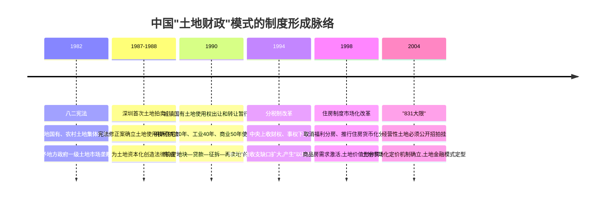

**节点一：1988年宪法修正案与土地有偿使用制度的法律奠基。** 1982年宪法第八条已经确立了"城市土地归国家所有、农村土地归集体所有"的二元土地公有制结构，赋予地方政府以其他国家所罕见的一级土地市场垄断权[^9]。但当时宪法同时规定"任何组织和个人不得侵占、买卖、出租或者以任何形式非法转让土地"，土地资本化的通道实际上是封闭的。深圳特区在1987年12月1日成功拍卖8588平方米地块的实践，倒逼了宪法层面的制度突破——1988年宪法修正案在第十条加入"土地的使用权可以依照法律的规定转让"的条款，第一次在最高法律层面将土地所有权与使用权分离，为土地资本化创造了宪法前提[^9]。1990年《城镇国有土地使用权出让和转让暂行条例》进一步将住宅、工业、商业用地的使用年限分别明确为70年、40年和50年[^9]。**这一系列法律变革本质上完成了一项重大制度创新：使土地从"被忽视的空气"变成可以抵押、变现、循环融资的资本化资产**，为日后"土地财政"提供了不可或缺的法律工具箱。

**节点二：1994年分税制改革与央地财权事权格局的重塑。** 1994年的分税制改革将增值税设定为中央与地方共享税（中央75%、地方25%），并将大宗稳定税源上收中央，但事权与支出责任仍大量留在地方[^8][^9]。改革前中央与地方财政收入大致维持三七分成的格局，改革后则倒置为中央占大头的"倒三七"结构，而央地财政支出比重则维持中央30%、地方70%的格局基本不变[^10]。**这一财权与事权的"剪刀差"使地方政府陷入结构性的收支缺口**：分税制改革后增值税已完全不构成地方财政收入的主体税收，地方主体税收迅速转向被100%划为地方税种的营业税，而营业税主要来源于建筑业和第三产业，这从税源结构上为地方政府"大兴土木"的政绩工程与基础设施投资热潮提供了直接动力[^10]。在预算软约束背景下，土地以其要素稀缺性、换取收入的直接性，迅速成为地方政府快速谋取收入的重要途径[^4]。

**节点三：1998年住房制度市场化改革与商品房需求的全面激活。** 取消福利分房、推行住房分配货币化的1998年住房改革，使全社会改善居住条件的诉求集中释放，从根本上推高了城市住房与土地的估值，带动房地产相关税收与土地出让收入持续增长[^4]。住房商品化使土地从"使用权出让的对价"升级为"商品房市场价值的内核"——开发商愿意为优质区位支付高额地价，因为地价可以通过房价向终端消费者转嫁，这一价格传导机制是"土地财政"高速扩张的市场基础[^11]。

**三大节点的耦合效应。** 单独任何一个节点都不足以催生"土地财政"，但当三者在20世纪90年代末同时具备——即**法律上土地可以有偿转让、财政上地方有强烈补财动机、市场上商品房需求充分释放**——一个独特的融资制度体系即告成型：以土地公有制为前提、以土地作为信用基础、以政府垄断土地一级供应为基本特征、以商品房市场作为土地变现的退出通道[^9]。罗志恒等学者据此明确指出，"土地财政"的实现依赖于**房地产市场化改革和土地公有制**，而分税制改革仅是促成因素之一[^1]。

## 1.5 激励机制：政绩考核与"以地谋发展"模式的成型

制度框架解释了"土地财政"为何在客观上成为可能，但要解释地方政府为何会**主动、持续、大规模**地经营土地，则必须深入考察隐藏在制度背后的激励机制。这正是周飞舟、罗志恒等学者反复强调的核心判断：**激励机制决定行为，政绩考核机制才是"土地财政"问题的关键**[^1][^10]。

**"晋升锦标赛"与GDP考核体系。** 1994年分税制改革集"财政分权与政治集权"于一身——财政上形成财权上收、事权下放、地方收支缺口巨大的事实，政治上则促成各地方官员围绕GDP增长的"晋升锦标赛"[^3]。在这一体制下，中央通过对人事权和财政权的集中控制，将经济增长任务通过层层分解、层层量化的方式快速下达至基层政府，并以目标责任考核的方式进行监督评估[^10]。罗志恒明确指出："**如果没有分税制，只要存在GDP考核，仍会产生资金饥渴和不足**"[^1]，这就将问题的根源从单纯的财权事权失衡推进到了更深层的治理激励结构。

**"以地谋发展"的策略性行为逻辑。** 在双重压力（财政缺口+晋升竞争）的叠加作用下，地方政府发展出一套高度策略性的土地经营行为：

第一，**低价出让工业用地以招商引资**。通过压低工业地价吸引制造业投资，做大本地GDP和未来税基，服务于晋升考核中的经济增长指标[^4]。

第二，**高价出让商住用地以获取财力**。通过商住用地的高价拍卖直接获取大额土地出让收入，弥补一般公共预算缺口[^8][^4]。这种"低工业、高商住"的双轨定价策略，是地方政府土地经营的核心商业模式。

第三，**以土地抵押搭建融资平台**。2004年"831大限"将经营性土地全部纳入公开招拍挂之后，土地价格的市场化机制确立，土地随即成为地方政府最有效的"信用卡"——征地、抵押融资、搞基建、地价上涨、卖地还债、继续搞基建，这一循环为城市建设装上了"核动力引擎"，但也以地价持续上涨为隐含前提[^5]。地方政府由此搭建大量投融资平台筹集信贷资金，形成数倍于直接土地交易收益的杠杆性收入[^4]。

**"政府经营化"的深层动因。** 周飞舟在《以利为利》一书中将这一现象概括为"政府的公司化行为和谋利倾向"[^12]。从公共选择理论角度看，地方政府官员并非纯粹的公共物品提供者，其行为同样受到自身利益（包括晋升、绩效、地方财政充裕度）的驱动；当制度环境（土地公有制+一级市场垄断+土地有偿使用）赋予其经营土地的能力，而激励机制（晋升锦标赛+财政缺口）赋予其经营土地的动机时，"以利为利"的政府行为逻辑就成为路径锁定的必然结果[^12]。**正是制度可能性与行为激励的耦合，使"土地财政"在过去二十余年保持了惊人的扩张惯性**。

## 1.6 历史作用与复杂面相的客观评价

对"土地财政"的评价必须避免单向度的褒贬。它既不是某些批评者所言的"原罪式"制度，也不是某些辩护者所称的"完美无瑕的中国奇迹"。综合多方研究，本节对其历史作用作如下结构化评价。

**积极贡献的三个维度。**

其一，**为工业化和城镇化提供了原始资本积累**。在中央财政相对薄弱、传统融资渠道有限的条件下，土地财政通过"低成本征收农业用地、低价格转让工业用地、高价格出让商住用地"的策略，一方面以低工业地价刺激制造业投资，另一方面以高商住地价获取财力，为大规模工业化与城镇化提供了关键的启动资金[^8][^4]。这一机制使中国得以将西方一百年的城市化进程压缩到一代人的时间窗口内完成[^5]。

其二，**支撑了城市基础设施的跨越式建设**。地方政府将巨额土地出让收入与土地抵押融资集中投入征地拆迁、市政设施、交通网络、公共服务等领域，建成了规模庞大的高铁网络、城市轨道交通和现代化城市界面[^4][^5]。汪德华等学者明确指出，土地财政及相应的地方融资平台"为中国城市基础设施建设提供了充足的资金"[^7]。

其三，**补充了地方财力缺口并推动经济高速增长**。在分税制造成的结构性收支缺口下，土地财政有效缓解了地方政府的财政压力。2003—2015年间土地出让金与地方一般预算收入之比平均为49.74%，意味着土地相关收入支撑了地方近半数的可用财力[^8]。在不考虑土地融资的情况下，2014年土地财政贡献了地方财政收入的35.63%[^8]。

**潜在弊端与复杂面相。**

然而，土地财政的高速扩张同样积累了不容忽视的系统性风险。罗志恒明确指出，土地财政"间接推升了房价，以土地抵押、注资城投公司，间接推动了融资平台发展和政府隐性债务高企"[^1]。汪德华等学者也指出，其带来了"房价高企、金融风险和财政风险等系列问题"[^7]。从更宏观的视角看，土地财政模式以地价持续上涨为隐含前提，将房子从单纯的居住载体异化为国家建设的融资工具，进而通过高房价对居民储蓄、消费意愿乃至人口再生产形成系统性挤压[^5]。

由此可见，"**土地财政"是中国特定历史阶段、特定制度环境下形成的复杂制度安排——它既是工业化、城镇化奇迹的关键推手，也是房价高企、债务积累、阶层分化等结构性问题的重要源头**。正如有学者所言，制度的存续取决于其净收益是否为正；当制度运作的成本上升或收益下降，使净收益由正转负时，制度变革就具备了经济上的动力[^6]。2021年的历史峰值与随后的剧烈调整，正是这一净收益临界点显现的信号。

基于上述客观评价，本报告后续章节将沿"困境诊断—机制重构"的逻辑展开：第2章将以1998—2021年的纵向数据为基础，系统论证"增量"土地财政模式不可持续性的实证证据及其三大负面后果；第3至7章则在此基础上设计"增量—存量"协同的双轨转型机制；第8章归纳实施路径与政策启示。本章所确立的概念体系、口径标准、历史背景与制度逻辑，将作为统一的论证基础贯穿全篇。

# 2 "增量"土地财政模式不可持续性的实证诊断与三大负面后果分析

承接第1章对"土地财政"的概念界定与制度溯源，本章进入"困境诊断—机制重构"分析框架的第一阶段——困境诊断。围绕"截至2021年的增量土地财政模式为何在结构上不可持续"这一核心问题，本章首先从规模演变、依赖度指标与微观拐点信号三个维度刻画该模式的实证特征；继而从需求侧的人口与城镇化逆转、供给侧的债务积聚与房企流动性危机两端，论证模式衰竭的结构性根源；最后系统剖析土地财政长期运行所积累的三类典型负外部性——保障性住房供给失衡、社会阶层流动性下降、实体经济"脱实向虚"——以揭示其全方位的社会经济成本。本章既是对第1章"复杂面相"评价的实证延伸，也为第3章以后的转型机制设计提供问题导向与诊断依据。

## 2.1 增量土地财政模式规模演变与峰值拐点的实证刻画

### 2.1.1 从507亿元到8.7万亿元:二十三年规模扩张的量级特征

1998年住房制度市场化改革启动当年,全国地方土地出让收入仅为**507亿元**[^13];至2021年,这一规模攀升至**87051亿元**(约8.7万亿元),同比增长3.5%,创下历史峰值[^14]。**二十三年间土地出让收入规模扩张约165倍**[^13],这一量级变化在世界财政史上极为罕见,也充分印证了第1章所论述的"三大节点耦合"——土地有偿使用的法律奠基、分税制下地方补财动机以及住房市场化激活的商品房需求——共同催生的扩张惯性。

从时序结构看,这一扩张过程可大致划分为三个阶段:

| 阶段 | 时间区间 | 规模特征 | 关键节点 |
|------|---------|---------|---------|
| 启动与高速扩张期 | 1998—2008年 | 从507亿元增长至约1万亿元量级 | 1998年住房改革、2004年"831大限"土地招拍挂全面推行 |
| 波动上行期 | 2009—2020年 | 从约1.4万亿元增至8.4万亿元 | 2009年应对国际金融危机刺激政策,2020年同比增长15.9%[^13] |
| 历史峰值与拐点显现 | 2021年 | 87051亿元,同比增长3.5%[^14] | 增速明显放缓,下半年市场骤冷 |

依据财政部数据,**2020年全国土地出让收入为84142亿元,同比增长15.9%;2021年为87051亿元,同比增长3.5%**[^13][^14]。基于参考数据测算,1998—2008年期间土地出让收入年均复合增长率(CAGR)处于约**31%—37%的区间**,中值约为34%—35%,这一增速远高于同期GDP名义增速,凸显了"以地谋发展"模式的爆发性扩张特征。需要说明的是,该CAGR区间的不确定性源于2008年单年数据在不同口径下存在约8000亿—12000亿元的差异——是否包含划拨土地收入、成本性支出口径不一等因素均会影响终点取值。

### 2.1.2 依赖度指标:2021年达到的双重高位

仅从规模扩张尚不足以判断模式的可持续性,更具诊断价值的是地方财政对土地出让收入的**依赖度指标**。两组数据揭示了2021年这一依赖度达到的历史性高位:

**第一,占全国一般公共预算收入比重约43%。** 2021年全国一般公共预算收入为202538.88亿元[^15],土地出让收入87051亿元占其比重约**42.97%**[^16]。这意味着即便将口径扩大至全国财政,土地出让收入仍贡献了相当于一般公共预算收入近半数的额外财力。

**第二,占地方一般公共预算收入比重高达78%。** 2021年地方一般公共预算本级收入为111077.08亿元[^15],土地出让收入87051亿元占其比重约**78.4%**[^17]。这一数据由第一财经援引财政部数据明确披露:"2021年土地出让收入占地方一般公共预算收入比重高达78%"[^17]。

将这两个比重指标置于纵向时间序列中观察,其历史性高位特征更为清晰。根据财政部门数据测算:**2020年土地出让收入占全国一般公共预算收入比重为46%、2021年42.97%、2022年降至32.81%、2023年26.75%、2024年22.16%、2025年前2月仅为10.81%**[^16];占地方一般公共预算收入比重则从**2020年的84.03%、2021年的78.36%降至2024年的40.83%**[^18]。**这一比重曲线呈现典型的"倒U型"轨迹——2020—2021年达到峰值后持续回落**,以最直观的方式刻画了"增量"土地财政模式由盛转衰的拐点位置。

### 2.1.3 拐点信号:2021年下半年微观市场的集体降温

2021年作为模式拐点的判定,不仅依赖宏观规模数据,更得到了同年微观土地市场层面多重信号的集中印证。

**信号之一:集中供地"两冷一回温"的批次分化。** 2021年是"两集中"供地政策实施元年,22个重点城市全年累计成交规划建筑面积约2.44亿平方米,累计土地出让金超2.28万亿元[^19]。但三个批次的市场温度呈现"火热开局—骤然降温—小幅回温"的剧烈分化:**首批集中供地流拍率仅为6.27%,第二批集中供地整体流拍撤牌率攀升至32.8%,第三批次流拍率降至约18%但溢价成交占比仅为16.27%**[^19][^20]。其中长沙第二轮集中供地流拍率高达66%(含终止/撤牌)[^21],宁波第二批次成交金额较首批"惨遭腰斩"、下滑51%[^21]。

**信号之二:土拍规则的紧急收紧。** 2021年8月,自然资源部召开闭门会议,明确二批次核心城市单宗住宅用地溢价率不得超过15%,且不得通过提高起拍价方式调整溢价率[^22]。深圳、广州、杭州、天津、青岛、成都、合肥等多个城市随即将溢价率上限从此前的45%统一压降至**15%**[^22]。"在控制'面包'价格这么久后,终于要全面控制'面粉'价格"——这一感叹折射出土地市场化定价机制开始触及制度性天花板[^22]。

**信号之三:拿地主体的结构性转换。** 第一批次集中供地中民营房企活跃,第二批次以中海、保利、招商等央国企"托底"为主,而**第三批次中地方城投平台已成为拿地主角,无锡、深圳、苏州等热门城市城投拿地数量占比超过70%**[^19]。这种从"市场主体"到"政府关联主体"的过渡,本质上是地方政府以"自家钱托自家市"的应急安排,既无法形成真实的财政现金流入,也预示着市场化拿地动能的衰竭。

**信号之四:房企融资端的全面收紧。** 2021年下半年,在"三道红线"、房地产贷款集中度管理、预售资金监管收紧等多重约束下,房企整体拿地更加审慎[^14]。中指研究院数据显示,2021年全国300城土地出让金总额为56199亿元,同比下滑9%[^14];贝壳研究院数据显示,2021年1—8月全国土地成交规划建面同比下降26%[^23]。

综合宏观规模、依赖度指标与微观市场信号三重证据,**2021年作为"增量"土地财政模式由盛转衰的拐点节点具有充分的实证依据**——它既是规模意义上的历史峰值,也是依赖度意义上的临界高位,更是微观市场层面多重降温信号的汇聚点。这一判断也获得了后续年份的"反向印证":2022年全国土地出让收入跌破7万亿元,2023年跌破6万亿元,2024年与2025年连续跌破5万亿元[^18],峰值再未被突破。

## 2.2 需求侧与供给侧双重结构性约束下的不可持续性论证

如果说2.1节的实证证据回答了"模式拐点何时出现"的问题,本节则深入回答"为何拐点出现且难以逆转"的问题。**"增量"土地财政模式的本质是一个以未来土地价值持续上涨为隐含前提的循环——征地—抵押—基建—卖地—地价上涨—再抵押**。这一循环的可持续性,内在依赖于商品房与土地的潜在需求基础持续扩张,以及融资循环各环节的资产负债平衡。然而到2021年,需求侧与供给侧两端均出现了根本性的结构变化。

### 2.2.1 需求侧:人口、城镇化与住房存量的三重结构逆转

**第一,人口老龄化加速:2021年成为深度老龄化的分水岭年。** 根据国家统计局数据,2021年末65岁及以上人口为20056万人,占全国人口的**14.2%**,这是中国65岁及以上人口占比首次超过14%[^24]。"有部分学者认为,当65岁及以上人口占比超过14%,即意味着进入深度老龄化社会"[^24]。同年全年出生人口仅1062万人,创新中国成立以来最低水平,人口自然增长率降至0.34‰[^24]。住房需求的本质是人口需求,而老龄化加速意味着**购房主力群体的规模和增量都在系统性收缩**——高盛报告测算的数据显示,中国城镇年均新增住房需求,从2017年的峰值2000万套,大幅回落至2025—2030年的年均410万套[^25]。

**第二,城镇化进入"减速带":增量空间显著收窄。** 2021年末我国常住人口城镇化率达到**64.72%**,比2020年末提高0.83个百分点[^26][^27]。虽然这一水平仍低于高收入经济体81.9%的平均水平,但根据李迅雷的判断,中国已进入"被动城市化"阶段,即不再以农业人口进城为主要特征,而是城市间人口结构性流动主导[^28]。仇保兴更明确指出,中国城镇化速度拐点早于主流经济学家预测的2025—2030年间出现,**第三阶段城镇化进程的拐点已经显现,后续区域间城镇化水平的差异将进一步拉大**[^29]。这意味着支撑全国土地出让收入的"全域扩张"基础不复存在,土地财政高度依赖的"人口净流入—住房需求增长—地价上涨"链条出现结构性松动。

**第三,住房存量已显著超量:套户比与空置率指标双双触顶。** 央行2019年城镇居民家庭资产负债情况调查显示,**我国城镇居民家庭的住房拥有率为96.0%,户均拥有住房1.5套,有两套住房的家庭占比31.0%,有三套及以上住房的占比10.5%**[^30][^31]。社科院《中国住房发展报告(2020-2021)》显示,截至该时点全国仅剩约**3.14%**的家庭在城市中没有住房[^31]。"楼市的需求正在迅速减少"[^31]——这一判断在2021年时点已成事实。从空置率角度看,西南财经大学早在2017年的调研结果就显示,整体住房空置率已超过20%,其中商品房空置率超过26%,按国际通用标准属于"商品房严重积压区"[^31]。住房从"短缺品"向"过剩品"的转换,意味着土地财政赖以扩张的"刚需基础"已发生根本性变化。

### 2.2.2 供给侧:地方债务积聚与房企流动性危机的双重风险

**第一,地方融资平台债务积聚,土地抵押融资风险显性化。** 第1章已论及,土地财政在峰值年份呈现"财政—金融"双重属性,土地抵押融资构成"中口径土地财政"的重要部分。但这一融资循环高度依赖地价持续上涨,一旦土地市场降温,土地抵押资产的估值即承压。根据国家财政部数据,**地方政府债务余额已从2020年底的25.66万亿元增长至2021年底的30.47万亿元;多家机构估计,地方政府隐性债务存量约为40万亿元以上,其中相当一部分为地方城投平台债务**[^32]。张明的研究指出,地方政府债务大概占到中国政府全口径债务的4/5,且**地方政府债务的平均利息成本约为6%左右,三四线城市融资平台的融资成本可能达到两位数,地方城投债大多为3—5年期限,需要不断滚动融资**[^33]。这种"短期限、高成本、高滚动"的债务结构,在土地财政收入下行的环境下,极易触发流动性风险。

**第二,房企"三道红线"后流动性危机蔓延,土地需求方"集体退场"。** 2020年下半年起实施的"三道红线"政策叠加房地产贷款集中度管理,使房企融资环境急剧收紧。2022年上半年百强房企累计销售操盘金额同比下降50.3%,出险房企销售额降幅普遍在60%甚至90%以上;**截至2022年6月末,出险上市房企(A股和港股)超过30家,这些房企的资产总额近10万亿元**[^32]。土地市场最大的需求方——民营房地产开发商集体陷入流动性危机,直接导致"征地—抵押—基建—卖地"循环中的"卖地"环节崩塌。这一供给端冲击,与需求侧的结构性收缩形成共振,将"增量"土地财政模式推入难以自我修复的境地。

**第三,土地出让净收入占毛收入比重持续下降,真实可支配财力远小于规模数据。** 一个常被忽视的事实是,**土地出让收入的"毛收入"与"净收入"存在重大差异**——粤开证券研究院数据显示,土地出让收入中约52%用于征地和拆迁补偿,约23%用于土地整理支出,约11%用于城市建设支出,约1%用于农村基础设施建设,**实际可完全可支配的财力占比不大**[^13]。以2012年为例,扣除土地出让成本后并最终用于城市建设的资金,占比仅为土地出让收入的一成左右[^34]。这意味着即便规模继续扩张,地方政府从土地出让中获得的真实"净财力"提升幅度远低于规模增速,模式的边际收益正在快速衰减。

### 2.2.3 综合论证:需求与供给双重不可持续性的系统效应

将需求侧与供给侧因素综合考察,可以观察到一个清晰的逻辑闭环:**人口老龄化与城镇化放缓削弱了商品房的潜在需求基础,住房存量过剩进一步压缩了边际购房意愿,房企流动性危机使土地市场最大需求方退场,而地方债务积聚则使地方政府失去了通过加杠杆维持土地循环的能力**。四大因素彼此强化、相互嵌套,共同构成"增量"土地财政模式系统性不可持续的根源。

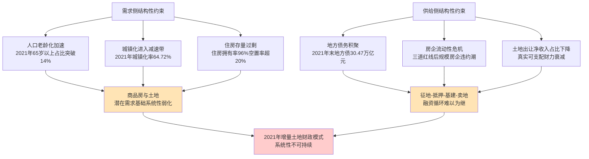

正是这一系统效应,使得2.1节所观察到的2021年微观市场降温信号,并非短期周期性波动,而是结构性拐点的真实显现。**这也意味着,即便后续推出更宽松的房地产政策、更激进的土地市场刺激,也无法逆转模式的衰竭趋势——结构性问题需要结构性的转型方案,这构成本报告后续章节论证转型路径的根本依据**。

## 2.3 负外部性之一:保障性住房供应不足与结构性失衡

"增量"土地财政模式的不可持续性,不仅体现在规模与需求的耦合衰减,更深刻地反映在其长期运行所积累的三类典型负外部性上。本节首先剖析保障性住房供给失衡——这是土地财政激励机制与公共住房保障属性之间根本张力的直接产物。

### 2.3.1 制度性张力:土地财政逻辑与保障房供给的内在冲突

保障性住房用地长期以来主要采取**划拨**的方式供应,这一供应方式的关键特征是"地方土地管理部门和地方财政没有任何收益,甚至地方财政还要对保障房的建设与维护进行投资"[^35]。**这一制度安排与第1章所揭示的地方政府"以利为利"的土地经营逻辑形成直接冲突**——地方政府偏好将区位优、配套全的优质地块用于商住用地的招拍挂出让以最大化土地出让收入,而区位偏远、配套不足的地块则供应给保障房项目。

这一冲突在实践中表现为**保障房用地供应的"三重困境"**[^35]:

| 困境维度 | 具体表现 | 后果 |
|---------|---------|------|
| 稳定供应缺乏保障 | 地方行政行为偏重经济建设政绩,忽视保障房用地供应;缺乏可操作性的法规条例 | 国家住房保障政策与地方经济建设短期利益冲突时,地方政府采取变通或消极方式 |
| 地块区位日趋边缘 | 区位较好地块被商品房占据,绝大多数保障房地块位于城市郊区 | 低收入人群日常生活成本增加,导致放弃购买或入住,如2008年广州2145套远郊经济适用房中645套无人认购 |
| 供应渠道过于单一 | 地方政府基本采取划拨形式供应保障房用地 | 地方政府缺乏供应保障房用地的动力,土地供应方式难以拓宽 |

这种"三重困境"的本质,**是土地财政的财政逻辑(追求土地价值最大化)与住房保障的公共属性(追求居住权平等化)之间的根本性张力**。在地方政府事实上身兼"土地经营者"与"住房保障责任主体"双重角色的体制下,前者的激励远强于后者,导致保障房供给系统性不足。

### 2.3.2 结构性错配:类型、空间、人群三重维度的失衡

即便在保障性住房建设规模扩大的背景下,**结构性错配问题依然突出**。这种错配体现在保障房类型结构、空间分布与目标群体三重维度上[^36]:

**第一,类型结构错配。** 公租房仍为供给主体,但其主要覆盖低收入户籍家庭,难以有效满足新市民、青年人等"夹心层"群体对可负担租金、完善配套的住房需求;保障性租赁住房与共有产权房供给规模相对不足,特别是在一线城市核心区域供给稀缺[^36]。

**第二,空间分布错配。** 部分城市虽完成保障房建设指标,但因选址偏离就业中心、交通与教育配套滞后,**资源配置效率问题突出**——保障房在物理意义上"建成了",但在功能意义上无法真正服务于目标群体的实际居住需求[^36]。

**第三,人群覆盖错配。** 据现行住房保障制度的历史问题分析,**早期住房保障制度的覆盖范围不超过5%**[^37],对日益增加的流动人口和"夹心层"覆盖严重不足。2009年全国保障性住房建设累计投入394.9亿元,完成率仅为23.6%;**全国符合当地廉租住房保障条件的443.9万户中,只有34.1万户(约占7.7%)家庭正在或曾经享受廉租住房保障**[^37]。这表明保障房不仅总量不足,且在精准识别与覆盖目标群体方面存在严重缺陷。

### 2.3.3 深层根源:财政资源配置滞后于人口结构演变

进一步深究,保障性住房结构性失衡的**深层根源在于财政资源配置机制滞后于人口结构演变**——现行年度土地供应计划主要基于历史数据和财政目标制定,缺乏对人口流动与家庭结构变化的动态响应机制,导致"供需错配"现象严重[^36]。从2024年的最新数据看,全国计划建设筹集保障性住房170.4万套(间),截至当年6月底已建设筹集112.8万套(间),完成投资1183亿元[^38]——虽然进度达到年度计划的66.2%,但相比1.5亿以上的城镇流动人口规模,绝对供给量仍显捉襟见肘。

**保障房供给不足的本质问题,是土地财政模式将"住房"从公共品异化为财政工具的必然结果**——当土地与商品房成为地方政府的核心财源,公共住房保障的财政资源就必然遭到挤压。这一逻辑链条揭示了土地财政转型的一个核心命题:**只要保障房供给的财政激励问题不解决,即便建设规模扩大,结构性错配也将持续存在**——这也是本报告第6章探讨"房产税收入精准用于'先租后售'与'住房券'"机制的根本动因。

## 2.4 负外部性之二:高房价引致的社会阶层流动性下降与阶层固化

土地财政的第二类典型负外部性,是其通过"高地价—高房价"传导机制所引发的社会阶层流动性下降。这一负外部性具有更强的隐蔽性与长期性——它不直接体现在财政或经济指标中,而是通过居民负债结构、教育机会分配、代际财富传递等渠道,逐步侵蚀社会公平的基础。

### 2.4.1 传导路径之一:居民高杠杆化与"房奴经济"对消费储蓄的挤压

第一条传导路径,是高房价通过居民住房贷款扩张挤压消费与储蓄。"截止到2020年末,全国住房贷款余额高达近35万亿元,占全部居民债务总额比例高达近5成"[^39]。这种规模的居民住房债务,意味着相当比例的城镇家庭已陷入"**房奴**"状态——"每个月的收入一大半要付房贷,房奴能留下来用于开销的资金很有限"[^40]。

这一传导路径产生的系统效应,在社科院《中国城市竞争力报告No.17:住房,关系国与家》中已有明确论证——"**全国绝大部分一二线城市房价收入比都已经超过9这一临界点,这意味着房地产已经对消费和投资产生比较严重的挤出效应**"[^39]。北京等一线城市的房价收入比甚至更高:2024年上半年北京市商品住宅均价为63982元/平方米,一套100平米的住房价格约为640万元;按月薪4000元、年收入4.8万元计算,不吃不喝需要133年才能购买[^41];中央财经大学2023年报告显示,**全国35个主要城市的平均房价收入比为15.3,远超国际公认的合理区间6倍以内**[^41]。

更具警示意义的是央行2021年4月发表的《关于我国人口转型的认识和应对之策》论文中的判断:"创新创业靠的是年轻人,但其多半没钱。**一个城市房价太高,把他们都逼走了,何谈创新**"[^39]。这一论述揭示了高房价对社会创新活力的系统性约束,而这种约束本质上根源于土地财政模式的扩张。

### 2.4.2 传导路径之二:学区房机制下教育资源的资本化

第二条传导路径,是优质教育资源通过"学区房"机制资本化,加剧教育机会的代际不平等。**学区房是义务教育资源资本化效应的体现**——家长们"用脚投票",支付高成本来获得重点小学的优质服务,凸显出重点小学对应小区的房价偏高[^42][^43]。

实证研究为此提供了精确量化:山东大学段炼以济南为研究对象,采用住房特征价格模型与边界固定效应法的配对回归,得出**相比于普通小学,重点小学能为小区房价带来11.6%的溢价**——即家长愿意为孩子进入重点小学多支付11.6%的房价[^43]。这一溢价率本质上是优质教育资源稀缺性在房价中的资本化,而其根源在于"**优质教育资源数量不足且配置不均衡**"[^43]。

学区房机制的社会后果,**是将教育机会的获取与房产购买能力直接挂钩,从而使家庭财富禀赋取代个人努力成为子女教育机会的主导变量**。这一机制对寒门子弟的影响尤为严重——北京大学调查显示,农村学生高考分数需比部分一线城市学生高72分才能进入同层次院校[^44];985高校农村学生占比从30%降至6%[^44]。"中央政治局会议明确提出防止以学区房等名义炒作房价"[^42],正是对这一负外部性的政策回应,但要从根本上化解,仍需触及土地财政模式的深层逻辑。

### 2.4.3 传导路径之三:代际财富传递与城乡鸿沟扩大下的阶层固化

第三条传导路径,是代际财富传递机制与城乡财富鸿沟的扩大,共同推动阶层固化。**央行调查数据显示,中国城镇家庭户均总资产317.9万元,其中70%的资产是以房产形式呈现**[^30][^31]。这意味着房产已成为中国家庭财富的核心载体,而房产价值的城乡、区域分化直接转化为家庭财富的结构性差距。

**城乡财富鸿沟方面**,城镇与农村家庭净资产差距在2025年时点已达**5倍以上**(城镇约160万元,农村约35万元,绝对差额超125万元)[^45];城乡财富基尼系数城镇0.74、农村0.67,均处于高度不平等区间[^45];**房产占城镇家庭财富72%、农村65%,但城镇房产均价约为农村的8倍,是财富差距的核心来源**[^45]。这一差距的形成与土地财政密切相关——城市土地通过出让市场实现充分的资本化,而农村土地因集体所有制和流转限制无法分享土地增值收益,**2024年全国土地出让金中给予农民的征地补偿仅占3.2%**[^44]。

**代际财富传递方面**,中国社科院《中国家庭资产配置研究报告》显示,在80后、90后年轻人拥有的房产中,**有67.2%是依靠父母资助获得的,这一比例在00后群体中更是高达83.5%**[^41];住建部数据显示,2023年全国商品房成交量中,25岁以下购房者占比5.7%,其中超过90%的购房款主要来源于父母支持[^41]。"我们发现一个明显趋势,**年轻一代的家庭财富积累越来越依赖代际传递,而非个人劳动所得**"[^41]——这一判断直指阶层固化的核心机制。

综合三条传导路径可见,**土地财政驱动的高房价不是简单的物价现象,而是一种深刻的社会分层机制**——它将房产从居住载体异化为财富载体、教育载体与阶层载体,使房产购买能力成为决定家庭经济社会地位的核心变量。当一个社会的阶层流动越来越依赖于房产传递而非个人努力,社会公平的基础就遭到了系统性侵蚀。

## 2.5 负外部性之三:资金挤出效应与实体经济"空心化"机制

土地财政的第三类典型负外部性,是其通过资金"挤出效应"对实体经济造成的系统性削弱。这一负外部性直接关联中国式现代化的核心命题——建设以实体经济为支撑的现代化产业体系。

### 2.5.1 金融资源配置:信贷资源大规模流向房地产领域

土地财政"挤出"实体经济的第一个层面,是金融资源配置层面的失衡。**2017年上半年新增房贷超9万亿元,同比多增1.06万亿元,房地产增量占新增贷款的39.2%**[^40]——这意味着近40%的新增贷款流向了房地产领域。从更长期数据看,2008年至2017年间,我国M2规模从47.5万亿元增长到177.02万亿元,**增长近4倍,与同期房价4—5倍的涨幅高度吻合**[^40]。潘石屹"房价涨多少倍,取决于央行发了多少钱"的论断,虽属市场层面观察,但客观反映了货币—信贷—房价的传导链条[^40]。

银行业的房地产风险敞口也充分印证了这一资源错配。截至2022年6月末出险上市房企(A股和港股)超过30家,资产总额近10万亿元[^32];**标准普尔预期,2022年底房地产行业相关不良贷款率将升至5.5%**[^32]。中小银行风险更为突出——城商行、农商行等中小银行的资产配置在房地产、地方融资平台领域更为集中,自身化解风险能力有限[^32]。这种过度集中的金融资源配置,直接挤占了制造业、科技创新等实体部门的融资空间。

### 2.5.2 企业成本结构:高地价高房租推升劳动力与商业租金成本

土地财政"挤出"实体经济的第二个层面,是企业成本结构层面的传导。**高房价首先推高了劳动力成本**——在房价和房租大幅上升的情况下,企业不得不提高员工收入以维持劳动力供给。"在华为上班的本科生,月工资12000元以上,他们根本买不起深圳高价商品房";即便如此,**华为也只能跑到东莞松山湖地区圈地盖房以解决员工住房问题**[^40]。这一案例典型反映了高房价对劳动密集型与人才密集型产业竞争力的双重侵蚀。

**高地价进一步推升了商业租金成本**——曹德旺曾指出"中国实体经济的成本,除了人便宜,什么都比美国贵。国内的地价更是高得离谱,我在美国那边办个工厂的土地基本不要钱"[^40]。零售商业的场租费用上升,使许多零售商"每天忙死忙活都是在为房东打工"[^40]。商业不动产价格作为土地价格的衍生品,其抬升直接传导至所有需要商业空间的实体产业。

### 2.5.3 投资回报机制:"脱实向虚"的资本流动逻辑

土地财政"挤出"实体经济的第三个层面,是投资回报机制的扭曲所导致的资本"脱实向虚"。**社科院的研究指出,2018年虽然房地产投资对经济增长有约0.6个百分点的带动贡献,但其挤出效应已大于带动效应,即房地产对经济增长的综合贡献已经为负**[^39]。

这种"脱实向虚"的微观机制,可以用一个广为流传的对比简洁概括:"丈夫在老家办企业,上百个工人一年辛苦下来,也没赚到多少钱;而妻子一个人在大城市里炒房产,一年下来赚了好几百万"[^40]。当房地产投机收益系统性高于实体经营利润,资本流动方向就必然发生扭转——"如果中国经济现状真是这样,那么谁还愿意投资实体经济?"[^40]这一问题指向资本主义经济学最基本的"利润率均等化"规律失效——**当某一行业(房地产)持续保持远高于社会平均水平的利润率,而资本无法自由流入将其压平时,资源配置就会发生系统性失衡**[^46]。

### 2.5.4 双重空心化:制造业的"规模空心化"与"效率空心化"

上述三层机制最终汇聚为实体经济的"双重空心化"——**规模空心化**与**效率空心化**。

**规模空心化**指制造业占GDP比重下降、企业外迁与产业转移现象。"华为将部分生产和研发部门从深圳搬到东莞松山湖,富士康郭台铭2017年上半年在美国威斯康星州投资100亿美元办厂"[^40]——这类典型案例反映了高房价高地价对制造业的"驱赶效应"。从更广视角看,"上世纪80年代开始,欧美主导的'去工业化'一度很时髦,虚拟经济自我膨胀、超常发展甚至成为一种全球化现象。其结果,就是引发了2008年国际金融危机"[^47],中国必须避免重蹈这一覆辙。

**效率空心化**指实体企业技术创新投入不足、企业家代际接续困难的现象。"脱实向虚将抑制实体企业的技术创新投资。高质量发展以创新为第一动力。工业革命以来,重大技术进步的发生以足够规模的生产性投资为前提。**当过度扩张的金融活动挤占了企业生产性投资,就会降低实体部门的技术创新动能,抑制其劳动生产率提升和供给质量升级**"[^48]。在企业家代际接续层面,"做制造业这一行太辛苦,赚钱又慢,儿孙们不肯接手"的现象,已经成为相当部分中国民营制造业大牌企业家共同面对的困境[^46]——这种代际断层将对中国制造业的长期竞争力构成深远影响。

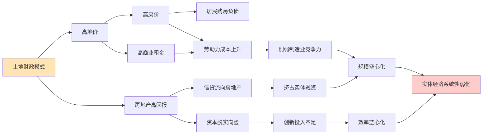

将三类负外部性综合考察,可以观察到一个深层共性:**土地财政对保障房供给、社会阶层流动性和实体经济的削弱,都不是孤立的政策失误,而是模式逻辑的内生结果**——只要"以地谋发展"的核心激励结构不发生根本改变,这些负外部性就难以被局部政策修补所根除。这一判断为本报告第3章以后讨论的转型方案提供了核心问题导向:**转型不能仅停留于规模收缩或增速放缓,而必须从根本上重构"地方政府—土地—财政"之间的激励关系**。

综合本章三节论证,可以得出本章的核心诊断:**"增量"土地财政模式在2021年达到历史峰值的同时,已经在规模演变、依赖度指标、微观市场信号、需求侧基础、供给侧条件五个层面共同显现出系统性不可持续性;长期运行所积累的保障房供给失衡、社会阶层流动性下降、实体经济"空心化"三类负外部性,使该模式即便仍能在短期内提供财政收入,其综合社会成本也已显著超过历史阶段曾经的净收益**。这一诊断结论,既是对第1章"复杂面相"评价的实证延伸,也为接下来第3至7章所论证的"增量—存量"协同的双轨转型机制,提供了不可回避的问题基础与改革紧迫性的实证依据。

# 3 转型方案的总体设计："增量—存量"协同的双轨框架

第2章的诊断结论已经清晰呈现：截至2021年，"增量"土地财政模式不仅在规模意义上抵达历史峰值，更在依赖度指标、需求基础、供给条件以及负外部性累积四个维度共同显现出系统性不可持续性。从地方一般公共预算收入78%的依赖度，到老龄化与城镇化双重逆转所带来的需求基础松动，再到保障房供给失衡、阶层流动性下降与实体经济空心化的三类负外部性，所有证据指向同一个判断：**模式的局部修补已不足以化解结构性矛盾，必须进入"机制重构"阶段**。

本章作为分析框架由"诊断"转向"重构"的枢纽章节，旨在为后续第4至第7章的具体机制设计确立顶层框架。其核心命题可表述为：以"**增量端的精准化重构 + 存量端的覆盖式构建**"为两翼，将地方政府的财源结构由单一卖地依赖转向"土地出让金+房产税"的复合财源体系，并通过双轨之间的功能互补，同时回应地方财政可持续性、房地产市场调控、住房公平分配与社会保障投入四重政策目标。本章不展开具体税率、免税面积等技术细节（这些将由第4至第6章逐次展开），而专注于阐明转型方案的总体逻辑、双轨关系与衔接机制。

## 3.1 转型的核心命题：从"单一卖地"到"土地出让金+房产税"复合财源

### 3.1.1 为何单一卖地模式难以通过局部修补延续

第1章已指出，在2020年峰值年份，中口径"土地财政"占地方可用财力的比重已超过54%，地方政府收入结构呈现高度的"土地一元化"特征；第2章则进一步揭示，这一比重在2021年之后呈典型的倒U型回落。**这一结构性下行不是周期性现象，而是制度模式与其外部条件不再相容的必然结果**。

具体而言，单一卖地模式难以通过局部修补延续的原因有三：

**第一，税基的不可再生性。** 土地出让收入的本质是将一块土地70年（住宅）使用权一次性变现，是对未来现金流的贴现。当一座城市的可供出让土地存量趋于耗竭，或商品房需求基础发生结构性收缩时，无论如何调整出让规则、放宽溢价限制，都无法逆转税基本身的衰减——这正是顾云昌等学者所警示的"靠大规模土地开发出让推动的短期过度繁荣……是不可持续的，一旦土地资源耗尽，经济必然陷入类似'荷兰病'的长期萧条"[^49]。

**第二，收入节奏的剧烈波动性。** 单一卖地模式将地方财政命脉系于土地市场景气循环，使财政收入呈现高度顺周期性。第2章已论证，2022年至2024年土地出让收入从8.7万亿元峰值持续下滑至约4.87万亿元，相比峰值减少约3.8万亿元[^50]，这种规模的剧烈波动直接传导至公共服务支出、地方债务偿付与社保发放，形成"卖地下行—财政承压—非税收入飙升—营商环境恶化"的恶性循环[^49]。

**第三，激励机制的扭曲性。** 第1章已论证，土地出让金本质上是"把出让土地未来70年的，变成地方政府的一次性收入，抬高了土地价格和房产价格，导致当前的过度繁荣和对未来发展的透支，形成了畸形的地方政府激励机制"[^49]。这种"寅吃卯粮"的激励结构与高质量发展、共同富裕的政策导向存在根本张力——即便规模缩减，激励扭曲依然存在。

正是基于上述三重不可修补性，**单纯的"土地财政"瘦身或挤压不足以构成有效的转型方案，必须引入新的财源类型从结构上重塑地方财政的收入基础**。

### 3.1.2 复合财源结构的三重优势：从税基到激励

转型的方向已在多位权威学者的论述中获得高度共识——**用长期可持续的、制度化的房地产税逐步替代地方政府对短期高额土地出让金的依赖**。中国财政科学研究院院长刘尚希明确指出，房地产税虽然规模上是"小税种"，但作为新型直接税，"对促进转型、对二元结构的改进、对共同富裕都会带来积极影响"[^51]；财政部财政科学研究所原所长贾康亦反复强调，**房地产税开征不是简单增加一个新税种，而是要对现在房地产税制进行重新设计，使之更为科学合理，符合我国市场经济体制下的现代税制要求**[^52]。

将这一转型逻辑与单一卖地模式作系统对比，复合财源结构（土地出让金+房产税）的内在优势体现在以下三个层面：

| 维度 | 单一卖地模式 | "土地出让金+房产税"复合财源 |
|------|------------|--------------------------|
| **收入稳定性** | 高度顺周期，受房企融资、土地市场情绪等短期因素剧烈影响 | 房产税作为保有环节税基稳定，"一年四季持续供血"，平滑卖地收入的波动性 |
| **税基可持续性** | 一次性变现70年使用权，本质上是对未来收入的贴现，存量耗竭后即枯竭 | 房产税"在土地使用全过程中可长期持续征收，税源稳定，具有可持续性"[^49] |
| **激励相容性** | 推动地方政府"追逐土地开发眼前利益"，与高房价、隐性债务、阶层固化等负外部性同源 | 房产税回归"受益税"性质，引导地方政府"按市场经济要求优化本地投资环境和公共服务"[^52] |

这三重优势恰好对应于第2章所诊断的三类不可持续性：收入稳定性回应供给侧的债务循环风险，税基可持续性回应需求侧的人口与城镇化逆转，激励相容性则从根本上重塑"以地谋发展"模式所衍生的负外部性。

### 3.1.3 "双轨"与"一元主导"的本质区别

需要明确界定的是，**本报告所提"双轨"绝非简单将房产税叠加于既有土地出让金之上**——若如此，则陷入贾康所批评的"既收高额土地出让金，又收房产税"的重复征收陷阱[^51]。本报告主张的"双轨"具有以下关键特征：

其一，**功能分化而非简单叠加**。增量端的土地出让金不再追求高溢价、不再作为地方财政的主要支柱，其征收范围被精准收窄至改善型住房；普通住房供地仅收取覆盖三通一平等基础成本的"基本土地出让金"。其二，**新老有别的过渡安排**。借鉴市场提议的"新房新办法、老房老办法"路径——老房因已经在购房时支付了完整的土地出让金，在原使用年限内不再缴纳房产税，待土地使用年限到期后过渡至新办法[^53]，以避免重复征收。其三，**收入用途的结构性区分**。增量端的基本土地出让金"纳入房产税管理架构"用于民生支出，存量端的房产税收入定向用于保障性住房与租赁市场建设，二者均与开发性投资脱钩。

这种"双轨"设计的本质，**是用税基重构替代税负叠加，用激励重塑替代规模压缩**——这正是本报告区别于一般"房地产税扩围"讨论的根本所在。

## 3.2 增量端的精准化重构：土地出让金征收对象转向"改善型住房"

### 3.2.1 精准化的制度内涵

增量端的核心制度安排，可概括为**土地出让金征收对象的"精准化收窄"**：将传统模式下覆盖全部新增住宅供地的高额土地出让金，收窄至"改善型住房"的供地，而对普通商品房供地仅收取覆盖基础成本的基本土地出让金。

依据用户需求的明确量化界定，并与第1章已确立的口径保持一致，**"改善型住房"在本报告中操作性地定义为容积率低于1.0或建筑面积超过144平方米的住房**。这一界定具有清晰的政策依据与可操作性：天津2024年出台的土地税优惠新规即明确规定"容积率1.0以上、单套面积144平米以下的住宅"享受税收优惠[^53]，本报告所采用的标准恰是对这一界定的反向定义——**容积率<1.0意味着低密度开发（别墅、低层住宅等），建筑面积>144㎡对应大户型住房**，二者均超出普通自住需求的常规边界，构成改善性、高端化的住房消费类型。

### 3.2.2 精准化设计的三重逻辑

将土地出让金的高额征收对象从"全部新增住宅"收窄至"改善型住房"，其合理性可从财政逻辑、调控逻辑与公平逻辑三个角度加以阐释。

**财政逻辑：从普惠性资本化工具转为高端消费调节工具。** 传统模式下，土地出让金对所有商品房征收高额溢价，本质上是将居民购买任何住房的成本中嵌入大额财政性支出，使土地出让金成为一种**普惠性的资本化工具**——它既向刚需家庭征收，也向高端消费者征收，缺乏调节性。精准化重构后，土地出让金的功能定位转为**高端消费调节工具**：对面积、密度均处于"超出基本居住需求"区间的改善型住房征收高额土地出让金，相当于在土地资源稀缺性最强、消费能力最高的细分市场中实现财政收益最大化。这与天津新规所体现的政策意图高度一致——通过容积率与面积"两个硬性指标，精准引导开发商建设符合市场需求的主流住宅产品"[^53]。

**调控逻辑：抑制普通住房价格非理性上涨。** 第2章已论证，土地出让金作为开发成本的核心组成（约占房价60%以上[^49]），其规模直接决定了商品房终端定价。普通住房供地若仅收取基本土地出让金，则可大幅压低普通商品房的土地成本，从而通过成本端的传导使普通住房价格回归居住属性。对改善型住房继续征收高额土地出让金，则在抑制土地资源过度向低密度、大户型集中的同时，承担了"土地资源节约集约利用"的政策导向[^51]——这正回应了第2章所揭示的土地财政模式下"商品房挤压保障房用地"的结构性矛盾。

**公平逻辑：财政负担与住房消费层次相匹配。** 精准化重构的深层含义，是建立**"居住型消费免高额土地出让金、改善型消费承担差异化土地出让金"**的累进式财政负担分配机制。在土地公有制框架下，土地增值收益本应"涨价归公"，但若以普惠方式征收，则刚需家庭承担了与其住房消费层次不相称的财政负担；通过精准化收窄，使土地出让金更多由改善型、高端化住房消费者承担，体现了"谁多消费、谁多承担"的财政公平原则。这与贾康关于房地产税"主要是调节高端人群收入状况，可以让更多高收入者、富裕者缴纳更多税收"的逻辑[^52]在精神上一脉相承。

具体的"普通商品房利润税 + 改善型住房差别化土地出让金"机制设计，将由第4章详细展开。

## 3.3 存量端的覆盖式构建：差别化房产税对城市存量住房的引入

### 3.3.1 存量房产税的引入必要性

如果说增量端的精准化重构解决了"新增供地如何征"的问题，存量端的覆盖式构建则解决了"既有住房如何征"的问题。截至2021年，第2章所引央行调查数据显示，**我国城镇居民家庭住房拥有率达96.0%、户均拥有住房1.5套、有两套及以上住房的家庭占比超过40%**——这一庞大的存量住房资产，在土地财政模式下完全游离于持续性持有税之外，构成了一个规模惊人但未被有效征税的潜在税基。

引入存量房产税的必要性，可从三个层面加以理解。其一，**存量税基的客观存在与稀缺性互补**。当增量端因土地资源约束而税基收窄时，覆盖城镇全部存量住房的房产税恰好构成一个"宽广而稳定的税基"，为地方一般公共预算提供持续性税源——这正是国外房产税"占地方财政50%左右"经验的核心机制[^51]。其二，**抑制投机、激活存量的功能定位**。第2章所揭示的住房空置率超20%、商品房空置率超26%的事实表明，大量存量住房处于"持有等待升值"的投机性状态；房产税通过提高持有成本，"形成持续压力"促使多套房持有者"出售多余房产，转向租赁市场或长期持有优质资产"[^54]，从而盘活存量、平抑房价。其三，**制度衔接2021年试点授权。** 2021年10月，全国人大常委会授权国务院在部分地区开展房地产税改革试点工作，期限五年[^50]——这一立法授权事实上为本报告所提存量端机制的落地提供了制度准备。

### 3.3.2 借鉴沪渝试点的核心设计原则

上海与重庆自2011年起开展的房产税试点，为新存量模式提供了重要的制度参照。综合两地试点经验，存量端的核心设计原则可概括为"**低税率、广覆盖、宽减免**"——这也是房地产税改革"延续'低税率、广覆盖、宽减免'原则，避免冲击市场"[^54]的政策共识。

具体借鉴要素包括：

| 设计要素 | 上海试点 | 重庆试点 | 新存量模式借鉴方向 |
|---------|---------|---------|------------------|
| **税率水平** | 0.4%—0.6%（按是否高于均价2倍分档） | 2024年统一为0.5%（此前0.5%—1.2%分档） | 低税率，按户型/价格/区位分档 |
| **免税面积** | 本市居民家庭人均60㎡免征 | 独栋住宅180㎡、高档住房180㎡免征 | 人均免税面积保护刚需 |
| **计税依据** | 应税住房市场交易价×70% | 房产交易价×70%（2024年调整） | 按市场价或评估值的70%计算 |
| **征收对象** | 本市居民新购第二套及以上住房 | 独栋商品住宅、高档住房、"三无"人员二套房 | 第二套及以上、改善型住房纳入 |
| **特殊豁免** | 高层次人才、居住证满3年首套 | 高层次人才优惠 | 人才与刚需豁免并行 |

需要指出的是，沪渝试点亦暴露出明显局限——上海主要针对增量房征收、重庆主要针对独栋别墅与高档住房，覆盖面均较窄，调控效果有限。新存量模式在借鉴试点经验的同时，需要在覆盖面上实现实质性突破——**对城市第二套及以上普通商品房、改善型住房均纳入征收范围**，使房产税从"试点性局部税"升级为覆盖城市存量的"地方主体税种之一"。

### 3.3.3 房产税作为持续性持有税的功能定位

存量端的引入，需要清晰界定房产税的功能定位——它不是"土地出让金的简单替代"，而是地方一般公共预算的**持续性税源补充**。刘尚希明确指出，房产税在世界各国财政收入中所占比重都不大，但其作为新型直接税的意义在于"对促进转型、对二元结构的改进、对共同富裕都会带来积极影响"[^51]。这一功能定位包含三个层次：

第一，**补充地方一般公共预算**。房产税作为一般公共预算收入，与土地出让金所属的政府性基金预算形成明确的预算口径分工——前者支撑公共服务的常态性运转，后者用于阶段性大额建设投入。第二，**平抑收入波动**。第2章已论证土地出让收入呈现剧烈顺周期波动，而房产税基于存量住房征收，受房地产市场短期景气循环的影响相对较小，能够发挥"自动稳定器"的作用。第三，**稳定财源预期**。房产税"在土地使用全过程中可长期持续征收"[^49]，使地方政府能够基于稳定的财源预期进行长期规划，避免被短期土地市场波动所裹挑。

具体的差别化税率结构、免税面积安排与租赁住房税收减免机制，将由第5章详细展开。

## 3.4 双轨协同的功能互补与多重政策目标对齐

增量端的精准化重构与存量端的覆盖式构建，并非两条平行的独立轨道，而是通过功能互补共同回应多重政策目标的协同体系。本节系统阐释双轨框架与四重政策目标之间的对齐关系，并澄清两端的过渡衔接安排。

### 3.4.1 四重政策目标的协同回应

**目标一：地方财政可持续性——收入节奏互补。** 增量端与存量端在收入节奏上具有天然的互补性：增量端的土地出让金（仅限改善型住房与基本土地出让金）仍属一次性大额收入，适合支持新区开发、重大基础设施建设等阶段性大额支出；存量端的房产税属持续性税收，适合支撑教育、医疗、治安等常态性公共服务支出。这种"一次性 + 持续性"的复合财源节奏，既保留了土地出让金支持城市跨越式建设的优势，又通过房产税的稳定性弥补了卖地收入的顺周期波动风险。

**目标二：房地产市场调控——双重约束。** 双轨框架对房地产市场形成"开发端 + 持有端"的双重约束机制。开发端，通过对改善型住房征收高额土地出让金，约束高端、低密度住房的过度供给；持有端，通过对多套住房与改善型住房征收差别化房产税，提高持有成本以抑制投机性持有。两端约束共同回应中央反复强调的"房住不炒"定位——刘尚希明确指出，按照问题导向，房地产税应当具有调节功能，"促进房地产回归住房的消费品属性，淡化作为金融资产的属性"[^51]。

**目标三：住房公平分配——层次匹配。** 第2章揭示的高房价对社会阶层流动性的系统性侵蚀，需要通过"差异化财政负担"加以校正。双轨框架在两端均贯彻"住房消费层次与财政负担相匹配"的公平原则：增量端区分普通住房与改善型住房，存量端区分首套与多套、自住与多套持有——使刚需家庭享受较低的财政负担，而改善型与多套持有者承担较高负担。这与贾康所论述的房地产税"削富济贫"效果在机制上一致[^52]。

**目标四：社会保障投入——定向供给。** 第2章诊断的保障房供给"三重困境"——稳定供应缺乏保障、地块区位日趋边缘、供应渠道过于单一——其根本原因在于保障房用地与商住地之间的财政激励落差。双轨框架通过将房产税收入定向用于保障性住房建设与租赁市场支持（具体机制见第6章），从根本上解决保障房资金"挤出"问题——使地方政府提供保障房的财政激励，从依附性的"配套义务"转变为内在的"税源运营"，这是保障房供给真正可持续的制度基础。

### 3.4.2 "新房新办法、老房老办法"的过渡衔接

双轨框架的实施面临一个重要的现实约束：**已购老房在购房时已经支付了完整的70年土地出让金，若直接对其征收房产税，将构成事实上的重复征收**——这正是贾康所反复警示的"几乎所有方案本质上都是重复征税"[^51]问题。

为破解这一约束，需要在双轨框架中嵌入"新房新办法、老房老办法"的过渡机制：

- **老房**（双轨框架实施前已购、已完整缴纳土地出让金的住房）：在原土地使用年限内仅按传统模式征收，不缴纳新增房产税；待土地使用年限到期后过渡至新办法。
- **新房**（双轨框架实施后供地的新建商品房）：普通住房仅缴纳基本土地出让金，但需纳入房产税征收范围；改善型住房缴纳差别化高额土地出让金，并同步纳入房产税。

这一"新老有别"的过渡安排，**既保证新房的价格保持在合理区间，又保障老房的市场价格稳定；既能够防止房价过快过高增长，又能够有效控制金融风险**[^53]，是双轨框架平稳落地的关键技术支撑。

### 3.4.3 双轨协同的逻辑闭环示意

为更直观地呈现双轨框架的协同关系，可将其逻辑闭环表述如下：

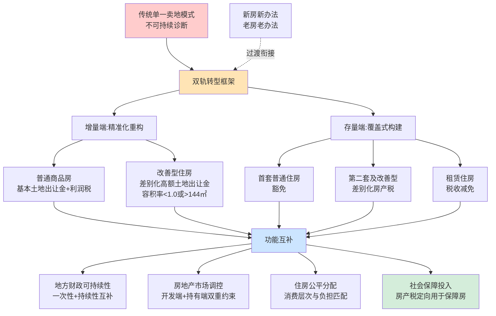

## 3.5 双轨框架的顶层约束与后续章节的逻辑衔接

### 3.5.1 对第4至第7章的顶层约束

本章确立的双轨框架，为后续章节的具体机制设计提供了顶层逻辑约束，确保各章节在统一框架下展开：

**第4章——增量端具体机制设计**：在本章确立的"普通商品房 vs 改善型住房"二元划分基础上，进一步细化两类住房的差别化出让金机制。具体包括：普通商品房的"基本土地出让金 + 利润税"组合，改善型住房（容积率<1.0或>144㎡）的差别化高额土地出让金分档结构（如120—140㎡、140—160㎡、160㎡以上的累进设计），以及利润税的税基界定与征收方式。

**第5章——存量端具体机制设计**：在本章确立的"低税率、广覆盖、宽减免"原则基础上，进一步细化差别化房产税的征收对象、税率结构、免税面积、计税依据与租赁减免机制。具体包括：首套豁免、二套及以上分档征收的具体规则；按户型、价格、区位的差别化税率（参考沪渝试点的0.4%—0.6%/0.5%水平）；按市场价70%或评估值计税的技术安排；以及对租赁住房按4%而非12%征收的差别化减免设计。

**第6章——房产税收入差异化使用机制**：在本章"房产税定向用于保障性住房与租赁市场支持"的方向性指引下，进一步细化差异化使用机制。针对住房存量大、库存积压的三四线城市，阐释"先租后售"机制的运作逻辑——以房产税资金收购或建设存量住房用于先租赁后转售，化解库存并改善低收入群体居住条件；针对一二线流动人口集中城市，阐释"住房券"机制的运作逻辑——以房产税资金向流动人口、新市民发放可用于租赁或购房支付的凭证，提升其住房可及性。两类机制的适用条件、运作流程与预期效应将系统对比。

**第7章——四种房地产税收制度的比较分析**：在本章双轨框架的基础上，将其置于土地公有制下"对土地征税/对建筑物征税/统一征税/差别税率"四种典型房地产税收制度的比较视野中加以审视，论证本报告所主张的双轨框架（实质上对应"差别税率"路径）在中国制度情境下的相对优势。

### 3.5.2 双轨框架的实施前提

需要清醒认识的是，双轨框架的有效落地，依赖于若干关键的配套前提条件：

**前提一：房产信息全国联网与不动产统一登记**。差别化房产税的前提是能够准确识别每一家庭的住房持有数量、面积、区位——"要征收房产税，首先必须有一个完整的房屋登记信息系统，这个系统并不局限于一省一市，而是全国联网，否则无法统计一个家庭房产到底是多少"[^52]。这一前提的实现，需要将既有不动产统一登记系统进一步打通至全国联网与跨部门共享。

**前提二：不动产评估体系建设**。沪渝试点目前以"市场交易价×70%"作为计税依据，是过渡性安排——长期来看，需要建立独立、专业、动态更新的不动产评估体系，使计税依据更准确地反映房产真实市场价值。这一体系的建设涉及评估机构资质、评估方法标准、评估结果争议处理等多个技术环节。

**前提三：央地财权事权再调整**。房产税虽然不可能成为中国地方政府的主体税种[^51]，但作为地方一般公共预算的重要补充，其顺利落地需要与央地财权事权格局的整体优化协同推进——包括消费税划归地方、转移支付体系优化、地方债务规范化等。

**前提四：立法节奏与试点扩围的协同**。截至2021年时点，房地产税立法已被反复提及但尚未完成。2021年10月全国人大常委会授权国务院在部分地区开展为期五年的房地产税改革试点[^50]，但2022年3月财政部明确表示"该年内不具备扩大房地产税改革试点城市的条件"[^50]。立法节奏的不确定性，意味着双轨框架的全面落地仍需较长的过渡期。

这些实施前提与配套改革的系统讨论，将在第8章实施路径与政策启示中展开。

---

综合本章论证，可以归纳出转型方案总体设计的核心命题：**"增量—存量"协同的双轨框架，通过增量端的精准化重构与存量端的覆盖式构建，将地方政府的财源结构从单一卖地依赖转向"土地出让金+房产税"的复合体系；通过两端的功能互补，同时回应地方财政可持续性、房地产市场调控、住房公平分配与社会保障投入四重政策目标；通过"新房新办法、老房老办法"的过渡衔接，避免重复征税并保障平稳落地**。这一顶层框架将作为统一的逻辑约束，贯穿第4至第7章的具体机制设计，并在第8章的实施路径分析中获得现实化的检验。

[^54]: 房地产税全解:试点现状、影响与未来展望
[^52]: 楼市高温或催生房产税扩围
[^52]: 贾康:房地产税将这样开征 难点一句话可形容
[^51]: 市场需要建立地方财政与房地产行业高质量发展的双赢政策
[^51]: 刘尚希:房地产税是小税种大问题,建议自主权交给地方
[^50]: 今年前两个月土地市场回暖,"土地财政"正在转型
[^50]: 新房产税
[^53]: 天津楼市新政:土地税优惠标准明确 144平米以下住宅受益
[^53]: 房地产永远是朝阳行业——现在需要改变的是发展模式、产业政策以及产品与服务
[^49]: 关于土地收益分配制度改革的思考
[^49]: 中国土地财政报告2024

# 4 新"增量模式"的机制设计：普通商品房利润税与改善型住房土地出让金

第3章已确立"增量—存量"协同的双轨转型框架，并明确增量端的核心方向是土地出让金征收对象的精准化收窄——从覆盖全部新增住宅供地的高额土地出让金，转向对普通商品房仅收取覆盖基础成本的"基本土地出让金"、对改善型住房征收差别化高额土地出让金，并辅以普通商品房利润税作为新增财源。本章作为增量端的机制细化章节，承担三项任务：其一，论证以利润税替代高额土地出让金的逻辑必然性与税基重塑原理；其二，围绕"容积率<1.0或建筑面积>144㎡"的量化界定，拆解差别化土地出让金的分档结构；其三，分析两类机制在可负担性保障、差异化调节、财政激励重塑三个层面的协同效应，并探讨落地过渡安排与风险防控要点。

## 4.1 以利润税替代高额土地出让金的逻辑基础与税基重塑

### 4.1.1 传统土地出让金的"寅吃卯粮"机制与房价推高效应

要理解为何需要以利润税替代传统高额土地出让金，必须首先剖析现行土地出让金机制的内在缺陷。任泽平团队《中国土地财政报告2024》明确指出，**土地出让金及土地相关税费占房价的六成以上**[^49]，构成住宅终端价格中最大的成本组成部分。从根本上说，这一比例并非市场自发形成，而是制度安排的结果——地方政府作为城市建设用地的独家供应者，掌握了不同土地的差别定价权，将土地70年使用权的未来收益贴现为当下的一次性政府收入[^50]。

这种"一次性变现"的机制存在两个根本缺陷：

**其一，70年使用权的一次性贴现内嵌于房价**。顾云昌的研究明确指出，土地出让收入"把出让土地未来70年的，变成地方政府的一次性收入，抬高了土地价格和房产价格，导致当前的过度繁荣和对未来发展的透支"[^49]。这意味着当前购房者实际上承担了未来70年土地租用价值的一次性现值——刚需家庭与改善型消费者无差别地承担这一"贴现负担"，是高房价问题在制度层面的根源之一。

**其二，地方政府"追高地价"的激励刚性**。在传统机制下，土地出让收入与地价水平直接挂钩，地方政府的财政收益最大化取决于地价最大化。罗志恒等学者明确指出，**这种机制使土地价值"透支，寅吃卯粮"，"地价也越来越高，房地产金融化严重"**[^51]。这一激励刚性即便在房地产市场整体降温的情况下，也难以通过单纯的行政指令加以扭转——除非财政收入机制本身发生改变。

### 4.1.2 "基本土地出让金"的边界界定与功能定位

基于上述诊断，新增量模式的第一项制度突破是引入"**基本土地出让金**"概念，根本性压低普通商品房供地的土地成本。基本土地出让金的边界界定，可结合多位学者的论述加以明确：

依据顾云昌的论述，新模式下"政府出让土地时仅收取基本的土地出让金，仅仅包含土地整理的成本、水电等基础设施，并且严控基本土地出让金上限，后续用房地产税取代土地溢价"[^53]。这一界定包含三个关键要素：

| 要素 | 内容 | 政策意图 |
|------|------|---------|
| **成本覆盖范围** | 仅覆盖土地整理（三通一平）、水电管网等基础设施成本 | 切断"地价溢价"的财政依赖 |
| **上限严格管控** | 设置基本土地出让金的法定上限，杜绝变相加价 | 防止"基本"名义下的实质性高价复归 |
| **资金管理架构** | "纳入房产税管理架构"，非作为城投基金 | 与开发性投资脱钩，与民生支出对接 |

需要强调的是，**"基本土地出让金"并非简单的"低价出让"**——它在概念上将土地价格从"市场拍卖溢价"还原为"政府提供基础服务的对价"，这一性质转变才是其与传统土地出让金的根本区别。在传统机制下，土地出让收入的本质是地方政府利用一级市场垄断权获取的级差地租；在新机制下，基本土地出让金的本质是政府提供土地整理与基础设施服务的成本回收，**地价不再充当地方财政的"利润中心"，而回归为"成本中心"**。

### 4.1.3 利润税的税基重塑原理：从"地租收取者"到"利润分享者"

仅压低普通住房地价并不能解决地方财政缺口问题——若没有新的财源接续，地方政府将丧失继续提供基础设施投资的能力。这正是新增量模式引入"普通商品房利润税"的制度逻辑：**通过税基重塑，将地方政府的收益机制从"地租收取者"重构为"项目利润分享者"**。

利润税的税基重塑原理可从三个层面理解。其一，**计税依据由"土地估值"转向"开发利润"**。传统土地出让金以土地市场估值为计税基础，地方政府收益取决于市场对土地未来收益的预期；利润税则以开发商真实开发利润为计税基础，地方政府收益取决于项目的实际经济效益。其二，**收入节奏由"事前一次性"转向"事中分段实现"**。土地出让金在土地出让时一次性缴清，地方政府无法分享后续市场上行的收益；利润税则随项目销售实现而分期征收，地方政府与开发商在项目周期内形成"利润分成"关系。其三，**激励兼容性的根本改善**。在传统机制下，地方政府的财政利益与开发商的"地价承受能力"直接绑定，由此衍生出推高地价的内生动力；在新机制下，地方政府的财政利益与项目的实际利润挂钩，地方政府反而具有了"协助开发商降低成本、扩大销售"的内生激励。

这一税基重塑的深层意义，是回应了贾康反复强调的转型逻辑——**房地产税开征"不是简单增加一个新税种，而是要对现在房地产税制进行重新设计，使之更为科学合理"**[^52]。利润税的引入不是单纯的"加税"，而是替代部分高额土地出让金的"换税"，其本质是同一财政流量在不同制度通道间的重新组织。

## 4.2 普通商品房利润税的具体制度设计

### 4.2.1 征税对象的界定

普通商品房利润税的征税对象，应严格限定于**新增普通商品房项目的开发企业**。结合第3章已确立的概念边界与本章第4.3节将进一步阐释的"改善型住房"量化界定，征税对象的精准界定包含以下要素：

| 界定维度 | 内容 |
|---------|------|
| **项目类型** | 容积率≥1.0且全部户型建筑面积≤144㎡的新建商品住宅项目 |
| **时间起点** | 新机制实施日期之后通过招拍挂或协议方式取得国有建设用地使用权的项目 |
| **税源主体** | 项目开发商（房地产开发企业），而非购房者 |
| **排除范围** | 改善型住房项目（适用差别化土地出让金）、保障性住房项目（继续适用现行划拨与税收优惠安排） |

这一界定的关键在于**与改善型住房的清晰分流**：满足"容积率≥1.0且建筑面积≤144㎡"两项条件的项目，作为普通商品房适用基本土地出让金+利润税组合；只要触发"容积率<1.0或建筑面积>144㎡"中任一条件，即纳入改善型住房范畴，适用差别化高额土地出让金（详见第4.3、4.4节）。

### 4.2.2 计税依据的可操作性设计

利润税的计税依据，应采用**"销售收入扣除允许成本费用后的项目利润"**这一基本结构。借鉴现行企业所得税的计税逻辑，可将计税公式表述为：

$$应税利润 = 销售收入 - 基本土地出让金 - 建安成本 - 合理费用 - 既有税费$$

其中：销售收入指项目商品房网签合同销售总额；基本土地出让金按新机制实缴金额扣除；建安成本指开发商在项目开发周期内实际发生并取得合规凭证的建筑安装工程费用；合理费用涵盖销售费用、管理费用、合规融资利息等开发期间费用；既有税费指增值税、城市维护建设税、教育费附加等不可避免的流转性税费。

这一计税依据的可操作性来自两个方面。**其一，与现行会计核算体系兼容**。开发商在企业所得税申报与房地产开发项目清算（土地增值税清算）中，已形成项目利润的核算与申报基础，利润税征管可在既有会计与申报系统上叠加，避免征管成本过高。**其二，与土地增值税的功能定位差异**。土地增值税以"土地增值额"为税基（销售收入扣除土地与建安成本后的增值），主要功能是抑制土地投机；利润税以"项目利润"为税基，主要功能是为地方政府提供持续性税源——二者在功能与税基上存在差异，但确有重叠空间。

### 4.2.3 税率结构与征管衔接

在税率结构上，可在比例税率与超额累进税率之间进行权衡。**比例税率**的优点是计算简便、预期明确，开发商在项目立项阶段即可清晰测算税负，有利于稳定开发预期；**超额累进税率**的优点是与项目利润率挂钩，对超额暴利形成较高税负，更符合"调节高利润"的政策导向。综合考虑征管成本与政策意图，可采用**"基础比例税率+超额累进附加"**的复合结构——基础部分按项目利润适用统一比例税率，超过合理利润率（如15%—20%）的部分适用累进附加税率。

在征管衔接上，必须妥善处理利润税与现行土地增值税、企业所得税的关系，避免重复征税。**贾康关于房地产税"有增有减"的整体税制再设计思路**[^52]在此提供了重要指引：利润税不应是简单的新增税种叠加，而应通过对既有相关税种的归并、合并与适度替代，实现整体税负的合理化。具体的衔接路径可包括：

第一，**与土地增值税的潜在归并空间**。土地增值税长期以来在征管中存在清算复杂、避税空间大、清算结果争议多等问题；利润税的引入为将土地增值税归并整合提供了制度契机——可考虑将土地增值税的预征与清算机制与利润税合并，简化为统一的项目所得税。第二，**与企业所得税的协调**。利润税属于针对房地产开发项目的专项利润税，需与企业所得税在税基上明确划分——可采用"项目利润税先征、企业所得税后扣"的安排，避免对同一笔利润同时按25%企业所得税与利润税双重征收。第三，**预征与清算并行的征管节奏**。借鉴土地增值税的预征经验，可在项目销售环节按销售收入的一定比例预征利润税，项目竣工清算时多退少补——这既能保证地方政府收入的及时性，又能保留利润的真实清算环节。

需要说明的是，**利润税的具体税率、累进档次、归并范围等技术参数，需要在房地产税立法过程中通过具体测算确定**。本报告所论述的，是其在新增量模式中的功能定位与基本结构，具体参数有待与房产税立法同步推进时进一步落实。

## 4.3 改善型住房的量化界定与制度依据

### 4.3.1 量化界定标准与制度依据

承接第1章和第3章的界定，本报告将"**改善型住房**"操作性地界定为**容积率低于1.0或建筑面积超过144平方米的住房**。这一量化标准并非主观设定，而是有明确的政策实践依据。

天津市2024年出台的土地税新规明确规定，"**容积率1.0以上、单套面积144平米以下的住宅**"可享受额不超过扣除项目金额20%的税收优惠[^53]。这一政策表述的反向逻辑即为：容积率<1.0或单套面积>144㎡的住宅，不属于享受税收优惠的"主流住宅产品"。天津新规的官方解读进一步说明："144平米的面积上限覆盖了大多数刚需和改善型住房需求，而1.0以上的容积率要求则体现了集约用地的原则"[^53]——这恰为本报告所采用的反向界定提供了直接的政策依据。

### 4.3.2 两项指标的政策含义解读

容积率<1.0与建筑面积>144㎡两项指标，分别从规划维度与消费维度刻画了"超出主流自住需求"的住房消费层次。

**容积率<1.0：低密度开发与稀缺土地资源属性**。容积率（建筑面积与用地面积之比）低于1.0，意味着建筑总面积小于土地面积——典型对应别墅、低层联排住宅、独栋住宅等低密度产品。这类产品的核心特征是**高人均土地占用**：在土地公有制和18亿亩耕地红线约束下，单位住房所占用的土地资源本质上是稀缺公共资源的过度配置。重庆房产税试点对独栋商品住宅的专门征税安排，正是基于这一稀缺资源属性的认识——重庆将"个人拥有的独栋商品住宅"列为首批纳入征收对象的住房类型[^52]，体现了对低密度住宅特殊性的政策识别。

**建筑面积>144㎡：高端改善型消费的住房消费层次**。144平方米这一数值并非凭空设定，而是中国房地产管理实践中长期使用的"普通住宅"与"非普通住宅"的法定分界。在过去多年的契税、土地增值税、个人所得税等政策中，144㎡均被作为"非普通住宅"的关键判定标准之一——超过144㎡的住宅被认定为高端改善型消费。从消费层次看，按当前家庭结构（户均人口约3人）测算，144㎡对应人均48㎡——这一面积已显著超过国际中等收入国家城镇人均住房水平，进入"改善型"区间。

### 4.3.3 "或"的逻辑关系与覆盖面分析

本报告采用"容积率<1.0**或**建筑面积>144㎡"的逻辑关系，即**只要满足任一条件即纳入改善型住房范畴**。这一逻辑设计的合理性体现在：

| 类型组合 | 容积率 | 建筑面积 | 分类 | 说明 |
|---------|--------|----------|------|------|
| 类型A | <1.0 | >144㎡ | 改善型 | 独栋别墅、高档低密度大户型，双重改善特征 |
| 类型B | <1.0 | ≤144㎡ | 改善型 | 低密度小户型，仍占用稀缺土地资源 |
| 类型C | ≥1.0 | >144㎡ | 改善型 | 高层大户型，仍属高端改善消费 |
| 类型D | ≥1.0 | ≤144㎡ | 普通商品房 | 主流自住产品 |

采用"或"的逻辑关系，**确保了对各类高端、稀缺消费的全面覆盖**——既不会因仅关注面积而漏掉低密度小户型（类型B），也不会因仅关注容积率而漏掉高层大户型（类型C）。这一双重界定标准在制度执行中具有较高的边界确定性：容积率由项目规划许可文件明确登记，建筑面积由产权登记直接记载，二者均为可客观验证的法定要素，不易被开发商通过模糊化操作规避。

需要指出的是，**144㎡作为分界点存在被规避的潜在风险**——开发商可能通过设计143.99㎡等"擦边球"户型来规避高额土地出让金。对此，可借鉴重庆房产税试点的应对经验：重庆对"高档住房"的认定不仅看面积，还结合**"建筑面积交易单价达到上两年主城九区新建商品住房成交建筑面积均价2倍以上"**的价格标准[^52]——即引入"面积+价格"的双重判定，使单纯面积擦边失去意义。这一反规避机制的具体安排将在第4.7节进一步讨论。

## 4.4 改善型住房差别化土地出让金的分档结构

### 4.4.1 三维分档机制的设计逻辑

对改善型住房征收差别化高额土地出让金，其制度精髓在于通过**"容积率+面积+区位"三维分档**实现精准的差异化定价。这一三维分档机制的设计逻辑分别对应不同的政策意图：

**面积维度**针对住房消费层次的纵向差异——同样作为改善型住房，144㎡与200㎡的住房消费层次显著不同，差别化分档使财政负担与消费层次精准匹配；**容积率维度**针对土地资源占用强度的差异——同样是改善型，独栋别墅（容积率0.3—0.5）与低层叠拼（容积率0.8—1.0）的单位土地占用量差异巨大；**区位维度**针对级差地租的差异——同样面积、同样容积率的改善型住房，位于一线城市核心区与三四线城市外围的市场价值与土地稀缺性差异极大。

### 4.4.2 面积维度的累进分档示例

借鉴上海房产税试点"按是否高于均价2倍分0.4%/0.6%两档"的分档逻辑[^54]、重庆房产税试点曾采用的"3倍以下0.5%、3—4倍1%、4倍以上1.2%"三档结构[^52]，新增量模式中改善型住房差别化土地出让金可采用面积累进式分档。一种可行的设计示意如下：

| 面积区间 | 改善程度 | 土地出让金溢价系数 | 政策意图 |
|---------|---------|------------------|---------|
| 120—144㎡ | 普通住房边界 | 适用基本土地出让金（不进入改善型） | 保护主流改善需求 |
| 144—160㎡ | 轻度改善 | 基本出让金的1.2—1.5倍 | 适度调节 |
| 160—200㎡ | 中度改善 | 基本出让金的1.5—2.0倍 | 显著调节 |
| 200㎡以上 | 高度改善 | 基本出让金的2.0倍以上 | 强力调节 |

需要强调的是，上述系数仅为示意性设计，实际落地参数需结合各地土地成本、市场承受能力、财政收入目标进行测算。**关键的政策含义是：随面积区间提升，土地出让金以累进方式增加，使财政负担与改善程度精准匹配**。

### 4.4.3 容积率维度与区位维度的叠加

在面积分档基础上，叠加容积率维度——对容积率<1.0的低密度项目，无论面积大小均适用更高的溢价系数。例如，可设置容积率分档：

- 容积率<0.5（独栋别墅）：在面积分档基础上再上浮50%—100%；
- 容积率0.5—0.8（低层叠拼）：再上浮30%—50%；
- 容积率0.8—1.0（多层洋房）：再上浮10%—30%。

这一容积率分档机制的核心政策意图，是**将"土地资源节约集约利用"原则贯彻到供地环节**——独栋别墅虽然单套建筑面积可能不大，但其单位土地占用是普通高层住宅的数倍至十数倍，应承担与其土地占用强度相匹配的财政负担。

在区位维度上，可结合各地具体情况实施差别化定价。一线城市核心地段与外围地段的级差地租差异巨大，统一系数难以反映这一差异；可借鉴现行土地出让"基准地价"管理思路，按区位等级设置区位调节系数，使最终土地出让金 = 基本土地出让金 × 面积溢价系数 × 容积率溢价系数 × 区位调节系数。

这一"三维分档"机制相较重庆现行单一面积分档机制（已于2024年简化为统一0.5%税率）[^54]在精准性上有显著提升，本质上是将沪渝试点的"分档"思路从存量房产税领域延伸至增量土地出让金领域，并增加了容积率维度以回应低密度开发的特殊性。

## 4.5 新增量模式的双重调控效应：可负担性保障与差异化调节

普通商品房利润税与改善型住房差别化土地出让金这两大支柱并非孤立运作，而是通过功能互补共同实现"**可负担性保障 + 差异化调节**"的双重调控效应。

### 4.5.1 普通商品房端：成本压低与可负担性保障

新增量模式在普通商品房端的核心机制效应，是**通过土地成本端的根本性压低，实现普通住房终端价格的可负担性回归**。这一效应的传导路径可分解为：

第一步，基本土地出让金封顶。普通商品房供地的土地成本从市场拍卖的"溢价模式"切换为基础设施成本的"成本模式"，土地出让金水平有望从当前占房价60%以上的高位[^49]大幅压低至覆盖基础成本的合理水平。第二步，地价压低通过开发链条传导至房价。在开发商利润相对稳定的假设下，土地成本的下降可较大幅度地传导至商品房终端售价。第三步，房价回归居住属性。普通商品房价格的回归，使刚需家庭的购房负担显著减轻——这正回应了第2章所揭示的"房价收入比远超国际合理区间"、"年轻人被高房价逼走"的负外部性。

需要指出的是，**这一传导效应的实现以"基本土地出让金严控上限"为前提条件**。若基本土地出让金的上限管控失效，地方政府仍可通过提高基础设施成本估算等方式变相加价，则地价压低效应将被消解。因此，**基本土地出让金的上限管理与第三方审计**，是这一机制有效运行的制度保障。

同时，对开发商利润征收利润税，并不会显著推高普通住房价格——因为利润税的税基是销售毛利或净利，开发商难以通过提价方式转嫁（一旦提价导致销售下降，应税利润随之下降）。这一性质使利润税成为对地方财政的"友好型"补偿——既保证地方政府的收入接续，又不会通过房价转嫁削弱可负担性目标的实现。

### 4.5.2 改善型住房端：财政收益最大化与差异化调节

新增量模式在改善型住房端的核心机制效应，是**在土地资源稀缺性最强、消费能力最高的细分市场中实现财政收益最大化**。这一效应在三个层面产生影响：

**财政层面**：通过对改善型住房征收差别化高额土地出让金，地方政府可在普通住房让利的同时，在改善型住房中获取较高的财政收益。这一财政收益不依赖于普通住房地价的扭曲性高企，而是基于改善型消费的支付意愿——具有内在的可持续性。

**资源配置层面**：高额土地出让金提高了开发商开发改善型住房的成本，将引导其更多投入主流住宅产品供给。天津新规已经印证了这一效应的现实可行性——其官方解读明确指出，"通过容积率和面积两个硬性指标，精准引导开发商建设符合市场需求的主流住宅产品"[^53]。这一引导效应有助于扭转过去土地财政模式下"开发商热衷高端、忽视主流"的产品结构失衡。

**消费调节层面**：差别化高额土地出让金通过推高改善型住房终端价格，对改善型消费形成"价格信号"——使消费者在改善需求与改善成本之间作更审慎的权衡，避免改善型消费的非理性过度扩张。这一调节机制契合贾康关于"使房地产税……能够帮助增加住房市场上购房者对中小户型的需求"的论述[^52]，但实现路径从存量端的房产税前置到增量端的土地出让金。

### 4.5.3 双重效应的政策意图统一性

可负担性保障与差异化调节这两大效应，看似指向不同的政策目标，实则在更高层次上具有政策意图的统一性。两者共同回应中央"**房住不炒**"的政策定位[^51]——可负担性保障使住房回归刚需家庭的居住属性，差异化调节抑制改善型消费的投机化倾向；两者共同支持住房消费结构的优化——普通住房供给充足且价格合理，改善型住房供给适度且消费理性；两者共同贯彻土地资源节约集约利用原则——普通住房通过较高容积率提升土地利用效率，改善型住房通过高额出让金抑制低密度过度扩张。

## 4.6 财政收入的结构性优化与激励机制重塑

### 4.6.1 三元收入结构的稳定性与可持续性优势

新增量模式形成的"**基本土地出让金 + 利润税 + 改善型住房高额土地出让金**"三元收入结构，相比传统单一土地出让金机制，在稳定性与可持续性上具有显著优势。

| 收入类型 | 性质 | 周期特征 | 稳定性来源 |
|---------|------|---------|-----------|
| **基本土地出让金** | 政府性基金预算 | 随新增供地分批入库 | 与基础设施投资规模直接挂钩，受市场情绪波动影响相对较小 |
| **普通商品房利润税** | 一般公共预算 | 随项目销售分期入库 | 基于真实销售利润，与房地产开发活动的真实经济效益挂钩 |
| **改善型住房高额土地出让金** | 政府性基金预算 | 随改善型供地分批入库 | 高端市场需求相对刚性，价格敏感度低于刚需市场 |

这一三元结构的关键优势在于：**收入来源从单一渠道分散为三类性质各异的财源**，单一渠道的波动不会导致整体收入的剧烈衰减；**收入节奏从纯一次性变为"一次性+持续性"复合**，与第3章所论证的双轨财源节奏互补逻辑相一致；**收入基础从对未来地价的贴现变为对当前真实经济活动的征收**，从根本上消除了"寅吃卯粮"的不可持续性。

在合理税率假设下，新增量模式对地方一般公共预算与政府性基金预算的贡献分布将发生结构性变化——传统模式下土地出让金集中贡献政府性基金预算，新模式下利润税将向一般公共预算提供持续性补充，使地方政府的预算结构更加均衡。这一变化与第2章所揭示的"地方一般公共预算对土地出让收入78%依赖度"的脆弱性相对应——通过利润税的引入，地方一般公共预算获得了独立的房地产相关税源，对土地出让收入的过度依赖将得到结构性缓解。

### 4.6.2 激励机制的根本性重塑

新增量模式的深层意义，**不仅在于财政收入结构的优化，更在于地方政府激励机制的根本性重塑**。

在传统土地出让金机制下，地方政府的财政利益与"地价水平"直接绑定——地价越高，财政收益越大；这一激励逻辑驱使地方政府"主动、持续、大规模"地推高地价，由此形成了第2章所揭示的高房价、阶层固化、实体经济空心化等一系列负外部性。这一激励的"内生性"特征意味着，**仅靠行政指令或道德劝诫无法改变地方政府的实际行为**，必须从激励机制本身入手。

新增量模式中，利润税的引入根本性地改变了这一激励结构。**地方政府的财政利益从与"地价泡沫"绑定，转变为与"项目真实经济效益"挂钩**——项目利润越高，地方财政收益越大；而项目利润最大化的内在要求是销售收入与开发成本的合理平衡，而非地价的非理性推高。这意味着地方政府在新机制下具有了"协助开发商降低开发成本、扩大销售规模"的内生激励，与开发商、购房者形成利益一致的关系。

这一激励重塑回应了罗志恒关于"**如果没有分税制，只要存在GDP考核，仍会产生资金饥渴和不足**"的深层判断——根本问题不在分税制本身，而在地方政府激励结构。新增量模式通过税基的根本性重构，使地方政府不再需要通过推高地价来满足"资金饥渴"，而可以通过经营良好的房地产开发与公共服务环境来获取持续性收入。这种激励兼容性的改善，正是贾康所强调的"**形成地方政府行为与经济发展、市场机制不断完善的良性互动长效机制**"[^52]的关键所在。

进一步看，这一激励重塑还具有更宏观的治理含义。**当地方政府从"地租收取者"转变为"利润分享者"，其政府角色从"经营城市"向"服务城市"转变**——经营城市需要不断推动土地资本化、扩张城市规模；而服务城市则需要关注公共服务质量、营商环境优化、产业生态培育。这一角色转变，正是国家治理模式从"土地驱动型增长"向"人本驱动型发展"转变的财政制度基础。

## 4.7 机制落地的过渡安排与风险防控

### 4.7.1 增量端"新房新办法、老房老办法"的细化操作

第3章已确立"新房新办法、老房老办法"的总体过渡原则，本节进一步细化其在增量端的具体操作。增量端的过渡涉及三类项目状态，对应不同的衔接规则：

**第一类：机制实施日期之前已完成土地出让的项目**。这类项目已按传统模式缴纳了高额土地出让金，原则上不溯及适用新增量模式。开发商按原合同条款继续开发与销售，不缴纳新增的利润税。这一安排既保护了既有合同的法律确定性，也避免了对在建项目的财务冲击。

**第二类：机制实施日期之前已签订土地出让合同但尚未实际开发的项目**。这类项目处于"已购土地、未实质开发"的过渡状态，需要在地方政府与开发商之间进行个案协商——可考虑提供"按原合同执行"或"申请改按新机制执行（补/退土地出让金差额，纳入利润税）"两种选项，由开发商自主选择。

**第三类：机制实施日期之后新供地的项目**。这类项目作为新机制的完全适用对象，按新增量模式的全部要素（基本土地出让金、利润税、改善型住房差别化高额土地出让金）执行。土地出让合同条款应作相应修订，明确各项税费的征收主体、计税依据、征管节奏与争议处理机制。

在地方层面，机制实施日期的选择应与房地产税立法节奏相协调——参考全国人大常委会2021年10月授权国务院开展为期五年的房地产税改革试点[^50]，增量端新机制的落地可与存量端房产税试点同步推进，形成"双轨同步"的转型节奏。

### 4.7.2 利润税的反规避制度安排

利润税的引入面临一个关键的征管风险——**开发商可能通过利润操纵手段降低应税利润**。常见的规避手段包括：通过关联企业交易提高建安成本、虚增费用、转移定价；通过项目"分拆"或"合并"调整利润核算口径；通过利润递延确认延迟纳税义务发生。

对此，可借鉴现行土地增值税清算与企业所得税反避税的成熟经验，构建多层次的反规避制度：

第一，**建立项目利润核定征收机制**。对于无法提供完整、合规会计核算凭证的项目，可采用"销售收入×核定利润率"的方式核定应税利润，使无法合规核算的项目不构成征管漏洞。第二，**关联交易特别审查**。对开发商与建筑承包商、设计公司、销售代理等关联方的交易，按独立交易原则进行特别审查，发现关联交易价格明显偏离市场公允水平的，进行调整。第三，**利润分配的预征机制**。借鉴土地增值税预征经验，按销售收入的一定比例（如3%—5%）预征利润税，项目竣工清算时多退少补——这既保证了财政收入的及时性，也增加了开发商利润操纵的成本。

### 4.7.3 改善型住房界定的反规避

改善型住房面临"擦边球"规避风险——开发商可能通过户型微调避免触发144㎡门槛（如设计143.99㎡的"准改善型"）或通过容积率局部调整规避1.0门槛。对此，可构建三层反规避机制：

**第一层：面积与价格双重判定**。借鉴重庆房产税试点对"高档住房"的"面积+价格"双重判定经验——重庆将"建筑面积交易单价达到上两年主城九区新建商品住房成交建筑面积均价2倍以上"作为高档住房的判定标准之一[^52]。在新增量模式中，可对接近144㎡但价格显著高于普通住房均价的项目，按价格标准纳入改善型范畴；这使得单纯通过面积"擦边球"失去意义。

**第二层：项目整体判定与单户判定结合**。一个项目内若有部分户型超过144㎡，应按超过部分单独核算改善型土地出让金，而非整体认定——这避免了开发商通过"主流户型混搭少量大户型"的方式整体规避。

**第三层：容积率分档的精细化**。在容积率<1.0的范围内进一步细分（如<0.5、0.5—0.8、0.8—1.0），使开发商难以通过"刚好达到容积率1.0以下"的方式获取较低档系数——容积率分档越细，规避空间越小。

### 4.7.4 利润税立法节奏与地方差异化空间

利润税作为新设税种，其立法节奏需与房地产税整体立法相协调。综合各方观点，可能的立法路径包括：在房地产税立法中将利润税作为配套税种同步推进；或先以国务院授权方式在部分地区开展试点（类似2021年10月房地产税试点授权），积累经验后再推进全国立法[^50]。

刘尚希关于"在房地产税问题上，要更多地给地方分权，或者说放权"[^51]的论述同样适用于利润税——**在中央立法形成框架的前提下，给予地方在税率档次、计税依据细节、归并范围等方面一定的自主权**，既有利于发挥地方主动性，也有利于因地制宜地匹配各地房地产市场实际情况。这一"中央立法定框架+地方自主定细节"的差异化空间，是新增量模式平稳落地的重要制度弹性。

### 4.7.5 与存量端房产税的衔接逻辑

新增量模式的落地需要与第5章将系统讨论的存量端房产税形成清晰的衔接逻辑。具体衔接接口包括：

**接口一：新房纳入存量房产税的时点**。新机制下供地的新建商品房（无论普通商品房还是改善型住房）在交付后即纳入存量房产税征收范围——普通商品房可享受首套豁免、人均60㎡免征等存量房产税的减免；改善型住房则按存量房产税的差别化规则缴纳持有税。

**接口二：基本土地出让金与房产税的承接关系**。新机制下，普通商品房供地的土地出让金大幅压低，"减少的"土地出让金财政贡献，由存量端的房产税在持有环节加以补充——这正是第3章所论述的"用长期房产税替代短期土地溢价"逻辑的实质化。

**接口三：改善型住房高额土地出让金与高档房产税的关系**。改善型住房在增量端已缴纳高额土地出让金，在存量端再按差别化房产税征收，需要明确二者的衔接——可考虑改善型住房在购房后的若干年内（如10—20年）按减免方式缴纳房产税，使两端税负不构成重复，待减免期满后再按标准房产税缴纳。

这些衔接接口的具体技术安排，将在第5章存量端机制设计中进一步展开。

---

综合本章论证，新增量模式的核心制度安排可归纳为：**通过"基本土地出让金+普通商品房利润税"的组合大幅压低普通住房地价、保障可负担性；通过"改善型住房差别化高额土地出让金"在土地稀缺性与消费能力最高的细分市场实现财政收益最大化与消费调节**。这一双支柱机制不仅重构了地方政府的财源结构，更从根本上重塑了"地方政府—土地—财政"之间的激励关系——使地方政府从"地租收取者"转变为"项目利润分享者"，从"经营城市"转向"服务城市"。本章所构建的增量端机制，为第5章存量端房产税设计预留了清晰的制度接口，二者共同构成第3章所确立的双轨框架的具体实现路径。

# 5 新"存量模式"的机制设计：差别化房产税与租赁税收减免

第4章已系统拆解了双轨框架在增量端的机制实现——通过"基本土地出让金+普通商品房利润税"压低普通住房地价、通过"改善型住房差别化高额土地出让金"在高端细分市场实现财政收益最大化。然而，仅有增量端的精准化重构不足以构建可持续的复合财源体系——按第1章央行数据，2019年我国城镇居民家庭住房拥有率已达96.0%、户均拥有住房1.5套、两套及以上家庭占比超过40%[^49]，这一庞大的存量住房资产长期游离于持续性持有税之外，构成了双轨框架另一端必须覆盖的关键税基。本章作为存量端的机制细化章节，围绕"**对谁征、怎么征、为何减**"三大核心问题展开：第5.1节论证征收对象差别化划分的逻辑与边界，第5.2节设计核心技术参数（税率、免税面积、计税依据），第5.3节阐释租赁性房产税收减免机制，第5.4节分析与"房住不炒"政策导向的对接路径，第5.5节系统评估预期效应，第5.6节讨论落地配套前提与风险防控。本章与第4章共同构成双轨框架的完整机制实现，并为第6章房产税收入的差异化使用机制奠定征收基础。

## 5.1 存量房产税征收对象的差别化划分逻辑

存量房产税设计的首要问题，是确定"对谁征"。这一问题表面上是技术选择，实质上涉及住房权属与基本居住权之间的关系——正如贾康所论述的房产税核心逻辑："**主要是调节高端人群收入状况，可以让更多高收入者、富裕者缴纳更多税收，为大多数老百姓减少税收负担**"[^52]。基于这一调节性税种的功能定位，结合第2章揭示的城镇住房存量结构事实，本节论证差别化划分的三层分类逻辑与具体边界。

### 5.1.1 三层分类的基本架构

存量房产税征收对象的差别化划分，可归纳为三层分类架构：

| 分类层级 | 适用对象 | 征收方式 | 政策意图 |
|---------|---------|---------|---------|
| **第一层** | 首套普通住房（容积率≥1.0且面积≤144㎡） | 完全豁免 | 保护刚需、住有所居 |
| **第二层** | 第二套及以上普通商品房 | 按差别化税率常规征收 | 约束多套持有 |
| **第三层** | 改善型住房（容积率<1.0或面积>144㎡） | 从严征收 | 高端化消费调节 |

**第一层——首套豁免逻辑**。首套普通住房作为"基本居住权"的载体，应享受完全的房产税豁免。这一豁免设计的合理性源于三个层面：其一，符合《房产税试点全解》所概括的政策共识——"政策明确'保护刚需'，人均60㎡免征足以覆盖大多数家庭需求"[^54]；其二，契合上海试点"本市户籍首套房全免"的实践经验[^54];其三，回应贾康关于房产税"减少大多数老百姓税收负担"的核心论述，使房产税作为直接税"如愿以偿地调节到社会收入结构中的高端人群，从而可以置换、替代间接税收入，减少中低收入人群的税收负担、税收痛苦"[^52]。

**第二层——多套持有的常规征收逻辑**。第2章已论证，2019年央行数据显示两套及以上家庭占比已超40%，这一规模的多套持有家庭构成了房产税的核心税基。对第二套及以上普通商品房征收差别化房产税，其制度意图在于通过持续性持有成本约束，**改变"持有等待升值"的投机性住房需求结构**——按《房产税试点全解》测算，500万房产年缴税约2—3万元，持有10年累计20—30万元，"对投机者形成持续压力"，引导其"出售多余房产，转向租赁市场或长期持有优质资产"[^54]。这一持续性压力机制，是单纯交易环节税费所无法替代的——交易税"只在出售时一次性发生，可由持有者通过延长持有规避"，而持有税"每年发生、累计可观，是真正的'持有成本约束'"。

**第三层——改善型住房从严征收逻辑**。改善型住房作为高端、低密度、稀缺土地资源消费的代表性产品，应承担与其消费层次相匹配的财政负担。这一从严征收的合理性源于：其一，与第4章增量端"改善型住房差别化高额土地出让金"形成存量与增量两端的政策呼应——增量端在土地出让环节征收高额出让金、存量端在持有环节征收高额房产税，共同抑制改善型消费的非理性扩张；其二，借鉴重庆房产税试点对独栋商品住宅与高档住房的专门征税安排——"独栋商品住宅和高档住房建筑面积交易单价在上两年主城九区新建商品住房成交建筑面积均价3倍以下的住房，税率为0.5%；3倍至4倍的，税率为1%；4倍以上的税率为1.2%"[^52]，体现了对高端住房从严征收的政策经验。

### 5.1.2 与第4章改善型住房界定的口径一致性

本章对"改善型住房"采用与第1章、第3章、第4章完全一致的口径——即**容积率低于1.0或建筑面积超过144平方米的住房**。这一口径一致性在双轨框架中具有重要的制度含义：

第一，**避免增量与存量两端的口径割裂**。若增量端按"容积率<1.0或>144㎡"界定改善型住房征收高额土地出让金，而存量端按其他标准界定改善型住房征收差别化房产税，将造成同一处房产在不同环节适用不同分类的混乱——开发商可能选择"按增量界定为改善型、按存量界定为普通"的产品形态，扭曲市场行为。

第二，**便于税务机关的统一识别**。容积率与建筑面积均为不动产登记中可客观验证的法定要素——容积率由项目规划许可文件登记，建筑面积由产权证书直接记载。统一采用这两项要素作为分类标准，可使税务机关在不动产登记数据基础上实现自动化识别，降低征管成本。

第三，**与天津2024年新规的政策实践相衔接**。天津新规所明确的"容积率1.0以上、单套面积144平米以下的住宅"标准[^53]，恰为"非改善型"的反向定义——本报告所采用的标准是对这一界定的反向延伸，具有现行政策实践的直接依据。

### 5.1.3 特殊豁免情形的差异化安排

在三层基本分类之外，存量房产税设计还应保留若干特殊豁免情形，体现住房保障政策的精细化导向。综合沪渝试点及2026年最新调整经验[^54]，特殊豁免情形可归纳如下：

**高层次人才首套豁免**。沪渝试点均对高层次人才提供税收优惠安排——这一安排既体现了城市间人才竞争的政策工具属性，也契合"创新驱动发展战略"对人才流动的支持导向。本报告建议在新存量模式中延续这一豁免，使房产税成为引才政策的配套支撑。

**居住证满3年人员首套豁免**。上海2025年优化调整政策明确"对持居住证满3年人员新购首套房免税"[^54]。这一豁免的政策意图在于回应新市民、流动人口的基本居住需求——居住证满3年通常意味着实际居住与社会贡献的稳定性，应给予近似户籍居民的住房保障待遇。

**成年子女家庭唯一住房暂免**。上海2026年2月新增的"对成年子女家庭唯一住房暂免征收房产税"规定[^54]，回应了独立成家但住房记录尚未完全分户的过渡性情形——这一豁免避免了因住房记录归属问题对实质上的"首套自住"家庭征税，体现了"实质重于形式"的征管原则。

**保障性住房豁免**。公租房、共有产权房、保障性租赁住房等保障类住房，作为承担社会保障功能的特殊住房类型，应整体豁免房产税——这一豁免不仅符合公共住房的政策定位，也避免了"政府向自己征税"的财政循环。

这些特殊豁免的精细化设计，使存量房产税在"保护刚需、调节高端"的基本逻辑之外，具备了对特殊群体住房需求的差异化关怀——这正是刘尚希所论述的房产税"小税种、大问题"中"大问题"维度的具体体现：房产税的设计不仅是技术问题，更涉及社会公平与住房权益的多重权衡[^51]。

## 5.2 差别化税率结构、免税面积与计税依据的具体设计

确立征收对象的差别化划分之后，存量房产税的具体技术参数设计成为关键问题。本节围绕税率结构、免税面积与计税依据三项核心参数，借鉴沪渝试点经验、参考国内学者的政策建议，提出"低税率、广覆盖、宽减免"原则下的具体设计方案。

### 5.2.1 三维分档的累进式税率框架

沪渝试点已积累了重要的税率设计经验。上海试点的税率结构呈现"按是否高于均价2倍分0.4%/0.6%两档"的二档累进特征——"适用税率暂定为0.6%，但对应税住房每平方米市场交易价格低于上年度新建商品住房平均销售价格2倍（含2倍）的，税率可暂减为0.4%"[^52]。重庆试点曾采用"3倍以下0.5%、3—4倍1%、4倍以上1.2%"的三档累进结构[^52]，2024年简化为统一0.5%税率[^50]。沪渝试点的对比表明：**分档税率在差异化调节上更具精准性，但简化为单一税率有利于降低征管成本**——两种思路各有优劣。

综合两地经验并向前推进，本报告建议新存量模式采用**按户型、价格、区位三维分档的累进式税率框架**，区间设定为0.3%—1.2%。这一三维分档机制的设计逻辑如下：

| 分档维度 | 分档依据 | 税率范围 | 政策意图 |
|---------|---------|---------|---------|
| **户型维度** | 第二套普通住房/改善型住房（144—160㎡/160—200㎡/200㎡以上） | 0.3%—1.0% | 与消费层次匹配 |
| **价格维度** | 单价相对当地均价的倍数（≤2倍/2—3倍/≥3倍） | 在户型档基础上上浮20%—50% | 抑制高单价投机 |
| **区位维度** | 一线核心/一线外围/二线/三四线 | 区位调节系数0.8—1.2 | 反映级差地租差异 |

需要明确的是，**0.3%—1.2%的区间设定是参考沪渝试点实际经验得出**——上海下限0.4%、重庆上限1.2%是两地试点税率的"包络"，本报告所提下限0.3%略低于上海下限，是为了在保障性较强的二套普通住房（如120㎡左右的一般改善）上保留更低的税率档次；上限1.2%与重庆原"3倍以上"档次一致，仍处于国际通行的"低税率"区间。这一税率区间的"低税率"特征，**显著低于美国房产税普遍1%—3%的水平、香港差饷5%税率水平**，体现了对中国房地产市场敏感性的审慎考虑，呼应了"延续'低税率、广覆盖、宽减免'原则，避免冲击市场"的政策共识[^54]。

需要进一步说明的是，**未来房地产税立法时的具体税率档次、上下限取值，需在大量地方测算与社会沟通的基础上确定**。本报告所提框架是逻辑性建议，而非最终政策方案。

### 5.2.2 "人均免税面积+特殊住房单独免税"的复合扣减机制

免税面积是房产税"宽减免"原则的核心载体。沪渝试点提供了两种典型设计：上海采用"人均60㎡免征"的家庭累计扣减方式[^54][^52]，重庆采用"独栋住宅180㎡、高档住房180㎡免征"的单套定额扣减方式[^54]。两种方式各有适用范围——人均扣减更适合普通住房的家庭单元保障，单套扣减更适合特殊住房类型的"门槛免税"。

本报告建议采用**"人均免税面积+特殊住房单独免税"的复合扣减机制**，将两种思路有机结合：

**第一部分：人均免税面积**。延续上海"人均60㎡"的核心经验，对家庭住房按"家庭成员数×60㎡"累计免税面积，超出部分按差别化税率征收。以三口之家为例，免税面积为180㎡——这一额度足以覆盖大多数家庭的基本居住需求。上海试点的实践测算已表明这一额度的合理性："一个三口之家的上海居民家庭……原来已拥有一套50平方米的住房，现又新购一套110平方米的住房，全部住房面积为160平方米，人均住房面积为53.33平方米，未超出人均60平方米的免税住房面积标准，因此，该家庭此次新购的这一套110平方米的住房可暂免征收房产税"[^52]。

**第二部分：特殊住房单独免税**。借鉴重庆经验，对独栋住宅、改善型住房等特殊类型保留独立的免税额度——例如对独栋住宅设定180㎡的单套免税额度，对建筑面积144—200㎡的中度改善型住房设定120㎡的单套免税额度。这一单独免税设计的意图，是在差别化征收的同时仍保留对自住属性的基本认可。

复合扣减机制的实施还需明确若干技术细节：其一，**家庭成员的认定**——以户籍登记的核心家庭（夫妻+未成年子女）为基础，参照上海试点的家庭单元定义；其二，**已有住房的纳入计算**——按上海试点经验，"已有住房的面积"同样占用免税额度，避免通过"先持有再申报"的方式重复使用免税额度；其三，**房屋数量的全国联网核查**——这一技术前提的实现路径将在第5.6节进一步讨论。

未来政策展望中，可考虑根据各地实际情况对人均免税面积作出微调——按《房产税试点全解》对长期趋势的判断，"免征面积：人均40—60㎡，各地可根据情况微调"[^54]，体现各城市差异化的住房紧张程度。

### 5.2.3 计税依据从"交易价×70%"向"评估值"的过渡

计税依据是房产税技术体系中最具争议、也最具技术难度的环节。沪渝试点目前均采用"市场交易价×70%"的过渡性安排——上海规定"试点初期，暂以应税住房的市场交易价格作为房产税的计税依据，房产税暂按应税住房市场交易价格的70%计算缴纳"[^52]，重庆2024年调整后明确"按房产交易价的70%计算缴纳，条件成熟后以评估值为准"[^54]。

"交易价×70%"的过渡性安排具有明显的优劣：

**优点**：计算简便、有据可查（交易价以网签合同为准）、税负预期明确、避免评估争议。这一安排在试点初期承担了"快速落地"的功能，避免了独立评估体系建设的长周期约束。

**缺点**：交易价仅反映购入时点的市场价格，无法动态反映房产价值的变化——一处2015年购入价为500万、2025年市值已涨至800万的住房，若仍按500万×70%计税，将显著低估其真实税基；同时，对长期持有者（数十年前购入的老房）与近期购入者形成显著的税负不公。

长期来看，房产税计税依据需要从"交易价×70%"过渡到"**独立评估值**"。重庆试点明确指出"条件成熟后以评估值为准"[^54]，国务院发展研究中心的相关讨论也提出"试点过程中应税住房计税依据为参照应税住房的房地产市场价格确定的评估值"[^52]——这一过渡的方向已获政策共识。

向评估值的过渡需要构建配套的不动产评估体系。一个有效的不动产评估体系应包括：**独立评估机构**——具备资质的第三方评估机构承担评估工作，避免税务机关"既当裁判员又当运动员"；**统一评估方法**——明确市场比较法、收益法、成本法的适用范围与计算标准，避免方法分歧导致评估争议；**动态更新机制**——评估值按一定周期（如3—5年）更新，反映房产价值的市场变化；**争议处理机制**——纳税人对评估值有异议时的复核、行政复议、行政诉讼通道。

这一评估体系的建设涉及评估机构资质、评估方法标准、信息系统支持、专业人才培养等多个环节，是房产税立法的关键配套基础设施——其建设进度将在很大程度上决定房产税从"试点"走向"全面实施"的节奏。

### 5.2.4 "新房新办法、老房老办法"在存量端的具体落地

第3章已确立"新房新办法、老房老办法"的总体过渡原则，本节进一步细化其在存量端的具体落地。这一过渡安排的核心目的，是**避免重复征税**——正如贾康所反复警示的，"如果对所有住房征收房产税，需要与基本土地出让金统筹平衡，不能既收高额土地出让金，又收房产税，二者存在重复征收的关系"[^51]。

具体到存量端，"老房"与"新房"的区分及各自规则可表述如下：

**老房（机制实施前已购、已缴清70年土地出让金的住房）**：在原土地使用年限内（即购房时起算的70年内），原则上不缴纳新增的差别化房产税。这一豁免的依据是：购房时的房价已经内嵌了70年使用权对应的高额土地出让金，再征收房产税构成对同一土地价值的重复征收。但需要指出例外情形——对老房中的多套持有部分（如家庭持有3套及以上的部分），可考虑按差别化税率征收，因为这部分超出基本居住需求，已超出"老房老办法"的保护范围。

**新房（机制实施后供地的新建商品房）**：按本章所述差别化房产税规则征收。其中需进一步区分：普通商品房新房（已享受基本土地出让金的低成本）按常规规则征收；改善型住房新房（已缴纳差别化高额土地出让金）可考虑在购房后10—20年减免期内按降档税率征收，待减免期满后按标准税率缴纳——这一安排在第4章已作初步说明，旨在避免增量端高额土地出让金与存量端高额房产税的双重叠加。

**老房使用年限到期后的过渡**：购房时购买的是70年使用权，到期后土地使用权续期需要重新缴费，可考虑将续期费用整合入房产税体系——即老房在使用年限到期后，自动过渡到新房产税规则。这一安排既解决了70年到期续期的法律不确定性，也使新老政策最终归并到统一框架。

这一"新老有别"的过渡安排，本质上是用时间换空间——通过给老房较长的免税期，使房产税改革避免对存量房市场的剧烈冲击；同时通过新房的全面纳入，确保新机制的财政贡献逐步增长。这一渐进式安排，正是"先立后破"原则在存量端的具体体现。

## 5.3 租赁性房产税收减免机制与租赁市场激活逻辑

在差别化征收的基础上，存量房产税设计的另一关键环节，是对租赁性房产的税收减免安排。这一减免机制不仅是技术细节，更承担着引导住房从"投机持有"向"租赁运营"功能转化的政策使命。

### 5.3.1 现行《房产税暂行条例》中的差别化制度基础

中国现行房产税制度对租赁性房产已经设置了差别化的税率安排。根据《房产税暂行条例》及相关规定：经营性房产按租金收入12%征收房产税（外资企业18%）；**个人出租住房按租金收入4%征收**，明显低于12%的标准税率[^50]。

这一现行差别化基础提供了租赁减免机制设计的天然起点。**新存量模式下的关键制度安排是：将所有出租住房（无论持有人身份）的房产税率统一降至4%，相比12%的非租赁基准形成显著的减免空间**。这一减免设计的合理性可从两个层面理解：

**第一，承接现行制度的精神延续**。"个人出租住房4%"的低税率，本身就体现了政策对租赁供给的鼓励意图——只是在现行制度中，这一减免仅适用于个人出租，而企业持有出租的住房仍适用12%或18%税率。新存量模式将这一减免普惠化，使所有出租住房享受一致的低税率，体现"激励出租"的一以贯之导向。

**第二，与持有税体系的协调衔接**。新存量模式下，第二套及以上普通住房按0.3%—1.0%的差别化税率按房产价值征收持有房产税。若同时按租金收入再征收12%或18%，将形成"持有税+租金税"的双重负担，显著抑制租赁供给。将租金税降至4%，使两类税基在合理范围内并存，避免双重重负。

需要说明的是，此处涉及两个不同口径的"房产税"：一是按**房产价值**征收的差别化持有税（0.3%—1.2%），二是按**租金收入**征收的租赁所得税（现行4%—18%）。新存量模式建议将两者整合协调，对出租住房按"低持有税+低租金税"的组合征收，避免税基重叠与税负累加。

### 5.3.2 供给侧效应：从"空置投机"向"出租运营"的激励重塑

租赁性房产税收减免的核心政策效应，是从供给侧改变多套房持有者的行为选择。第2章已揭示，西南财经大学2017年调研显示整体住房空置率超过20%、商品房空置率超过26%——这意味着数以亿计的住房处于"持有等待升值"的投机性闲置状态，构成了对住房资源的巨大浪费。

新存量模式下，对多套房持有者的成本结构产生如下变化：

| 持有方式 | 成本构成 | 政策效应 |
|---------|---------|---------|
| **空置持有** | 全额持有房产税（0.3%—1.2%）+物业费等 | 持有成本显著上升，催生"持有即亏损"的市场信号 |
| **出租运营** | 减免后的持有房产税+4%租金税 | 综合税负显著低于空置，激励出租 |
| **出售退出** | 一次性交易税费 | 也是减少持有成本的合理选择 |

通过这一成本结构对比可见，**租赁减免机制的核心激励逻辑是"以税收差别推动空置转出租"**——多套房持有者面临"空置高税、出租低税"的差别化激励，将更多选择将房屋投入租赁市场，从而盘活第2章所揭示的超20%空置率所代表的存量住房资源。

这一供给侧效应在《房产税试点全解》的预期判断中已有清晰呈现："长期：空置房入市增加，租赁供给充足，租金更趋稳定"[^54]。该判断的逻辑链条是：持有成本上升→空置房入市→租赁供给扩大→租金供需关系改善→租金稳定。

### 5.3.3 需求侧效应：平抑租客负担与配套租金指导价

租赁减免机制的需求侧风险，是**房东向租客转嫁税负**——若房东将税负完全转嫁，租金将上涨，租客成为最终的"税收承担者"，与减免政策"激活租赁市场、改善民生"的初衷相悖。《房产税试点全解》对此风险作出了平衡判断："短期：部分房东可能将税费转嫁给租客，租金小幅上涨；长期：空置房入市增加，租赁供给充足，租金更趋稳定"[^54]。

为最小化短期转嫁压力，新存量模式需要配套以下机制：

**第一，租金指导价制度**。"多地试点租金指导价，防止过度转嫁"[^54]——租金指导价通过对各区域、各户型的合理租金水平作出指导，对超出指导价的租金行为加以监督，避免房东将税负全额转嫁。

**第二，差异化激励**。对长租约（如3年及以上）的出租，可给予比短租约更大的税收减免——长租约提供更稳定的居住保障，应享受额外政策支持。同时，对租金低于指导价一定比例的"普惠性租赁"，可给予进一步减免，使税收政策与租金水平形成正向激励。

**第三，租金转嫁监控**。对在租赁减免实施后租金涨幅明显超出合理水平的房东，可取消其享受减免的资格——这一惩戒机制使房东在转嫁与减免之间作合理权衡，避免单方面追求租金最大化。

**第四，租赁住房供给侧改革协同**。仅靠存量住房出租不足以根本解决租赁市场问题——需要同时推进保障性租赁住房建设、市场化长租公寓培育、租赁住房REITs等供给侧改革，形成多元供给格局。这一协同机制将在第6章房产税收入使用机制中进一步展开。

### 5.3.4 与"培育发展住房租赁市场"政策导向的契合

租赁减免机制并非孤立的税收技术安排，而是与中央层面"培育发展住房租赁市场"政策导向高度契合的制度支撑。2025年政府工作报告进一步明确"加强初婚初育家庭住房保障，支持多子女家庭改善性住房需求"[^51]，租赁住房作为这一保障体系的重要组成部分，其供给规模直接关系到新市民、青年人的居住权益。

从更长期视角看，租赁减免还呼应了住房消费观念的转变——按彭寿院士的论述，需"用科技的力量，把一些空置的老房、旧房改造成好房子，降低房屋成本，让人们买得起、住得起，更住得舒心"[^51]。这一论述虽针对房屋改造，但"让人们住得起"的目标导向，恰恰需要租赁市场作为购房之外的住房供给渠道——而活跃的租赁市场，又依赖于税收政策的激励引导。

将租赁减免置于"租购并举"住房制度的整体框架中考察，其制度意义将进一步凸显——它不仅是房产税内部的差别化安排，更是住房供给侧从"购房单轨"向"租购并举双轨"转型的关键税收支撑。

## 5.4 存量模式与"房住不炒"政策导向的对接机制

存量房产税与租赁减免的组合设计，在更高的政策层次上服务于"**房子是用来住的、不是用来炒的**"核心定位。本节系统论证该组合如何通过四重对接路径，将"房住不炒"从政策口号转化为制度安排。

### 5.4.1 对接路径之一：弱化金融资产属性

中国房地产长期以来呈现"消费品属性弱化、金融资产属性强化"的特征——刘尚希明确指出，房地产税应当具有调节功能，"**促进房地产回归住房的消费品属性，淡化作为金融资产的属性**"[^51]。这一功能定位的核心机制，是通过持续性持有税改变房产作为金融资产的收益结构。

差别化房产税的具体作用路径是：**持续性持有税抑制资本利得**。在无持有税的环境下，持有房产的成本几乎为零，房产升值收益全部归属持有者；在有持有税的环境下，每年的持有税相当于对房产价值的"折损"，资本利得需要扣除累计持有税方为真实收益。当持有税累计金额接近或超过预期升值时，房产作为金融资产的吸引力将显著下降。

按《房产税试点全解》示例："500万房产年缴税约2—3万元，持有10年累计20—30万，对投机者形成持续压力"[^54]——若同期房价涨幅不足以覆盖这20—30万元的持有税累计成本，投机性持有的财务可行性即被破坏。这一机制的关键不在于税率本身的高低，而在于**对预期收益的折损所带来的市场信号**——使购房者从"博取资本利得"的投机预期，转向"满足居住需求"的消费判断。

### 5.4.2 对接路径之二：抑制高端化非理性扩张

第2章已揭示土地财政模式下"开发商热衷高端、忽视主流"的产品结构失衡——这一失衡的需求侧根源，是改善型与高端住房的投机性需求被过度激发。差别化房产税通过对改善型住房的较高税率，对这一需求结构形成系统性约束。

具体而言，按本章所提三维分档框架，改善型住房适用较高税率档次（如0.7%—1.2%）；对一处500万元的改善型住房而言，按0.8%税率计算（基于交易价70%），年缴税约2.8万元，10年累计约28万元，且未来若过渡到评估值计税，随房价上涨税额将进一步提升。这种持续性、累进式的税负压力，**显著高于普通商品房（首套豁免、二套约0.3%—0.5%）**，构成对改善型消费的明确价格信号。

这一抑制效应与第4章增量端"改善型住房差别化高额土地出让金"形成存量与增量两端的协同——增量端在土地出让环节对改善型住房征收高额出让金、抑制其供给端的非理性扩张；存量端在持有环节对改善型住房征收较高房产税、抑制其需求端的非理性扩张。两端共同作用，使改善型消费从"奢侈品式炫耀消费"回归到"满足实际改善需求"的合理水平。

### 5.4.3 对接路径之三：盘活存量、激活流通

第2章揭示的住房空置率超20%、商品房空置率超26%的事实，是"房子用来炒、不用来住"的最直观体现——大量住房被持有者锁定在"等待升值"状态，未能进入实际居住或租赁流通。

存量模式通过两个机制盘活这部分存量：

**机制一：持有成本压力下的存量入市**。差别化房产税对多套持有形成持续性成本压力，部分多套持有者将选择出售部分房产，使原本"锁定持有"的住房进入二手房市场流通。这一流通环节既满足了刚需家庭的购房需求，也使存量房资源得到更高效的配置。

**机制二：租赁减免引导的存量出租**。对选择继续持有的多套房持有者，租赁减免提供了"出租比空置更经济"的财务激励，引导其将空置房投入租赁市场。这一机制使原本"沉淀"的住房资源进入租赁流通，扩大了租赁供给。

两个机制的共同效应，是**将住房从"持有锁定"状态转化为"使用流通"状态**——这正是"房住不炒"在资源配置维度上的核心要求。任何不流通的住房，无论是空置等待升值还是被"金融资产化"持有，本质上都偏离了"用来住"的基本定位。

### 5.4.4 对接路径之四：保护刚需基本居住权

"房住不炒"的另一层含义是保护刚需家庭的基本居住权——不能在抑制投机的同时误伤真实居住需求。存量模式通过首套豁免与人均免税面积的双重保护机制，确保刚需家庭的基本居住权不受房产税冲击。

按本章设计，首套普通住房完全豁免房产税；即便家庭持有第二套住房，人均60㎡的免税面积也能覆盖三口之家180㎡的居住空间——这一覆盖范围足以保护**绝大多数"双房自住"家庭**（即一套自住+一套父母自住或子女自住）不缴纳房产税。

这一保护机制的精细化设计，体现了贾康所反复论述的房产税"削富济贫"效果："**一方面可以将以往开征的多种间接税负担并入房地产税税种，减少大多数老百姓的税收负担；另一方面，作为直接税，房地产税的税负不能轻易转嫁给别人**"[^52]。新存量模式通过对首套与人均免税面积的精确把握，使房产税真正成为"少数高端持有者承担、多数普通家庭免税"的调节性税种。

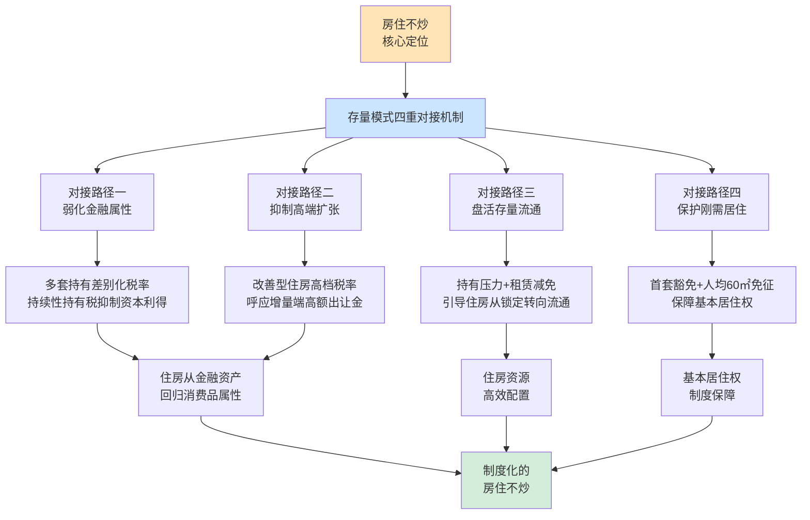

综合四重对接路径可见，**新存量模式不是孤立的税收技术工具，而是"房住不炒"政策导向的制度化载体**——它通过四个相互关联的机制，将抽象的政策口号转化为可操作、可衡量、可执行的具体制度安排。这一制度化的实现，正是房地产长效机制建设的关键所在。

## 5.5 存量模式预期效应的四维分析

基于本章前述机制设计，本节从四个维度系统分析存量模式的预期政策效应，并坦诚讨论其局限性与实现条件。

### 5.5.1 第一维度：抑制投机需求

存量模式抑制投机需求的核心机制，是通过差别化房产税对多套持有形成持续性成本约束。其预期效应可从财务测算与行为响应两个层面把握。

**财务测算层面**：按《房产税试点全解》提供的示例，500万房产年缴税约2—3万元，持有10年累计20—30万元[^54]。这一持有成本占房产价值的4%—6%（10年累计），相当于在房产持有期内形成持续的"价值折损"。若同期房价涨幅低于这一水平，投机性持有即陷入负收益区间。

**行为响应层面**：面对持有成本压力，多套房持有者的可能行为选择包括出售部分房产以减少持有规模、出租部分空置房产以抵消持有成本、持续持有但承担较高税负、或寄望于税收政策放松。其中前两种选择，即"出售退出"与"出租运营"，正是政策希望引导的市场行为。

需要指出的是，这一抑制效应存在显著的**异质性**——高净值家庭对持有税的敏感度较低（持有税相对于其资产规模占比小），而中等净值家庭对持有税的敏感度较高。这意味着差别化房产税对"中等持有规模"家庭（持有2—3套房）的影响最显著，而对"超高净值"家庭（持有10套以上）的影响相对有限——这一异质性，使政策设计需要在差别化税率上对"超高持有"档次设置更高税率，避免抑制效应在"最需要被抑制"的人群中失效。

### 5.5.2 第二维度：激活租赁市场

存量模式激活租赁市场的预期效应，建立在"租赁减免+空置成本"双向激励基础上。

**供给端预期**：在租赁减免与持有税双重作用下，多套房持有者将更多选择将空置房投入租赁市场，使租赁供给规模显著扩大。按西南财经大学2017年调研显示的超20%空置率，若其中即便有30%—50%进入租赁市场，将带来数千万套住房的租赁供给增量——这一供给增量足以显著改变大城市租赁市场的供需结构。

**需求端预期**：租赁供给扩大将平抑租金水平，使新市民、青年人、流动人口的租赁负担减轻——这一效应正回应了第2章揭示的"年轻人被高房价逼走"的负外部性。当租赁住房成为更可行的居住选择时，城市可负担居住门槛降低，对青年人才的吸纳能力提升。

**多元供给格局形成**：租赁减免引导的"个人/企业出租"，配合保障性租赁住房、市场化长租公寓、租赁住房REITs等多元供给渠道，将形成立体化的租赁市场体系。这一多元供给格局，使租赁市场从"个人零散出租"的低端形态，向"机构化、规范化、多层次"的成熟形态升级——这正是"租购并举"住房制度的核心内涵。

### 5.5.3 第三维度：稳定房价预期

房地产市场的核心变量是预期——当市场预期房价"只涨不跌"时，投机性需求大规模涌入；当市场预期房价"可能下跌或长期平稳"时，投机性需求自然退潮。存量模式通过持续性持有税改变市场预期的机制如下：

**改变收益结构的预期信号**：持续性持有税向市场传递了"持有房产存在成本、长期升值预期需要扣除税收成本"的明确信号，**这一信号本身就足以改变市场对房产作为投机资产的估值逻辑**——即便实际税额不大，"持有成本永久存在"的预期已经足以抑制投机性需求。

**呼应贾康判断**：贾康明确指出，"中国现在实际城镇化水平还不到40%（按户籍人口口径），以后要一路走高到70%—80%才能相对稳定，房地产保有环节的税收并不可能改变中心区域不动产价格上扬曲线的大模样。**有了房地产税，才能使得房地产市场减少泡沫，不易频繁大起大落而造成对社会生活的负面冲击**"[^52]。这一判断指出了房产税对房价预期的真实作用——不是改变长期上涨趋势（这取决于城镇化、收入增长等基本面），而是减少波动幅度、避免大起大落。

**沪渝试点的实证印证**：沪渝试点自2011年实施以来的实际效果，确实在一定程度上验证了"减少泡沫但不改变长期走势"的判断。试点期间，沪渝两地的房地产市场总体保持相对稳健，未出现剧烈波动——这一稳定性虽不能完全归因于房产税，但房产税无疑发挥了"长效机制中的一环"的稳定器作用。

### 5.5.4 第四维度：引导住房功能回归

在抑制投机、激活租赁、稳定预期三重效应叠加下，存量模式的更深层效应是引导住房功能从"投机品—投资品—消费品"的功能重心转移。

这一功能回归的具体含义可表述如下：

| 功能定位 | 当前模式表现 | 转型后预期 |
|---------|------------|-----------|
| **投机品功能弱化** | 房产作为短期博取资本利得的工具 | 持有税抑制短期投机，使博利空间缩小 |
| **投资品功能调节** | 房产作为长期保值增值的核心资产 | 持有税折损投资收益，使投资比例下降 |
| **消费品功能凸显** | 居住需求被金融需求挤压 | 房产回归"用来住"的本位功能 |
| **公共品功能强化** | 保障房供给不足、租赁市场弱小 | 房产税收入定向用于保障房、租赁市场建设 |

这一功能回归，**不仅是住房市场的变化，更是国家治理模式从"土地驱动型增长"向"人本驱动型发展"转变的具体体现**——当住房从财政工具与金融资产回归到居住消费品，整个经济社会的资源配置逻辑都将发生深层重构。

### 5.5.5 预期效应的局限性与实现条件

需要清醒认识的是，上述预期效应的实现存在显著的局限性与依赖条件。

**局限性一：短期房价影响有限**。沪渝试点的实际经验表明，房产税短期内对房价的影响相对有限。这一现象的原因包括：试点覆盖面较窄（仅针对新购增量房或特定高档房）、税率较低（0.4%—1.2%）、市场对长期上涨预期仍较强等。新存量模式即便在覆盖面与税率上有所提升，短期内对房价的影响也可能弱于市场预期——刘尚希明确指出，"从短期看，征收房地产税对房地产价格会有一点影响，但是，这种影响是短期的、一次性的。'就像投入池塘里的石头，会产生波澜，但不会持续下去，慢慢就没了'"[^51]。

**局限性二：需配合其他政策协同发力**。房产税并非孤立的政策工具——其效应的发挥依赖于限购、限贷、信贷管理、土地供应等多重政策的协同。若其他政策不到位，房产税单独作用的空间有限。这一协同关系将在第8章实施路径与配套改革中进一步讨论。

**局限性三：区域分化效应**。房产税在不同城市的效应存在显著差异——在房价高、投机性需求强的一线城市，房产税的抑制效应可能更显著；在房价已经较低、需求疲软的三四线城市，房产税的征收反而可能加重市场低迷。这一区域分化效应，要求房产税在落地过程中给予地方一定的差异化空间——这也是刘尚希"中央立法定框架、地方自主定细节"建议的实际意义[^51]。

**实现条件**：上述预期效应的充分实现，依赖于（1）房产信息全国联网、不动产统一登记的技术基础；（2）独立专业的不动产评估体系；（3）地方差异化执行的弹性空间；（4）与其他房地产政策的协同配套；（5）社会的接受度与税收文化建设。这些实现条件将在下一节具体讨论。

## 5.6 存量模式落地的配套前提与风险防控

存量模式的有效落地，不仅依赖于精巧的机制设计，更依赖于配套基础设施的完善与潜在风险的有效防控。本节系统讨论三项关键配套前提与四类主要风险防控。

### 5.6.1 三项关键配套前提

**前提一：房产信息全国联网与不动产统一登记**。差别化房产税的执行前提是能够准确识别每一家庭的住房持有数量、面积、区位——若一个家庭在A市有1套住房、B市有2套住房，但两市数据不互通，则"两套及以上"的判定无从下手。这一问题在第3章已经引用相关学者的论述："**要征收房产税，首先必须有一个完整的房屋登记信息系统，这个系统并不局限于一省一市，而是全国联网，否则无法统计一个家庭房产到底是多少**"[^52]。

不动产统一登记制度自2014年起在全国推开，截至本报告时点（2021年）已基本完成不动产权属登记的信息化与统一化，但跨部门、跨地区的信息共享仍存在壁垒。这一壁垒的打通，需要在数据标准、共享机制、隐私保护、技术接口等多个层面同步推进。

**前提二：独立、专业、动态更新的不动产评估体系**。如5.2.3节所述，长期来看房产税计税依据需要从"交易价×70%"过渡到独立评估值——这一过渡的基础是不动产评估体系的建设。一个有效的评估体系应具备：评估机构的独立性（与税务机关分离）、评估方法的标准化（市场比较、收益、成本三大方法的统一规范）、评估值的动态更新（按3—5年周期更新）、争议处理的公正性（多层复核与司法救济）。

这一评估体系的建设是一项长期工程，涉及评估机构资质认定、评估师培养、评估信息系统建设、评估标准制定等多个环节。在试点初期，可继续采用"交易价×70%"的过渡安排，待评估体系成熟后再推进过渡。

**前提三：地方立法权限的合理配置**。如刘尚希所论述："**在房地产税问题上，要更多地给地方分权，或者说放权，这样可能有助于更健康、稳妥地推进房地产税**"——具体而言，"作为一种地方税，中央在立法上形成框架，规定基本原则，把更多自主权交给地方，让地方自己决定"[^51]。

这一"中央立法定框架+地方自主定细节"的差异化空间设计，应明确以下分工：中央层面立法明确房产税的征收性质、税基范围、免税基本原则、与其他税种的衔接、纳税人权利保护等"刚性"框架；地方层面在框架内自主确定具体税率档次、免税面积具体额度、特殊豁免具体情形、计税依据具体方法等"弹性"细节。这一分工既保证了房产税作为现代税制的统一性，也保留了各地因城施策的灵活性。

### 5.6.2 四类主要风险及防控机制

**风险一：'假离婚分户持有'等避税行为**。当首套豁免、人均免税面积等优惠存在时，部分家庭可能通过假离婚的方式将家庭住房分户登记，以同时享受多次首套豁免与多倍人均免税额度。这一避税行为在第二章引用文献中已被警示——若不加防控，将"导致大量抛售房产现象出现，导致第三套住房持有数量急剧下降，那么征收房产税无从谈起，甚至还会以假离婚方式分户持有房产等等种种避税现象的出现，使税收效果达不到目的"[^51]。

防控机制包括：其一，**按家庭实际居住单元而非户籍登记单元认定免税额度**——即便分户登记，若实际仍为同一家庭单元（共同居住、共同抚养未成年子女等），按"实质家庭"合并计算；其二，**离婚后住房分割的过渡期规定**——离婚后2—3年内分得的住房，仍按原家庭单元计算免税额度，避免短期假离婚避税；其三，**反避税的行政审查**——对短期内多次离婚再复婚的家庭，启动反避税审查，必要时取消其享受免税的资格。

**风险二：房东向租客转嫁税负**。如5.3.3节已讨论，租赁减免的需求侧风险是房东将税负转嫁给租客，使租金上涨抵消减免的政策效益。防控机制已在5.3.3节阐述，主要包括租金指导价、差异化激励、租金转嫁监控、租赁供给侧改革协同等。

**风险三：房产税短期推出对房价预期的冲击控制**。房产税的推出本身就是一个市场信号，可能在短期内引发市场过度反应——尤其是多套房持有者的"恐慌性抛售"，可能导致房价短期内出现非理性下跌，对金融稳定造成冲击。

防控机制包括：其一，**分阶段、渐进式实施**——按《房产税试点全解》对长期趋势的判断，"短期（1—3年）：试点不变，扩围暂缓……中期（3—5年）：十五五期间（2026—2030）或有扩围……长期（5—10年）：全国立法，全面实施"[^54]，这一渐进路径有助于市场逐步消化政策预期；其二，**清晰的政策预期管理**——通过中央层面的明确表态，使市场对房产税的征收范围、税率水平、过渡安排等形成稳定预期，避免政策不确定性引发市场恐慌；其三，**配套的市场稳定政策**——在房产税推出前后，配合保交楼、稳预期、稳信贷等政策，避免单一政策冲击放大为系统性风险。

**风险四：与第4章增量端机制的衔接**。如本章5.2.4节所述，存量端需要与第4章增量端的"基本土地出让金+利润税+改善型住房高额土地出让金"机制形成清晰衔接——避免老房在原使用年限内被重复征税、避免改善型住房在增量端已缴高额出让金后再被存量端高额房产税重复打击。

衔接机制包括：其一，**老房豁免**——已缴清70年土地出让金的老房，在原使用年限内不缴纳新增房产税（除多套持有部分外），到期续期时归并入新机制；其二，**改善型住房的过渡减免**——新机制下供地的改善型住房在购房后10—20年的减免期内按降档税率征收，使两端税负不构成重复；其三，**地方层面的统筹协调**——增量端的土地出让金与存量端的房产税同属地方收入，在地方政府层面应建立统筹协调机制，避免两端政策"各自为政"。

### 5.6.3 配套前提与风险防控的整体节奏

将三项配套前提与四类风险防控置于整体实施节奏中考察，可形成如下逻辑序列：

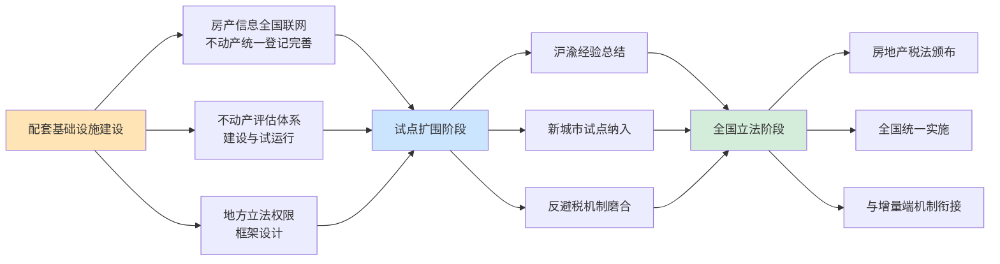

按这一序列，新存量模式的全面落地需要至少5—10年的渐进过程——这一时间窗口既体现了制度变革的复杂性，也是避免对市场造成剧烈冲击的必要安排。第8章将进一步系统讨论这一实施路径。

---

综合本章论证，新存量模式的核心制度安排可归纳为：**通过"首套豁免+多套差别化征收+改善型从严征收"的征收对象划分，按"低税率、广覆盖、宽减免"原则设计三维分档税率、人均免税面积与计税依据，配合租赁性房产从12%降至4%的减免机制激活租赁市场**。这一存量端设计与第4章增量端机制共同构成第3章双轨框架的完整实现，通过四重对接路径将"房住不炒"从政策口号转化为制度安排，并在抑制投机、激活租赁、稳定预期、引导功能回归四个维度形成系统性效应。本章所确立的存量房产税征收基础，将在第6章中进一步展开——讨论新增房产税收入在不同类型城市的差异化使用机制，即"先租后售"与"住房券"两种政策路径的具体设计。

[^54]: 房地产税全解:试点现状、影响与未来展望
[^54]: 房产税试点
[^52]: 个人住房房产税试点实行差别化的比例税率
[^52]: 楼市高温或催生房产税扩围
[^52]: 贾康:房地产税将这样开征 难点一句话可形容
[^51]: 市场需要建立地方财政与房地产行业高质量发展的双赢政策
[^51]: 两会财经眼:稳字当头 激活房地产市场新活力
[^51]: 刘尚希:房地产税是小税种大问题,建议自主权交给地方
[^50]: 新房产税
[^53]: 天津楼市新政:土地税优惠标准明确 144平米以下住宅受益
[^49]: 中国土地财政报告2024

# 6 房产税收入的差异化使用机制："先租后售"与"住房券"

第5章已系统拆解了存量端房产税的征收机制设计——通过"首套豁免+多套差别化+改善型从严"的征收对象划分、三维分档的累进式税率与租赁减免，构建了存量端的"征"的制度安排。然而，征收并非终点——一项税收的政策价值，最终取决于其收入如何被使用。若新增房产税收入仅作为地方一般公共预算的"无差别补充"，则只能解决地方财政可持续性问题，而无法回应第2章所诊断的保障房供给"三重困境"、阶层固化与流动人口住房可及性等深层负外部性。本章作为双轨框架民生维度的关键章节，将系统论证房产税收入在不同类型城市的差异化使用路径——针对"高库存承压型"城市的"**先租后售**"机制，与针对"人口净流入型"城市的"**住房券**"机制，构建"征收—使用"闭环下的住房保障新模式，使房产税收入真正成为撬动住房公平的财政杠杆。

## 6.1 房产税收入定向使用的逻辑基础与城市类型划分

### 6.1.1 定向使用的制度必要性：破解保障房"激励缺位"的根本问题

第2章所揭示的保障房供给"三重困境"——稳定供应缺乏保障、地块区位日趋边缘、供应渠道过于单一——其根本症结并非保障房政策本身的设计缺陷，而是地方政府提供保障房的**财政激励缺位**：在传统土地财政逻辑下，"区位较好地块被商品房占据，绝大多数保障房地块位于城市郊区"，保障房用地通过划拨方式供应使"地方土地管理部门和地方财政没有任何收益，甚至地方财政还要对保障房的建设与维护进行投资"。这一激励逻辑在体制上预设了保障房供给的"先天不足"——只要地方政府从商品房用地获取的财政收益远高于保障房投入的成本，保障房就必然处于政策序列的次优位置。

房产税收入的定向使用，**正是从制度上破解这一激励缺位的关键安排**。其核心逻辑可表述为：当房产税收入被法定地、专项地用于保障房建设与运营时，地方政府提供保障房的角色就从"配套义务"转化为"税源运营"——保障房不再是单向的财政支出项目，而是支撑房产税持续征收的"税基资产"。具体而言：

**第一，资金来源的稳定性变革**。传统模式下保障房资金主要来源于土地出让收益中的提取比例（"从土地出让金中提取一定比例用作保障房建设"），但这一提取在土地出让收入剧烈波动的背景下高度不稳定——2022年以后土地出让收入持续下滑至4.87万亿元，相应的提取比例也大幅缩水。房产税作为持续性持有税，"在土地使用全过程中可长期持续征收，税源稳定，具有可持续性"，可为保障房提供制度化的稳定资金流。

**第二,资金性质的专项化重构**。第3章已确立"房产税收入定向用于保障性住房与租赁市场建设"的原则。这一定向使用使房产税收入与开发性投资脱钩，避免了被挪用于一般性城市建设、债务偿付等非民生支出的风险。专项化的资金性质,使房产税真正承担起"小税种、大问题"中"大问题"维度的政策使命——成为住房保障的财政基石。

**第三,激励兼容性的根本改善**。在定向使用的制度安排下,地方政府的保障房投入与房产税收入形成正向循环——保障房供给越完善、租赁市场越活跃,城市对新市民与人才的吸引力越强,常住人口扩大、住房存量增加,房产税税基随之扩大。这一正向循环使保障房从"地方政府的财政负担"转化为"地方政府的税源培育投资",激励逻辑发生根本性反转。

### 6.1.2 城市类型划分:住房矛盾的本质差异

中国是一个区域差异极为显著的大国,不同类型城市的住房矛盾在性质上存在本质差异。**统一的保障房政策无法适配差异化的城市住房矛盾**——这正是房产税收入需要差异化使用的现实基础。基于人口流动方向、住房存量水平、库存去化周期等核心指标,可将城市划分为两大基本类型:

| 城市类型 | 核心特征 | 关键指标 | 住房矛盾本质 | 典型案例 |
|---------|---------|---------|-------------|---------|
| **高库存承压型** | 人口流出、库存积压、需求疲软 | 去化周期>18个月,部分>30个月;商品房库存高企 | "**有房无人**"——新建商品房无法去化,大量房源闲置 | 三四线城市、部分弱二线城市(如惠州去化周期等指标特征) |
| **人口净流入型** | 人口净流入、库存偏紧、房价坚挺 | 户均住房接近或超过1.0套,但流动人口比例高;商品房去化周期较短 | "**有人无房**"——大量新市民、青年人难以负担市场住房 | 一二线核心城市与部分强二线城市 |

**高库存承压型城市的矛盾刻画**。这类城市面临的核心问题不是住房绝对短缺,而是住房供需的"错位"——有大量新建商品房闲置无法去化,同时本地"夹心层"群体(无法享受廉租房又无力购买商品房的群体)居住条件改善受阻。最新数据显示,2025年5月广州库存去化周期上升至**23.2个月,创下近一年新高**;部分人口流出型三四线城市去化周期甚至突破30个月。"全国百城库存去化周期创历史最高水平,即其去库存压力超过了2011年,其相比合理值增加了一倍"。这一矛盾的破解需要"供给侧的精准消化"——通过制度性安排将闲置房源转化为保障性供给。

**人口净流入型城市的矛盾刻画**。这类城市的核心问题是住房绝对供给不足以满足持续涌入的流动人口需求。"保守估计,目前以农民工、新毕业大学生为主体的新市民租赁群体总规模达到1.6亿人。租住是大城市新市民解决居住需求的低成本方案,但面临租金负担重、居住条件差、租赁关系不稳定等多重挑战。对很多年轻的新市民而言,**收入中的租金占比超过了30%,甚至挤占了其他必要的生活开支**"。这一矛盾的破解需要"需求侧的精准支持"——通过制度性安排提升新市民对市场住房的可及性。

### 6.1.3 差异化机制的分类对应

两类城市住房矛盾的本质差异,决定了房产税收入需要采用差异化的使用机制:

**高库存承压型城市适用"先租后售"机制**——其核心逻辑是利用房产税资金与配套金融工具,通过"供给侧"操作将闲置商品房资源转化为保障性住房资源,在化解库存的同时改善"夹心层"居住条件,实现"消化库存"与"扩大保障"的双重目标。

**人口净流入型城市适用"住房券"机制**——其核心逻辑是利用房产税资金,通过"需求侧"操作直接补贴流动人口、新市民、青年人才,使其能够自主选择市场上既有房源(包括存量城中村、老旧小区、长租公寓、新建商品房等),在提升住房可及性的同时盘活租赁市场。

需要指出的是,这一分类并非绝对——许多城市兼具两类特征(如某些强二线城市核心区"有人无房"、郊区"有房无人"),需要两类机制的组合应用,具体讨论将在6.4.4节展开。

## 6.2 "先租后售"机制的运作逻辑与制度设计

### 6.2.1 机制起源与基本运作逻辑

"先租后售"并非全新的制度创新,而是有明确地方实践基础的成熟政策路径。早在2012年,云南省即出台《关于做好公共租赁住房"先租后售"工作的意见》(云建保〔2012〕876号),开启了公租房"先租后售"的制度探索;曲靖市2019年印发《市本级公共租赁住房"先租后售"实施方案》,明确提出"为筹措市本级公共租赁住房建设项目还款资金,**缓解财政压力**",将"先租后售"作为公租房融资模式的创新工具[^55]。湖北省2021年印发的《关于加快解决从事基本公共服务人员住房困难问题的实施意见》进一步将这一机制系统化,允许房地产开发企业未售商品住房自愿纳入保障性租赁住房,租赁满5年后承租人可申请转为共有产权住房,**已交的租金可计入购房款**[^56]。

将这些地方实践提炼为制度化的"先租后售"机制,其基本运作逻辑可概括为"**收购/筹建—配租—转购**"三阶段闭环:

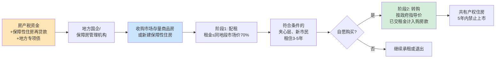

**第一阶段——收购/筹建**。地方国企或保障房管理机构以房产税资金为基础,叠加央行3000亿元保障性住房再贷款、地方专项债等配套金融工具,从市场上批量收购存量商品房或新建保障性住房。"辽宁明确2025-2027年通过收购存量商品房新增12万套配租型保障房,由地方国企牵头筛选优质存量房源,市场化定价收购,精准盘活滞销商品房。浙江发行超16亿元房地产专项债,专项用于收购城市存量房源;四川自贡、宜宾、泸州等多个三四线城市落地专项债盘活存量项目,**累计投入超50亿元回收存量闲置房源与土地**"[^57]。住房城乡建设部数据显示,"今年以来,各地加大保障性住房建设和供给,**建设筹集配售型保障性住房、保障性租赁住房、公租房共计172万套(间)**"[^58]。

**第二阶段——配租**。收购或筹建的房源以**低于市场价格**配租给符合条件的对象。湖北明确"面向从事基本公共服务人员的保障性租赁住房的租金,原则上不高于同地段、同品质租赁住房市场租金的70%"[^56];深圳保障性租赁住房"租金按照市场参考租金的60%确定"[^58];珠海甚至将重点片区保租房租金"直接下调至同地段市场租金的70%,部分项目折后租金低至20余元/平方米·月"[^59]。配租期通常设定为3—5年(湖北"租赁满5年"、咸宁"租期就是5年"),承租人在租期内按时缴纳租金、稳定居住,这一过程既是**信用积累**,也是承租人对房屋的"试居住期"[^60]。

**第三阶段——转购**。租期届满后,承租人若决定长期定居,可申请按政府指导价购买所租房源。**关键安排是"已交租金计入购房款"**——湖北明确"已交的租金,可以计入购房款"[^56];"假如5年你一共交了12万租金,那么买房时,总价就直接减去12万"[^60]。售价按政府指导价确定,云南泸西县的政策中"售价是按建设成本加上很低的管理费来算的"[^60];购房后多数转为共有产权住房,购房者可能"只拥有70%或80%的产权,剩下的部分归政府持有",且"5年内禁止上市"[^60]。

### 6.2.2 制度要素的精细化设计

将上述基本逻辑细化为可操作的制度要素,核心安排包括以下五个维度:

**第一,申请对象资格界定**。"先租后售"的目标群体是"够不着廉租房,又买不起商品房"的"夹心层"——具体包括本地无房或住房面积低于标准、有稳定工作和收入但无力购买市场商品房的家庭[^60]。曲靖实施方案进一步细化为"凡符合公共租赁住房(含廉租住房)实物配租条件,租住市保投公司公共租赁住房满1年的家庭或个人""按时足额缴纳承租期间的租金、物管等一切费用,具备一定支付能力且有自愿购买意向的家庭或个人""每个保障家庭仅限购买1套公共租赁住房,购买公共租赁住房后,不再继续享受公共租赁住房政策"[^55]。这一资格界定确保了机制聚焦于真实的住房困难群体,而非市场投机者。

**第二,租期与定价机制**。租期通常设定为3—5年,这一时长既给予承租人充分的"扎根判断期",也为政府提供合理的资金回笼周期。租金按同地段市场租金的60%—70%确定,**显著低于市场租金但又高于纯廉租房水平**——这一定价既体现保障性,又使租金收入能够覆盖部分运营成本,实现保障性与可持续性的平衡。转购价格则按"建设成本+少量管理费"的成本加成定价方式确定,曲靖方案明确"综合考虑保障性住房住户承受能力、城镇基准地价、开发建设成本等因素制定销售价格"[^55]。

**第三,产权属性安排**。购买后的房屋多以**共有产权住房**形式确权,购买者持有部分产权(通常70%—80%),剩余产权由政府持有[^60]。这一产权安排的核心政策意图是**封堵投机空间**——共有产权住房的转让、出租均受严格限制,5年内禁止上市,**政府享有优先回购权**,从源头上消除了将"先租后售"工具化为炒房通道的可能性。湖北方案规定"共有产权住房持有5年后,持有人在购买全部产权的情况下,可申请转为商品住房上市交易"[^56],为长期持有者保留了最终的产权完整化通道,但通过5年禁售期与"完全购买全部产权"的双重门槛,确保了投机性需求的过滤。

**第四,资金管理与多元金融工具协同**。"先租后售"的资金来源不限于房产税,而是房产税与多类金融工具的组合:其一,**保障性住房再贷款**——"依托央行3000亿元保障性住房再贷款政策,全国数十个三四线城市打通金融链路,撬动社会资本参与存量房源收购,既解决了保障房供给缺口,又批量消化楼市库存"[^57];其二,**地方专项债**——浙江"发行超16亿元房地产专项债,专项用于收购城市存量房源",四川多地"累计投入超50亿元回收存量闲置房源与土地"[^57];其三,**REITs等市场化融资工具**——保障性租赁住房REITs业务的规范开展为长期资金引入提供了制度通道[^56]。曲靖方案明确"市财政局:负责公共租赁住房'先租后售'资金的监管,做到**专账专户、专款专用**,规范资金的拨付程序"[^55],这一专户专款管理是资金不被挪用的关键制度保障。

**第五,跨部门协同机制**。"先租后售"涉及住建、财政、自然资源、税务、不动产登记等多部门协同,曲靖方案设立了由市政府副市长任组长的领导小组,明确住建局负责销售房源选定、申请人审核等具体工作,发改委会同住建局制定销售价格,财政局负责资金监管,自然资源和规划局负责"核定划拨用地性质房屋补缴土地出让金的金额及款项收缴""产权登记,并优先予以登记办理",税务局"负责落实公共租赁住房'先租后售'的税收政策"[^55]。重庆首例公租房"租转售"案例中,"按照登记、交易和缴税'一窗办理、即办即取'模式",承租人"只跑一趟,当场就办结领证了"[^61],体现了跨部门协同的实操可行性。

### 6.2.3 地方实践经验的可复制性提炼

汇总湖北、云南曲靖、辽宁、浙江、重庆等地实践,可提炼出"先租后售"机制具有较高可复制性的关键制度安排:

**重庆模式的"租转售"经验**。重庆作为我国保障房建设走在前列的城市,2024年11月25日实现了首例公租房"租转售"——市民崔先生在租住公租房6年多后,以**每平方米四千多元、总成交价不到20万元**的价格购得40多平方米的住房[^61][^62][^63]。重庆模式的关键经验包括:其一,**"政务·不动产登记"系统的电子化集成**,实现"登记、交易和缴税'一窗办理、即办即取'";其二,**预告登记与抵押登记的双预告机制**,"群众需要购房贷款的,可申办转移、抵押双预告登记,保障过户时同步设立正式抵押权,快速获得放款";其三,**线上信息核验**,"群众申购配售型保障性住房核实房产信息时,无需提供纸质材料,通过'渝快办'等进行授权后,房屋管理部门即可线上审核房产登记情况"[^61]。这套技术与流程安排,显著降低了"先租后售"的制度运行成本。

**湖北模式的"租购并举"创新**。湖北方案将"先租后售"与"租购并举"住房制度有机结合,创造性地提出**三类房源的统一安排**:房地产开发企业未售商品住房自愿纳入保障性租赁住房后允许先租后售;商品住房项目配建并移交政府持有的保障性租赁住房允许先租后售;商品住房项目配建开发商自持的保障性租赁住房可在土地出让时明确允许先租后售[^56]。这一安排将开发商存量库存、政府配建房源、开发商自持房源三类房源统一纳入"先租后售"框架,形成了多元化的房源供给渠道。

**辽宁与浙江的"专项债+收购"模式**。辽宁明确2025—2027年通过收购存量商品房新增12万套配租型保障房;浙江发行超16亿元房地产专项债专项用于收购城市存量房源;四川多个三四线城市累计投入超50亿元回收存量闲置房源与土地[^57]。这一模式的核心特点是**财政性资金(房产税、专项债)与市场化操作(地方国企市场化定价收购)的结合**,既保证了规模化推进,又避免了"行政摊派式收购"对市场价格机制的扭曲。

### 6.2.4 现实风险与防控:从"先租后售"到"以租代售"的边界

"先租后售"作为创新性制度安排,在实践中也暴露出潜在风险。**最值得警示的是"先租后售"被异化为"以租代售"的灰色操作**——即开发企业或国企以"先租后售"为名实质性销售房产,但又规避公租房分配审批、不动产登记等合规程序,使购房者权益处于法律真空。

云南安宁市的"四年办证难"案例典型反映了这一风险[^64]。云南安宁市昆钢子弟林先生购房四年,却迟迟拿不到产权证,涉事房屋性质为公租房,采取"先租后售"模式。该案例暴露的关键问题包括:**审批程序的合规性存疑**——"安宁市虽在2017年批复同意昆钢集团启动'先租后售',但至2021年底截止前,林先生购房时是否完全符合保障对象资格?销售过程是否履行了必要的资格审查与公示程序?";**合同条款的责任规避**——"合同中'昆钢集团向登记部门报送资料即视为完成办证义务'的条款,是否存在规避自身责任的嫌疑";**部门推诿与回应苍白**——"安宁市住建局一句'目前没有相关政策',便轻飘飘地将退房诉求挡在门外;昆钢集团有关方面电话无人接听,甚至不愿正面回应"[^64]。

这一反面案例为"先租后售"机制的合规边界提供了警示。**真正的保障房"先租后售"与违规"以租代售"的本质区别**在于五个维度[^60][^64]:

| 区分维度 | 合规"先租后售" | 违规"以租代售" |
|---------|----------------|----------------|
| **政府批复** | 经政府严格批复,纳入保障房管理体系 | 缺乏批复或批复程序不规范 |
| **公示程序** | 在住建局官网公示申请人资格,接受社会监督 | 内部操作,不公开公示 |
| **资格审查** | 严格的"夹心层"资格审查与档案管理 | 资格审查流于形式,变相对市场销售 |
| **产权属性** | 共有产权或受限产权,5年禁售、政府优先回购 | 模糊产权属性,办证流程不规范 |
| **不动产登记** | 与不动产登记系统对接,登记办理顺畅 | 长期无法办证,产权处于法律真空 |

防控这一风险的关键制度安排包括:其一,**严格政府审批程序**——"先租后售"项目必须经市级政府批准,纳入保障房管理体系;其二,**强化信息公示**——"真正的保障房'先租后售',你必须能在当地的住建局官网上查到公示名单,一切流程都有政府背书"[^60];其三,**前置不动产登记接口**——在项目立项阶段即与不动产登记系统对接,明确办证流程与时间表,避免"四年办证难"重演;其四,**强化纪检监督**——云南省委巡视组对昆钢集团的巡视即是对此类问题的政治监督回应,体现了"巡视利剑当斩断不作为的'拦路虎'"的政治威慑[^64]。

值得指出的是,"先租后售"的合规边界问题,本质上是**保障房政策与商业销售的清晰区分问题**。若这一边界模糊,不仅损害购房者权益,更将使"先租后售"工具被滥用为开发商规避合规销售义务的"避风港",从根本上破坏机制的政策公信力。因此,**合规边界的清晰化与制度化,是"先租后售"机制能否真正成为保障房供给主渠道之一的关键前提**。

## 6.3 "住房券"机制的运作逻辑与制度设计

### 6.3.1 机制起源:从美国租房券到中国房票的本土化演进

"住房券"机制的国际经验源自美国1974年出台的第一个租房券计划——"当时称为租赁凭证(Rental Certificate)"。"租房券本质上是一种住房消费券,持有者可在能够提供充足教育、就业和其他机会的社区中选择合意的住房"[^65]。美国租房券经过多轮修订,适用范围从单一社区扩展至大都市地区、再扩展至美国任意区域,"目前,租房券已经被广泛接受,并被认为是效果最佳、最具成本效益的租赁住房补贴形式"[^65]。

美国租房券发展史揭示了一个关键的制度演进规律:"**当住房市场供不应求时,对供给侧进行补贴有利于增加就业和缓解住房短缺的情况,需求侧补贴则易引致房价不合理上涨;当住房市场供求相对平衡时,转向对需求侧进行补贴,解决低收入家庭的住房困难**"[^65]。换言之,随着住房供不应求情况的改善,住房模式将从偏重供给侧的"大众模式"转向偏重需求侧特定群体的"剩余模式"——这一规律对中国房产税收入的差异化使用具有直接借鉴意义。

中国在地方实践层面已开展了相关探索。**惠州市2026年4月发布的人才房票政策**,是这一探索的代表性案例。"4月29日,惠州市住房和城乡建设局联合市财政局、市人力资源和社会保障局印发人才房票补贴政策,符合条件的人才在惠州购买新建商品住房,可直接申领房票充抵购房款,**最高补贴10万元,政策总额度1亿元,'先到先得'**"[^66][^67][^68][^69]。这一政策"打破了多项传统限制:申请人不受户籍、社保缴纳年限、家庭房产套数等限制"[^66],体现了住房券机制"将住房选择权交还给居住者"的核心特征。

需要明确说明的是,惠州人才房票的政策初衷是结合人才引进与去库存——"截至5月,广州库存去化周期上升至23.2个月,创下近一年的新高"[^70],惠州作为临近深圳的城市,既有去化压力也有人才吸引需求,人才房票兼具"住房券机制本土化"与"地方人才战略"的双重属性。在本报告所提的双轨框架下,房产税资金支持的住房券机制应进一步扩大覆盖面,从"人才专享"扩展到面向全体新市民、青年人、流动人口的普惠性住房补贴工具。

### 6.3.2 基本运作逻辑:需求侧补贴的精准滴灌

将美国租房券经验与惠州房票实践相结合,可将住房券机制的基本运作逻辑概括为"**资金—凭证—市场—居住**"的四阶段链条:

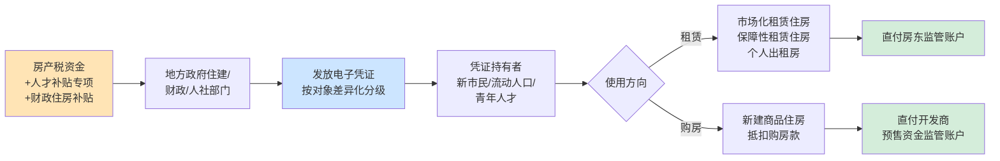

**第一阶段——资金募集与差异化发放**。地方政府以房产税收入为主要资金来源,叠加既有的人才补贴专项、财政住房补贴等多元资金,设立住房券发放总额度。惠州房票总额度为1亿元,按"先到先得"原则发放[^66]。资金筹集到位后,按申请对象的差异化标准发放凭证——惠州按学历职称分3万/5万/10万元三档:"本科、中级职称、技师:每人3万元;硕士研究生、副高级职称、高级技师、惠州市C级高层次人才:每人5万元;博士研究生、正高级职称、惠州市B级及以上高层次人才:每人10万元"[^66][^68]。

**第二阶段——凭证使用与市场选择**。持券人在市场上自主选择租赁或购房使用方向。**惠州人才房票主要用于购房**——"仅限申请人本人购买惠州市范围内已办理预售许可或现房销售备案的新建商品住房,二手房、安置房、保障性住房、法拍房等均不适用"[^66],"房票兑付金额最高不超过所购住房网签成交总价的20%,若对应档次标准超出20%,则按房价20%核定"[^67]。在更广泛的住房券设计中,可拓展为既可用于租赁也可用于购房,使凭证适配持有人的差异化住房需求。

**第三阶段——资金兑付**。开发商或房东在合同签订后向住建部门提交兑付申请,经审核通过后,资金"直接拨付至开发商指定的预售资金监管账户或现房购房款专用账户"[^66],或直付房东监管账户。**关键特征是"资金直付而非现金到手"**——凭证不可现金套现、不可转让抵押,从源头封堵套利空间。

**第四阶段——监管与防套利**。惠州房票明确"申请人需如实提交申请材料,若存在虚报冒领、伪造材料、串通开发商骗取房票等行为,将被取消资格并全额追回资金,涉嫌违法犯罪的,将依法移交司法机关处理"[^67]。审核流程实行**"并联审核2个工作日+公示3个工作日"**的高效安排,既保证审核严肃性,又避免过长流程降低凭证使用效率[^68]。

### 6.3.3 制度要素的精细化设计

将基本运作逻辑细化为可操作的制度要素,核心安排包括五个维度:

**第一,发放对象的差异化分级**。住房券的发放对象设计应体现"差异化精准支持"原则。惠州按学历职称分三档的分级机制提供了重要参照[^68],但在房产税资金支持的更广泛住房券设计中,可在"人才档"基础上增设"普惠档":

| 对象类别 | 资格要求 | 凭证额度示意 | 使用方向 |
|---------|---------|------------|---------|
| **普惠档·农民工/新毕业大学生** | 收入<当地三口之家平均可支配收入50%且住房支出>30% | 月度租房补贴(美国租房券标准) | 主要用于租赁 |
| **基础档·普通新市民** | 在本市连续工作满1年,无本市住房 | 一次性3万元或月度补贴 | 租赁/购房均可 |
| **中级档·中级职称/高级技师** | 中级专业技术职称或同等专业能力 | 5万元 | 主要用于购房 |
| **高级档·高层次人才** | 博士、正高级职称、市B级及以上人才 | 10万元 | 主要用于购房 |

这一分级设计的核心政策意图是**同时回应"夹心层居住困难"与"城市人才竞争"两大需求**——既通过普惠档保障基本居住权,又通过中高级档支持城市人才战略。

**第二,不限户籍社保的开放性设计**。惠州房票"打破了多项传统限制:申请人不受户籍、社保缴纳年限、家庭房产套数限制"[^66][^67]。这一开放性设计具有深刻的政策含义——传统住房保障政策长期以户籍为门槛,使流动人口长期被排除在保障体系之外;开放性设计使"**世界最大住房保障体系**"真正覆盖到"新时代流动人口",回应了城市间人才竞争与基本公共服务均等化的双重诉求[^71]。

**第三,有效期与额度上限管理**。住房券应设置合理的有效期,避免凭证被持有人长期"占位"而不实际使用,造成财政资金沉淀。惠州房票规定"自发放之日起30天内有效,申请人须在有效期内完成购房合同网签,逾期房票自动失效"[^68]。30天的有效期既给予持有人充分的选择时间,又确保了财政资金的高效周转。

在额度上限管理上,惠州房票实行"**最高不超过所购住房网签成交总价的20%**"的硬性约束——"对应分级发放标准超出所购住房成交总价20%的,按该套住房成交总价的20%核定兑付"[^68][^69]。这一上限设计避免了凭证额度过大导致的市场扭曲风险,同时使补贴比例与购房决策保持合理关联。

**第四,与新建商品住房或租赁市场的衔接**。住房券的使用范围需要明确界定。惠州房票限定于"新建商品住房,二手房、安置房、保障性住房、法拍房等均不适用"[^66],这一限定一方面服务于去库存目标,另一方面避免与既有保障房政策叠加。在更广泛的住房券设计中,可根据政策目标拓展使用范围——若侧重去库存,可限定新建商品房;若侧重盘活租赁市场,可扩展至个人出租房、保障性租赁住房、长租公寓等多类租赁房源。

**第五,专款专用与防止套现的监管规则**。住房券作为"专项住房补贴凭证",必须严格防范套现风险。惠州房票明确"不得转让、抵押、套现,不得用于支付购房款以外的其他费用","房票兑付金额"通过监管账户支付而非个人到账[^68][^69]。这一资金支付路径设计是住房券作为"专项凭证"区别于一般现金补贴的关键技术安排。

### 6.3.4 "补券"相比"补房"、"补钱"的相对优势

将住房券机制置于政府住房补贴的整体政策工具箱中考察,可以清晰呈现"补券"相比传统"补房"(供给侧实物补贴)、"补钱"(需求侧现金补贴)的相对优势[^65]:

| 补贴方式 | 性质 | 精准性 | 灵活性 | 存量盘活 | 管理成本 |
|---------|------|--------|--------|----------|---------|
| **补房**(实物补贴) | 供给侧,补贴建造者 | 受房源建设区位限制 | 低,持有人无选择权 | 弱,主要依赖新建 | 中,涉及建设管理 |
| **补钱**(现金补贴) | 需求侧,不限范围 | 弱,可能被挪作他用 | 高,但不专项 | 中等 | 低 |
| **补券**(凭证补贴) | 需求侧,住房专项 | 强,专款专用 | 高,持有人自主选择 | 强,激励市场存量出租 | 低,凭证管理简便 |

**精准性优势**:相比"补钱"的范围不限定,"补券"作为住房专项凭证,确保资金"专款专用"——这一专项化设计避免了现金补贴可能被挪作其他消费的风险,使财政资金精准投向住房保障目标。

**灵活性优势**:相比"补房"的房源固定,"补券"使持有人在市场上自主选择最适合自身需求(职住平衡、子女教育、家庭代际)的房源,**将住房选择权交还给居住者**。这一灵活性回应了"新时代流动人口"的多元化居住需求——"现有的大量公共住房是为单位员工个人规划,但许多人才都有配偶,还有孩子需要祖父母照顾,很多生活在一个三代同堂的大家庭中"[^71]。

**存量盘活优势**:相比"补房"的新建依赖,"补券"通过持有人在市场上的自主选择,激励市场存量房源(包括城中村、老旧小区出租房等)进入租赁市场。"较之在供给侧新建租赁住房,针对新市民的需求侧租赁补贴成本更低、效益更好,**能够有效盘活存量房源**,也把租赁的选择权赋予新市民,还可以有效降低后续管理等成本"[^65]。

**管理成本优势**:"补券"采用电子凭证形式,审核与兑付流程高度信息化,显著降低行政管理成本。惠州房票实行"并联审核2个工作日内完成全流程审核"[^67],远低于实物保障房从立项、建设到分配的漫长周期。

### 6.3.5 回应"新时代流动人口"需求与城市人才竞争

住房券机制的更深层政策意义,在于回应"**新时代流动人口**"的多元化住房需求与城市人才竞争的政策杠杆作用。

第2章已揭示,"高房价'把他们都逼走了,何谈创新'"的负外部性,使流动人口住房可及性问题成为城市发展的关键瓶颈。"在快速城镇化的背景下,中国名义城镇化率在2022年已达到65%。这种城乡人口分布的巨大变化需要大量的政策创新,以在城市中容纳数亿的农村流动人口"[^71]。住房券作为面向流动人口的需求侧补贴,通过提高其市场住房可及性,直接回应了"高房价逼走年轻人"的负外部性。

更具战略意义的是,住房券是城市间人才竞争的政策杠杆。"**面对人口数量下降的挑战,中国的主要城市将越来越依赖人才的净流入**,即需要通常拥有科学、技术、工程和数学高等教育学位的STEM人才。城市间人才竞争的关键因素之一,是为职业生涯之初的专业人士规划建设公共住房"[^71]。住房券通过差异化分级支持高层次人才,在城市间人才竞争中形成精准的政策杠杆,**以财政成本换取人口与人才流入**——惠州人才房票发布次日即"吸引市民申请。截至4月30日下午5时,人才房票申请741人(已除去重复提交人员),房票总金额达2735万元"[^66],体现了住房券对人才流入的快速响应能力。

需要客观指出的是,住房券机制在解决"长期居留"问题上仍存在局限。研究表明,"许多人才并没有意愿在工作的城市长期定居……他们把公共住房视为'垫脚石',去追寻更好的、更实惠的东西。公共住房项目有助于吸引人才,但只要高房价使北上广深等大城市的住房所有权遥不可及,人才的长期居留就仍难以得到保障"[^71]。这一局限提示,住房券应与房价稳定政策、共有产权房、户籍制度改革等系统性配套形成合力,才能真正实现人才"引进—留住—扎根"的全链条目标。

## 6.4 两类机制的适用条件、运作流程与预期效应对比

为更清晰地呈现两类机制的差异化定位与互补关系,本节以结构化比较方式对两类机制进行系统对比。

### 6.4.1 适用条件维度的差异

两类机制在适用条件上的差异主要体现在城市类型、人口流动方向、住房库存水平与目标受益群体四个层面:

| 适用条件维度 | "先租后售"机制 | "住房券"机制 |
|------------|--------------|------------|
| **城市类型** | 高库存承压型(三四线、部分弱二线) | 人口净流入型(一二线、强二线) |
| **人口流动方向** | 人口流出或停滞 | 人口持续净流入 |
| **住房库存水平** | 去化周期>18个月、部分>30个月 | 户均住房1.0—1.1套以上但流动人口比例高 |
| **目标受益群体** | 本地"夹心层"、基本公共服务人员 | 流动人口、新市民、青年/引进人才 |
| **核心矛盾性质** | "有房无人"——库存积压 | "有人无房"——需求溢出 |

### 6.4.2 资金来源维度的差异

两类机制在资金来源上的组合方式不同——"先租后售"以房产税资金为基础,需大量配套金融工具支持收购或建设;"住房券"以房产税资金为主,辅以人才补贴专项等少量配套资金:

| 资金来源维度 | "先租后售"机制 | "住房券"机制 |
|------------|--------------|------------|
| **主体资金** | 房产税收入(专户专款) | 房产税收入(专户专款) |
| **配套金融工具** | 央行3000亿元保障性住房再贷款、地方专项债、REITs等 | 财政住房补贴、人才补贴专项 |
| **资金循环** | 收购投入→租金回收→转购回款,资金循环周期长(5年以上) | 凭证发放→直付房东/开发商,资金一次性投放 |
| **规模需求** | 大规模(单地市数十亿至百亿级) | 中等规模(惠州1亿元试点) |

### 6.4.3 运作流程维度的差异

两类机制在资金—房源—受益人之间的传导路径存在本质差异——"先租后售"是"**供给侧主导**"路径,"住房券"是"**需求侧主导**"路径:

**"先租后售"的供给侧主导路径**:

```
税收资金 → 国企/保障房管理机构 → 收购/建设房源 → 配租 → 转售
       (政府主导)      (政府筛选房源)    (政府定价)  (政府指导价)
```

**"住房券"的需求侧主导路径**:

```
税收资金 → 凭证发放 → 持有人自主选择 → 市场房源 → 资金兑付
       (政府发放)  (持有人决策)       (市场供给)
```

这一路径差异的深层政策含义是**"政府选房"与"居民选房"的根本不同**。"先租后售"中房源选择权由政府掌握,通过批量收购或集中建设实现规模效应,但居民的选择权相对有限;"住房券"中房源选择权由居民掌握,通过市场自主匹配实现精准化,但规模化推进难度较大。两条路径的优劣取决于**所要解决问题的性质**——若问题是"库存积压、批量消化",供给侧路径更高效;若问题是"分散需求、精准滴灌",需求侧路径更精准。

### 6.4.4 预期效应维度的对比

两类机制对库存去化、租赁市场培育、人才吸引、阶层流动性改善的差异化贡献,可总结如下:

| 预期效应维度 | "先租后售"机制 | "住房券"机制 |
|------------|--------------|------------|
| **库存去化** | 直接消化存量商品房(辽宁12万套、重庆8000余套) | 间接拉动新房销售(惠州1亿元额度撬动) |
| **租赁市场培育** | 增加保租房供给,平抑租金水平 | 激励市场存量房入市,扩大租赁选择 |
| **人才吸引** | 间接(改善本地居住环境) | 直接(差异化人才档支持) |
| **阶层流动性改善** | 强(济贫式→发展型升级,资产积累通道) | 中(降低租金负担,提高可及性) |
| **民生改善范围** | 聚焦本地"夹心层" | 覆盖流动人口与人才 |
| **市场化程度** | 低(政府主导筛选与定价) | 高(市场自主匹配) |

**"先租后售"的特色效应**:其最显著的政策效应是**实现"济贫式"向"发展型"的住房保障升级**——"用湖北当地官员的话说,这叫住房保障从'济贫式'向'发展型'升级——不光让你有地方住,还帮你慢慢实现资产积累"[^60]。重庆崔先生案例中"40多平方米的房子,总成交价不到20万"[^61],即体现了这一资产积累通道的实际意义——一个原本仅能租住公租房的家庭,通过"先租后售"机制实现了20万元级别的家庭资产积累,这对低收入家庭的代际财富传递具有深远意义。

**"住房券"的特色效应**:其最显著的政策效应是**通过市场化路径培育多元化租赁供给与人才竞争优势**。当大量持券新市民在市场上租房或购房,城中村出租房、老旧小区改造房、长租公寓等多元化租赁供给被激活;同时,惠州房票"先到先得"的兑付方式形成了"政策窗口期"的紧迫感,在城市间人才竞争中提供了精准的政策杠杆。

### 6.4.5 互补关系与组合应用思路

需要明确指出的是,"先租后售"与"住房券"**并非相互替代,而是互补关系**——两者在适用城市、政策目标、运作路径上存在明确分工,共同构成房产税收入差异化使用的完整工具箱。

对于**混合型城市**——即兼具"高库存承压"与"人口净流入"特征的城市(如某些强二线城市核心区"有人无房"、郊区"有房无人"),可采取**组合应用思路**:

**思路一:空间维度的组合**。核心区采用"住房券"机制,通过需求侧补贴提升流动人口对核心区市场住房的可及性;郊区采用"先租后售"机制,通过供给侧操作消化郊区库存并改善本地"夹心层"居住条件。这一空间组合避免了单一机制的"水土不服"。

**思路二:对象维度的组合**。对本地"夹心层"采用"先租后售"机制,通过共有产权与租金转购实现长期资产积累;对流动人口与新市民采用"住房券"机制,通过差异化分级补贴提升其住房可及性。这一对象组合使两类机制各自聚焦于最适合的目标群体。

**思路三:政策周期的组合**。在库存压力高企阶段,优先实施"先租后售"消化库存;在库存基本消化后,转向"住房券"以需求侧补贴持续支持流动人口住房。这一周期组合呼应了美国租房券发展史所揭示的"供需关系决定补贴策略"的规律——"**当住房市场供不应求时,对供给侧进行补贴……;当住房市场供求相对平衡时,转向对需求侧进行补贴**"[^65]。

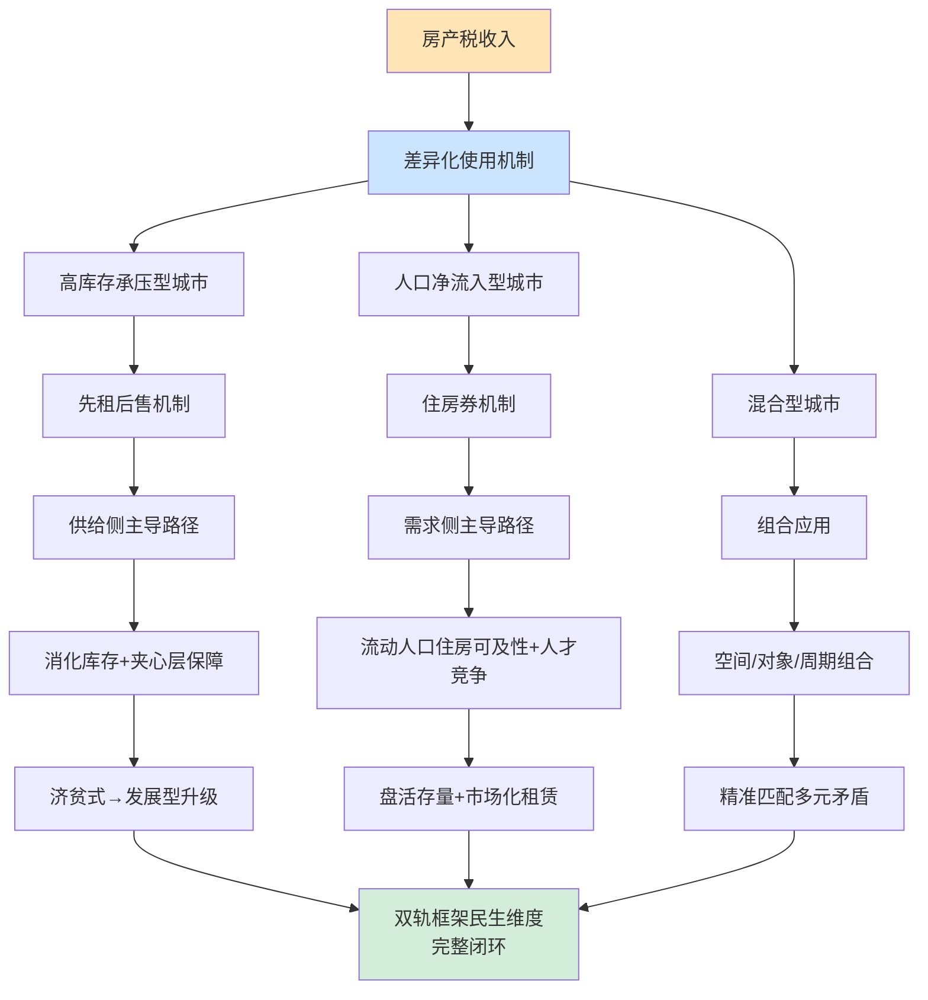

## 6.5 差异化使用机制与第2章保障房困境的精准回应

本节将两类机制的预期效应与第2章诊断的负外部性逐项对接,论证房产税收入差异化使用的政策闭环价值。

### 6.5.1 对保障房"稳定供应不足"困境的回应

第2章已诊断保障房供给的首重困境是**稳定供应缺乏保障**——"地方行政行为偏重经济建设政绩,忽视保障房用地供应;缺乏可操作性的法规条例","国家住房保障政策与地方经济建设短期利益冲突时,地方政府采取变通或消极方式"。这一困境的根源是保障房资金缺乏制度化的稳定来源。

房产税收入定向使用机制的核心回应是**将保障房资金从"被挤出"状态转化为"专项税源运营"状态**。具体机制包括:其一,**资金来源的稳定性**——房产税作为持续性持有税,在土地市场剧烈波动的环境下仍能提供稳定收入,曲靖方案明确房产税资金"专账专户、专款专用",从制度上避免了被挪用风险[^55];其二,**激励机制的反转**——地方政府提供保障房从"配套义务"转化为"税源运营",保障房供给越完善,常住人口扩大,房产税税基越大;其三,**资金规模的可持续性**——"今年以来,各地加大保障性住房建设和供给,建设筹集配售型保障性住房、保障性租赁住房、公租房共计172万套(间)"[^58],体现了资金规模可支撑大规模保障房建设的现实可行性。

### 6.5.2 对"地块区位边缘"困境的回应

第2章已诊断保障房供给的第二重困境是**地块区位日趋边缘**——"区位较好地块被商品房占据,绝大多数保障房地块位于城市郊区","低收入人群日常生活成本增加,导致放弃购买或入住,如2008年广州2145套远郊经济适用房中645套无人认购"。

两类机制对这一困境形成精准回应:

**"先租后售"机制**通过收购市场存量房源**直接获得优质区位**——市场存量商品房通常分布在城市建成区,区位与配套优于政府划拨地块新建的保障房。辽宁通过收购存量商品房新增12万套配租型保障房,由"地方国企牵头筛选优质存量房源,市场化定价收购,精准盘活滞销商品房"[^57];住房城乡建设部明确"将保障性住房优先安排在交通便利、公共设施较为齐全的区域,促进实现职住平衡"[^58]。

**"住房券"机制**通过**市场自主选择**使受益人主动选址匹配职住平衡——持券人根据自身工作地点、子女学校、家庭需求等因素自主选择房源,使住房保障与个人居住需求高度匹配。这一机制从根本上解决了"政府选房地点不合居住者意"的传统保障房痛点。

### 6.5.3 对"供应渠道单一"困境的回应

第2章已诊断保障房供给的第三重困境是**供应渠道过于单一**——"地方政府基本采取划拨形式供应保障房用地","地方政府缺乏供应保障房用地的动力,土地供应方式难以拓宽"。

两类机制共同构成**新建、收购、市场化补贴的多元供给格局**:

| 供给渠道 | 传统模式 | 新模式 |
|---------|---------|--------|
| **新建保障房** | 单一,依赖划拨土地 | 仍保留,以房产税资金支持 |
| **存量收购** | 缺失 | "先租后售"机制下的批量收购 |
| **市场存量出租** | 缺失 | "住房券"机制激活市场存量 |
| **市场化长租公寓** | 缺失 | "住房券"可使用范围拓展 |

这一多元供给格局与中央"**租购并举**"政策导向高度契合——"政策性租赁住房的发展重点从已基本完成对困难群众的兜底式保障,走向对城市发展奋斗的新市民和青年人的住房保障。市场化长租公寓和政策性租赁住房的供应丰富了住房市场房源的供给,在补齐租赁市场这条'短腿'的同时,提供了差异化、多层次的租赁房源来满足不同人群的需求"[^56]。

### 6.5.4 对住房阶层固化的回应

第2章已揭示"高房价对社会阶层流动性的系统性侵蚀"——居民高杠杆化、学区房机制下的教育资本化、代际财富传递扩大阶层鸿沟。两类机制对这一负外部性形成不同维度的回应:

**"先租后售"通过租金转购款实现资产积累从"济贫式"向"发展型"升级**。传统公租房模式下,租金"像泼出去的水,再也收不回来"[^60],承租人长期处于"无房无产"状态,无法实现家庭资产积累。"先租后售"机制下,租金计入购房款使承租人"零存整取"地实现家庭住房资产积累——"假设你在一个二线城市租一套月租2500元的房子,五年下来,光租金就要交给房东15万。这笔钱,就像泼出去的水,再也收不回来。但现在,有一种房子告诉你:别心疼,这15万,将来能直接变成你买房的首付"[^60]。这一机制使低收入家庭获得了**代际财富传递的"启动资产"**,从根本上破解了"无房家庭代际固化"的循环。

**"住房券"通过提升流动人口住房可及性破解"高房价逼走年轻人"的困局**。"住房保障从'济贫式'向'发展型'升级"的另一面,是通过差异化分级补贴使青年人才"敢留下、能扎根"。"在华为上班的本科生,月工资12000元以上,他们根本买不起深圳高价商品房"[^56]——这一困境的破解依赖于通过住房券机制降低青年人才在大城市的居住门槛。惠州人才房票"政策瞬间引发热议,吸引市民申请"[^66]的市场反响,体现了住房券对青年人才扎根城市的政策吸引力。

综合两类机制的差异化回应,可见**房产税收入差异化使用机制对第2章诊断的多重困境形成系统性政策闭环**——保障房供给的资金、区位、渠道困境得到全面回应,阶层固化问题在住房资产积累与流动人口可及性两个维度得到改善。这一闭环价值,正是房产税"小税种、大问题"中"大问题"维度的具体体现:房产税不仅是地方财政的补充税源,更是住房公平与社会流动的财政基石。

## 6.6 差异化使用机制的实施挑战与配套保障

新机制的政策价值需要通过有效落地才能真正实现。本节客观评估两类机制落地的现实挑战与配套需求。

### 6.6.1 资金规模匹配挑战

**核心问题**:新增房产税收入规模能否支撑大规模保障房收购或住房券发放?

按第5章测算,沪渝试点的房产税收入规模相对有限——上海2014年试点收入约213.8亿元,重庆约67.3亿元,这一规模相对于地方一般公共预算收入的占比较小。即便新存量模式将覆盖面扩大至全国主要城市,初期房产税收入也难以单独支撑大规模保障房收购或住房券发放。

**配套需求**:房产税收入需要与多类金融工具协同。其一,**央行保障性住房再贷款**——"依托央行3000亿元保障性住房再贷款政策,全国数十个三四线城市打通金融链路"[^57];其二,**地方专项债**——"用好专项债收购存量商品房用作保障性住房政策,能够有效消化商品房库存"[^58];其三,**REITs等市场化融资工具**——保障性租赁住房REITs业务的规范开展[^56]。在房产税收入逐步增长的过渡期内,以多元金融工具补足资金缺口,是机制平稳落地的关键。

### 6.6.2 对象识别与防套利挑战

**核心问题**:如何避免"先租后售"被违规操作为"以租代售"、住房券被套现或重复领取?

"先租后售"的违规操作风险已在6.2.4节通过安宁案例详细讨论;"住房券"的套利风险主要包括虚报冒领、伪造材料、串通开发商骗取凭证、跨城市重复领取等。

**配套需求**:其一,**建立全国联网的住房资产与人口信息核查机制**——这一基础设施在第5章已多次提及,是差别化房产税征收与住房保障精准识别的共同前提;其二,**严格的并联审核流程**——惠州房票实行"市、县(区)住建部门分级审核""并联审核2个工作日内完成全流程审核,审核通过后公示3个工作日"[^66];其三,**违规追责机制**——"若存在虚报冒领、伪造材料、串通开发商骗取房票等行为,将被取消资格并全额追回资金,涉嫌违法犯罪的,将依法移交司法机关处理"[^67]。

### 6.6.3 与地方政府激励的兼容性挑战

**核心问题**:如何避免地方政府将房产税收入挪作他用,使专项使用沦为名义安排?

地方政府面临多重财政压力,可能存在将房产税收入挪作一般性支出或债务偿付的潜在倾向。若专项使用约束不到位,差异化使用机制的政策价值将大打折扣。

**配套需求**:其一,**专户专款管理**——曲靖方案明确"专账专户、专款专用,规范资金的拨付程序,健全资金拨付手续"[^55],这一财务管理安排是资金不被挪用的基础保障;其二,**人大监督与社会公示**——保障房资金的使用情况应在地方人大会议中作专项报告,并通过住建部门官网向社会公示,接受公众监督;其三,**审计与纪检监督**——参照云南省委巡视组对昆钢集团巡视的政治监督经验[^64],对房产税收入使用情况开展定期审计与巡视监督,确保专款专用的制度刚性。

### 6.6.4 与房地产市场稳定的协同挑战

**核心问题**:保租房大规模降价入市对市场化租金的冲击效应如何控制?

第5章已讨论租赁减免对租金水平的影响。在房产税收入定向使用的扩张性背景下,保租房供给规模可能进一步扩大——"全国保租房大规模集中入市,部分城市的保租房开始面临出租率压力"[^59],"以上海为例,数据显示,2025年上海已完成7.4万套(间)保租房建设筹措,累计规模达61万套(间);'十五五'期间上海全市还将新增供应保租房25万至27万套(间)"[^59]。这一规模的保租房供给,以及"**最高直降50%,国有房东启动降租**"的政策动向[^59],可能对市场化租金形成显著冲击。

**配套需求**:其一,**保障性与市场化的合理边界**——保租房应聚焦于真实保障需求的群体,避免过度扩大至高收入群体形成对市场租金的"挤出";其二,**降租节奏的差异化管理**——按"以需定建"原则,对供过于求区域适度降租,对供需平衡区域保持稳定;其三,**长租机构的差异化政策支持**——避免保租房与市场化长租机构形成简单替代,而是通过"政策性+市场化"的双层供给格局丰富租赁市场,正如"市场化长租公寓和政策性租赁住房的供应丰富了住房市场房源的供给,在补齐租赁市场这条'短腿'的同时,提供了差异化、多层次的租赁房源"所论述的那样[^56]。

### 6.6.5 跨部门协同机制挑战

**核心问题**:住建、财政、税务、不动产登记、人社、民政等多部门如何实现并联审核与数据互通?

两类机制都涉及多部门协同——曲靖"先租后售"方案设立了由市政府副市长任组长、涵盖住建、发改、公安、财政、自然资源、市场监管、税务、民政等多部门的领导小组[^55];惠州房票政策由住建局联合财政局、人社局共同印发,实行并联审核[^68]。这一多部门协同对部门间的信息共享、流程衔接、争议处理提出了较高要求。

**配套需求**:其一,**统一信息平台建设**——建设涵盖住房登记、人口户籍、社保缴纳、税务信息的统一信息核查平台,实现跨部门数据互通;其二,**并联审核流程标准化**——制定多部门并联审核的标准化流程,明确各部门职责分工与时限要求;其三,**协调议事机构常态化**——参照曲靖领导小组模式,建立常态化的住房保障协调议事机构,定期议事与问题处理。

---

综合本章论证,**房产税收入的差异化使用机制——"先租后售"与"住房券"——构成了双轨框架民生维度的具体实现路径**。两类机制基于"高库存承压型"与"人口净流入型"两类城市的住房矛盾差异分别定位:"先租后售"通过供给侧主导路径消化库存并实现住房保障"济贫式向发展型升级","住房券"通过需求侧主导路径提升流动人口住房可及性并培育城市人才竞争优势;两者并非替代而是互补,可在混合型城市采用组合应用。这一差异化使用机制对第2章诊断的保障房"三重困境"与阶层固化、流动人口可及性等负外部性形成系统性政策闭环回应,使房产税真正成为"小税种、大问题"中支撑住房公平与社会流动的财政基石。本章所论证的"征收—使用"闭环,为后续第7章四种房地产税收制度比较分析提供了具体的政策实践维度,也为第8章实施路径与配套改革讨论提供了基于民生导向的落地基础。

# 7 土地公有制下四种房地产税收制度的比较分析

第3至第6章已系统呈现了"增量—存量"协同的双轨转型框架——增量端通过"基本土地出让金+普通商品房利润税+改善型住房差别化高额土地出让金"重构征收对象，存量端通过"首套豁免+多套差别化+改善型从严"的差别化房产税与租赁减免激活租赁市场，房产税收入则通过"先租后售"与"住房券"两类机制定向支持住房保障与流动人口可及性。然而，这一具体方案在房地产税收制度的一般性谱系中处于什么位置？相较于其他可选的制度路径，其相对优势与潜在局限何在？这些问题需要跳出具体方案的技术细节，将视角提升至土地公有制框架下房地产税收制度的一般性比较层面。

本章承担三项任务：第7.1节回应"土地公有制能否征收房地产税"这一长期争议，并引入乔治主义"土地价值税"的理论渊源与税收中性原则，为四种制度的比较奠定理论前提；第7.2节以严格符合用户需求的"四列四行"结构化表格，系统对比"对土地征税"、"对建筑物征税"、"统一征税"、"差别税率"四种制度在优点、缺点、主要受益者三个维度的差异；第7.3—7.4节论证中国双轨转型方案与"差别税率"路径的对应关系，并深入分析该路径在中国特定制度情境下的相对优势与实施约束，为第8章实施路径与政策启示的展开提供方法论基础。

## 7.1 土地公有制约束下房地产税收制度选择的理论基础

### 7.1.1 土地公有制并非房地产税征收的法理障碍

在中国房地产税立法讨论中，长期存在一种观点认为：在土地公有制下，土地所有权归国家所有、个人仅拥有有限期使用权，对承载房屋的土地征收房地产税缺乏法理依据，存在"对国家土地向私人征税"的逻辑悖论[^72][^73]。这一观点曾构成阻碍房地产税立法推进的重要思想障碍，亦是某些反对者论证"重复征税"的核心论据——他们认为购房者已通过70年土地出让金一次性支付了土地使用权对价，再征房产税属于重复征收[^72]。

然而，从现行法律体系的客观规定与现代产权理论的双重视角审视，**土地公有制本身并不构成征收房地产税的法理障碍**[^74]。这一判断可从三个层面加以论证。

**第一，国有土地使用权作为独立的"财产性权利"已经具备征税基础**。根据中国《物权法》及相关法律的明确规定，"国有土地使用者对国家所有的土地享有占有、使用和收益的权利"，因此**国有土地使用权是一项物权，是一类财产，可以征收财产税**[^75]。这一界定突破了"所有权—使用权"的简单二分，将国有土地使用权确立为具有独立财产价值的权利束。樊慧霞进一步从现代产权理论角度阐述："房地产产权不仅仅是指所有权，还包括使用权、处置权、开发权、收益权和转让权等多种权利"，**这些权利共同形成了一组权利束，这些权利的主体可以是合一的，也可以是相对分离的**[^74]。从产权角度看，"我国土地虽然公有，但'土地使用权'本身是一项财产性权利，对其进行征税符合房地产税属于财产税的性质；同时，'土地使用权'也是用益物权，是房地产产权(不动产权)的重要类型，房屋所有者可以从中获得重要利益"[^74]。

**第二，房地产税本质上是对公共服务的"受益对价"，与土地产权类型无关**。从功能性角度审视，"很多国家的房地产税收入用于当地公共服务支出，而这些公共服务也资本化成为房地产价值的一部分。从这个角度看，**房地产税是享受该地区公共服务的居民对公共服务的支付**。因此，房地产税仅与所有者或使用者是否享受当地公共服务有关，而与其拥有或使用的土地产权类型无关"[^75]。这一受益税性质决定了房地产税的法理基础在于"享受公共服务的对价支付"，而非"对土地所有权的征税"——这从根本上化解了"土地公有制下征税缺乏法理依据"的疑虑。

**第三，国际实践已经为公有土地下的房地产税征收提供了成熟范本**。"在国际经验上，也有很多对公有土地上的房地产征收房地产税的例子，如新加坡、以色列、澳大利亚、荷兰、瑞典、中国香港等。这些国家和地区都在其法律和制度框架内协调了公有土地使用权和房屋所有权之间的关系"[^75]。具体技术安排上：英国及英联邦国家"将房地产税的纳税人规定为房屋的占用人(Occupier)。占用人包括了拥有人和使用人，通过这种方式将房屋的所有者和使用者都当作纳税人";中国香港地区的差饷税"在纳税人的界定上也使用占用人的概念。而且香港地区的房地产税以年租金评估价值计税……这种方法解决了土地使用权与房屋所有权之间的矛盾，将土地和房屋统一按照租金价值来计税";新加坡和美国夏威夷州则"规定国家或州政府拥有的土地及地上的建筑在再评估时按照完全所有权对待"[^75][^76]。这些国际经验表明，**土地公有制与房地产税征收完全可以在适当的法律技术安排下并行不悖**。

### 7.1.2 土地出让金与房地产税:不同性质的两类政府收入

化解"重复征税"疑虑的另一关键论证维度，是从性质上明确土地出让金与房地产税并非同一类政府收入。"从性质上说，土地出让金和房地产税是两类政府收入。**土地出让金本质是一次性支付的土地使用期内的地租**——我国城市土地采用公有制，政府代表全体公民来向土地使用者收取地租。**房地产税则是地方政府的一项税收**"[^75]。

两者在功能上虽有类似之处——"都是地方政府的收入，都用于地方政府财政支出"——但**支出领域有明显区别**："土地出让金主要用于出让地块的前期开发和拆迁补偿。根据财政部2015年的数据，这部分支出目前已经占到土地出让金收入的近80%。土地出让金其余的部分主要用于城乡社区支出，如农村农业、城镇建设、保障住房、教育等。而房地产税从国际经验看主要是用于教育、治安、卫生、消防等基本经常性公共服务支出"[^75]。

更深层的功能差异在于二者所对应的"价值阶段"不同。"土地出让金是通过市场竞价决定的。其中既包含土地使用者对当前享受到的公共服务的支付，也包含**对土地未来增值的预期**。这种增值的预期很大程度源于对未来公共服务的改善和增加的预期"[^75]。而房地产税则是对**未来每一年的公共服务**的当期支付——即土地出让金对应"使用权取得时点的一次性贴现"，房地产税对应"每一年公共服务的当期对价"，两者在时间维度上具有明确的功能分工，并不构成重复征税。

这一性质区分也回应了第3章已论述的"新房新办法、老房老办法"过渡安排的法理基础——对已缴清70年土地出让金的老房，在原使用年限内的房产税豁免，正是基于"出让金已对应该期使用权对价"的法理逻辑；而对新房，由于基本土地出让金已大幅压低（仅覆盖基础设施成本），其与房产税的并行征收不构成重复征收问题。

### 7.1.3 乔治主义"土地价值税"与税收中性原则的经济学基础

在化解法理障碍之外，要理解四种制度的相对优劣，还需引入土地价值税的经济学理论基础。这一理论可追溯至19世纪美国经济学家亨利·乔治在《进步与贫困》中提出的"单一税"或土地增值归公理论[^77][^78][^79]。

乔治主义的核心主张是：**"每个人拥有他们所创造的东西，但是所有由自然而来的东西，尤其是土地，都属于全人类共有"**[^78]。基于这一原则，乔治主张征收土地价值税，"以打破土地垄断、抑制投机并使土地增值收益归公"[^78]。其理论关键在于将土地价值与建筑物价值作出明确区分——"前者将继续由私人拥有者拥有；后者将产生于'社会'……单一税的征税人不是直接将土地征收土地价值本身，而是征收每年地租的百分之百的税收"[^80]。

这一理论的现代发展形态是"土地价值税"(Land Value Tax, LVT)。曹洪峰的研究指出，**"一种土地税收被认为是中性的，如果征税不会改变投资者的时间和建筑密度决策"**[^81]。其经济学论证逻辑如下："一块土地的内在价值（最优应用价值，拍卖价格），是没有任何建筑物和改良物的情况下，该地块的当前的、每年最佳应用的市场租金价值的现值。内在价值是不受土地的投资决策当前价值影响的，**对内在价值征税是中性的，不会影响关心投资现值的决策**"[^81]。

这一中性特征源于土地作为生产要素的特殊属性——**土地供给在经济意义上是固定的**。"提高土地税率几乎没有不良影响，因为土地实际上是固定供应的，**提高土地价值税率将在不扭曲所有者投资和使用土地的动机的情况下增加收入**"[^81]。1996年诺贝尔经济学奖获得者威廉·维克瑞曾明确指出："**从经济学的角度讲，财产税是最糟糕的组合税收之一，最好的税种之一是土地税或土地价值税**"[^81]——这一论断高度凝练了主流经济学对土地价值税的评价。

与之相对，对建筑物征税则会产生显著的扭曲效应。建筑物作为人为投资的产物，其供给具有弹性——对建筑物征税会增加建筑投资的边际成本，进而抑制建筑改良与城市更新投资，造成资源配置的效率损失。这正是税收经济效率原则所警示的"超额负担"——"OECD研究表明，每增加1美元税收约减少国民收入10-15美分，反映出超额负担的客观存在"[^82]。

从全球实践看，乔治主义思想已经影响了多国税制设计。"目前，全世界有30多个国家实施了土地价值税"[^81]。其中爱沙尼亚的实践尤为典型——2024年国际税收竞争力指数中爱沙尼亚以100分蝉联榜首，其税制优势之一即在于"**财产税仅针对土地价值征税，避免了对建筑物和资本的扭曲性征税**"[^83]。这一国际经验为评价四种制度提供了重要的实证参照。

### 7.1.4 三大评价维度:效率、公平、可行性

基于上述理论基础，本章对四种制度的比较将采用**效率、公平、可行性**三大评价维度作为统一标尺：

**效率维度**关注资源配置中性程度——即税收是否扭曲投资者的时间、密度、改良决策，是否影响土地与资本的最优配置。在这一维度上，对土地征税（土地价值税）具有显著的中性优势，对建筑物征税则产生明显的扭曲效应。

**公平维度**关注税负在不同主体间的分配合理性——即税收是否使土地增值收益合理回归社会、是否避免对刚需家庭的不当负担、是否调节高端消费的过度扩张。在这一维度上，对土地征税体现了"涨价归公"的公平理念，但需要配套差异化设计才能精准匹配不同消费层次。

**可行性维度**关注与中国土地公有制及征管能力的兼容性——即税基评估是否可操作、征管系统是否能够支撑、地方差异化执行是否具备条件、社会接受度是否充分。在这一维度上，"对建筑物征税"和"统一征税"操作相对简便，"对土地征税"和"差别税率"则对评估与征管能力提出更高要求。

需要明确的是，这三大维度往往存在内在张力——效率最优的方案(纯土地价值税)在可行性上面临评估技术约束；可行性最高的方案(对建筑物征税或统一征税)又往往牺牲效率与公平。因此，**最优的制度选择不是某一维度的极致优化，而是三维度的合理平衡**——这一逻辑将在7.4节论证差别税率路径的相对优势时进一步展开。

## 7.2 四种房地产税收制度的结构化对比

基于7.1节的理论基础，本节以严格的"四列四行"结构化表格，系统对比土地公有制框架下四种典型房地产税收制度——"对土地征税"、"对建筑物征税"、"对土地和建筑物统一征税"、"对土地和建筑物实行差别税率"——在优点、缺点、主要受益者三个维度的差异化特征。

### 7.2.1 四种制度的结构化对比表

| 税收制度 | 优点 | 缺点 | 主要受益者 |
|---------|------|------|-----------|
| **对土地征税**（土地价值税/地价税，亨利·乔治单一税路径） | ① **税收中性程度最高**——土地供给固定，对土地征税不扭曲投资者的时间与密度决策，不影响资本形成；<br>② **抑制土地投机与囤地行为**——对闲置土地征税同样适用，迫使土地所有者发展资产资源以降低税负，避免土地闲置；<br>③ **激励集约用地与建筑改良**——单纯对土地征税不会增加建筑改善的边际成本，反而促进土地高强度开发；<br>④ **契合土地公有制的法理逻辑**——土地价值的"非赚取增量"源于社会公共服务投入与人口集聚，征税使土地增值收益回归社会，与孙中山"涨价归公"理念相通；<br>⑤ **理论上可作为单一税源支撑地方公共服务**，简化整个税收体系 | ① **税基评估技术难度大**——需要将土地与建筑物分别独立评估，对评估专业能力、信息系统、动态更新机制均提出极高要求；<br>② **理论纯度高但实操经验少**——全球仅约30余个国家实施土地价值税，多为城市层面的有限实践，缺乏大国全国性推广的成熟范本；<br>③ **对纯地主与土地囤积者形成强约束，政治阻力大**——土地价值税本质上是对土地租值的高强度征收，触动既有土地利益格局；<br>④ **短期内财政收入可能波动较大**——地价的市场波动直接传导至税收，相比建筑物价值波动更剧烈；<br>⑤ **难以单独完成对住房消费的差异化调节**——不直接区分住房类型与消费层次 | ① **建筑投资者**——建筑投资不被征税，激励集约开发；<br>② **住房消费者**——建筑改良成本不被税收抬高，住房供给可负担性提升；<br>③ **城市基础设施投资与公共服务体系**——土地税源稳定支撑地方公共服务持续投入；<br>④ **社会整体**——土地增值归公实现财富的代际公平与社会共享 |
| **对建筑物征税**（1986年中国《房产税暂行条例》原始模式） | ① **计税依据明确直观**——以房产原值或租金为依据，无需独立评估土地价值，计算公式简便；<br>② **征管制度成熟、操作简便**——可在既有房屋登记与房产估值体系上直接征收，征管成本相对较低；<br>③ **回避土地产权争议**——仅对建筑物征税，不触及"土地公有制下如何对土地征税"的法理疑虑，立法阻力小；<br>④ **制度衔接快、试点周期短**——可在现行《房产税暂行条例》框架下快速调整税率与税基启动征收；<br>⑤ **对建筑物的价值变化有直接响应**——建筑改良或损耗即时反映在税基中 | ① **抑制建筑改善与城市更新投资**——征税增加建筑改良的边际成本，开发商与业主缺乏改造动力，违背城市更新方向；<br>② **抑制投机效果有限**——沪渝试点经验表明，单纯对建筑物征税对房价的调控效果"非常有限，更多在心理层面"；<br>③ **违背"涨价归公"原则**——土地价值的自然增值未被征税，使土地所有者（在中国为国家代理）的级差地租被开发商或业主无偿占有；<br>④ **税源规模有限**——沪渝试点房产税年收入仅为上海213.8亿元、重庆67.3亿元，相对地方财政贡献度低；<br>⑤ **对低密度奢侈型住房调节失灵**——独栋别墅占用大量土地但建筑面积有限，仅对建筑物征税无法触及其稀缺土地占用 | ① **土地所有者**（在中国为政府）——土地增值未被税收"剥夺"，土地出让收益最大化；<br>② **土地囤积者与闲置土地持有者**——闲置土地不缴税，囤积成本低；<br>③ **税务征管部门**——征管简便，行政成本低；<br>④ 短期内**既有制度的延续受益者**——避免大规模制度重构 |
| **对土地和建筑物统一征税**（美国财产税、香港差饷模式） | ① **税基宽广、收入稳定**——土地与建筑物综合价值构成宽广税基，可支撑地方财政50%以上份额（美国房产税占地方财政收入50%—80%）；<br>② **不受经济周期剧烈波动影响**——综合财产价值的波动相对平缓，财政收入稳定性高；<br>③ **支持地方公共服务体系建设**——房产税收入定向用于教育、治安、消防等基本公共服务（美国学区教育占房产税支出近一半）；<br>④ **国际经验成熟、制度模板丰富**——美国近两个世纪的发展历程提供完善的税基评估、税率确定、争议处理机制；<br>⑤ **可实现地方税政自主与"以需定收"**——美国房产税税率"由地方政府根据本年度财政支出预算和税基浮动确定"，体现地方治理灵活性 | ① **同时抑制土地与建筑改善**——对建筑物征税部分产生效率扭曲，仍存在土地价值税未有的超额负担；<br>② **税负累退性问题突出**——单一比例税率下，低收入家庭住房支出占收入比重高，税负累退；需通过"断路器"优惠、税收抵扣等弥补；<br>③ **难以精细化调节市场**——统一税率对刚需与改善型、首套与多套不作根本区分，调节市场行为的精度有限；<br>④ **香港差饷的"形同虚设"教训**——香港差饷统一5%税率，但因税基(年租金)较低，实际税负仅相当于房价的千分之一，"根本不会对房产炒作起到任何影响"；<br>⑤ **税基评估周期长、争议多**——需对每一处房产的市场价值定期评估，评估技术与争议处理机制建设周期长 | ① **地方政府**——稳定的主体税种支撑地方财政；<br>② **学区居民与本地教育受益群体**——房产税收入大量用于学区教育，本地教育受益；<br>③ **税务管理体系**——规模化、制度化的征管业务支撑专业化税务机构；<br>④ **既有税制延续的受益者**——美国等国稳定运行的房产税体系不易受新政策冲击 |
| **对土地和建筑物实行差别税率**（土地高税+建筑低税或按消费层次/区位的多维分级） | ① **兼顾效率与可行性**——对土地课较高税率保留土地价值税的中性激励，对建筑物课较低税率回避完全独立评估的技术约束；<br>② **抑制土地投机而不抑制建筑改善**——通过税率分级使土地税负与建筑物税负的传导效应方向相反，前者抑制囤地、后者宽松至最低必要水平；<br>③ **可针对性调节多元化市场**——按住房类型(首套/多套/改善型)、价格倍数(均价1—4倍)、区位(核心区/外围)的多维分档，实现精准调节；<br>④ **激励集约用地**——独栋别墅等低密度产品因占用稀缺土地而承担更高税负，引导土地节约集约利用；<br>⑤ **平抑高端消费、保护刚需**——通过首套豁免、人均免税面积、改善型从严的分档，实现"调节高端、保护刚需"的双重目标；<br>⑥ **契合土地公有制与平均地权理念**——差别税率本质是对不同土地使用权价值的差别化征收，与"涨价归公"在精神上一致；<br>⑦ **可作为地方主体税种之一**——通过差别化设计兼顾税源充足与社会接受度 | ① **制度设计复杂、参数标定难度大**——三维分档(户型/价格/区位)需要大量地方测算与社会沟通，立法周期长；<br>② **需要土地与建筑物分别评估的精细化评估体系**——中国现有评估机构能力相对不足，评估师培养与评估标准统一需时；<br>③ **既得利益阻力大**——多套持有者、高端消费者、土地囤积者均面临较大税负调整，立法过程中的利益博弈复杂；<br>④ **跨部门协同要求高**——涉及住建、税务、不动产登记、人社、民政等多部门信息共享与流程衔接；<br>⑤ **地方差异化执行需要中央立法授权**——中央立法定框架、地方自主定细节的安排在中国行政体制下需要专门的立法授权设计；<br>⑥ **可能存在避税行为**——分档之间的临界点（如144㎡门槛、均价2倍门槛）容易引发"擦边球"规避，需配套反避税机制 | ① **开发者（被激励集约开发）**——土地节约集约用地的开发模式获得税负优势；<br>② **刚需家庭与住房消费者**——首套豁免与人均免税面积保护基本居住权；<br>③ **地方政府**——分档税率使税源结构稳定且可调节；<br>④ **城市更新与产业升级**——差别税率引导土地从粗放使用转向集约高效利用；<br>⑤ **租赁市场**——租赁减免使租赁供给扩大、租金水平稳定 |

### 7.2.2 四种制度核心制度逻辑的逐项解读

为深化对上表的理解，本节对四种制度的核心制度逻辑与适用情境作简要解读。

**"对土地征税"的制度逻辑——理论纯度最高的中性税**。这一制度的根本特征是将税基严格限定于土地价值，使税收与建筑投资完全脱钩。其经济学优势在于税收中性——不扭曲资本形成、不抑制建筑改良、不影响投资时点决策。然而，其理论纯度也带来了实操约束：土地与建筑物的独立评估在技术上极具挑战，全球范围内仅有少数城市(如美国宾夕法尼亚州匹兹堡、斯克兰顿等约15个城市)采用了双税率方案[^81]，缺乏大国全国性推广的成熟范本。**这一制度在中国的适用情境**：可作为部分高端商业地产或新区试点的探索方向，但在短期内难以作为全国房地产税制的主体路径。

**"对建筑物征税"的制度逻辑——征管便利但效率扭曲的过渡安排**。这一制度的根本特征是回避土地产权争议，将税基限定于地上建筑物的价值或租金。中国1986年颁布的《房产税暂行条例》即采用这一思路——"依照房产原值一次减除10%至30%后的余值计算缴纳"，税率1.2%；房产出租的按租金收入12%征收[^72][^84]。沪渝2011年房产税试点也基本延续了这一思路——上海"暂以应税住房的市场交易价格作为房产税的计税依据"、重庆同样以房产交易价为基础。这一制度的最大问题是**效率扭曲与调节失灵的双重缺陷**：抑制建筑改良的同时，又因不触及土地价值而无法有效调节市场。**这一制度在中国的适用情境**：作为房产税立法过渡期的简化方案具有一定可行性，但不应作为长期路径。

**"对土地和建筑物统一征税"的制度逻辑——简便规范但精度有限的主流模式**。这一制度是当前全球最主流的房地产税模式——美国50个州(除马里兰州外)均由地方政府对土地和房屋统一征收财产税[^85][^86]，香港差饷亦对"包括土地、建筑物和构筑物"的物业单位征收[^87][^88]。其制度优势在于税基宽广、收入稳定、国际经验成熟。然而，**统一征税的内在局限是精度不足**——香港差饷长期采用5%的统一税率，但"应课差饷租值"按租金计算，实际税负仅相当于房产总价值的千分之一，"根本不会对香港房产炒作起到任何的影响"[^89]。这一案例警示：统一税率虽规范，但若不能精细化调节，可能沦为"形同虚设"的财政符号。**这一制度在中国的适用情境**：作为最终房地产税立法的潜在归宿，但需通过差别化税率设计避免香港差饷式的调节失灵。

**"对土地和建筑物实行差别税率"的制度逻辑——中庸路径的精细化设计**。这一制度的根本特征是在不严格区分土地与建筑物完全独立评估的前提下，通过税率分级实现差别化征收——对土地价值高的部分(如核心区、改善型、低容积率)适用高税率，对建筑物为主的普通住房适用低税率或豁免。这种设计在美国部分州（如宾夕法尼亚州匹兹堡）已有实践——"高于建筑物资产的税率征收土地价值税"[^81]。在中国双轨框架下，差别税率的具体形态体现为增量端"普通商品房基本土地出让金vs改善型住房差别化高额土地出让金"的分流、存量端"首套豁免vs二套差别化vs改善型从严"的三层划分。**这一制度在中国的适用情境**：最契合中国"土地公有制+市场异质性+财政转型需求"的综合制度环境，是双轨框架的理论对应路径。

### 7.2.3 四种制度的效率—公平—可行性三维比较小结

将四种制度按7.1.4节确立的三大评价维度作综合评分式比较，可形成如下定性判断：

| 评价维度 | 对土地征税 | 对建筑物征税 | 统一征税 | 差别税率 |
|---------|----------|------------|---------|---------|
| **效率（中性程度）** | 最高 | 最低 | 中等 | 较高 |
| **公平（分配合理性）** | 较高（涨价归公） | 较低（地租被开发商占有） | 中等（需断路器优惠弥补累退） | 较高（消费层次匹配） |
| **可行性（中国情境）** | 较低（评估难度大） | 较高（征管简便） | 中等（评估周期长） | 中等偏高（综合权衡） |

从这一综合比较可见，**没有任何一种制度能在三大维度上同时占优**——"对土地征税"在效率上最优但可行性较低，"对建筑物征税"在可行性上较高但效率与公平均较低，"统一征税"在三个维度上均为中等表现，"差别税率"则在效率、公平、可行性之间实现了相对最优的平衡。这一三维比较为7.3节论证中国双轨框架与"差别税率"路径的对应关系提供了直接依据。

## 7.3 中国转型方案与"差别税率"路径的对应关系

第3至第6章所构建的双轨转型框架，在制度类型学上对应7.2节比较表中的"差别税率"路径。本节系统对照分析双轨框架的具体制度安排如何在增量与存量两端共同体现"差别税率"的核心特征，并指出差别税率路径相较于其他路径在精准调节、激励兼容、公平分配方面的制度优势。

### 7.3.1 增量端:对土地价值不同细分市场的差别税率

第4章所确立的新增量模式，事实上通过对土地价值的不同细分市场实行差别税率，体现了"差别税率"路径的核心特征。

**第一层差别——普通商品房与改善型住房之间的根本差别**。新增量模式将新增住宅供地分为两类：普通商品房供地仅收取覆盖三通一平等基础设施成本的"基本土地出让金"，配合普通商品房利润税；改善型住房（容积率<1.0或建筑面积>144㎡）供地征收差别化高额土地出让金。这一二元划分相当于对两类住房适用截然不同的"土地价格税率"——普通住房接近成本价的低"税率"、改善型住房承担高溢价的高"税率"。这与"对土地征税"路径中**对纯土地价值征收差别化税率**的理论模型在逻辑上一致，只是在中国语境下通过"土地出让金"的形式实现。

**第二层差别——改善型住房内部的累进分档**。第4.4节已系统设计了改善型住房的"三维分档"——按面积维度(144—160㎡、160—200㎡、200㎡以上)、容积率维度(<0.5、0.5—0.8、0.8—1.0)、区位维度(一线核心/一线外围/二线/三四线)的多维分档使最终土地出让金=基本土地出让金×面积溢价系数×容积率溢价系数×区位调节系数。这一精细化分档机制本质上是对"土地稀缺性"的多维度差别化定价——同样是改善型住房，其土地稀缺性因面积、密度、区位的不同而存在数十倍的差异，差别税率使财政负担与土地稀缺性精准匹配。

**第三层差别——利润税相对于传统土地出让金的差别属性**。普通商品房利润税以"开发利润"为税基，根本性区别于以"土地估值"为税基的传统土地出让金。这一税基重塑相当于将地方政府从"地租收取者"转变为"利润分享者"，使财政收益不再依赖于推高地价，而是与项目真实经济效益挂钩——这在效率维度上实现了对建筑投资的非扭曲性，体现了土地价值税的中性特征。

### 7.3.2 存量端:对建筑物与土地综合价值的差别化征收

第5章所确立的新存量模式，通过差别化房产税的三层划分与三维分档，对建筑物与土地综合价值实施了差别化征收。

**第一层差别——征收对象的三层划分**。新存量模式将存量住房按"首套普通住房豁免/第二套及以上常规征收/改善型住房从严征收"进行三层划分。这一划分本质上是对"住房消费层次"实施差别税率——首套普通住房作为基本居住权适用零税率，多套普通住房按差别化税率征收，改善型住房按更高税率从严征收。这一三层划分既不属于纯粹"对土地征税"，也不属于纯粹"对建筑物征税"，而是基于住房消费属性的**复合标准差别税率**。

**第二层差别——三维分档税率结构**。第5章设计的0.3%—1.2%税率区间，按户型(第二套普通住房/改善型住房不同档次)、价格(单价相对当地均价的倍数)、区位(一线核心/一线外围/二线/三四线)三维分档，形成了精细化的差别税率结构。这一三维分档相当于将"建筑物面积+市场价值+土地区位"三个变量的差异综合反映到税率上——对单一价值因素的差别化征收，体现了差别税率路径"按价值差异分级"的核心特征。

**第三层差别——租赁性房产的税收减免**。第5.3节所论述的租赁性房产从12%降至4%的减免机制，相当于对"租赁运营"与"持有空置"两种不同使用方式实施差别税率——前者享受减免，后者承担全额。这一以使用方式为标准的差别税率，引导住房资源从"投机持有"向"租赁运营"的功能转化，是差别税率路径在功能调节维度的具体应用。

### 7.3.3 双轨框架的差别税率路径的整体特征

将增量端与存量端的差别税率设计综合考察，双轨框架在制度类型学上呈现"**多维度、多层次、多功能**"的差别税率特征：

| 差别税率维度 | 增量端体现 | 存量端体现 |
|------------|----------|----------|
| **住房消费层次** | 普通商品房vs改善型住房的二元划分 | 首套/多套/改善型三层划分 |
| **建筑面积** | 144㎡作为分界，叠加累进分档 | 与户型档次结合 |
| **土地占用强度** | 容积率<1.0作为分界，叠加累进分档 | 与户型档次结合 |
| **市场价格** | 区位调节系数 | 单价相对当地均价的倍数分档 |
| **区位价值** | 区位调节系数 | 区位分档 |
| **使用方式** | 普通商品房利润税与销售挂钩 | 租赁减免引导功能转化 |

这一多维度、多层次、多功能的差别税率体系，**事实上构成了对中国房地产市场异质性的精准制度响应**——通过税率分档使税负与价值差异、稀缺性差异、消费层次差异精准匹配，避免了"对土地征税"的评估技术过高门槛、"对建筑物征税"的效率扭曲、"统一征税"的精度不足等单一路径的内在缺陷。

### 7.3.4 差别税率路径相较其他路径的制度优势

将双轨框架与7.2节比较表中其他三种路径作直接对比，其相对优势可归纳为四个层面：

**优势一:相对"对土地征税"——降低评估技术门槛**。纯土地价值税要求将每一处房产的土地与建筑物分别独立评估，对评估机构能力、评估师培养、评估标准统一提出极高要求。双轨框架通过将土地价值差异嵌入土地出让金分档与房产税分档，**回避了完全独立的土地评估技术门槛**——增量端土地出让金以土地市场价值为基础但通过分档系数调整、存量端房产税以"交易价×70%"或评估值为基础但通过分档系数差异化，使评估难度从"独立评估两类资产"降低到"分类评估综合资产"。

**优势二:相对"对建筑物征税"——保留土地价值税的中性特征**。纯建筑物征税在效率上扭曲建筑改良投资，违背城市更新方向。双轨框架通过对改善型住房的差别化高额征收（增量端高额出让金+存量端高税率房产税）、对普通住房的低税或豁免，**将税负压力集中于土地稀缺性高的部分而非建筑改良本身**——这部分稀缺性溢价的征收在经济学上接近"土地租值的征收"，保留了土地价值税的中性激励特征。

**优势三:相对"统一征税"——实现精细化调节而非"形同虚设"**。香港差饷统一5%税率"形同虚设"的教训表明，单一比例税率即便规范，若不能精细化调节，将丧失对市场行为的引导能力。双轨框架的三维分档使税负差异显著——首套豁免的零负担、二套普通住房的0.3%—0.5%、改善型住房的0.7%—1.2%，**使税收成为引导住房消费决策的明确价格信号**——这是统一税率路径所无法实现的精细化效应。

**优势四:与"房住不炒"政策导向的精准对接**。第5.4节已系统论证存量端通过四重对接路径将"房住不炒"从政策口号转化为制度安排。差别税率路径的精细化设计——首套豁免保护刚需、多套差别化抑制投机、改善型从严调节高端、租赁减免引导功能回归——**使每一档税率都承担明确的政策意图**，相比统一税率"一刀切"的粗放调节，差别税率路径与"房住不炒"政策导向的内在一致性更高。

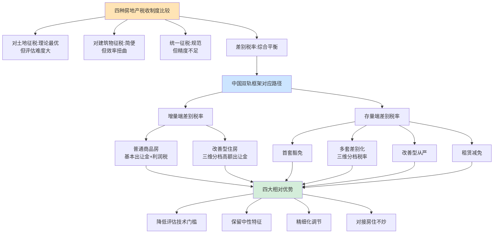

## 7.4 "差别税率"路径在中国制度情境下的相对优势

7.3节已论证中国双轨框架与"差别税率"路径的对应关系。本节进一步深入论证：为何在中国特定的制度情境下，差别税率路径优于其他三种路径？这一论证将从四个维度展开，最后讨论该路径的实施约束以衔接第8章。

### 7.4.1 契合土地公有制下"土地使用权差别化"的客观现实

中国土地公有制的核心特征不是"所有土地价值统一归公"，而是"**所有权统一公有但使用权差别化**"——不同区位、不同用途、不同消费层次的土地使用权本身就承载着差别化的级差地租。这一客观现实与差别税率路径的内在逻辑高度契合。

具体而言，**中国城市土地使用权的差别化体现在三个维度**：其一，**区位差别**——一线城市核心地段与三四线城市外围地段的土地使用权价值相差数十倍，反映了级差地租Ⅰ的显著差异；其二，**用途差别**——同一区位的住宅用地、商业用地、工业用地价值结构不同，对应不同的政策导向；其三，**使用年限差别**——住宅70年、商业50年、工业40年的使用年限差异，反映了不同用途土地的经济属性。

在这一差别化的土地使用权基础上，统一税率路径无法精准匹配级差地租的差异——若按统一税率征收，核心区高地价的"涨价归公"被低估、外围低地价的税负相对偏重；而差别税率路径恰好通过分档机制，**使税收负担与级差地租差异精准匹配**——核心区改善型住房承担最高税负、三四线城市普通住房享受最大减免，这一精准匹配体现了"涨价归公"原则的现代化实现。

更重要的是，差别税率路径与孙中山"平均地权"、"涨价归公"理念在精神上一脉相承[^90][^78]。孙中山的平均地权思想"通过涨价归公和地价税制度渐进地解决近代中国土地问题"[^90]——其核心不是简单的土地国有化，而是**通过税收手段使土地增值收益归公**。差别税率路径通过对高级差地租土地实施高税率，使社会创造的土地价值增量更多回归公共财政，这正是"涨价归公"理念在土地公有制下的具体体现。

### 7.4.2 回应中国房地产市场的高度异质性

中国房地产市场的另一特征是**高度异质性**——不同城市、不同类型住房、不同消费层次的市场逻辑与社会属性差异巨大，统一税率无法适配。这一异质性主要体现在三个层面：

**第一,城市间异质性极大**。一线城市与三四线城市在房价、库存、人口流动、保障需求等方面差异显著。第6章已论证一线城市"有人无房"、三四线城市"有房无人"的截然不同矛盾——统一税率无法同时回应这两类矛盾，必须通过差别化设计精准匹配。

**第二,住房类型异质性显著**。刚需住房与改善型住房、首套自住与多套持有、商品房与保障房在社会属性上根本不同。刚需住房承担基本居住权的公共属性，改善型住房具有奢侈消费品属性，多套持有具有投机性资产属性——这些根本不同的属性要求税收设计实施差别化对待。

**第三,消费层次异质性突出**。即便在同一城市同一类型住房中，消费者的支付能力、社会经济地位也存在巨大差异。"中央财经大学2023年报告显示，全国35个主要城市的平均房价收入比为15.3，远超国际公认的合理区间6倍以内"——同样面对15.3倍的房价收入比，不同收入家庭的承担能力差异巨大，统一税率忽视了这一支付能力差异。

差别税率路径通过户型、价格、区位、消费层次的多维分档，**使税收设计能够适配中国房地产市场的高度异质性**——这是其他三种统一性较强的路径所无法实现的精细化适配能力。

### 7.4.3 兼顾财政可持续性与社会公平双重目标

差别税率路径的第三个相对优势，是同时实现财政可持续性与社会公平双重目标。这一目标兼顾通过"调节高端、保护刚需"的分档结构得以实现，呼应了贾康"削富济贫"与刘尚希"调节高端、保护刚需"的核心论述[^91][^92][^93]。

**财政可持续性维度的实现机制**。差别税率路径使财政收益最大化于高端消费——改善型住房承担最高税率，多套持有承担较高税率，使财政收入主要来自支付能力强、社会接受度高的群体。这一收入结构既保证了财政规模，又避免了对刚需家庭的过度负担。同时，房产税作为持续性持有税，"在土地使用全过程中可长期持续征收，税源稳定，具有可持续性"——分档税率使税源稳定与差别化精度同时实现。

**社会公平维度的实现机制**。差别税率路径使保障性减免聚焦于刚需家庭——首套豁免、人均60㎡免征、人才与刚需豁免等机制，"让更多高收入者、富裕者缴纳更多税收，为大多数老百姓减少税收负担"[^91]。这一公平导向回应了贾康关于房地产税"削富济贫"效果的论述："**作为直接税，房地产税……能够帮助增加住房市场上购房者对中小户型的需求；房地产税负的形成也将促使空置房进入交易市场，有助于增加住房市场的供给。**"

更深层次看，差别税率路径还通过两端的协同实现了**"再分配的双重通道"**：其一，**征收端的再分配**——高端消费者承担更高税负，刚需家庭享受减免；其二，**使用端的再分配**——房产税收入定向用于"先租后售"与"住房券"机制，再次回流到中低收入群体的住房保障。这一双重再分配通道，使差别税率路径成为推动共同富裕的财政工具——刘尚希明确指出，房产税"对促进转型、对二元结构的改进、对共同富裕都会带来积极影响"[^93]。

### 7.4.4 与"房住不炒"政策导向的内在一致性

差别税率路径的第四个相对优势，是与"房住不炒"政策导向的内在一致性。第5.4节已系统论证存量端通过四重对接路径将"房住不炒"制度化。本节进一步指出：**这种制度化的实现，在制度类型学上必然依赖差别税率路径**——其他三种路径在结构上无法实现"房住不炒"的精准制度化。

**对土地征税路径的局限**。纯土地价值税虽然在抑制土地投机上表现优异，但对住房作为消费品与作为金融资产的区分能力较弱——它无法区分同一处土地上的"自住用住房"与"投机持有住房"，难以承担"房住不炒"的核心使命。

**对建筑物征税路径的局限**。沪渝试点的实际经验已证明，对建筑物征税"对房价上涨产生'一剑封喉'的作用"是无效的[^91]——单纯对建筑物征税无法触及房产作为金融资产的核心价值（即土地价值），调节作用有限。

**统一征税路径的局限**。香港差饷与美国房产税虽然在制度规范性上较高，但其统一税率难以区分住房的消费属性与金融属性。香港房价长期保持全球最高水平，差饷并未对炒房产生约束[^89]——这表明统一征税路径在调节市场属性方面的内在局限。

**差别税率路径的内在优势**。差别税率通过对"首套自住"零税率、"多套持有"差别化、"改善型"从严的设计，**从税率结构上明确区分了住房的消费属性与金融属性**——零税率档对应纯消费属性，差别化档对应混合属性，从严档对应金融属性主导。这一税率结构差异本身就是对"房住不炒"的制度化表达——使住房的消费属性获得税收保护，投机属性获得税收抑制。

更进一步，差别税率路径在功能维度上也实现了与"房住不炒"的对接。租赁减免引导住房从"投机持有"向"租赁运营"功能转化，使住房资源真正"用来住"而非"用来炒"。这一功能引导是其他三种路径所无法实现的。

### 7.4.5 差别税率路径的实施约束

需要清醒认识的是，差别税率路径的相对优势是建立在一系列实施约束之上的——若这些约束不能有效化解，差别税率路径的理论优势将难以转化为实际效果。这些约束包括以下五个层面：

**约束一:评估体系的更高要求**。差别税率路径要求税基评估能够准确反映不同住房类型的差异化价值——这对评估机构能力、评估师培养、评估标准统一提出了更高要求。第5.6节已讨论独立、专业、动态更新的不动产评估体系建设的必要性，但建设进度直接决定差别税率路径能否充分发挥精细化调节作用。

**约束二:信息系统的全面联网**。差别税率路径的多维分档(户型、价格、区位、消费层次)依赖准确识别每一家庭的住房持有数量、面积、区位等综合信息。这一精准识别要求房产信息全国联网、不动产统一登记的彻底完成。在跨部门、跨地区信息共享尚存壁垒的现实条件下，差别税率路径的全面落地面临技术约束。

**约束三:地方差异化执行能力**。差别税率路径要求各地根据本地市场异质性确定具体的分档参数。这要求地方政府具备较强的政策测算能力、社会沟通能力、利益平衡能力。在地方治理能力差异较大的现实条件下，差别税率路径的地方化落地可能呈现"质量参差"的局面。

**约束四:立法授权与协调机制**。差别税率路径需要中央立法形成框架（明确征收性质、税基范围、免税基本原则、与其他税种衔接、纳税人权利保护等"刚性"框架），同时给予地方在具体税率档次、免税面积具体额度、特殊豁免具体情形、计税依据具体方法等"弹性"细节方面的自主权。这一"中央立法定框架+地方自主定细节"的协调机制需要专门的立法授权设计，在中国行政体制下涉及复杂的央地关系调整。

**约束五:社会接受度与税收文化建设**。差别税率路径的复杂分档可能引发社会的"不公平感"——为何相邻两套房产因户型微差而税负显著不同？为何同一区域不同价格分档承担差异化税负？这些问题需要通过充分的社会沟通、税收教育、纳税人权利保护来化解。在中国房产税长期作为试点性税种、社会接受度尚未充分培育的现实条件下，差别税率路径的社会接受度建设是一个长期工程。

这些约束的有效化解，需要在评估体系建设、信息系统建设、央地立法协调、社会沟通教育等多个维度系统推进。**这些约束的化解路径与配套改革安排，将在第8章实施路径与政策启示中作系统讨论**——本章所确立的"差别税率路径的理论优势与实施约束"的辩证认识，为第8章实施路径的展开提供了制度比较层面的方法论基础。

---

综合本章论证，可以得出本章的核心判断：在土地公有制下，**"对土地征税"、"对建筑物征税"、"对土地和建筑物统一征税"、"对土地和建筑物实行差别税率"四种典型房地产税收制度各有其制度逻辑与适用情境**——对土地征税在效率上最优但可行性约束大、对建筑物征税在可行性上较高但效率扭曲、统一征税在三个维度上均为中等但精度不足、差别税率在效率、公平、可行性之间实现相对平衡。中国双轨转型框架在制度类型学上对应"差别税率"路径——增量端通过普通商品房与改善型住房的二元划分及改善型住房内部的三维分档，存量端通过首套/多套/改善型的三层划分与三维分档税率，共同构成多维度、多层次、多功能的差别税率体系。在中国特定制度情境下，差别税率路径相较其他三种路径具有四个层面的相对优势——契合土地公有制下使用权差别化、回应市场高度异质性、兼顾财政与公平双重目标、与"房住不炒"内在一致；同时，这一路径的有效落地依赖于评估体系、信息系统、地方执行能力、央地立法协调、社会接受度五个层面实施约束的系统化解。这一辩证认识，为第8章实施路径、配套改革建议与研究结论的展开提供了制度比较层面的理论支撑与方法论基础。

# 8 实施路径、配套改革建议与研究结论

第3至第7章已系统构建了"增量—存量"协同的双轨转型框架，并在制度类型学层面论证了该框架与"差别税率"路径的对应关系及其在中国制度情境下的相对优势。然而，理论框架的严谨性并不等同于现实推进的可行性——一项触及地方政府核心利益、覆盖城镇千家万户、涉及多部门协同的系统性改革，其能否平稳落地、最终实现预期效应，取决于现实约束的识别深度、配套改革的协同程度以及实施路径的可操作性。作为全文的收束章节，本章承担三项任务：第8.1节系统识别转型方案落地的五大现实挑战；第8.2节围绕央地财权事权再划分、消费税划归地方、转移支付优化、土地融资规范化、城投平台市场化转型五大方向提出配套改革建议；第8.3节归纳"分阶段、差异化、协同推进"的实施路径；第8.4节提炼全文核心发现与政策启示；第8.5节坦诚说明研究局限与未来研究方向。本章在逻辑上承接前七章的诊断分析与机制设计，将理论方案转化为可操作的现实推进路径，实现全文从"问题诊断—机制重构—制度比较—落地路径"的完整闭环。

## 8.1 转型方案落地的五大现实挑战

### 8.1.1 房产税立法进度的不确定性

双轨转型方案的核心制度安排——存量端差别化房产税——其落地的前提是房产税立法的完成。然而，**立法进度本身存在显著的不确定性**，构成转型方案落地的首要约束。

2021年10月23日，第十三届全国人民代表大会常务委员会第三十一次会议通过《关于授权国务院在部分地区开展房地产税改革试点工作的决定》，明确"授权国务院在部分地区开展房地产税改革试点工作"，"本决定授权的试点期限为五年，自国务院试点办法印发之日起算"[^94][^95][^96]。这一立法授权事实上为存量端机制落地提供了制度准备——试点地区的房地产税征税对象为"居住用和非居住用等各类房地产，不包括依法拥有的农村宅基地及其上住宅"，土地使用权人、房屋所有权人为房地产税的纳税人[^94]。

然而，授权决定通过后，立法节奏受房地产市场深度调整的客观制约。从市场层面看，2021年下半年起房地产市场进入持续低迷期；从决策层面看，房产税试点的扩围在事实上被推迟。这一推迟体现了**立法节奏与市场状况之间的内在张力**——在房地产市场下行期推出房产税扩围，可能加剧市场预期恶化；但市场长期低迷又使试点扩围的窗口持续推后，立法进度陷入"两难"。

这一不确定性对双轨转型方案的落地构成直接影响。存量端房产税立法的滞后，意味着第5章所设计的差别化房产税征收机制、第6章所论证的"先租后售"与"住房券"机制（以房产税收入为主要资金来源）均难以在短期内全面启动。即便部分地方能够通过既有《房产税暂行条例》框架开展有限试点，其覆盖面、税基范围、收入规模也难以达到双轨转型所需的水平。立法进度的不确定性，是双轨转型在2021年时点必须面对的"时间约束"。

### 8.1.2 税基评估技术的成熟度约束

第5章已论证，长期来看房产税计税依据需要从"交易价×70%"过渡到独立评估值——这一过渡的基础是不动产评估体系的建设。然而，**独立、专业、动态更新的不动产评估体系建设涉及多个环节**，短期内难以全面到位。

具体而言，评估体系建设涉及四个关键环节：其一，**评估机构资质体系**——需要建立专门承担房产税税基评估的资质机构，明确其独立性要求（与税务机关分离、与开发商分离）、专业能力要求与质量监管机制；其二，**评估方法标准化**——市场比较法、收益法、成本法在不同住房类型、不同区位条件下的适用规范需要统一制定，避免评估方法分歧导致同类房产税负差异；其三，**评估师培养与队伍建设**——专业评估师的培养周期较长，全国范围内具备房产税税基评估能力的专业人员储备相对不足；其四，**评估信息系统建设**——需要建立涵盖全国主要城市、覆盖逐套房产、支持动态更新的评估信息系统。

从市场层面看，相关市场化服务已经存在初步探索。部分企业提供"地税评估房地产系统(房地产税税基评估)"等专门解决方案，"遵循房地产税税制改革按照评估值征税的原则，积极探索打造房地产保有环节的税基价格评估系统"，并"经过试点城市多轮房地产税模拟评税实践验证"[^97][^98]。这些市场化探索为评估体系建设提供了技术基础，但作为面向全国覆盖的法定征收基础，仍需大规模的制度化建设。**评估体系的不成熟，使差别税率路径的精细化优势在短期内难以充分发挥**——若评估值不准确、不一致，差别化税率反而可能引发更多的纳税人争议与不公平感。

### 8.1.3 地方政府激励兼容性问题

第3、第4章已论证，新机制下地方政府的激励结构应从"地租收取者"转变为"利润分享者"、从"经营城市"转向"服务城市"。然而，**这一激励重塑的实现，本身就面临深刻的现实约束**——在土地出让收入大幅萎缩、地方债务压力高企的现实环境下，地方政府可能将房产税收入挪作他用，使专项使用沦为名义安排。

从财政现实看，2024年全国地方政府土地出让金收入同比下降18.3%，财政压力显著增加[^99];与此同时，地方债务规模持续扩大，"2023年地方财政自给率降至53%，而转移支付占收入比重上升到47%"[^100]。在这种"卖地哑火、债务高企"的双重压力下，地方政府对任何新增财源都具有强烈的"统筹使用"动机——希望将房产税收入纳入一般公共预算用于平衡基本支出、偿付债务利息或维持运转，而非定向用于保障房建设与租赁市场支持。

这一激励兼容性问题的本质，是**地方政府的短期财政平衡目标与房产税"小税种、大问题"政策定位之间的张力**。若房产税收入被挪作他用，则第6章所论证的"征收—使用"闭环将断裂，差异化使用机制的政策价值将大打折扣；地方政府保障房供给的激励反转也将无法实现，第2章所诊断的保障房"三重困境"将延续。化解这一约束，需要专户专款、人大监督、社会公示、审计巡视等多层次制度安排（详见第6.6.3节），但这些制度安排本身的执行力，又取决于央地财政关系的整体调整——这一逻辑链条将在第8.2节配套改革中进一步展开。

### 8.1.4 过渡期财政缺口

双轨转型方案的核心制度安排涉及增量端"基本土地出让金大幅压低"与存量端"房产税分阶段引入"两端调整。这两端调整的时序错位，可能形成**3—5年的"财政青黄不接"窗口期**——即旧的高额土地出让金收入大幅萎缩，但新的房产税与利润税尚未形成规模，地方一般公共预算与政府性基金预算同时承压。

从数据层面看，第2章已论证土地出让收入从2021年8.7万亿元峰值持续下滑至2024年约4.87万亿元，相比峰值减少约3.8万亿元，这一规模的剧烈缩减已经构成地方财政的客观缺口。在此基础上，若新增量模式进一步将普通商品房供地从高溢价模式切换为基本土地出让金（仅覆盖基础设施成本），土地出让收入还将进一步收窄；而存量端房产税在试点初期收入规模有限——沪渝试点2014年房产税收入仅分别为213.8亿元与67.3亿元，相对地方一般公共预算收入贡献度较低。

这一过渡期缺口的客观存在，意味着**双轨转型方案不能简单"一刀切"地全面切换**，必须设计合理的过渡安排。可能的过渡机制包括：其一，**渐进切换**——新机制先在部分城市试点，老机制在过渡期内保留，使两端收入形成时间上的衔接；其二，**多元金融工具补足**——通过专项债、保障性住房再贷款、REITs等多元工具补足过渡期资金缺口（详见第6.6.1节）；其三，**中央转移支付增强**——通过加大中央对地方转移支付（详见第8.2.3节）平抑过渡期波动。三类机制的组合应用，是化解过渡期财政缺口的关键安排。

### 8.1.5 社会接受度与税收文化建设

房产税作为新型直接税，其与间接税的根本区别在于**强烈的"税收痛感"**——纳税人需要从税后收入中直接掏钱缴税，而非如增值税、消费税通过商品价格隐性承担。这一直接性使房产税的社会接受度显著低于间接税，是任何房产税改革面临的共同约束。

更具体地，差别税率路径的复杂分档可能引发社会的"不公平感"。在差别税率结构下，相邻两套房产可能因户型微差（如143㎡与145㎡）、单价微差（如均价1.99倍与2.01倍）而税负显著不同——这些临界点上的差异，在纳税人感知上容易被放大为"不公平"，引发对税收设计的质疑。同时，**社会对房产税的认知本身存在分化**——部分群体（无房或刚需）对房产税持支持态度，认为有助于抑制投机、平抑房价；部分群体（多套持有者或改善型消费者）持反对态度，认为构成对既有财产的"剥夺"。这种社会认知分化使房产税改革的政治成本较高。

化解这一约束，需要系统性的社会沟通与税收文化建设：其一，**清晰的政策宣示**——明确房产税"调节高端、保护刚需"的政策定位，使社会理解差别税率的公平意图；其二，**透明的税基评估**——评估过程与结果的公开透明，减少"暗箱操作"质疑；其三，**充分的纳税人权利保护**——明确的评估争议复核机制、行政复议通道与司法救济渠道；其四，**收入使用的可见性**——房产税收入定向用于保障房与租赁市场支持的成效公示，使纳税人看到"自己缴的税用在了哪里"。这些建设是长期工程，不可能在短期内完成，但又是房产税平稳落地不可或缺的"软约束"。

### 8.1.6 五大挑战的相互嵌套

将五大挑战综合考察，可以发现一个关键事实：**五大挑战之间相互嵌套，任何单一维度的化解都不足以保障转型平稳落地**。

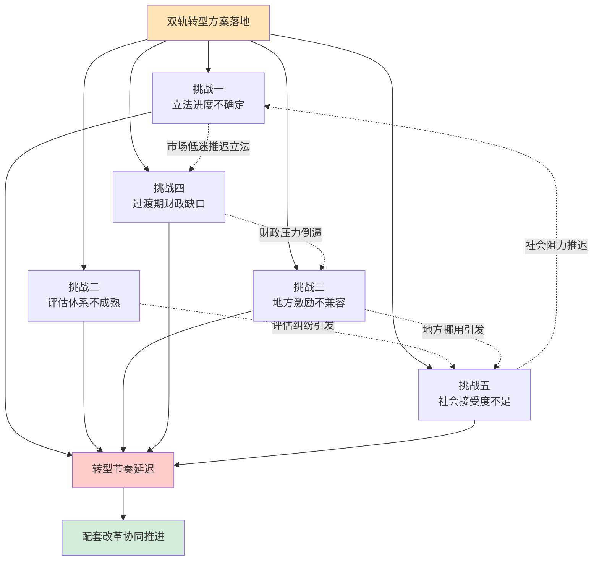

具体而言：立法进度的不确定性（挑战一）使评估体系建设缺乏明确的时间节点（影响挑战二），也使地方对新机制的预期不稳定（影响挑战三）；评估体系不成熟（挑战二）可能引发纳税人争议，加剧社会接受度问题（影响挑战五）；地方激励不兼容（挑战三）如果体现为房产税收入被挪用，将削弱社会对房产税的信任（影响挑战五）；过渡期财政缺口（挑战四）的财政压力倒逼地方挪用房产税收入（影响挑战三），也可能促使地方政府对新机制持消极态度（影响挑战一）；社会接受度不足（挑战五）反过来又使立法节奏更趋审慎（影响挑战一）。

这一相互嵌套的格局意味着，**转型方案的落地必须通过系统性的配套改革加以保障**——单纯推进房产税立法而不调整央地财权事权、单纯推进试点扩围而不建设评估体系、单纯强调专项使用而不化解地方财政压力，都无法有效化解五大挑战。这正是8.2节配套改革讨论的逻辑起点。

## 8.2 配套改革方向的五维协同

为化解8.1节所识别的五大挑战，需要在五个方向上系统推进配套改革。这五大方向并非孤立的政策项目，而是相互嵌套、共同构成双轨转型制度生态的有机整体。

### 8.2.1 央地财权事权再划分

第1章已论证，1994年分税制改革奠定的"财权上收、事权下放"格局长期未根本调整，地方政府"能收的钱少、要办的事多"的困境是土地财政模式形成的核心动因[^101][^102]。双轨转型方案若不同步推进央地财权事权再划分，将面临"房产税无法填补地方收支缺口"的根本性约束——即便房产税顺利开征，其规模也难以替代土地出让金所承担的财政功能。

按二十大报告与2024年中央财政部相关表态，央地财权事权再划分的核心方向是**适当上移基本公共服务支出责任**。中央财政部门已经明确，下一步将"完善财政转移支付体系，清理规范专项转移支付，增加一般性转移支付，提升市县财力同事权相匹配程度"[^101]。从更深层看，相关讨论已经提出"将由地方承担的基本公共服务支出责任上移，让地方从土地财政逐步进行转型。中央则在共同富裕、推动城乡区域协调发展承担更多责任"[^100]。这一支出责任上移的方向，对双轨转型方案构成关键的配套支撑——它使房产税真正成为地方一般公共预算的有效补充而非"唯一救命稻草"，避免地方政府因收支缺口压力将房产税收入挪作他用。

具体而言，可在以下三个领域优先推进事权上移：**其一，教育领域**——将部分基础教育、特殊教育的支出责任上移至省级或中央层面，缓解市县财政在教育支出上的刚性压力；**其二，社保领域**——加快推进基本养老保险全国统筹，减轻地方在社保支出上的差异化负担；**其三，医疗领域**——加大中央对基本医疗保障的财政投入，特别是在欠发达地区。这些领域的事权上移，不仅可以缓解地方财政压力，也契合基本公共服务均等化的政策方向。

### 8.2.2 消费税划归地方

在央地财权事权调整之外，**新增地方主体税源**是双轨转型的另一关键配套。房产税虽然作为地方一般公共预算的补充税源具有重要意义，但单独不足以构成完整的地方主体税源体系；消费税的征收环节后移并稳步下划地方，是与房产税共同构成新地方主体税源体系的关键举措。

按政府工作报告与财政部表态的部署，"中国将推进消费税征收环节后移并稳步下划地方，统筹考虑中央与地方收入划分、税收征管能力等因素，分品目、分步骤稳妥实施，引导地方改善消费环境"[^101][^102]。这一改革的政策意图明确——"调整优化消费税征税范围、税率，并推进部分品目征收环节后移"[^103]。从财政规模看，目前消费税"共有15个税目，其中烟、成品油、小汽车和酒4个税目的收入占消费税总收入比重超九成，尤其是烟和成品油消费税收入占比超过八成"[^103]，构成可观的税收规模。

消费税征收环节后移并下划地方对双轨转型的配套价值，体现在三个层面：**其一，财政规模补充**——消费税作为现行规模较大的税种，下划地方后可显著增加地方一般公共预算收入，减轻房产税的"独力承担"压力；**其二，激励重塑**——消费税收入归属地方后，"地方征管力度加大：消费税变成地方收入后，各地有更强的动力去征管和稽查"[^104]，使地方政府从"经营城市"逐步转向"改善消费环境"；**其三，征管能力建设**——征收环节后移意味着"目前消费税主要在生产环节征收，改革后将部分品目的征收环节从生产环节后移到批发或零售环节"[^104]，对地方税务征管能力提出更高要求，也推动税务系统的现代化建设。

近年来，国家税务总局加强对消费税的征管力度——"4月17日，国家税务总局干了件'破天荒'的事——首次集中曝光8起偷逃消费税案件，涉及辽宁、江苏、安徽、山东、四川、新疆、贵州、广东8个省份"[^105][^104]，释放出消费税改革启动的信号。这一征管强化既是为消费税下划地方做准备，也与房产税立法形成同步推进的政策协同。

### 8.2.3 转移支付体系优化

中央对地方转移支付是地方综合财力的重要构成。"2025年预算达103415亿元"[^106]，中央对地方转移支付规模持续增长。在双轨转型过程中，**转移支付体系优化**是支撑过渡期财政平衡、推动基本公共服务均等化的关键工具。

按二十大报告辅导读本中财政部部长刘昆的论述，转移支付体系优化的方向是"按照与财政事权和支出责任划分相适应的原则，规范转移支付分类设置，厘清边界和功能定位"[^107]。具体而言：

**一般性转移支付以均衡区域间基本财力配置为目标**，"结合财政状况增加规模，并向中西部财力薄弱地区倾斜，向革命老区、民族地区、边疆地区、欠发达地区以及担负国家国防、粮食、能源、生态等安全职责的功能区域倾斜"[^107]。这一倾斜安排对支撑欠发达地区在双轨转型过程中的财政平衡至关重要——这些地区房产税税基相对薄弱，需要通过一般性转移支付补足财力缺口。

**共同财政事权转移支付以保障和改善民生为目标**，"增强地方基本公共服务保障能力"，"合理安排共同财政事权转移支付，实行差异化补助政策，推进地区间基本公共服务水平更加均衡"[^107]。这一类型的转移支付与双轨转型的民生维度高度契合——房产税收入定向用于保障房与租赁市场支持，与共同财政事权转移支付形成功能互补，共同支撑住房保障的财政基础。

**专项转移支付以保障党中央重大决策部署落实为目标**，"资金定向精准使用，强化对地方的引导激励，并逐步退出市场机制能够有效调节的领域"[^107]。在双轨转型中，可设立专门的住房保障专项转移支付，对积极推进"先租后售"与"住房券"机制的城市给予资金支持。

此外，**财政资金直达机制**作为"党中央、国务院为应对疫情影响作出的重大决策部署"在常态化运行后，已经形成"约4万亿元资金纳入直达范围"的规模[^108]。这一直达机制可在双轨转型过渡期发挥关键作用——通过将房产税相关配套资金直达基层，避免层层截留，确保保障房资金真正用于民生。

### 8.2.4 土地融资规范化

第1章已论证土地财政呈现"财政—金融"双重属性，土地抵押融资构成中口径土地财政的重要部分，但这一融资循环高度依赖地价持续上涨。第2章进一步揭示，地方政府债务积聚已构成"增量"土地财政模式不可持续性的供给侧根源。**土地融资规范化**是双轨转型必须同步推进的关键配套，否则土地财政与地方债务的双重风险将延续到新机制运行期。

按银保监会2021年7月发布的《银行保险机构进一步做好地方政府隐性债务风险防范化解工作的指导意见》（"15号文"），"严禁新增地方政府隐性债务、妥善化解存量地方政府隐性债务，强化风险管理"[^109]。15号文的核心要点之一，是"重申不得把土地出让收入与项目挂钩"，"对于实际运行中演变出的'F+EPC'、'ABO'等模式，都属于擦边球项目，在政策未有新的变化之前要保持绝对审慎"[^109]。这一规范化方向，与双轨转型方案"地方政府从地租收取者转变为利润分享者"的激励重塑在方向上一致——通过切断地方政府"以土地出让收入作为隐性偿债保证"的预期，使地方政府的财政行为从"以地谋发展"模式逐步退出。

进一步看，国务院办公厅2024年10月印发的《关于优化完善地方政府专项债券管理机制的意见》（国办发〔2024〕52号）"实行专项债券投向领域'负面清单'管理"，"将完全无收益的项目，楼堂馆所，形象工程和政绩工程，除保障性住房、土地储备以外的房地产开发，主题公园、仿古城（镇、村、街）等商业设施和一般竞争性产业项目纳入专项债券投向领域'负面清单'"[^110][^111]。这一负面清单将房地产开发（除保障房与土地储备外）排除在专项债投向之外，进一步限制了地方政府通过专项债参与商业性房地产开发的空间。

同时，专项债"扩大用作项目资本金范围"为双轨转型提供了配套支持——"将信息技术、新材料、生物制造、数字经济、低空经济……以及卫生健康、养老托育、省级产业园区基础设施等纳入专项债券用作项目资本金范围"[^110]，"可用作项目资本金的专项债券规模上限由该省份用于项目建设专项债券规模的25%提高至30%"[^110]。这些安排使专项债资金更多投向新兴产业基础设施与民生领域，与房产税收入定向用于保障房建设形成功能协同。

需要明确指出的是，地方政府隐性债务问题的化解，本质上要求**"明面上不算政府债，但实际上是政府欠的债、最后要纳税人买单"的债务结构得到根本性改变**[^112]。这一改变不仅涉及金融机构的合规审查、专项债的规范使用，更涉及城投平台的市场化转型——这正是8.2.5节讨论的重点。

### 8.2.5 城投平台市场化转型

土地融资规范化在主体维度的对应改革，是城投平台的市场化转型。城投平台作为"地方政府融资工具"，长期以"政府私下承诺兜底"的方式承担地方基建融资职能，构成隐性债务的主要形成主体[^112]。双轨转型方案要求地方政府退出"以土地为信用基础"的融资模式，城投平台的市场化转型是这一退出的关键。

城投平台市场化转型的核心方向是**剥离政府融资职能、回归市场化经营**。15号文明确要求"对于承担地方政府隐性债务的客户，不得新提供流动资金贷款或流动资金贷款性质的融资，不得为其参与的专项债券项目提供配套融资"[^109]，从金融机构端切断了城投平台继续承担地方融资职能的可能性。

转型路径上，城投平台需要逐步剥离公益性业务（这部分应由地方一般公共预算承担），保留并强化经营性业务，向市场化国有企业转型。这一转型与双轨转型方案的衔接体现在两个层面：**其一**，在保障房建设领域，转型后的城投平台或国有住房公司可以承担"先租后售"机制中的房源收购与运营职能——第6章已论证辽宁、浙江、四川等地正在推进的"地方国企牵头筛选优质存量房源，市场化定价收购，精准盘活滞销商品房"，正是这一职能转换的现实案例；**其二**，在土地一级开发领域，城投平台从"代政府融资"角色转换为"市场化土地一级开发服务商"，使其经营行为受市场约束而非政府信用背书。

需要指出的是，城投平台市场化转型不可能一蹴而就。"城投熬出来了，隐债成显债"的新一轮债务置换正在推进，"专家推测新一轮债务置换规模或将达到6万亿至10万亿元。这就意味着地方存量隐性债务将变为显性债务"[^100]。这一显性化过程为城投平台转型创造了制度条件——存量隐性债务被中央或省级政府承接后，城投平台得以"卸下历史包袱"，更专注于市场化经营。在此背景下，城投平台与房产税资金支持的保障房建设机制的功能衔接，将逐步成为现实。

### 8.2.6 五维改革的协同关系

将五大配套改革方向综合考察，可以发现其相互嵌套、共同构成双轨转型的制度生态：

| 配套改革方向 | 对应化解的挑战 | 与双轨框架的衔接接口 |
|------------|--------------|-------------------|
| 央地财权事权再划分 | 化解地方激励不兼容（挑战三）、缓解过渡期缺口（挑战四） | 使房产税成为有效补充而非"独力承担" |
| 消费税划归地方 | 缓解过渡期缺口（挑战四）、化解地方激励不兼容（挑战三） | 与房产税共同构成地方主体税源 |
| 转移支付体系优化 | 缓解过渡期缺口（挑战四）、化解社会接受度（挑战五） | 支撑欠发达地区与基本公共服务均等化 |
| 土地融资规范化 | 化解地方激励不兼容（挑战三） | 切断"以地为信用"的融资循环 |
| 城投平台市场化转型 | 化解地方激励不兼容（挑战三） | 承担保障房收购运营等转型角色 |

这五大配套改革并非各自独立的政策项目，而是相互依存、相互支撑的制度网络。央地财权事权再划分若不与消费税下划地方协同，地方财力补充将不到位；消费税下划地方若不与转移支付优化协同，地区间财力分化将加剧；土地融资规范化若不与城投平台市场化转型协同，隐性债务问题将延续；任何一项改革单独推进都难以化解八大挑战的相互嵌套。**正是这五大改革的协同推进，构成了双轨转型方案落地的制度基础**。

## 8.3 分阶段、差异化、协同推进的实施路径

基于前两节的现实挑战与配套改革分析，本节归纳双轨转型方案的可操作实施路径。这一路径在时序维度上采用"分阶段"推进、在空间维度上采用"差异化"推进、在主体维度上采用"协同推进"，构成一个完整的三维实施框架。

### 8.3.1 时序维度:分阶段推进

按2021年时点的客观条件与房地产税试点5年授权期的制度安排，可将双轨转型的实施划分为短期、中期、长期三个阶段：

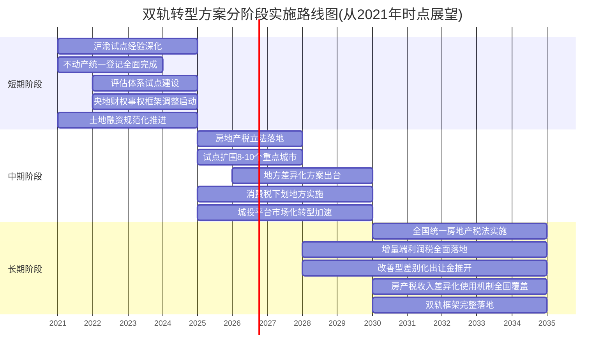

**短期阶段（2021—2025年）：奠基与试点深化**。这一阶段的核心任务是为全面立法奠定基础，重点工作包括：其一，沪渝房产税试点经验的系统总结与制度优化；其二，不动产统一登记的全面完成与全国信息联网；其三，评估体系的试点建设，特别是评估机构资质认定、评估方法标准化、评估师培养等基础性工作；其四，央地财权事权框架调整的启动，包括基本公共服务支出责任上移的具体方案制定；其五，土地融资规范化的推进，特别是地方政府隐性债务的化解与城投平台的初步转型。这一阶段不追求全面推开新机制，而是为后续阶段做好制度准备。

**中期阶段（2026—2030年）：立法落地与试点扩围**。这一阶段的核心任务是房地产税立法落地与新机制的逐步推开，重点工作包括：其一，房地产税立法在条件成熟时完成，按2021年授权决定"条件成熟时，及时制定法律"的要求推进；其二，试点扩围至8—10个重点城市，覆盖一线城市与强二线城市；其三，地方差异化方案的出台，按"中央立法定框架、地方自主定细节"的原则，各试点城市根据本地情况制定具体税率档次、免税面积、特殊豁免等细节安排；其四，消费税下划地方的分品目、分步骤实施；其五，城投平台市场化转型的加速推进。这一阶段实现新增量模式与新存量模式的逐步衔接，但尚未达到全国统一实施的程度。

**长期阶段（2031年之后）：全国统一与机制完整落地**。这一阶段的核心任务是双轨框架的完整落地，重点工作包括：其一，全国统一房地产税法的实施，覆盖全国主要城市；其二，增量端利润税与改善型住房差别化高额土地出让金的全面落地，普通商品房基本土地出让金机制成熟化运行；其三，房产税收入差异化使用机制（"先租后售"与"住房券"）覆盖全国主要城市；其四，地方政府激励机制从"地租收取者"向"利润分享者"的根本性转变完成。

这一分阶段推进的安排，体现了"先立后破"的改革原则——通过短期奠基与中期试点积累经验，长期才推进全面替代，避免对市场造成剧烈冲击。需要明确的是，**上述时间节点是基于2021年时点条件的展望性建议，具体推进节奏需要根据房地产市场状况、经济整体形势、政策协同条件等因素灵活调整**。

### 8.3.2 空间维度:差异化推进

在空间维度上，双轨转型方案的推进需要充分考虑中国城市的高度异质性，采用"差异化"推进策略。第6章已系统论证不同类型城市的住房矛盾本质差异——"高库存承压型"城市与"人口净流入型"城市的核心矛盾在性质上根本不同，要求采用差异化的机制设计。

**第一类：人口净流入型一二线城市的优先推进重点**。这类城市包括北京、上海、广州、深圳等一线城市以及杭州、南京、成都、武汉等强二线城市。按2025年财政部相关表态，"试点城市将主要从一线城市和强二线城市中选择，北京、上海、广州、深圳、杭州、南京、成都、武汉等城市被列入首批候选名单"[^99]。这些城市的优先推进重点是：

- **存量端房产税试点扩围**——在沪渝试点基础上，将差别化房产税征收覆盖至更多一二线城市；
- **"住房券"机制实施**——针对流动人口与新市民的住房可及性需求，以房产税资金支持的"住房券"机制提升人才吸引力；
- **改善型住房差别化高额土地出让金试点**——这类城市改善型消费市场较为活跃，是改善型住房机制的优先适用对象。

**第二类：高库存承压型三四线城市的优先推进重点**。这类城市的核心矛盾是库存积压与"有房无人"，优先推进重点是：

- **"先租后售"机制实施**——以房产税资金（在初期阶段配合保障性住房再贷款、地方专项债等多元金融工具）批量收购或建设保障房，化解库存并改善"夹心层"居住条件；
- **基本土地出让金机制试点**——这类城市土地市场已经低迷，传统高溢价模式难以为继，可优先试点基本土地出让金+利润税的新增量模式。

**第三类：混合型城市的组合应用**。许多强二线城市与省会城市兼具两类特征，可采用组合应用思路：核心区采用"住房券"机制、郊区采用"先租后售"机制；对本地"夹心层"采用"先租后售"、对流动人口采用"住房券"。

这种差异化推进的核心政策意图，是**避免"一刀切"对不同类型城市造成不适配的冲击**。同时，差异化推进也使各地能够根据本地情况积累经验，为最终的全国统一立法提供丰富的实践素材。

### 8.3.3 主体维度:协同推进

在主体维度上，双轨转型方案的推进需要中央与地方、立法与行政、多部门之间的协同推进。这一协同推进可从三个层面理解：

**第一层：中央立法定框架，地方自主定细节**。按刘尚希所论述的"在房地产税问题上，要更多地给地方分权，或者说放权"，中央立法应聚焦于"形成框架，规定基本原则"等"刚性"内容，包括征收性质、税基范围、免税基本原则、与其他税种衔接、纳税人权利保护等；地方层面则在框架内自主确定具体税率档次、免税面积具体额度、特殊豁免具体情形、计税依据具体方法等"弹性"细节。这一"刚柔并济"的立法分工，既保证了房产税作为现代税制的统一性，也保留了各地因城施策的灵活性。同时，2024年中央财政部表态也明确"今后，在中央统一立法和税种开征权的基础上，将探索研究在地方税税制要素确定及具体实施上赋予地方更大自主权"[^101][^102]，为这一立法分工提供了政策支撑。

**第二层：多部门并联协同**。双轨转型方案涉及住建、财政、税务、不动产登记、人社、民政、自然资源等多部门。这些部门需要在"立法—征管—使用"全链条上实现并联协同：立法环节需要财政、税务、住建、自然资源等部门联合参与；征管环节需要税务与不动产登记、住建等部门的信息共享；使用环节（特别是房产税收入定向用于保障房与租赁市场支持）需要财政、住建、人社等部门的协调。第6章已讨论曲靖"先租后售"方案设立的多部门领导小组模式与惠州房票政策的多部门联合印发模式，均为多部门并联协同的实践案例。

**第三层：央地财政协同**。央地财权事权再划分、消费税下划地方、转移支付优化等配套改革，均要求中央与地方在财政关系上的协同推进。这一协同既包括财权事权划分的整体框架调整，也包括具体改革项目的同步推进——例如，房产税立法的推进节奏需要与消费税下划地方的节奏协调，避免出现"地方主体税源真空期"。

这三层协同的整体目标，是**避免转型方案在推进过程中出现"立法独行"、"地方独行"、"部门独行"等碎片化局面**，使理论方案真正转化为可操作的政策蓝图。

## 8.4 全文核心发现与政策启示

经过前七章对中国土地财政转型的系统研究，本节归纳全文核心发现并提炼深层政策启示。这些发现与启示既是对前文论证的总结，也是对未来研究与政策实践的导引。

### 8.4.1 全文核心发现

**研究主线发现一:'土地财政'模式在2021年达到历史峰值的同时,已呈现五个层面的系统性不可持续性**。第1、第2章已论证，土地财政作为中国特定历史阶段、特定制度环境下形成的复杂制度安排，是1988年宪法修正案、1994年分税制改革、1998年住房制度市场化改革三大历史节点耦合的产物。这一模式在过去二十余年保持了惊人的扩张惯性——从1998年地方土地出让收入507亿元，扩张至2021年峰值约8.7万亿元，二十三年间规模扩张约165倍。然而到2021年，模式已在规模演变（达到历史峰值后持续回落）、依赖度指标（占地方一般公共预算收入比重高达78%的临界高位）、需求基础（人口老龄化、城镇化放缓、住房存量过剩三重逆转）、供给条件（地方债务积聚与房企流动性危机）、负外部性累积（保障房供给失衡、阶层流动性下降、实体经济空心化）五个层面共同显现出系统性不可持续性。**模式的局部修补已不足以化解结构性矛盾，必须进入"机制重构"阶段**。

**研究主线发现二:转型的核心方向是"增量—存量"协同的双轨机制**。第3至第6章已系统构建双轨转型框架——增量端通过"基本土地出让金+普通商品房利润税+改善型住房差别化高额土地出让金"重构征收对象，使土地出让金从覆盖全部新增住宅的普惠性资本化工具转为高端消费调节工具；存量端通过"首套豁免+多套差别化+改善型从严"的差别化房产税与租赁性房产税收减免，构建覆盖城市存量住房的持续性持有税体系；房产税收入则通过"先租后售"与"住房券"两类机制定向支持住房保障与流动人口可及性，使房产税真正成为"小税种、大问题"中支撑住房公平与社会流动的财政基石。这一双轨框架通过功能互补，同时回应地方财政可持续性、房地产市场调控、住房公平分配与社会保障投入四重政策目标。

**研究主线发现三:中国双轨框架在制度类型学上对应"差别税率"路径,在三大维度上实现相对平衡**。第7章已通过"对土地征税"、"对建筑物征税"、"对土地和建筑物统一征税"、"对土地和建筑物实行差别税率"四种典型房地产税收制度的系统比较，论证了中国双轨框架与"差别税率"路径的对应关系。在效率、公平、可行性三大维度上，"对土地征税"在效率上最优但可行性约束大、"对建筑物征税"在可行性上较高但效率扭曲、"统一征税"在三个维度上均为中等但精度不足、"差别税率"在效率、公平、可行性之间实现了相对最优的平衡。差别税率路径在中国制度情境下具有四个层面的相对优势——契合土地公有制下土地使用权差别化的客观现实、回应中国房地产市场的高度异质性、兼顾财政可持续性与社会公平双重目标、与"房住不炒"政策导向的内在一致性。

**研究主线发现四:转型方案落地依赖于五大配套改革的协同推进**。第8.1—8.3节已系统识别立法进度不确定性、评估体系不成熟、地方激励不兼容、过渡期财政缺口、社会接受度不足五大现实挑战，并提出央地财权事权再划分、消费税划归地方、转移支付优化、土地融资规范化、城投平台市场化转型五大配套改革方向。这五大改革相互嵌套、共同构成双轨转型的制度生态——单一改革无法化解五大挑战的相互嵌套，必须通过系统性协同推进才能保障转型平稳落地。

### 8.4.2 深层政策启示

将四项核心发现综合提升，可以得出本研究的深层政策启示——**土地财政转型不仅是财政收入结构的调整,更是国家治理模式从"土地驱动型增长"向"人本驱动型发展"转变的关键环节**。

这一深层启示可从三个层面理解：

**第一层:地方政府角色的根本性转变**。在传统土地财政模式下，地方政府事实上身兼"土地经营者"与"公共服务提供者"双重角色，前者的财政激励远强于后者，导致"以地谋发展"成为路径锁定的必然结果。双轨转型方案通过税基重塑（增量端利润税替代高额土地出让金、存量端房产税补充地方一般公共预算），使地方政府从"地租收取者"转变为"利润分享者"、从"经营城市"转向"服务城市"。这一角色转变的深层意义在于：**当地方政府的财政利益不再与"地价泡沫"绑定,而是与"项目真实经济效益"和"城市常住人口扩大"挂钩时,公共服务质量改善、营商环境优化、产业生态培育就成为地方政府的内生动力,而非外生约束**。

**第二层:住房功能的本位回归**。在传统土地财政模式下，住房被异化为财政工具与金融资产——"房子是用来住的"基本属性被"房子是用来挣钱的"金融属性所遮蔽。这一异化既造成了高房价对社会阶层流动的系统性侵蚀，也通过资金"挤出效应"削弱了实体经济活力。双轨转型方案通过差别化房产税的征收（弱化金融属性）、租赁减免（激活居住流通）、房产税收入的定向使用（强化公共属性），使住房从财政工具与金融资产回归到居住消费品。这一功能回归不仅是住房市场的变化，更是整个经济社会资源配置逻辑的深层重构——**当住房不再充当吸纳社会储蓄、撬动金融杠杆、推升资产估值的工具,资本就能更多流向实体经济与创新领域,劳动力市场就能更多通过产业升级而非房价分配获得激励,社会阶层流动就能更多通过个人努力而非财产传递实现**。

**第三层:共同富裕与高质量发展的财政基础夯实**。共同富裕的实现，需要财政体系发挥更强的再分配功能；高质量发展的实现，需要财政体系更好地支撑公共服务与产业升级。土地财政模式的"寅吃卯粮"特征与"地价依赖"逻辑，难以承担这两大政策目标的财政基础角色。双轨转型方案通过"调节高端、保护刚需"的差别税率路径、"先租后售"与"住房券"的差异化使用机制，使财政体系的再分配功能得以强化；通过房产税与消费税共同构成新的地方主体税源、央地财权事权再划分释放地方公共服务空间，使财政体系对公共服务与产业升级的支撑能力得以提升。**双轨转型既是地方财政从"土地依赖"向"税收主导"转型的载体,也是国家治理从"增长优先"向"共同富裕与高质量发展并重"转型的财政基础**。

这三层启示共同指向一个核心命题：**土地财政转型的真正价值,不在于财政收入结构的技术调整,而在于通过财政制度的重构,推动国家治理范式的深层转型**。这正是研究土地财政转型问题的深层学术价值与政策意义所在。

## 8.5 研究局限与未来研究方向

### 8.5.1 研究局限

作为一项跨越财政学、房地产经济学、城市治理研究的综合性研究，本报告在多个维度做出了系统努力，但仍存在不可忽视的局限性。坦诚说明这些局限，既是学术严谨性的体现，也是为未来研究提供改进方向。

**局限一：时间窗口的边界约束**。本研究严格遵循用户需求的时间限定，将研究窗口限定在1998—2021年区间。这一时间限定既是研究边界的明确化，也构成研究结论现实适用性的潜在约束。2022年以后房地产市场深度调整与土地出让收入大幅萎缩的相关现象，本报告仅作为印证拐点判断的背景信息加以引用，未作为核心分析对象。这意味着：其一，2022年以后房地产市场实际调整路径与本报告的"诊断—重构"框架之间的拟合度，需要在更长时间序列中进一步检验；其二，2022年以后的地方财政应对实践（如保障性住房再贷款的落地、专项债收购存量商品房政策的实施、城投平台的实际转型节奏）对双轨转型方案的现实启示，未能纳入本研究的核心分析；其三，房产税立法在2022年后的实际推进节奏与本研究的展望性建议之间的对比验证，超出了本研究的时间范围。

**局限二：技术参数的逻辑性建议属性**。本报告所提具体税率（如存量端0.3%—1.2%的分档区间）、免税面积（如人均60㎡）、分档系数（如改善型住房面积溢价的1.2—2.0倍）等技术参数，主要为基于沪渝试点经验与国际对照的逻辑性建议，缺乏基于大量地方测算的精确化标定。这些参数的实际落地，需要根据各地土地成本、市场承受能力、财政收入目标、社会接受度等因素进行精细化测算。本报告所提的具体数值仅为示意性设计，不应被理解为最终政策方案。这一局限在第4章、第5章已多次明确说明，但仍需在此再次强调。

**局限三：对差别税率路径全国性推广的征管问题缺乏深入实证研究**。本报告对差别税率路径的论证主要基于理论比较（第7章）与沪渝试点经验（第5章），但沪渝试点的覆盖面相对有限（上海主要针对增量房、重庆主要针对独栋别墅与高档住房），其经验向全国主要城市的可外推性存在不确定性。差别税率路径在中国全国性推广中可能遇到的具体征管问题——如跨地区不同分档税率的衔接、地方差异化执行下的纳税人公平感建设、复杂分档下的征管成本控制、临界点上的反避税操作等——仍需通过更广泛的试点扩围与征管实践加以验证。

**局限四：差异化使用机制实际效果的跟踪评估不足**。本报告对房产税收入差异化使用机制的论证依赖于地方实践案例——湖北、云南曲靖、辽宁、浙江、四川、重庆的"先租后售"案例与惠州的"人才房票"案例。然而，这些案例多为近年来的新兴实践，其在不同类型城市的中长期实际效果——包括对库存去化的真实贡献、对流动人口住房可及性的实质改善、对市场租金水平的实际影响、对人才扎根城市的长期吸引力等——仍需通过更长时间的跟踪评估加以验证。本报告所提的"先租后售"与"住房券"两类机制的相对优势与适用条件分析，更多基于政策意图与初步实践的逻辑推演，缺乏中长期效果的实证支撑。

**局限五：研究方法的综合性局限**。作为一项跨学科的综合性研究，本报告的方法论以理论分析、文献综述、政策比较、案例剖析为主，缺乏定量化的实证研究——如基于面板数据的因果推断、基于一般均衡模型的政策模拟、基于微观住户调查的需求测算等。这一方法论局限使本研究的结论在严谨性上存在改进空间。

### 8.5.2 未来研究方向

基于上述局限，本研究指出以下四个值得深入的未来研究方向：

**方向一：分城市的实证测算研究**。可针对房地产税立法的具体技术参数（税率档次、免税面积、计税依据评估方法）开展分城市的实证测算研究。具体而言，可结合各地土地成本、住房存量结构、居民收入水平、保障房需求等基础数据，对差别税率路径的具体参数（如核心区改善型住房适用税率应为0.8%还是1.0%、人均免税面积应为50㎡还是60㎡等）进行精细化标定。这一方向的研究，将使本报告所提的逻辑性建议获得实证支撑，为各地差异化方案制定提供学术依据。

**方向二：差异化使用机制的落地效果跟踪评估**。可针对"先租后售"与"住房券"机制在不同类型城市的落地效果开展案例跟踪与定量评估。具体研究问题包括：在高库存承压型城市，"先租后售"机制对去化周期的实际缩短贡献如何？对"夹心层"居住条件改善的覆盖范围如何？对家庭资产积累的实际效应如何？在人口净流入型城市，"住房券"机制对人才流入数量的拉动效应如何？对流动人口住房负担的减轻程度如何？对租赁市场租金水平的影响如何？在混合型城市，组合应用思路的实际效果如何？这些定量评估将为差异化使用机制的优化提供数据基础。

**方向三：配套改革协同效应的整体性政策模拟**。可针对央地财权事权再划分、消费税划归地方、转移支付优化、土地融资规范化、城投平台市场化转型等配套改革的协同效应开展整体性政策模拟研究。具体可采用CGE（可计算一般均衡）模型、DSGE模型等量化分析工具，模拟五大配套改革协同推进下的财政收入结构变化、地区间财力差异变化、社会公平指标变化、宏观经济波动等多维效应。这一方向的研究，将使配套改革的协同关系从定性分析提升为定量证据。

**方向四：城投平台市场化转型与土地融资规范化的深入研究**。可针对城投平台市场化转型、土地融资规范化等领域的具体路径开展深入研究。具体研究问题包括：城投平台从"地方政府融资工具"向"市场化国有企业"转型的具体路径与时序安排如何？转型过程中存量隐性债务的化解机制如何设计？转型后的城投平台或国有住房公司如何承担保障房收购运营等新职能？土地融资规范化与房产税收入定向使用机制之间的接口如何衔接？这些深入研究将为相关改革的具体推进提供学术支撑。

### 8.5.3 研究价值的再确认

尽管存在上述局限，本研究在以下三个层面仍具有不可替代的研究价值：

**其一,系统性框架的构建**。本研究以"困境诊断—机制重构—制度比较—落地路径"的完整逻辑链条，构建了关于中国土地财政转型的系统性研究框架。这一框架既覆盖了从历史渊源到具体机制设计、从国际比较到中国适配的多个维度，也实现了从概念界定到政策推进的完整闭环，为后续更精细化的研究提供了系统性的逻辑基础。

**其二,概念边界的清晰化**。本研究对"土地财政"、"增量模式"、"存量模式"、"改善型住房"等关键概念给出了清晰的操作性界定（特别是对"改善型住房"的容积率<1.0或建筑面积>144㎡的量化界定），并在全文保持口径一致。这种概念边界的清晰化，有助于学术讨论与政策实践中减少术语漂移、提升对话效率。

**其三,政策实践的衔接**。本研究广泛吸收了沪渝房产税试点、地方"先租后售"实践、惠州"人才房票"政策、央地财政关系调整、土地融资规范化、城投平台转型等多领域的政策实践，使理论框架与现实政策保持紧密对接。这种理论—实践的紧密衔接，使本研究的成果不仅具有学术价值，也具有政策实践的参考意义。

---

行至本章，全文围绕中国土地财政转型问题的系统性研究告一段落。从第1章"土地财政"的概念界定与历史渊源溯源，到第2章"增量"模式不可持续性的实证诊断与三大负面后果分析；从第3章双轨转型框架的顶层设计，到第4章新增量模式与第5章新存量模式的机制细化；从第6章房产税收入差异化使用机制的运作逻辑，到第7章四种房地产税收制度的比较分析；再到本章实施路径、配套改革与全文结论——八章内容共同回答了引言所提出的两大核心问题：**截至2021年的"增量"土地财政模式为何在结构上不可持续?沿何种路径方能实现系统性转型,使地方财政由"土地驱动"转向更具韧性的"土地—税收"复合财源结构?**

研究的核心判断是清晰的：土地财政作为特定历史阶段的制度安排已难以为继，其转型需以"增量—存量"协同的双轨机制为核心，并辅以差别化的房产税收入使用机制；这一转型不仅是财政收入结构的技术调整，更是国家治理模式从"土地驱动型增长"向"人本驱动型发展"转变的关键环节。在这一转变中，地方政府的角色将从"地租收取者"转变为"利润分享者"、从"经营城市"转向"服务城市"；住房将从财政工具与金融资产回归到居住消费品；共同富裕与高质量发展的财政基础将得到实质性夯实。

这是一条充满挑战的转型之路。五大现实挑战的相互嵌套、五大配套改革的协同需求、分阶段差异化推进的复杂安排，共同构成了这条道路上不容回避的现实约束。但正是在这些约束的化解过程中，中国地方财政体系的现代化、住房保障体系的完善、城市治理能力的提升、社会公平基础的夯实，才能真正实现。**土地财政转型,既是问题,也是机遇——它考验中国制度改革的勇气与智慧,也将塑造未来中国发展的财政基础与治理底色**。

# 参考内容如下：
[^1]:[罗志恒:土地财政何去何从? ](https://mp.weixin.qq.com/s?__biz=MzA3MTczNTQwOA==&mid=2656134354&idx=2&sn=b2360bb653cd07e854098b09491bdbfa&chksm=857bb11100c0ccefbf8be3b8f654e8cc7cd62a53ca092cda75beb606367a0aaa7f9605b8ada0&scene=27)
[^2]:[仔细看一下,吓人!](https://xueqiu.com/3499634884/354858336)
[^3]:[“分税制改革”与土地财政——一个文献综述](https://read.cnki.net/web/Journal/Article/CKXX201620039.html)
[^4]:[深化改革推进地方“土地财政”有效转型](https://m.10jqka.com.cn/20250220/c666158031.shtml)
[^5]:[生育低迷、房价高涨,这不是偶然!20年前的大棋,终究要还](https://baijiahao.baidu.com/s?id=1855743688175041632&wfr=spider&for=pc)
[^6]:[田传浩——中国土地财政:历史、现实及可能的变革](http://www.spa.zju.edu.cn/spachinese/2018/0918/c13222a2720668/page.htm)
[^7]:[研究成果](http://ipft.ruc.edu.cn/yjcg/sdpl/e56d2bd481224779b4feed2818831318.htm)
[^8]:[重大变革!94年来首个央地事权划分意见](https://www.sohu.com/a/112027876_114984)
[^9]:[伟大的变革: 中国“土地制度”的重大历史节点 ](http://gzlz.gzhu.edu.cn/info/1023/2330.htm)
[^10]:[《以利为利:财政关系与地方政府行为》读书笔记](https://baijiahao.baidu.com/s?id=1739604478467507112&wfr=spider&for=pc)
[^11]:[正确认识“土地财政”](http://app.71.cn/print.php?contentid=815308)
[^12]:[周雪光:社会学视野下的财政关系——评周飞舟《以利为利——财政关系与政府行为》](https://www.163.com/dy/article/KPP4GJF0055660VM.html)
[^13]:[20余年土地出让收入: 从500多亿元增至8.4万亿元 ](https://www.sohu.com/a/471576598_114986)
[^14]:[创历史新高!财政部:去年国有土地出让收入8.7万亿元](https://baijiahao.baidu.com/s?id=1723299602222362876&wfr=spider&for=pc)
[^15]:[关于2021年中央和地方预算执行情况与2022年中央和地方预算草案的报告(摘要)](http://www.npc.gov.cn/npc/c2/c12435/202203/t20220306_316686.html)
[^16]:[谢逸枫:颤抖吧!2025年前两月全国卖地收入大跌,不足5000亿元](https://weibo.com/ttarticle/p/show?id=2309405148040121156102)
[^17]:[前5月土地出让收入减少7510亿,土地财政何时“解冻”](https://tj.ihouse.ifeng.com/news/2022_06_22-55565436_0.shtml)
[^18]:[谢逸枫:颤抖吧!2025年全国卖地收入大跌,连续两年低于5万亿元](https://www.163.com/dy/article/KKRCIMN30515ALUG.html)
[^19]:[冷热交替、溢价下降 2021年集中供地“元年”上演“过山车”](https://baijiahao.baidu.com/s?id=1720456003045011640&wfr=spider&for=pc)
[^20]:[溢价率走低、成交规模收缩 集中供地“元年”土地市场冷热分化明显](https://baijiahao.baidu.com/s?id=1720648826887910244&wfr=spider&for=pc)
[^21]:[土拍研报|宁波二次土拍剧烈降温:成交金额惨遭腰斩](http://baijiahao.baidu.com/s?id=1715574360026641126&wfr=spider&for=pc)
[^22]:[土地拍卖规则巨变,土地财政落幕?](https://www.gzstv.com/a/918d3756fdc84ed8bbd05b722f2af248)
[^23]:[土地市场转凉?杭州、成都等多城第二批集中供地现零溢价、流拍](https://sh.house.163.com/21/0917/09/GK3B6QQ50007870A_mobile.html)
[^24]:[2021年中国总人口净增加48万,65岁及以上人口占比突破14%](https://baijiahao.baidu.com/s?id=1722171930112214602&wfr=spider&for=pc)
[^25]:[现在楼市最大的问题,已经不是房价涨跌了!而是这个“新问题”](https://baijiahao.baidu.com/s?id=1863518604394717525&wfr=spider&for=pc)
[^26]:[2021年末我国常住人口城镇化率为64.72%](https://m.yangtse.com/news_details.html?id=1933487)
[^27]:[住建部:2021年我国常住人口城镇化率达到64.72%](https://baijiahao.baidu.com/s?id=1743931925072674469&wfr=spider&for=pc)
[^28]:[李迅雷:当前我国经济现象的历史归因](http://finance.sina.com.cn/roll/2026-04-16/doc-inhuryek2944042.shtml)
[^29]:[仇保兴:以县城为重要载体的城镇化建设需关注十二个拐点](https://www.chinasus.org/index.php?c=content&a=show&id=906)
[^30]:[房子多的人或“难眠”?楼市出现3个新问题,专家给出8字忠告](https://baijiahao.baidu.com/s?id=1706450011828328859&wfr=spider&for=pc)
[^31]:[社科院传来新信号:“无房刚需”仅剩3%,“囤房族”要遭殃了?](http://baijiahao.baidu.com/s?id=1688882675015876541&wfr=spider&for=pc)
[^32]:[中国特殊资产行业发展报告(2022)](http://www.nifd.cn/Writings/Details/3535)
[^33]:[如何化解地方政府债务?](http://www.nifd.cn/Interview/Details/3996)
[^34]:[从土地财政到土地金融:以地融资模式的转变](https://www.163.com/dy/article/G5A8H7RO0514R9P4.html)
[^35]:[保障房用地供应的问题、原因及其对策](https://china.findlaw.cn/fangdichan/fangchanmaimai/baozhangfang/193549.html)
[^36]:[供需失衡下的破局之道:以优化供给推动房地产高质量发展丨“十五五”规划建议解读(二)](https://baijiahao.baidu.com/s?id=1848911197508781459&wfr=spider&for=pc)
[^37]:[现行住房保障制度的问题和原因分析](http://theory.people.com.cn/n/2012/1214/c353107-19901135.html)
[^38]:[今年上半年全國已建設籌集保障性住房112.8萬套(間) ](http://big5.www.gov.cn/gate/big5/www.gov.cn/lianbo/bumen/202408/content_6967093.htm)
[^39]:[高房价三大弊端凸显,国家动真格,5年后房价还能“翻番”吗?](https://baijiahao.baidu.com/s?id=1697394794564641570&wfr=spider&for=pc)
[^40]:[警惕高房价对实体经济的“挤出效应”](https://baijiahao.baidu.com/s?id=1606592514762132603&wfr=spider&for=pc)
[^41]:[又一社会怪象:月薪只有4000元,却住上百万的房,开10多万的车](https://baijiahao.baidu.com/s?id=1828450315916812525&wfr=spider&for=pc)
[^42]:[学区房](https://baike.baidu.com/item/学区房/199664)
[^43]:[城市义务教育资源的资本化效应研究](http://kns.cnki.net/KCMS/detail/detail.aspx?dbcode=CDFD&dbname=CMFD&filename=1017081200.nh)
[^44]:[城乡裂变:1.6万元差距背后的文明撕裂 ——中国社会公平正在经历最严峻考验 ](https://mp.weixin.qq.com/s?__biz=MzI5NDAwMTU4NQ==&mid=2650463121&idx=4&sn=88c75f313578ba07c2c2d3b23d383ed2&chksm=f5c55d7ae5a09999a8a526b95c7eaf75eafd5555c9920b1b2aae3903401f2f85ecadc47344d9&scene=27)
[^45]:[中国财富的城乡差距现状](https://baijiahao.baidu.com/s?id=1856106808215603318&wfr=spider&for=pc)
[^46]:[资本“脱实向虚”应标本兼治](https://www.ccps.gov.cn/dxsy/202112/t20211208_152213.shtml)
[^47]:[防止脱实向虚](https://baijiahao.baidu.com/s?id=1773721904128509819&wfr=spider&for=pc)
[^48]:[中国式现代化为何不能走脱实向虚的路子? ](https://www.sc.gov.cn/10462/10464/13298/13302/2023/7/10/4cc7636368ae42a9885a7c656cb6ad43.shtml)
[^49]:[国研中心公开“383”改革路线图房产税即将全面推开](https://www.lawtime.cn/article/lll102861100102866194oo277050)
[^50]:[关于土地收益分配制度改革的思考 ](https://m.fang.com/news/xingtai/0_8465843.html)
[^51]:[房地产永远是朝阳行业——现在需要改变的是发展模式、产业政策以及产品与服务](https://www.gzstv.com/a/62ceae3d0dae438783a72fd89a20026c)
[^52]:[支持刚性住房需求和多样化改善性住房需求确保房地产市场平稳健康发展的若干政策措施 ](http://www.yals.gov.cn/gongkai/show/17c08b6fd8d24767729292c1599259d7.html)
[^53]:[中国土地财政报告2024](https://finance.sina.cn/fund/sm/2024-08-29/detail-incmihka4159055.d.html)
[^54]:[天津楼市新政:土地税优惠标准明确 144平米以下住宅受益](https://m.fang.com/news/tj/03_53689356.html?sf_source=baidumip)
[^55]:[曲靖市本级公共租赁住房 “先租后售”实施方案](https://baike.baidu.com/item/曲靖市本级公共租赁住房%20“先租后售”实施方案/54011296)
[^56]:[允许先租后售!湖北“租购并举”出新政,已交租金计入购房款](https://baijiahao.baidu.com/s?id=1736567835339586185&wfr=spider&for=pc)
[^57]:[三四线楼市去库存陷入瓶颈!不止公积金与旧改,全国多地解锁高效去库存新路径](https://baijiahao.baidu.com/s?id=1863800259698454657&wfr=spider&for=pc)
[^58]:[解决新市民、青年人、农民工住房问题 今年已建设筹集172万套(间)保障房 ](https://www.gov.cn/yaowen/liebiao/202412/content_6994771.htm)
[^59]:[西安、珠海率先打折,保租房降价潮来了?](https://www.jiemian.com/article/14124430.html)
[^60]:[租房的钱不再打水漂!保障房先租后售落地,你考虑先租后买?](https://new.qq.com/rain/a/20260429A03LUS00)
[^61]:[首例!重庆公租房“租转售”购房群众顺利拿到不动产权证书](https://content-static.cctvnews.cctv.com/snow-book/index.html?item_id=3419049567218405758)
[^62]:[央视新闻看重庆|首例!重庆公租房“租转售”购房群众顺利拿到不动产权证书](https://m.12371.gov.cn/content/2024-11/26/content_478447.html)
[^63]:[首例!重庆公租房“租转售”购房群众顺利拿到不动产权证书](https://baijiahao.baidu.com/s?id=1816697792735745129&wfr=spider&for=pc)
[^64]:[从“四年办证难”看民生之重 巡视利剑当斩断不作为的“拦路虎”](https://www.163.com/dy/article/KRGOP8G405522A11.html)
[^65]:[发放租房券缓解大城市新市民住房困难的国际经验与政策构想](https://www.thepaper.cn/newsDetail_forward_22323907)
[^66]:[广东惠州实施人才房票政策:不限户籍社保,最高补贴10万元](https://baijiahao.baidu.com/s?id=1863952670500325157&wfr=spider&for=pc)
[^67]:[不限户籍社保最高补贴10万元!惠州人才房票政策来了](https://baijiahao.baidu.com/s?id=1863877739188142828&wfr=spider&for=pc)
[^68]:[速看!最高补10万!惠州人才房票新政发布](https://mp.weixin.qq.com/s?__biz=MzAxMTY1NzAyMQ==&mid=2651847225&idx=1&sn=6772eb16548392bbc2744a30b59c8bc2&chksm=81854b5b94eb10c0a8a3a5cd86b455a9e1bced30cff8b615225d523c7b1049ec311ee9c922cf&scene=27)
[^69]:[最高补贴10万元/人!惠州出台人才房票新政!](https://mp.weixin.qq.com/s?__biz=MjM5NTE5ODM3Ng==&mid=2650616752&idx=3&sn=650835d5a58f1d81a11e78cb93c2fe8b&chksm=bf72894038b9777b39f8b270564be32bbd68dde23d8829678207455725aa2d3c969c1d97274b&scene=27)
[^70]:[去库存压力下 广州超10个楼盘推出“先租后售”模式](https://baijiahao.baidu.com/s?id=1802429502177789951&wfr=spider&for=pc)
[^71]:[“世界最大住房保障体系”建设中,“新时代流动人口”的住房新需求](http://cn.chinadaily.com.cn/a/202302/21/WS63f4a0d8a3102ada8b23006f.html)
[^72]:[征收房产税的利弊是什么](https://www.110ask.com/tuwen/7677168311089856959.html)
[^73]:[征收房产税的利弊](https://lvlin.baidu.com/question/1839519503154882460.html)
[^74]:[房地产税制改革中土地公有制问题的法理认知与厘清](https://mp.weixin.qq.com/s?__biz=MzA3NDg1MjQxMA==&mid=2651740234&idx=3&sn=9754c8d7e1b02787f1868e8c8d9e274e&chksm=8483891fb3f40009b7165bb549c6db13fd75a7eb62dc5f0f616ff418638ec41e46fe7e2e6881&scene=27)
[^75]:[专题丨中国房地产税改革需要澄清的八个问题](http://www.plc.pku.edu.cn/info/1026/1890.htm)
[^76]:[世界 | 新加坡房地产税实践经验借鉴及中国的政策选择](http://baijiahao.baidu.com/s?id=1667907557586156164&wfr=spider&for=pc)
[^77]:[地价税](https://baike.baidu.com/item/地价税/2607047)
[^78]:[乔治主义](https://baike.baidu.com/item/乔治主义/2631462)
[^79]:[单税社会主义](https://baike.baidu.com/item/单税社会主义/1377731)
[^80]:[全球财经史:单一收税带来的经济及道德启示](http://baijiahao.baidu.com/s?id=1708315223467514327&wfr=spider&for=pc)
[^81]:[https://mp.weixin.qq.com/s?__biz=MzIzMTU2NzU2MA==&mid=2247489064&idx=1&sn=2a9a002fe86b215a0fd4558d15dff8ce&chksm=e8a36f8fdfd4e69969ac42af04876e9c3a4efb363c127cf36b51f0fe901e73689bacabab88f0&scene=27](https://mp.weixin.qq.com/s?__biz=MzIzMTU2NzU2MA==&mid=2247489064&idx=1&sn=2a9a002fe86b215a0fd4558d15dff8ce&chksm=e8a36f8fdfd4e69969ac42af04876e9c3a4efb363c127cf36b51f0fe901e73689bacabab88f0&scene=27)
[^82]:[税收经济效率原则](https://baike.baidu.com/item/税收经济效率原则/5009172)
[^83]:[【国际税收要闻】国际税收竞争力指数报告(2024)](https://mp.weixin.qq.com/s?__biz=MzU3MjgxMTkxMw==&mid=2247518432&idx=1&sn=e4c8216920fb21be38ce36bab71db279&chksm=fd1b27efc75b8e2d6be1ce77a4dda32f823a06b5be1840a5e24215b4f4ebb15340f502acbe9b&scene=27)
[^84]:[征期来临!“房土两税”干货科普来啦](https://mp.weixin.qq.com/s?__biz=MzU3MjkwMzY0OQ==&mid=2247553598&idx=3&sn=062ed7209e93c1d4bce90a59229e907f&chksm=fd7e2efed3a38408e2c3aa18a7b73282244e9a0cfaa2bd52f5496c324224e916406658c0dd81&scene=27)
[^85]:[美国如何征收房产税? 地方政府以需定收,收入用于公共开支](https://www.163.com/dy/article/DCK6EKIL0514R9P4.html)
[^86]:[为什么说美国的房地产税是典型的地方税种?](https://m.jiemian.com/article/1980497.html)
[^87]:[差饷](https://baike.baidu.com/item/差饷/4939344)
[^88]:[差响税](https://baike.baidu.com/item/差响税/15393784)
[^89]:[千万别学香港!香港的差饷是最差的房产税](https://baijiahao.baidu.com/s?id=1610572475668519686&wfr=spider&for=pc)
[^90]:[中国地价税](https://baike.baidu.com/item/中国地价税/22625319)
[^91]:[财政部专家:房产税不只是为压房价 不能普遍征收](https://www.cnr.cn/jingji/gundong/201304/t20130427_512462790.shtml)
[^92]:[房产税扩容传闻引发关注 ](http://www.banyuetan.org/chcontent/sz/szgc/2013427/56994_2.html)
[^93]:[财政部专家:房产税不会对房价“一剑封喉” ](https://sd.ifeng.com/fc/dichanmingren/detail_2013_04/28/755869_0.shtml)
[^94]:[全国人民代表大会常务委员会关于授权国务院在部分地区开展房地产税改革试点工作的决定](https://movement.gzstv.com/news/detail/jgdDM/)
[^95]:[全国人民代表大会常务委员会关于授权国务院在部分地区开展房地产税改革试点工作的决定 ](https://www.gov.cn/xinwen/2021-10/23/content_5644480.htm)
[^96]:[全国人民代表大会常务委员会关于](http://www.npc.gov.cn/c2/kgfb/202110/t20211023_314296.html)
[^97]:[我们的产品](https://yimaierp.com/wenti/85828.html)
[^98]:[解决方案](https://fungugu.com:443/)
[^99]:[房产税要落地?财政部回应,4类人或面临压力](https://roll.sohu.com/a/916978178_121145947)
[^100]:[城投熬出来了,隐债成显债!央地关系再调整,划分事权和财权](https://baijiahao.baidu.com/s?id=1814397279635662723&wfr=spider&for=pc)
[^101]:[权责清晰、财力协调、区域均衡——理顺央地财政关系,怎么发力? ](https://www.gov.cn/zhengce/202408/content_6968380.htm)
[^102]:[理顺央地财政关系,怎么发力?](http://www.xinhuanet.com/fortune/20240815/8bf9b7d07f52491ca7c463cd3280084e/c.html)
[^103]:[消费税强化征管动作频频,改革将启?](https://baijiahao.baidu.com/s?id=1863435071224027183&wfr=spider&for=pc)
[^104]:[税务局动真格了!消费税改革今年落地,这些行业要“变天”](https://baijiahao.baidu.com/s?id=1863315612501745006&wfr=spider&for=pc)
[^105]:[八起案例揭示金银珠宝、白酒、成品油领域消费税税务风险](http://k.sina.com.cn/article_7857201856_1d45362c001904xus4.html)
[^106]:[政府间转移支付](https://baike.baidu.com/item/政府间转移支付/3403973)
[^107]:[近10万亿财政转移支付怎么改?优化结构与分配,强化管理︱财税益侃](https://baijiahao.baidu.com/s?id=1749664286785741211&wfr=spider&for=pc)
[^108]:[什么是财政资金直达机制? ](http://www.gfx.gov.cn/qczj/zyzc/202404/84214a3462534f54bfa3ade46c3866d6.shtml)
[^109]:[城投平台融资政策进入新一轮收紧时期——银保监会15号文解读](https://www.cuwa.org.cn/shuiwuyuqing6/9504.html)
[^110]:[国务院办公厅关于优化完善](https://www.gov.cn/gongbao/2025/issue_11786/202501/content_6997031.html)
[^111]:[> 国务院文件 > 财政、金融、审计 > 财政 ](https://www.gov.cn/zhengce/content/202412/content_6994502.htm)
[^112]:[什么是地方政府隐性债务](https://www.163.com/dy/article/KRQTJACG05568E38.html)
