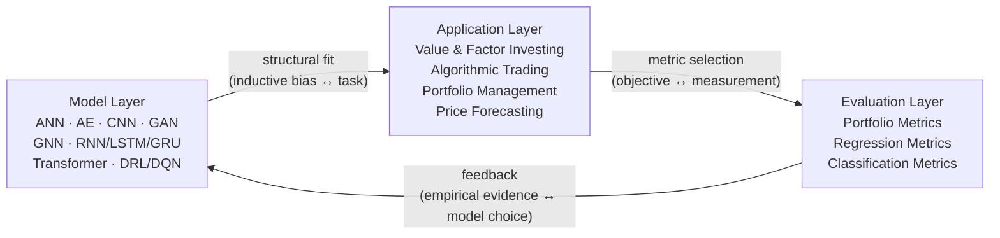

# Deep Learning in Financial Asset Management: Models, Applications, and Performance Evaluation (2018–2023)
# 1 Introduction and Research Framework

The intersection of deep learning (DL) and financial asset management has, over the past half-decade, evolved from a speculative research frontier into one of the most active and methodologically diverse domains within computational finance. Between 2018 and 2023, the field witnessed an exponential growth in published work, a rapid diversification of model architectures, and an expansion of application scope that now spans every major stage of the investment process — from raw-signal extraction to end-to-end portfolio construction. Yet despite this proliferation, the literature remains fragmented along methodological, disciplinary, and asset-class lines, making it difficult for researchers and practitioners to obtain a coherent map of which deep learning architectures are genuinely effective for which financial tasks, under what assumptions, and at what cost. This report responds to that gap by offering a structured, critical, and evidence-driven synthesis of deep learning applications in financial asset management during the 2018–2023 period.

This opening chapter establishes the conceptual foundation, scope, and analytical scaffolding of the review. It articulates the motivation for the inquiry, formalizes the research questions that guide the synthesis, delineates the temporal and thematic boundaries within which evidence is admitted, and introduces the unified tri-dimensional framework — **models, applications, and performance evaluation** — through which subsequent chapters will operate. The objective is not to enumerate every published paper, but to construct an interpretive lens that exposes the structural logic linking specific deep learning architectures to specific financial problems, and that allows for principled comparisons across the four application domains of value/factor investing, algorithmic trading, portfolio management, and price forecasting.

## 1.1 Research Motivation and Background

Financial asset management has historically been one of the most quantitatively sophisticated branches of applied economics, yet its methodological toolkit was, until recently, dominated by a relatively narrow set of techniques: linear factor models in the Markowitz–Sharpe–Fama–French tradition, autoregressive and moving-average time-series models (ARMA, ARIMA, GARCH and their variants), and rule-based or threshold-driven trading systems calibrated through statistical inference. These approaches share three structural features that have grown increasingly problematic as financial data have expanded in volume, dimensionality, and heterogeneity. First, they are typically **linear or piecewise-linear** in their treatment of the relationship between predictors and target variables, which constrains their ability to capture the nonlinear, regime-dependent, and interaction-heavy dynamics widely observed in modern markets. Second, they rely on **strong distributional assumptions** — normality, stationarity, weak dependence — that are routinely violated by financial returns, particularly during stress episodes and structural breaks. Third, they are designed around **hand-engineered features**: the analyst must decide ex ante which variables enter the model, in what functional form, and with what lag structure, which severely limits scalability when the universe of potentially informative signals grows into the thousands.

Deep learning offers a complementary set of capabilities that directly address these structural limitations. As a family of techniques built on multi-layered, differentiable function approximators trained by gradient descent, deep neural networks are **universal nonlinear approximators** capable of learning hierarchical representations directly from raw or minimally preprocessed data. This shifts the burden of feature engineering from the human analyst to the optimization procedure, enabling the discovery of latent patterns that would be infeasible to specify analytically. Several specific capabilities are particularly relevant to financial asset management:

- **Nonlinear pattern recognition**: feed-forward and convolutional architectures can model complex, interaction-rich mappings between input signals and target variables without parametric assumptions about functional form.
- **Temporal dependency modeling**: recurrent architectures (RNN, LSTM, GRU) and attention-based models (Transformers) are explicitly designed to capture long-range and multi-scale temporal structure, which is intrinsic to financial time series.
- **High-dimensional and heterogeneous data integration**: deep architectures can ingest mixed-frequency, mixed-modality inputs — prices, fundamentals, text, images, order-book snapshots, network relationships — within a single end-to-end pipeline.
- **Representation learning**: autoencoders and self-supervised methods can compress noisy financial signals into low-dimensional latent factors that may be more stable and informative than handcrafted variables.
- **Sequential decision-making under uncertainty**: deep reinforcement learning (DRL) reframes trading and allocation as a Markov decision process, allowing the joint optimization of forecasting and decision-making under transaction costs, market impact, and path-dependent objectives.
- **Generative modeling of distributions**: generative adversarial networks (GANs) and related architectures can synthesize plausible market scenarios for stress testing and data augmentation in low-sample regimes.

The convergence of three exogenous forces accelerated the adoption of these techniques between 2018 and 2023. The first is the **alternative data revolution**: textual disclosures, news feeds, social media sentiment, satellite imagery, supply-chain graphs, and high-frequency limit-order-book records have become routinely available, generating data volumes and modalities that are intractable for classical econometric pipelines but well-suited to deep architectures. The second is **computational accessibility**: the maturation of GPU/TPU hardware, open-source frameworks (PyTorch, TensorFlow, JAX), pre-trained models, and cloud-based training infrastructure has dramatically lowered the entry barrier for both academic and industry researchers. The third is **architectural innovation in the wider machine-learning community**, particularly the introduction of attention mechanisms and Transformer-based models (2017 onward), the rapid evolution of DRL algorithms, and the development of graph neural networks — all of which were quickly imported into financial research within the review window.

These developments do not imply that deep learning is uniformly superior to classical methods. Financial data are notoriously **low signal-to-noise**, non-stationary, and subject to adversarial dynamics; sample sizes are small relative to the dimensionality of the problem; and the cost of overfitting is asymmetric, because spurious patterns translate directly into capital losses. Critical methodological challenges — overfitting, data leakage, look-ahead bias, and the well-documented gap between statistical accuracy and economic profitability — are therefore central, not peripheral, to any serious assessment of the field. These tensions, between the representational power of deep learning and the epistemic hardness of financial prediction, motivate the critical posture adopted throughout this report.

## 1.2 Scope and Boundaries of the Review

To ensure analytical focus and evidentiary rigor, the review adopts a tightly defined scope along four dimensions: temporal window, thematic coverage, asset-class and market context, and methodological inclusion criteria.

**Temporal window.** The review concentrates on research published between **2018 and 2023**, a period that captures the maturation of deep learning in finance after the initial wave of LSTM-based forecasting studies (circa 2015–2017) and that ends before the most recent wave of large-language-model–driven research. Pre-2018 works are admitted only as background context for foundational architectures (e.g., the original formulations of LSTM, GAN, or DQN), not as evidence of contemporary trends. Post-2023 developments fall outside the review window and are not used as evidence, though they may be referenced briefly in the forward-looking discussion of open research directions.

**Thematic coverage.** The review is organized around **four application domains** that together encompass the dominant lines of inquiry in deep-learning-driven asset management:

1. **Value and factor investing** — the use of DL to extract fundamental signals, mine and combine factors, and select stocks based on cross-sectional predictability.
2. **Algorithmic trading** — the application of DL to short-horizon trading decisions, market-microstructure modeling, order execution, and signal generation, including the central role of deep reinforcement learning.
3. **Portfolio management** — the use of DL to determine portfolio weights, perform multi-asset allocation, and execute risk-aware dynamic rebalancing, both in end-to-end and in predict-then-optimize pipelines.
4. **Asset price forecasting** — point prediction, directional classification, multi-step forecasting, and volatility modeling of returns across equities, cryptocurrencies, and related instruments.

**Asset classes and markets.** The review considers research across the principal traded asset classes — **equities (individual stocks, indices, ETFs), cryptocurrencies, foreign exchange, futures, and selected derivatives** — and across major developed and emerging markets, including U.S., European, Chinese, and other Asian markets. Where geographic concentration of evidence biases conclusions (e.g., heavy reliance on U.S. equity samples), this is explicitly flagged.

**Methodological inclusion criteria.** The review prioritizes peer-reviewed journal articles, reputable conference proceedings (e.g., NeurIPS, ICML, ICLR, KDD, AAAI, IJCAI, ICAIF), and established surveys. Working papers and preprints are admitted selectively and only when they provide methodological detail or empirical evidence that is independently triangulated.

**Explicit exclusions.** The review deliberately excludes (i) deep learning applications in financial domains outside asset management — notably credit scoring, fraud detection, anti-money-laundering, insurance underwriting, and customer-churn modeling — except where used as a cross-reference; (ii) purely classical machine-learning methods (random forests, gradient boosting, SVMs) unless they appear as benchmarks against deep models; and (iii) high-level commercial or popular accounts of "AI in finance" that lack methodological substance. The review also acknowledges as a structural limitation that **negative results and unsuccessful applications are systematically under-represented** in the published literature due to publication bias, and conclusions about model effectiveness must therefore be interpreted with appropriate epistemic humility.

## 1.3 Core Research Questions

The review is structured around a set of interlocking research questions that collectively define what a coherent synthesis of the 2018–2023 literature should deliver. These questions guide both the evidence-gathering strategy and the analytical synthesis carried out in subsequent chapters.

**RQ1. Model–application alignment.** *Which deep learning architectures are most prevalent in each of the four application domains, and what structural features of those architectures explain their dominance?* This question requires going beyond a catalog of "what models are used" to articulate the **principled mapping** between model inductive biases (temporal recurrence, locality, attention, relational structure, sequential decision-making) and the structural properties of each financial task (cross-sectional vs. time-series, low- vs. high-frequency, prediction vs. decision).

**RQ2. Comparative performance.** *How do deep learning models perform relative to traditional benchmarks — linear factor models, ARIMA/GARCH families, classical machine learning, and mean-variance optimization — and how robust are the reported advantages?* This question demands attention not only to headline performance metrics but also to benchmark adequacy, out-of-sample robustness, and the distinction between statistically significant gains and economically material ones after transaction costs.

**RQ3. Evaluation methodology.** *Which evaluation metrics are most informative for financial applications, and what are the limitations of relying on any single metric?* This question motivates the construction in Chapter 8 of three structured tables covering portfolio-performance, regression-forecasting, and classification-forecasting metrics, and frames the broader discussion of how metric choice should align with the underlying research objective.

**RQ4. Recurring challenges.** *What are the persistent methodological, data-related, and deployment challenges that limit the generalization of deep learning models in asset management, and what research directions are emerging to address them?* This question encompasses overfitting, data leakage, look-ahead bias, non-stationarity, interpretability, reproducibility, regulatory considerations, and the gap between predictive accuracy and investable strategies — issues that the critical synthesis in Chapters 7 and 9 will examine in depth.

These four questions are not investigated in isolation. Rather, each subsequent chapter contributes evidence toward several of them simultaneously, and the cross-domain synthesis in Chapter 7 and the conclusion in Chapter 10 explicitly revisit each question with the cumulative evidence of the report.

## 1.4 Analytical Framework and Report Structure

The synthesis adopts a **tri-dimensional analytical framework** that treats the literature as a structured mapping between three layers: the **model layer** (architectures and their inductive biases), the **application layer** (the financial tasks to which models are applied, with their associated data and decision structures), and the **evaluation layer** (the metrics and protocols used to assess performance). Every reviewed study can be located at the intersection of these three layers, and the central analytical contribution of the report is to expose the patterns, asymmetries, and gaps in how these layers connect.

The conceptual relationship among the three layers can be summarized as follows:

The arrows in this framework are bidirectional in spirit: the structural properties of a task constrain which models are appropriate, the objective of a study constrains which metrics are informative, and empirical evaluation feeds back into the choice of model architecture in future work. The report navigates this network systematically rather than ad hoc.

The chapters that follow operationalize this framework in the following sequence:

| Chapter | Layer Emphasis | Core Contribution |
|---|---|---|
| 2. Taxonomy and Core Principles of DL Models | Model | Architectural foundations, learning mechanisms, representational strengths, and computational/interpretability trade-offs across the eight model families. |
| 3. Value and Factor Investing | Application × Model | Stock selection, factor mining, alpha generation; emphasis on ANN, AE, and hybrid architectures applied to fundamental and alternative data. |
| 4. Algorithmic Trading | Application × Model | Trade execution, market making, and signal generation; central role of DRL (DQN, Double DQN, Dueling DQN), CNN, RNN, and Transformer-based architectures on order-book and tick data. |
| 5. Portfolio Management | Application × Model | Weight determination, allocation, and rebalancing; comparison of end-to-end DL approaches against predict-then-optimize pipelines using DRL, LSTM/GRU, GAN, and GNN. |
| 6. Asset Price Forecasting | Application × Model | Point, directional, and multi-step forecasting using LSTM, GRU, CNN-LSTM hybrids, Transformers (including Informer), and GAN-based generators across equities, cryptocurrencies, and other instruments. |
| 7. Cross-Domain Synthesis | Cross-cutting | Comparative patterns in model selection, data usage, hybridization, and methodological pitfalls across the four domains. |
| 8. Performance Evaluation Metrics | Evaluation | Three consolidated tables (portfolio, regression, classification) with formula descriptions, financial/statistical interpretation, and metric-selection guidance. |
| 9. Challenges and Open Directions | Cross-cutting | Critical assessment of non-stationarity, interpretability, reproducibility, regulation, and the predictive-accuracy / investable-strategy gap; forward-looking agenda. |
| 10. Conclusions and Strategic Implications | Synthesis | Consolidated answers to the four research questions, practical implications for researchers and practitioners, and a structured agenda for future work. |

Several **transversal principles** govern the writing throughout the report and should be made explicit at the outset. First, the report maintains **balanced coverage** across all eight model families (ANN, AE, CNN, GAN, GNN, RNN/LSTM/GRU, Transformer, DRL/DQN) and all four application domains, with explicit attention to under-studied combinations. Second, the report consistently distinguishes **statistical accuracy** (low RMSE, high directional accuracy) from **economic significance** (positive risk-adjusted returns after costs); these are not interchangeable, and conflating them is one of the most common interpretive errors in the literature. Third, the report adopts a **critical rather than purely descriptive posture**: each application chapter asks not only "what models are used" but also "how well they work, under what assumptions, and with what limitations." Fourth, terminology is held **consistent across chapters** — for instance, Conditional Value at Risk (CVaR) and Expected Shortfall are treated as synonymous and the former label is used throughout — to support cumulative reading.

With this framework in place, the report proceeds in Chapter 2 to the model layer, providing the architectural and methodological vocabulary needed to interpret the application-level evidence presented in Chapters 3 through 6.

> **Note on evidentiary basis.** This introductory chapter functions primarily as a conceptual and structural scaffold for the review and is therefore framed at a higher level of abstraction than the chapters that follow. The factual, empirical, and bibliographic evidence supporting the claims sketched here — about model prevalence, application-domain trends, and evaluation practices — is developed in detail, with explicit source citations, in Chapters 2 through 9.

Chapter 1 established a tri-dimensional analytical framework in which the model layer, application layer, and evaluation layer interact through structural fit, metric selection, and empirical feedback. To make that framework operational, the present chapter develops the **model layer** in detail, providing the architectural and methodological vocabulary required to interpret the application-level evidence in Chapters 3–6. The eight model families surveyed below — ANN, AE, CNN, GAN, GNN, RNN with LSTM/GRU variants, Transformer, and DRL/DQN — represent the architectures that recurrently appear in the 2018–2023 financial asset management literature. For each family, the analysis emphasizes four elements: (i) the **mathematical foundation** that defines what the model computes; (ii) the **inductive bias** that determines which patterns it can efficiently extract; (iii) the **structural fit** between this bias and the properties of financial tasks (cross-sectional vs. temporal, low- vs. high-frequency, prediction vs. decision); and (iv) the **practical trade-offs** of computational cost, data requirements, and interpretability that shape deployment choices.

Because this chapter is methodological in character, its evidentiary core lies in the architectural and algorithmic principles of each model family — concepts that are well established in the broader machine-learning literature and are treated here as foundational knowledge. Specific empirical claims about the prevalence of each model in financial applications, and about the magnitude of reported performance gains, are deferred to Chapters 3–6, where they are substantiated with primary source evidence.

## 2.1 Artificial Neural Networks: Universal Approximation and Feature Learning

The artificial neural network (ANN), understood here in its canonical form as a **fully connected feedforward multilayer perceptron (MLP)**, is the foundational architecture from which every other deep learning family inherits structural elements. An MLP composes a sequence of affine transformations interleaved with elementwise nonlinearities. For an input vector $\mathbf{x} \in \mathbb{R}^{d_0}$, the $\ell$-th hidden layer computes

$$\mathbf{h}^{(\ell)} = \sigma\!\left(\mathbf{W}^{(\ell)} \mathbf{h}^{(\ell-1)} + \mathbf{b}^{(\ell)}\right),$$

where $\mathbf{W}^{(\ell)}$ and $\mathbf{b}^{(\ell)}$ are learnable parameters, $\sigma(\cdot)$ is a nonlinear activation (ReLU, ELU, tanh, or sigmoid being the dominant choices in financial work), and $\mathbf{h}^{(0)} = \mathbf{x}$. The output layer either produces a regression target (linear activation), a probability over classes (softmax), or a directional signal (sigmoid). Parameters are estimated by minimizing a task-specific loss via backpropagation and a variant of stochastic gradient descent (SGD, Adam, RMSProp).

The theoretical justification for this architecture rests on the **universal approximation theorem**: a feedforward network with a single hidden layer of sufficient width, and a non-polynomial activation, can approximate any continuous function on a compact domain to arbitrary accuracy. In practice, however, **depth** is preferred over **width**, because deeper networks can represent compositional functions exponentially more efficiently. This depth–width trade-off motivates the design of multi-layer architectures in finance, where the target function — for example, the cross-sectional mapping from firm characteristics to expected returns — is plausibly hierarchical, involving interactions of features at multiple levels of abstraction.

The **inductive bias** of an MLP is comparatively weak: aside from smoothness implied by gradient-based optimization and regularization, the model imposes no a priori structure on inputs. This makes it well suited to **cross-sectional prediction tasks** in which observations are exchangeable along a given dimension (e.g., stocks at a given date), and in which the analyst already possesses a fixed-length feature vector — typically a vector of firm characteristics, accounting ratios, factor exposures, or technical indicators. Representative use cases in 2018–2023 include nonlinear stock-return prediction from cross-sectional characteristics, nonlinear factor combination in alpha models, and as a benchmark or component head within larger hybrid architectures.

The principal limitations of ANNs in finance are threefold. First, the **low signal-to-noise ratio** of financial data, combined with the high effective dimensionality of feature spaces, exposes MLPs to severe overfitting; regularization through dropout, weight decay, and ensembling is therefore standard rather than optional. Second, MLPs **ignore temporal and relational structure**: when applied to time series or graph-structured data, they discard precisely the inductive bias that distinguishes RNNs, CNNs, or GNNs. Third, while feature attributions (e.g., integrated gradients, SHAP) provide some post-hoc interpretability, MLPs remain functionally opaque relative to linear factor models, a tension that is consequential in regulated investment contexts.

## 2.2 Autoencoders: Representation Learning and Dimensionality Reduction

Autoencoders (AEs) are unsupervised neural architectures designed to learn a compressed latent representation of their inputs. An autoencoder couples an **encoder** $f_\theta: \mathbb{R}^d \to \mathbb{R}^k$ that maps inputs to a latent code $\mathbf{z}$, with a **decoder** $g_\phi: \mathbb{R}^k \to \mathbb{R}^d$ that reconstructs the input from this code. Parameters are trained to minimize a reconstruction loss, typically mean squared error:

$$\mathcal{L}_{\text{AE}}(\theta, \phi) = \mathbb{E}_{\mathbf{x}}\!\left[\,\|\mathbf{x} - g_\phi(f_\theta(\mathbf{x}))\|_2^2\,\right].$$

When $k \ll d$, the network is forced to capture the principal axes of variation in the data, generalizing principal component analysis (PCA) to nonlinear manifolds. Several variants extend this basic scheme. **Denoising autoencoders** are trained to reconstruct $\mathbf{x}$ from a corrupted input $\tilde{\mathbf{x}} = \mathbf{x} + \boldsymbol{\epsilon}$, which improves robustness to the noise that pervades financial signals. **Sparse autoencoders** add an L1 penalty on the latent code to encourage interpretable, parts-based representations. **Variational autoencoders (VAEs)** reframe encoding as approximate Bayesian inference, with the encoder producing parameters of a posterior $q_\theta(\mathbf{z}|\mathbf{x})$ over a continuous latent space, and optimization minimizing the evidence lower bound

$$\mathcal{L}_{\text{VAE}} = -\mathbb{E}_{q_\theta(\mathbf{z}|\mathbf{x})}\!\left[\log p_\phi(\mathbf{x}|\mathbf{z})\right] + \mathrm{KL}\!\left(q_\theta(\mathbf{z}|\mathbf{x}) \,\|\, p(\mathbf{z})\right),$$

with a Gaussian prior $p(\mathbf{z})$ enabling generative sampling.

The inductive bias of autoencoders is that **meaningful variation in the data lies on a lower-dimensional manifold**, a hypothesis that is structurally aligned with the long tradition of factor models in finance, where a small number of latent factors are assumed to drive the cross-section of returns. This alignment explains the prominence of AEs in 2018–2023 work on **latent factor extraction** from large panels of firm characteristics, **anomaly detection** in transactions or market data (where high reconstruction error flags outliers), and **noise filtering** for fundamental and alternative datasets prior to downstream forecasting.

Autoencoders offer two distinctive advantages in financial contexts. First, the latent space is **trainable end-to-end with downstream tasks**, allowing the discovered representation to be tuned for predictive utility rather than purely for reconstruction. Second, the architecture provides a natural mechanism for **interpretability via reconstruction**: the decoder can map latent factor perturbations back into the original feature space, giving an economic interpretation to learned factors. The trade-off is that reconstruction fidelity is not equivalent to predictive informativeness — a latent representation that minimizes MSE may still discard the precise high-frequency residuals that contain alpha. Practitioners therefore frequently combine AE pretraining with task-specific fine-tuning.

## 2.3 Convolutional Neural Networks: Locality and Hierarchical Pattern Extraction

Convolutional neural networks (CNNs) were originally developed for image recognition, where the relevant inductive biases — **locality**, **translation equivariance**, and **hierarchical compositionality** — match the structure of natural images. The core operation is the convolution of an input tensor with a small filter (kernel) that is shared across all spatial positions:

$$y_{i,j} = \sum_{m,n} K_{m,n} \, x_{i+m,\,j+n} + b,$$

followed by a nonlinear activation and, typically, a pooling operation that aggregates local responses to introduce approximate translation invariance and reduce spatial resolution. Stacking convolutional layers produces a hierarchy in which early layers capture local primitives and deeper layers compose them into more abstract patterns.

Three properties make CNNs computationally and statistically efficient: **parameter sharing** (the same kernel applies everywhere), **sparse connectivity** (each output depends on a local neighborhood), and **shift-invariant feature detection**. These properties are not specific to images; they generalize to any signal in which informative patterns are **local** and may **recur** at different positions.

This generalization underpins the financial applications of CNNs in 2018–2023. Three dominant patterns of use have emerged. First, **chart-pattern recognition and visual price-image encoding**: candlestick or OHLC charts are rendered as images and processed by 2D CNNs trained to classify directional outcomes, effectively automating the visual heuristics of technical analysis. Second, **limit-order-book (LOB) encoding**, in which the LOB is represented as a multi-channel tensor (price levels × time × side) and processed by 1D or 2D CNNs to extract microstructural features for short-horizon prediction or execution. Third, **multi-channel time-series representation**, in which 1D convolutions along the time axis capture local temporal motifs (momentum, reversal, breakout) across multiple correlated series simultaneously, often as a feature-extraction front end to an RNN or attention layer in hybrid architectures (e.g., CNN-LSTM).

The computational profile of CNNs is favorable: parameter sharing keeps model size modest even for large input tensors, and the locality of operations is amenable to GPU parallelization. The main interpretive challenge is that the learned filters operate on abstract feature maps, so attributing model decisions to specific market events typically requires post-hoc saliency or occlusion methods. The principal structural caveat is that CNNs encode **stationary** locality assumptions: they assume that the same local pattern carries the same meaning regardless of position, which may not hold across financial regimes or across the depth of the LOB.

## 2.4 Generative Adversarial Networks: Synthetic Data and Distribution Modeling

Generative adversarial networks (GANs) reframe density estimation as a **two-player minimax game** between a **generator** $G_\theta$ that maps noise vectors $\mathbf{z} \sim p(\mathbf{z})$ to synthetic samples $G_\theta(\mathbf{z})$, and a **discriminator** $D_\phi$ that attempts to distinguish synthetic from real samples. The canonical objective is

$$\min_{\theta} \max_{\phi} \; \mathbb{E}_{\mathbf{x} \sim p_{\text{data}}}[\log D_\phi(\mathbf{x})] + \mathbb{E}_{\mathbf{z} \sim p(\mathbf{z})}[\log(1 - D_\phi(G_\theta(\mathbf{z})))].$$

At equilibrium, the generator's induced distribution matches that of the data. Two refinements are particularly relevant in finance. **Conditional GANs (cGANs)** condition both generator and discriminator on auxiliary information $\mathbf{c}$ (e.g., a market regime or a macroeconomic state), enabling targeted scenario generation. **Wasserstein GANs (WGANs)**, especially with gradient penalty, replace the Jensen–Shannon objective with the Earth Mover's distance, which provides more stable gradients and reduces mode collapse — a critical concern when synthesizing heavy-tailed, multimodal return distributions.

The inductive bias of GANs is to **match the unknown data distribution implicitly**, without requiring an explicit likelihood. This is structurally attractive in finance, where return distributions exhibit heavy tails, asymmetry, volatility clustering, and regime-dependent dependence structures that are difficult to specify parametrically. Representative applications in 2018–2023 cluster around four use cases: (i) **synthetic market scenario generation** for stress testing and Monte Carlo evaluation of trading strategies, particularly valuable when historical data is sparse for the regime of interest; (ii) **data augmentation** in low-sample regimes, including the cold-start problem for new assets or strategies; (iii) **volatility surface and option-pricing modeling**, where GANs learn arbitrage-free surfaces from market quotes; and (iv) **anomaly and adversarial sample generation** for robustness testing.

The principal practical difficulties are well known. **Training instability**, including oscillation and non-convergence of the minimax game, requires careful architectural and optimization choices. **Mode collapse** — in which the generator produces a narrow subset of plausible samples — is especially damaging in finance, because the missed modes are often precisely the tail scenarios that risk management most cares about. **Evaluation** is also unusually difficult: there is no natural single-metric counterpart to image-quality scores, and assessment typically requires comparing distributional moments, tail behavior, autocorrelation, and the performance of downstream tasks trained on synthetic data. As a consequence, GANs are usually deployed in finance as a generative complement to other models rather than as standalone predictors.

## 2.5 Graph Neural Networks: Relational Structure and Network Dependencies

Graph neural networks (GNNs) generalize neural computation from grid- or sequence-structured inputs to data defined on arbitrary graphs $\mathcal{G} = (\mathcal{V}, \mathcal{E})$, where nodes carry feature vectors $\mathbf{h}_v$ and edges encode pairwise relations. The unifying computational pattern is **message passing**: at each layer, every node aggregates information from its neighbors and updates its own representation,

$$\mathbf{h}_v^{(\ell+1)} = \mathrm{UPDATE}\!\left( \mathbf{h}_v^{(\ell)}, \; \mathrm{AGG}\!\left( \{ \mathbf{h}_u^{(\ell)} : u \in \mathcal{N}(v) \} \right) \right),$$

where AGG is a permutation-invariant function (sum, mean, max) and UPDATE is a learnable nonlinear transformation. Specific architectures instantiate this pattern in different ways. **Graph Convolutional Networks (GCNs)** use a normalized adjacency-based aggregation derived from a first-order approximation of spectral graph convolutions. **Graph Attention Networks (GATs)** replace fixed aggregation weights with learned attention coefficients, allowing the model to weight neighbors by relevance. More expressive **message-passing neural networks (MPNNs)** parameterize the message function itself, accommodating edge features and heterogeneous relations.

The inductive bias of GNNs — that **observations are coupled by an explicit relational structure** — is unique among the eight model families and is what makes GNNs irreplaceable for certain financial problems. Financial markets are rich in such structures: equities are linked by industry classification, supply-chain relationships, ownership networks, news co-mention, and dynamic correlation graphs; sovereign and corporate credit instruments are linked by cross-border exposures; and portfolio constituents are linked by both static (sector) and dynamic (rolling correlation) relations. Representative 2018–2023 applications include: (i) **stock-return prediction** that propagates information across firms connected by supply-chain or co-mention graphs; (ii) **sector co-movement and systemic risk** modeling using dynamic correlation graphs; (iii) **portfolio construction** in which GNNs encode covariance structure for downstream allocation; and (iv) **knowledge-graph reasoning** over entities and relations extracted from financial disclosures and news.

Two architectural caveats deserve emphasis. First, the quality of GNN outputs is bounded by the **quality of the graph itself**: graphs constructed from noisy similarity measures may inject spurious dependencies, and graphs that are too dense can cause **over-smoothing**, in which node representations converge across the network as depth increases. Second, financial graphs are **time-varying** — edges appear, disappear, and reweight — so static GNNs must be extended with temporal mechanisms (temporal GNNs, spatiotemporal GCNs) to capture dynamic structure, often by composition with RNN or attention components.

## 2.6 Recurrent Neural Networks and Gated Variants: Temporal Dependency Modeling

Recurrent neural networks (RNNs) process sequences $(\mathbf{x}_1, \mathbf{x}_2, \ldots, \mathbf{x}_T)$ by maintaining a hidden state $\mathbf{h}_t$ that is updated recursively,

$$\mathbf{h}_t = \sigma(\mathbf{W}_x \mathbf{x}_t + \mathbf{W}_h \mathbf{h}_{t-1} + \mathbf{b}).$$

In principle, this hidden state can encode arbitrary historical context; in practice, training vanilla RNNs by backpropagation through time suffers from **vanishing and exploding gradients**, which prevent the learning of dependencies that span more than a handful of time steps. This is a serious obstacle in financial applications, where economically meaningful temporal dependencies — earnings cycles, multi-week momentum, regime persistence — operate over horizons far longer than vanilla RNNs can effectively model.

The **Long Short-Term Memory (LSTM)** network resolves this difficulty through a gated memory cell. An LSTM maintains both a hidden state $\mathbf{h}_t$ and a cell state $\mathbf{c}_t$, modulated by input, forget, and output gates:

$$\begin{aligned}
\mathbf{i}_t &= \sigma(\mathbf{W}_i [\mathbf{h}_{t-1}, \mathbf{x}_t] + \mathbf{b}_i), \\
\mathbf{f}_t &= \sigma(\mathbf{W}_f [\mathbf{h}_{t-1}, \mathbf{x}_t] + \mathbf{b}_f), \\
\mathbf{o}_t &= \sigma(\mathbf{W}_o [\mathbf{h}_{t-1}, \mathbf{x}_t] + \mathbf{b}_o), \\
\tilde{\mathbf{c}}_t &= \tanh(\mathbf{W}_c [\mathbf{h}_{t-1}, \mathbf{x}_t] + \mathbf{b}_c), \\
\mathbf{c}_t &= \mathbf{f}_t \odot \mathbf{c}_{t-1} + \mathbf{i}_t \odot \tilde{\mathbf{c}}_t, \\
\mathbf{h}_t &= \mathbf{o}_t \odot \tanh(\mathbf{c}_t).
\end{aligned}$$

The forget gate $\mathbf{f}_t$ controls how much of the past cell state is retained, the input gate $\mathbf{i}_t$ controls how much new information is written, and the output gate $\mathbf{o}_t$ controls how much of the cell state is exposed as the hidden state. The additive structure of the cell-state update preserves gradient magnitudes across many time steps, enabling the learning of long-range dependencies. The **Gated Recurrent Unit (GRU)** is a simplified variant that merges the cell and hidden states and uses only two gates (reset and update), trading some expressive capacity for reduced parameters and faster training — a practically attractive trade-off in finance where data are limited.

The inductive bias of LSTM/GRU — that **the present depends on a learnable summary of the past** — aligns naturally with the autoregressive structure of asset prices, returns, and volatility. Representative 2018–2023 applications are dense and span: (i) **return and price forecasting** at horizons from minutes to months; (ii) **volatility prediction**, often benchmarked against GARCH-family models; (iii) **sentiment time-series modeling** from news and social media; and (iv) the **temporal back end** in hybrid architectures such as CNN-LSTM (CNN for local feature extraction, LSTM for temporal aggregation). LSTMs/GRUs are widely regarded as the default starting point for financial time-series modeling.

Two structural limitations have grown more salient as the field has matured. First, **sequential computation** along the time axis precludes the parallelism that has made Transformer training so scalable; this constrains the use of LSTMs on very long sequences or very large datasets. Second, despite gating, LSTMs still struggle with **very long horizons** and with selectively attending to specific past events — exactly the strengths of attention-based architectures, to which the field has begun to migrate.

## 2.7 Transformer Architectures: Attention Mechanisms and Long-Range Dependencies

The Transformer architecture replaces recurrence with **self-attention**, a mechanism that computes interactions between every pair of positions in a sequence directly. Each position $i$ produces a query $\mathbf{q}_i$, a key $\mathbf{k}_i$, and a value $\mathbf{v}_i$ by linear projection of its input. The attention output at position $i$ is a weighted average of values,

$$\mathrm{Attention}(\mathbf{Q}, \mathbf{K}, \mathbf{V}) = \mathrm{softmax}\!\left( \frac{\mathbf{Q}\mathbf{K}^\top}{\sqrt{d_k}} \right) \mathbf{V},$$

where weights are determined by query–key similarity. **Multi-head attention** runs several such computations in parallel with distinct projections, allowing the model to attend to different relational patterns simultaneously. Because attention is order-agnostic, **positional encodings** (sinusoidal or learned) are added to inputs to inject sequence information. A Transformer block stacks multi-head attention with a position-wise feedforward network and residual connections.

The inductive bias of self-attention is **content-based selection of relevant context**, with **constant path length** between any two positions. This produces three properties of immediate interest in finance. First, **long-range dependencies** are accessible without the gradient pathologies that constrain RNNs. Second, computation is **highly parallelizable**, supporting larger datasets and longer training. Third, attention weights provide a **partial interpretability signal**, indicating which historical observations or which related assets a prediction depends on — although attention weights are not formal causal explanations and must be interpreted with care.

For financial time series, the vanilla Transformer suffers from **quadratic time and memory complexity** $\mathcal{O}(T^2)$ in sequence length, which is prohibitive for high-frequency data spanning thousands of ticks. A wave of **efficient time-series Transformer variants** developed in 2018–2023 addresses this constraint. **Informer** introduces a ProbSparse self-attention that exploits the sparsity of dominant queries and a generative-style decoder for long-horizon multi-step prediction. **Autoformer** decomposes series into trend and seasonal components and replaces dot-product attention with an Auto-Correlation mechanism that operates on series-level lags. **Temporal Fusion Transformer (TFT)** combines static covariate encoding, gated recurrent processing of local signals, and interpretable multi-head attention for multi-horizon forecasting with heterogeneous inputs. Representative financial applications include multi-horizon equity and cryptocurrency price prediction, cross-asset dependency modeling, integration of mixed-frequency macroeconomic and price data, and joint modeling of price and text streams.

The principal trade-offs are computational and statistical. Even efficient variants require **substantial training data** to realize their advantages over LSTMs, which can be a binding constraint in finance. **Hyperparameter sensitivity** (number of heads, depth, positional encoding scheme, normalization) is higher than for simpler architectures. And while attention enhances interpretability relative to RNNs, the depth and breadth of attention patterns in a trained model still demand careful post-hoc analysis.

## 2.8 Deep Reinforcement Learning and Deep Q-Networks: Sequential Decision Optimization

Deep reinforcement learning (DRL) is conceptually distinct from the preceding architectures: it is a **learning paradigm for sequential decision-making** rather than a particular model family, and it composes naturally with any of the foregoing architectures (MLP, CNN, RNN, Transformer) used as function approximators within a value or policy network. A DRL problem is formalized as a **Markov decision process (MDP)** with state space $\mathcal{S}$, action space $\mathcal{A}$, transition kernel $P(s'|s,a)$, reward function $r(s,a)$, and discount factor $\gamma \in [0,1)$. The objective is to learn a policy $\pi: \mathcal{S} \to \mathcal{A}$ maximizing expected discounted return $\mathbb{E}_\pi[\sum_{t=0}^\infty \gamma^t r_t]$.

In finance, this MDP framing is natural. The **state** can encode prices, indicators, positions, and inventory; the **action** can be a discrete decision (buy/sell/hold), a portfolio weight vector, or an execution schedule; the **reward** can be realized P&L, risk-adjusted return, or implementation-shortfall reduction. Crucially, DRL **endogenizes** the joint optimization of forecasting and decision-making under transaction costs, market impact, and path-dependent constraints — a structural advantage that predict-then-optimize pipelines cannot match.

Two algorithmic families dominate the financial literature in the review window. **Value-based methods** estimate the action-value function $Q^*(s,a) = \max_\pi \mathbb{E}_\pi[\sum_t \gamma^t r_t | s_0=s, a_0=a]$ using a neural network. The **Deep Q-Network (DQN)** minimizes the temporal-difference loss

$$\mathcal{L}(\theta) = \mathbb{E}_{(s,a,r,s')}\!\left[ \left( r + \gamma \max_{a'} Q_{\theta^-}(s', a') - Q_\theta(s,a) \right)^2 \right],$$

stabilized through an experience replay buffer and a target network with parameters $\theta^-$ updated periodically. **Double DQN** addresses the maximization bias of DQN by decoupling action selection from action evaluation. **Dueling DQN** decomposes $Q$ into a state-value $V(s)$ and an advantage $A(s,a)$, improving learning when many actions are similarly valued — a situation pervasive in financial state spaces. **Policy-gradient and actor-critic methods** directly parameterize the policy $\pi_\theta(a|s)$ and update it by gradient ascent on expected return. The most widely deployed variants in finance include **Advantage Actor-Critic (A2C/A3C)**, **Proximal Policy Optimization (PPO)** — favored for its robust empirical performance and tractable hyperparameter regime — and **Deep Deterministic Policy Gradient (DDPG)** along with its successors (TD3, SAC) for continuous action spaces, which arise naturally in continuous portfolio-weight allocation.

The financial applications of DRL concentrate in three areas: **trade execution**, where the agent decomposes a parent order over time to minimize implementation shortfall; **portfolio rebalancing**, where the agent allocates capital across assets under a transaction-cost-aware reward; and **market making**, where the agent posts bid/ask quotes to manage inventory and capture spread.

DRL is, however, the model family with the most demanding **practical caveats**. **Sample efficiency** is poor: DRL algorithms typically require millions of environment interactions, while financial history offers a fixed and limited sample. **Reward shaping** is delicate — a naively chosen reward (e.g., raw P&L) can produce policies that are profitable in-sample but accept unacceptable tail risk; risk-sensitive rewards (Sharpe, differential Sharpe, CVaR-constrained returns) are common but harder to optimize. **Simulation-to-reality transfer** is a fundamental concern: agents trained against historical replay or simulated order books may exploit microstructural artifacts that do not survive deployment, and any agent that materially trades will itself influence the market it learned from, violating the stationarity assumption of the MDP. These concerns make DRL in finance simultaneously the most ambitious and the most methodologically fragile of the model families.

## 2.9 Comparative Analysis: Architectural Trade-offs and Selection Principles

Having examined each architecture in isolation, this section synthesizes the eight families into a comparative framework that supports principled model selection. The framework evaluates each architecture along five dimensions: **structural inductive bias** (the type of pattern it can extract efficiently), **representational capacity**, **data efficiency**, **computational cost**, and **interpretability**. Table 2.1 summarizes the comparison.

| Model | Inductive Bias | Best-Fit Financial Task Type | Representative Data Modality | Data Efficiency | Computational Cost | Interpretability |
|---|---|---|---|---|---|---|
| **ANN (MLP)** | Generic nonlinear function approximation | Cross-sectional prediction (stock selection, factor combination) | Tabular features (characteristics, ratios) | Moderate–Low (overfit-prone) | Low | Low (post-hoc attribution) |
| **AE** | Low-dimensional manifold structure | Latent factor extraction, anomaly detection, denoising | High-dimensional panels, alternative data | Moderate (unsupervised pretraining) | Low–Moderate | Moderate (latent inspection, reconstruction) |
| **CNN** | Locality, translation equivariance, hierarchy | Chart-pattern recognition, LOB encoding, local temporal motifs | Image-like tensors, multi-channel time series, LOB snapshots | Moderate (parameter sharing) | Moderate | Low–Moderate (saliency maps) |
| **GAN** | Implicit distribution matching | Scenario generation, augmentation, stress testing | Returns, volatility surfaces, microstructure data | Low (requires large samples; unstable) | High | Low |
| **GNN** | Relational / non-Euclidean structure | Stock prediction with relational data, sector co-movement, systemic risk | Asset graphs, supply chain, knowledge graphs | Moderate (depends on graph quality) | Moderate–High | Moderate (attention weights, edge importance) |
| **RNN / LSTM / GRU** | Sequential temporal dependence | Univariate/multivariate time-series forecasting, volatility, sentiment series | Sequential prices, returns, indicators | Moderate | Moderate (sequential; not parallel) | Low |
| **Transformer** | Content-based long-range attention | Long-horizon multi-step forecasting, multi-modal integration, cross-asset dependency | Long sequences, mixed-modality (price + text + macro) | Low–Moderate (data-hungry) | High (quadratic in length; efficient variants mitigate) | Moderate (attention weights, with caveats) |
| **DRL / DQN** | Sequential decision under uncertainty (MDP) | Trade execution, dynamic rebalancing, market making | Sequential states with actions and rewards | Very Low (sample-inefficient) | High (training requires extensive simulation) | Low (policy opacity) |

Several **selection principles** emerge from this comparison and inform the application-domain chapters that follow.

First, **the structural properties of the task should determine the architecture**, not the other way around. Cross-sectional prediction problems with fixed-length feature vectors favor MLPs and AE-based representations; time-series problems favor LSTM/GRU at moderate horizons and Transformers at long horizons or with heterogeneous data; problems with explicit relational structure favor GNNs; problems involving sequential decisions under transaction costs and market impact favor DRL; and problems involving distribution modeling or data augmentation favor GANs. This task-driven mapping is the through-line that organizes the evidence in Chapters 3–6.

Second, **hybridization is the rule, not the exception**, in 2018–2023 financial deep learning. CNN-LSTM architectures combine local feature extraction with temporal aggregation; AE pretraining feeds into MLP or LSTM heads for downstream prediction; GNNs are composed with RNNs or Transformers to capture spatiotemporal dynamics; and DRL agents use any of the foregoing architectures as their function-approximation backbone. The choice is rarely "which single architecture" but rather "which composition of inductive biases."

Third, **frequency and horizon shape the trade-off space**. Low-frequency, monthly cross-sectional return prediction operates in a low-data regime where MLPs and AEs with strong regularization tend to dominate. Daily-to-weekly time-series forecasting is the natural home of LSTM/GRU and small Transformers. High-frequency tick and LOB problems are where CNNs and DRL find their strongest empirical footing, both because data are abundant and because microstructural patterns are local and sequential.

Fourth, **interpretability constraints push architecture choice**. In regulated portfolio management or institutional settings where strategy decisions must be auditable, AE-based latent factors with reconstruction-based interpretation, GNNs with edge-importance scores, and Transformers with attention attribution are often preferred over more opaque alternatives, all else equal.

Fifth, and most consequentially, **the gap between architectural sophistication and economic value is a persistent theme**. None of these architectures escapes the fundamental difficulty of financial prediction — low signal-to-noise, non-stationarity, adversarial dynamics — and the choice of model is, in practice, less important than the discipline of cross-validation, transaction-cost-aware backtesting, and out-of-sample robustness checks. This thread is taken up critically in each of the application chapters and consolidated in Chapter 7.

With this taxonomy in place, the report turns in Chapter 3 to the **first of the four application domains**, examining how the architectures introduced here — particularly ANN, AE, and their hybrid combinations — have been deployed in value and factor investing between 2018 and 2023.

# 3 Deep Learning Applications in Value and Factor Investing

Value and factor investing occupies a distinctive position within the deep learning literature on asset management. Unlike high-frequency algorithmic trading or short-horizon price forecasting, factor investing operates on a **cross-sectional, low-frequency** decision structure: at each rebalancing date (typically monthly or quarterly), the investor estimates expected returns for a universe of assets and constructs long–short or long-only portfolios from the resulting ranking. This task structure imposes specific demands on deep learning — relatively small sample sizes along the time dimension, high cross-sectional dimensionality, low signal-to-noise ratios, and the requirement that any reported alpha survive comparison against decades of well-established benchmarks. The 2018–2023 literature responded to these demands by concentrating on a comparatively narrow set of architectures (predominantly MLPs and autoencoders, often in hybrid configurations), by drawing on an expanding palette of fundamental and alternative data, and by adopting increasingly disciplined validation protocols designed to separate genuine economic value from data-mined noise.

This chapter develops the application-layer analysis for value and factor investing along six interlocking axes: task formulation, dominant architectures, data inputs, evaluation, methodological trends and limitations, and the boundary between learning-driven and theory-driven approaches. Following the report's tri-dimensional framework, the analysis emphasizes the **structural fit** between architectural inductive biases (Chapter 2) and the cross-sectional task structure characteristic of factor investing, and it explicitly addresses RQ1 (model–application alignment) and RQ2 (comparative performance) for this domain.

## 3.1 Research Objectives and Task Formulations

Research in deep-learning-driven value and factor investing between 2018 and 2023 organizes itself around four task formulations that, while frequently overlapping in practice, differ meaningfully in their prediction targets, decision granularities, and relationships to classical factor theory. Distinguishing them is analytically useful because it clarifies why different architectures and data inputs are appropriate for different objectives.

**Cross-sectional stock selection and ranking.** The most prevalent formulation casts factor investing as a supervised learning problem in which the target is the next-period return (or excess return) of each stock, and the model is trained on a panel of firm-level features. The decision output is typically not the predicted return itself but the **cross-sectional ranking** it induces, from which decile or quintile long–short portfolios are constructed. The evaluation horizon is monthly in the majority of studies, with quarterly and weekly variants also represented. Because the loss function is naturally pointwise (MSE on returns or cross-entropy on directional labels), researchers in this period increasingly experimented with **ranking-aware losses** that align training with the downstream portfolio construction step.

**Factor mining and automated factor discovery.** A second strand treats deep learning as a mechanism for **discovering new factors** rather than merely combining existing ones. The output of these models is a set of latent factor exposures or factor returns, which are then evaluated for their incremental pricing power over established benchmarks. This formulation is closely tied to the asset-pricing literature: the model is asked not only to predict returns but to deliver economically meaningful factors that span the stochastic discount factor.

**Alpha generation through nonlinear factor combination.** A third formulation accepts as given a library of known signals (value, momentum, quality, low-volatility, accruals, and the broader "factor zoo") and uses deep learning to **combine them nonlinearly**. Here the value-add of deep learning is not in discovering new signals but in capturing interactions, regime-dependence, and conditional relevance that linear factor combinations cannot represent. The decision granularity remains cross-sectional ranking, but the target is typically the alpha residual after stripping out exposures to standard factors.

**Fundamental signal extraction from raw disclosures.** A fourth, more representation-oriented formulation uses deep learning to extract signals directly from **raw or semi-structured fundamental data**: financial statement line items, MD&A text, conference-call transcripts, and footnote disclosures. Architecturally these studies often combine an autoencoder or sequence model with a downstream prediction head, and the task can be framed either as direct return prediction or as the construction of a feature that is then used as an input to a classical factor model.

These four formulations sit on a spectrum from **purely predictive** (stock selection) to **structural** (factor mining and asset-pricing-consistent estimation). The choice among them determines, in turn, which architectures and validation protocols are appropriate, as the remaining sections develop.

## 3.2 Dominant Model Architectures and Hybrid Designs

The architectures most frequently deployed in value and factor investing during 2018–2023 cluster tightly around three families: **multilayer perceptrons (MLPs)** for nonlinear cross-sectional prediction, **autoencoders (AEs)** for latent factor extraction and representation learning, and **hybrid pipelines** that combine AE-based pretraining with downstream MLP, LSTM, or attention-based heads. This concentration is not accidental; it reflects the structural fit between these architectures' inductive biases and the demands of the factor-investing task.

**MLPs as nonlinear factor combiners.** The MLP is the workhorse of cross-sectional return prediction in this period. Its appeal is structural: at each rebalancing date, the investor possesses a fixed-length vector of firm characteristics for each stock, and the prediction target is a scalar return. This is precisely the data structure for which the MLP's weak inductive bias — generic nonlinear function approximation over $\mathbb{R}^d$ — is appropriate. Where linear models impose additive separability across characteristics, MLPs can capture interactions such as the documented dependence of momentum on volatility, of value on profitability, or of accrual signals on operating-cycle regimes. Reported gains over linear benchmarks tend to be **modest in headline R² but more substantial in the tails of the predicted-return distribution**, where the long–short portfolios actually take positions. Regularization through dropout, weight decay, early stopping, and ensemble averaging across random seeds is essentially universal in this literature, reflecting hard-won recognition that MLPs trained on monthly cross-sections are perilously close to the overfitting boundary.

**Autoencoders for latent factor extraction.** AEs in this domain typically perform one of two roles. In **unsupervised mode**, they compress a high-dimensional vector of firm characteristics into a low-dimensional latent code that is then used either as an input to a downstream predictor or as a set of "deep characteristics" for portfolio sorting. The denoising variant is particularly attractive given the noise pervasive in accounting data. In **supervised or conditional mode**, AEs are embedded within explicit asset-pricing structures: the encoder produces conditional factor loadings as a function of firm characteristics, while a parallel branch estimates latent factor realizations, and the two are combined to reconstruct returns under a no-arbitrage constraint. This **conditional autoencoder** design, prominent in the late-2010s asset-pricing literature, exemplifies the convergence of deep representation learning with classical factor-model theory and is discussed further in Section 3.6.

**Hybrid pipelines.** The dominant design pattern across the period is hybridization. AE pretraining followed by MLP fine-tuning is the canonical pipeline for cross-sectional prediction with high-dimensional characteristics. For studies that incorporate firm-level time series (e.g., quarterly fundamentals over multiple years), the typical configuration replaces the MLP head with an LSTM or GRU to process the temporal axis, with the AE handling cross-sectional compression. More recent work has begun to introduce **attention mechanisms** to allow the model to weight different characteristics or different historical periods as a function of the current state, although in the cross-sectional factor context attention has remained a secondary rather than dominant component.

**Architectures that play a peripheral or emerging role.** CNNs, GNNs, and Transformers are present in the value and factor literature but have not displaced MLPs and AEs as the default choices. CNNs appear sporadically when raw price images or chart patterns are used as auxiliary inputs, but they are not natural fits for tabular fundamental data. GNNs have an emerging niche in incorporating **relational structure** — supply-chain links, common ownership, industry classification, news co-mention — into cross-sectional prediction, propagating information across economically connected firms. Transformers have begun to appear in studies that integrate textual disclosures with numerical fundamentals, with attention used to align text-derived signals with the firm-level feature vector. These architectures are likely to grow in importance, but the 2018–2023 evidence places them clearly in a supporting rather than central role for this application domain.

## 3.3 Data Inputs: Fundamental, Market, and Alternative Sources

The data feeding deep-learning-based factor models in 2018–2023 fall into three broad categories, with the relative weight of each shifting over the period.

**Traditional firm characteristics and accounting data.** The backbone of the literature remains the panel of firm-level characteristics familiar from the classical factor zoo: valuation ratios (B/M, E/P, CF/P, sales-to-price), profitability metrics (ROE, ROA, gross profitability), investment and growth measures (asset growth, accruals, investment-to-assets), quality indicators (leverage, earnings stability, accrual quality), momentum and reversal signals at multiple horizons, and liquidity and risk proxies (turnover, idiosyncratic volatility, beta). The dimensionality of these feature sets ranges from a few dozen characteristics in parsimonious studies to several hundred in studies that exploit the full factor zoo. Deep models are trained on cross-sectional panels in which each observation is a (firm, month) pair and the feature vector aggregates all available characteristics as of the prior point-in-time data release.

**Financial statement line items and structured disclosures.** A more granular strand uses raw financial statement items rather than derived ratios, allowing the network to learn its own combinations from the underlying accounting variables. The appeal is that classical ratios embed strong human priors about which combinations matter; allowing the network to learn from primitives may surface signals that the ratio-based approach has averaged away. The cost is a substantial increase in dimensionality and a corresponding tightening of the overfitting constraint.

**Alternative data.** The 2018–2023 window saw a marked expansion in the use of alternative data within deep-learning-based factor research. Textual sources include earnings call transcripts, MD&A sections of 10-K filings, news articles, analyst reports, and social media; ESG indicators, drawn from rating agencies or extracted directly from disclosures, are increasingly incorporated as both signals and constraints. Supply-chain relationships extracted from corporate disclosures, satellite imagery for retail footfall or shipping activity, credit-card transaction aggregates, and web-scraped consumer signals appear with growing frequency. The architectural implication is that **multi-modal integration** becomes important: text streams are typically encoded by transformer- or LSTM-based language models, image streams by CNNs, and graph-structured relationships by GNNs, with the resulting embeddings concatenated with the fundamental feature vector for downstream prediction.

**Preprocessing conventions.** Several preprocessing practices recur with sufficient regularity that they constitute de facto standards in this literature. **Winsorization** at the 1st and 99th cross-sectional percentiles (or similar) addresses the heavy-tailed nature of accounting ratios. **Cross-sectional standardization or rank transformation** at each date stabilizes the feature distribution over time and reduces sensitivity to outliers and units. **Missing-data imputation** is typically handled by cross-sectional median imputation or by treating missingness as an informative feature; both approaches are present. **Point-in-time discipline** — ensuring that only data available at the decision date enters the feature vector, with explicit lags for financial statement reporting — is the single most consequential preprocessing concern, because violations produce look-ahead bias that can completely overturn reported results. The literature increasingly acknowledges this concern explicitly, although enforcement remains uneven.

## 3.4 Evaluation Metrics and Validation Protocols

The evaluation framework for deep-learning-based factor research must serve two distinct purposes: assessing **statistical predictability** (does the model produce informative forecasts?) and assessing **economic value** (does the implied strategy generate investable alpha?). The 2018–2023 literature is uneven in how seriously it takes the second of these, but the better-disciplined studies report both.

**Statistical metrics.** Out-of-sample R² is the standard measure of predictive accuracy, computed on the pooled panel of (firm, month) observations. Because the level of R² in monthly stock-return prediction is intrinsically small (typically below 1% even for skilled models), studies often report it on a per-stock or per-period basis as well to characterize stability. The **Information Coefficient (IC)**, defined as the cross-sectional Pearson correlation between predicted and realized returns at each date, and its rank variant (**Rank IC** or **Spearman IC**), are the most widely used cross-sectional metrics; they align more closely with the ranking-based portfolio construction step than R² does. Directional accuracy and the Diebold–Mariano test for comparing forecast accuracy against benchmarks (see Chapter 8) are also reported.

**Economic metrics.** The standard economic evaluation constructs **decile or quintile long–short portfolios** from the model's predicted-return ranking and reports the time-series of realized returns. From this time series, the literature derives the Sharpe ratio, information ratio (alpha-to-tracking-error against a chosen benchmark), maximum drawdown, and turnover. The single most important assessment is **alpha against established factor benchmarks** — typically the Fama–French three- or five-factor model augmented with momentum (Carhart) and, in many cases, the Q-factor or Stambaugh–Yuan models. The key question is whether the deep-learning strategy generates residual alpha after these classical exposures, and whether that alpha survives realistic transaction-cost assumptions. Turnover is a critical input here: nonlinear models often produce more turbulent predictions than linear ones, and a strategy with attractive gross Sharpe may collapse once realistic costs are applied.

**Validation protocols.** Validation discipline in this literature has improved markedly over the review window but remains uneven. The minimum standard is a **rolling-window or expanding-window backtest** that retrains the model periodically and evaluates only on data strictly after the training window. **Purged and embargoed cross-validation**, in which observations near the boundary between training and test periods are dropped to prevent information leakage through overlapping holding periods, is increasingly recognized as essential and is the gold standard for cross-validation in this setting. **Decile-portfolio sorts** are the canonical reporting device; the relevant test is monotonicity of returns across deciles and the magnitude of the top-minus-bottom spread. **Factor-mimicking portfolios** constructed from model outputs allow a more formal test of incremental pricing power.

**The persistent gap between statistical and economic significance.** A recurring observation in this literature, which Chapter 7 develops further as a cross-domain theme, is that strong reported R² or IC frequently fail to translate into investable alpha after costs. Several mechanisms drive this gap: the strongest signals are often concentrated in small, illiquid stocks where transaction costs are prohibitive; turnover-induced costs can absorb the entire raw alpha of high-frequency rebalancing; and reported alphas often shrink substantially when evaluated against the most recent factor benchmarks that themselves incorporate many of the signals the deep model has rediscovered. The consolidated metric tables in Chapter 8 catalog the full inventory of measures used, and the discussion there reinforces the need to evaluate strategies on a portfolio of complementary metrics rather than any single number.

## 3.5 Methodological Trends and Common Limitations

Several methodological trends crystallized over the 2018–2023 window and are now established components of the field.

**End-to-end asset-pricing networks.** A defining development is the emergence of architectures that integrate factor discovery, loading estimation, and return prediction within a single differentiable pipeline. Conditional autoencoder factor models, in which firm characteristics generate conditional loadings on latent factors that are themselves learned from the cross-section, exemplify this trend. These architectures formalize the integration of deep learning with the no-arbitrage tradition and have substantially raised the methodological standard of the field.

**Ensembling and aggressive regularization.** Reflecting the unforgiving low-signal regime, the literature has converged on ensemble averaging across random initializations, training epochs, and hyperparameter configurations as a near-mandatory technique. Bayesian and dropout-as-Bayesian-inference variants provide uncertainty quantification that informs position-sizing in the portfolio construction step. Regularization that explicitly targets cross-sectional stability — for instance, penalizing the variance of predictions across nearby dates — has appeared as a domain-specific innovation.

**Gradual integration of alternative data.** While the bulk of work continues to rely on standard characteristics, a growing fraction of studies demonstrates that textual, ESG, and network-structured inputs can add incremental information to a deep factor model. The integration is typically additive rather than transformative: alternative data improves a strong baseline rather than replacing it.

Against these advances, several **limitations** persist and motivate the critical agenda developed in Chapters 7 and 9.

**Overfitting and data-snooping in the factor zoo.** With several hundred candidate characteristics and only a few decades of monthly data, the effective sample size per parameter is small, and the risk that reported gains reflect data-snooping rather than genuine predictability is acute. The replication crisis in classical factor research has its deep-learning counterpart, and the literature has not yet developed satisfying protocols for adjusting reported significance for the implicit multiple hypothesis testing that nonlinear factor combination entails.

**Look-ahead bias in fundamental data alignment.** Reconciling reporting lags, restatements, and point-in-time databases is unglamorous but consequential. Studies that align fundamentals using "as-of" snapshots from contemporary databases can inadvertently use information that was not available to investors at the decision date, producing inflated performance.

**Fragility to transaction costs.** Reported alphas frequently shrink — sometimes to insignificance — when realistic costs are applied. This is not a deficiency of deep learning per se but is amplified by the higher turnover that nonlinear, regime-adaptive models tend to produce.

**Geographic concentration.** The empirical base of the literature remains heavily concentrated in U.S. equities, with growing but still secondary coverage of Chinese A-shares, European markets, and emerging markets. Generalizations from U.S. evidence to other markets should be treated as conjectural.

**Limited interpretability.** Nonlinear factor combinations are difficult to interpret economically. Post-hoc attribution methods (SHAP, integrated gradients, permutation importance) provide partial relief but do not produce the kind of structural interpretation that classical factor models offer. In institutional contexts where the strategy must be explained to investors or regulators, this constrains adoption.

## 3.6 The Boundary Between Learning-Driven and Theory-Driven Factor Investing

The deepest analytical question raised by this domain is whether deep learning **extends, complements, or partially supplants** the classical theory-driven tradition of factor investing rooted in arbitrage pricing theory (APT) and the Fama–French–Carhart–Hou-Xue-Zhang lineage. The 2018–2023 evidence supports a nuanced answer: the two paradigms occupy distinct but overlapping epistemic positions, and the most productive research lies at their intersection rather than at either pole.

**The classical paradigm.** Theory-driven factor investing posits that expected returns are linear functions of exposures to a small number of economically motivated **risk premia**. Factors are justified by economic theory (consumption risk, investment frictions, behavioral biases), and the empirical exercise is the disciplined estimation of factor exposures and premia. The epistemic virtue of this paradigm is that it offers structural explanations: a stock's expected return is high *because* it loads on a particular risk factor with a particular economic interpretation. Its limitation is that the linear, low-dimensional functional form may miss substantial conditional and nonlinear variation in expected returns.

**The learning-driven paradigm.** Deep-learning-based factor research, in its purest form, abandons the requirement that factors be economically pre-specified. Latent factors are **discovered from the data**, defined operationally by their ability to price the cross-section, and need not admit a clean economic interpretation. The epistemic virtue is flexibility: any pattern that helps predict returns is admissible, and the model is free to capture interactions and regime-dependence that classical models cannot. The limitation is that data-discovered factors may reflect noise, sample-specific anomalies, or short-lived inefficiencies that do not survive out-of-sample testing.

**Hybrid approaches and economic constraints.** The most methodologically interesting work in the review window does not choose between these paradigms but **constrains neural architectures with economic priors**. Several design patterns recur: imposing no-arbitrage conditions through the loss function or architectural form (the conditional autoencoder being the canonical example); restricting the network to combine pre-specified economically motivated characteristics rather than discovering factors from primitives; using economic theory to define the input space (e.g., only value, profitability, investment, momentum, and quality characteristics) while letting the network learn the combination; and explicitly orthogonalizing model outputs against established factor benchmarks before assessing residual alpha.

**Conditions for comparative advantage.** Several conditions can be identified under which each paradigm retains comparative advantage. The **classical paradigm** retains advantage when interpretability is paramount (institutional reporting, regulatory contexts), when sample sizes are small relative to the candidate factor universe, and when the economic question concerns the *source* of returns rather than their *prediction*. The **learning-driven paradigm** retains advantage when the feature space is high-dimensional and heterogeneous (raw fundamentals, text, alternative data), when interactions and regime-dependence are important, and when the objective is operational prediction rather than structural understanding. **Hybrid approaches** dominate in the practically important middle ground where both interpretability and flexibility are needed.

The boundary between the two paradigms is therefore not a battleground but an emerging synthesis. Deep learning has not displaced classical factor models in the period under review; it has expanded the methodological menu, raised the empirical bar, and forced the classical tradition to confront its functional-form assumptions more explicitly. The cross-domain synthesis in Chapter 7 returns to this theme by comparing how analogous tensions between learning-driven and theory-driven approaches play out across the other three application domains, while Chapter 9 develops the open research directions — particularly causal deep learning and structured priors — that may further refine this boundary going forward.

With the model–application alignment for value and factor investing now established, Chapter 4 turns to **algorithmic trading**, where the decision structure shifts from cross-sectional ranking at low frequency to sequential decision-making at high frequency, and where the dominant architectures shift accordingly toward DRL, CNN, RNN, and Transformer-based designs.

# 4 Deep Learning Applications in Algorithmic Trading

Chapter 3 examined value and factor investing as a domain in which deep learning is asked to extract weak cross-sectional signals from high-dimensional fundamental data, with monthly or quarterly decisions evaluated against decades of established benchmarks. Algorithmic trading inverts almost every structural feature of that setting. Decisions are made at horizons ranging from milliseconds to hours; the relevant information lives in the limit-order book, tick-by-tick trades, and high-frequency derived features rather than in accounting statements; and the central problem is rarely "what is the next-period return?" but rather "what is the optimal action in the current market state, accounting for inventory, transaction costs, market impact, and path-dependent objectives?" This shift in decision structure has profound consequences for which deep learning architectures dominate the literature. Where Chapter 3 found MLPs and autoencoders at the center of the methodological landscape, the 2018–2023 algorithmic-trading literature is organized around **deep reinforcement learning (DRL)** — DQN and its variants for discrete-action problems, actor-critic and policy-gradient methods for continuous-action problems — together with **CNN, RNN, and Transformer-based** function approximators that serve either as standalone supervised predictors or as feature-extraction backbones within DRL agents.

The chapter is structured around six axes: task formulations and their decision-theoretic structure (4.1); the dominant architectures and their structural rationales (4.2); the data modalities and preprocessing conventions that feed these models (4.3); reward design and environment simulation, which are the methodological hallmarks of DRL-based work and have no direct analog in the supervised paradigm of the previous chapter (4.4); evaluation metrics and the unusually demanding backtesting requirements of high-frequency settings (4.5); and a synthesis of methodological trends, limitations, and domain-specific challenges (4.6). The analysis advances RQ1 (model–application alignment) by articulating why DRL and sequence-aware supervised models are structurally aligned with the trading task, and RQ2 (comparative performance) by carefully distinguishing the statistical accuracy of microstructure prediction from the economic profitability of trading strategies that operate under realistic frictions.

## 4.1 Research Objectives and Task Formulations

Deep-learning research in algorithmic trading during 2018–2023 organizes itself around four task formulations that differ in decision granularity, time horizon, action space, and the relative weight of prediction versus decision-making. Distinguishing these formulations is analytically essential because each induces a different mapping from task structure to architecture, and conflating them is one of the more common sources of confusion in the secondary literature.

**Directional signal generation.** The most accessible formulation casts trading as a **discrete classification problem**: given a window of recent price, volume, and indicator information, predict whether the next-period price will move up, down, or remain flat, and translate this prediction into a buy/sell/hold action through a deterministic mapping (e.g., go long on "up", flat on "neutral", short on "down"). Time horizons range from minute-level intraday signals to daily decisions, with the bulk of the published literature concentrating on intraday-to-daily frequencies that balance signal availability against data demands. This formulation is **supervised** in essence: the loss function is cross-entropy or, when multiple thresholds are imposed, ordinal classification loss. Architecturally it is the natural home of CNNs (when input is structured as a price image or LOB tensor), LSTMs and GRUs (when input is a sequence of indicator vectors), and increasingly Transformers (for long-context multi-channel inputs). Its principal limitation is that the supervised target — directional accuracy — is only loosely related to economic profitability: a model can exhibit high directional accuracy while being unprofitable if it is wrong precisely on the high-magnitude moves, and conversely it can be modestly accurate yet highly profitable if its correct predictions concentrate in high-edge regimes.

**Optimal trade execution.** A structurally distinct formulation addresses the problem of executing a **parent order** of known sign and size over a defined time window. The decision variables are the size and timing of child orders, and the objective is to minimize **implementation shortfall** — the difference between the realized average execution price and the arrival price — while controlling exposure to short-term price drift and limiting market impact. The classical benchmarks are the Almgren–Chriss model and its risk-neutral derivatives such as TWAP and VWAP. Execution is inherently sequential, path-dependent, and constrained by inventory accounting (the parent order must be fully filled by the horizon), which makes it a paradigmatic **MDP**: the state encodes remaining inventory, time remaining, current LOB shape, and recent flow; the action is the size of the next child order (or the choice between marketable and passive orders); the reward is the negative of implementation shortfall, typically with a quadratic penalty on intermediate inventory or a risk-aversion term. DRL methods — most prominently DQN variants for discrete order-size grids and DDPG/PPO/SAC for continuous order-size and price-offset decisions — are the dominant architectural choice.

**Market making.** Market making generalizes execution to **two-sided quoting**. The agent simultaneously posts a bid and an ask, with the joint objective of capturing the spread on roundtrip trades while managing the inventory that accumulates from asymmetric fills. The state encodes current inventory, recent order-flow imbalance, volatility, and LOB shape; the action is the pair of quote offsets from the mid-price (and, in some formulations, quote sizes); the reward typically combines realized P&L from filled trades with an **inventory penalty** that punishes the agent for accumulating directional exposure. The classical theoretical baseline is Avellaneda–Stoikov, but DRL has emerged as a flexible mechanism for relaxing the strong distributional assumptions of that framework. Market making is the most demanding of the four formulations because it requires the agent to model both adverse selection (informed counterparties picking off stale quotes) and inventory dynamics over horizons in which prices may drift significantly.

**Microstructure-driven short-horizon prediction.** A fourth formulation focuses on **predicting microstructure quantities themselves** — mid-price moves over the next few seconds, order-flow imbalance, the direction of the next trade, or the probability of an upward versus downward mid-price change — without necessarily committing to a trading action. This is a supervised task, but one whose inputs and outputs are deeply microstructural. CNNs operating on LOB tensors and attention-based sequence models have been the dominant architectures. Such models are sometimes used as standalone signals and sometimes as **observation-augmenting features** within a downstream DRL execution or market-making agent.

These four formulations sit on a spectrum from **purely predictive** (signal generation, microstructure forecasting) to **purely decision-theoretic** (execution, market making). The first pair admits supervised learning with classical loss functions; the second pair requires the MDP machinery of DRL, where reward design and environment simulation become first-order methodological concerns. The architectural taxonomy in the next section is best read with this prediction-versus-decision distinction in mind.

## 4.2 Dominant Model Architectures: DRL, CNN, RNN, and Transformer Designs

The architectural landscape of deep-learning-based algorithmic trading in 2018–2023 is organized by the structural fit between model inductive biases and the high-frequency, sequential character of the domain. Five architectural families dominate, and hybridization across them is the rule rather than the exception.

**Value-based DRL: DQN, Double DQN, and Dueling DQN.** Value-based DRL is the natural choice for trading problems with a **discrete action space** — buy/sell/hold signal generation framed as a control problem, or execution discretized over an order-size grid. The DQN algorithm, introduced in Chapter 2, estimates the action-value function $Q(s,a)$ with a deep neural network and stabilizes training through two innovations: an **experience replay buffer** that breaks the temporal correlation of consecutive transitions and increases sample efficiency, and a **target network** with parameters updated periodically rather than at every step, which decouples the bootstrapping target from the rapidly changing online parameters. Both innovations are essential in financial environments, where the underlying signal-to-noise ratio is low and the policy gradient signal is correspondingly fragile. **Double DQN** addresses the well-known maximization bias of vanilla DQN — the tendency of the $\max_{a'} Q(s', a')$ term to systematically overestimate true action values in noisy settings — by decoupling action selection (online network) from action evaluation (target network). This refinement matters disproportionately in finance, where overestimation can lead the agent to overconfidently take positions whose true expected value is near zero. **Dueling DQN** further decomposes the Q-function into a state-value component $V(s)$ and an advantage component $A(s,a)$, which is particularly useful in trading because many states have near-zero advantage across actions (e.g., quiet market periods where action choice barely matters) while a minority of states have sharply differentiated advantages (e.g., information-rich moments around scheduled announcements). Empirical work in the review window consistently reports that Double DQN and Dueling DQN are more stable and converge faster than vanilla DQN on trading benchmarks, although the magnitude of out-of-sample improvement varies substantially across studies and instruments.

**Policy-gradient and actor-critic methods.** When the action space is **continuous** — quote offsets in market making, child-order sizes in execution, position weights in continuous-allocation trading — value-based methods become impractical and policy-gradient approaches take over. **A2C/A3C** (synchronous and asynchronous Advantage Actor-Critic) provide a simple actor-critic baseline. **Proximal Policy Optimization (PPO)** has emerged as the most widely deployed algorithm in the algorithmic-trading literature owing to its empirical stability, tractable hyperparameter regime, and the trust-region clipping that limits destabilizing policy updates — a property of particular importance when training on financial trajectories where rare, high-magnitude events can otherwise dominate the gradient. **Deep Deterministic Policy Gradient (DDPG)** and its refinements **TD3** (Twin Delayed DDPG, which addresses overestimation in the continuous-control analog of the DQN problem) and **SAC** (Soft Actor-Critic, which incorporates entropy regularization to encourage exploration) are common when the action space is continuous and the reward landscape is sufficiently smooth. The exploration challenge is acute in financial settings, because the agent's actions are simultaneously a decision and an information-gathering device, and a too-greedy policy can lock onto suboptimal strategies without ever exploring the alternatives that would dominate out-of-sample.

**CNNs for limit-order-book encoding.** CNNs entered the algorithmic-trading literature on the strength of a structural insight: the limit-order book at any instant can be represented as a **multi-channel tensor** with axes corresponding to price levels, sides (bid and ask), and features (price, volume), and a recent window of such snapshots forms an image-like input over a time axis. The inductive biases of CNNs — locality, parameter sharing, translation equivariance — align with the observation that informative microstructure patterns (queue depletion, stacking, spoofing-like behavior) are local in the price–depth dimension and can recur at different positions. 1D and 2D convolutional architectures, sometimes augmented with inception-style multi-scale branches, are widely used both as standalone supervised predictors for mid-price direction and as feature extractors that produce a compact embedding consumed by an LSTM, Transformer, or DRL policy head.

**RNN/LSTM/GRU for sequential tick and indicator processing.** When the input is a **sequence** of price, volume, or technical-indicator observations rather than a structured LOB tensor, recurrent architectures remain the default. LSTMs and GRUs are widely used for signal generation on minute-bar or tick-bar inputs, for sentiment-stream processing, and as the temporal back end in CNN-LSTM hybrids where the CNN extracts local features and the recurrent layer integrates them over time. The structural advantage of LSTM/GRU in this setting is the modest data requirement relative to Transformers and the natural alignment between the gated cell state and the persistence patterns (momentum, mean reversion) of financial series.

**Transformer-based architectures.** Transformers entered algorithmic trading later than the other families and remain less universally adopted, but their share of the literature grew steadily across the review window. Their structural appeal is twofold: **constant path length** between any two positions in a sequence, enabling long-range dependency modeling without the gradient pathologies of RNNs; and **content-based attention**, which can selectively weight microstructure events according to their relevance to the current decision. For LOB and tick-level data, vanilla Transformer complexity is prohibitive, and the efficient variants discussed in Chapter 2 (Informer, Autoformer, and related sparse-attention designs) have been adapted to high-frequency settings. Multi-modal Transformer applications — jointly attending to price sequences and contemporaneous news or social-media streams — are an active area, but their share of demonstrably profitable deployed strategies remains modest.

**Hybrid architectures.** The prevailing design pattern across the period is **architectural composition** rather than pure single-family models. CNN-LSTM front ends for DRL agents — CNN extracting local LOB features, LSTM aggregating temporal context, and a value or policy head producing the action — are perhaps the canonical hybrid. Attention-augmented value networks, where attention layers replace or supplement recurrent layers within the DRL function approximator, are increasingly common. Some studies further introduce GNN components when the state encodes multi-asset relationships, although GNN-based algorithmic trading remains rarer than GNN-based portfolio construction (Chapter 5). The recurring lesson is that no single architecture dominates: the choice depends on whether the input is structured (LOB tensor → CNN), sequential (indicator series → RNN/Transformer), or multi-modal (price + text → Transformer with cross-attention), and on whether the task requires sequential decision-making (any backbone + DRL head) or only prediction.

Table 4.1 summarizes the dominant architectural mappings across the four task formulations.

| Task Formulation | Action Structure | Default Architectures | Auxiliary / Hybrid Components |
|---|---|---|---|
| Directional signal generation | Discrete (classification) | LSTM/GRU, CNN, Transformer (supervised) | CNN-LSTM hybrids; attention over indicators |
| Optimal trade execution | Discrete or continuous order sizes | DQN / Double DQN / Dueling DQN (discrete); PPO, DDPG, TD3, SAC (continuous) | CNN/LSTM feature extractor for LOB state |
| Market making | Continuous quote offsets and sizes | PPO, DDPG, SAC, A2C | LSTM for inventory/flow memory; CNN for LOB shape |
| Microstructure prediction | Continuous or discrete targets | CNN (LOB tensor), Transformer, LSTM | Multi-scale CNN; attention over price levels |

## 4.3 Data Inputs: Order Book, Tick, Technical, and Sentiment Sources

The data modalities that feed deep-learning models in algorithmic trading differ from those of the previous chapter not only in granularity but in **type**: rather than tabular firm characteristics, the inputs are typically structured tensors and event streams whose representational choices have direct architectural implications.

**Limit-order-book (LOB) data.** The LOB at a given instant is fully described by the prices and aggregated volumes at multiple levels on each side of the book. The canonical representation for deep models stacks the top $K$ levels (commonly $K=10$ in published work) on each side, producing a tensor of dimension (time × levels × {price, volume} × {bid, ask}). This representation is well-suited to 1D and 2D CNNs and to attention-based architectures, but presents preprocessing challenges. **Price normalization** must accommodate the wide variation in price levels across instruments; common practices include normalizing by the prevailing mid-price, by a rolling mean, or by converting prices to relative offsets from the mid. **Volume normalization** typically uses log transformation or rolling-window standardization. **Asynchronous event timing** — LOB updates occur at irregular intervals — is addressed either by sampling on a regular clock (e.g., every 100 ms) or by event-time indexing in which the time axis counts events rather than wall-clock time; the latter aligns better with information arrival but complicates the integration of multi-asset data.

**Tick-by-tick trade and quote data.** Tick data — individual trades and quote updates with their prices, volumes, and direction indicators — provide the finest available temporal resolution. They are typically aggregated into **bars** (time bars, tick bars, volume bars, or dollar bars) before being fed into recurrent or convolutional models, with the choice of bar type having non-trivial implications for model behavior: tick bars and volume bars produce more nearly stationary statistical properties than time bars by sampling according to information arrival rather than calendar time.

**Technical indicators.** A broad library of engineered indicators — moving averages of various lengths, RSI, MACD, Bollinger bands, momentum and rate-of-change measures, volatility estimators, and dozens of less standard variants — provides a compact, human-interpretable summary of recent price and volume dynamics. They are used both as direct inputs (typically as a vector at each bar fed to an LSTM or as channels in a multi-channel CNN) and as auxiliary state features in DRL formulations. The methodological tension is familiar from Chapter 3: engineered indicators embed strong human priors that may either help (by reducing dimensionality and surfacing known patterns) or hurt (by averaging away information that primitive price–volume sequences would expose to a sufficiently expressive model).

**Sentiment and alternative streams.** A growing fraction of the 2018–2023 literature augments market data with **sentiment streams** from news feeds, financial Twitter (now X), Reddit, and analyst reports, and, less frequently, with alternative data such as macroeconomic releases timestamped to their announcement instants. Architecturally, sentiment scores are usually computed by a separate language model (LSTM-based or Transformer-based, such as FinBERT and its variants) and concatenated with the market-feature vector or fused through cross-attention. The empirical evidence on sentiment integration is mixed: some studies report meaningful improvements in directional accuracy at daily and intraday horizons, while others find that sentiment signals decay rapidly and contribute little after standard price-based features are already used. The economic significance is even harder to establish: gains in directional accuracy of one or two percentage points routinely fail to survive transaction costs.

**Preprocessing and stationarization.** Beyond the modality-specific issues above, several preprocessing concerns are universal in this domain. **Stationarization** — converting price levels to returns or log-returns, differencing accumulated volumes, normalizing indicators by rolling statistics — addresses the strongly non-stationary character of raw financial series and is essential for stable training. **Alignment of multi-frequency inputs** (e.g., minute-bar prices with daily fundamentals or with hourly sentiment) requires explicit design choices: forward-filling, lag-padding, or upsampling via interpolation, each of which can introduce subtle look-ahead bias if implemented carelessly. **Causality and point-in-time discipline** are at least as important as in Chapter 3 and often more demanding: at high frequencies, look-ahead bias can be introduced not only by using future fundamental data but by using LOB snapshots taken even one timestep after the decision moment.

The most consequential representational choice is whether to feed the model **raw LOB tensors and tick streams** or **engineered microstructure features** (order-flow imbalance, queue depletion, micro-price). The former places maximal demands on the model's representation-learning capacity and benefits architectures with strong inductive biases for local pattern extraction (CNNs); the latter trades off representational flexibility against a stronger human prior and is more amenable to simpler architectures. Both approaches are well represented in the 2018–2023 literature, and there is no consensus on which dominates economically once realistic frictions are imposed.

## 4.4 Reward Design and Environment Simulation

Reward design and environment simulation are the methodological hallmarks that most clearly distinguish DRL-based algorithmic trading from the supervised paradigm of Chapter 3, and they are also the loci where the most consequential methodological choices — and pitfalls — are concentrated. A well-designed reward function is what translates the abstract objective of profitable trading into a concrete training signal; a well-designed environment is what permits the agent to learn without destroying the value of the very strategies it discovers.

**Reward formulations.** The space of reward functions used in 2018–2023 algorithmic-trading research spans a spectrum from purely return-maximizing to explicitly risk-constrained.

- **Raw P&L** rewards — the change in marked-to-market portfolio value at each step — are the simplest formulation and remain widely used. Their weakness is well documented: a raw-P&L agent maximizes expected return without explicit regard for variance, and policies that accept very high tail risk in pursuit of marginal expected-return improvement are a recurring failure mode.

- **Risk-adjusted return rewards** address this by penalizing variance or downside variance. The **differential Sharpe ratio** — an incremental, exponentially-weighted analog of the Sharpe ratio that admits a per-step decomposition compatible with the RL update — is a popular choice and is consistent with the report-wide treatment of Sharpe as a foundational evaluation metric (Chapter 8). **Sortino-style rewards** and **CVaR-constrained rewards** push the risk treatment further, focusing on downside or tail risk rather than total variance.

- **Implementation-shortfall rewards** are the canonical objective for execution agents: the reward is the negative of the gap between the realized execution price and the arrival price, sometimes with an additional penalty for residual inventory or for deviations from a benchmark schedule. This formulation aligns the training signal directly with the economic objective that practitioners care about.

- **Inventory-penalized spread-capture rewards** for market making combine realized P&L from filled trades with a quadratic penalty on inventory. The relative weight of the inventory penalty controls the trade-off between aggressive spread capture (which accumulates inventory) and risk-aversion (which keeps inventory small but realizes less spread).

- **Drawdown-aware and CVaR-constrained rewards** add explicit constraints on tail-risk metrics. These rewards are harder to optimize because they introduce non-smooth or non-Markovian elements into the value function, but they materially reduce the rate at which agents converge to policies with unacceptable tail exposure.

The general lesson, repeatedly emphasized in the literature, is that **reward shaping is not an implementation detail but a strategic design decision**. The agent will optimize whatever reward it is given, and pathologies in the reward (excessive weight on raw return, insufficient penalty on inventory or drawdown, or rewards that implicitly reward overfitting to in-sample variance) propagate directly into pathologies in the learned policy.

**Environment simulation.** Because DRL requires large numbers of agent–environment interactions, and because financial history is finite, the choice of simulation environment is fundamental.

- **Historical replay engines** play back past market data in chronological order and assume that the agent's actions do not affect the market. This assumption is reasonable for very small order sizes relative to typical volumes but fails for any agent that materially trades. Replay-based training is the dominant simulation regime in the published literature, and the resulting backtest performance must be interpreted with this assumption in mind.

- **Agent-based market simulators (ABMs)** populate the market with stylized participant agents (informed traders, noise traders, market makers) whose collective behavior produces the LOB the agent observes. ABMs can in principle model the agent's market impact endogenously but require substantial calibration to reproduce realistic microstructure statistics, and the gap between simulated and real LOB dynamics remains a serious concern.

- **Hybrid simulators** combine historical replay with explicit market-impact models that perturb prices in response to the agent's orders, capturing first-order impact without committing to a full ABM. This compromise is increasingly common in execution research.

- **Adversarial and stress-tested training environments** intentionally inject regime shifts, volatility spikes, or adversarial counterparties during training to harden the learned policy against out-of-distribution conditions. This practice is emerging rather than standard but is consistent with the broader move toward robust RL.

**The simulation-to-reality gap.** Three forms of gap between simulated and deployed performance recur in the literature and warrant explicit discussion. First, **market-impact feedback**: a policy trained against passive replay will overestimate its ability to execute at quoted prices, because in deployment its own orders will move the book against it. Second, **stationarity violation**: any agent that materially trades will alter the very flow patterns it learned from, violating the MDP's stationarity assumption and degrading policy quality over time. Third, **microstructure-artifact overfitting**: agents trained on a specific exchange's order-book reactivity, latency distribution, queue priority rules, or tick-size regime may exploit idiosyncrasies that do not generalize across venues or over time as market structure evolves. These three concerns are central rather than peripheral, and any claim of DRL-driven trading success that does not address them should be treated cautiously.

## 4.5 Evaluation Metrics and Backtesting Protocols

Performance evaluation in algorithmic trading must serve a dual purpose: assessing the **statistical quality of the predictive signal** (where directional or regression metrics apply) and assessing the **economic quality of the resulting strategy** (where portfolio and execution metrics apply). The 2018–2023 literature has steadily improved its discipline on the second of these, although significant variation in rigor persists.

**Strategy-level economic metrics.** The economic evaluation of trading strategies relies on a set of metrics that recur with sufficient regularity to constitute a default reporting package: **cumulative P&L** (or accumulated returns) as the headline indicator of profitability; the **Sharpe ratio** as the standard risk-adjusted return measure; the **Sortino ratio**, which discounts only downside variance and is increasingly preferred when the return distribution is asymmetric; **maximum drawdown (MDD)** as a measure of worst-case loss from peak to trough; the **Calmar ratio**, which normalizes annualized return by MDD and is well suited to comparing strategies with different tail behaviors; **win rate** (proportion of profitable trades); and **turnover**, which is essential for assessing the sensitivity of reported performance to transaction costs. These metrics are catalogued, with formulas and financial interpretation, in the consolidated tables of Chapter 8.

**Execution-specific metrics.** When the task is optimal trade execution rather than directional trading, the evaluation shifts to **implementation shortfall** (the difference between realized average execution price and the arrival price, sometimes decomposed into market-impact and timing-risk components), **VWAP deviation** (the difference between realized execution price and the volume-weighted average price over the execution horizon), and **slippage** (the difference between expected and realized execution price). These metrics are computed per parent order and aggregated across orders to assess execution-policy quality.

**Market-making metrics.** Market-making strategies are evaluated through **realized spread capture** (P&L from completed roundtrips), **inventory variance** (the volatility of accumulated inventory), and **fill ratios**. The trade-off between aggressive spread capture and inventory risk is the central economic tension in market making, and any market-making evaluation that reports only spread capture without inventory dynamics is incomplete.

**Microstructure-prediction metrics.** When the task is supervised microstructure prediction rather than full trading, the evaluation defaults to standard classification metrics (Accuracy, Precision, Recall, F1) for directional tasks and regression metrics (RMSE, MAE, MAPE) for continuous targets, again documented in Chapter 8. The well-known tension here is that high directional accuracy on mid-price-move classification — say, 55–60% on a balanced ternary task — does not mechanically translate into profitable trading, because the economically relevant question is whether the model is correct on the high-magnitude moves, not whether it is correct on average.

**Backtesting discipline.** Backtesting in algorithmic-trading research is markedly more demanding than in low-frequency factor investing, and the gap between idealized and realistic backtests is correspondingly larger. Several considerations are central.

- **Transaction costs and exchange fees** must be modeled at the per-trade level, with explicit assumptions about commissions, exchange fees and rebates, and the spread to be crossed for marketable orders. Strategies with high turnover are disproportionately sensitive to cost assumptions; a strategy that is profitable at 0 basis points is frequently unprofitable at 5–10 basis points round-trip.

- **Latency** between observation and order arrival must be modeled, particularly for strategies that purport to exploit short-lived microstructure signals. A backtest that assumes zero latency systematically overstates the achievable performance of any signal that decays within a comparable time horizon.

- **Queue position and partial fills** matter for market-making and limit-order strategies: assuming that limit orders fill instantly at the quoted price overstates passive-strategy profitability, because in reality the order joins a queue and may not fill at all if the book moves away. Realistic backtests model queue position explicitly or apply conservative fill-probability assumptions.

- **Market impact** must be modeled for any strategy whose nominal trading size is non-trivial relative to typical volumes; impact models range from linear functions of trade size to more sophisticated nonlinear or transient-impact formulations.

- **Out-of-sample protocols** — walk-forward training and evaluation, with strict separation between training, validation, and test periods, and with explicit hyperparameter selection on validation data rather than test data — are essential. Best-practice studies in the review window report multiple non-overlapping out-of-sample periods, including periods that span market regime shifts, to assess robustness.

The unifying observation, consistent with the report-wide principle, is that **statistical accuracy in directional or microstructure prediction does not translate mechanically into economic profitability after realistic frictions**. A 55% directional-accuracy LSTM may be unprofitable after costs, while a 52% model with a sharper edge in high-volatility regimes may be highly profitable. Single-metric evaluation is uninformative; the consolidated metric tables in Chapter 8 are designed to support the multi-metric comparison that this domain requires.

## 4.6 Methodological Trends, Limitations, and Domain-Specific Challenges

The 2018–2023 window saw several methodological trends consolidate in deep-learning-based algorithmic trading, alongside the deepening recognition of limitations that constrain the field's external validity.

**Consolidating trends.** First, **DRL has matured from proof-of-concept demonstrations toward more disciplined pipelines** that combine CNN or LSTM feature extractors with value-based (DQN family) or policy-based (PPO, SAC, DDPG, TD3) heads. The standard pipeline now includes prioritized experience replay, target-network stabilization, and walk-forward evaluation as default components. Second, **attention-based microstructure models** have grown in share, both as standalone predictors and as components within DRL agents, although their dominance over CNN-LSTM hybrids is not yet established empirically. Third, **risk-sensitive and constrained reward formulations** — differential Sharpe, Sortino, CVaR penalties, drawdown constraints — have gradually displaced raw-P&L rewards as the default, reflecting the recognition that the latter produces policies with unacceptable tail behavior. Fourth, **multi-modal state representations** that integrate price, LOB, technical, and sentiment streams have become more common, with cross-attention as the typical fusion mechanism. Fifth, **backtesting discipline has improved**, with realistic cost modeling, latency assumptions, and walk-forward protocols increasingly demanded by reviewers, although enforcement is uneven.

**Persistent limitations.** Against these advances, several structural limitations of the field remain unresolved and frame the open research agenda.

- **Sample inefficiency of DRL.** A canonical DRL training run requires millions of agent–environment interactions, but financial history is finite, and the effective number of independent samples is even smaller because of strong serial dependence and regime persistence. Replay buffers extract more learning per data point but do not solve the underlying scarcity. The implication is that DRL agents trained on financial data live closer to the overfitting boundary than DRL agents in games or robotics, and their generalization to genuinely novel regimes is correspondingly fragile.

- **Microstructure-artifact overfitting.** A high-frequency agent can learn to exploit features of the training data — specific queue-priority rules, latency distributions, tick-size regimes, or recurring intraday patterns — that do not persist out-of-sample. Because such overfitting can produce impressive in-sample performance, it is particularly insidious; only careful out-of-sample testing across regimes and venues exposes it.

- **Simulation-to-reality transfer.** The combination of market-impact feedback, stationarity violation, and venue-specific microstructure produces a persistent gap between simulated and live performance. Most published DRL trading results have not been deployed at scale, and the few documented live deployments suggest that simulated Sharpe ratios overstate live Sharpe ratios by a substantial and often unpredictable factor.

- **Non-stationarity and adversarial reactions.** Markets evolve continuously: liquidity regimes shift, new participants enter (including other algorithmic agents), and exchange rules change. Any policy trained on historical data implicitly assumes that the relevant dynamics will persist, and this assumption fails systematically. Adversarial reactions of other participants — who may detect and counter-trade a successful strategy — accelerate the decay of any deployed signal.

- **Policy opacity and regulatory friction.** DRL policies are difficult to interpret, audit, or explain to regulators, risk officers, or investors. In institutional settings where strategy decisions must be defended, this opacity is a binding constraint that limits adoption regardless of in-sample performance. Attention-based architectures partially mitigate this concern but do not eliminate it.

- **Publication bias.** The published literature systematically over-represents successful deployments and under-represents failures, both because unsuccessful strategies are not written up and because successful strategies have commercial value that disincentivizes detailed publication. The implication is that any meta-analysis of reported DRL trading performance overestimates the true expected performance of the underlying techniques.

These limitations are not arguments against deep learning in algorithmic trading; they are arguments for **methodological discipline**. The structural fit between DRL and the trading task is genuine, and the architectural innovations of the review window represent durable progress. But the gap between reported performance and live profitability is large, persistent, and asymmetric — failures cost capital, while successes are difficult to verify externally — and any responsible synthesis of the field must hold these two observations together.

The cross-domain synthesis in Chapter 7 returns to several of these themes by contrasting them with the analogous methodological pitfalls in factor investing, portfolio management, and forecasting, and Chapter 9 develops the forward-looking agenda — robust RL, sim-to-real transfer techniques imported from robotics, interpretable policy architectures, and improved benchmarking standards — that may address them over the coming research cycle. The next chapter, however, broadens the scope from the **short-horizon, single-asset or narrow-universe** focus of algorithmic trading to the **multi-asset, portfolio-level** decision structure of portfolio management, where the DRL paradigm reappears in continuous-allocation form alongside LSTM/GRU forecasters, GAN-based scenario generators, and GNN-based relational models.

# 5 Deep Learning Applications in Portfolio Management

Chapters 3 and 4 examined two domains whose decision structures sit at opposite ends of the spectrum: low-frequency cross-sectional ranking in value and factor investing, and high-frequency single-asset (or narrow-universe) sequential decision-making in algorithmic trading. Portfolio management occupies a structurally distinct middle ground. The decision object is a **vector of weights** across a possibly large universe of assets, the decision horizon spans days to months (occasionally intraday for tactical overlays), and the objective is jointly determined by expected returns, the full covariance structure across assets, transaction costs that depend on the path of rebalancing, and risk constraints that operate at the portfolio level rather than the per-asset level. These features induce architectural and methodological choices that differ from both preceding chapters. The cross-sectional ranking discipline of factor investing reappears, but is now embedded within an explicit allocation problem; the sequential decision-making machinery of DRL reappears, but is now extended to a continuous, simplex-constrained, multi-asset action space.

This chapter develops the application-layer analysis along seven axes: task formulations (5.1); the central end-to-end versus predict-then-optimize dichotomy (5.2); the four dominant model families and their hybrid combinations (5.3); data inputs and feature construction (5.4); reward design and optimization objectives (5.5); evaluation and backtesting protocols (5.6); and methodological trends, limitations, and open challenges (5.7). The analysis advances RQ1 by mapping the inductive biases of DRL, LSTM/GRU, GAN, and GNN architectures to the specific subtasks of portfolio construction, and RQ2 by critically comparing deep-learning portfolios against the established classical benchmarks — equal-weight, mean-variance, risk parity, and capitalization-weighted indices — under realistic frictions.

## 5.1 Research Objectives and Task Formulations

The 2018–2023 portfolio-management literature organizes itself around four task formulations that differ in decision granularity, time horizon, and objective function. Distinguishing them clarifies why no single architecture dominates the domain and why hybrid pipelines have become the prevailing design pattern.

**Static weight determination.** The most basic formulation treats portfolio construction as a **single-period optimization** at a given rebalancing date: given a set of forecasts (expected returns, covariances, factor exposures) and a set of constraints (long-only, leverage cap, sector limits, turnover budget), choose the weight vector $\mathbf{w} \in \Delta^N$ on the $N$-asset simplex that maximizes a specified objective. Deep learning enters this formulation primarily on the forecasting side — generating the expected-return vector or covariance matrix that feeds into a classical optimizer — although end-to-end variants that directly output weights are increasingly represented. The decision is repeated periodically (typically monthly), but each decision is treated as conditionally independent given the current state, and inter-period dynamics enter only through rolling re-estimation rather than through explicit modeling of the rebalancing path.

**Multi-asset allocation across heterogeneous classes.** A second formulation broadens the asset universe from equity-only portfolios to **mixed allocations across equities, bonds, commodities, foreign exchange, and (in the more recent literature) cryptocurrencies**. The structural challenge is that different asset classes exhibit fundamentally different return-generation processes, volatility regimes, and dependency structures with macroeconomic conditions, so the model must integrate heterogeneous features within a unified state representation. This formulation places a premium on architectures that can handle multi-modal inputs (LSTM/GRU for per-asset time series combined with macro features, or Transformer-based encoders that attend across asset classes) and on relational architectures (GNNs) that can encode cross-asset dependency explicitly.

**Dynamic rebalancing under transaction costs.** A third formulation treats portfolio management as **inherently sequential**: at each rebalancing date the agent observes the current holdings $\mathbf{w}_{t-1}$ and a new state $s_t$, and chooses the new weights $\mathbf{w}_t$ subject to a transaction-cost penalty $c(\mathbf{w}_t - \mathbf{w}_{t-1})$ that is proportional or quadratic in the turnover. The optimal policy must trade off the gain from re-aligning weights with updated forecasts against the cost of doing so, and this trade-off is path-dependent: a high-turnover policy that ignores costs can be deeply unprofitable even when its underlying forecasts are accurate. This formulation is the natural home of DRL, because the MDP framing endogenizes the joint optimization of forecasting and decision-making under frictions in a way that no predict-then-optimize pipeline can match.

**Risk-aware optimization.** A fourth formulation explicitly integrates **downside, tail, or drawdown risk** into the objective rather than relying on variance as a sufficient summary of risk. The objective may target the Sortino ratio (penalizing only downside deviation), constrain CVaR at a specified confidence level, cap maximum drawdown, or apply asymmetric utility functions that down-weight gains relative to losses. Architecturally this formulation favors GAN-based scenario generators that can synthesize plausible tail realizations for robust optimization, DRL agents with risk-sensitive reward formulations, and predict-then-optimize pipelines whose optimizer accepts CVaR or drawdown constraints.

These four formulations are not mutually exclusive — a single study may combine multi-asset allocation with dynamic rebalancing and CVaR constraints — but the relative emphasis on each determines the architectural and validation choices, as the following sections develop. Portfolio management thus sits structurally between Chapter 3 (cross-sectional ranking, low-frequency) and Chapter 4 (sequential decision-making, high-frequency), inheriting elements of both while introducing its own central methodological dichotomy: how to integrate forecasting and optimization within a single coherent pipeline.

## 5.2 End-to-End Learning versus Predict-Then-Optimize Pipelines

The defining methodological tension in deep-learning-based portfolio management is the choice between **predict-then-optimize pipelines** that decouple forecasting from allocation, and **end-to-end approaches** that map state observations directly to portfolio weights under a unified objective. The two paradigms reflect different theories of where the dominant source of error in portfolio construction lies and, correspondingly, different prescriptions for where deep learning should be deployed.

**The predict-then-optimize paradigm.** The classical pipeline produces, at each rebalancing date, an expected-return vector $\hat{\boldsymbol{\mu}}$ and a covariance matrix $\hat{\boldsymbol{\Sigma}}$ from a forecasting model, and feeds these estimates into a convex optimizer that solves a problem such as

$$\max_{\mathbf{w} \in \mathcal{W}} \; \hat{\boldsymbol{\mu}}^\top \mathbf{w} - \tfrac{\lambda}{2} \mathbf{w}^\top \hat{\boldsymbol{\Sigma}} \mathbf{w},$$

where $\mathcal{W}$ encodes constraints (simplex, leverage cap, sector or turnover limits) and $\lambda$ is a risk-aversion parameter. Deep learning enters as the producer of $\hat{\boldsymbol{\mu}}$ (via LSTM/GRU/Transformer return forecasters, possibly with GNN augmentation for cross-asset signals) and $\hat{\boldsymbol{\Sigma}}$ (via LSTM-based multivariate volatility models, autoencoder-derived factor structures, or GAN-based scenario ensembles whose sample covariance forms the estimate). Variants of the optimizer range from classical mean-variance to **Black–Litterman** (which blends DL forecasts with equilibrium priors), **risk parity** (which targets equal risk contributions across assets), and **hierarchical risk parity (HRP)** (which uses a clustering-based allocation that is more robust to covariance estimation error than direct inversion).

The structural virtues of this paradigm are **modularity** — the forecasting and optimization components can be developed, validated, and replaced independently; **interpretability** — the economic logic of the allocation step is explicit and auditable; and **constraint flexibility** — arbitrary convex constraints can be imposed at optimization time without retraining the forecaster. The well-known structural vice is the **error-amplification problem** of mean-variance optimization: small estimation errors in $\hat{\boldsymbol{\mu}}$ and $\hat{\boldsymbol{\Sigma}}$ are systematically amplified by the optimizer, which loads aggressively on assets whose expected returns appear unusually high or whose estimated covariances appear unusually low. The optimal portfolio is, in technical terms, an "error-maximizer," and a forecaster that is even modestly skilled on out-of-sample $R^2$ can produce optimized portfolios that perform poorly because the optimizer extracts the wrong information from the forecasts.

**The end-to-end paradigm.** End-to-end approaches collapse forecasting and allocation into a single differentiable pipeline. A neural network maps the state observation $s_t$ — typically a tensor encoding recent prices, indicators, and possibly cross-asset features — directly to a weight vector $\mathbf{w}_t$ on the simplex, with the softmax (or its long–short generalization) at the output layer enforcing the simplex constraint. Training optimizes a portfolio-level objective such as the realized Sharpe ratio, the differential Sharpe, the Sortino ratio, or a transaction-cost-aware cumulative log return. In the DRL formulation, this becomes a continuous-action MDP with PPO, DDPG, TD3, SAC, or A2C as the dominant algorithms (Chapter 4). In the supervised formulation, the entire pipeline is trained end-to-end by gradient descent on a differentiable portfolio objective, with the rebalancing path simulated within the forward pass.

The structural virtue of end-to-end learning is that the model is trained to optimize the **economically relevant objective directly**, sidestepping the error-amplification problem: the network learns weights that perform well on the chosen reward, regardless of whether its implicit forecasts of $\boldsymbol{\mu}$ and $\boldsymbol{\Sigma}$ are statistically accurate. The structural vices are the mirror image of the predict-then-optimize virtues: **opacity** — the mapping from state to weights is difficult to decompose into interpretable forecasting and allocation steps; **constraint inflexibility** — imposing new constraints typically requires retraining or specialized architectures; and **sample inefficiency** — the end-to-end signal is weaker than the supervised forecasting signal, so the model requires more data to converge, which is binding in finance where data are limited.

**Differentiable optimization layers as a hybrid.** A third design that gained traction over the review window embeds a **differentiable convex optimization layer** within an end-to-end network. The forecaster produces $\hat{\boldsymbol{\mu}}$ and $\hat{\boldsymbol{\Sigma}}$, a convex layer solves the constrained optimization problem and returns the optimal weights, and gradients are back-propagated through the optimizer using implicit-differentiation techniques. This hybrid preserves the **economic structure** and **constraint flexibility** of the predict-then-optimize pipeline while training the forecaster to produce inputs that yield portfolios maximizing the downstream objective, rather than inputs that minimize a forecasting loss disconnected from portfolio performance. The conceptual appeal is substantial, and the design has been adopted in a growing minority of studies, although the additional implementation complexity and the requirement that the inner optimization be convex limit its universality.

**Conditions for comparative advantage.** Each paradigm dominates under different conditions. The **predict-then-optimize pipeline** retains advantage in institutional contexts where interpretability, auditability, and explicit constraint imposition are paramount, and when the asset universe is large enough that a structured estimate of $\boldsymbol{\Sigma}$ (with shrinkage or factor structure) materially helps. The **end-to-end paradigm** retains advantage when transaction costs and turnover constraints are central to the objective, when the asset universe is moderate, and when the data permit a DRL agent to converge to a stable policy. **Differentiable optimization hybrids** dominate in the practically important middle ground where economic structure and end-to-end training are both valued. As in Chapter 3's discussion of theory-driven versus learning-driven factor models, the most productive research lies at the intersection rather than at either pole.

## 5.3 Dominant Model Architectures for Portfolio Construction

Four model families dominate the 2018–2023 portfolio-management literature, each aligned with a different subtask within the broader pipeline. Hybridization across families is the prevailing pattern, and the architectural rationale for each can be read directly off the inductive-bias taxonomy of Chapter 2.

**Deep reinforcement learning for sequential allocation.** DRL is the architectural choice when the portfolio problem is framed as dynamic rebalancing under transaction costs, and it dominates the end-to-end end of the methodological spectrum. The action space is naturally **continuous and simplex-constrained**: at each rebalancing date the agent outputs a vector $\mathbf{w}_t \in \Delta^N$ (for long-only portfolios) or $\mathbf{w}_t \in [-1, 1]^N$ with leverage and gross-exposure caps (for long–short portfolios). Continuous-action algorithms — PPO, DDPG, TD3, SAC, and A2C — are the natural fit; discrete-action DQN variants appear in studies that quantize the simplex (e.g., choosing among a finite set of pre-specified allocation buckets) or that handle a small number of assets with categorical position sizes. The function-approximation backbone is typically an LSTM/GRU or a small Transformer that processes the per-asset time-series history, sometimes augmented with a CNN for local pattern extraction or a GNN for cross-asset relational propagation. The reward function is the locus of most consequential design decisions, discussed in Section 5.5.

**LSTM/GRU for return, volatility, and covariance forecasting.** When the pipeline is predict-then-optimize, LSTM and GRU networks are the workhorse forecasters. Three roles recur. First, **per-asset return forecasting**: a recurrent model is trained on each asset's history (or on a shared backbone across assets) to produce next-period expected-return estimates that feed into $\hat{\boldsymbol{\mu}}$. Second, **volatility prediction**, often benchmarked against GARCH-family models, with the LSTM providing the diagonal of $\hat{\boldsymbol{\Sigma}}$ while a separate model (factor model, shrinkage estimator, or autoencoder) supplies the off-diagonal structure. Third, **multivariate covariance modeling**, where the LSTM directly outputs parameters of a low-dimensional factor decomposition or a Cholesky factorization of $\hat{\boldsymbol{\Sigma}}$, ensuring positive-definiteness by construction. LSTM/GRU also appear as **feature-extraction backbones** within DRL agents, providing the temporal embedding that the policy or value head operates on.

**GAN-based scenario generation.** GANs serve the portfolio-management literature primarily as **scenario generators** rather than as direct allocators. The use cases concentrate in three areas. First, **synthetic return-path generation** for Monte Carlo evaluation of strategies, particularly when the empirical sample is too short to characterize tail behavior reliably. Second, **stressed covariance and tail-scenario generation** for robust portfolio optimization, where the optimizer is solved against a worst-case-over-scenarios objective. Third, **data augmentation** for training DRL agents in low-sample regimes, where the GAN-generated trajectories increase the effective sample size during policy learning. Conditional GANs that condition on a regime label or macroeconomic state allow targeted generation of stress scenarios. The well-known training instabilities and mode-collapse risks of GANs (Chapter 2) are particularly consequential here: a generator that fails to capture the modes corresponding to crisis regimes systematically understates portfolio tail risk, which is precisely the failure that scenario-based robust optimization is meant to prevent.

**Graph neural networks for relational structure.** GNNs are uniquely suited to portfolio management among the four application domains because asset universes are intrinsically **relational**: equities are linked by sector membership, supply-chain relationships, common ownership, news co-mention, and dynamic correlation; multi-asset portfolios are linked by macroeconomic exposures and cross-asset hedging relationships. GNN architectures (GCN, GAT, MPNN; Chapter 2) propagate information across these relations, producing per-asset embeddings that incorporate information from economically connected assets. Three deployment patterns recur. First, **GNN-augmented forecasting**, in which the GNN embedding feeds a downstream LSTM/GRU return forecaster within a predict-then-optimize pipeline. Second, **GNN-based covariance modeling**, in which the learned edge weights or attention coefficients directly inform $\hat{\boldsymbol{\Sigma}}$ structure. Third, **GNN feature extraction within DRL**, where the GNN backbone produces the multi-asset state representation consumed by the policy network. The graph itself may be static (industry classification, sector membership) or dynamic (rolling correlation, time-varying co-mention), with the latter requiring temporal GNN variants or composition with RNN components.

**Hybrid architectures and the dominant design patterns.** As in Chapters 3 and 4, hybridization is the rule. The canonical predict-then-optimize pipeline composes an LSTM/GRU return forecaster (possibly with GNN augmentation) with a classical or differentiable optimizer. The canonical end-to-end pipeline composes a CNN or GNN feature extractor, an LSTM/GRU or Transformer temporal aggregator, and a continuous-action DRL policy head trained on a risk-sensitive reward. GAN-augmented training appears in both pipelines as a data-augmentation or robust-optimization device. Table 5.1 summarizes the dominant mappings.

| Subtask | Predict-Then-Optimize Choice | End-to-End / DRL Choice |
|---|---|---|
| Return forecasting | LSTM, GRU, Transformer; GNN-augmented for relational signals | Embedded in policy network (LSTM/GRU/Transformer backbone) |
| Covariance / risk modeling | LSTM-based multivariate, AE factor decomposition, GAN-based scenario covariance | Implicit in DRL value function or risk-sensitive reward |
| Allocation step | Mean-variance, Black–Litterman, risk parity, HRP, robust / CVaR-constrained | Policy network with simplex-constrained output (PPO, DDPG, TD3, SAC, A2C) |
| Scenario / stress modeling | GAN-based scenario ensembles feeding robust optimizer | GAN-augmented training trajectories for DRL |
| Cross-asset relational modeling | GNN embeddings as forecaster inputs | GNN backbone within policy / value network |

## 5.4 Data Inputs and Feature Construction

The data feeding deep-learning portfolio models span a wider range of modalities than in either of the preceding chapters, reflecting the multi-asset, multi-horizon character of the decision problem.

**Price and return series.** Historical price and return series at daily-to-monthly frequencies form the core input. Returns are preferred to prices for stationarity reasons, and log returns are standard. For multi-asset portfolios, returns are aligned to a common calendar with explicit handling of asset-specific holidays and trading-hour mismatches across geographies.

**Volatility and covariance inputs.** Realized volatility (typically computed from higher-frequency returns aggregated to the rebalancing frequency) and implied volatility (from options markets when available) provide direct risk signals. Rolling-window covariance matrices are standard, often with **shrinkage** (Ledoit–Wolf or related estimators) to stabilize estimation when the asset universe is large relative to the lookback window. Dynamic covariance models — DCC-GARCH as a classical benchmark, LSTM-based multivariate volatility as a DL counterpart — provide time-varying estimates that capture volatility clustering and regime-dependent correlation.

**Macroeconomic indicators.** Multi-asset portfolios — especially those spanning equities, bonds, commodities, and FX — depend on macroeconomic state. Standard inputs include short- and long-term interest rates, the yield curve slope and curvature, inflation measures (CPI, PCE), industrial production and other business-cycle proxies, credit spreads (investment-grade and high-yield), and currency cross-rates. These series are typically released at monthly or quarterly frequencies and must be aligned to higher-frequency price data with explicit lags reflecting the release calendar; ignoring these lags is a common source of look-ahead bias.

**Cross-asset and relational features.** GNN-based models require explicit construction of the asset graph: sector and industry classifications (GICS, ICB), supply-chain links, common ownership matrices, news co-mention graphs, or rolling correlation graphs. The choice between static and dynamic graphs is consequential, and time-varying graphs require corresponding architectural support (temporal GNNs, spatiotemporal compositions).

**Firm-level and sector-level fundamentals.** When the portfolio is equity-only and rebalanced at monthly or longer frequencies, firm-level fundamentals — valuation, profitability, quality, and momentum characteristics from Chapter 3 — feed in as cross-sectional features. Sector aggregates (sector earnings growth, sector valuation spreads) provide intermediate-granularity signals.

**Sentiment and alternative data.** Sentiment streams from news, analyst reports, and social media appear as auxiliary state inputs, typically processed through separate language models whose embeddings are concatenated with the market-feature vector. Alternative data (ESG scores, supply-chain disruptions, satellite imagery) appear with growing frequency but remain secondary to price and macro inputs.

**Preprocessing conventions.** Several preprocessing practices are domain-specific. **Return standardization** at each rebalancing date (cross-sectional or rolling-window) stabilizes the input distribution. **Covariance shrinkage** addresses the well-known instability of sample covariance when the universe is large. **Regime tagging** — appending an explicit regime indicator (high/low volatility, bull/bear, recession/expansion) derived from a separate model — provides DRL agents and forecasters with conditioning information that helps them adapt across regimes. **Multi-asset state tensor construction** must handle missing observations (asset entries and exits from the universe) and align mixed-frequency inputs (daily prices with monthly macro releases) without leakage. **Point-in-time discipline** is at least as demanding as in Chapter 3: macro releases must be aligned to their announcement timestamps, fundamentals to their as-reported (not as-revised) values, and any forward-looking field must be lagged appropriately. The methodological cost of failure is substantial, because look-ahead bias inflates both the forecaster's accuracy and the optimizer's apparent advantage.

## 5.5 Reward Design, Risk Constraints, and Optimization Objectives

The objective function that translates portfolio-management goals into a trainable signal is the locus where deep learning most directly inherits — and sometimes departs from — classical portfolio theory. The design space differs systematically between the end-to-end and predict-then-optimize paradigms.

**Reward formulations in DRL settings.** End-to-end DRL agents are trained on reward functions that span the same spectrum encountered in Chapter 4 but adapted to the portfolio context.

- **Cumulative or log returns** provide the simplest reward and remain a common baseline. The well-known weakness is that variance and tail risk are uncontrolled, and the agent will accept whatever risk profile maximizes expected return — typically a profile that is unacceptable in institutional contexts.

- **Sharpe and differential Sharpe** rewards penalize variance directly. The differential Sharpe ratio, which admits a per-step decomposition compatible with the RL update, is the dominant risk-adjusted reward in the portfolio DRL literature.

- **Sortino-style downside-only objectives** discount only downside deviation and align better with the asymmetric utility of typical investors, who are more loss-averse than variance-averse.

- **CVaR-constrained or CVaR-penalized rewards** add explicit tail-risk constraints, focusing the agent's attention on the worst-case region of the return distribution rather than its variance.

- **Drawdown penalties** explicitly punish peak-to-trough losses, addressing a path-dependent risk that none of the symmetric variance-based rewards capture. Drawdown-aware rewards are harder to optimize because they introduce non-Markovian elements into the value function, but they materially reduce the rate at which agents converge to policies with unacceptable drawdown behavior.

- **Transaction-cost-aware rewards** subtract a per-step cost penalty proportional or quadratic in turnover $\|\mathbf{w}_t - \mathbf{w}_{t-1}\|$. This is essential in any realistic portfolio-DRL formulation: an agent trained on cost-free returns will learn a high-turnover policy that collapses under realistic frictions.

**Objectives in predict-then-optimize pipelines.** When the pipeline decouples forecasting from optimization, the objective is imposed at the optimization step rather than baked into the training loss.

- **Mean-variance optimization** with risk-aversion parameter $\lambda$ remains the classical baseline, despite its well-documented sensitivity to estimation error.

- **Minimum-variance** and **maximum-diversification** objectives ignore expected returns and focus on covariance structure, which is empirically more estimable than expected returns and tends to produce more robust portfolios.

- **Risk parity** allocates so that each asset contributes equally to portfolio risk, dispensing with expected-return forecasts entirely. **Hierarchical risk parity (HRP)** clusters assets by correlation and allocates hierarchically, producing portfolios that are notably robust to covariance estimation error.

- **Robust optimization variants** treat $\hat{\boldsymbol{\mu}}$ and $\hat{\boldsymbol{\Sigma}}$ as uncertain and optimize over worst-case (or distributionally worst-case) realizations, with GAN-generated scenarios providing one operational implementation of the uncertainty set.

- **CVaR-constrained and drawdown-constrained optimization** impose explicit tail-risk caps within a convex (CVaR) or non-convex (drawdown) optimization framework.

**Interaction between objective and architecture.** The choice of objective interacts with the architectural choice in consequential ways. Variance-based objectives admit closed-form gradients and are compatible with both predict-then-optimize pipelines and end-to-end DRL. Downside, CVaR, and drawdown objectives are more difficult to optimize but are increasingly favored, particularly in DRL formulations where the differentiable nature of the policy gradient handles non-smooth rewards better than classical convex optimization handles non-convex constraints. Transaction-cost-aware objectives strongly favor DRL or differentiable end-to-end pipelines, because the predict-then-optimize separation makes it difficult for the forecaster to learn that turnover-inducing forecasts will be discounted at the optimization step.

**The general principle.** As in Chapter 4, the agent — or the optimizer — will optimize whatever objective is given, and pathologies in the objective propagate directly into pathologies in the realized portfolio. Reward and objective design is not an implementation detail but a strategic decision that determines the risk profile of the resulting strategy.

## 5.6 Evaluation Metrics and Backtesting Protocols

Evaluation in portfolio management must answer two questions simultaneously: does the strategy generate **risk-adjusted return** that survives realistic frictions, and does it do so **robustly across regimes and benchmark choices**? The 2018–2023 literature has steadily raised the standard on both, although uneven enforcement remains a concern.

**Standard portfolio-performance metrics.** The default reporting package consists of metrics that recur across the literature and are catalogued in detail in the consolidated tables of Chapter 8: **Sharpe ratio** (risk-adjusted return with symmetric variance penalty), **Sortino ratio** (downside-only counterpart), **maximum drawdown (MDD)** (worst peak-to-trough loss), **Calmar ratio** (annualized return divided by MDD), **CAGR** (compound annual growth rate), **standard deviation of returns**, **VaR** and **CVaR** at specified confidence levels, **turnover** (the average per-period $L_1$ change in weights), and **tracking error** against a chosen benchmark. The choice among these is dictated by the strategy's stated objective: a CVaR-constrained strategy must be evaluated on CVaR-relevant metrics; a drawdown-penalized DRL agent must be evaluated on MDD and Calmar; an absolute-return strategy must be evaluated on Sharpe and Sortino rather than against a benchmark index.

**Dependence on rebalancing frequency and cost assumptions.** All portfolio-performance metrics depend sensitively on the rebalancing frequency and the assumed transaction costs. A daily-rebalanced strategy with 1% one-way costs is a fundamentally different proposition from a monthly-rebalanced strategy with 5 basis points; reported Sharpe ratios that ignore these specifications are not comparable across studies. Best-practice studies in the review window report sensitivity tables that vary cost assumptions across a realistic range, exposing the strategies whose reported gains evaporate at higher cost levels.

**Benchmark choice.** The benchmarks against which DL-based portfolios are evaluated determine the apparent magnitude of any gains. The classical benchmarks include the **equal-weight portfolio** (the surprisingly difficult baseline that allocates $1/N$ to each asset and that has been shown to dominate many sophisticated alternatives on out-of-sample data), **mean-variance optimization** with sample-moment inputs (the classical theoretical benchmark whose practical performance is famously poor), **risk parity** and **hierarchical risk parity** (modern robust benchmarks that are increasingly the relevant comparators), and **capitalization-weighted indices** (the benchmark of practical relevance to institutional investors). A DL strategy that outperforms only the mean-variance benchmark is reporting a low bar; a strategy that outperforms equal-weight and risk-parity benchmarks across multiple out-of-sample periods is reporting a substantive result.

**Backtesting discipline.** The methodological standards for backtesting in this domain mirror those of Chapter 4 but with additional considerations specific to portfolio settings. **Walk-forward training and evaluation** with rolling re-estimation is the minimum standard. **Regime-stratified out-of-sample assessment** — separately reporting performance in distinct regimes (bull/bear, high/low volatility, recession/expansion) — exposes strategies whose aggregate performance masks fragility in specific environments. **Multiple non-overlapping out-of-sample periods** test temporal robustness. **Transaction cost modeling** at realistic levels, including bid–ask spreads, commissions, and (for large notional sizes) market-impact estimates, is essential. **Turnover constraints** at the optimization step prevent the strategy from generating costs that exceed its alpha. **Purged and embargoed cross-validation** addresses the same information-leakage concerns as in Chapter 3, particularly when forecasting horizons overlap with rebalancing intervals.

**Statistical accuracy versus economic significance.** The report-wide distinction reappears here in its sharpest form. A DL return forecaster may exhibit superior out-of-sample $R^2$ on individual assets and still produce inferior portfolios after the optimization step amplifies its estimation errors. Conversely, a forecaster with mediocre statistical accuracy may produce excellent portfolios if its errors are uncorrelated across assets in a way that the optimizer can diversify away. This decoupling — between forecast quality and portfolio quality — is unique to portfolio management among the four application domains, and it constitutes a structural argument for end-to-end and differentiable-optimization approaches that optimize portfolio-level rather than forecast-level objectives.

## 5.7 Methodological Trends, Limitations, and Open Challenges

Several methodological trends consolidated over the 2018–2023 window, alongside the persistence of limitations that frame the open research agenda.

**Consolidating trends.** First, **risk-sensitive DRL rewards** — differential Sharpe, Sortino-style objectives, CVaR penalties, drawdown-aware formulations, and transaction-cost-aware rewards — have largely displaced raw cumulative-return rewards as the default in the portfolio DRL literature, reflecting the recognition that the latter produces portfolios with unacceptable tail behavior. Second, **differentiable optimization layers** have emerged as a credible hybrid that preserves the economic structure of predict-then-optimize while training forecasters on portfolio-level objectives. Third, **GNN-based relational modeling** has moved from a niche curiosity to an active research thread, particularly for equity portfolios where sector, supply-chain, and dynamic-correlation structure can be exploited. Fourth, **GAN-augmented robust optimization and DRL training** have provided a partial answer to the data-scarcity problem in multi-asset portfolio settings, although the mode-collapse risk constrains their reliability for tail-scenario generation. Fifth, **backtesting discipline has improved**: walk-forward protocols, realistic cost modeling, and benchmark comparisons against equal-weight and risk-parity (rather than only mean-variance) are increasingly expected, although enforcement remains uneven.

**Persistent limitations.** Several structural limitations constrain the external validity of the field and motivate the agenda developed in Chapters 7 and 9.

- **Non-stationarity of return and covariance structures.** Portfolio decisions depend critically on the joint distribution of asset returns, which is non-stationary across regimes. Covariance breakdowns during crises — when correlations spike toward one and diversification benefits evaporate — are precisely the regime where robust portfolio behavior matters most, and they are systematically under-represented in training data. Strategies trained on benign periods can fail catastrophically in crisis regimes.

- **Sample inefficiency of DRL in multi-asset settings.** The MDP underlying multi-asset DRL has a state space that grows with the asset universe and an action space that lives on the simplex. Sample requirements grow accordingly, and the available financial history is fixed. DRL agents in this domain consequently live very close to the overfitting boundary, and generalization to genuinely novel regimes is fragile.

- **Fragility under regime shifts.** Closely related, learned policies — whether DRL-based or end-to-end supervised — implicitly assume that the dynamics that produced the training data will persist. Structural changes in market microstructure, monetary regimes, or correlation patterns can render learned policies obsolete in ways that are difficult to detect ex ante.

- **Gap between in-sample and live performance.** Reported in-sample Sharpe ratios systematically overstate live performance, due to a combination of look-ahead bias (often subtle and unintentional), survivorship bias in asset universe construction, transaction-cost underestimation, and publication bias toward successful strategies. Conservative researchers report Sharpe ratios at multiple cost levels and across regime-stratified out-of-sample periods; less careful reporting can overstate live performance by a factor of two or more.

- **Interpretability constraints in institutional contexts.** Allocation decisions in institutional asset management must typically be defended to investment committees, risk officers, and clients. End-to-end DRL policies are difficult to explain in these terms, and this opacity is a binding constraint on adoption regardless of in-sample performance. Predict-then-optimize pipelines with classical optimization steps and interpretable forecasters retain a meaningful advantage here, even when end-to-end approaches show stronger backtest performance.

- **Sensitivity to benchmark choice and cost assumptions.** A strategy that outperforms a poorly chosen benchmark at unrealistically low costs can vanish when the benchmark is upgraded (e.g., from mean-variance to HRP) and costs are realistic. The literature's comparability across studies suffers accordingly, and meta-analytic conclusions about the magnitude of DL gains must be interpreted with this heterogeneity in mind.

- **Covariance estimation remains the binding constraint.** Across both end-to-end and predict-then-optimize paradigms, the quality of the covariance estimate (explicit or implicit) is often the binding constraint on portfolio quality. Deep-learning improvements in expected-return forecasting can be undone by poor covariance estimates, and the literature on DL-based multivariate covariance modeling, while active, has not yet produced a dominant approach.

These limitations are not unique to deep learning — many afflict classical portfolio construction as well — but the additional opacity and sample requirements of deep models can exacerbate them. The cross-domain synthesis in Chapter 7 returns to several of these themes, particularly the contrast between the statistical-accuracy / economic-significance gap in factor investing (Chapter 3), algorithmic trading (Chapter 4), and portfolio management as presented here, and Chapter 9 develops the forward-looking agenda — robust DRL, causal approaches to regime-aware allocation, interpretable end-to-end pipelines, and improved benchmarking standards — that the open challenges of this domain motivate. The next chapter completes the four-domain survey by turning to **asset price forecasting**, where the focus narrows from the portfolio-level allocation problem back to the per-asset prediction problem, and where LSTM/GRU, CNN-LSTM hybrids, Transformers (including Informer and related efficient variants), and GAN-based generators reappear as the dominant architectures across equities, cryptocurrencies, and related instruments.

# 6 Deep Learning Applications in Asset Price Forecasting

Chapters 3 through 5 progressed from the cross-sectional ranking problem of factor investing, through the sequential decision-making of algorithmic trading, to the multi-asset weight-determination problem of portfolio management. Each of these domains either embeds a forecasting subtask or transcends forecasting altogether by treating prediction as a means to a decision rather than an end in itself. The present chapter returns to the **per-asset prediction problem in its own right** — the task of forecasting prices, returns, or volatility for a given instrument as a standalone scientific exercise — which has been by some margin the largest line of inquiry in the 2018–2023 deep-learning-in-finance literature by sheer count of publications. The popularity of this domain is structural: forecasting is methodologically tractable in a way that the other domains are not, because the supervised target is unambiguous, the data are abundant, and the evaluation requires only a regression or classification metric rather than a full portfolio backtest. This tractability, however, is also the source of the field's most persistent pathology — the **accuracy–profitability gap** — which is examined critically in Section 6.6.

The chapter develops the application-layer analysis along eight axes: forecasting task formulations and their downstream decision implications (6.1); the architectural mapping from inductive biases to forecasting tasks (6.2); the asset-class contexts that condition both data availability and architecture choice (6.3); the data modalities and preprocessing conventions that feed these models (6.4); the regression and classification evaluation metrics and their limitations (6.5); the structural disconnect between statistical accuracy and economic significance (6.6); the design responses to non-stationarity, low signal-to-noise, and regime change (6.7); and a synthesis of methodological trends and limitations (6.8). The analysis closes the four-domain application survey and prepares the cross-domain methodological synthesis of Chapter 7 by exposing the recurring patterns and pitfalls that asset price forecasting shares with — and contributes to — the broader literature.

## 6.1 Research Objectives and Forecasting Task Formulations

Deep-learning research in asset price forecasting between 2018 and 2023 organizes itself around four task formulations that, while frequently overlapping, differ in their prediction targets, time horizons, loss functions, and implicit downstream decision structures. The taxonomy clarifies why disparate architectures, evaluation regimes, and headline findings populate this domain and frames the architectural mapping that follows in Section 6.2.

**Point prediction of prices, returns, or log-returns.** The most prevalent formulation casts forecasting as a **regression problem**: given a window of historical observations $\mathbf{x}_{t-L:t}$, predict the scalar target $y_{t+h}$ at horizon $h$. The target is variously the raw price $P_{t+h}$, the simple return $r_{t+h} = (P_{t+h} - P_t)/P_t$, or the log return $\log(P_{t+h}/P_t)$. The choice is methodologically consequential. Raw-price targets inherit the strong non-stationarity of price levels and routinely produce inflated R² values that reflect persistence rather than predictive skill; this is one of the most common — and most criticized — methodological errors in the popular literature on LSTM-based stock prediction. Return and log-return targets remove the trivial persistence component, are approximately stationary under standard market models, and produce R² values that are honest reflections of predictive content, even when those values are small in absolute terms. The dominant loss function is mean squared error (MSE), with Huber and quantile losses appearing in studies that emphasize robustness to heavy tails. The downstream decision structure is implicit rather than explicit: the point forecast is presumed to be useful for some unspecified trading or allocation decision, but the loss function does not encode any such decision.

**Directional classification.** A second formulation reframes forecasting as a **classification problem**: predict whether the future price (or return) will rise or fall, typically as a binary up/down label or as a ternary up/flat/down label with an explicit dead-zone around zero to handle small, economically negligible moves. The loss function is cross-entropy, optionally weighted to address class imbalance when one direction dominates the training sample. The directional formulation is methodologically attractive because it sidesteps the need to predict magnitudes — a notoriously difficult task in low signal-to-noise regimes — and because it admits a direct mapping to a trading decision (go long on "up", short or flat on "down"). It is also the formulation in which the accuracy–profitability gap is most acute: a model with 55% directional accuracy can be either highly profitable or unprofitable depending on whether its correct predictions concentrate in high-magnitude moves, a fact developed in Section 6.6.

**Multi-step and multi-horizon forecasting.** A third formulation predicts a **sequence** of future values $\hat{y}_{t+1}, \hat{y}_{t+2}, \ldots, \hat{y}_{t+H}$ rather than a single target. Two implementation strategies coexist. **Recursive (iterated) multi-step forecasting** predicts one step at a time and feeds each prediction back as input for the next, which is simple but accumulates errors over the horizon. **Direct multi-step forecasting** trains a model to output the full sequence at once, avoiding error accumulation but losing the recursive coupling between consecutive predictions. The 2018–2023 emergence of long-horizon Transformer variants (Informer, Autoformer, Temporal Fusion Transformer) has shifted the literature toward direct multi-step approaches, particularly for horizons that span dozens to hundreds of steps. The downstream decision structure is more naturally aligned with multi-period planning problems — option pricing, multi-period portfolio rebalancing, scenario analysis — than is the single-step formulation.

**Volatility and conditional-distribution forecasting.** A fourth formulation targets not the conditional mean of returns but the **conditional second moment or full conditional distribution**: predict $\sigma_{t+h}^2$ (volatility), $\mathrm{VaR}_\alpha(r_{t+h})$ (a tail quantile), or the full predictive density $p(r_{t+h} | \mathcal{F}_t)$. Volatility forecasting is the deep-learning counterpart to GARCH-family modeling, and LSTM- and GRU-based volatility predictors are routinely benchmarked against GARCH(1,1), EGARCH, and GJR-GARCH; the empirical pattern is that DL models often produce modestly lower RMSE but rarely deliver the kind of dramatic improvement seen in some directional forecasting studies, reflecting the genuinely strong baseline that classical volatility models provide. Distributional forecasting is methodologically more ambitious and is the natural home of GAN-based generators, quantile-regression neural networks, and Bayesian or dropout-as-inference approaches that produce predictive intervals rather than point forecasts. The downstream decision structures — risk management, derivatives pricing, CVaR-constrained portfolio optimization (Chapter 5) — are explicit and well-defined, which makes this the formulation with the tightest coupling between forecasting accuracy and economic significance.

Table 6.1 summarizes the four formulations along the dimensions that determine architectural and evaluation choices.

| Formulation | Prediction Target | Typical Horizons | Loss Function | Dominant Evaluation Metrics | Downstream Decision |
|---|---|---|---|---|---|
| Point prediction | Price / return / log-return scalar | Intraday to monthly | MSE, MAE, Huber | RMSE, MAE, MAPE, R², Theil's U2 | Implicit / unspecified |
| Directional classification | Binary or ternary direction label | Intraday to daily | Cross-entropy (optionally weighted) | Accuracy, Precision, Recall, F1, AUC | Buy/sell/hold mapping |
| Multi-step forecasting | Sequence of $H$ future values | Daily to monthly, long horizon | MSE/MAE over horizon; quantile loss | RMSE/MAE per step; coverage of intervals | Multi-period planning, scenarios |
| Volatility / distributional | Conditional variance, quantile, or density | Daily to monthly | Gaussian NLL, quantile loss, CRPS | RMSE on volatility; CRPS; coverage | Risk management, derivatives, CVaR optimization |

The choice among these formulations is rarely incidental; it embeds an implicit theory of what the forecast is for, and the evaluation framework should be selected to match. Studies that report point-prediction RMSE on price levels and then assert downstream trading utility without further demonstration are committing a category error that recurs throughout the literature and that Section 6.6 examines in detail.

## 6.2 Dominant Model Architectures: LSTM, GRU, CNN-LSTM Hybrids, Transformers, and GANs

The architectural landscape of deep-learning-based forecasting in 2018–2023 is organized by the structural fit between the inductive biases of each model family (Chapter 2) and the demands of sequential prediction. Five architectural patterns dominate, and their relative prevalence shifted noticeably across the review window as Transformer variants matured.

**LSTM and GRU as default sequence backbones.** LSTM and GRU networks were the dominant architectural choice at the start of the review window and remain the default starting point for most published forecasting studies. Their structural appeal is precise: the gated cell-state update propagates information across many time steps without the vanishing-gradient pathologies of vanilla RNNs, and the additive structure of the cell update aligns naturally with the autoregressive persistence of returns, volatility, and sentiment streams. **Univariate LSTM forecasters** that take a single asset's price or return history as input have been the canonical demonstration architecture, particularly in the popular literature; their reported performance must be interpreted in light of the price-level versus return-target distinction emphasized in Section 6.1, because LSTMs predicting price levels routinely produce visually impressive plots whose R² reflects persistence rather than skill. **Multivariate LSTM/GRU forecasters** that ingest multiple correlated series (a target asset plus related assets, indices, or macro variables) and **stacked or bidirectional variants** that increase representational depth have become standard in studies that take the empirical task more seriously. GRU is frequently preferred over LSTM in low-data regimes because it has fewer parameters and trains more quickly, with little measurable loss in expressive capacity for typical financial sequence lengths.

**CNN-LSTM and related hybrids.** A second pattern that consolidated rapidly across the review window is the **CNN-LSTM hybrid**, in which a 1D convolutional front end extracts local temporal motifs (momentum bursts, reversal patterns, volatility spikes) from the raw or indicator-augmented input sequence, and an LSTM or GRU back end aggregates these local features into a longer-horizon temporal context. The architectural logic — locality at the bottom, sequence integration at the top — mirrors the design pattern that has been so successful in speech and video processing, and it transfers to financial time series because informative patterns in price and indicator series are plausibly local and recurrent. Variants include **CNN-GRU**, **CNN-BiLSTM** (with bidirectional sequence processing), **TCN-LSTM** (replacing the convolutional front end with a temporal convolutional network for longer effective receptive fields), and **CNN-LSTM with attention** (adding an attention layer between the LSTM and the output to weight historical positions). The published evidence consistently reports that these hybrids outperform pure LSTMs on typical forecasting benchmarks, although the magnitude of improvement is generally modest and the comparisons rarely include realistic transaction-cost-aware downstream evaluation.

**Transformer-family models for long-horizon and heterogeneous-input forecasting.** Transformer-family architectures entered the forecasting literature later than LSTM and CNN-LSTM and grew rapidly from roughly 2020 onward. Their structural advantage — content-based attention with constant path length between any two positions in a sequence — is most pronounced for **long-horizon multi-step forecasting** and for **multi-modal inputs** where different streams must be aligned at different temporal scales. The vanilla Transformer's quadratic complexity in sequence length is prohibitive for high-frequency or long-context forecasting, and a wave of efficient variants developed during the review window addresses this constraint specifically for time-series problems:

- **Informer** introduces a **ProbSparse self-attention** mechanism that exploits the empirical sparsity of dominant query–key matches and reduces complexity to $\mathcal{O}(L \log L)$, together with a generative-style decoder that produces long-horizon multi-step forecasts in a single forward pass rather than iteratively. Informer has become a standard benchmark in long-horizon financial forecasting studies.

- **Autoformer** replaces dot-product attention with an **Auto-Correlation** mechanism that operates on series-level lags and integrates a built-in **trend–seasonality decomposition** within each block, structurally encoding the additive decomposition long familiar from classical time-series analysis. The architecture is particularly well-suited to series with pronounced periodic structure.

- **Temporal Fusion Transformer (TFT)** combines static covariate encoding, gated recurrent processing of local signals, and interpretable multi-head attention for multi-horizon forecasting with heterogeneous inputs (static features, known future inputs such as calendar variables, and observed historical inputs). TFT's design explicitly accommodates the mixed-type, mixed-frequency inputs that arise when integrating macro variables with price data, and its attention-based interpretability is a practical advantage in regulated contexts.

Additional variants — FEDformer (frequency-enhanced decomposition), Pyraformer (pyramidal attention), and others — appeared during the review window but have not displaced Informer and Autoformer as the dominant references in financial forecasting. Empirical patterns reported across studies suggest that Transformer variants outperform LSTM and CNN-LSTM at long forecasting horizons and when heterogeneous inputs are present, while at short horizons with univariate inputs the comparative advantage is modest and sometimes negative, reflecting the data-hungry nature of attention-based models.

**GAN-based generators for distribution-aware forecasting and augmentation.** GANs play a role in forecasting that is structurally distinct from the other architectures. Rather than producing point predictions, GANs synthesize **plausible realizations** of the future series, either as a generative complement to a point forecaster (sampling many candidate paths to characterize uncertainty) or as a data-augmentation device that expands the effective training sample for downstream LSTM, CNN-LSTM, or Transformer predictors. Conditional GANs and Wasserstein GANs are the dominant variants; the latter's improved training stability is particularly valued in forecasting because mode collapse — the generator producing a narrow subset of plausible realizations — would systematically understate the tail behavior that distributional forecasts are meant to characterize. Direct use of GANs as standalone forecasters is uncommon and faces well-known evaluation difficulties; their dominant role remains complementary.

**Hybrid composition as the prevailing pattern.** As in Chapters 3 through 5, hybridization is the rule. A modern forecasting pipeline often combines a CNN or attention-based front end for local feature extraction, an LSTM/GRU or Transformer block for temporal aggregation, optional GAN-augmented training data, and a task-specific output head (regression, classification, or quantile). The architectural question is rarely "which single architecture" but "which composition of inductive biases, given the horizon, input modality, and downstream evaluation."

Table 6.2 summarizes the dominant architectural mappings across forecasting task formulations.

| Task Formulation | Default Architectures | Augmenting / Hybrid Components |
|---|---|---|
| Short-horizon point prediction (intraday–daily) | LSTM, GRU, CNN-LSTM | Attention layers; GAN-augmented training |
| Long-horizon multi-step forecasting | Informer, Autoformer, TFT | Decomposition modules; quantile heads |
| Directional classification | LSTM/GRU + classification head; CNN on chart images | CNN-LSTM with attention; Transformer encoder for multi-modal input |
| Volatility forecasting | LSTM, GRU benchmarked against GARCH family | GARCH-LSTM hybrids; attention for regime sensitivity |
| Distributional / probabilistic forecasting | GAN-based generators; quantile-regression NN; TFT with quantile loss | Bayesian dropout; ensembling for predictive intervals |

The architectural choice should be read off the task structure, not the other way around. A short-horizon univariate return forecast does not require a Transformer; a long-horizon multi-step forecast over heterogeneous inputs does not benefit from a univariate LSTM. Studies that demonstrate "deep learning beats ARIMA" by deploying a vanilla LSTM on a task for which ARIMA was structurally appropriate are commonly mis-specifying the architectural decision, a point taken up in Section 6.8.

## 6.3 Asset-Class Contexts: Equities, Cryptocurrencies, and Other Instruments

The choice of forecasting model, the data available to feed it, and the reported magnitude of performance gains depend systematically on the **asset class** being forecast. The 2018–2023 literature is markedly heterogeneous across asset classes, and conflating findings across them is one of the more common interpretive errors in secondary literature.

**Equities.** Individual stocks, equity indices (S&P 500, Nasdaq, FTSE, Nikkei, CSI 300, and similar), and ETFs together constitute the largest empirical base of the forecasting literature. Equity contexts are characterized by **long histories** (decades of daily data at minimum), **mature microstructure** (well-developed order books and a dense network of derivatives), **rich fundamental data** (audited financial statements, analyst coverage, ESG ratings), and **strong classical benchmarks** (efficient-market arguments, factor models, ARIMA/GARCH baselines that have been refined over half a century). The combination of long histories and strong baselines makes equity forecasting a demanding empirical setting: any reported gain from a deep model must be evaluated against benchmarks that are themselves sophisticated, and a "DL beats random walk" claim is only minimally informative.

Geographically, the equity literature is heavily concentrated in **U.S. markets** (S&P 500 constituents, individual large-cap names) and in **Chinese A-shares**, with significant but secondary representation of European, Japanese, Korean, Indian, and other Asian markets, and limited coverage of emerging markets outside Asia. This geographic skew has methodological implications: U.S. equity markets have low retail participation and tight microstructure, while Chinese A-shares have high retail participation, frequent regulatory interventions, and stronger momentum and sentiment dynamics. Architectures and signals that work well in one context may not transfer; in particular, sentiment-augmented forecasters tend to perform comparatively better on A-shares than on U.S. large caps, reflecting the higher informational role of retail-driven sentiment in the former. Generalizations from a single-market sample to global equity forecasting are not warranted.

**Cryptocurrencies.** Cryptocurrency forecasting — primarily Bitcoin and Ethereum, with broader altcoin coverage in some studies — saw a disproportionate share of deep-learning research attention during the review window, particularly between 2019 and 2022. Crypto markets exhibit a distinctive combination of features that explains both the research attention and the methodological caution warranted in interpreting the results. They trade **24/7** without the closing-auction discontinuities that complicate equity time-series modeling; they exhibit **extreme volatility** with daily moves regularly exceeding several percent and occasional intraday moves of 10–20%; they have **comparatively short histories** (Bitcoin from 2009, most major altcoins from 2017 or later), which constrains the effective sample for long-context Transformers; they have **no fundamental data** in the conventional accounting sense, forcing a near-total reliance on technical, sentiment, and on-chain signals; and they have **unique on-chain data** — transaction volumes, active addresses, hash rates, miner flows, exchange inflows and outflows, and wallet-cluster behavior — that has no equity-market analog.

The architectural implication is that crypto forecasting is the natural home of **multi-modal models** that fuse price, sentiment, and on-chain signals, with LSTM and CNN-LSTM dominating earlier work and Transformer variants gaining share toward the end of the review window. The methodological caution is twofold. First, the **non-stationarity** of crypto markets is extreme: regime changes accompanying the 2017 bull market, the 2018 winter, the 2020–2021 cycle, and the 2022 correction render any model trained on a single regime fragile to subsequent ones. Second, the field is particularly vulnerable to **publication bias and overfitting**, because the high volatility of crypto returns produces backtested Sharpe ratios with much higher variance than equity backtests, and because the short history limits the number of independent out-of-sample tests possible.

**FX, futures, commodities, and other instruments.** Foreign exchange (major pairs and crosses), commodity futures (energy, metals, agricultural), and equity index futures appear with moderate frequency in the deep-learning forecasting literature. FX is characterized by near-continuous trading across global sessions, very deep liquidity in major pairs, and strong empirical evidence that classical random-walk benchmarks are difficult to beat at any horizon — making it a particularly demanding test bed. Commodity futures introduce **seasonality** (agricultural cycles, heating-oil winter demand) that aligns well with the trend–seasonality decomposition of Autoformer and similar models. Fixed-income forecasting (yields, curve factors) is comparatively under-represented in the deep-learning literature, perhaps reflecting both the dominance of classical term-structure models and the structural difficulty of extracting informative signal beyond what the curve itself already contains.

**The asset-class dependency of architectural choice.** The practical lesson from this heterogeneity is that the optimal forecasting architecture depends on asset-class characteristics — sample length, volatility regime, data modalities available, classical baseline strength — and not on the architectural fashion of the moment. A Transformer that requires substantial training data is well-suited to long-history equity indices and to crypto datasets with sufficient minute-bar coverage but is over-specified for low-frequency commodity-spread forecasting. A pure LSTM on raw Bitcoin prices, by contrast, is under-specified relative to a multi-modal model that incorporates on-chain and sentiment signals. These mappings recur in the application chapters and feed the cross-domain synthesis of Chapter 7.

## 6.4 Data Inputs: Historical Prices, Technical Indicators, Sentiment, and Macroeconomic Factors

The data modalities feeding deep-learning forecasters span a broader range than in any of the preceding application chapters, reflecting both the long history of the forecasting literature and the integration of alternative data sources that accelerated during the review window.

**Raw OHLCV price and return series.** Historical open–high–low–close–volume series at frequencies ranging from minute bars to monthly aggregates form the universal core input. Returns and log-returns are preferred to raw prices for the stationarity reasons developed in Section 6.1. The choice of bar type for intraday work — calendar-time bars, tick bars, volume bars, or dollar bars — has nontrivial implications for stationarity, as discussed in Chapter 4 in the algorithmic-trading context.

**Engineered technical indicators.** A large library of engineered indicators — moving averages of various lengths (simple, exponential, weighted), the Relative Strength Index (RSI), Moving Average Convergence Divergence (MACD), Bollinger bands, momentum and rate-of-change measures, Average True Range (ATR), stochastic oscillators, On-Balance Volume, and dozens of less standard variants — appears as input features in the majority of forecasting studies. The methodological tension is familiar from earlier chapters: engineered indicators embed strong human priors about which combinations of price and volume are informative, which can either help (by reducing dimensionality and surfacing known patterns) or hurt (by averaging away precisely the high-frequency information that a sufficiently expressive deep model could exploit from raw OHLCV inputs). The empirical pattern in the literature is that indicator-augmented inputs typically outperform raw price inputs at short to medium horizons, while at long horizons the advantage shrinks; this is consistent with the view that indicators function as a feature-engineering shortcut whose value diminishes as model capacity and data volume increase.

**Sentiment streams.** A substantial and growing fraction of the forecasting literature integrates **sentiment signals** derived from financial news, analyst reports, earnings call transcripts, financial Twitter, Reddit, and other social media platforms. The architectural pattern is to compute sentiment scores or contextualized embeddings using a separate language model — most commonly **FinBERT** and its domain-adapted variants, with BERT, RoBERTa, and (toward the end of the review window) GPT-family models also appearing — and to concatenate these embeddings with the price-and-indicator input vector at each time step. The fusion mechanism ranges from simple concatenation to cross-attention in Transformer-based forecasters. The empirical evidence on sentiment integration is mixed: studies report improvements in directional accuracy and RMSE that are statistically significant but generally modest, often on the order of 1–3 percentage points in directional accuracy, and the economic significance of these gains rarely survives realistic transaction-cost assumptions. The effects also vary across asset classes, with sentiment showing comparatively stronger value for cryptocurrencies and retail-driven equity markets than for institutional-dominated large-cap U.S. equities.

**Macroeconomic factors.** For longer-horizon forecasting (weekly to monthly), **macroeconomic inputs** — short and long interest rates, yield curve slope and curvature, inflation measures, industrial production, unemployment, credit spreads, currency cross-rates, commodity benchmarks, and central bank policy indicators — provide conditioning information that price-only models cannot access. These series are typically released at monthly or quarterly frequencies, and their integration into higher-frequency forecasting requires explicit lag handling that aligns inputs to their **release timestamps** rather than to the period they describe. Failing to lag macro releases by their announcement schedule is a recurring source of look-ahead bias in published studies. Transformer-family models, particularly TFT, are explicitly designed to accommodate the mixed-frequency, mixed-type structure of macro-augmented forecasting and have become a standard architectural choice in this setting.

**On-chain metrics for cryptocurrencies.** Crypto forecasting deploys a class of inputs unique to the asset class: **on-chain metrics** derived from public blockchain ledgers. Standard on-chain signals include daily active addresses, transaction counts and aggregate transaction volumes, network hash rates, exchange inflows and outflows (a proxy for selling pressure when coins move onto exchanges), wallet-cluster behaviors (long-term holder distributions, whale movements), and miner-flow indicators. These signals have no equity-market analog and provide informational content that is genuinely orthogonal to price and sentiment streams. Their integration is comparatively straightforward — on-chain signals are typically aggregated to daily series and concatenated with the price-and-sentiment input vector — and the published evidence suggests that on-chain inputs add measurable predictive value for Bitcoin in particular, although the gains are again often modest after costs.

**Preprocessing conventions.** Several preprocessing practices recur with sufficient regularity to constitute domain standards.

- **Stationarization** through differencing or log-return transformation removes the trivial persistence component of price series and is essential for honest evaluation; failure to stationarize is one of the most common sources of inflated reported R² in the popular literature.

- **Normalization** of features — z-score standardization on a rolling window, min-max scaling, or rank transformation — stabilizes the input distribution and is critical for gradient-based training. Rolling-window normalization is preferred to global normalization to avoid using future statistics in past inputs.

- **Denoising** via wavelet decomposition, empirical mode decomposition (EMD), or autoencoder-based filtering is a common preprocessing step in studies that target very-low-signal regimes such as raw return prediction. Care is required: aggressive denoising can introduce **look-ahead bias** if the denoising filter has a non-causal structure (uses future observations to denoise the present), and this bias has affected a non-trivial fraction of the published literature.

- **Sequence windowing** — the construction of input–target pairs through a sliding window of fixed length — requires explicit decisions about window length, stride, target horizon, and gap between input and target. The window length must be matched to the horizon and to the architecture's effective receptive field; a 10-step LSTM input is structurally inadequate for predictions that depend on quarterly seasonality.

- **Multi-modal fusion** in Transformer-based forecasters typically uses learned positional encodings to align signals of different temporal resolutions and cross-attention to allow the price stream to attend to sentiment or macro signals at each time step. The fusion architecture is consequential, and naive concatenation often underperforms a properly designed cross-attention or gated fusion mechanism.

- **Point-in-time discipline** — ensuring that no input feature contains information unavailable at the prediction date — is the single most consequential preprocessing concern across all data modalities. Macro releases must be aligned to announcement timestamps; sentiment must be aligned to publication times; on-chain metrics must respect block confirmation delays. Violations produce inflated performance that does not survive deployment.

## 6.5 Evaluation Metrics for Regression and Classification Forecasting

The evaluation framework for deep-learning forecasting must serve three purposes simultaneously: measuring **statistical accuracy** with metrics aligned to the prediction target; comparing performance against **established benchmarks** in a way that detects spurious gains; and providing a foundation for assessing whether statistical improvements translate to economic significance, which Section 6.6 develops in detail. The 2018–2023 literature deploys a stable inventory of metrics whose detailed formulas and interpretations are consolidated in the tables of Chapter 8; the present section surveys their roles within the forecasting domain specifically.

**Regression metrics for point and multi-step prediction.** The standard regression metrics are well-established and complementary rather than substitutable. **Root Mean Squared Error (RMSE)** measures the typical magnitude of forecast errors with quadratic weighting that penalizes large errors disproportionately; it is in the same units as the target and is the default headline metric for return forecasting. **Mean Absolute Error (MAE)** uses linear rather than quadratic weighting and is more robust to outliers, which matters in financial series with heavy tails. **Mean Absolute Percentage Error (MAPE)** scales errors by the target magnitude and is widely reported, although it is undefined when targets approach zero and is therefore inappropriate for return targets near zero; its use should be confined to price-level or volatility forecasting where the target is bounded away from zero. **Mean Squared Error (MSE)** is the quadratic loss most commonly used as the training objective; it equals RMSE squared and is reported less often than RMSE for interpretation reasons. **R-squared (R²)** quantifies the fraction of variance explained relative to a constant-mean benchmark; in financial return forecasting it is typically small (often below 5% on monthly returns and below 1% on daily returns even for skilled models), and a study reporting R² above 50% on return targets should be regarded as prima facie suspicious of look-ahead bias or price-level targeting. **Theil's U2 statistic**, defined as the ratio of the forecast's RMSE to the RMSE of a naive random-walk forecast, provides a direct comparison against the toughest classical benchmark and is increasingly favored as a single-number summary of forecasting skill: U2 < 1 indicates improvement over the random walk, U2 > 1 indicates the model is worse than naive, and U2 ≈ 1 indicates no meaningful skill.

**Classification metrics for directional forecasting.** Directional forecasting is evaluated through standard classification metrics. **Accuracy** measures the overall proportion of correct directional predictions and is informative when classes are balanced; it can be misleading when one direction dominates the sample (e.g., during bull-market periods). **Precision** measures the proportion of "up" predictions that are correct, and **Recall** measures the proportion of actual "up" movements that the model identifies; the **F1 score** combines them as their harmonic mean. The **Area Under the ROC Curve (AUC)** and the related Area Under the Precision–Recall Curve summarize classifier performance across all decision thresholds and are particularly useful when the downstream decision applies a model-output threshold different from the default 0.5. **Confusion-matrix-derived measures** — true positive rate, true negative rate, false positive rate, Matthews correlation coefficient — provide more granular diagnostic information when class imbalance is present.

**Multi-step and probabilistic forecasting metrics.** When the forecast is a sequence or a distribution rather than a scalar, additional metrics apply. **Per-step RMSE and MAE** report accuracy at each forecast horizon and reveal whether error grows roughly linearly with horizon (indicating well-controlled error accumulation) or explodes (indicating poor multi-step calibration). **Quantile loss** (pinball loss) at multiple quantiles evaluates the accuracy of predicted quantiles directly and is the natural training objective for quantile-regression neural networks. **Continuous Ranked Probability Score (CRPS)** provides a single-number summary of distributional forecast quality, generalizing MAE to probabilistic forecasts. **Coverage of prediction intervals** — the proportion of realized values that fall within a model's stated 90% (or other) prediction interval — directly measures calibration: a model whose 90% intervals contain only 70% of realizations is overconfident, a serious flaw for risk-management applications.

**Forecast-comparison statistics: the Diebold–Mariano test.** A central methodological question in forecasting research is whether a candidate model's lower RMSE (or other loss) over a benchmark is **statistically significant** or merely reflects sampling variation in the test set. The **Diebold–Mariano (DM) test** addresses this question by computing the time series of loss differentials between two forecasters and testing whether the mean differential is significantly different from zero, accounting for the serial correlation in financial forecasting losses. Variants — the modified DM test of Harvey, Leybourne, and Newbold for small samples, and the model confidence set procedure for comparing multiple models simultaneously — are also used. The DM test and its relatives have become an expected element of methodologically careful forecasting comparisons during the review window, and their absence in studies claiming significant outperformance is a meaningful weakness. The detailed description of the DM test appears in Chapter 8's consolidated metric tables.

**The limitations of single-metric reporting.** A recurring methodological observation is that **no single metric is sufficient** to characterize forecasting performance. RMSE penalizes large errors quadratically and rewards conservative forecasters that hedge toward the mean; MAE is more robust but indifferent to error direction; R² is unhelpful when the variance of the target is itself unstable across the sample; accuracy is misleading under class imbalance. Best-practice studies in the review window report multiple complementary metrics, distinguish in-sample from out-of-sample performance, separate results by regime where possible, and apply the DM test against multiple benchmarks rather than only against a deliberately weak straw man. Studies that report only a single metric, particularly one chosen post hoc to display the model favorably, should be interpreted with appropriate skepticism.

The bridge from these forecasting metrics to the economic significance of the underlying strategies is the subject of the next section, and the consolidated framework for selecting metrics across all four application domains is developed in Chapter 8.

## 6.6 The Accuracy–Profitability Gap and Economic Significance

The single most consequential critical observation about deep-learning forecasting in finance — observed across all asset classes and reported, in some form, by virtually every methodologically careful study in the review window — is that **improvements in statistical forecasting accuracy frequently fail to translate into economically meaningful trading or investment performance**. This accuracy–profitability gap is the application-domain instance of the report-wide distinction between statistical and economic significance, and it deserves explicit critical examination because it is the locus where forecasting research most often overstates its practical contribution.

**Mechanisms of the gap.** Several structural mechanisms drive the disconnect between forecasting metrics and economic outcomes.

First, **forecast errors are not uniform across the magnitude of returns**. The economically meaningful question is not whether the model is correct on average but whether it is correct on the high-magnitude moves that determine realized P&L. A model with 55% directional accuracy whose correct predictions concentrate in small moves and whose errors concentrate in large moves can be net unprofitable, while a model with 52% accuracy whose correct predictions concentrate in high-magnitude moves can be highly profitable. RMSE and accuracy aggregate across the magnitude distribution and obscure this critical asymmetry.

Second, **transaction costs erode marginal directional edges**. A daily-trading strategy that signals 250 directional moves per year and earns 5 basis points per correct call before costs realizes 12.5% gross annual return, which is competitive. The same strategy at realistic round-trip transaction costs of 5–10 basis points per trade earns approximately zero. A model that improves directional accuracy from 52% to 55% — a 3-percentage-point gain that is impressive on classification metrics and statistically significant by the DM test — may move a strategy from clearly unprofitable to marginally profitable, or may not, depending on the magnitude distribution of the underlying returns. RMSE and accuracy do not encode this transaction-cost-dependence.

Third, **the loss functions used in training are typically symmetric, while real-world economic loss is asymmetric**. MSE penalizes overpredictions and underpredictions equally, but a trader holding a long position cares disproportionately about underestimating downside risk. Asymmetric loss functions — quantile loss, asymmetric linear loss, custom utility-aligned losses — address this concern but remain a minority of the literature.

Fourth, **minimizing RMSE is not the same as maximizing risk-adjusted returns**. The RMSE-optimal point forecast is the conditional mean, but the economically optimal trading signal depends on the full conditional distribution and on the cost structure of the decision. A model that produces lower RMSE by hedging toward the mean — predicting small returns when the truth is bimodal — may be less useful for trading than a model with higher RMSE but better-calibrated tail predictions.

Fifth, **publication selection amplifies the apparent gap closure**. Studies that report strong RMSE gains and strong simulated trading profits are over-represented in the published literature; studies that report strong RMSE gains but no trading edge are systematically under-published, and studies that report no RMSE gain are barely published at all. Any meta-impression that "DL forecasters produce profitable strategies" is consequently inflated relative to the underlying empirical reality.

**Bridging the gap.** A growing fraction of the 2018–2023 literature explicitly addresses the accuracy–profitability gap through three classes of methodological response.

The first is the use of **profitability-aware loss functions** that incorporate trading economics directly into the training objective. Examples include negative Sharpe-ratio losses, transaction-cost-penalized return losses, and custom losses that weight directional errors by their economic magnitude. These approaches blur the distinction between forecasting and decision-making and connect this chapter to the predict-then-optimize-versus-end-to-end discussion of Chapter 5.

The second is the use of **simulated trading evaluation** as a complement to (or replacement for) statistical metrics. The forecast is fed into a simple trading rule (e.g., long if predicted return > threshold, flat otherwise), the rule is backtested with realistic transaction costs, and the resulting Sharpe ratio, MDD, and Calmar serve as the economic-evaluation backbone. The methodological caveats discussed in Chapters 4 and 5 — walk-forward protocols, realistic cost modeling, multiple non-overlapping out-of-sample periods — apply with full force. Studies that report both statistical accuracy and trading performance, and that observe regime-stratified out-of-sample behavior, are markedly more credible than studies that report only one or the other.

The third is the **joint forecasting–decision pipeline** in which the forecaster and the trading or allocation rule are trained end-to-end on a portfolio-level objective. This response, developed in detail in Chapter 5 for portfolio management, applies equally to single-asset forecasting: training a model to maximize realized Sharpe rather than to minimize RMSE produces forecasts that may be less accurate in statistical terms but are more useful in economic terms. The differentiable optimization layer designs of Chapter 5 are the architectural realization of this principle.

**The methodological lesson.** The accuracy–profitability gap is not an argument against deep-learning forecasting; it is an argument against **single-metric, statistics-only evaluation**. A forecasting study that claims practical relevance should evaluate its model on both statistical and economic dimensions, should test against benchmarks that include not only ARIMA and naive random walks but also classical machine-learning baselines and (where appropriate) ensemble or hybrid alternatives, should report performance under realistic transaction cost assumptions, and should be honest about the regimes in which gains do and do not survive. The cross-domain synthesis of Chapter 7 returns to this theme by examining how the analogous accuracy–profitability gap manifests in factor investing, algorithmic trading, and portfolio management, and Chapter 9 develops the open research directions that may further narrow the gap.

## 6.7 Stationarity, Noise, and Regime Change in Forecasting Model Design

The architectural and training choices that distinguish deep-learning forecasting in finance from forecasting in domains such as climate, speech, or industrial systems are driven by the structural properties of financial time series: **non-stationarity** of statistical moments across regimes, **low signal-to-noise ratios** that approach the irreducible limit imposed by the partial efficiency of markets, **heavy tails** that violate the Gaussian assumptions implicit in many architectures, **volatility clustering** that creates conditional heteroscedasticity, and **regime shifts** that abruptly change the statistical generator. These properties together explain why naive transfer of architectures from other domains often fails and why the field has developed distinctive design responses.

**Stationarization strategies.** The first-order response to non-stationarity is **target transformation**: predicting log-returns or differences rather than price levels removes the unit-root persistence component and produces an approximately stationary target. **Volatility scaling** — dividing returns by a rolling volatility estimate — further stabilizes the distribution by removing the conditional heteroscedasticity that GARCH models were originally designed to capture, although it does not address higher-moment instability. **Rolling-window normalization** of inputs stabilizes the feature distribution over time. None of these transformations achieves full stationarity, but together they materially reduce the effective non-stationarity faced by the model.

**Adaptive and online learning.** A second response treats the model itself as **time-varying**. Rolling-window retraining periodically refits the model on the most recent training window, allowing parameters to drift with changing market conditions. Online learning extends this to continuous parameter updates from each new observation, although the high noise of financial signals makes pure online learning prone to instability without careful regularization. **Walk-forward training** — retraining at every rebalancing date on an expanding window — is the dominant validation protocol in serious forecasting work and is methodologically equivalent to the rolling-window approach of Chapters 3 through 5.

**Regime-conditional and attention-based regime sensitivity.** A third response makes the model **explicitly aware of regime structure**. Some studies append a regime indicator (high/low volatility, bull/bear, recession/expansion) — derived from a separate hidden Markov model, a volatility classifier, or a clustering algorithm — to the input feature vector, allowing the forecaster to learn regime-conditional patterns. More architecturally integrated approaches include mixture-of-experts models with regime-specific experts and gating networks that route inputs to the appropriate expert, and attention-based architectures whose attention weights can in principle adapt to regime structure without explicit conditioning. The latter is one structural argument for Transformer-family forecasters in financial applications: content-based attention can attend to historical periods statistically similar to the current state, providing implicit regime conditioning.

**Ensemble and Bayesian methods for uncertainty quantification.** A fourth response addresses the noise dimension through **ensembling** across random initializations, training epochs, hyperparameter configurations, and model families, producing forecasts whose mean is more stable than any individual forecaster and whose dispersion provides a measure of epistemic uncertainty. Bayesian neural networks and dropout-as-Bayesian-inference variants offer principled uncertainty quantification at a higher computational cost. The economic value of uncertainty quantification is direct: a forecaster that flags high-uncertainty periods allows downstream decision rules to size positions accordingly, and a forecaster whose 90% intervals are well-calibrated supports CVaR-based risk management.

**GAN-augmented training for regime robustness.** A fifth response uses **GAN-generated trajectories** to expose forecasters to regimes that are underrepresented in the empirical training sample — particularly crisis regimes whose statistical signature differs sharply from benign-period regimes. Conditional GANs that condition on a stress label allow targeted augmentation. As discussed in Chapter 5, the mode-collapse risk is consequential: a GAN that fails to capture crisis modes systematically understates tail behavior and provides false confidence rather than genuine robustness. GAN augmentation is best treated as a complement to, not a substitute for, careful out-of-sample testing across observed regimes.

**Which design responses generalize across forecasting tasks?** The taxonomy of responses sketched above does not apply uniformly. Stationarization strategies are essentially universal and should be considered prerequisite for any honest forecasting work. Walk-forward training is also universal best practice. Regime-conditional architectures and ensemble methods generalize broadly but have task-specific implementation details: the appropriate regime taxonomy for equity index forecasting (recession indicators, volatility regimes) differs from that for crypto forecasting (cycle phases, exchange-flow regimes). Bayesian uncertainty quantification is most valuable when the downstream decision is risk-sensitive, less so for pure directional signal generation. GAN augmentation is least universal and least reliable, and its use should be confined to settings where the data scarcity is severe and the consequences of mode collapse are well understood. These distinctions feed the cross-domain methodological synthesis of Chapter 7, where the design responses to non-stationarity are compared across the four application domains.

## 6.8 Methodological Trends, Limitations, and Open Challenges

The 2018–2023 window saw several methodological trends consolidate in deep-learning-based asset price forecasting, alongside the persistence of limitations that frame the open research agenda taken up in Chapters 7 and 9.

**Consolidating trends.** First, the **architectural center of gravity shifted from pure LSTM toward hybrid and attention-based designs**. The earliest wave of LSTM-based stock prediction studies (2015–2017, with continued momentum into the review window) gave way through 2018–2020 to CNN-LSTM hybrids and attention-augmented variants, and from approximately 2020 onward to Transformer-family models. The migration is not uniform — pure LSTM remains a common baseline and a defensible choice for short-horizon univariate tasks — but the methodological frontier has moved decisively toward composite architectures.

Second, **efficient long-sequence Transformers** specifically designed for time-series forecasting (Informer, Autoformer, TFT, FEDformer, and related variants) have established themselves as the architecture of choice for long-horizon multi-step prediction and for heterogeneous-input forecasting. Their adoption in financial applications has lagged the broader time-series literature by approximately one to two years but is now well-established.

Third, **probabilistic and multi-step forecasting has gained share** relative to pure single-step point prediction. The growing recognition that risk management, derivatives pricing, and CVaR-aware portfolio management require distributional information has pushed the field toward quantile-regression neural networks, Bayesian and dropout-as-inference approaches, GAN-augmented distributional forecasts, and quantile-head Transformer variants.

Fourth, **validation discipline has improved**. Walk-forward evaluation, purged and embargoed cross-validation, multiple benchmarks (random walk, ARIMA, GARCH, classical ML), and the Diebold–Mariano test for forecast comparison are increasingly expected as default elements of methodologically careful forecasting studies. The enforcement remains uneven, and a substantial fraction of the published literature (particularly in journals outside the financial economics core) continues to report results from in-sample fits or from single-split out-of-sample tests without significance testing.

Fifth, **multi-modal integration** of price, sentiment, macroeconomic, and (for crypto) on-chain signals has become standard practice for higher-stakes forecasting work, supported by cross-attention fusion mechanisms in Transformer-family models and by pretrained language models (FinBERT and its successors) for sentiment processing.

**Persistent limitations.** Against these advances, several structural limitations remain unresolved.

- **Overfitting under low signal-to-noise.** The intrinsic predictability of returns is small, and the high capacity of deep models relative to the available effective sample size makes overfitting the dominant risk. Aggressive regularization (dropout, weight decay, early stopping, ensembling) is essentially mandatory, and even with these measures the gap between in-sample and out-of-sample performance is often large. This limitation is shared with the other application domains but is most acute in forecasting because the supervised signal is most directly visible to the model.

- **Look-ahead bias in feature construction.** Non-causal denoising filters (wavelet decompositions applied to the full series before windowing), normalization using statistics computed over the full sample, alignment of macro releases to period dates rather than announcement dates, and use of revised rather than as-reported data are all common — and often unintentional — sources of look-ahead bias. The literature has grown more aware of these pitfalls during the review window, but enforcement remains uneven, and a substantial fraction of reported gains likely reflects this bias rather than genuine predictive skill.

- **Publication bias.** Successful forecasting results — particularly headline-grabbing claims of high directional accuracy or low RMSE on popular indices — are systematically over-represented in the published literature, while negative results, unsuccessful applications, and failed replications are under-published. Meta-analytic conclusions about the magnitude of deep-learning gains in forecasting should be interpreted with this asymmetry in mind, and the broader epistemic humility recommended throughout this report applies with particular force in this domain.

- **Hyperparameter sensitivity.** Deep forecasting models — particularly Transformer variants — have many hyperparameters (depth, width, attention heads, learning rate schedule, dropout rate, sequence length, decomposition parameters), and their performance is highly sensitive to hyperparameter choices. Studies that report results from a single hyperparameter configuration, particularly one chosen on test data, overstate the typical practitioner's expected performance. Best practice is to report performance with hyperparameter selection on a validation set distinct from the test set, ideally with multiple random seeds.

- **Limited interpretability.** Deep forecasters are functionally opaque relative to classical ARIMA, GARCH, and linear factor benchmarks. Attention weights in Transformer-based models provide partial interpretability — indicating which historical observations or which input modalities a forecast depends on — but attention is not a formal causal explanation, and interpretation requires care. In regulated portfolio-management contexts and in institutional risk reporting, this opacity is a binding constraint.

- **Systematic difficulty of beating naive benchmarks out-of-sample after costs.** The deepest and most uncomfortable limitation is that, on the most demanding evaluation protocol — out-of-sample, walk-forward, with realistic transaction costs, against well-tuned random-walk and ARIMA benchmarks — the reported advantages of deep learning forecasters are typically modest, sometimes negligible, and not infrequently negative. The published literature contains many demonstrations of statistically significant improvements in RMSE or accuracy that do not survive this test. The fact that markets are at least weak-form efficient places an irreducible bound on what any forecaster can achieve, and deep learning does not transcend this bound; it merely provides more flexible function approximators within it.

These limitations are not arguments against deep-learning forecasting; they are arguments for the methodological discipline that the cross-domain synthesis of Chapter 7 develops as a unified framework. The structural fit between sequence-aware architectures (LSTM, GRU, CNN-LSTM, Transformers) and the autoregressive structure of financial time series is genuine, and the architectural innovations of the review window — particularly the efficient long-sequence Transformers and the probabilistic forecasting frameworks — represent durable methodological progress. The forward-looking research agenda, taken up in Chapter 9, includes foundation models trained on broad financial corpora, causal forecasting approaches that distinguish predictive from causal structure, hybrid theory-driven and data-driven models that combine the inductive biases of ARIMA and GARCH with the flexibility of deep architectures, and the improved benchmarking standards needed to make cumulative progress visible across studies.

With the application-layer analysis now complete across all four domains — value and factor investing, algorithmic trading, portfolio management, and asset price forecasting — the report turns in Chapter 7 to the **cross-domain synthesis** that compares model selection, data usage, hybridization trends, and methodological pitfalls across these four domains, identifying the patterns that generalize and the ones that remain domain-specific.

# 7 Cross-Domain Synthesis: Comparative Patterns Across Applications

Chapters 3 through 6 examined four application domains — value and factor investing, algorithmic trading, portfolio management, and asset price forecasting — each on its own terms, mapping task formulations to architectures, cataloging data modalities and evaluation conventions, and assessing the methodological pitfalls characteristic of each. Read in isolation, these chapters illustrate the diversity of how deep learning has been applied across the asset-management process between 2018 and 2023. Read together, they reveal something more useful: a set of **structural regularities** that recur across domains, alongside genuine divergences that reflect the differing task structures, and a small number of methodological tensions that the field has not yet resolved at the aggregate level. The present chapter consolidates the application-layer evidence into this comparative view, addressing **RQ1 (model–application alignment)** and **RQ4 (recurring challenges)** at the aggregate level and preparing the consolidated evaluation framework of Chapter 8 and the forward-looking agenda of Chapter 9.

The chapter is organized around six comparative axes — model dominance (7.1), data and feature conventions (7.2), hybridization patterns (7.3), recurring methodological pitfalls (7.4), the cross-cutting statistical-accuracy / economic-significance gap (7.5), and the temporal evolution of priorities across the review window (7.6) — and closes with a consolidated cross-domain map and a small set of synthesizing principles that frame the remaining chapters (7.7). The analysis takes the application-chapter evidence as its primary input; no new primary sources are introduced, and where the chapter draws comparative conclusions, those conclusions are grounded in the structural mappings already established in Chapters 2 through 6.

## 7.1 Comparative Model Selection Across the Four Domains

The architectural mappings developed domain-by-domain in Chapters 3 through 6 share a common analytic structure: in each domain, the dominant model families are determined by the **structural fit** between architectural inductive biases (Chapter 2) and the properties of the underlying decision problem. When the four domains are viewed together, this common structure produces a stable cross-domain pattern in which different architectures cluster around different combinations of three task properties: **prediction versus decision**, **cross-sectional versus temporal**, and **low- versus high-frequency**.

Value and factor investing (Chapter 3) operates in a **cross-sectional, low-frequency, predictive** regime: at each monthly rebalancing date, the model maps a fixed-length vector of firm characteristics to an expected-return estimate, and the decision structure (long–short or long-only ranking) is downstream of the prediction. The architectures that dominate — **MLPs as nonlinear factor combiners and autoencoders as latent-factor extractors**, with hybrid AE-MLP pipelines as the canonical pattern — are precisely those whose inductive biases (generic nonlinear function approximation, low-dimensional manifold structure) match this task structure. CNNs, GNNs, and Transformers appear in this domain but in supporting rather than central roles.

Algorithmic trading (Chapter 4) inverts almost every structural feature of factor investing. It operates in a **high-frequency, sequential, decision-theoretic** regime in which the agent must choose actions in continuous interaction with the market and the joint optimization of forecasting and decision-making under transaction costs and market impact is the central problem. The architectural center is correspondingly different: **deep reinforcement learning — DQN, Double DQN, and Dueling DQN for discrete actions; PPO, DDPG, TD3, and SAC for continuous actions — dominates the decision side**, with CNNs (for limit-order-book tensors) and LSTM/GRU (for tick and indicator sequences) supplying the function-approximation backbone, and Transformers gradually entering through their efficient time-series variants. The shift from MLP/AE to DRL/CNN-LSTM across these two domains is not an artifact of researcher preference; it is the structural consequence of the move from cross-sectional ranking to sequential decision-making.

Portfolio management (Chapter 5) sits structurally between these two extremes and consequently exhibits the **broadest architectural diversity** of the four domains. The decision object is a weight vector across many assets, the horizon spans days to months, and the objective depends jointly on expected returns, covariance structure, and path-dependent transaction costs. All four of the architectures highlighted in the outline play substantive roles: **DRL** (PPO, DDPG, TD3, SAC, A2C, and discrete variants) for end-to-end sequential allocation; **LSTM/GRU** for return, volatility, and covariance forecasting within predict-then-optimize pipelines; **GAN-based generators** for scenario synthesis, robust optimization, and data augmentation; and **GNNs** for encoding relational structure across assets. No single family dominates because no single inductive bias suffices: the portfolio task simultaneously requires temporal, relational, generative, and decision-theoretic capabilities.

Asset price forecasting (Chapter 6) returns to a **per-asset, temporal, predictive** regime and consequently re-centers on sequence-aware architectures. The dominant progression across the review window — **LSTM and GRU as baselines, CNN-LSTM hybrids as the consolidated mid-decade design, and Transformer-family models (Informer, Autoformer, TFT) as the late-decade frontier for long-horizon and multi-modal forecasting** — reflects the structural alignment of recurrent and attention-based architectures with the autoregressive structure of financial time series. GAN-based generators occupy a complementary role in distributional and augmentation-oriented work rather than competing as standalone predictors.

Table 7.1 consolidates these mappings into a compact cross-domain view.

| Domain | Decision Structure | Frequency | Primary Architectures | Secondary / Supporting Architectures |
|---|---|---|---|---|
| Value & factor investing | Cross-sectional ranking (prediction-led) | Monthly / quarterly | MLP, AE, AE-MLP hybrids | GNN (relational signals), Transformer (text + fundamentals), CNN (auxiliary chart inputs) |
| Algorithmic trading | Sequential decision under frictions | Tick / intraday | DRL (DQN, Double DQN, Dueling DQN, PPO, DDPG, TD3, SAC), CNN (LOB), LSTM/GRU (tick + indicator) | Transformer (efficient variants), CNN-LSTM hybrids, GNN (rare) |
| Portfolio management | Multi-asset allocation under transaction costs | Daily / weekly / monthly | DRL (continuous-action), LSTM/GRU (forecasting), GAN (scenarios), GNN (relational) | Differentiable optimization layers, Transformer (cross-asset attention) |
| Asset price forecasting | Per-asset prediction (sometimes mapped to direction) | Intraday to monthly | LSTM, GRU, CNN-LSTM hybrids, Transformers (Informer, Autoformer, TFT) | GAN (distributional / augmentation), Bayesian / dropout-as-inference variants |

Two cross-domain patterns deserve emphasis. First, **architecture follows task structure rather than the reverse**: the same eight model families recur across all four domains, but their relative prominence shifts in a way that is fully explicable from the inductive-bias taxonomy of Chapter 2. The dominance of MLP/AE in factor investing, DRL in trading, all-four in portfolio management, and LSTM/CNN-LSTM/Transformer in forecasting is the cross-domain footprint of a single underlying principle. Second, **several model–application combinations remain notably under-studied** relative to their structural potential. GNNs are well-established in portfolio management for cross-asset relational modeling and have begun to appear in factor investing for supply-chain and co-mention signals, but their use in algorithmic trading remains rare despite the explicit relational structure of multi-venue and multi-asset microstructure. Transformer architectures are now established in forecasting but remain secondary in low-frequency factor investing, where their ability to integrate textual disclosures with numerical fundamentals is structurally promising but commercially under-exploited. End-to-end differentiable optimization is an emerging hybrid in portfolio management but has yet to migrate substantially into factor investing or algorithmic execution. These gaps, identified as under-explored rather than dismissed as inappropriate, constitute concrete directions for cumulative progress and are revisited in Chapters 9 and 10.

## 7.2 Data Modalities, Feature Construction, and Preprocessing Conventions

The data layer exhibits a comparable cross-domain structure: each domain has a characteristic data signature shaped by the temporal resolution and decision granularity of its task, but a common set of preprocessing concerns recurs across all four. Factor investing operates primarily on **firm-level characteristic panels**: valuation, profitability, investment, quality, momentum, and risk ratios at monthly frequency, occasionally enriched with raw financial-statement line items, textual disclosures, ESG indicators, and supply-chain graphs. Algorithmic trading operates on **microstructure tensors and event streams**: limit-order-book snapshots represented as multi-channel tensors, tick-by-tick trade and quote data aggregated into time, tick, volume, or dollar bars, engineered technical indicators, and sentiment streams from news and social media. Portfolio management operates on **multi-asset, multi-frequency, multi-modal** inputs: aligned daily-to-monthly price and return series, realized and implied volatility, rolling-window or shrinkage-stabilized covariance matrices, macroeconomic indicators released at monthly or quarterly frequencies, cross-asset relational graphs, and (for equity portfolios) the same firm-level characteristics used in factor investing. Asset price forecasting operates on **per-asset multi-modal streams**: OHLCV at the relevant bar frequency, engineered technical indicators, sentiment from news and social media processed through FinBERT and successors, macroeconomic variables for longer-horizon work, and (for cryptocurrencies) on-chain metrics that have no equity-market analog.

The diversity at the data layer is matched by a striking convergence of **preprocessing concerns**. Five recur with sufficient regularity across all four domains to constitute a unified discipline:

- **Stationarization** through return or log-return transformation, differencing, rolling-window normalization, and volatility scaling is essentially universal. Failure to stationarize is one of the most common sources of inflated reported R² in the popular forecasting literature, but the same principle applies in portfolio-level covariance estimation and in DRL state encoding.

- **Normalization** of inputs through z-score standardization or rank transformation, computed on a rolling window rather than on the full sample, stabilizes the feature distribution and avoids the subtle look-ahead bias that global statistics would introduce. The cross-sectional standardization at each date that is standard in factor investing is the cross-sectional counterpart of the rolling-window normalization standard in forecasting.

- **Point-in-time discipline** — ensuring that no input feature contains information unavailable at the decision date — is the most consequential preprocessing concern in every domain and the source of the most insidious bias when violated. In factor investing it requires aligning fundamentals to reporting dates with explicit lags; in algorithmic trading it requires that LOB snapshots, latencies, and order acknowledgments respect the decision timestamp; in portfolio management it requires aligning macro releases to announcement timestamps and using as-reported rather than revised fundamentals; in forecasting it requires causal denoising filters and announcement-aligned macro inputs.

- **Mixed-frequency alignment** of inputs released at different cadences (daily prices with monthly macro releases, intraday ticks with daily sentiment aggregates, quarterly fundamentals with daily returns) is handled through forward-filling, lag-padding, or interpolation, each of which can introduce subtle leakage if implemented carelessly. Transformer architectures such as TFT are specifically designed to accommodate mixed-frequency inputs, and the adoption of such architectures has partially mitigated but not eliminated the underlying challenge.

- **Causality of all preprocessing transformations** — denoising filters, normalization statistics, regime tags, and feature engineering steps — must be enforced strictly: any transformation that uses future information to construct present features produces look-ahead bias even when the model itself is causal. Non-causal wavelet denoising applied to the full series before windowing is the canonical example, and it has affected a non-trivial fraction of the published forecasting literature.

Beyond these unifying conventions, two cross-domain asymmetries deserve explicit comment. First, the **integration of alternative data has been uneven across domains**. Textual and sentiment data are now standard auxiliary inputs in algorithmic trading and forecasting (particularly for cryptocurrencies and retail-driven equity markets), have grown in importance in factor investing (where MD&A text, earnings-call transcripts, and analyst reports increasingly augment classical characteristics), and play a secondary role in portfolio management (where the multi-asset, longer-horizon decision structure makes individual-asset sentiment a weaker signal). ESG and supply-chain data are most developed in factor investing and equity portfolio management. On-chain data are specific to cryptocurrency forecasting and have no analog in the other domains. Satellite imagery and credit-card transaction aggregates appear in factor investing but rarely in the other three. The implication is that aggregate claims about "alternative data improving deep-learning performance" cannot be made at the field level; the evidence is domain-specific and asset-class-specific.

Second, the **geographic and asset-class concentration of the empirical literature** introduces external-validity limits that any cross-domain synthesis must acknowledge. Factor investing is dominated by U.S. equity samples with growing Chinese A-share coverage; portfolio management is heavily U.S.-equity and multi-asset U.S.-centric; algorithmic trading concentrates on liquid U.S. and European venues; forecasting splits roughly between U.S./Chinese equities and major cryptocurrencies, with FX and commodities under-represented. Architectures and signals that perform well in one context — sentiment-augmented forecasters on retail-driven A-shares, for instance — may not transfer to institutional-dominated large-cap U.S. equity contexts, and the broader epistemic humility recommended throughout this report applies particularly to claims about cross-market generalization. The implication for the evaluation framework in Chapter 8 and the open-challenges agenda in Chapter 9 is that benchmarking standards must explicitly accommodate geographic and asset-class stratification, and that meta-analytic conclusions should be expressed at the level of (architecture, task, market) triples rather than at the level of architectures alone.

## 7.3 Hybridization Trends and Composite Architectural Patterns

If a single empirical generalization can be made about deep learning in asset management between 2018 and 2023, it is that **hybridization is the rule rather than the exception**. Across all four application domains, the dominant design pattern is the **composition of architectures whose inductive biases address different aspects of the task structure**, rather than the deployment of any single architecture in pure form. This generalization holds with sufficient force that it can be elevated to a cross-domain principle, and the comparative view across chapters allows the underlying logic to be made explicit.

The canonical hybrid patterns identified in each application chapter share a common compositional logic that maps directly onto the five architectural functions surveyed in Chapter 2:

- **Local feature extraction** is supplied by CNNs (1D over time series, 2D over LOB tensors or chart images) when informative patterns are local and may recur at different positions. CNNs appear as front ends in factor investing (raw chart images, auxiliary roles), trading (LOB tensors), portfolio management (multi-asset state representations), and forecasting (CNN-LSTM hybrids).

- **Temporal aggregation** is supplied by LSTM/GRU for moderate-horizon sequential integration or by Transformer-family models for long-horizon and multi-modal contexts. The recurrent-to-attention migration over the review window is a temporal-aggregation phenomenon that recurs in all four domains.

- **Relational propagation** is supplied by GNNs when assets are linked by economically meaningful structure: supply chains and co-mention in factor investing, sector and dynamic-correlation graphs in portfolio management, and (less developed) multi-venue and multi-asset relations in trading.

- **Generative augmentation** is supplied by GANs when distribution modeling, scenario generation, or data augmentation in low-sample regimes is required. GANs play this role in portfolio management (scenario ensembles for robust optimization), forecasting (distributional and augmentation roles), and to a lesser extent in trading (synthetic LOB trajectories).

- **Decision optimization** is supplied by DRL when the task requires sequential decision-making under transaction costs, market impact, and path-dependent objectives. DRL is central in algorithmic trading and end-to-end portfolio management and appears in modified form in forecasting through profitability-aware end-to-end pipelines.

The canonical hybrids of each domain — **AE-MLP** pipelines in factor investing, **CNN-LSTM-DRL** stacks in algorithmic trading, **predict-then-optimize and differentiable-optimization** pipelines in portfolio management, **CNN-LSTM and attention-augmented hybrids** in forecasting — are particular compositions of these functional building blocks. The cross-domain pattern is that **no single architecture supplies all the inductive biases that any non-trivial financial task requires**, and the methodological maturity of the field over the review window has consisted in part of moving away from "pure" architecture comparisons toward principled composite designs.

Two further cross-cutting observations deserve emphasis. First, **pretrained language models — most prominently FinBERT and its domain-adapted variants** — have emerged as a cross-domain auxiliary component that is now nearly standard whenever textual inputs are present. Their role is consistent across domains: a separate language model encodes text (earnings-call transcripts in factor investing, news and social-media streams in trading and forecasting, analyst reports and disclosures in portfolio management), and the resulting embeddings are fused with numerical inputs through concatenation, gating, or cross-attention. This cross-domain reuse of pretrained text encoders is a precursor to the foundation-model agenda discussed in Chapter 9, in which broader pretrained models trained on heterogeneous financial corpora may serve as shared backbones across all four application domains.

Second, the **differentiable optimization layer** developed most extensively in portfolio management (Chapter 5) generalizes naturally beyond that domain. Its central insight — that the forecasting component should be trained to produce inputs that yield good downstream decisions, rather than inputs that minimize a forecasting loss disconnected from the decision — applies equally to factor investing (where the downstream decision is portfolio construction from the predicted ranking), algorithmic trading (where forecasting modules feed execution or signal-generation policies), and forecasting itself (where many forecasts ultimately feed trading or allocation decisions). The cross-domain migration of this pattern is at present incomplete but represents one of the more promising integrative directions for the field.

## 7.4 Recurring Methodological Pitfalls: Overfitting, Leakage, and Robustness

The methodological challenges discussed in each application chapter consolidate into a small number of cross-cutting pitfalls that recur with sufficient regularity to constitute the field's master problems. Treating these pitfalls comparatively, rather than domain by domain, exposes both their shared structural origins and their domain-specific manifestations.

**Overfitting under low signal-to-noise is the field's master problem**, and it manifests differently across domains in ways that the application chapters have made specific. In factor investing, it takes the form of **data-snooping over the factor zoo**: with several hundred candidate characteristics and only a few decades of monthly cross-sections, the effective sample size per parameter is small and the implicit multiple-hypothesis testing inflates apparent significance. In algorithmic trading, it takes the form of **microstructure-artifact overfitting**: agents learn to exploit queue-priority rules, latency distributions, tick-size regimes, or recurring intraday patterns that do not persist out-of-sample or across venues. In portfolio management, it takes the form of **sample-inefficient DRL**: continuous-action policies in multi-asset MDPs require sample volumes that exceed the available financial history, and the resulting agents live close to the overfitting boundary. In forecasting, it takes the form of **hyperparameter-driven inflation**: deep forecasters (particularly Transformer variants) have many hyperparameters, performance is highly sensitive to their values, and reporting results from a single tuned configuration overstates the typical out-of-sample expectation. The shared structural origin is that **deep models have substantially more capacity than the effective signal in the data can support**, and the standard responses — regularization, ensembling, walk-forward evaluation, and explicit out-of-sample protocols — must be applied with greater discipline than in domains where the signal-to-noise ratio is higher.

**Look-ahead bias** is the second cross-cutting pitfall and arguably the most insidious because it is often unintentional. The application chapters identified at least five distinct guises in which it appears: (i) **point-in-time violations in fundamental data**, where as-of snapshots from contemporary databases inadvertently include information not available at the decision date, and where as-revised rather than as-reported values are used; (ii) **non-causal preprocessing filters**, of which wavelet denoising applied to the full series before windowing is the canonical example, but which also includes any normalization or feature transformation using future statistics; (iii) **macro-release timing**, where economic releases are aligned to the period they describe rather than to their announcement timestamps; (iv) **future-statistic normalization**, where rolling statistics are computed using a window that extends beyond the decision date; and (v) **target-leakage in feature construction**, where features derived from the target horizon (or overlapping with it) are inadvertently included in the input vector. The cross-domain lesson is that **the discipline required to eliminate look-ahead bias scales with the complexity of the data pipeline**, and that multi-modal pipelines spanning prices, fundamentals, macro releases, and text are particularly vulnerable.

**Data leakage through overlapping horizons** is the third pitfall and is closely related to but distinct from look-ahead bias. When training and test periods are separated by a gap shorter than the forecasting horizon, observations near the boundary contain information about both periods through the overlap of holding periods. **Purged and embargoed cross-validation** — dropping observations near the boundary on both sides — is the standard mitigation and has become recognized as the gold standard for cross-validation in financial settings during the review window. The single-split out-of-sample evaluation that dominates much of the popular literature is structurally inadequate and produces optimistic performance estimates.

**Backtest fragility** is the fourth cross-cutting pitfall: the gap between idealized and realistic backtests is large in every domain but is most consequential in algorithmic trading (where realistic transaction costs, latency, queue position, partial fills, and market impact must all be modeled) and in portfolio management (where transaction costs, benchmark choice, and regime-stratified evaluation determine whether reported gains are robust). The cross-domain best-practice package — walk-forward training and evaluation, multiple non-overlapping out-of-sample periods, regime-stratified reporting, sensitivity tables across transaction-cost levels, and comparison against multiple benchmarks rather than a single weak straw man — is increasingly expected by methodologically careful work but remains unevenly enforced across the literature.

**Publication bias and the under-representation of negative results** is the fifth pitfall and affects the field at the meta-analytic level. Successful applications, particularly headline-grabbing claims of high accuracy or strong simulated Sharpe ratios, are systematically over-represented in published work; unsuccessful applications and failed replications are under-published; and commercially successful strategies are not published in detail because the publication itself would erode their value. Any meta-impression of the magnitude of deep-learning gains across the four domains overstates the underlying empirical reality, and the broader epistemic humility recommended throughout this report applies with particular force to aggregate claims drawn from the published literature.

**Reproducibility constraints** are the sixth pitfall and intersect the others. Code is not always released; datasets are often proprietary or subject to licensing; hyperparameter choices and random seeds are often under-reported; and pretrained components (FinBERT versions, language-model embeddings) evolve over time. The cumulative progress of the field depends on the reproducibility infrastructure that has begun to emerge — open-source frameworks such as FinRL for DRL in trading and portfolio management, public benchmark datasets, and shared evaluation harnesses — but the infrastructure remains less developed than in adjacent machine-learning subfields.

Taken together, these six pitfalls share a common structural origin: **financial data are intrinsically noisy, non-stationary, finite, and adversarial**, and the standard machine-learning evaluation paradigms developed in image classification, language modeling, and game-playing reinforcement learning do not transfer without substantial domain-specific adaptation. The methodological responses surveyed in the application chapters — walk-forward protocols, purged and embargoed cross-validation, realistic cost modeling, regime-stratified reporting, ensembling and Bayesian uncertainty quantification, Diebold–Mariano testing for forecast comparison, and multi-benchmark comparison against carefully chosen baselines — together constitute a coherent cross-domain methodological discipline that is more mature at the end of the review window than at the beginning, but whose enforcement remains uneven and whose codification into shared benchmarking standards is a primary item on the open agenda.

## 7.5 The Statistical-Accuracy versus Economic-Significance Gap as a Cross-Cutting Theme

The single most persistent tension to emerge from the four application chapters is the **gap between statistical accuracy and economic significance**. Each chapter encountered this gap in a domain-specific form, and read together they expose it as the field's most consequential cross-cutting theme — a tension that no amount of architectural sophistication alone can resolve, because it arises from the misalignment between conventional training objectives and the decisions those models are ultimately meant to inform.

The application-chapter manifestations are distinct but structurally analogous. In **factor investing** (Chapter 3), the gap appears as **alpha shrinkage after transaction costs and after benchmarking against modern factor models**: nonlinear factor combinations that exhibit strong in-sample R² and impressive top-minus-bottom decile spreads often shrink to statistical and economic insignificance once realistic costs are applied and once the alpha is evaluated against five-factor, Q-factor, or other contemporary benchmarks that have themselves absorbed many of the signals the deep model has rediscovered. In **algorithmic trading** (Chapter 4), the gap appears as the **disconnect between directional accuracy and post-cost trading P&L**: a 55% directional classifier can be deeply unprofitable if its errors concentrate in high-magnitude moves and its successes concentrate in small moves, and a 52% classifier with the opposite distribution can be highly profitable. The supervised classification metric is structurally unable to discriminate between these cases. In **portfolio management** (Chapter 5), the gap takes the distinctive form of the **error-amplification problem of mean-variance optimization**: small estimation errors in $\hat{\boldsymbol{\mu}}$ and $\hat{\boldsymbol{\Sigma}}$ are systematically amplified by the optimizer, which loads aggressively on assets whose forecasts are anomalously favorable. A forecaster with superior out-of-sample R² on individual assets can produce inferior portfolios because the optimizer extracts the wrong information from its forecasts. In **forecasting** (Chapter 6), the gap appears in the most direct form as the **asymmetric-loss / magnitude-of-moves problem**: MSE and accuracy are symmetric across the magnitude distribution of returns, while economic loss is asymmetric and concentrated in the tails.

The cross-domain methodological responses to this gap form a coherent agenda whose common principle can be stated explicitly: **the choice of training objective should align with the economically relevant decision rather than with a convenient statistical proxy**. The application chapters surveyed four classes of response that operationalize this principle:

- **Profitability-aware loss functions** that incorporate trading economics into the training objective itself — negative Sharpe-ratio losses, transaction-cost-penalized return losses, asymmetric quantile losses, custom utility-aligned losses — replace the symmetric MSE or cross-entropy of the conventional pipeline with an objective that reflects the downstream decision structure.

- **End-to-end and differentiable-optimization training** collapses the forecasting and decision steps into a single differentiable pipeline trained on a portfolio-level or strategy-level objective. The end-to-end DRL policies of Chapters 4 and 5 and the differentiable convex optimization layers of Chapter 5 are the architectural realizations of this approach. The principle generalizes naturally beyond portfolio management to factor investing and forecasting, where its adoption remains under-developed.

- **Realistic backtesting with transaction costs, latency, and frictions** evaluates strategies under conditions sufficiently close to deployment that the gap between simulated and realized performance is bounded. Walk-forward training and evaluation, multiple non-overlapping out-of-sample periods, regime-stratified reporting, and sensitivity tables across cost assumptions are the standard components.

- **Risk-sensitive reward and objective design** — differential Sharpe, Sortino, CVaR-constrained, drawdown-aware rewards in DRL; CVaR-constrained, drawdown-constrained, and hierarchical risk parity objectives in predict-then-optimize pipelines — replaces variance-only risk treatment with downside and tail-risk treatment that aligns better with the asymmetric utility of typical investors.

The cross-domain principle is that statistical accuracy and economic significance are **distinct dimensions of model quality, neither of which can substitute for the other**, and that the methodological maturity of the field depends on evaluating models on both dimensions simultaneously. A study that reports superior R² without examining post-cost portfolio performance is reporting half the result; a study that reports impressive simulated Sharpe without demonstrating that the underlying forecasts have genuine predictive content beyond benchmarks is reporting the other half. The consolidated evaluation framework of Chapter 8 — three metric tables covering portfolio performance, regression forecasting, and classification forecasting — is structured to support this dual-dimensional assessment, and the metric-selection guidance in that chapter is designed precisely to discourage single-metric reporting and to encourage alignment between the chosen metrics and the underlying research objective.

## 7.6 Temporal Evolution of Research Priorities Across the 2018–2023 Window

The cross-domain comparison thus far has treated the 2018–2023 window as a single static period. Read longitudinally, however, the period exhibits a coherent temporal evolution in which architectural choices, methodological standards, and research priorities shifted in ways that are visible across multiple domains simultaneously. Five overlapping phases can be discerned from the application-chapter evidence, although the boundaries are necessarily approximate and the phases overlap rather than succeed one another cleanly.

The **early review-window phase (circa 2018–2019)** was dominated by **LSTM-based supervised forecasting and classification**. The wave of LSTM applications that began in approximately 2015 carried into the early review window, with univariate and multivariate LSTM forecasters of stock prices and returns occupying the largest share of the published output. Supervised directional classification — buy/sell/hold or up/down/flat — was the canonical companion formulation. The methodological maturity of this phase was uneven: many studies targeted price levels rather than returns, reported inflated R² that reflected persistence rather than skill, and used single-split out-of-sample evaluation without significance testing.

The **mid-window expansion phase (circa 2019–2021)** saw the **rapid expansion of deep reinforcement learning into trading and portfolio management**. Value-based DRL (DQN, Double DQN, Dueling DQN) and policy-gradient methods (A2C, PPO, DDPG and its successors) moved from proof-of-concept demonstrations into more disciplined pipelines combining CNN or LSTM feature extractors with value or policy heads. The end-to-end paradigm for portfolio construction — mapping state observations directly to simplex-constrained weight vectors — gained substantial traction in this phase. The shift toward risk-sensitive reward design (differential Sharpe, Sortino-style objectives, drawdown penalties, CVaR constraints) consolidated in response to the recognition that raw-P&L rewards produce policies with unacceptable tail behavior.

The **late-window architectural migration phase (circa 2020–2023)** was dominated by the **migration toward Transformer-family architectures and efficient long-sequence variants**. Informer, Autoformer, Temporal Fusion Transformer, FEDformer, and related designs entered the financial forecasting literature with a lag of roughly one to two years behind the broader time-series literature and have established themselves as the architecture of choice for long-horizon multi-step prediction and heterogeneous-input forecasting. The migration was accompanied by the gradual integration of attention mechanisms into hybrid pipelines across all four domains, sometimes replacing and sometimes augmenting the recurrent layers that had dominated earlier work.

The **parallel relational-modeling phase (circa 2020–2023)** saw the **growth of GNN-based relational modeling**, most prominently in portfolio management (cross-asset relational structure, sector co-movement, dynamic correlation graphs) and in factor investing (supply-chain and co-mention signals). The combination of GNN backbones with LSTM or Transformer temporal layers for spatiotemporal modeling has emerged as a distinctive design pattern that has no clear analog in pre-2018 work.

The **methodological-tightening phase**, which runs continuously across the review window but accelerates toward its end, has consisted of the **steady tightening of validation discipline**. Walk-forward protocols, purged and embargoed cross-validation, Diebold–Mariano testing for forecast comparison, realistic transaction-cost modeling, multi-benchmark comparison, and regime-stratified out-of-sample reporting have all become increasingly expected components of methodologically careful work. The enforcement remains uneven across publication venues and the popular literature lags substantially behind the methodological frontier, but the trajectory across the window is one of cumulative improvement in evaluation discipline.

Three **exogenous events** shaped research focus and methodological reflection during the window in ways that recur across the application chapters. First, the **alternative-data revolution** — the increasing availability of textual disclosures, news feeds, social media, satellite imagery, supply-chain data, and on-chain metrics — drove the integration of multi-modal inputs across all four domains and motivated the architectural innovations (pretrained language models, cross-attention fusion, GNN-based relational modeling) that accommodate them. Second, the **COVID-19 market shock of early 2020** provided an unintended but valuable regime-shift stress test: strategies trained on pre-pandemic data faced a sharp out-of-distribution regime, and the subsequent literature has increasingly emphasized regime-aware evaluation, robust optimization, and non-stationarity-aware architectures in response. Third, the **cryptocurrency cycles of 2017–2018, 2020–2021, and 2022** drove a disproportionate share of forecasting research into crypto markets, both because the high volatility produced large nominal P&L numbers that attracted research attention and because the unique on-chain data offered a methodologically distinctive setting; the subsequent reflection has emphasized the publication-bias and overfitting risks that accompany research concentrated in high-volatility, short-history asset classes.

The temporal pattern that emerges across these phases is one of **architectural maturation accompanied by methodological tightening**: the dominant architectures became more sophisticated (LSTM → CNN-LSTM → Transformer; supervised classification → DRL → end-to-end differentiable pipelines), and the validation standards required to make credible claims with them became correspondingly more demanding. The two trajectories are not coincidental; the architectural sophistication enables more flexible function approximation, the flexibility creates more opportunities for overfitting and look-ahead bias, and the methodological tightening is the necessary corrective. The forward-looking implication, developed in Chapter 9, is that the next phase of the field will require continued co-evolution of architectures and evaluation standards rather than independent progress on either dimension.

## 7.7 Cross-Domain Synthesis and Implications for the Evaluation and Open-Challenge Chapters

The comparative analyses of Sections 7.1 through 7.6 can be consolidated into a single cross-domain map that aligns model families, application domains, dominant data modalities, hybridization patterns, and recurring methodological pitfalls. Table 7.2 presents this consolidated view, which serves as the structural reference point for the evaluation framework of Chapter 8 and the open-challenges agenda of Chapter 9.

| Dimension | Value & Factor Investing | Algorithmic Trading | Portfolio Management | Asset Price Forecasting |
|---|---|---|---|---|
| **Decision structure** | Cross-sectional ranking | Sequential discrete or continuous actions | Multi-asset simplex-constrained allocation | Per-asset scalar or sequence prediction |
| **Frequency** | Monthly / quarterly | Tick to daily | Daily / weekly / monthly | Intraday to monthly |
| **Primary architectures** | MLP, AE, AE-MLP hybrids | DRL (DQN family, PPO, DDPG/TD3/SAC), CNN, LSTM/GRU | DRL (continuous), LSTM/GRU, GAN, GNN | LSTM, GRU, CNN-LSTM, Transformer (Informer, Autoformer, TFT) |
| **Canonical hybrid** | AE → MLP / LSTM | CNN-LSTM + DRL policy/value head | LSTM/GNN + (DRL or differentiable optimization) | CNN-LSTM, attention-augmented LSTM, Transformer with quantile head |
| **Dominant data** | Firm characteristics, fundamentals, text, ESG | LOB tensors, tick data, indicators, sentiment | Multi-asset prices, covariance, macro, relational graphs | OHLCV, indicators, sentiment, macro, on-chain (crypto) |
| **Headline metrics** | IC / Rank IC, decile spreads, factor-adjusted alpha | Cumulative P&L, Sharpe, Sortino, MDD, implementation shortfall | Sharpe, Sortino, MDD, Calmar, CAGR, CVaR, turnover | RMSE, MAE, MAPE, R², Theil's U2, Accuracy, Precision, Recall, F1, DM test |
| **Characteristic pitfall** | Data-snooping across factor zoo; alpha shrinkage after costs | Microstructure-artifact overfitting; sim-to-real gap | Sample-inefficient DRL; error-amplification in optimization; covariance estimation | Hyperparameter inflation; non-causal preprocessing; accuracy–profitability gap |

From this consolidated map and the comparative analyses that produced it, a small set of **cross-domain principles** can be distilled. These principles are not novel claims; rather, they are the synthesizing generalizations that recur across the application chapters and that frame the remaining work of the report.

**Principle 1: Task-driven architecture selection.** The structural properties of the task — cross-sectional versus temporal, prediction versus decision, low- versus high-frequency, single- versus multi-asset, relational or not — should determine the architecture, not the architectural fashion of the moment. The same eight model families recur across all four domains, and their relative prominence is fully explicable from the inductive-bias taxonomy of Chapter 2 applied to the task structure of each domain.

**Principle 2: Hybridization as the rule.** No single architecture supplies all the inductive biases that a non-trivial financial task requires. The dominant design pattern is the composition of local feature extraction, temporal aggregation, relational propagation, generative augmentation, and decision optimization into pipelines whose composite inductive biases match the task. This pattern is universal across the four domains and is best treated as a default expectation rather than a sophistication.

**Principle 3: Alignment of training objective with economic decision.** Statistical accuracy and economic significance are distinct dimensions, and the gap between them is the field's most persistent cross-cutting tension. The choice of training objective should reflect the downstream decision: profitability-aware losses, end-to-end and differentiable-optimization training, risk-sensitive rewards, and transaction-cost-aware objectives all operationalize this principle, and their adoption is a marker of methodological maturity.

**Principle 4: Mandatory walk-forward and cost-aware evaluation.** Single-split out-of-sample evaluation, in-sample-only reporting, and friction-free backtests systematically overstate live performance. Walk-forward training and evaluation, purged and embargoed cross-validation, realistic transaction-cost modeling, multi-benchmark comparison, regime-stratified reporting, and statistical comparison tests (Diebold–Mariano and its relatives) are not optional refinements but constitutive elements of credible empirical claims.

**Principle 5: Epistemic humility under publication bias.** The published literature systematically over-represents successful applications and under-represents failures, and aggregate impressions of deep-learning gains are inflated relative to the underlying empirical reality. Meta-analytic claims should be hedged accordingly, and the broader cumulative progress of the field depends on improving the reproducibility and benchmarking infrastructure that allows negative results to be published and replicated.

These principles, taken together, define the methodological discipline that the cross-domain evidence supports and that the remaining chapters operationalize. Chapter 8 consolidates the **evaluation framework** into three structured tables — portfolio performance metrics, regression forecasting metrics, and classification forecasting metrics — whose metric definitions, financial and statistical interpretations, and selection guidance are designed to support the dual-dimensional assessment required by Principle 3 and Principle 4. Chapter 9 develops the **forward-looking research agenda** — foundation models for finance, causal deep learning, hybrid theory-driven and data-driven approaches, improved benchmarking and reproducibility standards — that the cross-domain pitfalls and under-explored combinations identified in this chapter motivate.

Several **under-explored combinations and methodological gaps** identified across this chapter deserve explicit emphasis as candidates for cumulative future progress. GNN-based relational modeling in algorithmic trading remains underdeveloped despite the explicit relational structure of multi-venue and multi-asset microstructure. Transformer architectures in low-frequency factor investing, particularly for integrating textual disclosures with numerical fundamentals, are structurally promising but commercially under-exploited. End-to-end differentiable optimization, well-developed in portfolio management, has not yet migrated substantially into factor investing or algorithmic execution. Foundation-model-style backbones shared across the four application domains, hinted at by the cross-domain reuse of FinBERT for sentiment processing, remain a future rather than present reality. And the systematic benchmarking infrastructure required to compare deep-learning approaches against classical baselines and against one another across consistent datasets, evaluation protocols, and cost assumptions is less developed than in adjacent machine-learning subfields. Each of these gaps is revisited in the strategic implications of Chapter 10.

With the cross-domain synthesis now complete, the report proceeds in Chapter 8 to consolidate the evaluation framework that the application chapters have employed in disparate forms, providing the structured metric tables that the user-needs specification requires and that the dual-dimensional, multi-metric evaluation principles articulated above demand.

# 8 Performance Evaluation Metrics: Comprehensive Summary Tables

Chapter 7 closed with five cross-domain principles, two of which — the alignment of training objective with economic decision, and mandatory walk-forward, cost-aware evaluation — depend for their operational realization on a coherent inventory of metrics. The application chapters introduced these metrics piecemeal, each in the context of the domain in which it dominates: information coefficients and decile-spread tests in factor investing, cumulative P&L and implementation shortfall in algorithmic trading, Sharpe and CVaR in portfolio management, RMSE and the Diebold–Mariano test in forecasting. The purpose of the present chapter is to consolidate this inventory into a single structured reference that supports the dual-dimensional (statistical and economic) assessment that the cross-domain evidence demands. The chapter addresses RQ3 (evaluation methodology) directly by cataloging the metrics most prevalent in the 2018–2023 literature, by providing formula-grounded textual descriptions and clear interpretations, and by articulating which metrics are informative for which research objectives.

The chapter is reference-oriented rather than empirical: no new primary findings are introduced, and the metric inventory is drawn from the conventions established in Chapters 3 through 6 and from the standard statistical and finance literature that defines each metric. Three structured tables organize the inventory — portfolio performance metrics, regression forecasting metrics, and classification forecasting metrics — and the surrounding discussion connects each metric to the application domains in which it is most informative and to the limitations that constrain single-metric reporting.

## 8.1 Scope, Structure, and Reading Guide for the Metric Tables

The tri-dimensional analytical framework introduced in Chapter 1 — model layer, application layer, evaluation layer — places metrics at the third layer, where the empirical adequacy of model choices made at the first two layers is finally assessed. The metrics surveyed in this chapter are best understood not as competitors for a single throne, but as complementary instruments that measure different aspects of model quality and that, in combination, support credible empirical claims. Two structural distinctions organize the chapter and motivate the choice to present three separate tables rather than a unified taxonomy.

The first distinction is between **portfolio-level (economic) metrics** and **forecast-level (statistical) metrics**. Portfolio-level metrics — Sharpe ratio, Sortino ratio, Maximum Drawdown, CAGR, VaR, CVaR — operate on the realized time series of returns produced by a strategy and measure economic outcomes that an investor experiences directly. Forecast-level metrics — RMSE, MAE, R², Accuracy, F1 — operate on predicted-versus-realized values and measure statistical accuracy in a way that may or may not translate into economic value. This distinction maps directly onto the accuracy–profitability gap developed as a cross-cutting theme in Chapter 7: a credible empirical claim must address both dimensions, and the metric tables are structured to support this dual assessment.

The second distinction, within the forecast-level family, is between **regression-oriented metrics** (continuous targets: returns, prices, volatilities) and **classification-oriented metrics** (discrete targets: directional labels, regime states). The two families share a common epistemic role but operate on different mathematical objects and admit different failure modes — RMSE penalizes magnitude errors quadratically while Accuracy ignores magnitude entirely — and conflating them obscures the choice of target formulation (Section 6.1) that drives this distinction in the first place.

The reading guide that maps metric families to application domains follows the pattern established in Chapters 3 through 7. Portfolio performance metrics are central to portfolio management (Chapter 5) and algorithmic trading (Chapter 4), where the output is a realized return series, and play a supporting role in factor investing (Chapter 3) where they evaluate the realized performance of long–short portfolios derived from cross-sectional rankings. Regression forecasting metrics are central to asset price forecasting (Chapter 6), particularly its point-prediction and multi-step formulations, and play supporting roles in factor investing (return prediction R²) and portfolio management (forecaster-quality assessment within predict-then-optimize pipelines). Classification forecasting metrics are central to directional signal generation in algorithmic trading (Chapter 4) and to directional formulations within forecasting (Chapter 6), with secondary roles in regime classification across domains.

The conventions used in the tables are deliberately uniform. The **formula description** provides a textual rendering of the mathematical definition rather than a symbolic equation alone, to support readability across audiences. The **interpretation** distinguishes what the metric measures economically or statistically from what its formula literally computes, on the principle that formula restatement is not interpretation. The **typical use** column locates each metric within the four application domains. The **principal limitations** column flags the structural weaknesses that motivate the multi-metric discipline of Section 8.6. Throughout, terminological consistency with the rest of the report is preserved: Conditional Value at Risk (CVaR) and Expected Shortfall are treated as synonymous and the former label is used, as established in Chapter 1's transversal principles.

## 8.2 Table 1: Portfolio Performance Metrics

The portfolio performance metrics consolidated in Table 8.1 are those that recur most frequently in the deep-learning-in-finance literature surveyed in Chapters 4 and 5 and that constitute the default reporting package for strategy-level evaluation. The table covers the eight metrics specified in the user-needs taxonomy — Accumulated Returns, CAGR, Standard Deviation of Returns, Sharpe Ratio, Sortino Ratio, VaR, CVaR, and Maximum Drawdown — together with the Calmar Ratio as a drawdown-normalized derivative that recurs in the literature alongside MDD. Each metric is defined in standard form; the financial interpretation is distinguished from the formula in line with the chapter's conventions.

| Metric | Textual Formula Description | Financial Interpretation | Typical Use | Principal Limitations |
|---|---|---|---|---|
| **Accumulated (Cumulative) Returns** | The total percentage gain or loss of a strategy or portfolio over the evaluation period, computed as the final value divided by the initial value minus one, or equivalently as the compounded product of one plus each period's return minus one. | Captures the raw growth or decline of the strategy's capital over the full evaluation window, without annualization, providing the headline measure of total profitability. | Headline reporting in algorithmic trading, portfolio management, and factor-investing long–short backtests; used in Chapters 4 and 5 as the primary economic outcome. | Does not annualize and is therefore non-comparable across strategies with different evaluation lengths; ignores the path of returns and therefore cannot discriminate between strategies with very different volatility or drawdown profiles; sensitive to cash-flow timing if the strategy receives external inflows or outflows, in which case time-weighted return is preferred. |
| **Compound Annual Growth Rate (CAGR)** | The constant annualized rate that would compound the initial portfolio value into the final value over the evaluation horizon, computed as the ratio of final to initial value raised to the reciprocal of the number of years, minus one. | Provides a single annualized growth-rate summary that smooths the effect of within-period volatility and supports comparison across strategies with different evaluation lengths. | Standard headline metric in portfolio management (Chapter 5) and factor-investing strategy reporting (Chapter 3). | Conceals the variability of returns within the period; identical CAGR can correspond to very different risk profiles; misleading when the evaluation window includes regime breaks; like accumulated returns, ignores the volatility and drawdown path. |
| **Standard Deviation of Returns** | The square root of the average squared deviation of periodic returns from their sample mean; typically annualized by multiplying the periodic standard deviation by the square root of the number of periods per year. | Quantifies the dispersion of returns around their mean and serves as the classical measure of total volatility, treating upside and downside deviation symmetrically. | Risk reporting across all four application domains; the denominator of the Sharpe ratio; the variance input to mean-variance optimization in Chapter 5. | Treats upside and downside deviation symmetrically, which conflicts with the asymmetric utility of typical investors; assumes normality implicitly and is incomplete in the presence of skew, kurtosis, or fat tails, in which case it does not capture tail risk. |
| **Sharpe Ratio** | The ratio of the strategy's mean excess return (over the risk-free rate) to its standard deviation of returns, typically annualized. | Measures the risk-adjusted return per unit of total volatility; the canonical single-number summary of risk-adjusted performance when returns are approximately symmetric. | The default risk-adjusted reporting metric across all four domains; the differential Sharpe variant is the dominant risk-sensitive reward in DRL trading and portfolio applications (Sections 4.4 and 5.5). | Penalizes upside and downside deviation equally and is therefore inadequate when return distributions are asymmetric or fat-tailed; loses informativeness as a complete measure of performance under non-normal returns; sensitive to the choice of risk-free rate and to the annualization assumption. |
| **Sortino Ratio** | The ratio of the strategy's mean excess return (over a minimum acceptable return, MAR) to the **downside deviation**, where downside deviation is the square root of the average squared deviation computed only over periods in which the return falls below the MAR. | Measures risk-adjusted return per unit of downside risk, isolating the variability that investors actually dislike from the upside variability that they welcome. | Risk-sensitive reporting in portfolio management (Chapter 5) and increasingly in algorithmic trading (Chapter 4); the dominant alternative to Sharpe when return distributions are skewed. | The numerical value is highly sensitive to the choice of MAR — zero, the risk-free rate, or an explicit target return all produce materially different rankings — and the same strategy can appear excellent or mediocre depending on this input, which is often left implicit; robust use therefore requires reporting across multiple MAR assumptions. |
| **Value at Risk (VaR)** | The quantile of the return (or loss) distribution at a specified confidence level α, defined as the maximum loss that will not be exceeded with probability α over a given horizon; equivalently, the loss at the (1−α)-th percentile of the loss distribution. | Provides a threshold loss figure that summarizes the tail of the return distribution at a single confidence level, widely used in risk reporting and regulatory contexts. | Risk reporting in portfolio management (Chapter 5); occasionally a constraint or target in DRL reward formulations. | Not a coherent risk measure because it fails sub-additivity, meaning portfolio diversification can paradoxically increase reported VaR; provides no information about the magnitude of losses beyond the threshold and is therefore blind to tail severity; can be manipulated by concentrating risk just beyond the chosen confidence level. |
| **Conditional Value at Risk (CVaR) / Expected Shortfall** | The expected loss given that the loss exceeds the VaR at confidence level α; for continuous distributions, equivalently the average of all losses in the worst (1−α) fraction of the distribution. | Measures the average severity of tail losses rather than only their threshold, providing a more conservative and more informative summary of downside tail risk than VaR alone; a coherent risk measure that satisfies sub-additivity and therefore rewards diversification. | Risk reporting and CVaR-constrained optimization in portfolio management (Chapter 5); CVaR-penalized reward formulations in DRL trading and allocation (Sections 4.4 and 5.5). | Estimation in the tail is statistically demanding and requires either sufficient empirical sample or a parametric distributional model; the coherence advantage over VaR is most pronounced for continuous distributions, with subtleties for discrete distributions that have been the subject of methodological debate; harder to communicate to non-technical stakeholders than VaR. |
| **Maximum Drawdown (MDD)** | The largest peak-to-trough percentage decline in portfolio value over the evaluation period, computed as the maximum, across all dates t, of the difference between the running maximum portfolio value up to t and the value at t, expressed as a fraction of the running maximum. | Measures the worst-case realized loss from a previous high and is a path-dependent risk metric that captures sequential, compounding losses that variance-based measures average away. | Drawdown-aware reward design in DRL portfolio management (Section 5.5); standard reporting in algorithmic trading and portfolio backtesting (Chapters 4 and 5). | Path-dependent and sensitive to the specific realization of the return series; a single bad episode can dominate the metric and a strategy can appear unattractive on MDD despite favorable behavior elsewhere; estimation variance is high relative to other metrics because MDD depends on a single extreme event. |
| **Calmar Ratio** | The ratio of the annualized return (typically CAGR over the evaluation period) to the absolute value of the maximum drawdown over the same period. | Normalizes annualized return by worst-case path-dependent loss, providing a single-number trade-off between return and tail-of-the-path risk that complements variance-based ratios. | Common in portfolio management and algorithmic-trading reporting alongside Sharpe and Sortino, particularly when the strategy's drawdown profile is a primary concern. | Inherits the path-dependence and high estimation variance of MDD; sensitive to the length of the evaluation window because the probability of observing a large drawdown grows with the sample length, making cross-study comparisons difficult. |

Three observations about the structure of this table deserve emphasis. First, the metrics organize themselves into three functional groups: **level-of-return metrics** (Accumulated Returns, CAGR) that measure profitability without explicit risk adjustment; **dispersion-based metrics** (Standard Deviation, Sharpe, Sortino) that adjust return by symmetric or downside variability; and **tail-and-path metrics** (VaR, CVaR, MDD, Calmar) that capture the severity of adverse outcomes. A complete evaluation requires at least one metric from each group, because each group captures a dimension of performance that the others systematically miss.

Second, the table makes visible the risk-asymmetry trajectory that motivates the cross-domain shift toward Sortino, CVaR, and drawdown-aware metrics documented in Chapters 4 and 5. As return distributions exhibit pronounced skewness, fat tails, and regime-dependent behavior, variance-symmetric measures lose informativeness, and the literature has gradually converged on a layered package in which Sharpe is supplemented by Sortino for downside asymmetry, CVaR for tail severity, and MDD for path dependence.

Third, the interaction between metric choice and rebalancing frequency or cost assumptions is severe and recurs in every cell of the table. Every metric in Table 8.1 is computed on a realized return series, and that series depends on the rebalancing frequency, transaction-cost assumptions, and execution model used in the backtest. Reported figures that abstract from these specifications are not comparable across studies, and the methodological discipline developed in Chapters 4 and 5 — sensitivity tables across cost levels, walk-forward protocols, regime-stratified reporting — is what gives the figures in this table their empirical content.

## 8.3 Table 2: Regression Forecasting Metrics

Table 8.2 catalogs the regression-oriented metrics that dominate the forecasting literature surveyed in Chapter 6, covering both pointwise error measures and benchmark-relative and comparison-test statistics. The six metrics specified in the user-needs taxonomy — R², RMSE, MAE, MAPE, Theil's U2, and the Diebold–Mariano test — are presented together because they are most informative when used in combination rather than in isolation.

| Metric | Textual Formula Description | Statistical Interpretation | Typical Use | Principal Limitations |
|---|---|---|---|---|
| **R-squared (R²)** | One minus the ratio of the residual sum of squares (sum of squared forecast errors) to the total sum of squares (sum of squared deviations of the target from its sample mean). | Quantifies the proportion of variance in the target variable explained by the model relative to a constant-mean benchmark; values close to 1 indicate strong explanation, values near 0 indicate the model performs no better than the sample mean, and negative values indicate worse than the mean. | Pointwise return and volatility forecasting in Chapter 6; cross-sectional return prediction in factor investing (Chapter 3, where typical magnitudes are below 1% even for skilled models). | The level of R² in monthly return prediction is intrinsically small, and headline R² above moderate values on return targets is a red flag for price-level targeting or look-ahead bias; insensitive to systematic bias if the bias offsets the variance reduction; can be inflated by non-stationary targets that contain persistence rather than predictability. |
| **Root Mean Squared Error (RMSE)** | The square root of the mean squared difference between predicted and actual values; equivalently, the square root of MSE. | Expresses the typical magnitude of forecast errors in the same units as the target variable, with quadratic weighting that disproportionately penalizes large errors. | Default headline metric for point and multi-step prediction in Chapter 6; volatility forecasting benchmarked against GARCH variants; covariance-element estimation in portfolio forecasting (Chapter 5). | Quadratic weighting makes RMSE sensitive to outliers, which is a feature in some contexts (penalizing large errors) and a bug in others (rewarding conservative forecasts that hedge toward the mean); always greater than or equal to MAE, with the gap indicating the relative magnitude of large errors; the symmetric quadratic loss does not align with the asymmetric economic loss of typical trading decisions. |
| **Mean Absolute Error (MAE)** | The average of the absolute differences between predicted and actual values. | Measures the typical absolute magnitude of forecast errors, with linear weighting that treats all errors equally regardless of size; expressed in the same units as the target. | Reported alongside RMSE in forecasting work in Chapter 6; preferred when heavy tails make RMSE unstable; standard in volatility and probabilistic forecasting evaluation. | Insensitive to the magnitude of individual large errors and may therefore hide problematic tail behavior that RMSE would flag; not differentiable at zero, which complicates some optimization settings (though not the evaluation use); like RMSE, treats overprediction and underprediction symmetrically. |
| **Mean Absolute Percentage Error (MAPE)** | The average, across observations, of the absolute difference between predicted and actual values divided by the actual value, expressed as a percentage. | Expresses forecast error as a scale-independent percentage of the target, supporting comparison across series with different magnitudes. | Reported in price-level and volatility forecasting in Chapter 6 where the target is bounded away from zero; useful for cross-asset or cross-instrument comparisons where target scales differ. | **Undefined or unstable when actual values approach zero**, which makes MAPE inappropriate for return targets that fluctuate around zero; asymmetric — penalizes underprediction more heavily than overprediction in percentage terms; its use should be confined to non-zero-centered targets such as prices or volatilities. |
| **Theil's U2 Statistic** | The ratio of the RMSE of the candidate forecast to the RMSE of a naive random-walk forecast (predicting the next value to equal the current value) over the same evaluation period. | Provides a single-number benchmark-relative summary of forecasting skill: U2 < 1 indicates improvement over the random walk, U2 > 1 indicates the model is worse than the naive benchmark, and U2 ≈ 1 indicates no meaningful skill against the toughest classical benchmark. | Increasingly favored in forecasting work in Chapter 6 as a benchmark-relative metric that resists the inflated absolute R² values that price-level targeting can produce; particularly informative for high-frequency and crypto forecasting where random-walk benchmarks are notoriously hard to beat. | Compares only against the random walk and does not summarize performance against more sophisticated benchmarks (ARIMA, GARCH, classical ML); the threshold of 1 is not a significance test and a U2 of, e.g., 0.98 may or may not be statistically meaningful — significance assessment requires complementary testing (DM below). |
| **Diebold–Mariano (DM) test** | A formal hypothesis test for equal predictive accuracy between two forecasters. The test computes the time series of loss differentials between the two forecasters at each observation, then tests whether the mean loss differential is significantly different from zero using a long-run-variance estimator that accounts for the serial correlation of the differentials, yielding an asymptotically standard-normal test statistic. | Determines whether one forecaster is **statistically** more accurate than another under a specified loss function (typically squared or absolute error), accounting for the serial correlation that is endemic in financial forecasting losses. | The standard significance test for comparing competing forecasters in Chapter 6; expected as default reporting in methodologically careful 2018–2023 forecasting work; variants (modified DM of Harvey–Leybourne–Newbold for small samples; model confidence set for multiple-model comparison) extend its applicability. | A statistical, not economic, comparison: a significantly lower RMSE does not imply economically meaningful gains after transaction costs; assumes covariance stationarity of the loss differential, which can be violated under regime shifts; sensitive to the choice of loss function (squared versus absolute error) and to the long-run-variance estimator; not designed for comparing nested models without modification. |

The structure of the regression table reflects the layered evaluation logic that the methodologically careful forecasting literature has converged on. Pointwise error metrics (RMSE, MAE, MAPE) measure typical error magnitudes in different ways — RMSE with quadratic weighting, MAE with linear weighting, MAPE in scale-independent percentage terms — and reporting two or three of them together exposes the relative importance of large errors and the scale-sensitivity of the result. Variance-explained metrics (R²) anchor performance against a constant-mean baseline and are most useful for interpretive framing rather than as standalone evidence, particularly in financial contexts where the intrinsic R² ceiling is small. Benchmark-relative metrics (Theil's U2) and forecast-comparison tests (DM and its relatives) address the question of whether the candidate model is genuinely better than the tough classical benchmarks against which financial forecasts are most usefully compared, and their combined use is the standard for credible claims of forecasting skill.

The single most important observation about Table 8.2 is that **no metric in the table addresses economic significance**. RMSE, MAE, MAPE, R², U2, and DM all measure statistical accuracy under symmetric loss functions whose connection to trading profitability is weak and structurally indirect. A model that produces lower RMSE by hedging toward the mean may be less useful for trading than a model with higher RMSE but better-calibrated tail predictions; a forecaster that is significantly better by the DM test may be economically inferior after transaction costs. The metric-selection guidance in Section 8.5 and the multi-metric discipline of Section 8.6 develop this point as the central methodological discipline that Table 8.2's use requires.

## 8.4 Table 3: Classification Forecasting Metrics

Table 8.3 catalogs the classification-oriented metrics that dominate directional and multi-class forecasting work in Chapters 4 and 6. The four metrics specified in the user-needs taxonomy — Accuracy, Precision, Recall, and F1 Score — are presented together with the confusion matrix as the underlying diagnostic structure and AUC-ROC as the threshold-independent complement that frequently accompanies them in methodologically careful work.

| Metric | Textual Formula Description | Interpretation | Typical Use | Principal Limitations |
|---|---|---|---|---|
| **Confusion Matrix** | A table cross-tabulating predicted classes against actual classes for each test observation, with cells containing the counts of true positives (TP), true negatives (TN), false positives (FP), and false negatives (FN) for a binary classifier (and generalizing to multi-class settings). | Provides the underlying diagnostic decomposition from which Accuracy, Precision, Recall, F1, and other classification metrics are derived; exposes the type of errors a classifier makes rather than only their aggregate count. | Standard reporting in directional forecasting (Chapters 4 and 6); regime classification across domains; the foundation for all metrics below. | Counts alone are uninformative without the derived metrics; multi-class confusion matrices become unwieldy as the number of classes grows and typically require summary metrics for interpretation. |
| **Accuracy** | The proportion of correctly classified observations out of all observations, equivalently (TP + TN) divided by the total number of observations. | Measures overall classification correctness and is the simplest and most directly interpretable classification metric. | Default headline metric for directional signal generation in Chapter 4; ternary up/flat/down classification in Chapter 6; widely reported alongside other metrics. | **Misleading under class imbalance**: a 95% accuracy is impressive on a balanced binary task but uninformative on a task where 95% of observations are of one class; does not discriminate between the two types of errors (FP versus FN) whose economic costs typically differ; ignores prediction confidence entirely. |
| **Precision** | The proportion of positive predictions that are actually positive, equivalently TP divided by (TP + FP). | Measures the **reliability of positive predictions**: when the model predicts a positive outcome (e.g., an "up" move that triggers a long entry), how often is that prediction correct? | Trading signal evaluation in Chapter 4 where the cost of a false positive (entering a trade that loses) is high; risk-event classification where false alarms are costly. | Says nothing about the positives that the model failed to identify (the false negatives); can be trivially maximized by predicting positive only on the most confident cases, at the cost of recall; uninformative when reported alone without recall or F1. |
| **Recall (Sensitivity)** | The proportion of actual positive cases that are correctly identified, equivalently TP divided by (TP + FN). | Measures the **coverage of positive cases**: of all the actual positive outcomes, what fraction did the model successfully detect? | Trading signal evaluation where missing a positive opportunity (false negative) is costly; rare-event prediction (crisis classification, regime change detection) where catching the event matters more than minimizing false alarms. | Says nothing about how many false positives accompanied the correct identifications; can be trivially maximized by predicting positive everywhere; the trade-off with precision is the central design choice in classifier deployment and depends on the asymmetric cost structure of the downstream decision. |
| **F1 Score** | The harmonic mean of precision and recall, equivalently twice the product of precision and recall divided by their sum. | Provides a single-number summary that balances precision and recall, penalizing extreme values of either; particularly informative under class imbalance where accuracy is misleading. | Default summary metric for imbalanced directional and multi-class forecasting tasks; standard reporting alongside accuracy in methodologically careful classification work in Chapters 4 and 6. | Treats precision and recall as equally important, which may not align with the asymmetric economic costs of FP versus FN in trading; the harmonic mean penalizes extremes but does not directly encode the cost ratio; for multi-class problems, requires aggregation choices (macro-, micro-, weighted-F1) that can produce materially different numbers. |
| **AUC-ROC (Area Under the ROC Curve)** | The area under the curve traced by plotting true positive rate against false positive rate as the classifier's decision threshold varies from very strict to very lenient. | Provides a **threshold-independent** summary of classifier ranking quality: an AUC of 1.0 indicates perfect ranking, 0.5 indicates no skill, and below 0.5 indicates ranking worse than chance. | Increasingly reported in methodologically careful directional forecasting alongside accuracy/precision/recall/F1; particularly informative when the downstream trading rule may apply a threshold different from the default 0.5. | Insensitive to the calibration of predicted probabilities — only the ranking matters — and a high AUC can mask poor calibration that matters for risk-sensitive decisions; under severe class imbalance, the precision–recall AUC variant is often more informative than ROC-AUC. |

The structure of Table 8.3 reflects the layered diagnostic logic of classification evaluation: the confusion matrix exposes the raw error structure, accuracy provides the simplest aggregate, precision and recall decompose the aggregate into the two error types whose costs typically differ, F1 provides a balanced single-number summary, and AUC-ROC abstracts from the threshold choice to assess the underlying ranking quality.

The central conceptual point about this table, which echoes the cross-domain theme of Section 7.5, is that **classification accuracy decouples from trading profitability in ways that the metrics in Table 8.3 are structurally unable to expose**. A model with 55% directional accuracy is impressive on the headline metric but can be deeply unprofitable if its errors concentrate in high-magnitude moves and its correct predictions concentrate in small moves; a 52% classifier with the opposite distribution can be highly profitable. None of the metrics in Table 8.3 weights observations by the magnitude of the underlying return, because the metrics operate on discrete labels rather than on the continuous economic outcomes that those labels summarize. The precision–recall trade-off compounds this gap: in a trading context, the cost of a false positive (entering a losing trade) and the cost of a false negative (missing a winning trade) typically differ, and the asymmetric loss must be reflected either in a cost-weighted variant of F1 or in a threshold choice that aligns precision and recall with the economic asymmetry — but this alignment is rarely reported in the published literature, and headline F1 figures should not be taken as equivalent to economic-utility-aligned summaries.

The methodological implication, developed in the next section, is that classification metrics should be reported in combination with magnitude-weighted economic metrics — realized P&L, Sharpe, Sortino — rather than as standalone evidence of model utility. Where Tables 8.1 and 8.2 measure adjacent but distinct dimensions of performance, Table 8.3's metrics are best understood as diagnostic complements to economic evaluation rather than as substitutes for it.

## 8.5 Metric Selection by Research Objective and Task Structure

The three tables above catalog the metric inventory; the practical challenge is **selecting** the right subset for a given research objective. This section provides structured guidance grounded in the cross-domain principles of Chapter 7 and the application-domain analyses of Chapters 3 through 6.

**By application domain.** Each of the four application domains has a characteristic decision structure that dictates the metric package most informative for it.

- **Value and factor investing** (Chapter 3) operates on cross-sectional rankings translated into long–short or long-only portfolios. The forecast-level evaluation centers on the Information Coefficient (Pearson or Spearman correlation between predicted and realized returns at each date) rather than RMSE per se, because the downstream decision is ranking-based; R² on returns supports interpretation but is intrinsically small. The economic evaluation centers on the long–short portfolio's Sharpe and Sortino ratios, accumulated returns, MDD, and turnover-adjusted residual alpha against established factor benchmarks (Fama–French, Carhart, Q-factor, Stambaugh–Yuan). A defensible study reports IC alongside decile-spread Sharpe and post-cost alpha against multiple benchmarks.

- **Algorithmic trading** (Chapter 4) admits two sub-cases. For directional signal generation, the forecast-level package is classification-oriented (Accuracy, Precision, Recall, F1, AUC-ROC) and the economic package is strategy-level (cumulative P&L, Sharpe, Sortino, MDD, Calmar, win rate, turnover) under realistic transaction-cost assumptions. For execution and market making, the economic package shifts toward task-specific metrics: implementation shortfall, VWAP deviation, slippage for execution; realized spread capture, inventory variance, and fill ratio for market making. The DRL formulation makes risk-sensitive metrics (Sortino, CVaR, Calmar) particularly relevant because they should align with the reward design used in training (Section 4.4).

- **Portfolio management** (Chapter 5) requires the most metric-diverse evaluation. The economic package centers on Sharpe, Sortino, MDD, Calmar, CAGR, VaR, CVaR, and turnover, with explicit benchmarking against equal-weight, risk-parity, hierarchical-risk-parity, and capitalization-weighted indices rather than only against mean-variance. Forecast-level metrics for predict-then-optimize pipelines (RMSE on returns, error metrics on covariance elements) provide diagnostic information but should never substitute for portfolio-level evaluation, because of the error-amplification problem of mean-variance optimization documented in Chapter 5.

- **Asset price forecasting** (Chapter 6) requires both forecast-level and economic-level evaluation. The forecast-level package depends on the target formulation: regression metrics (RMSE, MAE, MAPE for non-zero targets, R², Theil's U2, DM test against multiple benchmarks) for point and multi-step prediction; classification metrics for directional formulations; quantile loss and CRPS for distributional forecasting. The economic-level package — simulated trading P&L, Sharpe, Sortino, MDD under realistic costs — should accompany the forecast-level evidence whenever the study claims practical relevance, on the principle articulated in Section 6.6.

**By task formulation.** Within each domain, the task formulation refines the metric choice further. Cross-sectional ranking prioritizes IC and decile-spread evaluation. Sequential decision prioritizes cumulative P&L and risk-adjusted reward-aligned metrics. Multi-asset allocation prioritizes Sharpe, Sortino, MDD, and CVaR aligned with the optimization objective. Point prediction prioritizes RMSE/MAE with R² and Theil's U2 for benchmark framing. Directional classification prioritizes F1, AUC-ROC, and confusion-matrix decomposition. Multi-step forecasting prioritizes per-step RMSE/MAE and coverage of prediction intervals. Distributional forecasting prioritizes quantile loss, CRPS, and calibration measures.

**Pairing forecast-level and portfolio-level metrics.** The dual-dimensional discipline that Chapter 7 articulates as the field's most consequential methodological response to the accuracy–profitability gap requires that forecast-level and portfolio-level metrics be reported **together** whenever the study makes a claim about practical or economic relevance. A forecaster reported as superior by RMSE or DM but not evaluated on portfolio-level outcomes is reporting half the result; a strategy reported as superior by Sharpe but not benchmarked against a forecast-skill metric leaves open whether the gains reflect genuine predictive content or backtest noise. The pairing is not a mere reporting nicety; it is the operational form of Principle 3 of Chapter 7.

**Aligning training objectives with evaluation metrics.** The methodological tension that Section 7.5 identifies as the field's most persistent cross-cutting issue — training on a convenient statistical proxy that does not align with the economically relevant decision — has a direct metric-selection counterpart. Risk-sensitive training objectives (differential Sharpe, Sortino-style losses, CVaR-penalized rewards, drawdown-aware reward formulations) should be paired with risk-sensitive evaluation metrics (Sortino, CVaR, MDD, Calmar) rather than only with variance-symmetric Sharpe. Profitability-aware loss functions should be evaluated by realized trading metrics rather than by RMSE on the auxiliary forecasting head. End-to-end DRL portfolios trained on Sharpe-like rewards should be evaluated on the full distribution-aware package (Sharpe, Sortino, CVaR, MDD, Calmar) to expose whether the agent has merely optimized for the reward's variance term while accepting unacceptable tail behavior. This training–evaluation alignment is what distinguishes credible empirical claims from convenient ones.

## 8.6 Limitations of Single-Metric Reporting and the Case for Multi-Metric Evaluation

The most important methodological claim that the consolidated tables of this chapter support is also the simplest: **no single metric is sufficient** to characterize the performance of a deep-learning model in financial asset management. Every metric in Tables 8.1 through 8.3 has known failure modes, and these failure modes are sufficiently severe that single-metric reporting is structurally inadequate for credible empirical claims. The discipline of multi-metric, multi-benchmark, multi-regime evaluation is the methodological correlate of the architectural sophistication documented across Chapters 2 through 6, and its enforcement is one of the markers separating methodologically mature work from the headline-grabbing reporting that the popular literature still tolerates.

**Documented failure modes of single-metric reporting** can be organized by the metric family and the failure they exemplify.

- **RMSE-only evaluation hides directional asymmetry and magnitude concentration.** A model that minimizes RMSE by hedging toward the mean produces low errors on average but may be useless for trading; a model with higher RMSE but a sharper edge on high-magnitude moves may be highly profitable. RMSE aggregates across the magnitude distribution and cannot discriminate between these cases. The correction is to pair RMSE with MAE (for robustness comparison), Theil's U2 (for benchmark-relative framing against the random walk), and the DM test (for statistical significance against multiple benchmarks), and to supplement with simulated trading evaluation for economic relevance.

- **Accuracy-only reporting ignores class imbalance and magnitude-of-moves.** A 95% accuracy on a task with 95% baseline class prevalence is uninformative; a 55% accuracy whose errors concentrate in high-magnitude moves is unprofitable. The correction is to report the full confusion matrix alongside precision, recall, F1, and AUC-ROC, and to supplement with magnitude-weighted economic metrics (simulated P&L, Sharpe) that align with the asymmetric cost structure of the downstream decision.

- **Sharpe-only reporting misses tail risk and drawdown.** A high Sharpe ratio is consistent with high CVaR, high MDD, and pronounced negative skew, all of which an investor experiences directly even if the symmetric variance term of Sharpe absorbs them. The correction is to report Sortino (for downside asymmetry), CVaR (for tail severity), MDD and Calmar (for path-dependent loss), and the standard deviation of returns itself (for the underlying volatility input).

- **Gross-return reporting ignores transaction costs and frictions.** A strategy that is profitable at zero costs is frequently unprofitable at 5–10 basis points round-trip, and high-turnover strategies are disproportionately sensitive. The correction is to report post-cost versions of all economic metrics, with sensitivity tables across realistic cost levels and turnover explicitly reported as a complementary metric.

- **Single-period out-of-sample evaluation overstates robustness.** Strategies that perform well on one out-of-sample period may fail in different regimes. The correction is walk-forward training and evaluation, multiple non-overlapping out-of-sample periods, and regime-stratified reporting that exposes strategies whose aggregate performance masks fragility in specific environments.

- **In-sample-only reporting and absence of significance testing leave the reader unable to distinguish skill from noise.** The correction is mandatory out-of-sample evaluation and statistical comparison tests — the Diebold–Mariano test and its relatives (modified DM for small samples, model confidence set for multi-model comparison) — that account for the serial correlation endemic in financial forecasting losses.

**The case for multi-metric evaluation as a discipline.** Taken together, these failure modes establish that credible empirical claims in deep-learning-based asset management require a metric package, not a single number. The package should span at least three dimensions: a **forecast-level dimension** (RMSE/MAE/R²/Theil's U2 with DM testing for regression; F1/AUC-ROC with confusion-matrix decomposition for classification); an **economic-level dimension** (cumulative returns/CAGR/Sharpe/Sortino/MDD/Calmar/CVaR with explicit cost modeling); and a **robustness dimension** (walk-forward protocols, regime-stratified out-of-sample reporting, multi-benchmark comparison). The detailed selection within each dimension is guided by Section 8.5, but the requirement of multi-dimensional reporting is universal.

**Connection to the open-challenges agenda.** The multi-metric discipline articulated here connects directly to the forward-looking agenda of Chapter 9. Three specific items in that agenda are operationalized through the metric framework. First, **reproducibility standards** require that the metric package be reported in sufficient detail — including formulas, conventions for risk-free rate and annualization, transaction-cost assumptions, benchmark specifications, and out-of-sample protocols — for independent verification. Second, **benchmarking infrastructure** depends on the availability of shared evaluation harnesses that compute consistent metrics across deep-learning models and classical baselines on common datasets, allowing meta-analytic comparison that current heterogeneity in metric definitions and conventions does not support. Third, **transparent reporting standards** require that single-metric and selective-metric reporting be treated as inadequate by reviewers and editors, and that the metric package outlined above (or a defensible domain-specific variant of it) be treated as the minimum standard rather than as an aspirational ideal.

The cumulative implication of this chapter, and of the cross-domain synthesis that motivates it, is that the **methodological maturity of deep learning in financial asset management depends as much on the discipline of evaluation as on the sophistication of architecture**. The architectural progress documented across Chapters 2 through 6 has been substantial and durable; the evaluation discipline required to make that progress legible has improved markedly across the 2018–2023 window but remains unevenly enforced. The consolidated metric tables provided here are intended to support that discipline, not to obviate the careful judgment that metric selection ultimately requires. Chapter 9 develops the broader open-challenges agenda — non-stationarity, interpretability, reproducibility, regulation, and the predictive-accuracy / investable-strategy gap — within which this evaluation discipline operates, and Chapter 10 closes the report by revisiting the four research questions with the cumulative evidence of the application chapters, the cross-domain synthesis, and the metric framework consolidated here.

# 9 Challenges, Limitations, and Open Research Directions

The cumulative evidence assembled in Chapters 2 through 8 supports two seemingly contradictory observations that must be held together. On the one hand, deep learning has produced **genuine, durable, and architecturally principled progress** across all four application domains of financial asset management between 2018 and 2023: cross-sectional factor models embedded within no-arbitrage neural architectures, sequential decision agents that endogenize transaction costs and market impact, multi-asset allocation pipelines that combine relational and temporal inductive biases, and efficient long-sequence forecasters that integrate price, text, macro, and on-chain information within a single attention-based pipeline. On the other hand, the cross-domain synthesis of Chapter 7 and the evaluation framework of Chapter 8 expose, with uncomfortable consistency, that **the gap between architectural sophistication and reliable, deployable economic value remains the field's central unresolved problem**, and that several of the methodological pathologies — overfitting under low signal-to-noise, look-ahead bias in multi-modal preprocessing, microstructure-artifact overfitting in DRL, sample inefficiency in continuous-action allocation, and the persistent accuracy–profitability gap — are not artifacts of immature implementations but structural features of applying high-capacity function approximators to noisy, non-stationary, finite, and adversarial data.

This chapter operationalizes the critical synthesis that the cross-domain evidence demands. It does so by organizing the open problems and research directions along two complementary axes. The **diagnostic axis** (Sections 9.1 through 9.5) consolidates the persistent challenges — data scarcity and non-stationarity, interpretability constraints, reproducibility and benchmarking pathologies, regulatory and ethical concerns, and the accuracy–profitability gap — into a structured assessment that goes beyond the domain-specific manifestations identified in earlier chapters. The **prescriptive axis** (Sections 9.6 through 9.9) develops the forward-looking research directions — foundation models adapted to finance, causal deep learning and structured priors, hybrid theory-driven and data-driven architectures, and improved benchmarking and evaluation infrastructure — that the diagnostic findings motivate. The chapter addresses **RQ4 (recurring challenges and emerging directions)** directly and serves as the critical bridge between the cross-domain synthesis of Chapter 7 and the strategic conclusions of Chapter 10. As in Chapters 7 and 8, no new primary findings are introduced; the analysis draws on the structural mappings, methodological observations, and empirical patterns established in the application chapters and consolidates them into a forward-looking agenda.

A note on the **evidentiary basis** of this chapter is warranted. The challenges and directions developed below are derived from the cross-domain observations of the preceding chapters, from the architectural and methodological principles of Chapter 2, and from the evaluation discipline articulated in Chapter 8. Where specific empirical magnitudes or benchmark results are referenced, the underlying evidence is drawn from the application chapters rather than from new primary sources. The chapter's analytical contribution lies in the consolidation, prioritization, and structural framing of open problems rather than in additional primary evidence, consistent with its role as the field-level critical synthesis that bridges the application-domain analysis to the strategic conclusions.

## 9.1 Data Scarcity, Non-Stationarity, and Regime Change

The structural data challenges that distinguish financial deep learning from adjacent machine-learning domains are not incidental obstacles to be addressed by larger datasets or longer training runs; they are intrinsic properties of the underlying problem that condition every architectural and methodological choice. The cross-domain evidence of Chapters 3 through 6 documents these challenges in domain-specific guises, and consolidating them here exposes both their shared structural origins and the partial — and partially unresolved — methodological responses that the field has developed.

**The finite and non-extendable nature of financial history.** Unlike image classification, language modeling, or game-playing reinforcement learning, where additional data can be generated, scraped, or simulated to expand the training corpus, financial history is **fixed in calendar time** and cannot be retroactively extended. A monthly factor-investing study has at most a few hundred independent cross-sections; a daily-frequency forecasting study has at most a few thousand observations per asset; a tick-frequency DRL agent has access to large nominal sample counts but with serial dependence that drastically reduces the effective number of independent observations. The classical machine-learning calculus — "more data solves overfitting" — does not apply, because the data ceiling is structural rather than infrastructural. This finiteness explains why the standard responses surveyed in the application chapters — aggressive regularization, ensembling across seeds and configurations, walk-forward evaluation, and purged and embargoed cross-validation — are not refinements but constitutive elements of credible empirical claims.

**Low signal-to-noise ratios near the efficiency bound.** Financial markets are at least weak-form efficient in the sense that the easily predictable component of returns has been arbitraged away by past participants, leaving a residual signal whose magnitude is small relative to the noise floor. The intrinsic R² of monthly return prediction is typically below 1% even for skilled models, and daily R² values are correspondingly smaller. This irreducible bound conditions the entire field: it explains why headline R² values above moderate thresholds on return targets are a red flag for look-ahead bias or price-level targeting (Section 6.5), why directional accuracy gains of 1–3 percentage points are statistically significant but economically marginal (Section 6.6), and why the architectural sophistication of deep models does not, and cannot, transcend the efficiency bound — it merely provides more flexible function approximators within it.

**Non-stationarity of return distributions and dependency structures.** The structural properties of financial markets — volatility regimes, correlation structures, factor returns, microstructure patterns — change across time, sometimes gradually and sometimes abruptly. The COVID-19 shock of early 2020 provided an unintended but valuable regime-shift stress test that exposed the fragility of strategies trained on benign pre-pandemic data (Section 7.6). Covariance breakdowns during crises — when correlations spike toward one and diversification benefits evaporate — are precisely the regime where robust portfolio behavior matters most, and they are systematically under-represented in training data (Section 5.7). The non-stationarity manifests differently across domains: factor returns exhibit regime-dependent premia in factor investing, volatility clustering and regime-dependent correlation in portfolio management, microstructure shifts as exchanges evolve in algorithmic trading, and cyclical regime changes in cryptocurrency forecasting (Section 6.3). The common structural origin is that the data-generating process is itself time-varying, and any model trained on historical data implicitly assumes that the relevant dynamics will persist — an assumption that fails systematically.

**Adversarial dynamics and the deployment-induced stationarity violation.** A distinctive feature of financial environments, with no clean analog in image or language domains, is that any agent that materially trades will alter the very market it learned from. The simulation-to-reality gap in algorithmic trading (Section 4.4) is the most direct manifestation: agents trained against passive replay overestimate their ability to execute at quoted prices because their own orders move the book against them. More broadly, successful strategies attract counter-trading by other participants, decaying the very edges they discovered. The MDP stationarity assumption that underlies DRL formulations (Chapter 2) is therefore systematically violated in any non-trivial deployment, and policies optimized under stationarity assumptions are necessarily fragile to their own success.

**Partial methodological responses and their unresolved limitations.** The 2018–2023 literature has developed several classes of response to these structural challenges, none of which fully resolves the underlying problem.

Robust optimization treats parameter estimates as uncertain and optimizes over worst-case (or distributionally worst-case) realizations within an uncertainty set, with GAN-generated scenarios providing one operational implementation (Section 5.5). The approach delivers more conservative portfolios that are less sensitive to estimation error, but it cannot manufacture information that the data do not contain, and the mode-collapse risk of GAN-generated scenarios is most consequential precisely in the crisis regimes that robust optimization is meant to protect against. Regime-conditional and mixture-of-experts architectures append explicit regime indicators or route inputs through regime-specific experts, allowing the model to learn regime-conditional patterns (Section 6.7), but they depend on the prior identification of regime structure, which is itself a non-trivial inference problem, and they cannot adapt to genuinely novel regimes outside the training distribution. GAN-based augmentation expands the effective training sample by synthesizing plausible trajectories (Sections 5.5, 6.7), but its reliability is constrained by mode collapse, by the difficulty of evaluating distributional fidelity for financial series, and by the structural impossibility of generating regimes that the training data do not contain. Online and continual learning approaches update model parameters as new observations arrive, allowing parameters to drift with changing conditions (Section 6.7), but the high noise of financial signals makes pure online learning prone to instability without careful regularization, and the appropriate update cadence and forgetting schedule remain unresolved methodological questions.

**The unresolved core.** The deepest implication of these structural challenges, and the one that frames much of the open research agenda, is that **no purely data-driven methodology can fully resolve them**. Finite history sets a ceiling on how much can be learned from data alone; non-stationarity ensures that what is learned will partially obsolesce; adversarial dynamics guarantee that successful learning erodes its own validity. The prescriptive directions developed in Sections 9.7 and 9.8 — causal deep learning and structured priors, hybrid theory-driven architectures — are best understood as responses to this irreducible core: they aim to inject inductive biases derived from economic theory, no-arbitrage constraints, and market-microstructure invariants that the data themselves cannot supply, on the principle that the **sample-efficiency and robustness gains from architectural priors may exceed those achievable from any feasible expansion of data**.

## 9.2 Interpretability and Explainability Constraints

The interpretability deficit of deep learning relative to classical financial models is not a peripheral aesthetic concern; it is a **binding practical constraint** that conditions architectural choice in institutional, regulated, and fiduciary contexts and that the cross-domain evidence repeatedly identifies as one of the most consequential limitations of the field. The classical alternatives against which deep models compete — linear factor models with economically interpretable loadings, ARIMA/GARCH models with parameter estimates that admit direct distributional interpretation, mean-variance optimizers whose outputs decompose into return and risk contributions — offer not merely competitive predictive performance in many settings but a **structural transparency** that allows the strategy to be explained, audited, defended, and decomposed. Deep models, by contrast, are functionally opaque in a way that creates real friction at multiple stages of the asset-management lifecycle.

**The structural sources of opacity.** Three structural features of deep models drive the interpretability gap. First, the **compositional non-linearity** of multi-layered architectures means that the contribution of any individual input feature to the output cannot be decomposed into a clean additive form: the effect of a feature depends on the values of every other feature through the interaction structure of the network, and there is no general analog to the "coefficient on book-to-market" that a linear factor model provides. Second, the **representation learning** that constitutes one of deep learning's chief advantages — the discovery of latent features through autoencoder pretraining, attention-based aggregation, or end-to-end optimization — produces internal representations whose economic interpretation is at best post-hoc and at worst nonexistent. Third, in DRL settings, the **policy itself is opaque**: the mapping from state to action emerges from the value-function or policy-network parameters in a way that resists the kind of decomposition that a classical execution algorithm (TWAP, VWAP, Almgren–Chriss) supports.

**Practical consequences in institutional contexts.** The interpretability deficit has direct practical consequences that the application chapters have documented. In **portfolio management** (Section 5.7), allocation decisions must typically be defended to investment committees, risk officers, and clients in terms that connect to the economic rationale for each position; end-to-end DRL policies that produce a weight vector without a decomposable rationale are difficult to defend in this setting, and this opacity is a binding constraint on adoption regardless of in-sample performance. In **factor investing** (Section 3.5), institutional investors and regulators increasingly demand factor decompositions that explain why a strategy holds the positions it does, and the nonlinear factor combinations of deep models do not produce such decompositions naturally. In **algorithmic trading** (Section 4.6), DRL policies are difficult to audit when they produce unexpected behavior — was the agent responding to a genuine signal, or exploiting a microstructure artifact that will not persist? — and risk officers responsible for halting misbehaving systems lack the diagnostic tools that interpretable models would provide. In **forecasting** (Section 6.8), even when the forecast itself is the deliverable rather than the policy, downstream consumers (portfolio managers, traders, risk managers) increasingly require not just the forecast but an explanation of its drivers, and deep forecasters do not deliver this naturally.

**Post-hoc attribution methods and their limitations.** The literature has deployed a substantial inventory of post-hoc attribution methods that provide partial relief but do not eliminate the underlying opacity. **SHAP (Shapley Additive Explanations)** decomposes a model's prediction into per-feature contributions based on cooperative game theory, providing a principled and locally consistent attribution that is widely used in factor investing and forecasting research. **Integrated gradients** attribute the model's output to its inputs by integrating gradients along a path from a baseline to the input, providing attribution that respects gradient information without the discontinuities of vanilla saliency. **Permutation importance** measures the degradation in model performance when each feature is randomly permuted, providing a model-agnostic global importance measure that is interpretable but ignores feature interactions. **Occlusion and saliency maps** identify which regions of the input — historical periods in a sequence, positions in a limit-order book, words in a text disclosure — contribute most strongly to a specific prediction. **Attention weights** in Transformer-based models indicate which positions or modalities the model attends to in producing each output.

Each of these methods has structural limitations that the literature has documented and that conditions their interpretive utility. **SHAP and integrated gradients are local explanations** — they explain individual predictions rather than the global structure of the model — and aggregating them to a global story requires further methodological choices. **Permutation importance is biased in the presence of correlated features**, a setting that pervades financial data where momentum, value, and volatility signals are typically intercorrelated. **Saliency maps are sensitive to small input perturbations** and can produce visually different attributions for nearly identical inputs, undermining their reliability as explanations. Most consequentially, **attention weights are not causal explanations**: as the broader machine-learning literature has documented, attention weights indicate which positions the model attended to in its computation but do not necessarily reflect which positions were causally important for the prediction, and treating attention as if it were a causal attribution is an interpretive overreach that has been repeatedly criticized. The Temporal Fusion Transformer's "interpretable multi-head attention" design (Section 6.2) is an architectural attempt to make attention more interpretable, but the underlying caveats about the relationship between attention and causation remain.

**Interpretability as an architectural constraint.** The cumulative implication of these limitations is that **interpretability should be treated as an architectural design constraint rather than as a post-hoc diagnostic afterthought**. The cross-domain evidence identifies architectures whose inductive biases support partial interpretability: autoencoders with reconstruction-based interpretation of latent factors (Section 2.2), GNNs whose edge weights or attention coefficients have direct relational interpretation (Section 2.5), conditional autoencoder asset-pricing models whose architecture mirrors the no-arbitrage structure of classical factor models (Section 3.2), and Transformer-family forecasters whose attention weights — interpreted with appropriate care — provide partial visibility into which historical periods and which modalities drive each forecast (Sections 6.2, 2.7). Predict-then-optimize portfolio pipelines retain substantially more interpretability than end-to-end DRL alternatives because the optimization step is explicit and decomposable (Section 5.2). The hybrid theory-driven approaches developed in Section 9.8 represent the most direct architectural response: by embedding economic theory and classical financial structure into the network architecture itself, they produce models whose outputs admit interpretation in terms of recognized financial constructs.

**The unresolved tension.** Interpretability and end-to-end optimization are in genuine tension: the architectures that produce the most direct mappings from state to economically aligned objective (DRL policies, end-to-end differentiable allocators) are also among the most opaque, while the architectures that retain transparency (linear factor models, classical optimizers, decomposable predict-then-optimize pipelines) sacrifice some of the flexibility that motivated the use of deep learning in the first place. This tension is one of the most consequential unresolved methodological questions in the field, and its resolution will depend not only on advances in attribution methods but on architectural innovations that make economic structure visible by construction rather than recoverable only by post-hoc analysis.

## 9.3 Reproducibility, Benchmarking, and Publication Bias

The reproducibility and benchmarking pathologies that affect deep learning in financial asset management are not unique to this field — they are shared, in varying degrees, with the broader machine-learning literature — but they manifest with particular severity in financial applications because the consequences of irreproducible results are not merely scientific (failed replications, wasted research effort) but **economic** (capital losses from strategies that fail to perform out-of-sample). Section 7.4 identified reproducibility and publication bias as two of the field's master problems; this section consolidates the cross-domain evidence into a focused critical assessment and identifies the standardization gaps whose closure would support cumulative progress in the next research cycle.

**The reproducibility deficit.** Multiple structural factors combine to produce a reproducibility level that lags substantially behind adjacent machine-learning subfields.

- **Uneven code and data release.** A substantial fraction of the published deep-learning-in-finance literature does not release the code required to reproduce reported results, and an even larger fraction does not release the data — both because of legitimate proprietary constraints (commercial datasets, exchange-licensed tick data, vendor-licensed alternative data) and because of less defensible practices (data prepared in idiosyncratic ways that the authors cannot or will not make public). The result is that independent verification is often impossible even in principle.

- **Proprietary nature of many datasets.** Even where authors are willing to share their pipelines, the underlying data are often subject to licensing restrictions (Bloomberg, Refinitiv, exchange tick data, S&P Capital IQ, FactSet, vendor-specific sentiment feeds) that prevent reproduction by researchers without comparable institutional access. The asymmetric access to commercial data is itself a source of methodological friction: results obtained on premium datasets cannot be replicated on freely available alternatives without potential degradation that is difficult to quantify.

- **Under-reporting of hyperparameter choices and random seeds.** Deep models — particularly Transformer variants — have many hyperparameters (depth, width, attention heads, learning rate schedule, dropout rate, sequence length, decomposition parameters; Section 6.8), and their performance is highly sensitive to these choices. Studies that report results from a single hyperparameter configuration, particularly one chosen on test data, overstate the typical practitioner's expected performance. Reporting practices that omit random seeds, hyperparameter search procedures, and validation-set construction make independent replication of even the reported single result difficult.

- **Heterogeneity of evaluation protocols and transaction-cost assumptions.** Different studies report performance under different walk-forward windows, different cost assumptions, different benchmark choices, different transaction-cost models, and different definitions of standard metrics (e.g., annualization conventions for Sharpe ratio, choice of MAR for Sortino, confidence level for VaR and CVaR). This heterogeneity makes meta-analytic comparison across studies very difficult, and headline numbers from different papers are typically not comparable without substantial methodological reconstruction.

- **Software stack heterogeneity.** Different studies use different deep-learning frameworks (PyTorch, TensorFlow, JAX), different versions of those frameworks, and different versions of pretrained components (BERT, FinBERT, GPT-family models) that evolve over time. The same conceptual architecture implemented in different stacks can produce measurably different results, and the impact of framework version differences on reproducibility is rarely reported.

**Publication bias and its consequences.** The systematic over-representation of successful applications in the published literature, and the corresponding under-representation of negative results and failed replications, has several mutually reinforcing drivers (Sections 4.6, 5.7, 6.8, 7.4).

- **The asymmetric incentive structure** of academic publishing rewards positive findings — a paper reporting "LSTM outperforms ARIMA on Bitcoin forecasting" is publishable; a paper reporting "LSTM does not outperform ARIMA on Bitcoin forecasting" typically is not, regardless of which conclusion is more informative.

- **The commercial value of successful strategies** disincentivizes detailed publication: a profitable algorithmic trading or factor strategy has economic value that the publication would erode, so the strategies that have been most rigorously tested in live deployment are typically the strategies that are not published in detail. The published literature therefore systematically under-samples the most robust and economically validated results.

- **The high-volatility, short-history nature of cryptocurrency markets** during the review window produced backtested Sharpe ratios with high variance, increasing the likelihood that any randomly chosen strategy will exhibit favorable backtest performance, and the disproportionate research attention on crypto markets amplified the effect on the published literature.

- **Multiple-comparisons and garden-of-forking-paths** problems in study design: the implicit multiple hypothesis testing entailed by trying many architectures, hyperparameter configurations, feature sets, and benchmarks on a fixed dataset inflates apparent significance, and the published study typically reports only the configuration that performed best, which may not generalize.

The cumulative effect is that **meta-analytic conclusions about the magnitude of deep-learning gains in financial asset management overstate the underlying empirical reality**, and the broader epistemic humility recommended throughout this report applies with particular force to aggregate claims drawn from the published literature.

**Emerging infrastructure.** Several developments in the latter part of the review window have begun to address the reproducibility deficit, although progress is uneven and incomplete.

- **Open-source frameworks** for deep-learning-based asset management have lowered the barrier to reproducible research. FinRL and related libraries provide standardized environments, baseline implementations, and evaluation protocols for DRL-based trading and portfolio management, allowing researchers to compare new methods against consistent baselines. Similar libraries exist in adjacent areas, although the coverage of factor investing and forecasting is less developed.

- **Public benchmark datasets** — quarterly fundamental panels, daily price histories from open vendors, public limit-order-book samples, cryptocurrency price and on-chain data from public sources — have expanded the set of analyses that can be performed without proprietary data access. Their quality, coverage, and survivorship-bias treatment vary widely, however, and they remain less standardized than the benchmark datasets that organize progress in image classification (ImageNet, CIFAR) and language modeling (GLUE, SuperGLUE).

- **Shared evaluation harnesses** that implement standardized walk-forward, purged cross-validation, and transaction-cost-aware backtesting protocols have begun to appear in open-source form, although their adoption remains the exception rather than the norm.

- **Pre-prints and code-companion practices** are increasingly common: papers posted on arXiv with accompanying GitHub repositories make at least the high-level pipeline visible, even when the underlying data remain proprietary.

**Standardization gaps.** The infrastructure improvements are meaningful but incomplete. Section 9.9 develops the standardization agenda in detail, but several gaps deserve emphasis here: common datasets stratified by asset class, market, and regime that would support cross-study comparison; unified backtesting protocols specifying walk-forward windows, embargo durations, transaction-cost models, and benchmark sets; mandatory reporting of negative results and failed replications, supported by journals and conferences that allocate space for them; mandatory significance testing (Diebold–Mariano and its relatives, multiple-comparison corrections); and pre-registration of strategy claims to constrain the implicit multiple hypothesis testing that has inflated apparent significance across the published literature. The institutional reforms required to close these gaps depend on coordinated action by journals, conferences, funding agencies, and community-led reproducibility efforts, and they constitute one of the most actionable items on the field's open agenda.

## 9.4 Regulatory, Ethical, and Deployment Concerns

The regulatory, ethical, and deployment dimensions of deep learning in financial asset management have grown substantially in importance across the 2018–2023 window, reflecting both the increasing adoption of these techniques in institutional settings and the broader societal scrutiny of algorithmic decision-making in high-stakes domains. These concerns are not orthogonal to the methodological challenges discussed elsewhere in this chapter; they interact with interpretability constraints, reproducibility deficits, and the accuracy–profitability gap in ways that condition both research priorities and the path from academic demonstration to deployed strategy.

**Explainability requirements under emerging regulatory frameworks.** Regulatory developments across major jurisdictions have moved toward increasing demands for **algorithmic transparency** in financial services. While the specific contours of regulatory requirements remain in flux and vary across markets, the directional shift is unambiguous: model-driven investment decisions are increasingly expected to be **explainable** to clients, fiduciaries, supervisors, and ultimately courts. The interpretability deficit documented in Section 9.2 is therefore not only a practical concern but a **regulatory one**, and the architectures that produce decomposable explanations of their decisions enjoy a compliance advantage independent of their predictive performance. The cross-domain implications are domain-specific: regulated portfolio managers face the most direct constraints, with allocation decisions required to be defended in fiduciary terms; algorithmic trading faces market-conduct and best-execution requirements that demand auditable decision logic; and forecasting research that informs regulated decisions inherits the compliance burden of the downstream application.

**Fiduciary obligations and opaque decision-making.** Beyond formal regulation, **fiduciary obligations** in asset management impose duties of care and loyalty that constrain the use of opaque models. A fiduciary who deploys a model whose decisions cannot be explained — and that occasionally produces outcomes the fiduciary cannot defend — exposes themselves to liability that interpretable models do not produce. The practical effect is that, even in the absence of explicit regulatory prohibition, fiduciaries face strong incentives to either use interpretable models or to embed opaque models within governance structures (model risk management, independent validation, ongoing monitoring) that compensate for the opacity. This consideration partly explains the persistent appeal of predict-then-optimize portfolio pipelines (Section 5.2) and of classical factor models augmented with deep-learning forecasters (Section 3.6), as opposed to fully end-to-end DRL alternatives, in institutional asset management.

**Fairness and bias concerns with alternative data.** The use of **alternative data** — textual disclosures, news feeds, social media, satellite imagery, supply-chain data, ESG ratings, credit-card transaction aggregates — that has been one of the defining methodological developments of the review window (Sections 3.3, 5.4, 6.4) introduces fairness and bias concerns that classical price-and-fundamentals data largely sidestep. Sentiment models trained on text corpora inherit the biases of those corpora, including potentially biased coverage of firms, regions, or demographic groups. ESG ratings have been shown to vary substantially across providers, encoding different and sometimes inconsistent normative judgments. Satellite imagery and credit-card aggregates raise privacy concerns that scale with the granularity of the underlying data. Models that incorporate such data can produce decisions that systematically disadvantage particular firms, regions, or stakeholder groups in ways that are not apparent from the model's predictive performance but that become visible — and potentially legally consequential — when the model's decisions are examined in aggregate. The intersection of alternative data with deep learning therefore raises ethical considerations that the field is only beginning to address systematically.

**Market-impact and systemic-risk concerns from structurally similar models.** A distinctive ethical consideration in financial deep learning, with no direct analog in image or language domains, is the **systemic-risk dimension of widespread adoption of structurally similar models**. If many large participants deploy DRL agents trained on similar reward structures, similar feature sets, and similar architectural choices, their collective behavior may become **correlated in ways that amplify market stress**: in a downturn, models trained on similar data may simultaneously reach similar conclusions and execute similar trades, accelerating the move that triggered them in the first place. The "flash crash" episodes that have punctuated electronic market history are a partial precursor of this concern, although their causes are typically more specific. The cumulative deployment of deep-learning-based strategies — particularly in algorithmic trading and portfolio management — therefore raises systemic-risk questions that are difficult for any individual researcher or institution to address but that have begun to receive regulatory and academic attention.

**Governance challenges of algorithmic accountability.** The broader question of **algorithmic accountability** — who is responsible when a model produces a harmful outcome, how that responsibility is allocated between developers, deployers, and supervisors, and what governance structures support meaningful accountability — applies to financial deep learning with particular force because the consequences of model failure are typically financial (and therefore quantifiable and litigable) rather than diffuse. The governance question intersects with the interpretability question (an unexplainable model is harder to govern) and with the reproducibility question (a non-reproducible model is harder to audit), and its resolution depends on institutional structures (model risk management functions, independent validation, regulatory supervision) that extend beyond the model itself.

**Deployment-side concerns: monitoring, drift detection, and operational risk.** The academic-literature focus on backtesting and out-of-sample evaluation, important as it is, addresses only part of the operational reality of deploying deep-learning models in asset management. Live deployment introduces several additional concerns that the literature has begun to address but that remain under-developed.

- **Model monitoring** is required to detect when a deployed model's behavior diverges from its backtested expectations. Performance monitoring (realized Sharpe versus backtest Sharpe), input monitoring (feature distributions drifting from training distributions), and output monitoring (predictions or actions diverging from typical patterns) together provide diagnostic visibility into model health, but their implementation requires explicit infrastructure that the academic literature typically does not address.

- **Drift detection** — identifying when the underlying data-generating process has shifted in ways that invalidate the model's training assumptions — is a generalization of the non-stationarity concern of Section 9.1. Statistical tests for distributional drift (Kolmogorov–Smirnov tests, MMD-based tests, classifier-based drift detectors) can flag when retraining is warranted, but the appropriate sensitivity and the response when drift is detected (immediate retraining, position reduction, model retirement) remain operational judgment calls.

- **Retraining cadence** — how often to retrain models, on what windows, with what hyperparameter re-tuning — is an unresolved operational question that interacts with the walk-forward protocols discussed in Section 9.9 but that extends beyond the evaluation phase into live deployment.

- **Operational risk** encompasses the broader category of failures arising from model malfunction, data pipeline failures, exchange connectivity issues, and the interaction of multiple deployed models within an institution. Deep learning amplifies several operational risks relative to classical models: the higher computational requirements of large models expose deployments to GPU/TPU availability constraints; the dependence on pretrained components (FinBERT and successors) introduces external dependencies that may change without warning; and the opacity of model decisions complicates the diagnosis of malfunctions when they occur.

The cumulative implication is that the **academic-to-operational pipeline in financial deep learning requires substantially more infrastructure than the published literature typically describes**, and the gap between "backtest works" and "model deploys reliably in production" is large, persistent, and consequential. The forward-looking directions developed in Sections 9.6 through 9.9 address the methodological gaps; the operational gaps require complementary infrastructure investments that are largely outside the scope of academic research but that condition whether academic findings translate into deployable practice.

## 9.5 The Predictive-Accuracy / Investable-Strategy Gap as an Open Problem

Section 7.5 identified the gap between statistical accuracy and economic significance as the field's most consequential cross-cutting tension. The application chapters documented its domain-specific manifestations: alpha shrinkage after transaction costs and modern factor benchmarking in factor investing (Section 3.4), the disconnect between directional accuracy and post-cost trading P&L in algorithmic trading (Section 4.5), the error-amplification problem of mean-variance optimization in portfolio management (Section 5.6), and the asymmetric-loss / magnitude-of-moves problem in forecasting (Section 6.6). The present section elevates this gap to the level of an **open research problem** in its own right and assesses the architectural and methodological responses that have emerged to address it, along with the unresolved questions that remain on the open agenda.

**The structural origins of the gap.** The gap between predictive accuracy and economic value has several mutually reinforcing structural origins that have been documented across the application chapters and consolidated in Chapter 7. **Symmetric loss functions** (MSE, cross-entropy) misalign with the **asymmetric economic loss** of typical investment decisions, which depend on the magnitude of the underlying return rather than only on its direction. **Aggregate metrics** (RMSE, accuracy, average IC) average across the magnitude distribution and cannot discriminate between models whose correct predictions concentrate in high-magnitude moves and those whose correct predictions concentrate in small moves. **Transaction costs** erode marginal edges in ways that scale with turnover and that variance-symmetric statistical metrics do not encode. **Optimization-induced error amplification** in mean-variance pipelines transforms forecast errors into portfolio errors in a way that the forecaster cannot anticipate when its loss function is decoupled from the optimizer. **Benchmark inadequacy** allows superior performance against weak baselines (mean-variance, random walk) to mask the absence of superior performance against the benchmarks that institutional capital actually competes with (HRP, modern factor models). The cumulative effect is that **a forecaster can be statistically superior by every conventional metric and still produce an inferior strategy after the inputs are translated into decisions and the decisions are evaluated under realistic frictions**.

**Architectural and methodological responses.** The 2018–2023 literature has developed four classes of response that operationalize the principle that **the training objective should align with the economically relevant decision rather than with a convenient statistical proxy** (Principle 3 of Chapter 7).

- **Profitability-aware loss functions** incorporate trading economics into the training objective itself, replacing the symmetric MSE or cross-entropy of the conventional pipeline with an objective that reflects the downstream decision structure. Examples include negative Sharpe-ratio losses, transaction-cost-penalized return losses, asymmetric quantile losses that weight upside and downside errors differently, and custom utility-aligned losses (Section 6.6). The advantage is that the model is directly trained to optimize the metric that ultimately matters; the disadvantage is that the resulting loss surfaces are typically harder to optimize than MSE — they are non-convex, sometimes non-differentiable, and frequently have weaker gradients in the low-signal regime that characterizes financial data.

- **End-to-end and differentiable optimization pipelines** collapse the forecasting and decision steps into a single differentiable pipeline trained on a portfolio-level or strategy-level objective (Sections 4.2, 5.2). The end-to-end DRL policies of Chapters 4 and 5 and the differentiable convex optimization layers of Chapter 5 are the architectural realizations of this approach. The structural appeal is that the model is trained to produce outputs that perform well on the economic objective, regardless of whether its implicit forecasts are statistically accurate; the structural cost is opacity (Section 9.2), sample inefficiency, and constraint inflexibility relative to predict-then-optimize alternatives.

- **Risk-sensitive reward and objective design** — differential Sharpe, Sortino-style losses, CVaR-penalized rewards, drawdown-aware reward formulations in DRL; CVaR-constrained, drawdown-constrained, and hierarchical risk parity objectives in predict-then-optimize pipelines (Sections 4.4, 5.5) — replaces variance-only risk treatment with downside and tail-risk treatment that aligns better with the asymmetric utility of typical investors. The advantage is improved robustness of the realized risk profile; the cost is greater optimization difficulty and the need for risk-sensitive evaluation metrics that align with the reward design (Section 8.5).

- **Realistic backtesting and dual-dimensional evaluation** — walk-forward training and evaluation, multiple non-overlapping out-of-sample periods, regime-stratified reporting, sensitivity tables across cost levels, and multi-benchmark comparison — evaluate strategies under conditions sufficiently close to deployment that the gap between simulated and realized performance is bounded. The mandatory pairing of forecast-level and portfolio-level metrics articulated in Section 8.5 is the evaluation-side correlate of the training-side responses above.

**Unresolved methodological questions.** Despite the substantial progress represented by these responses, several methodological questions remain open and constitute one of the most actionable directions for the next research cycle.

- **Sample efficiency under economically aligned losses.** End-to-end DRL with risk-sensitive rewards is more sample-efficient than DRL with raw P&L rewards in terms of producing acceptable risk profiles, but it is less sample-efficient than supervised forecasting with MSE losses in terms of raw learning speed (Section 4.6). The fundamental question of how to combine the sample efficiency of supervised learning with the economic alignment of end-to-end optimization is not yet resolved, and the differentiable optimization layer represents a partial but incomplete answer.

- **The interpretability–optimization trade-off.** End-to-end optimization improves economic alignment at the cost of interpretability (Section 9.2). Predict-then-optimize preserves interpretability at the cost of optimization-induced error amplification. Differentiable optimization layers attempt to bridge this trade-off but do not eliminate it. The question of how to achieve both economic alignment and interpretability simultaneously is one of the deepest methodological tensions in the field.

- **Out-of-sample validation under economic objectives.** Statistical out-of-sample validation is well-established methodology (walk-forward, purged cross-validation, Diebold–Mariano testing). Out-of-sample validation under economic objectives is less developed because (i) the relevant test statistics for Sharpe ratio differences or strategy P&L differences are less mature than for forecast loss differences; (ii) the path-dependence of economic outcomes makes the effective sample size smaller than it appears; and (iii) the multiple-comparisons problem is more severe when many candidate strategies are evaluated on economic metrics with high estimation variance. The methodological gap is real and constitutes one of the more technical items on the open agenda.

- **The choice of evaluation horizon.** Strategies that are profitable at one horizon may be unprofitable at another, and the choice of evaluation horizon is itself a methodological judgment that interacts with the training objective. Annual Sharpe ratios obscure within-year drawdowns; monthly Sharpe ratios obscure within-month volatility; daily Sharpe ratios are highly sensitive to single-day events. The appropriate horizon depends on the deployment context, but the published literature does not always make this dependence explicit.

- **The benchmark adequacy question.** As benchmarks themselves improve (HRP replacing mean-variance, multi-factor models incorporating signals that early studies treated as novel), the bar for demonstrating genuine outperformance rises. Strategies that appeared superior against older benchmarks may not appear so against modern ones, and the meta-question of how to compare claims of outperformance across different benchmark eras is methodologically delicate.

**The unresolved core and its implications.** The deepest implication of the accuracy–profitability gap, and of the partial responses developed so far, is that **closing it is unlikely to be achieved by any single methodological advance**. Architectural innovations (end-to-end pipelines, differentiable optimization layers), training-objective innovations (risk-sensitive losses, profitability-aware rewards), and evaluation innovations (dual-dimensional reporting, regime-stratified backtests) each address part of the gap but no one of them fully resolves it. The cumulative progress of the field on this dimension is likely to be incremental and methodological rather than transformational, and the forward-looking directions developed in Sections 9.6 through 9.9 — foundation models with broader pretraining, causal deep learning, hybrid architectures with economic priors, and improved benchmarking — represent complementary approaches to a problem that admits no single solution.

## 9.6 Foundation Models and Self-Supervised Learning for Finance

The emergence of **foundation models** — large-scale neural architectures pretrained on broad, diverse corpora and subsequently adapted to specific downstream tasks through fine-tuning or in-context learning — has been one of the most consequential developments in the broader machine-learning landscape during and immediately following the review window. In domains such as natural language processing (BERT, GPT, T5 and their successors), computer vision (CLIP, ViT-based foundation models), and protein structure prediction (AlphaFold), the foundation-model paradigm has produced order-of-magnitude improvements in capability through the combination of large-scale pretraining and transfer learning. The cross-domain reuse of FinBERT and similar pretrained language models documented in Chapter 7 represents the first wave of this paradigm reaching financial applications, but the wave has, by the end of the review window, only partially crested over financial asset management, and the structural promise — together with the structural challenges — of a more developed foundation-model paradigm for finance constitutes one of the most consequential forward-looking research directions.

**The structural promise.** A foundation-model approach to financial asset management would consist of large-scale neural architectures pretrained on **heterogeneous financial corpora** — multi-asset price histories spanning decades, fundamental panels across firms and time, textual disclosures and analyst reports, macroeconomic releases, on-chain data for cryptocurrencies, and possibly alternative data such as satellite imagery and supply-chain graphs — through self-supervised objectives that do not require explicit labels for downstream tasks. The pretrained model would then be fine-tuned for specific applications: factor investing, algorithmic trading, portfolio management, forecasting. The structural promise of this approach is fourfold.

First, **shared backbones across the four application domains** would replace the current fragmentation in which each domain develops its own architectures from scratch. A backbone that has learned general representations of price dynamics, fundamental structure, and textual disclosure patterns could feed factor models, forecasters, and DRL agents alike, amortizing the substantial cost of large-scale training across many downstream applications. The cross-domain reuse of FinBERT for sentiment processing (Section 7.3) is the precursor of this pattern.

Second, **transfer learning across asset classes and markets** could partially address the sample-efficiency constraints that finite financial history imposes on any single asset. A model pretrained across many assets and markets would acquire general financial inductive biases that a single-asset model could not, and the fine-tuning required for a specific application could be substantially smaller than the training required for a from-scratch model. This addresses one of the structural data challenges of Section 9.1 indirectly: while it cannot extend the calendar history of any single asset, it can pool effective sample size across assets in ways that exploit the partial commonality of their underlying dynamics.

Third, **self-supervised pretraining objectives** — predicting masked price segments, reconstructing perturbed fundamental panels, contrastively aligning text and price representations, predicting the next bar from a window of history — do not require explicit labels and can therefore exploit the full historical record without being constrained by the availability of supervised targets. The advantage is particularly meaningful for the noisy, low-signal-to-noise targets that characterize financial supervised learning: a model that has learned a strong representation through self-supervision may produce a better-grounded fine-tuned forecaster than a model trained directly on the noisy supervised target.

Fourth, **in-context learning and few-shot adaptation** would allow downstream tasks to be specified through prompts or small example sets rather than requiring full fine-tuning. The potential to specify a factor-investing strategy or a forecasting task by describing it to a pretrained model, rather than by training a new model end-to-end, would substantially lower the entry barrier for new applications and would support rapid experimentation that current pipelines do not support.

**Architectural and methodological challenges.** Despite the structural promise, several challenges distinguish financial foundation models from their counterparts in language and vision and constrain the rate at which the paradigm is likely to mature.

- **Tokenization and representation of mixed-modality financial data.** Language models benefit from a natural tokenization unit (subwords) and a homogeneous data modality (text). Financial foundation models must integrate **continuous-valued price and return series, structured fundamental panels, textual disclosures, sentiment streams, network-structured relational data, and on-chain metrics** into a unified representation that supports cross-modal attention. The architectural choices — patch-based tokenization for time series, structured embeddings for fundamentals, cross-modal attention for fusion — are areas of active research, and the field has not yet converged on a dominant approach.

- **Evaluation under non-stationarity.** Foundation models in language and vision benefit from the relative stationarity of their underlying domains: the meaning of words and the structure of natural images do not change rapidly. Financial data is non-stationary by construction (Section 9.1), and a foundation model pretrained on historical data may incorporate inductive biases that are partially obsolete by the time it is deployed. The evaluation methodology for financial foundation models — how to test for transferable representations versus historical overfitting, how to handle regime shifts during deployment, how to update the pretrained backbone without catastrophic forgetting — remains an open methodological question.

- **Scale–signal trade-offs in low-SNR regimes.** The empirical success of foundation models in language and vision has been driven by the combination of large-scale pretraining and the relatively favorable signal-to-noise ratio of their underlying domains. Financial data has a less favorable signal-to-noise ratio (Section 9.1), and it is not clear that simply scaling pretraining will produce the same kind of capability gains. The marginal informational value of additional pretraining data may diminish more rapidly in finance than in language, and the appropriate scale at which to pretrain financial foundation models is an empirical question without a confident answer.

- **Data licensing and accessibility.** The data required to train a credible financial foundation model — multi-decade multi-market price histories, comprehensive fundamental panels, large text corpora of disclosures and analyst reports, alternative data — is partially proprietary, partially licensed, and partially restricted by terms of service. The institutional barriers to assembling a sufficiently broad pretraining corpus are substantial, and they may concentrate the development of financial foundation models in a small number of well-resourced organizations, with implications for reproducibility, accessibility, and the broader research community.

- **The interpretability question reappears.** Foundation models in language and vision are notoriously opaque, and their adaptation to financial applications would inherit this opacity. The interpretability constraints of Section 9.2 apply with particular force to foundation-model-based pipelines, and the architectural innovations required to make foundation models interpretable in financial contexts — beyond post-hoc attribution methods whose limitations Section 9.2 documented — are a research direction in their own right.

**The likely trajectory.** Taken together, these considerations suggest that the foundation-model paradigm will reach financial asset management gradually rather than transformatively, with the most likely near-term developments being **partial foundation models for specific modalities** (text foundation models for financial language, time-series foundation models for cross-asset price representation) rather than fully unified multi-modal financial foundation models. The cross-modal integration required for the full vision is methodologically demanding and depends on architectural innovations in tokenization and fusion that the field has not yet developed. The cross-domain reuse of FinBERT and its successors is likely to continue and expand, and time-series foundation models from the broader machine-learning literature (Chronos, TimeGPT, and their successors) are likely to be adapted to financial forecasting with increasing frequency. The structural integration of these partial foundation models into a unified financial backbone is a longer-horizon research program whose outlines are visible but whose realization remains to be achieved.

## 9.7 Causal Deep Learning and Structured Priors

The non-stationarity and spurious-correlation problems that limit purely predictive approaches (Section 9.1) have motivated an emerging integration of **causal inference** with deep learning that constitutes one of the most methodologically promising forward-looking directions for financial asset management. The structural intuition is straightforward: **statistical associations that are not causal are systematically more likely to fail out-of-sample**, particularly under regime shifts, and a model that has learned the causal structure of its environment will be more robust than a model that has learned only the correlational structure. The development of this paradigm in financial applications during the review window has been incipient rather than mature, but the directional shift is clear and the connection to the boundary between learning-driven and theory-driven paradigms (Section 3.6) is direct.

**The causal-inference toolkit and its neural integration.** Several streams of methodological development from the broader causal-inference literature have begun to be integrated with deep learning in ways that are directly applicable to financial asset management.

- **Causal representation learning** seeks to discover latent representations of high-dimensional data that correspond to underlying causal variables rather than to mere statistical regularities. In factor investing, this corresponds to discovering latent factors that have causal economic interpretation rather than purely statistical pricing power — a direct extension of the conditional autoencoder asset-pricing models discussed in Section 3.2. In forecasting, it corresponds to identifying the underlying driving variables (monetary policy stance, business cycle phase, liquidity regime) whose causal influence on prices produces the observable price patterns, rather than the price patterns themselves.

- **Counterfactual reasoning for strategy evaluation** addresses the question "what would have happened if the strategy had been deployed under different conditions?" Counterfactual evaluation methods — synthetic control, propensity score weighting, doubly robust estimators — have been developed in the causal-inference literature for treatment-effect estimation and have begun to be adapted to strategy evaluation. The methodological advantage over traditional backtesting is that counterfactual methods can in principle control for confounders that traditional backtesting averages over, providing a more credible estimate of the strategy's causal effect on portfolio performance.

- **Instrumental-variable and difference-in-differences integration with neural architectures** allows neural function approximators to exploit identification strategies developed in econometrics. Instrumental-variable neural networks use exogenous variation in instruments to identify causal effects when treatment is endogenous; difference-in-differences with neural treatment-effect estimation allows the comparison of treated and untreated units while controlling for unobserved time-invariant heterogeneity. These approaches are most directly applicable to factor investing (where they can identify the causal effect of a characteristic on returns, separated from confounding effects) and to event studies of corporate actions, regulatory changes, or market microstructure interventions.

- **Structural causal models and DAG-based reasoning** provide a formal language for representing causal assumptions and for deriving the implications of those assumptions for identification and estimation. The integration of structural causal models with neural architectures is one of the more active areas of methodological development in causal machine learning broadly, and its application to financial domains — where the underlying causal structure is partially known from economic theory and partially unknown — is an active research direction.

**Structured priors and economic theory as inductive bias.** The broader paradigm within which causal deep learning sits is the use of **structured priors** that constrain neural function approximators with economically motivated inductive biases. The application chapters identified several specific patterns that exemplify this approach.

- **No-arbitrage conditions** can be embedded in the loss function or architectural form of asset-pricing models, ensuring that the model's predictions satisfy basic absence-of-arbitrage requirements that pure data-driven models do not naturally respect (Section 3.6). The conditional autoencoder factor model is the canonical example, with the no-arbitrage structure of classical asset pricing embedded in the architecture itself.

- **Factor-model structure** can be imposed by restricting neural networks to combine pre-specified economically motivated characteristics rather than discovering factors from primitives, or by using economic theory to define the input space (value, profitability, investment, momentum, quality) while letting the network learn the combination (Section 3.6). The advantage is that the resulting model has interpretable factor exposures that connect to the broader asset-pricing literature.

- **Market-microstructure invariants** — the relationships between order flow, price impact, and volatility that have been characterized theoretically (Kyle, Almgren–Chriss, Avellaneda–Stoikov, and their successors) — can constrain the architectural form of microstructure forecasters and execution agents. The advantage is improved sample efficiency and out-of-distribution robustness, because the model is starting from a structured prior rather than learning microstructure from data alone.

- **GARCH and volatility structure** can be embedded as a structural component within neural volatility forecasters, producing GARCH-LSTM and related hybrid architectures whose volatility predictions satisfy basic conditional-heteroscedasticity constraints by construction (Section 6.2). The hybrid approach addresses the sample-efficiency challenge of pure neural volatility forecasting while retaining the flexibility advantage over pure GARCH.

- **Convex portfolio optimization structure** can be embedded as a differentiable layer within end-to-end neural pipelines (Section 5.2), preserving the economic structure of mean-variance, risk-parity, or robust portfolio construction while training the forecaster to produce inputs that yield good portfolios.

**Causal and structured approaches as complements to predictive deep learning.** The forward-looking direction articulated by these developments is **not the replacement of predictive deep learning by causal alternatives** but the **integration of causal reasoning and structured priors with the flexible function approximation that deep learning provides**. The boundary between learning-driven and theory-driven paradigms identified in Section 3.6 finds its most productive resolution in this integration: deep learning supplies the flexibility to capture nonlinear, interaction-rich patterns that classical models cannot represent; causal reasoning and structured priors supply the inductive biases that constrain the model to economically reasonable solutions and that support generalization across regimes; together, the two paradigms can in principle produce models that combine the empirical performance of deep learning with the robustness and interpretability of classical theory-driven approaches.

**The unresolved methodological agenda.** The integration of causal deep learning and structured priors with financial asset management is at an earlier stage of maturity than the predictive paradigms surveyed in the application chapters, and several methodological questions remain open. The identification assumptions required for causal inference (no unmeasured confounding, valid instruments, parallel trends) are difficult to satisfy in financial data and are often more contested than in adjacent applied domains. The trade-off between architectural rigidity (which improves robustness but constrains expressive capacity) and flexibility (which improves expressive capacity but degrades robustness) is genuine and admits no general resolution; the appropriate balance depends on the specific application and on the strength of the theoretical priors available. The evaluation methodology for causally trained models — what should be reported beyond standard predictive metrics to support claims of causal validity — is less developed than the evaluation methodology for predictive models, and bridging this gap is an active area of research. These open questions notwithstanding, the directional move toward integrating causal reasoning and economic theory with deep learning is one of the more durable and methodologically promising trends visible at the end of the review window, and Section 9.8 develops the architectural complement that this paradigm supports.

## 9.8 Hybrid Theory-Driven and Data-Driven Architectures

The synthesis between classical financial theory and deep learning that the application chapters have repeatedly identified as the most productive methodological frontier (Sections 3.6, 5.7, 6.7, 7.7) deserves consolidated treatment as a forward-looking research direction in its own right. The hybrid theory-driven and data-driven paradigm is closely related to the causal and structured-prior paradigm of Section 9.7 but distinct in emphasis: where Section 9.7 emphasized causal reasoning and counterfactual evaluation, the present section emphasizes the architectural integration of classical financial models with neural function approximators, treating the economic theory not only as a source of identifying assumptions but as a source of **architectural inductive bias** that shapes the model's representational capacity.

**Established patterns of hybrid architecture.** Several specific hybrid patterns appeared with sufficient frequency in the 2018–2023 literature to constitute established design patterns whose further development is a natural research direction.

- **Conditional autoencoder asset-pricing models** (Section 3.2) embed the no-arbitrage structure of classical factor models within an autoencoder architecture whose encoder produces conditional factor loadings from firm characteristics and whose latent factors are learned to price the cross-section. The architecture exemplifies the integration of deep representation learning with the asset-pricing tradition: it retains the structural interpretation of factor models (loadings on factors that themselves have estimated returns) while allowing the loadings and the factors to be flexible nonlinear functions of inputs. The further development of this design — with richer characteristic spaces, with text and alternative data integrated into the loading encoder, with the no-arbitrage constraint extended to multiple asset classes — is a direct extension of the established pattern.

- **GARCH-LSTM and related hybrid volatility frameworks** (Section 6.2) embed the conditional-heteroscedasticity structure of GARCH within a neural architecture that can capture nonlinear and regime-dependent volatility dynamics that pure GARCH cannot represent. The GARCH component provides the structural prior that volatility is conditionally heteroscedastic and persistent; the LSTM or attention component provides the flexibility to capture deviations from the structural baseline. The empirical pattern reported in the literature is that the hybrid outperforms both pure GARCH and pure neural volatility forecasters in terms of out-of-sample accuracy and stability, consistent with the broader principle that structural priors improve sample efficiency and robustness in low-signal regimes.

- **Differentiable optimization layers** (Section 5.2) embed convex portfolio optimization within end-to-end neural pipelines, preserving the economic structure and constraint flexibility of the predict-then-optimize paradigm while training the forecaster on portfolio-level objectives. The design pattern has been applied to mean-variance, risk-parity, and CVaR-constrained optimization, and its generalization to factor-investing portfolio construction and to algorithmic-execution agents is a natural extension that the review window has begun to explore but has not yet fully developed.

- **Physics-informed and economically-constrained architectures** apply the broader paradigm of constraining neural networks by domain knowledge to financial settings. Examples include forecasters constrained to produce calibrated predictive intervals, allocators constrained to produce dynamically consistent multi-period decisions, and execution agents constrained to respect inventory accounting and venue-specific microstructure rules. The architectural constraints can be imposed through hard architectural choices (e.g., positive-definite parameterizations of covariance matrices) or through soft loss-function penalties.

- **Market-microstructure-informed agents** for algorithmic trading and execution embed structural priors about price impact, queue dynamics, and informed trading within the function-approximation backbone of DRL agents. The structural priors improve sample efficiency by ruling out actions that are inconsistent with microstructure constraints and improve robustness by anchoring the agent's behavior to invariants that the data alone cannot fully reveal.

**The underlying principle.** The common principle across these patterns is that **financial inductive biases should be encoded architecturally rather than left to be discovered from data**. The cross-domain evidence supports this principle on three grounds.

First, **sample efficiency**: in the low-signal-to-noise, finite-sample regime of financial data, every parameter that the network does not have to learn from data is a parameter whose estimation variance is eliminated, and the resulting model is correspondingly more reliable. The conditional autoencoder, the GARCH-LSTM hybrid, and the differentiable optimization layer all exemplify this advantage.

Second, **interpretability**: architectures that integrate classical financial structure inherit, at least partially, the interpretability of that structure. A conditional autoencoder factor model produces factor loadings whose interpretation parallels classical factor models; a differentiable portfolio optimization layer produces weights whose decomposition into expected-return and risk-aversion components is direct. The interpretability advantage is particularly important in regulated and fiduciary contexts (Sections 9.2, 9.4).

Third, **out-of-distribution robustness**: structural priors that reflect genuinely invariant features of the underlying environment (no-arbitrage conditions, conditional heteroscedasticity, market clearing constraints) constrain the model to respect those features even under regime shifts that would otherwise produce out-of-distribution failures. The structural priors thus function as a partial response to the non-stationarity challenge of Section 9.1.

**The methodological frontier.** The forward-looking development of hybrid theory-driven and data-driven architectures will plausibly proceed along several lines. The **integration of additional classical financial structure** — term-structure models for fixed-income forecasting, option-pricing structure for derivatives applications, market-microstructure models beyond those already explored — into neural architectures is one direction. The **development of more flexible structural priors** that allow theory to constrain the network without over-constraining it, possibly through Bayesian formulations that treat the structural priors as soft rather than hard constraints, is another. The **evaluation methodology for hybrid models** — how to measure the marginal contribution of the structural prior relative to the data-driven flexibility, how to test whether the structural prior is appropriately specified, how to update the prior when evidence accumulates against it — is a methodological agenda that the literature has only begun to address. And the **scaling of hybrid architectures** to the larger datasets and richer modalities that foundation-model approaches (Section 9.6) would enable is a natural intersection point between the two paradigms: foundation models with structural priors may prove more durable than foundation models without them.

The cumulative implication is that the hybrid paradigm is likely to be one of the most enduring methodological developments of the review window and the most productive direction for the next research cycle. It addresses the sample-efficiency, interpretability, and robustness limitations of pure data-driven methods without sacrificing the flexibility advantages that motivated the use of deep learning in the first place, and it offers a coherent response to several of the structural challenges identified in this chapter simultaneously.

## 9.9 Improved Benchmarking, Evaluation Standards, and Cumulative Progress

The evaluation-discipline themes developed in Chapter 7 (Principles 4 and 5) and operationalized in Chapter 8 consolidate into a forward-looking agenda for **benchmarking infrastructure and reporting standards** that would support cumulative progress in the field. The agenda is partly technical (datasets, protocols, test statistics) and partly institutional (journals, conferences, community efforts), and its realization depends on coordinated action across multiple stakeholders. This section closes the prescriptive axis of the chapter by articulating the specific components of the benchmarking agenda and connecting them to the broader open challenges developed in earlier sections.

**Shared benchmark datasets.** The absence of widely accepted benchmark datasets that span asset classes, markets, and regimes is one of the more consequential gaps in the reproducibility infrastructure (Section 9.3). The benchmark datasets developed by adjacent machine-learning subfields — ImageNet for image classification, GLUE/SuperGLUE for language understanding, MuJoCo and Atari for reinforcement learning — have functioned as coordination devices that allow the cumulative comparison of methods across many studies and many years. Financial asset management lacks an equivalent coordination layer at comparable scale.

The forward-looking benchmark-dataset agenda would consist of several components. **Stratification by asset class** — separate benchmarks for U.S. large-cap equities, U.S. small-cap equities, Chinese A-shares, European equities, major cryptocurrencies, FX, commodity futures — would address the asset-class heterogeneity that Section 7.2 identified as a barrier to cross-study generalization. **Stratification by market regime** — bull/bear, high/low volatility, recession/expansion — would support the regime-stratified evaluation that the non-stationarity challenge of Section 9.1 demands. **Stratification by frequency** — monthly cross-sectional panels for factor investing, daily series for forecasting and portfolio management, tick and LOB data for algorithmic trading — would align benchmarks with the four application domains. **Realistic alternative-data inclusion** — sentiment, ESG, macroeconomic releases — would support the multi-modal architectures that the review window's methodological frontier has moved toward. **Treatment of survivorship and look-ahead bias** in the benchmark construction itself would ensure that the benchmarks do not embed the pathologies that the methodological discipline is meant to address.

The institutional barriers to assembling such benchmarks are real, principally the data licensing and proprietary access constraints discussed in Section 9.3, but partial solutions are emerging in the form of freely available datasets from open vendors and community-curated collections, and the further development of this infrastructure is one of the most actionable items on the field's open agenda.

**Standardized walk-forward and purged cross-validation protocols.** The walk-forward training and evaluation protocol — retraining on an expanding or rolling window and evaluating only on data strictly after the training window — has emerged as the methodological standard for time-series-based financial models (Sections 3.4, 4.5, 5.6, 6.8), but its implementation varies substantially across studies in ways that compromise cross-study comparison. Standardization of the window lengths (training window size, validation window size, test window size), the embargo durations (the gap between training and test that prevents information leakage through overlapping holding periods), and the re-tuning practices (whether hyperparameters are re-tuned on each walk-forward step or fixed across the evaluation) would substantially improve comparability.

**Purged and embargoed cross-validation**, identified in Section 3.4 as the gold standard for cross-validation in financial settings, deserves similar standardization. The size of the purge (number of observations dropped between training and validation sets) and the embargo (additional buffer applied after the test set) should be defined relative to the forecasting horizon and the holding period, and the documentation of these choices should be mandatory rather than optional.

**Unified transaction-cost and execution-friction modeling.** The sensitivity of strategy-level evaluation to transaction-cost assumptions (Sections 4.5, 5.6) makes the variation in cost modeling across studies a substantial barrier to comparability. A standardized cost-modeling framework — covering bid–ask spread costs, exchange fees and rebates, market-impact models (linear, square-root, transient-impact), latency assumptions, and queue position for limit-order strategies — would allow consistent reporting across studies. The framework need not impose a single set of cost assumptions; rather, it should specify a small set of standardized scenarios (e.g., institutional low-cost, institutional moderate-cost, retail high-cost) under which all strategies are evaluated, so that the sensitivity of conclusions to cost assumptions is exposed rather than hidden.

**Mandatory multi-metric and multi-benchmark reporting.** Section 8.6 established the case for multi-metric evaluation as a structural rather than optional discipline. The institutional realization of this discipline depends on **journal and conference reporting standards** that require, as a condition of publication, the reporting of metric packages spanning forecast-level and economic-level dimensions, multiple benchmarks rather than a single weak baseline, and out-of-sample evaluation across multiple non-overlapping periods. The transition from single-metric to multi-metric reporting is partially under way at the methodologically careful end of the field, and its codification into universal standards is the institutional reform required to make the methodological discipline universal.

The choice of benchmarks deserves particular emphasis. Section 8.6 noted that comparison against deliberately weak benchmarks (mean-variance with sample moments, naive random walk, ARIMA(1,1,0) on raw prices) inflates apparent gains and that the relevant comparators are modern alternatives (HRP and equal-weight for portfolio management; well-tuned ARIMA/GARCH and Theil's U2 against random walk for forecasting; the latest multi-factor models for factor investing). Benchmark standards that mandate the inclusion of these modern comparators would substantially raise the bar for credible claims of outperformance.

**Statistical significance testing as default rather than exception.** The Diebold–Mariano test and its relatives (Section 8.3) provide formal significance testing for forecast comparison; analogous tests for strategy-level comparison (tests for Sharpe ratio differences, tests for cumulative-return differences accounting for serial correlation and path dependence) are less mature but have been developed in the broader econometrics literature. Mandatory significance testing — covering not only the headline comparison but multiple-comparison corrections when many strategies or many configurations are evaluated — is one of the more actionable institutional reforms. The current practice in much of the published literature, which reports point estimates of metric differences without significance testing, leaves the reader unable to distinguish skill from sampling variation and is structurally inadequate.

**Pre-registration and adversarial review of trading-strategy claims.** The garden-of-forking-paths problem in study design (Section 9.3) — the implicit multiple hypothesis testing entailed by trying many architectures, hyperparameter configurations, feature sets, and benchmarks on a fixed dataset — has been addressed in adjacent empirical sciences through **pre-registration**: the public registration of a study's hypotheses, methods, and analysis plan before the data are analyzed, constraining the implicit search across configurations to those announced in advance. Pre-registration in financial deep learning would address several of the methodological pathologies identified in this chapter simultaneously: it would constrain the multiple-comparisons problem, expose the negative results that publication bias currently suppresses, and provide a more honest accounting of the field's empirical record.

**Adversarial review** — the deliberate engagement of skeptical reviewers whose role is to identify methodological weaknesses, look-ahead bias, benchmark inadequacy, or overstated significance — could complement standard peer review for high-stakes claims of trading-strategy outperformance. The institutional implementation would parallel the adversarial collaboration practices that have emerged in adjacent empirical sciences.

**Mandatory negative-result reporting.** The under-representation of negative results in the published literature (Section 9.3) is one of the more consequential publication-bias pathologies, and addressing it requires institutional rather than methodological reform. Journals and conferences that allocate dedicated space for negative-result reporting, registered-report formats that commit to publication based on the methodological soundness of the study rather than the direction of the result, and community-curated archives of failed replications would together reduce the asymmetry between successful and unsuccessful results in the published record. The cumulative effect would be a more honest and more useful empirical literature.

**Reproducibility-focused community efforts.** The broader institutional reforms outlined above depend on coordinated action at the level of the research community itself. Reproducibility-focused workshops, community-led replication efforts, shared benchmarks and evaluation harnesses developed and maintained by open-source communities, and certification standards for reproducible studies all contribute to shifting the field from heterogeneous one-off demonstrations toward replicable, cumulative methodological progress. The model is well-established in adjacent machine-learning subfields (the reproducibility track at NeurIPS, the ML Reproducibility Challenge, community benchmarks such as Open Catalyst Project) and is gradually emerging in financial machine learning through initiatives such as ICAIF's reproducibility track and the growing presence of open-source benchmark libraries.

**Connections to the chapter's broader themes.** The benchmarking agenda intersects with every other open problem developed in this chapter. **Non-stationarity** (Section 9.1) requires that benchmarks be regime-stratified and that evaluation include out-of-distribution test periods. **Interpretability** (Section 9.2) requires that benchmark reporting include interpretability diagnostics alongside predictive performance. **Regulatory and ethical concerns** (Section 9.4) require that evaluation include fairness and bias diagnostics for models trained on alternative data. **The accuracy–profitability gap** (Section 9.5) requires that evaluation pair forecast-level and economic-level metrics and that comparison against modern benchmarks be mandatory. **Foundation models** (Section 9.6) require evaluation methodology that tests for transferable representations rather than only for in-distribution performance. **Causal deep learning and structured priors** (Sections 9.7 and 9.8) require evaluation methodology that tests the marginal contribution of structural priors and the out-of-distribution robustness they are meant to provide. The benchmarking agenda is therefore not a separable technical project but the **infrastructural prerequisite for cumulative progress on every other open challenge in the field**.

The cumulative implication of this chapter, and of the cross-domain evidence and evaluation framework that motivate it, is that **the methodological maturity of deep learning in financial asset management has advanced substantially across the 2018–2023 window but remains unevenly enforced**, and that the next phase of progress depends as much on institutional reforms in benchmarking, evaluation, and reproducibility as on architectural and methodological innovation. The architectural sophistication documented across Chapters 2 through 6 has been substantial and durable; the forward-looking directions developed in Sections 9.6 through 9.8 — foundation models, causal and structured-prior approaches, hybrid theory-driven and data-driven architectures — represent the natural continuation of that trajectory; and the benchmarking and evaluation infrastructure developed in this section is what would allow the cumulative progress on these directions to be visible across studies, replicable across research groups, and ultimately deployable in practice. Chapter 10 closes the report by revisiting the four research questions with the cumulative evidence of the application chapters, the cross-domain synthesis, the metric framework, and the open-challenges agenda consolidated in this chapter, and by articulating the strategic implications for researchers, quantitative analysts, and asset managers.

# 10 Conclusions and Strategic Implications

The nine preceding chapters have traversed a deliberate analytical arc. Chapter 1 established a tri-dimensional framework — model layer, application layer, evaluation layer — and the four research questions that would discipline the inquiry. Chapter 2 developed the architectural taxonomy of the eight model families that recur across the 2018–2023 literature. Chapters 3 through 6 examined the four application domains of value and factor investing, algorithmic trading, portfolio management, and asset price forecasting on their own terms, exposing the structural fit between architectural inductive biases and task structures within each domain. Chapter 7 consolidated the application-chapter evidence into a cross-domain synthesis whose five organizing principles — task-driven architecture selection, hybridization as the rule, alignment of training objective with economic decision, mandatory walk-forward and cost-aware evaluation, and epistemic humility under publication bias — frame the field's methodological maturity. Chapter 8 operationalized the evaluation layer through three consolidated metric tables and the multi-metric discipline they support. Chapter 9 examined the persistent challenges and the forward-looking directions that the cumulative evidence motivates. The present chapter closes the report by integrating this cumulative material into a structured set of strategic conclusions: it revisits the four research questions with the evidence now assembled to answer them, identifies the model–application alignments that exhibit the most credible evidence of value, consolidates the evaluation principles that constitute the emerging methodological consensus, translates the findings into actionable guidance for both researchers and practitioners, articulates a structured agenda for future work, and offers a closing reflection on the trajectory of the field. The treatment is integrative rather than additive: no new primary evidence is introduced, and the chapter's contribution lies in the consolidation, prioritization, and forward-looking interpretation of evidence developed in earlier chapters.

## 10.1 Revisiting the Four Research Questions

The four research questions formalized in Chapter 1 were not posed as independent inquiries but as an interlocking system whose answers depend on one another. The cumulative evidence assembled across the report now allows each to be addressed with substantive specificity, and the integrative treatment below privileges the connections among them.

**RQ1 (Model–application alignment).** The cumulative evidence supports a clear and principled answer: **architecture follows task structure**, and the dominance of specific model families within specific domains is fully explicable from the inductive-bias taxonomy of Chapter 2 applied to the decision structure of each domain. Value and factor investing — a cross-sectional, low-frequency, predictive regime — is dominated by MLPs as nonlinear factor combiners and autoencoders as latent factor extractors, with AE-MLP hybrid pipelines as the canonical pattern. Algorithmic trading — a high-frequency, sequential, decision-theoretic regime — is dominated by deep reinforcement learning (DQN, Double DQN, Dueling DQN for discrete actions; PPO, DDPG, TD3, SAC for continuous actions) with CNN and LSTM/GRU function-approximation backbones for limit-order-book and tick-data processing. Portfolio management — a multi-asset, multi-frequency, allocation-and-risk regime — exhibits the broadest architectural diversity, with continuous-action DRL, LSTM/GRU forecasters, GAN-based scenario generators, and GNN-based relational models all playing substantive roles, and with no single family dominant because no single inductive bias suffices. Asset price forecasting — a per-asset temporal-prediction regime — is dominated by LSTM/GRU as baselines, CNN-LSTM hybrids as the consolidated mid-decade design, and Transformer-family models (Informer, Autoformer, TFT) as the late-decade frontier for long-horizon and multi-modal forecasting. **The deeper finding is that hybridization is the rule rather than the exception across all four domains**: the dominant design pattern is the composition of architectures whose inductive biases address different aspects of the task structure, and no single architecture supplies all the inductive biases that a non-trivial financial task requires. This finding is supported by evidence drawn from all four application chapters and consolidated in Section 7.3, and it constitutes the most robust generalization that the cross-domain evidence supports.

**RQ2 (Comparative performance).** The evidence supports a more nuanced and qualified answer. Deep learning models do exhibit credible advantages over classical benchmarks in specific configurations — conditional autoencoder asset-pricing models against linear factor models on cross-sectional return prediction; LSTM and Transformer forecasters against ARIMA and random-walk baselines on multi-step price forecasting; DRL execution agents against TWAP/VWAP on implementation-shortfall reduction; differentiable-optimization and end-to-end DRL portfolios against naive mean-variance optimization. These advantages are real and reproducible at the methodological level. However, the cross-domain evidence simultaneously documents that **the advantages are typically modest in headline economic terms, fragile across regimes, and sensitive to transaction-cost assumptions and benchmark choice**. Reported gains frequently shrink — sometimes to insignificance — when benchmarks are upgraded from deliberately weak baselines (mean-variance with sample moments, ARIMA on raw prices) to modern alternatives (hierarchical risk parity, well-tuned ARIMA/GARCH on returns with appropriate stationarization, recent multi-factor models); when transaction costs are modeled realistically; when out-of-sample evaluation spans multiple non-overlapping periods including regime shifts; and when the implicit multiple-comparisons problem of architecture and hyperparameter search is acknowledged. The accuracy–profitability gap documented across Chapters 3, 4, 5, and 6 and elevated in Section 7.5 to a field-level cross-cutting tension is the single most consequential qualification on aggregate claims of deep-learning advantage, and it implies that **the answer to RQ2 must be expressed at the level of (architecture, task, market, regime, cost-assumption) configurations rather than at the level of architectures alone**. The evidentiary limitations imposed by publication bias and reproducibility gaps, examined in Sections 9.3 and 9.5, mean that any aggregate impression of magnitude overstates the underlying empirical reality, and the residual uncertainty about how much of the reported advantage will survive in deployment is substantial.

**RQ3 (Evaluation methodology).** The cumulative evidence supports a clear answer: **no single metric is sufficient**, and credible empirical claims require a multi-metric, multi-benchmark, multi-regime evaluation package. The consolidated metric tables of Chapter 8 catalog the inventory of measures whose combination, rather than individual use, supports the dual-dimensional assessment of statistical accuracy and economic significance that the field's master tension demands. The minimum credible standard, articulated in Section 8.6 and Section 10.3 below, spans at least three dimensions: a forecast-level dimension whose specific metrics depend on the task formulation; an economic-level dimension whose specific metrics depend on the application domain; and a robustness dimension that includes walk-forward protocols, purged and embargoed cross-validation, regime-stratified reporting, sensitivity tables across transaction-cost levels, and statistical significance testing through the Diebold–Mariano family. The selection of metrics within each dimension is guided by the underlying research objective: information coefficients and decile-spread Sharpe for factor investing; cumulative P&L, Sharpe, Sortino, MDD, and implementation shortfall for trading; Sharpe, Sortino, CVaR, MDD, Calmar, and turnover with explicit multi-benchmark comparison for portfolio management; RMSE/MAE/R²/Theil's U2 with DM testing paired with simulated trading evaluation for forecasting. The methodological consensus on these standards has tightened markedly across the review window but remains unevenly enforced, and the institutional reforms required to make them universal — discussed in Section 9.9 and Section 10.6 — constitute one of the more actionable items on the field's open agenda.

**RQ4 (Recurring challenges and emerging directions).** The persistent challenges identified across the application chapters and consolidated in Chapters 7 and 9 cluster around six master problems: overfitting under low signal-to-noise; look-ahead bias in multi-modal preprocessing; data leakage through overlapping horizons; backtest fragility under unrealistic frictions; publication bias and the under-representation of negative results; and reproducibility deficits arising from uneven code release, proprietary data, hyperparameter under-reporting, and protocol heterogeneity. These challenges share a common structural origin in the intrinsic properties of financial data — finite history, low signal-to-noise, non-stationarity, adversarial dynamics — that classical machine-learning evaluation paradigms developed in image classification, language modeling, and game-playing reinforcement learning do not address. The emerging directions developed in Sections 9.6 through 9.9 — foundation models adapted to finance, causal deep learning and structured priors, hybrid theory-driven and data-driven architectures, and improved benchmarking and evaluation infrastructure — represent complementary responses to these structural challenges rather than a single resolution, and the cumulative progress on RQ4 depends on co-evolution along all four axes rather than independent progress on any one of them.

The four questions are not separately resolvable. The model–application alignments of RQ1 condition the comparative performance assessments of RQ2; both depend on the evaluation methodology of RQ3 to be credible; and all three are limited by the recurring challenges of RQ4. The cumulative answer that the report supports is one in which deep learning has produced genuine, durable, and architecturally principled progress in financial asset management between 2018 and 2023, but in which the progress is bounded by structural limits that no purely data-driven methodology can fully transcend, and in which the next phase of cumulative improvement depends on the institutional and methodological reforms developed in the closing chapters as much as on continued architectural innovation.

## 10.2 Strongest Evidence of Value by Application Domain

The cumulative evidence allows the identification, for each application domain, of the deep-learning approaches that exhibit the most credible evidence of incremental value over classical benchmarks within the 2018–2023 window. The identifications below are deliberately qualified: each approach is presented with the conditions under which the evidence is strongest and the regimes in which gains have been most fragile, on the principle that aggregate claims of architectural superiority are structurally unsupported and that the relevant unit of analysis is the (architecture, task, market, regime) configuration.

**Value and factor investing.** The strongest evidence concentrates on two design patterns. **Conditional autoencoder asset-pricing architectures** — in which the encoder produces conditional factor loadings as a function of firm characteristics, latent factors are learned to price the cross-section, and the architecture imposes no-arbitrage structure through its design (Section 3.2) — exhibit the most credible evidence among the architectures that integrate deep representation learning with the classical asset-pricing tradition. The advantage is most pronounced when the universe is large enough to support latent-factor estimation and when the characteristic space is sufficiently rich to provide informative conditioning; the evidence is most fragile when post-cost evaluation against modern multi-factor benchmarks (Fama–French five-factor, Q-factor, Stambaugh–Yuan) is applied, where reported residual alpha frequently shrinks substantially. **AE-MLP hybrid pipelines** — autoencoder pretraining for cross-sectional compression followed by MLP fine-tuning for return prediction (Section 3.2) — represent the canonical workhorse pattern and exhibit credible evidence of incremental information coefficient and decile-spread improvement over linear baselines, with the advantage most stable when aggressive regularization (dropout, weight decay, early stopping, ensembling) is applied and when point-in-time discipline is enforced strictly. Both patterns share the structural advantage that they integrate deep flexibility with economic priors derived from the factor-model tradition, consistent with the broader principle developed in Sections 9.7 and 9.8 that structured priors improve sample efficiency and robustness in low-signal regimes.

**Algorithmic trading.** The strongest evidence concentrates on two configurations. **CNN-LSTM-DRL stacks with risk-sensitive rewards** — CNN front ends for limit-order-book or chart-image feature extraction, LSTM/GRU back ends for temporal aggregation, and policy or value heads trained on differential Sharpe, Sortino, CVaR-constrained, or drawdown-aware rewards (Sections 4.2, 4.4) — exhibit the most credible evidence among end-to-end trading agents. The advantage is most pronounced for execution and signal-generation tasks at intraday horizons where the data abundance partially mitigates the sample-efficiency constraints of DRL, where realistic transaction costs are modeled explicitly, and where the simulation environment includes market-impact feedback; the evidence is most fragile when the agent is deployed outside the venue and microstructure regime on which it was trained, exposing the simulation-to-reality and microstructure-artifact-overfitting concerns developed in Section 4.4. **Microstructure-informed value-based DRL variants — Double DQN and Dueling DQN** — exhibit credible evidence on discrete-action trading and execution tasks, with Double DQN's correction of the maximization bias and Dueling DQN's value-advantage decomposition producing more stable convergence than vanilla DQN in the noisy gradient regime characteristic of financial environments (Section 4.2). Both patterns share the structural feature that they integrate prediction and decision within a single pipeline, addressing the joint-optimization-under-frictions problem that predict-then-optimize trading designs cannot match.

**Portfolio management.** The strongest evidence concentrates on two design patterns. **Differentiable optimization layer hybrids** — pipelines in which a neural forecaster produces $\hat{\boldsymbol{\mu}}$ and $\hat{\boldsymbol{\Sigma}}$ that feed a differentiable convex optimization layer, with gradients propagated through the optimizer to train the forecaster on portfolio-level rather than forecast-level objectives (Section 5.2) — exhibit the most methodologically promising evidence among the architectures that bridge the predict-then-optimize and end-to-end paradigms. The advantage is most pronounced when the optimization step is non-trivial (rich constraints, CVaR or drawdown awareness) and when interpretability of the optimization step is institutionally valued; the evidence is most fragile when implementation complexity exceeds the available engineering capacity and when the inner optimization's convexity requirement constrains the objective design. **GNN-augmented predict-then-optimize pipelines** — relational propagation over supply-chain, sector, or dynamic-correlation graphs feeding LSTM/GRU forecasters that produce inputs to classical or modern optimization (HRP, risk parity, CVaR-constrained) (Sections 5.3, 5.4) — exhibit credible evidence when the asset universe has economically meaningful relational structure that can be exploited and when the graph itself is constructed with point-in-time discipline; the evidence is most fragile when graph quality is poor or when graphs are too dense (producing over-smoothing). Both patterns share the structural feature that they preserve interpretable economic decomposition while leveraging deep-learning flexibility for forecasting and feature extraction.

**Asset price forecasting.** The strongest evidence concentrates on two configurations along a horizon spectrum. **Efficient long-sequence Transformer variants — Informer, Autoformer, and Temporal Fusion Transformer** — exhibit the most credible evidence for **long-horizon multi-step forecasting and heterogeneous-input forecasting** (Section 6.2). Informer's ProbSparse attention and generative decoder support long-horizon prediction without the gradient pathologies of recurrent alternatives; Autoformer's trend–seasonality decomposition and Auto-Correlation mechanism align with classical time-series structure; TFT's gated processing of static, known-future, and observed-historical inputs accommodates the mixed-type, mixed-frequency structure of macro-augmented forecasting. The advantage is most pronounced when sequence length is long, when multiple modalities must be integrated, and when training data are sufficient to realize the architectures' representational capacity; the evidence is most fragile at short horizons with univariate inputs, where data-hungry Transformers do not consistently outperform simpler LSTM alternatives, and when the headline RMSE gain is not paired with simulated trading evaluation that exposes whether the statistical improvement translates to economic value. **CNN-LSTM hybrids** — 1D convolutional front ends for local temporal motif extraction composed with LSTM or GRU back ends for sequence integration (Section 6.2) — exhibit the most credible evidence for **short-horizon point and directional prediction**, with the advantage most stable when the input combines OHLCV with engineered indicators and when aggressive regularization addresses the overfitting risk under low signal-to-noise. Both patterns share the structural feature that they integrate locality with temporal aggregation, consistent with the hybridization principle that no single inductive bias suffices for non-trivial financial tasks.

The qualifications attached to each highlighted approach deserve emphasis as a general matter. The credibility of the evidence is conditional on the evaluation discipline of Section 10.3: walk-forward protocols, realistic transaction-cost modeling, regime-stratified out-of-sample reporting, multi-benchmark comparison against modern rather than weak baselines, and statistical significance testing. Approaches that exhibit strong reported gains without these methodological safeguards should not be assumed to retain their advantages in deployment, and the broader epistemic humility recommended throughout the report applies to the highlighted patterns above with no less force than to the field as a whole.

## 10.3 Consolidated Principles of Reliable Evaluation Practice

The evaluation discipline developed in Chapters 7, 8, and 9 consolidates into a compact set of principles that constitute the field's emerging methodological consensus. These principles are framed below as the **minimum standard for credible empirical claims rather than as aspirational ideals**, on the basis of the cross-domain evidence that demonstrates the inadequacy of less disciplined evaluation. The principles are interrelated rather than independent, and credible empirical claims require their joint satisfaction rather than satisfaction of any subset.

**Principle E1: Walk-forward training and evaluation.** Single-split out-of-sample evaluation systematically overstates robustness because strategies that perform well in one period may fail in others. The minimum standard is walk-forward training and evaluation with rolling or expanding windows, retraining at appropriate cadence, and evaluation only on data strictly after the training window. Multiple non-overlapping out-of-sample periods spanning distinct regimes (bull/bear, high/low volatility, recession/expansion) are required for claims of robustness.

**Principle E2: Purged and embargoed cross-validation.** Time-series cross-validation without explicit purging and embargoing introduces information leakage when forecasting horizons overlap with rebalancing intervals or holding periods. Purged cross-validation drops observations near the boundary between training and validation sets on both sides; the embargo extends this buffer beyond the test set. The size of the purge and embargo should be defined relative to the forecasting horizon and the holding period, and the documentation of these choices should be explicit.

**Principle E3: Multi-metric reporting pairing forecast-level and economic-level dimensions.** No single metric is sufficient. The minimum credible package spans a forecast-level dimension (RMSE/MAE/R²/Theil's U2 with Diebold–Mariano testing for regression; Accuracy/Precision/Recall/F1 with confusion-matrix decomposition for classification; information coefficient for cross-sectional ranking) and an economic-level dimension (cumulative returns/CAGR/Sharpe/Sortino/MDD/Calmar/VaR/CVaR with explicit transaction-cost modeling). Studies claiming practical relevance must report both dimensions; reporting only one is structurally inadequate.

**Principle E4: Realistic transaction-cost modeling with sensitivity tables.** Strategy evaluation that abstracts from transaction costs systematically overstates live performance, and the magnitude of overstatement scales with turnover. The minimum standard is explicit cost modeling that covers bid–ask spread costs, exchange fees and rebates, and (for non-trivial nominal sizes) market-impact effects. Sensitivity tables across a realistic range of cost assumptions expose strategies whose reported gains evaporate at higher cost levels and are required for credible claims of post-cost profitability.

**Principle E5: Multi-benchmark comparison against modern baselines.** Superior performance against a deliberately weak baseline (mean-variance with sample moments, ARIMA(1,1,0) on raw prices, capitalization-weighted indices for absolute-return strategies) is uninformative. Credible claims require comparison against multiple benchmarks including modern alternatives — hierarchical risk parity and equal-weight for portfolio management; well-tuned ARIMA/GARCH on returns with Theil's U2 against random walk for forecasting; the latest multi-factor models (Fama–French five-factor, Q-factor, Stambaugh–Yuan) for factor investing; TWAP, VWAP, and Almgren–Chriss for execution.

**Principle E6: Regime-stratified out-of-sample reporting.** Aggregate out-of-sample performance can mask fragility in specific environments. The minimum standard for claims of robustness is the separate reporting of performance in distinct regimes — bull/bear, high/low volatility, recession/expansion, pre- and post-COVID — exposing strategies whose aggregate performance reflects strong performance in one regime offset by failure in another.

**Principle E7: Statistical significance testing.** Point estimates of metric differences without significance testing leave the reader unable to distinguish skill from sampling variation. The Diebold–Mariano test and its relatives (modified DM for small samples, model confidence set for multi-model comparison) provide significance testing for forecast loss differences; analogous tests for Sharpe ratio differences and cumulative-return differences account for the serial correlation endemic in financial evaluation. Multiple-comparison corrections are required when many configurations are evaluated on a fixed dataset.

**Principle E8: Alignment of training objectives with evaluation metrics.** Models trained on a convenient statistical proxy (MSE, cross-entropy) and evaluated on an economically aligned metric (Sharpe, CVaR) suffer from the misalignment that drives the accuracy–profitability gap. Credible claims require that training objectives and evaluation metrics align: risk-sensitive training objectives (differential Sharpe, Sortino-style losses, CVaR-penalized rewards, drawdown-aware reward formulations) paired with risk-sensitive evaluation metrics; profitability-aware loss functions paired with simulated trading evaluation; transaction-cost-aware training paired with post-cost evaluation.

**Principle E9: Reproducibility infrastructure.** Code release, dataset documentation (with proprietary access caveats explicit), hyperparameter and random-seed reporting, and explicit specification of evaluation protocols are minimum standards for credible empirical claims. Single-configuration reporting from hyperparameter searches conducted on test data is structurally inadequate; the report should distinguish hyperparameter selection on validation data from final evaluation on test data, and should report performance across multiple random seeds where feasible.

**Principle E10: Epistemic humility under publication bias.** Aggregate impressions of deep-learning advantage in the published literature overstate the underlying empirical reality because successful applications are over-represented and failures are under-represented. Credible empirical claims should hedge accordingly, acknowledge the regimes and conditions under which the evidence is strongest and weakest, and avoid universalizing claims drawn from geographically or asset-class concentrated samples.

These ten principles together constitute the methodological discipline that the cross-domain evidence supports. Their enforcement remains uneven across the published literature, but the trajectory across the review window is one of cumulative tightening, and the institutional reforms developed in Sections 9.9 and 10.6 — shared benchmark datasets, standardized protocols, mandatory significance testing, reformed publication practices — are designed to make adherence to these principles universal rather than exceptional.

## 10.4 Practical Implications for Researchers

The cumulative findings of the report translate into a set of practical implications for academic and applied researchers in deep learning for financial asset management. The guidance below is grounded in the cross-domain evidence and the principles articulated above, and it is framed to inform both architectural and methodological decisions in new research projects.

**Architectural selection driven by task structure rather than fashion.** The strongest cross-domain finding (Section 7.1, Principle 1 of Section 7.7) is that architecture follows task structure. Researchers should resist the temptation to deploy the architecturally fashionable model of the moment on tasks for which its inductive bias is poorly matched. A Transformer is not the right architecture for a short-horizon univariate forecasting task with limited data; a vanilla LSTM is not the right architecture for long-horizon multi-step forecasting with heterogeneous inputs; an MLP is not the right architecture for tasks with explicit relational structure; pure end-to-end DRL is not the right architecture for tasks where interpretability is institutionally required and where predict-then-optimize alternatives preserve the economic structure that institutional contexts demand. The task-driven mapping articulated in Chapter 2 and consolidated in Table 7.1 should guide architectural selection in new work, with deviations from the dominant patterns justified explicitly by task-specific considerations.

**Hybridization as the default design pattern.** The cumulative evidence supports hybridization as the rule rather than the exception (Principle 2 of Section 7.7). New work should default to composite designs that combine local feature extraction (CNN), temporal aggregation (LSTM/GRU or Transformer), relational propagation (GNN where appropriate), generative augmentation (GAN where data scarcity warrants), and decision optimization (DRL or differentiable optimization where the task involves sequential or constrained decisions) into pipelines whose composite inductive biases match the task. Pure single-architecture studies, while methodologically simpler, are increasingly rare in the methodologically careful literature and are typically dominated by hybrid alternatives on demanding benchmarks.

**Integration of economic priors and causal reasoning.** The hybrid theory-driven and data-driven paradigm developed in Section 9.8 represents the most durable methodological direction for the next research cycle. Researchers should treat the integration of economic theory — no-arbitrage conditions, factor-model structure, market-microstructure invariants, conditional heteroscedasticity, convex portfolio optimization — as an opportunity to improve sample efficiency, interpretability, and out-of-distribution robustness rather than as a constraint that limits architectural expressive capacity. The conditional autoencoder, GARCH-LSTM, and differentiable optimization layer patterns identified in the application chapters provide concrete starting points whose extension to new domains and asset classes is a direct opportunity for cumulative contribution.

**Dual-dimensional evaluation as a non-negotiable standard.** The accuracy–profitability gap documented across the application chapters and elevated to a cross-cutting tension in Section 7.5 implies that statistical accuracy and economic significance are distinct dimensions of model quality, neither of which can substitute for the other. Researchers should commit at the outset of a project to evaluating their models on both dimensions, with the metric package guided by Section 10.3 and Chapter 8. Studies that report only one dimension are reporting half the result and are increasingly inadequate for publication in methodologically careful venues.

**Methodological discipline as the source of credibility.** Beyond evaluation, the broader methodological discipline articulated in Section 10.3 — walk-forward protocols, purged and embargoed cross-validation, realistic cost modeling, multi-benchmark comparison, regime-stratified reporting, statistical significance testing, alignment of training objectives with evaluation metrics, reproducibility infrastructure — is what separates credible empirical claims from convenient ones. The discipline is more demanding than it is in adjacent machine-learning subfields because the consequences of methodological failure are economic rather than only scientific, and the discipline is also the principal differentiator between published studies whose findings will survive replication and those whose findings will not.

**Under-explored model–application combinations as concrete opportunities.** Section 7.1 identified several under-explored combinations that constitute concrete directions for cumulative contribution. **GNNs in algorithmic trading**, particularly for multi-venue and multi-asset microstructure where explicit relational structure exists but has not been systematically exploited, represent a structurally promising research thread. **Transformers in low-frequency factor investing**, particularly for integrating textual disclosures with numerical fundamentals through cross-attention, are under-developed relative to their structural promise. **End-to-end differentiable optimization beyond portfolio management** — applied to factor-investing portfolio construction from cross-sectional rankings, to algorithmic execution agents, and to forecasting pipelines where the forecast ultimately feeds a decision — represents a direct generalization of a methodologically mature pattern. **GAN-augmented training in factor investing**, where sample scarcity along the time dimension is severe, has been less explored than in portfolio and forecasting applications. Each of these combinations is identified as under-explored rather than dismissed as inappropriate, and concentrated work on any of them is likely to produce cumulative methodological contribution.

**Negative-result reporting and pre-registration.** The publication-bias pathologies developed in Section 9.3 imply that the cumulative progress of the field depends not only on producing more positive results but on documenting negative ones honestly. Researchers should commit to reporting unsuccessful applications, failed replications, and configurations that did not work, supported by journals and conferences that allocate space for them. Pre-registration of strategy claims — public registration of hypotheses, methods, and analysis plans before data analysis — would constrain the implicit multiple hypothesis testing that has inflated apparent significance and would improve the field's empirical honesty. Both reforms are institutional rather than individual, but individual researchers can support them through their own reporting and review practices.

**Sensitivity to geographic and asset-class generalization.** The geographic and asset-class concentration of the empirical literature (Section 7.2) means that findings from U.S. equity samples or major-cryptocurrency samples should not be universalized without explicit validation in other contexts. Researchers should report the markets and asset classes on which their findings are based, acknowledge the limits of generalization, and where possible evaluate their methods on a diversity of markets and instruments to test cross-context robustness.

## 10.5 Practical Implications for Quantitative Analysts and Asset Managers

The report's evidence translates into a distinct set of implications for practitioners — quantitative analysts, portfolio managers, traders, and risk officers — whose use of deep learning is constrained not only by methodological considerations but by institutional, regulatory, and operational realities that academic research does not fully reflect. The guidance below addresses the practitioner audience directly, on the recognition that the gap between academic demonstration and deployable strategy is large and persistent.

**Structural fit between architecture and decision context.** The task-driven architectural selection principle articulated in Section 10.4 applies with equal force in institutional contexts. Practitioners should resist the procurement of deep-learning tooling whose architectural fashion does not match the structural requirements of the decision context. The architectural mappings of Chapter 7 and Section 10.2 provide a starting point: cross-sectional factor strategies benefit from AE-MLP and conditional autoencoder designs; short-horizon trading benefits from CNN-LSTM-DRL stacks with risk-sensitive rewards; multi-asset allocation benefits from differentiable-optimization hybrids and GNN-augmented relational modeling; long-horizon and multi-modal forecasting benefits from efficient Transformer variants. The fit between architecture and context is more consequential than the architectural fashion of the moment.

**Interpretability and regulatory constraints in fiduciary settings.** The interpretability deficit documented in Section 9.2 and the regulatory considerations of Section 9.4 mean that the architectures with the strongest reported predictive performance are not always the architectures that institutional contexts can deploy. Predict-then-optimize portfolio pipelines with classical or differentiable-optimization steps retain substantially more interpretability than end-to-end DRL alternatives; conditional autoencoder factor models retain economic decomposition that opaque MLPs do not; GNN architectures with attention-based edge importance support partial explanation of cross-asset relational decisions. Practitioners operating in fiduciary, regulated, or auditable contexts should treat interpretability as a hard constraint on architectural choice rather than a soft preference, and should prefer architectures whose decisions can be defended in economic terms even at modest cost to in-sample performance.

**Operational infrastructure bridging the academic-to-production gap.** The academic literature on deep learning in finance focuses on backtesting and out-of-sample evaluation; live deployment requires substantial additional infrastructure that the literature typically does not address (Section 9.4). Practitioners should plan for model monitoring (performance, input distribution, output distribution), drift detection (statistical tests for distributional shift with explicit response protocols), retraining cadence (frequency, window, hyperparameter re-tuning policy), and operational risk management (GPU/TPU availability, pretrained-component versioning, data-pipeline reliability, exchange connectivity). The gap between "backtest works" and "model deploys reliably in production" is large, and the institutional infrastructure required to close it should be planned and resourced from the outset of any deployment project.

**Disciplined treatment of the accuracy–profitability gap.** Practitioners should treat the gap between statistical accuracy and economic profitability as the central concern in strategy validation. A vendor or research team that reports superior forecasting accuracy or directional classification performance without reporting post-cost trading performance is reporting half the result, and the missing half is the half that determines whether the strategy is deployable. Validation pipelines should include realistic transaction-cost modeling at multiple cost levels, regime-stratified out-of-sample evaluation, multi-benchmark comparison against the strategies that capital actually competes with (HRP for portfolio management, well-tuned classical alternatives for execution and forecasting), and explicit attention to turnover and drawdown alongside headline Sharpe.

**Realistic expectations about the magnitude of achievable edges.** The efficiency bound on financial predictability (Section 9.1) imposes an irreducible limit on what any methodology can achieve, and deep learning does not transcend this bound; it provides more flexible function approximators within it. Practitioners should calibrate expectations accordingly: the intrinsic R² of monthly return prediction is below 1% even for skilled models; directional accuracy gains of 1–3 percentage points are statistically meaningful but economically marginal; reported simulated Sharpe ratios systematically overstate live Sharpe ratios by factors that can be substantial; and successful strategies attract counter-trading that erodes their own validity. The institutional implication is that **deep learning expands the methodological toolkit and improves the menu of options for specific tasks, but does not transform the underlying difficulty of financial prediction**. Strategies whose deployment depends on edges substantially larger than the efficiency bound permits are unlikely to be reliable, regardless of architectural sophistication.

**Governance and accountability for opaque models.** The combination of interpretability deficits and regulatory expectations of algorithmic transparency (Sections 9.2 and 9.4) implies that institutions deploying deep-learning models should invest in model governance functions that compensate for the opacity. Model risk management — independent validation of model design, ongoing monitoring of model behavior, documentation of model assumptions and limitations, and clear protocols for model retirement when behavior diverges from expectations — is not a regulatory checkbox but a substantive risk management activity that becomes more important as model complexity increases. The governance question intersects with the reproducibility question (a non-reproducible model is harder to audit) and with the interpretability question (an unexplainable model is harder to govern), and its operational realization depends on institutional structures that extend beyond any individual model.

**Selective adoption with structured experimentation.** The practical implication of the cumulative evidence is that deep learning is best adopted **selectively and through structured experimentation** rather than through wholesale replacement of classical pipelines. The model–application alignments identified in Section 10.2 indicate where the evidence of value is strongest; the evaluation principles of Section 10.3 indicate how to validate deployment candidates rigorously; the open challenges of Chapter 9 indicate the operational and methodological constraints that condition successful adoption. The institutions that have realized the most credible value from deep-learning adoption have typically done so through focused experimentation on specific tasks where the structural fit is strong, with disciplined validation, with operational infrastructure planned from the outset, and with realistic expectations about the magnitude of incremental value. The institutions that have realized less value have typically adopted deep learning fashionably, with insufficient validation and unrealistic expectations.

## 10.6 A Structured Agenda for Future Research

The forward-looking directions developed in Chapter 9 consolidate into a structured research agenda organized along four axes. Each axis is presented below with concrete near-term and longer-horizon research priorities, and the section closes by articulating how progress on these axes interacts to address the field's master problems.

**Axis 1: Foundation models adapted to financial data.** The foundation-model paradigm reached financial applications partially during the review window through the cross-domain reuse of FinBERT and successors for sentiment processing (Section 9.6). The forward-looking agenda includes several concrete priorities. Near-term work should focus on **partial foundation models for specific modalities**: time-series foundation models adapted from broader machine-learning developments (Chronos, TimeGPT and successors) tested on financial forecasting benchmarks across asset classes and frequencies; text foundation models extending FinBERT to longer disclosures, multi-document contexts, and richer financial language tasks; and structured-tabular foundation models for cross-sectional fundamental and characteristic panels. Longer-horizon work should address **multi-modal fusion architectures** that integrate price, fundamental, text, relational, and on-chain modalities within a unified backbone; **tokenization and representation choices** for mixed-modality financial data that the field has not yet converged on; and **evaluation methodology under non-stationarity** that tests for transferable representations versus historical overfitting and that accommodates regime shifts during deployment. The longer-horizon priority of fully unified financial foundation models depends on resolving these methodological questions and on assembling the broad heterogeneous pretraining corpora that data-licensing constraints currently impede.

**Axis 2: Causal deep learning and structured priors.** The integration of causal inference with deep learning identified in Section 9.7 represents one of the most methodologically promising directions because of its connection to the non-stationarity and spurious-correlation problems that limit purely predictive approaches. Near-term priorities include the **adaptation of causal representation learning to factor discovery**, extending the conditional autoencoder paradigm toward latent representations with causal economic interpretation; the **integration of instrumental-variable and difference-in-differences methods with neural architectures** for event-study and treatment-effect estimation in financial contexts; and the **development of counterfactual evaluation methods for trading strategies** that complement traditional backtesting with causal estimates of strategy effects. Longer-horizon priorities include **structural causal modeling for financial environments** that formalizes the causal structure of markets and supports identification under explicit assumptions; **out-of-distribution evaluation methodology** that tests whether causal claims survive regime shifts; and the **methodological agenda** for testing identification assumptions in financial data where they are typically more contested than in adjacent applied domains.

**Axis 3: Hybrid theory-driven and data-driven architectures.** The hybrid paradigm identified in Section 9.8 — extending the conditional autoencoder, GARCH-LSTM, and differentiable optimization patterns into new domains and asset classes — represents the most enduring methodological direction visible at the end of the review window. Near-term priorities include the **extension of conditional autoencoder asset-pricing models** to multi-asset settings, to integration with textual and alternative data through richer encoders, and to causally interpretable latent factor structures; the **generalization of differentiable optimization layers** beyond mean-variance and CVaR portfolios to risk-parity, hierarchical risk parity, and robust optimization formulations, and to applications beyond portfolio management (factor-investing portfolio construction, algorithmic execution); the **development of GARCH-LSTM-style hybrids** in additional modalities, including microstructure-informed DRL agents that embed Kyle-Almgren-Avellaneda structural priors and term-structure-informed forecasters that embed classical fixed-income theory. Longer-horizon priorities include the **integration of foundation-model backbones with structural priors**, producing pretrained models that inherit both broad representational capacity and economic structure; the **development of more flexible structural priors** through Bayesian formulations that treat priors as soft rather than hard constraints; and the **evaluation methodology for hybrid models** that measures the marginal contribution of structural priors and tests whether priors are appropriately specified.

**Axis 4: Benchmarking, reproducibility, and evaluation infrastructure.** The institutional and infrastructural agenda developed in Section 9.9 supports cumulative progress on all three preceding axes. Near-term priorities include the **assembly of shared benchmark datasets** stratified by asset class, market, regime, and frequency, with appropriate treatment of survivorship and look-ahead bias and with realistic alternative-data inclusion; the **standardization of walk-forward and purged cross-validation protocols** specifying window lengths, embargo durations, and re-tuning practices; the **standardization of transaction-cost and execution-friction modeling** that allows consistent reporting across studies through a small set of standardized cost scenarios; and the **mandatory adoption of multi-metric and multi-benchmark reporting** through journal and conference reporting standards. Longer-horizon priorities include the **establishment of statistical significance testing as default** through reporting requirements and reviewer expectations; the **adoption of pre-registration practices** that constrain implicit multiple hypothesis testing; **mandatory negative-result reporting** through dedicated journal space and registered-report formats; and the **development of reproducibility-focused community efforts** modeled on adjacent machine-learning subfields. The infrastructure investments required for this axis are largely outside any individual researcher's control but depend on coordinated action by journals, conferences, funding agencies, and community-led efforts.

**Interactions among the four axes.** Progress on the four axes is not independent. Foundation models without structured priors are likely to inherit the non-stationarity and interpretability limitations of pure data-driven approaches; foundation models with appropriate priors and causal structure are more likely to produce durable progress. Causal and structured-prior methods without evaluation infrastructure that tests their marginal contributions will lack the empirical validation that makes their adoption credible. Benchmarking infrastructure without architectural and methodological innovation will preserve the status quo rather than support cumulative improvement. The four axes are best understood as **complementary components of a single research program** whose cumulative effect is greater than any axis individually, and whose realization depends on coordinated progress across all four.

**Connection to the field's master problems.** The four-axis agenda addresses each of the field's master problems through complementary mechanisms. **Overfitting under low signal-to-noise** is addressed by structural priors (Axis 3) that reduce the effective parameter count, by foundation-model pretraining (Axis 1) that pools sample efficiency across assets, and by evaluation infrastructure (Axis 4) that exposes overfitting through rigorous out-of-sample protocols. **Non-stationarity** is addressed by causal methods (Axis 2) that focus on structure that may survive regime shifts, by structural priors (Axis 3) that reflect invariant features of the environment, and by foundation models (Axis 1) trained across heterogeneous regimes. **Interpretability constraints** are addressed by structured priors (Axis 3) that encode economic structure architecturally, by causal methods (Axis 2) that produce interpretable counterfactual claims, and by evaluation standards (Axis 4) that incorporate interpretability diagnostics. **The accuracy–profitability gap** is addressed by training-objective alignment (across all four axes), by differentiable optimization and end-to-end designs (Axis 3), by evaluation standards that pair forecast-level and economic-level metrics (Axis 4), and by realistic operational expectations grounded in the cumulative evidence (Axis 4). The cumulative answer to RQ4 that the report supports is therefore one in which **the master problems admit only partial resolution, but the resolution is most likely to be achieved through coordinated progress along all four axes simultaneously**, with no single direction sufficient on its own.

## 10.7 Closing Reflections on the Trajectory of the Field

The 2018–2023 review window has produced a body of work in deep learning for financial asset management that is, in aggregate, substantially more methodologically mature, architecturally diverse, and empirically disciplined than the literature that preceded it. The architectural toolkit has expanded from the LSTM-dominated forecasting demonstrations of the late 2010s to the rich composite designs — CNN-LSTM-DRL stacks with risk-sensitive rewards, conditional autoencoder asset-pricing models, differentiable-optimization portfolio pipelines, GNN-augmented relational architectures, efficient long-sequence Transformers integrating price, text, macro, and on-chain modalities — that the cross-domain evidence has documented. The evaluation discipline has tightened markedly, with walk-forward protocols, purged and embargoed cross-validation, realistic transaction-cost modeling, multi-benchmark comparison, statistical significance testing, and dual-dimensional forecast-and-economic evaluation moving from the methodological frontier toward the methodological standard. Multi-modal integration of price, fundamental, textual, sentiment, macroeconomic, and on-chain data has become routine for higher-stakes work. Risk-sensitive objective design — differential Sharpe, Sortino-style losses, CVaR-penalized rewards, drawdown-aware formulations — has displaced raw-P&L rewards as the default in the DRL literature. And the emergence of hybrid theory-driven and data-driven approaches, exemplified by the conditional autoencoder, GARCH-LSTM, and differentiable optimization patterns, represents one of the most enduring methodological developments of the period and the most productive direction for the next research cycle.

This durable progress must be held alongside the equally durable structural limitations that no purely data-driven methodology can fully resolve. Financial data are intrinsically noisy, with signal-to-noise ratios near the efficiency bound that the partial efficiency of markets imposes; non-stationary, with return and dependency structures that shift across regimes in ways that historical training data cannot fully anticipate; finite, with calendar histories that cannot be retroactively extended; and adversarial, with deployment-induced dynamics that violate the stationarity assumptions of the very models that successful learning produces. The architectural sophistication documented across the report has been substantial, but it does not transcend these structural limits; it provides more flexible function approximators within them. The accuracy–profitability gap that recurs across all four application domains is the operational consequence of this irreducible difficulty, and its persistence across the review window despite the methodological progress suggests that closing it will be incremental rather than transformational, methodological rather than purely architectural, and dependent on the integration of economic theory and causal reasoning with deep-learning flexibility rather than on either paradigm in isolation.

The epistemic posture that the cumulative evidence supports at the end of the review window is one that holds these two observations together: **confident in the architectural toolkit that the period has produced, disciplined in the evaluation methodology that the cross-domain evidence demands, humble about the magnitude of achievable edges given the structural limits of financial prediction, and committed to the cumulative institutional reforms — benchmarking infrastructure, reproducibility standards, reformed publication practices, mandatory significance testing, dedicated negative-result reporting — required to make the next decade of progress visible, replicable, and deployable**. Researchers who adopt this posture will produce work whose findings survive replication and whose contributions accumulate. Practitioners who adopt it will deploy strategies whose live performance approximates their backtested expectations and whose institutional acceptance reflects realistic rather than fashionable expectations. Reviewers and editors who adopt it will raise the methodological standard of the literature in ways that benefit cumulative progress more than any individual study can.

The four research questions that organized the report admit, in light of the cumulative evidence, answers that are simultaneously affirmative and qualified. **Model–application alignment** is real and principled, but it is task-driven rather than fashion-driven, and hybridization is the rule. **Comparative performance** advantages exist and are reproducible in specific configurations, but they are typically modest in headline economic terms, fragile across regimes, and conditional on the evaluation discipline that the field's methodological consensus has begun to demand. **Evaluation methodology** has matured into a defensible multi-metric, multi-benchmark, multi-regime discipline whose enforcement remains uneven but whose principles are increasingly clear. **Recurring challenges and emerging directions** are interlocking: the master problems of overfitting under low signal-to-noise, look-ahead bias and data leakage, backtest fragility, publication bias, reproducibility deficits, and the accuracy–profitability gap admit only partial resolution, but the forward-looking directions of foundation models, causal and structured-prior methods, hybrid theory-driven and data-driven architectures, and improved benchmarking infrastructure represent complementary responses whose coordinated development is the most likely path to cumulative improvement.

Deep learning has, between 2018 and 2023, become an established and methodologically diverse component of the financial asset management toolkit. It has not displaced classical financial theory; it has not transformed the fundamental difficulty of financial prediction; and it has not delivered the universal performance gains that early enthusiasm sometimes suggested. What it has delivered — incremental and architecturally principled improvements on specific tasks where the structural fit is strong, a richer methodological vocabulary for representing and integrating heterogeneous financial signals, an emerging hybrid paradigm that integrates deep flexibility with economic priors, and a tightened evaluation discipline that supports more credible empirical claims — is substantial and durable. The trajectory of the field beyond 2023 will be determined by whether the methodological discipline tightens further, whether the institutional reforms in benchmarking and reproducibility take hold, whether the integration of causal reasoning and structural priors matures into a robust paradigm, and whether the foundation-model approach can be adapted to the distinctive structural challenges of financial data without inheriting the opacity that institutional contexts find difficult to absorb. The cumulative evidence of the review window does not predict the answer to these questions, but it identifies them as the questions that will determine whether the next decade of deep learning in financial asset management continues the trajectory of durable, disciplined, incremental progress documented in this report, or whether it produces the more transformational impact that the broader machine-learning landscape has occasionally suggested might be achievable. The structural posture that the evidence supports is one that prepares for the more disciplined and incremental scenario while remaining open to the more transformational one — confident, disciplined, humble, and committed.

# 参考内容如下：
