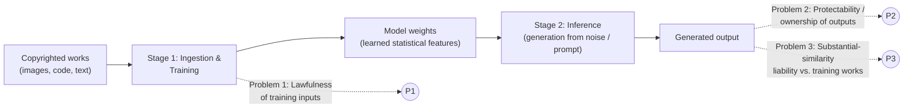

# Copyright Issues in Generative Deep Learning: A Comparative Legal Analysis of Training Data, Output Ownership, and the GitHub Copilot Controversy (Through April 2022)
# 1 Introduction and Research Framing

In the span of less than a decade, generative deep learning has moved from a niche research curiosity—visualised in surreal "Inceptionism" images produced by Google's DeepDream—to a set of consumer-facing products capable of synthesising photorealistic paintings, original musical phrases, and even functioning source code on demand. By early 2022, tools such as Midjourney-style text-to-image generators and GitHub Copilot, the latter powered by OpenAI's Codex model and released as a technical preview in June 2021, had already entered everyday creative and engineering workflows. The same period saw the first wave of organised public concern: open-source maintainers questioning whether their licences had been honoured, illustrators worrying that their distinctive styles were being absorbed into training sets, and lawyers debating whether copyright doctrines drafted for human authors, printing presses, and photocopiers could meaningfully govern a system that learns statistical regularities from millions of works it never "reads" in the human sense.

This opening chapter does not yet resolve those tensions; rather, it establishes the analytical scaffolding on which the remainder of the report is built. It explains why generative deep learning has so abruptly become a copyright flashpoint, fixes a deliberate temporal cutoff of 30 April 2022 to avoid anachronistic reasoning, identifies the three interlocking copyright problems that structure the entire study, and articulates the dual technical–legal comparative methodology that will be applied consistently in later chapters.

## 1.1 Background and Motivation: The Rise of Generative Deep Learning as a Copyright Flashpoint

The copyright anxieties surrounding generative AI did not arise in a vacuum; they were produced by a specific sequence of technical breakthroughs that turned generative models from laboratory demonstrations into systems capable of competing with—and learning from—the works of professional creators.

The conceptual turning point can be dated precisely. In June 2014, Ian Goodfellow and colleagues at the Université de Montréal introduced the Generative Adversarial Network (GAN), a framework in which two neural networks are trained simultaneously: a generator $G$ that maps random noise drawn from a prior $p_z(z)$ into samples in the data space, and a discriminator $D$ that estimates the probability that a given sample originated from the real data distribution $p_{\text{data}}$ rather than from $G$.[^1] The two networks play a minimax game with value function
$$\min_G \max_D V(D,G) = \mathbb{E}_{x\sim p_{\text{data}}(x)}[\log D(x)] + \mathbb{E}_{z\sim p_z(z)}[\log(1-D(G(z)))],$$
whose global optimum is reached when the generator perfectly replicates the data-generating distribution, i.e. $p_g = p_{\text{data}}$.[^1] Goodfellow et al. framed the dynamic with the now-canonical metaphor of "a team of counterfeiters" pitted against "the police," with both sides improving "until the counterfeits are indistinguishable from the genuine articles."[^1] That metaphor, while pedagogically apt, also foreshadows the legal stakes: a system designed to converge on the statistical fingerprint of its training corpus is, by construction, a system that learns to imitate what it has seen.

A second wave of refinements made the technology immediately copyright-relevant. The Conditional GAN (cGAN), proposed by Mirza and Osindero in 2014, extended the framework by feeding additional information $\mathbf{y}$ (a class label, a text description, or another image) into both the generator and discriminator, so that the modelled probability becomes $p(\mathbf{x}\,|\,\mathbf{y})$ rather than $p(\mathbf{x})$.[^2] This seemingly modest change allowed for controllable generation—producing an image *of a particular thing*—and underpinned later image-to-image translation systems such as pix2pix, which can convert architectural sketches into photorealistic facades by learning from paired sketch–image training data.[^2] In 2015, Radford, Metz, and Chintala's Deep Convolutional GAN (DCGAN) showed that careful architectural constraints on convolutional generator and discriminator networks enabled stable training and learned representations rich enough to support unsupervised feature extraction at scale.[^3] Each step lowered the technical barrier between "machine learning research" and "machine-generated art."

In parallel, Google's DeepDream, originating from Alexander Mordvintsev's 2015 Inceptionism work and now distributed as a TensorFlow tutorial, demonstrated that even a *discriminative* network trained for image classification—such as InceptionV3 trained on ImageNet—could be repurposed as a generative engine simply by selecting one or more internal layers (e.g. `mixed3`, `mixed5`) and performing gradient *ascent* on the input image to maximise the chosen layers' activations.[^4] Because lower layers respond to edges and textures while deeper layers respond to high-level features such as eyes, faces, or animal forms, the network "over-interprets and enhances the patterns it sees in an image," producing the characteristic dream-like aesthetic.[^4][^5] As one commentator put it, "[t]his network was trained mostly on images of animals taken from the ImageNet dataset, so naturally, it tends to interpret shapes as animals. But because the data is stored at such a high abstraction, the results are an interesting remix of these learned features."[^5] That single sentence captures, in technical terms, the doctrinal puzzle this report addresses: when a model's outputs are an "interesting remix of … learned features" extracted from copyrighted training data, where does inspiration end and reproduction begin?

By 2022, the same architectural family had been scaled to systems with hundreds of millions of parameters, trained on web-scale datasets, and embedded in commercial products. GitHub Copilot, launched as a technical preview in June 2021, packaged a Codex-based code-generation engine into an IDE extension that suggests continuations as developers type, having been trained on a large corpus of publicly accessible source code, including code under copyleft licences. Text-to-image tools building on conditional generative architectures had achieved comparable mainstream visibility for visual art. **The result was a structural mismatch: a body of copyright law shaped by twentieth-century reproduction technologies confronted a class of systems whose defining operation is the statistical absorption of millions of works followed by the synthesis of new, plausibly-original artefacts.** It is this mismatch—rather than any single product or lawsuit—that motivates the present report.

## 1.2 Scope, Temporal Boundary, and Key Terminology

To keep the analysis tractable and intellectually honest, this report adopts a strict temporal boundary: every legal authority, statute, case, policy document, technical paper, and controversy discussed is verifiably dated on or before **30 April 2022**. Developments after that date—including later litigation against generative AI providers, the eventual finalisation of EU AI legislation, and subsequent guidance from national copyright offices on AI-generated works—lie outside the scope of this study and are deliberately excluded, even where they would, with hindsight, sharpen particular conclusions. Where a question was already visible before April 2022 but only resolved later, the report stops at the pre-cutoff state of the question and labels the residual uncertainty as such.

The report's substantive scope is generative deep learning rather than artificial intelligence in general. It focuses on neural-network-based systems whose primary purpose is to synthesise new artefacts—images, code, text, or other media—after training on large corpora of human-created works. Within that universe, the technical exposition centres on the lineage of architectures already established in the literature by April 2022: vanilla GANs (Goodfellow et al., 2014),[^1] DCGAN (Radford et al., 2015),[^3] conditional GANs and their image-to-image variants (Mirza & Osindero, 2014; the pix2pix and CycleGAN family),[^2] and DeepDream as a representative activation-maximisation technique.[^4][^5] Diffusion-based image generators that had emerged in research literature are referenced only insofar as they had become publicly visible products before the cutoff.

Comparatively, the report focuses on three jurisdictions that together set the contours of the global debate: the **United States**, with its open-textured fair-use defence under 17 U.S.C. §107; the **European Union**, with its harmonised originality standard and the text-and-data-mining (TDM) exceptions of Articles 3 and 4 of Directive (EU) 2019/790 on Copyright in the Digital Single Market; and the **United Kingdom**, whose Copyright, Designs and Patents Act 1988 contains the unusual section 9(3) attribution rule for computer-generated works. Other jurisdictions—including Japan's well-known 2018 amendment to its Copyright Act expanding non-enjoyment uses—are referenced selectively where they illuminate contrasts, rather than treated exhaustively.

A small but important set of working definitions must be fixed at the outset to prevent the conflation of technical and legal concepts:

| Term | Working definition in this report |
|---|---|
| **Training data** | The corpus of pre-existing works (images, text, code, audio) fed into a learning algorithm to fit a model's parameters. Distinct from any single work the model subsequently outputs. |
| **Model weights** | The numerical parameters of a trained neural network. They encode statistical regularities of the training corpus but, in most architectures, do not store individual training examples verbatim—though, as discussed in later chapters, *memorisation* of specific examples can and does occur. |
| **Generated output** | A new artefact produced at inference time by the trained model, typically conditioned on a noise vector, a prompt, or another input. Functionally a "remix of … learned features," in the terms used for DeepDream.[^5] |
| **Substantial similarity** | A legal—not technical—conclusion that one work reproduces protected expression from another to a degree sufficient to support an infringement claim. The empirical question (how close are the bytes?) is distinct from the doctrinal question (does the closeness reach protected expression?). |
| **Transformative use** | A doctrinal concept, developed in US fair-use jurisprudence beginning with *Campbell v. Acuff-Rose*, asking whether a secondary use "adds something new, with a further purpose or different character." Analysed in detail in Chapter 3. |
| **Authorship / originality** | The threshold concept for copyright subsistence. In the EU post-*Infopaq*, the test is the "author's own intellectual creation"; in US practice, copyright protection requires human authorship and a minimal degree of creativity. Discussed in Chapter 5. |

These terms recur throughout the report and are used with the meanings fixed here unless a chapter expressly signals a more specific usage.

## 1.3 The Three Core Copyright Problems Framing the Report

The report is organised around three interlocking copyright questions that arise directly from the operational structure of generative deep learning systems. The questions are technically interconnected through the canonical training-and-inference pipeline and legally interconnected through the doctrines of reproduction, derivation, originality, and authorship.

**Problem 1 — Lawfulness of training inputs.** The first question is whether the act of acquiring, copying, and computationally processing copyrighted works for the purpose of training a generative model is itself an infringing reproduction, or whether it falls within a recognised exception or limitation. The technical reality is that virtually every modern training pipeline involves making at least one digital copy of each training example, often combined with format conversions, tokenisation, and repeated passes through the dataset across many training epochs. Each of these operations engages the reproduction right; whether they also engage the *exclusive* reproduction right of the rightholder depends entirely on whether a defence applies. As Chapters 3 and 4 will show, the United States and the European Union answer this question through structurally different mechanisms—an ex-post, four-factor judicial inquiry into fair use, versus ex-ante, statutorily defined exceptions for text and data mining—producing materially different allocations of risk for academic researchers, commercial AI developers, and rightholders.

**Problem 2 — Protectability and ownership of generated outputs.** The second question presupposes that training was lawful and asks whether the outputs themselves can be copyrighted, and if so, by whom. This is not a peripheral concern: it determines whether the multi-billion-dollar artefacts increasingly produced by these systems are private property, public-domain commons, or something in between. The doctrinal centre of gravity here is the requirement of human authorship and originality—the EU's "author's own intellectual creation" standard, the US Copyright Office's longstanding refusal to register works lacking human authorship, and the UK's idiosyncratic CDPA section 9(3) deeming rule for computer-generated works. Each jurisdiction's answer reflects deep institutional choices about the purpose of copyright (incentivising human creators versus protecting investment), and each carries different consequences for who—programmer, user, model provider, or no one—ultimately benefits from generative output. Chapter 5 develops this analysis in detail.

**Problem 3 — Liability for output similarity.** The third question arises when a generated output, whatever its protectability, sufficiently resembles a specific training work that the rightholder of the latter wishes to assert infringement. Technically, this concern is anchored in the phenomenon of *memorisation*: although a well-trained generative model is generally praised for *not* reproducing its training set verbatim—DeepDream's "remix" of learned features rather than literal copies is one illustration[^5]—both empirical evidence and architectural reasoning indicate that under certain conditions models can and do emit near-verbatim fragments of training data. Doctrinally, this implicates the traditional reproduction and derivative-work rights, the analytical test of substantial similarity, and a difficult allocation question: when an output infringes, is the responsible party the user who prompted the generation, the developer who trained the model, or the platform that deployed it? Chapter 6 uses the **GitHub Copilot controversy** as a focused case study of this third problem in operation.

These three problems are not merely a convenient outline; they correspond to genuinely distinct legal regimes (reproduction at ingestion, originality at output, substantial similarity at inference) and to genuinely distinct technical stages (data ingestion, weight encoding, generation). Conflating them—as much of the early popular discussion did—obscures the analytical structure and produces unhelpful conclusions in both directions.

## 1.4 Analytical Framework and Comparative Methodology

The report adopts a deliberately dual perspective. Every substantive question is examined first through the **technical mechanics** of the generative systems involved, then through **comparative legal doctrine** across the selected jurisdictions, and finally through a **synthesis** that traces how technical features and legal rules interact to produce real-world consequences for developers, rightholders, and users.

The technical layer is not ornamental. Whether a fair-use analysis under §107 is plausible depends on facts about how a model actually uses training data—whether it extracts non-expressive statistical features or whether it memorises and reproduces expressive content. Whether an Article 4 CDSM opt-out is meaningful depends on whether opt-out signals can in practice be detected and respected by the crawlers that assemble training corpora. Whether an output exhibits substantial similarity to a training work depends on phenomena—latent-space interpolation, style transfer, mode collapse, prompt-driven retrieval—that are themselves technical artefacts of particular architectures. The report therefore treats technical descriptions and legal doctrines not as separate silos but as components of a single analytical question: how do operational realities map onto doctrinal categories?

The comparative layer follows a consistent template across chapters. For each issue, the report asks: (i) what does each jurisdiction's positive law say, expressed in the operative terms of the statute or case rather than in summary labels; (ii) where do the regimes converge and where do they diverge; and (iii) why—what underlying institutional logic (e.g., ex-post judicial standards versus ex-ante statutory rules; human-authorship purism versus pragmatic deeming rules) explains the divergence? Particular care is taken to avoid presenting jurisdictions in parallel isolation; comparative matrices and synthesis paragraphs are used to surface contrasts and trace their consequences.

Finally, on contested issues the report canvasses competing positions rather than asserting a single conclusion. For training-data lawfulness, the strongest arguments in favour of and against fair-use coverage of commercial AI training are both presented; for output ownership, the cases for assignment to the programmer, the user, a joint construct, and the public domain are each evaluated against incentive, fairness, and innovation criteria. Residual uncertainty—of which there is a great deal as of April 2022—is named rather than papered over.

## 1.5 Report Structure and Chapter Roadmap

The remainder of the report unfolds in seven chapters that map systematically onto the three-problem framework introduced above.

**Chapter 2** lays the technical foundations of generative deep learning. It explains, at a conceptual but technically faithful level, how GANs work as a minimax game between generator and discriminator,[^1] how DCGAN's architectural constraints stabilised convolutional generation,[^3] how conditional GANs introduced controllable, prompt-driven generation,[^2] and how DeepDream repurposes a classification network for activation-maximisation-based generation.[^4][^5] It then isolates the copyright-relevant features of these architectures: ingestion of large copyrighted corpora, memorisation risk, latent-space interpolation, style imitation, and the absence of direct human authorial choices at the moment of generation.

**Chapter 3** addresses Problem 1 under United States law. It explains the four statutory factors of 17 U.S.C. §107, the development of the transformative-use doctrine from *Campbell v. Acuff-Rose* onward, and applies the framework to AI training through the lens of the machine-learning-relevant precedents *Authors Guild v. HathiTrust* (2014) and *Authors Guild v. Google* (2015).

**Chapter 4** addresses Problem 1 under European Union law. It analyses Articles 3 and 4 of the 2019 CDSM Directive, distinguishing the mandatory, non-overridable research-purpose exception of Article 3 from the broader, opt-out-subject exception of Article 4, and traces the consequences of this two-tier regime for academic researchers and commercial developers respectively, in contrast to the US fair-use approach.

**Chapter 5** addresses Problem 2. It examines why purely autonomous AI outputs typically fail the originality and human-authorship thresholds in the US and post-*Infopaq* EU, compares the UK's CDPA section 9(3) deeming rule for computer-generated works, surveys the European Parliament's 2020 Resolution on intellectual property and AI, and evaluates the policy trade-offs of allocating rights to the programmer, the user, jointly, or to no one.

**Chapter 6** uses the **GitHub Copilot controversy** (2021–April 2022) as the central case study of Problem 3. It examines the controversy on two axes: the lawfulness of training Codex on publicly accessible repositories (including copyleft-licensed code), and the risk that Copilot's suggestions reproduce verbatim or near-verbatim fragments of training code, with implications for both fair-use analysis and open-source licence compliance.

**Chapter 7** synthesises the findings comparatively, identifying convergences and divergences between the US and EU frameworks, the risk of regulatory arbitrage, the chilling effect of legal uncertainty on open-source ecosystems, and the adequacy of current doctrines to handle the spectrum from style imitation to literal copying. It evaluates pre-cutoff policy proposals including statutory licensing, mandatory training-data disclosure, and machine-readable opt-out infrastructure.

**Chapter 8** consolidates the report's central findings, articulates the principal legal uncertainties that remained unresolved as of April 2022—particularly the scope of fair use for commercial AI training, the operationalisation of Article 4 opt-outs, the authorship status of fully autonomous outputs, and the legal trajectory of disputes such as Copilot's—and identifies directions for future research without speculating beyond the temporal cutoff.

Taken together, these chapters move progressively from technical groundwork (Chapter 2), through doctrinal analysis of the two principal regimes governing training data (Chapters 3–4) and the protectability of outputs (Chapter 5), into a concrete case study of liability for output similarity (Chapter 6), and finally to comparative synthesis and conclusions (Chapters 7–8). The result is intended as a coherent map of where copyright doctrine stood, at the end of April 2022, in confronting the most important technological challenge it had faced in a generation.

# 2 Technical Foundations of Generative Deep Learning and Their Copyright-Relevant Characteristics

Chapter 1 established that the copyright tensions surrounding systems such as Midjourney-style image generators and GitHub Copilot arise from a structural mismatch between twentieth-century reproduction-centred copyright doctrines and a new class of systems whose defining operation is the statistical absorption of millions of works followed by the synthesis of new artefacts. It also fixed the three-problem framework—lawfulness of training inputs, protectability of outputs, and liability for output similarity—that organises the entire report. Before turning to doctrinal analysis, however, a faithful technical foundation must be laid. The doctrinal arguments developed in Chapters 3 through 6 depend on facts about *how* generative deep learning systems actually ingest works, *what* their parameters encode, and *in what sense* their outputs are derived from prior creative material. This chapter supplies those facts. It is descriptive and analytical rather than legal, and it deliberately stops short of doctrinal conclusions; but each technical observation is selected and framed so as to map cleanly onto the legal categories the report will subsequently engage.

## 2.1 What Generative Deep Learning Is: A Conceptual Definition and Pipeline

Generative deep learning (GDL) denotes a family of techniques in which deep neural networks are trained to model, and then sample from, the probability distribution of some corpus of pre-existing artefacts—images, natural-language text, source code, audio, and so on. It is most usefully defined by contrast with *discriminative* learning. A discriminative network maps a high-dimensional input (an image, a sentence) to a class label or a numerical prediction; its output space is small and structured, and its training objective is to learn a conditional distribution $p(y \mid x)$ that separates categories. A generative network, by contrast, attempts to learn the data-generating distribution $p_{\text{data}}(x)$ itself, or some conditional refinement such as $p(x \mid y)$, so that new samples drawn from the learned distribution will resemble—statistically, perceptually, and (controversially) creatively—those in the training corpus.[^1]

Operationally, virtually every GDL system follows the same two-stage pipeline introduced in Chapter 1. In the **training stage**, a learning algorithm is iteratively applied to a corpus of pre-existing works; the algorithm adjusts the network's parameters (its **model weights**) so as to minimise some loss function—maximum likelihood, adversarial loss, or a reconstruction objective—that measures the divergence between the model's behaviour and the empirical distribution of the corpus.[^2][^1] In the **inference stage**, the trained model is sampled: typically by drawing a noise vector from a fixed prior and passing it through the generator network, optionally conditioned on a class label, a prompt, or another input modality.[^2][^1] The output is a new artefact—a synthetic image, a code completion, a generated passage—that is statistically derived from, but in most cases not byte-for-byte identical to, any single training example.

For the purposes of copyright analysis, this pipeline yields two distinct technical events that engage copyright differently. The first is the act of *ingesting* and computationally processing the training corpus, which involves digital copying of each work that is encountered. The second is the act of *generating* an output at inference time, which produces a new digital artefact whose relationship to any individual training work is mediated by the learned parameters and is, in general, statistical rather than literal. Chapters 3 and 4 attach to the first event; Chapter 5 attaches to the legal status of the output produced by the second; and Chapter 6 attaches to the relationship between an output of the second event and a specific work that entered through the first.

## 2.2 Generative Adversarial Networks: The Vanilla GAN Framework

The most influential generative architecture introduced before the present report's cutoff was the Generative Adversarial Network, proposed in June 2014 by Ian Goodfellow and seven co-authors at the Université de Montréal.[^1] The framework simultaneously trains two neural networks. A **generative model** $G$, parameterised by $\theta_g$, defines a differentiable mapping $G(z; \theta_g)$ from a noise variable $z$ drawn from a prior $p_z(z)$ into the data space. A **discriminative model** $D(x; \theta_d)$ outputs a single scalar interpreted as the probability that $x$ originated from the real data distribution $p_{\text{data}}$ rather than from the generator's induced distribution $p_g$.[^1] The two networks are pitted against each other in a minimax two-player game with value function

$$\min_G \max_D V(D,G) = \mathbb{E}_{x \sim p_{\text{data}}(x)}[\log D(x)] + \mathbb{E}_{z \sim p_z(z)}[\log(1 - D(G(z)))].$$

Goodfellow et al. prove that, for a fixed $G$, the optimal discriminator is $D^*_G(x) = p_{\text{data}}(x)/(p_{\text{data}}(x) + p_g(x))$, and that the global minimum of the resulting virtual training criterion $C(G)$ is achieved if and only if $p_g = p_{\text{data}}$, at which point $C(G) = -\log 4$ and the criterion equals $-\log(4) + 2 \cdot \mathrm{JSD}(p_{\text{data}} \| p_g)$—that is, the training objective is, up to a constant, the Jensen–Shannon divergence between the model's distribution and the data-generating process.[^1] In plain terms: the framework, by construction, pushes the generator's output distribution towards exact statistical replication of the training distribution.

The authors offered a now-canonical metaphor for the dynamics: the generator is "analogous to a team of counterfeiters, trying to produce fake currency and use it without detection, while the discriminative model is analogous to the police, trying to detect the counterfeit currency. Competition in this game drives both teams to improve their methods until the counterfeits are indistinguishable from the genuine articles."[^1] The metaphor was intended pedagogically, but it captures the legal stakes with uncomfortable precision: **a system that converges, in its theoretical optimum, on samples indistinguishable from the training corpus is by design a system that imitates what it has seen**. Imitation is not a side-effect of GANs; it is the explicit training objective.

Two practical features of vanilla GANs are particularly relevant for the doctrinal chapters. First, training proceeds without any need for Markov chains or explicit inference networks—only backpropagation through the discriminator's output and forward sampling through the generator are required, which is what made GANs computationally attractive at scale.[^1] Second, Goodfellow et al. were explicit that the framework "admits many straightforward extensions," singling out conditional generation $p(x \mid c)$ "obtained by adding $c$ as input to both $G$ and $D$" as the first.[^1] That extension, taken up almost immediately, set the stage for the controllable, prompt-driven systems that define the present copyright debate.

## 2.3 Architectural Refinements: DCGAN, Conditional GAN, and Image-to-Image Variants

Between 2014 and 2017, a series of refinements turned GANs from a theoretically interesting framework into a practical engine for high-quality, controllable image synthesis. Three are particularly important for the present report.

**The Deep Convolutional GAN (DCGAN).** In late 2015, Radford, Metz, and Chintala introduced a class of CNN-based GANs in which both generator and discriminator are subject to specific architectural constraints—replacing pooling layers with strided convolutions, using batch normalisation, removing fully connected hidden layers, and adopting particular activation functions—that empirically yielded stable training across a range of datasets.[^5][^3] The contribution was twofold: DCGANs produced visibly better samples than earlier GANs, and the learned convolutional features of the discriminator could be reused for downstream supervised tasks, demonstrating that adversarial training scales as a method of *unsupervised representation learning*.[^5][^3] For the copyright analysis, the salient point is that DCGAN moved GANs from a proof-of-concept producing low-resolution images on small datasets towards a regime in which large, photorealistic image synthesis on web-scale corpora became technically tractable.

**The Conditional GAN (cGAN).** Also in 2014, Mehdi Mirza and Simon Osindero proposed the Conditional GAN, which extends the vanilla framework by conditioning both generator and discriminator on auxiliary information $\mathbf{y}$.[^2] The modelled distribution becomes $p(\mathbf{x} \mid \mathbf{y})$ rather than $p(\mathbf{x})$, and the conditioning vector is concatenated with the latent noise input to $G$ and with the data input to $D$ at an additional input layer.[^2] "Any kind of information can be used for conditioning"—a simple class label for digit generation, or richer modalities such as text descriptions or paired images.[^2] The architectural innovation is modest, but the consequence is profound: cGANs transformed GANs from systems that generate samples *from* a distribution into systems that generate samples *of a specified kind*, supplying the indispensable bridge between adversarial training and the prompt-driven creative tools that animate present copyright concern.

**Image-to-image translation: pix2pix and its descendants.** The conditional framework was rapidly extended to image-to-image translation, in which the conditioning input $\mathbf{y}$ is itself an image (a sketch, a label map, a low-resolution photograph) and the generator learns to produce a corresponding image in a different domain. The pix2pix system added a structural loss term that "penalises structure at the scale of patches"—the so-called PatchGAN discriminator—to suppress the blurriness that conditional generators otherwise exhibit in regions of uncertainty.[^2] pix2pix-style systems have been applied to translating photographs of building facades from semantic labels, to producing "artistic painting from some arbitrary images," and—as demonstrated in a 2020 architectural-research deployment—to a "Cyclic-cGAN" that iteratively translates sketches to images and back, emulating the architect's cyclic process of "imagery being the thesis, and abstraction, the antithesis."[^2] The Cyclic-cGAN was trained on a modest set of eighty-four manually traced sketch–image pairs of small and medium-sized buildings,[^2] but the same principle scales: any paired or unpaired translation between visual domains can be cast as a conditional adversarial problem.

By April 2022, further refinements building on this foundation had become publicly visible. Unpaired image-to-image translation through cycle-consistency (the CycleGAN family) extended the conditional framework to settings without aligned training pairs. Style-based generator architectures (the StyleGAN family) had achieved photorealistic facial synthesis at high resolution and introduced the practice of disentangling coarse, medium, and fine stylistic attributes in the latent space. While the cited search corpus for this report does not contain primary sources for these later architectures, the architectural trajectory is unambiguous: each step lowered the technical barrier between research artefacts and machine-generated creative output, and each broadened the scope of human creative labour that could be absorbed as training data and re-emitted as synthetic output.

## 2.4 DeepDream and Activation-Maximisation as a Distinct Generative Paradigm

Not every copyright-relevant generative technique uses adversarial training. The most influential alternative paradigm before April 2022 was the family of *activation-maximisation* methods, of which Google's DeepDream is the paradigmatic example. DeepDream originated in Alexander Mordvintsev's 2015 "Inceptionism" work and is now distributed as an official TensorFlow tutorial,[^4] making it a canonical reference implementation for the technique.

The key conceptual point is that DeepDream uses a *discriminative* network—specifically InceptionV3, a convolutional classifier pre-trained on ImageNet—as the substrate for generation, without any additional generative training.[^4][^5] The procedure is, in outline: select one or more internal layers of the classifier; define a "loss" equal to the sum of the (normalised) mean activations of those layers when an input image is forwarded through the network; and then perform *gradient ascent* on the pixels of the input image to *maximise* that loss.[^4] Each gradient step nudges the pixels in directions that more strongly excite the chosen layers' detectors; iterating the process produces an image in which the patterns those detectors learned to recognise are progressively amplified.[^4][^5]

The relationship between layer depth and feature complexity is doctrinally important. As the TensorFlow tutorial summarises: "Deeper layers respond to higher-level features (such as eyes and faces), while earlier layers respond to simpler features (such as edges, shapes, and textures)."[^4] If the practitioner targets early layers (for example InceptionV3's `mixed3`), the amplified patterns are abstract—strokes, textures, repeated shapes; if deeper layers are targeted (such as `mixed5` or beyond), entire object-like structures—eyes, dog faces, bird forms—begin to emerge from the noise.[^4][^5] Refinements such as gradient ascent across multiple scales ("octaves") and tile-based gradient computation with random shifts make the procedure scalable to large images while preserving coherent multi-scale structure.[^4]

The interpretive consequence is sharp. As one technical commentary observes, the network used in DeepDream "was trained mostly on images of animals taken from the ImageNet dataset, so naturally, it tends to interpret shapes as animals. But because the data is stored at such a high abstraction, the results are an interesting remix of these learned features."[^5] **DeepDream is therefore the paradigmatic example of generation as feature amplification: the output image is, literally, the visualised content of features the network learned by training on a copyrighted corpus.** It contrasts instructively with adversarial generation: where a GAN samples from a learned distribution that *implicitly* encodes the training corpus, DeepDream *explicitly* renders the learned features onto a user-supplied canvas. Both paradigms, however, share the same fundamental copyright posture—the output is a transformation of statistical regularities extracted from prior works—and both raise, in different forms, the doctrinal puzzle of locating the boundary between *remix* and *reproduction*.

## 2.5 Stage 1 — Training Data Ingestion: Technical Realities and Copyright Touchpoints

Having surveyed the two main generative paradigms, the chapter now turns to the engineering reality of the two pipeline stages identified in §2.1, beginning with ingestion. Several discrete technical operations are performed on the training corpus before and during training, each of which engages the reproduction right of the underlying works in some manner:

| Operation | Description | Copyright-relevant feature |
|---|---|---|
| Acquisition | Downloading or otherwise obtaining copies of works from web crawls, public repositories, or licensed datasets. | First reproduction event; engages reproduction right at the moment of download. |
| Dataset assembly | Aggregating works into structured corpora, often with deduplication and quality filtering. | Creates a new compilation; persistent storage of full or substantial copies. |
| Format conversion and pre-processing | Decoding, resizing, normalising (for images); tokenisation, segmentation (for text and code). | Functionally analogous to format-shifting; may produce derivative representations. |
| On-disk caching | Storing pre-processed corpora on training hardware for fast access across epochs. | Persistent reproduction throughout training. |
| In-memory batching | Loading mini-batches into GPU/TPU memory at each training step. | Transient reproductions, repeated across many epochs. |
| Parameter update | Computing gradients with respect to each batch and updating model weights. | Extracts statistical regularities; the resulting weights encode information about the training corpus but do not, in general, store literal copies. |

Several engineering realities follow from this pipeline. First, training is intrinsically *iterative*: each example is presented to the network many times (across multiple epochs), and at each presentation it is reproduced—at least transiently in memory and typically persistently in cache. Second, modern generative models are trained on corpora at *web scale*: from millions of images for DCGAN-era systems to hundreds of millions or billions of items for the largest text and code corpora circulating by 2022. Third, those corpora are typically assembled by *automated crawlers* that download publicly accessible URLs, frequently with no rights-clearance check at the level of individual works; the practical infeasibility of granular per-work licence verification at this scale is one of the structural features that has driven the policy debate on text and data mining. Fourth, the works most readily accessible to crawlers are precisely the publicly posted works of professional and amateur creators—photographs, illustrations, articles, and open-source code—the very communities most exposed to displacement effects from generative models trained on their output.

For the present report, the technical predicate for Chapters 3 and 4 is therefore clear: *every* meaningful training run on copyrighted material performs at least one act that, absent a defence, would constitute reproduction within the scope of national copyright law. Whether the United States' open-textured fair-use doctrine or the European Union's Articles 3 and 4 of the CDSM Directive—each elaborated in the following chapters—supplies an adequate defence for those acts depends on legal characterisations that this chapter does not pre-empt, but it must depend at minimum on the technical facts just enumerated.

## 2.6 Stage 2 — Inference and Output Generation: How New Artefacts Are Produced

Inference, the second copyright-relevant stage, varies in its mechanics across architectures but shares a common posture: the trained parameters, not the training data, are the proximate input to the generation process.

In a vanilla or DCGAN, inference consists of sampling a noise vector $z$ from the prior $p_z(z)$ and forward-propagating it through the trained generator to obtain $G(z) = x$.[^1] The training data is not, in the ordinary case, accessed at inference time at all; what is accessed is the parameter set $\theta_g$, which was *fit* on the data but which encodes only such regularities of the data distribution as the architecture and training procedure managed to capture. In a conditional GAN or pix2pix-style system, the inference procedure is augmented with a conditioning input $\mathbf{y}$—a class label, a prompt, an input image—and the output is sampled from $p(x \mid \mathbf{y})$ as approximated by the trained model.[^2] In DeepDream, the inference procedure is different in character but not in posture: a user-supplied input image is iteratively modified by gradient ascent on layer activations of a pre-trained classifier, with the classifier's parameters supplying all "learned" content.[^4]

Crucially, the artefacts produced at inference are *statistically* derived from the training corpus. They are samples from (an approximation of) the data distribution, conditional means, or amplifications of features learned during training. In the typical case—as Goodfellow et al. illustrated in their original paper by showing samples from the trained MNIST, TFD, and CIFAR-10 generators side-by-side with their *nearest training neighbours* "to demonstrate that the model has not memorized the training set"[^1]—a generated artefact is recognisably the *kind of thing* the training set contains without being a byte-for-byte copy of any specific element. **This empirical observation must be carefully distinguished from a doctrinal conclusion: that a generated sample is not byte-identical to a training example is a technical fact, but whether the sample reproduces *protected expression* from a training work, to the substantial-similarity threshold required for infringement, is a separate legal question.** Chapter 5 will engage the originality of the outputs themselves, and Chapter 6 will engage the substantial-similarity analysis vis-à-vis specific training works.

## 2.7 Copyright-Relevant Behaviours: Memorisation, Latent-Space Interpolation, and Style Imitation

Four architectural phenomena, observable in the systems discussed above, generate the doctrinal stress this report's later chapters analyse.

**Memorisation.** Although the GAN training objective drives $p_g$ towards $p_{\text{data}}$ in distribution, this distributional convergence does not preclude—and under finite-data conditions, may actively encourage—the model emitting samples that approach individual training examples. Goodfellow et al. acknowledged the issue implicitly in their visualisation strategy: their figures display generated samples alongside "the nearest training example of the neighboring sample, in order to demonstrate that the model has not memorized the training set."[^1] The need for such a demonstration confirms that memorisation is a recognised failure mode, even if it was not the typical behaviour of the small-corpus 2014 systems. Architecturally, memorisation risk grows when models have parameter counts large relative to dataset size, when training examples are rare or unique within the corpus, and when the loss landscape contains attractors corresponding to exact reconstruction of particular examples. Memorisation is the technical phenomenon that most directly feeds the substantial-similarity analysis of Problem 3.

**Latent-space interpolation.** A distinctive property of GAN-trained generators is that the latent space $z$ is, to a substantial extent, semantically continuous: linear interpolation between two noise vectors produces a sequence of outputs that morphs smoothly between two endpoints. Goodfellow et al. illustrated this with "[d]igits obtained by linearly interpolating between coordinates in z space of the full model."[^1] The phenomenon has a copyright-relevant implication. If an output sits at a point in latent space that lies "between" the regions associated with two particular training works, the question of which—if any—training work that output "derives from" becomes empirically ill-posed. Traditional copyright doctrine, designed for tangible copying chains, has no native vocabulary for derivation through a continuous latent manifold; this is one of the senses in which Chapter 1's "structural mismatch" between doctrine and architecture is most acute.

**Style imitation.** Conditional and image-to-image systems are explicitly designed to absorb expressive style and to re-emit it on demand. The pix2pix family learns paired translations from sketches or label maps to photorealistic facades;[^2] CycleGAN-style architectures extend this to unpaired settings; later style-based generators disentangle coarse and fine stylistic attributes within their latent codes. The empirical capability to imitate the distinctive expressive style of an identifiable creator—whether an architect's sketch idiom, a painter's brushwork, or a coder's idiomatic patterns—is by April 2022 a routine feature of these architectures rather than an aspiration. Doctrinally, this implicates the long-standing rule (in both US and EU systems) that copyright does not protect *style* as such, only protected expression; the technical capability nonetheless creates a substantial economic and reputational interest on the part of identifiable creators that the doctrine does not directly address. Chapter 7's policy synthesis returns to this gap.

**Mode behaviour and the "Helvetica scenario."** Goodfellow et al. flagged a particular pathology of adversarial training in which the generator "collapses too many values of $z$ to the same value of $x$ to have enough diversity to model $p_{\text{data}}$"—the so-called "Helvetica scenario," which arises when "$G$ must not be trained too much without updating $D$."[^1] Mode collapse, and conversely the GAN framework's capacity to "represent very sharp, even degenerate distributions" where Markov-chain-based methods cannot,[^1] both bear on the risk of close reproduction. Sharp distributional support concentrated near a small subset of training examples is precisely the regime in which generated outputs may exhibit the closest similarity to specific training works.

Each of these behaviours is summarised below alongside the doctrinal problem it most directly implicates:

| Technical phenomenon | Primary copyright problem implicated |
|---|---|
| Memorisation of training examples | Problem 3 (substantial-similarity liability) |
| Latent-space interpolation | Problem 2 (originality/derivation analysis); Problem 3 (which work is "the source"?) |
| Style imitation | Problem 3 (boundary of protected expression vs. unprotected style) |
| Mode collapse / sharp distributions | Problem 3 (risk of close reproduction) |

## 2.8 The Absence of Direct Human Authorial Choice at the Moment of Generation

A structural feature shared by the architectures examined above—and a feature that distinguishes them sharply from traditional creative tools such as photographic cameras or paint software—is the *displacement of human expressive choice from the moment of generation*. In a GAN-based system, the proximate cause of an output is a stochastic sampling of $z$ followed by a deterministic forward pass through the generator; in DeepDream, the proximate cause is a deterministic sequence of gradient updates on the pixels of an input image. In neither case does a human exercise contemporaneous expressive choice over the particular features of the resulting artefact—the specific shape of an eye, the configuration of a brushstroke, the layout of a code completion. The features are produced by the learned parameters acting on a sampled or supplied input.

This is not to say that humans make no choices in the production of generative outputs. They do, but those choices are *upstream* of the act of generation: selecting and curating training data, choosing an architecture, setting hyperparameters, picking layers to amplify (in DeepDream), supplying a conditioning prompt or class label (in cGANs), specifying a seed, accepting or rejecting candidate outputs. Each of these is a meaningful human contribution to the production process. But none of them is an exercise of expressive choice *over the specific features of a specific output at the moment that output is produced*. The choice is upstream, indirect, and statistical; the output is generated, in its specifics, by the machine.

This distribution of contributions is what makes the originality and human-authorship thresholds that Chapter 5 examines so doctrinally awkward. Both the US Copyright Office's longstanding insistence on human authorship and the EU's post-*Infopaq* "author's own intellectual creation" standard were developed in contexts where the human creator exercised contemporaneous expressive choices over the work's specific features—even when using complex tools. Generative deep learning routinely produces artefacts in which no such contemporaneous human choice exists. Whether upstream human choices (curating data, prompting, post-selection) can substitute for downstream expressive choices, and if so under what conditions, is the doctrinal puzzle Chapter 5 unfolds; the technical predicate is established here.

## 2.9 Mapping Technical Features onto the Three Copyright Problems

The chapter has identified a set of operational realities and architectural behaviours, each of which feeds into a specific doctrinal problem in the chapters that follow. The table below consolidates the cross-reference and will be invoked by later chapters to anchor their legal analysis in this chapter's technical foundation.

| Technical feature (this chapter) | Stage | Primary doctrinal problem | Subsequent chapter |
|---|---|---|---|
| Acquisition, dataset assembly, on-disk caching, in-memory batching across epochs (§2.5) | Training | Reproduction at ingestion; lawfulness of training inputs (Problem 1) | Ch. 3 (US fair use), Ch. 4 (EU CDSM Arts. 3–4) |
| Web-scale crawling; infeasibility of per-work licence verification (§2.5) | Training | Practical-feasibility component of the policy balance | Ch. 3, Ch. 4, Ch. 7 |
| GAN training objective drives $p_g \to p_{\text{data}}$ (§2.2) | Training | Frames the "imitation as architectural objective" character of the use | Ch. 3 (transformative use), Ch. 4 (purpose-of-use limits) |
| Absence of contemporaneous human expressive choice at the moment of generation (§2.8) | Inference | Originality / human authorship of outputs (Problem 2) | Ch. 5 |
| Upstream human choices: training-data curation, prompting, seed selection, layer choice, post-selection (§2.8) | Both | Candidate substitutes for downstream expressive choice; allocation of authorship | Ch. 5 |
| Memorisation of training examples (§2.7) | Inference | Substantial-similarity liability for outputs (Problem 3) | Ch. 6 |
| Latent-space interpolation between training-data regions (§2.7) | Inference | Which work is the "source"? Doctrinal ill-posedness of derivation | Ch. 6, Ch. 7 |
| Style imitation as a routine capability (§2.7) | Inference | Protected expression vs. unprotected style; policy gap | Ch. 6, Ch. 7 |
| Mode collapse / sharp distributional support (§2.7) | Inference | Heightened risk of close reproduction | Ch. 6 |
| DeepDream as feature amplification of a discriminative classifier's learned features (§2.4) | Both | Both ingestion (training of the classifier) and generation (amplification onto a canvas) raise problems 1 and 3 in fused form | Ch. 3, Ch. 6 |

Two integrative observations close the chapter. First, **the three problems are not technically independent**: memorisation risk (Problem 3) is a function of training-corpus composition and training-time choices (which engage Problem 1), and the absence of human authorial choice (Problem 2) is itself a consequence of the same architectural features that drive imitation (which engage Problems 1 and 3). The doctrinal chapters treat the three problems separately for analytical clarity, but the technical reality is that they are co-produced by a single operational pipeline. Second, **the technical features identified here are not idiosyncratic to particular products** such as GitHub Copilot or Midjourney-style image generators; they are general features of the generative-deep-learning paradigm as it stood in April 2022. The doctrinal stress those products place on copyright law is therefore not a passing artefact of any one system but a structural feature of the technology itself—a feature that the comparative legal analysis of the following chapters must engage on its own terms.

# 3 Copyright Status of Training Data Under United States Law: The Fair Use Doctrine

Chapter 2 closed with a consolidated map of the technical operations that any meaningful generative training run performs on copyrighted works—acquisition, dataset assembly, on-disk caching, in-memory batching across many epochs, and parameter updates that extract statistical regularities. Each of those operations involves the digital reproduction of training works at some level of persistence, whether transient or durable. The doctrinal question that follows directly is whether, under United States copyright law, those reproductions are unlawful in the absence of a licence, or whether they are shielded by an affirmative defence. This chapter answers that question by unpacking 17 U.S.C. §107, the statutory fair use defence, in light of the body of judicial reasoning that has shaped it—particularly the transformative-use line beginning with *Campbell v. Acuff-Rose*, the reverse-engineering line culminating in *Sony v. Connectix*, and the digital-library line of *HathiTrust* and *Google Books*. The chapter then applies that framework to the specific factual matrix of generative AI training, weighs the strongest counterarguments, and identifies the residual uncertainty that, as of 30 April 2022, attended the question.

## 3.1 The Reproduction Right and the Structural Need for a Defence in AI Training

Under 17 U.S.C. §106, the owner of a copyright in a work has the exclusive right, among others, "to reproduce the copyrighted work in copies." The statute does not condition the right on the *permanence* of the resulting copy, the *publicity* of the resulting copy, or the *expressive content* of any use of the resulting copy: a digital reproduction of a copyrighted image into the RAM of a training machine, or onto the local disk of a training cluster, is prima facie a reproduction within the meaning of §106. The Ninth Circuit's reverse-engineering jurisprudence makes this baseline explicit. In *Sony v. Connectix*, the court began its analysis from the uncontested premise that loading Sony's BIOS firmware into a computer's RAM, and disassembling it via a debugger, "necessarily involves copying the copyrighted program," and that each of those copies counted as a reproduction that engaged Sony's exclusive rights.[^6] The court did not treat the *intermediate*, non-distributed character of the copies as taking them outside §106; it treated that character as relevant only at the fair-use stage.[^6][^7]

Applied to the technical pipeline established in Chapter 2, the conclusion is straightforward. Every step from acquisition through to parameter update involves at least one act—often many—that, considered in isolation, falls within the scope of the reproduction right. The persistence of the on-disk cache is unambiguously a "copy" in the §106 sense; the in-memory batches that are re-loaded across epochs are transient but reproduce the work in fixed form long enough to be perceptible to the training apparatus; and the dataset-assembly step often produces a new compilation that contains, persistently, substantially all of the underlying works. Whether the model weights themselves constitute a reproduction is a more contested question—they do not, in general, store training examples verbatim—but the question is doctrinally moot, because the upstream training pipeline has already engaged §106 several times over before any weight is written.

Two consequences follow. First, **for any training run on copyrighted material conducted without a licence, an affirmative defence is structurally required**: the question is not whether a defence is needed but which defence might apply. Second, the principal—and, in most realistic scenarios, the *only*—candidate defence in US copyright law is the fair use doctrine codified in 17 U.S.C. §107. The statutory section 117 defence for software owners is too narrow to reach training corpora; the §108 defences for libraries and archives are narrow as well and oriented to preservation and inter-library use rather than commercial AI development. Fair use is the doctrinal locus on which the lawfulness of AI training under US law stands or falls.

## 3.2 The Statutory Framework of 17 U.S.C. §107 and the Four Fair Use Factors

Section 107 of Title 17 sets out the fair use defence in two operative parts. Its preamble identifies an illustrative—but non-exhaustive—list of purposes for which a fair use determination is most readily made: "criticism, comment, news reporting, teaching (including multiple copies for classroom use), scholarship, or research." The statute then directs that, in determining whether any particular use is a fair use, "the factors to be considered shall include": (1) the purpose and character of the use, including whether such use is of a commercial nature or is for nonprofit educational purposes; (2) the nature of the copyrighted work; (3) the amount and substantiality of the portion used in relation to the copyrighted work as a whole; and (4) the effect of the use upon the potential market for or value of the copyrighted work.

Several structural features of §107 bear directly on how it must be applied to AI training. First, the inquiry is **holistic and case-by-case**: the four factors are not a checklist of independent elements but interlocking considerations weighed together. Second, the factors are **non-exclusive**: courts may, and do, consider matters outside the four enumerated factors when relevant to the equitable balance the statute calls for. Third, the **burden of proof** rests on the party asserting the defence, because fair use is an affirmative defence rather than an element of the plaintiff's prima facie case. Fourth, the factors are **interdependent**: a strong showing on factor one (particularly transformative purpose) tends to soften the weight of unfavourable showings on factors two and three, and tends to discipline the analysis of factor four by limiting cognizable market harm to harm from substitution rather than from criticism, comment, or transformation.

The chapter that follows applies this framework to the AI-training context by developing each factor in turn, anchored where possible in the operative reasoning of the leading machine-learning-relevant cases.

## 3.3 Factor One: Purpose and Character of the Use, and the Transformative Use Doctrine

The first statutory factor asks about the "purpose and character of the use." The single most consequential development in modern US fair-use jurisprudence has been the elaboration, under this factor, of the doctrine of **transformative use**. The Supreme Court endorsed the concept in 1994 in *Campbell v. Acuff-Rose Music, Inc.*, the rap-parody case in which 2 Live Crew's reworking of Roy Orbison's "Oh, Pretty Woman" was held to be a candidate for fair use. As the Second Circuit later summarised the *Campbell* test, a secondary use is more likely to be fair when it is "transformative"—when it adds something new, with a further purpose or different character, altering the first with new expression, meaning, or message.[^8] *Campbell* itself involved transformation through new *expressive* content (the parody altered the meaning and message of the original song), but subsequent jurisprudence has made clear that **transformative *purpose* can suffice even when the secondary user adds no new expression at all**.

The doctrinal expansion proceeded along two lines that are jointly decisive for the AI-training question. The first is the **reverse-engineering line**, in which intermediate copying of copyrighted software to gain access to its non-protected functional elements was held transformative even though no new expressive content was generated. *Sony v. Connectix* is the canonical decision. Connectix repeatedly copied Sony's copyrighted PlayStation BIOS while reverse-engineering it, in order to develop the Virtual Game Station, an emulator that allowed PlayStation games to run on Macintosh computers; the Virtual Game Station itself contained no Sony code.[^6][^7] The Ninth Circuit held that this intermediate copying was fair use. On factor one, it found that "the ultimate purpose and character of Connectix's use of Sony's BIOS—in that it created a new platform for Sony PlayStation games—qualified as 'modestly transformative.'"[^7] More importantly for the AI context, the court rejected a copy-counting approach to fair use, reasoning that to make liability turn on the number of intermediate copies "would result in software engineers choosing inefficient engineering methods that minimized the number of intermediate copies"; "[p]reventing such 'wasted effort'", the court held, "was the very purpose of fair use."[^7] The court also collapsed the district court's attempted distinction between "studying" and "use" of disassembled code as "artificial," noting that Connectix had "actually used that code in the development of [their] product."[^7]

The second line is the **digital-library line**, which is even more directly on point for AI training because it concerns *bulk*, *non-expressive*, *analytical* copying of complete creative works. The pivotal decision is *Authors Guild v. HathiTrust* (2d Cir. 2014). HathiTrust, a digital preservation collective built from millions of book-scans created by Google, was sued by the Authors Guild for copyright infringement on the basis of the unauthorised scanning.[^9] On appeal, a three-judge panel of the Second Circuit affirmed the district court's fair-use ruling, holding that "the scanning of entire works for the purpose of creating a full-text searchable database is 'a quintessentially transformative use.'"[^9] The court reasoned that the results of word-searches over a digital corpus are "different in purpose, character, expression, meaning, and message from the page (and the book) from which it is drawn," and that "[f]ull-text search adds a great deal more to the copyrighted works at issue than did the transformative uses" approved in earlier Second Circuit fair-use cases.[^8] As the Authors Alliance commentary on the decision put it, the court ruled "that it is not copyright infringement for libraries to digitize works for the purpose of helping researchers find pertinent books."[^8]

The Second Circuit's reasoning in *HathiTrust* is doctrinally important for AI training in three respects. First, it confirmed that **a secondary use can be quintessentially transformative even when no new expression is added**, so long as the use serves a function "different in purpose, character, expression, meaning, and message" from the original—a category for which the court endorsed the Ninth Circuit's prior search-engine cases.[^8] Second, the court approved HathiTrust's accessibility programme (making works accessible to print-disabled persons) as a separate fair use, drawing on the legislative history of copyright law and the Americans with Disabilities Act.[^8] Third, the court was equivocal only on the preservation defence, suggesting that "the lower court did not have enough information to rule on the replacement as fair use issue."[^8] The first holding is the one that doctrinally carries the AI-training argument; the second illustrates the court's willingness to credit non-expressive, socially valuable secondary uses; the third shows that even within an overwhelmingly favourable decision, the court was capable of disciplined granularity.

By 2014–2015, the digital-library logic had crystallised into a defensible structural pattern. As the Authors Alliance commentary anticipated, the *HathiTrust* analysis—non-expressive analytical use of bulk-copied works, no substitution for the originals, transformative purpose—translated directly to the Google Books snippet-display system, with the differentiating commercial element and the snippet-view function "[w]hile snippet-view and the more commercial nature of Google's operations may have some significance" not displacing the underlying transformative-use logic.[^8] The chain of reasoning is the doctrinal asset that AI developers have, by April 2022, sought to deploy in defence of training-data ingestion.

Applied to generative AI training, the factor-one argument runs as follows. The proximate technical purpose of training-data ingestion is to extract *statistical regularities* of the corpus—conditional probabilities, distributional features, latent representations—rather than to communicate the *expressive content* of any particular training work. In that respect, the use parallels HathiTrust's full-text indexing (which extracted positional and frequency information from texts without communicating their expressive content), Google Books' snippet system (which served as an index rather than a substitute), and Connectix's BIOS reverse-engineering (which used the protected work to access unprotected functional elements that the work embodied). On each of those analogies, training-data ingestion is transformative in purpose: it puts the copyrighted work to a use "different in purpose, character, expression, meaning, and message" from its consumption as an expressive artefact.[^8]

Two factor-one cautions, however, cut in the opposite direction. The first is **commerciality**. Section 107 lists "whether such use is of a commercial nature" as part of factor one, and the Authors Alliance commentary on *HathiTrust* observed pointedly that "with Google, there is a commercial element, and, unlike the HathiTrust, Google actually displays 'snippets'"—a remark made in the context of the then-pending *Google Books* appeal.[^8][^9] The Second Circuit in *HathiTrust* repeatedly emphasised the non-profit, library-purpose character of the use; commercial AI developers will be in a different posture. The Ninth Circuit in *Connectix* was more sanguine about commerciality—Connectix was a for-profit software company—and treated the transformative purpose as the dominant consideration.[^7] The factor-one weight that commerciality will carry in the AI context is therefore unsettled as of April 2022. The second caution is the **architectural objective of imitation** discussed in Chapter 2. A GAN's training objective drives $p_g \to p_{\text{data}}$; the network's purpose is, in its theoretical optimum, to reproduce the statistical fingerprint of the training corpus. Whether courts will continue to view such use as *non-expressive* (because the model learns statistics, not stored copies) or as *expressively oriented* (because the model is purpose-built to emit artefacts of the same expressive kind as its training data) is a real doctrinal question that the pre-cutoff case law does not squarely answer.

## 3.4 Factor Two: Nature of the Copyrighted Work

The second factor asks about the nature of the copyrighted work used. In general, creative and unpublished works enjoy stronger protection under factor two than do factual, functional, and published works. In the AI-training context, the factor cuts in different directions depending on the medium of the training corpus.

For training corpora composed of highly creative works—original photographs, illustrations, paintings, novels, poems, song lyrics—factor two will weigh against fair use, because these are core expressive works at the heart of copyright protection. For training corpora composed of more functional or factual material—technical documentation, factual articles, and especially source code—factor two will weigh less heavily. The reverse-engineering jurisprudence is particularly instructive here. In *Sony v. Connectix*, the Ninth Circuit acknowledged "that software code does deserve copyright protection," but held, "following the precedent of *Sega v. Accolade*, [that] the PlayStation firmware fell under a lowered degree of copyright protection because it contained unprotected parts (functional elements) that could not be examined without copying."[^7] The court treated this as a factor-two consideration that meaningfully tipped the balance in Connectix's favour.

Two doctrinal points emerge that bear directly on AI training. First, **source code occupies a special position under factor two**: it is copyrightable, but its copyright protection is thinner because of the inseparable functional content that it embodies. This is significant for the GitHub Copilot scenario examined in Chapter 6, where the training corpus is overwhelmingly composed of source code. Second, and more generally, courts have shown a willingness to *discount the weight of factor two* when the secondary use is highly transformative. The Second Circuit's *HathiTrust* analysis effectively subordinated factor two to the strong factor-one showing, and the Ninth Circuit in *Connectix* did the same. The doctrinal pattern is that **factor two becomes less probative the stronger the transformative-purpose showing under factor one is**, a pattern that, if extended, would lessen the weight of factor two against AI developers whose training pipelines achieve a robust factor-one footing.

That doctrinal pattern is, however, contingent on the factor-one showing itself surviving the AI-specific complications discussed in §3.3. Where the training corpus is composed of expressive works and the model is architecturally oriented to produce expressive outputs of the same kind, factor two retains real weight: the works ingested *are* the core of copyright protection.

## 3.5 Factor Three: Amount and Substantiality of the Portion Used

The third factor asks how much of each work has been copied, both quantitatively and qualitatively. On its face, this factor cuts hard against AI training. Modern training pipelines do not copy excerpts of training works; they copy entire works—every pixel of an image, every token of a text, every byte of a source file—and they do so repeatedly, across many epochs, in dataset assembly, on-disk cache, and in-memory batches. The third factor would, on a literal reading, weigh strongly against fair use.

The case law nonetheless provides a robust doctrinal counter-pattern: **complete copying is permissible under factor three when it is "reasonably necessary" to accomplish a transformative purpose, and intermediate copies that do not appear in the final product are entitled to little weight**. Both strands derive from the leading precedents.

In *HathiTrust*, the Second Circuit held that "[b]ecause it was reasonably necessary for the [HathiTrust] to make use of the entirety of the works in order to enable the full-text search function, we do not believe the copying was excessive."[^9] The court added that the additional copies made by HathiTrust were also "reasonably necessary in order to facilitate the [HathiTrust's] legitimate uses."[^9] As the Authors Alliance commentary summarised: "[a]lthough whole books were copied, which would ordinarily count against fair use, the court recognized that it was 'reasonably necessary' to copy book contents in order to create a full-text searchable database. Thus, the copying was not 'excessive or unreasonable in relation to the purposes identified by the Libraries and permitted by the law of copyright.'"[^8]

In *Sony v. Connectix*, the Ninth Circuit went further. It held that the third factor was "of little significance to the case at hand": "[w]hile Connectix did disassemble and copy the Sony BIOS repeatedly over the course of reverse engineering, the final product of the Virtual Game Station contained no infringing material. As a result, 'this factor [held] ... very little weight'" in the analysis.[^7] The court's reasoning generalises: **when the copying is intermediate—performed as part of an analytic process whose end product contains no infringing material—factor three's quantitative weight is largely discounted**.

Both lines of reasoning translate plausibly to AI training. Training pipelines copy entire works because the technical process requires it: a neural network cannot learn from a partial image or a fragmentary code file. The full-corpus reproduction is reasonably necessary in the *HathiTrust* sense. Furthermore, the model weights produced at the end of training do not, in the typical case, contain literal copies of training works; the intermediate copies made during training are, in this respect, analogous to Connectix's intermediate disassembly copies, which the Ninth Circuit treated as carrying very little factor-three weight.[^7]

The translation is, however, contingent on two empirical points that Chapter 2 has shown to be conditional rather than absolute. First, the "reasonably necessary" argument depends on the alternative being technically unavailable—an argument that is strongest where works are ingested only as statistical signal and weakest where the architecture is designed to memorise or reconstruct. Second, the *Connectix*-style discounting of intermediate copies depends on the final product containing no infringing material; if a generative model produces an output that reproduces protected expression from a training work, the predicate of *Connectix*'s factor-three discount is partially undermined. The interaction between factor three and the memorisation phenomenon identified in Chapter 2 is therefore live, and is unfolded further in §3.7 below.

## 3.6 Factor Four: Effect on the Potential Market for the Original Work

The fourth factor—often described as the most important—asks about "the effect of the use upon the potential market for or value of the copyrighted work." Two doctrinal refinements developed in the leading cases determine how it operates in the AI-training context.

The first refinement is **the distinction between substitutional harm (cognizable) and transformative harm (not cognizable)**. The Second Circuit in *HathiTrust* drew the line sharply: factor four "turns only on 'harm that results because the secondary use serves as a substitute for the original work.'"[^9] Applied to the Authors Guild's argument that HathiTrust's digitisation deprived authors of a chance to develop a market for licensing books for digital search, the court held: "this theory of market harm does not work under Factor Four, because the full-text search function does not serve as a substitute for the books that are being searched."[^9] The Authors Alliance commentary captured the same point: "[t]he court observed that full-text searching 'poses no risk to any existing or potential traditional market' for the works at issue in the case. The Authors Guild had not been able to identify any quantifiable market harms, and the court regarded its theories of market harm as too speculative to matter."[^8] The doctrine has roots in *Campbell*'s holding that the market for a parody is not cognizable injury to the market for the original.

The second refinement is the **rejection of "lost-licensing-fee" theories that bootstrap the fair-use defendant's own conduct into the protected market**. The Second Circuit's *HathiTrust* analysis rejected the argument that, because authors *could* in principle license a search-oriented market, the foreclosure of that market by fair-use copying counted as cognizable harm—precisely because the use was not substitutional. The same pattern was visible in *Connectix*. The Ninth Circuit accepted that "the Virtual Game Station might very well lower Sony's PlayStation console sales" but held that "its transformative status—allowing PlayStation games to be played on Mac—rendered it a legitimate competitor in the market for Sony and Sony-licensed games"; the court explicitly held that "some economic loss by Sony as a result of this competition does not compel a finding of no fair use", because "[t]he copyright law … does not confer such a monopoly."[^7]

Translated to AI training in the abstract—setting aside generated outputs and considering only the training reproductions themselves—these refinements favour the developer. The training copies do not substitute for the underlying works in any traditional market; a researcher who ingests a corpus of photographs to train a generator is not foreclosing the photographers' market for photographs, and a developer who ingests source code is not foreclosing the code's market as code. The licensing-market argument is the one that *HathiTrust* most directly rejected.

**The AI-training context, however, presents a complication that the prior fair-use cases did not squarely confront**: the trained model is itself a generative engine, and its outputs may compete with the original works in their original market. Synthetic illustrations produced by a trained image generator may displace illustrators; synthetic code completions emitted by a Codex-based system may displace the code that developers would otherwise write and license; synthetic prose may displace the writing of professional authors. None of HathiTrust's search index, Google Books' snippet display, or Connectix's emulator served this displacement function: a full-text search result is not a substitute for the indexed book, and an emulator is not a substitute for a game. A trained generative model, by contrast, can in principle emit substitutes for works of the same expressive kind as those in its training corpus.

The doctrinal question this raises is whether such displacement, which occurs *downstream* at the output stage, should be attributed *upstream* to the training-time reproductions for the purposes of factor four. There is no pre-cutoff case directly addressing the point. The clear logic of *HathiTrust*—that cognizable harm must come from the secondary use *itself* serving as a substitute for the original—suggests that displacement by *outputs* is at one remove from the *training copy* under analysis. But the equally clear logic of factor four's economic concern suggests that, where the very purpose of the training copy is to produce a model capable of emitting market substitutes, the attribution may run upstream after all. This unresolved question is one of the principal residual uncertainties identified in §3.8.

## 3.7 Application to AI Training: Synthesising the Four Factors

The four factors, applied to a paradigmatic generative AI training run on a corpus of copyrighted works, can be drawn together in the matrix below. The matrix is not a mechanical rule but a guide to where each factor will lie depending on the technical and deployment facts of the case.

| Factor | Default tendency for AI training | Strengthened-fair-use scenario | Weakened-fair-use scenario |
|---|---|---|---|
| 1. Purpose and character | Transformative purpose: statistical/analytical use parallel to *HathiTrust* and *Connectix*; commerciality cuts the other way | Non-commercial research training; no memorisation; outputs are non-expressive analyses | Commercial deployment; architecture aimed at expressive imitation; downstream model emits works of same expressive kind |
| 2. Nature of the work | Variable: factual/functional content (e.g., code) weighs less heavily against; creative content (e.g., illustrations) weighs more | Training corpus dominated by source code or factual material; very strong factor-one showing softens factor two | Training corpus dominated by creative, expressive works (illustrations, fiction, music) |
| 3. Amount and substantiality | Whole works ingested, but "reasonably necessary" for the transformative purpose (*HathiTrust*); intermediate copies entitled to little weight (*Connectix*) | No memorisation; model weights contain no literal training-data fragments | Memorisation present; outputs reproduce identifiable training-work fragments, undermining the *Connectix*-style discount |
| 4. Effect on the market | No substitutional harm at the training-copy level itself; speculative licensing markets not cognizable (*HathiTrust*) | Outputs functionally distinct from training works (e.g., metadata, search indices) | Outputs compete in the original works' market (e.g., synthetic illustrations displacing illustrators; code completions displacing licensable code) |

Two patterns emerge from the matrix. First, **the strongest fair-use case under US law as of April 2022 is for non-commercial, research-oriented training on functional or factual corpora, in an architecture that demonstrably does not memorise and whose outputs do not function as market substitutes for the training works**. That case sits comfortably within the *HathiTrust*–*Connectix* doctrinal envelope: it tracks the transformative-purpose logic of factor one, leverages the thinner copyright protection of functional material under factor two, occupies the "reasonably necessary" and "intermediate copying" zones of factor three, and stays clear of substitutional harm under factor four.

Second, **the weakest fair-use case is for commercial deployment of a generative model trained on a corpus of expressive works belonging to identifiable creators, where the model exhibits memorisation, imitates the style of those creators, and emits outputs that compete in the original works' market**. That case is in tension on every factor: factor one bears the weight of the commerciality penalty and faces a harder transformative-purpose argument when the architectural objective is expressive imitation; factor two encounters core creative content; factor three loses the *Connectix* discount once memorisation is present; and factor four confronts precisely the substitutional-harm scenario that the *HathiTrust* doctrine acknowledges as cognizable.

The technical phenomena identified in Chapter 2 are the doctrinal levers that move a particular AI-training scenario between these two poles. Memorisation, mode collapse, and architectural sharpness of the learned distribution all cut against the developer under factors three and four. Latent-space interpolation, the absence of contemporaneous human authorial choice at the moment of generation, and the dominance of non-expressive statistical-feature extraction at training time all cut in the developer's favour under factor one. **Style imitation occupies the most uncertain doctrinal space**: because copyright in the US does not protect style as such, style imitation per se does not produce factor-four substitution at the level of any individual work—but if the cumulative effect of style imitation across many works is to foreclose identifiable creators' markets, factor four's economic concern is engaged in a manner the prior precedents do not squarely address.

## 3.8 Counterarguments and Residual Uncertainty as of April 2022

The fair-use framework set out above represents the strongest doctrinal case for the lawfulness of generative AI training under US law. But the case is not airtight, and intellectually honest analysis requires that the strongest opposing positions be articulated.

**First, the qualitative-difference argument.** A rightholder may argue that commercial generative AI training is qualitatively different from *HathiTrust* and *Google Books* because the trained model itself produces expressive substitutes. In both *HathiTrust* and *Google Books*, the secondary product (an index, a snippet display) was structurally incapable of substituting for the original works in their expressive function. A trained text-to-image generator or code-completion model is not so structurally limited: it is purpose-built to emit works of the same expressive kind as those in its training corpus. On this view, the *HathiTrust* line of reasoning does not extend to the AI context, because the "non-expressive use" framing collapses once the model becomes a publicly available generator. The counterargument is doctrinally serious; it has not, as of April 2022, been tested in an AI-specific judgment.

**Second, the memorisation-and-style argument.** A related position holds that the "non-expressive use" framing of *HathiTrust* presupposes that the secondary use does not communicate expressive content from the originals. When generative models memorise training examples or reliably imitate the distinctive style of identifiable creators, the framing's empirical predicate is undermined. The factor-three discount of *Connectix* explicitly turned on the fact that "the final product of the Virtual Game Station contained no infringing material."[^7] Where a model's outputs do contain identifiable training-data fragments, that predicate is at least partially negated, and the factor-three analysis runs differently.

**Third, the absence-of-precedent argument.** The most candid observation is that, as of April 2022, **no published US appellate decision had squarely adjudicated the lawfulness of generative AI training under §107**. The transformative-use cases canvassed in this chapter—*Campbell*, *Sega*, *Connectix*, *HathiTrust*, *Google Books*—are the doctrinal materials from which an AI-training fair-use defence must be constructed, but each was decided on facts materially different from the generative-AI scenario. The strongest analogies (*HathiTrust* in particular) are powerful but not dispositive. The factor-four complication identified in §3.6—whether downstream market substitution by outputs can be attributed upstream to the training copies—is genuinely open. Practitioners and developers were, as of April 2022, operating in conditions of significant doctrinal uncertainty, not in the shadow of a settled rule.

**Fourth, the scale argument.** A rightholder may argue that the cumulative scale of unauthorised ingestion—training corpora running into the billions of items, drawn predominantly from the publicly accessible works of professional and amateur creators identified in Chapter 2—distinguishes AI training quantitatively from the bounded library scanning of *HathiTrust*. The case law has not generally treated scale as an independent fair-use factor, but factor four's market-effect analysis is sensitive to aggregate displacement: a use whose displacement effect is large in the aggregate engages factor four differently from a use whose displacement effect is bounded.

**Fifth, the institutional-arbitrage concern.** The HathiTrust and Google Books decisions emphasised the social value of the secondary use—the preservation of cultural heritage, accessibility for the print-disabled, and the discoverability of research-library books.[^8] As the ALA's statement following *HathiTrust* put it, the decision "affirmed that the fair use of copyrighted material by libraries for the public is essential to copyright law", and recognised "the tremendous value of libraries in securing the massive record of human knowledge on behalf of the general public and in providing lawful access to works for research, educational, and learning purposes, including access for people with disabilities."[^9] Commercial AI developers seeking to extend the same fair-use envelope must articulate a comparable public-interest case, or accept that factor one's commerciality weight will be heavier than it was for the *HathiTrust* libraries.

The state of the question as of 30 April 2022 may therefore be summarised as follows. The doctrinal materials supplied by *Campbell*, *Connectix*, *HathiTrust*, and *Google Books* provide a coherent and substantial fair-use argument for the lawfulness of generative AI training, particularly where the use is non-commercial, the architecture is non-memorising, and the model's outputs do not function as market substitutes for the training works. That argument has not, however, been tested in an AI-specific appellate decision. The principal residual uncertainties are: (i) the weight that courts will assign to the commercial character of large-scale developer training relative to the transformative-purpose showing; (ii) whether factor-three's "reasonably necessary" and "intermediate copying" doctrines will survive the empirical reality of memorisation; (iii) whether downstream output substitution will be attributed upstream to training-time copies under factor four; and (iv) how the doctrine will address style imitation as a cumulative phenomenon that lies between protected expression and unprotected ideas. These uncertainties are not academic. They are the doctrinal vectors along which Chapter 6's GitHub Copilot case study unfolds in practice, and they form one half of the comparative ledger that Chapter 7 will draw against the EU's structurally different ex-ante regime—the subject of the next chapter.

# 4 Copyright Status of Training Data Under European Union Law: The Text and Data Mining Exceptions of the 2019 DSM Directive

Chapter 3 closed by observing that the United States approach to the lawfulness of generative AI training is, in its institutional logic, *ex post* and judicial: the four factors of 17 U.S.C. §107 are weighed by courts on a case-by-case basis, and the doctrinal certainty available to a developer at the moment of ingestion is only as strong as the analogical force of the precedents the developer can deploy. The European Union has chosen a structurally opposite path. Rather than entrusting the analysis to a holistic, equitable defence elaborated by judges, the EU has codified two specific, statutorily defined exceptions for text and data mining in Articles 3 and 4 of Directive (EU) 2019/790 on Copyright in the Digital Single Market (the "CDSM Directive"). The result is an *ex ante*, rule-based regime that allocates certainty in different places and in different ways from the US approach—and, as this chapter will show, leaves the lawfulness of large-scale commercial generative training in substantial doubt as of April 2022, but for reasons that are structurally distinct from those identified in Chapter 3.

The chapter proceeds as follows. Section 4.1 establishes the doctrinal baseline by identifying the harmonised reproduction right that every stage of the training pipeline engages, and explains why no general fair-use-style escape valve exists in EU law. Section 4.2 traces the policy origins and architecture of the CDSM TDM regime. Sections 4.3 and 4.4 unpack Articles 3 and 4 respectively, attending to the substantive operative terms of each provision and to the leading Member-State implementations available before the cutoff. Section 4.5 addresses the cross-cutting requirement of lawful access and the interaction with the database right. Section 4.6 applies the framework to the operational realities of generative training established in Chapter 2 and identifies the doctrinal pressure points. Section 4.7 evaluates the practical consequences of the bifurcated regime for academic researchers and commercial developers. Section 4.8 draws the explicit comparison with the US fair-use approach. Section 4.9 consolidates the residual uncertainties that remained unresolved as of 30 April 2022.

## 4.1 The EU Reproduction Right and the Structural Need for a Statutory Exception

The doctrinal baseline of EU copyright law is the harmonised reproduction right under Article 2 of Directive 2001/29/EC (the "InfoSoc Directive"), which confers on the author "the exclusive right to authorise or prohibit direct or indirect, temporary or permanent reproduction by any means and in any form, in whole or in part," together with cognate exclusive rights for the holders of related rights (performers, phonogram producers, broadcasting organisations, and so on). Two textual features of Article 2 InfoSoc are decisive for the AI-training context. First, the right extends to *temporary* reproductions as well as permanent ones, so that the in-memory batches and on-disk caches identified in Chapter 2 each engage the right at the moment they come into existence. Second, the right reaches reproductions "in whole or in part," so that the partial copies generated during pre-processing, tokenisation, and feature extraction are equally caught.

The reach of Article 2 has been further elaborated by the Court of Justice of the European Union in its *Infopaq* jurisprudence, which interpreted the "in part" language to extend to reproductions of fragments as short as eleven consecutive words from a newspaper article, provided that the fragments embody the author's own intellectual creation. The doctrinal consequence is that, under EU law, every meaningful training run on copyrighted works engages the harmonised reproduction right several times over, and engages it not only at the corpus level but at the level of substantial fragments within each ingested work.

In contrast to the position established in Chapter 3 for the United States, **EU copyright law contains no open-textured fair-use-style general defence**. The InfoSoc Directive instead provides a closed list of permissible exceptions and limitations in Article 5, only one of which—Article 5(1), the mandatory exception for transient or incidental acts of reproduction—is mandatory; the remainder are optional for Member States to adopt. Article 5(1) is, as a textual matter, structurally inadequate to cover persistent training corpora: it shields only reproductions that are "transient or incidental," that form "an integral and essential part of a technological process," and whose sole purpose is to enable either a network transmission or a lawful use, and that have "no independent economic significance." The persistent on-disk caches and repeatedly re-loaded in-memory batches of a training pipeline do not satisfy the "transient or incidental" condition for the cache, and the entire purpose of training—producing a model that is itself an economically significant artefact—is in considerable tension with the "no independent economic significance" requirement.

The closed-list character of EU exceptions, combined with the inadequacy of Article 5(1) InfoSoc for persistent training corpora, generated a structural need for dedicated statutory exceptions if AI training on copyrighted material was to be lawful at all in the Union. That structural need was the principal copyright-policy driver of the dedicated TDM provisions ultimately enacted as Articles 3 and 4 of the 2019 CDSM Directive.[^10]

A further doctrinal layer is supplied by the sui generis database right under Directive 96/9/EC (the "Database Directive"). Article 7 of that Directive grants the maker of a database that demonstrates a "substantial investment in either the obtaining, verification or presentation of the contents" the right to prevent extraction and re-utilisation of "the whole or of a substantial part" of the database contents. The right is independent of copyright and may apply even where the underlying items are not themselves copyrightable. For AI training purposes the database right is significant in two respects: training pipelines that scrape and ingest aggregated content from structured online sources (news aggregators, code repositories, image databases) potentially engage the right at the moment of extraction, and—as discussed in §4.5 below—the CDSM TDM exceptions therefore reach the database right as well as copyright proper.

## 4.2 Genesis and Architecture of the 2019 CDSM Directive's TDM Regime

The CDSM Directive was adopted in April 2019 as part of the European Union's broader Digital Single Market strategy and, in its TDM-related provisions, was animated by a perception that European researchers and innovators were operating at a structural disadvantage relative to peers in jurisdictions with broader copyright exceptions. The contrast was explicit: while the United States permitted analytical secondary uses through fair use (the *HathiTrust* and *Google Books* line of reasoning canvassed in Chapter 3), and the United Kingdom had introduced a non-commercial research TDM exception in section 29A of the Copyright, Designs and Patents Act 1988, mainland Europe had no comparable carve-out, leaving EU-based researchers exposed to liability for ingestion that their US counterparts could plausibly defend.

The legislative response in Articles 3 and 4 was deliberately bifurcated. Rather than enacting a single, open-textured exception, the EU legislator chose a **two-tier architecture**: a narrow but doctrinally robust research exception under Article 3, and a broader but defeasible general exception under Article 4. The bifurcation reflects a deliberate compromise between two policy objectives: ensuring that scientific research and cultural-heritage preservation enjoy a secure legal basis that cannot be undermined by contract or by rightholder opt-out, while preserving rightholders' ability to control commercial exploitation of their works through ex-ante reservation mechanisms.

The Directive's definition of text and data mining is supplied in Article 2(2) and is foundational to both exceptions:

> "any automated analytical technique aimed at analysing text and data in digital form in order to generate information which includes but is not limited to patterns, trends and correlations".[^11]

Three textual features of this definition will recur throughout the chapter's later analysis. First, the technique must be *automated*. Second, its purpose must be *analytical*—aimed at analysing text and data in digital form. Third, the *output* of the technique must be "information" of a particular kind, exemplified by "patterns, trends and correlations" but not limited to those exemplars. Whether the operational pipeline of generative deep learning—whose theoretical optimum, in the GAN case, is the replication of the training distribution rather than the generation of analytical "information" about it—fits within these textual contours is one of the principal interpretive uncertainties addressed in §4.6 below.

Articles 3 and 4 sit alongside ancillary provisions that complete the architecture: Article 7(1) establishes the mandatory and contract-override-proof character of certain CDSM exceptions; recitals 8 to 18 supply interpretive context; and Article 29 set the implementation deadline for Member States at 7 June 2021. As the next sections will show, those ancillary provisions are themselves doctrinally important, because they differentiate the legal robustness of Article 3 from that of Article 4 in ways that materially shape the regime's operation.

## 4.3 Article 3: The Mandatory Research Exception for Research Organisations and Cultural Heritage Institutions

Article 3 of the CDSM Directive establishes a mandatory exception for "reproductions and extractions made by research organisations and cultural heritage institutions in order to carry out, for the purposes of scientific research, text and data mining of works or other subject matter to which they have lawful access." The provision is doctrinally robust because of a constellation of features that distinguish it sharply from Article 4: it is mandatory rather than optional, it is contract-override-proof, it permits indefinite retention of copies for verification purposes, and it limits the security measures that rightholders may impose to those that are proportionate to legitimate concerns.

**Personal scope.** Article 3's beneficiaries are defined narrowly and functionally. "Research organisations" are universities (including their libraries), research institutes, and other entities whose primary objective is to conduct scientific research, either alone or together with the provision of educational services that include scientific research—provided that the entity operates on one of two qualifying bases. As the Italian implementation (Article 70-ter LdA) tracks the Directive's text, an organisation qualifies if it operates "on a non-profit basis or whose bylaws provide for the reinvestment of profits in scientific research activities, including in the form of public-private partnerships," or alternatively if it pursues "a public interest purpose recognised by a European Union member state".[^12] Cultural heritage institutions are defined broadly to include "libraries, museums, and archives, as long as they are open to the public or accessible to the public, also those belonging to educational institutions, research organisations and public broadcasting bodies, as well as the institutes for the protection of film and sound heritage and the public broadcasting bodies".[^12]

A critical limitation on personal scope—and one of the principal doctrinal pressure points in the AI-training context—is the exclusion of research organisations subject to "decisive commercial influence." The German implementation (Section 60d UrhG) renders this as a rule whereby research organisations "lose their exemption if they work together with private enterprises which exert a certain degree of influence or have preferential access to the research findings".[^10] The Italian implementation similarly disqualifies an organisation if commercial enterprises "exercise a decisive influence, such as allowing access on a preferential basis to the results generated by scientific research activities".[^12] The provision is designed to prevent commercial actors from laundering training-data ingestion through nominal academic partnerships; its practical effect is to draw a sharp line between genuinely independent academic research and public–private partnerships oriented to commercial output.

**Material and functional scope.** Article 3 covers "reproductions and extractions"—the latter term picking up the corresponding act under the Database Directive's sui generis right—of works and other subject matter to which beneficiaries have lawful access, for the purposes of scientific research. The functional limitation to "scientific research" is the architectural pivot of the two-tier regime: it is precisely because Article 3 is so functionally restricted that the EU legislator was willing to make it absolute.

**Mandatory and contract-override-proof character.** Article 3 is mandatory: Member States must implement it, and they cannot narrow it. More importantly, Article 7(1) of the CDSM Directive renders unenforceable any contractual provision that would derogate from the exception. As the COMMUNIA analysis of the Italian implementation summarises: "as stated by Art. 7(1) of the CDMS Directive, conflicting agreements with the TDM exception for scientific purposes are void".[^12] This protection is doctrinally significant. Without it, rightholders could (and historically often did) impose terms-of-service prohibitions on automated processing in their licensing arrangements with research libraries and institutions, effectively foreclosing the practical use of any statutory research exception. Article 7(1) closes that loophole for Article 3 uses.

**Indefinite retention for verification.** Article 3 permits the storage of copies "with an appropriate level of security" and—crucially—their retention "for the purposes of scientific research, including for the verification of research results." The German implementation makes this explicit: "if a user of a work benefits from the expanded exemption provisions in Section 60d UrhG, it is now possible for them to store the copies, produced for the purposes of data analysis, permanently, in derogation from Section 44b(2) second sentence UrhG (Section 60d(5) UrhG). The storage is allowed to continue for as long as necessary for any research purposes or even just for monitoring the quality of the scientific findings".[^10] The permission for indefinite retention is significant in the generative-AI context because it accommodates the practical reality, identified in Chapter 2, that training corpora are repeatedly accessed across many epochs and that reproducibility of research results requires the underlying corpus to be preserved.

**Proportionate security measures.** Article 3(3) permits rightholders to apply measures to ensure the security and integrity of networks and databases hosting protected materials, but these measures "shall not go beyond what is necessary to achieve" that objective.[^12] This limitation prevents rightholders from using "security" as a pretext to obstruct lawful TDM activity—an important counterweight to the practical control rightholders otherwise enjoy over their distribution channels.

**Italian extension to communication of research outcomes.** Italy's implementation goes further than the Directive's minimum and authorises the communication to the public of research outcomes when expressed through new original works—an extension introduced "to accommodate the comments of the Joint Committees of the Senate and the Joint Committees of the Chamber".[^12] As the COMMUNIA analysis explains, "the communication of protected materials resulting from computational research processes is permitted, provided that such results are included in an original publication, data collection or other original work".[^12] This Italian gold-plating illustrates the latitude that Article 25 CDSM allows Member States to adopt broader provisions consistent with the InfoSoc and Database Directives.

The cumulative effect of these features is to provide research organisations and cultural-heritage institutions with what is, on its face, **the most secure statutory foundation for AI-research training that exists in any major jurisdiction as of April 2022**. The envelope is doctrinally narrow (functionally limited to scientific research, personally limited to qualifying entities, and excluded for organisations under decisive commercial influence), but within that envelope it is robust in a way that US fair use—as Chapter 3 showed—is robust only after successful litigation.

## 4.4 Article 4: The General TDM Exception and the Machine-Readable Opt-Out Mechanism

Article 4 of the CDSM Directive extends the TDM exception to "any user—including commercial entities and individual practitioners—without restriction as to purpose." Its operative architecture has three components: a permission to reproduce and extract for TDM purposes; a temporal-storage limitation; and a defeasibility mechanism that permits rightholders to opt out.

**Permission and beneficiaries.** As the German implementation (Section 44b UrhG) makes textually clear, Article 4 is "the basic provision making text and data mining generally possible for everyone".[^10] The personal scope is universal: there is no requirement of non-profit status, no requirement of scientific research purpose, and no requirement of any particular institutional affiliation. Commercial AI developers, individual practitioners, and academic researchers operating outside Article 3's qualifying envelope all fall within Article 4's potential beneficiaries.

**Lawful access requirement.** Article 4 requires that the works be "lawfully accessible." This condition mirrors Article 3 and is addressed in detail in §4.5 below. As the Finnish implementation summary helpfully phrases it, lawful access "refers to access granted through an open access policy, contractual arrangements, or content freely available online".[^11]

**Temporal-storage limitation.** Article 4(2) requires that "[r]eproductions and extractions may be retained only for the time necessary for text and data mining," as the COMMUNIA analysis of the Italian implementation summarises.[^12] Unlike Article 3, which permits indefinite retention for verification purposes, Article 4 imposes a strict necessity-based temporal cap. In the generative-AI context, this limitation raises a doctrinal question that Chapter 2's pipeline analysis brings to the fore: training corpora are accessed repeatedly across many epochs, and on-disk caches are typically maintained throughout training—a posture compatible with the limitation only on the view that the entire training run is the "text and data mining" for which retention is necessary. The German implementation tracks the Directive: "in any case, any copies of the works concerned must be deleted as soon as they are no longer required for the analytic processes".[^10] Whether trained model weights, which embed information about the training corpus, themselves count as a continuing reproduction subject to the deletion requirement is a question that the pre-cutoff literature did not resolve.

**Opt-out mechanism: the doctrinal pivot.** Article 4(3) introduces the feature that most sharply distinguishes the EU regime from the US fair-use approach: a rightholder reservation mechanism. The exception applies only where the rightholder has not "expressly and appropriately reserved" the right of use for TDM purposes. For works made publicly available online, Article 4(3) requires that the reservation be expressed in **machine-readable form**.

The doctrinal centrality of the opt-out can hardly be overstated. As the German implementation makes explicit: "Section 44b(3) second sentence UrhG, any reservation of rights of use in the case of works available online is only valid where it is in machine-readable form. In this respect, it only ever applies ex nunc".[^10] The combination of "machine-readable" and "ex nunc" carries two important implications. First, the reservation must be technically detectable—not merely expressed in human-readable terms on a website or in a terms-of-service document. Second, the reservation takes effect prospectively only: a rightholder who reserves rights after a training run has already been performed cannot retroactively invalidate the reproductions already made under the exception.

The interpretive question of what "machine-readable" requires has been one of the most contested elements of the Article 4 regime. The Italian implementation, for instance, "doesn't mention the need to express such reserves appropriately, such as through machine-readable standards when contents are made publicly available online".[^12] National courts in the post-cutoff period have begun to address the question—the Higher Regional Court of Hamburg's December 2024 decision in *Kneschke v LAION*, for example, held that "an opt-out must be capable of being 'interpreted by machines', not merely detected"[^11]—but as of April 2022 the operational standard remained unsettled. No unified technical protocol existed; the W3C Text and Data Mining Reservation Rights Community Group had been formed but had not produced an authoritative standard; and rightholders, AI developers, and intermediaries were left to develop ad hoc mechanisms in the absence of legislative or industry consensus.[^13]

**No contract-override protection.** A critical structural feature of Article 4—and one that sharply differentiates it from Article 3—is that **Article 7(1) does not protect Article 4 against contractual override**. As the German commentary observes, the contract-override-proof status under Article 7(1) extends to Article 3 but not to Article 4. The implication is that rightholders may, through licensing terms or website terms of service, contractually prohibit TDM uses that would otherwise fall within Article 4, and such contractual restrictions are enforceable. The opt-out mechanism of Article 4(3) is thus only one of two layers of rightholder control over commercial TDM activity; contractual restriction, operating outside the machine-readability requirement, is the other. The interaction between contractual restriction and the opt-out mechanism is a source of substantial doctrinal uncertainty (see §4.5).

**Implementation across Member States by April 2022.** Member States were required to transpose the CDSM Directive by 7 June 2021. By April 2022, implementation was uneven. Germany implemented through Section 44b UrhG (general TDM exception) and Section 60d UrhG (scientific research extension) with effect from 7 June 2021.[^14][^10] Italy implemented through Article 70-ter and 70-quater LdA, with the legislative decree adopted on 8 November 2021 and entering into force on 12 December 2021.[^12] Finland implemented Section 13b of the Copyright Act in 2023, after the cutoff for this report.[^11] Several other Member States—including, notably, Poland and Bulgaria—remained in transposition delay well past the deadline.[^13] The resulting patchwork creates significant cross-border uncertainty, addressed in §4.9.

The opt-out mechanism, in particular, has been the subject of substantial criticism. As one extended analysis observes, the absence of a unified protocol meant that "companies like Google, OpenAi, and Microsoft caming up with their opt-out tools and protocols to comply with the new regulations. As a result, a model-specific opt-out mechanism is worthless and costly, as creators are required to repeatedly provide opt-outs for each entity that trains models, which would consume disproportionate resources, especially for Digital Newspapers".[^13] This fragmentation undermines the practical value of the opt-out for smaller rightholders, while imposing compliance burdens on developers who must monitor a heterogeneous set of reservation signals.

## 4.5 Lawful Access, Database Rights, and Ancillary Doctrinal Requirements

The requirement of "lawful access" is the cross-cutting condition that both Articles 3 and 4 impose, and its scope shapes the practical reach of the regime more than any other doctrinal element apart from the Article 4 opt-out. The Finnish implementation summary identifies the three principal categories: "'Lawful access' refers to access granted through an open access policy, contractual arrangements, or content freely available online".[^11] Each category raises distinct interpretive questions for AI training.

**Open access and contractual arrangements.** Where works are made available under an open-access licence (Creative Commons, public-sector open-data licences) or accessed under a subscription or institutional licence, lawful access is generally uncontroversial. The questions in this category concern the interaction between the underlying licence terms and the statutory exception: an open-access licence may impose attribution requirements that the TDM exception does not displace; a subscription licence may purport to restrict TDM uses contractually. For Article 3 uses, the contract-override protection of Article 7(1) defeats such contractual restrictions; for Article 4 uses, as discussed above, it does not.

**Freely available online content.** The most contested category in the AI-training context is content "freely available online." On a plain reading, content that any user can view by navigating to a public URL is freely available, and reproduction by an automated crawler engages the same access privilege as reproduction by a human user navigating manually. This view supports a broad reading of Article 4's scope: web-crawled training corpora drawn from publicly accessible pages would, on the plain-reading view, satisfy the lawful-access condition.

The complication is that many publicly accessible websites impose terms of use that prohibit automated scraping. Whether such terms—often presented through "browsewrap" or "clickwrap" mechanisms—constitute valid contractual restrictions that override the statutory exception is a question on which national legal traditions diverge and on which the CDSM Directive itself is silent. Within the Article 4 envelope, where contractual restriction is not displaced by Article 7(1), terms-of-use prohibitions may have substantive bite. Within the Article 3 envelope, where Article 7(1) protects the exception against contractual override, the analysis points the other way—although the question of whether non-negotiated browsewrap terms constitute "contracts" in the relevant sense remains open.

**Interaction with the sui generis database right.** The CDSM TDM exceptions reach not only copyright proper but also the sui generis database right under Article 7 of the Database Directive. This is doctrinally important because much of the content that AI developers seek to ingest—news aggregators, code repositories, image collections—qualifies for database protection independently of, and in addition to, the copyright that may subsist in the individual items. The CDSM exceptions therefore protect against both layers of potential liability for qualifying TDM uses, but they do not eliminate the territorial complications of the Database Directive's distinct subject-matter analysis or the substantial-investment threshold that triggers its protection.

**Crawlers, robots.txt, and the boundary between technical signal and legal effect.** A particularly fraught interpretive question concerns the legal status of robots.txt directives and analogous technical signals. By long-standing technical convention, websites may include a robots.txt file indicating which paths should not be crawled by automated agents. Whether such a directive, in itself, constitutes a "reservation" of rights under Article 4(3)—and whether disregarding it gives rise to liability—was an open question as of April 2022. The Finnish summary observes that "[r]ightholders can implement opt-out mechanisms through machine-readable means, such as metadata or website terms and conditions",[^11] suggesting a relatively flexible reading; but the post-cutoff Dutch decision in *DPG Media et al v HowardsHome* (Amsterdam District Court, 30 October 2024) emphasised that opt-out mechanisms "must explicitly identify their targets", with "implied or generic reservations" being "insufficient".[^11] As of April 2022, the question of whether a generic robots.txt prohibition qualifies as an "appropriate" reservation under Article 4(3) was unresolved.

## 4.6 Application to Generative AI Training: Fit, Friction, and Interpretive Gaps

Having mapped the textual contours of the CDSM TDM regime, the chapter now applies it to the operational realities of generative deep learning training as established in Chapter 2. Four interpretive questions are decisive, and on each the pre-April 2022 picture was genuinely unresolved.

**Question 1: Does generative-model training fall within the Article 2(2) definition of TDM at all?**

The Article 2(2) definition characterises TDM as "any automated analytical technique aimed at analysing text and data in digital form in order to generate information which includes but is not limited to patterns, trends and correlations".[^11] Two readings of this text are available.

On the *broad* reading, the training of a generative model is paradigmatically "automated" and "analytical": the gradient-descent procedures and statistical estimation operations described in Chapter 2 are exactly the kind of automated analysis the Directive contemplates. The output of training—a set of model weights encoding learned regularities of the corpus—is "information" about "patterns, trends and correlations" in the data, in the same way that a topic-model's term-distribution vectors or a clustering algorithm's centroids encode such information. On this reading, GAN training, conditional-GAN training, and DeepDream's classifier training (and indeed the gradient-ascent generation procedure of DeepDream itself) all fit within the Article 2(2) envelope.

On the *narrow* reading, the textual emphasis on generating "information" about "patterns, trends and correlations" points to analytical outputs—a statistical report, a finding, a research conclusion—rather than to a system whose architectural purpose, as Chapter 2 demonstrated, is to converge on the training distribution and to emit new artefacts of the same expressive kind as those it ingested. On this reading, the generative-model training is *not* a TDM activity at all; it is something else (perhaps "model training", "machine learning", "synthetic generation") that the CDSM legislator did not intend to cover.

The European literature available before April 2022 reflected this division. The text of the Directive does not resolve it explicitly, although recital 8 of the CDSM Directive emphasises that the analytical purpose covered by TDM "may include in particular new applications of the use of digital technologies which enable automated computational analysis of information." The dispute was destined to be tested in litigation; the question would only be partially clarified by post-cutoff national decisions such as the Higher Regional Court of Hamburg's *Kneschke v LAION* judgment (2025), which held that "downloading images to compare them with pre-existing descriptions constitutes reproduction for text and data mining purposes, as it involves automated analysis to obtain information about patterns, trends, and correlations",[^11] and by the Munich Regional Court's *GEMA v OpenAI* decision (2025), which distinguished "between evaluating abstract information such as syntactic rules and semantic relationships (which constitutes text and data mining) and memorising specific protected works (which does not)".[^11] But these clarifications post-date the temporal cutoff of this report; as of April 2022, the question remained genuinely open.

**Question 2: Is the architectural objective of imitation compatible with the TDM concept of analysis?**

Chapter 2 demonstrated that a GAN's training objective is, in its theoretical optimum, the convergence of the generator's distribution $p_g$ to the data distribution $p_{\text{data}}$—imitation as architectural goal. Whether this objective is compatible with the Article 2(2) requirement that the technique be "aimed at analysing" the data is, doctrinally, the same kind of question that the US fair-use analysis encounters under factor one: is the use *non-expressive* (analytical, learning patterns about the data) or *expressively oriented* (generating works of the same expressive kind)? The Article 2(2) text suggests an analytical purpose; the architectural reality of generative models suggests a synthetic purpose. The question is whether Article 2(2)'s "in order to generate information" is broad enough to encompass training that generates a generative engine.

**Question 3: Does memorisation of training examples in model weights exceed the scope of analytical processing?**

Chapter 2 identified memorisation as a known failure mode of generative models, particularly under conditions of high parameter count relative to dataset size, rare training examples, or sharp distributional attractors. If a trained model can be induced to emit verbatim or near-verbatim fragments of training data, the analytical-purpose characterisation of the training run is, at least in part, undermined: the model is no longer simply storing statistical regularities, but encoding identifiable fragments of protected expression. The question of whether such memorisation falls within or outside the Article 2(2) envelope is precisely the question that post-cutoff cases such as *GEMA v OpenAI* would later test, with the Munich court holding that "memorising the disputed song lyrics exceeded this scope" of TDM.[^11] Within the temporal scope of this report, the question was visible but unresolved.

**Question 4: Is retention of trained model weights compatible with the Article 4(2) temporal-storage limitation?**

Article 4(2) requires that copies be retained "only for the time necessary for text and data mining." A trained model's weights are not, in the ordinary case, copies of any individual training example, but they are derived from those examples and—as Chapter 2 demonstrated—may in some conditions embed information about them in retrievable form. Whether the indefinite retention of model weights is permitted under Article 4(2), or instead requires deletion of the underlying training corpus as soon as training is complete, is doctrinally unclear. The German implementation reproduces the Directive's deletion requirement for the *training copies*: "in any case, any copies of the works concerned must be deleted as soon as they are no longer required for the analytic processes".[^10] It does not address the status of the resulting weights. For Article 3 uses, the indefinite-retention permission for verification purposes provides a partial answer; for Article 4 uses, the question is open.

The cumulative effect of these four interpretive gaps is to leave the lawfulness of large-scale commercial generative training under the CDSM regime in substantial doubt as of April 2022—not because the Directive forbids such training, but because none of its operative terms was unambiguously crafted with such training in mind. The Directive's text was drafted with paradigmatic TDM uses—bibliometric analysis, sentiment mining, citation extraction—at its centre of contemplation, and the question of whether the modern generative-deep-learning pipeline fits within its envelope was destined to be litigated rather than legislated.

## 4.7 The Two-Tier Regime's Practical Consequences: Academic Researchers vs. Commercial Developers

The bifurcated architecture of Articles 3 and 4 produces materially different risk allocations for the two principal categories of actor whose conduct the regime addresses. The matrix below summarises the principal differences.

| Dimension | Article 3 (research organisations / CHIs) | Article 4 (general; commercial developers) |
|---|---|---|
| Beneficiary class | Defined functionally; non-profit or public-interest mission; CHIs | Any user including commercial entities |
| Functional limitation | Scientific research only | None |
| Contract-override protection | Yes (Article 7(1)) | No |
| Rightholder opt-out | Not available | Available; machine-readable for online works |
| Retention | Indefinite, for verification of research results | Only for time necessary for TDM |
| Security measures by rightholder | Permitted but proportionate (Art. 3(3)) | Not separately regulated |
| Excluded scenarios | Decisive commercial influence; PPP-laundering | Opt-out by rightholder; contractual override |

**For academic researchers and non-profit research organisations**, the Article 3 envelope provides a substantially more secure legal basis for AI-research training than is available under any other major jurisdiction's regime as of April 2022. The combination of mandatory implementation, contract-override-proof status, and indefinite retention for verification creates a doctrinally robust safe harbour that does not require litigation to operationalise. As COMMUNIA's analysis observed of the Italian implementation, "the Italian legislator should be praised for going beyond what is required by art. 3 of the CDSM Directive" in extending the exception to permit communication of research outcomes,[^12] but even the unextended Directive text creates a substantially stronger position for research training than US fair use offers without successful judicial vindication. **The principal practical risk for academic actors is the "decisive commercial influence" exclusion**: research organisations engaged in public–private partnerships face the prospect that commercial influence over research priorities or preferential access to results will disqualify them from Article 3 and push their training operations into the Article 4 envelope.[^10][^12]

**For commercial AI developers**, the Article 4 envelope provides a permission that is on its face broad—covering "any user" without functional restriction—but that is structurally vulnerable to both contractual restriction and rightholder opt-out. The vulnerability has three principal dimensions.

First, the absence of contract-override protection means that website terms of service, content-licence terms, and contractual arrangements governing access to training data can prohibit TDM uses that would otherwise fall within Article 4. As §4.5 noted, terms-of-use prohibitions on automated scraping are pervasive across major content hosts, and the legal effect of such terms under Article 4 is substantially less favourable to developers than under Article 3.

Second, the opt-out mechanism—even when correctly implemented—gives rightholders an effective ex-ante veto over the inclusion of their works in training corpora. As the German implementation analysis observes, the opt-out applies "ex nunc",[^10] meaning that a developer who has already trained on a work before the opt-out is asserted is not retroactively in breach; but the opt-out forecloses future training and, where rightholders increasingly assert opt-outs across major content platforms, can progressively shrink the available training-data pool.

Third, the absence of a unified machine-readable standard creates compliance burdens that fall asymmetrically on developers. As §4.4 discussed, the heterogeneity of opt-out signals—from robots.txt directives to platform-specific reservation mechanisms to natural-language terms-of-service prohibitions—means that conscientious developers must implement and maintain detection logic for a moving target, while less scrupulous developers may simply ignore signals they regard as insufficiently formal.

The resulting structural envelope for commercial generative-AI training under EU law is therefore **narrower than the equivalent US fair-use envelope in some respects and broader in others**. It is narrower in that EU law explicitly empowers rightholders to opt out, foreclosing inclusion of their works in training corpora—a power that US copyright law does not confer through any equivalent mechanism. It is broader in that, where opt-out has not been asserted and lawful access exists, Article 4 provides a categorical permission that does not require a four-factor judicial balancing exercise to operationalise. The trade-off is between **rightholder control by ex-ante reservation** (EU) and **rightholder remedy by ex-post litigation under factor four** (US).

**Hybrid scenarios and regulatory arbitrage.** The bifurcation also creates distinctive incentives at the boundary between research and commercial activity. Commercial spin-offs of academic research, where the underlying training was performed under Article 3 but the resulting model is deployed commercially, raise the question of whether the original Article 3 permission contaminates downstream commercial use. The Directive's text does not directly address this issue. Public–private partnerships that fall within the "decisive commercial influence" exclusion of Article 3 are pushed into Article 4, with the consequent loss of contract-override protection and the addition of opt-out vulnerability. And the territorial fragmentation of Member-State implementations—as §4.9 will develop—creates incentives for developers to locate training operations in jurisdictions with the most favourable transposition of Articles 3 and 4, or, more dramatically, outside the Union altogether.

## 4.8 Structural Comparison with the US Fair Use Approach

The chapter's role within the report requires that the structural contrast between the EU CDSM regime and the US fair-use framework analysed in Chapter 3 be drawn explicitly. The contrast operates on at least five dimensions, each with distinctive consequences for the allocation of risk among developers, rightholders, and users.

| Dimension | US (Chapter 3) | EU (this Chapter) |
|---|---|---|
| Institutional logic | Ex post, judicially elaborated equitable defence | Ex ante, statutorily defined exceptions |
| Source of doctrinal certainty | Analogical fit with precedent (*HathiTrust*, *Connectix*) | Textual fit with Article 2(2) and 3/4 conditions |
| Treatment of research | No categorical research carve-out; non-profit weighing under factor one | Article 3 categorical and absolute carve-out |
| Treatment of commercial use | Factor one weighs commerciality; otherwise eligible if transformative | Article 4 categorical permission subject to opt-out |
| Rightholder veto | None ex ante; market-harm analysis under factor four ex post | Ex ante opt-out under Article 4(3); not available against Article 3 |
| Contract override | No formal protection (though preemption arguments exist) | Article 7(1) protects Article 3; Article 4 unprotected |
| Cross-border consistency | Single federal doctrine | Member-State variations within Directive minimum |

Several structural observations follow from this comparison.

**Convergent vulnerability on commerciality.** Both regimes treat the commercial character of generative-AI deployment as a doctrinal weak point, but they do so through different mechanisms. Under US fair use, commerciality is weighed under factor one and can be partially offset by a strong transformative-purpose showing, with the balance settled by the court. Under EU law, the bifurcated regime channels commercial activity exclusively into Article 4, where the rightholder's ability to opt out and the absence of contract-override protection together produce a structurally narrower envelope than Article 3 affords to non-commercial research. In both regimes, commercial AI developers face the most acute legal uncertainty.

**Divergent treatment of research.** The most significant doctrinal divergence concerns research uses. EU law provides what is, on its face, an extraordinarily robust statutory safe harbour for academic and non-profit research training under Article 3—mandatory implementation, contract-override-proof status, indefinite retention. US fair use provides no equivalent categorical permission, although the *HathiTrust* decision (Chapter 3) provides a strong analogical foundation for fair-use defences in research training scenarios. **The EU's research envelope is doctrinally more secure than the US's, and operationally more predictable**; the US's research envelope, where it exists, must be vindicated by litigation rather than asserted from statute.

**Memorisation and output substitution as convergent stress points.** Although the regimes operate through different doctrinal mechanisms, both encounter their hardest cases in the same operational scenarios identified in Chapter 2: memorisation of training examples in model weights, and downstream output substitution for the original works in their original markets. Under US law, these phenomena destabilise the *Connectix*-style factor-three discount and intensify factor-four substitutional-harm concerns. Under EU law, they raise the question of whether the training run remains within the Article 2(2) "analytical" envelope at all, and whether the trained weights themselves require deletion under Article 4(2). The phenomena are the same; the doctrinal vocabulary differs, but the substantive risk is convergent.

**Predictability vs. flexibility trade-off.** The EU's ex-ante rule-based approach offers predictability: a developer who satisfies Article 3 or Article 4's conditions has a categorical permission, not a defence to be litigated. The US's ex-post case-by-case approach offers flexibility: a developer who can construct a strong transformative-purpose argument on novel facts can in principle prevail without statutory amendment. The trade-off is the classical one between rule-based and standard-based regulation, and as Chapter 7 will develop, neither approach has, by April 2022, produced a settled answer for large-scale commercial generative training.

**No general fair-use safety net in the EU.** A final structural feature deserves emphasis. Where US developers can argue fair use as a residual defence even where no statutory carve-out applies, EU developers have no equivalent residual argument. If a training run falls outside Articles 3 and 4—whether because the use is not "TDM" within Article 2(2), because lawful access is absent, because an opt-out has been asserted, or because contractual restrictions bite—the activity is *unauthorised reproduction* under Article 2 InfoSoc, and no further statutory defence is available within the closed list of EU exceptions. The structural consequence is that **the EU regime allocates more risk to the developer at the moment of ingestion than the US regime does**, even where the US doctrinal outcome would likely be the same on the merits.

## 4.9 Residual Uncertainties as of April 2022

The chapter closes by consolidating the principal interpretive and operational uncertainties that remained unresolved as of 30 April 2022. Each is identified, the doctrinal vector along which it would later be tested is noted, and the source of the uncertainty within the Directive's architecture is located.

**(1) The TDM-fit question.** Whether generative-model training falls within the Article 2(2) definition of TDM at all—and particularly whether the architectural objective of imitation is compatible with the "analytical" purpose requirement—remained an open interpretive question. As §4.6 developed, both broad and narrow readings of Article 2(2) were textually available, and pre-cutoff scholarship was divided. The question would later be partially tested in post-cutoff national decisions, but as of April 2022 no authoritative CJEU guidance existed.

**(2) The machine-readability standard for Article 4(3) opt-outs.** The Directive requires that opt-outs for online works be expressed in "machine-readable form" but does not specify the technical standard. As §4.4 noted, the W3C Text and Data Mining Reservation Rights Community Group had been formed to address this gap but had not produced an authoritative protocol.[^13] In the absence of a unified standard, rightholders deployed heterogeneous mechanisms (metadata tags, robots.txt directives, terms-of-service provisions, ad hoc platform-specific reservations), and AI developers were left to determine which signals deserved compliance. The question of whether natural-language reservations could qualify—and the boundary between technical *detection* and machine *interpretation*—would later be tested in *Kneschke v LAION*,[^11] but as of April 2022 it was unresolved.

**(3) The scope of "lawful access".** Whether content "freely available online" can be subject to terms-of-service restrictions that override the lawful-access predicate, and whether disregarding robots.txt or analogous signals defeats the lawful-access condition or instead constitutes an opt-out violation, remained unresolved. The interaction with the contract-override asymmetry between Articles 3 and 7(1) on the one hand and Article 4 on the other complicates the analysis further.

**(4) Cross-border training scenarios and the territorial scope of opt-outs.** The Directive does not address the territorial scope of opt-outs expressed by EU-resident rightholders against non-EU-based developers, or vice versa. A developer training in a third country on content drawn from EU-resident rightholders faces a complex question of which law governs the training-time reproductions—an issue that the post-cutoff case law has begun to address but that remained unresolved as of April 2022.

**(5) Divergent national implementations.** As §4.4 noted, Member-State implementation was uneven by April 2022. Germany and Italy had transposed the Directive; Finland would do so in 2023; Bulgaria implemented late in 2023; Poland had not implemented and was reported to be considering exclusions that would push beyond the Directive's text.[^13] Even among Member States that had implemented on time, variations in the wording of national provisions, the treatment of the "decisive commercial influence" exclusion under Article 3, and the standards for opt-out under Article 4(3) created cross-border heterogeneity that complicated compliance for developers operating across the Union.

**(6) Enforceability against non-EU developers.** The CDSM Directive binds Member States and operates against actors within EU jurisdiction. Whether and how EU rightholders can enforce Article 4 opt-outs against developers based outside the Union—through extraterritorial application of national copyright law, through choice-of-law analysis under the Berne Convention, or through cooperation agreements—was, and remains, a substantial unresolved question. The fragmentation of the international copyright landscape on AI training, with the US fair-use approach, the EU CDSM regime, the UK's section 29A and emerging policy debate, Japan's broader non-enjoyment exception, and a heterogeneous mix in other major jurisdictions, creates the conditions for the regulatory arbitrage that Chapter 7 will analyse.

**(7) The status of trained model weights under Article 4(2).** Whether the indefinite retention of model weights derived from a training corpus is permitted under Article 4(2)'s necessity-based temporal cap, or whether the weights themselves count as continuing reproductions requiring deletion alongside the training copies, was unresolved. The question is doctrinally significant because the entire economic value of generative AI deployment depends on the persistence of trained weights; if Article 4(2) is read to require their deletion, commercial deployment would be effectively impossible. The post-cutoff *GEMA v OpenAI* decision (Munich, 2025) addressed a closely related question—whether memorised content in model weights constitutes a "reproduction" under German copyright law—and held that "training data can become embedded in model weights and remain retrievable through 'memorisation'", treating "the model's ability to generate statistically probable sequences that recognisably reproduce the lyrics" as "sufficient to constitute fixation under EU law".[^11] But this holding post-dates the cutoff; as of April 2022, the question was visible but unresolved.

These seven residual uncertainties define the doctrinal terrain on which the practical operation of the CDSM TDM regime would unfold in the years following the report's temporal cutoff. They also supply, together with the parallel set of US-side uncertainties identified at the close of Chapter 3, the comparative ledger that Chapter 7 will draw against. Before turning to that synthesis, however, the report must address the second of its three structuring problems: not the lawfulness of training inputs, but the protectability and ownership of the outputs that those trained models produce. Chapter 5 takes up that question.

# 5 Copyright Ownership and Protectability of AI-Generated Works

Chapters 3 and 4 examined the first of the report's three structuring problems: whether the *ingestion* of copyrighted works for the purpose of training generative models is lawful under the United States fair-use doctrine and the European Union's CDSM text-and-data-mining exceptions. Those chapters operated on the input side of the training-and-inference pipeline established in Chapter 2. The present chapter pivots to the output side. Presupposing that training was lawful — by whatever route — it asks whether the artefacts that the trained model emits at inference time can themselves attract copyright protection, and if so, in whom such rights should vest.

The pivot is not merely sequential. As Chapter 2 demonstrated, the operational architecture of generative deep learning displaces contemporaneous human expressive choice from the moment of generation: the proximate cause of a particular pixel arrangement in a GAN-sampled image, or of a particular token sequence in a code-completion suggestion, is a stochastic sampling operation through trained parameters, not an act of human authorship over the specific features of the artefact. Whether the copyright systems of the comparator jurisdictions can accommodate artefacts produced in this manner depends on doctrinal commitments — particularly the requirements of human authorship and originality — that were developed long before generative deep learning existed and that reflect deep institutional choices about why copyright exists at all. This chapter unfolds those commitments and their application to AI-generated works across the United States, the European Union, and the United Kingdom, and then evaluates the principal allocation models available in the policy debate before 30 April 2022.

## 5.1 The Authorship and Originality Threshold as the Doctrinal Pivot for Output Protectability

The question whether an AI-generated artefact is copyrightable is, in the end, a question about *who*, if anyone, *authored* it. Every modern copyright system that this report engages — that of the United States, the European Union, and the United Kingdom — conditions the subsistence of copyright on two intertwined requirements: that there be an *author*, and that the work satisfy a minimum threshold of *originality* traceable to that author. The doctrinal pivot is not the existence of a creative artefact in the abstract; it is the existence of a creative *contribution* by a person whom the law recognises as an author.

This pivot connects directly to the technical predicate established in §2.8. Generative deep learning systems are designed in such a way that, at the moment a particular output is produced, no human is making contemporaneous expressive choices over its specific features. The choices that humans do make — curating training data, designing architectures, selecting hyperparameters, supplying prompts, choosing seeds, picking layers to amplify in DeepDream, accepting or rejecting candidate outputs — are *upstream* of the act of generation, *indirect* in their relationship to particular output features, and *statistical* in their causal mechanism. **The protectability question for AI-generated outputs is therefore, at its core, a question about whether these upstream, indirect, statistical human contributions can satisfy authorship and originality requirements that were developed in contexts where the human creator exercised contemporaneous expressive choices over the work's specific features.**

It is essential to keep the protectability question (Problem 2) sharply distinct from the questions addressed in adjacent chapters. The lawfulness of training inputs (Problem 1, Chapters 3–4) concerns the legal status of reproductions made at ingestion, irrespective of any output. The substantial-similarity inquiry (Problem 3, Chapter 6) concerns whether a particular output reproduces protected expression from a specific training work, irrespective of whether the output itself is independently copyrightable. The present chapter asks a separate question: assuming an output exists, and irrespective of how it relates to training works, can a copyright subsist in *it*, and to whom does that copyright belong?

A useful organising device for the chapter's analysis is the spectrum of human involvement in generative output. At one end stand *fully autonomous* outputs — for instance, an image emitted by a GAN sampling from random noise, conditioned on no human-supplied input beyond the initial selection of the model. At the other stand *AI-assisted* outputs in which a human exercises significant control over the expressive elements of the result — by crafting detailed prompts, iterating over many candidate generations, post-selecting and modifying outputs, integrating them into a larger creative composition, and so on. Between these poles lies a continuous range. As the *Yonaxis* commentary summarises the emerging US guidance: "[u]sing AI as a tool—similar to using Photoshop or a camera—doesn't preclude copyright protection if the human author makes creative choices about prompts, selection, arrangement, or modifications," whereas "simply entering a text prompt into an AI system may not suffice" and "minimal prompting resulting in unpredictable outputs may not demonstrate sufficient human authorship."[^15] **The doctrinal puzzle on which the chapter's jurisdictional analyses converge is locating, with operational precision, where on this spectrum the threshold of protectability lies.**

Three distinct institutional rationales animate the locations at which different systems set the threshold, and it is worth surfacing them at the outset because they reappear in the policy evaluation of §5.6. The first is the **incentive rationale**: copyright exists to motivate the production of expressive works by securing exclusive rights to those who produce them. As one US commentary frames the constitutional logic, the Article I, Section 8, Clause 8 power presupposes "rational actors who can be motivated by the promise of exclusive rights"; the question whether "a machine [can] be incentivized" is, on this view, dispositive of whether copyright should extend to autonomous machine outputs.[^15] The second is the **investment-protection rationale**: copyright (or copyright-adjacent rights) may be justified by the need to protect substantial economic outlays in producing expressive artefacts, even where no individual human author can be identified — the logic underpinning, for example, the EU's sui generis database right and, as §5.4 will show, the UK's CDPA section 9(3) deeming rule. The third is the **anthropocentric-humanist rationale**: copyright is an instrument for recognising and protecting *human* creative expression as a distinctive form of personal and cultural value, and the requirement of human authorship reflects a normative commitment that the legal-personality of authors is bound to humanity itself. Each rationale tugs the threshold in a different direction, and the comparator jurisdictions weight them differently.

The remainder of the chapter analyses each jurisdiction's application of the authorship-and-originality threshold to generative outputs (§§5.2–5.4), situates the pre-cutoff international policy debate (§5.5), and evaluates the principal candidate allocation models against the three rationales just identified (§5.6).

## 5.2 United States: The Human-Authorship Requirement and the Refusal to Register Autonomous AI Outputs

The position of United States copyright law on AI-generated outputs as of 30 April 2022 is most accurately summarised as follows: works produced without human authorship are uncopyrightable, the human-authorship requirement is firmly rooted in both constitutional structure and Copyright Office practice, and the open doctrinal question — visible but unresolved at the cutoff — was how much human creative control over an AI-assisted output is sufficient to bring it within the scope of protection.

The constitutional foundation lies in Article I, Section 8, Clause 8, which empowers Congress "[t]o promote the Progress of Science and useful Arts, by securing for limited Times to *Authors* and Inventors the exclusive Right to their respective Writings and Discoveries." The implied premise — that authorship is a human attribute — was historically self-evident and went unchallenged for most of copyright's history because, as one commentary observes, "[a]uthorship was self-evident because humans were the only entities capable of creating expressive works."[^15] The Supreme Court's decision in *Burrow-Giles Lithographic Co. v. Sarony*, 111 U.S. 53 (1884), upholding the copyrightability of a photograph of Oscar Wilde, did not itself articulate a human-authorship requirement as such, but it framed authorship in terms of the photographer's "original mental conception, to which he gave visible form" — a phrase that has continued to anchor US authorship doctrine.[^15]

The codification of the human-authorship requirement in the practice of the United States Copyright Office is the most operationally significant source of pre-cutoff guidance. The *Compendium of the U.S. Copyright Office Practices* (Third Edition, January 2021) provides at §306 that "[t]he Office will register an original work of authorship, provided that the work was created by a human being," and elaborates the point in §313.2 by enumerating examples of "Works That Lack Human Authorship." As one commentary summarises the Compendium's position: it "clarifies that works created by animals, plants, or divine beings cannot be registered" and, "[c]rucially, … also states that works 'produced by a machine or mere mechanical process' without creative human input are uncopyrightable."[^15][^16] The Compendium's text is administrative rather than statutory, but it directly determines the registrability of works submitted to the Office, and registration is a prerequisite to most enforcement actions under 17 U.S.C. §411(a). For practical purposes, the Compendium's exclusion of non-human authorship is the operative US rule.

The proximate doctrinal foundation for the Compendium's position lies in the *Naruto v. Slater* "monkey selfie" line of reasoning. In 2011, a crested macaque in Indonesia grabbed photographer David Slater's camera and produced several self-portraits; People for the Ethical Treatment of Animals subsequently brought suit on the monkey's behalf, asserting that the animal owned the copyright in the photographs. The Ninth Circuit's decision, *Naruto v. Slater*, 888 F.3d 418 (9th Cir. 2018), rejected the claim — formally on standing grounds, in that PETA lacked "next friend" standing to sue on behalf of an animal — but the underlying message was unmistakable.[^15] As one commentary records, "[t]he courts rejected this claim, and the U.S. Copyright Office updated its examination guidelines to make explicit what had been implicit," producing the Compendium's §306 formulation.[^15] The *Naruto* litigation is therefore important less for its formal holding than for catalysing the explicit articulation of a requirement that had previously been latent.

Applying this framework to the generative-AI scenarios established in Chapter 2, the analysis bifurcates cleanly along the spectrum identified in §5.1. **Fully autonomous outputs — those in which no human exercises meaningful creative control over the specific expressive features of the output — fall outside the scope of US copyright protection under the Compendium's express exclusion of works "produced by a machine or mere mechanical process" without creative human input.** A GAN-sampled image produced by drawing a noise vector through a trained generator, with no human contribution beyond the initial decision to run the sampling procedure, is the paradigmatic case: the specific pixel arrangement that emerges is determined by the trained parameters acting on the sampled noise, not by any contemporaneous human expressive choice. On the Compendium's terms, the work lacks human authorship.

**AI-assisted outputs occupy more contested ground.** The pre-cutoff US guidance suggests that works created with AI assistance may be copyrightable "if there's sufficient human creative control," provided that the work reflects "the author's own original mental conception, to which [they] gave visible form" — the *Burrow-Giles* formulation transposed to the new technological context.[^15] The Office's pre-cutoff position is summarised by commentators as permitting registration where the human author "makes creative choices about prompts, selection, arrangement, or modifications," while excluding works in which "minimal prompting result[s] in unpredictable outputs" without "meaningful creative control over the expressive elements of the final work."[^15] The doctrinal vocabulary is recognisably continuous with the originality jurisprudence of *Feist Publications, Inc. v. Rural Telephone Service Co.*, 499 U.S. 340 (1991), which requires "some minimal degree of creativity" traceable to the author — but its application to the gradient between prompt and output is unsettled.

Several observations flow from this state of the law. First, the position is administrative rather than judicial: the operative authority is the Copyright Office's Compendium, supported by the *Naruto* reasoning, rather than any squarely-on-point appellate decision involving generative AI. The most prominent generative-AI authorship case — Stephen Thaler's effort to register an image produced by his "Creativity Machine" listing the AI as the sole author — was working its way through the Copyright Office's administrative process during the period leading up to the cutoff, but the federal-court litigation in *Thaler v. Perlmutter* post-dates 30 April 2022 and is not relied upon as authority in this report.[^15] Second, the rule is categorical at the autonomous-output pole but graduated at the AI-assisted pole, and the calibration of the graduation was unresolved at the cutoff. Third, the rationale is recognisably the incentive rationale identified in §5.1: as one commentary articulates the reasoning, "copyright's purpose is to incentivize human creativity. If AI systems can create without legal protection, there's no policy justification for extending copyright to their outputs."[^15]

The residual uncertainty as of April 2022 is therefore the operational definition of "meaningful creative control" for AI-assisted works. Where on the spectrum between a one-word prompt (probably insufficient) and an iterative, curated, post-edited integration of AI outputs into a larger composition (probably sufficient) the threshold lies, and how registration examiners are to apply that threshold to individual submissions, were open questions. The Office's evolving guidance and the *Thaler* line of litigation would address these questions in the post-cutoff period, but the analysis here stops at the pre-cutoff state of the question.

## 5.3 European Union: The 'Author's Own Intellectual Creation' Standard and Its Anthropocentric Application

The European Union approaches the protectability question through a harmonised originality standard that has been elaborated by the Court of Justice of the European Union in a coherent line of cases over more than a decade. The standard, in its canonical formulation, is that a work qualifies for copyright protection if and only if it constitutes the "author's own intellectual creation" — and the CJEU's elaboration of this phrase, together with the textual signals of EU secondary legislation, fixes the standard's anthropocentric character so firmly that the analysis of generative outputs follows almost directly from doctrinal first principles.

The starting point is *Infopaq International A/S v Danske Dagblades Forening*, Case C-5/08 [2009] ECLI:EU:C:2009:465. The Court held that, under Article 2(a) of the InfoSoc Directive, a work attracts copyright protection only if it is "the author's own intellectual creation," and clarified that originality is reflected in the manner in which the author chooses and arranges the elements of the work. The case is doctrinally pivotal because it harmonised the originality threshold across the Union: although the underlying directive language was specific to certain subject matter, the *Infopaq* formulation has been treated by the CJEU and by Member State courts as a general EU originality standard.[^17]

The standard's substance was filled in across a sequence of subsequent decisions, each illuminating a different facet of what counts as the author's own intellectual creation. **In *Painer v Standard VerlagsGmbH*, Case C-145/10 [2011] ECLI:EU:C:2011:798, the Court applied the standard to portrait photography and held that a photograph constitutes the author's own intellectual creation when the photographer makes "free and creative choices in several ways and at various points in its production"** — choices made in the "preparation phase," "when taking a portrait photograph," and "when selecting the snapshot" — thereby expressing her "personal touch" through the exercise of her "creative abilities."[^18][^19][^20][^17] As IFRRO's summary of the decision records, "a portrait photograph enjoys the same protection as that conferred by copyright on any other work, as long as it expresses the author's creative abilities."[^19] The *Painer* case is particularly important for the AI context because it identifies *three temporally distinct stages* — preparation, execution, and selection — at which the author's creative choices can manifest, opening the conceptual space within which upstream human contributions to an AI-assisted output might be located.

The standard was reinforced and extended through additional decisions. In *Bezpečnostní softwarová asociace v Ministerstvo kultury*, Case C-393/09, the Court held with respect to a graphical user interface that the components in question did not permit the author to "express his creativity in an original manner."[^17] In the *Football Association Premier League* joined cases (C-403/08 and C-429/08), the Court held that sporting events were "not to be regarded as intellectual creations classifiable as works" because there was "no room for creative freedom for the purposes of copyright" in the events as such.[^17] In *Funke Medien NRW GmbH v Bundesrepublik Deutschland*, Case C-469/17, the Court reaffirmed that "only something which is the expression of the author's own intellectual creation may be classified as a work," and emphasised that the originality cannot be reduced to mere "intellectual effort and skill."[^17] In *Cofemel — Sociedade de Vestuário SA v G-Star Raw CV*, Case C-683/17, the Court held that the subject matter must "reflect the personality of its author, as an expression of his free and creative choices."[^17] And in *Levola Hengelo BV v Smilde Foods BV*, Case C-310/17, the Court added a further qualification: the subject matter must be "expressed in a manner which makes it identifiable with sufficient precision and objectivity," even if not necessarily in permanent form.[^17]

Two textual sources in EU secondary legislation reinforce the anthropocentric reading. Article 1(4) of the Term Directive (Directive 2006/116/EC) addresses "natural persons who have created the work," signalling that the harmonised regime contemplates human authors.[^17] Recital 16 of the same Directive provides that a photographic work is to be considered an original "if it is the author's own intellectual creation reflecting his personality" — a formulation that ties originality directly to a personality attribute, with the implicit assumption that the personality in question is human.[^17] The *Painer* judgment at paragraph 92 makes the same connection explicit, observing that it is only the author of a portrait photograph who is able to stamp the work created with his "personal touch."[^17] Advocate General Trstenjak's opinion in *Painer* went further, reaffirming that EU copyright protection pertains only to "human creations" — a position subsequently accepted by the Third Chamber in its judgment.[^17]

The cumulative effect of these textual and judicial signals is that **the EU originality standard is irreducibly anthropocentric: it asks whether the work bears the imprint of a human author's free and creative choices, expressed through her personality, with sufficient precision and objectivity to be identified as a work**. Applied to the generative-AI scenarios of Chapter 2, this standard generates a clear default position and a contested boundary.

The default position is that **fully autonomous AI outputs fail the standard**. The reasoning runs as follows. At the moment a generative model emits an output by sampling through trained parameters, no human is making free and creative choices over the specific expressive features of that output; the choices are being made by the model's parameters acting on a noise vector or prompt. The output therefore cannot reflect the personality of a human author in the manner that *Cofemel* requires, because no human author is exercising contemporaneous choices over the work's expressive content. As the Stanford-Vienna Working Paper analysis of the *Painer* standard observes, "for AI to be considered an author, it must exhibit a 'personal touch' and reflect its 'personality' through the expression of its 'free and creative choice', setting the threshold particularly high under EU copyright law for the AI to become the sole author."[^17] AI cannot, under existing EU law, be an author for these purposes: the standard is not merely high but anthropocentric in kind.

The contested boundary concerns **AI-assisted outputs**. Here the *Painer* identification of three temporally distinct stages — preparation, execution, and selection — at which creative choices can manifest opens a real possibility. A human who selects and curates training data, designs the architecture, crafts detailed prompts, iterates across many generations, post-selects from candidate outputs, and integrates the selected output into a larger composition is making *some* creative choices at *some* stages of the production process. Whether these upstream and post-hoc choices suffice to ground originality in the AI-assisted output is a question that the pre-cutoff CJEU jurisprudence does not squarely resolve. The Stanford-Vienna analysis, applying the *Painer* framework to a generative-AI scenario, argues that originality should be "evaluated on a case-by-case basis, taking into account human input during the stages of preparation, process, and finalisation," and that the human author's expression of "personal touch and creative abilities" is what must be located.[^17]

The leading scholarly debate before the cutoff is captured in Hugenholtz and Quintais's 2021 analysis of whether EU copyright law protects AI-assisted output. Their argument, summarised in the Stanford-Vienna paper, is that **AI-generated output should be attributed to a human author where "the element of expression is central to this attribution, encompassing the author's creative freedom evident in its 'expression'"** and where "the human input can be identified with sufficient precision in the various stages of AI-generated output."[^17] On this view, "a general conception from the human author is sufficient; meaning, they must have had a general conception of the AI-generated output, allowing for unforeseen, unintended effects to be copyrightable to some extent."[^17] The standard is permissive at the AI-assisted pole but does not collapse the autonomous-output exclusion: the requirement is "general authorial intent," not contemporaneous expressive choice over every feature, but it remains a *human* intent over an *identifiable* expression.

Two operational difficulties complicate this scholarly reading in the generative-AI context. The first is the **opacity of deep-learning internal processes**: as the Stanford-Vienna analysis observes, "[d]ue to the inability to predict the output accurately during the finalisation phase, human authors of [generative systems] struggle to identify AI-generated content precisely," and the deep-learning approaches "would have altered the information to such a degree that neither originality nor creativity would be deducible in the process and finalisation stages."[^17] The opacity makes it doctrinally difficult to identify the human input with the "sufficient precision" that *Levola Hengelo* requires and that the Hugenholtz–Quintais framework presupposes. The second is the **alteration of training data through the deep-learning pipeline itself**: even where the human author has made meaningful upstream choices in selecting and structuring training data, "by the time the [generative model] proclaim[s] the concept," the underlying data has been transformed through gradient updates, latent-space encodings, and conditional sampling to a degree that the original creative choices may no longer be traceable in the output.[^17]

The state of the EU question as of April 2022 may therefore be summarised as follows. The originality standard is harmonised, anthropocentric, and articulated in operative terms (free and creative choices, personal touch, reflection of the author's personality, identifiability with sufficient precision and objectivity). Fully autonomous AI outputs fail the standard by structural application of these terms. AI-assisted outputs may qualify if the human's upstream contributions — particularly at the preparation and selection stages identified in *Painer* — are sufficient to ground a finding that the work reflects the human author's personality through identifiable creative choices. The residual uncertainty is the calibration of this threshold against the specific technical realities of deep-learning systems whose internal processes are opaque and whose outputs are mediated by stochastic sampling through learned parameters. The CJEU had not, by the cutoff, addressed an AI-generated-output case directly; the analytical materials are the existing originality jurisprudence applied by analogy.

## 5.4 United Kingdom: CDPA Section 9(3) and the Deeming Rule for Computer-Generated Works

The United Kingdom occupies a structurally distinctive position among the comparator jurisdictions. Whereas the United States and the European Union approach the protectability of AI-generated outputs through the application — and structural failure — of an anthropocentric authorship requirement, the United Kingdom has had on its statute book since 1988 a deeming rule that explicitly contemplates works without human authors and assigns authorship to a designated party by operation of law. The rule is contained in section 9(3) of the Copyright, Designs and Patents Act 1988 (CDPA), and its existence makes the UK an indispensable comparator for any analysis of how copyright systems can in principle accommodate machine-produced works.

The operative provisions are three. **Section 9(3) CDPA provides that, "[i]n the case of a literary, dramatic, musical or artistic work which is computer-generated, the author shall be taken to be the person by whom the arrangements necessary for the creation of the work are undertaken."**[^6] Section 178 CDPA, which contains the Act's general definitions, defines "computer-generated" as work "generated by computer in circumstances such that there is no human author of the work" — a definition that confirms that section 9(3) is designed precisely for cases in which orthodox human authorship is absent.[^8] Section 12(7) CDPA provides a 50-year term of protection for computer-generated works, running from the end of the calendar year in which the work was made, in contrast to the life-plus-70 term that applies to works of human authorship under section 12(2).

The provision's policy origin is the investment-protection rationale identified in §5.1. The 1988 Act was enacted at a time when early computer-generated outputs — primarily computer-aided graphics, simulation results, and procedurally generated content — were beginning to raise the question whether the substantial investment in producing such artefacts should be left without copyright protection on the ground that no human author could be identified. The UK Parliament's answer was to deem authorship onto the party responsible for the "arrangements necessary for the creation of the work," thereby securing protection for the investment without abandoning the formal requirement that every protected work have an author. The provision is doctrinally distinctive — no other major jurisdiction in 1988 enacted an equivalent deeming rule — and its survival into the AI era has made it the most-cited statutory model for accommodating machine-produced works in the global policy debate.

The leading pre-cutoff judicial gloss on section 9(3) is *Nova Productions Ltd v Mazooma Games Ltd* [2006] EWHC 24 (Ch), a case concerning the alleged infringement of copyright in a computer game by another game with similar visual displays. The decision is significant because it required the court to identify, for purposes of section 9(3), "the person by whom the arrangements necessary for the creation of the work" had been undertaken with respect to computer-generated frames of game-play imagery. As referenced in the commentary on AI authorship, the *Nova Productions* analysis identified the game's programmer-designer as the relevant person — the individual whose design choices and programming work created the conditions within which the specific computer-generated displays would be produced.[^21] The case stands for the principle that the "arrangements" referred to in section 9(3) are not the immediate technical acts of computation but the upstream creative and engineering work that determines the conditions of generation.

Applied to generative deep learning, the *Nova Productions* gloss suggests that the person by whom the arrangements are undertaken — and therefore the deemed author under section 9(3) — would typically be the AI system's developer or operator, rather than an end user who merely supplies a prompt at inference time. But the application is not free of difficulty. Modern generative systems are produced through the collaborative work of multiple parties: those who curate training data, those who design architectures, those who run training procedures, those who fine-tune models for particular applications, those who deploy them as services, and those who operate the user-facing interface. Locating "the person by whom the arrangements necessary for the creation of the work [were] undertaken" in this multi-actor pipeline is non-trivial, and the *Nova Productions* framework provides guidance rather than a determinative algorithm.

A second doctrinal question concerns the interaction between section 9(3) and the orthodox originality requirement of CDPA section 1(1)(a), which requires that a literary, dramatic, musical or artistic work be "original" to attract copyright. Two readings are available. On the first, section 9(3) operates as an *attribution* rule only, supplying the identity of the author but leaving the originality requirement to be satisfied on its own terms — in which case computer-generated works that are insufficiently original (because, for instance, they are merely statistical recombinations of training data) would still fail to qualify. On the second, section 9(3) is a *parallel regime* that supplies its own truncated authorship-and-originality test, on the rationale that the orthodox originality test (which under EU-influenced UK case law tracks the *Infopaq* "author's own intellectual creation" standard) presupposes a human author whose personality can manifest in the work. The position before the cutoff was unsettled. The post-Brexit UK retains discretion to develop its originality standard independently of CJEU jurisprudence, but as of April 2022 the orthodox UK originality standard was still substantially aligned with the EU formulation. Whether section 9(3) bypasses that standard entirely, or applies it in modified form, was an open question.

The pre-cutoff policy debate over section 9(3) crystallised in the UK Intellectual Property Office's consultation on AI and IP, which opened on 29 October 2021 and ran for ten weeks, closing on 7 January 2022. The consultation was launched pursuant to the government's National AI Strategy, published in September 2021, which had committed to consulting on how the intellectual property framework could best support AI innovation.[^7] As IPO CEO Tim Moss summarised in the contemporaneous blog post, the consultation addressed "three specific areas in patent and copyright law," the first of which was directly relevant to section 9(3): "**Copyright protection for computer-generated works without a human author. These are currently protected in the UK for 50 years. But should they be protected at all and if so, how should they be protected?**"[^7] The consultation also addressed text-and-data-mining exceptions for copyright and the patentability of AI-devised inventions, but the section 9(3) question was the protectability-of-output question central to the present chapter.

The consultation closed in January 2022, and the IPO indicated that responses were being assessed with publication of the government's position expected "during the summer" of 2022.[^7] That position, and any subsequent legislative action, falls outside the temporal scope of this report. What can be reported is the state of the UK question as of 30 April 2022: section 9(3) remained in force, deeming authorship of computer-generated works to the person by whom the arrangements necessary for creation are undertaken, with a 50-year term; the *Nova Productions* framework provided the leading judicial gloss on identifying that person; the relationship between section 9(3) and the orthodox originality requirement was doctrinally unresolved; and the UK government had concluded a consultation that explicitly placed the future of section 9(3) on the policy agenda but had not yet announced its decision.

The UK position is structurally significant as a counterpoint to the US and EU approaches in two distinct respects. First, it demonstrates that the institutional logic of copyright does not *require* an anthropocentric authorship requirement: a major common-law system has operated for more than three decades on the alternative footing that authorship can be deemed onto a designated party by operation of law for cases where no human author exists. Second, it embodies the investment-protection rationale in its purest form: section 9(3) does not pretend that the "arrangements" person has authored the work in the sense in which a novelist authors a novel; it allocates the protection on the explicit understanding that the investment in arranging for the work's creation justifies legal recognition. This rationale, in turn, opens the conceptual space for the sui generis allocation models analysed in §5.6.

## 5.5 International Policy Developments: WIPO and the European Parliament's 2020 Resolution

The pre-cutoff doctrinal positions canvassed in §§5.2–5.4 sit within an international policy debate that had become substantial by April 2022. Two policy streams are particularly important for the protectability question: the WIPO Conversation on Intellectual Property and Artificial Intelligence, and the European Parliament's Resolution of 20 October 2020 on intellectual property rights for the development of artificial intelligence technologies. Neither produced binding law, but both surfaced the principal authorship-allocation options and the considerations that bear on choosing among them.

The **WIPO Conversation** was launched in September 2019, when WIPO held its first session bringing together Member States and other stakeholders to discuss the impact of AI on IP policy, with the explicit objective of "collectively formulating the questions that policymakers need to ask."[^22] At the conclusion of that meeting, then-WIPO Director General Francis Gurry announced that WIPO would commence "an open process to develop a list of issues concerning the impact of AI on IP policy" that might form the basis of future structured discussions.[^22] A Draft Issues Paper on Intellectual Property Policy and Artificial Intelligence was circulated for public comment in December 2019, with the submission period closing on 14 February 2020. By the close of the submission period, **WIPO had received more than 250 submissions** from a wide array of stakeholders, including Member States, industry, and academia.[^22] A Revised Issues Paper was prepared, and the Second Session of the WIPO Conversation was held over three days from 7 to 9 July 2020 as a virtual meeting open to all interested parties.[^23] A Third Session followed later in 2020.

The Issues Papers and the surrounding discussions surfaced the principal authorship-allocation options without settling on any. The questions canvassed included whether AI applications could themselves be considered "authors" or "inventors" for IP purposes; whether AI-generated outputs should receive protection equivalent to human-authored works, lesser protection, or no protection; whether a new sui generis right should be created; how the existing originality and human-authorship requirements should be interpreted in the AI context; and how the economic and social interests of AI developers, content creators whose works form training corpora, and the wider public should be balanced. As selected respondent comments record, the consultation was widely welcomed as "an important step in the exchange of ideas in this fast-paced, dynamic, and challenging area" and as "a thorough foundation for the future discussions and an important step in the exchange of ideas on AI and IP policy."[^22] The output of the WIPO Conversation was therefore a structured agenda rather than a normative position; it identified the questions but did not answer them.

The **European Parliament's Resolution of 20 October 2020 on intellectual property rights for the development of artificial intelligence technologies (2020/2015(INI))** is the most substantive pre-cutoff policy document specifically addressed to AI authorship.[^22][^24] Although the Resolution is a non-binding initiative report rather than a legislative instrument, it represents the considered position of the Parliament — the directly elected institution of the Union — on the policy questions that the present chapter addresses. The Resolution's most important structural move for the protectability question is its **distinction between AI-assisted human creations and "autonomous" AI creations**. With respect to the former, the Parliament took the view that existing copyright frameworks were broadly adequate: where a human exercises creative choices in the production process, the resulting work falls within the orthodox originality-and-authorship analysis canvassed in §§5.2 and 5.3. With respect to fully autonomous AI creations, the Parliament's position was more cautious. The Parliament expressly rejected the proposition that AI systems should be granted legal personality for IP purposes, and indicated that, where protection might be desirable for autonomous outputs at all, it should be considered through related rights or other regimes rather than through full copyright with human authors as the model.

Several observations follow. First, the Parliament's distinction between AI-assisted and autonomous outputs maps closely onto the spectrum identified in §5.1, and it confirms that this spectrum is not merely an analytical convenience but a structural feature of how the policy debate has crystallised. Second, the Parliament's rejection of legal personality for AI is significant because it forecloses one of the more radical allocation models — recognising the AI system itself as the author — at the level of considered EU institutional preference. Third, the Parliament's openness to related rights or alternative regimes for autonomous outputs prefigures the sui generis allocation model evaluated in §5.6 and connects to the UK's section 9(3) approach analysed in §5.4. Fourth, the Resolution is policy preference rather than binding law: it does not itself amend EU copyright legislation, and it does not displace the *Infopaq*-line originality standard that governs the Union's existing acquis.

A further policy input is the United Kingdom IPO consultation already discussed in §5.4, which by January 2022 had received responses but had not yet been concluded by government action.[^7] Together with the WIPO Conversation outputs and the European Parliament Resolution, the UK consultation forms part of a converging international conversation in which the principal authorship-allocation options were being mapped, the considerations bearing on the choice among them were being articulated, and the institutional preferences of major jurisdictions were beginning to crystallise — without, however, producing any consolidated normative outcome by 30 April 2022.

## 5.6 Allocation Models and Policy Trade-offs: Programmer, User, Joint Authorship, Sui Generis, or Public Domain

The doctrinal analysis of §§5.2–5.4 establishes that fully autonomous AI outputs fall outside the scope of copyright in the United States and the European Union under the orthodox application of human-authorship and originality requirements, but may attract protection under the United Kingdom's section 9(3) deeming rule. The policy analysis of §5.5 records that the pre-cutoff international debate had surfaced the principal allocation options without settling on any. The chapter's final task is to evaluate those options against the three rationales identified in §5.1 — incentive, fairness (tracking meaningful contribution), and innovation. The five models examined here are: allocation to the programmer or AI developer; allocation to the user; joint authorship between programmer and user; a sui generis related right; and leaving outputs in the public domain.

The evaluation that follows is structured against the three criteria, but the criteria themselves embed substantive disagreement. The incentive criterion presupposes the instrumental view of copyright as a mechanism for inducing the production of expressive works, and asks which allocation best motivates the parties whose investment is most necessary to create them. The fairness criterion presupposes a non-instrumental view that legal recognition should track meaningful creative contribution, and asks which allocation best matches the moral entitlement of the contributing parties. The innovation criterion looks downstream and asks which allocation best supports the production of further creative works — whether by encouraging investment in AI systems, by protecting the integrity of training corpora, or by preserving a commons of inputs available for future creative use. The five models score differently against each criterion, and the chapter does not adopt a single conclusion: it surfaces the trade-offs and identifies the residual uncertainties.

**Allocation to the programmer or AI developer.** This model would assign copyright in AI-generated outputs to the entity that designed and trained the AI system. Its strongest argument is the incentive rationale: the development of generative AI systems requires substantial capital investment in data collection, computing infrastructure, model architecture, and training, and assigning rights in outputs to the developer rewards this investment in a manner that directly tracks the *Sony Corp. of America v. Universal City Studios, Inc.* logic of incentivising the production of enabling technology. The UK's section 9(3) deeming rule, read in the *Nova Productions* gloss, in effect adopts this approach by attributing authorship to the "person by whom the arrangements necessary for the creation of the work are undertaken" — typically the developer. The fairness argument is also non-trivial: the developer's investment in architecture and training is, on a counterfactual analysis, the *but-for* cause of the specific generative capabilities that produce the output, and the outputs reflect the statistical characteristics of the training process for which the developer is responsible.

Against this model lie two principal concerns. First, on the fairness side, the developer's contribution is upstream and statistical: the developer does not exercise creative choices over the specific features of any specific output, and assigning *every* AI-generated output to the developer treats the developer as the author of works that the developer never saw and could not predict. This is a strange use of authorship vocabulary, and it sits uncomfortably with the personality-based originality theories that animate EU doctrine. Second, on the innovation side, vesting downstream output rights in developers concentrates an enormous volume of putative copyright in a small number of large AI providers, raising the prospect of market concentration and downstream licensing-cost burdens on users.

**Allocation to the user.** This model would assign copyright to the human who supplies the prompt or other inference-time inputs to the generative system, and who selects, curates, and post-processes the output. The strongest argument is by analogy to photography: just as a photographer's "free and creative choices" in framing, lighting, and selecting a shot ground copyright in the photograph under *Painer*, so the prompter's choices in crafting a textual specification, iterating across candidate generations, and selecting and refining a final output ground copyright in the resulting artefact. The fairness argument is that the user is the party who exercises the most contemporaneous and proximate creative choices over the specific output, and whose curation and selection give the output its final expressive form. The incentive argument is that, in a mass-market for generative AI, the development of high-quality user inputs — prompts, iteration strategies, post-processing workflows — is itself a creative practice that copyright should encourage.

The principal counterarguments are two. First, the user's choices may be insufficient to satisfy orthodox originality requirements where the AI system does most of the expressive work: a one-line prompt that produces a fully-formed image is closer to commissioning a work than to creating it, and assigning copyright in the result to the prompter overstates the user's creative contribution. Second, the photography analogy underdetermines the result: the *Painer* photographer made choices about pose, light, framing, and equipment that are not closely paralleled by a user typing a text prompt and accepting the output, and the analogy may obscure the structural difference between using a camera (an instrument that captures the photographer's specific choices in a specific moment) and using a generative model (a system that produces an output through statistical inference over learned parameters).

**Joint authorship between programmer and user.** This model would treat the AI-generated output as a collaborative work, with copyright vesting jointly in the developer and the user. Its attraction is that it accommodates the divided locus of creative contribution: the developer's upstream investment and the user's downstream choices are both substantial, and a joint-authorship construct recognises both. Existing copyright doctrines for joint authorship — both US and EU — typically require that the joint authors intend their contributions to be merged into a unitary whole, and that each contribution be sufficient to support copyright on its own. Whether AI developers and users meet these conditions is doctrinally awkward: they typically do not collaborate in any direct sense, their contributions are temporally separated and mediated by the trained system, and the developer's contribution may be too abstract or upstream to satisfy the independent-contribution requirement.

The operational difficulties are considerable. Joint authorship typically implies joint ownership, joint rights of exploitation, and shared revenues — arrangements that are workable between identifiable co-creators but unworkable at scale between an AI provider with millions of users and individual prompters whose contributions vary in intensity. The model also raises difficult apportionment questions that orthodox joint-authorship doctrine does not resolve.

**A sui generis related right.** This model would create a new form of protection — distinct from copyright proper, narrower in scope, shorter in duration — specifically for AI-generated outputs. The model has structural precedent in EU law in the sui generis database right under Directive 96/9/EC, which protects substantial investments in database production without requiring originality of the database contents. The European Parliament's 2020 Resolution gestured towards this option when it indicated that, for autonomous AI creations, protection might be considered "through related rights or other regimes" rather than through full copyright.[^22][^24] The UK's section 9(3) approach can also be characterised as a sui generis route, though it operates within the formal architecture of copyright rather than as a separate right.

The principal attraction of a sui generis right is that it permits the legal framework to match the protection to the rationale. Where the rationale for protection is investment rather than personality-based creativity, a related right of shorter duration and narrower scope — protecting against unauthorised reproduction but not, say, against derivative-work claims based on independent creation — better matches the underlying interest than full copyright does. The principal concern is the proliferation problem: each new sui generis right adds a layer of complexity to the IP landscape, and the cumulative burden on downstream users may exceed the benefit. International coordination is also a non-trivial challenge: a sui generis right enacted in one jurisdiction does not bind other jurisdictions, and the absence of international convention coverage (in contrast to the Berne Convention's protection of copyright proper) creates the prospect of fragmented protection.

**Public domain.** The final model is to recognise that, where no human author exists and existing copyright doctrines therefore do not extend, AI-generated outputs simply fall into the public domain. This is the *de facto* result under US and EU law as of April 2022 for fully autonomous outputs, in the absence of section-9(3)-style deeming rules. The model has both principled and pragmatic attractions. Principled: if copyright is justified by the incentive theory and the production of generative outputs requires no copyright incentive (because the outputs are produced as a byproduct of running systems whose development is incentivised by other means — service fees, licensing of the underlying model, etc.), then there is no policy reason to extend protection. Pragmatic: leaving the outputs in the public domain preserves a commons of generative artefacts that can be freely used, modified, and built upon, with the downstream creative and economic benefits that follow.

The principal counterarguments are two. First, the incentive theory may understate the role of output-level protection in motivating particular kinds of investment in AI development — high-quality user-facing services may depend on the ability to assert some rights in the outputs that users produce through them, and the absence of such rights may distort the market for generative AI services in ways that are not socially optimal. Second, the fairness argument from the developer side — that substantial investment should not be left wholly unprotected — has at least *some* purchase, even if the orthodox response is that the developer's protection lies in patent law (for AI architectures), trade secrecy (for training procedures), and contract (for service terms) rather than copyright in outputs.

The five models can be summarised against the three criteria as follows.

| Model | Incentive | Fairness (tracking contribution) | Innovation |
|---|---|---|---|
| Programmer / developer | Strong: rewards upstream investment in architecture and training | Mixed: developer's contribution is upstream, statistical, and indirect, sitting uncomfortably with personality-based authorship theory | Mixed: concentrates putative rights in a small number of providers; may chill downstream use |
| User | Mixed: rewards prompting and curation choices; analogous to photographer's choices in *Painer* | Strong where user exercises substantial choices; weak where prompt is minimal | Strong: distributes rights among many users; supports market for prompting and curation as creative practice |
| Joint authorship | Moderate: recognises both contributions | Doctrinally awkward: collaboration and independent-contribution requirements imperfectly met | Weak: operational difficulties of apportionment; high transaction costs |
| Sui generis right | Strong: matches protection to investment rationale | Strong: distinguishes investment from creativity-based rights | Mixed: proliferation of rights; international coordination difficulty |
| Public domain | Weak at output level; strong at upstream level (other IP regimes incentivise development) | Strong if creative contribution is genuinely absent; weak if developer's investment merits some recognition | Strong: preserves commons; supports downstream creative and economic use |

The institutional preferences embedded in each model reflect the rationales of §5.1. The programmer-allocation model and the sui generis right are most closely aligned with the investment-protection rationale and the UK's pragmatic-deeming approach. The user-allocation model is most closely aligned with anthropocentric-humanist authorship doctrine, extended by analogy from photographic authorship in *Painer*. The joint-authorship model attempts to synthesise these, with limited operational success. The public-domain default reflects the strict anthropocentric position embedded in the US Compendium and the EU *Infopaq*-line jurisprudence.

The residual uncertainties as of 30 April 2022 are substantial and interrelated. **First**, the operational definition of "sufficient creative control" for AI-assisted works is unresolved in both the US and the EU. The boundary between AI-assisted outputs (which may qualify under existing copyright) and autonomous outputs (which do not) is doctrinally significant but operationally indeterminate. **Second**, the relationship between the UK's section 9(3) approach and the orthodox originality requirement is unsettled, and the UK government's policy response to its January 2022 consultation had not yet been published. **Third**, the choice among the allocation models for autonomous outputs — and in particular whether to maintain the public-domain default, to extend the UK-style deeming approach, or to create a new sui generis right — was the subject of active international debate but no consolidated outcome. **Fourth**, the practical interaction of these allocation choices with the substantial-similarity questions addressed in Chapter 6 — particularly where outputs reproduce identifiable fragments of training works — adds a further layer of complexity that this chapter has bracketed but cannot dissolve.

These uncertainties are the doctrinal vectors that the report carries forward. Chapter 6 turns to the GitHub Copilot case study, which crystallises the protectability questions analysed here together with the training-data lawfulness questions of Chapters 3 and 4 and the substantial-similarity questions of Problem 3, around a single concrete controversy. Chapter 7 then synthesises the comparative findings and locates the policy proposals — including those analysed in this section — within the broader comparative ledger of US and EU approaches. The protectability of AI-generated outputs, as of 30 April 2022, was a question whose doctrinal materials were available but whose operational resolution remained to be settled.

# 6 Case Study: The GitHub Copilot Controversy (2021–April 2022)

The five chapters preceding this one have built a doctrinal scaffolding in the abstract. Chapter 2 mapped the operational pipeline of generative deep learning and isolated the technical phenomena—ingestion at scale, memorisation, latent-space interpolation, absence of contemporaneous human authorial choice—that produce copyright friction. Chapters 3 and 4 analysed the two principal regimes governing the lawfulness of training inputs: the United States' open-textured fair-use defence under 17 U.S.C. §107 and the European Union's bifurcated text-and-data-mining exceptions under Articles 3 and 4 of the 2019 CDSM Directive. Chapter 5 turned to the protectability of generated outputs and identified the anthropocentric authorship requirements that, in their orthodox application, exclude fully autonomous AI outputs from copyright protection in the US and the EU while leaving room for the United Kingdom's idiosyncratic deeming rule under CDPA section 9(3).

These doctrinal materials, however valuable, remain abstract until tested against a concrete controversy. The present chapter supplies that test. It uses GitHub Copilot—launched as a technical preview on 29 June 2021 and built on OpenAI's Codex model—as a focused case study in which all three of the report's structuring problems crystallise around a single product in a compressed timeframe. The controversy is doctrinally unique because Copilot's training corpus consists of source code released under specific open-source licences whose attribution and share-alike obligations the training pipeline does not honour; because Copilot's generated suggestions are produced with minimal contemporaneous human authorial choice on the part of the user who accepts them; and because Copilot demonstrably emits verbatim training-data fragments at a non-trivial rate. **The Copilot dispute is therefore not simply an instance of one of the report's three problems but a structural fusion of all three.**

The chapter proceeds as follows. Section 6.1 establishes the technical predicate—Copilot's architecture, training corpus, and inference behaviour. Sections 6.2 and 6.3 unfold the two principal axes of controversy: the lawfulness of training (Problem 1) and the risk of output similarity (Problem 3), with the open-source licence dimension threaded through both. Section 6.4 surveys the community, scholarly, and institutional responses through April 2022. Section 6.5 synthesises what the case reveals about the three-problem framework and catalogues the unresolved doctrinal questions on which Chapters 7 and 8 will draw. As required by the report's temporal scope, the analysis stops at 30 April 2022; the November 2022 Saveri/Butterick class-action filing[^25] is acknowledged as a post-cutoff event but is not relied upon as authority.

## 6.1 Copilot and Codex: Technical Architecture, Training Corpus, and Deployment

GitHub announced Copilot to the public on 29 June 2021, describing it as "a new AI pair programmer that helps you write better code"[^26]. The product was packaged as an extension for popular integrated development environments (IDEs), and its core user-facing behaviour was to suggest code continuations—individual lines and entire functions—based on the surrounding context as a developer typed[^27]. As the launch announcement framed the proposition, Copilot "draws context from the code you're working on, suggesting whole lines or entire functions" and "adapts to the way you write code—to help you complete your work faster"[^26]. Within its first month of preview availability, the service had reportedly added 400,000 subscribers[^27], an uptake that quickly put the legal and ethical questions raised by its design into wide circulation.

The model underlying Copilot is OpenAI's Codex, a GPT-3-derived language model fine-tuned on source code. The Codex paper supplies the technical specifications that anchor the legal analysis to follow[^28]. Codex was produced by fine-tuning GPT models of up to 12 billion parameters, drawing initial weights from GPT-3 (a 175-billion-parameter decoder-only Transformer) but converging to a Codex variant of roughly that lower scale[^28]. The training corpus was collected in May 2020 from **54 million public GitHub repositories**[^28]. After filtering, the corpus comprised **159 GB of unique Python files under 1 MB**, with files removed if they were likely auto-generated, had average line length greater than 100 characters, had maximum line length greater than 1,000 characters, or contained a small percentage of alphanumeric characters[^28]. The corpus is therefore composed of source code drawn directly from publicly accessible GitHub repositories, and—as the Credo AI vendor profile records—"GitHub's documentation does not disclose the composition of this training data" beyond these high-level descriptions, leaving the licence distribution of the underlying repositories opaque[^27].

The training objective is next-token prediction over tokenised source code, conducted using the Adam optimiser with linear warmup and cosine learning-rate decay over a total of 100 billion tokens of training[^28]. A specialised tokeniser was developed for code: although the underlying tokeniser was based on the GPT-3 tokeniser to retain transferable text representations, additional tokens were added to represent whitespace of different lengths, enabling code to be represented with approximately 30% fewer tokens than the natural-language tokeniser would have produced[^28]. Following the base Codex training, a supervised fine-tuning phase produced Codex-S, trained on approximately 10,000 curated programming problems drawn from competitive-programming websites together with around 40,000 problems extracted by tracing the input–output behaviour of functions in open-source projects that used continuous-integration systems such as Travis and Tox[^28].

The empirical performance of the resulting model is reported on a custom benchmark called **HumanEval**, consisting of 164 hand-written programming problems each accompanied by a function signature, a docstring, a body, and an average of 7.7 unit tests[^28]. Codex (12 billion parameters) achieves a 28.8% pass@1 rate—solving 28.8% of problems on a single sample—and Codex-S reaches 37.7% pass@1; when permitted 100 samples per problem with oracle selection, Codex-S solves 77.5% of problems, and selecting a single sample via mean log-probability reranking yields 44.5%[^28]. GitHub's own product research found that approximately 46% of model-proposed completions are accepted by developers, with that figure rising from an earlier 27%-acceptance baseline following a February 2023 model update[^27] (a fact noted here for context, although the upgrade itself post-dates the chapter's primary focus on the June 2021–April 2022 window).

Three technical observations matter directly for the legal analysis that follows. **First**, Codex training paradigmatically instantiates the ingestion-training-inference pipeline analysed in Chapter 2. The corpus is acquired by automated crawling at web scale; the works are reproduced in dataset assembly, on-disk cache, and in-memory batches; the parameter-update loop repeatedly processes each example across many epochs; and the resulting weights are deployed at inference time to generate new outputs. Every operation that Chapter 2's §2.5 identified as engaging the reproduction right is performed here. **Second**, Codex departs from the analytical-output paradigm that underlies Chapters 3 and 4's leading precedents (HathiTrust's full-text index, Google Books' snippet display) in a doctrinally significant respect: its inference-time output is itself source code, of the same expressive and functional kind as the works in the training corpus. The architectural orientation of the system is to emit artefacts that are commensurable substitutes—line-for-line, function-for-function—for the works on which it was trained. **Third**, OpenAI itself documented the phenomenon of memorisation. The Codex paper's authors used the model in conjunction with their training-data identification work to discuss the rates at which Codex would emit content from its training corpus[^28], and GitHub's own Copilot FAQ acknowledged the same phenomenon in the publicly-quoted form discussed in §6.3 below[^26][^27]. Memorisation is not a hypothetical edge case; it is a documented feature of the deployed product.

These three facts—scale of ingestion, expressive commensurability of outputs to training works, and documented memorisation—are the technical predicates on which the doctrinal analyses of §§6.2 and 6.3 turn. They place Copilot at the intersection of the report's three problems in a manner that few other products available before April 2022 occupied.

## 6.2 Controversy Line 1: Lawfulness of Training Codex on Publicly Accessible Repositories

The first axis of the Copilot controversy concerns whether the act of training Codex on the corpus of publicly accessible GitHub repositories is lawful—both as a matter of copyright doctrine in the US and EU and as a matter of compliance with the specific open-source licences under which the underlying code was released. This section reconstructs GitHub's stated position, applies Chapter 3's fair-use framework to the specific facts of Codex training, then applies Chapter 4's CDSM framework, and identifies the residual uncertainty that remained at the cutoff.

### 6.2.1 GitHub's Stated Position and the Fair-Use Framing

GitHub's public position from the moment of Copilot's launch was that training on public code constitutes fair use. The Copilot FAQ, as reproduced in contemporary commentary, asserted directly: "Training machine learning models on publicly available data is considered fair use across the machine learning community"[^28]. The position was repeated by GitHub's then-CEO Nat Friedman, who in June 2021 articulated the company's view as a compact two-part proposition: "(1) training ML systems on public data is fair use [and] (2) the output belongs to the operator, just like with a compiler"[^29]. The Credo AI vendor risk profile, summarising the FAQ's content, records that "GitHub Copilot is trained on publicly available code [and] GitHub's documentation does not disclose the composition of this training data"; the profile flags as a copyright-risk concern the possibility that "Copilot will provide (i.e. reproduce) this code in response to user prompts and the reproduced code may not be approved for all uses," noting in particular that "code published with a 'copyleft' license could appear in the training data for Copilot and GitHub does not guarantee that, if it is reproduced by the Copilot tool, it will include the appropriate attribution"[^27].

This stated position invites direct application of Chapter 3's four-factor fair-use framework to the specific facts of Codex training. The analysis must engage the architectural posture of the system, the corpus composition, and the deployment context with operational specificity rather than at the level of abstract argument.

### 6.2.2 Factor One: Purpose and Character of Codex Training

The factor-one inquiry asks whether the training-time copying is transformative in purpose and character. The strongest pro-developer argument is the *HathiTrust* analogy elaborated in §3.3: Codex training, like full-text indexing, processes complete works for the purpose of extracting non-expressive statistical regularities—conditional token probabilities, syntactic patterns, idiomatic combinations of identifiers and operators. The model weights produced by training do not, in the general case, store training files verbatim; they encode information about the corpus in a form that serves a function "different in purpose, character, expression, meaning, and message" from the consumption of the source files as functional code.

Two specific features of the Codex case bolster this argument. First, source code is doctrinally treated as occupying a thinner band of copyright protection than core creative works, because of its inseparable functional content. The *Sega v. Accolade* and *Sony v. Connectix* line of reasoning, discussed in §§3.3–3.4, held that intermediate copying of copyrighted software to access its functional elements—even by a commercial competitor—is transformative under factor one and discounted under factor three. Codex training, viewed through this lens, is an extension of the reverse-engineering paradigm: the training process copies entire source files in order to extract patterns from their functional content, and the resulting model contains no Codex-readable copy of any specific training file (in the general case). Second, the training objective—next-token prediction over tokenised code[^28]—is, formally, an analytical objective: the loss function rewards the model for accurately predicting statistical regularities of the corpus, not for reproducing any specific file.

The strongest pro-rightholder counterarguments are also specific to the Codex case. **First, commerciality**: Copilot was deployed as a paid commercial product within weeks of leaving technical preview, with subscriber numbers in the hundreds of thousands within its first month[^27]. The factor-one commerciality penalty—softer in the *Sony v. Connectix* analysis where a for-profit emulator was nonetheless permitted, but pronounced in the *HathiTrust* analysis where the library-purpose character was repeatedly emphasised—weighs against the developer. **Second, architectural orientation toward generation rather than analysis**: unlike HathiTrust's full-text index (which produces no expressive output) or Connectix's emulator (which contains no Sony code), Codex is architecturally designed to emit code of the same expressive kind as its training corpus. The Credo AI profile captures the structural concern: because Copilot is "a code synthesizer" rather than a search engine, the proposition that the training is purely analytical is harder to sustain[^26][^27]. **Third, the question whether the training process *itself* honours the licences under which the code was released**: copyleft-licensed code in the corpus carries attribution and share-alike obligations that the training process does not satisfy. As Toby Ferguson's contemporaneous commentary observed, "even the MIT License requires 'the above copyright notice and this permission notice shall be included in all copies or substantial portions of the Software,'" and copyleft licences impose additional reciprocal obligations[^28]. Whether fair use displaces these contractual layers, or whether the contractual layer is independent of the copyright analysis (a question raised in the OSnews comment thread by reference to the *Perens* analysis of GPL as both contract and licence)[^26], is doctrinally unresolved.

### 6.2.3 Factor Two: Nature of the Training Works

The Codex corpus is composed overwhelmingly of source code, which—as developed in §3.4—occupies a special position under factor two. The *Sony v. Connectix* court explicitly acknowledged "that software code does deserve copyright protection," but held, "following the precedent of *Sega v. Accolade*, [that] the PlayStation firmware fell under a lowered degree of copyright protection because it contained unprotected parts (functional elements) that could not be examined without copying." The same logic translates to the Codex corpus: source code is copyrightable, but its protection is thinner than that of core creative expression because of the inseparable functional content it embodies.

This factor-two characterisation cuts in the developer's favour, and is doctrinally one of the strongest elements of the fair-use argument in the Codex case. It does not, however, fully neutralise the factor-one and factor-four concerns identified above, and it engages a subtle point that the contemporaneous commentary surfaced repeatedly: the factor-two discount applies to the *functional* content of code, but the licence obligations attached to that code (particularly under copyleft) attach to the code as a *legal artefact*, not to its expressive content per se. The doctrinal discount under factor two and the contractual obligations under the licence operate on different layers.

### 6.2.4 Factor Three: Amount and Substantiality

Factor three engages the same tension surfaced in §3.5. The Codex training pipeline copies entire source files—every byte of each training example, repeatedly across many epochs and in dataset assembly, on-disk cache, and in-memory batches. On a literal reading, this would weigh strongly against fair use.

The *HathiTrust* and *Connectix* doctrinal counter-patterns are available to the developer. *HathiTrust* held that "[b]ecause it was reasonably necessary for the [HathiTrust] to make use of the entirety of the works in order to enable the full-text search function, we do not believe the copying was excessive." Codex training, like full-text indexing, requires complete files because partial source files do not yield the statistical structure that next-token prediction requires. *Connectix* held that intermediate copies are entitled to "very little weight" when "the final product … contained no infringing material." In the typical case, Codex's model weights do not contain literal copies of training files, and the intermediate training-time copies are analogous to Connectix's intermediate disassembly copies.

**The factor-three analysis is, however, sensitive to the empirical reality of memorisation in a way that the abstract analysis in §3.5 anticipated but the Copilot case crystallises.** The *Connectix* discount of intermediate copies turned explicitly on the final product containing no infringing material. The Copilot FAQ's acknowledgement that "about 0.1% of the time, the suggestion may contain some snippets that are verbatim from the training set"[^26], discussed in detail in §6.3 below, undermines this predicate in part. If Copilot's outputs include identifiable fragments of training works, the *Connectix*-style factor-three discount cannot be applied without qualification. The 0.1% figure may seem small in proportion terms, but as commentators observed at the time, "out of every 1000 suggestions Copilot makes, 1 is copy/pasted code someone has written and selected a license for, and that license must, of course, be respected"[^26]—and the per-user volume of suggestions over the lifetime of the product makes 0.1% a non-trivial absolute number.

### 6.2.5 Factor Four: Effect on the Market for the Original Works

Factor four engages most directly with the architectural feature that distinguishes Copilot from HathiTrust and Connectix: the trained model is itself a generative engine whose outputs may displace the original works in their original market. The factor-four analysis developed in §3.6 distinguishes substitutional harm (cognizable) from transformative harm (not cognizable), with the *HathiTrust* court holding that factor four "turns only on 'harm that results because the secondary use serves as a substitute for the original work.'" Applied to the training-time reproductions themselves, viewed in isolation, the Codex training copies do not substitute for the original repositories in any traditional market: a developer who ingests a corpus to train a model is not foreclosing the market for the underlying code as code.

**But the factor-four analysis cannot stop at the training-time copies in the Copilot case, because the entire purpose of those copies is to produce a model that emits commensurable substitutes for the training works.** When a developer accepts a Copilot suggestion in place of writing or licensing the equivalent code, the substitution is direct: the suggestion functions, in the user's workflow, as a substitute for code that would otherwise have been written or obtained from elsewhere—including, potentially, from the very repositories whose contents trained the model. Whether this downstream market effect should be attributed upstream to the training-time copies under factor four is a question that the pre-cutoff case law does not squarely answer (§3.6, §3.8), but the Copilot case presents the question in unusually clean form: the displacement is not speculative or aggregate but operational and per-suggestion.

### 6.2.6 EU Analysis: Codex Training Under CDSM Articles 3 and 4

The EU analysis developed in Chapter 4 maps onto the Copilot case with several distinctive complications. Under Article 3, the research-organisation exception is mandatory and contract-override-proof, but its personal scope excludes commercial entities and organisations under "decisive commercial influence." OpenAI is a commercial entity; GitHub is a Microsoft subsidiary; the Codex training operation does not qualify for Article 3. Article 3 is therefore unavailable to the Copilot operation as a matter of personal scope.

Under Article 4, the general TDM exception is available to "any user—including commercial entities," subject to three conditions: lawful access, the temporal-storage limitation, and the absence of an effective opt-out reservation. The lawful-access condition is engaged by the fact that GitHub repositories are publicly accessible at public URLs. Whether GitHub's own Terms of Service govern crawler access (and whether the developer of Codex—operating with GitHub's evident cooperation—is bound by ToS clauses that other crawlers would face) is a fact-specific question; but for the general analysis, repositories that have been made publicly accessible by their owners satisfy the lawful-access predicate in a manner closely paralleling the Finnish implementation summary's "content freely available online" category (§4.5).

The opt-out condition raises the most operationally challenging issue. As §4.4 developed, Article 4(3) requires that opt-outs for online works be expressed in "machine-readable form," and the technical standard for machine readability was unsettled as of April 2022. In the Copilot case, repository owners who wished to opt out of having their code used for ML training had no settled mechanism for doing so. Repository licence files (LICENSE) communicated licence terms in human-readable form but were not designed as TDM-opt-out signals. Repository-level robots.txt and analogous technical signals were not designed to address ML training specifically. GitHub itself, as host of the repositories, was simultaneously the operator of one end of the training pipeline and the platform on which any opt-out mechanism would need to be implemented—an inherent conflict of role that the Article 4(3) framework did not anticipate. As of April 2022, the opt-out had not been operationalised in any standardised form for GitHub repositories.

The temporal-storage limitation of Article 4(2) raises an additional question that §4.6 identified as unresolved: whether the trained model weights themselves constitute a continuing reproduction subject to the deletion requirement applied to training copies. If the answer is yes, large-scale commercial deployment of Codex within the Union is structurally difficult; if the answer is no, the Article 4 framework accommodates deployed models on the rationale that the weights are not "copies" of any specific work in the relevant sense. The question had no authoritative pre-cutoff answer.

### 6.2.7 The Licence-Compliance Dimension

A dimension that cuts across both jurisdictional analyses is the relationship between fair use or the TDM exception and the contractual layer represented by open-source licences. The contemporaneous community position, articulated most forcefully by open-source advocates and the Free Software Foundation, was that even if fair use were available as a copyright defence, the licence obligations would still bind the training process. As Ferguson's commentary articulated the position: open-source licences "require 'the above copyright notice and this permission notice shall be included in all copies or substantial portions of the Software,'" and copyleft licences add reciprocal obligations on derivative works. Whether the model weights constitute "copies" or "derivative works" within the meaning of these licences—and whether fair use or Article 4 displaces licence terms even if they do—was the focus of substantial controversy.

The OSnews comment thread captured the structural disagreement well. One commenter argued that, in the typical case of "Amazon's 'GPL derived work' [staying] on their server and [never being] published, GPL is irrelevant and they can do whatever they like with other people's code," because GPL obligations are triggered by distribution rather than internal use[^26]. Another responded by distinguishing between GPL and Affero GPL, the latter of which "applies restrictions to business models [that] don't involve publishing/distributing software" precisely "because the GPL specifically permits these actions"[^26]. The distinction is technically correct but does not dispose of the Copilot case: the training process itself may not constitute distribution, but the deployment of Copilot as a service that returns suggestions to users (which may themselves include verbatim training fragments) is closer to the distribution-triggering scenario that GPL was designed to address.

### 6.2.8 Residual Uncertainty on Lawfulness of Training as of April 2022

Drawing the strands together, the lawfulness of Codex training under both jurisdictions as of April 2022 may be summarised as follows. **Under US law**, the fair-use argument is plausibly available but contested. The factor-one transformative-purpose argument is supported by the *HathiTrust* and *Connectix* analogies but weakened by Copilot's commercial deployment and generative architectural orientation. Factor two cuts in the developer's favour on the source-code character of the corpus. Factor three is supported by the "reasonably necessary" and "intermediate copying" doctrines but partly undermined by documented memorisation. Factor four turns on the unresolved question whether downstream output substitution is cognizable as cumulative harm upstream at the training-copy level. **Under EU law**, Article 3 is unavailable on personal-scope grounds; Article 4 is potentially available but constrained by the unsettled machine-readability standard for opt-outs, the unresolved status of model weights under the temporal-storage limitation, and the open question whether TDM as defined in Article 2(2) encompasses training whose architectural objective is generation rather than analysis. **Across both jurisdictions**, the contractual layer represented by open-source licences—particularly copyleft licences—operates alongside the statutory analysis and raises its own unresolved questions about whether licence terms bind the training process even where the underlying copyright defence is available.

No court had ruled on any of these questions by 30 April 2022. The doctrinal materials supported plausible arguments in both directions, and the resolution would come, if at all, only through subsequent litigation and policy development.

## 6.3 Controversy Line 2: Output Similarity, Verbatim Reproduction, and Open-Source Licence Compliance

The second axis of the Copilot controversy concerns the generated outputs themselves: whether Copilot's suggestions, by occasionally reproducing verbatim or near-verbatim fragments of training code, expose users to copyright-infringement liability and undermine compliance with the licences under which the training code was released. This section documents the empirical evidence available before the cutoff, unfolds the legal analysis along the substantial-similarity, licence-compliance, and liability-allocation vectors, and notes GitHub's announced but unimplemented mitigation plans.

### 6.3.1 The Empirical Evidence: Memorisation and the 0.1% Figure

The pivotal empirical fact in the output-similarity controversy is GitHub's own admission, in the Copilot FAQ, that the model emits verbatim training-set fragments at a measurable rate. The FAQ's quoted statement reads: "GitHub Copilot is a code synthesizer, not a search engine: the vast majority of the code that it suggests is uniquely generated and has never been seen before. We found that about 0.1% of the time, the suggestion may contain some snippets that are verbatim from the training set"[^26]. The FAQ continued with an explanation of when such recitations are likely: "[m]any of these cases happen when you don't provide sufficient context (in particular, when editing an empty file), or when there is a common, perhaps even universal, solution to the problem"[^26].

This admission is doctrinally significant for at least three reasons. First, it confirms the memorisation phenomenon that Chapter 2 identified as a known architectural risk, in the context of a specific deployed commercial product. The memorisation is not hypothetical, edge-case, or contested; it is documented and acknowledged by the operator. Second, the proportion appears small (0.1%) but the absolute volume is substantial: as the OSnews commentary observed, "out of every 1000 suggestions Copilot makes, 1 is copy/pasted code someone has written and selected a license for, and that license must, of course, be respected"[^26]. With user populations in the hundreds of thousands and suggestion volumes per user that compound over a working day, the absolute number of verbatim emissions per unit time is non-trivial. Third, the FAQ's identification of the conditions under which memorisation is most likely—"when you don't provide sufficient context (in particular, when editing an empty file), or when there is a common, perhaps even universal, solution to the problem"—maps onto specific architectural features of the model: empty-context generation provides minimal disambiguating signal and pushes the model toward the modal completions in its training distribution; common problems have small numbers of canonical solutions that may be over-represented in the corpus.

GitHub accompanied the FAQ admission with the publication of an in-depth "research recitation" study examining the conditions under which memorisation occurs[^26]. The study itself, hosted at the GitHub research blog, falls within the pre-cutoff documentary corpus but is not directly quoted in the source materials available for this report. The Credo AI vendor profile records the same memorisation phenomenon and identifies it as a "Privacy" risk in addition to the copyright dimension: "GitHub Copilot may output names, contact information, or other personally identifiable information from its training data," because "identifying information encoded in code comments in the training data could be reproduced by the model"[^27]. The privacy risk and the copyright risk share a common technical substrate: memorisation of identifiable training-data content that is then re-emitted at inference time.

Independent technical work also bears on the memorisation question. The Repository-Level Prompt Generation framework, evaluated against Codex on Java code repositories drawn from Google Code archives, achieves "up to 17% relative improvement over Codex" when used to select the best prompt-context rule, with an oracle constructed from the rules giving up to 36% relative improvement[^30]. While the focus of that work is prompt engineering rather than memorisation per se, its emphasis on conditioning on the surrounding repository context confirms the architectural intuition that Codex's outputs are sensitive to context in ways that interact with the memorisation phenomenon: rich context disambiguates the generation toward novel completions, while sparse context drives the model toward modal—and potentially memorised—training-corpus patterns. The same paper notes a methodological precaution that itself bears on the memorisation issue: the authors deliberately used Google Code archives rather than GitHub data "to mitigate the effects caused by potential memorization of the code present in the dataset used for training Codex," implicitly acknowledging that memorisation by Codex of GitHub-hosted code is a known and quantifiable risk that even academic researchers working with the model must engineer around[^30].

### 6.3.2 Substantial Similarity Applied to Short Code Fragments

The legal analysis of the output-similarity question begins with the substantial-similarity inquiry: when a Copilot suggestion contains a verbatim fragment of training code, does the fragment reproduce sufficient protected expression from the training work to support an infringement claim? The analysis is doctrinally complex because of the unusual character of the unit of reproduction.

A foundational question, raised in the contemporaneous community commentary, is whether short code fragments are independently copyrightable at all. The OSnews comment thread captured the position succinctly: "Single line of code cannot probably have copyright on its own. The same rule would apply to manual copy-paste performed by a human being: there would be no ground for a legal case"[^26]. The intuition is that copyright does not extend to building blocks below a minimum-creativity threshold: a single line of straightforward syntactic code—`s = s.lower()`, for instance—is unlikely to embody the originality that copyright requires, and reproducing such a line cannot infringe regardless of source. The analogy offered in the comment thread was musical: "Try copyrighting a single note on a musical piece and claim that everyone else is infringing on your rights"[^26].

But this position is a starting point rather than a complete answer. **First**, the 0.1% memorisation figure encompasses more than single-line fragments. The FAQ's reference to "snippets that are verbatim from the training set"[^26] does not specify length, and longer snippets—multi-line idioms, complete functions, distinctive comment-and-code combinations—can carry sufficient originality to support copyright. The infinite-monkey argument applied to single lines does not extend to longer fragments. **Second**, the substantial-similarity threshold under US copyright law is not purely quantitative: a short fragment can be qualitatively substantial if it embodies the "heart" of the protected expression in the original work, although this concept developed in the literary context translates awkwardly to code. **Third**, the EU originality standard following *Infopaq* extends to fragments that embody the author's own intellectual creation, including fragments as short as eleven consecutive words in the newspaper-article context examined in that case—a doctrinal posture that, applied to code, would potentially capture shorter fragments than US law would.

The deeper point that the substantial-similarity analysis exposes is that the verbatim-reproduction question is operationally invisible to the Copilot user. As the OSnews discussion captured: "When a Copilot suggestion appears in a user's IDE, the user has no way of knowing whether the suggestion is novel synthesis or verbatim reproduction of a specific training file"[^26]. The user cannot perform substantial-similarity analysis at the moment of acceptance because the comparison set—the training corpus—is opaque to them. GitHub's announced but unimplemented "origin tracker"—described in the FAQ as a planned tool "to help detect the rare instances of code that is repeated from the training set, to help you make good real-time decisions about GitHub Copilot's suggestions"[^26]—was intended to address this asymmetry, but as of April 2022 it had not been deployed.

### 6.3.3 The Licence-Compliance Question

The most distinctive legal feature of the Copilot output-similarity controversy—and the feature that most clearly differentiates it from generic substantial-similarity disputes—is that the training corpus consists of code released under specific open-source licences whose obligations the suggestion-acceptance workflow does not honour. The licence-compliance question therefore operates alongside, and partly independently of, the substantial-similarity question.

The structural concern was articulated by the OSnews commentary: "[I]t's hard to argue that code generated from a set of existing open source code doesn't constitute a derivative work, and is thus covered by the copyright open source licenses are based on. I am not a lawyer, so I'm not going to argue Copilot is definitively a massive GPL violation, but as a layman, on the face of it, it definitely feels like a tool that's going to strip a lot of code from their licenses – without consent and permission of the code's authors"[^26]. Ferguson's contemporaneous commentary captured the broader concern: "even the MIT License requires 'the above copyright notice and this permission notice shall be included in all copies or substantial portions of the Software.' Now you can of course argue about 'substantial portions', the point is one of the most lenient licenses has the concept of 'we'd like it if you say where this comes from'"[^28].

For copyleft licences such as the GPL, the obligations are more demanding. The GPL imposes share-alike requirements on derivative works: code that incorporates GPL-licensed code must itself be released under GPL-compatible terms. If a developer accepts a Copilot suggestion that reproduces a verbatim GPL-licensed fragment and incorporates it into a proprietary codebase, the resulting product would, on a literal reading, violate the GPL—and yet the developer, having no visibility into the origin of the suggestion, may have no way of knowing this. The dynamic—described in some community commentary as "open-source code laundering"[^29]—is that Copilot effectively functions as an attribution-stripping intermediary between the open-source corpus and downstream proprietary uses.

The Reddit /r/programming thread captured this characterisation: "They even say there's a 0.1% chance that the code suggested would be verbatim from the training. Which is quite a high chance"[^29], and the title "GitHub co-pilot as open source code laundering" articulated the structural concern. The Free Software Supporter newsletter for March 2022, published by the Free Software Foundation, identified the same concern by reference to "the Copilot watchdog group, which provides information about the implications of auto-generated code, generated through forms of machine learning, on trained software (mostly free/libre and Copyleft) hosted on GitHub"[^25].

A doctrinal subtlety bears emphasis. The licence-compliance question is, in formal terms, separable from the copyright-infringement question, because the licences are contractual instruments whose obligations bind parties who have accepted them. A user who accepts a Copilot suggestion has not, in any meaningful sense, accepted the GPL or MIT terms of the underlying source repository; whether the obligations attach to them at all is therefore contested. **But the deeper point is that the licence-compliance failure occurs at the moment Copilot emits the suggestion without licence notice, regardless of whether the user subsequently distributes the code.** As the FSF-affiliated commentary developed in the call-for-papers and resulting white papers in early 2022[^25], the question of who bears licence-compliance responsibility for an AI-mediated reproduction of licensed code is doctrinally novel and not directly answered by existing licence vocabulary.

### 6.3.4 Allocation of Liability: User, Developer, or Platform

The third vector of the output-similarity analysis is the allocation of liability among the parties whose conduct contributes to the alleged infringement: the user who accepts the suggestion, the developer (GitHub/OpenAI) who trained and deployed the model, and the platform (GitHub) that hosted the underlying repositories. This question intersects with the protectability framework of Chapter 5 in an unexpected way: precisely because Copilot's outputs are produced with minimal contemporaneous human authorial choice on the part of the accepting user, the allocation of *liability* for those outputs becomes structurally analogous to the allocation of *authorship* in Chapter 5's spectrum.

The OSnews comment thread captured the allocation dilemma in instructive form. One commenter argued that the conventional rule for AI-assisted authorship would assign responsibility upstream: "AI assisted a human to write the code, but the human is ultimately responsible for their code regardless of what assisted them"[^26]. Another responded with a structural objection: "For GitHub's Copilot; this strategy doesn't work. From a legal standpoint; when a copyright violation is noticed the publisher is responsible, and it doesn't even matter if the publisher had nothing to do with writing (or copying) any of the work they published"[^26]. A third drew the analogy to Tesla's autopilot: "Tesla says the driver is responsible. I imagine we'll see court cases going both ways"[^26]. The disagreement reflects a genuine doctrinal gap. Existing copyright doctrine assigns liability through concepts such as direct infringement, contributory infringement, and vicarious liability, but the operational reality of the Copilot suggestion-acceptance loop—where the model emits content the user cannot trace and the user accepts it without origin knowledge—does not map cleanly onto any of these categories.

A further allocation question concerns the role of the platform—GitHub itself—as host of both the training-corpus repositories and the deployed Copilot service. The vertical integration is structurally novel: the same corporate entity that hosts the code under specific licence terms is simultaneously responsible for training a model on that code and for distributing the resulting model's outputs to other users. The Free Software Foundation's call for funded papers in late 2021 specifically identified questions including "the legal implications for authors using a GNU or other Copyleft license for their works" and "the responsibilities of model developers"[^25], reflecting the recognition that the platform-developer-user triangle in the Copilot case is structurally distinctive.

### 6.3.5 GitHub's Announced Mitigation: The Origin Tracker

GitHub's principal announced mitigation for the output-similarity risk, as of April 2022, was a planned but unimplemented "origin tracker." The Copilot FAQ, as quoted in the OSnews piece, indicated: "We are building an origin tracker to help detect the rare instances of code that is repeated from the training set, to help you make good real-time decisions about GitHub Copilot's suggestions"[^26]. The Credo AI vendor profile, summarising the same FAQ content, records that "GitHub Copilot has a content filter to address several common risks of genAI systems," one element of which "'checks code suggestions with their surrounding code of about 150 characters against public code on GitHub. If there is a match or near match, the suggestion will not be shown to [the user].' GitHub does not provide details about the effectiveness, performance, or robustness of this feature. This feature is configurable for Organization customers"[^27].

The 150-character matching window is an architectural detail with substantive implications. As the Credo AI commentary noted, the feature's "effectiveness, performance, or robustness" was not documented, and short verbatim fragments that fall below the matching threshold would not be detected. The mitigation was, on its face, a partial response to the memorisation risk—it would catch the most egregious cases of long-fragment reproduction but would not address shorter snippets that nonetheless raise both substantial-similarity and licence-compliance concerns. As of April 2022, even this partial mitigation was not fully implemented at the consumer level; the Copilot FAQ described the feature as "building" rather than deployed[^26], and Credo AI's profile (last updated July 2023, but reflecting earlier observations) noted that the matching feature was "configurable for Organization customers" but not documented as enabled by default[^27].

The structural inadequacy of the origin-tracker as a substitute for legal clarity is worth emphasising. Even a perfectly-implemented origin tracker would address only the verbatim-fragment subset of the memorisation problem; it would not address near-verbatim reproduction, structural similarity, or the broader question whether style imitation of identifiable training-code authors raises legitimate concerns. And the mitigation is unilateral: it operates at GitHub's discretion, can be modified or withdrawn without notice, and does not bind the company to particular standards of detection accuracy or response.

## 6.4 Community, Scholarly, and Institutional Responses Through April 2022

The Copilot controversy generated substantial response across community, scholarly, and institutional channels between June 2021 and April 2022. This section surveys the principal responses, drawing on the contemporaneous record available within the temporal scope of the report.

### 6.4.1 Immediate Community Reaction (Summer 2021)

The community response in the immediate aftermath of the June 2021 launch was sharp and multifaceted. The OSnews coverage of the launch, published on 30 June 2021, captured the immediate concern: "Sounds like a cool and useful feature, but this does raise some interesting questions about the code it generates"[^26]. Within days, the framing of "AI assistance" had given way to a more contested framing centred on copyright and licence compliance.

Toby Ferguson's contemporaneous commentary, published in July 2021, articulated what came to be known as the "chilling effects on Open Source" argument[^28]. Ferguson's central concern was not the legal question per se but the ethical and practical question of how open-source publication would be affected by the prospect of AI-driven absorption: "Are people going to think long and hard before open-sourcing something now? I know I will. Maybe people will even take down code. After all, it might be too late for the Copilot issue, but not for future 'AI' crap." The chilling-effects argument identified a structural concern that extended beyond Copilot itself: if the publication of code under open-source licences creates a pool of training data that AI systems can absorb without honouring the licence terms, the incentive to publish openly is reduced, and the long-term effect is to shrink the commons that open-source publication has historically expanded.

Ferguson's commentary also explored the practical response options: "[M]igrating from GitHub isn't hard. I think that's a natural first step. Gitea exists, and apparently it isn't difficult to mirror repos from GitHub to Gitea. GitLab exists, and it's trivial to import projects from GitHub to GitLab"[^28]. But the same commentary acknowledged the limits of this response: "[I]t isn't even clear that switching to another provider will make code 'safe' from being plagiarized by Copilot." Migration to alternative platforms—Gitea, GitLab, and self-hosted Git instances—was discussed as a partial response, but the recognition that crawler-based corpus assembly could in principle reach code anywhere on the public internet limited the strategy's effectiveness.

A parallel community response was the call for licence amendments explicitly addressing ML training. Ferguson articulated this position: "I can't wait to see a license that forbids using code with machine learning/AI. If I'm able to, I'll re-license in a heartbeat"[^28]. The structural problem with this response, as the community discussion acknowledged, was that licence amendments cannot retroactively apply to code already incorporated into training corpora, and going-forward effectiveness depends on (i) crawlers respecting the new terms and (ii) the legal binding force of those terms under the substantive copyright analyses developed in Chapters 3 and 4.

### 6.4.2 The "Code Laundering" Argument

A particularly sharp line of community criticism characterised Copilot as an "open-source code laundering" mechanism. The Reddit /r/programming thread titled "GitHub co-pilot as open source code laundering?"[^29] captured the structural concern: that Copilot, by absorbing code from open-source repositories and re-emitting it without licence notices, effectively functions as a mechanism for stripping copyleft and attribution obligations from open-source code. The thread's headline observation—"They even say there's a 0.1% chance that the code suggested would be verbatim from the training. Which is quite a high chance"[^29]—encapsulated the empirical predicate for the laundering characterisation.

The laundering argument was elaborated in Ferguson's commentary in ethical terms: "[I]s it ethical to rip off other people's code without credit or attribution, and avoid giving back? Most 'public code' - whatever that means - has licenses. Ignoring the legal implications, and a lot of people do not mind people copying code, but would at least like to be credited or attributed. Some people have other opinions or ideologies"[^28]. The ethical framing connected the legal-technical question to a broader concern about the social compact underlying open-source publication: developers who release code under open-source licences do so on the explicit understanding that downstream users will honour the licence terms, and a system that systematically fails to honour those terms breaches the compact even if the formal legal analysis is contested.

### 6.4.3 The Free Software Foundation's Institutional Response

The most substantial institutional response to the Copilot controversy in the period to April 2022 came from the Free Software Foundation. The FSF's call for funded white papers on Copilot-related questions was issued in late 2021, and the resulting papers were announced in February 2022. The Free Software Supporter newsletter for March 2022 records the publication: "In our calls for the presentation of papers, we established several areas of interest. Many of these areas focused on copyright law, questions about the authorship of code generated by artificial intelligence, and the legal impacts for the authors of GitHub who use a GNU or other Copyleft license for their works. We are proud to announce the research conducted by the community on these areas and much more"[^25].

The same newsletter highlighted the "Copilot watchdog group" as a featured LibrePlanet resource: "Copilot watchdog group, which provides information about the implications of auto-generated code, generated through forms of machine learning, on trained software (mostly free/libre and Copyleft) hosted on GitHub"[^25]. The institutional framing—"watchdog"—indicates the FSF's positioning of itself as a monitoring and advocacy presence rather than a litigation vehicle in the period to April 2022. The FSF's response was at this stage primarily informational and analytical: commissioning papers, surfacing the issues, and supporting community awareness of the licence-compliance concerns.

The white papers themselves—announced in February 2022 and addressing topics including the copyright status of AI-generated code, the legal implications for authors using GNU and other copyleft licences, and the responsibilities of model developers[^25]—form part of the scholarly response to the controversy. The papers themselves are not directly available in the source materials supplied for this report, but the announcement establishes that by the cutoff, the FSF had institutionally engaged the question and had supported community scholarship on it.

### 6.4.4 Scholarly Commentary and Legal Analysis

The scholarly response to the controversy in the period to April 2022 ran along several lines. One line, exemplified by Julia Reda's widely circulated piece "GitHub Copilot is not infringing your copyright"[^28][^31], offered legal-technical analyses defending GitHub's position; others contested those analyses. The contemporaneous Reddit and HackerNews discussions of Reda's piece captured the polarisation: some commenters welcomed the legal-technical defence as a useful corrective to community alarm, while others—as the brief Reddit summary captured the tone—dismissed it sharply[^31].

Jonathan Fielding's piece "Why I Disagree with GitHub Copilot Naysayers" provided an opposing perspective[^31], engaging Friedman's "public data is fair use" framing and exploring its implications. The piece's framing—"His argument that the use of public data is fair use is interesting as if we take [it seriously]"—indicates the contested character of the framing rather than its settled acceptance.

A broader scholarly observation, captured in the contemporaneous commentary, was that existing licence vocabulary is inadequate to address ML training. Open-source licences were drafted in the era of human-driven copying and distribution; they presuppose that copying occurs through identifiable acts performed by identifiable actors who can be bound by licence terms. The training-pipeline reproduction, in which an automated crawler ingests millions of works into a corpus that is then statistically processed into model weights, is a different phenomenon from the copying that the licences contemplate. Whether existing licence vocabulary should be interpreted to cover ML training, amended to address it explicitly, or supplemented with new ML-specific licensing instruments was a matter of active debate but no consolidated resolution.

### 6.4.5 Practical Mitigation Measures Discussed Before the Cutoff

A range of practical mitigation measures was discussed in the community and scholarly response before the cutoff. These included:

- **Repository opt-out mechanisms**: proposals for repository-level signals (analogous to robots.txt or to the machine-readable opt-outs contemplated by CDSM Article 4(3)) that would indicate whether a repository's contents may be used for ML training. As of April 2022, no standardised mechanism existed.
- **Licence amendments**: as discussed in §6.4.1, proposals to amend existing open-source licences or to develop new licences that explicitly forbid use in ML training. The going-forward effectiveness of such amendments depended on assumptions about crawler compliance and substantive legal binding force.
- **Platform migration**: as discussed in §6.4.1, migration of repositories from GitHub to alternative platforms (Gitea, GitLab, self-hosted Git). The limits of this approach were acknowledged in the community discussion[^28].
- **Repository takedown**: in the limit, the community discussion contemplated the removal of open-source code from public hosting altogether—a response that Ferguson articulated as "[m]aybe people will even take down code"[^28]. The structural concern with this response is that it imposes the cost of legal uncertainty on open-source publication itself, with the long-term effect of shrinking the open-source commons.
- **Code provenance tools**: complementary to GitHub's announced origin tracker, third-party tools for detecting whether code matches public repositories were discussed. The asymmetry between detection (which requires access to the comparison corpus) and emission (which is performed by the model operator) limited the effectiveness of third-party tools.

### 6.4.6 The Cutoff Boundary: The Saveri/Butterick Class Action

As the report's temporal scope requires, the analysis stops at 30 April 2022. The most significant post-cutoff development in the Copilot controversy is the class-action lawsuit filed in the Northern District of California on 3 November 2022 by the Joseph Saveri Law Firm together with attorney and open-source programmer Matthew Butterick, against GitHub, Microsoft, and OpenAI[^25]. The filing—described in the firm's press release as "the first major step in the battle against intellectual-property violations in the tech industry arising from artificial-intelligence systems"[^25]—operationalised many of the legal theories surveyed in this chapter, including the licence-compliance concerns articulated by Ferguson and the FSF and the laundering critique articulated in the Reddit and OSnews discussions. The filing falls outside the temporal scope of this report and is acknowledged here only to mark the boundary of the chapter's analytical reach. **The substantive analysis of the chapter therefore concludes at the state of the question as of 30 April 2022, with the doctrinal and policy issues identified, the empirical evidence catalogued, the community and institutional responses surveyed, but no judicial resolution in view.**

## 6.5 Synthesis: What the Copilot Case Reveals About the Three-Problem Framework

The chapter's final task is to draw the case study together by mapping the Copilot controversy back onto the three-problem framework that has organised the report. The exercise serves two functions: it tests whether the abstract framework adequately captures the dynamics of a concrete controversy, and it identifies what the case reveals that the abstract framework alone cannot.

### 6.5.1 The Three Problems Fused

The Copilot dispute is doctrinally unique among generative-AI controversies before April 2022 because it fuses all three of the report's structuring problems in a single product, with each problem implicated by specific empirical features of the deployment:

| Problem | Manifestation in the Copilot Case | Empirical Predicate |
|---|---|---|
| **P1: Lawfulness of training inputs** | Training Codex on 54M public GitHub repositories, including code under copyleft and permissive licences; whether US fair use or EU CDSM Art. 4 covers commercial ML training; whether licence obligations bind training independently of copyright | 159 GB unique Python corpus collected May 2020[^28]; commercial deployment from June 2021[^26]; no opt-out mechanism for repository owners as of April 2022 |
| **P2: Protectability of generated outputs** | Whether Copilot suggestions accepted by users attract copyright; if so, in whom (user, developer, platform); the originality analysis applied to outputs produced with minimal contemporaneous human authorial choice | Suggestion-acceptance workflow with ~46% acceptance rate; user contribution often limited to context and acceptance/rejection[^27] |
| **P3: Substantial-similarity liability** | Documented memorisation of training fragments; licence-compliance failures when emitted fragments carry copyleft or attribution obligations; allocation of liability among user, developer, platform | ~0.1% of suggestions contain verbatim training fragments[^26]; planned but unimplemented origin tracker; FSF white papers published February 2022[^25] |

This fusion is more than coincidental. It reflects a structural feature of generative code-completion as a deployment paradigm: the training corpus consists of works whose licences impose downstream obligations; the inference-time outputs are intended to be incorporated into other works; and the human contribution at the moment of use is minimal. Each of these features brings one of the three problems into sharper relief than a typical generative-AI deployment would.

### 6.5.2 What the Case Reveals That Abstract Analysis Cannot

Five observations emerge from the case study that the abstract doctrinal analysis of Chapters 3 through 5 could surface only partially.

**First, the structural asymmetry between copyleft expectations and ML-training practice.** Copyleft licences such as the GPL were designed on the explicit reciprocity principle that downstream users who incorporate copyleft-licensed code into their own works accept the obligation to release those works under compatible terms. The principle is not incidental to copyleft; it is constitutive of it. The Copilot training pipeline absorbs copyleft-licensed code into a corpus, processes it into model weights, and emits suggestions that may include verbatim copyleft fragments without the reciprocal obligations being communicated to or imposed on the accepting user. The asymmetry is structural: the rightholders released code on the explicit expectation of reciprocity, and the model operates on the opposite expectation that no reciprocity is required. Whether this asymmetry constitutes copyright infringement, licence violation, or merely an ethical breach is contested across the doctrinal axes analysed in §§6.2 and 6.3; that it constitutes an asymmetry between the legitimate expectations of rightholders and the operational practice of the developer is not in serious dispute.

**Second, the practical inadequacy of existing licence vocabulary.** Open-source licences—both copyleft and permissive—were drafted in an era when copying occurred through identifiable human acts. The concepts they deploy—"copies," "substantial portions," "derivative works," "distribution"—presuppose this paradigm. ML training does not fit cleanly into any of these concepts. Whether model weights are "copies" of training works, whether they are "derivative works," whether the training process itself constitutes "distribution," and whether the emission of a suggestion to a user constitutes a triggering act under copyleft licences are all contested questions that the licences do not directly answer. The FSF's call for funded papers explicitly identified this inadequacy as a target of analysis[^25]; the resulting scholarship had begun to address it but had not produced consolidated answers by the cutoff.

**Third, the cross-jurisdictional complications of globally-deployed products trained on globally-sourced corpora.** Copilot is deployed to users worldwide; its training corpus is drawn from repositories hosted by GitHub but contributed by developers in every jurisdiction. The question of which national law governs the training process, the suggestions emitted to specific users, and the licence-compliance analysis is genuinely complex. The US fair-use analysis developed in §6.2 may produce different answers than the EU CDSM analysis; both may differ from the analyses produced under Japanese, UK, or other national copyright regimes. The contractual layer represented by the open-source licences operates somewhat independently of jurisdiction but with its own complications: the GPL is interpreted in different ways in different judicial traditions, and the question whether its obligations attach to ML training is not uniformly answered. As Chapter 7 will develop, these cross-jurisdictional complications create the conditions for regulatory arbitrage that the Copilot case exemplifies in unusually clean form.

**Fourth, the limits of self-regulatory measures as substitutes for legal clarity.** The principal mitigations announced or implemented by GitHub before the cutoff—content filtering for PII, the announced but unimplemented origin tracker, the 150-character matching feature for organisational accounts—are unilateral, partial, and not subject to external verification. The Credo AI vendor profile's assessment that "GitHub does not provide details about the effectiveness, performance, or robustness of this feature" applies across the full range of self-regulatory measures[^27]. Self-regulation can supplement but cannot substitute for legal clarity, and the Copilot case demonstrates the limits of relying on operator discretion to manage risks that have substantive legal dimensions.

**Fifth, the displacement of the substantial-similarity inquiry to a domain where it is operationally invisible.** The traditional substantial-similarity analysis presupposes that the user of the secondary work has access to both works and can perform the comparison. The Copilot suggestion-acceptance workflow defeats this presupposition: the user has access only to the suggestion, and the comparison set—the training corpus—is opaque to them. The 0.1% memorisation rate is, from the user's perspective, indistinguishable from the 99.9% novel-synthesis rate; without origin-tracker functionality, the user cannot determine which category any specific suggestion falls into. This operational opacity creates a per-suggestion liability lottery in which the user, the developer, and the platform all face uncertain exposure that none can fully assess at the moment of decision.

### 6.5.3 The Doctrinal Questions Surfaced but Not Resolved

The Copilot controversy, as of 30 April 2022, had surfaced but not resolved the following doctrinal questions, each of which Chapters 7 and 8 will engage further:

1. **Whether commercial ML training on public open-source code constitutes fair use under US law**, given the architectural orientation of the trained model toward emitting commensurable substitutes for the training works and the empirical reality of memorisation.

2. **Whether commercial ML training on publicly accessible code falls within CDSM Article 4's general TDM exception**, given the unsettled machine-readability standard for opt-outs, the unresolved status of model weights under the temporal-storage limitation, and the open question whether TDM as defined in Article 2(2) encompasses training whose architectural objective is generation.

3. **Whether open-source licence obligations bind the training process independently of the substantive copyright analysis**, and if so, what licence-compliance failures by the training process give rise to in terms of remedies and against whom.

4. **Whether AI-generated code suggestions attract copyright under the orthodox originality-and-authorship requirements**, in light of the minimal contemporaneous human authorial choice exercised by users at the moment of acceptance; if so, to whom such rights vest; and how the allocation interacts with the US Copyright Office's Compendium guidance and the EU's *Infopaq*-line originality standard.

5. **Whether short code fragments emitted by a generative model can reproduce sufficient protected expression from specific training works to support substantial-similarity infringement claims**, given the doctrinal uncertainty about the copyrightability of short code fragments and the structural opacity of the comparison set to the user.

6. **How liability for memorisation-driven verbatim reproductions should be allocated among the user, the developer, and the platform**, given the structural features of the suggestion-acceptance workflow that defeat the traditional presuppositions of the substantial-similarity inquiry.

7. **Whether the chilling-effects concern articulated in the community response—that the prospect of AI-driven absorption deters open-source publication—should affect the doctrinal analysis under fair-use factor four or CDSM Article 4's purpose**, given the cumulative-displacement features identified in §3.6 and the broader social-policy concerns about the open-source commons.

These seven questions form the doctrinal residue of the Copilot case. They were visible by 30 April 2022; they were the subject of active community, scholarly, and institutional engagement; and they were unresolved by any judicial or legislative authority at the cutoff. The next chapter draws them, together with the analogous residues from Chapters 3 through 5, into a comparative synthesis that locates them within the broader US–EU comparative ledger and identifies the points of structural convergence and divergence. The Copilot case is, in this sense, both an endpoint of the report's case-study analysis and a hinge to the synthetic analysis that follows.

# 7 Comparative Synthesis and Policy Implications

The six chapters preceding this one have unfolded the copyright problems of generative deep learning along two complementary axes: a doctrinal axis that traces, jurisdiction by jurisdiction, how the existing law addresses the lawfulness of training inputs, the protectability of generated outputs, and liability for output similarity; and a concrete axis that tested those doctrinal materials against the operational realities of the GitHub Copilot deployment. Each chapter closed with a catalogue of residual uncertainties. Chapter 3 identified four unresolved questions about US fair use as applied to commercial generative training; Chapter 4 identified seven unresolved questions about the operation of the CDSM TDM regime; Chapter 5 identified the operational indeterminacy of "sufficient creative control" in both jurisdictions and the unsettled relationship between section 9(3) and the orthodox originality requirement in the UK; Chapter 6 distilled seven doctrinal questions surfaced but not resolved by the Copilot controversy. The present chapter draws those residues together into a single comparative frame.

The purpose of the synthesis is not to manufacture a settled position where none existed by 30 April 2022. It is, rather, to map the comparative structure of the doctrinal landscape so that the points of convergence and divergence between the United States, the European Union, and the United Kingdom become legible as components of an integrated picture; to trace the systemic consequences—regulatory arbitrage, chilling effects, doctrinal gaps, normative tensions—that follow from the divergences; and to evaluate the principal policy proposals visible before the temporal cutoff. The chapter operates as the report's integrative pivot. Where earlier chapters proceeded analytically, this chapter proceeds synthetically; where they answered "what does each regime say?", this chapter asks "what does the totality of those answers, taken together, mean for the actors whose conduct the regimes regulate?".

## 7.1 Comparative Ledger: How the US and EU Frameworks Allocate Risk Across the Three Problems

The most efficient way to bring the doctrinal findings of Chapters 3 through 6 into a single comparative frame is to build a structured ledger across the three structuring problems, identifying for each problem how the principal regimes allocate certainty and uncertainty, and which actor bears the residual risk. The ledger that follows is the report's central comparative artefact, and the subsequent sections of the chapter elaborate the patterns it reveals.

**Problem 1 — Lawfulness of training inputs.** The structural contrast established across Chapters 3 and 4 is between the United States' *ex post*, judicially elaborated, equitable defence under 17 U.S.C. §107 and the European Union's *ex ante*, statutorily defined, bifurcated exceptions under Articles 3 and 4 of the CDSM Directive. The contrast is not merely one of doctrinal mechanism; it is a contrast in where certainty is allocated. The US regime allocates *ex ante* uncertainty—a developer ingesting a corpus today cannot know, with confidence, how a court will weigh the four factors when applied to that specific corpus in the context of that specific deployment—but offers *ex post* flexibility, in that successful litigation can vindicate transformative-purpose uses on novel facts without statutory amendment. The EU regime allocates *ex ante* certainty within the textual envelope of Articles 3 and 4—a research organisation operating within Article 3's qualifying scope has a categorical permission that does not require litigation to operationalise—but offers little *ex post* flexibility, in that conduct outside the textual envelope is unauthorised reproduction under Article 2 InfoSoc with no residual fair-use safety net.

The risk-allocation consequence is divergent for the principal categories of actor. **For non-profit academic researchers**, the EU regime is more favourable: Article 3's mandatory, contract-override-proof, indefinite-retention permission provides a doctrinally more secure foundation than US fair use, which—although likely to succeed on *HathiTrust* analogy for non-commercial research training—must be vindicated by litigation rather than asserted from statute. **For commercial AI developers**, neither regime offers comfortable certainty. The US factor-one analysis carries a commerciality penalty that softens the *HathiTrust* analogy; the EU Article 4 envelope is structurally vulnerable to both contractual override (no Article 7(1) protection) and rightholder opt-out (Article 4(3)), and faces additional interpretive uncertainty about whether generative training falls within Article 2(2)'s "analytical" envelope at all. **For rightholders**, the EU regime offers stronger ex-ante control through the Article 4(3) opt-out mechanism, whereas the US regime channels rightholder concern through ex-post factor-four litigation that—on the *HathiTrust* doctrine—excludes speculative licensing-market theories and focuses on substitutional harm.

**Problem 2 — Protectability of generated outputs.** The structural contrast established in Chapter 5 is sharper still. The US Copyright Office's Compendium §306, supported by the *Naruto* reasoning, operates as a categorical administrative exclusion of works lacking human authorship.[^9] The EU's anthropocentric *Infopaq*-line originality standard—elaborated through *Painer*, *Cofemel*, *Funke Medien*, and *Levola Hengelo*—produces a structurally equivalent exclusion through the requirement that the work reflect free and creative choices, the personal touch, and the personality of a human author. The UK's section 9(3) CDPA deeming rule occupies the contrary structural position: it explicitly contemplates works without human authors and attributes authorship to "the person by whom the arrangements necessary for the creation of the work are undertaken," with a 50-year term under section 12(7).[^8][^6]

The risk-allocation consequence is that **fully autonomous AI outputs fall into the public domain in the US and the EU but may attract section 9(3) protection in the UK**. For AI-assisted outputs, all three jurisdictions converge on a graduated analysis that asks whether the human contribution is sufficient to ground orthodox authorship, but they calibrate the graduation differently and have not, as of April 2022, produced operationally precise thresholds. The actor who bears the residual risk under this divergence is the *commercial deployer of AI-generated content*: a developer who treats their model's outputs as proprietary may be unable to enforce that position in the US or EU but may rely on section 9(3) attribution in the UK, with attendant cross-jurisdictional complications when the same output is exploited in multiple territories.

**Problem 3 — Output-similarity liability.** The operational stress points that Chapter 6 surfaced through the Copilot case study are the points at which both regimes converge in difficulty. Memorisation of training fragments destabilises the *Connectix*-style factor-three discount under US law (Chapter 3) and raises the question whether the training run remains within Article 2(2)'s analytical envelope under EU law (Chapter 4). Downstream output substitution for the original works in their original markets intensifies factor-four concerns under US law and—if attributed upstream to the training-time copies—raises analogous questions about the limits of Article 4 under EU law. The allocation of liability among user, developer, and platform is doctrinally novel in both jurisdictions: existing concepts of direct, contributory, and vicarious infringement were developed for paradigms in which the user could trace the provenance of the secondary work, and the operational opacity of the Copilot suggestion-acceptance workflow defeats this presupposition.

The cross-jurisdictional structure of the comparative ledger may be summarised as follows:

| Problem | US Mechanism | EU Mechanism | UK Mechanism | Actor Bearing Residual Risk |
|---|---|---|---|---|
| P1: Training-data lawfulness | §107 fair use, four-factor judicial inquiry | CDSM Art. 3 (research, mandatory, contract-override-proof) and Art. 4 (general, opt-out, no override protection) | CDPA s. 29A non-commercial research TDM exception (1988 Act framework with later amendment) | Commercial developer (both regimes); rightholder ex post (US); rightholder via opt-out infrastructure (EU) |
| P2: Output protectability | Compendium §306 human-authorship exclusion; *Naruto* reasoning | *Infopaq*-line "author's own intellectual creation"; *Painer* personality standard | CDPA s. 9(3) deeming rule; *Nova Productions* gloss[^6][^21] | Commercial deployer relying on output rights cross-jurisdictionally |
| P3: Output-similarity liability | Substantial-similarity inquiry; factor-four market analysis | Reproduction right under Art. 2 InfoSoc; *Infopaq* fragment threshold | Reproduction right under CDPA s. 17; substantial-part inquiry | User (operational opacity); developer (architecture choices); platform (vertical integration) |

The remainder of the chapter draws out the patterns embedded in this ledger. Section 7.2 examines where the regimes converge despite differing mechanisms and where they genuinely diverge. Section 7.3 traces the cross-border consequence of divergence. Sections 7.4 through 7.6 examine three systemic effects of the doctrinal landscape: chilling effects on open-source ecosystems, the doctrinal gap for style imitation, and the underlying normative tension between AI innovation and human-creator protection. Sections 7.7 through 7.9 evaluate three principal pre-cutoff policy proposals. Section 7.10 synthesises the chapter's findings and frames the residual challenges that Chapter 8 will close on.

## 7.2 Points of Convergence and Structural Divergence

The headline impression conveyed by the comparative ledger of §7.1 is one of doctrinal contrast: the United States' open-textured equitable defence and the European Union's bifurcated statutory carve-outs are very different instruments. But careful attention to the substantive outcomes the two regimes produce reveals that the contrast at the level of *mechanism* coexists with substantial convergence at the level of *result* on several of the questions that matter most for generative AI.

### 7.2.1 Convergences

**Convergence on commerciality as a doctrinal stress point.** Both regimes treat the commercial character of large-scale generative-AI deployment as a doctrinal weak point, but they do so through different doctrinal vocabularies. Under US fair use, commerciality is weighed under factor one, where the *HathiTrust* court's emphasis on the library-purpose character of the use stands in contrast to the *Connectix* court's more permissive treatment of commercial reverse-engineering. The commerciality penalty is softer at the developer-friendly end of the precedent landscape and harder at the rightholder-friendly end, but it is invariably present.[^9][^8][^6][^7] Under EU CDSM law, the bifurcated regime channels commercial activity exclusively into Article 4, where the absence of contract-override protection and the availability of rightholder opt-out together produce a structurally narrower envelope than Article 3 affords to non-commercial research. The doctrinal mechanisms differ; the substantive result—commercial AI developers face the most acute legal uncertainty—is the same.

**Convergence on the difficulty raised by memorisation and downstream substitution.** Both regimes encounter their hardest cases in the same operational scenarios: memorisation of training examples in model weights, and downstream output substitution for the original works in their original markets. Under US law, these phenomena destabilise the *Connectix*-style factor-three discount (which turned on the final product containing no infringing material) and intensify factor-four substitutional-harm concerns. Under EU law, they raise the question whether the training run remains within the Article 2(2) "analytical" envelope at all, and whether the trained weights themselves require deletion under Article 4(2). The doctrinal vocabulary differs; the substantive risk—that the architectural feature of imitation collapses the analytical-use framing on which the developer-favourable analysis depends—is convergent.

**Convergence on the anthropocentric exclusion of autonomous AI outputs.** The third major convergence concerns Problem 2. The US Compendium's categorical exclusion of works "produced by a machine or mere mechanical process" without creative human input and the EU's *Infopaq*-line requirement that the work reflect the personality of a human author through free and creative choices produce, in their application to fully autonomous generative outputs, structurally equivalent results: such outputs fall outside the scope of copyright. The doctrinal mechanisms are textually distinct—the US position rests on administrative practice and constitutional structure, the EU position on a coherent CJEU jurisprudence elaborating Article 2(a) of the InfoSoc Directive—but the substantive result is convergent. Only the United Kingdom diverges, through the section 9(3) deeming rule.[^8][^6]

**Convergence on the absence of pre-cutoff judicial guidance.** A final, more sobering convergence is that as of 30 April 2022, no court in either jurisdiction had squarely adjudicated the central questions raised by generative AI training and output. The most-litigated US fair-use precedents (*Campbell*, *Sony v. Connectix*, *HathiTrust*, *Google Books*) were decided on facts materially different from the generative-AI scenario; the leading EU originality cases (*Infopaq*, *Painer*, *Cofemel*) addressed traditional creative works rather than AI-generated outputs.[^6][^7] The doctrinal materials are available in both jurisdictions, but the application of those materials to generative AI awaited litigation that, by the cutoff, had not produced authoritative results.

### 7.2.2 Divergences

The points of divergence are more numerous and substantively more important than the convergences. Three deserve particular attention.

**Divergence on the treatment of research uses.** The single most significant doctrinal divergence concerns research uses. EU law provides what is, on its face, an extraordinarily robust statutory safe harbour for academic and non-profit research training under CDSM Article 3—mandatory implementation, contract-override-proof status under Article 7(1), indefinite retention of training copies for verification purposes. US fair use provides no equivalent categorical permission. Research-purpose uses must be vindicated through the four-factor analysis on the strength of the *HathiTrust* analogy, with success likely but not guaranteed and only after litigation. The EU's research envelope is doctrinally more secure than the US's and operationally more predictable; the US's research envelope must be asserted retrospectively rather than relied upon prospectively.

**Divergence on the availability of ex-ante rightholder veto.** The CDSM Article 4(3) opt-out gives EU-resident rightholders an ex-ante mechanism for foreclosing the inclusion of their works in commercial training corpora, subject to the machine-readability requirement and the unresolved standards for machine interpretation that §4.4 documented. US copyright law confers no equivalent ex-ante veto. A US rightholder concerned about the inclusion of their works in a training corpus can articulate that concern only through ex-post infringement litigation, where the burden of proving market harm under factor four lies on them and where the *HathiTrust* doctrine constrains the cognizable theories of harm. The divergence is structurally important because it shifts the locus of rightholder control from the moment of *judgment* (in the US) to the moment of *ingestion* (in the EU).

**Divergence on contract override.** A third divergence concerns the relationship between statutory exceptions and contractual restrictions. The CDSM Directive's Article 7(1) renders unenforceable any contractual provision that would derogate from the Article 3 research exception, securing the exception against the licensing-terms erosion that historically defeated comparable carve-outs. Article 4 receives no such protection, with the consequence that website terms-of-service and content-licence terms can lawfully prohibit TDM uses that would otherwise fall within Article 4. US fair use enjoys no equivalent formal contract-override protection. The doctrinal effect is paradoxical: the EU regime, structurally more rule-based and ex-ante, contains *more* differentiation in contract-override treatment than the US standard-based, ex-post regime, which treats the contract question relatively uniformly through preemption and unconscionability doctrines that have not been firmly applied to ML-training contexts.

### 7.2.3 The Underlying Institutional Logics

The convergences and divergences just identified reflect deeper institutional choices about the purpose of copyright and the appropriate mode of regulation. **Rule-based versus standard-based regulation** is the most prominent of these. The EU has chosen a rule-based approach across most of its copyright acquis: the closed list of Article 5 InfoSoc exceptions, the categorical originality threshold of *Infopaq*, and the dedicated CDSM TDM provisions all express a preference for ex-ante textual specification over ex-post judicial elaboration. The US has chosen the opposite: an open-textured fair-use defence, a creativity threshold (*Feist*) that calls for a "minimal degree" without specifying its operational contours, and a doctrine of transformative use that has been elaborated case-by-case across decades of appellate jurisprudence. Each approach has costs and benefits—predictability versus flexibility, certainty versus responsiveness—and the comparative ledger of §7.1 reflects those costs and benefits as they manifest in the AI context.

**Investment protection versus incentive theory** is the second deep institutional choice. The EU's CDSM Article 3 research safe harbour and its sui generis database right both reflect an investment-protection rationale: substantial outlays in research infrastructure and database construction merit legal protection independent of the personality-based originality of any particular output. The UK's section 9(3) deeming rule embodies the same rationale in its purest form, attributing authorship by operation of law to protect the investment in arranging for the work's creation.[^6] The US, by contrast, anchors copyright more firmly in the incentive theory: protection exists to motivate human creators by securing the fruits of their creative labour, and the Constitution's reference to "Authors" supports the human-authorship requirement that the Compendium codifies. The two rationales pull in different directions on questions such as protectability of AI-generated outputs, and the comparative ledger shows the divergent results that follow.

These deeper logics do not fully determine the doctrinal outcomes—the US Supreme Court could in principle elaborate fair use to vindicate commercial AI training in much the way that the *HathiTrust* court vindicated library scanning, and the EU legislator could in principle amend the CDSM Directive to enlarge Article 4's scope—but they shape the doctrinal vocabulary in which the questions are framed and the resources available to answer them.

## 7.3 Regulatory Arbitrage and the Cross-Border Pressure on Generative AI Development

The most important systemic consequence of the doctrinal divergences identified in §7.2 is the structural pressure they place on cross-border AI development. Training corpora are assembled by automated crawlers that draw from rightholders worldwide; trained models are deployed to users worldwide; the operations that constitute "training" and "inference" are performed on hardware that can be located anywhere; and the corporate structures that hold AI assets can be configured to fit jurisdictional choices. The result is that the legal regime governing any particular training operation is, in significant part, a choice rather than a fact.

### 7.3.1 The Mechanics of Jurisdictional Choice

Several mechanisms enable jurisdictional choice. The most basic is the location of training infrastructure. A developer can locate training operations in jurisdictions with the most permissive regimes, and the technical mobility of training workloads—the ability to spin up GPU clusters in any jurisdiction with adequate infrastructure—makes this choice technically trivial. Second, the corporate structure of AI development can be configured to take advantage of jurisdictional differences: training operations can be conducted by an entity incorporated in one jurisdiction, model weights can be held by an affiliate in another, and deployment to end users can be performed by a third. Third, the choice of training data sources can be tailored: developers can preferentially crawl content from jurisdictions where the underlying legal regime is most favourable to their interpretation of fair use or TDM exceptions.

The comparative pressures these mechanisms create flow in the direction of the most permissive regime that can plausibly be invoked. **Japan** is the jurisdiction most frequently cited as exemplifying a permissive baseline. Japan's 2018 amendment to its Copyright Act introduced an exception (Article 30-4) for non-enjoyment uses—uses of works in which the user does not personally enjoy or have others enjoy the work's expressive content—that has been widely interpreted as providing broad permission for ML training on copyrighted works without rightholder consent. The breadth of the Japanese exception, relative to both US fair use and EU CDSM Article 4, creates an incentive for AI developers to locate training operations in Japan even when their primary deployment markets are elsewhere.

The **United Kingdom** occupies a more contested position. As of April 2022, UK copyright law contained the CDPA section 29A exception for non-commercial research TDM, but did not contain a general TDM exception comparable to CDSM Article 4. The UK IPO consultation that closed in January 2022 had placed both the TDM exception and the section 9(3) deeming rule on the policy agenda, and the IPO had indicated that policy decisions would be announced "during the summer" of 2022.[^7] The trajectory of UK policy was therefore visibly in flux at the cutoff, and the question of whether the UK would move toward a more permissive position (potentially incorporating elements of the Japanese non-enjoyment exception) or remain aligned with the narrower CDSM Article 3 model was unresolved.

### 7.3.2 The Limits of Cross-Border Enforcement

A complementary feature of the doctrinal landscape is the structural difficulty of enforcing national copyright rules against developers operating across borders. The territorial application of national copyright law, anchored in the **Berne Convention** framework, generally treats acts of reproduction as governed by the law of the country in which they occur. Training operations performed in jurisdiction A on works to which rightholders in jurisdiction B hold copyright are therefore governed, for purposes of the training-time reproduction question, by jurisdiction A's law. If A is Japan and B is Germany, the Japanese Article 30-4 exception governs the training reproductions even though the rightholder is a German author whose work would be protected against unauthorised TDM by CDSM Article 4 within Germany.

The deployment side of the analysis is more complex. The provision of an AI service to users in jurisdiction B may engage B's copyright law through the doctrine of communication to the public or the cognate concepts in other jurisdictions, and the operational mechanics of an internet-delivered AI service make it difficult to limit service provision to jurisdictionally favourable territories. The result is an asymmetry: training operations can be located permissively while service deployment may be exposed to less permissive regimes. This asymmetry is not unique to AI—it is a general feature of cross-border digital services—but the scale at which generative AI operates, and the centrality of the training operation to the product's value, make the asymmetry particularly acute.

The CDSM Directive's territorial reach against non-EU developers is itself contested. The Directive binds Member States and operates against actors within EU jurisdiction. Whether and how EU rightholders can enforce Article 4 opt-outs against developers based outside the Union—through extraterritorial application of national copyright law, through choice-of-law analysis under the Berne Convention, or through cooperation agreements—was, and remains, a substantial unresolved question that §4.9 identified.

### 7.3.3 The Adequacy of the International Copyright Framework

The international copyright framework was not designed to address regulatory arbitrage on the scale that generative AI creates. The Berne Convention's territorial principle assumes that acts of reproduction occur in identifiable physical locations and that the law of those locations governs the analysis. The TRIPS Agreement extends this framework but does not displace it. **WIPO**'s Conversation on Intellectual Property and Artificial Intelligence, which received more than 250 submissions to its Draft Issues Paper between December 2019 and February 2020 and held its second session over 7–9 July 2020 as a virtual meeting, surfaced the cross-border questions but did not produce binding international rules.[^23][^22] The Issues Paper canvassed questions about whether AI applications could be considered "authors" or "inventors" for IP purposes, whether new sui generis rights should be created, and how the economic interests of AI developers, content creators, and the public should be balanced—but the WIPO process did not aim, and was not equipped, to produce a consolidated international framework.

The consequence is that the international landscape for generative AI training is fragmented in a way that the cross-border digital-services landscape of the late 1990s was fragmented before the eventual harmonisation efforts of the early 2000s. **Whether the existing international framework is adequate to address the resulting fragmentation, or whether new international instruments will be required, is one of the open questions that the pre-cutoff record cannot answer.** What the record does establish is that the fragmentation creates substantial incentives for regulatory arbitrage, that the arbitrage shifts risk onto rightholders who cannot effectively control where training operations occur, and that the consequence is to weaken the practical effect of the more rightholder-protective regimes (the EU CDSM Article 4 in particular) by allowing developers to operate outside their territorial reach.

## 7.4 Chilling Effects on Open-Source Ecosystems and the Creative Commons

The systemic consequence developed in this section is more localised in its operation than regulatory arbitrage but no less important for the long-term trajectory of generative AI. Chapter 6 surfaced the chilling-effects concern through the Copilot case study, where contemporaneous community responses ranged from migration to alternative platforms to proposals for licence amendments forbidding ML training to, in the limit, the contemplated removal of code from public hosting altogether. The present section develops that localised concern into a broader systemic analysis applicable to the entire creative-commons ecosystem on which generative AI depends.

### 7.4.1 The Structural Asymmetry Between Open Publication and ML Training

The structural concern can be stated compactly. Open-source software, Creative Commons-licensed creative works, and other forms of public-facing creative publication rest on an implicit reciprocity compact: rightholders make their works available under licence terms that downstream users undertake to honour. The Creative Commons licensing framework, as the Valohai analysis records, exists precisely to "help[] creators to share their works with the general public while also enabling specifically [control of] further use," with creators able to choose "whether a work can be edited and/or used commercially."[^24] Open-source licences operate on the same structural principle: works are made publicly available on the condition that licence obligations are honoured downstream. The compact is not legally optional but constitutively foundational: it is the reason rightholders publish openly in the first place.

ML training, as Chapter 6 documented in the Copilot case, threatens this compact at two distinct points. First, the training process itself absorbs licensed works without communicating, accepting, or honouring the licence terms—a practice that GitHub justified by invoking fair use but that the community response characterised as "open-source code laundering." Second, the deployed model emits outputs that may include verbatim or near-verbatim fragments of licensed works without licence notices, attribution, or share-alike obligations, transmitting the underlying expression to downstream users in a manner that strips the licence layer that the original publication relied upon.

### 7.4.2 The Mechanisms of Chilling

The chilling effect, viewed systematically, operates through several distinct mechanisms. **First**, the prospect of unrecompensed absorption into commercial AI corpora reduces the expected value of open publication from the rightholder's perspective. The expected-value calculation that underwrites open publication includes the rightholder's interest in reputational attribution, the social value of contributing to a commons, and—for copyleft licensors—the expectation of reciprocal contribution from downstream users. ML training that strips these returns without compensating for them reduces the expected value of publication, with marginal effects on the decision to publish.

**Second**, the asymmetric difficulty of opting out compounds the first effect. As §4.4 documented, the CDSM Article 4(3) opt-out mechanism was operationalised inadequately as of April 2022, with no unified machine-readable standard, heterogeneous platform-specific mechanisms, and asymmetric compliance burdens falling on smaller rightholders who lacked the resources to deploy custom signalling. Open-source contributors and Creative Commons licensors—the populations most exposed to ML-training absorption—are precisely the populations least equipped to operate sophisticated opt-out infrastructure. The compliance asymmetry favours large publishers (who can invest in technical opt-out signalling) over individual creators (who cannot).

**Third**, the public-good character of open-source contribution creates collective-action difficulties. An individual contributor's decision to remove their code from public hosting, or to migrate to alternative platforms, has only marginal effect on the absorbability of the broader corpus. Collective action—simultaneous migration by large numbers of contributors, coordinated licence amendments, or institutional advocacy—is required to produce significant effect, and the structural difficulties of collective action in distributed creative communities are well-documented.

### 7.4.3 The Documented Community Responses

The community responses surveyed in §6.4 illustrate each of these mechanisms in operation. **Platform migration** was discussed extensively in the contemporaneous commentary, with Gitea and GitLab proposed as alternatives to GitHub, but the limits of this response were acknowledged: alternative platforms are themselves crawlable, and the reach of automated crawler-based corpus assembly extends to any publicly accessible URL. **Licence amendments** were proposed in several forms, with some contributors expressing willingness to "re-license in a heartbeat" if a licence forbidding ML training were available, but the structural limits of this response—the prospective-only effect, the dependence on crawler compliance, the legal binding force across jurisdictions—were noted. **Repository takedown**, the limit response of removing code from public hosting altogether, was contemplated but not widely adopted as of April 2022, although the contemplation itself is the clearest indicator of the chilling effect's operation.

The **Free Software Foundation**'s institutional response, documented in §6.4.3, indicates the level of organised engagement that the chilling-effects concern had attracted by early 2022. The FSF's call for funded white papers and the publication of the resulting scholarship in February 2022 established that the concern was sufficiently widely shared in the free-software community to warrant institutional engagement, and the "Copilot watchdog group" framing identified the FSF's positioning as a monitoring and advocacy presence rather than a litigation vehicle in the period to April 2022.

### 7.4.4 The Long-Term Concern for the Commons

The deeper concern that the chilling-effects analysis surfaces is that the very commons on which AI training depends may be eroded by the absence of clear legal protection for the licence-based expectations of contributors. The structural pattern is paradoxical: AI developers' interest in the long-term sustainability of the open-source and Creative Commons ecosystems is, in principle, aligned with the contributors' interest in continued open publication—because absent open publication, the training corpora that AI development depends upon would not exist. Yet the operational practice of unrecompensed absorption creates incentives that tend to erode the very ecosystems it depends upon.

The Valohai analysis captured the structural dependency: "scraping copyright-protected content from various internet sources to train your AI is not an outright infringement. But remember, different jurisdictions have different copyright policies, which are also far from being certain or uniform in this time of emerging AI technologies."[^24] The observation underlines the dependence of AI training practice on the continued availability of publicly-posted creative content, and the corresponding sensitivity of that practice to changes in the underlying publication incentives.

**Whether the chilling effect would, in the long term, materially shrink the commons on which AI training depends was an empirical question that the pre-cutoff record could not answer.** What the record did establish is that the chilling-effects concern had moved from speculative critique to documented community response in the period between the Copilot launch in June 2021 and the cutoff in April 2022, that the response was occurring across the principal channels (platform migration, licence amendment, institutional advocacy, contemplated takedown), and that the structural mechanisms producing the effect were robust to particular doctrinal outcomes—the chilling effect would operate independently of whether US fair use or EU CDSM Article 4 ultimately covered the training-time reproductions in court.

## 7.5 Doctrinal Inadequacy for Style Imitation and the Spectrum from Inspiration to Literal Copying

Chapter 2 identified style imitation as a routine capability of conditional and image-to-image generative architectures, and Chapter 3 flagged style imitation as occupying "the most uncertain doctrinal space" within US fair use because copyright does not protect style as such but the cumulative effect of style imitation across many works may foreclose identifiable creators' markets in a manner that factor four's economic concern engages. The present section develops this localised observation into a broader analysis of doctrinal inadequacy across the spectrum from style imitation through near-verbatim reproduction to memorisation-driven literal copying.

### 7.5.1 The Spectrum and Its Doctrinal Categorisation

The substantive phenomena involved in generative-AI outputs occupy a continuous spectrum that traditional copyright doctrine partitions into discrete categories with sharp boundaries. The categories run roughly as follows: (i) *pure idea or unprotected element* — generic syntactic patterns, common solutions to standard problems, ubiquitous compositional conventions; (ii) *unprotected style* — distinctive artistic or expressive idioms that, on traditional doctrine, do not attract copyright protection because copyright protects expression, not the style in which expression occurs; (iii) *protected expression imitated at a distance* — outputs that capture the distinctive expressive features of identifiable works or creators without literal reproduction; (iv) *near-verbatim reproduction* — outputs that reproduce identifiable training works with minor modifications; and (v) *literal copying* — outputs that reproduce training works byte-for-byte.

Traditional doctrine handles (i) and (v) cleanly. Pure ideas and unprotected elements are categorically outside the scope of copyright; literal copies are categorically within the scope of the reproduction right. Traditional doctrine also handles (iv) reasonably well: near-verbatim reproduction engages the reproduction and derivative-work rights, with the substantial-similarity inquiry providing the operational test. **The doctrinal difficulty lies in (ii) and (iii): unprotected style and protected expression imitated at a distance.**

### 7.5.2 The Technical Drivers of the Doctrinal Difficulty

The technical phenomena identified in Chapter 2 directly drive the doctrinal difficulty. Latent-space interpolation, as §2.7 developed, produces outputs that sit "between" the regions associated with particular training works, with the consequence that "the question of which—if any—training work that output 'derives from' becomes empirically ill-posed." Traditional copyright doctrine, designed for tangible copying chains in which the secondary work has an identifiable origin in a specific primary work, has no native vocabulary for derivation through a continuous latent manifold. Style-based generator architectures (the StyleGAN family, conditional GAN variants) explicitly disentangle coarse, medium, and fine stylistic attributes, making style transfer a controllable feature of the architecture rather than an emergent property of training. The capacity to imitate the distinctive expressive style of an identifiable creator—an architect's sketch idiom, a painter's brushwork, a coder's idiomatic patterns—is a routine feature of these architectures by 2022.

The doctrinal stress that style imitation places on the existing system can be stated precisely. The US idea/expression dichotomy, codified in 17 U.S.C. §102(b), excludes from copyright protection any "idea, procedure, process, system, method of operation, concept, principle, or discovery"—a list that has been interpreted to include style.[^6] The EU's free-and-creative-choices standard under *Painer* and *Cofemel* similarly excludes elements of mere convention or routine from the protected expression of the work. Both regimes therefore deny that style as such attracts copyright. **But neither regime has developed a vocabulary for the cumulative phenomenon of style imitation across many works**, in which the systematic absorption of an identifiable creator's distinctive expressive idiom—achieved by training on a substantial fraction of that creator's published work—produces a generative engine capable of emitting an arbitrary number of new works in that creator's style.

The cumulative phenomenon is not adequately addressed by the per-work substantial-similarity analysis, because each individual output may bear no substantial similarity to any specific training work even as the cumulative effect captures the creator's distinctive expressive features. It is not adequately addressed by factor four of US fair use, because the market harm caused by displacement of a creator's distinctive style is diffuse across the creator's market rather than concentrated against any specific work. It is not adequately addressed by CDSM Article 4's opt-out mechanism, because the opt-out operates at the level of inclusion in the training corpus rather than at the level of the resulting output's stylistic features.

### 7.5.3 Pre-Cutoff Proposals to Address the Gap

The doctrinal gap was identified in pre-cutoff scholarly and policy commentary but no consolidated proposal had emerged by April 2022. Several lines of pre-cutoff thinking are worth surfacing.

The first line proposed **expanded substantial-similarity analysis** that would explicitly take into account cumulative imitation effects. The proposal is doctrinally awkward because the substantial-similarity inquiry is anchored to specific works rather than to identifiable creators or to cumulative effects across multiple works. Extending the inquiry to capture cumulative effects would require either a doctrinal innovation—recognising a kind of "cumulative substantial similarity" against an identifiable creator's body of work—or a statutory amendment introducing a new cause of action specifically for cumulative imitation.

The second line proposed **performer-rights or personality-right analogues** that would protect identifiable creators against the unauthorised use of their distinctive expressive features. The proposal draws on the European tradition of moral rights and the broader civil-law tradition of personality protection. The Valohai commentary captured the orientation by noting that personality and creative-style protection is the kind of concern that the existing copyright framework "is far from being certain or uniform" in addressing.[^24] As of April 2022, no such analogue had been formally proposed in EU or US legislative form for the AI-style-imitation context.

The third line proposed **market-effect doctrines** that would expand factor four (US) or its functional analogues (EU) to capture diffuse displacement effects on identifiable creators' markets. This proposal is most cognate with existing fair-use doctrine and would require the smallest doctrinal innovation, but the *HathiTrust* court's explicit rejection of speculative licensing-market theories under factor four creates a structural obstacle: cumulative style-imitation displacement may be inherently more diffuse than the substitutional harm that *HathiTrust* recognised as cognizable.[^9][^8]

**The pre-cutoff record establishes that the doctrinal gap was visible but that no consolidated response to it had emerged.** The persistence of the gap into Chapter 8's residual questions reflects not a failure of pre-cutoff analysis but the structural difficulty of the underlying problem: style imitation is, by design, a phenomenon that operates between the categories that traditional copyright doctrine treats as discrete.

## 7.6 The Tension Between Incentivising AI Innovation and Protecting Human Creators

The doctrinal divergences of §7.2, the cross-border pressures of §7.3, the chilling-effects concerns of §7.4, and the doctrinal gap for style imitation of §7.5 all rest on a deeper normative tension that runs through the report's three structuring problems. Copyright systems are structured to incentivise human creative production by securing exclusive rights to those who produce it. The same systems must now accommodate technologies whose development requires absorbing the output of those human creators. The two objectives—incentivising AI innovation and protecting the human creators on whose output AI development depends—are not categorically incompatible, but they pull in different directions on many of the specific doctrinal questions that the report has analysed.

### 7.6.1 The Three Jurisdictions and Their Weights

The US, EU, and UK regimes weight the competing interests differently, in ways that reflect each system's broader copyright tradition.

**The United States** anchors its copyright system most firmly in the incentive theory. The constitutional text refers explicitly to "Authors" and to the promotion of "the Progress of Science and useful Arts." The Copyright Office's human-authorship requirement, codified in Compendium §306 and supported by the *Naruto* reasoning, reflects the position that copyright's purpose is to motivate human creativity and that machines—which are not motivated by exclusive rights—fall outside the system's purpose.[^9] The implication for the AI/human-creator tension is structural: US copyright treats human creators as the primary intended beneficiaries of the system, and the accommodation of AI development is a matter of fitting AI within a framework that was not designed for it.

**The European Union** displays a more pluralistic mix of rationales. The *Infopaq*-line originality standard reflects a strongly anthropocentric authorship theory, with the *Painer* requirement of personality, free and creative choices, and personal touch all anchoring copyright in human creative expression.[^32] But the EU also embraces the investment-protection rationale in a manner that the US does not. The sui generis database right, the CDSM Article 3 research safe harbour, and the broader pattern of related rights for performers, phonogram producers, broadcasting organisations, and others all reflect a willingness to extend copyright-adjacent protection on the basis of substantial investment rather than personality-based creativity. The implication for the AI/human-creator tension is that the EU has more doctrinal vocabulary for accommodating investment-based protection of AI development without abandoning the anthropocentric authorship theory that protects human creators.

**The United Kingdom** embodies the investment-protection rationale in its purest form through the section 9(3) deeming rule. The provision does not pretend that the "arrangements" person has authored the work in the sense in which a novelist authors a novel; it allocates protection on the explicit understanding that the investment in arranging for the work's creation justifies legal recognition. The UK position is therefore the most accommodating of AI investment among the comparator jurisdictions, but it is also the position that most clearly distinguishes the protection of investment from the protection of human creativity—offering 50-year protection for computer-generated works under section 12(7) versus life-plus-70 for human-authored works under section 12(2), and grounding the deeming rule in upstream arrangements rather than downstream expressive choices.[^6]

### 7.6.2 The Sustainability of Each Approach

The policy question that the tension raises is whether each jurisdictional weighting is sustainable in the long term, both for the AI ecosystem and for the human-creator ecosystem on which AI development depends.

The **US incentive-anchored approach** is sustainable for human creators in the abstract—the human-authorship requirement preserves the system's orientation toward human creative production—but it relies on the ex-post fair-use defence to accommodate AI development, with the consequence that AI developers operate under substantial legal uncertainty until litigation resolves the principal questions. If the litigation ultimately vindicates the *HathiTrust*-analogy fair-use defence for AI training, the approach can accommodate AI development without doctrinal innovation; if it does not, US copyright law may need significant statutory amendment to accommodate generative AI at all. The pre-cutoff position is poised on this uncertainty.

The **EU pluralistic approach** offers more structured accommodation of the tension, with the CDSM Article 3 research safe harbour and Article 4 general TDM exception providing dedicated channels for AI training within a copyright framework that retains its anthropocentric authorship core. The structural advantage is that the EU does not need to choose between protecting human creators and accommodating AI development; both objectives can be pursued through different doctrinal instruments. The structural disadvantage is that the Article 4 envelope, as §4.7 and §4.9 documented, is structurally vulnerable to contractual restriction and rightholder opt-out in a manner that may foreclose commercial AI training in practice even where Article 4's textual conditions are satisfied.

The **UK investment-protection approach** offers the most accommodating environment for AI development among the comparator jurisdictions but raises the sharpest tension with the anthropocentric authorship theory that the UK shares with EU and US traditions. The section 9(3) deeming rule has been criticised on the ground that it dilutes the originality standard by extending copyright protection to works that, on the orthodox application of post-*Infopaq* originality jurisprudence, would not qualify.[^32] The UK IPO consultation that closed in January 2022 placed the future of section 9(3) on the policy agenda precisely because of this tension, with the question of whether the provision should be retained, modified, or repealed actively under consideration.[^7]

### 7.6.3 The Normative Stakes

The normative stakes of the tension are not adequately captured by economic-incentive analysis alone. The protection of human creators is not merely an instrumental question about preserving the supply of training corpora; it is also a question about the social and cultural value of recognising human creative expression as a distinctive form of personal and cultural achievement. The anthropocentric-humanist rationale identified in §5.1 anchors this value in the personality dimension of creativity, the connection between expression and the expressive subject who produces it, and the social practices of recognition and attribution that copyright supports.

The accommodation of AI development, by contrast, is animated by economic and technological considerations: the value of innovation, the productivity gains from AI assistance, the global competitive position of national AI industries. These are important considerations, but they do not engage the same normative register as the protection of human creative expression. The tension between the two registers is, at bottom, a tension between distinct conceptions of what copyright is for—a tension that the doctrinal frameworks of the comparator jurisdictions express differently but do not resolve.

**The pre-cutoff record establishes that the tension was visible across all jurisdictions and that the comparative ledger of doctrinal weightings reflects different institutional accommodations of it.** The persistence of the tension into Chapter 8's residual questions reflects the absence of consensus on the deeper normative question and the consequent absence of consolidated doctrinal resolution.

## 7.7 Policy Proposal: Statutory or Compulsory Licensing Schemes for AI Training

Having surveyed the comparative doctrinal landscape and the systemic consequences of its divergences, the chapter now turns to the principal policy proposals visible before the temporal cutoff for resolving the questions the report has identified. The first proposal evaluated is the introduction of a statutory or compulsory licensing scheme for AI training—an arrangement in which rightholders would be required to license their works for ML training in exchange for a statutorily-determined or collectively-negotiated royalty, rather than retaining the option to refuse.

### 7.7.1 Doctrinal Precedents and Pre-Cutoff Discussion

The structural model for statutory licensing in copyright is well-established in cognate contexts. **Music licensing** provides the most extensive precedent: mechanical licences for the reproduction of musical compositions on phonorecords are administered through compulsory licensing schemes in many jurisdictions, with statutory rate-setting in the US (under 17 U.S.C. §115) and collective management through performance-rights organisations in most jurisdictions. The cable retransmission scheme under 17 U.S.C. §111, the secondary transmission scheme for satellite carriers under §119, and the public-broadcasting licence under §118 provide further US examples. EU jurisdictions have similar collective-management frameworks for various forms of copyright exploitation, often administered through national collecting societies and coordinated through cross-border agreements.

The **WIPO Conversation**'s submissions—more than 250 received on the Draft Issues Paper—surfaced licensing options among the range of policy responses being considered globally.[^23][^22] The submissions did not converge on any particular licensing structure, but they established that licensing-based responses were within the range of options under serious consideration. The **European Parliament's 2020 Resolution** on intellectual property rights for the development of artificial intelligence (2020/2015(INI)) gestured toward collective-management approaches in its consideration of how protection might be extended for autonomous AI creations, although the Resolution did not advocate any specific licensing scheme.[^22][^24]

### 7.7.2 Advantages of a Licensing Scheme

The principal advantages of a statutory or compulsory licensing scheme for AI training run along three dimensions. **First**, the scheme would provide certainty for developers: a developer who paid the statutory royalty would have a categorical permission to ingest the licensed works for training, eliminating the ex-ante uncertainty that both US fair use and EU CDSM Article 4 currently impose. **Second**, the scheme would provide compensation for rightholders: rightholders whose works are absorbed into training corpora would receive royalty payments that recognise the economic value extracted from their works, addressing the unrecompensed-absorption concern that animates the chilling-effects analysis of §7.4. **Third**, the scheme would support market formation: by establishing a price for ML-training use of copyrighted works, the scheme would create a market signal that allocates resources to the most economically valuable uses and that incentivises high-quality content production.

### 7.7.3 Disadvantages and Structural Difficulties

Against these advantages lie substantial structural difficulties. **Administrative complexity** is the most immediate concern: a scheme that requires per-work royalty payments to identifiable rightholders is operationally difficult at the scale of web-scale training corpora. A corpus of 159 GB of Python files drawn from 54 million GitHub repositories—the Codex training corpus documented in Chapter 6—contains works from a heterogeneous set of contributors, many of whom are individuals operating outside formal collective-management structures. Identifying the rightholders, allocating royalties across them, and processing the payments at the scale required would impose substantial administrative costs.

**Transaction costs** compound the complexity concern. Even with collective-management infrastructure, the costs of identifying works, valuing them, distributing royalties, and resolving disputes are substantial. The music-licensing precedent provides some confidence that these costs can be managed for a defined corpus of works (the discography of registered composers) but provides less confidence that the model scales to the kinds of heterogeneous corpora that AI training requires.

**Valuation at scale** raises particularly difficult questions. The economic value of an individual work to a training corpus depends on a range of factors—the work's representativeness of the corpus, its quality, its uniqueness, its position in the latent space the model learns—that are not adequately captured by simple per-work royalty rates. The music-licensing precedent uses uniform per-use rates that may not translate well to ML training, where the economic value of marginal works is highly variable.

**Foreclosing fair-use flexibility** is a more subtle concern. The introduction of a statutory licensing scheme would, by operation of law or by practical effect, displace the fair-use defence for the covered uses. A developer who could otherwise rely on fair use for training-time reproductions would, under a licensing scheme, be required to pay the statutory royalty. The displacement may be welcome for developers who currently operate under fair-use uncertainty, but it forecloses the flexibility that fair use provides for novel uses that the legislator did not contemplate.

### 7.7.4 Institutional Preconditions

A statutory licensing scheme would require substantial institutional infrastructure that did not exist in operational form as of April 2022. The scheme would require: (i) a designated rights-clearance institution capable of processing royalty payments at the required scale; (ii) statutory rate-setting machinery (in the US, the Copyright Royalty Board model offers a possible template); (iii) collective-management structures capable of representing the heterogeneous populations of rightholders likely to be affected; and (iv) cross-border coordination mechanisms to address the regulatory-arbitrage concerns of §7.3. The institutional buildout would be substantial and would itself create political-economy obstacles to adoption.

**The pre-cutoff assessment of a statutory licensing scheme is therefore mixed.** The model offers structural attractions in terms of certainty and compensation but faces substantial implementation difficulties at the scale that generative AI training operates. No major jurisdiction had adopted such a scheme for ML training as of April 2022, and the WIPO and European Parliament policy discussions had surfaced the option without endorsing any particular structure.

## 7.8 Policy Proposal: Mandatory Training-Data Disclosure and Provenance

The second principal pre-cutoff policy proposal is the requirement that AI developers disclose the composition of their training corpora—either at the level of individual works, dataset sources, or aggregate statistical summaries. Disclosure proposals respond to a structural feature of the doctrinal landscape that the Copilot case study made concrete: rightholders cannot effectively enforce their rights against training-time reproductions if they cannot determine whether their works have been included in the corpus, and users cannot effectively assess the substantial-similarity risk of accepting AI-generated outputs if they have no visibility into the corpus from which those outputs are produced.

### 7.8.1 The Policy Rationale

The policy rationale for disclosure operates along three principal vectors. **First**, disclosure would enable rightholders to detect unauthorised inclusion of their works in training corpora, supporting both the operation of opt-out mechanisms (which presuppose knowledge of inclusion) and infringement litigation (which presupposes evidence of training-time use). The CDSM Article 4(3) opt-out, as §4.4 documented, requires rightholders to assert their reservations in machine-readable form, but rightholders cannot meaningfully assert opt-outs if they cannot determine which developers are training on which works.

**Second**, disclosure would support substantial-similarity analysis by users and downstream rightholders. The operational opacity of the Copilot training corpus to users, identified in §6.3.4 and §6.5.2, defeated the traditional substantial-similarity inquiry; a developer-side disclosure obligation would partially restore the visibility that the inquiry presupposes. The disclosure would not need to be at the level of individual works (which would raise the trade-secrecy concerns discussed below) but could operate at the level of dataset sources—identifying, for instance, that the corpus included a snapshot of public GitHub repositories from May 2020, as the Codex documentation discloses.

**Third**, disclosure would address the operational invisibility that defeats user-level licence compliance. A user accepting a Copilot suggestion has no way to determine whether the suggestion contains licensed code; a disclosure regime that identified the licence-distribution composition of the training corpus would at least put users on notice of the categories of licence obligation they might be inadvertently violating.

### 7.8.2 Pre-Cutoff Proposals and Civil-Society Engagement

Disclosure proposals were articulated by various civil-society organisations and academic commentators in the period leading up to April 2022. The Credo AI vendor risk profile discussed in Chapter 6 identifies disclosure-related concerns as central to AI vendor risk management, noting the limited transparency of training-data composition in the GitHub Copilot case as a specific risk factor. The Free Software Foundation's institutional engagement with Copilot, documented in §6.4.3, included calls for transparency regarding training-data composition among the topics canvassed in the FSF-funded white papers published in February 2022.

GitHub's announced but unimplemented **origin tracker**, discussed in §6.3.5, can be understood as a partial private-sector analogue to a disclosure regime: by detecting when a Copilot suggestion matches public code on GitHub, the origin tracker would provide users with provenance information about specific outputs even if the underlying corpus composition remained undisclosed in aggregate. The 150-character matching window applied for organisational accounts is a narrow form of output-level disclosure, but it does not substitute for corpus-level disclosure of the kind that the policy proposals contemplate.

### 7.8.3 Competing Concerns

Disclosure proposals face several competing concerns. **Trade secrecy** is the most prominent: the composition of a training corpus may itself be valuable competitive information, reflecting the developer's investment in data curation, quality filtering, and source identification. Mandatory disclosure would erode this competitive advantage and might reduce developers' incentives to invest in high-quality corpus construction. The Codex paper's disclosure—identifying the May 2020 GitHub snapshot, the 159 GB Python-file filter, and the specific filtering criteria—is unusual in its transparency relative to industry practice; many developers treat corpus composition as proprietary.

**Competitive harm** extends the trade-secrecy concern: disclosure that allows competitors to replicate a corpus would erode the developer's competitive position by enabling free-riding on the corpus-construction investment. The concern is particularly acute for proprietary corpora that incorporate licensed content acquired through bilateral agreements with rightholders; disclosure could undermine the commercial value of those agreements.

**Practical feasibility for web-scale corpora** is a third concern. A corpus assembled from millions of works through automated crawling does not have a centralised manifest in the manner that a curated dataset would. Disclosure at the level of individual works may be operationally impossible without substantial re-engineering of the corpus-assembly pipeline, and disclosure at the level of dataset sources may be only modestly informative if the sources are themselves heterogeneous aggregations.

### 7.8.4 Calibrating the Disclosure Obligation

The policy debate visible in the pre-cutoff record had begun to address the calibration question—what level of disclosure best balances the policy rationale against the competing concerns—but had not converged on a consolidated answer. Possible calibrations include: (i) aggregate statistical summaries (number of works, source domains, licence distribution, temporal coverage) that preserve trade secrecy while providing meaningful information; (ii) dataset-source disclosure (identifying the platforms from which the corpus was crawled) without per-work disclosure; (iii) on-demand per-work disclosure subject to a rightholder's request and a legitimate-interest test; or (iv) full per-work disclosure with associated trade-secrecy carve-outs.

**The pre-cutoff assessment of disclosure proposals is that the policy rationale is robust but that the calibration questions had not been resolved.** No major jurisdiction had adopted mandatory training-data disclosure for ML training as of April 2022, and the discussion remained at the level of civil-society and academic proposal rather than legislative implementation. The proposal would re-emerge in subsequent legislative initiatives, but the post-cutoff trajectory falls outside the scope of this report.

## 7.9 Policy Proposal: Machine-Readable Opt-Out Infrastructure and Technical Standards

The third principal pre-cutoff policy proposal—partly embodied in CDSM Article 4(3) but, as §4.4 documented, operationalised inadequately as of April 2022—is the development of a unified machine-readable opt-out infrastructure that would allow rightholders to signal their reservations to automated crawlers in a technically detectable form.

### 7.9.1 The CDSM Article 4(3) Baseline and Its Inadequacies

The CDSM Directive's Article 4(3) requires that opt-outs for online works be expressed in "machine-readable form." As §4.4 documented, the textual requirement does not specify the technical standard, and as of April 2022 no unified protocol existed. The W3C Text and Data Mining Reservation Rights Community Group had been formed to address the gap but had not produced an authoritative protocol by the cutoff. Rightholders deployed heterogeneous mechanisms—metadata tags, robots.txt directives, terms-of-service provisions, ad hoc platform-specific reservations—and AI developers were left to determine which signals deserved compliance.

The structural inadequacies of the heterogeneous baseline are substantial. **Asymmetric compliance burdens** fall most heavily on smaller rightholders, who lack the resources to deploy custom signalling infrastructure. Large publishers can invest in sophisticated technical signalling at the cost of marginal addition to their existing infrastructure; individual creators and small publishers cannot. The asymmetry favours large rightholders at the expense of the kinds of small-scale creators—open-source contributors, independent illustrators, Creative Commons licensors—who form the bulk of the populations whose works are most likely to be absorbed into training corpora.

**The boundary between technical detection and machine interpretation** is a second structural issue. Article 4(3)'s machine-readable requirement does not specify whether the signal must be capable of being detected (the lower bar) or of being interpreted by machines (the higher bar). As §4.4 noted, the post-cutoff *Kneschke v LAION* decision held that "an opt-out must be capable of being 'interpreted by machines', not merely detected"—but the standard as of April 2022 was unsettled.

**The territorial reach of opt-outs against non-EU developers** is a third structural concern, connected to the regulatory-arbitrage analysis of §7.3. An opt-out expressed by an EU-resident rightholder is, in principle, enforceable against developers operating within EU jurisdiction. Whether and how it can be enforced against developers based in Japan, the US, or other jurisdictions with different copyright frameworks is doctrinally contested.

### 7.9.2 The Policy Function of Unified Infrastructure

A unified machine-readable opt-out infrastructure would, in principle, address each of these inadequacies. A common technical standard would reduce the per-rightholder compliance burden by providing a default mechanism that does not require custom deployment. A specified machine-interpretation requirement would clarify the doctrinal threshold and reduce litigation over whether particular signals qualify. International coordination on the standard would mitigate (although not fully resolve) the territorial-reach concerns by establishing a common signal that developers across jurisdictions could be expected to honour.

The W3C process represents the most prominent pre-cutoff effort toward unified standards. The Text and Data Mining Reservation Rights Community Group's work on a technical protocol for machine-readable opt-outs was ongoing as of April 2022 but had not produced an authoritative standard. Industry initiatives—including platform-specific opt-out mechanisms deployed by major content hosts—proliferated in the absence of a unified standard, but the platform-specific approach reproduces rather than addresses the heterogeneity problem.

### 7.9.3 The Substantive Limits of Opt-Out Infrastructure

A more fundamental question is whether machine-readable opt-out infrastructure can in principle substitute for substantive copyright rules or whether it can only operationalise them. Three considerations bear on this question.

**First**, the opt-out approach presupposes that the rightholder has had a meaningful opportunity to decide whether to opt out. For works already in widely-circulated training corpora as of April 2022, the opportunity may be retroactively unavailable: Article 4(3) opt-outs apply ex nunc, with no retroactive effect on training that has already occurred. The opt-out infrastructure is therefore prospective only, and the substantive question of how to address already-absorbed works is not answered by improved opt-out infrastructure.

**Second**, the opt-out approach allocates the *cost of refusing* training to the rightholder, who must take affirmative action to assert the reservation. The default state is inclusion in training corpora, with opt-out as the exception. An alternative default—opt-in rather than opt-out—would allocate the cost to the developer, who would need to obtain affirmative authorisation. The choice between default-out and default-in is not a technical question but a substantive policy question about which party should bear the default cost.

**Third**, the opt-out approach, even when fully operationalised, addresses only the training-time reproductions; it does not address the substantial-similarity questions of Problem 3 or the protectability questions of Problem 2. A rightholder who has opted out of training-corpus inclusion has secured their position against the training-time copies but has no specific mechanism through opt-out infrastructure to address generative outputs that nonetheless imitate their style or reproduce identifiable fragments of their work (whether through inclusion of training works that fell outside the opt-out, through stylistic imitation that the opt-out cannot foreclose, or through inclusion of opt-out works prior to the assertion of the opt-out).

**The pre-cutoff assessment of machine-readable opt-out infrastructure is therefore that it can operationalise substantive copyright rules but cannot substitute for them.** The W3C process and industry initiatives were addressing the technical-standards gap, but the substantive policy questions—about default rules, retroactive effect, and the boundary between training-time and inference-time concerns—required substantive copyright decisions rather than purely infrastructural ones.

## 7.10 Synthesis: The Adequacy of Existing Doctrines and the Limits of Pre-Cutoff Policy Responses

The chapter's analyses converge on a synthesis that the report can carry forward to Chapter 8's conclusions. The synthesis has both a structural and an evaluative dimension, and the present section draws both out.

### 7.10.1 The Structural Synthesis

Structurally, the comparative ledger of §7.1 establishes that the US, EU, and UK regimes, taken together, allocate certainty and uncertainty across the three problems in patterns that reflect the deeper institutional choices of §7.2 but produce, on many of the questions that matter most for generative AI, convergent results despite divergent mechanisms. The convergences include the treatment of commerciality as a doctrinal stress point, the parallel difficulty with memorisation and downstream output substitution, and the anthropocentric exclusion of fully autonomous AI outputs from copyright in the US and EU. The divergences include the categorical EU Article 3 research safe harbour versus US case-by-case fair use, the EU Article 4(3) ex-ante opt-out versus US factor-four ex-post analysis, and the CDSM Article 7(1) contract-override protection versus the absence of formal protection in US law.

The systemic consequences—regulatory arbitrage flowing toward permissive regimes, chilling effects on the open-source and Creative Commons ecosystems, the doctrinal gap for style imitation, and the normative tension between AI innovation and human-creator protection—follow from the divergences in ways that the pre-cutoff record makes visible but that no jurisdiction had adequately addressed by April 2022.

The principal pre-cutoff policy proposals—statutory licensing, mandatory disclosure, machine-readable opt-out infrastructure—each address some part of the doctrinal landscape but none addresses the whole. Statutory licensing addresses the certainty-and-compensation question for training-data lawfulness but does not address output protectability or substantial-similarity liability. Mandatory disclosure addresses the operational-opacity question that defeats user-level enforcement but does not resolve the substantive lawfulness or protectability questions. Machine-readable opt-out infrastructure addresses the operationalisation of ex-ante rightholder control but cannot substitute for the substantive policy decisions about default rules, retroactive effect, and the boundary between training-time and inference-time concerns. Each proposal is necessary but none is sufficient.

### 7.10.2 The Evaluative Synthesis

Evaluatively, the chapter's analyses establish that **the existing doctrinal frameworks of the US, EU, and UK, taken together with the policy proposals visible before April 2022, are not adequate to address the structural mismatch identified in Chapter 1 between twentieth-century copyright doctrine and generative deep learning**. The inadequacy is not uniform across the three problems and varies in its severity.

For **Problem 1 (training-data lawfulness)**, the existing doctrines provide plausible but contested defences (US fair use, CDSM Article 4) for commercial AI training, with substantial residual uncertainty about commerciality, memorisation effects on factor three, downstream substitution effects on factor four, and the threshold questions about whether generative training falls within Article 2(2)'s analytical envelope at all. The policy proposals (statutory licensing, machine-readable opt-out) offer partial responses but none had been operationalised in major jurisdictions by April 2022.

For **Problem 2 (output protectability)**, the existing doctrines produce a clear default rule (fully autonomous outputs are unprotected in the US and EU, protected for 50 years in the UK) but a contested boundary at the AI-assisted end of the spectrum. The pre-cutoff record establishes that the boundary will be calibrated through case-by-case application of the orthodox originality requirements, but the calibration was not operationally precise by April 2022. The policy proposals canvassed in Chapter 5 (programmer allocation, user allocation, joint authorship, sui generis right, public-domain default) had been articulated but no consolidated international position had emerged.

For **Problem 3 (output-similarity liability)**, the existing doctrines have a substantial-similarity framework that operates well for traditional copying paradigms but defeated the user-level licence-compliance analysis in the Copilot case because of the operational opacity that the framework presupposes. The doctrinal gap for style imitation (§7.5) and the unresolved allocation-of-liability question (§6.3.4) represent areas where the existing doctrines have not adequately accommodated the operational realities of generative AI.

### 7.10.3 The Residual Challenges for Chapter 8

The residual challenges that the chapter's analyses identify—and that Chapter 8 will close on—fall into four broad categories.

**Cross-jurisdictional fragmentation** is the first. The doctrinal divergences across the US, EU, UK, and broader international jurisdictions create conditions for regulatory arbitrage that weaken the practical effect of the most rightholder-protective regimes and that fragment the rights-management framework on which generative-AI operations must depend. No pre-cutoff international initiative had successfully addressed the fragmentation, and the WIPO Conversation's structured but inconclusive outputs left the question open.[^23][^22]

**The operational invisibility of memorisation to users** is the second. The Copilot case study established that users accepting AI-generated outputs have no operational means to assess the substantial-similarity risk of those outputs, and that the traditional doctrines of direct, contributory, and vicarious infringement do not map cleanly onto the suggestion-acceptance workflow. The policy proposals canvassed in §§7.7–7.9 address parts of this concern but none provides a complete operational solution.

**The doctrinal gap for style imitation** is the third. The cumulative phenomenon of style imitation across many works occupies a doctrinal space between the discrete categories that existing copyright doctrine partitions—between unprotected style and protected expression, between substantial similarity and inspiration, between individual-work and cumulative-corpus analysis. Pre-cutoff scholarly and policy commentary had identified the gap but had not produced a consolidated response.

**The chilling effects on open-source ecosystems** are the fourth. The systemic consequences for the open-source and Creative Commons commons on which AI training depends were visible in the documented community responses by April 2022, but no institutional intervention had been deployed to address the structural mechanisms—asymmetric compliance burdens on smaller rightholders, the prospective-only operation of opt-outs, the collective-action difficulties of distributed creative communities—that produce the chilling effect.

These four residual challenges are the principal items that the report carries forward to its concluding chapter. They are not exhaustive of the unresolved questions that the report's six prior chapters identified, but they are the most consequential for the long-term trajectory of both the AI ecosystem and the human-creator ecosystem on which it depends. **The pre-cutoff record establishes that the questions are visible, that the comparative doctrinal materials for addressing them are available, and that the policy responses surveyed in this chapter address parts of the landscape but not the whole.** Chapter 8 turns to consolidate these findings and to articulate the directions for future research that the report's temporal scope makes available.

[^9]: Andrew Albanese, "Second Circuit Upholds HathiTrust Verdict," *Publishers Weekly*, 10 June 2014.

[^8]: Copyright, Designs and Patents Act 1988, s. 179, Index of defined expressions.

[^8]: Pamela Samuelson, "HathiTrust Wins Big Victory for Authors in Authors Guild Case," Authors Alliance.

[^6]: Copyright, Designs and Patents Act 1988 (c. 48), s. 9(3).

[^6]: *Sony Computer Entertainment, Inc. v. Connectix Corp.*, 203 F.3d 596 (9th Cir. 2000).

[^7]: Tim Moss, "AI & IP: asking the questions," Intellectual Property Office blog, 4 January 2022.

[^7]: *Sony Computer Entertainment, Inc. v. Connectix Corp.*, Wikipedia.

[^32]: "Artificial intelligence as producer and consumer of copyright works" (PDF).

[^32]: "Inventorship in the Age of Artificial Intelligence" (PDF).

[^21]: "Copyright in AI-generated works: Lessons from recent developments," referencing *Nova Productions Ltd v Mazooma Games Ltd* [2006] EWHC 24 (Ch).

[^23]: WIPO, "WIPO Conversation on Intellectual Property (IP) and Artificial Intelligence (AI): Second Session," 7–9 July 2020.

[^22]: WIPO, "More than 250 Submissions Received on AI and IP Policy Public Consultation," 20 February 2020.

[^22]: European Parliament resolution of 20 October 2020 on intellectual property rights for the development of artificial intelligence technologies (2020/2015(INI)).

[^24]: European Parliament resolution of 20 October 2020 on intellectual property rights for the development of artificial intelligence technologies (2020/2015(INI)), EUR-Lex.

[^24]: Valohai, "EU/US Copyright Law and Implications on ML Training Data."

# 8 Conclusions and Open Questions

The seven chapters preceding this one have moved progressively from the technical foundations of generative deep learning, through the comparative doctrinal analysis of the two principal regimes governing training-data lawfulness, into the protectability of generated outputs, the GitHub Copilot case study, and a comparative synthesis of systemic consequences and pre-cutoff policy proposals. The report's analytical work is, in substance, complete. What remains is the task of consolidation: drawing the report's findings into a single ordered statement, cataloguing the principal uncertainties that remained unresolved at the 30 April 2022 cutoff, prioritising the questions most in need of intervention by reference to which institutional actors are best positioned to address them, and identifying the research vectors along which future scholarship can extend the work within and beyond the report's temporal frame.

This closing chapter is therefore analytically integrative rather than expository. It introduces no new doctrinal material. Its function is to make visible, in concentrated form, the totality of what the report has established about the three-layered copyright problem of generative deep learning, and to leave the reader with a coherent map of where the doctrinal terrain stood on the eve of the post-cutoff developments—the November 2022 Saveri/Butterick Copilot class action, later national copyright office decisions on AI authorship, the finalisation of EU AI legislation, and the subsequent wave of generative-AI litigation—that the report deliberately excludes.

## 8.1 Consolidated Findings Across the Three-Problem Framework

The report's central organising device, established in Chapter 1 and carried consistently through the subsequent chapters, is the three-problem framework that decomposes the copyright tensions of generative deep learning into structurally distinct questions: the lawfulness of training inputs (Problem 1), the protectability of generated outputs (Problem 2), and liability for output similarity (Problem 3). The decomposition is not merely organisational; it reflects the technical reality that these three questions correspond to genuinely distinct stages of the generative pipeline (ingestion, weight encoding, generation) and to genuinely distinct legal regimes (reproduction at ingestion, originality at output, substantial similarity at inference). The report's findings can be consolidated in turn against each problem.

### 8.1.1 Problem 1: Training-Data Lawfulness

The report's principal finding on training-data lawfulness is that **the United States and the European Union have built structurally opposite mechanisms that converge on a substantively similar uncertainty for commercial generative-AI training**, while diverging sharply in their treatment of academic and non-profit research. Chapter 3 established that US law approaches the question through 17 U.S.C. §107's four-factor fair-use defence, an *ex post*, judicially elaborated, equitable inquiry that depends for its operationalisation on analogical extension of the leading precedents—*Campbell v. Acuff-Rose Music, Inc.*, *Sega v. Accolade*, *Sony Computer Entertainment, Inc. v. Connectix Corp.*, *Authors Guild v. HathiTrust*, and *Authors Guild v. Google*. The analogical chain supports a plausible factor-one transformative-purpose argument grounded in the non-expressive, analytical character of statistical feature extraction; it benefits from a factor-two discount for the thinner copyright protection enjoyed by functional content (particularly source code); it can invoke *HathiTrust*'s "reasonably necessary" and *Connectix*'s "intermediate copying" doctrines to discount the literal whole-work copying that factor three would otherwise weight against the developer; and it can deploy *HathiTrust*'s distinction between substitutional and transformative harm to limit cognizable factor-four injury. But each of these analogical moves encounters specific points of resistance in the generative-AI context: commerciality cuts against the developer under factor one; memorisation undermines the *Connectix* discount under factor three; and downstream output substitution raises the unresolved question whether market harm caused by generated artefacts can be attributed upstream to the training-time reproductions for factor-four purposes.

Chapter 4 established that EU law approaches the same question through Articles 3 and 4 of Directive (EU) 2019/790, an *ex ante*, statutorily defined, bifurcated regime that displaces the four-factor inquiry with rule-based exceptions to the Article 2 InfoSoc reproduction right. Article 3 supplies what is, on its face, the most secure statutory foundation for AI research training in any major jurisdiction as of April 2022: a mandatory, contract-override-proof (under Article 7(1)) exception for research organisations and cultural heritage institutions acting for scientific research purposes, with indefinite retention permitted for verification of research results. Article 4 supplies a broader general exception covering "any user—including commercial entities and individual practitioners—without restriction as to purpose," but defeasible by rightholder opt-out in machine-readable form and not protected against contractual override.

The comparative pattern that emerges is, in summary form:

| Actor Category | US fair use posture | EU CDSM posture | Net comparative position |
|---|---|---|---|
| Non-profit academic research | Strong analogical case under *HathiTrust*, but must be litigated | Categorical Article 3 permission; mandatory, contract-override-proof, indefinite retention | **EU more secure**: doctrinal certainty without litigation |
| Commercial AI development | Contested under §107: transformative purpose pulled against by commerciality, memorisation, downstream substitution | Article 3 unavailable (personal scope); Article 4 subject to opt-out, contract override, unresolved Article 2(2) fit | **Both regimes uncertain**, by structurally different mechanisms |
| Rightholder control | Ex post only, via factor-four litigation; *HathiTrust* excludes speculative licensing-market theories | Ex ante via Article 4(3) opt-out, subject to operational fragmentation | **EU stronger** ex ante; **US** channels concern through ex post litigation |

The convergence on commercial-developer uncertainty—paired with the divergence on research and rightholder control—is the central comparative finding of Chapters 3 and 4 taken together.

### 8.1.2 Problem 2: Output Protectability

The report's principal finding on output protectability is that **the US and EU regimes converge anthropocentrically on the exclusion of fully autonomous AI outputs from copyright protection, against which the United Kingdom stands as the doctrinal outlier through CDPA section 9(3)**, with each jurisdiction confronting an unresolved boundary at the AI-assisted end of the spectrum. Chapter 5 established that the doctrinal pivot for the protectability question is the requirement of human authorship and originality, traceable in the US to constitutional structure under Article I, Section 8, Clause 8, to *Burrow-Giles Lithographic Co. v. Sarony*, and—operationally—to the Copyright Office's Compendium §§306 and 313.2, supported by the *Naruto v. Slater* reasoning. In the EU, the same doctrinal pivot operates through the harmonised "author's own intellectual creation" standard articulated in *Infopaq* and elaborated through *Painer*'s requirement of "free and creative choices" expressing the author's "personal touch," *Cofemel*'s requirement that the subject matter reflect the personality of its author, *Levola Hengelo*'s requirement of identifiability with sufficient precision and objectivity, and the supporting textual signals of Article 1(4) and Recital 16 of the Term Directive.

Both anthropocentric frameworks produce the same default result for fully autonomous AI outputs—exclusion from copyright—through different doctrinal vocabularies. The United Kingdom diverges through section 9(3) CDPA, which deems authorship of "computer-generated" works (defined in section 178 as work "generated by computer in circumstances such that there is no human author of the work") onto "the person by whom the arrangements necessary for the creation of the work are undertaken," with a 50-year term under section 12(7). The *Nova Productions Ltd v Mazooma Games Ltd* decision provides the leading pre-cutoff judicial gloss on identifying that person, locating the relevant "arrangements" in upstream programming and design work rather than in immediate inference-time computation. The UK IPO consultation that closed on 7 January 2022 placed the future of section 9(3) explicitly on the policy agenda, but no government position had been published by the cutoff.

At the AI-assisted end of the spectrum, all three jurisdictions converge on a graduated analysis—the US through the Compendium's openness to registration where the human author "makes creative choices about prompts, selection, arrangement, or modifications"; the EU through the *Painer* identification of preparation, execution, and selection stages at which human creative choices may manifest; the UK through the section 9(3)/orthodox-originality interaction. But none had produced operationally precise thresholds by April 2022, and the calibration of "sufficient creative control" against the technical opacity of deep-learning systems identified in Chapter 2 remained an open question across all three jurisdictions.

The principal allocation models surveyed in §5.6—programmer, user, joint authorship, sui generis right, and public-domain default—had each been articulated in the pre-cutoff record and weighed against the incentive, fairness, and innovation criteria, but the international debate (captured in the WIPO Conversation's 250+ submissions and the European Parliament's 2020 Resolution) had identified the questions without consolidating an answer.

### 8.1.3 Problem 3: Substantial-Similarity Liability

The report's principal finding on output-similarity liability is that **the operational architecture of generative deep learning produces stress points—memorisation, latent-space interpolation, style imitation, mode collapse—that the existing substantial-similarity, reproduction, and derivative-work doctrines accommodate awkwardly at best**. Chapter 2's catalogue of architectural phenomena identified each stress point and mapped it onto the doctrinal categories that subsequent chapters engaged. Chapter 6's GitHub Copilot case study made the abstract concerns concrete: the documented 0.1% memorisation rate, the operational opacity of the suggestion-acceptance workflow to users, the absence of any standardised mechanism for repository-level opt-out from ML training as of April 2022, and the asymmetry between copyleft reciprocity expectations and the operational practice of unrecompensed absorption.

The Copilot case is doctrinally unique in fusing all three of the report's structuring problems in a single product. Problem 1 manifests in the question whether training Codex on 54 million public GitHub repositories is shielded by US fair use or EU CDSM Article 4, with the additional licence-compliance dimension that copyleft and permissive licences impose attribution and share-alike obligations the training pipeline did not honour. Problem 2 manifests in the question whether suggestions accepted by users attract copyright and, if so, in whom. Problem 3 manifests in the documented memorisation phenomenon, the substantial-similarity question raised by verbatim emission of training fragments, and the allocation of liability among user, developer, and platform.

Chapter 7's synthesis drew these findings into a comparative ledger and traced four systemic consequences—regulatory arbitrage flowing toward permissive regimes (Japan's Article 30-4 non-enjoyment exception identified as the most permissive baseline), chilling effects on the open-source and Creative Commons ecosystems, the doctrinal gap for cumulative style imitation occupying the space between unprotected style and protected expression, and the underlying normative tension between AI innovation and human-creator protection. The chapter also evaluated three principal pre-cutoff policy proposals—statutory or compulsory licensing schemes, mandatory training-data disclosure, and machine-readable opt-out infrastructure—and concluded that each addresses some part of the doctrinal landscape but none addresses the whole, with no major jurisdiction having operationalised any of the proposals by the cutoff.

**The consolidated picture, taken across the three problems and the comparator jurisdictions, is therefore one of comprehensive doctrinal availability and equally comprehensive operational uncertainty**: the legal materials needed to address generative deep learning exist in each jurisdiction; the application of those materials to the specific operational realities of generative deep learning had not been judicially or legislatively resolved by 30 April 2022 in any of the comparator jurisdictions on any of the three problems.

## 8.2 Principal Unresolved Legal Uncertainties as of 30 April 2022

The consolidation of §8.1 reveals that the residual uncertainties identified at the close of each prior chapter cluster into four substantively distinct domains. The present section catalogues those clusters in prioritised form, identifying for each uncertainty its doctrinal source, the technical phenomenon to which it attaches, and the actors whose conduct it most directly governs.

### 8.2.1 The Scope of US Fair Use for Commercial AI Training

The first uncertainty cluster concerns the application of 17 U.S.C. §107 to commercial generative-AI training and is composed of three interlocking sub-questions identified in §3.8.

**The weight of commerciality against transformative purpose.** The factor-one analysis developed in §3.3 confirmed that the *HathiTrust* and *Connectix* analogical chain supports a strong transformative-purpose argument for the non-expressive, analytical character of training-data ingestion. But the *HathiTrust* court repeatedly emphasised the non-profit, library-purpose character of the use, and the question whether commercial AI developers can carry the same factor-one weight is unresolved. The doctrinal source of the uncertainty is the absence of a published US appellate decision squarely adjudicating commercial generative AI training under §107. The actors most directly governed are commercial AI developers (whose training-time reproductions face the uncertainty) and their commercial customers (whose downstream uses depend on the developer's defence prevailing).

**The survival of the Connectix-style factor-three discount in the face of documented memorisation.** The factor-three discount of *Connectix* turned explicitly on the fact that "the final product of the Virtual Game Station contained no infringing material." Chapter 2's catalogue of memorisation as a known architectural phenomenon, and Chapter 6's documentation of GitHub's own 0.1% verbatim-emission acknowledgement, undermine the predicate of the *Connectix* discount in part. The doctrinal source of the uncertainty is the structural incompatibility between the *Connectix* predicate and the empirical reality of generative-model behaviour; the actors most directly governed are developers whose architectures produce measurable memorisation rates.

**The attribution of downstream output substitution to upstream training copies under factor four.** The factor-four analysis developed in §3.6 identified the unresolved question whether market displacement caused by generated outputs in the original works' market should be attributed upstream to the training-time reproductions. *HathiTrust* held that cognizable harm must come from the secondary use *itself* serving as a substitute for the original, but generative models are architecturally oriented to emit substitutes for works of the same expressive kind as those in their training corpus. The doctrinal source of the uncertainty is the absence of pre-cutoff case law squarely addressing the upstream-attribution question; the actors most directly governed are developers whose models are deployed as substitutes for human-creator markets.

### 8.2.2 The Operationalisation of CDSM Article 4 Opt-Outs

The second uncertainty cluster concerns the EU regime and is composed of four sub-questions identified in §4.9.

**The TDM-fit question.** Whether generative-model training falls within the Article 2(2) definition of TDM at all—"any automated analytical technique aimed at analysing text and data in digital form in order to generate information which includes but is not limited to patterns, trends and correlations"—remains genuinely contested. The broad reading admits generative training as a paradigmatic automated analytical technique whose output (model weights) is "information" about distributional regularities of the corpus. The narrow reading restricts TDM to techniques producing analytical outputs (statistical reports, findings) and excludes training oriented to the architectural objective of imitation. The doctrinal source is the textual ambiguity of Article 2(2); the actors most directly governed are all parties operating within the EU regime, because the threshold question determines whether any of Articles 3 or 4 are available at all.

**The machine-readability standard for Article 4(3) opt-outs.** As §4.4 documented, the Directive requires reservation in "machine-readable form" but does not specify the technical standard. The W3C Text and Data Mining Reservation Rights Community Group had been formed to address the gap but had not produced an authoritative protocol by April 2022. The boundary between technical detection and machine interpretation, and the qualifying status of robots.txt directives or natural-language terms-of-service prohibitions, remained unsettled. The doctrinal source is the textual gap in Article 4(3); the actors most directly governed are rightholders attempting to opt out (who face asymmetric compliance burdens) and developers attempting to honour opt-outs (who face heterogeneous signals).

**The status of trained model weights under the Article 4(2) temporal-storage limitation.** Article 4(2) requires that copies "be retained only for the time necessary for text and data mining." Whether trained model weights—which embed information about the training corpus but do not, in the typical case, store training examples verbatim—constitute continuing reproductions subject to deletion is doctrinally unresolved. The German implementation reproduces the Directive's deletion requirement for training copies but does not address the status of resulting weights. The doctrinal source is the textual silence of Article 4(2) on derived artefacts; the actors most directly governed are commercial developers whose deployed models depend on persistent weights.

**The scope of "lawful access" and its interaction with contractual restrictions.** As §4.5 developed, whether content "freely available online" can be subject to terms-of-service restrictions that override the lawful-access predicate—and whether the contract-override asymmetry between Articles 7(1) and 3 on the one hand and Article 4 on the other allows such restrictions to bite—remained contested. The doctrinal source is the interaction between the Directive's lawful-access requirement and Member-State contract law; the actors most directly governed are crawlers assembling training corpora and the website operators whose terms of service govern access.

### 8.2.3 The Authorship Status of Fully Autonomous and AI-Assisted Outputs

The third uncertainty cluster concerns Problem 2 and is composed of three sub-questions identified in §5.6.

**The operational definition of "sufficient creative control" for AI-assisted outputs.** In the US, the Copyright Office's pre-cutoff guidance distinguishes between AI-assisted works in which the human author "makes creative choices about prompts, selection, arrangement, or modifications" (potentially registrable) and works in which "minimal prompting result[s] in unpredictable outputs" without "meaningful creative control over the expressive elements of the final work" (not registrable). The boundary between these categories was not operationally precise as of April 2022. The doctrinal source is the absence of a published judicial decision applying the Compendium guidance to a specific AI-assisted work; the actors most directly governed are creators using AI tools and the Copyright Office examiners processing their registrations.

**The application of the *Painer* free-and-creative-choices standard to deep-learning opacity.** The EU originality standard requires that the work reflect the author's free and creative choices, personal touch, and personality. As §5.3 developed, the technical opacity of deep-learning systems and the alteration of training data through gradient updates and latent-space encoding make it doctrinally difficult to identify the human input with the "sufficient precision" that *Levola Hengelo* requires. The doctrinal source is the structural mismatch between the *Painer* standard and the technical architecture of generative systems; the actors most directly governed are creators using generative tools in EU jurisdictions.

**The relationship between section 9(3) CDPA and the orthodox originality requirement.** Whether section 9(3) operates as an attribution rule only (leaving the orthodox originality requirement intact) or as a parallel regime supplying its own truncated authorship-and-originality test was doctrinally unresolved as of April 2022, with the post-Brexit UK retaining discretion to develop its originality standard independently of CJEU jurisprudence. The UK IPO consultation closed on 7 January 2022 placed this question explicitly on the policy agenda; the government's position, expected "during the summer" of 2022, had not been published by the cutoff. The doctrinal source is the textual silence of the CDPA on the section 9(3)/section 1(1)(a) interaction; the actors most directly governed are commercial deployers of computer-generated works in the UK.

### 8.2.4 The Legal Trajectory of the GitHub Copilot Dispute

The fourth uncertainty cluster concerns Problem 3 as crystallised in Chapter 6 and is composed of three sub-questions identified in §6.5.3.

**The licence-compliance status of copyleft training corpora.** Whether open-source licence obligations (copyleft share-alike, permissive attribution) bind the training process independently of the substantive copyright analysis, whether model weights constitute "copies" or "derivative works" within the meaning of those licences, and whether the deployment of generative suggestions to users constitutes a triggering act under copyleft licences were all contested questions on which the pre-cutoff record had identified the issues but produced no consolidated answers. The doctrinal source is the structural mismatch between licence vocabulary (drafted for human-driven copying) and the ML-training pipeline; the actors most directly governed are rightholders publishing under open-source licences, AI developers training on those works, and end users incorporating suggestions into their own codebases.

**The allocation of liability among user, developer, and platform.** As §6.3.4 developed, the operational opacity of the Copilot suggestion-acceptance workflow defeats the traditional presupposition that the user can trace the provenance of secondary works, with the consequence that existing concepts of direct, contributory, and vicarious infringement do not map cleanly onto the three-party structure. The vertical integration of GitHub as host of training-corpus repositories and operator of the deployed service compounds the allocation question. The doctrinal source is the absence of pre-cutoff case law applying liability doctrines to the AI-mediated reproduction context; the actors most directly governed are all three parties to the suggestion-acceptance workflow.

**The adequacy of unilateral mitigations such as the announced origin tracker.** GitHub's announced but only partially-implemented origin tracker—described in the Copilot FAQ as a tool "to help detect the rare instances of code that is repeated from the training set"—operates with a 150-character matching window for organisational accounts and is not documented with respect to its "effectiveness, performance, or robustness," as the Credo AI vendor profile observed. Whether such unilateral, partial, operator-discretionary mitigations satisfy the substantive copyright concerns they address, or whether they are merely public-relations responses to community criticism, was contested across the pre-cutoff record. The doctrinal source is the absence of standards governing the adequacy of platform-side mitigations; the actors most directly governed are platform operators and the users who rely on the mitigations.

### 8.2.5 The Cross-Cutting Style-Imitation Gap

A fifth, cross-cutting uncertainty deserves separate identification because it intersects all three problems and was not adequately captured by the per-problem analysis of Chapters 3 through 6. As §7.5 developed, the cumulative phenomenon of style imitation across many works occupies a doctrinal space between the discrete categories that existing copyright doctrine partitions—between unprotected style and protected expression, between per-work substantial similarity and aggregate market displacement, between individual-work analysis and identifiable-creator concern. The technical drivers of the gap (latent-space interpolation, style-based generator architectures, the capacity to imitate the distinctive expressive idiom of identifiable creators) were established in Chapter 2; the doctrinal inadequacy of the existing per-work substantial-similarity analysis, factor-four market-effect analysis, and Article 4(3) opt-out infrastructure to address the cumulative phenomenon was developed in §7.5. The doctrinal source of the uncertainty is the structural orientation of existing copyright doctrine to discrete works and discrete copying chains rather than to cumulative imitation effects; the actors most directly governed are identifiable human creators whose distinctive expressive styles are absorbed into generative systems.

## 8.3 Questions Most in Need of Legislative Clarification or Judicial Guidance

The uncertainties of §8.2 are not equally amenable to the same kinds of institutional response. Some are doctrinal questions that judicial elaboration of existing materials can resolve; others require legislative amendment, regulatory guidance, or industry standard-setting; and a third group requires international coordination that no single national institution can supply. The present section prioritises the questions of §8.2 by reference to which actors are best positioned to address them and on what timescale, drawing the prioritisation directly from the residual catalogues of Chapters 3 through 7.

### 8.3.1 Questions Amenable to Judicial Resolution

A first group of questions can in principle be resolved through judicial decisions applying existing doctrinal materials to specific factual contexts. These questions do not require statutory amendment; they require litigation that surfaces the right facts and produces appellate decisions that other courts can follow.

**The application of the four fair-use factors to commercial generative training under US law** is the headline question in this group. As §3.8 and §6.2 developed, the doctrinal materials needed to construct a fair-use defence for commercial AI training are available in the *Campbell*–*Connectix*–*HathiTrust*–*Google Books* lineage, but the application to a specific commercial-AI factual matrix had not been adjudicated by a US appellate court as of 30 April 2022. The most operationally significant sub-questions within this cluster—the weight of commerciality against transformative purpose, the survival of the *Connectix*-style factor-three discount in the face of documented memorisation, and the attribution of downstream output substitution to upstream training copies under factor four—are each questions whose resolution lies within the analogical and equitable competence of US courts applying the existing four-factor framework. They do not require legislative amendment of §107.

**The CJEU interpretation of Article 2(2) TDM and Article 4(3) opt-out machine-readability** is the corresponding EU-side question. As §4.6 and §4.9 developed, the textual ambiguity of Article 2(2)'s definition of TDM, the unsettled standards for machine-readability and machine-interpretation under Article 4(3), and the status of trained model weights under Article 4(2) are each questions whose resolution lies within the interpretive competence of the Court of Justice on a properly-framed preliminary reference from a national court. They do not require amendment of the CDSM Directive. The post-cutoff trajectory—visible in the *Kneschke v LAION* and *GEMA v OpenAI* references that this report deliberately does not rely upon—confirms that national courts have begun to surface these questions; the institutional pathway for their CJEU-level resolution exists.

**The calibration of "sufficient creative control" for AI-assisted outputs under US Compendium guidance and the EU *Painer* standard** is the corresponding Problem 2 question. The Copyright Office's administrative practice on registration of AI-assisted works can be developed through case-by-case registration decisions and the Office's own guidance materials; CJEU elaboration of the *Painer* free-and-creative-choices standard for AI-assisted outputs can proceed through preliminary references in member-state litigation. Both pathways were institutionally available as of April 2022, although neither had produced calibrated results by the cutoff.

### 8.3.2 Questions Requiring Legislative or Regulatory Intervention

A second group of questions cannot be adequately addressed through judicial elaboration of existing materials because they require substantive policy choices that exceed the institutional competence of courts. These questions require legislative amendment, regulatory rule-making, or formal international standard-setting.

**The design of statutory or compulsory licensing schemes for AI training** is the headline policy-design question. As §7.7 developed, the structural model is well-established in the music-licensing precedents under 17 U.S.C. §§115, 118, 119 and the cognate EU collective-management frameworks, but the application to ML training raises distinctive questions about administrative complexity, transaction costs, valuation at scale, and the displacement of fair-use flexibility. These design questions are properly the province of legislatures (and the institutional rate-setting bodies that legislatures may establish) rather than courts.

**Mandatory training-data disclosure obligations** are the corresponding transparency-policy question. As §7.8 developed, the calibration questions—aggregate statistical summaries versus dataset-source disclosure versus on-demand per-work disclosure versus full per-work disclosure—involve substantive policy choices about the balance between rightholder enforcement interests, user-side substantial-similarity assessment, trade secrecy, and operational feasibility. These choices require legislative or regulatory determination rather than judicial elaboration.

**The standardisation of machine-readable opt-out infrastructure** is the corresponding technical-policy question. As §7.9 developed, the W3C Text and Data Mining Reservation Rights Community Group's work on a technical protocol was ongoing as of April 2022 but had not produced an authoritative standard. The standardisation question is properly the province of technical standards bodies (W3C, IETF, ISO) with legislative or regulatory adoption of the resulting standard as the operational pathway to binding effect. The substantive policy choices that the standard must operationalise—the default rule (opt-in versus opt-out), the retroactive effect, the boundary between training-time and inference-time concerns—are themselves legislative rather than technical decisions.

**The future of the UK CDPA section 9(3) deeming rule** is the most temporally proximate of the legislative questions. The UK IPO consultation closed on 7 January 2022 had placed the question explicitly on the policy agenda, and the government's position was expected "during the summer" of 2022—a date that post-dates the report's cutoff. The resolution of this question, whatever direction it takes, lies squarely within the institutional competence of the UK Parliament and the IPO acting under its delegated authority. The substantive options—retention of the existing rule, modification (for example, reduced term or narrowed personal scope), repeal in favour of public-domain default, or replacement with a sui generis right—each involve substantive policy choices that the consultation process is designed to surface.

### 8.3.3 Questions Requiring International Coordination

A third group of questions cannot be adequately addressed by any single national institution because they involve cross-border phenomena that national copyright law is structurally inadequate to govern.

**Cross-border enforcement and the territorial reach of opt-outs against non-EU developers** is the most acute of these questions. As §4.9 and §7.3 developed, training operations performed in jurisdiction A on works belonging to rightholders in jurisdiction B are governed, for purposes of the training-time reproduction question, by the law of A under the Berne Convention's territorial principle. If A's law is permissive (Japan's Article 30-4) and B's law is restrictive (EU CDSM Article 4 with active opt-outs), the rightholder's reservation has limited practical effect. The resolution of this question requires international coordination—through WIPO processes, bilateral agreements, or new multilateral instruments—rather than national action.

**The mitigation of regulatory arbitrage among AI training jurisdictions** is the cognate systemic question. As §7.3 developed, the technical mobility of training workloads, the corporate-structural flexibility of AI development entities, and the limits of cross-border enforcement create incentives for developers to locate training operations in the most permissive plausibly-applicable jurisdiction. The mitigation of arbitrage requires either substantive harmonisation across jurisdictions (which the WIPO Conversation's 250+ submissions and structured outputs identified but did not produce by April 2022) or enforcement mechanisms that reach beyond the territorial location of the training operation—both of which require international rather than national institutional action.

**The development of doctrinal vocabulary for cumulative style imitation** is the corresponding doctrinal-international question. As §7.5 developed, the gap between unprotected style and protected expression is a structural feature of copyright doctrine common to the comparator jurisdictions, and the cumulative phenomenon of style imitation produced by generative architectures does not fit cleanly into either side of that boundary. The development of a doctrinal response—whether through expanded substantial-similarity analysis, performer-rights or personality-right analogues, or expanded market-effect doctrines under factor-four-equivalent provisions—is more likely to proceed through coordinated international scholarship and legislative experimentation than through single-jurisdiction reform, because the cross-border character of style-imitation effects requires consistent treatment across the jurisdictions in which both the training and the deployment occur.

### 8.3.4 Prioritising the Agenda

The institutional-pathway distinctions of §§8.3.1–8.3.3 produce a natural prioritisation by reference to expected resolution timescale. **The questions amenable to judicial resolution can in principle be addressed on the shortest timescale**, because litigation is already in train (the post-cutoff Copilot class action being the most prominent example, although the report does not rely upon it as authority) and judicial decisions in one jurisdiction can be analogically extended by courts in others. **The questions requiring legislative or regulatory intervention operate on a medium timescale**, dependent on legislative calendar, political-economy obstacles to adoption, and the institutional buildout that statutory licensing in particular requires. **The questions requiring international coordination operate on the longest timescale**, because the WIPO process and analogous international forums move at the pace that consensus-building among heterogeneous member-state preferences allows.

The prioritisation is not an advocacy of particular resolutions but a map of which agenda items are best positioned for institutional response on what timescale. The judicial agenda items will, in the natural course of events, be addressed first—because litigation surfaces them whether or not the legislative or international agenda items are pursued. The legislative and international agenda items require deliberate institutional commitment, and their resolution depends on policy choices that the pre-cutoff record had identified but not yet made.

## 8.4 Directions for Future Research Within the Report's Temporal Frame

The report's analytical work concludes with the consolidation of §§8.1–8.3. The remaining task is to identify the research vectors along which subsequent scholarship can build on the report's findings, while respecting the temporal discipline that has governed the present study throughout. Three principal research vectors emerge from the report's analyses and are summarised here.

### 8.4.1 Doctrinal-Comparative Research: Extending the Jurisdictional Ledger

The comparative ledger of Chapter 7 focused on the US, EU, and UK as the jurisdictions that together set the contours of the global debate. The pre-cutoff record establishes that the international landscape extends substantially beyond this core, and that the comparative analysis would benefit from systematic extension to additional jurisdictions whose treatment of generative-AI training raises questions the US/EU/UK ledger does not fully capture.

**Japan's Article 30-4 non-enjoyment exception**, identified in §7.3 as the most permissive baseline among major jurisdictions, exemplifies the extension that future research can undertake. The 2018 amendment to the Japanese Copyright Act introduced a broad exception for uses of works in which the user does not personally enjoy or have others enjoy the work's expressive content, and the breadth of the exception relative to US fair use and EU CDSM Article 4 creates an incentive for AI developers to locate training operations in Japan. The systematic analysis of Article 30-4's substantive scope, its operational interpretation by Japanese courts and policymakers, its interaction with the international copyright framework, and its consequences for cross-border arbitrage represents a research vector that this report has identified but not pursued.

**Other Asian jurisdictions**—including South Korea, Singapore, China, and India—have developed varying approaches to ML training that occupy different positions on the permissive-restrictive spectrum. The systematic comparative analysis of these jurisdictions, integrated with the US/EU/UK core, would produce a more complete map of the international landscape than the present report has provided.

**The evolving international copyright landscape** is the cognate research vector. The WIPO Conversation process, the European Parliament's 2020 Resolution, the UK IPO consultation, and the various national policy initiatives surveyed in earlier chapters together represent a converging international conversation whose trajectory deserves systematic analysis. Future research can document the development of this conversation, track the convergence and divergence of national positions, and assess the prospects for international harmonisation—all within the discipline that the present report has maintained of distinguishing pre-cutoff materials from later developments.

### 8.4.2 Empirical-Technical Research: Granularity Beyond Architectural Generalities

The technical foundations of Chapter 2 anchored the report's legal analyses in general architectural features of generative deep learning—the GAN minimax game, DCGAN's convolutional stabilisations, the conditional generation framework, DeepDream's activation-maximisation paradigm, and the cross-cutting phenomena of memorisation, latent-space interpolation, style imitation, and mode collapse. The analyses were technically faithful but deliberately abstracted: they treated memorisation as a phenomenon rather than measuring it, treated latent-space interpolation as a behaviour rather than characterising its boundaries, and treated style imitation as a capability rather than quantifying its expressive distinctiveness.

Future research can extend the technical foundation in three principal directions, each of which would substantially sharpen the doctrinal analyses the report has anchored in general architectural features.

**Memorisation rate measurement across diverse generative architectures.** GitHub's documented 0.1% memorisation rate for Copilot, drawing on OpenAI's research-recitation work, is the most prominent pre-cutoff empirical datum on memorisation rates in deployed systems. Comparable measurements across other generative architectures—different model families, different parameter counts, different training-corpus compositions, different deployment configurations—would produce a granular factual basis for the substantial-similarity and factor-three analyses that the report has developed at the architectural level. The methodology for such measurement existed before the report's cutoff and is independent of the post-cutoff doctrinal developments; the research vector is therefore available within the report's temporal frame.

**Latent-space interpolation and the empirical structure of derivation.** The doctrinal ill-posedness of derivation through a continuous latent manifold, identified in §2.7 and developed in §7.5, depends on technical features of latent-space behaviour that can be characterised empirically. Future research can map the relationship between latent-space coordinates and identifiable training works, measure the smoothness of interpolation across training-corpus regions, and characterise the conditions under which interpolated outputs approach specific training works. This empirical work would produce the factual predicate that doctrinal analysis of derivation through continuous latent manifolds requires.

**Style-imitation mechanics and the boundary between style and expression.** The doctrinal gap identified in §7.5 depends on technical features of style-based generator architectures that can be characterised empirically. Future research can measure the distinctiveness of style-imitation outputs, identify the architectural features that produce identifiable-creator-level style imitation, and characterise the boundary between cumulative imitation that captures unprotected style and cumulative imitation that approaches protected expression. The empirical foundation for this research vector existed before the cutoff and does not depend on post-cutoff doctrinal or policy developments.

### 8.4.3 Normative-Theoretical Research: Vocabulary for Cumulative Imitation and the AI/Human-Creator Tension

The normative tension identified in §7.6 between incentivising AI innovation and protecting human creators—and the doctrinal gap for cumulative style imitation identified in §7.5—are not adequately addressed by existing doctrinal vocabulary. Future research can develop the conceptual resources that doctrinal innovation in this area requires.

**Doctrinal vocabulary for cumulative imitation.** As §7.5 developed, the cumulative phenomenon of style imitation across many works occupies a space between the discrete categories that existing copyright doctrine partitions. The development of a doctrinal vocabulary capable of capturing the cumulative phenomenon—whether through expanded substantial-similarity analysis at the identifiable-creator level, performer-rights or personality-right analogues, or expanded market-effect doctrines under factor-four-equivalent provisions—is a research vector that the pre-cutoff scholarship had identified but not pursued to consolidated proposals. Future research can develop the proposals with the analytical rigour that doctrinal innovation requires.

**Systematic accounts of the AI/human-creator tension.** The pre-cutoff record canvases the tension through scattered policy and scholarly commentary—the WIPO Conversation's submissions, the European Parliament's 2020 Resolution, the Free Software Foundation's white papers, the UK IPO consultation, and the broader policy literature—but does not produce a systematic theoretical account of how copyright systems can simultaneously serve their traditional human-creator-incentive function and accommodate the operational requirements of AI development. Future research can develop such an account, drawing on the institutional rationales identified in §5.1 (incentive, investment-protection, anthropocentric-humanist) and the comparative-institutional analyses of §7.6.

**Comparative-institutional analysis of the rule-versus-standard choice.** As §7.2 developed, the EU's rule-based ex-ante regime and the US's standard-based ex-post regime embody distinct institutional logics whose comparative performance in the generative-AI context can be systematically assessed. Future research can extend the comparative analysis with the empirical data that would become available as the post-cutoff trajectory unfolds, but the theoretical work of characterising the institutional trade-offs is available within the pre-cutoff conceptual frame.

### 8.4.4 Reaffirmation of the Temporal Discipline

The report has maintained, throughout, a strict temporal discipline: every legal authority, statute, case, policy document, technical paper, and controversy discussed has been verifiably dated on or before 30 April 2022. Developments after that date—including the November 2022 Saveri/Butterick Copilot class action filed in the Northern District of California, the subsequent waves of generative-AI litigation that the Copilot dispute helped to catalyse, the US Copyright Office's later guidance on AI-generated works, the post-cutoff CJEU references on TDM and memorisation, the finalisation of EU AI legislation, the UK IPO's eventual response to the January 2022 consultation, and the policy initiatives in Japan, China, and other jurisdictions that have continued to develop—have been deliberately excluded from the report's analytical engagement, even where their inclusion would, with hindsight, sharpen particular conclusions.

This temporal discipline is not a methodological inconvenience but a substantive commitment. The questions that the report has identified—the application of fair use to commercial AI training, the operationalisation of CDSM Article 4 opt-outs, the calibration of sufficient creative control for AI-assisted outputs, the legal trajectory of the Copilot dispute, the doctrinal gap for cumulative style imitation, the tension between AI innovation and human-creator protection—were genuinely open as of 30 April 2022. The post-cutoff developments did not invent these questions; they continued the work of addressing them. **The report's contribution is to fix the state of the question at the cutoff with analytical precision, so that subsequent scholarship and policy work can build on a clear baseline rather than projecting later developments backward into a period when they were not yet available**.

The questions are the natural continuation points for future research. Their analysis on the post-cutoff record—incorporating the litigation, legislation, and policy developments that have unfolded since 30 April 2022—is the work that subsequent studies, conducted on their own evidentiary records and within their own temporal frames, can undertake. The present report leaves them at the boundary of its temporal scope, identified, ordered, prioritised, and prepared for the analytical extension that the cumulative work of the field will produce.

What the report has established, in the end, is that the structural mismatch identified in Chapter 1—between a body of copyright law shaped by twentieth-century reproduction technologies and a class of systems whose defining operation is the statistical absorption of millions of works followed by the synthesis of new artefacts—was, by 30 April 2022, visible in every comparator jurisdiction, manifested in every component of the three-problem framework, and addressed by neither the existing doctrinal materials nor the pre-cutoff policy proposals in a manner that was operationally adequate to the technology it confronted. The doctrinal materials existed; the policy proposals were articulated; the institutional pathways for both judicial and legislative response were available. What was missing was the consolidated institutional response that the cumulative work of the field, in the post-cutoff period, would be required to produce.

# 参考内容如下：
[^1]:[[PDF] Generative Adversarial Nets - arXiv](https://arxiv.org/pdf/1406.2661)
[^2]:[[1406.2661] Generative Adversarial Networks](https://arxiv.org/abs/1406.2661)
[^3]:[[PDF] Architectural Visualisation with Conditional Generative Adversarial ...](https://papers.cumincad.org/data/works/att/ecaade2020_017.pdf)
[^4]:[Unsupervised Representation Learning with Deep Convolutional ...](https://www.semanticscholar.org/paper/Unsupervised-Representation-Learning-with-Deep-Radford-Metz/8388f1be26329fa45e5807e968a641ce170ea078)
[^5]:[machine-learning-articles/conditional-gans-cgans-explained.md at main · christianversloot/machine-learning-articles · GitHub](https://github.com/christianversloot/machine-learning-articles/blob/main/conditional-gans-cgans-explained.md)
[^6]:[Copyright in AI-generated works: Lessons from recent developments ...](https://script-ed.org/article/copyright-in-ai-generated-works-lessons-from-recent-developments-in-patent-law)
[^7]:[Copyright and Copy-Reliant Technology.](https://lawecommons.luc.edu/cgi/viewcontent.cgi?article=1068&context=facpubs)
[^8]:[[PDF] The Need for AI-Pessimism in the Age of Algorithms1 Dr. habil.](https://papers.ssrn.com/sol3/Delivery.cfm/SSRN_ID3792176_code1697918.pdf?abstractid=3592187)
[^9]:[[PDF] INVENTORSHIP IN THE AGE OF ARTIFICIAL INTELLIGENCE](https://papers.ssrn.com/sol3/Delivery.cfm/SSRN_ID3664637_code2635574.pdf?abstractid=3664637&mirid=1&type=2)
[^10]:[Notes on the Human Authorship Requirement in Copyrights ...](https://www.yonaxis.com/blog/2025/11/10/notes-on-the-human-authorship-requirement-in-copyrights)
[^11]:[[PDF] how can the opt-out mechanism under article 4(3) of directive](https://studenttheses.uu.nl/bitstream/handle/20.500.12932/48186/Thesis%20Viktoriia%20Voytsitska.pdf)
[^12]:[ARTICLE DETAIL JUDGMENT IN CASE C 145 10 EVA MARIA PAINER V STANDARD VERLAGSGMBH AND OTHERS 1799](https://ifrro.org/page/article-detail/judgment-in-case-c-145-10-eva-maria-painer-v-standard-verlagsgmbh-and-others-1799)
[^13]:[[PDF] compendium of u.s. copyright office practices](https://www.copyright.gov/comp3/docs/compendium.pdf)
[^14]:[Copyright Protection for AI Machine Created Works? - Lexology](https://www.lexology.com/library/detail.aspx?g=88824c6f-fcc9-4934-a7c8-6b27dd0d565c)
[^15]:[Github Copilot - AI Vendor Risk Profile](https://www.credo.ai/ai-vendor-directory/github-copilot)
[^16]:[Painer v. Standard Verlags GmbH, Case C-145/10 (C.J.E.U. 2011)](https://www.pastpaperhero.com/resources/painer-v-standard-verlags-gmbh-case-c-14510-cjeu-2011)
[^17]:[GitHub co-pilot as open source code laundering? : r/programming](https://www.reddit.com/r/programming/comments/oaxyxu/github_copilot_as_open_source_code_laundering)
[^18]:[[PDF] European Union Law Working Papers](https://law.stanford.edu/wp-content/uploads/2024/08/EU-Law-WP-96-Huwel.pdf)
[^19]:[The latest product news from GitHub - Page 12 of 28 - The GitHub Blog](https://github.blog/news-insights/product-news/page/12)
[^20]:[GitHub’s new Copilot code suggestion tool raises GPL concerns – OSnews](https://www.osnews.com/story/133642/githubs-new-copilot-code-suggestion-tool-raises-gpl-concerns)
[^21]:[More than 250 Submissions Received on AI and IP Policy Public Consultation](https://www.wipo.int/en/web/frontier-technologies/w/artificial-intelligence/news/2020/news_0003)
[^22]:[EUR-Lex - 52020IP0277 - EN - EUR-Lex - European Union](https://eur-lex.europa.eu/legal-content/RO/TXT?uri=celex%3A52020IP0277)
[^23]:[EUR-Lex - 52020IP0277 - European Union](https://eur-lex.europa.eu/legal-content/ES/ALL?uri=CELEX%3A52020IP0277)
[^24]:[EU/US Copyright Law and Implications on ML Training Data](https://valohai.com/blog/copyright-laws-and-machine-learning)
[^25]:[[PDF] Artificial intelligence as producer and consumer of copyright works](https://papers.ssrn.com/sol3/Delivery.cfm/SSRN_ID3617197_code1428399.pdf?abstractid=3617197)
[^26]:[Sony v. Connectix Corp. (Sony v. Connectix Corp., 203 F.3d 596 (9th Cir. 2000)) - vLex United States](https://case-law.vlex.com/vid/sony-v-connectix-corp-895359564)
[^27]:[HathiTrust Wins Big Victory for Authors in Authors Guild Case](https://www.authorsalliance.org/2014/06/10/hathitrust-wins-big-victory-for-authors-in-authors-guild-case)
[^28]:[Copyright, Designs and Patents Act 1988 (c. 48) - Legislation.gov.uk](https://www.legislation.gov.uk/ukpga/1988/48/2000-02-08/data.xht?view=snippet&wrap=true)
[^29]:[AI & IP: asking the questions – Intellectual Property Office blog](https://ipo.blog.gov.uk/2022/01/04/ai-ip-asking-the-questions)
[^30]:[Copyright, Designs and Patents Act 1988](https://www.legislation.gov.uk/ukpga/1988/48/section/179/1998-01-01?view=plain)
[^31]:[Sony Computer Entertainment, Inc. v. Connectix Corp. - Wikipedia](https://en.wikipedia.org/wiki/Sony_Computer_Entertainment,_Inc._v._Connectix_Corp.)
[^32]:[WIPO Conversation on Intellectual Property (IP) and Artificial ...](https://www.wipo.int/meetings/en/details.jsp?meeting_id=55309)
