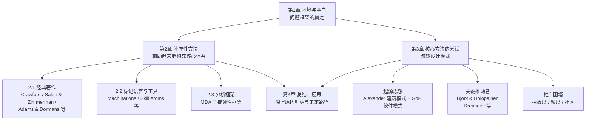
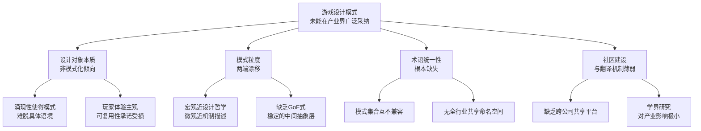
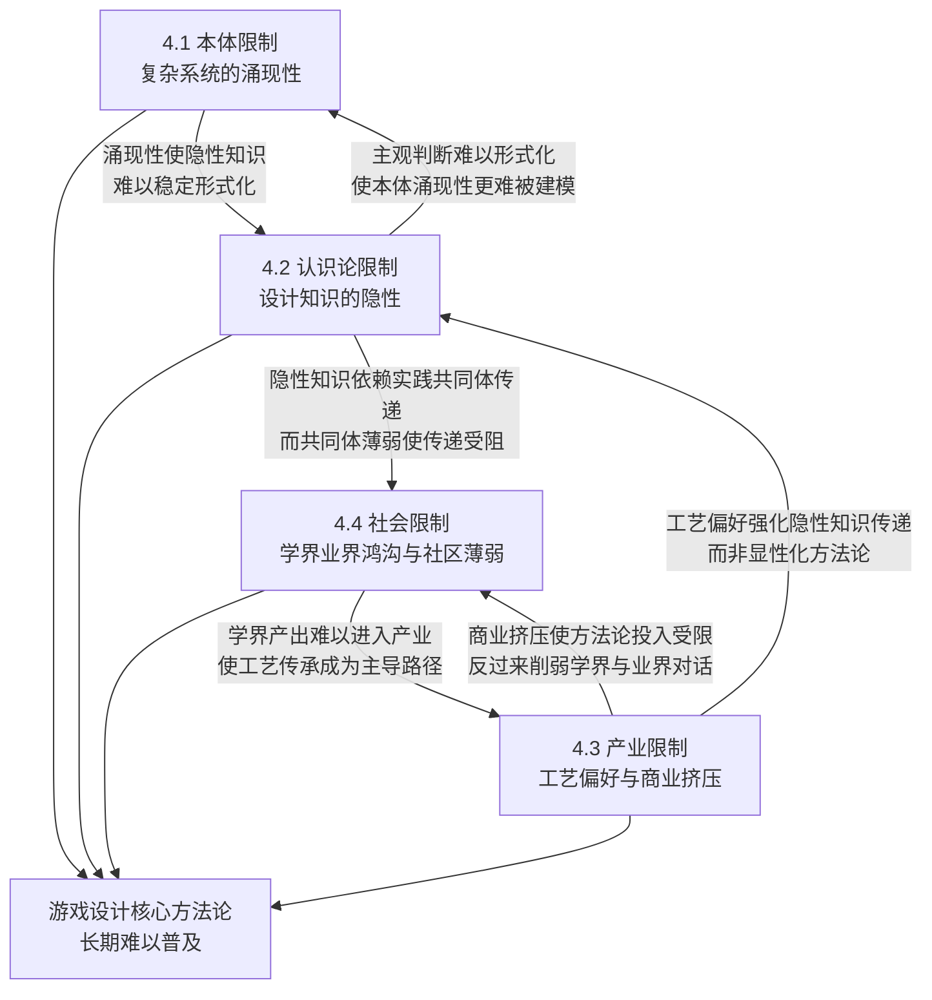

# 游戏设计方法论的困境与探索：补充性方法、核心方法及设计模式发展评述（截至2021年中期）
# 1 游戏设计方法论的困境与空白

游戏设计作为一门相对年轻的实践学科，自上世纪八十年代以来积累了大量从业者经验、学术研究和零散理论，却始终未能像建筑学、软件工程那样形成一套被广泛接受、可直接指导项目实践的核心方法论体系。本章作为整篇报告的问题起点，旨在为后续讨论奠定概念基础与逻辑框架：首先厘清长期被混用的"游戏设计"与"游戏开发"两个概念的差异，明确本报告所讨论方法论的对象边界；其次界定"方法论"在游戏设计语境下的具体含义并论证其必要性；继而梳理截至2021年中期该领域"理论丰富但核心缺失"的悖论式现状；最后从多重结构性维度剖析这一困境的深层成因，并据此提出贯穿全篇的问题框架。

## 1.1 游戏设计与游戏开发的概念辨析

讨论游戏设计方法论的第一步，是将"游戏设计"从更宽泛的"游戏开发"中明确剥离出来。两者虽常常在中文语境与产业实践中被混用，甚至在求职市场上以模糊的方式叠加在同一岗位上，但其在角色定位、工作内容与产出形态上存在根本差异。

从职业实践层面看，"游戏开发者"（Game Developer）这一称谓本身往往承担着覆盖整条研发管线的复合职责。来自自由职业市场的岗位描述显示，一位被定位为"full-fledged game developer and game designer"的从业者，其工作内容包含"from first idea to final build"的全流程，"handle code, game design, systems, and art"——即代码、游戏设计、系统与美术均由其统筹，"shaping them so everything feels intentional, smooth, and connected"[^1]。这种岗位描述清晰地反映了产业实践中两个概念被并列、被叠加的现实：开发覆盖工程化实现的全部环节，而设计仅是其中关于规则、机制、系统调谐与创意决策的子集。该自由职业者进一步描述其工作为"write gameplay code, build systems, tune mechanics, and make the creative calls that keep a game feel"[^1]——其中"tune mechanics"（调谐机制）与"make the creative calls"（做出创意决策）才是真正属于"游戏设计"的核心活动。

可以将两者的差异梳理为以下三个维度的对比：

| 维度 | 游戏设计（Game Design） | 游戏开发（Game Development） |
|------|------------------------|------------------------------|
| 角色定位 | 规则设计师、系统设计师、关卡设计师、数值策划 | 程序员、美术、音效、QA、项目管理等的总和 |
| 工作内容 | 规则与机制建构、系统逻辑、玩家体验设计、数值平衡、关卡布局 | 编程实现、资源制作、引擎集成、测试与发布等工程化任务 |
| 产出形态 | 设计文档、原型、玩法方案、平衡性参数、体验描述 | 可运行的软件产品、可发布的游戏构建包 |
| 核心问题 | "为什么这样设计？玩家会获得怎样的体验？" | "如何把这个设计稳定、高效地实现出来？" |

两者的交叉地带主要发生在原型迭代与玩法调谐阶段：设计者需要快速验证某个机制的可玩性，而程序员需要将临时方案落地为可测试的版本。在中小团队尤其是独立游戏团队中，一人身兼设计与开发数职是常态，这进一步加剧了两个概念在话语层面的混淆。但从方法论讨论的角度，本报告所聚焦的"游戏设计方法论"严格指向前者——即关于规则、机制、玩家体验如何被构思、决策与验证的方法与理论体系，而非软件工程意义上的开发流程方法论（如敏捷、Scrum等）。这种边界划定是后续所有讨论的前提：当我们追问"为什么游戏设计缺乏统一核心方法论"时，所问的并非"如何把游戏做出来"，而是"如何系统化地决定游戏应该是什么样"。

## 1.2 方法论的内涵及其对游戏设计的必要性

在厘清讨论对象后，下一个需要界定的概念是"方法论"本身。在游戏设计语境下，方法论可以被通俗地定义为设计者"做出一个设计时所使用到的方法和理论"，更直白地说，**就是当别人问起来"你为啥要这么设计"时，你给出的回答**[^2]。如果回答条理清晰、逻辑顺畅，则说明该设计有明确的方法论支撑；如果支支吾吾、东一榔头西一棒子，则说明该设计是没有方法论的，全凭感觉[^2]。

这种"可解释性"标准为我们提供了一个判别设计行为是否具备方法论支撑的实用尺度。以一个典型场景——玩家试玩反馈Boss难度过高、设计者决定将Boss攻击力降低5点——为例，可以观察三个层级的回答：第一层回答"攻击力降低5点肯定比之前简单对吧，至于够不够再让玩家试玩看看反馈"几乎完全凭感觉；第二层回答"我观察到玩家满血只能抗2刀，第三刀就死，我砍了5点攻击力，可以让玩家满血抗3刀，但不满血时仍然只能抗2刀"已经引入了对玩家状态空间的具体分析；第三层回答则进一步引入药品机制下的容错次数分析："玩家满血能抗2刀，吃个药能满血，再抗2刀，累计容错次数4；我砍了5点攻击力，可以让玩家满血抗3刀，吃个药回不满，能再抗2刀，这样满血容错+1，满血+一个药的容错还是+1"[^2]。**回答层级越深，方法论含量越高，但每一层之上仍然存在可被继续追问的空间**——满血和满血+一个药的体验差异是什么？为什么是砍伤害而不是增加药效或使用次数？这种追问链条的存在，恰恰说明游戏设计方法论的核心不在于给出唯一正确答案，而在于建立一套可被反复审视、可被团队共享、可被外部讨论的决策逻辑。

方法论在游戏设计中的必要性，与创意落地所需的协作规模直接相关。**创意落地所需的人力、时间越少，越不需要方法论，越依赖灵感与创意；反之创意落地所需的人力、时间越多，方法论就越重要、越不可缺**[^2]。这一规律可以从相邻媒介的对比中得到印证：写作、绘画通常由一人完成，灵感和创意占主导，许多大师作品后人分析半天也无法得出统一见解，更难总结方法论；而拍电影、电视剧需要一群人协作，即使有"导演"作为核心，灯光、运镜、脚本等"拍摄技法"也必不可少[^2]。即使在写作领域内部，短篇诗歌可以完全靠灵感，而长篇小说、剧本则必然需要结构与方法的支撑[^2]。

游戏作为一种典型的多人协作、长周期、跨学科的复合媒介，其创意落地天然需要方法论的支撑，具体体现在以下几个方面：其一，**保证团队内不同设计的一致性**——当多位设计师、程序员、美术共同推进同一项目时，若缺乏共享的方法论，设计决策将彼此割裂、风格难以统一；其二，降低沟通成本——可解释的设计决策能够减少团队内部反复讨论与返工；其三，支持系统化的迭代——基于方法论的设计能够在玩家测试反馈后定向调整，而非全凭直觉重做；其四，**沉淀可复用的设计经验**——方法论是个人或团队将一次性灵感转化为可重复实践的关键桥梁。值得强调的是，方法论与创意并不对立："游戏设计源自99%的方法论和1%的灵感，这1%的灵感比99%的方法论还重要，但没有那99%的方法论，这1%也没有用"[^2]——这一论断恰当地描绘了方法论作为"使创意得以成长的土壤"的角色定位。

## 1.3 统一核心方法论长期缺位的现状

尽管方法论对于游戏设计具有上述显而易见的必要性，截至2021年中期，这一领域却呈现出一种特殊的悖论式现状：**理论资源极为丰富，但被广泛接受、可直接指导项目实践的统一核心方法论却长期缺位**。

一方面，从1980年代Chris Crawford的早期理论著作起，经Salen与Zimmerman的《Rules of Play》、Jesse Schell的《The Art of Game Design》、Adams与Dormans的《Game Mechanics: Advanced Game Design》等，业界与学界已经出版了大量游戏设计书籍，提出了诸如MDA（Mechanics-Dynamics-Aesthetics）框架、"百种镜头"（Lenses）、Machinations图形化建模工具、技能原子（skill atoms）、游戏设计模式（Game Design Patterns）等众多分析框架与工具方法（这些资源将在后续章节展开评述）。另一方面，这些理论彼此分散、视角各异：有的聚焦于规则系统的形式化建模，有的强调玩家体验的现象学描述，有的偏向叙事与意义建构，有的则关注关卡与节奏。它们各自在其所聚焦的层面上提供了有价值的洞见，却尚未被整合为一个能够覆盖完整设计流程、被业界普遍接受、可直接落地的核心方法论。

这一现状在产业实践层面有着鲜明的反映。在咨询游戏开发战略时被指出，**"和游戏设计没有统一的方法论一样"，外部战略咨询如同"老中医"——虽然咨询框架经过广泛迭代，但"这种'老中医'一样的咨询受到的信赖度、可行性、实际效果都因项目而异"**[^3]。这一类比道破了游戏设计领域的核心特征：经验丰富的资深设计师如同老中医，能够基于多年项目积累给出有价值的判断，但这种判断难以被形式化、难以被普及为可教授的统一流程，更难以保证在不同项目上具有同等效力。

需要明确的是，"核心方法论长期缺位"并不意味着游戏设计是无规律的纯艺术活动，也不意味着没有任何方法论上的努力。事实恰恰相反：正是因为该领域意识到方法论的重要性，才出现了大量试图填补这一空白的尝试。但截至2021年中期，**这些尝试要么因其聚焦于特定层面而无法独立构成完整设计体系（即所谓的"补充性方法"），要么因其抽象度、可操作性与社区基础的限制而未能在产业界获得广泛采纳（如游戏设计模式）**。这一"理论丰富但核心缺失"的悖论现状，构成了本报告后续章节的核心论述对象。

## 1.4 困境的结构性成因分析

为何游戏设计领域虽有大量方法论努力，却始终未能建立起被广泛接受的核心方法论？这一困境不能简单归结为"该领域还不够成熟"，其背后存在多重结构性成因，需要从设计对象、媒介品类、玩家体验、学界业界关系、商业逻辑等多个维度综合剖析。

**第一，设计对象本身的复合复杂性**。游戏是一个由规则系统、叙事文本、交互机制、视听美学、社交动态等多个层面相互纠缠而成的复合系统。任何单一分析框架——无论是聚焦规则的形式化系统、聚焦体验的现象学描述，还是聚焦机制的图形化建模——都只能照亮其中一个层面，而无法穷尽全部。这与建筑学、软件工程等领域设计对象相对更具结构化、可分层、可模块化的特征形成对比，使得任何"统一方法论"的尝试都面临归约困境。

**第二，媒介与品类的极度多样性**。从手游、主机游戏到独立游戏，从模拟经营、卡牌、ARPG到FPS、Roguelike，不同品类之间的设计逻辑差异巨大。即使在同一品类内部，针对不同市场、不同用户群、不同平台的设计也呈现出截然不同的优先级。例如，在中小团队开发商业手游的实践中，立项阶段就已经从"市场驱动产品"出发，需要分析广告素材、筛选CPI（单个用户的获取成本）较低的题材，再针对不同市场进行用户调研——以一个监狱题材项目为例，团队最初基于直觉认为"在充满犯罪、暴力的世界中征服一切"或"管理经营一所私人监狱"会更受欢迎，但实际广告点击测试结果表明"体验监狱中真实的日常生活"的素材效果最好，且成本仅为其他方案的1/3[^4]。这种"市场—题材—用户—体验"的设计链条，与一款主机端3A叙事游戏的设计链条几乎不存在可共享的核心方法。媒介与品类的差异性使得任何宣称"统一"的方法论都难以在跨品类层面保持解释力与指导力。

**第三，可玩性与玩家体验的不可预测性**。游戏设计最终所追求的"好玩"是一种主观体验，难以被量化、难以被预测，使得设计验证更接近"老中医"式的经验判断而非可复用的科学流程[^3]。即便是经验丰富的资深设计师，也无法仅凭设计文档百分之百地预测玩家的真实体验，因而必须依赖反复的原型测试与玩家反馈。这种"必须通过测试才能验证"的特性使得"先有理论、再有实践"的方法论路径在游戏设计中难以奏效——任何方法论都必须为不可预测性留出迭代空间。

**第四，学界研究与业界实践的脱节**。学术圈对游戏的研究往往偏重批评性分析、文化研究与形式化建模，倾向于使用描述性而非规定性的语言；而业界则更需要可操作的落地工具、能直接缩短项目周期或提升玩家留存的实践方法。这种取向差异导致学界产出的大量框架在业界看来"不接地气"，而业界沉淀的大量经验在学界看来"不够系统"。**两者之间缺乏有效的翻译机制与共享平台**，使得方法论的整合长期难以实现。

**第五，组织结构与决策机制对方法论沉淀的侵蚀**。在大型公司内部，"只要知识、资源和决策权不在同一个人身上，就会出现这样的问题：别人有知识，你有资源，那有知识的人就一定会去糊弄有资源的人"[^3]。各个项目负责人都在"卷ppt"，似乎"每个立项的项目不是s级都不行，而一堆数据看起来很漂亮"[^3]。这种"报喜不报忧"的组织生态使得项目内部真正有价值的设计反思难以被沉淀为可复用的方法论，反而被包装为面向资源争夺的叙事。

**第六，商业驱动与市场导向对方法论空间的挤压**。在中小团队的商业手游开发实践中，"产品研发部门和市场部门完全分割开"的传统做法被认为是"逼迫自己走向一条死路"，因为"如今市场竞争激烈，无论国内还是国外市场，CPI都比早些年大幅增加，部分重度游戏的CPI高达50美金甚至还有超过100美金"[^4]。**对于中小团队而言，如果不先关注市场、选择了高成本的题材，"无论产品设计的多好，都不可能回收成本"**[^4]。这种商业现实使得题材选择、买量策略、CPI优化等外部因素成为决定项目生死的首要变量，而真正属于设计本体的方法论沉淀则被挤压到次要位置。研发优势让位于商业优势[^3]，是众多团队的现实选择。

综合上述六个维度，可以看到游戏设计核心方法论的缺位并非偶然，而是设计对象的复合性、媒介品类的多样性、体验的不可预测性、学界业界的脱节、组织内部的政治生态、商业逻辑的外部压力等多重结构性因素共同作用的结果。这一困境深植于游戏作为复杂动态系统的本体特性与产业生态的现实约束之中，难以通过单一方法论的提出予以彻底化解。

## 1.5 问题框架的提出与本研究的切入路径

在前述辨析与成因分析的基础上，本研究所关注的核心问题可以被提炼如下：**在缺乏统一核心方法论的前提下，游戏设计领域是如何通过补充性方法、局部性核心方法以及设计模式等不同路径来弥合这一空白的？这些尝试各自的贡献、局限与未被广泛采纳的原因是什么？这些原因背后又揭示了游戏设计这一学科怎样的本体特征？**

围绕上述核心问题，本报告后续章节将沿以下逻辑展开：

具体而言，**第2章将聚焦"补充性方法"**——即那些为游戏设计提供有价值支持，但因聚焦于特定层面而无法独立构成完整设计体系的方法。该章将从经典著作、标记语言与工具、分析框架三类入手，比较它们各自关注的设计面向、贡献与局限，分析它们为何无法升级为统一方法论。**第3章则聚焦"核心方法的尝试"**——重点分析游戏设计模式这一方向，探查其受Christopher Alexander建筑模式语言与软件工程GoF设计模式的思想启发、Björk与Holopainen等关键推动者的工作、Kreimeier等先驱的早期论述，并从抽象度、模式粒度、术语统一性、社区建设等维度归纳其为何在学术界获得一定关注却最终未在产业界广泛采纳。**第4章则作为收束**，综合前述各章分析，归纳核心方法论难以普及的深层原因——包括游戏作为复杂动态系统的本体特性、设计知识的隐性与情境性、行业对工艺与创意的偏重、学界与实务的鸿沟等——并在此基础上反思该领域未来可能的折衷路径。

需要预先说明的是，本研究在论证过程中将严格遵守"描述性 vs 规定性"的方法论定位区分——即清晰判定每个方法、工具、框架主要用于分析现有游戏（描述性）还是指导新游戏设计（规定性），这一判断本身将构成解释"为何缺乏统一核心方法论"的关键逻辑链条。同时，本研究所引用的文献、工具、框架、人物观点均以2021年中期之前的信息为准，以确保对当时方法论格局的还原具备时间一致性。

通过上述章节的递进展开，本报告希望为读者提供一份关于游戏设计方法论困境、补充性路径、核心尝试与深层反思的完整图景，使得"游戏设计为何缺乏统一核心方法论"这一看似简单的提问，能够被还原为一组涉及设计对象本体、媒介多样性、知识社会学与产业生态的复杂结构性议题。

# 2 补充性方法：辅助但未能构成核心设计体系的路径

延续第1章所提出的"理论丰富但核心缺失"的悖论判断，本章将系统梳理游戏设计领域中那些为设计实践提供了有价值支持、但因聚焦于特定层面或特定用途而无法独立构成完整设计体系的方法论资源。这些资源在过去三十余年间不断累积，构成了今天游戏设计话语的主要骨架，却也因为各自的视角分化、形式化范围有限、描述性偏向等共性原因，始终未能升级为统一的核心方法论。本章将这些"补充性方法"划分为三大类——经典著作、标记语言与工具、分析框架，依次梳理其代表性成果、关注的设计面向、所作贡献及其内在局限。在论述过程中，将贯穿"描述性 vs 规定性"的判定视角，剖析各类方法在面向"分析现有游戏"与"指导新游戏设计"两端的偏重，并通过横向比较揭示它们为何无法独立升级为统一核心方法论。本章在整体报告中起承上启下的作用：既具体化第1章所论困境的表现形态，也为第3章关于游戏设计模式作为"核心方法尝试"的讨论提供参照与对比基础。

需要预先说明的是，本章所涉及的代表性著作、工具与框架在第1章中已被列举为"理论丰富"现状的具体表征，本章将不再重复其历史背景，而是聚焦于它们各自的方法论定位、贡献与局限。同时，由于本章可调用的搜索结果较为有限，下文论述将主要建立在前章已确认的事实基础与领域内常识性认知之上，对于难以多源交叉验证的细节性论断，将在行文中保持审慎并说明边界。

## 2.1 经典著作类：理论奠基与视角分化

游戏设计书籍是该领域方法论资源中最早成型、积累最丰富、影响最广泛的一类。从1980年代起，一批从业者与学者陆续将各自的设计经验与理论思考整理为系统性的著作，构成了今天游戏设计教学与讨论的话语基础。然而，正是这一类资源最鲜明地体现了"视角分化"这一困境：每一部代表性著作都在其各自的视角下提供了深刻洞见，但彼此之间术语不统一、关注层面各异，难以汇聚为一个共享的核心方法论。

**Chris Crawford 的早期理论工作**可被视为这一谱系的起点。Crawford于1984年出版的《The Art of Computer Game Design》通常被视为最早试图对电子游戏设计进行系统性理论梳理的著作之一，他将游戏从形式上加以分类、讨论了游戏的本质特征以及设计者与玩家之间的"对话"关系。Crawford的工作奠定了"游戏可以被作为一种严肃的设计对象加以理论化"这一基本前提，但其论述更接近于一位早期实践者的反思与宣言，所提供的是概念框架而非可操作流程，且时代局限使其难以涵盖后来出现的复杂游戏品类。

**Salen 与 Zimmerman 的《Rules of Play》**则代表了另一条路径：从游戏研究（game studies）的学术立场出发，对游戏作为系统、作为游玩、作为文化的多重身份进行形式化与文化研究层面的分析。该书提出了大量分析性概念（如"魔圈"magic circle、"有意义的游玩"meaningful play 等），并对规则、互动、涌现等核心议题进行了深入讨论。其方法论定位**明显偏向描述性与分析性**——它为研究者和教育者提供了讨论游戏的语汇与视角，但并不直接告诉设计师在面对具体项目时"该如何做出决策"。因此，《Rules of Play》在学界获得了经典地位，却在产业实务中更多被视为"必读的思想资源"而非"可落地的方法手册"。

**Jesse Schell 的《The Art of Game Design: A Book of Lenses》**则采取了一种独特的"启发式"路径：将设计思考组织为上百个"镜头"（Lenses），每一个镜头都是一个看待设计问题的角度与一组提问清单。例如"惊奇之镜""乐趣之镜""玩家之镜"等，设计师在工作中可以随时拿起任意一个镜头审视自己的方案。这种做法**带有明显的规定性倾向**——它确实在试图指导设计师"如何思考"——但其本质并非一个统一的流程，而是一个工具箱式的提问集合：哪个镜头在何时使用、不同镜头给出的判断如何整合、镜头之间是否存在优先级，都被留给设计师的经验与直觉。Schell的工作因此被广泛使用于教学与个人反思场景，但难以构成团队共享的、可重复执行的方法论。

**Adams 与 Dormans 的《Game Mechanics: Advanced Game Design》**则将焦点收束至"机制"这一具体层面，强调通过形式化、可视化的工具（如后文将讨论的Machinations）来建模游戏内部的资源流动与反馈循环，探讨涌现型与渐进型游戏的设计原则。该书的方法论倾向相对最具规定性——它确实试图给出"应当如何设计机制"的具体建议——但其代价是论述对象的窄化：叙事、美学、社交、玩家心理等设计维度被相对边缘化。因此，《Game Mechanics》更像是一本机制设计的进阶工具书，而非一个端到端的游戏设计方法论。

将上述著作放在同一比较视野下，可以清晰看到其视角分化的图景：

| 代表著作 | 核心视角 | 主要贡献 | 方法论定位 | 主要局限 |
|----------|----------|----------|------------|----------|
| Crawford《The Art of Computer Game Design》 | 早期理论与设计者反思 | 奠定"游戏可被理论化"的前提，提出设计者—玩家对话观 | 概念性、宣言式 | 时代局限、缺少可操作流程 |
| Salen & Zimmerman《Rules of Play》 | 形式系统/游玩/文化的多重分析 | 提供学术化的分析语汇与概念框架 | 描述性、分析性 | 不直接指导项目决策 |
| Schell《The Art of Game Design》 | 镜头式启发法 | 上百个提问视角构成工具箱 | 启发性、半规定性 | 工具箱而非统一流程 |
| Adams & Dormans《Game Mechanics》 | 机制涌现与形式化建模 | 机制层面的规定性建议 | 偏规定性，但范围窄 | 仅覆盖机制，不含叙事与美学 |

这种视角分化并非偶然：它折射出第1章所述"游戏作为复合系统"的本体特征——规则、体验、机制、文化每一个面向都需要不同的理论工具，难以被同一套语汇统摄。结果是，**这些经典著作彼此之间不仅未能形成统一术语体系，反而构成了一种"多视角并存"的话语生态**：从业者可以从中各取所需，却难以指望任何一部成为"游戏设计的圣经"。它们因此构成了补充性而非核心性的方法论资源——是设计师思想训练与判断力培养的素材库，而非可直接交付项目使用的设计流程。

## 2.2 标记语言与建模工具类：形式化表达的局部突破

如果说经典著作类资源主要以语言与论述的方式介入设计，那么标记语言与建模工具则代表了另一种更具工程化色彩的努力——试图通过形式化、可视化的表达手段，将游戏内部的某些机制结构变得可被精确描述、可被推演、可被在团队内传递。这类工作在2010年代前后达到一个相对集中的产出期，其中最具代表性的两个例子是 Joris Dormans 提出并在 Adams & Dormans 著作中加以推广的 **Machinations 图形化建模工具**，以及由 Raph Koster、Daniel Cook 等人不同程度论述的 **技能原子（skill atoms）** 概念。

**Machinations** 的核心思想是将游戏内部的资源（resources）、池（pools）、来源（sources）、汇（drains）、转换（converters）、触发（triggers）等元素以图形化节点的方式表示出来，并通过连接边描述这些元素之间的流动与转换关系。设计师据此可以为一款游戏的经济系统、战斗循环、升级曲线等绘制出可视化的"机制图"，进一步通过模拟运行观察资源在不同参数设定下的动态行为。其规定性意图相对明确：**Machinations 不仅用于事后分析现有游戏，更被设计为可在设计前期支持原型推演、平衡性测试与团队沟通的工具**。在教学场景与部分研发实践中，Machinations 确实降低了讨论机制设计的门槛——设计师与程序员可以围绕同一张图讨论"这个反馈循环是正还是负""哪个池容易溢出"等具体问题，避免了纯语言描述带来的歧义。

但 Machinations 的局限同样显著。第一，**其聚焦层面高度集中于"资源流动与反馈循环"**——对于以资源管理、经济循环为核心的策略与模拟类游戏具有较强解释力，但对于叙事驱动的剧情游戏、强调视觉风格与氛围的艺术游戏、社交属性主导的多人游戏等品类，Machinations 所能描述的部分只占整个设计的一小块。第二，其学习曲线与表达约定对于不熟悉系统建模的设计师构成门槛，工业化采纳成本不低。第三，即便机制图可以模拟，最终的"好玩与否"仍需要通过实际玩家测试验证，模型本身不能替代体验判断。结果是，Machinations 在学术与教学场景中作为"机制思维训练工具"获得了一定地位，却难以独立支撑完整的设计流程。

**技能原子（skill atoms）** 则代表了另一种形式化思路：它不聚焦于资源流动，而是聚焦于玩家学习路径。Daniel Cook 等人提出，可以将玩家在游戏中习得的每一项能力分解为一个"原子单元"，每个原子包含动作（action）、模拟（simulation）、反馈（feedback）与更新（updating，即玩家心智模型的更新）四个环节；多个技能原子可以组合成更复杂的技能链与技能树，从而描述玩家在游戏过程中的渐进学习曲线。这种工具的规定性意图同样清晰——它试图帮助设计师**在设计阶段就思考"玩家会以怎样的顺序学到什么、每一步反馈如何强化学习"**，从而避免学习曲线陡峭或反馈不清的常见问题。

技能原子的局限与 Machinations 类似但又有所不同。其所覆盖的设计维度是"玩家技能习得与反馈循环"，这虽然是任何游戏都必然涉及的层面，但同样无法独立解释叙事、美学、社交等其它维度。此外，技能原子作为概念工具的形式化程度其实低于 Machinations——它更接近一种思考框架而非严格的标记语言，不同从业者对其使用方式存在差异，难以形成统一约定。

将这两类工具放在一起观察，可以总结出标记语言与建模工具类资源的共性特征：**它们都试图通过形式化手段对游戏的某一特定层面实现"可建模、可推演、可沟通"，从而在该层面上取得规定性的局部突破，但都未能覆盖游戏作为整体设计对象的全部维度**。它们对原型设计、平衡性分析与团队沟通的具体贡献不容忽视——尤其是 Machinations 在系统型游戏的早期原型阶段，确实可以将一些原本依赖直觉的判断转化为可推演的图示。但这种局部规定性恰恰反衬出整体规定性方法论的缺位：无论 Machinations 还是技能原子，都无法回答"我应当设计什么样的资源流动""玩家应当学到哪些技能"这一类前置的、关于"做什么"的问题，它们只能在设计师已经有了大致构想之后，帮助其将构想精确化与验证化。因此，这类工具是设计流程中的局部利器，但不是端到端的核心方法论。

## 2.3 分析框架类：描述性范式的解释力与边界

第三类补充性方法是分析框架——一组旨在为游戏设计与游戏理解提供概念分层与分析视角的中介性语汇。其中最具代表性、也最广为人知的当属 **MDA 框架（Mechanics-Dynamics-Aesthetics）**。MDA 由 Hunicke、LeBlanc 与 Zubek 在2000年代初的 GDC 工作坊与论文中提出，将一款游戏从设计师视角与玩家视角之间架起一座三层结构的桥梁：

- **Mechanics（机制）**：游戏的底层规则、组件与算法，即设计师可以直接操作与编码的对象；
- **Dynamics（动态）**：在玩家与机制交互过程中实际涌现出的运行时行为，是机制在被实际游玩时所产生的过程；
- **Aesthetics（美学/体验）**：玩家在与动态过程互动过程中所获得的情感反应与体验，例如挑战感、社交感、发现感、叙事感等八种被MDA作者列举的体验类型。

MDA 的核心洞见在于指出：**设计师从 Mechanics 出发向下游推进，而玩家从 Aesthetics 端出发反向感知**。两者关注的不是同一个对象，但通过 Dynamics 这一中间层得以相互对应。这一观念在教学、批评与团队沟通中具有显著的实际作用——它为设计师与玩家、设计师与设计师、设计师与批评者之间提供了一组共享的概念分层，使得"我们到底在讨论游戏的哪一层"这一问题有了相对清晰的答案。这一作用本身已经足以使 MDA 成为游戏设计教育中最常被引用的框架之一。

然而，MDA 的方法论本质**强烈偏向描述性而非规定性**。它擅长在事后解释一款游戏"为什么如此运作"——例如，可以分析说某款游戏因为机制A与机制B的组合产生了动态C，从而带给玩家D类美学体验——但当设计师在事前提出"我想给玩家D类体验，应当如何设计机制"时，MDA 框架本身并不能给出操作性答案。从 Aesthetics 反向推导到 Mechanics 的过程在 MDA 中被指出是设计师的工作，但这条"反向链路"具体如何走，框架并未提供算法或决策流程。换言之，**MDA 提供了一组分层与一组词汇，但并未提供一条从需求到设计的可执行路径**。

类似的描述性倾向也出现在其他若干分析框架中——例如对游戏类型、玩家类型、体验类型的各种分类学努力（如玩家类型四象限、体验维度分类等），它们各自都为讨论游戏现象提供了视角，却同样将"如何决定下一步设计动作"这一规定性问题留给了设计师本人。

这一现象并非缺陷而是其方法论定位使然：分析框架的设计初衷本就是要为复杂的游戏现象提供概念分层与对话语汇，而非给出工程化的设计流程。它们与第2.2节所述的形式化建模工具的差异恰好体现在此：标记语言力图通过形式化精确描述某一层面的动态以支持推演，而分析框架则在更高的抽象层面提供一组分层概念以支持讨论。这两者都很有价值，但都不能替代一个端到端的核心方法论。**分析框架可以告诉你应当如何"看待"一款游戏，却难以告诉你应当如何"做出"一款游戏**——这是它作为补充性方法的本质边界。

## 2.4 三类补充性方法的横向比较与共性局限

在分别梳理了经典著作、标记语言与工具、分析框架三类资源后，有必要在同一比较视野下对其进行横向对照，以便清晰地看到它们各自的边界与共同的结构性局限。下表从五个维度对三类方法进行总体性比较：

| 比较维度 | 经典著作类 | 标记语言与工具类 | 分析框架类 |
|----------|------------|------------------|------------|
| 主要关注的设计面向 | 各部著作分别聚焦规则、体验、机制、叙事等不同层面 | 资源流动、反馈循环、技能学习等系统性层面 | 设计师视角与玩家视角的中介分层 |
| 描述性 vs 规定性 | 多数偏描述/启发，少数偏规定（如Adams & Dormans） | 局部规定性较强，但限于特定层面 | 强描述性，弱规定性 |
| 抽象度 | 中至高，倾向于思想性论述 | 中至低，倾向于形式化与具体化 | 高，倾向于概念分层 |
| 可操作性 | 提供思考素材而非操作步骤 | 在所聚焦层面可操作性强 | 提供讨论语汇，操作性弱 |
| 跨品类适用性 | 因品类倾向而异，难以单一覆盖 | 强烈依赖品类，系统型游戏适用性更高 | 跨品类适用性较好，但仅在分析层面 |
| 社区与产业采纳 | 作为教学经典被广泛引用，但实务中作为思想资源 | 学术与教学场景采纳度高，工业化采纳有限 | 教育与批评场景广泛使用，作为分析共识语汇 |

基于上述比较，可以归纳出三类补充性方法所共同折射出的**结构性局限**：

**第一，聚焦层面单一，缺乏端到端覆盖**。无论是聚焦机制的 Adams & Dormans 与 Machinations，还是聚焦体验的 MDA 与 Schell，每一种方法都只覆盖了游戏设计完整链条中的某一段。这一现象与第1章所述"设计对象的复合复杂性"直接对应——游戏作为规则、叙事、交互、视听、社交相互纠缠的复合系统，难以被任何单一方法穷尽。

**第二，描述性偏向明显，规定性能力不足**。即便是其中相对最具规定性的资源（如 Schell 的镜头或 Machinations 的图形化建模），其规定性也是"局部规定性"——告诉设计师在某一层面如何思考或建模，而非"流程规定性"——告诉设计师从立项到验证的完整决策路径。多数资源更倾向于"分析既有游戏"或"启发设计思考"，而非"指导从零开始的设计"。这一偏向使得它们难以构成被产业界直接采纳的工业化方法。

**第三，未能形成统一的术语体系**。Crawford 的对话观、Salen & Zimmerman 的魔圈与有意义的游玩、Schell 的镜头、MDA 的三层结构、Machinations 的资源—池—汇——这些术语彼此之间几乎不存在系统性的翻译关系。一位设计师即使阅读了所有这些资源，也难以将其整合为一套统一的工作语汇。术语的分散意味着实践共同体的分散，进而意味着方法论无法通过共享语汇被广泛传递与迭代。

**第四，缺乏共享的实践社区与可积累的案例库**。与软件工程中"设计模式"借由 GoF 一书形成全球工程师共享的命名与案例库不同（第3章将详细讨论这一对比），游戏设计领域的补充性方法各自零散分布于不同的著作、工具与课堂之中，从业者对其使用方式高度个人化，缺乏一个跨公司、跨项目、跨地域共享的方法论实践社区。

**第五，跨学界与业界的翻译机制薄弱**。如第1章所述，学界产出的描述性框架在业界看来"不接地气"，业界沉淀的工艺经验在学界看来"不够系统"，而三类补充性方法的大多数代表性资源都更靠近学界一端。这使得它们在学术教学场景中得到了相对充分的传播，却难以渗透到真正决定项目命运的商业研发流程中。

综合而言，这三类补充性方法虽然在各自的局部具有不可替代的价值——它们共同构成了今天讨论游戏设计的话语骨架，培养了一代又一代设计师的思考方式与判断力——但**它们的并存恰恰反衬出游戏设计领域核心方法论缺位的本体困境**。读者读完所有的经典著作、掌握了所有的标记工具、熟悉了所有的分析框架，仍然无法获得一套像建筑学的"设计—施工"流程或软件工程的"需求—架构—编码—测试"流程那样端到端、被广泛接受、可直接交付项目使用的核心方法论。

这一困境正是下一章所要讨论的"游戏设计模式"作为更具核心方法论野心的尝试所力图回应的问题。游戏设计模式有意识地借鉴了建筑学（Christopher Alexander）与软件工程（GoF）的设计模式传统，试图建立一个跨项目、跨品类、跨团队共享的设计知识体系，其抽象层级、组织方式与社区建设思路都明显不同于本章所述的三类补充性方法。然而，正如第3章将要展示的那样，游戏设计模式虽然在学术界获得了一定关注，却最终也未能在产业界获得广泛采纳——而其推广困境的成因，与本章所归纳的结构性局限既存在共性，又呈现出一些独特的新问题。本章对补充性方法的梳理与比较，正是理解这一更深层困境的必要铺垫。

# 3 核心方法的尝试：游戏设计模式（Game Design Patterns）

在第2章对补充性方法的系统梳理中，我们已经看到经典著作、标记语言与分析框架虽各自在局部层面提供了有价值的支撑，却共同陷于聚焦层面单一、描述性偏向明显、术语分散与社区薄弱的结构性局限。这些局限指向一个更深层的诉求：游戏设计领域需要一种真正具有**核心方法论野心**的尝试——它应当跨越特定层面，建立可在不同项目、不同品类、不同团队之间共享的通用设计知识体系，而非停留于某一视角的工具或语汇。本章所要讨论的"游戏设计模式"（Game Design Patterns），正是过去三十年间该领域内最接近这一目标的一次系统性努力。它有意识地借鉴了建筑学与软件工程两个相对成熟领域中"模式语言"的方法论传统，试图通过识别反复出现的设计问题、组织可复用的解决方案、建立共享的命名与分类体系，弥合"理论丰富但核心缺失"的空白。然而，正如本章后文将逐步揭示的那样，这一尝试虽然在学术界获得了一定的关注与积累，却最终未能在产业实践中获得与其在建筑学与软件工程中类似的广泛采纳。理解这一"未竟之处"，恰恰是理解游戏设计这一学科本体特性的最佳切入点。

## 3.1 思想起源：从建筑模式语言到软件设计模式的双重启发

游戏设计模式的思想血脉并非凭空生成，而是有两条清晰可辨的源流：一条来自建筑学，由Christopher Alexander开创；另一条来自软件工程，由所谓"四人组"（Gang of Four，GoF）系统化。这两条源流虽然分别诞生于截然不同的学科背景，但共享着一组高度一致的方法论假设，正是这组假设构成了游戏设计模式得以提出的范式基础。

**建筑模式语言的奠基**。1977年，加州大学伯克利分校建筑学教授Christopher Alexander与萨拉·伊舍卡娃、穆雷·西尔弗斯坦合著的《A Pattern Language: Towns, Buildings, Construction》（《建筑模式语言》）问世，全书以253个模式为理论框架，涵盖城镇分布、邻里规划、住宅构造等多个空间形态设计层面，从"独立区域""城镇分布""指状城乡交错"等宏观尺度，一直延伸至"小路网络与汽车""丁字形节点""绿荫街道""分娩环境"等具体到房间或细部的微观尺度[^5]。其核心理念强调"以人为本"，关注人、社会与自然环境的协调统一，主张设计来源于生活实践、关注场所形态与活动的一致性[^5]。Alexander由此提出了一个被后人反复引用的经典定义：**"每个模式都描述了一个在我们的环境中不断出现的问题，然后描述了该问题的解决方案的核心，通过这种方式，我们可以无数次地重用那些已有的解决方案，无需再重复相同的工作"**[^6]。这一定义在概念层面凝结了模式语言的方法论核心——在特定环境中识别反复出现的问题，并以可复用的方式表达其解决方案[^6]。从理论定位上看，模式语言"将设计视为形式（form）与环境（context）之间的纽带"，其设计行为对功能需求进行综合，并用形式来满足需求，最终指向"一种划分层级与穷举个例的类型学"[^7]。这种"分层级、可穷举"的结构特征，使得模式语言不仅是一组分类清单，更是一种可被组合使用的"语言"——设计者可以像运用语法那样调用模式，组合出适应不同环境的设计方案[^7]。

**软件设计模式的转译**。Alexander的模式思想最早于1987年由Kent Beck与Ward Cunningham借鉴并应用于程序开发，并在OOPSLA会议上发表初步成果，引起软件工程界关注[^6]。真正使设计模式在软件领域获得里程碑式地位的，是1994年（部分文献亦称1995年）由Erich Gamma、Richard Helm、Ralph Johnson与John Vlissides四位作者合著出版的《Design Patterns: Elements of Reusable Object-Oriented Software》[^8][^9]。这四位作者被合称为"四人组"（Gang of Four，GoF），他们在书中系统阐述了23种面向对象设计模式，并按目的准则将其划分为三类：**创建型模式**（主要用于隐藏对象创建逻辑，如工厂模式、抽象工厂模式、单例模式、建造者模式、原型模式）、**结构型模式**（关注类与对象的组合，如适配器、桥接、组合、装饰器、外观、享元、代理模式）以及**行为型模式**（定义对象间的交互与通信）[^8][^9]。这一分类体系连同每一种模式的"问题—解决方案—结构—参与者—后果"组织格式，奠定了软件领域可复用代码设计经验的范式[^6][^8]。GoF的工作不仅完成了Alexander思想向软件工程的转译，更进一步明确了设计模式的功能定位：它"占据应用领域模型与软件系统实现之间的中心位置"，"代表了我们对应用领域的理解，并整合了软件系统的约束与形式化需求"，是连接领域概念与对象设计构造的"微架构"（micro architectures）[^10]。后续研究还在GoF基础上继续扩展模式类别，例如Mark Grand补充了并发相关模式，Core J2EE Patterns则针对企业级应用场景开发了新的模式[^8]。

**两条源流的共同方法论特征**。将建筑模式语言与软件设计模式并置观察，可以提炼出一组它们共享的核心方法论假设，正是这组假设直接为游戏设计模式的提出者提供了范式启发与正当性来源：

| 共同特征 | 建筑模式语言（Alexander） | 软件设计模式（GoF） |
|----------|---------------------------|---------------------|
| 问题—解决方案对偶 | 在特定环境中识别反复出现的空间/活动问题，给出形式化解答[^6] | 在面向对象设计中识别反复出现的结构问题，给出类/对象关系解答[^8] |
| 可复用性 | "无数次地重用已有解决方案"[^6] | "提升软件的可复用性和可维护性"[^6] |
| 分类编目 | 253个模式按层级（城镇—邻里—住宅—房间）穷举[^5][^7] | 23个模式按创建型/结构型/行为型分类[^8][^9] |
| 模式之间的语言关系 | 模式可组合使用，形成可读的"设计语言"[^7] | 模式之间存在引用与组合关系，构成微架构语汇[^10] |
| 经验沉淀的形式化 | 将建筑师对场所与人的隐性理解显性化[^5] | 将"有经验的面向对象开发人员"的最佳实践显性化[^9] |
| 中介性定位 | 介于功能需求与具体形式之间[^7] | 介于应用领域模型与系统实现之间[^10] |

这一比较揭示出一个关键事实：**模式语言之所以在建筑学与软件工程中获得成功，并不仅仅因为它提出了一些"有用的解决方案"，更因为这两个领域的设计对象本身具备"问题—解决方案对偶可被稳定识别、抽象与编目"的结构性条件**——建筑空间有相对稳定的尺度层级与功能类型，软件代码有相对稳定的对象关系与运行约束。这一前提为后续游戏设计模式的尝试设定了一个隐含的"成功条件"：当游戏设计的提出者试图借用模式语言的范式时，他们实际上在假定游戏设计也具备类似的对偶结构。这一假定能否成立，将成为本章后续讨论的关键悬念。

## 3.2 关键推动者与代表性工作

在Alexander与GoF的双重范式启发下，从2000年前后起，一批研究者与从业者陆续将"模式"思想引入游戏设计领域，试图建立游戏特有的模式语言。其中最具代表性的努力沿着两条并行的路径展开：一条以"模式"为名义、明确借鉴Alexander与GoF的传统；另一条则以"规则"为名义、走向了一种更轻量、更经验性的整理方式。本节将依次梳理这些关键推动者与里程碑工作。

**Bernd Kreimeier的早期倡议与方法论综述**。2003年GDC期间，Bernd Kreimeier撰写了《Game Design Methods: A 2003 Survey》一文，明确将"游戏设计方法"——即用于规划与定义可玩性（gameplay）的方法——作为该届GDC两场圆桌讨论的主题加以铺垫[^11]。Kreimeier在文中指出，与电影制作领域所积累的庞大操作性知识体系相比，**"游戏设计社区才刚刚开始为我们这一媒介所特有的概念与技术建立明确表达，进而建立游戏设计方法"**[^11]。他借用Doug Church的论述提出了对游戏设计方法的基本要求：方法必须与游戏设计本身相关，必须适用于游戏的实际互动结构与机制[^11]。这篇综述虽未直接以"模式"为标题，但其作为该届GDC圆桌讨论的铺垫文本，与同期Kreimeier在Gamasutra上对游戏设计模式的早期倡议构成了密切的呼应关系，标志着游戏设计模式概念在学界与业界的最早系统化倡议。Kreimeier的工作意义在于，他第一次明确地将"游戏设计方法的形式化"作为社区议题提出，并以建筑学与软件工程的方法成熟度作为参照，质问游戏设计为何尚未拥有类似的方法论体系[^11]。

**Staffan Björk与Jussi Holopainen的系统化模式集**。如果说Kreimeier的工作是倡议性的，那么Björk与Holopainen的工作则是建构性的。其代表作《Patterns in Game Design》（2005）尝试系统地构建一个覆盖广泛的游戏设计模式库，所提出的模式涵盖游戏组件、目标、信息、行动等多个维度，并尝试建立模式之间的关联关系（如实例化、调制、冲突等）。Björk在哥德堡的Chalmers University of Technology长期主持游戏研究方向的工作——例如2012年Christopher Dristig Stenström关于角色扮演游戏战斗系统设计的硕士论文即由Staffan Björk作为审查人指导完成[^12]——这一持续性的学术机构基础使得Björk团队的模式工作具有较强的延续性。后续研究者在评述该领域时指出，"游戏设计模式领域因视频游戏、严肃游戏与教育领域支持设计过程的工具需求而迅速发展"[^13]，而Björk与Holopainen的工作正是这一发展的核心节点之一。从方法论定位上看，他们的模式集试图同时承担两种功能：既可作为分析现有游戏的工具——为研究者提供命名与归类的语汇；也可作为指导新设计的工具——为设计师提供可调用、可组合的"模式库"。这种**双重定位本身就是该领域试图回应"补充性方法过于偏向描述性"困境的一种明确尝试**，但也为后续的推广困境埋下了伏笔。

**Hal Barwood与Noah Falstein的"400 Project"作为并行路径**。与Björk等人借鉴Alexander/GoF传统的"模式"路径相比，Hal Barwood与Noah Falstein自2001年GDC起推动的"400 Project"则代表了另一种取向。该项目源于Barwood在2001年GDC上发表的题为"Four of the Four Hundred"的演讲，他在演讲中假设存在约400条规则在支配着游戏设计，并讨论了其中的4条[^14]。次年GDC上Falstein加入并继续添加内容，整合了其他设计师的贡献，最终共同发展出"400 Project"——截至当时大约写下了110条规则[^14]。这一项目的方法论取向与Björk的模式集存在微妙但重要的差异：它使用"规则"（rules）而非"模式"（patterns）作为基本单位，目标更接近于"经验法则的整理"而非"问题—解决方案对偶的形式化"。

然而，"400 Project"的推动者本身对这一路径的局限性保持了高度清醒。Barwood在回顾项目时坦言，自己**"非常清楚这样的实践所具有的局限性"**，并指出"我所反抗的规则是那些将游戏设计当成与编辑设计类似的内容。这是一种特别愚蠢的看法：一方面，相信遵循非常精确的规则将创造出一款吸引人的游戏；另一方面，相信所谓的吸引力是受到很酷的科学原理与逻辑的影响"[^14]。Falstein同样在评价项目时引用了Captain Barbossa的著名台词作为警示——**"代码更像是指导方针，而不是真正的规则"**[^14]。这一自我警示折射出400 Project与游戏设计模式路径之间的共同张力：使用"规则"一词本身便是问题的来源，因为"规则"指代"一些不可变的内容"[^14]。Katie Salen与Eric Zimmerman的《Rules of Play》虽然书名带有"规则"一词，但当读者实际阅读该书时会发现，**它"并不是真正关于游戏设计规则本身——规则指代的是游戏自身的规则，而本书致力于为游戏分析创造一个框架，这不仅只是作为设计师所遵循的一种方法"**[^14]。Zimmerman本人在被问及这一定位时也确认了其有意为之：**"因为游戏设计师通常都是一些基于结构且擅于分析的思想者，所以为优秀的设计想出一套'规则'是非常诱人的"**[^14]——这句话恰恰道破了游戏设计领域对"规则化/模式化"的吸引力来源，同时也暗示了为何这种吸引力最终难以转化为产业实践的核心方法论。

将上述三条工作路径并置观察，可以归纳出游戏设计模式（及其平行尝试）在共同目标下的方法论差异与取向分化：

| 推动者/项目 | 基本单位 | 抽象层级 | 主要面向 | 与Alexander/GoF的关系 |
|-------------|----------|----------|----------|------------------------|
| Kreimeier（2002–2003） | 模式（pattern） | 倡议性、综述性 | 学界与业界沟通的方法论议题铺垫 | 明确援引模式语言传统作为参照[^11] |
| Björk & Holopainen《Patterns in Game Design》（2005） | 模式（pattern） | 中等抽象，覆盖多维度 | 既分析现有游戏，又试图指导新设计 | 直接借鉴Alexander模式语言的组织方式 |
| Barwood & Falstein "400 Project"（2001–） | 规则（rule） | 低至中等，偏经验法则 | 更接近设计师个人启发清单 | 较少直接借鉴Alexander，更接近经验整理 |

这一比较表明，**即便在游戏设计模式这一"核心方法论尝试"的内部，研究者们对于"模式应当是什么"也已经存在显著分化**——这种内部分化本身就预示了该方向未能在产业界形成统一共识的早期信号。

## 3.3 游戏设计模式与其他领域设计模式的横向比较

要理解游戏设计模式的特殊性与其推广困境的深层根源，最有效的方式是将其置于Alexander建筑模式与GoF软件模式的参照系下进行横向比较。这一比较不仅能揭示游戏设计模式在借鉴前两者范式时所获得的方法论资源，更能揭示其在借鉴过程中所遭遇的本质性挑战。

**抽象度的稳定性差异**。在建筑模式语言中，253个模式虽然覆盖了从"独立区域""城镇分布"这样的宏观尺度到"丁字形节点""分娩环境"这样的微观尺度，但每一个模式所处的抽象层级是相对稳定且可被定位的——它要么属于城镇层、要么属于邻里层、要么属于住宅层[^5][^7]。GoF的23个模式同样具备稳定的抽象层级，全部位于"类与对象关系"这一相对统一的层级上[^8][^9]。相比之下，游戏设计模式在抽象度上呈现出明显的不稳定性：同一份模式集合中，可能既包含接近设计哲学的宏观模式（如"风险—回报""涌现行为"），又包含接近具体机制描述的微观模式（如"生命值""倒计时器"）。这种**层级游移源自游戏设计对象本身的多维耦合**——规则、机制、体验、叙事、社交难以被清晰地分解到不同层级之中。

**可操作性的对应关系差异**。GoF模式的一个关键优势在于其与代码实现之间存在相对明确的对应关系：一个工厂模式可以对应特定的类与方法结构，一个观察者模式可以对应明确的接口与回调关系，软件工程师可以"读懂"模式描述后将其直接转化为代码[^8][^9]。这种"模式—实现单元"的明确对应使得GoF模式具备了高度的工程化可操作性。Alexander的建筑模式虽不能像GoF那样直接对应"代码单元"，但其与建筑空间元素（房间、走廊、窗户、门）之间也存在清晰的物理对应关系[^5]。然而在游戏设计中，**一个模式（例如"对称冲突"或"虚假目标"）很难对应到任何明确的实现单元**——它可能体现为关卡布局、可能体现为数值平衡、可能体现为AI行为、也可能体现为叙事编排。这种实现单元的不确定性使得游戏设计模式难以达到与GoF同等的工程化精度。

**问题—解决方案对偶的稳定性差异**。Alexander反复强调，模式语言的有效性依赖于"问题在环境中反复出现"这一前提条件[^6]。在建筑学中，"如何让住宅同时满足采光与隐私"是一个跨时代、跨地域都反复出现的问题，因而可以有相对稳定的解决方案[^7]；在软件工程中，"如何在不增加耦合的前提下扩展对象行为"同样是面向对象编程中反复出现的问题，因而装饰器模式可以提供稳定解答[^9]。然而游戏设计的"问题"本身并不稳定——一款Roguelike游戏中关于"难度曲线"的问题，与一款叙事冒险游戏中的"难度曲线"问题，几乎不属于同一类问题；甚至在同一品类内部，针对不同玩家群体、不同平台的"问题"也会呈现出不同形态。这意味着**游戏设计模式所宣称的"解决方案"往往依赖于一组未被明确说明的语境前提**，而一旦语境改变，模式的有效性即可能消失。

**模式间关系的形式化程度差异**。GoF模式之间的关系（如"装饰器可以与组合一起使用""抽象工厂常通过工厂方法实现"）虽然不算严格形式化，但因为每个模式有清晰的代码对应，模式间的组合关系可以被读者直接验证[^8]。Alexander的模式语言通过分层结构隐含地定义了模式之间的"上下文—子模式"关系[^5][^7]。Björk与Holopainen则更进一步尝试在游戏设计模式之间建立"实例化""调制""冲突"等明确的关联关系——这一努力体现了其建构性的方法论野心。然而由于游戏设计模式本身的语境依赖性，这些关系的可验证性远低于GoF模式间的关系。

**社区共享基础的差异**。GoF模式之所以在软件工程中获得广泛采纳，与其后续在全球软件工程师社区中形成的庞大实践共同体密不可分：从开源项目、技术博客、面试问题到大学课程，GoF模式构成了软件工程师的"共同语言"，新的模式（如并发模式、企业应用模式）也持续在这一共同语言之上被扩展[^8]。Alexander的模式语言虽未达到GoF在软件领域的普及度，但在建筑与城市规划教育中也具备稳定的引用地位[^5]。相比之下，游戏设计模式的社区共享基础明显薄弱——后续研究者在评述时直接指出，**游戏设计模式"在创建、呈现与使用上互不兼容"，且"已经偏离了它们最初的根源"**[^15]，这一判断揭示出该领域不仅未能形成全行业共享的命名空间，甚至连各模式集合之间的基本兼容性都难以保证。

将上述比较汇总如下表：

| 比较维度 | Alexander建筑模式 | GoF软件模式 | 游戏设计模式 |
|----------|-------------------|--------------|--------------|
| 抽象度的稳定性 | 层级清晰、稳定[^5][^7] | 统一在类/对象层级[^8] | 在机制、体验、叙事间游移 |
| 与实现单元的对应 | 对应明确的空间元素[^5] | 对应明确的代码结构[^9] | 难以对应明确的实现单元 |
| 问题—方案对偶的稳定性 | 跨时空相对稳定[^7] | 在面向对象范式内稳定[^8] | 高度依赖品类与体验目标 |
| 模式间关系的可验证性 | 通过分层结构隐含定义[^5] | 通过代码组合直接验证[^8] | 形式化尝试存在但难以验证 |
| 社区共享基础 | 建筑教育中稳定引用[^5] | 全球工程师社区共同语言[^8] | 模式集合互不兼容[^15] |

这一系统比较所揭示的关键事实是：**游戏设计模式在借鉴Alexander与GoF范式时所遭遇的核心困难，并非"还没找到足够好的模式"，而是其设计对象的本体特征与建筑空间或软件结构存在根本差异**。游戏所追求的"可玩性"与"玩家体验"既具有主观性，又具有涌现性——它产生于规则系统与玩家行为的动态交互过程中，而非内嵌于设计对象的静态结构之中。这种本体差异使得"模式"这一概念在游戏领域难以达到建筑学与软件工程中的同等精确度与可操作性。从这个意义上讲，游戏设计模式不是"模式语言在新领域中的简单移植"，而是一次范式跨越的实验——这一实验是否能够最终成功，取决于游戏设计这一对象是否真的具备模式化的本体条件，而这恰恰是其最大悬念所在。

## 3.4 推广困境的多维归纳

在前述思想起源梳理与横向比较的基础上，我们可以更系统地归纳游戏设计模式虽在学术界获得一定关注却未在产业界广泛采纳的深层原因。这一归纳将从设计对象本质、模式粒度、术语统一性、社区建设四个维度展开，每一维度都对应着游戏设计这一学科所特有的、超越补充性方法困境的新挑战。

**第一，设计对象本质的非模式化倾向**。如3.3节所揭示的，游戏作为复杂动态系统与涌现行为的载体，其"问题—解决方案"对应关系在本体上是不稳定的。这一本体特性可以从复杂系统理论的视角得到进一步阐释：游戏中典型的"涌现"指的是**"系统组成部分间简单的互相交互，却在宏观层面产生了新的特性或行为"，是非线性系统的特征，即1+1>2**[^16]。在以涌现为核心追求的游戏设计中（无论是物理模拟类、AI驱动的沙盒类，还是规则交互产生的策略类），玩家体验并非内嵌于任何单一规则或机制中，而是涌现自规则之间的相互作用[^16]。这意味着设计师不能简单地通过"调用某个模式"来获得某种体验——他必须建构整个系统的相互依赖关系，并在反复测试中观察体验是否真的涌现。在此本体条件下，**模式难以脱离具体语境而独立成立**：同一个被命名为"风险—回报"的模式，在Roguelike与卡牌构筑游戏中所发挥的具体作用、所需要的支持机制、所产生的实际体验都可能完全不同。

进一步说，玩家体验的不可预测性使得模式的"可复用性"承诺大打折扣。建筑与软件领域的模式之所以"可复用"，是因为采纳模式所得到的结果在很大程度上是可预测的——遵循适当采光的模式，住户大概率会获得期望的光照体验；遵循观察者模式，类之间大概率会获得期望的解耦。但在游戏设计中，"采纳同样的模式"几乎不能保证"获得同样的体验"，因为体验最终由玩家的主观感知与游戏的动态过程共同决定，而这两者都无法被设计师完全掌控。

**第二，模式粒度的两端漂移问题**。如3.3节所述，游戏设计模式在抽象度上呈现层级游移——而这一游移在实践层面具体表现为模式粒度的两端漂移：一端过于宏观（接近设计哲学，例如"挑战与成长""社交互动"），一端过于微观（接近具体机制描述，例如"生命值显示""倒计时机制"）。**这种两端漂移的根源在于游戏设计领域缺乏GoF式恰到好处的中间抽象层**——GoF模式之所以好用，是因为它们既高于具体代码、又低于设计哲学，正好对应"类与对象关系"这一稳定的中间层。而游戏设计中并不存在这样一个稳定的中间层：规则、机制、动态、体验、叙事、社交在不同游戏中以不同方式耦合，难以分离出一个普遍适用的中间抽象层级。

近年来部分研究者继续尝试在特定主题下提出更具针对性的模式集合——例如关于电子游戏中"欺骗"（deception）这一主题的研究，识别了九种游戏设计模式（Mimic、Faux Finale、Crash & Burn、Single Twist、Double Twist、False Friend、Oblivious Finding、Blatant Lie、Misleading Standards），探讨了游戏机制、叙事与玩家体验的相互关系[^17]。这类工作展示了在某一主题或某一体验类型内部，模式仍然可以被识别并具备一定的适用性。然而这种"主题特化"的模式工作恰恰反映出**当模式被限定在足够窄的语境内时才容易稳定，一旦试图扩展到通用的游戏设计层面，粒度就会变得难以把握**——主题特化是模式得以稳定的代价，也是其难以构成统一核心方法论的原因。

**第三，术语统一性的根本缺失**。当后续研究者尝试对现有的游戏设计模式集合进行系统综述时，得到的结论相当明确：**"游戏设计模式领域因视频游戏、严肃游戏与教育领域中支持设计过程的工具需求而快速发展。然而，游戏设计模式的集合在其创建、呈现与使用上互不兼容，并且已经偏离了它们最初的根源"**[^13][^15]。这一判断揭示了游戏设计模式领域在术语统一性上的根本困境：不同研究者基于各自的研究目的与方法论取向，独立创建了大量模式集合，这些集合之间的命名规则、描述格式、组织方式、抽象层级都不一致，彼此孤立而难以相互引用。Liukkonen等人在《Comparative Analysis on Game Design Pattern Collections》中明确指出，为应对这种碎片化，他们提出了**"基于游戏设计与实现过程中使用方式"的游戏设计模式分类法**，希望通过这种元层级的分类来重新组织现有模式资源[^15]。但这种"对模式的再分类"努力本身就是术语统一性缺失的反向证明——当一个领域需要二阶分类来组织其一阶分类时，意味着一阶层面的术语共识尚未建立。

术语分散在实践层面的后果是显而易见的：从业者即使阅读了Björk与Holopainen的模式集，也难以将其中的术语直接对接到自己所熟悉的设计语汇中；不同研究者所发表的模式论文之间难以相互引用与累积；学界与业界之间也难以在共同的术语基础上展开对话。**GoF之所以成功，很大程度上是因为它一次性确立了23个模式的标准命名（Singleton, Observer, Factory…），并通过书籍、教学、面试等机制使这些命名进入了软件工程师的共同语言**[^8][^9]——而游戏设计模式领域至今未能完成类似的命名标准化过程。

**第四，社区建设与学界—业界翻译机制的双重薄弱**。Alexander的模式语言之所以在建筑学中获得稳定地位，依托的是建筑教育与城市规划实务的长期共同体；GoF模式之所以在软件工程中获得广泛采纳，依托的是全球软件工程师社区在开源项目、技术博客、面试问题、大学课程中持续迭代的实践共同体[^6][^8]。相比之下，游戏设计模式缺乏跨公司、跨项目的共享平台与案例积累机制——产业界既没有一个被广泛使用的"游戏设计模式手册"，也没有一个稳定地以模式为基础的设计交流场域。

这一社区薄弱状态与第1章所述的"学界与业界脱节"困境密切相关，并在2020–2021年的一项实证研究中得到了进一步的量化印证。Greenwood等人对Gamasutra.com在2020年3月至2021年4月期间共767篇博客进行了系统分析，**发现其中仅有44篇博客引用了学术来源**[^18]。该研究基于Walton与Krabbe的对话类型理论，分析了学界试图向游戏开发社区传递知识的方式与影响程度，得出的核心结论是：**"分裂是真实存在的，研究信息对公众的可访问性仍然相当困难。研究结果也表明，学界对游戏产业的影响仅是很小一部分，且只有少量的游戏研究者在传播他们关于游戏开发的理论"**[^18]。这一研究虽然时间上略晚（2020–2021），但其揭示的现象——学界研究对产业实践的影响程度极为有限——在2021年中期之前已经存在多年，并不构成时间约束上的偏离。

将这一发现与游戏设计模式的命运联系起来看，结论变得相当清晰：**模式作为一种知识形态，必须依赖共同体的持续使用与迭代才能保持生命力**。Alexander的模式必须在建筑师的实际项目中被反复使用与修订，GoF的模式必须在工程师的代码中被反复实例化与扩展。而游戏设计模式在学界产出后，由于缺乏面向业界的有效翻译机制，难以进入真实的项目流程中被验证、修订与传播。模式集合一旦无法在实践中被使用，便会停留在学术文献中，逐渐与新的设计实践脱节——而新的设计实践产生的经验又无法回流到模式集合中加以更新。**这种"输出—使用"循环的断裂，是游戏设计模式作为核心方法论尝试最终未能确立的关键社会学条件**。

将上述四个维度汇总为推广困境的多维归纳：

这四个维度并非彼此独立，而是相互强化：设计对象的非模式化倾向使得模式粒度难以稳定，粒度的不稳定使得术语难以统一，术语的不统一使得社区难以围绕共同语言形成，而社区的薄弱又反过来使得模式无法在实践中被检验与修正，进一步加剧前三个维度的问题。这一相互强化的因果链条，使得游戏设计模式的推广困境呈现出系统性、而非任何单一维度可被解决的特征。

## 3.5 游戏设计模式作为"核心方法尝试"的历史定位与启示

在系统梳理了游戏设计模式的思想起源、关键推动者、横向比较与推广困境之后，本节将对这一尝试进行整体性的历史定位与反思性总结，为第4章的深层反思奠定基础。

**历史价值层面**，游戏设计模式作为游戏设计领域内最具核心方法论野心、最具系统化抱负的一次尝试，具有不可替代的历史价值。它明确意识到了第2章所述补充性方法的根本局限——经典著作的视角分化、标记语言的层面单一、分析框架的描述性偏向——并试图通过借鉴Alexander建筑模式语言与GoF软件设计模式两个已被验证的成熟范式来弥合"理论丰富但核心缺失"的空白。Kreimeier早期的方法论倡议[^11]、Björk与Holopainen的系统化模式库、Barwood与Falstein的400 Project[^14]，连同后续基于特定主题（如欺骗）的模式工作[^17]与对模式集合的元分析工作[^15]，共同构成了一个相对持续的学术努力脉络。这些努力在游戏研究与教学中至今仍是重要参考——它们既为研究者提供了用以分析游戏的概念语汇，也为教育者提供了组织课程的知识框架，更为后来的尝试提供了正反两方面的方法论遗产。

**未竟之处所揭示的深层启示**层面，游戏设计模式的推广困境并非源自具体模式条目的不足，也非源自推动者个人能力的局限，而是源自游戏作为设计对象的本体特性。综合本章的分析，这些本体特性可以被归纳为三个相互关联的维度：

其一，**设计知识的隐性与情境依赖性**。游戏设计中真正决定项目成败的知识，往往是难以被语言化、必须通过实践经验积累的隐性知识——这与隐性知识理论中所强调的"与技能操作密切相关的、难以言传的实践性知识"在结构上高度一致[^19]。Polanyi、Dreyfus兄弟、Eraut、Billett等隐性知识理论家所揭示的"专家知识深植于具体情境、依赖于身体化经验"的特性[^19]，在游戏设计中表现为：资深设计师对"这个机制好不好玩"的判断往往依赖于多年的项目经验，难以被还原为可言传的规则或可调用的模式。模式作为试图将隐性知识显性化的工具，在游戏设计中面临的困难恰恰对应于"将体验性知识转化为概念性理解、将隐含信息转化为显式编码"的多重转变[^19]——而这种转变在游戏设计的高度情境化与主观化的场景中尤为困难。

其二，**玩家体验的主观涌现性**。游戏作为以涌现行为为核心追求的复杂系统[^16]，其最终所追求的"好玩"无法被任何模式直接保证。涌现意味着体验"产生于系统组成部分间的简单交互，却在宏观层面表现为新的特性"[^16]——这种涌现既不能被任何单一组件预先决定，也无法通过组合既有模式机械地得到。**模式提供了组件，但不能提供组件之间的化学反应**——而后者恰恰是游戏设计最关键的部分。这与解耦设计方法论中所讨论的"画一个圈简单，但是要找到画圈的地方却很难"的判断在本质上一致[^16]：模式可以告诉设计师"有哪些选项"，但难以告诉设计师"在这个具体项目中应当选哪个"。

其三，**品类多样性带来的语境碎片化**。如第1章所述，从手游、主机游戏到独立游戏，从模拟经营、卡牌、ARPG到FPS、Roguelike，不同品类之间的设计逻辑差异巨大。当模式试图保持品类无关的通用性时，其粒度往往会漂移到过于宏观的层面，沦为设计哲学；当模式试图保持具体可操作性时，又往往会被锁定在特定品类之中（如近年关于欺骗设计的九种模式[^17]即体现了这种"主题特化"的趋势）。**通用性与可操作性之间的这种结构性张力**，使得游戏设计模式难以同时满足两端要求——而Alexander与GoF的成功，恰恰建立在他们所处领域中通用性与可操作性可以同时得到满足的特殊条件上。

将这三个本体特性与第1章所述的结构性成因相呼应，可以清晰地看到：**游戏设计模式的推广困境，是第1章所述"游戏设计核心方法论长期缺位"这一更宏大困境在"模式"这一具体路径上的具象化体现**。设计对象的复合复杂性、媒介品类的多样性、可玩性的不可预测性、学界业界的脱节、社区共享机制的薄弱——所有这些在第1章已经被提出的结构性因素，都在游戏设计模式的命运中找到了对应的具体表现形态。

从这一定位出发，本章可以为第4章的总结性反思提供如下铺垫：游戏设计核心方法论难以建立的根源，并不在于该领域尚未找到一个"足够好的方法"，而在于游戏作为设计对象的本体特性本身限制了任何"通用、可复用、跨项目"知识体系所能达到的形式化程度。这一判断既不否认设计模式等核心方法尝试的价值，也不悲观地宣告该方向的终结——它只是提醒我们：未来任何试图弥合"理论丰富但核心缺失"空白的努力，都必须在尊重游戏作为复杂动态系统这一本体特性的前提下展开，必须为隐性知识的传递、涌现体验的实践验证、品类语境的差异保留充分的空间。这一反思将在第4章中被进一步展开为对未来折衷路径的探讨。

# 4 总结：核心方法论难以普及的深层原因与反思

在前三章的论述中，本报告依次完成了三项基础性工作：第1章界定了游戏设计与游戏开发的概念边界，并从设计对象、媒介品类、玩家体验、学界业界、组织生态、商业逻辑六个维度初步剖析了核心方法论缺位的结构性成因；第2章系统梳理了经典著作、标记语言与工具、分析框架三类补充性方法的贡献与局限，揭示了它们因聚焦层面单一、描述性偏向明显、术语分散与社区薄弱而无法独立构成核心方法论的共性困境；第3章则深入分析了作为核心方法论尝试的游戏设计模式，从思想起源到关键推动者，从横向比较到推广困境，揭示了其在学术界获得关注却未在产业界广泛采纳的多维原因。本章作为整篇报告的收束章节，不再引入新的方法论资源或案例细节，而是将散落于前述各章的零散判断汇聚为一组关于"游戏设计核心方法论为何长期难以普及"的系统性解释，并在此基础上反思未来可能的折衷路径，以完成对第1章所提出问题框架的最终回应。

## 4.1 游戏作为复杂动态系统的本体特性对方法论的限制

要理解游戏设计核心方法论难以普及的根本原因，必须首先回到游戏作为设计对象的本体特性这一最深层的起点。从复杂系统与涌现理论的视角看，游戏本质上属于"由大量相对简单的自组织个体构成，个体之间通过简单的规则交互，却能涌现出复杂宏观行为和现象的系统"，其与蚁群、大脑、经济系统、生态系统、元胞自动机、人类社会等共享着同样的"自组织"与"涌现"两个关键特征——"自组织"指系统内部或外部没有一个指挥者告诉个体该怎么做，"涌现"则指"系统组成部分间简单的互相交互，却在宏观层面产生了新的特性或行为"，这是非线性系统的特征，"即1+1>2，另一种说法就是整体大于部分之和"[^16]。

这一本体特性对方法论构成了根本性的限制。**游戏所追求的"好玩"并非内嵌于任何单一规则或机制中，而是涌现自规则之间的相互作用以及玩家行为与系统之间的动态交互**。这意味着即使设计师精确地遵循了某一被命名为"风险—回报""挑战与成长"的模式，也无法保证玩家会获得设计预期的体验——因为体验产生于运行时的非线性交互过程中，而非内嵌于设计对象的静态结构里。这与Alexander建筑模式或GoF软件模式所处的设计领域形成了鲜明对比：在建筑中，遵循适当采光的模式，住户大概率会获得期望的光照体验；在面向对象编程中，遵循观察者模式，类之间大概率会获得期望的解耦。但在游戏设计中，"采纳同样的模式"几乎不能保证"获得同样的体验"，1+1>2的非线性使得任何"模式—解决方案"式的预制路径都难以保证体验的可复现性。

更进一步，这一本体特性在系统设计的具体层面也得到了印证。在关于游戏体系设计中耦合与解耦关系的讨论中，研究者明确指出：**"游戏的内容即是形式，而形式来源于建构，建构过程中必然伴随模块的耦合。所以耦合不是一件坏事，而是一种必然。但这个过程中考虑系统的耦合程度，确认'在什么地方耦合，什么地方解耦'的规则却是一件难事。就好像画一个圈简单，但是要找到画圈的地方却很难"**[^16]。这一判断道破了游戏设计的核心难度所在：模式、工具或框架可以告诉设计师"有哪些选项"——即"画圈"这个动作本身——却难以告诉设计师"在这个具体项目的什么位置画圈"。后者依赖于对整个系统耦合状态的判断，而这种判断本身就是无法被任何通用方法论预先封装的。

从这一视角看，**游戏设计的核心难度在于建构系统组件之间的化学反应，而非在既有组件库中进行选择**。Alexander的模式之所以可复用，是因为建筑空间的构成要素之间的关系相对稳定可预测；GoF的模式之所以可复用，是因为面向对象代码的执行逻辑相对确定可推演。而游戏作为以涌现行为为核心追求的复杂系统，其设计的关键正在于让系统组件之间产生超出预期的交互——这种"超出预期"恰恰是涌现的定义本身，也是任何预制方法论难以预先封装的部分。换言之，**核心方法论难以普及的最根本原因，并非该领域尚未找到"足够好的方法"，而是游戏作为设计对象的复杂动态系统本体特性，在原理层面就拒绝了"通用、可复用、可预测"的方法论形态**。这一限制是认识论与实践论上的真正起点，也是后续各种困境的本体根源。

## 4.2 设计知识的隐性与情境依赖性

如果说复杂系统本体特性从设计对象一端限制了方法论的可形式化程度，那么设计知识本身的隐性与情境依赖性则从设计主体一端构成了另一重根本性约束。这一约束需要回到隐性知识理论的整个谱系中加以理解。

隐性知识（tacit knowledge）这一概念可追溯到迈克尔·波兰尼（Michael Polanyi）的开创性研究，该研究为知识的隐性维度奠定了哲学基础[^19]。后续学者将这一思想在职业实践与技能学习的语境中持续深化：伦敦大学的凯伦·埃文斯（Karen Evans）和娜塔莎·克什（Natasha Kersh）把工作场所中的隐性维度界定为"内隐或潜藏的知识与技能维度"，并进一步将与技能密切相关的隐性知识称为"隐性技能"（Tacit Skills），认为它们"构成了'精通'的关键要素，是经验丰富的工人在日常活动中所倚赖，且在应对新情况时持续拓展的知识根基"[^19]。休伯特·德雷福斯（Hubert L. Dreyfus）与斯图亚特·德雷福斯（Stuart E. Dreyfus）兄弟提出的从新手到专家的五阶段模型，则揭示了在技能发展过程中隐性知识所发挥的关键作用；米切尔·埃劳特（Michael Eraut）对专业实践中隐性知识的研究，以及斯蒂芬·布兰特（Stephen Billett）对工作场所学习的探讨，进一步为理解隐性知识在职业发展中的作用提供了重要视角[^19]。

将这一谱系的洞见映射到游戏设计领域，可以清晰地看到一个对应关系：**资深设计师对"这个机制好不好玩"的判断、对"难度曲线在哪里需要调整"的判断、对"叙事节奏是否压抑"的判断，本质上都是高度隐性的、深植于具体情境与身体化经验之中的专家技能**。这种判断"更强调'能做'而非仅仅'知道'"[^19]——它依赖于设计师在多年项目实践中所积累的对玩家反馈、原型迭代、版本调谐的身体化感知，而非一组可被言传的规则或可被调用的模式。这恰好对应于第1章中所述"老中医"式咨询的特征：经验丰富的资深设计师能够基于多年项目积累给出有价值的判断，但这种判断难以被形式化、难以被普及为可教授的统一流程。

隐性知识显性化的本质在于"实现从隐性知识到形式化知识、从体验性知识到概念性理解、从隐含信息到显式编码的多重转变"[^19]。这一多重转变在职业教育的语境下都已经面临"认识论层面的理解偏差、技术实现层面的能力局限与集成困难、教学转化层面的意义建构断裂"等多重困境[^19]，而在游戏设计这一情境依赖度极高、主观体验占核心地位的领域中，转变的难度更被放大到一个新的层级。**游戏设计模式作为试图将设计师隐性知识显性化的工具，其所遭遇的认识论困境恰恰对应于这一多重转变在游戏语境中的特殊困难**：当设计师试图将"这个机制为什么好玩"的判断编码为一条可被他人调用的模式描述时，那些真正决定判断的、嵌入在情境中的、依赖于反复测试中的身体化感知，往往在编码过程中被剥离——只剩下一组看似可读但难以真正复现原始判断的文字描述。

进一步说，隐性知识从潜在状态转变为可应用的能力需要经历"意识与自我意识、在实际环境中的实际运用、获得他人和自我的认可"三个关键阶段[^19]。这一过程模型暗示了一个重要事实：**隐性知识的传递不能脱离实践共同体而独立完成**——它必须在具体的工作场所中被反复运用，并通过他人与自我的反馈持续被认可与修正。在游戏设计领域，由于缺乏第4.4节将进一步讨论的跨公司、跨项目共享实践共同体，资深设计师的隐性判断难以在更广的范围内被运用、被验证、被认可，因此也就难以完成从隐性到显性的稳定转化。这一认识论层面的限制，与第4.1节所述的本体限制相互交织，共同构成了核心方法论难以普及的深层根源。

## 4.3 行业对工艺与创意的偏重及商业逻辑的挤压

在本体与认识论的限制之上，产业生态与商业逻辑构成了第三重结构性约束。这一约束的核心特征在于：游戏行业在实践层面更偏向于工艺师傅式的经验传承与创意驱动，而非系统化方法论的沉淀；与此同时，激烈的商业竞争与买量逻辑进一步挤压了设计本体方法论生长的空间。

从产业内部的知识传承机制看，游戏设计在很大程度上延续了"师徒式"的工艺传承传统。如第1章所述，"和游戏设计没有统一的方法论一样"，外部战略咨询如同"老中医"——虽然咨询框架经过广泛迭代，但"这种'老中医'一样的咨询受到的信赖度、可行性、实际效果都因项目而异"。这一类比所揭示的产业现实是：经验丰富的资深设计师如同老中医，依赖个人多年积累的判断力为项目提供价值，但这种判断难以被形式化、难以被普及为可教授的统一流程，更难以保证在不同项目上具有同等效力。在这种工艺传承机制下，**方法论沉淀的优先级始终低于工艺技巧的传承与创意能力的培养**——年轻设计师被要求"跟着资深设计师做项目""在实战中学习"，而非"先掌握一套系统化方法论再上手项目"。

与此同时，组织内部的结构性矛盾进一步侵蚀了方法论沉淀的空间。如第1章所引述，在大型公司内部，"只要知识、资源和决策权不在同一个人身上，就会出现这样的问题：别人有知识，你有资源，那有知识的人就一定会去糊弄有资源的人"。各个项目负责人都在"卷ppt"，似乎"每个立项的项目不是s级都不行，而一堆数据看起来很漂亮"。这种**"报喜不报忧"的组织生态使得项目内部真正有价值的设计反思难以被沉淀为可复用的方法论，反而被包装为面向资源争夺的叙事**——失败的项目被掩盖，成功的项目被神化，中间的方法论经验则在这一过程中被消解。

商业逻辑的外部压力则从另一端进一步挤压了方法论空间。在中小团队的商业手游开发实践中，"产品研发部门和市场部门完全分割开"的传统做法被认为是"逼迫自己走向一条死路"，因为"如今市场竞争激烈，无论国内还是国外市场，CPI都比早些年大幅增加，部分重度游戏的CPI高达50美金甚至还有超过100美金"。对于中小团队而言，"如果不先关注市场、选择了高成本的题材，无论产品设计的多好，都不可能回收成本"。这一商业现实使得题材选择、买量策略、CPI优化等外部因素成为决定项目生死的首要变量，而真正属于设计本体的方法论沉淀则被挤压到次要位置。**当一个项目的成败更多由市场素材点击率而非设计内部逻辑决定时，对方法论的投资回报率从产业经济学的角度看就难以达到对买量、对IP、对题材投资的水平**。

值得注意的是，这种"工艺偏好+商业挤压"的双重压力在创意崇拜的话语下还获得了某种意识形态上的正当化。"游戏设计源自99%的方法论和1%的灵感，这1%的灵感比99%的方法论还重要，但没有那99%的方法论，这1%也没有用"——这一论断本身是对方法论与创意辩证关系的精当描述，但在产业实践中，由于成功案例的可见性往往集中在"那1%的灵感"上（《黑神话：悟空》等爆款被广泛讨论时被强调的多是其创意与制作水准[^20]），从业者与投资方对"99%的方法论"的注意力反而被相对削弱。这种创意崇拜与商业现实结合的产业土壤，使得即便有研究者愿意推动方法论沉淀，也难以获得产业层面的资源支持与话语关注。

从这一视角看，**游戏设计核心方法论难以普及的产业层面原因，并非产业故意排斥方法论，而是在工艺传承、组织生态与商业竞争的多重作用下，方法论沉淀难以获得与工艺技巧及商业指标同等的优先级**。即使个别公司或个别设计师有意识地推动方法论建设，其成果也难以跨越组织边界进入更广的产业实践，因为产业整体的激励结构并未为这种跨组织的方法论共享提供足够的回报。这一产业生态的限制，与第4.4节将要讨论的学界—业界结构性鸿沟密切相关，并在该层面得到进一步的放大。

## 4.4 学界与实务的鸿沟及共享社区的薄弱

学界与业界之间长期存在的鸿沟，构成了游戏设计核心方法论难以普及的第四重原因——这一原因属于知识社会学层面的结构性问题，决定了任何方法论资源能否进入"输出—使用—修订—回流"的良性循环。

这一鸿沟在2020–2021年间已经得到了实证研究的明确量化。Greenwood等人对Gamasutra.com在2020年3月至2021年4月共13个月期间发布的全部767篇博客进行了系统分析，发现**其中只有44篇博客引用了学术来源**。该研究基于Walton与Krabbe的对话类型理论，分析了学界试图向游戏开发社区传递知识的方式与影响程度，得出的核心结论是：**"分裂是真实存在的，研究信息对公众的可访问性仍然相当困难。结果也表明，学界对游戏产业的影响仅是很小一部分，且只有少量的游戏研究者在传播他们关于游戏开发的理论"**[^18]。这一研究虽然时间略晚，但其揭示的现象——学界研究对产业实践的影响程度极为有限——在2021年中期之前已经存在多年，并非该时间点的偶发现象。

这一实证结果与第3章所述游戏设计模式集合"在创建、呈现与使用上互不兼容"的状况相互印证，共同揭示出游戏设计领域知识社会学层面的双重缺位：**其一，学界产出的方法论资源难以有效进入产业实践——博客这一被视为缩小学界—业界鸿沟的有效媒介，在13个月的样本中仅有约5.7%的内容尝试引用学术资源**；**其二，产业实践中沉淀的设计经验也难以回流到学术研究中——学界研究者所讨论的对象与产业中真正决定项目成败的问题之间存在显著的话语错位**。这种双向缺位意味着，任何方法论尝试——无论是补充性方法中的标记语言与分析框架，还是核心方法论尝试中的设计模式——都难以进入一个跨学界与业界、跨公司与项目的良性循环：模式被学者提出后，没有被业界从业者大规模采用并在实际项目中验证；业界从业者在项目中遇到的真实问题，也没有被学者作为模式修订的反馈源。

将这一现状与软件工程中GoF模式所依托的社区生态相对照，差异更为鲜明。如第3章所述，GoF模式之所以在软件工程中获得广泛采纳，依托的是全球软件工程师社区在开源项目、技术博客、面试问题、大学课程中持续迭代的实践共同体。一名年轻工程师在面试中会被问及"工厂模式与抽象工厂模式的区别"，在阅读开源项目代码时会反复遇到"观察者模式"的实例，在大学课程中会被要求实现"装饰器模式"——这一系列机制使得GoF的23个模式真正成为了软件工程师的共同语言。**反观游戏设计领域，并不存在一个对等的"模式手册"，也不存在一个跨公司、以模式为基础的设计交流场域**——年轻设计师在面试中被问及的是项目经验、是数值案例、是体验判断，而非"风险—回报模式与挑战—成长模式的区别"。

学界—业界翻译机制薄弱的深层原因，部分在于双方在话语取向上的根本差异。如第1章所述，学术圈对游戏的研究往往偏重批评性分析、文化研究与形式化建模，倾向于使用描述性而非规定性的语言；而业界则更需要可操作的落地工具、能直接缩短项目周期或提升玩家留存的实践方法。学界产出的大量框架在业界看来"不接地气"，业界沉淀的大量经验在学界看来"不够系统"。**两者之间缺乏有效的翻译机制与共享平台**，使得方法论的整合长期难以实现。

从知识社会学的视角看，**方法论作为一种知识形态，其生命力本质上依赖于实践共同体的持续使用与迭代**。Alexander的模式必须在建筑师的实际项目中被反复使用与修订才能保持活力，GoF的模式必须在工程师的代码中被反复实例化与扩展才能持续生长。而游戏设计模式由于缺乏有效的学界—业界翻译机制与跨公司共享平台，难以进入真实项目流程中被验证、被修订、被传播。这种"输出—使用"循环的断裂，是游戏设计核心方法论尝试最终难以确立的关键社会学条件——它既不是任何单一研究者的失败，也不是任何单一产业实践的问题，而是整个领域的知识生产与流通机制的结构性缺陷。

## 4.5 多重困境的相互强化与系统性归因

在前四节分别归纳本体、认识论、产业、社会四重原因的基础上，本节将这些原因整合为一个相互强化的因果网络，揭示游戏设计核心方法论难以普及的系统性本质。

这四重原因之间并非彼此独立，而是相互渗透、彼此放大：

具体而言，**本体涌现性**使得设计知识必然以高度情境化、身体化的方式存在，因为涌现体验只能在具体项目、具体玩家、具体反馈循环中被感知，无法被抽象出语境之外——这直接强化了**知识的隐性**特征。**知识的隐性**又使得方法论的传递必须依赖于实践共同体——而游戏设计领域的**学界—业界共享社区薄弱**则使得这种依赖于共同体的传递机制难以建立，隐性知识只能在公司内部的师徒关系中流转，难以在更广的范围内被验证与修订。**社区薄弱**进一步使得产业内的工艺传承成为主导路径，而**产业的工艺偏好与商业挤压**则反过来削弱了学界与业界对话的产业激励，使得社区建设始终缺乏来自产业一端的资源支持。同时，**工艺偏好强化了隐性知识的师徒式传递**，而非系统化的显性化方法论——这使得隐性知识更加难以被剥离出原始情境进入显性化通道。最后，**主观判断难以被形式化**反过来又使得对本体涌现性的建模努力面临"建模者的判断本身就是隐性的"这一递归困境，本体限制因此被进一步放大。

这一相互强化的因果网络所揭示的关键事实是：**游戏设计核心方法论难以普及，并非任何单一原因的产物，而是设计对象的涌现性、知识的隐性、行业的创意偏好、社区的薄弱共同作用、彼此放大的系统性结果**。正因为困境是系统性的，任何试图通过"再写一本更好的书""再提出一套更精巧的模式""再开发一个更强大的标记工具"来弥合空白的尝试都难以单独奏效——前述四重原因中只要任何一重不被同时改善，新方法论资源就会被既有的相互强化结构吸收、降级为又一种"补充性方法"，难以真正升级为被广泛采纳的核心方法论。

这一系统性归因也呼应了第1章所提出的判断：游戏设计核心方法论的缺位并非偶然，而是设计对象的复合性、媒介品类的多样性、体验的不可预测性、学界业界的脱节、组织内部的政治生态、商业逻辑的外部压力等多重结构性因素共同作用的结果。本章在此基础上进一步指出：这些结构性因素不仅各自构成限制，而且通过相互强化形成了一个稳定的"低方法论均衡态"——任何单点干预都难以打破这一均衡。**理解了这一系统性本质，我们对未来折衷路径的探讨才能避免重复陷入"再造一个核心方法论"的乌托邦冲动，而是从结构层面思考真正可行的整合方式**。

## 4.6 未来折衷路径的反思与展望

在承认通用核心方法论难以建立的前提下，本节将反思该领域可能的折衷路径与发展方向。这些路径的共同特征在于：它们都不试图建立一个跨品类、跨情境、跨主体的"游戏设计圣经"，而是在尊重前述四重结构性限制的同时，探查何种半结构化、分品类、社区驱动的方法论整合方式有可能推动有限度的共识形成。

**第一条路径：放弃跨品类通用性，转向"分品类、主题特化"的有限模式集合**。如第3章所揭示的，当模式被限定在足够窄的语境内时容易稳定，一旦试图扩展到通用的游戏设计层面，粒度就会变得难以把握。这一规律启示我们：未来方法论努力的可行方向之一，是放弃Björk与Holopainen早期所追求的"覆盖广泛"的通用模式库，转而在特定品类（如Roguelike、卡牌构筑、模拟经营）或特定主题（如难度曲线、叙事节奏、欺骗设计）下构建有限但更具操作性的模式集合。这种"主题特化"的方向已经在近年关于欺骗设计的九种模式工作中得到了体现，也在更具体的体系设计讨论中得到了印证——例如关于解耦设计的方法论思考即明确指向了从"指向型配合的强耦合体系"到"涌现型的解耦体系"这一特定品类（卡牌、Roguelike、CRPG等）下的特定设计议题[^16]。这条路径牺牲了通用性，换取了可操作性，是面对本体涌现性与品类多样性约束下的现实妥协。

**第二条路径：加强不同方法论资源之间的语汇桥接，推动术语的部分标准化**。如第2章与第3章所述，游戏设计领域的方法论资源——从经典著作到标记语言、从分析框架到设计模式——彼此之间几乎不存在系统性的翻译关系。Crawford的对话观、Salen & Zimmerman的魔圈、Schell的镜头、MDA的三层结构、Machinations的资源—池—汇、Björk与Holopainen的模式集——这些术语之间的隔阂使得从业者难以将其整合为一套统一的工作语汇。未来一个可能的方向是开展跨资源的语汇桥接工作——例如将MDA框架中的"Mechanics"层与Machinations的图形化建模建立对应关系，将Schell的"镜头"与Björk的"模式"建立映射关系。这种桥接不需要建立一个统一的元方法论，但可以推动术语层面的部分标准化，降低不同方法论资源之间的转换成本。Liukkonen等人对游戏设计模式集合提出的元层级分类法即代表了这一方向的初步尝试。

**第三条路径：建立学界—业界的有效翻译机制与共享平台**。Greenwood等人对Gamasutra博客的实证研究揭示了学界研究对产业实践影响极小的现状[^18]，这一现状的改善需要建立专门的翻译机制——例如鼓励学者撰写面向业界从业者的"翻译性博客"，鼓励业界资深设计师参与学术会议的圆桌讨论，鼓励大学课程引入业界真实项目的案例。值得注意的是，部分顶尖院校已经在教学层面开始有意识地推动跨学科合作——例如卡内基梅隆大学娱乐技术中心（ETC）开设的两年制娱乐技术硕士学位（MET），由计算机科学学院与艺术学院联合创办，强调"游戏设计行业中创建和构建游戏并非是一个单一的流水线工程，而是从一开始就通过合作和项目实践，融合彼此的角色和专长"[^21]；纽约大学Game Center则将学生来源扩展到"计算机编程、视觉艺术、声音和音频、动画、写作等"不同学科背景[^21];Drexel大学的Game Design & Production项目则强调将"design, storytelling, visual art, animation, programming, project management, and marketing"等多学科整合为完整的开发管线[^21]。这些教育层面的跨学科融合尝试，为未来学界与业界之间形成更系统的翻译机制提供了潜在的人才储备与制度基础。

**第四条路径：承认隐性知识与涌现体验的不可完全形式化，将方法论的角色定位为"决策辅助"而非"决策替代"**。这是最具反思性的一条路径——它要求我们放弃对"完美方法论"的追求，将方法论的目标重新定位为：**为设计师与团队提供一组可被反复审视、可被共享、可被外部讨论的决策逻辑空间**。这一定位与第1章所述方法论的本质相一致——方法论的核心不在于给出唯一正确答案，而在于建立一套可被反复审视、可被团队共享、可被外部讨论的决策逻辑。在此定位下，所有的补充性方法（经典著作、标记语言、分析框架）与核心方法尝试（设计模式）都不再被视为彼此竞争的"候选方法论"，而是被视为一个共享的"决策辅助工具箱"——设计师在面对具体项目时，可以根据情境选择合适的工具组合，而不必受限于任何单一方法论的边界。

值得补充的是，**人工智能技术的发展可能为未来方法论的整合提供新的物质条件**——尽管这一可能性必须谨慎对待，超出本研究所设定的2021年中期时间约束的部分不应被纳入论证。从严格在该时间点之前可观察的趋势看，游戏作为"高度结构化、逻辑自洽且可无限生成的数据容器"的特性已经在AI研究中得到了利用——《Minecraft》被用来帮助AI拆解学习玩家行为，《GTA V》被发掘为自动驾驶研究的天然环境，AlphaStar在星际争霸领域击败顶级职业选手等案例[^18]——这些案例反向暗示了一个可能：游戏环境的结构化与可参数化，未来或许可以为方法论沉淀提供新的技术基础。但这一可能性是否会改变方法论困境的系统性本质，仍有待后续观察，本研究不在此展开。

综合上述四条路径，可以看到未来方法论努力的现实目标，**不是建立游戏设计的圣经，而是在尊重游戏作为复杂动态系统这一本体特性的前提下，为设计师与团队提供可被反复审视、可被共享、可被外部讨论的决策逻辑空间**。这一目标既比"建立统一核心方法论"更为谦逊，也比"放弃方法论努力"更为积极——它承认了游戏设计这一学科本体的特殊性，同时也保留了方法论作为"使创意得以成长的土壤"的角色定位。

回到本报告第1章所提出的核心问题："在缺乏统一核心方法论的前提下，游戏设计领域是如何通过补充性方法、局部性核心方法以及设计模式等不同路径来弥合这一空白的？这些尝试各自的贡献、局限与未被广泛采纳的原因是什么？这些原因背后又揭示了游戏设计这一学科怎样的本体特征？"——经过第2章对补充性方法的梳理、第3章对游戏设计模式的剖析、第4章对深层原因的归纳与未来路径的反思，可以得出本报告的最终判断：**游戏设计领域的"理论丰富但核心缺失"并非阶段性现象，而是该学科本体特性、知识社会学、产业生态多重作用下的稳定结构**；**任何试图弥合这一空白的努力，都必须从单一方法论的提出转向多维度结构性条件的协同改善**；**而真正可行的未来路径，是在承认核心方法论难以建立的前提下，推动半结构化、分品类、社区驱动的方法论整合，使方法论成为创意得以成长的土壤而非创意的替代物**。

游戏设计作为一门年轻的学科，正处于自身方法论格局逐渐成形的过程中。**截至2021年中期，它已经积累了足以构成思想骨架的补充性方法资源，也已经尝试过通过设计模式建立核心方法论的努力**——这些尝试虽未达成统一共识，却共同构成了今天讨论游戏设计的话语基础。理解这一阶段性格局的成因与限制，不是为了否定游戏设计作为严肃设计学科的可能性，而是为了让未来的方法论努力建立在更清晰的自我认知之上：**只有承认游戏作为复杂动态系统的本体特性，承认设计知识的隐性与情境性，承认产业生态与社会结构的现实约束，方法论的工作才能真正服务于设计师的具体决策与项目的长期沉淀，而不是停留于学术话语的自我循环之中**。这或许就是这一困境留给我们最重要的启示，也是本报告希望为读者提供的最终图景。

# 参考内容如下：
[^1]:[Hire the Best Game Designers](https://www.upwork.com/hire/game-designers/)
[^2]:[为什么做游戏还需要“方法论”](https://www.163.com/dy/article/HHCO665P0526DPBA.html)
[^3]:[游戏的战略(五):为什么做游戏难【完】](https://www.163.com/dy/article/I9RI69JT0526DPBA.html)
[^4]:[小团队的游戏设计方法论——思考方式决定成败](https://www.163.com/dy/article/HTK3JA4605268BP2.html)
[^5]:[建筑模式语言](https://baike.baidu.com/item/建筑模式语言/2734546)
[^6]:[Comparative Analysis on Game Design Pattern Collections](http://www.researchgate.net/publication/303017676_Comparative_Analysis_on_Game_Design_Pattern_Collections)
[^7]:[Game Design & Production](https://drexel.edu/westphal/academics/undergraduate/GDAP/)
[^8]:[设计模式简介及GoF 23种模式的分类(两种分类方式) - SEC.VIP_网络安全服务 - 博客园](https://www.cnblogs.com/cnsec/p/13407163.html)
[^9]:[克里斯托弗•亚历山大(Christopher Alexander)提出的( )(pattern language)。这一理论将设计视为形式(form)与环境(context)之间的纽带,模式语言下的设计行为对功能需求进行综合,并用形式来满足这种需求,它指向一种划分层级与穷举个例的类型学。](https://aistudy.baidu.com/site/wjzsorv8/8cd47d9a-7797-42f3-9306-b902ded71161?botSourceType=124&eduFrom=196&examQuestionId=tR1qsSX3BF7SsNFld4mL3w)
[^10]:[游戏设计左道,复杂系统与涌现(上)](https://weibo.com/ttarticle/p/show?id=2309405036499057115172)
[^11]:[Gameplay Design for Role-Playing Battle Systems](https://odr.chalmers.se/server/api/core/bitstreams/e2bb33b6-cbc2-4937-81d8-fbfc3b3a7503/content)
[^12]:[Deception in Video Games: Nine Game Design Patterns](https://link.springer.com/chapter/10.1007/978-3-031-77566-6_8)
[^13]:[Game Design Patterns Consolidation](https://publications.hse.ru/view/1048219463)
[^14]:[设计模式概述 - yeungYeung洋 - 博客园](https://www.cnblogs.com/veda0612/p/12465848.html)
[^15]:[Game Design Methods: A 2003 Survey](https://www.gamedeveloper.com/design/game-design-methods-a-2003-survey)
[^16]:[跨学科合作造就留学新宠,美国游戏设计硕士月薪 12.9k 只是起点 ](https://mp.weixin.qq.com/s?__biz=MzA4MDI0MzM2MQ==&mid=2649526405&idx=1&sn=8e98f5f65f49756095cceaf59d6058e3&chksm=86e6b28cd025f9e5d70fd7f5d3f02dc627fd6881df338c1f90c69683a383ff52277c1266f9e4&scene=27)
[^17]:[游戏开发必备的 12 个设计模式](http://zhuanlan.zhihu.com/p/2021724056601339110)
[^18]:[游戏艺术设计专业首次纳入本科教育 探寻人才培养革新之路](http://www.xinhuanet.com/digital/20250512/7539ceb93e9d4c8da155ed390d47f118/c.html)
[^19]:[UNDERSTANDING THE GAP BETWEEN ACADEMICS AND GAME DEVELOPERS: AN ANALYSIS OF GAMASUTRA BLOGS](http://www.researchgate.net/publication/353900183_Understanding_the_gap_between_academics_and_game_developers_An_analysis_of_Gamasutra_blogs)
[^20]:[教育部新设“游戏艺术设计”专业!α世代入局游戏产业,哪些赛道更靠谱?](https://mp.weixin.qq.com/s?__biz=MjM5MjIxMzE0Ng==&mid=2652159693&idx=2&sn=8e637bb63631890fe752d5a724033b06&chksm=bcf754b21eb7954bc583436e9c6141738571cd143ab2893a39ba9cd5d8b990a17c06fa874bac&scene=27)
[^21]:[AI冲击游戏行业?AI需要游戏行业](https://www.163.com/dy/article/KRI4HQPM05268BP2.html)
