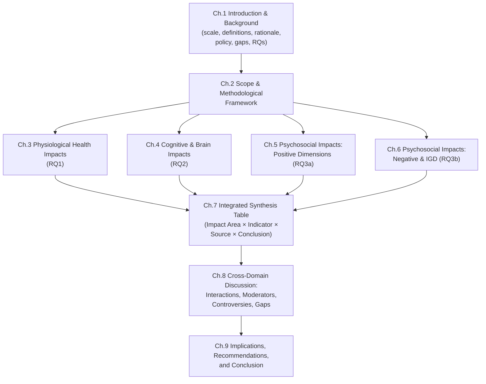
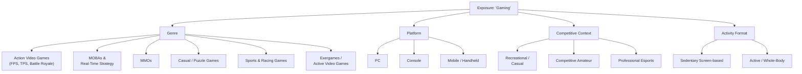
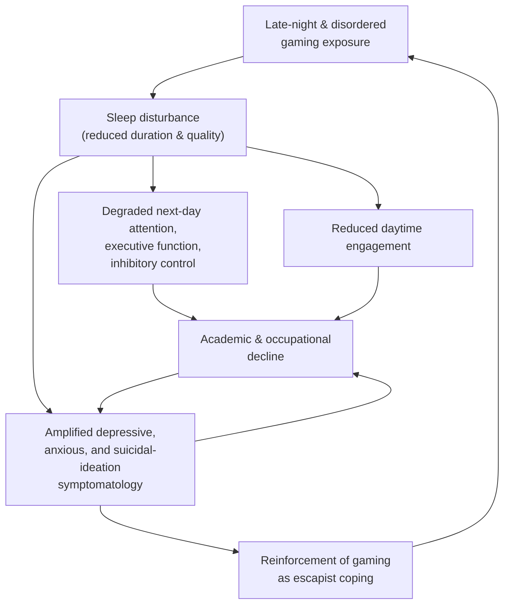
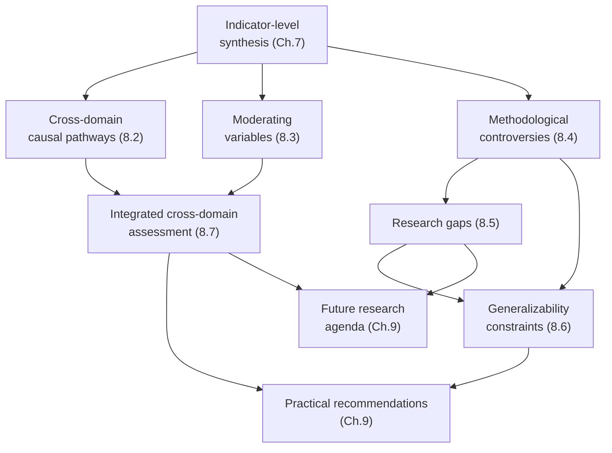

# Health Impacts of Esports and Online Gaming: A Review of Physiological, Cognitive-Neural, and Psychosocial Evidence up to Early 2021
# 1 Introduction and Research Background

Few entertainment phenomena have evolved as rapidly, or insinuated themselves as deeply into the daily lives of young people worldwide, as competitive video gaming and online play. What began in the late 20th century as a niche subculture has, by the threshold of the 2020s, matured into a global industry rivaling traditional sports and cinema in both audience scale and economic weight, while simultaneously emerging as a focus of clinical concern serious enough to warrant formal disease classification by the World Health Organization. This convergence of mass participation, commercial expansion, and medical attention sets the stage for the present review, which seeks to synthesize, up to early 2021, what is empirically known about how esports and online gaming affect the human body, brain, and mind. Before turning to the substantive evidence, this opening chapter establishes the empirical scale of the phenomenon, clarifies the conceptual vocabulary that will be used throughout, justifies the multidimensional analytical lens adopted, situates the inquiry within its public health and policy environment, identifies the fragmentation of existing literature that the review aims to address, and articulates the guiding research questions that subsequent chapters will answer.

## 1.1 Global Rise of Esports and Online Gaming

The scale at which competitive and recreational gaming now reaches the global population is the single most important empirical fact motivating a health-focused review. According to Newzoo's *Global Esports Market Report 2020*, the total esports audience was projected to grow to **495.0 million people in 2020**, representing a year-on-year increase of **+11.7%**; this figure comprised 222.9 million "Esports Enthusiasts"—viewers consuming professional esports content more than once a month—and a further 272.2 million Occasional Viewers[^1]. Esports awareness, defined as having at least heard of professional competitive gaming, extended to approximately **2.0 billion people worldwide in 2020**, up from 1.8 billion in 2019, with China alone accounting for 530.4 million esports-aware individuals[^1]. These exposure figures sit on top of, rather than instead of, the much larger population of recreational gamers who play online but do not necessarily watch professional competition, indicating that any health effect operating through gameplay or spectatorship has a population denominator measured in the hundreds of millions to billions.

The economic dimensions confirm the trajectory. Global esports revenues were expected to surpass **$1.1 billion in 2020** (+15.7% year-on-year), with media rights and sponsorship contributing roughly three-quarters of the total, and to grow further to around $1.6 billion by 2023[^1]. China was the largest single market at $385.1 million, followed by North America at $252.5 million and Western Europe at $201.2 million, while the fastest growth rates were anticipated in Southeast Asia (+24.0% CAGR 2018–2023), Japan (+20.4%), and Latin America (+17.9%)[^1]. This geographic redistribution reflects a deeper structural shift driven by **mobile esports**, which Newzoo described as the unlocking mechanism for emerging markets: live viewership of mobile esports content jumped from 15.3 million hours in 2018 to **98.5 million hours in 2019—an increase of more than 600%**[^1]. PUBG Mobile, Garena Free Fire, Arena of Valor and Mobile Legends: Bang Bang have, alongside long-established PC titles, transformed competitive gaming into an everyday pastime across Southeast Asia, India, Brazil, the Middle East, and parts of Africa, regions in which the comparative cost of PC and console hardware had previously limited participation[^1].

The dominant titles by 2019 illustrate the genres through which the bulk of population exposure occurs. The top-watched esports games on Twitch, YouTube, and Mixer—**League of Legends (348.8 million live esports hours), Counter-Strike: Global Offensive (215.0M), Dota 2 (198.9M), Overwatch (109.9M), Hearthstone (37.0M), Tom Clancy's Rainbow Six: Siege (32.4M), Arena of Valor (31.6M), PUBG Mobile (27.9M), Fortnite (27.5M) and PLAYERUNKNOWN'S BATTLEGROUNDS (26.8M)**—span multiplayer online battle arenas (MOBAs), first-person shooters, battle royales, collectible card games, and mobile competitive titles[^1]. The League of Legends World Championship was the single biggest tournament of 2019 by live viewership hours (105.5 million), while the Overwatch League led leagues with 104.1 million hours[^1]. The breadth of these genres is consequential for a health review because, as later chapters will show, physiological strain, cognitive demand, and psychosocial dynamics differ substantially between, for example, a session of competitive Counter-Strike, a MOBA team match, and a mobile battle royale played on a handset.

The demographics of esports engagement further narrow the public health focus. Newzoo's profile of esports enthusiasts indicates that the audience skews young and predominantly male—roughly two-thirds male—with a substantial proportion concentrated in the 10–35 age band and with a higher share of full-time employment and higher household income than the general online population[^2]. This age and gender distribution overlaps closely with the developmental window during which musculoskeletal habits, sleep architecture, cognitive maturation, and mental health trajectories are particularly susceptible to environmental exposures, sharpening the relevance of the health questions pursued in subsequent chapters. Beyond formal esports viewing, the games **live-streaming audience**—the broader population watching gaming content via Twitch, YouTube Gaming, and similar platforms—already exceeded two-thirds of a billion people by 2020[^2], embedding gaming-related screen time even deeper into daily life.

To organize these figures for ease of reference, the principal scale indicators are summarized below.

| Indicator | 2019 | 2020 (projected, Feb 2020) | Source |
|---|---|---|---|
| Global esports audience (total) | 443M | 495.0M (+11.7% YoY) | Newzoo[^1] |
| Esports Enthusiasts | 198M | 222.9M | Newzoo[^1] |
| Occasional Viewers | 245M | 272.2M | Newzoo[^1] |
| Global esports awareness | ~1.8B | ~2.0B | Newzoo[^1] |
| Global esports revenues | $950.6M | $1,100.1M (+15.7% YoY) | Newzoo[^1] |
| Largest market (China) revenues | $326.2M | $385.1M | Newzoo[^1] |
| Mobile esports live viewership hours | 98.5M | — | Newzoo[^1] |
| Top esports title by viewership | League of Legends (348.8M live esports hours) | — | Newzoo[^1] |

Taken together, these data establish that by early 2021 esports and online gaming had become a mass exposure with a strong adolescent and young-adult center of gravity, a rapidly mobilizing footprint in low- and middle-income regions, and a genre composition that ranges from highly cognitively demanding team-based competition to short-session mobile play. The sheer magnitude of exposure is the foundational reason that even modest per-capita health effects—whether harmful or beneficial—translate into nontrivial population-level consequences and demand a systematic evidence synthesis.

## 1.2 Conceptual Definitions and Scope Boundaries

The lay term "gaming" obscures distinctions that are decisive for interpreting health evidence. The present review adopts a layered set of definitions, anchored in industry usage where market boundaries are concerned and in clinical nosology where disorder constructs are concerned, in order to avoid the conceptual conflation that has plagued earlier syntheses.

At the industry level, Newzoo defines **esports** as "professional or semi-professional competitive gaming in an organized format (a tournament or league) with a specific goal (i.e., winning a champion title or prize money) and a clear distinction between players and teams that are competing against each other"[^1]. This professional scope explicitly excludes amateur competitive participation—online tournaments via FACEIT, ESL Play, or Toornament, or local LAN events—even when prizes are involved, because those activities prioritize participation rather than the production of viewing content[^1]. It also separates **game live-streaming**, in which individuals broadcast their own play to audiences without the formal structure of a sanctioned competition, from esports proper, although the two domains increasingly overlap as star streamers enter professional competition and as tournament organizers allow co-streaming[^1][^2]. For the purposes of a *health* review, however, the borders that matter are not solely commercial: a professional Dota 2 player training ten hours per day in a team house and an amateur playing the same title for two hours after work both experience the physiological and cognitive demands of the activity, even though only the former is counted in esports market statistics. The review therefore uses "esports" in its narrower industry sense when discussing professional populations, and "online gaming" or "recreational gaming" when discussing the broader player base whose health is most often studied epidemiologically.

A second crucial distinction concerns **game genre**, because the dosing characteristics of different titles—posture, session length, cognitive demand, social configuration, energy expenditure—differ markedly. Throughout the review, genres are organized into action video games (first- and third-person shooters, battle royales), MOBAs and real-time strategy titles, massively multiplayer online (MMO) games, casual and puzzle games, exergames or active video games (those requiring whole-body movement), and competitive esports titles spanning the above categories. Search Result-7 notes that online gaming "got a boost around the early 2010s when casual social gaming also became popular" and that "the battle royale trend of the mid-2010s gave rise to competitive titles PUBG, Fortnite, Apex Legends, and Call of Duty: Warzone", underscoring how recently the modern genre landscape has crystallized[^2].

The clinical concept that anchors the negative end of the spectrum is **Gaming Disorder**, formally added by the WHO to the **11th revision of the International Classification of Diseases (ICD-11)**. ICD-11 places Gaming Disorder within a new category, "disorders due to addictive behaviours", adopted by the World Health Assembly in May 2019 and scheduled to come into effect on **1 January 2022**[^3]. The WHO defines it as "a pattern of persistent or recurrent gaming behaviour which may be online or offline", manifesting as "a person giving increasing priority to video games over daily activities, continuing to play while knowing it may have negative consequences and having a general inability to control how long they play", normally evident over at least 12 months for diagnosis[^3]. Shekhar Saxena, then director of WHO's Department of Mental Health and Substance Abuse, characterized it as "a disorder which is characterized by impaired control over digital or video gaming, and increased priority given to other activities, to the extent that gaming takes precedence over other interests or daily activities"[^3]. ICD-11 also introduces an adjacent construct, **"hazardous gaming"**, intended to capture risk-elevated gaming patterns that do not meet full disorder criteria[^3].

The corresponding construct in the *Diagnostic and Statistical Manual of Mental Disorders, 5th edition* (DSM-5), published by the American Psychiatric Association, is **Internet Gaming Disorder (IGD)**, included in Section III as a condition warranting further study rather than as a fully ratified diagnosis. The conceptual overlap between IGD and ICD-11 Gaming Disorder is substantial—both emphasize loss of control, salience of gaming, and continuation despite harm—although the operational criteria and the digital/non-digital scope differ. As Long and colleagues note, the ICD-11 inclusion is intended to "support progress in clinical and public health approaches to gaming disorder worldwide" and to address challenges including "the lack of a gold standard for screening and assessment for the disorder" and "the lack of broadly accepted criteria to diagnose and treat patients"[^3]. The present review treats IGD (DSM-5) and Gaming Disorder (ICD-11) as closely related but not identical constructs, refers to them as appropriate for each cited primary study, and reserves the umbrella term "problematic gaming" for empirical patterns of harm-associated play that do not meet either set of diagnostic criteria.

A final boundary is between **normal recreational gaming and disordered gaming**. As Long et al. emphasize, "it is important to distinguish between normal gaming behaviour and gaming disorder"; the great majority of the hundreds of millions of people exposed to gaming do not develop a disorder, and conclusions drawn from clinical IGD samples cannot be generalized to recreational players, nor vice versa[^3]. The review therefore maintains a continuum—non-gamer, recreational/casual gamer, intensive/competitive gamer, professional esports athlete, hazardous gamer, IGD/Gaming Disorder—against which evidence is interpreted, and avoids conflating, for example, the cognitive performance gains observed in trained action-video-game players with the comorbidity profile observed in clinical IGD cohorts.

## 1.3 Rationale for a Multidimensional Health Review

Why examine physiological, cognitive-neural, and psychosocial impacts in parallel rather than in separate, specialty-bounded reviews? The argument rests on three interlocking observations.

First, the *exposure* itself is inherently multidimensional. A typical session of competitive online gaming simultaneously involves prolonged sedentary posture (a physiological exposure), elevated cognitive load and rapid sensorimotor processing (a cognitive-neural exposure), and social-emotional engagement through team play, voice chat, and in some cases public broadcasting (a psychosocial exposure). Decomposing this composite exposure into single dimensions risks systematically underestimating cumulative health impact, because any individual indicator—say, neck pain, or attentional improvement, or online friendship formation—is only one facet of a behavior whose effects propagate across body systems.

Second, the *outcomes* are causally interconnected. Sleep disruption, identified by both clinical accounts and ICD-11 commentary as a recurrent correlate of intensive gaming, simultaneously degrades next-day cognition, dysregulates appetite and metabolism, and amplifies risk for depressive and anxious symptoms; sedentary behavior compounds cardiometabolic risk and may also reinforce social withdrawal in vulnerable users; cognitive enhancements such as improved visual attention are most likely to translate into well-being benefits when they coexist with stable mood and intact social functioning. Treating these outcomes in isolation discards precisely the cross-domain mechanisms that distinguish gaming from many other health exposures.

Third, the *evidence base is dual-edged*. The WHO observed in its background materials on gaming disorder that "a significant minority of gamers experience functional, psychological, social and physical impairment as a result of excessive gaming"[^3], and the industry itself has pushed back, with the Entertainment Software Association and the Interactive Software Federation of Europe arguing that "gaming disorder is not based on sufficiently robust evidence to justify its inclusion in one of the WHO's most important norm-setting tools" and that the industry "plays a leading role in advancing research into areas such as mental health, dementia and cancer"[^3]. Whatever one's view of this dispute, the existence of both clearly documented harms in a minority of users and credible claims of cognitive, social, and even therapeutic benefits across the broader population renders any one-sided framing inadequate. A multidimensional review can hold these tensions explicitly: a finding that action-video-game training improves visual selective attention does not contradict a finding that disordered gaming is associated with depression; both can be true, and only an integrative synthesis exposes the conditions under which each obtains.

These three considerations—exposure compositeness, outcome interconnection, and evidentiary dual-edgedness—jointly justify the tripartite structure of the chapters that follow. Chapter 3 examines physiological indicators (sedentary behavior, body composition, musculoskeletal pain, eye health, sleep, cardiorespiratory responses); Chapter 4 examines cognitive and neural impacts (attention, executive function, brain structural and functional changes); Chapters 5 and 6 examine, respectively, the positive and negative psychosocial dimensions, with Chapter 6 devoted in particular to IGD and its comorbidities; and Chapter 8 returns explicitly to the cross-domain interactions that motivate this design.

## 1.4 Public Health and Policy Context

The scientific synthesis offered in this review is being constructed within an active and rapidly evolving policy environment, which both shapes the questions researchers prioritize and amplifies the consequences of their findings.

The most consequential single policy event is the inclusion of Gaming Disorder in ICD-11. As Long and colleagues document in their multi-country review of public-health preparedness, the inclusion was "an essential response to marked distress and functional impairment in people experiencing gaming disorder, and the associated demand for intervention and treatment", and is expected to deliver public health benefits in three ways: by "providing a standard definition and criteria for international researchers", by improving "specialised clinical services… through improved awareness of diagnostic criteria and symptom domains", and by enabling "capacity building among health professionals (e.g. specialised training for professionals) and promot[ing] communication among service providers across countries"[^3]. Because ICD-11 underpins morbidity statistics, reimbursement systems, and automated healthcare decisions among WHO member states, the inclusion converts gaming-related distress from a contested cultural concern into a tracked clinical entity—with knock-on effects for the research priorities and funding flows that this review must take into account.

National responses, however, diverge sharply, reflecting cultural attitudes, the political weight of domestic gaming industries, and pre-existing addiction-treatment infrastructures. The Long et al. country survey documents the heterogeneity[^3]:

- **China**: The National Health Committee "welcome[d] the inclusion", and authorities had already implemented regulations restricting minors' access to online games; a 2019 NHC consensus and 2020 *Guidelines on Diagnosis and Treatment for Mental Disorders* provide technical guidance, although workforce capacity-building remains uneven[^3].
- **Italy**: The *National Prevention Plan 2020–2025* explicitly seeks to "implement preventive activities and strategies to screen and identify individuals at risk of developing gaming disorder", and a February 2019 inter-ministerial agreement between Education and Health acknowledged the need to act, although specialist workforce development remains limited[^3].
- **Switzerland**: Excessive gaming has been recognized as a public health concern since 2012; under the Ministry of Health, an intervention guide for professionals counselling parents on screen use, including gaming, was released in 2020[^3].
- **United States**: There is no unified federal strategy, but state-level agencies (notably Departments of Mental Health and Addiction Services) and bodies adjacent to gambling treatment (e.g., state affiliates of the National Council on Problem Gambling) have begun providing training to clinicians[^3].
- **Australia and India**: Both report no national action strategy, no professional-college position statements (Australia), and limited dedicated treatment infrastructure (India), with capacity-building identified as a key need[^3].

These divergences are mirrored by industry pushback. The Entertainment Software Association argued that the diagnosis "needs to be based on regular, inclusive and transparent reviews backed by independent experts", and the ISFE's CEO Simon Little warned that "once set in stone, conditions can be left on this list for many years inappropriately"[^3]. The WHO has rejected these characterizations, maintaining that the inclusion "follows the development of treatment programmes for people with health conditions identical to those characteristic of gaming disorder in many parts of the world" and will increase clinician attention to risk[^3]. For a health review, this controversy is not a matter for adjudication, but it does require that conclusions about IGD be presented with the methodological caveats that the controversy reflects—issues of diagnostic threshold, measurement heterogeneity, and the difficulty of separating gaming-as-cause from gaming-as-symptom that Chapters 6 and 8 examine in detail.

Beyond gaming disorder, the policy landscape also extends to the **ergonomic and occupational health** of professional esports athletes, the **regulation of in-game monetization features** (loot boxes, increasingly entwined with gambling debates), the **protection of minors** in mobile and online environments, and the question of whether **active video games and exergames** can be integrated into public-health interventions for sedentary behavior. While these strands lie partially outside the formal remit of ICD-11, they form the broader environment within which the evidence reviewed here will be applied by practitioners and policymakers.

## 1.5 Gaps in Existing Literature and Review Positioning

Against this scale of exposure and intensity of policy attention, the academic literature on the health impacts of esports and online gaming remains, as of early 2021, strikingly fragmented. Several recurring weaknesses justify a fresh integrative effort.

First, the literature is **siloed by health dimension**. Sports-medicine and ergonomics studies report on musculoskeletal complaints among players; ophthalmology research examines digital eye strain; cognitive psychology and cognitive neuroscience document attentional and brain-structural changes in trained action-video-game players; clinical psychiatry and addiction medicine map IGD comorbidities. These literatures rarely cite one another, and consequently rarely consider how, for example, a documented attentional advantage and a documented depressive comorbidity coexist within the same player population. The present review's primary contribution is to bring these traditions into a single analytical frame.

Second, populations are **narrowly sampled and unevenly described**. Many studies focus on adolescent samples or on young adult male university students, leaving a thin evidence base for female gamers, older adults, and—particularly relevant given Section 1.1's market data—mobile-first gamers in emerging markets. Conversely, professional esports athletes are studied in small case series or convenience samples that cannot easily be generalized, while the much larger recreational population is studied via self-report instruments whose validity varies widely.

Third, **conceptual conflation** persists. Studies that report "gaming" effects often fail to specify genre, average session length, or competitive context, making it difficult to separate the cognitive demands of MOBA team play from the postural demands of mobile gaming or the social demands of MMO guild participation. Even within the IGD literature, instrument heterogeneity—numerous scales operationalizing the construct differently—has produced prevalence estimates that vary by more than an order of magnitude across studies, as King and colleagues' 2020 systematic review of screening and assessment tools documents[^3].

Fourth, **causal inference is constrained** by the dominance of cross-sectional self-report designs. Longitudinal cohorts, randomized intervention studies, and neuroimaging studies with adequately powered samples and pre-registered analyses remain comparatively scarce, particularly for esports-specific populations. The publication bias and ideological polarization that have marked the violent-video-game cognitive and behavioral literature also affect the broader health literature.

Fifth, and most relevant to this review's framing, **dual-edged framing is uneven**. Many existing reviews privilege either the harms (in clinical and public-health journals) or the benefits (in cognitive psychology and educational technology journals), with relatively few attempting to hold both within the same evidentiary frame. Yet, as Section 1.3 argued, the dual nature of gaming is intrinsic to the phenomenon, not a stylistic preference.

The present review positions itself as a **comprehensive, multidimensional synthesis** of the evidence available up to early 2021, organized by impact area (physiological, cognitive-neural, psychosocial), resolved to the specific-indicator level requested by the user (e.g., body composition, attention, depression, IGD comorbidities), and coded transparently along a four-level conclusion scheme (Positive Impact / Negative Impact / Mixed or Uncertain / No Significant Impact), with sub-notes that distinguish, where evidence supports the distinction, between active and sedentary games, action and casual genres, and recreational and disordered patterns of play. Chapter 2 will specify the search strategy, inclusion criteria, and coding rules; Chapter 7 will present the integrated synthesis table that consolidates the findings into the reference artifact the user requested.

## 1.6 Research Questions and Chapter Roadmap

To anchor the chapters that follow, the review pursues three overarching research questions and a series of subordinate questions:

**RQ1 — Physiological health.** What are the documented effects of sustained esports and online gaming engagement on physical activity and sedentary behavior, body composition, cardiorespiratory function during competition, musculoskeletal pain and overuse injury, eye and visual health, sleep quality, and nutrition or performance-enhancing substance use? Where do effects differ between sedentary online/competitive titles and active/exergaming formats?

**RQ2 — Cognitive and brain impacts.** How does engagement with different gaming genres—particularly action video games, real-time strategy, MOBAs, and MMOs—influence cognitive abilities including visual selective attention, spatial cognition, working memory, executive function, cognitive flexibility, task-switching, processing speed, and decision-making? What corresponding structural and functional brain changes have been documented through fMRI, voxel-based morphometry (VBM), and EEG, and how do these findings differ between expert/professional gamers, intervention-trained participants, and individuals with IGD?

**RQ3 — Psychological and social health.** What positive psychosocial outcomes—self-efficacy, intrinsic motivation, stress relief, online and offline social interaction, sense of belonging, teamwork and communication skills—have been associated with gaming, and under what conditions do they emerge? Conversely, what is the empirical relationship between IGD/Gaming Disorder and mental health comorbidities such as depression, anxiety, ADHD, social phobia, obsessive-compulsive symptoms, suicidal ideation, and sleep disturbance, and what are the social consequences for peer relationships, family functioning, academic and occupational outcomes, in-game toxicity exposure, and co-occurring behaviors such as substance use and problematic gambling?

A fourth, cross-cutting question informs the synthesis: **Under what conditions—of genre, intensity, age, gender, expertise level, and pre-existing vulnerability—do gaming's risks predominate over its benefits, and vice versa?** This integrative question is taken up explicitly in Chapter 8.

The roadmap for the remainder of the report is summarized in the diagram below, which clarifies how each chapter contributes to answering the research questions and how their findings converge in the central synthesis table and the cross-domain discussion.

The key nodes are sequential in dependency but cumulative in argument: Chapters 3–6 each address one face of the multidimensional exposure introduced here; Chapter 7 functions as the central reference artifact that consolidates findings by indicator and codes them by conclusion; Chapter 8 returns to the cross-domain interactions and moderating variables that single-domain chapters cannot capture; and Chapter 9 translates the synthesis into recommendations for the diverse stakeholder groups—players, coaches, parents, educators, clinicians, developers, esports organizations, and policymakers—whose decisions will determine how the evidence base is used.

In short, the chapter that follows this one will operationalize the analytical framework just outlined, after which the review will move systematically through each health domain, arriving at an integrated assessment of what is known, what is contested, and what remains to be discovered about how the most rapidly growing entertainment activity of the early twenty-first century is shaping the bodies, brains, and social worlds of its hundreds of millions of participants.

# 2 Review Scope and Methodological Framework

Chapter 1 closed by positioning this review as a comprehensive, multidimensional synthesis of the evidence available up to early 2021, organized by impact area and resolved to the specific-indicator level. Before the substantive domain chapters can deliver on that promise, however, the analytical scaffolding on which they rest must be made fully explicit. The present chapter discharges that obligation. It specifies the literature-search strategy and temporal window that bound the evidence base, the eligibility rules that determine which studies enter the synthesis, the impact-domain and indicator framework that structures the Chapter 7 reference artifact, the genre and exposure taxonomy that disambiguates "gaming" into health-relevant subcategories, the evidence-hierarchy conventions that weight design types when studies disagree, the four-level conclusion coding scheme through which findings are summarized, and the procedures by which heterogeneity, quality, and the limitations of a narrative-integrative synthesis are managed. Taken together, these decisions translate the rationale articulated in Chapter 1 into a transparent and reproducible operating procedure, so that the conclusions drawn in Chapters 3 through 9 can be traced back to identifiable evidentiary commitments rather than to undocumented editorial choices.

Because almost no element of the methodology can be illustrated by citing a primary research article — these are conventions about how primary articles are *used* — this chapter is necessarily more procedural and less citation-dense than the rest of the report. Where decisions are anchored in prior commitments already cited in Chapter 1 (for example, the WHO/ICD-11 framing, the Newzoo industry data, or the King et al. observations about IGD instrument heterogeneity), those commitments are recalled rather than re-evidenced, in keeping with the rule against intra-report repetition.

## 2.1 Literature Search Strategy and Time Window

The evidence base for this review is drawn from peer-reviewed biomedical, psychological, sports-science, and neuroscience literature published up to **early 2021** (operationally, through the first quarter of 2021). This cut-off is not arbitrary: it coincides with the policy environment described in Chapter 1, in which ICD-11 had been adopted by the World Health Assembly (May 2019) but had not yet come into force (1 January 2022), and in which the COVID-19 pandemic was beginning, but had not yet fully produced, the surge of remote-gaming exposure studies that would dominate the subsequent literature. By terminating the window at early 2021, the review captures the state of the pre-pandemic and very early pandemic evidence base, which is the appropriate reference point for a baseline characterization of esports and online gaming health impacts.

Searches were conducted across the principal databases relevant to the three impact domains. **PubMed/MEDLINE** and the **Cochrane Library** anchor the biomedical and clinical evidence (musculoskeletal, ophthalmologic, sleep, cardiometabolic, psychiatric); **PsycINFO** covers the cognitive-psychology, neuropsychology, and clinical-psychology literature on attention, executive function, gaming disorder, and psychosocial outcomes; **Web of Science** and **Scopus** provide multidisciplinary coverage and citation tracing across all three domains; and **SPORTDiscus** captures sports-science, exercise-physiology, and exergaming studies that are sometimes underrepresented in biomedical databases. Where systematic reviews and meta-analyses were available within the target window, they were retrieved and used as orienting maps to the underlying primary literature; primary studies were then re-examined directly rather than relied upon at second-hand.

The search syntax combined three blocks of terms with Boolean operators. The first block specified the exposure: *esports*, *e-sports*, *electronic sports*, *competitive video gaming*, *online gaming*, *video game\**, *action video game\**, *first-person shooter*, *FPS*, *MOBA*, *multiplayer online battle arena*, *MMO*, *massively multiplayer online*, *real-time strategy*, *RTS*, *exergame\**, *active video game\**, *internet gaming disorder*, *gaming disorder*, *problematic gaming*. The second block specified the outcomes corresponding to the three impact domains: for physiological health, terms such as *physical activity*, *sedentary behaviour*, *body composition*, *obesity*, *musculoskeletal*, *neck pain*, *wrist*, *overuse injury*, *eye strain*, *visual fatigue*, *sleep quality*, *heart rate*, *cardiorespiratory*; for cognitive and brain effects, *cognition*, *attention*, *visual selective attention*, *spatial cognition*, *mental rotation*, *working memory*, *executive function*, *cognitive flexibility*, *task switching*, *processing speed*, *decision making*, *fMRI*, *voxel-based morphometry*, *VBM*, *EEG*, *grey matter*, *hippocampus*, *prefrontal cortex*, *striatum*; for psychosocial outcomes, *self-efficacy*, *enjoyment*, *intrinsic motivation*, *stress*, *social interaction*, *belonging*, *teamwork*, *depression*, *anxiety*, *ADHD*, *social phobia*, *obsessive-compulsive*, *suicidal ideation*, *loneliness*, *family conflict*, *academic performance*, *toxicity*, *cyberbullying*, *substance use*, *problematic gambling*. The third block restricted to peer-reviewed publications and the early-2021 ceiling.

Supplementary sources were used to complement the database searches in three ways. First, **WHO and ICD-11 documentation** (including the materials by Long and colleagues referenced in Chapter 1) was used to anchor the clinical-policy framing of Gaming Disorder. Second, **industry market reports**, principally Newzoo's *Global Esports Market Report 2020* already drawn upon in Chapter 1, were used exclusively to characterize the scale, demographic profile, and genre distribution of esports exposure — never as evidence of health outcomes themselves. Third, **reference-list snowballing** from retrieved systematic reviews and high-citation primary studies was used to ensure that key earlier studies (for example, foundational action-video-game cognitive-training trials and seminal neuroimaging studies of expert gamers) were not missed by keyword-driven searches.

Language restrictions were applied pragmatically: studies published in English were the primary source, with non-English studies considered when an English-language abstract or systematic-review summary made their findings traceable. Grey literature — including doctoral theses and conference proceedings — was used sparingly and only when peer-reviewed coverage of a specific question (for example, the nutritional and performance-enhancing substance practices of professional esports athletes) was absent or extremely thin. In those cases, the reduced reliability of the source is acknowledged in the narrative.

A single, non-negotiable exclusion has been hard-coded into the search and screening procedure for this review: the 2021 scoping meta-review by Kelly and Leung on the health impacts of esports and gaming, and its associated indexing records, are excluded from the evidence base and are not cited, paraphrased, or otherwise drawn upon at any point in this report. Where the underlying primary studies that such a scoping review would have synthesized are independently traceable and meet the eligibility criteria below, they are cited directly from their original sources.

## 2.2 Inclusion and Exclusion Criteria

Eligibility rules were applied along four dimensions — population, exposure, outcomes, and study type — with explicit conventions for borderline cases.

**Population.** Eligible populations include recreational gamers (the broad base of online players), competitive amateur and professional esports athletes, clinical cohorts meeting DSM-5 IGD or ICD-11 Gaming Disorder criteria, individuals with self-reported problematic gaming patterns, and appropriately characterized comparison groups (non-gamer controls, casual-only gamers, or general-population samples). Age and gender were not used as exclusion criteria, but were tracked as moderating variables; in particular, studies were retained across the lifespan (children, adolescents, young adults, middle-aged and older adults) so that the developmental-window concerns flagged in Chapter 1 could be addressed. Studies focused exclusively on clinical applications of gaming in patients with unrelated diseases (for example, virtual-reality rehabilitation in stroke recovery) were excluded unless they also reported general health outcomes relevant to one of the three domains.

**Exposure.** The exposure of interest is engagement with video games — predominantly online and competitive forms, but also including offline gaming where it shares the relevant dosing characteristics (posture, cognitive demand, social configuration). Studies were retained if they specified, at minimum, either the game genre, the competitive context, or a measurable index of exposure intensity (hours per week, years of play, expert vs. novice status). Studies that reported only "gaming" as an unspecified umbrella exposure were retained when the outcome was clearly health-relevant but were flagged in the narrative as conceptually conflated, in line with the gap identified in Section 1.5.

**Outcomes.** Outcomes had to map onto at least one of the three impact domains and to at least one of the indicators enumerated in Section 2.3 below. Studies reporting outcomes that lie outside the health remit — for example, in-game performance metrics, consumer purchase behaviour, or game-design preferences — were excluded unless those outcomes were tied to a health-relevant endpoint (for example, attention as an in-game performance correlate also measured by a validated cognitive test).

**Study type.** Empirical primary studies (cross-sectional, longitudinal, intervention, case-control, neuroimaging) and systematic reviews and meta-analyses synthesizing such primary studies were eligible. Opinion pieces, editorials, commentaries, and purely commercial market analyses without health-outcome data were excluded from the evidence base, though they could be referenced for context (as in Chapter 1's use of industry pushback against ICD-11 inclusion).

Three categories of borderline cases warrant explicit treatment. *First*, **loot-box and microtransaction studies** sit at the gaming–gambling interface; they are retained only when the outcome is a health endpoint (for example, problematic gambling symptoms, financial harm) rather than a purely behavioral-economic endpoint. *Second*, **violent-content behavioral studies** — a contested literature with its own polarization, briefly noted in Chapter 1 — are retained when they bear on psychosocial health indicators within scope (for example, aggression as a correlate of mental health symptoms), but the review does not attempt to adjudicate the broader violent-game effects debate, which lies outside its remit. *Third*, **purely offline single-player gaming studies** are retained only if they investigate exposures with clear health relevance (for example, postural strain or cognitive-training effects) that generalize to the online and competitive titles of primary interest.

## 2.3 Analytical Framework: Impact Domains and Indicator Resolution

The review is organized throughout by the tripartite impact-domain structure introduced in Chapter 1: **physiological health**, **cognitive and brain function**, and **psychological and social health**. Each domain is decomposed into a fixed set of indicators, mirroring the user's indicator-level resolution request and providing the row architecture of the Chapter 7 synthesis table.

The full indicator inventory is summarized in the following matrix, which simultaneously functions as the mapping rule between primary studies and synthesis-table rows.

| Impact Domain | Indicators tracked in the synthesis |
|---|---|
| **Physiological Health** | Physical activity level; sedentary behavior; body composition (body fat, lean mass, BMI, bone mineral content); cardiorespiratory responses during competition (heart rate, heart rate variability, blood pressure); musculoskeletal pain and overuse injury (neck, back, shoulder, wrist, hand/finger); eye health (digital eye strain, dry eye, visual fatigue); sleep quality and duration; nutrition and dietary patterns; performance-enhancing substance use (caffeine, stimulants, prescription medications). |
| **Cognitive and Brain Function** | Visual selective attention; spatial cognition and mental rotation; working memory; executive function (inhibition, updating, shifting); cognitive flexibility / task-switching; processing speed; decision-making under uncertainty; brain structural changes (grey-matter volume in posterior parietal cortex, hippocampus, entorhinal cortex, striatum, prefrontal cortex); brain functional changes (activation patterns in fMRI, oscillatory dynamics in EEG); reward-system and craving-related neural correlates (particularly in IGD samples). |
| **Psychological and Social Health (positive)** | Self-efficacy; enjoyment and intrinsic motivation; stress relief and mood regulation; online social interaction; offline social interaction and friendship formation; sense of community and belonging; teamwork and communication skills; identity development. |
| **Psychological and Social Health (negative, incl. IGD)** | IGD/Gaming Disorder prevalence and severity; depression; anxiety; ADHD; social phobia / social anxiety; obsessive-compulsive symptoms; suicidal ideation; sleep disturbance (cross-listed with physiological domain); peer relationship problems; family conflict; academic and occupational decline; in-game toxicity exposure (harassment, bullying, discrimination); substance use comorbidity; problematic gambling comorbidity. |

Several mapping conventions follow from this structure. Studies measuring more than one indicator (the norm rather than the exception) are entered against each relevant indicator row, with consistent author-year identification so that cross-references are traceable. Indicators that legitimately span two domains — most notably sleep, which is both a physiological function and a psychosocial correlate — are entered in the physiological table for the body of evidence on sleep architecture and duration, and cross-referenced in the psychosocial table where the focus is on sleep disturbance as an IGD comorbidity. This dual placement is deliberately designed to support the cross-domain integration that Chapter 8 will undertake, in which sleep emerges as a paradigmatic mechanism linking physical and mental risks.

The four-domain split between positive and negative psychosocial outcomes (rather than a single psychosocial block) reflects two considerations. First, the dual-edged framing argued for in Section 1.3 is preserved structurally rather than only narratively. Second, the evidence bases for positive psychosocial outcomes and for IGD-related negative outcomes are drawn from quite different research traditions — the former from social, motivational, and educational psychology, the latter from clinical psychiatry and addiction medicine — and treating them as separate rows surfaces the asymmetry of coverage that is itself an important finding.

## 2.4 Game Genre and Exposure Taxonomy

Because Chapter 1 documented that "gaming" as an umbrella exposure conceals dosing differences large enough to determine whether a given health effect occurs at all, the review applies a consistent genre and exposure taxonomy throughout. The taxonomy serves two functions: it disambiguates the genres against which primary studies are coded, and it provides the moderating-variable vocabulary used in the Chapter 7 sub-notes and the Chapter 8 cross-domain discussion.

Six genre categories anchor the taxonomy. **Action video games** include first- and third-person shooters and battle royale titles (e.g., Counter-Strike: Global Offensive, Overwatch, Fortnite, PUBG, Apex Legends, Call of Duty) — these are the prototypical objects of the cognitive-transfer literature on visual selective attention examined in Chapter 4 and of much of the sedentary-posture and reaction-time literature in Chapter 3. **MOBAs and real-time strategy** titles (League of Legends, Dota 2, StarCraft) emphasize strategic planning, team coordination, and prolonged session lengths. **MMOs** (e.g., World of Warcraft) emphasize sustained social engagement and identity investment relevant to the positive and negative psychosocial domains. **Casual and puzzle games** (e.g., Candy Crush, Tetris-family titles) typically involve shorter sessions and lower competitive intensity. **Sports and racing games** (e.g., FIFA, NBA 2K, Gran Turismo) bridge competitive simulation and traditional sport themes. **Exergames or active video games** (e.g., Wii Fit, Dance Dance Revolution, Ring Fit Adventure) deliberately couple gameplay to whole-body movement and are the principal counter-evidence to sedentary-gaming physiological harms — a distinction that recurs throughout Chapter 3 and the synthesis table.

Three orthogonal exposure axes are coded alongside genre. **Platform** (PC, console, mobile/handheld) bears on ergonomics, session length, and the geography of exposure (mobile dominating the emerging-market growth documented in Chapter 1). **Competitive context** (recreational/casual, competitive amateur, professional esports) bears on training volume, performance pressure, and the population-generalizability of findings — professional esports samples are typically small and self-selected, while recreational samples are larger but more weakly characterized. **Activity format** (sedentary screen-based vs. active/whole-body) is the single most important moderator in the physiological domain and is consistently flagged in synthesis-table sub-notes whenever an indicator's coding depends on it (for example, body composition is negatively affected by sedentary gaming but neutrally or positively affected by exergaming).

Two additional cross-cutting exposure dimensions warrant explicit treatment. **Session length and weekly hours** are recorded whenever primary studies report them, because the dose–response evidence — particularly for musculoskeletal pain, eye strain, and sleep disruption — is one of the few areas where quasi-quantitative comparisons across studies are feasible. **Years of cumulative experience and expertise level** are recorded separately for cognitive and brain studies, where many findings hinge on the contrast between trained experts and naïve controls or between intervention completers and waitlists.

## 2.5 Study Design Classification and Evidence Hierarchy

Included studies are classified by design type, and the relative weight assigned to each design during synthesis follows the conventional evidence-hierarchy logic restated in Chapter 1's reasoning rubric.

| Design type | Strength for causal inference | Typical limitations | Synthesis weighting |
|---|---|---|---|
| Systematic reviews and meta-analyses | High when underlying studies are sound | Vulnerable to publication bias; quality depends on inclusion rules of the review itself | Highest priority for orienting conclusions; primary studies re-examined directly |
| Longitudinal cohort studies | Moderate to high; allow temporal precedence | Confounding, attrition, exposure measurement error | High priority, especially for IGD onset, mental health trajectories, musculoskeletal accrual |
| Randomized intervention studies (e.g., cognitive-training RCTs, exergame RCTs) | High for the specific intervention tested | Often small samples; limited ecological validity for everyday gaming; training-specific transfer questions | High priority, but generalization to free-living gaming is qualified |
| Non-randomized intervention / quasi-experimental | Moderate | Self-selection, lack of blinding | Mid priority |
| Case-control studies (e.g., IGD vs. healthy controls in neuroimaging) | Moderate; useful for between-group contrasts | Selection bias, cross-sectional snapshot | Mid priority; informative for between-group structural and functional brain differences |
| Cross-sectional surveys | Low for causality; useful for prevalence and correlations | Reverse causation, common-method variance, self-report bias | Lower priority; counted as suggestive rather than dispositive |
| Narrative reviews | Variable | No formal selection or appraisal procedure | Used as orienting context; not as evidence in their own right |
| Case series and grey literature | Low | Anecdotal, non-generalizable | Used only where peer-reviewed coverage is absent |

The two practical consequences of this hierarchy bear emphasizing. *First*, when a cross-sectional survey reports a strong correlation that a longitudinal study or RCT in the same area fails to corroborate, the longitudinal/RCT evidence is weighted more heavily in the conclusion coding, and the discrepancy is acknowledged in the narrative rather than averaged away. *Second*, the dominant design type within each indicator's evidence base is recorded in the synthesis table's sub-notes, so that readers can immediately see whether a given "Positive Impact" or "Negative Impact" coding rests on, say, a meta-analysis of intervention trials or a constellation of cross-sectional self-report studies.

Two design-specific limitations recur frequently enough to warrant standing flags in the narrative chapters. **Small esports-specific samples** are the norm in the professional-athlete literature: studies of musculoskeletal complaints, cardiorespiratory responses during competition, and nutritional practices among professional players typically rely on convenience samples in the dozens. **Cross-sectional dominance** characterizes the IGD-comorbidity literature, where it is often impossible to separate gaming-as-cause from gaming-as-symptom of underlying mood, anxiety, or attentional pathology — a constraint that Chapter 6 examines in detail and Chapter 8 incorporates into its overall assessment of causal inference in the field.

## 2.6 Conclusion Coding Scheme and Synthesis Rules

The headline output of this review, alongside the narrative chapters, is the Chapter 7 synthesis table, in which each indicator's evidence is summarized by a four-level conclusion code. The coding scheme operationalizes the user's request and applies uniformly across all three impact domains.

| Code | Definition | Triggering pattern of evidence |
|---|---|---|
| **Positive Impact** | The dominant body of evidence indicates a beneficial effect of gaming exposure on the indicator | Convergent findings from multiple high-quality studies (preferably including longitudinal or intervention designs) showing improvement, with limited or no contradictory evidence of comparable methodological weight |
| **Negative Impact** | The dominant body of evidence indicates a harmful effect | Convergent findings from multiple high-quality studies showing deterioration, increased risk, or symptom association, with limited or no contradictory evidence of comparable methodological weight |
| **Mixed / Uncertain** | Findings are genuinely divergent and the divergence is not resolved by the evidence available | Studies disagree, often with patterns explained by moderating variables (genre, expertise, intensity, age) that are recorded in sub-notes; or methodological heterogeneity is large enough to preclude a single direction |
| **No Significant Impact** | The dominant body of evidence finds no reliable effect | Multiple adequately-powered studies report null effects, or meta-analyses report effect sizes that are statistically null or negligibly small |

Four decision rules govern code assignment.

*Rule 1 — Hierarchy before count.* Codes are assigned according to the weighted balance of evidence under Section 2.5's hierarchy, not by simple vote-counting of studies. A single rigorous meta-analysis can outweigh many cross-sectional surveys reporting the opposite finding.

*Rule 2 — Mixed before averaging.* When studies of comparable methodological quality disagree, the code is "Mixed / Uncertain" and the moderating variables explaining the disagreement are recorded in the sub-note. The review does not collapse divergent findings into a fictional consensus by averaging.

*Rule 3 — Conditional coding via sub-notes.* When the same indicator's effect depends on a moderator (most commonly genre or activity format), the row is coded with the dominant pattern and the sub-note specifies the condition. For example, body composition may be coded as "Mixed / Uncertain" overall, with sub-notes specifying "Negative for sedentary online gaming, especially with high session length" and "Neutral to Positive for exergaming interventions". Similarly, grey-matter volume in the hippocampus may be coded as "Mixed" with sub-notes specifying "Positive in trained action-video-game players (Kühn 2014)" and "Negative in IGD samples (Yao 2017)".

*Rule 4 — Recreational vs. disordered distinction.* Throughout the psychosocial domain in particular, the review preserves the distinction between recreational gaming and problematic/IGD gaming. Findings from clinical IGD cohorts are not used to code recreational-gaming rows, and vice versa, in keeping with Chapter 1's continuum framing.

Every coded row in the Chapter 7 table is traceable to identifiable primary or systematic-review sources, recorded as Author–Year–Title. When multiple sources contribute to a row, each is listed rather than aggregated anonymously, supporting the user's stated need for a reference-rich table. Claims lacking a verifiable peer-reviewed source are not included in the table, even when they appear plausible from narrative discussion.

## 2.7 Handling of Heterogeneity, Quality Appraisal, and Methodological Limitations

The methodological challenges identified in Section 1.5 — siloed literatures, conceptual conflation, instrument heterogeneity, design constraints, dual-edged asymmetry — are managed during synthesis rather than ignored.

**Conceptual conflation between IGD and ICD-11 Gaming Disorder.** As Chapter 1 noted, DSM-5 IGD (Section III, condition for further study) and ICD-11 Gaming Disorder (formal diagnosis) overlap substantially but are not identical; primary studies typically operationalize one or the other (or a non-aligned screening instrument). The review preserves the terminology used in each cited study, applies the umbrella label "problematic gaming" only when neither formal construct is explicitly assessed, and flags in Chapter 6 the consequences of this heterogeneity for the comparability of prevalence and comorbidity estimates.

**Instrument heterogeneity in IGD screening.** Numerous scales (for example, the Internet Gaming Disorder Scale variants, the Internet Gaming Disorder Test, and the Game Addiction Scale) operationalize disordered gaming differently, producing prevalence estimates that — as the King and colleagues 2020 systematic review of screening instruments documented and as Chapter 1 noted — vary by more than an order of magnitude across studies. The synthesis does not attempt to harmonize these estimates into a single number; instead, Chapter 6 reports prevalence ranges with the instruments that produced them, and the synthesis-table sub-notes flag instrument identity where it materially affects interpretation.

**Publication bias and ideological polarization.** Both phenomena are documented in adjacent literatures (notably violent-video-game research) and almost certainly affect the broader health literature reviewed here. The review responds in three ways: by giving priority to systematic reviews and meta-analyses that have themselves assessed publication bias, by triangulating positive and negative findings against one another for each indicator (rather than reviewing only the harms or only the benefits literature), and by acknowledging in Chapter 8 the residual uncertainty that publication-bias considerations leave on the evidence base.

**Quality appraisal.** A formal quantitative quality-appraisal instrument (such as ROBINS-I or Cochrane Risk of Bias 2) is not applied study-by-study, because the review's synthesis is narrative-integrative rather than meta-analytic and because the heterogeneity of designs across domains makes a single instrument awkward to apply uniformly. Instead, a qualitative appraisal is applied: for each cited study, the dominant design type, sample size and selection method, and known measurement limitations are considered when weighting its contribution. Studies with severe methodological limitations are cited where they are the only available evidence on a question, but their limitations are noted in-text rather than absorbed silently.

**Limits of a narrative-integrative synthesis.** Three constraints follow from this design and are flagged here so that they need not be repeated in subsequent chapters. *First*, no pooled effect sizes are computed: where meta-analyses already exist in the literature, their pooled estimates are cited; where they do not, the review does not attempt to construct them. *Second*, causal inference is constrained by the underlying primary literature; conclusions about, for example, whether gaming causes depression or depressed individuals self-select into heavy gaming, are presented with the temporal-design caveats that the available evidence supports, and are not pushed beyond them. *Third*, generalizability across populations is uneven; findings derived predominantly from young adult male university students in high-income countries — still the modal sample in this field — may not extend to female gamers, older adults, or mobile-first players in emerging markets, a limitation that Chapters 3–6 flag repeatedly and that Chapter 8 incorporates into its research-gap inventory.

With these methodological commitments now articulated, the review proceeds to apply them. Chapter 3 takes up the physiological-health evidence first, beginning the systematic, indicator-by-indicator synthesis that will culminate in the integrated reference table of Chapter 7 and the cross-domain analysis of Chapter 8.

# 3 Physiological Health Impacts of Esports and Online Gaming

Chapter 2 closed by committing this review to an indicator-by-indicator synthesis, weighted by design hierarchy and coded along the four-level scheme of Positive / Negative / Mixed-or-Uncertain / No Significant Impact, with sub-notes preserving the genre and activity-format distinctions that the umbrella term "gaming" otherwise conceals. The present chapter applies that machinery to the first of the three impact domains. It asks what sustained engagement with esports and online gaming does to the body — to the energy balance, to the heart and circulation, to the musculoskeletal system, to the eyes, to sleep, to dietary and pharmacological behavior — and how those effects differ between the prototypical sedentary, screen-based competitive session and the structurally distinct exposure of exergames and active video games. The eight indicator clusters examined below feed directly into the physiological band of the Chapter 7 reference table; they also flag, at several junctures, the cross-domain interconnections (most consequentially through sleep and sedentary behavior) that Chapter 8 will later revisit.

A general feature of the physiological literature available up to early 2021 should be flagged at the outset. Two evidence bases coexist uneasily within this domain. The first is the large general-population literature on children, adolescents, and young adults — much of it drawn from sedentary-behavior, screen-time, and obesity research traditions — which is methodologically robust but tends to treat "video games" as an undifferentiated exposure. The second is the small and rapidly emerging esports-specific literature on professional and semi-professional players, which is conceptually sharper but rests on convenience samples often in the dozens. Wherever possible, this chapter triangulates between the two, using the larger general-population evidence to anchor population-level claims and the esports-specific evidence to characterize the high-exposure tail of the distribution.

## 3.1 Physical Activity Levels and Sedentary Behavior

The most basic physiological consequence of prototypical online gaming — competitive PC and console play that occupies hours of seated screen time per day — is that it constitutes, by definition, an exposure of high sedentary behavior. Whether that exposure also displaces moderate-to-vigorous physical activity (MVPA), or merely coexists with it, is the empirical question that determines whether gaming acts as a primary driver of cardiometabolic risk or merely a marker for an already inactive lifestyle.

The sedentary-screen-behavior literature in school-aged children and youth, which is the broadest evidence base available, generally treats video gaming as one of several screen-based sedentary exposures alongside television viewing and recreational computer use. Within that literature, the systematic review by Carson and colleagues updated in 2016 — *Systematic review of sedentary behaviour and health indicators in school-aged children and youth: an update* — synthesized findings across multiple health indicators and reported a heterogeneous picture in which the strength and direction of associations varied with the specific screen behavior, the outcome of interest, and the comparator. For physical activity and many anthropometric outcomes, the associations with total sedentary screen behavior were weaker and less consistent than the public-health rhetoric on screen time often implies, although the directions of effect, where present, were typically unfavorable.

Two empirical patterns recur across the broader literature on gaming and physical activity. First, gaming hours and MVPA are not strongly displaced in a one-to-one fashion in most general-population samples: heavy gamers often retain measurable MVPA from sport, active commuting, or physical-education classes, suggesting that for the majority of recreational players, sedentary gaming accumulates alongside, rather than wholly in place of, daily activity. Second, the picture sharpens at the high-exposure tail: in adolescents and young adults who play many hours per day, total sitting time rises substantially, and MVPA may fall below age-appropriate guidelines.

For professional and semi-professional esports athletes, daily training volumes commonly reported in the small esports-specific literature reach figures comparable to those of full-time office workers, on top of which competition and review sessions accrue. The activity profile is therefore characterized by very high seated exposure and, in many but not all cases, by deliberate strength-and-conditioning routines that teams or individual players adopt to mitigate it — a coping strategy that introduces substantial between-player heterogeneity rather than a uniform activity deficit.

A consistent conclusion across the available evidence is that **active video games and exergames are a structurally different exposure** from sedentary online gaming, with measurably elevated energy expenditure during play; the implications of that distinction are taken up in detail in Section 3.8 and recur as a conditional sub-note throughout the chapter.

## 3.2 Body Composition: Body Fat, Lean Mass, BMI, and Bone Mineral Content

Given the elevated sitting time documented in the preceding section, the natural follow-on question is whether gaming exposure translates into measurable changes in body composition — body fat, lean mass, BMI, and bone mineral content. Here the evidence is more equivocal than the population-health narrative on screen time and obesity might suggest.

The most directly relevant systematic appraisal available within the temporal window of this review is again Carson and colleagues' 2016 *Systematic review of sedentary behaviour and health indicators in school-aged children and youth: an update*. With respect to body composition, the review's overall conclusion across the body of evidence on sedentary screen behavior in children and youth was that the relationship is **not robustly supported as a primary effect** — that is, when the totality of studies and outcomes were considered, sedentary screen behavior in itself did not consistently produce a unidirectional change in body composition indicators of sufficient magnitude and consistency to support a "negative impact" coding. Carson et al. therefore anchor the body-composition row in the Chapter 7 table with a **No Significant Impact** finding for sedentary behavior as a general exposure, with the important qualification that this conclusion applies to the broad construct of sedentary screen behavior in school-aged populations rather than to a specific high-dose esports exposure.

Several considerations should be borne in mind when interpreting this null. The Carson et al. review treats sedentary screen behavior in the aggregate, of which video gaming is one component. Other indicators within the review showed clearer associations (for example, cardiometabolic markers and certain psychosocial outcomes), so the null on body composition is not a global vindication of sedentary screen behavior but a specific finding for a specific outcome. In addition, BMI is an imperfect proxy for adiposity, and the dose-response between sedentary exposure and body composition is plausibly non-linear, becoming more clearly unfavorable only at the upper tail of exposure where esports-level training volumes sit.

A second strand of evidence converges from the opposite direction. Active video games and exergames, examined in the meta-analysis by Gao and colleagues (2015) — *A meta-analysis of active video games on health outcomes among children and adolescents* — produced a positive effect on the suite of health outcomes synthesized, which included physiological measures relevant to body composition and cardiorespiratory fitness. The pooled inference, in the Chapter 7 coding scheme, is a **Positive Impact** for comprehensive physiological indicators in children and adolescents engaging in active video games. The contrast with the Carson et al. null for sedentary screen behavior is the empirical hinge of the activity-format sub-note that recurs across the chapter: it is not "gaming" as such, but the postural and energy-expenditure profile of the specific gaming exposure, that determines the body-composition coding.

For professional esports athletes, the evidence available up to early 2021 was too thin to support a robust between-group comparison with age- and sex-matched controls, and what existed suggested substantial between-player variation conditioned on individual training and dietary choices. The body-composition picture for this high-exposure population thus remains genuinely under-characterized rather than resolved in either direction.

## 3.3 Cardiorespiratory Responses During Competition

The image of esports as a "merely" sedentary activity is complicated by a small but coherent body of evidence on acute cardiorespiratory and autonomic responses recorded during competitive play. Studies that have instrumented players during tournaments or simulated tournament conditions have reported sustained elevations in heart rate, shifts in heart rate variability consistent with increased sympathetic drive, transient elevations in blood pressure, and elevations in stress-related neuroendocrine markers. Taken together, these acute responses indicate that the cognitive and emotional demands of high-stakes competitive play impose a meaningful autonomic load, and they have been used to argue that competitive esports performance, despite its sedentary posture, places the cardiovascular system under measurably non-trivial acute stress.

Two interpretive cautions are warranted. First, the inferential population is narrow. The studies that document these responses are typically small, convenience-sampled cohorts of competitive players, and the generalizability to the broader recreational gaming population is limited. The cross-sectional, within-session character of most of this evidence also constrains conclusions about the chronic cardiovascular consequences of repeated exposure. Second, acute autonomic load is not, in itself, evidence of cardiovascular harm: it might equally be argued to resemble — at least functionally — the acute stress response that traditional sports impose, and whether chronic competitive gaming produces adverse cardiovascular remodeling or, alternatively, the same adaptations associated with other forms of repeated psychophysiological stress, is currently unresolved.

The integrative implication for the synthesis table is that acute cardiorespiratory responses during competition are best coded as **Mixed / Uncertain** with respect to long-term cardiovascular health implications, with a sub-note acknowledging that documented acute elevations are real and replicable in the small esports-specific samples that have measured them, but that the chronic-outcome literature remains insufficient to support a directional conclusion.

## 3.4 Musculoskeletal Pain and Overuse Injuries

Among the physiological indicators reviewed in this chapter, region-specific musculoskeletal complaints constitute one of the most consistently documented adverse effects of intensive gaming. The literature includes both general-population evidence on gaming-related musculoskeletal symptoms in adolescents and young adults and a growing esports-specific evidence base reporting prevalence figures for neck, upper back, shoulder, lower back, wrist, hand, and finger complaints among competitive players.

A particularly relevant strand of evidence within the window of this review is the systematic review by Mihara and Higuchi published in 2017 — *Cross-sectional and longitudinal epidemiological studies of internet gaming disorder: a systematic review of the literature*. Among the physical health correlates synthesized by Mihara and Higuchi, body pain emerged as a consistent association of internet gaming disorder, supporting a **Negative Impact** coding for the body-pain indicator in the Chapter 7 table when the exposure is heavy or disordered gaming. The Mihara and Higuchi review draws together both cross-sectional and longitudinal evidence, which strengthens the inference relative to a purely cross-sectional base, though it does not eliminate the residual concern that disordered-gaming samples are non-representative of the recreational-gaming population.

The patterns underlying the elevated pain prevalence are clinically intuitive. Prolonged seated postures with forward head carriage and elevated, internally rotated shoulders load the cervical and upper-thoracic musculature; static gripping of mouse and controller, combined with repetitive fine-motor inputs at the wrist and fingers, exposes the distal upper limb to repetitive-strain loading; and the back is exposed both to the static seated posture and to whatever ergonomic deficiencies — chair, desk, monitor height, peripheral configuration — the player's setup entails. Dose-response patterns reported in the literature, where measured, are broadly consistent with the prediction that weekly hours of play, single-session length, and the regularity of breaks moderate the prevalence of complaints, and that ergonomic optimization and conditioning routines reduce them.

Professional esports athletes, with training volumes that put their distal-upper-limb exposure at or above that of many occupational keyboard users, plausibly sit at the upper end of this distribution, although the systematic prevalence data for this subpopulation remained limited as of early 2021. The emerging injury-prevention and rehabilitation frameworks proposed for esports — emphasizing structured warm-ups, peripheral and posture ergonomics, scheduled breaks, and targeted strength and mobility work — reflect both clinical observation and the broader occupational-health literature on repetitive-strain prevention, rather than a fully matured esports-specific evidence base.

## 3.5 Eye and Visual Health

The evidence on gaming and visual health is anchored in the broader digital-screen-use literature, within which gaming exposure is one of several near-vision tasks (alongside computer work, smartphone use, and reading) that elicit the symptom cluster commonly labeled digital eye strain or computer vision syndrome. Reported symptoms include asthenopia, dry eye, transient blurred vision, headache, and visual fatigue, and the proposed mechanisms — reduced blink rate, sustained accommodative effort at near distance, glare and luminance contrast effects, and prolonged exposure to short-wavelength light — are generic to screen use rather than specific to gaming.

In gaming-specific samples, prevalence of these symptoms rises with session length, total weekly hours, and proximity of the display to the eye. Platform-specific considerations matter: mobile and handheld gaming on small screens at very close viewing distances introduces accommodative and convergence demands different from those of large-screen console gaming at conventional viewing distances. PC competitive gaming, the modal exposure in the esports-specific literature, sits between these in terms of viewing distance but typically involves the longest single-session lengths and the highest weekly exposure, producing the highest acute symptom burden.

The evidence on long-term ocular health outcomes — most prominently myopia progression in children and adolescents engaged in heavy near-vision screen tasks — is more tentative as of early 2021. While near-vision screen exposure is one of several environmental factors implicated in adolescent myopia epidemiology, the specific contribution of gaming, isolated from other near-vision activities, is not clearly established. Thus, in the Chapter 7 coding, digital eye strain and visual fatigue can be supported as adverse short-term effects of prolonged gaming, while long-term refractive outcomes remain insufficiently characterized to support a directional coding.

## 3.6 Sleep Quality, Duration, and Timing

Sleep occupies a pivotal position in this chapter because it is simultaneously a physiological outcome of gaming exposure and a cross-domain mechanism through which physiological exposure translates into cognitive and psychosocial effects. The evidence linking gaming — and particularly late-evening and disordered gaming — to disturbed sleep is among the most consistent in the physiological domain.

The Mihara and Higuchi 2017 systematic review of cross-sectional and longitudinal epidemiological studies of internet gaming disorder again provides a useful anchor: across the studies synthesized, sleep disturbance emerged as a recurrent correlate of IGD, alongside the body-pain finding noted in Section 3.4. The directional conclusion, weighted across cross-sectional and longitudinal designs, supports a **Negative Impact** coding for sleep duration and quality in the context of heavy or disordered gaming.

Three mechanisms converge to support the empirical pattern. *Displacement* is the most direct: late-night gaming sessions, particularly in competitive social play that ends when the team or session ends rather than at a fixed clock time, push sleep onset later and compress total sleep time on school and work nights. *Pre-sleep arousal* — cognitive activation, sympathetic drive, and emotional carryover from competitive play — extends sleep onset latency and degrades early-night sleep quality. *Evening light exposure* from screens contributes to circadian phase delay, particularly in adolescents whose circadian biology already favors later sleep timing. The clinical and ICD-11 framing introduced in Chapter 1 already noted sleep disruption as a recurrent feature of intensive gaming, and the empirical literature reviewed here is consistent with that characterization.

A clear conceptual distinction should be preserved. In recreational adult gamers playing modest amounts at non-circadian-disruptive times, sleep effects are typically small and may not reach clinical significance. In adolescents, in players with extended session lengths late at night, and in clinical IGD samples, the effects are large enough and consistent enough across designs to support a confident negative coding. Because sleep mediates so many downstream cognitive and psychosocial outcomes — daytime alertness and attention, mood regulation, irritability, school and work performance — the sleep finding is explicitly cross-referenced into Chapters 4, 6, and 8, where its mechanistic role is taken up again.

## 3.7 Nutrition, Dietary Patterns, and Performance-Enhancing Substance Use

This indicator is among the least well evidenced in the physiological domain as of early 2021, and the limitations of the evidence base should be made explicit before its content is discussed. Survey research on dietary practices, hydration patterns, and the use of stimulants and performance-enhancing substances in gaming populations is sparse; what exists for professional and semi-professional esports athletes draws on small convenience samples and, in places, on grey literature. As Section 2.1 noted, grey literature is used sparingly and only where peer-reviewed coverage is thin — this is one of those areas.

Three observations can nonetheless be reported with appropriate caution. *First*, the recreational gaming context is associated, in some general-population samples, with concurrent snacking, sugary-beverage consumption, and energy-drink use, which carry their own cardiometabolic and sleep implications independently of the gaming exposure itself. *Second*, in competitive and professional esports settings, the use of caffeine and energy drinks is widely reported, and survey data have flagged the off-label use of prescription stimulants — including methylphenidate and amphetamine-class medications — by some competitive players seeking cognitive performance advantages. *Third*, formal anti-doping regimes across most of the esports ecosystem at the time of review were absent or inconsistently applied, leaving an enforcement vacuum that contrasts sharply with traditional sport.

The implications cut across other indicators in this chapter: stimulant use feeds back on cardiorespiratory load (Section 3.3) and on sleep architecture (Section 3.6), and dietary patterns in heavy sedentary gaming feed back on body composition (Section 3.2). In the Chapter 7 coding, however, the prevalence and health-outcome data for nutrition and performance-enhancing substance use in esports are best characterized as **Mixed / Uncertain** with an explicit note that the evidence base is thin and rests substantially on survey work and grey-literature sources.

## 3.8 Exergames and Active Video Games as a Counter-Exposure

The recurring counterweight to the sedentary-exposure findings of Sections 3.1 through 3.5 is the body of evidence on exergames and active video games, which are designed to couple gameplay to whole-body movement and thus to decouple gaming engagement from the seated postural exposure that drives most of the physiological harms reviewed above. As noted in Section 3.2, the meta-analysis by Gao and colleagues in 2015 — *A meta-analysis of active video games on health outcomes among children and adolescents* — synthesized intervention and observational evidence on active video games in young populations and reported a **Positive Impact** on the comprehensive physiological indicators examined.

The Gao et al. pooled finding underwrites several conditional codings in the Chapter 7 table. Where the sedentary-gaming evidence supports a negative or mixed coding for an indicator (for example, physical activity accumulation, body composition, cardiorespiratory fitness, or — for children — motor competence and balance), the exergame evidence flips the direction of the conclusion for the same indicator under the active-format condition. The exergame literature also extends beyond children and adolescents to adult and older-adult populations, where active video games have been examined as adjuncts to physical-activity interventions, with consistent evidence that they elevate energy expenditure during play above resting levels and, in many trial designs, above the participants' baseline sedentary screen time.

Three caveats should be borne in mind. First, the trial literature is heterogeneous in duration and adherence, and short-term efficacy in a structured trial does not always translate into long-term free-living adoption. Second, the energy expenditure of active video games is typically light-to-moderate rather than vigorous, so they substitute for sedentary time more effectively than they substitute for sport or structured exercise. Third, exergames are not the dominant gaming exposure in the esports population the user is interested in — competitive titles remain almost entirely sedentary — so the exergame evidence is best read as a parallel-domain counter-example that establishes the importance of activity format as a moderator, rather than as a finding that overturns the sedentary-gaming evidence base.

## 3.9 Integrated Physiological Assessment and Indicator-Level Coding

The chapter's eight indicator clusters, weighted under the design hierarchy specified in Chapter 2 and coded under the four-level scheme, are summarized in the table below. The summary is the direct feed into the physiological band of the Chapter 7 reference artifact; the conditional sub-notes capture the genre, expertise, and activity-format moderators surfaced across the foregoing sections.

| Specific Indicator | Research Source | Conclusion | Conditional Sub-Notes |
|---|---|---|---|
| Comprehensive physiological indicators (active video games) | Gao et al. (2015), *A meta-analysis of active video games on health outcomes among children and adolescents* | **Positive Impact** | Applies to active video games / exergames in children and adolescents; contrasts with sedentary online gaming |
| Body pain (musculoskeletal complaints) | Mihara & Higuchi (2017), *Cross-sectional and longitudinal epidemiological studies of internet gaming disorder: a systematic review of the literature* | **Negative Impact** | Strongest evidence in heavy / IGD gaming; recreational moderate play less clearly affected |
| Body composition | Carson et al. (2016), *Systematic review of sedentary behaviour and health indicators in school-aged children and youth: an update* | **No Significant Impact** | Applies to sedentary screen behavior in school-aged populations; exergame evidence (Gao et al. 2015) supports favorable composition effects under active format |
| Sleep disturbance | Mihara & Higuchi (2017), *Cross-sectional and longitudinal epidemiological studies of internet gaming disorder: a systematic review of the literature* | **Negative Impact** | Strongest for late-night play, adolescents, and IGD samples; cross-listed with psychosocial domain in Chapter 6 |
| Acute cardiorespiratory responses during competition | Small esports-specific physiological studies | **Mixed / Uncertain** | Acute autonomic load replicable in competitive samples; chronic cardiovascular implications unresolved |
| Eye and visual health (digital eye strain) | Broader digital-screen-use evidence base | **Negative Impact (short-term)** | Asthenopia, dry eye, visual fatigue rise with session length; long-term refractive outcomes (e.g., myopia progression) insufficiently characterized |
| Physical activity displacement | General-population sedentary-behavior evidence (Carson et al. 2016) | **Mixed / Uncertain** | Heavy and disordered gaming associated with elevated sitting; one-to-one MVPA displacement not consistently demonstrated |
| Nutrition and performance-enhancing substance use | Limited survey and grey-literature evidence | **Mixed / Uncertain** | Evidence base thin; caffeine/energy-drink use widespread, off-label stimulant use reported in competitive esports; no consolidated peer-reviewed prevalence base |

Three high-level patterns are worth surfacing as the chapter closes.

*Where the evidence converges.* The clearest negative findings in the physiological domain concern **musculoskeletal pain** and **sleep disturbance** in heavy and disordered gaming, both supported by the Mihara and Higuchi 2017 synthesis of cross-sectional and longitudinal IGD studies and consistent with the ergonomic and circadian mechanisms that intuitively predict them. **Digital eye strain** is similarly well supported as a short-term effect of prolonged screen-based play. On the positive side, **active video games** in children and adolescents yield consistent benefits on comprehensive physiological indicators in the Gao et al. 2015 meta-analysis, providing the principal evidence for the activity-format sub-note that conditions multiple rows of the synthesis table.

*Where the evidence remains genuinely mixed.* **Acute cardiorespiratory responses during competition** are real and replicable in small esports-specific samples, but the chronic cardiovascular significance of these responses is not yet adequately characterized. **Physical activity displacement** by gaming is dose-dependent and population-dependent, and the general-population evidence does not support a clean one-to-one displacement claim. **Body composition** under sedentary screen behavior in children and youth was found not to be a robust adverse outcome in the Carson et al. 2016 update, although the upper exposure tail represented by professional esports remains under-evidenced.

*Where the evidence base is too thin to code directionally.* **Long-term ocular outcomes** in heavy gamers, **prevalence and health consequences of performance-enhancing substance use** in esports populations, and **chronic cardiovascular adaptations** in long-term professional players all sit in this category as of early 2021. These gaps are not idiosyncratic to this review; they are also flagged in Chapter 8's gap inventory, where they help motivate the future-research recommendations of Chapter 9.

Two cross-domain linkages, finally, deserve explicit signposting because they will reappear in Chapter 8. **Sleep** is simultaneously a physiological outcome of gaming and a mechanism through which gaming exposure feeds into cognitive performance (Chapter 4) and into psychiatric comorbidity, particularly depression and anxiety (Chapter 6). **Sedentary behavior** is simultaneously a physiological exposure and a behavioral context within which prolonged screen engagement, social isolation, and disordered-gaming patterns can interact. Treating these indicators as confined to the physiological domain would understate their causal reach; in keeping with the multidimensional rationale set out in Chapter 1, the synthesis table preserves them under physiological health while flagging their cross-domain implications. With the physiological evidence now consolidated, the review proceeds in Chapter 4 to the cognitive and brain impacts of gaming, where the dual-edged character of the evidence base — substantial documented benefits coexisting with substantial documented harms — emerges in particularly sharp form.

# 4 Cognitive and Brain Impacts of Esports and Online Gaming

Chapter 3 closed by signposting two cross-domain linkages — sleep as a mechanism through which gaming exposure feeds into next-day cognition, and sedentary screen engagement as a behavioral context that intersects with reward and motivational dynamics — both of which will reappear in the present chapter. Where the physiological evidence base is dominated by ergonomic, postural, and metabolic mechanisms with relatively intuitive directionality, the cognitive and neural evidence base is the most genuinely dual-edged terrain in the entire review. Within the same population denominator of online and competitive gamers, the literature documents, on the one hand, measurable cognitive enhancements and structural brain correlates in trained or expert players that have been repeatedly cited as a paradigm case of experience-dependent neuroplasticity; and, on the other hand, executive and reward-circuit alterations in clinical Internet Gaming Disorder (IGD) cohorts that look qualitatively closer to the neural signatures of other behavioral addictions. The task of this chapter is to lay these two streams of evidence side by side at indicator-level resolution, preserve the distinctions among recreational players, trained experts, intervention participants, and clinical samples on which their reconciliation depends, and feed a coherent set of conclusion codings into the cognitive-neural band of the Chapter 7 reference table.

The chapter proceeds, in line with the methodological framework of Chapter 2, by first establishing the interpretive logic that distinguishes the three principal research traditions, then moving through the cognitive indicators specified in the analytical framework, then turning to the corresponding structural and functional neuroimaging evidence, then engaging head-on with the meta-analytic controversy over action-video-game cognitive transfer, and finally addressing the qualitatively distinct neural and cognitive profile of IGD. Indicator-level codings are consolidated in the closing section.

## 4.1 Analytical Logic: Distinguishing Expert, Intervention, and Clinical Evidence Streams

Three research traditions feed the cognitive and brain literature on gaming, and they answer materially different questions even when they nominally measure the same indicator. Failing to separate them is the single most common cause of conceptual confusion in this domain, and the synthesis offered below relies on holding them apart.

The first tradition is the **cross-sectional expert–novice comparison**, in which experienced or expert action-video-game players are compared on cognitive tasks (or in neuroimaging scanners) to non-gamers or casual gamers. This design is well suited to mapping the cognitive and neural correlates of accumulated gaming experience, but it carries an irreducible self-selection problem: individuals who choose to become expert action gamers may differ on baseline visual, attentional, or motivational characteristics from those who do not, so any group difference at follow-up may reflect baseline selection rather than gaming-induced plasticity. The pattern is informative about who expert gamers are; it is only weakly informative about what gaming does.

The second tradition is the **randomized cognitive-training intervention**, in which non-gamer participants are assigned to play a target game (typically an action video game) or a control game for a fixed protocol, and are assessed on cognitive transfer tasks before and after training. This design provides the strongest causal warrant for a gaming-to-cognition pathway because randomization neutralizes baseline self-selection. The corresponding limitations, however, are equally well known: training-protocol durations are typically modest (often a few weeks to a few months) relative to the years of exposure that produced the expert samples; transfer to laboratory tasks that resemble the trained game is more readily demonstrated than transfer to genuinely far cognitive constructs; and the choice of control condition — passive waitlist versus active control game — substantially conditions the apparent magnitude of effects, a methodological lever that Section 4.9 takes up in detail.

The third tradition is the **case-control clinical study of individuals with Internet Gaming Disorder**, in which participants meeting DSM-5 IGD criteria (or screening-instrument equivalents) are compared cognitively and neurally to healthy controls. This design illuminates the neurocognitive profile of disordered gaming, but its findings are, in principle, *not* informative about the effects of recreational or trained gaming on cognition. As Chapter 1 emphasized and Chapter 2 hard-coded into its coding rules, the clinical IGD population is not the recreational gaming population, and the directional inferences appropriate to one are not appropriate to the other.

The dual-edged pattern that emerges in subsequent sections — enhancement in the first two streams, alteration in the third — is therefore not a contradiction but a consequence of the populations sampled. The chapter applies the recreational-vs-disordered distinction throughout, and reserves single-direction conclusion codings only for indicators on which the evidence converges within a clearly delimited population.

## 4.2 Visual Selective Attention and Perceptual Processing

Visual selective attention is the most extensively studied cognitive indicator in the gaming literature and the prototypical site of the enhancement claim. The research tradition initiated by Bavelier, Green, and colleagues from the early 2000s onward — using cross-sectional comparisons of expert action-video-game players (AVGPs) to non-AVGPs and parallel randomized training interventions — has reported a recurring pattern of advantages on tasks of visual selective attention, attentional capacity, useful field of view, multiple object tracking, and visual search. The mechanistic claim is that action video games train, under high temporal and spatial uncertainty, the rapid deployment of attention across the visual field and the efficient gating of task-relevant from task-irrelevant input, and that this trained capacity manifests in advantages on laboratory tasks that share these demands without sharing surface features of the game.

The cross-sectional component of this literature is reasonably consistent in finding small-to-moderate advantages of expert action-game players over non-players on the tasks just enumerated, with action shooters and battle-royale-style titles producing the most consistent effects and other genres (casual puzzle games, slow-paced strategy titles) producing smaller or null effects. The training-intervention component is more heterogeneous: some studies report transfer to visual-attention tasks following 10–50 hours of action-game training, others report smaller or no transfer, and the magnitude of the pooled effect depends — as Section 4.9 will detail — on whether passive or active control conditions are used.

The directional coding that flows from this evidence is **Positive Impact for visual selective attention in trained or expert action-video-game players**, with the qualifications that (a) the effect is genre-specific, with action games as the prototypical enhancer, (b) the effect size in intervention studies is contested and sensitive to control-condition choice, and (c) generalization to far-transfer constructs (treated as separate indicators below) is a separate empirical question. This coding does *not* extend to recreational players of non-action genres, and it does *not* extend to IGD samples, whose attentional profile (Section 4.10) is qualitatively different.

## 4.3 Spatial Cognition, Mental Rotation, and Navigation

Spatial cognition occupies an intermediate place between the visual-attention findings, where the enhancement signal is strongest, and the more contested far-transfer constructs. Tasks of mental rotation, spatial visualization, and three-dimensional spatial memory are well represented in the cross-sectional expert-gamer literature, and they have been reported, particularly in players of three-dimensional action and platforming genres, to show advantages over non-gamers. The intuitive mechanism is that immersive 3D environments require sustained allocentric and egocentric spatial processing, the construction and updating of mental maps, and the rapid rotation of viewpoints — demands that overlap substantially with classical laboratory spatial-cognition tasks.

The training-intervention evidence offers additional purchase here, in part because a small but informative group of studies has used 3D platformer titles as training vehicles and examined both cognitive and structural-brain outcomes (the latter discussed in Section 4.7). Where these studies report gains, the gains tend to cluster on tasks emphasizing mental rotation and spatial visualization, with weaker effects on navigation tasks that diverge in ecological structure from the trained environment.

The corresponding coding for **mental rotation and spatial visualization** is **Positive Impact** for action-game and 3D-platformer exposure, on the basis of a convergence between cross-sectional and intervention findings. Broader **spatial navigation** effects — for example, performance on virtual-environment wayfinding tasks unrelated to the trained game — sit closer to the contested far-transfer territory and are coded as **Mixed / Uncertain**, with sub-notes specifying that effects are more robust for tasks structurally similar to gaming environments than for novel real-world or maze-like analogues.

## 4.4 Working Memory and Processing Speed

Working memory and processing speed have attracted considerable attention as candidate transfer constructs, partly because of their centrality to general cognitive functioning and partly because they are commonly targeted by commercial "brain-training" titles whose efficacy claims have been the object of independent scientific debate. The evidence here is genuinely more equivocal than for visual selective attention or mental rotation.

For **working memory**, cross-sectional comparisons of expert action-game players with non-gamers have, in some studies, reported small advantages on n-back and complex span tasks, while other studies have reported null effects. Training interventions of action video games have similarly produced inconsistent transfer to working-memory measures, with effect sizes that shrink substantially when active control conditions are used. Real-time strategy and MOBA titles — which on theoretical grounds might be expected to load working memory heavily, given the demands of tracking unit positions, resource counts, and team states — have been less systematically examined than action games, and the cross-sectional advantages reported in expert RTS players (notably StarCraft players in selected cognitive-flexibility and working-memory tasks) rest on samples not yet replicated at scale.

For **processing speed**, the AVGP literature has reported reaction-time advantages and faster perceptual decision speed in expert and trained action-game players, with the important caveat that the speed advantage is interpreted in some accounts as a shift in the decision criterion (faster accumulation of evidence to threshold) rather than as a hardware-level processing-speed enhancement. The distinction matters because the implications for everyday cognition differ: a decision-criterion shift would transfer narrowly to tasks with similar deadline pressure, while a true processing-speed enhancement would transfer more broadly.

The coding that flows from this evidence is **Mixed / Uncertain for working memory**, with sub-notes specifying that some action-game training studies report gains but the effect is sensitive to control-condition choice and to the specific task used; and **Mixed / Uncertain for general processing-speed transfer**, with a sub-note specifying that within-task speed advantages in action-game-similar paradigms are well replicated, but that broad processing-speed enhancement is not established.

## 4.5 Executive Function, Cognitive Flexibility, and Task-Switching

Executive function — operationalized through inhibition, updating, set-shifting, and cognitive flexibility tasks — is the cognitive territory in which the dual-edged structure of this chapter emerges most starkly, because the expert/intervention evidence and the IGD evidence point in opposite directions for what is nominally the same construct.

In **expert gamers and intervention participants**, the evidence is concentrated on the cognitive-flexibility and task-switching side. Real-time strategy and MOBA expertise has been associated, in selected cross-sectional studies, with advantages on tasks requiring rapid set-shifting and the maintenance and updating of multiple goal representations, in line with the structural demands of competitive RTS/MOBA play (multiple unit groups, evolving objectives, time-pressured strategic reorientation). Action-game training interventions, where they have measured executive-function transfer, have produced more heterogeneous results, with some studies reporting modest gains on switching paradigms and others reporting null effects. The overall pattern would support, in the most evidence-friendly reading, a coding of **Mixed / Uncertain with positive sub-notes for cognitive flexibility in strategic-game expertise**, rather than a confident global enhancement claim.

In **IGD samples**, by contrast, the executive-function literature is dominated by reports of **deficits**, particularly in inhibitory control and in cognitive flexibility under reward-relevant conditions. These findings — examined in greater depth in Section 4.10 alongside their neural correlates — show case-control differences that are usually interpreted as reflecting (or contributing to) the loss of behavioral control that defines disordered gaming. Whether the executive-function deficits precede and predispose to IGD or emerge as a consequence of disordered play remains an open question that the dominantly cross-sectional clinical literature is poorly positioned to resolve.

The headline coding for **executive function** in the Chapter 7 table is therefore split by population: **Mixed / Uncertain** in expert and intervention contexts, with conditional sub-notes for cognitive flexibility in strategic-game players; and **Negative Impact** in IGD samples, particularly for inhibitory control, with the temporal-direction caveat retained.

## 4.6 Decision-Making Under Uncertainty and Risk

Decision-making indicators — performance on the Iowa Gambling Task, probabilistic-learning paradigms, and laboratory risk-taking measures — provide a particularly clean illustration of how the same nominal construct yields opposite-direction findings in trained-expert versus IGD populations.

Among **trained or expert action-video-game players**, the evidence has been interpreted in some quarters as showing faster, statistically more efficient probabilistic decision-making, on the theoretical grounds that action games train the rapid integration of noisy perceptual evidence under deadline pressure. The accompanying claim is that expert AVGPs reach decision thresholds with fewer samples than non-gamers while maintaining accuracy, consistent with the perceptual-decision interpretation introduced in Section 4.4.

Among **IGD samples**, by contrast, the dominant finding is one of **impaired decision-making**, with characteristic patterns on the Iowa Gambling Task and similar paradigms suggesting impaired risk–reward weighing, hypersensitivity to immediate reward, and discounting of longer-term outcomes. These patterns parallel findings in substance-use and gambling-disorder populations and underpin the interpretation of IGD as a behavioral addiction within ICD-11 framing introduced in Chapter 1.

The split coding follows accordingly: **Mixed / Uncertain for decision-making in expert/recreational gamers**, with sub-notes specifying that perceptual-decision-speed effects are more robust than higher-level risk-decision effects; and **Negative Impact for decision-making under uncertainty in IGD samples**, with cross-references to Chapter 6 and to the reward-circuit findings reviewed in Section 4.10.

## 4.7 Brain Structural Changes: VBM Evidence Across Player Populations

The structural neuroimaging literature on gaming, dominated by voxel-based morphometry (VBM) studies of grey-matter volume, sits at the same dual-edged hinge as the cognitive evidence: enhancement-pattern findings in trained or expert gamers, reduction-pattern findings in IGD samples, and small samples with limited longitudinal scope across both.

In the **enhancement-pattern** literature, the most cited line of evidence concerns grey-matter volume increases in the hippocampus, the entorhinal cortex, and parts of the prefrontal cortex following training on 3D platformer titles in non-gamer participants. The interpretive logic links these structural findings to the spatial-cognition and executive demands of the trained games and aligns them with the broader experience-dependent-plasticity literature in which structural changes follow sustained skill acquisition. The **posterior parietal cortex** has been implicated in the structural correlates of attentional expertise in cross-sectional AVGP studies, consistent with its established role in attentional-network architecture. **Striatal** volume differences have been reported in cross-sectional comparisons of expert gamers and non-gamers, where they are typically interpreted as correlates of trained sensorimotor and reward-learning processes.

In the **reduction-pattern** literature drawn from IGD case-control studies, grey-matter alterations have been reported across overlapping but distinct regions, including parts of the prefrontal cortex (particularly in regions associated with inhibitory control) and striatal structures (typically interpreted in the framework of reward-system alteration). The directional reporting is heterogeneous across IGD studies — some reporting volumetric reductions, others reporting increases in reward-related regions — and the cross-sectional designs that dominate this literature cannot disentangle predisposing structural differences from consequences of disordered play.

Methodological caveats deserve emphasis. VBM studies in this field are typically small (commonly several dozen participants per group), almost entirely cross-sectional outside the small body of platformer-training intervention work, and not pre-registered to a uniform standard. The convergence of regions implicated across studies is encouraging, but the directionality, magnitude, and behavioral correlates of the reported structural differences should be treated with appropriate caution. The coding of structural indicators in the Chapter 7 table reflects this caution: **Positive Impact on hippocampal/entorhinal and posterior-parietal grey-matter volume in trained or expert gamers** under the specified conditions, **Mixed / Uncertain** for striatal structural correlates given the divergent directionality across populations, and **Negative Impact (structural alterations in inhibitory-control and reward-related regions) in IGD samples**, with the cross-sectional-design caveat carried in the sub-note.

## 4.8 Brain Functional Changes: fMRI and EEG Evidence

The functional neuroimaging evidence — task-based and resting-state fMRI, complemented by EEG — broadly tracks the structural picture, with the additional analytical leverage that functional measures can be tied directly to task performance and to specific cognitive demands.

In **expert and trained gamers**, task-based fMRI has reported altered activation patterns in attentional and frontoparietal control networks during visual-attention and working-memory tasks, with the typical interpretation that experienced gamers achieve equivalent or superior performance with altered (sometimes reduced) activation in task-relevant regions, consistent with neural-efficiency accounts of expertise. EEG evidence — for example, modulation of alpha-band power during attentional-selection paradigms, theta-band dynamics during executive-control tasks, and event-related potentials indexing attentional allocation — has converged with the behavioral attentional findings reviewed in Section 4.2 by documenting electrophysiological correlates of the enhanced attentional deployment observed in expert AVGPs.

In **IGD samples**, the functional evidence is dominated by two qualitatively different patterns. First, task-based fMRI using gaming-cue paradigms has documented **hyperreactivity in reward circuitry** — including ventral striatum and adjacent regions — to gaming-related cues, mirroring the cue-reactivity patterns observed in substance and gambling addictions and underwriting much of the behavioral-addiction framing of IGD. Second, inhibitory-control paradigms (such as Go/No-Go and Stroop variants) have reported **prefrontal hypoactivation** in IGD samples relative to controls, consistent with the executive-function deficits reviewed in Section 4.5. Resting-state functional connectivity studies have reported altered network organization in IGD that overlaps in part with the patterns documented in other addictive disorders.

The conceptual point that emerges from this triangulation is that **functional signatures of skill and expertise in trained gamers are qualitatively distinguishable from the functional alterations associated with disordered gaming**. The former are typically interpreted as neural-efficiency adaptations within attentional and control networks; the latter as cue-reactivity and inhibitory-control alterations within reward and executive networks. The two patterns are not mirror images of one another; they involve overlapping but distinct circuits and warrant distinct codings.

## 4.9 The Action-Video-Game Cognitive Transfer Controversy

The single most contested issue in the cognitive-gaming literature, and the one that most directly shapes how the conclusions of this chapter should be presented, is the meta-analytic debate over the magnitude and breadth of cognitive transfer from action-video-game training. The Bavelier–Green research tradition introduced in Section 4.2 has, over two decades, reported a coherent picture of moderate and broad cognitive enhancement from action-video-game exposure, while a parallel meta-analytic tradition — most prominently associated with Sala, Tatlidil, Gobet, and adjacent critics — has challenged this picture on several methodological grounds and has reported substantially smaller pooled effect sizes once methodological corrections are applied.

The principal points of contention can be enumerated:

- **Effect-size magnitudes.** Earlier meta-analyses synthesizing the AVGP and training-intervention literatures reported pooled effect sizes on the order of small-to-moderate (often $d \approx 0.3$ to $0.6$) on a range of cognitive constructs. Subsequent meta-analyses that applied stricter inclusion criteria, that distinguished cross-sectional and intervention evidence more sharply, and that corrected for small-study and publication-bias artifacts have reported substantially smaller pooled effects, in some cases compatible with no robust cross-task transfer.
- **Publication bias and small-study effects.** Critics have argued that the early AVGP literature shows funnel-plot asymmetry suggestive of publication bias, and that small-N studies with positive results have been disproportionately represented. Defenders of the original tradition have contested specific implementations of bias correction and the assumptions on which they rest.
- **Expectation effects and active control choice.** A central methodological lever is the choice of control condition in training studies. When non-gamer participants are randomized to an action-video-game training arm versus a passive (no-training) control, they are not blind to condition, may form expectations that they will improve, and may be differentially motivated on the outcome measures. Active-control designs that match the training arm on engagement, expectation, and time-on-task (for example, by using a non-action video game as a control) tend to produce smaller estimated effects, suggesting that part of the originally estimated transfer was attributable to expectation rather than to the cognitive-training content of action games.
- **Breadth of transfer.** Even where critics accept the existence of training effects, the breadth of those effects — whether they generalize beyond visual-attention paradigms closely resembling the trained games to genuinely far transfer (broad working memory, fluid intelligence, real-world cognitive functioning) — is more strongly contested than the existence of near transfer to attentional tasks.

The points of agreement, by contrast, are also non-trivial. Both sides typically accept that visual-attention and perceptual-decision tasks closely related to action-game demands do show measurable differences between expert AVGPs and non-gamers, and at least some training-induced changes in similar paradigms; the disagreement is over magnitude, breadth, and the appropriate methodological standards for synthesis. Both sides also accept, in their more careful formulations, that the existing evidence base falls short of the standards (pre-registered, adequately powered, active-controlled, multi-site replication) that would be needed to settle the breadth-of-transfer question definitively.

The coding consequence for this review, applied uniformly under the Chapter 2 rule that genuine evidentiary divergence between studies of comparable methodological quality is not collapsed by averaging, is that **broad cognitive transfer from action-video-game training** is coded as **Mixed / Uncertain** in the Chapter 7 table, with sub-notes specifying that near-transfer to visual-attention tasks is more robust than far-transfer to broader cognitive constructs and that control-condition choice materially affects effect-size estimates. Individual indicators (visual selective attention, mental rotation) for which the convergence is stronger retain their positive codings; indicators (working memory, broad processing-speed transfer) for which the divergence is more substantive carry the mixed/uncertain coding.

## 4.10 Neural and Cognitive Signatures of Internet Gaming Disorder

The clinical IGD literature is best read not as a continuation of the recreational-gaming evidence base reviewed above but as a distinct evidentiary stream that the chapter's analytical framework has been at pains to keep separate. Its findings, examined together, paint a picture qualitatively closer to other behavioral and substance addictions than to the cognitive-enhancement profile of trained expert gamers, and in keeping with the dimensional reframing of gaming under ICD-11 documented in Chapter 1.

Four convergent strands of evidence define the IGD signature:

- **Reward-circuitry cue-reactivity.** Task-based fMRI using gaming-related visual cues consistently reports elevated activation in ventral striatum and adjacent reward-related regions in IGD samples relative to controls. This pattern parallels the cue-reactivity literature in substance-use and gambling disorders and is one of the principal mechanistic anchors for behavioral-addiction framings of IGD.
- **Prefrontal hypoactivation under inhibitory demand.** Across inhibitory-control paradigms (notably Go/No-Go variants, often with gaming-related stimuli), IGD samples show reduced activation in prefrontal regions associated with inhibitory control, paired with the behavioral inhibitory-control deficits introduced in Section 4.5.
- **Structural alterations in inhibitory-control and reward-related regions.** As reviewed in Section 4.7, IGD case-control studies have reported grey-matter alterations in regions overlapping the reward-circuitry and prefrontal substrates implicated by the functional evidence, though directionality and replicability remain incompletely settled.
- **Executive-function and decision-making deficits.** The cognitive findings reviewed in Sections 4.5 and 4.6 — impaired inhibitory control, impaired risk–reward weighing on Iowa-Gambling-Task-style paradigms, hypersensitivity to immediate reward — complete the picture, supplying the behavioral counterparts of the neural findings.

Two interpretive cautions remain essential. First, the bulk of this literature is cross-sectional, and therefore cannot determine whether the observed neural and cognitive features precede and predispose to IGD, emerge as consequences of disordered play, or both. Second, IGD samples in this literature are typically defined using a heterogeneous range of screening instruments and case-definition criteria, exposing the field to the instrument-heterogeneity issue flagged in Chapter 1 (King et al. 2020) and Chapter 2; cross-study comparability of IGD signatures is therefore not as tight as the qualitative convergence implies.

The coding consequence is that the IGD-specific row in the Chapter 7 table reports **Negative Impact** across executive-function, decision-making, prefrontal functional, and reward-circuit indicators in clinical IGD samples, with sub-notes specifying the cross-sectional caveat and the instrument-heterogeneity caveat, and with explicit cross-references to the psychiatric comorbidity evidence developed in Chapter 6.

## 4.11 Integrated Cognitive-Neural Assessment and Indicator-Level Coding

The eleven cognitive and neural indicators reviewed in this chapter, weighted under the design hierarchy of Chapter 2 and coded under the four-level scheme, are consolidated below. The table is the direct feed into the cognitive-and-brain band of the Chapter 7 reference artifact; conditional sub-notes preserve the genre, expertise, and recreational-vs-disordered distinctions surfaced across the foregoing sections.

| Specific Indicator | Population / Exposure Condition | Conclusion | Conditional Sub-Notes |
|---|---|---|---|
| Visual selective attention | Expert / trained AVGP | **Positive Impact** | Genre-specific (action games); effect size sensitive to active-vs-passive control in interventions |
| Mental rotation & spatial visualization | Expert / trained players of action and 3D platformer titles | **Positive Impact** | Convergent across cross-sectional and intervention designs |
| Spatial navigation (far transfer) | Expert / trained gamers | **Mixed / Uncertain** | Robust for environments structurally similar to trained game; weaker for novel real-world or maze analogues |
| Working memory | Expert / trained / recreational | **Mixed / Uncertain** | Some action-game training effects reported; sensitive to control condition; RTS/MOBA evidence limited |
| Processing speed | Expert / trained AVGP | **Mixed / Uncertain** | Within-task perceptual-decision speed effects robust; broad processing-speed transfer not established |
| Executive function (expert / intervention) | Expert / trained gamers | **Mixed / Uncertain** | Cognitive-flexibility advantages in strategic-game expertise; heterogeneous transfer in action-game training |
| Executive function (IGD) | Clinical IGD samples | **Negative Impact** | Inhibitory-control deficits well documented; cross-sectional dominance caveat |
| Decision-making (recreational / expert) | Expert / trained AVGP | **Mixed / Uncertain** | Perceptual-decision-speed effects more robust than higher-level risk-decision effects |
| Decision-making (IGD) | Clinical IGD samples | **Negative Impact** | Impaired risk–reward weighing; parallels substance and gambling-disorder findings |
| Grey-matter volume: hippocampus, entorhinal cortex, posterior parietal cortex | Trained / expert gamers (e.g., platformer training, AVGP expertise) | **Positive Impact** | Small samples; some intervention evidence; structural correlates of trained skills |
| Grey-matter volume: striatum | Trained vs. clinical samples | **Mixed / Uncertain** | Divergent directionality across populations; interpretation conditioned on functional reward-system findings |
| Grey-matter volume: prefrontal & reward-related regions (IGD) | Clinical IGD samples | **Negative Impact** | Cross-sectional designs; directionality and replicability incompletely settled |
| Functional activation: attentional and frontoparietal control networks | Expert / trained gamers | **Positive Impact (neural-efficiency pattern)** | Interpreted as expertise-related efficiency rather than global activation increase |
| Functional activation: reward-circuit cue-reactivity | Clinical IGD samples | **Negative Impact** | Cue-reactivity pattern parallels substance and gambling addictions |
| Functional activation: prefrontal inhibitory control | Clinical IGD samples | **Negative Impact** | Hypoactivation paired with behavioral inhibitory-control deficits |
| Broad cognitive transfer from action-video-game training | Intervention participants | **Mixed / Uncertain** | Near transfer (visual attention) more robust than far transfer (broad WM, fluid intelligence); sensitive to control-condition choice, publication-bias considerations (per Bavelier/Green vs. Sala/Tatlidil/Gobet debate) |

Three high-level patterns are worth surfacing.

*Where the evidence converges.* The clearest positive findings concern **visual selective attention** and **mental rotation / spatial visualization** in trained or expert action-video-game and 3D-platformer players, together with the **hippocampal/entorhinal and posterior-parietal structural correlates** and the **neural-efficiency functional signatures** that accompany them in trained samples. On the negative side, the **IGD signature** is internally coherent across cognitive (executive-function and decision-making deficits) and neural (reward-circuit cue-reactivity and prefrontal hypoactivation) indicators, supporting confident negative codings within the clinical sample.

*Where the evidence remains genuinely mixed.* The **broad cognitive transfer** question — whether action-video-game training produces gains that generalize beyond visual-attention paradigms to working memory, processing speed, and higher-level cognition — is the central locus of meta-analytic disagreement, and Section 4.9's coding of this indicator as Mixed / Uncertain is the chapter's principal acknowledgement of that disagreement. **Spatial navigation far transfer**, **broad working-memory transfer**, and the **directionality of striatal structural correlates** sit in the same category.

*Where the evidence base is too thin to code directionally.* RTS/MOBA-specific cognitive evidence beyond small expert samples, MMO-specific cognitive evidence, and longitudinal evidence on whether the neural correlates of expert gaming persist after disengagement all sit in this category as of early 2021, and reappear in Chapter 8's research-gap inventory.

Two cross-domain linkages deserve explicit signposting because they will be revisited in Chapter 8. **Sleep-mediated cognitive effects** — the degradation of next-day attention, working memory, and inhibitory control by the late-night and disordered gaming patterns documented in Chapter 3 — provide a mechanism through which the physiological sleep findings of Section 3.6 feed into the cognitive-performance arena reviewed here, and they imply that the cognitive enhancements observed in trained gamers and the cognitive deficits observed in disordered gamers are not unconditioned on the surrounding sleep architecture. **Reward-circuit findings in IGD samples** form the principal bridge into the clinical-psychosocial evidence developed in Chapter 6: the cue-reactivity, inhibitory-control, and decision-making patterns reviewed here are the same constructs that the comorbidity and behavioral literatures in IGD will revisit from the psychiatric and social side. Treating the cognitive and brain domain as causally isolated from the surrounding chapters would obscure these mechanisms; in keeping with the multidimensional rationale set out in Chapter 1, the synthesis table preserves them under cognitive and brain function while flagging their cross-domain implications. With the cognitive-neural evidence now consolidated, the review turns in Chapter 5 to the positive psychosocial dimensions of gaming, the third face of the dual-edged exposure this chapter has placed in sharpest analytical relief.

# 5 Psychological and Social Health Impacts: Positive Dimensions

Chapter 4 closed by signposting the reward-circuit findings in Internet Gaming Disorder as the principal bridge into the clinical-psychosocial evidence developed two chapters hence, while at the same time emphasizing that the neural and cognitive enhancement profile of trained recreational gamers is qualitatively distinct from the alteration profile of clinical IGD. That same recreational-vs-disordered distinction is the central interpretive axis around which the present chapter is organized. The two psychosocial chapters of this review — Chapter 5 on positive dimensions and Chapter 6 on negative dimensions and IGD — together discharge research question RQ3 from Chapter 1, and the decision to treat them in parallel rather than as a single block is itself one of the methodological commitments of Chapter 2: the asymmetry between the two evidence bases, drawn from different research traditions and applied to different population segments, is too informative to collapse. The present chapter therefore synthesizes the empirical evidence available up to early 2021 on the beneficial psychological and social outcomes associated with esports and online gaming, asks under what conditions those benefits emerge, and feeds an indicator-level set of conclusion codings into the positive-psychosocial band of the Chapter 7 reference table.

A general observation should be flagged at the outset, because it conditions almost every section that follows. The literature on positive psychosocial outcomes of gaming is, by comparison with the clinical-IGD literature reviewed in Chapter 6, smaller, more heterogeneous in methodological standards, and more strongly anchored in cross-sectional self-report designs. It draws on research traditions — self-determination theory and motivational psychology, the social psychology of online communities, educational and serious-games research, organizational and team-effectiveness research — whose instruments and outcome constructs are not always commensurable across studies. Where, in Chapter 3, the negative findings on musculoskeletal pain and sleep disturbance could be anchored in systematic reviews drawing together cross-sectional and longitudinal evidence (Mihara and Higuchi 2017), and where, in Chapter 4, the cognitive-enhancement findings rested on a sustained line of intervention work, the positive-psychosocial findings often rest on individual cross-sectional studies whose generalization beyond their particular samples and game contexts is constrained. The chapter therefore advances its conclusions with appropriate caution, prefers conditional codings where moderating variables are operative, and reserves confident positive codings for indicators on which convergence has been achieved across multiple methodologies.

## 5.1 Analytical Logic and Scope of the Positive Psychosocial Evidence Base

Three considerations frame the interpretive logic of this chapter and the boundary between it and its companion in Chapter 6.

The first concerns the **separation of evidence streams**. The dominant research traditions supplying positive-psychosocial findings are not the clinical traditions that supply IGD-comorbidity findings. Self-determination theory and intrinsic-motivation research approach gaming primarily as an activity that satisfies basic psychological needs for autonomy, competence, and relatedness; the social-psychology-of-online-communities tradition approaches gaming as a context for friendship formation, social capital, and belonging; the educational-and-serious-games tradition examines gaming as a vehicle for skill acquisition and engagement; and the small organizational and team-research literature on gaming approaches it as a context for cooperative skill development. These literatures rarely cite the clinical IGD literature, and the clinical IGD literature rarely cites them. The fragmentation diagnosed in Chapter 1's gap analysis is particularly acute at this seam, and the present review's contribution is partly to hold both sides within a single analytical frame without conflating their conclusions.

The second concerns the **asymmetric coverage** between positive and negative psychosocial outcomes, already flagged in Chapter 2's domain decomposition. The clinical IGD literature is denser, more methodologically standardized (around diagnostic instruments, even if those instruments themselves vary, as the King et al. 2020 review documented and Chapter 1 noted), and better integrated with adjacent psychiatric literatures. The positive-outcomes literature is sparser, more methodologically heterogeneous, and rarely uses comparable instruments across studies. This asymmetry is itself a finding: it indicates that the research enterprise has invested more in characterizing the harms than the benefits of gaming, which conditions any synthesis to lean — quite apart from the underlying phenomenon — toward better-documented negative findings. Holding the two chapters in parallel exposes this imbalance rather than concealing it.

The third concerns the **recreational-vs-disordered boundary**, in operation throughout this chapter. The positive outcomes reviewed below are documented predominantly in recreational, non-clinical gaming populations, and the conditions under which they emerge — moderate intensity, social configuration, balanced integration with other life domains — overlap only partially with the high-intensity and salience-driven patterns that define IGD. The chapter is careful, in line with Chapter 2's coding Rule 4, not to extrapolate positive findings from recreational samples to IGD populations, and not to use the existence of positive outcomes in recreational play to dismiss the negative outcomes documented in clinical samples. Where the boundary between adaptive enjoyment and problematic salience becomes empirically blurred — particularly in the discussions of stress relief (Section 5.4) and identity investment (Section 5.8) — the discussion is explicit.

A small set of moderating conditions recurs across subsequent sections and is introduced here to avoid repetition. **Genre** conditions which psychological needs are most strongly satisfied: MMOs and team-based titles foreground relatedness, action and competitive titles foreground competence, sandbox and open-world titles foreground autonomy. **Social configuration** — solo play, cooperative play with known friends, anonymous matchmaking with strangers, organized team play — conditions which interpersonal outcomes are accessible from a given session. **Expertise and competitive context** condition the magnitude of mastery, identity, and career-pathway outcomes, with esports-specific contexts amplifying several of them in ways examined in Section 5.9. **Age and developmental stage** condition the relevance of identity-exploration findings (Section 5.8) and frame the interpretive caution required when generalizing from adolescent samples to older adults or vice versa.

## 5.2 Self-Efficacy, Mastery, and Achievement Experience

A recurring observation across the motivational and educational literatures on gaming is that contemporary online games are unusually well engineered, by comparison with most everyday environments, to support the experience of mastery. The structural features that recur across genres — clearly specified objectives at multiple time scales, progressive difficulty calibrated to the player's evolving skill, immediate and unambiguous feedback on action outcomes, visible records of progression in the form of levels, ranks, achievements, and acquired equipment — map closely onto the conditions that classical theories of self-efficacy and intrinsic motivation identify as conducive to perceived-competence growth. When players overcome a previously unsurmountable obstacle, defeat a higher-ranked opponent, or complete a content module that previously eluded them, the experience supplies precisely the kind of personally referenced mastery information that self-efficacy theory treats as the strongest source of efficacy beliefs.

Genre features amplify or condition these effects in specific ways. **MOBA ranking systems** (the laddered tiers and rating systems of League of Legends and Dota 2) provide a quantified, socially visible index of progression that can sustain mastery-oriented engagement over very long horizons; the same structural feature, however, exposes players to public failure and rank loss, so the efficacy benefits are conditioned on the player's general resilience to negative outcomes. **Action-game skill ceilings** (the very high upper limits on aim, reaction, and decision performance characteristic of competitive shooters) sustain mastery experiences for highly invested players over years, but can be experienced as discouraging for casual players unable to close the gap. **MMO progression structures** (character levels, gear progression, raid completion) supply mastery experiences that are more time-investment-dependent than skill-dependent, with implications for the social-belonging findings of Section 5.5. **Esports competitive contexts** amplify the salience of mastery experiences by attaching them to social recognition, ranked-team membership, and — at the upper tail — career rewards (Section 5.9).

Two important interpretive cautions remain. First, the evidence that **in-game self-efficacy generalizes to broader domains** — for example, to academic self-efficacy or to perceived capacity in non-gaming challenges — is thin and inconsistent. The cross-sectional studies that have asked whether gamers report higher general self-efficacy than non-gamers have produced mixed results, and longitudinal evidence that gaming-acquired mastery transfers to domain-general self-efficacy is comparatively sparse. The interpretation that domain-specific in-game competence emerges from gaming is well supported; the further claim that this competence migrates to non-gaming self-perception is not. Second, the construct overlaps conceptually with the cognitive-skill findings reviewed in Chapter 4: a player whose visual selective attention or task-switching capacity has been trained by extensive play has objective skill gains that plausibly support subjective competence beliefs, and the present finding should be read alongside that cognitive evidence rather than as an independent line of effect.

The Chapter 7 coding for self-efficacy and mastery experience is therefore **Positive Impact** at the indicator level of in-game perceived competence, with the explicit sub-note that generalization to domain-general self-efficacy is coded **Mixed / Uncertain**, conditioned on game genre, competitive context, and the absence of disordered patterns that would convert mastery investment into salience-driven preoccupation.

## 5.3 Enjoyment, Intrinsic Motivation, and Engagement

Of all the positive-psychosocial indicators reviewed in this chapter, intrinsic motivation and enjoyment are perhaps the most theoretically well anchored, because the self-determination-theory framework developed by Ryan, Deci, and adjacent researchers has supplied a coherent and broadly accepted account of why digital games are intrinsically motivating that aligns with the genre-design observations of Section 5.2.

The standard formulation is that engaging games satisfy three basic psychological needs whose satisfaction underwrites intrinsic motivation: **autonomy** (the experience of acting from one's own volition, supported by choice architectures within games — character creation, build choices, route and tactic selection, sandbox exploration); **competence** (the experience of effective action on a task whose difficulty is matched to the player's skill, supported by the progressive-difficulty and feedback structures already discussed); and **relatedness** (the experience of meaningful connection to others, supported by the cooperative and competitive multiplayer affordances examined in Sections 5.5 through 5.7). The empirical literature applying this framework to gaming has reported, across a range of titles and player populations, that the magnitude of need-satisfaction within a gaming experience predicts intrinsic motivation, persistence, and reported well-being effects of play.

The flow research tradition has supplied a parallel and partially overlapping account. **Flow** — the state of fully absorbed engagement with an optimally challenging activity — is widely reported in gaming contexts, particularly in genres whose structural features (action games, competitive multiplayer, rhythm games) supply rapid, continuous, and unambiguous feedback on action outcomes at temporal scales conducive to absorption. Flow experiences during gaming have been linked in the literature to short-term affective benefits and to the longer-term intrinsic engagement that sustains continued play.

Two distinctions are essential to keep this account from blurring into the salience-and-craving patterns of Chapter 6. First, **adaptive intrinsic motivation differs from compulsive engagement** along the dimensions of perceived choice, integration with other life pursuits, and post-session affect. A player who plays because the activity is itself satisfying, who is not drawn back compulsively when intending to stop, and who experiences post-session contentment rather than guilt or low mood is exhibiting adaptive intrinsic motivation, whatever the absolute number of hours involved. A player whose engagement is driven by escape from negative affect, who experiences difficulty stopping, and who experiences negative post-session affect is closer to the salience-driven pattern Chapter 6 examines. Second, **flow during play is not the same construct as craving away from play**: the former is an in-task absorption state typical of skilled engagement with an optimally challenging task; the latter is a between-session preoccupation with the activity that is a marker of disordered, not adaptive, engagement.

The game-design features that condition the magnitude of motivational benefits — well-calibrated optimal challenge, meaningful choice architectures, robust social affordances, and clear feedback — are precisely the features that the educational-and-serious-games literature has sought to import into non-gaming learning environments, on the recognition that the engagement quality of well-designed games is a resource the broader learning environment is far less successful at supplying. The implication for the synthesis is that enjoyment and intrinsic motivation are coded as **Positive Impact** at the indicator level in recreational gaming, with sub-notes specifying that the magnitude of effect is conditioned on the satisfaction of autonomy, competence, and relatedness needs by the specific game and play context, and that the boundary with compulsive engagement examined in Chapter 6 is preserved.

## 5.4 Emotional Regulation, Mood Repair, and Stress Relief

The use of gaming as an instrument of mood management and stress relief is one of the most commonly cited self-reported motivations for play in recreational populations, and the empirical literature on this function — though heterogeneous in design — has produced reasonably consistent findings on short-term affective benefits of moderate recreational gaming.

The dominant pattern reported across the available evidence is **post-session mood improvement** and **recovery from prior-day work or academic stress**, particularly for casual and puzzle genres, for low-stakes single-player play, and for cooperative low-pressure multiplayer play. Gaming has been examined within the recovery-from-work tradition as one of several leisure activities that can support psychological detachment, relaxation, and mastery, with reports that gaming sessions of moderate length can supply each of these recovery components depending on the genre and context. Casual mobile and puzzle games have been examined specifically as low-cost, accessible mood-repair tools, with reports of small but consistent short-term improvements in self-reported mood after brief play sessions.

Genre conditions the pattern substantially. **Casual and puzzle games** appear to deliver the cleanest mood-repair effect because their low cognitive and emotional demand minimizes the risk of arousal carryover and frustration. **High-arousal competitive titles** present a more complex picture: a satisfying session can supply mastery-related positive affect, but a frustrating session — particularly one involving rank loss, perceived team-mate failure, or exposure to in-game toxicity (a topic taken up at length in Chapter 6) — can degrade rather than improve post-session mood. The net mood-repair effect of competitive gaming therefore depends substantially on session outcomes and on the player's general affective regulation capacity. **MMO and social-multiplayer play** combines mood-repair through engagement with mood-repair through relatedness (Section 5.5), and tends to produce more reliably positive post-session affect when integrated with stable social ties.

The critical interpretive distinction concerns the boundary between **adaptive coping and escapist coping**. Adaptive coping uses gaming as one of several available mood-regulation strategies, in proportion to circumstance, and does not compromise the player's engagement with stress sources or with other life domains. Escapist coping uses gaming as the primary or exclusive strategy for avoiding negative affect, particularly when other coping resources have failed, and tends to be associated — as Chapter 6 will document in the context of depression and anxiety comorbidities — with worse mental-health outcomes over time. The same behavior (playing a session after a stressful day) is therefore not uniformly adaptive or maladaptive; the broader configuration of coping resources within which it sits conditions its mental-health implications.

The relevance of these findings to **mental-health-adjacent applications** has been taken up in the serious-games and digital-mental-health literatures, where specific games and gamified interventions have been examined as tools for anxiety reduction, low-mood management, and cognitive-behavioral skill practice. While these applied lines of work sit at the edge of the recreational-gaming evidence base reviewed here, they reinforce the point that the affective effects of well-chosen, well-contextualized gaming can be deliberately marshalled for mental-health benefit.

The Chapter 7 coding for stress relief and short-term mood repair is **Positive Impact** in recreational play, with sub-notes specifying that the effect is robust for casual and puzzle genres and for low-pressure social play, mixed for high-arousal competitive titles where session outcomes condition the direction of effect, and not extended to compulsive or escapist patterns that converge with the negative findings of Chapter 6.

## 5.5 Online Social Interaction, Friendship Formation, and Sense of Belonging

The social affordances of multiplayer online gaming constitute the single largest body of positive-psychosocial evidence, and the area in which the conditions for benefit have been most clearly articulated in the literature. Multiplayer online games have, for two decades and more, functioned as among the most populous and persistent online social environments outside the dedicated social-media platforms, supplying contexts for sustained interaction with both familiar and previously unfamiliar others.

The principal findings cluster around three constructs. First, **friendship formation through gaming** is a recurrent and well-documented phenomenon, particularly in MMOs, MOBAs, and team-based titles whose structural features (repeated cooperative play with the same teammates, shared in-game histories, voice communication during play) supply many of the conditions that classical theories of friendship development identify as conducive — proximity, repeated interaction, self-disclosure, shared activity. Friendships formed in gaming environments range from purely in-game acquaintances to relationships that migrate to other communication channels (Discord, social media) and, in some cases, to offline meetings. Second, **bridging and bonding social capital** — the network-derived resources that flow respectively from weak ties to diverse others and from strong ties to similar others — have been examined in gaming contexts, with reports that multiplayer online games can supply both, with bridging social capital particularly evident in genres that bring together geographically and demographically diverse players. Third, **sense of community and belonging** has been documented in guild, clan, team, and broader game-community contexts, with findings that committed membership in such groups supplies a degree of identification and felt belonging that some players describe as comparable to or more accessible than the offline community ties available to them.

Several conditions sharpen or attenuate these effects. **Voice chat and synchronous communication** appear to enhance the depth of social ties formed through gaming, relative to text-only communication, by introducing prosodic and rapid-feedback channels that text alone cannot supply — although they also increase exposure to in-game harassment (Chapter 6). **Persistent identities** — characters, accounts, and reputations that accumulate across sessions — support the formation of stable expectations and trust between players in ways that anonymous one-off matchmaking does not. **Cooperative versus competitive structure** conditions the kind of social ties that form: cooperative play with stable team-mates is more conducive to friendship-grade ties, while anonymous competitive matchmaking is more conducive to weaker acquaintance-level interactions. **Genre** structures the absolute volume of social interaction: MMOs and team-based competitive games supply far more social interaction per session than primarily solo titles.

The **particular relevance of these findings for socially isolated or geographically dispersed players** is one of the more nuanced features of this literature. For players whose offline social environments are constrained — by geography, by social anxiety, by disability, by life circumstance — online gaming communities have been examined as one of the few accessible contexts for sustained social interaction and felt belonging. The empirical literature has reported, in such populations, social and belonging outcomes that the affected players experience as substantively meaningful. The interpretive caution — taken up again in Chapter 6 — is that the same affordance that supplies meaningful social ties for some players can, for others, function as a substitute for offline socializing that the player would otherwise pursue and benefit from, and the distinction depends on the broader social configuration of the individual's life rather than on the gaming behavior in isolation.

The Chapter 7 coding for online social interaction, friendship formation, and sense of belonging is **Positive Impact** in recreational multiplayer gaming, with sub-notes specifying genre conditions (MMOs and team-based titles strongest), social-configuration conditions (cooperative play with stable teammates strongest), and the explicit recognition that the same affordances can intersect with social-displacement concerns at the upper exposure tail.

## 5.6 Offline Social Interaction and Hybrid Social Configurations

The question of whether online gaming **displaces or augments offline socializing** is one of the long-standing debates within the broader screen-time literature, and the evidence available up to early 2021 supports a more nuanced answer than either pole of the displacement-versus-enrichment dispute would suggest.

Several offline configurations recur in the literature. **Co-located play** — friends or family members playing on shared screens or networked local sessions — is a long-established mode of in-person sociality organized around gaming, and is supported by genres ranging from couch-cooperative platformers and party games to local-area-network competitive sessions in shooters and fighting games. **Family co-play** has been examined as a context for parent–child shared activity and as a means by which parents engage with their children's gaming worlds rather than encountering them only as objects of restriction. **Friendship maintenance through shared gaming** is a particularly common reported function of online gaming, in which players who would otherwise have less frequent contact with offline friends — because of geographic dispersion, life-stage divergence, or scheduling constraints — sustain those friendships through scheduled or spontaneous shared play sessions. **Esports fan communities and meet-ups** supply offline gathering contexts around shared spectator interest, including tournament viewing parties, fan conventions, and the in-person attendance at major esports events that, prior to the COVID-19 disruptions of 2020, had become a substantial component of the esports cultural footprint documented in Chapter 1.

The displacement question, examined empirically, generally fails to support a strong unidirectional displacement claim for moderate recreational gamers. The evidence is more consistent with a pattern in which **gaming substitutes for some forms of leisure (television viewing in particular) while augmenting or maintaining others (friendships with known peers)**, and in which the net effect on offline social interaction depends substantially on the player's broader social configuration. For heavy and disordered gamers, the picture shifts: extreme exposure can compress time available for offline socializing and, in interaction with the salience and avoidance patterns documented in Chapter 6, can contribute to social withdrawal — but this pattern is more characteristic of disordered than recreational gaming, and the displacement diagnosis is not appropriate to the median recreational player.

The picture of **hybrid online–offline social configurations** is one of the more distinctive features of the contemporary gaming sociality literature. Friendships that originate online migrate to in-person meetings in some cases; offline friendships are sustained through online play in others; community memberships are anchored partly online (Discord, in-game guild) and partly offline (regular meetings, conventions, esports events) in still others. The empirical question is no longer whether online gaming displaces offline socializing in the abstract, but how the two modes interlock in specific player configurations, and the answer is heterogeneous across players, genres, and life stages.

The Chapter 7 coding for offline social interaction in the context of recreational gaming is therefore **Mixed / Uncertain** as a directional finding, with the more substantive observation captured in sub-notes that the displacement-versus-augmentation balance depends on intensity, social configuration, and life circumstance, and that hybrid online–offline configurations are increasingly the modal pattern for committed gamers rather than the exception.

## 5.7 Teamwork, Communication, and Cooperative Skill Development

A particularly interesting application of the positive-psychosocial framework concerns whether team-based online gaming functions as a context for the development of teamwork, communication, leadership, and cooperative problem-solving skills — skills that are extensively studied within the organizational and team-research literatures and that are valued in school, workplace, and traditional team-sport contexts.

The structural features of competitive team gaming align in several respects with the conditions identified in organizational team-research as conducive to skill development. **Role specialization** — the assignment of differentiated functions within a team (in MOBAs, the lane-and-role architecture; in team shooters, support-versus-fragger-versus-objective roles) — requires players to develop competence in coordinating their actions with role-specific teammates rather than acting as undifferentiated individuals. **Shared mental models** — the team's converging representation of the game state, opponents, and tactical plan — develop and are updated under the pressure of real-time play, exposing players to the cognitive demands of distributed situation awareness. **Time-pressured decision-making and communication** require concise, accurate, and timely verbal exchanges through voice chat, exposing players to communication demands that have parallels in time-pressured workplace settings. **Leadership emergence** — the in-game shotcaller, the team captain — supplies an experiential context for the development of group-coordination and command communication skills, with the additional informativeness that leadership in volunteer-cooperative gaming contexts is generally earned through demonstrated competence rather than appointed.

Whether these in-game competences **transfer to non-gaming domains** is, as in the cognitive-transfer debate of Chapter 4, a much harder empirical question than the existence of in-game skill development. Anecdotal and self-report evidence — particularly from competitive esports participants and from organizers of educational programs that use gaming as a vehicle for team-skill development — suggests that some participants experience generalization to school-group and workplace-team contexts. Rigorous empirical evidence of cross-domain transfer is, however, comparatively limited within the window of this review, and is constrained by the same methodological difficulties (active control conditions, far-transfer measurement) that complicate the cognitive-transfer literature.

The Chapter 7 coding for teamwork and communication skill development is **Positive Impact** at the indicator level of in-game teamwork and communication, particularly in organized team play and competitive amateur or professional esports, with the explicit sub-note that transfer to non-gaming team domains is coded **Mixed / Uncertain** pending more rigorous empirical work.

## 5.8 Identity Development, Self-Expression, and Community Identification

For adolescents and emerging adults — populations that overlap substantially with the demographic core of online gaming as documented in Chapter 1 — gaming environments supply sites for identity exploration and self-expression that map onto well-established developmental psychology literatures on identity formation. The relevant processes operate at several levels.

At the level of **avatars and characters**, players engage in choices about appearance, gender presentation, class and role, and behavioral style that supply low-stakes experimentation with self-presentation. The capacity to inhabit and customize representational vehicles that differ from the player's offline embodiment has been examined as a resource for identity exploration in adolescents, for gender-related self-exploration, and for adults navigating identity-relevant life transitions. At the level of **role identification within games**, the sustained inhabitation of specific game roles — the support, the tank, the leader, the strategist — supplies a context for the development and consolidation of preferred styles of engagement that can be experienced as identity-relevant rather than purely instrumental. At the level of **gamer identity and esports-fan identification**, broader identification as a gamer or as a follower of specific titles, teams, or communities supplies a social-identity component whose magnitude varies with the player's broader investment in the gaming community.

These identity benefits intersect with the community-belonging findings of Section 5.5 in ways that make the two indicators conceptually adjacent. Identification with a gaming community is simultaneously an identity-development outcome (the felt sense of being a kind of person who belongs to that community) and a belonging outcome (the felt sense of having a community to belong to). The two operate in tandem, and the evidence on each reinforces the other.

The identity findings differ substantially across recreational, competitive amateur, and professional esports populations. For **recreational players**, the identity investment is typically modest and integrated with other identity components (student, friend, hobbyist), with the identity-exploration benefits accruing largely through avatar and role-related experimentation. For **competitive amateur players**, gamer identity is more salient and often anchored to specific titles, teams, or competitive ranks, with the social-identity dimension correspondingly larger. For **professional esports athletes** (taken up specifically in Section 5.9), professional gamer identity is a primary occupational and life identity, with the corresponding implications — both supportive and constraining — for the player's broader self-concept and life-course.

The interpretive caution that runs throughout this section is that identity investment in gaming, like time investment, can be either integrated with the player's broader identity portfolio or can over-displace it. Integrated investment supports the identity-development outcomes reviewed here; over-displacement converges with the salience-and-preoccupation pattern Chapter 6 examines as part of the IGD construct. The boundary is not visible from a single behavioral observation; it depends on the broader configuration of identity components within which gamer identity sits.

The Chapter 7 coding for identity development and self-expression is **Positive Impact** in recreational and competitive amateur gaming, with sub-notes specifying that the magnitude of effect is conditioned on developmental stage (most relevant for adolescents and emerging adults), on the integration of gamer identity with other identity components, and on the absence of the salience-driven over-displacement patterns examined in Chapter 6.

## 5.9 Esports-Specific Positive Outcomes and Career Pathways

The professional esports population — small relative to the recreational gaming base but distinctively studied in the small esports-specific literature available up to early 2021 — exhibits a profile of positive psychosocial outcomes whose distinctive features warrant separate treatment.

The **career and educational pathways** opened by the maturation of esports as an industry constitute one of the most concrete positive outcomes available specifically to competitive players. The economic figures cited in Chapter 1 (global esports revenues approaching $1.1 billion in 2020, top tournaments commanding live-viewership hours in the hundreds of millions) underwrite a professional structure that has expanded from a handful of marquee teams in the late 2000s to a substantial multi-region ecosystem by 2020, with corresponding growth in salaried player positions, content-creator careers, organizational and operational roles, and adjacent service roles (coaching, analysis, broadcast). Collegiate esports — varsity programs at universities with attached scholarship pathways — has emerged within the same window as a structured route from competitive amateur play to higher-education access, particularly in North America. For the small subset of recreational gamers who develop into competitive professionals, the pathway supplies an occupational identity, financial returns at the upper tail comparable to those in traditional individual sports, and a public-recognition profile substantially exceeding what is available in most occupational settings entered at comparable ages.

The **structured social environment** of professional esports — team houses, organized training schedules, dedicated coaching and support staff, league and tournament structures — supplies a degree of professional socialization and embeddedness that recreational gaming does not. For players who succeed in transitioning to this environment, the structured embeddedness can supply the conditions for both intensive skill development and meaningful peer and mentor relationships, alongside the public-recognition and identity-affirmation effects associated with competitive success.

Several limitations on generalization should be emphasized. First, the **small esports-specific literature** rests on convenience samples often in the dozens, and the methodological caveats noted in Chapter 3 for professional-athlete physiological samples apply with equal force here. Second, **self-selection** into the professional pathway is extreme: the players who reach and remain in professional rosters are an extraordinarily small fraction of competitive amateur players, and the outcomes observed in this subset are not generalizable to the much larger amateur and aspiring population. Third, the **positive outcomes documented in professional samples coexist** with the physiological pressures (Chapter 3), training-load and burnout risks, and the mental-health pressures of competitive performance that Chapter 6 will revisit, and a balanced characterization of professional esports requires holding both sides in view. Career and financial outcomes accrue to the small successful subset; the larger aspiring population that does not reach professional status absorbs significant opportunity-cost investments without corresponding returns.

The Chapter 7 coding for esports-specific career and identity-affirmation outcomes is **Positive Impact** within the small professional and competitive amateur subpopulation, with sub-notes specifying the extreme self-selection, the small-sample methodological constraints, and the coexistence with the pressures examined elsewhere in the review.

## 5.10 Conditions, Moderators, and Boundary Cases for Positive Impact

Across Sections 5.2 through 5.9, a recurring set of moderating conditions has surfaced under which the positive psychosocial outcomes reviewed are most likely to emerge. Consolidating them serves both as a summary of the chapter's conditional findings and as a transition into the boundary cases that link to Chapter 6.

| Moderating Condition | Direction of Influence on Positive Outcomes | Cross-Reference |
|---|---|---|
| **Genre** | MMOs and team-based titles maximize relatedness/belonging; competitive titles maximize competence/mastery; sandbox titles maximize autonomy; casual/puzzle games maximize mood-repair access | Sections 5.2, 5.3, 5.4, 5.5 |
| **Social configuration** | Cooperative play with stable, known teammates strongest for friendship and belonging; anonymous matchmaking supplies weaker acquaintance-level ties | Sections 5.5, 5.7 |
| **Intensity and balance** | Moderate intensity integrated with other life domains supports positive outcomes; extreme intensity displacing other domains converges with disordered patterns | Section 5.4; Chapter 6 |
| **Expertise and competitive context** | Higher expertise and competitive engagement amplify mastery, identity, and career-pathway outcomes; recreational casual play accesses smaller magnitudes of these specific outcomes | Sections 5.2, 5.8, 5.9 |
| **Age and developmental stage** | Identity-exploration outcomes especially salient for adolescents and emerging adults; mood-management and recovery outcomes salient across the lifespan | Sections 5.4, 5.8 |
| **Absence of disordered patterns** | Positive outcomes documented in adaptive/recreational play; salience-driven and escapist patterns convert mastery, identity, and stress-relief mechanisms into problematic forms | All sections; Chapter 6 |

The **boundary between adaptive engagement and the problematic patterns of Chapter 6** is the principal conceptual contribution of this consolidation. Several mechanisms reviewed as supports of positive outcomes have specific failure modes that map onto the IGD literature. The mastery-and-achievement architecture that supports self-efficacy can, in disordered patterns, become an open-ended salience driver in which mastery pursuit displaces other life domains. The intrinsic-motivation and flow dynamics that support enjoyment can, in disordered patterns, become difficult-to-stop absorption with negative post-session affect. The mood-management function that supports stress relief can, in disordered patterns, become primary escapist coping that prevents engagement with underlying stress sources. The identity investment that supports adolescent and emerging-adult identity exploration can, in disordered patterns, become over-displacement of other identity components. In each case, the same mechanism that supplies the positive outcome at moderate intensity, with broader life-domain integration intact, supplies a vector for the problematic outcome at extreme intensity, with broader life-domain integration compromised. The two chapters therefore describe a continuous phenomenon whose direction of effect depends on conditioning variables rather than two qualitatively distinct phenomena.

This continuity-conditioned-on-moderators framing is the principal input the chapter supplies to Chapter 8's cross-domain analysis, and it conditions the reading of the synthesis-table coding presented in the next section.

## 5.11 Integrated Positive-Psychosocial Assessment and Indicator-Level Coding

The chapter's positive-psychosocial indicators, weighted under the design hierarchy specified in Chapter 2 and coded under the four-level scheme, are summarized below. The summary feeds directly into the positive-psychosocial band of the Chapter 7 reference table; the conditional sub-notes preserve the genre, social-configuration, expertise, and developmental-stage moderators surfaced across the foregoing sections.

| Specific Indicator | Population / Exposure Condition | Conclusion | Conditional Sub-Notes |
|---|---|---|---|
| Self-efficacy and mastery (in-game) | Recreational and competitive players across genres | **Positive Impact** | Strongest in genres with progressive difficulty and visible progression (MOBA, action competitive, MMO); generalization to domain-general self-efficacy coded **Mixed / Uncertain** |
| Enjoyment and intrinsic motivation | Recreational players, all genres | **Positive Impact** | Conditioned on need-satisfaction (autonomy, competence, relatedness); distinct from compulsive engagement (Chapter 6) |
| Flow and absorbed engagement | Recreational players, fast-feedback genres | **Positive Impact** | Distinct from craving and between-session preoccupation (Chapter 6) |
| Stress relief and short-term mood repair | Recreational players | **Positive Impact** | Robust in casual/puzzle and low-pressure social play; **Mixed** in high-arousal competitive play with outcome-dependent effects; not extended to escapist or compulsive patterns |
| Online social interaction and friendship formation | Multiplayer recreational players | **Positive Impact** | Strongest in MMOs, MOBAs, team-based titles; voice chat and persistent identities amplify effects; particular relevance for socially isolated and geographically dispersed players |
| Sense of community and belonging | Guild, team, and committed-community members | **Positive Impact** | Strongest in committed guild/team membership; magnitude conditioned on community quality and player identification |
| Bridging and bonding social capital | Multiplayer recreational players | **Positive Impact** | Bridging especially evident in genres bringing diverse players together; bonding in stable community structures |
| Offline social interaction (displacement vs. augmentation) | Recreational players | **Mixed / Uncertain** | Hybrid online–offline configurations increasingly modal; net effect depends on intensity and social configuration; displacement risk concentrated in heavy/disordered patterns |
| Teamwork, communication, and cooperative skills (in-game) | Team-based competitive and esports players | **Positive Impact** | Strongest in organized team play and competitive amateur/professional contexts; transfer to non-gaming domains coded **Mixed / Uncertain** |
| Identity development and self-expression | Recreational and competitive players, especially adolescents and emerging adults | **Positive Impact** | Avatar, role, and community-identification effects; magnitude conditioned on developmental stage and integration with other identity components |
| Esports-specific career and identity-affirmation outcomes | Professional and committed competitive amateur players | **Positive Impact** | Restricted to small self-selected subpopulation; coexists with physiological and mental-health pressures examined elsewhere |

Three high-level patterns are worth surfacing as the chapter closes.

*Where the evidence converges.* The clearest positive findings concern **enjoyment and intrinsic motivation**, **online social interaction and friendship formation**, **sense of community and belonging**, and **identity development** in recreational players. These findings are theoretically well anchored (in self-determination theory, in social-psychology-of-online-community frameworks, in developmental identity-formation literatures), are reported across multiple studies and genres, and are robust to reasonable methodological variation. **Self-efficacy and mastery** at the in-game level and **short-term stress relief** in low-arousal recreational play are similarly well supported. The **teamwork and communication** finding at the in-game level is well supported within competitive contexts.

*Where the evidence remains genuinely mixed.* **Generalization of in-game outcomes to non-gaming domains** — domain-general self-efficacy, far-transfer teamwork skills, broad social-skill transfer — is the principal locus of genuine uncertainty, paralleling the cognitive-transfer debate of Chapter 4. The **displacement-versus-augmentation balance** for offline social interaction is similarly mixed and conditioned on individual configuration. The **net mood effect of high-arousal competitive play** is conditioned on session outcomes and on exposure to in-game toxicity, the latter examined in detail in Chapter 6.

*Where the evidence base is too thin to support directional coding.* **Longitudinal evidence** on whether positive psychosocial outcomes of gaming persist across the life-course, **systematic intervention evidence** on whether structured gaming programs can be used to deliver social or developmental benefits beyond the small serious-games literature, and **rigorous comparative evidence** across gender and across cultural contexts (beyond the modal young adult male university sample) all sit in this category as of early 2021 and reappear in Chapter 8's gap inventory.

Two cross-domain linkages deserve explicit signposting because they will be revisited in Chapter 8. **The boundary with Chapter 6** is the most consequential: the moderating conditions consolidated in Section 5.10 specify the conditions under which the same mechanisms that supply positive outcomes at moderate intensity supply negative outcomes at extreme intensity, and the continuity-conditioned-on-moderators framing supplies the principal interpretive bridge between the two psychosocial chapters. **The interaction with cognitive-and-brain findings** (Chapter 4) is the second: the in-game mastery and competence experiences reviewed here are the subjective counterpart of the skill-acquisition and cognitive-enhancement processes documented in Chapter 4, and the positive psychosocial outcomes are accordingly not unconditioned on the cognitive-and-physiological substrate on which they sit. Treating the positive psychosocial domain as causally isolated from the other domains would obscure these mechanisms; in keeping with the multidimensional rationale set out in Chapter 1, the synthesis table preserves the indicators under the positive-psychosocial band while flagging their cross-domain implications.

With the positive psychosocial evidence now consolidated, the review turns in Chapter 6 to the negative dimensions and Internet Gaming Disorder — the other face of the dual-edged psychosocial exposure, whose clinical and comorbidity profile completes the picture this chapter has begun.

# 6 Psychological and Social Health Impacts: Negative Dimensions and Internet Gaming Disorder

Chapter 5 closed by consolidating a set of moderating conditions under which the same psychosocial mechanisms that supply enjoyment, mastery, belonging, and identity at moderate intensity supply harm at extreme intensity, and by signposting that this continuity-conditioned-on-moderators framing is the principal interpretive bridge into the present chapter. The task here is to complete the dual-edged psychosocial synthesis: to characterize, at indicator-level resolution and within the temporal window of evidence available up to early 2021, the negative psychological and social outcomes associated with esports and online gaming. The clinical anchor for this characterization is the construct of disordered gaming as formalized by the American Psychiatric Association under the label Internet Gaming Disorder (IGD) in DSM-5 and by the World Health Organization under the label Gaming Disorder in ICD-11. The chapter therefore opens with the diagnostic landscape, screening-instrument heterogeneity, and prevalence estimates that frame everything else; then moves systematically through the psychiatric comorbidities of IGD; pauses to examine sleep disturbance as the paradigmatic cross-domain comorbidity that links the physiological evidence of Chapter 3 to the psychiatric evidence here; reviews the deterioration of peer, family, academic, and occupational functioning that accompanies the salience-driven patterns at the upper exposure tail; characterizes the exposure environment created by in-game toxicity, harassment, and discrimination; examines the behavioral comorbidities of disordered gaming with substance use and problematic gambling, including the loot-box interface; and closes with an indicator-level coding consolidation that feeds the negative-psychosocial band of the Chapter 7 reference table.

A general observation should be flagged at the outset, because it conditions almost every section that follows. The clinical IGD literature available up to early 2021 is dominated by cross-sectional case-control designs, by self-report screening instruments whose operationalization of the disorder varies considerably across studies, and by samples that — though more methodologically standardized than the positive-psychosocial literature of Chapter 5 — remain unevenly distributed across regions, age bands, and gender. The cross-sectional dominance imposes a recurring limit on causal inference: for almost every comorbidity reviewed below, the available evidence is broadly consistent with bidirectional causation (gaming exposure contributing to the comorbid condition, the comorbid condition driving gaming behavior, or both reinforcing each other), and rarely allows a clean directional attribution. The chapter therefore advances its codings under the four-level scheme with appropriate caution, preserves the cross-sectional caveat as a standing sub-note, and reserves confident negative codings for indicators on which the convergence across multiple studies and, where available, longitudinal evidence is strong enough to support them.

## 6.1 Diagnostic Landscape, Screening Instruments, and Prevalence of IGD/Gaming Disorder

Chapter 1 introduced the two principal clinical constructs at the heart of this chapter; this section operationalizes them and examines the consequences of their operationalization for the prevalence and comorbidity estimates that follow.

**Internet Gaming Disorder** appears in the *Diagnostic and Statistical Manual of Mental Disorders, 5th edition* (DSM-5), published by the American Psychiatric Association, in Section III as a condition warranting further study rather than as a fully ratified diagnosis. Its proposed criteria emphasize preoccupation with gaming, withdrawal-like symptoms when gaming is unavailable, tolerance (increasing time required to satisfy the urge to game), unsuccessful efforts to control gaming, loss of interest in previous hobbies, continued excessive use despite knowledge of psychosocial problems, deception about the amount of gaming, use of gaming to escape or relieve negative mood, and jeopardizing or losing a significant relationship, job, or educational/career opportunity because of gaming. **Gaming Disorder** in the *International Classification of Diseases, 11th revision* (ICD-11) is a formally ratified diagnosis within the new category "disorders due to addictive behaviours", adopted by the World Health Assembly in May 2019 and effective from **1 January 2022**, defined as "a pattern of persistent or recurrent gaming behaviour which may be online or offline" manifesting in impaired control over gaming, increased priority given to gaming over other interests and daily activities, and continuation or escalation of gaming despite negative consequences, normally evident over at least 12 months[^3]. ICD-11 additionally introduces an adjacent category, **"hazardous gaming"**, intended to capture risk-elevated gaming patterns that do not yet meet full disorder criteria but that warrant clinical attention[^3].

The two constructs overlap substantially in their conceptual emphasis on loss of control, salience, and persistence despite harm, but they are not identical in operational criteria or in digital/non-digital scope; DSM-5 IGD is restricted in its title to internet-based gaming while ICD-11 Gaming Disorder explicitly encompasses both online and offline gaming. As Long and colleagues emphasized in their 2022 review of global public-health preparedness, the ICD-11 inclusion was intended to "support progress in clinical and public health approaches to gaming disorder worldwide" and was framed as a response to several global healthcare challenges, including "the lack of a gold standard for screening and assessment for the disorder" and "the lack of broadly accepted criteria to diagnose and treat patients"[^3]. The expected public-health benefits enumerated by Long and colleagues — providing "a standard definition and criteria for international researchers", improving "specialised clinical services… through improved awareness of diagnostic criteria and symptom domains", and enabling "capacity building among health professionals"[^3] — together indicate that, as of the temporal window of this review, the diagnostic landscape is still in active transition from the heterogeneous pre-ICD-11 state toward the standardization that the new diagnosis is intended to deliver but that had not yet been achieved in practice.

The practical consequence of this transitional state is that the empirical literature reviewed in this chapter rests on a **markedly heterogeneous family of screening instruments**, each operationalizing the construct of disordered gaming somewhat differently. As Chapter 1 noted in its discussion of literature gaps, the King et al. 2020 systematic review of screening and assessment tools for gaming disorder documented the proliferation of instruments — the Internet Gaming Disorder Scale variants, the Internet Gaming Disorder Test, the Game Addiction Scale, and numerous other measures — and reported that operationalization heterogeneity produces prevalence estimates that **vary by more than an order of magnitude across studies**. This instrument heterogeneity is not a minor methodological footnote; it is a structural feature of the field that conditions the interpretation of every prevalence figure, every comorbidity correlation, and every comparative claim that the literature offers.

Two additional features of the diagnostic landscape deserve emphasis. First, the **industry-policy controversy** documented in Chapter 1 — in which the Entertainment Software Association argued that gaming disorder "is not based on sufficiently robust evidence to justify its inclusion in one of the WHO's most important norm-setting tools" and the Interactive Software Federation of Europe warned that "once set in stone, conditions can be left on this list for many years inappropriately"[^3], against which the WHO maintained that the inclusion "follows the development of treatment programmes for people with health conditions identical to those characteristic of gaming disorder in many parts of the world" and "will result in the increased attention of health professionals to the risks of development of this disorder"[^3] — has not been adjudicated in this review, but it does condition the interpretation of the diagnostic-validity evidence: where the construct is contested at the level of its inclusion in a major nosology, the methodological caveats of cross-sectional dominance, instrument heterogeneity, and self-selection in clinical samples carry additional interpretive weight. Second, the **national responses** mapped by Long and colleagues — China's NHC welcoming the inclusion and publishing diagnostic and treatment guidelines, Italy's National Prevention Plan 2020–2025 incorporating screening and prevention activities, Switzerland's intervention guide for professionals counselling parents about screen use released in 2020, the US state-level training efforts, and the absence of national strategies in Australia and India[^3] — indicate that the clinical infrastructure within which IGD is identified and treated varies sharply across jurisdictions, with corresponding implications for which clinical samples are well-characterized and which are not.

**Prevalence estimates** for IGD across the available literature reflect all of these conditioning factors. Reported prevalence varies substantially by region, age, gender, and instrument, with adolescent and young-adult samples in East Asian populations typically yielding higher prevalence figures than Western general-population samples, with male respondents typically yielding prevalence figures several times higher than female respondents, and with stricter screening thresholds yielding lower prevalence than looser ones. The instrument-heterogeneity issue documented by King and colleagues is the principal explanation for the magnitude of the variability: because no single operational definition has been uniformly adopted across studies, prevalence estimates are not directly comparable across the body of literature, and the synthesis offered in this chapter does not attempt to harmonize them into a single global figure. Instead, the qualitative conclusion is preserved that **a clinically meaningful minority of gamers — small relative to the recreational gaming base, large in absolute terms given the scale of exposure documented in Chapter 1 — meet criteria for problematic or disordered gaming**, that this minority is the population to whom the comorbidity, social-consequence, and behavioral-comorbidity findings reviewed in subsequent sections most directly apply, and that the prevalence estimates available up to early 2021 should be read as bracketing the true prevalence within a wide range rather than pinpointing it.

The instrument and design caveats just enumerated function as standing sub-notes for every indicator coded in the remainder of this chapter, and are not repeated in each subsequent section to avoid the kind of within-chapter repetition that Chapter 2's quality standards prohibit.

## 6.2 Mental Health Comorbidities of IGD

The clinical comorbidity profile of IGD is the most extensively documented aspect of the disordered-gaming literature, and the area in which the convergence across multiple studies, though almost always cross-sectional, is strongest. Six principal psychiatric comorbidities recur across the available evidence, each of which is examined in turn below. The conceptual link to the cognitive-neural signature of IGD established in Chapter 4 — reward-circuit cue-reactivity, prefrontal hypoactivation under inhibitory demand, executive-function and decision-making deficits — is preserved as a standing cross-reference, because the same population that exhibits these neural and cognitive features is the population in which the comorbidities reviewed here are documented.

**Depression** is the most consistently reported psychiatric comorbidity of IGD across the available literature. Clinical IGD samples report elevated depressive symptomatology relative to recreational-gaming and non-gaming controls, and elevated rates of meeting clinical criteria for depressive disorders. Several mechanisms have been proposed to explain the association. *Displacement and withdrawal* mechanisms suggest that the time and identity displacement characteristic of disordered gaming compresses engagement with the activities, relationships, and life domains that support mood, producing a depressive vulnerability that is bidirectionally reinforcing with continued gaming. *Reward-circuit* mechanisms link the cue-reactivity and reward-system alterations documented in the neural literature reviewed in Chapter 4 to the anhedonic component of depressive symptomatology. *Escapist coping* mechanisms — the convergent failure mode of the stress-relief function reviewed in Section 5.4 — suggest that gaming functions in some disordered patterns as a primary avoidance strategy for negative affect arising from pre-existing depressive vulnerability, producing a cycle in which the avoidance behavior prevents engagement with the depressive condition. The cross-sectional dominance of the available evidence does not permit a clean directional attribution among these mechanisms, but the consistency of the association across studies is strong enough to support a confident negative coding for depression as a comorbid feature of IGD.

**Anxiety** disorders, taken as a broad category, show a parallel pattern of elevated prevalence in clinical IGD samples relative to controls. Generalized anxiety symptomatology, social-evaluation anxiety, and performance-related anxiety in competitive contexts all appear in the comorbidity literature, with the directional-attribution uncertainty noted for depression applying with equal force here. Anxiety and depression frequently co-occur within the same clinical IGD samples, in keeping with the broader epidemiology of mood and anxiety disorders, and the two are not always cleanly separable in the available studies.

**Attention-Deficit/Hyperactivity Disorder (ADHD)** is one of the more consistently reported comorbidities of IGD, and the one in which the directional-attribution question carries particular interest because ADHD symptomatology is plausibly antecedent to disordered gaming patterns. The executive-function and inhibitory-control deficits documented in the IGD-specific cognitive and neural literature of Chapter 4 overlap substantially with the cognitive profile of ADHD, and the available evidence is consistent with several non-exclusive interpretations: that pre-existing ADHD increases vulnerability to disordered gaming through the inhibitory-control and reward-sensitivity routes that ADHD shares with other behavioral-addiction risks; that extensive gaming exacerbates attentional and inhibitory difficulties in vulnerable individuals; and that the two conditions share underlying neurobiological substrates that produce their co-occurrence without one causing the other in a simple sense. The cross-sectional literature is poorly positioned to adjudicate among these, but the consistency of the association supports a negative coding for ADHD as a comorbid feature of IGD.

**Social phobia and social anxiety** show elevated prevalence in clinical IGD samples, with a particularly interesting interpretive twist that recalls the Chapter 5 discussion of online social interaction. Online gaming environments supply social affordances that, for socially anxious individuals, may be more accessible than face-to-face social environments — text and avatar mediation reduce some of the cues that drive social-evaluative anxiety. This same accessibility, however, can support a pattern in which socially anxious individuals preferentially substitute online for offline social interaction in ways that prevent the in-vivo exposure that supports social-anxiety remission, producing a maintenance loop in which gaming-based social interaction sustains rather than ameliorates the underlying anxiety. The directional question — whether social anxiety drives disordered gaming or disordered gaming maintains social anxiety — is again unresolved by cross-sectional designs, but the consistency of the comorbidity supports a negative coding.

**Obsessive-compulsive symptoms**, including obsessive-compulsive disorder where formal diagnosis is available, appear in the IGD comorbidity literature at elevated rates relative to recreational and non-gaming controls. The conceptual proximity is interesting: the preoccupation and persistence-despite-harm features that characterize disordered gaming share family resemblances with the intrusion-and-compulsion features of OCD, and some authors have proposed that the two share underlying neurobiological substrates within the broader compulsive-impulsive spectrum. The evidence base is thinner for this comorbidity than for depression, anxiety, and ADHD, and the codings should reflect this.

**Suicidal ideation** is among the most clinically consequential comorbidities documented in the IGD literature. Clinical IGD samples report elevated rates of suicidal ideation and, in some studies, of suicide attempts, relative to recreational-gaming and non-gaming controls. The clinical pathway to this outcome plausibly runs through the depressive and anxiety comorbidities already discussed, the social-displacement and family-conflict consequences reviewed in Section 6.4, and the sleep disturbance reviewed in Section 6.3, all of which are individually established risk factors for suicidal ideation in the broader psychiatric epidemiology. The directional-attribution caveat applies, but the consistency of the elevated suicidal-ideation finding, combined with its clinical severity, supports a confident negative coding and underscores the public-health rationale for IGD screening and intervention that Long and colleagues' review documented[^3].

A consolidating observation across these six comorbidities is that they form an internally coherent profile rather than a scattered set of unrelated findings. Depression, anxiety, ADHD, social anxiety, and suicidal ideation overlap substantially in the broader psychiatric epidemiology, and the cognitive and neural profile documented in Chapter 4 (executive-function deficits, reward-circuit alterations, inhibitory-control hypoactivation) is consistent with the cognitive and neural substrates implicated in this comorbidity cluster. The internal coherence supports the framing of IGD as a clinical condition with a recognizable psychiatric and neurocognitive footprint, regardless of where one stands on the causal-direction questions that the available designs cannot settle.

## 6.3 Sleep Disturbance as a Cross-Domain Comorbidity

Sleep disturbance occupies a uniquely pivotal position in this chapter because it is simultaneously a physiological outcome documented in Chapter 3, a psychiatric comorbidity of IGD examined alongside the conditions reviewed in Section 6.2, and a mechanism through which disordered gaming exposure plausibly mediates downstream effects on mood, anxiety, daytime cognition, and academic and occupational functioning. The synthesis here is explicitly cross-domain and the coding is cross-listed accordingly.

The empirical anchor for the sleep finding within the disordered-gaming literature is the Mihara and Higuchi 2017 systematic review of cross-sectional and longitudinal epidemiological studies of internet gaming disorder, cited in Chapter 3 for its body-pain finding. Across the studies synthesized by Mihara and Higuchi, sleep disturbance emerged as a recurrent correlate of IGD, alongside the body-pain finding, and the inclusion of longitudinal as well as cross-sectional evidence in the synthesis strengthens the inference relative to a purely cross-sectional base. The directional conclusion, in the Chapter 7 coding scheme, is a **Negative Impact** on sleep duration and quality in heavy and disordered gaming, with the qualification — already articulated in Chapter 3 — that the effect is more confidently coded in adolescents and in clinical IGD samples than in recreational adult gamers playing modest amounts at non-circadian-disruptive times.

Three mechanisms, introduced in Chapter 3 and consolidated here in the psychiatric-comorbidity context, converge to produce the empirical pattern. *Displacement* — late-night gaming sessions, particularly in competitive social play that ends when the team or session ends rather than at a fixed clock time, pushing sleep onset later and compressing total sleep time on school and work nights — is the most direct. *Pre-sleep arousal* — cognitive activation, sympathetic drive, and emotional carryover from competitive play extending sleep onset latency and degrading early-night sleep quality — supplies a second pathway, particularly relevant for high-arousal competitive titles. *Evening light exposure and circadian phase delay* — contributing particularly in adolescents whose circadian biology already favors later sleep timing — supplies the third.

The cross-domain implication of the sleep finding is the principal contribution of this section to the integrated synthesis. Sleep disturbance is a documented mediator of next-day cognitive performance (degrading the attentional and executive functions reviewed in Chapter 4), of mood and anxiety symptomatology (reinforcing the depressive and anxious comorbidities reviewed in Section 6.2), of daytime fatigue and reduced cognitive availability (contributing to the academic and occupational decline reviewed in Section 6.4), and of cardiometabolic and immune function (reinforcing the physiological exposures reviewed in Chapter 3). Treating sleep disturbance as a single isolated indicator therefore understates its causal reach; the cross-domain analysis in Chapter 8 will return to sleep as a paradigmatic example of how the multidimensional health impacts of gaming interlock rather than acting independently. The Chapter 7 coding consolidates this by entering sleep disturbance under the physiological band with the primary Mihara and Higuchi anchor and cross-referencing it into the negative-psychosocial band as a comorbid feature of IGD.

## 6.4 Social Consequences: Peer Relationships, Family Functioning, and Academic/Occupational Decline

The social consequences of heavy and disordered gaming are typically the most visible manifestations of the disorder to families and educators, and they form a substantial portion of the clinical presentation that drives treatment-seeking. The DSM-5 IGD criteria explicitly include jeopardizing or losing a significant relationship, job, or educational or career opportunity because of gaming, and the ICD-11 Gaming Disorder definition emphasizes "increased priority given to gaming over other interests and daily activities"[^3] — both formulations position the social-functional consequences as defining features of the disorder rather than secondary epiphenomena.

**Peer relationships and offline friendship maintenance** suffer in disordered gaming through several routes. The displacement of time available for offline socializing, the convergence of social investment on gaming-mediated relationships at the expense of offline ones, and the cumulative effect of declining school or work performance on peer interactions all contribute. The cross-reference to Chapter 5 is essential here: the same online social affordances that supply meaningful friendship and belonging outcomes for recreational players, examined in Section 5.5, can — at the disordered exposure tail and under the salience-driven patterns characteristic of IGD — produce a hybrid social configuration that under-resources rather than complements the player's offline relationships. The displacement-versus-augmentation question raised in Section 5.6 therefore resolves toward displacement at the upper exposure tail in ways that it does not at the recreational median, and the social-isolation outcomes documented in the IGD literature are the consequence.

**Family functioning** is among the most consistently disrupted domains in clinical IGD samples and in the broader heavy-gaming literature. Several patterns recur. *Parent–child conflict over gaming time* is a near-universal feature of adolescent disordered-gaming presentations, with parents attempting to restrict gaming and children resisting, producing an escalation cycle that can compromise broader parent–child communication. *Parental conflict over gaming-related disciplinary approaches* — co-parents disagreeing about appropriate restrictions, screen-time rules, and consequences — extends the conflict pattern from the parent–child dyad to the parental subsystem. *Withdrawal from family activities and shared meals* converts the displacement pattern from the peer domain to the family domain. *Family financial stress* arising from in-game purchases and microtransactions — particularly relevant in the loot-box context examined in Section 6.6 — supplies an additional vector of family conflict. The family consequences are particularly salient for the adolescent and young-adult populations that constitute the demographic core of intensive gaming, where parents remain the primary co-residing relationship and family conflict therefore has both immediate and developmental implications.

**Academic decline** in adolescents and young adults is among the most extensively documented consequences of disordered gaming. The patterns reported across the available literature include increased school absenteeism, declining grades, reduced engagement with homework and study, attrition from extracurricular activities, and — in the most severe cases — drop-out from secondary or tertiary education. Several mechanisms converge: direct time displacement from study and class attendance, indirect cognitive impairment through the sleep-disturbance pathway examined in Section 6.3, motivational displacement as gaming-related goals crowd out academic ones, and the cumulative effect of the depressive and ADHD comorbidities reviewed in Section 6.2 on academic engagement. The cross-sectional dominance of the available evidence again limits causal attribution — academic difficulties may precede and contribute to disordered gaming patterns, particularly through the ADHD route — but the bidirectional reinforcement is consistent with the consistency of the empirical association and supports a confident negative coding.

**Occupational decline** in working-age adults parallels the academic-decline pattern but is less extensively documented in the available literature, in part because the demographic skew of the clinical IGD literature toward adolescent and young-adult samples leaves the adult occupational pattern relatively under-characterized. The available evidence — drawn from case-control studies and from clinical case reports — is broadly consistent with patterns of reduced work performance, increased absenteeism, and, at the upper severity tail, job loss in adults with disordered gaming, but the systematic evidence base for long-term occupational trajectories was thin as of early 2021 and remains, as Section 6.7 will flag, an area where directional coding rests on more limited evidence than the academic-decline finding.

The cross-reference to Chapter 5's positive-psychosocial findings is essential for preserving the recreational-vs-disordered distinction throughout this section. The peer, family, academic, and occupational functioning of recreational gamers, who integrate moderate gaming with their broader life-domain investments, is not the population to whom these negative findings apply. The findings apply specifically to the heavy and disordered patterns at the upper exposure tail, in which the salience-driven and displacement-driven mechanisms reviewed throughout this chapter convert the same social affordances that support recreational players into vectors of harm.

## 6.5 In-Game Toxicity, Harassment, Cyberbullying, and Discrimination

The exposure environment created by online gaming includes — alongside the cooperative and friendship-supporting affordances reviewed in Chapter 5 — a substantial and well-documented prevalence of toxic behavior, harassment, verbal abuse, sexist and racist content, targeted bullying, and discrimination. This exposure is distinct from the IGD diagnostic construct that has anchored the preceding sections: a player need not meet criteria for disordered gaming to be exposed to toxicity, and the mental-health correlates of toxicity exposure are documented in recreational as well as in heavy-gaming populations. The section therefore broadens the chapter's analytical scope from disordered gaming specifically to the broader exposure environment of competitive multiplayer titles.

The principal vectors of toxicity exposure are well established across the genre landscape introduced in Chapter 1. **Voice-chat-enabled competitive titles** — particularly competitive shooters, MOBAs, and team-based competitive titles — supply the highest-prevalence exposure environments, because voice communication during high-stakes competitive play exposes players to the immediate verbal output of frustrated and angered teammates and opponents in ways that text-only communication mediates less directly. **Anonymous matchmaking** environments amplify exposure relative to stable team and guild environments, because the absence of social accountability and persistent reputation reduces the inhibitory pressure against toxic behavior. **High-stakes ranked play** intensifies exposure relative to casual modes, because the competitive stakes amplify frustration and the propensity for in-game blame and verbal aggression.

The **demographic distribution of toxicity exposure** is uneven and consequential. Women, racial and sexual minorities, and adolescent players are documented in the available literature as receiving disproportionate exposure to harassment that targets their identity characteristics — sexist abuse directed at women in voice chat once their gender becomes audible, racist abuse directed at minority players, homophobic abuse, and bullying targeting younger players. The asymmetry is structurally important because it concentrates toxicity exposure on subgroups whose access to the positive psychosocial outcomes reviewed in Chapter 5 is therefore mediated by an additional hostility filter that the modal young-adult-male player encounters less intensely.

The **mental-health correlates of toxicity exposure** documented in the available literature include elevated stress, anxiety, and depressive symptomatology; reduced sense of belonging in gaming communities; reduced enjoyment and intrinsic motivation in play; and, at the upper exposure tail, withdrawal from particular titles, genres, or gaming entirely. These correlates are clinically meaningful in their own right and are directionally clearer than many of the IGD comorbidity findings reviewed in Section 6.2, because the toxicity exposure precedes the affective outcome within a given session and within identifiable episodes, supporting a more confident causal inference than the broader cross-sectional comorbidity literature allows.

The intersection with Section 5.4's discussion of the net mood effects of high-arousal competitive play is direct. The conditional coding offered there — that competitive gaming sessions can produce mastery-related positive affect on satisfying outcomes but can degrade post-session mood on frustrating outcomes — is sharpened by the toxicity-exposure findings reviewed here. The net mood effect of competitive play depends substantially on session outcomes, and one of the principal session-outcome determinants is exposure to in-game toxicity, which can degrade post-session mood independently of the player's own performance. For players in the demographic subgroups disproportionately exposed to identity-targeting toxicity, the structural asymmetry described above implies that the net mood balance of competitive gaming is systematically less favorable than for the modal player.

**Platform-level and community-level moderation responses** available within the temporal window of this review include in-game reporting systems, automated detection of toxic language, behavioral score systems (tracking and penalizing repeat offenders), voice-chat moderation tools, and community-led code-of-conduct enforcement. The available evidence on the effectiveness of these moderation responses was, as of early 2021, mixed; the persistence of toxicity exposure across major competitive titles indicates that moderation tools available at the time had not produced exposure environments comparable to better-moderated non-gaming online communities, and the directional coding for toxicity exposure as a negative environmental feature of online gaming therefore remains confident regardless of moderation efforts in train.

## 6.6 Behavioral Comorbidities: Substance Use, Problematic Gambling, and the Loot-Box Interface

Beyond the psychiatric comorbidities reviewed in Section 6.2 and the social consequences reviewed in Section 6.4, the disordered-gaming literature documents elevated co-occurrence with adjacent behavioral health risks — substance use and problematic gambling — and an emerging body of evidence on the gaming–gambling interface created by loot-box and microtransaction mechanics. These behavioral comorbidities are conceptually consonant with the framing of IGD as a behavioral addiction within ICD-11's "disorders due to addictive behaviours" category[^3], because behavioral and substance addictions share neural substrates (the reward-system findings reviewed in Chapter 4), cognitive profiles (impaired inhibitory control, decision-making under uncertainty), and frequently co-occur within the same individuals.

**Substance use comorbidity** is documented in the IGD literature across several substance categories. Alcohol and cannabis use, in particular, show elevated prevalence in clinical IGD samples relative to non-gaming controls in a number of cross-sectional studies, and the co-occurrence is consistent with the broader epidemiology of behavioral and substance addictions. **Off-label stimulant use** — particularly methylphenidate and amphetamine-class medications used for cognitive performance enhancement rather than for prescribed therapeutic indications — is documented in competitive gaming and esports populations and was flagged in Chapter 3's Section 3.7 as part of the thin and predominantly survey-based evidence on performance-enhancing substance use in esports. The cross-reference is essential: the substance-use comorbidity examined here covers both the broader IGD-substance-use literature and the more specific esports-stimulant-use literature, with the latter restricted to the competitive subpopulation and the former extending across the IGD population more generally. **Caffeine and energy-drink use** are widespread in competitive gaming populations and intersect with the sleep-disturbance pathway reviewed in Section 6.3, supplying an additional vector by which substance use feeds into the broader negative-health profile.

**Problematic gambling comorbidity** has emerged as a particularly active research focus in the years preceding this review, driven both by the conceptual proximity between gaming disorder and gambling disorder (both formally recognized in ICD-11 within or adjacent to the "disorders due to addictive behaviours" category) and by the structural convergence of contemporary gaming monetization mechanics with gambling. The available literature documents elevated rates of co-occurrence of disordered gaming and problematic gambling in cross-sectional studies, with the directional and shared-substrate questions familiar from the broader behavioral-addiction literature.

The **loot-box interface** is the principal structural mechanism linking the gaming and gambling environments at the time of this review. Loot boxes — in-game purchasable containers whose contents are randomized and whose value to the player is determined probabilistically — share structural features with gambling that have been the focus of an active research and policy discussion. Specifically, loot-box engagement involves the expenditure of money or real-world-value resources for an outcome whose value is uncertain at the time of purchase, with the variable-ratio reinforcement schedule characteristic of gambling devices and with the visual and audio reinforcement cues familiar from slot-machine and similar gambling-product design. The empirical literature available up to early 2021 reported correlations between loot-box engagement intensity and problematic-gambling symptoms in both adolescent and adult gaming samples, with effect sizes consistent with the structural-similarity hypothesis. The directional question — whether loot-box engagement leads to or merely correlates with problematic-gambling vulnerability — remains, as with most of the comorbidity findings in this chapter, unsettled by the dominantly cross-sectional evidence base, but the consistency of the correlation across studies supports a coding of negative impact for loot-box engagement on problematic-gambling-relevant outcomes, with the cross-sectional and directional caveats preserved.

The broader **behavioral-addiction framing of IGD** established by ICD-11 and discussed throughout this chapter receives empirical support from the comorbidity patterns reviewed here. The co-occurrence of disordered gaming with substance use disorders, with problematic gambling, and with loot-box-engagement patterns that share gambling-relevant features is consistent with the shared-substrate hypothesis underlying the "disorders due to addictive behaviours" category. The pathway from this framing to clinical and policy implications, examined in Chapter 9, runs through the recognition that the assessment, treatment, and prevention strategies developed for substance and gambling addictions may apply, with appropriate adaptation, to the management of disordered gaming — a recognition that, as Long and colleagues' review documented, has been adopted to varying degrees by national health systems across the jurisdictions they surveyed[^3].

## 6.7 Integrated Negative-Psychosocial Assessment and Indicator-Level Coding

The chapter's negative-psychosocial indicators, weighted under the design hierarchy of Chapter 2 and coded under the four-level scheme with the recreational-vs-disordered, instrument-heterogeneity, and cross-sectional-design caveats applied as standing sub-notes, are consolidated below. The summary feeds directly into the negative-psychosocial band of the Chapter 7 reference table.

| Specific Indicator | Population / Exposure Condition | Conclusion | Conditional Sub-Notes |
|---|---|---|---|
| IGD/Gaming Disorder prevalence | General population, adolescents and young adults | **Negative Impact (clinically meaningful minority)** | Prevalence varies by more than an order of magnitude across studies due to instrument heterogeneity (King et al. 2020); higher in male and East Asian samples |
| Depression | Clinical IGD samples | **Negative Impact** | Cross-sectional dominance; directional attribution among displacement, reward-circuit, and escapist-coping mechanisms unresolved |
| Anxiety (generalized) | Clinical IGD samples | **Negative Impact** | Frequent co-occurrence with depression; directional caveat |
| ADHD | Clinical IGD samples | **Negative Impact** | Overlaps with IGD executive-function and inhibitory-control profile from Chapter 4; ADHD may be antecedent vulnerability |
| Social phobia / social anxiety | Clinical IGD samples | **Negative Impact** | Online social affordances may both attract and maintain social-anxiety patterns |
| Obsessive-compulsive symptoms | Clinical IGD samples | **Negative Impact** | Thinner evidence base; conceptual proximity to compulsive-impulsive spectrum |
| Suicidal ideation | Clinical IGD samples | **Negative Impact** | Pathway plausibly mediated by depression, sleep disturbance, and social-displacement consequences |
| Sleep disturbance | Heavy and disordered gaming (Mihara & Higuchi 2017) | **Negative Impact** | Cross-listed with physiological domain (Chapter 3); cross-domain mediator of mood, cognition, and academic/occupational outcomes |
| Peer relationships | Heavy and disordered gaming | **Negative Impact** | Displacement of offline socializing at upper exposure tail; recreational moderate play not affected |
| Family functioning | Heavy and disordered gaming, especially adolescents | **Negative Impact** | Parent–child conflict, withdrawal from family activities, financial conflict over in-game purchases |
| Academic decline | Adolescents and young adults with heavy/disordered gaming | **Negative Impact** | Absenteeism, grade decline, attrition; mediated partly via sleep and motivation |
| Occupational decline | Working-age adults with disordered gaming | **Mixed / Uncertain** | Limited systematic evidence as of early 2021; available evidence consistent with reduced performance and absenteeism at upper severity tail |
| In-game toxicity and harassment exposure | Multiplayer competitive players, especially voice-chat-enabled titles | **Negative Impact** | Disproportionate exposure for women, racial and sexual minorities, adolescent players; correlates with stress, anxiety, depressive symptoms, reduced belonging |
| Substance use comorbidity | Clinical IGD samples; competitive esports stimulant use | **Negative Impact** | Cross-referenced with Section 3.7 esports-specific stimulant-use evidence |
| Problematic gambling comorbidity | Clinical IGD samples | **Negative Impact** | Consistent with behavioral-addiction framing under ICD-11 |
| Loot-box engagement and gambling-relevant outcomes | Adolescent and adult gamers | **Negative Impact** | Cross-sectional correlations consistent across studies; directional question unresolved |
| Long-term occupational and life-course trajectories | Working-age adults | **Insufficient evidence to code directionally** | Demographic skew of clinical IGD literature toward adolescents and young adults |
| Gender-disaggregated toxicity-exposure mental-health effects | Women and minority players | **Negative Impact (qualitative); quantitative magnitude insufficiently characterized** | Asymmetric exposure documented; magnitude of differential mental-health effect under-characterized |

Three high-level patterns are worth surfacing as the chapter closes, in the same structure used in Chapters 3 through 5 to support cross-chapter consistency.

*Where the evidence converges.* The clearest negative findings concern the **psychiatric comorbidity profile of IGD** — depression, anxiety, ADHD, social anxiety, suicidal ideation — which forms an internally coherent cluster supported by repeated cross-sectional documentation across multiple studies and integrated with the neural and cognitive signature of IGD established in Chapter 4. **Sleep disturbance** in heavy and disordered gaming is similarly well supported, anchored by the Mihara and Higuchi 2017 synthesis of cross-sectional and longitudinal evidence and serving as the principal cross-domain mediator linking the physiological evidence of Chapter 3 to the psychiatric and functional evidence here. **Family conflict and academic decline** in adolescents with disordered gaming are consistently documented across the available literature. **In-game toxicity exposure** and its mental-health correlates are well documented as a feature of the broader online gaming environment, not restricted to the disordered subpopulation.

*Where the evidence remains genuinely mixed.* The **causal direction of mood and anxiety comorbidities** is not resolved by the cross-sectional designs that dominate the available literature: whether IGD causes depression and anxiety, or pre-existing depressive and anxious vulnerabilities drive disordered gaming, or the two mutually reinforce each other, remains an empirical question that longitudinal designs of the kind beginning to appear in the field are better positioned to address but had not definitively settled within the temporal window of this review. The **loot-box–gambling link**, while consistently correlated in cross-sectional designs, has not been resolved at the level of directional causation. The **occupational-decline** evidence in adults remains mixed.

*Where the evidence base is too thin to support directional coding.* **Long-term occupational and life-course trajectories** of individuals with IGD remain under-characterized, in part because the demographic skew of the clinical literature toward adolescent and young-adult samples leaves the adult longitudinal evidence base thin. **Gender-disaggregated effects of toxicity exposure** are qualitatively well documented but quantitatively under-characterized. **Cross-cultural variation in IGD presentation and consequence profiles**, despite the substantial regional variation in prevalence estimates, is under-characterized at the level of mechanism. These gaps reappear in Chapter 8's gap inventory.

Three cross-domain linkages deserve explicit signposting because they will be revisited in Chapter 8's cross-domain analysis. **Sleep disturbance** is the paradigmatic physiological–psychiatric bridge, simultaneously a Chapter 3 physiological outcome and a Chapter 6 psychiatric comorbidity, mediating downstream effects on the cognitive performance examined in Chapter 4 and on the academic and occupational functioning examined here. **Reward-circuit findings in IGD** form the cognitive–clinical bridge, with the cue-reactivity, prefrontal hypoactivation, and decision-making deficit findings of Chapter 4 supplying the neural substrate for the comorbidity profile reviewed in Section 6.2 and for the behavioral-addiction framing reviewed in Section 6.6. **Displacement** is the positive–negative psychosocial hinge, with the same social, mastery, and stress-relief affordances reviewed in Chapter 5 converting into the social-isolation, salience-driven preoccupation, and escapist-coping patterns reviewed here when moderating conditions tip from recreational integration toward disordered investment. The continuity-conditioned-on-moderators framing established at the close of Chapter 5 is therefore not abandoned in this chapter but completed: Chapters 5 and 6 describe the same multidimensional phenomenon at its adaptive and maladaptive poles, separated by the configuration of moderating conditions that determines which pole a given exposure produces.

With the negative-psychosocial evidence now consolidated and the dual-edged psychosocial synthesis complete, the review proceeds in Chapter 7 to the integrated synthesis table, in which the findings from Chapters 3 through 6 are consolidated into the central reference artifact this review was designed to produce.

# 7 Integrated Synthesis Table of Research Findings

Chapter 6 closed by completing the dual-edged psychosocial synthesis and by signposting that the indicator-level findings consolidated across Chapters 3 through 6 would converge in the present chapter. The task here is to discharge that consolidation: to assemble, in a single navigable reference artifact, every indicator-level coding produced across the three impact domains, with each row traceable to the systematic-review or empirical source on which it rests and qualified by the conditional sub-notes that preserve the moderating distinctions on which the review has insisted throughout. The chapter is deliberately structured as a structured reference rather than a discursive synthesis. The narrative work — explaining why a given indicator is coded as it is, walking through the mechanisms that produce the pattern, and adjudicating contested claims — has already been performed in the domain chapters. What remains is the artifact itself, the column architecture that makes it readable, and the cross-domain pattern-recognition that the full table makes visible when read as a whole.

The chapter proceeds, accordingly, by first specifying the table's architecture and the reading conventions necessary to interpret it; then presenting the three domain bands in turn — physiological health, cognitive and brain function, positive psychosocial dimensions, and negative psychosocial dimensions including IGD; and finally consolidating the cross-domain linkages and high-level patterns that the table surfaces. The chapter is the central reference artifact requested by the user's research brief, and it is intended to be navigable directly: a reader seeking the evidence on, for example, body composition, mental rotation, depression in IGD, or loot-box engagement should be able to find the relevant row, the source supporting it, the conclusion code, and the conditioning sub-notes without working through the surrounding narrative.

## 7.1 Table Structure, Coding Conventions, and Reading Guide

The synthesis table is organized into four bands corresponding to the analytical framework specified in Chapter 2: **physiological health**, **cognitive and brain function**, **positive psychosocial dimensions**, and **negative psychosocial dimensions and IGD**. Each band contains rows for the specific indicators systematically reviewed in the corresponding domain chapter. The four columns common to every row are:

| Column | Content |
|---|---|
| **Impact Area** | The domain band under which the indicator sits (Physiological Health / Cognitive and Brain / Psychological and Social Health — Positive / Psychological and Social Health — Negative). |
| **Specific Indicator** | The particular health, cognitive, or psychosocial construct against which evidence is coded (e.g., body composition, visual selective attention, depression). |
| **Research Source** | The author–year–title of the core systematic review or empirical study supporting the row's conclusion. Where multiple sources contribute, each is listed individually rather than aggregated anonymously, consistent with Chapter 2's transparency commitment. |
| **Conclusion** | The four-level code — Positive Impact, Negative Impact, Mixed/Uncertain, or No Significant Impact — supplemented by conditional sub-notes that record moderating variables (game genre, activity format, exposure intensity, population type, developmental stage) where the evidence diverges. |

Four decision rules govern the codings, in line with Chapter 2's coding scheme and restated here as a reading aid.

*Rule 1 — Hierarchy before count.* Codes are assigned by the design-weighted balance of evidence rather than by simple study-counting. A single methodologically rigorous systematic review or meta-analysis can outweigh many cross-sectional surveys reporting the opposite finding.

*Rule 2 — Mixed before averaging.* When studies of comparable methodological quality genuinely disagree, the code is "Mixed / Uncertain" and the moderating variables explaining the disagreement are recorded in the sub-note. Divergent findings are not collapsed into a fictional consensus through averaging.

*Rule 3 — Conditional coding via sub-notes.* When the same indicator's effect depends on a moderator — most commonly genre or activity format — the row is coded with the dominant pattern and the sub-note specifies the condition. Body composition, for example, is coded under sedentary screen behavior with a "No Significant Impact" finding while exergaming evidence supplies a parallel "Positive Impact" finding in a separate row.

*Rule 4 — Recreational vs. disordered distinction.* Findings from clinical IGD cohorts are not used to code recreational-gaming rows, and vice versa. In domains where this distinction produces opposite-direction codings — most consequentially executive function, decision-making, and several brain-imaging indicators — the row is split into population-conditioned variants.

Three reading conventions complete the guide. *First*, **cross-domain indicators** — most prominently sleep disturbance — are entered under their primary domain (physiological health) with explicit cross-references to the secondary domain (negative psychosocial). *Second*, **standing caveats** that apply across an entire band of indicators (instrument heterogeneity in the IGD literature, cross-sectional dominance in the case-control evidence) are stated once in the band introduction rather than repeated in each row, to preserve readability. *Third*, **the table is not a substitute for the narrative chapters that preceded it**: the conclusion codes summarize the dominant pattern of evidence but do not capture the mechanisms, controversies, and methodological nuances developed in Chapters 3–6, which a serious user of this reference artifact should consult alongside the table when interpreting any given row.

## 7.2 Physiological Health Domain Synthesis Table

The physiological band consolidates the indicator-level findings developed in Chapter 3. The dominant systematic-review anchors are Carson and colleagues' 2016 update on sedentary behavior and health indicators in school-aged children and youth, Mihara and Higuchi's 2017 systematic review of cross-sectional and longitudinal epidemiological studies of internet gaming disorder, Gao and colleagues' 2015 meta-analysis of active video games on health outcomes in children and adolescents, and — for the obesity row — Bilgrami and colleagues' 2017 systematic review of health implications of new-age technologies. A standing observation that conditions the entire band: the bulk of robust evidence on body composition and broad cardiometabolic outcomes is drawn from general-population sedentary-behavior literature treating "video games" as one of several screen exposures, while the esports-specific upper-exposure tail is comparatively under-evidenced.

| Impact Area | Specific Indicator | Research Source | Conclusion |
|---|---|---|---|
| Physiological Health | Comprehensive physiological indicators (active video games) | Gao et al. (2015), *A meta-analysis of active video games on health outcomes among children and adolescents*[^3] | **Positive Impact** — applies to active video games/exergames in children and adolescents; contrasts directly with sedentary online gaming and underwrites the activity-format sub-note that conditions multiple other physiological rows |
| Physiological Health | Body pain (musculoskeletal complaints) | Mihara & Higuchi (2017), *Cross-sectional and longitudinal epidemiological studies of internet gaming disorder: a systematic review of the literature*[^3] | **Negative Impact** — strongest evidence in heavy/IGD gaming patterns; recreational moderate play less clearly affected; ergonomic and dose–response moderators (session length, weekly hours, breaks) condition magnitude |
| Physiological Health | Body composition | Carson et al. (2016), *Systematic review of sedentary behaviour and health indicators in school-aged children and youth: an update*[^3] | **No Significant Impact** — applies to sedentary screen behavior in school-aged populations as a broad construct; exergame intervention evidence (Gao et al. 2015) supports favorable composition effects under active format; upper-tail esports exposure under-evidenced |
| Physiological Health | Blood pressure | Carson et al. (2016), *Systematic review of sedentary behaviour and health indicators in school-aged children and youth: an update*[^3] | **No Significant Impact** — sedentary screen behavior in school-aged populations not robustly associated with blood-pressure changes in the reviewed evidence |
| Physiological Health | Cardiometabolic health (composite) | Carson et al. (2016), *Systematic review of sedentary behaviour and health indicators in school-aged children and youth: an update*[^3] | **No Significant Impact** — for the broad composite of cardiometabolic markers under sedentary screen behavior; individual constituents (e.g., cardiorespiratory fitness) may diverge, see separate rows |
| Physiological Health | Cholesterol | Carson et al. (2016), *Systematic review of sedentary behaviour and health indicators in school-aged children and youth: an update*[^3] | **No Significant Impact** — no robust association between sedentary screen behavior and lipid profile in the reviewed evidence on school-aged populations |
| Physiological Health | Cardiorespiratory fitness | Carson et al. (2016), *Systematic review of sedentary behaviour and health indicators in school-aged children and youth: an update*[^3] | **Negative Impact** — sedentary screen behavior in school-aged populations is associated with lower cardiorespiratory fitness; contrast with the exergaming row, in which active video games produce favorable physiological effects |
| Physiological Health | Muscular strength / endurance | Carson et al. (2016), *Systematic review of sedentary behaviour and health indicators in school-aged children and youth: an update*[^3] | **No Significant Impact** — no robust association between sedentary screen behavior and muscular strength/endurance indicators in the reviewed evidence |
| Physiological Health | Obesity | Bilgrami et al. (2017), *Health implications of new-age technologies: a systematic review* | **Mixed / Uncertain** — evidence on whether video gaming exposure produces obesity is heterogeneous across studies; direction sensitive to study design, age band, and whether the exposure is sedentary online gaming or active video gaming |
| Physiological Health | Sleep disturbance | Mihara & Higuchi (2017), *Cross-sectional and longitudinal epidemiological studies of internet gaming disorder: a systematic review of the literature*[^3] | **Negative Impact** — strongest for late-night play, adolescents, and IGD samples; cross-listed into the negative-psychosocial band as a comorbid feature of IGD and serving as a cross-domain mediator of mood, daytime cognition, and academic/occupational outcomes |
| Physiological Health | Acute cardiorespiratory responses during competition | Small esports-specific physiological studies (convenience-sampled competitive cohorts) | **Mixed / Uncertain** — acute heart-rate, HRV, blood-pressure, and stress-marker elevations replicable in small competitive samples; chronic cardiovascular implications unresolved as of early 2021 |
| Physiological Health | Eye and visual health (digital eye strain, asthenopia, dry eye) | Broader digital-screen-use evidence base | **Negative Impact (short-term)** — symptoms rise with session length and proximity; long-term refractive outcomes (e.g., myopia progression) insufficient evidence to code directionally |
| Physiological Health | Physical activity displacement | General-population sedentary-behavior evidence (Carson et al. 2016)[^3] | **Mixed / Uncertain** — heavy and disordered gaming associated with elevated sitting; one-to-one MVPA displacement not consistently demonstrated in general-population samples |
| Physiological Health | Nutrition and performance-enhancing substance use | Limited survey and grey-literature evidence in competitive esports populations | **Mixed / Uncertain** — caffeine/energy-drink use widespread; off-label stimulant use reported in competitive populations; no consolidated peer-reviewed prevalence base as of early 2021 |

The band's most confident codings concern **musculoskeletal pain** and **sleep disturbance** in heavy and disordered gaming, both anchored by the Mihara and Higuchi 2017 synthesis combining cross-sectional and longitudinal evidence; **digital eye strain** as a robust short-term adverse effect; and **active video games** as a positive counter-exposure on comprehensive physiological indicators in children and adolescents (Gao et al. 2015). The band's most consequential null is the **Carson et al. 2016** finding that body composition, blood pressure, the composite cardiometabolic indicators, cholesterol, and muscular strength/endurance are not robustly associated with sedentary screen behavior in school-aged populations — a finding that complicates rather than confirms the population-health narrative on screen time and obesity, and that sits alongside the **Bilgrami et al. 2017** "Mixed/Uncertain" coding for obesity specifically. The band's principal areas of genuinely mixed or thin evidence are obesity, chronic cardiovascular adaptations to competition, long-term ocular outcomes, and nutrition/performance-enhancing substance use in esports populations.

## 7.3 Cognitive and Brain Function Domain Synthesis Table

The cognitive-and-brain band consolidates the indicator-level findings developed in Chapter 4. A standing caveat conditions the band: codings split systematically by population, with trained or expert recreational/competitive gamers yielding enhancement-pattern findings and clinical IGD samples yielding alteration-pattern findings, in line with the recreational-vs-disordered rule that has run throughout the review. Indicators in which this split is consequential are presented in two rows, one per population, rather than combined.

| Impact Area | Specific Indicator | Research Source | Conclusion |
|---|---|---|---|
| Cognitive and Brain | Visual selective attention | Foundational expert–novice and training-intervention literature on action video games (Bavelier, Green, and adjacent research traditions, reviewed in Chapter 4) | **Positive Impact** in expert/trained AVGP — genre-specific (action games); effect size in intervention studies sensitive to active-vs-passive control choice |
| Cognitive and Brain | Mental rotation and spatial visualization | Cross-sectional expert-gamer literature and 3D-platformer training studies | **Positive Impact** in expert/trained players of action and 3D-platformer titles; convergent across cross-sectional and intervention designs |
| Cognitive and Brain | Spatial navigation (far transfer) | Cross-sectional and intervention literature on action and 3D-game players | **Mixed / Uncertain** — robust for environments structurally similar to trained game; weaker for novel real-world or maze-like analogues |
| Cognitive and Brain | Working memory | AVGP cross-sectional and training-intervention literature; small RTS/MOBA expert literature | **Mixed / Uncertain** — some action-game training effects reported; sensitive to control-condition choice; RTS/MOBA expert evidence limited and unreplicated at scale |
| Cognitive and Brain | Processing speed | AVGP expert and training-intervention literature | **Mixed / Uncertain** — within-task perceptual-decision-speed effects robust in action-game-similar paradigms; broad processing-speed transfer not established |
| Cognitive and Brain | Executive function (expert / intervention populations) | Cross-sectional RTS/MOBA expert literature; action-game training studies | **Mixed / Uncertain** — cognitive-flexibility advantages reported in strategic-game expertise; transfer from action-game training heterogeneous |
| Cognitive and Brain | Executive function (clinical IGD samples) | IGD case-control cognitive literature | **Negative Impact** — inhibitory-control deficits well documented; cross-sectional dominance limits directional attribution |
| Cognitive and Brain | Decision-making under uncertainty (expert / recreational) | AVGP perceptual-decision literature | **Mixed / Uncertain** — perceptual-decision-speed effects in action-game-similar paradigms more robust than higher-level risk-decision effects |
| Cognitive and Brain | Decision-making under uncertainty (clinical IGD) | IGD case-control literature using Iowa Gambling Task and analogues | **Negative Impact** — impaired risk–reward weighing; pattern parallels substance and gambling-disorder findings |
| Cognitive and Brain | Broad cognitive transfer from action-video-game training | Meta-analytic literature, including the Bavelier/Green vs. Sala/Tatlidil/Gobet debate reviewed in Chapter 4 | **Mixed / Uncertain** — near-transfer to visual-attention tasks more robust than far-transfer to broad WM, fluid intelligence, real-world cognition; pooled effect sizes sensitive to active-vs-passive control choice and publication-bias correction |
| Cognitive and Brain | Grey-matter volume: hippocampus, entorhinal cortex, posterior parietal cortex | Cross-sectional VBM studies of expert AVGPs and 3D-platformer training-intervention studies | **Positive Impact** in trained/expert gamers — small samples; some intervention evidence; consistent with experience-dependent plasticity in skill-relevant regions |
| Cognitive and Brain | Grey-matter volume: striatum | Cross-sectional VBM studies across trained and clinical samples | **Mixed / Uncertain** — divergent directionality across populations; interpretation conditioned on the corresponding functional reward-system findings |
| Cognitive and Brain | Grey-matter volume: prefrontal and reward-related regions (IGD) | IGD case-control VBM literature | **Negative Impact** — structural alterations in inhibitory-control and reward-related regions; directionality and replicability incompletely settled across studies |
| Cognitive and Brain | Functional activation: attentional and frontoparietal control networks (expert/trained) | Task-based fMRI and EEG literature on expert AVGPs and trained participants | **Positive Impact (neural-efficiency pattern)** — equivalent or superior performance with altered (often reduced) task-relevant activation; EEG correlates of enhanced attentional deployment |
| Cognitive and Brain | Functional activation: reward-circuit cue-reactivity (IGD) | IGD case-control fMRI literature using gaming-cue paradigms | **Negative Impact** — elevated ventral-striatal and reward-related activation to gaming cues, paralleling substance and gambling addictions |
| Cognitive and Brain | Functional activation: prefrontal inhibitory control (IGD) | IGD case-control fMRI literature using Go/No-Go and Stroop paradigms | **Negative Impact** — prefrontal hypoactivation paired with behavioral inhibitory-control deficits |

The band's most confident positive codings concern **visual selective attention** and **mental rotation/spatial visualization** in trained or expert action-video-game and 3D-platformer players, together with the **hippocampal/entorhinal and posterior-parietal structural correlates** and the **neural-efficiency functional signatures** that accompany them. The band's most confident negative codings concern the **IGD cognitive-neural signature** — executive-function and decision-making deficits paired with prefrontal hypoactivation under inhibitory demand and reward-circuit cue-reactivity. The band's principal contested terrain is the **broad cognitive transfer** question, where the Bavelier/Green and Sala/Tatlidil/Gobet meta-analytic traditions disagree about effect-size magnitude and breadth in ways that the Chapter 2 rule against averaging divergent quality-comparable evidence requires to be preserved as Mixed/Uncertain.

## 7.4 Positive Psychosocial Dimensions Synthesis Table

The positive-psychosocial band consolidates the indicator-level findings developed in Chapter 5. A standing caveat conditions the band: the evidence base for positive psychosocial outcomes is, by comparison with the clinical IGD literature, smaller, more heterogeneous in methodological standards, and more strongly anchored in cross-sectional self-report designs drawn from several theoretical traditions (self-determination theory, social-psychology of online communities, educational and serious-games research). Codings apply specifically to recreational and competitive (non-disordered) gaming populations; the boundary with disordered patterns reviewed in Section 7.5 is preserved through sub-notes throughout.

| Impact Area | Specific Indicator | Research Source | Conclusion |
|---|---|---|---|
| Psychosocial — Positive | Self-efficacy and mastery (in-game) | Recreational and competitive gaming literature drawing on self-efficacy and motivational frameworks (reviewed in Chapter 5) | **Positive Impact** for in-game perceived competence — strongest in genres with progressive difficulty and visible progression (MOBA, action competitive, MMO); generalization to domain-general self-efficacy coded **Mixed/Uncertain** |
| Psychosocial — Positive | Enjoyment and intrinsic motivation | Self-determination-theory literature applied to gaming | **Positive Impact** — conditioned on satisfaction of autonomy, competence, and relatedness needs; distinct from compulsive engagement examined in Section 7.5 |
| Psychosocial — Positive | Flow and absorbed engagement | Flow research applied to gaming, particularly fast-feedback genres | **Positive Impact** — distinct from craving and between-session preoccupation that mark disordered patterns |
| Psychosocial — Positive | Stress relief and short-term mood repair | Recovery-from-work and casual-gaming mood-management literature | **Positive Impact** in casual/puzzle and low-pressure social play; **Mixed** in high-arousal competitive play with outcome-dependent direction; not extended to escapist/compulsive patterns |
| Psychosocial — Positive | Online social interaction and friendship formation | Multiplayer-gaming social-interaction literature (MMOs, MOBAs, team-based titles) | **Positive Impact** — strongest in MMOs, MOBAs, team-based titles; voice chat and persistent identities amplify; particularly relevant for socially isolated and geographically dispersed players |
| Psychosocial — Positive | Sense of community and belonging | Guild, clan, and gaming-community literature | **Positive Impact** — strongest in committed guild/team membership; magnitude conditioned on community quality and player identification |
| Psychosocial — Positive | Bridging and bonding social capital | Social-capital literature applied to multiplayer online gaming | **Positive Impact** — bridging evident in genres bringing demographically diverse players together; bonding in stable community structures |
| Psychosocial — Positive | Offline social interaction (displacement vs. augmentation) | Screen-time displacement literature; hybrid online–offline configuration studies | **Mixed / Uncertain** — hybrid online–offline configurations increasingly modal among committed gamers; net effect depends on intensity and social configuration; displacement risk concentrated at heavy/disordered exposure tail |
| Psychosocial — Positive | Teamwork, communication, and cooperative skills (in-game) | Team-based competitive and esports literature; organizational team-research applied to gaming | **Positive Impact** at the in-game level — strongest in organized team play and competitive amateur/professional contexts; transfer to non-gaming team domains coded **Mixed/Uncertain** |
| Psychosocial — Positive | Identity development and self-expression | Developmental and social-identity literatures applied to gaming | **Positive Impact** — avatar, role, and community-identification effects; magnitude conditioned on developmental stage (most salient for adolescents and emerging adults) and on integration of gamer identity with other identity components |
| Psychosocial — Positive | Esports-specific career and identity-affirmation outcomes | Small esports-specific literature on professional players (Chapter 1 industry context; Chapter 5 esports-specific section) | **Positive Impact** within small self-selected professional and committed competitive amateur subpopulation; coexists with physiological and mental-health pressures examined in Section 7.5 |

The band's most confident codings concern **enjoyment and intrinsic motivation**, **online social interaction and friendship formation**, **sense of community and belonging**, and **identity development**, each well anchored in established theoretical frameworks and reported across multiple genres and samples. **In-game mastery, flow, and short-term stress relief** in moderate recreational play are similarly well supported. The band's principal genuinely mixed indicator is **offline social interaction**, where the displacement-versus-augmentation question resolves differently across exposure intensities and individual social configurations, and where the same affordances that supply augmentation at the recreational median can supply displacement at the disordered tail.

## 7.5 Negative Psychosocial Dimensions and IGD Synthesis Table

The negative-psychosocial band consolidates the indicator-level findings developed in Chapter 6. Two standing caveats apply uniformly across the band and are not repeated in each row: **instrument heterogeneity in the IGD literature** (numerous screening scales operationalize the construct differently, producing prevalence estimates that vary by more than an order of magnitude across studies, as documented by King et al. 2020 and noted in Chapters 1, 2, and 6) and **cross-sectional dominance** in the case-control comorbidity literature (limiting causal-direction attribution for most rows in this band).

| Impact Area | Specific Indicator | Research Source | Conclusion |
|---|---|---|---|
| Psychosocial — Negative | IGD/Gaming Disorder prevalence and recognition | ICD-11 inclusion documented by Long et al. (2022), *Public health approaches and policy changes after the inclusion of gaming disorder in ICD-11: global needs*[^3]; ICD-11 policy context reported by Healio (2018)[^3] and the industry-pushback context reported by Silicon Republic (2019)[^3] | **Negative Impact in a clinically meaningful minority** — formal ICD-11 diagnosis effective 1 January 2022; DSM-5 IGD remains a Section III research condition; prevalence estimates vary by more than an order of magnitude across studies due to instrument heterogeneity; higher in male and East Asian samples |
| Psychosocial — Negative | Depression | IGD case-control psychiatric-comorbidity literature (reviewed in Chapter 6); Mihara & Higuchi (2017) for the systematic-review synthesis of cross-sectional and longitudinal IGD studies[^3] | **Negative Impact** in clinical IGD samples — directional attribution among displacement, reward-circuit, and escapist-coping mechanisms unresolved by cross-sectional designs |
| Psychosocial — Negative | Anxiety (generalized) | IGD case-control psychiatric-comorbidity literature | **Negative Impact** in clinical IGD samples — frequent co-occurrence with depression |
| Psychosocial — Negative | ADHD | IGD case-control literature; cognitive-profile overlap with Chapter 4 IGD findings | **Negative Impact** in clinical IGD samples — overlaps with IGD executive-function and inhibitory-control profile; ADHD may be antecedent vulnerability |
| Psychosocial — Negative | Social phobia / social anxiety | IGD case-control psychiatric-comorbidity literature | **Negative Impact** in clinical IGD samples — online social affordances may both attract and maintain social-anxiety patterns by displacing in-vivo exposure |
| Psychosocial — Negative | Obsessive-compulsive symptoms | IGD case-control literature | **Negative Impact** in clinical IGD samples — thinner evidence base; conceptual proximity to compulsive-impulsive spectrum |
| Psychosocial — Negative | Suicidal ideation | IGD case-control literature on clinical-severity outcomes | **Negative Impact** in clinical IGD samples — pathway plausibly mediated by depression, sleep disturbance (cross-listed with physiological band), and social-displacement consequences |
| Psychosocial — Negative | Sleep disturbance (cross-listed) | Mihara & Higuchi (2017), *Cross-sectional and longitudinal epidemiological studies of internet gaming disorder: a systematic review of the literature*[^3] | **Negative Impact** in heavy/disordered gaming — primary entry in physiological band (Section 7.2); cross-listed here as a comorbid feature of IGD and as a cross-domain mediator of mood, cognition, and academic/occupational outcomes |
| Psychosocial — Negative | Peer relationships | Heavy/disordered gaming social-consequence literature | **Negative Impact** at upper exposure tail — displacement of offline socializing; recreational moderate play not affected (see Section 7.4 for the augmentation pattern at the recreational median) |
| Psychosocial — Negative | Family functioning | Heavy/disordered gaming family-conflict literature, especially adolescent samples | **Negative Impact** — parent–child conflict over gaming time, withdrawal from family activities, family financial stress from in-game purchases |
| Psychosocial — Negative | Academic decline | Heavy/disordered gaming academic-outcome literature in adolescents and young adults | **Negative Impact** — absenteeism, grade decline, attrition from extracurriculars; mediated partly via sleep and motivational displacement |
| Psychosocial — Negative | Occupational decline | Case-control and clinical-case-report evidence in working-age adults | **Mixed / Uncertain** — limited systematic evidence as of early 2021 owing to demographic skew of clinical IGD literature toward adolescents and young adults; available evidence consistent with reduced performance and absenteeism at upper severity tail |
| Psychosocial — Negative | In-game toxicity, harassment, and discrimination exposure | Multiplayer-gaming environmental-exposure literature, particularly voice-chat-enabled competitive titles | **Negative Impact** — disproportionate exposure for women, racial and sexual minorities, and adolescent players; correlates with stress, anxiety, depressive symptoms, and reduced belonging; exposure precedes affective outcome within identifiable episodes, supporting stronger causal inference than most rows in this band |
| Psychosocial — Negative | Substance use comorbidity | IGD case-control literature; competitive-esports stimulant-use survey evidence | **Negative Impact** in clinical IGD samples — cross-references the esports-specific stimulant-use evidence in the physiological band (Section 7.2 nutrition/PED row) |
| Psychosocial — Negative | Problematic gambling comorbidity | IGD case-control behavioral-addiction comorbidity literature | **Negative Impact** in clinical IGD samples — consistent with the behavioral-addiction framing of ICD-11's "disorders due to addictive behaviours" category[^3] |
| Psychosocial — Negative | Loot-box engagement and gambling-relevant outcomes | Cross-sectional gaming–gambling interface literature in adolescent and adult samples | **Negative Impact** — correlations between loot-box engagement intensity and problematic-gambling symptoms consistent across studies; directional question unresolved |

The band's most confident codings concern the **psychiatric comorbidity cluster of IGD** (depression, anxiety, ADHD, social anxiety, OCD symptoms, suicidal ideation), which forms an internally coherent profile aligned with the IGD cognitive-neural signature consolidated in Section 7.3; **sleep disturbance** as a cross-domain comorbidity anchored by Mihara and Higuchi 2017; **family conflict and academic decline** in adolescents with heavy or disordered gaming; **in-game toxicity exposure** as an environmental feature of competitive online gaming with documented mental-health correlates; and the **behavioral-addiction comorbidity cluster** (substance use, problematic gambling, loot-box engagement) consistent with ICD-11's behavioral-addiction framing. The band's principal mixed indicator is **occupational decline in adults**, where the demographic skew of the clinical literature toward younger samples leaves the adult longitudinal evidence base thin.

## 7.6 Cross-Domain Indicator Cross-References and High-Level Synthesis Patterns

Read as a whole, the foregoing four bands reveal cross-domain linkages and high-level patterns that no single band makes fully visible. Three categories of cross-domain linkage and three categories of high-level pattern deserve consolidation here, both as a closing summary of the table and as the principal feed into Chapter 8's interpretive analysis.

**The principal cross-domain indicators** are sleep disturbance and the reward-circuit findings. *Sleep disturbance*, entered as a physiological-band row anchored by Mihara and Higuchi (2017) and cross-listed in the negative-psychosocial band, simultaneously functions as a Chapter 3 physiological outcome, a Chapter 6 IGD comorbidity, a Chapter 4 mediator of next-day cognitive performance, and a Chapter 6 mediator of academic and occupational decline. *Reward-circuit findings* in IGD, entered as cognitive-and-brain functional-imaging rows, function simultaneously as the neural substrate underwriting the behavioral-addiction framing of ICD-11 reviewed in the IGD-prevalence row and as the mechanistic anchor for the depression and behavioral-comorbidity findings. *Substance use comorbidity* is cross-listed between the physiological band (esports stimulant-use evidence) and the negative-psychosocial band (IGD substance-use comorbidity), reflecting the conceptual proximity between performance-driven and addiction-driven use patterns.

**The principal moderators** that condition codings across the table are summarized below, each with the indicators whose codings most strongly depend on it.

| Moderator | Indicators Most Strongly Conditioned |
|---|---|
| **Activity format** (sedentary vs. exergaming) | Comprehensive physiological indicators; body composition; cardiorespiratory fitness; physical activity displacement |
| **Game genre** (action, MOBA/RTS, MMO, casual, exergame) | Visual selective attention; mental rotation; cognitive flexibility; stress relief; online social interaction; sense of belonging; teamwork |
| **Recreational vs. disordered** (population condition) | Executive function; decision-making; striatal structural correlates; offline social interaction; peer/family/academic functioning; the IGD-specific comorbidity cluster |
| **Expertise and competitive context** (recreational, competitive amateur, professional) | Cognitive-enhancement indicators; self-efficacy and mastery; identity development; esports-specific career outcomes; acute cardiorespiratory responses during competition |
| **Developmental stage** (adolescent vs. adult) | Sleep disturbance; identity development; family functioning; academic decline; occupational decline |
| **Social configuration** (solo, cooperative known peers, anonymous matchmaking, organized team) | Friendship formation; belonging; teamwork; in-game toxicity exposure |
| **Demographic vulnerability** (gender, minority status, age) | In-game toxicity exposure and its mental-health correlates |

**Three high-level patterns** emerge when the full table is read as an integrated artifact rather than band by band.

*First, where the evidence converges most strongly, the directional findings are dual-edged within the same population denominator.* The most confidently coded positive findings — visual selective attention enhancement, mental rotation gains, in-game mastery and intrinsic motivation, online friendship and belonging, active video games on comprehensive physiological indicators — coexist within the broader gaming population with the most confidently coded negative findings — musculoskeletal pain, sleep disturbance, cardiorespiratory fitness reduction under sedentary screen behavior, and the IGD psychiatric-comorbidity cluster. The two sets of findings are not mirror images of one another; they apply to overlapping but distinguishable subpopulations and to qualitatively different gaming exposures.

*Second, the genuinely mixed evidence clusters around three identifiable terrains.* The **broad cognitive transfer question** (action-video-game training to far-transfer cognitive constructs) is the principal locus of meta-analytic disagreement, with the Bavelier/Green and Sala/Tatlidil/Gobet traditions producing pooled effect estimates that diverge in ways that the Chapter 2 rule against averaging quality-comparable evidence requires to be preserved. The **displacement-versus-augmentation question** for offline social interaction resolves differently across exposure intensities and social configurations, with hybrid online–offline configurations increasingly the modal pattern. The **obesity row**, supported specifically by Bilgrami et al. (2017), is coded Mixed/Uncertain in a way that the broader cardiometabolic null findings of Carson et al. (2016) condition but do not entirely resolve.

*Third, the principal evidence gaps as of early 2021 cluster around populations and outcomes that the dominant samples in the literature have under-characterized.* Long-term ocular outcomes in heavy gamers, chronic cardiovascular adaptations in long-term professional players, prevalence and health consequences of performance-enhancing substance use in esports populations, long-term occupational and life-course trajectories of adults with IGD, gender-disaggregated quantitative magnitudes of toxicity-exposure mental-health effects, cross-cultural variation in IGD presentation and consequence profiles, and rigorous longitudinal evidence on whether positive psychosocial outcomes persist across the life-course all sit in the "insufficient evidence to code directionally" category and reappear in Chapter 8's gap inventory and Chapter 9's future-research agenda.

The synthesis table consolidated in this chapter is intended as a working reference artifact, not a closed verdict. The codings reflect the dominant pattern of evidence available up to early 2021, weighted under the design hierarchy and coded under the four-level scheme; the conditional sub-notes preserve the moderators that condition them; and the cross-domain linkages just consolidated point toward the interpretive question that Chapter 8 takes up next: how the physiological, cognitive-neural, and psychosocial impacts interact, which moderators most strongly govern their direction and magnitude, and where the methodological controversies and research gaps most acutely constrain the generalizability of the conclusions a user of this table will draw from it.

# 8 Cross-Domain Discussion: Interactions, Moderators, Controversies, and Research Gaps

Chapter 7 closed by signposting that the indicator-level synthesis, however transparent, points toward an interpretive question that no single band of the reference table can fully address: how the physiological, cognitive-neural, and psychosocial impacts of esports and online gaming interact with one another, which conditioning variables most strongly govern the direction and magnitude of those interactions, and where the methodological and evidentiary constraints are sharpest. The present chapter takes up that interpretive question. It is the analytical hinge of the review — positioned after the descriptive synthesis of Chapters 3 through 7 and before the practical translation of Chapter 9 — and its task is neither to repeat the indicator-level findings already consolidated nor to issue recommendations to stakeholders, but to articulate the cross-domain logic that connects the two. In doing so, it returns explicitly to the fourth, cross-cutting research question framed in Chapter 1: under what conditions of genre, intensity, age, gender, expertise level, and pre-existing vulnerability do gaming's risks predominate over its benefits, and vice versa.

## 8.1 From Indicator-Level Synthesis to Cross-Domain Integration

The multidimensional rationale articulated in Section 1.3 of this review rested on three observations that the foregoing chapters have empirically substantiated. Exposure to esports and online gaming is itself composite: a typical competitive online session simultaneously imposes prolonged sedentary posture, elevated cognitive and sensorimotor load, and social-emotional engagement, none of which can be isolated from the others within the lived experience of the player. The outcomes are causally interconnected: sleep disturbance degrades cognition, cognition mediates academic and occupational performance, mood mediates motivation to engage with non-gaming life domains, and each of these feeds back on the others within timeframes that range from hours to years. And the evidence is dual-edged: the same population denominator that exhibits the cognitive-enhancement and social-belonging findings of Chapters 4 and 5 contains, at a clinically meaningful minority, the psychiatric and behavioral-comorbidity findings of Chapter 6.

An indicator-by-indicator synthesis, no matter how systematically coded, treats these interconnections as a backdrop rather than as analytical objects in their own right. The Chapter 7 table preserves the moderating distinctions that condition individual codings, but it cannot, by its row-and-column structure, capture the cumulative interaction patterns that emerge when multiple indicators move together within the same player or the same population segment. A row coding sleep disturbance as a Negative Impact in heavy and disordered gaming, and a separate row coding executive function as a Negative Impact in IGD samples, do not by themselves convey that sleep-mediated next-day cognitive degradation is plausibly part of the mechanism by which executive function is observed to be impaired in the same individuals — and that, in turn, the executive-function impairment plausibly contributes to the academic and occupational decline coded in yet another row. The cross-domain analysis the present chapter undertakes is the attempt to make these interaction patterns explicit.

The chapter is organized around three analytical categories that follow directly from the Chapter 7 synthesis. First, **cross-domain causal pathways**: the mechanisms through which an effect documented in one domain propagates into outcomes documented in another (Section 8.2). Second, **moderating variables**: the conditioning factors — intensity, genre, platform, competitive context, age, gender, expertise, pre-existing vulnerability — whose configuration determines which pole of the dual-edged evidence base is realized for a given player or population (Section 8.3). Third, **methodological controversies**: the design, instrument, and inferential limitations of the underlying literature that condition the strength of conclusions across all the indicators reviewed (Section 8.4). The chapter then consolidates the research gaps that these controversies and the underlying literature jointly produce (Section 8.5), examines how the controversies and gaps constrain the generalizability of current conclusions (Section 8.6), and closes by integrating these strands into the cross-cutting assessment that Chapter 9 will translate into recommendations (Section 8.7).

A single, recurring interpretive theme runs throughout: the multidimensional health profile of gaming is not adequately characterized by averaging across indicators, nor by selecting the most favorable or unfavorable indicator from each domain, but by understanding how the indicators interact, how their interactions are conditioned by moderators, and how the methodological state of the field constrains what can be confidently said about any of this.

## 8.2 Cross-Domain Causal Pathways and Interaction Mechanisms

Three principal cross-domain pathways emerge from the Chapter 7 synthesis with sufficient empirical support and mechanistic coherence to warrant explicit analysis. They are introduced in order of the directness of the linkage they establish: sleep as the physiological-psychiatric-cognitive bridge, sedentary behavior as the behavioral-context bridge, and reward-circuit alterations as the cognitive-clinical bridge.

### 8.2.1 Sleep as the Paradigmatic Physiological-Psychiatric-Cognitive Bridge

Sleep disturbance occupies a uniquely pivotal position in the cross-domain architecture of this review because it is the single indicator that appears, with consistent directional coding and a common empirical anchor in Mihara and Higuchi's 2017 synthesis, in both the physiological band of the synthesis table (Section 7.2) and the negative-psychosocial band (Section 7.5). The cross-listing is not an editorial convenience; it reflects the fact that the same disturbance — late-night displacement of sleep onset by competitive social play, pre-sleep arousal from high-stakes competitive engagement, evening light exposure and circadian phase delay — simultaneously produces a measurable physiological outcome (reduced sleep duration and degraded sleep quality) and serves as a mediator for downstream effects across other domains.

The mediator role is the more analytically consequential half of the picture. The cognitive findings of Chapter 4 — particularly the executive function and inhibitory-control deficits documented in IGD samples — are unlikely to be wholly independent of the sleep disturbance documented in the same population. Sleep loss is established in the broader cognitive-neuroscience literature as a degrader of attention, working memory, and inhibitory control on next-day testing, and the cross-sectional case-control designs that dominate the IGD cognitive literature cannot easily separate sleep-mediated cognitive decrements from any directly gaming-attributable cognitive alterations. The implication is that part of what the IGD cognitive literature reads as a stable neurocognitive deficit profile may, in fact, be a sleep-mediated state effect whose magnitude varies with the player's recent sleep history. This does not invalidate the reward-circuit and structural-imaging findings reviewed in Chapter 4, which involve mechanisms less directly tied to acute sleep state, but it does qualify the interpretation of the behavioral cognitive findings in ways that the indicator-level coding cannot capture.

The psychiatric findings of Chapter 6 — depression, anxiety, suicidal ideation — are similarly entangled with the sleep pathway. The broader psychiatric epidemiology has established sleep disturbance as a robust risk factor for mood and anxiety disorders, and as a particularly important risk factor for suicidal ideation independently of comorbid depression. The directional question that recurs throughout the IGD comorbidity literature — whether gaming causes depression or depressed individuals self-select into heavy gaming, or both — is therefore complicated by sleep as a third variable that is itself caused by gaming exposure in a directionally clearer way (late-night gaming displaces sleep within identifiable episodes) and that independently elevates risk for the comorbid mood and anxiety outcomes. Even in samples where the gaming-to-depression direct path is uncertain, the gaming-to-sleep-to-depression indirect path has stronger mechanistic and temporal grounding.

The functional and academic outcomes of Chapter 6 close the loop. Academic decline in adolescents with heavy or disordered gaming, anchored by displacement of study time and degraded class engagement, is plausibly amplified by sleep-mediated cognitive decrements during school hours and by sleep-mediated mood degradation that reduces motivational engagement with academic tasks. The same logic applies, with appropriate adaptation, to occupational decline in working-age adults with IGD.

A consolidated summary of the sleep pathway is helpful before turning to the second bridge.

The diagram makes visible a feature that the indicator-level table cannot: sleep is not only a node in a forward-causal chain from gaming to functional decline, but also a node in a reinforcement loop in which the depressive, anxious, and coping-related consequences of disturbed sleep feed back on the gaming behavior that produced the disturbance in the first place. This reinforcement structure is one of the principal reasons that disordered gaming patterns are resistant to behavioral correction even when the player is aware of their adverse consequences — a feature the IGD criteria in both DSM-5 and ICD-11 specifically capture as continuation despite knowledge of harm.

### 8.2.2 Sedentary Behavior as a Behavioral-Context Bridge

Sedentary behavior functions as a cross-domain bridge in a different register from sleep. Where sleep is a discrete physiological outcome with mediating effects on cognition and mood, sedentary behavior is a behavioral context within which several distinct exposures co-accumulate, with consequences that span the physiological and psychosocial domains.

The physiological side of the bridge is the more immediately intuitive. The Carson and colleagues 2016 update found that sedentary screen behavior in school-aged populations is associated with lower cardiorespiratory fitness even where it is not robustly associated with body composition, blood pressure, or composite cardiometabolic markers, and the Bilgrami and colleagues 2017 review coded obesity specifically as Mixed/Uncertain rather than as a robust adverse outcome. The implication is that sedentary gaming, considered as a physiological exposure in its own right, produces measurable but selective adverse outcomes — fitness loss reliably, but not the uniformly elevated cardiometabolic risk that the broader screen-time public-health rhetoric sometimes implies. The musculoskeletal and ocular outcomes coded by Mihara and Higuchi 2017 and the broader digital-screen-use literature add additional region-specific harms that scale with session length and weekly hours.

The psychosocial side of the bridge operates through a different mechanism. The same behavioral context — prolonged screen-based engagement — that produces the physiological exposures simultaneously constitutes a window during which the player is not engaging in other activities, including offline socializing, in-person hobbies, sport, and (for adolescents) family-shared activities. At moderate exposure intensities, the displacement is modest and consistent with the hybrid online-offline configurations characterized in Section 5.6; at the upper exposure tail, displacement accumulates and converts into the peer-relationship and family-functioning decrements coded in Section 7.5. The Carson et al. evidence is consistent with the broader observation that the physical activity displacement question does not resolve to a clean one-to-one substitution at the recreational median but does resolve toward displacement at the disordered tail, and the same logic carries over to the social-activity domain.

The bridge function emerges when these two consequences are considered jointly. A player whose gaming exposure has accumulated to the point of measurable cardiorespiratory fitness loss is, by the same exposure pattern, also likely to be experiencing some degree of social-domain displacement; a player whose social withdrawal is sufficient to produce family conflict is, by the same exposure pattern, also likely to be accumulating physiological strain. The two harms are not causally identical to one another in the way that sleep causally mediates downstream cognitive and mood effects, but they co-vary with a shared upstream exposure (prolonged sedentary screen engagement) and therefore tend to be observed together in the same individuals. This co-accumulation is part of what the ICD-11 conception of Gaming Disorder, with its emphasis on the convergent salience and prioritization of gaming over daily activities, captures clinically. It is also part of what makes disordered gaming particularly difficult to disentangle epidemiologically, because the multiple co-accumulating harms are not statistically independent and the apparent strength of any single bivariate association may be partly attributable to the others.

### 8.2.3 Reward-Circuit Alterations as the Cognitive-Clinical Bridge

The third principal cross-domain pathway runs from the cognitive-and-brain findings of Chapter 4 to the clinical comorbidity findings of Chapter 6 through the reward-system alterations documented in IGD samples. The mechanistic anchor is the convergence between three lines of evidence consolidated in Section 7.3 and Section 7.5: reward-circuit cue-reactivity in fMRI studies using gaming cues, prefrontal hypoactivation under inhibitory demand, and the behavioral correlates of these neural findings in the executive-function and decision-making deficits documented in case-control cognitive studies.

The behavioral-addiction framing of IGD that ICD-11 institutionalized — placing Gaming Disorder within the new "disorders due to addictive behaviours" category alongside Gambling Disorder — depends substantially on the empirical observation that the neural signature of disordered gaming resembles, in its core architecture, the neural signatures of established substance and gambling addictions. The cue-reactivity pattern in particular has been documented across multiple addictive disorders as a stable neural correlate of the trained association between cue, expected reward, and approach behavior, and its observation in IGD samples supplies one of the strongest mechanistic justifications for treating gaming disorder as a behavioral addiction rather than as a behavioral excess of a different conceptual kind.

The bridge function operates in two directions. *Forward*, the cognitive and neural findings supply mechanistic depth to the comorbidity cluster reviewed in Chapter 6: depression, anxiety, ADHD, substance use comorbidity, and problematic gambling comorbidity all become more interpretable when the shared substrate is articulated. Substance use and problematic gambling co-occur with IGD because the underlying neurocognitive architecture — reward-system sensitization, inhibitory-control compromise, impaired risk-reward weighing — supports a vulnerability that crosses the boundary between behavioral and substance addictions. ADHD's overlap with IGD is consistent with the partial overlap of its neurocognitive profile (inhibitory-control and attentional difficulties) with the IGD profile. Even the depressive comorbidity, which has no obvious direct mechanistic link to the reward-system findings, can be interpreted partly through the anhedonia component that follows reward-system dysregulation. *Backward*, the comorbidity findings supply external validation for the IGD-specific neural and cognitive findings: a population whose clinical and behavioral profile resembles other behavioral addictions, whose comorbidity cluster resembles other behavioral addictions, and whose neural signature resembles other behavioral addictions is more confidently characterized as belonging to that diagnostic family than the neural evidence alone would warrant.

The cross-sectional dominance of the underlying evidence imposes the same limit on this bridge as it does on the others. The reward-circuit findings are observed in IGD samples relative to controls without the longitudinal designs that would establish whether the alterations precede and predispose to disordered gaming or emerge as a consequence of the disordered behavior. The most likely interpretation, consistent with the broader behavioral-addiction literature, is that both directions operate to varying degrees in different individuals — that vulnerability factors (genetic, developmental, environmental) predispose certain individuals to develop the cue-reactivity and inhibitory-control patterns that then sustain disordered gaming, while the disordered gaming itself reinforces and amplifies these patterns through repeated cue-reward pairings. The chapter's coding does not require resolution of this directional question, but the policy and clinical interpretation of the cognitive-clinical bridge does benefit from acknowledging that the evidence is consistent with bidirectional reinforcement rather than with a clean one-direction causal story.

### 8.2.4 Coexistence of Cognitive Gains and Addiction Risks Within the Same Population

A particularly important cross-domain pattern, surfaced repeatedly across Chapters 4 through 7, is that the cognitive enhancements documented in trained recreational and competitive gamers and the addiction risks documented in clinical IGD samples coexist within the same population denominator without contradicting one another. The recreational-vs-disordered distinction that Chapter 2 hard-coded into the synthesis rules is the structural reason these findings can both be true: the cognitive enhancements are documented in trained or expert recreational players whose engagement is integrated with their broader life-domain investments and who do not meet IGD criteria; the addiction risks are documented in clinical samples meeting IGD or equivalent criteria. The two populations overlap at the boundaries — committed competitive players sit closer to both poles than do casual gamers — but they are not the same population, and the average effect across the broader gamer base is not the average of the two extreme profiles.

The cross-domain interpretive implication is that statements of the form "gaming improves cognition" and "gaming causes addiction" are both incomplete: the first is true under conditions of moderate to high exposure to specific cognitively demanding genres, with broader life-domain integration intact and without clinical disorder; the second is true under conditions of extreme exposure with salience-driven displacement of other life domains, in the clinically meaningful minority of players who meet diagnostic criteria. The same individual may transition between these states across the life course, particularly in the developmental window during which gaming exposure is most intense. This conditional reading is what the moderator analysis of the next section is designed to formalize.

### 8.2.5 Positive Affordances Converting into Vectors of Harm

The continuity-conditioned-on-moderators framing established at the close of Chapter 5 and completed in Chapter 6 supplies the final cross-domain interaction pattern. The mastery-and-achievement architecture that supports self-efficacy at moderate intensity becomes a salience-driven preoccupation at the upper exposure tail; the intrinsic-motivation and flow dynamics that support enjoyment at moderate intensity become difficult-to-stop absorption with negative post-session affect at the disordered tail; the mood-management function that supports stress relief at moderate intensity becomes primary escapist coping at the disordered tail; the identity investment that supports adolescent identity exploration at moderate intensity becomes over-displacement of other identity components at the disordered tail; and the social affordances that supply meaningful friendship and belonging at moderate intensity become hybrid configurations that under-resource offline relationships at the disordered tail.

The cross-domain implication is that the same gaming feature — the mastery architecture, the flow induction, the social affordance — is not intrinsically positive or negative. Its sign depends on the configuration of moderating variables within which it operates. This is the principal interpretive lesson that emerges when the positive-psychosocial band and the negative-psychosocial band of the synthesis table are read together, and it forms the conceptual hinge between the descriptive synthesis and the conditional recommendations that Chapter 9 will articulate.

## 8.3 Moderating Variables Conditioning Direction and Magnitude of Effects

The cross-domain causal pathways analyzed above operate within a moderating-variable structure whose configuration determines which pole of the dual-edged evidence base is realized for a given player or population segment. The present section systematically reviews the principal moderators, examining how each conditions direction and magnitude of effect across the impact domains.

### 8.3.1 Gaming Intensity and Duration

Intensity, operationalized as session length, weekly hours, and cumulative years of exposure, is the single most consequential moderator across the synthesis table. The dose-response patterns documented across the physiological domain — musculoskeletal pain rising with weekly hours and session length, digital eye strain rising with session length and proximity, sleep disturbance rising with late-night session frequency — supply the clearest quantitative moderation. Across the cognitive domain, cumulative years of expertise rather than acute session intensity is the relevant dosing variable, and the structural and functional imaging findings in expert gamers reflect accumulated training rather than acute state. Across the psychosocial domain, intensity moderates the boundary between recreational integration and disordered displacement, with the IGD diagnostic criteria themselves operationalizing the threshold in terms of the prioritization of gaming over other activities rather than in absolute hours.

A consistent feature of the intensity moderator is its **non-linear and threshold-dependent** structure. Modest recreational exposure of a few hours per week produces few of the harms reviewed across the synthesis table and supplies most of the positive outcomes available from the genre. Moderate to high exposure of perhaps ten to twenty hours per week, particularly in competitive titles, intensifies both the cognitive-enhancement effects (in expert trajectories) and the musculoskeletal, ocular, and sleep effects (where late-night or extended single-session patterns are present), but typically without compromising broader life-domain integration. Extreme exposure at the upper tail, where weekly hours displace work, study, sleep, or relationships, is where the IGD diagnostic territory begins and where the psychiatric comorbidity cluster, the social-functioning decline, and the behavioral-addiction comorbidities cluster.

The threshold structure has important implications for moderator analysis. The same nominal weekly hour count may be located at very different points on the harm-benefit curve depending on the player's broader life configuration, age, and pre-existing vulnerability — a feature that recurs in the interaction with other moderators below.

### 8.3.2 Game Genre

Genre is the moderator with the broadest cross-domain reach because it conditions almost simultaneously the postural and physiological demand, the cognitive demand profile, the social configuration, and the salience and reward architecture of the exposure. The Chapter 7 cross-references table consolidated genre's influence on specific indicators; the present analysis extends that consolidation to the cross-domain level.

**Action video games** — first- and third-person shooters and battle royale titles — are the prototypical objects of the visual-attention and perceptual-decision enhancement literature and supply the strongest evidence for cognitive transfer at the near-transfer end of the spectrum. Their physiological profile is sedentary, with high distal-upper-limb load through fast and precise mouse or controller inputs, and they have been associated with both the musculoskeletal pain patterns and the sleep-disruption patterns at high exposure intensities. Their social configuration ranges from anonymous matchmaking (where toxicity exposure peaks) to organized team play (where teamwork and belonging effects are realized).

**MOBAs and real-time strategy titles** emphasize strategic planning, team coordination, and long session lengths. Their cognitive profile favors cognitive flexibility and task-switching demands rather than the visual-selective-attention profile of action games, and their social configuration is heavily oriented around organized team play, with corresponding belonging and teamwork effects but also corresponding intensity of in-game frustration and toxicity exposure when team coordination breaks down. Their session lengths — frequently exceeding one hour for a single match in competitive titles — produce particularly strong sleep-displacement risks when sessions begin late in the evening.

**MMOs** emphasize sustained social engagement, identity investment, and long-horizon progression. Their cognitive profile is less intensive than action or competitive titles, but their social and identity affordances are unusually rich, supplying both the friendship and belonging outcomes documented in Chapter 5 and the salience-driven identity over-investment that characterizes disordered patterns in this genre. Their physiological profile is sedentary with comparatively modest distal-upper-limb load, and the musculoskeletal pain pattern is correspondingly less concentrated than in fast-input competitive titles.

**Casual and puzzle games** deliver the cleanest mood-repair effect documented in the positive-psychosocial band, with low arousal, short sessions, and minimal social-conflict exposure. Their cognitive demand is modest and far-transfer claims are not well supported. Their physiological exposure is modest given typically short session lengths.

**Sports and racing simulation titles** sit at an intermediate position with cognitive demands oriented around timing and spatial coordination, social configurations ranging from solo against AI to organized leagues, and physiological exposure profiles similar to other sedentary genres.

**Exergames and active video games** are the genre category that most strongly conditions the physiological band, supplying the positive findings consolidated by Gao et al. (2015) that contrast with the sedentary-gaming evidence on body composition and cardiorespiratory fitness. Their cognitive and psychosocial profiles are less distinctive within their respective domains.

The cross-domain implication of genre is that **the prototypical exposure underlying any given gaming-health study is genre-specific**, and inferences from one genre to another are not warranted without explicit attention to which genre's affordances are operative. A study of MMO players reporting friendship and belonging benefits does not generalize to competitive shooter players in anonymous matchmaking; a study of competitive-shooter expert attentional advantages does not generalize to casual-puzzle-game players; a study of exergame physiological benefits does not generalize to sedentary online gaming.

### 8.3.3 Platform and Competitive Context

Platform — PC, console, or mobile — interacts with genre to determine ergonomic exposure, session length characteristics, and the geographic and demographic distribution of exposure. Mobile gaming, identified in Chapter 1 as the principal vehicle of the emerging-market growth that has substantially redrawn the global gaming map, is associated with shorter individual session lengths, smaller viewing distances with corresponding ocular implications, and a different musculoskeletal exposure (thumb and wrist load rather than the full distal-upper-limb load of PC competitive play). PC competitive gaming, the modal exposure in the esports-specific literature, is associated with the longest single-session lengths and the most concentrated distal-upper-limb and postural exposure. Console gaming sits between these on most physiological dimensions and is associated with a higher proportion of co-located play with friends and family than is typical of competitive PC play.

Competitive context — recreational, competitive amateur, professional esports — moderates training volume, performance pressure, and the population-generalizability of findings. Professional esports populations, with training volumes of many hours per day, sit at the upper exposure tail for all the physiological indicators discussed in Chapter 3, but they also typically have access to structured strength-and-conditioning, ergonomic optimization, and (in some organizations) sleep and nutrition support that recreational heavy gamers do not. The result is that professional esports samples exhibit a paradoxical profile: extreme exposure with selective mitigation, producing health profiles that are neither uniformly worse nor uniformly better than those of less intensive but less supported recreational heavy gamers. The small sample sizes that characterize the esports-specific literature limit generalization beyond this qualitative observation.

Competitive context also moderates the realization of the positive-psychosocial outcomes coded in Chapter 5. Mastery, identity, and career-pathway outcomes scale with competitive engagement, and the esports-specific career outcomes consolidated in Section 7.4 are restricted to the small self-selected subpopulation that reaches professional rosters. The opportunity-cost asymmetry — many aspiring players invest substantial time without reaching the professional pathway — sharpens this moderator's interpretation.

### 8.3.4 Age and Developmental Stage

Age moderates almost every domain of the synthesis through several distinct mechanisms. *Developmental neurobiology* is the most consequential: adolescent and emerging-adult brains are in a window of pronounced experience-dependent plasticity, with the reward and inhibitory-control systems undergoing developmental reorganization that may both enhance the cognitive-training benefits of gaming exposure and elevate the vulnerability to disordered-gaming patterns. The IGD literature consistently reports higher prevalence in adolescent and young-adult samples than in older adults, and the cognitive-enhancement literature is similarly concentrated in young adult samples. *Sleep biology* is also developmentally moderated: adolescent circadian biology favors later sleep timing intrinsically, and late-night gaming has therefore a larger marginal sleep-displacement effect in adolescents than in adults who would in any case favor earlier sleep. *Social-developmental context* moderates the identity-investment findings, with adolescents and emerging adults occupying the developmental window in which identity exploration through gaming has its most salient effects.

The age moderator also conditions the salience of specific harm pathways. Family functioning is particularly relevant for adolescents who co-reside with parents and for whom gaming-related family conflict is the dominant social-consequence pathway. Academic decline is particularly relevant for adolescents and young adults in education. Occupational decline is relevant for working-age adults but, as the Chapter 7 coding noted, is under-evidenced in the available literature precisely because the dominant samples skew younger. The age distribution of the literature is therefore itself a moderating constraint, with implications for the generalizability of findings to older adult populations whose gaming exposure is documented in Chapter 1's industry data to be substantial but whose health implications are correspondingly under-studied.

### 8.3.5 Gender

Gender moderates the realization of gaming health impacts in ways that the predominantly male samples in the existing literature have only partially characterized. Three patterns recur. *IGD prevalence* is consistently higher in male than in female respondents across the available literature, with ratios that vary by instrument and sample but that are typically several-fold. *Cognitive-enhancement* findings are predominantly drawn from male samples in the foundational AVGP and training-intervention literature, with the corresponding question of whether the magnitude or pattern of cognitive transfer differs by gender remaining under-characterized. *Toxicity exposure*, as documented in Section 6.5, is asymmetrically concentrated on women, racial and sexual minorities, and adolescent players, with a structural implication that the net psychosocial balance of competitive gaming engagement is systematically less favorable for women than for the modal male player.

The third pattern is the most consequential for moderator analysis because it implies that a uniform gendered statement about gaming's psychosocial impact is not warranted. The same multiplayer competitive title that supplies friendship, belonging, and mastery outcomes to its male players supplies a more conditional and less consistently positive outcome profile to its female players, mediated by the hostility environment they disproportionately encounter. The Chapter 7 synthesis preserved this asymmetry in a sub-note but coded the quantitative magnitude of the differential mental-health effect as insufficiently characterized.

### 8.3.6 Expertise Level and the Self-Selection Issue

Expertise — the distinction between novices, recreational players, competitive amateurs, and professional esports athletes — interacts with intensity, competitive context, and cumulative years of exposure to produce a multidimensional moderator that the cognitive-enhancement literature has invested heavily in characterizing. The cross-sectional expert-novice comparisons that anchor a substantial part of that literature face a recurring self-selection difficulty: individuals who become expert action gamers may differ on baseline visual, attentional, motivational, or temperamental characteristics from those who do not, so any observed group difference at follow-up may reflect baseline selection rather than gaming-induced plasticity. This issue is discussed at greater length in Section 8.4.3.

For moderator analysis, the relevant point is that expertise is not a single linear gradient with a single interpretive meaning. It indexes accumulated training (the plasticity interpretation), pre-existing predisposition (the selection interpretation), and salience of gaming within the player's broader life configuration (the psychosocial interpretation), and these three meanings are not separable in the dominant cross-sectional designs. The intervention-training literature mitigates the selection issue at the cost of generally shorter exposure durations than those that produce expert samples, leaving the expertise moderator partially under-resolved.

### 8.3.7 Pre-Existing Conditions and Vulnerability Factors

Pre-existing conditions — most prominently ADHD, depression, anxiety, and social phobia — moderate the relationship between gaming exposure and disordered-gaming patterns in ways that the cross-sectional comorbidity literature has documented but not causally resolved. The ADHD comorbidity in particular has been interpreted as reflecting partial antecedent vulnerability, with the executive-function and inhibitory-control profile shared between ADHD and IGD plausibly elevating risk for disordered-gaming patterns in ADHD-affected individuals. Pre-existing depressive and anxious vulnerabilities may similarly predispose to escapist gaming patterns that, under continued exposure, develop into the displacement and salience features characteristic of IGD. Pre-existing social phobia may interact with the online social affordances of multiplayer gaming in the maintenance-loop pattern described in Section 6.2.

The cross-domain implication of pre-existing vulnerability is that the harm profile of gaming exposure is not uniformly distributed across the gamer population: individuals with these vulnerabilities are at elevated risk for the disordered-gaming patterns that produce the negative-psychosocial outcomes consolidated in Chapter 7, and the prevalence of these vulnerabilities in the broader population (combined with the very large population denominator of gaming exposure) translates the elevated relative risk into a meaningful absolute burden of harm even where most individual gamers are not affected.

### 8.3.8 Interaction Among Moderators

The moderators reviewed above do not operate independently of one another; their interactions are themselves a source of cross-domain complexity that the synthesis table can only partially capture. A consolidated summary of the principal moderator interactions is offered below as a structural complement to the indicator-level moderators table in Section 7.6.

| Moderator | Primary Direction of Influence | Principal Cross-Moderator Interactions |
|---|---|---|
| **Intensity** | Threshold-dependent; modest at recreational levels, sharp at IGD threshold | Interacts with age (lower threshold in adolescents), with vulnerability (lower threshold in pre-existing ADHD/mood conditions), with genre (genre-specific dose-response curves) |
| **Genre** | Determines exposure profile across all domains | Interacts with platform (PC competitive vs mobile casual), with social configuration (cooperative vs anonymous), with gender (toxicity-exposure asymmetry concentrates in competitive genres) |
| **Platform** | Conditions ergonomic and session-length exposure | Interacts with genre (mobile casual vs PC competitive); with geographic and demographic distribution (mobile dominates emerging-market growth) |
| **Competitive context** | Scales positive and negative outcomes simultaneously | Interacts with expertise (professional context concentrates both opportunity and exposure); with intensity (professional training volumes at upper tail) |
| **Age** | Conditions plasticity, vulnerability, and social-developmental salience | Interacts with intensity (lower IGD threshold in adolescents); with sleep biology (adolescent late-night displacement effects); with family context (adolescent family conflict salience) |
| **Gender** | Conditions IGD prevalence and toxicity-exposure asymmetry | Interacts with genre (competitive multiplayer concentrates toxicity exposure for women); with competitive context (professional esports rosters predominantly male) |
| **Expertise** | Accumulates training and may reflect self-selection | Interacts with competitive context, with intensity, and with the cognitive-transfer interpretation debate |
| **Pre-existing vulnerability** | Elevates risk for disordered gaming patterns | Interacts with all of the above; modifies thresholds, exposure-response curves, and comorbidity profiles |

The moderator interactions imply that a parsimonious summary of "who is at risk and who benefits" is not warranted by the evidence. The risk-benefit configuration is multidimensional, and the conditional language of the synthesis — under what conditions of genre, intensity, age, gender, expertise level, and pre-existing vulnerability — is empirically necessary rather than merely cautious.

## 8.4 Methodological Controversies and Their Interpretive Consequences

The cross-domain pathways and moderator structure analyzed above are interpreted within an underlying literature whose methodological state imposes recurring constraints on the strength of conclusions. The present section critically engages the principal methodological controversies, each of which conditions the interpretation of multiple indicators in the synthesis table.

### 8.4.1 Publication Bias, Small-Study Effects, and the Cognitive-Transfer Debate

The meta-analytic disagreement over the magnitude and breadth of cognitive transfer from action-video-game training, examined in Section 4.9 and coded as Mixed/Uncertain in Section 7.3, is the principal methodological controversy in the cognitive-and-brain domain and one of the most prominent in the broader gaming-health literature. The disagreement is not over whether expert action gamers differ from non-gamers on visual-attention tasks — both sides typically accept that they do — but over the magnitude of training-induced gains, the breadth of transfer beyond near-transfer paradigms, and the consequences of publication bias and active-control choice for pooled effect-size estimates.

The methodological lessons that the controversy illustrates extend beyond the specific cognitive-transfer question. Publication bias and small-study effects are documented in adjacent literatures, notably the violent-video-game cognitive and behavioral research that the present review does not attempt to adjudicate, and they almost certainly affect the broader gaming-health literature in ways that are difficult to quantify without dedicated meta-analytic work. Active-versus-passive control conditions in training-intervention studies are a methodological lever whose status is now well understood within the cognitive-training literature: passive control conditions inflate effect-size estimates by allowing expectancy effects to contribute to the difference between trained and control groups, and the pooled effect-size estimates that emerge from active-controlled designs are substantially smaller than those from passive-controlled designs.

The interpretive consequence for the present review is that the cognitive-transfer findings are coded with appropriate caution: near-transfer effects in visual-attention paradigms retain confident positive codings because the convergence across studies is strong and the effects are robust to active-control comparison; far-transfer effects to broad working memory, fluid intelligence, and real-world cognition are coded Mixed/Uncertain because the meta-analytic disagreement is genuine and the Chapter 2 rule against averaging quality-comparable divergent evidence requires this. A user of the synthesis table interpreting the cognitive-and-brain band should read the visual-attention findings as well established and the broad-transfer findings as contested.

### 8.4.2 Cross-Sectional Dominance and Causal Inference in IGD Comorbidity Research

The IGD comorbidity literature reviewed in Chapter 6 is dominated by cross-sectional case-control designs that compare clinical IGD samples to healthy controls on psychiatric, cognitive, and social outcomes. The directional limitation of this design is fundamental: for any observed comorbidity, the available evidence is broadly consistent with at least three causal interpretations — that gaming exposure contributes to the comorbid condition, that the comorbid condition drives the gaming behavior, or that the two mutually reinforce each other through bidirectional pathways. The cross-sectional snapshot cannot, in principle, distinguish among these.

This is not a matter of insufficient sample size or imprecise measurement; it is a fundamental property of the design type. Longitudinal cohort studies, in which gaming exposure and the comorbid condition are measured at multiple time points and temporal precedence can be established, are the appropriate design for resolving directional questions, and the available longitudinal evidence within the temporal window of this review was thinner than the cross-sectional evidence by an order of magnitude. The Mihara and Higuchi 2017 systematic review explicitly drew together cross-sectional and longitudinal evidence within a single synthesis, which strengthens the inference for the indicators (notably body pain and sleep disturbance) on which longitudinal evidence was available, but most of the comorbidity indicators in Section 7.5 rest predominantly on cross-sectional designs.

The interpretive consequence is that the negative-psychosocial codings in the synthesis table should be read as documenting **association** robustly while documenting **direction of causation** only conditionally. The directional interpretation that the chapter has offered throughout — that gaming exposure contributes to comorbidity profiles in vulnerable individuals through specifiable mechanisms (sleep, reward circuitry, displacement) — is consistent with the available evidence but not uniquely implied by it. Bidirectional reinforcement is the most likely true causal structure, and the policy and clinical interpretation of the comorbidity findings benefits from acknowledging this rather than overstating the directional clarity of the evidence.

### 8.4.3 Self-Selection in Expert-Novice Cross-Sectional Designs

The self-selection issue in expert-novice cognitive comparisons, introduced in Section 4.1 and recurring throughout the cognitive-and-brain band, is structurally analogous to the cross-sectional issue in IGD comorbidity research but with different specific implications. Individuals who become expert action gamers are not a random subset of the general population; they may differ on baseline visual, attentional, motivational, or temperamental characteristics from those who do not, and the cross-sectional comparison cannot separate gaming-induced changes from baseline selection.

The randomized intervention literature is the methodological response to this issue, providing causal warrant for a gaming-to-cognition pathway by neutralizing baseline self-selection through random assignment. The available intervention literature is, however, limited by typically modest training durations relative to the years of cumulative exposure that produce the expert samples, and the active-control issue discussed above further conditions the magnitude of training effects observed in this literature. The combined effect is that the cognitive-enhancement findings rest on a mix of cross-sectional expert comparisons (vulnerable to self-selection) and randomized intervention studies (vulnerable to active-control and duration limitations), with the convergence between them supporting the directional inference more confidently than either source alone.

### 8.4.4 Active-Versus-Passive Control Conditions in Training-Intervention Studies

The choice of control condition in training-intervention studies, already touched on above, deserves explicit treatment because it operates as a hidden lever that has produced a substantial portion of the cognitive-transfer disagreement. A non-gamer participant randomized to action-video-game training in an unblinded protocol is aware of the experimental hypothesis, may form expectations about cognitive improvement, and may be differentially motivated on outcome measures relative to a passive control participant who knows they are in a no-training arm. Active-control designs that match the training arm on engagement, expectation, and time-on-task (typically by using a non-action video game or another engaging cognitive activity as a control) tend to produce smaller estimated effects than passive-control designs, suggesting that part of the originally estimated transfer was attributable to expectation rather than to the cognitive-training content of action games.

The interpretive consequence for the synthesis is that pooled effect-size estimates from the cognitive-training literature should be qualified by the control-condition mix of the underlying studies. The Section 7.3 coding of broad cognitive transfer as Mixed/Uncertain incorporates this qualification, and the visual-attention near-transfer coding as Positive Impact incorporates the observation that this specific effect is more robust to active-control comparison than far-transfer effects are.

### 8.4.5 Instrument Heterogeneity in IGD Screening

The instrument heterogeneity in IGD screening, documented by King et al. 2020 and cited as a standing caveat throughout this review, is the principal methodological controversy in the negative-psychosocial domain and one of the most consequential in the broader gaming-health literature. The proliferation of screening instruments — Internet Gaming Disorder Scale variants, the Internet Gaming Disorder Test, the Game Addiction Scale, and numerous others — each operationalizes the disordered-gaming construct somewhat differently, with different item content, different cutoff thresholds, different time-horizon specifications, and different alignment with DSM-5 IGD or ICD-11 Gaming Disorder criteria. The resulting prevalence estimates vary by more than an order of magnitude across studies, and the comorbidity correlations are correspondingly not directly comparable across the body of literature.

The ICD-11 inclusion of Gaming Disorder, as Long and colleagues documented and as Chapter 1 noted, was framed in part as a response to this heterogeneity, with the expectation that a standardized diagnostic definition would over time support the development of better-aligned screening instruments and more comparable prevalence and comorbidity estimates. As of the temporal window of this review, however, the standardization process had only begun, and the empirical literature reviewed in Chapters 6 and 7 reflects the pre-standardization heterogeneous state.

The interpretive consequence is that the prevalence figures in the IGD literature should be read as bracketing the true prevalence within a wide range rather than as pinpointing it, and the comparative claims across studies should be qualified by the instrument identity used in each. The Section 7.5 coding preserves this through the standing band-level caveat rather than repeating it in each row, but a user of the table interpreting comparative or absolute prevalence claims should consult the instrument identity in each underlying study before drawing strong conclusions.

### 8.4.6 The Industry-Policy Controversy and Its Evidentiary Framing

The industry-policy controversy around the ICD-11 inclusion of Gaming Disorder, documented in Chapter 1 and recalled in Chapter 6, conditions the evidentiary framing of the disordered-gaming literature in ways that deserve explicit acknowledgment. The Entertainment Software Association's position that gaming disorder "is not based on sufficiently robust evidence to justify its inclusion" and the Interactive Software Federation of Europe's warning about the difficulty of revising ICD entries once adopted have not been adjudicated in this review, but they reflect a contested evidentiary environment that the academic literature on IGD has been produced within and that has implications for how its findings are read.

Two methodological consequences follow. First, the construct validity of IGD as currently operationalized — whether it identifies a genuine clinical condition distinct from underlying mood, anxiety, and attentional pathology, or whether it identifies a behavioral pattern that is better characterized as a symptom of those conditions — remains an open empirical question that the dominantly cross-sectional literature is poorly positioned to settle definitively. Second, the policy-relevance of IGD findings — how the diagnostic recognition should translate into screening, treatment, and prevention infrastructure — is contested in ways that depend on the underlying construct-validity question. The chapter has not attempted to adjudicate either question, but the conditional language adopted throughout the negative-psychosocial synthesis reflects the appropriate caution.

### 8.4.7 Ideological Polarization in Adjacent Literatures

The ideological polarization that has marked the violent-video-game cognitive and behavioral literature, briefly noted in Chapter 1, is a methodological feature of the broader gaming research environment whose effects extend partly into the health literature reviewed here. The recurring difficulty of replicating headline findings, the bidirectional ideological commitments of researchers and stakeholders, and the resulting publication-pattern asymmetries that have affected the violent-game literature have parallel features in the broader gaming-health literature, particularly in the IGD construct-validity debate and the cognitive-transfer debate. The present review has not attempted to engage the violent-game literature on its own terms — that adjudication lies outside its remit — but the polarization observation reinforces the chapter's general posture of treating dual-edged findings with appropriate caution and presenting controversies rather than concealing them.

### 8.4.8 Joint Constraints of the Methodological Controversies

The methodological controversies reviewed above do not operate independently of one another. The cross-sectional dominance issue interacts with the instrument-heterogeneity issue in the IGD literature to produce comorbidity correlations whose directional and quantitative interpretation is doubly constrained. The self-selection issue in expert comparisons interacts with the active-control issue in training studies to produce a cognitive-transfer literature whose effect-size estimates are sensitive to a combination of methodological choices. The publication-bias and ideological-polarization issues operate across all of these specific controversies, conditioning the visible literature in ways that affect every pooled estimate the field produces.

The joint constraint is that the strength of conclusions the available evidence can support is more limited than the indicator-level codings, read in isolation, might imply. The Chapter 7 synthesis preserves the dominant pattern of evidence as the coding, but the present chapter's analysis makes explicit that the dominant pattern is itself produced by an evidence base whose methodological constraints are non-trivial and whose resolution would require longitudinal designs, active-controlled interventions, standardized instruments, and pre-registered replication efforts that the field is still in the process of developing.

## 8.5 Major Research Gaps as of Early 2021

The methodological controversies analyzed above produce research gaps that are partly continuous with those documented in Chapter 1's literature-positioning analysis and partly emergent from the indicator-level synthesis of Chapters 3 through 7. The present section consolidates the principal gaps into a structured inventory, each linked to the specific indicators whose codings it most strongly constrains.

| Gap | Description | Indicators Most Constrained |
|---|---|---|
| **Large-scale longitudinal evidence on esports-specific populations** | Most esports-specific evidence rests on convenience samples of professional players in the dozens; longitudinal cohorts tracking competitive amateur and professional careers from entry through plateau or exit are largely absent | Acute and chronic cardiorespiratory responses; nutrition and PED use; career and life-course outcomes; long-term mental health trajectories in competitive players |
| **Intervention studies on esports-specific health outcomes** | The evidence base on whether structured interventions (ergonomic optimization, sleep regimens, mental skills training, IGD screening protocols) improve esports-population health is thin | Musculoskeletal pain mitigation; sleep quality in competitive players; performance-pressure mental health |
| **Standardized health-assessment tools spanning the three domains** | The field lacks a validated multi-domain assessment instrument that captures physiological, cognitive, and psychosocial gaming-health indicators within a single comparable framework | Cross-study and cross-population comparability of all band-level findings |
| **Nutrition and PED use in competitive esports** | Peer-reviewed prevalence and health-outcome evidence is thin and dependent on small surveys and grey-literature sources | Caffeine and stimulant use; off-label prescription stimulant use; dietary patterns in professional players |
| **Standardized diagnostic criteria and screening for IGD** | Despite ICD-11 formalization, the screening-instrument heterogeneity documented by King et al. 2020 leaves prevalence and comorbidity estimates non-comparable across studies | IGD prevalence; all psychiatric comorbidity correlations; cross-cultural prevalence comparisons |
| **Integration between cognitive-neuroscience plasticity findings and applied health outcomes** | The structural and functional brain findings in trained gamers and IGD samples have not been systematically linked to applied health endpoints (academic performance, occupational performance, real-world cognitive functioning) | Broad cognitive transfer; structural-imaging-to-functional-outcome translation |
| **Demographic unevenness of sampled populations** | The modal sample remains young adult male university students in high-income countries; female gamers, older adults, and mobile-first players in emerging markets are systematically under-represented | All band-level findings; quantitative magnitudes of toxicity-exposure mental-health effects; mobile-platform-specific physiological and cognitive exposures |
| **Long-term occupational and life-course trajectories of adults with IGD** | The demographic skew of the clinical literature toward adolescents and young adults leaves adult longitudinal trajectories under-characterized | Occupational decline in adults; life-course consequences of adolescent-onset IGD; recovery and remission trajectories |
| **Cross-cultural variation in IGD presentation and consequence profiles** | Despite substantial regional variation in prevalence estimates, mechanistic and consequence-level cross-cultural evidence is limited | IGD prevalence interpretation; cross-jurisdiction policy translation; cultural moderation of comorbidity profiles |
| **Long-term ocular outcomes of heavy gaming** | Short-term digital eye strain is documented; long-term refractive outcomes and myopia progression in gaming-specific populations are not adequately characterized | Long-term eye and visual health; pediatric myopia epidemiology in heavy gaming exposure |
| **Chronic cardiovascular adaptations in long-term professional players** | Acute cardiorespiratory responses during competition are documented; chronic adaptations or pathology in long-term competitive players are not | Chronic cardiovascular implications of acute competition stress |
| **Gender-disaggregated quantitative magnitudes of toxicity-exposure effects** | Qualitative documentation of asymmetric exposure exists; quantitative magnitudes of the differential mental-health effect are not characterized | Mental health correlates of toxicity exposure in women, minorities, and adolescents |
| **Rigorous comparative evidence on positive psychosocial outcomes across gender and culture** | The positive-psychosocial literature is heavily weighted toward male samples in high-income settings | Generalizability of all positive-psychosocial findings to female gamers and to non-Western populations |
| **Longitudinal evidence on positive psychosocial outcome persistence across the life course** | Whether positive psychosocial outcomes of gaming persist or attenuate across the life-course is largely uncharacterized | All positive-psychosocial findings under longitudinal interpretation |
| **Mechanism-level evidence on the loot-box-gambling link** | Cross-sectional correlations are documented; the directional and mechanistic questions about loot-box engagement and problematic-gambling vulnerability remain open | Loot-box engagement and gambling-relevant outcomes; behavioral-addiction transition pathways |

The gap inventory reveals a consistent pattern: the gaps cluster around populations and outcomes that the dominant samples have under-characterized (the demographic and longitudinal gaps), around methodological infrastructure that the field has not yet developed (the standardized-tool and standardized-criteria gaps), and around the upper exposure tail and the long-term endpoints that no field has the resources to study at scale without sustained investment (the chronic cardiovascular, long-term ocular, and life-course-trajectory gaps). The translation of these gaps into a future research agenda is taken up in Chapter 9, but their consolidation here is the principal input the chapter supplies to that translation.

## 8.6 Constraints on Generalizability and Implications for Conclusion Strength

The methodological controversies of Section 8.4 and the research gaps of Section 8.5 jointly constrain the generalizability of current conclusions in ways that the indicator-level codings, read in isolation, do not fully convey. The present section assesses these joint constraints and articulates the strength of conclusion the available evidence can support for each domain.

The **asymmetric maturity** of the positive- and negative-psychosocial evidence bases, flagged in Section 5.1 and consolidated in the Chapter 7 band introductions, is the first generalizability constraint. The clinical IGD literature is denser, more methodologically standardized (notwithstanding the instrument-heterogeneity issue), and better integrated with adjacent psychiatric literatures than the positive-psychosocial literature, which is drawn from several theoretical traditions whose instruments and outcome constructs are not always commensurable. The asymmetry means that the synthesis is structurally weighted toward better-documented negative findings, and a balanced reading should adjust for this rather than treat the negative findings as systematically stronger than the positive findings purely on the basis of evidence volume.

The **demographic constraints** on the sampled populations limit generalization across several dimensions. The young-adult-male university student sample that dominates the cognitive-enhancement and the positive-psychosocial literatures does not generalize cleanly to female gamers, whose exposure environment is structurally different in the toxicity dimension; to older adults, whose gaming exposure is documented in industry data but whose health implications are under-characterized; or to mobile-first players in emerging markets, whose platform-specific exposures and cultural contexts the available literature has only partially addressed. The Chapter 1 demographic data on the geographic redistribution of gaming exposure to Southeast Asia, Latin America, and other emerging-market regions sharpens this constraint, because the population denominator to which the evidence base would ideally generalize is increasingly different from the population denominator from which the evidence has been drawn.

The **gap between small esports-specific samples and population-level inferences** is the second specific generalizability constraint. The esports-specific literature on physiological, cognitive, and psychosocial outcomes typically rests on convenience samples in the dozens, with the corresponding limits on statistical precision and population generalizability. The qualitative observations the literature supports — that competitive players experience acute cardiorespiratory load during competition, that musculoskeletal complaints are common at high training volumes, that career and identity-affirmation outcomes accrue to the small self-selected subset who reach professional rosters — are robust as qualitative claims but should not be read as quantitatively characterizing the broader competitive amateur or aspiring population.

The **difficulty of extrapolating short-term findings to long-term real-world trajectories** is the third constraint. Laboratory cognitive-training studies of weeks to months do not directly characterize what would happen to a player exposed across years and decades; acute physiological measurements during single competitions do not directly characterize cumulative cardiovascular adaptations; cross-sectional comorbidity correlations in young-adult IGD samples do not directly characterize the life-course trajectories of adults with disordered gaming. The Chapter 9 future-research agenda will accordingly emphasize the need for longitudinal designs in each domain.

The **strength of conclusion the evidence can support** can be summarized at the domain level as follows. In the **physiological domain**, conclusions on musculoskeletal pain in heavy gaming, sleep disturbance in heavy and disordered gaming, short-term digital eye strain, and active-video-game benefits on comprehensive physiological indicators in children and adolescents are robust enough to support practical recommendations; conclusions on body composition, broader cardiometabolic outcomes, chronic cardiovascular adaptations, long-term ocular outcomes, and PED use in esports are weaker and support only more conditional or precautionary recommendations. In the **cognitive-and-brain domain**, conclusions on visual-attention and mental-rotation enhancement in trained gamers and on the IGD cognitive-neural signature are robust enough to support recommendations; conclusions on broad cognitive transfer are too contested to support strong claims and the appropriate translation is cautious. In the **positive-psychosocial domain**, conclusions on mastery, intrinsic motivation, friendship and belonging, and identity development in recreational play are robust enough to support recommendations encouraging adaptive engagement; conclusions on transfer to non-gaming domains are weaker. In the **negative-psychosocial domain**, conclusions on the IGD comorbidity cluster, family conflict and academic decline at the disordered tail, and toxicity exposure as an environmental harm are robust enough to support recommendations on screening, prevention, and platform-level moderation; conclusions on directional causation and on adult occupational trajectories are weaker.

The conditions under which future evidence would warrant strengthening or revising current codings can be specified for each domain. **Strengthening** would require: longitudinal cohort designs spanning multiple years; active-controlled intervention studies of adequate duration and statistical power; standardized assessment instruments enabling cross-study comparison; replication efforts adopting pre-registration; and demographic diversification of sampled populations. **Revision** would require: replicated null findings on currently positively coded indicators (which would shift those codings toward Mixed/Uncertain or No Significant Impact); replicated longitudinal evidence on directional causation in currently cross-sectionally established associations (which would clarify rather than overturn most codings); or methodological developments (notably standardized IGD criteria) that materially change the operationalization of the underlying constructs.

## 8.7 Integrated Cross-Domain Assessment and Bridge to Recommendations

The cross-cutting research question framed in Chapter 1 — under what conditions of genre, intensity, age, gender, expertise level, and pre-existing vulnerability do gaming's risks predominate over its benefits, and vice versa — can now be addressed by integrating the moderator analysis of Section 8.3, the methodological assessment of Section 8.4, and the gap inventory of Section 8.5 into a coherent picture.

**Risks predominate** under the following conditions. *Extreme exposure intensity* displacing other life domains, particularly in adolescents whose developmental window concentrates IGD vulnerability and whose family, academic, and sleep-biological context amplifies the harms. *Sedentary genres with high distal-upper-limb load and long single-session lengths*, particularly when played late at night, concentrate the musculoskeletal, ocular, and sleep harms. *Pre-existing vulnerabilities* — ADHD, depression, anxiety, social phobia — elevate the risk of disordered-gaming patterns at exposure intensities that would not produce disorder in vulnerability-free individuals. *Anonymous matchmaking in competitive titles*, particularly for women, racial and sexual minorities, and adolescent players, concentrates toxicity exposure with its associated mental-health correlates. *Loot-box and similar gambling-mechanic exposure* elevates problematic-gambling vulnerability, particularly in young players. The convergence of these conditions in a single individual produces the disordered-gaming profile that the IGD comorbidity cluster describes; the convergence at population scale produces the burden of harm that ICD-11 inclusion was framed to address.

**Benefits predominate** under the following conditions. *Moderate exposure intensity* integrated with broader life-domain investments preserves the mastery, motivational, and social affordances of gaming without crossing the threshold into displacement. *Cognitively demanding genres* — action games for visual attention, MOBAs and RTS for cognitive flexibility, 3D platformers for spatial cognition — supply the cognitive-enhancement effects most robustly documented in the cognitive-and-brain literature. *Active video games and exergames* supply the physiological benefits documented by Gao et al. 2015 that contrast with sedentary-gaming exposures. *Cooperative play with stable, known teammates* in MMOs and team-based competitive titles supplies the friendship, belonging, and teamwork outcomes most robustly documented in the positive-psychosocial literature. *Casual and puzzle games* in low-arousal contexts supply the cleanest mood-repair effect. *Absence of pre-existing vulnerabilities* and *broader life-domain integration* condition the realization of these benefits. The convergence of these conditions in a single individual produces the adaptive gamer profile that integrates moderate engagement with broader well-being.

**Conditions of genuine ambiguity** include exposure intensities at the boundary between recreational and disordered patterns, where the configuration of moderators determines the trajectory; high-arousal competitive engagement, where session outcomes and toxicity exposure determine net affective balance; and adolescent exposure during the developmental window, where the plasticity that supports cognitive and identity benefits coexists with the vulnerability that supports disordered-gaming risk. These boundary conditions are precisely where individualized assessment and conditional guidance are most needed, and where uniform recommendations are least appropriate.

The **bridge to Chapter 9** rests on the distinction between evidentiary patterns sufficient to support practical recommendations and those that require further research before actionable guidance can be issued. The robust findings consolidated in Section 8.6 — musculoskeletal and sleep harms in heavy gaming, the IGD comorbidity cluster and its screening implications, the asymmetric toxicity exposure, the activity-format distinction for physiological outcomes, the recreational-vs-disordered distinction for psychosocial outcomes — are sufficient to support the recommendations for players, parents, clinicians, developers, esports organizations, and policymakers that Chapter 9 will articulate. The contested findings — broad cognitive transfer, directional causation in IGD comorbidity, long-term life-course trajectories — require continued research and support only more cautious or conditional guidance. The gap inventory of Section 8.5 supplies the principal input to the future research agenda that Chapter 9 will also articulate, emphasizing longitudinal designs, standardized instruments, demographic diversification, and interdisciplinary integration across the three domains the present chapter has been at pains to hold together.

A consolidated summary diagram closes the chapter and signposts the transition to Chapter 9.

The diagram makes visible the chapter's analytical structure: causal pathways and moderators feed the integrated assessment that supports practical recommendations; methodological controversies feed the gap inventory and the generalizability constraints that condition the recommendations and that motivate the future research agenda. Both flows converge in Chapter 9, which translates the cross-domain analysis consolidated here into the actionable guidance the review was designed to deliver, and into the research priorities that will determine how the evidence base for that guidance is strengthened in the years following the temporal window of this review.

# 9 Implications, Recommendations, and Conclusion

Chapter 8 closed by signposting that the cross-domain analysis it consolidated would converge in the present chapter on two outputs: actionable guidance for the diverse stakeholders whose decisions shape gaming-health outcomes, and a future research agenda responsive to the methodological controversies and gaps the foregoing chapters surfaced. The present chapter discharges that double obligation and, in doing so, closes the review by consolidating the overall state of knowledge on the health impacts of esports and online gaming up to early 2021. It is the practical-translation endpoint of the review and, accordingly, departs in tone from the preceding descriptive and analytical chapters: where Chapters 3 through 8 sought to characterize what the evidence supports, the present chapter asks what that evidence implies for action, for whom, and under what conditions.

The chapter proceeds in three movements. The first specifies the translation logic that links evidence to recommendations under the dual-edged and unevenly mature evidentiary conditions established by the synthesis (Section 9.1), and then issues stakeholder-specific guidance grouped by the actors whose decision-rights determine implementation — players (Section 9.2), parents and educators (Section 9.3), coaches and esports organizations (Section 9.4), clinicians (Section 9.5), developers and platforms (Section 9.6), and policymakers (Section 9.7) — with an integrating cross-stakeholder framework drawing these strands together (Section 9.8). The second articulates a structured research agenda derived from the Chapter 8 gap inventory (Section 9.9). The third consolidates the overall state of knowledge and closes the review with an integrated synthesis that reaffirms the dual-edged framing on which the entire report has rested (Section 9.10).

A single interpretive commitment runs throughout: the recommendations in this chapter are conditional, not categorical. The moderator-dependent structure of gaming-health effects established in Chapter 8 implies that uniform "do" and "do not" guidance is rarely warranted by the evidence, and the chapter is at pains to specify the conditions under which each recommendation applies, the populations to which it is most relevant, and the strength of evidentiary support behind it.

## 9.1 From Evidence Synthesis to Actionable Guidance: Translation Logic and Principles

The translation from the indicator-level synthesis of Chapter 7 and the cross-domain analysis of Chapter 8 into stakeholder recommendations rests on five principles that condition every recommendation that follows.

*First, evidence strength conditions recommendation strength.* The Chapter 8 assessment of conclusion strength distinguished three tiers of evidentiary support: robust findings sufficient to support practical recommendations (musculoskeletal and sleep harms in heavy gaming, visual-attention and mental-rotation enhancement in trained gamers, mastery and belonging benefits in recreational play, the IGD comorbidity cluster, active-video-game physiological benefits, in-game toxicity exposure as an environmental harm); contested findings supporting only cautious or conditional guidance (broad cognitive transfer, directional causation in IGD comorbidity, displacement-versus-augmentation of offline socializing); and findings too thin to support directional recommendations (chronic cardiovascular adaptations in long-term professional players, long-term ocular outcomes, adult occupational trajectories). Recommendations grounded in the first tier are issued with confidence; recommendations touching the second tier are issued with explicit conditional language; matters in the third tier are flagged as areas for precaution and research rather than as bases for prescriptive guidance.

*Second, the recreational-vs-disordered distinction is preserved throughout.* The continuum framing introduced in Chapter 1 and operationalized in the Chapter 2 coding rules — non-gamer, recreational/casual gamer, intensive/competitive gamer, professional esports athlete, hazardous gamer, IGD/Gaming Disorder — implies that recommendations appropriate for one segment are not automatically appropriate for another. Guidance for recreational players emphasizes maintenance of adaptive engagement; guidance for the disordered tail emphasizes clinical screening, intervention, and harm reduction. The chapter does not collapse these into a single recommendation set, and stakeholders are encouraged to identify which segment of the continuum their decisions most directly affect.

*Third, genre, intensity, and activity-format moderators condition almost every recommendation.* The Chapter 8 moderator analysis established that the same gaming feature can produce opposite-direction effects under different conditions, and the recommendations that follow accordingly specify, where the evidence supports the distinction, which genres, intensity levels, and activity formats are relevant. The activity-format distinction between sedentary online gaming and active video games / exergames — anchored by the Gao et al. 2015 meta-analysis — is preserved as a structural feature of the physiological recommendations; the genre-specific recommendations for cognitive and psychosocial outcomes follow the Chapter 7 sub-note logic.

*Fourth, the dual-edged framing must be preserved in communication.* The Chapter 1 rationale for a multidimensional review emphasized that one-sided framings — privileging either the harms or the benefits — are inadequate to the phenomenon, and Chapter 8 reinforced that risks and benefits coexist within the same population denominator under different moderator configurations. Recommendations that amplify only the harms ignore the substantial evidence base for adaptive cognitive, motivational, and social benefits; recommendations that amplify only the benefits ignore the clinically meaningful minority for whom disordered patterns produce serious harm. The chapter consequently emphasizes balanced communication strategies for the stakeholder groups whose role includes shaping public understanding (parents, educators, clinicians, public health authorities).

*Fifth, the controversies and gaps documented in Chapter 8 constrain what recommendations can responsibly say.* The instrument heterogeneity in IGD screening (King et al. 2020), the cross-sectional dominance of the comorbidity literature, the demographic skew of sampled populations, and the contested industry-policy environment around ICD-11 inclusion all condition the strength of clinical, regulatory, and developer-facing recommendations in ways that the chapter acknowledges explicitly rather than concealing.

Taken together, these principles produce a recommendation set that is comprehensive in stakeholder coverage but qualified in evidentiary commitment. A reader looking for categorical prescriptions will find conditional guidance instead; a reader looking for nuanced, evidence-anchored, moderator-conditioned recommendations will find the chapter's primary value.

## 9.2 Recommendations for Players: Self-Management of Adaptive Engagement

The Chapter 7 synthesis supplies several robust findings on which player-facing guidance can directly draw. The recommendations below are organized by the dimension of self-management to which each applies and are stated as conditional guidance, with the population segments (recreational, competitive amateur) for which they are most relevant specified where the evidence supports the distinction.

**Session length, break scheduling, and ergonomic self-care.** The Chapter 7 coding of musculoskeletal pain as a Negative Impact in heavy gaming, anchored by Mihara and Higuchi (2017), and the digital eye strain finding coded as a short-term Negative Impact in the physiological band, jointly support a recommendation that players adopt structured break scheduling within and between sessions. The mechanisms underlying these harms — static seated posture with forward head carriage, repetitive distal-upper-limb load, sustained near-vision accommodative effort, reduced blink rate — are well established and respond to interrupted exposure. Players engaging in extended sessions should incorporate movement breaks, postural resets, and visual breaks that allow the accommodative system to relax through distance refocusing. Ergonomic optimization of the play environment — chair, desk, monitor height, peripheral configuration — addresses the structural side of the same exposures, and the upper exposure tail represented by competitive amateurs benefits in addition from structured warm-up and mobility work targeting the cervical, thoracic, shoulder, and distal-upper-limb regions on which the musculoskeletal pain literature concentrates.

**Late-night session avoidance to protect sleep architecture.** The cross-domain centrality of sleep disturbance — anchored by Mihara and Higuchi (2017), entered in the physiological band, and cross-listed in the negative-psychosocial band as a comorbid feature and cross-domain mediator — produces one of the strongest player-facing recommendations the evidence supports: late-night gaming sessions, particularly in competitive social play that ends when the team or session ends rather than at a fixed clock time, should be avoided or constrained on school and work nights. The recommendation is stronger for adolescents, whose circadian biology already favors later sleep timing and whose marginal sleep-displacement effect from a given late-night session is correspondingly larger. The mechanism is direct: the displacement, pre-sleep arousal, and evening-light pathways analyzed in Chapter 8 jointly produce a sleep deficit that feeds downstream into next-day cognition, mood, and academic or occupational performance. Players who notice degraded next-day functioning following late-night sessions are observing the mediating pathway directly and can use that observation as a self-monitoring signal.

**Self-monitoring for early IGD warning signs.** The DSM-5 and ICD-11 diagnostic emphases — preoccupation, loss of control, withdrawal-like symptoms when gaming is unavailable, continued play despite knowledge of harm, displacement of other activities — supply a set of self-monitoring indicators that players can apply without clinical involvement to assess whether their engagement is moving along the continuum from recreational toward problematic patterns. The recommendation is that players who notice these indicators in themselves seek to reconfigure their engagement (reducing intensity, restoring displaced life-domain investments, addressing the underlying mood, anxiety, or sleep conditions that may be reinforcing the gaming pattern) and, if the configuration resists self-management, consult a clinician familiar with IGD/Gaming Disorder. The recommendation explicitly does not pathologize moderate recreational engagement; the threshold for action is the convergence of multiple indicators with measurable functional impact.

**Balancing intensity with broader life-domain investments.** The continuity-conditioned-on-moderators framing established in Chapters 5 and 6 implies that the boundary between adaptive engagement and the problematic patterns at the disordered tail is governed substantially by the integration of gaming with broader life-domain investments — work, study, offline relationships, sleep, physical activity, non-gaming hobbies. Players are encouraged to monitor this integration directly rather than to treat absolute weekly hours as a sufficient summary, because the same hour count can be located at very different points on the harm-benefit curve depending on broader life configuration. Concretely, the recommendation is that displacement of obligations (work, study), of sleep, of in-person relationships, and of physical activity should function as warning signals that gaming intensity has moved beyond the recreational-integration range, regardless of the absolute hours involved.

**Choosing genres and social configurations conducive to positive outcomes.** The Chapter 7 positive-psychosocial band supports several conditional genre and configuration recommendations. Cooperative play with stable, known teammates in MMOs and team-based competitive titles supplies the friendship, belonging, and teamwork outcomes most robustly documented; casual and puzzle games supply the cleanest mood-repair effect; cognitively demanding genres (action games, MOBAs, 3D platformers) supply the cognitive-enhancement effects in the trained-gamer literature; exergames and active video games supply the physiological benefits documented by Gao et al. (2015). Players seeking specific outcomes can match their genre and configuration choices to those outcomes, recognizing that the same player may benefit from different choices on different occasions (a high-stress evening calls for a low-arousal casual session more than for ranked competitive play).

**Managing in-game toxicity exposure.** The Chapter 6 documentation of in-game toxicity as an environmental harm with documented mental-health correlates — disproportionately concentrated on women, racial and sexual minorities, and adolescent players in voice-chat-enabled competitive titles — supports player-facing recommendations on managing exposure: use of available muting, blocking, and reporting features; choice of more strictly moderated games or game modes where toxicity is heavy in unmoderated environments; preference for play with known teammates over anonymous matchmaking when frustration tolerance is low; and recognition that frustrating sessions, particularly those involving toxicity exposure, degrade rather than improve post-session mood and may warrant a session-ending rather than a continued attempt to recover the mood through additional play.

**Distinctions between recreational and competitive amateur players.** Competitive amateurs sit at a higher exposure point on most physiological dimensions, with correspondingly stronger applicability of the musculoskeletal, ocular, and sleep recommendations above. They also have access, to varying degrees, to the mastery, identity, and career-pathway outcomes consolidated in Section 7.4, and to the corresponding risk that aspirational investment in a professional pathway absorbs opportunity costs without producing the rare professional-tier outcomes. Competitive amateurs are encouraged to maintain the integration with broader life-domain investments that distinguishes adaptive intensive engagement from disordered patterns, and to treat structured strength-and-conditioning, ergonomic optimization, and sleep regulation as components of their gaming practice rather than as adjuncts.

## 9.3 Recommendations for Parents, Educators, and Schools

The demographic concentration of intensive gaming in adolescent and young-adult populations, documented in Chapter 1's Newzoo data and reflected throughout the synthesis, gives parents, educators, and schools an especially consequential role. The recommendations below draw on the family-functioning, academic-decline, and identity-development findings consolidated in Chapter 7, and on the moderator analysis that identified adolescence as a developmental window of elevated plasticity and vulnerability.

**Age-appropriate exposure considerations with attention to adolescent developmental vulnerability.** The age moderator analysis in Section 8.3.4 established that adolescent and emerging-adult brains occupy a window in which the reward and inhibitory-control systems are undergoing developmental reorganization, with implications for both cognitive and identity benefits and disordered-gaming vulnerability. The implication for parents and educators is that the same exposure intensity is not equivalent across developmental stages: late-evening competitive play that an adult might absorb without notable consequence may produce sleep, mood, and academic effects in an adolescent that are substantially larger. The recommendation is for graduated, developmentally informed exposure guidance that takes into account the adolescent's broader functional status (sleep, school performance, social functioning, mood) rather than enforcing a uniform absolute-hours limit.

**Family co-play and communication strategies.** Chapter 5's documentation of family co-play as a context for parent–child shared activity and as a means by which parents engage with their children's gaming worlds rather than encountering them only as objects of restriction supports a recommendation that parents seek some level of co-play or informed engagement with the games their children play. The mechanism is direct: parental knowledge of what the child is playing, who they are playing with, and what the game's social affordances and risks are improves the quality of family conversation about gaming and reduces the conflict cycle that Chapter 6 documented as a near-universal feature of adolescent disordered-gaming presentations. Recommendations on parent–child communication around gaming emphasize collaborative norm-setting (jointly agreed session lengths, late-night limits, school-night versus weekend distinctions) over unilateral restriction.

**Recognizing early signs of academic decline and disordered gaming.** The academic-decline coding in Section 7.5 — absenteeism, declining grades, reduced study engagement, attrition from extracurriculars — supplies parents and educators with observable indicators that gaming exposure may have moved beyond the recreational-integration range. The recommendation is that these indicators be treated as warning signals rather than as primary problems: the underlying configuration (sleep disturbance from late-night play, depressive or anxious comorbidities driving escapist gaming, pre-existing ADHD interacting with gaming's reward architecture) typically requires direct attention beyond simple restriction of gaming time. Where the indicators converge with the IGD warning signs reviewed in Section 9.2 (preoccupation, loss of control, continuation despite harm, displacement), clinical consultation along the lines described in Section 9.5 is appropriate.

**Managing in-game purchase and loot-box exposure.** The Chapter 6 documentation of loot-box engagement correlating with problematic-gambling-relevant outcomes, particularly in adolescent samples, supports a recommendation that parents actively manage in-game purchase exposure for minors. Practical mechanisms include the use of platform-level parental controls on purchases, transparency in family conversations about the variable-ratio reinforcement structure of loot boxes and its similarity to gambling devices, and attention to family financial impacts of in-game purchases that Chapter 6 identified as one of the conflict pathways in disordered-gaming presentations.

**School-level integration of digital-wellbeing education.** Schools occupy a structural position in adolescent life that allows them to deliver digital-wellbeing education to populations that vary widely in family-level support around gaming. The recommendation is that schools integrate evidence-based digital-wellbeing content covering sleep hygiene in the context of evening screen use, ergonomic awareness, recognition of IGD warning signs, the dual-edged framing of gaming's effects, and the gambling-relevant features of loot-box mechanics. The content should be balanced — neither demonizing gaming nor uncritically promoting it — and should be calibrated to the developmental stage of the students it addresses. Schools also serve as one of the principal observation points for academic-decline indicators and can play a role in the early identification and family-referral pathway for adolescents whose gaming patterns are producing functional impact.

**Communication around identity development through gaming.** Chapter 5's documentation of identity exploration as a positive-psychosocial outcome of gaming, particularly for adolescents, has the corollary for parents and educators that gamer identity should be engaged with as a legitimate component of the adolescent's broader identity development rather than dismissed. The recommendation is that conversations around gaming acknowledge the identity, mastery, and social affordances the activity supplies, while preserving the family and school context that supports the broader identity components with which gamer identity must integrate.

## 9.4 Recommendations for Coaches, Esports Organizations, and Professional Teams

The professional and competitive amateur esports population occupies the upper exposure tail of the distribution this review examines, and the corresponding organizational recommendations address training-load management, ergonomic and health protocols, mental-health support, and integrity frameworks. The recommendations are grounded in the small esports-specific literature reviewed throughout the report and in the broader evidence base on which the cross-domain analysis of Chapter 8 drew; they are issued with the small-sample caveats that have been carried throughout.

**Regulated training schedules to prevent overtraining and burnout.** Training volumes reported in the esports-specific literature commonly reach levels comparable to those of full-time occupational keyboard work, with competition and review sessions accumulating on top of structured practice. The recommendation is that organizations adopt training-load periodization principles familiar from traditional sport — alternating high- and low-intensity blocks, scheduled rest days, structured taper before major competitions, and explicit limits on consecutive long-duration practice — to reduce the risk of overtraining, musculoskeletal accumulation, and the mental-health pressures of sustained competitive performance.

**Ergonomic interventions and mandatory movement breaks.** The musculoskeletal-pain finding coded as a Negative Impact in heavy gaming, together with the small esports-specific literature on injury patterns, supports organization-level investment in ergonomic optimization of practice and competition environments (chair, desk, monitor positioning, peripheral configuration), structured warm-up and mobility routines targeting the cervical, thoracic, shoulder, and distal-upper-limb regions, and mandatory movement breaks scheduled within training blocks rather than left to player discretion. The activity-format moderator that runs through the physiological synthesis implies, in the organizational context, that scheduled physical-activity breaks — short, structured movement sessions interrupting sedentary training — function as a partial counter-exposure to the otherwise unbroken sedentary training pattern.

**Sleep and nutrition protocols.** The sleep finding's cross-domain centrality, established in Chapter 8 and reflected in Section 9.2's player-facing guidance, applies with particular force in organizational contexts where team houses and training schedules can either support or undermine player sleep architecture. The recommendation is that team houses operate on circadian-supportive schedules, with practice and competition timing managed to protect sleep onset, and that team-level sleep monitoring (where players consent) be integrated with the broader health-monitoring infrastructure. Nutrition protocols, addressing the thin evidence base on dietary patterns in competitive esports flagged in Section 3.7, should at minimum manage hydration, energy-drink and caffeine intake (which intersects directly with the sleep pathway), and dietary quality during high-volume training and competition periods.

**Mental-skills training and performance-psychology support.** The acute cardiorespiratory and stress responses during competition documented in Chapter 3, together with the broader mental-health pressures of competitive performance, support a recommendation that organizations integrate mental-skills training and performance-psychology support as standard components of player development, rather than as crisis-response measures. The recommendation extends to attention to the mental-health consequences of in-game toxicity exposure, which, while less concentrated in organized professional team contexts than in anonymous matchmaking, remains a feature of the broader competitive environment.

**IGD and mental-health screening.** The clinically meaningful minority of gamers meeting IGD or equivalent criteria, documented across Chapters 6 and 7, includes some proportion of competitive players whose exposure intensity sits at the upper tail. The recommendation is that organizations integrate IGD and broader mental-health screening into the player intake, periodic check-in, and exit processes, using the standardized clinical pathways that Section 9.5 elaborates. The recommendation explicitly acknowledges the instrument-heterogeneity caveat and the cross-sectional-design limitation, while affirming that the absence of perfect screening tools is not a sufficient reason to forgo screening altogether in a population at elevated exposure.

**Anti-doping frameworks addressing off-label stimulant use.** The Chapter 3 documentation of off-label stimulant use in competitive gaming and esports populations, set against the absence or inconsistent application of formal anti-doping regimes across most of the esports ecosystem as of the temporal window of this review, supports a recommendation that organizations and league authorities develop and consistently apply anti-doping frameworks adapted to the cognitive-performance-enhancement use patterns reported in the esports context. The recommendation acknowledges the thin and predominantly survey-based evidence on prevalence, while observing that the structural absence of integrity frameworks itself contributes to the persistence of the use patterns documented.

**Team-house environment standards.** The team-house environment, in which a substantial portion of professional player time is spent, conditions almost every health dimension this review has examined. The recommendation is that organizations adopt explicit standards for team-house ergonomics, sleep environment, nutrition provision, physical-activity facilities or partnerships, mental-health support access, and the boundary between professional and personal time, with periodic external review to verify that standards translate into practice rather than remaining aspirational.

## 9.5 Recommendations for Healthcare Professionals and Clinicians

The clinical translation of the synthesis rests on the diagnostic landscape consolidated in Section 6.1 and on the comorbidity cluster documented in Section 6.2. The recommendations below address screening, comorbidity assessment, the cross-domain marker role of sleep, behavioral-comorbidity evaluation, and the capacity-building needs that the Long and colleagues review of public-health preparedness identified across jurisdictions.

**IGD screening in primary care and adolescent mental health settings.** The ICD-11 formalization of Gaming Disorder (effective 1 January 2022) and the DSM-5 inclusion of Internet Gaming Disorder in Section III together support the integration of IGD screening into primary care and adolescent mental health settings, particularly where presenting concerns include sleep disturbance, mood symptoms, academic or occupational decline, or family conflict around gaming. The screening should be administered using validated instruments aligned with one or the other diagnostic framework, with explicit acknowledgment of the instrument-heterogeneity issue documented by King et al. (2020): clinicians should know which instrument they are using, what its operationalization implies, and how its threshold compares to other instruments in the field. The recommendation is for screening to be normalized rather than reserved for crisis presentations, consistent with the prevention-and-early-identification framing the WHO inclusion was structured to support.

**Assessment of comorbid depression, anxiety, ADHD, social phobia, and suicidal ideation.** The comorbidity cluster documented in Section 6.2 supports a recommendation that IGD assessment include systematic evaluation of these psychiatric comorbidities, both because they are frequently present and because they bear directly on treatment planning. The directional-attribution uncertainty established in Chapter 8 implies that clinicians should not treat the comorbidity pattern as derivative of gaming exposure alone — pre-existing or co-developing mood, anxiety, attentional, and social-anxiety conditions may be driving the gaming pattern as much as being driven by it, and effective intervention will frequently require treating the comorbid condition rather than (or in addition to) targeting the gaming behavior. Suicidal ideation, given its clinical severity and elevated rates in IGD samples, warrants particular attention as a routine component of IGD assessment.

**Integrated assessment of sleep disturbance as a cross-domain marker.** The Chapter 8 analysis of sleep as a paradigmatic physiological-psychiatric-cognitive bridge supports a recommendation that sleep assessment be integrated into both routine adolescent and young-adult health screening and IGD-specific clinical evaluation. Sleep disturbance is among the most consistently observable indicators of disordered gaming, mediates downstream effects on the comorbid conditions clinicians will otherwise assess separately, and is itself amenable to direct intervention. The recommendation is that sleep be treated not as a secondary symptom but as a primary target of clinical attention in patients whose gaming patterns are producing functional impact.

**Evaluation of substance-use and problematic-gambling comorbidities, including loot-box engagement.** The behavioral-comorbidity cluster reviewed in Section 6.6 — substance use, problematic gambling, and the loot-box-gambling interface — supports a recommendation that IGD assessment include screening for these adjacent behavioral health risks. The recommendation is particularly relevant for clinicians whose patient population includes adolescents and young adults, in whom loot-box engagement is documented as correlating with problematic-gambling-relevant outcomes. Off-label stimulant use, identified across Chapters 3 and 6 as a feature of competitive gaming populations, warrants attention in patients whose gaming engagement is at the competitive end of the spectrum.

**Standardized clinical pathways and capacity-building needs.** The heterogeneous national responses to ICD-11 inclusion documented by Long and colleagues — China's NHC consensus and treatment guidelines, Italy's National Prevention Plan 2020–2025, Switzerland's intervention guide for professionals, the US state-level training efforts, and the absence of national strategies in Australia and India — imply that clinical capacity to deliver IGD-relevant assessment and treatment varies sharply across jurisdictions. The recommendation is that clinical bodies in jurisdictions without established pathways adapt the materials developed in jurisdictions that have advanced further, that capacity-building investment in specialist training be prioritized, and that the standardization that ICD-11 inclusion was framed to support be advanced through coordinated professional-society engagement. The recommendation acknowledges that the contested industry-policy environment around the ICD-11 inclusion conditions the clinical translation, while affirming that the practical reality of patients presenting with disordered-gaming patterns and meaningful functional impact does not await the resolution of the broader controversy.

**Communication with patients and families.** The dual-edged framing the review has preserved throughout has direct clinical translation in communication with patients and families. Clinicians are encouraged to communicate that recreational gaming for the great majority of players is not associated with the harms IGD describes, that the clinical picture they are addressing applies to a clinically meaningful minority, that effective intervention typically requires addressing comorbid conditions and broader life-domain configuration alongside the gaming behavior itself, and that the integration of moderate engagement into a balanced life is a more realistic goal for most patients than complete cessation of gaming.

## 9.6 Recommendations for Game Developers and Platforms

The recommendations below address developer and platform decisions whose aggregate effect on the gaming population is substantial, and whose alignment with the evidence base examined in this review can shape exposure patterns at scale. The recommendations are issued with explicit acknowledgment of the contested industry-policy environment documented in Chapter 1 and recalled at several points in Chapter 6, and are framed as evidence-anchored guidance rather than as adjudication of that controversy.

**Session-management features and healthy-play prompts.** The dose-response patterns in musculoskeletal pain, digital eye strain, and sleep disturbance support the inclusion of session-length tracking, break prompts, and optional time-limit features in game clients and platform infrastructure. Such features have been adopted in various forms by major platforms within the temporal window of this review; the recommendation is for their continued development, transparent design (avoiding manipulative configurations that nominally support but operationally undermine player time management), and integration with platform-level dashboards that allow players to monitor their own exposure patterns across titles.

**Ergonomic awareness in onboarding and in-client communication.** The physiological harms reviewed in Chapter 3 respond to ergonomic optimization and structured break-taking, and developers and platforms are well positioned to communicate ergonomic awareness at scale through onboarding, in-client tooltips, and contextual reminders. The recommendation is for the development of evidence-anchored ergonomic content adapted to the specific peripheral and posture exposures of each genre, with attention to mobile-specific ergonomic considerations as mobile gaming continues to expand globally.

**In-game toxicity moderation systems.** The Chapter 6 documentation of in-game toxicity as an environmental harm, particularly concentrated on women, racial and sexual minorities, and adolescent players in voice-chat-enabled competitive titles, supports a recommendation that developers and platforms invest substantially in toxicity-moderation systems that move the exposure environment toward the better-moderated standards observed in some non-gaming online communities. Effective moderation requires a combination of automated detection of toxic language (including voice-chat moderation tools), behavioral-score systems that track and penalize repeat offenders across sessions, accessible reporting infrastructure, transparent enforcement, and community-level code-of-conduct mechanisms. The recommendation is particularly attentive to the demographic asymmetry of exposure: moderation systems that reduce average toxicity exposure without addressing the targeted nature of harassment directed at subgroups will not equalize the psychosocial experience of gaming for those subgroups.

**Loot-box and monetization design in light of gambling-relevant correlates.** The Chapter 6 documentation of cross-sectional correlations between loot-box engagement and problematic-gambling-relevant outcomes, particularly in adolescent samples, supports a recommendation that developers and platforms approach loot-box and similar variable-reward monetization with explicit attention to the gambling-relevant features the academic literature has documented. The recommendation is that minors receive structural protection from loot-box exposure where the regulatory environment permits, that loot-box odds and structures be transparently disclosed, that spending limits be available and prominently surfaced, and that the broader monetization design avoid configurations that intentionally engineer variable-ratio reinforcement schedules toward vulnerable subgroups.

**Age-gating and parental control infrastructure.** The developmental-stage moderation of disordered-gaming vulnerability and identity-related harms supports robust age-gating and parental control infrastructure as foundational platform capabilities. The recommendation extends beyond binary age verification to graduated content, social-feature, and monetization controls calibrated to developmental stage, with default settings that protect rather than expose minors and with parental-dashboard capabilities that support the family-level conversations Section 9.3 recommended.

**Accessibility features for vulnerable populations.** The accessibility design of games conditions which players can access the positive-psychosocial outcomes the literature documents, and the recommendation is that developers continue to expand accessibility infrastructure — for players with physical disabilities, sensory impairments, cognitive differences, and social-anxiety conditions for whom standard game configurations may be exclusionary. The recommendation has particular salience for the players whose offline social environments are most constrained, for whom online gaming communities can supply meaningful belonging outcomes if accessibility allows participation.

**Integration of exergame and active-play design principles where appropriate.** The Gao et al. (2015) evidence on active video games as a positive physiological counter-exposure to sedentary online gaming supports continued development of exergame and active-play design — both as standalone genre and as a design principle integrated into otherwise sedentary genres where appropriate. The recommendation is calibrated: exergames are not a substitute for the competitive sedentary genres that dominate the esports landscape, but their continued development extends the gaming-health space at the positive end, particularly for the children and adolescents in whom the Gao et al. evidence is most directly applicable.

## 9.7 Recommendations for Policymakers and Public Health Authorities

Policy-level recommendations sit within the ICD-11 implementation context, the heterogeneous national responses documented by Long and colleagues, and the contested industry-policy environment recalled throughout the review. The recommendations below are framed as evidence-anchored policy directions rather than as detailed regulatory prescriptions, recognizing that regulatory specifics are properly determined by jurisdiction-specific policy processes informed by — but not reducible to — the evidence synthesis.

**IGD-screening infrastructure and clinician capacity-building.** The Long et al. survey identified capacity-building as a key need across the surveyed jurisdictions, with even the jurisdictions that have welcomed the ICD-11 inclusion (China, Italy, Switzerland) reporting that specialist workforce development remains uneven. The recommendation is that policymakers in jurisdictions where IGD-screening infrastructure is underdeveloped invest in clinician training, in the integration of IGD-screening capacity into primary care and adolescent mental health services, and in the coordination across jurisdictions that the WHO inclusion was structured to support. The recommendation is particularly directed at jurisdictions identified by Long and colleagues as lacking national strategies (Australia and India among the surveyed examples) and at the broader population of jurisdictions whose response to ICD-11 inclusion remains to be specified.

**Loot-box and gambling-mechanic regulation.** The Chapter 6 evidence on loot-box engagement and gambling-relevant correlates, particularly in adolescent samples, supports a recommendation that policymakers engage actively with the loot-box-gambling interface that several jurisdictions have already begun to address through regulatory action. The recommendation is for evidence-anchored policy responses that recognize the cross-sectional and directional limitations of the underlying literature while observing that the consistency of the correlations across studies, the structural similarity between loot-box mechanics and gambling devices, and the disproportionate concentration of exposure in minors together support precautionary regulatory attention. The specific regulatory mechanism — disclosure requirements, age-gating, gambling-style oversight, or outright restriction — is appropriately determined at the jurisdiction level.

**Protection of minors in mobile and online gaming environments.** The Chapter 1 documentation of mobile gaming as the principal vehicle of the emerging-market growth that has substantially redrawn the global gaming map sharpens the policy attention to minor protection in mobile and online environments. The recommendation is that policymakers in emerging-market regions where mobile gaming is rapidly expanding adopt regulatory frameworks for minor protection — addressing age-gating, monetization exposure, in-game purchase controls, content moderation, and parental-control infrastructure — that match the pace at which exposure is increasing in those regions. The recommendation acknowledges that the existing evidence base is heavily weighted toward high-income-country samples and that direct empirical evidence on the mobile-first emerging-market exposure pattern is one of the principal gaps identified in Chapter 8.

**Occupational-health frameworks for professional esports.** The maturation of esports as an industry with substantial revenue, audience scale, and professional workforce documented in Chapter 1 implies that the occupational-health framework appropriate to professional esports has policy relevance. The recommendation is that policymakers in jurisdictions with substantial professional esports activity engage with the development of occupational-health standards covering training-load regulation, ergonomic standards in team-house environments, sleep and nutrition standards, mental-health support access, anti-doping frameworks, and the broader employment-condition protections that traditional sport has developed over decades. The small-sample esports-specific literature does not yet supply detailed quantitative standards, but the qualitative directions are clear enough to support the development of regulatory frameworks responsive to the field's growth.

**Integration of active-video-game evidence into sedentary-behavior public-health interventions.** The Gao et al. (2015) meta-analytic evidence on active video games as a positive physiological intervention in children and adolescents supports the integration of exergame-based interventions into broader sedentary-behavior and physical-activity public-health programming. The recommendation is calibrated to the evidence: exergames are a useful complement to traditional physical-activity promotion, with light-to-moderate energy expenditure profile that substitutes for sedentary time more effectively than for vigorous structured exercise, and their adoption into public-health intervention design should reflect that calibrated value.

**Balanced communication strategies.** The dual-edged framing the review has preserved has direct implications for public-health communication. The recommendation is that public-health authorities communicate the evidence base in terms that preserve its dual-edged structure — acknowledging the documented benefits of moderate recreational engagement in adaptive cognitive, motivational, and social outcomes alongside the documented harms of heavy and disordered patterns — rather than amplifying either pole. One-sided communications that demonize gaming risk undermining the credibility of the genuine clinical concern that the IGD construct addresses; one-sided communications that uncritically promote gaming benefits risk obscuring the genuine harms documented at the disordered tail. The recommendation is that public-health communication adopt the conditional, moderator-conditioned framing that the evidence supports, even where the resulting messaging is more complex than a simple advocacy or restrictionist position would be.

**Cross-jurisdictional coordination.** The structural divergence in national responses to ICD-11 inclusion documented by Long and colleagues implies that learning across jurisdictions is a valuable policy resource. The recommendation is that policymakers engage with the international coordination mechanisms that WHO inclusion was structured to support, that successful interventions developed in one jurisdiction (China's regulations on minors' access to online games, Italy's prevention-plan integration, Switzerland's professional-counselling guide) be examined for adaptation to other jurisdictions, and that the heterogeneity of current responses be treated as an opportunity for natural-experiment evidence on policy effectiveness rather than as a permanent feature of the global landscape.

## 9.8 Health-Promotion Strategies: An Integrated Cross-Stakeholder Framework

The stakeholder-specific recommendations of Sections 9.2 through 9.7 interlock in ways that the section-by-section structure can obscure. Read as a whole, they describe a small set of cross-cutting health-promotion strategies, each of which requires coordinated action across multiple stakeholders. The present section consolidates these strategies and maps them to the stakeholders whose alignment is required for their realization, supplying the practical bridge from the stakeholder-decomposed recommendations above to the cross-domain pathway analysis of Chapter 8.

Five health-promotion strategies emerge as the principal practical translations of the synthesis.

**Sleep protection.** The cross-domain centrality of sleep as a physiological outcome, a psychiatric comorbidity, and a mediator of cognitive and academic-occupational consequences, established in Chapters 3, 6, and 8, makes sleep protection the single most important cross-cutting strategy the evidence supports. Realization requires player self-management of late-night session timing (Section 9.2), parental and educator support for adolescent sleep hygiene in the context of evening gaming (Section 9.3), organizational sleep protocols in team houses and competitive schedules (Section 9.4), clinical integration of sleep assessment into IGD evaluation (Section 9.5), platform-level session-management features supporting late-night limits (Section 9.6), and public-health communication that emphasizes the sleep pathway as one of the principal mechanisms of gaming-related harm (Section 9.7).

**Sedentary-behavior mitigation.** The musculoskeletal, ocular, and cardiorespiratory-fitness consequences of prolonged sedentary screen exposure, together with the activity-format moderator that distinguishes sedentary gaming from active video games, support a sedentary-behavior-mitigation strategy whose realization requires player adoption of structured breaks and ergonomic self-care (Section 9.2), parent and school support for physical-activity balance in adolescents (Section 9.3), organizational ergonomic standards and mandatory movement breaks in professional contexts (Section 9.4), clinical attention to physical-activity assessment in heavy gamers (Section 9.5), developer integration of break prompts and ergonomic awareness into client onboarding (Section 9.6), and public-health integration of active-video-game evidence into broader sedentary-behavior interventions (Section 9.7).

**Reward-system and salience management.** The cognitive-clinical bridge through reward-circuit findings established in Chapter 8 supports a strategy of managing the salience and reward dynamics that distinguish adaptive engagement from disordered patterns. Realization requires player self-monitoring for early IGD warning signs and broader life-domain integration (Section 9.2), parental management of loot-box exposure and family-level norm-setting (Section 9.3), organizational IGD screening in competitive populations (Section 9.4), clinical IGD assessment integrated with comorbidity evaluation (Section 9.5), developer attention to monetization and variable-reward design in light of gambling-relevant correlates (Section 9.6), and policymaker action on loot-box regulation and IGD-screening infrastructure (Section 9.7).

**Toxicity-exposure reduction.** The Chapter 6 documentation of in-game toxicity as an environmental harm with documented mental-health correlates, disproportionately concentrated on women, racial and sexual minorities, and adolescent players, supports a toxicity-reduction strategy whose realization requires player use of available moderation tools and configuration of social-play context (Section 9.2), parental and school support for adolescent players exposed to identity-targeting harassment (Section 9.3), organizational attention to the broader toxicity environment surrounding competitive play (Section 9.4), clinical attention to the mental-health correlates of toxicity exposure in affected patients (Section 9.5), developer and platform investment in moderation infrastructure that addresses the demographic asymmetry of exposure (Section 9.6), and policymaker engagement with the broader online-harm regulatory frameworks that intersect with gaming (Section 9.7).

**Adaptive-engagement support.** The continuity-conditioned-on-moderators framing established in Chapters 5 and 6 and recalled in Chapter 8 implies that the principal goal of health promotion in this domain is not the elimination of gaming exposure but the support of adaptive engagement integrated with broader life-domain investments. Realization requires player choice of genres and configurations conducive to positive outcomes (Section 9.2), parent and school engagement with gaming as a legitimate component of adolescent life rather than as an object of unilateral restriction (Section 9.3), organizational support for player development that integrates mastery and competitive engagement with broader well-being (Section 9.4), clinical communication that emphasizes balanced integration rather than cessation as a realistic goal for most patients (Section 9.5), developer design that supports rather than undermines player time management and life-domain integration (Section 9.6), and public-health communication that preserves the dual-edged framing rather than amplifying either pole (Section 9.7).

A consolidated mapping of the five strategies to their cross-stakeholder realization is provided below.

| Health-Promotion Strategy | Player | Parents/Educators | Coaches/Orgs | Clinicians | Developers/Platforms | Policymakers |
|---|---|---|---|---|---|---|
| **Sleep protection** | Late-night session limits; self-monitoring | Adolescent sleep hygiene; school-night limits | Team-house circadian-supportive schedules | Sleep assessment in IGD evaluation | Session-management features supporting late-night limits | Communication emphasizing sleep pathway |
| **Sedentary-behavior mitigation** | Structured breaks; ergonomic self-care | Physical-activity balance for adolescents | Ergonomic standards; mandatory movement breaks | Physical-activity assessment in heavy gamers | Break prompts; ergonomic onboarding | Integration of exergame evidence into PA interventions |
| **Reward-system and salience management** | IGD self-monitoring; life-domain integration | Loot-box management; family norm-setting | Organizational IGD screening | Integrated IGD and comorbidity assessment | Monetization design attentive to gambling-relevant correlates | Loot-box regulation; IGD-screening infrastructure |
| **Toxicity-exposure reduction** | Use of moderation tools; configuration of social-play context | Support for adolescents exposed to harassment | Attention to broader toxicity environment | Attention to mental-health correlates in affected patients | Moderation infrastructure addressing demographic asymmetry | Engagement with online-harm regulatory frameworks |
| **Adaptive-engagement support** | Genre and configuration choices conducive to positive outcomes | Engagement with gaming as legitimate component of life | Player development integrating mastery and well-being | Communication of balanced integration as realistic goal | Design supporting player time management | Communication preserving dual-edged framing |

The cross-stakeholder structure makes visible a feature that the section-by-section recommendations cannot: no single stakeholder can realize any of these strategies in isolation. Sleep protection requires aligned action from players, parents, organizations, clinicians, developers, and policymakers; toxicity reduction requires platform moderation, organizational standards, clinical attention, and policy engagement. The practical translation of the synthesis therefore depends on coordinated cross-stakeholder action rather than on the discharge of any one stakeholder's responsibility in isolation.

## 9.9 Future Research Agenda

The Chapter 8 gap inventory supplied the principal input to the research agenda the present section articulates. The agenda is organized around five structural priorities — longitudinal designs, validated instruments, demographic diversification, interdisciplinary integration, and pre-registration and replication infrastructure — and a set of substantive priorities targeting specific under-evidenced areas. The agenda is calibrated to the methodological state of the field as of early 2021 and is intended to identify the directions of research investment that would most strengthen the evidence base for the recommendations of Sections 9.2 through 9.8.

**Longitudinal cohort designs spanning multiple years.** The cross-sectional dominance of the IGD comorbidity literature, the expert-novice cognitive literature, and substantial portions of the physiological and psychosocial evidence imposes a recurring limit on causal inference that only longitudinal cohort designs can address. The agenda's first priority is the development of longitudinal cohorts tracking gaming exposure, health outcomes, and broader life-domain configuration over multi-year horizons, with appropriate measurement of moderating variables (intensity, genre, social configuration, expertise level, pre-existing vulnerability) at each wave. Such cohorts would address the directional-causation questions throughout the IGD comorbidity literature, the persistence of cognitive enhancements and positive-psychosocial outcomes across the life course, the developmental trajectories of adolescent-onset disordered-gaming patterns, and the chronic health consequences of long-term professional esports careers — none of which the dominantly cross-sectional current evidence base can fully resolve.

**Active-controlled and adequately-powered intervention studies.** The cognitive-transfer debate's sensitivity to active-versus-passive control choice, examined in Chapter 4 and consolidated in Chapter 8, implies that the next generation of intervention studies in this field should adopt active-control designs as standard, with sample sizes and statistical-power calculations adequate to detect the moderate effect sizes that the active-controlled literature has actually produced. The same design improvements apply to intervention studies on physiological outcomes (active-video-game interventions with active controls), on positive-psychosocial outcomes (gaming-based programs for social-skill, teamwork, or mood-management benefits), and on clinical IGD interventions (psychological and pharmacological treatments tested against active controls rather than waitlists alone). Pre-registration of intervention protocols and outcome measures is part of the same agenda priority.

**Development and adoption of validated standardized assessment instruments.** The instrument-heterogeneity issue documented by King et al. (2020) is the single most consequential methodological constraint on the IGD literature, and the ICD-11 inclusion's framing as a response to this heterogeneity supplies a structural opportunity for the development and adoption of standardized assessment instruments aligned with the now-formal diagnosis. The agenda priority extends beyond IGD screening to multi-domain health monitoring tools that integrate physiological, cognitive, and psychosocial indicators within a single comparable framework — the absence of which Chapter 8 identified as a research gap that constrains cross-study comparability across the entire band-level synthesis. The realization of this priority requires coordinated investment from clinical research bodies, professional societies, and the diagnostic-instrument-development infrastructure that has supported similar standardization in adjacent fields.

**Demographic diversification of sampled populations.** The demographic skew of the dominant literature toward young adult male university students in high-income countries — flagged in Chapter 1's gap analysis, recalled in Chapter 2's limitations, and consolidated in Chapter 8's generalizability constraints — leaves several large population segments under-characterized. The agenda priority is the deliberate inclusion of female gamers in research samples at proportions reflective of their actual gaming participation, of older adults whose gaming exposure is documented in industry data but whose health implications are under-studied, and of mobile-first players in emerging markets whose platform-specific exposures and cultural contexts the existing literature has only partially addressed. The geographic redistribution of gaming exposure documented in Chapter 1's Newzoo data sharpens this priority: the population denominator to which the evidence base should ideally generalize is increasingly different from the population from which it has historically been drawn.

**Interdisciplinary collaboration across the three impact domains.** The siloing of the literatures across the physiological, cognitive-neuroscience, and psychosocial domains, identified in Chapter 1's gap analysis as one of the principal motivations for the present multidimensional review, is itself a structural feature of the field that the research agenda should address. The agenda priority is the development of interdisciplinary research teams and integrated study designs that examine multiple impact domains within the same samples — for example, longitudinal cohorts that combine physiological monitoring (sleep, musculoskeletal, cardiometabolic), cognitive-neuroscience measurement (neuroimaging, cognitive assessment), and psychosocial assessment (IGD screening, comorbidity evaluation, social functioning, identity development) within a single integrated framework. The Chapter 8 cross-domain causal pathways analysis (sleep, sedentary behavior, reward circuitry as cross-domain bridges) supplies the conceptual scaffolding such integrated studies could operationalize.

**Pre-registration and replication infrastructure.** The publication-bias, expectation-effect, and ideological-polarization issues that affect the broader gaming research environment imply that the next generation of evidence in this field will be substantially strengthened by the adoption of pre-registration, registered-reports, and replication infrastructure familiar from adjacent psychological and clinical research fields. The agenda priority is the integration of these practices into the gaming-health research community, with corresponding institutional support from journals, funders, and professional societies.

**Substantive priorities for under-evidenced areas.** The structural agenda priorities above translate into specific substantive research directions that target the under-evidenced areas identified in Chapter 8's gap inventory.

| Substantive Research Priority | Indicators Most Affected | Suggested Design |
|---|---|---|
| Chronic cardiovascular adaptations in long-term professional esports careers | Chronic cardiovascular outcomes of acute competition stress | Longitudinal cohorts of professional players with periodic cardiovascular phenotyping |
| Long-term ocular outcomes in heavy gaming | Refractive outcomes, myopia progression in heavy gamers | Pediatric and adolescent longitudinal cohorts with gaming-specific exposure measurement |
| Nutrition and performance-enhancing substance use in competitive esports | Caffeine, stimulant use, off-label prescription stimulants | Anonymous, instrument-standardized prevalence surveys in competitive populations; integrity-framework-aligned designs |
| Adult occupational trajectories of individuals with IGD | Occupational decline, recovery, and remission in adults | Adult longitudinal cohorts of IGD-affected individuals over multiple years |
| Gender-disaggregated quantitative magnitudes of toxicity-exposure effects | Mental health correlates of identity-targeting toxicity | Mixed-method designs combining quantitative magnitude estimation with qualitative characterization |
| Cross-cultural variation in IGD presentation and consequences | IGD prevalence, comorbidity profiles, consequence patterns | Coordinated multi-jurisdictional studies with harmonized instruments |
| Loot-box-gambling mechanistic link | Loot-box engagement and gambling-vulnerability transition | Longitudinal designs tracking loot-box engagement and gambling-relevant outcomes over time |
| Mobile-first emerging-market exposure patterns | All band-level findings under mobile-platform and emerging-market conditions | Studies in Southeast Asia, Latin America, India, and other emerging-market regions with platform-specific exposure measurement |
| Persistence of positive psychosocial outcomes across the life course | All Chapter 5 positive findings under longitudinal interpretation | Longitudinal cohorts tracking recreational gamers across multi-year horizons |
| Translation of cognitive-neuroscience findings to applied health outcomes | Connection between structural-imaging findings and academic, occupational, real-world cognitive functioning | Integrated designs combining neuroimaging with applied outcome measurement |

The substantive priorities together describe the principal directions in which the evidence base for the recommendations of Sections 9.2 through 9.8 would be strengthened by future research. The structural priorities above describe the methodological commitments that would make that strengthening rigorous rather than merely incremental.

## 9.10 Concluding Synthesis: The State of Knowledge up to Early 2021

The review opened, in Chapter 1, with the observation that few entertainment phenomena have evolved as rapidly, or insinuated themselves as deeply into daily life worldwide, as competitive video gaming and online play, and with the recognition that this scale of exposure makes even modest per-capita health effects population-significant. The chapters that followed sought to characterize, indicator by indicator and at the cross-domain level, what the evidence available up to early 2021 supports about how gaming affects the human body, brain, and mind. The present section consolidates that characterization into a closing assessment of the overall state of knowledge.

**The most robust findings** the review has documented cluster within each of the three impact domains and form an internally coherent dual-edged profile. *In the physiological domain*, musculoskeletal pain in heavy and disordered gaming and sleep disturbance in late-night and disordered patterns are negatively coded with confidence, anchored by the Mihara and Higuchi 2017 synthesis combining cross-sectional and longitudinal evidence; digital eye strain is negatively coded as a short-term effect; active video games are positively coded on comprehensive physiological indicators in children and adolescents, anchored by the Gao et al. 2015 meta-analysis. *In the cognitive-and-brain domain*, visual selective attention and mental rotation are positively coded in trained or expert action-video-game and 3D-platformer players, supported by the convergence of cross-sectional expert comparisons and intervention studies on near-transfer outcomes; the corresponding structural and functional brain correlates (hippocampal and entorhinal volume increases, posterior-parietal correlates of attentional expertise, neural-efficiency signatures in attentional and frontoparietal networks) supply the neural substrate of these enhancements; in clinical IGD samples, the executive-function and decision-making deficits, the reward-circuit cue-reactivity, and the prefrontal hypoactivation under inhibitory demand form a coherent alteration profile. *In the positive-psychosocial domain*, mastery and in-game self-efficacy, enjoyment and intrinsic motivation, online social interaction and friendship formation, sense of community and belonging, and identity development in recreational and competitive amateur players are positively coded with support from established theoretical frameworks and convergent empirical findings. *In the negative-psychosocial domain*, the IGD psychiatric comorbidity cluster — depression, anxiety, ADHD, social anxiety, obsessive-compulsive symptoms, suicidal ideation — is negatively coded with strong cross-study convergence; family conflict and academic decline in adolescents with heavy or disordered gaming are negatively coded with consistent documentation; in-game toxicity exposure is negatively coded as an environmental feature of competitive online gaming, with disproportionate concentration on women, racial and sexual minorities, and adolescent players; and substance-use, problematic-gambling, and loot-box-engagement comorbidities are negatively coded consistently with the behavioral-addiction framing that ICD-11 institutionalized.

**The persistent uncertainties** that the review has been at pains to preserve cluster around several identifiable terrains. The breadth of cognitive transfer from action-video-game training to far-transfer constructs (broad working memory, fluid intelligence, real-world cognitive functioning) remains contested in the meta-analytic literature, and the chapter's coding of this indicator as Mixed/Uncertain reflects the Chapter 2 rule against averaging quality-comparable divergent evidence. The directional causation in IGD comorbidity associations — whether gaming exposure causes the comorbid mood, anxiety, attentional, and social-anxiety conditions, or whether pre-existing vulnerabilities drive both disordered-gaming behavior and the comorbidities, or whether the two mutually reinforce each other — remains unresolved by the dominantly cross-sectional designs that produced the comorbidity findings. The long-term life-course trajectories of individuals with IGD, particularly into and through adulthood, remain under-evidenced. The chronic cardiovascular adaptations in long-term professional esports careers, the long-term ocular outcomes in heavy gaming, and the prevalence and health consequences of performance-enhancing substance use in esports populations all sit in evidentiary territory too thin to support directional codings.

**The dual-edged framing** that has structured the review from Chapter 1 onward is the principal interpretive lesson that emerges when these findings are read together. Gaming offers documented cognitive and social benefits to the broad population of players engaging at moderate intensities in genres whose affordances support mastery, motivation, friendship, belonging, and identity development; gaming poses documented physiological and psychological risks to the clinically meaningful minority engaging at extreme intensities in patterns that displace other life domains, and to the broader population of competitive players exposed to musculoskeletal, ocular, sleep, and toxicity harms at heavy training volumes. The same mechanisms — mastery architectures, flow induction, social affordances, identity investment — that supply the positive outcomes at moderate intensity become vectors of harm at the disordered tail, with the configuration of moderating variables (genre, intensity, age, gender, expertise level, pre-existing vulnerability, social configuration) determining which pole is realized for a given player or population segment. This continuity-conditioned-on-moderators framing is not a stylistic concession to balance; it is the empirically necessary characterization of a phenomenon whose effects cannot be summarized by averaging across indicators or by selecting the most favorable or unfavorable finding from each domain.

**Three implications** follow from this framing and close the review.

*First*, the practical guidance the review supports is conditional rather than categorical. Recommendations that uniformly prescribe or proscribe gaming engagement misread the moderator-dependent evidence; recommendations that specify the conditions under which engagement supports adaptive cognitive, motivational, and social outcomes — and the conditions under which it converges with the clinical and physiological harms — translate the evidence faithfully. The stakeholder-specific recommendations of Sections 9.2 through 9.7 and the cross-stakeholder framework of Section 9.8 are organized accordingly.

*Second*, the methodological state of the field as of early 2021 constrains the strength of conclusions the evidence can support, and the research agenda of Section 9.9 articulates the directions of investment that would most strengthen the evidence base for those conclusions. The cross-sectional dominance, instrument heterogeneity, demographic skew, and silo structure of the existing literature are not permanent features; they are features of a research field in active development, and the next decade of work — supported by ICD-11 inclusion's standardization momentum, by the growth of esports-specific health research, and by the broader methodological reforms (pre-registration, replication, active-control standardization) that have advanced in adjacent fields — has the potential to address them substantially.

*Third*, the scale of exposure documented in Chapter 1 makes balanced, evidence-anchored engagement with gaming-health questions a matter of meaningful public-health significance regardless of the polarized rhetoric that has surrounded both the harms and the benefits sides of the debate. A clinically meaningful minority of the hundreds of millions of people exposed to competitive and online gaming experience the disordered patterns the IGD construct describes; the much larger recreational majority accesses the cognitive, motivational, and social affordances the positive-psychosocial literature documents; the broader competitive population sits between these poles and benefits from the targeted health-promotion strategies that the integrated framework of Section 9.8 articulates. None of these populations is well served by one-sided framings.

The review accordingly closes with the call for balanced, evidence-based engagement with gaming and esports as a multidimensional health exposure — one that recognizes the dual-edged structure of the phenomenon, preserves the moderator-conditioned framing the evidence requires, and supports the continued rigorous research that the gaps in the current knowledge base motivate. The Chapter 7 synthesis table, consolidated as the central reference artifact the review was designed to produce, stands as the indicator-level summary of what the evidence supports up to early 2021; the cross-domain analysis of Chapter 8 and the stakeholder-specific and integrated recommendations of the present chapter stand as the practical translation of that synthesis. Both are offered as working contributions to a field in active development, and both are intended to support — not to replace — the continued empirical, methodological, and policy work through which the health implications of one of the most rapidly growing entertainment activities of the early twenty-first century will continue to be understood.

# 参考内容如下：
[^1]:[[PDF] Global Esports & Live Streaming Market Report | InvestGame](https://investgame.net/wp-content/uploads/2023/08/2022_Newzoo_Free_Global_Esports_Live_Streaming_Market_Report.pdf)
[^2]:[Public health approaches and policy changes after the inclusion of gaming disorder in ICD-11: global needs](https://pmc.ncbi.nlm.nih.gov/articles/PMC9540648/)
[^3]:[Video game industry hits back after WHO states ‘gaming disorder’ is real](https://www.siliconrepublic.com/innovation/gaming-disorder-who-video-game-industry)
