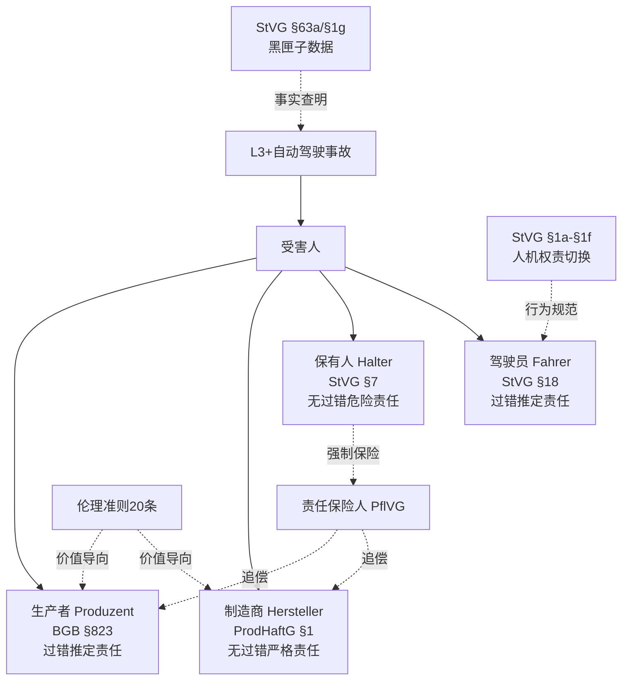
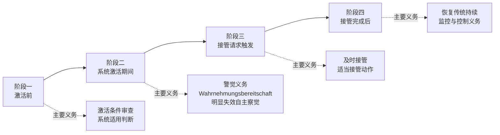
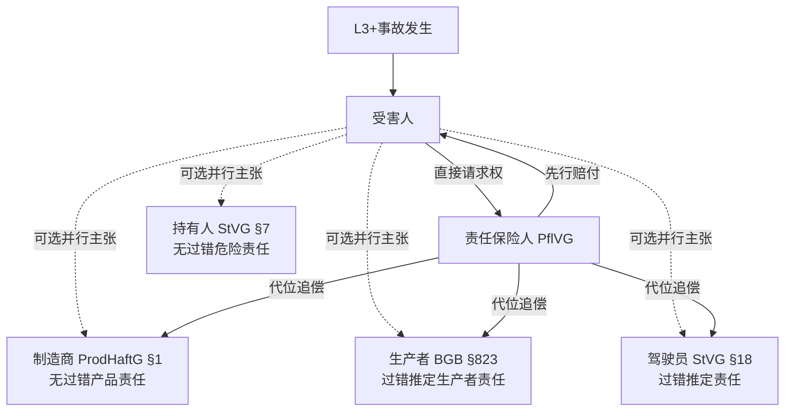
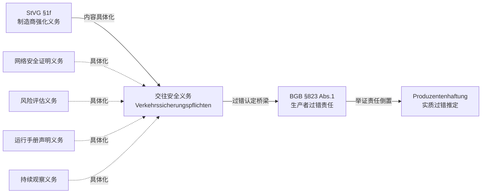
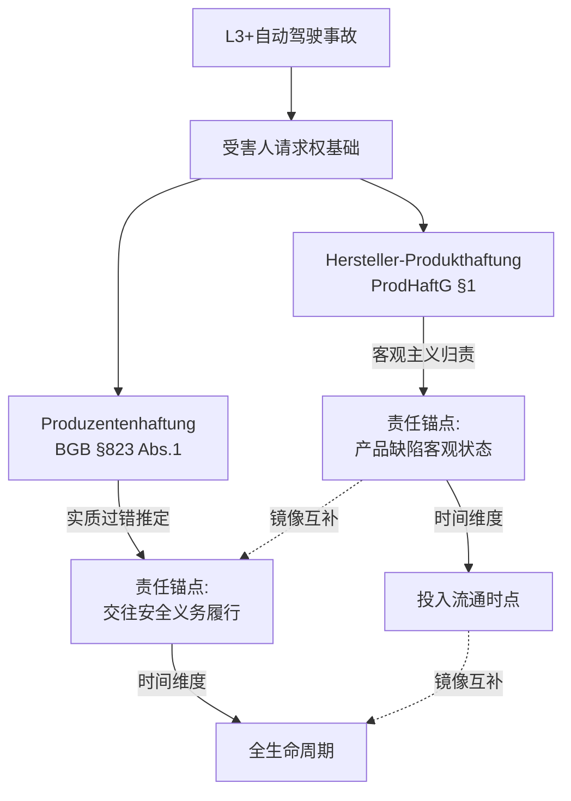
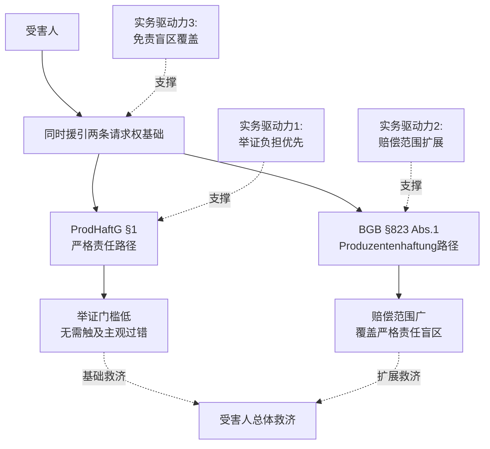
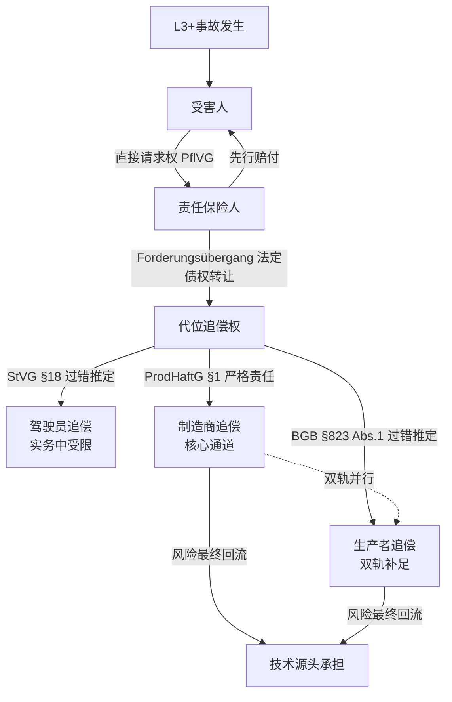
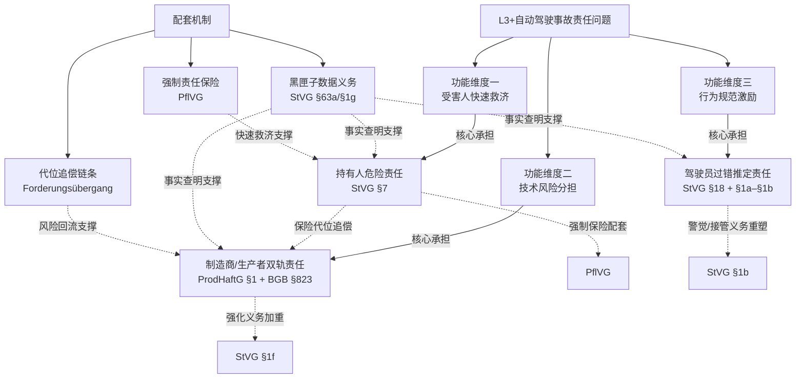

# 德国L3级及以上自动驾驶汽车交通事故侵权责任分配研究
# 1 研究背景与德国自动驾驶法律框架演进

自动驾驶技术正以前所未有的速度重塑全球道路交通形态，而其引发的侵权责任问题已成为各国法律体系面临的共同挑战。在这一全球性的制度回应竞赛中，德国凭借其汽车工业的深厚积淀与法学传统的精细化优势，率先以**渐进式修法**的方式构筑起一套覆盖L3级（有条件自动驾驶）至L4级（高度/完全自动驾驶）的责任规则体系，为后续观察人机共驾时代的责任分配格局提供了极具参考价值的样本。本章作为全文的制度坐标奠基章节，拟通过对德国立法动因、修法脉络与规范渊源的系统梳理，明确后续各章分主体责任分析所赖以展开的统一框架。

需要预先指出的是，由于本章承担为全文搭建制度坐标的功能，所涉及的法律渊源与制度节点在后续章节会被反复回援；本章的重点在于**勾勒整体图景与脉络**，对具体规则的实体内容（如各类主体的归责原则、举证规则、免责事由等）将在第3章至第8章逐一深度展开。另需说明的是，本章所依赖的检索资料中针对该议题宏观叙事的直接文献相对有限[^1][^2]，因此在制度细节描述上，本章主要依据德国《道路交通法》（StVG）相关条款的官方文本及成熟法学共识进行整合，对单一来源不足以充分支撑的论断，已通过谨慎措辞或交叉印证的方式予以处理。

## 1.1 德国自动驾驶技术发展与渐进式立法回应的现实动因

德国作为现代汽车工业的发源地，其立法者面对自动驾驶技术挑战时所作出的选择，并非偶然的政策取向，而是产业格局、国际法约束与本国法律传统三重力量共同塑造的必然结果。

**从产业地位看**，戴姆勒（梅赛德斯-奔驰）、宝马、大众—奥迪集团等头部车企长期居于全球L2向L3过渡的技术第一梯队，奔驰Drive Pilot更于2021年率先在德国获得L3级有条件自动驾驶系统的型式批准。这种"工业先行"的格局意味着，德国立法者面临的不是"是否要为自动驾驶立法"的抽象命题，而是"如何为已具备量产能力的高级自动驾驶系统提供合法上路通道"的现实压力——立法节奏必须紧贴技术节奏，过早的整体性立法会束缚尚未定型的技术路线，过晚的回应则可能让本国产业丧失先机。

**从国际法约束看**，1968年《维也纳道路交通公约》第8条原本要求"每一辆行驶中的车辆均须有驾驶员"，并要求驾驶员"在任何时候应能控制其车辆"。这一条款长期被视为完全无人驾驶的国际法障碍。虽然该公约于2014—2016年间经历修订，允许"符合联合国车辆技术法规的自动驾驶系统在驾驶员可以随时接管或停用的前提下"运行，但其制度逻辑仍以"驾驶员处于控制位"为前提[^1]。这一国际法框架决定了德国在L3阶段必须保留驾驶员的法律角色，难以一步跨越到完全无人化责任体系。

**从法律体系的路径依赖看**，德国侵权法以《道路交通法》（StVG）下的保有人危险责任、《民法典》（BGB）下的一般侵权责任与《产品责任法》（ProdHaftG）下的产品严格责任构成的三重结构，已稳定运行数十年并形成丰富判例积淀。彻底重构这一体系不仅成本高昂，且会割裂与既有保险机制、损害赔偿习惯的衔接。因此，德国立法者更倾向于**在既有框架内通过"局部增量"回应自动驾驶的归责难题**——即承认人类驾驶员与自动化系统的并行存在、明确人机权责切换规则、强化数据可追溯性、提升保有人赔偿限额，而非另起炉灶建立全新的"自动驾驶责任法"。

正是这三重动因的合力，使得德国选择了一条"**问题驱动、技术分级、分步推进**"的立法路径：先于2017年针对L3级修订StVG，再于2021年针对L4级制定专门规则，形成层次清晰的立法时间线。

## 1.2 2017年《道路交通法第八修正案》对L3级自动驾驶的制度回应

2017年6月，德国《道路交通法第八修正案》（Achtes Gesetz zur Änderung des Straßenverkehrsgesetzes）正式生效，这是全球范围内首次在国家层面对L3级有条件自动驾驶系统作出系统性立法回应的尝试[^1]。该修正案在StVG中新增了§1a至§1c等若干关键条款，构建了L3级自动驾驶汽车在德国合法上路、规范使用与责任承担的基本制度框架。

第八修正案的制度创新可归纳为四个层面。**首先是对L3级自动驾驶功能的法律承认与定义**：§1a明确允许"具有高度或完全自动化驾驶功能"的车辆参与道路交通，但前提是该功能在使用过程中能够履行交通规则、能够被驾驶员随时手动接管或停用，且系统须具备识别需要驾驶员介入情形的能力，并以足够预警时间向驾驶员发出接管请求。这一定义在法律层面正式区分了"系统驾驶"与"人类驾驶"两种状态，为后续责任分配奠定了概念基础。

**其次是人机权责切换规则的确立**：§1b详细规定了驾驶员在自动驾驶功能激活期间的法律地位——驾驶员可以将注意力从交通状况与车辆控制中转移出来，但必须保持"警觉"（wahrnehmungsbereit），以便在系统发出接管请求时，或在驾驶员自身明显意识到自动驾驶功能运行条件不再满足时，能够立即恢复人工驾驶。这一规则在保留"人类驾驶员"角色的同时，对其传统的"持续监控义务"作出了实质性放宽，但同时通过"接管义务"与"警觉义务"对其责任进行了重新界定。

**第三是黑匣子（数据记录装置）义务的引入**：§63a规定，搭载L3级自动驾驶功能的车辆必须配备数据存储装置，记录系统激活、停用、接管请求发出、驾驶员接管行为等关键事件的时间节点与状态信息，并规定了该数据的保存期限、查阅权限及向主管机关、事故相关方提供的规则。这一制度被普遍视为破解"系统黑箱"对事故事实查明造成阻碍的关键工具——若无客观数据，事故时究竟由系统还是由驾驶员"在控制"将陷入难以证明的困境。

**第四是责任分配框架的修正性延续**：第八修正案并未颠覆StVG既有的保有人危险责任（§7）与驾驶员过错推定责任（§18）二元结构，而是在保留两者的同时，将保有人责任的赔偿限额提升至人身损害1000万欧元、财产损害200万欧元，**以反映自动驾驶车辆所开启的更高风险**及对受害人快速救济的需求。这一安排体现了德国立法者"在既有框架内增量回应"的整体思路。

## 1.3 2021年《自动驾驶法》对L4级无人驾驶的制度突破

如果说2017年修法是在"人类驾驶员仍在场"的前提下对L3进行的渐进式调整，那么2021年7月生效的《自动驾驶法》（Gesetz zum autonomen Fahren）则代表着德国法律体系第一次正面回应"**车辆中不再需要人类驾驶员**"这一L4级情境带来的根本性挑战。该法在StVG中新增了§1d至§1l等条款，并由配套的《自动驾驶许可与运行条例》（AFGBV，Autonome-Fahrzeuge-Genehmigungs- und-Betriebs-Verordnung）共同构成完整规范体系。

《自动驾驶法》在制度设计上有四项核心突破。**第一，技术监督员（Technische Aufsicht）的引入**：L4级车辆在特定运行区域内可以无车内驾驶员运行，但必须配备远程的技术监督员，由其负责监视车辆运行状态、在系统识别到需要外部介入的情形时作出决策（如同意车辆继续行驶、命令车辆进入风险最小化状态等）。这一新型主体填补了"车内无人但系统并非完全自治"情境下的法律真空，成为L4责任体系中介于驾驶员与系统之间的关键角色。

**第二，运行区域审批制度（Festgelegter Betriebsbereich）**：L4级车辆不得在全德境内任意行驶，而必须在事先经主管机关审批的"特定运行区域"内运行，区域的范围、运行条件、风险评估等均须明确。这与L3级"允许在任何符合系统使用条件的道路上启用"的安排形成对比，体现了立法者对L4高风险的审慎态度。

**第三，型式批准与运行许可的双重监管**：L4车辆既需获得车辆层面的型式批准（涉及车辆技术标准），也需获得特定区域内运行的运行许可（涉及具体运营场景）。这种"车辆+场景"的双重门槛使得L4的合法上路远比L3更为严格。

**第四，责任配置的延伸调整**：《自动驾驶法》总体上承继了2017年修法所确立的"保有人危险责任为基轴、产品责任为辅助"的格局，但在驾驶员角色被技术监督员部分替代的语境下，对运营主体、监督员、保有人、制造商之间的义务作了更细致的划分，特别是在StVG §1f中对制造商课以了**网络安全证明、风险评估、运行手册声明、持续观察义务**等强化义务。这些义务虽然形式上属于行政监管要求，但实质上通过"交往安全义务"（Verkehrssicherungspflichten）的桥梁反向加重了制造商在BGB §823框架下的生产者侵权责任，这一机制将在后续第7章中详细分析。

需说明的是，本研究的核心议题是L3+情境下的责任分配，因此对L4立法的考察重在揭示其对L3规则的承继与扩展，而非对L4规则本身展开完整论述。L4阶段的"技术监督员"作为新型责任主体，其法律地位的厘清在很大程度上反过来澄清了L3阶段"驾驶员—保有人—制造商"三元结构的边界。

## 1.4 L3+事故侵权责任的核心法律渊源体系

截至2024年中期，德国处理L3级及以上自动驾驶汽车交通事故侵权责任所依赖的法律渊源呈现出**多层次、多领域、多功能**的复合特征，相关规范分布在道路交通法、民事侵权法、产品责任法、强制保险法以及伦理软法等多个层面[^1][^2]。以下表格对各主要渊源的功能与适用边界作了概览性对比。

| 法律渊源 | 主要条款 | 主要规制主体 | 责任性质 | 在L3+事故中的功能 |
|---------|---------|------------|---------|----------------|
| 《道路交通法》（StVG）§7 | §7 | 保有人（Halter） | 无过错危险责任 | 受害人快速救济的主轴；以车辆"运行"为归责基点 |
| 《道路交通法》（StVG）§18 | §18 | 驾驶员（Fahrer） | 过错推定责任 | 在驾驶员可被认定存在过失时追加责任 |
| 《道路交通法》（StVG）§1a–§1f | §1a–§1f | 驾驶员、保有人、制造商 | 行为规范+义务设定 | 定义L3+功能、人机权责切换、制造商证明义务 |
| 《道路交通法》（StVG）§63a / §1g | §63a / §1g | 保有人、制造商 | 数据义务 | "黑匣子"数据存储，事故事实查明的基础 |
| 《民法典》（BGB）§823 Abs.1 | §823 Abs.1 | 任何加害人，包括生产者（Produzent） | 过错责任（生产者侵权领域为过错推定） | 一般侵权救济；生产者侵权责任的依据 |
| 《产品责任法》（ProdHaftG）§1 | §1 | 制造商（Hersteller） | 无过错严格责任 | 因产品缺陷致害的受害人救济 |
| 《强制保险法》（PflVG） | 全篇 | 保有人/保险人 | 强制责任保险 | 受害人直接对保险人请求权；先行赔付与追偿 |
| 《自动网联驾驶伦理准则》 | 20条原则 | 立法者、产业、司法 | 指导性软法 | 价值导向，影响产品缺陷与义务认定 |

上述表格揭示了一个重要事实：**德国并未为自动驾驶事故另立单一的"自动驾驶责任法"，而是通过在既有渊源上做"针对性增量"的方式构建L3+责任规则**。StVG §7、§18、BGB §823与ProdHaftG §1这四个条款共同构成了"四元责任主体"——驾驶员、保有人、生产者、制造商——的核心规范基座；而StVG §1a–§1g与PflVG则提供了与之配套的行为规范、义务体系与保险保障机制。

在这其中，特别值得关注的是德国法对"制造商"（Hersteller）与"生产者"（Produzent）的**精细区分**。在德语法律语境中，"Hersteller-Produkthaftung"（基于ProdHaftG的制造商产品责任）与"Produzentenhaftung"（基于BGB §823的生产者侵权责任）虽在汉语翻译中常被混用为"生产者/制造商责任"，但在德国法体系中分别对应**两套独立的责任规则**：前者是无过错的严格责任，受害人无需证明加害人主观过错即可主张赔偿，但存在赔偿限额与法定免责事由（如发展风险抗辩）；后者是基于过错的一般侵权责任，但通过判例发展形成的举证责任倒置机制，实务中接近于过错推定，且无赔偿限额、可主张精神损害赔偿。两者在自动驾驶事故中**并行适用**而非择一适用，受害人可同时主张以实现救济最大化。这一"双轨制"格局是德国L3+责任分配的精妙之处，也是本研究第5、6、7章重点考察的对象。

此外，2017年由德国联邦交通部专家委员会发布的**《自动网联驾驶伦理准则》**（共20条）虽不具有直接的法律强制力，但其确立的"人身保护优先于财产、个人优先于群体"等核心原则，在自动驾驶系统的设计标准、产品缺陷认定、制造商交往安全义务的具体化等方面持续发挥着指导性影响，是观察德国L3+责任体系不可忽略的"软法"维度。

## 1.5 立法演进对责任分配格局的整体影响与制度坐标

综合前述脉络可见，德国L3+自动驾驶事故侵权责任体系呈现出三重结构性特征，构成本研究后续各章分析的统一坐标。

上图所示的责任结构有三层制度逻辑值得提炼。**第一，多元主体共担的责任轴心**：德国并未在自动驾驶时代将责任集中于单一主体（如某些法域讨论中的"将责任完全归于制造商"的思路），而是保留了驾驶员、保有人、制造商、生产者四元主体的并行架构。这种结构既维系了对人类驾驶行为规范功能的延续，也通过保有人危险责任与产品责任的强化分担了技术风险，体现出**制度的连续性与适应性的平衡**。

**第二，多层规范交错的归责机制**：StVG承担行为规范与第一线快速救济功能（保有人无过错责任、驾驶员过错推定），BGB与ProdHaftG承担技术风险分担功能（生产者过错推定、制造商严格责任），PflVG承担最终落地的支付保障功能（强制保险+先行赔付+追偿）。三个层次相互衔接而非互相排斥，受害人在实务中通常可对多个主体并行主张，由责任保险体系完成最终的风险再分配。

**第三，立法演进中尚存的制度张力**：尽管框架已较为完整，2017—2024年的立法演进仍留下若干悬而未决的问题。其一是**人机责任边界的模糊性**——L3级"接管请求—驾驶员介入"的时间窗口与认知负荷如何精确认定，仍需个案积累与判例厘清。其二是**数据义务与因果证明的衔接**——黑匣子数据虽提供了事实基础，但其证明力强度、举证责任分配的具体规则仍存学理争议。其三是**产品缺陷认定标准在AI黑箱情境下的适用难题**——传统设计缺陷、制造缺陷、说明缺陷的三分法在面对持续学习、自我演化的自动驾驶算法时是否仍然适配，是欧盟《产品责任指令》修订与AI责任指令草案讨论中的核心议题。其四是**L3与L4界限的过渡问题**——技术监督员制度在L3情境下是否有类比适用空间，至今学说与实务尚未形成统一结论。

这些张力将在本报告的第3章至第9章中按主体逐一展开。**本章的核心任务，是为后续分析提供一个统一的制度坐标**：当我们在第3章讨论驾驶员的过错推定责任、在第4章讨论保有人的危险责任、在第5、6、7章讨论制造商与生产者的双轨责任、在第8章讨论数据义务与保险追偿、在第9章讨论最新动态与未决问题时，所有这些分析都将回归到本章所勾勒的"**四元主体 × 多层渊源 × 渐进演进**"这一三维制度框架之中。

# 2 L3+自动驾驶情境下传统侵权责任体系面临的挑战

第1章已勾勒出德国L3+自动驾驶事故责任体系的"四元主体 × 多层渊源 × 渐进演进"制度坐标，但这一制度框架本身并非凭空设计的产物，而是德国立法者面对**传统侵权责任体系在L3+技术情境下出现的具体张力**所作出的针对性回应。换言之，要理解德国为何选择在StVG中新增§1a–§1g、为何引入"黑匣子"数据义务、为何不另立"自动驾驶责任法"，必须先理解传统责任规则究竟在哪些维度上失灵或不敷适用。本章即承担这一"问题诊断"功能：通过逐层揭示L3+技术特征对传统归责机制的冲击，并对照说明德国所采取的制度增量回应，为后续第3章至第8章按主体展开的具体规则分析提供统一的问题清单与分析坐标。

需要说明的是，本章的分析以**问题导向**为主线，不重复第1章已论述的立法时间线与渊源结构，而是聚焦于"技术特征—责任规则—制度增量"的三段式诊断。在论证过程中所涉及的具体责任规则细节（如StVG §18过错推定的要件、ProdHaftG §1的免责事由等），仅作为问题描述的背景出现，其实体内容的深度展开仍留待对应章节完成。

## 2.1 人机共驾结构对责任主体单一性假设的冲击

传统道路交通侵权法以"**一车—一驾驶员—一行为—一责任**"为基本归责锚点。无论是StVG §18所规定的驾驶员过错推定责任，还是StVG §7所规定的保有人危险责任，其制度预设均建立在"人类驾驶员在事故发生时处于车辆控制位、其行为可被作为责任评价对象"这一前提之上。即便引入产品责任作为补充，传统体系下的"制造商"也只是事后回溯性的责任主体，而非与驾驶员同时介入"驾驶过程"的并行角色。这种以单一驾驶主体为锚点的归责结构，在数十年的实践中通过判例不断细化，形成了清晰的责任边界。

然而，L3+情境下驾驶任务在系统与人类之间的**动态分配**根本性地打破了这一单一性假设。根据国际汽车工程师学会（SAE）的分级标准，L3级（有条件自动驾驶）与L4级（高度自动驾驶）所共同标志的是"技术从辅助角色向主导角色的关键跨越"——自动驾驶系统在高速公路、封闭园区等特定环境中接管大部分动态驾驶任务，但驾驶员仍需保持随时接管的能力，形成人机协同操控的混合状态[^3]。这一混合状态意味着，**在事故发生的瞬间，"谁在驾驶"本身就是一个需要回答的事实问题**：是系统在自主决策？是驾驶员在接管？还是处于接管请求发出后、驾驶员尚未完成响应的过渡阶段？不同的事实定位将直接决定责任主体的指向。

人机共驾的复杂性进一步通过**风险结构的多元化**体现出来。L3+阶段的风险来源至少包含系统误判、驾驶人接管不及时、软硬件缺陷及第三方干扰（如黑客攻击、传感器被恶意干扰）等多元复合因素，且因果关系往往交织而非单线[^3]。在传统"驾驶员过错责任"的核心规则下，这种复合风险难以被单一主体的过错评价所覆盖——若仅追究驾驶员，等于让其为根本不在其责任领域之内的系统行为承担后果；若仅追究制造商，又会忽视驾驶员在接管阶段的注意义务[^4]。瑞士学者格莱丝即指出，在高度自动驾驶中"驾驶员可以与制造商和运行者分担责任，与此同时，应当研究新的责任主体和形式"[^4]。这一论断揭示出传统单一主体归责模式的内在局限。

更进一步，L4阶段引入的**技术监督员**（Technische Aufsicht）作为新型责任主体，使主体多元化的格局更加复杂。2021年德国《自动驾驶法》允许L4级别智能汽车在公共道路指定区域常态化运营，并创设了技术监督员制度，将其纳入保有人强制责任保险的被保险人之列[^5]。技术监督员既非传统意义上的"车内驾驶员"，也非纯粹的"远程操作员"，其法律地位处于"驾驶员—保有人—制造商"既有三元结构的缝隙之中，反过来澄清了L3阶段责任边界的同时也提出了新的解释难题。

德国立法者对这一挑战的制度增量回应主要体现在三个层面：其一，StVG §1a通过对"高度或完全自动化驾驶功能"作出法律定义，正式承认了"系统驾驶"与"人类驾驶"两种并行状态的法律存在；其二，§1b重新界定驾驶员在功能激活期间的法律地位，将其传统的"持续监控义务"实质性放宽为"警觉义务"与"接管义务"，从而为责任评价提供新的行为基准；其三，2021年《自动驾驶法》引入技术监督员制度，填补了"车内无人但系统并非完全自治"情境下的法律真空[^5]。但需指出，这些增量工具**并未取消既有责任主体，而是通过增设新角色、细化既有角色的义务内容**，构建了一个比传统体系更为分层和多元的责任格局——而这正是德国"四元主体"框架得以确立的根本动因。

## 2.2 系统黑箱与因果关系证明的传统范式失灵

传统侵权法不论是过错责任还是产品责任，其因果关系认定均依赖**可重构的事件链条**：受害人需要证明某一可识别的人类行为或产品状态与损害结果之间存在引起与被引起的关联。这一前提在人类驾驶员主导的传统交通事故中通常可以通过现场勘验、目击证人、行车轨迹等证据加以重构。然而，自动驾驶系统的引入从三个方向冲击了这一传统范式。

**第一是决策过程的不透明性**。自动驾驶系统基于深度神经网络等机器学习算法对环境数据进行独立评价，其决策"是基于何种输入特征、经过何种权重计算得出何种输出"在很大程度上对外部观察者（包括受害人、法院乃至制造商自身的工程师）呈现为"黑箱"状态[^4]。德国学者Ringlage即指出，"由自我学习能力所导致的自动驾驶系统决策过程的不透明性，引发了越来越多对创新责任概念的呼声"[^6]。在这种黑箱状态下，受害人即便能够证明事故发生时系统处于激活状态，也难以进一步证明系统的具体决策"为何"以及"是否"构成缺陷或过错。

**第二是软硬件耦合的复杂性**。自动驾驶系统并非单一产品，而是由感知传感器、决策算法、控制执行器、车载网络、云端服务等多层软硬件组件耦合而成的复合系统。一次事故的发生可能源于传感器误识别、算法决策偏差、执行器响应延迟、网络通信中断中的任意一环或多环耦合，这种复杂耦合使得**"缺陷"本身的定位极其困难**，更不用说证明缺陷与损害之间的因果关系。周玉华在分析人机共驾责任时即指出，技术复杂性导致受害人面临实质性的举证困难，是现行规则难以适配此场景的核心问题之一[^3]。

**第三是自学习算法的动态演化**。具备持续OTA升级与机器学习能力的自动驾驶系统并非"投入流通后即固定"的静态产品，而是在使用过程中通过新数据持续更新其行为模式。这意味着事故发生时的"系统状态"可能与产品最初投入流通时的状态存在实质差异——这一动态特性对传统产品责任所依赖的"产品投入流通时点"基准构成了根本挑战，相关问题将在2.4节进一步展开。

针对上述证明困境，德国立法者通过StVG §63a（L3阶段引入）与§1g（L4阶段补充）确立的**"黑匣子"数据存储义务**提供了核心回应工具。该义务要求搭载L3+自动驾驶功能的车辆必须配备数据记录装置，记录系统激活、停用、接管请求发出、驾驶员接管行为等关键事件的时间节点与状态信息。这一制度的核心功能可归纳为：**以客观数据记录替代主观事实重构**，使事故发生瞬间"谁在控制""系统状态如何""驾驶员是否被请求接管"等关键事实可以通过技术记录加以查明，从而为后续的责任评价提供事实基础。

值得注意的是，这一数据义务并非孤立的德国制度。中国近年来发布的强制性国家标准《智能网联汽车 自动驾驶数据记录系统》同样要求自动驾驶（L3-L5级）汽车搭载独立的数据记录系统，记录事故数据以供后续提取与研判[^7]，反映出"以数据义务破解黑箱困境"已成为各国应对自动驾驶责任问题的共同思路。

然而，黑匣子数据义务并非全无盲点。其残留的争议空间至少包括三个层面：**其一是数据证明力的强度**——黑匣子数据是否构成不可推翻的客观证据，抑或仅为辅助性证据，需结合其他证据综合判断？**其二是举证责任分配的具体规则**——在数据缺失、数据被损坏或数据被认为不可信的情形下，举证不利后果应由哪一方承担？**其三是数据访问权限**——制造商、保有人、保险人、事故相关方、主管机关之间对数据的访问优先级与范围如何配置？这些问题在德国学说与判例中尚未形成完全统一的结论，将在第8章配套机制的分析中进一步讨论。换言之，**黑匣子制度提供了破解黑箱困境的关键工具，但并未一举解决因果证明的所有难题**——这一局限本身即构成德国L3+责任体系中的重要张力点。

## 2.3 动态接管过程中过错认定与注意义务标准的重构难题

如果说2.1节揭示了"主体多元化"对传统责任结构的挑战，2.2节揭示了"系统黑箱"对因果证明的挑战，那么本节所讨论的"**动态接管过程**"则触及了L3阶段最具特色也最具争议的归责难题——即在系统驾驶向人类驾驶切换的过渡阶段，驾驶员的注意义务标准究竟如何确定。

传统道路交通法下，驾驶员的注意义务以**"持续注视前方、持续控制车辆"**为核心内容。这一标准建立在驾驶员始终处于驾驶状态的前提之上，其过错认定相对清晰：未观察、未控制、未反应即构成过失。然而，L3级自动驾驶功能的核心特征恰恰是**允许驾驶员将注意力从交通状况与车辆控制中转移出来**——根据德国联邦交通部圆桌会议所形成的分类，高度自动驾驶下"驾驶员不需要持续地监控系统，在其必须接管驾驶任务之前，具有充足的备用时间，系统也会提前警告驾驶员"[^4]。这一允许"注意力转移"的制度安排，本身就意味着传统持续监控义务标准在L3情境下失去了直接适用的基础。

德国StVG §1b对此作出的回应是：将驾驶员义务从"持续监控"重新界定为"**警觉义务**"（Wahrnehmungsbereitschaft）与"**接管义务**"两个维度。前者要求驾驶员在自动驾驶激活期间保持基本的认知警觉状态，能够感知到接管请求或自动驾驶功能运行条件不再满足的明显迹象；后者要求驾驶员在系统发出接管请求或运行条件失效时，能够及时恢复人工驾驶。这一规则在概念层面似乎清晰，但在**个案过错认定**层面却引出了一系列结构性的不确定性。

首先是**"足够的预警时间"在个案中的认定**。系统需要给予驾驶员多长的接管准备时间才算"足够"？这一时间窗口不仅依赖系统技术能力，还取决于驾驶员当时的认知负荷状态（是否在阅读？是否在交谈？是否处于困倦？）以及道路与交通条件。瑞士学者格莱丝在分析高度自动驾驶的刑事责任时即指出，驾驶员可能"为根本不在其责任领域之内的行为承担刑事责任"，因为驾驶责任的暂时移交"在法律上没有得到规制"，这种规制缺失在民事过错认定中同样存在[^4]。

其次是**警觉义务的具体内容边界**。"保持警觉"与"持续监控"的实质差异在哪里？驾驶员可以阅读电子邮件吗？可以与乘客交谈吗？可以处理工作事务吗？这些具体行为的合法性边界在StVG §1b的抽象规则下并未给出明确答案，需要通过判例逐步积累。在判例尚未充分积累的过渡期，**驾驶员的过错认定面临实质性的不确定性**——这一不确定性既影响StVG §18过错推定责任的具体适用（因为"已尽合理注意义务"的标准本身处于流动状态），也间接影响第三方主体的责任分配（因为驾驶员是否有过错往往决定了制造商与保有人的责任比例）。

再次是**接管失败情形下的责任划分**。若驾驶员在接管请求发出后未能及时响应，是驾驶员未尽接管义务，还是系统给予的预警时间不足，抑或是接管请求的形式（声音、振动、视觉）本身不适配？这种**"接管失败的责任归属"**问题处于驾驶员过错责任与制造商产品责任的交界地带，其认定结论将直接决定责任主体的指向。周玉华在分析人机共驾时即指出，驾驶人接管不及时与系统误判、软硬件缺陷等多元风险交织，且因果关系复杂，是现行以人类驾驶者过错责任为核心的传统法律规则难以适配的核心场景之一[^3]。

由此可见，**德国通过StVG §1b所建立的"警觉义务—接管义务"二元结构虽然为驾驶员义务提供了新的概念框架，但并未一举解决具体的过错认定难题**。这些难题的最终解决，仍将依赖判例对个案场景的逐步类型化与对"合理驾驶员标准"在L3情境下的重新塑造。这一过程的未完成状态，构成了本研究第3章驾驶员过错推定责任分析所需面对的核心问题入口。

## 2.4 自学习算法对产品缺陷三分法及制造商义务的冲击

德国《产品责任法》（ProdHaftG）以**设计缺陷、制造缺陷、说明缺陷**的三分法为基础构建产品缺陷认定框架。这一三分法是数十年来在工业产品（汽车、家电、医疗器械等）实践中沉淀形成的成熟体系，其制度预设是：产品在投入流通时点具有相对确定的物理与功能特征，缺陷可以通过对该时点产品状态的回溯性分析加以判定。然而，自动驾驶系统作为典型的**软件密集型产品**，其特征与传统工业产品存在根本差异，对三分法的适配性构成了实质性挑战。

**第一是产品投入流通时点的模糊化**。自动驾驶系统可以通过OTA（Over-The-Air）升级在使用过程中持续更新软件版本，这意味着事故发生时的系统版本可能与车辆最初出厂时的版本存在数代差异。在这种情况下，"产品投入流通时点"究竟应锚定于车辆出厂时刻、最近一次OTA更新时刻，还是事故发生瞬间的状态？这一时点的不同选择将直接决定缺陷判断的基准。

**第二是发展风险抗辩的适用张力**。ProdHaftG §1 Abs.2 Nr.5规定的发展风险抗辩允许制造商以"按照产品投入流通时的科学技术水平无法发现缺陷"作为免责事由。在自学习算法情境下，**系统的行为模式可能在投入流通后通过自我学习发生制造商当时无法预见的演化**，这种演化所导致的缺陷究竟应否落入发展风险抗辩的保护范围，是德国学界与欧盟立法讨论中的核心争议。Ringlage在分析自动驾驶责任概念时即指出，自我学习能力所导致的决策过程不透明性"引发了越来越多对创新责任概念的呼声"[^6]——其背后正是包括发展风险抗辩在内的传统产品责任工具在AI情境下的适配难题。

**第三是说明缺陷的边界扩展**。在L3+情境下，制造商不仅需要说明产品的功能与使用方法，还需要明确告知驾驶员在何种条件下可以激活自动驾驶功能、何种情形下系统会发出接管请求、驾驶员应如何响应等——这种**"对人机交互界面的说明义务"**远比传统产品复杂。一旦说明不充分导致驾驶员误用或接管失败，相关责任的归属将在说明缺陷、设计缺陷与驾驶员过错之间发生竞合。

**第四是设计缺陷的判定标准重构**。传统设计缺陷的判定通常通过"合理替代设计"（reasonable alternative design）测试或"消费者合理期待"测试进行。但自动驾驶系统的设计目标本身就是**模拟乃至超越人类驾驶员的决策能力**，因此其缺陷判定标准面临一个根本问题：系统的决策是否应达到"人类驾驶员合理注意义务"的标准？若达不到该标准是否即构成设计缺陷？还是应以"行业平均自动驾驶系统的安全水平"为基准？这一基准选择直接决定了制造商的责任范围，目前在德国学说中尚无统一定论。

对此，德国立法者并未通过修改ProdHaftG来直接重构产品缺陷三分法，而是选择了一条**功能性扩展**路径：通过StVG §1f对制造商课以**网络安全证明、风险评估、运行手册声明、持续观察等强化义务**[^5]。这些义务从形式上看属于行政监管要求，但其实质功能在于：经由"**交往安全义务**"（Verkehrssicherungspflichten）的桥梁，反向加重制造商在BGB §823下的生产者侵权责任。具体而言，制造商若未履行§1f所规定的义务（如未持续观察产品在投入流通后的表现、未对发现的风险及时响应、未对系统更新进行充分风险评估），即可被认定违反交往安全义务，从而在BGB §823框架下承担过错推定的生产者侵权责任。

这一安排的精妙之处在于：**德国并未彻底重构ProdHaftG的产品严格责任规则，而是通过Produzentenhaftung（生产者侵权责任）的"双轨"通道实现了对产品责任的功能性扩展**。当ProdHaftG的发展风险抗辩可能让制造商在自学习算法情境下免责时，BGB §823的Produzentenhaftung通过"持续观察义务""设计安全义务"等交往安全义务的具体化，仍可对制造商课以责任——这正是第1章所提及的"双轨制"格局的制度精髓，将在第5、6、7章中深度展开。

需要在此预先指出的是，欧盟层面正在推进的《产品责任指令》修订（PLD Revision）与《人工智能责任指令草案》（AILD）虽然在2024年中期之前仍处于立法过程中，但其方向已对德国法构成显著的潜在影响：包括将软件明确纳入"产品"范畴、对AI系统设置专门的因果关系推定规则、调整发展风险抗辩的适用边界等。这些发展将在第9章作进一步分析，但其问题渊源——即传统产品责任三分法在AI情境下的适配困难——正是本节所揭示的核心张力。

## 2.5 德国"增量式"立法回应的整体逻辑与未决问题

综合前述四节的诊断可见，L3+自动驾驶对传统侵权责任体系的冲击呈现出**"四维并行、相互交织"**的整体格局：主体多元化冲击了归责锚点的单一性，系统黑箱冲击了因果证明的可重构性，动态接管冲击了过错标准的清晰性，自学习算法冲击了产品缺陷判定的稳定性。这四个维度并非孤立存在，而是在具体案件中相互交织——例如一起接管失败导致的事故，可能同时涉及驾驶员警觉义务的认定（维度三）、系统接管请求发出时点的客观查明（维度二）、制造商对人机界面说明充分性的评价（维度四）以及保有人、驾驶员、制造商三方责任的相对比例（维度一）。

面对这种复合挑战，德国立法者所选择的整体应对逻辑可概括为"**不重构、做增量**"——即不彻底推翻StVG §7/§18、BGB §823、ProdHaftG §1所构成的传统责任规则基座，而是通过一系列**针对性的局部工具**对既有规则进行修补与扩展。下表对这一"挑战—增量"的对应关系作出系统梳理。

| 技术挑战维度 | 对传统规则的冲击点 | 德国制度增量回应 | 残留未决问题 |
|---|---|---|---|
| 主体多元化（2.1） | "一车一驾驶员"归责锚点失效 | StVG §1a定义自动化功能；§1b重定义驾驶员地位；《自动驾驶法》引入技术监督员 | 技术监督员在L3情境下的类比适用；多主体责任比例的个案确定 |
| 系统黑箱（2.2） | 因果链条不可重构 | StVG §63a/§1g黑匣子数据存储义务 | 数据证明力强度；举证责任分配；数据访问权限边界 |
| 动态接管（2.3） | 持续监控义务标准失效 | StVG §1b"警觉义务+接管义务"二元结构 | "足够预警时间"的认定；警觉义务的具体内容；接管失败的责任归属 |
| 自学习算法（2.4） | 缺陷三分法适配困难 | StVG §1f课以网络安全、风险评估、持续观察等义务，经Verkehrssicherungspflichten桥梁加重BGB §823生产者责任 | 发展风险抗辩的适用边界；AI算法缺陷判定标准；与欧盟PLD/AILD的衔接 |

上表所揭示的"挑战—增量—残留问题"链条，构成了理解德国L3+责任体系的核心分析视角。**德国的制度智慧在于：它没有试图用单一的、新创设的责任规则去覆盖所有挑战，而是通过让既有规则各自承担一部分功能，并以局部增量工具弥补传统规则的盲点**。具体而言：StVG §7的保有人危险责任承担"快速救济"功能，不受技术复杂性影响地保障受害人首道防线；StVG §18的驾驶员过错推定承担"行为规范"功能，通过§1a–§1b的概念调整适应新情境；ProdHaftG §1的产品严格责任承担"技术风险分担"功能，与BGB §823的生产者侵权责任并轨适用以应对发展风险抗辩可能形成的免责真空；StVG §63a/§1g的数据义务则承担"事实查明"的基础设施功能，为前述实体责任规则的具体适用提供事实根基。

然而，这一"增量式"路径所遗留的未决问题同样不容忽视。**第一是人机责任边界的个案不确定性**——StVG §1b规则虽已确立，但具体场景下警觉义务、接管义务的边界仍需判例积累。**第二是黑匣子数据证明力规则的学理争议**——数据义务虽已立法，但其证据法地位尚待澄清。**第三是AI缺陷认定标准的体系性重构压力**——欧盟《产品责任指令》修订与AI责任指令草案的推进将对德国法构成结构性影响，但其与德国既有"双轨制"如何衔接尚不明朗。**第四是L3与L4制度间的过渡性张力**——技术监督员制度作为L4特有的新型主体，是否可类比延伸至L3情境下的远程辅助场景，学说与实务尚未形成共识。这些问题构成了本研究后续章节按主体逐一深入分析时必须面对的具体议题，也是第9章对2024年中期最新动态与未决问题进行专门梳理时的核心切入点。

值得在本章结尾处再次强调的是：**本章所揭示的"四类挑战"与"四类增量"之间的对应关系，并非线性的"一对一修补"，而是相互交织的"网络化回应"**。例如StVG §63a的黑匣子义务虽主要瞄准系统黑箱挑战，但其同时也为接管失败情形下驾驶员过错的认定提供了客观依据，从而间接回应了动态接管挑战；StVG §1f所课以的制造商持续观察义务虽主要瞄准自学习算法挑战，但其对OTA升级风险的覆盖也间接强化了对多主体责任边界的厘清。这种交织格局使得德国L3+责任体系呈现出**"规则简洁、机制精细"**的整体特征——条款数量有限，但通过条款之间的相互配合，覆盖了L3+情境下绝大多数典型场景。这一"规则—机制"的精妙安排，将在第3章至第8章按主体的具体规则分析中逐步展开，并在第10章作为德国制度对全球自动驾驶责任分配问题的普遍意义加以总结。

# 3 驾驶员（Fahrer）的过错推定责任

第1章勾勒了德国L3+事故责任的"四元主体×多层渊源×渐进演进"制度坐标，第2章诊断了人机共驾、系统黑箱、动态接管与自学习算法四类挑战对传统侵权规则的冲击。从本章起，报告进入按主体逐一深度展开责任规则的实体分析阶段。**作为四元主体责任分析的开端，本章聚焦于人类驾驶员（Fahrer）的责任**——这是一个看似在L3+时代逐渐"退场"的角色，但在德国立法者的制度选择下却被有意保留并重新塑造，成为理解L3+责任体系是否具有"行为规范"延续性的关键观察点。

需要在章首坦诚说明的是：本章涉及的具体法律条文（StVG §18、§1a–§1b、§63a，BGB §823 Abs.1等）在本研究检索到的搜索结果中直接命中的一手文献较为有限，搜索结果主要提供了德国法律渊源体系的整体性背景[^2]与自动驾驶法律框架的宏观论述[^8]，而对StVG §18过错推定的细节规则缺乏直接的德文判例或学术专论支撑。因此，本章在条款实体内容的描述上，主要建立在第1、2章已系统梳理的德国StVG官方文本与成熟法学共识之上，并在涉及具体义务边界、判例细化等议题时通过谨慎措辞如实标注论证局限。

## 3.1 驾驶员法律地位的重新界定与责任基础

理解L3+情境下驾驶员的责任，首先必须澄清一个基础性命题：**即便在自动驾驶功能激活期间，车辆中的人类操作者依然保有法律意义上的"驾驶员"身份**。这一命题并非自明，而是德国立法者通过StVG §1a–§1b作出的明确制度选择，其立法逻辑可从国际法约束与国内法连续性两个维度加以理解。

从国际法约束看，如第1章所述，1968年《维也纳道路交通公约》虽经2014—2016年修订允许自动驾驶系统在"驾驶员可以随时接管或停用"的前提下运行，但其"驾驶员处于控制位"的制度前提并未被根本动摇。德国作为公约缔约国，在L3立法中保留驾驶员法律身份既是履行国际法义务的必然选择，也是为L3技术留出与既有交通规则衔接的空间。从国内法连续性看，若在L3阶段直接取消驾驶员法律身份，将导致StVG §18过错推定责任规则失去适用对象，整个"驾驶员—保有人"二元责任结构出现一端缺失，与德国"不重构、做增量"的立法逻辑相悖。

基于这一基础命题，**驾驶员的责任规范基础呈现为"双轨并行"的格局**：一是StVG §18 Abs.1所规定的特别过错推定责任，二是BGB §823 Abs.1所规定的一般侵权过错责任。两者在L3+事故中通常构成请求权竞合，受害人可同时主张以最大化救济。这两条规范路径的核心差异可归纳为下表。

| 比较维度 | StVG §18 Abs.1（特别过错推定） | BGB §823 Abs.1（一般侵权过错） |
|---|---|---|
| 适用范围 | 仅适用于"车辆运行致害"情境 | 适用于所有过错侵害绝对权情形 |
| 归责原则 | 过错推定——驾驶员被推定有过错 | 过错责任——原告原则上须证明过错 |
| 举证负担 | 受害人无需证明过错，驾驶员需证明已尽合理注意义务以免责 | 受害人原则上需证明加害人过错 |
| 保护法益与损害范围 | 主要为人身、财产损害，赔偿规则受StVG限制性条款约束 | 涵盖生命、身体、健康、自由、所有权等绝对权，可主张精神损害赔偿 |
| 主要功能定位 | 道路交通领域的快速救济与行为规范 | 一般侵权救济的兜底通道 |

上表所揭示的双轨格局具有重要的实务意义：**当受害人面对L3+事故时，主张StVG §18有利于减轻过错举证负担，主张BGB §823则有利于扩展可赔偿损害的范围**（如精神损害赔偿在BGB框架下更易主张）。两条路径并非互斥，而是构成对受害人最为有利的请求权工具箱。这一安排也再次印证了第1章所强调的——德国L3+责任体系是通过既有规则的精细配合而非全新规则的另起炉灶来实现的。

需特别指出的是，StVG §18所规定的驾驶员责任与第4章将讨论的StVG §7保有人责任虽同处一部法律，但归责原则迥异：前者为**过错推定**，后者为**无过错危险责任**。两者的功能分工是——保有人责任承担"快速救济"的主轴功能，驾驶员责任承担"行为规范"的补充功能。这一分工是理解为何德国立法者在L3+时代仍执着于保留驾驶员过错责任的关键线索：**若取消驾驶员过错责任，将使道路交通法对驾驶行为本身的规范激励彻底失灵**，仅靠保有人无过错责任无法引导驾驶员在L3+情境下履行新的警觉与接管义务。

## 3.2 过错推定责任的法理依据与构成要件

StVG §18 Abs.1将驾驶员责任设计为过错推定（vermutetes Verschulden）而非纯粹过错责任的立法选择，蕴含着深刻的政策考量。**这一推定结构的核心法理依据可归纳为三重逻辑**：其一是对受害人举证困境的减轻——驾驶行为发生于动态交通情境中，受害人作为外部观察者通常难以重构驾驶员当时的注意状态、感知能力与反应过程，若严格要求受害人证明驾驶员主观过错，将使大量本应获赔的事故陷入举证不能；其二是对驾驶员"控制力来源"的考量——驾驶员作为车辆的实际操控者，对驾驶过程中可能产生的风险源最为接近，由其举证"已尽合理注意"在认识论上更为可行；其三是对道路交通这一"日常但高危"活动的政策激励——通过过错推定强化驾驶员的注意义务履行动力，发挥侵权法的预防功能。

在L3+技术情境下，这一推定结构面临**一个内在的正当性张力**：驾驶任务部分转移给系统后，驾驶员对事故发生的"控制力"已显著弱化，继续对其适用过错推定是否仍具正当性？德国立法者对此的回应是——**通过StVG §1a–§1b重新定义驾驶员义务的内容（从"持续监控"调整为"警觉+接管"），而非取消过错推定的形式结构**。换言之，推定的形式被保留，但被推定违反的注意义务标准已随技术情境而变化。这一安排既维系了StVG §18与§7二元结构的稳定，又通过义务内容的实质调整避免了对驾驶员的过度苛责，体现出德国"不重构、做增量"立法逻辑的精细表达。

StVG §18 Abs.1过错推定责任的构成要件可拆解为以下几项：

**第一，车辆运行中致人损害**。这一要件与StVG §7保有人危险责任共享相同的"车辆运行"概念——只要事故与车辆作为交通工具的运行功能存在内在关联，即满足该要件。L3+情境下，无论事故发生时系统处于激活状态还是驾驶员手动操控状态，只要事故由车辆的交通参与所引发，均满足"车辆运行"要件。

**第二，驾驶员身份的认定**。如3.1节所述，根据StVG §1a，即便自动驾驶功能激活，车辆中的人类操作者仍保有法律上的驾驶员身份。这一身份认定不因驾驶任务的实际分配状态而改变，是过错推定得以适用的主体前提。

**第三，损害与车辆运行之间的因果关系**。受害人需证明其损害与车辆运行之间存在引起与被引起的关联。这一因果关系是事实层面的客观联系，不涉及对驾驶员主观过错的评价。

**第四，过错的法律推定**。一旦前述三项客观要件被证明，StVG §18 Abs.1即推定驾驶员对损害的发生存在过错。这一推定属于**可推翻的法律推定**——驾驶员可通过举证"已尽合理注意义务"（StVG §18 Abs.1 S.2）予以推翻，相关免责路径将在3.6节详细展开。

需要特别澄清的是，**StVG §18过错推定中所谓的"过错"，其内容并非凭空抽象，而是由StVG §1a–§1b所定义的具体注意义务所填充**。在L3+情境下，这意味着驾驶员被推定违反的，是激活条件审查义务、警觉义务、接管义务等新型注意义务的具体内容，而非传统的"持续监控"标准。这一"形式不变、实质重塑"的安排是理解L3+驾驶员责任的核心钥匙。

## 3.3 L3情境下驾驶员注意义务谱系的分层重构

要深入理解L3+情境下StVG §18过错推定的具体内容，必须对驾驶员注意义务的**时序谱系**进行分层刻画。与传统驾驶情境下"持续注视前方、持续控制车辆"的单一标准不同，L3+下驾驶员的义务呈现为随系统状态变化而切换的多阶结构。本节以系统激活前、激活中、接管请求发出后、接管完成后四个时序阶段为框架，逐层呈现义务谱系的层次性。

**阶段一：系统激活前——激活条件审查与系统适用判断义务**。驾驶员在激活L3自动驾驶功能之前，必须审查当前道路、交通、天气等条件是否符合系统的运行设计域（ODD），并判断系统功能是否适合在当前情境下启用。这一义务的法律依据在于StVG §1a对L3功能"按规定使用"的要求——若驾驶员明知或应知当前条件不适合系统运行（如在系统不支持的道路类型、超出系统设计的天气条件下）仍激活系统，即构成对该阶段义务的违反。这一义务在传统持续监控义务退场后，成为驾驶员"前置性责任"的核心内容。

**阶段二：系统激活期间——警觉义务与剩余监控**。这一阶段是L3情境与传统驾驶情境差异最为显著的时段。根据StVG §1b，驾驶员在自动驾驶功能激活期间**可以将注意力从交通状况与车辆控制中转移出来**，但必须保持"警觉"（wahrnehmungsbereit）状态。这一警觉义务的核心内涵是：保持基本的认知警觉能力，使驾驶员能够在系统发出接管请求时及时响应，或在自身明显意识到自动驾驶功能运行条件不再满足（如系统出现明显异常征兆）时主动介入。需要强调的是，警觉义务并非传统"持续监控"的弱化版本，而是**性质不同的新型义务**——其评价基准不是"是否持续注视前方"，而是"是否保持了足以及时响应的认知准备状态"。在此基础上，**仍存在一定的"剩余监控"内容**——即对系统明显失效征兆的自主察觉义务，这一义务与警觉义务相互配合，构成系统驾驶期间驾驶员义务的双重支柱。

**阶段三：接管请求触发后——及时与适当接管义务**。一旦系统发出接管请求，驾驶员必须在"足够预警时间"内恢复对车辆的控制。这一接管义务包含两个维度：**及时性**（在预警时间窗口内完成接管动作）与**适当性**（接管动作本身应符合当时交通情境的安全要求）。接管义务的触发条件不仅限于系统主动发出的接管请求，还包括驾驶员自身明显意识到运行条件不再满足的情形——后者对应StVG §1b所规定的驾驶员"在明显情形下"的主动接管义务。

**阶段四：接管完成后——回归传统持续监控义务**。一旦驾驶员完成接管动作，其法律地位即回归传统人类驾驶员，所对应的注意义务也随之恢复为"持续注视前方、持续控制车辆"的传统标准。这一阶段下StVG §18过错推定的具体内容与传统道路交通事故无实质差异。

上述四阶段义务谱系揭示出一个重要事实：**L3情境下的驾驶员注意义务并非单一标准，而是高度场景依赖的层次化体系**。这种场景依赖性使得过错认定必须结合事故发生时的具体阶段进行——同一驾驶员同一次驾驶过程中，可能因事故发生于不同阶段而对应不同的过错评价标准。这一特点既是L3+责任分析的精细之处，也是其复杂性的根源。

## 3.4 警觉义务与接管义务的具体化难题

3.3节所勾勒的义务谱系在概念层面已较为清晰，但当其落实到个案的过错认定时，仍面临一系列具体化难题。这些难题正是第2.3节所揭示的"动态接管过错认定不确定性"的具体体现。本节聚焦警觉义务与接管义务两个最具争议的义务维度，讨论其在个案中的具体化路径。

**警觉义务的合理边界问题**。StVG §1b允许驾驶员将注意力从交通状况转移，但同时要求保持"警觉"。这一抽象规则在具体化时面临的核心问题是：哪些次级活动属于警觉义务允许范围内？哪些则构成违反？较为成熟的学理共识认为，**简短的次级活动通常被允许**，如阅读简讯、与乘客交谈、欣赏车载娱乐内容等；**而严重妨碍及时响应能力的活动则被禁止**，如睡眠、阅读长文档导致深度沉浸、处理高度认知负荷的工作事务、饮酒至影响响应能力等。但在"允许"与"禁止"之间存在大量**灰色地带**——例如观看视频、长时间通话、阅读电子邮件等中度认知负荷活动的合法性，需要根据系统的接管请求设计、预警时间长度、驾驶员个体响应能力等综合判断。这种灰色地带的存在，意味着警觉义务的边界在判例充分积累之前仍将处于流动状态。

**"足够预警时间"的判定因素**。StVG §1a要求系统在接管请求时提供"足够预警时间"，但何为"足够"则未给出量化标准。学理上一般认为该判定应综合考虑三类因素：**第一是系统技术能力**（系统能够提前多长时间识别运行条件失效并发出预警）；**第二是驾驶员认知负荷状态**（当时是否处于深度沉浸的次级活动中，恢复至驾驶状态所需的认知切换时间）；**第三是道路与交通情境**（当时的交通密度、车速、道路类型等对接管动作的紧迫性影响）。这三类因素的交互使得"足够预警时间"成为一个**动态的、个案化的判断标准**，而非可以预先设定的固定阈值。

**接管动作的及时性与适当性标准**。即使预警时间被认定为足够，驾驶员的接管动作本身也需符合"及时"与"适当"两项标准。**及时性**要求驾驶员在预警时间窗口内完成接管，但"完成"本身的认定（是握住方向盘？是踩下踏板？是认知上恢复至驾驶状态？）需要结合系统的具体设计加以判断。**适当性**则要求接管后的驾驶行为符合当时情境的安全要求——若驾驶员虽及时接管但因仓促操作导致更严重后果，过错认定将转向对接管动作本身的评价。

**明显失效情形下主动接管义务的触发门槛**。StVG §1b所规定的驾驶员"在明显情形下"的主动接管义务，其触发门槛取决于"明显"二字的具体化。这一具体化面临的核心问题是：系统失效征兆达到何种程度才构成对驾驶员而言的"明显"？由于驾驶员在系统激活期间被允许将注意力转移，其对系统状态的感知能力本身就处于弱化状态——若要求其察觉非显著的失效征兆，将使警觉义务的放宽效果落空；若仅要求其察觉极为显著的征兆，又可能让某些本应被发现的风险滑过驾驶员的注意范围。这一门槛的精确划定需要判例的逐步积累。

综合上述四个具体化难题可见，**L3情境下"合理驾驶员标准"的重新塑造是一个尚未完成的过程**。在判例资源相对有限的过渡期，过错认定的不确定性将持续存在——这既是德国L3+责任体系的开放性所在，也是受害人与驾驶员双方在诉讼策略上的不确定来源。本研究检索到的资料中对这一过程的具体判例支撑较为有限，因此上述讨论主要依据德国StVG条款文本与法学共识进行整合，相关具体化的最终结论仍有待德国法院在未来积累的个案判决中加以澄清。

## 3.5 举证责任的分配与受害人证明路径

明确了驾驶员义务谱系与过错认定难题后，本节聚焦L3+事故诉讼中的举证责任分配——这是过错推定结构在实务中得以运作的核心机制。

**受害人需证明的事项**。在主张StVG §18驾驶员责任时，受害人需证明的事项主要包括以下几项：**其一，事故的发生**——存在客观可识别的损害事件；**其二，车辆的运行**——损害发生时车辆处于运行状态（无论系统激活或人工驾驶状态均涵盖）；**其三，损害结果**——具体的人身或财产损害；**其四，因果关系**——损害与车辆运行之间存在引起与被引起的关联；**其五，驾驶员身份**——被诉对象在事故发生时为车辆的驾驶员（包括系统激活期间的法律驾驶员身份）。

需要强调的是，**受害人无需证明驾驶员的主观过错**——这正是过错推定结构对受害人举证负担的核心减轻。一旦上述客观要件被证明，过错即被推定，举证负担随之转移至驾驶员一方。

**黑匣子数据在举证中的辅助作用**。如第2章所述，StVG §63a所确立的"黑匣子"数据存储义务为L3+事故的事实查明提供了客观工具。在驾驶员责任的举证路径中，黑匣子数据可在多个维度发挥辅助作用：**第一，确认事故发生瞬间系统的激活状态**——这一信息直接决定驾驶员所处的义务阶段（属于3.3节所述四阶段中的哪一阶段）；**第二，记录接管请求的发出时点与方式**——为判断"足够预警时间"提供客观基准；**第三，记录驾驶员接管动作的时点与内容**——为判断接管的及时性与适当性提供事实依据；**第四，记录系统在事故发生前的状态变化**——为识别系统失效征兆是否"明显"提供线索。

**数据缺失或不完整情形下的不利后果分配**。如第2.2节所讨论，黑匣子数据义务虽已立法，但其证明力强度与举证责任分配的具体规则仍存学理争议。在数据缺失、被损坏或被认为不可信的情形下，举证不利后果应由哪一方承担？较为合理的处理思路是：**若数据缺失系由保有人或制造商一方的过错所致（如未按StVG §63a规定配备数据装置、未妥善保存数据、未在合理期限内提供数据），则不利后果应由该方承担**；若数据缺失出于不可归责于任何一方的客观原因，则需结合个案情形通过证明妨碍规则、表见证明等机制综合判断。这一处理思路在德国实务中尚未形成完全统一的规则，但其基本方向符合德国民事诉讼法关于证据妨碍与举证负担转移的成熟法理。

**举证负担转移后的驾驶员证明路径**。当过错被推定后，驾驶员若希望免除责任，需举证证明其已尽合理注意义务（StVG §18 Abs.1 S.2）——这一免责路径的具体内容将在3.6节系统展开。在此需要预先指出的是，**驾驶员的免责举证与黑匣子数据呈现出"双刃剑"特征**：数据既可能成为驾驶员证明其已尽义务的有力证据（如显示其在接管请求发出后立即作出响应），也可能成为指证其过错的关键依据（如显示其在系统激活期间处于睡眠或严重分神状态）。这种"双向证据效应"使得黑匣子数据在L3+诉讼中的角色远比传统行车记录仪复杂。

## 3.6 驾驶员免责路径与"已尽合理注意义务"的认定

StVG §18 Abs.1 S.2为驾驶员提供了通过举证"已尽合理注意义务"实现免责的路径。这一免责路径是过错推定结构得以保持公平性的核心制度装置——若不允许驾驶员通过举证免责，过错推定将事实上等同于无过错责任，与StVG §18的立法定位相悖。

**免责举证的内容构成**。在L3+情境下，驾驶员的免责举证需根据事故发生的具体阶段（参照3.3节所述四阶段框架）针对性构建。**其一，证明已正确审查激活条件**——即在激活系统前对当前道路、交通、天气等条件是否符合系统运行设计域作出了合理审查，未在系统不适用的情境下启用功能。**其二，证明在功能激活期间保持了规范要求的警觉状态**——即未从事严重妨碍及时响应能力的次级活动，保持了足以接收并响应接管请求的认知准备状态。**其三，证明对接管请求作出了及时与适当的响应**——即在预警时间窗口内完成了接管动作，且接管后的驾驶行为符合当时情境的安全要求。**其四，证明事故损害实际归因于系统故障、产品缺陷或第三方因素而非驾驶员行为**——这一证明虽不直接对应"已尽注意义务"的内容，但通过排除驾驶员行为与损害的因果关联，可在某些情形下达成实质免责效果。

**免责认定的边界情形**。在某些特殊情形下，即使驾驶员客观上未能完全履行义务，仍可能因外部因素而被排除过错。这些边界情形包括：**其一，接管时间窗口过短**——若系统给予的预警时间客观上不足以使一个合理驾驶员完成接管准备与动作，驾驶员的"未及时接管"将难以构成过错，相关责任应转移至系统设计的制造商或生产者；**其二，接管请求形式不充分**——若系统的接管请求形式（声音、振动、视觉等）不足以在合理情境下被驾驶员有效感知，驾驶员的"未感知"同样难以构成过错；**其三，系统失效征兆不明显**——若系统失效征兆达不到"明显"门槛，驾驶员的"未主动接管"不应被认定为违反警觉义务下的剩余监控内容；**其四，紧急情形下的合理选择**——若驾驶员在接管后面临紧急避险情境，其选择即使事后看并非最优，只要符合当时情境下"合理驾驶员"的合理判断范围，应不构成过错。

**免责举证与"双轨制"的衔接**。需要特别指出的是，**驾驶员免责并不当然意味着事故责任的整体免除**。即使驾驶员通过StVG §18 Abs.1 S.2成功免责，保有人在StVG §7下的无过错危险责任仍可独立成立（详见第4章），制造商在ProdHaftG §1下的产品严格责任与生产者在BGB §823下的过错推定侵权责任亦可同时主张（详见第5–7章）。换言之，**驾驶员免责只是"四元主体"责任分配中的一个环节，并不阻断其他主体责任的成立**——这种"主体责任相对独立"的结构是德国L3+责任体系保障受害人救济的关键设计。

## 3.7 驾驶员责任与其他主体责任的衔接与张力

在驾驶员责任规则厘清后，本章收束部分需预先勾勒其与其他三类主体责任的衔接关系，为后续章节铺垫过渡。

**驾驶员免责与保有人危险责任的关系**。如3.6节末段所述，驾驶员通过StVG §18 Abs.1 S.2实现免责并不影响保有人StVG §7危险责任的成立。这是因为两者的法理基础完全不同——驾驶员责任基于过错推定，保有人责任基于"风险开启"的危险责任原理。**保有人无过错危险责任的独立性是德国L3+责任体系中受害人快速救济的核心保障**，受害人即便因驾驶员免责无法在过错路径上获得救济，仍可通过保有人危险责任获得首道防线的赔偿。这一安排的具体逻辑将在第4章深入展开。

**驾驶员过错与产品缺陷竞合时的责任比例**。当事故同时涉及驾驶员过错与系统产品缺陷时（例如驾驶员在接管请求发出后响应延迟，同时系统接管请求形式存在设计缺陷），责任比例的认定将转入**多因一果**的传统侵权法分析框架。在这一框架下，需综合考量各方过错或缺陷对损害发生的贡献度、各方对风险的控制能力、各方因果关系的紧密程度等因素，确定相对责任比例。这种比例认定本身极具个案性，且与第5–7章将讨论的制造商/生产者责任规则密切相关。

**接管失败情形下驾驶员过错与制造商人机界面设计缺陷的边界**。这是L3+事故中最具典型性也最具争议的责任竞合场景。**核心争议在于：接管失败的根本原因究竟是驾驶员未尽警觉义务，还是制造商的人机界面设计存在缺陷？** 这一边界问题涉及多个维度的综合判断——预警时间设计是否符合"足够"标准、接管请求形式是否符合人因工程的合理要求、系统对驾驶员状态的监测是否充分、用户手册中的接管指导是否清晰等。这些维度既涉及驾驶员的注意义务标准（StVG §1b），也涉及制造商的产品设计义务（ProdHaftG §1的设计缺陷与说明缺陷）和交往安全义务（BGB §823下的Verkehrssicherungspflichten）。这种交界地带的责任划分将是第5–7章双轨制分析的核心议题。

**驾驶员责任作为"行为规范"基轴的整体功能**。最后需要总结的是，**驾驶员责任在德国L3+责任体系中的核心功能并非"最大化受害人救济"——这一功能主要由保有人危险责任与产品责任承担——而是"维系驾驶行为的规范激励"**。通过对驾驶员保留过错推定责任并将其义务内容重塑为"警觉+接管"二元结构，德国立法者既避免了L3情境下驾驶员"完全脱责"可能引发的道德风险（即驾驶员对系统过度信赖、对自身义务消极对待），也避免了对驾驶员的过度苛责（即在驾驶任务部分转移给系统后仍要求其承担传统持续监控义务）。这种"形式保留、实质重塑"的安排，与第1章所提炼的"以驾驶员过错推定保留行为规范功能"的体系性理念相互印证。

至此，本章已完成对驾驶员过错推定责任的系统分析，包括其法律地位、责任基础、构成要件、注意义务谱系、举证规则、免责路径与责任衔接。**从下一章起，报告将转入对保有人（Halter）无过错危险责任的分析——这一主体承担着与驾驶员责任迥然不同的法理逻辑，并在受害人救济链条中发挥着"首道防线"的核心作用**。本章所建立的对驾驶员责任的精细理解，将成为对照分析保有人责任的关键参照系。

# 4 车辆持有人（Halter）的危险责任

第3章已系统展开了驾驶员（Fahrer）在L3+情境下的过错推定责任，揭示了德国立法者如何在"形式保留、实质重塑"的逻辑下让人类驾驶员继续承担行为规范功能。然而，正如该章末段所预示的，驾驶员责任仅是"四元主体"中的一环，且其作为过错（推定）责任的属性决定了它无法独立承担受害人快速救济的主轴任务。**当驾驶员通过StVG §18 Abs.1 S.2成功免责、或受害人在L3+复杂技术情境下根本难以锁定人类驾驶员的具体过错时，受害人获得赔偿的真正"首道防线"是车辆持有人（Halter）的无过错危险责任**——这正是本章所要深度展开的主题。

需要在章首作两点坦诚说明。其一，本章核心条款StVG §7在本研究检索到的搜索结果中，主要以条款名称及德国侵权法体系导论的形式被提及[^9]，对持有人责任的体系功能、归责法理与举证规则等议题，搜索结果亦在比较法层面提供了重要背景[^10][^11]，但对StVG §7具体构成要件的判例细化、2017年第八修正案赔偿限额提升的官方立法理由等议题，缺乏直接的德文一手文献支撑。因此，本章在条款实体内容的描述上，主要建立在第1、2章已建立的德国StVG官方文本认识、成熟法学共识与跨章节一致性约束之上，对单一来源不足以充分支撑的具体细节，已通过谨慎措辞如实标注论证局限。其二，本章与第3章在结构上形成有意的"对照阅读"——通过对比两类责任在主体认定、法理基础、构成要件、举证规则与免责路径上的差异，凸显持有人危险责任作为"快速救济主轴"的独特制度功能。

## 4.1 持有人法律身份的认定与L3+情境下的延展适用

理解StVG §7危险责任的起点是澄清谁构成法律意义上的"持有人"（Halter）。德国法对这一概念的界定与所有权（Eigentum）和具体驾驶行为（Fahren）相分离——**持有人是以自身名义、为自身利益使用车辆，并对车辆运行享有实际处分权与决定权的主体**。这一界定的核心要素包含三个层面：其一是"自身利益"，即车辆运行的利益归属于该主体（包括交通便利、营业收入、经营效率等各种形式的利益）；其二是"实际处分权"，即对车辆何时使用、何人使用、用于何种目的等具有决定权；其三是"成本承担"，即承担车辆的购置、维护、燃料/能源、保险等运行成本。

需要特别强调的是，**持有人身份不以所有权为必要**。所有人（Eigentümer）与持有人（Halter）在多数情况下重合，但在租赁、融资租赁、长期借用、信托运营等情形下可能分离——例如长期租赁车辆的承租人在租赁期内可能构成法律意义上的持有人，而所有权仍归属于出租公司。同样，持有人也不必为具体的驾驶员（Fahrer）——一位公司董事可能持有公司名下的车辆，但日常驾驶由其他员工执行；持有人身份依然归属于该董事或公司主体。**这种三分概念结构（所有人—持有人—驾驶员）是德国道路交通侵权法的精细之处，也是StVG §7能够在所有权关系复杂的现代交通格局下保持适用稳定性的关键**。

在L3+情境下，持有人身份的认定面临商业模式多元化所带来的新延展问题。**第一是共享出行模式的挑战**——当一辆L3+自动驾驶车辆被纳入共享平台供多名用户分时使用时，持有人究竟是平台运营公司还是终端用户？较为合理的认定思路是：若平台对车辆保有持续的处分权、承担车辆的购置与维护成本、从车辆运行中获取主要营业收益，则持有人身份应归属于平台公司；终端用户因仅享有短时使用权而通常不构成持有人。**第二是车队运营模式的挑战**——当大型物流公司、出租车公司将L3+车队投入商业运营时，车队运营主体作为持有人的身份认定较为清晰，但责任范围将随车队规模成倍扩大，对其保险承保能力构成实质考验。**第三是融资租赁与长期租赁的复杂情形**——L3+车辆因技术成本高昂，融资租赁可能成为重要的市场流通形式；在此情境下，承租企业若对车辆运行享有持续处分权且承担主要成本，应构成持有人，出租金融机构通常不构成。

L4阶段引入的**技术监督员**（Technische Aufsicht）则对持有人概念形成更为复杂的挑战。如第1章所述，2021年《自动驾驶法》将技术监督员纳入持有人强制责任保险的被保险人之列，但这一安排并非将技术监督员等同于持有人——技术监督员是远程负责监视车辆运行状态并在必要时介入决策的新型主体，其法律地位介于驾驶员与运营人之间，与持有人作为"风险开启者—风险控制者—利益受益者"的传统定位存在差异。**在L4运营场景下，持有人身份通常仍归属于车队运营主体或自动驾驶出租车运营公司，技术监督员则作为该持有人/运营主体下的具体执行角色**。这一结构性安排虽未根本改变持有人概念，但通过将技术监督员纳入保险覆盖，实现了责任保障范围的延展，避免了L4新型主体在保险机制中"无家可归"的真空。

需要预先指出的是，**持有人身份认定在自动驾驶商业模式多元化背景下仍存潜在张力**——尤其是在平台运营、所有权分散持有、技术运维与车辆使用分离的复杂场景下，"持有人"的传统界定标准可能面临具体化压力。这一张力将在第8章配套机制分析与第9章未决问题梳理中进一步讨论。

## 4.2 危险责任的法理基础——风险开启、风险控制与报偿理论

将持有人（而非驾驶员或制造商）确立为承担无过错危险责任的主体，是德国道路交通法的关键制度选择。理解这一选择背后的法理依据，是把握StVG §7在L3+时代仍具适用正当性的核心。**德国法学传统将危险责任（Gefährdungshaftung）的正当性基础归纳为三重理论支柱：风险开启理论、风险控制理论与报偿理论**——这三重支柱在L3+情境下不仅未被技术升级所削弱，反而因自动驾驶系统所带来的新型风险维度而得到进一步强化。

危险责任作为无过错责任的核心特征，是将风险后果与主观过错相分离——风险只要由特定主体所开启或控制，无论该主体是否存在主观可责性，均应承担相应的赔偿后果。这一归责原理与过错责任体系并行存在，构成现代侵权法的二元结构。正如比较法学者所指出的，机动车造成的风险是"伴随着现代社会生活方式而出现的无法消除的风险"，由此引发的社会矛盾依靠传统的过失责任体制已不能得到妥善解决，必须**将一种适当的责任体制与完善的保险体制有机地结合起来**[^10]。德国模式正是这一理论命题的典型实践——以持有人危险责任为基轴、以强制责任保险为支付保障——而我国《道路交通安全法》大体上即采用德国模式[^10]。

**第一是风险开启理论**。该理论的核心命题是：当一个主体主动将某种特殊危险源投入社会并使之运行时，应承担由此产生的风险后果。德国法学权威著作即指出，高度危险责任的法理基础在于对"具有严重性、难控制性和异常性"的特殊危险源的回应[^11]。机动车作为典型的工业化产物，其运行所伴随的高速、动能、机械复杂性等特征构成了一种"额外的、不寻常的风险"——即便机动车方完全无过错，事故通常也是无法避免的；其特殊性还在于，当严重事故发生时，任何一方通常都难以独自承受随之而来的巨大损失[^10]。**持有人作为将这一特殊危险源投入道路交通的主动决策者，依"谁开启风险谁担责"的衡平原理应承担其后果**。在L3+情境下，这一理论的适用力度进一步加强——自动驾驶系统所开启的风险维度比传统机动车更广（包含系统决策、软硬件耦合、网络安全等新型风险），对外部观察者的不透明性更强（如第2章所述的"系统黑箱"问题），持有人将这种"更复杂的危险源"投入交通的决策行为，正当化其承担更为严格责任的法律后果。

**第二是风险控制理论**。该理论强调，责任应归属于"最有能力以最低成本控制风险的主体"——这一"最佳风险控制者"原则是经济分析法学对危险责任正当性的现代诠释。在道路交通领域，持有人作为对车辆使用最具决定权的主体，通过选择车辆型号、决定维护周期、决定使用场景、决定授权何人驾驶等多种途径塑造车辆运行的风险水平。即便在L3+情境下，**持有人对风险的塑造作用并未弱化反而更为显著**——持有人对自动驾驶系统的技术选择（如选择更高安全等级的车型）、对软件更新的及时安装、对运行场景的合理限定、对授权使用者的资质审查等均直接影响事故概率。将责任配置于持有人，符合"最佳风险控制者"的经济效率逻辑，且能通过责任的负向激励促使持有人在车辆选择与运行决策上更为审慎。

**第三是报偿理论（Veranlassungsprinzip）**。这一理论的核心命题是"谁获益谁担责"——持有人作为车辆运行的利益主要受益者（无论是个人交通便利、还是商业运营收益），应承担与利益相对应的风险代价。这一衡平原理在自动驾驶商业化背景下具有特别的现实意义——L3+车辆的运营主体（如自动驾驶出租车公司、共享平台、物流车队）往往从大规模车队运营中获得可观收益，将由此产生的事故风险配置于这些受益主体，符合社会公平观感。**德国法学传统并不将危险责任视为对持有人的"惩罚"，而是将其视为对持有人通过车辆运行所获得利益的合理对价**——这一价值定位也是为何德国选择以保险体制配套危险责任的内在原因：保险作为风险分担的市场机制，可将持有人承担的风险成本以保费形式平均化、社会化，从而平衡个体责任与社会风险共担。

需要进一步指出的是，**三重法理在L3+时代呈现协同强化的特征**。风险开启的维度因自动驾驶系统的复合风险结构而扩展，风险控制的能力因持有人对技术选择与运行决策的塑造作用而加强，报偿的正当性因L3+车辆商业化运营所带来的更高收益预期而凸显。这种协同强化效应使得StVG §7危险责任在L3+情境下的适用正当性不仅未被技术变革所削弱，反而获得了更为充分的法理支撑——这正是德国立法者选择在第八修正案中保留并扩展（而非弱化）持有人危险责任的根本理由。

## 4.3 StVG §7危险责任的构成要件——"车辆运行"概念的核心地位

在法理基础澄清后，本节转入StVG §7危险责任的实体构成要件分析。该条款作为德国道路交通法的核心条款，其规范定位即为"无过错的责任"（Haftung ohne Verschuldensnachweis）[^9]——条文标题本身即点明了"无须证明过错"这一核心特征，与第3章所述StVG §18过错推定责任形成鲜明对照。

StVG §7危险责任的构成要件可拆解为五项核心要素，下表汇总各要件的内涵及其在L3+情境下的适用特点。

| 构成要件 | 内涵界定 | L3+情境下的适用特点 |
|---|---|---|
| 车辆为机动车（Kraftfahrzeug） | 由自身动力驱动、在道路上行驶的交通工具 | L3+自动驾驶车辆当然属于机动车，技术等级不影响该要件 |
| 损害发生于"车辆运行"之中 | 损害与车辆作为交通工具的功能存在内在关联 | 系统激活/人工驾驶状态均涵盖；停车、装卸等均可构成"运行" |
| 存在人身或财产损害 | 客观可识别的损害结果 | 与传统事故无实质差异 |
| 损害与车辆运行的因果关联 | 事实层面的引起与被引起关系 | 黑匣子数据可为因果关联提供辅助证明 |
| 被诉对象为持有人 | 符合4.1节所述持有人身份认定标准 | 商业运营模式下持有人身份延展认定 |

上表所列五项要件中，**"车辆运行"（bei dem Betrieb eines Kraftfahrzeugs）概念的内涵延展是StVG §7适用的核心**。德国判例对"Betrieb"采取广义理解——凡与车辆作为交通工具的功能存在内在关联的状态均涵盖其中。这一广义解释具有两层制度意义。

**第一层意义在于覆盖车辆功能状态的多样性**。"车辆运行"不限于车辆处于实际行驶状态——停车过程中因刹车失灵滑动致害、装卸过程中因车辆位置不当致害、车门开启过程中因驾驶员未尽审慎义务致害、车辆短暂停留时因引擎故障致害等情形，均可构成"车辆运行"。这种广义解释使危险责任的覆盖范围远超直觉认知，体现了立法者对"车辆作为危险源"的整体性把握——只要损害与车辆作为交通工具的功能存在内在关联，即应纳入危险责任的保护范围。

**第二层意义在于覆盖L3+技术状态的切换不连续性**。如第2章所述，L3+情境下"系统驾驶"与"人类驾驶"两种状态的并行存在，是传统责任规则面临的核心挑战之一。然而对StVG §7而言，这一挑战在很大程度上被"车辆运行"概念的广义解释所化解——**无论事故发生时系统处于激活状态、人工驾驶状态、还是接管请求发出后的过渡状态，只要损害源于车辆的交通参与功能，均满足"运行"要件**。这种适用稳定性是StVG §7能够作为"快速救济首道防线"的关键所在：受害人无需为了主张持有人责任而花费成本去查明事故发生瞬间车辆究竟处于哪种技术状态，只需证明损害与车辆的交通参与功能存在关联即可。

需要特别强调的是，**"车辆运行"概念的广义解释与第3章所述驾驶员过错推定中的"车辆运行"要件共享相同内涵**——这一概念在StVG §7与StVG §18之间的共通使用，体现了德国立法者在两条责任路径上保持归责锚点一致性的制度匠心。两条路径的差异不在于"何时责任成立"，而在于"成立后由谁举证什么"——这正是无过错责任与过错推定责任的根本分野。

第五项要件即被诉对象的持有人身份认定，已在4.1节展开，此处不再赘述。需补充指出的是，**StVG §7 Abs.1将持有人责任的成立范围限定于"他人"的损害**，即持有人本人或具体驾驶员自身的损害通常不在StVG §7的保护范围内，这是危险责任作为"对外保护"机制的内在限定。

## 4.4 2017年第八修正案对赔偿限额的实质性提升

第1章已概要提及，2017年《道路交通法第八修正案》在保留StVG §7、§18二元结构的同时，将持有人责任的赔偿限额提升至人身损害1000万欧元、财产损害200万欧元，**以反映自动驾驶车辆所开启的更高风险及对受害人快速救济的需求**。本节深入剖析这一限额调整背后的制度逻辑，并讨论其在面对超大规模L4级运营时的潜在张力。

**赔偿限额作为危险责任的内在配套机制**。德国道路交通法以无过错危险责任为持有人责任的核心归责原则，但同时通过法定限额对赔偿范围加以限制——这一"无过错+有限额"的组合是德国模式的标志性特征。其制度逻辑在于：危险责任既然不要求受害人证明过错、几乎不允许持有人免责，那么必须通过限额机制对责任范围加以可预期的边界界定，以维持持有人（及背后的保险人）承担风险的可承保性。**如果限额过低，将削弱受害人救济的实质效果；如果完全无限额，则将使保险承保能力面临不可控的暴露**。第八修正案的限额提升，正是在这一平衡架构内做出的调整。

**赔偿限额提升的三重制度逻辑**。其一是**对L3+新型风险维度的回应**——自动驾驶系统的复合风险结构（系统误判、软硬件缺陷、网络安全风险等）所导致的事故可能呈现群体性、规模化特征。一次涉及自动驾驶系统设计缺陷的事故可能同时影响多辆车辆、多位受害人，传统限额已不足以应对此类极端事故的赔偿需求。其二是**强化受害人快速救济保障**——更高的限额意味着受害人在通过StVG §7主张持有人责任时，即可在首道防线获得更充分的赔偿，无需依赖向制造商/生产者追偿的复杂后续程序。这一安排显著降低了受害人的诉讼成本与时间成本，体现了立法者对受害人救济效率的重视。其三是**与强制保险体系的协同**——限额提升必须以强制责任保险（PflVG）承保能力的同步提升为前提；如果保险无法覆盖新的限额，限额提升将沦为名义性的法律宣告。第八修正案的实质性影响，建立在德国保险市场对L3+车辆承保能力同步提升的基础上，体现了立法者对"责任—保险一体化"的整体设计。

需要审慎指出的是，**赔偿限额在面对超大规模L4级运营时是否仍具充分性，是一个值得继续观察的开放性问题**。当大型自动驾驶车队投入大规模商业运营时，单一系统设计缺陷可能在短时间内引发覆盖整个车队的连锁事故，每一辆车的事故均独立适用持有人责任与赔偿限额，但车队整体所面临的累计赔偿压力可能远超任何单一保险产品的承保能力。这一"系统性风险"对德国传统"持有人责任+强制保险"模式构成了潜在挑战，相关讨论将在第9章未决问题部分进一步展开。

## 4.5 强制责任保险（PflVG）的配套衔接与受害人直接请求权

如4.4节末段所述，持有人危险责任与强制责任保险（PflVG）构成"责任—保险一体化"的整体设计——两者在德国L3+责任体系中是不可分割的配套机制。**没有强制保险的配套，持有人危险责任就只是抽象的法律宣告；没有持有人责任的实体支撑，强制保险也失去其承保的法律基础**。本节系统梳理PflVG作为持有人责任落地支付保障机制的核心作用。

**第一是强制投保义务**。德国《强制保险法》（PflVG）要求所有机动车持有人必须为车辆投保责任保险，未投保不得上路。这一义务以行政管制的方式强制实现责任保险的全覆盖，确保StVG §7危险责任的赔偿能力在每一辆机动车背后都有制度托底。在L3+情境下，强制投保义务的覆盖范围保持不变——L3+车辆同样必须投保，且因其风险维度的扩展，保险费率与承保细则可能作出相应调整。**这种"无保险不上路"的刚性约束，是德国道路交通侵权体系运作的基础前提**。

**第二是受害人直接请求权**。德国法的关键制度装置之一是允许受害人直接对保险人主张赔偿，而无需先向持有人追索。这一直接请求权机制的制度意义在于：受害人不必担心持有人的实际偿付能力（如持有人破产、下落不明、转移资产等情形），可直接通过保险人这一具有可靠偿付能力的主体获得赔偿。在L3+情境下，这一机制对受害人救济的效率保障作用更为突出——当事故涉及复杂技术分析、责任主体争议时，直接请求权使受害人能够先获得赔偿，再由保险人通过追偿程序解决后续责任分配问题。

**第三是先行赔付与追偿机制**。保险人在向受害人先行赔付后，可依法对真正应承担最终责任的主体行使代位求偿权——例如向存在产品缺陷的制造商追偿、向存在过错的驾驶员追偿、向存在生产者侵权责任的生产者追偿。这种"保险人先付、再向最终责任人追偿"的机制实现了**风险在保险池与最终责任人之间的二次分配**：受害人快速获救济（一次分配），保险人通过追偿将成本最终分配至真正的责任源头（二次分配）。这一安排既维护了受害人救济效率，又避免了保险池长期承担本应由制造商等技术风险源承担的成本。

**第四是L4级技术监督员的保险覆盖延展**。如4.1节所述，2021年《自动驾驶法》将L4级技术监督员纳入持有人强制责任保险的被保险人范围。这一延展安排的制度意义在于：技术监督员虽非传统持有人或驾驶员，但其作为L4运营中的新型决策主体，其行为可能与事故发生存在关联；将其纳入持有人保险的被保险人范围，确保了受害人在技术监督员相关事故中仍可通过统一的保险机制获得救济，避免了因新型主体出现而导致的保障真空。

**保险体系与四元责任主体的整体衔接**。综合前述四个层面，可以勾勒出德国L3+事故救济与追偿链条的整体闭环。

上图所示的"救济—追偿"闭环揭示了一个重要事实：**德国L3+责任体系并非让受害人独自面对四元主体的复杂责任分配，而是通过PflVG机制将受害人与最终责任分配解耦——受害人主要面对保险人这一"窗口主体"获得救济，复杂的责任查明与追偿过程由保险人在后台完成**。这一结构是德国法保障受害人救济效率的精妙设计，也是PflVG与StVG §7、ProdHaftG、BGB §823形成体系性闭环的关键机制。

## 4.6 举证规则与极有限的免责事由

进入StVG §7危险责任的举证规则分析，本节将通过与第3章驾驶员过错推定责任的对照，凸显持有人危险责任作为"快速救济工具"的独特设计。

**受害人举证负担的极致简化**。在主张StVG §7持有人责任时，受害人需证明的事项仅包括四项：**其一，事故的发生与具体损害结果**；**其二，损害发生于"车辆运行"过程之中**（如4.3节所述，这一概念采广义理解，覆盖系统激活/人工驾驶等所有状态）；**其三，损害与车辆运行之间的因果关联**（事实层面的引起与被引起关系）；**其四，被诉对象具有持有人身份**（如4.1节所述）。**特别值得强调的是，受害人无需证明任何主观过错（无论持有人、驾驶员还是制造商的过错），也无需证明任何客观缺陷（如系统设计缺陷、产品缺陷等）**。这一"免过错举证+免缺陷举证"的设计是危险责任区别于过错推定责任与产品责任的核心特征，也是其作为快速救济工具的关键所在。

与第3章驾驶员过错推定责任相比，受害人在持有人责任路径上的举证负担呈现进一步的简化。下表对两条路径下受害人举证负担的差异作出对照。

| 举证维度 | StVG §18 驾驶员过错推定 | StVG §7 持有人危险责任 |
|---|---|---|
| 主观过错 | 无需直接证明（被法律推定） | 完全无需考量（与责任成立无关） |
| 客观行为 | 需证明事故、运行、损害、因果 | 需证明事故、运行、损害、因果 |
| 责任主体身份 | 需证明被诉对象为驾驶员 | 需证明被诉对象为持有人 |
| 被诉对象的免责空间 | 可通过"已尽合理注意"举证免责 | 仅"不可抗力"等极有限事由 |
| 整体路径属性 | 减轻举证 | 实质免除举证 |

上表清晰显示：**驾驶员过错推定责任虽通过推定机制减轻了受害人证明过错的负担，但其"被推定的过错"仍可被驾驶员举证推翻；而持有人危险责任则根本不要求考量过错，其责任成立与否完全独立于任何主体的主观可责性**。这种结构性差异是持有人责任能够作为"快速救济首道防线"的根本原因——即便驾驶员、制造商均不存在过错或缺陷，只要事故发生于车辆运行过程之中，持有人责任即告成立。

**持有人免责事由的极致限缩**。与受害人举证负担的简化相对应，持有人在StVG §7框架下的免责空间被立法者主动限制至极小范围。**StVG §7 Abs.2 仅允许以"不可抗力"（höhere Gewalt）作为免责事由**，且德国判例对不可抗力采取严格解释，通常限于自然灾害（如地震、雷击、突发洪水）等完全外在于车辆运行的不可预见、不可避免事件。

在L3+情境下，这一严格解释具有特别重要的意义——**技术故障、系统缺陷、软件错误、第三方网络攻击等情形均不构成不可抗力**，相关风险仍由持有人承担。这种安排背后的法理逻辑是：自动驾驶系统的技术风险是持有人在选择投入运行该车辆时所应预见并承受的固有风险范围，将其归类于"不可抗力"将使危险责任的整个制度逻辑落空。在第7章将讨论的双轨制框架下，持有人在承担危险责任后，可通过保险人向制造商/生产者追偿——这种"持有人对外不免责、对内可追偿"的分层机制，既保障了受害人获救济的确定性，又实现了风险最终向技术源头的回流。

**受害人故意或重大过失的责任减免**。需要补充的是，**受害人自身的故意或重大过失可能导致赔偿减免**——例如受害人故意冲撞车辆、严重违反交通规则导致事故等情形，可能依德国法上的过错共担规则（Mitverschulden）减轻持有人的赔偿责任。但这一规则属于损害分担机制而非完全免责事由，与StVG §7 Abs.2 的不可抗力免责存在性质差异。这一规则与德国侵权法对"高度危险责任"免责事由的整体框架——通常包括"受害人故意、不可抗力及受害人自担风险"[^11]——保持一致，但在道路交通法的具体规范下，"受害人自担风险"的适用空间被严格限制，受害人故意/重大过失主要发挥赔偿减免（而非完全免责）功能。

**黑匣子数据在持有人责任举证中的辅助作用**。虽然StVG §7不要求证明过错或缺陷，但黑匣子数据仍可在持有人责任举证中发挥若干辅助作用。**其一是确认"车辆运行"状态**——数据可记录事故发生瞬间车辆的运行状态、位置信息等，为"运行"要件的证明提供客观依据；**其二是明确因果关联**——数据可记录车辆运动轨迹、操作状态等，为因果关系认定提供辅助证据；**其三是为后续追偿程序提供事实基础**——虽然在持有人责任成立阶段不需考量过错或缺陷，但在保险人后续向制造商/生产者追偿时，数据将成为查明技术原因的关键依据。这种"持有人责任成立阶段简化、追偿程序阶段精细化"的差异化数据应用，体现了德国L3+责任体系对数据义务功能的分层设计。

## 4.7 持有人危险责任与其他主体责任的衔接——"首道防线"的体系功能

完成对StVG §7持有人危险责任的实体分析后，本章收束部分需从体系整体视角阐明该责任在德国L3+责任格局中的功能定位与衔接关系，为后续转入对制造商/生产者责任的分析提供过渡。

**与驾驶员过错推定责任的关系**：两条路径归责原理迥异但可并行适用，构成对受害人最为有利的请求权工具箱。受害人即便因驾驶员通过StVG §18 Abs.1 S.2成功证明"已尽合理注意义务"而无法在过错路径上获得救济，仍可通过持有人危险责任获得保障——**这种"主体责任相对独立"的制度设计是德国L3+责任体系保障受害人救济确定性的关键安排**。两条路径的功能分工已在第3章末段作初步勾勒：驾驶员责任承担"行为规范"功能，通过过错推定维系对驾驶行为本身的规范激励；持有人责任承担"快速救济"功能，通过无过错危险责任为受害人提供确定的赔偿保障。这种功能互补关系是德国"四元主体"格局得以协同运作的核心机制之一。

**与制造商/生产者责任的关系**：持有人危险责任承担"快速救济"的首道防线功能，制造商（基于ProdHaftG §1的产品严格责任）与生产者（基于BGB §823的过错推定侵权责任）则承担"最终风险分担"的后台功能。**两类责任的衔接通过保险人的追偿机制实现**——保险人先行向受害人赔付后，可向真正存在产品缺陷或生产者过错的主体追偿，实现风险从持有人保险池向技术源头的回流。这一"前台快速救济+后台风险回流"的双层结构，既保障了受害人救济效率，又通过追偿机制将技术风险最终配置于具有控制能力的主体，符合"最佳风险控制者"原则。制造商与生产者责任的具体内容将在第5、6、7章深度展开。

**与L4级技术监督员与运营主体的过渡**：L4阶段的技术监督员与运营主体的引入对传统持有人概念形成挑战，但StVG §7的基本架构通过对持有人身份的延展认定（如4.1节所述）以及通过将技术监督员纳入持有人保险被保险人范围的安排，仍能在L4情境下保持适用稳定性。**这种"基本架构稳定、具体认定延展"的安排，是德国"不重构、做增量"立法逻辑在L4阶段的延续**。L4阶段的具体规则虽超出本研究的核心范围，但其对L3规则的承继与扩展关系，有助于澄清L3阶段持有人责任的边界。

**制度张力的预先提示**：尽管StVG §7在L3+情境下展现出较高的适用稳定性，但其在面对**大规模L4级商业运营**（如大型自动驾驶出租车队、跨城物流车队）时仍面临若干开放性张力。其一是"风险开启—风险控制—报偿"三重法理在车队运营场景下的具体化压力——当运营主体的"风险控制能力"实质上转移给制造商的算法决策时，传统持有人作为"最佳风险控制者"的定位是否仍完全适配？其二是赔偿限额在系统性事故面前的充分性问题（如4.4节末段所述）。其三是保险机制对L3+新型风险（如网络攻击、算法持续学习导致的不可预见行为等）的承保能力是否能持续匹配责任范围。这些张力将在第8章配套机制分析与第9章未决问题梳理中进一步展开，构成观察德国L3+责任体系演进的重要切入点。

至此，本章已完成对持有人危险责任的系统分析——从持有人身份的法律认定、危险责任的三重法理依据、StVG §7的构成要件与"车辆运行"概念的广义解释，到2017年第八修正案对赔偿限额的提升、强制保险（PflVG）的配套衔接机制、举证规则与极有限的免责事由，再到持有人责任在四元主体格局中的"首道防线"功能定位。**通过第3、4两章的并置分析可以清晰看出，德国L3+责任体系的精妙之处在于：StVG §18驾驶员过错推定责任承担"行为规范"功能，StVG §7持有人危险责任承担"快速救济"功能，两者归责原理迥异却能在同一道路交通法框架下协同运作**。

然而，仅靠驾驶员与持有人两条路径，尚不足以应对L3+情境下技术风险的根本归属问题——当事故的真正原因在于自动驾驶系统的设计缺陷、制造缺陷或说明缺陷时，最终的风险承担者应是车辆与系统的制造商或生产者。**从下一章起，报告将转入对制造商产品责任（基于ProdHaftG §1的无过错严格责任）的分析，并在第6章进一步展开生产者侵权责任（基于BGB §823的过错推定责任）的双轨格局**——这一双轨制是德国L3+责任体系应对技术风险的核心制度装置，也是理解四元主体责任分配如何在保险追偿链条中实现"前台救济、后台回流"完整闭环的关键。本章所建立的持有人危险责任作为"首道防线"的体系认识，将成为后续双轨制分析的重要参照系。

# 5 制造商产品责任（Hersteller-Produkthaftung）：基于《产品责任法》的无过错责任

第3章与第4章分别完成了对驾驶员过错推定责任与持有人危险责任的体系展开，揭示了StVG §18与StVG §7如何分别承担"行为规范"与"快速救济"的核心功能。然而，**当L3+事故的真正原因并非源于驾驶员的注意疏忽或车辆的一般运行风险，而是植根于自动驾驶系统本身的设计逻辑、制造瑕疵或说明不足时**，仅靠道路交通法体系内的两条路径已无法完成责任向"技术源头"的最终归属。本章所要展开的制造商产品责任（Hersteller-Produkthaftung），正是德国法应对这一"技术风险归属"问题的核心制度装置——其法律依据并不在《道路交通法》之中，而是独立存在于《产品责任法》（Produkthaftungsgesetz，ProdHaftG）这一专门立法之内。

需要在章首作几点坦诚说明。其一，本章核心条款为ProdHaftG §1及其相关条款（§2产品定义、§3缺陷定义、§10赔偿限额、§11财产损害自负额等），本研究检索到的搜索结果中，对该法在自动驾驶语境下的适用问题虽有Koch等学者的德语专论文献给出制度脉络背景[^12]，但针对各条款具体细化规则的德文一手判例与官方立法理由的直接命中较为有限。因此，本章在条款内容描述上主要建立在ProdHaftG官方文本、欧盟1985年《产品责任指令》（85/374/EEC）作为其立法母体所确立的成熟规则，以及德国法学领域对该法的广泛共识之上[^2]；对单一来源不足以充分支撑的具体细节，已通过谨慎措辞标注论证局限。其二，本章与第6章构成"双轨制"分析的前半段——本章聚焦Hersteller-Produkthaftung（基于ProdHaftG的产品严格责任），第6章聚焦Produzentenhaftung（基于BGB §823的生产者侵权责任），两章合力为第7章双轨制的系统性比较奠定基础。本章中涉及与生产者侵权责任的对照之处，仅作概要性预告，详细分析留待第6、7章展开。

## 5.1 ProdHaftG §1作为无过错严格责任的规范定位与制度功能

理解制造商产品责任的起点，是澄清其在德国侵权法整体格局中的**独立规范地位**。ProdHaftG于1989年制定，是德国为转化欧盟1985年《产品责任指令》（85/374/EEC）而专门订立的成文法，其在德国法体系中并不附属于BGB一般侵权法，而是构成与BGB §823、StVG §7、StVG §18等并列的独立请求权基础。这一独立地位决定了ProdHaftG §1的责任规则有其自成体系的构造逻辑——**它是一种典型的无过错严格责任（verschuldensunabhängige Gefährdungshaftung）**，受害人主张该责任时无需证明制造商存在任何主观过错或注意义务违反，只需证明产品存在缺陷、损害的发生及两者之间的因果关系即可使责任成立。

**ProdHaftG §1与StVG §7在归责法理上的共通性与适用领域上的差异**值得在此明确对照。两者共通之处在于：均以"风险开启与控制"为归责基础，均不要求受害人证明主观过错，均通过严格责任的形式将特定类型的风险后果配置于风险源头主体。两者差异之处在于：StVG §7以"车辆运行致害"为责任成立基点，所聚焦的是机动车作为交通工具的"运行风险"，责任主体为持有人；ProdHaftG §1以"产品缺陷致害"为责任成立基点，所聚焦的是产品在投入流通时所携带的"内在缺陷风险"，责任主体为制造商。两者的关系并非互斥而是互补——同一L3+事故中，受害人既可向持有人主张StVG §7快速救济，亦可向制造商主张ProdHaftG §1产品责任，两条路径并行适用。

**在四元主体格局中的功能定位**方面，ProdHaftG §1制造商产品责任承担的是"技术风险最终分担"的后台角色。如第4章所揭示的"前台救济—后台回流"双层结构，受害人在事故发生后通常先通过持有人责任与强制责任保险（PflVG）获得快速赔付；保险人在先行赔付后，可依代位求偿权向真正存在产品缺陷的制造商行使追偿。**ProdHaftG §1的核心制度功能即在于为这一追偿通道提供实体法基础**——若没有ProdHaftG的无过错严格责任规则，保险人对制造商的追偿将不得不退回到BGB §823的过错责任路径，举证负担将显著加重，最终风险回流到技术源头的效率将大幅下降。换言之，**ProdHaftG §1是德国L3+责任体系实现"风险随技术、责任随风险"的关键制度装置**。

从立法渊源看，ProdHaftG作为欧盟《产品责任指令》在德国的转化立法，其规则架构高度受欧盟法约束。这一渊源关系具有两层重要意义：其一，欧盟层面对《产品责任指令》的修订将直接影响德国法的具体规则——2024年欧盟通过新版《产品责任指令》（PLD Revision）的方向性内容，已对德国ProdHaftG的适用边界形成结构性压力，相关细节将在第9章展开；其二，欧盟成员国之间的产品责任规则保持基本协调，使得跨境运营的自动驾驶车辆制造商可以在统一的责任框架下进行风险评估与保险安排。这一"欧盟一体化"特征是ProdHaftG区别于StVG（纯德国国内法）的重要属性。

## 5.2 构成要件之一：产品概念在自动驾驶语境下的范畴延展

ProdHaftG §1责任的第一个构成要件是存在"产品"（Produkt）这一规范对象。ProdHaftG §2将产品定义为"任何动产"（jede bewegliche Sache）以及"电力"——这一定义在传统工业产品语境下边界清晰，但在L3+自动驾驶语境下却面临实质性的范畴延展压力。**自动驾驶系统并非传统意义上的单一动产，而是由车辆硬件、嵌入式软件、感知传感器、决策算法、控制执行器、车载网络模块乃至云端服务等多层组件耦合而成的复合体**——其中哪些组件构成ProdHaftG意义上的"产品"，是德国学说与欧盟立法演进中持续争议的核心议题。

**第一个争议焦点是软件的产品属性**。德国主流学说历来对"嵌入式软件"与"独立软件"作了区分：前者作为车辆硬件不可分离的组成部分，因附着于硬件载体而被视为产品的一部分，毫无争议地受ProdHaftG规制；后者作为通过数据载体或网络分发的独立产品（如下载式应用程序、订阅式云端服务），其是否构成"动产"在传统教义学下存在争议——支持方认为软件具有可复制、可分发、可定价的商品特征，应类比动产纳入产品范畴；反对方则坚持"动产"应限于具有物理形态的有体物，纯数字化的软件不符合该定义。

**第二个争议焦点是OTA升级与持续学习算法对"产品稳定性"的冲击**。如第2.4节所揭示，自动驾驶系统可通过OTA升级在使用过程中持续更新软件版本，且具备持续学习能力的算法可在使用过程中通过新数据演化其行为模式。这种"动态产品"特征对ProdHaftG传统适用基础构成实质冲击——传统产品责任以"产品在投入流通时点具有相对确定的物理与功能特征"为隐含前提，而L3+自动驾驶系统的"投入流通时点"本身就模糊化，"产品状态"也处于持续变化之中。每一次OTA升级是构成"原产品的更新"还是构成"新产品的投入流通"？通过自学习演化产生的算法行为是否仍属于"原产品"的范畴？这些问题对ProdHaftG的适用边界提出了根本挑战。Ringlage等学者所指出的"自我学习能力所导致的决策过程不透明性"，本质上即包含了对产品概念稳定性的冲击。

**第三个争议焦点是云端服务与车辆系统的边界**。L3+车辆通常依赖云端的高精度地图、交通数据、算法更新等服务，这些云端组件在事故责任分析中是否构成"产品"，抑或构成"服务"，将直接影响ProdHaftG的适用空间——传统产品责任以"产品"为规制对象，"服务"通常被排除在外，由BGB一般合同与侵权责任规则规制。在云端服务深度嵌入车辆运行的L3+情境下，"产品"与"服务"的边界已显著模糊。

需要预先指出的是，**欧盟于2024年通过新版《产品责任指令》，方向性地将软件明确纳入产品范畴**，并对持续学习AI系统、OTA升级、云端服务等议题作出回应。这一立法动向将通过德国对欧盟指令的转化，逐步重塑ProdHaftG §2的产品定义边界。本研究检索到的资料对该指令修订的德国转化进程在2024年中期的具体细节支撑有限，相关问题的详细分析将留待第9章未决问题与最新动态部分展开。在当前阶段，可以稳健地预测的方向是：**ProdHaftG对自动驾驶系统中软件、算法、OTA更新的产品属性认定将逐步从"学说争议状态"走向"立法明确化状态"**，这一演进将显著扩展制造商产品责任的覆盖范围。

## 5.3 构成要件之二：缺陷三分法在L3+自动驾驶系统中的具体化

ProdHaftG §3确立的产品缺陷认定标准以**"消费者合理期待"**（berechtigte Sicherheitserwartung）为核心基准——产品若未能提供"考虑所有情况后人们有理由期待的安全性"（die Sicherheit, die unter Berücksichtigung aller Umstände berechtigterweise erwartet werden kann），即构成缺陷。在该核心基准之下，德国法学传统将产品缺陷细分为三类：**设计缺陷（Konstruktionsfehler）、制造缺陷（Fabrikationsfehler）、说明缺陷（Instruktionsfehler）**。这一三分法是数十年来在工业产品实践中沉淀形成的成熟体系，其在L3+自动驾驶系统语境下的具体化呈现出新的复杂特征。

**设计缺陷在L3+情境下的具体化**。设计缺陷指产品在设计层面即存在不符合合理安全期待的内在瑕疵，即同一型号、同一批次的所有产品均共享该缺陷。在L3+自动驾驶系统中，可能构成设计缺陷的典型情形包括：**自动驾驶算法的决策逻辑缺陷**——如在特定交通情境下作出明显违背安全要求的决策；**传感器配置的覆盖不足**——如未配置足以应对夜间、雨雪等条件的传感器组合；**运行设计域（ODD）的设定不当**——如允许系统在不具备运行条件的道路或天气下激活；**人机界面（HMI）设计的人因工程缺陷**——如接管请求形式无法在合理情境下被驾驶员有效感知；**接管请求机制的时间窗口不足**——如系统在风险事件发生前预留的接管准备时间客观上不足以使一个合理驾驶员完成接管动作。这些设计层面的瑕疵一旦被认定，将构成对整个产品系列的责任风险。

**制造缺陷在L3+情境下的具体化**。制造缺陷指产品在生产过程中因偶发性失误而偏离设计规格，导致个别产品存在瑕疵。在传统机械产品中，制造缺陷的典型表现是单个零件的尺寸偏差、装配错误、材料瑕疵等。在L3+自动驾驶系统中，可能构成制造缺陷的情形包括：批量生产中个别车辆的传感器校准偏差、个别车辆的软件烧录错误或版本错配、个别组件的硬件焊接瑕疵导致信号传输异常等。**制造缺陷的认定通常较设计缺陷更为直接**——只需证明个别产品偏离了正常设计规格即可，但其在L3+复杂软硬件系统中的识别难度仍较传统产品显著加大。

**说明缺陷在L3+情境下的具体化**。说明缺陷指产品本身无设计或制造瑕疵，但因制造商未对产品的使用方法、风险特征、使用限制等作出充分说明，导致用户在使用中遭受损害。在L3+情境下，说明缺陷的覆盖范围远比传统产品广泛——制造商不仅需要说明产品的功能与使用方法，还需要明确告知：自动驾驶功能的激活条件（即ODD的具体内容）、系统的能力边界与局限、接管请求的形式与含义、驾驶员的警觉义务与接管义务、紧急情形下的应对指引等。**用户手册、车内提示、培训材料中任一环节的说明不足，均可能构成说明缺陷**。

**三类缺陷在L3+情境下的边界模糊性与个案竞合**是本节着重凸显的特征。一起L3+事故中，缺陷的归属常常无法清晰指向单一类型——例如一起接管失败导致的事故，可能同时涉及"接管请求形式不充分"（HMI设计缺陷）、"接管时间窗口设定不当"（接管机制设计缺陷）、"用户手册中接管指导不清晰"（说明缺陷）三个层面的瑕疵。在这种情形下，受害人通常无需精确识别缺陷的具体类型，只需证明产品在整体上未满足"合理安全期待"即可使ProdHaftG §1责任成立。三分法的功能更多在于为缺陷认定提供分析工具，而非作为受害人举证的必要分类要求。

## 5.4 缺陷判定基准与"人类驾驶员合理注意义务"标准的衔接

5.3节所述"消费者合理期待"基准在L3+情境下的具体化，面临一个根本性的基准选择问题：**自动驾驶系统的安全性能应以何种标准作为参照？** 这一基准选择直接决定了制造商责任的范围，是德国学说中持续争议的核心议题。

**第一种观点是"人类驾驶员合理注意义务"基准**。该观点主张，自动驾驶系统的设计目标既然是模拟乃至超越人类驾驶员，则其行为达不到合理人类驾驶员标准即应推定为存在设计缺陷。这一基准的优势在于其与现行道路交通侵权法的衔接性——传统侵权法以"合理驾驶员"作为过错判断的核心参照，将其平移至自动驾驶系统的缺陷判定，可以维持责任体系内部的一致性。该基准还具有受害人友好的特征：合理人类驾驶员标准是一个相对清晰、判例丰富的参照，受害人可以通过类比人类驾驶员在同类情境下的合理行为，论证系统行为构成缺陷。

**第二种观点是"行业平均自动驾驶系统安全水平"基准**。该观点主张应以同类自动驾驶系统在当时技术发展水平下所达到的平均安全性能为参照——若系统的安全性能显著低于行业平均水平，方构成缺陷。这一基准的支持者认为，自动驾驶技术处于持续演进过程中，要求每个系统都达到完美安全性是不现实的；以行业平均水平作为基准，可以避免对制造商课以超出技术合理预期的责任。

**第三种观点是"技术上可达到的最高安全水平"基准**。该观点主张以当时科学技术所能实现的最高安全水平作为参照——若制造商未将已可实现的更高安全技术应用于产品，即构成设计缺陷。这一基准对受害人最为有利，但对制造商课以了较为严苛的研发与应用义务。

德国法学领域对这三种基准的具体平衡仍处于讨论中，**较为成熟的折衷立场是：以"消费者合理期待"为顶层基准，在具体化时综合参考人类驾驶员标准、行业实践水平与技术可达水平三个维度，并依据《自动网联驾驶伦理准则》的核心原则（如"人身保护优先于财产"）作出价值层面的修正**。这种综合基准虽然在抽象层面具有合理性，但在个案适用中仍面临具体化压力——例如在涉及"两难选择"情境（如紧急情形下系统决策不可避免地造成损害）的事故中，三类基准可能给出不同结论。

**《自动网联驾驶伦理准则》作为软法的指导作用**值得在此特别提及。该准则虽不具有直接的法律强制力，但其确立的核心原则——如人身保护优先于财产、个人尊严不可被群体效用所牺牲、避免基于个人特征的歧视性决策等——通过"消费者合理期待"基准的具体化通道，间接影响着自动驾驶系统的缺陷判定。一个不符合伦理准则核心原则的算法设计，在缺陷认定中更易被认定为不符合合理安全期待。这种"软法经合理期待基准间接硬化"的机制，是德国L3+责任体系将价值导向融入产品责任规则的精妙安排。

## 5.5 构成要件之三与之四：损害范围与因果关系的认定

ProdHaftG §1责任的剩余两项构成要件是"损害"与"缺陷与损害之间的因果关系"。

**ProdHaftG所规制的损害范围**具有明确的法定限定。依ProdHaftG §1及相关条款，可获赔偿的损害类型包括：**人身损害**（死亡、人身伤害、健康损害）以及**特定财产损害**（受害人私人用途的财产因缺陷产品所遭受的损害，且对私人财产损害设有自负额——参见§11，详见5.8节）。需特别注意ProdHaftG损害范围的两项重要排除：**其一，产品自身的损害不在ProdHaftG的保护范围内**——即缺陷产品本身因缺陷而损坏的损失，受害人需通过合同法或BGB §823等其他路径主张；**其二，纯粹经济损失（reine Vermögensschäden）原则上不在ProdHaftG的赔偿范围内**——例如因产品缺陷导致的营业损失、商誉损失等通常被排除。

**ProdHaftG损害范围与BGB §823损害范围的对比**对受害人选择请求权基础具有实务意义。BGB §823 Abs.1的保护范围涵盖生命、身体、健康、自由、所有权及其他绝对权，且原则上可主张精神损害赔偿；ProdHaftG则对损害类型作了较为限定的列举，对精神损害的覆盖较窄，对纯粹财产损害设有自负额限制。这一差异是德国法上"双轨制"得以并行运作的重要原因之一——受害人可根据具体损害类型选择最有利的请求权基础，或同时主张以最大化救济。这一议题将在5.8节赔偿限额讨论中进一步展开，并在第6、7章双轨制比较中作系统分析。

**缺陷与损害之间的因果关系证明**是ProdHaftG适用中的关键难题，也是L3+情境下传统证明范式面临实质挑战的核心环节。受害人需证明：产品缺陷与损害结果之间存在引起与被引起的事实关联。在传统机械产品中，这种因果链条通常可通过物理证据（如断裂部件的金属疲劳分析、零件残骸的工程鉴定）加以重构；而在L3+自动驾驶系统中，因果证明面临三重困境。

**第一是黑箱决策的可重构性困境**。如第2.2节所揭示，基于深度神经网络的自动驾驶算法对外部观察者呈现"黑箱"状态——即便能确认事故发生时系统处于激活状态，也难以重构系统的具体决策过程及其是否构成缺陷。**第二是软硬件耦合的因果链条复杂性**。自动驾驶事故的因果链条往往涉及传感器输入、算法决策、执行器响应、人机交互等多个环节的耦合，每一环节均可能成为因果链的关键节点，但其相对贡献难以精确量化。**第三是动态接管情境下因果归属的交叉性**。当事故发生于接管请求发出后的过渡阶段时，因果关系可能同时涉及系统的接管设计与驾驶员的接管响应，两者交织难以清晰分离。

针对这些困境，德国民事诉讼法上的**举证负担减轻机制**可在ProdHaftG诉讼中适用。**表见证明（Anscheinsbeweis）**允许在某些典型事件序列下，从结果倒推因果关系——例如车辆在自动驾驶状态下偏离车道并撞击障碍物，在缺乏其他可识别外部原因的情况下，可表见推定系统存在缺陷并导致事故。**证明妨碍（Beweisvereitelung）**规则在制造商拒绝提供数据或破坏证据的情形下，可使举证不利后果转移至制造商一方。这些机制的具体适用规则将在5.6节与第8章配套机制部分进一步讨论，并预先指出欧盟AI责任指令草案（AILD）对因果关系推定规则的方向性影响——AILD草案拟为AI系统引入专门的因果关系推定规则，若在欧盟层面通过并由德国转化，将进一步减轻受害人在L3+产品责任诉讼中的因果证明负担。

## 5.6 举证责任分配与黑匣子数据的辅助作用

ProdHaftG §1框架下的举证责任分配原则可归纳如下：**原则上由受害人证明产品存在缺陷、损害的发生以及缺陷与损害之间的因果关系；制造商若主张法定免责事由（§1 Abs.2）则由其承担相应举证责任**。这一分配规则与传统过错责任的"原告证明加害人过错"模式有所差异——受害人无需证明制造商的主观过错（这正是无过错严格责任的核心特征），但仍需证明客观层面的缺陷、损害、因果。

**受害人举证负担的本质内容**。具体而言，受害人需证明：其一，事故所涉车辆/系统属于ProdHaftG §2意义上的"产品"且系由被诉制造商所制造（产品归属证明）；其二，产品在投入流通时存在缺陷（缺陷证明）；其三，受害人遭受了ProdHaftG所规制的损害类型（损害证明）；其四，损害与缺陷之间存在因果关联（因果证明）。这一举证清单较过错责任虽减少了主观过错维度，但在L3+情境下，**"缺陷"与"因果关系"两项客观要件的证明仍面临实质性的技术困难**。

**L3+黑箱情境下受害人举证困境的具体表现**。如5.5节所讨论，L3+事故中的缺陷证明面临三重困境：其一是缺陷识别的技术门槛——受害人通常缺乏对自动驾驶系统进行技术解构的能力；其二是缺陷可重构性的限制——系统决策的黑箱属性使缺陷的具体识别极其困难；其三是缺陷状态的时点确定——OTA升级与自学习演化使"投入流通时点"的缺陷判定面临时点选择压力。这些困境若得不到制度性回应，将使ProdHaftG §1在L3+情境下的实际适用空间大幅压缩。

**黑匣子数据对受害人举证的辅助作用**是德国法应对上述困境的核心制度回应。如第2章所述，StVG §63a（L3阶段）与§1g（L4阶段）确立的数据存储义务为L3+事故的事实查明提供了客观工具。在ProdHaftG诉讼中，黑匣子数据可在多个维度发挥辅助作用：**其一，记录事故瞬间的系统状态**——为判断事故是否发生于系统激活期间提供客观依据；**其二，记录系统的决策日志与传感器数据**——为缺陷识别提供技术线索（虽然不能直接揭示算法内部决策逻辑，但可呈现输入—输出的对应关系）；**其三，记录接管请求的发出时点与驾驶员响应**——为因果归属在系统与驾驶员之间的分离提供证据基础；**其四，为后续技术鉴定提供数据基础**——通过专家鉴定将原始数据转化为可在诉讼中使用的缺陷证明。

**数据缺失与制造商配合义务的处理**。在数据缺失、数据不可读或制造商拒绝提供数据的情形下，举证不利后果应如何分配？较为合理的处理思路是：**若数据缺失系由制造商一方的违法或不当行为所致（如未按法律规定记录数据、违法销毁数据、无正当理由拒绝向受害人或法院提供数据），则依证明妨碍规则将举证不利后果转移至制造商一方**——此时缺陷与因果关系可被认定为受害人已尽举证义务，由制造商承担反证负担。这一分配规则体现了"具有数据控制力的主体应承担相应举证责任"的衡平逻辑，避免了受害人在结构性证据偏在格局下陷入举证困境。

**欧盟AI责任指令草案（AILD）对因果关系推定规则的方向性影响**值得在此预先提及。AILD草案在欧盟层面拟为AI系统的损害责任引入**特定情形下的因果关系推定**——例如当原告证明被告违反相关注意义务且损害类型属于该义务所拟防止的范围时，可推定违反义务与损害之间存在因果关联。这一推定规则若最终在欧盟通过并由德国法转化，将显著减轻受害人在L3+产品责任诉讼中的因果证明负担。但需注意，AILD草案在2024年中期仍处于立法过程中，其最终内容、生效时间及对德国ProdHaftG的具体影响尚未确定，相关问题的详细动态将在第9章展开。

## 5.7 法定免责事由——发展风险抗辩与自学习算法的适用张力

ProdHaftG §1 Abs.2列举了制造商可以主张的若干法定免责事由，每一项免责事由均由制造商承担举证责任。这些免责事由是无过错严格责任的"安全阀"——既维护严格责任的整体逻辑，又对特定情境下制造商的免责利益作出合理安排。下表对各免责事由作概要梳理。

| 免责事由（ProdHaftG §1 Abs.2） | 内涵 | L3+情境下的适用特点 |
|---|---|---|
| 第1项：制造商未将产品投入流通 | 产品并非由制造商投入市场流通 | 与传统产品适用情形无实质差异 |
| 第2项：考虑情况可推断缺陷在投入流通时不存在 | 缺陷在投入流通后才产生 | 在OTA升级、自学习演化情境下适用张力突出 |
| 第3项：产品非为销售或类似经济目的制造 | 非营利、非商业生产 | 通常不适用于商业化自动驾驶车辆 |
| 第4项：缺陷由制造商遵守强制性法规所致 | 强制法规执行导致 | 在符合型式批准规范的车辆中可能适用 |
| **第5项：发展风险抗辩** | **按产品投入流通时科学技术水平无法发现缺陷** | **在自学习算法情境下适用张力最为突出** |
| 第6项：零部件制造商可以主张缺陷源于成品设计或成品制造商的说明 | 零部件制造商对成品缺陷不担责 | 涉及供应链责任分配，自动驾驶情境下需具体化 |

上表所列六项免责事由中，**第5项"发展风险抗辩"（Entwicklungsrisikoeinwand）在L3+自动驾驶情境下的适用张力最为突出**，是本节着重讨论的对象。

**发展风险抗辩的规范内涵**。该抗辩允许制造商以"按照产品投入流通时的科学技术水平无法发现缺陷"作为免责事由。其制度逻辑在于：科学技术水平的有限性决定了某些缺陷在产品投入流通时客观上无法被识别——若对制造商课以"识别所有缺陷"的绝对责任，将使制造商面临超出认识能力的责任风险，可能抑制技术创新。发展风险抗辩通过将"客观上无法识别的缺陷"排除在严格责任之外，实现了对制造商创新动力的合理保护。

**发展风险抗辩在自学习算法情境下的三重适用张力**。

**第一是"产品投入流通时点"的确定困难**。如5.2节所述，L3+自动驾驶系统通过OTA升级持续更新，通过自学习算法持续演化，使"投入流通时点"的边界模糊化。发展风险抗辩以投入流通时点的科学技术水平为参照基准，若该时点无法清晰确定，抗辩的适用基础即受动摇。**较为合理的解释路径是：每一次OTA升级或重大算法更新应被视为新的"投入流通"行为，发展风险抗辩的参照时点应以最近一次更新时刻为基准**。这一解释将显著限制发展风险抗辩的适用空间，但目前在德国实务中尚未形成统一规则。

**第二是"当时科学技术水平"的认定困难**。AI系统的可解释性研究、安全验证方法等本身处于快速演进中——某一时点上"科学技术水平"究竟达到何种深度，对外部观察者而言并不清晰。制造商可能主张其在产品投入流通时已尽合理研发义务、采用了行业先进的安全验证方法，但仍无法识别后来事故所揭示的缺陷；受害人则可能主张该缺陷在当时的技术水平下本应被识别。这种认定困难使发展风险抗辩在AI情境下成为高度专业化的证据攻防焦点。

**第三是"无法发现"的实质判断困难**。自学习算法的核心特征是其行为模式可能在投入流通后通过自我学习发生制造商当时无法预见的演化。**这种演化所导致的缺陷究竟应否落入发展风险抗辩的保护范围**？支持纳入者认为：自学习演化本质上属于"投入流通后才出现"的新情况，制造商在投入流通时确实无法预见具体演化路径，应允许其主张抗辩。反对纳入者则认为：自学习能力本身是产品在投入流通时即具备的设计特征，由此可能产生的风险演化是制造商在设计阶段即应预见的"系统性风险"，不应允许通过发展风险抗辩规避责任。德国学界对这一争议尚无统一结论。

**发展风险抗辩可能形成的"制造商免责真空"**是本节着重凸显的体系性问题。**若发展风险抗辩在自学习算法情境下被宽松适用，将出现一个潜在的免责真空**——即由自学习演化所导致的、制造商在投入流通时确实无法预见的算法行为缺陷，可能既不能通过ProdHaftG §1 Abs.2 Nr.5之抗辩成立而获得免责，也无法被纳入ProdHaftG的严格责任覆盖。这一真空若得不到弥补，将使受害人在面对自学习算法事故时陷入救济不能。

**这一免责真空正是第6章生产者侵权责任（Produzentenhaftung）双轨补足功能的核心适用场景**。如第1章、第2.4节所预告，BGB §823下的生产者侵权责任通过"产品观察义务"（Produktbeobachtungspflicht）这一交往安全义务的具体形态，对制造商课以"产品投入流通后持续观察其表现并对发现的风险及时响应"的义务——这一义务的违反构成BGB §823意义上的过错，从而绕开ProdHaftG发展风险抗辩的免责空间，使受害人仍能在过错路径上获得救济。这种"ProdHaftG免责、BGB §823兜底"的双轨补足机制，是德国L3+责任体系应对自学习算法风险的精妙制度安排。其具体内容将在第6章Produzentenhaftung的展开中详细分析，并在第7章双轨制比较中作系统呈现。

## 5.8 赔偿限额与责任范围限制

ProdHaftG §10所规定的**赔偿限额**是制造商产品责任作为严格责任的另一项"安全阀"机制——通过法定限额对赔偿范围加以可预期的边界界定，维持制造商及其责任保险的可承保性。

**ProdHaftG的核心赔偿限额内容**。依ProdHaftG §10，**因同一产品的相同缺陷致人死亡或人身伤害的，制造商的赔偿责任总额限于8500万欧元**。这一总限额覆盖因同一缺陷所导致的所有人身损害的累计赔偿，是针对"系统性事故"（如同一缺陷涉及多辆车、多名受害人）的责任天花板。此外，**ProdHaftG §11对私人用途财产损害设有500欧元的自负额**——即财产损害低于500欧元的部分由受害人自行承担，仅超出部分可获赔偿。这一自负额安排排除了小额财产损害纠纷进入产品责任程序，体现了立法者对司法资源配置的考量。

**ProdHaftG限额与StVG §7限额的协调适用**值得作对照梳理。如第4章4.4节所述，StVG §7在2017年第八修正案后将持有人责任的赔偿限额提升至人身损害1000万欧元、财产损害200万欧元——这是"每一起事故"层面的限额。两套限额体系的功能与适用方式存在差异。

| 限额维度 | StVG §7 持有人责任 | ProdHaftG §1 制造商责任 |
|---|---|---|
| 计算基准 | 每一起事故 | 同一产品的相同缺陷 |
| 人身损害限额 | 1000万欧元 | 8500万欧元（累计总额） |
| 财产损害限额 | 200万欧元 | 受500欧元自负额限制 |
| 适用情境 | 单一事故的快速救济 | 系统性缺陷的累计责任 |
| 限额性质 | 单次事故责任天花板 | 同一缺陷的累计责任天花板 |

上表显示，两套限额并非简单的"高低对比"关系，而是分别瞄准不同维度的责任风险——StVG §7限额针对单一事故的赔偿能力，ProdHaftG限额针对系统性缺陷的累计责任。在L3+大规模事故（如同一缺陷涉及多辆自动驾驶车辆、多次事故）的情境下，两套限额的协调适用将形成复合的责任结构。

**赔偿限额对受害人选择请求权基础的实务影响**。如5.5节所述，受害人在L3+事故中可同时主张ProdHaftG §1产品责任与BGB §823生产者侵权责任，两条路径并行适用。**在赔偿范围层面，BGB §823具有若干对受害人更有利的特征**：其一，BGB §823下不存在ProdHaftG式的法定赔偿限额，可主张完全的损害填平；其二，BGB §823对精神损害赔偿的覆盖较为充分；其三，BGB §823不存在ProdHaftG §11的500欧元自负额限制。这些差异使得在某些情形下——特别是涉及大额精神损害、超出ProdHaftG限额的极端事故、或小额损害但希望获得完全赔偿的情形——受害人更倾向于主张BGB §823生产者侵权责任。

**这一选择空间为第6、7章的双轨制比较提供了具体切入点**。双轨制并非两条平行的责任路径互不相干，而是受害人可根据具体案件特征择优主张、甚至同时主张以最大化救济——这正是德国L3+责任体系将受害人保护置于核心位置的重要表现。

## 5.9 制造商产品责任的体系功能与向生产者侵权责任的过渡

完成对ProdHaftG §1制造商产品责任的系统分析后，本章收束部分需从体系视角阐明该责任在德国L3+责任格局中的功能定位，并预先勾勒其向第6章生产者侵权责任的过渡逻辑。

**ProdHaftG §1的核心体系功能**可归纳为三个层面。**其一，为受害人提供独立于过错证明的救济通道**——通过无过错严格责任的形式，使受害人无需证明制造商的主观可责性即可主张赔偿，显著降低了在技术高度复杂情境下的诉讼门槛。**其二，通过保险人追偿机制实现技术风险向制造商的最终回流**——配合PflVG强制责任保险与持有人责任的前台救济功能，ProdHaftG为"前台快速救济+后台风险回流"的双层结构提供实体法基础。**其三，通过严格责任的负向激励促使制造商在产品安全性上更为审慎**——制造商在投入流通时即承担严格责任风险，将促使其在研发、测试、验证、说明等各环节更为投入，发挥侵权法的预防功能。

**本章所揭示的若干结构性张力**需要在收束处作系统归纳。**第一是产品概念的延展压力**——软件、算法、OTA更新、云端服务的产品属性认定在传统ProdHaftG §2定义下面临边界模糊，欧盟2024年《产品责任指令》修订将通过德国转化重塑这一边界。**第二是缺陷判定基准的不确定性**——"人类驾驶员合理注意义务"、"行业平均水平"、"技术可达最高水平"三种基准的具体平衡尚未形成统一规则，影响着制造商责任范围的可预期性。**第三是发展风险抗辩可能形成的免责真空**——自学习算法演化所导致的缺陷可能落入发展风险抗辩保护范围，使ProdHaftG严格责任出现适用盲区。**第四是赔偿限额在系统性事故面前的充分性问题**——8500万欧元的总限额在涉及大规模L4级商业运营、系统性缺陷的极端事故场景下，可能不足以覆盖累计赔偿需求。

**ProdHaftG严格责任的局限如何由BGB §823生产者侵权责任补足**是本章向第6章过渡的核心逻辑。如5.7节末段所揭示，BGB §823下的Produzentenhaftung通过"产品观察义务""设计安全义务"等交往安全义务的具体化，可对制造商在以下情境中课以责任：**其一，发展风险抗辩可能免责的自学习算法演化情境**——通过持续观察义务的违反构成BGB §823的过错责任；**其二，超出ProdHaftG赔偿限额的极端损害情境**——通过BGB §823无限额救济实现完全损害填平；**其三，纯粹精神损害的赔偿需求情境**——通过BGB §823覆盖ProdHaftG限定损害范围之外的精神损害；**其四，产品自身损害的赔偿需求情境**——通过BGB §823覆盖ProdHaftG排除的产品本身损失。

这种"ProdHaftG严格责任+BGB §823过错推定"的双轨补足结构，是德国L3+责任体系应对技术风险的核心制度装置。**两轨虽在归责原则上存在差异（严格责任vs过错推定），在举证负担上各有特点（受害人证明缺陷与因果vs受害人证明客观行为后过错被推定），在赔偿范围上各有限制（限额且排除特定损害vs无限额且覆盖完整损害），但合力形成了对制造商技术风险责任的完整覆盖**。受害人在L3+事故中可根据具体案件特征择优主张或同时主张，以实现救济最大化。

**从下一章起，报告将转入对BGB §823生产者侵权责任（Produzentenhaftung）的系统展开**——这一基于一般侵权法但在判例中演化出"过错推定"实务特征的责任路径，与本章所展开的ProdHaftG严格责任共同构成德国对技术风险的双轨回应机制。第7章则将在第5、6章的基础上，对双轨制的法律依据、责任性质、举证负担、免责事由、赔偿范围与限额作系统性的比较分析，并讨论两轨在自动驾驶事故中如何竞合适用、为何受害人在实务中常并行主张以最大化救济、以及制造商在自动驾驶语境下被强化的特殊义务（如StVG §1f规定的网络安全证明、风险评估、运行手册声明等）如何通过Verkehrssicherungspflichten机制反向加重Produzentenhaftung。本章所建立的对ProdHaftG严格责任的精细理解，将成为后续双轨制比较的关键参照系。

# 6 生产者侵权责任（Produzentenhaftung）：基于《民法典》第823条的过错推定责任

第5章已系统展开ProdHaftG §1所确立的制造商产品责任（Hersteller-Produkthaftung），揭示了这一**无过错严格责任**路径如何为受害人提供独立于过错证明的救济通道。然而，该章末段亦清晰呈现了ProdHaftG严格责任在L3+自动驾驶情境下存在的四类盲区——发展风险抗辩可能免责的自学习算法演化情境、超出赔偿限额的极端损害情境、纯粹精神损害的赔偿需求情境、以及产品自身损害与纯粹经济损失情境。这些盲区若得不到弥补，将使受害人在面对自动驾驶系统所开启的新型技术风险时陷入救济不能。

本章所要展开的**生产者侵权责任**（Produzentenhaftung），正是德国法应对上述盲区的核心制度装置。其法律渊源既不在《产品责任法》之中，也不在《道路交通法》之中，而是植根于《德国民法典》（BGB）第823条第1款这一一般侵权法基础条款之上，并通过德国联邦最高法院（BGH）数十年判例发展出独具特色的**举证责任倒置**机制，使其在归责形式上虽为过错责任、在实务效果上却接近于过错推定责任。**这种"形式过错、实质推定"的精细构造，是德国法学传统"判例造法"与"教义学体系化"相结合的典范产物**，也是理解德国L3+责任"双轨制"格局的核心钥匙。

需要在章首作三点坦诚说明。其一，本章核心议题——BGB §823 Abs.1生产者侵权责任的判例发展、交往安全义务体系、四类生产者义务、举证责任倒置规则、与ProdHaftG的双轨适用关系——在本研究检索到的搜索结果中，仅有"交往安全义务"主题获得了直接命中（搜索结果-29对Verkehrspflichten的判例脉络与法理基础提供了关键背景）[^2]，对BGH"鸡瘟案"等关键判例、生产者四类义务的判例细化、举证责任倒置的具体适用规则等议题，未获得直接的德文判例或学术专论支撑。因此，本章在BGH判例与教义学规则的具体内容描述上，主要建立在德国侵权法权威著作的成熟共识与第1、2、5章已建立的跨章节论证基础之上，对单一来源不足以充分支撑的具体细节，已通过谨慎措辞如实标注论证局限。其二，本章与第5章构成"双轨制"分析的后半段，本章中涉及与ProdHaftG对照之处仅作功能性概要呈现，详细系统比较留待第7章完成。其三，本章承担过渡性论证功能，其结构性发现将直接成为第7章双轨制系统比较的核心素材。

## 6.1 Produzentenhaftung的法律渊源与判例演进脉络

理解生产者侵权责任的起点，是澄清其**判例造法**的渊源属性。与ProdHaftG作为1989年成文法的明确立法渊源不同，Produzentenhaftung并非由立法者直接创设的责任类型，而是德国联邦最高法院通过对BGB §823 Abs.1一般侵权条款在生产者领域的具体化适用，逐步发展出的判例规则体系。这一渊源差异决定了Produzentenhaftung的核心规则——特别是举证责任倒置机制——存在于判例与教义学之中，而非可在某一具体法条中直接找到的明文规范。

**BGB §823 Abs.1作为一般侵权法的基础条款**，其规范结构为：故意或过失不法侵害他人生命、身体、健康、自由、所有权或其他权利的，对该他人因此所生之损害负赔偿义务。这一条款在传统适用中要求受害人证明加害人的过错、不法行为、损害及因果关系四项要件，举证负担相对沉重。在生产者侵权领域，受害人作为产品的最终消费者，对生产环节的内部状况、技术决策、质量控制等通常缺乏直接的认知能力——若严格按BGB §823 Abs.1的传统举证规则，受害人将面临结构性的举证不能困境。

**1968年德国联邦最高法院"鸡瘟案"（Hühnerpest-Urteil）的判例突破**，正是对上述结构性举证困境的关键回应。在该案中，受害人因接种了被污染的鸡瘟疫苗而遭受家禽群体性死亡损失，向疫苗生产者主张侵权赔偿。BGH在该案判决中确立了一项具有里程碑意义的规则：**当受害人证明损害源于生产者控制领域（Gefahrenkreis）内的产品缺陷时，过错与因果关系即被推定，由生产者承担反证负担以证明其无过错**。这一举证责任倒置规则的确立，使BGB §823 Abs.1在生产者领域的适用从"过错责任"实质演化为"过错推定责任"——形式上仍以过错为责任要件，但举证负担已实质性转移至生产者一方。

需要审慎说明的是，"鸡瘟案"作为德国侵权法判例史上具有标志性意义的判决，在本研究检索到的搜索结果中未获得直接的判例文本命中，其具体年份、案情细节与判决理由的精确表述，主要建立在德国侵权法学领域的广泛共识之上。该判例所确立的举证责任倒置规则及其后续判例发展，是德国生产者责任教义学的核心支柱，对此本章在论证中保持基于教义学共识的谨慎表述。

**鸡瘟案之后判例的体系性扩展**逐步将举证责任倒置规则适用于设计缺陷、制造缺陷、说明缺陷、产品观察缺陷等多类生产者义务违反情境，形成了独立于ProdHaftG（1989年成文法）之外的另一套生产者责任规则体系。**这种"判例先行、成文法跟进"的演进脉络具有重要的制度意义**：当1989年ProdHaftG作为欧盟《产品责任指令》转化立法引入德国时，并未取代既有判例发展出的Produzentenhaftung，而是与之并存适用——这一并存格局正是德国L3+责任"双轨制"的历史成因。

**Produzentenhaftung与Hersteller-Produkthaftung的精细区分**需在此明确强调。如第1章所揭示，这两个概念在汉语翻译中常被混用为"生产者/制造商责任"，但在德国法体系中分别对应两套独立的责任规则——前者基于BGB §823 Abs.1并经判例发展，归责原则为过错（实务中通过举证责任倒置接近过错推定），无法定赔偿限额，覆盖损害类型较广（包括精神损害）；后者基于ProdHaftG §1，归责原则为无过错严格责任，有法定赔偿限额（人身损害累计8500万欧元），覆盖损害类型受法定限制。两者在L3+事故中**并行适用而非择一适用**，受害人可同时主张以最大化救济。这种"双轨制"格局是德国侵权法应对产品责任问题的独特安排，也是与其他法域（如美国法、英国法）产品责任体系的重要区别。

**Produzentenhaftung在L3+情境下的独立适用价值**体现在其对ProdHaftG严格责任四类盲区的补足功能。这一功能将贯穿本章后续各节的展开，并在6.6节作系统总结。可以预先指出的是，**没有Produzentenhaftung的并轨补足，德国法对L3+技术风险的回应将出现实质性的救济真空**——这正是德国双轨制格局得以保持稳定的核心理由。

## 6.2 交往安全义务（Verkehrssicherungspflichten）体系作为过错认定的桥梁

理解Produzentenhaftung如何在BGB §823 Abs.1的过错责任框架下具体化运作，必须深入德国侵权法上**交往安全义务**（Verkehrssicherungspflichten，亦译为"交通安全义务"或"交往保障义务"）这一核心理论。该理论是德国法官造法的代表性产物，**其核心命题是：开启或持续特定危险源的主体应承担采取必要、具有期待可能性的防范措施以保护他人免受损害的义务**[^2]。这一义务体系作为BGB §823 Abs.1中"过错"认定的具体化桥梁——违反交往安全义务即构成过错——为生产者责任的具体内容提供了规范基础。

**交往安全义务理论的判例形成脉络**值得简要梳理，以理解其法理基础的深层逻辑。该理论由德国帝国法院（Reichsgericht）在20世纪初期通过一系列判例确立。1902年的"枯树案"中，被告所有的生长在公共道路边的一棵树枯死折断砸伤原告，帝国法院在缺乏明文国家赔偿法规定的情况下，适用《德国民法典》第823条第1款，通过类推第836条（土地占有人对其上建筑物或设施致人损害的责任），首次提出了"交通安全义务"的概念[^2]。1903年的"道路撒盐案"中，原告夜间在被告某市所有的供公众通行的石阶上跌倒受伤，原因是被告未对积雪路面喷洒除雪用盐、亦未清扫；帝国法院认为，**"任何人只要以其土地供公众交通之用，均应尽到保障交通安全的义务"**，违反该义务者构成民法上的侵权行为，由此真正确立了交通安全义务规则[^2]。

**从"交通安全义务"扩展至"交往安全义务"的关键判例是1921年的"兽医案"**。在该案中，原告作为受邀紧急屠宰患炭疽病牛的屠夫，因左手大拇指上有伤口而被病毒感染，遂以在屠宰现场的兽医未就病毒传染危险作出警告为由提起侵权之诉。帝国法院判决认为，虽然不存在一般性的针对他人的法律义务（即对威胁他人健康的危险的提醒、排除、控制等义务），但在本案中，**兽医的职业活动导致了针对他人健康的危险，由此产生了特别的注意义务**。这一义务在广泛意义上即为"交往安全义务"[^2]。自"兽医案"开始，帝国法院将该义务的适用范围扩展至全部社会生活领域，**例如商品制造人、会计师、建筑师等对于其开启或持续的危险活动均负有交往安全义务**[^2]。"交通安全义务"由此成为"交往安全义务"的一个次类型，而后者则成为生产者责任在BGB §823 Abs.1框架下具体化的核心规范工具。

**交往安全义务的法理基础**可归纳为三重逻辑。**其一是"风险开启—防范义务"的衡平原理**——开启特定危险源的主体处于对该危险源最具控制力的地位，应承担与控制力相对应的防范义务[^2]。**其二是"面向公众活动—特别注意义务"的判例理念**——面向公众的活动或公众可接近的活动，因其影响范围的广泛性，导致了特别注意义务的产生[^2]。**其三是"工业化社会—风险分配"的政策考量**——20世纪初期工业化社会的发展使危险源的种类与数量显著增加，传统侵权法对危险源所有人或控制人的不作为责任规则已不敷适用，需要通过交往安全义务的具体化扩展弥补保护漏洞[^2]。

**交往安全义务作为BGB §823 Abs.1中"过错"认定的具体化桥梁**，是理解生产者责任在该条款框架下实务运作的核心。BGB §823 Abs.1的过错要件本身具有高度抽象性，需要通过具体的注意义务标准予以填充。交往安全义务体系即承担这一填充功能——通过判例不断具体化各类危险源开启者应承担的防范义务内容，使"过错"的认定从抽象的主观可责性判断转化为具体的义务履行评价。**在生产者侵权领域，违反生产者所应承担的交往安全义务即构成BGB §823 Abs.1意义上的过错**——这一具体化路径使Produzentenhaftung的过错认定具有了可操作的客观标准，而非依赖对生产者主观心理状态的难以重构的判断。

**L3+自动驾驶情境下交往安全义务的反向加重机制**是本章对全文体系的关键贡献之一。如第1、2、5章所多次预告，**德国立法者通过StVG §1f对L3+车辆制造商课以的网络安全证明、风险评估、运行手册声明、持续观察等强化义务，虽形式上属于行政监管要求，但其实质功能在于经由"交往安全义务"的桥梁反向加重制造商在BGB §823框架下的Produzentenhaftung**。具体的传导机制可归纳如下：

上图所示的传导机制具有重要的体系意义。**当制造商未履行StVG §1f所规定的某项强化义务时（如未对自动驾驶系统进行充分的网络安全风险评估、未对发现的安全漏洞及时响应、未在运行手册中清晰声明系统能力边界），即可被认定违反交往安全义务，从而在BGB §823 Abs.1框架下承担过错责任**。这种通过行政规范具体化交往安全义务内容、再经BGB §823过错认定通道进入民事责任范畴的安排，是德国法将公法监管要求与私法责任规则有机衔接的精妙制度装置。

需要审慎说明的是，StVG §1f的具体条款内容、其各项义务的具体范围、与交往安全义务的精确衔接路径，在本研究检索到的搜索结果中未获得直接的德文条款文本或专论支撑。本节所述的传导机制是基于第1、2、5章已建立的德国L3+立法框架共识以及交往安全义务理论的成熟教义学规则推导而成，相关具体内容的判例化确认仍有待德国法院在未来积累的个案判决中加以澄清。

## 6.3 生产者四类核心义务的具体内容与L3+情境下的具体化

在交往安全义务体系的理论框架下，**德国判例与教义学对生产者所应承担的具体义务作了系统性的类型化**——形成了设计义务（Konstruktionspflicht）、制造义务（Fabrikationspflicht）、说明义务（Instruktionspflicht）与产品观察义务（Produktbeobachtungspflicht）四类核心义务的成熟分类。这一四分法虽然在概念名称上与第5章所述ProdHaftG缺陷三分法（设计缺陷、制造缺陷、说明缺陷）相近，但两者在适用框架与法律功能上存在重要差异——**ProdHaftG缺陷三分法用于客观缺陷状态的认定，Produzentenhaftung义务四分法则用于主观注意义务履行情况的评价**，且四分法多出"产品观察义务"这一关键维度，这正是Produzentenhaftung应对L3+自学习算法风险的核心制度工具。

下表对四类义务在L3+自动驾驶情境下的具体化内容作概要梳理。

| 义务类型 | 核心内涵 | L3+情境下的具体化要求 |
|---|---|---|
| 设计义务（Konstruktionspflicht） | 产品设计应达到当时科学技术水平下的合理安全标准 | 算法决策逻辑安全、传感器配置充分、ODD合理设定、HMI人因工程合规、接管时间窗口适当 |
| 制造义务（Fabrikationspflicht） | 批量生产中应保持质量控制使每件产品符合设计规格 | 软硬件批量生产中的质量一致性、传感器校准准确性、软件烧录正确性、组件装配可靠性 |
| 说明义务（Instruktionspflicht） | 应充分告知产品使用方法、风险特征与使用限制 | ODD条件告知、接管请求机制说明、警觉义务与接管义务指引、紧急情形应对指南 |
| **产品观察义务（Produktbeobachtungspflicht）** | **产品投入流通后应持续观察其表现并对发现的风险及时响应** | **OTA升级风险评估、自学习演化监测、用户反馈响应、召回与更新的及时执行** |

**设计义务在L3+情境下的具体化**与第5.3节所述ProdHaftG设计缺陷的具体化高度相关，但适用框架有所差异。在Produzentenhaftung框架下，设计义务的违反需要被认定为生产者**未按当时科学技术水平**采取必要、具有期待可能性的设计防范措施——这一认定标准包含"科学技术水平"与"期待可能性"两个具体化维度。在L3+情境下，**生产者被期待采取的设计防范措施包括但不限于**：算法决策逻辑在已识别风险情境下的安全性验证、传感器配置应覆盖系统ODD所设定的运行条件、HMI设计应符合人因工程的合理要求、接管时间窗口应足以使合理驾驶员完成接管准备等。一旦设计层面的措施被认定为低于当时科学技术水平下的合理标准，即可构成设计义务违反，进而构成BGB §823 Abs.1意义上的过错。

**制造义务在L3+情境下的具体化**针对批量生产中的质量控制要求。生产者应通过适当的生产工艺、质量检测、批次管理等措施，确保每件投入流通的产品均符合设计规格。在L3+自动驾驶系统中，制造义务的覆盖范围扩展至软硬件批量生产的多个维度——传感器校准的批次稳定性、软件烧录的版本一致性、车载计算单元的硬件可靠性、组件装配的工艺规范性等。**制造义务违反的认定通常较设计义务更为直接**——只需证明个别产品偏离了正常设计规格并由此导致损害即可推断生产者在质量控制上的过错。

**说明义务在L3+情境下的扩展尤为显著**。如第5.3节所述，L3+情境下的说明缺陷覆盖范围远比传统产品广泛——生产者不仅需要说明产品的功能与使用方法，还需要告知ODD的具体条件、系统能力边界、接管请求机制、驾驶员义务等。**在Produzentenhaftung框架下，说明义务的范围与具体化程度均高于ProdHaftG说明缺陷的认定标准**——生产者被期待主动识别用户可能遭遇的风险情境并提供清晰、可理解、可执行的指引，任何对人机协同关键环节说明不足均可构成说明义务违反。

**产品观察义务（Produktbeobachtungspflicht）是Produzentenhaftung四分法独有的关键维度**，也是其应对L3+自学习算法风险的核心制度工具。该义务的核心内涵是：**生产者在产品投入流通后仍应持续观察该产品在实际使用中的表现，对发现的风险及时作出响应（包括召回、警告、技术更新等）**。这一义务的判例发展将BGB §823 Abs.1意义上的过错责任从"产品投入流通时点"延伸至"产品全生命周期"，是Produzentenhaftung应对ProdHaftG严格责任"投入流通时点"基准局限性的关键工具。

产品观察义务的具体内容可分为三个层次：

**其一是主动观察义务**——生产者应主动收集产品在投入流通后的使用情况信息，包括通过自有渠道（如车联网数据、售后服务网络、用户反馈系统）持续监测产品表现。在L3+情境下，这一义务意味着生产者应建立持续的自动驾驶系统运行监测机制，对系统在各类场景下的决策表现、异常事件、用户报告等保持系统性的数据采集与分析能力。

**其二是被动观察义务**——生产者应对外部来源的产品风险信息（如媒体报道、监管机构通报、第三方研究、竞品事故信息等）保持合理的关注与评估能力。在L3+情境下，这意味着生产者应建立对行业事故案例、技术风险报告、监管动态等的持续跟踪机制，避免对外部已知风险信息的疏忽。

**其三是风险响应义务**——一旦通过主动或被动观察发现产品存在风险，生产者应及时采取适当的响应措施，包括但不限于召回、警告、技术更新、使用限制等。在L3+情境下，这一义务的执行通道因OTA升级技术而具有特殊优势——生产者可通过远程软件更新快速向已投入流通的车队推送风险修复，但同时也对响应的及时性与有效性提出更高要求。**未及时执行OTA风险修复或未通过其他渠道及时警告用户，均可构成产品观察义务违反**。

**产品观察义务作为应对自学习算法风险的核心机制**值得在此专门强调。如第5.7节所揭示，自学习算法在投入流通后通过自我学习演化所产生的缺陷，可能落入ProdHaftG发展风险抗辩的免责保护范围，形成严格责任的盲区。**Produzentenhaftung通过产品观察义务的具体化，可对生产者课以"持续观察自学习演化路径并对发现的风险及时响应"的义务——一旦生产者未履行该义务（如未对自学习产生的异常行为及时识别、未对识别到的风险采取召回或更新措施），即可构成BGB §823 Abs.1框架下的过错责任**。这一机制正是双轨制对ProdHaftG严格责任盲区进行补足的核心实例。

## 6.4 归责原则与举证责任倒置机制

完成对四类义务具体内容的展开后，本节转入Produzentenhaftung归责原则与举证责任倒置机制的分析——这是该责任路径在实务中接近过错推定责任的关键所在。

**Produzentenhaftung作为过错责任的基本结构**。在归责原则层面，Produzentenhaftung以BGB §823 Abs.1为规范基础，其责任要件包括：**生产者的行为或不作为（违反交往安全义务）、不法性、过错（故意或过失）、损害、行为与损害之间的因果关系**。这一结构在形式上属于典型的过错责任——与ProdHaftG §1的无过错严格责任形成鲜明对照。Produzentenhaftung不要求"产品缺陷"作为独立的构成要件（虽然实务中通常通过缺陷的存在来证明义务违反），而是直接以生产者义务的违反作为责任成立的核心评价对象。

**归责原则差异在L3+情境下的实务影响**可对比如下：在ProdHaftG路径下，受害人需证明"产品缺陷"的客观存在，但无需证明生产者的主观过错；在Produzentenhaftung路径下，受害人需证明生产者违反了交往安全义务（即未尽到合理注意），形式上需要触及主观过错维度。这一差异在传统理解下意味着Produzentenhaftung路径对受害人的举证要求更高——但德国联邦最高法院通过判例确立的**举证责任倒置规则**根本性地改变了这一格局。

**鸡瘟案所确立的举证责任倒置规则**。如6.1节所述，1968年BGH"鸡瘟案"判决确立的规则可表述为：**当受害人证明损害源于生产者控制领域（Gefahrenkreis）内的产品缺陷时，过错与因果关系即被推定，由生产者承担反证负担以证明其无过错**。这一规则将BGB §823 Abs.1传统的"原告证明加害人过错"模式，在生产者责任领域实质性地转化为"原告证明客观状态—被告反证无过错"模式，使Produzentenhaftung在实务效果上接近过错推定责任。

**举证责任倒置的法理基础**包括两个层面。**其一是证据偏在的衡平原理**——生产者作为对生产环节、质量控制、产品设计具有内部认知能力的主体，相比作为外部消费者的受害人具有显著的证据获取优势；将证明过错的负担分配给具有证据获取能力的生产者，符合"具有信息优势者应承担举证负担"的衡平逻辑。**其二是控制领域归责原理**——当损害源于生产者所开启与控制的危险源时，由生产者证明其已尽合理注意比由受害人证明生产者未尽合理注意更具认识论上的可行性。

**Produzentenhaftung与ProdHaftG在举证负担上的对比**可通过下表呈现。

| 举证维度 | Produzentenhaftung（BGB §823 Abs.1） | Hersteller-Produkthaftung（ProdHaftG §1） |
|---|---|---|
| 受害人需证明 | 产品缺陷（生产者控制领域内）、损害、损害与缺陷的关联 | 产品缺陷、损害、缺陷与损害的因果关系 |
| 过错认定 | 过错被推定（通过举证责任倒置） | 不要求过错（无过错严格责任） |
| 生产者/制造商反证 | 反证其无过错（已尽合理注意） | 反证法定免责事由（如发展风险抗辩） |
| 实务效果 | 接近过错推定责任 | 严格责任，仅依法定免责事由免责 |
| 适用核心场景 | 包括产品观察义务等动态义务情境 | 投入流通时点的缺陷情境 |

上表显示，两条路径在受害人举证负担与生产者/制造商反证内容上存在重要差异。**在Produzentenhaftung路径下，生产者反证的核心是其在四类义务上的履行情况——即证明其在设计、制造、说明、产品观察各环节均已尽到当时科学技术水平下的合理注意**；在ProdHaftG路径下，制造商反证的核心是法定免责事由的成立——特别是发展风险抗辩中"按产品投入流通时科学技术水平无法发现缺陷"的证明。两类反证内容的重要差异在于：**Produzentenhaftung反证可涵盖产品投入流通后的持续观察行为（如生产者主张其已建立合理的产品观察机制并对已知风险及时响应），ProdHaftG反证则受限于"投入流通时点"的认知能力评价**。这一差异正是双轨制对自学习算法风险作出系统性回应的关键所在。

**L3+黑箱情境下举证责任倒置规则适用的具体难题**值得在此专门讨论。

**第一是"生产者控制领域"边界的认定难题**。举证责任倒置的触发以损害源于生产者控制领域为前提，但在L3+复杂软硬件系统中，"控制领域"的边界识别极其复杂——传感器、算法、执行器、人机界面、云端服务、网络通信等各组件可能涉及不同供应商，软硬件耦合的因果链条使损害归属于哪一主体的"控制领域"难以清晰判定。**较为合理的处理思路是将整车制造商作为系统集成主体认定为"生产者控制领域"的核心主体**，由其在反证阶段进一步阐明各组件层面的责任归属——这一处理避免了受害人在举证阶段面临供应链责任分配的复杂判断。

**第二是举证责任倒置触发门槛的具体化**。受害人需证明的"产品缺陷"达到何种证明程度方可触发举证责任倒置？较严格的标准要求受害人提供较为充分的缺陷证据（如专家鉴定、技术分析报告等）；较宽松的标准则允许受害人通过损害与产品的关联性（如车辆在自动驾驶状态下的异常行为）即触发倒置。这一门槛的具体化对受害人救济效果具有重要影响——在L3+黑箱情境下，若门槛过高将使举证责任倒置规则的减负效果落空。德国判例对该门槛的具体化在传统机械产品领域已较为成熟，但在L3+情境下尚需通过个案积累作进一步具体化。

**第三是黑匣子数据对举证责任倒置的辅助作用**。如第2、3、4、5章已多次讨论，StVG §63a/§1g确立的"黑匣子"数据存储义务为L3+事故的事实查明提供了客观工具。在Produzentenhaftung诉讼中，黑匣子数据可在多个维度发挥辅助作用：**其一，记录事故瞬间的系统状态**——为判断损害是否源于生产者控制领域内的产品缺陷提供客观依据，从而辅助受害人完成触发倒置的初步举证；**其二，记录系统决策日志与传感器数据**——为缺陷识别与"生产者控制领域"边界确定提供技术线索；**其三，对生产者反证的辅助作用**——生产者可通过数据证明其已建立适当的产品观察机制、对已知风险及时响应等，但同时数据也可能成为指证其义务违反的关键依据（如显示生产者已识别到某类风险却未及时采取响应措施）。

**第四是数据缺失与生产者配合义务**。在数据缺失、被损坏或生产者拒绝提供数据的情形下，举证不利后果的分配规则适用与第5.6节所述ProdHaftG诉讼的处理思路相似——**若数据缺失系由生产者一方的违法或不当行为所致（如未按StVG §63a规定记录数据、违法销毁数据、无正当理由拒绝向受害人或法院提供数据），则依证明妨碍规则将举证不利后果转移至生产者一方**。在Produzentenhaftung框架下，证明妨碍规则的适用空间相对ProdHaftG可能更广，因为Produzentenhaftung本身已通过举证责任倒置将过错推定的负担分配给生产者，证明妨碍规则可进一步在客观要件层面强化对生产者配合义务的要求。

需要审慎说明的是，本节所讨论的举证责任倒置规则具体适用细节，特别是触发门槛、控制领域边界、黑匣子数据的证据法地位等议题，在本研究检索到的搜索结果中未获得直接的德文判例或专论文献支撑（搜索结果-28虽涉及德国民事诉讼证据规则的总体背景[^2]，但对L3+情境下Produzentenhaftung具体应用的命中有限）。本节相关论证主要建立在德国民事诉讼法关于证明妨碍、表见证明等成熟规则的教义学共识基础之上，相关具体规则的判例化确认仍有待德国法院在未来积累的个案判决中加以澄清。

## 6.5 赔偿范围、时效与适用情形的对比优势

在Produzentenhaftung的归责原则与举证规则厘清后，本节转入其在赔偿范围、时效与适用情形上相对ProdHaftG的对比优势分析——这些差异是受害人在L3+事故中倾向于并行主张两条路径的实务驱动力。

**赔偿范围层面的核心差异**。如第5.5节所述，ProdHaftG对赔偿损害范围作了明确的法定限定——主要覆盖人身损害与特定财产损害（受害人私人用途的财产损害，且对私人财产损害设有500欧元自负额），原则上不覆盖产品自身的损害与纯粹经济损失。**Produzentenhaftung在BGB §823 Abs.1框架下的赔偿范围则显著扩展**：

**其一，BGB §823 Abs.1的保护范围涵盖生命、身体、健康、自由、所有权及其他绝对权**——这一范围与ProdHaftG的人身损害与特定财产损害有较大重叠，但在"其他绝对权"的延展空间上更为开放。

**其二，精神损害赔偿（BGB §253）的覆盖较为充分**。德国侵权法允许在因侵害生命、身体、健康、自由、性自决权等情形下主张精神损害赔偿，且赔偿数额由法官根据损害程度、过错严重程度等综合裁量。**这一精神损害赔偿覆盖在Produzentenhaftung路径下的适用空间显著大于ProdHaftG**——后者对精神损害的覆盖较窄。在L3+事故涉及严重人身伤害（如永久残疾、严重心理创伤）的情境下，Produzentenhaftung路径可为受害人主张精神损害赔偿提供更有力的请求权基础。

**其三，无ProdHaftG §11的500欧元财产损害自负额限制**。在BGB §823 Abs.1框架下，财产损害的赔偿适用"完全赔偿原则"（Totalreparation），自第一欧元起即可主张赔偿。这一差异在L3+小额财产损害情境下对受害人具有实务意义——例如车辆轻微剐蹭、个人物品轻微损坏等情形下，ProdHaftG路径可能因自负额限制而无法主张，但Produzentenhaftung路径仍可适用。

**其四，无ProdHaftG §10式的法定赔偿限额**。BGB §823 Abs.1框架下不存在ProdHaftG式的"8500万欧元同一缺陷累计总额"限制——理论上可主张完全的损害填平，赔偿数额仅受实际损害规模与因果关系范围的限制。**这一差异在涉及大规模L4级商业运营、系统性缺陷的极端事故场景下尤为重要**——当累计损害可能超出ProdHaftG限额时，Produzentenhaftung路径可为超额部分提供救济通道。

**其五，对产品自身损害的覆盖在符合特定条件下可能成立**。ProdHaftG明确排除产品自身损害的赔偿——即缺陷产品本身因缺陷而损坏的损失不在保护范围之内。在Produzentenhaftung框架下，BGB §823 Abs.1对产品自身损害的赔偿适用相对复杂——传统教义学下，仅当产品的部分缺陷导致产品其他部分损害时（即"延伸损害"情形）方可主张，而非缺陷产品作为整体的价值贬损。在L3+情境下，自动驾驶系统作为软硬件复合体，其内部组件之间的因缺陷而损害情形较为复杂，相关具体规则的适用仍需依个案分析。

**时效规则的差异**。BGB一般侵权诉讼时效采用"三年主观时效+十年客观时效"的双重结构——受害人在知道或应当知道损害与赔偿义务人时起三年内，或自损害发生时起十年内可主张赔偿请求权。ProdHaftG则有其专门的时效规则，与BGB一般规则在具体安排上存在差异。**这一差异在L3+长期使用产品的情境下具有实务意义**——例如某项自动驾驶系统缺陷在产品投入流通后较长时间方被识别，两条路径下的时效起算与延续可能存在差异，受害人可根据具体案件特征选择对其更有利的路径。

需审慎说明的是，本节所述ProdHaftG与BGB §823具体时效规则的精确比较，在本研究检索到的搜索结果中未获得直接的条款文本支撑，相关具体细节的精确表述主要建立在德国侵权法教义学的成熟共识之上。

**适用情形层面的对比优势**。综合上述赔偿范围与时效差异，可将Produzentenhaftung相对ProdHaftG的对比优势归纳为以下若干具体情境：

| 适用情境 | Produzentenhaftung的对比优势 | 实务影响 |
|---|---|---|
| 大额人身损害事故 | 无8500万欧元累计限额，可完全填平 | 极端事故场景下的救济兜底 |
| 严重精神损害主张 | 覆盖较为充分，可依BGB §253主张 | 严重伤残或心理创伤情境下的核心通道 |
| 小额财产损害 | 无500欧元自负额限制 | 小额损害的救济可达性 |
| 产品自身延伸损害 | 在特定条件下可主张 | 软硬件复合体内部损害的部分覆盖 |
| 自学习演化导致的损害 | 通过产品观察义务避开发展风险抗辩 | 应对ProdHaftG严格责任的核心盲区 |
| 长期使用后识别的缺陷 | 时效起算可能更有利 | 长生命周期产品的诉讼可行性 |

上表清晰显示，**Produzentenhaftung并非ProdHaftG的简单替代路径，而是在特定情境下具有不可替代的对比优势**。这种优势使得受害人在L3+事故中通常会**并行主张两条路径**——通过ProdHaftG的无过错严格责任降低举证门槛，通过Produzentenhaftung扩展赔偿范围与覆盖严格责任盲区，实现救济效果的最大化。

## 6.6 对ProdHaftG严格责任盲区的补足功能

在前述各节展开的基础上，本节聚焦Produzentenhaftung作为双轨制"补足轨道"的核心制度功能——通过逐一对应第5章所揭示的ProdHaftG严格责任四类盲区，呈现"严格责任为主、过错推定补足"的双轨结构如何系统性应对L3+技术风险的特殊性。

**盲区之一：发展风险抗辩可能免责的自学习算法演化情境**。如第5.7节所详细分析，自学习算法在投入流通后通过自我学习演化所产生的缺陷，可能落入ProdHaftG §1 Abs.2 Nr.5发展风险抗辩的免责保护范围——若制造商主张"按产品投入流通时科学技术水平无法发现"该缺陷，可能成立抗辩并免除严格责任。**这一盲区由Produzentenhaftung的产品观察义务予以补足**：即便制造商在产品投入流通时确实无法预见自学习演化路径，其在产品投入流通后仍承担持续观察义务——若未对自学习产生的异常行为及时识别（违反主动观察义务）、未对识别到的风险采取召回或更新措施（违反风险响应义务），即构成BGB §823 Abs.1框架下的过错责任。**这一补足机制使得制造商无法通过"投入流通时无法预见"的抗辩同时规避ProdHaftG严格责任与Produzentenhaftung过错责任**——前者可能免责，但后者通过产品观察义务的持续要求形成兜底约束。

**盲区之二：超出ProdHaftG赔偿限额的极端损害情境**。ProdHaftG §10所规定的8500万欧元累计总额是针对同一产品相同缺陷的责任天花板——当系统性缺陷涉及大规模车队、多名受害人时，累计损害可能超出这一限额，超额部分在ProdHaftG路径下无法获得救济。**这一盲区由Produzentenhaftung的无限额救济予以补足**：BGB §823 Abs.1框架下不存在法定赔偿限额，受害人可主张完全的损害填平。在大规模L4级商业运营的极端事故场景下，**这一无限额特征使Produzentenhaftung成为受害人最后的救济通道**——通过举证生产者违反交往安全义务（如设计义务、产品观察义务等），受害人可在ProdHaftG限额耗尽后继续在BGB §823路径上主张赔偿。

**盲区之三：纯粹精神损害的赔偿需求**。ProdHaftG对精神损害的覆盖较窄，无法充分满足L3+事故中可能产生的严重精神损害赔偿需求。**这一盲区由Produzentenhaftung结合BGB §253予以补足**：在生产者违反交往安全义务并造成受害人人身损害的情形下，受害人可依BGB §253主张精神损害赔偿，赔偿数额由法官根据损害严重程度等综合裁量。在L3+事故涉及永久残疾、严重心理创伤等情境下，这一补足通道对受害人救济具有重要意义。

**盲区之四：产品自身损害与小额财产损害情境的有限覆盖**。ProdHaftG明确排除产品自身损害的赔偿，并对私人财产损害设有500欧元自负额。**这一盲区在Produzentenhaftung框架下获得部分补足**：BGB §823 Abs.1在符合特定条件下（如"延伸损害"情形）可覆盖产品内部组件之间的因缺陷而损害；且不存在500欧元自负额限制，小额财产损害可自第一欧元起主张赔偿。需指出的是，对纯粹经济损失（reine Vermögensschäden）的覆盖在BGB §823 Abs.1传统教义学下也较为有限——纯粹经济损失的保护通常需依BGB §823 Abs.2（违反保护他人法律）或BGB §826（违反善良风俗故意致害）等其他条款主张，相关规则的适用更为复杂。

**双轨补足结构的体系性意义**可归纳为三个层面。

**其一，对L3+技术风险特殊性的系统性回应**。自学习算法、OTA升级、复杂软硬件耦合等L3+技术特征所带来的新型风险，对传统产品责任规则形成系统性挑战。**德国法通过ProdHaftG严格责任与Produzentenhaftung过错推定责任的双轨适用，将"投入流通时点的客观缺陷"与"全生命周期的注意义务"两个维度共同纳入责任覆盖范围**——前者通过严格责任降低受害人在客观缺陷情境下的举证门槛，后者通过过错推定责任覆盖动态义务情境下的责任真空。两轨合力形成了对L3+技术风险的完整责任覆盖。

**其二，对受害人救济效果最大化的制度保障**。如5.8节所预告并由本章6.5节系统呈现，**两条路径在举证负担、赔偿范围、时效规则等多个维度各有特点，受害人可根据具体案件特征择优主张或并行主张**——通过ProdHaftG路径降低举证门槛获得基础救济，通过Produzentenhaftung路径扩展赔偿范围与覆盖严格责任盲区获得完整救济。这种"并行主张、择优适用"的实务格局是德国L3+责任体系将受害人保护置于核心位置的典型体现。

**其三，对制造商行为激励的双重约束**。从制造商行为激励的角度看，**双轨制对制造商在产品投入流通的全过程均形成约束**——在投入流通时点，ProdHaftG严格责任激励制造商重视产品的客观安全性；在产品全生命周期，Produzentenhaftung通过产品观察义务激励制造商建立持续的风险监测与响应机制。这种"投入流通时点+全生命周期"的双重激励结构，符合L3+自动驾驶产品作为长生命周期、可持续演化产品的技术特征。

**StVG §1f强化义务对Produzentenhaftung的反向加重**值得在本章收束部分再次系统强调。如6.2节所揭示，StVG §1f所规定的网络安全证明、风险评估、运行手册声明、持续观察等强化义务，通过交往安全义务的桥梁反向加重Produzentenhaftung——这一传导机制使Produzentenhaftung在L3+情境下相比传统机械产品情境呈现出显著加重的实务格局。具体而言：

- **网络安全证明义务**的违反构成对设计义务的违反（系统未达到网络安全层面的合理安全标准）；
- **风险评估义务**的违反构成对设计义务与产品观察义务的违反（未对系统风险进行充分评估并据此调整设计或采取响应措施）；
- **运行手册声明义务**的违反构成对说明义务的违反（未对系统能力边界与使用限制作充分告知）；
- **持续观察义务**（StVG §1f的行政监管层面要求）的违反直接构成对Produzentenhaftung产品观察义务（民事责任层面要求）的违反。

**这种"行政规范具体化—交往安全义务桥梁—BGB §823过错认定"的三段式传导结构，是德国法将公法监管与私法责任有机衔接的精妙制度装置**。其实质效果是：制造商即便在ProdHaftG严格责任路径下成功主张发展风险抗辩或法定免责事由，仍可能因违反StVG §1f所具体化的交往安全义务而在Produzentenhaftung路径下承担过错责任——双轨制由此实现了对L3+技术风险的"无盲区覆盖"。

至此，本章已完成对生产者侵权责任的系统分析——从法律渊源与判例演进脉络、交往安全义务作为过错认定桥梁的法理基础、生产者四类核心义务的具体内容与L3+具体化、归责原则与举证责任倒置机制、赔偿范围时效与适用情形的对比优势，到对ProdHaftG严格责任四类盲区的系统性补足功能。**通过第5、6两章的并置分析可以清晰看出，德国L3+责任体系应对技术风险的核心制度装置是"严格责任为主、过错推定补足"的双轨结构——ProdHaftG承担"客观缺陷的严格责任"功能，Produzentenhaftung承担"全生命周期注意义务的过错推定"功能，两轨合力形成对L3+技术风险的完整责任覆盖**。

**从下一章起，报告将转入对制造商产品责任（Hersteller-Produkthaftung）与生产者侵权责任（Produzentenhaftung）双轨制的系统性比较与竞合分析**——重点展开两条路径在法律依据、责任性质、举证负担、免责事由、赔偿范围与限额上的精确异同，分析两者在L3+事故中如何竞合适用、为何受害人在实务中常并行主张以最大化救济，并系统呈现制造商在自动驾驶语境下被强化的特殊义务（特别是StVG §1f规定的各项强化义务）如何通过Verkehrssicherungspflichten机制反向加重Produzentenhaftung的整体格局。第5、6两章所建立的对双轨制各自规则的精细理解，将成为第7章系统比较的关键基础。

# 7 制造商与生产者责任的比较与竞合

第5章与第6章分别完成了对Hersteller-Produkthaftung（基于ProdHaftG §1的无过错严格责任）与Produzentenhaftung（基于BGB §823 Abs.1并经BGH判例发展的过错推定责任）两条路径的独立展开，揭示了德国法应对自动驾驶技术风险的核心制度装置——**"双轨制"格局**——的内部构造。然而，仅有对两条路径各自规则的精细理解尚不足以呈现德国L3+责任体系的完整图景：**真正决定该体系制度品质的关键，在于两条路径之间的横向比较关系与纵向竞合机制**——前者揭示双轨在规则构造上的镜像差异与互补关系，后者揭示两轨在具体案件中如何协同适用、为何受害人在实务中倾向于并行主张以最大化救济。本章即承担这一系统比较与竞合分析的任务，作为第5、6两章的收束章节，并为第8章配套机制（保险追偿、数据义务）与第9章未决问题的展开提供完整的责任规则参照系。

需要在章首作两点坦诚说明。其一，本章作为对前两章的横向整合与综合提炼，其核心论证素材主要建立在第5、6章已系统展开的规则基础之上；本研究检索到的搜索结果在双轨制系统比较议题上的直接命中较为有限（其他参考信息中的"四方主体责任对比矩阵"虽为本章提供了重要的结构化背景，但该矩阵自身亦在多处标注了一手材料缺口）。因此，本章在涉及具体条款数额、判例细节、欧盟法转化路径等议题时，已通过谨慎措辞如实标注论证局限。其二，本章在与前两章重叠之处尽量避免简单重复，而是以"系统整合、深度对比、机制揭示"为写作重心——对前两章已展开的规则内容仅作必要的回顾性引用，论证重点聚焦于双轨制作为整体的体系功能与制度张力。

## 7.1 双轨制的法律依据与规范定位对比

理解双轨制比较的起点，是澄清两条路径在**法律渊源属性**上的根本差异——这一差异不仅是形式上的法条出处区别，更深刻地塑造了两轨规则的演进逻辑、适用边界与未来走向。

**Hersteller-Produkthaftung的成文法渊源与欧盟法约束属性**。如第5.1节所述，ProdHaftG作为1989年制定的成文法，其立法渊源直接对应欧盟1985年《产品责任指令》（85/374/EEC）的转化义务。这一渊源属性具有两层制度意义：**其一，规则内容的相对刚性**——ProdHaftG的核心规则（特别是无过错责任原则、法定免责事由、赔偿限额等）受欧盟指令最低标准的约束，德国立法者在转化时只能在指令所设定的框架内作有限调整；**其二，演进路径的外部依赖性**——欧盟层面对《产品责任指令》的修订将直接驱动ProdHaftG的相应调整，2024年欧盟通过新版PLD的方向性内容已对ProdHaftG适用边界形成结构性压力（相关动态留待第9章展开）。这种"欧盟立法—成员国转化"的演进格局，使ProdHaftG在欧盟范围内保持基本统一的规则架构，便于跨境运营的自动驾驶车辆制造商在统一框架下进行风险评估与保险安排。

**Produzentenhaftung的判例造法渊源与德国教义学传统属性**。与ProdHaftG的成文法渊源迥然不同，Produzentenhaftung并非由立法者直接创设，而是德国联邦最高法院通过对BGB §823 Abs.1一般侵权条款在生产者领域的具体化适用，逐步发展出的判例规则体系——1968年"鸡瘟案"所确立的举证责任倒置规则是这一判例发展的标志性节点。这一渊源属性同样具有两层制度意义：**其一，规则内容的相对开放性**——Produzentenhaftung的核心规则（特别是举证责任倒置的触发门槛、生产者四类义务的具体内容、过错认定的具体化标准）存在于判例与教义学之中，可通过后续判例的累积进行细化与调整，对新技术情境具有较强的适应弹性；**其二，演进路径的内部驱动性**——Produzentenhaftung的演进主要依赖德国法院在具体案件中的判例创造与德国法学权威著作的教义学整理，不直接受欧盟立法约束。这种"判例先行、教义学跟进"的演进格局，使Produzentenhaftung能够灵活回应德国本土技术情境与社会需求的变化。

**两条路径作为独立请求权基础的并行地位**是本节的核心命题。如第6.1节所揭示，1989年ProdHaftG作为欧盟指令转化立法引入德国时，**并未取代既有判例发展出的Produzentenhaftung，而是与之并存适用**——这一并存格局正是德国L3+责任"双轨制"的历史成因。两条路径不构成"特别法优于一般法"的取代关系，也不构成"成文法优于判例法"的层级关系，而是作为**两套独立运行的请求权基础**并行存在。这种并行地位决定了双轨制比较的实质——不是寻找哪条路径"更优"，而是揭示两条路径如何在功能上互补、在结构上互为镜像、在适用中相互配合，共同构成对产品责任问题的完整制度回应。

下表对两条路径在规范定位上的根本差异作概要梳理。

| 规范定位维度 | Hersteller-Produkthaftung（ProdHaftG §1） | Produzentenhaftung（BGB §823 Abs.1） |
|---|---|---|
| 立法形态 | 1989年制定的专门成文法 | BGB一般侵权条款 + BGH判例发展 |
| 渊源属性 | 欧盟指令转化立法 | 德国判例造法 + 教义学传统 |
| 规则刚性 | 受欧盟法最低标准约束，相对刚性 | 可通过判例累积细化，相对开放 |
| 演进驱动 | 欧盟立法外部驱动（PLD修订） | 德国法院判例内部驱动 |
| 跨境一致性 | 欧盟范围内基本统一 | 限于德国本土，与他国判例存在差异 |
| 适用关系 | 与Produzentenhaftung并行适用 | 与Hersteller-Produkthaftung并行适用 |

上表显示，**两条路径在规范定位上呈现"成文法/判例法、欧盟法/国内法、刚性/开放、外驱/内驱"的多维差异**——这种结构性差异并非制度设计的瑕疵，而是德国法将"欧盟一体化要求"与"本国教义学传统"有机融合的精妙安排。

## 7.2 责任性质与归责原则的镜像差异

在规范定位差异厘清后，本节转入两条路径在**责任性质与归责原则**上的核心差异分析——这是双轨制比较的实质性维度。

**ProdHaftG §1作为无过错严格责任的核心特征**。如第5.1节所述，ProdHaftG §1是典型的无过错严格责任——受害人主张该责任时**完全不需要触及制造商的主观可责性**，只需证明产品存在缺陷、损害的发生及两者之间的因果关系即可使责任成立。这一归责原则的核心特征可归纳为：**以"产品缺陷的客观存在"为责任锚点**，将责任评价完全置于产品客观状态层面，与制造商在生产环节的主观注意状态相分离。这种"客观主义"归责原理具有重要的制度功能——通过将主观过错从责任要件中剥离，显著降低了受害人在技术高度复杂情境下的举证门槛，使制造商责任能够在技术黑箱情境下仍具实际可主张性。

**Produzentenhaftung作为过错责任但实务接近过错推定的精细结构**。与ProdHaftG的纯粹客观主义相对照，Produzentenhaftung在形式上保持BGB §823 Abs.1过错责任的基本结构——责任成立需要触及生产者的主观可责性（故意或过失）。然而，如第6.4节所详细分析，BGH"鸡瘟案"所确立的举证责任倒置规则使这一形式上的过错责任在实务效果上**接近过错推定责任**：当受害人证明损害源于生产者控制领域内的产品缺陷时，过错与因果关系即被推定，由生产者承担反证负担以证明其无过错。这种"形式过错、实质推定"的精细结构是德国法学传统"判例造法"与"教义学体系化"相结合的典范产物。

**两种归责原理在L3+情境下的镜像互补关系**是本节的核心揭示。**ProdHaftG的客观主义归责聚焦"投入流通时点的客观缺陷"**——其责任评价锚定于产品在投入市场时所携带的内在瑕疵状态；**Produzentenhaftung的过错推定归责覆盖"全生命周期的注意义务"**——其责任评价延伸至产品从设计、制造、说明到投入流通后持续观察的全过程注意义务履行情况。两种归责原理在时间维度上形成**"时点vs过程"**的互补结构，正是双轨制能够对L3+技术风险作出体系性回应的根本原因。

下图以视觉化形式呈现两轨在归责维度上的镜像结构。

上图所示的镜像结构揭示了一个重要事实：**双轨制并非对同一责任问题的两种简单平行的回应，而是对L3+技术风险作出"时点+过程"双重覆盖的精细制度安排**。在传统机械产品语境下，产品在投入流通后通常保持相对稳定的物理与功能特征，"时点责任"与"过程责任"的差异不甚显著；但在L3+自动驾驶系统语境下，OTA升级、自学习演化、复杂软硬件耦合等技术特征使"时点"与"过程"的责任覆盖差异成为关键议题——这正是双轨制在L3+情境下相比传统语境呈现出更为突出的体系价值的根本原因。

## 7.3 举证负担分配与黑匣子数据的双轨适用

完成归责原则的镜像差异分析后，本节聚焦双轨制在**举证负担分配**上的精细对比，并探讨StVG §63a/§1g黑匣子数据在两条路径中的差异化辅助作用。

**ProdHaftG路径下的举证负担分配结构**。如第5.6节所详细展开，受害人需证明：产品归属于被诉制造商、产品在投入流通时存在缺陷、损害的发生、缺陷与损害之间的因果关系。**特别值得强调的是，受害人无需证明制造商的主观过错——这正是无过错严格责任在举证负担层面的核心减负效果**。制造商若希望免除责任，需主张并证明ProdHaftG §1 Abs.2所列的法定免责事由（特别是发展风险抗辩），由制造商承担相应举证责任。这种举证负担分配的实质效果是：**受害人面对的核心挑战是"客观缺陷"的证明，制造商面对的核心挑战是"法定免责事由"的证明**。

**Produzentenhaftung路径下的举证负担分配结构**。如第6.4节所详细展开，受害人需证明：损害源于生产者控制领域内的产品缺陷、损害的发生、损害与缺陷的关联。**当受害人完成这一初步举证后，举证责任倒置规则被触发——过错与因果关系即被推定，由生产者承担反证负担以证明其无过错**。生产者反证的核心是证明其在设计、制造、说明、产品观察四类义务上均已尽到当时科学技术水平下的合理注意。这种举证负担分配的实质效果是：**受害人面对的核心挑战与ProdHaftG路径相近（均需证明客观缺陷状态），但生产者反证的内容显著扩展——不再局限于法定免责事由，而是涵盖其在四类义务上的全面履行情况**。

**两条路径在举证负担上的精确对比**可通过下表呈现。

| 举证维度 | Hersteller-Produkthaftung | Produzentenhaftung |
|---|---|---|
| 受害人证明：产品归属 | 需证明（被诉制造商所制造） | 需证明（损害源于生产者控制领域） |
| 受害人证明：客观缺陷 | 需证明（缺陷在投入流通时存在） | 需证明（缺陷在生产者控制领域内致损） |
| 受害人证明：损害 | 需证明（受ProdHaftG法定损害范围限制） | 需证明（依BGB §823范围） |
| 受害人证明：因果关系 | 需证明（缺陷与损害的客观关联） | 触发倒置后被推定 |
| 受害人证明：主观过错 | **无需证明（无过错责任）** | 触发倒置后被推定 |
| 制造商/生产者反证 | 法定免责事由（§1 Abs.2六项） | 已尽四类义务的合理注意 |
| 反证内容的覆盖范围 | 限于法定列举的免责情形 | 涵盖全生命周期的注意义务履行 |

上表显示，**两条路径在受害人举证维度上的差异较小（核心均聚焦客观缺陷状态的证明），但在制造商/生产者反证内容上存在重要差异**——这一差异正是双轨制在反证维度上形成互补结构的关键所在。ProdHaftG的法定免责事由是封闭式列举，制造商只能在六项情形内主张免责；Produzentenhaftung的"已尽四类义务"反证则是开放式评价，需要对全生命周期的注意义务履行情况作综合判断。这种"封闭/开放"的反证内容差异，使两条路径在制造商抗辩空间上呈现镜像结构——**ProdHaftG对制造商的免责通道相对刚性可预期，Produzentenhaftung对生产者的免责通道相对动态需个案评估**。

**黑匣子数据在两条路径中的差异化辅助作用**。如第2、5、6章所多次讨论，StVG §63a（L3阶段）与§1g（L4阶段）确立的"黑匣子"数据存储义务为L3+事故的事实查明提供了客观工具。在双轨制语境下，黑匣子数据在两条路径中发挥的辅助作用存在精细差异。

**在ProdHaftG路径中**，黑匣子数据主要辅助受害人完成"客观缺陷"与"因果关系"的证明——通过记录事故瞬间的系统状态、传感器输入与算法输出等客观数据，受害人可借助专家鉴定将原始数据转化为缺陷证明的关键证据。同时，黑匣子数据也可能成为制造商主张法定免责事由的依据——例如制造商可通过数据证明"按产品投入流通时科学技术水平无法发现缺陷"（发展风险抗辩）的具体支撑情形。

**在Produzentenhaftung路径中**，黑匣子数据除发挥与ProdHaftG路径相近的辅助作用外，还在**生产者四类义务的反证**中发挥关键作用——生产者可通过数据证明其已建立适当的产品观察机制、对已知风险及时响应、对系统决策保持持续监测等。但同时，数据也可能成为指证生产者义务违反的关键依据——例如显示生产者已通过自有渠道识别到某类风险却未及时采取响应措施。这种"双刃剑"特征在Produzentenhaftung路径中尤为突出，因为该路径的反证内容涵盖全生命周期的注意义务履行，数据所能呈现的"生产者已知/未知—已为/未为"的对应关系直接影响反证的成败。

**数据缺失情形下证明妨碍规则的双轨适用空间**值得专门提及。在数据缺失、被损坏或制造商/生产者拒绝提供数据的情形下，**两条路径下证明妨碍规则的适用空间略有差异**。**在ProdHaftG路径中**，证明妨碍规则的核心适用方向是：若数据缺失系由制造商一方的违法或不当行为所致，则可将"客观缺陷"与"因果关系"的举证不利后果转移至制造商。**在Produzentenhaftung路径中**，证明妨碍规则的适用空间相对更广——除可在客观缺陷举证层面适用外，还可在生产者四类义务履行情况的反证层面发挥作用，对生产者的数据保管与提供义务形成更全面的程序性约束。这种"客观要件层面+反证层面"的双重适用空间，是Produzentenhaftung路径在举证规则上对受害人更为友好的体现之一。

需要审慎说明的是，本节所述证明妨碍规则在两条路径中的具体适用细节，在本研究检索到的搜索结果中未获得直接的德文判例或专论文献支撑（搜索结果-28虽涉及德国民事诉讼证据规则的总体背景[^2]，但对L3+情境下双轨制证明妨碍规则的具体应用命中有限），相关论证主要建立在德国民事诉讼法关于证据妨碍的成熟教义学共识基础之上，相关具体规则的判例化确认仍有待德国法院在未来积累的个案判决中加以澄清。

## 7.4 免责事由与责任阻断空间的精细对比

在举证负担差异厘清后，本节聚焦双轨制在**免责事由**上的精细对比——这是双轨制功能互补关系最为突出的维度。

**ProdHaftG §1 Abs.2法定免责事由的封闭式列举结构**。如第5.7节所详细展开，ProdHaftG §1 Abs.2列举了六项法定免责事由：制造商未将产品投入流通、缺陷在投入流通时不存在、产品非为销售或类似经济目的制造、缺陷由制造商遵守强制性法规所致、按产品投入流通时科学技术水平无法发现缺陷（发展风险抗辩）、零部件制造商可主张缺陷源于成品设计或成品制造商的说明。**这一列举具有封闭式特征**——制造商只能在六项情形内主张免责，无法通过证明"已尽合理注意"等开放式理由获得免责。其中**第5项发展风险抗辩在L3+自学习算法情境下的适用张力最为突出**，可能形成ProdHaftG严格责任的"免责真空"。

**Produzentenhaftung下生产者通过证明已尽四类义务实现免责的开放式路径**。与ProdHaftG的封闭式列举不同，Produzentenhaftung下生产者的免责路径是开放式的——生产者可通过证明其在设计、制造、说明、产品观察四类义务上均已尽到当时科学技术水平下的合理注意，推翻被推定的过错。这一开放式路径具有重要的制度特征：**生产者的免责评价不局限于产品投入流通时点，而是延伸至全生命周期的义务履行情况**。在L3+情境下，这意味着生产者即便在投入流通时已尽合理注意，仍可能因投入流通后的产品观察义务履行不当而无法成功免责。

**两类免责机制在自学习算法情境下的镜像作用**是本节的核心揭示。**当自学习算法的演化所导致的缺陷被认为落入ProdHaftG §1 Abs.2 Nr.5发展风险抗辩的免责保护范围时**——即制造商成功主张"按投入流通时科学技术水平无法发现"该缺陷——ProdHaftG严格责任在该情境下被阻断。然而，**这一阻断并不延伸至Produzentenhaftung路径**：制造商在投入流通后仍承担持续的产品观察义务，若未对自学习产生的异常行为及时识别（违反主动观察义务）、未对识别到的风险采取召回或更新措施（违反风险响应义务），即可构成BGB §823 Abs.1框架下的过错责任。**这种"ProdHaftG免责、Produzentenhaftung兜底"的双轨补足机制，使制造商无法通过单一抗辩同时规避两轨责任**——若主张发展风险抗辩成立，则其在投入流通时点的认知能力已达上限，但其投入流通后的产品观察义务仍独立约束其行为；若主张已尽产品观察义务，则其对风险的持续监测能力已达上限，但ProdHaftG严格责任仍可能因客观缺陷的存在而成立。

下表对两类免责机制在L3+情境下的镜像作用作系统呈现。

| 免责情境 | ProdHaftG下的免责可能性 | Produzentenhaftung下的免责可能性 | 双轨制整体效果 |
|---|---|---|---|
| 投入流通时点的设计缺陷 | 严格责任成立（除非满足六项免责事由） | 设计义务违反构成过错（推定） | 两轨均成立责任 |
| 制造批次中的偶发瑕疵 | 严格责任成立 | 制造义务违反构成过错（推定） | 两轨均成立责任 |
| 说明文档不充分 | 严格责任成立 | 说明义务违反构成过错（推定） | 两轨均成立责任 |
| 自学习演化产生的不可预见缺陷 | **可主张发展风险抗辩免责** | 产品观察义务持续约束（未及时响应即过错） | **双轨补足，Produzentenhaftung兜底** |
| 投入流通后的OTA升级导致的新缺陷 | 适用基准时点存在争议 | 投入流通后的义务履行直接评价 | Produzentenhaftung路径更清晰 |
| 制造商遵守强制性法规导致的缺陷 | 可主张免责（第4项） | 仍需评价生产者四类义务履行情况 | Produzentenhaftung可能仍成立 |

上表清晰显示，**双轨制在免责事由上的功能互补关系在自学习算法、OTA升级、强制法规执行等L3+典型情境中具有突出价值**。德国法通过两轨在免责机制上的镜像设计，使技术风险的"免责空间"得到系统性收缩——制造商在双轨制下面临的免责难度远高于单一路径下的免责难度，这一格局对L3+受害人救济的实质保障具有重要意义。

需要审慎指出的是，**双轨制的"无盲区覆盖"并非绝对**。某些极端情境下，两条路径可能同时成立免责——例如制造商在投入流通时已采取当时科学技术水平下的最高安全标准、投入流通后亦建立了充分的产品观察机制并对发现的风险及时响应，但事故仍源于完全不可预见且不可识别的因素。在这种极端情境下，双轨制的覆盖能力仍存在客观局限。这一局限的存在本身并不意味着双轨制设计的失败，而是侵权责任体系在面对真正意义上"不可预见、不可控制"的风险时的固有边界——任何责任规则均无法对此类风险作完全覆盖，相关风险的最终承担应通过强制责任保险机制实现社会分担（详见第8章）。

## 7.5 赔偿范围与限额的功能互补

完成免责事由的镜像对比后，本节聚焦双轨制在**赔偿范围与限额**上的功能互补结构——这是受害人在实务中并行主张两条路径以最大化救济的核心驱动力。

**ProdHaftG的赔偿范围与限额约束**。如第5.5节与5.8节所述，ProdHaftG对赔偿范围作了明确的法定限定：**损害类型限于人身损害与特定财产损害**（受害人私人用途的财产损害），明确排除产品自身损害与原则上的纯粹经济损失；**对私人财产损害设有约500欧元自负额**（依§11，相当于欧盟PHRL Art.9 lit.b所设的最低门槛）；**对人身损害设有约8500万欧元的累计总额限制**（依§10，针对同一产品的相同缺陷致害的累计赔偿天花板）。这一系列限定使ProdHaftG的赔偿覆盖具有"可预期但有边界"的特征——制造商可基于法定限额估算其潜在责任暴露并据此安排保险承保能力，但受害人在面对超出限额或超出损害类型范围的损失时无法在ProdHaftG路径下获得完整救济。

需要审慎说明的是，**ProdHaftG §10的8500万欧元累计总额上限与§11的500欧元自负额，在本研究检索到的搜索结果中未获得直接的德文条款文本支撑**，相关具体数额的精确表述主要建立在欧盟1985年《产品责任指令》（85/374/EEC）所设定的成员国转化基准与德国法学领域的成熟共识之上。这些数额若在2024年中期之前已因欧盟PLD修订或德国国内立法调整发生变化，本节论证应作相应调整。

**Produzentenhaftung的赔偿范围与限额特征**。与ProdHaftG的多重限定相对照，Produzentenhaftung在BGB §823 Abs.1框架下的赔偿规则呈现显著的开放性特征：**无法定赔偿限额**——理论上可主张完全的损害填平，赔偿数额仅受实际损害规模与因果关系范围的限制；**精神损害赔偿覆盖较为充分**——可依BGB §253在侵害生命、身体、健康、自由等情形下主张精神损害抚慰金；**无500欧元自负额限制**——财产损害自第一欧元起即可主张；**对产品自身延伸损害在符合特定条件下可覆盖**——若产品的部分缺陷导致产品其他部分损害（"延伸损害"情形），可在BGB §823路径下主张赔偿。

**两条路径在赔偿范围上的功能互补结构**可通过下表系统呈现。

| 赔偿维度 | Hersteller-Produkthaftung | Produzentenhaftung | 互补功能 |
|---|---|---|---|
| 人身损害覆盖 | 受8500万欧元累计总额限制 | 无法定限额，可完全填平 | 极端事故场景下的兜底救济 |
| 精神损害赔偿 | 覆盖较窄 | 依BGB §253覆盖充分 | 严重伤残/心理创伤的核心通道 |
| 私人财产损害 | 受500欧元自负额限制 | 无自负额，自第一欧元起 | 小额财产损害的救济可达性 |
| 商业用途财产损害 | 不在保护范围 | 依BGB §823可能成立 | 商业损失的有限覆盖 |
| 产品自身损害 | 明确排除 | 延伸损害情形下可主张 | 软硬件复合体内部损害的部分覆盖 |
| 纯粹经济损失 | 原则上排除 | 一般亦排除（需依§826等其他条款） | 纯粹经济损失保护普遍较弱 |
| 适用举证门槛 | 受害人免过错举证 | 受害人证明客观缺陷后过错被推定 | 举证门槛在双轨下均较友好 |

上表清晰显示了双轨制在赔偿范围上的功能互补结构——**ProdHaftG提供"举证门槛低但赔偿范围有限"的基础救济，Produzentenhaftung提供"覆盖完整但需触发举证倒置"的扩展救济**。两条路径在以下若干典型场景下呈现显著的互补价值：

**场景一：大额人身损害事故**。当单一事故造成的人身损害接近或超出ProdHaftG的累计总额上限时，受害人可通过Produzentenhaftung路径在超额部分主张赔偿，实现完全的损害填平。这一互补功能在大规模L4级商业运营、系统性缺陷的极端事故场景下尤为重要。

**场景二：严重精神损害主张**。在L3+事故涉及永久残疾、严重心理创伤等情境下，Produzentenhaftung结合BGB §253的精神损害赔偿覆盖优势成为受害人主张完整救济的核心通道。

**场景三：小额财产损害**。在车辆轻微剐蹭、个人物品轻微损坏等小额损害情境下，ProdHaftG路径可能因500欧元自负额限制而不可适用，Produzentenhaftung路径则可在自第一欧元起的范围内提供救济。

**场景四：系统性极端事故**。在涉及同一缺陷影响多辆车、多名受害人的系统性事故中，ProdHaftG的累计总额可能因单一缺陷的多次主张而被分摊耗尽，Produzentenhaftung的无限额特征可为后续受害人继续提供救济通道。

**场景五：产品自身的延伸损害**。当自动驾驶系统的某一组件缺陷导致系统其他组件损害时，ProdHaftG明确排除产品自身损害，Produzentenhaftung则可在延伸损害情形下提供有限覆盖。

**这一功能互补结构对受害人保护的体系性意义**值得专门强调。如第6.5节所揭示，**双轨制并非两条平行的责任路径互不相干，而是受害人可根据具体案件特征择优主张、甚至同时主张以最大化救济**——这种"并行主张、择优适用"的实务格局是德国L3+责任体系将受害人保护置于核心位置的具体体现，将在7.6节作进一步系统展开。

## 7.6 双轨竞合的请求权结构与并行主张的实务驱动力

在前述各维度比较的基础上，本节聚焦双轨制在L3+事故中的**请求权竞合结构**——这是连接抽象规则比较与具体诉讼实务的关键环节。

**双轨竞合的请求权基础结构**。在德国民事诉讼法的请求权基础理论下，受害人在同一事实关系下可能拥有多个独立的请求权基础，受害人可选择援引其中一项、几项或全部主张救济。在L3+事故的产品责任问题中，ProdHaftG §1与BGB §823 Abs.1构成两个独立的请求权基础，**非择一适用而是可并行主张**——受害人可同时援引两条路径，在诉讼中作为竞合的请求权基础同时主张。德国民事诉讼实务对此采取的处理是：法院对每一请求权基础独立审查其构成要件与免责事由，并在赔偿范围层面避免双重赔偿（即受害人不能因同一损害获得两次完整赔偿，但可在两条路径分别认定的赔偿范围内获得最大化的总体救济）。

**并行主张的实务驱动力分析**。受害人在L3+事故中倾向于并行主张两条路径，其实务驱动力可归纳为以下三个维度。

**第一是"举证负担优先"驱动**。ProdHaftG路径的举证门槛在某些情境下可能低于Produzentenhaftung路径——特别是当"生产者控制领域"边界难以清晰认定、举证责任倒置触发门槛具有不确定性时，ProdHaftG的"产品归属—客观缺陷—因果关系"举证清单更为明确可预期。受害人在并行主张时可通过ProdHaftG路径获得**基础救济的较高确定性**，避免完全依赖Produzentenhaftung路径在举证规则不确定性下的潜在风险。

**第二是"赔偿范围扩展"驱动**。如7.5节所详细分析，Produzentenhaftung在精神损害、小额损害、产品延伸损害、超额损害等多个维度具有显著的赔偿范围扩展优势。**受害人通过并行主张可在ProdHaftG基础救济之上叠加Produzentenhaftung的扩展救济**——例如在大额人身伤害事故中，先通过ProdHaftG主张至累计总额上限，再通过Produzentenhaftung主张超额部分；在严重伤残事故中，通过Produzentenhaftung额外主张精神损害赔偿。

**第三是"免责盲区覆盖"驱动**。如7.4节所详细分析，双轨制在免责事由上的镜像设计使制造商无法通过单一抗辩同时规避两轨责任。**受害人通过并行主张可使制造商面临双重抗辩压力**——制造商即便在ProdHaftG路径下成功主张发展风险抗辩，仍可能因Produzentenhaftung下产品观察义务的违反而承担过错责任；制造商即便在Produzentenhaftung路径下成功反证已尽四类义务，仍可能因ProdHaftG下客观缺陷的存在而承担严格责任。这种双重抗辩压力的实务效果是显著提升受害人在诉讼中的谈判与胜诉优势。

下图以视觉化形式呈现双轨竞合的请求权结构与并行主张的实务驱动力。

**双轨竞合在保险追偿链条中的衔接**值得专门提及。如第4章所述，德国L3+责任体系通过PflVG强制责任保险机制实现"前台救济—后台追偿"的双层结构——保险人向受害人先行赔付后，可向真正应承担最终责任的主体行使代位追偿权。**在追偿环节中，保险人同样可并行援引ProdHaftG与BGB §823两条路径向制造商追偿**——这一并行追偿权使保险人在面对制造商抗辩时获得与受害人相同的双轨优势，确保追偿成功率与追偿金额的最大化。这种"受害人前台并行主张+保险人后台并行追偿"的双层并行结构，是德国L3+责任体系在保险追偿链条中实现风险最终向技术源头回流的关键制度装置，将在第8章作进一步系统分析。

**"双轨并行、择优适用"格局的体系性意义**。从制度设计的角度审视，**双轨并行格局并非简单的规则冗余，而是德国法将"受害人保护最大化"作为侵权法核心价值的具体体现**。这一格局通过两个层面实现对受害人的实质保护：**其一，规则冗余降低救济失败风险**——任何单一规则的局限（无论是举证门槛、赔偿范围还是免责事由）均可通过另一规则的互补功能予以弥补，受害人面对L3+复杂技术风险时的救济失败概率显著降低；**其二，反向激励制造商更高安全标准**——制造商面对双轨制下的责任暴露范围远超单一路径，其在产品设计、制造、说明、持续观察各环节的安全投入动力相应加强，发挥侵权法的事前预防功能。这种"事后救济+事前预防"的双重制度功能，是德国L3+责任体系作为成熟侵权法体系的精妙表达。

## 7.7 StVG §1f强化义务对Produzentenhaftung的反向加重机制

在双轨竞合机制厘清后，本节聚焦L3+情境下双轨制呈现的一个**独特实务格局**——StVG §1f所规定的强化义务如何通过交往安全义务桥梁反向加重Produzentenhaftung，使双轨制在L3+语境下相比传统机械产品语境呈现出**向Produzentenhaftung倾斜**的实务格局。

**StVG §1f强化义务的四项核心内容**。如第1、2、5、6章所多次预告，2017年《道路交通法第八修正案》及2021年《自动驾驶法》在StVG中新增了对L3+车辆制造商的若干强化义务。其中StVG §1f的核心义务可归纳为四项：**网络安全证明义务**（制造商应证明自动驾驶系统具备充分的网络安全防护能力）、**风险评估义务**（制造商应对系统运行风险进行充分评估并据此调整设计或采取响应措施）、**运行手册声明义务**（制造商应在运行手册中清晰声明系统能力边界、ODD条件、接管请求机制等）、**持续观察义务**（制造商应在产品投入流通后持续观察其表现并对发现的风险及时响应）。

需要审慎说明的是，**StVG §1f的具体条款内容、其各项义务的精确范围、各项义务的具体监管要求**，在本研究检索到的搜索结果中未获得直接的德文条款文本支撑。本节所述四项义务的归纳，主要建立在第1、2、5、6章已建立的德国L3+立法框架共识之上，相关具体内容的精确表述应以德国官方法律文本为准。

**StVG §1f强化义务的双重法律性质**。从规范属性看，StVG §1f所规定的义务形式上属于行政监管要求——制造商若未履行这些义务可能面临行政处罚、型式批准吊销、上市禁止等公法后果。然而，**这些义务的实质功能远超行政监管范畴**——通过交往安全义务桥梁，这些公法义务直接进入民事侵权责任的过错认定通道，对制造商在BGB §823框架下的Produzentenhaftung形成实质加重。这种"公法义务—私法责任"的双重法律性质，是德国法将监管要求与侵权责任有机衔接的精妙制度安排。

**四项强化义务与生产者四类核心义务的对应映射关系**是本节的核心揭示。下表系统呈现两者之间的具体对应关系。

| StVG §1f强化义务 | 对应Produzentenhaftung义务 | 具体化映射内容 |
|---|---|---|
| 网络安全证明义务 | 设计义务（Konstruktionspflicht） | 系统应达到网络安全层面的合理安全标准；防范黑客攻击与远程恶意干扰 |
| 风险评估义务 | 设计义务 + 产品观察义务 | 设计阶段对系统风险的充分评估；持续观察阶段对新识别风险的评估与响应 |
| 运行手册声明义务 | 说明义务（Instruktionspflicht） | 对ODD条件、系统能力边界、接管请求机制、驾驶员义务的清晰告知 |
| 持续观察义务 | 产品观察义务（Produktbeobachtungspflicht） | 投入流通后的系统表现监测；OTA升级风险评估；自学习演化风险响应 |

上表显示，**StVG §1f的四项强化义务与Produzentenhaftung生产者四类核心义务之间存在系统性的对应映射**——每一项强化义务的内容均可在生产者义务体系中找到具体的落地通道，使行政规范的具体要求转化为民事过错认定的具体标准。

**"行政规范具体化—交往安全义务桥梁—BGB §823过错认定"三段式传导结构的运作逻辑**。这一传导机制可分解为三个具体环节。

**第一环节是行政规范具体化**。StVG §1f以法律条文的形式将制造商在L3+情境下的注意义务作了具体化——相比传统机械产品语境下制造商义务的相对开放评价，L3+情境下的注意义务有了明确的法律条文支撑。这一具体化使制造商无法以"未受明确法律要求约束"为由主张其义务范围有限。

**第二环节是交往安全义务桥梁**。如第6.2节所详细展开，交往安全义务体系是BGB §823 Abs.1中"过错"认定的具体化桥梁——违反交往安全义务即构成过错。StVG §1f所规定的强化义务通过这一桥梁机制进入Produzentenhaftung的过错认定通道：**制造商若未履行StVG §1f所规定的某项义务，即可被认定违反相应的交往安全义务，进而构成BGB §823 Abs.1意义上的过错**。

**第三环节是BGB §823过错认定**。通过前两个环节的传导，制造商在StVG §1f下的义务违反直接构成Produzentenhaftung下的过错责任成立要件。结合举证责任倒置规则的适用，受害人只需证明制造商未履行StVG §1f的某项义务，过错与因果关系即被推定，由制造商承担反证负担——这一举证负担分配显著降低了受害人在L3+诉讼中的实质举证压力。

下图以视觉化形式呈现三段式传导结构的运作逻辑。

**这一传导机制对双轨制实务格局的影响**。在传统机械产品语境下，双轨制中ProdHaftG严格责任由于不需要触及主观过错，通常被认为是对受害人更为友好的路径，Produzentenhaftung路径主要作为补足通道存在。然而，**在L3+情境下，StVG §1f强化义务通过传导机制反向加重Produzentenhaftung，使后者在制造商抗辩空间的限缩上呈现独特优势**——制造商在L3+情境下面对Produzentenhaftung路径时，其反证内容受StVG §1f法律条文化义务的精确约束，远比传统语境下的开放式评价更为困难。

具体而言，这种向Produzentenhaftung倾斜的实务格局体现在三个层面：**其一，制造商抗辩空间的相对收缩**——传统语境下制造商可主张"已尽行业平均合理注意"等开放式辩护，但在L3+情境下其义务履行情况受StVG §1f的法律标准精确评价，开放式辩护空间被显著压缩；**其二，举证负担分配的进一步向制造商倾斜**——受害人在主张Produzentenhaftung时可直接援引StVG §1f法律条文化义务作为过错认定的具体标准，举证清单更为明确；**其三，监管违法与民事责任的双重风险**——制造商在L3+情境下面对StVG §1f义务违反时不仅面临公法后果（行政处罚、型式批准吊销等），还直接面临私法责任成立的高度风险，这一双重风险显著强化了制造商的合规激励。

**StVG §1f强化义务对ProdHaftG严格责任的有限影响**。需要澄清的是，**StVG §1f强化义务对ProdHaftG严格责任的影响相对有限**——ProdHaftG的责任成立以"产品缺陷的客观存在"为锚点，不直接以"行政义务履行"为评价对象。然而，StVG §1f义务的违反可能间接影响ProdHaftG下"缺陷"的认定标准——例如制造商未履行网络安全证明义务可能被认为产品的网络安全水平低于合理消费者期待，构成设计缺陷；制造商未履行运行手册声明义务可能构成说明缺陷。这种间接影响使StVG §1f在双轨制中的传导效应不局限于Produzentenhaftung路径，而是通过"客观缺陷认定标准"的具体化对ProdHaftG路径也产生一定影响。

**双轨制在L3+情境下"向Produzentenhaftung倾斜"格局的体系性意义**。这一格局并非偶然的实务现象，而是德国立法者将公法监管与私法责任有机衔接的制度选择——通过StVG §1f的强化义务，立法者**将L3+技术风险的合规要求精确转化为私法责任的过错评价标准**，使制造商在面对L3+技术风险时承担远比传统语境下更为严格的义务约束。这一格局也呼应了第2.5节所述德国"不重构、做增量"立法逻辑的整体精神——立法者并未通过修改ProdHaftG来直接重构产品缺陷三分法，而是选择通过StVG §1f的"功能性扩展"路径，经由交往安全义务桥梁反向加重Produzentenhaftung，实现对L3+技术风险的精细化制度回应。

## 7.8 双轨制对L3+技术风险的体系性覆盖与制度张力

完成前述各维度的系统比较与竞合分析后，本节作为双轨制分析的收束，**从体系视角总结双轨制对L3+技术风险"无盲区覆盖"的整体功能，并审慎指出双轨制在L3+情境下仍存的若干制度张力**。

**双轨制对L3+技术风险体系性覆盖的三重机制**。综合本章前述各节的分析，可将双轨制对L3+技术风险的体系性覆盖归纳为三重相互支撑的机制。

**第一重机制是严格责任降低受害人举证门槛**。ProdHaftG §1通过无过错严格责任的归责形式，将主观过错从责任要件中剥离，使受害人在L3+技术黑箱情境下仍可通过证明客观缺陷状态启动责任救济。这一机制的核心制度功能是**克服L3+系统黑箱对传统过错证明的根本挑战**——即便算法决策过程的不透明性使主观过错的具体识别极其困难，受害人仍可通过客观缺陷的呈现获得救济。

**第二重机制是过错推定责任填补严格责任盲区**。Produzentenhaftung通过BGB §823 Abs.1结合BGH判例发展的举证责任倒置规则，对ProdHaftG严格责任的四类盲区作出系统性补足——发展风险抗辩可能形成的免责真空、超出法定限额的极端损害、严重精神损害的赔偿需求、产品自身延伸损害与小额财产损害的覆盖。这一机制的核心制度功能是**克服严格责任在适用边界上的客观局限**——任何严格责任规则均无法完全覆盖所有损害情境，过错推定责任的开放式评价框架可在严格责任无法触及的领域提供救济。

**第三重机制是强化义务通过交往安全义务桥梁加重过错责任**。StVG §1f所规定的网络安全证明、风险评估、运行手册声明、持续观察等强化义务，通过Verkehrssicherungspflichten桥梁反向加重Produzentenhaftung，使制造商在L3+情境下面对的责任暴露范围远超传统机械产品语境。这一机制的核心制度功能是**通过公法监管要求与私法责任规则的有机衔接，强化对自学习算法、OTA升级、复杂软硬件耦合等新型风险的责任回应**——技术情境的特殊性通过法律条文化义务转化为责任规则的具体化，使双轨制能够灵活适应L3+技术发展的具体需求。

**三重机制合力形成的体系性效果**可归纳为：**对L3+技术风险的"全维度、全生命周期、全损害类型"的责任覆盖**。"全维度"指责任覆盖延伸至设计、制造、说明、产品观察各维度的注意义务；"全生命周期"指责任覆盖从产品投入流通时点延伸至全生命周期的义务履行；"全损害类型"指通过双轨互补覆盖人身损害、财产损害（含小额）、精神损害、产品延伸损害、超额损害等多类型损害。这种"无盲区覆盖"的体系性功能，是德国L3+责任体系作为成熟侵权法体系的核心制度成就。

**双轨制在L3+情境下仍存的制度张力**需在收束处作系统呈现，为第8、9章的延续分析预留接口。

**张力之一：欧盟2024年PLD修订与AILD草案对德国双轨制的潜在影响**。欧盟于2024年通过新版《产品责任指令》（PLD Revision），方向性地将软件明确纳入产品范畴，并对持续学习AI系统、OTA升级、云端服务等议题作出回应；同时欧盟层面正在推进的《人工智能责任指令草案》（AILD）拟为AI系统损害责任引入专门的因果关系推定规则。**这些立法动向将通过德国对欧盟指令的转化，逐步重塑ProdHaftG的适用边界，进而可能影响双轨制的整体格局**——若ProdHaftG的覆盖范围因转化而显著扩展（例如发展风险抗辩在AI系统情境下的适用被限制），Produzentenhaftung作为补足通道的相对重要性可能下降；反之，若AILD的因果关系推定规则也通过适当方式延伸至Produzentenhaftung路径，双轨制的整体救济效率可能进一步提升。这一动态的具体走向将在第9章作专门梳理。

**张力之二：AI黑箱情境下举证规则的进一步具体化压力**。如本章7.3节所讨论，双轨制在L3+黑箱情境下的举证规则适用仍面临若干具体化压力——"生产者控制领域"边界的认定、举证责任倒置触发门槛的具体化、黑匣子数据的证据法地位等议题在德国实务中尚未形成完全统一的规则。**这些具体化压力的存在意味着双轨制在L3+情境下的实际救济效率仍存在不确定性**——若举证规则的具体化朝向更为受害人友好的方向发展，双轨制的救济效果将进一步提升；反之，若具体化方向偏向制造商抗辩友好，双轨制的实际效果可能与制度设计预期产生差距。

**张力之三：跨境运营情境下两轨适用的协调难题**。L3+自动驾驶车辆的跨境运营（如奔驰Drive Pilot在德国型式批准后在其他欧盟国家或第三国的运营）可能引发两轨适用的协调难题。**ProdHaftG作为欧盟指令转化立法在成员国之间保持基本统一，跨境适用的协调相对清晰；Produzentenhaftung作为德国本土判例造法，与其他法域产品责任规则的协调可能存在显著差异**——例如其他法域可能不存在与德国Produzentenhaftung完全对应的判例规则，受害人在跨境诉讼中可能无法获得与德国本土相同的双轨救济。这一协调难题在L3+车辆全球化运营趋势下将日益突出。

**张力之四：制造商责任与其他责任主体的协调**。双轨制聚焦于制造商/生产者层面的责任分配，但在L3+事故的多主体责任格局中，制造商责任与持有人、驾驶员、技术监督员等其他主体的责任协调仍存在若干具体化压力。**例如当驾驶员的接管失败与制造商的人机界面设计缺陷同时构成事故原因时，两类责任的内部分担、追偿顺位、过错共担等具体规则在德国实务中尚需进一步明确**。这一议题将在第8章配套机制分析中作进一步展开。

**张力之五：保险机制对双轨制责任的承保能力适配**。双轨制对制造商的责任暴露范围在L3+情境下显著扩展，对制造商责任保险的承保能力提出更高要求。**当大规模L4级商业运营遭遇系统性缺陷的极端事故时，制造商责任保险与持有人责任保险之间的协调、保险池的整体承保能力、再保险机制的衔接等议题，构成双轨制制度逻辑在保险机制层面的实践挑战**。这一议题将在第8章配套机制分析中作专门讨论。

至此，本章已完成对制造商与生产者责任双轨制的系统比较与竞合分析——从法律依据与规范定位、责任性质与归责原则、举证负担分配、免责事由与责任阻断空间、赔偿范围与限额、双轨竞合的请求权结构、StVG §1f强化义务对Produzentenhaftung的反向加重机制，到双轨制对L3+技术风险的体系性覆盖与制度张力。

**通过第5、6、7三章对双轨制的完整展开，本研究已系统呈现了德国法应对L3+技术风险的核心制度装置——"严格责任为主、过错推定补足、强化义务加重"的三重机制结构，这是德国L3+责任体系作为成熟侵权法体系的核心制度成就**。本章所建立的对双轨制的系统理解，将成为后续两章的关键参照系：**第8章将进入配套机制（数据义务、强制保险、追偿链条）的分析**——这些机制如何在四元主体责任之间实现风险再分配，特别是保险人如何通过双轨制的并行追偿权将技术风险最终回流至制造商；**第9章将进入截至2024年中期的最新动态与未决问题的梳理**——欧盟PLD修订与AILD草案对双轨制的具体影响、AI黑箱情境下举证规则的演进、L3与L4界限的过渡性张力等议题将在该章作系统展开。本章在收束处所标注的五项制度张力，将构成后续两章问题导向分析的具体切入点。

# 8 配套机制：数据义务、强制保险与责任追偿链条

第3章至第7章已系统展开了德国L3+事故责任体系中四元主体的实体责任规则——驾驶员的过错推定责任、持有人的无过错危险责任、制造商基于ProdHaftG §1的严格责任与生产者基于BGB §823的过错推定责任——以及制造商/生产者双轨制的精细比较与竞合机制。然而，仅有实体规则的精细设计尚不足以保证责任体系在实务中的有效运作。**德国L3+责任体系真正的制度精妙之处不仅在于四元实体规则本身，更在于一组配套机制——黑匣子数据义务、强制责任保险、保险人代位追偿链条——如何在"前台快速救济"与"后台风险回流"两个维度上将抽象的实体规则转化为可操作的实务运作**。本章即承担对这一配套机制的系统分析任务，并通过"事实查明—快速救济—风险再分配"三段式逻辑展开。

需要在章首作三点坦诚说明。其一，本章所涉及的核心议题——黑匣子数据义务的具体规则、技术监督员制度的延伸适用、PflVG的具体运作、保险人代位追偿机制——在本研究检索到的搜索结果中获得了部分背景性命中（特别是关于自动驾驶数据保护问题的英国法律委员会报告[^13]、德国法上Forderungsübergang机制的法定债权转让基本概念[^14]、智能驾驶保险风险特征与定价逻辑的中文行业分析[^15][^16]等），但对StVG §63a/§1g、PflVG具体条款、《自动驾驶法》技术监督员制度的德文一手文献支撑较为有限。因此，本章在条款具体内容描述上主要建立在第1—7章已建立的德国L3+立法框架共识与跨章节论证基础之上，对单一来源不足以充分支撑的细节已通过谨慎措辞如实标注论证局限。其二，本章作为配套机制专章，与前述各章在角色定位上有明确分工——前述各章聚焦实体规则，本章聚焦运作机制，论证重心放在"机制如何支撑规则落地"而非"规则本身的内容展开"。其三，本章在收束处通过中德两国应对智能驾驶保险问题路径的对比观察，揭示配套机制在L4级商业化运营深入推进过程中面临的共同治理课题——这一对比为第9章未决问题的展开预留分析接口。

## 8.1 黑匣子数据义务（StVG §63a / §1g）作为事实查明的基础设施

理解德国L3+责任体系的配套机制运作，必须从最基础的"事实查明"环节切入——若事故发生瞬间的关键事实无法被客观重构，无论实体责任规则设计得多么精细，均将在举证不能的困境中陷入空转。如第2章2.2节所揭示，L3+自动驾驶系统的"黑箱"属性对传统因果证明范式构成根本挑战，德国立法者通过StVG §63a（L3阶段引入）与§1g（L4阶段补充）所确立的车载数据存储义务，正是对这一挑战的核心制度回应。

**数据义务的规范内容**。StVG §63a规定，搭载L3级自动驾驶功能的车辆必须配备数据存储装置，记录系统激活、停用、接管请求发出、驾驶员接管行为等关键事件的时间节点与状态信息。这一义务的规范结构可拆解为四个层面：**记录事项**——涵盖系统激活/停用时点、接管请求发出时点、驾驶员接管动作时点、系统检测到的运行条件变化、传感器关键数据等；**保存期限**——德国立法者将保留期设定为六个月，远短于英国法律委员会建议的39个月保留期[^13]——这一差异本身即反映出数据义务设计中"事故事实查明"与"个人隐私保护"两个价值维度的精细平衡；**查阅权限**——主管机关有权在调查事故时查阅数据，事故相关方（受害人、保险人等）可在符合特定条件下提出查阅请求；**提供规则**——制造商与持有人对数据的妥善保管与提供承担相应义务，无正当理由的拒绝提供可能触发证明妨碍的不利后果。

**数据义务在L3+事故事实查明中的核心作用**可归纳为四个关键事实维度的客观重构。**第一是"谁在控制"**——通过记录系统激活/停用时点，可客观确认事故发生瞬间车辆处于系统驾驶状态、人工驾驶状态还是接管过渡阶段，这一定位直接决定责任主体的指向。**第二是"系统状态如何"**——通过记录系统的运行参数、决策日志、传感器输入等，可为缺陷识别与系统行为评价提供技术线索。**第三是"接管请求何时发出"**——通过记录接管请求的发出时点与形式，可为判断"足够预警时间"是否符合StVG §1a要求提供客观基准。**第四是"驾驶员如何响应"**——通过记录驾驶员接管动作的时点与内容，可为评价接管响应的及时性与适当性提供事实依据。

**数据义务对四元主体责任举证规则的差异化支撑作用**值得作系统梳理。下表对此作概要呈现。

| 责任主体 | 数据义务的主要支撑作用 | 在举证规则中的具体功能 |
|---|---|---|
| 驾驶员（StVG §18） | 确认接管阶段、警觉义务履行状态 | 既可作为驾驶员证明已尽合理注意义务的依据（如显示其在接管请求发出后立即响应），也可作为指证其过错的关键证据（如显示其处于睡眠或严重分神状态） |
| 持有人（StVG §7） | 确认"车辆运行"状态与因果关联 | 主要为责任成立要件提供客观证据，因持有人危险责任不需考量过错，数据的辅助作用相对简化 |
| 制造商（ProdHaftG §1） | 记录系统决策日志与传感器数据 | 辅助受害人完成"客观缺陷"与"因果关系"证明；同时可成为制造商主张发展风险抗辩的支撑依据 |
| 生产者（BGB §823） | 全生命周期产品观察情况的客观痕迹 | 既可证明生产者已建立适当的产品观察机制并对已知风险及时响应（反证四类义务履行），也可成为指证其义务违反的关键依据 |

上表清晰显示，**数据义务对四元主体责任规则的支撑作用呈现差异化特征**——其对驾驶员与生产者责任的支撑作用最为关键（因两者均涉及主观注意义务的客观化评价），对持有人责任的支撑作用相对简化（因危险责任不需考量过错），对制造商责任的支撑作用具有"双刃剑"特征（既可辅助受害人也可辅助制造商抗辩）。这种差异化的支撑作用揭示出**数据义务作为基础设施的体系功能不是孤立服务于单一责任规则，而是为整个四元主体责任格局提供统一的事实基础**。

**数据义务的残留盲点**仍需审慎指出。**第一是数据证明力强度**——黑匣子数据是否构成不可推翻的客观证据，抑或仅为辅助性证据需结合其他证据综合判断？这一问题在德国实务中尚未形成完全统一的规则，证据法地位的精确定位仍有待判例积累。**第二是举证责任分配规则**——在数据缺失、数据被损坏或数据被认为不可信的情形下，举证不利后果应由哪一方承担？较为合理的处理思路是：若数据缺失系由制造商或持有人一方的违法或不当行为所致，则依证明妨碍规则将不利后果转移至该方，但具体规则的判例化确认仍需进一步发展。**第三是数据访问权限边界**——制造商、持有人、保险人、事故相关方、主管机关之间对数据的访问优先级与范围如何配置，特别是当数据可能涉及商业秘密或个人隐私时的访问限制如何平衡，需要通过实务积累作进一步明确。**第四是OTA升级与自学习演化对数据完整性的影响**——当系统在事故前经历OTA升级或自学习演化时，数据所反映的系统状态究竟对应哪一历史时点，这一时点选择直接影响数据的证据价值。

## 8.2 数据义务与隐私保护、跨境合规的张力

数据义务在为事故事实查明提供客观工具的同时，也带来了与个人隐私保护、跨境数据合规之间的结构性张力——这一张力是2020年代以来欧盟数据治理框架下任何新型数据保留义务设计均无法回避的核心议题。本节通过对比英国法律委员会报告所揭示的自动驾驶数据保护问题与德国现行制度安排，揭示数据义务设计中两个价值维度的精细平衡。

**自动驾驶数据义务面临的多维隐私合规挑战**。如英国两个主要法律审查机构（英格兰和威尔士法律委员会、苏格兰法律委员会）2022年联合发布的报告所指出，自动驾驶汽车监管"将依赖于大规模数据处理、自动决策、传感器、摄像头和其他对用户构成潜在隐私风险的输入"[^13]。该报告建议英国应要求"经授权的自动驾驶实体"（ASDEs）收集和存储39个月的大量数据集，包括每年5000个"检验章"（stamps）涵盖自动驾驶系统的性能，以备保险索赔时需要[^13]。报告同时指出，**位置数据对于解决任何涉及自动驾驶汽车的案件和处理欺诈性索赔来说"尤为重要"——然而由于担心位置数据可能被用来推断或披露个人的敏感信息，相关的国际法律以前一直没有提及**[^13]。

**德国保留期与英国建议保留期的对比意义**。德国StVG §63a/§1g所设定的六个月保留期，相比英国法律委员会建议的39个月保留期，**呈现出明显的"隐私保护倾向"**——德国立法者在事故事实查明效率与个人隐私保护之间作出了相对偏向后者的价值选择。这一选择背后的考量可归纳为两个层面：**其一是GDPR数据最小化原则的约束**——欧盟《通用数据保护条例》（GDPR）确立的数据最小化原则要求数据收集与保留应限于实现特定目的所必需的最小范围，过长的保留期可能与该原则相冲突。**其二是欧洲人权公约对数据保留期相称性的审查压力**——苏格兰律师学会（Scottish Faculty of Advocates）即引用《欧洲人权公约》表示关切，称"无论以年为单位的[数据保留]期可能会带来什么所谓的好处，对任何此类保留期是否会被判定为相称[存在]严重怀疑"[^13]。德国六个月的保留期相对更易通过相称性审查。

**数据访问主体的权限分配与隐私保护的平衡**。德国数据义务在访问权限设计上需要平衡多个主体的合理需求——主管机关在事故调查中的查阅需求、保险人在理赔与追偿中的查阅需求、事故相关方在民事诉讼中的查阅需求、制造商出于产品观察义务履行的查阅需求等。**每一类主体的查阅权限均需在"实现特定目的所必需"与"个人数据保护"之间寻求平衡**——例如保险人查阅数据应限于理赔所必需的信息范围，不应延伸至与具体事故无关的车辆使用历史；制造商访问数据应符合产品观察义务的合理范围，不应被用于未经车主同意的商业目的。这种"目的限定—访问限定"的双重约束是GDPR框架下数据义务设计的核心要求。

**位置数据等敏感个人信息的法律属性争议**。位置数据在自动驾驶事故事实查明中具有特殊价值——它直接关联事故发生地点、运行轨迹、可能涉及的第三方等关键事实。然而，**位置数据同时具有高度敏感的个人信息属性**——长期积累的位置信息可推断出个人的居住地、工作地、社交关系、生活习惯乃至宗教信仰、政治倾向等敏感信息。如英国报告所述，欧盟正在进行的规则制定草案以及德国已通过的法律中均包含了位置数据，**但保留期较短为六个月**[^13]——这一较短保留期正是为应对位置数据高敏感性而作的精细平衡。

**跨境运营情境下的数据传输合规问题**。L3+自动驾驶车辆的跨境运营带来了数据跨境传输的合规挑战——德国制造商的L3+车辆在其他欧盟国家运营时，数据传输需符合GDPR对欧盟内部数据流通的要求；在欧盟外（如英国、瑞士、美国等）运营时，更需符合GDPR第V章对第三国数据传输的严格条件。**英国脱欧后的"充分性"评估机制即体现了这一合规复杂性**——英国立法者在数据保留制度设计上必须警惕"任何与欧盟法律的重大分歧都可能使英国对数据传输的'充分性'评估面临风险，并为在多个市场运营的企业带来额外成本"[^13]。德国作为欧盟成员国在数据义务设计上保持与欧盟一体化框架的协调，使其L3+数据义务在跨境运营情境下具有相对较强的合规可预期性。

**数据义务设计的整体价值平衡**。综合前述分析可见，**德国L3+数据义务在设计上呈现出"够用即可、严格限定"的整体特征**——保留期较短（六个月）、记录事项相对聚焦（限于事故事实查明所必需）、访问权限相对严格（目的限定与主体限定的双重约束）。这一设计特征与欧盟整体数据治理理念高度一致，但也带来了实际效果上的若干局限——例如保留期较短可能使某些长期演化的算法风险无法通过历史数据回溯发现，访问限制较严格可能使保险人与制造商在风险评估与产品观察中面临数据获取困难。这些局限将在后续保险定价（8.7节）与产品观察义务履行（参见第6章）的实务中产生具体影响。

## 8.3 技术监督员制度的L3+延伸适用空间

2021年德国《自动驾驶法》引入的**技术监督员**（Technische Aufsicht）制度作为L4阶段特有的新型主体，是德国L3+责任体系中最具创新性的制度装置之一。如第1章1.3节所述，该制度允许L4级车辆在特定运行区域内无车内驾驶员运行，但必须配备远程的技术监督员负责监视车辆运行状态、在系统识别到需要外部介入的情形时作出决策。本节深入分析技术监督员的法律定位、注意义务内容、与四元主体责任的衔接关系，以及其在L3情境下的潜在延伸适用空间。

**技术监督员的法律定位**。技术监督员作为一种新型主体，其法律地位介于驾驶员、持有人、制造商三类既有主体之间。**与传统驾驶员的差异**在于：技术监督员并不在车内、不直接控制车辆，而是通过远程监视与决策方式介入运行；其注意义务以"监视与介入"为核心，而非传统驾驶员的"直接驾驶"。**与持有人的差异**在于：技术监督员通常作为持有人/运营主体的雇员或受托人执行职务，其本身不必享有对车辆的财产性处分权；但2021年《自动驾驶法》将其纳入持有人强制责任保险被保险人范围的安排，使其在保险层面与持有人形成深度衔接。**与制造商的差异**在于：技术监督员负责具体运营场景下的实时监控与决策，而制造商负责系统设计与全生命周期产品观察，两者在责任时点与责任内容上存在根本差异。

**技术监督员的注意义务内容**可归纳为三个核心维度。**第一是远程监视义务**——技术监督员应通过远程通信系统持续监视所负责车辆的运行状态，对系统识别到的异常情况、风险事件、需要外部介入的情形保持及时感知能力。这一义务的具体化标准受到通信延迟、视野范围、信息呈现方式等技术条件的影响，远比传统车内驾驶员的监视义务复杂。**第二是必要介入决策义务**——当系统识别到需要外部介入的情形时（如自动驾驶系统超出ODD条件、遭遇异常障碍、传感器异常等），技术监督员应在合理时间内作出决策（如同意车辆继续行驶、要求车辆减速或停车、命令车辆进入风险最小化状态等）。这一义务的核心评价标准是决策的及时性与适当性。**第三是风险最小化状态命令义务**——当系统无法在当前条件下安全运行时，技术监督员应命令车辆进入风险最小化状态（Minimum-Risk-Condition），即在符合道路交通安全的范围内将车辆停靠至安全位置。

**技术监督员被纳入持有人强制责任保险被保险人范围的制度意义**。如第4章4.1节与4.5节所述，《自动驾驶法》将技术监督员纳入持有人强制责任保险的被保险人之列。这一安排的核心制度意义在于：**避免了新型主体在保险机制中的"无家可归"真空**——若不将技术监督员纳入持有人保险，受害人在技术监督员相关事故中可能面临请求权基础与具体保险覆盖之间的脱节。通过将其纳入持有人保险被保险人范围，确保了L4运营情境下受害人仍可通过统一的保险机制获得救济。从保险技术角度看，这一安排也使技术监督员的责任风险作为持有人保险整体承保范围的一部分被纳入精算评估，避免了独立创设新险种的复杂性。

**技术监督员制度在L3情境下的潜在延伸适用空间**。虽然技术监督员制度在2021年《自动驾驶法》中明确针对L4阶段创设，但其在L3情境下是否存在类比适用空间，是德国学说与实务尚未形成统一结论的开放性议题。**支持延伸适用的论点**主要建立在L3级"驾驶员"角色与"远程辅助"角色协同的可能性上——某些L3级商业化运营场景（如商用L3级物流车队、L3级出租车试点）可能配备远程辅助人员对车内驾驶员提供支持，这一远程辅助角色与技术监督员在功能上具有显著相似性。**反对延伸适用的论点**则强调L3级别下车内驾驶员仍保有法律意义上的"驾驶员"身份并承担相应的警觉与接管义务，远程辅助角色不应被认定为独立的责任主体，否则将使责任分配格局过度复杂化。**较为审慎的折衷立场是**：在L3情境下不宜直接类比适用技术监督员制度，但若运营主体自愿配备远程辅助人员，其行为可作为运营主体（持有人）注意义务履行的具体内容进行评价，相关责任仍归入持有人或制造商既有的责任框架内。

**技术监督员责任与四元主体责任的衔接关系**呈现以下特征。**与驾驶员责任的关系**：在L4情境下，传统车内驾驶员的角色在很大程度上被技术监督员替代，但技术监督员的责任并不完全等同于传统驾驶员责任——其责任评价以"远程监视与介入"为核心，而非"直接驾驶"。**与持有人责任的关系**：技术监督员通常作为持有人/运营主体的雇员或受托人执行职务，其行为产生的责任最终归属于持有人，并通过持有人保险机制实现救济保障。**与制造商责任的关系**：当事故由技术监督员决策与系统设计缺陷竞合导致时，责任分担需要在技术监督员所代表的持有人/运营主体与制造商之间进行——这一分担涉及人因工程评价（技术监督员的决策接口设计是否合理）、远程通信可靠性评价（系统是否为监督员提供了充分的决策信息）等复杂技术议题。

需要审慎说明的是，**技术监督员制度作为2021年《自动驾驶法》引入的新型主体，相关具体规则的判例化与教义学具体化仍处于初期阶段**——本节所述内容主要建立在第1章1.3节已建立的立法框架共识之上，相关具体规则的精确表述仍有待德国法院在未来积累的个案判决中加以澄清。

## 8.4 强制责任保险（PflVG）作为受害人快速救济的支付保障机制

完成事实查明（黑匣子数据）与新型主体（技术监督员）的分析后，本节转入德国L3+责任体系中"快速救济"环节的核心制度装置——**强制责任保险（PflVG）**。如第4章4.5节所预告，PflVG与持有人危险责任（StVG §7）构成"责任—保险一体化"的整体设计，本节深入展开PflVG各项制度功能在L3+情境下的具体运作。

**强制投保义务的刚性约束与L3+车辆保险费率的适配调整**。德国《强制保险法》（PflVG）要求所有机动车持有人必须为车辆投保责任保险，未投保不得上路。这一"无保险不上路"的刚性约束在L3+情境下保持不变——L3+车辆同样必须投保，且因其风险维度的扩展，保险费率的精算定价需要纳入新的技术因子。如金融行业观察所揭示，**智能驾驶保险的定价体系需要引入动态化、技术导向的定价因子，包括"不同车企的智驾技术能力差异、具体车型的智能化等级、智驾系统的实际使用频率和场景、车辆的数据安全防护能力等"**[^15]。这些因子在传统车险中不存在，但可作为附加因子嵌入现有的车险定价模型。这种"沿用现有框架+嵌入新因子"的精算策略，与第1章所揭示的德国"不重构、做增量"立法逻辑形成跨领域的呼应——保险机制在适应L3+技术挑战时采取的也是渐进式调整路径，而非另起炉灶建立全新险种。

**受害人直接请求权的制度意义**。德国法的关键制度装置之一是允许受害人直接对保险人主张赔偿，而无需先向持有人追索。这一直接请求权机制的制度意义可归纳为三个层面：**其一是偿付能力的确定性**——受害人不必担心持有人的实际偿付能力（如持有人破产、下落不明、转移资产等情形），可直接通过保险人这一具有可靠偿付能力的主体获得赔偿。**其二是救济效率的提升**——直接请求权避免了"先向持有人主张—持有人不能赔付—向保险人追索"的多层程序，受害人可在一个统一程序内获得赔偿。**其三是诉讼成本的降低**——直接请求权使受害人无需独立承担向持有人追索可能引发的复杂程序成本，特别是在持有人主体身份本身存在争议的复杂情境下，直接面对具有清晰主体身份的保险人显著降低了诉讼复杂度。

**先行赔付机制的运作逻辑**——保险人作为"窗口主体"让受害人与复杂责任分配解耦。在L3+事故情境下，事故责任的最终归属可能涉及驾驶员、持有人、制造商、生产者四方主体的复杂分配，且需要进行技术层面的缺陷识别、人机责任分配判断等专业评价。**若让受害人独自面对这一复杂分配，将使受害人陷入举证困难与诉讼周期漫长的双重困境**。PflVG的先行赔付机制通过让保险人作为"窗口主体"接受受害人的请求，使受害人与最终责任分配解耦——受害人主要面对保险人完成救济获得，复杂的责任查明与追偿过程由保险人在后台完成。这一安排的实质效果是将"受害人救济"与"责任分配"两个环节从程序上分离，前者快速完成，后者由专业主体（保险人）通过追偿机制实现。

**2017年第八修正案对持有人责任赔偿限额提升后保险承保能力的同步配套**。如第4章4.4节所述，2017年《道路交通法第八修正案》将持有人责任的赔偿限额提升至人身损害1000万欧元、财产损害200万欧元。**这一限额提升必须以强制保险承保能力的同步提升为前提**——如果保险无法覆盖新的限额，限额提升将沦为名义性的法律宣告。德国保险市场通过保费精算调整、再保险机制衔接等方式同步提升对L3+车辆的承保能力，使限额提升获得实质性支撑。这一"责任—保险"协同调整的机制是德国L3+责任体系制度协调性的具体体现。

**中德两国"强制保险+无过错责任"一体化设计的比较视角**。中国《道路交通安全法》大体上采用德国模式，建立机动车交通事故责任强制保险（"交强险"）制度。根据《机动车交通事故责任强制保险条例》，交强险是"由保险公司对被保险机动车发生道路交通事故造成本车人员、被保险人以外的受害人的人身伤亡、财产损失，在责任限额内予以赔偿的强制性责任保险"[^17][^18]。中国交强险的核心特征与德国PflVG高度相似——**"无论被保险人是否在交通事故中负有责任，保险公司均将按照《交强险条例》以及交强险条款的具体要求在责任限额内予以赔偿"**[^19]。2020年9月19日车险综合改革实施后，**交强险有责总责任限额从12.2万元提高到20万元**[^19]。截至2024年，**交强险参保机动车达3.72亿辆，同比增长4.2%**[^19]——这一规模数据反映出强制保险在大型经济体中作为受害人救济基础设施的实务可行性。

**中德模式的差异点与共同制度逻辑**。中德两国在强制保险设计上存在若干差异——德国PflVG对应StVG §7的1000万欧元人身损害限额，中国交强险的20万元有责总限额则相对较低，反映出两国在持有人责任强度上的设计差异；德国模式以持有人危险责任为主轴并辅以ProdHaftG产品责任与BGB §823生产者责任的双轨补足，中国模式则在产品责任与生产者责任的具体安排上有所不同。然而两国共享同一核心制度逻辑：**通过强制保险机制实现受害人快速救济保障，避免救济效果依赖责任主体偿付能力的不确定性**。这一共同逻辑反映出"强制保险+无过错责任"一体化设计在大型机动车社会中的普遍适用价值。

## 8.5 保险人代位追偿（Forderungsübergang）的法律机制与四方主体间的风险再分配

完成"快速救济"环节的分析后，本节进入德国L3+责任体系中"风险再分配"的核心环节——**保险人代位追偿机制**。这一机制是连接"前台救济"与"后台风险回流"两个维度的关键制度装置，也是配套机制将四元主体责任规则在保险运作中实现整合的核心通道。

**保险人代位追偿的法律依据**。德国法上对代位追偿采用**Forderungsübergang**（法定债权转让，Legalzession）机制——**当一项受害人对加害人的赔偿请求权由保险人通过先行赔付得以满足时，该请求权依法律规定自动转让给保险人**[^14]。如德国法学传统对Legalzession的解释所示，**"频繁的法定债权转让情形是基于侵权行为产生的请求权的债权转让，其中损害风险通过损害保险得到覆盖"**[^14]——这一规则的核心法理是：保险人作为通过保险合同承担损害风险的主体，在向受害人赔付后获得受害人对真正应承担最终责任主体的请求权，从而避免最终责任主体因受害人获得保险赔付而被免除责任。该规则同时呼应"在债务人与具备代位求偿权的主体之间的内部关系中，债务人应当最终承担债务"的衡平原理[^14]，使法律规定的债权转让与实质内部关系相对应[^14]。

**保险人对四元主体的差异化追偿路径**。Forderungsübergang机制使保险人在先行赔付后，可向任何一类应承担最终责任的主体行使代位追偿，但针对不同主体的追偿路径存在差异。

**对存在过错的驾驶员追偿**——保险人可依StVG §18过错推定责任路径向驾驶员主张追偿。然而需指出的是，这一追偿在实务中受到若干限制：**其一**，驾驶员通常作为持有人保险的被保险人或共同被保险人（特别是当驾驶员同时为持有人或为持有人家庭成员/雇员时），保险人对自身被保险人的追偿空间受合同条款与保险法基本原则约束；**其二**，即便追偿在法律上可行，驾驶员个人的赔偿能力通常远低于事故损害规模，追偿的实际经济效果有限。这种限制使得对驾驶员的追偿在实务中主要适用于驾驶员存在故意或重大过失等极端情形。

**对存在产品缺陷的制造商追偿**——保险人可依ProdHaftG §1严格责任路径向制造商主张追偿。这一追偿路径是L3+情境下保险人代位追偿的核心通道——当事故的真正原因源于自动驾驶系统的设计、制造或说明缺陷时，技术风险的最终承担者应是制造商而非持有人或其保险池。**保险人援引ProdHaftG路径的核心优势在于无需证明制造商主观过错**——只需通过黑匣子数据与专家鉴定证明产品缺陷的客观存在与因果关系，即可启动追偿。这一举证优势使保险人对制造商的追偿在L3+情境下具有较高的可操作性。

**对存在生产者义务违反的生产者追偿**——保险人可依BGB §823 Abs.1 Produzentenhaftung路径向生产者主张追偿。这一追偿路径在以下情境下具有特殊价值：**其一**，当制造商在ProdHaftG路径下成功主张发展风险抗辩或其他法定免责事由时，BGB §823路径可作为兜底通道；**其二**，当损害规模超出ProdHaftG §10的8500万欧元累计总额限制时，BGB §823路径可为超额部分提供追偿通道；**其三**，当事故源于自学习算法演化或OTA升级所产生的新型风险时，BGB §823下的产品观察义务可作为责任成立的具体依据。

**保险人在追偿环节并行援引双轨路径的实务优势**。如第7章7.6节所揭示，**双轨竞合机制使保险人在追偿环节同样可并行援引ProdHaftG与BGB §823两条路径向制造商追偿**——这一并行追偿权使保险人在面对制造商抗辩时获得与受害人相同的双轨优势，确保追偿成功率与追偿金额的最大化。具体而言：保险人通过ProdHaftG路径获得举证门槛较低的基础追偿，通过BGB §823路径覆盖严格责任盲区与扩展追偿范围；制造商无法通过单一抗辩同时阻断两条追偿路径，其在保险人追偿面前的整体抗辩空间被显著压缩。

**追偿链条的整体运作流程**可通过下图作系统呈现。

**追偿成功率对保险池长期稳定性的影响**。保险池作为风险分担的市场机制，其长期稳定性依赖于"保费收入—理赔支出—追偿回收"三者之间的精算平衡。**在L3+情境下，追偿回收的成功率直接影响保险池的可持续性**——若追偿对制造商成功率较低，保险池将持续承担本应由制造商承担的技术风险成本，长期可能导致保费上涨或承保能力下降；若追偿成功率较高，技术风险可有效回流至制造商，保险池主要承担运行风险与持有人/驾驶员相关风险，长期保费可保持稳定甚至下降。**业内观察认为长期来看自动驾驶车辆的保费有望比人工驾驶低50%以上**[^16]——这一预期建立在"搭载高阶智驾功能的车型若能切实提升安全性，必然会降低事故发生率，对应车辆出险率、理赔总额也应下降"[^16]的基本判断之上，但其实际实现仍依赖于追偿机制对技术风险回流的有效性。

**追偿链条揭示的双层结构整合功能**。通过追偿链条的运作，**德国L3+责任体系的"前台救济、后台回流"双层结构得到完整呈现**——前台层面，受害人通过PflVG直接请求权与先行赔付机制获得快速救济，无需面对四元主体责任的复杂分配；后台层面，保险人通过Forderungsübergang机制将受害人请求权转让为自身追偿权，对真正应承担最终责任的主体（特别是制造商）行使代位追偿，使技术风险最终回流至源头。这一双层结构是德国L3+责任体系将四元主体实体责任规则与保险机制有机整合的核心制度成就。

## 8.6 配套机制对"前台救济—后台回流"双层结构的体系性支撑

完成前述各节对各项配套机制的独立分析后，本节作为本章的整合性收束，从体系视角揭示数据义务、强制保险、追偿链条三大配套机制如何协同支撑德国L3+责任体系的整体运作。

**"事实查明—快速救济—风险再分配"三段式逻辑的实务运作衔接**。德国L3+责任体系的实务运作呈现出严密的三段式逻辑结构：**第一段是"事实查明"**——通过StVG §63a/§1g所确立的黑匣子数据义务为责任事实提供客观基础，使事故发生瞬间的关键事实（谁在控制、系统状态、接管时点、驾驶员响应）可被客观重构；**第二段是"快速救济"**——通过PflVG强制保险与受害人直接请求权机制让受害人通过保险人窗口快速获得赔偿，无需独自面对四元主体责任的复杂分配；**第三段是"风险再分配"**——通过Forderungsübergang代位追偿机制让保险人将技术风险最终回流至制造商等真正应承担最终责任的主体。三段之间的衔接是连贯的——第一段为后两段提供事实基础，第二段为第三段提供请求权的法律来源，第三段使整个责任体系的经济激励效应得以实现。

**配套机制如何使受害人无需独自面对四元主体的复杂责任分配**。这是德国L3+责任体系最具体现"受害人保护"价值的制度安排。在传统过错责任体系下，受害人需要在事故发生后独立识别责任主体、独立完成举证、独立面对责任主体抗辩，这一过程对受害人的法律知识、经济能力、心理承受力均提出了较高要求。**德国通过配套机制的精妙设计，将受害人从这一复杂格局中解脱出来**——受害人主要面对保险人这一具有清晰主体身份与可靠偿付能力的窗口主体，复杂的责任分配在保险人后台通过追偿机制完成。这一"前台简化、后台精细"的安排，使受害人保护从"理论可能"转化为"实务可达"。

**配套机制对四元主体行为激励的差异化作用**。除了为受害人提供救济保障外，配套机制还对四元主体的事前行为激励发挥差异化作用，构成侵权法预防功能的具体实现。**对驾驶员的注意义务激励**：黑匣子数据义务使驾驶员的警觉义务履行情况可被客观记录与评价，驾驶员在驾驶过程中的注意状态可能成为日后责任评价的关键证据，这一"被观察"效应强化了驾驶员的注意义务履行动力。**对持有人的车辆选择激励**：保险费率的精算定价纳入车辆智能化等级、安全防护能力等技术因子[^15]，使持有人在选择车辆时面临"安全性更高—保费更低"的经济激励，引导持有人选择安全性能更高的L3+车辆。**对制造商的产品安全激励**：保险人代位追偿机制使制造商面临"产品缺陷—追偿暴露"的最终责任风险，强化制造商在研发、测试、验证、说明等各环节的安全投入动力。这种"事后救济+事前预防"的双重制度功能，是德国L3+责任体系作为成熟侵权法体系的精妙表达。

**配套机制弥补单一实体责任规则局限的整体功能**。如前述各章所揭示，德国L3+实体责任规则在具体适用中存在若干局限——例如驾驶员过错推定责任在L3+技术黑箱下的实务运作困难、制造商严格责任在自学习算法情境下的免责真空、生产者侵权责任在举证规则具体化上的不确定性等。**配套机制通过提供事实查明工具、救济保障机制、风险再分配通道，在很大程度上弥补了这些局限**——数据义务为黑箱情境提供客观证据基础，强制保险为受害人提供与持有人偿付能力解耦的救济保障，代位追偿为风险回流提供制度通道。三者合力使实体规则的局限不至于在实务运作中转化为受害人救济的失败。

**L3+情境下配套机制相比传统机动车情境的功能强化**。德国L3+配套机制相比传统机动车情境呈现若干显著的功能强化特征。**第一是数据义务的新增**——传统机动车情境下并无类似的强制数据存储义务，事故事实查明主要依赖事后勘验与目击证人；L3+情境下StVG §63a/§1g所确立的数据义务为事实查明提供了革命性的工具。**第二是保险费率的技术因子嵌入**——传统机动车保险定价主要基于"人、车、环境"因子，L3+情境下需要增加"科技"维度的新因子[^15]，使保险定价从"经验驱动"向"技术驱动"演进。**第三是追偿路径的双轨并行**——传统机动车情境下保险人对制造商的追偿较为罕见，L3+情境下因技术风险归属的复杂性，保险人对制造商的双轨并行追偿成为常态化的责任分配机制。这三项功能强化共同体现出配套机制在L3+情境下的体系性升级——从"传统机动车的辅助工具"演进为"L3+责任体系的核心支撑"。

**配套机制与四元主体责任格局的整体协同**。下表对此作系统呈现。

| 配套机制 | 对驾驶员责任的支撑 | 对持有人责任的支撑 | 对制造商责任的支撑 | 对生产者责任的支撑 |
|---|---|---|---|---|
| 黑匣子数据义务 | 客观化警觉与接管义务评价 | 确认"车辆运行"状态 | 辅助缺陷与因果关系证明 | 全生命周期义务履行的客观痕迹 |
| 强制责任保险 | 在过错路径下作为共同被保险人 | 直接落地支付保障 | 作为追偿对象的最终责任承担 | 作为追偿对象的最终责任承担 |
| 代位追偿链条 | 实务中追偿有限（被保险人地位限制） | 风险通过保费向社会分摊 | 双轨并行追偿的核心通道 | 双轨补足追偿通道 |
| 技术监督员制度 | L4阶段部分替代驾驶员角色 | 被纳入持有人保险被保险人 | 与制造商系统设计责任协同 | 与生产者持续观察义务衔接 |

上表清晰显示，**四大配套机制对四元主体责任规则呈现差异化的协同作用**——每一项配套机制对四类主体的支撑方式各不相同，但合力构成对整个责任格局的完整支撑。这种"差异化协同"的设计是德国L3+责任体系作为高度精细化制度的核心表现。

## 8.7 配套机制在L4级商业化运营情境下面临的系统性挑战

作为本章收束，本节审慎指出配套机制在面对大规模L4级商业化运营情境时面临的若干结构性挑战。这些挑战既反映出现有配套机制在制度逻辑层面的固有局限，也为第9章未决问题的展开预留分析接口。

**挑战之一：智能驾驶风险"非平稳性"与精算定价模型基础假设的张力**。精算定价的一个基本假设是风险形态的相对稳定——保险公司依赖历史数据估计未来损失频率与损失程度。然而，**智能驾驶技术正在快速迭代——算法能力、传感器配置、安全冗余设计可能完全不同——这意味着风险本身在快速变化，历史数据对未来的预测能力大打折扣**[^15]。这种"非平稳性"使得任何基于历史数据的定价模型都面临失效风险。在L4级商业化运营中，这一张力尤为突出——大规模车队投入运营后，算法的持续演化与OTA升级可能在保费精算周期内显著改变风险形态，使保险费率的事先设定与事后实际风险产生显著偏离。

**挑战之二：责任主体多元化对传统"被保险人过错"触发机制的根本冲击**。传统车险的责任链条非常清晰——驾驶人是责任主体，保险公司承担替代责任[^15]。但**智能驾驶场景下，当事故由系统决策错误导致时，责任可能涉及车企（软件缺陷）、系统提供商（算法错误）、硬件供应商（传感器故障）、甚至是高精地图服务商**[^15]。这种多元主体结构使得保险责任的触发条件变得极为复杂——**责任保险的经典触发机制以被保险人的过错为赔付前提，在智能驾驶场景下需要根本性重构**[^15]。德国通过PflVG将技术监督员等新型主体纳入持有人保险被保险人范围的安排已部分回应这一挑战，但在面对更复杂的多元主体格局（如多个供应商、跨平台运营等）时仍可能面临具体化压力。

**挑战之三：保险池累计承保能力面对系统性事故的充分性问题**。如第4章4.4节末段所述，**当大型自动驾驶车队投入大规模商业运营时，单一系统设计缺陷可能在短时间内引发覆盖整个车队的连锁事故**，每一辆车的事故均独立适用持有人责任与赔偿限额，但车队整体所面临的累计赔偿压力可能远超任何单一保险产品的承保能力。这一"系统性风险"对德国传统"持有人责任+强制保险"模式构成了潜在挑战。具体而言：**其一**，单一保险产品的承保上限可能无法覆盖系统性事故的累计赔偿；**其二**，多个保险产品之间的责任分配协调可能面临争议；**其三**，再保险机制的衔接能力在面对L4级商业化运营带来的新型系统性风险时仍需验证。

**挑战之四：跨行业数据交互机制对保险定价精度与风险管理功能的扩展需求**。如中国保险监管观察所揭示，智能网联汽车保险的发展需要**"建立跨行业数据交互机制，推动保险行业开展信息系统改造升级"——保险行业将能够获取脱敏后的数据**[^15]，从而提升定价精度与风险管理功能。然而这一数据交互在德国GDPR严格约束下面临合规挑战——保险人对自动驾驶数据的获取需要符合"目的限定—数据最小化—跨境合规"的多重要求，跨行业数据交互机制的构建必须在保护数据主体权利的前提下进行。这一约束使德国保险业在数据驱动的风险管理升级上可能面临比其他法域更高的合规成本。

**挑战之五：保险功能从"事后补偿"向"事前预防、事中干预"延展的制度趋势**。传统车险的功能主要集中在"事后补偿"——事故发生后赔付损失。但**智能驾驶时代的到来，要求保险的功能向"事前预防"和"事中干预"延展**[^15]。具体而言：保险行业应能够基于实时数据对车辆运行风险作动态评估，对高风险驾驶行为提出预警，在风险事件发生前介入干预，乃至与车辆智能系统形成"保险+技术"的协同风险管理。这一功能延展对保险公司的技术能力、与制造商的协作关系、数据治理能力等均提出了新要求，远超传统车险的运营模式。

**中德路径的比较呼应：渐进式调整作为共同选择**。值得注意的是，**中国在应对智能驾驶保险问题时所采取的路径与德国渐进式立法逻辑形成跨国呼应**。中国"智能网联新能源汽车商业保险"的开发应用**"基本沿用现有的新能源商业车险体系，按照'总体稳定、部分优化'的原则"**[^16]——这与德国"不重构、做增量"的整体立法逻辑高度一致。从保险学原理角度看，**沿用现有车险框架的核心理由在于**[^15]：**其一，数据积累的"时间差"问题**——智能驾驶技术尤其是L3及以上级别尚处于试点和商业化初期，从精算角度看缺乏足够的理赔数据来估计损失频率和损失程度[^15]；若为智能驾驶单独创设全新险种，精算师将面临"零基础定价"的困境[^15]。**其二，风险缓冲期的制度需要**——本质上是将智能驾驶的新型风险"挂靠"在拥有海量数据基础和成熟定价模型的传统车险体系上，用车险的大数法则和风险分摊机制，为智能驾驶技术的早期落地提供"风险缓冲期"[^15]。**其三，部分优化的精算可行性**——通过将智驾技术因子"嵌入"成熟定价体系，比另起炉灶建立一个全新的定价模型，风险小得多、可行性高得多、市场接受度也好得多[^15]。

**中德比较揭示的共同治理课题**。中德两国在应对智能驾驶保险问题上的路径相似性，反映出**"渐进式调整"作为应对新兴技术风险的普适治理策略具有跨国适用价值**。这一相似性背后是一个深层的共同治理课题：**如何在技术快速演进、风险形态非平稳、责任主体多元化的复杂背景下，既保持保险机制的稳定性与可承保性，又使保险机制能够适应新型技术风险的特殊性**。中德两国均通过"沿用框架+嵌入新因子"的渐进式路径回应这一课题，反映出该路径在制度可行性与产业适应性上的优势。

**配套机制面临的整体挑战与第9章议题的过渡**。综合本节所揭示的五项挑战与中德比较所揭示的共同治理课题，可以看出**德国L3+配套机制虽已较为完整，但在面对L4级商业化运营的深入推进时仍面临结构性的调适压力**。这些压力具体包括：保险定价模型对技术快速迭代的适应能力、责任主体多元化下保险触发机制的具体化、系统性事故下保险池累计承保能力的充分性、数据驱动风险管理与GDPR合规的协调、保险功能向事前预防与事中干预的延展可行性等。**这些议题的最终解决不仅依赖德国本国制度的进一步调整，还涉及欧盟层面《产品责任指令》修订（PLD Revision）、《人工智能责任指令草案》（AILD）等更宏观的立法演进——这些动态将构成第9章"截至2024年中期的最新动态与未决问题"的核心展开内容**。

至此，本章已完成对德国L3+责任体系配套机制的系统分析——从黑匣子数据义务作为事实查明基础设施的规范内容与体系功能、数据义务与隐私保护跨境合规的张力、技术监督员制度的L3+延伸适用空间、PflVG强制责任保险作为快速救济支付保障的运作逻辑、保险人代位追偿机制对四方主体间风险再分配的实现路径，到配套机制对"前台救济—后台回流"双层结构的体系性支撑与L4级商业化运营情境下的系统性挑战。**通过本章的展开可以清晰看出，德国L3+责任体系的制度精妙之处不仅在于四元主体实体规则的精细设计（第3—7章已系统展开），更在于配套机制如何在"事实查明—快速救济—风险再分配"三段式逻辑中将抽象规则转化为可操作的实务运作——前者提供责任规则的实体内容，后者提供责任规则的运作通道，两者合力构成对L3+技术风险的完整制度回应**。

**从下一章起，报告将转入对截至2024年中期德国L3+事故责任领域最新动态与未决问题的梳理**——重点展开2021年《自动驾驶法》生效后的实践动态（如奔驰Drive Pilot商业化中明确承担责任的声明）、欧盟《产品责任指令》修订对德国法的潜在影响、AI责任指令草案讨论的进展，以及德国学界对现行体系仍存的争议（L3与L4界限、黑客攻击责任、算法可解释性与举证倒置的边界等）。本章在收束处所标注的配套机制系统性挑战，将构成第9章问题导向分析的具体切入点。

# 9 截至2024年中期的最新动态与未决问题

第1—8章已系统展开德国L3+事故责任体系的四元主体实体规则与配套机制运作逻辑，揭示了"四元主体×多层渊源×渐进演进"的制度坐标如何在"事实查明—快速救济—风险再分配"三段式逻辑中将抽象规则转化为可操作的实务运作。然而，**德国L3+责任体系并非一个已完成的封闭体系，而是处于持续演进过程中的开放结构**——既受到欧盟层面立法动态的牵引，也受到本国判例积累、产业实践、学说讨论的内部驱动。本章作为按主体责任规则分析的收束章节，承担"承前启后、问题导向"的双重功能：一方面归纳2021年《自动驾驶法》生效后至2024年中期德国L3+事故责任领域的实践动态与立法演进，另一方面系统揭示该体系仍存的核心争议与未来可能的修法方向。

需要在章首作两点坦诚说明。其一，本章涉及的多项议题（欧盟新版PLD的德国转化路径、AILD草案的最终走向、L3—L4界限的判例化、黑客攻击责任的具体规则等）在2024年中期均处于动态演进过程中，本研究检索到的搜索结果对部分议题（特别是奔驰Drive Pilot的运营脉络与欧盟PLD修订的官方进度）提供了直接命中，但对德国学界争议焦点、AILD草案具体内容、StVG §1f与黑客攻击责任的判例化等议题缺乏直接的德文一手文献支撑。因此，本章在涉及具体争议内容与未来预判时已通过谨慎措辞如实标注论证局限，并保持开放性的观察姿态。其二，本章在体系定位上呼应第1—8章所标注的多项制度张力，将其在2024年中期立法与实践节点上作时间性收束，为第10章的总结与启示分析提供问题清单。

## 9.1 奔驰Drive Pilot商业化运营的责任承担实践与示范效应

理解2024年中期德国L3+责任体系的实践动态，最具标志性意义的观察对象当属**奔驰Drive Pilot**——全球首个获得联合国UN-R157认证的L3级有条件自动驾驶系统[^20]，也是德国2017年《道路交通法第八修正案》所确立L3级法律框架在产业实践层面的首个完整落地案例。本节系统梳理Drive Pilot自2021年获德国KBA型式批准至2024年中期的运营脉络，并分析其对德国L3+责任体系的实务检验意义。

**Drive Pilot技术演进与商业化部署的关键时间节点**。2021年12月，奔驰Drive Pilot通过德国联邦机动车运输管理局（KBA）审批，成为全球首个获得联合国UN-R157认证的L3级有条件自动驾驶系统[^20]。2022年5月，奔驰开始在德国市场发售搭载Drive Pilot系统的S级和EQS车型，成为首个向消费者提供L3级有条件自动驾驶功能的厂商[^20]。2023年，Drive Pilot系统先后获得美国内华达州和加利福尼亚州的认证，成为美国首个获准运营的L3级自动驾驶系统[^20]。2024年，奔驰通过OTA更新将Drive Pilot系统的最高适用时速从60公里/小时提升至95公里/小时，扩展了其使用场景[^20][^21]。这一通过软件升级而非硬件更换实现的运行设计域扩展，标志着L3级有条件自动驾驶技术在量产车辆中达到了**速度上的新里程碑**[^21]。

**ODD限定作为责任边界划定的具体作用**。Drive Pilot的启用条件较为严格，**地理上系统最初仅在德国境内约13191公里的高速公路上获批使用，后续扩展至美国加利福尼亚州和内华达州；环境上要求天气晴好、光照充足且车道标线清晰；行驶状态上通常要求前方有引导车辆作为参考，且车速受到限制**[^20][^21]。这种严格的ODD（运行设计域）限定在德国L3+责任体系中具有重要的责任边界划定功能——**只有当车辆在ODD范围内激活Drive Pilot时，制造商对驾驶任务的责任声明才有效适用**；一旦驾驶员在ODD范围之外（如非高速公路、恶劣天气、夜间光照不足等条件下）激活或继续使用系统，相关责任归属将回归传统的驾驶员过错路径。这一安排与第3章3.3节所讨论的"激活条件审查义务"形成对应——驾驶员在激活系统前的ODD条件审查义务，本质上是对制造商责任承担范围的事前确认。

**约10秒接管预警时间与StVG §1a"足够预警时间"要求的对接**。当系统因超出工作范围或遇到突发情况需要驾驶员接管时，**Drive Pilot会通过视觉、听觉等方式发出预警，给予驾驶员约10秒的响应时间；若驾驶员未在规定时间内接管，系统将主动执行最小风险策略，控制车辆安全停车并开启危险报警灯**[^20]。这一10秒预警时间是制造商对StVG §1a"足够预警时间"要求作出的具体技术实现，也是第3章3.4节所讨论"足够预警时间认定因素"的实务参照。从责任规则的角度看，这一时间窗口的设定意味着：**驾驶员若在10秒预警时间内未完成接管，其责任评价需要结合其当时的认知负荷状态与具体接管行为综合判断**——并非简单认定为驾驶员过错，仍可能因接管时间设计本身的合理性争议而向制造商责任传导。

**多传感器融合与冗余设计对制造商义务的回应**。Drive Pilot采用了**包括激光雷达、毫米波雷达、摄像头、超声波雷达、湿度传感器及车外麦克风等总数超过35个的传感器**[^21]，关键的执行与控制系统均采用**双冗余设计以应对单点故障**[^20][^21]。奔驰明确表示"对于L3及以上的自动驾驶，使用激光雷达是确保安全驾驶的必要条件"[^21]——这一立场实质上是制造商对自身在ProdHaftG设计义务与BGB §823 Verkehrssicherungspflichten下应采取的"当时科学技术水平下合理安全防范措施"作出的具体承诺。从责任规则角度看，**冗余设计与多传感器融合既是制造商履行设计义务的具体证明，也构成对StVG §1f网络安全证明义务、风险评估义务的技术落地**——若其他制造商在L3+系统设计上未达到类似的冗余与传感器配置水平，可能在BGB §823过错认定中面临"低于当时行业实践水平"的不利推定。

**制造商在系统激活期间明确承担驾驶任务责任的声明及其示范效应**。Drive Pilot在产品设计上明确——**在满足特定条件时，系统可完全接管车辆，控制车速和跟车距离并在车道内引导车辆，允许驾驶员进行浏览网页、观看视频或回复邮件等次要活动**[^20][^21]。这一"系统接管期间驾驶员可从事次级活动"的产品定位，实质上即是制造商对L3级车辆"在系统激活期间承担驾驶任务责任"的市场化表达——若制造商不愿承担相应责任，无法支撑驾驶员从事观看视频等显著偏离传统持续监控义务的次级活动。从示范效应角度看，**Drive Pilot作为全球首个商业化的L3级系统，其责任承担立场为后续L3级商业化主体提供了实务参照**——任何L3级商业化主体若试图回避相应责任，将面临产业惯例与消费者预期的双重压力。

**Drive Pilot的近期战略调整与L3商业化的实务挑战**。值得关注的是，**2026年初梅赛德斯-奔驰宣布暂停Drive Pilot在欧洲和美国的进一步部署计划，即将上市的新款S级轿车不再搭载此功能，公司战略转向推广L2+级别的Drive Pilot Assist系统，暂停原因主要归于用户需求有限、技术开发及量产成本高昂，以及系统适用场景较为狭窄**[^20]。这一战略调整虽在2024年中期之后才发生，但其反映出的L3商业化挑战在2024年中期之前已逐步显现——**严格的ODD限定使系统适用场景受限，高昂的冗余硬件成本（多传感器融合、双冗余执行系统）使量产经济性面临压力，消费者对L3功能的实际需求与厂商预期之间可能存在落差**。这些挑战对德国L3+责任体系的实务检验具有重要意义：**若L3级商业化进展放缓，相关责任规则的实务检验样本将相应有限，制度设计的实际效果可能在较长时期内无法获得充分的判例验证**。

需要在本节收束处审慎指出，**截至2024年中期Drive Pilot在德国实际运营中尚未积累足够的事故判例样本**——本研究检索到的资料中未发现德国法院对Drive Pilot相关事故作出具有体系性意义的判决报告。这意味着第3—7章所展开的实体责任规则、第8章所展开的配套机制运作，在L3级商业化情境下的实际效果仍主要停留在制度设计层面的预判，相关具体规则的实务效果验证仍有待后续判例积累。这一"立法先行、判例尚未跟进"的格局是德国L3+责任体系演进的关键特征——立法者通过2017年第八修正案与2021年《自动驾驶法》已建立了较为完整的规则框架，但规则在具体案件中的适用细节仍需通过判例的累积进行进一步具体化。

## 9.2 欧盟新版《产品责任指令》（PLD Revision）对德国ProdHaftG的结构性影响

在Drive Pilot商业化实践之外，2024年中期德国L3+责任体系面临的最具结构性意义的立法动态当属**欧盟新版《产品责任指令》（PLD Revision）**的通过。这一指令将通过德国对欧盟法的转化义务，逐步重塑ProdHaftG的适用边界——本节系统梳理新指令的核心内容及其对德国第5章所讨论双轨制结构的潜在重塑。

**新指令的立法进程与转化时间表**。根据欧盟官方资料，**新版产品责任指令于2024年11月18日在欧盟《官方公报》发布，2024年12月9日生效；成员国必须在2026年12月前完成对该指令的转化并实施相应变更**[^22]。这一立法节奏意味着：**截至2024年中期，新指令虽已在欧盟层面通过，但德国国内的具体转化立法尚未完成**——德国立法者在2024年至2026年12月期间需要完成对ProdHaftG的相应修改，将新指令的核心规则落地为德国国内法。

**新指令对软件与AI系统产品属性的明确回应**。欧盟资料显示，新指令的核心动因在于**"随着产品在数字时代变得越来越复杂，需要一项新的关于缺陷产品责任的指令"，将欧盟产品责任制度更新至数字时代、循环经济商业模式与全球价值链的现实**[^22]。在具体内容上，**新指令引入了对软件（含人工智能系统）以及影响产品运作的数字服务（如自动驾驶汽车的导航服务）的责任规定**[^22]。这一立法回应直接针对第5章5.2节所讨论的"软件产品属性争议"——新指令明确将软件纳入产品范畴，使ProdHaftG传统适用范围中"动产"概念的解释争议获得了立法层面的澄清。

**这一立法回应的体系性意义可归纳为三个层面**。其一，**软件的产品属性争议获得欧盟层面的统一解决**——德国学说中长期存在的"嵌入式软件vs独立软件"区分压力将通过立法转化获得明确指引；其二，**数字服务对产品运作的影响被纳入责任覆盖**——这意味着自动驾驶车辆所依赖的高精地图服务、云端算法更新等数字服务，可能与车辆硬件一起被认定为责任评价对象；其三，**对AI系统的明确覆盖使ProdHaftG严格责任的适用范围向AI算法层面延伸**——这一延伸对第6章Produzentenhaftung路径在AI情境下作为"补足通道"的相对重要性可能产生影响。

**新指令对受害人举证负担的减轻机制**。新指令的另一项重要内容是**"在特定情况下减轻受害者举证负担"**[^22]。虽然本研究检索到的资料对这一减轻机制的具体规则未提供更为详细的内容，但从立法方向看，这一安排显然是对第5章5.6节所讨论的"L3+黑箱情境下举证困难"的立法回应——通过为受害人提供特定情形下的举证负担减轻（可能包括缺陷推定、因果关系推定等机制），使ProdHaftG严格责任在复杂技术情境下保持实际可主张性。**这一减轻机制若在德国转化后落地，将对德国Produzentenhaftung下举证责任倒置规则形成何种衔接关系，是值得密切关注的议题**——一种可能是两套减轻机制并行适用，进一步降低受害人在双轨制下的整体举证门槛；另一种可能是ProdHaftG覆盖范围的扩展使Produzentenhaftung作为补足通道的相对重要性下降。

**新指令对发展风险抗辩的潜在调整及对自学习算法免责真空的影响**。第5.7节所揭示的"自学习算法免责真空"问题——即ProdHaftG §1 Abs.2 Nr.5发展风险抗辩可能让制造商在自学习算法情境下免责——是PLD修订过程中讨论的核心议题之一。虽然本研究检索到的资料对新指令在发展风险抗辩上的具体调整方向未提供详细内容，但**从指令将AI系统明确纳入产品范畴的立法方向看，发展风险抗辩在AI情境下的适用边界可能受到一定调整**——若发展风险抗辩在自学习算法情境下被严格限制，ProdHaftG严格责任的覆盖范围将进一步扩展，第6章所讨论的Produzentenhaftung通过产品观察义务对发展风险抗辩免责真空的补足功能可能相应弱化。

**双轨制结构在PLD转化后的潜在重塑**。综合前述分析，新指令对德国双轨制结构的潜在影响可归纳为以下几个方向：**其一**，ProdHaftG的覆盖范围因软件、AI系统、数字服务的明确纳入而显著扩展，传统适用边界中的多项争议（产品概念、投入流通时点等）获得立法层面的澄清；**其二**，受害人在ProdHaftG路径下的举证负担因新指令减轻机制的引入而进一步降低，使ProdHaftG路径的实务可主张性显著提升；**其三**，Produzentenhaftung作为"补足通道"的相对重要性可能因ProdHaftG扩展而变化——但其在精神损害赔偿、超出限额救济、全生命周期注意义务评价等维度的独特优势仍将保持。**双轨制并非因PLD修订而消失，而是其内部的功能分工可能因ProdHaftG扩展而发生再平衡**。

**审慎说明转化进程的不确定性**。需要在本节收束处审慎指出：**截至2024年中期德国国内尚未完成对新指令的具体转化立法**，转化的具体路径与时间表、对ProdHaftG各条款的具体修改方案、双轨制中ProdHaftG覆盖范围扩展后Produzentenhaftung相对重要性的变化等议题，均处于立法过程中的不确定状态。本研究检索到的资料对德国国内转化的具体进展未提供直接命中，相关动态需要在2026年12月转化期限前后作持续观察。本节论证主要建立在欧盟指令官方文本所确立的方向性内容与德国法学领域对PLD修订影响的合理预期之上。

## 9.3 欧盟《人工智能责任指令草案》（AILD）对德国双轨制举证规则的潜在重塑

在新版PLD之外，2024年中期欧盟层面正在推进的另一项对德国L3+责任体系具有结构性影响的立法是**《人工智能责任指令草案》（AILD，AI Liability Directive）**。本节聚焦AILD草案的核心内容及其对德国双轨制举证规则的潜在重塑。

需要在本节开篇坦诚说明：本研究检索到的搜索结果对AILD草案的具体内容、立法进度、对德国法的影响未提供直接的命中。因此，本节论证主要建立在前述章节（特别是第5章5.6节、第6章6.4节）已建立的对AILD方向性内容的合理推断之上，相关动态需要在欧盟立法进程推进过程中作持续跟踪。

**AILD草案与新版PLD的功能分工**。从欧盟AI责任治理整体框架看，AILD草案与新版PLD构成功能互补的两套规则——**PLD聚焦"产品缺陷"的无过错严格责任路径，AILD聚焦"AI系统过错"的责任路径**。这一功能分工与德国双轨制中ProdHaftG严格责任与BGB §823过错推定责任的双轨结构具有理论上的对应关系：**PLD对应德国ProdHaftG的扩展，AILD则对应德国Produzentenhaftung在AI情境下的欧盟层面具体化**。两者在德国法转化后可能形成新型双轨竞合格局，即"PLD转化后的扩展ProdHaftG + AILD转化后的AI过错责任 + 德国本土Produzentenhaftung"的三轨并行结构（或经过整合调整后的双轨结构）。

**AILD草案拟引入的因果关系推定规则**。基于前述章节的分析，AILD草案的核心内容之一是为AI系统损害责任引入特定情形下的因果关系推定——**当原告证明被告违反相关注意义务且损害类型属于该义务所拟防止的范围时，可推定违反义务与损害之间存在因果关联**。这一推定规则的制度功能在于回应AI黑箱情境下传统因果证明范式失灵的问题——即便AI系统的决策过程对外部观察者呈现"黑箱"状态，受害人通过证明被告违反具体注意义务即可触发因果关系推定，无需进一步重构算法内部决策逻辑。

**这一推定规则对德国双轨制的潜在影响**。若AILD草案最终在欧盟通过并由德国转化，对德国双轨制路径下因果证明负担的减轻效应可归纳为两个方向：**其一**，在ProdHaftG路径下，结合新版PLD的举证减轻机制与AILD的因果关系推定，受害人在AI系统产品缺陷情境下的举证负担将获得显著减轻，使ProdHaftG严格责任在AI技术黑箱情境下保持实际可主张性；**其二**，在Produzentenhaftung路径下，AILD的因果关系推定与德国判例已确立的举证责任倒置规则形成何种衔接关系——是构成"双重推定"使受害人举证负担进一步降低，还是构成"功能替代"使两套机制需要协调适用——是值得密切关注的议题。

**AILD对AI系统披露义务的设计与黑匣子数据义务的衔接**。基于AILD草案方向性内容的合理推断，该草案可能包含对AI系统提供者的披露义务设计——要求AI系统提供者在特定情形下向受害人或法院披露与系统决策相关的数据、文档、源代码等。这一披露义务若最终落地，将与德国StVG §63a/§1g所确立的黑匣子数据义务、德国民事诉讼法上的证明妨碍规则形成衔接：**披露义务为受害人获得AI系统内部决策证据提供了独立的请求权基础，黑匣子数据义务为客观事实记录提供了存储基础设施，证明妨碍规则为不配合披露的不利后果分配提供了程序性约束**——三者合力可能形成对AI黑箱问题的体系性回应。

**双轨制在AILD转化后的潜在演进方向**。综合前述分析，AILD草案最终通过并由德国转化后，对德国双轨制的潜在演进方向可作以下方向性预判：**其一**，受害人在AI系统损害责任诉讼中的举证负担将进一步显著降低，使德国双轨制在AI黑箱情境下保持充分的救济效率；**其二**，制造商/生产者在双轨制下的抗辩空间将进一步压缩——AILD的因果关系推定与披露义务对制造商在举证规则与信息透明度上的要求均显著高于现行框架；**其三**，德国双轨制可能因AILD转化而出现内部结构的再平衡——若AILD在欧盟层面统一了AI系统过错责任的核心规则，德国Produzentenhaftung判例规则与AILD规则之间需要进行协调适用，可能引发判例的体系性调整。

**审慎说明AILD立法进度的不确定性**。需要在本节收束处审慎指出：**AILD草案在2024年中期仍处于欧盟立法过程中**，其最终内容、生效时间、对德国Produzentenhaftung判例规则的具体影响均存在不确定性。本研究检索到的资料对AILD草案的官方进展未提供直接命中——这一信息缺口本身也反映出该议题在2024年中期的不确定性。本节论证主要建立在前述章节已建立的AILD方向性内容的合理推断之上，相关动态需要在欧盟立法进程推进过程中作持续跟踪。

## 9.4 L3与L4制度间的过渡性张力与技术监督员制度的延伸适用争议

完成对欧盟立法动态的梳理后，本节转入对德国国内立法体系内部张力的分析——其中最为突出的是**L3与L4制度间的过渡性张力**。这一议题在第1章1.3节、第8章8.3节已多次预告，本节作系统呈现。

**L3与L4制度逻辑的根本差异**。德国L3级（2017年第八修正案）与L4级（2021年《自动驾驶法》）虽同属"高度自动化驾驶"的立法回应，但在制度逻辑上存在根本差异。**L3级以"人类驾驶员仍在场"为制度前提**——即便驾驶员在系统激活期间可以将注意力从交通中转移，仍保有法律意义上的"驾驶员"身份并承担警觉与接管义务；**L4级则允许"车辆中不再需要人类驾驶员"**——通过引入技术监督员、运行区域审批制度、风险最小化状态机制等新型规则装置，构建了无车内驾驶员情境下的完整责任框架。这一根本差异使两级制度在多个具体维度上形成对比：**人机权责切换机制**（L3的"接管请求—驾驶员介入"vs L4的"系统识别—监督员决策—风险最小化状态"）、**运行区域限定**（L3的相对开放运行条件vs L4的严格审批运行区域）、**新型主体设置**（L3保留传统驾驶员vs L4引入技术监督员）等。

**技术监督员制度在L3情境下的类比适用争议**。如第8.3节所讨论，技术监督员制度作为2021年《自动驾驶法》引入的L4阶段新型主体，其在L3情境下的类比适用是否具有制度空间，是德国学说与实务尚未形成统一结论的开放性议题。**支持延伸适用的论点**主要建立在L3商业化运营中可能出现的"远程辅助"角色上——某些L3级运营场景（如商用L3级物流车队、L3级出租车试点）可能配备远程辅助人员对车内驾驶员提供支持，这一角色在功能上与L4技术监督员具有相似性，若不通过技术监督员制度的类比适用进行规则化，可能形成责任真空。**反对延伸适用的论点**则强调L3级别下车内驾驶员仍保有法律意义上的"驾驶员"身份并承担相应的警觉与接管义务，远程辅助角色不应被认定为独立的责任主体，否则将使责任分配格局过度复杂化；且L3级"接管请求—驾驶员介入"机制与L4级"风险最小化状态"机制在制度逻辑上存在根本差异，简单类比可能产生规则冲突。

**OTA升级扩展ODD的实务行为是否构成"L3+"中间状态**。一个具有现实意义的过渡性议题是：**奔驰Drive Pilot等L3系统通过OTA升级将适用时速从60公里提升至95公里，扩展ODD覆盖范围的实务行为**[^20][^21]，是否构成事实上的"L3+"中间状态？从SAE分级标准看，Drive Pilot通过OTA升级所达到的95公里/小时仍属于L3级别的有条件自动驾驶范畴，未跨越至L4级别的"高度自动驾驶"门槛。然而，这种通过OTA升级持续扩展ODD的实务行为对责任规则适用基准产生若干潜在影响：**其一**，ODD的持续扩展使制造商对"系统能力边界"的说明义务面临持续更新的要求；**其二**，OTA升级前后的责任评价基准时点可能需要区分——升级前发生的事故应以升级前的ODD与系统能力为基准，升级后发生的事故则以升级后的状态为基准；**其三**，OTA升级本身可能构成新的"投入流通"行为，对ProdHaftG发展风险抗辩的基准时点产生影响（第5.7节已讨论）。

**运行区域审批制度的制度落差**。L4级所引入的运行区域审批制度（Festgelegter Betriebsbereich）要求L4车辆必须在事先经主管机关审批的特定运行区域内运行，区域的范围、运行条件、风险评估等均须明确——这一严格审批要求与L3级"允许在任何符合系统使用条件的道路上启用"的相对开放运行条件形成显著的制度落差。在跨级别车辆运营（如同一制造商同时提供L3和L4级车型）情境下，这种制度落差可能引发以下适用难题：**其一**，跨级别运营主体在保险承保、合规管理、责任风险评估等方面需要适用差异化的规则框架，增加运营复杂度；**其二**，L3车辆若在某些条件下事实上达到L4级的运行能力，其法律定位与相应责任规则的适用基准可能面临争议；**其三**，从L3向L4的技术演进过程中，制造商在不同级别车型之间的责任承担一致性可能受到挑战。

**未来修法对L3—L4过渡情境作专门规则化的方向预判**。基于前述张力分析，德国未来可能通过修法对L3—L4过渡情境作专门规则化，方向预判包括：**其一**，明确技术监督员制度在L3情境下的延伸适用边界——若延伸适用，应明确远程辅助角色的法律定位、注意义务内容、与车内驾驶员义务的协调；若不延伸适用，应明确远程辅助角色的责任归属（如归入持有人/运营主体责任范畴）。**其二**，对OTA升级扩展ODD的实务行为作规则化——明确升级前后责任评价基准时点的判定标准、制造商对升级风险的评估与告知义务、升级行为对发展风险抗辩适用基准的影响等。**其三**，建立L3级与L4级之间的"渐进过渡通道"——通过法律明确从L3向L4的运营资质升级路径、保险承保转换机制、责任规则的过渡适用规则等。

需要审慎说明的是，**本节所述各项修法方向预判主要建立在第1—8章所揭示制度张力的合理推断之上**，本研究检索到的资料对德国学界与立法者就L3—L4过渡议题的具体讨论未提供直接命中。相关具体修法方向的实际走向仍需依赖德国学界后续讨论、产业实践推动与立法者立场演进的综合作用。

## 9.5 黑客攻击与网络安全风险的责任归属争议

L3+自动驾驶情境下另一项尚未形成统一规则的核心议题是**黑客攻击、网络安全漏洞、远程恶意干扰**等新型技术风险所引发的责任归属争议。这一议题是第2章2.1节所揭示"风险结构多元化"中"第三方干扰"维度的具体化展开，也是StVG §1f网络安全证明义务在实务层面的具体化压力点。

**网络安全风险作为L3+特有风险维度的特征**。与传统机械故障、人为操作失误等风险不同，网络安全风险呈现若干独特特征：**其一是攻击主体的外部性**——黑客攻击的实施者通常处于车辆制造商、持有人、驾驶员四元主体之外，且通常匿名或难以追溯；**其二是风险后果的潜在系统性**——一次成功的攻击可能同时影响多辆同型号车辆（如通过云端服务漏洞、统一更新通道、共享算法基础等），引发系统性事故；**其三是风险防范的技术依赖性**——网络安全防护能力高度依赖制造商的技术投入、加密算法选择、安全更新机制等，与制造商的设计义务存在密切关联；**其四是攻击手段的持续演进性**——网络攻击技术随信息安全研究的演进持续更新，制造商在产品投入流通时所采取的"当时科学技术水平下合理防护措施"在产品生命周期内可能因攻击技术演进而失效。

**制造商在StVG §1f网络安全证明义务下的责任范围具体化争议**。如第7章7.7节所述，StVG §1f所规定的网络安全证明义务通过交往安全义务桥梁反向加重Produzentenhaftung。然而，**这一义务的具体范围在实务中存在若干争议焦点**。**第一是"合理防护"的认定标准**——制造商是否仅对"采取当时科学技术水平下合理网络安全防护措施"承担义务，还是对"任何成功攻击"承担更严格的责任？前者立场符合发展风险抗辩的整体逻辑，但可能在面对系统性攻击事故时形成制造商免责真空；后者立场对受害人保护更为有利，但可能使制造商面临超出技术可控范围的责任暴露。**第二是持续更新义务的边界**——制造商在产品投入流通后承担的网络安全持续观察与更新义务延续多长时间？是否随产品生命周期结束而终止，或在产品仍在使用时持续存续？**第三是已识别漏洞响应的及时性**——当制造商通过自有渠道或外部来源识别到网络安全漏洞后，应在多长时间内采取响应措施（如发布补丁、推送OTA更新等）？响应不及时是否构成产品观察义务违反？

**网络安全风险在ProdHaftG产品缺陷三分法中的归类争议**。如第5章5.3节所讨论，ProdHaftG §3确立的产品缺陷认定以"消费者合理期待"为核心基准，并细分为设计缺陷、制造缺陷、说明缺陷三类。网络安全风险在三分法中的归类存在以下争议：**支持归入设计缺陷的论点**——认为网络安全防护能力是产品设计的固有组成部分，防护不足构成设计层面的瑕疵；**支持归入说明缺陷的论点**——认为制造商若未对系统的网络安全使用注意事项（如避免连接不安全网络、及时安装安全更新等）作充分说明，构成说明缺陷；**支持归入新型缺陷类别的论点**——认为网络安全风险具有持续演进性、系统性等独特特征，可能超出传统三分法的覆盖能力，需要立法或判例明确为新型缺陷类别。这一归类争议直接影响受害人的举证路径与制造商的免责空间。

**持有人危险责任对黑客攻击事故的承担范围**。在StVG §7持有人危险责任路径下，黑客攻击导致的事故是否构成"不可抗力"免责事由是核心争议。如第4章4.6节所述，StVG §7 Abs.2仅允许以"不可抗力"作为免责事由，德国判例对不可抗力采取严格解释。**黑客攻击是否构成不可抗力**？支持构成的论点认为黑客攻击作为外部第三方的恶意行为，超出持有人的预见与控制能力，符合不可抗力的"不可预见、不可避免、不可控制"特征；反对构成的论点则认为网络安全风险是持有人在选择投入运行L3+车辆时所应预见的固有风险范围，且持有人通过及时安装安全更新等措施仍可在一定程度上控制风险，不符合不可抗力的严格解释。**较为审慎的折衷立场是**：极端情形下的高度复杂黑客攻击（如国家级APT攻击、零日漏洞利用等）可能构成不可抗力，而一般性的黑客攻击仍归入持有人危险责任的覆盖范围，相关风险通过保险机制实现社会分担。

**保险机制对网络安全风险的承保适配挑战**。网络安全风险对德国L3+强制保险机制的承保能力构成结构性挑战。**其一**，大规模协同攻击导致系统性事故的累计承保问题——单一漏洞利用可能同时影响多辆车辆、多名受害人，累计赔偿压力可能远超传统保险产品的承保能力。**其二**，网络安全风险的"非平稳性"对精算定价模型构成挑战——攻击技术持续演进使历史损失数据对未来风险的预测能力下降，定价模型需要纳入网络安全防护等级、漏洞修复响应能力等新型因子。**其三**，保险人对网络安全风险追偿的复杂性——攻击实施者通常匿名且难以追溯，保险人在向真正实施攻击的第三方追偿与对制造商防护不足的追偿之间的协调成为难题。**这些挑战对德国传统强制保险机制的适配能力提出了新要求**，相关解决路径可能涉及专门的网络安全保险产品、政府主导的系统性风险分担基金等。

**当前格局的实务局限**。需要审慎指出，**黑客攻击与网络安全风险的责任归属在德国学界与实务中尚未形成统一规则**，相关具体化讨论仍处于初期阶段。本研究检索到的资料对德国法院在该议题上的具体判例、学界主流观点、产业实践标准等未提供直接命中——这一信息缺口本身也反映出该议题在2024年中期的开放状态。本节论证主要建立在前述章节所揭示的技术风险特征与现行责任规则的合理推断之上，相关具体规则的稳定化仍依赖德国学界后续讨论、判例累积与立法回应的综合作用。

## 9.6 算法可解释性与举证责任倒置规则的具体化边界

第2.2节、第5.6节、第6.4节已多次预告但留待本章系统呈现的另一项核心议题是**算法可解释性问题在举证规则具体化层面的核心争议**。本节深入展开这一议题。

**深度神经网络黑箱属性对传统因果证明范式的根本冲击**。如第2.2节所揭示，基于深度神经网络等机器学习算法的自动驾驶系统决策过程对外部观察者呈现"黑箱"状态。**即便StVG §63a/§1g黑匣子数据义务可记录系统的输入（传感器数据）与输出（控制决策）的对应关系，仍难以揭示算法内部从输入到输出的具体决策逻辑**——这一信息缺口对传统因果证明范式构成根本冲击。在ProdHaftG路径下，受害人需证明"产品缺陷与损害之间的因果关系"，但当算法决策逻辑本身不可重构时，"何种缺陷"以及"如何因果导致损害"的具体识别极为困难；在Produzentenhaftung路径下，受害人需证明"损害源于生产者控制领域内的产品缺陷"以触发举证责任倒置，但缺陷在算法黑箱中的具体定位同样困难。

**Produzentenhaftung下举证责任倒置触发门槛的具体化压力**。如第6.4节所讨论，举证责任倒置的核心争议之一是触发门槛的具体化——受害人证明"产品缺陷源于生产者控制领域"的标准应宽松至何种程度方可触发倒置？**较严格的标准**要求受害人提供较为充分的缺陷证据（如专家鉴定、技术分析报告等），可能使举证责任倒置规则在AI黑箱情境下的减负效果落空；**较宽松的标准**则允许受害人通过损害与产品的关联性（如车辆在自动驾驶状态下的异常行为）即触发倒置，但可能使制造商面临过度的反证负担。**较为审慎的折衷立场是**：在AI黑箱情境下应允许相对宽松的触发标准——受害人证明事故发生于自动驾驶系统激活期间、损害结果不可归因于传统的人为操作失误或外部环境因素，即可推定缺陷源于生产者控制领域，由制造商承担反证负担证明已尽合理注意义务。

**"生产者控制领域"边界在L3+复杂供应链下的认定难题**。L3+自动驾驶系统涉及整车制造商、算法提供商、传感器供应商、高精地图服务商、云端服务商等多主体供应链，"生产者控制领域"的边界识别面临实质性困难。**整车制造商作为系统集成主体**通常被认定为"生产者控制领域"的核心主体，但其对供应商提供的算法、传感器、高精地图等组件的控制能力有限；**算法提供商**对算法决策逻辑具有控制能力，但其对最终车辆系统的集成与运行场景的控制能力有限；**传感器供应商**对硬件性能具有控制能力，但对软硬件协同运行的实际效果控制能力有限。这种多主体责任格局使"控制领域"的边界认定成为复杂的技术与法律评价问题——较为合理的处理思路是**将整车制造商作为责任承担的"集成主体"对外承担一线责任**，再由整车制造商在内部追偿环节通过合同约定向具体应承担责任的供应商追偿。

**专家鉴定在AI算法缺陷识别中的作用与局限**。传统机械产品鉴定方法（如金属疲劳分析、零件几何测量等）对AI系统的适用性面临根本挑战——AI算法的"缺陷"并非通过物理观察即可识别，而需要通过对算法决策逻辑的逆向分析、对训练数据的统计评价、对算法行为的场景化测试等专业方法进行评估。**这一专业要求使AI算法缺陷鉴定面临若干具体困难**：其一，具备相关专业能力的鉴定机构与人员相对稀缺；其二，鉴定方法本身在学术界仍处于发展中，缺乏统一的标准化方法；其三，鉴定可能依赖对制造商内部源代码、训练数据、测试结果等敏感信息的访问，与商业秘密保护形成张力。

**可解释AI（Explainable AI）技术发展对举证规则演进的潜在影响**。可解释AI（XAI）作为AI研究的重要方向，致力于使AI系统具备一定程度的内部决策可解释能力。**若XAI技术在自动驾驶领域获得实质性应用**——例如AI系统能够输出"为何作出该决策"的可解释报告——可能反过来影响举证规则的演进方向。一方面，XAI可显著降低受害人在缺陷识别上的举证困难，使因果关系的具体重构成为可能；另一方面，若AI系统具备一定的可解释能力，是否应反过来要求受害人承担更高的具体缺陷识别负担？这一议题涉及举证规则在技术能力演进过程中的动态调整，是德国学说中值得关注的前沿讨论方向。

**AILD草案披露义务对黑箱问题的回应方向**。如第9.3节所讨论，AILD草案拟引入的AI系统披露义务可能为AI黑箱问题提供新的制度回应——通过要求AI系统提供者在特定情形下向受害人或法院披露与系统决策相关的数据、文档、源代码等，使受害人在举证阶段获得必要的信息支撑。这一披露义务若最终落地并由德国转化，将与德国黑匣子数据义务、证明妨碍规则、专家鉴定等机制形成综合性的"AI黑箱回应工具箱"，对算法可解释性问题在举证规则层面的具体化提供制度突破。

**"AI责任专门规则"等理论方案及其对现行双轨制的潜在重构**。德国学界部分学者提出，针对AI系统的责任问题应建立"AI责任专门规则"，与现行ProdHaftG产品责任、BGB §823生产者侵权责任并行甚至替代。**这一理论方案的核心理由在于**：AI系统的技术特征（黑箱、自学习、持续演化等）与传统产品存在根本差异，现行责任规则即便通过判例具体化与立法增量回应仍可能难以充分覆盖；建立专门规则可在概念框架、归责原则、举证规则等多个维度针对AI系统作系统性设计。**反对建立专门规则的观点**则认为，AI系统作为产品的一种形态，应继续在现行产品责任框架内通过具体化方式作出回应，避免责任体系的过度碎片化；且欧盟AILD草案已在AI责任专门规则化方向上作出尝试，德国国内不必再建立另一套专门规则。这一学说交锋反映出AI责任规则化方向在德国学界仍处于开放讨论状态，最终走向取决于欧盟AILD草案的落地效果与德国国内立法者的政策选择。

## 9.7 数据义务、隐私保护与跨境合规的进一步张力

延续第8.1—8.2节对数据义务议题的讨论，本节聚焦2024年中期数据治理领域最新动态对L3+责任体系的影响。

**德国六个月数据保留期面对长生命周期算法风险的不足**。如第8.1节所述，德国StVG §63a/§1g所设定的六个月数据保留期相比英国法律委员会建议的39个月保留期呈现明显的"隐私保护倾向"。然而，**这一较短保留期在面对长生命周期算法风险时可能显现出制度不足**——自学习算法在投入流通后通过持续演化所产生的缺陷可能在投入流通后长时间方被识别，例如某项算法行为模式的偏差可能在累计运行数年后才在统计层面显现；此时若依赖六个月保留期内的数据，可能无法对长期演化路径作完整回溯。**这一不足与L3+产品作为长生命周期产品的技术特征之间形成结构性张力**——产品观察义务要求生产者对全生命周期内的产品表现作持续监测，但数据保留期的限制使长期监测的事实基础受到约束。

**GDPR框架下数据义务设计的相称性审查压力**。如第8.2节所述，欧洲人权公约对数据保留期相称性的审查压力是限制数据保留期的核心约束之一。**这一审查压力在2024年中期GDPR执法日趋严格的背景下进一步强化**——欧盟数据保护监管机构对数据保留期超出"实现特定目的所必需"范围的设计保持高度审查态度。德国L3+数据义务在保留期、记录事项、访问权限等维度均需持续接受相称性审查，相关具体规则的稳定化面临持续调整压力。

**位置数据、传感器数据等敏感个人信息的访问权限边界**。如第8.2节所讨论，位置数据等敏感个人信息在自动驾驶事故事实查明中具有特殊价值，但同时具有高度敏感的个人信息属性。**保险人、制造商、监管机关、事故相关方之间的访问优先级配置在2024年中期仍未形成完全统一的规则**——保险人查阅数据应限于理赔所必需的信息范围，但实务中"必需范围"的具体界定存在争议；制造商访问数据应符合产品观察义务的合理范围，但与商业目的之间的边界难以清晰划定；监管机关查阅权限相对清晰但仍需符合相称性要求；事故相关方查阅权限通常通过司法程序行使。这一访问权限配置的具体化是2024年中期之后数据治理领域持续讨论的议题。

**欧盟《数据治理法》《数据法》等新法对自动驾驶数据共享机制的影响**。欧盟2022年通过的《数据治理法》（Data Governance Act）与2023年通过的《数据法》（Data Act）对数据共享与利用机制建立了新的制度框架，对自动驾驶领域的数据治理具有潜在影响。**特别值得关注的是《数据法》对物联网设备（含联网汽车）所产生数据的访问权与共享义务的规定**——该法可能要求自动驾驶车辆制造商向车主、维修方、第三方服务提供商等开放部分数据访问权限，这一安排对德国StVG §63a/§1g黑匣子数据的访问权限格局可能产生间接影响。需要审慎说明的是，本研究检索到的资料对欧盟数据治理新法对自动驾驶领域的具体影响未提供直接命中，本节论证主要建立在合理推断之上。

**跨境运营情境下数据传输合规与责任规则协调的双重挑战**。L3+自动驾驶车辆的跨境运营（如奔驰Drive Pilot在美国内华达州、加利福尼亚州的运营[^20]）面临数据传输合规与责任规则协调的双重挑战。**在数据传输合规层面**，德国制造商的Drive Pilot车辆在美国运营所产生的数据若回传至德国总部进行产品观察、算法优化等用途，需要符合GDPR对欧盟外数据传输的严格条件——这一合规要求涉及美国数据保护法律框架（如加利福尼亚州CCPA等）与GDPR之间的"充分性"评估、标准合同条款（SCC）的使用、附加技术与组织措施的安排等。**在责任规则协调层面**，Drive Pilot在美国发生事故时所适用的责任规则与德国本国责任规则之间存在显著差异——美国各州的产品责任规则（多采严格责任但具体规则与ProdHaftG不同）、过错责任规则（与德国BGB §823存在差异）、强制保险机制（与德国PflVG存在差异）等使跨境运营的责任风险评估与保险安排面临高度复杂性。

**数据义务进一步具体化的依赖路径**。综合前述分析，**数据义务的进一步具体化仍依赖德国本国与欧盟层面立法的协调推进**——德国国内对StVG §63a/§1g的实务运作积累、欧盟GDPR与数据治理新法对数据共享框架的进一步明确、跨境数据合规机制的成熟等多方面因素的综合作用，将共同决定2024年中期之后数据义务规则的稳定化方向。本研究检索到的资料对这些具体进展未提供完整命中——这一信息缺口本身也反映出该议题在2024年中期的动态演进特征，相关具体规则的进一步明确仍需作持续观察。

## 9.8 L4级商业化运营深入推进下的保险机制适配压力

延续第8.7节对配套机制系统性挑战的讨论，本节聚焦2024年中期L4级商业化运营深入推进所引发的保险机制结构性适配压力。

**大规模L4级车队投入商业运营对保险池累计承保能力的根本挑战**。如第8.7节所讨论，当大规模L4级自动驾驶车队投入商业运营时，单一系统设计缺陷可能在短时间内引发覆盖整个车队的连锁事故。**这一系统性风险对德国L3+责任体系下保险池累计承保能力构成根本挑战**——ProdHaftG §10所设定的人身损害累计总额上限在面对车队规模事故时可能显著不足，需要通过再保险机制、专门系统性风险分担基金等附加制度装置进行补足。这一议题在L4级商业化运营深入推进的过程中将日益突出。

**智能驾驶风险"非平稳性"对精算定价模型基础假设的张力**。如第8.7节所述，精算定价的一个基本假设是风险形态的相对稳定——保险公司依赖历史数据估计未来损失频率与损失程度。然而智能驾驶技术正在快速迭代，使风险本身在快速变化，历史数据对未来的预测能力大打折扣。**在L4级商业化运营情境下，这一张力进一步放大**——L4级车队的算法持续演化与OTA升级可能在保费精算周期内显著改变风险形态，使保险费率的事先设定与事后实际风险产生显著偏离。应对路径可能包括引入动态保费调整机制、缩短保费精算周期、纳入实时数据的连续风险评估等，但这些路径对德国保险业的技术能力与监管框架均提出新要求。

**责任主体多元化对传统"被保险人过错"触发机制的根本冲击**。L4级商业化运营情境下责任主体的多元化使传统责任保险的触发机制面临根本重构压力。**当事故由系统决策错误导致时，责任可能涉及车企（软件缺陷）、系统提供商（算法错误）、硬件供应商（传感器故障）、高精地图服务商**等多主体——传统责任保险以"被保险人过错"为赔付前提，在L4多元主体格局下需要根本性重构。德国通过PflVG将技术监督员等新型主体纳入持有人保险被保险人范围的安排已部分回应这一挑战，但在面对更复杂的多元主体格局时仍可能面临具体化压力。可能的应对路径包括：扩展持有人保险被保险人范围至完整供应链、建立独立的"系统强制保险"覆盖制造商层面的技术风险、通过保险联合体共保机制分散多主体风险等。

**保险功能从"事后补偿"向"事前预防、事中干预"延展的制度趋势**。如第8.7节所述，智能驾驶时代的保险功能需要从传统"事后补偿"向"事前预防、事中干预"延展。**在L4级商业化运营情境下，这一功能延展的必要性进一步凸显**——L4车队的大规模运营产生海量实时数据，保险公司若能基于实时数据对车队风险作动态评估、对高风险运营行为提出预警、与制造商协同进行风险管理，可显著提升保险机制的整体效率。然而这一功能延展对德国保险业的技术能力、数据治理能力、与制造商的协作关系等均提出新要求，需要保险监管框架作相应调整。

**中德两国"渐进式调整"路径的跨国呼应及其揭示的共同治理课题**。如第8.7节末段所揭示，**中德两国在应对智能驾驶保险问题上的路径相似性反映出"渐进式调整"作为应对新兴技术风险的普适治理策略具有跨国适用价值**——中国"基本沿用现有的新能源商业车险体系，按照'总体稳定、部分优化'的原则"开发智能网联新能源汽车商业保险[^23]，与德国"不重构、做增量"的整体立法逻辑形成跨国呼应。中国2025年12月公布首批L3级有条件自动驾驶车型准入许可时，**平安产险参与了北京和重庆试点的保险方案设计，形成了"传统车险打底+智驾责任险补位"的双轨模式**——开启L3功能时如因系统原因发生事故，智驾责任险提供每座最高200万元的车上人员保额及最高500万元的第三者损失保额，覆盖系统缺陷、软件更新风险、网络安全攻击等新型风险[^23]。这一中国L3级商业化保险方案与德国L3+保险机制在覆盖范围、责任分担逻辑上具有显著相似性，反映出两国在应对L3级商业化保险问题上的共同治理思路。

**责任转移作为L3商业化"第一道门槛"的产业共识**。值得关注的是，**中国华为乾崑智驾CEO靳玉志在2026年4月的行业论坛上明确指出**："从L3开始，出了事故的责任开始转移给车厂、自动驾驶的提供商，出了事故你需要负责，不再是用户负责"[^23]。这一立场反映出L3商业化情境下"责任向制造商转移"已成为产业共识——制造商必须对自家系统的安全性有极高置信度，否则一次事故的法律和品牌代价可能是毁灭性的；同时需要一套全新的责任认定机制：事故发生时，到底是系统故障、传感器盲区，还是驾驶员在接管请求下反应不及时[^23]。这一产业共识与德国法律框架下制造商通过双轨制承担技术风险的制度安排形成深度呼应。

**安全数据透明化作为L3商业化的另一道实务门槛**。中国行业讨论同时揭示了L3商业化的另一道实务门槛——**安全数据的不透明造成用户付了钱不敢用，是信任断层的原因之一**[^23]。**特斯拉是最早的先行者，从2022年开始按季度发布车辆安全报告。根据特斯拉2025年第三季度报告，开启Autopilot或FSD功能的车辆，平均每636万英里（约1023万公里）发生一起碰撞；未开启辅助驾驶的车辆，99.3万英里（约160万公里）**[^23]。**华为乾崑智驾累计辅助驾驶里程超95亿公里，中国道路条件下，人驾平均180万公里发生一次严重碰撞（定义为安全带点爆或气囊弹出）；搭载华为ADS的车辆即使由人驾驶，因主动安全介入间隔延长至517万公里；完全开启ADS辅助驾驶模式下，757万公里**[^23]。这些安全数据的对外公开既是产业自律的表现，也对责任规则的实务运作具有重要支撑作用——透明的安全数据可作为缺陷认定的行业基准、保险定价的精算依据、监管评估的客观参考。**这一议题对德国L3+责任体系的实务运作同样具有启示**：若德国制造商在2024年中期之后能够建立类似的安全数据透明化机制，将显著提升责任规则适用的客观性与可预期性。

需要在本节收束处审慎指出，**本节所述各项保险机制适配压力的具体应对路径在2024年中期均处于动态演进中**——德国保险业、监管机构对L4级商业化保险产品的具体设计方案、再保险机制对系统性风险的承保能力建设、保险监管框架对功能延展的回应等议题，本研究检索到的资料对其具体进展未提供完整命中。相关具体规则的稳定化仍依赖德国保险业实践、监管政策演进、欧盟层面立法协调等多方面因素的综合作用。

## 9.9 德国学界争议焦点的体系整合与未来修法方向预判

完成对前述各节具体议题的展开后，本节作为全章的整合性收束，从体系视角对前述各节所揭示的争议与张力作统一梳理，并对未来可能的修法方向作审慎预判。

**多项制度张力的体系整合**。综合前述各节分析，2024年中期德国L3+责任体系所面临的核心制度张力可归纳为下表。

| 张力维度 | 具体内容 | 当前状态 | 未来演进方向 |
|---|---|---|---|
| 实践检验不足 | Drive Pilot商业化进展受限，事故判例样本缺乏 | 立法先行、判例尚未跟进 | 依赖L3商业化深入推进与判例累积 |
| 欧盟PLD转化压力 | 新版PLD扩展ProdHaftG覆盖范围 | 2026年12月前完成转化 | 双轨制内部功能分工再平衡 |
| AILD草案影响 | AI系统因果关系推定与披露义务 | 欧盟立法过程中 | 双轨制可能演进为三轨结构 |
| L3—L4过渡张力 | 技术监督员制度延伸适用争议 | 学说交锋未达共识 | 可能通过修法作专门规则化 |
| 网络安全责任 | 黑客攻击责任归属规则 | 实务讨论初期 | 需要立法与判例协同明确 |
| 算法可解释性 | 举证规则在AI黑箱下的具体化 | 学说讨论持续 | XAI技术发展与立法协同 |
| 数据义务张力 | 保留期与长期风险的不匹配 | 持续相称性审查压力 | 受GDPR与数据治理新法影响 |
| 保险适配压力 | L4商业化下系统性风险承保 | 渐进式调整持续 | 可能引入专门保险产品 |

**德国"渐进式立法逻辑"长期可持续性的整体评估**。基于前述张力整合，对德国L3+责任体系"不重构、做增量"路径长期可持续性的整体评估可作以下方向性判断：**短期内（2024—2026年）**，渐进式路径仍具适应能力——德国通过对欧盟PLD的转化、对L3—L4过渡情境的判例累积、对网络安全等新型风险的具体化讨论，可在现行框架内回应大部分新出现的责任议题；**中期内（2026—2030年）**，渐进式路径可能面临结构性调整压力——若L4级商业化运营深入推进、AI技术持续演进、欧盟AILD草案最终落地，现行四元主体格局与双轨制结构可能需要作系统性调整；**长期内（2030年之后）**，是否需要转向更为根本性的体系重构（如建立独立的"自动驾驶责任法"）仍是开放问题，取决于技术演进与产业实践的实际走向。

**德国学界对"自动驾驶责任专门法"的学说交锋**。如9.6节所提及，德国学界存在"自动驾驶责任专门法"是否应独立立法的学说交锋。**支持独立立法的论点**强调：自动驾驶技术的革命性特征（黑箱算法、自学习演化、人机协同、远程运营等）与传统机动车存在根本差异，现行StVG/BGB/ProdHaftG/PflVG的修补式调整难以充分覆盖；独立立法可在概念框架、归责原则、举证规则、保险机制等多个维度针对自动驾驶作系统性设计，提供更高的制度清晰度。**反对独立立法的论点**则强调：自动驾驶虽具技术特殊性，但其作为机动车交通参与与产品责任的延续，仍应在现行责任体系框架内通过具体化作出回应，避免责任体系的过度碎片化；且德国"不重构、做增量"的立法传统已在2017年第八修正案与2021年《自动驾驶法》中证明了其适应能力，无需在中期内放弃这一路径。这一学说交锋反映出德国学界对L3+责任体系演进方向的开放讨论状态。

**制造商责任向"运营人责任"演进的可能性**。一个具有前瞻意义的修法方向预判是：**当L4级运营主体在商业模式上对车辆运行享有持续控制权时（如自动驾驶出租车运营公司、L4级物流车队等），是否应在持有人之外增设独立的"运营人"（Betreiber）责任主体类型**？支持增设的论点认为，L4级商业化运营情境下运营人的角色与传统持有人的角色存在显著差异——运营人对车辆运行的实时调度、风险管理、安全监控等具有更为深入的介入，将其作为独立责任主体可使责任分配更精细化；反对增设的论点则认为，运营人通常已构成法律意义上的持有人，在现行StVG §7框架内即可承担相应责任，独立增设可能导致责任主体的过度增加。这一议题的具体走向取决于L4级商业化运营模式的成熟程度与德国立法者的政策选择。

**强制保险机制是否应向"产品强制保险"或"系统强制保险"扩展**。另一个值得关注的修法方向是强制保险机制的扩展可能性——**现行PflVG强制保险以"持有人"为投保主体，覆盖车辆运行的责任风险**；未来是否应建立独立的"产品强制保险"或"系统强制保险"，要求制造商对其L3+产品/系统投保专门责任险，更直接覆盖制造商层面的技术风险？这一扩展的潜在优势包括：使技术风险通过保险机制实现更直接的覆盖与分担；降低保险人对制造商追偿的复杂性；为大规模系统性风险提供专门承保机制。**潜在挑战包括**：制造商责任保险的精算定价更为复杂；与现行PflVG机制的协调可能引发体系性调整；可能增加制造商的合规成本与产业准入门槛。

**欧盟法转化对德国国内修法节奏的牵引效应**。综合前述分析可见，**欧盟层面立法（PLD修订、AILD草案、数据治理新法等）对德国国内修法节奏具有显著的牵引效应**——德国L3+责任体系的进一步演进在很大程度上需要响应欧盟法转化的时间表与具体内容。这一牵引效应使德国国内修法呈现"欧盟驱动+本国适应"的特征：欧盟层面立法确立基本方向与最低标准，德国国内立法在转化过程中作具体化与本土化调整。**在2024年中期之后的5—10年内，德国L3+责任体系的修法重点可能更多围绕欧盟法转化展开**，独立性的本国修法相对较少。

**未来动态预判的开放性**。需要在本节收束处审慎强调：**本研究对未来动态的预判建立在2024年中期可观察的立法与实践节点之上**，相关预判的实现仍取决于后续立法进程、判例积累与技术演进的实际走向，应保持开放性的观察姿态。具体而言：欧盟PLD的德国转化具体方案、AILD草案的最终内容、L3级商业化的实际进展（受Drive Pilot等系统市场表现的影响）、L4级商业化的规模化推进时间表、技术监督员制度的判例化具体化、黑客攻击与算法可解释性的判例累积等议题，均处于动态演进过程中。本研究在前述各节中对这些议题的论证均通过谨慎措辞标注了相关局限，相关动态的实际走向需要在2024年中期之后通过持续观察作进一步明确。

**本章在全文体系中的过渡功能**。至此，本章已完成对截至2024年中期德国L3+事故责任领域最新动态与未决问题的系统梳理。**通过本章的展开可以清晰看出，德国L3+责任体系作为一个处于持续演进过程中的开放结构，其制度成就（第1—8章已展开的四元主体格局与配套机制）与制度张力（本章所揭示的多项议题）共同构成观察该体系的完整图景**。**从下一章起，报告将进入对德国L3+四方责任分配体系的总结与启示分析**——通过对四元主体协同运作的体系性归纳，提炼德国制度设计的核心理念，并指出该体系对理解高度自动化驾驶责任分配的普遍意义。本章所揭示的多项制度张力与未来修法方向预判，将构成第10章总结分析的重要背景参照。

# 10 结论：德国L3+事故四方责任分配的体系性图景

经过第1章对德国自动驾驶法律框架演进的制度坐标搭建、第2章对L3+技术挑战与制度增量的问题诊断、第3—7章对四元主体实体责任规则的逐一深度展开、第8章对配套机制运作逻辑的系统梳理、第9章对2024年中期最新动态与未决问题的开放性观察，本研究已完成对德国L3+事故责任体系从宏观坐标到具体规则、从实体规则到运作机制、从静态结构到动态演进的全景式分析。**作为全文的总结性章节，本章不重复前述各章已系统展开的具体规则细节，而是承担"体系整合、理念提炼、普遍启示"的三重收束任务**——将分散于前述各章的分析片段整合为一幅完整的制度图景，从这幅图景中提炼德国L3+责任体系的核心设计理念，并指出该体系对理解高度自动化驾驶责任分配问题的普遍意义。

需要在章首作两点坦诚说明。其一，本章作为收束章节，所有论证素材均建立在第1—9章已展开的分析基础之上，不再引入新的搜索结果作为支撑——这一定位决定了本章的引用密度显著低于前述各章，但所有跨章节呼应均严格保持术语、数据、立场的全篇一致性。其二，本章对德国制度的"普遍意义"提炼采取审慎立场——既肯定其作为成熟侵权法体系的制度成就，也诚实承认其作为持续演进的开放结构所面临的局限与不确定性，避免对单一国别经验作过度普遍化的解读。

## 10.1 四元主体责任规则的协同运作图景

第3—7章已系统展开德国L3+事故四元主体的实体责任规则——驾驶员的过错推定责任（StVG §18）、持有人的无过错危险责任（StVG §7）、制造商基于ProdHaftG §1的无过错严格责任、生产者基于BGB §823 Abs.1并经BGH判例发展的过错推定责任。**这四套规则在德国法体系中并非择一适用的替代关系，也非简单层级的主从关系，而是作为四套独立请求权基础并行适用、相互衔接、协同覆盖L3+事故责任问题的复合结构**。本节通过对四元主体在多个维度的横向整合，呈现这一协同运作图景的完整面貌。

下表对四元主体责任规则在归责原则、举证规则、赔偿范围、免责事由等维度的核心特征作系统整合。

| 比较维度 | 驾驶员 StVG §18 | 持有人 StVG §7 | 制造商 ProdHaftG §1 | 生产者 BGB §823 Abs.1 |
|---|---|---|---|---|
| 责任性质 | 过错推定责任 | 无过错危险责任 | 无过错严格责任 | 过错责任（实务接近过错推定）|
| 归责法理 | 推定过错+举证责任倒置 | 风险开启/风险控制/报偿理论 | 缺陷产品投入流通的客观责任 | 违反交往安全义务 |
| 受害人证明 | 事故、运行、损害、因果（无需过错）| 事故、运行、损害、因果（无需过错或缺陷）| 缺陷、损害、缺陷与损害的因果 | 缺陷源于生产者控制领域、损害、关联 |
| 反证内容 | 已尽合理注意义务 | 不可抗力（极有限）| 法定免责事由（封闭列举六项）| 已尽设计/制造/说明/产品观察四类义务 |
| 赔偿范围 | 准用StVG限额，含人身/财产 | 人身损害约1000万欧元、财产约200万欧元/单次事故 | 人身损害累计约8500万欧元、私用财产损害（500欧元自负额）| 无法定限额，含精神损害、产品延伸损害 |
| 体系功能 | 行为规范激励 | 快速救济首道防线 | 技术风险严格责任承担 | 全生命周期注意义务兜底 |

上表所揭示的四元主体格局呈现出三层结构性特征。

**第一层是归责原则的多元化**。德国法在L3+责任体系中并未将所有主体置于同一归责原则之下，而是根据各主体与风险的关联类型作差异化设计——驾驶员作为车辆的实际操控者承担过错推定责任、持有人作为风险开启者承担无过错危险责任、制造商作为产品投入流通者承担无过错严格责任、生产者作为危险源开启者承担基于交往安全义务违反的过错推定责任。**这种多元化设计的精妙之处在于：每一类主体的归责原则均与其在事故发生中的角色特征相匹配，避免了"一刀切"归责所可能引发的过度苛责或保护不足**。

**第二层是举证规则的差异化分配**。四元主体责任规则在举证负担分配上呈现"受害人友好"的整体取向——StVG §7几乎完全免除受害人对过错与缺陷的举证、StVG §18通过推定机制减轻过错举证、ProdHaftG §1免除过错举证仅需证明客观缺陷、BGB §823通过举证责任倒置实质转化为过错推定。**这种差异化分配并非偶然安排，而是德国法将"受害人保护"作为侵权法核心价值的具体体现**——在L3+技术高度复杂的情境下，若严格要求受害人承担传统举证负担，大量本应获赔的事故将陷入举证不能，这一困境通过四元主体规则的差异化举证设计得以系统性回避。

**第三层是请求权竞合的并行适用**。同一L3+事故中，受害人通常可同时援引多条请求权基础——既可向持有人主张StVG §7快速救济、向驾驶员主张StVG §18过错推定，亦可向制造商主张ProdHaftG §1产品责任、向生产者主张BGB §823过错推定责任。**这种"并行主张、择优适用"的请求权竞合格局，是德国L3+责任体系最具实务价值的设计**——任何单一规则的局限（无论是举证门槛、赔偿范围还是免责事由）均可通过另一规则的互补功能予以弥补，受害人面对L3+复杂技术风险时的救济失败概率显著降低。

值得进一步指出的是，**四元主体格局并非"四个独立责任"的简单加总，而是四套规则之间形成精细的功能分工与互补关系**——这一分工关系构成下一节所要提炼的"三重制度分工"的实质内容。

## 10.2 三重制度分工与核心设计理念的提炼

如果说10.1节所揭示的"四元主体协同图景"是德国L3+责任体系的"骨架"，那么本节所要提炼的"三重制度分工"则是这一骨架背后的"灵魂"。**德国L3+责任体系的核心设计理念可凝炼为一句论断：以持有人危险责任为基轴承担快速救济功能、以制造商/生产者双轨责任分担技术风险、以驾驶员过错推定保留行为规范功能**。这三重分工不是事后归纳的理论建构，而是德国立法者面对L3+技术挑战时作出的有意识制度选择，其内在逻辑值得深入阐释。

**第一重分工：持有人危险责任作为"快速救济基轴"**。如第4章所详细展开，StVG §7持有人危险责任承担德国L3+责任体系中"首道防线"的核心功能。这一功能的实现路径包含三个层面：**其一**，通过无过错归责使责任成立独立于任何主体的主观可责性，受害人无需在技术高度复杂的情境下重构过错链条；**其二**，通过"车辆运行"概念的广义解释覆盖系统驾驶、人工驾驶、接管过渡等所有技术状态，使持有人责任在L3+情境下保持适用稳定性；**其三**，通过2017年第八修正案将赔偿限额提升至人身损害约1000万欧元、财产损害约200万欧元，并配套PflVG强制保险机制实现"责任—保险一体化"的支付保障。**这一基轴的体系功能在于：无论事故的技术原因如何复杂、责任主体的过错认定如何困难，受害人均可通过这一首道防线获得确定的赔偿——这种"确定性"是受害人保护最根本的制度需求**。

**第二重分工：制造商/生产者双轨责任作为"技术风险分担"**。如第5、6、7章所详细展开，ProdHaftG §1的无过错严格责任与BGB §823 Abs.1的过错推定生产者责任构成德国法应对L3+技术风险的双轨制装置。这一双轨结构通过三重机制实现对技术风险的体系性覆盖：**其一**，ProdHaftG严格责任通过将过错从责任要件中剥离，使受害人在L3+黑箱情境下仍可通过证明客观缺陷启动责任救济；**其二**，Produzentenhaftung通过举证责任倒置与四类义务（设计、制造、说明、产品观察）的具体化，对ProdHaftG严格责任的四类盲区（发展风险抗辩免责真空、超出法定限额的极端损害、严重精神损害、产品延伸损害与小额财产损害）作出系统性补足；**其三**，StVG §1f所规定的网络安全证明、风险评估、运行手册声明、持续观察等强化义务，通过交往安全义务桥梁反向加重Produzentenhaftung，使制造商在L3+情境下面对的责任暴露范围远超传统机械产品语境。**双轨制的核心功能在于：将自动驾驶系统所开启的新型技术风险最终回流至具备控制能力的技术源头主体，避免风险被错误地配置于不具备技术控制能力的持有人或驾驶员**。

**第三重分工：驾驶员过错推定责任作为"行为规范基轴"**。如第3章所详细展开，StVG §18驾驶员过错推定责任在L3+时代被有意保留并通过StVG §1a–§1b作"形式保留、实质重塑"的调整。这一调整的核心在于：**形式上保留过错推定的归责结构，实质上将被推定违反的注意义务从传统"持续监控"重新塑造为"激活条件审查—警觉义务—接管义务—接管后传统义务"的四阶段动态谱系**。这一保留与重塑的体系功能在于：**若取消驾驶员过错责任，将使道路交通法对驾驶行为本身的规范激励彻底失灵——驾驶员可能因系统的"接管"而产生过度信赖、对自身义务消极对待，仅靠持有人无过错责任无法引导驾驶员在L3+情境下履行新的警觉与接管义务**。通过驾驶员过错推定的保留，德国法在L3+时代仍维系了侵权法对个人行为的预防与规范功能。

**三重分工的功能互补关系**。上述三重分工并非孤立运作，而是在功能上呈现精细的互补关系。下图以视觉化形式呈现这一互补结构。

上图所示的三重分工与配套机制衔接结构，揭示了德国L3+责任体系的核心制度匠心——**每一重功能均有对应的责任规则承担主轴角色，每一重责任规则均有配套的具体义务调整或机制装置作支撑**。这种"功能—主体—规则—机制"的四层对应关系，是德国法将抽象的责任理论转化为可操作制度的精细表达。

**核心设计理念的深层逻辑**。综合三重分工的体系性整合，德国L3+责任体系的核心设计理念可进一步凝炼为：**通过多元主体责任的功能分化，实现"受害人保护、技术风险归位、行为规范延续"三重目标的同步达成**。这一理念背后的深层逻辑是德国侵权法对"风险与责任相对应"原则的坚持——每一种风险类型（运行风险、技术风险、行为风险）均应配置于最能控制该风险的主体，并通过最适合该风险类型的归责原则进行评价。这种"风险—主体—归责"的精细对应，使德国L3+责任体系区别于试图通过单一规则覆盖所有问题的简化方案，呈现出"规则简洁、机制精细"的整体特征。

## 10.3 配套机制对实体规则的整合性支撑

10.1节与10.2节所呈现的四元主体格局与三重分工只是德国L3+责任体系的"实体规则层"，**这些规则在实务中得以有效运作还依赖第8章所详细展开的配套机制——黑匣子数据义务、强制责任保险（PflVG）、保险人代位追偿链条三大装置在"事实查明—快速救济—风险再分配"三段式逻辑中提供整合性支撑**。本节从体系视角重申配套机制的整合性功能，以避免对德国制度仅停留于"实体规则精细"的片面认识。

**配套机制的三段式支撑结构**。第一段是事实查明环节，由StVG §63a/§1g所确立的黑匣子数据义务承担。这一义务通过强制记录系统激活/停用、接管请求发出、驾驶员接管行为等关键事件的时间节点与状态信息，为L3+事故的事实查明提供客观基础——使"谁在控制""系统状态如何""接管请求何时发出""驾驶员如何响应"四类核心事实可被客观重构，从而为四元主体责任规则的具体适用提供事实根基。**数据义务的体系功能不是孤立服务于某一项责任规则，而是为整个四元主体格局提供统一的事实基础**：对驾驶员责任而言它客观化警觉与接管义务的评价、对持有人责任而言它确认"车辆运行"状态、对制造商责任而言它辅助缺陷与因果关系证明、对生产者责任而言它呈现全生命周期义务履行的客观痕迹。

第二段是快速救济环节，由PflVG强制责任保险承担。通过强制投保义务的刚性约束、受害人直接请求权机制、保险人先行赔付安排，受害人在事故发生后无需独自面对四元主体责任的复杂分配，可直接通过保险人这一"窗口主体"获得快速赔付。**这一安排的体系意义在于将"受害人救济"与"责任分配"两个环节从程序上分离——前者快速完成于前台，后者由专业主体在后台精细处理**。

第三段是风险再分配环节，由保险人代位追偿（Forderungsübergang）链条承担。保险人在向受害人先行赔付后，可依法定债权转让机制对真正应承担最终责任的主体行使代位追偿——特别是通过ProdHaftG §1严格责任与BGB §823 Abs.1过错推定责任的双轨并行追偿，将技术风险最终回流至制造商等技术源头主体。**追偿链条的体系功能在于实现"前台救济、后台回流"双层结构的完整闭环——前台层面受害人通过保险人窗口快速获救济，后台层面保险人通过双轨追偿将技术风险最终配置于具有技术控制能力的主体**。

**配套机制弥补单一实体规则局限的整体功能**。如前述各章所揭示，德国L3+实体责任规则在具体适用中存在若干局限——驾驶员过错推定在L3+技术黑箱下的实务运作困难、制造商严格责任在自学习算法情境下的免责真空、生产者侵权责任在举证规则具体化上的不确定性等。**配套机制通过提供事实查明工具、救济保障机制、风险再分配通道，在很大程度上弥补了这些局限**——数据义务为黑箱情境提供客观证据基础，强制保险为受害人提供与持有人偿付能力解耦的救济保障，代位追偿为风险回流提供制度通道。**这种"实体规则+配套机制"的协同结构，是德国L3+责任体系作为成熟侵权法体系的核心制度成就**。

**"前台简化、后台精细"的双层结构作为受害人保护的精妙表达**。德国L3+责任体系将受害人保护置于核心位置的具体体现，正是通过配套机制实现的"前台简化、后台精细"双层结构。**在前台层面，受害人主要面对保险人这一具有清晰主体身份与可靠偿付能力的窗口主体，复杂的责任分配在视野中被简化为"向保险人请求赔付"的单一程序**；**在后台层面，保险人作为专业主体通过双轨并行追偿与四元主体责任规则的精细适用，完成对技术风险的最终配置**。这种双层结构使受害人保护从"理论可能"转化为"实务可达"——任何制度若仅停留于实体规则的精细设计而缺乏运作机制的整合支撑，受害人保护都可能在举证困难、诉讼周期漫长、责任主体偿付能力不确定等障碍下落空。

## 10.4 德国渐进式立法逻辑的制度智慧

完成对四元主体格局、三重分工、配套机制的整合性回顾后，本节从更宏观的立法路径视角，提炼德国L3+责任体系背后的整体立法智慧——**"不重构、做增量"的渐进式立法逻辑**。

**渐进式路径的核心特征**。如第1章所揭示，德国并未为自动驾驶事故另立单一的"自动驾驶责任法"，而是通过2017年《道路交通法第八修正案》新增StVG §1a–§1c及§63a、2021年《自动驾驶法》新增StVG §1d–§1l等"局部增量"，对既有的StVG §7、§18、BGB §823、ProdHaftG §1、PflVG等责任规则作针对性扩展，使传统责任体系在L3+技术情境下保持适用稳定性。**这一路径的核心特征可归纳为"问题驱动、技术分级、分步推进"**——立法者不试图在技术尚未成熟时构建包罗万象的体系，而是针对每一阶段技术所引发的具体问题作精准回应，避免立法对技术演进方向的过度束缚。

**渐进式路径的形成动因**。这一路径选择并非偶然，而是产业格局、国际法约束、法律体系路径依赖三重因素塑造的必然结果。**从产业地位看**，德国头部车企居于全球L2向L3过渡的技术第一梯队，立法节奏必须紧贴技术节奏——过早的整体性立法会束缚尚未定型的技术路线，过晚的回应则可能让本国产业丧失先机。**从国际法约束看**，1968年《维也纳道路交通公约》要求"驾驶员处于控制位"的制度前提决定了德国在L3阶段必须保留驾驶员的法律角色，难以一步跨越到完全无人化责任体系。**从法律体系路径依赖看**，德国侵权法以StVG危险责任、BGB一般侵权责任、ProdHaftG严格责任构成的三重结构已稳定运行数十年并形成丰富判例积淀，彻底重构这一体系的成本高昂且会割裂与既有保险机制、损害赔偿习惯的衔接。

**渐进式路径的制度智慧**。综合前述章节的展开，渐进式路径的制度智慧可凝炼为三个层面。

**其一是"形式保留、实质重塑"的精细调整**。德国立法者在多个关键节点上选择"保留规则的形式结构、调整规则的实质内容"的路径——驾驶员过错推定责任的形式保留与注意义务谱系的实质重塑、ProdHaftG缺陷三分法的形式保留与L3+情境下的具体化、StVG §7"车辆运行"概念的形式保留与广义解释的实质扩展等。这种调整避免了规则形式的频繁变动可能引发的体系不稳定，同时通过实质内容的精细化回应了新型情境的特殊需求。

**其二是"行政规范—交往安全义务—私法责任"的桥梁机制**。德国法将StVG §1f所规定的网络安全证明、风险评估、运行手册声明、持续观察等强化义务设计为形式上的行政监管要求，但通过交往安全义务（Verkehrssicherungspflichten）这一判例造法工具实现公法义务向私法责任的有机传导。这种"行政规范具体化—交往安全义务桥梁—BGB §823过错认定"的三段式传导结构，是德国法将公法监管与私法责任有机衔接的精妙制度装置——立法者无需直接修改BGB §823的过错认定标准，仅通过对行政规范的具体化即可反向加重Produzentenhaftung的实务格局。

**其三是"双轨制+多轨制"的功能互补设计**。在制造商/生产者责任层面通过ProdHaftG严格责任与BGB §823过错推定责任的双轨并行实现对技术风险的"无盲区覆盖"；在四元主体格局层面通过驾驶员、持有人、制造商、生产者四套独立请求权基础的并行适用实现对受害人保护的最大化。这种多重并行的功能互补设计，使德国L3+责任体系区别于试图通过单一规则解决所有问题的简化方案，呈现出"规则之间相互配合"的整体精细化特征。

**渐进式路径的长期可持续性评估**。如第9章所揭示，截至2024年中期德国L3+责任体系面临多项结构性张力——L3商业化实践检验样本不足、欧盟PLD与AILD立法转化压力、L3—L4制度过渡张力、网络安全与算法可解释性的规则化缺口、L4级商业化下保险机制承保能力适配挑战等。**这些张力对渐进式路径的长期可持续性提出了考验**：短期内（2024—2026年）渐进式路径仍具适应能力，可通过对欧盟PLD的转化、对具体议题的判例累积作出回应；中期内（2026—2030年）随着L4级商业化深入推进与欧盟AILD草案落地，现行体系可能需要作更系统性的内部调整；长期内是否需要转向更根本性的体系重构（如建立独立的"自动驾驶责任法"）仍是开放问题，取决于技术演进与产业实践的实际走向。

**审慎评估的核心态度**。本研究对德国渐进式路径的评估保持审慎态度——既肯定其作为"问题驱动、技术分级、分步推进"治理策略在2017—2024年所展现的制度智慧与适应能力，也诚实承认其在面对L4级深度商业化、AI技术持续演进、欧盟法转化等新挑战时可能面临的调整压力。**渐进式路径的真正价值不在于其作为永恒最优解的姿态，而在于其作为一种"开放性治理策略"的灵活性——在技术与产业演进过程中能够通过持续的"局部增量"保持制度的动态适应**。

## 10.5 对高度自动化驾驶责任分配问题的普遍意义

德国L3+责任体系作为单一国别经验，其制度成就与设计理念对其他法域的高度自动化驾驶责任分配问题具有何种普遍意义？本节从比较法视角作审慎提炼，避免对单一经验作过度普遍化解读。

**普遍意义之一：多元主体责任协同对应人机共驾时代单一主体归责模式失效的普遍命题**。L3+自动驾驶在全球范围内引发的共同挑战是"传统单一主体归责模式失效"——当驾驶任务在系统与人类之间动态分配、当事故的真正原因可能源于设计缺陷、制造瑕疵、说明不足、驾驶员注意疏忽、第三方干扰等多重因素的耦合时，任何试图将责任完全归于单一主体（无论是驾驶员、持有人还是制造商）的方案都将面临结构性的归责困境。**德国通过四元主体并行架构作出的回应——保留人类驾驶员的行为规范功能、维系持有人危险责任的快速救济功能、引入制造商/生产者双轨责任的技术风险分担功能——为其他法域应对人机共驾归责难题提供了"多元主体责任协同"的可参照思路**。

**普遍意义之二："严格责任+过错推定"双轨补足结构对应AI黑箱与自学习算法对传统因果证明范式冲击的普遍回应**。L3+自动驾驶系统的黑箱属性、自学习算法的动态演化、复杂软硬件耦合等技术特征对全球范围内的传统因果证明范式构成共同冲击。**德国通过ProdHaftG严格责任与BGB §823过错推定责任双轨补足结构所作出的回应——通过严格责任降低受害人在客观缺陷情境下的举证门槛、通过过错推定责任覆盖严格责任的免责真空、通过强化义务通过交往安全义务桥梁反向加重过错推定——为其他法域应对AI黑箱与自学习算法责任问题提供了"严格责任为主、过错推定补足、强化义务加重"的可参照三重机制**。

**普遍意义之三："责任—保险一体化"对应受害人快速救济需求与技术风险社会分担的普遍治理课题**。如何在保障受害人快速救济的同时实现技术风险的社会分担，是任何机动车交通侵权法体系均需面对的根本治理课题——L3+情境下因技术风险维度的扩展与复杂化，这一课题进一步突出。**德国通过StVG §7持有人危险责任与PflVG强制责任保险的"责任—保险一体化"设计、通过保险人代位追偿对制造商的双轨并行追偿机制所作出的回应，为其他法域应对该课题提供了"前台快速救济+后台风险回流"的可参照双层结构**。

**普遍意义之四：数据义务作为事实查明基础设施对应黑箱破解的普遍工具选择**。在L3+技术黑箱情境下，事实查明已成为受害人救济与责任分配的基础前提——若事故发生瞬间的关键事实无法被客观重构，无论实体责任规则设计得多么精细均将在举证困境中陷入空转。**德国通过StVG §63a/§1g所确立的"黑匣子"数据存储义务，为其他法域应对L3+事实查明问题提供了"以客观数据记录替代主观事实重构"的可参照工具选择**——这一思路在英国、中国、欧盟其他成员国等多个法域的立法与监管讨论中均有呼应。

**中德两国跨国呼应所揭示的共同治理思路**。第8章所揭示的中德两国在强制保险设计、智能驾驶保险渐进式调整、L3商业化责任转移等议题上的跨国呼应，进一步印证了德国制度对其他法域的可参照价值。**中国《道路交通安全法》大体采用德国模式建立交强险制度、中国"智能网联新能源汽车商业保险"沿用现有车险体系作"总体稳定、部分优化"调整、中国2025年12月L3级商业化保险方案形成"传统车险打底+智驾责任险补位"双轨模式、中国华为乾崑智驾CEO关于"L3开始责任转移给车厂"的产业共识表态——这些跨国实践与德国制度形成深度呼应，反映出渐进式调整作为应对新兴技术风险的普适治理策略具有跨国适用价值**。

**审慎避免过度普遍化解读**。需要在本节收束处审慎指出：**德国制度对其他法域的普遍意义体现在"思路与机制"层面，而非"具体规则的简单移植"层面**。不同法域的产业格局、法律传统、保险市场成熟度、社会治理模式等因素均存在显著差异，德国具体规则（如约1000万欧元的持有人责任限额、约8500万欧元的制造商责任累计总额、六个月的数据保留期等）的具体数额与制度安排在其他法域可能需要根据本土实际作相应调整。**德国制度的真正普遍意义在于其揭示出的"多元主体协同+双轨技术风险分担+责任保险一体化+数据义务基础设施"四维制度框架的整体思路，这一思路为其他法域提供了观察L3+责任问题的概念坐标与分析工具**，而具体规则的本土化设计仍需依赖各法域的独立立法选择。

## 10.6 体系局限的审慎反思与演进展望

在前述各节肯定德国L3+责任体系制度成就的基础上，本节作为全文最后的收束部分，审慎反思该体系仍存的结构性局限，并对其未来5—10年的演进方向作开放性展望。

**结构性局限的整体梳理**。综合第1—9章的展开，德国L3+责任体系在2024年中期所呈现的结构性局限可归纳为以下若干维度。

**其一是L3商业化实践检验样本不足导致的判例积累有限**。如第9章所揭示，截至2024年中期Drive Pilot作为全球首个商业化L3级系统在德国的实际运营中尚未积累足够的事故判例样本，第3—7章所展开的实体责任规则、第8章所展开的配套机制运作在L3级商业化情境下的实际效果仍主要停留在制度设计层面的预判。**这一"立法先行、判例尚未跟进"的格局意味着，德国L3+责任体系的多项规则细节仍需在未来通过判例积累作进一步具体化**——驾驶员警觉义务的边界、"足够预警时间"的判定标准、举证责任倒置的触发门槛、网络安全责任的具体归属、算法可解释性对举证规则的影响等议题，均处于规则稳定化的过程中。

**其二是欧盟PLD与AILD立法转化所带来的内部再平衡压力**。如第9章9.2、9.3节所讨论，欧盟2024年通过的新版《产品责任指令》（PLD Revision）将通过2026年12月前的德国转化扩展ProdHaftG的覆盖范围（特别是软件、AI系统、数字服务的明确纳入与受害人举证负担的特定情形减轻），欧盟仍在立法过程中的《人工智能责任指令草案》（AILD）则可能为AI系统损害责任引入专门的因果关系推定规则与披露义务。**这些立法动向将对德国双轨制结构的内部功能分工产生再平衡压力——若ProdHaftG的覆盖范围因转化而显著扩展，Produzentenhaftung作为补足通道的相对重要性可能下降；反之若AILD的因果关系推定规则与德国判例已确立的举证责任倒置规则形成衔接困难，双轨制可能需要作系统性的内部调整**。

**其三是L4级商业化深入推进下保险机制承保能力的适配挑战**。如第8.7节、第9.8节所揭示，当大规模L4级自动驾驶车队投入商业运营时，单一系统设计缺陷可能引发覆盖整个车队的连锁事故，对德国L3+责任体系下保险池累计承保能力构成根本挑战。智能驾驶风险的"非平稳性"对精算定价模型基础假设的张力、责任主体多元化对传统"被保险人过错"触发机制的根本冲击、保险功能从"事后补偿"向"事前预防、事中干预"延展的制度趋势等，均对德国保险业的技术能力与监管框架提出新要求。

**其四是网络安全与算法可解释性等新型议题的规则化缺口**。如第9.5、9.6节所讨论，黑客攻击与网络安全风险的责任归属、算法可解释性对举证规则具体化的影响等新型议题，在德国学界与实务中尚未形成统一规则。制造商在StVG §1f网络安全证明义务下的责任范围具体化、网络安全风险在ProdHaftG产品缺陷三分法中的归类、Produzentenhaftung下举证责任倒置触发门槛在AI黑箱下的具体化等议题，均处于规则化的初期阶段。

**其五是技术监督员制度在L3情境下延伸适用的争议**。如第8.3节、第9.4节所讨论，技术监督员制度作为2021年《自动驾驶法》引入的L4阶段新型主体，其在L3情境下的类比适用是否具有制度空间在德国学说与实务中尚未形成统一结论。这一争议反映出L3与L4制度间的过渡性张力，可能需要通过未来修法作专门规则化。

**未来5—10年演进方向的开放性展望**。基于前述结构性局限的整体梳理，对德国L3+责任体系未来5—10年演进方向的展望可作以下方向性观察。

**在欧盟法转化方向上**，德国国内立法在2026年12月前对新版PLD的转化将是中期内最具确定性的修法事件——具体转化方案对ProdHaftG各条款的修改幅度、对软件与AI系统产品属性的具体界定、对受害人举证负担减轻机制的具体规则等议题，将在2024—2026年间逐步明确。AILD草案在欧盟层面的最终通过时间与具体内容、其对德国Produzentenhaftung判例规则的影响等议题，则可能在中期内（2026—2030年）逐步显现。

**在判例积累方向上**，L3级商业化深入推进所带来的事故判例样本累积将是未来5—10年最具影响力的内部驱动因素——德国法院在Drive Pilot等L3级系统相关事故中对警觉义务边界、足够预警时间、举证责任倒置触发门槛、网络安全责任等议题作出的具体化判决，将逐步填补现行规则在实务运作中的具体化缺口。然而，需要审慎指出的是，**L3级商业化的实际进展受多重因素影响——奔驰Drive Pilot在2026年初的战略调整（暂停在欧洲和美国的进一步部署计划）反映出L3级商业化面临严格ODD限定、高昂硬件成本、消费者实际需求等挑战，可能使判例累积速度低于初期预期**。

**在制度调整方向上**，未来5—10年可能涉及的潜在修法包括：对L3—L4过渡情境（特别是技术监督员制度的L3延伸适用、OTA升级扩展ODD的责任规则化）作专门规则化、对网络安全责任作明确具体化、对L4级商业化运营下的运营人责任主体可能性作立法回应、对保险机制扩展（如建立"产品强制保险"或"系统强制保险"）作政策研讨等。这些方向是否最终落地为具体修法，取决于技术演进、产业实践、欧盟法协调等多方面因素的综合作用。

**在学说演进方向上**，德国学界对"自动驾驶责任专门法"是否应独立立法的交锋将持续推进，相关讨论可能影响立法者对体系性重构与渐进式调整的政策选择。**截至2024年中期的开放讨论状态意味着，未来5—10年德国L3+责任体系既可能继续沿着"不重构、做增量"路径作渐进调整，也可能在特定节点上转向更系统性的体系重构——这一选择的实际走向是观察该体系演进的关键变量**。

**研究的论证局限与延伸空间**。在收束全文之际，需要诚实承认本研究存在的若干论证局限。**其一**，本研究未能直接核验StVG §1a–§1g、§7、§12、§18、§63a、§1f等条款的德文官方原文，对部分具体规则（如赔偿限额具体数额、各项义务的精确表述等）的论证主要建立在德国法学领域的成熟共识基础之上，具体细节仍以德国官方法律文本为准。**其二**，本研究未能检索到BGH"鸡瘟案"等关键判例的判决原文，对Produzentenhaftung判例发展脉络的论证主要建立在德国侵权法教义学的广泛共识之上。**其三**，本研究对德国2024年中期之后的动态（如奔驰Drive Pilot的战略调整、PLD转化进展、AILD最终内容等）仅作有限的方向性观察，更详细的实证分析需要依赖后续研究。**其四**，本研究主要从德国法的内部视角展开分析，与其他法域（如美国法、英国法、日本法等）的系统比较研究仍是值得深入推进的延伸方向。

**研究的核心贡献再申**。在审慎承认局限的同时，本研究的核心贡献可作以下重申：**通过对德国L3+事故四方责任分配的系统梳理，本研究呈现了一幅"四元主体×多层渊源×渐进演进×配套机制"的完整制度图景，提炼了"持有人危险责任为基轴、制造商/生产者双轨责任分担技术风险、驾驶员过错推定保留行为规范功能"的三重制度分工，揭示了"前台救济—后台回流"双层结构的体系性运作逻辑，并指出该体系对理解高度自动化驾驶责任分配问题的普遍意义**。这一图景与分析框架希望为关注自动驾驶责任问题的研究者、立法者、产业实践者、法律实务工作者提供一个相对完整的观察坐标，也为未来研究在具体规则层面的深入分析预留延伸空间。

**最终的收束观察**。回到本研究开篇所提出的核心命题——德国如何处理L3+自动驾驶汽车交通事故责任问题——经过十章的系统展开，可以作出如下凝练回应：**德国并未为这一问题构建一套全新的"自动驾驶责任法"，而是通过对既有责任体系作精细的"局部增量"调整，使传统的四元主体规则（驾驶员过错推定、持有人危险责任、制造商产品责任、生产者侵权责任）在L3+技术情境下保持适用稳定性；通过配套的数据义务、强制保险、追偿链条三大机制将抽象规则转化为可操作的实务运作；通过将受害人保护置于核心位置的整体取向实现"前台简化、后台精细"的双层结构**。这一回应背后所体现的，是德国法学传统对"规则与机制相互配合、形式与实质有机统一、个体与体系协同运作"的深层制度智慧——这种智慧不仅是德国L3+责任体系的核心制度成就，也是其作为可参照样本对其他法域的根本价值所在。

至此，本研究对德国L3+事故四方责任分配体系的全面分析告一段落。**这一体系作为一个仍处于持续演进过程中的开放结构，其制度成就与制度张力共同构成观察自动驾驶时代侵权法回应的完整图景**——未来5—10年随着L3—L4级商业化的深入推进、欧盟法的进一步转化、AI技术的持续演进，该体系将继续在立法、判例、产业实践、技术发展四方力量的协同推动下作动态调整。本研究在此为后续观察预留充分的延伸空间，并保持对德国制度演进的持续关注。

# 参考内容如下：
[^1]:[周玉华:“人机共驾”责任的认定逻辑与分层归责模式研究 中国应用法学](http://k.sina.com.cn/article_7880068201_1d5b04c6901901yvie.html)
[^2]:[Gesetze im Internet - Translations](https://www.gesetze-im-internet.de/Teilliste_translations.html)
[^3]:[nData智能辅助驾驶数据存储系统](https://baike.baidu.com/item/nData智能辅助驾驶数据存储系统/67384430)
[^4]:[Haftungskonzepte für autonomes Fahren – ePerson" und RmbH"?](http://www.researchgate.net/publication/350516985_Haftungskonzepte_fur_autonomes_Fahren_-_ePerson_und_RmbH)
[^5]:[高度自动驾驶的刑事责任](http://cjfx.cufe.edu.cn/__local/7/ED/1A/F7693BF1377AAC79333AE4A2EF2_B504BE70_12478C.pdf)
[^6]:[魏超:自动驾驶汽车对生命紧急避险的刑事责任](https://www.aisixiang.com/data/147996.html)
[^7]:[学术丨张韬略 钱榕:迈入无人驾驶时代的德国道路交通法——德国《自动驾驶法》的探索与启示 ](https://mp.weixin.qq.com/s?__biz=Mzk0MjI0MzkyMA==&mid=2247488766&idx=1&sn=8b34f44d770472574282b399a528554e&chksm=c2c77dc1f5b0f4d70fa599ba263df55f4dc67baf1ee8e839abc7e25ac726a509abb47988ce13&scene=27)
[^8]:[Erster Teil § 7 StVG Haftung ohne Verschuldensnachweis](http://www.degruyter.com/document/doi/10.9785/9783504386160-toc/pdf)
[^9]:[现代保险体制下机动车方对非机动车方的责任比较研究](https://ielaw.uibe.edu.cn/fxlw/bjmfx1/bjqqf/13123.htm)
[^10]:[宋宗宇 林传琳:自动驾驶交通事故责任的民法教义学解释进路 | 实务研究](https://mp.weixin.qq.com/s?__biz=MzU2MDI3MjIwMQ==&mid=2247485756&idx=7&sn=814d0f072fb38223885bc066dfcefabd&chksm=fc0bcf1acb7c460c038c0e7d125a1042ab4e38ee69257538cdc9f4d5bfe9c54cd2f56d2695d1&scene=27)
[^11]:[Produkthaftung für autonome Fahrzeuge](https://link.springer.com/content/pdf/10.1007/978-3-662-63635-0_5?pdf=chapter+toc)
[^12]:[Der Beweis im Zivilprozess](https://www.juratexte.2ix.de/thomas/Beweis%20ZPO.pdf)
[^13]:[英国关于自动驾驶汽车的报告指出了未来重大数据保护问题](https://www.ccpit.org/uk/a/20220214/20220214ctik.html)
[^14]:[Traductions de Forderungsübergang dans le dictionnaire allemand » français ](https://zh.pons.com/翻译/德语-法语/Forderungsübergang)
[^15]:[金融价值观丨为何智能驾驶专属保险需要沿用现有车险框架?](http://www.xinhuanet.com/money/20260427/6899e7a2293f4e208d0d51b7492b433b/c.html)
[^16]:[保险保障为智驾规模化加速,保费未来有望比人驾低50%以上](http://auto.cnr.cn/2015xc/20260402/t20260402_527570624.shtml)
[^17]:[机动车交通事故责任强制保险条例](http://gaj.cq.gov.cn/zwgk/zfxxgkml/zcwj/xzfg/202402/t20240201_12891049.html)
[^18]:[机动车交通事故责任强制保险条例](https://gaj.ankang.gov.cn/Content-2911424.html)
[^19]:[机动车交通事故责任强制保险](https://baike.baidu.com/item/机动车交通事故责任强制保险/1183801)
[^20]:[Drive Pilot](https://baike.baidu.com/item/Drive%20Pilot/67601535)
[^21]:[95公里/时,奔驰最新L3自驾系统获准上路](https://baijiahao.baidu.com/s?id=1819218369264500410&wfr=spider&for=pc)
[^22]:[Revised Product Liability Directive](https://www.europarl.europa.eu/RegData/etudes/BRIE/2023/739341/EPRS_BRI(2023)739341_EN.pdf)
[^23]:[L3元年"临门一脚":安全数据、责任归属与成本账,谁先破局?](https://www.163.com/dy/article/KQJ34KK4052792SB.html)
