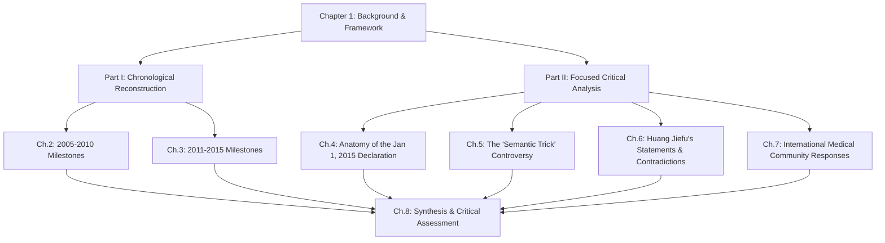
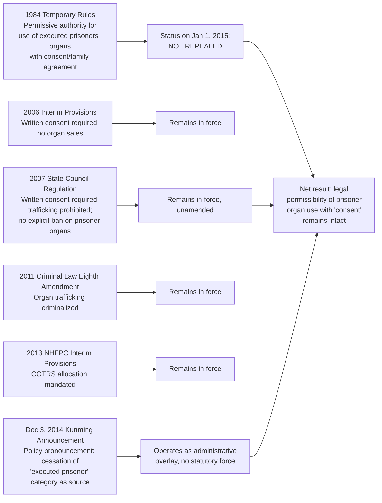

# Policy Evolution of Organ Transplantation in China and the Cessation of Organ Use from Executed Prisoners (2005–2015)
# 1 Research Background and Analytical Framework

The cessation of organ procurement from executed prisoners in the People's Republic of China (PRC) — announced as taking effect on January 1, 2015 — stands as one of the most consequential, contested, and analytically complex policy events in the global history of transplantation medicine. To assess what this declaration genuinely accomplished, what it merely renamed, and how the international community received it, one must first establish a rigorous understanding of the conditions from which it emerged. The decade preceding 2015 was not a regulatory vacuum but rather a period in which a deeply institutionalized system of prisoner-sourced organ procurement collided, with increasing visibility, against both international medical ethics norms and China's own gradually emerging transplant legislation. This opening chapter therefore reconstructs the historical starting point of the PRC's transplantation system before 2005, surveys the international concerns that had crystallized by that time, defines the scope and analytical objects of the present study, articulates the dual-part methodological logic that will structure the report, and finally lays down the interpretive lens through which the subsequent seven chapters will examine policy texts, ministerial statements, and international responses.

## 1.1 Historical Starting Point: China's Organ Transplantation System Before 2005

For the first several decades of its existence, China's organ transplantation sector operated in a manner sharply at variance with the international norm of voluntary donation. With few exceptions, organs in transplant systems worldwide are sourced from voluntary donors; in the PRC, by contrast, the sector functioned for many years as a state-sponsored procurement apparatus in which organs were obtained almost entirely from death-row prisoners, and — particularly after the persecution of Falun Gong practitioners that began in July 1999 — increasingly from prisoners of conscience.[^1] The earliest documented instances of such practices reach back to the 1970s: a reported live organ harvesting in 1970 of an eighteen-year-old former Red Guard commander sentenced to death for political heresy, and an oft-cited 1978 case in which a young political prisoner reportedly had her kidneys extracted on the execution ground while she was still alive.[^1]

Crucially, throughout this long pre-reform period, the Chinese authorities did not publicly acknowledge that prisoner organs were being used. For nearly two decades following the codification of the practice, Beijing maintained an official posture of denial. Government spokespeople rebuked external allegations as "vicious slander" and "sensational lies," maintaining publicly that China's primary source of organs was voluntary donation.[^2] This denial constituted a defining feature of the pre-2005 landscape: even as transplant volumes expanded and foreign patients increasingly traveled to Chinese hospitals to obtain organs, the official narrative refused to confirm what foreign journalists, defecting surgeons, and human rights organizations had repeatedly documented.

### The 1984 Temporary Rules as the Sole Legal Authority

The single domestic legal instrument authorizing the use of organs from executed prisoners during this entire period was the 1984 **"Temporary Rules Concerning the Utilization of Corpses or Organs from the Corpses of Executed Criminals"** (关于利用死刑罪犯尸体或尸体器官的暂行规定), jointly promulgated by several central ministries.[^2] This regulation served, for more than two decades, as the sole legal authority governing organ procurement from prisoner cadavers in the PRC.[^2] Its provisions established a narrow set of permissive conditions under which organs from executed criminals could be utilized for transplantation and medical research, while imposing only cursory procedural requirements.

The 1984 Rules permitted the use of corpses or organs from executed prisoners in three circumstances: (i) where the corpse was unclaimed or no one was willing to collect the body after execution; (ii) where the condemned criminal had voluntarily agreed that his or her remains could be so used; and (iii) where the consent of the prisoner's family had been obtained.[^2] In addition, the regulation imposed three principal procedural strictures: organ extraction could be conducted only after death had been confirmed by a supervising procuratorial official at the execution site; the execution itself was required to conform to the relevant criminal-law provisions for "death to be carried out by means of shooting"; and — most revealing of the regulation's underlying logic — the practice itself was to be conducted under conditions of strict secrecy.[^2] The text explicitly directed that "the use of the corpses or organs of executed criminals must be kept strictly secret, and attention must be paid to avoiding negative repercussions."[^3][^2] Medical workers were prohibited from wearing hospital insignia or driving marked vehicles to or from execution sites.[^2]

The structural deficiencies of this regulation were profound. First, it had never been formally enacted through the National People's Congress and retained only "temporary" legal status, yet remained in force for more than two decades without substantive revision.[^2] Second, while it stipulated consent and post-mortem extraction, it provided no specifications as to how clinical death was to be determined, no rules on the actual conduct of the extraction procedure, no requirements for medical oversight, and no penal measures for violations.[^2] The 1984 Order's textual silence on these critical operational dimensions left wide latitude for misapplication and abuse — abuses that, as later testimony would reveal, included the extraction of organs from prisoners who were still alive, the scheduling of executions according to transplant recipients' needs, and the targeting of execution methods (head versus chest wounds) to preserve specific organs for procurement.[^2]

### Market Expansion, Commercialization, and the Pre-2005 Boom

From around 2000 onwards, the system that the 1984 Rules nominally regulated underwent an explosive expansion driven by market forces. Thousands of transplant surgeons were trained, hundreds of hospitals began offering transplantation as a routine therapy, and the military-medical complex became deeply embedded in transplant activity and research.[^1] Waiting times — which in voluntary donation systems are typically measured in months or years — collapsed to weeks, days, and in some cases hours, and Chinese hospitals openly posted organ price lists on their websites while soliciting foreign "transplant tourists" who could fly to China to receive organs on prearranged dates.[^1] The China International Organ Transplant Center, for example, advertised prices ranging from tens of thousands to over US$100,000 for foreign patients, while documents from regional hospitals such as Zhongshan Hospital at Xiamen University and Fujian Provincial Hospital provided detailed service-charge tables for a broad range of transplant operations.[^1]

This commercialized expansion sat uneasily with the 1984 Rules' nominal requirement that procurement be "kept strictly secret." In practice, secrecy was applied selectively: it shielded the system from domestic scrutiny and prevented documentation of abuses, while simultaneously the marketing of transplant services to foreign patients required a degree of public visibility that increasingly attracted international attention. Independent investigators and human rights monitors estimated that, by the mid-2000s, up to ninety-nine percent of organs used in Chinese transplant surgery were sourced from prisoner cadavers, though the actual figures were impossible to verify due to the state secrecy surrounding the practice.[^2] No nationwide voluntary donation registry, no unified allocation system, and no independent oversight infrastructure existed at this time.

### The Pattern of Pre-2005 Abuse

By the early 2000s, evidence of physical and procedural abuse during organ procurement had accumulated from multiple credible sources. The June 2001 testimony of Dr. Wang Guoqi before the United States Congress, describing more than 100 operations to remove skin and corneas from executed prisoners — including a 1995 incident in Hebei Province where organ extraction proceeded on a still-living prisoner whose execution had been botched — became one of the most influential disclosures of the period.[^2] Foreign surgeons such as Dr. Thomas Diflo of New York reported encountering U.S. patients returning from China who had purchased transplant organs sourced from executed prisoners, and Japanese health authorities launched investigations after Japanese patients experienced life-threatening complications following transplants in China.[^2] The picture that emerged across these reports was consistent: a system in which transplant interests dictated the timing and method of execution, in which prisoners were administered anti-coagulation injections to facilitate organ recovery, and in which the line between execution and surgical procurement had become operationally indistinct.[^2]

The pre-2005 landscape can thus be summarized as the coexistence of four mutually reinforcing features: (i) a single, "temporary," and substantively deficient 1984 legal authority; (ii) a sustained official policy of public denial regarding the actual source of organs; (iii) a rapidly commercializing transplant sector driven by foreign demand and elite domestic networks; and (iv) credible and accumulating evidence of severe ethical violations and physical abuse during procurement. It is against this baseline that the reforms of 2005–2015 must be measured.

## 1.2 Early International Concerns and Pressures

The international response to China's transplant practices, while initially muted, had by the mid-2000s coalesced into a multi-layered system of pressure encompassing intergovernmental medical associations, human rights organizations, foreign legislatures, investigative journalism, and individual medical professionals. Several distinct strands of this pressure environment merit identification, since each would later shape — directly or indirectly — the policy reforms initiated in China from 2005 onwards.

**The World Medical Association (WMA)** issued its Council Resolution on Organ Donation in China in May 2005, condemning organ procurement where consent had not been freely given by executed prisoners and where there was no genuine opportunity to refuse the procedure.[^2] The WMA's intervention was particularly significant because it framed the issue not merely in terms of human rights but in terms of fundamental medical ethics — a framing that exerted moral pressure on Chinese transplant professionals seeking international scientific recognition.

**Amnesty International and Human Rights Watch** had documented and criticized China's organ procurement practices since the early 1990s. Human Rights Watch/Asia's 1994 report on organ procurement and judicial execution provided one of the earliest systematic English-language analyses of the 1984 Order's text and operation, while Amnesty International's reports — including its 2006 "Olympics Countdown" analysis — argued that obtaining valid informed consent in the trauma and anguish of pending execution was effectively impossible and that the profit motive surrounding organ procurement risked sustaining or even expanding the use of the death penalty.[^2]

**Investigative journalism** by outlets such as the *New York Times*, the *South China Morning Post*, the BBC, *The Guardian*, and *Le Monde* reported extensively on transplant tourism, on the targeting of executions to transplant schedules, and on the channeling of body parts into commercial uses including cosmetics manufacturing.[^2] **Congressional and parliamentary inquiries** — most prominently the June 2001 hearings before the U.S. House Subcommittee on International Operations and Human Rights — created formal records of testimony from defecting Chinese physicians and Western surgeons who had treated patients returning from China.[^2]

The substantive concerns raised across these channels can be grouped into four categories: (i) **the validity of consent** in a custodial setting where prisoners faced imminent execution and where coercion, deception, or the absence of meaningful refusal could not be ruled out;[^2] (ii) **the transparency and legal adequacy** of the 1984 Order, which lacked clear parameters on extraction procedures, definitions of death, oversight mechanisms, and enforcement measures;[^2] (iii) **the commercialization of human organs** through advertised price lists, foreign patient recruitment, and underground sales, which critics argued created direct economic incentives for the continued or expanded use of the death penalty;[^2] and (iv) **the alleged extension of procurement to political prisoners**, particularly Falun Gong practitioners detained en masse after July 1999, an allegation that — though contested by Chinese authorities — became central to the international human rights critique by the mid-2000s.[^1]

The international community's responses were not uniformly hostile or dismissive of the possibility of reform. Some commentators argued that pressure premised on the wholesale adoption of international standards risked appearing culturally intrusive and lacked legal traction within the Chinese system, and they proposed instead that reform arguments be grounded in China's own constitutional human rights provisions — particularly Article 33, Section 3 of the 1982 Constitution, as amended in 2004 to require state respect for and protection of human rights.[^2] This more accommodative strand of critique would, in subsequent years, find a partial echo in the official Chinese reformist rhetoric advanced by figures such as Huang Jiefu.

By the end of 2004, then, the international pressure environment surrounding China's transplant sector exhibited three characteristics that would condition the next decade of policy evolution: it was **broad** in the range of actors involved, **specific** in the practices and legal deficiencies it identified, and **persistent** despite official Chinese denials. These features established the external context within which China's first major official acknowledgments and regulatory initiatives of 2005–2007 would unfold.

## 1.3 Scope, Time Boundaries, and Research Object

Having established the historical and international starting points, this section delimits the analytical scope of the report. The temporal coverage of the study is anchored by a defined endpoint at the close of 2015 — that is, approximately one calendar year after the announcement that organ use from executed prisoners would cease from January 1, 2015. Within this overall frame, the report distinguishes between three temporal layers: (i) the **pre-2005 background period**, which is treated as contextual and analyzed in the present chapter only to the extent necessary to establish the baseline conditions; (ii) the **primary period of policy evolution from 2005 through 2010**, examined chronologically in Chapter 2; and (iii) the **deepening reform period from 2011 through the end of 2015**, examined chronologically in Chapter 3 and then dissected analytically in Chapters 4 through 7.

The **substantive scope** of the report encompasses four categories of material: (a) **official policy and regulatory documents** issued by the Chinese central state, including ministerial regulations, State Council orders, professional society declarations, and administrative announcements; (b) **public statements by key transplant officials**, most notably Huang Jiefu in his successive capacities as Vice Minister of Health, chair of the relevant national committees, and lead spokesperson for transplant reform; (c) **institutional and infrastructural milestones**, such as the reduction in the number of certified transplant hospitals, the establishment of registries (including the China Liver Transplant Registry and the Shanghai-based registry), the launch of the pilot voluntary donation system jointly operated by the Red Cross Society of China and the Ministry of Health, and the development of the China Organ Transplant Response System (COTRS); and (d) **the international responses** to these developments, including the official positions of the WMA, The Transplantation Society (TTS), the World Health Organization (WHO), the British Transplantation Society, the European Parliament, and selected national societies.

The **principal research objects** are therefore the Chinese state policy actors (the Ministry of Health and its successor the National Health and Family Planning Commission, the State Council, the Supreme People's Court for related death-penalty review reforms, and the Red Cross Society of China), the leadership of the transplant sector (with Huang Jiefu as the most prominent individual figure), and the institutional transplant ecosystem of certified hospitals, registries, and allocation systems.

Several matters are explicitly **outside** the analytical boundary of this report. The study does not undertake a comprehensive forensic investigation of the scale or identity of organ donors, nor does it adjudicate the contested empirical question of whether, and to what extent, organs were procured from specific categories of prisoners of conscience such as Falun Gong adherents or detained Uyghurs — matters which have been examined at length elsewhere and on which this report draws only to the extent necessary for contextual understanding.[^1] The report also does not extend its chronology beyond the end of 2015, and accordingly does not assess subsequent developments such as later international engagement, post-2015 data falsification analyses, or downstream legal proceedings.

## 1.4 Analytical Perspectives and Dual-Part Logical Structure

This report adopts a deliberately dual analytical posture combining **policy-evolution reconstruction** with **critical interpretation**. The first perspective takes the publicly stated trajectory of Chinese transplant policy on its own terms and traces — in strict chronological order — the sequence of regulatory, institutional, and rhetorical milestones from 2005 through 2015. The second perspective subjects that trajectory to critical interrogation, examining the gap between stated policy and operational reality, the definitional choices that determine what counts as "voluntary" or "citizen" donation, and the international community's assessments of the credibility of the reforms.

The report's overall logical structure correspondingly divides into **two complementary parts**:

**Part I (Chapters 2–3)** undertakes a chronological reconstruction of the policy trajectory. Chapter 2 examines the period 2005–2010, beginning with the pivotal 2005 acknowledgment by then-Vice Minister of Health Huang Jiefu that the great majority of deceased organ donations were obtained from executed prisoners — a public admission that, as the New Jersey legislative materials note, reversed years of categorical denial and indicated that more than 90 percent of deceased organ donations were so sourced.[^3] It then traces the 2006 Interim Provisions on Clinical Application and Management of Human Organ Transplantation, the 2007 State Council Regulation on Human Organ Transplantation, the reduction in certified transplant hospitals, the 2007 Chinese Medical Association commitment, and the 2010 launch of the pilot posthumous donation system. Chapter 3 continues the reconstruction from 2011 through 2015, tracing the 2012 announcement to phase out organ harvesting from death-row inmates, the 2013 Hangzhou Resolution, the evolution of Huang Jiefu's public positions, and the late-2014 announcement of the January 1, 2015 cessation.

**Part II (Chapters 4–7)** undertakes the focused critical analysis of the cessation declaration. Chapter 4 dissects the precise wording, legal status, and operational mechanisms of the January 1, 2015 announcement. Chapter 5 evaluates the central international critique that the declaration represented a "semantic trick" rather than a substantive ban — particularly the allegation that prisoners, including those on death row, were reclassified as "citizen donors" rather than being excluded from the supply pool. Chapter 6 traces and reconciles Huang Jiefu's evolving and at times apparently contradictory statements across the decade. Chapter 7 compiles and contrasts the official positions of the major international medical bodies up to the end of 2015.

**Chapter 8** synthesizes the findings from both parts and renders a concluding assessment of the credibility and policy significance of the January 1, 2015 declaration as it stood at the end of that year.

The critical-interpretive perspective is necessary, rather than gratuitous, because of three evidentiary features that recur throughout the source material. First, **systematic opacity**: Chinese official transplant registries remained inaccessible to independent verification throughout the period, with key data either withheld or tightly controlled by authorities.[^1] Second, **documented data anomalies**: subsequent analyses of officially reported voluntary deceased donor figures — extending into and slightly beyond the temporal boundary of this report — have identified statistical patterns (notably an implausibly smooth quadratic fit to the year-on-year growth in voluntary donations from 2010 onward) that are difficult to reconcile with the stochastic character of genuine voluntary donation systems.[^1] Third, **definitional reframing**: the operative distinction between "executed prisoner donors" and "citizen donors" turns on classification choices that, as later chapters will examine in detail, may not correspond to any change in the underlying source of organs.

## 1.5 Interpretive Lens for Subsequent Chapters

To enable a structured and consistent reading of the events analyzed in Chapters 2 through 8, this report adopts four evaluative dimensions through which each milestone, statement, and response will be examined.

| Evaluative Dimension | Core Question | Application in Subsequent Chapters |
|---|---|---|
| **Legal-Institutional Change** | Did the policy create binding legal obligations, or did it remain at the level of administrative directive or rhetorical commitment? | Used to assess the 2006 Interim Provisions, 2007 State Council Regulation, and the legal status of the January 1, 2015 declaration (Ch. 2, 3, 4) |
| **Evidentiary Credibility** | Are the official figures and claims verifiable by independent observers, and do they exhibit internal consistency? | Used to evaluate transplant volume statistics, voluntary donation growth rates, and the proportion attributed to prisoner versus citizen sources (Ch. 3, 5) |
| **Stakeholder Behavior** | Do the actions of the principal actors (officials, hospitals, surgeons) align with the stated policy direction? | Used to interpret Huang Jiefu's statements, hospital-level practices, and on-the-ground implementation indicators (Ch. 3, 6) |
| **International Validation** | How did authoritative international medical bodies assess the credibility of the reforms, and on what criteria? | Used to compile and contrast WMA, TTS, WHO, and parliamentary responses up to end-2015 (Ch. 7) |

These four dimensions are not exclusive but mutually reinforcing: a policy reform that achieves high marks on legal-institutional change but low marks on evidentiary credibility will be assessed differently from one that scores symmetrically across all dimensions. In particular, the central question that animates the report — whether the January 1, 2015 declaration represented a genuine systemic transition from prisoner-sourced to voluntarily donated organs, or a regulatory relabeling that left the underlying procurement architecture substantially intact — will be answered in Chapter 8 by triangulating across these four evaluative axes.

The framework also positions the report to address what may be termed the **"asymmetry of denial and acknowledgment"** that characterizes the entire 2005–2015 decade. Before 2005, Chinese authorities denied a practice that critics insisted was occurring; from 2005 onward, authorities acknowledged the practice and announced its progressive curtailment, while critics insisted that the announced curtailment was incomplete, reclassified, or unverifiable. This inversion of the burden of credibility — from skepticism about denial to skepticism about reform — is itself a central analytical phenomenon that the framework adopted here is designed to capture.

Finally, the interpretive lens emphasizes that policy reform in this domain is best understood not as a discrete event but as a **trajectory with internal tensions**. The 1984 Temporary Rules remained nominally in force for the entire reform period;[^2] official statements oscillated between acknowledgment and reframing; the absence of independent verification persisted alongside increasingly elaborate regulatory architectures. Reading subsequent chapters through this dual chronological-critical lens will allow the report to honor the genuine reformist content of the post-2005 trajectory while preserving the analytical rigor required to evaluate, rather than merely accept, the declaration that organ use from executed prisoners would cease on January 1, 2015.

# 2 Chronological Overview of Key Policies, Regulations, and Events (2005–2010)

Chapter 1 closed by characterizing the pre-2005 landscape as the coexistence of a single, deficient 1984 legal authority, a sustained policy of public denial, a commercializing transplant sector, and accumulating evidence of severe ethical abuses. The present chapter takes up the narrative at the precise moment that the first of those four features — categorical denial — began to crack, and traces, year by year, how Chinese authorities constructed in its place a layered regulatory architecture comprising ministerial regulations, a State Council ordinance, professional-society commitments, a sharp reduction in the number of certified transplant centers, the beginnings of national registries, and finally, in 2010, a pilot voluntary donation system. The reconstruction proceeds in strict chronological order from 2005 through 2010 and applies the four evaluative dimensions defined in Chapter 1 — legal-institutional change, evidentiary credibility, stakeholder behavior, and international validation — to each milestone in turn. Throughout, particular care is taken to register both the formal content of declared reforms and the contemporaneous evidence that operational reality continued, to a substantial degree, to diverge from the stated regulatory direction.

## 2.1 2005: The Manila Acknowledgment and the End of Categorical Denial

The decisive rhetorical turning point of the decade occurred not in Beijing but in Manila. In November 2005, at the WHO Western Pacific Region Consultation Meeting on Transplantation with National Health Authorities, then–Vice Minister of Health Huang Jiefu, speaking on behalf of the Chinese state, stated that approximately 2,000 liver transplants and 6,000 kidney transplants were performed in China each year and that the majority of the organs were sourced from executed prisoners.[^4] The acknowledgment was significant on three counts. First, it directly contradicted the categorical denials that had defined the official Chinese posture for the preceding two decades — including the Ministry of Foreign Affairs spokesperson Zhang Qiyue's 2001 dismissal of Dr. Wang Guoqi's testimony as "vicious and hurtful lies" and her insistence that "the organs used for transplant purposes were all from voluntary donations,"[^4] and Xinhua's parallel July 2001 article from the Tianjin Armed Police Hospital denying that organ transplants drew on executed prisoners at all.[^4] Second, the venue itself — a WHO regional consultation rather than a domestic press conference — gave the acknowledgment the standing of an international undertaking, addressed not to the Chinese public but to a community of foreign health authorities whose subsequent engagement Beijing was beginning to seek. Third, the figures Huang offered — 2,000 liver and 6,000 kidney transplants annually, with the "majority" sourced from prisoners — implicitly conceded the scale of the sector, a scale that even the most cautious external estimates of the period had not always been willing to assert publicly.

The immediate international pressure backdrop to this acknowledgment was the World Medical Association's Council Resolution on Organ Donation in China, adopted in May 2005, which had condemned procurement where consent had not been freely given by executed prisoners and where no genuine opportunity to refuse existed. Read together, the May 2005 WMA Resolution and the November 2005 Manila statement mark a paired sequence: an authoritative external framing of the practice as an ethical violation, followed within six months by the first official Chinese acknowledgment that the practice existed in the form alleged. Yet acknowledgment is not reform. Huang's Manila statement neither announced a regulatory response nor proposed a timeline for change; it simply reframed the official posture from denial to admission. Applying the evaluative dimensions established in Chapter 1, the 2005 acknowledgment registered no legal-institutional change, modest stakeholder behavioral signaling (a senior official preparing the international community for forthcoming reforms), and an evidentiary contribution of considerable importance — for the first time, official figures placed the scale of the sector and the predominance of prisoner sources on the public record. International validation, in the sense of authoritative external assessment of credible reform, remained absent because no reform had yet been proposed.

## 2.2 2006: The Sujiatun Disclosures, Renewed Denials, and the Interim Provisions

If 2005 ended categorical denial, 2006 combined external shock with the first substantive domestic regulatory response. The year opened with the March 9 and March 17, 2006 disclosures, published in *The Epoch Times*, in which two independent witnesses alleged the existence of a secret detention facility in the Sujiatun district of Shenyang, Liaoning Province, where they claimed that approximately 6,000 Falun Gong practitioners had been detained since 2001 and that their kidneys, livers, and corneas had been removed before their bodies were cremated to destroy the evidence.[^4] The allegations, whose substantive merits lie outside the analytical boundary defined in Chapter 1, are relevant here for their effect: they generated unprecedented international attention to the question of organ source and forced Chinese authorities into a sequence of rapid public responses.

After twenty days of official silence, Ministry of Foreign Affairs spokesperson Qin Gang addressed the matter on March 28, 2006. Qin denied the existence of the Sujiatun facility but acknowledged — in a manner that further eroded the earlier policy of categorical denial — that China was "using organs from executed prisoners for transplants," although he characterized the practice as "very isolated, and with the consent of the executed prisoners."[^4] On April 10, 2006, Ministry of Health spokesperson Mao Qun'an echoed and tightened the formulation: "The transplant organs in China mainly come from voluntary donations. The use of organs from executed prisoners is very rare, and there must be consent from the prisoners or the families."[^4] These two statements stood in clear tension with Huang Jiefu's November 2005 Manila acknowledgment that the *majority* of organs came from prisoners. The discrepancy — between a senior vice minister speaking before international health authorities and ministerial spokespersons speaking to domestic and foreign press — would prove characteristic of the entire 2006–2010 period: the Chinese state's public statements oscillated between minimization and admission depending on audience and moment, without ever being formally reconciled.

The first substantive regulatory response followed within months. On the strength of evidence and reporting compiled by Chinese-language sources, the Ministry of Health issued the **Interim Provisions on the Clinical Application and Management of Human Organ Transplantation Technology** (人体器官移植技术临床应用管理暂行规定), which took effect on July 1, 2006. The Interim Provisions established three core requirements that, taken together, represented the first ministerial-level regulatory instrument addressing transplantation in the People's Republic of China: human organs were not to be bought or sold; organs used clinically for transplantation in medical institutions had to be donated with the written consent of the donor; and donors retained the right to revoke consent.[^5] The instrument also initiated the access-certification mechanism that would, over the subsequent eighteen months, dramatically reshape the institutional ecology of Chinese transplantation by limiting which hospitals could lawfully perform such procedures.

The Interim Provisions were, however, accompanied by a sequence of contemporaneous developments that complicate any straightforward reading of 2006 as a year of unalloyed reform. On November 14, 2006, at the National Human Organ Transplant Clinical Application Management Summit, Huang Jiefu announced that the publication of medical advertisements regarding human organ transplants was "strictly prohibited" and that advertisements promising short waiting times and ample donor organs were likewise forbidden.[^4] On the same occasion, Huang stated that "in our country, the majority of organs for transplant were from donated corpses, part of which came from traffic accident victims and families,"[^4] a formulation that — because China classified executed prisoners' organs as "donated after death" — implicitly preserved the substance of the prisoner-source practice while reframing its categorical description. Investigative analyses conducted by independent organizations found that, in parallel with the announced removal of online advertising, a significant volume of online content from transplant hospitals had been deleted or modified before Huang's announcement, indicating a coordinated effort to reshape the public-facing footprint of the sector rather than to alter its operational scale.[^4]

The 2006 record can therefore be read along two distinct registers. On the dimension of legal-institutional change, the Interim Provisions were genuinely consequential: for the first time, a national ministerial regulation imposed written-consent requirements, prohibited organ sales, and established a licensing architecture. On the dimensions of evidentiary credibility and stakeholder behavior, however, the year revealed substantial gaps: rapidly shifting official formulations, the documented removal of incriminating online evidence, and credible reports — including hospital-level promotions of free or discounted transplants in Hunan, Jilin, and elsewhere — that surgical activity actually accelerated in the months between the disclosure of allegations and the regulation's effective date.[^4]

## 2.3 2007: The State Council Regulation and Professional Society Commitments

The regulatory architecture initiated in 2006 was elevated and consolidated in 2007. On March 21, 2007, the State Council promulgated the **Regulation on Human Organ Transplantation** (人体器官移植条例), which took effect on May 1, 2007.[^4] The State Council Regulation occupied a position in the hierarchy of Chinese law substantively higher than the Ministry of Health's Interim Provisions: it was an administrative regulation (行政法规) issued at the level of the State Council rather than at the ministerial level, and it bound a wider range of administrative organs. Its substantive provisions consolidated and extended the principles introduced in 2006: organ trafficking was prohibited; the removal of organs without prior written consent was forbidden; and a national framework for hospital licensing, ethics review, and administrative penalties for violations was established.

Two features of the State Council Regulation merit particular attention for the analytical purposes of this report. First, the Regulation was not a statute (法律) enacted by the National People's Congress but an administrative regulation. As independent legal analyses noted at the time, this status placed it in a particular relationship with the 1984 Temporary Rules: the State Council Regulation did not repeal the 1984 Temporary Rules, which remained in force as the underlying legal authority for the use of organs from executed prisoners.[^4] The architecture that emerged was therefore one of layered and partly inconsistent authorities, in which a new administrative regulation prohibiting trafficking and requiring written consent coexisted with an older inter-ministerial provision authorizing the use of prisoner organs under defined circumstances. As critics observed, had the Chinese authorities genuinely intended to terminate reliance on prisoner organs, "directly repealing the 1984 'Interim Provisions' would be more effective"[^4] than promulgating new instruments alongside it. The persistence of the 1984 Temporary Rules through 2007 — and indeed through the entire period covered by this chapter and the next — is one of the defining structural features of the reform trajectory.

Second, 2007 saw the Chinese Medical Association (CMA) commit, in conjunction with international transplant bodies, to a more restrictive professional posture. The CMA's commitment, made to the World Medical Association, undertook that organs would be sourced only from voluntary donors and that prisoner organs would not be used for foreign recipients. This commitment, although professional rather than legal in status, was significant for two reasons: it engaged the medical profession's self-regulatory authority alongside the state's regulatory authority, and it created a baseline against which the WMA and other international medical bodies could subsequently measure Chinese performance. The Hong Kong–based Phoenix Television's contemporaneous coverage, in which surgeon Lu Guoping of the Guangxi National Hospital was asked to publicly recant earlier remarks documented in a phone investigation, illustrated the difficulties of holding individual practitioners to the new professional norms: although Lu denied having said the words attributed to him, he confirmed that the recorded voice was his own, and the unusual regional accent and stammer made the authenticity of the original recording difficult to dispute.[^4]

The State Council Regulation was accompanied during 2007 by a sequence of ministerial follow-up documents that operationalized its provisions. These included a Ministry of Health Office Notice on Registration of Human Organ Transplant Discipline (May 2007), a Notice on Issues Relating to Overseas Persons Applying for Human Organ Transplantation (June 2007), and the Ministry of Health Office Notice on Examination of the Clinical Application Planning of Human Organ Transplantation Technology and the Medical Institutions and Physicians to be Approved for Human Organ Transplantation (July 2007). Earlier in the year, in March and June 2006, the Ministry had already issued Technical Management Norms for Liver, Kidney, Heart, and Lung Transplantation. Read together, these instruments constituted the administrative-implementation architecture of the 2007 Regulation, defining the criteria, procedures, and supervisory mechanisms through which the headline regulatory commitments were to be translated into hospital-level practice.

## 2.4 2007–2008: Reduction of Certified Transplant Hospitals and the Construction of Registries

Perhaps the single most visible institutional change wrought by the 2006 Interim Provisions and the 2007 State Council Regulation was the sharp contraction in the number of medical institutions authorized to perform organ transplantation. Prior to the access-certification process, the number of hospitals offering transplantation services in China had grown to extraordinary levels: by 2006, more than 500 hospitals had been performing liver transplants alone, up from roughly twenty in 1999 — an expansion of approximately twenty-five-fold. By some accounts, the total number of medical institutions involved in transplant activity at the peak exceeded 1,000. In 2007, following the implementation of the State Council Regulation, the Ministry of Health applied the certification criteria established under the new regulatory framework and reduced the number of accredited transplant hospitals to 164. Ye Qifa, executive chair of China's Organ Acquisition Coalition, subsequently described the reduction publicly, stating that after the 2007 Regulation took effect, the number of medical institutions performing organ transplantation was "rectified and reduced from more than 1,000 to slightly more than 160."[^4]

The reduction was selective rather than uniform. The 164 hospitals retained their certification on the basis of staffing, equipment, ethics-review capacity, and demonstrated transplant volumes — criteria that systematically favored larger, urban, and military-affiliated institutions. Subsequent disclosures indicated that, in October 2010, the Ministry of Health published a list of 163 hospitals certified to perform human organ transplantation across 31 provinces, municipalities, and autonomous regions. As Chapter 1 noted, the figure has also been cited as 87 depending on the categorical basis (for instance, hospitals certified for specific organ types such as liver or kidney rather than the broader transplant-discipline registration). The reduction did not, however, halt the activity of all uncertified centers: independent investigations found that a significant number of military, armed-police, and Grade-A tertiary hospitals continued to perform transplants outside the formal certification list, and that the scale of activity at some of the certified centers — particularly Tianjin First Central Hospital's Oriental Organ Transplant Center, which expanded its dedicated bed capacity to over 500 in 2006 — appeared inconsistent with any genuine contraction of the underlying supply pool.[^4]

Parallel to the reduction in certified hospitals, the period 2007–2008 saw the construction of the first national transplant registries. The China Liver Transplant Registry (CLTR), headquartered in Hong Kong, began compiling case data and published, in its 2006 annual report, statistics drawn from 29 transplant centers covering the period from April 2005 through December 2006. Of the 4,331 cases for which emergency status was reported, 1,150 — approximately 26.6 percent — were emergency liver transplants, a proportion that, as independent analyses noted, was inconsistent with the stochastic supply patterns characteristic of voluntary-donation systems.[^4] The Scientific Registry of Kidney Transplantation, organized under the management committee at the People's Liberation Army 309 Hospital, played an analogous role for renal transplantation. Shanghai-based liver-transplant registry initiatives, including the China Liver Transplant Registry's data-center function, served as instruments of data centralization during 2008.

The year 2008 was also marked by Huang Jiefu's most candid international acknowledgment to date. In an article published in *The Lancet* in August 2008 (online publication October 20, 2008), Huang wrote that "in China, more than 90% of transplanted organs are obtained from executed prisoners."[^4] The statement was striking on three counts. First, it appeared in the world's most influential general medical journal, addressed to an audience of international transplant professionals. Second, the figure of more than 90 percent was substantially higher than the "majority" formulation used in Manila in 2005 and higher still than the "very isolated" formulation offered by Ministry of Foreign Affairs and Ministry of Health spokespersons in March and April 2006. Third, the statement was made approximately one year after the State Council Regulation had taken effect — that is, after the new administrative architecture nominally prohibiting commercialization and requiring written consent had become operative. The 2008 *Lancet* acknowledgment therefore constituted, in effect, an admission that the regulatory architecture introduced in 2006–2007 had not yet displaced the underlying source of organs.

## 2.5 2009: Continued Reliance on Death-Row Sources and the Persistence of Practice

The year 2009 is best characterized, in the chronological reconstruction of this chapter, as a year of regulatory consolidation without substantive change in the underlying source of organs. The official acknowledgments stabilized around a recurring formula, articulated repeatedly by Huang Jiefu, that China was the only country in the world systematically using organs from executed prisoners for transplantation. In the same period, widely cited public reporting indicated that approximately 65 percent of organs continued to come from death-row prisoners, a proportion that — even if accurate as a representation of the trajectory of reduction — implied that the absolute majority of transplant organs were still being procured from this source nearly three years after the Interim Provisions had taken effect.

Regulatory consolidation during 2009 proceeded along several parallel tracks. In June 2009, the Ministry of Health issued a Notice on Further Strengthening the Supervision and Administration of Human Organ Transplantation. In November 2009, the Ministry promulgated the Technical Management Norms for Facial Allograft Transplantation (Trial), extending the regulatory architecture beyond the major solid-organ categories to encompass composite tissue transplantation. In December 2009, the Ministry issued Several Provisions of the Ministry of Health on Regulating Living Organ Transplantation, addressing the practice of inter-vivos donation and tightening the requirements for donor-recipient relationships and ethics-review approval. These instruments shared a common feature: each operated within the framework established by the 2007 State Council Regulation, refining or extending its scope rather than addressing the foundational question of the predominant source of cadaveric organs.

The continued operational reliance on prisoner organs was reflected not only in the official 65-percent figure cited in international media but also in Huang Jiefu's own public statements during the period. The trajectory of these statements — from the November 2005 "majority" formulation, to the August 2008 *Lancet* figure of more than 90 percent, to the 2009 framing of China as the only country systematically using such organs — described a steadily more explicit acknowledgment without a corresponding reduction in the operational dependence of the sector on prisoner sources. In a November 2011 *Lancet* article, Huang would restate that China was the only country in the world that systematically used organs from executed prisoners for organ transplant,[^4] a formulation that confirmed the persistence of the underlying practice through the latter portion of the period covered by this chapter.

Applying the evaluative dimensions defined in Chapter 1 to the 2009 record, the year shows substantial activity on the legal-institutional dimension (multiple ministerial notices, the extension of regulatory coverage to new transplant categories, and continued elaboration of supervisory architecture), modest activity on the stakeholder-behavior dimension (no evidence of voluntary contraction by high-volume transplant centers), limited evidentiary credibility (the absence of independently verifiable data on organ source remained a defining feature), and continued international engagement without authoritative validation of substantive source-side reform.

## 2.6 2010: Launch of the Pilot Voluntary Donation System and Early Provincial Rollout

The year 2010 marks the inflection point at which an alternative institutional channel for organ procurement — voluntary citizen donation — was, for the first time, formally established within the architecture of the Chinese state. In March 2010, the Ministry of Health entrusted the Red Cross Society of China with the launch of a pilot human organ donation system in ten provinces and municipalities: **Tianjin, Liaoning, Shanghai, Jiangsu, Zhejiang, Fujian, Jiangxi, Shandong, Hubei, and Guangdong**.[^6] The Hunan, Inner Mongolia, Jilin, Henan, Guangxi, and Shaanxi provinces were subsequently added to the pilot scope, and on April 20, 2010, Guangdong Province formally launched its pilot operation as the first provincial site.[^6] Within the broader chronological framework adopted by this report, the 2010 launch represents the first occasion on which the Chinese state institutionalized a non-prisoner source of organs through formal administrative architecture rather than merely as an aspirational regulatory principle.

The structural significance of the 2010 launch lies in the institutional partnership it established. The pilot was jointly operated by the Red Cross Society of China — a quasi-governmental body with established credibility in humanitarian and donor-relations work — and the Ministry of Health, which retained regulatory oversight of the transplant sector. The dual-agency structure was intended to insulate the donor-recruitment function from the operational interests of transplant centers and to provide an independent point of accountability for donation outcomes.

The early operational performance of the pilot was, however, modest in quantitative terms. By March 16, 2012 — that is, approximately two years after the launch — the pilot had completed 207 donation cases across the sixteen pilot provinces, yielding 546 large organs.[^7] A donation rate of this magnitude, while symbolically important, was insufficient to displace the operational reliance on prisoner organs that had been described by Huang Jiefu in the *Lancet* in 2008 as covering more than 90 percent of supply and that had been reported by international media in 2009 as still covering approximately 65 percent of supply. The gap between the symbolic significance of the pilot and its quantitative contribution to the supply pool was a defining feature of the 2010–2011 period and would remain so until the broader reforms of 2012–2015 examined in Chapter 3.

Several structural features of the 2010 pilot warrant identification as the institutional reference point against which subsequent reforms must be measured. First, no national organ allocation infrastructure existed at this stage: the China Organ Transplant Response System (COTRS), which would later become the central allocation platform, had not yet been deployed. Second, public awareness of voluntary donation remained extremely low by international comparison; Huang Jiefu and others would subsequently note that China's voluntary donation rate stood at approximately 0.6 per million population — among the lowest in the world — and that the cultural and informational barriers to expanding voluntary donation were substantial. Third, the pilot operated as an addition to, rather than a replacement of, the existing prisoner-sourced procurement architecture: the 1984 Temporary Rules remained in force, no announcement was made that prisoner organs would be phased out, and no timeline was proposed for any such transition.

The 2010 launch can therefore be characterized as the formal establishment of the institutional architecture for an alternative donation channel, without any commitment to displace the existing channel. This characterization is important for the analytical work of subsequent chapters: the 2014 announcement that organ use from executed prisoners would cease from January 1, 2015 (examined in Chapter 4) presupposed the existence of the 2010 pilot architecture as the institutional vehicle through which the announced transition would be operationalized. Without the 2010 pilot, the 2014 announcement would have been even more difficult to credit; with the 2010 pilot, the announcement could at least point to a pre-existing infrastructure into which the transition could be channeled.

## 2.7 Synthesis: Logic, Direction, and Policy-Practice Gap of the 2005–2010 Phase

Stepping back from the year-by-year reconstruction, the period 2005–2010 displays a recognizable logic of layered regulatory construction overlaying a persistent operational reality. The following table summarizes the principal milestones along the four evaluative dimensions established in Chapter 1.

| Year | Principal Milestone | Legal-Institutional Status | Evidentiary Credibility | Stakeholder Behavior | International Validation |
|------|---------------------|----------------------------|--------------------------|----------------------|---------------------------|
| 2005 | Manila acknowledgment by Huang Jiefu (majority of organs from prisoners; ~2,000 liver and ~6,000 kidney transplants/year) | No regulatory instrument | First official figures placed on record | Senior-official signaling of forthcoming reform | WMA Council Resolution (May 2005) as immediate pressure backdrop |
| 2006 | Sujiatun disclosures; MFA/MOH partial admissions; Interim Provisions on Clinical Application (effective July 1, 2006); November summit prohibiting transplant advertising | First ministerial-level regulation; written consent and no-sales requirements | Documented removal of online advertising and incriminating content; reports of accelerated transplants | Hospital-level promotions of discounted/free transplants persist | None — reform measures not yet validated externally |
| 2007 | State Council Regulation on Human Organ Transplantation (effective May 1, 2007); CMA commitment to WMA; multiple ministerial follow-up notices | Administrative regulation at State Council level; 1984 Temporary Rules not repealed | Lu Guoping farce illustrates difficulty of professional self-policing | Professional-society commitment engages medical profession's self-regulatory authority | CMA–WMA engagement creates external benchmark |
| 2007–2008 | Reduction of certified hospitals from over 600 (or >1,000) to 164; CLTR data centralization | Access-certification mechanism operationalized | Huang's August 2008 *Lancet* article: more than 90% of organs from executed prisoners | High-volume centers (e.g., Tianjin First Central) expand capacity | Publication in *The Lancet* engages international scientific community |
| 2009 | MOH June notice on supervision; November facial-allograft norms; December living-donor rules; recurring "only country systematically using prisoner organs" formula | Regulatory consolidation across new transplant categories | Widely cited figure of ~65% organs still from death-row prisoners | No evidence of voluntary contraction by high-volume centers | Continued engagement without authoritative validation |
| 2010 | Launch of pilot voluntary donation system in 10 (later 16) provinces/municipalities; April 20 Guangdong formal launch | Joint Red Cross–MOH institutional architecture | 207 donations / 546 organs over first ~2 years (cumulative to March 2012) | Pilot operates additively rather than substitutively | Symbolic significance recognized; quantitative validation not yet possible |

Three structural observations emerge from this synthesis.

**First, the trajectory of acknowledgment outpaced the trajectory of source-side reform.** The decade's rhetorical movement — from the categorical denials of 2001, through Huang's "majority" formulation in Manila in 2005, to his "more than 90%" formulation in *The Lancet* in 2008, to his characterization of China as the only country systematically using prisoner organs in 2009 — described an increasingly explicit official admission of the practice. Yet the operational source of organs, as reflected in the 2009 China-Daily-style figure of approximately 65 percent and in Huang's own subsequent statements, did not contract at a commensurate pace. The Chinese state had, by 2010, conceded what it was doing more comprehensively than it had reformed how it was doing it.

**Second, the regulatory architecture was layered rather than substitutive.** The Interim Provisions of 2006, the State Council Regulation of 2007, the certified-hospital reduction of 2007–2008, the ministerial notices of 2009, and the pilot donation system of 2010 each added a new instrument or institution to the regulatory ecosystem without removing the foundational legal authority — the 1984 Temporary Rules — that authorized the use of prisoner organs. The persistence of the 1984 Temporary Rules through the entire 2005–2010 period (and beyond) constituted a structural feature of the reform trajectory that critics would emphasize in subsequent years: absent the repeal of the foundational authorization, the layered regulatory architecture could be read as a series of procedural restrictions on a practice that remained legally permissible at its source.

**Third, the 2010 pilot established the institutional reference point against which all subsequent claims of transition would be measured.** Before March 2010, no formal alternative procurement architecture existed at the national administrative level. After March 2010, such an architecture existed, even if its early quantitative output was modest. The significance of this institutional reference point lies in the fact that the more ambitious announcements of 2011–2015 — including the 2012 commitment to phase out organ harvesting from death-row inmates, the 2013 Hangzhou Resolution, and ultimately the late-2014 declaration that organ use from executed prisoners would cease from January 1, 2015 — all presupposed and were operationalized through the pilot architecture established in 2010. Whether the institutional capacity established in 2010 was sufficient, by the end of 2015, to support the transition that had been announced is the central analytical question that Chapter 3 and the focused analyses of Chapters 4 through 7 will address.

In sum, the period 2005–2010 transformed China's organ transplantation system from a sector defined by categorical denial and a single deficient legal authority into a sector defined by acknowledged practice and a layered, partially inconsistent regulatory architecture. It did not transform the underlying source of organs. That more demanding task — and the contested question of whether it was genuinely accomplished by January 1, 2015 — belongs to the analysis of the period 2011–2015, to which the report now turns.

# 3 Chronological Overview of Key Policies, Regulations, and Events (2011–2015)

Chapter 2 closed at the inflection point of March 2010, when the Ministry of Health and the Red Cross Society of China jointly launched the pilot voluntary donation system in ten provinces and municipalities. The institutional architecture of that pilot was in place; its quantitative output was modest; and the foundational 1984 Temporary Rules remained unrepealed. The present chapter takes up the narrative from 2011 — the year in which a national IT-based allocation platform was first deployed and the Criminal Law was amended to criminalize organ trafficking — and traces it, year by year, through the December 2014 announcement that organ use from executed prisoners would cease from January 1, 2015, and the first full year of operation under the declared cessation regime in 2015. The reconstruction continues to apply the four evaluative dimensions defined in Chapter 1 — legal-institutional change, evidentiary credibility, stakeholder behavior, and international validation — to each milestone in turn, and is structured to expose the recurring gap between the accelerating tempo of rhetorical and regulatory commitments on the one hand and the persistently limited verifiability of source-side reform on the other. This is the chronological record on which the focused critical analyses of Chapters 4 through 7 will operate.

## 3.1 2011: Deployment of COTRS and the Criminalization of Organ Trafficking

The year 2011 contributed two foundational additions to the regulatory ecosystem and, simultaneously, one important rhetorical reaffirmation that the source-side reality had not yet shifted.

The first foundational addition was the operational deployment of the **China Organ Transplant Response System (COTRS)**, the national IT-based platform that would, in subsequent years, become the central architecture for automatic organ allocation in China. According to the China Organ Transplantation Development Foundation, COTRS has, since its establishment, undertaken the task of nationwide automatic organ allocation, serving as the implementation vehicle for a series of legislative and policy instruments and enabling the traceability of donated organs and the fairness of organ sharing.[^8] Other contemporaneous reporting placed the launch of the system slightly earlier, with *Global Times* in December 2014 stating that "in 2011, a national computerized system, the China Organ Transplant Response System, was set up" and that organs were "allocated through the system to address issues of fairness and efficiency in China's transplant organ allocation."[^9] Whichever date one credits for the system's nominal launch — 2010 according to one *China Daily* account, 2011 according to other ministerial accounts — the operational reality during 2011 was that COTRS was newly available as an infrastructure but was not yet uniformly used by the transplant hospitals to which it was nominally addressed.[^10] As *China Daily* reported in July 2013, the national computerized system "was launched in 2010, but many hospitals have been slow to make use of it, relying instead on less systematic methods," and to that date only 38 of the 164 organ procurement organizations operating nationwide had received donations via the official computerized system.[^10]

The second foundational addition came through the criminal law. The Eighth Amendment to the Criminal Law of the People's Republic of China, which took effect on May 1, 2011, introduced for the first time specific criminal sanctions targeting organ trafficking, the forced removal of organs, the unlawful removal of organs from deceased persons, and the procurement of organs from minors. This elevation of organ-related violations from the level of administrative penalty (where they had resided under the 2007 State Council Regulation) to the level of criminal sanction represented a substantive strengthening of the formal legal architecture. As with the State Council Regulation of 2007, however, the Eighth Amendment did not repeal the 1984 Temporary Rules; the foundational legal authority that permitted the use of organs from executed prisoners under defined circumstances remained in force, and the criminalization of trafficking therefore operated alongside, rather than in substitution for, the older permissive regime.

The third feature of 2011 was rhetorical rather than regulatory. In a November 2011 article in *The Lancet*, Huang Jiefu — by then the principal public face of Chinese transplant reform — reaffirmed that China was the only country in the world that systematically used organs from executed prisoners for transplantation. The statement is significant for the analytical purposes of this chapter on two counts. First, it described as the operational baseline of late 2011 a practice that the regulatory architecture of 2006–2010 had nominally curtailed: nearly five years after the Interim Provisions on Clinical Application had taken effect, and more than four years after the State Council Regulation, the senior Chinese transplant official continued to characterize the country in language that none of the reform measures had displaced. Second, the statement established the rhetorical baseline against which the more ambitious commitments of 2012–2014 would be measured. If reform was to be credible, it would have to move from the position established in November 2011 — China as the only country systematically using prisoner organs — to a position in which that systematic use had ceased.

Applying the evaluative dimensions of Chapter 1 to the 2011 record, the year shows substantial activity on the legal-institutional dimension (criminalization of trafficking and the formal deployment of COTRS), modest activity on the stakeholder-behavior dimension (with most certified hospitals not yet using the COTRS allocation platform), continued limitations on evidentiary credibility (the persistent absence of independently verifiable data on organ source), and continued international engagement without authoritative validation.

## 3.2 2012: The Official Commitment to Phase Out Death-Row Organ Harvesting

The year 2012 marks the first explicit official commitment to terminate, on a defined timetable, the practice that Huang Jiefu had publicly acknowledged for the preceding seven years. At the National Conference on Human Organ Donation and Transplantation held in Hangzhou in March 2012, Huang announced that China would move to phase out reliance on organs from executed prisoners and replace this source with voluntary citizen donation through the pilot architecture launched in 2010. The announcement framed the practice not merely as inadequate but as ethically untenable, and proposed an explicit transition timetable, though one whose precise endpoint would shift across subsequent statements over the following two years.

The 2012 commitment built upon the cumulative output of the 2010 pilot. By March 16, 2012, as documented in Chapter 2, the pilot had completed 207 donation cases across the sixteen pilot provinces, yielding 546 large organs. The arithmetic was sobering: an average of approximately 100 voluntary donations per year stood against the operational supply requirement of the sector, which Huang had himself estimated in 2005 at approximately 2,000 liver and 6,000 kidney transplants annually, and which by 2012 was understood to be considerably higher. The 2012 commitment, in other words, was made at a moment when the institutional alternative to prisoner sourcing existed but operated at a scale orders of magnitude below the level required to substitute for the existing supply pool.

The 2012 commitment shared a characteristic feature with the announcements that would follow it through 2014: it was articulated by a senior official in his administrative capacity and through professional and conference venues, rather than codified in a binding legal instrument issued through the State Council or the National People's Congress. Evaluated on the dimension of legal-institutional change, the March 2012 commitment registered as an administrative directive and a high-profile rhetorical commitment, not as a statute or regulation. Evaluated on the dimension of stakeholder behavior, it initiated a sequence of institutional preparations — including the expansion of the donation pilot and the strengthening of the Red Cross-Ministry of Health architecture — but did not produce, within 2012 itself, any documented contraction in the operational use of prisoner organs. Evaluated on the dimension of evidentiary credibility, the commitment depended for its meaning on the future build-out of voluntary donation capacity; in itself, it added no new verifiable data.

Two specific timing ambiguities introduced in 2012 would shape the discourse of 2013–2014. First, the original timetable announced by Huang implied a transition over several years rather than an immediate cessation, leaving open the operational question of what should occur in the interim period. Second, the precise definition of the future "voluntary" or "citizen" donation pool — including whether and how prisoners who consented to donate would be categorized within that pool — was not resolved in the March 2012 announcement, and would become a central point of contention in the international response to the eventual 2014 cessation declaration.

## 3.3 2013: Regulatory Codification of Allocation and the Hangzhou Resolution

The year 2013 is the year in which the regulatory architecture surrounding the announced transition was substantially elaborated, and in which the transplant profession itself adopted a formal commitment to cease the use of organs from executed prisoners. Three milestones merit detailed examination: the National Health and Family Planning Commission's Interim Provisions on the Administration of Human Organ Procurement and Allocation, the institutional reinforcement of the donation-coordinator network through the National Organ Donation Management Center, and the November 1, 2013 Hangzhou Resolution adopted by transplant professionals at the China National Transplantation Congress.

### Codification of Mandatory COTRS Allocation

The first milestone was the promulgation by the National Health and Family Planning Commission (NHFPC) of the **Interim Provisions on the Administration of Human Organ Procurement and Allocation** (NHFPC [2013] No. 11). These Provisions formalized COTRS's status as the central allocation platform and mandated its use by donors, transplant candidates and recipients for registration and by organ procurement organizations and transplant hospitals for allocation.[^8] The mandatory use of COTRS, as the China Organ Transplantation Development Foundation later summarized, was intended to enable "the traceability of organs donated, fairness of organ sharing, and guaranteed the system of human organ donation and transplantation in China develop in an internationally recognized way."[^8]

The contemporaneous enforcement reality, however, lagged the regulatory ambition. On July 10, 2013, National Health and Family Planning Commission spokesperson Deng Haihua announced that the Commission would "ensure compulsory use" of the computerized system for the distribution of donated organs, in response to media reports questioning the fairness and transparency of the existing allocation arrangements. As Deng acknowledged, the system "was launched in 2010, but many hospitals have been slow to make use of it, relying instead on less systematic methods."[^10] At the time of the July 2013 announcement, China had 164 organ procurement organizations operating within government-recognized organ transplant hospitals — and of these only 38 had received donations via the official computerized system.[^10] In other words, more than three years after the system's launch and several months before the Hangzhou Resolution, fewer than one in four certified organ procurement organizations was actually feeding its donations into the platform that the 2013 Interim Provisions would soon require by regulation.

### Institutional Reinforcement Through the National Organ Donation Management Center

The second milestone of 2013 was the establishment of a unified institutional vehicle for the recruitment and management of donation coordinators. In July 2013, a new government organization — the National Organ Donation Management Center — was set up with a mandate to make it easier for the public to donate organs.[^10] Gao Xinpu, a division director at the center, announced that the more than 200 coordinators already in place would be evaluated and licensed, and that a "team of at least 2,000 coordinators will be set up across the mainland."[^10] The coordinators' principal functions were to identify potential donors, approach their families and inform them of a possible donation, and handle issues such as the donor's funeral; many would be drawn from medical institutions, including transplant hospitals, which encountered potential donors in the course of clinical practice.[^10] When a donation was secured, the coordinators were to "enter information on the donor and donated organ into a computerized registry, and inform a designated organ procurement organization for further distribution."[^10] The donor registry system was scheduled to launch in September or October 2013.[^10]

This institutional architecture is important to register in detail because the credibility of any subsequent claim that voluntary donations had displaced prisoner sourcing depended on the existence of a national infrastructure for identifying, recording, and allocating those voluntary donations. The July 2013 announcements established such an infrastructure in formal terms; whether the underlying operational reality was capable of generating donation volumes commensurate with the announced transition is a question that returns in Section 3.5.

### The Hangzhou Resolution of November 1, 2013

The third and most consequential milestone of 2013 was the Hangzhou Resolution adopted at the 2013 China National Transplantation Congress. Independent academic accounts record that "on November 1, 2013, transplant professionals attending the 2013 China National Transplantation Congress reached consensus on the Hangzhou Resolution,"[^11] which was "promulgated at the 2013 China Transplant Congress" with the "support of the National Health and Family Planning Commission."[^12] The Resolution committed the participating transplant professionals to ceasing the use of organs from executed prisoners and adopting voluntary citizen donation as the sole legitimate source of organs for transplantation.

The substantive content of the Resolution amounted to an immediate pledge by the signing institutions — reportedly 38 hospitals at the moment of adoption — to terminate the use of executed-prisoner organs. Unlike the March 2012 ministerial announcement, which had spoken in terms of a multi-year transition, the Hangzhou Resolution placed the participating hospitals under a self-imposed obligation to act without further delay. The Resolution was, however, a professional-society instrument rather than a binding legal directive: its enforcement depended on the voluntary compliance of the signatories and on the disciplinary mechanisms of the Chinese transplant profession, rather than on the regulatory and criminal-law apparatus of the state. Its political significance was, accordingly, that it engaged the transplant profession's own self-regulatory authority in support of the source-side transition; its operational significance depended on whether the signing hospitals would in fact alter their procurement practices in the months that followed.

The signatories' subsequent behavior is examined in Section 3.4 in connection with the March 2014 announcement by Huang Jiefu that organs from executed prisoners would be integrated into the COTRS unified allocation system — an announcement whose terms, as analyzed below, are difficult to reconcile with the Hangzhou Resolution's commitment to an immediate cessation, and which indirectly confirmed that the November 2013 pledge had not held.

Applying the four evaluative dimensions to the 2013 record, the year shows substantial activity on the legal-institutional dimension (the NHFPC Interim Provisions on Procurement and Allocation, the establishment of the National Organ Donation Management Center), genuine stakeholder-level commitment in the form of the Hangzhou Resolution, but a striking implementation gap revealed by the July 2013 disclosure that only 38 of 164 organ procurement organizations were using the mandatory allocation platform.[^10] Evidentiary credibility remained constrained by the absence of independent verification, and international validation was still pending the outcome of the announced reforms.

## 3.4 2014: Continued Reform Activity and the December Cessation Announcement

The year 2014 contained two developments that, taken together, exemplify the central tension of the reform period: the March 2014 announcement that organs from executed prisoners would be integrated into the COTRS unified allocation system, and the December 3, 2014 announcement that voluntary donations would, from January 1, 2015, be the only source of transplant organs.

### March 2014: Integration of Executed-Prisoner Organs into COTRS

In March 2014, Huang Jiefu announced a plan under which organs from executed prisoners would be integrated into the COTRS unified allocation system. The substantive rationale advanced for this measure was that executed prisoners who freely consented to donate their organs would, on consenting, be treated within the allocation system as citizen donors — their organs entering the same allocation pool as those of any other voluntary donor and being distributed through the same fair and traceable mechanism.

The March 2014 announcement carries a particular analytical weight in the chronological record because it indirectly confirms that the immediate cessation pledged in the November 2013 Hangzhou Resolution had not, in the four months between the Resolution's adoption and Huang's March announcement, been operationally achieved. If the 38 hospitals that signed the Hangzhou Resolution had actually stopped using executed-prisoner organs at the moment of signing, there would have been no continuing flow of such organs requiring integration into a unified allocation system. The fact that the Vice Minister found it necessary, in March 2014, to announce mechanisms for incorporating executed-prisoner organs into the national allocation platform demonstrates, by negative implication, that those organs were still entering the transplant system at meaningful scale and that the Hangzhou Resolution had not yet displaced them. The November 2013 pledge, in this reading, was the kind of professional-society commitment whose authority depended on the willingness of the signatories to translate it into practice — and the March 2014 announcement is the indirect official acknowledgment that this translation had not yet occurred.

The March 2014 integration announcement is also analytically significant for a second reason that returns in Chapter 5: by structuring the framework under which a consenting executed prisoner's organs would be reclassified as those of a citizen donor for allocation purposes, the announcement laid the categorical groundwork for the subsequent December 2014 declaration. Once the principle was established that a consenting prisoner could enter the system as a citizen donor, the announcement that the system would, from January 1, 2015, draw "only" from citizen donations would not require the cessation of organ flows from prisoners — only the reclassification of those flows. This definitional operation, and the controversy it generated, is examined in detail in Chapter 5; for the present chronological purposes, the March 2014 announcement is the operational hinge on which that controversy turns.

### December 3, 2014: The Kunming Cessation Announcement

On December 3, 2014, at a meeting in Kunming, Yunnan Province, Huang Jiefu — by this point speaking as chairman of the Alliance of Organ Procurement Organizations under the Chinese Hospital Association — announced that the use of transplanted organs taken from executed convicts would cease in the Chinese mainland starting January 1, 2015. As reported by *Global Times* the following day, Huang stated: "Starting from January 1, China will end its reliance on the organs of executed prisoners for transplantation, which means that organ donations will only come from the public and voluntary organ donations will become the only organ donation source."[^9] He characterized the measure as "a blow to organ trafficking" that would "better manage organ transplants."[^9]

The official figures cited at the Kunming announcement and shortly thereafter establish the empirical baseline against which the implementation phase of 2015 was to be measured:

| Metric | Figure (as of December 2014) | Source |
|---|---|---|
| Cumulative public organ donations since 2010 | 2,948 | Authorities reported in *Global Times*[^9] |
| Cumulative organs donated since 2010 | 7,822 (to December 2)[^9] | Authorities reported in *Global Times*[^9] |
| Public organ donations, 2010–2013 | 1,448 | Huang Jiefu[^9] |
| Public organ donations, 2014 (year to date) | 1,500 | Huang Jiefu[^9] |
| Ratio of public organ donations | 0.6 per 100,000 population[^9] | Huang Jiefu[^9] |
| Patients on waiting lists annually | approximately 300,000 | *Global Times*[^9] |
| Annual transplant surgeries | approximately 10,000 | *Global Times*[^9] |
| Certified transplant hospitals | 169 | National Health and Family Planning Commission[^9] |

Several features of this baseline merit explicit registration. First, the doubling of the public donation rate between the 2010–2013 cumulative figure (1,448) and the 2014 single-year figure (1,500) was the principal empirical support for Huang's claim that voluntary donation would, within a feasible timeframe, satisfy the demand for transplant organs.[^9] Second, the supply-demand gap at the point of the announcement was extreme: approximately 300,000 patients on waiting lists against approximately 10,000 transplant surgeries actually performed, with the donation rate of 0.6 per 100,000 population among the lowest in the world.[^9] Third, the number of certified transplant hospitals had risen from the 164 reported in mid-2013 to 169 by December 2014, indicating modest expansion rather than continued contraction of the certified pool.[^9][^10]

The framing of the announcement was politically salient. He Xiaoshun, a doctor and vice-president of the No. 1 Hospital Affiliated with Sun Yat-sen University in Guangzhou, told *Global Times* that "it's necessary to end the practice. China, as a superpower, has been criticized for its use of the death penalty and using organs from executed prisoners for years. Now, China's international image will be improved in terms of human rights."[^9] Liu Changqiu, an Associate Researcher at the Shanghai Academy of Social Sciences, framed the measure in human-rights terms: "Ending the reliance on organs from death row inmates shows major progress for China's human rights, and shows that human rights enjoy much better protection now as prisoners' rights are being more respected."[^9] He Xiaoshun added the optimistic forecast that "when public organ donations become the only source and become more popular, the organ trafficking market will shrink and it will cease to be problem."[^9]

The contemporaneous critical voices reported alongside the announcement were of two distinct kinds. The first came from patients facing the prospect of longer waits: "The supply of organs for transplant is scarce, if we can't use organs from executed prisoners, it means we will have an even smaller hope of getting a transplant," one Shandong patient awaiting a donor organ told *Global Times*.[^9] The second came from the human rights lawyer Mo Shaoping, who told the same publication that "totally ending reliance on death row inmates' organ donations is too extreme."[^9] These two strands of skepticism — that the announcement would leave demand unmet, and that the announcement was either too ambitious or too restrictive — coexisted with the more fundamental international skepticism, examined in detail in Chapters 4 through 7, that the announcement would not in operational terms achieve what it announced.

Evaluated on the four dimensions of Chapter 1, the December 2014 announcement was a high-profile administrative declaration rather than a new statute or regulation; it offered a substantial body of officially reported figures but no mechanism for independent verification; it engaged the senior leadership of the transplant sector in a publicly stated commitment; and it was framed by domestic supporters as a human-rights advance whose international validation would depend on the subsequent assessment of foreign medical bodies and governance institutions.

## 3.5 2015: The Implementation Phase and Officially Reported Outcomes

The year 2015 was the first calendar year of operation under the declared cessation regime. The institutional infrastructure operating during that year comprised the 169 certified transplant hospitals identified at the December 2014 announcement, the mandatory COTRS allocation platform whose use had been formally required under the 2013 NHFPC Interim Provisions, and the network of organ procurement organizations and donation coordinators expanded through the 2013 establishment of the National Organ Donation Management Center.[^9][^10]

Officially reported transplant volumes for 2015 stood at approximately 10,057 surgeries — a figure consistent with, and only modestly above, the approximate 10,000 annual surgeries cited at the December 2014 announcement. Officially reported voluntary donation figures continued the upward trajectory described in the December 2014 baseline: the China Organ Transplantation Development Foundation later documented that the number of deceased organ donations in China had increased from 2,766 in 2015 to 5,818 by 2019.[^8] The 2015 figure of 2,766 deceased organ donations — to be read alongside the cumulative 2010–2014 voluntary donation total of approximately 2,948 — implied that, within a single calendar year, voluntary deceased donations had roughly equaled the entire cumulative output of the first five years of the pilot.[^9][^8] This dramatic year-on-year growth is, on one reading, the empirical signature of a successful transition from prisoner sourcing to voluntary donation; on another reading, examined in detail in Chapter 5, it is precisely the kind of implausibly rapid expansion that has occasioned skepticism among independent analysts about the underlying integrity of the official figures.

Three structural features of the 2015 implementation environment merit explicit registration as the chronological record on which Chapters 4 through 7 will operate.

First, no independent verification mechanism existed during 2015. The COTRS platform was administered by the China Organ Transplantation Development Foundation; data on donors, recipients, and allocations were collected, stored, and analyzed within the system; but the platform was not, during 2015, opened to external audit by international medical bodies, by human rights organizations, or by independent academic researchers.[^8] The figures officially reported during the year accordingly carried the standing of the institutions reporting them, and could not be cross-checked against an external evidentiary base.

Second, the 1984 Temporary Rules remained unrepealed. As Chapter 2 documented, the foundational legal authority that had permitted the use of organs from executed prisoners under defined circumstances since 1984 was not repealed by the 2006 Interim Provisions, by the 2007 State Council Regulation, by the 2011 Eighth Amendment to the Criminal Law, by the 2013 NHFPC Interim Provisions, or by the December 2014 cessation announcement. The persistence of the 1984 Temporary Rules through the entire reform period and into 2015 meant that the cessation of executed-prisoner organ use rested, in formal legal terms, on an administrative declaration overlaid upon — rather than on the repeal of — the underlying permissive authority. The structural and analytical consequences of this layering are examined in detail in Chapter 4.

Third, the categorical operation announced in March 2014 — under which consenting executed prisoners would be reclassified as citizen donors for purposes of the COTRS allocation system — remained in force as the operational principle through which prisoner-sourced organs could continue to enter the transplant supply pool under the new label. The December 2014 declaration that voluntary donations would become "the only organ donation source" did not, in itself, alter this categorical operation; rather, the categorical operation was the mechanism through which the December 2014 declaration could be reconciled with whatever continued flow of organs from prisoner sources might exist.[^9] This is the operational hinge on which the credibility of the January 1, 2015 cessation turns, and on which the international "semantic trick" critique examined in Chapter 5 is built.

The early evidentiary anomalies that would later form part of that critique are also visible in the 2015 record. The smooth quadratic fit of officially reported voluntary donation growth from 2010 onward — already noted in Chapter 1 as one of the features that international analysts would later identify as inconsistent with the stochastic character of genuine voluntary donation — became more pronounced in 2015 as the year's donation figures aligned with the curve established by the preceding years' reports.[^8] During 2015 itself, these anomalies were not yet the subject of systematic international analysis; they would be elaborated in published critiques in subsequent years. For the chronological purposes of this chapter, it is sufficient to register that the empirical data on which the credibility of the cessation declaration would ultimately depend were generated within the same closed institutional system whose opacity the international community had long identified as a defining structural feature of the Chinese transplant sector.

## 3.6 Synthesis: Trends, Turning Points, and Persisting Ambiguities of the 2011–2015 Phase

The table below summarizes the principal 2011–2015 milestones along the four evaluative dimensions established in Chapter 1.

| Year | Principal Milestone | Legal-Institutional Status | Evidentiary Credibility | Stakeholder Behavior | International Validation |
|------|---------------------|----------------------------|--------------------------|----------------------|---------------------------|
| 2011 | COTRS operational deployment; Eighth Amendment to Criminal Law criminalizing organ trafficking (May 1, 2011); Huang Jiefu's November *Lancet* article reaffirming China as only country systematically using executed prisoners' organs | Criminalization of trafficking; allocation infrastructure available but not mandatory | No independent data; Huang's own statement places the operational baseline at "systematic use" | High-volume centers continue prevailing practices; COTRS adoption slow | Continued engagement; baseline rhetorical commitment for measuring later reform |
| 2012 | March National Conference at Hangzhou; Huang Jiefu announces phase-out timetable; cumulative pilot donations of 207 cases / 546 organs by March 16 | Administrative directive and rhetorical commitment; no new statute | Pilot output orders of magnitude below operational requirement | Senior leadership engages publicly in transition commitment | Announcement noted but not yet validated externally |
| 2013 | NHFPC [2013] No. 11 mandating COTRS use; July establishment of National Organ Donation Management Center and donation-coordinator licensing; Nov 1 Hangzhou Resolution adopted by 38 hospitals[^11][^10] | Ministerial regulation mandates COTRS; Hangzhou Resolution as professional-society instrument | Only 38 of 164 organ procurement organizations using COTRS as of July 2013[^10] | 38 hospitals pledge cessation; professional self-regulatory authority engaged | Hangzhou Resolution noted internationally as a credibility test |
| 2014 | March announcement of integration of executed-prisoner organs into COTRS unified allocation; Dec 3 Kunming announcement that organ use from executed prisoners would cease Jan 1, 2015 | Administrative declaration; 1984 Temporary Rules not repealed | March 2014 integration announcement indirectly confirms failure of Hangzhou Resolution; 1,500 donations in 2014 cited as evidence of capacity[^9] | Senior leadership publicly commits to cessation; domestic skepticism (Mo Shaoping) and patient concerns voiced[^9] | International medical community begins formal assessment (examined Ch. 7) |
| 2015 | Implementation year; ~10,057 transplant surgeries; 2,766 deceased organ donations; 169 certified transplant hospitals; mandatory COTRS allocation operative; 1984 Temporary Rules still in force | Cessation operates as administrative regime overlaid on unrepealed 1984 authority[^8] | Officially reported figures show dramatic year-on-year growth; no independent verification; smooth quadratic fit of donation growth | Certified hospitals operate under new declared regime; reclassification mechanism from March 2014 remains operational principle | International responses (analyzed Ch. 7) ranged from cautious welcome to demands for independent verification |

Three structural patterns emerge from this synthesis.

**First, the tempo of regulatory and rhetorical commitments accelerated sharply from 2011 through 2014.** Where the 2005–2010 period produced one ministerial regulation, one State Council regulation, and one pilot launch over six years, the 2011–2014 period produced a criminal-law amendment, the operational deployment of a national allocation platform, the March 2012 phase-out commitment, the 2013 NHFPC Interim Provisions on Procurement and Allocation, the establishment of the National Organ Donation Management Center, the Hangzhou Resolution, the March 2014 integration announcement, and finally the December 2014 cessation declaration — in less than four years. The tempo of these commitments reflected both the gathering political momentum of reform and the increasing precision with which the Chinese authorities were able to frame the announced transition.

**Second, the recurring gap between announced policy and verifiable implementation indicators is the defining structural feature of the period.** The most telling examples are the July 2013 disclosure that only 38 of 164 organ procurement organizations were using the mandatory COTRS allocation platform[^10]; the March 2014 integration announcement that indirectly confirmed that the November 2013 Hangzhou Resolution's immediate-cessation pledge had not held; and the modest absolute scale of voluntary donations relative to the demand expressed in the 300,000-patient annual waiting list[^9]. Each of these implementation indicators relates to a corresponding announced commitment, and in each case the gap between announcement and implementation is documentable from the official record itself rather than from external critique.

**Third, the reclassification of executed prisoners as "citizen donors" that emerged in the late-2014 discourse — and that was operationally enabled by the March 2014 integration announcement — constitutes the operational hinge on which the credibility of the January 1, 2015 cessation declaration turns.** The December 2014 announcement that voluntary donations would be "the only organ donation source" can be read in two ways. On the first reading, the announcement signaled the cessation of organ flows from prisoner sources, with the supply gap to be closed by the rapid expansion of voluntary citizen donation. On the second reading, the announcement signaled the cessation of a particular *categorical label* — "executed prisoner donor" — while allowing the underlying flow of organs from prisoners who consented to donate to continue under the reclassified label of "citizen donor." Which of these readings best characterizes what actually occurred from January 1, 2015 onward is the central analytical question of Chapter 5; the chronological record reconstructed in this chapter establishes the documentary basis on which that analytical question can be addressed.

The chronological reconstruction undertaken in Chapters 2 and 3 is now complete. The report turns, in Chapter 4, to the focused dissection of the precise wording, legal status, and operational mechanisms of the January 1, 2015 cessation declaration, before examining in Chapter 5 the "semantic trick" critique to which the present synthesis has pointed, tracing in Chapter 6 the evolution of Huang Jiefu's statements across the entire decade, and compiling in Chapter 7 the responses of the international medical community and global governance bodies up to the end of 2015.

# 4 Anatomy of the January 1, 2015 Declaration: Content, Legal Basis, and Real Meaning

Chapter 3 closed by identifying the December 3, 2014 Kunming announcement as the operational hinge on which the credibility of the entire 2005–2015 reform trajectory turns, and by flagging two interpretive readings of that announcement — a substantive-cessation reading and a categorical-reclassification reading — between which the international response would subsequently divide. The chronological reconstruction having established the sequence of events leading up to that moment, the present chapter undertakes the focused forensic dissection of the declaration itself. It examines, in turn, the precise wording and institutional setting of the announcement, the formal legal nature of the instrument by reference to the hierarchy of Chinese legal norms, the relationship of the announcement to the pre-existing layered legal architecture (and in particular to the unrepealed 1984 Temporary Rules and the 2007 State Council Regulation), the operational mechanisms — most importantly the integration of consenting prisoners into the China Organ Transplant Response System (COTRS) — through which the announcement was to be implemented, and the substantive boundary of what was actually prohibited versus what was left legally and operationally open. The chapter closes by synthesizing these analyses into an integrated assessment of the genuine regulatory scope and operational meaning of the declaration, thereby establishing the analytical premises on which Chapters 5, 6, and 7 will operate.

## 4.1 Precise Wording, Venue, and Speaker Authority of the Declaration

The textual core of the cessation announcement can be reconstructed with reasonable precision from the contemporaneous reporting of *China Science Daily*, *Global Times*, *Southern Metropolis Daily*, and *The New York Times*. On the morning of December 3, 2014, at the **"2014 China OPO Alliance (Kunming) Symposium"**, Huang Jiefu — speaking in his capacities as Standing Committee member of the National Committee of the Chinese People's Political Consultative Conference and Chair of the National Human Organ Donation and Transplantation Committee — announced that **"from January 1, 2015, the use of organs from executed prisoners as a source of transplant donors will be comprehensively halted"** (从2015年1月1日起，全面停止使用死囚器官作为移植供体来源)[^13]. As subsequently reported by *Global Times*, the operative formulation Huang offered to the press was that "starting from January 1, China will end its reliance on the organs of executed prisoners for transplantation, which means that organ donations will only come from the public and voluntary organ donations will become the only organ donation source." *The New York Times*, summarizing remarks reported by *Southern Metropolis Daily*, characterized the announcement as "the firmest deadline given to date for ending the widely criticized practice"[^14].

Three features of the wording warrant immediate notice. First, the operative verb in the Chinese formulation is **"全面停止使用"** (comprehensively halt the use of), a phrase that asserts the cessation of a *use* — that is, of an existing practice — rather than the promulgation of a new prohibitory rule of law. Second, the announcement establishes voluntary public donation as the *exclusive* future source ("the only organ donation source"), framing the change as one of source composition rather than as one of legal authorization. Third, the announcement specifies an effective date — January 1, 2015 — but not a mechanism by which the cessation would be legally codified, monitored, or enforced beyond the administrative reach of the speaker and the organizations he chaired.

The institutional authority in which Huang spoke is critical to the legal classification undertaken in Section 4.2. By December 2014 Huang Jiefu was no longer a sitting Vice Minister of Health — that office having been retired some years earlier — and the announcement was therefore not delivered in the capacity of a serving ministerial official. Rather, Huang spoke as Chair of the National Human Organ Donation and Transplantation Committee (a body advisory to the National Health and Family Planning Commission and the Red Cross Society of China), as Standing Committee member of the National Committee of the CPPCC, and as the leading figure of the China OPO Alliance under the Chinese Hospital Association[^13][^15]. None of these positions carried, in itself, the constitutional or statutory authority to issue a formally binding legal directive on behalf of the Chinese state.

The venue, similarly, was a professional symposium of organ procurement organizations rather than a State Council press conference, a National Health and Family Planning Commission gazette release, or a National People's Congress plenary session. The dissemination channels were principally journalistic: *Southern Metropolis Daily*, *China Science Daily*, *Global Times*, and shortly thereafter *The New York Times*[^13][^14]. No corresponding text was published in the *Gazette of the State Council of the People's Republic of China*, no document was registered with a State Council document number (国发 or 国办发), and no departmental rule was filed with the Ministry of Justice as a 部门规章. The contemporaneous *China Science Daily* coverage characterized the December 3 announcement as a public declaration by Huang at the OPO Alliance symposium, and noted that the immediately preceding policy preparation had taken place at the November 2014 Hangzhou Congress, where Huang had foreshadowed that the National Health and Family Planning Commission would in the future issue further measures — but had not yet done so — under which the 169 certified transplant hospitals could face revocation of their procurement and transplant qualifications if they failed to develop citizen post-mortem donation programs or used organs sourced outside the national organ-sharing system[^13].

The combined effect of speaker, venue, and dissemination channel is that the December 3, 2014 announcement must be analyzed, in formal terms, as a **high-level administrative-political pronouncement by a leading reformer**, communicated through a professional-association platform and amplified through the press, rather than as a formally published normative legal document. The substantive force of the announcement therefore derived not from its place in the hierarchy of Chinese legal norms but from the institutional authority and political backing of the speaker and from the administrative-enforcement scaffolding that he and the National Health and Family Planning Commission had begun to assemble in the preceding months.

## 4.2 Legal Classification: Statute, Administrative Regulation, or Policy Declaration?

The hierarchy of Chinese legal norms, in descending order of formal authority, comprises: the Constitution; statutes (法律) enacted by the National People's Congress and its Standing Committee; administrative regulations (行政法规) promulgated by the State Council; departmental rules (部门规章) issued in the name of ministries and commissions; other normative documents (规范性文件) issued by administrative bodies; and policy pronouncements (政策宣告) carried by official, professional, or association authority. To classify the December 3, 2014 announcement within this hierarchy is to establish the binding force, enforceability, and judicial reviewability of the cessation as a regulatory act.

Applying the criteria of this hierarchy yields the following classification table:

| Norm Type | Issuing Authority | Was a New Instrument Enacted in 2014–2015? | Binding Force |
|---|---|---|---|
| Statute (法律) | National People's Congress / Standing Committee | No corresponding statute enacted; no organ-transplantation law promulgated by the NPC at any point during 2014–2015 | Highest, judicially enforceable |
| Administrative Regulation (行政法规) | State Council | No new State Council Regulation; the 2007 *Regulation on Human Organ Transplantation* remained the controlling administrative regulation, unrepealed and unamended[^13][^15] | High, judicially enforceable |
| Departmental Rule (部门规章) | NHFPC and other ministries | No new departmental rule codifying the cessation was published in the name of the NHFPC in conjunction with the announcement; later media reporting noted that "the Regulation on Human Organ Transplantation has not been amended for many years"[^15] | Moderate, generally enforceable |
| Other Normative Document (规范性文件) | Administrative bodies, OPO Alliance, professional associations | The November 2014 Hangzhou warning of disqualification sanctions and the December 3 Kunming announcement operate at this level | Lower, administratively binding within the sector |
| Policy Pronouncement (政策宣告) | Senior official capacity, political/professional authority | The December 3 Kunming announcement, as delivered by Huang Jiefu, is most accurately classified at this level | Politically binding; not formally judicially enforceable |

The classification exercise yields a striking result. At the moment of the December 3, 2014 announcement, **no corresponding legislative or regulatory instrument was promulgated, amended, or revised** to codify the cessation. There was no statute enacted by the National People's Congress prohibiting the use of organs from executed prisoners; there was no administrative regulation issued by the State Council to that effect; and there was no departmental rule published by the National Health and Family Planning Commission to operationalize the cessation. The pre-existing controlling instruments — most notably the 2007 *Regulation on Human Organ Transplantation* — were neither amended nor supplemented by new normative texts at the time of the December 2014 announcement. Indeed, as Huang himself would later acknowledge in 2015 interviews with *Caixin* and other outlets, one of the persisting weaknesses of the system was precisely that the "*China Organ Transplant Regulation* has not been amended for many years"[^15].

The analytical consequence of this classification is fourfold.

**First, the cessation as declared on December 3, 2014 was a policy pronouncement, not a legal repeal or prohibition.** Its operative force rested on the administrative authority of the National Human Organ Donation and Transplantation Committee, the OPO Alliance, and — implicitly — the National Health and Family Planning Commission, rather than on any newly created legal obligation cognizable in administrative-litigation or criminal proceedings.

**Second, the announcement is best understood not as a stand-alone act but as the leading edge of an administrative-enforcement framework whose principal components had been previewed at the November 2014 Hangzhou Congress.** As reported by *China Science Daily*, Huang stated at Hangzhou that the National Health and Family Planning Commission would issue further policy under which the 169 hospitals currently holding transplant qualifications would have their qualifications revoked if they did not develop citizen post-mortem donation programs, and under which hospitals privately allocating organs, or physicians performing transplants using organs sourced outside the national organ-sharing system, would also have their qualifications revoked[^13]. The cessation therefore operated against the backdrop of an administrative-sanction regime targeted at certified hospitals, rather than against the backdrop of a newly enacted criminal or administrative prohibition targeted at organ source as such.

**Third, the binding force of the announcement was political and administrative rather than legal.** Hospitals that failed to comply faced the risk of qualification revocation — a sanction with severe operational consequences — but did not, on the strength of the December 3 announcement alone, face new criminal liability or new administrative penalties under the 2007 Regulation that they had not already faced under the pre-existing architecture.

**Fourth, the announcement's enforceability depended on the very same actors whose practices were to be reformed.** Because no new legal cause of action was created, enforcement remained internal to the transplant sector: the OPO Alliance, the donation-coordinator network, and the National Health and Family Planning Commission would have to monitor compliance among the 169 certified hospitals using the same administrative tools that had, on the documentary record of Chapter 3, produced uneven results in the preceding years.

The Chinese-language reformist commentary that accompanied the announcement implicitly acknowledged this legal-institutional structure. *China Science Daily*'s December 2014 special feature characterized the decision as the culmination of years of progressive regulatory and institutional work — the 2007 State Council Regulation, the 2010 launch of the pilot voluntary donation system, the 2013 administrative-distribution architecture, and the contemporaneous announcement of hospital sanctions — rather than as the product of a single newly enacted legal instrument[^13]. The reformist narrative was therefore one of *culmination* rather than *codification*: the December 3 announcement signaled that an administrative determination had been made to translate the previously declared trajectory into immediate operative reality, on the strength of Huang Jiefu's stated **"confidence"** that the existing legal framework — particularly the 2007 Regulation's requirements of written consent and prohibition of trafficking — would henceforth be observed in a manner sufficient to render the use of executed prisoners' organs both unnecessary and, in practice, terminable.

The cessation, in other words, was not based on new legislation but on a renewed political will to enforce existing rules in a categorically more demanding way.

## 4.3 Relationship to Pre-Existing Legal Architecture and the Unrepealed 1984 Temporary Rules

Because the cessation was a policy pronouncement rather than a new legal instrument, its substantive meaning is determinable only by reference to the pre-existing legal architecture against which it operated. The relevant instruments, as documented in Chapters 2 and 3, are: (i) the 1984 *Temporary Rules Concerning the Utilization of Corpses or Organs from the Corpses of Executed Criminals*; (ii) the 2006 *Interim Provisions on the Clinical Application and Management of Human Organ Transplantation Technology*; (iii) the 2007 State Council *Regulation on Human Organ Transplantation*; (iv) the 2011 Eighth Amendment to the Criminal Law; and (v) the 2013 NHFPC *Interim Provisions on the Administration of Human Organ Procurement and Allocation*. The comparative analysis that follows examines, for each instrument, what was already prohibited, what was already required, and what — if anything — the December 3, 2014 announcement newly added.

### The 1984 Temporary Rules: Persistent Permissive Authority

The 1984 *Temporary Rules*, as Chapter 1 documented, were the sole domestic legal authority specifically authorizing the use of organs from executed prisoners under defined consent and procedural conditions. Despite the passage of more than three decades and the enactment of each of the subsequent instruments listed above, the 1984 Rules were never formally repealed. This persistence is the most consequential structural feature of the December 2014 announcement's legal context: the cessation rested, in formal legal terms, on an administrative declaration overlaid upon an unrepealed permissive authority.

### The 2007 State Council Regulation: Consent Required, Prisoner Use Not Banned

The 2007 *Regulation on Human Organ Transplantation* is the controlling administrative regulation of the period. Its core operative provisions — restated and elaborated upon in the 2006 Interim Provisions on Clinical Application and in subsequent NHFPC instruments — were: (i) the prohibition of organ trafficking; (ii) the requirement of **written consent** from any donor; and (iii) the retention by donors of the right to revoke consent. Critically, the 2007 Regulation did **not explicitly prohibit the use of organs from executed prisoners**. It required, instead, that any organ procurement be predicated on written consent. So long as a prisoner's documented written consent could be produced, the 2007 Regulation's literal requirements were satisfied — and the use of that prisoner's organs remained, on the strength of the regulatory text and of the unrepealed 1984 authority, legally permissible.

This structural feature of the 2007 Regulation is essential to understanding the operational meaning of the December 2014 announcement. The Regulation's consent requirement left intact a category of "voluntary" donation from executed prisoners that, on its face, complied with the Regulation's literal text. The persisting legal question of the period — never resolved by statute or by State Council regulation through the end of 2015 — was whether a prisoner facing imminent execution was capable, as a matter of ethics or law, of giving genuinely free and informed consent. Huang Jiefu himself, in public statements, had argued both that in past practice the consent of prisoners and their families had indeed been obtained pursuant to legal procedure, and — separately — that "under current conditions where judicial procedure is not transparent, it is very difficult to guarantee that death-row prisoners are voluntarily donating"[^15]. The first formulation defended the legal regularity of past procurement; the second acknowledged the ethical fragility of consent within the custodial setting. Both formulations operated within the same regulatory framework — that of the 2007 Regulation — and neither resolved the underlying question of whether the Regulation's consent requirement was meaningfully satisfiable in the death-row context.

### The 2011 Eighth Amendment to the Criminal Law

The 2011 Eighth Amendment to the Criminal Law criminalized organ trafficking, the forced removal of organs, the unlawful removal of organs from deceased persons, and the procurement of organs from minors[^15]. The Amendment did not, however, criminalize the use of organs from executed prisoners as such. Its scope addressed the *manner* of procurement (forced, unlawful, from minors, or trafficked) rather than the *source* category (prisoner versus non-prisoner). The Amendment therefore added nothing to the prohibitive force of the legal architecture with respect to prisoner-sourced organs procured with documented consent.

### The 2013 NHFPC Interim Provisions on Procurement and Allocation

The 2013 NHFPC Interim Provisions on the Administration of Human Organ Procurement and Allocation, as Chapter 3 documented, formalized the mandatory use of COTRS as the central allocation platform. Their force was operational and administrative; they did not address source eligibility in a manner that would have either prohibited or specifically permitted procurement from prisoners. As long as a procured organ was registered in COTRS and allocated through the mandatory mechanism, the 2013 Interim Provisions' core requirements were satisfied — regardless of whether the underlying donor was a prisoner who had consented, a citizen who had registered as a voluntary donor, or any other category of consenting individual.

### What the December 2014 Announcement Newly Added

Set against this legal architecture, the December 3, 2014 announcement can be seen to have added **no new statutory or regulatory prohibition** on the use of organs from prisoners. What it added was a **categorical commitment**, articulated by senior administrative-political authority, that future organ procurement would draw exclusively from "voluntary citizen donation" and that the categorical label of "executed prisoner organ" would no longer be applied to any organ entering the transplant system after January 1, 2015. The substantive force of this categorical commitment depended on the administrative-enforcement scaffolding examined in Section 4.4 — and on the categorical-reclassification mechanism by which a prisoner who consented to donate would, from January 1, 2015, be counted not as an "executed prisoner donor" but as a "citizen donor" within the COTRS allocation pool.

The analytical consequence is decisive. **The "cessation" announced on January 1, 2015 was not based on new legislation, but rather on Huang Jiefu's expressed confidence that the pre-existing legal architecture — particularly the 2007 Regulation's consent requirement — would henceforth be observed more rigorously, and that the source pool would be reclassified in such a way that no organ entering the system would be labeled as having originated from an executed prisoner.** Because the 2007 Regulation and its companion instruments required written consent but did not explicitly prohibit the use of prisoner organs, legal space remained — and remained intact through and after January 1, 2015 — for "voluntary" donation from executed prisoners under the relabeled category of citizen donation. After January 1, 2015, in formal legal terms and subject to the administrative-enforcement constraints elaborated in Section 4.4, the use of organs from prisoners whose written consent had been obtained remained legally permissible in China; what was prohibited was the categorical labeling, in official documentation and reporting, of such organs as "executed prisoner organs."

## 4.4 Implementation Mechanisms: COTRS Integration, OPO Network, and Hospital Sanctions

The legal-institutional fragility of the cessation as a normative act was compensated for, in operational terms, by a multi-layered administrative-enforcement framework whose principal components had been assembled over the preceding several years and were brought to bear, in their consolidated form, on the January 1, 2015 transition. The four principal components were: the mandatory channeling of all donations through COTRS; the OPO Alliance and donation-coordinator network established under the 2013 National Organ Donation Management Center; the November 2014 Hangzhou warning of qualification revocation for non-compliant hospitals; and — most consequentially for the analytical purposes of this chapter — the March 2014 framework under which consenting executed prisoners' organs would enter COTRS as "citizen donations."

### Mandatory COTRS Channeling

By December 2014, COTRS had been formally designated as the mandatory allocation platform under the 2013 NHFPC Interim Provisions on Procurement and Allocation. The contemporaneous reporting of the cessation announcement emphasized that all donated organs would, under the new regime, be entered by dedicated coordinators into the computer-based allocation system jointly maintained by the Ministry of Health and the Red Cross Society of China, and would be automatically matched and allocated to waiting recipients on the basis of clinical urgency and donor-recipient compatibility criteria[^13]. The operational mandate accompanying the cessation was therefore that every organ entering the transplant system from January 1, 2015 onward should be channeled through COTRS — a uniform procedural requirement that, in principle, would render any extra-system procurement administratively visible and subject to sanction.

### OPO Alliance and Donation-Coordinator Network

The OPO Alliance — under whose auspices the December 3 announcement was made — functioned as the principal professional vehicle for coordinating organ procurement organizations across the 169 certified transplant hospitals. The donation-coordinator network, expanded through the 2013 establishment of the National Organ Donation Management Center, served as the operational interface between potential donor families and the procurement system. Coordinators were responsible for policy outreach, procedural facilitation, family liaison, and memorialization activities; their entry of donor information into the central registry was the documentary act through which a donation acquired its "voluntary citizen donor" status[^13]. The combination of the OPO Alliance and the coordinator network provided, in formal terms, an institutional architecture capable of generating compliance signals and of escalating non-compliance to administrative review.

### Hospital Sanctions: The November 2014 Hangzhou Warning

The administrative-sanction dimension of the implementation framework was previewed at the November 2014 China Organ Transplantation Congress in Hangzhou, where Huang stated that the National Health and Family Planning Commission would issue further policy under which: (i) hospitals among the 169 currently holding transplant qualifications that failed to develop citizen post-mortem donation programs would have their organ procurement and transplant qualifications revoked; and (ii) hospitals that privately allocated organs, or physicians who used organs sourced outside the national organ-sharing system, would similarly have their qualifications revoked[^13]. The sanction architecture targeted hospital-level and physician-level qualification as the principal enforcement lever, on the rationale that the loss of transplant qualification — and the consequent loss of revenue and prestige — would provide a sufficient deterrent to extra-system procurement.

### The March 2014 Reclassification Framework

The single most consequential implementation mechanism — and the one whose analytical significance Chapter 5 will elaborate at length — was the March 2014 framework under which consenting executed prisoners would, on consenting, be reclassified as citizen donors for purposes of the COTRS allocation system. As Chapter 3 documented, this framework was announced by Huang Jiefu several months before the December 3 cessation announcement and provided the categorical mechanism through which the cessation could be operationalized without necessitating an absolute cessation of organ flows from prisoner sources. Under this framework, the act of consenting to donate transformed the donor — for documentary, allocation, and statistical purposes — from "executed prisoner" into "voluntary citizen donor." The organ then entered COTRS under the citizen-donor category, was allocated through the mandatory mechanism, and was counted in the official statistics for voluntary deceased donation rather than for executed-prisoner donation.

### Operational Readiness on January 1, 2015

The chronological record reconstructed in Chapter 3 provides a basis for evaluating whether these four implementation mechanisms were operationally ready by January 1, 2015 to produce verifiable compliance with the cessation. The evidence is mixed.

In favor of operational readiness: COTRS had been formally deployed since 2010–2011 and mandated for use by the 2013 NHFPC Interim Provisions; the donation-coordinator network had been established and licensed; the OPO Alliance had been organized to coordinate the 169 certified hospitals; and the hospital-sanction architecture had been publicly previewed and was therefore credible as a deterrent.

Against operational readiness: as of July 2013, only 38 of 164 organ procurement organizations were using COTRS for their donations — a fact disclosed by NHFPC spokesperson Deng Haihua himself; the donation-coordinator network was still expanding and had not yet reached its target of at least 2,000 coordinators; the disqualification sanctions threatened at Hangzhou had not yet been formally codified in a published NHFPC departmental rule by the time of the December 3 announcement; and the absolute scale of voluntary citizen donation (1,500 cases in 2014, against approximately 10,000 annual transplants and approximately 300,000 patients on waiting lists) remained orders of magnitude below the level required to substitute for the pre-existing supply pool without recourse to the March 2014 reclassification framework[^13][^14].

The implementation framework as it stood on January 1, 2015 was therefore best characterized as **administratively elaborate but operationally untested at the scale that the cessation declaration required**. It was capable of producing documentary compliance — every organ entering COTRS could, by the operation of the March 2014 reclassification framework, be recorded as a citizen donation — but it was not, in itself, capable of producing substantive source-side verification, because no independent audit mechanism existed to confirm at the procurement end whether the donor had in fact been a prisoner whose consent had been obtained, or a non-prisoner citizen who had voluntarily registered to donate.

## 4.5 Substantive Scope: What the Declaration Actually Prohibited and What It Left Open

Drawing together the textual, classificatory, comparative-legal, and operational analyses of Sections 4.1–4.4, the substantive scope of the December 3, 2014 announcement can be delineated with precision along three boundaries.

| Substantive Boundary | Status After January 1, 2015 |
|---|---|
| (i) Categorical labeling of donations as "executed prisoner organs" in official documentation, statistics, and allocation records | **Prohibited.** No future donation entering the transplant system was to be classified or recorded under the "executed prisoner" category; all donations were to be classified as "voluntary citizen donation." |
| (ii) Use of organs from prisoners (including death-row prisoners) who provided documented written consent | **Permitted, under the relabeled category of "citizen donation."** The March 2014 reclassification framework, the 2007 Regulation's consent requirement, and the unrepealed 1984 Temporary Rules together preserved the legal space for such donations to enter the supply pool. |
| (iii) Independent verification or external audit of source-side compliance | **Absent.** No mechanism, domestic or international, was established by the December 2014 announcement to permit independent confirmation that organs entering COTRS as "citizen donations" had not in fact originated from prisoners. |

The combined effect of these three boundaries is that the declaration **prohibited a category of label rather than necessarily a category of donor**. What was newly excluded from the transplant system after January 1, 2015 was the documentary and statistical visibility of executed prisoners as a source of organs, not — necessarily — the underlying flow of organs from individuals who happened to be prisoners but whose donations were now recorded as those of consenting citizens. The 2007 Regulation's requirement of written consent operated, in this context, as the documentary precondition that made the reclassification possible: once consent was obtained and recorded, the donor entered the citizen-donor category regardless of his or her custodial status.

This delineation must be stated with care to avoid two interpretive errors. The first error would be to conclude that the December 2014 announcement was, by definition, a fiction. It was not. The announcement was a serious commitment, backed by senior administrative authority and supported by an elaborate administrative-enforcement framework, that the future Chinese transplant system would be operated on the principle of voluntary citizen donation and that the categorical reliance on executed prisoners as a source — which Huang Jiefu had publicly acknowledged for nearly a decade — would no longer be acknowledged or recorded as such. The intent to reform was genuine; the reformist energy of Huang Jiefu and his collaborators was real; and the institutional architecture had been substantially built.

The second error would be to conclude that the announcement, because backed by genuine reformist intent, achieved a substantive source-side transition as a matter of operational fact on January 1, 2015. It did not — at least not as a matter that the declaration itself could establish. The declaration's substantive scope, as documented above, prohibited a category of label and depended for any further substantive effect on the administrative-enforcement framework and on the rate at which authentic non-prisoner voluntary donation could displace whatever residual reclassified prisoner donation continued to enter the supply pool through the consent-based mechanism preserved by the 2007 Regulation.

The definitional choice that lies at the heart of the declaration — the choice to treat a consenting prisoner as a citizen donor for purposes of classification, allocation, and statistics — is the operational hinge on which Chapter 5's analysis of the "semantic trick" critique will turn. From the perspective of the present chapter's anatomical task, it is sufficient to register that the choice was made, was made explicitly through the March 2014 integration framework, was preserved within the December 2014 announcement, and constituted the principal mechanism through which the announcement's headline commitment — voluntary citizen donation as "the only organ donation source" — could be reconciled with whatever continued flow of organs from prisoner sources might exist after January 1, 2015.

## 4.6 Synthesis: Genuine Regulatory Scope and Operational Meaning of the Declaration

Synthesizing the analyses of Sections 4.1 through 4.5 along the four evaluative dimensions defined in Chapter 1 yields the following integrated assessment of the December 3, 2014 / January 1, 2015 cessation declaration as a regulatory act:

| Evaluative Dimension | Assessment |
|---|---|
| **Legal-Institutional Change** | **Limited.** No statute, administrative regulation, or departmental rule was promulgated, amended, or revised in connection with the announcement. The 1984 Temporary Rules remained unrepealed; the 2007 State Council Regulation remained unamended; no new criminal sanction was introduced. The declaration operated as a high-level policy pronouncement carried by ministerial-committee, professional-association, and political authority. |
| **Evidentiary Credibility** | **Conditional.** Officially reported figures (1,500 donations in 2014; cumulative 2,948 since 2010; 7,822 organs; 0.6 donations per 100,000 population) provided a baseline; but no independent verification mechanism was established by the announcement, and the categorical reclassification framework of March 2014 rendered statistical separability of prisoner versus non-prisoner donations a function of documentation rather than of source. |
| **Stakeholder Behavior** | **Substantial administrative scaffolding.** The mandatory COTRS channel, the OPO Alliance, the donation-coordinator network, and the threatened qualification sanctions targeted at the 169 certified hospitals provided real administrative-enforcement levers, although their uniform operational readiness on January 1, 2015 was — on the documentary evidence — uneven. |
| **International Validation** | **Pending (to be examined in Chapter 7).** The declaration's reception by international medical bodies and global governance institutions, which would assess it through the end of 2015, is the analytical subject of Chapter 7 and is not pre-judged here. |

The declaration is most accurately characterized as a **hybrid instrument**: politically binding on the transplant sector through ministerial-administrative and professional-association authority, yet legally fragile in the sense that no new statute or regulation underwrote it, and definitionally permeable in the sense that the very category of "executed prisoner organ" whose use was being prohibited had, by the operation of the March 2014 reclassification framework, ceased to designate a distinct documentary class as of January 1, 2015. The "cessation" prohibited the *label*, while the underlying *source category* — prisoners providing documented written consent under the surviving 2007 Regulation framework and the unrepealed 1984 authority — remained legally accessible.

This hybrid character has three implications for the analyses that follow.

**First, the declaration's regulatory significance cannot be assessed in isolation from the categorical-reclassification framework on which it operationally rested.** Any evaluation of the declaration that focuses solely on its headline commitment — voluntary citizen donation as the sole source — without examining the definitional mechanics through which that commitment was operationalized will systematically over-estimate its substantive force.

**Second, the legal-institutional fragility of the declaration creates the analytical space for the "semantic trick" critique that Chapter 5 will examine.** That critique — articulated by international medical bodies, journalists, and researchers — rests on the observation that, in the absence of (i) a repeal of the 1984 Temporary Rules, (ii) an amendment of the 2007 Regulation to explicitly prohibit prisoner-sourced organs, or (iii) an independent verification mechanism, the only operative change effected by the December 2014 announcement was the reclassification of consenting prisoners as citizen donors. Whether this critique is strong, partial, or overstated is the analytical work of Chapter 5; the present chapter has established the documentary basis on which that analytical work proceeds.

**Third, the declaration's reliance on personal-political authority — and most prominently on Huang Jiefu's stated "confidence" that existing rules would henceforth be observed — situates the credibility of the cessation within the credibility of the speaker and the institutional consensus he was able to assemble.** This is why Huang Jiefu's evolving and at times apparently contradictory statements across the 2005–2015 decade, which Chapter 6 examines, are not biographical curiosity but core analytical material: in a regulatory architecture where the operative cessation rests on policy pronouncement rather than on statute, the public positions of the principal pronouncer become themselves the central evidentiary record on the meaning of the cessation. The international recognition of Huang Jiefu in November 2015 with the Gusi Peace Prize — awarded explicitly for his role in the development of Chinese organ transplantation and for the decision that, "with effect from January 1, 2015, China would completely cease the use of executed prisoners' organs, with citizen donation becoming the only legal source" — registers, in the international honorific record, both the personal-authoritative character of the cessation and the limited but real international validation that it had begun to attract by the end of 2015[^15].

The forensic anatomy of the declaration is now complete. The declaration was a hybrid instrument — politically substantial, legally thin, definitionally permeable, and operationally dependent on an administrative-enforcement framework whose uniform readiness at the moment of effect remained uneven. With this anatomy established, the report turns in Chapter 5 to the "semantic trick" controversy that the declaration's definitional choices provoked among international critics, in Chapter 6 to the evolving statements of the declaration's principal author, and in Chapter 7 to the formal responses of the international medical community and global governance bodies through the end of 2015.

# 5 The 'Semantic Trick' Controversy: Critical International and Academic Interpretations

The forensic anatomy undertaken in Chapter 4 established that the December 3, 2014 Kunming announcement was a hybrid instrument — politically substantial, legally thin, and definitionally permeable — whose operational hinge was the March 2014 framework reclassifying consenting executed prisoners as "citizen donors" within the China Organ Transplant Response System. That structural finding, derived from the documentary record itself, immediately raises a more pointed analytical question: how was the declaration received and interpreted by those outside the Chinese reform apparatus who had been examining the practice of prisoner-sourced organ procurement for the preceding decade? The answer that emerged across international transplant ethics, investigative journalism, human-rights advocacy, and medical scholarship was strikingly convergent: many observers concluded that the declaration represented not a substantive cessation of prisoner-sourced procurement but an administrative-semantic reframing — a "semantic trick" or, in some formulations, a "re-definition" or "relabeling" — that altered the documentary category applied to the donor pool without necessarily altering the underlying source from which organs continued to flow. The present chapter reconstructs the origins, content, evidentiary basis, and limits of this critique.

The chapter proceeds along four mutually reinforcing analytical axes — definitional reclassification; consent in custodial settings; absence of independent verification and concerns about data integrity; and institutional opacity at the hospital and allocation levels — before compiling the principal critical voices of the period and assessing the overall strength and limits of the thesis. Throughout, the analysis remains anchored in the temporal boundary of the report (end of 2015) and draws on the documentary record reconstructed in Chapters 2 through 4, supplemented by contemporaneous international commentary and the early phases of the academic critique that would later expand substantially.

## 5.1 Origins and Core Thesis of the 'Semantic Trick' Critique

The international skepticism that quickly attached to the December 2014 announcement did not emerge ex nihilo. It was, rather, the product of two converging trajectories: a decade-long record of contested Chinese official statements about organ source — traced in detail in Chapters 2 and 3 — and the specific definitional choices Chinese reformers had themselves made publicly in the months immediately preceding the Kunming announcement. The chronological proximity of the March 2014 integration framework (under which consenting executed prisoners' organs would enter COTRS as citizen donations) to the December 2014 cessation announcement provided the documentary anchor for the critique: critics observed that the same official who declared an end to the use of "organs from executed prisoners" had, only nine months earlier, articulated the categorical mechanism through which such organs could continue to enter the supply pool under a relabeled designation.

The core thesis of the critique can be stated with precision. It holds that the declaration effected three formal changes — the categorical retirement of "executed prisoner organ" as a documentary label, the routing of all donations through the China Organ Transplant Response System, and the administrative commitment that future procurement would draw "only" from citizen donation — but that none of these changes, individually or jointly, was sufficient to prevent prisoner-sourced organs from continuing to enter the transplant system. Specifically, the critique observed that: (i) the 1984 *Temporary Rules Concerning the Utilization of Corpses or Organs from the Corpses of Executed Criminals*, which constituted the foundational permissive authority for prisoner-sourced procurement, had not been repealed; (ii) the 2007 *Regulation on Human Organ Transplantation* had not been amended to insert any explicit prohibition on prisoner-sourced organs, requiring only that donors provide written consent — a requirement that, on its face, did not exclude prisoners from the donor pool; and (iii) the March 2014 reclassification framework explicitly provided that a consenting prisoner would be treated, for documentary and allocation purposes, as a citizen donor.

The critique's diagnostic move was therefore to distinguish between two distinct conceptions of what the cessation could mean. On one reading — which critics characterized as the "substantive" reading — the declaration would entail that no organ procured from a prisoner could enter the transplant system from January 1, 2015 onward, with the supply gap to be closed by the rapid expansion of authentic non-prisoner voluntary donation. On the other reading — which critics characterized as the "categorical" or "semantic" reading — the declaration would entail only that no organ entering the transplant system from January 1, 2015 onward would be classified or recorded as "from an executed prisoner," even if the underlying donor was in fact a prisoner whose written consent had been documented. Critics argued that the available documentary evidence — the unrepealed 1984 Rules, the unchanged 2007 Regulation, and the explicit March 2014 reclassification framework — was consistent only with the second reading.

The contemporaneous coverage that did most to crystallize this critique in the English-language press came from *The New York Times*. In an August 2016 dispatch from the Transplantation Society's Hong Kong meeting — the first occasion on which that biennial gathering had been held on Chinese soil — correspondent Didi Kirsten Tatlow reported the "searing debate over forced organ extraction" between Huang Jiefu, who characterized the persistence of allegations of prisoner-sourced procurement as "ridiculous," and investigators David Matas, David Kilgour, and Ethan Gutmann, whose updated *Bloody Harvest / The Slaughter* materials argued that "the statistics cited by investigators and Falun Gong practitioners are overwhelming."[^16] Tatlow's account captured precisely the analytical structure of the semantic-trick critique: Chinese officials emphasized that "the Chinese government says that it switched from a system dependent on executed prisoners to one based on voluntary, nonprisoner donations on Jan. 1, 2015," while critics observed that the "compiled data from individual hospitals shows at least 60,000 organ transplants a year, about six times the official total of about 10,000 last year, and that the difference is made up by forced organ extractions from prisoners of conscience."[^16] The factual claims at the heart of the controversy were thus not principally about the words of the December 2014 announcement but about the operational architecture that the announcement was alleged to have left substantially intact.

The semantic-trick thesis can therefore be summarized as a structured proposition with four constituent claims:

| Constituent Claim | Documentary Basis |
|---|---|
| (1) The 1984 *Temporary Rules* — the foundational permissive authority for prisoner-sourced procurement — were not repealed at any point through the end of 2015 | Documented in Chapters 2 and 4 |
| (2) The 2007 State Council Regulation was not amended to prohibit prisoner-sourced organs; it required only written consent, which prisoners were legally capable of providing | Documented in Chapter 4 |
| (3) The March 2014 framework explicitly provided that a consenting prisoner would be counted as a citizen donor for documentary and allocation purposes | Documented in Chapter 3 |
| (4) No independent verification mechanism was established by the December 2014 announcement to confirm at the procurement end whether organs entering COTRS as "citizen donations" had not originated from prisoners | Documented in Chapter 4 |

The four claims together constitute the analytical core of the critique. They do not, in themselves, demonstrate that prisoner-sourced procurement in fact continued at any particular scale after January 1, 2015; they demonstrate, rather, that the declared cessation rested on definitional and administrative architecture that did not, in formal terms, exclude such continuation.

## 5.2 The Reclassification of Prisoners as 'Citizen Donors': Definitional Mechanics and Critiques

The single most pointed feature of the international critique was its sustained attention to the definitional operation through which executed prisoners providing documented consent could be counted as citizen donors after January 1, 2015. The mechanics of this operation are documented directly in the public statements of senior Chinese transplant officials in the months immediately preceding and following the Kunming announcement.

The principal articulation of the categorical equivalence between consenting prisoners and citizens was offered by Huang Jiefu himself. As reported by *China Daily* in a December 4, 2014 interview — published the day after the Kunming announcement — Huang stated that "prisoners are still among the qualified candidates for donations," articulating in explicit terms the proposition that the cessation announcement did not exclude prisoners from the donor pool but rather reclassified them as participants in the citizen-donation system. The rationale advanced for this position was that prisoners, as citizens of the People's Republic of China, retained the right to make donation decisions and that the institutional architecture of COTRS, OPO Alliance procedures, and donation-coordinator oversight was sufficient to ensure that any such donations were entered into the system as voluntary citizen donations on the same terms as donations from any other citizen.

The same position was articulated, in even more explicit terms, by Zhuang Yiqiang, Deputy General Secretary of the China Organ Transplantation Development Foundation, in March 2015. Speaking shortly after the cessation regime had taken effect, Zhuang stated that death-row prisoners, like ordinary citizens, possessed the right to freely decide whether to donate their organs — a formulation that placed the cessation framework's reliance on consent on direct categorical footing with the donation rights of any other citizen and that, by implication, dissolved the analytical distinction between "prisoner donor" and "citizen donor" insofar as both rested on the same documentary basis of written consent.

The international critique of this categorical operation can be reconstructed along three lines.

**First, the critique observed that the categorical conflation eliminated the statistical separability of prisoner and non-prisoner donations.** Under the pre-2015 architecture, organs from executed prisoners were nominally distinguishable from organs from other sources, even if the documentary line was poorly enforced. Under the post-2015 architecture, the very category that had been the subject of decade-long reformist commitment was retired as a documentary class. The official statistics that would subsequently be published — voluntary deceased donations of 2,766 in 2015, growing to 5,818 by 2019 — were aggregated under the single label of "citizen donation" and contained no internal breakdown by custodial status of the donor. Critics argued that this aggregation rendered the declaration's headline commitment — voluntary citizen donation as "the only organ donation source" — tautologically true: once all donations were recorded as citizen donations regardless of donor status, the claim that "only" citizen donations were entering the system became a claim about labels rather than about source.

**Second, the critique observed that the categorical conflation transformed the analytical question.** Before the December 2014 announcement, the disputed empirical question was whether China was using organs from executed prisoners — a question that admitted, in principle, of yes/no factual resolution if the underlying records could be examined. After the December 2014 announcement and the March 2014 framework on which it operationally rested, the disputed empirical question became whether the donors recorded as "voluntary citizens" within COTRS were in fact non-prisoners, or whether some portion of them were prisoners whose consent had been obtained and whose donation had been routed through the citizen-donor channel. This question, critics observed, was structurally harder to resolve because it required not the identification of an admitted practice but the disaggregation of a unified administrative category — a disaggregation that depended on access to the underlying donor records that COTRS, as a closed institutional system, did not provide to external observers.

**Third, the critique observed that the categorical conflation operated alongside, rather than in substitution for, the unrepealed 1984 Temporary Rules.** As Chapter 4 documented in detail, the December 2014 announcement did not repeal the 1984 Rules. The legal architecture as it stood on January 1, 2015 therefore contained two parallel authorizations under which prisoner-sourced organs could enter the transplant system: the 1984 Rules' specific permissive authority for the use of organs from executed prisoners (subject to consent or family agreement), and the 2007 Regulation's general consent requirement that would now treat any consenting prisoner as a citizen donor under the March 2014 framework. Critics pointed out that this layered authorization structure made the formal continuation of prisoner-sourced procurement straightforward — under either authority — while the declaration's headline commitment operated only on the documentary classification of the resulting organs.

The cumulative effect of these three lines of critique was the central international argument that the declaration's substantive content was a *re-definition* rather than a *prohibition*. The argument did not require the critic to assert any particular empirical claim about the post-January 2015 source mix; it required only the structural observation that the administrative architecture as actually constituted had no mechanism for distinguishing, within its aggregate "citizen donation" output, between donations originating from non-prisoner citizens and donations originating from consenting prisoners. The "executed prisoner" category had been formally retired; the underlying donors falling within that retired category had been administratively absorbed into the surviving "citizen donor" category; and the statistical evidence necessary to verify or refute the inference of substantive continuation was, by the operation of the same administrative architecture, made unavailable for independent examination.

## 5.3 The Consent Question in Custodial Settings

If the reclassification framework was the categorical hinge on which the semantic-trick critique turned, the consent question was the ethical pivot on which the categorical hinge itself depended. The Chinese reformist defense of the post-2015 architecture rested on the proposition that a prisoner who freely consented to donate was, in legal and ethical terms, exercising the same donation right as any other citizen and could therefore appropriately be classified as a citizen donor. The international medical ethics community had, however, been articulating a sustained counter-position for many years — one which held that the custodial environment of death row, and indeed of the broader prison system, was structurally incompatible with the conditions necessary for genuinely free and informed consent.

The position of the **World Medical Association (WMA)** had been articulated in its May 2005 Council Resolution on Organ Donation in China, examined in Chapter 2, which condemned procurement where consent had not been freely given by executed prisoners and where there was no genuine opportunity to refuse the procedure. The substantive force of this position rested on the proposition — fundamental to medical ethics — that consent obtained in conditions of pending execution, where the prisoner faced the imminent loss of life and possessed no meaningful capacity to negotiate the terms of his or her treatment, could not satisfy the criteria of voluntariness, information, and absence of coercion that underwrite valid consent in the medical context. The Declaration of Istanbul on Organ Trafficking and Transplant Tourism, adopted in 2008 and widely endorsed by international transplant societies, articulated a related position with respect to vulnerable donor populations and the requirement that donation be predicated on genuinely autonomous choice.

The bioethical scholarship through 2015 elaborated this position with respect to the specific case of Chinese prisoner donors. Arthur Caplan, working with colleagues including Norbert W. Paul, Michael E. Shapiro, Charl Els, Kirk C. Allison, and Huige Li, published a series of analyses examining the human-rights and consent dimensions of organ procurement practice in China — including a 2017 BMC Medical Ethics paper on human rights violations in organ procurement practice in China and a 2018 *Cambridge Quarterly of Healthcare Ethics* paper on the determination of death in execution by lethal injection in China.[^17] The structural argument articulated across this scholarship held that the custodial environment of Chinese death row possessed several features that, taken together, structurally precluded valid consent: the prisoner's complete physical dependence on prison authorities; the absence of independent counsel, witnesses, or family advocates at the moment of consent; the information asymmetry between the prisoner and the authorities (who controlled both the legal process and the medical procurement procedure); the imminence of execution, which compressed the prisoner's decisional horizon and reduced the practical capacity to refuse; and the absence of independent verification mechanisms to confirm that consent had in fact been given freely. Caplan had earlier articulated a parallel argument in his 2011 *American Journal of Bioethics* paper "The Use of Prisoners as Sources of Organs — An Ethically Dubious Practice."[^17]

Two features of this international ethical position warrant explicit registration in the analytical context of the present chapter.

**First, the international position was not that consent from prisoners was in principle unobtainable as a matter of metaphysics**, but rather that the institutional and environmental conditions required to render such consent valid were absent in the Chinese context — and that, by the available evidence, no mechanism existed to establish the presence of those conditions in particular cases. The position was, in other words, structural rather than absolutist: it held that valid consent required a constellation of safeguards that the Chinese custodial environment did not provide, and that in the absence of those safeguards, documented "written consent" could not be treated as evidence of genuine voluntariness.

**Second, and most strikingly, Huang Jiefu himself articulated a position broadly compatible with this international concern.** In public statements documented in the broader record of his commentary across 2013–2015, Huang acknowledged that "under current conditions where judicial procedure is not transparent, it is very difficult to guarantee that death-row prisoners are voluntarily donating." This concession — which Chapter 6 will examine in greater detail as part of the analysis of Huang's evolving statements — is analytically critical to the assessment of the semantic-trick critique. If the principal architect of the cessation framework himself conceded that the judicial procedure surrounding death-row prisoners did not transparently guarantee the voluntariness of their donations, then the very criterion on which the March 2014 reclassification framework depended — the categorical equivalence of consenting prisoners and citizen donors — rested on an evidentiary foundation that the framework's own architect publicly characterized as unreliable.

The resulting analytical position can be stated with precision. The reclassification framework treated consent as the criterion that, when satisfied, transformed a prisoner into a citizen donor for documentary and allocation purposes. But the international ethical position held that the conditions necessary for valid consent did not obtain in the custodial environment, and the framework's own architect publicly acknowledged that the judicial procedure was not transparent enough to guarantee voluntariness. The categorical operation through which the cessation was made administratively coherent therefore rested on a consent criterion whose ethical validity was disputed by the international medical ethics community and whose evidentiary reliability was conceded as inadequate by the Chinese architect himself.

This is the central ethical argument of the semantic-trick critique. The "trick," on this reading, is not merely the relabeling of donors but the deployment of a consent criterion that — even if the documentary records of consent were entirely accurate — could not, under prevailing international ethical norms, validly transform a prisoner facing imminent execution into the bearer of a voluntary donation right equivalent to that of a non-prisoner citizen. The headline commitment to "voluntary citizen donation as the only source" thereby acquired a second layer of ambiguity: not only was the term "citizen donation" categorically permeable to consenting prisoners, but the term "voluntary" itself was, with respect to prisoners, a category whose substantive content was contested between Chinese reformist officials and international medical ethics bodies.

## 5.4 Absence of Independent Verification and Allegations of Data Falsification

A categorical critique founded on definitional mechanics and consent ethics could, in principle, be addressed by the construction of an independent verification architecture sufficient to demonstrate either that prisoner-sourced organs had ceased to enter the transplant system or that any continuing consent-based procurement met internationally recognized standards. The third axis of the semantic-trick critique held that no such architecture had been constructed and that the institutional opacity of the Chinese transplant system — examined in detail in Section 5.5 — was structurally incompatible with the verification function.

The structural features of the post-2015 verification environment, as documented in Chapter 4, were threefold. First, the China Organ Transplant Response System was administered by the China Organ Transplantation Development Foundation, with data on donors, recipients, and allocations collected, stored, and analyzed within the system; the platform was not, during 2015, opened to external audit by international medical bodies, by human-rights organizations, or by independent academic researchers. Second, no per-hospital transplant volumes were publicly disclosed; the official figures available externally consisted of aggregate annual totals (approximately 10,057 transplant surgeries and 2,766 deceased organ donations in 2015) without disaggregation by hospital, by organ type, or by donor category. Third, no mechanism — domestic or international — existed by which the documentary classification of any particular donation as "voluntary citizen" could be cross-checked against the underlying custodial status of the donor.

The early evidentiary concerns that began to crystallize among independent researchers by the end of 2015 anchored on these structural features. The systematic statistical-falsification analyses that would later become central to the international critique — most prominently the 2019 *BMC Medical Ethics* forensic statistical study that examined the trajectory of officially reported voluntary deceased donor figures and identified an implausibly smooth quadratic fit to year-on-year growth — appeared after the temporal boundary of this report and are therefore noted here only as the analytical continuation of the verification critique that began to take shape in 2015. The substantive concerns those later analyses would elaborate were, however, already legible in the 2015 record: the dramatic year-on-year increase in deceased donations from a cumulative 2,948 (2010–2014) to 2,766 in 2015 alone implied a near-doubling of the absolute donation pool within a single calendar year, a growth pattern that, while not in itself dispositive evidence of falsification, was sufficiently striking to invite skeptical examination of the underlying records — examination that the closed institutional structure of COTRS rendered impossible.

The DAFOH summary of the verification environment characterized the situation in retrospective terms as follows: "China earns billions of dollars from Western transplant tourists yet it does not allow independent scrutiny of its organ donation program or transplant statistics and refuses to allow independent investigative teams to inspect its transplant centers. China blocks transparency by covering up the number of transplants performed at individual transplant centers and by publishing only an annual transplant number for the entire country."[^18] The Council of Europe's January 2020 Organ Transplant Tourism Report subsequently warned member states to "exercise particular caution when co-operating with the China Organ Transplant Response System (COTRS) and the Red Cross Society of China, in view of a recent study casting doubt on the credibility of China's organ transplant reform."[^18] These post-2015 assessments did not create the verification concern; they elaborated and formalized a concern that had already been articulated at the moment of the cessation announcement.

The early verification critique, as it stood at the end of 2015, can be summarized in the following structural form:

| Verification Dimension | Status at End of 2015 |
|---|---|
| Independent audit access to COTRS donor records | Absent |
| Public disclosure of per-hospital transplant volumes | Absent |
| Independent inspection (announced or unannounced) of transplant centers by international medical bodies | Not implemented |
| Cross-checking of "voluntary citizen donor" classifications against underlying custodial status | No mechanism |
| External statistical examination of donation-growth trajectories | Just beginning; would crystallize in subsequent years |

The verification critique was, in this sense, *foundational* rather than *evidentiary* in its 2015 form. It did not assert that any particular post-2015 donation had been falsely classified; it asserted that the architecture necessary to test such an assertion was absent and that, in the absence of that architecture, the declaration's headline commitment could be neither confirmed nor falsified by any procedure available to external observers. The 2019 *BMC Medical Ethics* study, the Council of Europe report, and the broader skeptical literature that would follow built on this foundational critique by introducing new analytical methods — forensic statistical examination, comparative cross-national donation-rate analysis, and systematic review of Chinese-language clinical literature — but the structural critique itself was already legible in the immediate aftermath of January 1, 2015.

## 5.5 Institutional Opacity and Hospital-Level Practice Concerns

The verification critique articulated in Section 5.4 operated at the level of aggregate data. A parallel strand of critique operated at the level of hospital-level practice and identified continuing institutional features that, taken together, reinforced the semantic-trick interpretation by demonstrating that the administrative-enforcement framework lacked the transparency mechanisms necessary to validate or refute the declared transition.

The first such feature was the continued activity of high-volume military and Grade-A tertiary hospitals. As Chapter 2 documented, the 2007 reduction in the number of certified transplant hospitals had been selective rather than uniform, systematically favoring larger, urban, and military-affiliated institutions. Independent investigations found that a significant number of military, armed-police, and Grade-A tertiary hospitals continued to perform transplants outside the formal certification list, and that the scale of activity at some certified centers — particularly Tianjin First Central Hospital's Oriental Organ Transplant Center, which had expanded its dedicated bed capacity to over 500 in 2006 — appeared inconsistent with any genuine contraction of the underlying supply pool. The 169 certified hospitals identified at the December 2014 announcement therefore operated within an institutional ecology that included both the high-volume centers whose capacity expansion across the preceding decade had been documented by independent investigators and the formal certification architecture that had failed to constrain that expansion.

The second feature was the slow and uneven adoption of mandatory COTRS allocation prior to and during 2015. As Chapter 3 documented, the disclosure by NHFPC spokesperson Deng Haihua in July 2013 — that only 38 of 164 organ procurement organizations were using the official computerized system, more than three years after its launch — established a baseline of uneven adoption that the December 2014 cessation announcement was nominally to displace. By the end of 2015, COTRS adoption had become mandatory in regulatory terms, but the documentary record available to external observers did not permit independent confirmation that all 169 certified hospitals were in fact channeling all of their procurement and allocation activity through the system.

The third feature was the persistence of the unrepealed 1984 Temporary Rules. The structural significance of this persistence has been documented at length in Chapter 4 and need not be repeated here, except to note its role in the hospital-level critique: at the level of certified hospital practice, the 1984 Rules provided a continuing legal authorization for the use of organs from executed prisoners subject to the consent and procedural conditions specified in the Rules themselves. A hospital that procured organs from a consenting prisoner could, on the documentary face of the matter, claim compliance with both the 1984 Rules and the 2007 Regulation; the December 2014 cessation announcement, lacking statutory force, did not create a new legal basis for sanctioning such procurement so long as the organ was reported through COTRS under the citizen-donor category.

The fourth feature was the absence of unannounced independent inspections. As subsequent analyses documented, China's response to international scrutiny took the form of carefully managed engagements: "In 2016, China invited a selected group of doctors and organizations to visit transplant hospitals, however, the inspections were staged. Critics were not invited and questions about the use of Falun Gong prisoners of conscience as organ sources were not addressed."[^18] The pattern of staged rather than independent inspections — visible in the immediate aftermath of the cessation declaration — was identified by critics as a structural feature of the post-2015 inspection regime that operated to insulate the certified hospital network from the kind of verification that would have been required to substantiate the declared transition.

The fifth feature was the documented gap between officially reported transplant volumes and independent estimates of actual transplant activity. As Tatlow's August 2016 *New York Times* dispatch reported, the investigators Matas, Kilgour, and Gutmann argued that "their compiled data from individual hospitals shows at least 60,000 organ transplants a year, about six times the official total of about 10,000 last year, and that the difference is made up by forced organ extractions from prisoners of conscience."[^16] This claim — whose substantive merits as an empirical estimate lie outside the analytical boundary of this report — is registered here for its structural significance: it represented an empirical objection to the official transplant-volume figures on which the credibility of the cessation declaration depended, and it could neither be confirmed nor refuted in the verification environment that existed at the end of 2015.

The cumulative institutional-level critique, taken together with the categorical, ethical, and verification critiques of Sections 5.2 through 5.4, presented a structured pattern of concern in which each axis reinforced the others. The categorical framework permitted the continuation of prisoner-sourced procurement under a relabeled administrative category; the consent criterion on which the framework depended was ethically and evidentiarily contested; no independent verification architecture existed to test whether the framework was being used to absorb continuing prisoner procurement into the citizen-donor category; and the hospital-level institutional ecology contained features that, at minimum, were not inconsistent with such continuation. The "semantic trick" thesis acquired its analytical force from the interlocking character of these four axes rather than from any single one.

## 5.6 Voices of the Critique: Investigators, Journalists, and Academic Researchers

The four analytical axes reconstructed in Sections 5.1 through 5.5 were articulated through the contributions of a diverse and partially overlapping community of investigators, journalists, bioethicists, and human-rights advocates. The principal voices through which the semantic-trick interpretation was articulated in international discourse up to the end of 2015 and into the immediate post-2015 period can be organized by their distinctive analytical contributions.

**Investigative documentation.** The longest-running investigative effort was that of David Matas and David Kilgour, whose initial 2006 report on organ procurement from Falun Gong practitioners had — as Chapter 1 documented — established one of the early documentary records of the practice. The updated *Bloody Harvest / The Slaughter* materials co-authored with Ethan Gutmann appeared in 2016 and provided a synthesis of the investigative evidence through the immediate post-cessation period.[^16] The distinctive analytical contribution of this body of work was its assembly of hospital-level evidence — capacity figures, advertised waiting times, surgeon counts, and patient testimony — that, when aggregated, formed the empirical basis for the contention that official transplant volumes underrepresented actual activity. Matas's published assessment characterized one of the principal post-2015 critical reports as having "set out compelling evidence" of continuing transplant abuse.[^18]

**Investigative journalism.** The contemporaneous journalistic record was most substantially developed in *The New York Times*, where Didi Kirsten Tatlow's August 24, 2016 dispatch from the Transplantation Society's Hong Kong meeting provided the single most influential English-language account of the post-cessation controversy.[^16] The dispatch captured the simultaneous insistence by Chinese officials that the cessation had been substantive ("ridiculous," Huang said of the persistent allegations) and the insistence by independent investigators that the documentary evidence was inconsistent with that characterization. The journalistic record extended through reports in the *South China Morning Post*, the BBC, *The Guardian*, *Le Monde*, and, in the post-2015 period, *The Hill* and *Quillette*, the latter of which characterized the situation as "the greatest crime of the 21st century" and questioned why the China Tribunal's findings had not received more media attention "despite the magnitude of the crimes described and the prestige of the Tribunal's panel."[^18]

**Bioethical scholarship.** The bioethical analyses of Arthur Caplan and his collaborators — Norbert W. Paul, Michael E. Shapiro, Charl Els, Kirk C. Allison, and Huige Li — provided the principal scholarly articulation of the consent and human-rights dimensions of the critique. Caplan's 2011 paper "The Use of Prisoners as Sources of Organs — An Ethically Dubious Practice" in the *American Journal of Bioethics*, his 2017 paper on human rights violations in organ procurement practice in China in *BMC Medical Ethics* (with Paul, Shapiro, Els, Allison, and Li), and his 2018 paper on the determination of death in execution by lethal injection in China in the *Cambridge Quarterly of Healthcare Ethics* (with the same collaborators) collectively articulated the ethical position that prisoner-sourced procurement, even with documented consent, violated the fundamental ethical requirement that donation be completely voluntary.[^17] Israeli heart transplant surgeon Jacob Lavee — director of the largest heart transplant unit in Israel, co-founder of Doctors Against Forced Organ Harvesting (DAFOH), and senior author of the subsequent *BMC Medical Ethics* statistical analysis — contributed both as a clinical figure and as an ethical interlocutor; Lavee's 2008 role in the enactment of the Israeli organ transplant law that banned its citizens from participating in transplant tourism provided a national-level model of the institutional response that the international critique advocated.[^18]

**Academic critique of research practice.** The Australian bioethicist Wendy Rogers of Macquarie University — named in *Nature* magazine's 2019 list of "Ten people who mattered in science" — articulated a parallel critique focused on the ethical responsibilities of physicians and academics with respect to the publication of research based on organs of uncertain provenance.[^18] Rogers's 2019 *BMJ Open* paper, co-authored with collaborators, examined hundreds of papers published between 2001 and 2017 reporting on over 85,000 transplants and identified systematic misreporting of the source of organs procured for transplantation; the paper resulted in the retraction of more than two dozen previously published transplant studies. While the most substantial portion of Rogers's work appeared after the temporal boundary of this report, her articulation of the academic-integrity dimension of the critique — that the international medical literature itself contained data whose source could not be authenticated under the post-2015 architecture — added a further analytical axis to the cumulative critical position.[^18]

**Human-rights and advocacy organizations.** Doctors Against Forced Organ Harvesting (DAFOH), founded as a coalition of physicians "of various specialties from all over the world," conducted between 2012 and 2018 an international petition campaign calling on the UN High Commissioner for Human Rights to help end forced organ harvesting from Falun Gong practitioners in China; the campaign collected more than three million signatures from over fifty countries and regions, with delegations from DAFOH meeting with representatives of the Office of the High Commissioner for Human Rights on three occasions to hand-deliver signed petitions.[^18] The DAFOH analytical output through 2015 articulated the position that "in the absence of an ethical organ donation program and with the pretense of a recently fabricated donation program, China has been able to achieve its objective of performing hundreds of thousands of transplants over the past two decades."[^18] Amnesty International and Human Rights Watch — whose pre-2005 contributions Chapter 1 documented — continued through the post-cessation period to articulate the position that the custodial conditions in which consent was obtained were structurally incompatible with the ethical requirements of valid donation.

The distinctive analytical contributions of these voices can be organized along the four axes reconstructed in Sections 5.2 through 5.5:

| Critical Voice | Categorical-Definitional | Ethical-Consent | Verification-Statistical | Institutional-Operational |
|---|---|---|---|---|
| Matas, Kilgour, Gutmann | ✓ (relabeling argument) | ✓ (Falun Gong evidence) | ✓ (hospital-level data) | ✓ (capacity, waiting times) |
| Tatlow (NYT) | ✓ (juxtaposing official and critical positions) | — | ✓ (60,000 vs 10,000 figure) | ✓ (Hong Kong meeting record) |
| Caplan, Paul, Shapiro, Els, Allison, Li | — | ✓ (primary articulation) | — | ✓ (procurement-practice ethics) |
| Lavee | — | ✓ (clinical perspective) | ✓ (subsequent BMC analysis) | ✓ (Israeli model) |
| Rogers | — | ✓ (research-ethics dimension) | ✓ (literature analysis) | ✓ (academic-integrity standards) |
| DAFOH | ✓ (program/pretense framing) | ✓ (Falun Gong focus) | ✓ (skepticism of donation figures) | ✓ (advocacy and petition) |

The cumulative effect of these voices shaped the international interpretive framework within which the January 1, 2015 declaration was received. By the end of 2015, the declaration had been read by a substantial portion of the international transplant-ethics, journalistic, and human-rights communities through the analytical lens of the semantic-trick critique — even where formal international medical bodies (whose responses Chapter 7 examines) adopted more measured public postures. The interpretive framework was, in this sense, in place before the formal institutional responses had been compiled.

## 5.7 Evaluating the Strength and Limits of the 'Semantic Trick' Thesis

The structured assessment of the semantic-trick thesis along the four evaluative dimensions of the report's analytical framework yields a differentiated rather than uniform conclusion.

**On legal-institutional grounds, the thesis is strongly supported.** The documentary record reconstructed in Chapters 2 through 4 demonstrates with little ambiguity that: the 1984 *Temporary Rules* were not repealed; the 2007 Regulation was not amended to insert an explicit prohibition on prisoner-sourced organs; the March 2014 reclassification framework explicitly provided that consenting prisoners would be counted as citizen donors; and the December 2014 announcement was, in formal terms, a policy pronouncement rather than a statute, an administrative regulation, or a departmental rule. On this dimension, the thesis's core structural claim — that the declaration prohibited a category of label rather than a category of donor — rests on documentary evidence from the Chinese official record itself.

**On ethical grounds, the thesis is strongly supported, with one significant qualification.** The international position that the custodial environment is structurally incompatible with the conditions for valid consent — articulated by the WMA, the Declaration of Istanbul, the Caplan-Paul-Shapiro-Els-Allison-Li scholarship, and the broader bioethical community — provides robust analytical support for the proposition that prisoner consent cannot meet the ethical standard required to transform a prisoner into a citizen donor under any conception of "voluntary." Huang Jiefu's own concession that "under current conditions where judicial procedure is not transparent, it is very difficult to guarantee that death-row prisoners are voluntarily donating" effectively acknowledges the inadequacy of the consent criterion on which the reclassification framework depended. The significant qualification is that the international ethical position is a normative rather than empirical claim: it specifies the conditions under which consent ought to be treated as valid, but it does not, in itself, demonstrate the empirical fact of continuing prisoner procurement under the post-2015 architecture.

**On evidentiary-verification grounds, the thesis is supported in its 2015 form as a structural critique but cannot, on the evidence available at the temporal boundary of this report, be confirmed as an empirical refutation.** The absence of independent audit access to COTRS, the absence of per-hospital disclosure, the absence of unannounced inspections, and the absence of any mechanism for cross-checking documentary classifications against underlying custodial status — each of these structural features establishes that the declaration could not be verified at the moment of its operation. The systematic statistical-falsification analyses (notably the 2019 *BMC Medical Ethics* study) that would later provide quantitative evidence of data anomalies appeared after the temporal boundary of this report and are therefore not the basis for the assessment offered here. What the 2015 record supports is the structural proposition that the verification architecture necessary to test the declaration's substantive force was absent; it does not, in itself, demonstrate the empirical claim that the substantive force was absent.

**On operational-institutional grounds, the thesis is supported as a reasonable inference from the institutional features documented at the end of 2015 but, like the verification critique, falls short of empirical demonstration.** The continued activity of high-volume military and Grade-A tertiary hospitals, the uneven adoption of mandatory COTRS allocation, the persistence of the unrepealed 1984 Rules, and the staged-rather-than-independent character of subsequent international inspections together support the inference that the institutional ecology was structurally permissive of the continuation of prisoner-sourced procurement under the relabeled administrative category. The inference is supported by the documented pattern; it is not established as an empirical finding by the 2015 record alone.

**Counter-considerations deserve explicit registration.** The semantic-trick thesis, despite its analytical force, must be assessed alongside three documented features of the post-2005 trajectory that point in a different direction. First, the reformist intent visible across the decade — from the 2005 Manila acknowledgment through the 2010 pilot, the 2013 Hangzhou Resolution, and the December 2014 announcement — was, on the documentary record, real rather than feigned; Huang Jiefu's public commitment to reform was sustained across the decade and was personally costly within the Chinese policy environment. Second, the institutional capacity built through the 2010 pilot, the 2013 NHFPC Provisions, the OPO Alliance, and the donation-coordinator network was substantial and provided the architecture through which authentic voluntary donation could, in principle, expand. Third, the modest but documented growth in officially reported voluntary donation — from a cumulative 2,948 cases (2010–2014) to 2,766 in 2015 alone, however that growth is statistically assessed — established a baseline of donation activity that, even on the most skeptical reading, was not nothing.

The integrated assessment is therefore that the semantic-trick critique is **a structured framework of skepticism rather than a definitive refutation of the declaration**. Its central structural claims — concerning the unrepealed 1984 Rules, the unchanged 2007 Regulation, the March 2014 reclassification framework, the ethical fragility of prisoner consent, and the absence of independent verification — are well supported by the documentary record reconstructed in this report. Its empirical claim — that prisoner-sourced procurement in fact continued at substantial scale after January 1, 2015 — could be neither confirmed nor falsified given the verification architecture that existed at the end of 2015. The critique's analytical force lies precisely in this combination: it establishes that the declaration's substantive content depended on definitional choices that did not, in themselves, exclude continuation; it establishes that the verification architecture necessary to test substantive continuation was absent; and it situates the burden of credibility on the institution making the declaration rather than on the external observer assessing it.

This is the position from which Chapter 6 takes up the analysis of Huang Jiefu's evolving and at times apparently contradictory statements across the 2005–2015 decade. If, as Chapter 4 established, the regulatory architecture of the cessation rests on policy pronouncement rather than on statute, and if, as the present chapter has established, the credibility of that pronouncement turns on definitional choices whose substantive content is contested, then the public positions of the principal pronouncer — and the internal tensions among those positions — become themselves a central evidentiary record on the meaning of the cessation. The semantic-trick critique provides the analytical lens through which those positions will be examined; whether they reflect policy evolution, strategic ambiguity, or definitional reframing is the analytical question to which Chapter 6 will turn.

# 6 Huang Jiefu's Statements and Apparent Contradictions

Chapter 5 closed by locating the credibility of the January 1, 2015 cessation declaration in the credibility of its principal pronouncer, and by identifying the public positions of that pronouncer as a central evidentiary record on the meaning of the cessation. The present chapter takes up that analytical task directly. Across the decade from the November 2005 Manila acknowledgment to the November 2015 Gusi Peace Prize, Huang Jiefu — physician, transplant surgeon, Vice-Minister of Health, and ultimately the dominant public voice of Chinese transplant reform — produced an extraordinary documentary record of statements, admissions, defenses, and reformulations that, read in sequence, exhibit features of both substantive evolution and unresolved internal tension. The chapter reconstructs that record chronologically, identifies the principal contradictions it contains, examines the policy rationales Huang offered for his evolving positions, surveys the differential reception those positions received across domestic and international audiences, and concludes by adjudicating among three interpretive hypotheses — policy evolution, strategic ambiguity, and definitional reframing — about what the apparent contradictions ultimately mean.

The methodological premise of the chapter is that Huang's statements are not merely commentary on the policy trajectory but are themselves constitutive of it. In a regulatory architecture where, as Chapter 4 established, the cessation rested on policy pronouncement rather than on statute, the public positions of the pronouncer carry an evidentiary weight that, in more conventional regulatory environments, would be carried by the text of statutes and regulations. Huang's statements are therefore treated in this chapter as policy artifacts in their own right — sources of substantive content as well as objects of analytical examination.

## 6.1 Huang Jiefu's Institutional Trajectory and the Authority of His Pronouncements

To understand the weight and significance of Huang Jiefu's statements across the decade, it is essential first to establish the institutional capacities in which they were made. The successive offices Huang occupied — and the institutional credibility each office conferred — determined both the audiences to which his statements were addressed and the regulatory force those statements could carry.

In the early portion of the period, Huang spoke as **Vice-Minister of Health** of the People's Republic of China. It was in this capacity that he delivered the November 2005 Manila acknowledgment to the WHO Western Pacific Region Consultation, the November 2006 statements at the Guangzhou conference of surgeons reported in the *Los Angeles Times* and the *Cape Cod Times*, and the August 2008 *Lancet* article conceding that more than 90% of transplanted organs came from executed prisoners. The Vice-Ministerial capacity gave Huang the standing to speak on behalf of the Chinese state in international medical fora and to commit Chinese transplant policy to defined positions before the international scientific community. His November 2006 statement at the Guangzhou conference of surgeons that "apart from a small portion of traffic victims, most of the organs from cadavers are from executed prisoners" — as quoted by *China Daily* and republished by the *Los Angeles Times* and the *Cape Cod Times* — was widely read as the first systematic admission by a senior Chinese official of what had previously been an "open secret on the Internet, in local magazines and among people waiting for transplanted organs"[^17][^19].

Following his retirement from active ministerial duty, Huang assumed a sequence of advisory, professional, and political-consultative positions that, taken together, made him the single most authoritative individual voice on Chinese transplant reform. He served as **Chair of the National Human Organ Donation and Transplantation Committee** (the body advisory to the National Health and Family Planning Commission and the Red Cross Society of China), as **Standing Committee member of the National Committee of the Chinese People's Political Consultative Conference (CPPCC)**, and as the leading figure of the **China OPO Alliance** under the Chinese Hospital Association — in which last capacity he delivered the December 3, 2014 Kunming announcement that organ use from executed prisoners would cease from January 1, 2015. He was also, throughout the post-2010 period, identified by the *New York Times* and by other international outlets as "the former deputy health minister who is in charge of overhauling China's organ donation system"[^16].

The analytical consequence of this institutional trajectory is that the credibility of the December 2014 cessation declaration rested, in formal terms, not on the legal authority of any statute or administrative regulation but on the political and professional authority of Huang Jiefu personally and on the institutional consensus he was able to assemble through the committees and alliances he chaired. In a regulatory environment of this kind, the public positions of the pronouncer become themselves the central evidentiary record on the meaning of what is pronounced. The internal tensions among those positions — between formulations offered at different moments, to different audiences, and under different institutional capacities — accordingly carry not merely biographical but regulatory significance: they shape, by their very content, what the cessation declaration substantively means.

The chapter that follows reconstructs Huang's statements in four phases, registers their cross-cutting tensions, and assesses their differential reception. It does so on the methodological premise that, in a policy domain where regulatory architecture is thin and pronouncement is thick, the latter must be examined with the same forensic rigor as the former.

## 6.2 Phase One (2005–2008): From Acknowledgment to *Lancet* Admission

The first phase of Huang Jiefu's public record on organ source ran from the November 2005 Manila acknowledgment to the August 2008 *Lancet* admission and described an arc of escalating concession — from "majority" to "most" to "more than 90%" — accompanied by a parallel framing of the practice as inadequate, embarrassing, and ultimately untenable.

The November 2005 Manila statement, examined in detail in Chapter 2, marked the first occasion on which a senior Chinese health official acknowledged before an international health-authority audience that the majority of organs used in Chinese transplantation came from executed prisoners. The acknowledgment ended nearly two decades of categorical official denial and placed the scale of the sector — approximately 2,000 liver and 6,000 kidney transplants annually, with the majority sourced from prisoners — on the public international record.

The November 2006 Guangzhou conference statements consolidated and extended the Manila acknowledgment. Speaking at a conference of surgeons in the southern city of Guangzhou, Huang stated that "apart from a small portion of traffic victims, most of the organs from cadavers are from executed prisoners," and that "the current organ donation shortfall can't meet demand"[^17][^19]. The framing combined two elements: a factual concession (that most cadaveric organs came from executed prisoners) and an implicit reformist argument (that the donation shortfall — rather than the practice of using prisoner organs — was the underlying problem to be addressed). The Guangzhou statements were accompanied by Huang's call for "a strict code of conduct and better record-keeping to stem China's thriving illegal organ trade"[^17][^19], situating the practice not as an ethical violation in itself but as a system requiring better regulation. The contemporaneous reporting noted that Huang's acknowledgment came "about two weeks after China announced it would tighten oversight of capital cases, requiring that death sentences be approved by the country's highest court," a procedural reform that legal experts estimated "will reduce executions by a third"[^17].

The August 2008 *Lancet* article — published online October 20, 2008 — represented the most candid international acknowledgment of the period. Huang wrote that "in China, more than 90% of transplanted organs are obtained from executed prisoners," a figure substantially higher than the "majority" formulation of 2005 and the "most" formulation of 2006 and one that, by appearing in the world's most influential general medical journal, addressed the international transplant community directly. The 2008 *Lancet* admission framed the practice in language that signaled the impossibility of indefinitely sustaining the existing arrangement: Huang's own subsequent statements characterized prisoner organs as **"not a proper source"** for transplantation, a phrase that combined ethical concession with policy aspiration.

Three features of this phase merit explicit registration.

**First, the rhetorical movement from "majority" to "more than 90%" described an escalating admission of the scale of the practice rather than evidence of any contraction in actual practice.** As Chapter 2 documented in detail, official transplant volumes and reliance on prisoner organs did not diminish during 2005–2008; the regulatory architecture initiated through the 2006 Interim Provisions and the 2007 State Council Regulation operated alongside, rather than in displacement of, the underlying source pool. Huang was, in this sense, becoming more explicit about a practice whose operational dimensions remained substantially intact.

**Second, Huang's parallel framing of prisoner organs as "not a proper source" introduced the normative register that would, in subsequent phases, support the reformist trajectory.** By characterizing the practice as inadequate, untenable, or ethically problematic in his own public statements, Huang positioned himself within China's transplant policy community as the figure advocating for change — a positioning that would carry strategic significance both domestically (in negotiating reform within the Chinese policy environment) and internationally (in building the credibility necessary for foreign engagement with Chinese reform efforts).

**Third, Huang's statements during this phase coexisted with contradictory formulations from other senior Chinese officials.** Ministry of Foreign Affairs spokesperson Qin Gang's March 2006 characterization of prisoner organ use as "very isolated, and with the consent of the executed prisoners," and Ministry of Health spokesperson Mao Qun'an's April 2006 statement that "the use of organs from executed prisoners is very rare" — both documented in Chapter 2 — described a different official posture than the one Huang was articulating. The Chinese state spoke through multiple voices during this period, and Huang's voice — although senior and increasingly influential — was not the sole voice through which the practice was officially characterized.

Phase One can therefore be characterized as the period in which Huang Jiefu established his public identity as the principal reformist voice within the Chinese transplant policy community, made escalating concessions about the scale and nature of the practice, and framed the future of Chinese transplantation in language ("not a proper source," "current organ donation shortfall can't meet demand") that pointed toward the more ambitious commitments that would follow.

## 6.3 Phase Two (2009–2012): The 'Only Country' Formulation and the Phase-Out Commitment

The second phase of Huang Jiefu's public record extended from approximately 2009 through the March 2012 Hangzhou announcement of the phase-out timetable. The phase was defined by two distinctive features: the consolidation of the rhetorical baseline that China was the only country in the world systematically using organs from executed prisoners, and the first explicit commitment to terminate that practice on a defined timetable.

The "only country" formulation, articulated by Huang in successive public statements and most prominently in a November 2011 *Lancet* article, described China's position in terms that made the practice ethically as well as factually exceptional. The formulation was strategically powerful because it placed China outside the consensus of the international transplant community in a manner that — within the discursive logic of reformist argumentation — made the continuation of the practice incompatible with China's broader aspirations to international medical-scientific standing. If China was the only country systematically using prisoner organs, then ending that practice was a precondition for China's full membership in the international medical community.

The March 2012 Hangzhou announcement at the National Conference on Human Organ Donation and Transplantation constituted the first explicit commitment by Huang to a defined transition timetable. As reported contemporaneously by Keith Bradsher in the *New York Times*, Huang outlined a plan to "end the practice of transplanting organs from executed prisoners," a step that would address "one of the country's most criticized human rights issues." Bradsher's account included Huang's statement that "the pledge to abolish organ donations from condemned prisoners represents the resolve of the government," and the article's analytical framing observed that "Mr. Huang did not acknowledge any ethical issues involved in taking organs from prisoners. Instead, he raised a medical issue, saying that the rates of fungal and bacterial infection in organs . . . were often high"[^20].

This rhetorical choice — to justify the phase-out on medical-quality rather than ethical grounds — is analytically consequential and merits careful examination. The medical-quality argument held that organs from executed prisoners were clinically inferior to those from voluntary citizen donors because the conditions of execution and procurement produced higher rates of infection and reduced graft viability. The argument was technically defensible and provided a non-confrontational rationale for the policy change that did not require the Chinese state to concede the ethical critique that had been articulated by international medical-ethical bodies for nearly a decade. By framing the phase-out as a quality improvement rather than as the remediation of an ethical wrong, Huang offered a policy rationale that domestic political-administrative actors could accept without conceding the broader human-rights critique that had been articulated by the WMA, by Amnesty International, by Human Rights Watch, and by the investigative work of Matas and Kilgour.

The international reception of the 2012 phase-out commitment was, however, divided. The contemporaneous DAFOH response — articulated in its September 2013 statement on the broader phase-out trajectory — held that the announcement was "deceptive and insufficient" and characterized the language of "phasing out" rather than "ending" as a step back from the 2007 Chinese Medical Association pledge to the World Medical Association. The DAFOH analysis observed that "in 2007, one year before the 2008 Olympic Games in Beijing, the Chinese Medical Association (CMA) pledged to the World Medical Association (WMA) to end the harvesting of organs from executed prisoners, except for relatives. Despite the pledge, China continued to perform more than 10,000 transplantations every year without an effective public organ-donation system," and that "six years after CMA's pledge, China does not even speak of ENDING the practice as it did in 2007, but only announces — with an indefinite time frame — to PHASE OUT the practice. We hold that the recent 2013 announcement from China is actually a step back from the pledge in 2007"[^21]. The DAFOH critique focused particularly on the indefiniteness of the announced timeline: "When asked when the practice of harvesting organs from executed prisoners will end, Chinese officials describe the time frame as 'indefinite'"[^21].

The DAFOH critique also addressed the relationship between the phase-out commitment and the announced introduction of the China Organ Transplant Response System. DAFOH observed that "the computerized organ-allocation system does not guarantee that the organs entered into the computer system are ethically procured. Instead, without openness to verification, the computerized organ allocation system poses the risk of enabling a more efficient allocation of unethically procured organs. It has to be ensured beyond any doubt that the new computerized organ allocation is not a sophisticated form of 'organ laundering,' using prisoners' organs and erasing all traces of their unethical procurement"[^21]. The "organ laundering" concept articulated by DAFOH in 2013 anticipated, by approximately fifteen months, the structural critique that international observers would apply to the December 2014 Kunming cessation announcement: namely, that the integration of consenting prisoner organs into a unified allocation system could operate to launder the documentary trace of their prisoner origin while leaving the underlying procurement architecture substantially intact.

Phase Two can therefore be characterized as the period in which Huang Jiefu transitioned from incremental admission to explicit reform commitment, in which the policy rationale for that commitment was framed in medical-quality rather than ethical terms, and in which the international critical community began to articulate the structural skepticism that would, in subsequent years, crystallize as the "semantic trick" critique. The contradiction between Huang's policy rationale (medical quality) and the international critics' ethical framing (human rights and consent) would persist through the remainder of the decade.

## 6.4 Phase Three (2013–March 2014): The Pivot to Citizenship Reclassification and COTRS Integration

The third phase of Huang Jiefu's public record — running from 2013 through the March 2014 announcement of COTRS integration — was, on the analytical evidence developed in Chapters 4 and 5, the definitional pivot on which the subsequent cessation declaration would operationally rest. During this phase, Huang articulated the categorical equivalence between consenting executed prisoners and citizen donors, conceded the inadequacy of judicial procedure to guarantee voluntary consent, and announced the administrative mechanism through which the cessation could be implemented without requiring an absolute cessation of organ flows from prisoner sources.

The May 2013 ABC TV interview, reported and analyzed by DAFOH in its September 2013 statement, contained a striking moment. When asked about the harvesting of organs from prisoners, Huang reportedly replied: **"Why do you object?"**[^21]. DAFOH's analytical interpretation of this exchange was that the response "suggests that Chinese officials still do not acknowledge that organ harvesting from executed prisoners is unethical. Ethical organ donation requires free, voluntary, and informed consent, yet China evades this requirement by trivializing it as 'written' consent from prisoners"[^21]. The "Why do you object?" formulation captured, in compressed form, the position Huang would elaborate over the subsequent twelve months: that prisoners were citizens whose consent to donate, when documented in writing, constituted the same exercise of donation rights as that of any other citizen, and that the international critique therefore rested on a category mistake about the status of prisoners as donors.

The November 1, 2013 Hangzhou Resolution, in which 38 transplant hospitals pledged to cease the use of organs from executed prisoners, was adopted under Huang's leadership at the 2013 China National Transplantation Congress. Yet as Chapter 3 documented, the March 2014 announcement that organs from consenting executed prisoners would be integrated into the COTRS unified allocation system indirectly confirmed that the immediate-cessation pledge of November 2013 had not held in operational terms — the very fact that integration was being announced four months later demonstrated that prisoner organs were continuing to enter the supply pool at meaningful scale. The Hangzhou Resolution and the March 2014 integration announcement therefore stood in a particular relationship to each other: the first articulated an aspirational pledge of immediate cessation; the second articulated the operational mechanism by which the aspirational pledge would be reconciled with the actual continuing flow of organs from prisoner sources.

The March 2014 integration announcement is, on the analytical evidence developed in Chapters 4 and 5, the single most consequential statement in Huang Jiefu's entire decade-long public record. Its substantive content was that organs from executed prisoners who provided documented written consent would, on consenting, be classified as citizen donations and would enter COTRS through the same allocation channel as donations from non-prisoner citizens. The policy rationales Huang offered for this position were threefold: that prisoners as citizens retained the constitutional right to make donation decisions; that documented written consent satisfied the legal requirement under the 2007 Regulation; and that the COTRS allocation system would ensure the fair and traceable distribution of organs regardless of the donor's custodial status.

Yet during this same phase Huang publicly articulated a position that, on its face, was difficult to reconcile with the policy rationale of citizenship reclassification. As reported in the broader documentary record examined in Chapter 5, Huang conceded that "under current conditions where judicial procedure is not transparent, it is very difficult to guarantee that death-row prisoners are voluntarily donating." This concession is analytically critical because it acknowledges precisely the deficiency in the consent criterion on which the reclassification framework depended. If the judicial procedure was not transparent enough to guarantee voluntariness, then the documented written consent on which the reclassification rested could not satisfy the ethical standard required to transform a prisoner into a citizen donor under any conception of "voluntary" that the international medical-ethics community would recognize.

The internal tension between Huang's announcement of the reclassification framework and his concession about the inadequacy of judicial procedure is therefore not a peripheral feature of Phase Three but its analytical core. The framework operated on the principle that consent transformed a prisoner into a citizen donor; the framework's own architect conceded that the judicial procedure surrounding such consent was not transparent enough to guarantee that the transformation rested on genuine voluntariness. The same speaker, in approximately the same period, articulated both the operative principle and its acknowledged evidentiary inadequacy.

Phase Three can therefore be characterized as the period in which Huang Jiefu constructed the definitional architecture through which the subsequent cessation declaration would operate, articulated the policy rationales for that architecture, and — through his own concession about the transparency of judicial procedure — simultaneously acknowledged the architecture's principal ethical fragility. The contradiction was not concealed; it was, rather, openly stated in the public record. This feature distinguishes Phase Three from Phases One and Two: the tensions in the earlier phases concerned the gap between rhetoric and operational reality, whereas the tension in Phase Three concerned an internal inconsistency within Huang's own articulated rationale.

## 6.5 Phase Four (December 2014–2015): The Cessation Declaration and Post-Declaration Defenses

The fourth and final phase of Huang Jiefu's record within the temporal boundary of this report ran from the December 3, 2014 Kunming announcement through his post-January 1, 2015 defenses of the cessation regime and culminated in his November 2015 receipt of the Gusi Peace Prize. The phase was defined by the simultaneous insistence that voluntary citizen donation would be the sole future source of organs and the continuing public affirmation that consenting prisoners remained eligible donors within the citizen-donor category.

The December 3, 2014 Kunming announcement — whose textual content was examined in detail in Chapter 4 — established the headline commitment that "starting from January 1, China will end its reliance on the organs of executed prisoners for transplantation, which means that organ donations will only come from the public and voluntary organ donations will become the only organ donation source." The announcement was delivered at the "2014 China OPO Alliance (Kunming) Symposium" and characterized by the *New York Times*, summarizing remarks reported by *Southern Metropolis Daily*, as "the firmest deadline given to date for ending the widely criticized practice."

The December 4, 2014 *China Daily* interview, published the day after the Kunming announcement, contained the formulation that established the operational continuity between the new cessation regime and the March 2014 reclassification framework. Huang stated in this interview that **"prisoners are still among the qualified candidates for donations,"** articulating in explicit terms the proposition that the cessation announcement did not exclude prisoners from the donor pool but rather reclassified them as participants in the citizen-donation system. The juxtaposition of the December 3 headline commitment (voluntary donations as the only source) and the December 4 clarification (prisoners remain qualified candidates) is the central textual contradiction of the entire post-cessation discourse. Read together, the two statements describe a regime in which the categorical label "executed prisoner donor" is retired while the substantive category of prisoner donors who provide documented consent remains operative under the relabeled designation of citizen donation.

Huang's policy rationale for this position, articulated across his 2015 interviews and press engagements, rested on three propositions. **First**, that the cessation should be understood as the cessation of a *system* in which prisoner organs constituted a separate and privileged supply pool, not as the cessation of donation by any individual who happened to be a prisoner. **Second**, that prisoners, as citizens, retained the constitutional and legal right to donate, and that the law "does not deprive them of the right to donate organs" — a formulation Huang reiterated to *People's Daily* in January 2015, in which he argued that executed prisoners should be encouraged to "atone for their crime" through donation. **Third**, that the integration of all donations through COTRS, the institutional oversight of the OPO Alliance and donation-coordinator network, and the threatened qualification sanctions for non-compliant hospitals together established the administrative-enforcement architecture necessary to ensure that any prisoner donation that did occur did so under conditions of genuine consent and fair allocation.

Two further statements from this phase warrant explicit analysis. In a March 2015 interview Huang characterized the foundational 1984 *Temporary Rules* on the use of executed prisoners' organs as a **"secret regulation"** that he himself had never seen — a formulation whose institutional significance is considerable. The 1984 Rules, as Chapter 1 documented, had governed the legal authorization of prisoner-sourced procurement for more than three decades, contained an explicit textual directive that "the use of the corpses or organs of executed criminals must be kept strictly secret, and attention must be paid to avoiding negative repercussions," and were never repealed through the entire reform period covered by this report. Huang's characterization of the regulation as a "secret regulation" that he had never personally seen had the effect of distancing the reformist leadership of the post-2010 period from the foundational permissive authority on which prisoner-sourced procurement legally rested. It implicitly conceded that the regulatory architecture inherited from 1984 was non-transparent — to the point of being unavailable even to the senior officials nominally responsible for the sector — and it positioned the reformist project of 2014–2015 as a break from, rather than a continuation of, that inherited architecture.

The 2015 *Caixin* and related media interviews contained a parallel concession about the inadequacy of the regulatory architecture as it stood at the moment of cessation. Huang acknowledged that the *Regulation on Human Organ Transplantation* "has not been amended for many years," and connected the lack of transparency in past transplant data to the relationship between transplant volumes and the state secret of execution figures: because the annual number of executions in China was classified as a state secret, and because the great majority of transplants had drawn from executed prisoners, the publication of true transplant volume figures had been operationally impossible without indirectly disclosing the secret execution figures. This explanation of the historical opacity in Chinese transplant data is analytically significant on two counts. First, it provides a structural rationale — articulated by the principal reformer himself — for the systematic data inconsistencies that international observers had documented across the preceding decade. Second, it positions the integration of all transplant activity into COTRS as the institutional vehicle through which this historical opacity could finally be resolved: once organs from executed prisoners were no longer the dominant source, transplant volume figures could be published without indirectly revealing the state secret of execution numbers.

The same logic informed Huang's broader argument for COTRS integration. The intention behind integrating organs from executed prisoners into the unified allocation system was, on Huang's account, to legalize and regularize what had previously been a non-transparent practice by routing all donations — including those from consenting prisoners — through a single, traceable, and ostensibly fair allocation mechanism. The reformist argument was that the previously opaque procurement architecture could be displaced not by prohibiting prisoner donations as such but by integrating all donations into a transparent allocation system in which any prisoner donor would be treated, for documentary and allocation purposes, as a citizen donor.

The November 2015 Gusi Peace Prize, awarded to Huang Jiefu "for his role in the development of Chinese organ transplantation and for the decision that, with effect from January 1, 2015, China would completely cease the use of executed prisoners' organs, with citizen donation becoming the only legal source," registered the international recognition that the cessation declaration had begun to attract by the end of the year. The award was — as Chapter 4 noted — a personal-authoritative honor that reflected both the genuine reformist intent of the cessation project and the limited but real international validation it had achieved within twelve months of taking effect.

The domestic Chinese reception of Huang's positions during Phase Four was substantially supportive. He Xiaoshun, vice-president of the No. 1 Hospital Affiliated with Sun Yat-sen University in Guangzhou, characterized the cessation as a measure that would improve China's "international image . . . in terms of human rights." Liu Changqiu of the Shanghai Academy of Social Sciences framed it in terms of "major progress for China's human rights" and the recognition that "prisoners' rights are being more respected." Zhuang Yiqiang, Deputy General Secretary of the China Organ Transplantation Development Foundation, articulated in March 2015 the position that death-row prisoners, like ordinary citizens, possessed the right to freely decide whether to donate their organs — a formulation that placed the cessation framework's reliance on consent on direct categorical footing with the donation rights of any other citizen.

The domestic critical reception, although more limited, was not absent. The human-rights lawyer Mo Shaoping told *Global Times* that "totally ending reliance on death row inmates' organ donations is too extreme" — a formulation that, while critical of the cessation, did not align with the international human-rights critique but rather with the position that prisoners as citizens retained the right to donate.

Phase Four can therefore be characterized as the period in which Huang Jiefu publicly defended the cessation declaration through a combination of headline commitment (voluntary donation as the sole source), categorical qualification (prisoners remain qualified candidates as citizen donors), institutional integration (all donations through COTRS), and structural concession (the 2007 Regulation has not been amended for many years; the 1984 Rules were a "secret regulation" Huang himself had never seen). The central textual contradiction — between the headline commitment and the categorical qualification — was not concealed but openly maintained across his public statements. The contradiction was, on Huang's own framing, not a contradiction at all but a categorical operation in which consenting prisoners became citizen donors at the moment of consent; whether this categorical operation constituted policy evolution, strategic ambiguity, or definitional reframing is the analytical question taken up in Section 6.8.

## 6.6 Cross-Cutting Contradictions and Recurring Tensions

Stepping back from the chronological reconstruction of Phases One through Four, five principal axes of apparent contradiction can be identified across Huang Jiefu's decade-long public record. Each axis is documented by specific statements registered in the preceding sections, and each warrants explicit examination in terms of whether the contradiction can be reconciled as policy evolution or whether it resists such reconciliation.

| Contradiction Axis | Statement A | Statement B | Reconciliation Status |
|---|---|---|---|
| **(i) Source-share** | Manila 2005: "majority" of organs from prisoners; *Lancet* 2008: "more than 90%" | Phase-out announcement March 2012; cessation December 2014 — both without corresponding source-share data on what proportion of post-2015 donations originate from former prisoner populations | Partially reconciled as evolution: increased candor about pre-reform reality, but post-2015 statistics aggregate across donor categories, preventing verification |
| **(ii) Categorical** | 2008 framing: prisoner organs as "not a proper source" for transplantation | December 4, 2014: "prisoners are still among the qualified candidates for donations" | Reconcilable only via reclassification: the same individuals are not a "proper source" *as prisoners* but are qualified candidates *as citizen donors* |
| **(iii) Consent** | Defense of past prisoner organ use as proceeding "with consent of the executed prisoners and their families" pursuant to legal procedure | Concession: "under current conditions where judicial procedure is not transparent, it is very difficult to guarantee that death-row prisoners are voluntarily donating" | Difficult to reconcile: if judicial procedure is not transparent enough to guarantee voluntariness now, the past consent on which the legal regularity of historical procurement rested was equally lacking transparency |
| **(iv) Timeline** | March 2012: multi-year phase-out framework | December 2014: immediate cessation effective January 1, 2015 | Reconcilable as acceleration responsive to changed conditions, but raises the question of what enabled compression from multi-year to immediate |
| **(v) Audience** | International medical journals (*Lancet* 2008, 2011): explicit admission of "more than 90%" prisoner sourcing | Domestic *China Daily* and *People's Daily* (December 2014–January 2015): emphasis on prisoners' donation rights as citizens; March 2015: 1984 Rules characterized as a "secret regulation" Huang had never seen | Different formulations for different audiences may reflect strategic communication, calibrated transparency, or definitional reframing |

The five axes warrant individual examination.

**The source-share contradiction (axis i)** is best read as describing genuine evolution of public acknowledgment. The escalation from "majority" in 2005 to "more than 90%" in 2008 reflected Huang's increasing willingness to characterize the pre-reform reality with precision. The complication arises in the post-cessation period: because the official statistics from January 1, 2015 onward aggregated all donations under the unified "citizen donation" category, no parallel source-share figure could be calculated for post-cessation donations. The pre-2015 figures could be expressed with precision (95%+ prisoner-sourced); the post-2015 figures could be expressed only in aggregate (X total citizen donations) without internal disaggregation. This statistical asymmetry, examined in detail in Chapter 5, is itself a feature of the regulatory architecture that the cessation declaration installed.

**The categorical contradiction (axis ii)** is the most analytically consequential of the five and the one that most directly engages the semantic-trick critique. Huang's pre-cessation framing of prisoner organs as "not a proper source" coexisted with his post-cessation insistence that "prisoners are still among the qualified candidates for donations." The reconciliation Huang himself offered was categorical: the same physical individuals were not a proper source *as prisoners* but became qualified candidates *as citizen donors* through the operation of documented consent. Whether this categorical operation constitutes a genuine policy distinction or a semantic reframing of the same underlying practice is the central interpretive question to which the chapter returns in Section 6.8.

**The consent contradiction (axis iii)** is the contradiction least susceptible to reconciliation. Huang's contemporaneous defenses of past prisoner organ use rested on the proposition that consent had been obtained pursuant to legal procedure; his concession that "under current conditions where judicial procedure is not transparent, it is very difficult to guarantee that death-row prisoners are voluntarily donating" undermined the evidentiary foundation of that very defense. If judicial procedure was not transparent enough in the cessation period to guarantee voluntariness — and Huang offered no evidence that judicial procedure had been less transparent in the pre-cessation period — then the historical consent on which the legal regularity of prisoner-sourced procurement had rested was, by Huang's own logic, equally inadequate to guarantee voluntariness. The contradiction therefore operates retrospectively as well as prospectively: it casts doubt on the consent basis of both the historical practice that Huang acknowledged and the future practice that the reclassification framework was intended to authorize.

**The timeline contradiction (axis iv)** can be reconciled as acceleration responsive to changed conditions. The March 2012 phase-out announcement contemplated a multi-year transition during which voluntary citizen donation would be built up to replace prisoner-sourced procurement; the December 2014 announcement effectively compressed this transition to an immediate cessation effective January 1, 2015. The reconciliation requires the explanation that, in the intervening period, voluntary donation capacity had grown sufficiently to support the compressed transition — yet the official figures cited at the December 2014 announcement (1,500 donations in 2014; cumulative 2,948 since 2010; donation rate of 0.6 per 100,000 population) indicated that voluntary donation capacity remained substantially below the level required to displace the historical supply pool of approximately 10,000 transplants annually. The compression therefore raises a question that Huang's public statements did not directly answer: what changed between March 2012 and December 2014 that made an immediate cessation feasible when, on the empirical evidence, voluntary donation capacity had not yet expanded to meet demand?

**The audience contradiction (axis v)** is structural to the institutional position Huang occupied. As Vice-Minister of Health and subsequently as Chair of the National Human Organ Donation and Transplantation Committee, Huang spoke simultaneously to multiple audiences: international medical journals (where the language of explicit admission and ethical concession built credibility with the international transplant community); domestic Chinese state media (where the language of national sovereignty, prisoner rights, and reformist progress built domestic support); and political-professional venues (where the language of administrative achievement and institutional consensus built sectoral compliance). The formulations addressed to each audience drew on different vocabularies and emphasized different dimensions of the same policy trajectory. Whether this audience-differentiated communication constituted strategic calibration in service of a coherent reformist project, or whether it constituted strategic ambiguity designed to be readable in incompatible ways by incompatible audiences, is again the interpretive question that Section 6.8 will address.

## 6.7 Domestic and International Reception of Huang's Statements

Huang Jiefu's statements were received differentially across distinct audience categories, and the differential reception itself contributed materially to the credibility environment within which the cessation declaration would ultimately be assessed. The principal audience categories can be organized as follows.

**Domestic Chinese state media** — *Xinhua*, *China Daily*, *Global Times*, *Southern Metropolis Daily*, *China Science Daily*, and *People's Daily* — consistently framed Huang's statements within a narrative of reformist progress. The framing emphasized continuity (the cessation as the culmination of years of progressive regulatory and institutional work), achievement (the construction of COTRS, the OPO Alliance, the donation-coordinator network), and national-human-rights advancement (the cessation as evidence that "prisoners' rights are being more respected"). Huang's statements addressed to these outlets — including the December 4, 2014 *China Daily* interview, the January 2015 *People's Daily* interview, the March 2015 interview characterizing the 1984 Rules as a "secret regulation" Huang had never seen, and the 2015 *Caixin* interview acknowledging that the *Regulation* "has not been amended for many years" — were typically presented as authoritative ministerial-committee pronouncements rather than as positions requiring critical scrutiny. The domestic state-media reception therefore reinforced the credibility of Huang's positions within the Chinese policy environment but did not itself test the internal tensions among them.

**Domestic Chinese critical voices** were limited but not absent. The human-rights lawyer Mo Shaoping's *Global Times* characterization of the cessation as "too extreme" articulated a position that — while critical — did not engage the international human-rights critique but rather argued that prisoners as citizens retained the right to donate. Patient voices, including the unnamed Shandong patient awaiting a donor organ whose concerns *Global Times* reported, articulated practical rather than ethical objections (longer waits, smaller hope of receiving a transplant). The domestic critical reception therefore exerted limited countervailing pressure on Huang's public positions within China.

**International medical journals** — most prominently *The Lancet* — provided platforms for Huang's evolving admissions and offered the most authoritative venue for his international communications. The 2008 *Lancet* admission and the 2011 *Lancet* "only country" formulation both engaged the international transplant community on its own scientific-publication terms and contributed to the construction of Huang's reformist credibility. The *Journal of the American Medical Association (JAMA)* exchange examined in earlier chapters — including the Shi Bing-Yi and Chen Li-Peng letter in November 2011 and the responsive 2012 DAFOH letter from Dr. Torsten Trey and colleagues — provided a parallel venue in which Chinese transplant figures and international critics engaged each other in print, though Huang himself was not the principal Chinese interlocutor in that exchange. The cumulative effect of the journal record was to establish Huang's international scientific credibility while simultaneously exposing his positions to peer-reviewed critical examination.

**International press** — the *New York Times*, Reuters, ABC, *The Atlantic*, and others — subjected Huang's statements to skeptical analysis that integrated his public positions with the broader documentary record of Chinese transplant practice. Bradsher's March 2012 *New York Times* coverage of the Hangzhou phase-out announcement registered both the substantive commitment and the analytical observation that Huang had framed the change in medical-quality rather than ethical terms[^20]. Tatlow's August 2016 *New York Times* dispatch — examined in detail in Chapter 5 — captured the moment at which the divergence between Huang's insistence that the cessation was substantive ("ridiculous," Huang said of the persistent allegations) and the international critical position became unbridgeable[^16]. Tatlow's account of Huang at the Hong Kong meeting recorded his statement: "I'm in stress . . . I couldn't sleep well enough at night," in response to accusations of forced organ extraction, and his characterization of "wild speculation" about "100,000 transplants per year from executed prisoners in China"[^16]. The international press reception therefore amplified Huang's reformist commitments while simultaneously sustaining the structural skepticism that Chapter 5 examined.

**International medical-ethical and human-rights bodies** — DAFOH, Caplan, Matas and Kilgour, the WMA, Wendy Rogers and her collaborators — articulated the most pointed critiques. DAFOH's September 2013 statement, examined in Section 6.3, characterized the phase-out language as "deceptive and insufficient" and warned of "organ laundering" through computerized allocation[^21]. The April 2012 DAFOH response to Drs Shi Bing-Yi and Chen Li-Peng, published in reply to the November 2011 *JAMA* letter, established a sustained pattern of substantive engagement in which DAFOH challenged the Chinese transplant community's claims about strict compliance with WHO and WMA specifications, about transplant numbers, and about the absence of forced organ harvesting from Falun Gong practitioners[^20]. The DAFOH analysis observed that "if 'specifications' refer to the guiding principles on human organ transplantation of the WHO and the ethics guidelines by the WMA, then those specifications would suggest completely refraining from harvesting organs from prisoners, as their consent is — independent from the procedures — not freely given. However, the free consent is the commonly acknowledged foundation for organ donation"[^20]. Caplan's bioethical scholarship — including the 2011 *American Journal of Bioethics* paper "The Use of Prisoners as Sources of Organs — An Ethically Dubious Practice" and the subsequent collaborative work with Paul, Shapiro, Els, Allison, and Li — provided the principal scholarly articulation of the ethical critique of prisoner-sourced procurement[^17].

The differential reception across these audience categories can be summarized as follows:

| Audience Category | Dominant Framing of Huang's Statements | Effect on Cessation Credibility |
|---|---|---|
| Domestic state media | Reformist progress; institutional achievement; national human-rights advancement | Reinforced credibility within Chinese policy environment |
| Domestic critical voices | Limited; oriented toward prisoner-citizenship rights rather than human-rights critique | Modest countervailing pressure |
| International medical journals | Scientific platform for evolving admissions; peer-reviewed critical engagement | Built international scientific credibility while exposing positions to critical examination |
| International press | Substantive commitment combined with analytical skepticism about source and verification | Amplified reformist commitments while sustaining structural skepticism |
| International medical-ethical and human-rights bodies | Pointed critique focused on consent, verification, organ laundering, and forced harvesting | Crystallized the analytical framework of the semantic-trick interpretation |

The differential interpretation itself contributed to the credibility crisis surrounding the cessation. The same statements that built Huang's reformist credibility before international medical journals were read by international medical-ethical bodies as evidence of definitional reframing rather than substantive reform. The same statements that secured domestic state-media support were received by international press as material for skeptical analysis. The cessation declaration therefore did not — and could not, given the structural asymmetries of audience reception — achieve a single coherent reception across the international community; it was received differently by different audiences, and those differential receptions themselves became part of the analytical material that subsequent commentators would assess.

## 6.8 Interpretive Assessment: Policy Evolution, Strategic Ambiguity, or Definitional Reframing?

The synthesis of the chronological reconstruction, the cross-cutting contradiction analysis, and the differential-reception examination undertaken in Sections 6.1 through 6.7 enables a concluding adjudication among three interpretive hypotheses about the meaning of Huang Jiefu's apparent contradictions: **policy evolution**, **strategic ambiguity**, and **definitional reframing**.

**The policy-evolution hypothesis** holds that Huang's statements reflect genuine learning, institutional progress, and adaptive reform across a difficult decade. On this reading, the escalating admissions from 2005 through 2008 reflected Huang's increasing political space to articulate inconvenient truths; the medical-quality framing of the 2012 phase-out reflected the strategic necessity of building domestic political support for reform; the citizenship reclassification of the March 2014 integration framework reflected the pragmatic necessity of operationalizing transition within the constraints of an underdeveloped voluntary donation infrastructure; and the December 2014 cessation declaration reflected the culmination of a sustained reformist project carried out under genuinely difficult institutional conditions. The hypothesis is supported by the documentary record of Huang's sustained personal commitment, the substantial institutional architecture constructed across the decade, the modest but real growth in voluntary donation, and the international recognition (Gusi Peace Prize) of his reformist role.

**The strategic-ambiguity hypothesis** holds that Huang calibrated his formulations to manage simultaneously domestic political constraints, professional medical-ethical pressure, and international scrutiny — producing statements designed to be readable in different ways by different audiences. On this reading, the "Why do you object?" formulation in the May 2013 ABC TV interview, the December 4, 2014 insistence that "prisoners are still among the qualified candidates for donations" published the day after the headline cessation announcement, and the March 2015 characterization of the 1984 Rules as a "secret regulation" Huang had never seen are not contradictions but calibrated communications, each designed to register differently with the audience to which it was principally addressed. The hypothesis is supported by the differential-reception evidence examined in Section 6.7 and by the structural impossibility, in Huang's institutional position, of articulating a single message that would be received uniformly across the multiple constituencies whose engagement the reform required.

**The definitional-reframing hypothesis**, building on the semantic-trick critique elaborated in Chapter 5, holds that Huang's evolving language served principally to reclassify a continuing underlying practice under increasingly reformist labels. On this reading, the categorical operation through which consenting prisoners became citizen donors at the moment of consent was the substantive content of the reform — and the language of cessation, voluntary citizen donation, and "the only organ donation source" served to provide reformist cover for an architecture in which the underlying source of organs remained substantially the same while the documentary label applied to that source changed. The hypothesis is supported by the unrepealed 1984 *Temporary Rules*, the unchanged 2007 Regulation, the explicit operation of the March 2014 reclassification framework, the absence of any source-side verification mechanism, and the central textual contradiction between the December 3 headline commitment and the December 4 categorical qualification.

The analytical task of this concluding section is not to select one of these three hypotheses to the exclusion of the others. Each carries partial explanatory force, and each is supported by documentary evidence that the others do not fully accommodate.

The policy-evolution hypothesis is genuinely supported on the dimension of **legal-institutional change** (the construction of the 2006 Interim Provisions, the 2007 State Council Regulation, the 2011 criminalization of trafficking, the 2013 NHFPC Provisions, and the December 2014 cessation declaration represents real legal-institutional construction) and on the dimension of **stakeholder behavior** (the substantial expansion of voluntary donation infrastructure, the OPO Alliance, the donation-coordinator network). The hypothesis is less well supported on the dimensions of **evidentiary credibility** (the documentary record does not provide source-side verification for the cessation) and **international validation** (the international medical-ethical community's reception was substantially more skeptical than the domestic state-media reception). On Huang's own personal record, the sustained commitment, the public articulation of inconvenient truths, and the international recognition together support the proposition that the reformist intent was genuine.

The strategic-ambiguity hypothesis is genuinely supported on the dimension of **audience reception** (the differential interpretation across audience categories documented in Section 6.7) and on the dimension of **stakeholder behavior** (the institutional architecture was constructed in a manner that permitted multiple legitimate readings of its substantive content). The hypothesis offers the best explanation of the audience contradiction (axis v in Section 6.6) and of the simultaneous coexistence of the December 3 headline commitment and the December 4 categorical qualification. On the question of whether the ambiguity served a coherent reformist project or whether it served to permit continuation under reformist cover, the hypothesis does not, on its own, adjudicate.

The definitional-reframing hypothesis is genuinely supported on the dimension of **legal-institutional change** (the 1984 Rules remained unrepealed, the 2007 Regulation remained unamended, and the cessation operated as a policy pronouncement overlaid on the surviving permissive architecture) and on the dimension of **evidentiary credibility** (the verification architecture necessary to test substantive continuation was absent; the categorical operation through which consenting prisoners became citizen donors made the statistical evidence of source change unobtainable). The hypothesis offers the best explanation of the categorical contradiction (axis ii), the consent contradiction (axis iii), and the central textual contradiction between Huang's December 3 and December 4 statements. The hypothesis is less well supported on the dimension of stakeholder behavior, because it would predict no substantial institutional construction beyond what was required for reframing, whereas the documentary record indicates that substantial real construction did occur.

**The integrated assessment**, which best accommodates the documentary record, is that **all three hypotheses carry partial explanatory force, and that the cessation declaration is most accurately understood as the product of their interaction**. The reformist intent was genuine; the strategic communication was deliberately calibrated to manage multiple audiences; and the operational architecture rested on definitional choices that did not, in formal terms, exclude the continuation of the underlying practice. The "contradictions" in Huang's statements are not principally inconsistencies that one could dispel by selecting the "true" position; they are, rather, the documentary trace of a reform project that combined real institutional construction with definitional reframing and audience-calibrated communication.

This mixed assessment carries direct implications for the international medical community's reception of the cessation — the analytical subject of Chapter 7. If the cessation were unambiguously policy evolution, the international medical community would be expected to validate it through formal engagement and progressive normalization. If it were unambiguously definitional reframing, the international community would be expected to reject it through coordinated condemnation and the implementation of structural sanctions. The mixed character of the documentary record — and the corresponding mixed character of the international community's reception — reflects the substantive ambiguity of the underlying object. The international medical bodies whose responses Chapter 7 will examine engaged the cessation neither with unqualified endorsement nor with categorical rejection but with the calibrated and partially differentiated postures that mixed objects elicit from professionally responsible institutions.

The decade-long record of Huang Jiefu's statements therefore stands as both the principal evidentiary basis for the cessation and the principal source of the structural ambiguity that surrounds it. The chapter that follows turns to the formal responses of the international medical community and global governance bodies — whose assessments, through the end of 2015, constitute the final element of the analytical record this report is constructed to examine.

[^19]: China used organs of executed prisoners, Cape Cod Times, November 18, 2006.
[^16]: Didi Kirsten Tatlow, "Angry Claims and Furious Denials Over Organ Transplants in China," *The New York Times*, August 24, 2016.
[^17]: Mark Magnier and Alan Zarembo, "Death Row Is Organ Source, China Admits," *Los Angeles Times*, November 2006.
[^17]: Arthur J. Caplan, "The Use of Prisoners as Sources of Organs–An Ethically Dubious Practice," *American Journal of Bioethics* 11 (10): 1-5, 2011; and related collaborative work with Norbert W. Paul, Michael E. Shapiro, Charl Els, Kirk C. Allison, and Huige Li.
[^20]: Torsten Trey et al., Response in reply to Drs Shi Bing-Yi and Chen Li-Peng, Doctors Against Forced Organ Harvesting (DAFOH), April 2, 2012.
[^20]: Melissa Lefkowitz, "Accepting/Rejecting: China's Discursive Reconfiguration of Zoe for a New Era in Organ Donation," *Concentric: Literary and Cultural Studies* 40.2 (2014): 203-218, citing Keith Bradsher, "China Moves to Stop Transplants of Organs After Executions," *The New York Times*, March 23, 2012.
[^21]: DAFOH Statement: "China's announcement of phasing out the harvesting of organs from prisoners is deceptive and insufficient," Doctors Against Forced Organ Harvesting, September 16, 2013.

# 7 Responses of the International Medical Community and Global Governance Bodies (up to end of 2015)

The forensic anatomy undertaken in Chapter 4, the structured critique reconstructed in Chapter 5, and the analysis of Huang Jiefu's evolving statements completed in Chapter 6 have together established that the credibility of the January 1, 2015 cessation declaration cannot be adjudicated by reference to the Chinese documentary record alone. Because the declaration rested on policy pronouncement rather than on statute, and because its operational meaning depended on definitional choices contested by international medical-ethical norms, the question of its substantive force becomes, in significant part, a question of how authoritative external bodies — those whose mandates include the articulation of standards for transplantation ethics and the validation of national systems' compliance with those standards — received and assessed it. The present chapter undertakes the systematic compilation of those external assessments through the end of 2015. It moves from the most authoritative international professional medical bodies (the World Medical Association and The Transplantation Society) through the principal intergovernmental institution (the World Health Organization), the national transplant societies and professional bodies whose positions cumulatively constituted the international professional environment, the legislative-political responses of the European Parliament and selected national legislatures, and finally the critical civil-society and medical-ethical coalitions whose sustained skepticism articulated the structural critique that the more measured formal bodies adopted in calibrated form. The chapter closes with a comparative synthesis along the four-dimensional evaluative framework established in Chapter 1, thereby completing the international-validation axis on which Chapter 8 will draw in rendering its concluding assessment.

## 7.1 World Medical Association (WMA): From the 2005 Council Resolution to the 2015 Reaffirmation

The World Medical Association occupied a distinctive position in the international architecture of transplantation ethics: as the global federation of national medical associations, its policy statements carried representative authority across the world's organized medical profession, and its resolutions established normative benchmarks against which national practices could be assessed. The WMA's engagement with the Chinese transplantation question began before the temporal frame of this report and continued throughout the decade examined here, producing a sustained record of positions that bear directly on the international medical community's reception of the January 1, 2015 cessation.

The foundational element of the WMA's policy framework on prisoner-sourced procurement was its **1994 Resolution on Physician's Conduct Concerning Human Organ Transplantation**, adopted by the 46th WMA General Assembly in Stockholm in September 1994. The 1994 Resolution articulated what would become the WMA's enduring ethical benchmark: it enjoined "severe discipline" for physicians involved in the nonconsensual extraction of organs from executed prisoners, and established that physicians who participated in such procedures placed themselves outside the bounds of legitimate medical practice.[^22] The Resolution operated as the normative reference point against which subsequent Chinese practice would be measured.

Building on this foundation, the WMA's **May 22, 2006 Council statement** "called on China to cease using executed prisoners as sources for organ transplantation carte blanche."[^22] The carte blanche framing is analytically significant: the Council was not requesting that China improve the consent procedures applicable to prisoner donation or that it tighten the regulatory architecture surrounding the practice; it was demanding that the practice of using executed prisoners as organ sources be discontinued without exception or qualification. This formulation reflected the WMA's underlying ethical premise that consent obtained in the custodial environment of pending execution could not satisfy the criteria of voluntariness, information, and absence of coercion that valid medical consent required. As Chapter 5 documented, this premise — articulated in the policy framework of the WMA's 1994 Resolution and the 2006 Council statement — would form one of the principal pillars of the international critical position throughout the decade.

The WMA's engagement with the Chinese Medical Association proceeded across the 2006–2007 period in dialogue with the broader trajectory of Chinese regulatory reform. The 2007 CMA commitment to the WMA, examined in Chapter 2 — under which the CMA undertook that organs would be sourced only from voluntary donors and that prisoner organs would not be used for foreign recipients — represented the principal moment at which the Chinese transplant profession engaged the WMA's policy framework on its own terms. The commitment was professional rather than legal in status; its enforcement depended on the disciplinary mechanisms of the Chinese transplant profession and on the WMA's capacity to monitor compliance through the ongoing CMA relationship. Within the WMA's evaluative framework, the 2007 CMA commitment established a benchmark against which subsequent Chinese performance could be measured; the question that the WMA carried forward through the subsequent years was whether the CMA's pledged restrictions were being operationalized at the level of clinical practice or whether they remained a professional declaration without substantive enforcement.

The WMA's institutional instruments through which it sustained its position included Council Resolutions, General Assembly statements, correspondence with the CMA, and the framework of professional reciprocity according to which Chinese transplant professionals' standing within the international medical community depended on compliance with WMA norms. The principal feature of the WMA's posture throughout the period was its consistency: from the 1994 Resolution through the 2006 Council statement, the underlying ethical position — that consent obtained in custodial conditions of pending execution could not satisfy the requirements of voluntary donation — remained unchanged across the decade.

This consistency carried direct implications for the WMA's reception of the December 2014 cessation declaration. The WMA's framework did not permit the substantive validation of a regime in which prisoners — even those providing documented written consent — continued to participate in the donor pool under any administrative designation. By the December 2014 announcement and continuing through 2015, the categorical insistence within the cessation framework that "prisoners are still among the qualified candidates for donations" — articulated by Huang Jiefu in the December 4, 2014 *China Daily* interview examined in Chapter 6 — placed the cessation in tension with the WMA's underlying ethical position. The WMA's framework would treat the reclassification of consenting prisoners as citizen donors not as a substantive resolution of the consent question but as a definitional operation that left the core ethical objection — that consent from prisoners facing imminent execution could not be valid — substantively unaddressed.

## 7.2 The Transplantation Society (TTS) and the Declaration of Istanbul Custodian Group

The Transplantation Society — the principal international professional society for transplantation medicine, founded in 1966 — occupied a complementary but distinct position to that of the WMA in the architecture of international response. Where the WMA articulated ethical norms applicable across the medical profession as a whole, TTS specified the operational standards governing transplantation practice and possessed enforcement instruments — publication policies, conference participation, professional reciprocity — that directly affected the standing of Chinese transplant professionals within the international scientific community.

TTS's distinctive policy framework on the use of organs from executed prisoners crystallized in the years following the 2005 international acknowledgment that the Chinese transplant sector relied predominantly on prisoner sources. **Following the consolidation of evidence and international concern around 2005, TTS implemented a sustained policy of academic exclusion targeted at Chinese transplant professionals whose work drew on organs of uncertain or prisoner-sourced provenance.** This policy operated through several mutually reinforcing instruments: a restriction on the publication of papers in TTS-affiliated journals reporting transplant outcomes where the source of organs could not be authenticated as voluntary non-prisoner donation; a restriction on the participation of Chinese transplant professionals as speakers at TTS-organized international conferences where such participation would imply professional endorsement; and a broader framework of reciprocity under which collaboration between TTS members and Chinese transplant institutions was conditioned on source-side compliance with international ethical norms.

The substantive rationale for the TTS exclusion framework was articulated explicitly in TTS policy: **the position of The Transplantation Society opposed obtaining organs from executed prisoners because the coercive environment of prisons makes autonomous informed consent impossible to achieve.**[^22] This formulation, integral to the TTS policy framework that crystallized in the mid-2000s, expressed in particularly direct terms the structural-ethical critique that Chapter 5 examined in detail. The TTS position did not depend on empirical assertions about whether consent had in fact been obtained in any particular case; it rested on the structural argument that the conditions of custodial detention — and a fortiori the conditions of impending execution — were intrinsically incompatible with the autonomy and informational adequacy that valid informed consent required. On the TTS analysis, documented written consent obtained in the prison environment could not, regardless of its documentary regularity, constitute genuine autonomous consent in the ethical sense required to authorize organ procurement.

The operational enforcement of this policy framework through publication and conference instruments carried direct consequences for individual Chinese transplant professionals and for the Chinese transplant sector's international scientific standing. As Chapter 6 documented, Huang Jiefu's own engagement with international medical journals — most prominently *The Lancet* — proceeded within a publication environment in which the source-authentication requirements adopted by TTS-affiliated and ethically-aligned journals shaped what could be published and on what terms. The 2008 *Lancet* admission that "more than 90% of transplanted organs are obtained from executed prisoners" was, on one reading, Huang's effort to engage that publication environment by openly conceding the practice that the TTS framework prohibited from quiet acceptance.

The Declaration of Istanbul, adopted in 2008 under the auspices of TTS and the International Society of Nephrology, extended the TTS framework to the related questions of organ trafficking and transplant tourism. The Declaration articulated the principle that organ donation must be predicated on genuinely autonomous choice and that transplant tourism — the practice of patients traveling abroad to receive organs from sources whose provenance could not be authenticated — was incompatible with international transplantation ethics. The Istanbul Custodian Group, established to oversee the Declaration's implementation, became one of the principal institutional vehicles through which international transplant ethics was monitored and enforced in the post-2008 period.

The TTS reception of the 2013 Hangzhou Resolution and the December 2014 cessation declaration was, on the documentary evidence available through the end of 2015, conditionally engaged rather than categorically rejecting. As Chapter 5's analysis of the August 2016 Hong Kong meeting reported by Didi Kirsten Tatlow in *The New York Times* indicated, TTS held its biennial international congress in Hong Kong in August 2016 — the first occasion the Society convened on Chinese soil. The decision to convene in Hong Kong represented a calibrated form of professional engagement with the post-cessation Chinese transplant sector: it acknowledged the institutional progress that the cessation declaration represented while creating a venue in which the unresolved verification questions could be debated openly. The "searing debate over forced organ extraction" that took place at the Hong Kong meeting — in which Huang characterized persistent allegations as "ridiculous" while investigators Matas, Kilgour, and Gutmann argued that hospital-level data indicated transplant volumes "about six times the official total" — exemplified the conditional character of TTS's engagement: the Society had not granted unqualified validation but had created a platform on which the question of validation could continue to be examined.

Within the temporal frame of this report (through the end of 2015), TTS's distinctive criteria — verifiability, transparency of donor source, and the categorical exclusion of prisoners from any donor pool regardless of consent documentation — remained intact. The operational sanctions through which those criteria were enforced (publication bans, conference exclusions, collaboration restrictions) had been substantively implemented in the years following 2005 and continued to shape the professional environment within which Chinese transplant professionals operated. The cessation declaration of January 1, 2015 had not, on the documentary evidence available by the end of that year, produced any formal relaxation of these instruments by TTS; the calibrated engagement represented by the 2016 Hong Kong meeting decision indicated continued conditional examination rather than substantive validation.

## 7.3 World Health Organization (WHO) and Intergovernmental Engagement

The World Health Organization's institutional character differed materially from that of the WMA and TTS. As a specialized agency of the United Nations system whose members are sovereign states, WHO operated under constraints that shaped both the substance and the register of its engagement with the Chinese transplantation question. Where the WMA could articulate ethical norms binding on professional conduct and TTS could enforce exclusionary sanctions against individual professionals and institutions, WHO's engagement proceeded principally through technical guidance, member-state consultation, and principle-based normative documents whose implementation depended on the cooperation of national health authorities.

The most consequential moment of WHO engagement within the period was the **November 2005 WHO Western Pacific Region Consultation Meeting on Transplantation with National Health Authorities**, at which — as Chapter 2 documented in detail — Huang Jiefu delivered the Manila acknowledgment that the majority of organs used in Chinese transplantation came from executed prisoners. The venue itself was significant: WHO's Western Pacific Regional Office, convening national health authorities across the region, provided a setting in which the Chinese acknowledgment could be received as an undertaking before a community of foreign health-administrative counterparts rather than as a public statement to the press. The institutional logic of WHO engagement therefore differed structurally from that of the WMA or TTS: WHO operated as a forum within which national authorities could engage each other on technical and policy questions, and its principal contribution to the Chinese reform trajectory was the provision of that forum and the technical-normative framework within which such engagement could proceed.

The principal normative instrument WHO contributed to the international transplantation environment was the **WHO Guiding Principles on Human Cell, Tissue and Organ Transplantation**, originally adopted in 1991 and substantially updated in 2010 through World Health Assembly Resolution WHA63.22. The 2010 Guiding Principles articulated eleven principles whose substantive content addressed donor consent, the prohibition of payment for organs, the traceability of transplants, and the transparency of donation activities. Principle 1 required donor consent for the removal of an organ for transplantation; Principle 10 required the traceability of organ transplants; and Principle 11 required that donation activities be transparent and open to scrutiny.[^23] As the May 2020 Belgian Senate resolution would later observe in the context of its broader review of the international normative framework, the WHO Guiding Principles constituted the principal international-technical reference document against which national transplantation systems could be evaluated.[^23]

WHO's engagement with the Chinese pilot voluntary donation system, the China Organ Transplant Response System, and the cessation declaration was, on the documentary evidence available through 2015, principally technical and supportive within the constraints of its intergovernmental institutional character. WHO's posture reflected the substantive principle that a member state's articulation of reformist intent and its construction of institutional architecture consistent with the Guiding Principles warranted engagement and technical support, even where the questions of operational implementation and source-side verification remained unresolved. The principle was not naïve endorsement; it was rather the institutional default of an intergovernmental body whose authority depended on continued member-state cooperation.

Two specific features of the WHO engagement framework merit explicit registration. **First**, WHO does not publicly disclose information on the number of executions in member states; the question of the relationship between transplant figures and execution figures — which Huang Jiefu himself had identified in 2015 *Caixin* interviews as the structural source of historical opacity in Chinese transplant data — fell outside WHO's operational remit. As the Belgian Senate resolution would later note, "China does not disclose information on the number of executions in general, and the number of transplants in particular," and "the official figures available would therefore not reflect the reality of the continuation of large-scale organ harvesting from non-consenting donors."[^23] WHO's institutional position did not include the capacity to compel disclosure of these figures; its engagement therefore proceeded against the backdrop of an evidentiary gap that the more critical professional and civil-society voices examined in subsequent sections would emphasize as central.

**Second**, the WHO Guiding Principles operated as normative guidance rather than as enforcement instruments. Member-state compliance with the Principles was, in formal terms, a matter of national policy choice rather than international legal obligation. The Belgian Senate would later, in 2020, call on China to "publish annually a detailed quantitative report on transplantation in accordance with Guideline No. 11 on organ transplantation of the World Health Organization (WHO), of which China is a member"[^23] — a formulation that, by 2020, implicitly registered that such annual detailed quantitative reporting had not yet been provided. The structural feature of WHO's institutional position is therefore that its engagement was real and continuing, but the enforcement of its Principles depended on instruments — independent verification, transparent annual reporting, traceability mechanisms — that the Chinese reform trajectory through 2015 had not yet substantively delivered.

WHO's response to the cessation declaration, through end of 2015, can be characterized as the engagement-oriented posture of an intergovernmental body that recognized the institutional progress the declaration represented, maintained ongoing technical dialogue with Chinese health authorities, and operated within the constraints of an institutional mandate that did not include the enforcement of source-side verification against a member state. This posture contrasted materially with the more critical positions of the professional medical bodies examined in Sections 7.1 and 7.2 and with the civil-society critique examined in Section 7.6; the divergence reflected the distinct institutional mandates and instruments of each body rather than substantive disagreement on the underlying ethical and verification questions.

## 7.4 National Transplant Societies and Parallel Professional Responses

Beyond the principal international professional and intergovernmental bodies, the international environment within which the Chinese cessation declaration was received included a spectrum of national transplant societies and professional bodies whose positions cumulatively constituted the operational context of professional engagement with Chinese transplantation. The responses across this spectrum ranged from active legislative-professional intervention to skeptical engagement to relative passivity, with each national society's posture shaped by the institutional features of its national health system, the engagement of its citizens with Chinese transplant tourism, and the broader political environment within which professional medical ethics operated.

**Israel** provided the most consequential example of national legislative-professional intervention. The 2008 Israeli Organ Transplant Law — enacted in significant part through the advocacy of Israeli transplant surgeon Jacob Lavee, director of the largest heart transplant unit in Israel — prohibited Israeli citizens from participating in transplant tourism to countries where organs were procured from sources of uncertain or prohibited provenance and prohibited Israeli health insurance from reimbursing such procedures. The Israeli model carried particular significance because it translated the professional-ethical critique of prisoner-sourced procurement into binding national legislation whose operational effect was to remove Israeli citizens from the demand side of the transplant tourism market. As Chapter 5 documented, Lavee subsequently served as senior author of the *BMC Medical Ethics* statistical analysis that became central to the forensic critique of post-cessation Chinese transplant data; his clinical-professional position and his subsequent scholarly contribution exemplified the integrated trajectory through which national-level legislative response, professional advocacy, and scholarly critique reinforced each other.

The **British Transplantation Society** operated within the United Kingdom's regulatory and professional environment in which engagement with the international transplantation community proceeded through participation in TTS, through engagement with the WMA via the British Medical Association, and through the Society's own professional guidelines. The BTS posture was characterized by skeptical engagement: ongoing scientific cooperation with the Chinese transplant community where source-side verification could be achieved, combined with concerns about the credibility of post-2015 verification that aligned with the broader TTS framework.

The **Australian and New Zealand Society of Nephrology** and the **Transplantation Society of Australia and New Zealand** articulated parallel postures within the Australasian environment. As Chapter 1 noted in passing, contemporaneous parliamentary attention in Australia — including calls from both government and opposition for an independent inquiry into Chinese organ procurement practices — proceeded against the backdrop of professional-society skepticism that the source-side practices reported in the Matas-Kilgour investigations required substantive verification before normal professional collaboration could be restored.

The **German Transplantation Society** and the broader German professional-medical community engaged the Chinese question against the backdrop of contemporaneous reporting — including the November 2006 Boston World Transplant Congress encounter that David Kilgour recounted in his September 2006 Congressional testimony, in which a German medical doctor and his wife were told by a Tianjin surgeon that the source of organs for the approximately 2,000 annual liver transplants reportedly conducted in Tianjin hospitals was "the Falun Gong demonstrators outside this hotel."[^22] Such direct exposure of German medical professionals to the source-side question shaped the German professional environment's skeptical engagement with Chinese transplantation throughout the decade.

The **Taiwan-related professional position** is analytically significant for the comparative dimension it provides. As Erping Zhang noted in his September 2006 Congressional testimony, Falun Gong was practiced freely in Taiwan throughout the period during which it was suppressed on the mainland: "There are hundreds of thousands of small islands practicing Falun Gong freely. There, Falun Gong is to this day enormously popular and praised by government officials and doctors alike as healthy and beneficial to society. Falun Gong is taught there in hospitals, schools and even prisons."[^22] The comparative position of Taiwan — as another Chinese society in which the practice subject to suppression on the mainland operated openly — was registered in international medical commentary as evidence that the mainland's treatment of Falun Gong practitioners (and the broader source-side concerns to which that treatment gave rise) reflected the political system of the People's Republic rather than any inherent feature of the practice itself.

Across the national-society spectrum, the cumulative effect was the construction of an international professional environment in which Chinese transplant professionals' standing depended on source-side compliance with the norms articulated by TTS and the WMA, in which national-level legislative responses (most prominently Israel's) operationalized professional-ethical critique through binding domestic law, and in which the broader professional environment maintained the skeptical posture that the verification gap surrounding the cessation declaration warranted. The spectrum ranged from active legislative response through skeptical engagement to relative passivity, but no national professional society of significance had, by the end of 2015, granted the cessation declaration the unqualified validation its Chinese architects sought.

## 7.5 European Parliament, National Parliaments, and Legislative-Political Responses

The legislative-political register of international response operated along a distinct institutional axis from the professional-medical and intergovernmental registers examined in the preceding sections. Parliamentary bodies — operating with the political authority of elected representation rather than with the technical authority of professional expertise — articulated positions that reflected human-rights criteria, demanded independent investigation, and called for travel and trade sanctions where the source-side concerns warranted them. The principal parliamentary responses through the end of 2015 originated in the European Parliament, the U.S. Congress, and parallel actions in Australian, Canadian, and other national legislatures.

The most consequential parliamentary response of the period was the **European Parliament's December 12, 2013 Resolution on Organ Harvesting in China** (2013/2981(RSP)).[^24] The Resolution, adopted under the Parliament's procedure for urgent debates and resolutions on topical subjects, expressed the Parliament's concern about credible and continuing reports of systematic, state-sponsored and non-consensual organ harvesting of prisoners of conscience in the People's Republic of China, including a large number of Falun Gong practitioners detained for their religious beliefs, as well as members of other religious or ethnic minority groups. The Resolution called on the Chinese authorities to immediately cease organ harvesting from such prisoners and to allow the UN Special Rapporteurs on Torture and Other Cruel, Inhuman or Degrading Treatment or Punishment and on Freedom of Religion or Belief to investigate organ transplant practices in China.[^23]

The substantive criteria the December 2013 Resolution applied were threefold: (i) the human-rights compliance of Chinese transplantation practice, evaluated against the international framework of fundamental freedoms and protection from inhuman treatment; (ii) the demand for independent investigation by UN Special Rapporteurs whose mandates were directly relevant to the source-side concerns; and (iii) the political-rhetorical force of European Parliamentary condemnation, which carried implications for the European Union's broader diplomatic engagement with China. The Resolution was preceded by parallel parliamentary attention in earlier years — including the 2013 EU Annual Report on Human Rights observations on the broader human-rights situation in China — and was followed in **April 2016 by the European Parliament's Written Declaration 0048/2016 on stopping organ harvesting from prisoners of conscience in China**, which called on the Commission and the Council to implement the 2013 Resolution and stressed the urgency and importance of conducting an independent investigation into the organ harvesting that the Declaration characterized as persisting in the People's Republic.[^23]

The relationship between the December 2013 European Parliament Resolution and the December 2014 Chinese cessation declaration is analytically significant. The Resolution preceded the cessation announcement by approximately twelve months; its substantive demands — that organ harvesting from prisoners of conscience cease and that independent investigation be permitted — were partially echoed by the cessation announcement's headline commitment but were not substantively satisfied by the announcement's actual content. As Chapter 4 documented, the December 2014 announcement did not provide for independent investigation; the post-cessation environment continued, as Chapter 5 examined in detail, to lack the verification architecture that the Resolution's demand for UN Special Rapporteur access would have required. The Parliament's continued attention through the April 2016 Written Declaration registered that, in its assessment, the cessation announcement had not satisfied the substantive demands articulated in December 2013.

The **U.S. Congressional engagement** with the Chinese transplantation question began considerably earlier than the European Parliament's formal resolutions and provided one of the most consequential documentary records of the international parliamentary response. The September 29, 2006 hearing before the House Subcommittee on Oversight and Investigations of the Committee on International Relations — convened by Chairman Dana Rohrabacher under the title "Falun Gong: Organ Harvesting and China's Ongoing War on Human Rights" — created formal Congressional record of testimony from David Kilgour, David Matas, Erping Zhang, and Kirk C. Allison of the University of Minnesota.[^22] The September 2006 hearing built on the earlier June 27, 2001 hearing before the Subcommittee on International Operations and Human Rights, at which Dr. Wang Guoqi had testified concerning the coordination of execution by gunshot followed by organ extraction in Chinese practice.[^22]

The September 2006 hearing produced a formal Congressional record of substantial detail. Kilgour and Matas, presenting their report into allegations of organ harvesting of Falun Gong practitioners in China, summarized the eighteen evidentiary elements that had led them to their conclusion. Matas's testimony included the structural recommendation that U.S. legislation be made extraterritorial, "so that somebody who has gone from the United States to China pays the money there, has the operation there, comes back without inquiring into the source of the organs, without taking the normal precautions that are required here, would be committing an offense in the United States."[^22] Kirk C. Allison's prepared statement provided detailed analysis of the relationship between the systematic program of ideological eradication of Falun Gong and the inexplicable increase in whole organ transplantation and international organ transplant tourism to China, citing Huang Jiefu's July 2005 indication that as high as 95% of organs derived from execution and the Chinese Academy of Social Sciences Law Institute's estimate of 8,000 executions in 2005.[^22] Allison's testimony also documented the relevance of the WMA's 1994 Resolution and the May 2006 Council statement to the U.S. evaluation of Chinese practice.[^22]

The September 2006 hearing closed with Rohrabacher's pledge that, if he remained Chairman of the Subcommittee, there would be a subsequent hearing designed specifically to formulate legislation that would address the practices identified in the testimony.[^22] The substantive recommendations advanced included consideration of legislation banning the entry of doctors and officials involved in organ harvesting practice — a recommendation that, on Erping Zhang's articulation, would subject such individuals to prosecution.[^22] The hearing's documentary record subsequently became one of the principal Congressional reference documents for the broader U.S. policy engagement with the Chinese transplantation question across the period.

**Parallel parliamentary attention in Australia and Canada** through the period took the form, in Australia, of cross-party calls from both government and opposition for an independent inquiry into the Chinese practices, and in Canada — Kilgour's country of origin and the country in which the principal investigative work proceeded — of sustained parliamentary and civil-society engagement that reinforced the broader international critical framework. As David Kilgour reported in his September 2006 Congressional testimony, the issue had been raised at the EU-China summit in Helsinki through bilateral engagement between the Finnish and Chinese Foreign Ministers, and the Belgian Ambassador in Beijing had raised the issue with approximately 25 other Ambassadors including the U.S. Ambassador.[^22]

The early stages of Belgian, Italian, and Spanish parliamentary attention that would crystallize in subsequent years — culminating in formal parliamentary resolutions in later years, including the May 12, 2020 Belgian Senate Resolution condemning the continuing practice of forcibly removing organs from prisoners of conscience in the People's Republic of China — operated within the period covered by this report as preliminary diplomatic and parliamentary engagement that built on the European Parliament's December 2013 Resolution.[^23]

The cumulative effect of the legislative-political register was the construction of a parallel international response architecture that operated alongside the professional-medical and intergovernmental architectures examined in the preceding sections. The criteria each parliamentary body applied — human-rights compliance, demand for independent investigation, willingness to consider travel and trade sanctions — differed materially from the consent-ethics and verification criteria of the professional-medical bodies, but converged with the latter on the substantive conclusion that the post-2015 Chinese transplantation system required independent verification that had not yet been provided.

## 7.6 Critical Civil Society and Medical-Ethical Coalitions: DAFOH, ETAC Precursors, and Human Rights Organizations

The civil-society and medical-ethical coalitions that operated alongside the formal professional, intergovernmental, and parliamentary responses articulated, in the most direct form, the structural critique that the more measured formal bodies adopted in calibrated form. Their substantive positions, instruments of action, and engagement strategies through the end of 2015 constituted the principal articulators of the verification-and-consent critique on which the analytical framework of Chapter 5 was built.

**Doctors Against Forced Organ Harvesting (DAFOH)** — founded as a coalition of physicians "of various specialties from all over the world" — operated through the period as the principal medical-professional civil-society voice on the Chinese transplantation question. As Chapter 6 documented, DAFOH's September 2013 statement characterized the Chinese announcement of phasing out the harvesting of organs from prisoners as "deceptive and insufficient" and articulated the central concept of "organ laundering" — the proposition that the integration of organs from executed prisoners into a computerized allocation system could serve to enable "a more efficient allocation of unethically procured organs" rather than to terminate the underlying practice. The "organ laundering" framing anticipated, by approximately fifteen months, the structural critique that international observers would apply to the December 2014 cessation declaration.

DAFOH's principal civil-society instrument through the period was the UN petition campaign conducted between 2012 and 2018, in which the organization collected more than three million signatures from over fifty countries and regions calling on the UN High Commissioner for Human Rights to help end forced organ harvesting from Falun Gong practitioners in China. Delegations from DAFOH met with representatives of the Office of the High Commissioner for Human Rights on three occasions to hand-deliver signed petitions — an engagement strategy that combined direct intergovernmental access with sustained public mobilization. The 2012–2015 phase of the petition campaign coincided with the period during which the Chinese reformist trajectory accelerated from the March 2012 Hangzhou phase-out commitment through the November 2013 Hangzhou Resolution to the December 2014 cessation declaration; DAFOH's sustained skepticism through this period provided one of the principal civil-society counterpoints to the reformist narrative articulated by Chinese officials.

**The investigative coalition of David Kilgour, David Matas, and Ethan Gutmann** — the precursor structure to what would later coalesce into the International Coalition to End Transplant Abuse in China (ETAC) — operated through the period as the principal documentary-investigative voice on the source-side practices. The original Matas-Kilgour report of July 2006, examined in detail in Chapter 1, established the methodological framework — eighteen evidentiary elements assessed for their cumulative weight rather than for individual determinacy — that the subsequent updates would extend. The updated *Bloody Harvest / The Slaughter* materials co-authored with Gutmann appeared in 2016, providing a synthesis through the immediate post-cessation period.

The methodological character of the Matas-Kilgour-Gutmann work warrants explicit registration. As Matas explained in his September 2006 Congressional testimony, the investigative approach proceeded on the structural principle that "it is easy to say that this or that element of proof in isolation is not determinative. It is their combination that drove us to the chilling conclusion we reached."[^22] The eighteen evidentiary elements — extending to twenty-five or twenty-six by the time of the September 2006 Congressional testimony — included the ideological framing of Falun Gong as a threat to the Chinese state, the systematic blood testing and medical examination of detained practitioners (in conditions incompatible with concern for their health), the gap between identified traditional sources of organs and the documented total transplant volumes, the absence of a culture of voluntary donation in China combined with extraordinarily short waiting times, the documented advertising of organ availability on Chinese hospital websites, and direct telephone evidence in which hospital personnel posed by the investigators as family members of patients needing transplants were told that Falun Gong sources were available.[^22]

**Amnesty International and Human Rights Watch** continued through the period the engagement that their pre-2005 reports had established. As Chapter 1 documented, Amnesty International's 2006 "Olympics Countdown" analysis argued that obtaining valid informed consent in the trauma and anguish of pending execution was effectively impossible and that the profit motive surrounding organ procurement risked sustaining or even expanding the use of the death penalty. Human Rights Watch/Asia's 1994 report had provided one of the earliest systematic English-language analyses of the 1984 Order's text and operation. Both organizations' sustained engagement through the post-2014 period maintained the structural human-rights critique within the broader civil-society response.

**The bioethical scholarship** of Arthur Caplan and his collaborators — Norbert W. Paul, Michael E. Shapiro, Charl Els, Kirk C. Allison, and Huige Li — provided the principal scholarly articulation of the consent and human-rights dimensions of the critique. Caplan's 2011 paper "The Use of Prisoners as Sources of Organs — An Ethically Dubious Practice" in the *American Journal of Bioethics* established the central scholarly statement of the ethical critique within the period covered by this report. The structural argument articulated across this scholarship — examined in detail in Chapter 5 — held that the custodial environment of Chinese death row possessed several features that, taken together, structurally precluded valid consent: the prisoner's complete physical dependence on prison authorities; the absence of independent counsel, witnesses, or family advocates at the moment of consent; the information asymmetry between the prisoner and the authorities; the imminence of execution; and the absence of independent verification mechanisms.

The cumulative effect of the civil-society and medical-ethical coalition response was the articulation, in unambiguous form, of the structural critique that the more measured formal bodies adopted in calibrated form. The civil-society voices were not constrained by the institutional mandates that shaped WHO's engagement-oriented posture or by the professional reciprocity considerations that shaped TTS's calibrated engagement at the August 2016 Hong Kong meeting. They articulated the substantive position that the post-cessation Chinese transplantation system required independent verification, that the consent criterion on which the citizenship reclassification framework depended was structurally inadequate, and that the headline commitment of the cessation declaration could not be granted credibility in the absence of source-side compliance with international ethical norms.

## 7.7 Diversity of International Stances: Comparative Criteria and the Spectrum of Responses

Synthesizing the compilations of Sections 7.1 through 7.6, the diversity of international stances through the end of 2015 can be organized along three analytical axes: the evaluative criteria applied; the institutional instruments deployed; and the degree of endorsement versus skepticism toward the January 1, 2015 cessation declaration. The following comparative table maps the principal bodies along these axes.

| Body / Coalition | Principal Evaluative Criteria | Principal Institutional Instruments | Posture Toward January 2015 Cessation (through end-2015) |
|---|---|---|---|
| **World Medical Association (WMA)** | Consent ethics; impossibility of valid consent in custodial conditions; physicians' professional ethics | 1994 Resolution; 2006 Council statement; CMA engagement; professional reciprocity | Skeptical — underlying ethical framework treats reclassification of consenting prisoners as not addressing core objection |
| **The Transplantation Society (TTS)** | Verifiability of donor source; categorical exclusion of prisoners; structural critique of custodial consent | Publication exclusions; conference participation restrictions; Declaration of Istanbul framework; calibrated engagement (2016 Hong Kong meeting) | Conditionally engaged — verification criteria not yet met; exclusionary instruments substantively maintained |
| **World Health Organization (WHO)** | Member-state cooperation; technical assistance; principle-based guidance | WHO Guiding Principles (1991/2010); regional consultations; technical dialogue | Engagement-oriented — institutional progress recognized within constraints of intergovernmental mandate; verification questions outside operational remit |
| **National Transplant Societies (UK, Germany, Australia, New Zealand)** | Source-side verification; professional reciprocity; TTS framework alignment | Professional guidelines; participation in TTS instruments; bilateral engagement | Skeptical engagement — alignment with TTS framework; verification gap unresolved |
| **Israeli Professional Community (Lavee and collaborators)** | Source-side ethics; transplant tourism prohibition; independent statistical verification | 2008 Israeli Organ Transplant Law; clinical-professional advocacy; subsequent scholarly critique | Categorically skeptical — national legislation operationalizes professional-ethical critique |
| **European Parliament** | Human-rights compliance; demand for independent investigation; UN Special Rapporteur access | December 2013 Resolution; subsequent Written Declaration (2016); EU-China diplomatic engagement | Skeptical — December 2013 demands not satisfied by December 2014 cessation announcement |
| **U.S. Congress** | Human-rights documentation; investigation of source-side abuses; legislative response | Subcommittee hearings (2001, 2006); legislative proposals; testimony records | Skeptical — documentary record establishes structural concerns; legislative response under development |
| **Doctors Against Forced Organ Harvesting (DAFOH)** | "Organ laundering" critique; ethical procurement criteria; independent verification | UN petition campaign (3+ million signatures, 2012–2018); statements and analyses; media engagement | Categorically skeptical — cessation declaration treated as continuation under reformist label |
| **Matas-Kilgour-Gutmann Coalition** | Cumulative evidentiary assessment; hospital-level data analysis; source-side documentation | Investigative reports (2006, 2016 updates); Congressional testimony; international advocacy | Categorically skeptical — investigative documentation indicates continuation |
| **Amnesty International / Human Rights Watch** | Structural human-rights critique; death-penalty concerns; custodial consent inadequacy | Country reports; petitions; advocacy campaigns | Skeptical — sustained engagement maintains structural critique |
| **Bioethical Scholarship (Caplan and collaborators)** | Consent ethics; structural inadequacy of prison consent; research integrity | Scholarly publications; medical journal engagement; academic-ethical advocacy | Skeptical — structural ethical critique unaffected by definitional reclassification |

Two structural observations emerge from this comparative mapping.

**First, the divergence between engagement-oriented intergovernmental bodies and skeptical professional and civil-society actors reflects institutional mandate rather than substantive disagreement on the underlying ethical and verification questions.** WHO's relatively engagement-oriented posture was structurally determined by its character as an intergovernmental specialized agency whose authority depended on member-state cooperation; its principles framework articulated substantively the same ethical and transparency requirements that the more critical professional and civil-society actors enforced through different instruments. The divergence was therefore not principally one of substantive position but of institutional capacity and instrument: WHO could not exclude China from membership or impose sanctions, while TTS could exclude individual transplant professionals from publication and conference participation, and Israel could prohibit its citizens from participating in transplant tourism.

**Second, no major international body, professional society, or civil-society coalition had, by the end of 2015, granted the January 1, 2015 cessation declaration the substantive validation that its Chinese architects sought.** The range of responses extended from engagement-oriented technical dialogue (WHO) through conditional professional engagement (TTS) through skeptical legislative-political response (European Parliament, U.S. Congress) to categorical civil-society skepticism (DAFOH, Matas-Kilgour-Gutmann, Caplan and collaborators), but no body within the documentary record assessed in this chapter had concluded that the cessation declaration substantively satisfied the consent-ethics, verification, source-transparency, or human-rights criteria against which it was being evaluated. The most engaged international response was conditional engagement subject to continued verification; the most critical response was categorical rejection of the cessation as substantively unchanged from the practice it nominally terminated.

The structural asymmetry between formal engagement-oriented responses and substantive skeptical critiques operated through the period as a defining feature of the international validation environment. The formal responses provided the framework within which the cessation declaration could be examined; the substantive critiques provided the analytical content of that examination. The two registers operated together, with the formal responses creating space for the substantive critiques to be articulated and the substantive critiques providing the analytical material that shaped the formal responses' continuing conditional posture.

## 7.8 Synthesis: The State of International Validation at the End of 2015

Applying the four-dimensional evaluative framework established in Chapter 1 to the international-validation axis as it stood at the close of 2015 yields the following integrated assessment.

**On legal-institutional change**, the international medical community and global governance bodies registered the construction of the post-2005 Chinese regulatory architecture — the 2006 Interim Provisions, the 2007 State Council Regulation, the 2011 criminalization of trafficking, the 2013 NHFPC Provisions, and the December 2014 cessation declaration — as a real and substantial program of regulatory development. WHO's engagement-oriented posture reflected the recognition of this institutional progress; TTS's calibrated engagement at the 2016 Hong Kong meeting registered the same recognition. The international assessment of legal-institutional change was therefore the most positive of the four dimensions, but it was tempered by the documented persistence of the unrepealed 1984 Temporary Rules, the unamended 2007 Regulation, and the dependence of the cessation declaration on policy pronouncement rather than statutory codification.

**On evidentiary credibility**, the international assessment was substantially more skeptical. The verification gap identified by DAFOH, by Matas-Kilgour-Gutmann, by the European Parliament, and implicitly by WHO's continued reliance on member-state self-reporting remained unresolved through the end of 2015. The structural features of the post-cessation verification environment — the absence of independent audit access to COTRS, the absence of per-hospital disclosure, the absence of unannounced inspections, the categorical reclassification of consenting prisoners as citizen donors that rendered statistical disaggregation impossible — were registered across the international community as defining the boundary of credible validation. The evidentiary credibility dimension was the central axis on which international skepticism crystallized.

**On stakeholder behavior**, the international assessment was differentiated. The construction of the OPO Alliance, the donation-coordinator network, and the institutional architecture for voluntary citizen donation was recognized as real institutional progress. The continued activity of high-volume military and Grade-A tertiary hospitals, the uneven adoption of mandatory COTRS allocation, and the documented gap between officially reported transplant volumes and independent estimates of actual activity were registered as features that were, at minimum, not inconsistent with the substantive continuation of prisoner-sourced procurement under the relabeled administrative category. The behavioral dimension was therefore assessed as containing both genuine reformist activity and persistent features that the international critical bodies treated as warranting continued skepticism.

**On international validation itself** — the dimension that this chapter has been constructed to assess — the integrated finding is that, by the end of 2015, the international medical community and global governance bodies had not granted the January 1, 2015 cessation declaration the substantive validation that its Chinese architects sought. The validation that the declaration had achieved was the limited but real recognition registered by the November 2015 Gusi Peace Prize awarded to Huang Jiefu and by the calibrated engagement represented by TTS's decision to hold its August 2016 biennial congress in Hong Kong. The validation that had not been achieved was the formal endorsement by the WMA, the categorical lifting of TTS publication and conference restrictions, the satisfaction of the European Parliament's December 2013 demands for independent UN investigation, or the cessation of civil-society advocacy campaigns calling for further structural reform.

The structural asymmetry that defined the international validation environment at the end of 2015 can be characterized in three terms. **First**, the engagement-oriented intergovernmental bodies (WHO) and the calibrated-engagement professional bodies (TTS) operated within institutional constraints that limited the substantive force of their skepticism while preserving its operational instruments. **Second**, the skeptical professional bodies (WMA, national transplant societies) maintained the consent-ethics and verification frameworks against which the cessation declaration was structurally incompatible, but did so through normative rather than enforcement instruments. **Third**, the civil-society and medical-ethical coalitions (DAFOH, Matas-Kilgour-Gutmann, Caplan and collaborators) articulated the categorical critique without the institutional standing necessary to enforce it directly, but provided the analytical material on which the more institutional responses operated.

The cumulative effect was an international validation environment characterized by **conditional engagement subject to verification that had not yet been provided**. The cessation declaration had not been categorically rejected by the international community, but it had not been substantively validated either. The conditional space within which it operated through the end of 2015 was the space within which Chapter 8's concluding synthesis must render its assessment of whether the reforms of the decade represented genuine systemic change or regulatory relabeling — an assessment for which the international validation axis examined in this chapter provides the final empirical input. The unresolved verification gap, the persistent ethical concerns about prisoner consent, and the structural asymmetry between formal engagement-oriented responses and substantive skeptical critiques together establish the analytical premises on which the concluding chapter will draw in delivering its integrated judgment on the policy significance and credibility status of the January 1, 2015 cessation declaration.

# 8 Synthesis, Critical Assessment, and Outstanding Issues at the End of 2015

The seven chapters preceding this one have reconstructed, in successively more focused analytical layers, the trajectory of Chinese organ transplantation policy from the categorical denials of the early 2000s to the operative reality of the first calendar year following the January 1, 2015 cessation declaration. The present chapter draws together the chronological evidence assembled in Chapters 2 and 3 with the focused critical analyses developed in Chapters 4 through 7 and renders an integrated assessment of where Chinese transplantation policy stood at the close of 2015. Applying the four evaluative dimensions established in Chapter 1 — legal-institutional change, evidentiary credibility, stakeholder behavior, and international validation — the chapter adjudicates the central analytical question that has animated the report: whether the cessation declaration represented a genuine systemic transition from prisoner-sourced to voluntarily donated organs, or a regulatory relabeling that left the underlying procurement architecture substantially intact. The chapter catalogs the verified achievements of the decade-long reform trajectory, identifies the unresolved questions that defined the credibility deficit at year-end 2015, specifies the operational conditions under which international confidence could plausibly be strengthened, and delivers a final integrated judgment on the policy significance and credibility status of the declaration.

## 8.1 Integrated Findings Across the Four Evaluative Dimensions

The synthesis of the report's findings along the four evaluative axes established in Chapter 1 produces a structurally asymmetric assessment in which substantial progress on two dimensions coexists with persistent deficits on the other two. The comparative matrix presented below maps the state of Chinese transplantation reform at the end of 2015 along each axis.

| Evaluative Dimension | Pre-2005 Baseline | End-of-2015 Position | Net Direction of Change |
|---|---|---|---|
| **Legal-Institutional Change** | Single deficient 1984 *Temporary Rules*; no ministerial regulation; no State Council instrument; no criminal sanction targeting organ-related abuses | Layered architecture comprising 2006 Interim Provisions, 2007 State Council Regulation, 2011 criminalization of trafficking, 2013 NHFPC Interim Provisions on Procurement and Allocation, December 2014 cessation declaration; 1984 *Temporary Rules* still unrepealed; 2007 Regulation unamended | Substantial construction, layered rather than substitutive |
| **Stakeholder Behavior** | Approximately 500–1,000 hospitals performing transplants; no national allocation infrastructure; no donation-coordinator network; categorical denial as official posture; no pilot voluntary donation program | 169 certified transplant hospitals; COTRS deployed and mandated; OPO Alliance organizing certified centers; donation-coordinator network expanding toward 2,000-coordinator target; Hangzhou Resolution signatories pledging cessation; senior reformist leadership publicly committed | Substantial behavioral and institutional change |
| **Evidentiary Credibility** | No independently verifiable data; opacity of source mix; transplant volumes withheld | Officially reported figures (10,057 surgeries; 2,766 deceased donations in 2015) provided by the same closed institutional system that administers COTRS; no independent audit access; no per-hospital disclosure; no mechanism to disaggregate consenting-prisoner donations from aggregate citizen-donor statistics; categorical reclassification of consenting prisoners precludes statistical separability | Limited net improvement; opacity persists in structurally transformed form |
| **International Validation** | WMA 1994 Resolution; emerging civil-society documentation; no formal Chinese engagement with international medical bodies | Recognition of legal-institutional construction; calibrated TTS engagement (2016 Hong Kong meeting); WHO technical dialogue; November 2015 Gusi Peace Prize awarded to Huang Jiefu; persistent skepticism from WMA framework, European Parliament December 2013 Resolution, DAFOH, Matas-Kilgour-Gutmann, and bioethical scholarship; cessation declaration not substantively validated by any major international medical body | Conditional engagement subject to verification not yet provided |

The defining structural feature of this matrix is the **asymmetric character of the reform's end-of-2015 position**. On the legal-institutional and stakeholder-behavior dimensions, the decade produced substantial and documentable change: a layered regulatory architecture where none had existed; a reduction and reorganization of the certified hospital network; the construction of a national allocation platform and a donation-coordinator network; the establishment, expansion, and formal designation of a voluntary donation channel; and the public reformist commitment of senior transplant leadership. These changes are real, were costly to achieve within the Chinese policy environment, and represent the genuine reformist content of the decade. On the evidentiary-credibility and international-validation dimensions, by contrast, the decade produced limited net improvement. The categorical reclassification framework of March 2014 — under which consenting executed prisoners would be administratively absorbed into the citizen-donor category — operated to transform the structural form of opacity rather than to displace it, replacing the previous opacity of source mix (in which prisoner-sourced procurement was an acknowledged but officially under-quantified practice) with a new form of opacity in which the aggregate citizen-donation statistics could not be disaggregated by underlying custodial status of the donor. The international medical community, as Chapter 7 documented in detail, registered this structural feature as the principal axis on which substantive validation could not yet be granted.

The asymmetry is not incidental to the reform trajectory; it is constitutive of it. The institutional architecture constructed across the decade was, on the evidence reviewed in Chapters 2 through 4, the architecture necessary to operationalize a transition from one source pool to another — but the same architecture, by virtue of the definitional choices on which its categorical operations rested, was also the architecture through which the transition could be administratively performed without being substantively verified. The construction is genuine; the verification gap is also genuine; and the gap between the two is the analytical material from which the concluding judgment of the report must be assembled.

## 8.2 Verified Achievements of the 2005–2015 Reform Trajectory

A balanced assessment of the cessation declaration must register, on its own terms and without minimization, the substantive accomplishments that the decade-long reform trajectory genuinely produced. These accomplishments fall into six categories, each of which is documented in detail in the preceding chapters and each of which warrants explicit recognition as part of the integrated assessment.

**First, the construction of a layered national regulatory architecture.** Where the pre-2005 landscape contained only the 1984 *Temporary Rules* — an inter-ministerial instrument of "temporary" status, never formally enacted through the National People's Congress, and structurally deficient in its operational specifications — the end of 2015 landscape contained the 2006 Interim Provisions on the Clinical Application and Management of Human Organ Transplantation Technology, the 2007 State Council Regulation on Human Organ Transplantation, the 2011 Eighth Amendment to the Criminal Law criminalizing organ trafficking, the 2013 NHFPC Interim Provisions on the Administration of Human Organ Procurement and Allocation, and the December 2014 cessation declaration. The architecture introduced, for the first time in Chinese transplantation history, a written-consent requirement, a prohibition on organ sales, an administrative-licensing system for transplant hospitals, criminal sanctions for trafficking, and a mandatory allocation platform. Although the architecture was layered rather than substitutive — the 1984 Rules and the 2007 Regulation both persisting through the end of 2015 without amendment — the cumulative regulatory output of the decade represented a substantial body of formal institutional construction that had not existed before 2005.

**Second, the reduction and reorganization of the certified transplant hospital network.** The implementation of the certification mechanism initiated under the 2006 Interim Provisions and elevated through the 2007 State Council Regulation reduced the number of hospitals authorized to perform organ transplantation from a peak of more than 500 institutions performing liver transplants alone (and a broader total of more than 1,000 hospitals involved in transplant activity at the peak) to 164 certified centers in 2007, 163 hospitals across 31 provinces, municipalities, and autonomous regions in October 2010, and 169 certified hospitals as of the December 2014 cessation announcement. The reduction was selective rather than uniform — favoring larger, urban, and military-affiliated institutions and not halting the activity of all uncertified centers — but it produced a documentable contraction in the formal certification pool that the pre-2005 environment had lacked.

**Third, the establishment and expansion of the Red Cross–Ministry of Health voluntary donation pilot.** The March 2010 launch of the pilot in ten provinces and municipalities — Tianjin, Liaoning, Shanghai, Jiangsu, Zhejiang, Fujian, Jiangxi, Shandong, Hubei, and Guangdong — and the subsequent expansion to sixteen provinces by 2012 created, for the first time in Chinese transplantation history, an institutional channel for non-prisoner cadaveric donation operating under formal administrative architecture. Although the early quantitative output of the pilot was modest (207 donations / 546 organs cumulative through March 2012), the institutional reference point that the pilot established was the architecture into which the subsequent reform commitments could be operationalized. Without the 2010 pilot, the December 2014 cessation declaration would have lacked the institutional vehicle through which the announced transition could be channeled.

**Fourth, the deployment of the China Organ Transplant Response System (COTRS) as a mandatory national allocation platform.** The operational deployment of COTRS in 2010–2011 and its formal designation as mandatory under the 2013 NHFPC Interim Provisions on Procurement and Allocation established the technical infrastructure necessary for traceable and centralized organ allocation across the certified hospital network. The platform's deployment did not, in itself, resolve the questions of independent verification examined in Chapters 5 and 7, but it provided the architectural foundation on which any future system of independent audit and traceability could operate.

**Fifth, the establishment of the National Organ Donation Management Center and the donation-coordinator network.** The July 2013 establishment of the National Organ Donation Management Center, the evaluation and licensing of the more than 200 coordinators already in place, and the announced expansion toward a 2,000-coordinator nationwide network created the human-resource infrastructure necessary to operate a voluntary donation system at scale. The coordinator network's functions — identifying potential donors, approaching their families, handling donor funerals, and entering donor information into the central registry — provided the operational interface between potential donor families and the procurement system that any non-prisoner donation channel required.

**Sixth, the cessation of categorical official denial and the public reformist commitments of the transplant leadership.** The most consequential rhetorical achievement of the decade — and one whose substantive significance is independent of the verification questions examined in subsequent chapters — was the movement from the categorical denials of 2001 (Ministry of Foreign Affairs spokesperson Zhang Qiyue's characterization of Dr. Wang Guoqi's testimony as "vicious and hurtful lies"; the parallel Xinhua dismissals of prisoner-source allegations as fabrications) through Huang Jiefu's escalating admissions (the November 2005 Manila acknowledgment of "majority" sourcing; the August 2008 *Lancet* concession of "more than 90%") to the December 2014 cessation declaration itself. The replacement of categorical denial with reformist commitment — sustained across a decade and personally costly within the Chinese policy environment — represented a substantive change in the official discourse that, whatever its operational consequences, eliminated the principal feature that had characterized the pre-2005 environment.

These six achievements are real, are documented in the official Chinese record itself, and warrant unambiguous recognition in any balanced assessment of the decade's trajectory. They establish that the cessation declaration was not a free-standing rhetorical event but the culmination of a sustained program of regulatory, institutional, and discursive construction. At the same time, recognition of these achievements does not, in itself, adjudicate the central analytical question — whether the underlying source of organs had substantively changed by January 1, 2015. That question is the subject of the adjudication that Section 8.3 undertakes.

## 8.3 Genuine Systemic Change Versus Regulatory Relabeling: Adjudicating the Central Question

The central analytical question that has animated this report is whether the January 1, 2015 cessation declaration represented a genuine systemic transition from prisoner-sourced to voluntarily donated organs, or a regulatory relabeling that left the underlying procurement architecture substantially intact. The adjudication of this question requires the integration of three principal analytical findings developed in the preceding chapters: the forensic anatomy of the declaration's legal status undertaken in Chapter 4; the structured critique of the categorical reclassification framework reconstructed in Chapter 5; and the analysis of Huang Jiefu's evolving and apparently contradictory public positions completed in Chapter 6.

**The forensic anatomy of Chapter 4** established that the December 3, 2014 Kunming announcement was, in formal legal terms, a high-level policy pronouncement delivered through professional-association and political-consultative authority rather than a statute, an administrative regulation, or a departmental rule. No corresponding instrument was enacted by the National People's Congress, promulgated by the State Council, or published as a formal NHFPC departmental rule in connection with the announcement. The pre-existing controlling instruments — most consequentially the 1984 *Temporary Rules* and the 2007 State Council Regulation — were neither repealed nor amended. The 1984 Rules' permissive authority for the use of organs from executed prisoners (subject to consent or family agreement) remained in force; the 2007 Regulation's requirement of written consent operated as the documentary precondition under which any organ procurement — including from a prisoner — could be authorized; and the criminalization of trafficking introduced by the 2011 Eighth Amendment to the Criminal Law addressed the manner of procurement (forced, unlawful, from minors, or trafficked) rather than the source category (prisoner versus non-prisoner). The declaration therefore operated as an administrative overlay on a surviving permissive architecture rather than as a new legal prohibition.

**The structured critique of Chapter 5** established that the operational mechanism through which the cessation was to be implemented — the March 2014 framework under which consenting executed prisoners would be reclassified as citizen donors for documentary and allocation purposes — produced an outcome in which the cessation prohibited a category of label rather than necessarily a category of donor. The four constituent claims of the semantic-trick critique — the unrepealed 1984 Rules, the unchanged 2007 Regulation, the explicit operation of the March 2014 reclassification framework, and the absence of any independent verification mechanism — were each supported by the documentary record drawn from the Chinese official sources themselves. The critique did not, in its 2015 form, demonstrate as an empirical matter that prisoner-sourced procurement continued at any particular scale after January 1, 2015; it demonstrated the structural proposition that the administrative architecture as actually constituted contained no mechanism for distinguishing, within its aggregate citizen-donation output, between donations originating from non-prisoner citizens and donations originating from consenting prisoners.

**The analysis of Huang Jiefu's statements in Chapter 6** established that the public positions of the principal pronouncer of the cessation declaration exhibited features of all three interpretive hypotheses — policy evolution, strategic ambiguity, and definitional reframing — without reducing to any one of them. The central textual contradiction of the post-cessation discourse — the juxtaposition of the December 3, 2014 headline commitment that voluntary donation would be "the only organ donation source" with the December 4, 2014 clarification that "prisoners are still among the qualified candidates for donations" — was not concealed but openly maintained. Huang's own concession that "under current conditions where judicial procedure is not transparent, it is very difficult to guarantee that death-row prisoners are voluntarily donating" undermined the evidentiary foundation of the consent criterion on which the reclassification framework depended. The integrated assessment of Chapter 6 was that the cessation was the product of the interaction of all three hypotheses: the reformist intent was genuine; the strategic communication was deliberately calibrated to manage multiple audiences; and the operational architecture rested on definitional choices that did not, in formal terms, exclude continuation of the underlying practice.

Bringing these three findings together yields a calibrated adjudication that resists the binary framing of "genuine transition versus pure relabeling" and instead identifies the cessation declaration as a hybrid policy act with distinct components that warrant distinct assessment. The components can be specified as follows:

| Component of the Declaration | Substantive Status | Assessment |
|---|---|---|
| Termination of the categorical label "executed prisoner organ" in official documentation, statistics, and allocation records | Substantively implemented from January 1, 2015 | Genuine regulatory-discursive change; ended the documentary visibility of executed prisoners as a distinct donor category |
| Construction of voluntary citizen donation as an institutional channel | Substantively implemented; modest scale (1,500 donations in 2014; 2,766 in 2015) relative to demand | Genuine institutional achievement, operating at a scale orders of magnitude below the level required to displace the historical supply pool independently |
| Cessation of organ flows from individuals who happened to be prisoners at the moment of donation | Not implemented; the March 2014 reclassification framework explicitly preserved the eligibility of consenting prisoners as donors under the citizen-donor category | Categorical reframing rather than substantive cessation |
| Construction of independent verification architecture sufficient to confirm source-side compliance | Not implemented; COTRS remained closed to external audit; no per-hospital disclosure; no unannounced inspection access | Verification gap unaddressed |
| Repeal of the 1984 *Temporary Rules* and amendment of the 2007 Regulation to explicitly prohibit prisoner-sourced organs | Not undertaken; the foundational permissive authority and the controlling administrative regulation both remained in force through the end of 2015 | Foundational legal structure unchanged |

The matrix presented above produces a precise adjudication. The cessation declaration was substantively implemented with respect to two of its five components — the termination of the categorical label and the institutional construction of voluntary citizen donation — and was not substantively implemented with respect to the other three. The components that were substantively implemented are real and important; they constitute the genuine reformist content of the declaration. The components that were not substantively implemented — the cessation of organ flows from individuals who happened to be prisoners, the construction of independent verification architecture, and the repeal or amendment of the foundational legal authorities — together define the boundary beyond which the declaration's substantive force did not extend.

The adjudication can therefore be stated as follows: **the January 1, 2015 cessation declaration contained genuine reformist content but rested on definitional choices that did not, in formal terms, exclude continuation of the underlying practice.** The declaration ended the categorical label; it did not, by its own operation, end the underlying source category that the label had designated. Whether the underlying source category in fact contracted in operational reality after January 1, 2015 is a question that the documentary evidence available at the temporal boundary of this report cannot resolve. What the documentary evidence does resolve is that the architecture necessary to test such contraction was not constructed, and that the categorical operation through which the declaration was made administratively coherent rendered the question structurally difficult to answer through any procedure available to external observers.

This adjudication is consistent with the differentiated reception that the international medical community had granted the declaration by the end of 2015, as Chapter 7 documented. The recognition of legal-institutional construction and the calibrated engagement represented by TTS's August 2016 Hong Kong meeting decision reflected the genuine reformist content of the declaration; the persistent skepticism of the WMA framework, the European Parliament's continuing demands for independent investigation, and the categorical critique of DAFOH and the Matas-Kilgour-Gutmann coalition reflected the unaddressed components. No major international body had, by the end of 2015, granted the declaration unqualified substantive validation; none had categorically rejected it. The international position itself tracked the structural hybridity of the declaration's own content.

## 8.4 Outstanding Issues and Persistent Credibility Deficits

The hybrid character of the cessation declaration produced, by the end of 2015, a structured set of unresolved questions that together defined the credibility deficit at year-end. Seven outstanding issues warrant explicit identification, each documented in the preceding chapters and each carrying analytical significance for the assessment of the post-2015 trajectory.

**First, the absence of independent verification mechanisms and the closed character of COTRS.** As Chapter 4 documented, COTRS was administered by the China Organ Transplantation Development Foundation; data on donors, recipients, and allocations were collected, stored, and analyzed within the system; but the platform was not opened to external audit by international medical bodies, by human-rights organizations, or by independent academic researchers during 2015. The officially reported figures accordingly carried the standing of the institutions reporting them and could not be cross-checked against an external evidentiary base. The verification gap was structural rather than contingent: it operated as a defining feature of the post-cessation environment rather than as a remediable administrative oversight.

**Second, the persistence of the 1984 *Temporary Rules* and the layered rather than substitutive character of the regulatory architecture.** The 1984 Rules — the foundational permissive authority for prisoner-sourced procurement — remained in force through the end of 2015 without amendment or repeal. The 2007 State Council Regulation, which would have been the most natural vehicle for codifying the cessation, was not amended to insert an explicit prohibition on prisoner-sourced organs. Huang Jiefu's own characterization of the 1984 Rules as a "secret regulation" that he had never personally seen, and his concession that the 2007 Regulation "has not been amended for many years," registered in the public record the recognition by the principal reformist actor himself that the foundational legal architecture had not been updated to support the cessation declaration. The persistence of the 1984 Rules through the end of 2015 was, on the analytical evidence developed in Chapter 5, one of the most consequential structural features of the credibility deficit.

**Third, the structural inadequacy of consent obtained in custodial conditions.** The international medical-ethical position — articulated by the WMA's 1994 Resolution and 2006 Council statement, by The Transplantation Society's policy framework, by the Declaration of Istanbul, and by the bioethical scholarship of Caplan and his collaborators — held that the custodial environment of pending execution was structurally incompatible with the conditions necessary for genuinely free and informed consent. The categorical reclassification framework of March 2014 depended for its administrative coherence on documented written consent transforming a prisoner into a citizen donor for documentary and allocation purposes; the international ethical position held that no such documentary operation could repair the underlying invalidity of consent obtained in custodial conditions. Huang Jiefu's own acknowledgment that "under current conditions where judicial procedure is not transparent, it is very difficult to guarantee that death-row prisoners are voluntarily donating" effectively conceded the inadequacy of the consent criterion on which the framework depended. The consent question remained, at the end of 2015, the central unresolved ethical issue of the post-cessation environment.

**Fourth, the documented gap between official transplant volumes and independent estimates.** As Chapter 5 noted, the August 2016 *New York Times* dispatch by Didi Kirsten Tatlow reported that the investigators Matas, Kilgour, and Gutmann argued that compiled data from individual hospitals showed transplant volumes "about six times the official total of about 10,000 last year." The substantive merits of this empirical estimate fall outside the analytical boundary of this report; its structural significance is that it could be neither confirmed nor refuted in the verification environment that existed at the end of 2015. The gap between officially reported transplant volumes (approximately 10,057 surgeries in 2015) and independent estimates derived from hospital-level data was, in itself, a credibility deficit of considerable scale.

**Fifth, the lack of per-hospital disclosure and unannounced inspection access.** The official transplant figures available externally consisted of aggregate annual totals without disaggregation by hospital, by organ type, or by donor category. As Chapter 7 documented, the inspection regime that operated in the immediate post-cessation period took the form of carefully managed engagements rather than independent unannounced audits — a pattern that Chinese authorities would subsequently maintain when, in 2016, they invited a selected group of doctors and organizations to visit transplant hospitals. The structural feature of this inspection regime was that it precluded the kind of verification that the international medical-ethical and parliamentary bodies had identified as necessary to validate the cessation declaration.

**Sixth, the question of whether ethnic-minority detainees and prisoners of conscience remained part of the donor pool under the reclassified administrative category.** This report has, in accordance with the analytical boundary defined in Chapter 1, not undertaken a comprehensive forensic investigation of the scale or identity of organ donors and has not adjudicated the contested empirical question of whether organs were procured from specific categories of prisoners of conscience. The question is nonetheless registered here as one of the principal outstanding issues at the end of 2015. The categorical reclassification framework of March 2014 absorbed all consenting prisoner donors into the citizen-donor category without internal disaggregation by detention status, religious or ethnic identity, or political background. The December 2013 European Parliament Resolution had specifically demanded that the Chinese authorities cease organ harvesting from prisoners of conscience including Falun Gong practitioners and ethnic-minority detainees and permit UN Special Rapporteur investigation. Neither of these demands was satisfied by the December 2014 cessation announcement, and the question of whether such individuals remained part of the donor pool under the reclassified administrative category constituted one of the most consequential unresolved issues at year-end 2015.

**Seventh, the early statistical anomalies in the officially reported voluntary donation trajectory.** As Chapter 1 noted in establishing the interpretive framework of the report, subsequent forensic statistical analyses of officially reported voluntary deceased donor figures would identify an implausibly smooth quadratic fit to year-on-year growth from 2010 onward — a pattern difficult to reconcile with the stochastic character of genuine voluntary donation systems. The substantive elaboration of this forensic critique appeared after the temporal boundary of this report and is therefore not the basis for the assessment offered here. What can be registered at year-end 2015 is that the dramatic year-on-year increase from the cumulative 2010–2014 voluntary donation total of approximately 2,948 cases to 2,766 cases in 2015 alone — implying that within a single calendar year, voluntary deceased donations had roughly equaled the entire cumulative output of the first five years of the pilot — was sufficiently striking to invite the skeptical examination that later analyses would systematize. The growth pattern was not, in 2015, dispositive evidence of falsification; it was, however, a feature of the reported data that the closed institutional structure of COTRS rendered impossible to verify against an external evidentiary base.

The catalog of outstanding issues is not exhaustive but identifies the principal axes along which the credibility deficit at year-end 2015 operated. Each issue is documented in the preceding chapters; each is structural rather than contingent in character; and each would, in the post-2015 period, become the subject of analyses that crystallized into the formal critical literature elaborated in subsequent years.

A particular feature of the 2014–2015 discourse warrants explicit registration in this catalog: the documented existence of **contradictory official figures regarding the number of patients awaiting organ transplants**. Earlier official propaganda had claimed approximately 300,000 patients on annual waiting lists — a figure cited contemporaneously by *Global Times* in its coverage of the December 2014 cessation announcement. Yet by 2014, only approximately 10,000 patients were registered on the formal national waiting list, and in 2015 Huang Jiefu publicly stated that the "accurate number" of patients waiting for transplants was approximately 22,000. The three figures — 300,000, 10,000, and 22,000 — coexisted in the official discourse without formal reconciliation, and the discrepancy carried direct implications for the assessment of the supply-demand environment within which the cessation declaration operated. If the 300,000 figure was accurate, the supply gap that voluntary citizen donation would have to close was extreme and the case for some form of continuing transitional reliance on alternative sources was correspondingly strong; if the 22,000 figure was accurate, the gap was more tractable and the case for a substantive transition to voluntary donation was correspondingly more credible. The unreconciled coexistence of the three figures was itself an evidentiary anomaly that the closed institutional environment of the Chinese transplant sector did not permit external observers to resolve.

The catalog of outstanding issues identifies, finally, a structural risk that the analytical framework of the report has registered throughout: **the categorical reclassification framework could, in operational terms, provide cover for the continued harvesting of organs from prisoners of conscience under the unified citizen-donation system.** This risk follows directly from the structural features identified in items one through six of the catalog. If all prisoner donations — including those from individuals detained for political or religious beliefs — were administratively absorbed into the citizen-donor category through the operation of documented written consent (whose validity in custodial conditions was, on the international ethical position and Huang Jiefu's own concession, structurally inadequate), and if the verification architecture necessary to test the disaggregation of the citizen-donor category did not exist, then the system as constituted at the end of 2015 contained no mechanism that would, in operational terms, prevent the continued procurement of organs from prisoners of conscience under the reclassified administrative label. The risk is registered here not as an empirical finding about post-2015 operational reality — which the available evidence does not establish — but as a structural feature of the architecture that the cessation declaration installed.

A further analytical concern follows from the international dimension of this structural risk. If the international community accepts China's administrative practice of labeling prisoner organs as "citizen donations" — granting the categorical reclassification framework substantive validation through professional engagement, joint research, or normalization of clinical collaboration — the consequence could be the permanent legitimization of the use of prisoner organs and the alteration of the international ethical guidelines that have, since the WMA's 1994 Resolution, categorically excluded prisoners from the donor pool. The structural risk operates in this sense not only within the Chinese transplantation system but at the level of the international normative architecture itself: the categorical reclassification, if accepted, would replace a regime in which prisoners were ethically excluded from donation with a regime in which prisoner donation was administratively permissible under the relabeled designation of citizen donation. The WMA, TTS, and bioethical-scholarship positions documented in Chapter 7 registered awareness of this risk and structured their continued conditional engagement accordingly; the persistent skepticism of those bodies through the end of 2015 represented, in operational terms, the international medical community's refusal to grant the categorical reclassification the validation that would have rendered the structural risk permanent.

## 8.5 Conditions for Strengthening International Confidence

The structured set of outstanding issues identified in Section 8.4 corresponds to a structured set of operational conditions under which international confidence in the post-2015 Chinese transplantation system could plausibly be strengthened. These conditions are not speculative but are drawn directly from the criteria that the international medical community and global governance bodies examined in Chapter 7 articulated through the period — the WHO Guiding Principles, the WMA framework, the TTS verification criteria, the European Parliament's December 2013 demands, and the criteria articulated by DAFOH, the Matas-Kilgour-Gutmann coalition, and the bioethical scholarship. The conditions can be specified as seven principal operational benchmarks.

**First, formal repeal of the 1984 *Temporary Rules*.** The single most direct legal-institutional step through which the cessation could be substantively codified would be the repeal of the foundational permissive authority that has, since 1984, authorized the use of organs from executed prisoners under defined consent and procedural conditions. As the international critical analyses documented throughout this report have observed, the persistence of the 1984 Rules through the end of 2015 was structurally incompatible with the substantive force of the cessation declaration: had the Chinese authorities genuinely intended to terminate reliance on prisoner organs, "directly repealing the 1984 'Interim Provisions' would be more effective" than promulgating new instruments alongside them. Formal repeal would close the legal space within which the unrepealed Rules continued to operate as a permissive authority.

**Second, statutory codification of the cessation through National People's Congress legislation or State Council regulation.** As Chapter 4 established, the cessation declaration's status as a policy pronouncement carried by ministerial-committee, professional-association, and political-consultative authority limited its binding force to administrative and political rather than legal channels. Statutory codification through an NPC law specifically prohibiting prisoner-sourced organ procurement, or through an amendment of the 2007 State Council Regulation to insert such an explicit prohibition, would elevate the cessation from policy pronouncement to formal legal obligation cognizable in administrative-litigation and criminal proceedings.

**Third, independent audit access to COTRS and per-hospital transplant data disclosure.** The verification gap identified by international observers operated principally through the closed institutional character of COTRS. Independent audit access — by international medical bodies, by independent academic researchers, or by international human-rights monitors operating under defined methodological protocols — would permit the cross-checking of documentary classifications against the underlying records that COTRS administers. Per-hospital transplant data disclosure would permit the comparison of aggregate national figures against the disaggregated activity of individual certified centers and would expose the kind of structural discrepancies that, in their absence, fed the independent estimates of total transplant activity examined in Chapter 5.

**Fourth, unannounced inspections of certified transplant centers by international medical bodies.** The pattern of staged rather than independent inspections that characterized the immediate post-cessation period — and that would continue in the 2016 invited-visits format — was identified by international critics as structurally insufficient to substantiate the cessation declaration. Unannounced inspections — conducted by international medical bodies operating under standardized protocols, without prior notification of specific centers, and with access to the underlying clinical and procurement records — would provide the form of source-side verification that the formal-validation criteria of TTS and the WMA require.

**Fifth, transparent disaggregated reporting consistent with WHO Guiding Principle 11.** WHO Guiding Principle 11 requires that donation activities be transparent and open to scrutiny. As the Belgian Senate would later observe, the operationalization of this Principle in the Chinese context would require the publication, annually, of a detailed quantitative report on transplantation activity — including disaggregation by donor category, by hospital, by organ type, and by relevant demographic features of donors. Such reporting would permit external assessment of the kind that the aggregate national figures alone do not enable, and would resolve the statistical anomalies that the closed institutional environment has generated.

**Sixth, resolution of UN Special Rapporteur access as called for in the December 2013 European Parliament Resolution.** The Parliament's specific demand that the UN Special Rapporteurs on Torture and Other Cruel, Inhuman or Degrading Treatment or Punishment and on Freedom of Religion or Belief be permitted to investigate organ transplant practices in China had not been satisfied by the end of 2015. The grant of such access — under standardized protocols permitting independent inquiry into the source-side practices of certified transplant centers — would address the specific concerns about prisoners of conscience that the Parliament's Resolution and parallel parliamentary actions have articulated.

**Seventh, credible separation of consenting-prisoner donations from the aggregate citizen-donation statistics.** Even within the operational framework of the March 2014 reclassification — under which consenting prisoners are administratively counted as citizen donors — the credibility of the cessation declaration would be substantially strengthened by the introduction of internal documentary mechanisms that permit the disaggregation of citizen-donor statistics by underlying custodial status of the donor. Such disaggregation would not, in itself, resolve the underlying ethical question of whether prisoner consent in custodial conditions can be valid; but it would render the statistical evidence on which the cessation's substantive force depends susceptible to the kind of verification that the present aggregation precludes.

The seven conditions are not independent of each other; they form a structured set in which the satisfaction of any one would strengthen confidence in the others, and the satisfaction of all together would constitute the operational benchmark against which the substantive force of the cessation declaration could be evaluated by the criteria of the international medical community. The conditions are framed here not as predictions about post-2015 developments — which lie beyond the temporal boundary of this report — but as the operational benchmarks against which any future assessment will, by the logic of the international validation environment established in Chapter 7, be measured.

## 8.6 Concluding Judgment on the Policy Significance and Credibility Status of the January 1, 2015 Declaration

The integrated assessment that this report has constructed across its eight chapters supports a final judgment on the policy significance and credibility status of the January 1, 2015 cessation declaration that combines, in a single calibrated formulation, the genuine reformist content of the decade-long trajectory with the unresolved verification gap that defined the credibility deficit at year-end 2015.

The cessation declaration is most accurately characterized as a **hybrid achievement** with four constituent properties. **It was substantively meaningful** as the culmination of a sustained reformist trajectory that, across the decade from 2005 to 2015, replaced the categorical denials and the single deficient 1984 legal authority of the pre-2005 landscape with a layered regulatory architecture, a contraction of the certified hospital network, an operational voluntary donation channel, a mandatory allocation platform, and the public reformist commitment of senior transplant leadership. **It was institutionally consequential** in establishing — through the construction of the COTRS allocation infrastructure, the OPO Alliance, the National Organ Donation Management Center, and the donation-coordinator network — the architecture for an alternative donation channel that, whatever its end-of-2015 quantitative scale, provided the institutional reference point against which all future reform commitments would be measured. **It was politically significant** in ending the categorical official denial of prisoner-sourced procurement that had defined the pre-2005 environment and in committing the Chinese transplant leadership publicly to a reformist program whose international recognition (as registered by the November 2015 Gusi Peace Prize awarded to Huang Jiefu) had begun, in calibrated form, to attach. **Yet it was legally thin, definitionally permeable, and operationally unverified** as of the end of 2015: no statute, administrative regulation, or departmental rule was promulgated, amended, or revised in connection with the declaration; the 1984 *Temporary Rules* remained unrepealed and the 2007 Regulation unamended; the March 2014 reclassification framework rendered the categorical distinction between prisoner-sourced and citizen-sourced donations administratively non-operative; and the verification architecture necessary to test the declaration's substantive force was not constructed.

The hybrid character of the declaration must be situated within the broader **"asymmetry of denial and acknowledgment"** identified in Chapter 1 as a defining feature of the entire 2005–2015 decade. Before 2005, Chinese authorities denied a practice that critics insisted was occurring; from 2005 onward, authorities acknowledged the practice and announced its progressive curtailment, while critics insisted that the announced curtailment was incomplete, reclassified, or unverifiable. The cessation declaration of January 1, 2015 represents the culminating moment of this asymmetric inversion: the burden of credibility, which through the pre-2005 period had attached to the official denial of the practice, had by the end of 2015 attached to the official announcement of reform. The international medical community's calibrated and partially differentiated reception, examined in detail in Chapter 7, tracked precisely this inverted asymmetry. Where pre-2005 international critics had to demonstrate that the practice existed against categorical official denial, post-2014 international critics had to demonstrate that the announced cessation had not occurred against categorical official affirmation — a more difficult demonstrative task that the closed institutional architecture of the post-cessation environment rendered structurally difficult to perform through any procedure available to external observers.

The final integrated judgment can therefore be stated with precision. **The January 1, 2015 cessation declaration ended the categorical official acknowledgment of executed prisoners as a documentary source category for organ transplantation in the People's Republic of China; it did not, by its own operation, end the underlying source category that the label had designated, and it did not construct the verification architecture necessary to confirm whether the underlying source category in fact contracted in operational reality after January 1, 2015.** The declaration's policy significance lies in what it institutionally accomplished and what it discursively ended; its credibility status lies in what it did not legally codify, what it did not categorically prohibit, and what it did not render susceptible to independent verification.

The genuine reformist content of the decade is real and warrants unambiguous registration in the report's concluding assessment. The construction of the regulatory architecture, the certification reduction, the pilot voluntary donation system, the COTRS platform, the OPO Alliance, the donation-coordinator network, and the public reformist commitment of Huang Jiefu and the transplant leadership represent substantial institutional change that the pre-2005 environment did not contain. The unresolved verification gap is equally real and warrants equally unambiguous registration. The persistence of the 1984 *Temporary Rules*, the unamended 2007 Regulation, the March 2014 reclassification framework's categorical absorption of consenting prisoners into the citizen-donor category, the closed institutional character of COTRS, and the absence of independent audit access together establish that the central empirical question — whether the underlying source of organs had substantively changed by the end of 2015 — was, at the temporal boundary of this report, beyond the reach of available evidence.

This dual recognition is not a refusal to render judgment; it is the judgment that the integrated evidence supports. The cessation declaration was both more and less than its critics and its champions claimed. It was more than the pure relabeling exercise that the categorical articulation of the semantic-trick critique might suggest, because the institutional architecture constructed across the decade was real and the reformist commitment of the principal architects was genuine. It was less than the substantive transition that the headline commitment of the December 2014 announcement asserted, because the legal-institutional, definitional, and verification components on which substantive transition would depend were not satisfied within the temporal boundary of this report. The post-2015 trajectory, which lies beyond the scope of the present analysis, will be assessed against the seven operational benchmarks identified in Section 8.5 and against the structured set of outstanding issues catalogued in Section 8.4. The report closes on the recognition that the central empirical question of the entire 2005–2015 decade — whether the underlying source of organs had substantively changed by January 1, 2015, and if so, by how much and from what to what — remained, at year-end 2015, the unresolved analytical inheritance that the decade's reform trajectory had bequeathed to the years that would follow.

# 参考内容如下：
[^1]:[[PDF] Organ Trafficking in China: Background and Current Concerns](https://chrissmith.house.gov/uploadedfiles/2024-03-20-_written_testimony_of_matthew_robertson.pdf)
[^2]:[[PDF] China's Practice of Procuring Organs from Executed Prisoners](https://digitalcommons.law.uw.edu/cgi/viewcontent.cgi?article=1463&context=wilj)
[^3]:[[PDF] STATE OF NEW JERSEY - NJ Legislature](https://pub.njleg.state.nj.us/Bills/2026/SR/75_I1.PDF)
[^4]:[THE FINAL HARVEST - Chapter 8: The Party’s misinformation campaign | Uphold Justice](https://www.upholdjustice.org/node/346)
[^5]:[器官移植旅游_百度百科](https://baike.baidu.com/item/%E5%99%A8%E5%AE%98%E7%A7%BB%E6%A4%8D%E6%97%85%E6%B8%B8/2287024)
[^6]:[[PDF] 拓展肿瘤专科药，加速发展值得期待;](https://pdf.dfcfw.com/pdf/H3_AP201205220005253701_1.pdf?1634902748000.pdf=)
[^7]:[[PDF] 序 - 追查迫害法轮功国际组织](https://www.zhuichaguoji.org/sites/default/files/2021-12/Ironclad%20Irrefutable%20evidence%20Book-1-Chinese.pdf)
[^8]:[An important measure taken for China Organ Transplant Response System - Zhao - HepatoBiliary Surgery and Nutrition](https://hbsn.amegroups.org/article/view/98162/html)
[^9]:[China to halt use of organs from executed convicts in 2015 - Global Times](https://www.globaltimes.cn/content/895121.shtml)
[^10]:[IN BRIEF (Page 2)
|News Digest
|chinadaily.com.cn](http://africa.chinadaily.com.cn/weekly/2013-07/19/content_16799224.htm)
[^11]:[Voluntary organ donation system adapted to Chinese cultural values ...](https://onlinelibrary.wiley.com/doi/full/10.1002/lt.24069)
[^12]:[China organ donation and transplantation update: the Hangzhou ...](https://www.researchgate.net/profile/John-Fung-3/publication/261255998_China_organ_donation_and_transplantation_update_the_Hangzhou_Resolution/links/5b12bd5a0f7e9b4981064a95/China-organ-donation-and-transplantation-update-the-Hangzhou-Resolution.pdf?origin=scientificContributions)
[^13]:[科学网—器官移植 路坎坷](https://news.sciencenet.cn/sbhtmlnews/2014/12/295295.shtm)
[^14]:[China Sets Jan. 1 Deadline for Ending Transplants From Executed Prisoners - The New York Times](https://archive.nytimes.com/sinosphere.blogs.nytimes.com/2014/12/04/china-sets-jan-1-deadline-for-ending-transplants-from-executed-prisoners)
[^15]:[黄洁夫获颁顾氏和平奖 中国器官移植改革终获国际认可](https://m.jiemian.com/article/452284_yidian.html)
[^16]:[NTC - Bancadati](https://www.handsoffcain.info/bancadati/asia-middle-east-australia-and-oceania/china-16000210)
[^17]:[Response by Dr. Torsten Trey et al. in reply to Drs Shi Bing-Yi and Chen Li-Peng - Doctors Against Forced Organ Harvesting (DAFOH)](https://dafoh.org/response-by-dr-torsten-trey-et-al-in-reply-to-drs-shi-bing-yi-and-chen-li-peng)
[^18]:[DAFOH Newsletter (Issue: NL1/2020)](https://dafoh.org/archive/nl1-2020?frame=0)
[^19]:[Arthur J. Caplan (Utah State University): Publications - PhilPeople](https://philpeople.org/profiles/152682/publication_attributions?app=null%22%3EVanessa&page=2)
[^20]:["Transplant Tourists" Unwitting Beneficiaries of Prisoner Organ Harvest
							| Voices in Bioethics](https://journals.library.columbia.edu/index.php/bioethics/article/view/6688)
[^21]:[Forced Organ Harvesting - Doctors Against Forced Organ Harvesting (DAFOH)](https://dafoh.org/forced-organ-harvesting)
[^22]:[Falun Gong: Organ Harvesting and China's Ongoing War on Human Rights](https://commdocs.house.gov/committees/intlrel/hfa30146.000/hfa30146_0.htm)
[^23]:[Belgium Senate passes resolution condemning organ harvesting in China - The International Coalition to End Transplant Abuse in China](https://endtransplantabuse.org/belgium-senate-passes-resolution-condemning-organ-harvesting-in-china)
[^24]:[Procedure File: 2013/2981(RSP) | Legislative Observatory | European Parliament](https://oeil.europarl.europa.eu/oeil/en/procedure-file?reference=2013%2F2981%28RSP%29)
