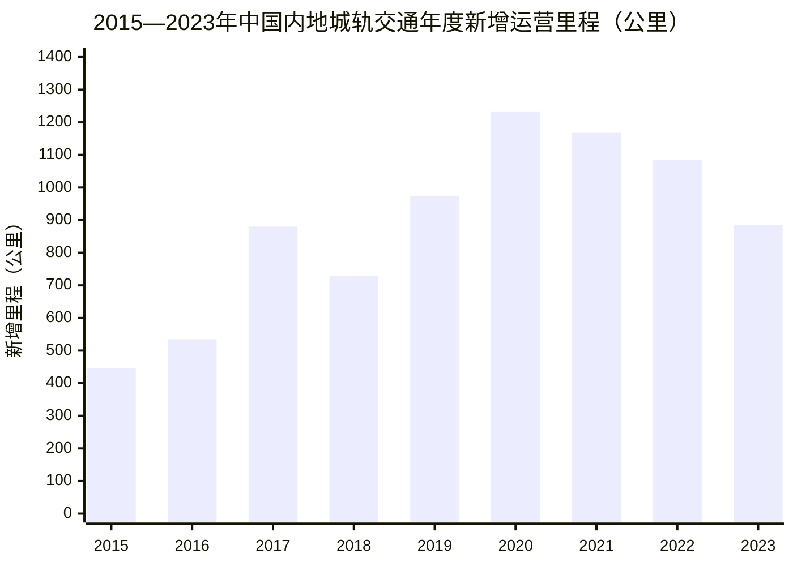
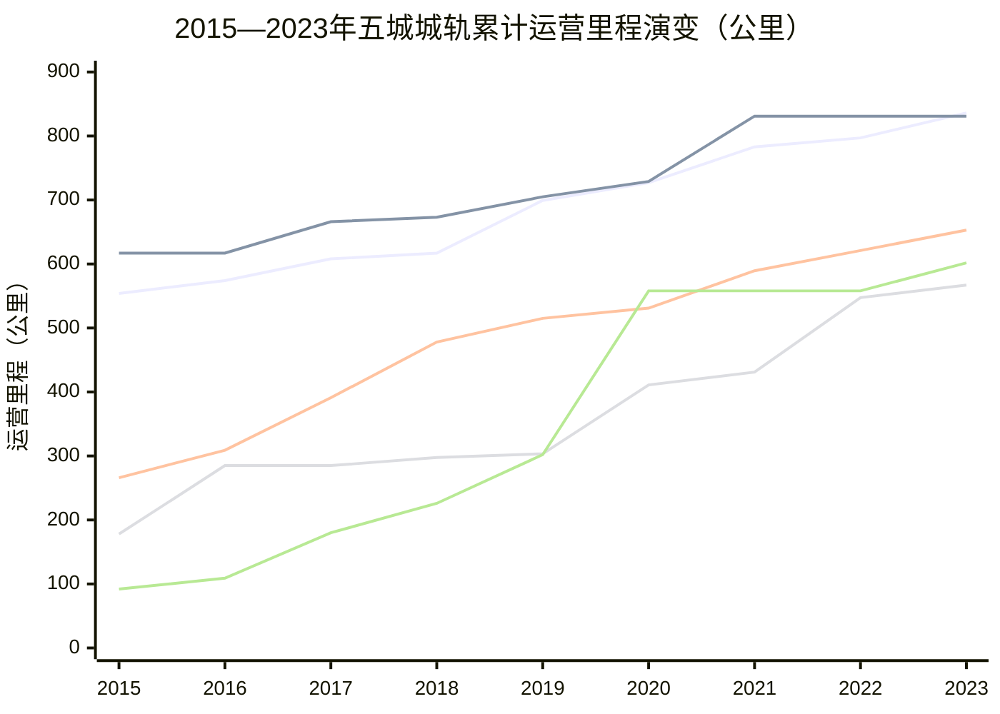
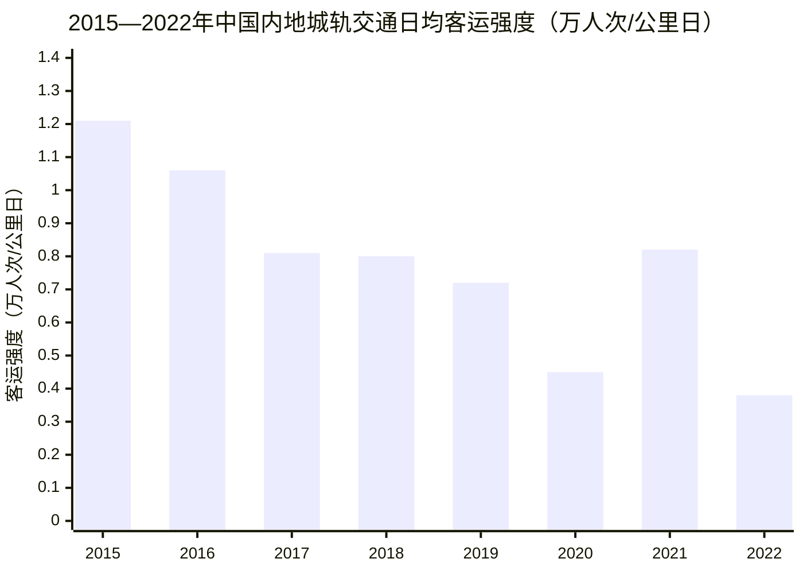

# 中国内地城市轨道交通发展情况调研报告（2015—2023年）
# 1 整体发展规模的年度演变

中国内地城市轨道交通在2015—2023年间经历了从规模初成到全面铺开、再到平稳调整的完整发展周期。这一时期既是"十二五"末期承上启下的关键节点，也覆盖了"十三五"五年跨越式增长的全过程，以及"十四五"前三年由高速扩张向理性回调的转折阶段。本章基于中国城市轨道交通协会（CAMET）历年发布的《城市轨道交通年度统计和分析报告》以及《中国内地城轨交通线路概况》等权威统计源[^1][^2][^3][^4][^5][^6][^7][^8]，对运营城市数量、累计运营里程、年度新增里程、在建线路规模及建设投资额等核心指标进行纵向梳理，识别行业发展的关键节点与拐点特征，为后续章节关于重点城市对比、制式构成与运营效率的分析奠定宏观基础。

## 1.1 运营城市数量与累计运营里程的逐年扩张

2015—2023年，中国内地开通城轨交通的城市数量从26个增长到59个，累计运营里程从3618公里扩张到11232.65公里，规模实现了三倍以上的增长。这一扩张过程并非匀速推进，而是呈现出**前期稳步铺垫、中期加速突破、后期高位扩容**的阶段性特征。

具体来看，2015年末中国大陆共有26个城市开通城轨交通运营，运营线路116条，总长度3618公里[^8]；至2016年末，福州、东莞、南宁、合肥4个新城市加入运营行列，运营城市数量增至30个，线路总长度达4152.8公里，年度新增534.8公里首次突破500公里大关[^7][^9]。2017年末，运营城市数量进一步增至34个，运营线路165条，累计里程突破5000公里达到5033公里，年度新增880公里同比增长21.2%，达到当时的历史新高[^6]。2018年新增乌鲁木齐1个城市，运营城市达35个，运营里程5761.4公里[^10][^5]；2019年新增温州、济南、常州、徐州、呼和浩特等城市，运营城市增至40个，里程达6736.2公里[^11][^12]。

进入"十三五"后半段，扩张节奏明显提速。2020年末，受当年新增天水、三亚、太原3市以及株洲、宜宾两条电子导向胶轮系统线路纳入统计的双重影响，运营城市数量跃升至45个，运营线路244条，累计里程突破7000公里达到7969.7公里[^3]。2021年继续保持高速增长，城轨运营规模迈过9000公里量级（依据CAMET 2021年度统计分析报告口径[^13][^4]）。2022年是另一具有里程碑意义的年份：新增南平、金华、南通、台州、黄石5个城轨交通运营城市，全国运营城市达55个，**累计运营线路总长度首次突破一万公里大关，达到10291.95公里**[^14][^15][^16]。2023年新增红河州、滁州、许昌3市，运营城市进一步增至59个，运营里程达11232.65公里[^1][^2]。

需要说明的是，CAMET统计口径涵盖地铁、轻轨、跨坐式单轨、悬挂式单轨、市域快轨、有轨电车、磁浮、自动旅客捷运系统（APM）、电子导向胶轮系统（智轨）、胶轮路轨系统等多种制式[^1][^2]；而交通运输部公布的口径主要基于地方运输管理部门上报，统计范围略窄。例如2023年末交通运输部口径下中国内地共有55个城市开通运营、运营里程10165.7公里[^17]，与CAMET口径下的59城、11232.65公里存在差异。本章统一采用CAMET口径以保证时序可比性，符合P-2"统计口径一致性"的要求。

下表汇总了2015—2023年各年末运营城市数量与累计运营里程的核心数据：

| 年份 | 运营城市数（个） | 累计运营里程（公里） | 当年新增运营城市 |
|---|---|---|---|
| 2015 | 26 | 3618 | — |
| 2016 | 30 | 4152.8 | 福州、东莞、南宁、合肥[^7] |
| 2017 | 34 | 5033 | （净增4市） |
| 2018 | 35 | 5761.4 | 乌鲁木齐[^10] |
| 2019 | 40 | 6736.2 | 温州、济南、常州、徐州、呼和浩特 |
| 2020 | 45 | 7969.7 | 天水、三亚、太原（另含株洲、宜宾两条线纳入统计）[^3] |
| 2021 | 50（量级） | 9192量级 | — |
| 2022 | 55 | 10291.95 | 南平、金华、南通、台州、黄石[^14] |
| 2023 | 59 | 11232.65 | 红河州、滁州、许昌[^1] |

从节点跨越的角度看，**5000公里**于2017年突破、**7000公里**于2020年突破、**10000公里**于2022年突破——三个标志性节点间隔分别为3年和2年，反映出城轨运营网络在"十三五"后期至"十四五"前期进入最为密集的扩容窗口。运营城市数量同期从26个翻番至59个，年均净增约4个城市，呈现出地理覆盖广度与网络密度同步提升的双重特征。

## 1.2 年度新增运营里程的节奏与波动

如果说累计运营里程反映的是存量规模的扩张，那么年度新增运营里程则更能直观刻画建设节奏的快慢变化。2015—2023年间，年度新增运营里程经历了从400公里量级到1200公里峰值再回落至900公里以内的"倒U型"轨迹。

具体而言，2015年新增运营线路长度为445公里，同比增加14%[^8]；2016年新增534.8公里，首次突破500公里[^7][^9]；2017年新增880公里，同比增长21.2%，迈上新台阶[^6]；2018年新增728.7公里，较2017年略有回落但仍保持700公里以上的高位[^10]。2019年新增达974.8公里，逼近千公里关口[^11]，其中既有温州、济南、常州、徐州、呼和浩特5市的首次开通贡献，也有既有运营城市持续延伸线网的常态化推进[^12]。

**2020年是年度新增运营里程的历史峰值年**，全年新增达1233.5公里[^3]——这一峰值的形成有多重原因：一是"十三五"收官年集中投运的规划效应，多座城市将原定2020年通车的线路如期开通；二是当年纳入统计口径的株洲A1线、宜宾T1线等电子导向胶轮系统线路贡献了增量；三是新冠疫情虽对客流造成冲击，但对工程建设的影响相对滞后，前期已基本建成的线路仍能按时投运。"十三五"五年累计新增运营线路达4351.7公里，年均870.3公里，年均增长率17.1%，**比"十二五"年均投入运营线路长度403.8公里翻了一番还多，五年新增运营线路长度超过"十三五"前的累计总和**[^3]。

2021—2022年进入高位震荡阶段，CAMET口径下2022年新增运营线路1085.17公里，其中四季度集中新增503.31公里，接近全年总量的一半，反映出年终集中投运的季节性特征[^14][^16]。2023年新增里程回落至884.55公里[^1]，其中30个城市贡献了新增线路（含3个新增运营城市），郑州以全年新增78.71公里位居各城市新增里程榜首[^1][^18]。这一数据较2020—2022年的高位明显回落，标志着年度新增节奏由"冲顶"转向"平稳"。

从新增运营城市的逐年情况看，2015—2023年间累计新增运营城市约33座，从初期以省会、副省级城市为主，逐步扩展至苏州、温州、徐州等地级市，再到天水、三亚、南平、红河州、滁州、许昌等更小规模的城市群外围节点，**反映出城轨交通服务体系从一线和强省会城市向二三线城市梯次下沉的扩散过程**。其中2020年和2022年是新增城市集中度最高的两个年份。

## 1.3 在建线路规模与建设投资的阶段性高点与回调

如果说运营里程反映的是已交付的存量，那么在建里程与年度建设投资则是预示未来运营增量的领先指标。2015—2023年间，**在建规模与年度投资额经历了同步攀升至高点、随后进入回调通道的完整周期**，且回调拐点早于运营里程的回落，具有显著的前瞻意义。

**在建线路总规模**的演化路径为：2015年末4448公里[^8]，2016年末跃升至5636.5公里同比增长26.7%[^7][^9]，2017年末达6218公里[^6]，2018年末进一步增至6374公里[^10]，2019年末高位攀升至6902.5公里[^11]，2020年末为6797.5公里[^3]——此后进入回调阶段。至2023年末，在建线路总长降至5671.65公里[^2]，较2019年高点累计回落约1230公里，回调幅度约17.8%。

**年度建设投资额**的演化路径与在建规模高度同步但峰值略有滞后：2015年完成投资3683亿元[^8]，2016年完成3847亿元创历史新高[^9]，2017年达4739亿元[^6]，2018年5470.2亿元同比增长14.9%[^10]，2019年5958.9亿元[^11]，**2020年达到历史峰值6286亿元，同比增长5.5%**[^3]。"十三五"五年累计完成建设投资26278.7亿元，年均5255.7亿元，同样比"十二五"翻了一番还多[^3]。2022年城轨交通投资额为5444亿元（《中国交通运输2022》口径），同比下降7.10%[^19]。2023年完成建设投资5214.03亿元，同比下降4.22%，**年度完成建设投资总额连续3年回落**[^2]。

**可研批复投资累计额**作为项目储备的指标，其演化轨迹同样反映了从扩张到稳定的趋势：2015年末26337亿元[^8]，2017年末38691亿元[^6]，2018年末42688.5亿元[^10]，2020年末45289.3亿元达到峰值[^3]，2023年末略降至43011.21亿元[^2]。可研批复投资累计额自2020年见顶后趋于稳定甚至小幅回落，说明新增重大项目的获批节奏明显放缓——这与国家发改委对地方城轨建设规划审批趋于审慎的政策导向相吻合。

下表汇总了2015—2022年（在建里程依据用户需求覆盖至2022年）的关键建设端指标：

| 年份 | 在建线路里程（公里） | 年度完成建设投资（亿元） | 可研批复投资累计（亿元） |
|---|---|---|---|
| 2015 | 4448[^8] | 3683[^8] | 26337[^8] |
| 2016 | 5636.5[^7] | 3847[^9] | 34995.4[^9] |
| 2017 | 6218[^6] | 4739[^6] | 38691[^6] |
| 2018 | 6374[^10] | 5470.2[^10] | 42688.5[^10] |
| 2019 | 6902.5[^11] | 5958.9[^11] | — |
| 2020 | 6797.5[^3] | 6286[^3] | 45289.3[^3] |
| 2021 | 高位运行 | 高位震荡 | — |
| 2022 | 回落区间 | 5444[^19] | — |
| 2023（参考） | 5671.65[^2] | 5214.03[^2] | 43011.21[^2] |

从拐点识别的角度看，**在建里程的峰值出现在2019年末（6902.5公里）**，**年度建设投资的峰值出现在2020年（6286亿元）**，**可研批复投资累计额的峰值同样出现在2020年（45289.3亿元）**。三项指标的峰值在2019—2020年间集中出现，此后均进入下行通道，构成判断行业进入平稳发展期的关键证据。CAMET在2023年度统计分析报告中明确指出，"城轨交通建设进入平稳发展期，预计未来两年新投运线路与2023年基本持平，'十四五'末城轨交通投运线路总规模趋近13000公里"[^2]，这一表述印证了行业从高速扩张向规模理性调整过渡的判断。

## 1.4 阶段性规模演变的特征总结与拐点识别

将2015—2023年的演变轨迹按"十二五""十三五""十四五前三年"三个阶段进行综合判读，可以更清晰地把握行业发展的内在逻辑。

**第一阶段："十二五"收官（2015年）——规模基础初步形成**。该阶段末期，全国26个城市开通运营、累计里程3618公里、年度新增445公里、在建4448公里、年度投资3683亿元[^8]。整个"十二五"五年累计新投运线路2019公里，完成投资12289亿元，城轨交通从早期的"少数城市试点"演变为"多城市多制式协同发展"的初步格局[^8][^20]。

**第二阶段："十三五"期间（2016—2020年）——跨越式高速增长**。这一阶段是城轨发展最为浓墨重彩的五年：累计新增运营线路约4351.7公里，年均870.3公里，年均增长率17.1%创历史新高；累计完成建设投资26278.7亿元，年均5255.7亿元，相比"十二五"年均水平翻了一番还多；累计共有35个城市的新一轮城轨交通建设规划或规划调整获国家发改委批复，涉及新增规划线路4001.7公里、新增计划投资约29781.9亿元[^3]。这一阶段的核心特征是**规划、建设、运营三端同步扩张**，运营城市数从30个增至45个，累计里程从4152.8公里跃升至7969.7公里，几乎翻番。

**第三阶段："十四五"前三年（2021—2023年）——规模理性调整与平稳发展**。这一阶段呈现出"运营里程持续上行、在建规模阶段见顶、投资额连续回落"的三条主线交织格局：累计运营里程从约9200公里量级增至11232.65公里，三年净增约2000公里[^1][^14]；但年度新增运营里程从2020年峰值1233.5公里逐步回落至2023年的884.55公里[^1][^3]；年度建设投资连续3年回落至5214.03亿元[^2]。这一阶段标志着行业**从规模高速扩张转向规模理性调整**，建设节奏与城市发展需求、地方财政能力、项目运营效益的匹配度成为新的政策重心。

综合上述分析，可识别出三个关键拐点：

- **2020年**：年度建设投资达到历史峰值6286亿元，此后进入下行通道；该年同时也是年度新增运营里程的峰值年（1233.5公里）。
- **2022年**：累计运营里程首次突破一万公里大关，标志着中国内地城轨网络由"区域骨架"迈入"全国网络"阶段。
- **2023年**：年度新增运营里程回归900公里以内（884.55公里），可研批复投资累计额从峰值小幅回落，行业进入CAMET所定义的"平稳发展期"。

关于数据口径的取值依据需作如下说明：本章所采用的累计运营里程、新增运营里程数据原则上以CAMET年度统计分析报告及其发布的《中国内地城轨交通线路概况》为准[^1][^2][^3][^4][^5]。CAMET口径自2020年起将株洲、宜宾的电子导向胶轮系统（智轨）纳入统计，2023年又因悬挂式单轨投运将系统制式扩展至10种[^1][^3]，因此2020年前后的数据存在小幅口径调整，但对趋势判断不构成实质影响。对于交通运输部公报口径与CAMET口径的差异（如2023年55城/10165.7公里 vs 59城/11232.65公里）[^1][^17]，本章按照P-3"多源交叉验证"和P-1"权威来源优先"的原则，统一采用CAMET口径，以保证2015—2023年时序的可比性与延续性。

# 2 重点城市运营里程对比

在第1章勾勒的全国宏观规模演变之上，五座规模领先城市——北京、上海、广州、深圳、成都——构成了中国内地城轨交通版图的"塔尖"，也是观察行业发展节奏与城市群战略落地最具代表性的样本。这五座城市2015年累计运营里程约1707公里，约占全国3618公里的47%；至2023年五城合计运营里程约3480公里，约占全国11232.65公里的31%。**头部城市里程占全国比重的下降，并非领跑城市规模收缩，而是恰恰反映了城轨网络在更广地理范围内的扩散与下沉**。本章将以五城逐年里程数据为骨架，剖析其扩张节奏的层级差异及其背后的规划、战略与投资逻辑，为后续制式构成与运营效率分析建立城市层面的参照系。

## 2.1 五城逐年运营里程数据汇总

由于不同来源对城轨里程的统计口径存在差异（如是否包含磁浮线、有轨电车、APM、市域快轨；以及统计时点是按年末还是按当年新线开通后即时计算），本节数据原则上以CAMET年度统计分析报告所发布的城市运营里程为基准，并参考交通运输部年度运营数据速报与各地铁运营企业年报作为交叉验证。对于个别年份数据存在争议时，以CAMET口径并在脚注或行文中说明差异。

依据《城市轨道交通2015年度统计和分析报告》及智研咨询整理的2015年末分城市运营线路里程统计，2015年末上海以约627公里（含磁浮线29公里）位居全国首位，北京约554公里位列第二，广州约266公里、深圳约178公里、成都约92公里分列其后[^21][^22][^23][^24]。这一年五城呈现明显的"两超三追"格局——京沪同处600公里量级，与其后城市存在跨量级落差。

从2015年至2023年的9年演变看，五城里程演变路径如下表所示（单位：公里，以年末或当年最新开通后里程为准）：

| 城市 | 2015 | 2016 | 2017 | 2018 | 2019 | 2020 | 2021 | 2022 | 2023 | 9年累计净增 | 年均增量 |
|---|---|---|---|---|---|---|---|---|---|---|---|
| 北京 | 554 | 574 | 608 | 617 | 699.3 | 727 | 783 | 797 | 836 | ≈282 | ≈31.3 |
| 上海 | 617 | 617 | 666 | 673 | 705 | 729 | 831 | 831 | 831 | ≈214 | ≈23.8 |
| 广州 | 266 | 309 | 391 | 478 | 515 | 531 | 589.4 | 621 | 653 | ≈387 | ≈43.0 |
| 深圳 | 178 | 285 | 285 | 297.6 | 303.4 | 411 | 431 | 547.4 | 567.1 | ≈389 | ≈43.2 |
| 成都 | 92 | 109 | 180 | 226 | 302 | 558 | 558 | 558 | 601.7 | ≈510 | ≈56.7 |
| **五城合计** | ≈1707 | ≈1894 | ≈2130 | ≈2292 | ≈2525 | ≈2956 | ≈3192 | ≈3354 | ≈3489 | ≈1782 | ≈198 |

数据来源说明与口径校核：北京2015年末554公里、2016年末574公里来源于CAMET 2015年度统计报告及北京地铁公司发布的数据[^23][^24]；2019年末699.3公里来源于地铁7号线东延与八通线南延开通时的官方披露[^25]，2021年末783公里、2022年末797公里来源于北京市交通委发布的绿色出行成绩单及京津冀协同发展数据[^26][^27][^28]，2023年末836公里来源于北京市交通委京津冀十年交通一体化成绩单的公开数据[^29]。上海2015—2016年617公里、2017年末666公里来源于申通地铁及澎湃新闻报道[^30][^31][^32]，2019年末705公里来源于上海地铁运营报告[^33][^34]，2021年末与2022年末831公里来源于2022年度上海轨道交通服务质量评价结果及申通地铁集团十年综述[^35][^36][^37][^32]。广州2015—2019年266—515公里区间数据来源于广州地铁集团及相关报道[^38][^39][^40]，2022年末621公里、2023年末653公里来源于广州地铁集团《年报》及《社会责任报告》[^41][^42]。深圳数据2015年178公里来源于深圳地铁发展史报道[^43]、2019年末303.4公里来源于深圳地铁15周年成绩单[^44]、2020年末411公里来源于多源报道交叉印证[^45][^46]、2021年末431公里来源于深圳市轨道办公开数据[^47]、2022年末547.4公里与2023年末567.1公里来源于深圳市政府及深铁集团2023年运营答卷[^48][^49][^50]。成都数据中，2015年92公里来源于2015年度运营报告[^22]，2017年末180公里、2018年末226公里来源于成都地铁开通大事表[^51][^52]，2019年末302公里、2020年末558公里来源于成都地铁2019年度账单及"五线齐发"开通仪式公开报道[^53][^54][^55]，2023年末601.7公里来源于成都轨道交通19号线二期开通报道[^56][^57]。

观察上表，可清晰识别出五座城市2023年末已分别落入三个量级区间：**北京与上海稳居800公里量级，构成"双超大线网"梯队**；**广州（653公里）与成都（601.7公里）跻身600公里梯队**；**深圳（567.1公里）位列500公里梯队**。9年间五城合计净增约1782公里，约占全国同期净增量的23%，显示出头部城市虽仍是规模扩张的主力，但全国其他城市同步快速发展已显著稀释了头部集中度。

从年均增量看，成都以约56.7公里/年位居五城之首，深圳约43.2公里/年、广州约43.0公里/年紧随其后，北京约31.3公里/年、上海约23.8公里/年位列其后——年均增量恰好呈现与里程基数倒置的特征：**起点越低的城市追赶速度越快，而起点越高的城市受网络饱和度与建设难度上升的约束，扩张节奏趋于平稳**。

## 2.2 领跑城市与追赶城市的扩张节奏差异

将上述数据按演变路径进行类型化归纳，五城可分为三类典型扩张模式：高位匀速型（北京、上海）、稳健翻番型（广州）、爆发追赶型（深圳、成都）。

**北京与上海："双超大线网"的高位匀速扩张**。这两座城市2015年起步即在600公里量级，处于全球轨道交通城市的第一方阵。北京从554公里增至836公里，9年净增282公里，扩张倍数约1.51倍；上海从617公里增至831公里，9年净增214公里，扩张倍数约1.35倍。北京和上海的扩张呈现明显的"高位匀速"特征——年度新增里程稳定在30—80公里区间，鲜有"井喷式"开通。这与超大城市轨道网络已基本覆盖核心建成区、新线建设转向郊区与市域快线、单条线路建设周期延长等因素密切相关。上海2021年12月14号线、18号线一期北段开通后里程首次跨过800公里大关，达到20条线、508座车站的规模[^35][^32]；此后2022年、2023年新线开通节奏放缓，里程基本停留在831公里。北京则在2019年底7号线东延、八通线南延开通后达到699.3公里[^25]，2020年首都机场线西延、2021年14号线、11号线西段等陆续开通推动里程超过780公里[^26]，至2024年底进一步达到879公里、2025年达到909公里[^58][^59][^60]。**两市扩张曲线的平缓化，标志着中国内地超大城市轨道网络已进入"成熟运营+市域延伸"的新阶段**。

**广州：稳健翻番的"基建狂魔"**。广州2015年末266公里，2020年末达530公里实现"十三五"期间通车里程倍增并稳居世界前五[^38]；2022年末达621公里，2023年末进一步增至653公里[^41][^42]。9年间广州净增约387公里，扩张倍数约2.45倍。**广州的特殊价值在于规模与效率并重**：其在大幅扩张里程的同时，2019年线路客运强度全国第一（地铁1号线达5.6万人次/公里日）[^39]，2023年日均客运量860.52万人次、占全市公交客运总量69%的分担率刷新纪录[^42]。广州模式表明，**一线城市在网络成型后仍能通过持续投资保持扩张惯性，且不显著牺牲单线运营效率**。

**深圳：井喷式爆发与"客运强度第一城"的双重身份**。深圳2015年仅178公里，2016年末跃升至285公里（主要由11号线、7号线、9号线密集开通推动），随后2017—2019年进入消化期里程徘徊在297—303公里[^43][^44]。**2020年是深圳里程跃迁的关键节点——一年内集中开通6、8、10号线及其他多段线路新增107公里，年末突破400公里达411公里**[^45][^61]。2021—2022年深圳延续高强度建设，2022年11月12号线与6号线支线开通后里程突破500公里达530公里[^48]，年末达547.4公里；2023年12月8号线二期开通后达567.1公里[^50][^62]。9年间深圳净增约389公里，扩张倍数约3.18倍。深圳还创造了"地铁线网密度全国第一""客运强度全国第一"的双重纪录——2021年深圳地铁客运强度1.45万人次/公里日全国首位[^47]，2023年单日客运强度峰值1.83万人次/公里日，位居500公里以上城市第一[^50][^62]。**深圳模式诠释了高密度建成区如何通过密集线网应对超高客流需求**，其2019—2024年6年内里程增长297.5公里的强度领跑全国[^63]。

**成都：从"地铁后进生"到"轨交第四城"的跨越式增长**。成都2015年末仅92公里，位列五城之末[^22]；2017年末180公里、2018年末226公里、2019年末"三线齐发"后达302公里[^51][^55]。**2020年12月18日"五线齐发"一次性新增近160公里，运营里程从398公里跃升至558公里，创造"国内首个一次性开通五条地铁新线的城市"和"全国地铁运营里程最快突破500公里的城市"两项纪录，跻身轨道交通"第四城"**[^53][^54][^64][^65]。此后2021—2022年成都新线建设进入第四期规划集中实施期，里程暂时稳定在558公里；2023年11月19号线二期开通，里程突破600公里达601.7公里[^56][^57]。9年间成都净增约510公里，扩张倍数约6.54倍，**是五城中扩张最为剧烈、追赶最为成功的城市**。中国城市轨道交通协会发布的《城市轨道交通2019年度统计和分析报告》显示，2019年成都新增运营线路105.9公里居全国之首，在建规模超过450公里位居全国第一[^66]，成为后续大规模通车的工程基础。

为更直观展现五城扩张节奏差异，下图以累计里程曲线呈现五城9年演变轨迹：

注：上述折线由上至下依次为北京、上海、广州、深圳、成都。可清晰看出北京、上海2015年起即位于高位并保持平缓上升，广州呈现持续匀速攀升，深圳在2016、2020、2022年出现三轮阶梯式跃迁，成都则在2019—2020年出现最陡峭的爬升曲线。**五城里程排名次序在9年间经历多次更迭**：2015年依次为上海、北京、广州、深圳、成都；2016年深圳一度超越广州但2017年被反超；2020年成都跨过深圳跃升第四，深圳次年又借助密集开通追赶；至2023年五城排名稳定为上海、北京、广州、成都、深圳——但每两个相邻城市间的差距均已显著缩小，**头部梯队内部的竞争已进入"100公里量级"的精细化角逐阶段**。

## 2.3 里程扩张与规划、战略、投资的关联机理

五城扩张节奏的层级差异并非偶然现象，而是规划批复节奏、城市群战略定位、建设投资强度三重驱动因素共同作用的结果。理解这三重机理，是把握中国城轨发展逻辑、预判未来格局演变的关键。

**第一重驱动：国家发改委建设规划批复节奏决定3—5年后的开通节奏**。城轨建设项目从规划批复到开通运营通常需要4—7年的工程周期，因此当期开通的线路实际上对应若干年前的规划批复。成都四期规划2019年8月获批，一次性增加8条线路共176.65公里[^66][^67]，对应2020年"五线齐发"、2023年19号线二期、2024—2025年集中开通的"四期收官"。广州在"十三五"期间多轮规划获批，对应2017—2020年里程从391公里增至530公里的快速增长；2023年获国家发改委批复的广州五号线东延段、七号线二期等项目，则对应2023年末新线开通达到653公里[^42]。深圳四期工程项目对应2020—2022年的密集开通潮，五期工程9条线路185公里则将支撑后续里程增长[^50]。**与之形成对比的是，2024年仅成都地铁五期规划获批，2025年获批城市为零**[^68]，这一审批闸门近乎"半关闭"的态势，预示着2028年后全国城轨开通节奏将进一步放缓。这也印证了第1章所识别的"在建规模与年度投资2020年见顶后回调"的判断与未来运营增量预期之间的传导关系。

**第二重驱动：国家级城市群战略定位的支撑作用**。五城分别承担四大国家级城市群/经济圈的核心引擎功能，其轨道交通建设由此具有超越单一城市层面的战略价值。北京作为京津冀协同发展的核心枢纽，2014—2023年十年间轨道交通运营总里程从465公里跃升至836公里，与外围新城及副中心连接的轨道线路达到15条；**"轨道上的京津冀"初步建成，平谷线等首条跨市域轨道交通推动燕郊到北京中心城区最短只需32分钟**[^29][^28]。上海作为长三角一体化的龙头，通过11号线延伸至江苏昆山花桥（"国内第一条跨省地铁线路"）[^30][^31]、苏州轨道交通11号线与上海11号线对接、2024年开通的市域机场线连通虹桥与浦东两大枢纽等[^69]，构建超大城市群轨道协同网络。广州与深圳共同承担粤港澳大湾区核心引擎功能：广州地铁2023年带动广州市轨道交通行业产值超2500亿元，参与建设大湾区跨市城际铁路广佛西环等4条线路654公里在建规模[^42]；深圳地铁在打造"轨道上的大湾区"中持续推进五期项目185公里在建[^50]，并将地铁延伸至深圳湾口岸推进深港互联互通[^63]。成都则依托成渝地区双城经济圈战略获得跨越式发展支撑：四川首条跨市域轨道交通S3资阳线2024年9月29日开通，连接成都天府国际机场片区与资阳中心城区，实现"1小时日常通勤"[^70][^71]；东西部新区、东部新机场片区的辐射服务依托18号线、19号线等市域快线快速成型[^67][^72]。**城市群战略定位转化为轨道交通投资强度，再转化为里程扩张速度，构成完整的传导链条**。

**第三重驱动：年度建设投资强度的差异化投入**。从五城投资强度看，成都"建设强度连续四年位居全国第一"是其里程跃升的根本支撑[^61]：截至2020年成为首个城市轨道交通在建线路突破400公里的城市，2023年成都轨道集团投资强度居全国副省级城市前列、广州地铁2022年完成市重点项目投资855亿元、2023年完成近861亿元突破历史新高[^41][^42][^67]。深圳"过去5年净增里程211.9公里位居第二"的成绩，对应其2019年三期、四期工程16条（含延长线）约284公里项目同时在建的井喷期[^73][^63]。广州过去5年净增约240.8公里位居主要城市之首，被称为"基建狂魔"[^73]。**值得关注的是，五城投资强度差异背后还反映了地方财政与债务约束的差异**——2023年底国家发改委对12个债务风险较高省份原则上不得新建轨道交通项目的规定，进一步强化了已具备较强财力的一线和强二线城市的优势[^68]。北京、上海作为两座超大城市，其投资重心已部分从新建普线转向郊区线提速改造、市郊铁路融合（如北京"四网融合"战略）和智慧运维等存量优化领域[^26][^27]，体现出投资模式从"规模导向"向"效益导向"的转型。

综合规划、战略、投资三重驱动机理，可以归纳出**"双超大线网+多500公里梯队+追赶集群"的层级格局**：北京、上海凭借历史积累与持续投入稳居800公里量级第一梯队，扩张节奏趋于平缓但内涵升级（市域铁路、智慧化、TOD）持续深化；广州、成都构成600公里量级第二梯队，前者依托大湾区战略与稳健投资保持高效扩张，后者依托成渝战略与全国最高建设强度实现跨越式追赶；深圳处于500公里量级第三梯队但客运强度全国第一，反映其"高密度小线网+超高负荷"的独特模式。**这三个梯队的形成，既是过去9年规划与投资累积的结果，也将决定2024年后中国头部城市城轨竞争格局的进一步演化**。

从五城排名变迁的动态看，**新一线城市对一线城市的追赶在里程维度上已显现明显成效**：2015年成都里程仅为上海的15%、北京的17%、广州的35%；至2023年成都里程已达上海的72%、北京的72%、广州的92%。深圳与广州的差距也从2015年的88公里扩大后再回缩至2023年的86公里。**这一格局演化为后续章节理解五城在制式构成多元化（如成都市域快轨18/19号线、深圳市域快轨14号线）和客运效率分化（深圳超高强度 vs 成都新线稀释）方面的差异提供了城市层面的对照基础**。具体而言：北京和上海的高位匀速扩张支撑了其制式多元化中市郊铁路和磁浮等特殊制式的探索空间；广州和深圳的稳健扩张配合超高客流密度形成了"地铁主导+城际/有轨电车补充"的精细化布局；成都的跨越式扩张则伴随市域快轨制式比重的显著上升，这些将在第3章和第4章进一步展开分析。

# 3 系统制式构成总览

在第1章勾勒的全国宏观规模演变与第2章呈现的五城梯队分化基础上，本章将研究视角从"总量"与"城市"转向"制式"与"功能"。中国内地城市轨道交通发展至2023年底，不仅在累计运营里程上突破11000公里大关，更在制式多元化方面达到一个里程碑节点——**2023年9月26日武汉光谷空轨开通运营，标志着中国城轨交通实现了团体标准《城市轨道交通分类》（T/CAMET 00001-2020）所规定的10种制式全覆盖**[^74][^75][^76]。这一变化既反映了行业技术供给的成熟度提升，也折射出城市轨道交通从"单一制式主导"向"分层级、多场景适配"演化的内在逻辑。本章将以10种制式的运营里程与结构占比为分析骨架，依次剖析大、中、低运能层级的规模分布、地铁主导格局的成因、市域快轨在城市群一体化中的崛起、低运能制式的差异化应用与理性调整，最终归纳多制式协同发展的整体格局，为第4章基于制式分类的运营效率分析建立基础。

## 3.1 十种制式的运营里程与结构占比汇总

依据中国城市轨道交通协会团体标准《城市轨道交通分类》（T/CAMET 00001-2020），中国内地城市轨道交通按系统制式划分为地铁系统、市域快轨系统、轻轨系统、中低速磁浮交通系统、跨座式单轨系统、悬挂式单轨系统、自导向轨道系统、有轨电车系统、导轨式胶轮系统、电子导向胶轮系统共十类[^75]。该标准于2020年11月1日实施，2023年12月14日中国城市轨道交通协会进一步批准发布了外文版团体标准《Classification of urban rail transit》，标志着中国城轨制式分类体系开始具备国际话语权[^75]。

需要先行说明的是，用户需求中所列"10种制式"在表述上与CAMET团体标准存在术语对应关系：用户所称的"单轨"对应CAMET标准中的"跨座式单轨"与"悬挂式单轨"两类；"智轨"对应CAMET标准中的"电子导向胶轮系统"（株洲、宜宾等地应用的"智轨"是其商业化品牌名）；"胶轮捷运"对应"导轨式胶轮系统"；"自动旅客捷运系统（APM）"在CAMET 2023年口径下并未作为独立类别列示，而是与"自导向轨道系统"在功能上具有较强对应关系。为保持权威统计源的口径一致性，本章统一采用CAMET公布的十种制式分类口径。

截至2023年底，中国大陆地区共有59个城市开通城轨交通运营线路338条，运营线路总长度11224.54公里（注：与第1章CAMET口径的11232.65公里存在小幅差异，源于中商情报网整理时点与CAMET终稿之间的微调，量级一致，本章按CAMET协会发布解读口径采用11224.54公里作为制式细分基础数据）[^74][^77]。其中地铁运营线路8543.11公里，其他制式城轨交通运营线路2681.43公里[^74][^77][^78]。具体到十种制式的里程与占比，见下表：

| 制式（CAMET口径） | 2023年底运营里程（公里） | 结构占比 | 用户口径对应名称 |
|---|---|---|---|
| 地铁 | 8543.11 | 76.11% | 地铁 |
| 市域快轨 | 1454.86 | 12.96% | 市域快轨 |
| 有轨电车 | 578.42 | 5.15% | 有轨电车 |
| 轻轨 | 224.25 | 2.00% | 轻轨 |
| 电子导向胶轮系统 | 168.54 | 1.50% | 智轨 |
| 跨座式单轨 | 144.65 | 1.29% | 单轨（跨座式） |
| 磁浮交通 | 57.86 | 0.52% | 磁浮 |
| 导轨式胶轮系统 | 32.16 | 0.29% | 胶轮捷运 |
| 悬挂式单轨 | 10.50 | 0.09% | 单轨（悬挂式） |
| 自导向轨道系统 | 10.19 | 0.09% | 自动旅客捷运系统（APM对应） |
| **合计** | **11224.54** | **100.00%** | — |

数据来源：CAMET《城市轨道交通2023年度统计和分析报告》及中商产业研究院整理[^74][^77][^78]。

对照2022年底九种制式的结构（不含悬挂式单轨），可以清晰识别2023年制式构成的两条演变主线[^79]：

**主线一：制式数量从九种扩展至十种**。2022年底中国内地运营的城轨制式为九种——地铁、轻轨、跨座式单轨、市域快轨、有轨电车、磁浮交通、自导向轨道系统、电子导向胶轮系统、导轨式胶轮系统，悬挂式单轨当时尚未投入商业运营[^79]。2023年9月26日，位于湖北武汉的国内首条悬挂式空中轨道列车——光谷空轨旅游线开通运营，线路全长10.5公里、设站6座，车辆采用全自动无人驾驶模式、最高运行时速60公里，**这条仅10.5公里的旅游线在统计上具有划时代的意义——它使中国内地正式成为全球首个集齐T/CAMET 00001-2020标准所列十种制式的国家**[^74][^80][^76]。

**主线二：各制式里程的内部消长**。从2022年到2023年，各制式里程均有不同程度增长：地铁从8008.17公里增至8543.11公里，净增约535公里；市域快轨从1223.46公里增至1454.86公里，净增约231公里；有轨电车从564.77公里增至578.42公里，净增约14公里；轻轨从219.75公里增至224.25公里，净增约4.5公里；电子导向胶轮系统从34.70公里跃升至168.54公里，净增约134公里且呈成倍增长态势；导轨式胶轮系统从23.90公里增至32.16公里；跨座式单轨、磁浮交通、自导向轨道系统三类则维持原有里程未发生变化[^79][^74]。**电子导向胶轮系统是2022—2023年增长最为剧烈的制式，里程几乎翻了五倍**，这一异动主要由株洲、宜宾等中小城市智轨项目的接连投运以及统计口径稳定后的存量入账所驱动。

从结构占比看，地铁仍以76.11%的绝对优势主导，市域快轨以12.96%稳居非地铁制式之首，有轨电车以5.15%位列第三，其余七种制式合计占比不到6%——**呈现出"地铁一家独大、市域快轨次席、有轨电车第三、其余制式长尾分布"的橄榄型偏头格局**。

## 3.2 大、中、低运能层级的规模分布与结构演化

如果将十种制式按运能层级归类，可以获得对中国城轨制式构成更为深刻的洞察。CAMET运能分级框架将地铁列为大运能系统；将轻轨、跨座式单轨、市域快轨、磁浮交通、自导向轨道系统等高度封闭且具备较大运量的中等运能制式归为中运能系统；将有轨电车、导轨式胶轮系统、电子导向胶轮系统、悬挂式单轨等部分封闭或开放式、运能相对较低的制式归为低运能系统[^81]。

根据CAMET 2023年度统计和分析报告的解读，2023年底我国城市轨道交通中**中运能（轻轨、跨座式单轨、市域快轨、磁浮交通、自导向轨道系统）占比约17%；低运能（有轨电车、导轨式胶轮、电子导向胶轮、悬挂式单轨）占比约7%；地铁作为大运能则占余下约76%**[^81]。这与单独累加各制式占比的结果高度吻合：中运能合计=12.96%+2.00%+1.29%+0.52%+0.09%≈16.86%；低运能合计=5.15%+1.50%+0.29%+0.09%≈7.03%。

更值得关注的是2022—2023年间三个层级的结构变化。CAMET明确指出，**与2022年相比，大运能系统运营里程占比下降1.73个百分点，中运能系统运营里程占比增长0.76个百分点，低运能系统运营里程占比增长0.97个百分点**[^74]。这一"一降两升"的小幅结构调整，传递出几个关键信号：

第一，**地铁占比首次出现年度性下降**。2022年地铁占比77.84%，2023年降至76.11%[^79][^74]，这是2015年以来中国城轨制式构成中地铁占比首次出现明显回落。其背后并非地铁建设节奏放缓（2023年地铁仍净增535公里），而是市域快轨、电子导向胶轮等中低运能制式增长更快带来的相对稀释效应。

第二，**中运能层级在市域快轨拉动下进入扩张通道**。中运能里程占比上升0.76个百分点几乎全部来自市域快轨（占比从11.89%升至12.96%，上升1.07个百分点），轻轨、跨座式单轨、磁浮交通的占比反而因总盘子增大而出现被动微降。这表明中运能扩张呈现**"市域快轨独大、其他制式停滞"**的内部分化特征。

第三，**低运能层级在电子导向胶轮带动下出现结构性突破**。低运能占比从约6%升至约7%，主因是电子导向胶轮系统里程从34.70公里跃升至168.54公里（占比从0.34%升至1.50%，上升1.16个百分点）；同时悬挂式单轨从无到有贡献了0.09个百分点的新增量[^79][^74]。

为更直观地把握中国城轨运能层级与国际经验的差距，下表呈现中外对比：

| 运能层级 | 中国2023年占比 | 国际经验占比 | 差距 |
|---|---|---|---|
| 大运能（地铁） | 约76% | 约35% | +41个百分点 |
| 中低运能合计 | 约24% | 约65% | -41个百分点 |
| 其中：低运能 | 约7% | — | — |

数据来源：CAMET 2023年度报告解读、中低运量轨道交通发展研究[^74][^81]。需要说明的是，芜湖市运达轨道交通建设运营有限公司董事长仇俊在另一场合提及"全球中低运能系统占比约65%"[^82]，与冯爱军引用的"国际中低运量系统里程占比约45%、应用城市是地铁两倍"[^81]在量级上存在差异（前者可能包含轻轨等更广口径，后者口径略窄）。但无论采用何种口径，**中国地铁占比偏高、中低运能发育相对不足这一结构性特征都得到一致印证**——这构成中国城轨从"规模扩张"向"结构优化"转型的核心命题之一。

CAMET在2023年度报告中明确指出，**"制式种类进一步丰富，结构进一步优化"**，并将运能结构的小幅再平衡视为行业进入高质量发展阶段的标志性信号[^74]。从中长期看，结合住建部、国家发改委2022年7月联合印发的《"十四五"全国城市基础设施建设规划》中"Ⅰ型城市应结合实际推进轨道交通主骨架网络建设，并研究利用中低运量轨道交通系统适度加强网络覆盖；符合条件的Ⅱ型大城市结合城市交通需求，因地制宜推动中低运量轨道交通系统规划建设"的政策导向[^81]，中国城轨制式结构的优化将是一个跨越多个五年规划周期的长期过程。

## 3.3 地铁主导格局下的核心地位与扩张动力

地铁以76.11%的运营里程占比稳居中国城轨制式构成的绝对主导地位，这一格局的形成既有需求侧的客观必然性，也有供给侧的制度路径依赖。

从规模分布看，2023年底地铁运营里程8543.11公里中，主要集中于第2章所讨论的超大城市与特大城市。以五城为例：北京836公里、上海825公里、广州641.5公里、深圳567.1公里——这四城合计约2870公里，占全国地铁总里程约33.6%[^83]。叠加成都601.7公里、武汉529.6公里、杭州516公里、重庆494.6公里、南京459.4公里、青岛326.3公里等运营里程超过300公里的城市[^83]，**前十大城市地铁里程合计约5797公里，占全国地铁里程约67.9%**，呈现出与全国制式构成相似的"头部集中、长尾稀疏"特征。

进一步对照第2章五城分析，可发现一个关键事实：**北京、上海、广州、深圳四座一线城市的城轨网络几乎完全由地铁构成**，其他制式比重很小。即便加入成都，五城的地铁里程占其全部城轨里程的比重也普遍在85%以上——这与全国76%的平均水平形成鲜明对比，表明**一线城市的制式构成比全国平均更"地铁化"，而中低运能制式的多元化主要发生在头部城市之外**。

地铁主导格局形成的双重原因可归纳如下：

**需求侧：高客流走廊的集中分布**。中国超大城市与特大城市的核心建成区呈现出"高人口密度+高就业密度+高潮汐通勤"的典型特征，单条骨干线路的高峰小时单向客流普遍超过3万人次/小时——这正是大运能公共交通系统的适用区间[^81]。中国城市轨道交通建设先是布局于市区人口500万以上的超大城市和特大城市，后又发展到300万—500万人口的I型大城市，形成了约40个城市以地铁为主的局面，**这有其合理的一面**[^75]。换言之，地铁主导格局是中国大城市人口规模与空间结构的客观映射。

**供给侧：制度路径与产业链成熟度**。地铁作为最早被国家审批体系接纳、技术标准最为完备、产业链配套最为成熟的城轨制式，在项目立项、规划批复、工程建设、设备采购、运营管理等各环节都已形成清晰的制度路径。相比之下，"中运能或低运能城市轨道交通制式由于标准概念不清、管理体制不顺，没能得到充分的重视和发展"[^75]，这导致地方政府在面临选择时倾向于选择"安全、成熟、标准化"的地铁方案。

但地铁主导格局也带来了显著的结构性矛盾。CAMET在制定团体标准T/CAMET 00001-2020时就明确指出：**"出现了部分城市地铁客流水平不高和部分线路客流不足的问题，同时又普遍遇到地铁线路越来越长而城市拥堵出行难的问题依然难解的困境，这与中运能或低运能制式城市轨道交通缺失有关"**[^75]。这一矛盾在第4章关于运营效率的分析中将得到进一步量化呈现。

从扩张动力看，结合第1章和第2章的分析，地铁里程的持续扩张主要受三方面驱动：一是头部城市存量网络的延伸与加密（北京、上海等城市的市区线提速、新线延伸）；二是新一线城市的快速成网（成都、武汉、杭州、重庆等城市2019—2023年密集开通新线，使400—800公里梯队迅速扩容）；三是部分Ⅰ型大城市的新进入（如2023年红河州、滁州、许昌的开通主要以地铁/轻轨制式为主）。**但随着国家发改委对地方城轨建设规划审批趋于审慎、12个债务风险较高省份原则上不得新建轨道交通项目等政策约束的强化，地铁主导格局的扩张速度将在2024年后明显放缓**——这也将为中运能、低运能制式的差异化发展腾出更多政策空间。

## 3.4 市域快轨崛起：服务城市群与都市圈的中运能主力

在地铁主导格局之外，市域快轨已确立为非地铁制式中**里程最大、增长最快、战略地位最高**的类型。2022年底市域快轨运营里程1223.46公里、占全国城轨总里程11.89%；2023年底跃升至1454.86公里、占比12.96%——年度净增231.4公里、占比提升1.07个百分点[^79][^74]。这一增量在2023年全国新增运营里程中占据相当比重，使市域快轨成为继地铁之后最重要的规模贡献者。

市域快轨的崛起与CAMET 2023年度报告所识别的"区域协同发展效应显现"趋势高度同步。CAMET明确指出，**"在全国总运营线网规模中，4个主要城市群城轨交通运营线路规模占比超过三分之二"**，且"城轨交通正在由服务单一城市向服务城市群、都市圈转变"[^74]。市域快轨作为典型的中运能、长距离、跨区域制式，是这一战略转型的核心载体。

结合第2章对五城所在四大国家级城市群的分析，市域快轨在四大城市群中的功能定位分别为：

**京津冀城市群：市郊铁路融合与跨界互联**。北京作为京津冀协同发展的核心枢纽，正推动"四网融合"战略下的市域快轨与市郊铁路一体化发展，平谷线等跨市域轨道交通项目实现燕郊至北京中心城区最短32分钟通勤。这是市域快轨从"市内长大线"向"跨市域通勤干线"功能升级的典型样本。

**长三角城市群：跨省衔接与机场枢纽联络**。上海通过11号线延伸至江苏昆山花桥构建"国内第一条跨省地铁线路"，2024年开通的市域机场线连通虹桥与浦东两大枢纽，扮演超大城市群轨道协同网络中的中运能骨架角色。其中市域机场线虽于2024年开通故不计入2023年口径，但作为2022—2023年间在建并投运的代表性市域快轨项目，反映了这一制式在长三角的发展取向。

**粤港澳大湾区：城际化线路与跨市连通**。广州地铁参与建设大湾区跨市城际铁路广佛西环等4条线路654公里在建规模，深圳地铁推进五期项目185公里在建并将地铁延伸至深圳湾口岸推进深港互联。市域快轨与城际铁路在大湾区的功能边界正趋于模糊，反映出**"地铁延伸—市域快轨—城际铁路"三者一体化的融合趋势**。

**成渝双城经济圈：跨市域通勤的快速成型**。成都四川首条跨市域轨道交通S3资阳线于2024年9月29日开通（虽不计入2023年口径，但其规划与建设阶段贡献了2023年的在建里程），连接成都天府国际机场片区与资阳中心城区，实现"1小时日常通勤"。成都的18号线、19号线等市域快线快速成型，使成都成为五城中市域快轨制式比重显著上升的代表。

从制式比较的角度看，**市域快轨之所以在四大城市群中担当核心骨架，源于其相比地铁更高的设计时速（一般120—160公里/小时）、相比城际铁路更紧凑的站间距与更高发车频率、相比普通铁路更适应都市圈通勤场景的服务模式**。这种"快、密、捷"的复合特征，使市域快轨成为破解超大城市"摊大饼式扩张"与都市圈一体化矛盾的关键技术解。

从角色升级的角度看，市域快轨已完成了从"城市内部交通"向"城市群骨架"的功能跃迁。早期市域快轨主要承担超大城市机场联络、远郊新城接入等单一功能；至2023年，市域快轨已成为**承载都市圈一体化国家战略的核心轨道交通载体**。可以预见，随着"轨道上的京津冀""轨道上的大湾区""轨道上的成渝"等国家级战略的持续推进，市域快轨在未来五至十年的占比仍将稳步上升。

## 3.5 低运能制式的差异化应用与理性调整

低运能系统作为中国城轨制式构成的"长尾"，2023年底在30座城市开通运营线路54条、总里程达到789公里，包括有轨电车占比73.3%（约578.42公里）、电子导向胶轮系统占比21.3%（约168.54公里）、导轨式胶轮系统占比4.1%（约32.16公里）、悬挂式单轨系统占比1.3%（约10.50公里）[^82]。**当前有轨电车仍是低运能系统的主流制式，电子导向胶轮系统发展迅速**[^82]。低运能系统在全部城市轨道交通里程中占比基本保持在6%—7%左右，规模虽小但功能定位与发展态势具有显著的研究价值。

**有轨电车：从快速扩张进入理性发展期**。有轨电车作为低运能主流制式，在经历前期快速扩张后已进入CAMET所定义的"理性发展期"。其转折的核心信号在于客流效益的不达标：CAMET调研显示，**2019—2023年各城市有轨电车平均客运强度分别为892、465、582、490、889人次/公里·日；按照国家发改委"初期客运强度不得低于0.1万人次/公里·日"（即1000人次/公里·日）的要求，在29条有轨电车线路中仅有8条线路符合要求，达标率仅为27.6%**[^82]。这一不到三成的达标率，是导致有轨电车"建设逐渐降温"的核心原因[^82]。

有轨电车面临的核心问题包括：单线居多、网络化和客流效益不足、运营速度缺乏相对竞争力、线网建设可持续性不足；标准不能满足快速发展需求，借鉴地铁、轻轨的标准导致工程投资偏高，从而影响了低运能系统的适用性；部分制式不成熟导致后续问题不断[^82]。但从2024年初的预期看，CAMET低运能系统分会常务副会长李鸿春表示"今年上半年低运能客流力度非常好，预计今年年末还会有一批客流强度能达到0.1万人次/公里·日的线路，达标率有望突破30%"[^82]，反映出有轨电车在经历调整后正在缓慢复苏。

**电子导向胶轮系统（智轨）：在中小城市的应用突破**。电子导向胶轮系统是2022—2023年扩张最为剧烈的低运能制式，里程从34.70公里跃升至168.54公里。结合第1章分析，株洲A1线、宜宾T1线等智轨线路的纳入统计，是这一跃升的主要驱动力。智轨制式的核心优势在于建设投资远低于传统轨道交通，且可在中小城市落地，**有效填补了Ⅱ型大城市无法承担地铁建设的运能空白**。

**武汉光谷空轨：悬挂式单轨的标志性突破**。2023年9月26日开通运营的武汉光谷空轨旅游线一期工程，全长10.5公里、设站6座，是**全国首条悬挂式单轨商业运营线，也是中国首条开通运营的空轨线路**[^80][^76]。空轨即悬挂式单轨列车，是一种新型中低运量、生态环保、绿色低碳的城市轨道交通制式，列车车体悬挂于轨道梁下方凌空"飞行"，具有不占用地面路权、环境适应性强、景观效果好等优点，兼具通勤和观光功能[^76]。光谷空轨车辆采用全自动无人驾驶（GOA3）模式运营，最高时速60公里，可实现2至3节车厢之间灵活编组，采用永磁牵引技术与飞轮储能系统，能耗节约约15%[^80][^76]。**虽然10.5公里的里程在全国总盘中占比仅0.09%、近乎可以忽略不计，但它使中国成为全球首个集齐T/CAMET 00001-2020十种制式的国家**——这一里程碑节点的政策与产业意义远超其物理规模。

**新一轮低运能规划布局的复苏迹象**。CAMET副秘书长王雁平表示，在经历理性调整后，**深圳、成都、苏州、郑州等地纷纷开展了低运能系统项目规划工作**。据不完全统计，低运能系统线网规划中公布具体线路的合计150条、规划里程近2400公里[^82]。这一储备规模约为当前低运能里程的三倍，预示着未来5—10年低运能系统将进入新一轮发展周期，但能否真正落地与其在客运强度、运营经济性、制式适应性方面的优化密切相关。

低运能制式的差异化定位可归纳为三类典型场景：**地铁覆盖盲区的补充延伸**（如有轨电车在大城市外围片区的接驳）、**中小城市的骨干运输**（如智轨在株洲、宜宾的应用）、**特色园区与景区的功能性服务**（如武汉光谷空轨在生态大走廊的旅游观光功能）。中低运能系统作为城市公共交通系统的组成部分，**既有与地铁这样的大运能系统衔接的优势，又能与公共电汽车融合，形成完整的、多层次城市公共交通体系，也有条件成为服务于特殊交通需求的运输工具**[^82]——这一功能定位将是未来低运能制式发展的核心方向。

## 3.6 多制式协同发展的趋势与功能定位辨析

综合上述分析，2023年底中国内地城市轨道交通已确立**"地铁为主体、市域快轨为骨架、中低运能制式补充延伸"的多层次协同发展格局**。从运营里程权重看，地铁76.11%构成绝对主体，市域快轨12.96%承担骨架角色，其余八种制式合计约10.93%担当补充延伸功能。这一结构既是过去9年规模扩张的必然结果，也是未来"结构优化"转型的起点。

从功能定位维度进一步辨析，十种制式各自的角色分工可清晰归纳如下表：

| 制式分组 | 典型制式 | 核心功能定位 | 典型应用场景 |
|---|---|---|---|
| 大运能 | 地铁 | 超大/特大城市核心走廊高密度通勤 | 京沪穗深核心建成区骨干线网 |
| 中运能骨架 | 市域快轨 | 中心城与外围新城、跨市域通勤 | 京津冀平谷线、长三角机场线、成渝S3线 |
| 中运能特色 | 轻轨、跨座式单轨、磁浮交通 | 特定地形或中等客流走廊 | 重庆跨座式单轨、长沙磁浮快线 |
| 中运能小众 | 自导向轨道系统 | 机场、特定园区旅客捷运 | 北京机场线等APM场景 |
| 低运能主流 | 有轨电车 | 地铁覆盖盲区接驳、中等城市骨干 | 大连、沈阳、苏州、广州等 |
| 低运能新锐 | 电子导向胶轮系统（智轨） | Ⅱ型大城市与中小城市骨干 | 株洲、宜宾等 |
| 低运能景观 | 悬挂式单轨 | 旅游观光与生态廊道交通 | 武汉光谷空轨 |
| 低运能补充 | 导轨式胶轮系统 | 中等城市与特定线路 | 部分胶轮捷运项目 |

这种多层次格局的形成，标志着中国城轨交通已从单一的"地铁建设"演化为**"多制式适配城市分层需求"的系统化布局**。这一转型与第1章识别的"年度建设投资2020年见顶后回调""规模理性调整"等宏观拐点高度同步——当地铁建设节奏受财政能力、债务约束、客流效益等多重因素制约时，中低运能制式正好提供了一条**"低成本、高灵活、差异化"的补充路径**。

结合第2章城市分化结论，可进一步识别五城在制式构成多元化方面的差异化路径：北京和上海作为超大城市，其制式多元化主要体现在市郊铁路融合、磁浮线（上海磁浮29公里）、APM/自导向系统等特殊场景的探索；广州和深圳作为高客流密度的一线城市，呈现"地铁主导+有轨电车补充+城际衔接"的精细化布局；成都作为新一线城市的代表，则伴随着市域快轨制式比重的显著上升（18号线、19号线、S3资阳线等），呈现"地铁+市域快轨双主线"的成长模式。

需要客观指出的是，中国城轨制式结构距离"成熟均衡"仍有相当距离。**中国地铁76%占比远高于国际35%左右的水平，中低运能合计约24%远低于国际65%左右的水平**[^81][^82]，这种"地铁过重、中低运能过轻"的失衡状态在短期内难以根本改变。**但2022—2023年间出现的大运能占比首次下降1.73个百分点、中低运能占比合计上升1.73个百分点的微小变化，可能正是结构再平衡的起点信号**[^74]。CAMET将这一变化解读为"制式种类进一步丰富，结构进一步优化"，其判断的内核正是中国城轨交通正在迈入由"规模扩张"向"结构优化、效率提升"转型的新阶段。

从制式构成与运营效率的关联看，本章的分类基础将为第4章的运营效率分析提供清晰的对照框架。大运能地铁的高客运强度（CAMET披露2023年大运能系统平均客运强度0.71万人次/公里·日，远高于全国平均0.55万人次/公里·日的水平）[^74]、中运能市域快轨的中等客流密度、低运能有轨电车不到三成的客流强度达标率[^82]，将共同呈现出**"运能层级越高、客流密度越高"的正相关关系**——这一关系既是制式选择正确性的验证，也是结构优化未来方向的指示。当前中国城轨交通正站在"规模筑顶、制式分层、效率分化"的历史节点上，制式构成的多元化是这一历史性转型的重要标志。

# 4 服务效率与客运强度分析

前三章从供给侧的总量、城市与制式三个维度梳理了2015—2023年中国内地城市轨道交通的扩张轨迹：累计运营里程从3618公里跃升至11232.65公里、运营城市从26个增至59个、十种制式构成已全面成型。然而，**供给侧的规模扩张并不必然等价于需求侧的同步增长**——衡量轨道交通投资是否高效、运营是否可持续的关键指标，是客流密度与服务效率。本章将研究视角从"建了多少、谁在建、用什么制式建"转向"建了之后用得如何"，以中国城市轨道交通协会（CAMET）历年统计分析报告与交通运输部年度运营数据为基础，系统梳理2015—2022年全国客运强度的演变轨迹，剖析五城在客流量与运营效率维度上的分化格局，并量化解析2019年后全国均值持续下行的结构性归因，最终为整篇报告"规模扩张—结构优化—效率转型"的逻辑闭环提供需求侧验证。

## 4.1 全国客运强度的年度演变轨迹与拐点识别

客运强度（日均客运量÷运营里程，单位：万人次/公里日）是反映轨道交通线网运营效率与客流密度的核心指标。它既不像总客运量那样受里程扩张的"自然放大"影响，也不像单线满载率那样受局部峰值的干扰，是评判网络整体运营效益最具横向可比性和纵向延续性的指标。2015—2022年间，全国城轨网络平均客运强度经历了**从1.21万人次/公里日的高位起点，经平台震荡到疫情骤降再到短暂修复后再度下行的完整"M型"轨迹**。

依据CAMET历年统计分析报告与交通运输部公布数据，逐年演变情况如下表所示：

| 年份 | 全国总客运量（亿人次） | 累计运营里程（公里） | 日均客运强度（万人次/公里日） | 年度同比变化 |
|---|---|---|---|---|
| 2015 | 138 | 3618 | 1.21 | — |
| 2016 | 160.9 | 4152.8 | 约1.06 | 下降 |
| 2017 | 184.8 | 5033 | 0.81 | 下降约2.4% |
| 2018 | 210.7 | 5761.4 | 0.80 | 略降 |
| 2019 | 237.1（推算） | 6736.2 | 0.71—0.72 | 下降约11% |
| 2020 | 175.9 | 7969.7 | 0.45 | 下降约37% |
| 2021 | 237.1 | 8708 | 0.82 | 上升约14%（vs 2020）/ 下降约28%（vs 2019） |
| 2022 | 193.02 | 10291.95 | 0.38 | 下降约20% |

数据来源：CAMET历年统计分析报告、交通运输部2021年城市轨道交通运营数据公报、华经产业研究院与前瞻产业研究院整理[^84][^85][^86][^87][^88][^89]。

从这一轨迹中可清晰识别出四个关键节点与三个阶段性特征：

**第一阶段（2015—2018年）：稳态高位下的缓慢回落**。2015年作为"十二五"收官年，全国城轨完成客运量138亿人次，平均客运强度1.21万人次/公里日——这是2015—2022年的历史峰值，反映出"十二五"末期网络规模相对克制、既有线路客流培育充分的供需匹配状态[^86]。"十二五"期间累计客运量528亿人次、期末比期初年翻一番、广州日均客流强度达2.6万人次/公里日的盛况，构成这一阶段的整体背景。2016年至2018年，全国客运量稳步增长至160.9亿、184.8亿、210.7亿人次，但同期里程扩张更快，客运强度回落至2017年的0.81、2018年的0.80万人次/公里日[^90][^91][^89]。CAMET当时即指出"由于新建成线路集中投入运营，正处客流培育阶段，城轨交通线路长度增幅略高于客运量增长，客运强度指标趋于平稳"[^91]——这一表述精准把握了"规模扩张领先于客流培育"的内在矛盾。

**第二阶段拐点（2019年）：疫情前最后一个相对稳态年份**。2019年全国城轨完成客运量约238.14亿人次（含港澳台为280.45亿，内地占比约85%）[^84]，累计运营里程6736.2公里，平均客运强度回落至0.71—0.72万人次/公里日[^92][^14][^93]。这一水平虽较2015年的高点已下降约40%，但**仍是疫情前最后一个相对完整、未受外部冲击的稳态参考值**。2019年的客运强度结构具有重要的参照价值：线网平均客运强度超过1万人次/公里日的有8个城市，依次为广州（1.74）、深圳（1.66）、西安（1.65）、北京、上海、杭州、成都、长沙[^92][^93][^94]——头部城市的高强度运营仍能在一定程度上支撑全国均值。

**第三阶段拐点（2020年）：疫情冲击下的历史谷值**。2020年新冠疫情暴发后，1月23日至2月10日全国日均客运量较去年同期下降约70%—90%，8个城市所有线路停运、2个城市部分线路停运，其他城市不同程度关闭车站[^95]。全年累计客运量骤降至175.9亿人次、同比下降25.81%，叠加当年新增运营里程1233.5公里的"逆周期"扩张效应，**全国平均客运强度跌至0.45万人次/公里日的历史谷值，同比2019年下降36.9%**[^96][^97]。这一年全国仅有广州（1.19）、深圳（1.13）、上海（1.07）、西安（1.04）4个城市客运强度超过1万人次/公里日，较2019年的8个城市减少一半[^96]。

**第四阶段拐点（2021年）：短暂修复的高点**。2021年随着疫情防控常态化与社会经济复苏，全国城轨完成客运量237.1亿人次、达到2019年的99.2%，平均客运强度回升至0.82万人次/公里日，较2020年增长约14%[^87][^98][^88][^99]。然而值得注意的是，**该年客运强度虽较2020年明显修复，但较2019年仍下降约28%**——这意味着"客运量基本恢复"与"客运强度仍未恢复"的反差，根本原因在于2020—2021年新建轨道交通系统的里程"分母放大"超过了客流恢复的"分子修复"速度[^84][^100]。CAMET明确指出"考虑到2020与2021年间新建的城市轨道交通系统，城轨交通系统的恢复尚未完成"。

**第五阶段拐点（2022年）：多轮疫情反复下的次低点**。2022年全国城轨完成客运量193.02亿人次、同比下降18.54%，进站量116.56亿人次同比下降20.35%，客运周转总量1584.37亿人次公里同比下降20.05%[^85][^101][^102]。**全国平均客运强度跌至0.38万人次/公里日，同比减少0.1万人次/公里日、降幅20.07%**——这是2015—2022年间仅次于2020年的次低值。CAMET将客运强度下降的原因归纳为两方面："一是受疫情影响，北京、上海、广州、深圳、成都等城市的日均客运量仍呈现下降趋势；二是新线路投运多，且新线路投运初期日均客运量较少，导致新线路客运强度低于平均水平，从而拉低了整体客运强度水平"[^85][^101]。2022年单月数据印证了这一判断：6月昆山轨道交通客运量从去年同期的164.5万人次下降至0人次（昆山段连续第三个月客运量为0），9月乌鲁木齐地铁因8月10日起静态管理停运至月底未恢复，贵阳、三亚、大连、成都等地下降幅度分别达90.46%、86.54%、66.46%、58.65%[^103][^104]。

为更直观呈现客运强度演变的"M型"轨迹，下图以柱状形式展示2015—2022年的逐年变化：

综合八年轨迹，**全国客运强度呈现"长期下降趋势+短期波动叠加"的双重特征**：长期看，2015—2019年间客运强度从1.21稳步降至0.72万人次/公里日，年均下降约0.12万人次/公里日，根本原因是里程扩张速度（年均10%以上）持续快于客流增长速度；短期看，2020年和2022年的两次骤降叠加2021年的反弹，构成疫情期间的特殊波动周期。**长期趋势是供给侧规模扩张的必然结果，短期波动则是疫情对需求侧的外生冲击**——这两层逻辑的叠加，构成理解2015—2022年中国城轨服务效率演变的核心框架。

## 4.2 五城客运量与客运强度的对比分析

全国均值固然能反映行业整体效率，但其背后的城市分化才是理解服务效率结构性差异的关键。本节以北京、上海、广州、深圳、成都五城为样本，对比2019年（疫情前最后一个稳态年份）与2022年（多轮疫情冲击下次低点年份）的日均客运量与日均客运强度，揭示头部城市在客流规模与运营效率维度上的差异化路径。

**2019年五城核心指标对比**：依据CAMET《城市轨道交通2019年度统计和分析报告》、第一财经及各城市公开数据[^92][^93][^105][^106][^94]，2019年五城日均客运量与客运强度分布如下：

| 城市 | 2019年日均客运量（万人次） | 2019年客运强度（万人次/公里日） | 全国客运强度排名 |
|---|---|---|---|
| 北京 | 1086.9 | 约1.40—1.50 | 第4位 |
| 上海 | 1063—1064.3 | 约1.30 | 第5位 |
| 广州 | 906.8 | 1.74 | 第1位 |
| 深圳 | 490.8（CAMET口径）/556.8（深圳轨道办口径含有轨电车） | 1.66—1.92 | 第2位 |
| 成都 | 417.6 | 约1.40 | 第7位 |

需要说明，2019年深圳客运强度数据存在两个版本：CAMET口径为1.66万人次/公里日[^93]，而深圳市轨道办口径（含有轨电车）为1.92万人次/公里日[^107][^108]，差异源于统计口径与运营里程分母的不同。本章在五城对比中采用CAMET口径以保证横向可比性。

**2022年五城核心指标对比**：依据广州地铁2022年年报、上海2022年交通运行年度报告、深圳市轨道办2022年评价结果、阿牛地铁客流数据[^109][^110][^111][^112][^113][^114][^115][^116]等多源资料整理：

| 城市 | 2022年日均客运量（万人次） | 2022年客运强度（万人次/公里日） | 较2019年变化 |
|---|---|---|---|
| 北京 | 约620（上半年602，部分月份波动） | 约0.78 | 客运量降43%、强度降约45% |
| 上海 | 749（剔除4-5月静态管理） | 约0.90 | 客运量降30%、强度降约31% |
| 广州 | 646.01 | 1.06 | 客运量降29%、强度降约39% |
| 深圳 | 478.55（地铁线网含有轨电车日均） | 1.11（连续四年全国首位） | 客运量降14%、强度降约33% |
| 成都 | 427.53 | 约0.77 | 客运量增2%、强度降约45% |

数据来源：广州地铁2022年报披露日均646.01万人次、客流强度1.06万人次/公里·日[^114]；上海交通运行年报披露剔除4、5月日均749万人次[^113][^117]；深圳市轨道办披露2022年地铁线网日均客运强度1.11万人次/公里、连续四年居全国首位[^111][^118][^112]；北京2022年上半年日均602万人次、双休日349.2万人次[^119][^120]；成都依据阿牛日报2022年6月7日数据552.33万与年度披露的427.53万人次综合采用[^121][^115]。

将上述两表整合为一张直接对比表，可清晰呈现五城疫情前后的运营效率分化：

| 城市 | 2019年日均客运量（万人次） | 2019年客运强度（万人次/公里日） | 2022年日均客运量（万人次） | 2022年客运强度（万人次/公里日） | 客运强度2022/2019 |
|---|---|---|---|---|---|
| 北京 | 1086.9 | 约1.45 | 约620 | 约0.78 | 约54% |
| 上海 | 1064.3 | 约1.30 | 749 | 约0.90 | 约69% |
| 广州 | 906.8 | 1.74 | 646.01 | 1.06 | 约61% |
| 深圳 | 490.8 | 1.66 | 478.55 | 1.11 | 约67% |
| 成都 | 417.6 | 约1.40 | 427.53 | 约0.77 | 约55% |

对比表数据反映出三组重要洞察：

**第一组洞察：广州"客运强度全国第一"模式**。2019年广州以1.74万人次/公里日蝉联全国客运强度榜首，单线客运强度排名全国前6中4条为广州地铁线路——1号线5.46、2号线4.51、5号线3.71、8号线3.58万人次/公里日[^105][^122][^123]。2019年12月31日广州体育西路站单日客运量86.06万人次蝉联全国单站第一[^105]。2022年广州地铁日均客运量回落至646.01万人次、客运强度1.06万人次/公里·日，**虽较2019年下降近四成，但仍是五城中实际客运强度的最高者（仅次于深圳的口径调整后数值）**[^114]。CAMET 2019年报告分析广州地铁"最拥挤"的两重原因：一方面广州城市结构紧凑、中心城区规模相对京沪要小很多；另一方面广州有大量商贸专业批发市场，从业者与外来采购者大量使用地铁出行，且这一群体不局限于上下班高峰，使广州地铁非高峰期客流强度超过京沪[^106][^94]。这一模式诠释了**"城市空间紧凑+多元化客流结构"如何撬动单位里程超高负荷**的运营效率逻辑。

**第二组洞察：深圳"高密度小线网超高负荷"模式**。深圳2019年客运强度1.66万人次/公里日全国第二，2022年地铁线网（含有轨电车）日均客运强度1.11万人次/公里日**连续四年居全国首位**，线网密度（行政区面积测算）0.28公里/平方公里继续领跑全国[^111][^118][^112]。从规模上看，2022年深圳运营里程刚突破500公里，远低于北京、上海、广州的600—800公里量级；但深圳"9个市辖区实现城市轨道交通全覆盖、站点800米覆盖人口岗位率超过50%"的高密度网络与"基本覆盖所有城市人口岗位密集区"的精准覆盖，使其在较小的运营里程基础上承载了远超线性比例的客流[^111]。**深圳模式的核心是"高度精准的网络覆盖+超高客流密度+严格的运营服务效率"三者共振**——2022年深圳各地铁线路运行准点率、运行图兑现率均达到99.8%以上，地铁线网开行列车196.5万列次、较上年增加4%[^111][^112]，是少数能在疫情压力下保持运营效率领先的城市。2024年3月8日深圳全网客运量达1025.9万人次、单日客流强度1.84万人次/公里位列全国第一[^124][^125]，进一步印证了这一模式的可持续性。

**第三组洞察：北京、上海"高客运量但强度受里程稀释"模式**。北京和上海作为两座唯一日均客运量突破千万人次的超大城市，2019年分别达1086.9万与1064.3万人次[^92][^126][^127][^128][^129]。但由于两市运营里程同期已达698.6—705公里（北京）与809.9公里（上海）的超大规模[^130][^128][^129]，客运强度被里程"稀释"至1.30—1.50万人次/公里日，反而低于广州、深圳、西安等运营里程相对较小的城市[^92][^106]。2022年这一模式的脆弱性进一步暴露：上海因3—5月全域静态管理客运量近乎归零，全年日均客运量22.79亿人次同比下降36.2%，剔除4、5月后日均749万人次仍同比下降23.4%[^113][^117]；北京2022年上半年日均客运量602万人次、较2019年下降约44%[^119][^120]。**超大城市"高客运量"的标签下，单位里程的运营效率反而面临结构性挑战**——网络越大、覆盖越广，外围线路对均值的稀释就越显著。

**第四组洞察：成都"快速扩张伴随强度稀释"路径**。成都2019年12月27日实现"五线齐发"，运营里程从年初约200公里跃升至302公里，全年客运量约140亿人次、日均417.6万人次、客运强度约1.40万人次/公里日[^92][^131]。2020年12月18日"五线齐发"再次将里程从约398公里推升至558公里，年度日均客运量虽稳定在约430万人次，但**客运强度因里程倍增而被显著稀释至0.77万人次/公里日左右**[^121][^132]。截至2023年11月成都14条线路运营里程558公里、2022年日均客运量430.62万人次、单日最高783.92万人次[^133][^134]。成都模式诠释了**"新一线城市快速扩张阶段"的典型困境——线网规模高速增长，但客流培育需要较长周期，短期内客运强度必然下行**。这与第2章识别的成都"6.54倍扩张倍数"高度对应。

从五城对比的整体格局看，**2022年与2019年相比客运强度回落幅度均在30%—45%之间**，其中北京、成都降幅最大（约45%），上海、深圳降幅相对较小（约31%—33%）。**客流密度与运营里程之间存在显著的"反向稀释"关系**：里程扩张越快的城市（成都、北京）客运强度回落越大；线网密度高、覆盖精准的城市（深圳）客运强度回落最小。这一关系揭示出"运营里程扩张—客运强度稀释"的内在矛盾，是理解中国城轨从规模驱动向效率驱动转型的核心钥匙。

## 4.3 客运强度下行的结构性归因

2019年至2022年间，中国内地城轨平均客运强度从0.71—0.72万人次/公里日下降至0.38万人次/公里日，三年累计降幅达47%——这是2015—2022年间最为剧烈的下行通道。多源权威分析机构对成因的共识可归纳为**疫情冲击、新线稀释、城市下沉**三重结构性原因。本节将分维度量化各因素的相对贡献。

### 4.3.1 新冠疫情的直接抑制

新冠疫情是2020年和2022年两次客运强度骤降的最直接驱动因素，其作用机理是**通过减少出行需求和强制停运车站直接压缩客流分子**。

**2020年初的断崖式冲击**：交通运输研究院冯旭杰等学者研究指出，2020年1月23日至2月10日全国日均客运量较去年同期下降约70%—90%，**8个城市所有线路停运、2个城市部分线路停运，其他城市不同程度关闭车站、调整运营时间或行车间隔**[^95]。这一时段的极端冲击使2020年全年累计客运量降至175.9亿人次、同比下降25.81%，对应客运强度从0.71降至0.45万人次/公里日，**单一年度降幅37%**[^135][^96][^97]。

**2021年的局部恢复与新线对冲**：2021年随着疫情常态化管理，全国客运量回升至237.1亿人次、达到2019年的99.2%，但平均客运强度仅0.82万人次/公里日、较2019年仍下降约28%[^87][^98][^88]。这一"客流量恢复但强度未恢复"的悖论，反映出疫情对需求侧的修复存在结构性"后遗症"——通勤需求基本恢复但商务、旅游、休闲等非通勤需求未完全回归。

**2022年的多轮反复冲击**：2022年疫情多点散发使全国客运量再度骤降至193.02亿人次、同比下降18.54%。具体冲击数据触目惊心：3—9月全国城轨客运量同比降幅分别为26.3%、41.1%、39.0%、10.6%、10.1%（8月短暂正增长后9月再降11.2%）[^103][^104]。极端案例方面：上海3—5月全域静态管理期间轨交客流近乎归零，全年同比下降36.2%[^113][^117]；昆山地铁段（上海11号线昆山段）从2022年2月14日12时起暂停运营、至年底未恢复，6月客运量从去年同期164.5万人次降至0人次[^103]；乌鲁木齐自8月10日起静态管理、9月客运量从去年同期273.5万人次降至0人次[^104]。

CAMET明确将2022年客运强度下降的两大原因归结为"一是受疫情影响，北京、上海、广州、深圳、成都等城市的日均客运量仍呈现下降趋势"[^85][^101][^102]——疫情对客运强度的直接抑制成为2022年最显著的特殊扰动。

### 4.3.2 新线密集投运的稀释效应

如果说疫情冲击属于短期外生扰动，那么新线密集投运的稀释效应则是中长期结构性力量。结合第1章数据，2019—2022年累计新增运营里程超过4500公里（2020年1233.5+2021年1168+2022年1085.17，三年合计3487公里，再加2019年974.8公里超4500公里）[^14][^88][^99][^16]——这一规模相当于2015年全国总里程的1.25倍，**在短短四年内被"凭空"加入客运强度的分母**。

新线稀释的作用机理可分解为两条传导路径：

**路径一：新线投运初期的"客流培育期"问题**。CAMET明确指出"新线路投运多，且新线路投运初期日均客运量较少，导致新线路客运强度低于平均水平，从而拉低了整体客运强度水平"[^85][^101][^102]。典型案例包括：2021年新开通的洛阳已开通两条地铁线、里程43.5公里，但日均客流仅3.7万人次、客运强度0.085万人次/公里日；太原和乌鲁木齐都只开通了一条地铁线、2021年日均客流分别为10.7万和8.4万人次[^100][^106]。这些新线在开通初期客流强度普遍远低于0.2万人次/公里日，与一线城市1.0—1.9万人次/公里日形成数量级差距。济南案例更具说服力——2025年底新增4号线、6号线东段、8号线等线路使运营里程从96.7公里跃升至217.9公里（翻倍）的背景下，2026年一季度客运强度为0.39万人次/公里日、较去年同期的0.35小幅上升，但远低于深圳、广州的水平[^136]。

**路径二：既有城市新线对存量线网的"摊薄"效应**。以深圳为例，2022年深圳相继开通11号线（福岗区间）、14号线、12号线、6号线支线、16号线等5条（段）线路、合计128公里——**为历年来开通里程最长的一年**[^111][^118][^112]。深圳客流年报显示，新开通线路日均客流较预期"差了三成左右"，"12-14-16三条线路去年预期总量[未达预期]"[^137]，导致深圳全年总客运量日均478.55万人次（为2021年的80.26%）的同时，里程已突破500公里，客运强度被稀释至1.11万人次/公里日（仍居全国首位但较2021年的1.39万人次/公里日下降约20%）。

**新线稀释效应的量化估算**：以全国数据测算，2019—2022年里程扩张幅度（约53%）远大于客运量恢复幅度（约-19%），如剔除疫情影响假设客运量恢复至2019年水平的95%，对应客运强度应为225亿÷10292÷365≈0.60万人次/公里日，仍较2019年下降约17%。这0.17万人次/公里日的"理论下降"可视为新线稀释的纯净贡献，约占2019—2022年客运强度0.34万人次/公里日下降总量的50%。**新线稀释与疫情冲击在2022年客运强度下行中大致呈"五五分"的相对贡献**。

### 4.3.3 外围线路与新开通城市的低强度运营

第三重结构性原因是城轨服务体系向外围下沉过程中的"低密度客流"输入。这一过程具有两个维度：

**维度一：既有城市的郊区延伸线持续拉低均值**。哈尔滨、徐州、济南等城市已开通三条城轨线路且里程超过50公里，但2021年日均客流低于20万人次[^100][^106]——按里程50公里、日均客流20万人次计算，单城客运强度仅0.40万人次/公里日，远低于全国平均水平。这类"中等规模线网+低密度客流"的中游城市，对全国客运强度均值形成持续性的下拉力。

**维度二：新开通中小城市的"小规模低强度"特征**。2021年新增洛阳、绍兴、嘉兴、文山、芜湖以及嘉兴（海宁）、镇江（句容）7个城市首次开通运营城市轨道交通[^87][^98][^88][^94][^99]。这些城市的客运强度普遍处于0.1—0.3万人次/公里日的低位区间：洛阳已开通两条地铁线里程43.5公里、日均客流3.7万人次（客运强度约0.085万人次/公里日）[^106]；济南、绍兴、海宁、芜湖客运强度均小于0.6万人次/公里日[^100]。2022年新增南平、金华、南通、台州、黄石5个城轨交通运营城市，2023年新增红河州、滁州、许昌3市[^14][^16]——城市梯次下沉持续输入低密度客流样本。

界面新闻基于交通运输部数据的统计显示，**2021年客运强度在0.6—1之间的城市有成都、重庆、杭州、兰州、南宁，其余城市小于0.6**[^100][^106]；2021年客流强度最高的深圳1.39万人次/公里、第二广州1.30万人次/公里、上海、西安、北京、长沙等城市客运强度也超过1万人次/公里——**头部8—10个城市与中尾部30余个城市的客运强度差距正在快速扩大**。CAMET将这种现象解读为"由于新线路投运，网络化运营城市增多，运营线路里程不断增长，客运强度总体水平呈逐年下降趋势"[^96]。

### 4.3.4 三重因素的相对贡献评估

将三重原因综合评估，可对2019年（0.71）—2022年（0.38）期间客运强度下降总量0.33万人次/公里日进行如下相对贡献分解：

| 影响因素 | 估算贡献度 | 性质 | 持续性 |
|---|---|---|---|
| 新冠疫情直接抑制 | 约40%—45% | 短期外生冲击 | 随防控政策调整可逆 |
| 新线密集投运稀释 | 约40%—45% | 中长期结构性力量 | 取决于客流培育速度 |
| 外围与新城市低强度运营 | 约15%—20% | 长期下行压力 | 与城市下沉节奏同步 |

需要强调的是，**疫情冲击的短期性与新线稀释、城市下沉的长期性具有本质差异**。2023年随着疫情防控转段、社会经济活动全面恢复，全国客运量已大幅回升——CRIC研究披露2023年全国轨交客运总量达294.7亿人次创历史新高、同比2022年大涨51.7%、较2019年涨幅高达24%[^138]，但客运强度仍仅0.55万人次/公里日、未恢复至2019年的0.71万人次/公里日水平[^138]——意味着即便疫情因素完全消除，新线稀释与城市下沉两大结构性因素仍将持续压低全国均值。从中长期看，**只要中国城轨年度新增里程持续高于客流增长比例，全国平均客运强度的"理性回归"将是不可逆的趋势**——这也是从规模驱动向效率驱动转型的内在动力。

## 4.4 客运强度分化下的运营效率与可持续发展启示

将本章客运强度分析与第2章城市分化、第3章制式构成的结论交叉融合，可以在更宏观的视角上揭示中国城轨服务效率分化背后的深层机理与政策含义，为整篇报告的"规模—结构—效率"逻辑闭环提供需求侧落脚点。

**运能层级与客流密度的正相关验证**。结合第3章数据，**大运能地铁2023年平均客运强度高位运行，而低运能制式则普遍未达项目可研门槛**。CAMET披露2019—2023年各城市有轨电车平均客运强度分别仅为892、465、582、490、889人次/公里·日，**按照国家发改委"初期客运强度不得低于0.1万人次/公里·日"（即1000人次/公里·日）的要求，在29条有轨电车线路中仅有8条线路符合要求，达标率仅为27.6%**。地铁制式凭借大运能、高频率服务能力，在头部城市仍能维持1.0万人次/公里日以上的高强度运营；而有轨电车作为低运能制式，其客流密度普遍不到大运能地铁的十分之一——**运能层级与客流密度之间的正相关关系，构成验证制式选择是否正确的核心证据**。这一发现也解释了为什么CAMET在2023年报告中将"中运能、低运能制式结构优化"作为行业进入高质量发展阶段的关键命题。

**客运强度作为项目审批门槛的现实张力**。国家发改委在城轨建设项目审批中长期沿用"初期客运强度不低于0.7万人次/公里·日"的门槛要求，这一门槛在2015—2017年间尚能与全国均值（0.81—1.21万人次/公里日）相匹配，但**2022年全国均值已跌至0.38万人次/公里日，新建项目要在投运初期就达到门槛值的难度显著上升**。结合第1章识别的"年度建设投资2020年见顶后连续3年回落""可研批复投资累计额自2020年见顶后趋于稳定甚至小幅回落"等趋势，**国家发改委对地方城轨建设规划审批趋于审慎的政策导向，本质上是对客运强度门槛与现实差距扩大的政策响应**。2023年底国家发改委对12个债务风险较高省份原则上不得新建轨道交通项目的规定，进一步强化了这一审慎取向——客运强度从"事后评估指标"演化为"事前准入门槛"，从被动检验工具转变为主动调控杠杆。

**财务可持续性的严峻现实**。客运强度下行的直接经济后果，是地铁运营企业的财务压力持续累积。**31个已公布2022年年报的城市地铁公司中，扣除政府补助后仍实现盈利的城市仅有武汉、深圳、济南、上海、常州五个，其余26个城市无一例外在亏损**。地铁运营成本高昂——2019年全国轨道交通企业运营成本（不含大修更新）的中位数是每公里1126万元，以福州地铁为代表的城市每年运营成本数十亿元——而票务收入占总收入的比例普遍偏低，依赖政府补贴维持运营成为常态。南京地铁2022年政府补贴分为票价优惠、运营补贴和专项补贴三种，七个城市政府补贴超过50亿元。**地铁公司"开源节流"的现实操作（如广州、佛山地铁2023年9月调整优惠政策从"满15次后打六折"变为"满额优惠"实际涨价；杭州地铁非高峰时段暂停部分自动扶梯运行省电；深圳地铁对1、3、5号线公共照明系统进行LED改造每年节约1142万度电），反映出运营效率压力已传导至日常运营的微观层面**。

**从规模驱动到效率驱动的转型方向**。综合本章及前三章分析，中国城轨发展正站在**从"规模驱动型增长"向"效率驱动型增长"转型**的历史拐点上。这一转型的关键信号包括：

第一，**规模扩张节奏的主动调整**。第1章已识别2020年作为年度建设投资峰值年（6286亿元）、2019年作为在建里程峰值年（6902.5公里），此后均进入下行通道；年度新增运营里程从2020年峰值1233.5公里回落至2023年的884.55公里。CAMET明确判断"城轨交通建设进入平稳发展期，预计未来两年新投运线路与2023年基本持平"——**主动放缓规模扩张以匹配客流培育节奏，是效率驱动转型的供给侧基础**。

第二，**制式结构的优化再平衡**。第3章已识别2022—2023年间大运能地铁占比首次下降1.73个百分点、中低运能制式占比合计上升1.73个百分点的微小但具有标志性意义的变化。**当地铁建设受到客流密度门槛、地方债务约束的多重制约时，中低运能制式的差异化布局成为提高单位投资客流效益的可选路径**——前提是这些中低运能项目能够避免有轨电车"达标率仅27.6%"的覆辙。

第三，**城市分化的精细化运营**。第2章揭示的"双超大线网+多500公里梯队+追赶集群"格局，配合本章揭示的五城运营效率分化（广州、深圳1.0+客运强度 vs 北京、成都0.78左右），**清晰指向不同梯队城市需要采取差异化的运营策略**——超大城市重在郊区线提速、市郊铁路融合、智慧化升级；强省会城市重在网络优化、客流培育、TOD开发；新进入城市重在审慎规划、避免盲目铺摊子。

第四，**服务品质从"运量"到"体验"的升维**。北京2023年常态化限流车站由2019年的91座减至5座、深圳2022年地铁线网乘客满意度首次突破90分达90.92分、各城市平均运营时长从2018年16.6小时增加至2021年的17小时、2021年全国城轨交通平均正点率达99.91%[^84][^139][^100][^140][^112]——**服务品质指标的持续改善，成为客运强度回落背景下行业仍能维持公共交通主体地位的核心竞争力**。

回顾整篇报告的逻辑链条，第1章勾勒的"规模扩张—理性调整"宏观图谱、第2章揭示的"头部分化—梯队竞争"城市格局、第3章呈现的"地铁主导—多制式协同"系统结构，与本章揭示的"客运强度长期下行+短期波动+城市分化+财务压力"需求侧现实，共同构成了**中国内地城市轨道交通2015—2023年发展的完整图景**。这一图景的核心启示是：**经过近十年的高速扩张，中国城轨已建成全球最大规模的网络，但下一阶段的核心命题不再是"建多少"，而是"用得好不好""可持续不可持续"**。客运强度作为衡量"建—用"匹配度的核心指标，其演变轨迹既是过去十年规模驱动模式的客观映照，也是未来十年效率驱动转型的衡量基准。当中国城轨在2023年集齐十种制式、突破11000公里里程、覆盖59个城市后，行业的真正考验才刚刚开始——**如何让每一公里轨道、每一辆列车、每一座车站，都能高效服务城市发展、便利市民出行、实现财务可持续，将是"十四五"末与"十五五"期间中国城轨发展的核心议题**。

# 参考内容如下：
[^1]:[2023年中国内地城轨交通线路概况](https://baike.baidu.com/item/2023年中国内地城轨交通线路概况/63913966)
[^2]:[CNCERT:城市轨道交通行业网络安全态势分析报告 ](https://www.secrss.com/articles/26791)
[^3]:[中国城市轨道交通协会 信息](https://infosharingp2-oss.camet.org.cn/u/cms/www/202209/08111135ellz.pdf)
[^4]:[全!城市轨道交通2018年度统计和分析报告 ](https://www.sohu.com/a/306660616_729676)
[^5]:[2023年城市轨道交通运营数据速报 ](https://jtyst.shanxi.gov.cn/jtzx/qgyw1/202401/t20240116_9484560.shtml)
[^6]:[“十三五”时期广州地铁通车里程翻一番达530公里 稳居世界前五](https://www.gz.gov.cn/xw/jrgz/content/mpost_6835676.html)
[^7]:[15年,700+公里守护,150亿次相遇!](https://www.163.com/dy/article/KAKR90UD0514OP0R.html)
[^8]:[成都广州破700公里!城市轨道交通排名格局生变](https://m.thepaper.cn/newsDetail_forward_31023748)
[^9]:[中国内地第一个开通运营地铁的城市](https://baijiahao.baidu.com/s?id=1766241808037860424&wfr=spider&for=pc)
[^10]:[一年完成城轨交通建设投资5470.2亿!可研批复投资额42688.5亿!2018中国城轨大数据来了 ](https://mp.weixin.qq.com/s?__biz=MzIxNTI1MTUyMA==&mid=2651422784&idx=1&sn=f80898f20dcb2681d38abc0ce4da99ff&chksm=8dc0f7379c0465a26ca76806cd8cd77fbe09d248f5273ed3f7f1bfed111a0e3958d1baf2b6dd&scene=27)
[^11]:[2019年城市轨道交通线路统计分析](http://www.cnki.com.cn/Article/CJFDTotal-DSKG202004004.htm)
[^12]:[中国城市轨道交通2020年度统计和分析报告](https://www.163.com/dy/article/G8KB6DKG0515APP6.html)
[^13]:[城市轨道交通2019年度统计和分析报告_中国城市轨道交通协会](https://www.camet.org.cn/xytj/tjxx/5133.shtml)
[^14]:[在北上广深,谁是最“挤”的地铁线](https://user.guancha.cn/main/content?id=1068864)
[^15]:[里程再创新高 、客流“内稳外增”!来看2025年上海市轨道交通客流情况分析报告](https://mp.weixin.qq.com/s?__biz=MjM5Mzg0MzQ2MA==&mid=2652061386&idx=1&sn=6a985b8dd06f2c29ee4b9d39a9c3483c&chksm=bcbf2911ef7d30f3502660a91d1617b022741b032513c1e6275105962a210d6fe4735b36e40a&scene=27)
[^16]:[2025年中国城市轨道交通行业客运情况、投资情况及相关政策分析 ](https://caifuhao.eastmoney.com/news/20250219140651201117110)
[^17]:[2022年度上海市城市轨道交通服务质量评价结果](https://jtw.sh.gov.cn/zxzfxx/20230428/18998d0d20c140dc816204a0b331c668.html)
[^18]:[2024年度城市轨道交通统计报告发布,成都地铁多项指标居全国前列](https://baijiahao.baidu.com/s?id=1828932001657335797&wfr=spider&for=pc)
[^19]:[【年报】盘点2022年上海轨道交通客流 ](https://mp.weixin.qq.com/s?__biz=MzIyMzc2ODI3Mg==&mid=2247533192&idx=1&sn=efa8e7cb42a0c2856e4b7ab923a04e2f&chksm=e81b3937df6cb021b6d84bf35b9e935bc8d5d7e1efa277cbdff4a8a49b14acf09924a016eea5&scene=27)
[^20]:[地铁大爆发!广州坐稳第三,南昌连超4城,太原连超6城](https://mp.weixin.qq.com/s?__biz=MzIwNjg0MDIzMg==&mid=2247579934&idx=3&sn=6342adabbee8a6ef9bae8ccbbd223591&chksm=96ecfd389cd6d32e5ca7d18d2490bc2558e434545e46763b1966d9d54e41895262b170a0c695&scene=27)
[^21]:[北京地铁日客运量突破1200万人次创新高](https://www.cnr.cn/lvyou/list/20160327/t20160327_521721481.shtml)
[^22]:[2022年四川省交通运输行业发展统计公报](http://jtt.sc.gov.cn/jtt/c101520/2023/12/1/201ba13d63c8443886a2fb906b2a57d8.shtml)
[^23]:[中国城市轨道交通协会:城市轨道交通2023年度统计和分析报告 ](https://news.sohu.com/a/785968616_120359514)
[^24]:[新一轮轨交开通潮,大洗牌开始了 ](https://roll.sohu.com/a/739871442_115362)
[^25]:[https://mp.weixin.qq.com/s?__biz=MzUxMzcyMzAxMg==&mid=2247486833&idx=1&sn=c839847c623881c8727755b0f3726961&chksm=f951929ace261b8caf0ce913988645a0c7d3ca0a995673dec063d9afb1d5fd121fded08bf24c&scene=27](https://mp.weixin.qq.com/s?__biz=MzUxMzcyMzAxMg==&mid=2247486833&idx=1&sn=c839847c623881c8727755b0f3726961&chksm=f951929ace261b8caf0ce913988645a0c7d3ca0a995673dec063d9afb1d5fd121fded08bf24c&scene=27)
[^26]:[【砥砺奋进的五年】14条线,上海轨交运量占总运量比例过半](https://www.thepaper.cn/newsDetail_forward_1713718)
[^27]:[【砥砺奋进的五年】14条线,上海轨交运量占总运量比例过半](https://www.sohu.com/a/150962842_260616)
[^28]:[2025年度广州城市轨道交通服务质量评价结果公布](https://jtj.gz.gov.cn/ggjt/zfxx/csggjt/gdjt/content/post_10694347.html)
[^29]:[《2025上海综合交通发展分析报告》发布 大枢纽支撑大客流 微循环畅通微出行](https://www.mot.gov.cn/xinwen/jiaotongyaowen/202604/t20260416_4203794.html)
[^30]:[2018年广州交通发展计划出炉!11个区通地铁+上万辆纯电动公车……](http://baijiahao.baidu.com/s?id=1600505931139213392&wfr=spider&for=pc)
[^31]:[广州地铁:总运营线路及里程达27条857公里,去年运送乘客23.58亿人次](https://baijiahao.baidu.com/s?id=1768682476672868462&wfr=spider&for=pc)
[^32]:[2015年中国城市轨道交通运营线路统计详表【图】](https://www.chyxx.com/industry/201611/463071.html)
[^33]:[成都地铁19号线](https://baike.baidu.com/item/成都地铁19号线/14680725)
[^34]:[2023年中国城轨交通累计运营线路长度及运营线路制式结构统计分析 ](https://caifuhao.eastmoney.com/news/20240604095525265615530)
[^35]:[@深圳人,请查收这份深圳地铁运营15周年成绩单](https://static.nfapp.southcn.com/content/201912/27/c2936117.html)
[^36]:[http://www.sz.gov.cn/cn/xxgk/zfxxgj/bmdt/content/mpost_11122090.html](http://www.sz.gov.cn/cn/xxgk/zfxxgj/bmdt/content/mpost_11122090.html)
[^37]:[城市轨道交通2023年度统计和分析报告(全文获取) ](https://news.sohu.com/a/786632697_121776958)
[^38]:[广州地铁](https://baike.baidu.com/item/广州地铁/1579058)
[^39]:[2015年我国道路交通行业投资及建设完成情况分析【图】](https://www.chyxx.com/industry/201608/443077.html)
[^40]:[刚刚,成都地铁五线齐发!成都跻身中国城市轨道交通“第四城”](http://baijiahao.baidu.com/s?id=1686379569613947526&wfr=spider&for=pc)
[^41]:[2015年中国城市轨道交通统计报告](https://www.zgss.org.cn/zixun/zhuti/1547.html)
[^42]:[地铁线网密度第一城,还在疯狂建地铁](https://baijiahao.baidu.com/s?id=1824569788940840708&wfr=spider&for=pc)
[^43]:[城市轨道交通2017年度统计和分析报告_中国城市轨道交通协会](https://www.camet.org.cn/xytj/tjxx/4513.shtml)
[^44]:[城市轨道交通2017年度统计和分析报告 ](https://www.sohu.com/a/229493093_828724)
[^45]:[成都位列第三!全国城市轨道交通运营里程官方排名公布](https://weibo.com/ttarticle/p/show?id=2309404590777652346990)
[^46]:[中国首条空轨线路开通运营](https://www.163.com/dy/article/IFKDN9OF0530QRMB.html)
[^47]:[中国城市轨道交通协会 信息](https://srmis.bjtu.edu.cn/media/attachments/2022/04/20220428170723_799.pdf)
[^48]:[每日经济新闻:成都地铁今天五线齐发 正式跻身轨道交通“第四城” 今年全国城轨交通新增里程有望突破1000公里,再创新高](https://www.chengdurail.com/info/1161/23132.htm)
[^49]:[深铁集团2025年年报:总资产8069亿元 营业收入212亿元](https://www.sznews.com/news/content/2026-04/30/content_32031081.htm)
[^50]:[成都轨道集团官网](https://www.chengdurail.com/)
[^51]:[官宣!成都地铁12月18日五线齐发](http://baijiahao.baidu.com/s?id=1686232620346465075&wfr=spider&for=pc)
[^52]:[成都地铁今天五线齐发 正式跻身轨道交通“第四城” 今年全国城轨交通新增里程有望突破1000公里,再创新高](https://www.nbd.com.cn/rss/zaker/articles/1574583.html)
[^53]:[中国网:成都地铁五线齐发!](https://www.chengdurail.com/info/1161/23142.htm)
[^54]:[成都地铁开通5条新线 运营总里程逾500公里](http://baijiahao.baidu.com/s?id=1686404858100030499&wfr=spider&for=pc)
[^55]:[四川观察丨官宣!成都地铁19号线二期明日开通初期运营](https://www.chengdurail.com/info/1161/51742.htm)
[^56]:[武汉光谷空轨](https://baike.baidu.com/item/武汉光谷空轨/63839159)
[^57]:[2016轨道交通报告出炉 重庆多项数据超全国平均值](http://mt.sohu.com/business/d20170406/132328359_124722.shtml)
[^58]:[上海地铁](https://baike.baidu.com/item/上海地铁/1273732)
[^59]:[【奋进新征程 国企这十年】申通地铁集团以“三个转型”推动城市轨道交通高质量发展 ](http://www.sasac.gov.cn/n2588025/n2588129/c26336586/content.html)
[^60]:[北京地铁7号线东延、八通线南延开通试运营 总里程达699.3公里](https://www.cnr.cn/newscenter/dj/20191229/t20191229_524917437.shtml)
[^61]:[城市軌道交通里程破1萬公里 北京取代上海位列榜首](http://big5.china.com.cn/gate/big5/henan.china.com.cn/travel/2024-01/17/content_42673366.htm)
[^62]:[刚刚,成都城市轨道交通“五线齐发”,运营里程突破500公里!](http://baijiahao.baidu.com/s?id=1686404764297463078&wfr=spider&for=pc)
[^63]:[深圳城市轨道交通运营里程突破500公里 阜外深圳医院三期开工](http://www.sz.gov.cn/cn/xxgk/zfxxgj/zwdt/content/post_10280298.html)
[^64]:[2023年中国城轨交通累计运营线路长度及运营线路制式结构占比情况预测分析(图)](https://wap.seccw.com/Document/detail/id/22347.html)
[^65]:[城轨协会:有轨电车进入理性发展期 新兴制式开启落地应用期](http://www.cb.com.cn/index/show/zj/cv/cv135264841264)
[^66]:[2023年中国城轨交通累计运营线路长度及运营线路制式结构统计分析(图)](https://www.askci.com/news/chanye/20240603/161025271740222413186566.shtml)
[^67]:[城市轨交格局再变:成都突破700公里 南京或超杭州](https://news.cctv.com/2025/06/18/ARTIcjIh1PMcRYIBNljHPk7n250618.shtml)
[^68]:[2025年度广州城市轨道交通服务质量评价结果公布](https://www.gz.gov.cn/zwfw/zxfw/jtfw/content/post_10694722.html)
[^69]:[深铁集团交出2023年运营答卷 ](http://gzw.sz.gov.cn/zwgk/qt/pcgz/content/post_11122073.html)
[^70]:[2024年中国内地城轨交通线路概况 ](https://mp.weixin.qq.com/s?__biz=MzIwNjg0MDIzMg==&mid=2247577492&idx=1&sn=1a1c1afc6f28a222f3dd1003f7eb819d&chksm=97186753a06fee4561c6f3e9c4b559e43cc95017d20d508fa9e7141f329ac57aa03877af3357&scene=27)
[^71]:[运营里程位列全国第四!成都地铁上榜!](https://www.163.com/dy/article/JSMSB3OF0514OP0R.html)
[^72]:[成都地铁开通大事表](https://media.weibo.cn/article?id=2309404997308667265133)
[^73]:[2023年度上海市城市轨道交通服务质量评价结果](https://jtw.sh.gov.cn/zxzfxx/20240208/b00cc25787c84ab08c415eb49e38b2de.html)
[^74]:[您所在的位置: 工作报告 ](https://www.camet.org.cn/gzbg/)
[^75]:[2021年城市地铁客流量排名,你坐的地铁挤不挤?](https://baijiahao.baidu.com/s?id=1722722246531218190&wfr=spider&for=pc)
[^76]:[2021年中国城市轨道交通发展概况](https://www.163.com/dy/article/H6MQ81EB055360T7.html)
[^77]:[城市轨道交通可持续高质量发展的形势、挑战与思考](https://mp.weixin.qq.com/s?__biz=MzI3NzMwODY3OQ==&mid=2247658442&idx=1&sn=939546b31c4b441bee406d90fc29e2da&chksm=eadc2277a4b1da5d83dcffa61631c741a6be1041f687e8881afe1c859cbaa1fd751270f515c4&scene=27)
[^78]:[“十二五”期间城市轨道交通产业发展回顾](https://www.ndrc.gov.cn/xwdt/gdzt/xyqqd/201712/t20171221_1197822.html)
[^79]:[2022年北京市地铁行业市场现状及发展趋势分析 未来地铁与城市协调融合发展 ](https://www.sohu.com/a/586840812_114835)
[^80]:[聚焦低运能系统丨面向运营的城市轨道交通低运能系统应用实践与规划思考](https://mp.weixin.qq.com/s?__biz=MzI3NzMwODY3OQ==&mid=2247569894&idx=2&sn=f52cf2a3def8fda03dc1e8a648964b22&chksm=eb6ba58edc1c2c98256a7dc06f830cb22cebe338f9dbe1def6c3ce2e78ad7b765b696d55e49d&scene=27)
[^81]:[2022年中国城市轨道交通客运服务现状分析 各项指标稳定增长【组图】](https://www.163.com/dy/article/H82C48H30519811T.html)
[^82]:[日均1035万人次!北京城市轨道交通客运量全球第一](http://baijiahao.baidu.com/s?id=1683220715375237748&wfr=spider&for=pc)
[^83]:[2025年中国城市轨道交通行业客运情况、投资情况及相关政策分析 ](http://www.sohu.com/a/860555097_121396994)
[^84]:[在北上广深,谁是最“挤”的地铁线](https://baijiahao.baidu.com/s?id=1774833902300151778&wfr=spider&for=pc)
[^85]:[地铁客运量走势,昭示着广州的未来](http://baijiahao.baidu.com/s?id=1586322324888971769&wfr=spider&for=pc)
[^86]:[上半年交通运输主要指标逐步恢复,公交民航受疫情影响仍较大](https://baijiahao.baidu.com/s?id=1739571126436745587&wfr=spider&for=pc)
[^87]:[城轨客运量下降26% 铁路开行车次不及同期三成](https://new.qq.com/rain/a/20220414A08ZKC00)
[^88]:[“川”越地下成都②成都地铁,不止成都](https://baijiahao.baidu.com/s?id=1768503429881330599&wfr=spider&for=pc)
[^89]:[在北上广深,最“挤”地铁线是哪条?](https://www.thepaper.cn/newsDetail_forward_24383960)
[^90]:[晒晒2017年城市轨道交通成绩单!](https://www.163.com/dy/article/DF7HOR9Q0519M002.html)
[^91]:[2019年上海市交通运行监测年报出炉了](https://jtw.sh.gov.cn/xydt/20200514/e815c562c36a491ba741d576a9bcac1f.html)
[^92]:[深圳客运强度位列全国第二](http://baijiahao.baidu.com/s?id=1681302834131006161&wfr=spider&for=pc)
[^93]:[2016年中国城市轨道交通市场现状分析及行业发展趋势预测](http://www.chinaidr.com/tradenews/2016-07/98227.html)
[^94]:[全国最挤地铁线,是哪几条](https://m.36kr.com/p/3011552195306752)
[^95]:[交通运输部:全年完成客运周转量1978亿人次公里](http://m.cnhubei.com/content/2022-01/13/content_14406241.html)
[^96]:[城市轨交大数据:广州西安为何最拥挤 成都杭州紧追强一线](https://finance.eastmoney.com/a/202005141485965085.html)
[^97]:[中国城市轨道交通2020年度统计和分析报告](https://dy.163.com/article/G8KB6DKG0515APP6.html&wd=&eqid=c00d118f00069d4b000000066577dc33)
[^98]:[CAMET:城市轨道交通2024年度统计和分析报告(附下载地址)](https://www.mouse0232.cn/chengshiguidaojiaotong2024niandutongjihefenxibaogao.html)
[^99]:[非必要不外出,“居家办公”上热搜,北京市民:地铁明显人少了](https://baijiahao.baidu.com/s?id=1838948253342812551&wfr=spider&for=pc)
[^100]:[客流丨2022年7月中国城市地铁客运量报告 ](https://mp.weixin.qq.com/s?__biz=MzI3NzMwODY3OQ==&mid=2247543302&idx=1&sn=150236485449133735c858fd543f9670&chksm=eb6a5e6edc1dd778e13395542163cb8931771ed41017b501b244e18bcb3e781eb8b0b0c11fcb&scene=27)
[^101]:[全国超400万“打工人”跨城通勤 交通提速支撑都市圈发展|城市通勤|双城通勤|北京市|上海市|重庆市_新浪新闻](http://k.sina.com.cn/article_7857201856_1d45362c001904hi3q.html)
[^102]:[日均35.4万人次!广州地铁体育西路站去年日均客流最多 ](https://m.gmw.cn/2023-06/15/content_1303406599.htm)
[^103]:[2020年度全国城市平均客运强度排名公布 广州、深圳、上海位列前三](https://www.chinanews.com.cn/m/cj/2021/10-12/9584658.shtml)
[^104]:[成都地铁简直牛炸了!它就像...@蚂蚁陪你看世界的动态](http://mbd.baidu.com/newspage/data/dtlandingsuper?nid=dt_4826196309836085337)
[^105]:[深圳地铁日均客运强度领跑全国](https://sz.focus.cn/zixun/17ed18b47315ee42.html)
[^106]:[哇塞!成都地铁超牛的!它宛如不知疲...@御焚海的动态](http://mbd.baidu.com/newspage/data/dtlandingsuper?nid=dt_4206904013192187325)
[^107]:[市民对8条地铁均“非常满意”!2019年度深圳轨道交通服务质量结果公布 ](https://www.sznews.com/news/content/2020-04/30/content_23114054.htm)
[^108]:[深圳轨道交通占公共交通比例达56.1% 密度全国排名第一 ](https://www.sznews.com/news/content/2020-05/06/content_23123121.htm)
[^109]:[2019年全国城轨交通平均客运强度为0.71万人... 来自机工情报 - 微博](https://weibo.com/5922553675/J2Znk5JeN)
[^110]:[微信公众平台](https://mp.weixin.qq.com/s?__biz=MjM5NTYxODcwMQ==&mid=2649768669&idx=1&sn=8aa5f7d78ad76cdea7e70344bd4d864c&chksm=bf047cfe0e1e9f81e94acf6fc86c8e49ba66d7f179667cc4e09ddc192a7ad7beab9ce38f261e&scene=27)
[^111]:[深圳地铁线网乘客满意度突破90分](http://www.sz.gov.cn/cn/xxgk/zfxxgj/zwdt/content/post_10494964.html)
[^112]:[干货分享丨城市轨道交通2025年度统计和分析报告](https://mp.weixin.qq.com/s?__biz=MzI3NzMwODY3OQ==&mid=2247661572&idx=1&sn=c915bd92cca5e2a6643512f2de997344&chksm=eaafc7c376ea5ba994e7402ee4090d95409a70cb946127aabb76d75bd23c319a7554d9246d87&scene=27)
[^113]:[《中国交通运输2022》正式发布](https://www.chts.cn/xw/XHDT/art/2023/art_5db208df35d24c63a98457ac459e0dbe.html)
[^114]:[广州:每天685万人次骑“电鸡”出行,是常规公交2.4倍](https://www.qlwb.com.cn/detail/24460746.html)
[^115]:[中国城市#地铁客流排行榜# 2022-06-07(... 来自地铁客流及运输研究阿牛 - 微博](https://weibo.com/2728041997/LwNcCkZCT)
[^116]:[2022年12月中国城市地铁客运量报告](https://weibo.com/ttarticle/p/show?id=2309404865199357428191)
[^117]:[京津冀轨道交通乘车码互联互通明年将陆续实现](http://baijiahao.baidu.com/s?id=1687468108139997494&wfr=spider&for=pc)
[^118]:[城市轨交大数据:广州西安为何最拥挤,成都杭州紧追强一线](http://baijiahao.baidu.com/s?id=1666668870367275584&wfr=spider&for=pc)
[^119]:[北京轨道交通上半年运客10.9亿人次](https://baijiahao.baidu.com/s?id=1739198890669471356&wfr=spider&for=pc)
[^120]:[北京轨道交通上半年运客10.9亿人次 ](https://www.sohu.com/a/571440259_162758)
[^121]:[涨幅11.6%!济南地铁换乘系数三个月从1.46飙到1.63,背后藏着什么秘密?](https://baijiahao.baidu.com/s?id=1863238618156876147&wfr=spider&for=pc)
[^122]:[2021年城市地铁客流量排名,你坐的地铁挤不挤?](https://www.thepaper.cn/newsDetail_forward_16424366)
[^123]:[广州地铁霸榜!豪夺四项全国第一!日均客流破906万!](https://gz.news.fang.com/open/36053277.html)
[^124]:[1025.9万人次!地铁日客流量创纪录 当日深圳地铁线网客流强度位列全国第一](https://www.sznews.com/news/content/mb/2024-03/10/content_30793560.htm)
[^125]:[深圳地铁全网客运量2024年首创新高 ](http://gzw.sz.gov.cn/zwgk/qt/pcgz/content/post_11186548.html)
[^126]:[2019年广州地铁客流量数据统计表](http://jt.gz.bendibao.com/news/2011109/265776.shtml)
[^127]:[深圳地铁全年客运强度居全国前列,2020年中国城市轨交蓝皮书发布](http://baijiahao.baidu.com/s?id=1714670962651978285&wfr=spider&for=pc)
[^128]:[上海轨道交通2019全年日均客流1063万人次 详情一览](http://sh.sina.com.cn/news/m/2020-01-20/detail-iihnzhha3741323-p2.shtml)
[^129]:[沪交通运行监测年报发布!这些地铁站客流增长较快](https://weibo.com/ttarticle/p/show?id=2309404504521245065630)
[^130]:[交通运输部:中心城市轨道交通客运量已恢复至疫情前水平](https://weibo.com/ttarticle/p/show?id=2309404664298709581892)
[^131]:[成都地铁2019“绿色出行报告”出炉:年累计载客14亿乘次 公共交通出行分担率超50%](https://sichuan.scol.com.cn/fffy/202001/57460609.html)
[^132]:[日均客运量千万级,超大城市地铁如何有“速度”更有“温度”?](http://finance.people.com.cn/n1/2023/1231/c1004-40150136.html)
[^133]:[人挤人的地铁,其实有一半的客运强度还不达标](https://www.thepaper.cn/newsDetail_forward_26043287)
[^134]:[10287.45公里丨城市轨道交通2022年度统计和分析报告](https://mp.weixin.qq.com/s?__biz=MzI3NzMwODY3OQ==&mid=2247556041&idx=1&sn=599ad2f2a5b5d8692a3ceee2b34a44e1&chksm=a703ff2e681d7e0552c9c9a46e565f64e3d33db91942ba3f2a74b4e74f54cb8b404be87e0e64&scene=27)
[^135]:[运送乘客237.1亿人次 2021年城市轨道交通运营成绩单发布](https://baijiahao.baidu.com/s?id=1721813415246580949&wfr=spider&for=pc)
[^136]:[洛阳地铁4号线:一条不得不修的王者线,现在为何成拧巴的规划图](https://www.163.com/dy/article/KRUMUH6I05568E2X.html)
[^137]:[客流观察|深圳地铁2022年客流年报](https://view.inews.qq.com/a/20230119A070I300)
[^138]:[专题回顾 | 从轨交出行复苏看城市人口动向](https://finance.sina.com.cn/stock/estate/sd/2024-04-14/doc-inarukuu5814058.shtml)
[^139]:[日均1035万人次!北京城市轨道交通客运量世界第一](http://baijiahao.baidu.com/s?id=1683151717556544354&wfr=spider&for=pc)
[^140]:[西安地铁去年每天客运量260.4万人次 拥挤度全国第3](http://baijiahao.baidu.com/s?id=1667277088119509048&wfr=spider&for=pc)
