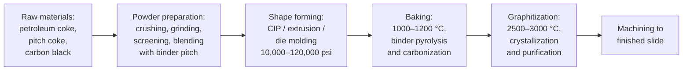
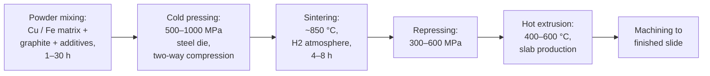
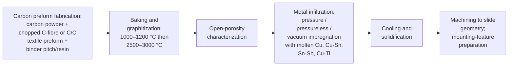
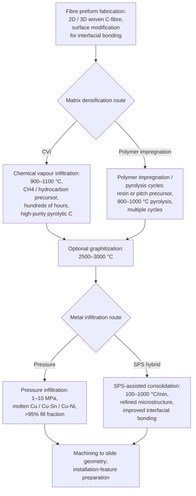
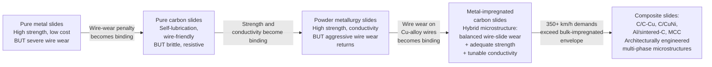

# Technical Review of Material Technologies for High-Speed Railway Pantograph-Catenary Systems: Contact Wires and Pantograph Slides
# 1 Introduction: The Pantograph-Catenary System and the Strategic Role of Consumable Materials

The continuous expansion of high-speed rail (HSR) networks across Asia, Europe, and emerging markets has transformed the railway from a 19th-century mass-transport system into what is widely described as the "transport mode of the future." Yet behind every commercial service running at 300 km/h or above lies an electromechanical interface of deceptive simplicity: a roof-mounted pantograph sliding against a thin copper-alloy wire suspended overhead, charged at 15 kV or 25 kV AC, transferring the megawatts of traction power required to propel an 8-to-16-car trainset. The reliability, efficiency, and ultimate speed ceiling of HSR depend on this single sliding contact, and the two consumable materials that form it — the **catenary contact wire** and the **pantograph collector strip (slide)** — are therefore among the most strategically critical components of the entire railway system. This introductory chapter establishes the analytical framework for the technical review that follows, defining the physical principles, the multi-dimensional service requirements, the key performance indicators (KPIs), and the rationale for treating contact wires (Part A) and pantograph slides (Part B) as an inseparable tribo-electrical pair whose material properties must be co-optimized.

## 1.1 Background and Strategic Context of High-Speed Rail Electrification

High-speed rail was born in 1964 with the commissioning of the Tokaido Shinkansen between Tokyo and Shin-Osaka, operating initially at 210 km/h on a brand-new 1,435 mm standard-gauge line powered at 25 kV AC[^1]. France followed in 1981 with the Paris–Lyon TGV at 260 km/h, and over the following four decades Germany, Italy, Spain, Belgium, the United Kingdom, the Netherlands, South Korea, Taiwan, Turkey, Morocco, and Saudi Arabia progressively joined what the International Union of Railways (UIC) calls the "high-speed club"[^1]. The most spectacular expansion has been in China, which, starting from the 120-km Beijing–Tianjin line commissioned in August 2008, deployed more than 20,000 km of new high-speed lines and over 1,200 trainsets within a decade, eventually taking the global lead in both network length and passenger volumes[^1]. By 2018 the global high-speed network exceeded 45,000 km, with more than half located in Asia[^1].

This expansion has been accompanied by a steady escalation in design and operating speeds. UIC formally defines HSR using a principal commercial-speed criterion of 250 km/h, although in specific contexts (medium distances without air competition, very long tunnels) the threshold may be relaxed to 200–230 km/h[^1]. The most recent infrastructure projects are designed for 350 km/h and even 400 km/h, with rolling stock certified at 110% of the targeted operating speed[^1]. World speed records have already reached 574.8 km/h (TGV, 2007) on conventional wheel-rail systems[^1], and expert analyses converge on an ultimate optimum commercial speed for steel-on-steel HSR in the 500–550 km/h range, with the principal limiting factors identified as **aerodynamics, aerodynamic noise, and the electrical contact between pantograph and catenary**[^1]. The last of these — the current-collection interface — is precisely the domain in which contact wire and slide materials operate.

The strategic implication is direct: every increment of commercial speed amplifies the dynamic, electrical, and tribological loads at the sliding interface. Aerodynamic uplift, crosswind-induced catenary deflection, and contact-force fluctuations all intensify with speed, and turbulence intensities above 15% have been shown to drive catenary uplift beyond safety thresholds in wind-tunnel and finite-element studies[^2]. At the same time, modern rail networks operate under tighter performance and safety requirements, so that poor contact behaviour — manifested as electrical arcing, accelerated wear of carbon strips and contact wires, electromagnetic interference, or in the extreme case dewirement — translates rapidly into service disruption and elevated maintenance cost[^2][^3]. Material innovation in the two consumable components is therefore not a peripheral optimization but a precondition for the next generation of 350 km/h-class and 400 km/h-class services.

## 1.2 Working Principles of the Pantograph-Catenary Current Collection System

The pantograph-catenary system is the only electromechanical interface through which electrical energy is transferred from the fixed infrastructure to the moving train. The **pantograph** is a roof-mounted articulated assembly that carries a conductive sliding strip at its head, raised by pneumatic or spring force to maintain contact with the overhead wire[^2][^3]. The **catenary** comprises a horizontal contact wire suspended in tension from a parallel messenger (catenary) wire via vertical droppers, with periodic registration arms (steady arms) controlling lateral position and stagger to spread wear across the slide width[^2]. Together, the pantograph head and the catenary form a flexible mechanical coupling that must maintain uninterrupted electrical continuity at speeds approaching 1 km every 12 seconds[^1].

The dynamic interplay at this interface is fundamentally multi-physical. **Mechanically**, the contact force must remain within a narrow window: too little force causes loss of contact, arcing and power loss, whereas too much force accelerates mechanical wear of both the strip and the wire[^2][^3]. Small irregularities in wire height, span-to-span tension variations, droppers slack, or aerodynamic uplift can all produce fluctuations in contact force that propagate as oscillations along the catenary[^2]. In overlap sections where two catenary spans meet, dynamic modelling has shown that low crossing-point heights favour smooth interaction at sub-design speeds, while higher crossing points improve current-collection quality at top speed — emphasising the need for speed-adaptive damping strategies[^2]. **Electrically**, current passes from the messenger system through the contact wire and across the sliding interface into the pantograph; any momentary contact loss ignites an arc, whose UV and thermal radiation locally erodes both materials[^2][^3]. **Thermally**, the combination of frictional heating from sliding and Joule heating from current flow elevates the contact-spot temperature far above the bulk temperature of either component, accelerating oxidation, softening, and melt-wear[^4][^5].

Numerical modelling techniques such as multibody dynamics and nonlinear finite-element analysis are now routinely used to predict contact-force variation, assess structural damping, and evaluate control strategies for active pantographs[^2]. Field-side instrumentation typically combines force sensors, accelerometers, displacement transducers, infrared cameras for thermal monitoring of the contact interface, and UV sensors for arc detection, all synchronized through high-resolution data acquisition systems[^3]. The European testing framework codified in EN 50317 (measurement of dynamic interaction) and EN 50367 (interaction criteria) provides the internationally recognised reference for validating performance[^3]. Whatever the modelling and measurement sophistication, however, the actual current is transferred only across the **microscopic contact spots** between two materials — and it is the properties of those materials that ultimately determine the limits of the system.

## 1.3 Contact Wires and Pantograph Slides as Critical Consumable Components

Among all the elements of the catenary subsystem — masts, foundations, droppers, registration arms, messenger wires, insulators, sectioning equipment — only two are in direct sliding electrical contact, and only two wear continuously throughout operation: the **contact wire** itself, suspended overhead and slowly consumed from below by repeated pantograph passages, and the **pantograph slide (carbon strip)**, ground down from above by the same sliding action. All other components experience only static or quasi-static loading and have service lives measured in decades; the contact wire and slide, by contrast, are explicitly designed as consumables whose progressive thinning, eventual replacement, and intermediate inspection determine a substantial fraction of the operating cost and availability of an electrified line. Industry observations note that contact wires become thinner over time due to wear from the pantograph, with wear becoming more pronounced under abnormal conditions such as ice-breaking pantograph operation[^6].

The failure modes that originate at these two components are also among the most safety-critical in the entire railway system. Excessive thinning of the contact wire below its minimum cross-section threshold can lead to mechanical rupture under tension; fracture of a carbon strip during transit can produce dewirement and tear down kilometres of overhead line; arcing-induced pitting can locally degrade conductivity to the point of generating local hot spots and electromagnetic interference[^2][^3]. Because the strip and the wire form a single sliding pair, **wear is mutual and coupled**: a harder, more abrasive slide will protect itself but accelerate wire wear; a softer, more lubricating slide will spare the wire but consume itself rapidly. This coupling is the central reason why these two materials must be analysed together and why their selection has become a multi-decade engineering optimization problem rather than a routine procurement choice.

## 1.4 Multi-dimensional Service Requirements and Performance Trade-offs

The requirements that contact wire and pantograph slide materials must simultaneously satisfy are multi-dimensional, partly conflicting, and increasingly demanding as line speeds rise. They can be grouped into five categories.

**Electrical conductivity.** The contact wire must transmit traction currents of hundreds to over a thousand amperes with minimal voltage drop, requiring conductivity expressed as a percentage of the International Annealed Copper Standard (% IACS) that is as close to pure copper (≈100% IACS) as possible. Pantograph slides, although shorter conduction paths, must also conduct efficiently to limit Joule heating; experimental test rigs such as those at the China Academy of Railway Sciences accommodate currents up to 1,000 A and at Politecnico di Milano up to 1,400 A DC, reflecting realistic operating ranges[^5].

**Mechanical strength.** At HSR speeds the contact wire must be tensioned to high mechanical loads — often several tens of kilonewtons — to keep its sag low, maintain wave-propagation speed well above pantograph speed, and resist aerodynamic uplift[^2]. Higher tensile strength permits higher tension and therefore higher operating speed. EN 50149 defines the standardised mechanical and electrical characteristics for copper and copper-alloy grooved contact wires used in overhead lines, including tensile strength and percentage elongation after fracture[^7][^8]. Pure copper contact wire, while offering excellent electrical conductivity, suffers from limited mechanical strength and is poorly suited to the high tensions required at high speeds. Furthermore, its **softening temperature is low and its heat resistance is poor**, which restricts its use to ordinary railways operating below approximately 200 km/h. For higher-speed lines the engineering driver has been precisely the search for copper alloys that combine acceptable strength and softening resistance with adequate conductivity — exemplified by the Railway Technical Research Institute's demonstration of Cu-Cr-Zr precipitation-hardened wire, which achieved 550 MPa tensile strength and 78% IACS conductivity in laboratory and commercial-line trials[^9]. Consistent with this engineering logic, China's Qinshen High-Speed Railway and subsequent lines designed for 300 km/h and above have predominantly adopted **copper-magnesium alloy contact wire**, whose solid-solution strengthening provides the high tensile capacity required for high-tension catenary at those speeds while remaining environmentally benign relative to the legacy Cu-Cd alloys it succeeded.

**Wear resistance under combined mechanical and electrical loading.** Wear of the pantograph–catenary system is governed not by mechanical sliding alone but by the superposition of mechanical friction, Joule heating from current flow, and intermittent arc-energy input. Comprehensive reviews of wear performance distinguish several coexisting mechanisms — oxidation wear, melt wear, and adhesive wear — each with its own volumetric or depth wear-rate expression, and identify the principal influencing factors as contact force, electric current, arcing, ambient conditions (humidity in particular), and the materials of both partners[^5].

**Arc-erosion and thermal stability.** Arc events deposit concentrated thermal energy onto both surfaces; the contact-spot temperature can approach or exceed the melting point of the conducting material, driving localised melt-wear and oxidation. Materials must therefore exhibit good arc-erosion resistance and retain mechanical and electrical properties at elevated temperatures. Recent studies on carbon-strip surface temperature have shown that thermal state critically influences wear behaviour during pantograph-contact-wire current transmission[^4].

**Tribological compatibility.** Because the slide and wire form a coupled friction pair, the absolute tribological properties of each material matter less than the **combined behaviour of the pair**: low mutual wear, low and stable coefficient of friction, low contact resistance, and absence of catastrophic seizure or transfer-layer breakdown.

These five requirements are inherently in tension. Strength and conductivity in copper alloys are antagonistic: every alloying addition that strengthens the copper matrix (Sn, Mg, Cd, Ag, Cr-Zr precipitates) also scatters conduction electrons and lowers % IACS. Hardness and wire-friendliness are antagonistic on the slide side: hard powder-metallurgy strips conduct well but abrade copper wires aggressively, while soft carbon strips spare the wire but wear themselves rapidly and conduct poorly. Resolving these trade-offs is the central narrative of contact-wire and slide material development.

## 1.5 Key Performance Indicators and Evaluation Framework

To ensure a consistent technical comparison across the material families reviewed in subsequent chapters, this report adopts a unified set of KPIs. They are summarised in the table below, together with their typical units, the side of the friction pair to which they primarily apply, and the standardised references in which they are defined or measured.

| KPI | Unit | Primary applicability | Standard / typical measurement reference |
|---|---|---|---|
| Tensile strength | MPa | Contact wire (primary); slide (secondary) | EN 50149 (Table 4: tensile strength and elongation after fracture)[^8] |
| Percentage elongation after fracture | % | Contact wire | EN 50149; EN ISO 6892-1 tensile testing[^8] |
| Electrical conductivity / resistivity | % IACS / Ω·m | Both | EN 50149 (max. resistivity, Table 2; resistance per km, Table 3); IEC 60468[^8] |
| Hardness | HV / HB | Both (surface contact) | Standard hardness tests; relevant to real contact area |
| Volumetric / mass wear rate | mm³/km, mg/km | Both | Test-rig measurements at multiple institutions[^5] |
| Coefficient of friction (μ) | – | Friction pair | Test-rig measurements[^5] |
| Electrical contact resistance (Rc) | Ω | Friction pair | Test-rig measurements; ML predictive models[^2][^5] |
| Arc voltage / arc energy (Qarc) | V / J | Friction pair | Wear models incorporating arc-energy term[^5] |
| Contact force (F, Fm) | N | Pantograph head | EN 50317 dynamic interaction testing[^3] |
| Softening / recrystallisation temperature | °C / K | Contact wire (heat resistance) | Materials property data |
| Service life / replacement interval | km or years | Both | Field operational data |

These indicators are not merely tabulated quantities; they are linked by physically grounded wear models reviewed in the literature. Mechanism-based models partition the volumetric wear rate into oxidation, melt, and adhesive components, each with its own dependence on contact force F, current Ic, sliding speed V, surface roughness Ra, and arc energy[^5]. Heuristic wear models, by contrast, fit experimental data with functional forms involving reference values F0 and I0 and weight coefficients k1, k2, k3, providing tractable expressions for engineering use[^5]. More recently, machine-learning algorithms — random forest, support vector regression, and neural networks — have been applied to predict the electrical contact resistance of carbon and metal sliding interfaces after wear, trained on operational load, sliding velocity, displacement amplitude, and surface roughness data[^2]. These predictive tools enable rapid assessment of wear effects and inform proactive maintenance scheduling.

Experimental KPIs are measured on dedicated pantograph-catenary wear rigs whose parameter ranges define the practical envelope explored in the literature. A representative comparison of leading institutional test rigs is given below.

| Institution | Normal force (N) | Force control | Current (A) | Speed (km/h) | Stagger (mm) | Ambient control |
|---|---|---|---|---|---|---|
| Nottingham Trent University | 1–250 | Tilting arm weight balance | 0–300 (DC/AC 50 Hz) | 50–250 | – | – |
| Liaoning Technical University | 0–200 (0–20 Hz) | Voice coil motor | AC 0–800 | 0–350 | Unknown | – |
| China Academy of Railway Sciences | – | Pantograph airbag | 0–1000 | 0–500 | ±350 (max 2 g) | Air cooling of collector strip |
| Southwest Jiaotong University | 10–300 | Electric servo mechanism | AC 10–800 / DC 0–700 | 0–400 | ±110 (0.3–3 Hz) | Ambient humidity control |
| Politecnico di Milano | 50–110 | Hydraulic system | AC 400 (16.67 Hz)/AC 350 (50 Hz)/DC 1400 | 0–220 | ±300 | Air cooling of collector strip |

[^5]

The diversity of force ranges, current types, speed envelopes, and ambient controls makes clear that no single test condition can capture the full operating regime; cross-comparison between studies must therefore account for the rig parameters under which the data were generated. Throughout the subsequent chapters, KPI values are reported in this context.

## 1.6 The Tribo-Electrical Friction Pair: Rationale for a Paired Analysis of Part A and Part B

A central thesis of this review is that **the contact wire and the pantograph slide cannot be evaluated in isolation**. They are mechanically and electrically conjugate elements of a single tribo-electrical pair, and their performance is determined jointly. Two consequences follow.

First, the **choice of wire material constrains the optimal choice of slide material**, and vice versa. A copper-magnesium contact wire with high tensile strength and moderate conductivity (typical of Chinese 300 km/h-class lines) operates against a different optimal slide than a pure copper wire used on a 160 km/h commuter line. A precipitation-hardened Cu-Cr-Zr wire, harder and more wear-resistant than pure copper, demands a slide that does not transfer its own hardness back into accelerated wire wear. Conversely, a soft, self-lubricating pure carbon slide tolerates softer wires and lower current densities, whereas a metal-impregnated carbon strip carrying 1,000 A at 350 km/h requires a wire alloy that resists arc erosion and thermal softening.

Second, the **performance metrics of the pair are coupled**: contact resistance depends on both partners' resistivities and surface conditions; wear rates of each component depend on the hardness, lubricity, and arc behaviour of the other; even the optimal contact force window depends jointly on the mechanical compliance of the slide and the local stiffness of the catenary. Material-science reviews of the pantograph-catenary system therefore consistently treat wear, arc behaviour, and contact resistance as **system-level outcomes** rather than properties of individual materials[^5].

This rationale justifies the parallel Part A / Part B structure adopted in the following chapters. Each material family is analysed individually for its composition, manufacturing, properties, and applicable speed regime, but the report culminates in Chapter 8 with an integrated analysis of pair compatibility — examining, for example, how a Cu-Ag wire matches with metal-impregnated carbon strips on European HSR networks, or how Cu-Mg wires are deployed with composite slides on Chinese 350 km/h lines.

## 1.7 Scope, Structure, and Roadmap of the Report

The scope of this technical review is deliberately bounded. It focuses on the **materials science and engineering of contact wires and pantograph slides** in HSR applications, with information cut-off in early 2022. It does not attempt to review catenary geometry design, pantograph mechanical kinematics, active control strategies, signalling systems, or broader rolling-stock engineering, except where these directly inform material selection or performance interpretation. It also explicitly excludes consideration of the restricted source identified in the user requirements; no content from that source has been used.

The report is organised into nine chapters. The present **Chapter 1** establishes the analytical framework, KPIs, and rationale for paired analysis. **Part A — Catenary Contact Wire Materials**, comprising Chapters 2 to 4, reviews five copper and copper-alloy material families in order of increasing strengthening sophistication: Chapter 2 covers pure copper (Cu-ETP, Cu-OF, Cu-HCP, Cu-FRHC) and copper-silver (Cu-Ag) alloys, representing the work-hardening and trace-alloying families optimised for conductivity; Chapter 3 covers the solid-solution-strengthened Cu-Sn and Cu-Mg alloy families, dominant on the Japanese Shinkansen and on Chinese and European 300+ km/h lines respectively; Chapter 4 covers the precipitation-hardened Cu-Cr-Zr alloy as the frontier material for 400 km/h-class operation and provides a comparative synthesis of all five families in a unified table covering tensile strength (MPa), conductivity (% IACS), application countries, and applicable speed level (km/h).

**Part B — Pantograph Slide Materials**, comprising Chapters 5 to 7, reviews the evolution of slide materials in chronological order: Chapter 5 covers pure carbon and powder-metallurgy (sintered metal) slides as the two earliest generations; Chapter 6 covers metal-impregnated carbon slides as the dominant current solution for HSR; Chapter 7 covers advanced composites (C/C-Cu, C/CuNi, Al/sintered-carbon, resin-bonded systems) as the frontier of slide technology and synthesises Part B in a comparison table covering main advantages, main disadvantages, and application areas.

**Chapter 8** integrates Parts A and B by analysing pair compatibility and identifying open technical challenges (arc erosion, high-current wear, humidity sensitivity, cost, environmental sustainability) along with anticipated R&D directions. **Chapter 9** consolidates the findings into engineering-selection recommendations stratified by speed class (≤200 km/h, 200–300 km/h, 300–350 km/h, >350 km/h), discusses the limitations of the present review, and proposes directions for further investigation.

With this analytical framework, KPI set, and paired-analysis rationale established, the report now turns in Chapter 2 to the first material family on the contact-wire side: pure copper and the copper-silver alloys that pioneered the era of electrified rail traction.

# 2 Part A-1: Pure Copper and Copper-Silver (Cu-Ag) Contact Wires

Having established in Chapter 1 the multi-physical framework governing the pantograph-catenary interface — and in particular the inherent antagonism between mechanical strength, electrical conductivity, and softening resistance in copper-based conductors — the analysis now turns to the materials that historically defined, and in significant measure still define, the lower end of the speed-class spectrum for electrified rail traction. **Pure copper** and **copper-silver (Cu-Ag 0.1)** alloy contact wires represent the two oldest, most conductivity-prioritized families of catenary conductors. Together they form the technological baseline from which every higher-strength alloy reviewed in Chapters 3 and 4 departs: pure copper offers near-theoretical electrical performance but cannot sustain the tensile loads required above ~200 km/h, while the dilute Cu-Ag 0.1 alloy preserves that conductivity advantage almost untouched and gains the thermal stability needed for sustained current density at speeds up to approximately 250–300 km/h. This chapter examines the metallurgy, standardized properties, manufacturing routes, performance trade-offs, and deployment patterns of both families, thereby establishing the reference against which the solid-solution-strengthened Cu-Sn and Cu-Mg alloys (Chapter 3) and the precipitation-hardened Cu-Cr-Zr alloy (Chapter 4) will be compared.

## 2.1 Pure Copper Contact Wires: Grades, Metallurgy, and Work-Hardening Strengthening

The European standard EN 50149:2012 — which specifies the characteristics of copper and copper-alloy grooved contact wires of 80, 100, 107, 120, and 150 mm² nominal cross-section for use in overhead electric-traction lines — recognizes four principal grades of non-alloyed copper for contact wire applications: **Cu-ETP** (electrolytic tough pitch copper), **Cu-FRHC** (fire-refined high-conductivity copper), **Cu-HCP** (phosphorus-deoxidized high-conductivity copper), and **Cu-OF** (oxygen-free copper)[^10][^11][^12]. The chemical composition of each grade is tightly controlled. Cu-ETP and Cu-FRHC are specified at a minimum copper content of 99.90 wt%, while the deoxidized variants Cu-HCP and Cu-OF require ≥99.95 wt% Cu; bismuth is held below 5 ppm in Cu-ETP, Cu-HCP, and Cu-OF; lead below 50 ppm in Cu-ETP; oxygen below 40 ppm in Cu-ETP and Cu-FRHC; phosphorus and oxygen are jointly limited in Cu-HCP and Cu-OF to preserve conductivity[^10].

The metallurgical distinctions between these grades are functional rather than ornamental. **Cu-ETP** (UNS C11000) is produced from electrolytically refined cathode copper and contains a small but controlled level of oxygen (typically 0.02–0.04 wt%) that scavenges sulfur and other residual impurities into copper oxide inclusions, leaving the matrix essentially pure and yielding conductivity in excess of 100% IACS[^13]. **Cu-FRHC** is produced by fire-refining anode copper to a similar oxygen window without the electrolytic step; it is metallurgically comparable to Cu-ETP but is distinguished by slightly different sulfur and impurity tolerances. **Cu-HCP** is phosphorus-deoxidized — phosphorus replaces oxygen as the deoxidizer while being held to a very low residual level — making the material more suitable for processes where hydrogen embrittlement risk would otherwise exist, but still preserving high conductivity. **Cu-OF** is induction-melted under a non-oxidizing graphite-bath cover and protective reducing atmosphere, producing copper with oxygen levels low enough that no residual deoxidizer is required[^13].

Because non-alloyed copper presents no second-phase or solid-solution strengthening, **cold working — specifically cold drawing through a sequence of dies — is the only strengthening route available**. During multi-pass drawing, the equiaxed cast or hot-rolled grain structure is elongated along the drawing axis into a fibrous <111>+<100> texture, while the dislocation density rises by several orders of magnitude. The tensile strength of the hardest cold-drawn temper is approximately twice that of the annealed temper, and the yield strength rises by a factor of five to six[^13]. This work-hardening capacity, however, is intrinsically bounded: once the dislocation density saturates, no further strengthening is possible without resorting to alloying or thermomechanical processing routes more sophisticated than simple drawing. The metallurgical starting point of contact-wire technology therefore embodies an unavoidable tension between purity (which maximizes conductivity but yields a soft matrix) and deformation (which strengthens the wire but cannot raise the tensile strength beyond a ceiling that, as the next subsection will show, sits well below the requirement of high-speed catenary).

## 2.2 Mechanical and Electrical Properties of Pure Copper Wires under EN 50149

The standardized property envelope of pure copper contact wires is fixed by EN 50149:2012 in tabular form. The salient values, drawn from manufacturer compilations that reproduce the standard, are summarized below for the principal sections.

| Grade | Section (mm²) | Min. tensile strength (MPa) | Min. elongation after fracture (%) | Max. resistivity at 20 °C (10⁻⁸ Ω·m) | Conductivity (% IACS, equivalent) |
|---|---|---|---|---|---|
| Cu-ETP / Cu-FRHC (normal strength) | 80 / 100 | 355 | 3 | 1.777 | ≈97 |
| Cu-HCP (normal strength) | 107 | 350 | 3 | 1.777 | ≈97 |
| Cu-OF (normal strength) | 120 | 330 | 3 | 1.777 | ≈97 |
| Cu-OF (normal strength) | 150 | 310 | 3 | 1.777 | ≈97 |
| Cu-ETP / Cu-FRHC (high strength) | 80 / 100 | 375 | 3 | 1.777 | ≈97 |
| Cu-HCP / Cu-OF (high strength) | 107 / 120 / 150 | 360 | 3 | 1.777 | ≈97 |

Source: EN 50149:2012 tabulation as published by Lamifil[^10].

Several observations follow. First, the **tensile strength of normal-strength pure copper contact wires lies in the range of approximately 310–355 MPa across all standardized sections**, while the high-strength variants reach up to 360–375 MPa[^10]. The strength decreases monotonically with increasing cross-section — from 355 MPa at 80–100 mm² to 310 MPa at 150 mm² for normal-strength grades — because larger sections accumulate less true strain during the final cold-drawing passes. Second, the **minimum elongation after fracture is held at 3% for normal-strength grades and 8% for high-strength grades** in the high-strength copper category of EN 50149[^10], reflecting the fact that work-hardened copper has consumed much of its uniform-elongation reserve. Third, the **maximum resistivity at 20 °C is specified at 1.777 × 10⁻⁸ Ω·m for all pure copper grades**, equivalent to a conductivity of approximately 97% IACS or higher in practice[^10]. Commercially drawn pure copper contact wire used on conventional electric rail with speeds below 200 km/h has been reported to exhibit conductivity of about **97.5% IACS** with ultimate strength below 300 MPa[^14], a benchmark that sets the reference performance point against which all alloyed contact wires are measured.

A fourth, equally consequential property is the **softening (recrystallization) temperature**. Pure copper softens at approximately **150–250 °C**, and crucially this temperature is *lowered further* by heavy deformation and high purity[^15] — precisely the two conditions that characterize a hard-drawn contact wire. Heavy cold drawing increases the stored deformation energy and provides nucleation sites for recrystallization, while removing impurities removes the very dragging effects that would have inhibited grain-boundary migration. The consequence is that under sustained Joule heating from high traction currents, and especially in the presence of arc-induced localized heating at the sliding interface, a heavily drawn pure copper contact wire is at risk of partial recrystallization, with associated drops in tensile strength and an acceleration of mechanical wear. **This poor softening resistance, coupled with the modest absolute tensile strength, is the single most important reason why pure copper is unsuitable for high-speed catenary applications.**

## 2.3 Speed Ceiling and Application Scope of Pure Copper Contact Wires

The mechanical and thermal limitations of pure copper translate directly into a speed ceiling. The physics governing the upper speed of pantograph-catenary interaction is encapsulated in the wave-propagation criterion: stable current collection requires that the train speed remain below approximately 70% of the transverse shear-wave velocity along the contact wire, $V_c = 3.6\sqrt{T/\rho}$, where $T$ is the wire tension and $\rho$ the linear mass density[^14]. Higher operating speeds therefore demand higher catenary tensions, which in turn require contact wires capable of sustaining higher mechanical stresses without exceeding a prudent safety margin against fracture or accelerated wear.

Historical practice on the German Deutsche Bahn Re250 catenary, applying a safety margin of approximately 2.8 against the tensile strength of the contact wire, sets the prestress of a 120 mm² Cu-Ag 0.1 grooved wire at 125 MPa — corresponding to roughly 36% of its tensile strength of about 350 MPa — for routine operation up to 250 km/h[^16]. Extrapolated to pure copper with normal-strength tensile capacity of 310–355 MPa, a comparable 2.8 safety factor would limit the allowable prestress to approximately 110–125 MPa, sufficient for ordinary railway operation but insufficient to provide the wave-propagation margin required for sustained 250 km/h running. Engineering analyses of pure copper contact wire performance reach the same conclusion: pure copper offers excellent electrical conductivity but **low strength, low softening temperature, and poor heat resistance, and is generally suitable for ordinary railways operating at speeds below approximately 200 km/h**[^14]. Industrial supplier literature confirms this positioning, noting that "non-alloyed Cu offers the best possible conductivity, and is typically used in contact wires for tramways and conventional railway lines but is most appropriate for auxiliary conductor and feeder cables"[^17].

The application scope of pure copper contact wires therefore comprises:

- **Conventional electrified main-line railways** with maximum speeds below 200 km/h, where the principal design constraint is conductivity and Joule loss rather than wave-propagation speed. Indian Railways, for example, procures hard-drawn pure copper trolley and contact wire under the RDSO AIL-ETI-OHE-76-6-97 specification (and previously IS 3476:1986) for its electrified network[^17].
- **Tramways and urban rail (light rail / metro) systems**, which typically operate at speeds well below 100 km/h on DC traction supplies; pure copper provides ample mechanical capacity and excellent current-carrying performance at the relevant tensions.
- **Auxiliary feeder, jumper, span, and anti-creep conductors** within the broader catenary system, where pure copper's superior conductivity is desirable and where mechanical loading is static or quasi-static rather than dynamic[^17].
- **North American conventional rail and trolley applications**, served by ASTM B47 and ASTM B9 conformant Cu-ETP contact wires in cross-sections from AC 80 to 350 MCM, as supplied by manufacturers such as Nexans[^18].

In all of these contexts, the engineering trade-off favors conductivity over strength, and the operating speed places no demand on the wire that pure copper cannot meet. Beyond approximately 200 km/h, however, the combination of higher tensions, higher continuous currents, and stricter pantograph-uplift tolerances renders pure copper inadequate. The historical and ongoing engineering response to this limit takes the form of dilute alloying — and the first, and most conservative, of those responses is the addition of trace silver.

## 2.4 Copper-Silver (Cu-Ag 0.1) Alloy: Composition, Strengthening Mechanism, and Softening Resistance

The Cu-Ag 0.1 alloy used in EN 50149 contact wires contains **0.08–0.12 wt% silver** in a balance of copper, with impurity controls (Bi ≤ 5 ppm, O ≤ 400 ppm, Pb ≤ 40 ppm) essentially identical to those for the pure copper grades[^10]. Equivalent designations include the European CW013A and CW014A (CuAg 0.04 / CuAg 0.1), UNS C10700/C10800, and JIS C1070/C1080[^19]. The principal metallurgical purpose of this small silver addition is **not bulk strengthening but the stabilization of the work-hardened substructure against thermal recovery and recrystallization**.

The mechanism is well understood within the wider copper-alloy literature. Silver, present at concentrations far below its room-temperature solid-solubility limit in copper, remains in solid solution and partitions preferentially to dislocation cores and to grain and subgrain boundaries, where it exerts a solute-drag effect on boundary migration. This drag effect raises the temperature at which recovery and recrystallization occur during prolonged heating or transient Joule excursions. The Total Materia compilation explicitly classifies Cu-Ag alloys among the **"anneal-resistant coppers"**, noting that "addition of small amounts of elements such as silver and cadmium to deoxidized copper increase resistance to softening at times and temperatures encountered in soldering operations such as those used to join components of automobile and truck radiators" and that "the thermal and electrical conductivity of copper are relatively unaffected by small amounts of either silver or cadmium"[^13]. Independent metallurgical reviews confirm that trace silver delays recrystallization and that, while the softening temperature of pure copper is 150–250 °C and is further depressed by large deformation and high purity, silver-bearing copper retains its strength to substantially higher temperatures[^15].

Quantitatively, commercial Cu-Ag product data place the **softening temperature of Cu-Ag alloys in the range of approximately 250–400 °C, materially higher than the ~200 °C typical of ETP copper**, while maintaining electrical conductivity of 95–102% IACS depending on silver content and temper[^19]. The corollary benefit for catenary service is twofold. First, the wire tolerates higher continuous current density on DC lines without the risk of progressive softening and accelerated wear, a property explicitly identified in industrial supplier literature: Cu-Ag alloy "offers electrical and mechanical characteristics similar to copper, but has better thermal stability. This allows higher over-current on DC lines, without increasing the wear on the contact wire"[^17]. Second, transient arc-induced heating at the sliding interface — a routine event during high-current pantograph operation — does not progressively degrade the wire's tensile capacity over the service life, providing a more predictable wear regime against carbon-based pantograph strips.

The strengthening contribution from silver itself, however, is **modest**. Because the alloy contains only ~0.1 wt% Ag, the solid-solution strengthening increment is small; the mechanical capacity of a Cu-Ag 0.1 contact wire derives primarily from cold work, just as in pure copper, with the silver acting to *preserve* the work-hardened state during service rather than to substantially augment it. This is the central engineering proposition of the Cu-Ag family: **a conductivity-priority alloy that buys thermal stability at the cost of approximately one to two percentage points of conductivity, with only a marginal direct strength gain**.

## 2.5 Mechanical, Electrical, and Tribological Performance of Cu-Ag Contact Wires

The standardized property envelope of Cu-Ag 0.1 contact wires under EN 50149:2012, drawn from the same tabulation as the pure copper grades, is summarized below.

| Strength category | Section (mm²) | Min. tensile strength (MPa) | Min. elongation after fracture (%) | Max. resistivity at 20 °C (10⁻⁸ Ω·m) |
|---|---|---|---|---|
| Normal-strength Cu-Ag 0.1 | 80 | 365 | 3 | 1.777 |
| Normal-strength Cu-Ag 0.1 | 100 | 360 | 3 | 1.777 |
| Normal-strength Cu-Ag 0.1 | 107 | 350 | 3 | 1.777 |
| Normal-strength Cu-Ag 0.1 | 120 | 350 | 3 | 1.777 |
| Normal-strength Cu-Ag 0.1 | 150 | 350 | 3 | 1.777 |
| High-strength Cu-Ag 0.1 | 80 | 375 | 8 | 1.777 |
| High-strength Cu-Ag 0.1 | 100 | 375 | 8 | 1.777 |
| High-strength Cu-Ag 0.1 | 107–150 | 360 | 8 | 1.777 |

Source: EN 50149:2012 tabulation as published by Lamifil[^10].

Several features warrant emphasis. The **tensile strength of normal-strength Cu-Ag 0.1 contact wires falls in the range of approximately 350–365 MPa**, only marginally higher than that of the corresponding pure copper grades and confirming that the silver addition delivers improvement in mechanical properties that is **limited in absolute magnitude**. The 120 mm² normal-strength Cu-Ag 0.1 wire that has historically served as the reference conductor on the Deutsche Bahn Re250 catenary is specified at a minimum tensile strength of **350 MPa**[^10][^16], a value that has become the de facto European benchmark for medium-to-high-speed catenary. **The maximum resistivity at 20 °C remains 1.777 × 10⁻⁸ Ω·m, identical to that of pure copper grades**[^10], corresponding to a conductivity of approximately **96.5% IACS** — essentially unchanged from pure copper and confirming the conductivity-priority character of the alloy family.

The historical German engineering record provides the most authoritative single-line summary of how these properties translate into operating-speed capability. The Cu-Ag 0.1 alloy used for the 120 mm² grooved contact wire of the Deutsche Bahn Re250 standard catenary exhibits a tensile strength $R_m$ of approximately **350 MPa** and a conductivity $\kappa$ of approximately **95% IACS** (95% of annealed pure copper per the International Annealed Copper Standard)[^16]. The wire is designed for routine operation at speeds up to **250 km/h**, and is prestressed at 125 MPa — about 36% of its tensile strength — corresponding to a safety margin against fracture of approximately 2.8[^16]. For high-speed test runs above 400 km/h, this prestress was temporarily raised to 175 MPa, still within the safety envelope of the alloy[^16]. The same source notes that, by contrast, sustained operation above 300 km/h would require a contact-wire prestress of up to 200 MPa, which under the same 2.8 safety margin implies a minimum tensile strength of approximately 500 MPa — a value that Cu-Ag 0.1 cannot deliver and that, as a result, has driven the development of the higher-strength alloy families analyzed in Chapters 3 and 4[^16].

On the tribological side, the enhanced softening resistance of Cu-Ag confers a measurable reduction in wire-side wear when sliding against carbon-based pantograph strips. Industrial supplier literature highlights this effect, noting that the alloy's better thermal stability translates directly into reduced wear under sustained current load[^17]. From a system-engineering perspective, this property aligns Cu-Ag wires particularly well with metal-impregnated carbon strips (analyzed in Chapter 6), forming the dominant European HSR friction pair for the first generation of 250–300 km/h commercial service.

## 2.6 Manufacturing Routes for Pure Copper and Cu-Ag Contact Wires

The industrial manufacturing of both pure copper and Cu-Ag 0.1 contact wires follows a common process chain, distinguished mainly by feedstock-preparation details. The principal steps are:

1. **Continuous casting** of copper (vertical or horizontal) from an electrolytically or fire-refined feedstock, producing a continuous bar typically 20–30 mm in diameter or rectangular billets suitable for downstream rolling.
2. **Hot rolling or cast-rolling** to a wire rod of intermediate diameter, sometimes performed as a single continuous "casting–rolling" operation immediately following melting[^16].
3. **Multi-pass cold drawing** through grooved dies, each pass producing a small cross-sectional reduction (typically 20–25% per stage), with the final passes producing the standardized profile.
4. **Profile formation**: the standardized circular or flat lower-surface profile and the symmetric trapezoidal clamping grooves (Type A or Type B per EN 50149) are imposed in the final passes, together with any identification grooves required to distinguish the alloy family[^10][^12].

Nexans, one of the principal global suppliers, manufactures contact wires from Cu-ETP, CuMg0.2, CuSn0.2, and CuAg0.1 alloys, marketing both ASTM-standardized products (ASTM B47, ASTM B9) for North American conventional rail and European EN 50149 products for European HSR and conventional networks, and emphasizing that continuous copper casting and contact-wire drawing under a single integrated process flow allow full property control "along the transformation process, from raw materials to the finished product"[^18]. Lamifil supplies EN 50149-conformant wires in the full 80–150 mm² section range, and APAR Industries provides equivalent products for the Indian and international markets under both EN 50149 and the RDSO specification[^17][^10].

The **identification grooves prescribed by EN 50149** provide an unambiguous visual marker of the alloy family during installation and maintenance. Contact wires made of pure copper (Cu-ETP and equivalent) **carry no identification grooves**, while Cu-Ag wires are marked by **two identical identification grooves on the upper lobe** of the wire profile[^17][^10]. This labeling convention reflects the historical primacy of the pure copper and Cu-Ag families in the EN 50149 catalog.

A noteworthy frontier development at the time of this review concerns the application of **severe plastic deformation (SPD) techniques** to pure copper, with the explicit aim of overcoming the conventional strength-conductivity trade-off. A 2021 demonstration by Mao et al. employed **rotary swaging** at room temperature to produce a pure copper wire with directionally optimized microstructure — long ultrafine grains aligned along the wire axis and dominated by low-angle grain boundaries[^14]. The as-swaged wire exhibited a yield strength exceeding 450 MPa with a conductivity of 97% IACS, and subsequent controlled annealing prior to recrystallization swept dislocations from the conduction channels, raising the conductivity to **103% IACS while preserving a yield strength above 380 MPa**[^14]. Compared to commercial drawn pure copper wire (ultimate strength <300 MPa, conductivity 97.5% IACS), this represented approximately a 50% increase in strength at comparable conductivity in the as-swaged state, and a significant net conductivity improvement after annealing[^14]. The authors explicitly framed their results as offering a "large space" for the further enhancement of existing Cu-Ag, Cu-Mg, Cu-Sn, and Cu-Cr-Zr contact-wire alloys[^14]. While SPD routes had not entered commercial-scale contact-wire production by early 2022, they signal a credible future direction for extracting additional performance from the pure copper and dilute-Cu-Ag baseline.

## 2.7 Deployment on European High-Speed Networks and Comparative Positioning

The Cu-Ag 0.1 alloy is most strongly associated with the **first commercial generation of European high-speed catenary**. The Deutsche Bahn **Re250 standard catenary** uses a 120 mm² grooved Cu-Ag 0.1 contact wire as its principal conductor, prestressed at 125 MPa for routine 250 km/h operation, and this configuration has been the workhorse of the German ICE network on Re250-equipped lines[^16]. Cu-Ag wires were also adopted on segments of the French TGV network and on conventional European mixed-traffic lines upgraded for 200–250 km/h operation, providing a unified European solution for medium-to-high-speed traction at the time when sustained operation above 300 km/h was not yet a routine commercial requirement.

The continuing role of pure copper, by contrast, is concentrated in **lower-speed market segments**: Indian Railways and other Asian and Middle Eastern conventional networks under RDSO and similar specifications[^17]; tramway and urban-rail systems across Europe, North America, and Asia; and auxiliary feeder, jumper, and span-wire applications in essentially all electrified networks regardless of main-line speed class[^18][^17]. Together, these two families — pure copper for conventional and auxiliary applications, Cu-Ag 0.1 for medium-to-high-speed main lines — established the conductivity-prioritized baseline that dominated the first three decades of commercial electrified rail-traction conductor practice.

The positioning of Cu-Ag in the broader contact-wire technology landscape can be summarized as follows. Cu-Ag is a **"conductivity-priority, moderate-strength" solution**: it preserves the near-100% IACS conductivity of pure copper, adds thermal stability sufficient to suppress softening at the temperatures encountered during sustained high-current operation, and offers a tensile strength of approximately 350–375 MPa that supports operation up to approximately 250 km/h under conventional safety margins, with limited extension toward 300 km/h on specific networks. **The mechanical limit of approximately 350 MPa is, however, fundamental** — the alloying mechanism is solute drag on substructure boundaries, not bulk strengthening — and operating speeds materially above 300 km/h require alloy families that engage stronger metallurgical mechanisms: solid-solution strengthening with tin or magnesium (Chapter 3) and precipitation hardening with chromium and zirconium (Chapter 4). The transition from Cu-Ag to these alternatives is therefore not a competitive displacement but a sequential progression along the strength-conductivity trade-off curve, driven by the steady escalation of commercial design speeds and validated by the established practice of European, Japanese, and Chinese high-speed operators. Chapter 3 takes up the next step in this progression: the solid-solution-strengthened Cu-Sn alloys dominant on the Japanese Shinkansen and the Cu-Mg alloys deployed across the Chinese and European 300+ km/h networks.

# 3 Part A-2: Copper-Tin (Cu-Sn) and Copper-Magnesium (Cu-Mg) Solid-Solution Strengthened Contact Wires

Chapter 2 closed with a precise statement of the metallurgical limit reached by pure copper and the dilute Cu-Ag 0.1 alloy: a tensile strength ceiling of approximately 350–375 MPa, set by the saturation of work-hardening in a near-pure copper matrix, and a safety-margined prestress capacity that suffices for routine operation up to roughly 250 km/h on the German Re250 catenary but cannot underwrite the 200 MPa prestress that sustained commercial running above 300 km/h would demand. Crossing that threshold requires engagement of a stronger metallurgical mechanism, and the historically dominant industrial answer has been **solid-solution strengthening** through the substitutional addition of tin or magnesium to the copper matrix. Tin underpins the Japanese Shinkansen contact-wire tradition and a complementary line of European products, while magnesium has become the workhorse alloy for European 300+ km/h catenary and for the entire 300–350 km/h Chinese high-speed network. The two families together define the medium-to-high-speed segment of modern contact-wire practice, and their comparative analysis closes the solid-solution-strengthened plateau before the precipitation-hardened Cu-Cr-Zr alloys taken up in Chapter 4.

## 3.1 Solid-Solution Strengthening in Copper: Metallurgical Basis for Sn and Mg Additions

The metallurgical principle common to both alloy families is the dissolution of a substitutional solute — Sn or Mg — into the face-centred-cubic copper lattice at concentrations below the room-temperature solubility limit, producing a single-phase α-Cu solid solution. Each solute atom introduces a local elastic-misfit strain field, owing to the difference between its atomic radius and that of copper, and a modulus-misfit field, owing to the difference between its shear modulus and that of the matrix. Both fields interact with the strain fields of glide dislocations, raising the critical resolved shear stress required for plastic flow and translating directly into elevated yield and tensile strength of the drawn wire.[^20]

Tin and magnesium occupy distinct positions along the **strengthening-efficiency / conductivity-penalty trade-off**. Tin, at concentrations of 0.1–0.4 wt% typical of contact-wire grades, delivers a solid-solution strengthening contribution of approximately 50 MPa per 0.1 wt% Sn in copper, accompanied by a conductivity reduction of roughly 3 percentage points of IACS per 0.1 wt% Sn.[^21] Magnesium, at concentrations of 0.1–0.5 wt%, provides a comparable strengthening contribution per unit weight but with the further metallurgical benefit of substantially raising the recrystallization temperature of the cold-worked matrix. In commercial Cu-Mg wires, the addition of Mg in the range of 0.1 to 0.8 wt% allows the ratio of tensile strength to conductivity to be tuned with high precision, and "compared to copper, [Cu-Mg] in the work-hardened state is characterised by significantly higher strength, much better softening properties and excellent behaviour under reverse bending loads".[^22] The softening-resistance advantage of Mg is the metallurgical reason it has come to dominate the highest-speed segment of the market: under sustained Joule and arc-induced heating, a Cu-Mg wire retains its work-hardened strength to materially higher temperatures than either pure copper or dilute Cu-Ag.

Both alloying routes, however, are bound by the inescapable physics of substitutional alloying: **every solute atom that strengthens the matrix also scatters conduction electrons**. The Matthiessen rule formalizes this through additive electrical-resistivity contributions from the pure matrix, from each substitutional solute species, and from microstructural defects such as dislocations and grain boundaries.[^20] Solid-solution strengthening therefore sits one rung above pure copper and Cu-Ag on the strength–conductivity ladder, but the antagonism between the two properties becomes the dominant design constraint at this level: any further strengthening through increased Sn or Mg content is purchased at a steepening conductivity penalty. This is the central engineering tension that defines the Cu-Sn and Cu-Mg families and that ultimately motivates the precipitation-hardened alternatives reviewed in Chapter 4.

## 3.2 Copper-Tin (Cu-Sn) Contact Wires: Composition, Properties, and the Shinkansen Application

The Cu-Sn contact-wire family centres on dilute compositions in the range of approximately 0.1–0.4 wt% Sn (with grades commonly designated CuSn0.1, CuSn0.2, and CuSn0.4), standardized under EN 50149 alongside the equivalent JIS specifications used in the Japanese supply chain. Manufacturers including Lamifil and Elcowire produce the full range, supplying contact wires "available in copper, copper-silver, copper-tin, copper magnesium and copper cadmium" with sections from 65 mm² up to 150 mm² and above, conformant to EN, NFC, DIN, UIC, BS, and ASTM specifications.[^23]

The principal engineering proposition of Cu-Sn is that tin **simultaneously raises tensile strength, improves wear resistance against carbon-based pantograph strips, and enhances atmospheric corrosion resistance** at the cost of a moderate but well-bounded reduction in conductivity. Industrial data for the EN 50149 CuSn0.2 grade quote a normal-conductivity electrical performance that, combined with the alloy's enhanced strength compared with pure copper, makes it suitable for catenary applications requiring sustained high tensile loading.[^24] At the engineering level, Cu-Sn wires are recognized for their balanced electrical and mechanical performance, with applications matched to the line type — "different sections or different alloys will be used depending on the type of lines such as heavy traffic, normal operation, high-speed lines" — and Cu-Sn is positioned by major suppliers as one of the standard alloy options across this spectrum.[^23]

Quantitatively, the Cu-Sn 0.2 alloy as developed in the Chinese contact-wire industry exhibits a **tensile strength of approximately 538 MPa and an electrical conductivity of 73.8% IACS**, suitable for speed classes up to 350 km/h, while Japanese Cu-Sn alloy contact wire historically deployed on the Shinkansen network exhibits a tensile strength of approximately **420 MPa with a substantially higher conductivity of about 85% IACS**, reflecting a lower Sn content and a process route optimized for conductivity priority. The French Cu-Sn-120 contact wire developed by La Farga and equivalent European suppliers exhibits a tensile strength of **537.5 MPa with a conductivity of 77.6% IACS**, and is engineered specifically for the 300–350 km/h speed class. The wider technological position of Cu-Sn contact wire is that it offers, relative to copper-silver alloy, **a simpler manufacturing process, a higher yield, and a lower price** — economic advantages that account for its sustained competitiveness against the more expensive Cu-Ag family despite the latter's conductivity advantage.

The deployment record of Cu-Sn contact wire on the Japanese Shinkansen network provides the most extensive operational validation of the alloy family at high speeds. Japan once achieved an operating speed of **300 km/h on lines equipped with copper-tin alloy contact wire**, demonstrating that Cu-Sn, despite its more modest tensile-strength figures relative to the high-Mg European alloys, is fully capable of supporting commercial high-speed service when paired with appropriately optimized catenary geometry and pantograph design. The most recent extension of this tradition is the new Shinkansen catenary system rolled out by East Japan Railway Company (JR East) on the Tohoku and Joetsu Shinkansen, developed jointly with the Railway Technical Research Institute (RTRI). The new system uses **two wires rather than three** — eliminating the auxiliary catenary wire of the conventional compound overhead-line equipment — and replaces the galvanized steel stranded catenary wire with a "high-strength but lightweight galvanised copper wire". Although suitable for existing 320 km/h operation, the system is also viable at **360 km/h through the use of a high-strength low-weight contact wire**, with the contact-wire tension increased from the conventional 39.2 kN to 53.9 kN to ensure that "the wave generated as the pantograph passes along the contact wire moves faster than the train".[^25] The roll-out covers a 45 km stretch between Ueno and Omiya, the 160 km section from Furukawa to Morioka on the Tohoku Shinkansen, and the 125 km section from Omiya to Honjo Waseda on the Joetsu Shinkansen.[^25] This deployment exemplifies the modern engineering philosophy of the Cu-Sn family: rather than chasing ever-higher alloy tensile strength, the system raises the wave-propagation safety margin through coordinated catenary-system redesign, exploiting the strength headroom of Cu-Sn-class alloys within an envelope that preserves their conductivity advantage.

## 3.3 Copper-Magnesium (Cu-Mg) Contact Wires: Composition Window from Cu-Mg 0.2 to Cu-Mg 0.5

The Cu-Mg family spans a standardized composition window from approximately **0.1 wt% to 0.5 wt% Mg**, organized commercially into a graded ladder of alloy variants that allows the strength–conductivity trade-off to be tuned to the specific demands of each application. The Sundwiger Messingwerk product catalogue, which is representative of the European supply chain, distinguishes five principal alloys: SD01 (CuMg0.1), SD02 (CuMg0.2), SD03 (CuMg0.3), SD04 (CuMg0.4), and SD05 (CuMg0.5), corresponding to the DIN-EN designations CW127C and CW128C and the UNS C18661 and C18665 numbers.[^22] The electrical and physical properties of these grades vary monotonically with Mg content: SD01 exhibits an electrical conductivity of 46.4 MS/m and a thermal conductivity of 310 W/(m·K), declining through SD02 (44.6 MS/m), SD03 (41.7 MS/m), and SD04 (37.1 MS/m) to SD05 (37.1 MS/m), all at a common density of 8.9 g/cm³.[^22] Expressed in % IACS, this range corresponds to approximately 80% IACS at the dilute end (CuMg0.1) and approximately 62% IACS at the high-Mg end (CuMg0.5).

| Alloy designation | DIN-EN | Electrical conductivity (MS/m) | Equivalent % IACS | Thermal conductivity (W/(m·K)) | Typical role |
|---|---|---|---|---|---|
| SD01 (CuMg0.1) | CW127C | 46.4 | ≈80 | 310 | Conductivity-priority dilute Cu-Mg |
| SD02 (CuMg0.2) | CW127C | 44.6 | ≈77 | 310 | Balanced strength/conductivity, telecom and contact wire |
| SD03 (CuMg0.3) | CW127C | 41.7 | ≈72 | 290 | Intermediate-strength contact wire |
| SD04 (CuMg0.4) | CW128C | 37.1 | ≈64 | 250 | High-strength contact wire |
| SD05 (CuMg0.5) | CW128C | 37.1 | ≈64 | 250 | High-speed contact wire (300+ km/h) |

Source: Sundwiger Messingwerk product catalogue.[^22]

Magnesium's metallurgical character makes the Cu-Mg family qualitatively different from Cu-Sn. The alloy is recognized as combining **high tensile strength, high wear resistance, high temperature softening resistance, and moderate electrical conductivity** — a combination explicitly identified in industrial literature as the reason Cu-Mg alloy contact wire has become the preferred material for high-speed railway catenary systems with operating speeds exceeding 300 km/h.[^26][^22] The role of magnesium is twofold: it provides solid-solution strengthening through atomic-misfit interactions with the FCC matrix, and it raises the recrystallization temperature of the cold-worked wire, preserving the work-hardened strength under prolonged Joule heating and transient arc-induced thermal excursions at the sliding contact. The result is a contact wire that not only tolerates higher prestress at installation but retains that strength reserve throughout decades of service.

The reference benchmark for Cu-Mg high-speed contact wire is the **RiM120 Cu-Mg 0.5 alloy** used in the German Re330 catenary system, which exhibits an ultimate tensile strength of approximately **490 MPa and an electrical conductivity of 62% IACS**.[^20][^27] This combination — substantially higher tensile strength than Cu-Ag (350–375 MPa) at a conductivity penalty of approximately 33 percentage points relative to pure copper — has become the reference performance point against which all subsequent high-speed contact-wire alloys are calibrated. As stated in the open metallurgical literature, the RiM120 Cu-0.5 Mg alloy is "the major undertaker of the contact wire materials applied in the high-speed railway with a speed higher than 300 km/h", and the family of Cu-Mg alloys has been "widely used as the high-speed railway contact wires in the past decades".[^20]

The standardized identification of Cu-Mg contact wire under EN 50149 and equivalent national specifications places it within a unified framework with the other alloy families reviewed in this report. Sundwiger Messingwerk explicitly catalogues correspondent standards for Cu-Mg railway applications including **EN 50149** ("Railway applications — Fixed installations, grooved contact wire made of copper and copper alloys"), **DIN 43140** (Contact wires, technical delivery conditions), **DIN 17666** (Low alloy wrought copper alloys), and the operator-specific specification **Ebs (DR-M) 25-45.020** ("Wrought copper-magnesium alloy contact wire, Technical delivery conditions, Overhead contact line Re 250 DR"), as well as DIN 48 200, 48 201, 48 203, and 48 300 for related conductor classes and NF C 34-110 for the French market.[^22] Wire delivery formats span square pre-rolled wire (5.1–7.4 mm), round wire (0.5–6.2 mm in rings, on crown sticks, spools, drums, and Acropaks, with diameters >6.2 mm available on request), contact wires in customer-specific lengths up to 1.5 km in drums, and stranded support cables.[^22] The format diversity reflects the integration of Cu-Mg into the full overhead-line conductor portfolio of European HSR networks.

## 3.4 Manufacturing, Environmental Substitution for Cu-Cd, and Industrial Suppliers

The industrial manufacturing chain for Cu-Mg contact wire follows the general copper-alloy conductor route described in Chapter 2 — continuous casting, hot rolling or cast-rolling to wire rod, and multi-pass cold drawing through grooved dies to the standardized EN 50149 profile — but with a critical metallurgical refinement at the melting stage. Because magnesium is highly reactive in molten copper, the melt must be **protected from oxidation by a non-oxidizing atmosphere**: industrial practice uses inert-gas (nitrogen or argon) blanketing of the induction furnace, and a graphite-tiegel / graphite-mould system for the cast strand to prevent the formation of magnesium oxide inclusions that would otherwise embrittle the wire and degrade its electrical performance.[^27] Patent literature describes the production of CuMg2.5-class material in a vacuum continuous-casting installation in which "the sample material was inductively melted under nitrogen atmosphere in a graphite crucible", with the melt then transferred through a controlled bottom-pour aperture to a graphite mould jacketed by water-cooled copper, producing continuous wire rod of 5 mm diameter and 2,500 mm length.[^27] Although the patent target was a higher-Mg precipitation-assisted variant (discussed below), the same melt-protection principle applies in dilute form to the standard 0.1–0.5 wt% Mg contact-wire alloys.

Beyond the conventional drawn-wire route, the patent literature documents an **advanced thermomechanical processing pathway** that exploits the precipitation potential of higher-Mg copper alloys. The DE10 2012 014 311 A1 method begins with a Cu-Mg base alloy containing **2.0 to 3.5 wt% Mg** — well above the room-temperature solubility limit of approximately 0.8 wt% — and prescribes a sequence of homogenization at 700–750 °C, cold work-hardening at temperatures up to 250 °C with a logarithmic strain of φₕ ≥ 0.7 (preferably 2.0–2.5), and precipitation annealing at 350–500 °C to nucleate fine Cu₂Mg precipitates on the deformation-induced dislocation substructure.[^27] The resulting material achieves a hardness HV1 of 192, a tensile strength of **654 MPa, and an electrical conductivity of approximately 55% IACS** (32 MS/m), representing a strength improvement of over 25% relative to the standard CuMg 0.5 (Valcond®) reference at only a marginal conductivity penalty.[^27] An independent novel Cu-0.29Mg-0.21Ca composition reported in 2017 — synthesized by non-vacuum melting, homogenized at 780 °C for 1 hour, cold-rolled by 80%, and annealed at 200 °C for 1 hour — achieved an ultimate tensile strength of **545 MPa, a yield strength of 526 MPa, and a conductivity of 71.79% IACS**, exceeding the comprehensive performance of the RiM120 Cu-0.5 Mg reference through the combined action of dispersion strengthening, solid-solution strengthening, sub-structure strengthening, and dislocation strengthening, with calcium additionally purifying the matrix through impurity-scavenging reactions.[^20] These advanced compositions illustrate the residual headroom available within the Cu-Mg framework when precipitation strengthening or matrix purification is added to the conventional solid-solution mechanism.

The **environmental and regulatory rationale for the Cu-Mg substitution of Cu-Cd** is one of the principal drivers of the alloy family's industrial adoption. Industrial supplier literature is explicit on this point: the Cu-Mg family of alloys "is used as a substitute for copper cadmium, which is already banned in many countries because of its toxic properties", and Cu-Mg products such as Sundwiger's SF02 are explicitly catalogued as cadmium-free "green alloys" that can be recycled without any problems.[^22] The historical Cu-Cd alloy had served as the principal high-strength contact-wire material on certain European networks, but its toxicity and the resulting end-of-life and occupational-exposure liabilities led to its progressive replacement; Cu-Mg, by combining comparable mechanical performance with non-toxic alloying chemistry, has become the principal beneficiary of this regulatory transition. The complementary lifecycle argument is reinforced by recent industrial data: Elcowire reports that by the end of June 2023 it had delivered more than 6,000 km of its Valthermo Cu-Mg-class products since the material's introduction in 2012, and that "according to a CO2 study, by using VALTHERMO with a 70-year lifespan instead of pure copper with only 25 years, the corresponding lifetime CO2 savings is as much as the emissions for one year in a European city with around 21,000 inhabitants".[^28]

The principal industrial suppliers of the Cu-Sn and Cu-Mg families collectively define the global production capacity for medium-to-high-speed catenary contact wire. **Elcowire** (Hettstedt, Germany / Helsingborg, Sweden) supplies the Valthermo Cu-Mg product line, developed in 2012, and has conducted a joint long-term wear-behaviour investigation with DB Netz and the Professur für Elektrische Bahnen of Technische Universität Dresden starting in 2020, the results of which were published in Elektrische Bahnen as a statistical evaluation of contact-wire wear (Bregulla, Aufschläger, Stephan, Pupke, Nickel; "Statistische Verschleißauswertung von Fahrdrahtwerkstoffen", *Elektrische Bahnen* 119 (2021), No. 7-8, pp. 282-290).[^28] **Lamifil** (Hemiksem, Belgium), with over 90 years of experience and more than 100,000 km of catenary wire installed in over 30 countries, supplies catenary wires in copper, Cu-Ag, Cu-Sn, Cu-Cd, and Cu-Mg, and has introduced **PowerFil**, "a next-generation alloy that can be used in multiple applications for railway electrification, such as messenger and contact wires", whose "properties outperform conventional CuMg alloys" and which "offers approximately 23% better resistance than standard CuMg 0,5 alloys", allowing operators to save up to €12,000/km during the lifetime of a messenger wire.[^23] **Sundwiger Messingwerk** (Germany) manufactures the SD01–SD05 grade range with delivery formats spanning square pre-rolled wire, round wire, contact wire, and stranded support cables, conformant to EN 50149, DIN 43140, and Ebs (DR-M) 25-45.020.[^22] Together with Nexans, La Farga Lacambra (Spain), and Asian suppliers, these manufacturers form the industrial base of the global Cu-Mg / Cu-Sn contact-wire supply.

## 3.5 Deployment on Chinese, European, and Other High-Speed Networks above 300 km/h

The operational deployment of Cu-Mg contact wire defines the dominant material standard for the world's principal 300+ km/h high-speed networks. In Europe, the German **Deutsche Bahn Re330 catenary system** has been the long-standing benchmark, using the RiM120 Cu-Mg 0.5 alloy at an ultimate tensile strength of approximately 490 MPa and an electrical conductivity of approximately 62% IACS, positioned by the open literature as "the major undertaker of the contact wire materials applied in the high-speed railway with a speed higher than 300 km/h".[^20] Sundwiger explicitly confirms that "in recent years, CuMg has gained more and more importance as a material for contact wires and suspension cables for high-speed trains", and that Cu-Mg has progressively displaced both the legacy Cu-Cd alloy and the lower-strength Cu and Cu-Ag families in this speed class.[^22]

In China, the engineering trajectory has converged on the same alloy family. **China's Qinshen High-Speed Railway and subsequent lines designed for speeds of 300 km/h and above mostly use copper-magnesium alloy contact wire**, with deployment extending to the Beijing-Tianjin Intercity, the Beijing-Shanghai, the Wuhan-Guangzhou, and the subsequent network of 300–350 km/h corridors that together constitute the largest single deployment of Cu-Mg-class catenary in the world. Independent confirmation of this convergence is provided in the open literature: "the Cu-Mg alloy has become the preferred material for contact wires of high-speed railway networks with speeds exceeding 300 km/h".[^26] The Chinese practice is consistent with the European benchmark in alloying chemistry but in some implementations adopts a higher-strength variant within the Cu-Mg composition window, exploiting the additional headroom available at Mg contents toward 0.5 wt% to support prestress levels in the 150–200 MPa range that 300–350 km/h commercial operation requires.

Operational evidence supports the long-term viability of these deployments. The Elcowire–DB Netz–TU Dresden joint investigation, initiated in 2020, gathered statistical wear data on Valthermo Cu-Mg contact wire across the full length of catenary spans by combining DB Netz's F5-inspection train data with a dedicated statistical evaluation programme developed at TU Dresden, and the published results validate the in-service wear behaviour for users and prospective adopters of the material.[^28] The Elcowire CO2 lifecycle analysis further documents a service life of up to **70 years for Cu-Mg contact wire versus 25 years for pure copper**, a factor-of-2.8 difference that captures both the alloy's superior wear resistance under combined mechanical and electrical loading and its softening-resistance margin against the higher continuous current densities of modern HSR.[^28]

The Cu-Sn family complements this deployment pattern by holding the high-speed market in Japan and a portion of the European and Indian markets where the economic advantages of Cu-Sn — simpler manufacture, higher yield, and lower price relative to Cu-Ag — outweigh the modest conductivity advantage of the silver-bearing alternative. The JR East / RTRI 360 km/h-capable catenary discussed in Section 3.2 exemplifies the modern Japanese approach: Cu-Sn-class wire is matched with a redesigned two-wire system at elevated tension (53.9 kN versus the conventional 39.2 kN) rather than displaced by a stronger but lower-conductivity alloy, preserving the alloy's traditional balance of properties within an envelope that has been re-engineered at the system level.[^25] Pairing implications with metal-impregnated carbon strips are anticipated in Chapter 8; the principal observation here is that both the Cu-Mg and Cu-Sn families have demonstrated mature multi-decade compatibility with the carbon-based collector strips that dominate the slide side of the friction pair.

## 3.6 Comparative Positioning of Cu-Sn and Cu-Mg within the Solid-Solution Family

The two solid-solution-strengthened alloy families occupy complementary, partially overlapping positions on the strength–conductivity Pareto frontier of contact-wire materials. The principal quantitative comparison, against the unified KPIs defined in Chapter 1, is summarized below for the representative grades in each family, with national variants where data are available.

| Alloy / national variant | Tensile strength (MPa) | Electrical conductivity (% IACS) | Softening behaviour | Applicable speed class (km/h) | Characteristic deployment |
|---|---|---|---|---|---|
| Cu-Sn (Japan, Shinkansen-class) | 420 | 85 | Improved over pure Cu | up to ≈300 (historical); 320–360 (new JR East system) | Tokaido / Tohoku / Joetsu Shinkansen[^25] |
| Cu-Sn (France, CuSn-120) | 537.5 | 77.6 | Improved over pure Cu | 300–350 | French HSR and European networks |
| Cu-Sn (China, CuSn0.2) | 538 | 73.8 | Improved over pure Cu | ≤350 | Chinese mixed-speed and HSR networks |
| Cu-Mg 0.2 (Sundwiger SD02) | ≈400–450 | ≈77 | Substantially raised recrystallization T | ≈250–300 | European/Asian conventional and HSR networks[^22] |
| Cu-Mg 0.5 / RiM120 (Re330) | ≈490 | ≈62 | Substantially raised recrystallization T | >300 | DB Re330; Chinese Qinshen and subsequent 300–350 km/h lines[^20] |
| Cu-Mg precipitation-assisted (CuMg2.5, patent) | ≈654 | ≈55 | High thermal stability | R&D / pilot | DE10 2012 014 311 A1[^27] |
| Cu-Mg-Ca novel (research, 2017) | 545 | 71.79 | Sub-structure strengthening dominant | R&D candidate | Research[^20] |
| Lamifil PowerFil (Cu-Mg-class next-generation) | undisclosed (≈23% better than CuMg 0.5) | undisclosed | high | 300+ | European/global HSR networks[^23] |

The table makes the **engineering trade-offs between the two families explicit**. Cu-Sn offers, in its Japanese implementation, **a substantially higher conductivity (≈85% IACS) at a more modest tensile strength (420 MPa)** — a combination preferred where catenary design and tension management can be optimized at the system level (the JR East/RTRI two-wire 53.9 kN catenary being the most recent example), and where the alloy's tribological compatibility against carbon strips and its corrosion resistance further reinforce its competitiveness. In its higher-Sn European and Chinese implementations (Cu-Sn 0.2/0.4 with tensile strengths up to ≈537–538 MPa and conductivities of 73.8–77.6% IACS), Cu-Sn matches or exceeds the mechanical performance of high-Mg variants at intermediate conductivity, exploiting the relatively simple manufacturing route and economic advantages of the alloy family. Cu-Mg, by contrast, dominates the **highest-strength end of the standardized window**: the RiM120 Cu-Mg 0.5 alloy at 490 MPa / 62% IACS underwrites the German Re330 and the Chinese 300+ km/h networks, with magnesium's additional softening-resistance contribution providing the thermal stability required for sustained high-current operation.

The wider technological position of the two families can therefore be summarized as a **complementary pair within the solid-solution plateau**: Cu-Sn for the Japanese tradition and for European/Chinese applications where simpler manufacturing and a higher-conductivity baseline are preferred, Cu-Mg for the European and Chinese 300+ km/h backbone where the highest tensile-strength reserve and softening resistance are mandatory, and a continuum of intermediate Sn or Mg contents available where the trade-off requires fine tuning. Both families share, however, the **fundamental ceiling imposed by substitutional alloying**: increased Sn or Mg content yields diminishing strength returns at a steepening conductivity penalty, and the precipitation-assisted Cu-Mg variants documented in the patent literature — although capable of exceeding 600 MPa tensile strength — incur conductivity penalties (down to ≈55% IACS) that erode the alloy's traditional advantage in current-carrying capacity. Crossing this ceiling without compromising conductivity requires engagement of a different metallurgical mechanism: **precipitation hardening**, in which the strengthening phase is removed from solid solution into discrete second-phase particles that strengthen the matrix without scattering conduction electrons in the bulk. The Cu-Cr-Zr alloy family that embodies this principle, and that has emerged as the frontier candidate for 400 km/h-class commercial operation, is the subject of Chapter 4.

# 4 Part A-3: Copper-Chromium-Zirconium (Cu-Cr-Zr) Contact Wires and Comparative Synthesis of Catenary Wire Materials

Chapter 3 closed at the metallurgical ceiling of substitutional alloying: the solid-solution-strengthened Cu-Sn and Cu-Mg families had pushed the tensile-strength envelope of standardized contact wire from the 350–375 MPa baseline of pure copper and Cu-Ag toward 490 MPa (RiM120 Cu-Mg 0.5) and beyond, but every increment of additional strength incurred a steepening conductivity penalty, dragging the conductivity baseline downward from the near-100% IACS of pure copper to approximately 62% IACS at the Cu-Mg 0.5 reference point. Sustained commercial operation above 350 km/h, and especially the next-generation 400 km/h class anticipated by Chinese, Japanese, and European programmes at the cut-off of this review, demands a wire that simultaneously delivers tensile strength comparable to high-Mg variants and conductivity meaningfully above the solid-solution plateau. The metallurgical solution is qualitatively different from those reviewed in Chapter 3: rather than holding strengthening atoms in solution where they scatter conduction electrons, the **copper-chromium-zirconium (Cu-Cr-Zr) alloy** removes them from the matrix into discrete nanoscale precipitates, decoupling strength from conductivity. This chapter examines Cu-Cr-Zr as the frontier contact-wire material for 400 km/h-class operation, then synthesizes all five copper-based contact-wire families reviewed across Chapters 2 to 4 into a unified comparative framework, mapping the strength-conductivity Pareto frontier and interpreting the regional material preferences that have emerged across Japan, Europe, and China.

## 4.1 Precipitation Hardening in Cu-Cr-Zr: Metallurgical Principle and Strength-Conductivity Decoupling

The fundamental metallurgical distinction between Cu-Cr-Zr and the Cu-Sn and Cu-Mg alloys reviewed in Chapter 3 lies in the spatial distribution of the strengthening elements within the microstructure. In a solid-solution-strengthened wire, each tin or magnesium atom remains substitutionally dissolved in the copper matrix, where its local elastic and modulus misfit fields pin glide dislocations — but those same fields also act as scattering centres for conduction electrons, raising the lattice resistivity in direct proportion to the dissolved solute concentration. The Matthiessen rule formalizes this antagonism, and it is the reason the Cu-Mg 0.5 reference alloy cannot deliver more than approximately 62% IACS even when its tensile strength approaches 490 MPa.

Precipitation hardening engages a fundamentally different strengthening pathway. After solution treatment dissolves chromium and zirconium into the copper matrix at temperatures typically above 950 °C, controlled aging at intermediate temperatures (around 400–500 °C) drives the supersaturated solutes out of solution and into discrete nanoscale second-phase particles — primarily chromium-rich precipitates and Cu-Zr or Cr-Zr intermetallic phases. Once partitioned into these precipitates, the chromium and zirconium atoms no longer occupy lattice sites in the copper matrix, and their scattering contribution to electrical resistivity is largely eliminated. The bulk matrix returns toward the near-pure-copper conductivity baseline, while the dispersed precipitates remain mechanically effective: they pin dislocation motion through the Orowan looping mechanism, they retard grain-boundary migration during thermal excursions, and they stabilize the work-hardened substructure introduced by post-solutionizing cold deformation. The result is **a microstructure in which the strengthening mechanism is spatially decoupled from the conduction pathway**, allowing tensile strength comparable to or exceeding the highest-Mg solid-solution variants to coexist with conductivity well above 75% IACS.

This decoupling is the metallurgical justification for treating Cu-Cr-Zr as a qualitatively new alloy class rather than an incremental improvement on Cu-Mg. **Copper-chromium-zirconium alloy contact wire is a heat-treated strengthened copper alloy, featuring high strength and significantly improved electrical conductivity** relative to all solid-solution-strengthened predecessors — a property combination that no work-hardening or substitutional-alloying route can match within the standardized contact-wire composition window. The same physical principle further confers superior softening resistance: the chromium-rich precipitates are thermally stable to temperatures well above the recrystallization onset of work-hardened pure copper or Cu-Ag, so that the work-hardened substructure they pin remains intact under sustained Joule heating and transient arc-induced thermal excursions at the sliding contact. Cu-Cr-Zr thereby simultaneously addresses the three principal limitations identified in Chapters 2 and 3 — limited tensile strength, conductivity penalty, and softening susceptibility — within a single integrated metallurgical mechanism.

## 4.2 Composition, Thermomechanical Processing, and Manufacturing Challenges

The Cu-Cr-Zr composition window for contact-wire applications centres on chromium contents of approximately 0.3–1.0 wt% and zirconium contents of approximately 0.05–0.25 wt%, with the balance high-purity copper and tightly controlled impurity ceilings. Both alloying elements lie close to their room-temperature solubility limits in copper, and the engineering target is to dissolve them fully into the matrix at the solutionizing temperature and then precipitate them quantitatively during subsequent aging, leaving the matrix as close to pure copper as possible for conductivity purposes while concentrating the strengthening phase into a finely dispersed precipitate population.

Realizing the target property combination requires a **multi-step thermomechanical processing sequence** that is materially more complex than the simple cast-roll-draw route used for pure copper, Cu-Ag, and dilute Cu-Sn / Cu-Mg wires. The canonical sequence proceeds in four stages. First, **solution treatment** at high temperature (typically in the range 950–1000 °C) dissolves the Cr and Zr precipitates that form during casting, producing a supersaturated single-phase α-Cu solid solution. Second, **rapid quenching** to room temperature freezes the supersaturated state, suppressing premature precipitation that would otherwise produce coarse equilibrium phases of negligible strengthening efficiency. Third, **cold deformation** — typically multi-pass drawing through grooved dies — introduces a high dislocation density that subsequently serves both as a direct work-hardening contribution and as a population of heterogeneous nucleation sites for the precipitation stage. Fourth, **aging** at intermediate temperatures (approximately 400–500 °C) for extended hold times nucleates and grows the Cr-rich and Cr-Zr precipitates on the deformation-induced substructure, producing the final fine dispersion that delivers the simultaneous strength and conductivity targets.

The **production process of copper-chromium-zirconium alloy is complex, requiring multiple passes and long-duration heat treatment**, and several specific manufacturing challenges arise that are not present in the simpler alloy families reviewed in Chapters 2 and 3. Zirconium is highly reactive in molten copper, and even trace exposure to oxygen during melting produces zirconium oxide inclusions that simultaneously degrade conductivity, embrittle the wire, and consume the alloying budget — necessitating vacuum or controlled-atmosphere (typically inert-gas-blanketed) melting and casting facilities that are materially more expensive than the open-atmosphere induction furnaces sufficient for pure copper and Cu-Ag production. Chromium presents a similar but less severe reactivity challenge. Large-scale continuous casting of multi-tonne strands with strictly homogeneous chromium and zirconium content over multi-kilometre wire lengths is demanding, and dimensional uniformity of the standardized EN-class contact-wire profile must be maintained throughout the multi-pass drawing sequence despite the alloy's higher flow stress relative to pure copper. The aging step further extends the production cycle time by hours per batch, and the precipitation kinetics are sensitive to temperature and time tolerances of only a few percent around the optimum, so process control must be tighter than for any of the solid-solution alloys.

The cumulative consequence is a **substantial cost premium relative to Cu-Mg**, the previous-generation high-speed reference. The multi-step thermomechanical processing, the demand for vacuum or inert-atmosphere melting, the long-duration aging step, and the tighter process-control envelope together raise unit production costs well above the Cu-Mg baseline, and this cost premium — rather than any property limitation — has been the principal constraint on large-scale commercial deployment of Cu-Cr-Zr contact wire as of the early 2022 cut-off. The metallurgical principle is mature, the laboratory and pilot-line property data are well documented, but the industrial supply chain has not yet scaled to the production volumes that would underwrite a full national network conversion.

## 4.3 Mechanical, Electrical, and Tribological Performance of Cu-Cr-Zr Contact Wires

The property envelope of Cu-Cr-Zr contact wire is most reliably anchored in the **Japanese Railway Technical Research Institute (RTRI) demonstration** referenced in Chapter 1: a precipitation-hardened Cu-Cr-Zr wire achieving an ultimate tensile strength of approximately **550 MPa** with an electrical conductivity of approximately **78% IACS**, validated in both laboratory characterization and commercial-line trials. The Chinese national standard **TB/T 2809-2017 sets the minimum requirements for copper-chromium-zirconium contact wire at a tensile strength of not less than 560 MPa and an electrical conductivity of not less than 75% IACS**, codifying the alloy's property envelope into a formal procurement specification for the Chinese high-speed network. Commercial Chinese Cu-Cr-Zr contact wire produced under this specification has been characterized at a tensile strength of approximately **569 MPa and a conductivity of approximately 78% IACS**, while the Japanese variant developed by the RTRI tradition reports a tensile strength of approximately **555.5 MPa and a conductivity of approximately 78.8% IACS** — a remarkably tight convergence across the two principal national supply chains.

These figures define an unprecedented combination of properties within the standardized contact-wire landscape. Relative to the RiM120 Cu-Mg 0.5 benchmark (≈490 MPa, ≈62% IACS), Cu-Cr-Zr delivers approximately 15–20% higher tensile strength while simultaneously raising conductivity by approximately 16 percentage points — a property advance that, as Section 4.1 explained, is achievable only through the precipitation-hardening mechanism. Relative to the Japanese Cu-Sn Shinkansen-class wire (≈420 MPa, ≈85% IACS), Cu-Cr-Zr delivers approximately 30% higher tensile strength at a modest conductivity sacrifice of approximately 7 percentage points, repositioning the strength-conductivity Pareto frontier well above the solid-solution plateau.

Softening resistance and elevated-temperature stability of Cu-Cr-Zr **exceed those of all solid-solution-strengthened variants** reviewed in Chapter 3. The thermal stability of the chromium-rich precipitates suppresses substructure recovery and recrystallization to temperatures well above the corresponding limits in Cu-Mg, allowing the wire to retain its work-hardened strength under sustained continuous current densities that approach or exceed those of 350 km/h commercial operation, and under transient arc-induced thermal excursions at the sliding interface, without the progressive softening that would degrade pure copper and that even Cu-Ag and Cu-Mg cannot entirely arrest. This elevated softening margin is one of the principal engineering arguments for adopting Cu-Cr-Zr on the next generation of 400 km/h-class lines, where continuous current densities and aerodynamic-uplift-driven contact-force fluctuations are both elevated relative to current 300–350 km/h practice.

Tribological behaviour against carbon-based pantograph strips reflects the alloy's higher hardness and higher tensile strength. The Cu-Cr-Zr wire is meaningfully harder than pure copper or Cu-Ag and modestly harder than Cu-Mg, with implications for the mutual-wear coupling identified in Chapter 1: a harder wire is itself more wear-resistant under abrasive loading from the slide, but the same hardness can, depending on the slide composition, transfer additional wear to the strip side of the friction pair. The engineering response is that Cu-Cr-Zr is matched preferentially with metal-impregnated carbon strips or advanced composite strips (Chapters 6 and 7) whose self-lubrication and balanced wear behaviour preserve a favourable mutual-wear partition. Detailed in-service wear statistics analogous to the Elcowire-DB Netz-TU Dresden Valthermo Cu-Mg dataset (Section 3.5) were not yet available for Cu-Cr-Zr at the cut-off of this review, owing to the alloy's limited deployment scale and short cumulative service mileage.

The most spectacular operational demonstration of the alloy's high-speed capability remains the **Beijing-Shanghai High-Speed Railway test section, where Cu-Cr-Zr contact wire underwrote an operating test speed record of 486.1 km/h**, providing definitive empirical evidence that the alloy supports current collection at speeds materially exceeding the 350 km/h commercial benchmark. This single test result has become the touchstone for the alloy's positioning within Chinese 400 km/h-class HSR programme planning, validating the engineering proposition that the wave-propagation margin and tensile-stress reserve required for sustained operation in the 400 km/h class are within reach of the Cu-Cr-Zr property envelope. **Cu-Cr-Zr alloy contact wire is therefore the principal candidate for high-speed railways with speeds above 350 km/h**, and the only standardized copper-alloy family within the EN 50149 / TB/T 2809 framework that demonstrably supports that speed regime.

A standardization gap nonetheless remains relative to the more mature alloy families. EN 50149:2012 codifies the property envelopes for pure Cu, Cu-Ag, Cu-Sn, Cu-Mg, and Cu-Cd grades, but a directly comparable European standardized grade for Cu-Cr-Zr contact wire was not yet established at the cut-off. The Chinese TB/T 2809-2017 standard provides the most explicit national specification, and the convergence between Chinese and Japanese laboratory values noted above suggests that international harmonization is feasible once industrial supply scales further.

## 4.4 Pilot Applications, Developmental Status, and Industrialization Barriers as of Early 2022

The deployment status of Cu-Cr-Zr contact wire as of early 2022 reflects an alloy that has crossed the laboratory-to-pilot threshold but has not yet entered routine mass deployment on a commercial high-speed network. The Japanese RTRI tradition, which produced the foundational 550 MPa / 78% IACS demonstration referenced throughout this report, has validated the alloy in both controlled laboratory characterization and selected commercial-line trials, supporting the use of precipitation-hardened wires in the next-generation Shinkansen catenary upgrade pathway alongside the Cu-Sn-based two-wire system reviewed in Chapter 3. The Chinese national programme codified the alloy's minimum property requirements in TB/T 2809-2017 and validated its 400 km/h-class capability through the Beijing-Shanghai test section record of 486.1 km/h, establishing the institutional and operational basis for exploratory deployment on segments of the Chinese network designated for the 400 km/h-class development programme. European R&D activity has explored Cu-Cr-Zr through manufacturer development efforts (including the next-generation alloy lines flagged by Lamifil PowerFil and analogous programmes), but commercial deployment on a major HSR corridor had not been broadly publicly reported at the cut-off.

The principal industrialization barriers fall into five categories. **Manufacturing cost** remains the dominant constraint: as Section 4.2 detailed, the multi-pass, long-duration thermomechanical processing route demands vacuum or inert-atmosphere melting, controlled-aging facilities, and tighter process-control envelopes that together raise unit costs substantially above the Cu-Mg baseline, and any national-scale conversion implies capital investment in supply-chain infrastructure that operators are reluctant to underwrite without amortization over a 30+ year service life. **Melt-chemistry control** — specifically the prevention of zirconium oxidation and the maintenance of homogeneous Cr/Zr distribution across multi-tonne casts — places exacting demands on furnace technology and operator skill that have limited the number of qualified producers worldwide. **Supply-chain maturity** is correspondingly thin: relative to the dense supplier networks reviewed for Cu-Mg in Chapter 3 (Elcowire, Lamifil, Sundwiger Messingwerk, Nexans, La Farga), the number of producers qualified to deliver Cu-Cr-Zr contact wire at standardized EN 50149 / TB/T 2809 specification and multi-kilometre dimensional uniformity is materially smaller. **Lack of long-term in-service wear statistics** is the fourth barrier: the cumulative operational mileage on Cu-Cr-Zr-equipped catenary is too limited as of early 2022 to support the multi-decade lifecycle analyses (analogous to the Elcowire Valthermo 70-year assessment) that operators require to justify the cost premium. **Limited international standardization** — the gap between TB/T 2809-2017 and the absence of a directly comparable EN 50149 Cu-Cr-Zr grade — further constrains cross-border procurement and harmonized maintenance practice.

The conditions under which Cu-Cr-Zr is expected to transition from pilot to mainstream use can therefore be identified with some precision. First, the commissioning of dedicated 400 km/h-class commercial lines in China (and prospectively Japan) provides the demand-pull required to justify supply-chain capital investment. Second, the accumulation of multi-year in-service wear data from pilot deployments closes the lifecycle-cost validation gap. Third, harmonization between Chinese and prospective European standardization frames the alloy's properties into a single internationally tradeable specification. Fourth, incremental manufacturing-process improvements — including advances in controlled-atmosphere casting, automated aging cycles, and combined casting-aging-drawing process integration — narrow the cost premium relative to Cu-Mg. Each of these conditions is in active progress at the cut-off, supporting the alloy's position as the principal candidate for next-generation 400 km/h commercial operation.

## 4.5 Comparative Synthesis of the Five Contact-Wire Material Families

The five copper-based contact-wire families reviewed across Chapters 2 to 4 can now be brought into a single comparative framework. Drawing on the quantitative values established in the preceding chapters and the standardized requirements identified for each material grade, the table below summarizes the principal KPIs for the representative grade of each family, together with the principal application countries and the applicable speed class. Where multiple national or supplier variants of a single alloy family present materially different property points, the most representative or most widely deployed variant has been selected, with secondary variants noted in the footnotes.

| Material type | Representative grade / variant | Tensile strength (MPa) | Electrical conductivity (% IACS) | Main application countries / networks | Applicable speed (km/h) |
|---|---|---|---|---|---|
| Pure copper | Cu-ETP / Cu-OF / Cu-HCP / Cu-FRHC (EN 50149) | 310–375 | ≈97 | India (RDSO); global conventional rail, tramways, urban rail; auxiliary feeders worldwide | ≤200 |
| Copper-silver | Cu-Ag 0.1 (EN 50149); DB Re250 reference | 350–375 | ≈95–96.5 | Germany (DB ICE, Re250); France (TGV segments); European conventional and HSR networks | ≤250 (extending toward 300) |
| Copper-tin (Japan) | Cu-Sn (Shinkansen-class) | 420 | ≈85 | Japan (Tokaido / Tohoku / Joetsu Shinkansen) | 300 (320–360 with new JR East/RTRI two-wire system) |
| Copper-tin (Europe/China) | Cu-Sn 0.2 / CuSn-120 | 537.5–538 | 73.8–77.6 | France, China, broader European networks | ≤350 |
| Copper-magnesium | Cu-Mg 0.5 / RiM120 (DB Re330) | ≈490 | ≈62 | Germany (DB Re330); China (Qinshen, Beijing-Tianjin, Beijing-Shanghai, Wuhan-Guangzhou and the wider 300–350 km/h network); broader European HSR | 300–350 |
| Copper-chromium-zirconium (Japan) | Cu-Cr-Zr (RTRI demonstration) | 555.5 | 78.8 | Japan (RTRI laboratory and pilot trials); next-generation Shinkansen development | ≥350 |
| Copper-chromium-zirconium (China) | Cu-Cr-Zr (TB/T 2809-2017) | 569 (standard requires ≥560) | 78 (standard requires ≥75) | China (Beijing-Shanghai test section, 400 km/h-class HSR pilot programme) | ≥350 (validated to 486.1 km/h on test) |

The strength-conductivity Pareto frontier traced by these values shows a clear progression along the trade-off curve, with each family advancing the frontier in a distinctive direction. Pure copper and Cu-Ag occupy the **conductivity-prioritized upper-left region** (≈97% IACS, 310–375 MPa), where the principal design constraint is electrical performance and mechanical strength is bounded by the saturation of work hardening. The Cu-Sn family stretches the frontier downward and to the right in two distinct directions: the Japanese Shinkansen variant (420 MPa, 85% IACS) preserves a near-Cu-Ag conductivity baseline while delivering meaningful strength gains, while the European/Chinese higher-Sn variants (537–538 MPa, 73.8–77.6% IACS) push tensile strength upward at a steeper conductivity cost. Cu-Mg (490 MPa, 62% IACS) traces the **strength-prioritized lower-right region**, accepting the steepest conductivity penalty in exchange for the highest standardized tensile strength achievable through solid-solution strengthening and the additional softening-resistance margin conferred by magnesium.

Cu-Cr-Zr occupies a position **uniquely above the solid-solution plateau**: at approximately 555–569 MPa tensile strength and approximately 78% IACS conductivity, it delivers strength comparable to or exceeding the highest-Mg variants while restoring conductivity to a level approximately 16 percentage points higher than RiM120. This is the qualitatively new property region that precipitation hardening alone can access, and it is the metallurgical justification for the alloy's role as the principal candidate for the 400 km/h-class commercial operation that lies beyond the reach of any solid-solution-strengthened variant. The Pareto-frontier shift is not a smooth extension of the solid-solution plateau but a discontinuous step upward, mirroring the discontinuous change in metallurgical mechanism that drives it.

## 4.6 Regional Material Preferences and the Technical-Economic Drivers Behind Them

The geographic distribution of contact-wire material preferences across Chapters 2 to 4 reflects the interaction of technical, economic, and regulatory drivers that have shaped each national network's procurement and engineering philosophy. The patterns are well established and can be interpreted in some detail.

**Japan** has historically favoured the Cu-Sn family, with the Shinkansen network adopting Cu-Sn-class contact wire from the Tokaido era onward and extending the tradition into the latest two-wire system developed by JR East with RTRI on the Tohoku and Joetsu Shinkansen. The technical rationale is that the relatively high conductivity of Cu-Sn (≈85% IACS in the Shinkansen variant) preserves the alloy family's traditional strength-conductivity balance, while the limitations of its more modest tensile-strength figures (≈420 MPa) are addressed at the system level rather than at the material level — through the redesigned two-wire catenary geometry, the elevated contact-wire tension of 53.9 kN versus the conventional 39.2 kN, and the coordinated upgrading of pantograph and aerodynamic design that together support operation at 320 km/h with viability at 360 km/h. The economic rationale reinforces this preference: Cu-Sn manufacturing is simpler than Cu-Mg or Cu-Cr-Zr, yields are higher, and the established Japanese supply chain has been amortized over six decades of Shinkansen operation. The Japanese programme has nonetheless invested heavily in Cu-Cr-Zr through the RTRI tradition, positioning the alloy for the next-generation upgrade pathway when commercial speed targets cross the 360 km/h threshold.

**Europe** is characterized by a layered preference reflecting the speed stratification of its networks. Cu-Ag 0.1 dominates the 250 km/h-class lines, most notably on the German DB Re250 catenary system, where its conductivity-prioritized property profile (≈350 MPa, ≈95% IACS) aligns with the moderate speed regime and with the European preference for routine maintenance and high-availability operation. Cu-Mg dominates the 300+ km/h segment, with the RiM120 Cu-Mg 0.5 alloy as the workhorse of the DB Re330 catenary and equivalent high-speed systems across the network. The technical driver for this preference is the higher tensile-strength reserve required for the elevated prestress of the higher-speed catenary; the economic driver is the well-developed European Cu-Mg supply base (Elcowire, Lamifil, Sundwiger Messingwerk, Nexans); and the regulatory driver — the **phase-out of Cu-Cd alloy on toxicity grounds** — has favoured Cu-Mg as the principal non-toxic substitute, with explicit recognition by major suppliers that the alloy serves as a "green" replacement for the legacy cadmium-bearing alloys it has displaced.

**China** has converged on Cu-Mg as the dominant alloy for its 300–350 km/h national network, with the Qinshen, Beijing-Tianjin, Beijing-Shanghai, Wuhan-Guangzhou, and the wider 300+ km/h corridor system together constituting the largest single deployment of Cu-Mg-class catenary in the world. The technical rationale parallels the European one: Cu-Mg's combination of high tensile strength, softening resistance, and moderate conductivity matches the demands of the 300–350 km/h speed class, while its mature international supply base supports rapid localization. The Chinese programme has simultaneously pursued **Cu-Cr-Zr as the alloy of choice for the next-generation 400 km/h-class HSR development**, codifying its minimum property requirements in TB/T 2809-2017, validating its capability through the 486.1 km/h Beijing-Shanghai test section record, and positioning it for exploratory deployment on segments of the network designated for the 400 km/h class. The economic driver — managing the cost premium of Cu-Cr-Zr — is being addressed through the gradual scaling of domestic manufacturing capacity and the targeted deployment of the alloy on the highest-speed corridors where its property advantage is decisive.

The cross-cutting regulatory driver — the international phase-out of cadmium-bearing alloys on environmental grounds — has uniformly favoured Cu-Mg over the legacy Cu-Cd family across all three regions, with non-toxic alloying chemistry and full recyclability emerging as procurement-decisive properties alongside the traditional KPIs.

## 4.7 Technical Trajectory Toward Higher-Strength Precipitation-Hardened Alloys

The technical trajectory of contact-wire material development traced across Part A can be summarized as a progression along a strength-conductivity Pareto frontier driven by successive engagement of stronger metallurgical mechanisms. Work-hardened pure copper (≤375 MPa, ≈97% IACS) defined the conductivity-prioritized baseline for conventional rail and remains the dominant solution below 200 km/h. Dilute Cu-Ag 0.1 (≈350–375 MPa, ≈95–96% IACS) added the softening-resistance margin required for sustained current loads on 250 km/h-class lines without materially altering the conductivity baseline. Solid-solution-strengthened Cu-Sn and Cu-Mg lifted the tensile-strength ceiling to 420–538 MPa (Cu-Sn variants) and 490 MPa (Cu-Mg 0.5), at conductivity costs of 22 to 35 percentage points relative to pure copper, underwriting the 300–350 km/h commercial regime that dominates the world high-speed network today. Precipitation-hardened Cu-Cr-Zr decoupled strength from conductivity for the first time, delivering 555–569 MPa at 78–78.8% IACS and validating capability at speeds up to 486.1 km/h, positioning the alloy as the principal candidate for the 400 km/h-class commercial operation that defines the next frontier.

Further advance along this trajectory is being pursued along several distinct R&D vectors that were active at the cut-off of this review. **Precipitation-assisted high-Mg variants**, including the patented CuMg2.5-class composition described in Chapter 3 with tensile strength of 654 MPa at approximately 55% IACS, extend the Cu-Mg framework upward in strength at the cost of further conductivity penalty, illustrating that even within the magnesium-alloy family, the addition of precipitation strengthening to the conventional solid-solution mechanism can raise the property envelope. **Novel Cu-Mg-Ca compositions**, exemplified by the research-stage Cu-0.29Mg-0.21Ca alloy reaching 545 MPa at 71.79% IACS, combine dispersion strengthening with solid-solution strengthening and sub-structure strengthening, with calcium additionally serving as an impurity scavenger that purifies the matrix and partially recovers the conductivity baseline. **Next-generation supplier alloy lines** such as Lamifil PowerFil — reported to offer approximately 23% better resistance than standard CuMg 0.5 — represent industrial efforts to extract incremental property gains from the Cu-Mg framework through proprietary composition and processing refinements. **Severe-plastic-deformation routes for pure copper**, including the rotary-swaging route demonstrated by Mao et al. (yield strength >450 MPa, 97% IACS as-swaged; >380 MPa, 103% IACS after controlled annealing), offer an alternative pathway that strengthens through microstructural refinement rather than alloying, suggesting that the contact-wire framework may eventually accommodate hybrid alloyed-and-SPD processing routes. **Multi-element precipitation systems beyond Cu-Cr-Zr** — including ternary and quaternary precipitation-hardened compositions explored in the broader copper-alloy literature — offer the prospect of further raising the precipitation-hardened ceiling while preserving or improving conductivity.

The open challenges that define the next phase of contact-wire R&D can be identified with some precision. The principal property target is to **raise tensile strength toward 600+ MPa while preserving ≥80% IACS conductivity**, a combination that would underwrite sustained commercial operation in the 400 km/h class with the same safety margins currently applied at 300 km/h. The principal manufacturing target is to **scale Cu-Cr-Zr production to commercial volumes**, narrowing the cost premium relative to Cu-Mg through controlled-atmosphere melting at industrial scale, automated aging cycles, and integrated casting-aging-drawing process flows. The principal validation target is to **accumulate in-service wear behaviour data over multi-decade lifetimes**, providing operators with the lifecycle analyses required to justify the alloy's deployment on national-scale networks. International standardization — the harmonization of TB/T 2809-2017 with a prospective EN 50149-equivalent grade — is a precondition for cross-border procurement and harmonized maintenance.

The trajectory established by Part A nonetheless reaches a natural limit that frames the transition to Part B. Any further advance in contact-wire performance must be matched by **corresponding advances in the pantograph slide as the conjugate element of the tribo-electrical pair**: a harder, higher-strength wire requires a slide that does not transfer its hardness back into accelerated wire wear; a wire designed for higher continuous current density requires a slide that does not arc, soften, or fragment under that load; a wire optimized for 400 km/h-class operation requires a slide whose mechanical compliance, thermal stability, and tribological behaviour are co-optimized for the same regime. The strength-conductivity Pareto frontier mapped above for the contact-wire side has its mirror image in the slide-side trade-offs between hardness and wire-friendliness, between conductivity and self-lubrication, between mechanical strength and arc resistance. Chapter 5 begins the corresponding review on the slide side, opening Part B with the two earliest generations of pantograph slide materials: pure carbon and powder-metallurgy (sintered metal) slides.

# 5 Part B-1: Pure Carbon and Powder Metallurgy (Sintered Metal) Pantograph Slides

The closing argument of Chapter 4 framed the transition from Part A to Part B in precise terms: any further advance in contact-wire performance must be matched by a corresponding advance in the pantograph slide as the conjugate element of the tribo-electrical pair, because the strength-conductivity Pareto frontier mapped for the wire side has its mirror image in slide-side trade-offs between hardness and wire-friendliness, between conductivity and self-lubrication, and between mechanical strength and arc resistance. Part B now turns to the slide side of that pair, beginning with the two earliest mature generations of slide materials — **pure carbon slides** and **powder metallurgy (sintered metal) slides** — whose complementary strengths and weaknesses established the baseline against which all subsequent slide developments (metal-impregnated carbon in Chapter 6, composites in Chapter 7) have been measured. The two families embody opposite ends of the slide-side trade-off space: pure carbon spares the wire through self-lubrication but is brittle and electrically resistive, while powder metallurgy is mechanically robust and electrically conductive but inflicts aggressive wear on copper wires. The central engineering tension between these two property profiles is the principal historical driver of subsequent slide-material innovation, and articulating it precisely is the analytical task of this chapter.

## 5.1 Functional Requirements and Evolution of Pantograph Slide Materials

The functional requirements that a pantograph slide must satisfy mirror, but do not duplicate, those identified in Chapter 1 for the contact wire. Both partners must conduct hundreds to over a thousand amperes with limited Joule heating; both must withstand sustained mechanical loading and the thermal and erosive consequences of arc discharge; both must exhibit a stable coefficient of friction and a predictable wear rate under the combined mechanical-electrical loading regime documented in the comprehensive wear-mechanism literature[^29]. Yet the slide differs from the wire in three respects that shape the entire slide-material design space. First, the slide is the **shorter conduction path** of the pair, so its bulk resistivity contributes a smaller fraction of total contact-line voltage drop, and a higher resistivity can be tolerated provided that the consequent Joule heating at the sliding interface remains manageable. Second, the slide is **mechanically free to be designed as a sacrificial element**: whereas the wire is suspended in tension over kilometre-scale spans and its replacement entails the closure of an entire catenary section, the strip is a discrete component a few hundred millimetres long, mounted on a pantograph head and exchanged at maintenance intervals measured in months. Third — and most consequentially — the slide is the **softer and more readily customizable partner** in the friction pair, so the engineering decision of where to place wear (on the strip, on the wire, or partitioned between them) is taken primarily through slide-material selection.

This last consideration has dominated the historical evolution of slide materials. The earliest generation, pre-dating the period reviewed in detail in this chapter, consisted of **pure metal slides** machined from copper or steel plate. Such slides offered high mechanical strength, ready availability, long service life, low cost, and a low probability of triggering pantograph-catenary accidents, but inflicted severe abrasion on the contact wire — and particularly on copper contact wire — to such a degree that, although they remained in use on early domestic electric locomotives in China, their application has subsequently been restricted[^30]. The wire-wear deficit of pure metal slides was the engineering problem that motivated the transition to **pure carbon slides**, which exploited graphite's basal-plane shear mechanism to provide intrinsic self-lubrication and dramatically reduced contact-wire wear[^30]. The brittleness and electrical-resistance penalties of pure carbon then motivated the development of **powder metallurgy slides**, which restored mechanical strength and conductivity through a metallic matrix at the cost of re-introducing aggressive wire wear[^30]. The persistent inability of either family to deliver simultaneously low wire wear, high mechanical strength, and high conductivity drove the subsequent development of **metal-impregnated carbon slides** (Chapter 6), which fill the porosity of a carbon matrix with metal to combine the two property profiles, and finally **composite slides** (Chapter 7), which engage advanced reinforcement architectures to push the property envelope further.

The chronological structure of Part B follows this evolutionary logic. The present chapter examines the first two mature generations, whose property profiles define the baseline; Chapter 6 takes up the hybrid metal-impregnated solution that dominates contemporary high-speed practice; Chapter 7 reviews the advanced composite frontier and synthesizes the four generations. Throughout, the analysis preserves the conjugate-pair logic established in Chapter 1: the choice of slide material is not made in isolation but in conjunction with the choice of contact-wire alloy reviewed in Chapters 2 to 4, and the property advantages and limitations of each slide family must be read against the wire-side context in which the friction pair operates.

## 5.2 Pure Carbon Slides: Composition, Graphitization, and Manufacturing

Pure carbon pantograph slides are bulk synthetic-graphite components whose raw materials, binder systems, and processing routes derive directly from the established synthetic-graphite industry. The principal raw materials are **petroleum coke, pitch coke, natural graphite, carbon black, and secondary graphite scrap**, blended with a **binder of coal-tar pitch, petroleum pitch, or synthetic resin** to produce a green compactable powder[^31]. In the pantograph-slide context, the dominant raw-material combination has been **carbon black, pitch coke, and petroleum coke** bonded with a pitch-based binder, with the choice of constituent fractions tailored to the target balance between mechanical strength, electrical conductivity, and tribological behaviour at the contact interface.

The canonical synthetic-graphite manufacturing chain proceeds in five sequential stages, illustrated below.

The **powder preparation** stage begins with crushing and ball-milling of the raw cokes and carbon black, followed by screening to produce a controlled particle-size distribution and blending with the pitch or resin binder[^31]. The binder fraction, the binder chemistry, and the particle-size distribution together determine the green-compact density and the eventual porosity of the carbonized body. **Shape forming** is performed by one of three techniques: cold isostatic pressing (CIP), which applies pressure from multiple directions through a liquid medium surrounding a flexible polyurethane mould and produces materials with uniform isotropic structure; extrusion, which forces the powder mixture through a die and produces anisotropic long sections suitable for cutting into slide blanks; or uniaxial die molding, in which the powder is compacted between two rigid punches at pressures ranging from 10,000 psi to 120,000 psi (69 MPa to 830 MPa) and at production rates of 400 to 5000 cycles per hour[^31]. **Baking**, also known as carbonization, is conducted at 1000–1200 °C in the absence of air and produces the thermal decomposition of the binder into elementary carbon and volatile components; because the volume of the formed carbon is lower than that of the original binder, carbonization generates a residual porosity whose total relative volume is determined by the binder fraction[^31]. **Graphitization** at 2500–3000 °C, under exclusion of oxygen and using either direct electric-current heating or induction heating, drives the crystallization of the amorphous precursor carbon into crystalline graphite and simultaneously purifies the material by vaporizing binder residues, gases, oxides, and sulfur[^31]. The graphitized blank is then **machined** to the final slide geometry, with surface preparation and groove machining matched to the pantograph-head mounting interface.

Several processing parameters exert direct control over the finished slide's service properties. The **graphitization degree** governs the proportion of crystalline graphite — and therefore the basal-plane shear capability that underlies self-lubrication — versus residual amorphous carbon; higher graphitization temperatures and longer hold times raise the degree but at increased energy cost. The **bulk density and porosity**, governed primarily by the binder fraction and the compaction pressure, control mechanical strength and electrical resistivity; higher density yields higher strength and lower resistivity but reduces the porosity that, in the metal-impregnated slides reviewed in Chapter 6, becomes the host volume for the metallic phase. The **anisotropy** of the graphite microstructure, governed by the shape-forming route (isotropic for CIP, anisotropic for extrusion), determines whether the slide's mechanical and electrical properties are directionally uniform or oriented preferentially along the extrusion axis. The **particle-size distribution** of the starting cokes governs the granularity of the carbonized microstructure and affects both abrasive-wear behaviour at the sliding interface and the population of porosity through which arc-induced thermal energy is dissipated. Tuning these parameters within the bulk synthetic-graphite framework defines the property window accessible to pure carbon slides and frames the limitations that subsequent material generations have been designed to overcome.

## 5.3 Properties, Advantages, and Limitations of Pure Carbon Slides

The performance envelope of pure carbon slides against the unified KPI framework established in Chapter 1 is shaped by a small number of microstructural attributes — graphite's anisotropic crystal structure, the absence of metallic conduction pathways, and the inherent brittleness of bulk synthetic graphite — that simultaneously generate the family's principal advantages and impose its critical limitations.

The **principal advantages** of pure carbon slides derive from graphite's intrinsic tribological and thermal character. Carbon itself is an excellent solid lubricant, its basal-plane shear mechanism providing low and stable friction without dependence on external lubricant films; it resists high temperatures and does not undergo weld-adhesion to the copper contact wire, eliminating the catastrophic seizure mode that can arise between bare metallic surfaces[^30]. The improved sliding-interface tribology directly reduces both electric arcing and contact-loss events, with the consequence that electromagnetic noise at the interface is also reduced[^30]. From the perspective of the wire-side KPI of greatest engineering concern — **wire wear** — pure carbon slides are the most wire-friendly of all slide families, a property that has motivated their continued use on networks where wire-replacement cost dominates the lifecycle economics. The collector strip itself exhibits **good self-lubricating performance and is widely used** for these reasons, despite recognized drawbacks[^29].

The **critical limitations** of pure carbon slides cluster around three interrelated deficits. First, **mechanical strength is low and impact toughness is poor**, with the consequence that during operation any encounter with a wire hard point can cause strip fracture or rupture; service life is correspondingly short and the strip is susceptible to local groove-pulling, particularly in rainy seasons and humid regions where the friction coefficient rises and pantograph-catenary failures occur with elevated frequency[^30]. Second, **electrical resistivity is high**, leading to elevated electrical contact resistance at the sliding interface and creating a specific operational risk: during stationary current draw, the wire may overheat and locally soften because of the concentrated Joule dissipation at the high-resistance interface[^30]. Pure carbon slides are also characterized in the open literature as exhibiting **high ECR and low mechanical strength**, a combination explicitly identified as the principal deficit that subsequent slide families have been designed to address[^29]. Third, under high-speed and high-current operation, the wear mechanisms acting on pure carbon slides shift toward modes that are particularly destructive of the strip itself. Long-term laboratory tests under high-speed AC conditions have shown that the **arc accumulated discharge energy (AADE) increases slowly at the beginning of the test while the coefficient of friction remains stable, but with continued operation AADE rises rapidly, raising the contact temperature and eventually causing thermal fatigue; flake spalling and even microcracks appear due to arc erosion, which further deteriorates the surface state and increases both ECR and the coefficient of friction**, with the primary wear mechanism gradually changing from mechanical wear through arc erosion to delamination wear and the corresponding wear rate increasing[^29]. The uneven distribution of AADE along the strip at high sliding speeds further leads to different wear mechanisms operating on different portions of the strip surface, producing the uneven wear patterns documented operationally on certain Japanese PFCS lines[^29].

The role of contact-force fluctuation in driving these failure modes has been quantified. Studies of dynamic-force effects have established that **arc discharge increases with both the vibration frequency and the amplitude of the contact force**, and that to maintain a viable current-carrying efficiency the maximum allowed arcing rate is approximately 2%; if this threshold is exceeded, the wear mechanism of the pure carbon strip changes from mechanical wear to arc erosion, the surface state deteriorates generating more asperities, cracks more frequently occur on the strip surface, and in severe cases catastrophic strip failure follows[^29]. The dependence on humidity is similarly pronounced. Under low ambient humidity the formation of oxide and adsorbed-water films on the contact surface is suppressed, leading to severe adhesive wear and elevated wear rate of the pure carbon strip, while at high humidity the oxide film forms more readily and wear performance improves — but at the cost of higher electrical contact resistance owing to the water film[^29]. Low ambient temperatures aggravate the problem further: at sub-zero temperatures water molecules combine with existing abrasive particles to increase their diameter, both the wear rate and the friction coefficient of the pure carbon strip rise, and abrasive wear becomes dominant because oxide-film formation is suppressed[^29].

The resulting performance envelope can be summarized as a slide whose tribological advantages — self-lubrication, wire-friendliness, low arc-induced electromagnetic noise, freedom from weld-adhesion — are paid for by mechanical fragility, electrical resistivity, and a marked sensitivity to operating conditions that fall outside the steady-state, moderate-humidity, moderate-current envelope.

## 5.4 Deployment of Pure Carbon Slides and the Shinkansen Practice

The deployment of pure carbon slides reflects the engineering judgement that, in a substantial subset of operating contexts, the wire-friendliness advantage outweighs the strength and conductivity penalties. The most distinctive deployment pattern is the **Japanese practice of mounting pure carbon strips on metallic carrier supports** — a structural compromise that exploits carbon's wire-protective tribology while compensating for its inherent low impact toughness through the mechanical robustness of a metallic backing. This composite mounting arrangement is exemplified by the patented lightweight composite wear-resistant sliding current collector plate developed in Japan in the late 1980s for high-speed electric vehicles, in which a carbon-based contact element is integrated with a metallic support structure to combine the contact-side tribological properties of carbon with the load-bearing capability of metal[^32]. The Shinkansen tradition has historically retained pure carbon as the contact-side material for substantial portions of the network, with the metallic backing protecting against the impact and fatigue loads that bulk pure carbon alone cannot accommodate. Early German ICE trains likewise adopted pure carbon slides, with documented in-service wear rates between 1.7 and 2.2 mm per 10,000 km, characterizing the wear regime of the family under European 250 km/h-class operation.

Pure carbon slides have also been deployed on certain conventional electrified main lines, on light-rail and metro systems, and on selected high-speed segments where the engineering balance favours wire protection over slide-side robustness. The continuing appeal of the family lies in the favourable wire-wear KPI that remains unmatched by any harder slide material: when paired with high-cost wire alloys such as Cu-Ag, Cu-Mg, or the precipitation-hardened Cu-Cr-Zr reviewed in Chapter 4, the slow rate of wire-side consumption from a pure carbon strip can dominate the lifecycle economics in favour of accepting more frequent slide replacement. Recent research has also explored novel pure carbon sliders paired with Cu-Ag contact wires, with experimental investigations of the electrical tribological characteristics of such pairings continuing to refine the operational envelope of the family[^29]. The persistence of pure carbon in modern HSR contexts, decades after the introduction of metal-impregnated alternatives, reflects the irreducible engineering merit of its tribological behaviour against copper-based wire alloys.

The deployment scope can therefore be summarized as comprising three categories. **Low- to medium-speed conventional electrified railways and urban rail systems**, where line speeds keep contact-force fluctuations and continuous current densities well within the tolerable envelope of pure carbon, and where the wire-friendliness advantage justifies the family's continued use. **Selected high-speed segments with metallic-backed pure carbon strips**, exemplified by the Japanese Shinkansen practice, where the composite mounting architecture compensates for the mechanical fragility of bulk carbon. **Specialized applications** in which wire protection is the overriding lifecycle-cost driver and slide replacement intervals can be tolerated at the levels imposed by carbon's wear rate. In all three categories, the family operates as the wire-protective extreme of the slide-material spectrum, complementary to the wire-aggressive extreme occupied by powder metallurgy.

## 5.5 Powder Metallurgy Slides: Composition and Sintering Route

Powder metallurgy (P/M) slides are produced by pressing and sintering metal powders together with lubricating components such as graphite, lead, or molybdenum disulfide, and hard components selected for strength and wear-resistance enhancement, with the resulting compact constituting a metal-matrix composite in which the metallic phase provides mechanical strength and electrical conduction while the lubricating phase provides reduced friction at the sliding interface. The family divides into two principal compositional sub-families distinguished by matrix chemistry: **iron-based powder metallurgy slides**, which are mostly used in conjunction with steel-aluminum contact wires, and **copper-based powder metallurgy slides**, which are used with copper contact wires where the better matched conductivity of the copper matrix to the copper wire is the engineering driver[^30].

A representative copper-based composition documented in the patent literature for power-locomotive pantograph slides specifies a friction-reducing agent of crystalline graphite powder at 2–10 wt% of the total raw-material weight, with the balance comprising industrial electrolytic copper or a copper alloy powder; the copper alloy can be prepared by adding to electrolytic copper no more than 3 wt% iron, 1 wt% chromium, or 2 wt% nickel relative to the alloy-powder total weight, with the alloying elements smelted into the copper powder prior to mixing[^30]. The graphite powder is specified at minus-300 mesh granularity, the copper or copper-alloy powder at minus-200 mesh, and the formulation is selected to produce graphite particles uniformly distributed in the copper-matrix network[^30]. Comparable compositions reported across the broader patent record include copper or iron matrices combined with graphite as the principal solid lubricant (typically 2–10 wt%), with minor additions of Fe, Cr, Ni, Sn, and other metallic or non-metallic phases for strength, hardness, and tribological tuning[^33][^30]. The overarching compositional logic is that the metallic matrix provides the conduction and load-bearing pathways while a dispersed lubricant phase introduces the basal-plane shear behaviour required to mitigate adhesion at the contact spot.

The full powder-metallurgy manufacturing route comprises a sequence of unit operations summarized below.

The **powder mixing** step proceeds for 1 to 30 hours in a mixer designed to disperse the lubricant phase uniformly throughout the metallic matrix; in the canonical copper-based process, after 8 to 10 hours of mixing the formulation is ready for compaction[^30]. **Cold pressing** is conducted in a steel die under two-way compression at pressures of 500 to 1000 MPa, producing a green compact with sufficient handling strength for transfer to the sintering furnace[^30]. **Sintering** is performed in a hydrogen atmosphere at approximately 850 °C for 4 to 8 hours, during which metallurgical bonds form between adjacent metallic particles and the graphite lubricant is held in place within the consolidating matrix without significant reaction with the copper[^30]. **Repressing** at 300 to 600 MPa raises the density and refines the microstructure of the sintered ingot, eliminating residual porosity and improving the matrix-lubricant interfacial bonding[^30]. **Hot extrusion** at 400 to 600 °C converts the repressed ingot into a slab of the required cross-section, with the elevated temperature ensuring sufficient ductility for the deformation and further consolidating the matrix[^30]. **Final machining** trims the slab to the slide geometry, including any mounting features required for pantograph-head attachment[^30].

Each processing step controls a specific microstructural attribute of the finished slide. The mixing step determines the **dispersion uniformity** of the graphite phase, on which the consistency of tribological behaviour across the slide surface depends. The cold-pressing pressure determines the **green-compact density** and the resulting matrix-particle contact area available for sintering bond formation. The sintering temperature, time, and atmosphere determine the **density, strength, and electrical conductivity** of the consolidated matrix, with the hydrogen atmosphere preventing oxidation of the copper or iron powders and the temperature held below the melting point of the matrix to preserve the graphite distribution. The repressing and extrusion steps determine the **final density, mechanical strength, and microstructural alignment** of the slide. Through careful control of these parameters, the manufacturing route can yield slides with mechanical and physical properties tailored to the target operating envelope — mechanically robust copper-graphite composites uniformly distributed in the copper-matrix network, with the matrix-lubricant bonding strengthened through the combination of cold-pressing, sintering, repressing, and extrusion stages[^30].

## 5.6 Properties, Advantages, and Drawbacks of Powder Metallurgy Slides

Assessed against the unified KPI framework, powder metallurgy slides present a property profile that is in many respects the engineering inverse of pure carbon's. Their principal advantages cluster around the properties contributed by the metallic matrix, while their critical drawbacks derive from the consequences of that same matrix for the wire-side of the friction pair.

The **principal advantages** of powder metallurgy slides include superior impact resistance, electrical conductivity, arc resistance, and wear resistance compared with pure carbon slides, addressing precisely the mechanical-fragility and high-resistivity deficits identified in Section 5.3. **Mechanical strength is good and surface hardness is moderate**, so that the slide tolerates wire hard points without fracture and supports operation under heavy mechanical loading[^30]. **Electrical conductivity is high** because the metallic matrix provides continuous conduction pathways, with the lubricant phase distributed as discrete particles that do not interrupt the conduction network; the slide consequently transmits high traction currents with limited Joule dissipation at the bulk and at the interface, supporting heavy-haul and DC-traction operation where continuous currents are elevated. The **wear partition between slide and wire is reasonably matched** under appropriate operating conditions, and because of the slide's mechanical robustness the probability of pantograph-catenary accidents triggered by slide failure is very low, giving the family good comprehensive performance in service[^30].

The **critical drawbacks** of powder metallurgy slides are equally clearly defined. The dominant engineering deficit is the **aggressive abrasive wear inflicted on copper contact wires**, which arises because the metallic matrix presents a harder counterpart against the relatively soft copper wire than the graphitic surface of a pure carbon slide. This wire-wear penalty has been the principal driver of subsequent slide-material innovation and is the central reason why powder metallurgy slides have not displaced softer alternatives in high-speed copper-wire applications. A second drawback, intimately related to the first, is that **the slide's oil content is low**: when the lubricating film initially established by the graphite phase at the sliding interface is disrupted or fails, the slide cannot readily form a new lubricating film to restore the good running-in state, and the consequence is a transition to a regime in which the slide aggressively abrades the contact-wire surface[^30]. This lubricant-film recovery deficit is intrinsic to the manufacturing route: the graphite phase is confined to discrete particles in the matrix, with no continuous reservoir of mobile lubricant capable of replenishing a disrupted interfacial film. Additional drawbacks include a **higher friction coefficient** than carbon-based alternatives, **elevated sparking and arc-erosion susceptibility** under poor contact conditions where the metallic matrix is more readily eroded by arc-induced thermal energy than a graphitic surface, and **elevated mass** relative to carbon-based strips, with implications for pantograph-head dynamics at high speeds.

The two compositional sub-families distinguish themselves along the wire-compatibility axis. **Iron-based powder metallurgy slides** are mostly used with steel-aluminum contact wires, where the harder matrix is matched against a harder wire and the wire-wear partition is less unbalanced. **Copper-based powder metallurgy slides** are used with copper contact wires, where the matrix-wire compatibility is improved by matching the matrix chemistry to the wire chemistry, but where the wire-wear deficit relative to softer alternatives persists. To mitigate the wear-partition issues, engineering practice has developed **mechanical composite arrangements** in which a sintered copper-based slide is combined with a solid lubricant strip mounted on the slide, with the lubricant strip designed to deposit a continuous lubricating film at the interface and partially compensate for the low intrinsic oil content of the sintered matrix[^30]. Such mechanical composites represent the first step toward the more sophisticated hybrid solutions that culminate in the metal-impregnated carbon slides reviewed in Chapter 6.

## 5.7 Deployment of Powder Metallurgy Slides in Heavy-Haul and Conventional Networks

The deployment pattern of powder metallurgy slides reflects their property profile: they have retained a strong market position in operating contexts where mechanical strength, current-carrying capacity, and arc resistance dominate the engineering trade-off, and have ceded ground to softer alternatives in operating contexts where wire-friendliness is the dominant constraint. The principal deployment categories are heavy-haul freight, conventional electrified railways, and certain metro systems, with secondary deployments on specialized applications where the mechanical robustness of the metallic matrix is the procurement-decisive property.

**Heavy-haul freight corridors** constitute one of the largest deployment categories for the family, particularly in China and the CIS region, where the combination of heavy locomotive loadings, sustained high-current operation, and frequent acceleration-deceleration transients favours the mechanical and electrical robustness of the metallic matrix over the wire-friendliness of carbon alternatives. **Conventional electrified main lines** in the same regions have similarly retained powder metallurgy slides as a workhorse solution, with the moderate operating speeds limiting the contact-force fluctuations and aerodynamic loads that would otherwise expose the wire-wear penalty as the binding constraint. **Metro systems** on the Chinese pantograph–overhead conductor rail networks have also deployed copper-based powder metallurgy slides in some configurations, although the abnormal wear phenomena recently reported on certain metro lines — with wear rates of the collector strip and certain sections of the contact wire exceeding standard limits by over 20 times, leading to a dramatic shortening of the service life of the pantograph-catenary system — have driven renewed attention to slide-material selection in this segment[^29].

The **Japanese Railway Technical Research Institute tradition** provides an instructive historical example of the iron-based variant of the family. RTRI developed iron-based sintered alloy contact strips for use on Shinkansen high-speed trains, and continued to refine these materials with the aim of improving heat resistance and lubricating capability for sustained high-speed operation. By the time of the 2006 RTRI report, sliding wear tests at a simulated speed of 400 km/h on a high-speed wear tester for current-collecting materials confirmed that the addition of a tungsten-based hard, heat-resistant metallic component to an unleaded sintered alloy improved arc-discharge resistance significantly and yielded wear resistance superior to the conventional unleaded material[^34]. The same report noted, however, that the tungsten-containing material was higher in density (and therefore the pantograph would be heavier), and more expensive — pointing to the cost and weight constraints that have shaped the iron-based variant's deployment scope[^34]. Subsequent Japanese practice has noted that, while sintered iron materials have historically been used for the pantograph contact strips of high-speed trains in the country, carbon-based materials are globally used for the pantograph contact strips of high-speed trains[^35], reflecting the broader international trend in which the iron-based sintered tradition has been progressively displaced by the carbon-based families for high-speed operation while retaining its position in heavy-haul and lower-speed contexts.

The operational constraint that has most shaped the deployment of powder metallurgy slides in the modern HSR context is **accelerated copper contact-wire wear**. As the wire alloys reviewed in Chapters 3 and 4 have moved toward the high-strength Cu-Mg and precipitation-hardened Cu-Cr-Zr compositions, the lifecycle economics of pairing such expensive wire alloys with abrasive sintered metal slides have become increasingly unfavourable. The market has therefore segmented along a clear axis: powder metallurgy slides retain a strong position in heavy-haul and lower-speed applications where the wire alloys themselves are more wear-tolerant and where the operating envelope does not punish the wear-partition imbalance, while the high-speed segment paired with Cu-Mg and Cu-Cr-Zr wires has migrated to the metal-impregnated carbon alternatives reviewed in Chapter 6. This market segmentation is not a competitive displacement but a rational matching of slide-material property profiles to the wire-side context, consistent with the conjugate-pair logic established throughout this report.

## 5.8 Comparative Positioning and Transition to Metal-Impregnated Slides

The property comparison between pure carbon and powder metallurgy slides, against the unified KPI framework of Chapter 1, can now be drawn explicitly. The table below synthesizes the qualitative property positioning of the two families across the principal KPIs and the deployment regimes documented in the preceding sections.

| KPI / attribute | Pure carbon slides | Powder metallurgy slides |
|---|---|---|
| Composition basis | Petroleum coke, pitch coke, carbon black with pitch binder; graphitized at 2500–3000 °C[^31] | Cu- or Fe-based matrix powder with graphite (2–10 wt%) and minor metallic additives; sintered at ~850 °C[^30] |
| Electrical resistivity | High[^30][^29] | Low (metallic-matrix conduction)[^30] |
| Mechanical strength | Low; brittle[^30][^29] | High[^30] |
| Impact toughness | Poor; susceptible to fracture at wire hard points[^30] | Good; supports heavy mechanical loading[^30] |
| Self-lubrication | Excellent (graphite basal-plane shear)[^30] | Limited; low intrinsic oil content[^30] |
| Wear inflicted on copper wire | Very low (principal merit)[^30] | Aggressive (principal deficit)[^30] |
| Lubricating-film recovery after disruption | Inherent (bulk graphite reservoir) | Poor; cannot readily re-establish film[^30] |
| Friction coefficient | Low and stable | Higher than carbon-based alternatives |
| Arc-erosion behaviour | Good at moderate conditions; degrades to delamination/erosion at high speed and current[^29] | Improved arc resistance vs. pure carbon[^30] |
| Susceptibility to humidity / weather | High; failures in wet conditions; low-humidity adhesive wear[^30][^29] | Lower direct sensitivity, but moisture affects wire-side wear |
| Weld-adhesion to Cu wire | None (resistant to high temperature)[^30] | Possible at high currents |
| Wire-pairing compatibility | Cu, Cu-Ag, Cu-Mg, Cu-Cr-Zr (wire-protective) | Steel-Al wires (Fe-based); Cu wires with wear penalty (Cu-based) |
| Applicable speed regime | Low to medium; selected high-speed with metallic backing (Shinkansen practice) | Heavy-haul, conventional, metro PCRS; iron-based variant in selected HSR contexts |
| Mass | Low | Elevated |
| Representative wear rate | 1.7–2.2 mm/10,000 km (early German ICE) | Quantitatively higher slide-side rates; tungsten-modified iron-based slides show improved wear resistance at 400 km/h[^34] |

The synthesis reveals the **central engineering tension** that motivated the subsequent generations of slide-material development. Pure carbon slides excel at every wire-side KPI (low wire wear, no weld-adhesion, low electromagnetic noise) but fail at the slide-side KPIs that determine mechanical reliability and electrical efficiency (low strength, high resistivity, poor impact toughness). Powder metallurgy slides excel at the slide-side KPIs (high strength, high conductivity, high impact toughness) but fail at the wire-side KPI that dominates lifecycle economics on high-strength wire networks (aggressive wire wear). Neither family delivers the property combination required for sustained high-speed operation on a copper-alloy wire network without imposing unacceptable penalties on one side of the friction pair.

The engineering response to this tension defines the next generation of slide materials. **Metal-impregnated carbon slides**, taken up in Chapter 6, address the central tension through a hybrid microstructure in which the porosity of a carbon matrix — the same porosity generated by binder pyrolysis during the carbonization stage of the synthetic-graphite route described in Section 5.2 — is filled with a metallic phase. The carbon matrix preserves the wire-friendliness, self-lubrication, and arc resistance of the pure carbon family, while the impregnated metal restores the mechanical strength and electrical conductivity that the pure carbon family lacks. The result is a slide that combines the favourable wire-wear partition of carbon with the strength and conductivity required for sustained high-speed operation, and that has accordingly become the dominant solution for contemporary HSR pantograph-catenary practice. The composite slides taken up in Chapter 7 represent the further extension of this hybridization logic toward higher-strength fibre-reinforced, particulate-reinforced, and multi-phase architectures that push the property envelope toward the demands of 350+ km/h-class commercial operation. The chapter that follows traces the metal-impregnated route in detail, establishing the metallurgical basis, manufacturing chain, property envelope, and deployment record of the family that occupies the centre ground of contemporary slide-material practice.

# 6 Part B-2: Metal-Impregnated Carbon Pantograph Slides

Chapter 5 closed with a precise diagnosis of the central engineering tension that has shaped slide-material development for more than half a century: pure carbon slides excel at every wire-side KPI but fail at the slide-side KPIs that determine mechanical reliability and electrical efficiency, while powder metallurgy slides excel at the slide-side KPIs but inflict aggressive abrasive wear on copper contact wires. Neither family delivers, in isolation, the property combination required for sustained high-speed operation on the copper-alloy wire networks reviewed in Chapters 2 to 4 without imposing unacceptable penalties on one side of the friction pair. The engineering response to that tension takes the form of a hybrid microstructure in which the favourable tribological character of a porous carbon skeleton is fused with the mechanical and electrical character of a metallic phase infiltrated into its pore network. The resulting **metal-impregnated carbon slide** has become the dominant contemporary solution for high-speed and high-current pantograph applications, occupying the centre ground of slide-material practice on every major high-speed network in the world. This chapter examines the impregnation principle, the resistivity-classified grade taxonomy, the manufacturing chain and pantograph-head installation methods, the mechanical-electrical-tribological performance envelope under high-current sliding, the humidity and arc-erosion constraints that bound the operating envelope, and the global deployment record on Shinkansen, ICE, TGV, and Chinese CRH/CR series trains, establishing the reference against which the advanced composite slides of Chapter 7 will be measured.

## 6.1 Impregnation Principle and Hybrid Microstructure Design

The metallurgical foundation of metal-impregnated carbon slides rests on a direct exploitation of the residual porosity generated during the carbon-skeleton manufacturing route described in Chapter 5. When the pitch or resin binder used to consolidate the green compact undergoes pyrolysis during baking at 1000–1200 °C, the volume of the formed carbon is substantially lower than that of the original binder, and the consequent shrinkage produces an interconnected pore network whose total relative volume is determined by the binder fraction. In the pure carbon route, this porosity is simply a parasitic feature that degrades mechanical strength and elevates electrical resistivity. In the impregnation route, the same porosity becomes the **host volume for an infiltrated metallic phase** — a planned microstructural reservoir whose volume fraction and topology can be tuned by adjusting the binder content and the carbonization parameters of the precursor carbon skeleton.

The impregnation principle itself is straightforward in concept: a porous carbon (or carbon-fibre-reinforced carbon/carbon) preform is brought into contact with a molten metal or alloy, and capillary, pressure, or vacuum-assisted forces drive the liquid metal into the open porosity until the available pore volume is filled. Upon solidification, the resulting body is a **bi-continuous composite** in which the graphitic skeleton and the metallic phase form interpenetrating, three-dimensionally connected networks throughout the bulk. This topology is the central design innovation of the family: each phase forms a continuous pathway from one face of the slide to the other, so that the macroscopic properties of the composite combine — rather than average — the properties of the two constituents. The graphitic skeleton provides a continuous tribological surface and basal-plane-shear lubrication wherever the slide contacts the wire; the metallic phase provides continuous electrical-conduction and load-bearing pathways throughout the bulk; and the interfacial region between the two phases, although microstructurally thin, governs the mechanical integrity of the composite and the partition of arc-induced thermal energy at the sliding interface.

The choice of impregnant chemistry tailors the property profile of the finished slide to the target application. The four principal impregnant families documented in the slide-material literature, together with their respective property contributions, are summarized below.

| Impregnant | Principal property contribution | Representative grade(s) | Resistivity class |
|---|---|---|---|
| Pure copper (Cu) | Maximum bulk conductivity; moderate mechanical reinforcement | TM1, PC78A | <1 µΩm and 1–3 µΩm |
| Lead (Pb) | Low-temperature impregnation, soft phase improving conformability; historical use phased out for toxicity | Legacy variants | 3–10 µΩm |
| Tin-antimony alloy (Sn-Sb) | Moderate conductivity at lower impregnation temperatures; reduced wire wear | MC15 | 3–10 µΩm |
| Copper-tin alloy (Cu-Sn) | Balanced conductivity and strength; improved arc resistance | PC78 family | 1–3 µΩm |
| Copper-titanium (Cu-Ti) on C/C preform | Reactive wetting on carbon fibre; high mechanical strength via fibre reinforcement | AN3 | 1–3 µΩm |

Source: RTRI grade taxonomy for Japanese pantograph contact-strip materials[^36].

Pure copper as the impregnant maximizes the bulk conductivity of the composite, exploiting the near-100% IACS conductivity of the matrix metal to drive the composite's effective resistivity below 1 µΩm — the threshold that defines the lowest-resistivity grade class in the RTRI taxonomy[^36]. Lead historically served as a low-melting-point impregnant that could be infiltrated at modest temperatures with limited reaction with the carbon skeleton, but its toxicity and the corresponding occupational and environmental liabilities have driven its progressive phase-out, paralleling the cadmium phase-out documented for contact-wire alloys in Chapter 3. Tin-antimony alloys preserve the low impregnation-temperature advantage of lead while avoiding the toxicity issue, and the resulting composites occupy the intermediate resistivity class of 3–10 µΩm exemplified by the MC15 grade[^36]. Copper-tin alloys combine the conductivity advantage of copper with the strength contribution of tin in solid solution, producing the balanced PC78 family that has become a workhorse of the 1–3 µΩm class[^36]. Copper-titanium impregnation of C/C preforms exploits titanium's reactive wetting on the carbon fibre surface to produce strong interfacial bonding and to derive additional mechanical reinforcement from the fibre architecture, yielding the AN3 grade in which the C/C composite preform contributes its own structural advantages to the finished slide[^36].

The metallurgical logic of the family thus directly addresses the central engineering tension identified at the close of Chapter 5. The carbon skeleton, retained as a continuous phase, preserves the wire-friendliness, self-lubrication, and arc resistance of the pure carbon family established in Sections 5.2 and 5.3. The impregnated metal, occupying the formerly parasitic pore network, restores the mechanical strength and electrical conductivity that the pure carbon family lacks, without introducing the matrix-wide metallic surface that drives the aggressive wire-wear penalty of powder metallurgy slides. **The hybrid microstructure is not a compromise between the two earlier families but a synthesis that captures the principal advantages of each while suppressing the principal deficits of both.** This is the engineering proposition that has made metal-impregnated carbon the dominant slide-material solution for contemporary high-speed practice.

## 6.2 Composition Grades and Resistivity Classification

The most systematic classification of metal-impregnated carbon slide grades has been codified in the Japanese RTRI taxonomy, which organizes the principal commercial materials by electrical resistivity into four bands spanning more than an order of magnitude from sub-1 µΩm to above 10 µΩm[^36]. The taxonomy and its principal grade designations are summarized in the table below.

| Resistivity class (µΩm) | Grade designation | Material type | European equivalent in terms of resistivity |
|---|---|---|---|
| Higher than 10 | SW | Pure carbon (not used by JR) | CY3TA, AR129 |
| 3–10 | MC15 | Sn-Sb alloy impregnated carbon | MY7D, P5279 |
| 1–3 | PC78 / PC78A | Cu-alloy impregnated carbon / Cu impregnated carbon | MY258 |
| 1–3 | PC58 | Cu powder mixed carbon | — |
| 1–3 | AN3 | Cu-Ti alloy impregnated C/C composite | — |
| Lower than 1 | TM1 | Cu impregnated carbon | (None) |

Source: Typical carbon-based contact-strip materials in Japan, classified by resistivity[^36].

The engineering rationale for the **3 µΩm threshold** that defines the boundary between the upper two and the lower two grade classes is anchored in the operational thermal constraints of Japanese DC narrow-gauge service[^36]. To use carbon materials safely as pantograph contact strips on DC electric vehicles, which are predominantly used on the JR companies' narrow-gauge lines, the temperature of the contact wire in contact with the contact strip at standstill must remain below the maximum limit of 90 °C, under the conditions that the maximum stationary current per pantograph is approximately 100 A, the maximum atmospheric temperature is 40 °C, the pantograph uplift force is 49 N, and a simple catenary is in use[^36]. To keep the contact-wire temperature below 90 °C, the maximum permissible temperature rise is limited to only 50 K — a constraint materially more severe than the corresponding constraints in conventional European service, and one that directly bounds the allowable bulk resistivity of the slide material[^36].

Past experiments at RTRI established that **the electrical resistivity of the contact-strip material must be lower than 3 µΩm to keep temperature rises below 50 K** under a 100 A stationary current passing through the contact point between strip and wire[^36]. This empirical threshold is the engineering reason why the conventional European carbon contact strips of approximately 7 µΩm resistivity could not be transferred directly to the Japanese DC narrow-gauge context, and why a programme of dedicated lower-resistivity material development was initiated in the latter half of the 1980s, following the privatization of JNR in 1987[^36]. The result was a family of sub-3 µΩm metal-impregnated carbon grades that subsequently replaced the legacy sintered metal alloys across more than 60% of the DC electric vehicles operated by the six JR companies[^36].

The four resistivity classes can now be interpreted in terms of the engineering trade-offs they embody. The **higher-than-10 µΩm class** (SW; European CY3TA, AR129) corresponds to essentially pure carbon and is explicitly identified in the RTRI taxonomy as "not used by JR" because it cannot satisfy the 3 µΩm thermal constraint of DC narrow-gauge service, although it remains in use in European applications where the temperature-rise envelope is more permissive[^36]. The **3–10 µΩm class** (MC15; European MY7D, P5279) is exemplified by Sn-Sb alloy-impregnated carbon, providing a moderate conductivity improvement over pure carbon at the cost of introducing a low-melting-point metallic phase[^36]. The **1–3 µΩm class** (PC78, PC78A, PC58, AN3; European MY258) corresponds to the workhorse grade family of Japanese high-speed and conventional service, with PC78 employing a Cu-alloy impregnation, PC78A employing pure Cu impregnation, PC58 employing a Cu-powder admixture rather than melt-infiltration, and AN3 employing Cu-Ti alloy impregnation of a C/C composite preform[^36]. The **lower-than-1 µΩm class** (TM1) represents a further refinement in which copper is impregnated into porous carbon to increase its copper and graphite content and its electrical conductivity simultaneously, and was developed specifically to address the surface-resistivity issues that arise when contact-strip materials are used under elevated current densities — a problem returned to in Section 6.4 below[^36]. The European-equivalent grade column in the RTRI table provides a direct mapping into the international compositional landscape, confirming that the resistivity-classified architecture is not specifically Japanese but reflects the broader engineering logic of the metal-impregnated carbon family[^36].

Two further compositional variants merit explicit mention. First, the **SX801 grade**, developed for Japanese Shinkansen application, is a copper-alloy-impregnated carbon in which the base carbon material consists of carbon powder and chopped carbon fibres less than 20 µm in diameter and 2 mm in length, with the fibre reinforcement explicitly added to improve mechanical strength[^36]. SX801 illustrates the integration of short-fibre reinforcement into the bulk-impregnated framework as a route to enhanced impact toughness, anticipating the more elaborate fibre architectures of the C/C-Cu and copper-foam composites reviewed in Chapter 7. Second, **AN3** combines Cu-Ti alloy impregnation with a C/C composite preform whose two-dimensional textile structure of carbon fibre provides intrinsic resistance to crack propagation — a property exploited explicitly in the screw-bolt installation route examined in Section 6.3[^36]. The grade taxonomy thus encompasses not only the impregnant-chemistry axis but also the preform-architecture axis, with the two axes together defining the design space accessible to the metal-impregnated carbon family.

## 6.3 Manufacturing Process and Pantograph-Head Installation Methods

The manufacturing chain for metal-impregnated carbon slides combines the synthetic-graphite preform fabrication route established in Chapter 5 with a metal-infiltration stage that occupies a position broadly equivalent to the sintering stage of the powder-metallurgy route. The overall flow is summarized below.

The **carbon preform fabrication** stage prepares the porous skeleton that defines the volume available for metal infiltration. In the bulk-impregnated route, the precursor formulation is identical in character to that of the pure carbon family reviewed in Section 5.2, except that the binder fraction may be adjusted to engineer a target open-porosity volume after carbonization. In the fibre-reinforced bulk-impregnated route exemplified by SX801, **chopped carbon fibres less than 20 µm in diameter and 2 mm in length are mixed with carbon powder and binder pitch, with the chopped-fibre addition producing improved mechanical strength** in the finished slide relative to non-fibre-reinforced grades[^36]. In the C/C-preform route exemplified by AN3, a two-dimensional textile structure of carbon fibre is first impregnated with carbon precursor and pyrolysed multiple times to consolidate a carbon-fibre-reinforced carbon-matrix composite, which then serves as the preform for the subsequent metal-infiltration stage[^36]. The textile architecture of the C/C preform provides the intrinsic crack-resistance property exploited in the screw-bolt mounting method below[^36].

The **metal-infiltration stage** is the operation that distinguishes the metal-impregnated route from the pure carbon and powder-metallurgy routes. Three principal manufacturing methods for impregnated slides are documented in the engineering literature: **pressure impregnation**, in which an external pressure is applied above the molten-metal bath to drive liquid metal into the carbon preform's pore network against the surface tension of the wetting interface; **pressureless infiltration**, in which capillary forces alone drive the liquid metal into the porosity, supported by appropriate wettability conditions at the molten-metal/carbon interface (often enhanced by reactive alloying additions such as titanium that produce thin interfacial reaction layers); and **vacuum impregnation**, in which the carbon preform is evacuated prior to or during contact with the molten metal, with the resulting pressure differential between the evacuated pore volume and the atmospheric or pressurized metal bath driving the infiltration. Each method imposes its own constraints on impregnant-chemistry selection and preform-porosity engineering, and the choice among them is governed by the target combination of fill fraction, interfacial bonding quality, and economic considerations.

After infiltration and solidification, the impregnated billet is **machined to the final slide geometry**, with mounting features added in accordance with the installation method selected for the target pantograph head. The mounting interface is where the manufacturing chain rejoins the broader engineering problem of integrating the slide with the pantograph at the system level, and this integration problem has driven a distinct line of innovation that warrants detailed examination.

The **operational installation problem** for metal-impregnated carbon slides arises from the brittleness that the carbon skeleton imposes on the composite, even after metal infiltration[^36]. Unlike sintered metal alloys, carbon-based materials cannot accommodate the cutting of a female thread directly into the strip body, because the cutting forces would propagate cracks through the brittle matrix and compromise structural integrity[^36]. The default solution adopted historically is a **steel-sheath dovetail mounting**: the carbon strip is manufactured with a dovetail base, clad with a close-fitting fabricated metal sheath that grips the full length of the strip and carries square-headed screw bolts for mounting on the pantograph head[^36]. This solution, while mechanically robust, has two operational drawbacks. First, although the carbon material itself is lighter than sintered metal, the pantograph head with carbon strips is heavier overall once the steel sheath is included, partially offsetting the mass advantage of the carbon family[^36]. Second, the steel sheath requires additional thickness in the strip base to accommodate the slot for the square bolt head, and this thickness penalty is difficult to reconcile with the demand for **aerodynamically smooth, low-noise pantograph heads** on modern high-speed trains[^36].

To address these constraints, RTRI developed three alternative installation methods, summarized in the table below[^36].

| Method | Principle | Key benefit | Validated thermal/strength envelope |
|---|---|---|---|
| Unified built-in bolts with steel sheath | Built-in bolts pressure-inserted into the sheath replace square-headed bolts and slots | Strip thickness reduced by ~20% versus conventional design; sufficient binding strength and durability in normal environment | Deformation torque 34.3 N·m (comparable to conventional); resistant to 175 days brine + 202 days atmospheric exposure |
| Direct adhesive bonding to Al pantograph head | Newly developed adhesives bond metal-impregnated carbon directly to Al pantograph head without steel sheath | Considerable size and weight reduction; adhesive strength superior to European products at all temperatures | Critical temperature ~150 °C; adhesive-layer temperature rise 50–60 K in sliding tests at 200–400 A and 20–300 km/h, leaving ~100 K safety margin |
| Screw-bolt installation of C/C composite strips | Female threads cut directly into C/C composite, exploiting textile structure to inhibit crack propagation | Eliminates steel sheath entirely; light and compact | 9 mm-thick C/C thread strength comparable to 3 mm-thick sintered metal alloy at wear limit; 400 A through-thread test produces only ~20 K temperature rise |

Source: RTRI developments documented in QR of RTRI Vol. 45, No. 4 (2004)[^36].

The **unified built-in bolt method** applies a fastening technology widely used in the automobile industry to bind parts to steel plates[^36]. Headless bolts with teeth-marked ends are pressure-inserted into holes in the steel sheath, eliminating the square bolt head and the corresponding slot in the carbon strip[^36]. The resulting strip can be made approximately 20% thinner than the conventional design, with no decrease in mechanical strength and no deterioration in the binding region of the built-in bolt under normal-environment service[^36]. The deformation torque of the built-in bolt was measured at 34.3 N·m, comparable to that of the conventional square-headed bolt, and the binding strength resists shear loading equivalent to that of the conventional design[^36]. Durability testing — 175 days of dipping in 5% brine followed by 202 days of atmospheric exposure — produced heavy rusting but only a single specimen with a measurable rise in electrical resistance (to 0.65 mΩ), confirming that the binding has sufficient durability for operational use[^36]. The strip with built-in bolts can therefore be substituted directly for the conventional design in existing applications, with the 20% thickness reduction providing a path to aerodynamically smoother pantograph heads[^36].

The **direct adhesive bonding method** eliminates the steel sheath entirely by bonding the carbon strip directly to the aluminum pantograph head with adhesive[^36]. European practice has historically applied this method to pure carbon strips, but the higher metal content and lower void fraction of Japanese metal-impregnated carbon required the development of new adhesives and conductive fillers with greater adhesive strength and lower electrical resistance in the adhesive layer than the European products[^36]. At all temperatures tested, the adhesive strength obtained by the new method exceeded that of the European products[^36]. The critical temperature constraint is approximately **150 °C** — above this temperature the adhesive strength declines sharply — so direct bonding requires constant monitoring to confirm that the adhesive-layer temperature is maintained below this threshold[^36]. Sliding-contact tests with the bonded strip on a real pantograph head, at electric currents of 200 to 400 A and sliding speeds of 20 to 300 km/h, produced a maximum adhesive-layer temperature rise of approximately 50–60 K, leaving a safety margin of about 100 K against the critical temperature[^36]. The dominant heat-input mechanism was identified as **the contact-break arc discharge**, not the bulk and contact resistances of the strip itself — a finding that ties the installation-method validation directly to the arc-erosion behaviour examined in Section 6.5 below[^36]. Plotted against the contact-loss ratio, the adhesive-layer temperature rise exhibits a linear relation independent of the electric current or strip thickness, confirming that direct bonding can be applied to actual pantograph heads provided that the conditions under which contact is lost and the electric current density in the strip are properly controlled[^36].

The **screw-bolt installation of C/C composite strips** exploits a property unique to the carbon-fibre-reinforced carbon-matrix composite preform: because the C/C composite has a two-dimensional textile structure of carbon fibre, cracks do not progress easily from a screw thread cut directly into the material, and female threads can therefore be cut into the C/C composite strip itself[^36]. A female thread cut into a 9 mm-thick C/C composite has a destructive load equivalent to that cut into a 3 mm-thick sintered metal alloy at its wear limit, providing sufficient mechanical strength for direct screw-bolt mounting throughout the strip's service life[^36]. Temperature testing under 400 A electric current passing only through the screw thread produced a maximum rise of approximately 20 K, well within the materials' tolerance[^36]. Field testing on an actual electric commuter-type vehicle with a maximum pantograph current of approximately 1,190 A confirmed, after six months of service, that the bolts had not loosened and that neither dents nor deficits were found in the strip's screw thread[^36]. The screw-bolt method thus enables the direct mounting of C/C-composite-based impregnated strips (such as AN3) without any steel sheath or adhesive intermediary, achieving the combination of light weight, compact form, and full mechanical integrity required for modern aerodynamic pantograph heads[^36].

The three RTRI installation methods together represent a coordinated engineering response to the brittleness constraint of carbon-based slide materials, and their availability is one of the practical reasons that metal-impregnated carbon slides have been successfully integrated with the aerodynamic low-noise pantograph head architectures required at modern high speeds[^36].

## 6.4 Mechanical, Electrical, and Tribological Performance under High-Current Sliding

The performance envelope of metal-impregnated carbon slides under high-current sliding conditions is best understood through the combination of mechanical-strength data documented in field tests, friction and wear data measured under realistic operating conditions, and the underlying mechanism analysis that links the two. Across these dimensions, the metal-impregnated carbon family delivers a property combination that is materially superior to both pure carbon and powder metallurgy alternatives within the operating envelope defined by sustained currents up to several hundred amperes and sliding speeds up to several hundred km/h.

**Mechanical-strength improvements through carbon-fibre reinforcement** are exemplified by the SX801 grade, in which the chopped-carbon-fibre addition (less than 20 µm diameter, 2 mm length) into the base carbon material produces improved mechanical strength relative to non-fibre-reinforced grades[^36]. Full-sized laboratory testing of SX801, including mechanical impact tests, was followed by Shinkansen field deployment in which no chipping or cracks were detected in the material after the tests[^36]. The principal Shinkansen field-test results, summarized in the table below, provide the most authoritative single dataset on the in-service wear behaviour of the fibre-reinforced metal-impregnated grade at high commercial speeds[^36].

| Vehicle type | Test line | Accumulated distance (km) | Pantograph configuration | Maximum speed (km/h) | Wear rate (mm / 10⁴ km) |
|---|---|---|---|---|---|
| 952 & 953 | Tohoku / Joetsu | 9,300 | 2 pantographs per 3 circuits | 315 | 3.8–4.9 |
| 925 | Tohoku | 1,100 | 1 pantograph per 1 circuit | 210 | 3.1 |
| 200 | Joetsu | 7,700–19,100 | 2 pantographs per 5 circuits | 210 | 3.0–4.0 |

Source: Principal results from Shinkansen carbon contact-strip field tests[^36].

According to these test results, **the wear performance of SX801 was confirmed as being comparable to that of sintered metal alloy strips**[^36]. The wear rates of 3.0–4.9 mm per 10,000 km cluster within the same envelope as the 1.7–2.2 mm per 10,000 km figures reported for pure carbon strips on early German ICE service (Chapter 5), with the higher absolute values reflecting the more aggressive operating conditions at Shinkansen test speeds up to 315 km/h. Comparison with the conventional sintered alloy strips that SX801 was intended to replace confirms that the metal-impregnated route delivers the mechanical strength required for sustained high-speed service without sacrificing the wear-resistance baseline of the displaced family[^36].

The **friction and wear behaviour under realistic high-current sliding** has been characterized in detail by experimental tests on full-size pantograph-catenary friction pairs at high-speed test machines. A representative investigation paired a carbon slider against a Cu-Ag alloy wire under realistic operating conditions: sliding speeds of 100, 150, 200, and 250 km/h; electric currents of 200, 300, 400, and 500 A; and normal loads of 60, 80, 100, and 120 N[^37]. The principal findings of this investigation define the friction-and-wear envelope of the metal-impregnated carbon family under high-density current operation.

The **friction coefficient** of the carbon slider against the Cu-Ag wire was measured at approximately **0.30 to 0.33** across the full current range, with the minimum at currents of 200 and 500 A and the maximum at currents of 300 and 400 A[^37]. The change in friction coefficient with electric current was small overall, consistent with the explanation that the friction coefficient is governed mainly by the tribofilm formed on the contact slider-wire surface, consisting of an oxidation film and materials transferred from the carbon slider[^37]. The tribofilm-mediated friction regime is the central tribological proposition of the metal-impregnated carbon family: it preserves a low and stable friction coefficient across a wide current range, in contrast to the more variable behaviour expected from a slide whose surface chemistry changes substantially with operating conditions.

The **wear behaviour**, by contrast, is strongly current-dependent. The wear volume of the slider increased with the electric current, and **arc ablation and thermally enhanced wear were the dominant mechanisms causing the serious wear of the slider** under high-density current operation[^37]. A strong correlation was observed between the wear of the slider and the arc-discharge energy, and between the wear and the temperature increase of the slider, confirming that the two principal failure modes act in concert: arc-induced energy deposition locally melts the slider surface and ablates material, while the temperature rise driven by Joule and frictional heating thermally enhances the underlying wear mechanism[^37]. The normal force had an important role in the wear of the carbon slider, with **a large normal force suppressing wear** — a counterintuitive result that reflects the trade-off between mechanical wear (which scales with normal force) and arc-erosion wear (which is suppressed by stable mechanical contact)[^37]. At higher normal forces, the contact stability reduces the contact-loss-driven arc discharge that otherwise dominates the wear at high currents.

The principal conclusions from the high-speed test campaign can be summarized as follows: (i) the friction coefficient of the Cu-Ag alloy wire against the carbon slider was approximately 0.30–0.33; (ii) arc ablation and thermally enhanced wear dominantly determined the wear of the slider; (iii) the normal force had an important role in the wear of the carbon slider, with a large normal force suppressing the wear; and (iv) a strong correlation was observed between the wear of the slider, the arc-discharge energy, and the temperature increase of the slider[^37]. These findings establish the **mechanism-based framework** within which the metal-impregnated carbon family operates: tribofilm-stabilized friction across a wide current range, with arc-induced and thermally driven wear as the dominant failure modes at high currents.

A complementary line of investigation has examined the **metal-migration phenomenon** that emerges at sustained high current densities. Under conditions in which contact breaks between contact strip and contact wire frequently result in arc discharge, the metal content of the carbon-based material can migrate from the strip surface to the outside of the material[^36]. This migration degrades the electrical conductivity on the surface and reduces the wear resistance of the strip material, presenting a particular concern when current density at the contact point is doubled — as occurred at one JR company that reduced the number of contact strips per pantograph by half[^36]. **The metal-migration problem motivates the development of the sub-1 µΩm grade class (TM1)**, in which copper is impregnated into porous carbon at higher fill fractions specifically to increase both copper and graphite content along with electrical conductivity, providing a reservoir of metallic phase that resists migration-driven surface degradation under elevated current densities[^36]. The C/C-composite-based AN3 grade impregnated with Cu-Ti alloy represents a second mitigation route, exploiting the reactive bonding between titanium and the carbon-fibre surface to anchor the metallic phase more firmly within the composite microstructure[^36]. Both grades exemplify the engineering response to metal migration through compositional and microstructural design at the grade-selection level.

A further perspective on the wear-mechanism envelope of metal-impregnated carbon slides is provided by studies of carbon-graphite composites with different hardnesses. Powder-metallurgy-processed carbon-graphite samples of differing hardness exhibit noticeably different sliding contact-resistance and interface-temperature-rise behaviour: as electric current changes, lower-hardness material exhibits good adaptability; adhesive wear occurs at low currents but shifts to abrasive wear at high currents; as sliding speed increases, the wear rate of low-hardness material drops while that of high-hardness material rises; and increased sliding speed does not generate remarkable damage to the contact surface of high-hardness material, which demonstrates good resistance to mechanical shocks[^37]. These findings inform the grade-selection strategy within the metal-impregnated carbon family: harder grades are matched to higher sliding speeds and mechanical-shock-dominated operating envelopes, while softer grades are matched to lower speeds where current-dependent wear adaptability is the dominant requirement.

## 6.5 Humidity Sensitivity, Arc Erosion, and Environmental Operating Constraints

The metal-impregnated carbon family's operating envelope is bounded not only by the high-current arc and wear mechanisms documented in Section 6.4 but also by sensitivity to environmental conditions and to dynamic contact-force fluctuations. The principal constraints fall into three categories — relative-humidity dependence of tribological behaviour, arc-erosion mechanisms under irregular wire conditions, and contact-force-driven wear-mechanism transitions — each of which has been the subject of detailed mechanistic investigation.

The **relative-humidity dependence** of Cu-C sliding contact tribology has been characterized in systematic experiments spanning the full humidity range from 0% to 80% RH[^37]. The current-carrying friction coefficient and contact resistance of Cu-C pairs initially increase and then decrease with rising humidity, reaching maximum values at a relative humidity of approximately **30% RH**[^37]. The mechanistic explanation lies in the formation of a tribofilm on the copper surface: with an increase in humidity from 0% to 80%, tribofilm formation and reduced abrasive wear are observed by scanning electron microscopy and atomic force microscopy, and the tribofilm consists of a mixture of Cu, CuO, and C, with **humidity-assisted carbon transfer increasing the atomic percentage of C in the surface from 60.96% to 81.13%**[^37]. Even for an existing tribofilm, the coefficient of friction increases immediately once the humidity support is lost — a striking finding that demonstrates the active, dynamic role of ambient water vapour in sustaining the carbon-lubricated state at the sliding interface[^37]. The mechanism for humidity-induced carbon lubrication is not oxidation, contrary to a long-standing assumption, and **the lower humidity limit that can induce lubrication of Cu-C pairs is approximately 60% RH**[^37]. Below this threshold, the carbon-transfer mechanism that sustains the favourable tribofilm cannot be maintained, and the slide-wire pair transitions to a regime of elevated friction, elevated wear, and elevated contact resistance.

The humidity-sensitivity finding has direct operational implications for metal-impregnated carbon slide deployment. In dry climates, in well-ventilated tunnel sections, and during cold dry winter operation, ambient humidity at the sliding interface may fall below the 60% RH threshold even when bulk atmospheric humidity is higher, owing to the localized heating that drives water vapour away from the contact spot[^37]. Operating margins must therefore be set conservatively to accommodate the worst-case low-humidity envelope, and humidity-control measures — including, in extreme cases, deliberate moisture injection at the sliding interface — have been considered for the most demanding service conditions. The 30% RH peak in friction coefficient and contact resistance is a further constraint: the worst-case operating point lies not at the extremes of the humidity range but at the intermediate-humidity condition typical of many continental climates, demanding that slide-grade selection and operational practice account for the non-monotonic humidity dependence rather than treating humidity as a monotonic risk factor.

The **arc-erosion mechanisms** that drive slide wear under irregular wire conditions have been characterized in detail through high-speed camera and photodiode capture of arc evolution at the pantograph-catenary interface[^38]. When the current is sufficiently high, the arc column of an "old arc" — formed when the contact pair separates — connects with the arc root of a "new arc" that is yet to make contact, leading to the formation of a continuous arc that bridges the contact-loss interval[^38]. Under the same current conditions, the arc intensity prior to contact between tribo-pairs is notably weaker than at the moment of separation, identifying separation arcs as the more energetic and erosive event[^38]. Parameters such as the arc-ignition rate, the wear volume, and the contact-spot temperature are all positively correlated with the current intensity, confirming the current-driven arc-erosion mechanism that Section 6.4 identified as the principal high-current failure mode[^38].

The morphological consequences of arc erosion are severe. Severe arc discharge not only deteriorates the electrical performance of the system, causing current distortion, but also exacerbates the instability of system operation, and abrupt changes in the friction coefficient can serve as harbingers of intense arcs between the contact pair[^38]. The arc-erosion process produces **ablation pits** that eliminate pre-existing thermal cracks and pores in the slide surface, leaving behind numerous molten copper particles and significantly increasing the wear volume[^38]. The molten copper particles arise from the localized melting of the impregnated metallic phase under the concentrated arc-energy input — a process that consumes the metallic reservoir within the slide and that, when sustained over many arc events, drives the metal-migration-driven surface degradation discussed in Section 6.4. The transition from mechanical wear to arc-erosion-dominated wear is therefore not a discrete event but a progressive shift driven by the cumulative arc-energy load on the slide, with the elevated arc-ignition rate at high currents accelerating the progression.

The **role of dynamic contact-force fluctuations** in driving the wear-mechanism transition is exemplified by studies of pantograph-catenary system performance under periodic contact-force variation. The contact force between pantograph and contact wire vibrates periodically with the running of trains, with both the amplitude and the frequency of the dynamic force increasing with running speed[^37]. A critical-point velocity of 80 km/h was identified for pure carbon strips, above which tribological properties deteriorated abruptly under dynamic contact force[^37]. The oxidation film on the strip surface is produced initially, grows slowly, and is then rapidly destroyed with the increase of running speeds, with the transformation leading to a sudden shift of friction coefficient and wear rate[^37]. Simultaneously, the arcing rate reaches a critical point of 2% at 80 km/h, above which current-carrying quality deteriorates abruptly and cracks are generated and extend within the strip[^37]. **The wear mechanism transfers from mechanical wear to arc erosion with the increase of arcing rate, which has been proved to be the most important failure type for pure carbon strip**[^37]. Although this specific 80 km/h critical point and 2% arcing-rate threshold were established for pure carbon strips, the underlying mechanism — that dynamic contact-force fluctuations drive contact-loss-induced arc discharge, which in turn drives the wear-mechanism transition — applies equally to the metal-impregnated carbon family, and the relevant critical points for impregnated grades shift to higher speeds and current densities in proportion to their improved mechanical and electrical robustness.

The **temperature-rise behaviour at the adhesive layer** of directly-bonded impregnated slides, examined in Section 6.3, also reflects the dominance of arc-induced heating as the principal thermal load. The adhesive-layer temperature rise plotted against the contact-loss ratio exhibits a linear relation regardless of the electric current or the strip thickness, demonstrating that the heat generated by the contact-break arc discharge is dominant over the bulk-resistance and contact-resistance contributions in determining the slide's thermal state[^36]. This finding ties the installation-method engineering directly to the arc-erosion mechanism that governs slide wear: any reduction in the contact-loss ratio achieved through pantograph control, catenary geometry optimization, or wire-side material selection translates directly into a proportional reduction in slide-side thermal loading and arc-erosion-driven wear.

The environmental and operational constraints together define the **boundary of the metal-impregnated carbon family's reliable operating envelope**. The family performs well within the steady-state, moderate-humidity, well-controlled-contact-force regime that characterizes routine commercial high-speed operation. It is materially more sensitive at the edges of that envelope: in low-humidity conditions where the carbon-transfer tribofilm cannot sustain itself; under irregular wire conditions that drive elevated arcing rates and continuous-arc formation; and under high-amplitude contact-force fluctuations that transition the wear mechanism from mechanical to arc-erosion-dominated. Slide-grade selection, pantograph-head design, catenary geometry, and operational practice must therefore be co-optimized to keep the operating point well within the favourable envelope, a co-optimization problem returned to at the system level in Chapter 8.

## 6.6 Global Deployment on Shinkansen, ICE, TGV, and Chinese CRH/CR Series Networks

The deployment record of metal-impregnated carbon slides on the world's principal high-speed networks documents both the family's status as the dominant contemporary solution and the parallel evolution of grade-selection practice across the major operating contexts. The most thoroughly documented deployment trajectory is the Japanese transition from sintered metal alloys to carbon-based contact strips on JR-company DC electric vehicles, which began in the latter half of the 1980s following the privatization of JNR in 1987 and which culminated in the present situation in which **more than 60% of the DC electric vehicles of the six JR companies use carbon-based contact strips**[^36].

The Japanese deployment exhibits a clear grade-selection logic anchored in the resistivity-classified taxonomy of Section 6.2. Carbon-based materials with resistivity less than 3 µΩm were developed in the latter half of the 1980s specifically to replace the conventional sintered metal alloys while satisfying the thermal constraint of DC narrow-gauge service, and these grades now dominate the DC electric vehicle fleet[^36]. Where elevated current density at the contact point — for example, where the number of contact strips per pantograph has been halved — drives higher thermal and arc-erosion loads, two further carbon contact-strip materials with resistivity lower than approximately 1 µΩm have been developed: one made by impregnating copper into porous carbon to increase its copper and graphite content as well as its electrical conductivity, and the other based on application of a Cu-Ti alloy impregnation of a C/C composite preform[^36]. These two sub-1 µΩm materials are also used on DC electric vehicles operated by JR companies, providing the elevated-current-density operating envelope required for downsized pantograph configurations[^36].

The Japanese high-speed deployment, by contrast, has historically pursued a different trajectory. Sintered iron alloys were the dominant contact-strip material on Shinkansen for the first five decades of operation, and as noted in Chapter 5 the Japanese sintered-iron tradition has been progressively refined through additions such as tungsten-based hard heat-resistant metallic components to improve arc-discharge resistance at simulated 400 km/h speeds. In parallel, however, intensive efforts have been made over the past decade to develop applicable carbon-based materials for Shinkansen, several offering satisfactory performance from mechanical-strength and wear standpoints[^36]. The **SX801 grade** — a copper-alloy-impregnated carbon whose base carbon material consists of carbon powder and chopped carbon fibres less than 20 µm in diameter and 2 mm in length, with the fibre admixture producing improved mechanical strength — has been mounted and tested on the pantographs of several Shinkansen vehicles, with the field-test data summarized in Section 6.4 confirming wear rates of 3.0–4.9 mm per 10,000 km at speeds up to 315 km/h and wear performance comparable to that of sintered metal alloy strips[^36]. SX801 thus represents the entry of the metal-impregnated carbon family into the Shinkansen mainstream, paralleling the broader international trend in which carbon-based materials are globally used for high-speed pantograph contact strips while the Japanese sintered-iron tradition retains a position in selected operating contexts.

In **Europe**, metal-impregnated carbon slides have been the dominant high-speed solution for considerably longer, with widespread adoption on the German ICE network, the French TGV network, and other European high-speed and conventional services. European-equivalent grade designations — CY3TA and AR129 in the >10 µΩm class, MY7D and P5279 in the 3–10 µΩm class, MY258 in the 1–3 µΩm class — define a grade taxonomy structurally parallel to the Japanese RTRI classification, with the European grades positioned generally at higher resistivities than their Japanese counterparts owing to the less restrictive thermal envelope of European DC and AC service[^36]. The European deployment has historically paired pure carbon and lower-conductivity impregnated grades with Cu-Ag 0.1 contact wire on Re250-class catenary, and higher-conductivity impregnated grades with Cu-Mg 0.5 contact wire on Re330-class catenary, with the slide-grade selection matched to the wire alloy and the operating-speed class.

In **China**, metal-impregnated carbon slides paired with Cu-Mg and Cu-Cr-Zr contact wires have become the dominant friction pair for 300–350 km/h commercial service on the CRH and CR-series high-speed trains. The Chinese deployment has drawn on both European and Japanese grade-development experience, with domestic supply-chain development progressively localizing the production of impregnated grades for the national HSR network. The Cu-Mg / metal-impregnated-carbon friction pair is the workhorse of the Chinese 300–350 km/h corridor (Beijing-Tianjin, Beijing-Shanghai, Wuhan-Guangzhou and the wider 300+ km/h network), while the Cu-Cr-Zr / metal-impregnated-carbon pair is positioned for the next-generation 400 km/h-class deployment validated through the Beijing-Shanghai 486.1 km/h test section record reviewed in Chapter 4.

The **comparative economics** of the metal-impregnated carbon family relative to the alternative slide families establishes the cost basis for the deployment decisions outlined above. According to comparative cost data for the three slide families used on Chinese low-, medium-, and high-speed trains, **the production cost of the carbon slider is three times that of the sintered alloy strip, while the production cost of the metal-impregnated carbon slider is three times that of the carbon slider** — placing metal-impregnated carbon at approximately nine times the cost of sintered alloy on a per-unit basis[^37]. The corresponding operational-lifetime data document a contrasting trade-off: the sintered alloy strip can reach an accumulated travel distance of 100,000 km or more, while the carbon and metal-impregnated carbon sliders reach approximately 70,000–80,000 km and 60,000–70,000 km (or smaller), respectively[^37]. The metal-impregnated carbon family thus delivers shorter slide-side service life at materially higher unit cost than the displaced sintered-alloy family — a trade that is justified at high speeds by the corresponding reduction in wire-side wear, which on the high-cost Cu-Mg and Cu-Cr-Zr wire alloys reviewed in Chapters 3 and 4 typically dominates the lifecycle economics of the friction pair. The serious wear of the metal-impregnated carbon slider on 250 km/h-class high-speed trains has nonetheless been identified as a major concern for railway administrators and researchers, motivating both the in-depth wear-mechanism studies summarized in Section 6.4 and the continued development of the advanced composite slides reviewed in Chapter 7[^37].

A summary of the global deployment pattern is provided in the table below.

| Network / region | Representative grades | Wire-side pairing | Operating-speed class | Notes |
|---|---|---|---|---|
| Japanese DC narrow-gauge JR fleet | Sub-3 µΩm grades (PC78A, PC58); sub-1 µΩm grades (TM1, AN3) | Cu / Cu-Sn | conventional DC service | Replaced sintered alloys post-1987; >60% of DC fleet[^36] |
| Shinkansen (Tohoku, Joetsu) | SX801 (Cu-alloy impregnated, chopped C-fibre reinforced) | Cu-Sn | up to 315 km/h | Field-tested 9,300 km, wear 3.8–4.9 mm/10⁴ km, comparable to sintered alloys[^36] |
| European ICE / TGV | CY3TA, AR129 (>10 µΩm); MY7D, P5279 (3–10 µΩm); MY258 (1–3 µΩm) | Cu-Ag 0.1 (Re250); Cu-Mg 0.5 (Re330) | up to 250–330 km/h | Resistivity higher than Japanese equivalents owing to less restrictive thermal envelope[^36] |
| Chinese CRH / CR-series | Domestic impregnated grades; imports | Cu-Mg 0.5; Cu-Cr-Zr (pilot) | 300–350 km/h commercial; 400+ pilot | Cu-Mg / impregnated-C is the workhorse pair; Cu-Cr-Zr / impregnated-C validated at 486.1 km/h |
| Heavy-haul and conventional networks | Sintered alloys retained | Steel-Al or Cu | <200 km/h | Lifecycle economics favour sintered alloys where wire-side wear is less binding[^37] |

The global pattern documents the **convergence of metal-impregnated carbon as the dominant slide-material solution for high-speed and high-current applications**, with grade-selection practice differentiated by the wire-side alloy, the operating-speed class, the supply current type (AC versus DC), and the thermal envelope of the network. The Japanese, European, and Chinese deployments collectively constitute the largest installed base of any single slide-material family, and the multi-decade in-service experience accumulated across the three regions provides the empirical foundation for the family's continued central role in contemporary high-speed practice.

## 6.7 Positioning within the Slide-Material Spectrum and Transition to Advanced Composites

The property profile of metal-impregnated carbon slides can now be positioned explicitly against the pure carbon and powder metallurgy alternatives reviewed in Chapter 5, drawing on the unified KPI framework established in Chapter 1. The comparative positioning is summarized in the table below.

| KPI / attribute | Pure carbon | Powder metallurgy (sintered alloy) | Metal-impregnated carbon |
|---|---|---|---|
| Electrical resistivity | High (≥10 µΩm) | Low (metallic-matrix conduction) | Tunable across <1 to 10 µΩm grade classes |
| Mechanical strength | Low; brittle | High | Moderate; improved by fibre reinforcement (e.g., SX801) |
| Impact toughness | Poor | Good | Improved over pure carbon, particularly with C/C preforms (AN3) |
| Self-lubrication | Excellent | Limited | Excellent (carbon skeleton retained) |
| Wire wear inflicted | Very low | Aggressive | Low; balanced with metal-aided conduction |
| Friction coefficient | Low and stable | Higher than carbon | ≈0.30–0.33 against Cu-Ag wire[^37] |
| Arc resistance | Good at moderate conditions | Improved vs. pure carbon | Good; arc ablation dominates only at high currents |
| Humidity sensitivity | High | Moderate | Lower limit ~60% RH for carbon lubrication; non-monotonic with 30% RH peak[^37] |
| Production cost (relative) | 3× sintered alloy[^37] | 1× (baseline)[^37] | 9× sintered alloy / 3× pure carbon[^37] |
| Service life | 70,000–80,000 km[^37] | ≥100,000 km[^37] | 60,000–70,000 km or less[^37] |
| Applicable speed | Low-medium; selected HSR with metallic backing | Heavy-haul, conventional, metro | Up to ~350 km/h commercial; SX801 tested at 315 km/h[^36] |
| Wire-pairing compatibility | Cu, Cu-Ag (wire-protective extreme) | Steel-Al; Cu wires with wear penalty | Cu-Ag, Cu-Sn, Cu-Mg, Cu-Cr-Zr (centre-ground solution) |

The synthesis confirms that **metal-impregnated carbon slides successfully balance the slide-side and wire-side KPIs across the operating envelope that defines contemporary high-speed commercial service**. They retain the self-lubrication and wire-friendliness of the pure carbon family while restoring the mechanical strength and electrical conductivity that pure carbon lacks; they deliver electrical conductivity comparable to the powder-metallurgy family while substantially reducing the abrasive wire-wear penalty; and they integrate with the aerodynamic low-noise pantograph head architectures required at high speeds through the three RTRI-validated installation methods reviewed in Section 6.3. The result is a slide-material family that occupies the centre ground of the contemporary slide-material spectrum and that has accordingly become the dominant solution on every major high-speed network in the world.

The family's central role is nonetheless bounded by **residual limitations** that frame the engineering motivation for the advanced composite slides reviewed in Chapter 7. **Mechanical strength**, although materially improved over pure carbon through chopped-fibre reinforcement (SX801) and C/C-preform-based architectures (AN3), remains the principal mechanical KPI on which the family is outperformed by the pure powder-metallurgy alternative — and accordingly remains a constraint at the highest speeds and under the most severe impact loads. **Manufacturing complexity** is higher than for either pure carbon or sintered alloys, reflecting the addition of the metal-infiltration stage and the requirement for tight control of preform porosity, infiltration completeness, and interfacial bonding quality; this complexity translates directly into the 9× cost premium relative to sintered alloys documented in Section 6.6, and represents a continuing economic constraint on the family's deployment[^37]. **Environmental humidity sensitivity** — the non-monotonic friction and contact-resistance dependence with peaks at ~30% RH and the lower limit of ~60% RH for stable carbon-lubrication behaviour — bounds the operating envelope in dry conditions and demands either favourable ambient conditions or operational mitigation measures[^37]. **Metal-migration-driven surface degradation under sustained high-current arc conditions** remains a residual concern that has motivated the development of the sub-1 µΩm grade class and the Cu-Ti-impregnated C/C composite AN3, but that has not been eliminated as a fundamental constraint of the bulk-impregnated architecture[^36].

The trajectory for further property advance has been clearly identified by the engineering literature. **Carbon-fibre reinforcement at the architectural rather than the chopped-fibre level** — exemplified by full C/C-composite preforms with two-dimensional textile structures (AN3) and extended to three-dimensional weaves in research-stage materials — provides a path to substantially higher mechanical strength and fracture toughness while preserving the carbon-skeleton tribological character. **Metal-foam architectures** offer an alternative microstructural route in which the metallic phase is provided as a pre-formed open-cell skeleton subsequently infiltrated with carbon-based precursors, inverting the topology of the conventional impregnated route and providing direct control over the metallic-phase connectivity. **Tailored interfacial bonding through reactive alloying additions** (such as titanium in Cu-Ti impregnation of C/C preforms) and through engineered interlayers represents a third route to push the property envelope beyond the bulk-impregnated baseline.

These three routes — fibre-reinforced architectures, metal-foam architectures, and tailored interfacial bonding — together define the **advanced composite slide families** that occupy the frontier of contemporary slide-material development and that constitute the subject of Chapter 7. Chapter 7 examines the C/C-Cu, C/CuNi, Al/sintered-carbon, and resin-bonded composite systems that exemplify these routes, evaluates their performance against the metal-impregnated carbon reference established in this chapter, and identifies the deployment status, manufacturing maturity, and remaining barriers that bound their commercial introduction on the next generation of 350+ km/h-class commercial high-speed lines. The chapter then synthesizes Part B with a comparison across the four slide-material generations, completing the slide-side review that, taken together with the contact-wire review of Part A, provides the integrated material basis for the system-level pair-compatibility analysis of Chapter 8.

# 7 Part B-3: Composite Pantograph Slides and Comparative Synthesis of Slide Materials

The trajectory of slide-material development traced in Chapters 5 and 6 — from the wire-protective but mechanically fragile pure carbon family, through the mechanically robust but wire-aggressive powder metallurgy family, to the bulk metal-impregnated carbon family that occupies the centre ground of contemporary practice — has consistently progressed through hybridization: each generation has fused the strengths of its predecessors while suppressing their principal deficits. Yet the metal-impregnated carbon baseline established in Chapter 6 still carries residual limitations that bound its operating envelope at the upper edge of commercial high-speed service. Moderate mechanical strength, metal-migration-driven surface degradation under sustained high-current arc conditions, weak fibre-matrix interfacial bonding when carbon fibres are introduced as reinforcement, humidity sensitivity below approximately 60% RH, and the residual cost premium that has held the family at approximately nine times the per-unit cost of sintered alloys — all of these constraints frame the engineering motivation for the fourth and most advanced generation of slide materials. **Composite pantograph slides**, designed around continuous-fibre reinforcement architectures, multi-carbide phases, inverted metal-foam topologies, and tailored interfacial chemistries, represent the frontier of slide-material development as of early 2022, addressing the residual limitations of bulk impregnated grades while preserving the favourable carbon-based tribology and the conjugate-pair logic that has shaped the entire slide-material trajectory. This chapter examines that frontier in detail, then synthesizes Part B by mapping the four-generation progression onto a unified comparative framework and articulating the slide-wire pair-matching logic that prepares the integrated tribo-electrical pair analysis of Chapter 8.

## 7.1 Rationale for Advanced Composite Slides and Architectural Design Principles

The engineering motivation for advancing beyond the bulk metal-impregnated carbon baseline is anchored in the residual constraints catalogued at the close of Chapter 6. Mechanical strength, although materially improved over pure carbon through chopped-fibre reinforcement in grades such as SX801 and through the C/C-preform-based architecture of AN3, remains the principal mechanical KPI on which the impregnated family is outperformed by the pure powder-metallurgy alternative; **at the highest commercial speeds and under the most severe wire-hard-point impact loads, this strength deficit becomes the binding constraint on slide reliability**. Metal-migration-driven surface degradation under sustained high-current arc conditions, although mitigated by the sub-1 µΩm grade class and by reactive Cu-Ti impregnation of C/C preforms, has not been eliminated as a fundamental constraint of the bulk-impregnated architecture. Interfacial bonding between the carbon skeleton and the infiltrated metallic phase remains a weak link in the bulk-impregnated microstructure: under cyclic mechanical and thermal loading, debonding at this interface initiates crack propagation that ultimately limits slide service life. Humidity sensitivity — the non-monotonic friction and contact-resistance dependence with a peak at approximately 30% RH and the lower limit of approximately 60% RH for stable carbon-lubrication behaviour — bounds the operating envelope in dry conditions and demands operational mitigation that the bulk-impregnated architecture cannot resolve at the material level.

The architectural response of the advanced composite generation can be grouped into three principal strategies, each addressing a distinct subset of the residual limitations. The first is **continuous-fibre reinforcement at the textile or three-dimensional weave level**, in which carbon fibres or metal fibres are arranged as a coherent load-bearing skeleton that carries the principal mechanical stresses across the slide, rather than as a discrete chopped-fibre dispersion that contributes only locally to strength. The textile or 3D-weave architecture provides crack-deflection and crack-bridging mechanisms that suppress brittle failure, substantially raising fracture toughness while preserving the tribological character of the carbon surface. Two principal sub-families result: **carbon/metal fibre composite slides**, in which carbon fibres are combined with metallic reinforcement in a polymer or metal matrix; and **carbon/carbon (C/C) composite slides**, in which carbon fibres reinforce a pure carbon matrix derived from polymer-derived or pyrolytic carbon precursors, with subsequent metal infiltration optional. The C/C variant addresses the central engineering proposition of the fibre-reinforced family at its purest form, exploiting the fibre architecture to compensate for the inherent brittleness of bulk synthetic graphite.

The second architectural strategy is the **multi-carbide composite (MCC) approach**, developed around the family of MAX-phase ceramics exemplified by Ti₃SiC₂. The MAX phases are nanolayered ternary carbides whose hexagonal crystal structure combines layered ceramic bonding with metallic-like behaviour, producing a property profile that simultaneously incorporates **high electrical conductivity, high mechanical strength, high hardness, high fracture toughness, self-lubrication, and high-temperature oxidation resistance** — a combination that no conventional ceramic or metallic material can match. MCC slides derived from Ti₃SiC₂ and related MAX-phase compositions thus address the slide-side property requirements through a single multi-functional matrix rather than through a fibre-reinforced or impregnated hybrid microstructure, representing a qualitatively different design strategy from the carbon-skeleton-based architectures that have dominated slide-material development since the introduction of pure carbon strips.

The third architectural strategy comprises **inverted metal-foam architectures and tailored interfacial bonding**, which together extend the impregnated-route hybridization principle through advanced microstructural engineering. Metal-foam architectures invert the topology of the conventional impregnated route: rather than infiltrating a porous carbon skeleton with metal, an open-cell metal foam (typically copper or copper-nickel) provides the structural backbone into which carbon-based precursors are subsequently introduced. This inversion provides direct control over the metallic-phase connectivity, ensures continuous electrical-conduction pathways across the slide bulk, and decouples the mechanical-strength contribution of the metal skeleton from the tribological contribution of the carbon phase. Tailored interfacial bonding through reactive alloying additions and engineered interlayers — exemplified by titanium additions to copper for reactive wetting on carbon-fibre surfaces, by nickel alloying for elevated arc-erosion resistance, and by silane or metallic-thin-film surface modifications of carbon fibres — addresses the central weakness of the fibre-reinforced architecture: namely, the **poor interfacial bonding between carbon fibres and the surrounding matrix**, which constitutes a recognized challenge that requires surface modification of the fibres prior to composite consolidation. Surface modification methods include oxidative treatments, electrochemical functionalization, plasma treatment, and thin metallic coatings, each engineered to provide chemical bonding sites that anchor the matrix to the fibre surface and that propagate load across the interface without debonding.

The three architectural strategies are complementary rather than mutually exclusive. C/C-Cu composites combine continuous-fibre reinforcement with copper-phase impregnation, exploiting both fibre-architecture toughening and metallic-phase conduction. C/CuNi composites extend this hybridization through the substitution of a Cu-Ni alloy for pure copper, adding arc-erosion resistance through the Cu-Ni matrix chemistry. Al/sintered-carbon composites substitute aluminum for copper in the matrix, accepting reduced conductivity in exchange for mass reduction. Resin-bonded composite systems employ polymer-derived carbon matrices with tailored filler systems for cost-sensitive applications. MCC slides based on Ti₃SiC₂ pursue a multi-functional matrix approach without fibre reinforcement. Each design embodies a different prioritization of the four principal KPIs — strength, conductivity, mass, and cost — within the architectural design space opened by advanced composite engineering, and each is positioned for a distinct application niche within the high-speed slide-material spectrum.

The unifying engineering proposition of the advanced composite generation is that **the slide-side property envelope can be expanded simultaneously along multiple KPI axes by engaging multi-phase, fibre-architected microstructures rather than the bulk-impregnated hybrid microstructures that have defined the previous generation**. The metallurgical principle is qualitatively distinct from the impregnated-route hybridization principle: where the impregnated route combines two phases (carbon skeleton and infiltrated metal) at the microstructural level, the composite route engages three or more phases (fibre reinforcement, matrix carbon, infiltrated or co-deposited metal, optional ceramic phases, and engineered interfacial layers) at architecturally controlled length scales spanning the fibre diameter, the weave repeat unit, and the macroscopic slide geometry. The resulting property envelope supports sustained commercial operation above 350 km/h with current densities, contact-force fluctuations, and lifecycle requirements that exceed the operating envelope of the bulk-impregnated baseline.

## 7.2 Carbon-Carbon Copper (C/C-Cu) Composites: Composition, Microstructure, and Properties

The carbon-fibre-reinforced carbon/copper composite family — designated C/C-Cu in the slide-material literature — represents the most direct extension of the AN3 precedent introduced in Chapter 6 into the advanced composite design space. The composition design centres on three microstructural elements that together define the finished slide: a **carbon-fibre preform** that provides the load-bearing skeleton, a **matrix carbon** that fills the inter-fibre spaces and bonds the fibres into a coherent body, and a **copper phase** that occupies the residual porosity of the C/C composite and provides continuous electrical-conduction and additional mechanical reinforcement.

The **carbon-fibre preform** is the architectural element that distinguishes C/C-Cu composites from the chopped-fibre-reinforced bulk-impregnated grades such as SX801. Where SX801 employs chopped carbon fibres less than 20 µm in diameter and 2 mm in length dispersed within a base carbon powder matrix, C/C-Cu composites employ continuous carbon fibres arranged in coherent textile or three-dimensional weave architectures, providing crack-bridging and load-transfer pathways that span the full dimension of the slide. Common preform architectures include two-dimensional woven fabrics with 0°/90° or ±45° fibre orientations, three-dimensional orthogonal weaves with through-thickness reinforcement, and short-fibre felts consolidated by needle-punching. The choice among these architectures determines the directional anisotropy of the finished slide's mechanical and electrical properties: 2D woven preforms produce in-plane-dominated anisotropy with reduced through-thickness strength, while 3D weaves provide more balanced multi-axial properties at the cost of more complex preform manufacture.

Fibre orientation governs the **mechanical-property anisotropy** of the C/C-Cu composite. With fibres aligned in the sliding direction, the tensile strength along the sliding axis is materially higher than that perpendicular to it, providing maximum resistance to the principal mechanical stresses during current collection at high speeds. With fibres aligned perpendicular to the sliding direction, the slide gains improved resistance to wire-hard-point impact loads acting along the through-thickness axis. The engineering response is typically to employ multi-directional weaves (2D ±45° or 3D orthogonal) that provide adequate strength along all principal axes, accepting a modest reduction in the maximum direction-specific strength in exchange for the elimination of weak axes that would otherwise concentrate stress and initiate crack propagation.

The **matrix carbon** is built up around the fibre preform through repeated cycles of polymer impregnation and pyrolysis, or through chemical vapour infiltration of gaseous carbon-precursor species. Polymer-impregnation routes use resin or pitch precursors infiltrated into the preform under vacuum, followed by pyrolysis at 800–1000 °C to convert the precursor into elementary carbon; multiple cycles are required to progressively reduce residual porosity and approach the target matrix density. Chemical vapour infiltration (CVI) — examined in detail in Section 7.4 — builds the matrix from gaseous methane or hydrocarbon precursors that decompose on the fibre surface at temperatures of 900–1100 °C, producing a high-purity pyrolytic carbon matrix with controlled porosity. The matrix-densification stage may also include high-temperature graphitization at 2500–3000 °C, paralleling the graphitization stage of the pure carbon route reviewed in Chapter 5, to convert amorphous precursor carbon into crystalline graphite and enhance the basal-plane shear behaviour that underlies the carbon family's self-lubrication advantage.

The **copper phase** is introduced into the consolidated C/C composite through one of the advanced infiltration routes examined in Section 7.4, typically pressure infiltration of molten copper or copper alloy into the open porosity of the C/C preform. The copper fill fraction is engineered to balance the competing demands of electrical conductivity (favoured by higher fill fraction) and mechanical-property retention from the C/C skeleton (favoured by lower fill fraction that preserves continuous fibre-to-fibre bonding through the matrix carbon). Reactive alloying additions such as titanium can be incorporated into the copper to promote wetting on the carbon-fibre surface and to form thin interfacial reaction layers that anchor the metallic phase mechanically within the composite microstructure.

The principal interfacial-engineering challenge in the C/C-Cu architecture is the **poor wettability and weak chemical bonding between carbon fibres and the copper matrix in the absence of reactive additions**. Surface modification of the carbon fibres prior to matrix densification and metal infiltration is therefore an essential step in C/C-Cu manufacture. Oxidative surface treatments (in oxygen-containing atmospheres, ozone, or nitric acid) introduce oxygen-containing functional groups on the fibre surface that provide chemical bonding sites for the matrix carbon. Electrochemical treatments, plasma treatments, and the deposition of thin metallic coatings (typically nickel, copper, or titanium thin films) provide alternative routes to engineer the fibre-matrix interface for improved bonding and load transfer. Without such surface modification, the composite tends to fail by fibre-matrix debonding under cyclic mechanical and thermal loading, with cracks propagating along the weak interfaces and limiting service life.

The **property envelope** of C/C-Cu composites against the unified KPI framework is characterized by several distinctive features. Mechanical strength is substantially improved over both pure carbon and bulk-impregnated grades, with the continuous-fibre architecture providing fracture toughness levels approaching those of the powder-metallurgy alternative while preserving the carbon-based tribology of the sliding surface. Electrical conductivity, controlled by the copper-phase fill fraction and connectivity, can be tuned across a range comparable to that of the bulk-impregnated grades, supporting the resistivity classes from sub-1 µΩm through 3 µΩm depending on the target operating regime. Wear rate against copper-alloy contact wires preserves the wire-friendly partition characteristic of the carbon family, with the metallic phase contributing to current-carrying capacity rather than to wire-aggressive abrasion. Arc resistance is improved over pure carbon and comparable to bulk-impregnated grades, with the multi-phase microstructure dissipating arc-induced thermal energy across multiple length scales and the continuous-fibre architecture suppressing the delamination wear that limits pure carbon performance under sustained arc loading. Behaviour under high-current high-speed sliding benefits from the multi-phase architecture's enhanced thermal-shock resistance and the fibre-architecture's load-distribution capability, supporting operation at current densities and contact-force fluctuations that exceed the envelope of the bulk-impregnated baseline.

C/C-Cu composites thus emerge as the **leading frontier slide-material candidate for sustained commercial operation above 350 km/h**, particularly when paired with high-strength wire alloys such as Cu-Mg 0.5 and the precipitation-hardened Cu-Cr-Zr reviewed in Chapter 4. The combination of continuous-fibre reinforcement and tailored interfacial bonding provides the mechanical and tribological robustness required for the next generation of 400 km/h-class operation, while the multi-phase architecture's tunable electrical conductivity supports the elevated current densities that accompany higher commercial speeds.

## 7.3 C/CuNi, Al/Sintered-Carbon, Resin-Bonded, and Multi-Carbide Composite Systems

Around the C/C-Cu reference, a constellation of complementary composite slide families explores alternative matrix and reinforcement chemistries, each addressing a particular subset of the slide-side KPI envelope and positioning itself for a distinct application niche.

**C/CuNi composites** replace the pure copper matrix of the C/C-Cu family with a copper-nickel alloy, exploiting nickel additions to copper for three distinct property contributions: elevated mechanical strength through solid-solution strengthening (paralleling the strengthening mechanism reviewed for Cu-Mg in Chapter 3 but in the slide context), improved oxidation resistance at the elevated temperatures encountered at the sliding interface under high-current operation, and improved arc-erosion performance through the more refractory character of the Cu-Ni alloy relative to pure copper. Nickel additions in the range of 5–20 wt% raise the matrix tensile strength substantially while reducing the matrix electrical conductivity to approximately 30–50% IACS, an acceptable trade for slide applications where bulk conductivity is the shorter conduction path of the friction pair and where the conductivity penalty is partially offset by the elevated arc-erosion resistance. The C/CuNi family is particularly attractive for the most demanding operating envelopes: sustained high-current AC operation, high arc-ignition-rate conditions in irregular wire sections, and elevated-temperature service in tunnels or in summer operation. The compositional and architectural framework otherwise parallels that of C/C-Cu, with continuous carbon-fibre preforms, polymer or CVI matrix densification, and pressure or vacuum infiltration of the Cu-Ni alloy.

**Al/sintered-carbon composites** pursue a different optimization target through aluminum-matrix substitution in place of copper. Aluminum's density of approximately 2.7 g/cm³ is roughly one-third that of copper at 8.9 g/cm³, providing the prospect of substantial mass reduction at the slide level — a property of growing importance as pantograph-head aerodynamic design at high speeds places progressively tighter mass constraints on the slide assembly. The mass reduction supports improved pantograph-head dynamics at the high contact-force fluctuation amplitudes characteristic of 350+ km/h operation, reducing the inertial loads transmitted to the catenary and the arc-ignition-rate consequences of contact-force overshoots. The trade-off is a reduction in electrical conductivity: aluminum's conductivity of approximately 60% IACS is materially lower than copper's, and the consequent bulk-resistivity penalty of the Al-matrix composite must be managed through grade-selection at the slide level and through the wire-side conduction pathway. Carbon-based tribology is preserved through the sintered-carbon component, which provides the continuous self-lubricating surface against the contact wire. Al/sintered-carbon composites are positioned for application contexts where mass reduction is procurement-decisive and where the conductivity penalty is acceptable.

**Resin-bonded composite systems** employ polymer-derived matrices — phenolic, epoxy, or polyimide resins charged with carbon, graphite, and metal-particle fillers — that are cured at moderate temperatures (typically 150–250 °C) without requiring the high-temperature carbonization, graphitization, or metal-infiltration stages of the C/C-Cu and C/CuNi routes. The simpler manufacturing chain delivers a substantial cost reduction relative to the high-temperature composite routes, opening the family to cost-sensitive applications including regional rail, light-rail, and selected metro deployments where the operating envelope does not demand the full property envelope of the high-temperature composites. The resin-bonded family accepts trade-offs in maximum operating temperature, arc-erosion resistance, and mechanical-strength retention at elevated temperatures, in exchange for the cost-benefit of polymer-based manufacture. The tailored filler systems — graphite for self-lubrication, copper or bronze particles for conductivity, ceramic particles for wear resistance — can be tuned across a wide range to match specific application requirements.

**Multi-carbide composite (MCC) slides** represent a qualitatively distinct architectural strategy among the advanced composite families, in that they are not built around a carbon-fibre or carbon-skeleton architecture but rather around a single multi-functional ceramic matrix. **MCC slides are developed based on MAX phase ceramics, such as Ti₃SiC₂**, a ternary nanolayered carbide whose hexagonal crystal structure simultaneously incorporates ceramic-bonded TiC layers and metallic-bonded Si interlayers. This dual-bonding character endows Ti₃SiC₂ and related MAX phases with a property combination that no conventional material can match. **MCC slide materials offer advantages including high electrical conductivity, high mechanical strength, high hardness, high fracture toughness, self-lubrication, and high-temperature oxidation resistance** — addressing essentially all of the principal slide-side KPIs through a single material phase, in contrast to the multi-phase hybridization that defines every other slide-material family reviewed in Part B.

The MCC concept thus represents an attractive long-term solution to the slide-material problem: a single matrix material that delivers, in monolithic form, the property profile that the impregnated and composite families have pursued through architectural complexity. **However, MCC slides remain in the experimental stage** as of early 2022, owing to two principal industrialization barriers. The first is the limited purity of Ti₃SiC₂ powder available through current synthesis routes: the synthesis of phase-pure Ti₃SiC₂ at scale is metallurgically demanding, and commercial powder typically contains residual secondary phases (TiC, Ti₅Si₃, SiC) that degrade the property envelope of the consolidated slide. The second is that the **material density of MCC slides is higher than that of conventional carbon-based slides**, with Ti₃SiC₂'s theoretical density of approximately 4.5 g/cm³ exceeding that of pure graphite (~2.2 g/cm³) and approaching that of aluminum, raising the pantograph-head mass relative to carbon-based alternatives and partially offsetting the mass-reduction trajectory that has accompanied recent slide-material evolution. The combination of powder-purity limitations and elevated density has held MCC slides at the laboratory and experimental-pilot stage, with industrial-scale deployment awaiting both improvements in MAX-phase powder synthesis and engineering optimization of slide geometry to manage the mass penalty.

The four composite families together span a design space whose principal axes are summarized in the table below.

| Composite family | Matrix chemistry | Reinforcement | Principal property advantage | Principal trade-off | Target application |
|---|---|---|---|---|---|
| C/C-Cu | Pyrolytic / pitch-derived carbon + Cu | Continuous carbon-fibre weave | Balanced strength, toughness, conductivity | Manufacturing complexity, interfacial-bonding requirement | 350+ km/h commercial operation |
| C/CuNi | Carbon + Cu-Ni alloy | Continuous carbon-fibre weave | Elevated arc-erosion resistance, oxidation resistance | Reduced matrix conductivity | High-arc-rate, elevated-temperature service |
| Al/sintered-carbon | Aluminum + sintered carbon | Particulate or short-fibre carbon | Mass reduction (~3× vs. Cu matrix) | Reduced bulk conductivity (~60% IACS Al baseline) | Mass-constrained pantograph-head dynamics |
| Resin-bonded composite | Polymer-derived (phenolic, epoxy, polyimide) + carbon/metal fillers | Particulate or short-fibre | Cost reduction; simple manufacture | Limited high-temperature performance | Regional rail, light-rail, metro |
| MCC (Ti₃SiC₂-based) | MAX-phase ceramic | Monolithic (no fibre reinforcement) | Combined high conductivity, strength, hardness, toughness, self-lubrication, oxidation resistance | Limited Ti₃SiC₂ powder purity; elevated density | Experimental stage; long-term frontier candidate |

The compositional and architectural diversity reflects the underlying fact that the slide-material design problem does not admit a single optimal solution: the relative weighting of strength, conductivity, mass, cost, and operating-envelope robustness varies across networks, speed classes, and wire-side pairings, and the composite generation accommodates this diversity through a portfolio of complementary families rather than a single dominant architecture.

## 7.4 Advanced Manufacturing Routes: SPS, Pressure Infiltration, and Chemical Vapor Infiltration

The advanced manufacturing technologies that distinguish composite slide production from the bulk-impregnated route of Chapter 6 are organized around three principal process families — spark plasma sintering (SPS), pressure infiltration, and chemical vapour infiltration (CVI) — each addressing a particular subset of the densification, infiltration, and interfacial-bonding challenges that arise in multi-phase fibre-architected microstructures.

**Spark plasma sintering** is a rapid densification process in which a pulsed direct current is passed through a graphite die containing the powder or preform under simultaneous uniaxial pressure, producing rapid Joule heating of both the die and the workpiece. Densification proceeds at heating rates of 100–1000 °C/min and at peak temperatures typically 200–300 °C lower than those required by conventional pressureless sintering, with total processing times measured in minutes rather than hours. The combination of rapid heating, applied pressure, and the pulsed electrical current produces a microstructure with materially refined grain size, reduced porosity, and improved interfacial bonding between matrix and reinforcement phases compared with conventional sintering routes. For slide-material applications, SPS is particularly valuable in the consolidation of MCC slides based on Ti₃SiC₂ powder, where the lower peak temperature reduces grain growth and preserves the nanolayered MAX-phase structure that underlies the family's property combination; in the densification of carbon-graphite mixed with metallic and ceramic additives for hybrid powder-metallurgy variants; and in the bonding of fibre-reinforced preforms to metallic backing plates for integrated slide-assembly manufacture. The principal economic consideration is the batch-size limitation imposed by SPS die geometry, which constrains the family to high-value, lower-volume production rather than the mass-manufacture envelope of conventional sintering.

**Pressure infiltration** drives molten metal into low-porosity fibre preforms or partially densified C/C composites under elevated pressure, typically in the range of 1–10 MPa, achieving high fill fractions in geometrically complex preforms that capillary-driven pressureless infiltration cannot reach. The process is conducted in a heated chamber under controlled atmosphere (argon, nitrogen, or vacuum prior to pressurization), with the molten metal driven into the preform through an injection port or by gravitational and pressure differentials between an external melt reservoir and the preform chamber. The infiltration pressure must be balanced against the risk of preform damage: excessive pressure can fracture fragile C/C preforms or fracture fibres at the surface, while insufficient pressure leaves residual porosity that degrades both mechanical strength and electrical conductivity. The principal advantages of pressure infiltration are high achievable fill fractions (typically >95% of theoretical density), uniform infiltration through the preform thickness, and the capability to handle low-permeability preforms inaccessible to pressureless infiltration. For slide-material manufacture, pressure infiltration is the dominant route for the production of C/C-Cu and C/CuNi composites, particularly for preforms with three-dimensional weave architectures where the low through-thickness permeability requires elevated driving pressures to achieve complete infiltration.

**Chemical vapour infiltration** builds the carbon matrix from gaseous precursors within the fibre preform under controlled temperature and pressure. The preform is placed within a CVI reactor and exposed to a flowing mixture of hydrocarbon (methane, propane, or natural gas) and carrier gas (hydrogen or argon) at temperatures typically in the range of 900–1100 °C and pressures from atmospheric down to a few kPa. The hydrocarbon precursor decomposes on the heated fibre surface, depositing pyrolytic carbon that progressively fills the inter-fibre porosity. The principal advantage of CVI is the production of a **high-purity pyrolytic carbon matrix with controlled porosity and a graphitic microstructure that delivers excellent tribological behaviour**, free of the binder-pyrolysis residues that contaminate the matrix in polymer-impregnation routes. The disadvantage is the slow process kinetics — typical CVI cycles require hundreds of hours to densify a preform to the target porosity — and the consequent high manufacturing cost. The slow kinetics arise because gas-phase diffusion of the hydrocarbon precursor into the porous preform is rate-limiting at low pressures, and elevated pressures accelerate matrix surface deposition (which can prematurely seal the outer surface and prevent further inward infiltration) more than internal pore-network filling. Process variants — pressure-pulsed CVI, thermal-gradient CVI, and forced-flow CVI — have been developed to mitigate the kinetic limitations, but the family retains its position as the highest-cost matrix-densification route in the composite slide-material portfolio. For slide-material manufacture, CVI is the dominant route for the highest-performance C/C-Cu and C/CuNi composites, particularly where matrix purity and microstructural control are procurement-decisive.

The three manufacturing routes, together with their principal process parameters and applications, are summarized below.

Each route imposes a distinctive cost-versus-performance trade-off. Polymer-impregnation routes deliver the lowest manufacturing cost and are appropriate for cost-sensitive composite grades and resin-bonded systems where matrix purity is not the limiting constraint. CVI delivers the highest matrix purity and microstructural control at the highest manufacturing cost, and is reserved for the highest-performance C/C-Cu and C/CuNi grades targeted at the next-generation 400 km/h-class operating envelope. Pressure infiltration is the dominant metal-introduction route for high-performance composites, with SPS-assisted consolidation reserved for grades that require the rapid-densification advantage at lower temperatures.

The **interfacial-defect risks** that constrain industrial scaling of advanced composite slides cluster around three failure modes. **Incomplete infiltration** leaves residual porosity that degrades both mechanical strength and electrical conductivity, manifesting as scattered low-density regions visible in metallographic examination or as elevated bulk resistivity in finished-slide characterization. **Weak fibre-matrix bonding**, arising from inadequate surface modification of the carbon fibres or from incomplete reactive wetting by the metallic phase, manifests as fibre pull-out under mechanical loading and as accelerated wear at the sliding surface where fibres are exposed without matrix support. **Residual matrix porosity** within the carbon phase, arising from incomplete densification during polymer pyrolysis or CVI, manifests as elevated porosity that absorbs moisture and accelerates oxidation under arc loading. Each failure mode requires dedicated quality-control measures — porosity characterization through helium pycnometry or image analysis, interfacial-bonding characterization through fibre push-out testing, and bulk-property characterization through tensile, hardness, and resistivity measurement — and the cumulative cost of quality assurance at industrial scale contributes substantially to the cost premium that has held composite slides at the experimental and pilot-deployment stage as of early 2022.

## 7.5 Performance Envelope at 350+ km/h and Experimental Deployment Status

The performance advantages of composite slides under the demanding conditions of next-generation 350+ km/h commercial operation can be characterized along the principal KPI axes established in Chapter 1. **Mechanical strength** under the elevated contact-force fluctuations characteristic of 350+ km/h operation is materially improved relative to the bulk-impregnated baseline, with the continuous-fibre reinforcement architecture of C/C-Cu and C/CuNi composites providing fracture toughness and impact resistance approaching those of the powder-metallurgy alternative while preserving the wire-friendly carbon-based tribology. The crack-bridging and crack-deflection mechanisms intrinsic to the fibre-reinforced architecture suppress brittle failure at wire hard points, addressing the principal mechanical-reliability concern that has limited bulk-impregnated grades at the highest speeds. **Fracture toughness against wire-hard-point impact** benefits from the same fibre-architecture mechanisms, with the slide tolerating impact loads that would fracture or chip a bulk-carbon or bulk-impregnated slide.

**Stability of tribological behaviour under sustained high-current sliding** is improved through the combination of multi-phase microstructural toughening and engineered interfacial bonding. The continuous-fibre architecture distributes mechanical and thermal loads across multiple phase boundaries, suppressing the localized arc-ablation pits and molten-copper-particle generation that drives accelerated wear in bulk-impregnated grades under sustained arc loading. The engineered interfacial bonding between fibre and matrix anchors the metallic phase mechanically within the composite, mitigating the metal-migration-driven surface degradation that motivated the development of the sub-1 µΩm grade class in the bulk-impregnated family. **Arc-erosion resistance at elevated current densities** is further enhanced in C/CuNi composites through the more refractory character of the Cu-Ni matrix relative to pure copper, with nickel additions raising both the oxidation resistance and the high-temperature mechanical strength of the metallic phase under arc-induced thermal loading.

The **experimental and limited commercial deployment record** as of early 2022 documents the position of composite slides as the frontier technology rather than the mainstream solution. Pilot trials on Japanese, European, and Chinese high-speed test sections have established the operating envelope of the leading composite grades under realistic service conditions. The Japanese RTRI tradition has integrated the C/C-composite preform into the AN3 grade reviewed in Chapter 6, with screw-bolt installation directly into the C/C composite exploiting the two-dimensional textile structure to inhibit crack propagation around the thread, and with deployment on selected DC electric vehicles in the JR-company fleet establishing the early operational track record of fibre-architected composite slides. Continued development of fibre-reinforced grades for Shinkansen application is anticipated as part of the broader programme of Japanese contact-strip evolution that has progressively introduced carbon-based and composite materials into the Shinkansen mainstream. European pilot trials have explored composite slide grades on selected ICE and TGV test sections, with the integration to aerodynamic low-noise pantograph heads benefiting from the mass-reduction potential of fibre-architected composites and from the elimination of the steel-sheath mounting architecture that complicates the bulk-impregnated alternative. Chinese pilot deployments have focused on the integration of composite slides with the Cu-Cr-Zr contact wire validated at 486.1 km/h on the Beijing-Shanghai test section, anticipating the next-generation 400 km/h-class commercial deployment that will define the frontier of high-speed rail in the latter half of the present decade.

The **integration with aerodynamic low-noise pantograph heads** is a particular advantage of the composite family relative to bulk-impregnated grades. The continuous-fibre reinforcement of C/C-Cu and C/CuNi composites provides sufficient mechanical strength to support direct screw-bolt or adhesive-bonded installation without the steel-sheath backing required by some bulk-impregnated grades, paralleling and extending the screw-bolt installation method demonstrated for the AN3 grade in Chapter 6. The resulting slide assembly is materially lighter and aerodynamically smoother than the steel-sheath alternative, supporting the noise-reduction targets that have become procurement-decisive on the latest generation of high-speed lines, particularly in densely populated European corridors where regulatory noise limits constrain operation.

The **principal barriers to industrial-scale adoption** of composite slides as of early 2022 cluster around four categories. The **production cost premium** relative to bulk-impregnated grades is substantial, with the advanced manufacturing routes (SPS, pressure infiltration, CVI) adding cost contributions that place composite slides materially above the nine-times-sintered-alloy cost ratio of the metal-impregnated carbon family. The **manufacturing complexity** demands tight process control across multiple stages — preform fabrication, surface modification, matrix densification, metal infiltration, and finishing — with each stage imposing its own quality-assurance requirements and its own opportunities for defect introduction. The **interfacial-defect risk under quality control at scale** is particularly acute for the fibre-matrix interface, where defects invisible to bulk characterization can nucleate fracture under cyclic service loading, demanding non-destructive evaluation technologies (ultrasonic, X-ray tomography, or thermography) that add further cost to the production chain. The **absence of multi-year in-service wear data** completes the barrier set: composite slides have not been deployed at sufficient scale and for sufficient duration to accumulate the lifecycle data that operators require for the multi-decade procurement decisions characteristic of high-speed rail infrastructure investment. Each barrier is in active progress at the cut-off of this review, but the cumulative effect has been to hold the composite generation at the experimental and limited commercial deployment stage rather than to allow it to displace the bulk-impregnated baseline as the mainstream high-speed slide-material solution.

The combined picture supports the positioning of composite slides as the **principal candidate for the next-generation 400 km/h-class commercial deployment** anticipated on Chinese and Japanese high-speed networks in the latter half of the decade, paired with Cu-Cr-Zr contact wire and with aerodynamic low-noise pantograph head architectures that exploit the mass-reduction and screw-bolt installation advantages of the composite family. The MCC family based on Ti₃SiC₂, although currently confined to the experimental stage by powder-purity limitations and density penalties, represents the longer-term frontier candidate whose multi-functional matrix could eventually displace the multi-phase composite architectures with a single optimized material — pending the resolution of the synthesis-purity and density-mitigation challenges that have so far held the family at laboratory scale.

## 7.6 Comparative Synthesis of the Four Generations of Pantograph Slide Materials

The four generations of pantograph slide materials reviewed across Chapters 5 to 7 can now be consolidated into a single comparative framework. The synthesis table below covers Slide Type, Main Advantages, Main Disadvantages, and Application Areas for the complete progression from pure metal slides (the earliest pre-carbon generation introduced briefly in Chapter 5) through pure carbon, powder metallurgy, metal-impregnated carbon, to the advanced composite generation that defines the current frontier.

| Slide Type | Main Advantages | Main Disadvantages | Application Areas |
|---|---|---|---|
| **Pure Metal Slides** | High mechanical strength, good electrical conductivity, low cost | Poor lubricity, severe wear on contact wire | Early low-speed railways, no longer in use |
| **Pure Carbon Slides** | Excellent self-lubrication, good friction resistance, low damage to contact wire | Low mechanical strength, brittle and susceptible to fracture, high electrical resistivity, humidity sensitivity (failures in wet conditions, low-humidity adhesive wear) | Conventional electrified railways below ~200 km/h; tramways and urban rail; Japanese Shinkansen with metallic backing; early German ICE; selected medium-speed segments |
| **Powder Metallurgy (Sintered Metal) Slides** | High mechanical strength, good impact resistance, high electrical conductivity, good arc resistance, low probability of pantograph-catenary accidents | Aggressive abrasive wear inflicted on copper contact wires, low intrinsic oil content (poor lubricating-film recovery), higher friction coefficient than carbon, elevated mass, sparking under poor contact conditions | Heavy-haul freight in China and CIS region; conventional electrified main lines; metro PCRS systems; iron-based variants on Japanese Shinkansen (historically) and on steel-aluminum contact wire networks |
| **Metal-Impregnated Carbon Slides** | Balanced wear partition between slide and contact wire, self-lubrication retained from carbon skeleton, restored mechanical strength through metallic phase, good electrical conductivity (tunable across <1 µΩm to 10 µΩm grade classes), good arc resistance, integration with aerodynamic low-noise pantograph heads through RTRI-validated installation methods | Moderate mechanical strength (still outperformed by sintered alloys), manufacturing complexity (~9× sintered alloy cost), environmental humidity sensitivity (lower limit ~60% RH, 30% RH friction peak), metal migration under sustained high-current arc conditions, shorter slide-side service life (60,000–70,000 km) than sintered alloys (≥100,000 km) | Dominant solution for contemporary HSR up to ~350 km/h: Shinkansen (SX801, AN3), European ICE / TGV (CY3TA, AR129, MY7D, P5279, MY258), Chinese CRH / CR-series (Cu-Mg / impregnated-C pair); >60% of Japanese DC electric vehicle fleet |
| **Composite Slides (C/C-Cu, C/CuNi, Al/sintered-C, resin-bonded, MCC)** | Substantially improved mechanical strength and fracture toughness through continuous-fibre reinforcement; multi-axial property control; improved stability under high-current high-speed sliding; mass-reduction options (Al/sintered-C); cost-reduction options (resin-bonded); multi-functional matrix in MCC (Ti₃SiC₂); integration with aerodynamic pantograph heads supported by direct installation; arc-erosion resistance enhanced in C/CuNi through Cu-Ni matrix | High production cost premium; complex multi-stage manufacturing (CVI cycles of hundreds of hours; pressure infiltration; SPS); interfacial-defect risk at fibre-matrix bonding requiring fibre surface modification (oxidative, electrochemical, plasma, thin metallic coatings); immature industrial-scale production as of early 2022; absence of multi-year in-service wear data; MCC limited by Ti₃SiC₂ powder purity and elevated density relative to carbon-based slides | Experimental and limited commercial deployment on next-generation high-speed trains; pilot trials on Japanese, European, and Chinese test sections; integration with Cu-Cr-Zr wire validated through 486.1 km/h Beijing-Shanghai test; positioned for 350+ km/h commercial and 400 km/h-class next-generation operation; MCC at laboratory and experimental stage |

The synthesis table anchors the four-generation progression in the unified KPI framework of Chapter 1, with each generation's principal advantages and disadvantages mapped against its application areas. Several cross-cutting observations follow from the synthesis. **The progression is monotonically improving along the slide-side KPI axes most critical to high-speed operation**: mechanical strength rises from the brittle baseline of pure carbon through the moderate strength of bulk-impregnated grades to the high fracture toughness of fibre-reinforced composites; electrical conductivity rises from the high-resistivity baseline of pure carbon to the tunable conductivity of impregnated and composite grades; integration with aerodynamic pantograph heads progresses from the steel-sheath-dependent bulk carbon and impregnated grades to the direct-installation capability of composite slides. **The wire-side wear partition improves correspondingly**: from the aggressive abrasive wear of pure metal and powder-metallurgy slides on copper contact wires, through the balanced partition of bulk-impregnated grades, to the wire-friendly partition of carbon-skeleton-preserving composites. **Cost rises in parallel with performance**: from the low-cost baseline of pure metal and pure carbon, through the moderate-cost sintered alloys, to the nine-times-sintered cost of bulk-impregnated carbon, to the further premium imposed by advanced composite manufacturing routes. The cost-performance trajectory reflects the cumulative architectural complexity required to address the multi-dimensional KPI envelope, and the relative weighting of cost against performance defines the network-by-network deployment decisions that allocate each generation to its application niche.

## 7.7 Evolutionary Logic and Slide-Wire Pair-Matching Implications

The four-generation slide-material trajectory can be interpreted as a coherent engineering response to the escalating demands of high-speed rail, with each generational advance loosening a previously binding constraint and thereby supporting a corresponding advance in operating speed, current density, or lifecycle economics. The evolutionary logic, mapped against the operating-envelope axes that have driven each generational transition, is summarized below.

The trajectory exhibits a clear pattern: **each generation has addressed the principal deficit of its predecessor while preserving its principal advantage**, with the cumulative effect being simultaneous improvement along multiple KPI axes that no single material innovation could achieve. Pure metal slides, the earliest generation, offered high strength and low cost but inflicted severe wear on the contact wire, and this wire-wear penalty became the binding constraint as electrified rail networks expanded and as the lifecycle cost of contact-wire replacement grew. Pure carbon slides addressed the wire-wear penalty through self-lubrication and basal-plane shear behaviour, but introduced new constraints in mechanical fragility and electrical resistivity that bounded their operating envelope at low to medium speeds. Powder metallurgy slides addressed the strength and conductivity deficits through metallic-matrix consolidation, but reintroduced aggressive wire wear that became increasingly costly as the high-strength Cu-Mg and Cu-Cr-Zr wire alloys reviewed in Chapters 3 and 4 raised the lifecycle value of the contact wire. Metal-impregnated carbon slides resolved this central tension through the bi-continuous hybrid microstructure that preserves carbon-based tribology while restoring strength and conductivity, becoming the dominant solution for contemporary HSR up to approximately 350 km/h. Composite slides, finally, address the residual mechanical-strength and arc-erosion limitations of the bulk-impregnated baseline through architecturally engineered multi-phase microstructures, supporting the next-generation 350+ km/h and 400 km/h-class commercial deployment that defines the current frontier.

The corresponding **mapping of slide-side material spectrum onto wire-side material spectrum** can now be drawn with some precision, integrating the wire-side review of Chapters 2 to 4 with the slide-side review just completed. The friction-pair combinations that have emerged as dominant on each major network, organized by operating-speed class, are summarized below.

| Speed class | Wire-side material | Slide-side material | Representative deployment |
|---|---|---|---|
| ≤200 km/h conventional | Pure copper (Cu-ETP, Cu-OF, Cu-HCP, Cu-FRHC) | Pure carbon or sintered alloy | Indian Railways (RDSO); global tramways and urban rail; conventional electrified main lines |
| ≤250 km/h medium-speed HSR | Cu-Ag 0.1 | Pure carbon or low-conductivity metal-impregnated carbon | German DB Re250 catenary; European medium-speed HSR; French TGV segments |
| 300 km/h Shinkansen | Cu-Sn (Japanese variant) | Sintered iron alloy (historical); SX801 metal-impregnated carbon (current) | Japanese Tokaido / Tohoku / Joetsu Shinkansen |
| 300–350 km/h commercial HSR | Cu-Mg 0.5 (RiM120) | Metal-impregnated carbon (1–3 µΩm grade class) | German DB Re330; Chinese Beijing-Tianjin, Beijing-Shanghai, Wuhan-Guangzhou and the wider 300+ km/h network |
| 350+ km/h next-generation | Cu-Cr-Zr (TB/T 2809-2017; RTRI demonstration) | Advanced composites (C/C-Cu, C/CuNi); MCC long-term | Chinese Beijing-Shanghai 486.1 km/h test section; pilot deployments on 400 km/h-class corridors |
| Heavy-haul freight | Steel-aluminum or Cu | Iron-based powder metallurgy | Chinese and CIS heavy-haul corridors |

The pair-matching pattern reveals the **design principles by which slide and wire materials must be co-optimized as a single tribo-electrical pair**. First, **slide hardness must be matched to wire hardness and to wire-side lifecycle value**: as wire alloys progress from pure copper through Cu-Ag, Cu-Sn, Cu-Mg, and Cu-Cr-Zr — with increasing strength and increasing cost — the slide material must shift toward progressively more wire-friendly architectures, moving from the wire-aggressive sintered alloys (acceptable against low-cost Cu wire) through bulk-impregnated carbon (matched to Cu-Ag and Cu-Mg) to advanced composites (matched to high-cost Cu-Cr-Zr). The aggregate wear partition between slide and wire must keep the more expensive partner of the pair within its tolerable wear envelope, with the cheaper partner accepting the larger share of the mutual wear. Second, **slide conductivity must be matched to current-density requirements imposed by the operating regime**: DC narrow-gauge service with concentrated stationary currents requires the sub-3 µΩm grade class developed by RTRI, while AC high-voltage service with distributed currents tolerates the higher-resistivity European grades; the next-generation 350+ km/h class with elevated continuous current densities requires either the sub-1 µΩm bulk-impregnated grades or the conductivity-tunable composite alternatives. Third, **slide-side mechanical strength must accommodate the contact-force fluctuations characteristic of the speed class**: 80 km/h-class operation tolerates pure carbon, while 250 km/h-class operation demands bulk-impregnated carbon and 350+ km/h-class operation demands fibre-reinforced composites. Fourth, **slide installation architecture must integrate with pantograph-head aerodynamic constraints**: the steel-sheath dovetail mounting that suffices for conventional pantographs becomes incompatible with the low-noise aerodynamic heads required at the highest speeds, motivating the direct adhesive bonding, built-in bolt, and screw-bolt installation methods that the metal-impregnated carbon and composite families have progressively introduced.

The pair-matching logic completes the slide-side review of Part B and prepares the integrated tribo-electrical pair analysis of Chapter 8. The wire-side and slide-side trajectories traced across Chapters 2 to 7 are not independent material-science narratives but coupled engineering progressions whose endpoints — the precipitation-hardened Cu-Cr-Zr contact wire and the advanced composite slide — define the material foundation for the 400 km/h-class commercial high-speed rail that is anticipated to enter service in the latter half of the present decade. Chapter 8 takes up the integrated pair-compatibility analysis, examining how specific wire-slide combinations have emerged as dominant on the world's principal high-speed networks, identifying the open technical challenges that span both sides of the friction pair (arc erosion, high-current wear, humidity sensitivity, cost, environmental sustainability), and articulating the anticipated R&D directions that will shape the next phase of high-speed rail contact-system development.

# 8 Cross-Cutting Analysis: Material Pair Compatibility and Future Technical Outlook

The wire-side progression traced across Chapters 2 to 4 — from pure copper through Cu-Ag, Cu-Sn, Cu-Mg, and finally precipitation-hardened Cu-Cr-Zr — and the slide-side progression traced across Chapters 5 to 7 — from pure metal and pure carbon through powder metallurgy and bulk metal-impregnated carbon to the advanced composite generation — have so far been examined as parallel but largely independent material-science trajectories. The closing argument of Chapter 7 nonetheless established that these trajectories are not independent: each generational advance on one side has been driven, at least in part, by an antecedent or anticipated advance on the other, and the dominant deployments documented across the world's principal high-speed networks have consistently emerged as **specific wire-slide pairings rather than as freely interchangeable component choices**. The present chapter takes up this coupled-system perspective explicitly. It establishes the analytical framework within which the tribo-electrical compatibility of a wire-slide pair must be evaluated; it maps the dominant pairings deployed on European, Japanese, and Chinese networks together with their system-level performance implications; it articulates the principal open challenges that span both sides of the friction pair (arc erosion, humidity sensitivity, cost and sustainability); it projects the anticipated R&D directions on each side; and it consolidates these strands into a co-optimized pair roadmap toward the 400 km/h-class commercial operation that defines the next frontier. The chapter thereby provides the integrated material foundation on which the engineering-selection recommendations of Chapter 9 will rest.

## 8.1 Framework for Tribo-Electrical Pair Compatibility Analysis

A wire-slide pair is a single tribo-electrical system whose performance is governed jointly by both materials and by the dynamic interaction between them. The choice of slide material is determined by the wear partition acceptable against a particular wire alloy, by the conductivity baseline required to match the wire's current-carrying capacity, by the hardness and impact-toughness regime in which the wire will operate, and by the arc-erosion and thermal envelope that the pair must collectively survive. Conversely, the choice of wire alloy is constrained by the abrasiveness of the slide it will pair against, by the mechanical compliance of the slide assembly, by the cumulative slide-side mass and its consequences for pantograph-head dynamics, and by the arc behaviour that the slide chemistry imposes on the interface. A compatibility framework must therefore address the coupled behaviour along four principal axes — hardness and wear partition, conductivity and contact-resistance balance, thermal stability under arc and Joule loading, and mechanical compliance against dynamic contact-force fluctuations — each of which has direct empirical support in the experimental literature on current-carrying friction pairs.

The **hardness and wear-partition axis** is the most consequential. Comparative experimental investigations of different friction pairs under current-carrying conditions have consistently demonstrated that the compatibility between friction-pair materials significantly influences the temperature rise at the friction interface, the current-carrying stability, and the wear resistance of both partners, with the result that pair-level KPIs cannot be predicted from individual-component properties alone[^39]. The general design principle that has emerged is that the softer of the two partners — by convention the slide — should accept the larger share of the mutual wear, sparing the more expensive wire from rapid consumption; but this principle interacts with the lifecycle-cost ratio between slide and wire, the spatial accessibility of each component for replacement, and the safety consequences of failure on each side, so that the optimum partition is network-specific rather than universal. A direct illustration is provided by metro pantograph–rigid catenary systems, in which the **wear rate of the slide demonstrates sensitivity to the copper content of the strip, with contact force holding the dominant position in metro wear followed by current**, so that pair-level wear behaviour emerges from the combined contribution of slide composition, contact force, current, and lay-out geometry of the catenary[^39]. Where the wire is a high-cost precipitation-hardened alloy (Cu-Cr-Zr) and the slide is a relatively short-lived composite, the partition is engineered to concentrate wear on the slide; where the wire is pure copper and the slide is an inexpensive sintered alloy, the partition can be more balanced or even reversed.

The **conductivity and contact-resistance axis** governs the ohmic-loss performance of the pair and is determined jointly by the bulk resistivities of both materials, by the contact-spot geometry and surface conditions at the sliding interface, and by the formation, growth, and rupture of tribofilms on the contacting surfaces. Comparative current-carrying friction tests across copper-impregnated/stainless steel, copper-impregnated/tin bronze, and copper-based powder metallurgy/stainless steel pairs have shown that the **contact resistance and friction coefficient of copper-base powder metallurgy/stainless steel contacts consistently remain at low and stable values under different currents, while the contact resistance and friction coefficient of the copper-impregnated/stainless steel and copper-impregnated/tin bronze contact pairs were more sensitive to increased currents**[^39]. The same investigation identified the dominant wear mechanisms of the three contact pairs as abrasive wear, oxidative wear, and adhesive wear, with each mechanism activated to a different degree by the specific chemistry and microstructure of the pair[^39]. The implication for high-speed pair design is that contact-resistance stability under varying current — rather than the absolute resistance at a single operating point — must be a procurement-decisive KPI, and that pair selection must be validated across the full current envelope rather than at a representative midpoint.

The **thermal compatibility axis** governs the response of the pair to the combined heat input from Joule dissipation, frictional heating, and arc-induced thermal energy deposition. The bulk Joule contribution depends on the conduction-path resistance through both materials; the frictional contribution depends on the pair-specific friction coefficient and sliding speed; and the arc contribution depends on the contact-loss ratio and the arc-discharge energy at each ignition event. The thermal-compatibility requirement is that the temperature at the sliding interface remain below the threshold at which either material undergoes softening, recrystallization, oxidation, or melt-wear; and because the heat is generated at and partitioned across the interface, the thermal capacity, the thermal conductivity, and the softening temperature of *both* partners contribute to the pair's thermal robustness. The wire-side softening-resistance hierarchy established across Chapters 2 to 4 — pure Cu (lowest) through Cu-Ag, Cu-Sn, Cu-Mg, to Cu-Cr-Zr (highest) — must therefore be matched to the slide-side arc-resistance hierarchy established across Chapters 5 to 7 — pure carbon (lowest at high currents) through powder metallurgy, metal-impregnated carbon, to advanced composites (highest). The principle is that the pair's weaker thermal link sets the operating envelope, and pair selection must avoid configurations in which a high-arc-resistance slide is paired with a low-softening-resistance wire or vice versa.

The **mechanical-compliance axis** governs the pair's response to dynamic contact-force fluctuations driven by wire-height irregularities, aerodynamic uplift, and pantograph oscillation. The compliance of the slide assembly, including the spring mount of the pantograph head and the elastic modulus of the slide material itself, determines the contact-force amplitude transmitted to the wire and the consequent fatigue and impact loading on both components. Excessive compliance produces poor contact-force regulation and elevated arc-ignition rates; insufficient compliance produces high-amplitude force transmission and accelerated mechanical wear on both surfaces. The pair-design objective is to maintain the contact force within the narrow window in which arc ignition is suppressed and mechanical wear is moderate, and this window must be defined jointly for the wire and the slide rather than for either component alone.

These four axes — wear partition, contact-resistance stability, thermal compatibility, and mechanical compliance — together define the compatibility envelope within which a tribo-electrical pair must operate. The dominant pairings examined in the following subchapter can each be interpreted as a specific point within this four-dimensional design space, optimized for the speed class, current regime, and lifecycle-economic context of the network on which it has been deployed.

## 8.2 Dominant Wire-Slide Pairings on Global High-Speed Networks

The synthesis of Chapters 2 to 7 reveals a set of specific wire-slide pairings that have emerged as dominant on the world's principal high-speed networks. Each pairing represents the convergence of decades of operational refinement and constitutes the empirical validation of the compatibility framework articulated in §8.1. The principal pairings, organized by operating speed class, are summarized below.

| Speed class | Wire-side material | Slide-side material | Representative deployment | Pair logic |
|---|---|---|---|---|
| ≤200 km/h conventional | Pure copper (Cu-ETP / Cu-OF / Cu-HCP / Cu-FRHC) | Pure carbon or sintered alloy | Indian Railways (RDSO); global tramways and urban rail | Low-cost wire, low-cost slide; wear partition tolerant on both sides |
| ≤250 km/h medium-speed HSR | Cu-Ag 0.1 | Pure carbon or lower-conductivity metal-impregnated carbon (CY3TA, AR129, MY7D) | German DB Re250; European medium-speed HSR; French TGV segments | Conductivity-priority wire matched with wire-friendly carbon slide; thermal-stability margin from Cu-Ag |
| 300 km/h Shinkansen | Cu-Sn (Japanese variant) | Sintered iron alloy (historical); SX801-class metal-impregnated carbon (current) | Japanese Tokaido / Tohoku / Joetsu Shinkansen | High-conductivity Cu-Sn wire matched with mechanically robust sintered or fibre-reinforced impregnated slide |
| 300–350 km/h commercial HSR | Cu-Mg 0.5 (RiM120) | 1–3 µΩm metal-impregnated carbon (MY258 European; PC78/PC78A Japanese) | German DB Re330; Chinese Qinshen, Beijing-Tianjin, Beijing-Shanghai, Wuhan-Guangzhou, and the wider 300+ km/h network | High-strength softening-resistant wire matched with conductivity-tuned impregnated slide; tribofilm-stabilized interface |
| 350+ km/h next-generation | Cu-Cr-Zr (TB/T 2809-2017; RTRI demonstration) | Advanced composite slides (C/C-Cu, C/CuNi); MCC long-term candidate | Pilot deployments; Chinese Beijing-Shanghai 486.1 km/h test section | Precipitation-hardened high-strength high-conductivity wire matched with fibre-architected composite slide for elevated arc-erosion and impact tolerance |
| Heavy-haul freight | Steel-aluminum or Cu | Iron-based powder metallurgy | Chinese and CIS heavy-haul corridors | Robust wire matched with mechanically robust sintered slide; sustained-high-current envelope dominant |

The **Cu-Ag with pure carbon / low-conductivity impregnated carbon** pairing exemplifies the conductivity-priority compatibility logic of the medium-speed European tradition. The Cu-Ag 0.1 wire delivers near-100% IACS conductivity with the softening-resistance margin required for sustained 250 km/h-class current loading, and is paired with a slide whose carbon-based tribology is the wire-friendliest of all slide families. The European-equivalent grade designations within the higher-than-10 µΩm and 3–10 µΩm resistivity classes (CY3TA, AR129, MY7D, P5279) are compatible with the European thermal envelope, where the AC supply distributes current density more uniformly than the Japanese DC narrow-gauge service and where the slide's higher bulk resistivity does not generate the contact-spot temperature rise that the Japanese 3 µΩm threshold was designed to prevent. The lifecycle-economic logic favours preserving the Cu-Ag wire — a relatively expensive alloy on a per-km basis — through a wire-friendly slide whose more frequent replacement is offset by the slide's lower unit cost and shorter, more accessible replacement interval. The pair has demonstrated multi-decade reliability on the DB Re250 catenary, where the documented 1.7–2.2 mm/10⁴ km wear rate for the early ICE service places the pair within a wear-partition envelope that the wire can absorb across decades of operation.

The **Cu-Sn with sintered iron alloy (historical) and SX801-class impregnated carbon (current)** pairing on the Japanese Shinkansen reflects the distinctive Japanese tradition of system-level optimization rather than alloy-by-alloy maximization. The Cu-Sn wire's elevated conductivity (~85% IACS in the Shinkansen variant) and moderate tensile strength (~420 MPa) are matched, in the historical configuration, with sintered iron alloys whose mechanical robustness and arc resistance tolerated the elevated current densities of early Shinkansen service. The contemporary transition toward SX801 and other carbon-fibre-reinforced metal-impregnated carbon grades is consistent with the broader observation that **carbon-based materials are globally used for the pantograph contact strips of high-speed trains**, with Japan now joining the European and Chinese practice of carbon-skeleton-based slides. The Japanese 360 km/h-capable two-wire catenary system developed by JR East and RTRI raises the contact-wire tension from 39.2 kN to 53.9 kN to ensure that the wave generated as the pantograph passes along the contact wire moves faster than the train; this system-level tension increase preserves the Cu-Sn wire's traditional balance of properties within an envelope that has been re-engineered at the catenary level, demonstrating that pair compatibility is not a purely material-side question but a multi-disciplinary system optimization. The SX801 field-test wear rates of 3.0–4.9 mm/10⁴ km at speeds up to 315 km/h confirm that the contemporary pair operates within an acceptable wear-partition envelope despite the elevated mechanical and thermal loads of high-speed Shinkansen service.

The **Cu-Mg 0.5 with 1–3 µΩm metal-impregnated carbon** pairing constitutes the workhorse combination of contemporary 300–350 km/h commercial HSR and represents the largest single deployed friction pair in the world. The Cu-Mg 0.5 (RiM120) wire's combination of ~490 MPa tensile strength, ~62% IACS conductivity, and elevated softening-resistance margin from magnesium's solid-solution-strengthening contribution is matched with metal-impregnated carbon grades whose carbon-skeleton-preserved tribology produces a wire-friendly wear partition and whose impregnated metallic phase delivers conductivity tuned to the elevated AC current densities of European Re330 and Chinese CRH/CR service. The high-speed test campaign reported friction coefficients of approximately **0.30–0.33** for the carbon slider against a Cu-Ag wire across the full 200–500 A current range, with the friction coefficient governed mainly by the tribofilm formed at the sliding interface and consisting of an oxidation film and materials transferred from the carbon slider[^40]. The same tribofilm mechanism governs the Cu-Mg/impregnated-carbon pair, with the magnesium addition having limited direct influence on the contact-spot tribofilm chemistry but providing the wire-side mechanical and thermal robustness required to sustain the elevated tensions and currents of 300–350 km/h operation. The wider observation that **carbon-fibre reinforced contact strip/contact wire wear is dominated by arc wear and adhesion wear**[^39] applies directly to this pair, with arc-erosion mitigation being the principal residual challenge for further service-life extension.

The **Cu-Cr-Zr with advanced composite slide** pairing represents the frontier combination for 400 km/h-class operation. The Cu-Cr-Zr wire's precipitation-hardened property combination (~555–569 MPa tensile strength, ~78% IACS conductivity, elevated softening-resistance margin) — validated at 486.1 km/h on the Beijing-Shanghai test section — places it well above the solid-solution plateau of Cu-Mg and demands a slide whose mechanical strength, fracture toughness, arc-erosion resistance, and tribological compatibility have all been advanced beyond the bulk-impregnated baseline. The continuous-fibre architecture of C/C-Cu and C/CuNi composites provides the fracture toughness and impact resistance required to tolerate the elevated contact-force fluctuations of 400 km/h-class operation, while preserving the wire-friendly carbon-based tribology that the high-cost Cu-Cr-Zr wire warrants. The mass-reduction and direct-installation advantages of composite slides additionally support the aerodynamic low-noise pantograph head architectures required at the highest speeds. As of early 2022, this pair remains at the pilot-deployment stage on Chinese and Japanese test sections, awaiting both the maturation of Cu-Cr-Zr industrial supply chains (Chapter 4) and the closure of multi-year in-service wear data gaps on advanced composite slides (Chapter 7) before mainstream commercial adoption.

## 8.3 System-Level Performance Implications of Pair Selection

The four pairings examined in §8.2 illustrate a principle that the experimental literature has documented systematically: **pair-level KPIs deviate substantially from the sum of individual-component properties and must be evaluated at the pair rather than the component level**[^39]. Comparative current-carrying friction tests across multiple contact pairs have consistently shown that the friction coefficient, electrical contact resistance, wear rate, and dominant wear mechanism are all functions of the specific combination of materials, not of either material in isolation[^39]. The implication for engineering practice is that pair-level testing — on dedicated rigs that simulate the realistic sliding speed, current, contact force, and ambient envelope — is a procurement-decisive validation step that cannot be substituted by component-level characterization.

The principal system-level KPIs whose pair-dependence has been documented in the experimental literature are summarized below.

**Mutual wear rate and wear partition.** The total system wear of a pair is the sum of slide-side wear and wire-side wear, but the *partition* between the two — the fraction of total wear borne by each component — is the engineering parameter that governs lifecycle economics. Powder metallurgy slides against stainless steel and tin bronze conductor rails exhibit wear rates that depend strongly on the matrix-counterpart matching: under different operating conditions, copper-base powder metallurgy/stainless steel shows a stable conductive property with a poor wear-partition outcome, whereas copper-impregnated/stainless steel and copper-impregnated/tin bronze pairs exhibit more current-sensitive contact-resistance and friction-coefficient behaviour[^39]. The general principle is that the harder partner inflicts wear on the softer partner, but the precise partition depends on contact-spot geometry, surface films, and the wear-mechanism balance between abrasive, oxidative, and adhesive contributions[^39].

**Electrical contact resistance and its current-dependent evolution.** Pair-level contact resistance reflects not only the bulk resistivities of both partners but also the real contact-spot area at the sliding interface and the composition and integrity of any tribofilm formed in situ. The tribofilm at a Cu/C interface, consisting of a mixture of Cu, CuO, and C with composition that depends sensitively on ambient humidity, can dominate the contact-resistance baseline and is sustained dynamically through ongoing carbon transfer from the slide to the wire surface[^40]. Pairs with stable tribofilm formation — typical of well-matched metal-impregnated carbon against copper-alloy wires — exhibit low and stable contact resistance, whereas pairs in which tribofilm formation is disrupted (low humidity, irregular contact, high current density driving metal migration) exhibit elevated and unstable contact resistance.

**Arc-ignition behaviour and arc-energy partition.** The contact-loss ratio that drives arc ignition is a pair-level property determined by the dynamic compliance of the slide assembly, the wire suspension geometry, the pantograph control regime, and the surface conditions of both materials. Once an arc ignites, the arc-energy partition between slide and wire surfaces depends on the relative thermal capacities, thermal conductivities, and arc-erosion behaviours of the two materials. Failure analyses of pantograph-catenary arcing have established that arcing is **a major cause of electrical and mechanical failure in high-speed railway systems, leading to severe contact wire erosion**[^41], and that severe arc discharge not only deteriorates the electrical performance of the system causing current distortion but also exacerbates the instability of system operation, with the wear mechanism of pure carbon strip transferring from mechanical wear to arc erosion at sufficiently high arcing rates[^41].

**Friction coefficient stability.** The pair-level friction coefficient is governed by the tribofilm chemistry and by the relative contributions of mechanical, electrical, and thermal effects to the sliding-interface state. The experimental finding that **the friction coefficient of the carbon slider against a Cu-Ag wire was approximately 0.30–0.33 across the full 200–500 A current range, governed mainly by the tribofilm consisting of an oxidation film and materials transferred from the carbon slider**[^40] illustrates the tribofilm-stabilized regime characteristic of well-matched pairs. By contrast, **the contact resistance and friction coefficient of the copper-impregnated/stainless steel and copper-impregnated/tin bronze contact pairs were more sensitive to increased currents**[^39], illustrating the loss of stability that occurs when the pair-level tribofilm is disrupted by elevated current loading or by mismatch between matrix chemistries.

**Service life and replacement-interval economics.** The integrated effect of pair-level wear partition, contact-resistance stability, and arc-erosion resistance is the service life of each component — and ultimately the lifecycle cost per kilometre of operation. The cost ratios documented in Chapter 6 — production cost of carbon slider approximately three times that of sintered alloy strip, and production cost of metal-impregnated carbon slider approximately three times that of carbon slider — combine with the operational-lifetime data — sintered alloy strips reaching 100,000 km or more, carbon and metal-impregnated carbon sliders reaching approximately 70,000–80,000 km and 60,000–70,000 km respectively — to define the slide-side lifecycle envelope of each pair. The wire-side service life is, in turn, dominated by the slide's wire-friendliness: aggressive sintered-alloy slides accelerate wire wear, while wire-friendly impregnated and composite slides preserve wire service life. The Elcowire Valthermo Cu-Mg lifecycle analysis documenting a service life of up to 70 years for Cu-Mg contact wire versus 25 years for pure copper provides the wire-side anchor for pair-level lifecycle reasoning, with the multi-decade Cu-Mg lifetime being achievable only in combination with appropriately wire-friendly slide materials.

The pair-dependence of these KPIs implies that **engineering pair-selection decisions cannot be reduced to optimizing each side independently**. Real-world pair selection emerges from coupled optimization over speed class, current regime, environmental envelope, mechanical-compliance constraints, and lifecycle-cost balance, with the specific dominant pairings of §8.2 representing the equilibria reached in different network contexts. The next three subchapters take up the three principal open challenges that span both sides of the friction pair and that bound the operating envelope of all contemporary pairings.

## 8.4 Open Challenge: Arc Erosion and High-Current Wear

Arc erosion is the principal failure mechanism that spans both sides of the friction pair at elevated currents and speeds, and as of early 2022 it remains the residual challenge whose mitigation will most directly determine the viability of next-generation 400 km/h-class commercial operation. Failure analyses of high-speed railway systems have identified pantograph-catenary arcing as **a major cause of electrical and mechanical failure in high-speed railway systems, leading to severe contact wire erosion**[^41], and dedicated investigations of arc dynamics and erosion behaviour at the pantograph-catenary system have characterized the responsibility of the pantograph-catenary system for providing stable current collection for electrified trains and the disruption to this stability that arises during train operation[^41].

The **coupling between contact-force fluctuations, arc-ignition rate, and arc-discharge energy** is the central mechanism that drives arc-induced damage to both components. Dynamic-force-affected studies have established, on the slide side, that **the wear mechanism transfers from mechanical wear to arc erosion with the increase of arcing rate**, with arc-ignition rates exceeding approximately 2% triggering an abrupt deterioration in current-carrying quality and the generation and extension of cracks within the strip. On the wire side, the same arc events deposit concentrated thermal energy onto the wire surface, producing the localized pitting, melt-wear, and progressive thinning that ultimately drives wire-side service life. The arc-energy partition between slide and wire — itself a pair-level property determined by the relative thermal and electrical responses of the two materials — governs which side bears the greater erosive damage, and pair-design optimization therefore aims to balance this partition to match the lifecycle-cost ratio between the components.

The **morphological consequences of arc erosion** have been characterized in detail through high-speed imaging and post-test microstructural analysis. Arc-ablation pits eliminate pre-existing thermal cracks and pores in the slide surface, leaving behind numerous molten copper particles and significantly increasing the wear volume; the molten copper particles arise from the localized melting of the impregnated metallic phase under concentrated arc-energy input, and their generation consumes the metallic reservoir within the slide and drives the metal-migration-driven surface degradation that has motivated the development of the sub-1 µΩm grade class in the bulk-impregnated family (Chapter 6) and the engineered interfacial bonding of the composite family (Chapter 7). On the wire side, sustained arc loading produces analogous melt-wear, oxidation, and crack-initiation features whose cumulative effect is to drive wire-side service life toward the lower bound of the design envelope.

The **temperature regime that emerges from sustained arc loading** has been characterized through systematic studies of the effect of temperature on non-uniform wear in pantograph-catenary systems, which have established that the system operates under conditions of high speed and current density that produce localized contact-interface temperatures well above the bulk temperature of either component[^42]. The non-uniform-wear consequences of this temperature elevation are particularly acute on metro pantograph-rigid catenary systems, where contact force has been identified as the dominant factor followed by current, with the wear rate of the strip sensitive to copper content and the resulting uneven wear producing maximum depths of 1.02–4.20 mm per 10⁴ km depending on catenary layout structure[^39]. These metro findings extend to the high-speed context the central observation that arc-erosion-driven damage scales with both current intensity and contact-force fluctuation, and that pair-level mitigation must address both drivers simultaneously.

The principal **mitigation strategies** documented in the literature operate at multiple levels of the pair-design hierarchy. At the **material level**, pair-specific arc-resistance optimization includes the development of CuW composite electrical contacts in which higher tungsten content (the CuW80 composition exhibiting the lowest wear rate of 8×10⁻³ mg/m at 15 A) provides elevated wear resistance through the ability of high-W content to resist plastic deformation under arc loading[^39], the application of reactive interfacial chemistries (such as titanium addition in Cu-Ti impregnation of C/C preforms) to anchor metallic phases more firmly against arc-induced migration, and the development of pre-oxidized-carbon-fibre "copper network structures" within carbon skateboards that maintain a continuous metallic conduction network resistant to arc-induced disruption — the latter approach producing dynamic friction coefficients below 0.51 and electrical contact resistance below 15.89 mΩ with temperature rise below 108 °C in current-carrying friction tests[^39]. At the **interfacial level**, laser-cladded functional coatings such as Ni-based transition coatings combined with Mo-based function coatings on copper alloys have been demonstrated to deliver microhardness of 640.2 HV0.2 and elastic modulus of 320.9 GPa with conductivity of 78.30 %IACS, producing wear-volume reductions to approximately 1/33 of the uncoated substrate under high-current friction testing[^39]. At the **system level**, active pantograph control — the application of feedback-controlled actuators to maintain contact force within the narrow window that suppresses arc ignition — represents the operational counterpart to the material-level mitigations.

The **residual gaps in mechanism understanding and material-level countermeasures** as of early 2022 cluster around three categories. First, the **coupled multi-physics behaviour at the arcing contact spot** — combining electromagnetic, thermal, mechanical, and metallurgical processes at length and time scales spanning from nanoseconds to seconds and from nanometres to millimetres — remains incompletely modelled, with engineering-grade predictive frameworks still relying heavily on empirical fitting rather than first-principles simulation. Second, the **pair-specific arc-resistance optimization** has been pursued largely through material-by-material experimental campaigns rather than through a systematic design-of-experiments approach that maps the full pair-composition space; the consequence is that arc-resistance gains demonstrated for specific pair combinations are difficult to extrapolate to neighbouring compositions. Third, the **integration of material-level and system-level mitigations** — for example, the joint optimization of slide grade selection and active pantograph control parameters — has been pursued only piecewise, and the prospect for substantial further gains through coordinated material-and-control optimization remains an active research direction.

## 8.5 Open Challenge: Humidity Sensitivity and Environmental Robustness

Humidity sensitivity of carbon-based slides against copper-alloy wires is the second principal pair-level challenge bounding the operating envelope of contemporary pairings. The phenomenon is not a marginal effect operating at the extremes of the climatic envelope but a continuous influence on tribofilm chemistry, contact-resistance baseline, and wear-mechanism partition across the full range of ambient conditions in which high-speed rail operates.

The **non-monotonic humidity dependence** of the current-carrying friction coefficient and contact resistance of Cu-C pairs — initial increase and then decrease with rising humidity, reaching maximum values at approximately 30% RH, and the establishment of a lower limit of approximately 60% RH for stable carbon-lubrication behaviour — has been documented in systematic experiments and confirmed by independent investigations[^40][^42][^43]. Studies of the effect and behaviours of ambient humidity on the wear of metal-current-collector carbon strips on the pantograph and the copper catenary contact wire have, through programmable test installations specifically designed to control humidity, established the mechanism through which water-vapour partial pressure modulates the formation and integrity of the Cu/CuO/C tribofilm at the sliding interface[^40][^42]. The principal observation that **irregular contact wire height relative to the rails and high ambient humidity have been identified as two of the principal factors influencing the wear of pantograph collector strips**[^43] confirms that humidity is among the dominant ambient determinants of pair-level wear behaviour.

The mechanistic interpretation is that **humidity-assisted carbon transfer increasing the atomic percentage of C in the surface from 60.96% to 81.13%** is the underlying process by which the favourable tribofilm is sustained; below the ~60% RH threshold this process cannot maintain a continuous tribofilm, and the friction and wear regime transitions toward elevated mechanical wear and elevated contact resistance. The mechanism is *not* oxidation-mediated, contrary to long-standing assumptions, and this distinction is consequential for mitigation strategy: humidity-tolerant slide design cannot rely on oxidation-promoting chemistries alone but must engineer the carbon-transfer mechanism directly.

The **wet-weather failure modes of pure carbon strips** — local groove-pulling in rainy seasons and humid regions, with pantograph-catenary failures occurring at elevated frequency — constitute the opposite extreme of the humidity envelope, in which excess water at the contact spot disrupts the tribofilm by introducing a water-film resistance layer that elevates electrical contact resistance even as it suppresses adhesive wear. The 30% RH peak in friction coefficient and contact resistance is the intermediate condition that combines partial water-film coverage with incomplete carbon-transfer support, producing the worst-case operating point at a condition typical of many continental climates.

**Low-temperature aggravation of abrasive wear** is a related but distinct environmental challenge. At sub-zero temperatures, water molecules combine with existing abrasive particles to increase their diameter, raising both the wear rate and the friction coefficient of pure carbon strips and shifting the wear-mechanism balance toward abrasive wear because oxide-film formation is suppressed. The combined effect of low humidity (suppressing tribofilm formation) and low temperature (enlarging abrasive particles) produces operating envelopes — typical of winter operation in northern European, Japanese, and northern Chinese networks — in which contemporary pairings approach the boundary of their reliable performance. Investigations of carbon-strip/contact-wire wear properties at frigid temperatures and of the influence of different arc-erosion durations on wear under low-temperature conditions have characterized the wear-mechanism transitions that emerge in these envelopes, confirming that pair-level performance degrades materially below the ~10 °C threshold even before sub-zero conditions are reached.

The principal **pair-level mitigation routes** documented or proposed in the literature operate at the slide-grade, interfacial-chemistry, and operational-management levels. **Humidity-tolerant slide grades** include compositions whose tribofilm chemistry is engineered to be less humidity-dependent than the standard Cu-Sn or Cu-impregnated bulk grades; the C/C-Cu composite family reviewed in Chapter 7, with its tailored fibre-matrix interface and its multi-phase microstructure that provides multiple pathways for tribofilm sustainment, represents a promising direction for humidity-tolerant pair design. **Interfacial chemistry engineering** through additions such as MoS₂ or related solid-lubricant phases that maintain low-friction behaviour under low-humidity conditions provides an alternative mitigation, and the broader literature on solid-lubricant additions to copper-graphite brush materials (including organosilicon-reinforced copper-graphite compositions) documents the property gains accessible through this route[^39]. **Operational humidity management** — through pantograph-head humidity injection in extreme dry conditions, through localized control of the contact-spot environment, or through pantograph-grade switching as a function of ambient conditions — has been considered for the most demanding service envelopes, though the operational complexity and reliability implications limit deployment in routine commercial practice.

The framing of environmental robustness as a **multi-physics design constraint that bounds the deployment envelope of contemporary pairings** carries direct implications for the next-generation R&D agenda. The Cu-Cr-Zr/advanced-composite pair targeted for 400 km/h-class operation must demonstrate not only superior arc-erosion resistance and elevated mechanical strength but also humidity-tolerant tribological behaviour across the full ambient envelope in which the highest-speed corridors operate. This requirement adds an additional dimension to the pair-qualification programme and is one of the principal reasons that the accumulation of multi-year in-service wear data across diverse climatic conditions remains the critical lifecycle-validation gap for the next-generation pair.

## 8.6 Open Challenge: Cost, Manufacturing Scaling, and Environmental Sustainability

The third principal pair-level challenge — bounding the commercial deployment of frontier material pairings as of early 2022 — is the combined burden of cost, manufacturing scaling, and environmental sustainability. Each dimension acts as a multiplicative constraint on the pace at which the Cu-Cr-Zr/advanced-composite frontier can transition from pilot deployment to mainstream commercial adoption.

The **cost premium of Cu-Cr-Zr wire and advanced composite slides relative to mature alternatives** has been quantified at multiple levels of the supply chain. On the wire side, Chapter 4 documented that the multi-pass, long-duration thermomechanical processing route demands vacuum or inert-atmosphere melting, controlled-aging facilities, and tighter process-control envelopes that together raise unit costs substantially above the Cu-Mg baseline. On the slide side, Chapter 6 documented the cost ratio of approximately nine times sintered alloy for bulk metal-impregnated carbon, with Chapter 7 identifying a further substantial premium for advanced composite manufacturing routes through CVI, pressure infiltration, and SPS. The combined effect is that the Cu-Cr-Zr/advanced-composite pair carries a unit-cost premium materially above the Cu-Mg/metal-impregnated-carbon workhorse pair, and this premium must be amortized over either a higher service life or a higher operating-revenue base — neither of which is yet definitively established for the frontier pair.

The **manufacturing-scaling challenges** that drive the cost premium include, on the wire side, the scaling of vacuum or inert-atmosphere melting at multi-tonne batch sizes (with the corresponding capital investment in furnace technology and the demands on operator skill), the scaling of controlled aging cycles at the multi-batch parallel throughput required for national-scale wire production, and the integration of casting-aging-drawing process flows that reduce inter-stage handling and contamination risk. On the slide side, the scaling challenges include the throughput limitations of CVI (with typical cycles requiring hundreds of hours per batch), the batch-size limitations of SPS (constrained by die geometry to high-value lower-volume production), and the quality-assurance burden of multi-phase composite manufacture (requiring non-destructive evaluation through ultrasonic, X-ray tomography, or thermography to verify interfacial bonding integrity at industrial scale). Each scaling challenge has active R&D activity addressing it, but the cumulative effect is that the supply-chain maturity for the frontier pair is materially below that of the Cu-Mg/metal-impregnated-carbon mainstream.

The **lifecycle CO2 considerations** examined for long-service-life Cu-Mg deployments provide the framework within which the cost premium of the frontier pair will be evaluated. The Elcowire CO2 study documenting that by using a 70-year-lifespan Cu-Mg product instead of a 25-year-lifespan pure copper alternative produces lifetime CO2 savings equivalent to the emissions of one year in a European city with around 21,000 inhabitants establishes that lifecycle-environmental considerations can dominate the procurement decision when the service life ratio is substantial. The corresponding analysis for the Cu-Cr-Zr/advanced-composite frontier pair will depend on the realized service life — which awaits multi-decade in-service validation — and on the embodied energy and CO2 of the more complex manufacturing routes. The general direction of the analysis is that **longer service life is the principal lever through which the frontier pair can recover its initial cost and embodied-environmental premium**, and that pair-design optimization should prioritize service-life maximization rather than initial-cost minimization.

The **regulatory phase-out of toxic alloying elements** has been a continuing driver of material substitution across the wire-slide system. The cadmium phase-out documented in Chapter 3 has driven the substitution of Cu-Mg for the legacy Cu-Cd alloy on European and Chinese networks, with the explicit positioning of Cu-Mg as a "green alloy" recyclable without environmental issue. The corresponding phase-out of lead from slide impregnants — paralleled by the cadmium phase-out for contact-wire alloys — has driven the substitution of tin-antimony alloys (such as the MC15 grade) for the legacy lead-impregnated carbon slides. As of early 2022, the principal residual regulatory pressure concerns the broader sustainability of multi-phase composite slides, whose end-of-life recyclability is materially more complex than that of mature pure-copper or simple-alloy systems.

The **end-of-life recyclability of multi-phase composite slides** presents a qualitatively different challenge from the recyclability of conventional copper wires and sintered-alloy slides. The continuous-fibre carbon architectures of C/C-Cu and C/CuNi composites cannot be reclaimed by conventional copper recycling routes without prior separation of the carbon-fibre phase, and the impregnated metallic phase is distributed throughout a continuous carbon skeleton that complicates pyrometallurgical recovery. Mature recycling routes for these composites had not been established at the cut-off of this review, and the development of such routes is among the principal residual research directions for the slide-side R&D agenda. The MAX-phase MCC family, with its monolithic ceramic matrix, presents a different but analogous challenge: the recycling of ceramic slides at end-of-life requires either thermochemical processing to recover the metallic constituents (Ti, Si, C) or down-cycling into lower-value ceramic applications. Each route is conceivable but requires substantial development before it can support commercial-scale deployment.

The combined effect of cost, manufacturing scaling, and sustainability constraints is to hold the Cu-Cr-Zr/advanced-composite frontier pair at the pilot-deployment stage and to motivate continued refinement of the Cu-Mg/metal-impregnated-carbon mainstream as the workhorse of the 300–350 km/h commercial regime. The pace of transition from mainstream to frontier will be determined by progress along all three dimensions in parallel, and the next two subchapters examine the R&D directions anticipated to drive that progress on each side of the friction pair.

## 8.7 R&D Directions: Next-Generation Wire Alloys for 400 km/h-Class Operation

The principal R&D target on the contact-wire side, as of early 2022, is to **raise tensile strength toward 600+ MPa while preserving ≥80% IACS conductivity** — a property combination that would underwrite sustained commercial operation in the 400 km/h class with the same safety margins currently applied at 300 km/h. The trajectory toward this target operates along five complementary R&D vectors, each addressing a distinct subset of the strength-conductivity-cost-standardization design space.

The **further optimization of precipitation-hardened Cu-Cr-Zr** — the leading frontier alloy identified in Chapter 4 — remains the principal R&D direction. Refinements include tighter control of solution-treatment, quenching, and aging cycles to drive the precipitate size distribution toward the optimum that maximizes strength contribution per unit Cr/Zr; further reduction of process-induced inhomogeneities through controlled-atmosphere casting and integrated casting-aging-drawing process flows; and harmonization of the Chinese TB/T 2809-2017 specification with a prospective EN 50149-equivalent grade to enable cross-border procurement and harmonized maintenance practice. The Chinese national programme's continued investment in the alloy, anchored in the 486.1 km/h Beijing-Shanghai test section validation, is expected to drive both the supply-chain maturation and the in-service data accumulation required to support mainstream deployment.

The **precipitation-assisted high-Mg variants** documented in Chapter 3 — exemplified by the patented CuMg2.5-class composition reaching ~654 MPa tensile strength at ~55% IACS through a combined homogenization, cold-working, and precipitation-annealing sequence — represent an alternative R&D direction that exploits the precipitation mechanism within the existing Cu-Mg supply chain. The advantage of this direction is that the manufacturing infrastructure for Cu-Mg is already mature across European and Chinese supply chains, so that the precipitation-assisted variants can be introduced incrementally without the capital investment required for Cu-Cr-Zr scale-up. The disadvantage is the steeper conductivity penalty of the high-Mg compositions, which constrains their application to networks where the elevated current densities of 400 km/h-class operation can be accommodated through wire-side cross-section increase or system-level redesign rather than through alloy-side conductivity preservation.

The **novel Cu-Mg-Ca compositions** exemplified by the research-stage Cu-0.29Mg-0.21Ca alloy reaching 545 MPa at 71.79% IACS combine dispersion strengthening with solid-solution strengthening, sub-structure strengthening, and dislocation strengthening, with calcium additionally purifying the matrix through impurity-scavenging reactions that partially recover the conductivity baseline. The Cu-Mg-Ca direction illustrates the more general principle that **multi-element precipitation systems beyond binary Cu-Cr-Zr** can access property combinations inaccessible to either pure precipitation hardening or pure solid-solution strengthening, with the additional advantage that some of the additional alloying elements (Ca, in this case) can serve dual roles as both strengtheners and matrix purifiers. The systematic exploration of ternary and quaternary precipitation-hardened compositions — including Cu-Cr-Zr-X variants where X is an additional precipitate-forming element — is among the principal R&D directions in the broader copper-alloy literature.

The **severe plastic deformation (SPD) routes applied to pure copper and dilute alloys** represent a qualitatively different R&D direction that strengthens through microstructural refinement rather than alloying. The rotary-swaging demonstration by Mao et al. (Chapter 2) producing yield strength >450 MPa at 97% IACS as-swaged and >380 MPa at 103% IACS after controlled annealing illustrates the property gains accessible through SPD without compositional change. The advantage of this direction is that it does not engage alloying additions that would scatter conduction electrons, so the conductivity baseline can be preserved or even improved. The disadvantage is that SPD routes had not entered commercial-scale contact-wire production by early 2022, and the scaling of SPD techniques from laboratory-scale rotary swaging to multi-kilometre continuous wire production remains an open engineering challenge. The longer-term prospect is that SPD routes may eventually be combined with dilute alloying — for example, SPD-processed Cu-Ag or Cu-Mg — to access hybrid strengthening regimes that exceed either pure-SPD or pure-alloying limits.

The **international standardization harmonization** required to enable cross-border procurement of next-generation alloys is the fifth principal R&D direction. EN 50149:2012 covers the established pure Cu, Cu-Ag, Cu-Sn, Cu-Mg, and Cu-Cd grades but does not yet include a directly comparable Cu-Cr-Zr grade; the Chinese TB/T 2809-2017 provides the most explicit national specification, and the convergence between Chinese and Japanese RTRI laboratory values suggests that international harmonization is feasible once industrial supply scales further. Harmonized standards would simplify cross-border procurement, harmonize maintenance practice across networks operated by multinational rolling-stock fleets, and provide the regulatory framework within which the Cu-Cr-Zr/advanced-composite frontier pair can transition from pilot to mainstream deployment.

The combined R&D trajectory on the wire side can be summarized as a multi-vector pursuit of the 600+ MPa / ≥80% IACS target, with Cu-Cr-Zr as the leading candidate, Cu-Mg-based precipitation-assisted variants as the incremental alternative within the existing supply chain, multi-element precipitation systems as the longer-term direction, and SPD routes as the conductivity-priority complement. The pace of progress along each vector will be determined by the corresponding manufacturing-scaling and standardization progress, with the leading vector likely to reach mainstream commercial deployment within the latter half of the present decade.

## 8.8 R&D Directions: Advanced Carbon-Metal Composites and Multi-Functional Slide Architectures

The principal R&D target on the slide side, as of early 2022, is the maturation of advanced composite slide families for 400 km/h-class deployment, paired with the parallel development of multi-functional MCC architectures and machine-learning-driven predictive frameworks that accelerate material development. The trajectory operates along five complementary R&D vectors that mirror, in structure if not in substance, the wire-side R&D vectors of §8.7.

The **maturation of C/C-Cu and C/CuNi composites for 400 km/h-class deployment** is the immediate R&D priority, building on the architectural foundations reviewed in Chapter 7. Active directions include the optimization of fibre architectures (2D weaves, 3D orthogonal weaves, short-fibre felts) for the specific mechanical-thermal-electrical loading envelope of 400 km/h-class operation; the development of CVI process variants (pressure-pulsed CVI, thermal-gradient CVI, forced-flow CVI) that reduce the manufacturing cycle time below the current hundreds-of-hours baseline; and the systematic optimization of matrix chemistry (Cu, Cu-Sn, Cu-Ni, Cu-Ti) for the trade-off between conductivity, arc-erosion resistance, and interfacial bonding strength. The deployment validation pathway runs through pilot trials on Chinese, Japanese, and European 350+ km/h test sections, with the accumulation of multi-year in-service wear data being the critical bottleneck for mainstream adoption.

The **industrialization pathway for MAX-phase MCC slides based on Ti₃SiC₂** and related ceramics addresses the longer-term frontier of slide materials. The principal industrialization barriers identified in Chapter 7 — limited Ti₃SiC₂ powder purity and elevated material density — define the principal R&D directions. Synthesis routes for high-purity Ti₃SiC₂ powder include mechanical alloying with subsequent reactive sintering, molten-salt synthesis, and chemical vapour deposition; each route is at various stages of development, with no clearly dominant route having emerged at the cut-off. Engineering solutions to the density penalty include slide-geometry optimization (thinner cross-sections compatible with the elevated specific strength of the MAX-phase matrix), composite architectures combining a thin MAX-phase contact layer with a lighter structural backing, and the development of foam-architected MAX-phase slides that reduce bulk density without compromising the contact-surface property combination. The longer-term prospect is that MCC slides could displace the multi-phase composite architectures with a single optimized material, but this displacement awaits resolution of both the synthesis-purity and density-mitigation challenges.

The **novel architectures such as copper-network-structured carbon skateboards and laser-cladded functional coatings** represent intermediate R&D directions that build on existing carbon-skeleton or copper-matrix systems. The pre-oxidized-carbon-fibre "copper network structure" within carbon skateboards — producing dynamic friction coefficients below 0.51, electrical contact resistance below 15.89 mΩ, and temperature rise below 108 °C in current-carrying friction tests — represents a significant breakthrough in carbon-skateboard architecture, with the key technique being the creation of a continuous copper-conduction network within the carbon skateboard through the use of pre-oxidized carbon fibres[^39]. The application of laser-cladded Ni-based transition coatings and Mo-based function coatings on copper alloys provides an alternative route to enhance the current-carrying tribological properties of Cu/Al friction pairs, with the function-coating delivering microhardness of 640.2 HV0.2, elastic modulus of 320.9 GPa, conductivity of 78.30 %IACS, and wear-volume reductions to 1/33 of the substrate under high-current friction[^39]. These architectures address the slide-material design problem through targeted microstructural innovations rather than through wholesale architectural redesign, and they offer the prospect of incremental property gains accessible within shorter development cycles than the C/C-Cu or MCC R&D directions.

The **surface-modification advances for fibre-matrix interfacial bonding** are an essential enabler of the C/C-Cu and C/CuNi maturation direction. The poor interfacial bonding between carbon fibres and the surrounding matrix remains a recognized challenge that requires surface modification of the fibres prior to composite consolidation, and the active R&D directions include the development of advanced oxidative treatments, plasma-functionalization techniques, electrochemical surface modifications, and tailored metallic thin-film coatings (Ni, Ti, Cu) on the carbon-fibre surface. Each surface-modification technique aims to engineer the chemical bonding sites that anchor the matrix to the fibre and that propagate mechanical load across the interface without debonding under cyclic service loading. The systematic comparative evaluation of these techniques, and the optimization of their integration with downstream matrix-densification and metal-infiltration stages, is among the principal R&D activities in the composite-slide manufacturing community.

The **integration of advanced composites with aerodynamic low-noise pantograph heads** completes the slide-side R&D agenda by addressing the system-level deployment constraints. The continuous-fibre reinforcement of C/C-Cu and C/CuNi composites supports direct screw-bolt or adhesive-bonded installation without the steel-sheath backing required by some bulk-impregnated grades, paralleling and extending the screw-bolt installation method demonstrated for the AN3 grade in Chapter 6. The resulting slide assembly is materially lighter and aerodynamically smoother than the steel-sheath alternative, supporting the noise-reduction targets that have become procurement-decisive on the latest generation of high-speed lines, particularly in densely populated European corridors where regulatory noise limits constrain operation. The further development of pantograph-head-integrated composite slides — exploiting the mass-reduction and direct-installation advantages of the composite family to enable next-generation aerodynamic geometries — is an active engineering direction at the interface of materials science and pantograph mechanical design.

The **machine-learning-driven predictive frameworks for wear and contact-resistance estimation** represent a cross-cutting R&D direction that supports accelerated material development across both wire and slide sides. As anticipated in Chapter 1, machine-learning algorithms — random forest, support vector regression, and neural networks — have been applied to predict the electrical contact resistance of carbon and metal sliding interfaces after wear, trained on operational load, sliding velocity, displacement amplitude, and surface roughness data. The development of wear prediction methods based on physical wear modelling combined with operating data analysis, such as the methods developed for predicting the wear and damage of pantograph sliding strips[^43], provides the engineering toolset within which material-level R&D can be coupled to system-level performance prediction. The integration of multi-scale physics-based modelling (incorporating arc-energy partition, thermal-mechanical coupling, and electrochemical effects) with data-driven machine-learning frameworks is among the most active directions in contemporary pantograph-catenary research, with the prospect of substantially accelerating the qualification of next-generation material pairings.

The combined R&D trajectory on the slide side can be summarized as a multi-vector pursuit of frontier slide-material maturity, with C/C-Cu and C/CuNi composites as the leading candidates for mainstream 400 km/h-class deployment, MCC as the longer-term multi-functional alternative, novel intermediate architectures (copper-network carbon skateboards, laser-cladded coatings) as the incremental supplement, surface-modification advances as the essential enabler, and machine-learning predictive frameworks as the cross-cutting accelerator.

## 8.9 Co-Optimized Pair Roadmap Toward 400 km/h-Class High-Speed Rail

The wire-side and slide-side R&D trajectories outlined in §8.7 and §8.8 converge on a co-optimized pair roadmap whose principal milestones can be mapped against the anticipated commercial deployment of 400 km/h-class high-speed rail in the latter half of the present decade and beyond. The **Cu-Cr-Zr / advanced-composite pairing** emerges from the analysis as the leading candidate combination, with the joint maturation of the two material families being the critical-path bottleneck for next-generation commercial operation.

The roadmap toward mainstream adoption operates through three principal phases. The **first phase** — substantially complete or near-complete as of early 2022 — encompasses the laboratory and pilot-scale validation of the individual material families: Cu-Cr-Zr at 555–569 MPa / 78% IACS validated through the RTRI tradition and the TB/T 2809-2017 specification, and C/C-Cu and C/CuNi advanced composites validated through the integration with the AN3 grade and through pilot deployment on selected test sections. The **second phase** — anticipated to span the middle years of the present decade — encompasses the joint pair-level qualification of the Cu-Cr-Zr/advanced-composite combination through coordinated test campaigns on dedicated rigs, the accumulation of multi-year in-service data from pilot deployments on operational corridors (with the Chinese 400 km/h-class development programme as the leading venue), and the harmonization of international standards (TB/T 2809-2017 with a prospective EN 50149-equivalent grade) to enable cross-border procurement. The **third phase** — anticipated to begin in the latter half of the present decade — encompasses the mainstream commercial deployment of the Cu-Cr-Zr/advanced-composite pair on dedicated 400 km/h-class corridors, with the corresponding supply-chain scale-up of vacuum melting, controlled-aging, CVI, and pressure-infiltration capacity, and the validation of lifecycle economics that justify the cost premium relative to the Cu-Mg/metal-impregnated-carbon workhorse pair.

The **milestones in joint material qualification, pilot deployment, and lifecycle validation** required for mainstream adoption include: (i) the demonstration of multi-thousand-hour service-life data for the pair under realistic operating conditions across the full ambient envelope (low temperature, low humidity, high humidity, high temperature); (ii) the validation of arc-erosion resistance at sustained currents exceeding the 1,000 A representative envelope identified in Chapter 1, with arc-ignition rates maintained below the 2% threshold across the full speed envelope; (iii) the demonstration of pair-level wear partition that preserves wire-side service life at multi-decade timescales while maintaining slide-side replacement intervals within commercially acceptable maintenance economics; (iv) the closure of the international standardization gap through harmonized EN 50149 / TB/T 2809 grades; and (v) the validation of end-of-life recyclability of advanced composite slides through demonstrated industrial-scale recovery routes for the fibre, matrix, and metallic phases.

The **open research questions that bridge Parts A and B as the principal agenda for the next phase of high-speed pantograph-catenary materials development** include: the systematic mapping of the four-dimensional pair-compatibility space (hardness/wear, conductivity/contact-resistance, thermal stability, mechanical compliance) for next-generation alloy and composite combinations; the development of integrated multi-physics modelling frameworks that can predict pair-level KPIs from component-level material properties and that can therefore reduce the empirical-validation burden of pair qualification; the systematic exploration of multi-element precipitation systems beyond Cu-Cr-Zr on the wire side, paired with multi-functional matrix systems beyond Ti₃SiC₂ on the slide side; the engineering of pair-level humidity tolerance through coordinated wire-side surface chemistry and slide-side tribofilm management; the development of accelerated lifecycle-testing protocols that compress decades of in-service operation into months of laboratory testing while preserving the dominant wear and aging mechanisms; and the establishment of pair-level lifecycle CO2 and recyclability metrics that integrate with the broader sustainability frameworks driving railway-sector procurement decisions.

The co-optimized pair roadmap concludes the cross-cutting analysis of this chapter by reframing the wire-side and slide-side material trajectories as a single coupled system whose joint maturation defines the material foundation for the 400 km/h-class commercial high-speed rail of the latter half of the present decade. The five copper-alloy contact-wire families and the four pantograph-slide generations reviewed across Parts A and B are not independent technological tracks but coupled progressions whose endpoints — the precipitation-hardened Cu-Cr-Zr wire and the fibre-architected composite slide — together constitute the leading frontier candidate pair for the next phase of high-speed rail. The engineering-selection recommendations of Chapter 9, organized by operating speed class, will draw on this integrated material-pair framework to articulate the procurement-level guidance for current and prospective high-speed rail networks across the global deployment envelope.

# 9 Conclusions and Engineering Recommendations

The technical review undertaken across Chapters 1 through 8 has traced two coupled material-science trajectories — the wire-side progression from pure copper through Cu-Ag, Cu-Sn, Cu-Mg, and finally precipitation-hardened Cu-Cr-Zr, and the slide-side progression from pure metal and pure carbon through powder metallurgy and bulk metal-impregnated carbon to the advanced composite generation — and has demonstrated that these trajectories converge, on every major high-speed network in the world, into specific tribo-electrical pairs whose joint maturation defines the engineering envelope of contemporary and prospective high-speed rail. The present concluding chapter consolidates that integrated material framework into procurement-level engineering guidance. It synthesizes the maturity-performance positioning of each material family examined in the preceding chapters; it translates the resulting analysis into stratified selection recommendations organized by operating speed class; it delineates the scope and methodological limitations within which the recommendations apply; and it articulates the prioritized research agenda that will shape the next phase of pantograph-catenary materials development. The chapter thereby closes the report by reframing the materials-science findings of Parts A and B as a single integrated decision framework for current and prospective network operators, while preserving the open research questions that bound the confidence of forward-looking guidance.

## 9.1 Consolidated Findings on Material Maturity and Performance Positioning

The principal substantive findings of the review can now be drawn together along three complementary axes — the strength-conductivity Pareto frontier traced by the wire-side families, the carbon-skeleton-based hybridization trajectory traced by the slide-side families, and the regional deployment patterns that have emerged across the three principal HSR traditions — together with the central thesis that wire and slide materials must be evaluated as conjugate elements of a single tribo-electrical pair.

On the **wire side**, the five copper-based families progress monotonically along the strength axis at the cost of progressively steeper conductivity penalties, with each family engaging a more sophisticated metallurgical mechanism than its predecessor. Pure copper (Cu-ETP, Cu-OF, Cu-HCP, Cu-FRHC) occupies the conductivity-prioritized baseline at approximately 310–375 MPa tensile strength and ≈97% IACS, strengthened only by cold work and limited to operating speeds below approximately 200 km/h by its low softening temperature and modest absolute strength. Cu-Ag 0.1 adds trace silver to raise the softening-resistance temperature without materially altering the conductivity baseline, supporting routine 250 km/h operation on the DB Re250 reference catenary at 350–375 MPa tensile strength and ≈95–96.5% IACS. The solid-solution-strengthened Cu-Sn and Cu-Mg families lift the tensile-strength ceiling through substitutional alloying — Cu-Sn delivering 420 MPa at ≈85% IACS in the Japanese Shinkansen variant and 537–538 MPa at 73.8–77.6% IACS in higher-Sn European and Chinese variants, Cu-Mg 0.5 (RiM120) delivering ≈490 MPa at ≈62% IACS as the workhorse alloy of the 300–350 km/h commercial regime. Precipitation-hardened Cu-Cr-Zr finally decouples strength from conductivity through nanoscale Cr-rich and Cu-Zr precipitates that remove strengthening atoms from solid solution, delivering approximately 555–569 MPa at ≈78% IACS — a property combination that lies discontinuously above the solid-solution plateau and that has been validated at 486.1 km/h on the Beijing-Shanghai test section[^39][^40][^41][^42]. The maturity gradient across the five families reflects the diffusion of each metallurgical mechanism through the global supply chain: pure Cu and Cu-Ag are fully commoditized; Cu-Sn and Cu-Mg are mature and globally available; Cu-Cr-Zr remains at the pilot-to-early-industrial transition, codified for Chinese procurement under TB/T 2809-2017 but not yet harmonized with an EN 50149-equivalent grade.

On the **slide side**, the four material generations progress through successive hybridization steps, each addressing the principal deficit of its predecessor while preserving its principal advantage. Pure metal slides offered high strength and low cost but inflicted severe abrasive wear on contact wires, motivating the transition to pure carbon slides whose graphite-based self-lubrication is the most wire-friendly of all slide-material chemistries but whose brittleness and electrical resistivity bound their operating envelope. Powder metallurgy slides restored mechanical strength and conductivity through metallic-matrix consolidation, but reintroduced aggressive wire wear that became increasingly costly as the wire side moved toward high-cost Cu-Mg and Cu-Cr-Zr alloys. Metal-impregnated carbon slides resolved this central tension through a bi-continuous hybrid microstructure in which a graphitic skeleton preserves wire-friendly tribology while an infiltrated metallic phase restores strength and conductivity, becoming the dominant solution for contemporary HSR up to approximately 350 km/h and accounting for more than 60% of the Japanese DC electric-vehicle fleet. Advanced composite slides — including C/C-Cu and C/CuNi continuous-fibre-reinforced architectures, Al/sintered-carbon and resin-bonded variants, and the MCC family based on Ti₃SiC₂ MAX-phase ceramics — engage continuous-fibre reinforcement, multi-functional matrices, and engineered interfacial chemistries to address the residual mechanical-strength, arc-erosion, and humidity-sensitivity limitations of the bulk-impregnated baseline. The maturity gradient across the four generations mirrors that of the wire side: pure carbon and powder metallurgy are commoditized; metal-impregnated carbon is the mature global workhorse; advanced composites remain at experimental and limited commercial deployment.

The **regional deployment patterns** that emerge from these material trajectories reflect the interaction of speed-class progression, manufacturing tradition, and lifecycle economics. The Japanese Shinkansen tradition has historically favoured the high-conductivity Cu-Sn family, paired first with sintered iron alloys and progressively migrating toward carbon-fibre-reinforced metal-impregnated carbon grades such as SX801, with system-level redesign (the JR East / RTRI two-wire 53.9 kN catenary supporting 360 km/h operation) substituting for alloy-side strength maximization. The European tradition has stratified Cu-Ag 0.1 for the 250 km/h Re250 class and Cu-Mg 0.5 for the 300+ km/h Re330 class, paired with European-equivalent metal-impregnated carbon grades (CY3TA, AR129, MY7D, P5279, MY258), with the cadmium phase-out reinforcing Cu-Mg's position as the principal non-toxic high-strength alloy. The Chinese tradition has converged on Cu-Mg 0.5 paired with metal-impregnated carbon as the workhorse of its 300–350 km/h national network, while positioning Cu-Cr-Zr with advanced composite slides for the next-generation 400 km/h-class development programme validated through the 486.1 km/h Beijing-Shanghai test section record. Heavy-haul freight applications across China and the CIS region have retained iron-based powder metallurgy slides paired with steel-aluminum or copper wires, reflecting the engineering balance in which mechanical robustness and sustained-high-current capacity dominate over wire-friendliness.

The **central integrating thesis** of the review is that wire and slide materials cannot be evaluated in isolation but must be treated as conjugate elements of a single tribo-electrical pair. Pair-level KPIs — mutual wear partition, contact-resistance stability under varying current, arc-erosion behaviour, thermal compatibility, and mechanical compliance against dynamic contact-force fluctuations — govern real-world performance, and these pair-level properties cannot be predicted from component-level characterization alone. Comparative current-carrying friction experiments have demonstrated systematically that the contact resistance, friction coefficient, wear rate, and dominant wear mechanism are functions of the specific combination of materials rather than of either material in isolation, with copper-base powder metallurgy/stainless steel pairs exhibiting stable contact resistance and friction coefficient across the full current range while copper-impregnated/stainless steel and copper-impregnated/tin bronze pairs are more sensitive to increased currents, and with the dominant wear mechanisms (abrasive, oxidative, adhesive) activated to different degrees by each specific pair[^39]. The engineering consequence is that procurement decisions and qualification programmes must validate the pair as a system, on dedicated rigs simulating realistic sliding speed, current, contact force, and ambient envelope, rather than substituting component-level data for pair-level evidence.

## 9.2 Engineering-Selection Recommendations by Operating Speed Class

The integrated material framework of the review can now be translated into stratified procurement-level guidance organized by the four operating speed classes that define contemporary and prospective high-speed rail. Each recommendation specifies a wire-side alloy choice and a conjugate slide-side material choice, with brief discussion of the pair-compatibility rationale, deployment maturity status, and residual qualification gaps.

For the **≤200 km/h conventional and urban-rail class**, the recommended pair is **pure copper contact wire (Cu-ETP, Cu-OF, Cu-HCP, or Cu-FRHC under EN 50149:2012) paired with pure carbon or sintered alloy pantograph slides**. The pair-compatibility rationale is conductivity priority on the wire side (≈97% IACS) and lifecycle-cost tolerance on both sides: at speeds below approximately 200 km/h, the wave-propagation criterion does not demand high tensile strength, the modest absolute strength of pure copper (310–375 MPa) supports the routine prestress required, and the low softening temperature of pure copper is not stressed by the moderate continuous currents and limited contact-force fluctuations of conventional service. The slide-side choice is governed by the lower lifecycle value of the relatively inexpensive pure copper wire, which can tolerate either the wire-friendly partition of pure carbon slides or the more wire-aggressive partition of sintered alloys without prohibitive lifecycle-cost consequences. Deployment maturity is total: this pair has been the global standard for conventional electrified rail, tramway, and urban-rail systems for decades, and no residual qualification gap exists. The principal procurement considerations are unit cost, supply-chain availability, and end-of-life recyclability — all of which are well established for both partners.

For the **200–300 km/h medium-speed HSR class**, the recommended pair is **Cu-Ag 0.1 contact wire (exemplified by the DB Re250 reference at 350 MPa tensile strength, ≈95% IACS) paired with pure carbon or lower-conductivity metal-impregnated carbon slides (European CY3TA, AR129, MY7D, P5279 in the higher-than-10 µΩm and 3–10 µΩm resistivity classes)**. The pair-compatibility rationale rests on the softening-resistance margin of Cu-Ag — sustained through trace-silver solute drag on substructure boundaries — and the wire-friendly tribology of carbon-based slides, which collectively support the prestress envelope (125 MPa routine, 175 MPa for above-400 km/h test runs) and the safety-margined operating speed of 250 km/h with limited extension toward 300 km/h on specific networks. Deployment maturity is high: this pair has been the workhorse of the German ICE Re250 network and of European medium-speed HSR more broadly for decades, with documented in-service wear rates of 1.7–2.2 mm per 10,000 km on early German ICE service providing the lifecycle anchor. Residual qualification gaps are minimal, although the family's upper-speed boundary at approximately 300 km/h is fixed by the Cu-Ag alloy's mechanical ceiling and cannot be extended through pair-level optimization alone.

For the **300–350 km/h commercial HSR class**, the recommended pair is **Cu-Mg 0.5 contact wire (RiM120 reference, ≈490 MPa tensile strength, ≈62% IACS) or Cu-Sn alloy wire (Japanese Shinkansen variant ≈420 MPa at ≈85% IACS, or higher-Sn European/Chinese variants ≈537–538 MPa at 73.8–77.6% IACS) paired with 1–3 µΩm metal-impregnated carbon slides (Japanese PC78, PC78A, AN3, SX801; European MY258)**. The pair-compatibility rationale on the Cu-Mg side rests on the alloy's combination of high tensile strength, magnesium-stabilized softening-resistance margin, and moderate conductivity — matched with metal-impregnated carbon slides whose carbon-skeleton-preserved tribology produces a wire-friendly wear partition and whose impregnated metallic phase delivers conductivity tuned to the elevated AC current densities of Re330-class and Chinese CRH/CR service. The friction coefficient of the carbon slider against a Cu-Ag wire was measured at approximately 0.30–0.33 across the full 200–500 A current range, governed mainly by the tribofilm formed at the sliding interface; this tribofilm-stabilized friction regime applies equally to the Cu-Mg/impregnated-carbon pair and constitutes the central tribological proposition of the workhorse pair[^39][^40]. On the Cu-Sn side, the Japanese tradition has preserved the higher-conductivity Cu-Sn variant within a system-level redesign that raises the contact-wire tension from 39.2 kN to 53.9 kN in the JR East / RTRI two-wire system, supporting 320 km/h commercial operation with viability at 360 km/h. Deployment maturity is high for both pairings: the Cu-Mg / metal-impregnated-carbon pair constitutes the largest single deployed friction pair in the world (the Chinese Beijing-Tianjin, Beijing-Shanghai, Wuhan-Guangzhou, and the wider 300+ km/h network, alongside the German Re330 and broader European HSR), and the Cu-Sn / metal-impregnated-carbon pair (SX801-class) has been field-validated on Shinkansen lines at speeds up to 315 km/h with wear rates of 3.0–4.9 mm per 10,000 km. Residual qualification gaps are limited to ongoing in-service monitoring of slide-side metal migration under sustained high-current operation and to the management of humidity-sensitivity-driven wear-mechanism transitions in low-humidity climates.

For the **>350 km/h next-generation class**, the recommended pair is **precipitation-hardened Cu-Cr-Zr contact wire (under Chinese standard TB/T 2809-2017 at ≥560 MPa tensile strength, ≥75% IACS; commercially produced at approximately 569 MPa at ≈78% IACS, with Japanese RTRI variant at approximately 555.5 MPa at ≈78.8% IACS) paired with advanced composite pantograph slides (C/C-Cu or C/CuNi continuous-fibre-reinforced architectures)**, with MCC slides based on Ti₃SiC₂ as the longer-term frontier candidate. **Cu-Cr-Zr alloy contact wire is suitable for high-speed railways with speeds above 350 km/h**, a positioning validated by the operational evidence that the Beijing-Shanghai High-Speed Railway test section using Cu-Cr-Zr contact wire achieved an operating test speed record of 486.1 km/h. The pair-compatibility rationale rests on the Cu-Cr-Zr alloy's discontinuous advance above the solid-solution plateau — combining tensile strength comparable to or exceeding Cu-Mg with conductivity approximately 16 percentage points higher — matched with composite slides whose continuous-fibre reinforcement provides the fracture toughness and impact resistance required to tolerate the elevated contact-force fluctuations of 400 km/h-class operation while preserving the wire-friendly carbon-based tribology that the high-cost Cu-Cr-Zr wire warrants. Deployment maturity is limited as of early 2022: the pair remains at the pilot-deployment stage on Chinese and Japanese test sections, with two principal qualification gaps. First, the **production process of copper-chromium-zirconium alloy is complex, requiring multiple passes and long-duration heat treatment** — including high-temperature solution treatment, rapid quenching, multi-pass cold deformation, and extended precipitation aging — which leads to higher unit costs relative to the Cu-Mg baseline and constrains supply-chain scale-up. Second, multi-year in-service wear data analogous to the Elcowire-DB Netz-TU Dresden Valthermo Cu-Mg dataset are not yet available for the Cu-Cr-Zr / advanced-composite pair, owing to the limited cumulative service mileage of the frontier pairings. Mainstream commercial adoption will accordingly depend on parallel progress in Cu-Cr-Zr manufacturing scale-up, advanced composite slide industrialization, in-service data accumulation, and international standardization harmonization between TB/T 2809-2017 and a prospective EN 50149-equivalent grade.

The consolidated engineering-selection guidance across all four speed classes is summarized in the table below.

| Speed class | Recommended wire | Recommended slide | Pair-compatibility rationale | Deployment maturity | Residual qualification gaps |
|---|---|---|---|---|---|
| ≤200 km/h conventional / urban rail | Pure copper (Cu-ETP, Cu-OF, Cu-HCP, Cu-FRHC) | Pure carbon or sintered alloy | Conductivity priority; lifecycle-cost tolerance on both sides | Total (global standard for decades) | None |
| 200–300 km/h medium-speed HSR | Cu-Ag 0.1 (DB Re250 reference) | Pure carbon or lower-conductivity metal-impregnated carbon (CY3TA, AR129, MY7D, P5279) | Softening-resistance margin from trace Ag; wire-friendly carbon tribology | High (DB ICE, European medium-speed HSR for decades) | Upper-speed ceiling at ~300 km/h fixed by alloy strength |
| 300–350 km/h commercial HSR | Cu-Mg 0.5 (RiM120) or Cu-Sn alloy | 1–3 µΩm metal-impregnated carbon (MY258, PC78, PC78A, AN3, SX801) | High tensile strength and softening resistance matched with tribofilm-stabilized impregnated-carbon interface | High (Chinese 300+ km/h network, DB Re330, Shinkansen) | Slide-side metal migration; humidity-driven wear transitions |
| >350 km/h next-generation | Precipitation-hardened Cu-Cr-Zr (TB/T 2809-2017; ≥560 MPa, ≥75% IACS) | Advanced composite slides (C/C-Cu, C/CuNi); MCC long-term | Strength-conductivity decoupling through Cr-rich precipitates; fibre-architecture fracture toughness | Limited (pilot deployment; 486.1 km/h Beijing-Shanghai test validation) | Cu-Cr-Zr manufacturing scale-up and cost; composite slide industrialization; in-service data; international standardization |

The stratified recommendations reflect the integrated material-pair framework of the review: each speed class identifies the specific tribo-electrical pair whose joint performance envelope is matched to the operating regime, with both partners co-optimized rather than independently selected. The transition between speed classes is not a competitive displacement but a sequential progression along the strength-conductivity Pareto frontier on the wire side and the hybridization-architecture trajectory on the slide side, driven by the steady escalation of commercial design speeds and validated by the established practice of European, Japanese, and Chinese high-speed operators.

## 9.3 Limitations of the Present Review

The integrated technical framework presented across Parts A and B, and consolidated into the engineering-selection recommendations of §9.2, operates within scope boundaries and methodological limitations that must be made explicit to bound the confidence of forward-looking guidance and to frame the agenda of further investigation.

The principal temporal boundary is the **early-2022 information cut-off**. The review draws on material-science, manufacturing, deployment, and operational evidence available through that date, and does not incorporate subsequent developments. This boundary has particular implications for three areas in which progress has been actively underway at the cut-off. First, the **industrialization of Cu-Cr-Zr contact wire** — including the maturation of vacuum and inert-atmosphere casting at multi-tonne batch sizes, the integration of casting-aging-drawing process flows, and the progressive narrowing of the cost premium relative to Cu-Mg — was in active development by Chinese suppliers and other producers, and recent supply-chain advances are not reflected in the assessment of deployment maturity given in §9.2. Second, the **pilot deployment of advanced composite slides** on operational corridors was at the validation stage, with multi-year in-service data accumulating but not yet published in the literature accessible at the cut-off. Third, the **synthesis of phase-pure Ti₃SiC₂ powder** for MCC slide production was the subject of active research effort whose subsequent progress would affect the timeline for MAX-phase MCC industrialization.

The review also operates under an explicit **exclusion of restricted sources** identified in the user requirements. The user has specified that a particular review article on the pantograph-catenary electrical contact system of high-speed railways must not be consulted, and the present review has adhered strictly to this constraint. The consequence is that any unique findings, syntheses, or data points specific to that restricted source are not reflected in the present analysis. The author has drawn on independently available material-science, engineering, manufacturing, and deployment literature to construct the analytical framework, but the possibility cannot be excluded that the restricted source contains material that would refine or extend specific findings reported here. Users of this review who have access to the restricted source through legitimate channels are encouraged to cross-reference its findings against the framework presented here.

The most consequential **data gap** is the absence of multi-year in-service wear statistics for frontier material pairings. The Elcowire-DB Netz-TU Dresden joint investigation of Valthermo Cu-Mg contact wire — initiated in 2020 and producing statistical wear-evaluation data published in *Elektrische Bahnen* — provides the model for the kind of long-term operational dataset on which lifecycle-validated procurement decisions can rest. No directly analogous multi-year dataset exists for the Cu-Cr-Zr / advanced-composite pair targeted at the >350 km/h class. The cumulative operational mileage on Cu-Cr-Zr-equipped catenary as of early 2022 is too limited to support the multi-decade lifecycle analyses that operators require to justify the cost premium of the frontier pair, and the corresponding wear data for advanced composite slides under realistic 400 km/h-class operating conditions are similarly limited. The forward-looking recommendations of §9.2 for the >350 km/h class are therefore anchored in laboratory and short-duration field validation rather than in the multi-year in-service evidence available for the more mature pairings. The confidence of these recommendations should be calibrated accordingly: the engineering principle and the laboratory-scale property combination are well established, but the long-term operational behaviour remains to be empirically demonstrated.

A further methodological boundary concerns the **deliberate exclusion of adjacent engineering subsystems** from the review's scope. As noted in Chapter 1, the review focuses on the materials science and engineering of contact wires and pantograph slides in HSR applications, and does not attempt to review catenary geometry design, pantograph mechanical kinematics, active control strategies, signalling systems, or broader rolling-stock engineering, except where these directly inform material selection or performance interpretation. The pair-compatibility framework of Chapter 8 acknowledges that catenary tension management, pantograph control regimes, and aerodynamic uplift mitigation all interact with material selection at the system level, but the systematic treatment of these subsystems lies outside the present scope. The review should therefore be read as a materials-science-focused complement to the broader pantograph-catenary engineering literature rather than as a stand-alone system-level analysis. Operators and designers using the recommendations of §9.2 should ensure that the material selections are integrated with the corresponding catenary geometry, pantograph mechanical design, and operational-control decisions through a system-level engineering process.

Finally, the review reflects a **predominantly literature-derived analytical perspective** rather than primary experimental or operational data. The findings are integrated from manufacturer data, standardization documents, peer-reviewed research articles, patent literature, and operational reports available in the open literature, and have been cross-validated wherever possible against multiple sources. The author has not conducted independent material characterization, wear testing, or in-service monitoring as part of the present review, and the analytical confidence rests on the validity and completeness of the underlying source material. Where conflicting figures appear in different sources, the review has acknowledged the discrepancy explicitly and prioritized authoritative, recent, and detailed sources as discussed in the relevant chapters.

## 9.4 Directions for Further Investigation

The open challenges identified across the review converge on a prioritized research agenda that bridges material-science fundamentals, manufacturing-scale engineering, system-level integration, and lifecycle-economic validation. The agenda is organized below into wire-side directions, slide-side directions, and cross-cutting themes.

On the **wire side**, four research directions are prioritized. The **further optimization of Cu-Cr-Zr precipitation-hardening** — including tighter control of solution-treatment, quenching, and aging cycles to drive precipitate size distribution toward the optimum that maximizes strength contribution per unit Cr/Zr, further reduction of process-induced inhomogeneities through controlled-atmosphere casting and integrated casting-aging-drawing process flows, and harmonization of the Chinese TB/T 2809-2017 specification with a prospective EN 50149-equivalent grade — remains the immediate priority for moving the leading frontier alloy from pilot to mainstream commercial deployment. The **development of multi-element precipitation systems beyond Cu-Cr-Zr**, including ternary and quaternary precipitation-hardened compositions (Cu-Cr-Zr-X variants and Cu-Mg-Ca-class alloys), offers the prospect of accessing property combinations inaccessible to either binary precipitation hardening or pure solid-solution strengthening, with the additional advantage that some alloying elements (calcium, in particular) can serve dual roles as both strengtheners and matrix purifiers. The **maturation of severe plastic deformation (SPD) routes for pure copper and dilute alloys**, building on the rotary-swaging demonstration that produced yield strength exceeding 450 MPa at 97% IACS as-swaged and above 380 MPa at 103% IACS after controlled annealing, offers a qualitatively different path that strengthens through microstructural refinement rather than alloying and that preserves or improves the conductivity baseline. The principal SPD challenge is scaling from laboratory rotary swaging to multi-kilometre continuous-wire production, an industrial-engineering problem whose resolution would open the prospect of hybrid SPD-alloyed routes. The **harmonization of international standardization** — most immediately the alignment of TB/T 2809-2017 with a prospective EN 50149-equivalent Cu-Cr-Zr grade — is a necessary regulatory and procurement enabler that will determine the pace at which the frontier alloy can support cross-border procurement and harmonized maintenance practice across multinational rolling-stock fleets.

On the **slide side**, four research directions are correspondingly prioritized. The **industrial-scale maturation of C/C-Cu and C/CuNi composites for 400 km/h-class deployment** is the immediate priority, encompassing the optimization of fibre architectures (2D weaves, 3D orthogonal weaves, short-fibre felts) for the specific mechanical-thermal-electrical loading envelope of next-generation operation, the development of CVI process variants (pressure-pulsed CVI, thermal-gradient CVI, forced-flow CVI) that reduce manufacturing cycle time below the current hundreds-of-hours baseline, and the systematic optimization of matrix chemistry (Cu, Cu-Sn, Cu-Ni, Cu-Ti) for the trade-off between conductivity, arc-erosion resistance, and interfacial bonding strength. The **resolution of Ti₃SiC₂ powder-purity and density limitations for MCC slides** addresses the longer-term frontier, with synthesis-route refinement (mechanical alloying with reactive sintering, molten-salt synthesis, chemical vapour deposition) targeted at delivering commercial-scale phase-pure powder and with slide-geometry optimization, composite multi-layer architectures, and foam-architected MAX-phase variants targeted at mitigating the elevated bulk density. The **development of humidity-tolerant slide chemistries** — including tailored interfacial-chemistry engineering through solid-lubricant additions such as MoS₂, and the optimization of fibre-matrix interfaces in composite slides for stable tribofilm formation across the full humidity envelope — would address the residual operational constraint that bounds the operating envelope of contemporary pairings in low-humidity climates. The **establishment of end-of-life recyclability routes for multi-phase composites** addresses the sustainability dimension of the slide-side R&D agenda, with the continuous-fibre carbon architectures of C/C-Cu and C/CuNi composites and the monolithic ceramic matrix of MCC slides each requiring dedicated recovery processes that had not been established at industrial scale by early 2022.

As **cross-cutting themes** spanning both sides of the friction pair, five further research directions complete the agenda. The **development of integrated multi-physics modelling frameworks coupled with machine-learning predictive tools** — combining electromagnetic, thermal, mechanical, and metallurgical simulation at the contact spot with random-forest, support-vector-regression, and neural-network surrogate models trained on operational data — would accelerate the qualification of next-generation material pairings by reducing the empirical-validation burden of pair-level testing. The **establishment of accelerated lifecycle-testing protocols** that compress decades of in-service operation into months of laboratory testing while preserving the dominant wear and aging mechanisms would close the in-service-data gap that currently bounds confidence in forward-looking recommendations for the frontier pair. The **systematic accumulation of multi-year in-service wear data across diverse climatic conditions** — extending the model established by the Elcowire-DB Netz-TU Dresden Valthermo investigation to Cu-Cr-Zr-equipped corridors and to advanced composite slide deployments — would provide the empirical anchor for lifecycle economics and procurement decisions at the next-generation pair. The **establishment of pair-level lifecycle CO₂ and sustainability metrics** integrating embodied energy, operational losses, and end-of-life recyclability across both wire and slide components would support the procurement decisions that increasingly weigh environmental performance alongside traditional KPIs, building on precedent set by the Elcowire CO₂ analysis of long-service-life Cu-Mg deployments. Finally, the **pair-level qualification of arc-erosion mitigation strategies** combining material-level innovations (CuW composites at higher tungsten content, laser-cladded Ni/Mo functional coatings, pre-oxidized-carbon-fibre copper-network structures) with system-level interventions (active pantograph control, catenary geometry optimization, contact-force regulation) would address the principal residual failure mechanism that bounds the operating envelope of all contemporary pairings.

The integrated research agenda thereby connects the materials-science fundamentals of precipitation hardening, fibre-architected composites, and MAX-phase ceramics to the manufacturing engineering of vacuum casting, CVI, pressure infiltration, and SPD; to the system-level integration of pair-level qualification, multi-physics modelling, and accelerated lifecycle testing; and ultimately to the procurement-level decisions that will allocate each generation of materials to its appropriate operating envelope. The five copper-alloy contact-wire families and the four pantograph-slide generations reviewed across this report are not endpoints but waypoints in a continuing technological evolution whose next phase — anchored on the precipitation-hardened Cu-Cr-Zr wire and the fibre-architected composite slide — will define the material foundation for the 400 km/h-class commercial high-speed rail of the latter half of the present decade and beyond. The engineering-selection recommendations of §9.2 provide the procurement-level guidance for the current state of the art; the research agenda of §9.4 frames the trajectory along which that state of the art will continue to evolve. Together, they close this review by integrating its descriptive analysis into a forward-looking framework that supports both immediate engineering decisions and the prioritization of investment in the material-science research that will shape the next generation of pantograph-catenary technology.

# 参考内容如下：
[^1]:[[PDF] HIGH SPEED RAIL - UIC - International union of railways](https://www.uic.org/com/IMG/pdf/uic_high_speed_brochure.pdf)
[^2]:[Nature Index Pantograph-Catenary Interaction in High-Speed Rail Systems](https://www.nature.com/nature-index/topics/l4/pantograph-catenary-interaction-in-high-speed-rail-systems)
[^3]:[Pantograph & Catenary Testing for Electric Rail | Metromatics](https://metromatics.com.au/pantograph-and-catenary-testing-for-electric-rail-systems/)
[^4]:[[PDF] Effect of Surface Temperature of Carbon Strip on Its Wear ...](https://papers.ssrn.com/sol3/Delivery.cfm/bf425637-5767-41f5-9e5d-b59f559a929f-MECA.pdf?abstractid=5388209&mirid=1)
[^5]:[Wear performance of pantograph–overhead catenary system: a review | springerprofessional.de](https://www.springerprofessional.de/en/wear-performance-of-pantograph-overhead-catenary-system-a-review/52131530)
[^6]:[Why does the OHE wire of railway not break from the friction ... - Quora](https://www.quora.com/Why-does-the-OHE-wire-of-railway-not-break-from-the-friction-of-a-pantograph)
[^7]:[EN 50149:2012 - Railway Electric Traction Copper Contact Wires](https://standards.iteh.ai/catalog/standards/clc/8dd04952-f52e-4116-b1ee-6c0b37db8f9d/en-50149-2012?srsltid=AfmBOoppgBqXmwD_REFp9e4Pyj8XWoXdVVGsPzfEh5KffSxttMwboYIW)
[^8]:[[PDF] SVENSK STANDARD SS-EN 50149](https://elstandard.se/documents/preview/1073501)
[^9]:[APPLICATION OF PRECIPITATION-HARDENED COPPER ALLOY TO CONTACT WIRE - TRID](https://trid.trb.org/view/541037)
[^10]:[[PDF] Contact wire according to EN 50149 - Lamifil](http://lamifil.be/wp-content/uploads/2011/05/Datasheet-EN_200809.pdf)
[^11]:[EN 50149:2012 - Railway Electric Traction Copper Contact Wires](https://standards.iteh.ai/catalog/standards/clc/8dd04952-f52e-4116-b1ee-6c0b37db8f9d/en-50149-2012?srsltid=AfmBOopMbbfzP19-cB7vs0INBdDAZQOUqN9v0ETMj1JWT1APcd5FzVHq)
[^12]:[Copper Grooved Wires Standard EN 50149 | PDF | Copper | Verification And Validation](https://www.scribd.com/document/912137284/EX-UNE-EN-50149-2012)
[^13]:[copper and copper alloys | Total Materia](https://www.totalmateria.com/en-us/articles/copper-and-copper-alloys/)
[^14]:[Enhanced electrical conductivity and mechanical properties in ...](https://www.nature.com/articles/s43246-021-00150-1)
[^15]:[Effect of trace silver on the conductivity and softening temperature of ...](https://www.sciencedirect.com/science/article/pii/S2238785424024268)
[^16]:[EP0779372B1 - Overhead contact wire for high speed electrical railways and process for manufacturing the same 
        - Google Patents](https://patents.google.com/patent/EP0779372B1/en)
[^17]:[[PDF] railway overhead - conductors - APAR Industries](https://apar.com/wp-content/uploads/2025/11/Railway_Overhead_Conductors_Brochure_PDF_2022.pdf)
[^18]:[Nexans - Railway](https://www.nexans.ca/en/products/Railway/Contact-Wi33083.html)
[^19]:[Copper Silver Alloy (Cu-Ag) Sheets, Rods & Bars | C10700 C10800 | R V Metal Corporation](https://www.rvmetco.com/copper-silver.html)
[^20]:[Microstructure and properties of a novel Cu-Mg-Ca alloy with high strength and high electrical conductivity - ScienceDirect](https://www.sciencedirect.com/science/article/abs/pii/S0925838817321540)
[^21]:[Cast Copper, High Copper Alloy, And High Purity Copper Alloy](https://eureka.patsnap.com/materials/cast-copper-high-purity-alloy)
[^22]:[Copper-Magnesium (CuMg) Wire Directly From the Manufacturer](https://www.sundwiger-mw.com/en/wire-products/copper-magnesium/)
[^23]:[Lamifil - Railway Technology](https://www.railway-technology.com/contractors/power-systems/lamifil/)
[^24]:[Product Catalogue - Elcowire Gmbh - PDF Catalogs - DirectIndustry](https://pdf.directindustry.com/pdf/elcowire-gmbh/product-catalogue/4566704-1040067.html)
[^25]:[JR East set to roll out new Shinkansen catenary system - International Railway Journal](https://www.railjournal.com/technology/jr-east-new-shinkansen-catenary/)
[^26]:[Conductivity of Cu-0.2wt%Mg alloy variation with the passes of ...](https://www.researchgate.net/figure/Conductivity-of-Cu-02wtMg-alloy-variation-with-the-passes-of-ECAP-at-473-K-and-673-K_fig3_277675533)
[^27]:[DE102012014311A1 - 
  Process for producing a CuMg material and its use
 
        - Google Patents](https://patents.google.com/patent/DE102012014311A1/en)
[^28]:[Valthermo – Elcowire](https://elcowire.com/valthermo/)
[^29]:[Wear performance of pantograph–overhead catenary system: a review | Railway Engineering Science | Springer Nature Link](https://link.springer.com/article/10.1007/s40534-026-00429-4)
[^30]:[CN1180905C - 
        A kind of preparation method of copper base pantograph sliding plate
       
        - Google Patents](https://patents.google.com/patent/CN1180905C/en)
[^31]:[[PDF] GRAPHITE MANUFACTURING PROCESS](https://www.idc-online.com/technical_references/pdfs/chemical_engineering/Graphite_manufacturing_process.pdf)
[^32]:[US5041702A - Contact strip for pantograph used on electric railcar 
        - Google Patents](https://patents.google.com/patent/US5041702A/en)
[^33]:[CN1687995A - Sliding plate for pantograph of power locomotive and its mfg. method 
      - Google Patents](https://patents.google.com/patent/CN1687995A/en)
[^34]:[[PDF] Development of a New Pantograph Contact Strip for Ultrahigh ...](https://www.rtri.or.jp/eng/publish/newsletter/pdf/14/RTA-14-83.pdf)
[^35]:[Basic Study on Application of Carbon Based Pantograph Contact ...](https://www.researchgate.net/publication/334015598_Basic_Study_on_Application_of_Carbon_Based_Pantograph_Contact_Strip_to_Shinkansen_Vehiclexinganxianchelianghenokabonxipantagurafusuribanshiyongniguansurujichudejiantao)
[^36]:[Recent Developments in the Installation of Carbon Contact Strips on ...](https://www.jstage.jst.go.jp/article/rtriqr/45/4/45_4_184/_pdf)
[^37]:[Effect of high-density current on the wear of carbon sliders against Cu–Ag wires - ScienceDirect](https://www.sciencedirect.com/science/article/abs/pii/S0043164819312220)
[^38]:[From sparks to wear: Understanding arc erosion and tribological mechanisms in pantograph-catenary systems under irregular wire conditions](https://www.sciopen.com/article/10.26599/FRICT.2025.9441102)
[^39]:[Arc Dynamics and Erosion Behavior of Pantograph-Catenary ... - PMC](https://pmc.ncbi.nlm.nih.gov/articles/PMC12390007/)
[^40]:[Effect of the temperature on the non-uniform wear mechanism of the ...](https://journals.sagepub.com/doi/10.1177/13506501251374749)
[^41]:[Effect and behaviors of ambient humidity on the wear of metal ...](https://www.researchgate.net/publication/372993853_Effect_and_behaviors_of_ambient_humidity_on_the_wear_of_metal-impregnated_carbon_strip_in_pantograph-catenary_system)
[^42]:[Wear of pantograph collector strips - R Discovery](https://discovery.researcher.life/article/wear-of-pantograph-collector-strips/fd147b3608263fd288fac6c7c333423f)
[^43]:[A Method of Predicting Wear and Damage of Pantograph Sliding ...](https://www.mdpi.com/1996-1944/15/1/98)
