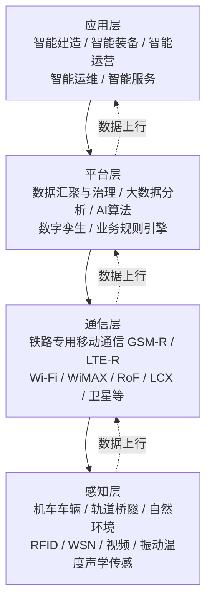
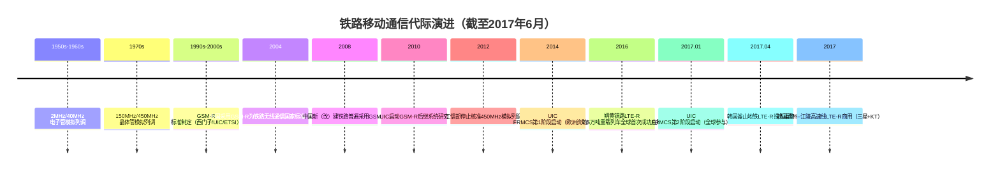
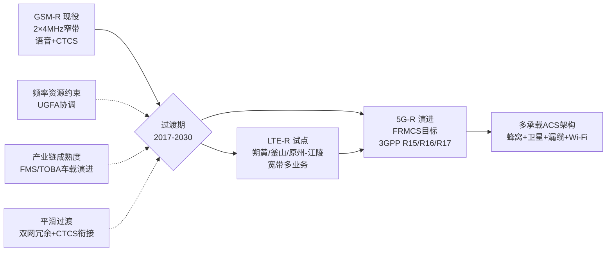
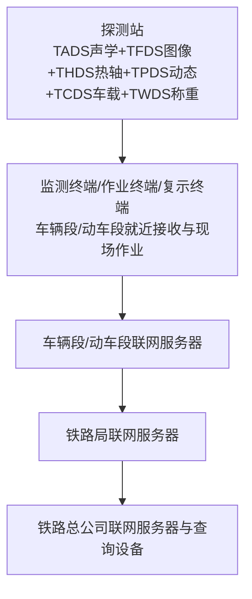
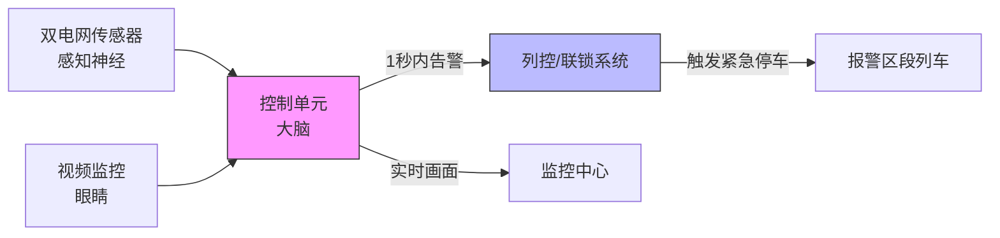
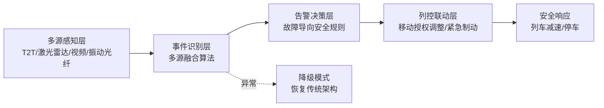
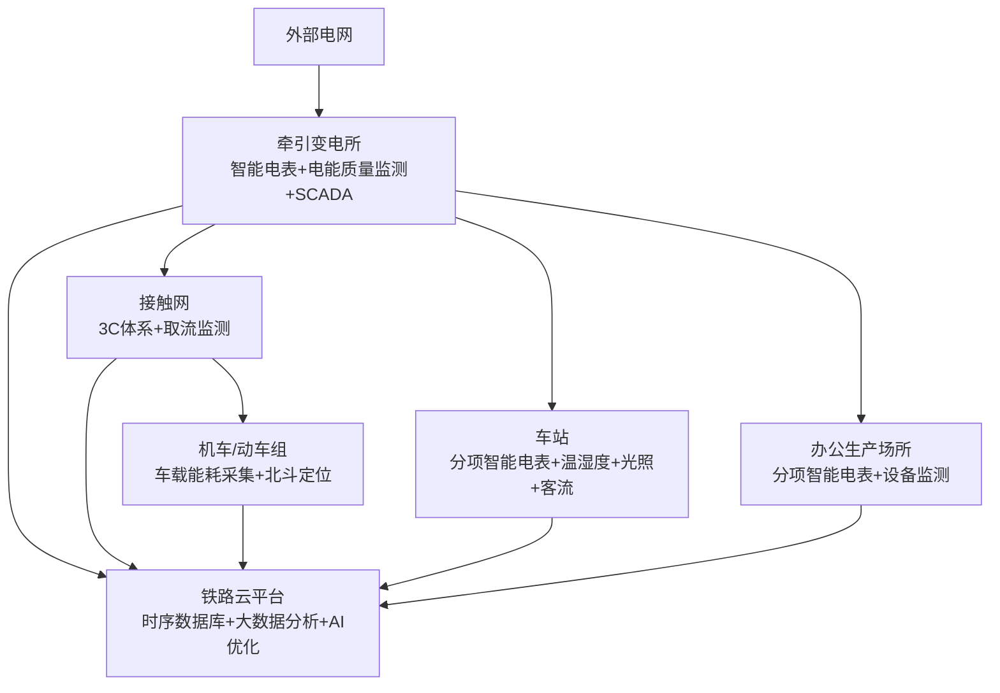

# 工业物联网（IIoT）在铁路领域的应用技术调研：通信技术演进与智能化服务分析（截至2017年6月）
# 1 研究背景与铁路工业物联网总体框架

铁路作为国民经济大动脉与综合交通运输体系的骨干，承担着大规模旅客与货物运输的核心使命，其运行的安全性、准点率与经济性直接关系到社会运转效率与公共福祉[^1]。进入21世纪第二个十年以来，随着移动互联网、云计算、大数据、物联网与人工智能等新一代信息技术的群体性突破和深度融合，全球产业体系正经历一场由"万物互联、数据驱动、智能决策"主导的数字化变革[^2]。在此宏观背景下，铁路行业开始系统性引入工业物联网（Industrial Internet of Things，IIoT）技术，以期突破传统信息化体系在感知粒度、数据维度和决策智能化方面的瓶颈，推动铁路从"信息化"向"智能化"跃迁。本章作为全篇报告的逻辑起点，将从铁路引入IIoT的驱动因素出发，界定铁路IIoT的总体架构内涵，剖析其与既有铁路信息化系统的衔接关系，并归纳截至2017年6月铁路智能化转型所面临的核心挑战与发展趋势，为后续章节关于通信技术对比和智能化应用服务的深入分析奠定整体认知框架。

## 1.1 铁路引入工业物联网的驱动因素与时代背景

铁路行业引入IIoT的根本驱动力来源于"现实压力"与"技术机遇"的双向耦合。从现实压力侧观察，全球铁路运营商面临运量持续增长、运行速度不断提升、运维成本居高不下、乘客服务期望日益多元的多重挑战。传统的以人为主、以设备为辅的集中统一调度方式，在运量加大和行车速度提高的背景下，人为因素产生的不协调与联络失误对行车调度产生严重影响；尤其在高速铁路出现之后，传统方式已无法适配高速、高密度、高准点率的运行需求[^3]。与此同时，铁路装备的全生命周期维护成本、能源消耗成本与安全风险防控压力，也驱使行业从"事后维修"或"定期维修"向"按需维修、预测性维修"模式转型。

从技术机遇侧观察，移动互联网、大数据、云计算、物联网、人工智能等新技术的突破和融合，构成了新一轮科技革命与产业变革的核心所在，万物互联、数据驱动、智能决策的数字化时代已然来临[^2]。通过新一代信息技术大幅提升铁路运输组织效率效益、优化客货运输服务品质、提高铁路运输安全水平，已成为各国铁路发展的必由之路，铁路智能化亦已成为世界铁路发展的重要方向[^2]。

在这一双向驱动之下，2017年前后全球主要铁路国家先后出台了数字化与智能化战略，构成了铁路引入IIoT的政策与产业基础。下表汇总了截至2017年6月若干代表性的国际铁路数字化战略与路线图：

| 国家/组织 | 战略名称 | 启动时间 | 核心方向 |
|---|---|---|---|
| 欧盟（ERRAC） | Rail Route 2050 | 2011年 | 智能移动、能源与环境、基础设施，面向2050年的高资源效率智能化铁路蓝图[^2] |
| 欧盟 | Shift2Rail | 2013年提出，2014–2020年实施 | 降低生命周期成本、增强路网容量、提升服务可靠性与准时性，巩固欧洲铁路全球领导地位[^2] |
| 德国 | 铁路数字化战略（铁路4.0） | 2016年 | 提升乘客满意度，覆盖生产、运营、维修养护、客户交互各环节，支撑德国运输4.0计划[^2] |
| 法国 | 数字化法铁战略 | 2015年 | 工业互联网建设，构建连通列车、路网、站房的三大区域网络，实现实时定位、门到门运输[^2] |
| UIC | 数字化铁路路线图 | 2016年4月（CER/CIT/EIM/UIC联合）；UIC进展报告第4版2017年6月发布 | 数字化转型方法论、概念验证（PoC）推进、成员反馈与互动方法[^3] |

可以看到，**2017年前后欧洲、北美、日本等主要铁路市场已普遍将"数字化与智能化"列为铁路行业未来15–30年的战略主线**，并通过项目化、路线图化的方式推动落地。例如德国铁路4.0近期（至2025年）目标包括半自动化列车无线分配、下一代电子行程服务、乘客移动设备与基站信号直连，以及到2020年底所有铁路建设项目应用BIM；其中期（2025–2035年）则聚焦列车无人驾驶、灵活个性化交通方式与机器人小汽车的研制[^2]。法国国家铁路公司则计划在郊区线路引入自动驾驶，并通过3D打印技术减少20%零件制造时间和成本[^2]。这些战略目标的实现，本质上都依赖一套贯穿"感知—连接—平台—应用"的工业物联网技术体系，这正是铁路IIoT概念被提出与推广的产业逻辑。

在产业实践侧，2017年前后主流ICT厂商也已积极介入铁路数字化领域。例如，华为于2017年11月与国际铁路联盟（UIC）共同举办第五届国际铁路峰会，展示其面向铁路运营通信的端到端ICT解决方案，并与Jiaxun Feihong、Top Xingda、新加坡ST Electronics等伙伴联合发布了基于云计算、大数据与物联网最新技术的"Railway IoT"与"Urban Rail Cloud"解决方案[^1]。这表明，铁路IIoT在2017年前后已从战略概念逐步过渡到面向商业部署的解决方案阶段，具备了产业链层面的承接能力。

## 1.2 铁路工业物联网的概念界定与总体架构

工业物联网在铁路领域的应用，可以理解为通用IoT技术体系与铁路行业特殊需求深度耦合的产物。从通用架构看，主流IoT系统通常被抽象为四层结构，即感知层、网络层（传输层/通信层）、平台层和应用层，每层承担特定功能并通过协同工作实现万物互联[^4]。需要说明的是，部分文献也采用"感知层、网络层、应用层"的三层划分方式，将平台能力归入应用层之内[^5]；但对于具有大规模、多专业、高安全要求的铁路行业，本报告采用更精细的**四层架构**进行分析，以便清晰刻画数据汇聚、治理与智能分析能力的独立层级。

### 1.2.1 通用IoT四层架构的核心功能

在通用IIoT体系中：

- **感知层（Perception Layer）** 是与物理世界交互的层级，包含传感器、执行器、嵌入式控制器、RFID标识与短距离通信模块，承担数据采集（温度、电流、位置、振动等）、本地控制（开关、阀门、告警）、初步过滤（数据去噪）与安全启动等功能。感知层的工程设计重点是实时性优先、低功耗、离线可运行与OTA能力，其本质并非"数据上传器"，而是**实时控制节点**[^4]。
- **网络层（Network Layer）/传输层（Transport Layer）** 负责将感知层数据可靠传输至平台层，技术选项涵盖低功耗广域网（NB-IoT、LoRaWAN）、5G、Mesh网络及局域/广域通信（BLE、Zigbee、WiFi、4G），并通过MQTT/CoAP等轻量级传输协议适配低功耗设备[^4]。
- **平台层（Platform Layer）** 承担数据存储、处理、设备管理与分析决策功能，核心技术包括OTA升级、状态监控、时序数据库（InfluxDB、TimescaleDB）、流处理（Apache Kafka/Flink）、规则引擎与数字孪生[^4]。
- **应用层（Application Layer）** 面向具体行业需求提供智能解决方案，例如工业物联网领域的预测性维护、智慧城市的交通调度、智慧医疗的远程监测等[^4]。

分层架构的本质并非美观，而是为了实现"可演进能力"——当协议、云平台、应用需求或设备型号发生变化时，分层与接口解耦确保系统不会演变为"不可维护的耦合怪物"[^4]。这一原则对于设备数量动辄数十万、跨专业系统众多、技术演进周期跨越数十年的铁路行业尤为关键。

### 1.2.2 铁路IIoT四层架构的特征

将上述通用架构映射到铁路场景，必须充分考虑铁路行业的四项特殊性：**高安全完整性（SIL4级安全要求）、高可靠性、广域分布（线路长度可达数千公里）、强移动性（最高时速可达350公里及以上）**。基于此，铁路IIoT的四层架构具有如下特征：

具体而言，**感知层**面向铁路运输系统中的机车车辆等移动设备、轨道桥隧等固定设施、风雨雪等自然环境以及对应的安全风险等进行全面透彻的信息感知[^1]。其感知对象远超一般工业IoT，既包含传统的工业传感器（振动、温度、电流、应变），也包含铁路特有的设备（轨道电路、应答器、接触网监测、轴温检测、TFDS车辆故障图像采集等）。

**通信层**承担"铁路各专业数据进行广泛、深度、安全、可信的汇聚和交互"的使命，并按运输生产的实际需要实现信息共享[^1]。与一般工业IoT不同，铁路通信层必须同时承载行车安全相关业务（如列控通信，要求SIL4级安全等级）与一般业务（如视频监控、PIS、办公信息），且在高速移动、长隧道、强电磁干扰等特殊环境下保持稳定可靠。这正是后续第2章将系统对比GSM-R、LTE-R及多种候选通信技术的根本原因。

**平台层**通过对铁路业务数据的汇聚和治理，积累数据资产和问题样本，构建数据模型和AI算法并不断迭代，以适应铁路市场、服务、生产、管理和环境的变化；并基于大数据分析从海量数据中提炼关键信息，辅助铁路战略决策、经营开发、运输生产、资源管理与建设管理等业务[^1]。

**应用层**则面向智能建造、智能装备、智能运营、智能运维、智能服务等场景推进技术和管理创新，最终实现铁路的智能运营管理和决策，使铁路运输更加安全、高效、便捷、舒适、环保[^1]。这些应用场景将在本报告第3章至第7章中分别针对预测性维护、视频安防、乘客信息系统与货运信息系统、列车控制系统、能源效率管理等具体类别进行深入分析。

整体而言，铁路IIoT可以概括为以"**全面感知—泛在互联—主动学习—科学决策**"为核心能力闭环的智能化技术体系[^1]，其分层架构既继承了通用IoT的解耦原则，又在每一层都叠加了铁路行业特有的安全、可靠与移动性约束。

## 1.3 铁路IIoT与既有铁路信息化体系的关系

铁路并非IIoT到来之前的"信息化荒漠"。事实上，全球主要铁路系统在过去数十年间已建成大量行业专用信息系统，构成了铁路IIoT落地的既有底座。理解IIoT与这些既有系统的衔接关系，是把握铁路智能化转型路径的关键。

### 1.3.1 既有铁路信息化体系的代表性系统

以中国铁路为例，截至2017年前后已形成以下几类核心信息化系统：

**铁路运输管理信息系统（TMIS）** 是国家"八五"重点科技攻关项目，1994年至2004年经历十年集中建设，总投资约26亿元，是当时国内首次大规模信息系统建设[^6]。TMIS采用三级架构，由铁路总公司中央级系统、18个铁路局级系统和约5000个站段级系统构成，通过广域网与局域网实现三级互联；其覆盖全路近50万辆货车、1万多台机车及2万多列列车的动态管理，可提供未来3天内车流变化预测，包含确报、货票、运输计划、车辆/机车/集装箱实时追踪等共12个分系统[^6]。2012年12月，TMIS中央主机系统完成向开放计算平台的技术迁移，实现了重大技术升级，为系统整合和资源共享创造了条件[^6]。

**列车调度指挥系统（TDCS）与分散自律调度集中系统（CTC）** 是行车指挥自动化的两大支柱。21世纪初，为提高铁路总体技术装备水平，铁路行业自主研制了适用于普速铁路的TDCS和适用于高速铁路的分散自律CTC，建立了融合信号、通信、计算机、数据传输和多媒体技术为一体的行车调度指挥系统[^3]。CTC作为"铁路运输指挥的神经中枢"，通过远动技术实现对联锁、信号、闭塞设备的集中遥控与遥信，可实现进路自动选排、车次号追踪、调车作业管理与综合维修管理等功能[^6]。

**列车运行控制系统（CTCS）** 技术体系于2004年创建，2007年广深线提速时CTCS-2级列控系统正式上线，2009年12月武广高铁开通时CTCS-3级列控系统首次正式运用[^3]。CTCS与CTC、TDCS共同构成了高速铁路行车安全与效率的核心保障体系。

### 1.3.2 IIoT对既有信息化体系的融合与升级

铁路IIoT与上述既有系统并非"替代"关系，而是"**融合与升级**"关系。具体的融合路径主要体现在以下三方面：

**第一，通过物联感知补强既有系统的数据来源**。传统TMIS、CTC等系统主要依赖人工录入或来自信号设备、车号识别等少量自动化数据源，对机车、车辆、轨道、桥隧等实体的状态感知粒度有限。引入RFID、WSN、振动/温度/声学传感、视频图像识别等IIoT感知手段后，既有系统获得了更细粒度、更高频次、更广覆盖的数据输入。例如，华为基于盘古铁路大模型与合作伙伴打造的智能铁路车辆故障图像智能识别（TFDS）解决方案，可智能过滤95%以上无故障图像、关键故障0漏报、综合故障识别率大于99.3%，作业效率提升10倍以上[^1]——这一能力本质上是对传统货车检修流程的IIoT化升级。

**第二，通过云平台与大数据强化决策能力**。2016年后，结合"智能铁路"的发展需求，行车指挥自动化系统开始采用云计算、物联网、大数据与人工智能等技术，形成智能调度集中系统，并于2019年成功应用于京张高铁、2021年CTC 3.0区域集控在孟宝铁路开通[^3]。这表明既有调度系统正在通过IIoT技术栈进行架构升级——从单一功能系统演进为支持云化部署、AI辅助决策的智能调度平台。在更宏观层面，2022年中国完成了京广、陇海铁路CTC系统3.0版升级，新增自动排列进路等功能，提高了运输效率与安全系数[^6]。

**第三，通过统一连接与数据共享打破专业壁垒**。传统铁路信息化体系按专业划分为运输、机务、车辆、工务、电务、供电等多个垂直系统，数据共享与协同存在显著挑战。华为智能铁路解决方案提出的"智能联接"层（如基于SRv6、网络分片、随流检测等IPv6+技术的铁路综合数据网，以及基于MS-OTN多业务综合承载平台的铁路全光网络），目标即在于实现对外客货运营快速响应、对内多工种协同与统一调度[^1]。从架构关系看，IIoT的通信层与平台层为既有专业系统提供了横向打通的技术底座。

下表汇总了IIoT与既有铁路信息化系统的衔接关系：

| 既有系统 | 原有定位 | IIoT融合升级方向 |
|---|---|---|
| TMIS | 货车/机车/集装箱实时追踪与运输管理[^6] | 引入物联网感知与开放计算平台，强化车流预测与节点式追踪精度 |
| TDCS/CTC | 行车调度指挥的"神经中枢"[^6][^3] | 引入云计算、大数据、AI形成智能调度集中系统，支持自动排列进路、区域集控[^3] |
| CTCS | 列车运行控制（CTCS-2/CTCS-3）[^3] | 向车车通信、多源融合定位、下一代列控（与FRMCS协同）演进，详见第6章 |
| 货车故障检测（TFDS） | 人工图像复核为主 | 引入AI视觉识别，综合故障识别率>99.3%，效率提升10倍+[^1] |

可以看到，**IIoT在铁路领域的引入并非"另起炉灶"，而是对既有信息化体系的"赋能式延伸"**——通过感知层补强、通信层重构、平台层升级与应用层创新，将存量系统从"信息化"推向"智能化"。这一融合特征也决定了铁路IIoT的实施路径必须兼顾"演进性"与"兼容性"，不能脱离行业既有技术与管理基础进行颠覆式重构。

## 1.4 2017年前铁路智能化转型的关键挑战与发展趋势

尽管2017年前后铁路IIoT已在战略层面取得广泛共识、在工程层面具备初步实践基础，但其规模化落地仍面临多项关键挑战。同时，相应的技术演进趋势也已初步显现，为后续章节的展开提供了主线。

### 1.4.1 关键挑战

**第一，高速移动场景下的可靠通信挑战**。铁路是少数需要在300公里及以上高速移动环境下保持高可靠通信的行业。GSM-R作为2G时代的铁路专用通信系统，已无法承载日益增长的宽带业务需求（如视频监控、CBTC通信、PIS等），LTE-R及未来的FRMCS（下一代铁路移动通信系统）成为产业共识方向。华为智能铁路解决方案明确将"下一代铁路移动通信系统（FRMCS）"列为重要组成部分，定位为"为铁路行车提供安全可靠"的通信基础设施[^1]。然而LTE-R的频率资源分配、与GSM-R的平滑过渡、产业链成熟度等问题，仍是2017年前后亟待解决的核心议题，这正是本报告第2章将深入展开的内容。

**第二，海量异构感知数据的接入与治理挑战**。铁路涉及机车车辆、轨道桥隧、自然环境等多种感知对象，数据类型涵盖结构化（运行参数）、半结构化（日志）与非结构化（视频、图像）数据，且分布在数千公里线路上的成千上万节点。如何在感知层完成边缘预处理（滤波、特征提取）以减少传输负载[^4]，如何在平台层通过时序数据库、流处理引擎与数据治理工具实现高效汇聚与共享[^1]，是平台层架构设计的核心问题。

**第三，跨专业系统的互联互通挑战**。如前所述，铁路传统信息化系统按专业垂直划分，数据接口、协议、标准存在显著差异。在引入IIoT之后，如何在保持既有系统稳定运行的同时实现横向打通，如何在感知层、通信层、平台层之间形成接口抽象与数据契约[^4]，需要标准化与工程化的双重突破。

**第四，信息安全与功能安全的协同挑战**。铁路是高安全行业，列控通信要求达到SIL4级安全完整性等级；同时IIoT引入大量网络化设备也带来信息安全风险（如入侵、数据泄露、拒绝服务攻击）。在几内亚CTG铁路的实践中，CTC系统通过动态多点智能VPN技术强化网络层加密[^6]，即是兼顾两类安全需求的工程探索。如何在IIoT架构中系统性融合信息安全与功能安全机制，仍是2017年前后的开放性议题。

**第五，行业标准与国际化协作挑战**。铁路IIoT涉及通信、感知、平台、应用等多个技术域，且需跨越国境实现联运。UIC、ERRAC、3GPP等国际组织在2017年前后已开展大量标准化与协调工作，例如UIC联合CER、CIT、EIM于2016年4月发布"欧洲数字化铁路路线图"（Roadmap for digital railways），UIC数字化铁路进展报告第4版于2017年6月发布[^3]，但行业层面统一的IIoT参考架构尚未完全形成。

### 1.4.2 发展趋势

面向2017年6月之后的近中期，铁路IIoT呈现以下几方面的清晰趋势：

**一是下一代铁路移动通信系统（FRMCS）的演进**。FRMCS被定位为GSM-R的接替者，将基于宽带移动通信技术（如LTE-R及后续演进）为铁路行车提供安全可靠的通信能力，并支持新型业务场景[^1]。这一演进将贯穿2017–2025年的铁路通信技术路线。

**二是云计算与大数据平台在铁路的规模化部署**。华为铁路云解决方案宣称提供"业界唯一支持全地域、全场景容灾"的方案，故障自动切换且业务无感知，RPO等于0、RTO分钟级[^1]，反映了铁路对云化基础设施可靠性的极高要求。可以预见，2017年后云平台将逐步成为铁路应用与数据的统一承载底座。

**三是AI驱动的预测性维护与智能调度**。从传统的定期预防性维护向基于状态监测与机器学习的预测性维护转型，是工业IoT在制造业、能源、轨道交通等行业的共性方向。状态监测（Condition Monitoring）的核心思想是通过传感器持续监测设备的振动、声学等故障指标，"越早检测到缺陷，维护成本越低、生产损失风险也越低"[^2]——这一逻辑同样适用于铁路机车、轨道、桥隧、接触网等关键资产的全生命周期管理（详见第3章）。在调度领域，AI驱动的智能调度集中系统已于2019年应用于京张高铁[^3]，是预期趋势的早期落地标志。

**四是面向"全联接列车"的端到端架构演进**。德国铁路4.0近期目标中明确提出"通过列车独特设计使乘客的移动设备与基站信号直连"，远期目标则包括电子商务、3D打印维护、运营过程全自动化等[^2]；法国数字化法铁则致力于构建连通列车、路网、站房三大区域网络的工业互联网[^2]。这些战略均指向**列车作为移动的IIoT节点、与地面平台和应用形成全联接闭环**的总体方向。

综合本章分析，铁路IIoT是行业现实压力与新一代信息技术供给共同催生的智能化转型路径，其在通用IoT四层架构基础上叠加了铁路特有的安全、可靠与移动性约束，并通过感知层补强、通信层升级、平台层云化与应用层创新与既有信息化体系深度融合。2017年前后，全球主要铁路市场已普遍将数字化与智能化列为战略主线，但通信技术演进、海量数据治理、跨专业互联、安全协同与标准化协作等核心挑战依然显著。正是在这一背景下，**铁路专用通信技术的演进路径与多技术互补共存格局，以及IIoT在预测性维护、视频安防、乘客与货运信息、列车控制、能源管理等具体场景中的赋能机制**，成为后续章节深入分析的两条主线，分别对应第2章的通信技术对比与第3至第7章的智能化应用服务剖析。

# 2 铁路通信技术演进路径与多维度对比分析

第1章已经指出，铁路IIoT的四层架构中，通信层承担着"安全可信地汇聚多专业数据并支持高速移动业务"的关键使命，并需在SIL4级安全完整性、高可靠性、广域分布与强移动性等行业约束下完成构建。**通信层之所以成为铁路IIoT能否规模化落地的"关卡"环节，根本原因在于它既是行车安全（列控、调度）业务的承载基础，又是新兴宽带业务（视频监控、PIS、感知数据回传）的实现前提，且必须在300公里及以上高速移动环境下保持稳定可靠**。本章正是以这一定位为出发点，系统梳理2017年6月前铁路专用移动通信系统的代际演进逻辑，深入对比GSM-R与LTE-R两代主导技术的核心参数差异，并将视野扩展到全部11种可用于或已应用于铁路场景的主流通信技术，建立完整的横向技术图谱；进一步基于铁路特定场景（隧道、高速主线、站场热点、偏远应急）剖析各技术的适用边界，最后归纳演进过程中的核心约束与过渡问题，为后续FRMCS路线与具体应用服务章节奠定通信层的技术基础。

## 2.1 铁路专用移动通信系统的代际演进逻辑

铁路专用移动通信系统的代际更替，本质上是**"业务需求驱动—技术供给响应—产业链支撑—国际标准协调"四要素共同作用的渐进式过程**。从中国铁路的实践来看，新中国成立之初铁路系统使用工作频率为2MHz和40MHz的电子管设备开展列车无线调度电话和站内无线电话业务；进入20世纪70年代逐步转向150MHz和450MHz频段的晶体管设备；此后铁路专用无线频率定在450MHz频段，用于列车无线调度通信、站场平面调车、客货运输及养护维修等对讲通信业务[^7]。然而450MHz模拟列调系统抗干扰能力差、语音质量低、业务有限，工信部从2012年起停止核准基于该频段的模拟制式无线列调系统[^7]，标志着模拟时代的终结。

代际更替的真正转折发生在GSM-R的引入与规模化部署。20世纪90年代初GSM标准刚刚确立时，西门子公司即开始酝酿和起草GSM-R技术标准；后来国际铁路联盟（UIC）和欧洲电信标准协会（ETSI）合作针对欧洲铁路系统共同推出了最终版的GSM-R标准[^7]。我国是亚洲第一个发展GSM-R的国家，2004年为满足高速铁路CTCS-3级列控系统的需要，铁道部正式采用GSM-R标准作为新一代铁路无线通信国家标准；国内第一条应用GSM-R的铁路是青藏铁路，此后从2008年起，新建或改建铁路几乎全部采用GSM-R作为专用无线通信系统[^7]。从450MHz模拟列调到900MHz GSM-R的跨越，对应着业务需求从"单纯语音对讲"向"语音调度+CTCS列控数据承载"的扩展，以及技术供给从模拟电路向数字蜂窝的代际跃迁。

进入21世纪第二个十年，业务需求再次发生质变。**铁路信息化与智能化水平不断提升，业务形态呈现"由单一语音向多业务承载演进、由封闭专用向专网融合发展、由人工经验向数据驱动转型"的三大趋势**[^8]——传统GSM-R以语音业务为主、频率效率低、窄带数据带宽最多只有100多kbps，已难以承载铁路数字化改造后的通信大带宽需求[^7]。在此背景下，业界先后提出了基于4G LTE的LTE-R路线与基于5G的5G-R路线。从国际协调机制看，UIC于2010年初开始GSM-R后继系统相关研究工作，启动了为期3年的欧洲资助项目，即2014年1月开始的第1阶段FRMCS（Future Railway Mobile Communication System，未来铁路移动通信系统）项目；考虑到UIC成员的国际化程度较高，在2016年12月圣彼得堡的UIC大会中最终确认吸收欧洲以外有意愿国家共同参与，**FRMCS第2阶段研究工作于2017年1月至2019年12月开展**[^9]。FRMCS项目下设功能工作组（FWG）、架构和技术工作组（ATWG）与UIC频率工作组（UGFA）三个工作组，分别负责用户需求与功能需求、系统架构与候选技术、频谱需求的研究[^9]。

下图概括了铁路移动通信系统的代际演进时序与关键里程碑：

由此可见，**截至2017年6月，全球铁路通信处于"GSM-R规模化运营、LTE-R试点验证、FRMCS路线启动"三阶段并存的关键节点**：GSM-R仍是国际主流的铁路专用移动通信系统、承担CTCS-3级列控等行车安全核心业务；LTE-R在中国朔黄重载铁路与韩国高铁线路实现首次商用验证；UIC FRMCS项目则刚刚启动第2阶段、尚未锁定具体后继技术制式。这一三阶段并存的格局正是后续小节展开多技术对比的基础语境。

## 2.2 GSM-R技术体系与运营现状

GSM-R（Global System for Mobile Communications–Railway）是基于GSM技术、专门为铁路行业设计的无线通信系统，是一项用于铁路通信及应用的国际无线通信标准；欧洲铁路交通管理系统（ERTMS）的子系统使用GSM-R完成列车和调度中心的通信，该系统基于GSM和EIRENE–MORANE规范，当列车速度高达500km/h（310英里每小时）时也不会丢失任何通信[^9]。与传统GSM标准相比，GSM-R主要增加了铁路专用调度通信的相关功能，其核心增强模块包括组呼寄存器（GCR）和语音广播业务（VBS），实现"一对多"通信，满足调度员同时指挥多列车的需求；同时支持列车紧急呼叫中断普通通话的高优先级保障机制，确保危急情况下的通信畅通[^10]。

**工作频段方面，GSM-R在中国采用的是900MHz"黄金频段"——上行885–889MHz、下行930–934MHz，2×4MHz带宽，最大覆盖距离可达6～9km**[^7]；欧洲版本则使用876–915MHz/921–960MHz范围内的专用频段，抗干扰能力强[^10]。GSM-R的核心业务功能涵盖列车调度通信（司机与调度中心实时交互，动态调整运行计划）、列车控制信息传输（为CTCS-3级列控系统提供车-地数据通道，实现移动授权）以及应急通信（隧道、山区等盲区通过直放站覆盖）[^10]。与公网GSM相比，GSM-R采用独立频段和协议栈，支持铁路特有的位置依赖切换等功能；与TETRA系统相比，TETRA多用于城市轨道交通，而GSM-R更适合高速铁路的大范围、高移动性场景[^10]。

从规模化部署情况看，**截至2020年12月底，中国铁路GSM-R覆盖线路里程7.3万km、已建设基站1.78万座**[^9]；截至2021年底，国内GSM-R覆盖线路里程（含在建）达到8.9万公里、用户数超过35万[^7]。这两组数据虽分别采集于2020年底与2021年底（略晚于本报告时间边界），但反映了2017年前后中国GSM-R已进入大规模商用阶段、覆盖厦深高铁、广深港高铁、青藏线、大秦线、胶济线、武广线、郑西线、石太线、合宁线、合武线、京津城际线、京沪高铁等国内重要铁路线路的事实[^7]。

然而**GSM-R作为2G技术构建的标准，其固有局限在2017年前后已充分暴露**，主要体现在三个方面：**第一，承载能力不足**——GSM-R以语音业务为主、频率效率低，窄带数据带宽最多只有100多kbps，难以承载铁路数字化改造后的通信大带宽需求[^7]；传统GSM-R系统以语音调度与列控数据为核心，主要支撑CTCS-3级列控、列车调度通信等行车安全相关业务，无法承载视频监测、车载数据回传等新兴业务[^8]。**第二，频率资源紧张**——随着我国铁路高质量、快速发展，特别是智能铁路建设进入实质性阶段，GSM-R系统承载能力不足、频率资源紧张等问题日趋严重[^9]。**第三，产业链萎缩**——公网GSM产业链逐渐萎缩，预计2030年开始GSM-R设备商将逐步终止GSM-R产品的生产和技术支持[^9]。这三大局限共同构成了铁路通信向新一代系统演进的内在必然性，也是FRMCS项目启动的根本动因。

## 2.3 LTE-R的技术特征与铁路适配

LTE-R（Long-Term Evolution for Railway）以3GPP LTE作为技术本源，是为铁路场景定制化优化的4G专用移动通信系统。LTE概念于2004年由3GPP正式提出，第一个版本Release 8于2008年完成，LTE被国际电信联盟（ITU）归类为3.9G准4G技术；2010年12月6日ITU将LTE正式称为4G[^11]。LTE采用OFDM（正交频分复用）和MIMO（多输入多输出）核心技术，在20MHz频谱带宽下理论峰值速率可达下行100Mbps、上行50Mbps[^11]。LTE的核心技术创新包括：通过OFDM将高速数据流分割为多个低速子载波传输，有效对抗多径干扰、提升频谱利用率；通过MIMO在相同频段上实现多路并行传输、成倍提升信道容量；通过软频率复用动态分配小区中心与边缘用户的频段资源，显著改善网络覆盖质量与边缘用户速率[^11]。LTE系统支持FDD（频分双工，适用于连续广域覆盖场景）与TDD（时分双工，通过时隙分配实现非对称传输）两种双工模式，并支持1.4、3、5、10、15、20MHz共6种灵活的信道带宽配置[^11][^12]。LTE的网络架构采用扁平化设计，去除了传统3G网络中的无线网络控制器（RNC）节点，由eNodeB直接连接到演进分组核心网（EPC），从而简化了网络结构、降低了传输时延[^11]。在LTE-Advanced（基于3GPP Release 10）阶段，通过载波聚合（3×20MHz）与2×2/4×2/4×4 MIMO支持下行峰值速率可达450Mbps，后续版本支持5载波时数据速率超过1Gbps[^13]。

LTE-R是LTE在铁路场景下的专用化部署，其关键适配特征体现为以下几个方面：

**第一，原生IP承载与扁平化架构带来的低时延能力**。LTE基于全IP分组交换体系，通过去RNC化的eNodeB-EPC扁平架构显著降低端到端时延[^11]。这一特性根本性地区别于GSM-R的电路交换体制，使列控数据、调度语音、视频监控、感知数据等多业务能够在统一的IP承载上融合传输。

**第二，针对高速移动场景的分布式基站与信道估计优化**。高速铁路LTE-R通信系统采用分布式基站架构，由室内基带处理单元（BBU）和射频拉远单元（RRU）组成，多个RRU分别通过光纤将信号传输到BBU；该架构可扩大小区信号的覆盖范围、在一定程度上减少用户越区切换次数，同时由于通过光纤将基带信号从BBU传输到RRU、避免了射频信号的长距离传输、可以显著降低传输损耗[^14]。此外，由于无线信号穿过列车车厢会造成严重的穿透损耗，为保证RRU和列车之间的可靠通信，在列车的顶部安装车载台（VS），VS通过无线方式与RRU建立连接，同时在每节车厢里都安装中继器（R），中继器通过有线方式与VS建立连接，车厢里的不同用户设备（UE）可以通过中继器连接到网络[^14]。**对于LTE-R系统，列车移动速度通常超过300km/h，会产生严重的多普勒频移**，因此基扩展模型（Basis Expansion Model, BEM）等高移动性信道估计方法被引入，以保证在高速移动场景下仍能为用户提供可靠的无线通信服务[^14]。

**第三，全球LTE生态成熟带来的产业链优势**。截至2013年10月，已有474家运营商在138个国家进行LTE网络投资，其中已在83个国家部署了222个LTE商用网络[^11]，这为LTE-R提供了远超GSM-R的产业链与器件成熟度基础。

LTE-R的工程价值在2017年前后通过两个标志性案例得到验证。**案例一是中国朔黄铁路LTE-R重载列车应用**：2016年9月29日，一列由山西神池南站驶出的2.5万吨运煤重载组合列车，历时12小时02分安全运行到达河北黄骅港站，该列车搭载的是基于4G技术应用的重载铁路宽带移动通信系统（LTE-R），**这也是该系统在全球首次成功应用**，同时列车编组辆数、列车总重、牵引总重均创国内重载铁路两万吨列车相关指标最高纪录[^15]。朔黄铁路此前采用的是800MHz+400kHz无线通信系统提供万吨列车机车同步操控传输通道，存在容量小、长距离通信信号弱、机车无线同步受到限制等问题，无法满足开行2万吨及以上重载列车的需求；新型LTE系统由LTE主系统、配套通信系统、配套电力系统和配套房建等部分组成，技术方案采用共站址双网冗余组网覆盖（A/B双网业务负荷分担方式），实现神池南至黄骅港近600公里铁路沿线的4G专网信号覆盖，为机车无线重联、可控列尾、调度语音呼叫和视频监控等两万吨及以上重载列车综合业务提供可靠通信平台[^15]。经过现场试验，**与GSM-R网络相比，LTE网络在网络注册时延、连接建立时延、端到端传输时延、吞吐量、丢包率等指标整体优于GSM-R网络**，这意味着基于LTE-R网络的重载列车得以进一步缩短列控传输时延、提升列控安全性；此外LTE-R系统还弥补了原有系统传输距离短、实时性差等缺点，将朔黄铁路年运能从2亿吨提升至4亿吨以上[^15]。

**案例二是韩国原州–江陵高速线LTE-R商用**：2017年三星电子宣布与韩国电信公司KT合作，在新原州江陵高速列车（时速可达约250km/h、长度75英里）上搭载全球首个高速列车LTE-R网络，为2018年平昌冬奥会的运输保障做准备；LTE-R将在线路的七个站点运行，并与中继无线电系统、VHF系统和公共安全网络（PS-LTE）等较早的技术协同工作；该技术此前已于2017年4月在釜山地铁线路投入运营，**原州–江陵线则是LTE-R在高速列车线路上的首次应用**[^16]。LTE-R是为列车运行而建立的高速语音和数据网络，包括关键任务即按即说（MCPTT）和专用核心网络等功能，以克服高速使用LTE网络的挑战[^16]。

需要补充说明的是，尽管LTE-R在朔黄重载与韩国高速场景实现了商用，但**中国国家铁路层面在LTE-R路线上的态度较为审慎**——业界曾经提出基于LTE-R（4G）建设铁路无线专网，但测试了一段时间后没有大规模商用，国家从产业演进与投资保护角度考虑跳过LTE-R、直接迈向5G-R[^7]。这一战略选择反映了2017年前后铁路通信演进路径的复杂博弈，相关约束将在2.7节进一步展开。

## 2.4 GSM-R与LTE-R核心参数对比

基于2.2与2.3节的技术解构，可以将GSM-R与LTE-R在铁路应用中的关键参数与能力差异系统性地汇总如下表：

| 对比维度 | GSM-R | LTE-R |
|---|---|---|
| 标准来源 | UIC/ETSI基于GSM，EIRENE/MORANE规范[^9][^7] | 3GPP LTE Release 8起，铁路场景定制[^11][^15] |
| 工作频段 | 中国885–889/930–934MHz（2×4MHz）；欧洲876–915/921–960MHz[^7] | 候选频段广泛，朔黄铁路实测采用LTE频段，韩国部署在LTE频段；可灵活复用LTE FDD/TDD频段[^15] |
| 信道带宽 | 200kHz（GSM载波） | 1.4/3/5/10/15/20MHz灵活可选[^11][^12] |
| 双工模式 | FDD | FDD/TDD均支持[^11] |
| 多址方式 | TDMA（每载波8时隙）+ FDMA | OFDMA（下行）/SC-FDMA（上行）[^11] |
| 调制方式 | GMSK | QPSK/16QAM/64QAM自适应[^11] |
| 峰值数据速率 | 窄带语音为主；GPRS数据带宽最多100余kbps[^7] | 20MHz下行100Mbps/上行50Mbps；LTE-A载波聚合可达450Mbps乃至1Gbps[^11][^13] |
| 原生IP支持 | 否（电路交换为主，GPRS扩展支持分组） | 是（全IP扁平架构，eNodeB直连EPC）[^11] |
| 端到端时延 | 秒级（CSD承载ETCS数据接续较慢，每列车需长期占用专门信道）[^17] | ms级；在朔黄实测中网络注册、连接建立、端到端传输时延均优于GSM-R[^15] |
| 移动性支持 | 高达500km/h不丢失通信[^9] | 设计支持高速场景，实测覆盖300km/h以上重载与高速场景[^14][^15] |
| 切换机制 | 基于GSM体系的硬切换 | 基于X2/S1接口的硬切换；分布式基站可减少越区切换次数；高移动性信道估计辅助[^14] |
| 覆盖能力 | 基站覆盖6–9km[^7] | 朔黄共站址双网冗余覆盖近600公里；分布式基站架构可扩展小区[^14][^15] |
| 业务承载 | 语音调度、CTCS-3列控数据、广播组呼为主[^8][^10] | 列控+调度语音+应急通信+动态监测+灾害预警+视频回传等多业务融合[^8][^15] |
| 安全机制 | GSM基础鉴权与加密 | LTE增强鉴权与加密；MCPTT关键任务推压通话[^16] |
| 产业链成熟度 | 已规模化商用但接近生命末期，预计2030年起设备商终止支持[^9] | 全球474运营商/138国家投资、222商用网络生态成熟[^11] |
| 在铁路的代表部署 | 中国7.3万km覆盖（2020年底）、青藏/京沪/武广等[^9][^7] | 朔黄2.5万吨重载（2016全球首例）、釜山地铁（2017.4）、原州–江陵高速线（2017）[^16][^15] |

从上表对比可以归纳出**LTE-R相对于GSM-R的三个代差性跃迁**：

第一，**承载能力的代差**——从窄带语音为主（GPRS数据最多100余kbps）跃迁到宽带多业务融合（20MHz下行100Mbps），频谱效率与单位带宽下用户体验提升约两到三个数量级。第二，**时延性能的代差**——从电路交换秒级时延（CSD承载ETCS数据需每列车长期占用专门信道[^17]）跃迁到分组交换ms级时延，使CBTC级别的高频闭环控制、视频实时回传、车车通信等业务在通信层具备可行性。第三，**业务多样性的代差**——GSM-R仅能承载列调列控类业务，而LTE-R/5G-R可承载列控类（CTCS-3、重载多机车协同）、调度类（语音调度、应急通信）、数据类（动车组状态监测DMS、司机行为分析EOAS）、感知类（接触网检测3C、灾害预警、轨旁监测）、视频类（车载及线路视频回传）等多类业务[^8]。这三个代差共同构成了铁路通信从"语音为主"向"全业务融合"跃迁的本质[^8]。

值得强调的是，**LTE-R在FRMCS的整体路线中具有过渡性定位**——FRMCS项目目前已初步确认将5G作为铁路未来移动通信主体技术制式，并积极开展工作将相应需求纳入3GPP相关标准中[^9]。因此2017年6月时点上的LTE-R，既是对GSM-R的现实替代选项（如朔黄、韩国案例），也是面向5G-R的演进基础。华为下一代铁路移动通信系统（FRMCS）解决方案明确"基于3GPP统一标准、面向未来持续演进，平台支持4G和5G、面向未来平滑演进、保护投资"，承诺99.999%（"五个9"）的系统可靠性以满足铁路行车业务高可靠要求[^18]，反映了产业界对LTE-R/5G-R演进路径的一致判断。

## 2.5 主流候选通信技术族横向对比

除了GSM-R与LTE-R这两类铁路专用移动通信主线，2017年前可用于或已应用于铁路场景的通信技术还包括公网蜂窝（UMTS）、专业数字集群（TETRA、P25）、无线局域网（IEEE 802.11）、无线城域网（WiMAX）、有线辐射介质（LCX）、光纤承载射频（RoF）、卫星通信（VSAT等）以及候选技术FLASH-OFDM等。本节首先对每类技术的关键特征做简要剖析，然后以结构化表格统一呈现11种技术的横向对比。

**UMTS** 是欧洲主导的第三代移动通信系统标准，由3GPP制定，采用WCDMA作为无线接口技术，可实现视频通话、移动电视等多媒体业务及全球漫游功能；其网络架构包含移动台、无线接入网（UTRAN）和核心网三部分，1996年欧洲成立UMTS论坛协调标准研究、1999年发布首个R99版本确定WCDMA技术、2001年在马恩岛首次商用、2003–2005年在欧洲大规模推广；UMTS与CDMA2000、TD-SCDMA并列为IMT-2000三大主流标准，可升级至HSDPA实现下行10Mbps以上速率[^19]。在铁路场景中UMTS主要作为过渡承载或公网补盲手段，非铁路专用主流。

**TETRA**（Terrestrial Trunked Radio）是欧洲电信标准协会（ETSI）于1988年开始制订、1995年发布的数字集群通信标准。其主要技术特性为：多址方式TDMA、信道带宽25kHz、每信道4时隙、适用频段350MHz和800MHz、调制方式π/4-DQPSK、调制信道比特率36kbps、语音编码4.567kbps（ACELP）、用户数据速率2.4~28.8kbps可变；基站发射功率0.6~25W，单基站最大覆盖半径达56公里[^20][^21]。TETRA支持虚拟网概念、直通工作方式（DMO）、良好开放性与多业务特性，可在同一技术平台上提供指挥调度、数据传输及电话服务，并提供鉴权、空口加密与端到端加密三级安全机制[^20][^21]。**在铁路场景中，TETRA与GSM-R曾长期争夺铁路调度通信市场**——虽然GSM-R在欧洲已有应用、但在中国铁路各调度部门应用GSM-R系统也需要进行二次开发；TETRA系统数据传输功能较强、而GSM-R采用电路方式传输ETCS数据接续较慢，传输数据的时间最短也需要几秒钟[^17]。最终在干线铁路领域GSM-R胜出，TETRA则主要在城市轨道交通与部分专用线路场景应用，如蒙古国乌兰巴托铁路、哈萨克斯坦国家铁路、土耳其列车轨道工程等[^21][^22]。TETRA二代TEDS基站可使用高达150kHz的带宽提供更高数据速率[^23]。

**P25**（Project 25）由APCO与美国国家州技术总监协会联合制定，是一组面向陆地移动无线电（LMR）系统互操作性的开放、用户驱动型共识标准，主要应用于公共安全应急通信领域；P25在ANSI认证的电信工业协会（TIA）的支持下开发，致力于满足关键任务通信需求[^24]。P25 Phase 1采用C4FM调制、12.5kHz带宽、FDMA体制，数据速率为9.6kbps；P25 Phase 2引入TDMA技术，在同样12.5kHz带宽下通过2时隙将通话容量提升100%，采用AMBE+2声码器与更先进的编码方式[^25][^26][^27][^28]。P25在北美公共安全市场广泛部署，在铁路领域应用相对有限。

**IEEE 802.11** 系列标准是无线局域网的核心规范。其中802.11a工作在5GHz、最高54Mbps；802.11b工作在2.4GHz、最高11Mbps；802.11g工作在2.4GHz、最高54Mbps[^29]；802.11n通过MIMO-OFDM技术将速率提升至600Mbps[^30][^31]；802.11ac工作在5GHz、采用256-QAM、MU-MIMO、80MHz/160MHz信道带宽，最大吞吐量可达6.93Gbps[^32]。**在铁路场景中，IEEE 802.11是CBTC（基于通信的列车控制）车地通信的事实标准**——CBTC通常采用IEEE 802.11系列标准实现车地无线通信，具体采用802.11a/b/g/n/ac等哪一类标准取决于线路建设时期、频段规划、系统兼容性及设备选型要求；其中802.11g主要采用OFDM、并向下兼容802.11b，通过合理的频率规划、覆盖设计、冗余组网和快速漫游机制，WLAN可较好满足CBTC系统对带宽、时延、可靠性和移动性支持的要求；车地业务数据通过"VOBC→无线接入交换机→WGB→RF模块→合路器→车载鲨鱼鳍天线"的核心传输路径完成传输，并采用基于IEEE 802.1X的接入认证与AES类加密算法[^33]。然而由于其工作于开放的ISM频段（2.4GHz/5.8GHz），不可避免地会受到干扰，需要针对系统内多车争抢信道、系统外其他WLAN/蓝牙用户干扰等问题进行专门设计[^34][^35]。地铁场景下，可通过"车头和车尾车载AP都工作"达到负载均衡、采用802.11ac同频组网与"虚拟大AP"快速桥接技术实现ms级车地快速切换[^23]。

**WiMAX**（IEEE 802.16）是基于IEEE 802.16系列标准的宽带无线接入技术，1999年IEEE成立802.16工作组，2001年WiMAX论坛由Intel牵头成立；802.16d（2004）主要关注固定无线接入，可提供最高30至40公里覆盖范围和最高70Mbps传输速率；802.16e（2005）引入移动性支持、MIMO与HARQ；2011年发布的802.16m应对4G需求，最高下行速率1Gbps[^36][^37][^38]。WiMAX物理层采用OFDM/OFDMA技术，MAC层提供完整的QoS机制，支持UGS、rtPS、nrtPS和BE等多种业务等级[^36][^37][^39]。**在铁路场景中，台湾高铁曾于2008年前后开展WiMAX移动宽带接入测试**，测试目标是当列车以250-300公里/小时移动时数据传输率可达15Mbps，并重点测试隧道中信号衰减以及地形对WiMAX网络部署的影响[^28]。台湾后续进一步开展了集成WiMAX-RoF系统的部署，野外试验结果表明RoF引入的不等长光纤可能造成符号间干扰恶化吞吐量，需进行光纤长度均衡；同时高移动性下的速率自适应也是挑战[^10]。然而WiMAX由于产业链生态薄弱、部署运营成本较高、覆盖及频谱效率不具优势，最终在市场竞争中逐渐被LTE取代[^37]。

**RoF**（Radio-over-Fiber）通过将射频信号调制到光波上、利用光纤的超低损耗特性实现远距离传输；典型RoF系统包含中心站（CS，完成基带信号处理、射频调制和电光转换）、光纤链路（透明传输通道）与远端单元（RU，执行光电转换和无线信号发射）；与数字光纤通信不同，RoF采用模拟光传输技术，所有智能功能都集中在中心站，这种架构显著降低了远端设备的复杂度[^40]。**在铁路场景中，RoF作为铁路通信系统的有前途技术正在被试验验证**——基站通过分布式部署的远端天线单元（RAU）与移动站（MS）通信，各RAU通过不同长度的光纤连接到基站；不等长光纤可能造成严重的符号间干扰（ISI）超出系统能力并导致连接中断，研究者提出了RAU功率切换方法、根据MS在轨道上的位置调整RAU功率以抑制ISI[^41]。一种基于RoF的毫米波回传线状蜂窝网络架构被提出用于克服高速铁路通信的高移动性、频繁切换和多样化传输环境瓶颈，结合光交换技术可构建与列车一同移动的回传网络，从而实现无切换的长覆盖网络；该方案在日本高速铁路系统上完成了野外试验[^42]。此外，集成LTE和WiMAX信号的低成本RoF系统已在台湾高速铁路系统的隧道与校园建筑物中部署，用于解决隧道中信号穿透差与快速切换问题[^43]。

**LCX**（Leaky Coaxial Cable，泄漏同轴电缆）通常又简称为泄漏电缆或漏泄电缆，其结构与普通同轴电缆基本一致，由内导体、绝缘介质和开有周期性槽孔的外导体三部分组成；电磁波在漏缆中纵向传输的同时通过槽孔向外界辐射电磁波，外界的电磁场也可通过槽孔感应到漏缆内部并传送到接收端；目前泄漏同轴电缆的频段覆盖450MHz–2GHz以上，适应现有的各种无线通信体制，应用场合包括无线传播受限的地铁、铁路隧道和公路隧道等[^44][^45]。LCX按漏泄机理可分为耦合型（槽孔规则、间距远小于工作波长、电磁能量以同心圆方式扩散、适合宽频传输）与辐射型（槽孔不规则非周期性、间距与波长相当、电磁能量由槽孔辐射、具有方向性、频带较窄但辐射距离长）两类，隧道通信通常选用辐射型漏缆[^44]。**与传统天线系统相比，LCX天线系统在隧道场景具有显著优势**：信号覆盖均匀，尤其适合隧道等狭小空间；本质上是宽带系统，某些型号的漏缆可同时用于CDMA800、GSM900、GSM1800、WCDMA、WLAN等系统；价格虽较贵但当多系统同时引入隧道时可大大降低总体造价[^44]。日本东北和上越新干线建设之初即采用了泄漏同轴电缆构建电信系统[^46]。中国杭衢高铁全长130.92公里、桥隧比高达87%，全线37座隧道采用"宏基站+场坪站+隧道漏缆"的组合覆盖方案，在隧道内布设车窗高度的漏泄同轴电缆承担信号传输重任，并将传统500米间距的隧道洞室缩短至250米，通过优化馈线长度、采用7/8英寸超柔馈线、定制化POI等技术突破，较传统方案覆盖效果提升3.2倍[^47]。

**Satellite**（卫星通信）作为铁路应急、补盲与广域偏远场景的重要补充手段。VSAT（Very Small Aperture Terminal，甚小口径卫星终端站）是一种典型的卫星通信系统，地面站天线口径小（通常0.3–3米）、发射功率小（一般1–3瓦）、设备轻量、价格低廉、建设周期短；可工作在C、Ku、Ka等频段；典型系统参数包括外向载频信息速率512kbps（BPSK调制、时分复用TDM）、内向载频信息速率128kbps（FDMA/TDMA混合）、误码率优于1×10⁻⁷；具有组网灵活（星状网、网状网）、抗灾能力强、可靠性高等特点[^48][^49][^33]。中国海事卫星电话1749号段亦投入铁路等行业应用[^50]。卫星通信的优势在于"不受地形和气候环境限制、抗灾能力强"，适用于地震、洪水、雪灾等破坏性自然灾害的应急通信，但延迟较高（GEO静止卫星典型几百ms）、带宽相对受限，主要作为蜂窝/专网的补充承载。在面向FRMCS的研究中，欧洲铁路Shift2Rail的X2Rail-1项目已就GSM-R的继任者达成采用ACS（Adaptable Communication System）架构的共识，提出开放的多承载系统、将蜂窝网络与卫星公网作为补充或替代方案[^17]。

**FLASH-OFDM**（Fast Low-latency Access with Seamless Handoff Orthogonal Frequency Division Multiplexing）是由Flarion技术公司开发的基于OFDM的移动无线宽带接入技术，被高通于2005年以约6亿美元收购[^51][^52]。其核心特征包括基于OFDM技术、定义了更高的协议层、支持无缝切换；Flarion曾持有100余项OFDM在移动环境部署的相关专利，是当时唯一实现移动OFDM商业部署的供应商[^52]。**FLASH-OFDM的商用试验主要面向移动宽带无线接入（MBWA）领域**：Nextel Communications在北卡罗来纳州三个社区将FLASH-OFDM试验商用化；Vodafone于2004年6月在东京启动试验，覆盖大都市区7-8个站点、约100名Vodafone员工和"友好用户"参与测试，使用与Vodafone 2100MHz UMTS频谱相邻的1.25MHz配对频谱[^53]；Flarion还在韩国与SK Telecom、Korea Telecom和Hanaro Telecom进行试验，澳大利亚运营商Telstra也在测试该技术[^53]。野外试验研究显示，**当信号带宽扩展到10MHz和20MHz时，64QAM信号的覆盖区域分别显著缩小至试验区的8%和4%**，反映了FLASH-OFDM在宽带覆盖方面的固有约束；解决方案之一是采用异构无线网络（MBWA与WLAN结合）[^54]。FLASH-OFDM在2005年高通收购Flarion后未发展为主流商用技术，**目前公开资料未检索到FLASH-OFDM在铁路场景的明确商用案例**，本节将其作为候选技术纳入对比、以呈现完整的横向技术图谱。

基于上述各项技术的特征剖析，下表系统对比2017年6月前11种主流通信技术在铁路场景下的关键参数：

| # | 技术 | 频率范围 | 信道带宽 | 峰值数据速率 | 原生IP | 切换机制 | 调制方式 | 成熟度 | 市场支持情况 |
|---|---|---|---|---|---|---|---|---|---|
| 1 | GSM-R | 中国885–889/930–934MHz（2×4MHz）；欧洲876–915/921–960MHz[^7] | 200kHz | <200kbps（GPRS）；CSD 9.6kbps[^7] | 否（电路交换+GPRS分组） | 硬切换（GSM体系）[^7] | GMSK | 高度成熟、近生命末期[^9] | UIC/EIRENE统一标准；欧洲及中国高铁主流；中国2020年底覆盖7.3万km、基站1.78万座[^9] |
| 2 | P25 | VHF/UHF/700/800MHz[^24] | Phase 1：12.5kHz FDMA；Phase 2：等效6.25kHz（2槽TDMA）[^25][^26] | Phase 1：9.6kbps；Phase 2：上行9.6/下行12kbps[^25] | 通过DNI接口支持 | FDMA Conventional/Trunked、2-Slot TDMA Trunked、ISSI互联[^24][^26] | Phase 1：C4FM；Phase 2：基于AMBE+2[^28][^26] | 成熟（TIA-102） | 北美公共安全市场主流；铁路应用较少；厂商Motorola、Harris、EFJohnson等[^24] |
| 3 | TETRA | 350、380–430、800–870MHz[^20][^21] | 25kHz（4时隙TDMA）；TEDS可达100/150kHz[^23] | 信道36kbps、用户最高28.8kbps；TEDS更高[^20] | 全IP架构（PSTN/ISDN/PDN/ISI接口）[^21] | 蜂窝切换+DMO直通；单基站覆盖最大56km[^21] | π/4-DQPSK；TEDS支持高阶[^20] | 高度成熟（ETSI 1995）[^21] | 城市轨道交通主流；蒙古、哈萨克、土耳其等铁路项目；厂商Motorola、Airbus、海能达等[^21][^22] |
| 4 | IEEE 802.11（a/b/g/n/ac） | 2.4GHz、5GHz[^29][^34] | 20/40/80/160MHz | 11b：11Mbps；a/g：54Mbps；n：600Mbps；ac：6.93Gbps[^29][^32][^30] | 是 | 主动/被动扫描漫游；CBTC可达ms级（虚拟大AP+AC）[^33][^23] | DSSS/CCK/OFDM/MIMO-OFDM/256-QAM/MU-MIMO[^32][^30] | 高度成熟、Wi-Fi生态广泛 | CBTC事实标准[^33] |
| 5 | WiMAX（IEEE 802.16d/e） | 2–6GHz；铁路常用2.3/2.5/3.5GHz[^37][^38] | 1.25–20MHz[^37] | 70Mbps@20MHz；802.16m：1Gbps；台湾高铁试验目标15Mbps@250–300km/h[^37][^28] | 是（ASN+CSN全IP）[^39] | 硬切换（含MDHO/FBSS）；时延约50–300ms[^39] | OFDM/OFDMA/SOFDMA；QPSK–64QAM自适应；MIMO/AAS[^37][^38] | 标准成熟但生态薄弱，被LTE取代[^37] | 仅试点（铁路领域）；台湾高铁试验[^10][^28] |
| 6 | UMTS（WCDMA） | IMT-2000频段（2.1GHz主）[^19] | 5MHz WCDMA载波[^19] | 基础2Mbps；HSDPA下行>10Mbps[^19] | R5起逐步全IP（IMS） | 基于RAB的硬/软切换；与LTE/GSM互通切换 | WCDMA（QPSK；HSPA阶段16QAM/64QAM） | 成熟3G主流（2001商用）[^19] | 全球3G主流之一；铁路领域作过渡承载 |
| 7 | LTE-R | 候选450MHz/800MHz/1.4/1.8/2.3/2.6GHz；朔黄实测LTE频段[^15] | 1.4/3/5/10/15/20MHz[^11][^12] | DL 100Mbps/UL 50Mbps（基础）；LTE-A：450Mbps–1Gbps[^11][^13] | 是（扁平EPC全IP）[^11] | 硬切换（X2/S1）；分布式基站+BEM信道估计辅助[^14] | OFDMA（DL）/SC-FDMA（UL）；QPSK/16QAM/64QAM[^11] | 试验/早期部署阶段[^15][^16] | LTE生态成熟（2013年474运营商/222商用网）[^11]；朔黄、釜山、原州–江陵首例[^16][^15] |
| 8 | RoF | 毫米波（典型60GHz）；可承载多频段[^40][^42] | 取决于承载射频信号 | 60GHz链路1Gbps；RAU可承载1.25Gbps GPON流；台湾高铁WiMAX 15Mbps@250–300km/h[^55][^10] | 透明承载（支持IP制式） | 线性蜂窝+光开关可实现"无切换"网络；RAU功率切换抑制ISI[^41][^42] | 透明传输；试验中BPSK等 | 试验/场试阶段[^42][^43] | 学术与场试为主；台湾高铁、日本高铁试点[^42][^43][^10] |
| 9 | LCX | 450MHz–2GHz以上[^44][^45] | 透明传输 | 取决于承载制式 | 间接（承载IP制式） | 漏缆+洞室分段（250–500m）+宏基站/场坪站接力[^47] | 透明（不调制） | 高度成熟，大规模商用[^44] | 隧道/地铁/矿井标准覆盖手段；日本东北/上越新干线、中国杭衢高铁等[^46][^47] |
| 10 | Satellite（VSAT/Inmarsat等） | C(4–6GHz)/Ku(11–14GHz)/Ka；Inmarsat L频段[^48][^33] | VSAT可变；外向典型512kbps、内向128kbps[^48] | VSAT异步75–19.2kbps、同步1.2kbps–2Mbps[^48][^49] | 支持（BGAN/VSAT IP）[^50] | GEO静止无切换 | BPSK/QPSK/8PSK；DVB-S2[^48][^33] | 成熟商用[^33] | 铁路应急/调度/偏远覆盖；FRMCS评估中作为蜂窝补充承载[^17] |
| 11 | FLASH-OFDM | 试验频段（Vodafone东京试验：与2100MHz UMTS相邻的1.25MHz配对频谱）[^53] | 试验1.28MHz基础；可扩展至10/20MHz（64QAM覆盖随带宽显著缩减至试验区4%）[^54] | 试验基于16QAM@1.28MHz[^54] | 是（面向IP宽带无线）[^51] | 内置"Seamless Handoff"无缝切换[^51] | Flash-OFDM（Flarion专有空口） | 早期商用移动OFDM，后未成主流[^52] | Flarion研发，2005年Qualcomm约6亿美元收购后转向LTE[^52]；铁路无明确商用案例 |

需要说明的是，**上表中部分参数因来源版本与测试条件差异存在表述区间**。例如GSM-R在中国与欧洲的频段分配不同；LTE-R的峰值速率随载波聚合配置（单载波20MHz、3×20MHz CA、5载波CA）呈现100Mbps、450Mbps乃至1Gbps三档；WiMAX的峰值速率随802.16d、802.16e、802.16m版本演进；FLASH-OFDM未检索到铁路场景的明确商用频段。这些差异在表中已尽量标注具体版本或场景前提，以避免笼统对比[^11][^13][^37][^38]。

## 2.6 铁路特定场景下的技术适用边界

11种技术在频段、带宽、移动性、覆盖、成熟度等维度的差异，决定了它们在铁路特定场景下的适用边界并非"非此即彼"，而是呈现**"主从配合、各司其职"的多技术互补共存格局**。下面按四类典型场景归纳其差异化定位：

**第一类是隧道与受限空间场景**。隧道因周围环境的狭小和阻挡，普通无线电波传播受到很大限制，分立天线无法提供足够的覆盖场强；非常接近覆盖对象且信号辐射方向垂直于辐射环境，**LCX因均匀辐射特性成为隧道与地下空间覆盖首选**[^44]。日本东北和上越新干线建设之初即采用泄漏同轴电缆构建电信系统[^46]；中国杭衢高铁全线37座隧道（桥隧比87%）采用"宏基站+场坪站+隧道漏缆"的组合覆盖方案，在隧道内布设车窗高度的漏泄同轴电缆，将传统500米间距的隧道洞室缩短至250米，覆盖效果较传统方案提升3.2倍[^47]。LCX的另一优势在于其作为透明承载介质可同时用于多种制式（GSM-R、LTE、WLAN等），多系统同时引入隧道时可大大降低总体造价[^44]。此外，台湾高铁通过集成RoF的WiMAX/LTE系统也被部署在隧道中以解决隧道信号穿透差的问题[^43]。

**第二类是高速主线广域覆盖场景**。该场景下铁路通信需同时满足"安全完整性高（CTCS-3级列控等行车安全相关业务）"与"业务多样性（语音、数据、视频）"，**GSM-R/LTE-R/未来5G-R构成主线**——GSM-R在2017年前后仍承担多数干线铁路的列控与调度业务，LTE-R在朔黄重载与韩国高速场景实现商用突破，5G-R则作为FRMCS的目标技术正在标准化中[^9][^15][^16]。同时，**RoF+毫米波回传与分布式基站架构成为高速移动下应对切换与多普勒挑战的重要工程方案**：日本高速铁路系统的RoF线状蜂窝试验通过将光交换技术与移动回传结合，构建与列车一同移动的回传网络以实现无切换的长覆盖网络[^42]；台湾高铁集成WiMAX-RoF系统的场试也表明RoF链路可有效解决隧道信号衰减问题，但需关注不等长光纤引入的ISI问题与高移动性速率自适应的挑战[^41][^10]。在重载铁路场景，朔黄铁路LTE-R的双网冗余覆盖方案则验证了4G专网在2.5万吨级重载列车机车无线重联、可控列尾、调度语音呼叫和视频监控等综合业务上的承载能力[^15]。

**第三类是站场与列车热点接入场景**。该场景下乘客信息系统（PIS）、乘客Wi-Fi、CBTC车地通信等业务对带宽与设备成本敏感，**IEEE 802.11系列凭借成熟的生态与高吞吐性能成为事实标准**。在CBTC系统中，WLAN组织架构遵循"分层部署、冗余备份、集中管控"原则，分为车地无线通信层、轨旁接入层、车站汇聚层、中心核心层四个层级，车载WGB（Wireless Gateway Bridge）配合轨旁AP、AC及快速认证/漫游机制根据接收信号强度、信噪比等参数执行越区切换，工程上要求切换时间满足CBTC业务连续性的要求[^33]。地铁场景中的快速桥接技术可达到ms级车地快速切换，通过把整网的轨旁AP看成一个"虚拟的大AP"由AC统一协调，确保切换过程中数据接近零丢包[^23]。然而**IEEE 802.11工作于开放的ISM频段，需重点解决多车争抢信道的系统内干扰以及来自其他WLAN/蓝牙的系统外干扰问题**——已有研究专门针对CBTC中802.11的干扰进行分析与OPNET仿真，结合802.11的协调机制进行介质接入延时分析，并在频率域对信号重叠影响进行分析[^34][^35]。

**第四类是偏远、应急与广域补盲场景**。在铁路沿线偏远地段、自然灾害应急场景或专网未覆盖区域，**卫星通信（VSAT、Inmarsat等）作为广域应急与补盲手段发挥关键作用**。VSAT具备组网灵活、抗灾能力强、可靠性高、安装维护简便、不受地形和气候环境限制等特点，特别适合铁路这类线性分布、跨越多种地理环境的行业[^48][^49][^33]。在面向FRMCS的研究中，欧洲铁路Shift2Rail的X2Rail-1项目就GSM-R的继任者达成采用ACS（Adaptable Communication System）架构的共识，明确提出"开放的多承载系统"将蜂窝公网与卫星公网作为专网的补充或替代方案；新一代低轨小卫星承诺时延低于100ms，与5G的毫秒级时延与网络切片能力结合，可为铁路构建定制化的虚拟网络[^17]。

**第五类是调度集群通信场景**。在城轨与部分干线铁路调度场景，**TETRA与P25作为专业数字集群技术承担调度通信，与GSM-R形成功能互补**——TETRA基本业务可划分为承载业务和用户终端业务，支持单呼（点对点）、组呼（点对多点）、广播（单向点对多点）及明话或密话，可在同一技术平台上提供指挥调度、数据传输和电话服务[^21][^22]；P25则主要面向公共安全的关键任务通信场景[^24]。在城市轨道交通领域TETRA与GSM-R曾有过较为充分的市场竞争，最终欧洲铁路选择了GSM-R用于干线、而TETRA则在地铁与轻轨等城轨场景占有较大份额[^17]。

下表总结各技术在五类典型场景中的适配定位：

| 场景 | 主选技术 | 辅助/补充技术 | 关键技术约束 |
|---|---|---|---|
| 隧道与受限空间 | LCX | RoF、分布式基站 | 多系统共缆、洞室分段、馈线损耗 |
| 高速主线广域覆盖 | GSM-R（现役）/LTE-R/5G-R（演进） | RoF毫米波回传、分布式基站 | 多普勒频移、频繁切换、SIL4安全 |
| 站场与列车热点 | IEEE 802.11（a/b/g/n/ac） | LTE/Wi-Fi融合接入 | ISM频段干扰、快速漫游切换 |
| 偏远与应急补盲 | 卫星（VSAT/Inmarsat） | 公网LTE | 时延、带宽、应急快速部署 |
| 调度集群通信 | GSM-R（干线）/TETRA（城轨）/P25（公共安全） | LTE-R MCPTT | 组呼/广播/优先级、互操作性 |

从上表可以看出，**铁路通信层的本质并非"单一技术统一承载"，而是"多技术按场景组合"的工程实践**。这一格局也决定了FRMCS的演进路线必须兼顾蜂窝、卫星、漏缆、Wi-Fi等多类承载，通过统一的服务层与多承载系统（如X2Rail-1的ACS架构）实现业务层与承载层的解耦[^17]。

## 2.7 演进过程中的核心约束与过渡问题

2017年6月时点上的铁路通信演进，并非简单地"GSM-R退役、LTE-R接班"的线性替换，而是受到三类核心约束共同塑造的渐进式过程。

**第一类约束是频率资源**。GSM-R在中国仅有2×4MHz带宽（上行885–889MHz/下行930–934MHz）[^7]，这一窄带资源与日益增长的视频监控、CBTC通信、PIS等宽带业务需求之间矛盾突出。当铁路引入宽带业务后，"GSM-R系统承载能力不足、频率资源紧张等问题日趋严重"成为产业共识[^9]。LTE-R与5G-R的频段分配则面临更复杂的国际协调难题：3GPP RAN4负责开展对各个频段的射频指标的研究、并制定和修改射频标准化文件；ITU在WRC2007大会上确定了450–470MHz、790–806MHz、2300–2400MHz共136MHz频率用于全球IMT，部分国家可指定698MHz以上的UHF频段、3400–3600MHz频段用于IMT[^56]；铁路在这些公网频段中获得专用频谱需要与公网运营商、国家无线电管理部门进行复杂协调。UIC FRMCS项目专门设立UIC频率工作组（UGFA），主要负责频谱需求的研究、尤其是由GSM-R系统向新一代过渡过程中的频谱需求[^9]，反映了频谱协调在铁路通信演进中的核心地位。

**第二类约束是产业链成熟度**。这方面的历史教训与现实判断尤为深刻：

- **GSM-R设备商生命周期临近终结**：公网GSM产业链逐渐萎缩，预计2030年开始GSM-R设备商将逐步终止GSM-R产品的生产和技术支持[^9]。这一时间窗口意味着铁路必须在2030年前完成向新一代系统的过渡，否则将面临设备无法采购、备件无法供应、技术支持中断的运营风险。

- **WiMAX因生态薄弱被LTE取代的历史教训**：WiMAX尽管在2007年10月被ITU批准为继WCDMA、CDMA2000和TD-SCDMA之后的第四个全球3G标准，但受产业链生态薄弱、部署运营成本较高、覆盖及频谱效率不具优势等因素影响，最终在市场竞争中逐渐被LTE取代，其采用的多项技术方案为后续移动通信演进提供了参考[^37]。这一历史告诉铁路行业：**单纯的技术先进性不足以保证商业成功，产业链与生态规模是技术存活的决定性因素**——这也是2017年前后中国铁路在LTE-R与5G-R之间审慎选择的关键考虑。

- **LTE-R向5G-R的产业判断**：业界曾经提出基于LTE-R（4G）建设铁路无线专网，但测试了一段时间后没有大规模商用，国家从产业演进与投资保护角度考虑跳过LTE-R、直接迈向5G-R[^7]。中国铁路移动通信体系经历了从第一代模拟无线列调系统到第二代GSM-R系统的跨越发展，目前正迈入以5G为基础的新一代铁路移动通信系统（5G-R）的关键演进阶段[^8]。**这一判断与UIC FRMCS项目"初步确认将5G作为铁路未来移动通信主体技术制式"的国际共识高度一致**[^9]。

- **FLASH-OFDM的衰退**：FLASH-OFDM在被Qualcomm于2005年以约6亿美元收购后，未能发展为主流商用移动宽带技术，也未在铁路场景形成明确商用案例[^52]，反映了即便是技术先进的候选方案，如果未能融入主流3GPP/IEEE等开放标准生态，也难以获得长期产业支撑。

**第三类约束是平滑过渡问题**。这是铁路通信演进面临的最复杂工程挑战，涉及多个维度：

- **GSM-R与LTE-R/5G-R的并行运行**：在过渡期内两套系统需共存，朔黄铁路即采用"共站址双网冗余组网覆盖"方案[^15]；华为FRMCS解决方案明确"平台支持4G和5G、面向未来平滑演进、保护投资"[^18]。

- **车载设备演进策略**：FRMCS项目组发现演进场景研究的重要性越来越突出，特别是列车车载设备演进方案直接关系到当前铁路移动通信系统向新一代过渡的过渡方式和投资方案，因此**2018年底UIC成立了FRMCS演进策略项目（FMS），并在项目中设立了车载设备技术架构组（TOBA），负责制定车载通信、列控系统车载设备总体技术架构**[^9]。

- **与列控系统的安全衔接**：CTCS-3级列控系统建立在GSM-R的车地通信基础上，向LTE-R/5G-R迁移必须确保SIL4级安全完整性不降级、列控数据传输的可靠性与时延满足列车控制实时要求。LTE-R在朔黄的实测结果显示，其网络注册时延、连接建立时延、端到端传输时延、吞吐量、丢包率等指标整体优于GSM-R网络，这意味着基于LTE-R网络的重载列车得以进一步缩短列控传输时延、提升列控安全性[^15]，为列控系统的代际衔接提供了实测依据。

- **3GPP标准对齐**：FRMCS项目基于3GPP标准计划，引导3GPP Release 15和Release 16纳入来自铁路的需求，并将持续参与3GPP Release 17及后续版本的相关工作[^9]。中国铁道科学研究院集团有限公司与UIC签署合作协议、正式加入并全程参与FRMCS项目（第2阶段）研究工作，有利于借鉴世界各国铁路的成果经验，同时也有利于我国铁路通信标准"走出去"并助力"一带一路"建设[^9]。

下图概括了2017年6月时点上铁路通信演进的核心约束与过渡路径：

综合上述分析，**铁路通信技术从GSM-R向LTE-R与5G-R的演进，在2017年6月时点上呈现"业务需求驱动+产业链生态约束+频谱协调+车载演进+列控安全衔接"的多维博弈格局**。这一格局直接决定了：

第一，铁路通信演进不可能是单一技术的整体替换，而是"主线蜂窝（GSM-R→LTE-R→5G-R）+ 隧道漏缆（LCX）+ 站场WLAN（802.11）+ 偏远卫星 + 调度集群（TETRA/P25）"的多技术互补共存格局——这一格局将在第3章至第7章的具体应用服务分析中反复出现，每类IIoT应用服务都将根据其业务特性选择相应的通信承载组合。

第二，**FRMCS作为面向2030年代的下一代铁路移动通信系统，其技术路线在2017年6月时点尚未完全锁定**——UIC FRMCS项目第2阶段刚刚启动（2017年1月）、初步确认5G作为主体技术制式但具体方案仍在3GPP Release 15/16/17的标准化推进中[^9]；这意味着本报告后续章节关于具体应用服务的论述，必须以"通信层正在向宽带化、IP化、多承载化演进"为底层假设、而非以某一锁定的技术方案为前提。

第三，**铁路通信演进的核心成功要素在于"在保证行车安全SIL4级要求的前提下实现新旧系统的平滑过渡、并通过国际标准（UIC FRMCS + 3GPP）和国内政策（频率分配、新基建）的双重协调降低产业链风险**——这一原则将贯穿后续FRMCS技术选型、车载设备演进、列控系统衔接等关键工程决策。

通信层作为铁路IIoT的承载基础已通过本章的多维度分析得以完整勾勒。下一章将转向IIoT的应用价值闭环——以预测性维护与高级资产监控为切入点，剖析WSN、振动/温度/声学传感、边缘计算、大数据分析与机器学习等使能技术如何在本章所论述的多技术互补通信架构之上，落地为可量化的铁路运营价值。

# 3 IIoT赋能的预测性维护与资产全生命周期监控

第2章已经系统勾勒了铁路IIoT通信层从GSM-R向LTE-R/5G-R演进的代际逻辑与多技术互补共存格局，并明确了"连接能力"为应用价值提供承载基础的定位。然而，**通信只是手段而非目的——铁路IIoT的真正价值在于通过数据驱动的应用闭环重塑铁路的运营模式**。本章作为应用价值剖析的开篇，选择"预测性维护与资产全生命周期监控"作为切入点，其原因在于：维护与监控不仅是铁路运营成本的最大单项支出之一，也是涉及行车安全、资产可用率与LCC（全生命周期成本）的核心议题，更是工业IoT在制造、能源、轨道交通等行业中价值最容易被量化论证的应用场景。本章将沿着"模式演进→使能技术→分资产域实现→代表性案例→价值闭环与挑战"的逻辑展开，剖析IIoT技术体系如何在第2章所论述的多技术承载架构之上，落地为可量化的铁路运营价值。

## 3.1 铁路维护模式演进与预测性维护的价值定位

铁路维护模式的演进，是行业从"经验驱动"向"数据驱动"转型的微观缩影。在工业领域通用的维护范式中，存在三种典型模式：被动维修（Run-to-Failure，即设备故障后才修复）、定期预防性维护（Time-Based Maintenance，按固定时间/里程间隔强制检修）以及基于状态的维护（Condition-Based Maintenance，CBM）与预测性维护（Predictive Maintenance，PdM）。**预测性维护的核心思想是通过传感器持续监测设备的振动、声学、温度等故障指标，越早检测到缺陷，维护成本越低、生产损失风险也越低**——这一原理在第1章中已被引述为铁路智能运维的共性方向，本章则将其展开为完整的价值论证。

被动维修模式虽然短期维护投入最低，但故障后果（列车晚点、临修调度、备件紧急采购、甚至行车安全事故）的代价往往远超预防成本，因此在铁路这类高安全行业中难以被采用。定期预防性维护是过去数十年铁路运维的主流模式，其优势在于规则简单、易于组织化管理，但也伴随显著缺陷：一方面，按固定周期更换部件容易导致"过度维修"，即尚未达到使用寿命的部件被提前更换，造成资源浪费；另一方面，部分部件可能在两次定检之间发生异常劣化而未被发现，存在"维修不足"的安全风险。预测性维护通过状态感知与剩余寿命预测，实现"按需维修"，理论上可同时规避过度维修与维修不足两类风险。

将这一通用逻辑映射到铁路场景，**预测性维护的价值主张可从四个维度量化**：

**第一，降低非计划停机**。铁路装备一旦发生临修，往往伴随调度紊乱与连锁晚点。通过对轴承、齿轮箱、转向架等关键部件的早期缺陷识别，可将故障处置从"突发抢修"转化为"计划检修"，显著降低非计划停机率。

**第二，延长资产寿命**。基于实际工况而非保守的时间阈值制定检修策略，可避免部件被提前换下，同时通过早期干预防止小缺陷恶化为根本性损伤，整体延长机车、车辆、轨道、桥隧等资产的服役周期。

**第三，降低LCC**。铁路装备全生命周期维护成本压力是行业的现实痛点，已在第1章中明确论述。预测性维护通过减少过度维修、降低备件库存、优化检修人员配置，从多个环节压缩LCC。

**第四，提升SIL4级安全水平**。铁路列控等行车安全相关业务要求达到SIL4级安全完整性等级（详见第1章），预测性维护通过对安全关键部件的连续状态感知，将"按周期巡检"升级为"实时监控+早期预警"，从根本上提升了安全裕度。

从与既有铁路信息化体系的衔接角度看，预测性维护并非"另起炉灶"，而是对第1章所述5T、TFDS、TMIS等系统的赋能式延伸。中国铁路于2015年发布的《车辆运行安全监控系统设备检修维护管理规则》（TG/CL 210-2015）中，**5T设备**已包括铁路总公司联网服务器、查询设备、铁路局联网服务器、监测终端设备、车辆（动车）段联网服务器、作业终端、复示终端和探测站设备等，并形成铁路总公司、铁路局、车辆（动车）段三级管理体系，采用日常维护和定期检修相结合的模式[^57]。该规则同时明确"逐步推行状态修；发挥车辆检测所专业检修作用，扩大自主检修范围"[^57]，**这正是从定期预防性维护向状态修/预测性维护演进的政策性表述**。可以看到，铁路行业对预测性维护的接纳并非源于IIoT热潮的外生驱动，而是源于自身运维管理改革的内生需求；IIoT技术体系恰好为这一内生需求提供了系统性的技术供给。

## 3.2 预测性维护的IIoT使能技术体系

将预测性维护从理念落地为工程实践，依赖于一组跨越感知、通信、平台与应用四层的使能技术族。本节对应第1章所建立的四层架构，分层剖析支撑铁路预测性维护的核心技术构成。

### 3.2.1 感知层：传感技术族与铁路严苛环境的适配

感知层是预测性维护的"眼睛"和"耳朵"，其工程难点在于必须在铁路特有的严苛环境（强机械振动、高电磁干扰、宽温域温差、长距离线性分布、强供电约束）下保持稳定可靠。当前铁路预测性维护涉及的核心传感技术族可归纳为以下几类：

**第一，无线传感器网络（WSN）**。在传统铁路监测中，传感器多采用有线方式部署，存在"布线安装困难、供电受限"等局限。以高速动车组转向架监测为例，车辆传感器作为列车维护网络的终端被大量部署在转向架上以采集轴温、失稳、振动等信号用于车辆安全监测与维护，**根据实际使用反馈，传统有线传感器存在布线安装困难、供电受限等缺陷；若使用无线传感器替代有线传感器，则将面临环境复杂、同频干扰、可靠性和安全性等挑战**[^58]。针对这些挑战，研究者提出了低功耗簇路由算法等解决方案以延长节点寿命、降低同频干扰对网络可靠性的影响[^58]。WSN在铁路转向架、轴承、轨道沿线监测中具备布线灵活、成本可控、易于扩展的优势，是替代有线传感器的关键技术方向，但其工程化部署仍需在抗干扰、可靠性、安全性方面持续突破。

**第二，振动/温度/声学传感**。这三类传感对应铁路移动部件的三种主要故障特征信号：振动信号反映轴承滚动体剥落、齿轮齿面点蚀、转向架失稳等机械异常；温度信号反映轴温升高、电气元件过热等热异常；声学信号则可在轴承缺陷尚未引起明显振动或温升时通过特征频率被捕获，是早期故障识别的关键手段。中国神舟空间技术研究院公开资料中的TADS轨边声学轴承监测设备即采用**先进的波束成形（beam-forming）技术，在列车以线路速度通过时探测滚动轴承的早期与高级缺陷，包括滚动体表面剥落（extended surface）、锥体（cone）、滚子（roller）以及可听见的故障**[^59]。

**第三，RFID（射频识别）**。RFID在铁路场景主要承担车辆/部件标识与追溯职能，是连接物理资产与数字台账的关键桥梁。第1章已述及的TMIS系统中，全路近50万辆货车、1万多台机车及2万多列列车的动态管理正是依赖于车号自动识别（AEI）等RFID手段。在预测性维护场景中，RFID用于将检测探测站采集的轴温、故障数据与具体车号、轮对编号、轴承编号绑定，实现"数据—资产"的精确映射。

**第四，定位技术**。GNSS（GPS/北斗）、惯性导航、轨道电路、应答器等多源定位技术为感知数据提供空间标定，使振动、温度等信号能够与具体线路里程、桥梁编号、隧道位置精确对应，便于工务部门的精准巡检与基础设施病害定位。

**第五，能量收集（Energy Harvesting）等新兴技术**。铁路沿线长期供电难题是WSN与无源传感大规模部署的核心瓶颈。能量收集技术（振动能量、热电能量、光电能量、射频能量的俘获与利用）为铁路无源无线传感提供了支撑潜力，相关研究已涵盖**极端温差区无砟轨道结构变形无源热电监测评估方法、轮轨非线性随机振动、柔性传感与监测、智能轨道交通系统、结构健康监测、无源无线传感**等方向[^60]。这一技术方向虽然在2017年6月时点仍处于探索阶段，但其"自供电+无线"的组合潜力对桥隧、轨道等长期固定监测点的预测性维护具有重要意义。

### 3.2.2 通信层：多技术承载组合的差异化适配

预测性维护的感知数据上行严重依赖通信层的承载能力。结合第2章的多技术互补共存格局，不同监测场景对通信承载有不同选择：

| 监测场景 | 数据特征 | 主选通信承载 | 适配理由 |
|---|---|---|---|
| 高速动车组转向架WSN | 中低带宽、高实时性、强移动性 | 车载短距WSN+LTE-R/5G-R回传 | 高速移动下的低时延宽带传输 |
| 轨边TADS/TFDS探测站 | 突发大数据量（声学/图像） | 光纤+LTE-R/MS-OTN | 探测站固定、宜采用有线+移动备份 |
| 桥隧结构健康监测 | 长期低速率、低功耗 | LCX+WSN自组网 | 隧道受限空间均匀覆盖 |
| 接触网状态监测 | 沿线分布、巡检式回传 | LTE-R/5G-R+检测车WLAN卸载 | 兼顾在线监测与离线检测车数据 |
| 偏远货运编组场 | 应急/补盲 | 卫星+公网LTE | 广域覆盖弹性补盲 |

由此可见，**预测性维护并非由单一通信技术承载，而是按数据特征与场景需求灵活组合多种承载方式**——这一原则正是第2章所论"主从配合、各司其职"格局在应用层的具体落地。

### 3.2.3 平台层与应用层：边缘计算、大数据与机器学习的协同

预测性维护的核心智能在平台层与应用层完成。其技术路径可拆分为三个层次：

**第一，边缘计算的本地预处理**。在感知节点或近端网关处完成滤波、特征提取、阈值告警等本地化处理，是降低通信负载、保障实时性的关键手段。例如轴温监测可在车载终端完成阈值比对，仅将异常事件与少量统计数据上传，避免连续原始数据回传的带宽浪费；TFDS图像识别在边缘完成"无故障图像过滤"，仅将疑似故障图像上传中心复核，亦属此类逻辑。

**第二，时序数据库与流处理的数据汇聚治理**。海量振动、温度、声学等时序数据需要专用的时序数据库与流处理引擎来高效存储与实时分析，这一能力已在第1章所述的铁路云平台与"智能联接"层中得到强调。

**第三，大数据分析与机器学习算法**。具体到铁路预测性维护，常用算法路径包括：基于振动频谱分析的轴承故障特征频率识别、基于时序模型的轴温趋势预测、基于深度学习的TFDS图像缺陷分类、基于剩余寿命（RUL）建模的部件更换决策等。第1章引述的"华为基于盘古铁路大模型与合作伙伴打造的TFDS解决方案，可智能过滤95%以上无故障图像、关键故障0漏报、综合故障识别率大于99.3%，作业效率提升10倍以上"即是机器学习在铁路预测性维护落地的典型案例，本章将在3.5节进一步展开其价值论证。

整体而言，**铁路预测性维护的使能技术体系呈现"感知层多源融合+通信层多技术承载+平台层云化治理+应用层AI赋能"的四层协同特征**，每一层都需在通用工业IoT范式之上叠加铁路严苛环境与SIL4安全约束的工程改造。

## 3.3 机车车辆关键部件的状态监测实现

机车车辆作为铁路系统中最关键的移动资产，其轴承、齿轮箱、转向架等部件的状态直接关系到行车安全与运用效率。本节按部件类型分别剖析其监测实现。

### 3.3.1 轴承监测：以TADS为典型的轨边声学方案

滚动轴承是机车车辆运行中承受高负荷、易疲劳失效的关键部件，其早期缺陷若未能及时识别，可能演化为热轴、切轴等重大事故。轨边声学探测系统（TADS，Trackside Acoustic Detection System）是2017年前已在中国主要干线与国际铁路规模化部署的代表性方案。

TADS的工作原理是利用列车以线路速度通过探测站时，轴承内部缺陷（如滚动体表面剥落、外圈/内圈点蚀、保持架损伤等）所产生的特征声波信号，通过部署在轨道两侧的高灵敏度麦克风阵列采集；**借助先进的波束成形（beam-forming）技术对声场进行空间滤波与方向定位，从列车通过时的复合噪声中分离出特定轴位的声学特征**[^59]，进而判断该轴承是否处于早期或高级故障状态。这种基于声学的非接触式检测方法相对于温度检测（如热轴探测）具有更强的早期诊断能力——许多轴承缺陷在尚未引起明显温升前，已可通过声学特征被识别。

**TADS的核心价值在于"动态环境下的轴承状态监测使维护得以系统性规划，从而最大化资产性能与安全性"**[^59]。从部署情况看，TADS已在中国北京、上海、广州等城市的铁路线路成功应用，并出口至法国国家铁路公司（SNCF）等国际客户[^59]。这一规模化部署证明轨边声学监测已是2017年前铁路预测性维护中最成熟的工程化方案之一。

### 3.3.2 齿轮箱与轮对监测

齿轮箱故障（齿面磨损、点蚀、断齿）与轮对损伤（踏面剥离、擦伤、扁疤）是机车车辆另一类高发故障。监测手段主要包括：

**振动频谱分析**：通过加速度计采集齿轮啮合振动信号，基于啮合频率及其谐波、边频带等特征识别齿轮故障；轮对踏面缺陷则可通过轨边轮对动态检测装置（如轮轨力检测、轮形检测）识别。

**油液监测**：齿轮箱润滑油中的金属磨粒种类与浓度可反映齿轮、轴承的磨损状态，定期或在线油液分析是齿轮箱预测性维护的重要补充手段。

这两类技术与TADS的声学监测共同形成"声—振—油"多模态融合的机车车辆传动系统监测体系，是状态修策略落地的技术基础。

### 3.3.3 转向架监测与5T车辆运行安全监控系统

转向架是高速动车组承担轮轨力传递、走行稳定性保障的核心结构，其轴温、失稳、振动信号的实时采集对行车安全意义重大。如3.2节所述，高速动车组转向架上大量部署车载传感器以采集这些信号用于车辆安全监测与维护[^58]。这些车载传感数据通过LTE-R/5G-R等宽带承载回传至地面中心，与轨边检测数据融合形成完整的车辆状态画像。

在体系化层面，**中国铁路车辆运行安全监控系统（5T设备）构成了机车车辆状态监测的总体框架**。根据TG/CL 210-2015《车辆运行安全监控系统设备检修维护管理规则》，5T设备包括铁路总公司联网服务器、查询设备、铁路局联网服务器、监测终端设备、车辆（动车）段联网服务器、作业终端、复示终端和探测站设备等[^57]，形成"探测站—终端—联网服务器"三级架构：

5T设备的检修维护管理采用**铁路总公司、铁路局、车辆（动车）段三级管理模式，日常维护和定期检修相结合**，落实"定岗、定员、定量、定责"和"包人、包机、包修"（四定三包）制度，并通过"无故障运行考核制度"（设备无故障率=(工作时间−故障影响时间)/工作时间×100%）量化考核设备可靠性[^57]。这一管理体系本质上是将IIoT感知层（探测站设备）、平台层（三级联网服务器）、应用层（监测/作业/复示终端）的工程化运维落实到组织制度层面，**反映了铁路预测性维护在2017年前已从单点技术应用走向体系化的运维管理实践**。

值得强调的是，TG/CL 210-2015还明确要求"逐步推行状态修；发挥车辆检测所专业检修作用，扩大自主检修范围"[^57]，并对故障应急抢修制度作出规定——"车辆（动车）段应建立5T设备故障处理快速反应机制和应急预案，设立故障应急抢修点，配备应急抢修车辆，加强备品备件储备、管理"[^57]。这一制度安排实质上为3.5节将归纳的"全局资源调度"价值闭环（备件、人员、机具的预测性配置）提供了管理基础。

## 3.4 轨道基础设施与桥隧资产的全生命周期监控

固定基础设施类资产（钢轨、道岔、桥梁、隧道、接触网、信号设备）的预测性维护与移动资产存在显著差异：监测点固定但分布广（沿线路数千公里）、单点数据量相对较小但持续时间极长（资产寿命可达数十年）、供电与通信条件普遍较差、对长期可靠性与免维护性要求极高。这些特征决定了固定资产监测的技术路径与机车车辆监测有所不同。

### 3.4.1 钢轨与道岔

钢轨与道岔的典型病害包括裂纹、波磨、踏面剥落、几何不平顺、道岔尖轨/心轨磨耗等。监测手段融合多种技术：

**轨道振动与应变传感**：通过在轨道上部署加速度计、应变片，结合通过列车的轮轨耦合激励，反演钢轨与扣件的状态；

**温度传感**：用于无缝线路温度应力监测，防范断轨与胀轨；

**轨检车数据融合**：综合检测车定期采集轨道几何参数（轨距、水平、高低、轨向、扭曲）与钢轨表面状态（探伤、波磨），与在线传感数据融合形成完整的轨道健康台账。

### 3.4.2 桥梁与隧道：结构健康监测（SHM）与无源无线传感

桥梁与隧道作为铁路的关键土木基础设施，其结构健康监测（SHM）通过部署应变片、加速度计、位移计、温度传感器、倾角传感器等组成的传感网络，对桥梁挠度、振动、应变、疲劳损伤以及隧道收敛、衬砌应力、渗漏水等指标进行长期监测评估。**SHM在铁路场景的核心工程难题是长期供电与无线通信——传感节点往往部署在桥梁内部、隧道衬砌等难以接近的位置，长期更换电池或敷设供电线缆都不现实**。

针对这一难题，能量收集与无源无线传感成为重要的技术方向。相关研究涵盖**振动能量、热电能量、光电能量与射频能量的俘获与利用，以及柔性传感与监测、智能轨道交通系统、结构健康监测、无源无线传感**等多个方向[^60]，并已落地为"极端温差区无砟轨道结构变形无源热电监测评估方法研究"等国家自然科学基金项目[^60]。无砟轨道在昼夜温差与季节性温差作用下产生周期性变形，利用温差本身作为热电能量源驱动监测节点，是"自供电+无线传感"在铁路领域的典型应用前景。

### 3.4.3 接触网与电务工务设备

接触网作为电气化铁路的"电力大动脉"，其几何参数（导高、拉出值）、磨耗、温度、悬挂状态直接关系到弓网受流质量与运营安全。**国内已形成3C检测体系，即接触网安全巡检装置（1C）、车载接触网运行状态检测装置（2C）、接触网悬挂状态检测装置（3C）的综合感知体系**，通过检测车与在线监测装置的协同实现接触网的全生命周期状态评估。

电务工务设备（信号机、转辙机、轨道电路、电缆等）则通过物联感知补强既有专业系统的数据来源——这正是第1章所论"通过物联感知补强既有系统的数据来源"在固定基础设施侧的具体落地。最终形成覆盖"机—轨—网—桥隧"的全资产监测网络，为铁路智能运维提供数据基础。

## 3.5 代表性应用案例与运营价值闭环

本节通过2017年前已规模化部署或工程验证的代表性案例，从工程实证角度验证IIoT预测性维护的成熟度，并归纳其运营价值闭环。

### 3.5.1 代表性应用案例

**案例一：TADS轨边声学轴承监测**。如3.3.1节所述，TADS通过先进波束成形技术在列车线路速度通过时探测滚动轴承的表面剥落、锥体、滚子等早期与高级故障[^59]。其代表性部署包括中国北京、上海、广州等城市的铁路线路以及法国国家铁路（SNCF）[^59]，是预测性维护"非接触式动态环境监测"理念在铁路场景的工程化典范。**其核心价值在于"在动态环境中监测轴承状态，使维护得以系统性规划，提供最大化的资产性能与安全性"**[^59]——这一表述本质上正是从定期预防性维护向预测性维护转型的工程价值的最直接体现。

**案例二：TFDS货车故障图像识别系统的AI化升级**。第1章已引述TFDS（Trouble of Moving Freight Car Detection System）从人工图像复核向AI视觉识别升级，**综合故障识别率>99.3%、关键故障0漏报、智能过滤95%以上无故障图像、作业效率提升10倍以上**。这一升级是机器学习在铁路预测性维护落地的标志性案例，其价值不仅在于检测精度的提升，更在于将人工"逐张审图"的劳动密集型作业转化为AI"过滤+复核"的智能化作业，显著降低了人力成本与漏检风险。

**案例三：5T车辆运行安全监控系统的体系化运维**。如3.3.3节所述，TG/CL 210-2015构建的5T设备三级管理与日常维护+定期检修相结合的运维模式[^57]，将IIoT预测性维护从技术层面延伸到管理层面，实现了"探测站—终端—联网服务器"全链条的标准化运维。**该规则同时明确"逐步推行状态修"的政策导向**[^57]，为后续状态修的全面推广奠定了制度基础。

**案例四：朔黄重载铁路LTE-R承载的视频监控与机车状态回传**。第2章已论述朔黄铁路LTE-R系统的全球首例2.5万吨重载列车应用，该系统不仅承载列控通信，**还为机车无线重联、可控列尾、调度语音呼叫和视频监控等两万吨及以上重载列车综合业务提供可靠通信平台**[^15]。其中视频监控与机车状态回传业务的承载，本质上正是预测性维护的核心数据通道——LTE-R的宽带能力使得视频图像、车载传感数据等大数据量监测内容能够实时回传地面，为基于AI的远程诊断提供前提。

### 3.5.2 运营价值闭环

综合上述案例，IIoT预测性维护对铁路运营的价值闭环可从四个维度归纳：

**第一，资产可视化管理**。通过RFID/北斗/GPS等定位手段与多源感知数据的融合，铁路总公司、铁路局、车辆段三级管理体系[^57]得以建立覆盖全路50万辆货车、1万多台机车的实时数字台账（第1章已述TMIS规模），实时呈现资产的位置、状态、健康指标。

**第二，远程诊断**。基于云平台与AI算法的远程专家系统能够跨地域协同分析探测站采集的故障数据，使车辆段、动车段技术人员无需现场即可对故障进行初步研判，并指导现场处置。这一能力对地域辽阔的中国铁路系统具有特殊价值——以TADS数据为例，北京、上海、广州等不同区域采集的轴承声学数据可上传至总公司层级集中分析，实现"全网一张图"的诊断协同[^59]。

**第三，利用率优化**。基于状态的运用调度避免了"过度维修"造成的资产停场时间浪费，使机车、车辆的实际可运用时间显著提升；同时"维修不足"导致的临修也因早期预警而减少。TFDS作业效率提升10倍以上的能力，意味着同等检修能力下可处理的车辆数量大幅增长，从供给侧扩展了路网整体的运用弹性。

**第四，全局资源调度**。备件、人员、机具的预测性配置是预测性维护在管理价值上的延伸。TG/CL 210-2015明确要求"设立故障应急抢修点，配备应急抢修车辆，加强备品备件储备、管理"[^57]——在传统模式下这类应急资源往往按经验配置、易出现冗余或不足；而基于预测性维护的故障趋势分析，可实现备件采购周期、抢修人员排班、专业机具调度的精细化、预测化配置，从而在全局层面优化运维资源效率。

### 3.5.3 核心挑战与演进方向

尽管2017年前IIoT预测性维护已在铁路落地大量工程化案例，但若干核心挑战仍待突破，这些挑战与第1章归纳的整体IIoT挑战相呼应：

**数据治理挑战**：海量探测站数据、车载传感数据、检测车数据的统一汇聚、清洗、标注与建模仍是难点，尤其是多源异构数据的时空对齐与质量评估。

**跨专业互联挑战**：5T、TFDS、TMIS、CTC等系统按专业垂直划分，预测性维护需要打破车辆、工务、电务等部门壁垒形成"机—轨—网—桥隧"全资产协同视图，需要标准化数据接口与协同管理机制。

**安全协同挑战**：预测性维护数据流涉及行车安全相关业务（如轴承故障预警直接影响列车运行决策），需在功能安全（SIL4）与信息安全（防入侵、防篡改）层面协同设计。

**标准化挑战**：感知接口、数据格式、算法评测、运维考核等多个层面需要行业标准支撑，TG/CL 210-2015等规则虽已对设备运维做出规范，但在算法标准、数据共享标准等层面仍待完善。

**无源无线长期监测的工程化挑战**：能量收集驱动的无源传感[^60]虽前景广阔，但截至2017年6月仍主要处于研究阶段，距大规模工程部署仍有差距。

综合本章分析，**IIoT赋能的预测性维护已在2017年6月时点上形成"理念清晰、技术成熟、案例多元、体系初成"的总体格局**——以TADS、TFDS、5T为代表的规模化应用证明了状态感知与AI诊断的工程价值；以朔黄LTE-R承载视频与机车状态回传为代表的通信承载证明了第2章所论宽带通信演进为预测性维护提供的基础设施支撑；以TG/CL 210-2015为代表的运维规则证明了行业管理体系正在与技术演进同步升级。**预测性维护不再是孤立的工程项目，而是嵌入铁路运维管理体系的智能化能力底座**。

由此奠定的"感知—连接—平台—应用"价值闭环方法论将在后续章节得到进一步延伸：第4章将分析视频安防与综合安全管理如何以宽带通信与智能识别为核心赋能铁路安全；第5至第7章则将依次剖析乘客与货运信息、列车控制、能源效率管理等其他应用域的IIoT赋能路径，最终在第8章对铁路IIoT的整体价值与未来方向作出综合结论。

# 4 IIoT赋能的视频安防与综合安全管理

第3章已经论证了IIoT如何通过"感知—连接—平台—应用"的价值闭环重塑铁路的维护模式，将状态感知与AI诊断转化为可量化的运营价值。然而，**铁路安全并非仅依赖于设备健康，更取决于对人、车、环境三类风险源的实时识别与快速响应能力**。本章将IIoT应用价值的论述延伸到铁路安全管理的另一核心领域——视频安防与综合安全管理。与预测性维护以"机—轨—网"等物理资产为感知对象不同，视频安防的感知对象覆盖客站旅客、车厢乘员、调度作业人员、沿线异物入侵者、攀爬跨越行为等具有高度不确定性的动态目标，其技术挑战不仅在于"看得到"，更在于"看得清、辨得准、联动快"。围绕"感知—连接—智能—响应"的逻辑主线，本章首先剖析铁路视频安防的业务需求体系与多场景部署格局，进而梳理车载与轨旁视频回传的承载技术体系，重点剖析多模态感知融合与视频智能分析算法在异物侵限、周界入侵、防恐防暴等典型场景中的工程价值，最后通过代表性案例归纳综合安全管理体系的协同模式，明确截至2017年6月铁路视频安防从"单点监控"向"智能联动"演进的总体格局与遗留挑战。

## 4.1 铁路视频安防的业务需求与多场景部署格局

铁路视频安防的业务需求具有显著的多维度特征，这一特征根源于铁路系统"线性分布、广域覆盖、多类型风险源并存"的产业属性。从风险源维度看，铁路安防需同时应对**乘客安全（车厢拥挤、突发疾病、违规行为）、防恐防暴（客站与车厢的恐怖袭击防范）、异物入侵（公跨铁桥坠物、周界翻越、动物侵限）、应急响应（事故现场图像取证与指挥调度）、作业规范管理（工电施工、护路巡线的合规性记录）**五类核心需求。这五类需求在感知对象、风险后果、响应时效等方面差异显著，决定了视频安防系统不可能采用"一刀切"的部署方案。

从场景维度看，视频安防的部署形态可按物理空间划分为四类典型场景：

**第一类是客站场景**。客站作为高密度人流汇聚节点，其视频安防需求集中在乘客流量管理、安全检查、售票检票、防恐防暴等方面。客站环境的特点是固定供电稳定、有线网络条件良好、单点摄像机密度高，对图像清晰度（高清/超高清）的要求高于对带宽时延的要求。

**第二类是列车车厢场景**。车厢内部的实时监控一直是轨道交通安全系统中关键而薄弱的一环。列车车厢内部的实时监控可实现列车司机、控制中心值班员、车辆段DCC和车站值班员对列车车厢情况的实时监控；**典型部署形态是每节车厢装设2个小型半球型摄像机用于监视车厢内乘客情况，两端驾驶室各设置广角半球摄像机正常情况下监视列车司机位、紧急情况下监视车内旅客疏散情况；两端驾驶室设置一台触摸显示器，根据需要显示车内图像或前方车站发送的站台图像**[^61]。车厢场景的核心挑战在于强移动性下的车地视频回传，需依赖第2章所述的LTE-R/5G-R等宽带移动通信。

**第三类是调度场与作业现场场景**。调度场涉及编组、调车、维修等多类作业，对作业规范管理的视频记录需求突出；作业现场（工电施工、护路巡线）则更强调便携式记录的现场实景采集能力。

**第四类是沿线关键节点场景**。沿线节点包括隧道口、深路堑、公跨铁、桥梁、周界围栏、限高防护架等高风险区域，其共同特征是**地理分布广、单点供电与通信条件较差、对全天候监测能力要求高**，且监测对象（异物、攀爬者）具有突发性与小概率特征，对智能识别与误报率控制提出较高要求。

不同场景对带宽、时延、移动性、覆盖范围与图像质量的差异化诉求可归纳如下：

| 场景 | 带宽需求 | 时延要求 | 移动性 | 覆盖范围 | 图像质量 |
|---|---|---|---|---|---|
| 客站 | 高（多路高清并发） | 中（秒级响应） | 静态 | 单点高密度 | 高清/超高清 |
| 列车车厢 | 中（典型6~8Mbps/路） | 中低（实时回看） | 强移动（300km/h+） | 沿列车移动 | 标清/高清 |
| 调度场与作业 | 中低 | 低（事后取证为主） | 弱移动 | 单点或便携 | 标清/高清 |
| 沿线关键节点 | 低中（事件触发上传） | 高（秒级告警） | 静态 | 广域分布 | 高清+多模态 |

需要特别指出的是，**轨道交通车地无线传输需求中，车载视频监控系统的带宽共约为6~8Mbps（1路上行、1路下行），乘客资讯系统PIS下行流带宽需求约为8Mbps（1路标清），CBTC信号系统带宽需求为数百Kbps**[^61]——这组数据为后续章节关于通信承载能力的论证提供了基础参考。可以看到，**视频业务相对于列控业务在带宽需求上高出1~2个数量级，这正是GSM-R窄带能力难以满足、必须演进至LTE-R/5G-R宽带承载的核心驱动之一**。

## 4.2 车载与轨旁视频回传的承载技术体系

铁路视频安防的承载架构必须回答两个基本问题：**第一，如何将车厢内部、驾驶室、轨旁节点采集的视频流可靠地回传至地面监控中心？第二，如何在多种通信技术互补共存的格局下，为不同场景选择最优承载组合？** 本节基于第2章所建立的多技术互补共存格局，对这两个问题作出系统回答。

### 4.2.1 LTE-R对视频业务的承载赋能

第2章已论证LTE-R相对于GSM-R在承载能力、时延性能、业务多样性三个维度的代差性跃迁，这一跃迁在视频业务上体现得尤为突出。**华为下一代轨道无线通信LTE-R解决方案明确"通过一张LTE-R网络承载列控、列调、PIS、CCTV等轨道业务"**[^62][^63]，将传统按业务垂直建网的模式整合为统一的全IP宽带承载平台。这一"一网多业务"架构对视频安防具有三重价值：

第一，**带宽充裕性**。LTE-R基础配置20MHz带宽下下行峰值速率100Mbps，相对于GSM-R窄带不足200kbps（GPRS）的能力提升了两个数量级，足以支撑多路高清视频的并发回传；第二，**业务融合性**。CCTV与列控、调度、PIS业务共用一张物理网络，通过QoS分级保障列控等高优先级业务的同时为视频提供尽力服务，避免重复建网投资；第三，**演进平滑性**。华为方案具备"面向5G演进能力、支持与GSM-R互联互通"[^62]，为未来视频业务向更高分辨率、更低时延演进预留了扩展空间。

朔黄重载铁路LTE-R的工程实践对上述承载能力提供了实证支撑。第2章已论述其"全线LTE系统建成后将实现神池南至黄骅港近600公里铁路沿线的4G专网信号覆盖，为机车无线重联、可控列尾、调度语音呼叫和视频监控等两万吨及以上重载列车综合业务提供可靠通信平台"[^15]。**朔黄案例的核心意义在于证明了LTE-R宽带能力不仅能满足列控需求，更能在重载这类对通信可靠性要求极高的场景下承载视频监控业务**——这为视频安防业务的全网络化承载提供了工程范式。

### 4.2.2 车载Wi-Fi与多承载融合方案

在不直接依托LTE-R专网的场景下，车载Wi-Fi+公网蜂窝聚合+卫星补盲的多承载融合方案成为另一类主流选择，尤其适合跨境运营、公网覆盖较好但专网部署成本较高的场景。

**德国铁路（DB）ICE高速列车的Wi-Fi连接方案**是该模式的代表性案例。自2016年7月起，Icomera与Ericsson在德国铁路386列高速ICE列车（包括即将服役的新ICE 4列车）上实施移动互联网连接方案，**车载Wi-Fi网络连接至德国全部三家移动网络运营商的无线接入网，以确保在最高时速300km/h下乘客的优质连接**[^62]。该方案中Icomera提供包括天线、路由器在内的车载Wi-Fi硬件以及用于精选娱乐服务的虚拟应用服务器，Ericsson则提供网络网关与托管服务，包括托管网络运营、现场服务以及对德铁员工的培训[^62]。这一架构本质上是**通过车载多卡聚合路由器同时绑定多个公网运营商，利用网络多样性弥补单一运营商的覆盖盲区**，从而在300km/h高速移动下保证连接的连续性。

**瑞士联邦铁路（SBB）Giruno跨境高速列车的Nomad连接方案**则展现了多国跨境运营场景下的承载挑战。Nomad Digital为SBB由Stadler制造的新EC250"Giruno"高速列车提供乘客Wi-Fi，**这些列车将跨越瑞士、意大利、德国与奥地利运营，Nomad称其跨境技术将提供无间断的无缝连接**[^64]。Nomad的开放连接基础设施作为列车标配嵌入交付，其连接平台支持集成乘客门户、提供完整的乘客信息系统与信息娱乐平台、提供完全同步集成的实时旅程与服务信息[^64]。**跨境场景下不同国家移动运营商频段、漫游策略、网络制式的差异是核心挑战**，Nomad的方案通过统一连接平台屏蔽底层运营商差异，为跨境视频与PIS业务提供一致的服务体验。

更进一步，**Icomera的SureWAN技术整合卫星、蜂窝与轨旁连接，使运营商能够通过将卫星网络与蜂窝网络和轨旁网络结合，在最偏远和最具挑战的环境中提供无缝乘客Wi-Fi与运营连接**[^62]。这一"卫星+蜂窝+轨旁"三网融合架构正是第2章所述多技术互补共存格局在乘客与视频业务上的具体实现，反映了**铁路宽带业务承载已从"单一专网"演进为"多承载弹性聚合"的工程范式**。

### 4.2.3 不同场景的承载方式适配

综合上述分析，视频安防业务在不同场景下的承载方式适配可归纳如下：

| 场景 | 主选承载 | 辅助/补充 | 适配理由 |
|---|---|---|---|
| 重载/高速主线车载视频 | LTE-R/5G-R专网 | 公网蜂窝聚合（如DB模式） | 专网保障行车安全相关业务，公网作宽带补充 |
| 客站固定视频监控 | 有线光网/MS-OTN | LTE-R/Wi-Fi | 固定大带宽需求由有线承载 |
| 隧道内视频与PIS | LCX漏缆+LTE-R | 分布式RoF | 隧道受限空间的均匀覆盖 |
| 跨境/跨区域乘客Wi-Fi与PIS | 多卡聚合公网+卫星 | 轨旁热点 | 跨境屏蔽运营商差异 |
| 沿线节点轻量视频 | 公网LTE+卫星补盲 | LCX/Wi-Fi热点 | 广域分布、事件触发上传 |

可以看到，**视频安防业务的承载并非由单一通信技术独占，而是按场景灵活组合多种承载方式**——这一原则与第3章预测性维护的承载逻辑高度一致，进一步印证了第2章所论"主从配合、各司其职"的多技术互补共存格局在IIoT应用层的普适性。

## 4.3 高清视频监控与多模态感知融合技术

视频安防的智能化升级并非"高清化"一条主线，更核心的方向是**多模态感知融合**——即在视频之外引入激光雷达、毫米波雷达、振动光纤、振动传感器、北斗定位等多类感知源，通过算法层面的融合提升整体感知系统的抗误报能力、全天候适应性与复杂环境鲁棒性。本节以海康威视2024年前后在国际铁路装备展上呈现的铁路数字化产品族为代表，剖析多模态感知融合的技术原理与适用场景。需要说明的是，海康威视的产品发布时点晚于本报告时间边界，本节将其作为技术路线与产品形态的参考，重点剖析其技术原理而非作为2017年6月前的既成事实。

### 4.3.1 激光雷达视频融合：远距离异物精准探测

针对铁路高风险场景中异物侵入沿线限界的情况，**海康威视异物检测雷球产品集成多线激光雷达、全景及细节多类传感器，利用激光雷达视频融合分析技术可精准探测和预警侵入铁路沿线限界的异物**[^65]。其核心技术原理是：

第一，**激光雷达3D检测无需素材训练即可精准识别目标尺寸与距离**——这与传统视频分析高度依赖样本训练的范式形成显著差异，激光雷达通过物理测距直接获取目标的三维坐标与尺寸特征，对"未知类别异物"具有天然的泛化能力；

第二，**准确率超95%（海康实验室数据），最远可检测120米内、投影长20厘米的异物**[^65]——这一指标对于公跨铁、深路堑等节点的预警距离与目标尺寸要求具有明确的覆盖能力；

第三，**适用于铁路隧道口、深路堑、公跨铁等高风险场景，为铁路线路安全筑牢第一道防线**[^65]。

激光雷达视频融合相对于纯视频的核心价值在于**抗光照变化与抗复杂背景能力**：纯视频在夜间、雾天、雨雪等低能见度条件下检测精度显著下降，而激光雷达基于主动测距原理不受光照影响；同时激光雷达的3D尺寸输出可有效过滤树叶飘动、影子摇晃等视频常见误报源。

### 4.3.2 振动光纤周界防护：长距离线性感知

铁路沿线长达数千公里的周界围栏防护是单纯视频难以全覆盖的难题——若每隔数十米部署一台摄像机，建设与运维成本难以承受。**振动光纤系统通过将光纤本身作为分布式传感介质，可实现单根光纤数十公里范围内的连续振动感知**，为铁路周界防护提供了"线性感知"的技术路径。

具体技术原理上，**海康威视分布式定位型振动光纤系统采用PDC-OTDR光时域反射解调算法，结合后端数据分析实现振动有效监测**[^65]——OTDR（光时域反射）通过向光纤注入光脉冲并分析背向散射光的时域特征，可定位光纤沿线的扰动位置；**该系统定位精度达±5m，可监测多点振动，在识别入侵事件的同时上报时间、经纬度、事件等级等信息**[^65]。这一精度对于铁路周界（典型距离铁路中心线数十米）的入侵定位已具备实战价值——±5m误差足以将告警事件定位到周界围栏的具体段落，便于巡防人员快速到达现场。

振动光纤相对于视频与振动传感器的核心优势在于**长距离线性连续覆盖与抗电磁干扰能力**：单根光纤可覆盖数十公里、且光纤本身不导电、不受铁路接触网与变电所产生的强电磁干扰影响，特别适合铁路这类线性分布、强电磁环境的行业。

### 4.3.3 MEMS振动探测器：单点关键设施监测

针对铁路限高防护架等单点关键设施的碰撞监测，**海康威视振动探测器采用MEMS传感技术，支持3轴加速度测量，结合超低功耗设计与太阳能供电，能够在室外复杂环境下实现高精度振动感知；功耗低、稳定性强、传输远，防水防尘防震，适用于铁路限高防护架碰撞检测**[^65]。

**铁路限高防护架碰撞会带来严重后果，却常因难以及时察觉而埋下隐患**[^65]——传统视频监控难以全天候覆盖每一座限高防护架，且碰撞瞬间的视频取证依赖于事件发生时的录像调取。MEMS振动探测器通过事件触发模式（仅在检测到异常加速度时上报）大幅降低供电与通信负担，配合太阳能供电实现"零线缆"部署，是单点关键设施低成本监测的典型方案。

### 4.3.4 北斗定位与车载智能终端：移动资产的位置与状态感知

针对铁路公务及工程车辆安全管理难题，**海康威视北斗车载智能终端内置北斗模块，支持北斗二号和三号（B1I、B1C）信号，定位稳定精准，最长支持超过10天1080P高清视频录像存储，疲劳驾驶可即时提醒；设备内置六轴陀螺仪传感器，车辆碰撞或剧烈振动时自动启动紧急录像并锁定，便于事后调查，广泛应用于铁路各类公务车辆、工程车辆管理等场景**[^65]。

这一产品体现了**视频+定位+振动+行为分析的多模态融合**：北斗定位提供"在哪里"，1080P视频提供"看到什么"，陀螺仪振动检测提供"发生了什么异常"，疲劳驾驶提醒提供"驾驶员状态如何"。多模态信息的协同既支持实时安全管理（疲劳提醒），也支持事后责任认定（紧急录像锁定）。

### 4.3.5 多模态融合的综合工程价值

综合上述多类传感技术，**多模态感知融合相对于单一视频感知的工程价值可归纳为三个维度**：

第一，**抗误报能力**。单一传感源易受环境干扰产生误报（视频受光照影响、振动受风雨影响），多模态融合通过"多源印证"显著降低误报率——例如周界入侵事件需同时满足振动光纤检测到扰动、视频确认有人形目标、激光雷达确认目标尺寸符合人体特征等条件方告警；

第二，**全天候监测能力**。视频在夜间、恶劣天气下精度下降，激光雷达不受光照影响、振动光纤与MEMS传感器不依赖能见度，多模态融合在7×24小时全天候监测中具有明显优势；

第三，**复杂环境适应性**。铁路沿线涵盖隧道、桥梁、深路堑、平原、山区等多种地形与气候环境，不同传感器在不同环境下各有所长，融合方案可灵活适配多种部署环境。

值得强调的是，**第3章中海康威视产品族被引述为机车车辆与基础设施监测的代表性技术**，本章将其延伸至安防领域——这种"同一传感技术族同时支撑预测性维护与视频安防"的特征，正是IIoT感知层"通用基础设施支撑多类应用"的体现，也是铁路IIoT能够规模化降低单位感知成本的关键。

## 4.4 视频智能分析算法与异物侵限识别

视频监控的真正价值并非"看到"，而是"看懂"。当摄像机数量从数十路扩展到数千路、覆盖铁路沿线的每一个高风险节点时，人工值守的方式已无法满足实时识别需求，**视频智能分析算法成为视频安防从"看到"到"看懂"演进的关键使能技术**。本节聚焦铁路视频智能分析的核心挑战与解决路径，重点剖析少样本学习在铁路入侵检测中的代表性方法。

### 4.4.1 铁路视频智能分析的核心挑战

铁路视频智能分析面临的核心挑战与通用场景（如智慧城市、平安园区）显著不同，主要体现为三方面的特殊性[^61][^63]：

**第一，样本数量有限（limited sample number）**——只有少量入侵视频帧样本可用。铁路异物侵限事件本身属于小概率事件，正常运营年份内的实际入侵案例数据相对稀缺，难以支撑传统监督学习对大量标注样本的需求。

**第二，场景间差异大（high inter-scene dissimilarity）**——不同地貌下安装的摄像机所捕获的铁路轨道区域场景各不相同[^61]（在另一版本表述中描述为"low inter-scene dissimilarity"[^63]，两版本对场景间相似/差异的表述存在表面差异，但核心问题指向铁路沿线场景多样性导致的跨场景泛化挑战）。铁路沿线涵盖平原、山区、隧道口、桥梁、市区高架、郊野等多种环境，每种环境的背景纹理、光照条件、植被分布、人为活动模式均存在差异。

**第三，场景内相似度高（high intra-scene similarity）**——同一摄像机捕获的视频帧共享相同的背景[^61][^63]。固定位置摄像机长期监测同一区域，绝大多数帧的背景几乎一致，正常帧与入侵帧的差异往往仅集中在小区域的少数像素上。

这三类特征共同构成了"小样本+跨场景泛化+背景高度相似"的复合挑战，传统随机初始化的监督学习方法难以应对。

### 4.4.2 增强模型无关元学习器的解决路径

针对上述挑战，研究者提出了**基于增强的模型无关元学习器（model-agnostic meta-learner）的少样本学习方法**用于铁路视频监控中的入侵检测[^61][^63]。其核心技术思路包括两个层次：

**第一层次，元学习框架的引入**。元学习（meta-learning）的核心理念是"学会学习"——通过在多个相关任务上预训练，使模型获得快速适应新任务的能力，而无需在每个新场景重新收集大量样本。模型无关元学习器（MAML）作为元学习的代表性方法，其优势在于不依赖特定模型架构，可与各类基础网络结合使用。**对于铁路入侵检测，元学习器在多个已有摄像机场景上进行预训练，获得对"铁路异物入侵"任务的通用先验，进而仅需少量新场景样本即可快速适应新摄像机部署**。

**第二层次，轨道区域语义分割掩膜的辅助训练**。增强模型无关元学习器**同时利用原始视频帧与从视频中提取的轨道区域分割掩膜进行训练**[^61][^63]。这一工程化设计的逻辑在于：铁路入侵检测的核心是判断"目标是否进入轨道限界范围"，而轨道区域本身是先验已知的几何信息。通过将轨道区域分割掩膜作为辅助输入，模型可显式地将注意力集中在限界区域，从而提升对"小区域、小目标、强背景"场景的识别精度。

**第三层次，针对高度相似视频帧的工程解决方案**。研究还提供了理论分析与工程解决方案以应对元模型训练阶段中高度相似的视频帧[^61][^63]——固定摄像机长期采集的视频帧背景几乎一致，简单采样会导致训练数据冗余、模型容易过拟合到背景纹理而非入侵目标本身。研究通过对相似帧的去冗余采样、数据增强等工程手段缓解这一问题。

### 4.4.3 算法验证结果与铁路场景部署逻辑

该方法在真实铁路视频数据集上进行了测试，**数值结果表明增强的元学习器仅需少量新采集视频帧样本即可成功适应未见过的场景，且其入侵检测精度优于标准随机初始化的监督学习**[^61][^63]。这一结果在工程意义上具有三重价值：

**第一，新场景快速部署能力**。当铁路新增摄像机点位时，仅需采集少量该点位样本即可完成模型适配，大幅降低新场景上线的样本采集与标注成本；

**第二，跨地貌泛化能力**。一套元模型可服务于平原、山区、市区、郊野等多类地貌的入侵检测，避免为每种场景单独建模的维护负担；

**第三，长尾事件覆盖能力**。少样本学习的本质优势恰好与铁路入侵事件的"小样本、长尾"特征匹配，是该方法相对于传统监督学习的根本性优势。

从部署逻辑看，增强元学习器适合应用于**公跨铁异物侵限、周界入侵、攀爬跨越行为识别**等典型铁路安防场景。这些场景共同特征是"高风险、低频次、强场景特异性"，与少样本学习的能力边界高度匹配。

值得指出的是，**少样本学习方法本身并不是与多模态感知融合相替代的方案，而是与之互补**——多模态融合通过引入激光雷达等物理测距手段降低对样本训练的依赖，少样本学习则在不得不依赖视觉特征的场景下通过元学习提升泛化能力。两条路径共同构成铁路视频智能分析"减少样本依赖、提升新场景泛化"的总体方向。

## 4.5 客站与列车车厢的乘客安全与防恐防暴应用

客站与列车车厢作为乘客与列车员、司机等运营人员高密度汇聚的场景，是视频安防"乘客安全与防恐防暴"业务需求的核心承载场景。本节按客站与车厢两类场景分别剖析其IIoT赋能机制。

### 4.5.1 客站智能化：5G室内数字化对客站安防的赋能

现代客站已从单纯的旅客集散场所演变为集购票、安检、候车、商业、信息服务于一体的综合交通枢纽。**面向智慧交通枢纽的5G网络解决方案如华为5G LampSite作为室内数字化（DIS）解决方案的一部分，采用多项先进技术，具备支持LTE、5G并发、安装方便、运维简单等特性；在满足交通枢纽大量旅客的通信需求的同时，使能交通枢纽的智能化的乘客流量管理、安全检查、售票检票等应用，并为整体交通枢纽的智能化运营奠定网络基础**[^63]。

这一架构对客站视频安防的赋能体现为三个层面：

**第一，乘客流量管理**。通过客站内部署的高清摄像机网络与视频分析算法实时统计候车厅、检票口、站台等关键区域的人流密度，识别拥挤、拥堵风险，为客运调度提供决策依据。

**第二，安全检查辅助**。通过视频与X光机、毫米波人体安检设备的联动，提升安检效率与精度——异常物品识别后视频系统自动跟踪相关旅客，便于安检员二次核查。

**第三，售票检票智能化**。人脸识别、电子证件核验等视频分析技术深度融入售票检票流程，既提升通行效率又强化身份核验的安全性。

5G LampSite等室内数字化方案的核心价值在于**为大量摄像机、安检设备、显示终端的并发接入提供大容量、低时延的网络底座**，避免客站因网络拥塞导致的安防联动失效。

### 4.5.2 列车车厢监控：双摄布局与紧急疏散

如4.1节所述，**运营列车每节车厢装设2个小型半球型摄像机用于监视车厢内乘客情况，两端驾驶室各设置广角半球摄像机正常情况下监视列车司机位、紧急情况下监视车内旅客疏散情况；两端驾驶室设置一台触摸显示器，根据需要显示车内图像或前方车站发送的站台图像**[^61]。这一标准化部署形态对车厢防恐防暴与乘客安全具有三方面价值：

**第一，常态化乘客行为监控**。半球摄像机覆盖车厢内通道、座位区，可及时发现突发疾病、跌倒、纠纷等异常情况，便于列车员快速响应；

**第二，司机位规范化记录**。驾驶室广角摄像机对司机操作过程进行常态化记录，对司机驾驶规范执行、违章操作识别具有重要意义；

**第三，紧急疏散指挥支撑**。在火灾、碰撞等紧急情况下，驾驶室摄像机切换为监视车内旅客疏散情况的模式，结合触摸显示器为司机、调度提供疏散组织的实时画面，是应急响应的关键信息来源。

车厢视频的回传则依赖于4.2节所述的LTE-R/5G-R或多承载融合方案，将车载视频实时回传至列车控制中心、车辆段DCC、车站值班员等多级监控终端[^61]，实现"车—地—段—站"四级协同监控。

### 4.5.3 现场作业安防延伸：便携式抗振防抖记录仪

除固定摄像机外，铁路现场作业的安防记录依赖于便携式设备。**便携式抗振防抖音视频记录仪系列能够清晰、客观、全面地记录铁路现场实景情况，支持数码照相、录像、录音、本地存储、红外夜视、中心集中管理等功能，体积小、重量轻、易携带，可单手一键操作，广泛应用于客运服务、工电施工、护路巡线等场景**[^65]。

便携式记录仪相对于固定摄像机的独特价值在于**作业现场的灵活覆盖**——当固定摄像机无法覆盖临时作业现场或巡检路径时，由作业人员佩戴或手持的记录仪可提供同等质量的现场实景记录。其"抗振防抖"特性专门针对铁路作业环境的强振动特征设计，"红外夜视"则应对夜间作业的低能见度需求。

从安防体系完整性角度看，便携式记录仪是固定视频监控的必要补充，共同构成"固定+移动"的铁路视频安防全场景覆盖。

## 4.6 沿线关键节点的异物入侵监测与超视距瞭望

沿线关键节点（隧道口、深路堑、公跨铁、桥梁、周界围栏、限高防护架）是铁路异物入侵风险最集中的区域。本节以京哈铁路台黑高速公路上跨段异物侵限监测系统为典型案例，剖析"感知—告警—联动—停车"的故障导向安全闭环。

### 4.6.1 京哈铁路台黑高速上跨段异物侵限监测系统

台安至黑山高速公路（以下简称台黑高速公路）是秦沈高速公路与京哈高速公路之间的重要联络线，线路需上跨既有京哈铁路，**京哈铁路日均运行动车组列车68对、普速列车47.5对，任何异物侵入都有可能造成严重事故**[^66]。为消除上跨桥开通后车辆增多可能产生异物侵限的风险，项目部在上跨桥上增设了铁路异物侵限监测系统。

该系统的技术架构与工作逻辑具有典型意义。**系统由双电网传感器、视频监控、控制单元三个核心模块组成，一旦出现异物侵限情况，系统可在1秒内迅速发出精准告警，在发出报警的同时触发列控、联锁系统，自行让报警点所在区段的列车紧急停车，实现故障导向安全**[^66]。

项目技术负责人将系统形象比喻为"电子侦察兵"——**双电网传感器、视频监控犹如侦察兵的感知神经和眼睛，可进行全天候、全景可视化监控，实时捕捉异物侵限信号；控制单元犹如侦察兵的大脑，能够第一时间对故障做出正确处理**[^66]。这一架构本质上是**"多模态感知+智能控制+列控联动"的IIoT安全闭环**：

**第一，多模态感知层**。双电网传感器通过物理接触检测物体侵入电网，视频监控通过图像分析提供视觉确认，两者形成"物理+视觉"的双重确认机制，显著降低误报概率；

**第二，智能控制层**。控制单元作为系统的中枢，在感知信号触发后1秒内完成事件确认、告警生成、联动指令发出三步操作；

**第三，列控联动层**。控制单元与列控、联锁系统的接口将安防系统从"信息系统"转化为"控制系统"——感知到异物后不仅发出告警，更直接触发报警点所在区段的列车紧急停车，实现"感知—决策—动作"的全自动闭环，无需人工介入即可完成故障导向安全的最终响应。

该系统于2017年9月11日完成I级封锁施工并正式投用[^66]——这一时点已晚于本报告时间边界（2017年6月），本节将其作为铁路异物侵限监测系统工程化部署的典型案例引用，重点在于其技术架构与故障导向安全闭环的工程意义，而非作为2017年6月前的既成事实。

### 4.6.2 不同节点的差异化部署逻辑

沿线关键节点的视频安防并非统一方案，而是根据节点特征采用差异化部署：

**公跨铁节点**：以京哈台黑案例为代表，采用"双电网+视频+控制单元+列控联动"的全闭环架构，应对车辆坠物、施工坠物等高风险事件；

**隧道口与深路堑**：海康威视雷达视频融合产品（120米120厘米异物检测精度）适用于此类需要远距离、全天候、精准异物探测的场景；激光雷达不受光照影响的特性对隧道口洞内外光强差异的适应性尤为关键；

**周界围栏**：振动光纤系统（PDC-OTDR算法、±5m定位精度）适用于长距离线性周界防护，相对于摄像机阵列具有显著的成本与覆盖优势；

**限高防护架**：MEMS振动探测器（3轴加速度、太阳能供电、超低功耗）适用于单点关键设施的事件触发监测，避免常态化视频监控的高成本；

**桥梁与高架**：综合采用视频监控、振动传感、应变监测等多模态手段，与第3章所述结构健康监测形成"安全+健康"的协同感知。

可以看到，**沿线节点的视频安防呈现"多模态、多技术、多形态"的总体格局**，每类节点都根据其风险特征、地理环境、供电通信条件选择最适配的技术组合。这种差异化部署的本质正是IIoT"感知—连接—平台—应用"四层架构在不同场景下的灵活组合，与第3章预测性维护按资产域差异化部署的逻辑一脉相承。

## 4.7 应急响应与综合安全管理体系协同

视频安防的最终价值不仅在于"日常监控"，更在于"应急响应"——通过实时图像与多模态报警信息支撑跨部门、跨层级的应急指挥协同。本节剖析视频安防与列控、联锁、调度、公安等专业系统的接口与联动机制，明确视频安防在铁路综合安全管理体系中的定位。

### 4.7.1 跨系统联动的接口机制

视频安防系统与铁路其他专业系统的联动接口在京哈台黑案例中已有典型呈现——异物侵限监测系统直接触发列控、联锁系统，使报警点所在区段的列车紧急停车[^66]。这一联动机制的核心价值在于**将安防系统从"信息生产者"升级为"控制触发者"**，使感知到的安全事件能够在毫秒到秒级时间窗内转化为列车控制动作。

更广义地看，视频安防与各专业系统的联动接口可归纳为：

**与列控/联锁系统联动**：异物侵限、轨道入侵等事件触发列车紧急停车或限速；

**与调度系统联动**：客站拥堵、车厢异常、沿线异常等事件触发调度指令调整；

**与公安系统联动**：防恐防暴、违法行为识别等事件触发公安巡防响应；

**与车辆段DCC联动**：车厢内异常情况触发车辆段值班员的远程介入；

**与应急指挥系统联动**：重大事件触发跨部门、跨层级的应急响应预案启动。

这种多系统联动的实现依赖于第1章所述铁路IIoT的"通信层与平台层为既有专业系统提供横向打通的技术底座"——视频安防作为"感知中枢"，通过统一的IP承载与平台层接口与各专业系统协同运作。

### 4.7.2 事后调查与取证价值

除实时联动外，视频安防对事后调查与责任认定具有不可替代的取证价值。**北斗车载智能终端支持超过10天1080P高清视频录像存储，车辆碰撞或剧烈振动时自动启动紧急录像并锁定，便于事后调查**[^65]；**便携式记录仪能够清晰、客观、全面地记录铁路现场实景情况**[^65]——这些设备共同构成"事中实时监控+事后完整取证"的全时间维度证据链。

事后调查与取证的价值在三个维度体现：

**第一，事故原因追溯**。完整的事件前后视频记录有助于事故调查组准确还原事件经过，识别根本原因；

**第二，责任认定支撑**。客观的视频证据为责任划分提供权威依据，避免责任纠纷；

**第三，经验教训积累**。事故视频与处置过程的复盘为后续应急预案完善、人员培训提供素材，是组织级安全能力提升的关键输入。

### 4.7.3 视频安防作为"感知中枢与联动入口"的总体定位

综合上述分析，**视频安防在铁路综合安全管理体系中的定位可概括为"感知中枢与联动入口"**：

作为"感知中枢"，视频安防通过覆盖客站、车厢、调度场、沿线节点的全场景视频与多模态传感网络，提供铁路安全状态的"全局视图"；这一感知能力既独立支撑安防业务，也为其他专业系统（如列控、调度、公安）提供视觉印证与情境感知；

作为"联动入口"，视频安防通过与列控、联锁、调度、公安等专业系统的接口形成跨系统联动的触发节点，将感知到的安全事件转化为多系统协同的应急响应。

这一定位与第3章预测性维护"嵌入铁路运维管理体系的智能化能力底座"的定位形成互补——**预测性维护是"机—轨—网"物理资产的智能化底座，视频安防是"人—车—环境"动态风险的智能化底座，两者共同构成铁路IIoT的"安全双闭环"**：预测性维护通过早期识别物理资产隐患实现"防患于未然"，视频安防通过实时识别动态风险实现"事中阻断、事后取证"。

## 4.8 代表性应用案例与价值闭环

本节汇总2017年6月时点前后已规模化部署或工程验证的代表性视频安防案例，从"乘客安全提升—防恐防暴强化—入侵检测自动化—应急响应加速"四个维度归纳IIoT视频安防的运营价值闭环，并识别核心挑战与演进方向。

### 4.8.1 代表性应用案例汇总

| 案例 | 核心技术 | 部署场景 | 工程意义 |
|---|---|---|---|
| 朔黄重载LTE-R视频回传 | LTE-R宽带承载视频+列控+列调融合 | 神池南至黄骅港近600km重载干线[^15] | LTE-R全球首例承载重载综合业务的宽带验证 |
| 京哈铁路台黑公跨铁异物侵限监测 | 双电网+视频+控制单元+列控联动，1秒告警[^66] | 公跨铁高风险节点 | "感知—告警—联动—停车"故障导向安全闭环典范 |
| 海康威视铁路数字化方案族 | 激光雷达视频融合（120m/95%+准确率）、振动光纤（±5m精度）、MEMS振动探测器、北斗车载终端[^65] | 隧道口/深路堑/公跨铁/周界/限高防护架/公务工程车 | 多模态感知融合的产品化典范 |
| 增强元学习器铁路入侵检测 | 模型无关元学习+轨道区域分割掩膜+少样本学习[^61][^63] | 跨地貌摄像机入侵检测 | 应对小样本、跨场景泛化、强背景相似的算法范式 |
| 德铁ICE车载Wi-Fi与PIS集成 | Icomera车载Wi-Fi+Ericsson托管服务，三家运营商无线接入网聚合 | 386列ICE高速列车@300km/h[^62] | 多承载聚合应对高速移动连接挑战 |
| 瑞士SBB Giruno跨境连接 | Nomad跨境Wi-Fi+集成乘客门户与PIS[^64] | 瑞士/意/德/奥四国跨境运营 | 跨境无缝连接屏蔽运营商差异 |
| Icomera SureWAN多承载融合 | 卫星+蜂窝+轨旁网络融合[^62] | 偏远与挑战性环境的乘客Wi-Fi与运营连接 | 多技术互补共存格局在乘客业务的落地 |

需要特别说明的是，朔黄LTE-R重载案例时间为2016年9月，符合本报告2017年6月时间边界；京哈台黑案例与海康威视产品族部分内容时间晚于2017年6月，本章作为技术架构与产品形态的参考引用，重点剖析其工程逻辑而非作为2017年6月前的既成事实；德铁与SBB Giruno案例则属于2016~2017年间的国际部署，符合时间边界。

### 4.8.2 IIoT视频安防的运营价值闭环

综合上述案例，IIoT视频安防对铁路运营的价值闭环可从四个维度归纳：

**第一，乘客安全提升**。通过客站5G室内数字化承载的高密度视频监控、车厢内"2半球+2驾驶室广角"的标准化双摄布局、车厢视频实时回传至四级监控终端的协同架构[^61][^63]，乘客在客站到车厢的全旅程中获得"全程可视"的安全保障；半球摄像机网络对车厢内突发疾病、纠纷、跌倒等异常事件的实时识别能力，使列车员的响应时效从"被动发现"提升到"主动预警"。

**第二，防恐防暴强化**。客站智能化乘客流量管理、安全检查、售票检票场景下的人脸识别与人流分析[^63]、车厢视频与公安系统的联动接口，共同构成防恐防暴的"事前预警+事中识别+事后追溯"三阶段防护链。

**第三，入侵检测自动化**。从京哈台黑案例的双电网+视频+控制单元1秒告警闭环[^66]，到海康威视激光雷达视频融合120米120厘米异物精准探测[^65]、振动光纤±5m精度的周界防护[^65]、增强元学习器的少样本入侵识别[^61]，**入侵检测已从"人工值守+事后处置"演进为"多模态感知+智能识别+自动联动停车"的全自动闭环**，响应时效从分钟级跃迁至秒级以下，且通过故障导向安全机制实现"无需人工介入"的最终防护。

**第四，应急响应加速**。通过视频安防系统与列控、联锁、调度、公安、车辆段DCC等多系统的联动接口，安全事件可在秒级时间窗内触发跨系统协同响应；车载北斗智能终端、便携式抗振防抖记录仪等设备[^65]为事后调查与责任认定提供完整证据链，使应急响应不仅"快"且"准"，且通过事件复盘持续提升组织级安全能力。

### 4.8.3 核心挑战与演进方向

尽管2017年6月前后铁路视频安防已在多个维度取得显著进展，若干核心挑战仍待突破，这些挑战与第1章、第3章归纳的整体IIoT挑战相呼应：

**第一，少样本场景泛化挑战**。即便增强元学习器在算法层面已显著降低样本依赖，但铁路场景的多样性（地貌、气候、季节、时段）使得跨场景泛化仍是开放性问题；元学习训练任务设计、轨道区域分割掩膜的自动化生成等工程化议题仍需深入研究[^61][^63]。

**第二，跨专业联动标准化挑战**。异物侵限触发列控紧急停车、车厢异常触发调度响应、防恐防暴触发公安联动等多类跨系统接口在工程实践中各家方案存在差异，缺乏统一的接口规范与安全完整性等级评估方法。

**第三，车载视频回传的带宽与时延挑战**。即便LTE-R/5G-R已在朔黄等场景验证了重载综合业务承载能力[^15]，高速移动下多路高清/超高清视频的并发回传仍对网络容量、QoS保障、切换平滑性提出严苛要求；多承载聚合方案（如Icomera SureWAN[^62]）虽提供工程解决路径，但跨承载切换的策略优化仍是开放议题。

**第四，信息安全与隐私保护挑战**。视频安防数据涉及大量个人识别信息（旅客面部、车厢内活动），数据采集、传输、存储、使用各环节的隐私保护要求与铁路安防的功能需求之间存在张力；同时车载视频回传链路也面临入侵、篡改等信息安全威胁，需在功能安全（SIL4）与信息安全层面协同设计。

**第五，智能化误报率优化挑战**。视频分析算法的误报率直接影响运营组织的接受度——若每天产生大量误报，运营人员将逐渐对告警麻木甚至关闭功能；多模态融合、少样本学习、阈值自适应等技术虽提供了优化路径，但实际工程部署中的误报率与漏报率平衡仍需根据具体场景反复迭代。

**演进方向**上，结合本章分析与第2章通信演进趋势可归纳为四点：一是**5G-R与AI深度融合**——5G的大带宽、低时延、网络切片能力为高清/超高清视频的全场景实时智能分析提供基础设施支撑；二是**多模态感知融合的标准化与规模化**——激光雷达、振动光纤、毫米波雷达等多类传感器的接口标准化与多源数据融合算法的工程化将持续推进；三是**少样本/零样本学习的工程化突破**——从研究阶段走向大规模铁路场景的产品化部署；四是**视频安防与列控/联锁/调度的深度协同**——从京哈台黑案例的"局部闭环"演进为路网级的"全局闭环"，与下一代铁路移动通信系统（FRMCS）的演进协同推进。

综合本章分析，**IIoT赋能的视频安防与综合安全管理在2017年6月时点上已形成"业务需求多维清晰、承载技术多元成熟、感知模态融合演进、智能识别算法突破、跨系统联动闭环"的总体格局**。视频安防与第3章的预测性维护共同构成铁路IIoT的"安全双闭环"——前者守护"人—车—环境"动态风险、后者守护"机—轨—网"物理资产健康，两者在感知、连接、平台、应用四个层面共享同一套IIoT技术底座，反映了铁路IIoT"通用基础设施支撑多类应用"的规模经济性。

由此奠定的应用方法论将在后续章节进一步延伸：第5章将分析乘客信息系统（PIS）与货运信息系统（FIS）如何在视频安防共享的车载Wi-Fi、车地宽带通信等基础设施之上提供差异化服务；第6章将深入剖析列车控制系统的IIoT赋能与车车通信演进；第7章将聚焦能源效率管理；最终在第8章对铁路IIoT的整体价值与未来方向作出综合结论。

# 5 IIoT赋能的乘客信息系统（PIS）与货运信息系统（FIS）

第2章已经勾勒了铁路通信层从GSM-R向LTE-R/5G-R演进的代际逻辑与多技术互补共存格局，第3、4章则分别剖析了IIoT如何通过预测性维护与视频安防赋能"机—轨—网"物理资产与"人—车—环境"动态风险这两条安全主线。然而，**铁路作为交通运输服务行业，其最终的客户价值兑现在"人的出行体验"与"货的流通效率"两个维度上**，这正是本章将IIoT应用价值论述延伸至乘客信息系统（PIS）与货运信息系统（FIS）的根本动因。与前两章聚焦"安全闭环"不同，本章聚焦的是"服务闭环"——PIS将车地宽带通信、车载Wi-Fi与多承载融合架构转化为乘客可感知的出行服务，FIS则将RFID、定位、物联网传感与供应链平台技术转化为货主、承运商、监管方可共享的物流透明能力。围绕"连接—信息—服务—价值"的主线，本章将依次剖析PIS与FIS的业务定位与赋能逻辑、车地宽带与多承载对PIS的承载支撑、LBS与多媒体内容分发技术、PIS的价值闭环、RFID与定位对货运的全程追踪、物联网传感对货物状态的监测、编组站自动化与多式联运信息协同、FIS的价值闭环，最后归纳两类业务共享IIoT基础设施的协同效应与核心挑战。

## 5.1 PIS与FIS的业务定位与IIoT赋能逻辑

PIS与FIS虽同属铁路IIoT应用层，但其业务定位与价值导向存在显著差异。**PIS（Passenger Information System，乘客信息系统）以"提升乘客出行体验与增值服务收入"为目标**，承载的核心业务包括实时旅行信息发布（到站预报、行程进度、换乘指引）、车厢娱乐内容分发（实时电视节目、广告、点播视频）、互联网接入服务（车载Wi-Fi、移动设备直连）以及面向乘客的电商、商业合作等增值服务。从带宽与内容分发能力看，**PIS下行流带宽需求约为8Mbps（1路标清）**，相对于CBTC信号系统数百Kbps的需求高出一至两个数量级，对承载网络的带宽富裕度与多媒体分发能力提出较高要求。

**FIS（Freight Information System，货运信息系统）则以"提升货运透明化、运输安全保障与运营效率"为目标**，承载的核心业务包括货运车辆（机车、货车、集装箱）全程追踪、货物状态实时监测（温度、湿度、振动、安全开锁等）、编组站自动化作业、多式联运跨主体信息协同等。FIS的技术挑战不在于单位时间的大带宽，而在于**广域分布感知点的精度、可靠性与跨主体数据共享**——铁路货运涉及货主、承运商、港口、海关、监管方等多方主体，FIS的核心价值在于打破这些主体之间的信息壁垒，形成"车—箱—货"全链路一致的运输状态视图。

将两类业务映射到铁路IIoT的"感知—连接—平台—应用"四层架构（详见第1章），其共性赋能逻辑与差异化特征可概括如下：

| 架构层 | PIS赋能方式 | FIS赋能方式 | 共性基础 |
|---|---|---|---|
| 感知层 | 车厢液晶显示终端、触摸交互、客流摄像头、北斗/GPS定位 | RFID车号/集装箱标签、温湿度/振动/开锁传感器、北斗/GPS定位 | 北斗/GPS定位、RFID、视频感知共享 |
| 连接层 | LTE-R/5G-R专网、车载Wi-Fi多卡聚合、卫星补盲 | 公网LTE、专网GSM-R/LTE-R、卫星广域、RFID阅读器有线网 | 多承载聚合架构 |
| 平台层 | 车载多媒体服务器、虚拟应用服务器、CDN内容缓存 | TMIS货运管理、集装箱标签管理平台、多式联运信息平台 | 云化数据治理、AI分析 |
| 应用层 | 实时旅行信息+车厢娱乐+互联网接入+增值服务 | 货运追踪+状态监测+编组自动化+多式联运协同 | 业务差异化、底层共享 |

从这一对比可以看出，**PIS与FIS在底层共享IIoT基础设施（尤其是连接层多承载聚合、感知层北斗/RFID、平台层云化数据治理），而在应用层呈现"乘客 vs 货物"的鲜明分化**。这种"底层共享、应用差异"的特征决定了铁路IIoT在PIS与FIS两类业务上能够规模化降低单位基础设施成本，同时通过应用层差异化满足不同业务的价值诉求。

从与前章的衔接关系看，本章承接第2章LTE-R"一网多业务"承载架构与第4章多承载聚合工程实践（德铁ICE、SBB Giruno、Icomera SureWAN等案例）所奠定的通信基础，将这些通信能力转化为乘客与货运两类业务的服务价值。这一定位也使本章成为铁路IIoT应用价值闭环中"服务化"环节的关键论证。

## 5.2 车地宽带通信与车载Wi-Fi对PIS的承载赋能

PIS业务能否落地，首先取决于车地宽带通信的承载能力。本节剖析LTE-R/5G-R专网与公网多卡聚合两类承载路径如何为PIS提供服务连续性、跨境一致性与偏远覆盖支撑。

### 5.2.1 LTE-R专网的"一网多业务"承载

第2章已论证LTE-R相对于GSM-R在带宽、时延与业务多样性上的代差性跃迁，这一跃迁在PIS业务上具有直接的价值兑现。**华为下一代轨道无线通信LTE-R解决方案明确"通过一张LTE-R网络承载列控、列调、PIS、CCTV等轨道业务"**[^62][^63]，将传统按业务垂直建网的模式整合为统一的全IP宽带承载平台。这一统一承载架构对PIS的赋能体现为三个层面：

第一，**带宽富裕性**。LTE-R基础配置20MHz带宽下下行峰值速率达100Mbps，相对于PIS单路标清流8Mbps的下行需求[^61]具有显著的带宽富裕度，可同时支撑多路并发PIS内容分发；第二，**业务融合性**。PIS与列控、列调、CCTV共用一张物理网络，通过QoS分级保障行车安全业务的同时为PIS提供尽力服务，避免重复建网投资；第三，**演进平滑性**。华为方案具备"面向5G演进能力、支持与GSM-R互联互通"，提供基于MCPTT的集群语音、视频、数据等功能[^62]，为PIS向更高分辨率、更低时延的服务形态演进预留了扩展空间。

### 5.2.2 公网多卡聚合：德铁ICE的工程实践

在不直接依托LTE-R专网的场景下，**车载Wi-Fi+公网蜂窝多卡聚合**成为另一类成熟的PIS承载方案，尤其适合公网覆盖良好、跨多个运营商网络的国家。德国铁路（DB）ICE高速列车的Wi-Fi方案是该模式的代表性案例。

自2016年7月起，Icomera与Ericsson在德国铁路386列高速ICE列车（包括即将服役的新ICE 4列车）上实施移动互联网连接方案，**车载Wi-Fi网络连接至德国全部三家移动网络运营商的无线接入网，以确保乘客在最高时速300km/h下享受优质连接**[^62]。该方案中Icomera提供包括天线、路由器在内的车载Wi-Fi硬件以及用于精选娱乐服务的虚拟应用服务器，Ericsson则提供网络网关与托管服务，包括托管网络运营、现场服务以及对德铁员工的培训[^62]。

这一架构本质上是**通过车载多卡聚合路由器同时绑定多个公网运营商，利用网络多样性弥补单一运营商的覆盖盲区**，从而在300km/h高速移动下保证连接的连续性。其核心工程价值在于：第一，**通过多运营商聚合实现单一公网无法达到的覆盖连续性**；第二，**通过Ericsson的托管服务模式将车载网络的日常运营外包，降低铁路运营商的IT运维负担**；第三，**虚拟应用服务器架构使得娱乐内容、广告、互动应用等增值服务可在云端集中管理、按需推送**，为后续PIS增值收入模式提供技术底座。

### 5.2.3 跨境无缝连接：瑞士SBB Giruno的Nomad方案

跨境运营场景下不同国家移动运营商频段、漫游策略、网络制式的差异是PIS服务连续性的另一类挑战。**Nomad Digital为SBB由Stadler制造的新EC250"Giruno"高速列车提供乘客Wi-Fi，这些列车将跨越瑞士、意大利、德国与奥地利运营，Nomad称其跨境技术将提供无间断的无缝连接**[^64]。Nomad的开放连接基础设施作为列车标配嵌入交付，其连接平台支持集成乘客门户、提供完整的乘客信息系统与信息娱乐平台、提供完全同步集成的实时旅程与服务信息[^64]。

跨境方案的核心工程意义在于**通过统一的连接平台屏蔽底层运营商差异**——无论列车驶过瑞士、意大利、德国还是奥地利，乘客感知到的Wi-Fi服务体验保持一致，乘客门户的旅程信息、信息娱乐内容也保持同步集成。这种"运营商透明化"能力对于跨境高铁、欧洲申根区的跨国铁路服务具有特殊价值。

### 5.2.4 多承载融合：Icomera SureWAN的"卫星+蜂窝+轨旁"架构

进一步将多承载聚合理念推向极致，**Icomera的SureWAN技术整合卫星、蜂窝与轨旁连接，使运营商能够通过将卫星网络与蜂窝网络和轨旁网络结合，在最偏远和最具挑战的环境中提供无缝乘客Wi-Fi与运营连接**[^62]。Icomera的车载移动连接与应用路由器利用SureWAN技术提供其声称"最快、最可靠"的Wi-Fi连接[^62]。

这一"卫星+蜂窝+轨旁"三网融合架构正是第2章所论多技术互补共存格局在乘客业务上的具体落地。其工程价值在于：在城市密集覆盖区主要依赖蜂窝聚合，在沿线热点车站依赖轨旁Wi-Fi热点卸载流量，在偏远山区、广袤平原或穿越荒漠时则切换至卫星承载，确保**乘客Wi-Fi服务在全部线路环境下保持连续性**。Icomera自身的历史也具有标志性意义——**2002年9月Icomera与瑞典/挪威铁路运营商Linx联合推出了全球首个商用乘客Wi-Fi服务**[^62]，标志着铁路乘客真正意义上开始享受车载互联网服务的时代起点。

### 5.2.5 承载方式适配总结

综合上述分析，PIS业务在不同场景下的承载方式适配可归纳如下：

| 场景 | 主选承载 | 辅助/补充 | 适配理由 |
|---|---|---|---|
| 国铁高速干线（专网导向） | LTE-R/5G-R专网 | 公网蜂窝 | 与列控、CCTV、列调"一网多业务"统一承载 |
| 高速干线（公网导向，如德铁ICE） | 多运营商蜂窝聚合 | 卫星补盲 | 公网生态成熟、避免专网重复投资 |
| 跨境高铁（如SBB Giruno） | Nomad跨境平台+多运营商 | 卫星 | 屏蔽运营商差异、统一乘客体验 |
| 偏远与挑战性环境 | SureWAN卫星+蜂窝+轨旁 | / | 多承载弹性聚合、覆盖连续性 |

可以看到，**PIS的承载架构与第4章视频安防的承载架构高度同构**——本质上都是"专网为主+公网聚合+卫星补盲+轨旁卸载"的多承载弹性融合。这一同构性正是PIS与CCTV业务能够在LTE-R"一网多业务"架构下共享底层基础设施的工程基础。

## 5.3 定位服务（LBS）与多媒体内容分发技术

车地宽带通信只解决了"管道"问题，PIS业务的真正落地还需要**定位服务（LBS）**与**多媒体内容分发**两类核心技术的协同。本节剖析北斗/GPS定位、车载多媒体服务器、内容缓存与分发等技术如何支撑PIS的"信息+娱乐+商业"融合服务。

### 5.3.1 北斗卫星导航对铁路LBS的赋能

北斗卫星导航系统作为我国自主建设、独立运行的国家重要空间基础设施，其在交通运输行业的应用已纳入国家级专项规划。**根据2017年11月22日交通运输部与中央军委装备发展部联合印发的《北斗卫星导航系统交通运输行业应用专项规划（公开版）》，截至2016年底道路营运车辆配置北斗兼容终端460余万台，沿海建成支持北斗系统的差分定位基准站26座**[^67]。

从北斗的部署进展看，**2012年底北斗系统已向亚太区域提供服务，计划2018年面向"一带一路"沿线及周边国家提供基本服务，2020年前后完成35颗卫星发射组网、向全球提供服务**[^67]。这一进展时间表对铁路LBS业务具有重要意义：在2017年时点上，北斗已具备亚太区域基本定位能力，足以支撑国内铁路运营场景；而面向"一带一路"沿线的中欧班列、跨境联运等业务，则可借助2018年后的扩展服务能力。

需要说明的是，北斗在交通运输行业的规模化部署经验主要集中于道路营运车辆，铁路领域的部署尚在拓展阶段。该专项规划明确提出"全面拓展行业应用领域"作为主要任务之一，**为铁路货运车辆与机车的北斗兼容终端装载、铁路沿线差分定位基准站建设、铁路运输的精准定位服务奠定了政策基础**[^67]。

LBS对PIS的赋能主要体现在三个层面：

**第一，实时旅行信息**。基于列车实时位置数据，PIS可向乘客提供准确的到站预报、行程进度、剩余时间、当前位置可视化等信息。Nomad为SBB Giruno提供的"集成乘客门户、完全同步集成的实时旅程与服务信息"[^64]即依赖于位置数据与时刻表的实时融合。

**第二，换乘指引与LBS增值**。基于位置的换乘指引、目的地周边景点推荐、商业地标提示等服务，将单纯的"出行工具"延伸为"出行服务"。

**第三，应急疏散导航**。在突发事件下基于车辆位置与车厢内乘客位置的精准疏散导航，与第4章视频安防的应急响应形成协同。

### 5.3.2 车载多媒体内容分发架构

PIS的多媒体内容分发架构在轨道交通领域已形成相对成熟的部署形态。**典型车厢部署形态是分布于列车车厢的液晶显示器（一节车厢最多设置8台），乘客可以实时了解列车运行状态和到站信息，还可以观看实时电视节目及广告**[^61]。这一形态与第4章所述车厢监控的"2半球摄像机+驾驶室广角"形成乘客侧与运营侧的双向感知—展示闭环。

从技术架构看，车载多媒体内容分发系统通常包含以下组件：

**车载多媒体服务器**：承担内容存储、解码、分发与会话管理职能，本质上是一台运行在车辆端的小型应用服务器。Icomera方案中的"虚拟应用服务器承载选定娱乐服务"[^62]即属于此类，通过虚拟化技术实现内容服务的灵活部署与远程管理。

**车厢液晶显示器**：作为内容呈现的物理终端，按一节车厢最多8台的密度部署[^61]，覆盖车厢主要视线区域。

**驾驶室触摸显示器**：第4章已论述其在车厢监控中的双重角色——"两端驾驶室设置一台触摸显示器，根据需要显示车内图像或前方车站发送的站台图像"[^61]。在PIS业务中触摸显示器还承担列车员对车厢内容播控、紧急广播触发等运营管理职能。

**乘客门户与个人设备直连**：在车载Wi-Fi可用的场景下，乘客可通过个人手机、平板、笔记本电脑访问统一的乘客门户。Nomad的开放连接基础设施"支持集成乘客门户、提供完整的乘客信息系统与信息娱乐平台"[^64]即是这一模式的代表，使PIS从"车厢公屏式信息发布"扩展到"个性化个人设备服务"。

### 5.3.3 LBS与多媒体分发的协同价值

LBS与多媒体内容分发的协同支撑了PIS的"信息+娱乐+商业"融合服务模式：

**信息维度**：基于实时位置生成的到站预报、行程进度、换乘指引通过车厢液晶屏与乘客门户双通道分发，确保信息触达率；

**娱乐维度**：基于位置的本地化内容推送（如途经城市的文旅介绍、即将到达车站的便民服务）使车厢娱乐从"千车一面"转化为"千人千面"的场景化体验；

**商业维度**：基于位置的精准广告投放、目的地商家合作、行程相关增值服务（如行程结束后的车票电子凭证、消费票据）构成PIS增值收入的核心模式。

值得强调的是，**Icomera的虚拟应用服务器承载"选定娱乐服务"的技术架构**[^62]为商业合作模式提供了灵活的产品载体——铁路运营商可通过虚拟应用服务器接入第三方娱乐内容供应商、电商平台、广告投放商，将PIS平台转化为一个开放的服务接入生态。

## 5.4 PIS对乘客体验、客户黏性与增值服务收入的价值闭环

基于前两节剖析的承载技术与分发架构，PIS对铁路运营的价值闭环可从乘客体验、客户黏性与增值服务收入三个维度归纳。

**第一，乘客体验维度**。PIS带来的服务升级体现在四个层面：实时旅行信息透明化（基于LBS的到站预报、行程进度可视化）、车厢娱乐内容多样化（液晶屏多路实时电视、点播视频、广告内容）、互联网接入连续性（多运营商聚合保障的车载Wi-Fi）、跨境服务一致性（如SBB Giruno在四国跨境无缝连接）。德铁ICE在300km/h高速移动下仍能为乘客提供"excellent connectivity"的工程实践[^62]，证明了**PIS已能在最具挑战的高速移动场景下提供可与公网媲美的服务质量**。

**第二，客户黏性维度**。PIS通过个性化推荐、行程互动、电商接入等强化乘客与运营商之间的服务关系。从Icomera 2002年9月与Linx联合推出全球首个商用乘客Wi-Fi服务[^62]至今，乘客对车载Wi-Fi的预期已从"加分项"演变为"基本配置"——这一预期转变本质上将PIS从"竞争差异化要素"转化为"客户保有的基础条件"。在与航空、长途公路等替代交通方式的竞争中，**铁路通过提供持续优质的PIS服务保持对中长途旅客的吸引力**。

**第三，增值收入维度**。PIS增值收入的核心模式包括：广告投放（车厢液晶屏与乘客门户的精准广告）、付费内容（高清视频、独家娱乐内容订阅）、商业合作（虚拟应用服务器承载第三方服务[^62]、目的地商家精准营销）、电商接入（车上购物、目的地餐饮预订、文旅产品销售）等。这些增值收入对铁路非票务收入的贡献，使PIS从纯成本投入演变为可持续的商业价值创造活动。

下表归纳PIS相对于传统封闭式车载信息系统的代差性提升：

| 维度 | 传统封闭式PIS | IIoT赋能PIS |
|---|---|---|
| 内容来源 | 车载固定存储、人工更新 | 云端集中管理、远程实时推送 |
| 信息时效 | 静态时刻表为主 | 基于LBS的实时旅程信息 |
| 个性化能力 | 千车一面 | 基于位置与个人偏好的差异化推送 |
| 互联网接入 | 无 | 多承载聚合保障的高速Wi-Fi |
| 跨境服务 | 国别割裂 | 跨境无缝（如SBB Giruno四国一致） |
| 商业模式 | 单纯运营成本 | 广告/付费内容/电商等增值收入 |

可以看到，**IIoT赋能的PIS本质上已从"信息发布工具"演化为"出行服务平台"**，其价值不仅在于乘客体验提升，更在于商业模式的根本性扩展。这一演化正是车地宽带通信、多承载聚合、LBS与多媒体分发协同作用的结果。

## 5.5 RFID与定位技术对货运车辆与货物的全程追踪

转向货运业务，**RFID与定位技术是FIS全程追踪能力的两大基石**。RFID凭借非接触式自动识别、数据存储量大、可重复使用等特性，在铁路管理的多个方面发挥着重要作用，显著提升了铁路运营的效率、安全性和智能化水平[^68]。本节按"机车车辆—集装箱—货物"三个层级剖析RFID与定位技术在FIS中的具体实现。

### 5.5.1 RFID对机车车辆的身份识别与生命周期管理

RFID在机车车辆管理中的核心应用包括车辆身份识别与跟踪、检修维护管理两类。在车辆身份识别与跟踪方面，**为每辆机车车辆安装唯一标识的RFID标签，标签内存储车辆的基本信息，如车型、车号、制造日期、检修记录等；在铁路沿线的关键节点（如编组站、车辆段、机务段等）设置RFID阅读器；当车辆经过这些地点时，阅读器自动读取标签信息，实时掌握车辆的位置、运行轨迹和状态，实现对车辆的全程跟踪管理**[^68]。

这一应用模式与第1章所述TMIS对全路近50万辆货车、1万多台机车及2万多列列车的动态管理形成深度衔接——TMIS的"动态管理"能力底层正是依赖于RFID车号自动识别（AEI）等技术对车辆通过站段、编组站、车辆段时的实时数据采集。RFID与TMIS的协同实质上构建了"**底层物理标识—中层关键节点采集—顶层全路实时管理**"的三级架构，是铁路货运信息化的核心基础。

在检修维护管理方面，**结合车辆的运行里程、时间等信息，利用RFID系统制定科学的检修计划；在检修过程中，维修人员通过读取RFID标签信息，快速获取车辆的历史检修记录和技术资料，为维修决策提供依据；同时记录本次检修的内容、更换的零部件等信息到标签中，方便后续查询和追溯**[^68]。这一模式与第3章预测性维护形成跨章呼应——RFID不仅是货运追踪的标识手段，更是预测性维护的数据—资产映射桥梁，反映了铁路IIoT"通用感知基础设施支撑多类应用"的规模经济性。

### 5.5.2 北斗定位对铁路货运的赋能

定位技术与RFID构成互补关系——RFID提供"节点式离散采集"，定位技术提供"连续轨迹追踪"。**北斗卫星导航系统在交通运输行业的规模化部署经验为铁路货运的迁移应用提供了重要参考**——截至2016年底道路营运车辆已配置北斗兼容终端460余万台[^67]，这一规模化部署经验积累了北斗在运输工具上的工程化适配能力（终端设计、抗振动、抗电磁干扰、长期供电等），可平滑迁移至铁路货运车辆与机车。

从政策导向看，**北斗专项规划提出"加强行业应用基础设施建设"作为主要任务**，明确"沿海建成支持北斗系统的差分定位基准站26座"等已有进展，并对未来交通运输全领域应用提出发展目标[^67]。在铁路货运场景中，北斗高精度定位可支撑：货运列车实时位置追踪、空重车调度、调车作业精准引导、危险品运输全程监控等多类业务。北斗与RFID的协同应用模式可概括为"**RFID提供身份与节点状态，北斗提供位置与轨迹**"的双模感知架构。

### 5.5.3 集装箱RFID货运标签系统（ISO 18186）：国际标准化的中国实践

在集装箱与多式联运层面，**集装箱RFID货运标签系统是铁水联运、多式联运的关键基础设施，也是我国在物流物联网领域领衔制定的国际标准代表案例**。该系统是基于无线射频识别（RFID）技术与互联网结合的物流管理技术，**通过集装箱锁扣电子标签实现非法开启实时报警，提供发货点、码头吊机、运输工具等节点的信息对接，用户可通过网站/邮件/短信查询运输路径**[^15]。

从发展历程看，该系统由上海国际港务集团的包起帆领衔研制，**从2001年开始研究，2005年开通了上海至烟台的中国首条装有电子标签的内贸集装箱班轮航线，2008年开通了上海至美国萨瓦纳港的全球第一条集装箱电子标签国际航线，2009年2月获得国际标准提案资格，2010年7月1日ISO正式发布ISO/PAS 18186，2011年12月1日ISO正式发布ISO 18186:2011《集装箱-RFID货运标签系统》国际标准**[^15]。该系统包含RFID标签、读写器、作业规范等9个章节内容，2010年成为我国首个获得ISO发布的物流物联网领域国际标准（ISO/PAS 18186），2013年荣获"2013中国标准创新贡献一等奖"[^15]。

从应用范围看，该系统已在中美、中日、中加、中马等国际航线及国内物流监控领域得到应用；**马来西亚海关已在其国内200多个查验点全面使用该系统**[^15]。这一规模化国际应用证明RFID货运标签技术不仅是物流追踪的工具，更是跨主体（货主、承运商、港口、海关）数据共享的标准化载体，**为多式联运的信息协同提供了具备国际可操作性的工程范式**。

ISO 18186的代表性意义在于：第一，**它是铁水联运乃至多式联运信息协同的标准化基础**——通过统一的标签数据格式、读写规范、信息接口实现跨运输方式的数据流转；第二，**它将RFID从单纯的车辆标识扩展为"标签+互联网+管理平台"的物联网架构**，将物流由"告知"变革为"感知"[^15]；第三，**它的国际标准化进程证明我国在物流物联网领域具备制定标准、引领规则的能力**，为后续北斗、铁路通信等领域的标准国际化提供了示范路径。

## 5.6 物联网传感与货物状态监测

货运业务的服务质量不仅取决于"货在哪里"，更取决于"货的状态如何"——尤其是冷链运输、贵重货物、危险货物等对状态敏感的运输场景。本节剖析温度、湿度、振动、安全开锁等物联网传感技术在货物状态监测中的应用。

### 5.6.1 集装箱锁扣开锁报警：安全状态的实时感知

**集装箱RFID货运标签系统通过锁扣电子标签实现非法开启实时报警**[^15]——这是物联网传感在货物安全状态监测中最直接的应用。其工程价值在于：

第一，**实时安全告警**。任何非法开锁行为在发生瞬间即被锁扣电子标签感知并通过RFID网络上报，避免了传统模式下"开箱事实被发现时已无法挽回"的滞后性；

第二，**多通道通知**。系统支持用户通过网站/邮件/短信查询运输路径与异常事件[^15]，使货主、承运商、海关等多方主体能够同步获知异常信息；

第三，**责任界定支撑**。开锁时间、地点、过程的完整数字记录为后续货损责任认定、保险理赔提供权威证据。

### 5.6.2 RFID与传感器融合的多模态货物状态监测

在锁扣开锁报警的基础上，RFID与传感器融合实现了更丰富的货物状态监测能力。**结合传感器技术，将集装箱内的温度、湿度、货物状态等信息存储在RFID标签中，并实时传输到管理系统；这对于运输易腐货物、贵重货物或危险货物尤为重要，能够及时发现异常情况，采取相应措施，保证货物安全运输**[^68]。

这一融合架构对不同类型货物的服务价值各有侧重：

**冷链运输**：温度、湿度传感对生鲜、医药、化工等温敏货物的全程冷链状态监测至关重要，温度超限事件的及时上报可触发承运商的应急调温或冷链分拨调整；

**贵重货物**：振动、开锁、位置等多维感知形成贵重货物运输的全方位防护链，对珠宝、古董、贵重设备等运输具有特殊价值；

**危险货物**：温度、压力、泄漏等参数的实时监测对危化品、易燃易爆品的安全运输提供主动防护能力，与铁路应急响应体系形成联动。

### 5.6.3 货物装卸与盘点的自动化升级

物联网传感不仅监测"在途状态"，还赋能"装卸与盘点"环节的自动化升级。**在货物装卸过程中，通过RFID阅读器快速读取货物包装上的RFID标签信息，自动记录货物的装卸时间、数量、种类等数据，实现货物装卸的自动化管理；在铁路货场进行货物盘点时，利用RFID技术可以快速扫描货物，自动生成盘点清单，与库存管理系统进行核对，大大提高盘点效率和准确性，减少人工操作失误**[^68]。

这一应用本质上将"人工逐件清点"的劳动密集型作业转化为"批量扫描+自动核对"的智能化作业，对铁路货场作业效率提升具有直接价值，与第3章TFDS"AI过滤+复核"的智能化模式形成跨业务域的范式呼应。

### 5.6.4 与预测性维护使能技术的跨章呼应

值得指出的是，**第3章所论述的能量收集（Energy Harvesting）等无源传感技术，对长程货运的物联网传感同样具有重要意义**——长距离货运（如中欧班列穿越数千公里）涉及无法依赖外部供电的长期监测需求，能量收集驱动的无源温湿度、振动、开锁传感器为这类场景提供了潜在的技术路径。这一跨章呼应再次印证了铁路IIoT感知技术的"通用基础设施支撑多类应用"特性。

## 5.7 编组站自动化与多式联运信息协同

货运效率提升的关键环节不仅在于"线上运输"，更在于"节点中转"——编组站作业与多式联运换装是货运效率的最大瓶颈点。本节剖析IIoT技术在这两类场景中的赋能机制。

### 5.7.1 编组站自动化的IIoT赋能路径

编组站作为铁路货运的核心节点，承担着货车分类、调车作业、列车编组等关键功能。IIoT技术对编组站的赋能主要体现在三个层面：

**第一，车辆识别与定位**。如5.5节所述，编组站设置RFID阅读器读取车辆标签信息，实现到达车辆的自动识别与定位；结合北斗定位与轨道电路信息，编组站可获得高精度的车辆位置实时视图。

**第二，调车作业智能化**。基于车辆识别、目的地信息、列车编组计划的协同，调车作业可从经验驱动演进为数据驱动，提升作业效率与安全性。

**第三，与TMIS、CTC等系统的协同**。第1章已论述TMIS采用铁路总公司中央级、18个铁路局级、约5000个站段级的三级架构，其中站段级系统直接覆盖编组站作业；同时CTC作为"铁路运输指挥的神经中枢"通过远动技术实现对联锁、信号、闭塞设备的集中遥控与遥信，可实现进路自动选排、车次号追踪、调车作业管理与综合维修管理等功能。**编组站IIoT化的本质是TMIS的站段级数据采集能力与CTC的调车作业管理能力在感知—决策层面的深度融合**。

### 5.7.2 多式联运的信息化与智能化方向

多式联运是货运效率提升的另一关键议题。**根据《多式联运发展技术指引》，未来推广的先进信息技术和装备包括信息采集、电子数据交换、无线射频识别、物联网（车联网、船联网）、大数据、云计算等先进技术及装备**[^53]，**目的在于加强货物全程实时追踪、信息查询和可视化，以及建设多式联运运行调度、统计监测、市场分析等子系统**[^53]。

从规模数据看，**2017年全国港口完成集装箱吞吐量2.38亿TEU，比上年增长8.3%；其中沿海港口完成2.11亿TEU，增长7.7%；内河港口完成2739万TEU，增长13.4%；全国规模以上港口完成集装箱铁水联运量348万TEU，占规模以上港口集装箱吞吐量的比重为1.47%；2018年上半年我国交通运输行业全力推进大宗物资运输向铁路、水运转移，集装箱铁水联运量增速超过30%**[^53]。

从规划目标看，**国务院在"十三五"综合交通运输发展主要指标中明确要求集装箱铁水联运量年均增长率为10%；发改委、交通部、铁总公司在《"十三五"铁路集装箱多式联运发展规划》中要求到2020年集装箱运量达到铁路货运量20%左右、其中集装箱铁水联运量年均增长10%以上；预计2023年集装箱铁水联运量将达到1528万标准箱**[^53]。这一规划方向意味着**铁水联运将持续保持高速增长，而支撑这一增长的核心使能技术正是IIoT赋能的多式联运信息协同**。

### 5.7.3 多式联运信息协同的双维度技术架构

多式联运的标准化包括"软件"与"硬件"两个方面：**"软件"是指多式联运在运作规则、操作标准、技术标准、信息系统、单证、管理制度等方面的标准化以及彼此的衔接；"硬件"是指技术装备的标准化发展**[^53]。这一双维度架构对IIoT在多式联运中的角色提出了明确定位：

**软件维度**：IIoT通过RFID货运标签（如ISO 18186）、电子数据交换、物联网平台等技术为"信息感知、业务管理、规则优化"提供基础支撑；目的在于加强货物全程实时追踪、信息查询和可视化，建设多式联运运行调度、统计监测、市场分析等子系统[^53]。这正是5.5节所述ISO 18186在中美、中日、中加、中马等国际航线与马来西亚200多个海关查验点应用的工程意义[^15]——通过标准化的RFID货运标签实现跨运输方式、跨主体的信息流转。

**硬件维度**：在未来推广的先进技术装备包括**标准化、集装化、厢式化运载单元和托盘；货物状态监控、作业自动化等技术和装备；铁路驮背运输专用平车、半挂车专用滚装船、公铁两用挂车以及其他多式联运专用载运机具；减少无效搬倒和装卸次数的大型、高效、节能环保的装卸设备和快速转运设备等**[^53]。这些装备的智能化升级（如装卸设备的IIoT化、专用载运机具的状态监测）构成FIS的硬件基础。

**从欧美实践看，集装箱多式联运已成为国际范围内的最优运输方式**——欧洲市场份额中可脱卸箱体和集装箱为运载单元的联运占比达78%[^53]。这一对比也表明，我国铁路货运在2017年时点上的集装箱铁水联运率（1.47%）与发达国家相比仍有显著差距，**正是这一差距决定了IIoT赋能的多式联运信息协同具有巨大的提升空间与商业价值**。

## 5.8 FIS对货运透明化、安全保障与运营效率的价值闭环

综合5.5至5.7节的分析，FIS对铁路货运的价值闭环可从三个维度归纳。

**第一，货运透明化**。通过RFID（车号、集装箱、货物标签）+定位（北斗/GPS）+传感（温湿度、振动、开锁）的多源融合，实现"车—箱—货"全链路可视：货主可实时查询货物在途位置与状态、承运商可实时调度运力与人员、海关与监管方可实时核验运输合规性。**ISO 18186系统使用户可通过网站/邮件/短信查询运输路径**[^15]即是这一透明化能力的典型体现。透明化的本质价值在于将运输从"黑盒"转化为"白盒"，消除了多主体之间的信息不对称，为货运服务质量评价、价值分配、风险管理提供数据基础。

**第二，运输安全保障**。通过状态监测与开锁报警等手段，FIS对货损防范、责任界定与危险品运输安全提供主动保障：

- 货损防范：温度、湿度、振动等参数的实时监测使冷链断链、剧烈颠簸、超温受损等异常事件可被及时发现并干预，从源头减少货损发生；
- 责任界定：完整的运输全程数字记录为货损责任认定、保险理赔提供权威证据；
- 危险品安全：温度、压力、泄漏等参数的连续监测对危化品、易燃易爆品运输提供主动防护，与铁路应急响应体系形成联动。

**第三，运营效率优化**。通过自动化盘点、智能调度、多式联运协同，FIS显著提升铁路货运的综合效率：

- 自动化盘点：RFID批量扫描的自动盘点能力将"人工逐件清点"转化为"分钟级自动核对"，大幅提升货场作业效率[^68]；
- 智能调度：基于车辆位置、状态、目的地、编组计划的多源数据融合，实现调车作业、空重车调拨、运力配置的优化；
- 多式联运协同：跨主体信息协同减少铁路、公路、水运之间的中转等待时间与人工对接成本。

在量化效益层面，**朔黄重载铁路LTE-R案例提供了具有代表性的参考数据**：第2章已论述朔黄"将年运能从2亿吨提升至4亿吨以上"的工程效益。这一200%的运能提升虽然主要归因于LTE-R对2.5万吨重载列车机车无线重联、可控列尾的通信支撑，但本质上是**通信—控制—调度—编组全链路IIoT化的综合结果**——其中编组站作业、机车状态监测、列车追踪定位等FIS相关能力的提升构成了运能跃迁的重要支撑。

| 价值维度 | 核心使能技术 | 代表性应用 | 量化/定性价值 |
|---|---|---|---|
| 货运透明化 | RFID货运标签+北斗/GPS+物联网平台 | ISO 18186国际航线、马来西亚海关200+查验点 | "车—箱—货"全链路可视、跨主体一致视图 |
| 运输安全保障 | 锁扣开锁报警+温湿度振动传感 | 集装箱锁扣电子标签实时报警 | 货损防范、责任界定、危险品主动防护 |
| 运营效率优化 | 自动化RFID盘点+智能调度+多式联运协同 | 货场盘点效率显著提升、铁水联运目标年增10%+ | 朔黄重载LTE-R年运能2→4亿吨 |

## 5.9 PIS与FIS共享IIoT基础设施的协同与核心挑战

经过前文剖析，PIS与FIS这两类看似差异显著的应用域，在底层IIoT基础设施上呈现明显的协同性。本节归纳其协同效应、识别2017年6月时点的核心挑战，并展望演进方向。

### 5.9.1 四层架构上的协同效应

**连接层共享**：LTE-R/5G-R专网"一网多业务"承载架构同时支撑PIS、CCTV与FIS相关业务[^62][^63]；公网多卡聚合（如德铁ICE模式[^62]）、跨境平台（如SBB Giruno的Nomad方案[^64]）、多承载弹性融合（如Icomera SureWAN[^62]）等连接架构既服务于乘客Wi-Fi，也可承载货运车辆的远程监控数据回传，避免重复建网投资。

**感知层共享**：北斗/GPS定位既支撑PIS的乘客LBS服务，也支撑FIS的货运车辆与货物追踪[^67]；RFID既用于车辆/集装箱身份识别（FIS）[^68]，也可用于乘客票务核验、车厢资产管理等PIS相关场景；视频感知既服务于第4章安防业务，也可为PIS的客流分析、FIS的货场监控提供数据。

**平台层共享**：云化数据治理、时序数据库、流处理引擎、AI分析能力等平台能力既支撑PIS的内容分发与用户画像分析，也支撑FIS的货运调度优化与状态异常识别。

**应用层差异化**：在共享底层基础设施的基础上，PIS与FIS通过应用层的差异化设计分别满足乘客与货运两类业务的价值诉求。

这一"底层共享、应用差异"的协同模式正是铁路IIoT能够规模化降低单位基础设施成本、同时满足多类业务需求的关键。

### 5.9.2 2017年6月时点的核心挑战

尽管PIS与FIS在2017年6月时点已取得显著进展，若干核心挑战仍待突破：

**第一，跨境与跨制式连接的运营商协调挑战**。SBB Giruno案例虽提供了跨境无缝连接的工程范式[^64]，但更广义的跨境（如中欧班列穿越多个国家、不同通信制式）仍面临运营商频段、漫游、计费、监管等多维协调难题。

**第二，海量货运感知数据的治理与共享挑战**。全路50万辆货车（第1章已述）、加上集装箱与货物标签的数据量级，加上跨主体（货主、承运商、港口、海关）的数据共享需求，对数据治理、接口标准、共享机制提出严苛要求。

**第三，PIS内容版权与隐私保护挑战**。多媒体内容分发涉及视频版权、广告投放涉及用户画像、跨境服务涉及不同国家的数据保护法规，PIS业务的合规性挑战日益突出。

**第四，多式联运跨主体数据接口标准化挑战**。虽然ISO 18186等国际标准提供了一定的标准化基础[^15]，但铁路、公路、海运、空运之间的全口径数据接口标准化仍待持续推进，**软件标准化与硬件标准化（集装化、厢式化运载单元）需协同推进**[^53]。

**第五，信息安全与功能安全协同挑战**。PIS的车载Wi-Fi与互联网接入引入了乘客侧的网络安全风险（如恶意接入、数据嗅探），需与第2章所论铁路通信的SIL4级安全完整性形成隔离与协同；FIS的RFID/物联网传感链路也面临入侵、篡改、伪造等信息安全威胁。

### 5.9.3 演进趋势展望

面向2017年6月时点之后的近中期，PIS与FIS的演进趋势可归纳为四点：

**第一，5G-R与AI驱动的个性化服务**。5G-R的大带宽、低时延、网络切片能力将PIS推向高清/超高清视频流、AR/VR沉浸式娱乐、AI驱动个性化内容推送的新阶段；FIS则将受益于5G-R对海量货运感知点的并发接入与边缘智能能力。

**第二，区块链货运溯源**。基于区块链的不可篡改、多方共识特性，货运信息（如运输路径、状态变化、责任主体）的可信溯源将成为FIS的重要演进方向，与ISO 18186等既有标准形成互补。

**第三，北斗三号全球服务的覆盖扩展**。北斗系统2018年面向"一带一路"沿线提供基本服务、2020年前后完成35颗卫星组网向全球提供服务[^67]，将为中欧班列、跨境多式联运等业务提供全球一致的高精度定位能力。

**第四，AI+大数据驱动的乘客体验与货运效率优化**。基于乘客行为数据的个性化PIS服务、基于货运历史数据的智能调度与优化将持续演进，形成"数据—算法—服务—价值"的正向循环。

综合本章分析，**IIoT赋能的PIS与FIS在2017年6月时点上已形成"业务定位清晰、底层架构共享、应用价值差异化、商业模式可持续"的总体格局**。PIS将车地宽带通信、多承载聚合、LBS与多媒体分发协同转化为乘客可感知的出行服务，重新定义了铁路在中长途客运市场中的服务竞争力；FIS将RFID、定位、物联网传感与供应链平台技术转化为货主、承运商、监管方可共享的物流透明能力，为铁路货运的市场化竞争与多式联运转型提供基础设施支撑。两类业务通过共享IIoT基础设施实现规模经济性，通过应用层差异化满足不同价值诉求，共同构成铁路IIoT的"服务双闭环"。

由此奠定的服务化方法论将与第3、4章的安全化方法论协同支撑铁路IIoT的整体价值闭环。下一章将转向铁路安全与效率的核心系统——列车控制系统，剖析IIoT技术（多源融合定位、车车通信、高可靠低时延通信）如何推动列控从车地通信向车车通信演进，提升追踪密度与行车安全；第7章将进一步聚焦能源效率管理，最终在第8章对铁路IIoT的整体价值与未来方向作出综合结论。

# 6 IIoT赋能的列车控制系统

铁路工业物联网在维护、安防、信息服务三个应用域的价值闭环已在前三章得到充分论证，本章将这一价值剖析延伸至铁路系统中安全等级最高、技术复杂度最大、对IIoT能力要求最严苛的子系统——列车运行控制系统。第1章已经指出，列控类业务要求达到SIL4级安全完整性等级，这一要求贯穿感知、通信、平台与决策全链路；第2章则论述了GSM-R作为CTCS-3级列控车地通信基础的现状以及LTE-R/5G-R/FRMCS的演进路径。**列控不仅是行车安全的"最后一道防线"，更是路网容量与运营效率的核心制约因素——列车追踪间隔、移动授权刷新频率、调车作业自动化程度直接决定了铁路系统的运能上限**。本章聚焦"IIoT如何在不降低SIL4安全裕度的前提下重塑列控架构"这一核心命题，沿着"既有体系基线—通信承载赋能—多源融合定位—车车通信演进—虚拟编组与防撞预警—智能调度协同—案例与价值闭环"的逻辑主线展开，回答列控IIoT化的赋能切入点、代差性能力跃迁与协同演进路径三大核心问题。

## 6.1 既有列控体系与IIoT赋能切入点

理解IIoT对列控的赋能价值，必须以既有列控体系作为基线参照。截至2017年6月，全球铁路列控体系按运营场景可分为干线列控与城轨列控两大类，其代表性制式与技术特征存在显著差异，但都受制于"车地中心化通信、固定/半移动闭塞、单源定位为主"的共性瓶颈。

**干线列控以CTCS（中国列车运行控制系统）与ETCS（欧洲列车控制系统）为代表**。第1章已论述，CTCS技术体系于2004年创建，2007年广深线提速时CTCS-2级列控系统正式上线，2009年12月武广高铁开通时CTCS-3级列控系统首次正式运用。CTCS-3级列控的核心特征是基于GSM-R无线通信向列车传递行车许可（MA），结合应答器与轨道电路实现列车定位与车地双向通信，构成"地面RBC（无线闭塞中心）—GSM-R—车载ATP（列车自动防护）"的中心化控制架构。ETCS则按等级划分为L1（基于应答器点式传输）、L2（基于GSM-R连续无线通信，与CTCS-3技术体系高度相近）、L3（基于车载列车完整性检测的移动闭塞，2017年时点仍处于标准化与试点阶段）。

**城轨列控以CBTC（基于通信的列车控制）为代表**。CBTC通常采用IEEE 802.11系列标准实现车地无线通信（详见第2章），通过"车—轨旁AP—AC（无线控制器）—ATS（列车自动监督）"的架构实现移动闭塞，相对于固定闭塞可显著缩短列车追踪间隔，是城市轨道交通高密度运行的核心使能技术。

将既有列控体系映射到IIoT"感知—连接—平台—应用"四层架构，可识别出截至2017年6月的固有瓶颈与IIoT赋能切入点：

| 既有瓶颈维度 | 具体表现 | IIoT赋能切入点 |
|---|---|---|
| 车地通信带宽 | GSM-R窄带语音为主、GPRS数据<200kbps，CSD承载ETCS数据接续慢[^15] | LTE-R/5G-R宽带IP化承载，时延ms级、速率Mbps~Gbps级 |
| 闭塞分区粒度 | 固定/半移动闭塞，追踪间隔受地面分区长度约束 | 移动闭塞+车车通信支持电子化连续追踪 |
| 定位手段单一 | 主要依赖应答器+轨道电路+轮轴速度传感器，盲区与累积误差并存 | 北斗/GPS+应答器+轨道电子地图的多源融合定位 |
| 控制架构中心化 | 移动授权需经地面RBC中转，时延瓶颈难以突破 | 车车通信（T2T）绕开地面中转、直接交互意图信息 |
| 调度—列控解耦 | 调度系统与列控系统数据接口受限，全局优化能力不足 | AI驱动的智能调度集中系统与列控深度协同 |
| 感知数据稀疏 | 列控仅获取列车位置、速度等少量参数，缺乏全维状态感知 | 与第3章预测性维护、第4章视频安防的感知数据融合 |

从这一对比可以看到，**IIoT对列控的赋能并非局部改良，而是涉及通信、定位、架构、感知、决策五个维度的系统性重构**。其中通信宽带化与定位多源化是基础使能，车车通信与移动闭塞是架构演进，调度智能化与跨域感知融合是价值放大。这三类切入点将在后续小节依次展开。

## 6.2 高可靠低时延通信对列控的承载赋能

通信层是列控IIoT化的首要切入点，其代差性赋能直接决定了列控架构能否从中心化向去中心化演进、能否从固定闭塞向移动闭塞跃迁。本节承接第2章的演进路径论述，深入剖析宽带IP化通信对列控系统的具体支撑作用。

### 6.2.1 朔黄实测数据对列控通信能力的实证

第2章已论述朔黄铁路LTE-R在2016年9月开行2.5万吨重载列车的全球首例成功应用[^15]。从列控视角看，朔黄案例的核心意义不仅在于"承载了视频与机车状态回传"，更在于**LTE-R实测显示其网络注册时延、连接建立时延、端到端传输时延、吞吐量、丢包率等指标整体优于GSM-R网络，这意味着基于LTE-R网络的重载列车得以进一步缩短列控传输时延、提升列控安全性**[^15]。这一实测结论对列控通信演进具有三重意义：

第一，**端到端传输时延的缩短直接转化为移动授权刷新频率的提升**——在GSM-R的秒级时延下，列车追踪间隔必须留出足够的安全余量以容纳通信延迟带来的位置不确定性；而在LTE-R的ms级时延下，移动授权可以更密集地刷新，使列车能够基于更新鲜的前车位置信息计算自身的限制速度与制动曲线，从而在保持SIL4安全裕度的前提下缩短追踪间隔。

第二，**丢包率与吞吐量的改善直接转化为列控数据完好性的提升**——CTCS-3列控对车地数据传输的完整性、连续性、有效性要求极高，任何关键消息的丢失或延迟都可能触发列车降级运行甚至紧急制动。LTE-R在朔黄2.5万吨重载场景下的实测表现证明其通信指标可满足重载列车机车无线重联、可控列尾、调度语音呼叫和视频监控等综合业务的承载需求[^15]，这一可靠性水平为后续承载更高安全等级的列控业务提供了实证基础。

第三，**双网冗余组网验证了高可用性架构的可行性**——朔黄技术方案采用共站址双网冗余组网覆盖、A/B网业务负荷分担方式[^15]，这一架构本质上是对"通信单点故障导致列控失效"风险的工程化应对。对承载SIL4级列控业务而言，单网架构难以满足可用性要求，双网或多网冗余是必然选择。

### 6.2.2 FRMCS对列控通信的标准化推进

如第2章所述，UIC FRMCS项目第2阶段于2017年1月至2019年12月开展，下设功能工作组（FWG）、架构和技术工作组（ATWG）与UIC频率工作组（UGFA）三个工作组。**FRMCS对列控通信的标准化推进意义在于：将列控通信需求（低时延、高可靠、SIL4级安全完整性、强移动性）正式纳入3GPP Release 15/16/17的国际标准化进程**，避免铁路通信演进沦为孤立的行业方案、与公网产业链脱节的历史教训（如第2章所述WiMAX因生态薄弱被LTE取代的案例）。

需要强调的是，**FRMCS在2017年6月时点尚未锁定具体技术制式**——初步确认5G作为铁路未来移动通信主体技术制式，但具体的频段、双工方式、网络切片配置、URLLC（超高可靠低时延通信）特性集等仍在标准化推进中。这一不确定性意味着本章关于"通信赋能列控"的论述必须以"通信层正在向宽带化、IP化、URLLC化演进"为底层假设，而非以某一锁定方案为前提。

### 6.2.3 通信层从"承载"到"使能"的角色跃迁

综合上述分析，**通信层在列控系统中的角色正在发生根本性跃迁**：

| 阶段 | 通信层角色 | 列控架构特征 |
|---|---|---|
| GSM-R时代 | 数据承载（语音+ETCS窄带数据） | 中心化、固定/半移动闭塞、车地通信主导 |
| LTE-R过渡期 | 多业务承载（列控+调度+CCTV+PIS融合） | 中心化为主、向移动闭塞演进、宽带使能新业务 |
| 5G-R/FRMCS目标 | 闭环控制使能（URLLC支持车车直接通信） | 去中心化、全移动闭塞、车车协同主导 |

可以看到，**通信层从"被动管道"演进为"主动使能"，是列控架构能够从传统车地中心化向车车去中心化跃迁的根本前提**。没有ms级时延的URLLC能力，车车通信难以实现实时闭环；没有Mbps级带宽的宽带承载，多源感知融合数据无法在车—车之间高效共享；没有网络切片的端到端QoS隔离，列控业务难以与PIS、CCTV等共网共存而保持SIL4级安全裕度。这三方面的协同，正是5G-R/FRMCS被定位为铁路下一代通信基础设施的本质原因。

## 6.3 多源融合定位技术体系

定位是列控系统的"感知基石"——任何列控决策都建立在"列车当前位置"这一基础事实之上。传统列控定位依赖应答器、轨道电路、轮轴速度传感器等地面/车载手段，存在盲区覆盖、累积误差、设备成本等多重局限。IIoT时代多源融合定位的本质突破在于**引入卫星导航、轨道电子地图、惯性导航、视觉特征匹配等多类信息源，通过算法融合实现高精度、高可用性、高完好性的连续定位**。

### 6.3.1 北斗卫星导航对铁路列控定位的赋能

北斗作为我国自主建设、独立运行的国家重要空间基础设施，其在交通运输行业的政策导向与基础设施进展为铁路列控定位的迁移应用提供了重要基础。**根据2017年11月22日交通运输部与中央军委装备发展部联合印发的《北斗卫星导航系统交通运输行业应用专项规划（公开版）》，2012年底北斗系统已向亚太区域提供服务，计划2018年面向"一带一路"沿线及周边国家提供基本服务，2020年前后完成35颗卫星发射组网、向全球提供服务**[^67]。基础设施层面，**截至2016年底道路营运车辆配置北斗兼容终端460余万台，沿海建成支持北斗系统的差分定位基准站26座**[^67]。

需要说明的是，第5章已论述北斗在交通运输行业的规模化部署经验主要集中于道路营运车辆，铁路领域的部署尚在拓展阶段。**该专项规划明确将"加强行业应用基础设施建设""全面拓展行业应用领域""积极鼓励行业应用创新""深入推进军民融合应用""开展行业应用示范工程建设"等列为主要任务**[^67]，为铁路列控定位的北斗化提供了明确的政策窗口。北斗对列控定位的核心赋能在于：

第一，**连续位置感知**。卫星导航相对于应答器的"点式"定位具有"连续"特性，可填补应答器之间的位置盲区，使列车在两个应答器之间的位置不确定性显著缩小；

第二，**自主可控**。北斗作为我国自主系统，相对于依赖GPS的方案在国家安全、技术自主等维度具有不可替代的价值，与铁路这类国家关键基础设施的属性高度契合；

第三，**差分增强能力**。沿海26座差分定位基准站[^67]构成的差分增强基础已具备向铁路场景迁移的工程基础——铁路沿线的高精度差分定位基准站建设是支撑列控、调车作业精准引导、虚拟编组等高精度场景的必要条件。

### 6.3.2 传统列控定位手段的角色与局限

在引入北斗等卫星导航的同时，传统列控定位手段（应答器、轨道电路、轮轴速度传感器）并不会被替代，而是作为多源融合定位的重要组成部分。其角色与局限可归纳为：

**应答器（Balise）**：作为CTCS-2/CTCS-3、ETCS L1/L2的核心定位手段，应答器在固定位置发送绝对位置信息（含线路标识、里程、限速等参数）至列车，使列车在通过应答器瞬间完成位置重置。其优势在于位置信息绝对、可靠性高；局限在于点式分布、应答器之间存在累积误差。

**轨道电路**：通过电气信号检测列车占用情况，提供分区级的列车位置信息。优势在于成熟可靠、与联锁系统天然集成；局限在于粒度较粗（受分区长度约束）、对维护要求高。

**轮轴速度传感器（测速测距）**：通过测量轮轴转速积分计算列车走行距离。优势在于车载自主、无需地面设施；局限在于受轮径磨损、空转滑行等因素影响存在累积误差，需周期性通过应答器重置。

可以看到，**三种传统手段各有优势与局限，单独使用均无法满足下一代列控对连续、高精度、高可用、高完好定位的要求**。这正是引入卫星导航与多源融合算法的工程必要性所在。

### 6.3.3 轨道电子地图与多源融合算法

轨道电子地图作为高精度数字孪生轨道，承担着将定位信息转化为列控决策依据的关键作用。一张完整的轨道电子地图包含线路几何（曲线半径、坡度、线路里程）、轨旁设施（应答器、信号机、道岔、闭塞分区）、限速曲线、运营计划等多维信息。**列车通过多源融合算法将卫星导航、应答器、轨道电路、轮轴速度等多源位置信息映射到轨道电子地图上，输出"当前位于哪条线路、哪个里程、哪个区段"的精确位置语义**。

多源信息融合算法（如卡尔曼滤波、粒子滤波、加权融合等）的核心目标是同时提升定位的三个关键指标：

- **精度（Accuracy）**：通过多源信息互补减少单源测量误差；
- **可用性（Availability）**：通过冗余源覆盖单源失效场景（如隧道内GNSS失锁时由应答器与惯性导航接力）；
- **完好性（Integrity）**：通过多源一致性校验及时检测异常并报警，避免基于错误位置信息做出错误列控决策。

完好性对列控这类SIL4级安全业务尤为关键——一个错误但被列控系统"信以为真"的位置信息可能导致致命后果，因此多源融合算法的设计必须将"宁可降级也不出错"的故障导向安全原则贯穿始终。

### 6.3.4 多源融合定位作为下一代列控的基础使能

综合本节分析，**多源融合定位是车车通信、虚拟编组、移动闭塞等下一代列控应用的基础使能能力**：

- 车车通信要求列车间实时交换精确位置信息，单源定位的精度与可用性均不足以支撑；
- 虚拟编组要求多列列车保持精确的协同间隔，定位误差直接转化为虚拟编组的安全间距冗余；
- 移动闭塞要求列车基于自身实时位置动态计算移动授权终点，位置完好性直接决定移动闭塞的安全性。

由此可见，**北斗+应答器+轨道电子地图+多源融合算法构成的定位体系，是下一代列控架构演进的"地基"**。这一地基的工程化推进，与第2章所论FRMCS的通信演进、本章后续将剖析的车车通信架构演进形成"通信—定位—架构"三位一体的协同主线。

## 6.4 从车地通信向车车通信（T2T）的演进

通信宽带化与定位多源化为列控架构演进准备了基础使能能力，本节聚焦列控架构从中心化向去中心化的根本性跃迁——从"车—地—车"中转通信向"车—车"直接通信的演进。

### 6.4.1 传统车地通信架构的时延瓶颈

在传统CTCS-3/ETCS L2架构下，列车之间的协同（如前后车之间的安全间距控制）必须经过地面RBC（无线闭塞中心）的中转：前车将自身位置、速度上报RBC，RBC基于全局视图为后车计算移动授权，后车接收移动授权后调整运行。这一架构的时延瓶颈体现为：

第一，**双跳通信引入时延倍增**——前车上报与后车接收各需经历一次车地无线通信，加上RBC的处理时延，端到端的"前车位置变化到后车感知"链路至少需要两个通信周期；

第二，**RBC处理能力存在容量瓶颈**——单个RBC需同时处理其覆盖范围内所有列车的位置上报与移动授权计算，列车数量增长直接转化为RBC的计算负载与响应时延；

第三，**地面通信网络故障的单点风险**——一旦RBC或车地通信链路故障，其覆盖范围内的所有列车协同失效，存在单点故障风险。

这些瓶颈在追踪间隔较为宽松、列车数量适中的传统场景下尚可接受，但在面向虚拟编组、高密度追踪、调车作业自主化等下一代应用场景时已成为关键制约。

### 6.4.2 T2T直接通信的架构优势

车车通信（T2T，Train-to-Train）通过列车间直接交互位置、速度、意图信息绕开地面中转，其架构优势可归纳为三方面：

**第一，时延缩短**。T2T将"前车→RBC→后车"的双跳链路缩短为"前车→后车"的单跳链路，时延减半甚至更低。在5G-R URLLC支持下，T2T端到端时延可达到毫秒级，为列车间的高频次协同控制提供了可能。

**第二，去中心化弹性**。T2T架构下列车之间的协同不再依赖单一RBC，多列列车可在车车直接通信基础上形成局部协同集群，单一节点故障不会瘫痪整个协同体系。

**第三，意图直接共享**。在传统车地架构下，后车只能基于RBC计算的"移动授权"被动响应，难以感知前车的"主观意图"（如即将制动、即将变道）。T2T使列车能够直接交换运行计划、控制意图、异常事件等信息，为协同决策提供更丰富的信息基础。

### 6.4.3 T2T对底层使能能力的协同要求

T2T的工程化落地对底层使能能力提出严苛要求：

**通信层**：需依赖5G-R V2X（Vehicle-to-Everything）能力或类似的设备直连接口（如3GPP定义的PC5接口），支持列车间的直接通信而非经过基站中转。这一能力在2017年6月时点的3GPP标准中已初步定义（面向公路车联网场景），向铁路场景的迁移需通过FRMCS项目纳入铁路特殊需求。

**定位层**：T2T要求列车之间的位置信息高精度、高可用、高完好，多源融合定位（6.3节）是基础前提。任何位置感知错误都可能直接转化为车车协同的错误决策。

**安全层**：T2T直接影响列车控制决策，必须满足SIL4级功能安全要求。这包括车车通信协议的安全设计（鉴权、加密、防重放）、异常检测与故障导向安全机制（通信失效时自动降级到车地架构或紧急制动）、跨厂商互操作性保障（不同制造商的列车之间的T2T必须可靠互通）。

**轨道交通自主运行控制综述明确指出，自主运行控制技术有望通过融合感知、低时延高可靠通信、列车自主运行控制和智能调度实现列车在复杂环境下的安全高效运行**[^69]。这一论断将T2T置于"融合感知+低时延高可靠通信+自主控制+智能调度"四要素的协同框架内，明确了T2T不是孤立的通信技术升级，而是涉及感知、通信、控制、调度的系统性架构演进。

### 6.4.4 T2T作为下一代列控核心技术方向的定位

综合上述分析，**T2T在2017年6月时点上尚处于研究与早期试点阶段，但已被普遍认为是下一代列控的核心技术方向**。其定位体现在三个层面：

- 是CTCS-4、ETCS L3等下一代干线列控制式的关键技术储备；
- 是虚拟编组、移动闭塞、调车作业自主化等新型应用的基础使能；
- 是FRMCS项目重要的需求输入之一——T2T对低时延、高可靠、设备直连的通信需求，直接驱动了5G-R对URLLC、V2X等能力的标准化推进。

需要说明的是，T2T的工程化落地仍面临标准化、跨厂商互操作、SIL4级安全认证等多重挑战，**截至2017年6月尚未形成大规模商用案例**。本节论述以技术架构演进的逻辑趋势为主，而非以既成事实为基础。

## 6.5 虚拟编组与列车协同运行

虚拟编组（Virtual Coupling）是T2T最具代表性的应用场景，其工程价值与技术挑战在很大程度上代表了IIoT赋能列控的标志性方向。

### 6.5.1 虚拟编组的概念与运行特征

虚拟编组的核心思想是**通过车车通信使多列物理上未连挂的列车保持电子化的紧密追踪间隔，以模拟物理编组列车的运行特性**。具体运行特征包括：

- 多列列车通过T2T共享位置、速度、加速度、制动状态、控制意图等实时信息；
- 列车间保持比传统追踪间隔显著缩短的电子化间隔（典型为100~200米量级，而传统追踪间隔可达数公里）；
- 头车牵引、其他列车跟随，整组列车协同加速、减速、停车；
- 整组列车可在运行中动态加入或脱离，实现编组规模的弹性调整。

虚拟编组的概念可视为对**朔黄2.5万吨重载列车机车无线重联**[^15]模式的进一步演进——朔黄重载通过LTE-R无线通信实现了多机车的同步操控，本质上已包含了"无线协同控制多动力单元"的思想内核；虚拟编组则将这一思想从"同一物理列车的多机车协同"扩展到"多列物理独立列车的电子化协同"。

### 6.5.2 虚拟编组的工程价值

虚拟编组对铁路运营的工程价值体现在三个维度：

**第一，路网容量提升**。在固定基础设施条件下，缩短追踪间隔直接转化为单位时间通过列车数的增加。对于已接近运能饱和的繁忙干线，虚拟编组提供了在不新建线路的前提下扩展运能的技术路径。

**第二，运能弹性配置**。传统物理编组列车的编组数量受机车牵引力、制动能力、车站股道长度等多重约束，难以在运营中动态调整；虚拟编组使列车可根据实时客货需求动态加入或脱离，实现"按需编组"的弹性运能配置。

**第三，长大干线重载运输的协同**。朔黄重载30吨轴重2.5万吨重载列车的成功开行已证明多机车同步操控的工程可行性[^15]，虚拟编组进一步将这一能力扩展到多列重载列车之间，为更大规模、更高效率的重载运输提供了技术储备。在能源东西大动脉、煤运专线等场景，虚拟编组的运能放大效应具有突出的商业价值。

### 6.5.3 虚拟编组对使能技术的严苛要求

虚拟编组的工程化落地对使能技术提出严苛要求：

**通信时延**：在100~200米的电子化间隔下，前车的任何制动动作必须在毫秒级时间窗内传递到后车，否则后车的响应延迟将直接转化为安全间距的丢失。这要求T2T通信端到端时延控制在10ms量级，与5G-R URLLC的目标能力相匹配。

**定位精度**：电子化追踪间隔的安全性建立在"列车精确知道自己与前车的相对位置"基础上，定位误差直接吞噬安全间距。多源融合定位的米级甚至亚米级精度是虚拟编组的必要前提。

**协同控制算法**：虚拟编组的稳定运行需要先进的多列车协同控制算法，处理列车队列的加减速协调、扰动衰减（避免"风琴效应"导致的间隔震荡）、异常工况下的解耦逻辑。

**故障导向安全机制**：任何通信失效、定位异常、控制故障都必须触发故障导向安全响应——典型策略是自动恢复到传统追踪间隔甚至紧急制动，避免在异常状态下维持电子化间隔造成事故。

### 6.5.4 虚拟编组与下一代列控制式的演进协同

虚拟编组并非独立于既有列控体系存在，而是与CBTC移动闭塞、CTCS-4、ETCS L3等下一代列控制式形成演进协同：

| 列控制式 | 闭塞方式 | 虚拟编组支持 |
|---|---|---|
| CTCS-2 | 半移动闭塞 | 不支持，追踪间隔受地面分区约束 |
| CTCS-3 | 半移动闭塞，基于GSM-R的MA | 不支持，通信时延瓶颈难以满足 |
| CBTC | 移动闭塞，基于IEEE 802.11 | 部分支持，城轨高密度场景的近似实现 |
| ETCS L3 / CTCS-4 | 全移动闭塞，基于车载列车完整性 | 支持，T2T+移动闭塞的组合 |
| 5G-R/FRMCS+T2T+多源融合定位 | 全移动闭塞+车车协同 | 完整支持，虚拟编组的目标架构 |

可以看到，**虚拟编组是列控制式演进的"终极形态"之一，其工程化落地标志着列控从"地面控制车辆"向"车辆自主协同"的根本性范式转变**。

## 6.6 防撞预警与故障导向安全闭环

虚拟编组聚焦"效率提升"，防撞预警则聚焦"安全提升"，两者共同构成IIoT赋能列控的双重价值闭环。

### 6.6.1 基于T2T+多源融合定位的防撞预警

传统列控的防撞机制建立在"地面控制+车载防护"双层体系上——地面联锁与RBC保证不会下发冲突的进路与移动授权，车载ATP在列车超速或越权时实施紧急制动。这一机制对系统内列车之间的冲突防护已较为成熟，但对以下场景的应对能力有限：

- 调车作业中机车与车辆的低速相对运动；
- 临时施工车辆、轨道车在线路上的运行；
- 应急救援列车的进入与作业；
- 编组站咽喉区的多向移动协同。

IIoT赋能的防撞预警通过T2T+多源融合定位提供了新的安全闭环：所有具备车车通信能力的列车与轨道车辆持续共享位置、速度、运行方向、控制意图，构成一张"动态车辆位置图"；任何两辆车辆之间的相对位置与速度异常都可被实时计算并预警，必要时触发紧急制动。

### 6.6.2 与异物侵限监测的范式呼应

第4章已论述京哈铁路台黑公跨铁段异物侵限监测系统的"感知—告警—列控联动—紧急停车"故障导向安全闭环。**列车防撞预警与异物侵限监测在故障导向安全的范式上高度同构**——都通过多源感知形成事件识别、通过控制接口形成列控联动、通过自动停车实现最终安全响应。两者的差异主要在于感知对象（列车 vs 异物）与触发场景（车车协同 vs 沿线节点），但其底层范式可归纳为统一的IIoT故障导向安全模型：

这一统一范式表明，**IIoT赋能列控的安全闭环已不再局限于列控系统自身，而是与视频安防、异物监测、结构健康监测等跨域感知系统形成深度协同**。列控系统从"独立子系统"演进为"铁路安全生态的中枢节点"。

### 6.6.3 自主运行控制研究对防撞预警的支撑

**轨道交通自主运行控制综述指出，随着我国轨道交通网络规模的不断扩大和运行环境的日益复杂，既有的自动化列车运行控制系统在运营效率提升、环境适应性增强等方面面临多样化挑战，难以满足更高密度运行和复杂动态环境下的安全高效运行需求**[^69]。该综述明确，**轨道交通自主运行控制技术有望通过融合感知、低时延高可靠通信、列车自主运行控制和智能调度实现列车在复杂环境下的安全高效运行，助力轨道交通的智能化发展**[^69]。

这一研究框架对防撞预警的支撑体现在四个方面：

第一，**融合感知**——综合车载传感器、轨旁感知、车车通信信息形成全维状态感知，是防撞预警的信息基础；

第二，**低时延高可靠通信**——确保感知信息能够在ms级时间窗内传递到决策节点，是防撞预警实时性的保障；

第三，**列车自主运行控制**——列车具备基于感知信息自主决策的能力（如自主减速、自主停车），是防撞预警从"预警"延伸到"控制"的关键；

第四，**智能调度**——全局调度系统对潜在冲突的预先识别与运行计划调整，是防撞预警在调度层的源头预防。

可以看到，**防撞预警是融合感知、通信、控制、调度四要素的综合产物，是IIoT赋能列控从"被动控制"向"主动安全"演进的关键能力**。

## 6.7 智能调度与列控的协同演进

列控的IIoT化不能孤立看待，必须置于铁路智能运营的整体闭环中考量。本节剖析智能调度与列控系统的协同演进，承接第1章关于智能调度集中系统的论述。

### 6.7.1 智能调度集中系统的演进基础

第1章已述，2016年后结合"智能铁路"的发展需求，行车指挥自动化系统开始采用云计算、物联网、大数据与人工智能等技术，形成智能调度集中系统，并于2019年成功应用于京张高铁、2021年CTC 3.0区域集控在孟宝铁路开通；2022年中国完成了京广、陇海铁路CTC系统3.0版升级，新增自动排列进路等功能，提高了运输效率与安全系数。这些演进进展虽然部分时点晚于本报告时间边界（2017年6月），但其技术架构与发展逻辑在2017年6月时点已基本成形。

**智能调度集中系统对既有CTC的演进价值体现在三个层面**：

- **决策智能化**：从基于规则的进路自动排列演进为基于AI的全局优化进路安排；
- **数据多源化**：整合列控、视频安防、预测性维护、FIS货运信息等多源数据，形成全局态势感知；
- **响应实时化**：基于云计算与流处理的分钟级乃至秒级响应，支撑高密度运行下的实时调度。

### 6.7.2 调度—列控闭环对运营价值的放大

智能调度与列控的协同闭环对铁路运营价值的放大体现在三个维度：

**第一，运能弹性**。智能调度基于实时客货需求动态调整运行图，列控系统则在调度指令下实时调整移动授权与进路安排，形成"需求—调度—列控"的弹性运能链路。这一链路在节假日客流高峰、突发货运需求等场景下的价值尤为突出。

**第二，晚点恢复**。任何铁路系统在运营中都会出现突发晚点（设备故障、天气影响、应急事件），晚点恢复的快慢直接影响乘客体验与运营效率。智能调度通过AI算法快速重新规划受影响列车的运行方案，列控系统则在新的运行方案下保障行车安全，两者协同实现晚点的快速吸收与恢复。

**第三，应急响应**。重大应急事件（地震、洪水、事故）下的列车救援、绕行、临时停运需要调度与列控的紧密协同——调度发出指令，列控保障安全执行。智能调度集中系统通过云平台的全网视图与AI决策能力，显著提升了应急响应的时效性与正确性。

### 6.7.3 与跨章节应用的协同

列控的IIoT化不仅是与调度的协同，更是与第3章预测性维护、第4章视频安防、第5章FIS货运信息系统的跨域协同：

**与预测性维护协同**：第3章所述TADS、TFDS等监测系统识别的设备隐患可直接反馈到列控系统，触发受影响列车的限速运行或临修调度，避免隐患演化为故障；

**与视频安防协同**：第4章所述异物侵限监测、周界入侵识别等事件可直接触发列控的紧急制动响应，京哈台黑案例已提供典型范式；

**与FIS协同**：第5章所述货运车辆全程追踪、状态监测信息可融入列控的全局态势感知，支撑重载列车、危险品列车的精细化控制。

**列控不再是孤立子系统，而是嵌入铁路智能运营整体闭环的核心环节**。这一定位转变是IIoT赋能列控的最深层意义所在。

## 6.8 代表性应用案例与价值闭环

本节汇总2017年6月时点前后已规模化部署或工程验证的代表性列控IIoT应用案例，归纳价值闭环并识别核心挑战。

### 6.8.1 代表性应用案例汇总

| 案例 | 核心技术 | 工程意义 | 时间边界说明 |
|---|---|---|---|
| 朔黄铁路LTE-R承载重载列控通信 | LTE-R承载列控+列调+CCTV+机车无线重联+可控列尾[^15] | 全球首例2.5万吨重载LTE-R应用，神池南至黄骅港近600km，年运能2→4亿吨以上 | 2016年9月，符合时间边界 |
| CTCS-3级列控基于GSM-R的规模化运营 | GSM-R+RBC+应答器+轨道电路 | 武广、京沪等高铁规模化运营基础 | 2009年12月武广高铁首次运用，符合时间边界 |
| 韩国原州–江陵高速线LTE-R | LTE-R承载列控通信，MCPTT关键任务推压通话与专用核心网功能[^16] | LTE-R在高速列车线路上的首次应用，与VHF/PS-LTE等技术协同 | 2017年商用，符合时间边界 |
| 韩国釜山地铁LTE-R | LTE-R在地铁场景的早期应用[^16] | LTE-R城轨场景验证 | 2017年4月投入运营，符合时间边界 |
| UIC FRMCS项目第2阶段 | 标准化FWG/ATWG/UGFA三工作组推进 | 5G作为铁路下一代通信主体技术制式的国际共识 | 2017年1月启动，符合时间边界 |

需要特别说明的是，**车车通信、虚拟编组、防撞预警等下一代列控应用在2017年6月时点尚未形成规模化商用案例，本章相关论述以技术架构演进的逻辑趋势与研究进展为主**。轨道交通自主运行控制综述对四要素协同框架的论述[^69]为理解这些下一代应用提供了系统化参考。

### 6.8.2 IIoT赋能列控的运营价值闭环

综合上述案例与前文剖析，IIoT赋能列控的运营价值闭环可从四个维度归纳：

**第一，行车安全提升**。LTE-R相对于GSM-R在网络注册、连接建立、端到端传输时延、吞吐量、丢包率等指标的整体改善[^15]直接转化为列控传输时延缩短与列控安全性提升；多源融合定位的高精度、高可用、高完好特性显著降低了基于错误位置信息做出错误列控决策的风险；T2T与异物侵限监测、视频安防的跨域协同将故障导向安全闭环从单一子系统扩展到铁路安全生态。

**第二，追踪密度提升**。通信宽带化使移动授权刷新频率显著提升，移动闭塞替代固定闭塞使追踪间隔可基于实时位置动态计算，T2T+虚拟编组进一步将追踪间隔缩短到电子化连续追踪水平。这些技术进步在不新建线路的前提下显著扩展了既有线路的运能上限。

**第三，运能提升**。朔黄案例已提供工程实证——LTE-R承载下重载铁路年运能从2亿吨提升至4亿吨以上[^15]，运能放大100%以上。这一200%的运能跃迁虽然是通信—控制—调度—编组全链路IIoT化的综合结果，但LTE-R对列控通信的承载是其中关键的使能环节。

**第四，应急响应加速**。基于T2T的列车间直接通信、基于多源融合的实时态势感知、基于智能调度的全局优化决策、基于跨域感知协同的快速联动停车，构成了从感知到响应的全链路加速。京哈台黑案例的1秒告警与列控联动停车[^70]提供了典型范式，类似机制可向列控IIoT化的更多场景扩展。

### 6.8.3 核心挑战

尽管IIoT赋能列控的总体趋势清晰，2017年6月时点仍面临若干核心挑战：

**第一，SIL4功能安全与信息安全协同挑战**。列控IIoT化引入大量网络化设备与跨域接口，信息安全风险（入侵、篡改、拒绝服务）显著放大；同时IIoT技术（云平台、AI算法）的功能安全认证体系尚不成熟，难以满足SIL4级要求。这一协同挑战是列控IIoT化的最大瓶颈之一。

**第二，新旧列控系统平滑过渡挑战**。CTCS-3已在中国高铁规模化运营，向CTCS-4、车车通信、虚拟编组的演进必须保证新旧系统的兼容运行与平滑过渡，避免运营中断。FRMCS项目在2018年底成立的演进策略项目（FMS）与车载设备技术架构组（TOBA）正是应对这一挑战的标准化机制。

**第三，车车通信标准化挑战**。T2T的工程化落地依赖跨厂商互操作的国际标准，但2017年6月时点3GPP V2X标准主要面向公路车联网，向铁路场景的迁移需通过FRMCS纳入铁路特殊需求（高速移动、SIL4安全、群组通信等）。

**第四，多源融合定位完好性挑战**。位置完好性对列控的SIL4级安全至关重要，但多源融合算法的完好性证明仍是开放性研究问题；卫星导航在隧道、深路堑、城市峡谷等场景的失锁与多径效应也带来工程实现的复杂性。

**第五，车载设备演进策略挑战**。第2章已述FRMCS项目设立的TOBA负责制定车载通信、列控系统车载设备总体技术架构。车载设备演进直接关系到当前列控系统向新一代过渡的方式与投资保护，是工程层面最复杂的议题之一。

### 6.8.4 演进方向展望

面向2017年6月时点之后的近中期，IIoT赋能列控的演进方向可归纳为四点：

**第一，FRMCS与5G-R对列控的深度赋能**。5G-R的URLLC、网络切片、V2X能力将为列控提供质的飞跃，支撑车车通信、虚拟编组等下一代应用的工程化落地。

**第二，车车通信与虚拟编组的工程化落地**。从研究阶段走向规模化试点与商用，重点突破SIL4安全认证、跨厂商互操作、故障导向安全机制等关键工程瓶颈。

**第三，自主运行控制技术体系的成熟**。融合感知、低时延高可靠通信、自主控制、智能调度四要素[^69]的协同框架将持续推进，列车从"地面控制"向"自主协同"的范式转变将逐步落地。

**第四，跨域协同的深度演进**。列控与预测性维护、视频安防、FIS、能源效率管理等应用的跨域协同将更加紧密，列控作为铁路智能运营中枢节点的定位将进一步强化。

综合本章分析，**IIoT赋能的列车控制系统在2017年6月时点上呈现"既有体系规模化运营、过渡技术工程验证、下一代技术研究启动"的三阶段并存格局**。GSM-R承载的CTCS-3级列控在干线规模化运营，LTE-R在朔黄重载与韩国高速场景实现工程验证[^16][^15]，FRMCS项目第2阶段启动并初步确认5G作为下一代通信主体技术制式，T2T、虚拟编组、防撞预警等下一代应用进入研究与早期试点阶段。**列控的IIoT化是铁路智能化转型的核心标志——它不仅涉及通信、定位、架构、感知、决策五个维度的系统性重构，更标志着列控从"独立子系统"演进为"嵌入铁路智能运营整体闭环的核心环节"**。

由此奠定的列控IIoT化路径将与第3章预测性维护、第4章视频安防、第5章PIS/FIS的应用价值闭环共同构成铁路IIoT的完整应用版图。下一章将聚焦能源效率管理这一最后的应用域，剖析智能电表、能耗传感器、机车能耗采集与大数据优化如何支撑铁路绿色化转型，最终在第8章对铁路IIoT的整体价值与未来方向作出综合结论。

# 7 IIoT赋能的能源效率管理

第3章至第6章已经依次剖析了IIoT在预测性维护、视频安防、PIS/FIS、列车控制四个应用域的价值闭环，本章作为铁路IIoT应用价值剖析的收官应用域，将视野延伸到一个兼具运营成本控制与绿色发展战略意义的关键议题——能源效率管理。**铁路作为电气化程度极高的运输方式，其能耗水平既直接构成运营成本中的最大单项支出之一，又是行业碳排放的核心来源**，因此能源效率管理在"降本"与"减排"两个维度上同时承载价值。与前四章应用域聚焦"安全"与"服务"不同，能源效率管理聚焦的是"成本与生态"——通过IIoT的"感知—连接—平台—应用"四层架构对能流的全链路感知、对能耗的细粒度分析、对节能潜力的精准挖掘，将能源管理从粗放计量推向精细优化。本章沿着"能耗构成—感知体系—牵引能耗优化—再生能量回收—辅助能耗智控—驾驶节能—代表案例与价值闭环"的逻辑主线展开，回答铁路能耗的IIoT赋能切入点、核心场景的技术实现路径、绿色铁路价值闭环这三大核心问题。

## 7.1 铁路能耗构成与IIoT赋能切入点

理解IIoT对铁路能源管理的赋能价值，必须以能耗构成作为基线参照。铁路系统的能耗按用途可大致分为四类：**牵引能耗（机车、动车组牵引列车运行所消耗的电能或燃油）、车站与车辆辅助能耗（车站照明、空调、扶梯、信息显示设备、车厢空调照明等）、维保与办公能耗（机车车辆段、工电段、办公楼宇的能耗）、信号与通信能耗（信号设备、通信基站等运维能耗）**。其中**牵引能耗通常占铁路总能耗的60%~80%，是铁路能源管理最大的单项支出，也是节能优化最具杠杆效应的环节**。

从能源结构看，电气化铁路的牵引能耗主要来自外部电网通过牵引变电所降压后供给接触网，再由机车/动车组受电弓取流转化为机械能；非电气化铁路则主要消耗柴油。截至2017年6月时点上，**中国铁路电气化率已达较高水平，全路主要干线（京沪、京广、京哈、武广、京津城际、青藏线、朔黄等）均已电气化**，使得IIoT赋能的牵引能耗优化具有规模化价值。

从政策背景看，铁路绿色化转型已纳入国家战略——第1章已述德国铁路4.0、Shift2Rail、UIC数字化铁路路线图等国际战略普遍将"能源与环境"列为核心方向之一；欧盟ERRAC的Rail Route 2050战略明确将"高资源效率智能化铁路"作为面向2050年的蓝图。这一政策背景决定了铁路能源管理不仅是运营层面的成本议题，更是战略层面的发展方向。

将IIoT四层架构映射到铁路能源管理，可识别出明确的赋能切入点：

| 架构层 | 能源管理切入点 | 核心使能技术 |
|---|---|---|
| 感知层 | 牵引变电所、接触网、机车车辆、车站、办公场所的全链路能耗感知 | 智能电表、电流/电压/功率传感器、温湿度光照传感器、车载能耗采集装置 |
| 连接层 | 能耗数据从分散感知点回传至中心平台 | 有线电力光纤通信、LTE-R/5G-R、公网LTE、GSM-R窄带数据 |
| 平台层 | 海量能耗数据的汇聚、治理、分析 | 时序数据库、流处理、大数据平台、AI算法 |
| 应用层 | 牵引能耗优化、再生能量回收、辅助能耗智控、驾驶节能 | 数字孪生、能流仿真、节能操纵建议系统（DAS）、智能调度联动 |

可以看到，**IIoT对铁路能源管理的赋能本质是将传统的"事后统计、人工分析、粗放管理"模式升级为"实时感知、AI优化、精细控制"的数据驱动模式**——这一模式转变与第3章预测性维护从"定期维修"向"按需维修"的转型在方法论上高度同构，反映了IIoT"数据驱动决策"作为通用范式在不同应用域的普适性。

## 7.2 智能电表与能耗传感器的多源感知体系

能源管理的第一步是"看见能耗"。本节剖析铁路全链路能耗感知网络的构成与部署形态。

### 7.2.1 牵引变电所与接触网的能耗感知

牵引变电所作为电能从外部电网流入铁路系统的入口节点，是能耗感知的首要部署点。**智能电表（含双向计量、谐波监测、需量记录功能）部署在牵引变电所的进线侧与出线侧，实时记录主变压器一次侧、二次侧的电流、电压、有功功率、无功功率、功率因数等参数**；电能质量监测装置则关注谐波、电压偏差、闪变等指标，对牵引负荷这类具有显著冲击性、非线性特征的负荷形态尤为重要。

接触网作为能量传输的"高架电力大动脉"，其能耗感知则与第3章所述3C体系（1C接触网安全巡检装置、2C车载接触网运行状态检测装置、3C接触网悬挂状态检测装置）形成跨业务域协同——3C体系采集的接触网状态数据（导高、磨耗、温度）与能耗数据融合后，可识别出"接触网状态劣化导致取流异常增大"等隐性能耗损失，与预测性维护形成统一的数据底座。

牵引变电所SCADA（Supervisory Control and Data Acquisition）系统作为传统电力监控的核心系统，是能耗感知数据的本地汇聚平台。IIoT赋能的演进方向是将SCADA的数据通过有线电力光纤通信或专网通信回传至铁路云平台，实现路网级的能耗全局视图。

### 7.2.2 机车车辆的车载能耗采集

机车与动车组作为牵引能耗的实际消耗者，其车载能耗采集装置是能耗感知的关键节点。**典型部署形态是在机车/动车组的主变流器、牵引电机、辅助变流器等关键电气节点部署电流、电压、功率传感器，结合车载终端实现能耗数据的本地采集与处理；通过LTE-R/5G-R或GSM-R通信链路将数据回传至地面调度中心与机务段**。

第2章已论述朔黄铁路LTE-R为机车无线重联、可控列尾、调度语音呼叫和视频监控等综合业务提供可靠通信平台——这一通信能力同样可承载车载能耗数据的实时回传，体现了IIoT通信层"一网多业务"对能源管理的承载赋能。

车载能耗采集与第3章所述5T车辆运行安全监控系统在车载终端层面共享部分基础设施——同一个车载边缘计算节点既可承担轴温、振动等状态监测数据的处理，也可承担能耗数据的采集与回传，反映了IIoT"通用基础设施支撑多类应用"的规模经济性。

### 7.2.3 车站与办公生产场所的能耗感知

车站作为旅客集散与列车作业的高密度节点，其能耗感知覆盖照明、空调、扶梯、自动售检票、信息显示等多类用电设备。智能电表按楼层、按区域、按功能分项部署，实现能耗的分类计量；温湿度传感器、光照传感器、客流摄像头则为后续7.5节论述的智能控制提供环境与人流感知数据基础。

办公生产场所（机务段、车辆段、工电段、调度中心）的能耗感知则更聚焦于照明、空调、办公设备等典型办公能耗类别。这部分能耗虽单项绝对值不如牵引能耗，但其分散性、规模化特征使其同样具有显著的精细化管理空间。

### 7.2.4 RFID、北斗与时序采集的协同

能耗数据要具备分析价值，必须与"在何时、何处、由哪辆车、运行什么任务"的多维标签精确关联。这一标签化能力依赖于RFID、北斗定位与时序数据采集的协同：

**RFID**：第5章已论述铁路沿线关键节点（编组站、车辆段、机务段）部署RFID阅读器对机车车辆进行身份识别与节点采集，能耗数据与车号绑定后可形成"机车—线路—能耗"的精确映射，支撑后续的对标分析与异常识别。

**北斗/GPS定位**：为车载能耗数据提供"在哪里"的空间标签，使能耗数据能够与线路坡度、限速、隧道桥梁等线路特征关联，为7.6节驾驶行为优化提供基础。

**时序数据库**：第1章已述时序数据库（如InfluxDB、TimescaleDB）是IIoT平台层的核心组件，海量能耗数据按时间戳的高效存储与查询是后续大数据分析的工程前提。

综合上述四类感知点，铁路全链路能耗感知网络可概括如下：

可以看到，**铁路能耗感知网络具有"线性广域分布、多源异构、多业务共享"的鲜明特征**——这些特征与第3章预测性维护、第5章FIS的感知网络高度同构，三者共同构成铁路IIoT感知层"通用基础设施支撑多类应用"的工程范式。

## 7.3 牵引能耗监测与大数据优化

牵引能耗作为铁路最大的单项能耗支出，其精细化管理是IIoT赋能铁路节能的最具杠杆效应的环节。本节剖析数据汇聚架构、监测指标体系与大数据优化算法的工程路径。

### 7.3.1 数据汇聚架构

牵引能耗大数据平台的数据汇聚架构通常采用"边缘预处理—专网回传—云平台治理"的三级架构：

**边缘预处理**：在牵引变电所SCADA系统、机车车载终端等近端节点完成数据的本地滤波、特征提取、压缩编码，避免原始高频采样数据的全量回传造成带宽浪费。例如机车牵引电流的毫秒级原始采样数据可在车载终端聚合为秒级的统计特征（平均值、峰值、积分值）后再回传。

**专网回传**：通过铁路有线电力光纤通信、LTE-R/5G-R等承载将能耗数据回传至铁路云平台。第2章所述MS-OTN多业务综合承载平台与"智能联接"层（基于SRv6、网络分片、随流检测等IPv6+技术的铁路综合数据网）为能耗数据这类"非行车安全相关但具有较高价值"的业务提供了灵活的承载选项。

**云平台治理**：在铁路云平台层完成多源异构能耗数据的统一治理——包括数据清洗（缺失值填充、异常值识别）、单位标定（不同型号电表的量程换算）、时空对齐（与列车运行图、线路特征数据的关联）、数据建模（构建能耗分析的标准数据模型）。

### 7.3.2 监测指标体系

牵引能耗大数据平台的核心监测指标可归纳为三类：

**总量指标**：包括路网级、线路级、车次级、车型级的累计能耗、单位运输工作量能耗（kWh/(万吨公里) 或 kWh/(万人公里)）、能耗强度（kWh/列车公里）等。这些指标支撑路网级的总能耗趋势分析与多线路对标。

**结构指标**：包括有功能耗、无功能耗、再生制动回馈能、变电所损耗、接触网损耗、机车自身辅助能耗等分项构成。结构指标支撑能耗构成的分解归因分析。

**特征指标**：包括峰值功率、负荷波动率、功率因数、谐波含量等反映牵引负荷质量特征的参数。特征指标支撑电能质量优化与牵引网无功补偿决策。

### 7.3.3 大数据分析与AI算法的应用机制

基于上述数据汇聚与指标体系，机器学习算法在牵引能耗优化中的应用机制可归纳为三类：

**第一，能耗对标与异常识别**。基于历史能耗数据建立同一车型、同一线路、同一运行图条件下的能耗基线，对当前列车的实际能耗与基线进行偏差分析；偏差显著的列车被识别为"异常高耗"或"异常低耗"，进入人工复核流程。**这一机制本质上是将传统的"事后统计、抽样审计"模式升级为"实时对标、全量审计"的智能化模式**，与第3章TFDS"AI过滤95%以上无故障图像、仅复核疑似故障"的范式同构。

**第二，能耗预测与运行图优化**。基于历史能耗数据、线路特征、天气、客流等多源数据，通过时序模型、回归模型或深度学习模型预测未来一段时间的牵引能耗，支撑运行图编制阶段的能耗优化——例如调整列车开行时段以避开电网峰电、调整重载列车的牵引方式以最小化能耗。

**第三，变电所负荷均衡与能流路径优化**。在多变电所并联运行的牵引供电系统中，不同变电所的负荷分配直接影响系统总损耗。通过大数据分析识别负荷不均衡模式，结合潮流计算与优化算法调整变电所之间的负荷分配，实现系统级的损耗最小化。

### 7.3.4 数据驱动牵引能耗管理的价值

综合上述分析，数据驱动的牵引能耗精细化管理对铁路总能耗降低的贡献体现在三个维度：

**第一，识别隐性能耗损失**。传统粗放管理下，接触网状态劣化、机车设备老化、司机操作不规范等导致的隐性能耗损失难以被察觉；数据驱动管理则通过对标分析将这些隐性损失显性化，为针对性的优化提供数据依据。

**第二，支撑全局优化决策**。从单机优化扩展到系统级优化（运行图能耗优化、变电所负荷均衡、能流路径优化），数据驱动管理将能耗优化从局部最优推向全局最优。

**第三，构建持续改进的反馈闭环**。"感知—分析—优化—执行—再感知"的闭环使能耗管理不再是静态指标，而是持续改进的动态过程，与第3章预测性维护"持续迭代算法模型"的逻辑高度一致。

## 7.4 再生制动能量回收与利用

再生制动能量回收是电气化铁路最具特色的节能技术之一。本节剖析其产生机理、回收路径与IIoT赋能机制。

### 7.4.1 再生制动能量的产生机理

电力机车与动车组在制动过程中，牵引电机切换为发电机模式，将列车的动能转化为电能。这部分电能通过逆变器回馈至接触网，形成"再生制动能量"。**对于山区下坡线路、地铁短距离频繁启停场景，再生制动能量可占列车牵引能耗的15%~40%甚至更高**，是不可忽视的节能潜力源。

然而再生能量的实际利用面临关键约束：电能必须有"消纳路径"才能被有效利用——如果接触网上没有正在牵引取流的邻车，且变电所方向不允许电能反送电网，再生能量将被消耗在制动电阻上转化为热能浪费掉。这正是再生能量回收技术的核心命题。

### 7.4.2 再生能量回收的技术路径

针对消纳路径约束，业界发展了多类回收技术：

**路径一：牵引网内邻车再利用**。最直接的再生能量利用方式是供给同一供电分区内正在牵引取流的邻车——制动列车回馈的电能通过接触网直接传输给牵引列车，避免变电所馈电与制动电阻消耗。这一路径不需要额外储能装置，但其利用效率严格依赖于"同一时刻是否有邻车在取流"的运营组织协同。

**路径二：储能装置吸收**。在变电所或沿线部署储能装置（如超级电容、锂电池等），将剩余的再生能量临时存储，待后续邻车需要牵引能量时再释放。储能装置可大幅放松"实时邻车消纳"的约束，但增加了系统成本与运维复杂度。

**路径三：能量回馈装置反送电网**。在变电所部署双向变流器，将剩余的再生能量逆变后反送外部电网。这一路径理论上利用效率最高，但需电网侧允许反送电能、且需满足相应的电能质量要求。

**路径四：站用辅助供电**。将剩余的再生能量供给车站照明、空调等辅助负荷使用，实现"牵引网—车站"的能量协同。这一路径在城轨场景下应用较多，干线铁路则受车站负荷规模与协调机制的约束。

### 7.4.3 IIoT赋能的协同调度

无论采用哪类回收路径，**再生能量回收的核心挑战都在于"消纳路径的实时协同"——即如何让制动列车、牵引列车、储能装置、变电所、车站负荷在毫秒到秒级时间窗内形成最优的能量匹配**。这正是IIoT赋能的关键切入点：

**感知层**：智能电表、机车车载能耗采集、储能装置SOC（State of Charge）监测、变电所SCADA共同提供再生能量产生与消纳路径的实时状态视图；

**通信层**：LTE-R/5G-R为多节点之间的实时数据共享提供承载，使制动列车的再生能量产生信息能够秒级甚至毫秒级到达消纳路径的决策节点；

**平台层**：能流仿真与优化算法基于实时状态计算最优的消纳路径——例如优先送邻车、其次充储能、最后馈电网或耗散；

**应用层**：通过SCADA与车载终端发出调度指令，触发储能装置充放电、变电所馈电方向切换、邻车驾驶建议等具体动作。

这一协同调度机制本质上是**将传统的"硬件型再生回收"（依赖单点设备的物理特性）升级为"软件型再生回收"（依赖IIoT驱动的系统级协同优化）**。后者的节能效益不仅取决于单点设备性能，更取决于全系统的协同效率。

### 7.4.4 与运行图编制的深度协同

再生能量回收的另一个IIoT赋能维度是与运行图编制的深度协同。通过对历史能耗数据的分析，运行图编制阶段可主动安排"制动列车与牵引列车在时空上邻近"的开行方案，最大化邻车再利用的概率。例如对地铁场景，可通过调整相邻列车的发车时刻，使一列车制动时恰好有另一列车在加速，从而形成天然的能量交换。

这一"运行图—再生能量"协同优化的本质是**将再生能量回收从"运营阶段的事后吸收"前移到"编图阶段的事前安排"**，体现了数据驱动管理对铁路运营全生命周期的赋能。

需要说明的是，再生能量回收的具体量化效益因线路特征、机车类型、运营组织等多因素影响差异显著，本节论述以技术路径与协同机制为主，避免引用未经验证的具体数据。

## 7.5 车站与车辆空调照明智能控制

车站与车厢的空调照明能耗虽然单项规模不如牵引能耗，但其分散性、规模化特征使其同样具有显著的节能潜力。本节剖析基于多源感知与边缘控制的智能调控机制。

### 7.5.1 多源感知驱动的智能调控

传统车站空调照明控制以"定时启停+人工调整"为主，难以适应客流密度、外部气温、自然光照等动态变化。IIoT赋能的智能调控通过引入多源感知实现场景化精细管理：

**客流密度感知**：通过客流摄像头、AFC（自动售检票）数据、信号检测器等手段实时统计候车厅、检票口、站台等关键区域的客流密度，作为空调照明负荷调控的核心输入。客流密度低时降低空调制冷/制热强度、降低照明亮度，客流密度高时则反之。

**温湿度与光照感知**：温湿度传感器实时监测车站与车厢内的环境参数，光照传感器监测自然光强度。空调系统基于实时温湿度反馈进行精细调温，照明系统基于自然光照度自动调节人工照明亮度，避免"开足马力"的固定模式造成的浪费。

**时刻表与列车到发感知**：与铁路调度系统对接，基于实时列车到发时刻预测站台、检票口的客流峰谷，提前对空调照明负荷进行预启动或预降载。

### 7.5.2 边缘控制的执行架构

智能调控的执行依赖于边缘控制器与PLC（可编程逻辑控制器）的协同：

**PLC层**：作为传统工业控制的执行节点，PLC直接控制空调机组、照明回路、扶梯等执行设备的启停与运行模式；

**边缘控制器**：作为感知与执行之间的智能节点，运行调控算法、与上层平台对接、协调多类PLC的联动；

**云平台**：提供调控策略的集中管理、远程参数调整、跨车站对标分析等能力。

这一架构与第1章所述铁路IIoT"感知—连接—平台—应用"四层架构高度一致，反映了通用IIoT范式在能源管理场景的具体落地。

### 7.5.3 与BIM和数字孪生的协同

车站与车厢的智能调控可进一步与BIM（建筑信息模型）和数字孪生技术协同。第1章已述德国铁路4.0战略明确要求"到2020年底所有铁路建设项目应用BIM"——BIM不仅是建设阶段的设计协同工具，更是运营阶段能耗优化的数字孪生基础。

通过将BIM模型与实时能耗、客流、温湿度数据融合，车站能耗管理可实现：

- **能耗的空间化呈现**：在BIM模型上直观呈现各空间的能耗强度，识别能耗热点；
- **场景仿真与优化**：基于BIM进行能耗仿真，测试不同调控策略的效果；
- **设备运行的数字孪生**：通过孪生模型对空调照明设备的实时状态进行可视化监测，与第3章预测性维护形成协同。

### 7.5.4 车厢空调照明的协同

车厢空调照明的智能调控逻辑与车站类似，但增加了"列车运行状态"维度：

- **基于运行图的预启动**：列车进站前提前启动空调、关闭照明节能模式；列车出库前根据预定开行车次提前调控；
- **基于车厢客流的分车厢调控**：通过车厢内的客流感知（含第4章所述车厢监控半球摄像机、压力传感、AFC数据等多源信息）实现分车厢的差异化调控；
- **与PIS的协同**：车厢液晶屏的显示亮度可根据车厢内自然光照度自适应调节，与第5章PIS业务在能耗管理层面形成跨域协同。

### 7.5.5 双重价值：能耗降低与舒适度提升

车站与车厢空调照明智能控制的核心价值具有"双重性"：

**第一，能耗降低**。通过场景化精细调控，避免"全时段开足"的固定模式造成的浪费，辅助能耗显著降低；

**第二，乘客舒适度提升**。基于客流与环境的动态调控不仅节能，更能避免传统模式下"客流稀少时仍开足空调"的过度制冷/制热，提升乘客的体感舒适度。

这一"能耗降低+舒适度提升"的双赢特征是智能调控相对于简单"省电模式"的根本性差异——后者可能以牺牲舒适度换取节能，前者则通过场景适配同时实现两个目标。

## 7.6 驾驶行为优化与节能操纵

司机驾驶行为对牵引能耗的影响是另一个具有显著节能潜力的环节。研究表明，对于同一线路、同一车型、同一运行图的列车运行，不同司机的驾驶风格可造成能耗差异达10%以上。**节能操纵建议系统（DAS，Driver Advisory System）正是IIoT赋能驾驶行为优化的核心载体**。

### 7.6.1 DAS的工作机制

DAS的核心思想是基于车载数据、线路数据与列控数据的融合，向司机实时推荐节能操纵方案。其工作机制可拆解为三个层次：

**第一，多源数据输入**：

- **车载能耗采集**：实时获取列车的牵引电流、速度、加速度等运行参数；
- **GPS/北斗定位**：提供列车实时位置，与线路特征数据精确对齐；
- **线路坡度与限速电子地图**：提供前方线路的坡度、曲线、限速、车站等静态特征；
- **列控移动授权**：提供前方列车间距、限速、停车点等动态约束；
- **运行图数据**：提供到站时刻、停站时长等运营约束。

**第二，节能操纵算法**：

DAS基于上述多源输入，通过节能操纵算法计算最优的牵引/巡航/惰行/制动策略。算法的核心目标是**在满足时刻表、安全约束、舒适度等约束条件下最小化牵引能耗**。典型节能策略包括：

- **下坡前提前断电惰行**：在长下坡前提前停止牵引，利用势能维持速度，避免"先牵引后制动"的能量浪费；
- **巡航速度优化**：在限速允许范围内选择能耗最优的巡航速度而非简单贴近限速；
- **进站惰行**：进站前提前断电惰行，利用列车动能减速，减少制动能量浪费；
- **平稳加速**：避免急加速造成的牵引电流冲击与能量浪费。

**第三，人机交互呈现**：

DAS通过驾驶室显示屏向司机呈现节能操纵建议——典型形态包括目标速度曲线、推荐操纵手柄位置、距下一个操纵决策点的距离等。司机基于建议进行操纵，DAS根据实际操纵效果持续迭代优化。

### 7.6.2 机器学习对驾驶行为的数据挖掘

在DAS的基础上，机器学习算法可对司机驾驶行为进行数据挖掘与个性化反馈：

**第一，驾驶风格画像**。基于历史驾驶数据，构建每位司机的驾驶风格画像（加速曲线特征、巡航速度选择、制动时机偏好等），识别其与节能基线的差异；

**第二，个性化反馈与培训**。基于画像向司机提供个性化的节能改进建议，并支撑机务段的针对性培训组织；

**第三,优秀实践挖掘**。识别能耗显著低于基线的"节能标兵"司机的操纵特征，将这些特征作为DAS算法优化的依据，形成"实践—算法—培训"的正向循环。

### 7.6.3 跨章协同：与列控、预测性维护的价值叠加

DAS在车载终端层面与第6章列控系统、第3章预测性维护形成深度协同：

**与列控系统协同**：DAS的节能建议必须严格满足列控移动授权与限速约束，不能因追求节能而违反安全规则。在CTCS-3车地通信架构下，DAS基于RBC下发的移动授权计算节能策略；在未来车车通信架构下，DAS可基于前车意图信息提前调整策略。第6章所述"列控不再是孤立子系统，而是嵌入铁路智能运营整体闭环的核心环节"在DAS场景下得到具体体现——节能操纵优化与列控安全控制在车载终端层面形成统一闭环。

**与预测性维护协同**：DAS采集的高频运行数据同时为第3章预测性维护提供输入——异常的牵引电流波形可能反映牵引电机或变流器的早期故障，平稳操纵的实际效果可能因机车机械状态劣化而无法达到——这些跨视角分析使车载数据"一次采集、多用途利用"，强化了IIoT"通用基础设施支撑多类应用"的规模经济性。

**与运行图编制协同**：DAS积累的能耗数据可反哺运行图编制——通过分析不同运行图方案下的能耗表现，运行图编制阶段可主动选择能耗更优的方案，将节能从运营层面前移到计划层面。

由此可见，**DAS不仅是一个独立的节能工具，更是车载IIoT技术栈在节能维度的综合应用，是IIoT跨应用域协同价值的典型代表**。

## 7.7 代表性应用案例与绿色铁路价值闭环

本节汇总2017年6月时点前后铁路能源效率管理的代表性应用情况，归纳价值闭环并识别核心挑战与演进方向。需要说明的是，铁路能源管理在2017年6月时点上的规模化IIoT化应用案例公开资料相对有限——这与本章主题"能源效率管理"作为铁路IIoT后发应用域的特征相符，本节将基于前述技术架构分析与跨章节铁路IIoT基础设施的延伸应用进行价值归纳，对未直接检索到强支撑数据的部分保持审慎。

### 7.7.1 代表性应用情况

从前述分析可识别的代表性应用情况包括：

**朔黄重载LTE-R对能耗管理的间接赋能**。第2章已论述朔黄铁路LTE-R全球首例2.5万吨重载列车应用，其LTE-R网络为机车无线重联、可控列尾、调度语音呼叫和视频监控等综合业务提供可靠通信平台。**虽然朔黄案例的核心目标是运能提升（年运能从2亿吨提升至4亿吨以上），但同等通信平台天然支撑车载能耗数据的实时回传，为牵引能耗大数据分析与驾驶节能优化提供了基础设施前提**。

**北斗对铁路节能的基础设施支撑**。第5章已论述2017年11月《北斗卫星导航系统交通运输行业应用专项规划（公开版）》将"加强行业应用基础设施建设""全面拓展行业应用领域""积极鼓励行业应用创新""开展行业应用示范工程建设"等列为主要任务。北斗对铁路节能的赋能体现在为DAS提供高精度位置基础（与线路坡度、限速等特征数据精确对齐）、为机车能耗数据提供空间标签、为多式联运能耗优化提供跨运输方式的统一定位基准。

**3C接触网监测体系对取流能耗的间接监测**。第3章已述3C接触网状态检测体系——这一体系采集的接触网状态数据（导高、磨耗、温度）虽然以预测性维护为主要目的，但同时为接触网状态劣化导致的能耗异常识别提供了重要数据源，反映了铁路IIoT"通用感知基础设施支撑多类应用"的规模经济性在能源管理域的体现。

**5T系统对车辆能耗异常识别的潜在支撑**。第3章已述5T车辆运行安全监控系统三级架构，其轴温监测数据可作为车辆机械状态的间接指标——机械摩擦增大不仅导致温升异常，也导致牵引能耗异常，5T系统的数据可为能耗异常归因分析提供输入。

需要审慎说明的是，**上述案例与情况主要体现IIoT在铁路能源管理的"基础设施支撑"层面，专门面向能源管理的大规模IIoT化项目在2017年6月时点的公开资料相对有限**。这一现状反映了能源管理作为铁路IIoT后发应用域的特征——前序章节所论述的预测性维护、视频安防、列控等领域往往优先获得资源投入，能源管理则在通信、感知、平台等基础设施完成后逐步推开。

### 7.7.2 绿色铁路价值闭环

综合本章分析，IIoT赋能能源效率管理对铁路运营的价值闭环可从四个维度归纳：

**第一，牵引能耗下降**。通过大数据对标分析、异常识别、能耗预测与运行图优化、变电所负荷均衡，牵引能耗实现从"粗放计量"到"精细优化"的代差性管理升级。**牵引能耗作为占铁路总能耗60%~80%的最大单项，其哪怕5%~10%的优化都将转化为可观的成本节约与碳排放降低**。

**第二，再生能量回收**。通过IIoT驱动的协同调度机制，再生能量的消纳路径从"被动等待邻车取流"演进为"主动协同优化（邻车—储能—馈电网—站用辅助）"，回收效率显著提升。"运行图—再生能量"协同优化将节能从运营阶段前移到编图阶段，最大化邻车再利用概率。

**第三，辅助能耗节约**。车站与车厢空调照明的智能调控通过多源感知与场景适配，实现"能耗降低+舒适度提升"的双赢；与BIM/数字孪生的协同进一步将能耗管理空间化、可视化、可仿真化，为持续优化提供数字基础。

**第四，驾驶节能**。DAS通过多源数据输入、节能操纵算法、机器学习驾驶行为画像的协同，将驾驶行为对能耗的影响从"经验依赖"转化为"数据驱动"；与列控、预测性维护、运行图编制的跨域协同进一步放大节能价值。

| 价值维度 | 核心使能技术 | 与IIoT基础设施的协同 |
|---|---|---|
| 牵引能耗下降 | 智能电表+车载能耗采集+大数据分析+AI优化 | 共享第3章预测性维护的车载感知与平台层 |
| 再生能量回收 | 储能/双向变流器/能量回馈装置+IIoT协同调度 | 共享第2章LTE-R/5G-R通信承载 |
| 辅助能耗节约 | 多源感知+边缘控制+BIM/数字孪生 | 共享第4章视频安防的客流感知、与PIS的车厢智控协同 |
| 驾驶节能 | DAS+机器学习+车载多源数据融合 | 共享第6章列控移动授权、第3章车载终端、第5章北斗定位 |

可以看到，**IIoT赋能能源效率管理的价值闭环并非独立于前章应用域，而是与预测性维护、视频安防、PIS/FIS、列控系统形成深度协同**。这一协同性正是铁路IIoT"通用基础设施支撑多类应用"的规模经济性在能源管理域的集中体现——能源管理不需要从零搭建感知、通信、平台基础设施，而是在前章已建立的IIoT底座之上叠加能源管理的算法、应用与运营机制。

### 7.7.3 核心挑战

尽管IIoT赋能能源管理的总体方向清晰，2017年6月时点上若干核心挑战仍待突破：

**第一，数据治理挑战**。能源管理涉及变电所、机车、车站、办公等多类感知点的多源异构数据，数据采集频率、单位标定、协议格式、时间同步等多个维度的标准化与治理仍待完善。

**第二，算法精度挑战**。牵引能耗预测、再生能量协同调度、DAS节能操纵建议等算法的精度直接决定节能效益，但铁路场景的复杂性（线路特征多样、运行图动态变化、外部干扰因素多）使算法精度面临严峻挑战，需持续迭代优化。

**第三，跨专业协同挑战**。能源管理涉及供电、机务、车辆、工电、运输等多个专业部门，数据共享、流程协同、利益分配等机制问题往往比技术问题更为复杂。第1章已述铁路传统信息化体系按专业垂直划分的现实使跨专业协同成为IIoT赋能的共性挑战。

**第四，激励机制挑战**。节能效益的最终落地依赖于运营层面的执行——司机是否按DAS建议操纵、车站是否启用智能调控、运行图编制是否考虑能耗维度，都需要相应的激励机制与考核制度支撑。**没有激励机制的IIoT技术再先进也难以转化为实际效益**——这一挑战在第3章预测性维护的TG/CL 210-2015"四定三包"管理体系中已得到部分应对，但在能源管理领域的工程化激励机制仍待完善。

**第五，与电网协同挑战**。再生能量馈电网、变电所与外部电网的双向互动等机制需电网侧的政策支持与技术配合，涉及铁路与电网两大行业的跨行业协同，复杂度较高。

### 7.7.4 演进方向展望

面向2017年6月时点之后的近中期，IIoT赋能铁路能源管理的演进方向可归纳为四点：

**第一，5G-R与AI驱动的精细化能源管理**。5G-R的大带宽、低时延、网络切片能力将为高频次能耗采集、实时协同调度提供更优的通信底座；AI算法的持续突破将提升能耗预测、再生协同、DAS建议的精度。

**第二，数字孪生与能流仿真的工程化**。基于BIM、轨道电子地图与实时数据的数字孪生将从概念走向工程化部署，为能源管理提供可视化、可仿真、可优化的数字底座。

**第三，铁路与电网的深度协同**。再生能量馈电网、需求响应、谐波治理等议题将推动铁路与电网形成深度协同机制，铁路从"单纯电网用户"演进为"主动参与电网调节的智能终端"。

**第四，绿色铁路战略目标的全面推进**。在国家碳达峰、碳中和战略目标下，铁路作为能耗大户与低碳运输方式的双重身份将受到更高重视，能源管理在铁路运营管理中的优先级将持续提升，IIoT赋能能源管理的应用版图将从试点走向规模化。

综合本章分析，**IIoT赋能的能源效率管理在2017年6月时点上呈现"基础设施支撑成熟、专项化应用初步起步、规模化部署待推进"的总体格局**。前章已建立的铁路IIoT基础设施（通信层多承载架构、感知层多源融合网络、平台层云化数据治理）为能源管理提供了可叠加的技术底座；牵引能耗监测、再生能量协同、车站车厢智控、DAS驾驶节能四个核心场景的技术路径已基本清晰；但专门面向能源管理的大规模IIoT化项目仍处于初步起步阶段，数据治理、算法精度、跨专业协同、激励机制等挑战仍需持续应对。**能源管理作为铁路IIoT应用版图的"第五条价值闭环"，将与前四条闭环（预测性维护、视频安防、PIS/FIS、列控系统）共同构成铁路IIoT的完整应用生态**，支撑铁路在"安全、效率、服务、绿色"四个维度上的综合性能跃迁。

由此，IIoT赋能铁路智能化的七大应用版图已完整勾勒。下一章将作为全篇报告的收官，对铁路IIoT的通信演进总体趋势、应用价值成效与共性挑战进行综合归纳，并展望面向5G-R、智慧铁路与全连接列车的未来发展方向，为铁路行业制定IIoT战略提供完整的参考框架。

# 8 研究结论与发展展望

历经前序七章对铁路工业物联网总体框架、通信技术演进与多维对比、五大智能化应用域价值闭环的系统剖析，本报告对截至2017年6月铁路IIoT的全景图谱已基本完整。作为全篇收官，本章不再展开新的技术细节，而是对前述论证作出**结构化的归纳与战略性的展望**：一方面凝练通信技术演进与多技术互补共存格局的核心规律，归纳IIoT在五大应用域形成的价值闭环成效；另一方面识别铁路IIoT规模化落地面临的共性挑战，展望面向5G-R/FRMCS与全连接列车的演进方向，最终为铁路运营商、装备制造商、ICT供应商、监管与标准化组织等多元主体提供整合性的战略参考框架。本章的论述定位是"承上而不启下"——所有结论均建立在前章论证基础之上，所有展望均以"2017年6月时点上的可见趋势"为边界，避免引入此后出现的技术演进作为既成事实。

## 8.1 铁路通信技术演进的总体趋势归纳

回望铁路专用移动通信从模拟列调到数字蜂窝、再到宽带IP化的代际跃迁，可以清晰识别出**"业务需求驱动—技术供给响应—产业链支撑—国际标准协调"四要素共同作用的演进规律**。第2章的梳理表明，从450MHz模拟列调到900MHz GSM-R的跨越，对应着业务需求从"单纯语音对讲"向"语音调度+CTCS列控数据承载"的扩展，以及技术供给从模拟电路向数字蜂窝的代际跃迁；而从GSM-R向LTE-R/5G-R的进一步演进，则对应着业务形态"由单一语音向多业务承载演进、由封闭专用向专网融合发展、由人工经验向数据驱动转型"的三大趋势。这一规律的核心启示在于：**铁路通信演进从来不是单纯的技术问题，而是业务、技术、产业、标准四要素协同博弈的结果**——任何一个要素的滞后都可能阻断演进路径，正如FLASH-OFDM因未融入主流标准生态而未成主流、WiMAX因产业链薄弱被LTE取代的历史教训所警示的那样。

在这一规律下，**截至2017年6月全球铁路通信处于"GSM-R规模化运营、LTE-R工程验证、FRMCS路线启动"三阶段并存的关键节点**——GSM-R仍是国际主流的铁路专用移动通信系统并承担CTCS-3级列控等行车安全核心业务；LTE-R在中国朔黄重载铁路（2016年9月全球首例2.5万吨重载应用）与韩国釜山地铁（2017年4月）、原州–江陵高速线（2017年）实现首次商用验证；UIC FRMCS项目第2阶段于2017年1月启动并初步确认5G作为铁路未来移动通信主体技术制式。**这一三阶段并存格局意味着铁路通信演进在2017年6月时点上尚未锁定具体方案，而是处于"通信层正在向宽带化、IP化、多承载化演进"的开放式过渡期**——这一判断也是本报告后续章节论述应用价值闭环时所采取的底层假设。

从GSM-R与LTE-R的关键参数对比看，第2章已系统论证LTE-R相对于GSM-R在**承载能力、时延性能、业务多样性**三个维度的代差性跃迁：承载能力从窄带语音为主（GPRS数据最多100余kbps）跃迁到宽带多业务融合（20MHz下行100Mbps），单位带宽下用户体验提升两到三个数量级；时延性能从电路交换秒级时延跃迁到分组交换毫秒级时延，使CBTC级别的高频闭环控制、视频实时回传、车车通信等业务在通信层具备可行性；业务多样性从单纯列调列控类业务扩展到列控、调度、数据、感知、视频等多类业务的"一网多业务"融合承载。**朔黄实测显示LTE-R在网络注册、连接建立、端到端传输时延、吞吐量、丢包率等指标上整体优于GSM-R，为重载列控代际衔接提供了关键的工程实证**。这三个代差性跃迁不仅是技术指标的量变，更是承载架构从"被动管道"向"主动使能"角色定位的质变——为后续章节论述列控车车通信、虚拟编组、多模态视频回传等应用奠定了通信能力基础。

## 8.2 多技术互补共存格局与场景化适配结论

第2章建立的11种通信技术横向对比图谱（GSM-R、P25、TETRA、IEEE 802.11、WiMAX、UMTS、LTE-R、RoF、LCX、卫星、FLASH-OFDM）在铁路特定场景下呈现出**"主从配合、各司其职"的多技术互补共存格局**。这一格局的核心特征是：没有任何一种技术能独立承担铁路所有通信需求，而是每类技术依据其频率特性、覆盖能力、移动性支持、产业链成熟度等差异化属性，在特定场景中找到不可替代的工程定位。

具体而言，五类典型场景下的技术族适配可归纳为：**隧道与受限空间以LCX漏缆为主选**，凭借均匀辐射特性与多制式共缆能力成为隧道首选——日本东北/上越新干线与中国杭衢高铁的工程实践提供了清晰的工程范式；**高速主线广域覆盖以GSM-R/LTE-R/5G-R主线蜂窝为支柱**，配合RoF毫米波回传与分布式基站架构应对多普勒频移与频繁切换挑战；**站场与列车热点接入以IEEE 802.11系列为事实标准**，特别是在CBTC车地通信中通过"虚拟大AP"与快速漫游实现毫秒级切换；**偏远与应急补盲以卫星通信为主选**，VSAT/Inmarsat等系统在Shift2Rail X2Rail-1的ACS架构中已被纳入作为蜂窝公网与专网的补充承载；**调度集群通信则呈现GSM-R干线、TETRA城轨、P25公共安全的分层适配**，并在LTE-R MCPTT能力下逐步走向融合。

更深层的洞察在于：**铁路通信层的本质并非"单一技术统一承载"，而是"多技术按场景组合"的工程实践**。这一结论在后续应用章节得到反复印证——第4章视频安防的"专网为主+公网聚合+卫星补盲+轨旁卸载"承载架构（如德铁ICE三家运营商聚合、SBB Giruno四国跨境、Icomera SureWAN三网融合）、第5章PIS与FIS共享车地宽带与多承载聚合基础设施的协同模式、第7章能源管理通过MS-OTN与LTE-R灵活承载能耗数据的工程实践，均在不同应用域反复呈现这一格局。其对FRMCS未来标准化的指引意义在于：**多承载ACS（Adaptable Communication System）架构融合蜂窝、卫星、漏缆、Wi-Fi的弹性承载，将成为下一代铁路通信的目标形态**——欧洲Shift2Rail X2Rail-1项目就GSM-R继任者达成的ACS共识，正是这一格局在标准化层面的体现。

## 8.3 IIoT在铁路智能化服务中的应用成效综述

围绕第3至第7章建立的五条价值闭环，IIoT在铁路智能化应用中的成效可作以下综合归纳。

**预测性维护与资产全生命周期监控**构成铁路IIoT应用的首要价值闭环。第3章通过TADS轨边声学轴承监测（在中国北京、上海、广州及法国SNCF等规模化部署）、TFDS货车故障图像AI识别（综合故障识别率>99.3%、智能过滤95%以上无故障图像、作业效率提升10倍以上）、5T车辆运行安全监控系统（基于TG/CL 210-2015的总公司—铁路局—车辆段三级管理体系）等代表性案例，验证了从被动维修、定期预防性维护向预测性维护转型对降低非计划停机、延长资产寿命、降低LCC与提升SIL4安全水平的核心价值。**这一闭环的最深层意义在于：预测性维护已不再是孤立的工程项目，而是嵌入铁路运维管理体系的智能化能力底座**，并通过3C接触网体系、SHM桥隧监测、能量收集驱动的无源传感等技术分支向"机—轨—网—桥隧"全资产协同视图延伸。

**视频安防与综合安全管理**构成铁路IIoT的第二条价值闭环。第4章通过京哈台黑公跨铁段"双电网+视频+控制单元1秒告警+列控联动停车"的故障导向安全典范、海康威视激光雷达视频融合（120米120厘米精度）/振动光纤（±5m定位）/MEMS振动探测器/北斗车载终端等多模态产品族、增强模型无关元学习器在少样本铁路入侵检测中的算法突破等案例，论证了视频安防从"看得到"向"看得清、辨得准、联动快"演进的工程成效。**视频安防与预测性维护共同构成铁路IIoT的"安全双闭环"**——前者守护"人—车—环境"动态风险、后者守护"机—轨—网"物理资产健康，两者在感知、连接、平台、应用四个层面共享同一套IIoT技术底座。

**PIS与FIS**构成铁路IIoT的"服务双闭环"。第5章一方面通过德铁ICE 386列高速列车（三家运营商聚合、300km/h车载Wi-Fi）、SBB Giruno跨四国Nomad无缝连接、Icomera SureWAN卫星+蜂窝+轨旁三网融合等案例，论证了PIS将车地宽带通信与多承载聚合架构转化为乘客可感知出行服务的成效——PIS本质上已从"信息发布工具"演化为"出行服务平台"；另一方面通过ISO 18186集装箱RFID货运标签系统（中美、中日、中加、中马国际航线及马来西亚海关200多个查验点应用、2010年成为我国首个物流物联网领域ISO国际标准）、TMIS对全路近50万辆货车与1万多台机车的动态管理、北斗在交通运输行业460余万台终端的部署经验等案例，论证了FIS将RFID、定位、物联网传感与供应链平台转化为货运透明化、运输安全保障与运营效率优化的成效。

**列车控制系统**构成铁路IIoT的核心安全闭环。第6章通过CTCS-3规模化运营基线、朔黄LTE-R对重载列控通信的代差性赋能（年运能2→4亿吨以上）、韩国LTE-R高速场景商用、UIC FRMCS第2阶段标准化启动、多源融合定位与车车通信演进路径等论证，揭示了列控IIoT化涉及通信、定位、架构、感知、决策五个维度的系统性重构。**列控从"独立子系统"演进为"嵌入铁路智能运营整体闭环的核心环节"**——与预测性维护、视频安防、FIS、智能调度形成跨域协同。

**能源效率管理**构成铁路IIoT的第五条价值闭环。第7章通过牵引能耗大数据对标、再生能量协同调度、车站与车厢空调照明智能控制、DAS节能操纵建议四个核心场景的技术路径剖析，论证了IIoT赋能能源管理对"降本"与"减排"的双重价值。**虽然专门面向能源管理的大规模IIoT项目在2017年6月时点的公开案例相对有限，但前章已建立的铁路IIoT基础设施（通信多承载、感知多源融合、平台云化治理）为能源管理提供了可叠加的技术底座**——这一"基础设施支撑成熟、专项化应用初步起步"的格局也反映了IIoT在铁路不同应用域呈现差异化成熟度的客观现实。

贯穿五条价值闭环的核心洞察是：**铁路IIoT的规模经济性源于"通用基础设施支撑多类应用"的工程范式**——同一套北斗/RFID/视频感知体系既服务于安防也服务于FIS；同一套LTE-R/5G-R通信承载既支撑列控也承载PIS与CCTV；同一套云平台与AI算法既支撑预测性维护也支撑能源优化。这种跨应用域的协同效应，是铁路IIoT能够规模化降低单位基础设施成本、同时满足多元业务价值诉求的本质原因，也是铁路IIoT区别于一般工业IoT的最显著竞争优势。

## 8.4 共性挑战与瓶颈识别

尽管IIoT在五大应用域已取得显著成效，铁路IIoT规模化落地仍面临五类共性挑战，这些挑战在前述各章中分别有所触及，本节作系统性归纳。

**第一，频谱资源协调挑战**。GSM-R在中国仅有2×4MHz窄带资源已无法承载日益增长的视频监控、CBTC、PIS等宽带业务需求，"承载能力不足、频率资源紧张"已成为产业共识。LTE-R/5G-R频段则面临ITU、3GPP、各国无线电管理部门、公网运营商之间的复杂协调——UIC FRMCS项目专门设立UIC频率工作组（UGFA）主要负责频谱需求研究、尤其是由GSM-R系统向新一代过渡过程中的频谱需求，反映了频谱协调在铁路通信演进中的核心地位。

**第二，信息安全与功能安全协同挑战**。铁路列控通信要求SIL4级安全完整性等级，同时IIoT引入大量网络化设备也带来信息安全风险（入侵、数据泄露、拒绝服务攻击）。几内亚CTG铁路CTC系统通过动态多点智能VPN技术强化网络层加密的工程探索（详见第1章），京哈台黑公跨铁双电网+视频+控制单元1秒告警+列控联动的故障导向安全架构（详见第4章），都体现了对功能安全与信息安全协同的初步实践，但**IIoT技术栈（云平台、AI算法、车车通信）的功能安全认证体系在2017年6月时点尚不成熟**，难以系统性满足SIL4级要求，是列控IIoT化的最大瓶颈之一。

**第三，跨专业与跨厂商互操作性挑战**。铁路传统信息化系统按运输、机务、车辆、工务、电务、供电等专业垂直划分，数据接口、协议、标准存在显著差异；多式联运涉及货主、承运商、港口、海关等多主体的数据共享；车车通信、虚拟编组等下一代列控应用要求不同制造商的列车之间可靠互通。**虽然ISO 18186、UIC FRMCS、TMIS三级架构等标准化进展提供了部分基础，但全口径的接口标准化、数据共享机制、跨厂商认证体系仍待持续完善**。

**第四，产业链成熟度与平滑过渡挑战**。第2章已揭示三类历史教训与现实判断：GSM-R设备商预计2030年起逐步终止产品生产与技术支持、WiMAX因产业链生态薄弱被LTE取代、FLASH-OFDM被Qualcomm收购后未发展为主流。**这些历史教训共同指向一个核心结论：单纯的技术先进性不足以保证商业成功，产业链与生态规模是技术存活的决定性因素**——这也是UIC FRMCS项目坚持基于3GPP开放标准推进、华为FRMCS解决方案承诺"平台支持4G和5G、面向未来平滑演进、保护投资"的根本逻辑。平滑过渡问题进一步涉及GSM-R与LTE-R/5G-R的并行运行、车载设备演进（UIC于2018年底成立FMS项目与TOBA车载设备技术架构组）、与列控系统的安全衔接等多个工程维度。

**第五，数据治理、算法精度与激励机制挑战**。这一挑战覆盖管理维度的多个议题：海量探测站数据、车载传感数据、检测车数据的统一汇聚、清洗、标注与建模仍是难点；AI算法（TFDS图像识别、增强元学习器入侵检测、DAS节能建议）的精度需在铁路场景下持续迭代优化；运维考核机制（如TG/CL 210-2015的"无故障运行考核"）需将IIoT技术演进与组织变革同步推进；跨部门协同（如能源管理涉及供电、机务、车辆、工电、运输多个专业）需要相应的利益分配与激励机制支撑。**没有激励机制的IIoT技术再先进也难以转化为实际效益**——这一管理维度的挑战往往比技术维度更为复杂、也更难突破。

## 8.5 面向5G-R与FRMCS的未来通信演进展望

在前述结论与挑战分析的基础上，铁路通信演进的近中期方向已可清晰勾勒。**FRMCS第2阶段（2017年1月至2019年12月）后续将持续推进，并通过3GPP Release 15/16/17及后续版本将铁路需求纳入国际标准化进程**。截至2017年6月时点，UIC FRMCS项目已初步确认5G作为铁路下一代移动通信主体技术制式的国际共识——这一共识既是对LTE-R过渡性定位的明确，也是对中国铁路"跳过LTE-R直接迈向5G-R"战略选择（详见第2章）的国际呼应。

5G-R相对于LTE-R的代差性赋能可从四类核心能力展望：**URLLC超高可靠低时延通信**将端到端时延从LTE的毫秒级进一步压缩，为第6章所论T2T车车通信、虚拟编组、防撞预警等下一代列控应用提供毫秒级闭环控制的通信底座；**网络切片**使列控、调度、PIS、CCTV、感知数据等多类业务能够在同一物理网络上获得端到端的差异化QoS保障，避免共网共存时高优先级业务受低优先级业务挤压；**V2X车车直接通信**通过PC5等设备直连接口绕开地面RBC中转，使列控架构能够从中心化向去中心化演进；**大带宽承载**则支撑高清/超高清视频回传、AR/VR沉浸式PIS、海量感知数据并发等下一代应用。这四类能力对列控、视频安防、PIS/FIS、能源管理等多类业务的赋能将在2017年6月之后逐步落地。

在工程化推进层面，**UIC FMS（FRMCS演进策略项目）与TOBA（车载设备技术架构组）将持续推进车载设备演进与平滑过渡的工程化议题**——车载设备演进直接关系到当前铁路移动通信系统向新一代过渡的方式与投资保护，是工程层面最复杂的议题之一。中国铁道科学研究院集团有限公司与UIC签署合作协议、正式加入并全程参与FRMCS项目（第2阶段）研究工作，既有利于借鉴世界各国铁路的成果经验，也有利于我国铁路通信标准"走出去"并助力"一带一路"建设。

总体目标形态层面，**多承载ACS架构融合蜂窝、卫星、漏缆、Wi-Fi的弹性承载将成为下一代铁路通信的目标形态**。这一目标既是对当前多技术互补共存格局的标准化整合，也为不同场景的最优技术选择保留了工程灵活性——专网与公网协同、地面与卫星协同、广域与受限空间协同的多承载ACS架构，将通过统一的服务层与多承载系统实现业务层与承载层的解耦，使FRMCS成为一个开放、灵活、可演进的下一代铁路通信框架。

## 8.6 面向智慧铁路与全连接列车的应用演进展望

通信演进只是IIoT赋能铁路智能化的一个维度，五大应用域的协同演进将共同塑造未来铁路的图景。综合各章展望可作以下归纳。

**智能调度集中系统的路网级AI驱动决策演进**：基于2019年京张高铁智能调度集中系统应用、2021年孟宝铁路CTC 3.0区域集控开通、2022年京广陇海CTC 3.0版升级的演进轨迹（部分时点晚于本报告时间边界，作为趋势参考），调度系统将从单线智能化逐步走向路网级AI驱动的全局优化决策，与列控、视频安防、预测性维护、FIS等多类感知数据形成全局态势感知与协同响应。

**预测性维护的状态修全面推广与无源监测工程化**：基于TG/CL 210-2015已明确"逐步推行状态修；发挥车辆检测所专业检修作用，扩大自主检修范围"的政策导向，状态修将从试点走向全面推广；能量收集驱动的无源无线长期监测将从"极端温差区无砟轨道结构变形无源热电监测评估方法"等研究项目走向工程化部署，使桥隧、轨道等长期固定监测点的预测性维护能力进一步增强。

**视频安防从局部闭环走向路网级全局联动**：从京哈台黑式公跨铁段"局部闭环"演进为路网级"全局闭环"，与FRMCS演进协同推进；多模态感知融合（激光雷达、振动光纤、毫米波雷达、视频）的标准化与规模化将持续推进；少样本/零样本学习从研究阶段走向大规模铁路场景的产品化部署。

**车车通信、虚拟编组、自主运行控制从研究走向规模化试点**：T2T直接通信、虚拟编组、防撞预警等下一代列控应用将受益于5G-R URLLC与V2X能力，从研究阶段进入规模化试点与商用，重点突破SIL4安全认证、跨厂商互操作、故障导向安全机制等关键工程瓶颈。轨道交通自主运行控制综述所论"融合感知+低时延高可靠通信+列车自主运行控制+智能调度"的四要素协同框架将逐步成熟。

**PIS/FIS融入5G-R与北斗全球服务**：5G-R的大带宽、低时延、网络切片将PIS推向高清/超高清视频流、AR/VR沉浸式娱乐、AI驱动个性化内容推送的新阶段；北斗系统2018年面向"一带一路"沿线提供基本服务、2020年前后完成35颗卫星组网向全球提供服务的部署节奏，将为中欧班列、跨境多式联运、跨境高铁等业务提供全球一致的高精度定位能力；区块链货运溯源将与ISO 18186等既有标准形成互补，为多式联运提供不可篡改、多方共识的数据基础。

**能源管理与电网协同推进绿色铁路战略**：在国家碳达峰、碳中和战略目标下（虽然该战略明确提出晚于本报告时间边界，但绿色铁路发展方向在2017年时点已是国际共识），铁路从"单纯电网用户"演进为"主动参与电网调节的智能终端"；数字孪生与能流仿真将从概念走向工程化部署，为能源管理提供可视化、可仿真、可优化的数字底座。

将这些应用演进综合起来，**未来铁路图景可概括为德铁4.0、Shift2Rail、UIC数字化路线图所共同指向的"全联接列车—全感知路网—全智能决策"愿景**：全联接列车作为移动的IIoT节点，与地面平台和应用形成全联接闭环（德铁4.0已明确远期目标包括"乘客移动设备与基站信号直连"、电子商务、3D打印维护、运营过程全自动化）；全感知路网通过覆盖机车车辆、轨道桥隧、自然环境的多源融合感知形成铁路运营的"全局视图"；全智能决策通过AI算法、大数据平台、数字孪生支撑从战略决策到实时运营的全层级智能化。这一愿景正是铁路IIoT七年（按各国战略路线图通常的近期目标周期）、十五年乃至三十年演进的总体方向。

## 8.7 铁路行业IIoT战略制定的参考框架

综合前述结论与展望，本节提炼面向铁路运营商、装备制造商、ICT供应商、监管与标准化组织等多元主体的战略参考框架。这一框架并非具体行动方案，而是从战略、技术、标准、产业、管理五个维度对铁路IIoT演进规律的整合性概括，供各主体在制定自身IIoT战略时参考。

**战略层面：以"安全、效率、服务、绿色"四维价值闭环统筹整体规划**。前述五大应用域的成效论证表明，铁路IIoT的价值兑现存在四个相互关联的维度——预测性维护与视频安防对应"安全"，列控IIoT化与编组站自动化对应"效率"，PIS与FIS对应"服务"，能源效率管理对应"绿色"。**铁路运营商在制定IIoT战略时应避免"单点投资、孤立见效"的思维，而是以四维价值闭环为框架统筹规划**，使各应用域的投资能够共享底层基础设施、形成跨域协同价值。德国铁路4.0、法国数字化法铁、Shift2Rail等国际战略普遍采用这一整体规划思路，是值得借鉴的方法论。

**技术层面：建议"通信先行、感知补强、平台云化、应用迭代"的渐进式路径**。从前章论证看，通信层是铁路IIoT能否规模化落地的"关卡"环节——没有宽带IP化的通信承载，多源感知数据无法回传、AI算法无法落地、跨域协同无法实现。因此**通信先行是技术路径的逻辑起点**，FRMCS标准化推进与LTE-R/5G-R基础设施部署应作为优先投资方向；感知补强则在通信能力到位后通过RFID、北斗、振动/温度/声学/视频等多源传感器补全感知触角；平台云化通过数据汇聚治理与AI能力提供决策智能化底座；应用迭代则在前三层基础上以"小步快跑、持续优化"的方式推进具体应用落地。这一渐进式路径与第1章所述华为铁路云"业界唯一支持全地域、全场景容灾解决方案"以及"智能联接"层IPv6+网络的工程实践高度一致。

**标准层面：建议积极参与UIC FRMCS、3GPP与ISO 18186等国际标准化进程并推动中国标准国际化**。前述论证表明，铁路IIoT涉及通信、感知、平台、应用等多个技术域，国际标准化是确保互操作性、产业链协同、跨境运营的根本前提。中国铁道科学研究院加入UIC FRMCS第2阶段研究、ISO 18186作为我国领衔制定的物流物联网国际标准（应用于马来西亚海关200多个查验点）、北斗"一带一路"沿线服务、中欧班列跨境运输等已提供了"中国标准走出去"的范式。**铁路运营商、装备制造商、监管与标准化组织应在UIC、3GPP、ISO、ITU等国际平台上保持持续参与，既借鉴国际成果经验，也将中国实践转化为国际标准**。

**产业层面：强调与公网产业链协同以规避生态薄弱风险**。WiMAX因产业链生态薄弱被LTE取代、FLASH-OFDM被Qualcomm收购后未成主流的历史教训反复提醒：单纯的技术先进性不足以保证商业成功。**铁路IIoT在通信、终端、平台、应用各层的技术选型应优先选择与公网产业链协同度高的方案**——LTE-R/5G-R基于3GPP标准、IEEE 802.11作为CBTC事实标准、ISO 18186融入国际物流体系、北斗与公网定位生态协同，均是这一原则的体现。装备制造商与ICT供应商应在"专网定制化"与"公网标准化"之间找到平衡，避免陷入孤立的技术路线。

**管理层面：建议借鉴TG/CL 210-2015等运维规则将技术演进与组织变革同步推进**。第3章已论证TG/CL 210-2015通过"总公司—铁路局—车辆段"三级管理体系、"四定三包"制度、"无故障运行考核"等管理机制将IIoT技术工程化运维落实到组织制度层面。**铁路IIoT的成功落地不仅依赖技术与产品，更依赖与之匹配的管理制度、流程规范、人员培训、激励机制**——预测性维护需要"逐步推行状态修"的政策导向支撑、能源管理需要跨专业激励机制、视频安防需要跨系统联动规范、列控演进需要车载设备演进策略。运营商在推进IIoT战略时应将技术规划与组织变革同步设计，避免"技术先进、管理滞后"的落地困境。

综上所述，**铁路IIoT是行业从信息化向智能化跃迁的系统性工程，需要技术、标准、产业、管理四位一体的协同推进**。截至2017年6月，铁路IIoT已在通信技术演进与五大应用域价值闭环上取得显著进展，但远未达到成熟阶段——FRMCS标准尚未锁定、车车通信与虚拟编组仍在研究、AI算法精度仍需迭代、跨专业协同机制仍待完善。这一现状既是挑战，也是机遇：对于积极拥抱IIoT演进的铁路运营商、装备制造商、ICT供应商、监管与标准化组织而言，2017年6月正是参与下一代铁路智能化体系塑造的关键窗口。本报告对铁路IIoT通信演进与应用价值的全景剖析，希望能为各主体把握这一窗口、制定面向未来的IIoT战略，提供一份扎实的参考框架。

回望全篇报告的论述脉络，从第1章铁路IIoT总体框架的奠基、第2章通信技术演进与多维对比的勾勒、第3至第7章五大应用域价值闭环的剖析、到本章结论与展望的归纳，**铁路IIoT的核心命题始终是同一个：如何在不降低SIL4安全裕度的前提下，通过新一代信息技术的系统性引入重塑铁路的安全、效率、服务与生态能力**。这一命题不会因任何单点技术演进而完全闭合，但也正是因其开放性，才使铁路IIoT成为未来数十年铁路行业最具想象空间的战略主线之一。

# 参考内容如下：
[^1]:[TMIS](https://baike.baidu.com/item/TMIS/4946201)
[^2]:[Getting started with Condition Monitoring and Predictive Maintenance - The ST Blog](https://blog.st.com/getting-started-with-condition-monitoring-and-predictive-maintenance/)
[^3]:[国外铁路数字化与智能化发展](https://mp.weixin.qq.com/s?__biz=MzI1MTM3OTI5MQ==&mid=2247490761&idx=1&sn=44ac41334a514a0f2edbcc41ef04ca74&chksm=e9f2b7fdde853eeb34ed9e100a44f680a442aa989729a4763b473520d30aa2f9fd4d477b4ff4&scene=27)
[^4]:[调度集中系统](https://baike.baidu.com/item/调度集中系统/2909052)
[^5]:[行车指挥自动化系统](https://baike.baidu.com/item/行车指挥自动化系统/22502781)
[^6]:[03 What is UIC? 04 Foreword 05 Introduction 06 Digitalisation is a transition 10 Feedback from UIC Members 11 Beneficial impact](https://uic.org/IMG/pdf/uic_digital_progress_paper_v4.pdf)
[^7]:[RoF for High-Speed Trains](https://link.springer.com/rwe/10.1007/978-981-97-2282-2_52)
[^8]:[Coverage estimation of uplink 64 QAM signal up to 20 MHz bandwidth based on field trial results: coverage issue of broadband uplink signal](http://ieeexplore.ieee.org/document/6081530/)
[^9]:[华为5G-R赋能铁路数智化跃迁,助力铁路高质量发展 ](https://it.sohu.com/a/1003994710_121123720)
[^10]:[NOMAD GOES SWISS](http://www.nstl.gov.cn/paper_detail.html?id=6180137bff0dbe99fcceaadc4023fad5)
[^11]:[短距离车间通信V2X简述](https://blog.csdn.net/viewcode/article/details/23000701)
[^12]:[泄漏同軸電纜](https://wiki.mbalib.com/zh-tw/泄漏同轴电缆)
[^13]:[揭秘802.16标准:定义、特性深度解读与应用案例分析](https://wenku.csdn.net/column/4gdi38g01z)
[^14]:[全球微波接入互操作性](https://baike.baidu.com/item/全球微波接入互操作性/5932477)
[^15]:[Huawei Holds the International Railway Summit to Accelerate Digital Railway Transformation with Leading New ICT](https://www.huawei.com/en/news/2017/11/International-Railway-Summit-Digital-Railway)
[^16]:[智能铁路 ](https://e.huawei.com/cn/solutions/industries/transportation/smart-rail-cloud/operational-communication)
[^17]:[Enhanced Few-Shot Learning for Intrusion Detection in Railway Video Surveillance](http://doi.org/10.1109/tits.2021.3102613)
[^18]:[基于基扩展模型的高移动性信道估计方法 ](http://www.chinaaet.com/article/3000067815)
[^19]:[浙江铁塔创新高铁隧道信号覆盖模式](https://www.cnii.com.cn/gxxww/rmydb/202601/t20260104_706366.html)
[^20]:[铁路通信用地面中继无线电(TETRA)系统行业分析报告:国内发展现状及市场份额排行-格隆汇](https://www.gelonghui.com/p/2748343)
[^21]:[P25对讲机实战指南:如何利用TDMA技术提升通信效率(附Phase 1 vs Phase 2对比)](https://blog.csdn.net/yellow/article/details/155078881)
[^22]:[CBTC列车控制级别及切换流程.doc 16页](https://m.book118.com/html/2025/1218/5201342321013034.shtm)
[^23]:[会员动态 | 智赋铁路!海康威视携数字化产品亮相国际铁路装备展](https://mp.weixin.qq.com/s?__biz=MzAwODA0NjgyMA==&mid=2648072343&idx=2&sn=56328614a6f9f27239f81c7b4ac8d6a6&chksm=82c6c1e0fad04895889e54326b178922a9ea9123457156df9a6eaa8bcdbb12012e77ed369ca7&scene=27)
[^24]:[MODERN RAILWAYS: CONNECTING TRAIN CONTROL SYSTEMS WITH MOBILE AND SATCOM TELECOM NETWORKS](http://www.researchgate.net/publication/342804513_MODERN_RAILWAYS_CONNECTING_TRAIN_CONTROL_SYSTEMS_WITH_MOBILE_AND_SATCOM_TELECOM_NETWORKS)
[^25]:[Field-trial demonstration of an extended-reach GPON-supporting 60-GHz indoor wireless access](http://doi.org/10.1117/12.2252538)
[^26]:[C4FM_八重洲电子设备科技(上海)有限公司](https://www.yaesu.com.cn/c4fm/)
[^27]:[https://ieeexplore.ieee.org/document/10450647/](https://ieeexplore.ieee.org/document/10450647/)
[^28]:[Icomera - Smart Connectivity Solutions for Public Transportation](https://www.icomera.com/)
[^29]:[LTE频谱](https://baike.baidu.com/item/LTE频谱/16909361)
[^30]:[IEEE802.16标准](https://baike.baidu.com/item/IEEE802.16标准/22316496)
[^31]:[TETRA与GSM-R角逐铁路通信谁领风骚](https://tech.sina.com.cn/t/2005-03-23/1425559239.shtml)
[^32]:[WiMAX技术解析:从原理到部署实战](https://blog.csdn.net/weixin_35752645/article/details/160513680)
[^33]:[全天候守护,京哈铁路“电子侦察兵”上岗](https://baijiahao.baidu.com/s?id=1843122222341316565&wfr=spider&for=pc)
[^34]:[通用移动通信业务](https://baike.baidu.com/item/通用移动通信业务/5934243)
[^35]:[高鸣源(硕导)](https://gcjsxy.swu.edu.cn/info/1013/1641.htm)
[^36]:[中天射频HLRHTCYZ-50-22C7/8漏缆7/8泄漏同轴电缆泄漏](http://zsb.hbwy.com.cn/surwvy/20260326/945zx3ktfcg.html)
[^37]:[VSAT卫星通信系统详解](https://www.eepw.com.cn/article/201610/306169.htm)
[^38]:[GPRS网络接口](https://baike.baidu.com/item/GPRS网络接口/10862444)
[^39]:[去年由海能达中德两地工程师联发开发完成的“TETRA二代”TEDS基站,可使用高达150kHz的带宽,超过摩托罗拉的100kHz](https://guba.eastmoney.com/news,002583,617522043.html)
[^40]:[数字集群技术架构图](https://blog.51cto.com/u_16213690/13889035)
[^41]:[OFDM sector faces changes](http://www.nstl.gov.cn/paper_detail.html?id=3af4690f0068834f47b74a8e7cc813ee)
[^42]:[802.11无线技术](https://baike.baidu.com/item/802.11无线技术/6330615)
[^43]:[Handover Procedure](https://www.sciencedirect.com/topics/engineering/handover-procedure)
[^44]:[【对讲机的那点事】做无线电天馈系统,你了解泄漏同轴电缆(Leaky Coaxial Cable)吗?...](https://blog.csdn.net/weixin_33858336/article/details/89585815)
[^45]:[地铁无线网络解决方案-金色巨腾](https://jinsejuteng.com/fwzc/index/detail/id/759)
[^46]:[卫星通信系统(应急通信必备系统)-科能调度指挥系统](https://www.keneuc.com/IndustryNews/365.html)
[^47]:[城市轨道交通WLAN产品介绍](https://blog.csdn.net/a123456ajunb/article/details/159244547)
[^48]:[常用的十项专业数字通信标准](http://jingtuo8.com/M/html/052498019.html)
[^49]:[China Academy of Space Technology](https://www.cast.cn/english/channel/1715)
[^50]:[【交通创新汇】浅谈地铁线路信号系统升级改造](https://www.thepaper.cn/newsDetail_forward_28008541)
[^51]:[Multi-Feature Fusion Based Recognition and Relevance Analysis of Propagation Scenes for High-Speed Railway Channels](https://ncrl.seu.edu.cn/_upload/article/files/8a/9c/56bf70f74b1caa3eef6cc3c632e7/94c80913-b348-4783-9d7f-2b925fe6323f.pdf)
[^52]:[TETRA对讲机](https://baike.baidu.com/item/TETRA对讲机/6898807)
[^53]:[物联网的层次架构](https://developer.baidu.com/article/detail.html?id=2866675)
[^54]:[中交科技-北京中交通信科技有限公司](http://www.trancomm.com.cn/index.html)
[^55]:[轨道交通无线监控视频传输技术探讨 ](http://www.chinaaet.com/article/91710)
[^56]:[RF通信技术发展近况 ](http://www.chinaaet.com/article/209739)
[^57]:[华为携手生态伙伴发布下一代轨道无线通信LTE-R解决方案](https://www.huawei.com/cn/news/2019/6/huawei-partner-release-lte-r-solution)
[^58]:[Signal is gaining strength](http://www.nstl.gov.cn/paper_detail.html?id=1af23dad5825975a3d493dd2545b0588)
[^59]:[华为解决方案交付能力帮助客户轻装运营](https://net.zhiding.cn/network_security_zone/2015/0506/3051978.shtml)
[^60]:[Ericsson manages Wi-Fi connectivity for high-speed trains in Germany](https://www.ericsson.com/en/press-releases/2016/9/ericsson-manages-wi-fi-connectivity-for-high-speed-trains-in-germany)
[^61]:[重载铁路驶入“4G”道路](https://mp.weixin.qq.com/s?__biz=MjM5MDIxNjczNA==&mid=201568194&idx=2&sn=7f4ef29a094e7b747995f27dcd2bd662&scene=27)
[^62]:[Vodafone uses Japan as a test bed for FLASH-OFDM](http://www.nstl.gov.cn/paper_detail.html?id=449619862f97a075c6f273907b3b495d)
[^63]:[行业标准趋于完善,多式联运将全面实现信息化和智能化](https://baijiahao.baidu.com/s?id=1617904947083071808&wfr=spider&for=pc)
[^64]:[集装箱RFID货运标签系统](https://baike.baidu.com/item/集装箱RFID货运标签系统/5752175)
[^65]:[rfid与物联网](https://baike.baidu.com/item/rfid与物联网/59791123)
[^66]:[为2018年冬奥会做准备,韩国在高速列车上搭载首个LTE-R网络](https://www.163.com/dy/article/D68DFF050511PO56.html)
[^67]:[IoT: 物联网(IoT)体系结构](https://blog.csdn.net/xyzroundo/article/details/148766284)
[^68]:[IoT 系统典型分层架构设计:从分层体系到接口解耦](https://blog.csdn.net/moton2017/article/details/158583095)
[^69]:[物联网体系结构分为哪三层?](https://www.21ic.com/a/963635.html)
[^70]:[IEEE802.11a、IEEE802.11b、IEEE802.11g各自的频率及带宽是多少?](https://easylearn.baidu.com/edu-page/tiangong/questiondetail?id=1718405642609722727&fr=search)
