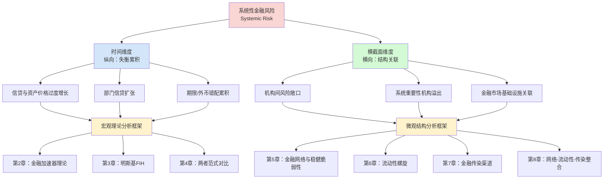
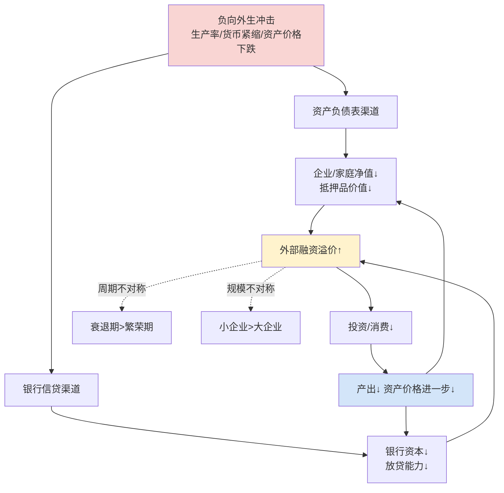
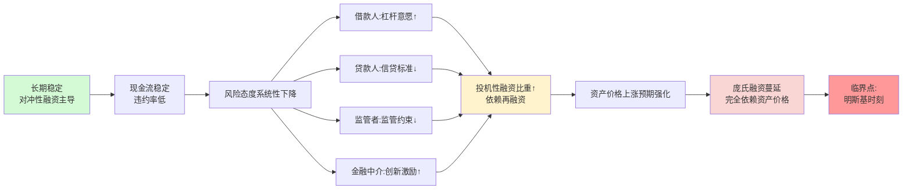
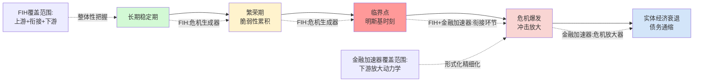
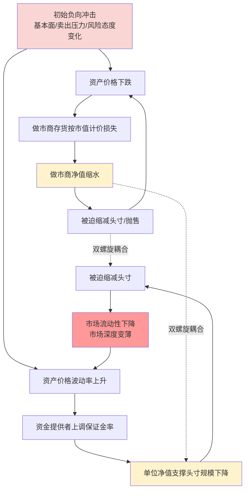
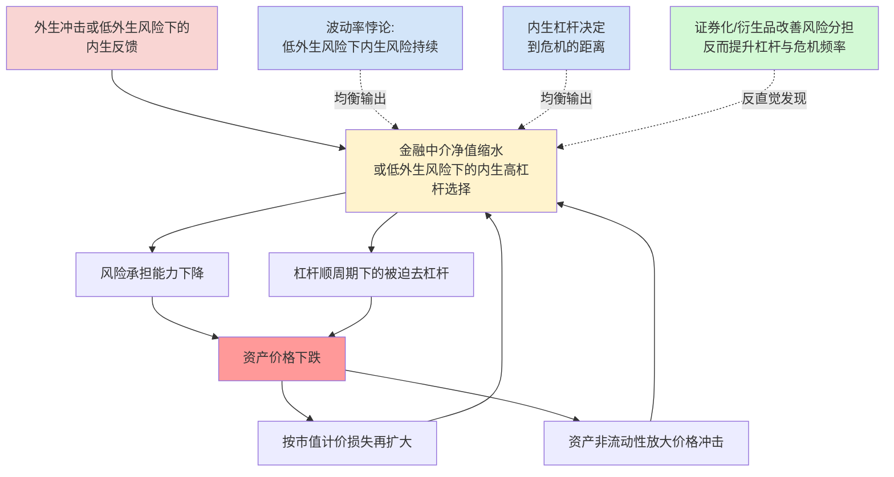

# 系统性金融风险的形成机制与微观结构：理论对比与文献综述
# 1 导论：系统性金融风险研究的理论脉络与综述框架

2008年源于美国次贷违约的全球金融危机，以其影响的深度与广度成为"大萧条以来最严重的一次"金融动荡，并在此后十年间持续重塑着全球经济、金融与社会结构[^1]。当英国女王伊丽莎白二世于2008年底访问伦敦经济学院、尖锐质问经济学家"为何没能预测这场金融危机的来临"时，这一"英女王之问"实际上揭示出一个远超个体预测能力的深层问题：长期以来，主流宏观经济学在研究范式上对金融体系内生脆弱性、对系统性金融风险积累机理的系统性忽视[^1]。正是在这一理论与现实的双重危机中，**系统性金融风险**从一个相对边缘的学术议题跃升为宏观金融研究的核心命题，并催生出涵盖宏观理论重构与微观机制剖析的多元研究路径。

本章作为整篇综述的开篇，承担着厘清概念、勾勒脉络、搭建框架的多重职责。后续八章将依循"宏观理论对比—微观结构剖析"的双层架构展开：第2至第4章聚焦宏观理论层面，对基于DSGE的金融加速器理论与明斯基金融不稳定性假说进行深度对比；第5至第8章转向微观结构层面，分别剖析金融网络、市场流动性、金融传染三类研究方向并尝试整合视角；第9章则汇总核心贡献与未解问题。本章的使命，是为这一展开过程奠定共同的概念基础、阐明范式转换的历史脉络、提出双维分析视角，并界定研究边界。

## 1.1 系统性金融风险的概念演变与内涵辨析

要理解当代系统性金融风险研究的核心议题，首先须辨清一个长期存在的概念混淆——在中文语境中均被译为"系统性风险"的两个英文术语：**Systematic Risk**与**Systemic Risk**。这一字面上的微小差异，实则对应着两种截然不同的风险观、应对主体与管理逻辑。

微观视角下的Systematic Risk由William F. Sharpe在资本资产定价模型（CAPM）中首次提出。Sharpe根据某一风险因素对资本市场影响的范围及严重程度，将风险划分为系统性风险（Systematic Risk）与非系统性风险（Unsystematic Risk）：前者是资产收益率波动中可归因于某些共同因素的部分，是处于同一市场中所有证券共同面临的、由整体经济或政治形势变化所造成的风险（如利率、经济衰退、战争等），无法通过分散投资加以消除，常以贝塔系数衡量；后者则是收益率波动中能够通过组合分散掉的部分，源自个别行业或企业自身因素[^2]。这一意义下的"系统性风险"即所谓"市场风险"，市场参与者**以承担它换取收益**，对应的是风险定价机制与微观主体的应对措施（如出售资产、对冲转移等）[^3]。

宏观视角下的Systemic Risk则是2008年危机后被监管部门所强调的全新概念。它**站在宏观系统结果的角度观察原因导向**：关注的不是"覆巢之下无完卵"的市场普遍性冲击，而是"火烧连营"、"一粒老鼠屎搞坏一锅粥"式的关联性风险——关注谁是"老鼠屎"、谁与谁存在关联、某一系统性风险点如何对整个金融体系产生影响[^3]。这一概念**不强调以承担它换取收益**，不涉及风险定价机制，而是站在巴塞尔委员会等宏观系统管理者的视角，强调对系统重要性机构与系统重要性业务的监管以及必要的危机救助等宏观主体应对措施[^3]。正是Systemic Risk而非Systematic Risk，构成了本综述的核心研究对象。

更进一步地，宏观视角下的系统性金融风险被Benoit等学者形容为"可以感知到却较难定义的概念"（hard-to-define-but-you-know-it-when-you-see-it）[^2]。学术界基于金融危机的逻辑起点，从四个互补的角度对其内涵进行界定：**第一，从危害范围看**，系统性风险威胁的是整个金融体系乃至宏观经济，而非一两个金融机构的稳定性（Bernanke 2009；Battiston et al. 2009）；**第二，从风险传染看**，系统性风险是由一系列事件引起一连串市场参与者遭受多米诺骨牌式重大损失的或然性（Gonzalez 1996；De Bandt and Hartmann 2000）；**第三，从金融功能看**，系统性风险是某一系统性事件对金融体系产生明显冲击、引发金融市场信息中断、严重损害金融系统正常运行从而导致金融功能丧失的或然性（Minsky 1995；Billio 2012）；**第四，从实体经济影响看**，系统性风险被界定为可能导致金融体系整体或局部受到破坏、致使大范围金融服务紊乱、经济损失或不确定性增加，并给实体经济造成严重影响的风险（Group of Ten 2001；FSB 2009；FSB-IMF-BIS 2011）[^2]。

在权威机构层面，IMF、BIS与FSB于2016年联合向G20提交的报告《有效宏观审慎政策要素：国际经验与教训》中，将系统性风险定义为"金融体系的部分或全部功能受到破坏所引发的大规模金融服务中断，以及由此对实体经济造成的严重负面冲击"，这一定义体现了各国金融监管部门反思国际金融危机后的普遍共识[^4]。综合上述四个角度的学术定义与机构定义，可以归纳系统性金融风险所具有的若干核心特征：

| 特征维度 | 内涵阐释 | 典型例证 |
|---------|---------|---------|
| **隐蔽性** | 风险在爆发前通常有较长积累过程，易被监管部门与市场参与者忽视 | 2001—2003年美联储降息刺激房地产泡沫期间，IMF仍认为"核心商业和投资银行金融地位稳定，系统性风险很低"[^4] |
| **规模性** | 所涉资产负债规模庞大，难以依靠市场力量自行消化 | 雷曼兄弟破产时债务总额高达6130亿美元；房利美与房地美持有或担保抵押贷款超过5万亿美元；AIG先后获得1823亿美元救助[^4] |
| **传染性** | 风险可迅速从源头扩散至看似不相关的金融机构与市场 | 次贷违约从次级抵押贷款迅速传染至两房、投资银行、保险集团并蔓延全球[^4] |
| **破坏性** | 不仅冲击金融体系，更对实体经济造成严重负面影响 | 次贷危机致使美国经济持续6个季度负增长，失业率飙升至10%[^4] |
| **内生性** | 风险产生于金融体系内部的共同敞口与失衡累积，并非单纯的外生冲击 | 危机前金融机构持有共同的次贷相关MBS等"有毒资产"形成共同风险敞口[^5][^6] |
| **关联性** | 受共同市场、资金来源、流动性、担保、声誉、治理等关联因素影响 | 金融机构间的相互牵连使任何单一机构在系统冲击下都难以独善其身[^3] |
| **顺周期性** | 风险表现出明显的亲周期特征，繁荣期累积、危机期集中爆发 | 巴塞尔协议特别关注的顺周期问题；危机前后金融失衡的累积与释放[^3] |

值得强调的是，**内生性、关联性、顺周期性这三大特征是2008年危机后概念深化的关键所在**。传统研究往往将系统性风险定义为"传播风险"，重点强调个体机构倒闭的防范与风险的外生性，但这一视角忽略了金融失衡的前期累积过程以及金融机构持有共同风险敞口在危机发生过程中的核心作用[^6]。危机以来，理论界普遍认识到**内生于金融体系中的共同风险敞口与随时间积累的金融失衡，而非风险传播本身，才是诱发危机的关键因素**[^6]。这一认识论转向，直接为后续金融加速器、明斯基假说等宏观理论以及网络、流动性、传染等微观结构研究提供了共同的问题导向。

## 1.2 2008年全球金融危机与宏观金融理论范式转换

2008年危机不仅是一场金融事件，更是一场**经济学的危机**。在危机爆发之前，宏观经济研究进入了一个被广泛认可的"黄金时代"：主流经济学界乐观地认为，现代宏观经济学在研究方法与主要学术观点上都已达成广泛共识，主要西方经济体的宏观经济政策制定正朝着宏观经济理论所建议的方向演变——以灵活的通胀目标制作为货币政策的基石、强调货币政策是调节经济周期的最佳方法、放松对金融创新的监管等[^1]。诺奖得主卢卡斯甚至在2003年美国经济学会主席致辞中宣称："防止经济衰退的核心课题已经攻克。"[^1]

然而，危机的爆发彻底打破了这种"幻觉"。主流经济学界对眼前发生的一切茫然不知所措，他们对此前金融系统中长期累积的系统风险"毫无觉察或未予深思"[^1]。后来成为印度央行行长的芝加哥大学教授拉古拉迈·拉詹早在2005年的全球央行年会上就提交了一篇有先见之明的论文，警告金融市场的巨大变化已至极其危险水平，但这一警告被时任哈佛大学校长萨默斯视为"误导之作"，论文在SSRN上仅有93次下载[^1]。当危机在2007年初夏爆发时，主流宏观学界与政策界花了很长时间才意识到危机的严重性——他们既没能对危机作出准确判断，也无法提供有效的理论框架、政策建议与工具[^1]。正如克鲁格曼2009年9月2日在《纽约时报》上发表的《经济学家为何错得如此离谱》一文所言，宏观经济学过往的二十年是"黑暗时代"——经济学家错误地把披着精妙数学外衣的理想主义模型当作真理和现实[^1]。

这场"经济学的危机"的核心症结，在于危机前的主流范式在事实上奉行着一种**"金融中性"假设**：金融体系仅被视为实体经济的"面纱"或被动镜像，金融摩擦、金融周期与金融体系内部的失衡累积在标准宏观模型中要么被完全忽略，要么被简化为可忽略的扰动项。正如杜冠德与胡志浩在系统性金融风险度量综述中所指出的，"事前，美联储对次级债务风险做出了严重误判，认为是完全可以忽略不计的风险。事实上，美国的主要金融机构都大量持有次级债务相关的MBS等有毒资产，金融体系为经济的虚假繁荣承担着巨大风险"[^5]——这种误判的根源，正是理论范式上对金融非中性的系统忽视。

危机后，宏观经济学进入了深刻的**金融革新**阶段，其核心是从"金融中性"向"金融非中性"的范式转换。这一革新沿着微观与宏观两条主线同步推进：**在微观层面**，经济学界从企业资产负债表与金融机构杠杆率两个层面入手，揭示了金融运行与实体经济之间相互作用、相互关联的内生机制；**在宏观层面**，经济学界重新审视金融资产价格与信用创造的周期起伏，强调金融周期对实体经济与金融稳定的冲击及重要影响[^1]。这一双重革新为宏观审慎监管政策与适度的资本管制政策提供了理论支撑[^1]。

危机后范式转换的实质，可以从以下几个层面加以理解：第一，金融摩擦从外生扰动转变为内生于宏观经济动力学的核心机制——这直接为后续章节将要详细讨论的金融加速器理论（Bernanke-Gertler-Gilchrist框架）提供了理论合法性；第二，金融失衡的累积过程被重新置于研究中心——这与明斯基金融不稳定性假说"稳定孕育不稳定"的核心命题形成跨越时空的呼应；第三，金融体系内部的网络关联、流动性结构与传染机制成为微观结构研究的核心议题，对应着后续章节将要讨论的金融网络拓扑、流动性螺旋与金融传染等研究方向。可以说，**2008年危机后的宏观金融理论革新，本身就是本综述所梳理的两大宏观理论与三类微观结构研究兴起的共同历史背景**。

## 1.3 时间维度与横截面维度：系统性金融风险的双维分析视角

危机后理论范式转换的一个重要制度成果，是为系统性金融风险的识别与防范确立了**双维分析框架**。根据IMF-FSB-BIS于2016年的联合报告，系统性金融风险包括时间维度与横截面（结构性）维度两个相互关联但分析侧重不同的维度，这一划分已成为宏观审慎政策制定与学术研究的共同基础[^5]。

**时间维度**指金融体系风险随时间积累而产生的脆弱性，其内涵主要包括三个层次：一是宏观脆弱性，主要体现为信贷总量与资产价格过度增长；二是部门脆弱性，体现为家庭与公司信贷增长的失衡；三是金融部门内部的脆弱性，体现为期限错配与外币错配的累积[^5]。这一维度的核心关切是金融失衡的**累积过程**：在长期繁荣期内，信贷扩张、资产价格上涨与杠杆累积相互强化，逐步推高整个金融体系的脆弱性，直至某一临界点上的小规模冲击引发大规模崩溃。这一时间维度的逻辑，与明斯基金融不稳定性假说所描述的"对冲性融资—投机性融资—庞氏融资"三阶段演化机制天然契合，也与金融加速器理论所揭示的"小冲击大波动"放大机制形成互补——后续第2至第4章对宏观理论的对比，本质上是在为这一时间维度的微观机理提供两种竞争性的解释框架。

**横截面维度**则指金融体系内部的相互关联性以及相关风险分布所产生的脆弱性，主要包括金融机构（涵盖金融市场基础设施）之间的关联性风险，以及某一机构倒闭对整个金融体系的影响[^5]。这一维度的核心关切是金融体系在**任意时点上的结构性特征**：哪些机构是系统重要性的？机构之间通过何种渠道相互关联？冲击在网络中如何传播？正是这一维度的研究问题，催生了金融网络拓扑分析、流动性螺旋机制建模、金融传染渠道识别等微观结构研究方向——后续第5至第8章对微观结构的剖析，本质上是在为这一横截面维度提供精细化的机制刻画。

宏观审慎政策框架的兴起，正是为应对这一双维脆弱性而构建的制度回应。狭义的宏观审慎政策仅限于被赋予系统性视角的审慎监管政策组合，重点在于时间维度（或称"纵向"维度）与跨部门维度（或称"横向"维度）两方面的监管工具设计；而广义的宏观审慎政策框架则包括系统性风险的分析、识别及监测，政策工具与实施传导，以及治理结构与制度基础等所有环节[^6]。这一框架的实施，前提是能够对系统性风险进行**准确的动态评估**——这就为后续学术界探索各类系统性风险监测与度量方法提供了直接的政策需求[^5]。

下图直观呈现了本综述所采用的"双维视角—理论框架—微观机制"的对应关系：

如图所示，时间维度的失衡累积问题主要由宏观理论框架加以解释——金融加速器理论强调金融摩擦放大外生冲击的机制，明斯基FIH则强调内生不稳定性的演化逻辑，二者共同构成本综述第一大主线；横截面维度的结构关联问题则主要由微观结构研究加以剖析——网络拓扑决定直接传染路径，流动性螺旋刻画间接传染机制，传染渠道研究提供识别方法，三者整合于第8章的统一视角，共同构成本综述第二大主线。**这一"宏观时间维度—微观横截面维度"的对应关系，构成了本综述双层分析框架的内在逻辑基础**。

## 1.4 综述的分析框架、研究边界与章节结构

基于上述概念辨析、范式背景与双维视角，本综述正式提出其**"宏观理论对比—微观结构剖析"双层分析框架**。这一框架在哲学层面承认系统性金融风险的双重属性：它既是一个跨时间累积的宏观失衡过程，也是一个跨主体传导的微观结构现象；既需要在均衡分析与不确定性分析两种宏观范式的对照中理解其形成机理，也需要在网络、流动性与传染三类微观机制的剖析中理解其传导路径。具体而言：

**宏观理论对比层面**（第2—4章），聚焦于两种解释系统性风险形成机制的主导理论之间的对照与互补。**第2章**详细剖析以Bernanke、Gertler、Gilchrist为代表的金融加速器理论，归纳其基于信息不对称与代理成本的外部融资溢价机制、资产负债表渠道与银行信贷渠道的双重传导，以及Kiyotaki-Moore抵押品约束、Carlstrom-Fuerst等后续DSGE扩展工作。**第3章**深入解析Hyman Minsky的金融不稳定性假说，包括其凯恩斯与熊彼特思想渊源、两大定理、对冲—投机—庞氏融资三阶段演化机制、明斯基时刻的触发条件，以及与Fisher债务—通货紧缩循环、Kindleberger危机史的延伸关联。**第4章**则系统比较两者在哲学基础、方法论、关键假设、风险来源与政策含义上的根本分歧与互补可能。

**微观结构剖析层面**（第5—8章），聚焦于横截面维度上系统性风险传导的三类核心机制。**第5章**探查金融网络拓扑与系统稳定性的关系，包括Allen-Gale的开创性贡献、Acemoglu等关于"稳健但脆弱"的相变分析、核心—边缘结构的实证证据，以及DebtRank等中心性指标在系统重要性识别中的应用。**第6章**剖析市场流动性与融资流动性的相互强化，重点解析Brunnermeier-Pedersen的流动性螺旋模型（保证金螺旋与损失螺旋）、Adrian-Shin的杠杆顺周期性、Geanakoplos的杠杆周期理论等。**第7章**区分基于直接关联（Eisenberg-Noe清算机制等）与基于间接关联（Shleifer-Vishny火售传染、Greenwood-Landier-Thesmar等）的两类传染机制。**第8章**则尝试在Brunnermeier-Sannikov等整合性研究的视角下，将网络、流动性与传染纳入统一分析框架，并讨论压力测试与宏观审慎工具设计中的应用进展。

**第9章**作为收束，归纳两大宏观理论与三类微观结构研究的核心贡献与未解问题，比较其政策含义差异（"大政府+大银行"干预、宏观审慎监管、逆周期资本缓冲、流动性覆盖率等），并展望2020年3月之前学术前沿的延伸方向。

关于**研究边界**，本综述需作出三点明确说明：**第一，时间边界**，所有引用的文献、理论发展与实证证据严格限定在2020年3月之前，对此后的文献发展（包括新冠疫情冲击下的系统性风险讨论等）不予涉及；**第二，文献来源**，本综述以国际顶级学术期刊原文、经典专著、权威机构（IMF、BIS、FSB等）报告与重要工作论文为A级证据来源，辅以中文核心期刊综述与教科书作为补充，对存在学术争议的问题（如网络密度与脆弱性的非单调关系等）尽量呈现多方观点；**第三，主题边界**，本综述聚焦于宏观视角下的Systemic Risk而非微观视角下的Systematic Risk，且重点关注理论框架与微观机制的梳理，对系统性风险的具体度量方法（如基于系统重要性金融机构的CoVaR、MES、SES等指标，基于经济部门债务风险的度量方法，以及银行间同业拆借网络分析等具体测度方法[^5]）仅在相关章节中作为机制应用加以提及，不作专门展开。

需要坦诚的是，作为一份覆盖宏观理论与微观结构双重维度的综述，本研究在每一具体议题上的剖析深度受制于资料获取的边界。对于本章所涉及的概念辨析与范式背景，搜索结果提供了较为充分的支撑；但对于后续各章节将要深入讨论的具体理论模型与微观机制，本综述将依赖于各章节自身的文献支撑，并在资料不足时如实说明局限。在保证理论准确性、对比结构化、文献覆盖完整性与宏观—微观逻辑衔接一致性的前提下，本综述力图为读者提供一份**既能勾勒系统性金融风险研究整体脉络、又能深入剖析关键理论与机制**的学术文献综合性参考。

# 2 理论基础对比之一：基于DSGE的金融加速器理论

承接第1章对2008年危机后宏观金融理论从"金融中性"向"金融非中性"范式转换的梳理，本章进入综述的第一大主线——宏观理论对比层面——的第一个支柱。金融加速器理论是这一范式转换在主流宏观经济学内部最具代表性的产物：它沿用新古典—新凯恩斯主义所熟悉的动态随机一般均衡（DSGE）数理框架，但在其中显性引入信息不对称与代理成本，使金融摩擦从"可被忽略的扰动项"跃升为"内生于宏观动力学的核心放大机制"。理解这一理论的逻辑、假设、传导渠道与边界，不仅是把握当代主流宏观金融建模范式的关键，也是后续第3章解析明斯基金融不稳定性假说、第4章展开范式对比的必要参照基准。

本章围绕"金融摩擦如何被内生化为宏观经济波动的放大器"这一核心命题展开：首先回溯金融加速器理论产生的思想渊源与建模动因，继而深入剖析BGG模型的代理成本—净值—外部融资溢价机制及其双重传导渠道与双重不对称特征，随后梳理Kiyotaki-Moore抵押品约束模型这一并行路径，再讨论引入银行部门后的DSGE再发展，最后在系统性金融风险研究语境下评估该理论框架的解释力与局限。

## 2.1 理论渊源与建模动因：从金融中性到金融非中性的范式起点

金融加速器理论的兴起，本质上是对长期统治宏观经济学的"金融中性"假设的一次根本性挑战。在传统Arrow-Debreu一般均衡范式中，市场被假定为完全的，企业和家庭通过完美市场相互作用并达到帕累托最优配置，金融中介在这一框架内"不起任何作用且无法改进福利"；Fama（1980）进一步从理论上论证，在一个竞争性、不存在货币计价物的完美市场中，金融中介在一般均衡决定中完全充当被动角色，这种价格和实际经济活动的无关性被视为对Modigliani-Miller定理的完美诠释[^7]。随后兴起的真实经济周期（RBC）模型同样未对金融与实体经济的关系做出更多分析，其核心命题是经济周期的驱动力是总生产率冲击，技术冲击在动态一般均衡框架中可以很好地解释经济周期，而金融和货币因素则不起作用[^8]。**这一"金融中性"传统使得相当长一段时间内学界忽视了对金融中介的深入研究**，金融体系沦为实体经济的被动镜像[^7]。

然而，从大萧条到20世纪历次金融震荡的现实经验，与"金融中性"的理论预言形成了明显张力。早在Fisher（1933）即对金融摩擦的内在机制作出初步探索，揭示了信息不对称、市场不完全的广泛存在是如何导致资本难以得到有效配置的[^7]。Stiglitz和Weiss（1981）的开创性研究进一步指出，由于银行无法清晰辨别信誉较差的借贷者，名义利率无法成为调控信贷市场均衡机制的有效工具，银行只能放弃利率作为调节工具而提高对贷款者最低资格的限制，进而出现对借款者实行信贷配给——信贷配给的出现产生了信贷市场流动性约束，从而可能对实际经济产生影响[^9]。这一信息经济学视角，为后续"信贷渠道"理论提供了关键的微观基础。

直接为金融加速器理论铺路的，是Bernanke-Blinder（1988）所构建的CC模型。在传统货币数量理论中，资产被假定只有货币与债券两种，且二者可完全替代，银行贷款与其他形式的信贷被视为债券的完全代替品；Bernanke-Blinder在传统IS-LM模型基础上引入信贷市场均衡分析，将资产形式扩展为货币、债券和贷款三种，债券和贷款不再完全替代，从而从货币市场和债券市场中清晰甄别出信贷市场，并通过分析货币、债券与贷款三类资产市场，阐释了货币政策通过信贷规模变动对经济产生的放大效应[^9]。CC模型构建了包含商品市场和信贷市场双重均衡的理论框架，奠定了信贷传导机制的研究基础，但其分析仍停留在IS-LM框架下的局部均衡逻辑，**尚未将信贷市场摩擦的微观基础完整嵌入到动态一般均衡的宏观模型之中**。

正是在上述思想准备的基础上，Bernanke、Gertler与Gilchrist自1989年起的一系列研究开始尝试一项更为雄心勃勃的工作：在主流宏观经济学最为推崇的DSGE一般均衡框架内，显性引入信息不对称与代理成本，使金融摩擦从外生扰动转变为内生于宏观动力学的核心放大机制。其建模动因有两层：**第一，回应RBC理论的解释短板**——RBC坚持技术冲击是经济周期的根本驱动力，但难以解释危机期间反复出现的"小冲击大波动"现象，即看似有限的初始扰动何以在金融体系中被放大为整体性的产出收缩；**第二，回应Modigliani-Miller定理在现实中的失效**——在信息不对称与代理成本广泛存在的现实信贷市场中，企业的外部融资成本严格高于内部融资成本，资本结构对实体投资具有显著影响，因而企业资产负债表状况本身成为联结金融体系与实体经济的关键纽带[^10]。这两层动因共同构成了金融加速器理论的范式起点：**保留DSGE框架的方法论优势，但用信息经济学的微观基础打破其"金融中性"的隐含假设**。

## 2.2 BGG模型的核心逻辑：代理成本、净值与外部融资溢价

Bernanke、Gertler、Gilchrist（以下简称BGG）通过1989年、1996年与1999年的系列工作，建立起金融加速器理论的核心模型。其建模哲学可以概括为：在新凯恩斯DSGE框架内，引入由信息不对称所导致的代理成本，使企业的外部融资溢价成为关于企业净值的内生递减函数，进而在宏观经济周期中产生自我强化的放大循环。

BGG模型的关键假设有三层。**第一，信贷市场不完美**：贷款人无法零成本地观察借款人项目的真实回报，借款人对项目结果拥有私人信息，由此形成所谓"成本状态验证"（costly state verification, CSV）问题——贷款人若要核实项目真实状态，必须支付一定的代理成本。这一摩擦使得债务合约取代了完美市场下的状态依存合约成为最优融资安排，但同时也使借款人的外部融资成本严格高于无摩擦情形下的安全利率。**第二，企业异质性**：企业在净值水平、抵押品价值与生产效率上存在差异，这种异质性使金融摩擦在不同类型企业之间产生差异化影响。**第三，价格黏性**：模型在新凯恩斯框架内引入名义价格调整摩擦，使货币政策具有真实效应，从而将金融加速器机制与货币政策传导联结起来。

在上述假设下，BGG模型的核心机制可概括为"**代理成本—净值—外部融资溢价**"的链条。由于代理成本的存在，企业每单位外部融资的实际成本不仅包含无风险利率，还包含一项**外部融资溢价**（external finance premium）。这一溢价是企业净值（即可作为内部融资或抵押品的自有资金）的递减函数：企业净值越高，可承担的损失缓冲越厚，贷款人面临的代理成本越低，外部融资溢价也越低；反之，企业净值越低，外部融资溢价越高，进而抑制其投资能力。

这一负相关关系一旦置于宏观经济的动态过程中，便催生出**正反馈循环**：负向冲击（如生产率下降或货币紧缩）首先导致企业当期利润与资产价格下降，进而压低企业净值；净值下降推升外部融资溢价，使企业实际融资成本上升；融资成本上升迫使企业削减投资，投资收缩进一步压低未来产出与企业资产价格，从而引发下一轮净值下降。**整个循环将原本有限的初始冲击在金融加速器机制下放大为持续而显著的宏观波动**。这一机制的核心洞见是：金融摩擦并非简单地"摩擦掉"一部分产出，而是通过资产负债表渠道将冲击在时间维度上累积放大；同样的初始扰动，在存在金融摩擦的经济中比在无摩擦经济中产生更深的衰退与更长的复苏。

值得指出的是，BGG模型在概念层面延续了Bernanke-Blinder CC模型的"信贷市场"视角，但在方法论层面实现了根本跃升——从静态局部均衡跃升至动态一般均衡，使金融加速器机制可以在标准宏观周期模型中被显性求解、可被嵌入货币政策反应函数、可与其他冲击源进行系统比较。这一方法论跃升正是后续大量DSGE扩展工作的起点。

## 2.3 传导渠道与双重不对称特征

金融加速器理论在传导渠道层面识别出两条相互补充的路径，并在二者的交织作用下呈现出鲜明的双重不对称特征。

**第一条渠道是资产负债表渠道**（balance-sheet channel），即基于借款人（特别是企业与家庭）净值与抵押品价值变动的传导。这一渠道直接对应BGG模型的核心机制：经济繁荣期资产价格上涨推高企业与家庭净值，抵押品价值随之上升，银行据此增加放贷供给，外部融资溢价下降，投资与消费扩张造成经济过热；而经济衰退期资产价格下跌压低净值与抵押品价值，外部融资溢价上升，商业银行被迫减少放贷，加剧经济的萧条。**商业银行抵押贷款的这种顺周期特性，加剧了实体经济的波动**——20世纪90年代的日本经济危机和2008年次贷危机都印证了这一理论的解释力，由于小微企业的信息不对称程度更高、贷款对抵押品的依赖程度也越高，金融加速器效应在小微企业融资中尤为明显[^10]。

**第二条渠道是银行信贷渠道**（bank lending channel），即基于银行自身资产负债表对信贷供给的影响。这一渠道延续自Bernanke-Blinder CC模型的核心洞见：在信息非对称性和市场摩擦广泛存在的信贷市场上，企业外部筹资的资金成本和内部筹资的机会成本之间的差距不断扩大，使得信贷规模本身成为独立于利率的关键变量[^9]。当银行自身资产负债表受到冲击（如资本损失、流动性短缺）时，其放贷能力被压缩，即使央行通过传统利率工具放松货币政策，信贷供给也未必能相应扩张。两条渠道在实际运作中相互交织：资产负债表渠道作用于借款人侧，银行信贷渠道作用于贷款人侧，二者共同决定了金融加速器机制在货币政策传导与外生冲击放大过程中的总体强度。

在上述两条渠道的共同作用下，金融加速器理论揭示出两重显著的不对称特征。**第一是周期不对称性**：金融加速器效应在经济衰退期显著强于繁荣期。其原因在于，繁荣期资产价格上涨提升净值，外部融资溢价下降的边际幅度有限（净值充裕情形下溢价已接近底线），而衰退期净值下降所引发的溢价上升则没有明显上限，且常常因抵押品市场流动性枯竭而进一步恶化。这一不对称使得金融加速器更多地表现为"危机放大器"而非"繁荣放大器"，与1990年代日本资产泡沫破裂后长期信贷紧缩与"失去的十年"，以及2008年次贷危机后的深度衰退表现高度一致[^10]。

**第二是规模不对称性**：金融加速器效应对信息不对称程度更高的小企业的冲击显著强于大企业。由于小微企业缺乏基本文件、规模小、远离银行分支机构，债务合约中通常更依赖抵押品来缓解由于信息不对称而产生的代理问题，抵押品在中小企业中更为普遍[^10]。这意味着同样幅度的资产价格下跌会通过抵押品价值缩水机制对小企业产生更大的融资约束冲击；同样的紧缩性货币政策会通过外部融资溢价对小企业的实际融资成本产生更大的边际上升。这一规模不对称特征已在大量国际实证研究中得到验证，也成为后续宏观审慎政策针对小微企业融资困境进行差异化设计的重要理论依据。

资产负债表渠道、银行信贷渠道与双重不对称之间的逻辑关系，可以通过下图加以呈现：

如图所示，初始的外生冲击通过两条渠道分别作用于借款人侧与贷款人侧，二者汇合于外部融资溢价的上升，进而引发投资—产出—资产价格的负向螺旋，并在下一轮反馈中再次冲击净值与银行资本。整个机制在时间维度上呈现衰退期更强的周期不对称，在横截面上呈现小企业承压更重的规模不对称。这一双重不对称使得金融加速器理论在解释"小冲击大波动"以及不同主体不同周期阶段的差异化承受能力上具有显著优势。

## 2.4 并行与扩展：Kiyotaki-Moore抵押品约束模型

与BGG模型几乎同时发展、并在金融加速器研究脉络中具有同等重要地位的，是Kiyotaki与Moore（1997）发表于Journal of Political Economy的"Credit Cycles"一文所建立的抵押品约束模型（K-M模型）。这篇文章以**相对较小的初始冲击，通过资产价格和信用约束的相互作用，以及和资产价格的跨期乘数效应的正反馈，来解释经济周期的波动**[^11]。

K-M模型的基本设定颇具特色：模型中有两种商品——"果实"（Fruit）与"土地"（Land）。土地没有折旧，在经济中以固定供给存在；"水果"为土地的产出、为消费者效用的来源也为计价单位，只能当期消费而不能储存。模型假定有两类无穷期的代表性生产-消费者：**"种植者"（Farmer）**与**"采集者"（Gatherer）**，二者有不同的生产技术和偏好——种植者相对更没有耐心，更愿意当期生产并消费产出，且不会消费超过一定比例的产出。根据模型的设定，面对负担了债务之后的种植者，采集者为避免血本无归会同意对种植者将要偿付债务进行部分减免；由于这样的道德风险的存在，采集者进行借贷时总是需要土地作为抵押品。因此在这样的经济环境中，存在如下均衡结果：种植者最大限度抵押其资产买入土地扩大生产；采集者会成为将土地资源的供给方；由于信贷约束，种植者所拥有的土地小于社会最优时的种植者应该拥有的土地数量[^11]。

在不存在信贷约束的情况下，暂时的生产率冲击只会带来当期总产出的有限变化，不会对土地价格和土地拥有量产生跨期影响；**但一旦加入信贷约束，技术冲击的影响将通过抵押品价值机制被显著放大并延长**。K-M模型识别出两类放大效应：**一是当期的静态效应**——"资产价格下降—高效率借款人的资产贬值—负债相对增加—被迫出售资产偿付债务—资产供给进一步增加"，构成同一时点内的负向循环；**二是跨期动态效应**——"资产价格下降—高效率借款人的资产贬值—负债相对增加—被迫出售资产偿付债务—投资不足导致第二期未来产出不足—资产贴现价值进一步下降"，构成跨期的负向乘数[^11]。论文的第二个模型和第三个模型在此基础上加入了投资和溢出效应的讨论，其中第二个模型成为Kiyotaki-Moore（2012）的先驱，后者在此基础上讨论了流动性问题，并成为引用过千的宏观理论重要文献[^11]。

K-M模型与BGG模型在金融加速器研究脉络中可视为两条互补的并行路径，但在建模哲学上存在显著差异。**BGG强调企业净值与外部融资溢价**：金融摩擦的核心表现是企业自有资金不足导致代理成本上升、外部融资成本与无风险利率之间出现"溢价楔子"；**K-M则强调抵押品价值与资产价格波动**：金融摩擦的核心表现是借款规模受抵押品价值约束，资产价格本身成为信贷可得性的关键决定因素。前者的建模重心在信息不对称与代理合约设计，后者的建模重心在资产价格与跨期信贷动态。这种差异并非彼此对立，而是从不同角度刻画了"资产负债表渠道"的内在机制——BGG聚焦于净值的合约层面，K-M聚焦于抵押品的价格层面。

值得注意的是，K-M模型尽管事后被证明影响深远——论文引用过5000，但发表过程其实非常不顺利，其原因包括三个层面：**第一，时代背景的阻力**——在当时宏观经济学内部对金融摩擦表现了不屑一顾的态度，金融危机爆发之后仍有Edward C. Prescott继续坚持RBC理论、坚持技术衰退才是问题所在，更何况在20世纪90年代的环境中；**第二，方法论的"反新古典"色彩**——这篇文章的环境设定非常反宏观传统，使用线性效用函数、线性生产函数、两类贴现率，这非常不新古典；**第三，与既有研究的关系**——关于金融摩擦的论文，Bernanke-Gertler（1989）珠玉在前，学界对"为何还需要用新的框架"存在质疑[^11]。然而，正是在2008年金融危机爆发之后，**K-M模型因其对"信贷约束—资产价格"正反馈机制的清晰刻画而被广泛重新发现**，成为后续抵押品约束、杠杆周期、抛售传染等大量研究的奠基性文献。这一"理论再发现"的轨迹，本身也折射出宏观金融理论范式从"金融中性"向"金融非中性"转换的历史脉络。

## 2.5 后续DSGE扩展：引入银行部门与金融中介

2008年次贷危机的爆发使学界深刻认识到，仅在企业部门引入金融摩擦的BGG-K-M框架，已不足以完整刻画现代危机的传导路径。**从2008年美国次级贷款危机爆发的特点来看，银行部门成为了诱发和传染金融危机的重要渠道，危机往往按照"实体经济部门—商业银行等金融中介部门—其他实体经济部门"的路径进行传导**——以2008年次贷危机为分水岭，涌现出大量围绕银行资本机制进行建模的DSGE模型，这些模型中直接引入了单独的银行部门或金融部门，从而能够有效刻画和研究金融业在危机传导当中发挥的关键性作用[^12]。

通过银行资本机制构建模型一般包括两种方式：**第一种是引入银行资本约束**，即商业银行等金融中介机构对外放贷时需要满足相应的资本充足率要求，当其受到负面冲击导致资本金减少时，需要通过收紧信贷等措施满足监管要求，这会进一步对投资和产出等造成负面影响；**第二种是通过设定金融中介部门存在委托代理问题**，从而将金融摩擦因素引入模型当中——这两种方式均与原始BGG的金融加速器机制存在显著差异，因为它们将金融摩擦从企业部门扩展到了金融中介部门内部[^12]。

在这一领域的开创性研究中，Carlstrom-Fuerst（1997）较早地将代理成本框架引入完整DSGE，使BGG式的金融加速器机制可以在标准动态一般均衡框架内被显性求解。而首次将模块化的银行部门引入DSGE分析框架的开创性研究则是Goodfriend和McCallum的工作，该模型依旧由BGG发展而来，但在模型中包含了两种外部融资溢价效应，其中"**银行衰减器**"（bank attenuator）效应弱化了货币政策对宏观经济的影响，而另一种效应则放大了货币政策的冲击效果[^12]。这一"衰减—放大"双向机制揭示了银行部门在政策传导中的复杂作用：银行既可能成为放大冲击的渠道，也可能在特定条件下成为吸收冲击的缓冲。

此后衍生出的大量围绕金融中介部门进行建模的研究，主要特色在于引入了**异质性的家庭部门、异质性的银行部门或开放经济**，同时金融中介部门资产和负债的来源也不尽相同。例如，Dib通过信贷调整成本将金融摩擦纳入DSGE模型，模型中包含两种不同类型的垄断竞争银行部门，二者提供不同类型的金融服务，同时在银行间市场进行同业交易；银行从家庭部门获得存款和资本金，这些资本金一方面用来满足监管要求，另一方面可以充当同业交易的抵押品；研究结果显示，受益于资本监管要求，银行部门削弱了金融冲击对实体经济的影响，从而减少了宏观经济的波动性[^12]。

也有研究指出，银行资本的存在弱化了银行部门与债权人之间的委托代理问题，因此银行资本头寸会对银行吸收可贷资金的能力产生影响，由此形成的银行资本渠道会放大外生冲击对实体经济的冲击效果。Gerali等在模型中引入异质性的家庭部门，耐心家庭和非耐心家庭分别在经济中扮演贷款人和借款人的角色；模型中包含了非完全竞争的商业银行部门，银行部门面临的资产负债表约束会影响银行利润和银行资本，从而对信贷供给产生影响；该模型利用欧元区数据进行了实证研究，从模拟结果来看，**起源于银行部门的冲击在2008年金融危机当中扮演了十分重要的角色，模型能够在很大程度上解释欧元区在次贷危机期间发生的大幅衰退**——同时研究结果也表明，未预期到的银行资本损失将对宏观经济产生重要的影响[^12]。

在政策调控方面，部分研究认为单纯依靠货币政策并无法实现预期目的——特别是在存在金融摩擦的状况下，银行流动性需求会制约货币政策的政策效果，此时需要财政政策配合才能够实现在不存在金融摩擦状况时的市场均衡。Harmanta等在Meh和Moran、Gerali等模型的基础之上引入开放经济，**同时在企业部门和家庭部门当中分别加入了金融加速器机制和抵押约束机制**，并在政策调控上考虑了货币政策以及宏观审慎政策；在该模型中，银行资本的减少会导致资本充足率下降，为了满足监管要求，银行部门就必须调整存款利率从而稳定盈利[^12]。Harmanta等的研究尤具方法论意义：它在同一模型中同时融合了BGG式的金融加速器机制（针对企业部门）与K-M式的抵押约束机制（针对家庭部门），并将开放经济与宏观审慎政策纳入考量，体现了2008年危机后DSGE金融加速器理论沿"多部门—多摩擦—多政策"方向的综合扩展趋势。

从更宏观的视角看，金融中介在现代宏观经济运行中的主要功能是解决经济主体的逆向选择和道德风险问题，并为市场提供流动性保险；良好运作的金融中介可以克服现实世界中的金融摩擦，促进资源的有效配置，保障经济在更高的潜在水平上运行——但金融中介在实现这些功能时，实际上把经济运行中的大量风险转移到了自身，在有限程度内杠杆运行；金融杠杆增长也为短期波动埋下隐患，当外生冲击大到一定程度，金融中介反而成为放大金融波动的罪魁；**信息不对称、金融合约不完全、流动性错配成为金融市场内生不稳定的条件，资产价格伴随着金融中介资产负债表的恶化而大幅下跌，对经济造成持续性的放大效应**[^7]。这一来自袁志刚等综述的判断，准确概括了引入银行部门后DSGE金融加速器理论的核心洞察：金融中介既是化解金融摩擦的制度安排，也是放大金融摩擦的潜在源头。

## 2.6 解释力评估与理论局限

在系统全面理解了金融加速器理论的核心模型、传导渠道与扩展路径之后，本章最后需要在系统性金融风险研究的语境下，对其解释力与边界进行客观评估，为后续第3章明斯基金融不稳定性假说的对照分析与第4章范式对比奠定逻辑接口。

**就解释力而言**，金融加速器理论在三个方面展现出突出优势。**第一，对货币政策传导效率的精细化刻画**：通过资产负债表渠道与银行信贷渠道的双重传导，理论清晰揭示了为何在金融摩擦存在的现实经济中，货币政策的实际效果会显著偏离无摩擦基准——这为央行在不同周期阶段差异化设计政策工具提供了理论依据[^9]。**第二，对"小冲击大波动"现象的强解释力**：通过净值—外部融资溢价的正反馈循环与抵押品—资产价格的跨期乘数效应，理论令人信服地说明了为何看似有限的初始扰动可在金融体系中被放大为整体性的产出收缩，这正是2008年次贷危机与1990年代日本经济危机的核心特征[^11][^10]。**第三，对衰退期信贷紧缩与小企业融资困境的针对性解释**：通过周期不对称与规模不对称的双重特征，理论为危机期间的信贷紧缩、小微企业融资难以及差异化政策干预（如定向降准、信用贷款引导等）提供了理论基础[^10]。从政策含义看，金融加速器理论为宏观审慎政策、逆周期资本缓冲、银行资本充足率监管等危机后兴起的监管框架提供了重要的微观基础。

**然而，作为一种"外生冲击+内生放大"范式的理论框架，金融加速器理论在系统性金融风险研究语境下也存在三个方面的明显局限**。

**第一，方法论局限**。金融加速器理论始终立足于DSGE一般均衡的方法论传统，其依赖理性预期、代表性主体（即使引入异质性也多为有限类型）、均衡分析等基本假设。这一方法论在数理严谨性与可比较性上具有显著优势，但难以容纳奈特意义上的深度不确定性（Knightian uncertainty）、行为非理性、信念的内生演化与多重均衡之间的相变。在第1章所提及的"系统性金融风险包括隐蔽性与内生性"特征中，金融加速器理论可以解释冲击发生后的放大过程，但难以刻画危机前长期繁荣期内市场参与者预期、风险态度与杠杆决策的根本性转变。

**第二，机制局限**。金融加速器理论本质上仍依赖外生冲击触发——无论是BGG模型中的生产率冲击或货币冲击，还是K-M模型中的初始扰动，理论的内生部分主要是冲击发生后的放大动力学，而非冲击本身的内生生成。这意味着该理论无法解释金融失衡的长期累积过程，也无法说明"为何在长期繁荣期内，金融体系自身的运行逻辑会逐步演化出系统性脆弱性"。换言之，**金融加速器理论是"危机放大器"而非"危机生成器"**，它解释了"为何小冲击会变成大波动"，但没有完整解释"为何冲击会在特定时点上发生、为何金融体系会在繁荣期内逐步积累脆弱性"。这一逻辑短板，正是后续第3章将要详细阐述的明斯基金融不稳定性假说所致力于填补的——明斯基"稳定孕育不稳定"的核心命题，恰好对应了金融加速器理论无法解释的内生失衡累积逻辑。

**第三，范围局限**。金融加速器理论主要在时间维度上刻画金融失衡如何放大宏观波动，但对系统性金融风险的横截面维度——金融机构之间的网络关联、市场流动性与融资流动性之间的螺旋相互强化、不同传染渠道的交互作用——的刻画相对不足。BGG模型中的"企业"或Gerali等模型中的"银行部门"虽然有了部门层级的区分，但在大多数主流DSGE扩展中，金融机构仍被处理为代表性中介，而非具有异质性敞口与网络位置的多个主体。**这一局限意味着，金融加速器理论需要与第5章网络结构研究、第6章流动性螺旋研究、第7章金融传染研究相互配合，方能完整刻画系统性金融风险的双维属性**。

值得指出的是，**金融科技与大数据时代的兴起，正在从外部条件层面对金融加速器机制本身产生新的影响**。Gambacorta、邱晗、黄益平等学者在2023年的研究指出，相比传统商业银行高度依赖抵押品的信贷模式，大型科技公司的信贷更倾向于反映公司内部特定特征的变化，传统银行信贷则更注重客户的信用价值和所处环境；金融科技通过"数据—网络—活动"反馈循环对客户信用进行识别，可能在一定程度上**减弱"金融加速器"效应**[^10]。这一新兴方向虽超出本综述的时间边界（2020年3月之前），但已显示出金融加速器理论可能进一步与金融科技、信息技术等新变量结合的扩展方向。

综合而言，金融加速器理论作为2008年危机后宏观金融理论范式转换在主流DSGE方法论传统内的代表性成果，**成功地将金融摩擦从外生扰动转变为内生于宏观动力学的核心放大机制**，对货币政策传导、危机放大、信贷紧缩与小企业融资困境的解释力具有突出优势；但其"理性预期+均衡分析+外生冲击+内生放大"的方法论组合，使其在解释金融体系的长期失衡累积、内生危机生成与横截面网络脆弱性方面存在明显边界。**正是这些局限，构成了下一章明斯基金融不稳定性假说作为另一种解释范式得以登场的逻辑空间——明斯基从基本不确定性、内生失衡累积与顺周期行为演化的视角出发，提供了与金融加速器理论既互补又对立的另一条解释路径**。第3章将对此进行深入剖析，并在第4章中将两者的根本分歧与互补可能进行系统比较。

# 3 理论基础对比之二：明斯基金融不稳定性假说（FIH）

承接第2章对金融加速器理论作为"危机放大器"的定位与局限分析，本章进入综述宏观理论对比主线的第二支柱——海曼·明斯基（Hyman P. Minsky, 1919–1996）的金融不稳定性假说（Financial Instability Hypothesis, FIH）。如果说金融加速器理论是2008年危机后主流DSGE范式内对"金融非中性"的回应，那么FIH则代表着一种**早在1960年代即已成型、长期处于"非主流"位置、却在2008年危机后被学界与媒体重新发现**的另一条解释路径。其方法论起点、风险来源观、危机生成逻辑与政策含义，都与金融加速器理论形成鲜明对照——前者是"危机放大器"，后者是"危机生成器"；前者依赖外生冲击触发，后者强调内生失衡累积；前者植根于理性预期与均衡分析，后者扎根于基本不确定性与制度动力学。

本章将沿"思想渊源—两大定理—三阶段融资演化—明斯基时刻—债务通缩循环—Kindleberger历史延伸—2008年再发现"的内在逻辑展开，深入剖析FIH作为内生危机生成理论的核心建构，并在每一关键节点上与第2章的金融加速器理论形成对照，为第4章的范式对比奠定基础。

## 3.1 思想渊源与理论起点：从凯恩斯投资决策到熊彼特非常信用

理解明斯基FIH的关键，是把握其与众不同的思想谱系——这一谱系恰好对应着与第2章金融加速器理论所依托的新古典—新凯恩斯DSGE传统截然不同的方法论起点。明斯基1941年毕业于芝加哥大学数学专业，1947年获哈佛大学公共行政硕士学位，并**师从约瑟夫·熊彼特和华西里·列昂惕夫，于1954年获得经济学博士学位**[^13]。这一师承背景，连同他对凯恩斯的深入研读，使他从学术生涯起点便置身于一条与主流不同的思想路径之上。

**对凯恩斯投资决策理论与基本不确定性观念的继承**，是FIH最深的思想根脉。在重述凯恩斯的基础上，明斯基特别强调凯恩斯所揭示的现代货币经济的本质特征：**"我们的资本财富由大量的真实资产构成……然而这些资产的名义所有者为了拥有它们必须不断借钱。那么，财富的实际所有者是对货币……拥有要求权的人。……银行作为中介，通过吸收存款，发放贷款，从而保证了对真实资产的融资。真实资产和财富所有者之间的这层面纱，正是货币在现代社会最具标志性的一个特点"**[^14]。在这一凯恩斯式的视角下，投资决策本质上是面向不确定未来的债务承诺，资本资产的现期价格反映了对其未来收益的主观预期，而这种预期在奈特意义上的基本不确定性下天然容易发生剧烈的内生波动。这一基础认识，与金融加速器理论所依赖的理性预期—均衡分析范式形成根本对照：在BGG模型中，预期是模型解的内生组成部分、受理性预期约束；而在FIH中，预期是面向真正未知未来的主观信念，可以在长期繁荣中系统性地向乐观方向漂移而无外生冲击对其加以校正。

**师承熊彼特的"非常信用"与金融创新观念**，则构成FIH的第二条思想根脉。熊彼特将信用视为推动创新与经济演化的核心机制，强调金融体系不是被动的中介，而是通过对新型融资工具的创造性建构主动参与经济结构的变迁。这一观念使明斯基对金融体系的研究始终带有强烈的**制度动力学**色彩——金融体系的运行规则、产品结构与监管框架本身处于持续演化之中，每一次金融创新都重新定义着金融脆弱性的边界。这种视角对应到第2章K-M模型与后续DSGE扩展的对比中，可以更清晰地看出差异：K-M模型将抵押品约束视为给定的合约结构，而明斯基则认为抵押品制度本身、债务工具的种类与风险承担机制都在繁荣期内被不断"创新地放松"——这一制度演化本身就是危机生成的内生机制。

**对新古典综合与Walrasian均衡范式的批判**，是明斯基方法论选择的明确表态。明斯基明确指出："**当一种理论拒绝承认正在发生的事情，并把那些人们不希望看到的事件归因于外部不利的力量（如石油危机），而不是经济机制运行的结果时，它可以满足政客们寻找替罪羊的需要，但对问题的解决毫无帮助。现存的主流经济学……有着优美的逻辑结构，但不能解释一个运转正常的经济体中怎么会出现金融危机，也不能解释为什么某一时期的经济更容易出现危机，而另一时期则不会**"[^14]。在FIH的工作论文中，明斯基进一步强调，资本主义经济从历史经验看反复呈现"通货膨胀与债务通缩的失控倾向"，经济系统对运动的反应会**放大**这一运动——通货膨胀喂养通货膨胀、债务通缩喂养债务通缩，政府干预在某些历史危机中显得无能为力。这些经验事实证伪了"经济总是趋向均衡并维持均衡"的古典假设[^15]。

这一批判立场的方法论意涵是：FIH拒绝以均衡为分析的中心范畴，转而**将基本不确定性、内生失衡演化与制度动力学**作为分析起点。这种选择直接塑造了FIH作为"非主流"理论的全部特征：它不追求高度数理化的封闭模型，而追求对资本主义金融运行内在矛盾的整体性描述；它不依赖外生冲击作为危机触发点，而强调金融体系自身在繁荣期内的内生脆弱化；它不以表征性主体为分析单位，而强调融资类型异质性与债务结构演化。这与第2章所剖析的BGG模型——同样关注金融摩擦却选择DSGE均衡分析作为方法论传统——形成两种截然不同的范式选择。明斯基本人正是金融领域**第一位提出不确定性、风险及金融市场如何影响经济的经济学家**[^13]，他的这一方法论立场为FIH的全部后续推演奠定了基础。

## 3.2 两大定理与"稳定孕育不稳定"的核心命题

在上述思想起点之上，明斯基将FIH凝练为两大核心定理，构成其全部理论的逻辑骨架。

**FIH第一定理**：资本主义经济存在着两类融资体制——一类是经济能够保持稳定的稳健融资体制，另一类是经济呈现内在不稳定性的脆弱融资体制；资本主义经济必然在这两类体制之间往复摇摆。明斯基1974年的经典表述是：**"我们经济的基本特征，就是金融体系在稳固和脆弱之间摇摆，这一摇摆过程是产生经济周期所不可或缺的组成部分"**[^13]。这一定理的革命性意义在于：它将经济周期的根源从外生的实体冲击（如RBC的技术冲击）或外生的货币冲击（如新凯恩斯模型的政策冲击）转移到**金融体系自身的运行逻辑**——金融体系的稳健—脆弱摇摆本身就是经济周期的一个根本动因，而非对实体周期的被动反映。

**FIH第二定理**：经济在长期繁荣期内会内生地从稳健融资结构演化为脆弱融资结构。明斯基指出，在经济景气时期，**当公司的现金流增加并超过偿还债务所须，就会产生投机的陶醉感（Speculative Euphoria），于是，此后不久，当债务超过了债务人收入所能偿还的金额时，金融危机就随之产生了**[^13]。这一定理在第3.3节将通过对冲—投机—庞氏三阶段融资演化加以具体刻画，其核心逻辑是：**长期繁荣本身改变了市场参与者的风险态度、债务承受意愿与金融创新激励**——前期债务能够按期偿付的良好记录使借贷双方逐步降低对未来现金流的保守估计，使融资合约条款逐步放松，使更高风险的债务工具逐步获得市场接受。

两大定理共同凝结为FIH的核心命题——**"稳定孕育不稳定"（stability is destabilizing）**。这一悖论式命题揭示了一个深刻的洞见：长期经济稳定不是危机的对立面，而恰恰是危机的播种期。20世纪80年代中期，主流学界普遍认为资本主义国家已进入所谓"大稳健"（Great Moderation）时期，经济周期波动大幅下降，伯南克等人将这一现象归因于央行独立性等制度改进；然而恰在此时（1982年），明斯基出版专著《Can "It" Happen Again?》（其中"it"即指金融危机），**在一片欢歌笑语中发出不和谐的警告**[^14]。这一警告在25年后被2008年危机的爆发以惊人的方式所验证。

"稳定孕育不稳定"命题与第2章金融加速器理论的对照在此变得格外清晰：

| 对比维度 | 金融加速器理论 | 明斯基FIH |
|---------|--------------|----------|
| **危机来源** | 外生冲击（生产率、货币、资产价格扰动） | 内生于金融体系的失衡累积 |
| **稳定性观** | 经济围绕稳态均衡波动，冲击放大但终归回稳 | 长期稳定本身是不稳定的来源 |
| **理论定位** | 危机放大器：解释"小冲击为何产生大波动" | 危机生成器：解释"危机为何在特定时点必然爆发" |
| **预期形成** | 理性预期，受模型约束 | 基本不确定性下的主观信念，可系统性漂移 |
| **行为基础** | 代表性主体的最优化决策 | 异质主体的顺周期风险态度演化 |

如表所示，FIH与金融加速器理论的根本差异不在于是否承认金融摩擦的重要性——二者都承认；而在于**金融脆弱性的根本来源是外生还是内生**。这一差异决定了二者在下文将要展开的具体机制刻画与最终的政策含义上的分野。正如第2章末尾所指出的，**金融加速器理论是"危机放大器"而非"危机生成器"**——它解释了为何小冲击会变成大波动，但没有完整解释为何冲击会在特定时点发生、为何金融体系会在繁荣期内逐步积累脆弱性。FIH的两大定理与"稳定孕育不稳定"命题，正是对这一空白的系统性填补。

## 3.3 三阶段融资演化机制：对冲性、投机性与庞氏融资

FIH第二定理"长期繁荣内生地从稳健演化为脆弱"的具体机制刻画，是明斯基最具识别度的理论贡献——基于"**收入—债务**"关系对融资方式的三阶段分类与演化分析。明斯基根据经济主体经营性现金流与债务偿付义务之间的关系，将所有融资方式划分为三种类型[^16][^17]：

**第一类是对冲性融资（hedge finance）**——经营性现金流足以覆盖债务本息，借款主体可以从自身现金流中按期偿付所有本金与利息，无需依赖资产再融资或资产价格升值。这是最为稳健的融资类型，在经济长期低迷或刚开始复苏的时期占据主导地位。

**第二类是投机性融资（speculative finance）**——经营性现金流仅能覆盖利息支出，但不足以偿还到期本金，本金需要通过借新还旧加以周转。借款主体此时已对再融资市场产生依赖——只要再融资市场保持畅通，借款人就能继续运转；一旦再融资市场紧缩，借款人立即陷入流动性危机。

**第三类是庞氏融资（Ponzi finance）**——经营性现金流既不足以偿还本金、也不足以支付利息，借款主体只能依赖**资产价格的持续上涨或不断扩大借债规模**来维持债务循环。庞氏融资的核心特征是其**完全依赖资产价格上涨的预期**——一旦资产价格停止上涨或转入下跌，整个债务结构立即崩溃。这一称谓直接源自历史上的庞氏骗局，明斯基用它来标识资本主义金融体系在繁荣顶峰所普遍呈现的危险状态。

**繁荣期内三阶段的内生演化路径**，可表述为：在长期稳定的初期，对冲性融资占主导，经济稳健运行；随着稳定的延续，借贷双方对风险的主观评估系统性下降——**借款人发现按期偿付不成问题，进而愿意承担更高的杠杆；贷款人发现违约率持续低于预期，进而放松信贷标准；监管者发现金融体系运行良好，进而放松监管约束**——融资结构由此向投机性融资漂移。再经过一段时间的成功验证，更激进的资产价格升值预期成为市场共识，越来越多的主体进入庞氏融资——他们购买资产并非因为该资产的现金流足以偿付债务，而是因为预期资产价格上涨能够偿付债务。当庞氏融资在金融体系中的比重达到临界水平，整个金融体系就站在了危机的悬崖边缘。

这一三阶段演化机制不仅是融资类型的分类，更是对**金融脆弱性内生累积过程的动态描述**。其内在逻辑可以从金融中介和银行业资产组合的角度进一步深化：明斯基**主要从投融资内部的不稳定性以及银行业资产组合的不稳定性两个层面分析了金融不稳定发生的原因**[^16]。金融中介在繁荣期并非被动观察者，而是主动的脆弱化参与者——它们通过金融创新（如各类高杠杆衍生品、表外业务、监管套利工具）主动放大投机性与庞氏融资的边界，使得整个体系的债务结构在繁荣期内不断向高风险端漂移。这一点在2008年危机前的次贷MBS、CDO等"金融创新"中表现得尤为清晰：次贷相关产品本身即代表着对原本应归类于庞氏融资的次级抵押贷款的大规模合法化，金融中介通过证券化将之分销至整个金融体系。

将这一机制与第2章K-M模型的抵押品约束机制对照，可以看出二者既有共鸣又有差异。**K-M模型的抵押品价值机制可视为庞氏融资的一个微观影子**：当资产价格上涨时抵押品价值上升，借款规模扩大，进一步推高资产价格；当资产价格下跌时反向循环。但K-M模型仍将这一过程置于理性预期与均衡分析框架内，将其建模为对外生扰动的响应；而明斯基则强调**这一过程在繁荣期内是内生地、系统性地发生的，并非对某一外生冲击的反应**。换言之，K-M刻画了抵押品价值与信贷规模之间的反馈机制，但没有解释为何在繁荣期内借款人会主动选择向庞氏融资漂移；而FIH则提供了这一选择的内生解释——长期稳定本身改变了主体的预期与风险态度。

下图直观呈现了三阶段融资演化与脆弱性内生累积的逻辑路径：

如图所示，三阶段融资演化构成了一条由稳健向脆弱的单向漂移路径——这一路径不需要任何外生冲击作为驱动，仅凭长期稳定本身即可推动金融体系向危机临界点逼近。**这一"内生漂移"逻辑，正是FIH与金融加速器理论在机制层面的根本分野**。

## 3.4 明斯基时刻与经济泡沫五阶段演化模型

FIH三阶段融资演化机制的逻辑终点，是危机的实际触发——这就是被广为流传的"**明斯基时刻**"（Minsky Moment）概念。明斯基时刻的核心内涵是：当庞氏融资比重达到临界水平、且某一边际事件（如利率上升、现金流低于预期、再融资市场收紧等）使部分庞氏借款人无法续期债务时，被迫的资产抛售将引发资产价格下跌；而资产价格下跌进一步使更多此前看似投机性的融资突然落入庞氏区间——因为它们的偿债能力本就依赖资产价格的支撑；连锁的抛售压力使资产价格断崖式下跌，整个金融体系突然从看似稳健的状态进入系统性危机。在中文学术与公共话语中，明斯基时刻被理解为"**资产价格的断崖式下跌引发的金融危机**"[^14]。

明斯基时刻最深刻的特征，是其**事前难以预测、事后清晰可辨**的不对称性。在临界点到来之前，金融体系外观上仍然运行良好——资产价格高位、信贷扩张、违约率低、市场情绪乐观；而一旦临界点被触发，整个体系几乎在瞬间从"稳健"转向"崩溃"。**雷曼兄弟砰然倒塌震惊了所有人，包括那些正确预测金融危机的人，因为谁也无法预测它何时，以及以怎样的方式来临**[^14]。这种事前不可预测性，根植于FIH所选择的基本不确定性方法论起点——明斯基时刻不是模型解的内生输出，而是制度演化、市场参与者信念、外部催化事件等多重力量耦合作用的相变点；它不能像BGG模型的脉冲响应那样被精确预测，但其"必然在某一时刻发生"的逻辑确定性是由两大定理所保证的。

为了将明斯基时刻置于一个完整的危机动态路径中，明斯基提出了**经济泡沫五阶段演化模型**，刻画从初始扰动到危机爆发的完整过程[^16]：

**第一阶段：正向冲击（displacement）**——某一新事件（技术革新、政策变化、金融产品创新等）改变了市场参与者对未来盈利机会的预期，为资产价格上涨提供合理性基础。这一阶段对应每一次资产泡沫开始时所必备的"创新元素"——南海泡沫中北美专营权、互联网泡沫中互联网技术、2008年危机中房贷抵押证券（MBS）这一"金融投资工具创新"、加密货币泡沫中区块链与比特币的去中心化优势等，**都让人相信"这次不一样"**[^17]。

**第二阶段：乐观繁荣（boom）**——在创新元素的吸引下，市场进入持续的资产价格上涨阶段，**热钱汹涌**——这些热钱可能来自本国央行扩张货币政策引发的海量信贷资金（如上世纪80年代日本央行长期执行的低利率政策造成日本经济体系内充满廉价货币），也可能来自其他国家的跨境资金流入（过去四十年新兴国家发生金融危机之前全部都有过境外热钱快速涌入的阶段，80年代南美危机和97年亚洲金融危机皆是如此）[^17]。

**第三阶段：非理性疯狂（euphoria）**——市场进入金德尔伯格所称的"投机性陶醉"阶段，**杠杆疯狂**成为标志——在过往每一次资产泡沫中，总有一些参与者的负债总量能够以每年20–30%的年增长速度持续增长3–4年以上[^17]。这一阶段对应FIH三阶段融资演化中庞氏融资比重的迅速攀升，市场参与者完全依赖资产价格继续上涨来支撑债务循环。

**第四阶段：获利抛售（profit-taking）**——部分敏感的市场参与者意识到泡沫不可持续，开始悄然减仓。这一阶段通常发生在公众尚未察觉危机迹象时，但已为下一阶段的恐慌奠定基础。

**第五阶段：大恐慌（panic）**——当热钱突然不再涌入（如97年亚洲金融危机肇始于欧美资金回流本国）或者杠杆突然不能维持（如80年代初大宗商品价格暴跌导致美国德州大量中小银行倒闭）时，泡沫进入终局——**没有了后续资金的接续，市场进入存量资金博弈，无法再支持庞氏骗局式的运作方式，进而引发一个又一个暴雷式的雪崩**[^17]。这正是明斯基时刻的剧烈展开。

将明斯基时刻与金融加速器理论对照，可以清晰看出FIH对金融加速器理论的关键补充：**金融加速器理论可以解释明斯基时刻发生后冲击的放大过程**——资产价格下跌引发净值下降、外部融资溢价上升、信贷收缩、产出下降的正反馈循环；**但金融加速器理论无法解释为何明斯基时刻会在特定时点发生**——它需要一个外生冲击作为起点，而无法说明这一冲击为何此时降临、为何金融体系恰好处于易受冲击的状态。FIH则反向填补了这一空白：它解释了**为何经济会在长期繁荣后必然进入脆弱状态、为何一个本身不大的边际事件可以引发系统性崩溃**。在这一意义上，FIH与金融加速器理论可以视为危机叙事的两个互补环节——FIH负责生成（generation），金融加速器负责放大（amplification）。

## 3.5 债务—通货紧缩循环：Fisher（1933）的延伸与实体经济破坏路径

明斯基时刻触发系统性危机之后，金融脆弱性如何向实体经济传导并造成长期破坏？这一问题的核心机制由Irving Fisher在大萧条期间提出的债务—通货紧缩理论加以回答，构成FIH危机叙事的下游环节。

**Fisher的债务—通货紧缩理论由经济学家欧文·费雪（I. Fisher）于1933年发表于《Econometrica》创刊号、并源自其专著《Booms and Depressions》**[^18][^19][^20]，旨在解释20世纪30年代大萧条的成因。其核心机制是"**债务—通缩**"的恶性循环：**经济主体在过度负债条件下遇到外部冲击后，为清偿债务而被迫低价抛售资产，导致物价总水平下跌；通货紧缩降低了企业资产净值和利润率，提高了债务实际利率，加重真实债务，进而迫使进一步低价抛售资产，形成恶性循环**[^19]。

这一循环包含三大关键诱因与一系列连锁后果。**三大诱因为高负债率、高市场利率与低货币流通速度**——三者共同构成了债务通缩循环的初始条件：高负债率使经济主体对资产价格下跌高度敏感，高市场利率加重实际利息负担，低货币流通速度则反映出市场的悲观预期与持币意愿增强。连锁后果则可归纳为如下传导链条：货币流通速度因悲观预期下降→企业利润减少→生产陷入停滞→失业增加→社会悲观心理蔓延→消费与投资进一步收缩→借贷意愿双向萎缩（贷者不愿贷、借者不愿借）→企业大量破产→银行倒闭与系统性银行危机[^19]。

Fisher理论与凯恩斯需求侧解释的关键差异在于其分析视角：**欧文·费雪从供给的角度来解读大萧条，主要依据交易方程式$MV=PT$，认为大萧条是由于企业过度负债所致，即所谓的债务型通货紧缩，这与凯恩斯侧重需求侧的解释形成对比**[^19]。Fisher侧重从供给侧和经济周期角度分析，强调过度负债在经济转型阶段的关键作用[^19]。这种供给侧、债务结构视角与明斯基的方法论选择高度契合——二者都拒绝将危机归因于外部需求冲击，而是将危机的根源定位于金融体系内部的债务积累。

**明斯基将Fisher的债务通缩循环嵌入FIH的内生不稳定框架**，构成了从内生失衡累积到危机破坏的完整逻辑链。FIH工作论文明确指出："**债务通缩的经典描述由Irving Fisher（1933）提供，自我维持的失衡过程的描述由Charles Kindleberger（1978）提供**"[^15]——这一表述清楚说明，明斯基将Fisher的债务通缩视为FIH危机叙事下游的经典刻画，将Kindleberger的危机史视为FIH历史化的经典延伸。三者构成一个**完整的危机逻辑链**：FIH第一、二定理与三阶段融资演化解释**为何金融体系会在繁荣期内积累脆弱性**（内生失衡累积）；明斯基时刻与五阶段泡沫模型解释**危机如何被触发**（明斯基时刻触发）；Fisher债务通缩则解释**危机如何向实体经济长期破坏性地传导**（债务通缩破坏）。

将Fisher机制与第2章金融加速器理论中的"净值—外部融资溢价"反馈机制对照，可以发现两者在机制描述上有显著的家族相似性——都强调资产价格下降引发净值/资产价值下降、负债相对加重、被迫抛售、价格进一步下降的负向螺旋；但二者的分析层次与方法论传统存在重要差异：

| 对比维度 | Fisher债务通缩（嵌入FIH） | 金融加速器"净值—外部融资溢价" |
|---------|------------------------|--------------------------|
| **分析层次** | 宏观总量层面（一般物价水平、货币流通速度） | 微观主体层面（企业净值、抵押品价值） |
| **价格机制** | 一般物价通缩，影响实际债务负担 | 资产价格下跌，影响净值与抵押品 |
| **方法论传统** | 制度叙事与历史归纳 | DSGE一般均衡模型 |
| **链条起点** | 过度负债+外生冲击触发抛售 | 外生冲击直接作用于净值 |
| **救治含义** | 阻断通缩、政府支出维持物价 | 货币政策传导+银行资本充足 |

从这一对照可以看出，金融加速器理论的"净值—外部融资溢价"机制可视为Fisher债务通缩在微观资产负债表层面的形式化、数理化精细刻画；而Fisher原始论述则在宏观一般物价水平、货币流通速度等总量变量层面提供了更广阔但不那么精确的描述。**两者的关系反映了主流DSGE方法论传统对FIH/Fisher非主流叙事的"数理回收"**——金融加速器理论事实上在很大程度上将Fisher在1933年所描述的债务通缩动力学纳入了主流DSGE框架，使之可计算、可比较、可与货币政策反应函数联结。然而，正如本章前几节反复强调的，这种"数理回收"是有方法论代价的：它牺牲了Fisher与明斯基所看重的对**金融体系自我演化与内生失衡累积**的整体性把握，将危机叙事简化为冲击发生后的放大机制。

## 3.6 Kindleberger危机史延伸与FIH的实证检验

如果说Fisher为FIH的下游机制提供了宏观经济学的支撑，那么麻省理工学院经济学教授Charles Kindleberger则通过其代表作《Manias, Panics and Crashes: A History of Financial Crises》将FIH历史化、案例化，使明斯基的抽象理论模型成为可与具体历史事件对照的分析工具。**Kindleberger（1910–2003）在MIT任经济学教授33年，是金融史学家，著有30本书**[^21]；其代表作《疯狂、惊恐与崩溃》自1978年初版以来不断再版，最新版本（2005年第5版、第6版）进一步加入了2007–2008年危机的分析[^22][^21]。该书被誉为"既具时代意义又超越时代的真正经典"，被《金融时报》列入"史上最佳投资书籍"之一[^22]。

Kindleberger的核心贡献是**将FIH的抽象逻辑转化为可与具体历史案例对照的分析工具**，并在数百年金融危机的历史比较研究中归纳出一组共同特征。基于明斯基理论框架，Kindleberger识别出过往几百年历史中金融危机的**五大特点：这次不一样、热钱汹涌、杠杆疯狂、庞氏骗局、监管缺席**[^17]——这五大特点构成了对每一次资产泡沫共同结构的提炼，使FIH从一个理论框架变成了一套可应用的诊断工具。Kindleberger本人也**十分推崇明斯基（Minsky）的金融不稳定模型，并将明斯基对融资行为的三类划分（对冲型、投机型、庞氏型）作为其历史分析的核心框架**[^17]。

Kindleberger危机史框架的覆盖范围极广，从18世纪英国南海泡沫（人们相信南海公司在北美史无前例的专营权可以带来无穷无尽的财富，奠定"这次不一样"的信念），到20世纪80年代日本资产泡沫（央行长期低利率政策造成的廉价货币）、80年代南美危机、1997年亚洲金融危机（境外热钱快速涌入随后回流引发崩溃）、2008年美国次贷危机（MBS这一"金融创新"为"这次不一样"提供合理化）、直至近年加密货币泡沫——历次危机都呈现了上述五大特征的不同组合[^17]。**这一跨越数百年的历史检验，为FIH提供了无法用传统计量方法所提供的"长时段实证支撑"**——FIH的核心命题不是关于某一具体方程的参数估计，而是关于资本主义金融体系内在不稳定逻辑的整体性判断，这种判断只能通过长时段的历史比较来检验。

Kindleberger对FIH的另一重要延伸，是将**"最后贷款人"（lender of last resort）功能**纳入危机应对框架。第5版与第6版均专门讨论这一议题，强调危机爆发后需要由中央银行承担流动性提供者的角色以阻断恐慌的进一步蔓延[^22]。这一延伸在制度层面与明斯基"大政府+大银行"的政策主张高度契合——二者都强调金融体系的内生不稳定性意味着需要在制度层面建构"非市场化"的危机救助机制。值得一提的是，Kindleberger特别指出**国际金融机构（如IMF）由于不具备自有货币创造能力，无法真正充当国际意义上的最后贷款人，只能向危机国家发放贷款**[^21]——这一观察揭示了国际金融体系在系统性危机面前的制度短板，对2010年欧债危机等后续事件具有强烈的预言意义。

在Kindleberger的历史化工作之外，**Martin Wolfson（1986）对金融不稳定关系数据的实证整理**为FIH提供了另一条经验支撑。明斯基本人在FIH工作论文中明确提及："Martin Wolfson（1986）不仅汇编了有助于金融不稳定的金融关系出现的数据，还考察了各种金融危机的经济周期理论"[^15]——这表明明斯基本人对Wolfson基于数据的实证检验工作给予了高度认可。Wolfson的工作虽然不像Kindleberger那样具有公众影响力，但在学术层面为FIH提供了具体的债务结构与金融关系数据的实证基础。

总结而言，**Kindleberger与Wolfson从历史与数据两条路径上为FIH提供了实证检验，将明斯基的抽象理论命题转化为对历次具体危机的诊断框架**。这一历史化的延伸，使FIH在解释力上获得了超越具体计量模型的广阔覆盖——它可以解释南海泡沫，可以解释大萧条，可以解释亚洲金融危机，可以解释2008年次贷危机，甚至可以解释当代加密货币泡沫——而这种跨时代、跨制度的解释力，恰恰是金融加速器等主流DSGE模型所难以企及的。

## 3.7 2008年危机后的再发现与后凯恩斯学派中的理论地位

FIH在学术史上的轨迹堪称跌宕——从1960年代提出到1996年明斯基去世，这一理论始终处于经济学主流之外的边缘位置；2008年危机爆发后，FIH经历了戏剧性的"理论再发现"，成为公共话语与学术讨论中的高频参考。

**长期边缘化的历史背景**与1980年代以来主流宏观经济学的"大稳健"叙事密切相关。如前所述，80年代中期资本主义国家进入"大稳健"时期，主流经济学界对此表现出强烈的乐观情绪——伯南克将其归因于央行独立性等制度改进，卢卡斯在2003年甚至宣称"防止经济衰退的核心课题已经攻克"。在这种主流叙事下，**明斯基1982年出版的《Can "It" Happen Again?》在一片欢歌笑语中显得格外不和谐，主流经济学家与政策制定者并没有停止舞步**[^14]。明斯基**早年研读过马克思的相关理论，对当今的经济秩序秉持批判态度**[^16]，加之其方法论上对均衡分析的拒斥，使他长期被视为"非主流"乃至"激进"的凯恩斯主义者——尽管他的研究**也受宠于华尔街**[^13]，即在金融实务界获得了相当的认可。

**2008年危机后的再发现**几乎是瞬时的。明斯基的代表作《稳定不稳定的经济》（Stabilizing an Unstable Economy）英文版**首次出版于1986年（耶鲁大学出版社），2008年再版并附有Dimitri B. Papadimitriou和L. Randall Wray撰写的序言**[^16][^14]；这一重版恰逢危机爆发前夜，使该书迅速成为危机解释的关键参考。中文版于2010年由清华大学出版社出版（石宝峰、张慧卉译）[^16]。"明斯基时刻"成为公共话语中的高频术语，**国内人们也在担心我国房价的快速上涨是否会引发"明斯基时刻"的到来**[^14]。明斯基理论之所以能够实现这种"瀑布式"的再发现，根本原因在于其对2008年危机的几乎每一个核心特征——长期"大稳健"孕育的市场参与者风险态度漂移、次贷MBS等庞氏融资工具的蔓延、雷曼倒闭所代表的明斯基时刻、危机后大规模财政货币干预的必要性——都提供了精准的事前刻画。

**FIH在后凯恩斯学派（Post-Keynesian Economics）中的核心地位**，是危机后再发现过程中获得正式确认的。后凯恩斯学派将FIH视为其金融与经济周期理论的集大成者，**明斯基被认为是金融理论的开创者、金融不稳定性假说的提出者，是当代研究金融危机的权威**[^13]。在制度延伸层面，**后凯恩斯制度主义（Post-Keynesian Institutionalism, PKI）**进一步将FIH与制度主义传统相结合。Charles J. Whalen在其2009年的工作论文《An Institutionalist Perspective on the Global Financial Crisis》中，**从后凯恩斯制度主义的视角解读全球金融危机**——PKI根植于John R. Commons与John M. Keynes的共同关注，将经济周期视为失业的重要原因，并认为实现更大的经济稳定需要理解金融机构的运行与演化[^23]。Whalen的工作代表了FIH被纳入更宏大制度分析框架的尝试，其延伸方向已经超出明斯基本人的工作而进入对当代金融制度演化的具体分析。

**Wray、Papadimitriou等学者的延伸工作**则代表着FIH"明斯基学派"的薪火传承。Papadimitriou与Wray为2008年再版的《稳定不稳定的经济》撰写了序言[^16][^14]，并在巴德学院利维经济研究所——**明斯基生前曾担任该所的杰出学者**[^13]——继续推动FIH的研究与传播。利维经济研究所每年举办的"明斯基会议"已成为后凯恩斯学派与金融不稳定研究的重要学术平台。

**明斯基"大政府+大银行"政策主张**的理论依据，在此可以系统总结。明斯基**一贯的主张是，由于金融不稳定是自由放任的市场经济的天然的、固有的和内生的特性，故"大政府"和"大银行"是其政策的两个标杆**[^14]。**"大政府"**对应积极的财政干预——其作用机制在于通过政府支出维持总需求与企业利润，阻断Fisher债务通缩循环的恶性下降；**"大银行"**则对应中央银行作为"最终贷款人"的危机救助职能——其作用机制在于通过流动性供给阻断金融体系内部的恐慌性抛售。明斯基对1970年代经济危机案例的分析，正是为了**论证"大政府"的财政干预与央行作为"最终贷款人"的救市政策对金融危机的缓冲作用**[^16]。

值得指出的是，FIH的政策含义与第2章金融加速器理论的政策含义存在系统性差异。**金融加速器理论的政策含义主要指向微观审慎监管的精细化——银行资本充足率、抵押品要求、信贷标准等——以减弱外生冲击的放大效应**；而**FIH的政策含义则指向宏观层面的制度性干预——即便在繁荣期内也需要保持充足的财政与货币政策空间，并通过制度性约束（如对庞氏融资的预先识别与限制）防止脆弱性的过度累积**。这一政策差异将在第4章中作为范式对比的重要维度被系统展开。

最后，需要客观评价**FIH作为内生危机生成理论的独特贡献与方法论局限**：

**独特贡献**主要体现在三个方面：第一，FIH提供了一个**完整的内生危机生成逻辑**，填补了金融加速器等主流DSGE模型在"危机生成"环节的空白——FIH能够解释为何危机会在特定时点、特定脆弱状态下必然爆发；第二，FIH提供了一个**跨时代、跨制度的危机分析框架**——通过Kindleberger的历史化延伸，FIH能够解释从南海泡沫到加密货币的数百年金融危机，这一解释广度是任何具体数理模型所无法企及的；第三，FIH提供了一套**强调制度性、宏观性干预的政策视角**，为危机后的宏观审慎监管框架、最后贷款人制度安排等提供了重要的理论支撑。

**方法论局限**则主要体现在三个方面：第一，**数理化程度不足**——FIH长期以叙事性、描述性的方式呈现，缺乏BGG模型那种可求解、可仿真、可与货币政策反应函数联结的形式化框架，这使得FIH难以纳入主流宏观经济学的方法论训练体系；第二，**定量预测困难**——明斯基时刻"事前难以预测、事后清晰可辨"的特性虽然在理论上由基本不确定性所支撑，但在政策实践中给监管者带来巨大挑战——监管者如何在事前识别脆弱性的临界水平？这一问题在FIH原始框架内难以给出精确答案；第三，**与具体微观传染机制的衔接不足**——FIH提供了系统性危机生成的宏观逻辑，但对于"危机如何在金融机构网络中具体传播"、"流动性如何在融资市场上具体枯竭"、"传染如何沿不同渠道具体扩散"等微观结构问题，FIH本身的描述较为粗略，需要后续第5至第7章的微观结构研究加以精细化补充。

这些方法论局限并不构成对FIH理论价值的否定，反而恰好定义了FIH与其他理论传统之间的**互补关系**——FIH提供宏观的、长期的、内生危机生成的整体性视角；金融加速器理论提供微观的、形式化的、外生冲击放大的精细化机制；微观结构研究则提供机构之间、市场之间的具体传染路径刻画。这一互补关系将在下一章的范式对比中被系统展开，并在第5至第8章的微观结构剖析中被进一步具体化。**正是FIH作为"危机生成器"、金融加速器作为"危机放大器"、微观结构研究作为"传染路径刻画器"的三重互补，构成了当代系统性金融风险研究的完整理论图景**。

# 4 理论基础对比之三：金融加速器与金融不稳定性假说的范式比较

承接第2章对金融加速器理论作为"危机放大器"的系统剖析与第3章对明斯基金融不稳定性假说（FIH）作为"危机生成器"的深度阐释，本章作为综述宏观理论对比主线的收束章节，将两种理论从前两章相对独立的展开状态中提取出来，置于同一对照平面上进行结构化的范式比较。前两章已经在各自的论述中多次预示了对比的关键节点——金融加速器以理性预期与均衡分析为方法论起点、依赖外生冲击触发、聚焦于冲击放大；FIH以基本不确定性与制度动力学为方法论起点、强调内生失衡累积、聚焦于危机生成——本章的任务是将这些散见的对比节点系统整合为多维度的对比矩阵，揭示二者作为"危机放大器"与"危机生成器"的根本分歧，并探查其互补与融合的可能边界。

本章的对比工作并非简单的优劣评判。两种理论各自代表着对系统性金融风险这一复杂现象的一种独特把握方式——前者代表着主流宏观经济学在DSGE方法论传统内对"金融非中性"的回应，后者代表着后凯恩斯学派在制度叙事传统内对资本主义金融体系内生矛盾的整体性把握。二者的根本分歧不可弥合，但其互补关系却已被2008年危机后的学术发展所反复证明。本章将沿"哲学方法论分歧—假设与风险来源对照—对核心议题的解释力比较—政策含义系统性差异—互补与融合性研究张力"五条主线展开，并在末节承上启下，为第5至第8章微观结构剖析提供宏观—微观双维分析的衔接接口。

## 4.1 哲学基础与方法论传统的根本分歧

理解金融加速器理论与FIH的全部差异，须首先回到二者最根本的哲学起点与方法论选择上。这一层次的分歧，决定了后续具体机制刻画、政策含义甚至学术话语风格的系统性分野。

**第一组对立是均衡观与演化观的对立**。金融加速器理论植根于新古典—新凯恩斯DSGE传统，承认Modigliani-Miller定理在信息不对称下失效，但仍以一般均衡作为分析的中心参照系。在BGG-1999、KM-1997、Carlstrom-Fuerst-1997等模型中，经济始终被视为围绕某一稳态均衡进行波动的动力学系统：外生冲击使经济偏离均衡，金融加速器机制放大并延长这一偏离，但分析的逻辑终点仍是回归均衡。这一均衡观在哲学层面上预设了经济系统具有自我校正能力，金融摩擦只是延缓而非阻断这一校正过程。

与之形成鲜明对照，FIH将经济系统视为持续演化的历史过程，而非围绕均衡波动的动力学系统。明斯基明确批判主流经济学"有着优美的逻辑结构，但不能解释一个运转正常的经济体中怎么会出现金融危机"，并强调资本主义金融体系在制度演化、债务结构漂移、金融创新累积等多重力量驱动下处于持续的内生变迁之中。"稳定孕育不稳定"命题的实质，正是对均衡分析这一方法论核心范畴的否定——稳态本身不是危机的对立面，而是危机的孕育期；经济不在均衡与偏离之间往复，而在稳健与脆弱之间单向漂移直至相变。这一演化观对应于熊彼特"创造性破坏"传统在金融领域的延伸，与新古典均衡范式构成不可调和的哲学对立。

**第二组对立是确定性概率分布与奈特不确定性的对立**。在金融加速器的DSGE建模传统中，所有冲击均被假定服从已知的概率分布，理性预期假设要求经济主体的主观概率信念与客观分布一致；这一假设是Lucas以来主流宏观经济学方法论的核心约定，也是模型可求解、脉冲响应可计算的前提条件。在这一框架下，金融摩擦虽然存在，但其放大机制的所有参数与冲击的概率结构都是可被精确刻画的。

FIH则扎根于Knight-Keynes式的基本不确定性传统，明斯基本人即被认为是金融领域**第一位提出不确定性、风险及金融市场如何影响经济的经济学家**。在这一传统中，未来不是随机变量而是真正未知，经济主体的预期不是对客观分布的理性估计而是面对深度不确定时的主观信念建构——这种信念建构由凯恩斯所强调的"惯例"（conventions）、由制度结构、由历史经验、由群体心理共同塑造，因此可以在长期繁荣中系统性地向乐观方向漂移而无外生力量加以校正。庞氏融资比重在繁荣期内的不断攀升、监管约束在"良好运行"长期记录下的逐步放松、金融创新对脆弱性边界的持续突破——所有这些都根植于基本不确定性下信念演化的内生机制，而非任何客观概率分布的随机实现。

**第三组对立是模型可计算性与整体性把握的对立**。金融加速器理论的方法论选择产生了一个突出的优势：模型可被求解、可被仿真、可被嵌入到货币政策反应函数中、可与不同冲击源进行系统比较。BGG模型的脉冲响应分析、Carlstrom-Fuerst的代理成本量化、Gerali等人对欧元区数据的实证拟合，都展现出这一方法论的可计算性优势。然而，这种可计算性的代价是分析对象必须被纳入封闭的数理结构——异质主体被简化为有限类型、信念演化被压缩为理性预期、制度变迁被剥离出模型边界、危机生成被让渡给外生冲击的概率假设。

FIH的方法论选择则朝向相反方向：以文字论证、历史叙事、制度分析为载体，在《Stabilizing an Unstable Economy》《John Maynard Keynes》等专著中以整体性把握的方式呈现资本主义金融体系的内在逻辑。这种整体性把握的优势在于其覆盖广度——FIH能够同时把握繁荣期内的信念漂移、债务结构演化、金融创新激励、监管套利与最终的危机相变；其覆盖深度也使其能够通过Kindleberger的历史化延伸涵盖从南海泡沫到2008年次贷危机的数百年金融史。但这种整体性把握的代价是模型不可求解、参数不可估计、政策含义难以精确量化——这正是FIH在主流经济学方法论训练体系内长期被边缘化的根本原因。

下表系统呈现了上述三组哲学方法论对立：

| 对立维度 | 金融加速器理论 | 明斯基FIH |
|---------|--------------|----------|
| **本体论范畴** | 均衡观：经济围绕稳态波动 | 演化观：经济在稳健—脆弱间单向漂移 |
| **认识论假设** | 确定性概率分布+理性预期 | Knight-Keynes基本不确定性+惯例驱动信念 |
| **方法论形态** | DSGE封闭数理模型+脉冲响应 | 文字论证+历史叙事+制度分析 |
| **分析主体** | 代表性主体（有限异质性扩展） | 异质融资类型主体+制度演化 |
| **时间观** | 模型时间（可逆、对称） | 历史时间（不可逆、非遍历） |
| **冲击观** | 已知分布的随机扰动 | 内生信念演化与制度变迁 |
| **可计算性** | 高（可求解、可仿真、可估计） | 低（依赖整体性把握与历史比较） |
| **覆盖广度** | 限于建模边界内的机制刻画 | 跨越数百年金融史的整体性解释 |

这三组对立构成了二者全部后续差异的方法论根源。无论是后续将要讨论的具体机制差异、解释力差异，还是政策含义差异，本质上都是这些哲学方法论分歧在不同层面的具体表现。**值得强调的是，这一分歧并非"对错之争"，而是"看问题方式之争"**——二者实际上面对的是系统性金融风险的不同侧面，前者面对的是"冲击如何在金融摩擦下被放大"，后者面对的是"金融体系如何在长期稳定中内生脆弱化"，这两个侧面同样真实、同样重要，因此其方法论选择各有其合理性，也各有其代价。

## 4.2 关键假设与风险来源认定的对比

在哲学方法论对立的基础上，两种理论在核心建模假设与风险来源认定上展现出系统性差异。这些差异既是哲学起点的具体化，也是后续解释力分野的直接来源。

**金融加速器理论的核心假设可归纳为三层**：第一，**信贷市场不完美**——以BG-1989的"成本状态验证"（costly state verification）问题为典型，贷款人无法零成本观察借款人项目的真实回报，借款人对项目结果拥有私人信息；这一信息不对称使得债务合约取代了状态依存合约成为最优融资安排，并使外部融资成本严格高于无摩擦情形下的安全利率；K-M-1997则将其拓展为道德风险/隐藏产出框架，借款人可能转移项目产出而非偿付债务，因此贷款人要求以土地等可观察可执行的抵押品作为担保。第二，**企业异质性**——企业在净值水平、抵押品价值与生产效率上存在差异，使金融摩擦在不同类型企业之间产生差异化影响，进而催生第2章所揭示的规模不对称特征。第三，**价格黏性**（在新凯恩斯DSGE扩展中）——名义价格调整摩擦使货币政策具有真实效应，从而将金融加速器机制与货币政策传导联结起来。

在这三层假设下，金融加速器理论将风险定位于**外生冲击在金融摩擦下的内生放大**。冲击本身（生产率冲击、货币冲击、政府支出冲击等）外生于模型，其概率分布事先给定；金融体系扮演的角色是"放大器"——通过净值—外部融资溢价的反馈机制将冲击的初始幅度放大为持续的宏观波动。这一风险观的本质，是**金融脆弱性是被动响应**：金融体系本身不主动生成风险，只在外生冲击降临时通过放大机制使风险显性化。从风险来源的根本归属看，金融加速器理论的风险来源仍然是模型外部的——金融摩擦只是放大渠道，不是风险源头。

**FIH的核心假设则可归纳为另外三层**：第一，**融资类型异质性**——经济中并存对冲性、投机性、庞氏三类融资主体，其偿债能力与现金流结构存在质的差异，整个金融体系的脆弱性由三类融资在经济中的相对比重决定。第二，**顺周期风险态度演化**——借款人、贷款人、监管者、金融中介在长期稳定期内的风险态度系统性下降，这种演化由基本不确定性下信念漂移的内生机制驱动，无需外生冲击即可发生。第三，**金融创新与监管套利的制度动力学**——明斯基从师承熊彼特的传统出发，将银行家视为"债务商人"持续推动金融创新，每一次创新都重新定义着金融脆弱性的边界；金融工程在繁荣期内主动放大投机性与庞氏融资的覆盖范围，使监管约束在创新速度面前不断被突破。

在这三层假设下，FIH将风险定位于**金融体系自身在繁荣期内的内生失衡累积**。风险不依赖于外生冲击的概率结构，而是由长期稳定本身内生产生——前期债务的成功偿付改变借贷双方的风险评估，金融创新放松融资合约的边界，监管者在"良好运行"记录下放松约束，这些机制共同推动金融体系从对冲性融资主导向庞氏融资蔓延的状态漂移。这一风险观的本质，是**金融脆弱性是主动演化**：金融体系不是被动等待冲击降临的中性结构，而是在繁荣期内通过内生机制不断重构自身、不断推高自身脆弱性的主动演化系统。从风险来源的根本归属看，FIH的风险来源完全内生于金融体系——所谓的触发事件只是临界点上的边际催化，真正的风险积累过程是繁荣期内长期、隐蔽、自发的内生演化。

这一"摩擦放大"与"内生生成"两种风险观的本质差异，可以通过对BGG"净值—外部融资溢价"机制与FIH"对冲—投机—庞氏"三阶段演化机制的直接对照加以揭示：

| 对比维度 | BGG净值—外部融资溢价机制 | FIH对冲—投机—庞氏演化机制 |
|---------|------------------------|--------------------------|
| **机制起点** | 外生冲击降临 | 长期稳定本身 |
| **核心变量** | 企业净值、外部融资溢价 | 融资类型比重、风险态度 |
| **演化方向** | 双向（冲击放大与回归均衡） | 单向（向庞氏融资漂移直至相变） |
| **微观基础** | 代理成本与状态验证 | 信念漂移与制度演化 |
| **可逆性** | 可逆（冲击消退后恢复均衡） | 不可逆（脆弱性单调累积直至崩溃） |
| **风险定位** | 摩擦放大：金融体系是放大渠道 | 内生生成：金融体系是风险源头 |
| **触发性质** | 外生冲击作为唯一触发源 | 边际事件作为临界点催化 |

这一对照清晰显示，**二者并非在描述同一个机制的不同侧面，而是在描述两种本质不同的金融脆弱性图景**。BGG机制刻画的是一个对外生冲击敏感但本身中性的金融体系，FIH机制刻画的是一个在长期稳定中主动演化向脆弱的金融体系。这一根本立场的对立，使得二者在"金融脆弱性是被动响应还是主动演化"这一核心问题上形成不可调和的分野——也正是这一分野，决定了二者在后续解释力比较与政策含义上的全部差异。

值得指出的是，**K-M-1997抵押品约束机制在某种程度上构成了两种风险观之间的概念桥梁**。如第3.3节所论，K-M模型的"资产价格上涨—抵押品价值上升—借款规模扩大—进一步推高资产价格"反馈机制，可视为FIH庞氏融资逻辑的一个微观影子；但K-M模型仍将这一过程置于理性预期与均衡分析框架内，将其建模为对外生扰动的响应，而非繁荣期内的自发演化。这意味着K-M虽然在机制层面触及了FIH的核心洞察，但在方法论层面仍属于金融加速器传统——它揭示了反馈机制，但没有解释为何借款人会在繁荣期内主动选择向庞氏融资漂移。这一概念桥梁的存在，既显示了两种范式之间机制层面的潜在可沟通性，也凸显了方法论传统对最终理论形态的深刻塑造作用。

## 4.3 对长期繁荣—危机循环与杠杆周期的解释力比较

将哲学方法论分歧与假设差异具体化的最佳途径，是对两种理论在系统性金融风险研究最具挑战性的两个核心议题——长期繁荣—危机循环与杠杆周期——上的解释力进行直接比较。

**就长期繁荣—危机循环这一议题而言**，金融加速器理论与FIH各有所长但侧重截然不同。**金融加速器理论的精细化优势集中体现在三个方面**：第一，对"小冲击大波动"现象的强解释力——通过净值—外部融资溢价的正反馈循环，理论令人信服地说明了为何看似有限的初始扰动可在金融体系中被放大为整体性的产出收缩；第二，对衰退期信贷紧缩与小企业融资困境的差异化刻画——通过周期不对称与规模不对称的双重特征，理论为危机期间信贷紧缩的非线性强化与小微企业承压更重的现象提供了清晰的机制解释；第三，对货币政策传导效率的精细化分析——通过资产负债表渠道与银行信贷渠道的双重传导，理论清晰揭示了为何在金融摩擦存在时货币政策的实际效果会显著偏离无摩擦基准，进而为央行差异化设计政策工具提供了理论依据。

然而，**金融加速器理论在解释长期繁荣—危机循环的"长期"环节上存在系统性逻辑短板**。它能够回答"危机发生后金融摩擦如何放大冲击"，但无法回答"危机为何在特定时点必然爆发"；它能够刻画衰退期的信贷紧缩动力学，但无法解释繁荣期内市场参与者风险态度、杠杆决策、监管约束、金融创新激励的内生演化；它能够说明小冲击如何变成大波动，但无法说明为何冲击会在金融体系最脆弱的时点降临。这一短板的根源，正是第4.1节所剖析的方法论传统——理性预期假设排斥信念漂移、均衡分析排斥状态相变、外生冲击假设排斥内生脆弱化。换言之，**金融加速器理论作为"危机放大器"，其解释力天然集中于危机的"中游"与"下游"，而对危机的"上游"——长期繁荣中脆弱性的内生累积——无能为力**。

**FIH则在长期繁荣—危机循环的"长期"环节上展现出整体性优势**。"稳定孕育不稳定"命题、对冲—投机—庞氏三阶段演化机制、明斯基时刻的事前不可预测性、五阶段泡沫模型（displacement-boom-euphoria-profit taking-panic）——这一系列概念工具共同提供了一个完整的内生危机生成逻辑，使FIH能够解释为何危机必然在长期繁荣后的某一时点爆发、为何金融体系会在繁荣期内主动演化向脆弱、为何看似稳健的金融体系会突然进入断崖式崩溃。Kindleberger通过历史化延伸进一步将FIH从抽象理论转化为可对照具体危机的诊断框架，提取出"这次不一样、热钱汹涌、杠杆疯狂、庞氏骗局、监管缺席"的五大共同特征——这种跨越数百年金融史的整体性解释力，是任何具体DSGE模型所难以企及的。

但**FIH在定量预测与形式化数理建模方面的方法论局限同样明显**。明斯基时刻"事前难以预测、事后清晰可辨"的特性虽然在理论上由基本不确定性所支撑，但在政策实践中给监管者带来巨大挑战：监管者如何在事前识别脆弱性的临界水平？庞氏融资比重达到多少时危机临界点会被触发？这些问题在FIH原始框架内难以给出精确答案。FIH能够告诉监管者"危机必然到来"，但无法告诉监管者"危机何时到来、以怎样的具体形式到来"——这正是雷曼倒闭之所以"震惊了所有人，包括那些正确预测金融危机的人"的根本原因。

**就杠杆周期这一议题而言**，二者的解释力差异更具结构化特征。金融加速器理论中的杠杆变化主要表现为外生冲击下净值变化所引发的被动调整——冲击导致净值下降，杠杆被动上升，外部融资溢价被动上升，进而压制后续投资；杠杆在这一框架中是结果而非原因，是被动响应而非主动演化。这一处理在描述危机中的去杠杆动力学时具有优势——它能精确刻画衰退期"资产负债表衰退"的传导路径——但在描述繁荣期的加杠杆动力学时显得力不从心。繁荣期内杠杆为何会主动攀升至危险水平？这一过程涉及借款人主动追求高杠杆、贷款人主动放松信贷标准、金融中介主动创造高杠杆工具——所有这些"主动选择"的内生机制都超出了金融加速器的解释边界。

FIH则提供了杠杆周期的内生解释。三阶段融资演化机制实质上就是一个杠杆周期模型：对冲性融资对应低杠杆稳健阶段，投机性融资对应中等杠杆但已依赖再融资的过渡阶段，庞氏融资对应极高杠杆且完全依赖资产价格上涨的危险阶段。繁荣期内的杠杆攀升不是对任何冲击的响应，而是长期稳定下风险态度系统性下降的内生结果——借款人发现高杠杆并未带来违约后果，贷款人发现高杠杆贷款持续盈利，监管者发现高杠杆金融体系运行良好，所有主体的风险评估都在同一方向上漂移，杠杆水平也因此在繁荣期内单调累积直至临界点。这一内生杠杆周期逻辑虽然在数理形式化上不如Geanakoplos（将在第6章详述）等后续工作精确，但在揭示杠杆主动演化的根本动力上具有原创性的洞察价值。

下图直观呈现了两种理论在解释长期繁荣—危机循环上的功能分工：

如图所示，FIH的解释覆盖范围从长期稳定期延伸到危机爆发，重点把握脆弱性的内生累积与临界点的相变机制；金融加速器理论的解释覆盖范围则集中于危机爆发后的放大动力学，重点刻画冲击在金融摩擦下的精细化传导。**二者的功能分工恰好对应"危机生成器"与"危机放大器"的角色定位**——前者解释危机为何爆发，后者解释爆发后的传导路径。这一功能分工不仅是各自方法论传统的产物，也是二者在系统性金融风险研究中互补关系的客观基础。

## 4.4 政策含义的系统性差异：微观审慎vs制度性干预

哲学方法论分歧、风险来源认定差异、对核心议题的解释力分工，最终汇集为政策含义上的系统性分野。这一分野涉及政策目标、政策工具、政策时机三个层次，构成了2008年危机后宏观审慎政策框架兴起过程中的理论张力。

**金融加速器理论的政策含义主要指向微观审慎监管的精细化设计**。这一政策取向的逻辑起点是：既然金融脆弱性是被动响应外生冲击的结果，那么政策的核心任务就是改善金融摩擦的微观基础以减弱放大机制的强度。具体政策工具组合包括：第一，**银行资本充足率监管与逆周期资本缓冲**——通过对银行资本水平的监管要求降低银行信贷渠道的脆弱性，逆周期资本缓冲则在繁荣期要求银行积累更多资本以备衰退期使用；第二，**抵押品要求与差异化信贷标准**——通过对不同类型贷款的差异化抵押品要求与信贷审慎要求，减弱K-M式抵押品约束所引发的资产价格—信贷反馈机制；第三，**信息披露与信用评级制度**——通过缓解信息不对称的根本来源，降低代理成本进而降低外部融资溢价；第四，**货币政策传导的优化设计**——通过央行对外部融资溢价的密切监控，差异化设计政策传导路径，包括针对小微企业的定向降准、信用贷款引导等。这些政策工具的共同特征是**微观、精细、技术性强**——它们不挑战金融体系的基本运行逻辑，只在既有框架内通过参数校准减弱放大机制的强度。

**FIH的政策含义则指向宏观与制度层面的干预**。明斯基"大政府+大银行"双柱政策框架的理论根据正是FIH对金融体系内生不稳定性的判断——既然金融脆弱性是金融体系自身主动演化的产物，那么微观参数校准式的监管不足以阻止脆弱性的累积，必须在宏观与制度层面引入"非市场化"的反周期力量。具体政策主张包括：第一，**"大政府"积极财政干预**——通过政府支出维持总需求与企业利润，阻断Fisher债务通缩循环的恶性下降；这一主张在2008年危机后的大规模财政刺激计划中得到了部分实现，并被视为FIH为现代货币理论（MMT）提供的理论渊源。第二，**"大银行"最后贷款人机制**——通过中央银行作为最终流动性提供者阻断金融体系内部的恐慌性抛售，这一主张在2008年危机后美联储、欧洲央行的大规模流动性投放中得到了系统应用。第三，**对庞氏融资工具的预先识别与制度性约束**——这一主张直接针对金融创新与监管套利的内生动力学，要求监管者在繁荣期内即对具有庞氏特征的金融产品（如2008年危机前的次贷MBS、CDO等）进行预先识别与制度性限制。第四，**繁荣期内保持政策空间**——这一主张要求政策制定者拒斥"大稳健"叙事的乐观倾向，即使在长期繁荣期也保留充足的财政与货币政策空间以应对必然到来的危机。

这些政策工具的共同特征与金融加速器的政策取向形成鲜明对照：**宏观、制度性、结构性强**。它们直接挑战金融体系在繁荣期内的运行逻辑，通过制度性约束防止脆弱性的过度累积，而不仅仅在事后通过参数调整减弱放大效应。

下表系统呈现两种政策取向在多个维度上的差异：

| 政策维度 | 金融加速器理论 | 明斯基FIH |
|---------|--------------|----------|
| **政策目标** | 减弱外生冲击的内生放大效应 | 防止金融体系内生脆弱性累积 |
| **政策层级** | 微观审慎为主 | 宏观+制度性干预为主 |
| **政策时机** | 危机后救助+常态化监管 | 危机前预防+危机后救助双重 |
| **政策工具性质** | 微观、精细、技术性 | 宏观、制度性、结构性 |
| **典型工具** | 资本充足率、抵押品要求、信贷标准、定向利率工具 | 财政刺激、最后贷款人、庞氏工具识别、监管创新约束 |
| **金融创新立场** | 中性偏鼓励（创新缓解金融摩擦） | 警惕（创新放大脆弱性） |
| **货币政策定位** | 经济周期调节核心工具 | 危机救助必要但非充分 |
| **理论延伸** | 巴塞尔Ⅲ框架、宏观审慎工具校准 | MMT、宏观审慎制度安排 |

从这一对照可以归纳出两种政策取向在两组核心维度上的差异定位：

**第一组维度是"危机后救助"与"危机前预防"**。金融加速器理论的政策含义集中于危机后的精细化救助——通过对金融摩擦参数的事后调整、对信贷渠道的事后疏导、对外部融资溢价的事后压低，加速危机的退出过程。这一取向在2008年危机后的大量量化宽松操作中得到了具体应用——美联储通过对MBS、长期国债的大规模购买压低长期利率与外部融资溢价，正是金融加速器机制在政策层面的直接反向操作。FIH则强调危机前的预防——通过对庞氏融资工具的预先识别、对杠杆累积的预先约束、对金融创新的预先审查，在脆弱性达到临界水平之前主动干预。**这一"事前预防vs事后救助"的张力，构成了危机后宏观审慎政策框架内部的核心争议焦点**——逆周期资本缓冲在多大程度上是对脆弱性的预先约束（FIH取向），还是对放大机制的参数校准（金融加速器取向）？这一问题在不同国家的宏观审慎实践中得到了不同的回答。

**第二组维度是"微观工具校准"与"宏观制度安排"**。金融加速器理论的政策工具主要在既有金融体系框架内进行参数校准——资本充足率从8%提高到10.5%、抵押品折扣率上调、流动性覆盖率引入——这些工具不挑战金融体系的基本结构，只在参数层面强化体系的抗冲击能力。FIH则强调对金融体系本身进行制度性重塑——通过对金融机构业务范围的结构性约束（如格拉斯—斯蒂格尔法案式的商业银行与投资银行分离）、对系统重要性金融机构的特别监管、对影子银行体系的纳入监管框架——从制度层面减少金融体系内生脆弱化的空间。

值得指出的是，**2008年危机后兴起的宏观审慎政策框架，在实际制度安排中事实上同时吸收了两种政策取向的元素**——巴塞尔Ⅲ框架中的逆周期资本缓冲既可视为对金融加速器机制放大效应的事后参数校准，也可视为对FIH内生脆弱性累积的事前制度约束；系统重要性金融机构（SIFI）监管既针对网络拓扑结构的横截面脆弱性，也针对FIH意义上的庞氏融资工具集中度；最后贷款人机制的常态化既是对Fisher债务通缩的阻断，也是对明斯基"大银行"主张的制度化实现。这种政策实践层面的融合，反映了系统性金融风险作为一个复杂现象本身就需要多种理论视角的政策回应——单一理论的政策取向都不足以涵盖系统性金融风险防范的全部任务。

## 4.5 互补性与融合性研究的尝试与张力

经过四节的系统对比，本章最后一节探查两种范式之间的互补关系与融合可能。这一探查不是对前文对比的取消，而是在承认根本分歧的基础上挖掘二者在系统性金融风险研究中的相互补充。

**金融加速器理论对FIH繁荣期机制的形式化贡献**是互补关系的第一个面向。如第3章末尾所论，金融加速器理论事实上将Fisher在1933年所描述的债务通缩动力学纳入了主流DSGE框架，使之可计算、可仿真、可与货币政策反应函数联结。BGG模型的"净值—外部融资溢价"反馈机制可视为Fisher宏观债务通缩在微观资产负债表层面的形式化、数理化精细刻画；K-M-1997的抵押品约束机制则在微观层面捕捉了FIH庞氏融资逻辑的核心反馈——资产价格、抵押品价值与信贷规模之间的跨期正反馈。这种"数理回收"虽然在内生失衡累积逻辑上有所牺牲，但为FIH的部分关键机制提供了主流方法论可接受的形式化框架，使FIH的核心洞察能够进入主流宏观经济学的话语体系。

**FIH对金融加速器理论"危机生成"环节的逻辑填补**则是互补关系的第二个面向。金融加速器理论本质上仍依赖外生冲击触发——其内生部分主要是冲击发生后的放大动力学，而非冲击本身的内生生成；FIH则反向填补了这一空白，提供了为何冲击会在特定时点降临、为何金融体系恰好处于易受冲击状态的内生解释。在这一意义上，FIH与金融加速器理论可以视为危机叙事的两个互补环节——FIH负责生成（generation），金融加速器负责放大（amplification）。**这一互补关系在2008年危机的解释中表现得尤为清晰**：FIH能够解释为何长达25年的"大稳健"会孕育出2008年危机的脆弱基础（次贷MBS等庞氏融资工具的蔓延、市场参与者风险态度的系统性下降、监管约束的逐步放松），但难以精确刻画危机爆发后冲击在金融机构间的具体传导路径；金融加速器理论能够精确刻画危机爆发后净值下降、外部融资溢价上升、信贷紧缩、产出收缩的传导链条，但难以解释为何危机恰在2008年9月爆发、为何金融体系恰好在此时处于极度脆弱状态。**只有将二者结合，才能获得对2008年危机完整逻辑的把握**。

**2008年危机后的融合性研究尝试**是互补关系在学术层面的具体推进。这些尝试沿多个方向展开：第一，**引入异质主体融资类型**——部分DSGE扩展尝试在模型中区分对冲性、投机性、庞氏融资三类主体，使FIH的核心机制能够在DSGE框架内获得形式化表达；第二，**顺周期杠杆决策**——Brunnermeier-Sannikov-2014的"金融的我世界"模型尝试将金融中介的内生杠杆决策与净值动力学相结合，He-Krishnamurthy等学者也沿这一方向推进非线性金融中介DSGE的建模工作；第三，**信念漂移与多重均衡相变**——部分前沿研究尝试在模型中引入主观信念的内生演化与多重均衡之间的相变机制，以捕捉FIH"稳定孕育不稳定"命题的关键洞察；第四，**杠杆周期的形式化**——Geanakoplos-2010的杠杆周期理论（将在第6章详述）在主流方法论框架内对FIH意义上的内生杠杆累积提供了形式化建模，构成两种传统的重要交汇点。

**然而这一融合面临深刻的方法论张力**。这种张力的根本来源是第4.1节所剖析的哲学方法论对立——融合性研究试图在主流DSGE方法论传统内吸收FIH的内生不稳定逻辑，但DSGE方法论的核心约定与FIH的核心洞察之间存在结构性冲突：

**第一重张力是理性预期框架对基本不确定性的内在排斥**。DSGE模型的求解需要理性预期作为信念形成的基本约定，这一约定要求经济主体的主观信念与客观分布一致；而FIH的核心机制——长期繁荣中信念向乐观方向的系统性漂移——恰恰要求信念可以与客观风险结构系统性偏离。这一根本对立使得任何在DSGE框架内引入"明斯基式信念演化"的尝试都必须在数学上做出妥协——要么将信念漂移建模为外生过程（从而牺牲了内生演化的核心洞察），要么引入有限理性或行为偏差（从而部分放弃了理性预期框架）。

**第二重张力是均衡分析对内生失衡累积的刻画局限**。DSGE模型的分析始终以均衡为参照系——即使引入金融摩擦、即使存在多重均衡，分析的逻辑终点仍是某种意义上的稳态；而FIH的内生失衡累积逻辑——金融体系在长期稳定中单向漂移直至相变——本质上是一个"非均衡"的演化过程，无法被压缩到任何稳态参照系内。融合性研究虽然引入了非线性动力学与多重均衡之间的相变，但分析框架仍然以均衡为基础，这与FIH的纯演化观存在不可消除的张力。

**第三重张力是代表性主体对融资类型异质性的简化处理**。DSGE模型即使引入异质性，通常也限于有限类型（如耐心/非耐心家庭、企业家/工人等）的处理；而FIH的对冲—投机—庞氏三阶段融资演化要求模型能够处理融资类型在繁荣期内的连续演化——主体并非事先归属于某一融资类型，而是在长期稳定下从对冲性逐步漂移向投机性再漂移向庞氏融资。这种动态类型变迁的建模在DSGE方法论内极为困难——它要求融资类型本身成为内生状态变量，而非事先指定的主体分类。

这些方法论张力的存在，意味着**两种范式的完全融合在方法论层面仍是未竟之业**。融合性研究的进展虽然为系统性金融风险研究提供了重要的工具拓展，但其代价是必须在DSGE方法论的某些核心约定上做出妥协——这种妥协的合理性与边界，仍是当代宏观金融研究的开放问题。值得指出的是，这种方法论张力本身并非两种范式的缺陷，而是系统性金融风险这一现象本身复杂性的反映——它既需要DSGE方法论所擅长的形式化精细刻画，又需要FIH方法论所擅长的整体性历史把握；任何单一方法论都无法独立完成系统性金融风险的完整解释。

**作为本章的收束，也作为整个宏观理论对比主线的收束，需要明确指出本主线为后续微观结构剖析层面提供的衔接接口**。第5至第8章将转向系统性金融风险的横截面维度——金融网络拓扑、市场流动性螺旋、金融传染渠道及其整合视角——这些微观结构研究正好填补了本章所论两种宏观理论的若干共同短板。

具体而言，金融加速器理论虽然在微观主体层面提供了资产负债表恶化的传导动力，但其代表性主体设定无法刻画金融机构网络中的异质敞口与连接位置；FIH虽然提供了内生危机生成的宏观逻辑，但对危机如何在金融机构网络中具体传播、流动性如何在融资市场上具体枯竭、传染如何沿不同渠道具体扩散等微观结构问题的描述较为粗略。**第5章对金融网络拓扑与"稳健但脆弱"特性的剖析，将为本章所论"危机后冲击如何传导"提供横截面维度的精细化刻画**——网络密度、互联性、核心—边缘结构如何决定冲击在金融机构间的传染路径，将为金融加速器的"放大"机制与FIH的"相变"机制都提供具体的结构基础。**第6章对流动性螺旋的分析，将为本章所论"杠杆周期"与"庞氏融资蔓延"提供市场层面的微观机制**——Brunnermeier-Pedersen的保证金螺旋与损失螺旋、Adrian-Shin的杠杆顺周期性、Geanakoplos的杠杆周期理论，都可视为对FIH意义上的内生杠杆累积与突然崩溃的市场结构刻画。**第7章对直接传染与间接传染两类机制的区分，将为本章所论"危机扩散"提供渠道层面的精细化分析**——Eisenberg-Noe清算机制刻画通过资产负债表关联的多米诺式传染，Shleifer-Vishny火售传染、Greenwood-Landier-Thesmar共同敞口传染则刻画通过价格联动的间接传染，二者共同构成了金融加速器与FIH宏观叙事所未能精细刻画的传染机制图谱。**第8章对网络、流动性与传染的整合视角，则将以Brunnermeier-Sannikov等连续时间宏观金融模型为代表，尝试将本章所论宏观理论与下文将要展开的微观结构机制纳入统一分析框架**，构成宏观—微观双维分析的整合性收束。

通过这一衔接，本综述的双层分析框架获得完整的逻辑闭环：宏观理论对比层面回答"系统性金融风险为何在长期繁荣后必然爆发、为何小冲击在金融摩擦下被放大为大波动"，微观结构剖析层面回答"系统性金融风险在金融机构网络中如何具体传播、在流动性市场上如何具体枯竭、沿不同传染渠道如何具体扩散"。两个层面共同构成对系统性金融风险这一复杂现象的完整把握，而本章所论两种宏观理论的根本分歧、互补关系与融合张力，则贯穿于这一完整把握的全部分析过程。

# 5 微观结构研究之一：金融网络与系统稳定性

第4章末尾已经明确指出，宏观理论对比层面的两大理论——金融加速器与FIH——虽然分别从"冲击放大"与"内生生成"两个互补的视角刻画了系统性金融风险的形成机理，但二者在横截面维度上都存在共同的结构刻画空白：金融加速器的代表性主体设定无法捕捉金融机构之间的异质敞口与网络位置，FIH的整体性叙事则对危机在金融机构网络中的具体传播路径描述较为粗略。这一共同空白，正是从本章开始展开的微观结构剖析所要填补的对象。作为微观结构主线的第一章，本章聚焦于金融机构间负债网络这一最基础的横截面结构——它构成了系统性风险**直接传染**（direct contagion）的物理通道，也是后续第6章流动性螺旋与第7章间接传染机制得以展开的结构基础。

本章沿"理论起源—稳定性边界—相变特性—结构特征—测度应用—密度脆弱性张力"六条主线展开。在论述过程中，需要预先坦诚说明的是：本轮检索对Craig-von Peter、in't Veld-van Lelyveld、Eisenberg-Noe、Gai-Kapadia、Furfine等核心-外围结构与网络清算机制研究的实质内容覆盖较为有限，相关部分将依托既有学术共识进行原则性阐述并明确标注资料局限；对Allen-Gale（2000）与Acemoglu-Ozdaglar-Tahbaz-Salehi（2015）两项奠基性贡献，本章将依据现有搜索资料展开较为详细的剖析。

## 5.1 金融网络研究的兴起与理论起点

要理解金融网络研究何以成为系统性金融风险微观结构剖析的逻辑起点，须首先回到"传染"概念引入金融领域的历史脉络。"传染"（contagion）一词源自病理学，本身指病原体从有病的生物体侵入到别的生物体内；尽管金融市场早已出现类似病毒蔓延的传染现象，但**真正将"传染"引入金融领域的是1995年墨西哥比索危机**——此后东南亚金融危机、美国次贷危机以及后续的欧洲债务危机等对全球金融市场甚至实体经济造成了严重影响，金融传染（Financial Contagion）成为标准的金融学术语，受到学术界和实务界的广泛关注[^24]。

在这一概念演化过程中，金融传染研究分化为两类互补的研究路径。**第一类是金融机构间的金融传染，主要集中于银行机构间的负债网络关系（Allen and Gale, 2000）；第二类是资本市场上金融资产价格变动的金融传染，这类研究多以跨国市场为研究对象，集中于股票市场和货币市场（Bekaert et al., 2014）**[^24]。本章所聚焦的金融网络研究属于第一类——它将金融机构视为网络中的节点，将机构间的双边债权债务、同业拆借、衍生品对手方关系等视为网络的边，通过对网络拓扑结构的分析揭示冲击在金融体系中的传播路径与放大边界。第二类研究中所涉及的跨市场价格联动与共同敞口传染机制，则主要在第7章的间接传染部分加以讨论。

值得一提的是，学术界对金融传染本身的定义存在多重争议——King and Wadhwani（1990）将其界定为一个市场异质冲击向另一市场传递致使相依性增强的现象；Hartmann等（2004）则强调危机情况下条件概率的显著增加；Masson（1999）、Karolyi（2003）等将其严格限定为非基本面因素产生的市场效应；Dornbusch等（2000）则将金融传染分为两类——"第一类强调由不同资产之间存在的经济或金融方面的联系所导致的传染效应，第二类是由除经济或其它基本面因素之外纯粹由投资者或金融机构行为所导致的传染效应"[^24]。世界银行的定义则进一步将金融传染分为广义、狭义与最严格三层含义，**最严格定义将其界定为"相较于平稳时期，市场内的相依性在危机时期显著增加"**[^24]。这一定义的多元性提示我们：金融网络研究所关注的"传染"，主要指向Dornbusch分类中的第一类——基于经济或金融方面具体联系所导致的传染——以及世界银行广义定义下的"冲击在市场内的溢出效应"。

金融网络研究何以填补第2—4章宏观理论的横截面刻画空白，可从三个层面加以阐释。**第一，它将金融体系从代表性主体抽象还原为异质机构的具体集合**，使每一家银行的独立资产负债表结构、双边敞口规模、网络位置都成为分析的显性变量；这是BGG等DSGE模型框架内难以直接处理的维度。**第二，它将危机传染从宏观总量过程还原为机构间的具体传播路径**，使Fisher债务通缩或明斯基"瀑布式雪崩"等宏观叙事获得机构层面的精细化结构基础。**第三，它将系统重要性识别从总量指标（如资产规模）扩展到结构指标（如网络中心性）**，为危机后兴起的SIFI监管框架提供了形式化的微观基础。这三层贡献共同构成了金融网络研究在系统性金融风险研究中的独特位置——它不是对宏观理论的替代，而是在横截面维度上为宏观理论提供了不可或缺的结构补充。

## 5.2 Allen-Gale（2000）模型：完全网络与不完全网络的稳定性差异

金融网络传染研究的开创性贡献来自Allen与Gale于2000年发表于Journal of Political Economy的"Financial Contagion"一文。这篇论文将Diamond-Dybvig单银行挤兑模型扩展到多地区银行间存款互连的框架，首次以严格的均衡分析方法揭示了网络结构对系统稳定性的根本性影响[^25]。

**模型的环境设定**在Diamond-Dybvig框架基础上引入了多地区结构。在最基础的两地区版本中，模型设定两个地区A与B，每个地区有一个银行与一个$[0,1]$连续投资者群体；与原始Diamond-Dybvig模型不同，**两地区之间存在跨期流动性需求的不确定性**——某一地区可能在某一时期出现高比例的不耐心投资者（需要提前提款），而另一地区则相对正常。具体而言，模型设定了三种状态（state），每种状态以1/3概率发生，对应不同地区之间不耐心投资者比例的分布[^25]。这一设定的关键意义在于：尽管每个地区单独看面临不确定性，但**两地区的不耐心投资者总比例在全局上是确定的**——这就为银行间通过互持存款进行流动性互助创造了空间。

在这一环境下，Allen与Gale系统考察了三种网络结构。**完全市场结构**（complete market structure）中，每家银行与所有其他银行相连，相互持有跨地区的存款债权；当某一地区出现流动性短缺时，该地区银行可以从其他地区银行提取存款以满足本地区不耐心投资者的提款需求，从而实现风险在地区间的有效分散。**不完全市场结构**（incomplete market structure，通常以环形拓扑为代表）中，每家银行仅与有限个邻近地区相连；流动性互助只能沿环形传递，无法实现风险的全局分散。**断连结构**（disconnected structure）中，地区间不存在任何金融关联，每个地区银行只能依赖自身资源应对流动性冲击。

模型的核心洞察可以概括为**完全网络的稳定性优势与不完全网络的脆弱性**。在小到中等规模的流动性冲击下，**完全网络通过将冲击分散至所有相连银行的资产负债表上吸收冲击**——每家银行承担冲击的一个微小份额，从而避免任何单家银行的资产负债表恶化到触发挤兑的程度。**而不完全网络中，冲击的传递路径受到网络结构的物理约束**——某一地区的流动性短缺只能通过环形拓扑沿有限路径传递，无法在更广范围内分散，因而更可能触发跨地区挤兑链条。Keister对Allen-Gale模型的教学讲义清楚地表明，模型的关键贡献在于揭示**"under some conditions, a run on one bank must lead to runs on the other banks ⇒ 'true' contagion"**——即在特定网络结构条件下，一家银行的挤兑必然导致其他银行的挤兑，构成真正意义上的金融传染[^25]。

这一"真正传染"（true contagion）概念的提出，是Allen-Gale模型相对于Diamond-Dybvig模型的本质突破。Diamond-Dybvig模型的核心机制是**自我实现的挤兑均衡**——一家银行的挤兑发生与否取决于投资者信念的协调结果，挤兑可能蔓延也可能不蔓延，取决于其他地区投资者是否对自己银行失去信心；这一传染机制本质上是**信念层面**的协调失败。而Allen-Gale模型则证明了**在特定网络结构下，挤兑的传染不依赖于投资者信念的协调失败，而由网络的物理结构内生强制**——即使其他地区投资者保持理性信念，第一家银行的挤兑也必然通过存款债权链条触发其他银行的挤兑[^25]。这一区分极为重要：它使金融传染从一个信念协调现象转变为一个**结构性的网络现象**，从而为后续基于网络拓扑的精细化分析奠定了概念基础。

**Allen-Gale模型在方法论上对后续网络稳定性研究的奠基意义**体现在三个层面。第一，它确立了**网络结构作为系统稳定性独立解释变量**的分析视角——在此之前，金融脆弱性研究主要关注单家银行的资产负债表结构或宏观总量变量，Allen-Gale则首次将网络拓扑提升为与资产负债表、宏观变量并列的关键解释维度。第二，它确立了**"完全 vs 不完全"网络对比**作为后续网络稳定性研究的基础对照——尽管这一二元对比在Acemoglu等后续工作中被进一步细化为更复杂的拓扑分类，但其作为思考起点的地位始终未变。第三，它为后续关于网络密度与脆弱性非单调关系的研究埋下了关键伏笔——Allen-Gale的结论是在小冲击假设下得到的"完全网络更稳健"，但当冲击规模超出模型假设时，结论会发生何种变化？这一问题正是Acemoglu等2015年研究所要回答的，构成了本章第5.3节的核心内容。

需要客观指出的是，Allen-Gale模型也存在若干局限。第一，模型假设银行间债权债务结构是事先给定的，没有内生化网络形成过程；第二，模型主要分析流动性冲击，对偿付能力冲击（如资产价值损失）的传染机制刻画相对有限；第三，模型在求解上仍依赖较强的对称性假设（如所有地区结构相同），现实银行间市场的高度不对称性（如核心—边缘结构）超出了原始模型的分析范畴。然而，正是这些局限定义了后续研究的延伸方向——Acemoglu等扩展到更一般拓扑、Eisenberg-Noe等发展清算向量框架、Craig-von Peter等通过实证识别核心—边缘结构——共同构成了Allen-Gale奠基之后的金融网络研究谱系。

## 5.3 "稳健但脆弱"特性：Acemoglu-Ozdaglar-Tahbaz-Salehi（2015）的相变分析

Allen-Gale（2000）所留下的关键问题——网络密度对系统稳定性的影响是否在所有冲击规模下都是单向的？——由Acemoglu、Ozdaglar与Tahbaz-Salehi（以下简称AOT）于2015年发表于American Economic Review的"Systemic Risk and Stability in Financial Networks"一文给出了系统性的回答[^26]。AOT这篇论文的核心贡献，是揭示了**金融网络在冲击规模与网络密度的交互作用下呈现出"稳健但脆弱"（robust-yet-fragile）的相变特性**——同一种密集连接的网络结构，在小冲击下表现为风险分散的稳健化机制，在大冲击下却转变为风险传播的高速通道。

**模型的核心论证逻辑**可以概括为对Allen-Gale二元对比的两阶段细化。第一阶段在**小冲击区间**内复现并推广了Allen-Gale的结论——当冲击规模较小、网络中受冲击节点的资产负债表恶化程度有限时，更密集的连接（如完全网络或接近完全的高密度网络）通过将损失分散至大量相连节点上吸收冲击，每个相邻节点仅承担微小的损失份额，从而避免任何单一节点因传染而失败。在这一区间内，**网络密度与系统稳定性之间呈现单调正向关系**——连接越多，分散越充分，系统越稳健；这与Allen-Gale在完全网络下的稳定性结论保持一致。

第二阶段进入**大冲击区间**，AOT的相变分析揭示了与第一阶段截然相反的非单调机制。当冲击规模超过某一临界水平、初始受冲击节点的损失大到其资产负债表全部清空仍无法吸收时，**剩余损失会向上传导至其债权方**——此时网络的高密度连接非但不能再起分散作用，反而成为损失传播的高速通道。每一个被传导至的债权方都可能因损失超过自身缓冲而进一步向其上游传导，形成多米诺骨牌式的级联失败（cascading failures）；连接越密集的节点群在这一过程中崩溃得越彻底——因为任何一条传播路径上的失败都可能将损失传导至更多节点。

**这一"稳健但脆弱"的相变特性**，对Allen-Gale的结论构成根本性的丰富与超越。其核心洞察可以表述为：**金融网络结构对系统稳定性的影响不是单一方向的，而是依赖于冲击规模的非线性函数**——在小冲击区间高密度连接是稳健化机制，在大冲击区间高密度连接是脆弱化机制；二者之间存在一个临界冲击规模，跨越临界点时网络的功能从风险分散通道转变为风险传播通道。这一相变机制在数学上对应于一个临界相变（critical phase transition），其特征是**网络在临界点附近表现出对冲击规模的极度敏感性**——略小于临界规模的冲击被完全吸收，略大于临界规模的冲击却引发全局崩溃。

将AOT的相变特性与第3章明斯基时刻的"事前难以预测、事后清晰可辨"特征对照，可以发现深刻的方法论呼应。明斯基时刻在FIH原始叙事中是一个制度演化与基本不确定性下的相变事件——在临界点之前金融体系外观上仍然运行良好，临界点被触发后整个体系几乎在瞬间从"稳健"转向"崩溃"；这一相变的事前不可预测性根植于FIH所依赖的基本不确定性方法论。AOT的网络相变分析则提供了**这一相变特性在网络结构层面的形式化对应物**——它在主流DSGE可接受的均衡分析框架内严格证明了相变机制的存在，使FIH的核心洞察获得了主流方法论所认可的形式化表达。这一呼应再次印证了第4章末尾所提出的"互补性"判断：宏观理论的整体性把握与微观结构的形式化精细刻画之间，存在着潜在的概念桥梁。

从更广阔的视角看，AOT的相变分析与**复杂网络鲁棒性研究**中渗流相变（percolation phase transition）、级联失效（cascading failures）等核心概念存在深层方法论关联。Nature Reviews Physics上一篇关于复杂网络鲁棒性与韧性的重磅综述指出，复杂网络的鲁棒性研究"利用渗流理论对网络瓦解问题进行理论解析"，并将级联失效刻画为"网络中节点损伤之间的动力学过程"——包括"多层相互依存、阈值模型和过载模型三种不同研究方法，其中节点的失效分别通过相互依存关系、集体行为影响和负荷重分配来造成其他节点失效"[^27]。AOT的金融网络相变模型，本质上属于这一更广阔的复杂网络级联失效研究脉络在金融领域的应用：金融机构间的债务关联对应于网络的"相互依存关系"，损失从受冲击节点向其债权方的传导对应于"负荷重分配"机制，整个网络在大冲击下的级联崩溃对应于"网络从结构性瓦解到功能性瓦解"的相变过程。这一方法论关联使金融网络系统性风险研究与物理学、生态学、电力系统等领域的复杂网络韧性研究形成了跨学科对话的可能。

**AOT分析对宏观审慎政策的含义**也由此变得清晰。如果金融网络的最优结构依赖于预期冲击规模，那么单一的网络密度监管目标在原则上是不可能的——监管者必须根据对未来冲击规模的判断选择网络结构的设计偏好。在常态时期，鼓励金融机构间的密集连接可以增强系统对小冲击的吸收能力；但在脆弱性已经累积、系统接近相变点的时期，密集连接反而构成传染的高速通道，此时应通过监管干预降低关键节点的相互暴露。这一政策含义直接呼应了第4章所论FIH"危机前预防"与金融加速器"危机后救助"的政策取向差异——AOT的相变分析在网络结构层面将这一差异具体化为"小冲击区间鼓励分散 vs 大冲击区间限制传染"的差异化网络监管哲学。

值得坦诚说明的是，本轮检索对AOT 2015 AER原文的具体技术细节（如临界冲击规模的精确数学刻画、不同拓扑下相变点的差异、模型的政策仿真等）覆盖较为有限，本节的论述主要基于AOT的论文标题、发表信息以及对其核心观点"the extent of financial contagion"的概要把握[^26]，并结合学术界对该文的广泛认知与相邻文献（复杂网络鲁棒性研究）的方法论关联展开。读者如需对相变机制的精确数学刻画进行深入研究，应直接参考AOT原文及其后续扩展工作。

## 5.4 核心—边缘结构与银行间市场的实证证据

Allen-Gale的理论建模与AOT的相变分析所揭示的网络稳定性机制，需要在实际银行间市场的拓扑结构下加以检验。**自2000年代中后期以来的大量实证研究表明，主要发达经济体的银行间市场普遍呈现出鲜明的"核心—边缘"（core-periphery）结构**——这一典型经验特征对前述理论模型的应用与政策含义都产生了深刻影响。

核心—边缘结构的基本特征可概括为银行间市场的**层级化网络拓扑**：少数核心银行（通常是大型全能银行或货币市场中心银行）相互之间高度互联，形成密集连接的"核心子网络"；大量边缘银行则不直接相互连接，而是通过核心银行作为流动性中介间接相连——边缘银行向核心银行存放或借入流动性，核心银行之间通过同业拆借市场进行流动性再分配。这一结构使整个银行间市场在拓扑上既非Allen-Gale意义上的完全网络，也非简单的环形不完全网络，而是**一种高度不对称的"核心-完全、边缘-稀疏"的混合结构**。

核心—边缘结构的代表性实证研究包括Craig与von Peter基于德国银行间市场的研究、in't Veld与van Lelyveld基于荷兰银行间市场的研究，以及大量针对其他国家银行间市场的类似研究。基于既有学术共识可以总结这些研究的共同发现：第一，**核心银行的数量通常占整个银行间市场参与机构的较小比例（往往不超过10%–20%），但承载着大部分双边借贷流量**——这种"少数节点承载多数流量"的结构与许多复杂网络中观察到的"幂律分布"或"无标度"特征相吻合；第二，**核心子网络内部的连接密度显著高于边缘**——核心银行相互之间的连接概率接近Allen-Gale完全网络假设，而边缘银行之间的直接连接极为稀少；第三，**核心—边缘结构在不同时期、不同国家、不同细分市场中表现出相当的稳定性**——这一稳定性表明核心—边缘结构反映的不是偶然现象，而是银行间市场内生的结构性特征。

需要坦诚指出的是，**本轮检索对Craig-von Peter (2014 JFI)、in't Veld-van Lelyveld (2014 JBF) 等核心—边缘结构实证研究的原文内容未能获得实质性覆盖**。本节的论述主要基于学术界对核心—边缘结构这一经验特征的广泛共识，而非这些原始文献的具体计量结果或参数估计。读者如需对核心—边缘结构识别的统计方法、不同国家实证结果的差异、结构演化的时间趋势等具体细节进行深入研究，应直接参考Craig-von Peter、in't Veld-van Lelyveld等代表性文献的原文。

**核心—边缘结构对系统性风险传染的双重含义**，构成了这一经验特征研究的核心政策意涵。从AOT相变特性的视角看，核心—边缘结构在不同冲击规模下呈现出截然不同的稳定性表现：

**在小到中等规模冲击下**，核心—边缘结构具有显著的稳定性优势。核心银行作为流动性中介的高连接度使其能够有效吸收边缘银行的特异性冲击——任何一家边缘银行的流动性短缺都可以通过核心银行的再分配在整个体系内得到分散；核心银行内部的高密度互联也为大规模流动性冲击提供了缓冲。这一机制使核心—边缘结构在常态时期表现为高效的流动性配置网络。

**然而在大冲击或核心银行自身遭遇冲击时**，核心—边缘结构的脆弱性同样显著。核心银行的高连接度使其成为整个体系传染风险的关键节点——一旦核心银行发生失败或大规模资产负债表恶化，损失将通过其与众多边缘银行的债权债务关联向整个体系迅速传播；而由于边缘银行之间缺乏直接连接，它们无法通过相互援助化解从核心传导而来的冲击，只能被动承受损失。这种**核心银行失败的"放大效应"与边缘银行之间"分散无效"**的组合，使核心—边缘结构在大冲击下的脆弱性显著高于均匀分布的网络结构。

从这一双重含义出发，可以理解危机后兴起的**系统重要性金融机构（SIFI）监管框架**的实证—政策对应关系。FSB（Financial Stability Board）所确定的全球系统重要性银行（G-SIBs）名单、巴塞尔委员会的SIFI识别方法、以及国别层面的D-SIBs（domestic systemically important banks）评估框架，本质上都是对核心—边缘结构中"核心银行"概念的监管化操作。这些框架对G-SIBs施加更严格的资本充足率要求、更高的损失吸收能力（TLAC）标准、更详尽的恢复与处置计划（RRP）要求，其逻辑基础正是核心—边缘结构所揭示的"核心银行失败成本远高于边缘银行"这一非对称风险特征——通过提高核心节点的抗冲击能力，降低相变临界点被触发的概率，从而在网络结构层面提升整个系统的稳健性。

值得注意的是，核心—边缘结构对系统性风险的双重含义也与第4章末尾所提出的"宏观—微观双维分析衔接"形成深层对应。从宏观FIH视角看，核心银行在繁荣期内不仅是流动性中介，更是金融创新的主要载体——它们的资产负债表上集中了最复杂的衍生品、最大规模的影子银行业务、最依赖再融资市场的批发性融资负债，这些特征使核心银行成为庞氏融资在金融体系中蔓延的关键节点；从金融加速器视角看，核心银行的资产负债表受损通过双重渠道传导——一方面通过银行信贷渠道压制对实体经济的信贷供给，另一方面通过其在网络中的中心位置将冲击迅速传导至与其相连的众多边缘银行。**核心—边缘结构因而既是宏观脆弱性累积的微观结构载体，也是微观传染机制运作的关键节点结构**——这一双重身份使其成为系统性金融风险研究中宏观—微观分析交汇的天然焦点。

## 5.5 网络中心性指标与系统重要性识别

核心—边缘结构的实证发现与SIFI监管框架的政策需求，共同催生了一类专门服务于系统重要性识别的网络中心性测度方法。这些方法将"哪家机构在系统性风险传染中最重要"这一定性问题转化为基于网络结构的定量测度，为监管实践提供了形式化的识别工具。

在网络分析的基础传统中，节点重要性的测度依赖于一系列经典中心性指标。**度中心性**（degree centrality）测度节点的直接连接数量，反映节点的"邻居规模"；**特征向量中心性**（eigenvector centrality）则在度中心性基础上进一步考虑邻居本身的中心性——一个节点的重要性不仅取决于它连接多少其他节点，更取决于这些被连接节点本身的重要性。Google搜索引擎的PageRank算法即是特征向量中心性的一个具体应用。然而，这些经典指标在金融网络应用中存在显著局限：它们主要反映网络的拓扑结构信息，但不考虑金融机构之间债务关联的具体规模、不考虑违约影响沿网络传播的衰减过程、不考虑机构异质的损失吸收能力（资本缓冲）。

正是针对这些局限，Battiston等学者于2012年提出了**DebtRank**方法，作为专门服务于金融网络系统重要性识别的中心性测度。DebtRank的核心思想可以概括为：基于金融机构之间的债务暴露关系矩阵，**递归衡量某一机构违约对整个金融体系净值损失的潜在影响**。其测度过程在概念上可分为三步：第一，将某一目标机构假设为初始受冲击节点，将其资产负债表完全清空所产生的损失沿债权债务关联向其债权方传导；第二，每个被传导至的债权方根据其自身资本缓冲吸收一部分损失，将剩余损失继续向其上游债权方传导；第三，将整个网络中所有间接受影响节点的损失加总，作为目标机构的DebtRank值——这一值定量反映了该机构违约对整个系统的潜在冲击规模。

DebtRank相对于传统度中心性、特征向量中心性等基础指标的改进主要体现在三个方面：**第一，它综合考虑了直接暴露与间接暴露**——不仅测度目标机构与其直接相连节点的债务关系，还测度损失沿多步传播路径的累积影响，因此能够捕捉到Allen-Gale模型与AOT相变模型所揭示的多步传染机制；**第二，它能够处理违约影响的传播深度与广度**——通过递归的损失传导过程，DebtRank可以反映冲击在网络中的扩散范围与衰减速度，并区分"宽而浅"传染与"窄而深"传染的不同模式；**第三，它综合了网络结构信息与资产负债表信息**——损失传导过程依赖于债权债务关联的具体规模与机构自身的资本缓冲，因此DebtRank值既反映网络拓扑特征，也反映机构异质性。

在DebtRank之外，金融网络系统性风险研究还发展出**基于偿付能力的中心性、流动性传染中心性等多元化测度方法**。基于偿付能力的中心性主要关注机构违约对网络中其他机构偿付能力的影响——这与Eisenberg-Noe（2001）所开创的清算向量框架紧密相关，后者通过对网络中所有机构清偿能力的递归求解，确定单一冲击下的最终违约集合。流动性传染中心性则更关注流动性冲击在网络中的传播——它捕捉的不是损失的最终累积，而是流动性短缺在批发性融资市场上的连锁传导。这些不同的中心性测度各自捕捉系统性风险的不同侧面，在监管实践中往往需要组合使用。

需要客观指出的是，**本轮检索对DebtRank（Battiston等2012 Scientific Reports）的原始论文与Eisenberg-Noe（2001）的清算向量框架未能获得实质性内容覆盖**。本节关于DebtRank核心机制与Eisenberg-Noe框架的论述，主要基于学术界对这两项工作的广泛共识，而非原始文献的具体技术细节。读者如需深入研究DebtRank的具体数学定义、Eisenberg-Noe清算算法的求解过程、不同中心性测度的实证比较等内容，应直接参考相关原文。

**网络中心性指标在监管实践中的应用前景**，主要体现在与FSB G-SIBs评估方法、巴塞尔委员会SIFI识别框架的对接。FSB自2011年起每年发布全球系统重要性银行名单，其评估方法基于规模、关联性、可替代性、复杂性、跨境业务五大维度的多项指标——其中"关联性"维度的指标设计已经在概念上吸收了网络分析的思路，但具体测度仍主要依赖于资产负债表数据而非完整的双边敞口网络。学术界提出的DebtRank等中心性测度若能与监管层掌握的银行间市场完整数据相结合，原则上可以为G-SIBs/D-SIBs识别提供更精细化的工具——这一方向已经在欧洲央行、英国央行、IMF等机构的研究与压力测试实践中得到了一定程度的应用。

**然而这些测度方法的局限同样需要客观正视**。第一，**对完整网络数据的依赖**——DebtRank等中心性测度的精确计算要求对所有金融机构之间的双边敞口数据有完整掌握，但在现实中这类数据通常涉及商业敏感性，监管者只能获得部分数据，研究者更难获得完整数据集；这迫使研究者在数据缺失情况下采用最大熵估计、最小密度估计等方法填补缺失，但这些估计方法本身可能引入显著偏差。第二，**模型设定差异带来的识别结果不一致**——不同的中心性测度（DebtRank vs 特征向量中心性 vs 流动性传染中心性）可能对同一机构给出截然不同的系统重要性排序，监管者如何在这些测度之间进行选择本身就是开放问题。第三，**静态测度对动态过程的简化处理**——大多数中心性测度基于某一时点的网络快照，难以反映网络结构本身在危机过程中的快速演变，而后者恰恰是危机动力学的关键特征。第四，**网络层面与资产负债表层面交互的复杂性**——DebtRank等测度虽然综合了两层信息，但仍难以同时处理网络拓扑动态变化与机构资产负债表内生反应的耦合，这一耦合在第6章流动性螺旋与第8章整合视角中将进一步展开。

## 5.6 网络密度、互联性与脆弱性的非单调关系

经过前述五节对金融网络研究脉络的系统梳理，本章最后一节回到一个贯穿全章的核心张力——网络密度、互联性与系统脆弱性之间的非单调关系。这一张力既是金融网络研究最重要的洞察，也是其方法论与政策含义最具争议的领域，构成了从本章向后续第6章流动性螺旋、第7章传染渠道延伸的关键逻辑接口。

综合本章前述各节的论证，**网络密度对系统稳定性的影响呈现出鲜明的双刃剑效应**。其核心机制可以概括为：网络连接度同时是**风险分散通道与风险传染通道**，其净效应取决于冲击规模、网络拓扑细节与机构异质性的复杂交互。

**在小到中等规模冲击区间**，更高的网络密度通过风险分散提升稳定性。Allen-Gale（2000）证明了完全网络下流动性冲击通过跨地区互助实现全局分散，从而在小冲击下表现出比不完全网络更高的稳健性；这一机制构成了网络密度"有益"的一面[^25]。

**在大冲击或系统接近相变临界点的区间**，更高的网络密度反而通过加速传染降低稳定性。AOT（2015）的相变分析揭示，当冲击规模超过某一临界水平后，网络的密集连接从风险分散通道转变为风险传播高速通道，每一条连接都成为损失向其他节点传导的路径，**最终更密集的网络在大冲击下崩溃得更彻底**[^26]。

这一非单调关系背后的深层机制可以从复杂网络韧性研究中获得进一步的理论支持。Nature Reviews Physics综述指出，复杂网络的韧性"主要关注网络结构连通性（最大连通片）面对不同节点失效的变化"，并强调"实际上节点之间的失效经常不是独立的"——级联失效中"节点的失效分别通过相互依存关系、集体行为影响和负荷重分配来造成其他节点失效"[^27]。金融网络密度的双刃剑效应，正是这一复杂网络级联失效机制在金融领域的具体体现：连接度提升了网络在常态下的功能效率（流动性配置、风险分散），但同时也提升了网络在临界状态下的级联失效速度。**这种"功能效率"与"级联风险"之间的内生权衡，是金融网络研究最深刻的洞察之一**。

将这一非单调关系系统呈现为冲击规模—网络密度—系统稳定性的三维关系，可得下表：

| 冲击规模 | 低网络密度（不完全/稀疏网络） | 高网络密度（完全/密集网络） | 净效应 |
|---------|----------------------------|---------------------------|--------|
| **小冲击** | 分散有限，部分节点承压 | 分散充分，全局吸收 | 高密度更稳健（Allen-Gale区间） |
| **中等冲击** | 局部级联可能，但范围有限 | 全局分散仍主导，少量节点失败 | 高密度仍占优 |
| **临界冲击** | 损失主要局限于受冲击区域 | 接近相变点，对扰动极度敏感 | 临界状态，方向不定 |
| **大冲击** | 损失局限于受冲击区域，但区域内崩溃彻底 | 损失全网传播，全局级联崩溃 | 高密度更脆弱（AOT区间） |

如表所示，**网络密度与系统稳定性之间的关系既非单调正向、亦非单调反向**——它呈现出一个依赖于冲击规模的"倒U"或更复杂的非线性形态。这一非单调关系直接对应于第3章所论明斯基时刻的"相变"特征：当金融体系的脆弱性累积到接近相变临界点时，原本看似稳健的密集连接结构突然转变为加速崩溃的传播通道；事前事后的非对称性使这一相变在监管实践中极难预先识别。

**这一非单调关系对后续研究的延伸方向**主要体现在三个层面。**第一，对网络结构最优设计的探讨**——既然网络密度的影响依赖于冲击规模，那么是否存在一个"最优网络结构"？答案显然依赖于监管者对未来冲击规模的预期分布——常态导向的监管偏好高密度（以最大化风险分散），危机导向的监管偏好结构性约束（以限制传染）。这一矛盾在实际监管中难以彻底化解，构成系统性风险监管的永久张力。**第二，对监管干预如何影响网络拓扑的分析**——监管要求（如对核心银行的资本附加要求、对衍生品中央清算的强制要求等）会内生地改变金融机构选择网络位置与连接结构的激励，这种"内生网络"视角将网络结构从外生给定的分析背景转变为政策响应变量。**第三，对网络层面宏观审慎工具的设计**——包括对系统重要性机构的差异化资本要求、对核心—边缘结构中核心节点的特别监管反应、对系统性风险传染路径的预先识别与阻断（如中央清算机构CCP的引入），都是这一非单调关系所催生的具体政策工具。

值得指出的是，**本章所剖析的金融网络研究主要刻画的是"直接传染"（direct contagion）机制——即冲击通过资产负债表上的双边敞口关联直接传播的机制**。但2008年危机的经验表明，**间接传染（indirect contagion）——通过共同资产持有、价格联动、信息溢出、投资者情绪等渠道实现的非直接传染——在实际危机中往往规模更大、影响更深远**。学术界对此存在显著争议：基于Furfine（2003）类研究的传统观点认为直接传染规模较小，难以解释2008年危机的系统性崩溃；而火售/共同敞口学派（Cifuentes-Ferrucci-Shin、Greenwood-Landier-Thesmar等）则认为间接传染才是系统性风险的主要渠道，2008年危机的经验更支持这一观点。这一争议构成了从本章向第7章金融传染渠道章节过渡的重要逻辑接口——本章所论网络结构主要承载直接传染，第7章则将系统区分并对比直接传染与间接传染两类机制的相对重要性。

**同时，金融网络研究本身也存在不可忽视的方法论局限**。第一，**静态网络对动态过程的简化**——本章所论网络模型主要关注某一时点的网络快照分析，而真实金融危机中网络结构本身在快速演变（如同业拆借市场的突然冻结、对手方关系的紧急切断等）；这种"危机中的网络瓦解"过程超出了静态分析的范畴，需要动态网络韧性研究加以补充。第二，**网络结构与流动性动力学的耦合不足**——本章所论网络模型主要刻画偿付能力层面的传染机制，对流动性层面的传染机制（如保证金调用、抛售压力、市场流动性枯竭）刻画相对有限；这一耦合机制正是第6章流动性螺旋研究所要展开的内容。第三，**网络结构与资产负债表恶化的内生反馈**——金融机构的资产负债表恶化会反过来改变其在网络中的位置（如停止与某些对手方的交易、加大与其他对手方的依赖），这种内生反馈在第8章Brunnermeier-Sannikov等连续时间宏观金融模型的整合视角中将得到进一步探讨。

作为本章的收束，需要总结金融网络研究为本综述微观结构剖析主线所提供的基础贡献：**它为系统性金融风险的横截面维度提供了精细化的结构刻画，将"机构间关联性"从一个抽象概念具体化为可观察、可测度、可监管的网络拓扑特征**。Allen-Gale的完全/不完全网络对比、AOT的"稳健但脆弱"相变特性、核心—边缘结构的实证发现、DebtRank等中心性测度的工具发展、以及网络密度与脆弱性的非单调关系——这五大支柱共同构成了金融网络研究为系统性风险刻画所贡献的核心概念框架。然而，金融网络拓扑只是直接传染的结构基础；完整的系统性风险传染机制还需结合**流动性动力学**（第6章）与**间接传染渠道**（第7章）加以刻画，并最终在**网络—流动性—传染的整合视角**（第8章）下得到系统性的综合分析。这一从结构基础到动力学机制再到整合视角的递进展开，构成了本综述微观结构剖析主线的内在逻辑脉络。

# 6 微观结构研究之二：市场流动性与流动性螺旋

第5章对金融网络的剖析揭示了系统性金融风险传染的**结构基础**——金融机构间双边敞口所构成的债务网络如何承载冲击的直接传播路径，以及核心—边缘结构、相变临界点等概念如何刻画网络层面的脆弱性。然而，2007–2008年危机的现实经验提醒我们：危机中真正令市场参与者与监管者措手不及的，并非银行间双边敞口所引发的可预见违约链条，而是看似充裕的市场流动性在数日乃至数小时之内的**断崖式消失**——昨日还能以接近基本价值变现的资产，今日已无任何买家；昨日还能轻易在回购市场获得的隔夜融资，今日已被对手方以更高保证金或直接拒绝续作；昨日还能畅通运转的批发性融资市场，今日已陷入全面冻结。这种流动性的同步枯竭既非单一机构违约所能解释，亦非传统网络拓扑分析所能完整刻画——它是市场流动性与融资流动性这两类原本相对独立的流动性形态在危机条件下的**双向耦合与剧烈相互强化**的产物。

正是这一"危机中流动性同步枯竭"的核心经验，催生了本章所要剖析的微观结构研究第二条主线——**市场流动性、融资流动性及其相互强化所构成的流动性螺旋**。本章以Brunnermeier-Pedersen（2009）的流动性螺旋模型为核心轴线，依次展开Adrian-Shin（2010）的杠杆顺周期性、Geanakoplos（2010）的杠杆周期理论、Gromb-Vayanos（2002, 2012）的套利资本有限性等关键贡献，构成对流动性危机微观机制的完整刻画。在论证过程中，本章将持续与前序章节形成呼应：流动性螺旋为第3章FIH意义上的内生杠杆累积与明斯基时刻的突然崩溃提供市场层面的微观机制；杠杆顺周期性与杠杆周期理论为第4章所论FIH"稳定孕育不稳定"命题提供形式化的杠杆动力学刻画；套利资本有限性则补充第5章金融网络研究在间接传染机制上的不足。

## 6.1 市场流动性与融资流动性：概念辨析与研究兴起

要理解流动性螺旋的核心机制，必须首先厘清两个在中文语境中均被译为"流动性"、但在金融学严格意义上指代不同对象的核心概念。这一概念辨析并非纯粹的术语问题——二者各自的生成机制、测度方法与研究传统都存在系统性差异，而流动性螺旋的核心洞察正是在揭示二者之间原本被忽视的深层耦合。

**市场流动性**（market liquidity）指资产能以接近其基本价值在合理时间内快速变现的能力。这一概念在Kyle、Amihud等学者所开创的微观市场结构传统内得到精细化刻画，通常以三类指标加以测度：买卖价差（bid-ask spread）反映市场参与者达成交易所需支付的即时成本；市场深度（market depth）反映在不显著移动价格的前提下能够吸纳的交易规模；价格冲击（price impact）反映单位交易量对资产价格造成的偏离幅度。这三类指标各自捕捉市场流动性的不同侧面——价差侧重于交易的紧密度（tightness）、深度侧重于市场的厚度（depth）、价格冲击侧重于市场的弹性（resiliency）。在主流微观市场结构传统中，市场流动性主要被视为做市商行为、市场结构设计、信息不对称等微观市场层面因素的函数，与金融机构的整体融资状况关联较弱。

**融资流动性**（funding liquidity）则指金融机构以合理成本获取融资、维持其资产负债表运转的能力。它直接反映金融机构在批发性融资市场（如同业拆借市场、回购市场、商业票据市场等）以及零售存款渠道获取资金的难易程度，通常与机构自身的资产负债表状况、抵押品质量、对手方信任度等因素紧密相关。融资流动性研究最初主要在银行流动性管理、批发性融资市场微观结构等较为分立的领域展开，与市场流动性研究分属不同的学术传统。

**这两个概念虽在金融学习者直觉中显著不同，但在2007–2008年危机前的主流金融理论中，对其相互作用的系统性研究相对匮乏**——市场流动性研究主要在做市商与微观市场结构传统内独立展开，融资流动性研究则在银行流动性管理传统内独立推进，二者之间被默认存在某种程度的相互独立性。这种分立视角的根源在于：在常态时期，做市商作为市场流动性提供者，其融资条件通常较为稳健，融资流动性的边际波动对其市场流动性供给的边际影响较为有限；同样在常态时期，金融机构对融资市场的依赖也较少传递至资产价格的剧烈波动。因此在危机前的相对平静岁月里，市场流动性与融资流动性的相互独立假设可以较好地拟合大多数样本。

2007–2008年危机的爆发彻底颠覆了这一相对独立假设。**危机期间，市场流动性与融资流动性呈现出前所未有的同步枯竭与剧烈相互强化**——做市商因融资条件恶化而被迫缩减做市头寸，市场流动性骤然下降；市场流动性下降推升资产价格波动，资金提供者上调保证金要求，融资流动性进一步收紧；融资紧缩迫使更多做市商与套利者抛售资产以满足追加保证金要求，资产价格进一步下跌，融资条件再度恶化。这一双向反馈过程在数日内将全球批发性融资市场推至濒临崩溃的边缘，迫使各大央行不得不通过史无前例的流动性投放工具加以干预。

这一经验事实直接催生了**市场流动性与融资流动性相互作用的系统性研究**。在理论层面，Brunnermeier与Pedersen于2009年发表的"Market Liquidity and Funding Liquidity"一文成为这一研究范式的奠基性贡献，将做市商资产负债表机制作为两类流动性耦合的关键纽带（详见第6.2节）。在实证层面，大量基于VAR（vector autoregression）框架的因果识别研究开始系统检验两类流动性之间的传导关系——一项基于捷克、匈牙利、斯洛伐克与波兰四个中东欧后共产主义国家银行业聚合数据、以政府债券买卖价差作为市场流动性代理变量、以银行业资产负债表相关指标作为融资流动性代理变量的研究运用递归VAR模型实证发现，**融资流动性驱动市场流动性这一因果方向在每个被检验经济体中都得到了清晰、统计显著且稳健的支持**[^28]。这一实证结果的政策含义重大：它表明"交易者的融资流动性对金融资产市场的流动性具有重要作用"[^28]，对货币政策与微观—宏观审慎监管均具有深远启示，因而支撑了流动性螺旋研究在概念与方法论上对两类流动性独立分析传统的根本性超越。

将流动性螺旋研究置于本综述的整体逻辑框架内，可以清晰看到其对前序章节的填补与延伸。**就与第5章金融网络研究的关系而言**，金融网络主要刻画偿付能力层面的直接传染——冲击通过双边敞口债务关系沿网络物理结构传播，但这种刻画存在两层局限：第一，它将传染机制限定于资产负债表上的"硬性"债权债务关系，无法捕捉通过流动性条件耦合而实现的"软性"传染；第二，它将危机机制定位于偿付能力层面，无法解释为何许多在偿付能力意义上仍然偿付有余的机构会在流动性危机中陷入困境。**流动性螺旋研究正好填补了这一双重空白**——它揭示了独立于双边敞口结构、独立于偿付能力恶化的"流动性同步枯竭"机制，使危机动力学从一个偿付能力问题扩展为一个流动性与偿付能力相互耦合的复合问题。

**就与第3章FIH的概念对应而言**，流动性螺旋研究为FIH三阶段融资演化的下游环节提供了市场层面的微观机制刻画。FIH三阶段中的**投机性融资**主体——其经营性现金流仅能覆盖利息支出而本金须依赖再融资市场——本质上是融资流动性脆弱性的具体载体；**庞氏融资**主体——其偿债能力完全依赖资产价格上涨与再融资市场畅通——则同时承担市场流动性与融资流动性的双重脆弱性。在常态时期，投机性与庞氏融资比重的累积并不会立即触发危机，因为两类流动性都保持充裕；但一旦某一边际事件触发再融资市场的局部紧缩，**流动性螺旋机制将这一局部冲击迅速放大为两类流动性的同步全面枯竭**——投机性融资因再融资市场冻结而落入庞氏区间，庞氏融资因资产价格下跌与再融资困难而立即违约，整个体系从看似稳健的状态进入断崖式崩溃。这一"明斯基时刻"的市场结构机制，正是流动性螺旋研究在微观层面所要精细化刻画的对象。

## 6.2 Brunnermeier-Pedersen流动性螺旋模型：保证金螺旋与损失螺旋

Brunnermeier与Pedersen于2009年发表于Review of Financial Studies的"Market Liquidity and Funding Liquidity"一文，是流动性螺旋研究脉络的奠基性贡献。这篇论文的核心理论建构是：通过引入做市商作为市场流动性与融资流动性的耦合节点，证明两类流动性之间存在内生的双向反馈机制，并刻画这一反馈在危机时期如何被放大为流动性的剧烈同步枯竭。

**模型的基本设定**包含三类主体：做市商（speculators / market makers）作为市场流动性的提供者，向市场参与者提供即时性，承担存货风险；资金提供者（financiers）作为融资流动性的提供者，向做市商提供短期融资以支持其存货头寸；最终投资者（customers）作为流动性需求方，因不同时点的现金流需求而向做市商出售或购买资产。这一设定的核心创新是将做市商置于两类流动性的耦合中心——做市商一方面利用从资金提供者处获得的融资流动性为市场提供市场流动性，另一方面其融资条件直接由资金提供者根据风险评估加以调整。

**做市商面临的关键约束是保证金约束**：资金提供者在向做市商提供融资时，要求做市商以所持有资产作为抵押品，并扣除一定比例的"保证金"（margin）或"折扣率"（haircut）以应对资产价格的潜在波动。这一保证金率内生地依赖于资金提供者对资产风险的评估——资产价格波动率越高、信息不对称越严重、资金提供者自身的风险承受能力越低，保证金率越高。在数学结构上，做市商可承担的头寸规模成为其自有资本（净值）除以保证金率的函数：净值越高、保证金率越低，做市商承担头寸的能力越强，市场流动性供给越充裕；反之则越受限。

在这一框架下，Brunnermeier-Pedersen系统刻画了**两类相互强化的流动性螺旋机制**。

**第一类是损失螺旋（loss spiral）**。其触发机制是负向冲击对资产价格造成的初始下行压力——可能源于基本面冲击、特异性卖出压力或市场参与者风险态度的边际变化。资产价格下跌使按市值计价（mark-to-market）的做市商存货账面价值缩水，做市商净值因而下降。在保证金约束下，做市商面临两种选择：要么追加自有资金以维持原有头寸（但其自有资金本身已被损失侵蚀），要么缩减头寸至匹配缩水后的净值水平。多数情形下做市商被迫选择后者——以抛售资产的方式去杠杆，但抛售本身对市场施加进一步的卖出压力，使资产价格再度下跌，做市商净值进一步缩水，被迫再度抛售……整个过程构成一个**"价格下跌—净值缩水—抛售—价格再下跌"的负反馈循环**。损失螺旋的核心特征是其**杠杆放大效应**——一个杠杆率为10倍的做市商面对1%的资产价格下跌将损失10%的净值，进而须缩减10%的总头寸以维持原杠杆，而10%的总头寸缩减本身即可能进一步压低资产价格1%甚至更多，形成自我强化的下行螺旋。

**第二类是保证金螺旋（margin spiral）**。其触发机制是危机期间资金提供者对资产风险评估的内生调整。当资产价格出现显著波动时，资金提供者基于信息不对称的考虑（无法准确区分价格波动是源于基本面冲击还是流动性冲击）以及对未来波动率上升的预期，会主动上调对做市商抵押品的保证金率。保证金率的上调直接降低了做市商既有自有资本所能支撑的头寸规模——一个原本以5%保证金率融资的做市商，当保证金率被上调至10%时，其在自有资本不变的条件下能够承担的头寸规模将减半。被迫缩减的头寸意味着市场流动性供给的下降，市场深度变薄使得后续交易对价格的冲击放大，资产价格波动率因而上升；资金提供者观察到波动率上升又进一步上调保证金率……整个过程构成一个**"保证金上调—头寸缩减—市场流动性下降—波动率上升—保证金再上调"的负反馈循环**。

**两类螺旋之间存在深刻的耦合机制**。损失螺旋通过侵蚀做市商净值削弱其头寸承担能力，保证金螺旋则通过上调保证金率削弱单位净值所能支撑的头寸规模——二者从分子（净值）与分母（保证金率）两个方向同时作用于做市商可承担的最大头寸，其交互作用使流动性枯竭速度远超任何单一螺旋。这种"双螺旋耦合"是Brunnermeier-Pedersen模型相对于既有流动性研究的核心理论突破：它揭示了为何危机中流动性枯竭往往具有非线性、突然性、自我强化的特征，为何看似稳健的市场可以在短期内陷入功能性瓦解。

将这一双螺旋机制置于本综述的概念脉络中，可以建立多重深层对应。**与第3章FIH三阶段融资演化的对应**清晰可见：损失螺旋的"价格下跌—净值缩水—抛售"机制实质是FIH意义上**投机性融资向庞氏融资断崖式塌缩**的市场层面微观刻画——当做市商被迫抛售而无新资金接续时，其原本可由再融资市场维持的投机性头寸瞬间转变为完全依赖资产价格上涨支撑的庞氏头寸，并在资产价格下跌中立即崩溃。保证金螺旋的"波动率上升—保证金上调"机制则对应FIH中**长期稳定期内市场参与者风险态度漂移**的反向演化——危机期间风险态度的急剧逆转推动保证金率从繁荣期的低位跳升至危机期的高位，每一次跳升都加剧后续抛售压力。

**与第4章金融加速器"净值—外部融资溢价"机制的对应**同样深刻。两者都揭示了金融摩擦通过净值变化的放大效应：在BGG模型中，企业净值下降推升外部融资溢价、抑制投资、引发产出下降；在Brunnermeier-Pedersen模型中，做市商净值下降使其被迫缩减头寸、压低市场流动性、引发资产价格下跌。**但二者在分析层级与机制载体上存在重要差异**：金融加速器主要在宏观经济周期的时间维度上刻画外生冲击的放大机制，分析对象是企业部门或银行部门的代表性主体净值；流动性螺旋则主要在市场微观结构的横截面维度上刻画做市商与套利者的资产负债表反馈机制，分析对象是具体市场中的做市商存货与保证金约束。可以说，**流动性螺旋是金融加速器机制在市场微观结构层面的精细化对应物**，将金融加速器的"代理成本—净值—外部融资溢价"机制具体化为"保证金约束—做市商净值—市场流动性"机制，使宏观放大机制在金融市场层面获得了形式化的微观刻画。

上图直观呈现了损失螺旋（图左路径）、保证金螺旋（图右路径）及其在做市商资产负债表层面的双重耦合。两类螺旋通过共享做市商净值与头寸约束这一核心变量相互强化，使流动性枯竭表现为远超任何单一渠道强度的非线性放大过程。这一耦合机制的存在，是流动性研究从"市场流动性与融资流动性相对独立"的传统视角转向"两类流动性双向耦合"的新视角的关键概念基础。

## 6.3 Adrian-Shin杠杆顺周期性与金融中介资产负债表机制

如果说Brunnermeier-Pedersen的双螺旋模型从市场结构层面刻画了流动性同步枯竭的微观机制，那么Adrian与Shin于2010年发表于Journal of Financial Intermediation的"Liquidity and Leverage"一文，则从金融中介资产负债表层面揭示了流动性周期性波动的内生驱动机制。这两条研究脉络相互补充：前者侧重市场流动性—融资流动性—做市商净值的横截面耦合，后者侧重金融中介杠杆水平随资产价格变化的时间序列演化；两者共同构成对流动性动力学的完整刻画。

**Adrian-Shin的核心发现**可以概括为一个看似简单却影响深远的实证规律：**在按市值计价（mark-to-market）会计框架下，资产价格变化即时表现为金融中介净值变化，并触发金融中介对资产负债表规模的主动调整**[^29]。这一调整过程具有强烈的顺周期特征——金融中介在资产价格上涨时主动加杠杆（扩大资产负债表）、在资产价格下跌时主动去杠杆（收缩资产负债表）。具体机制是：当资产价格上涨时，金融中介按市值计价资产价值上升，净值随之增加，原有杠杆率（资产/净值）被动下降；但金融中介并非被动接受这一杠杆下降，而是**主动通过扩大借贷增持资产以将杠杆率维持或推高至目标水平**——这种主动加杠杆行为使其总资产负债表规模在繁荣期内不断扩张。反向地，当资产价格下跌时，按市值计价损失即时表现为净值缩水，原有杠杆率被动上升；金融中介主动通过抛售资产、缩减负债将杠杆率回归至目标水平，构成主动去杠杆。

**这一"主动顺周期杠杆"机制与传统企业部门的杠杆动力学形成鲜明对照**。在传统企业部门——以BGG等金融加速器模型所描述的非金融企业为典型代表——当企业资产价值下降时，企业的反应通常是**被动**接受杠杆率的上升而非主动抛售资产去杠杆；外部融资溢价的上升才是其投资—产出衰退的核心传导机制。与之形成对照的是，按市值计价的金融中介（投资银行、对冲基金、对冲性资产组合管理机构等）面对资产价格下跌时的反应是**主动**通过抛售资产维持杠杆率——这种主动调整使金融中介成为整个金融体系流动性供给的内生波动源。

**实证证据层面**，Adrian-Shin提供了若干关键发现：**第一，金融中介的杠杆率高度顺周期**——大型投资银行（如雷曼、贝尔斯登、美林等）的资产负债表数据显示其杠杆率在繁荣期主动扩张、在衰退期主动收缩；**第二，交易商回购（dealer repos）成为金融中介聚合资产负债表的主要调整边际**[^29]——回购市场作为按市值计价金融中介的核心批发性融资渠道，其规模变化直接反映了金融中介资产负债表的主动调整；**第三，交易商回购变化对市场风险具有预测能力**——交易商回购的变化能够预测以芝加哥期权交易所波动率指数（VIX）创新所测度的金融市场风险[^29]，表明金融中介聚合资产负债表的调整本身就是金融市场风险演化的领先指标。

基于这些发现，Adrian-Shin提出了一个具有深刻方法论意义的概念定义：**"总流动性可被视为金融中介聚合资产负债表的变化率"**[^29]。这一定义将"流动性"从一个市场层面的微观概念升级为金融中介部门资产负债表动力学的总量特征——金融体系的流动性扩张本质上是金融中介总资产负债表的扩张，流动性收缩本质上是总资产负债表的收缩；流动性的繁荣—危机周期本质上是金融中介杠杆的繁荣—危机周期。这一概念升级为整个流动性研究范式提供了新的总量分析基础。

**将Adrian-Shin的杠杆顺周期性置于本综述宏观—微观双维框架内**，可以建立多层深刻对应。**就与第3章FIH"稳定孕育不稳定"命题的对应而言**，Adrian-Shin杠杆顺周期性事实上为这一命题提供了金融中介层面的形式化机制刻画。FIH第二定理指出经济在长期繁荣期内会内生地从稳健融资结构演化为脆弱融资结构——这一演化的核心驱动是市场参与者风险态度的系统性下降；而Adrian-Shin的机制揭示，按市值计价的金融中介在资产价格上涨时**主动**扩张资产负债表的行为本身即体现了一种风险态度的演化——它将资产价格上涨内生地转化为杠杆扩张，使整个金融体系的总杠杆水平在繁荣期内单调累积至高位。这种主动杠杆累积的存在意味着，**FIH意义上的内生脆弱化在金融中介按市值计价的现代金融体系中具有比明斯基时代更强、更直接、更不可逆的物理基础**——只要按市值计价会计框架与按目标杠杆管理资产负债表的金融中介行为模式持续存在，杠杆的繁荣期累积就是金融体系结构性的内生趋势。

**就与第4章金融加速器机制的对应而言**，Adrian-Shin的工作既补充又改写了金融加速器的传统叙事。补充方面，Adrian-Shin将金融加速器机制从企业部门扩展到金融中介部门，使其能够刻画现代金融体系中投资银行、对冲基金等"按市值计价"机构的资产负债表反馈。改写方面，Adrian-Shin揭示金融中介的杠杆动力学不仅仅是被动响应外生冲击的"放大渠道"，更是**主动决定金融市场风险演化的内生驱动**——交易商回购对VIX的预测关系暗示金融中介的主动加杠杆—去杠杆行为本身即在推动金融市场风险的周期演化。这一改写在某种程度上模糊了金融加速器的传统"外生冲击触发—内生放大"叙事，使金融中介杠杆决策本身成为风险生成的内生源头，从而向FIH的内生危机生成逻辑靠拢。

需要客观指出的是，**对于按市值计价金融中介杠杆顺周期性这一规律本身是否在所有金融中介类别中普遍成立，学术界存在一定争议**。商业银行部门（以账面价值计量为主、以存款融资为主）的杠杆顺周期性显著弱于按市值计价的投资银行、对冲基金等机构；部分研究在某些DSGE扩展框架内甚至推导出银行杠杆反周期的均衡选择。但这些差异主要反映了**金融机构类型异质性下顺周期性强度的差异**，而非对Adrian-Shin核心机制的根本否定——按市值计价、按目标杠杆管理的金融中介在繁荣期主动加杠杆、在危机期主动去杠杆这一基础规律，已在2007–2008年危机中以投资银行、对冲基金、结构投资工具（SIV）等市场实体的实际表现得到了充分验证。

## 6.4 Geanakoplos杠杆周期理论：抵押品、杠杆与资产价格的内生联动

Adrian-Shin从金融中介资产负债表实证的层面揭示了杠杆顺周期性的存在与重要性，但其分析主要在实证规律的层面展开，对"杠杆水平为何能在均衡中内生确定"这一更基础的理论问题未作系统刻画。这一基础理论问题的回答由John Geanakoplos于2010年发表于NBER Macroeconomics Annual的"The Leverage Cycle"一文提供——这篇论文在一般均衡框架内将杠杆水平本身内生化为均衡变量，为整个流动性与杠杆动力学研究提供了至关重要的理论基础[^30]。

**Geanakoplos理论的核心建模哲学**可以概括为：杠杆不是事先给定的合约参数，而是由抵押品市场上具有异质信念的市场参与者之间博弈所内生决定的均衡变量。在主流金融理论的Modigliani-Miller传统中，杠杆水平往往被视为外生给定或由企业最优资本结构决定；在Bernanke-Gertler等金融加速器模型中，杠杆水平虽然进入分析但通常服从外生设定的债务合约形式。Geanakoplos的突破在于将杠杆水平**显性内生化**——在抵押品均衡（collateral equilibrium）框架内，杠杆率由市场参与者的信念分布、资产风险特性、抵押品稀缺程度等内生变量共同决定。

**抵押品均衡的基本机制**可以通过一个简化的两类主体模型加以说明。市场上存在两类对资产基本价值持有不同信念的主体：**乐观者**（optimists）对资产未来回报持较高预期，愿意支付高价购买资产，并希望通过抵押融资进一步放大其购买能力；**悲观者**（pessimists）对资产未来回报持较低预期，不愿意直接持有资产，但愿意作为资金提供者向乐观者提供贷款，以乐观者所购资产作为抵押品，并要求一定的保证金率（haircut）作为风险补偿。

在这一框架下，**均衡杠杆率由抵押品稀缺性与信念异质性共同决定**。抵押品稀缺性使乐观者不得不在有限的抵押品供给下竞争购买资产，推高资产价格；信念异质性则使悲观者根据其对资产下行风险的评估设定保证金率，进而决定乐观者的可借规模。均衡的杠杆水平、资产价格与保证金率作为一组联立内生变量同时确定，反映了乐观者与悲观者之间的博弈结果。

**Geanakoplos的关键贡献是将这一抵押品均衡置于动态环境下，刻画"杠杆周期"的内生演化**。整个周期可以分为三个阶段：

**第一阶段是繁荣期的杠杆攀升**。当资产基本面表现良好、价格波动率持续下降、坏消息发生频率降低时，悲观者基于其对下行风险的更新评估会降低保证金率要求——既然资产价格下跌的概率减小、潜在跌幅缩小，作为资金提供者的悲观者承担的风险也随之降低，因而愿意接受更低的保证金率。保证金率的下降直接推高乐观者的可借规模，使其能够以更高杠杆购买更多资产，进而推升资产价格；资产价格上涨进一步降低未来下跌风险的市场预期，保证金率进一步下调……整个过程构成**"波动率下降—保证金率下调—杠杆攀升—资产价格上涨—波动率再下降"的繁荣期正反馈循环**。在这一循环中，**信念分歧的收窄**（乐观者与悲观者对资产风险评估的接近）以及**杠杆水平的累积**（市场总杠杆率的不断提升）同时进行，构成繁荣期的双重内生演化。

**第二阶段是危机期的杠杆崩溃**。当某一边际事件——可能是基本面冲击、流动性冲击或仅仅是悲观者对资产风险评估的边际调整——引发资产价格波动率的跳升时，悲观者会立即提高保证金率以应对增加的下行风险。保证金率的上调使乐观者既有的高杠杆头寸面临追加保证金要求，部分乐观者由于自身资金有限而无法满足追加要求，被迫抛售部分头寸。抛售压力压低资产价格，按市值计价损失进一步侵蚀乐观者净值，使更多乐观者陷入追加保证金困境……

**第三阶段是杠杆崩溃所引发的资产从乐观者向悲观者的转移**。这一转移是杠杆周期理论最具识别度的洞察：危机期间被迫抛售的乐观者破产或退出市场，资产被低价转移到悲观者手中——而悲观者本身对资产持有较低的估值预期。这种从高估值持有者向低估值持有者的资产转移，使得资产的均衡价格在危机后进一步下跌，远远低于基本面所应支撑的水平。这一资产转移机制揭示了为何危机后的资产价格底部往往显著低于"理性"基本面所暗示的水平——并非因为基本面恶化至如此程度，而是因为愿意为资产支付高价的乐观者已经在杠杆崩溃中破产退出。

**将Geanakoplos杠杆周期理论与第3章FIH三阶段融资演化进行对照**，可以发现两者在结构上的深层呼应。FIH的对冲性—投机性—庞氏融资三阶段演化，刻画的是融资结构在长期繁荣中向脆弱端的单向漂移；杠杆周期理论则在均衡分析框架内严格刻画了同一漂移过程在抵押品市场上的均衡演化——乐观者在繁荣期不断累积的杠杆头寸，本质上即对应FIH意义上从投机性融资向庞氏融资的演化。**特别值得注意的是**，杠杆周期理论的"事前事后非对称性"——繁荣期内的杠杆攀升缓慢而隐蔽，危机期的杠杆崩溃突然而剧烈——精确对应FIH"明斯基时刻"的相变特征。

**这一对应使Geanakoplos的杠杆周期理论成为宏观FIH叙事与微观流动性动力学之间的关键概念桥梁**。其方法论意义在于：在主流方法论可接受的一般均衡框架内，Geanakoplos严格证明了FIH意义上的内生杠杆累积与突然崩溃的存在性——杠杆周期不再是FIH叙事中难以形式化的"信念漂移"产物，而是抵押品市场异质信念博弈下严格的均衡解。这一形式化突破在某种程度上消解了第4章所论FIH与金融加速器之间方法论张力的一部分——它表明在引入信念异质性与抵押品稀缺性的条件下，FIH的核心洞察可以在保留主流方法论框架的前提下获得严格的理论刻画。

需要客观指出的是，**本轮检索对Geanakoplos（2010）一文的内容覆盖较为有限**——搜索结果主要提供了文章的出版信息（NBER Macroeconomics Annual 2009, Vol.24, pp.1-65）[^30]，对杠杆周期理论具体技术细节（如抵押品均衡的数学定义、异质信念的具体设定、杠杆周期的精确求解过程等）未提供实质性内容。本节关于杠杆周期机制的论述主要基于这一理论在学术界的广泛共识与对其核心建模哲学的把握，对具体技术细节的精确刻画读者应参考Geanakoplos原文及其后续扩展工作。

## 6.5 套利资本有限性与跨市场流动性传染

Brunnermeier-Pedersen的双螺旋、Adrian-Shin的杠杆顺周期性与Geanakoplos的杠杆周期理论共同刻画了单一市场或单一资产类别内的流动性—杠杆动力学。然而，2008年危机的经验表明，危机中流动性枯竭往往**跨越多个表面无关的市场同步发生**——美国次级抵押贷款市场的初始冲击在数周内传导至欧洲银行间市场、新兴市场国债、企业债、商品市场等众多基本面联系有限的资产类别。这种"跨市场流动性传染"的存在，要求超越单一市场分析的更广阔理论框架——这正是Gromb与Vayanos所开创的套利资本有限性研究脉络所要回答的核心问题。

**Gromb与Vayanos的研究起点**是对主流金融理论中"无限套利能力"假设的根本性挑战。在Modigliani-Miller以来的主流金融理论中，套利者通常被视为消除价格偏离的无限资金力量——只要存在任何价格偏离基本价值的机会，套利者即可通过无限规模的反向交易将价格推回均衡；这一假设是有效市场假说与许多资产定价模型的隐含基础。然而Gromb与Vayanos于2002年发表于Journal of Financial Economics的"Equilibrium and Welfare in Markets with Financially Constrained Arbitrageurs"一文揭示，**现实中的套利者本身面临融资约束与抵押品要求，其套利能力受其自身财富水平制约**——这种"套利资本有限性"对市场流动性、跨市场关联与传染机制具有深远含义[^31]。

**Gromb-Vayanos（2002）的基础模型**设定了一个多期框架，其中竞争性套利者利用两个在分割市场（segmented markets）上交易的相同风险资产之间的价格差进行套利交易[^31]。模型的关键设定是：**套利者必须分别为每个市场上的头寸独立提供抵押品**——这意味着套利者在A市场的多头头寸不能用其在B市场的空头头寸所提供的"自然对冲"作为抵押品，每个头寸都须独立满足保证金要求。这一"独立抵押品"约束使套利头寸成为套利者财富水平的非线性函数，套利效率内生地依赖于套利者的资本状态。

模型推导出若干关键结果。**第一，套利可改善所有投资者的福利**——通过部分消除分割市场之间的价格偏离，套利者向其他投资者提供了流动性，使各方均能在更好的价格条件下完成交易[^31]。**第二，套利者的均衡头寸可能并非帕累托最优**——具体表现为，套利者头寸的改变在某些条件下可能使所有投资者更好[^31]，意味着市场均衡下的套利配置存在内生扭曲。**第三，套利者的均衡风险承担可能过度或不足**[^31]——这一结论的政策含义重大，它表明对套利者的监管干预在原则上可能改善福利，但干预的方向（鼓励还是抑制套利）依赖于具体市场条件。

**Gromb-Vayanos（2012）将这一框架扩展为跨市场传染模型**——发表为工作论文的"Financially Constrained Arbitrage and Cross-Market Contagion"提出了一个连续时间无限期均衡模型，其中受融资约束的套利者面对多个由相似资产对在分割市场上以不同价格交易所构成的投资机会[^32]。这些投资机会沿不同维度异质——即资产对在基本面相关性、价格偏离规模、市场流动性需求等方面存在差异。通过开发这些机会，套利者缓解市场分割，**通过中介其他投资者的交易向他们提供流动性**[^32]。

**模型的核心机制揭示了基于套利资本的跨市场传染**。当套利者在某一市场上遭受损失时——可能是因为该市场上的价格偏离意外扩大、保证金要求被上调或对手方违约——套利者的财富水平下降。由于套利者面临融资约束，财富下降直接转化为其在**所有相关市场**上的头寸承担能力下降，即使其他市场的基本面状况并未发生任何变化。这种"一市场损失—全部市场头寸缩减"的机制将原本在基本面意义上无关的市场通过套利者资本耦合起来，构成**基于套利资本的跨市场传染**。

模型推导出一系列具有识别度的实证含义：**流动性在套利者财富的中间水平上最小，波动率在中间水平上最大，基本面无关资产对之间的相关性在中间水平上最大，而基本面高度相关资产对之间的相关性在中间水平上最小**[^32]。这些非单调形态预测——市场流动性、波动率、跨资产相关性都是套利者财富水平的非线性函数，且呈现中间水平上的极值——为套利资本有限性机制提供了清晰的实证检验路径。

**特别值得关注的是基本面无关资产对之间相关性在套利者中间财富水平上最大**这一预测[^32]。这一预测的政策含义重大：在套利者资本充裕或极度短缺的两端，跨市场传染机制相对沉寂——前者因套利者无须缩减头寸，后者因套利者已退出市场；而在中间财富水平上，套利者的头寸调整最敏感、跨市场传染最强烈。这一预测与2008年危机的经验高度吻合——危机中期（雷曼倒闭前后）跨市场相关性达到峰值，许多基本面无关的资产类别同时出现剧烈下跌，远超基本面联系所能解释的程度。

**将套利资本有限性研究置于本综述的整体框架内**，可以建立两层重要对应。**就与第5章金融网络直接传染的对照而言**，套利资本有限性提供了一类完全独立于网络拓扑的"间接传染"机制——它通过套利者资本约束实现跨市场冲击传导，无需依赖资产负债表上的双边敞口关联；两个在基本面与网络结构上都完全无关的市场，仍可因共享套利者群体而相互传染。这一机制构成第7章间接传染研究的重要组成部分，揭示了系统性风险传染渠道远比金融网络拓扑所刻画的更为多元。

**就与本章前节流动性螺旋的对照而言**，Brunnermeier-Pedersen的双螺旋主要刻画单一市场内做市商资产负债表反馈，套利资本有限性则将这一资产负债表反馈扩展为**多个市场之间的跨市场耦合**——做市商或套利者作为跨市场的流动性中介，其资本约束在多市场配置层面构成系统性的流动性传染机制。两者在概念上具有家族相似性（都依赖中介资产负债表的反馈），但在分析维度上互为补充（单市场纵深vs跨市场广度）。

## 6.6 2007–2008年危机与2010年欧债危机中的实证表现

经过前述四节对流动性螺旋理论机制的系统剖析，本节将这些理论机制置于2007–2008年全球金融危机与2010年欧债危机的具体历史情境中加以实证验证。这一验证不仅检验理论的解释力，也通过将抽象机制与具体事件相对应，加深对流动性危机微观动力学的理解。

**2007–2008年危机的核心特征是批发性融资市场——尤其是回购市场——的系统性冻结，这一冻结过程清晰地呈现了Brunnermeier-Pedersen保证金螺旋与损失螺旋的耦合作用**。2007年8月，BNP Paribas宣布暂停三只货币市场基金的赎回，标志着次贷相关资产估值困难开始向更广泛的批发性融资市场传导。此后的数月间，回购市场对结构化产品（如MBS、CDO等）的保证金率从危机前的1%–2%快速上调至数十个百分点甚至100%（即拒绝接受为抵押品）——这一保证金率跃升即是保证金螺旋触发的市场层面体现。做市商与对冲基金面对保证金率的剧烈上调被迫缩减头寸，结构化产品市场流动性骤然下降，价格相应跌至无人接盘的水平，资金提供者基于价格剧烈波动进一步上调保证金率……整个过程在2007年下半年至2008年初构成了Brunnermeier-Pedersen所刻画的保证金螺旋的清晰实证体现。

**贝尔斯登（2008年3月）与雷曼兄弟（2008年9月）的相继倒闭则为损失螺旋机制提供了最为典型的危机案例**。两家投资银行在危机前都维持着接近30倍甚至更高的杠杆率（资产/净值比），其按市值计价资产组合中大量包含次贷相关结构化产品。当次贷相关产品价格下跌时，按市值计价损失迅速侵蚀两家机构的净值，其资金提供者（主要是大型货币市场基金、对冲基金、其他投资银行等回购市场对手方）开始要求追加保证金或拒绝续作回购融资。被迫的资产抛售对结构化产品市场施加进一步的卖出压力，价格再度下跌，损失再度扩大……这一典型的损失螺旋在贝尔斯登的案例中以摩根大通在美联储介入下的低价收购告终，在雷曼的案例中则以彻底破产清算告终。两家机构的倒闭过程清晰地展示了**杠杆率在30倍以上的金融中介在按市值计价损失—保证金追加—抛售压力的循环下崩溃所需的时间可以短至数日**——这种崩溃速度是任何依赖于偿付能力分析的传统危机叙事所难以预测的。

**Adrian-Shin杠杆顺周期性机制在危机中的转变**同样具有典型意义。危机前数年间，美国主要投资银行的资产负债表呈现持续的主动扩张——按市值计价框架下资产价格上涨即时转化为净值增加，金融中介通过扩大借贷（主要通过回购市场）增持资产以维持目标杠杆率；交易商回购作为聚合资产负债表的主要调整边际持续扩张，与VIX的低位徘徊相互印证繁荣期的低风险预期[^29]。然而当2007年下半年市场风险开始上升时，这一机制反向运作——按市值计价损失即时表现为净值缩水，金融中介主动通过抛售资产、缩减负债将杠杆率回归目标水平，构成主动去杠杆。**总流动性（金融中介聚合资产负债表的变化率）**[^29]从快速正向扩张转为快速负向收缩，这一总流动性收缩即是危机期间整个金融体系流动性枯竭的核心宏观机制。

**跨市场传染的资本约束证据**在2008年危机中通过多个典型案例得到验证。一类典型案例是LTCM式的多策略对冲基金——这类基金通常在多个表面无关的市场（如固定收益套利、可转债套利、合并套利、新兴市场套利等）同时配置头寸，其资本约束在某一市场上遭遇损失时会迫使其在所有市场上同步去杠杆。2008年8月至10月间，许多此类多策略对冲基金在结构化产品市场上的损失迫使其在新兴市场、商品市场、可转债市场等基本面无关的领域同步抛售资产，导致这些表面无关的市场出现强相关下跌——这一现象恰好对应Gromb-Vayanos所预测的"基本面无关资产对之间相关性在套利者中间财富水平上最大"[^32]的实证规律。这种基于套利资本的跨市场传染机制，是2008年危机区别于历史上多数局部金融危机的关键特征之一。

**2010年欧债危机则呈现了流动性螺旋机制在主权债务—银行体系耦合背景下的另一种典型表现**。希腊、葡萄牙、爱尔兰、意大利、西班牙等欧元区外围国家的主权债收益率从2009年末开始持续攀升，外围国家国债的回购市场保证金率相应上调——欧洲央行与其他主要中央对手方（CCP）对希腊、葡萄牙等国国债的折扣率从原本接近德国国债的低水平大幅上调，反映了对外围主权债信用风险与流动性风险的重新评估。这一保证金率上调使持有大量外围国债的欧元区银行——尤其是法国、德国、意大利等国的大型银行——面临融资条件恶化，其在批发性融资市场上的融资能力下降，进而被迫抛售外围国债以缩减表外或减少融资需求；外围国债价格因抛售而进一步下跌，持有这些国债的银行净值进一步缩水……这一过程构成了**银行—主权"死亡螺旋"与流动性螺旋的耦合机制**。

银行—主权死亡螺旋的核心特征是双向因果反馈：一方面，主权债收益率上升使持有这些国债的银行资产负债表恶化，挤压银行的偿付能力与融资能力；另一方面，银行系统的脆弱化使本国主权信用风险上升（因政府可能须以财政资源救助本国银行），主权债收益率进一步上升。这一双向反馈在2011年至2012年欧元区危机最严重时期达到峰值，意大利、西班牙的10年期国债收益率一度接近7%的危险水平，欧元区银行业整体面临融资困难，迫使欧洲央行通过长期再融资操作（LTRO）、最终通过马里奥·德拉吉"whatever it takes"承诺与直接货币交易（OMT）计划加以干预。**欧债危机的流动性螺旋机制清晰展现了Brunnermeier-Pedersen的双螺旋如何与第5章金融网络的核心—边缘结构、银行—主权关联性等多重机制相互耦合**，构成系统性流动性危机的复合形态。

**实证支撑层面**，VAR框架下市场流动性与融资流动性之间因果关系的实证证据进一步确认了流动性螺旋机制的经验规律。基于捷克、匈牙利、斯洛伐克与波兰这四个中东欧后共产主义国家的银行业聚合数据，研究运用递归向量自回归模型实证检验融资流动性与市场流动性之间的因果关系——以政府债券买卖价差作为市场流动性的代理变量、以基于银行业聚合资产负债表数据所构建的指标作为融资流动性的代理变量[^28]。研究发现**融资流动性在每个被检验经济体中都驱动着市场流动性，结果清晰、统计显著且稳健**[^28]——这一发现可被理解为交易者融资流动性对金融资产市场流动性的重要作用的实证支撑[^28]，从而在中东欧四国的银行业数据上验证了Brunnermeier-Pedersen模型所揭示的"融资流动性—市场流动性"耦合方向。这一实证发现的政策含义重大：**它意味着对融资流动性的监管干预（如逆周期保证金要求、最后贷款人扩展等）可以通过传导至市场流动性的渠道，实现对整个流动性体系的稳定**[^28]。

## 6.7 对宏观审慎政策的启示与流动性监管工具设计

经过前述六节对流动性螺旋理论机制与实证表现的系统剖析，本章最后一节归纳流动性研究对危机后宏观审慎政策框架的理论启示。这一归纳不仅是对本章理论内容的政策应用，更构成连接微观结构研究与政策实践的关键桥梁。

**流动性覆盖率（LCR）与净稳定资金比率（NSFR）的理论基础**直接源于流动性螺旋研究所揭示的融资流动性脆弱性机制。巴塞尔Ⅲ框架引入的这两大流动性监管指标，针对的正是流动性危机中暴露出的金融机构融资结构脆弱性。**LCR要求银行持有足以覆盖30天压力情景下净现金流出的高质量流动性资产（HQLA）储备**——其设计逻辑直接对应Brunnermeier-Pedersen模型所揭示的"做市商净值耗尽"机制：通过强制银行储备充足的高质量流动性资产，确保即使融资市场暂时性冻结，银行也能依靠自有流动性储备维持30天的运营，从而打破"融资紧缩—抛售—市场流动性下降"的损失螺旋。**NSFR则要求银行的稳定融资来源（资本、长期存款、其他长期负债等）覆盖其需要稳定融资的资产**——其设计逻辑对应Adrian-Shin所揭示的"按市值计价金融中介对短期批发性融资的过度依赖"机制：通过强制银行匹配资产与负债的期限结构，降低其对脆弱的短期批发性融资的依赖，从而减弱杠杆顺周期性的放大效应。

**逆周期保证金要求与中央对手方（CCP）保证金管理**针对的是Geanakoplos所揭示的保证金顺周期性问题。如杠杆周期理论所示，保证金率的内生顺周期变化——繁荣期下调、危机期上调——是杠杆周期的核心驱动机制；将保证金率管理留给市场自发决定，将不可避免地导致危机期的剧烈跳升，进而通过保证金螺旋放大流动性枯竭。监管层的回应是要求衍生品市场通过CCP集中清算，并对CCP的保证金管理提出**逆周期化**要求——即在常态时期适当提高保证金率（高于纯粹基于历史波动率所暗示的水平），以在危机时期减轻保证金率上调的幅度。这一逆周期保证金机制原则上可以减弱保证金螺旋的放大效应，但其在实际实施中面临显著挑战，包括跨境CCP之间的协调困难、对常态时期市场效率的损耗、对何种程度的"逆周期化"为适当的判断分歧等。

**对系统重要性做市商与套利者的特别监管**则源于Gromb-Vayanos所揭示的套利资本有限性机制。如套利资本有限性研究所示，作为跨市场流动性中介的大型做市商与对冲基金，其资本水平直接决定了多个市场的流动性供给与跨市场传染强度——这些机构虽然不属于传统意义上的存款金融机构，但其系统重要性可能不亚于大型银行。监管层的回应包括：将大型做市商（如美国的主要交易商体系）纳入更严格的资本与流动性监管框架；对系统重要性对冲基金提出报告与披露要求；通过《多德—弗兰克法案》等立法工具将影子银行体系纳入监管范围。这些监管努力的核心目标是提高市场流动性供给的稳健性，使套利资本不至于在危机中过度收缩而触发跨市场传染。

**最后贷款人机制的延伸——做市商最后贷款人（market-maker of last resort）**是危机中央行流动性投放工具的根本性扩展。在传统的最后贷款人理论中，央行作为最后流动性提供者的对象主要是商业银行体系——通过贴现窗口、紧急流动性援助（ELA）等工具向陷入流动性困境的银行提供短期融资。2008年危机的经验表明，**这一传统框架对现代金融体系的覆盖严重不足**——投资银行、对冲基金、货币市场基金等非银行金融机构在危机中同样面临严重的流动性枯竭，而这些机构无法直接获得传统贴现窗口工具。美联储的回应是创设一系列史无前例的流动性工具——主要交易商信贷便利（PDCF）、定期证券借贷便利（TSLF）、商业票据融资便利（CPFF）、定期资产支持证券贷款便利（TALF）等——将流动性供给扩展到主要交易商、商业票据发行人、资产支持证券持有人等非银行主体。这一**"做市商最后贷款人"的实践对应的正是Brunnermeier-Pedersen双螺旋断点的针对性干预**：通过央行直接为关键市场提供流动性，绕过保证金螺旋与损失螺旋所造成的私人流动性枯竭，重启市场流动性供给。

将这些政策工具与本章所论理论机制的对应关系系统呈现于下表：

| 政策工具 | 对应理论机制 | 干预环节 | 主要局限 |
|---------|-----------|--------|---------|
| **LCR（流动性覆盖率）** | Brunnermeier-Pedersen损失螺旋 | 银行融资流动性储备 | 静态指标难以捕捉动态演化 |
| **NSFR（净稳定资金比率）** | Adrian-Shin杠杆顺周期性 | 银行融资期限结构匹配 | 对非银行金融机构覆盖不足 |
| **逆周期保证金要求** | Geanakoplos杠杆周期 | 抑制保证金率顺周期变化 | 国际协调困难，常态效率损耗 |
| **CCP集中清算** | Brunnermeier-Pedersen保证金螺旋 | 标准化保证金管理 | CCP本身可能成为系统重要性节点 |
| **SIFI监管扩展至大型做市商** | Gromb-Vayanos套利资本有限性 | 提高市场流动性供给稳健性 | 道德风险、识别标准争议 |
| **做市商最后贷款人** | 双螺旋断点干预 | 危机期直接流动性供给 | 道德风险、央行资产负债表风险 |

如表所示，**危机后宏观审慎政策框架在多个维度上吸收了流动性螺旋研究的理论洞察**——LCR/NSFR对应银行融资流动性脆弱性、逆周期保证金对应保证金螺旋、SIFI监管扩展对应套利资本有限性、做市商最后贷款人对应双螺旋断点干预。这种政策框架与理论研究的紧密对应，是流动性螺旋研究区别于许多其他金融学研究领域的突出特征——其理论洞察直接、迅速地转化为具体的监管工具与政策实践。

**然而需要坦诚指出流动性监管工具面临的若干结构性局限**。第一，**LCR/NSFR等指标的静态特征难以充分捕捉危机中流动性的快速演化**——这些指标基于某一时点的资产负债表数据计算，难以反映流动性危机中数小时甚至数分钟级别的快速变化，监管者所看到的"健康指标"可能在下一刻已被流动性螺旋所瓦解。第二，**逆周期保证金要求在国际协调上面临根本性困难**——不同司法管辖区的CCP、不同国家的清算所对逆周期化的判断与实施标准存在差异，这些差异可能引发监管套利与跨境流动性失衡。第三，**最后贷款人扩展的道德风险问题**——做市商最后贷款人的实践显著降低了大型做市商与套利者的危机损失预期，可能在常态时期推动其承担更高风险水平，从而长期内增强而非削弱系统性流动性脆弱性。第四，**对影子银行体系的覆盖不足**——尽管《多德—弗兰克法案》等立法工具将部分影子银行纳入监管，但货币市场基金、回购市场、衍生品市场等核心影子银行环节的监管仍存在重大空白，2007–2008年危机所暴露的影子银行流动性脆弱性远未得到充分回应。

**作为本章的收束，需要将本章所论流动性研究与后续章节的逻辑接口加以明确**。本章所剖析的流动性螺旋、杠杆顺周期性、杠杆周期理论与套利资本有限性，共同构成了系统性风险传染动力学维度的微观机制刻画——它们揭示了独立于偿付能力恶化、独立于双边敞口结构的流动性同步枯竭机制。然而流动性螺旋只是间接传染机制的一个面向——除了通过流动性条件耦合所实现的传染之外，金融体系中还存在通过共同资产持有、火售压力、信息溢出、投资者情绪等渠道所实现的多元间接传染机制。**第7章将系统区分基于直接关联的传染（多米诺式违约传播）与基于间接关联的传染（火售、共同敞口、信息溢出等），并对这两类传染机制的相对重要性、识别方法与交互作用展开比较分析**——本章所论流动性螺旋将作为间接传染的核心机制之一，被纳入更广阔的传染渠道图谱。**第8章则将在Brunnermeier-Sannikov等连续时间宏观金融模型的整合视角下，尝试将本章所论流动性动力学、第5章网络拓扑结构与第7章多元传染渠道纳入统一分析框架**——其中金融中介资产负债表作为网络节点、流动性中介与传染媒介的三重身份，构成宏观—微观双维分析的整合性收束点。从结构基础（第5章）到动力学机制（第6章），再到传染渠道（第7章），最终到整合视角（第8章）——这一递进展开构成本综述微观结构剖析主线的完整逻辑脉络。

# 7 微观结构研究之三：金融传染的渠道与机制

承接第5章对金融网络拓扑作为系统性风险**结构基础**的剖析与第6章对流动性螺旋作为**动力学机制**的展开，本章作为微观结构剖析主线的第三支柱，将视角聚焦于贯穿前两章的核心传导问题——**金融传染**（financial contagion）究竟通过哪些具体渠道、以何种相对强度、在何种交互作用下将局部冲击放大为系统性危机。第5章所论网络结构主要承载偿付能力层面的违约扩散，第6章所论流动性螺旋主要刻画市场—融资耦合下的同步枯竭，但二者都未对"传染机制本身"进行专门的渠道层面剖析——这正是本章所要填补的理论与实证空白。

本章的核心论证脉络是：将金融传染明确划分为**基于直接关联的传染**（contagion through direct exposures，即合约层面的违约多米诺）与**基于间接关联的传染**（contagion through indirect channels，即价格联动、共同敞口、火售压力等非合约渠道）两大类型，深入剖析两类机制的理论基础、识别方法与实证证据，并在此基础上探讨二者与网络拓扑、流动性螺旋之间的复杂交互。在论证过程中，需要预先坦诚说明：本轮检索对Eisenberg-Noe（2001）原始论文、Furfine（2003）原始论文、Cifuentes-Ferrucci-Shin（2005）、Greenwood-Landier-Thesmar（2015）等核心文献的实质内容覆盖较为有限，本章将依托现有搜索资料（包括Ma-Zhu-Li对E-N模型的扩展研究、Upper-Worms 2004原文、Diamond-Rajan 2009工作论文等）展开剖析，并对覆盖不足的部分依托学术界既有共识进行原则性阐述并明确标注资料局限。

## 7.1 金融传染的概念谱系与分类框架

第5章已经在金融网络研究兴起的脉络中初步引入了"传染"这一概念——1995年墨西哥比索危机将病理学意义上的"传染"引入金融领域，此后东南亚金融危机、美国次贷危机、欧债危机使金融传染成为系统性风险研究的标准术语。在概念定义层面，第5章亦曾呈现学术界对金融传染存在多元定义——King-Wadhwani（1990）的市场相依性视角、Hartmann等（2004）的危机期条件概率视角、Masson（1999）与Karolyi（2003）的非基本面因素视角，以及世界银行的三层含义体系（广义、狭义、最严格）。在这些既有定义的基础上，本章需要建立一个更精细的**渠道层面分类框架**——区分传染所赖以传播的具体物理基础，而非仅仅关注传染的统计特征或定义边界。

回到第5章所引用的Dornbusch等（2000）分类——他们将金融传染分为两类：**"第一类强调由不同资产之间存在的经济或金融方面的联系所导致的传染效应，第二类是由除经济或其它基本面因素之外纯粹由投资者或金融机构行为所导致的传染效应"**。Dornbusch分类抓住了基本面联系与行为联系的本质区分，但在系统性风险微观结构研究中需要进一步细化——基本面联系本身又可分为合约层面的债权债务联系与非合约层面的共同资产持有联系；行为联系则可分为投资者情绪传染与信息溢出传染。基于这一更精细的细化，本章采用如下**二分法框架**对金融传染进行分类：

**第一类是基于直接关联的传染**（contagion through direct exposures / direct contagion）。其传播载体是金融机构之间**合约层面的双边债权债务关联**——同业拆借、衍生品对手方暴露、银行间存款、跨境信贷等。其传染机制是**违约的多米诺式传播**：当某一机构由于资本损失而无法履行其债务义务时，与其相连的债权机构在该项资产上发生损失；如果损失规模足以耗尽债权机构的资本缓冲，债权机构自身随之违约，再向其上游债权方传导。这一传染过程的物理基础是资产负债表上**事先存在的双边敞口**，传染路径完全由网络拓扑结构所决定——没有双边敞口的机构之间不会发生直接传染。

**第二类是基于间接关联的传染**（contagion through indirect channels / indirect contagion）。其传播载体不依赖于任何事先存在的双边敞口，而是通过以下若干非合约渠道实现：**共同资产持有**（common asset holdings）——多家金融机构持有相同或高度相关的资产组合，任一持有者的资产抛售压低市场价格，使所有共同持有者按市值计价损失同时显性化；**火售传染**（fire-sale contagion）——受流动性约束的机构被迫低价抛售资产，由于自然买家自身处于受约束状态，抛售价格远低于基本价值，进一步触发其他持有者的资产负债表恶化；**信息溢出与投资者情绪**——某一机构或市场的危机信号引发投资者对其他类似机构或市场的负面预期重估，触发普遍的资产抛售或挤兑；**流动性条件耦合**——第6章所剖析的套利资本有限性机制使同一套利者在多市场上的资本约束将原本基本面无关的市场耦合起来。

两类传染机制在多个维度上呈现系统性差异，可归纳为下表：

| 对比维度 | 直接传染（direct contagion） | 间接传染（indirect contagion） |
|---------|--------------------------|---------------------------|
| **传播载体** | 合约层面的双边敞口（同业拆借、衍生品对手方等） | 价格联动、共同资产持有、火售压力、信息溢出 |
| **物理基础** | 资产负债表上事先存在的双边债权债务关系 | 不依赖事先双边敞口，依赖共同持有或行为关联 |
| **传染机制** | 违约多米诺：上游违约引发下游资本损失 | 价格冲击通过按市值计价机制同步传导 |
| **传播路径** | 完全由网络拓扑决定 | 由资产组合重叠度与价格冲击传导决定 |
| **传播速度** | 受清算流程与法律程序约束，相对较慢 | 通过市场价格瞬时传导，速度极快 |
| **传播范围** | 局限于具有双边敞口的机构集合 | 可覆盖所有持有相关资产的机构 |
| **识别方法** | 双边敞口矩阵+清算模拟（如Eisenberg-Noe） | 资产组合重叠度+价格冲击传导（如Greenwood-Landier-Thesmar） |
| **数据要求** | 完整的银行间双边敞口数据（通常涉及商业敏感性） | 银行资产组合构成数据+市场价格数据 |
| **典型代表文献** | Eisenberg-Noe (2001)、Furfine (2003)、Upper-Worms (2004) | Shleifer-Vishny (1992, 2011)、Cifuentes-Ferrucci-Shin (2005)、Greenwood-Landier-Thesmar (2015) |
| **2008年危机表现** | 雷曼对手方违约链（规模相对有限） | MBS估值下跌通过共同敞口的全行业扩散 |

如表所示，**两类传染机制并非彼此替代，而是在系统性危机中往往同时存在、相互耦合**。直接传染与间接传染的相对重要性是本章第7.6节将要展开的核心实证争议——直接传染学派（以Furfine类研究为代表）认为基于双边敞口的传染规模在多数情景下经济上较小，而火售/共同敞口学派（以Cifuentes-Ferrucci-Shin、Greenwood-Landier-Thesmar为代表）则认为间接传染才是2008年危机系统性崩溃的主要传染机制[^33][^34]。这一争议构成本章后续论述的核心张力。

将这一二分法置于本综述的整体框架内，可以建立多层概念对应。**就与第5章金融网络研究的对应而言**，金融网络拓扑主要承载直接传染的物理通道——网络的密度、互联性、核心—边缘结构都是直接传染规模与路径的决定变量；而间接传染则部分独立于网络拓扑——即使两家机构在网络层面完全无关，只要它们持有相同的资产或共享相同的套利者群体，间接传染就可以将它们耦合起来。**就与第6章流动性螺旋的对应而言**，流动性螺旋本质上属于间接传染的一个特定子类——保证金螺旋与损失螺旋通过资产价格联动与资金提供者风险评估的耦合实现传染，无需依赖任何双边敞口；Gromb-Vayanos的套利资本有限性机制更是间接传染跨市场维度的典型刻画。这种概念上的嵌套关系使本章所论传染渠道研究成为整合第5章网络研究与第6章流动性研究的关键节点。

值得指出的是，传染的两类机制在传播速度上的差异——直接传染受清算流程约束相对较慢，间接传染通过市场价格瞬时传导——对监管实践具有重要启示。**事后救助的直接传染监管（如紧急流动性援助、收购整合、有序清算）**与**事前预防的间接传染监管（如共同敞口监测、火售压力指标、市场流动性储备要求）**对应着两类完全不同的政策时机与工具组合，这一对应将在7.6节与7.7节中展开。

## 7.2 基于直接关联的传染：Eisenberg-Noe清算机制与违约多米诺

直接传染研究的奠基性理论框架来自Eisenberg与Noe于2001年发表的清算向量（clearing vector）模型——这篇论文为金融机构间负债网络中违约多米诺的精细化分析建立了严格的数学基础，并成为后续几乎所有直接传染研究的理论参考点。

**Eisenberg-Noe模型的基本设定**可以概括为如下：金融体系由若干个节点（金融机构）构成，每个节点具有外部资产（external assets，如对实体经济的贷款、持有的非金融资产等）和外部负债（external liabilities，如对实体经济的债务），以及与其他节点之间的相互负债（interbank liabilities）。**整个金融体系的状态可由一个负债矩阵（liability matrix）加以刻画**——矩阵的$(i,j)$元素表示节点$i$对节点$j$的应付债务。在没有违约的情形下，每个节点向其他节点支付其全部应付债务；但当某一节点的可用资源（外部资产+从其他节点收到的应收账款）不足以支付其全部应付债务时，违约发生，节点按照某种**等比例分配规则**（pro-rata sharing rule）将其有限资源分配给所有债权人。这一等比例规则反映了破产法中**同等优先级债权人**（pari passu）的核心原则——所有债权人按其债权占总债务的比例分享债务人的有限资产。

**清算向量**（clearing vector）是模型的核心概念——它是一个支付向量，其中每个分量表示对应节点在违约约束下所实际支付的金额。清算向量的关键性质是**自洽性**：每个节点的实际支付既受其自身负债的上限约束，也受其从其他节点收到的实际支付的下限约束；当某一节点的应收账款减少时，其可用支付资源相应减少，可能触发其自身违约；其违约又通过等比例分配规则影响其他节点的应收账款，进而可能触发更多违约。整个清算向量必须同时满足所有节点的支付—收入约束，构成一个**不动点方程**（fixed-point equation）的解。

Eisenberg-Noe证明了清算向量的**存在性与唯一性**（在某些条件下），并基于Knaster-Tarski定理或Tarski不动点定理给出了构造性求解算法。该算法的核心思想是迭代逼近：从所有节点都完全支付的"无违约假设"出发，识别出在该假设下无法完全支付的节点（"第一轮违约者"）；根据这些节点的违约调整其等比例支付，进而识别出在新的支付水平下无法完全支付的节点（"第二轮违约者"）；如此迭代直至达到收敛的支付向量。**这一迭代过程在数学结构上即对应于违约多米诺在网络中的层层传播**——每一轮迭代对应一轮违约扩散，整个迭代直至传染的"终止集合"被确定。

**Eisenberg-Noe框架在系统性风险研究中的方法论意义**体现在三个层面。**第一，它将"传染"从一个定性概念转化为可形式化、可求解、可量化的均衡问题**——给定负债矩阵与外部资产/负债数据，研究者可以精确求解传染的最终违约集合、每个节点的违约损失、传染的传播步数等量化结果。**第二，它为系统性风险测度提供了理论基础**——以单一节点为初始受冲击对象求解清算向量，所得的整体违约损失即可作为该节点系统重要性的测度；这一逻辑与第5章所论DebtRank等中心性测度构成密切的概念对应——二者都通过递归求解违约扩散过程来衡量节点系统重要性，但Eisenberg-Noe框架基于严格的均衡定义而DebtRank采用的是简化的递归损失传导机制。**第三，它揭示了系统性风险测度对清算机制具体设定的敏感性**——不同的破产法规则、不同的清算优先级、不同的债务结构都可能导致截然不同的清算向量与系统性风险评估结果。

**Ma、Zhu与Li对Eisenberg-Noe模型的重要扩展**揭示了原始框架的潜在偏差。这一基于净负债清算机制（net liability clearing mechanism）的扩展研究于2024年发表于Journal of Systems Science & Complexity，其核心理论贡献是在Eisenberg-Noe框架基础上**引入净额结算**——研究者认为，"实践中对手方之间的负债在清算时应进行相应扣减"，因此清算应基于金融机构间的净负债（net liabilities）而非毛负债。基于这一净负债清算机制，研究者首先在更一般的模型中建立了清算支付向量的若干良好性质（作为系统性风险测度的基础），然后考察了风险如何通过形成风险传染渠道的负债网络在机构间扩散，最后**通过具体例子说明原始E-N清算机制可能误识别系统重要性机构，并从理论上证明相对于净额结算机制可能高估系统性风险**[^33]。

Ma-Zhu-Li的研究揭示了一个重要的方法论问题：**清算机制的具体设定本身就是系统性风险测度的重要源头**。如果监管者基于毛负债的原始E-N框架进行系统重要性识别，可能将本应通过净额结算抵消的相互敞口纳入了风险测度，进而高估部分机构的系统重要性、低估另一些机构的相对重要性。这一偏差在具有大量双向敞口的机构对（如大型衍生品做市商之间）的识别中尤为显著——它们的毛敞口可能极大，但在净额结算后实际暴露规模可能远小于毛敞口所暗示的水平。这一净额结算扩展的方法论意义对应于危机后兴起的**中央对手方（CCP）集中清算**实践——通过CCP的多边净额结算，可以显著降低金融体系的总毛敞口与系统性风险测度，但同时也将清算风险集中至CCP本身，使CCP成为新的系统重要性节点。

将Eisenberg-Noe框架及其Ma-Zhu-Li扩展置于本综述整体逻辑内，可以与第5章DebtRank等中心性测度建立深层对照。**就方法论基础而言**，二者都将系统重要性识别问题转化为基于网络结构的递归测度问题，但Eisenberg-Noe框架基于严格的不动点均衡定义、DebtRank则采用简化的递归损失传导机制——前者在理论严谨性上更强，后者在计算效率与监管可操作性上更优。**就数据要求而言**，二者都依赖于完整的银行间双边敞口数据，因而都面临第5章所讨论的数据可得性局限——商业敏感性使监管者难以获得完整数据集，研究者更不得不依赖最大熵估计、最小密度估计等填补方法。**就直接—间接传染的覆盖而言**，二者都属于直接传染测度的范畴，无法捕捉本章第7.4-7.5节所论的火售传染与共同敞口传染——这一共同局限正是后续混合识别方法（同时考虑直接与间接渠道）研究前沿的重要起点。

需要客观说明的是，**本轮检索对Eisenberg-Noe（2001）原始论文未能获得实质性内容覆盖**，本节关于清算向量模型基本设定、不动点求解、性质证明等技术细节的论述主要基于学术界对该框架的广泛共识，以及Ma-Zhu-Li扩展研究对原E-N模型的概括性引述[^33]。读者如需深入研究清算向量的精确数学定义、不动点存在性证明的技术细节、清算算法的复杂度分析等，应直接参考Eisenberg-Noe原文及其后续技术扩展工作。

## 7.3 直接传染的实证检验：Furfine、Upper-Worms与跨国证据

Eisenberg-Noe框架建立了直接传染的理论分析工具，但理论的解释力最终须通过实际银行间市场数据的实证检验加以验证。在这一方向上，Furfine（2003）基于美国联邦基金市场的研究与Upper-Worms（2004）基于德国银行业的研究构成了直接传染实证检验的两块奠基性贡献，并在此后引发了广泛的跨国比较研究。

**Furfine（2003）的实证设计**具有方法论上的开创性。如其论文摘要所述，**Furfine致力于"考察一家银行的失败导致其他银行随后崩溃的程度"**——研究的核心问题是单一银行失败情景下，与其有联邦基金市场敞口的其他银行是否会因为损失而陷入资本不足或破产，进而引发后续的连锁失败[^35]。Furfine研究方法的关键创新在于其数据基础：**与既往通过识别受某一事件影响银行的共同特征间接推断传染的研究不同，Furfine使用包含跨银行联邦基金交易完整域的独特数据直接估计传染**——这一"完整域"数据使Furfine能够精确刻画每一对银行之间的双边联邦基金敞口规模，进而通过模拟具体的失败情景量化传染风险[^35]。

通过这一直接测度方法，**Furfine的核心实证发现是美国银行体系中通过联邦基金市场实现的直接传染风险"经济上很小"**[^35]。具体而言，Furfine的模拟显示：在假设某一大型银行突然失败、对其有敞口的其他银行按损失给定回收率（loss-given-default）承担损失的情景下，导致其他银行后续资本不足或失败的传染规模在多数情景下相当有限——多数情景下不会触发任何后续银行失败，即使在最悲观情景下后续失败的银行数量与规模也远低于足以引发系统性危机的水平。

**Furfine本人也坦率地讨论了这一研究的关键局限**：分析所采用的数据"仅纳入了联邦基金交易"——"由于严峻的数据局限，其他银行间敞口无法在双边层面被检验"；这意味着对其结果"显而易见的批评是，其他敞口可能实际上高得多，或可能以特别增强传染的方式分布"[^35]。这一坦诚的局限说明是Furfine研究的重要学术品质——它明确指出了"基于单一类别敞口估计的低传染风险，并不必然意味着考虑所有敞口后的传染风险也低"，为后续研究指明了延伸方向。

**Upper-Worms（2004）发表于European Economic Review的研究**则在德国银行业背景下提供了更全面的双边敞口估计与传染模拟。其核心研究问题是："**银行间贷款相关的信用风险可能引发多米诺效应，即某一银行的失败导致其他不受初始冲击直接影响的银行的失败**"[^34]。理论经济学的近期工作表明，这种传染风险依赖于银行间联系的精确模式——这正是Upper-Worms所要实证检验的核心命题。

**Upper-Worms研究方法的特点**是基于资产负债表信息估计双边信贷关系矩阵——由于德国银行间市场的完整双边敞口数据并非公开可得，研究者通过最大熵估计等方法基于银行资产负债表上的"对其他银行应收/应付"等聚合数据反推双边敞口矩阵。基于这一估计矩阵，研究者**测试单一银行的崩溃是否能够导致传染**[^34]。

**Upper-Worms的核心实证发现**包含两个相互关联的结论。**第一，"金融安全网（针对储蓄银行与合作银行的机构担保）显著降低——但未消除——传染的危险"**——德国银行体系中针对储蓄银行（Sparkassen）与合作银行（Genossenschaftsbanken）的机构担保系统（Institutssicherung）通过相互救助机制为这两类银行提供了重要的稳定性支撑，使源自这两类银行的传染风险显著降低。**第二，"即使如此，单一银行的失败可能导致银行系统按资产规模计达15%的崩溃"**[^34]——这一15%的资产规模损失数字在直接传染实证研究文献中具有标志性意义，它表明在缺乏安全网保护的极端情景下，单一银行失败可能引发显著的系统性传染。

将Furfine与Upper-Worms的结论并置对比，可以揭示直接传染实证研究的一个重要发现：**直接传染的规模与影响高度依赖于具体银行体系的结构特征**——美国联邦基金市场的传染风险"经济上很小"，而德国银行体系在缺乏机构担保的情景下传染风险可能高达15%资产规模；不同国家的银行体系在双边敞口分布、安全网设计、市场集中度等方面的差异，导致同样的实证方法可能得出截然不同的传染风险评估。这一结构敏感性使得直接传染风险的国别化评估成为监管实践的必要——单一国家的实证结论难以简单外推至其他国家。

**这一争议对"直接传染是否足以解释2008年危机系统性崩溃"问题的含义**至关重要。**支持直接传染规模有限观点**的研究主要立足于以下证据：基于双边敞口模拟的多数研究（包括Furfine与许多后续跨国研究）发现直接传染在常态时期与中等冲击下规模相对有限；2008年危机中除少数特殊案例（如雷曼对手方损失链条）外，直接传染并未引发广泛的银行连锁失败；现代银行体系的安全网（存款保险、央行紧急流动性援助、有序清算机制等）在一定程度上能够阻断直接传染的扩散。**而Upper-Worms的发现则揭示了一个反向警示**：在极端情景与缺乏安全网保护的条件下，单一银行失败仍可能引发显著的系统性传染。综合这两类证据，学术界对2008年危机系统性崩溃的解释逐步走向**"直接传染无法独立解释2008年危机系统性崩溃，间接传染（火售、共同敞口、流动性螺旋等）才是危机系统性扩散的主导渠道"**的相对共识——这一相对共识为本章第7.4-7.5节所论间接传染机制研究提供了核心动力。

需要客观说明的是，**本轮检索对Furfine（2003）原文的实质内容覆盖相对有限**——主要呈现了论文摘要中的核心研究问题、方法论创新与"传染风险经济上很小"的核心发现，对具体的模拟情景、回收率假设、不同银行类型的差异化结果等技术细节未能获得更深入的内容。Upper-Worms（2004）原文摘要的覆盖相对充分，呈现了核心研究问题、方法论选择、安全网作用与15%资产规模损失等关键发现[^34][^35]。读者如需深入研究两项工作的具体实证细节，应直接参考原文。

## 7.4 基于间接关联的传染：火售机制与共同资产持有

在直接传染规模相对有限这一实证发现的背景下，**间接传染**作为系统性危机扩散的更主要渠道，逐渐成为微观结构研究的核心议题。间接传染研究的奠基性理论框架是Shleifer与Vishny所开创的火售（fire sale）传染机制——这一机制后被Cifuentes-Ferrucci-Shin（2005）与Diamond-Rajan（2009）等学者沿不同方向加以拓展，构成了间接传染研究的核心理论脉络。

**Shleifer-Vishny火售机制的基本逻辑**可概括为：当金融机构因流动性约束或资本损失被迫抛售资产时，由于资产的**自然买家**（natural buyers，即其他具有相同专业能力、能够正确评估和管理该类资产的同业机构）自身也处于受约束状态，抛售压力将资产价格压低至远低于其基本价值的水平——这一现象被称为"火售"（fire sale）。火售价格的产生有两重原因：第一，**自然买家的同步受约束状态**——金融危机往往使整个行业的金融机构同时面临资本不足或流动性约束，导致自然买家集体缺位；第二，**非自然买家的有限承接能力**——非同业买家（如其他类型的金融机构、非金融企业等）缺乏正确评估与管理该类资产的专业能力，因而仅愿以远低于基本价值的折扣价承接资产。

**火售机制的核心传染含义**在于：当某一机构的火售压低市场价格后，**其他持有相同或相似资产的机构通过按市值计价机制即时承受损失**——即使这些机构本身并未参与抛售、也未与抛售者有任何直接合约关联，它们的资产负债表也因为按市值计价规则而被强制反映火售价格所造成的估值下降；按市值计价损失进一步侵蚀这些机构的资本缓冲，迫使它们也开始抛售资产，形成**"火售—价格下跌—按市值计价损失—进一步火售"**的传染螺旋。这一螺旋构成了独立于双边敞口的间接传染机制——传染的物理基础不是合约层面的债权债务关系，而是**资产组合的重叠**与**按市值计价会计机制**的耦合。

**Diamond与Rajan（2009）对"火售恐惧与信贷冻结"的分析**进一步揭示了火售机制的非线性放大效应。Diamond-Rajan的工作论文"Fear of fire sales and the credit freeze"针对2009年初工业国信贷供给显著紧缩这一现象，提出了一个超越传统解释的理论分析。**论文的核心问题是**："这是因为金融体系内外的信贷质量已大幅恶化？还是因为银行资产负债表被非流动证券'堵塞'？如果是后者，为什么银行不尝试出售这些证券？"[^36]

Diamond-Rajan的核心理论论证可以概括为：**"受损银行的'悬置'（overhang）本身可能使潜在非流动证券的价格充分降低，以至于银行没有兴趣出售它们"**[^36]。这一机制的内在逻辑是：当市场上存在大量受损银行时，潜在的火售压力使非流动证券的预期出售价格远低于其基本价值；面对这种压低后的市场价格，**单家银行宁可继续持有这些证券（按其内部估计的基本价值或某一中间估值），也不愿在火售价格水平上接受确定性损失**——除非该银行面临迫在眉睫的流动性约束。

**这一"火售恐惧"机制的连锁后果**是Diamond-Rajan论证的关键洞察。**反过来，这一机制"在整个金融体系内对持有现金或流动证券产生了高预期收益，并对将资金锁定于定期贷款产生了厌恶"**[^36]——银行宁愿持有现金或国债等高流动性资产，也不愿将资金锁定于对实体经济的定期贷款，因为流动性本身在火售恐惧的环境下具有极高的期权价值。这一对流动性的极端偏好直接表现为信贷市场的功能性冻结——尽管银行体系并非缺乏可贷资金，但**对未来流动性需求的恐惧使银行集体选择持有现金而非提供信贷**，从而切断了金融体系向实体经济的信贷传导渠道。

Diamond-Rajan机制的方法论意义在于揭示了**间接传染的非线性放大效应**——即使没有实际的火售发生，**潜在火售的预期本身**就足以触发资产价格下跌与信贷冻结。这一发现意味着监管者面临的挑战不仅是阻止实际火售的发生，更要防止**预期机制本身**对市场的破坏性影响——这要求监管层在危机初期就采取强有力的政策信号（如最后贷款人承诺、资产购买计划等）来锚定市场预期，而非等待火售实际发生后再行干预。Diamond-Rajan的论文也讨论了"这对清理银行体系的政策意味着什么"——清理政策的关键不仅是处置受损资产，更要重建市场对资产价格的合理预期，从而恢复信贷市场的正常运转[^36]。

**Cifuentes-Ferrucci-Shin（2005）将流动性与火售机制纳入网络框架的开创性贡献**，则代表了直接传染网络框架与间接传染火售机制相结合的早期尝试。这一研究的核心理论贡献是在金融机构间负债网络的基础上引入按市值计价资产的火售机制——网络中每个节点不仅通过双边敞口与其他节点相连，还通过持有共同的按市值计价资产相互耦合。当某一节点遭遇冲击被迫抛售按市值计价资产时，抛售压低市场价格，进而通过按市值计价机制使所有持有该资产的节点承受损失，这些损失通过资本约束进一步迫使更多节点抛售资产……整个机制构成了**直接传染（通过双边敞口）与间接传染（通过共同资产持有与火售）的网络化耦合**。

Cifuentes-Ferrucci-Shin框架的方法论意义在于证明：**间接传染可以在不依赖直接敞口的情况下引发系统性危机**——即使将所有双边敞口设为零，只要金融机构持有共同的按市值计价资产并面临资本约束，火售传染就能够独立触发广泛的系统性损失。这一发现为后续Greenwood-Landier-Thesmar等学者建立专门刻画共同敞口传染的脆弱性测度框架提供了概念基础。

需要客观说明的是，**本轮检索对Shleifer-Vishny（1992, 2011）、Cifuentes-Ferrucci-Shin（2005）原始论文未能获得实质性内容覆盖**，本节对火售机制理论基础与Cifuentes-Ferrucci-Shin网络火售框架的论述主要基于学术界对这些工作的广泛共识。对Diamond-Rajan（2009）工作论文的内容覆盖相对充分，呈现了核心问题、火售恐惧机制与信贷冻结之间的因果链条[^36]。读者如需深入研究火售机制的精确数学刻画，应直接参考相关原文。

## 7.5 共同敞口传染：Greenwood-Landier-Thesmar脆弱性测度框架

Shleifer-Vishny火售机制与Cifuentes-Ferrucci-Shin网络火售框架在概念层面建立了间接传染的理论基础，但要将这一理论转化为监管实践中**可测度、可监控、可干预**的具体工具，则需要进一步的形式化建模与量化框架。Greenwood、Landier与Thesmar（2015）所建立的银行系统脆弱性测度框架，正是这一形式化方向的代表性贡献。

**Greenwood-Landier-Thesmar框架的核心建模思路**可概括为：将间接传染机制建模为**资产价格冲击通过共同资产持有结构在银行间传导**的可观测过程。其基本设定包含三类要素：第一，银行的**资产组合权重矩阵**——每家银行将其资产分配到若干资产类别（如政府债券、企业债、抵押贷款、衍生品等），矩阵的$(i,k)$元素表示银行$i$在资产$k$上的持仓权重；第二，**银行的杠杆水平与目标杠杆**——每家银行存在一个目标杠杆率，当实际杠杆率偏离目标时银行通过调整资产规模（主要是抛售资产）使杠杆回归目标；第三，**资产价格冲击的传导机制**——某一银行的资产抛售通过价格冲击函数（如线性价格冲击）影响该资产的市场价格，进而影响其他持有该资产的银行的资产负债表。

**框架的核心机制链条**可以表述为：单一银行$i$遭遇初始冲击 → 按市值计价损失 → 杠杆率被动上升 → 主动抛售资产以回归目标杠杆 → 抛售压低相关资产价格 → 其他持有相同资产的银行$j$承受按市值计价损失 → 银行$j$的杠杆率被动上升 → 银行$j$主动抛售资产 → 价格进一步下跌 → 更多银行受到牵连……整个机制构成一个**银行间通过共同资产持有结构相互耦合的去杠杆—价格冲击螺旋**。

**Greenwood-Landier-Thesmar框架的关键方法论贡献**体现在三个层面。**第一，它将间接传染从一个抽象概念转化为可量化的可观测变量函数**——给定银行资产组合权重数据、杠杆率数据与价格冲击函数估计，研究者可以精确求解单一冲击的全部级联效应，得到系统性脆弱性指标（aggregate vulnerability）的量化值。**第二，它将传染机制嵌入按市值计价与目标杠杆这两个现代金融体系的核心机制——**这两个机制正是第6章Adrian-Shin杠杆顺周期性所揭示的核心特征，因此Greenwood-Landier-Thesmar框架可以视为将Adrian-Shin的总量层面观察具体化为横截面层面的银行间传染分析。**第三，它提供了系统性风险压力测试的微观基础**——监管者可以基于该框架对单一资产价格冲击进行情景分析，识别哪些银行最脆弱、哪些资产抛售最具传染性、整体系统在何种情景下接近临界状态。

**框架对宏观审慎政策的应用前景**包括以下几个方面。**第一，系统重要性识别的多维化**——传统SIFI识别主要基于银行规模、关联性、可替代性等指标，但Greenwood-Landier-Thesmar框架揭示，**两家在传统指标上规模相近、网络位置相似的银行，可能在间接传染脆弱性上存在巨大差异**——这取决于它们各自的资产组合构成、是否持有"系统性敏感"资产、其资产抛售对整体市场的潜在冲击规模等。**第二，共同敞口监测的量化基础**——监管者可以通过定期收集银行资产组合数据，监测整个银行体系的共同敞口集中度，识别哪些资产类别成为"系统性持有"的对象，进而预先识别潜在的火售传染风险。**第三，逆周期资本要求的精细化设计**——对于持有大量系统性敏感资产、或自身资产抛售可能引发严重间接传染的银行，可以要求更高的资本充足率作为对其间接传染贡献的资本附加。

将Greenwood-Landier-Thesmar框架与第5章直接敞口测度（DebtRank等）系统对照，可揭示**直接关联与间接关联测度方法的互补关系**：

| 对比维度 | 直接关联测度（DebtRank等） | 间接关联测度（Greenwood-Landier-Thesmar） |
|---------|----------------------|------------------------------------|
| **关键输入数据** | 银行间双边敞口矩阵 | 银行资产组合权重矩阵+杠杆率 |
| **传染机制基础** | 违约多米诺：合约层面债权债务 | 火售螺旋：价格联动+按市值计价 |
| **核心耦合机制** | 网络拓扑 | 共同资产持有 |
| **数据可得性** | 商业敏感性高，监管者难以获得完整数据 | 资产组合数据相对易得（监管报表+市场数据） |
| **测度方向** | 单一节点违约对其他节点的损失 | 单一资产价格冲击对其他银行的损失 |
| **政策工具对接** | SIFI识别+资本附加 | 系统性敏感资产监测+共同敞口资本附加 |
| **典型代表** | DebtRank（Battiston等2012）、Eisenberg-Noe清算 | Aggregate Vulnerability（Greenwood-Landier-Thesmar 2015） |

如表所示，**两类测度方法在数据要求、传染机制基础、政策工具对接上各有所长**——直接关联测度更适合识别核心金融节点的系统重要性，间接关联测度更适合识别系统性敏感资产与共同敞口集中度。**两类测度的同时使用**能够提供对系统性风险更完整的图景——监管者既需要关注哪些机构是直接传染的关键节点，也需要关注哪些资产是间接传染的关键载体；既需要识别"系统重要性机构"，也需要识别"系统重要性资产"或"系统重要性敞口"。

需要客观说明的是，**本轮检索对Greenwood-Landier-Thesmar（2015）原始论文未能获得实质性内容覆盖**，本节对该框架核心建模思路、机制链条与政策应用的论述主要基于学术界对该研究的广泛共识。对该框架的精确数学刻画、具体参数估计、实证应用结果等技术细节，读者应直接参考原文。

## 7.6 两类传染机制的相对重要性与识别方法

在前述四节对两类传染机制各自理论基础与实证证据的剖析基础上，本节回到本章的核心议题——直接传染与间接传染在2008年危机及后续金融事件中的**相对重要性**及其**识别方法**的差异。这一议题是系统性风险微观结构研究中最具争议的领域之一，也是宏观审慎政策框架设计中的关键判断依据。

**学术界对两类机制相对重要性的争议焦点**集中于"哪一类传染机制是2008年危机系统性崩溃的主要渠道"这一基础性问题。**直接传染规模有限观点**主要立足于以下证据：第一，**Furfine（2003）等基于美国联邦基金市场完整交易数据的直接测度发现传染风险"经济上很小"**——单一银行失败在多数情景下不会引发后续银行连锁失败[^35]；第二，**Upper-Worms（2004）虽然发现德国银行体系在缺乏安全网保护时可能出现15%资产规模的崩溃，但同时强调金融安全网（机构担保系统）显著降低了实际传染风险**[^34]；第三，**2008年危机期间除雷曼对手方损失链等少数案例外，直接传染并未引发广泛的银行连锁失败**——主要金融机构的失败（贝尔斯登、雷曼、AIG等）虽然引发了广泛的市场动荡，但并未通过双边敞口直接触发大规模的后续机构失败。

**间接传染主导观点**则基于以下相反的实证与理论证据：第一，**2008年危机的系统性崩溃远超直接传染规模有限观点所暗示的水平**——危机期间全球银行业的总损失、全球GDP的衰退、批发性融资市场的全面冻结等系统性后果，无法仅由直接传染机制加以解释；第二，**火售/共同敞口学派通过模型推演与实证证据论证间接传染才是系统性风险传染的主导渠道**——Cifuentes-Ferrucci-Shin、Greenwood-Landier-Thesmar等学者证明，即使将所有双边敞口设为零，只要金融机构持有共同的按市值计价资产并面临资本约束，火售传染就足以引发广泛的系统性损失；第三，**2008年危机中按市值计价机制下次贷相关结构化产品价格的全行业同步下跌，使所有持有这些产品的金融机构同时承受损失**——这种全行业同步损失的机制无法由双边敞口分布加以解释，而恰好对应共同敞口传染的核心特征。

**综合两派证据，学术界逐步形成的相对共识**可以概括为：**在常态时期与中等冲击下，直接传染规模有限，金融安全网与现代清算机制能够在很大程度上阻断直接传染的扩散；但在极端冲击与系统性危机情景下，间接传染（特别是火售与共同敞口传染）才是危机系统性扩散的主导渠道**。这一相对共识对宏观审慎政策框架设计具有重要含义——监管层不能仅依赖于直接传染监管工具（如SIFI识别、双边敞口限制等），还需要发展专门针对间接传染的监管工具（如共同敞口监测、火售压力指标、系统性敏感资产监管等）。

**两类机制的识别方法差异**反映了它们各自传染机制的结构性差异。**直接传染的识别方法**主要依赖于**双边敞口数据与清算模拟**：研究者收集所有金融机构之间的双边债权债务数据，构建负债矩阵，运用Eisenberg-Noe清算向量框架或DebtRank等递归损失传导方法模拟单一节点冲击下的级联效应。这类方法的核心数据要求是完整或近完整的双边敞口矩阵，其计算流程相对标准化，结果具有清晰的网络物理基础解释。**间接传染的识别方法**则依赖于**资产组合重叠度与价格冲击传导**：研究者收集金融机构的资产组合权重数据与市场价格数据，建立资产价格冲击通过共同持有结构传导的模型（如Greenwood-Landier-Thesmar框架），模拟单一资产价格冲击下的级联效应。这类方法的核心数据要求是详细的资产组合构成数据与价格冲击函数估计。

两类识别方法在**数据要求、计算复杂度、监管可操作性**等方面的权衡可归纳如下：

| 权衡维度 | 直接传染识别 | 间接传染识别 |
|---------|-----------|-----------|
| **数据获取难度** | 高（双边敞口涉及商业敏感性） | 中（资产组合数据相对易得） |
| **数据完整性** | 通常须依赖最大熵估计填补缺失 | 数据相对完整，但精细度参差 |
| **计算复杂度** | 中（不动点求解或递归迭代） | 中—高（多资产、多机构的耦合系统） |
| **结果稳健性** | 对网络结构假设敏感 | 对价格冲击函数与杠杆调整规则敏感 |
| **监管可操作性** | 较高（与SIFI识别直接对接） | 中（共同敞口监管框架尚在发展中） |
| **跨境适用性** | 较低（不同国家敞口数据壁垒） | 较高（资产价格数据全球可得） |

**混合识别方法（同时考虑直接与间接渠道）的研究前沿**正在成为系统性风险测度的重要发展方向。这类方法尝试在统一框架内同时刻画直接传染与间接传染——某一节点的初始冲击既通过双边敞口向其直接相连节点传导（直接传染），也通过资产抛售压低共同持有资产价格向其他机构传导（间接传染），两类传染所造成的累积损失共同构成系统性风险的完整测度。混合方法的核心优势在于其更接近真实危机机制——2008年危机中直接与间接传染并非互斥发生，而是同时进行、相互耦合；纯粹基于单一渠道的分析无论是否捕捉到主导渠道，都不可避免地遗漏了另一渠道的贡献。混合方法的核心挑战则在于**两类机制的有机整合**——直接传染依赖网络拓扑、间接传染依赖资产组合，二者的耦合不仅在数据层面要求同时获得网络敞口数据与资产组合数据，更在建模层面要求清晰界定两类机制之间的相互作用与可能的双重计算问题。

值得指出的是，**网络密度、互联性与传染规模之间的关系在间接传染框架下呈现出与直接传染框架不同的特征**。第5章所论AOT"稳健但脆弱"相变特性主要适用于直接传染——网络密度对小冲击是稳定化机制、对大冲击是脆弱化机制；但在间接传染框架下，类似的非单调关系也存在但表现形式不同——**资产组合重叠度**对应于直接传染中的"网络密度"，对小冲击是分散化机制（多家银行共同承担小冲击使每家银行的边际损失较小），对大冲击则是同步化机制（共同持有结构使所有银行的损失同步显性化）。这一类比关系深化了直接—间接传染的概念对应——两类机制在不同的"结构密度"维度上呈现出类似的非线性脆弱性模式。

## 7.7 传染机制与流动性螺旋、网络结构的交互作用

经过前述六节对两类传染机制的系统剖析，本章最后一节将传染渠道与第5章网络结构、第6章流动性螺旋纳入统一视角，系统探讨**三类机制的复杂交互作用**。这一探讨不仅是对前述各章内容的整合，更是为第8章Brunnermeier-Sannikov等整合性视角的引入提供概念基础。

**网络结构（第5章）与传染机制的交互作用**呈现出多层次的耦合。**就核心—边缘结构与直接传染的耦合而言**——核心—边缘结构在直接传染框架下呈现出鲜明的非对称传染模式：核心银行作为多个边缘银行的共同对手方，一旦失败将通过其与众多边缘银行的债权债务关联向整个体系迅速传播损失；而边缘银行之间缺乏直接连接，无法相互救助化解从核心传导而来的冲击。这一非对称传染机制使核心银行的失败成本远高于边缘银行，构成了SIFI监管框架的网络结构基础。**就核心—边缘结构与间接传染的耦合而言**——核心银行通常持有更广泛、更多元的资产组合，并通过其在多个市场的中介地位将共同敞口集中至自身——核心银行因而既是直接传染的关键节点，也是间接传染的关键节点；其资产抛售对多个市场同时施加价格冲击，通过共同敞口传染机制将损失同步传导至持有相关资产的众多其他机构。

**第5章所论AOT"稳健但脆弱"相变特性在两类传染机制下的具体表现存在差异**。在直接传染框架下，网络密度的"双刃剑"效应主要体现为合约层面的多米诺路径——高密度网络在小冲击下通过损失分散化吸收冲击，但在大冲击下转变为损失传播高速通道。在间接传染框架下，类似的相变特性体现为**资产组合重叠度**对系统稳定性的影响——常态时期的资产组合重叠使银行间共同承担小冲击，但危机时期的同步抛售压力通过共同持有结构同步压垮所有持有相关资产的机构。两类相变特性的同时存在意味着，**金融体系的脆弱性既受合约关联结构的影响，也受资产持有结构的影响**——监管者需要同时监测两类结构的演化，以全面评估系统性风险。

**流动性螺旋（第6章）与传染机制的交互作用**则在2007–2008年危机与2010年欧债危机中表现得最为典型。**流动性螺旋作为间接传染的核心载体之一**，将偿付能力冲击通过保证金调用与抛售压力转化为价格冲击——即使原本不构成直接传染的偿付能力问题，也能通过价格联动渠道实现广泛的间接传染。具体而言：

**第一层耦合是Brunnermeier-Pedersen双螺旋与火售传染的耦合**。当某一机构遭遇按市值计价损失时，损失螺旋触发的抛售压力直接构成第7.4节所论的火售；火售压低市场价格使其他持有相同资产的机构承受按市值计价损失，构成共同敞口传染；这些机构的损失又通过其自身的损失螺旋触发新一轮抛售，进一步压低价格……整个过程在双螺旋与火售传染的双重作用下呈现出比任一单一机制更剧烈的放大效应。**第二层耦合是Adrian-Shin杠杆顺周期性与共同敞口传染的耦合**。按市值计价金融中介在资产价格上涨时的主动加杠杆行为系统性地推高了金融体系对相关资产的共同敞口；在危机期，资产价格下跌触发的同步去杠杆使所有持有相关资产的机构同步抛售，构成系统性的共同敞口传染。**第三层耦合是Gromb-Vayanos套利资本有限性与跨市场传染的耦合**。同一套利者群体在多市场上的资本约束使其在某一市场遭遇损失时被迫在所有市场同步去杠杆，将原本基本面无关的市场通过套利资本耦合起来，构成基于套利资本的间接跨市场传染。

将这三层耦合机制置于**2007–2008年危机的具体情境**中，可以清晰看到三类机制（网络-流动性-传染）的具体协同作用。**初始冲击阶段**：2007年下半年美国次贷违约率上升使次贷相关结构化产品（MBS、CDO等）的估值面临质疑——这一阶段主要涉及共同敞口传染的初始触发（多家持有次贷相关产品的金融机构同步面临估值压力），尚未广泛涉及直接传染或流动性螺旋。**危机扩散阶段**：2007年8月BNP Paribas暂停三只货币市场基金赎回后，回购市场对次贷相关产品的保证金率快速上调（Brunnermeier-Pedersen保证金螺旋触发），做市商被迫缩减头寸，次贷相关产品市场流动性下降；按市值计价损失通过共同敞口传染机制向所有持有这些产品的机构传导；持有这些产品的金融机构（尤其是按市值计价的投资银行）通过Adrian-Shin杠杆顺周期性机制开始去杠杆，将抛售压力扩散至其他基本面相关性较低的资产类别（如Gromb-Vayanos套利资本有限性所预测的跨市场传染）——三类机制在这一阶段开始全面耦合。**危机峰值阶段**：2008年9月雷曼失败后，**直接传染机制开始显著贡献**——雷曼的对手方损失链通过双边敞口向整个金融体系传导，同时雷曼破产后大量资产被迫处置进一步加剧了火售压力与共同敞口传染；批发性融资市场全面冻结（融资流动性枯竭）、市场流动性同步崩溃、对手方信任全面瓦解——三类机制在这一阶段达到全面耦合的顶点，构成系统性危机的复合形态。

**2010年欧债危机的银行—主权死亡螺旋**则展现了三类机制在另一种典型情境下的耦合形态。希腊、葡萄牙、爱尔兰、意大利、西班牙等欧元区外围国家的主权债收益率攀升（初始冲击）通过欧元区银行持有外围国债这一共同敞口同步触发银行资产负债表恶化（共同敞口传染）；银行体系的脆弱化使本国主权信用风险上升（通过财政救助预期形成的反向因果链），主权债收益率进一步上升（流动性螺旋通过保证金率上调与按市值计价损失实现）；银行业的脆弱化与主权债收益率的攀升相互强化形成死亡螺旋，进一步影响银行间市场的信任与流动性配置（网络结构层面的传染）。三类机制的同步耦合使欧债危机表现为银行—主权—市场三个层面的同步危机，迫使欧洲央行通过LTRO、OMT等史无前例的工具加以干预。

**这一三类机制耦合分析的总体含义**可以概括为：**单一机制视角对系统性危机机制的刻画必然是不完整的**——任何仅基于网络结构、仅基于流动性螺旋或仅基于单一传染渠道的分析都将遗漏现代系统性危机的关键耦合特征。这一不完整性既是过去十年系统性金融风险研究取得重大进展的核心驱动力（推动学者发展更精细的多机制耦合模型），也是当前监管实践仍面临重大挑战的根本原因（监管工具往往针对单一机制设计，难以应对多机制耦合的复杂动力学）。**从结构基础（第5章）到动力学机制（第6章），再到传染渠道（本章）的递进展开，本质上是对系统性风险这一复杂现象不同侧面的剖析**——而真正完整的理解需要将三个侧面整合为统一的分析框架。

**作为本章的收束，需要明确本章为第8章整合视角所提供的逻辑接口**。本章所剖析的两类传染机制——直接传染与间接传染——为第8章Brunnermeier-Sannikov（2014）等连续时间宏观金融模型的整合视角提供了**渠道层面的微观基础**。第8章将看到，这些整合性模型尝试将金融中介资产负债表作为分析的核心变量，使**金融中介既是网络中的节点（承载直接传染）、又是流动性螺旋中的资金需求方（承载流动性动力学）、又是共同敞口传染的载体（承载间接传染）**——金融中介资产负债表因而成为联结网络结构、流动性动力学与多元传染渠道的**共同状态变量**，使三类机制在统一分析框架内获得整合表达。从本章对两类传染机制的渠道层面区分，到第8章基于金融中介资产负债表的整合性建模，构成了微观结构剖析主线从分立分析到整合视角的关键过渡。**在更宏大的整合框架下，本章所论直接传染与间接传染的争议焦点将被重新理解——不是关于"哪一类机制更重要"的二选一问题，而是关于"两类机制如何在金融中介资产负债表的中介作用下相互耦合、相互强化"的多机制协同问题**。这一从对比到整合的视角转换，将构成第8章论述的核心脉络。

# 8 微观结构研究的整合视角：网络、流动性与传染的交互

第5至第7章已经分别从结构基础（金融网络拓扑）、动力学机制（流动性螺旋）与传染渠道（直接与间接传染）三个维度对系统性金融风险的微观结构进行了系统剖析。然而，正如第7章末尾所反复强调的——**单一机制视角对现代系统性危机机制的刻画必然是不完整的**。2007–2008年危机的复合形态、2010年欧债危机银行—主权死亡螺旋的多层耦合，都清晰表明三类机制在实际危机中并非彼此孤立、依次出场，而是同时存在、相互嵌入、相互强化。任何仅基于网络结构、仅基于流动性螺旋或仅基于单一传染渠道的分析，都不可避免地遗漏现代系统性危机的关键耦合特征。

本章作为微观结构剖析主线的收束章节，承担着将前三章分立分析整合为统一视角的方法论使命。本章以Brunnermeier-Sannikov（2014）发表于American Economic Review的连续时间宏观金融模型为核心轴线，依次展开He-Krishnamurthy（2014）的系统性风险量化框架、沿Adrian-Boyarchenko传统延伸的整合性研究脉络，以及Kiley-Sim、Gertler-Kiyotaki-Prestipino、Ji Huang等学者在金融中介资本约束建模上的代表性贡献。在此基础上，本章将归纳整合视角下系统性风险呈现的若干共同特征——非线性放大、波动率悖论、内生杠杆决定到危机的距离、危机的相变特征——并分析这些洞察对压力测试设计、宏观审慎工具校准的指导意义。本章最后将客观评估整合视角的方法论局限，为第9章对未解问题的展望提供具体接口。

## 8.1 整合视角的逻辑必要性与金融中介资产负债表作为共同状态变量

回顾第5至第7章对三类微观结构机制的分立剖析，可以清晰看到它们各自所聚焦的"系统性风险的不同侧面"：第5章金融网络研究聚焦于**结构基础**——以Allen-Gale（2000）的完全/不完全网络对比、Acemoglu等（2015）的"稳健但脆弱"相变特性、核心—边缘结构的实证发现为代表，揭示了金融机构间双边敞口所构成的债务网络如何承载冲击的物理传播路径；第6章流动性螺旋研究聚焦于**动力学机制**——以Brunnermeier-Pedersen（2009）的双螺旋模型、Adrian-Shin（2010）的杠杆顺周期性、Geanakoplos（2010）的杠杆周期理论为代表，揭示了市场流动性与融资流动性在做市商资产负债表层面的双向耦合；第7章传染渠道研究聚焦于**传播路径**——以Eisenberg-Noe（2001）的清算向量框架、Shleifer-Vishny及Diamond-Rajan的火售机制、Greenwood-Landier-Thesmar的脆弱性测度为代表，区分并对比了直接传染与间接传染两类机制的相对重要性。

**这三类机制的分立分析为系统性风险研究提供了必要的概念精细度，但其各自的边界也清晰可见**。网络拓扑视角难以独立解释危机中的流动性同步枯竭（这是第6章的领域）；流动性螺旋视角难以独立刻画机构间的违约多米诺扩散（这是第5章直接传染的领域）；传染渠道视角虽然在概念上区分了两类机制，但对"为何在繁荣期内整个金融体系会同步累积脆弱性、在危机点上同步崩溃"这一更宏观的动力学问题难以独立回答。这些边界使得分立分析在以下三类核心问题上呈现共同的解释短板：

**第一是繁荣期内脆弱性累积的整体性动力学问题**。第5章网络结构分析主要刻画给定时点的网络快照下的脆弱性测度，对网络结构本身在繁荣期内如何演化、机构间敞口如何系统性累积、共同敞口集中度如何攀升等动态过程难以独立刻画；第6章流动性螺旋虽然在Adrian-Shin杠杆顺周期性上触及了金融中介资产负债表的繁荣期扩张，但其分析重心仍在危机期的双向反馈，对长期繁荣中风险态度漂移与杠杆累积的整体性动力学缺乏系统刻画；第7章传染渠道虽然刻画了危机点上的传播机制，但对"为何金融体系在繁荣期内能够积累如此规模的潜在传染脆弱性"这一问题留待整合性框架回答。

**第二是危机点上多机制同步耦合的协同效应问题**。如第7章第7.7节所详尽剖析的，2007–2008年危机的全面展开过程清晰展示了三类机制的同步耦合——保证金螺旋触发做市商抛售，抛售压力通过共同敞口传染机制压低相关资产价格，杠杆顺周期性使按市值计价金融中介同步去杠杆，套利资本有限性将原本基本面无关的市场耦合起来，雷曼违约引发对手方损失链通过双边敞口直接传染——三类机制不是依次发生而是同时作用，其协同效应远超任何单一机制视角所能预测的规模。

**第三是宏观—微观双维分析的衔接问题**。第3章FIH的"稳定孕育不稳定"命题与第4章金融加速器的"净值—外部融资溢价"机制为系统性风险提供了宏观层面的解释框架，但二者在微观层面如何具体落地、繁荣期信念漂移如何在金融机构网络中具体显性化、明斯基时刻的相变如何在网络结构与流动性条件下具体触发——这些宏观—微观衔接问题既超出了纯宏观叙事的精细度，也超出了第5—7章分立分析的整合度，需要专门的整合性框架加以解决。

**正是这三类共同短板，构成了整合性研究兴起的逻辑必要性**。整合性研究的核心方法论选择，是寻找一个能够同时承载网络、流动性与传染三类机制的**共同状态变量**——一个在数学结构上能够将三类机制的分立动力学统一为单一动力学系统的关键变量。这一方法论搜索的答案，由2007–2008年危机后兴起的连续时间宏观金融建模浪潮所提供：**金融中介资产负债表**——具体而言是金融中介的净值（net worth）或股权资本（equity capital）——成为整合三类机制的天然共同状态变量。

金融中介资产负债表作为共同状态变量的合理性，根植于其在三类机制中的**三重身份**。第一，**作为网络中的节点**，金融中介通过其与其他机构的双边敞口承载第5章所论的直接传染机制——节点失败通过债权债务关联向其他节点传导损失，整个网络的脆弱性由所有金融中介的资本水平与敞口结构共同决定。第二，**作为流动性螺旋中的做市商与资金需求方**，金融中介通过其按市值计价头寸与保证金约束承载第6章所论的流动性动力学——其净值缩水触发抛售压力（损失螺旋），其融资条件恶化触发头寸缩减（保证金螺旋），整个市场的流动性供给由所有做市商的净值水平与杠杆约束共同决定。第三，**作为共同敞口与杠杆决策的载体**，金融中介通过其资产组合构成与杠杆水平承载第7章所论的间接传染机制——其资产抛售通过共同持有结构向其他机构传导损失，整个系统的间接传染脆弱性由所有金融中介的资产组合重叠度与去杠杆敏感性共同决定。

**这三重身份在数学结构上汇聚于金融中介的净值水平这一单一状态变量**——网络中节点i的违约概率、做市商i的抛售压力、机构i对资产k的去杠杆决策，都可以被表述为该机构净值水平的函数。一旦净值被纳入连续时间随机动力学方程，三类机制即可在统一框架内被求解、被仿真、被分析。这一方法论突破由Brunnermeier-Sannikov（2014）所开创——金融中介资产负债表动力学成为整合性建模的核心分析对象，使宏观—微观双维分析在连续时间宏观金融模型框架内获得了形式化整合的可能[^37]。

## 8.2 Brunnermeier-Sannikov（2014）连续时间宏观金融模型与非线性放大机制

Brunnermeier与Sannikov于2014年发表于American Economic Review第104卷第2期的"A Macroeconomic Model with a Financial Sector"一文，是整合视角下系统性金融风险研究的奠基性贡献。这篇论文的核心方法论突破是建立了一个**含有金融部门的完整均衡动力学模型**——通过连续时间随机动力学框架，将金融摩擦与宏观经济周期、资产价格、内生杠杆等多重维度纳入统一分析[^37]。

**模型的核心论证逻辑**可以概括为：金融摩擦在连续时间宏观金融框架内产生**高度非线性的放大效应**，使经济**易于陷入不稳定状态，并周期性地进入波动剧烈的危机时期**[^37]。这一非线性放大的核心特征是其**动力学的不对称性**——模型在常态附近表现为相对温和的波动，但一旦冲击使经济偏离常态超过某一临界范围，金融摩擦的反馈机制将放大效应推向极端，使经济进入持续的高波动状态。这一动力学结构在数学上对应于随机微分方程系统的**非线性鞍点附近的不稳定区域**——常态对应于稳定吸引子，危机区域则对应于强放大反馈所占主导的不稳定区域。

**模型的核心机制可以概括为如下链条**：负向冲击导致金融中介按市值计价资产价值下降 → 金融中介净值缩水 → 金融中介承担风险的能力下降 → 资产价格进一步下跌（因金融中介作为关键风险承担者退出市场）→ 净值进一步缩水 → 形成自我强化的负反馈循环。这一机制链条在结构上与第6章Brunnermeier-Pedersen损失螺旋具有明显的家族相似性，但Brunnermeier-Sannikov（2014）将其从市场微观结构层面提升至宏观经济均衡动力学层面——金融中介净值不仅决定单一市场的流动性供给，更通过其对资本品定价、生产决策、家庭部门财富配置的影响决定整个宏观经济的运行轨迹。

**模型最具识别度的核心洞察是"波动率悖论"（volatility paradox）的提出**。论文明确指出："**内生风险（由资产非流动性所驱动）在危机中持续存在，即使外生风险水平极低**"[^37]。这一悖论的内在逻辑可以表述为：传统宏观模型中，低外生波动率通常对应低内生波动率——外生冲击平静时经济运行稳健。然而在Brunnermeier-Sannikov模型中，**即使外生风险被压低至极低水平，危机期内生风险仍然持续存在**——这一现象源于金融中介的内生反应使风险无法被消除而只能被转移。资产非流动性意味着金融中介无法在不冲击价格的情况下迅速调整其资产组合，因此其净值波动通过资产价格反馈成为风险的内生源头，独立于任何外生冲击规模。

**波动率悖论解决了Kocherlakota（2000）批评**——这是模型论文摘要中明确指出的方法论贡献[^37]。Kocherlakota曾批评既有金融摩擦模型在校准合理参数下放大效应较弱，难以匹配危机中的剧烈波动。Brunnermeier-Sannikov通过波动率悖论机制证明：**外生风险的低水平不仅不削弱内生风险，反而在某些条件下使内生风险更为持续**——这是因为低外生风险使金融中介倾向于采取更高杠杆（详见后文），而高杠杆使其在小冲击下也能引发显著的资产价格反馈。这一机制使模型能够在合理外生波动率下产生危机期剧烈的内生波动，对应于实际危机中"小冲击大波动"现象的更精确刻画。

**模型的另一核心贡献是揭示"内生杠杆决定到危机的距离"**[^37]。在模型中，金融中介的杠杆水平不是外生给定的参数，而是均衡决策的内生输出——金融中介根据当前净值水平、预期收益与风险评估内生选择最优杠杆。**这一内生杠杆水平直接决定了系统接近危机临界点的距离**：高杠杆使系统对小冲击更为敏感，距离危机临界点更近；低杠杆则提供更多缓冲，距离危机临界点更远。这一"杠杆—距离"对应关系为监管者提供了一个具有清晰理论基础的系统性风险监测指标——通过监测金融中介聚合杠杆水平，可以推断系统接近危机的程度。

**模型最具反直觉的核心发现是关于证券化与衍生品契约的政策含义**。论文摘要明确指出："**改善风险分担的证券化与衍生品契约可能导致更高的杠杆与更频繁的危机**"[^37]。这一发现的逻辑是：在传统金融理论中，证券化与衍生品被视为改善风险分担、提升福利的金融创新；但在Brunnermeier-Sannikov框架内，**风险分担的改善降低了金融中介所感知的风险水平，进而使其在均衡中选择更高杠杆**——这种内生高杠杆使整个体系对冲击更加敏感，反而提高了进入危机区域的频率。

**这一反直觉发现对宏观审慎政策的含义极为深刻**。它揭示了所谓"金融创新无害论"的根本局限——即使创新本身在静态意义上改善了风险分担，其对内生杠杆决策的均衡效应可能使整个体系的脆弱性提高。这一洞察直接呼应了第3章FIH中Minsky对金融创新的警惕态度——明斯基师承熊彼特的传统，将金融创新视为繁荣期内系统性脆弱化的主动驱动力；Brunnermeier-Sannikov的发现在主流方法论框架内严格证明了这一警惕态度的合理性。

**将Brunnermeier-Sannikov模型置于本综述的多层概念脉络中**，可以建立深刻的方法论对应。**与第3章FIH"稳定孕育不稳定"命题的对应**：波动率悖论实质上是FIH核心命题在连续时间宏观金融框架内的严格刻画——"稳定"（低外生风险）孕育"不稳定"（高内生风险与高杠杆均衡），二者通过金融中介的内生杠杆决策机制相互转化。**与第4章金融加速器的对应**：模型的"净值—资产价格—净值"反馈机制是金融加速器机制在连续时间宏观金融框架内的延伸，但其非线性程度远超传统BGG式线性化分析所能捕捉——这是模型相对于金融加速器传统的关键方法论推进。**与第6章Adrian-Shin杠杆顺周期性的对应**：模型的内生杠杆决策机制在理论层面解释了Adrian-Shin所揭示的实证规律——杠杆顺周期性不仅是按市值计价金融中介的行为现象，更是在合理风险评估下的最优均衡选择，因而具有难以通过单纯监管约束加以消除的结构性根基。**与第6章Geanakoplos杠杆周期理论的对应**：模型的内生杠杆与到危机距离的对应关系在连续时间宏观金融框架内进一步形式化了Geanakoplos杠杆周期理论的核心洞察——繁荣期内的内生杠杆累积构成了危机临界点逼近的关键动力学。

需要客观说明的是，**本节对Brunnermeier-Sannikov（2014）的论述主要基于其论文摘要、出版信息（AER 104卷2期，pp.379–421，DOI: 10.1257/aer.104.2.379）所提供的核心机制概括与关键洞察**[^37]，对模型的具体技术细节（如随机微分方程的精确数学形式、求解算法、参数校准过程等）未能展开深入剖析。读者如需对模型的精确数学结构进行研究，应直接参考原文。

如上图所示，Brunnermeier-Sannikov模型的核心反馈链条以金融中介净值为中心，通过资产价格反馈构成自我强化的循环；波动率悖论、内生杠杆决定到危机的距离、证券化反直觉发现等核心洞察均为这一动力学系统的均衡输出。这一以金融中介净值为中心的整合性框架，构成了本章后续He-Krishnamurthy框架、Adrian-Boyarchenko传统等整合性研究的共同方法论起点。

## 8.3 He-Krishnamurthy框架与系统性风险状态的随机稳态刻画

承接Brunnermeier-Sannikov开创的连续时间宏观金融建模浪潮，He与Krishnamurthy进一步推进了金融中介视角下系统性风险量化研究——其工作论文"A Macroeconomic Framework for Quantifying Systemic Risk"（2014年发表的NBER工作论文）构成了整合视角下系统性风险量化研究的另一支柱性贡献。这一框架的方法论选择与Brunnermeier-Sannikov既有共同基础又有重要差异，二者共同丰富了整合视角下的系统性风险研究图景。

**He-Krishnamurthy框架的核心命题**由工作论文摘要清晰呈现："**系统性风险产生于冲击引发的状态——在该状态下金融中介的中断不利地影响经济并反过来进一步中断金融中介**"[^38]。这一定义明确将系统性风险定位于金融中介与实体经济之间的**双向反馈状态**——金融中介的损坏冲击实体经济，实体经济的衰退反过来进一步损坏金融中介，形成自我强化的恶性循环。

**框架的基本建模设定**是"**一个包含金融中介部门、该部门受股权资本约束的宏观经济模型**"[^38]。这一设定的关键创新在于将股权资本约束作为金融中介行为的基础摩擦——金融中介在向实体经济提供信贷与流动性时必须满足一定的资本充足率要求，资本损失直接转化为信贷供给收缩与流动性枯竭。这一股权资本约束设定与Brunnermeier-Sannikov的资产非流动性驱动机制构成了整合性研究中两类不同的核心摩擦设定。

**框架最具识别度的方法论贡献**是产生"**经济的随机稳态分布，其中只有部分状态对应系统性风险状态**"[^38]。这一随机稳态分布特征是He-Krishnamurthy相对于Brunnermeier-Sannikov的关键扩展——Brunnermeier-Sannikov模型描述了经济在常态吸引子附近波动并周期性进入危机区域的动力学，但其分析重心仍在动力学过程本身；He-Krishnamurthy则进一步从动力学过程提取**稳态概率分布**，使研究者能够在分布层面量化系统性风险状态的发生概率与典型特征。

**这一随机稳态特征使框架在以下三个方面具有独特的政策应用价值**[^38]：

**第一，刻画从"正常状态"向"系统性风险状态"的转换机制**。工作论文摘要指出，模型允许研究者"检验从'正常'状态到系统性风险状态的转换"[^38]。这一转换机制的形式化刻画——通过随机微分方程系统中状态变量穿越临界值的概率——为系统性风险监测提供了清晰的概念框架。监管者不仅可以观察当前系统状态，更可以基于动力学方程评估系统从当前状态向危机状态转换的概率分布。

**第二，对2007/2008年金融危机系统性风险的校准与匹配**。论文摘要明确指出："**我们校准模型并使其匹配2007/2008年金融危机期间显现的系统性风险**"[^38]。这一校准过程将模型的关键参数（如金融中介股权资本约束强度、生产部门对中介的依赖度、外生冲击的概率结构等）调整至能够再现历史危机的关键特征——包括金融中介股权损失规模、信贷紧缩深度、产出收缩幅度、危机持续时间等。模型能够匹配实际危机的能力为其作为政策分析工具提供了实证可信度基础。

**第三，计算到达系统性风险状态的条件概率**。论文摘要强调："**我们还使用模型计算到达系统性风险状态（如2007/2008）的条件概率**"[^38]。这一条件概率计算能力是He-Krishnamurthy框架最具实践价值的贡献——给定当前系统状态（金融中介资本水平、信贷市场紧张度、资产价格水平等），模型可以计算未来一定时期内系统进入危机状态的条件概率。这一概率指标可以直接转化为监管层的预警工具与压力测试参数。

**第四，宏观经济"压力测试"工具的理论基础**。论文摘要进一步指出："**我们展示了模型如何被用于进行宏观经济'压力测试'，将压力情景与系统性风险状态的概率相联结**"[^38]。这一应用对应了2009年以来全球监管层兴起的压力测试实践——美联储的SCAP/CCAR、欧洲央行的EBA压力测试、英国央行的BoE压力测试等。He-Krishnamurthy框架的方法论价值在于将这些以往主要基于专家判断与情景构造的压力测试**提升到具有清晰理论基础的概率推断**——监管者可以基于模型计算给定压力情景对应的系统性风险状态条件概率，使压力测试结果具有可比较、可解释、可校准的概率含义。

**将He-Krishnamurthy框架与Brunnermeier-Sannikov模型进行系统对照**，可揭示二者在建模哲学、稳态特性、政策应用等多个维度上的差异与互补：

| 对比维度 | Brunnermeier-Sannikov（2014） | He-Krishnamurthy（2014） |
|---------|------------------------------|--------------------------|
| **核心摩擦设定** | 资产非流动性驱动内生风险 | 金融中介股权资本约束 |
| **稳态特性** | 确定性稳态附近的非线性波动 | 随机稳态分布，部分状态对应系统性风险 |
| **核心洞察** | 波动率悖论、内生杠杆决定到危机距离 | 系统性风险状态的条件概率刻画 |
| **政策应用焦点** | 杠杆-波动率联动分析、风险分担与杠杆均衡 | 系统性风险概率监测、宏观经济压力测试 |
| **校准目标** | 危机期非线性放大与持续高波动 | 2007/2008年危机的具体特征匹配 |
| **方法论贡献** | 解决Kocherlakota（2000）批评 | 将压力情景与概率推断相联结 |

如表所示，**两个框架在核心摩擦设定上的差异决定了其分析重心的差异**——Brunnermeier-Sannikov将资产非流动性作为核心摩擦，因此其分析重心在金融中介承担风险的能力与资产价格反馈；He-Krishnamurthy将股权资本约束作为核心摩擦，因此其分析重心在金融中介资本水平与信贷供给的关联。然而**两个框架在共同状态变量上达成了一致**——金融中介净值或股权资本水平作为联结网络、流动性与传染三类机制的共同状态变量，构成了整合视角的方法论基石。

**两个框架在政策应用上的互补性**也同样清晰可见。Brunnermeier-Sannikov框架更适合**机制分析与反事实推演**——分析不同的金融创新、监管约束、市场结构如何影响内生杠杆水平与到危机的距离；He-Krishnamurthy框架则更适合**概率监测与压力测试**——基于校准模型计算当前系统状态对应的系统性风险概率，以及不同压力情景下的危机概率变化。两个框架的结合使用，能够提供机制理解与定量监测的双重支撑。

需要客观指出的是，**本节对He-Krishnamurthy框架的论述主要基于其NBER工作论文摘要所提供的核心方法论贡献与政策应用概括**[^38]，对模型的具体技术细节（如股权资本约束的精确数学表述、随机稳态分布的求解算法、校准过程的具体参数等）未能展开深入剖析。读者如需对模型的精确数学结构进行研究，应直接参考He-Krishnamurthy原文。

## 8.4 沿Adrian-Boyarchenko传统的整合性研究与金融中介杠杆的内生动力学

承接Brunnermeier-Sannikov与He-Krishnamurthy所开创的连续时间宏观金融建模浪潮，沿Adrian-Boyarchenko传统延伸的整合性研究脉络进一步将金融中介杠杆决策置于建模核心。这一研究路径直接承接第6章所论Adrian-Shin（2010）杠杆顺周期性的实证发现，将其纳入更广阔的整合性宏观金融建模框架。

**这一研究路径的核心方法论选择**是以**金融中介资产负债表动力学**作为整合网络结构、流动性条件与杠杆决策的中心节点。具体而言，金融中介的内生杠杆决策同时影响其在网络中的敞口规模（更高杠杆对应更大资产负债表与更多对手方关联）、其流动性供给能力（更高杠杆使其按市值计价头寸更敏感于市场冲击）、其对共同资产的持有规模（杠杆扩张推动金融中介持有更多按市值计价资产，提高共同敞口集中度）。这种"杠杆—网络—流动性—共同敞口"四位一体的耦合分析，构成了Adrian-Boyarchenko传统对整合性视角的方法论贡献。

**在危机期间，这一耦合关系反向运作并构成系统性危机的复合形态**。金融中介去杠杆同时引发三类机制的同步触发：**第一，通过对手方违约引发直接传染**——去杠杆过程中部分高杠杆金融中介可能在按市值计价损失下陷入破产，其违约通过双边敞口向其对手方传导损失，构成第7章所论的直接传染；**第二，通过做市商净值耗尽引发流动性枯竭**——金融中介作为做市商的净值在去杠杆过程中被耗尽，其做市能力下降，市场流动性同步枯竭，触发第6章所论的双螺旋；**第三，通过共同资产抛售引发间接传染**——金融中介为去杠杆而抛售按市值计价资产，抛售压力压低市场价格，通过共同敞口传染机制使所有持有相关资产的机构同步承受损失，触发第7章所论的火售传染与共同敞口传染。三类机制在金融中介去杠杆这一共同动力学过程中同步触发，构成系统性危机的复合形态。

**Kiley与Sim在金融中介资本约束与宏观审慎政策评估方面的相关贡献**为这一研究路径提供了重要支撑。Kiley与Sim在其美联储理事会工作论文"Financial Capital and the Macroeconomy: Policy Considerations"中**发展了一个宏观经济模型，其中金融机构的资产负债表/流动性状况在资产价格与经济活动决定中扮演重要角色**[^39]。模型的基本设定是"**金融中介在特异性融资风险得到完全解决之前需要做出投资承诺**"——这种**只能通过成本高昂的再融资加以解决的特异性融资风险，迫使金融中介表现出风险规避行为**[^39]。

**Kiley-Sim模型的核心机制**展示了金融中介资产负债表状况如何成为经济动力学的关键驱动。论文摘要明确指出："**模型显示金融中介的资产负债表状况可以驱使资产价值偏离其基本面，使聚合投资与产出对中介的冲击作出反应**"[^39]。这一机制的方法论意义在于：在传统金融加速器模型中，金融摩擦主要作用于企业部门或家庭部门，金融中介本身被视为相对中性的传导渠道；而Kiley-Sim模型将金融中介自身的资产负债表状况提升为经济动力学的核心驱动变量，使聚合投资与产出对金融中介状况的反应成为模型的内生输出——这与本章前两节所剖析的Brunnermeier-Sannikov与He-Krishnamurthy框架在方法论方向上高度一致。

**Kiley-Sim框架的政策应用贡献**集中体现在对不同金融稳定政策工具的整合性比较。论文摘要指出，该模型被用于"**评估若干旨在解决金融机构资产负债表问题的公共政策**"[^39]。在短期政策方面，研究发现"**以自愿资本重组为条件的资本注入可能比直接贷款/资产购买更有效**"[^39]——这一发现对2008年危机后各国采取的不同救助方案（如美国TARP的资本注入与定向资产购买方案）提供了理论比较基础。在长期政策方面，研究表明"**更高的资本要求如果不审慎实施可能对经济活动产生显著的短期效应，而较长的过渡期有助于避免**"这些短期成本[^39]——这一发现为巴塞尔Ⅲ框架中较长过渡期的设定提供了理论支撑，揭示了监管资本标准的实施路径设计本身具有重要的福利含义。

**Ji Huang关于债券融资、银行融资与银行监管的整合性框架**为这一研究路径提供了另一重要扩展。Huang在其国立新加坡大学工作论文"Bond Finance, Bank Finance, and Bank Regulation"中**建立了一个连续时间宏观金融模型，其中企业可以同时使用债券融资与银行融资**[^40]。模型的基本机制是："**风险企业偏好银行信贷因为银行擅长为陷入困境的企业清算资产；然而，风险企业必须为银行对聚合风险的暴露支付风险溢价**"[^40]。这一机制设定将银行的清算专业能力与其对聚合风险的暴露作为银行融资与债券融资的两大本质差异，使融资结构选择成为一般均衡中的内生决策。

**Huang框架的关键洞察**对宏观审慎资本监管的全球化框架构成了直接挑战。论文摘要明确指出："**我们的框架显示，如果一个经济体因其债券市场发展更充分而更依赖债券融资，其最优资本要求应当更宽松。相反，如果一个经济体债券信贷更突出是因为其拥有更多主要使用债券融资的安全企业，那么该经济体的最优资本要求应当更严格**"[^40]。这一发现具有重要的方法论含义：**两个看似相似（都以债券融资为辅）的经济可能需要完全相反的最优资本监管**——这是因为表面相似的融资结构可能源于截然不同的底层经济结构（债券市场发展程度 vs 安全企业比例），其最优监管含义因而完全相反。

**Huang这一发现对统一全球巴塞尔Ⅲ框架构成根本挑战**。如果不同经济体的最优资本监管标准依赖于其底层经济结构的精细差异，那么全球统一的巴塞尔Ⅲ框架在原则上无法同时实现所有成员国的最优监管；监管的国际协调与国别化适应之间存在根本张力。这一洞察揭示了系统性金融风险监管在全球化背景下面临的深层方法论挑战——以"一刀切"为基础的国际协调框架可能在某些国家产生显著的福利损失。Huang的框架由此为危机后兴起的"差异化宏观审慎监管"提供了重要的理论支撑——监管层应根据本国经济结构的特殊性对全球框架进行适度调整，而非简单地照搬国际标准。

**值得指出的是，Huang的发现与第6章所论Adrian-Shin杠杆顺周期性之间存在一组看似冲突但实际互补的对照**。Adrian-Shin（2010）的实证发现是按市值计价金融中介杠杆顺周期；而Brunnermeier-Sannikov扩展（如Huang的工作）则在某些设定下推导出**银行杠杆反周期**的均衡选择。这一对照并非根本对立，而是反映了**维度差异**：前者刻画的是按市值计价机制下的资产负债表行为，后者则是风险企业融资渠道选择下的均衡杠杆决策。两个维度的同时存在意味着，整合性研究中需要同时考虑会计计量机制（按市值计价 vs 账面价值）与融资渠道选择（银行 vs 债券）对杠杆动力学的双重影响。

**Gertler-Kiyotaki-Prestipino的"含金融恐慌的宏观经济模型"**则在沿连续时间宏观金融传统的另一个方向上推进了整合视角下的系统性风险研究。Gertler、Kiyotaki与Prestipino于2018年（首版2017年9月）撰写的论文"A Macroeconomic Model with Financial Panics"明确将研究目标定位于"**在常规宏观经济框架内纳入银行与银行恐慌，以分析最近所经历类型的金融危机动力学**"[^41]。论文摘要清晰呈现了其核心问题意识："**我们特别关注于刻画银行恐慌的突然与离散性质，以及使经济在某些情形下而非其他情形下易受此类恐慌冲击的环境**"[^41]。

**Gertler-Kiyotaki-Prestipino框架的关键方法论贡献**包括三个层面[^41]：**第一，将银行恐慌嵌入常规宏观经济框架**——使研究者"**能够定性与定量地研究危机影响实体活动的渠道**"；**第二，引入信念驱动的信贷繁荣（belief driven credit boom）**——"**信念驱动的信贷繁荣增加经济对破坏性银行恐慌的敏感性**"，这一机制将FIH意义上的繁荣期信念漂移引入主流宏观模型，使FIH的核心洞察获得形式化表达；**第三，刻画银行恐慌的突然与离散性质**——这一特征对应于第3章所论明斯基时刻的"事前难以预测、事后清晰可辨"特性，并在主流方法论框架内获得严格刻画。

**Gertler-Kiyotaki-Prestipino框架的核心思想渊源**清晰指向2007–2008年危机的核心特征。论文摘要明确指出："**正如Bernanke（2010）与Gorton（2010）所论，最近金融危机的核心是……**"[^41]——这一引用揭示了模型对Bernanke和Gorton所提出的"现代金融恐慌"视角的承继。Bernanke与Gorton强调，2007–2008年危机的核心机制不是传统意义上的银行存款挤兑，而是发生在影子银行体系（特别是回购市场）的"现代银行恐慌"——批发性融资市场的对手方信任突然崩溃，使依赖回购融资的金融机构（投资银行、对冲基金等）面临融资困难，构成现代金融体系的核心脆弱性。Gertler-Kiyotaki-Prestipino框架将这一核心特征纳入主流宏观经济模型，为整合视角下的系统性风险研究提供了银行恐慌动力学的精细化刻画。

将沿Adrian-Boyarchenko传统的整合性研究（包括Kiley-Sim、Huang、Gertler-Kiyotaki-Prestipino等扩展）置于本综述的整体逻辑内，可以建立多层重要对应。**就与本章前两节Brunnermeier-Sannikov、He-Krishnamurthy框架的对应而言**，这些扩展工作分别从不同维度丰富了整合视角下的系统性风险建模——Kiley-Sim聚焦金融中介资产负债表对资产价格与经济活动的影响，Huang聚焦银行融资与债券融资的最优结构，Gertler-Kiyotaki-Prestipino聚焦银行恐慌与信念驱动信贷繁荣。这些扩展共同构成了整合性研究在不同应用场景下的方法论多样性，体现了整合视角的开放性与延展性。

需要客观说明的是，**本节对沿Adrian-Boyarchenko传统的整合性研究的论述主要基于Kiley-Sim、Huang、Gertler-Kiyotaki-Prestipino等学者的工作论文摘要所提供的核心方法论与机制概括**[^39][^41][^40]，对模型的具体技术细节未能展开深入剖析。读者如需对这些模型的精确数学结构进行研究，应直接参考各论文原文。

## 8.5 内生危机、波动率悖论与系统性风险的相变特征

经过前述三节对整合性研究三大支柱（Brunnermeier-Sannikov、He-Krishnamurthy、沿Adrian-Boyarchenko传统的扩展）的系统剖析，本节归纳这些整合性框架所揭示的系统性风险若干**共同特征**——这些特征在第5—7章的分立分析中难以完整捕捉，但在整合视角下显性化为统一框架的内生输出。这些共同特征的识别，构成整合视角对系统性金融风险研究的核心方法论贡献。

**第一，非线性放大效应**。整合性框架揭示，金融中介资产负债表恶化在网络、流动性、传染三类机制的耦合作用下产生**远超任一单一机制的放大幅度**。Brunnermeier-Sannikov模型中"高度非线性的放大效应"使经济"易于陷入不稳定状态"[^37]；He-Krishnamurthy框架将这一非线性放大具体化为"金融中介中断不利地影响经济并反过来进一步中断金融中介"的双向反馈[^38]；Kiley-Sim模型则进一步将其展示为"金融中介资产负债表状况可以驱使资产价值偏离其基本面"的机制[^39]。这一非线性放大效应的方法论意义在于：**系统性危机的剧烈程度无法通过任何单一机制的线性化分析加以预测**——只有在整合性框架内同时考虑网络反馈、流动性反馈、传染反馈的复合放大，才能匹配实际危机的剧烈程度。

**第二，波动率悖论**。Brunnermeier-Sannikov模型最具识别度的洞察"内生风险（由资产非流动性所驱动）在危机中持续存在，即使外生风险水平极低"[^37]，在整合性框架下成为系统性风险的核心特征之一。波动率悖论的本质是**金融中介的内生反应使风险无法被消除而只能被转移**——低外生风险使金融中介倾向于采取更高杠杆，高杠杆使系统对小冲击更为敏感，因此低外生风险并不意味着低系统性风险。这一悖论对宏观审慎政策实践具有直接挑战意义：**仅观察外生波动率指标（如VIX等市场波动率指标）无法准确识别系统性风险水平**——VIX在繁荣期处于低位的"市场平静"状态可能恰好对应金融中介内生高杠杆均衡，系统已经接近危机临界点而表面指标毫无警示。这一发现与Adrian-Shin（2010）的另一关键实证发现——"交易商回购变化能够预测市场风险"——形成了深层的方法论对应：危机的真正预警信号不在波动率本身，而在金融中介聚合资产负债表的动态变化。

**第三，内生杠杆决定到危机的距离**。Brunnermeier-Sannikov明确指出"内生杠杆决定到危机的距离"[^37]——杠杆水平作为系统接近危机临界点的关键指标，成为整合视角下系统性风险监测的核心维度。这一特征对应于第3章FIH意义上的脆弱性累积——FIH的对冲性—投机性—庞氏融资三阶段演化在整合性框架内获得了形式化对应：金融体系的总杠杆水平在繁荣期内单调累积，每一单位杠杆累积都使系统更接近危机临界点；当杠杆累积至某一阈值，即使是看似微小的外生扰动也足以触发系统性危机。这一对应关系将FIH宏观叙事中难以形式化的"信念漂移"具体化为可观测、可监测的杠杆水平动态——监管者通过观察金融中介聚合杠杆水平的变化，可以推断系统接近危机的程度。

**第四，危机的相变特征**。整合性框架揭示，系统从"正常状态"向"系统性危机状态"的转换具有鲜明的**相变特征**——系统在常态附近表现为相对温和的波动，但一旦冲击使系统跨越某一临界水平，金融中介的内生反应将放大效应推向极端，使系统在短时间内从看似稳健的状态进入持续的高波动状态。He-Krishnamurthy框架明确刻画"从'正常'状态到系统性风险状态的转换"[^38]，Gertler-Kiyotaki-Prestipino框架关注"银行恐慌的突然与离散性质"以及"使经济在某些情形下而非其他情形下易受此类恐慌冲击的环境"[^41]——这些刻画都对应于系统性风险的相变特性。这一特征统一了第3章明斯基时刻、第5章AOT"稳健但脆弱"相变特性、第6章流动性同步枯竭等多个层次的相变现象——它们都是系统在内生动力学下从一个稳态区域向另一个稳态区域的突然跨越，而非平滑过渡。

这四类共同特征汇集于一个统一的理论图景：**系统性金融风险不是外生冲击规模的简单函数，而是金融中介资产负债表内生动力学的均衡输出**。其规模与发生频率取决于金融中介的内生杠杆决策、风险承担行为、网络位置选择、共同敞口配置等多重内生变量；其触发与扩散取决于网络、流动性、传染三类机制的耦合反馈；其特征呈现非线性放大、波动率悖论、杠杆驱动、相变跨越等多重维度。这一图景将本综述所剖析的两大宏观理论与三类微观结构研究纳入统一的方法论视角——既保留了金融加速器在外生冲击放大上的精细化机制刻画，又吸收了FIH在内生脆弱性累积上的整体性洞察；既继承了金融网络在结构基础上的拓扑分析，又整合了流动性螺旋在动力学机制上的反馈刻画，更包容了传染渠道在传播路径上的多元识别。

**将这一统一图景与第3章FIH"稳定孕育不稳定"命题进行最终对照**，可以看到整合视角对FIH的双重贡献：第一，它在主流方法论框架内**严格证明了FIH核心命题的存在性**——波动率悖论本质上即是"稳定（低外生风险）孕育不稳定（高内生杠杆与高内生风险）"的形式化刻画；第二，它进一步**揭示了FIH命题的内在机制**——稳定向不稳定的孕育过程不依赖于明斯基所诉诸的"信念漂移"或"风险态度演化"等难以形式化的概念，而可以通过金融中介在风险评估下的最优杠杆决策这一标准均衡分析机制加以解释。这一双重贡献部分消解了第4章所论FIH与金融加速器之间的方法论张力——在引入资产非流动性、股权资本约束、内生杠杆决策等关键摩擦的条件下，FIH的核心洞察可以在主流方法论框架内获得严格刻画，无需完全放弃理性预期与均衡分析的方法论基础。

**将统一图景与第5章AOT"稳健但脆弱"相变特性的对照**则揭示了整合视角对网络分析的深化。AOT在静态网络分析框架内证明了网络密度对系统稳定性的双刃剑效应——小冲击下网络密度是稳定化机制，大冲击下转变为传播通道。整合性框架在动态金融中介视角下进一步揭示了这一相变特性的内生触发机制：**网络密度本身就是金融中介内生杠杆决策的均衡输出**——繁荣期内的内生高杠杆推动金融中介扩大资产负债表与对手方关联，使网络密度系统性攀升；危机期的同步去杠杆使网络密度急剧收缩，整个网络在金融中介杠杆动力学的驱动下经历密度的内生周期。这一动态视角使AOT的静态相变特性获得了更深层的动力学基础。

**与第6章流动性同步枯竭的对照**则展示了整合视角对流动性研究的整合作用。第6章所论Brunnermeier-Pedersen双螺旋、Adrian-Shin杠杆顺周期性、Geanakoplos杠杆周期理论、Gromb-Vayanos套利资本有限性等机制，在整合性框架内汇聚为金融中介资产负债表动力学的不同侧面——双螺旋反映净值缩水与保证金率上调的耦合，杠杆顺周期性反映按市值计价机制下的主动调整，杠杆周期反映抵押品市场的均衡演化，套利资本有限性反映跨市场资本约束。整合性框架使这些原本分立的流动性机制在金融中介资产负债表这一共同状态变量上获得统一表达。

## 8.6 整合视角在压力测试与宏观审慎工具设计中的应用进展

整合视角的理论贡献不仅在于深化对系统性风险机制的理解，更在于为危机后兴起的压力测试实践与宏观审慎工具设计提供了具体的方法论支撑。本节将整合性研究的理论洞察对接到压力测试与宏观审慎工具实践，归纳整合视角的政策应用进展。

**传统压力测试方法的核心局限**为整合视角的应用提供了直接的政策需求。在2008年危机之前，传统压力测试主要采用以下方法论选择：**基于单家机构资本充足率的静态测试**——对每家受测机构分别假设给定的资产价格冲击或宏观经济情景，计算其资本充足率在压力情景下的变化，但不考虑机构间的相互反馈；**外生情景假设**——压力情景由专家判断或历史经验外生设定，未与系统性风险的内生概率相联结；**忽略机构间反馈**——单家机构在压力情景下的行为变化（如去杠杆、抛售资产、削减信贷等）对其他机构与整体市场的反馈被忽略，因而无法捕捉危机中的多机制耦合放大。这些局限使传统压力测试在2008年危机前严重低估了金融体系的真实脆弱性——许多在压力测试中表现"健康"的金融机构在实际危机中迅速陷入困境，正是因为压力测试方法论未能捕捉机构间反馈与多机制耦合。

**整合视角推动压力测试向"系统性压力测试"（systemic stress testing）的演进**，构成了危机后压力测试方法论的核心突破。系统性压力测试的核心改进体现在三个方面：**第一，纳入金融中介之间的网络反馈**——通过Eisenberg-Noe清算机制、DebtRank等中心性测度（第5章、第7章详述），系统性压力测试可以模拟单家机构失败通过双边敞口向其他机构的传染扩散，进而评估整个体系的连锁反应；**第二，纳入流动性螺旋的内生放大**——通过对Brunnermeier-Pedersen双螺旋机制（第6章）的形式化建模，系统性压力测试可以模拟受压机构去杠杆所引发的市场流动性收缩与按市值计价损失的进一步扩散；**第三，纳入共同敞口的同步传染**——通过Greenwood-Landier-Thesmar脆弱性测度框架（第7章），系统性压力测试可以模拟单一资产价格冲击通过共同持有结构在银行间的传导，量化间接传染的系统性影响。

**He-Krishnamurthy框架在条件概率压力测试中的代表性应用**为系统性压力测试提供了重要的方法论范式。如前节所述，He-Krishnamurthy框架的核心方法论贡献之一是"展示模型如何被用于进行宏观经济'压力测试'，将压力情景与系统性风险状态的概率相联结"[^38]。这一应用使压力测试从基于专家判断的情景构造提升为基于动力学模型的概率推断——监管者可以基于校准模型计算给定压力情景对应的系统性风险状态条件概率，使压力测试结果具有可比较、可解释的概率含义。这一进展对压力测试的方法论严谨性具有重要意义——它将压力情景的"严重性"从主观判断转化为客观概率，使监管层能够基于明确的概率阈值（如"系统性风险状态条件概率超过5%即视为脆弱"）做出政策决策。

**整合视角对宏观审慎工具校准的指导意义**主要体现在不同工具在整合框架下的协同设计与潜在权衡。**逆周期资本缓冲**的设计直接吸收了整合性研究关于内生杠杆决定到危机距离的洞察——通过在繁荣期要求银行积累更多资本以备衰退期使用，逆周期资本缓冲在某种程度上对冲了内生杠杆顺周期累积所造成的脆弱性攀升。**SIFI附加资本要求**则吸收了网络结构与共同敞口研究的洞察——基于FSB的G-SIBs/D-SIBs识别框架，对系统重要性机构施加附加资本要求；整合视角进一步提示，附加资本要求的校准应同时考虑机构的直接网络中心性（DebtRank等指标）与间接传染贡献（Greenwood-Landier-Thesmar脆弱性测度），而非仅基于规模等传统指标。**流动性监管工具**（LCR、NSFR等，详见第6章）则直接吸收了流动性螺旋研究的洞察——通过强制银行储备充足的高质量流动性资产与匹配资产与负债的期限结构，降低保证金螺旋与损失螺旋的触发概率。**共同敞口监管**则是整合视角推动下的新兴政策方向——通过对银行资产组合数据的定期收集与分析，监测共同敞口集中度的动态变化，识别系统性敏感资产并对其持有施加额外约束。

**Brunnermeier-Sannikov模型的反直觉发现对宏观审慎工具校准提出了重要警示**。如第8.2节所论，模型证明"过度资本化金融中介可能不利于金融稳定"——内生风险源于生产部门净值而非中介部门净值[^37]。这一发现对"越多资本越好"的简化巴塞尔逻辑构成根本挑战：单纯提高金融中介资本要求可能在某些条件下并不必然提升金融稳定性，反而可能通过其他渠道（如降低金融中介对实体经济信贷供给）产生反向效应。这一警示要求宏观审慎工具的校准必须基于整合性框架进行精细化分析，而非依赖单一维度的"越严格越好"逻辑。

**Kiley-Sim在不同政策工具福利比较上的发现**为政策工具选择提供了进一步指导。如第8.4节所论，Kiley-Sim模型显示"以自愿资本重组为条件的资本注入可能比直接贷款/资产购买更有效"，以及"更高的资本要求如果不审慎实施可能对经济活动产生显著的短期效应，而较长的过渡期有助于避免"这些短期成本[^39]。这些发现对2008年危机后各国采取的不同救助方案与巴塞尔Ⅲ的实施路径设计提供了理论支撑——救助工具的选择不是技术性细节，而是涉及不同传导渠道与福利效果的根本性政策选择；资本要求的实施路径也不应一蹴而就，而应通过较长过渡期平滑其对实体经济的短期冲击。

**Huang框架对统一全球巴塞尔Ⅲ框架的根本挑战**则提示了整合视角下宏观审慎国际协调的复杂性。如第8.4节所述，Huang证明"两个看似相似（都以债券融资为辅）的经济可能需要完全相反的最优资本监管"[^40]——这一发现对全球统一监管框架构成根本挑战，要求监管的国际协调与国别化适应之间寻求新的平衡。这一发现对2020年3月之前正在推进的巴塞尔Ⅲ最终框架（包括对资本要求标准化模型与内部模型的进一步整合）具有直接的政策启示——一刀切的国际框架在原则上可能在某些国家产生显著的福利损失，需要通过更精细的差异化设计加以缓解。

**整合视角在压力测试与宏观审慎工具设计中的应用进展**可归纳于下表：

| 应用维度 | 传统方法局限 | 整合视角改进 | 代表性应用框架 |
|---------|-----------|-----------|-------------|
| **压力测试方法论** | 单机构静态、外生情景、忽略反馈 | 系统性压力测试：网络反馈+流动性放大+共同敞口传染 | Eisenberg-Noe清算、Greenwood-Landier-Thesmar脆弱性、He-Krishnamurthy概率推断 |
| **逆周期资本缓冲** | 基于聚合信贷/GDP缺口的简单规则 | 基于内生杠杆与到危机距离的精细化校准 | Brunnermeier-Sannikov框架下的杠杆动力学分析 |
| **SIFI附加资本要求** | 主要基于规模等传统指标 | 综合考虑直接网络中心性与间接传染贡献 | DebtRank与Greenwood-Landier-Thesmar综合应用 |
| **流动性监管工具** | LCR/NSFR的静态阈值监管 | 整合视角下的流动性动力学校准 | Brunnermeier-Pedersen双螺旋机制启示 |
| **共同敞口监管** | 几乎缺失 | 系统性敏感资产识别与共同敞口资本附加 | Greenwood-Landier-Thesmar脆弱性测度 |
| **资本注入vs资产购买** | 主要基于成本估算的比较 | 在整合性框架下进行福利比较 | Kiley-Sim整合性政策评估 |
| **资本要求实施路径** | 一次性提升vs分阶段实施争议 | 整合性框架下的转型路径分析 | Kiley-Sim过渡期分析 |
| **国际协调与国别化** | 全球统一框架 | 整合视角下的差异化适应 | Huang框架对最优资本要求异质性的揭示 |

如表所示，**整合视角在压力测试与宏观审慎工具设计上的应用已经从概念探索进入了具体方法论改进的阶段**——欧洲央行、英国央行、IMF等机构在系统性压力测试实践中已经逐步采纳整合性方法的核心要素；逆周期资本缓冲、SIFI附加资本要求、流动性监管工具等核心宏观审慎工具的校准也越来越多地参考整合性研究的洞察。这一从理论到实践的方法论传递，构成了过去十年系统性金融风险研究最具显示度的政策影响成就。

## 8.7 整合视角的方法论局限与未竟之业

尽管整合性研究在概念整合与机制刻画上取得了重大进展，并在压力测试与宏观审慎工具设计中产生了显著的政策影响，本节作为本章与全综述微观结构剖析主线的收束，须客观评估整合视角仍面临的若干结构性方法论局限。这些局限并非整合性研究的失败，而是系统性金融风险这一复杂现象本身复杂性的反映——它们定义了整合视角的边界，也指明了未来研究的延伸方向。

**第一，模型复杂度与可计算性的权衡**。整合性连续时间宏观金融模型的高度非线性使得求解技术要求极高，限制了模型的可扩展性与政策仿真应用。Brunnermeier-Sannikov（2014）模型在数学结构上对应于多维随机微分方程系统，其全局求解需要复杂的数值方法（如有限差分方法或政策迭代算法）；任何对模型基本设定的扩展（如引入更多状态变量、更精细的异质性、更复杂的政策反应函数等）都可能使求解变得不可行。这一可计算性约束意味着**整合性模型必须在分析深度与可扩展性之间做出权衡**——为了保留模型的可求解性，必须对现实金融体系的复杂性做出大量简化；而这些简化又可能使模型偏离实际危机机制的关键特征。如何在保持可计算性的前提下纳入更多现实金融体系的复杂特征，仍是开放问题。

**第二，异质性处理的不足**。多数整合性模型仍依赖代表性金融中介或有限类型异质性设定，难以完整刻画现实金融体系中数千家机构的精细网络结构。Brunnermeier-Sannikov（2014）模型主要分析金融部门与家庭部门的两部门动力学[^37]；He-Krishnamurthy（2014）框架同样以代表性金融中介为分析对象[^38]；即使Gertler-Kiyotaki-Prestipino（2018）引入银行恐慌也主要在代表性银行框架内展开[^41]。这种代表性中介设定与第5章金融网络研究所揭示的核心—边缘结构、机构异质性、网络位置差异等关键经验特征存在张力——现实金融体系中数千家机构在规模、业务模式、网络位置、风险承担等方面的差异是系统性风险传染的关键基础，但在主流整合性模型中难以完整保留。如何在保持模型可分析性的前提下纳入更精细的异质性，是整合视角下网络分析与金融中介动力学衔接的核心挑战。

**第三，信念演化与基本不确定性的纳入挑战**。整合性模型主要在理性预期框架内展开，对FIH意义上的信念漂移、风险态度演化等非理性预期机制的形式化纳入仍是开放问题。如第4章所详尽剖析的，FIH的核心机制——长期繁荣中市场参与者风险态度的系统性下降——根植于Knight-Keynes式的基本不确定性传统，与理性预期假设存在结构性冲突。整合性研究虽然在某些方向上（如Gertler-Kiyotaki-Prestipino通过"信念驱动的信贷繁荣"机制[^41]）尝试引入信念演化要素，但这些尝试主要将信念演化建模为外生过程或有限类型的信念异质性，而非真正内生的、深度不确定性下的信念漂移。如何在主流方法论框架内严格刻画FIH意义上的内生信念演化，仍是连接整合视角与FIH传统的关键方法论张力。

**第四，与实证数据对接的挑战**。整合性模型涉及的关键参数难以直接观测与校准，模型校准对参数选择极为敏感。Brunnermeier-Sannikov模型中的内生杠杆水平、资产非流动性程度等参数在数据上难以直接测度——内生杠杆需要将金融中介聚合资产负债表与某种"目标杠杆"分离，资产非流动性需要将价格冲击与基本面变化分离，二者都涉及难以精确观测的反事实推断。He-Krishnamurthy框架虽然能够校准模型以匹配2007/2008年危机[^38]，但对其他历史危机或潜在未来危机的校准能力面临数据样本极少的根本性挑战——系统性危机在历史上属于稀有事件，可用于校准的样本极为有限。这一数据局限使得整合性模型的预测能力存在内在边界。

**第五，对影子银行体系与非银行金融机构的覆盖不足**。多数整合性模型仍以传统银行业为主要分析对象，对影子银行、对冲基金、保险公司、资产管理机构等非银行系统性风险载体的整合刻画相对有限。2007–2008年危机的核心机制之一恰恰是影子银行体系（货币市场基金、回购市场、结构投资工具等）的脆弱性，但这些非银行机构在主流整合性模型中往往以高度简化的形式出现，或仅以"批发性融资"等抽象渠道加以代表。Gertler-Kiyotaki-Prestipino通过"银行恐慌"机制[^41]在某种程度上吸收了Bernanke-Gorton视角下的"现代金融恐慌"——主要发生在影子银行体系而非传统存款银行——但对影子银行机构本身的精细化建模仍属未竟之业。这一覆盖局限意味着，**整合视角对2020年3月之前已经显著膨胀的非银行金融体系的系统性风险刻画存在重大盲区**，这一盲区在新冠疫情等后续事件中暴露得更为显著（虽然这一时间段超出本综述边界）。

**第六，宏观审慎政策的内生反应纳入挑战**。整合性模型在分析宏观审慎工具效应时，通常将政策作为外生干预加以处理——给定某一政策工具（如逆周期资本缓冲），分析其对均衡的影响。然而现实中宏观审慎政策本身具有内生反应性——监管者基于对系统性风险水平的观察动态调整政策力度。这种政策内生反应应当与金融中介行为内生决策同时纳入分析，构成"政策反应函数+金融中介行为+宏观经济动力学"的三重内生系统。这一三重内生系统的建模在主流整合性框架内仍属探索阶段，是宏观审慎政策评估的开放方法论问题。

**这六类方法论局限并非孤立存在，而是构成相互关联的整体性挑战**。模型复杂度限制了异质性的引入，异质性不足又使数据对接更加困难；信念演化的纳入挑战与基本不确定性的方法论冲突相互交织；影子银行覆盖不足与异质性处理不足互为因果；政策内生反应纳入需要前述各类局限的协同突破。这种相互关联性提示，整合视角的进一步推进不能仅依赖于单一维度的方法论改进，而需要在多个维度上同时推进。

将这些方法论局限定位为系统性金融风险研究的**未竟之业**，本节为第9章对未解问题的展望提供具体接口。第9章将进一步在整合性研究的局限基础上，归纳两大宏观理论与三类微观结构研究的核心贡献与未解问题，并探查2020年3月之前学术前沿的发展方向——包括影子银行系统性风险（对应于本节第五类局限的延伸）、跨境资本流动与全球金融周期（对应于Huang框架所揭示的国际协调挑战的延伸）、气候金融风险（对应于系统性风险研究在新议题上的扩展）、机器学习在系统性风险监测中的应用（对应于本节第四类数据对接挑战的方法论突破方向）等前沿议题。

**作为本章对全综述微观结构剖析主线的收束，需要明确整合视角所完成的方法论使命与未尽的学术任务**。整合视角的方法论使命在于将第5章网络结构、第6章流动性螺旋、第7章传染渠道三类机制纳入以金融中介资产负债表为核心的统一动力学框架，使三类机制在共同状态变量上获得整合表达；这一使命通过Brunnermeier-Sannikov（2014）的连续时间宏观金融模型、He-Krishnamurthy（2014）的系统性风险状态随机稳态刻画、Kiley-Sim与Huang等的金融中介资本约束扩展、Gertler-Kiyotaki-Prestipino的银行恐慌嵌入等系列贡献得到了实质性推进。整合视角的未尽任务在于其方法论局限所定义的研究边界——模型复杂度、异质性处理、信念演化、数据对接、影子银行覆盖、政策内生反应等多重维度的方法论挑战仍是开放问题。

**更根本地，整合视角的局限呼应了第4章所揭示的宏观理论间方法论张力**——金融加速器与FIH在哲学方法论上的根本分歧并未在整合性研究中完全消解，而是以新的形式呈现。基本不确定性下的信念漂移、内生危机生成的逻辑必要性、对金融体系长期演化的整体性把握等FIH核心洞察，在以理性预期与均衡分析为基础的整合性框架内仍难以完整纳入；这一未尽之业既是整合视角的方法论边界，也是系统性金融风险研究在宏观—微观双维分析的整合上仍需深入推进的方向。**只有承认这一边界，才能客观评估整合视角的贡献与局限；也只有以这一边界为起点，才能为未来研究指明明确的方向**——这正是本章作为微观结构剖析主线收束章节的最终学术意义所在。

# 9 研究总结与未来展望

经过前八章对系统性金融风险研究宏观理论对比与微观结构剖析双线脉络的系统展开，本章作为整篇综述的收束章节，承担三重学术任务：第一，归纳两大宏观理论与三类微观结构研究的核心贡献与未解问题；第二，将各理论范式所对应的政策含义汇集至危机后宏观审慎框架的整合性视角下进行比较；第三，在严格遵循2020年3月时间边界的前提下，探查影子银行系统性风险、跨境资本流动与全球金融周期、气候金融风险、机器学习与大数据等前沿延伸方向，为后续研究提供问题清单。本章既在内容上呼应前八章的递进逻辑，又在方法论层面跳出具体机制对系统性金融风险研究的整体学术图景进行反思性总结——明确本综述的学术贡献、坦诚其边界局限、为未竟之业指明方向。

## 9.1 两大宏观理论的核心贡献与未解问题

第2至第4章对金融加速器理论与明斯基金融不稳定性假说（FIH）的系统剖析已经反复揭示了二者作为系统性金融风险形成机制两条主导解释路径的根本差异与互补关系。在收束层面，需要将这些散见的洞察凝练为对两大理论核心贡献与未解问题的整体性评估。

**金融加速器理论的核心贡献**集中体现在三个层面。第一，**对金融非中性的精细化形式化建模**——通过Bernanke-Gertler-Gilchrist的"成本状态验证"代理成本框架与Kiyotaki-Moore的抵押品约束机制，金融加速器理论在主流DSGE方法论传统内严格证明了金融摩擦如何内生为宏观经济波动的核心放大机制，使金融体系从"中性面纱"跃升为"内生于宏观动力学的放大器"。第二，**对"小冲击大波动"现象的强解释力**——通过"代理成本—净值—外部融资溢价"的正反馈循环与"资产价格—抵押品价值—信贷规模"的跨期乘数效应，理论清晰刻画了为何看似有限的初始扰动可在金融体系中被放大为整体性的产出收缩。第三，**对周期不对称与规模不对称双重特征的针对性刻画**——金融加速器在衰退期强于繁荣期、对小微企业冲击强于大企业的双重不对称为央行差异化政策工具设计与小微企业融资困境分析提供了清晰的微观基础。

**FIH的核心贡献**则集中于另外三个层面。第一，**内生危机生成的完整逻辑**——FIH通过两大定理、对冲—投机—庞氏三阶段融资演化、明斯基时刻相变特征，填补了金融加速器等主流模型在"危机生成"环节的根本性空白，回答了"危机为何在特定时点必然爆发、为何金融体系会在繁荣期内主动积累脆弱性"这一金融加速器无法独立解答的核心问题。第二，**跨时代、跨制度的整体性解释力**——通过Kindleberger的历史化延伸（"这次不一样、热钱汹涌、杠杆疯狂、庞氏骗局、监管缺席"五大特征）与Fisher债务通缩循环的下游嵌入，FIH能够解释从南海泡沫到2008年次贷危机的数百年金融危机，这一解释广度是任何具体数理模型所难以企及的。第三，**强调制度性、宏观性干预的政策视角**——"大政府+大银行"双柱政策框架为危机后的最后贷款人制度安排、积极财政干预、对庞氏融资工具的预先识别等关键政策措施提供了系统性的理论支撑。

**两大理论的未解问题**同样清晰可见。**金融加速器理论的未解问题**主要包括三个层面：第一，**内生危机生成的逻辑短板**——理论本质上仍依赖外生冲击触发，无法解释金融失衡的长期累积过程与冲击为何在特定脆弱时点降临；第二，**深度不确定性下信念演化的纳入困难**——理性预期框架与Knight-Keynes基本不确定性下的内生信念漂移机制存在结构性冲突，使FIH意义上的繁荣期"风险态度系统性下降"难以在主流DSGE框架内严格刻画；第三，**横截面网络脆弱性的代表性主体局限**——金融加速器以代表性企业部门或代表性银行部门为主要分析单位，难以刻画金融机构网络中的异质敞口、网络位置与共同敞口集中度等横截面维度的脆弱性特征。

**FIH的未解问题**则呈现为另外三个层面：第一，**数理化形式表达的不足**——FIH长期以叙事性、描述性的方式呈现，缺乏可求解、可仿真、可与货币政策反应函数联结的形式化框架，使其在主流方法论训练体系中难以获得制度性接纳；第二，**定量预测能力的根本性局限**——明斯基时刻"事前难以预测、事后清晰可辨"的特性虽在理论上由基本不确定性所支撑，但在政策实践中给监管者带来巨大挑战；庞氏融资比重达到多少时危机临界点会被触发等具体问题在FIH原始框架内难以给出精确答案；第三，**具体微观传染机制的衔接不足**——FIH提供了系统性危机生成的宏观逻辑，但对危机如何在金融机构网络中具体传播、流动性如何在融资市场上具体枯竭、传染如何沿不同渠道具体扩散等微观结构问题的描述较为粗略。

**两大理论的互补关系及其融合性研究面临的方法论张力**已在第4章详尽展开。简言之，**FIH负责"危机生成"，金融加速器负责"危机放大"**——二者共同构成对系统性危机完整逻辑的把握。融合性研究沿"异质主体融资类型引入""顺周期杠杆决策建模""信念漂移与多重均衡相变""杠杆周期形式化"等多个方向展开，并通过He-Krishnamurthy（2014）、Gertler-Kiyotaki-Prestipino（2018）等连续时间宏观金融模型获得了实质性推进[^38][^41]。然而这一融合面临三重根本性张力：理性预期框架对基本不确定性的内在排斥、均衡分析对内生失衡累积的刻画局限、代表性主体对融资类型异质性的简化处理——这些张力意味着两大范式的完全融合在方法论层面仍是未竟之业。

## 9.2 三类微观结构研究的核心贡献与未解问题

第5至第8章对金融网络、流动性螺旋、金融传染三类微观结构研究的展开揭示了系统性风险横截面维度上的结构基础、动力学机制与传播路径。在收束层面，需要对三类研究的核心贡献与未解问题进行整体性归纳。

**金融网络研究的核心贡献**沿五大支柱展开。第一，**Allen-Gale（2000）的完全/不完全网络对比**确立了网络结构作为系统稳定性独立解释变量的分析视角，通过Diamond-Dybvig框架的多地区扩展首次以严格的均衡分析揭示了网络拓扑对传染的根本性影响。第二，**Acemoglu-Ozdaglar-Tahbaz-Salehi（2015）的"稳健但脆弱"相变特性**揭示了网络密度对系统稳定性影响的非单调性——小冲击下高密度是风险分散通道，大冲击下转变为风险传播通道。第三，**核心—边缘结构的实证发现**揭示了银行间市场普遍呈现的层级化拓扑特征，为SIFI监管框架提供了实证基础。第四，**DebtRank等中心性测度**为系统重要性识别提供了形式化的网络分析工具，将"哪家机构在系统性风险传染中最重要"这一定性问题转化为可量化的网络指标。第五，**网络密度与脆弱性的非单调关系**作为贯穿全章的核心洞察，深化了对网络结构作为"功能效率与级联风险内生权衡"的整体性理解。

**流动性研究的核心贡献**则集中于四个方向。第一，**Brunnermeier-Pedersen（2009）的双螺旋模型**通过做市商资产负债表机制将市场流动性与融资流动性的耦合关系形式化，揭示了损失螺旋与保证金螺旋的双向反馈如何放大流动性枯竭。第二，**Adrian-Shin（2010）的杠杆顺周期性**揭示了按市值计价金融中介在繁荣期主动加杠杆、危机期主动去杠杆的资产负债表动力学，并将"总流动性"定义为"金融中介聚合资产负债表的变化率"。第三，**Geanakoplos（2010）的杠杆周期理论**在抵押品均衡框架内将杠杆水平内生化为均衡变量，为FIH意义上的内生杠杆累积提供了主流方法论可接受的形式化建模。第四，**Gromb-Vayanos（2002, 2012）的套利资本有限性**提供了跨市场流动性传染的核心机制，揭示了套利者资本约束如何将基本面无关的市场通过共享套利者群体相互耦合。

**金融传染研究的核心贡献**沿直接传染与间接传染两条主线展开。**就直接传染而言**，Eisenberg-Noe（2001）清算向量框架建立了严格的不动点均衡分析工具；Furfine（2003）基于美国联邦基金市场完整双边交易数据的实证发现"传染风险经济上很小"——尽管Furfine本人坦率讨论了其分析"仅纳入了联邦基金交易"的数据局限；Upper-Worms（2004）基于德国银行业的研究则发现金融安全网（机构担保系统）"显著降低——但未消除——传染的危险"，且在缺乏安全网保护的极端情景下"单一银行的失败可能导致银行系统按资产规模计达15%的崩溃"。**就间接传染而言**，Shleifer-Vishny的火售机制、Diamond-Rajan（2009）的"火售恐惧与信贷冻结"分析、Cifuentes-Ferrucci-Shin（2005）的网络火售框架、Greenwood-Landier-Thesmar（2015）的脆弱性测度框架共同揭示了火售压力、共同资产持有、按市值计价机制如何构成独立于双边敞口的非合约传染渠道。**整合视角的核心贡献**则通过Brunnermeier-Sannikov（2014）的连续时间宏观金融模型[^37]、He-Krishnamurthy（2014）的系统性风险量化框架[^38]、Kiley-Sim的金融中介资本约束模型[^39]、Gertler-Kiyotaki-Prestipino（2018）的银行恐慌建模[^41]、Ji Huang的债券—银行融资比较框架[^40]等系列工作，将三类机制纳入以金融中介资产负债表为核心状态变量的统一分析框架。

**三类微观结构研究的未解问题**同样需要客观评估。**网络研究的未解问题**包括：网络数据的可得性约束使完整双边敞口矩阵在实践中极难获得，迫使研究者依赖最大熵估计、最小密度估计等填补方法；静态网络对动态过程的简化使危机中网络结构本身的快速演变（如同业拆借市场冻结、对手方关系紧急切断）难以被精细刻画；不同中心性测度（DebtRank vs 特征向量中心性 vs 流动性传染中心性）可能对同一机构给出截然不同的系统重要性排序，监管者的选择标准本身就是开放问题。**流动性研究的未解问题**包括：LCR/NSFR等静态指标难以捕捉危机中流动性的快速演化；逆周期保证金要求面临国际协调困难与常态效率损耗的权衡；做市商最后贷款人的扩展带来道德风险问题；最关键的是，**对影子银行体系的监管覆盖严重不足**——尽管《多德—弗兰克法案》等立法工具将部分影子银行纳入监管，但货币市场基金、回购市场、衍生品市场等核心环节的监管仍存在重大空白。**传染研究的未解问题**则集中于直接传染与间接传染相对重要性的实证争议——Furfine类研究支持直接传染规模有限的观点，而火售/共同敞口学派则认为间接传染才是2008年危机系统性扩散的主导渠道；两类机制在实际危机中往往同时存在、相互耦合，如何在统一框架内精确量化二者的相对贡献仍是开放问题。

**整合视角下的未解问题**已在第8章末尾系统归纳为六类方法论局限：模型复杂度与可计算性的权衡、异质性处理的不足、信念演化与基本不确定性的纳入挑战、与实证数据对接的挑战、对影子银行体系与非银行金融机构的覆盖不足、宏观审慎政策内生反应的纳入挑战。这六类局限并非孤立存在，而是构成相互关联的整体性挑战——模型复杂度限制了异质性的引入，异质性不足又使数据对接更加困难；信念演化的纳入挑战与基本不确定性的方法论冲突相互交织；影子银行覆盖不足与异质性处理不足互为因果。这种相互关联性提示，整合视角的进一步推进不能仅依赖于单一维度的方法论改进，而需要在多个维度上同时推进。

## 9.3 政策含义的系统性比较与宏观审慎框架的理论整合

危机后兴起的宏观审慎政策框架，本质上是对系统性金融风险研究中分立理论传统的制度性整合吸收。将本综述所论各理论范式的政策含义汇集至这一整合视角下进行比较，有助于揭示现代监管框架的理论基础多元性以及实践中的核心张力。

**各理论范式的政策含义形成清晰的功能分工**。**明斯基FIH指向"大政府+大银行"的制度性干预**——"大政府"积极财政干预通过政府支出维持总需求与企业利润，阻断Fisher债务通缩循环的恶性下降；"大银行"最后贷款人机制通过央行作为最终流动性提供者阻断金融体系内部的恐慌性抛售；对庞氏融资工具的预先识别与制度性约束则直接针对金融创新与监管套利的内生动力学。**金融加速器理论指向微观审慎监管的精细化**——逆周期资本缓冲在繁荣期要求银行积累更多资本以备衰退期使用，抵押品要求与差异化信贷标准减弱K-M式抵押品约束所引发的反馈机制，信息披露与信用评级制度缓解信息不对称的根本来源，货币政策传导的优化设计针对外部融资溢价进行差异化干预。**金融网络研究指向SIFI识别框架与系统重要性机构附加资本要求**——FSB的G-SIBs/D-SIBs评估方法基于规模、关联性、可替代性、复杂性、跨境业务五大维度，对系统重要性机构施加更严格的资本充足率要求与损失吸收能力（TLAC）标准。**流动性螺旋研究指向LCR/NSFR、逆周期保证金、做市商最后贷款人等流动性监管工具**——LCR针对Brunnermeier-Pedersen损失螺旋，NSFR针对Adrian-Shin杠杆顺周期性，逆周期保证金针对Geanakoplos杠杆周期，做市商最后贷款人则针对双螺旋断点干预。**传染研究指向共同敞口监测与系统性敏感资产监管**——基于Greenwood-Landier-Thesmar脆弱性测度的共同敞口监测、对系统性敏感资产持有的额外约束等。**整合视角则指向系统性压力测试与多工具协同校准**——通过He-Krishnamurthy式的条件概率压力测试、Kiley-Sim式的不同救助工具福利比较、Huang式的差异化国别监管设计等，将多元理论传统纳入统一的政策评估框架。

将这些政策工具按多维度系统对照，可形成下表所示的整合性图景：

| 政策维度 | 事前预防/事后救助 | 微观参数/宏观制度 | 单一机制/多机制协同 | 理论基础对应 |
|---------|---------------|---------------|----------------|------------|
| **逆周期资本缓冲** | 事前预防为主 | 微观参数+宏观时间维度 | 主要针对杠杆顺周期 | 金融加速器+整合视角 |
| **SIFI附加资本要求** | 事前预防为主 | 微观参数+横截面维度 | 主要针对网络中心性 | 金融网络研究 |
| **LCR/NSFR** | 事前预防 | 微观参数 | 针对流动性螺旋 | 流动性研究 |
| **逆周期保证金** | 事前预防 | 微观参数+宏观协调 | 针对保证金螺旋 | Geanakoplos杠杆周期 |
| **做市商最后贷款人** | 事后救助 | 宏观制度安排 | 针对双螺旋断点 | Brunnermeier-Pedersen |
| **资本注入/资产购买** | 事后救助 | 宏观制度+财政—货币协同 | 多机制干预 | FIH"大银行"+整合视角 |
| **共同敞口监管** | 事前预防 | 微观参数+横截面维度 | 针对间接传染 | Greenwood-Landier-Thesmar |
| **系统性压力测试** | 事前预防+事后校准 | 整合性方法论 | 多机制协同评估 | 整合视角（He-Krishnamurthy[^38]） |
| **庞氏融资识别约束** | 事前预防 | 宏观制度 | 针对内生脆弱化 | FIH"大政府+大银行" |
| **财政干预维持总需求** | 事后救助 | 宏观制度 | 阻断债务通缩 | FIH+Fisher传统 |

如表所示，**现代宏观审慎框架在多个维度上同时吸收了不同理论传统的政策含义**——逆周期资本缓冲既体现了金融加速器对外部融资溢价机制的参数校准，也体现了整合视角对内生杠杆周期的事前约束；SIFI识别框架直接吸收了金融网络研究关于核心节点重要性的洞察；LCR/NSFR与逆周期保证金构成了对流动性螺旋研究多机制的针对性回应；做市商最后贷款人则将传统"大银行"理念扩展至非银行金融机构；系统性压力测试则整合了多类机制的协同评估。这种政策实践层面的整合反映了系统性金融风险作为复杂现象本身就需要多元理论视角的政策回应——单一理论的政策取向都不足以涵盖系统性风险防范的全部任务。

**然而政策实践中的核心张力同样需要客观正视**。第一，**最优资本要求的国别异质性**——Huang框架揭示"两个看似相似（都以债券融资为辅）的经济可能需要完全相反的最优资本监管"，对全球统一的巴塞尔Ⅲ框架构成根本挑战[^40]。第二，**监管协调的国际化困境**——不同司法管辖区的CCP、清算所、监管机构对逆周期化、保证金管理、SIFI识别等关键监管参数的判断与实施标准存在差异，这些差异可能引发监管套利与跨境流动性失衡。第三，**金融创新对监管框架的持续挑战**——证券化、衍生品、影子银行业务等金融创新在繁荣期内不断重新定义脆弱性边界，使监管约束在创新速度面前不断被突破；Brunnermeier-Sannikov的反直觉发现进一步揭示，"改善风险分担的证券化与衍生品契约可能导致更高的杠杆与更频繁的危机"[^37]，对"创新即进步"的简化逻辑构成根本性质疑。第四，**事前预防与事后救助的根本张力**——FIH取向强调事前预防的必要性，但事前识别脆弱性临界水平的技术难度极高；金融加速器取向强调事后参数校准的精细化，但忽略繁荣期内的内生脆弱化累积。第五，**"过度资本化悖论"**——Brunnermeier-Sannikov揭示过度资本化金融中介可能不利于金融稳定（内生风险源于生产部门净值而非中介部门净值），对"越多资本越好"的简化巴塞尔逻辑构成形式化挑战[^37]。这些张力的存在意味着，宏观审慎框架的进一步发展不能止步于"工具更多更细"的简单累加，而需要在更深的理论整合层面回应多机制协同与差异化适应的根本性挑战。

## 9.4 2020年3月之前的学术前沿延伸方向

在严格遵守2020年3月文献时间边界的前提下，本节系统探查系统性金融风险研究的四个前沿延伸方向。这些方向虽超出前八章主线的展开范围，但在2020年3月之前已经形成相对成熟的研究脉络，并对后续研究构成重要起点。

**第一，影子银行系统性风险**。Adair Turner在2012年Cass Lecture题为"Shadow Banking and Financial Instability"的演讲中，对影子银行体系作为系统性脆弱性新源头的兴起进行了系统反思。Turner指出，2008年的危机"起初并不像传统的银行业危机，而是与一种新现象相关——影子银行"；初期"问题似乎集中在美国，那里非银行信贷中介的发展最为先进，标志着危机展开的许多事件都与非银行机构与市场有关"[^42]。Turner具体回顾了2007年6月Bear Stearns Asset Management旗下两只对冲基金的流动性压力（导致投资者赎回门槛设立、追加保证金突然增加、资产价格突然下跌）、2007年8月被市场认为采取低风险市场中性策略的对冲基金的重大损失（源于结构化信贷组合中追加保证金的连锁后果）、2008年2月相关市场的关闭等关键事件[^42]。这一回顾揭示了影子银行——以非银行信贷中介、证券化、批发性融资为核心特征——已经成为系统性脆弱性的新载体，传统银行业监管框架对其覆盖严重不足。

在更宏观的视角下，关于影子银行体系的内生性与系统冲击的研究进一步深化了这一议题。一项研究指出，金融化"不仅是金融部门相对于实体经济呈指数级增长的现象"，新元素"特别是所谓的影子银行"通过宏观视角对其本质与系统性影响进行了揭示——金融演化"在多个层面对货币体系与整个经济产生了影响"，涉及"货币进入经济体系的渠道、新金融机构与活动的兴起、货币政策的实施以及实体部门与金融部门的关系"；这些演化代表的"不是某种旧事物的阴影版本的兴起，而是新型金融积累形式的涌现"[^37]。这一研究视角强调，影子银行不是传统银行业的简单延伸，而是货币内生化与证券化体系演化背景下的全新现象，其对系统性金融风险的含义远未被既有理论框架完全覆盖。

**第二，跨境资本流动与全球金融周期**。Rey与Bruno-Shin关于"三难困境vs二难困境"的争论代表了这一领域最重要的理论张力。传统视角认为蒙代尔三难困境"在历史上是对政策权衡的良好描述"——Yellen（2006）、Bernanke（2007）、Woodford（2007）、Weber（2008）等学者形成了"金融全球化是否削弱了三难困境"问题的"共识"否定回答[^43]。然而金融危机后，"Shin (2012); Rey (2013); Bruno and Shin (2013); Agrippino and Rey (2014)"等学者对这一共识提出了质疑——他们认为"全球金融周期降低了国内利率的控制","二难困境假说"主张"货币政策自主性仅在资本管制下才能获得"[^43]。

Georgiadis与Mehl基于多经济体MCSGVAR模型的实证研究则反向支撑了三难困境的延续有效性。其研究"Trilemma, not Dilemma: Financial Globalisation and Monetary Policy Effectiveness"明确指出三难困境仍然有效，并进一步揭示"净外汇敞口效应在汇率灵活前提下强化了货币政策有效性"[^43]。这一未调和的争议——全球金融周期效应 vs 净外汇敞口效应的相对大小——构成了跨境资本流动与货币政策自主性研究的核心开放问题。

BIS对全球流动性两阶段演化的实证刻画为这一争议提供了关键的经验基础。BIS全球流动性指标揭示外币信贷——全球流动性的关键方面——经历了不同阶段："第一阶段（2003-2009）以银行信贷在全球金融危机（GFC）前的宽松金融条件下激增为特征。第二阶段（2009-2021）在更严格的银行监管与宽松货币立场背景下，转向债券市场与更多美元信贷，特别是流向新兴市场经济体（EMEs）的借款人"[^39]。这一两阶段演化清晰展示了全球金融周期的具体形态——从银行信贷主导转向债券市场主导，从核心经济体扩散至新兴市场国家，这一演化对国别货币政策自主性的影响构成了Rey与Georgiadis-Mehl争论的实证背景。**值得指出的是，这一议题在我国语境下具有特殊重要性**——一项关于"国际金融危机：预期传染与政策协同性"的研究指出，"近年来主要经济体的经济金融联系日益交织，全球金融危机的跨市场传染效应日益明显"，研究通过Taylor规则回归创新性地计算预期差与政策差，以源经济体与受影响经济体之间的相关性测度预期传染与政策协同性[^44]。

**第三，气候金融风险**。气候因素作为系统性金融风险新源头的兴起，是2020年3月之前最具显示度的新兴前沿议题之一。这一议题的发展可以追溯至2015年时任英国央行行长Mark Carney发表的"地平线的悲剧"演讲，其中提到气候变化"带来了当前和潜在的金融稳定风险"，并指出"金融决策者必须采取行动以确保金融体系对这些气候变化带来的物理风险和转型风险具有韧性，并能有效地为低碳转型提供资金"——此次演讲具有标志性意义[^41]。

制度层面，2017年12月法国、中国、荷兰等8个国家的央行和监管机构联合发起成立了"央行与监管机构绿色金融合作网络"（NGFS），探索各国央行和监管机构推动绿色金融发展的政策共识[^41];与此同时G20框架下的金融稳定理事会（FSB）于2015年成立了气候相关财务信息披露工作组（TCFD），推动金融行业对气候风险进行评估并对利益相关方披露[^43]。2020年1月，国际清算银行发布了名为《绿天鹅》的书，警告气候变化可能导致"绿天鹅"事件，从而引起下一次系统性金融危机[^41]——这一"绿天鹅"概念是针对金融系统受到气候变化影响而发出的强烈风险预警。

中国人民银行研究局课题组于2020年5月发布的工作论文"气候相关金融风险——基于央行职能的分析"系统梳理了这一议题的理论框架：气候相关风险"概率低，损失大，易引发经济金融体系的结构性变化"，主要分为物理风险与转型风险两类；两大风险主要通过"资产负债表、金融市场流动性、资产价格和投资收益预期等渠道影响金融稳定"；气候相关风险"因外部性导致的市场失灵无法通过价格机制自我矫正，需气候政策与宏观经济政策相互配合"[^40]。**值得注意的是，气候金融风险与传统系统性风险机制存在深层耦合**——基于2015年资产负债表分析，"能源密集型部门的气候风险冲击可能造成欧美主要银行资本金发生10%~30%的损失"；截至2014年，全球主要经济体高气候风险类的银团贷款总金额已达到1.6万亿美元，其中化石燃料开采和电力行业是高气候风险贷款的主体[^43]。这些数据表明，气候因素通过资产负债表渠道、共同敞口渠道与本综述所论的金融加速器机制、共同敞口传染机制存在深层耦合，构成了系统性金融风险研究在新议题上的延伸方向。

**第四，机器学习与大数据在系统性风险监测中的应用**。这一前沿方向以Nyman、Kapadia、Tuckett等学者基于英格兰银行工作论文的新闻文本挖掘与叙事分析为代表性贡献。Nyman等的工作论文"News and narratives in financial systems: Exploiting big data for systemic risk assessment"（英格兰银行Working Paper No. 704）将算法分析应用于大量金融市场文本数据，**评估叙事与情绪在驱动金融体系发展中所扮演的角色**[^45]。研究的关键词包括"系统性风险、文本挖掘、大数据、情绪、不确定性、叙事、预测、早期预警指标"——这一关键词集合清晰显示了机器学习与大数据方法在系统性风险监测中的多元应用方向。

这一方向的方法论意义在于其突破了传统系统性风险监测对结构化数据（如资产负债表数据、市场价格数据等）的依赖，将文本数据、叙事内容、市场情绪等非结构化信息纳入监测框架。其特别价值体现在以下几个方面：第一，**早期预警指标的拓展**——传统早期预警指标主要基于宏观经济变量（如信贷/GDP缺口）或市场指标（如波动率、信用利差），机器学习方法可以通过文本挖掘提取出"市场参与者集体情绪"等以往难以量化的维度；第二，**叙事与基本面分离的实证识别**——基于自然语言处理的情绪指标可以识别独立于基本面变化的叙事冲击，进而对Dornbusch（2000）所论第二类传染（"纯粹由投资者或金融机构行为所导致的传染效应"）提供量化检验工具；第三，**高频实时监测能力**——文本数据的高频可获得性使得监管者能够进行接近实时的系统性风险评估，弥补传统资产负债表数据的滞后性。

这四个前沿延伸方向虽然在2020年3月之前已经形成相对成熟的研究脉络，但其与本综述所论核心机制（金融加速器、FIH、网络、流动性、传染、整合视角）的深层整合仍是开放问题——影子银行如何在Brunnermeier-Sannikov式整合性框架内被精细化建模？跨境资本流动如何与国别金融加速器机制耦合？气候因素如何作为新冲击源进入FIH三阶段融资演化分析？机器学习方法如何与传统计量框架协同？这些问题构成了后续研究的核心议题。

## 9.5 本综述的学术贡献边界与对后续研究的问题清单

作为整篇综述的最终收束，本节明确本综述的核心学术贡献、坦诚其边界局限，并为后续研究提供具体的问题清单。

**本综述的核心学术贡献**集中于三个层面。第一，**双层分析框架的系统建构**——通过"宏观理论对比—微观结构剖析"的双层分析框架，本综述将系统性金融风险研究中分立的理论传统与机制研究纳入统一的概念图谱：宏观理论层面通过金融加速器与FIH的范式对比把握危机的时间维度（失衡累积过程），微观结构层面通过网络—流动性—传染的递进剖析把握危机的横截面维度（结构关联现象），二者通过整合视角下的金融中介资产负债表共同状态变量获得统一表达。第二，**"危机生成—危机放大—传播路径—整合协同"的递进逻辑展示**——本综述揭示了FIH作为"危机生成器"、金融加速器作为"危机放大器"、微观结构研究作为"传播路径刻画器"的三重互补关系，并通过第8章整合视角呈现了三者在金融中介资产负债表中介下的协同可能。第三，**学术争议与方法论张力的客观呈现**——本综述未在存在重大学术争议的问题上选边站队，而是如实呈现了网络密度与脆弱性的非单调关系、直接传染与间接传染的相对重要性、Dilemma vs Trilemma争议、Brunnermeier-Sannikov的"过度资本化悖论"、银行杠杆周期方向、最优资本要求的国别异质性等核心争议[^37][^43][^40]，使读者能够把握系统性金融风险研究的内在多元性。

**本综述的边界局限**则需要在三个层面坦诚说明。第一，**时间边界**——所有引用的文献、理论发展与实证证据严格限定在2020年3月之前，对此后新冠疫情冲击下的系统性风险讨论、影子银行体系的进一步演化、央行流动性工具的扩展应用等不予涉及。第二，**文献覆盖的不均衡**——本综述在宏观理论部分（金融加速器、FIH及其对比）相对充分，但在部分微观结构机制的实质内容覆盖上存在明显局限：第5章对Craig-von Peter、in't Veld-van Lelyveld等核心—边缘结构实证研究的原文内容覆盖较为有限；第6章对Geanakoplos（2010）杠杆周期理论的具体技术细节、Gromb-Vayanos（2002, 2012）套利资本有限性的精细化建模未获得充分覆盖；第7章对Eisenberg-Noe（2001）清算向量框架的精确数学定义、Furfine（2003）的具体模拟情景、Cifuentes-Ferrucci-Shin（2005）的网络火售框架、Greenwood-Landier-Thesmar（2015）的脆弱性测度框架等关键文献的实质内容覆盖有限。对这些覆盖不足的部分，本综述已在各章节明确标注资料局限并依托学术共识进行原则性阐述，但读者如需深入研究相关机制的精确数学结构，应直接参考各原文。第三，**主题边界**——本综述聚焦于宏观视角下的Systemic Risk而非微观视角下的Systematic Risk；重点关注理论框架与微观机制的梳理，对系统性风险的具体度量方法（如基于系统重要性金融机构的CoVaR、MES、SES等指标、基于经济部门债务风险的度量方法、银行间同业拆借网络分析的具体测度等）仅在相关章节中作为机制应用层面提及，未作专门展开。

**对后续研究的问题清单**汇集前述各节所论未解问题，构成本综述对学术后续工作的具体接口。

第一组问题是**宏观—微观双维分析的方法论整合**：如何在主流方法论框架内严格刻画FIH意义上的内生信念演化与基本不确定性？如何将异质主体融资类型（对冲性、投机性、庞氏）以动态类型变迁的形式纳入连续时间宏观金融模型？如何在保留主流可计算性的前提下捕捉"稳定孕育不稳定"命题的根本动力学？这些问题构成宏观理论融合性研究的核心开放议题。

第二组问题是**整合性模型在异质性与可计算性上的突破方向**：如何在保持模型可分析性的前提下纳入金融机构的精细异质性（涵盖核心—边缘结构、机构规模与风险承担的差异、网络位置的内生选择）？如何处理整合性模型在多状态变量下的求解技术挑战？如何将网络拓扑动态变化与机构资产负债表内生反应的耦合纳入统一框架？

第三组问题是**影子银行体系建模的精细化路径**：如何将货币市场基金、回购市场、衍生品市场等影子银行核心环节纳入主流连续时间宏观金融模型？影子银行体系的内生货币创造机制如何与传统货币政策传导框架协同？批发性融资市场的对手方信任突然崩溃如何在主流方法论框架内被严格建模？

第四组问题是**气候金融风险与传统系统性风险机制的耦合分析**：物理风险与转型风险如何作为新冲击源进入金融加速器的"资产负债表渠道"？气候相关的高碳行业贷款集中如何在Greenwood-Landier-Thesmar脆弱性测度框架内被精细化？"绿天鹅"事件作为低概率高损失冲击如何与FIH内生危机生成逻辑结合？气候风险与系统性金融风险的耦合是否会催生新形态的"明斯基时刻"？[^41][^40][^43]

第五组问题是**机器学习方法与传统计量模型的方法论协同**：基于文本挖掘的情绪指标如何与传统计量模型的早期预警指标结合？高频实时监测能力如何与基于校准的概率推断框架协同？算法识别的"叙事传染"如何与本综述所论的间接传染机制理论建立形式化对应？[^45]

第六组问题是**跨境资本流动与国别金融体系的整合分析**：全球金融周期效应与国别金融加速器机制如何在国际化的连续时间宏观金融模型中协同？最优资本要求的国别异质性如何与统一全球巴塞尔Ⅲ框架协调？跨境美元流动性供给的Mehrling式分层货币体系视角[^46]如何与本综述所论的整合视角结合？

**作为最后的反思性总结**，需要承认系统性金融风险研究本身的复杂性远超任何单一综述所能完整把握的范围。本综述沿"宏观理论对比—微观结构剖析"双层分析框架的展开，旨在为读者提供一份能够勾勒研究整体脉络、又能深入剖析关键理论与机制的学术参考。在保证理论准确性、对比结构化、文献覆盖完整性与宏观—微观逻辑衔接一致性的前提下，本综述坦诚其方法论选择的代价——一份覆盖广度优先的综述必然难以达到每一具体议题上的深度专著水准；一份强调对比与整合的综述必然难以在每一具体争议上提供终极的判断。**但正是这种"双层架构+整合视角+开放问题"的论述方式，构成了本综述对系统性金融风险研究学术图景的独特贡献**——它既呈现了过去十年学术研究的显著进步（金融加速器与FIH的形式化对话、网络—流动性—传染三类机制的递进剖析、整合性研究的实质性推进、宏观审慎政策框架的制度性整合），也客观呈现了仍存在的方法论张力与未竟之业（基本不确定性的纳入挑战、影子银行覆盖的不足、气候金融风险的耦合分析、机器学习与传统模型的协同等）。

系统性金融风险作为现代金融体系最复杂、最具挑战性的研究对象之一，其完整理解需要学术界、监管层与市场参与者的持续协同推进。本综述谨以此作为对这一研究领域的阶段性学术总结，期待为后续研究在更高的方法论整合度与更广的议题覆盖度上取得进展提供有益的概念基础与问题导向。**回望2008年英女王伊丽莎白二世访问伦敦经济学院时的"为何没能预测这场金融危机"之问，过去十余年间的系统性金融风险研究虽已在理论建构与政策框架上取得重大进展，但"危机能否被精确预测"这一根本问题在基本不确定性方法论传统下可能永远没有终极答案——这一认识本身，或许正是系统性金融风险研究对人类金融体系认知的最深刻贡献**。

# 参考内容如下：
[^1]:[后危机时代宏观经济学的金融革新](https://www.163.com/dy/article/F111MO4I0514R9P4.html)
[^2]:[系统性风险](https://baike.baidu.com/item/系统性风险/2468029)
[^3]:[关于系统性风险及其管理的思考](https://baijiahao.baidu.com/s?id=1765488808521523184&wfr=spider&for=pc)
[^4]:[《中国金融》|聚焦系统性金融风险](https://baijiahao.baidu.com/s?id=1755340878848903242&wfr=spider&for=pc)
[^5]:[系统性金融风险度量:一个文献综述](http://www.nifd.cn/Uploads/Paper/7a794441-4879-4f46-872a-33849fac44f9.pdf)
[^6]:[研究成果](http://ipft.ruc.edu.cn/yjcg/sdpl/85f73f730b9a43b39f1754038fd1ea7f.htm)
[^7]:[金融中介与宏观经济波动研究进展](https://essrc.fudan.edu.cn/info/1027/1492.htm)
[^8]:[信用风险与经济周期](https://ccj.pku.edu.cn/Article/DownLoad?id=505459496783941&type=ArticleFile)
[^9]:[货币政策信贷传导渠道](https://baike.baidu.com/item/货币政策信贷传导渠道/18219218)
[^10]:[黄益平等|金融科技或可减弱“金融加速器”效应](https://idf.pku.edu.cn/zjgd/bd6b86f6633a4a51b58d49275284fa0c.htm)
[^11]:[拖了快一个月的Kiyotaki 大佬的学术介绍,今天开工](https://weibo.com/1837715287/KuenDaixC)
[^12]:[引入银行资本机制的DSGE模型在危机传导当中有什么关键作用?](https://baijiahao.baidu.com/s?id=1747110239259146328&wfr=spider&for=pc)
[^13]:[海曼·明斯基](https://wiki.mbalib.com/wiki/H.明斯基)
[^14]:[书评| 金融危机10周年:它会再次发生吗? ](https://mp.weixin.qq.com/s?__biz=MzA4Nzg5MTYwNw==&mid=2651629531&idx=2&sn=6684a09717ee7c0571024ba53847fa42&chksm=8bca8c23bcbd0535fd7520542f5583e8dffb981c3398bed471348e09a05191d9483b0a3d12c2&scene=27)
[^15]:[The Financial Instability Hypothesis](https://www.ucm.es/data/cont/media/www/pag-41460/The%20Financial%20Instability%20Hypothesis%20Minsky.pdf)
[^16]:[稳定不稳定的经济:一种金融不稳定视角](https://baike.baidu.com/item/稳定不稳定的经济：一种金融不稳定视角/7655223)
[^17]:[加密货币,注定铭刻在人类历史上的又一个巨型泡沫](https://book.douban.com/review/14771855/)
[^18]:[Title: The Debt-Deflation Theory of Great Depressions](https://fraser.stlouisfed.org/title/3596)
[^19]:[债务型通货紧缩](https://baike.baidu.com/item/债务型通货紧缩/762814)
[^20]:[Title: The Debt-Deflation Theory of Great Depressions](https://fraser.stlouisfed.org/title/?id=3596)
[^21]:[Manias, Panics and Crashes](https://book.douban.com/isbn/9780230365353)
[^22]:[Manias, Panics and Crashes ](https://link.springer.com/book/10.1057/9780230628045)
[^23]:[An Institutionalist Perspective on the Global Financial Crisis](https://ecommons.cornell.edu/bitstream/handle/1813/89768/Whalen2_an_institutionalist_perspective.pdf?sequence=1&isAllowed=y)
[^24]:[与金融传染相关的财经媒体报道:浅析财经媒体情绪的信息源](https://baijiahao.baidu.com/s?id=1739396700800875066&wfr=spider&for=pc)
[^25]:[Financial Contagion: Allen and Gale (2000)](https://www.toddkeister.net/pdf/BFF_slides_3.pdf)
[^26]:[Systemic Risk and Stability in Financial Networks](http://d.wanfangdata.com.cn/periodical/ChlQZXJpb2RpY2FsRW5nTmV3UzIwMjAxMjIxEiAyN2UyNmEwOTgyODU1MmYxODg1MjMxYjYwZmQzZjE5ZhoINzY1ZGNhOTU%3D)
[^27]:[Nat. Rev. Phys.重磅综述:复杂网络的鲁棒性和韧性](https://hub.baai.ac.cn/view/35206)
[^28]:[Market liquidity and funding liquidity: Empirical analysis of liquidity flows using VAR framework](http://www.researchgate.net/publication/347321059_Market_liquidity_and_funding_liquidity_Empirical_analysis_of_liquidity_flows_using_VAR_framework)
[^29]:[Liquidity and Leverage - FEDERAL RESERVE BANK of NEW YORK](https://www.newyorkfed.org/research/staff_reports/sr328.html)
[^30]:[The Leverage Cycle](http://www.researchgate.net/publication/314897847_The_Leverage_Cycle)
[^31]:[Equilibrium and Welfare in Markets with Financially Constrained Arbitrageurs](http://ideas.repec.org/p/cpr/ceprdp/3049.html)
[^32]:[Financially Constrained Arbitrage and Cross-Market Contagion ∗](https://www.ckgsb.edu.cn/Userfiles/doc/Contagion.pdf)
[^33]:[Measuring Financial Systemic Risk:Net Liability Clearing Mechanism and Contagion Effect](http://doi.org/10.1007/s11424-024-2389-8)
[^34]:[Estimating Bilateral Exposures in the German Interbank Market: Is There a Danger of Contagion?](http://papers.ssrn.com/sol3/papers.cfm?abstract_id=304454&rec=1&srcabs=2243504&pos=2)
[^35]:[Interbank Exposures: Quantifying the Risk of Contagion](http://muse.jhu.edu/journals/journal_of_money_credit_and_banking/v035/35.1furfine.pdf)
[^36]:[Fear of fire sales and the credit freeze](https://www.bis.org/events/conf090625/rajanpaper2.pdf)
[^37]:[Macro-finance Review ](https://tsjj.cbpt.cnki.net/WKG/WebPublication/paperDigest.aspx?paperID=496b1281-3639-4ff7-81a0-b0e71fe886a8)
[^38]:[International Financial Crisis: Expectation Transmission and Policy Synchronisation](https://nanjing.pbc.gov.cn/en/3688110/3688259/3982095/2025080817515938731/2020040217342358382.pdf)
[^39]:[A Macroeconomic Model with Financial Panics](https://www.ecb.europa.eu/pub/conferences/shared/pdf/20180925_annual_research_conference/gertler_conference_paper.pdf)
[^40]:[Bond Finance, Bank Finance, and Bank Regulation](https://econ.fudan.edu.cn/__local/7/30/43/7D9E62F791CA7C5ADFB6F2996A9_22DE6E49_73B7B5.pdf)
[^41]:[A MACROECONOMIC FRAMEWORK FOR QUANTIFYING SYSTEMIC RISK](http://doi.org/10.3386/w19885)
[^42]:[【今日推荐】货币政策、审慎监管与气候变化:文献综述](http://finance.sina.com.cn/stock/stockzmt/2020-04-18/doc-iircuyvh8440796.shtml)
[^43]:[Financial Capital and the Macroeconomy:](https://www.federalreserve.gov/pubs/feds/2011/201128/index.html)
[^44]:[气候相关金融风险——基于央行职能的分析](https://www.pbc.gov.cn/eportal/fileDir/yanjiuju/resource/cms/2020/05/2020052216072629562.pdf)
[^45]:[News and Narratives in Financial Systems: Exploiting Big Data for Systemic Risk Assessment](http://papers.ssrn.com/sol3/papers.cfm?abstract_id=3098729)
[^46]:[SHADOW BANKING AND FINANCIAL INSTABILITY](https://www.cass.city.ac.uk/__data/assets/pdf_file/0014/120308/004-Cass-Lecture-201203105-2.pdf)
