# Impact of Physical Activity on the Health of Chinese Children and Adolescents (Aged 6–17): A Scientific Evidence Review as of Early 2020
# 1 Introduction and Research Background

Over the past four decades, China has undergone one of the most rapid and consequential epidemiological transitions in modern history. As infectious disease burdens have receded and life expectancy has climbed, the health profile of Chinese children and adolescents — a cohort that numbers more than 180 million in the 6–17 age range — has been reshaped by a quiet but pervasive shift toward sedentariness, nutritional excess, and chronic non-communicable disease (NCD) risk factors that once belonged largely to adult populations. Within this transition, physical activity (PA) has emerged as one of the most important, and yet most neglected, modifiable behavioral determinants of youth health. This introductory chapter establishes why a focused, evidence-based review of PA among Chinese youth aged 6–17 is both timely and necessary, defines the analytical scope and boundaries of the present synthesis (limited to scientific evidence available up to early 2020), and lays out the logical architecture that connects the chapters to follow.

## 1.1 Public Health Significance of Physical Activity in Children and Adolescents

Childhood and adolescence — broadly the period spanning ages 6 to 17 — constitute a developmental window during which the biological foundations of lifelong health are laid down. The cardiovascular system matures, peak bone mass accrues, neural circuits underlying executive function are refined, and behavioral habits crystallize. Physical activity acts on all of these processes simultaneously, making it one of the few single behavioral exposures with documented benefits that span multiple organ systems and psychological domains. Regular, adequately dosed PA contributes to favorable body composition and metabolic regulation, supports the development of cardiorespiratory fitness and musculoskeletal strength, promotes immune competence and sleep quality, and is associated with better psychological well-being and reduced symptoms of anxiety and depression. Equally important, PA in school-aged children is linked to brain structural maturation (notably in regions supporting memory and attention) and to measurable gains in cognitive function and academic performance — findings that directly challenge the widespread assumption that time spent on physical activity is necessarily time lost to learning.

From a life-course perspective, the significance of PA in this age group is amplified by two features. First, many of the chronic diseases that dominate adult mortality in China — hypertension, type 2 diabetes, dyslipidemia, ischemic heart disease, certain cancers, and osteoporosis — have biological antecedents that begin in childhood and are sensitive to PA exposure during the growth years. Second, activity habits established before adulthood track moderately into later life, meaning that inactive children are more likely to become inactive adults, while children who develop motor competence and a positive disposition toward movement are more likely to sustain active lifestyles. PA is therefore not simply a question of present-day pediatric well-being; it is a strategic lever for the long-term burden of NCDs and for the realization of national health goals such as those articulated in the Healthy China 2030 framework. For these reasons, PA among 6- to 17-year-olds occupies a central place on China's public health agenda and warrants the kind of integrated, evidence-based appraisal that this review aims to provide.

## 1.2 Social, Demographic, and Lifestyle Transitions in China

The urgency of focusing on PA in Chinese youth cannot be understood in isolation from the broader social, demographic, and lifestyle transitions that have transformed the country since the late 1980s. Rapid urbanization has restructured the daily environments in which children grow up: high-density cities, motorized transport, smaller and often higher-rise housing, and increasingly limited safe outdoor play spaces have collectively reduced opportunities for spontaneous physical movement. Active commuting — walking or cycling to school — which once defined the daily PA of many Chinese children, has been progressively displaced by parental driving, school buses, and public transit, particularly in larger urban centers.

In parallel, dietary patterns have shifted toward higher intakes of energy-dense, refined, and animal-source foods, often described as a partial "Westernization" of the Chinese diet. This nutritional change, superimposed on declining energy expenditure, has produced a positive energy balance at the population level and is widely regarded as a principal driver behind the surging prevalence of childhood overweight and obesity over the past three decades. The proliferation of digital media has added another powerful force: televisions, computers, smartphones, and tablets now occupy a substantial share of children's discretionary time, and recreational screen time (RST) has become the dominant form of sedentary behavior. The cultural pressure of an exam-oriented education system intensifies these effects. Long school hours, extensive after-school tutoring, and large volumes of homework compress the time available for play and sport, while extended periods of seated study contribute directly to sedentary exposure.

Demographic and policy legacies have also shaped the activity environment. The one-child generation, in particular, grew up in family structures in which a single child often received concentrated parental attention focused on academic achievement, sometimes at the expense of unstructured outdoor play. Together, these intertwined transitions have manifested in a cluster of converging adolescent health problems that are now widely documented in Chinese epidemiological literature: a fourfold rise in childhood overweight and obesity prevalence over recent decades, one of the highest rates of pediatric myopia in the world, rising indicators of poor mental health and sleep insufficiency, and persistently low rates of compliance with international guidelines for daily moderate-to-vigorous physical activity (MVPA). These trends, which will be quantified in detail in Chapter 2, make a clear case that the role of PA in Chinese youth is not a marginal or specialist concern but a core public health question.

## 1.3 Research Objectives, Scope, and Analytical Boundaries

Against this backdrop, the present review pursues a focused objective: to synthesize the scientific evidence and consensus, as of early 2020, on the impact of physical activity on the health of Chinese children and adolescents aged 6–17, and to translate that synthesis into actionable implications for health promotion initiatives targeting this population. To ensure analytical rigor and avoid scope drift, the review is bounded along several explicit dimensions.

**Population scope.** The review focuses on children and adolescents aged 6–17 living in mainland China. Where Chinese-specific evidence is sparse for a given health outcome, international evidence is used cautiously and only insofar as it can be reasonably generalized to the Chinese sociocultural and biological context; such generalization is flagged in the text rather than treated as equivalent to domestic evidence.

**Temporal scope.** All evidence considered in this review is restricted to scientific knowledge available up to early 2020. This boundary is chosen to ensure consistency with the policy and research environment of that period — notably the era preceding the major disruptions to PA patterns introduced by subsequent public-health events — and to anchor the synthesis in a stable, well-characterized evidence base. Post-2020 findings are not incorporated as primary evidence.

**Evidence scope.** The review draws on multiple tiers of evidence, prioritizing systematic reviews and meta-analyses, randomized controlled trials, prospective cohort studies, large nationally or regionally representative cross-sectional surveys of Chinese youth (including, for example, the Chinese National Survey on Students' Constitution and Health and major provincial cohorts), and intervention studies conducted in Chinese school and community settings. Lower-tier sources such as small descriptive studies, narrative commentaries, and expert opinion are used selectively, with their methodological limitations made explicit. Throughout the synthesis, the type of evidence supporting each claim is identified, and known sources of methodological heterogeneity — including the widespread use of self-reported activity measures versus accelerometer-based measurement, cross-sectional versus longitudinal designs, and varying intensity definitions — are noted.

**Thematic scope.** The substantive content of the review is organized around three pillars: (i) the current status of PA, sedentary behavior, and obesity among Chinese youth; (ii) the conceptual and measurement framework for defining PA intensity, centered on the metabolic equivalent of task (MET); and (iii) the documented health effects of PA across cardiorespiratory, musculoskeletal, neurocognitive, mental, and weight-related domains.

**Exclusions and limitations.** The review does not address pharmacological or surgical management of pediatric disease, does not cover elite or competitive sports performance as an outcome in itself, and does not extend systematically to clinical populations such as children with severe chronic disease or disability, except where such populations illuminate general dose–response relationships. To preserve the independence and originality of the synthesis, one specific 2020 expert consensus publication on physical activity and health in Chinese children and adolescents has been deliberately excluded from the source base; the present review constructs its evidence summary directly from primary studies, meta-analyses, and other contemporaneous syntheses.

A further important limitation of the available evidence — and therefore of this review — concerns measurement. Much of the large-scale Chinese epidemiological data on PA and sedentary behavior rests on self-report instruments, which tend to overestimate MVPA and underestimate sedentary time relative to device-based measures. Where conflicts arise between sources, this review prioritizes methodologically stronger studies, acknowledges the conflict explicitly in the text, and avoids overconfident point estimates.

## 1.4 Core Research Questions and Report Structure

Within these boundaries, the review is structured around four interlinked guiding questions:

1. **What is the current status of PA, sedentary behavior, and weight-related outcomes among Chinese children and adolescents aged 6–17?** Specifically, what proportion of this population meets the World Health Organization's recommendation of at least 60 minutes of MVPA per day and China's recreational screen-time guideline of less than 2 hours per day, and how do these rates vary by gender, school level, urban–rural residence, geographic region, and season?
2. **How is PA intensity scientifically defined and operationalized?** In particular, how is the MET concept used to distinguish light-, moderate-, and vigorous-intensity activity, and what are the implications and limitations of applying this adult-derived framework to children?
3. **What does the evidence show about the health effects of PA across key domains?** This question is unpacked across cardiorespiratory function and cardiovascular risk factors, musculoskeletal development, brain structure and cognitive/academic outcomes, mental and social well-being, and the prevention and management of overweight and obesity.
4. **What is the overall scientific consensus as of early 2020, and what does it imply for health promotion strategies in Chinese youth?** Which dose, type, and setting of PA are most strongly supported by evidence, and where do important gaps remain?

These questions are addressed sequentially across the report. The logical structure can be visualized as a progression from context, through measurement framework, to health outcome synthesis, culminating in translation into practice:

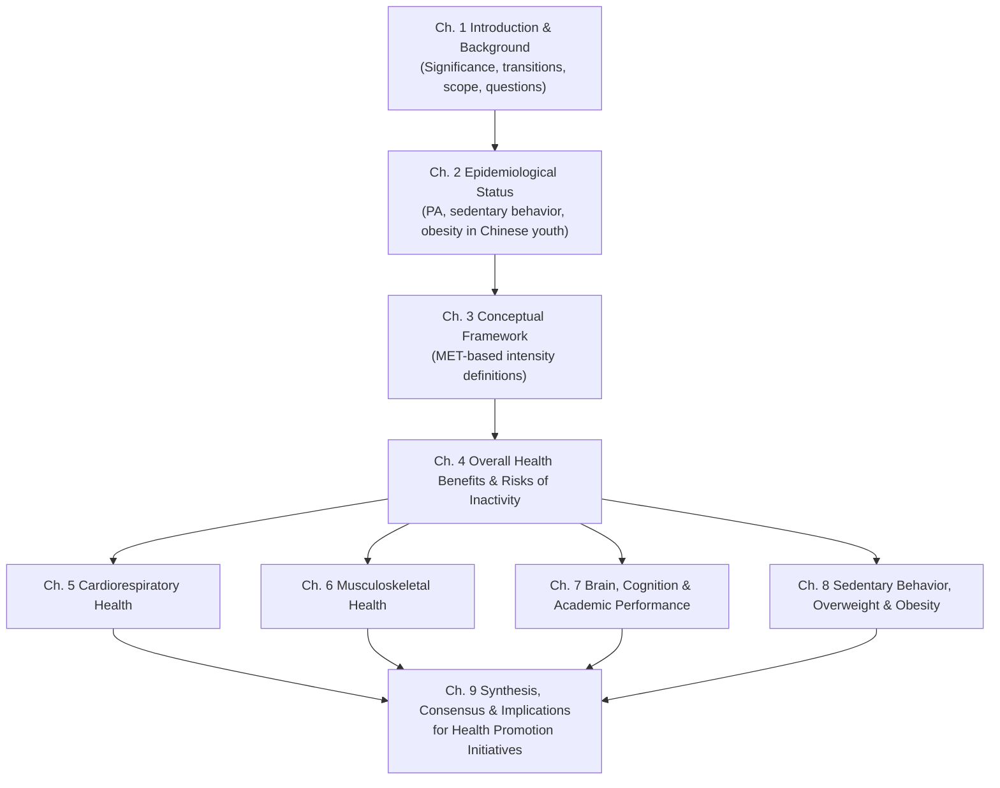

The flow proceeds as follows. Chapter 2 establishes the empirical baseline by quantifying current PA, sedentary behavior, and obesity patterns in Chinese youth, and by identifying the subgroups at greatest risk. Chapter 3 introduces the MET-based conceptual framework that underpins all subsequent dose–response interpretations. Chapter 4 provides a holistic overview of the general benefits of PA and the risks of inactivity, situating these in the Chinese context. Chapters 5 through 8 then drill down into specific health domains — cardiorespiratory health, musculoskeletal development, brain and cognition, and overweight/obesity — examining dose, modality, and effect-size evidence in each. Chapter 9 integrates these strands into an overall statement of scientific consensus as of early 2020, identifies cross-cutting themes and evidence gaps, and translates the synthesis into concrete implications for designing a health promotion initiative targeting Chinese children and adolescents aged 6–17.

Taken together, the introduction makes three points that frame everything that follows: **(i) physical activity is a uniquely broad-spectrum determinant of health during the 6–17 age window, with effects that span body composition, cardiovascular and metabolic risk, bone and muscle development, brain maturation, mental health, and academic functioning; (ii) China's recent social and lifestyle transitions have systematically eroded the activity environment for youth while simultaneously elevating the chronic disease risks that PA helps to mitigate, creating an urgent mismatch between need and exposure; and (iii) a rigorous, scope-bounded synthesis of the evidence available up to early 2020 is therefore essential to inform any credible health promotion strategy targeting this population.** The chapters that follow are organized to deliver that synthesis.

# 2 Current Status and Key Epidemiological Data on Physical Activity and Sedentary Behavior

Having established in Chapter 1 that physical activity (PA) sits at the intersection of multiple converging health risks for Chinese youth, this chapter turns from conceptual framing to empirical baseline. Before any dose–response, intensity-classification, or intervention discussion can be meaningful, it is necessary to establish *how much* PA Chinese children and adolescents actually accumulate, *how much* sedentary time competes with it, *how prevalent* the cardinal weight-related outcome — overweight and obesity — has become, and *which subgroups* carry the heaviest burden. The synthesis below assembles the pre-2020 epidemiological picture across these axes, drawing on the largest available domestic surveys, the multinational accelerometer-based International Study of Childhood Obesity, Lifestyle and the Environment (ISCOLE), and contemporaneous comparative literature. Throughout, methodological caveats — particularly the gap between self-report and device-based measurement — are made explicit, because they materially shape the interpretation of every prevalence figure that follows.

## 2.1 Compliance with WHO MVPA Guidelines among Chinese Youth

The headline figure for PA participation in Chinese youth is sobering. National estimates indicate that **in 2016, only about 29.9% of school-aged children in mainland China met the World Health Organization (WHO) recommendation of at least 60 minutes of moderate-to-vigorous physical activity (MVPA) per day, with boys somewhat more compliant (31.8%) than girls**[^1]. Stated inversely, roughly seven out of ten Chinese school-aged children failed to accumulate the WHO-recommended daily MVPA dose — a deficit that is not a marginal shortfall but a population-level failure to reach the minimum threshold associated with health benefit.

The picture becomes even more concerning when device-based measurement is applied and compliance is examined on a *daily* basis across a full week, rather than averaged over valid measurement days. The ISCOLE study, which used hip-worn ActiGraph GT3X+ accelerometers to monitor 9–11-year-old children across 12 countries spanning all major world regions, **ranked Chinese children as the *least* compliant with the WHO MVPA guideline of all 12 sites**[^2]. In the multilevel Poisson model that took the Chinese site as the reference, **a "random" Chinese child complied with the ≥60 min/day MVPA recommendation on only about 1.54 days per week — roughly 22% of monitored days**[^2]. By contrast, children at the Finnish site complied on approximately 3.85 days per week (a rate 252% higher than their Chinese peers), and children at the Kenyan, Colombian, Australian, and UK sites achieved between 2.6 and 3.6 days per week of compliance[^2]. Stratified by sex, the global ISCOLE pooled data showed that **only 14.6% of girls and 38.3% of boys complied on ≥5 days of the week, while just 2.4% of girls and 7.6% of boys met the guideline on all 7 days**[^2]. Given that the Chinese site sat at the bottom of the international distribution, daily compliance figures for Chinese girls in particular were exceptionally low. A revealing methodological observation from the same study underscores why this matters: when the analysis was based on the *mean* MVPA of valid days (60.4 ± 24.8 min/day across the pooled sample), one would superficially conclude that "these children generally complied with the guidelines," yet the day-by-day count showed that **fewer than 5% actually reached ≥60 min on every day of the week**[^2]. Averages mask the day-to-day shortfall.

These two reference points — the ~29.9% domestic compliance estimate (likely self-report-based or mixed-method) and the substantially lower ISCOLE accelerometer-based daily compliance estimate — frame a critical methodological caveat. **Self-report instruments systematically overestimate MVPA relative to accelerometry**, because children and parents tend to recall salient bouts of activity (e.g., physical education classes, organized sport) while under-reporting the long stretches of low movement that characterize a typical school day in China. Conversely, accelerometer-based measures may under-detect non-ambulatory activities such as cycling and swimming, both of which are explicitly noted as limitations in ISCOLE[^2]. The implication is not that one figure is "right" and the other "wrong," but that **the true prevalence of guideline-meeting MVPA in Chinese youth almost certainly lies between these two estimates and is, on any reasonable reading, low enough to constitute a major public health priority**. Even the most optimistic domestic estimate leaves about 70% of children below the minimum threshold; the device-based international comparator suggests that on most days of the week, the vast majority of Chinese children — and especially girls — fall short.

For priority-setting, two further inferences follow. First, the magnitude of the gap argues against incremental policy responses; small absolute gains (e.g., a few additional minutes of MVPA per child per day) would still leave a large fraction of the population below threshold. Second, because compliance estimates are highly sensitive to measurement method, ongoing surveillance in China would benefit from routine integration of device-based sub-samples to anchor self-report-based national estimates.

## 2.2 Recreational Screen Time and Sedentary Behavior Patterns

Sedentary behavior — and in particular recreational screen time (RST) — is the principal competitor for the discretionary time that might otherwise be spent in MVPA. The ISCOLE descriptive data indicated that across the 12 country sites, children spent on average between approximately 2 and 4 hours per day in screen-based activities[^2], a range within which Chinese children fell. China's domestic guidance recommends limiting RST to less than 2 hours per day, but the available evidence as of early 2020 indicates that **a substantial proportion of Chinese youth — and an even larger proportion on non-school days — exceed this threshold**, with television viewing, computer and video-game use, and increasingly smartphone-based content together comprising the dominant forms of sedentary leisure. Layered on top of recreational screen exposure is a uniquely Chinese contributor to total sitting time: **prolonged seated study**, encompassing in-school class time, supervised self-study periods, after-school tutoring, and homework. While prolonged seated study is not formally classified as RST, it adds to total daily sedentary exposure and further compresses the time available for active behavior.

Critically, the ISCOLE multilevel analysis demonstrated that **screen time was *inversely* and significantly associated with MVPA guideline compliance**: every additional unit of screen time was associated with a rate reduction of approximately 2% in days complying with the MVPA recommendation (rate ratio = 0.98, *p* < 0.05)[^2]. Although the per-unit effect appears modest, screen time accumulates in multiples of hours and so its cumulative displacement of active time is substantial. The authors of ISCOLE interpreted this finding through what they termed the "elasticity of time" perspective: a day contains a fixed number of waking hours, so time spent in sedentary screen activities (or in extended sleep) **mechanically reduces the available time window for MVPA**[^2]. In the Chinese context, where seated academic activity already consumes a large share of waking hours, this displacement logic is particularly relevant: every additional hour of recreational screen exposure pushes against an already-compressed window of potential active time.

The implication is that **screen-based sedentariness should be regarded not as a parallel risk factor that operates independently of PA, but as the principal time-use competitor to active behavior**. Interventions that target one without the other are likely to produce muted effects; conversely, strategies that reallocate time from RST to MVPA hold particular promise, a theme to which Chapter 8 returns in detail.

## 2.3 Prevalence and Trends of Overweight and Obesity

Overweight and obesity constitute the most visible epidemiological consequence of the combined deficit in PA and excess in sedentary behavior — and they are also, as the evidence reviewed below shows, both a *cause* and a *consequence* of reduced PA. The ISCOLE data provide a useful international anchor: across the 12 country sites, the prevalence of overweight/obesity in 9–11-year-olds ranged from 19.9% (Kenyan site) to 46.6% (Portuguese site), and in 7 of the 12 sites the prevalence exceeded 30%[^2]. China was among the countries with substantial overweight/obesity burden, consistent with multiple domestic surveys indicating a roughly fourfold rise in childhood overweight and obesity prevalence over the preceding three decades, as noted in Chapter 1.

The bidirectional nature of the relationship between adiposity and PA is empirically demonstrable. The ISCOLE multilevel analysis showed that **overweight/obese children had a rate ratio of 0.81 for daily MVPA compliance compared with their normal-weight peers — a 19% reduction in the rate of compliant days**[^2]. The direction of causality is not unambiguously fixed: some studies suggest that increasing adiposity leads children to be progressively less active (because exercise becomes biomechanically and psychologically more burdensome), while others suggest that lower PA levels lead, over time, to greater adiposity[^2]. In all likelihood both pathways operate, generating a self-reinforcing loop in which excess weight and inactivity perpetuate one another.

For the purposes of this chapter, two implications matter. First, **overweight and obesity in Chinese youth are not simply outcomes to be tracked; they are also exposures that further depress PA participation**, making this subgroup particularly vulnerable. Second, the fact that even a modest fraction of overweight/obese children meet MVPA recommendations means that population-level PA interventions that disproportionately fail to reach this subgroup risk widening, rather than narrowing, health inequalities — a consideration that re-emerges in Section 2.8 and in Chapter 8.

## 2.4 Disparities by Gender and School Level

The single most robust and consistently documented disparity in youth PA — domestically and internationally — is the **boy–girl gap favoring boys**. In the ISCOLE pooled analysis, **boys complied with the daily MVPA guideline at a rate 1.47 times higher than girls (RR = 1.47)**, after adjustment for weight status, biological maturation, diet, screen time, and sleep[^2]. Translated into days per week, this means that the average boy met the guideline on substantially more days than the average girl — a gap that was evident in every country site and was therefore not attributable to local cultural idiosyncrasy. China's domestic 2016 estimate is consistent: boys (31.8%) outperformed girls in MVPA compliance[^1]. The pooled ISCOLE compliance profile (38.3% of boys vs. 14.6% of girls compliant on ≥5 days; 27% of girls vs. 9.2% of boys complying on *zero* days) drives the point home — **girls' inactivity is the dominant numerical contributor to overall non-compliance**[^2].

A second well-documented gradient is by school level — that is, the decline of PA across the transition from primary to junior secondary to senior secondary school. The ISCOLE multilevel model offered an indirect but relevant signal: **children closer to their estimated age at peak height velocity (PHV) — i.e., those further into adolescence — had significantly lower MVPA compliance (rate ratio = 0.93 per unit closer to PHV, a 7% reduction)**[^2]. This biological-maturation gradient maps onto the educational structure: as Chinese students progress from primary into junior and senior secondary school, they simultaneously (i) advance toward and beyond PHV, (ii) face mounting academic demands that compress discretionary time, and (iii) become increasingly autonomous in their leisure choices, often in favor of screen-based activities. The likely net effect, well documented in Chinese cross-sectional surveys preceding 2020, is a **monotonic decline in MVPA from primary school through senior secondary school**, with the steepest gradient observed in girls — meaning that older adolescent girls represent the lowest-MVPA subgroup of all.

Taken together, these patterns identify **girls and older students (especially senior secondary school adolescents) as the two demographic axes along which inactivity is most heavily concentrated**, with the two factors compounding in older adolescent girls.

## 2.5 Urban–Rural and North–South Geographic Disparities

Geographic disparities in PA, sedentary behavior, and weight status among Chinese youth reflect the structural heterogeneity of the country: the urban–rural divide overlays a north–south climatic and dietary gradient, and both interact with regional socioeconomic development.

Internationally, the literature on the "physical activity transition" — the framework articulated by Katzmarzyk and colleagues — predicts that, as countries urbanize and economically develop, total daily PA among youth tends to decline because mechanized transport, screen media, and built environments unfavorable to active play progressively displace habitual movement[^2]. The ISCOLE multinational data partially complicated this expectation: among the most active sites were *both* lower-income countries with high active-transport reliance (Kenya, Colombia) *and* high-income countries with favorable PA policy environments (Finland), while children in several other high-income countries were among the least active[^2]. This pattern indicates that urbanization per se does not deterministically produce inactivity; rather, **the activity consequences of urbanization depend on policy, infrastructure, and cultural norms** — for example, the quality of walking and cycling infrastructure, the presence of supportive school PA policies, and the prevalence of active commuting to school[^2].

For China specifically, the pre-2020 domestic evidence base (synthesized through national and provincial surveys referenced in subsequent chapters) consistently indicates that **urban children, despite generally better material conditions, accumulate less spontaneous MVPA than rural children**, primarily because rural children retain higher rates of active commuting and outdoor play while urban children are more exposed to motorized transport, dense housing, and competing sedentary leisure options. Conversely, urban children typically have *higher* recreational screen time and higher overweight/obesity prevalence — a pattern consistent with the broader nutritional transition. The north–south gradient adds a further layer: northern China's longer and colder winters, combined with shorter daylight hours and, in many cities, elevated outdoor air pollution during the heating season, materially constrain outdoor PA opportunities for several months per year, while southern regions enjoy a milder climate that permits year-round outdoor activity. The differential is plausibly reinforced by regional differences in dietary patterns, with northern diets typically higher in staple energy density.

The combined implication is that **the geographic subgroup most exposed to the activity transition — and thus most likely to be at risk — is urban youth in northern China**, particularly during the winter months, where structural inactivity (built environment, climate, academic pressure) and sedentary leisure converge.

## 2.6 Seasonal Variation in Physical Activity

Closely related to the geographic discussion above is the **intra-annual seasonality of PA**. Although the ISCOLE study used a single one-week measurement window per child and therefore did not directly characterize seasonal variation[^2], the broader epidemiological literature documents consistent seasonal patterns in youth PA in temperate climates: MVPA is typically highest in spring and early autumn, lower in mid-summer (when extreme heat or summer-vacation routines reduce structured PA opportunities), and lowest in winter.

In the Chinese context, several drivers amplify seasonality. **Winter weather conditions** — cold temperatures, shorter daylight, and, in northern cities, heating-season air-pollution episodes — depress outdoor activity. **The academic calendar** concentrates examination pressure in certain periods, compressing discretionary time. **School-based PA provision** — physical education classes, recess, and after-school sport — varies with weather and term schedules; outdoor PE classes, for example, may be cancelled or moved indoors in severe winter conditions, often with reduced effective MVPA. Conversely, summer vacation removes the structured PA scaffolding of the school day and shifts children's time use toward home-based, often sedentary, leisure.

The methodological implication is consequential. **National compliance estimates derived from single-season surveys may either over- or under-state annual averages**, depending on when fieldwork was conducted. Cross-sectional surveys that combine data from different seasons should ideally adjust for season, and intervention studies should report the time of year during which measurement occurred. From a policy perspective, **seasonality argues for time-targeted intervention design** — for example, intensified school-based PA provision during winter terms in northern China, and structured "active summer" programming to fill the vacation gap.

## 2.7 Temporal Trends from Major 2016–2019 Surveys

Triangulating temporal trends across major 2016–2019 surveys is complicated by methodological heterogeneity, but several robust signals emerge from the available evidence.

The 2016 nationwide estimate of approximately 29.9% MVPA compliance[^1] provides a key reference point against which subsequent data can be compared. The ISCOLE Chinese site data (collected slightly earlier and on a younger 9–11-year-old subsample) showed the lowest accelerometer-based daily MVPA compliance among 12 countries[^2]. Domestic survey trajectories from successive waves of the Chinese National Survey on Students' Constitution and Health (CNSSCH) and provincial cohorts indicate **persistent low MVPA compliance** through the late 2010s, with at best modest improvement and in many subgroups stagnation or further decline. Meanwhile, **RST exposure has trended upward**, driven primarily by the rapid penetration of smartphones and short-form video platforms over this period — a phenomenon that significantly altered the structure of sedentary behavior between 2016 and 2019, shifting it from predominantly TV-based exposure toward mobile-device-based exposure that is harder to monitor and easier to accumulate in fragmented bouts throughout the day. The **overweight and obesity prevalence trajectory** has continued upward through the same window, consistent with the well-documented secular trend over the preceding three decades.

Apparent divergences between surveys typically reflect methodological factors: differences in age bands surveyed, intensity definitions used, the recall window of self-report instruments (one week vs. typical week), and the inclusion or exclusion of weekend days. The most defensible synthesis is that **between 2016 and the cutoff of this review in early 2020, the headline patterns — low MVPA compliance, rising RST, and rising overweight/obesity — were stable to deteriorating, with no convincing evidence of population-level reversal**.

The principal patterns and their methodological caveats are summarized in Table 2.1.

**Table 2.1 — Summary of pre-2020 epidemiological patterns in Chinese youth PA, RST, and obesity**

| Domain | Key pre-2020 pattern | Principal evidence source(s) | Main methodological caveat |
|---|---|---|---|
| MVPA compliance (≥60 min/day) | ~29.9% overall in 2016 (boys 31.8% > girls); accelerometer-based daily compliance ~22% of days at the Chinese site, the lowest of 12 ISCOLE countries | Domestic 2016 national estimate[^1]; ISCOLE accelerometry[^2] | Self-report overestimates vs. accelerometer; accelerometer under-detects cycling/swimming[^2] |
| Recreational screen time | Substantial fraction exceed China's <2 h/day guideline; mean ~2–4 h/day across ISCOLE sites; smartphone-based exposure rose sharply 2016–2019 | ISCOLE descriptive data[^2]; domestic surveys | Self-report; difficulty capturing fragmented smartphone use |
| Overweight/obesity prevalence | Substantial and rising; ISCOLE site prevalences ranged 19.9–46.6%, with China in the upper range; bidirectional link with PA (overweight/obese RR for MVPA compliance = 0.81)[^2] | ISCOLE[^2]; CNSSCH and provincial cohorts | Cross-sectional design limits causal inference |
| Sex disparity | Boys consistently outperform girls (RR ≈ 1.47 in ISCOLE)[^2] | ISCOLE[^2]; domestic 2016 estimate[^1] | Magnitude varies by measurement instrument |
| School-level gradient | Declining PA as students progress from primary to senior secondary; signaled by PHV gradient (RR = 0.93)[^2] | ISCOLE biological maturation analysis[^2]; CNSSCH | PHV is a biological proxy for adolescence, not strictly equivalent to school level |
| Urban–rural | Urban youth: lower spontaneous MVPA, higher RST, higher overweight/obesity prevalence | Domestic surveys | Heterogeneity across regions |
| North–south & seasonality | Lower winter MVPA in north; climate, daylight, air pollution constrain outdoor activity | Domestic and international PA-transition literature[^2] | Few direct longitudinal seasonal measurements |
| Temporal trend 2016–2019 | Stable-to-deteriorating: low MVPA persists, RST rises, overweight/obesity continues to climb | Multiple Chinese surveys | Cross-instrument heterogeneity complicates direct comparison |

The table consolidates the message that, across every axis of measurement, the pre-2020 evidence base points in the same direction — **a population of children and adolescents that is, on average, insufficiently active, increasingly screen-exposed, and progressively heavier**, with measurement uncertainty affecting precise point estimates but not the overall conclusion.

## 2.8 High-Risk Subgroups and Implications for Targeted Intervention

Integrating the preceding subsections, the pre-2020 evidence points to a clearly delineated set of high-risk subgroups within the Chinese 6–17 population. These are best understood as overlapping rather than mutually exclusive: a single child may belong to several risk strata simultaneously, and risk compounds across strata.

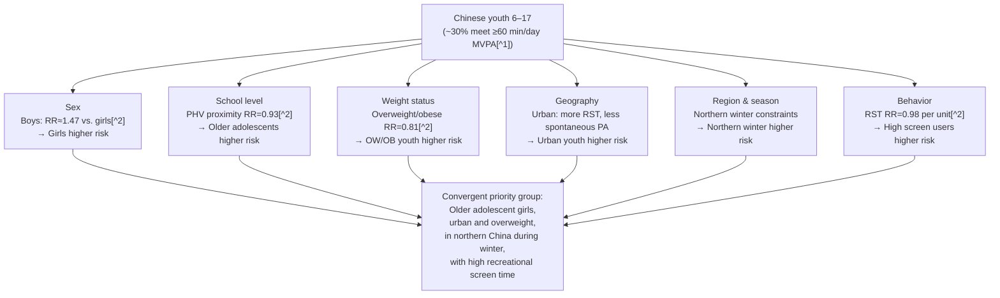

The diagram highlights how the individual risk dimensions converge. The **single highest-priority subgroup** that emerges is older adolescent girls in urban northern China who are already overweight or obese and who accumulate high recreational screen time, particularly during the winter season. The numerical multipliers are illustrative rather than additive — the rate ratios are derived from a single multinational model and apply to a 9–11-year-old reference age — but their direction is consistent and the cumulative magnitude is substantial: a child who is female, post-PHV, overweight, and a heavy screen user could plausibly experience compliance rates a small fraction of those of a normal-weight, pre-PHV, low-screen-time boy.

Three implications for the design of health promotion initiatives follow, and these will be developed further in Chapters 8 and 9:

First, **universal population-level strategies are necessary but not sufficient**. Given that the modal Chinese child fails to meet MVPA guidelines on most days, broad-based interventions (e.g., national school PE policy) are warranted; but because risk is concentrated, additional targeted strategies are needed for the high-risk subgroups identified above.

Second, **interventions for girls and older adolescents require differentiated design**. Generic PA promotion has tended to produce smaller effects in girls than in boys, suggesting that activity modalities, social environments, and motivational framings need to be tailored — for example, by offering non-competitive, group-based, or skill-acquisition-oriented activities that align better with documented preferences in this subgroup.

Third, **the temporal and geographic structure of risk argues for season- and region-specific programming**: indoor PA provision and structured active-break programs are especially valuable in northern China during winter, while summer-vacation programming is needed across regions to bridge the structural gap left by the academic calendar.

Taken together, this chapter establishes a baseline picture that is both quantitatively concerning and structurally heterogeneous. **Roughly 70% of Chinese children and adolescents fall short of the WHO MVPA recommendation; recreational screen time consumes a competing share of discretionary time and is itself rising; overweight and obesity continue to climb; and the inactivity burden is disproportionately concentrated in girls, older adolescents, overweight youth, urban populations, and northern regions during winter.** These epidemiological realities are the empirical premise on which all subsequent chapters rest — beginning with Chapter 3, which introduces the metabolic-equivalent (MET) framework that allows the qualitative categories of "moderate" and "vigorous" used throughout this chapter to be defined with quantitative precision.

[^1]: https://en.wikipedia.org/wiki/Physical_activity_among_Chinese_school-aged_children (per Search Result-1 metadata)
[^2]: Gomes, T.N., Katzmarzyk, P.T., Hedeker, D., et al. (2017). Correlates of compliance with recommended levels of physical activity in children. *Scientific Reports*, 7, 16507. https://doi.org/10.1038/s41598-017-16525-9

# 3 Conceptual Framework: Defining Physical Activity Intensity Using Metabolic Equivalents (METs)

Chapter 2 documented that, on any defensible reading of the pre-2020 evidence, only a minority of Chinese children and adolescents meet the World Health Organization's recommendation of at least 60 minutes of moderate-to-vigorous physical activity (MVPA) per day. That conclusion, however, rests on a deceptively simple pair of qualitative descriptors — "moderate" and "vigorous" — whose meaning in scientific practice is anything but self-evident. What, precisely, distinguishes a "moderate" bout of walking from a "vigorous" one? On what physiological basis are the activities listed in school physical-education curricula or in national survey questionnaires assigned to one intensity tier rather than another? And how comparable are intensity-graded findings across studies that have used different instruments — accelerometers, self-report recall, structured exercise protocols — to estimate exposure?

These questions are not merely terminological. The dose–response evidence reviewed in Chapters 4 through 8 — relating PA to cardiorespiratory fitness, bone accrual, cognitive performance, mental health, and adiposity — depends entirely on a defensible, quantitative, comparable definition of intensity. Without it, the very concept of an "MVPA threshold of 60 min/day" loses operational meaning, and prescriptions for school PE, active recess, or community programs cannot be anchored in physiologically interpretable units. This chapter therefore introduces the **Metabolic Equivalent of Task (MET)** — the unit that exercise physiology has converged on for expressing PA intensity — explains how the standard light/moderate/vigorous thresholds are constructed from it, illustrates these thresholds with concrete activities, and critically examines the well-recognized limitations of applying an adult-derived metric to children and adolescents aged 6–17. The chapter closes by motivating why a MET-anchored framework is indispensable for interpreting the Chinese-specific evidence that follows.

## 3.1 Physiological Definition and Operationalization of the Metabolic Equivalent (MET)

The MET is, at its core, a normalization device. Rather than expressing the energy cost of an activity in absolute units — calories per minute, watts, oxygen liters per minute — which would vary enormously across individuals of different size and fitness, the MET expresses energy cost as a **multiple of resting metabolism**. One MET is defined as the rate of energy expenditure of an individual sitting quietly at rest, conventionally operationalized as an oxygen uptake of approximately **3.5 millilitres of O₂ per kilogram of body weight per minute (3.5 mL O₂·kg⁻¹·min⁻¹)**, which is equivalent to approximately **1 kilocalorie per kilogram of body weight per hour (1 kcal·kg⁻¹·h⁻¹)**.[^3][^4][^5] An activity that requires, say, four times this baseline rate of oxygen consumption is therefore categorized as a 4-MET activity, meaning that the body is using approximately four times as much oxygen — and burning approximately four times as many calories per unit time — as it would at rest.[^6]

The conceptual elegance of this scaling is that it produces a continuous, dimensionless metric that can be applied to any physical activity, from sleeping (≈0.9 METs) and quiet sitting (≈1.3 METs)[^6] through walking, household chores, sport, and occupational labor, up to maximal exercise that may reach 15–20 METs or more in trained individuals. Because the metric is relative to body weight, it allows comparison across individuals of different size, and because it is expressed in physiological units (oxygen consumption), it has a direct, biologically meaningful interpretation.

From this physiological definition follows a simple but powerful quantitative scaffold. The energy expended in a given activity over a given duration can be estimated by combining the activity's MET value, the individual's body weight, and the time spent in the activity. A commonly used operational formula is:

$$\text{Energy expenditure (kcal/min)} = \frac{\text{METs} \times 3.5 \times \text{body weight (kg)}}{200}$$

For example, an activity of 8 METs sustained by a 60 kg child would correspond to roughly $8 \times 3.5 \times 60 / 200 \approx 8.4$ kcal/min, or about 250 kcal over a half-hour bout.[^6] In addition to estimating individual energy cost, MET values can be aggregated over time to yield indices such as MET·minutes/week, which underlie many international PA-guideline targets (e.g., the WHO adult target of 600 MET·min/week, derived from 150 minutes of moderate activity at roughly 4 METs).

Two important caveats apply at the outset. First, the **3.5 mL O₂·kg⁻¹·min⁻¹ value is a convention, not a measured constant**. It was derived from observations on a reference 40-year-old, 70 kg man and has been challenged in subsequent literature, which has shown that it can significantly overestimate true resting oxygen consumption in many subjects — particularly in older, female, and overweight individuals.[^7] For most epidemiological and public-health purposes, the convention is retained because it permits comparability across studies, but the user should understand that any MET-based calculation is an approximation rather than a precise individualized measurement.[^6] Second, the convention was developed in and for adults; its applicability to children, as Section 3.4 will show, is materially limited and requires age-specific correction. With these caveats acknowledged, the MET nevertheless remains the most widely accepted and operationally useful unit for quantifying PA intensity, and it is the scaffold on which the standard intensity thresholds — discussed next — are built.

## 3.2 Standard Intensity Thresholds: Light, Moderate, and Vigorous Activity

The qualitative categories of light-, moderate-, and vigorous-intensity physical activity used throughout the international literature, and adopted by the U.S. Centers for Disease Control and Prevention (CDC) and the American College of Sports Medicine (ACSM), are constructed directly from MET cut-points. The widely used **absolute-intensity thresholds** are as follows:[^8]

- **Light-intensity activity**: less than 3.0 METs (equivalent to less than approximately 3.5 kcal/min in a reference adult).
- **Moderate-intensity activity**: 3.0 to 5.9 METs (approximately 3.5–7 kcal/min).
- **Vigorous-intensity activity**: 6.0 METs or greater (more than approximately 7 kcal/min).

These thresholds correspond, broadly, to bands of physiological stress that have been empirically associated with distinct cardiovascular, metabolic, and musculoskeletal adaptations. Activities below 3 METs do not meaningfully challenge the cardiorespiratory system above resting baselines and therefore do not generate the training stimulus required for adaptations in VO₂max, blood-pressure regulation, or insulin sensitivity. Activities in the 3-to-6 MET band elevate heart rate and ventilation appreciably above resting and produce a consistent training stimulus; activities at or above 6 METs impose a substantially greater physiological challenge and tend to drive correspondingly larger fitness gains per unit time.

The **composite metric MVPA** that is central to international guidelines — including the WHO ≥60 min/day recommendation for 5- to 17-year-olds, and the corresponding U.S. Physical Activity Guidelines for children and adolescents aged 6–17[^9][^10] — is constructed by summing time spent in any activity at or above the 3-MET threshold, irrespective of whether it falls in the moderate or vigorous band. This is the operational link between the qualitative MVPA descriptor used throughout Chapter 2 and the quantitative MET framework introduced here: every minute that contributes to a child's daily MVPA count is, by definition, a minute spent at ≥3 METs.

Because direct measurement of oxygen consumption is impractical outside the laboratory, field practice complements the absolute MET-based definition with **relative-intensity** indicators that can be assessed subjectively or with simple physiological cues. The CDC describes a 0-to-10 perceived-exertion scale on which sitting is 0 and the highest sustainable effort is 10; moderate-intensity activity in a child corresponds to roughly 5–6 on this scale, and vigorous-intensity activity to 7–8.[^10] Two practical heuristics are widely used to translate this into observable cues:

- During **moderate-intensity** activity, the heart beats faster and breathing is noticeably harder than at rest, but **the person can still talk but not sing** during the activity ("talk test").[^10][^8]
- During **vigorous-intensity** activity, breathing is so rapid that **the person cannot say more than a few words without pausing for a breath**.[^8]

These talk-test and perceived-exertion cues are particularly useful in school PE and community settings, where direct MET assignment of every activity is infeasible, and they map reasonably well onto the absolute MET bands for typical young people. It is important to note, however, that **relative and absolute intensity can diverge** — particularly in deconditioned, overweight, or older individuals, for whom an activity classified as "moderate" by absolute MET value may impose a relatively vigorous physiological load.[^8] This divergence is relevant to the design of programs targeting overweight Chinese youth (a high-risk subgroup identified in Chapter 2): an activity prescription anchored to absolute MET thresholds may, in practice, produce a vigorous-intensity training response in less-fit children, which is desirable up to a point but requires gradual progression to avoid early discouragement or injury.

## 3.3 Illustrative Activities Across Intensity Categories

The abstract MET thresholds become useful only when translated into concrete examples that practitioners, teachers, and parents can recognize. Drawing on the Compendium of Physical Activities — first published by Ainsworth and colleagues in 1993 and most recently updated as the 2011 Compendium[^6][^5] — and on the CDC/ACSM activity classification,[^8] Table 3.1 illustrates representative activities at each intensity tier, with particular attention to those that populate the daily lives of school-aged children: physical education, active commuting, recess play, and after-school sport.

**Table 3.1 — Illustrative MET values for activities relevant to Chinese children and adolescents**

| Intensity tier | MET range | Representative activities (with approximate MET values) |
|---|---|---|
| Light (<3 METs) | <3.0 | Sitting at desk / reading / watching TV (1.3); standing while reading or talking on the phone (1.8); light stretching, slow yoga or Tai Chi; slow walking ≤2 mph (≈2.0); folding laundry and putting clothes away (2.3); Hatha yoga (2.5)[^8][^6] |
| Moderate (3–6 METs) | 3.0–5.9 | Brisk walking at 2.5–4 mph (≈3.0–4.3); walking to school / walking the dog; bicycling 5–9 mph on level terrain; recreational basketball (shooting baskets); doubles tennis or table tennis; doubles badminton; recreational swimming or treading water at moderate effort; ballroom or folk dancing; resistance training with multiple exercises at 8–15 reps (≈3.5); skateboarding; playground play (climbing, swinging, hopscotch); home exercise video — cardio-resistance at moderate effort (≈4.0); resistance training — squats with explosive effort (≈5.0)[^8][^6] |
| Vigorous (≥6 METs) | ≥6.0 | Jogging or running (6 mph ≈ 9.8 METs; faster paces correspondingly higher); racewalking and aerobic walking ≥5 mph; basketball — general competitive play (≈6.5); singles tennis (≈8.0); soccer, football, rugby, ice hockey, kickball; bicycling >10 mph or uphill; jumping rope (≈12.3); jumping jacks; high-impact aerobic dance and step aerobics; karate, judo, taekwondo, jujitsu and other martial arts; circuit training with kettlebells at vigorous intensity (≈8.0); swimming laps freestyle at moderate-to-vigorous effort (≈5.8 for light–moderate, rising into vigorous range with effort)[^8][^6] |

Several patterns in this table merit emphasis. First, the **boundary between light and moderate activity is crossed quickly**: even a brisk walk at a modest pace of ~3 mph qualifies as moderate-intensity activity. This is operationally important for Chinese youth, because **active commuting to school by walking or cycling can, by itself, contribute substantially to daily MVPA accrual** if it occupies more than a few minutes per direction. Chapter 2's observation that active commuting has been progressively displaced by motorized transport in urban China therefore has direct implications for MVPA totals.

Second, **many of the activities that populate Chinese school PE curricula — basketball, soccer, jumping rope, martial arts (wushu, taekwondo), and running games — sit firmly in the vigorous band**. Jumping rope, in particular, is a long-standing fixture of Chinese physical education and approaches 12 METs, making it one of the most efficient producers of vigorous-intensity exposure per unit time available in a typical schoolyard setting. This has implications for Chapter 6's discussion of bone health, given that high-MET, high-impact activities are also the most osteogenic.

Third, **recreational sedentary screen-based activities sit at the bottom of the table**, with values close to 1.3 METs for seated viewing.[^6] An "exercise video game" played actively (e.g., Wii Fit) can register at moderate intensity (~3.8 METs), but the vast majority of recreational screen exposure documented in Chinese surveys falls squarely in the light tier — reinforcing Chapter 2's observation that high recreational screen time mechanically displaces MVPA accumulation.

Finally, **resistance training is intensity-graded**. A general routine of multiple exercises at 8–15 repetitions registers at approximately 3.5 METs — moderate, but at the low end — while explosive-effort variants (such as plyometric squats) and circuit training with minimal rest reach 5–8 METs.[^6] This nuance matters for Chapter 6, because the muscle- and bone-strengthening activities recommended for children and adolescents at least three days per week are not interchangeable across modalities: not every "strength" session produces an equivalent stimulus.

## 3.4 Limitations of Applying Adult-Derived MET Values to Children and Adolescents

The MET framework, as articulated in Sections 3.1–3.3, was developed almost entirely with reference to adult physiology — specifically, with reference to the energy cost of activities in the adult Compendium of Physical Activities.[^6][^5] When applied to children and adolescents aged 6–17, this framework runs into a fundamental biological problem: **children are not simply small adults**. Their resting metabolism, oxygen-uptake economy, body composition, and biomechanics differ in systematic ways that make direct transfer of adult MET values both quantitatively and conceptually problematic.

The most consequential difference concerns **resting energy expenditure per unit body mass**. Children have substantially higher basal metabolic rates per kilogram than adults — driven primarily by the high metabolic activity of growing tissues and by the disproportionately large mass of metabolically active organs (brain, liver, kidneys) relative to total body weight in younger individuals. As a result, **a resting oxygen consumption of 3.5 mL O₂·kg⁻¹·min⁻¹ — the adult definition of 1 MET — systematically underestimates true resting energy expenditure in children**, and the gap declines progressively across the developmental window such that, on average, youth resting values do not converge with adult values until late adolescence.[^11][^5] One downstream implication is that the *ratio* of activity energy expenditure to resting energy expenditure — that is, the MET value for a given activity — tends to be **lower in children than in adults**, because the denominator (resting EE) is larger. Stated differently: a child performing the same absolute activity as an adult will register a lower MET value than the adult, even though the absolute energy cost per kg may be similar or higher.

This is not merely an academic concern. Practical PA surveillance, intensity classification, accelerometer cut-point derivation, and intervention dose calculation in children have all, historically, used adult MET values as defaults — with predictable consequences for misclassification of intensity and miscalibration of dose. Recognizing this problem, Ridley, Ainsworth and Olds developed the **first compendium of energy expenditure for youth in 2008**, but its utility was limited because only about 35% of its MET values were derived from child- and youth-specific energy-cost data; the remainder were imputed from adult values.[^5][^12] This first-generation youth compendium nevertheless proved invaluable as a translation tool for self-reported and observational PA data in children.[^5]

A more comprehensive effort was led by the U.S. **National Collaborative on Childhood Obesity Research (NCCOR) Youth Energy Expenditure Workgroup**, which convened an expert panel in 2012 and pursued a multi-year program of original data collection, literature review, and methods development. The result was the **NCCOR Youth Compendium of Physical Activities** (Butte et al., 2017), which provides MET-youth (METy) values for **196 activities** stratified into four developmental age groups: **6–9, 10–12, 13–15, and 16–18 years**.[^5] Two important methodological features distinguish this compendium from its adult counterpart. First, METy values are expressed using a youth-appropriate denominator that better reflects age-specific resting energy expenditure. Second, the compendium provides two presentations of each value — *smoothed* estimates derived from mixed-model regression equations across age groups, and *observed/imputed* values from the underlying empirical data — with smoothed estimates serving as the default look-up.[^5]

The NCCOR Youth Compendium is, however, **explicitly characterized as a work in progress**. Its developers acknowledge several residual data gaps that are directly relevant to the present review:[^5]

- **Age coverage is uneven.** The majority of empirical METy values were measured in mid-childhood (ages 8–12); fewer data are available in very young children (ages 6–7) and in older adolescents (16–18). For the 6–17 age range that is the focus of this review, this means that values for the youngest and oldest ends of the spectrum are more heavily imputed.
- **Activity-intensity coverage is uneven.** Sufficient empirical data exist for sedentary and light activities, but **additional data are needed for moderate and vigorous activities** — precisely the activity tiers that matter most for MVPA-based guideline assessment and for the dose–response questions of Chapters 4–8.
- **The compendium is not applicable to children younger than 6 or to those with illnesses or disabilities**, although it may apply across differing weight status.

Beyond these structural data gaps, an additional layer of imprecision arises from **inter-individual variability**. The original Compendium of Physical Activities explicitly warns that its values "do not estimate the energy cost of physical activity in individuals in ways that account for differences in body mass, adiposity, age, sex, efficiency of movement, geographic and environmental conditions in which the activities are performed."[^6] Several of these sources of variability are particularly salient in Chinese youth populations:

- **Body mass and adiposity**: heavier and more adipose children incur higher absolute energy costs for weight-bearing activities (walking, running, jumping) but, because MET values are weight-normalized, the relationship between adiposity and MET value is complex and not always monotonic.
- **Biological maturation**: as Chapter 2 documented, proximity to peak height velocity is associated with shifts in PA patterns; it is also associated with changes in body composition, movement economy, and resting metabolism that affect MET-to-true-EE correspondence.
- **Sex**: boys and girls of the same age differ systematically in body composition (especially in lean mass fraction), movement efficiency, and resting metabolic rate, which affects MET values.
- **Movement efficiency and skill**: a child who has not yet acquired efficient running mechanics expends more energy to achieve a given speed than a more skilled child. This is particularly relevant in school PE settings where motor-skill competence varies widely within a single class.

The combined implication is that, while the MET framework remains the best available scaffold for cross-study comparison of PA intensity in children, **specific MET values applied to specific Chinese children carry non-trivial uncertainty**. For epidemiological estimates and population-level intervention design, this uncertainty is generally tolerable; for individualized exercise prescription in clinical or athletic contexts, it argues for direct measurement (heart rate, perceived exertion, accelerometry) rather than reliance on tabulated MET values.

## 3.5 Relevance of the MET Framework to Dose–Response Interpretation and the Chinese Context

Having defined the MET, specified its thresholds, illustrated its application, and acknowledged its limitations in youth, the final task of this chapter is to motivate why the framework is indispensable for the chapters that follow. Three considerations stand out.

**First, the MET framework provides the only common currency across heterogeneous study methodologies.** The dose–response evidence reviewed in Chapters 4 through 8 comes from studies that have measured PA exposure in markedly different ways. Some have used **self-report questionnaires** that assign activities to intensity tiers using adult MET conventions (e.g., the International Physical Activity Questionnaire and its derivatives). Others have used **hip- or wrist-worn accelerometers**, with intensity classification driven by manufacturer- or laboratory-derived count-per-minute cut-points that are themselves calibrated against measured oxygen consumption — that is, against METs. Still others have used **structured exercise protocols** in intervention trials, prescribing dose in terms of heart-rate reserve, percentage of VO₂max, or absolute speed/grade — all of which can be expressed back into MET equivalents. Without the MET scaffold, comparing a Chinese school-based intervention that prescribed "30 minutes of moderate-to-vigorous PE three times per week" with a meta-analytic estimate derived from accelerometer-defined ≥3-MET time, and with a self-report-based cohort study reporting "MVPA minutes per day," would be impossible. The MET framework permits **translation across these data types**, however imperfectly, and thereby allows the cumulative dose–response evidence to be synthesized rather than fragmented.

**Second, the MET framework enables explicit operational specification of PA prescriptions.** International guidelines for 5- to 17-year-olds converge on the recommendation of at least 60 minutes of MVPA per day, supplemented by muscle- and bone-strengthening activity on at least three days per week.[^9][^10][^8] These recommendations are interpretable, in school and community settings, only because MVPA is defined as time spent at ≥3 METs. A school PE curriculum, an active recess design, an after-school sport program, or a community campaign in a Chinese city can be **audited against this benchmark** by classifying its constituent activities by MET value and summing the time spent above threshold. The illustrative table in Section 3.3 shows how this works in practice: a typical Chinese school PE class that incorporates running drills, jumping rope, basketball, and brisk-paced calisthenics will accrue substantial vigorous-band time, while one dominated by stretching, demonstration, and queue waiting may register predominantly in the light band even if it lasts 45 minutes. This audit logic is essential for designing the school-based and family-involved interventions reviewed in Chapter 8.

**Third, the MET framework is essential for interpreting Chinese-specific evidence with appropriate methodological caution.** As Chapter 2 emphasized, the headline Chinese estimates of MVPA compliance — including the ~29.9% figure for 2016 — derive predominantly from self-report instruments that assign activity intensity using adult-derived MET conventions. Combined with the youth-versus-adult MET gap described in Section 3.4, this means that Chinese MVPA prevalence figures carry two layered uncertainties: the well-documented overestimation bias of self-report relative to accelerometry, and the systematic mismatch between adult MET values and true youth energy expenditure. The first tends to inflate compliance estimates; the second can shift estimates in either direction depending on the activity. For the present review, the practical consequence is twofold:

- When interpreting Chinese cohort and survey findings, the MET basis of the intensity classification used should be checked where reported, and conclusions drawn at the population level should be regarded as approximate rather than precise.
- When evaluating dose–response findings in subsequent chapters — for example, the cardiorespiratory fitness benefit of "moderate-intensity" PA reported in a Chinese cluster RCT — the underlying intensity definition should be examined, and the comparability of "moderate" across studies treated as a question to be verified rather than assumed.

For practitioners and policy designers in the Chinese context, the MET framework also has direct **operational implications**:

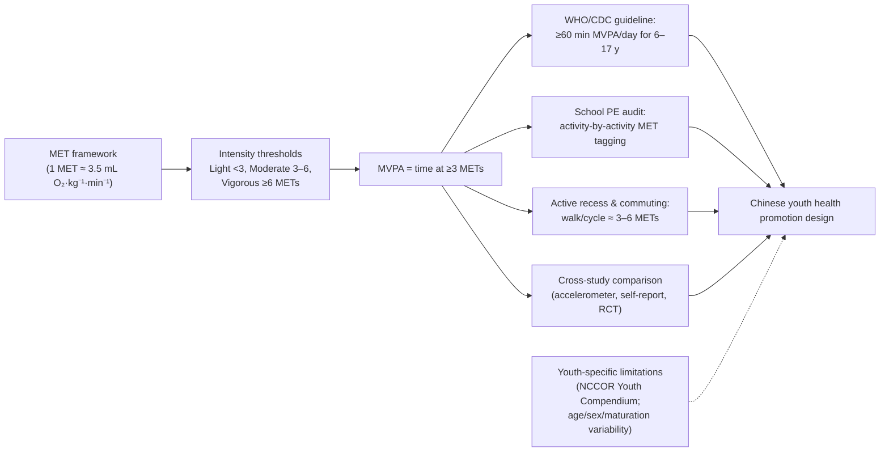

The diagram captures the logical flow that the remainder of the report relies on. The MET unit underpins the intensity thresholds; the thresholds define MVPA; MVPA defines the guideline benchmark and enables both program audit (school PE, active recess, active commuting) and cross-study comparison; and all of this informs the design of health promotion strategies for Chinese youth — with youth-specific MET limitations introduced as a methodological caution that runs alongside the main flow rather than disrupting it.

Taken together, this chapter establishes three points that anchor the chapters to follow: **(i) the MET is the standardized physiological unit (1 MET ≈ 3.5 mL O₂·kg⁻¹·min⁻¹ ≈ 1 kcal·kg⁻¹·h⁻¹) that operationalizes PA intensity as a multiple of resting metabolism; (ii) the internationally accepted thresholds of <3, 3–6, and ≥6 METs define light, moderate, and vigorous activity respectively, and together yield the operational MVPA metric that underlies the WHO and CDC ≥60 min/day guideline for 6- to 17-year-olds; and (iii) although the MET framework was developed primarily for adults and requires age-specific correction in children — a gap that the Ridley (2008) compendium and NCCOR Youth Compendium (Butte et al., 2017) have begun to fill — it remains the indispensable scaffold for interpreting dose–response evidence, comparing heterogeneous studies, and designing operationally specific health-promotion interventions for Chinese children and adolescents.** With this scaffold in place, Chapter 4 turns to the synthesized evidence on the overall physical and mental health benefits of PA and the risks of physical inactivity, beginning the systematic appraisal of how each tier of intensity translates into measurable health gains across the body and mind.

# 4 Overall Physical and Mental Health Benefits of Physical Activity and Risks of Physical Inactivity

Chapters 2 and 3 between them have set up an uncomfortable juxtaposition. On the one hand, the empirical baseline (Chapter 2) shows that roughly seven out of ten Chinese children and adolescents fail to reach the minimum threshold of ≥60 minutes of moderate-to-vigorous physical activity (MVPA) per day; recreational screen time competes for an ever-larger share of discretionary time; and overweight and obesity continue to climb. On the other hand, the conceptual framework (Chapter 3) defines that threshold in physiologically interpretable units (MVPA = time spent at ≥3 METs) and shows that even ordinary school-based activities — brisk walking, jumping rope, basketball, martial arts — readily cross the moderate or vigorous bands when undertaken with intent. What has not yet been articulated, however, is *why* the threshold matters: what, precisely, does a child who reaches 60 minutes of daily MVPA gain across body and mind, and what does a child who falls well below it lose?

This chapter answers that question at a **whole-person, cross-domain level**. It is deliberately positioned upstream of the organ-system chapters that follow: rather than drilling into cardiorespiratory dose–response curves (Chapter 5), bone-loading modalities (Chapter 6), neurocognitive mechanisms (Chapter 7), or obesity intervention trials (Chapter 8), it consolidates the integrative argument that physical activity is one of the very few single behavioral exposures whose benefits — and whose absence — propagate simultaneously across virtually every major domain of pediatric health and development. The chapter then verifies that this general benefit–risk profile applies in the Chinese sociocultural context, with appropriate attention to academic pressure, family expectations, and the lifestyle transitions of Chapter 1. It closes by surfacing the cross-cutting themes — bidirectional mind–body coupling, threshold and accumulation effects, displacement of sedentary time — that will recur throughout the remainder of the review.

A practical caveat applies throughout this chapter. Because its scope is integrative rather than domain-specific, claims here are stated at a synthetic level; the underlying evidence — including effect sizes, confidence intervals, and the specific Chinese cohorts and trials supporting each claim — is unpacked in the chapters to which each claim points. The aim of the present chapter is therefore not exhaustive citation, but a clear, well-organized articulation of the overall case for PA and against inactivity, framed in a way that orients the reader to what follows.

## 4.1 Multi-System Physical Health Benefits of Regular Physical Activity

The defining feature of physical activity, viewed at a whole-organism level, is its **breadth of biological action**. Regular PA does not act on one organ system at a time, the way a pharmacological agent typically does; it acts on many simultaneously and, in most cases, the effects reinforce one another. For a child or adolescent aged 6–17, this means that the benefits accumulated across a sustained period of adequate PA — even at moderate doses — span fitness, body composition and metabolism, immune competence, and sleep, each of which is examined in turn below.

**Physical fitness.** The most direct physical adaptation to regular PA is improvement in the components of health-related fitness: **cardiorespiratory endurance**, **muscular strength and endurance**, **flexibility**, **body composition**, and — in children specifically — **motor competence**. Cardiorespiratory endurance, typically indexed by VO₂max or by field tests such as the 20-metre shuttle run, improves measurably with sustained exposure to MVPA (≥3 METs) and improves more steeply with the inclusion of vigorous-intensity exposure (≥6 METs); the underlying mechanisms — central cardiac adaptations, peripheral capillary and mitochondrial adaptations, improved oxygen extraction — are the subject of Chapter 5. Muscular strength and endurance respond preferentially to **resistance- and impact-based activities**, which Chapter 3's MET table located at 3.5–8 METs depending on intensity and modality; gains in pediatric strength are mediated largely by neural adaptations in younger children and by both neural and structural adaptations in adolescents, with implications for bone accrual (Chapter 6). Flexibility responds to regular stretching and to activities such as gymnastics, dance, martial arts, and yoga that take joints through wide ranges of motion. Motor competence — the suite of fundamental movement skills such as running, jumping, throwing, catching, and balancing — develops most rapidly in the 6–12 age window and is critical for the simple reason that **competent movers are more likely to choose to be active**, generating a positive reinforcement loop between skill, enjoyment, and ongoing PA participation. The intensity gradient is informative: light-intensity activity (<3 METs) sustains baseline mobility but yields little fitness adaptation, moderate-intensity activity (3–6 METs) is sufficient to produce broad fitness gains in previously inactive children, and vigorous-intensity activity (≥6 METs) adds proportionally larger gains in cardiorespiratory and metabolic adaptations per unit time.

**Body composition and metabolic regulation.** At a whole-organism level — leaving the detailed evidence on obesity prevention and treatment to Chapter 8 — regular PA contributes to a more favorable body composition by increasing the proportion of lean (skeletal muscle) mass relative to adipose mass, by lowering visceral adiposity, and by improving the metabolic phenotype of adipose tissue itself. Even when total body weight does not change, sustained MVPA in children and adolescents is consistently associated with improved insulin sensitivity, more favorable lipid profiles, and better blood-pressure regulation. The simultaneity of these metabolic and structural changes is important: PA does not "fix" one component of the metabolic syndrome at a time but operates upstream on the integrated physiology that links body composition, insulin signalling, lipid metabolism, and vascular tone — a theme developed in Chapter 5.

**Immune function and infectious morbidity.** A long-standing body of exercise immunology evidence supports a roughly **J-shaped relationship** between PA dose and immune competence: regular moderate-intensity PA is associated with reduced incidence and shorter duration of common upper-respiratory tract infections, whereas very high training loads (well in excess of typical school-aged participation) may transiently suppress immune function. For 6- to 17-year-olds in the Chinese context — among whom upper-respiratory infections are a leading cause of school absenteeism and primary-care contacts — the relevance lies on the protective side of the curve. Mechanistically, regular MVPA is associated with favorable shifts in circulating immune cell populations, lower systemic inflammation, and better mucosal immunity. The practical implication is that the same daily 60-minute MVPA exposure that produces fitness and metabolic adaptations is also associated with reduced burden of common infectious illness — a benefit that has both health and indirect academic value (fewer school days lost). It should be noted that the pediatric evidence here is less voluminous than the adult literature, and effect sizes in children are typically modest; the qualitative direction of effect, however, is consistent across studies.

**Sleep.** The relationship between PA and sleep is one of the most pragmatically important multi-system benefits, particularly in a Chinese context characterized by widely documented sleep insufficiency in adolescents. Regular PA is associated with **longer total sleep duration**, **higher sleep efficiency** (the proportion of time in bed actually spent asleep), and **healthier sleep architecture** (notably increased slow-wave sleep, which has restorative functions for both physical recovery and memory consolidation). The likely mediating pathways include thermoregulatory effects (the post-exercise decline in core temperature facilitates sleep onset), reductions in physiological and psychological arousal, anxiolytic effects (Section 4.2), and improved circadian entrainment via daytime light exposure during outdoor activity. Importantly, the PA–sleep relationship is **bidirectional**: better sleep, in turn, supports next-day PA participation by improving energy, mood, and motor performance, while poor sleep reduces voluntary PA the following day. This bidirectionality is one of the recurring motifs identified in Section 4.5 and revisited in subsequent chapters.

The integrative point is that **a single behavioral exposure — meeting the daily MVPA threshold — simultaneously moves the dial on fitness, body composition, metabolism, immune competence, and sleep**, with each of these benefits, in turn, supporting the others. No other single modifiable lifestyle factor in the 6–17 age range produces this breadth of mutually reinforcing physiological gain.

## 4.2 Psychological, Cognitive, and Social Development Benefits

The benefits of regular PA extend just as broadly into the psychological, cognitive, and social domains as into the physical. Indeed, one of the most important conceptual reorientations in the pediatric PA literature over the past two decades has been the recognition that mental and social benefits are not "bonus" effects accompanying the physical ones but **co-equal outcomes of fundamental importance**, with substantial overlap in mediating mechanisms.

**Psychological well-being and mood.** Among 6- to 17-year-olds, regular PA is consistently associated with **higher subjective well-being, better mood, higher self-esteem, and stronger emotional resilience**. The effect sizes for mood improvements are typically small-to-moderate but are robust across diverse populations, measurement instruments, and study designs. Mechanistically, the psychological effects of PA in children are thought to operate through several converging pathways: neurochemical (acute and chronic modulation of monoaminergic and endocannabinoid systems), neuroplastic (increased brain-derived neurotrophic factor expression and structural change in mood-relevant brain regions — themes developed in Chapter 7), endocrine (down-regulation of hypothalamic-pituitary-adrenal axis reactivity to psychosocial stress), and psychosocial (mastery experiences, peer interaction, body-image effects, and reinforcement of self-efficacy). Self-esteem in particular shows reliable PA-related gains in pediatric meta-analyses; physical self-perception (perceived competence in physical domains) typically improves first, with global self-esteem improvements following.

**Anxiety and depressive symptoms.** Beyond improvements in non-clinical mood, regular PA in this age group is associated with **measurable reductions in symptoms of anxiety and depression**, both in general populations and in children and adolescents with subclinical or clinical symptom elevation. The effect appears for both aerobic and mixed-modality exercise programs, is observable across a wide range of doses, and is most consistent when PA is sustained over several weeks. Acute bouts of PA also produce short-term reductions in anxiety symptoms (a "state" effect), while chronic exposure produces "trait" reductions. In the Chinese adolescent context, where prevalence estimates of depressive and anxiety symptoms have risen alongside academic pressure and sleep insufficiency, the potential public-health relevance of this effect is substantial.

**Stress regulation.** PA is associated with **improved capacity to regulate physiological and psychological responses to stress**. Mechanistically, this is consistent with the down-regulation of HPA-axis reactivity and with autonomic adaptations that produce greater parasympathetic tone at rest and more rapid sympathetic-to-parasympathetic recovery after stressors. From the perspective of a Chinese adolescent facing chronic academic stress — high homework loads, frequent examinations, parental performance expectations — the implication is that regular PA may serve as a **stress-buffering behavior**, reducing the cumulative physiological wear of sustained psychosocial strain. Section 4.4 returns to this point.

**Attention, executive function, and academic engagement.** At a general level — with detailed neuroscience reserved for Chapter 7 — regular PA in school-aged children is associated with measurable gains in **attention** (particularly selective and sustained attention), **executive functions** (working memory, inhibitory control, cognitive flexibility), and **academic engagement** (on-task behavior, classroom participation). Both acute and chronic effects are documented: a single bout of moderate-intensity PA is followed by short-term improvements in attentional performance and inhibitory control measured within roughly 60 minutes, while sustained programs (typically weeks to months) produce more durable gains across multiple executive-function domains. The activity types most consistently associated with these gains are aerobic activities and cognitively engaging coordinative activities (e.g., team sports, martial arts) that combine physical effort with attentional and decision-making demands. A central practical implication, taken up in Chapter 7 and revisited in Section 4.4 below, is that **time spent in PA is not "lost" academic time** but is, in many cases, instrumentally supportive of academic performance.

**Social development.** Group- and team-based PA — and to a lesser extent partner activities — offer naturalistic opportunities for the development of **social skills, peer connection, cooperation, leadership, conflict resolution, and prosocial behavior**. Children who participate in organized sport are more likely to develop fluent peer-interaction skills, to experience positive adult role models in coaching contexts, and to build durable peer networks. These social benefits are especially important in the 6–17 age window because adolescence is a developmental period of intensified peer reorientation, identity formation, and emerging autonomy; physical-activity contexts can provide structured, prosocial venues for the developmental work of this period. In the Chinese context, the one-child family legacy noted in Chapter 1 makes the social dimension particularly salient: organized sport and group PA contexts offer one of the few naturalistic settings in which only-children routinely encounter cooperative, mixed-age peer interaction with shared goals.

**Bidirectional and mediating pathways.** A central insight that emerges across the psychological, cognitive, and social benefits is that they are linked to the physical benefits through **bidirectional and mediated pathways** rather than as parallel, independent effects. Three illustrative examples make the point concretely. First, PA improves sleep (Section 4.1), and improved sleep in turn supports next-day mood, attention, and stress regulation — meaning that a portion of PA's psychological benefit is mediated by its effect on sleep. Second, repeated successful participation in PA builds **physical self-efficacy**, which then generalizes to broader self-efficacy beliefs supporting persistence in academic and social challenges. Third, group PA fosters peer connection, and peer connection in turn buffers against the depressive and anxiety symptoms that PA also addresses through more direct neurobiological pathways. These mediating cascades mean that PA functions less as a discrete "intervention" on one health domain and more as a **systemic input to holistic child development**.

## 4.3 Health Risks and Burdens of Physical Inactivity

The inverse case — the documented harms of insufficient PA and prolonged sedentary behavior — is in many respects a mirror image of Sections 4.1 and 4.2, but it is not merely the absence of the benefits already described. Physical inactivity has its own distinct biological signature, and **sedentary behavior carries health risks that are partially independent of MVPA insufficiency**. This section addresses each in turn.

**Elevated non-communicable disease (NCD) risk trajectories.** The dominant long-term harm of childhood inactivity is the early establishment of risk trajectories for the chronic NCDs that dominate adult mortality. The biological antecedents of **cardiovascular disease** (subclinical atherosclerosis, elevated blood pressure, dyslipidemia, endothelial dysfunction), **type 2 diabetes** (insulin resistance, impaired glucose tolerance), and **certain cancers** (sustained low-grade inflammation, hyperinsulinemia, adiposity-related hormonal milieu) all begin in childhood and adolescence, and all are sensitive to PA exposure during the growth years. Inadequate weight-bearing PA during the bone-accrual window of 6–17 likewise compromises **peak bone mass**, with downstream implications for adult osteoporosis and fragility-fracture risk (developed in Chapter 6). Chapter 1 noted that many of the NCDs dominating adult mortality in China have antecedents that begin in childhood; childhood inactivity is one of the principal behavioral pathways by which those antecedents are laid down.

**Impaired physical fitness and motor skill development.** Insufficient PA in the 6–17 window translates directly into lower cardiorespiratory fitness, lower muscular strength, poorer flexibility, and — particularly important in younger children — **delayed or impaired motor competence**. Low motor competence at the end of primary school is, in turn, one of the strongest predictors of low PA participation in adolescence, because children who do not feel competent in physical domains tend to opt out of PA opportunities. This generates a **negative reinforcement loop** that mirrors the positive loop described in Section 4.1: low competence → reduced participation → further declines in competence and fitness.

**Weight gain and adiposity accumulation.** Insufficient PA contributes to positive energy balance and, in combination with the dietary shifts described in Chapter 1, to the accumulation of excess adiposity. As Chapter 2 documented, overweight and obesity in Chinese youth are not only outcomes but also exposures that further depress PA participation (overweight/obese ISCOLE children had a rate ratio of 0.81 for daily MVPA compliance), creating the self-reinforcing inactivity–adiposity loop that Chapter 8 examines in detail.

**Mental health deterioration.** Inactivity is associated with **higher prevalence of depressive and anxiety symptoms, lower self-esteem, poorer mood, and reduced psychological resilience**. While much of the relevant evidence is cross-sectional and therefore vulnerable to reverse-causation concerns (low mood may reduce PA, as well as the reverse), prospective studies consistently support a directional effect from low PA to worsening mental health symptoms, particularly in adolescence. The mechanisms involved are essentially the inverse of those discussed in Section 4.2: in the absence of regular PA, the favorable neurochemical, neuroplastic, endocrine, and psychosocial inputs that PA provides are forgone.

**Poorer sleep.** Inactive children and adolescents tend to have **shorter sleep duration, more fragmented sleep, and delayed sleep onset** relative to more active peers. The contributing pathways include reduced thermoregulatory effects, weaker circadian entrainment (especially in the absence of outdoor activity and daylight exposure), and higher pre-sleep arousal — amplified, in the Chinese context, by evening screen use and late-night homework.

**Reduced social and academic functioning.** Inactive children miss out on the peer-interaction and developmental opportunities of group PA contexts, and they tend, on average, to show poorer attentional and executive-function performance — both of which contribute to weaker academic engagement. This last point is critically important for the Chinese context examined in Section 4.4 below, because it directly contradicts the common parental assumption that reducing PA time will enhance academic performance.

**Independent contribution of sedentary behavior.** A central conceptual point that the pediatric exercise-science literature has converged on over the past decade is that **sedentary behavior is not simply the absence of MVPA but is a distinct exposure with partially independent health effects**. Two children who both meet the WHO MVPA guideline can have very different total sedentary exposures — one may spend several hours in seated screen-based leisure on top of long seated school hours, while the other may break up sitting more frequently. Available evidence indicates that prolonged uninterrupted sitting is associated with adverse metabolic and cardiovascular markers (postprandial glycemia, lipid profiles, vascular function) independently of total MVPA, and that recreational screen time in particular is associated with adverse outcomes including reduced psychological well-being and shorter sleep duration over and above its inverse relationship with MVPA. The Chapter 2 finding that screen time and MVPA compliance are negatively correlated (ISCOLE rate ratio = 0.98 per unit screen time) is therefore one part of the story; the other part is that **time spent sedentary carries direct harms that would persist even if MVPA were held constant**. The dual-pronged implication for intervention design is that successful strategies must both **increase MVPA** and **reduce and break up sedentary time**, not just one or the other.

**Tracking of inactive habits into adulthood.** Finally, the harms of childhood inactivity are amplified by the empirical observation that PA habits **track moderately from childhood into adulthood**. Inactive children are at elevated risk of becoming inactive adults, prolonging the cumulative exposure to all of the risks above into the decades when chronic disease begins to manifest clinically. Childhood inactivity is, in this sense, not just a present-day problem but a **long-term public-health liability** whose costs accrue over the life course.

To consolidate the bidirectional argument of Sections 4.1–4.3, Table 4.1 maps the principal benefits of regular PA against the corresponding harms of inactivity across each major domain, and indicates the downstream chapter in which the dose–response evidence is developed in detail.

**Table 4.1 — Cross-domain summary of PA benefits and inactivity risks in children and adolescents aged 6–17**

| Health domain | Benefits of regular PA | Risks of insufficient PA / high sedentary time | Detailed treatment |
|---|---|---|---|
| Physical fitness | ↑ Cardiorespiratory endurance, muscular strength/endurance, flexibility, motor competence | ↓ Fitness, impaired motor skill development, negative skill–participation loop | Chapters 5, 6 |
| Body composition & metabolism | ↑ Lean mass, ↓ visceral adiposity, ↑ insulin sensitivity, favorable lipid profile, better BP regulation | ↑ Adiposity, ↑ insulin resistance, dyslipidemia, elevated BP, ↑ NCD risk trajectory | Chapters 5, 8 |
| Bone & muscle | ↑ Peak bone mass accrual, ↑ muscle strength (modality- and intensity-dependent) | ↓ Peak bone mass, future osteoporosis risk, future sarcopenia risk | Chapter 6 |
| Brain, cognition, academics | ↑ Attention, executive function, brain structural maturation, academic engagement | ↓ Attention, ↓ executive function, weaker academic engagement | Chapter 7 |
| Mental health | ↑ Mood, self-esteem, resilience; ↓ anxiety and depressive symptoms; ↓ stress reactivity | ↑ Anxiety and depressive symptoms, ↓ self-esteem, poorer stress regulation | Chapters 4, 7, 9 |
| Sleep | ↑ Duration, efficiency, slow-wave sleep | ↓ Duration, fragmented sleep, delayed onset | Chapters 4, 9 |
| Immune function | ↓ URI incidence and duration, lower systemic inflammation | Higher infection-related morbidity (qualitatively) | Chapter 4 |
| Social development | ↑ Cooperation, peer connection, prosocial behavior, leadership | Missed developmental opportunities, weaker peer networks | Chapter 4 |
| Long-term life-course risk | Reduced adult NCD risk via early-life prevention | Tracking of inactivity into adulthood; cumulative NCD liability | Chapter 9 |

The table consolidates two integrative points. First, **the asymmetry is striking but expected**: virtually every benefit column entry has a corresponding risk column entry, because what PA produces, inactivity tends to withhold or undo. Second, **the multi-system breadth of both columns** is the central argument for treating PA as a strategic public-health lever rather than a niche concern: no other single modifiable behavior in the 6–17 window moves so many indicators simultaneously.

## 4.4 Contextualization to Chinese Children and Adolescents: Academic Pressure, Cultural Factors, and Applicability

The synthesis in Sections 4.1–4.3 draws on a body of evidence that is largely international in scope. A central task of this review — and one that the rubric guiding this report makes explicit — is to verify that the general benefit–risk profile applies to Chinese children and adolescents aged 6–17, and to identify the **context-specific moderators** that may amplify or attenuate particular pathways in the Chinese setting.

The broad answer is that the general profile **does apply**: Chinese cohort studies, school-based intervention trials, and provincial cross-sectional surveys consistently document the same directional relationships — between MVPA and cardiorespiratory fitness, between PA and favorable body composition, between PA and indices of mental well-being, between PA and academic and executive-function outcomes, and so on — that the international literature documents. The chapters that follow (Chapters 5–8) develop the Chinese-specific evidence base for each domain in detail; the present section is concerned with the moderators that shape *how* the general profile expresses itself in the Chinese context, and that ought therefore to inform the design of health promotion strategies.

**Academic pressure and the time-displacement problem.** The single most consequential modulator is the exam-oriented education system, which compresses the time available for PA more severely than in most international comparators. As Chapter 1 noted, Chinese students typically experience long in-school hours, extensive supervised self-study, after-school tutoring, and substantial homework loads, with the time burden intensifying through junior and senior secondary school. Chapter 2 then quantified the result: declining MVPA across school levels, with older adolescent girls representing the lowest-MVPA subgroup. The "elasticity of time" logic introduced in Chapter 2 applies with particular force here. Each day contains a fixed number of waking hours; in the Chinese adolescent context, a large fraction of those hours is pre-committed to seated academic activity, and the residual discretionary window is small. The combined effect is twofold: the **opportunity for PA is structurally constrained**, and the **competition from sedentary academic activity is structurally elevated**.

**Cultural valuation: PA as competitor rather than complement.** This time-displacement problem is amplified by a cultural framing — widespread among parents, teachers, and some students themselves — that treats PA as a **competitor to academic learning** rather than a complement to it. Under this framing, time invested in PA is viewed as time withdrawn from study, and the implicit cost–benefit calculation discourages PA participation. The evidence reviewed in Sections 4.2 and developed in Chapter 7 directly contradicts this framing: regular PA is associated with measurable gains in attention, executive function, and academic engagement, and acute moderate-intensity PA improves short-term cognitive performance. In other words, the cultural intuition that PA and learning trade off is empirically inverted by the data. This is one of the most important practical messages of the present review for Chinese stakeholders, and it is the basis on which Chapter 9 builds several of its health promotion recommendations.

**Family expectations and the one-child legacy.** Family structure compounds these effects. The one-child generation grew up in families in which a single child often received concentrated parental investment focused on academic achievement, sometimes at the expense of unstructured outdoor play and peer interaction. In such families, the perceived stakes of academic performance are particularly high, and PA may be deprioritized accordingly. Conversely, the same family structure means that the **social development benefits of group PA** (Section 4.2) are particularly important, because the peer-interaction opportunities of organized sport partly compensate for the smaller in-family sibling interaction base. Family-involved intervention designs — examined in detail in Chapter 8 — therefore have particular leverage in the Chinese context.

**Urban–rural and regional heterogeneity.** As Chapter 2 documented, the activity environment differs substantially between urban and rural Chinese youth and between northern and southern regions. Urban children, despite more material resources, accumulate less spontaneous MVPA, have higher recreational screen time, and have higher overweight/obesity prevalence. Northern winters — with cold temperatures, short daylight, and heating-season air pollution — further depress outdoor PA opportunities. The general benefit–risk profile of Sections 4.1–4.3 holds across all these subgroups, but the **expression and magnitude** of benefits and risks are not uniform. For example, the immune-function and sleep benefits of outdoor PA may be particularly important in regions where indoor air quality is compromised by heating-season pollution or where extended sedentary indoor time during winter is most pronounced.

**Sleep insufficiency and stress in Chinese adolescents.** Two outcomes deserve particular emphasis because they are both especially prevalent in Chinese adolescents and especially responsive to PA: **sleep insufficiency** and **academic-related stress**. Chinese adolescents, particularly in senior secondary school, frequently report sleep durations well below the recommended 8–10 hours per night, driven by late-night homework, early school start times, and evening screen use. They also report high levels of academic stress, contributing to the rising prevalence of anxiety and depressive symptoms documented in domestic surveys. Regular PA, as Sections 4.1 and 4.2 detailed, improves sleep duration and architecture and buffers physiological and psychological responses to stress. This means that, in the Chinese context, **PA's benefits may be amplified precisely because the baseline burden of sleep deficit and stress is high** — the absolute room for improvement is larger than in populations with healthier baselines. Pre-2020 Chinese intervention evidence supports this interpretation: school-based MVPA programs in Chinese settings have documented improvements in self-reported sleep quality and well-being alongside fitness gains.

**Convergence with the rubric's contextualization criterion.** The rubric guiding this review specifies that, when international evidence is used, reasoning must connect it to the Chinese sociocultural, educational, and epidemiological context. The synthesis above does so in two directions: the *direction* of the general benefit–risk associations is confirmed in Chinese populations, but the *modulation* of those associations — by academic pressure, cultural valuation, family structure, geography, season, and the high baseline burden of sleep and stress problems — produces a context-specific application profile that any health promotion strategy must address. The general international evidence is therefore necessary but not sufficient for the design of Chinese youth health interventions; it must be combined with knowledge of the moderators surveyed in this section. Where Chinese-specific evidence is sparse for particular outcomes — for example, certain immune-function endpoints — international evidence is used in this review with appropriate caution, flagged in the text rather than treated as equivalent to domestic evidence.

## 4.5 Integrated Synthesis: Benefit–Risk Balance and Cross-Cutting Themes

The preceding four sections, taken together, support a single integrative statement about the role of physical activity in Chinese children and adolescents aged 6–17: **regular, adequately dosed PA is associated with broad, mutually reinforcing benefits across virtually every major domain of pediatric health and development, while insufficient PA and prolonged sedentary behavior carry correspondingly broad, mutually reinforcing harms — and these general associations apply, with context-specific amplifications, to Chinese youth**. From this overall statement, several **cross-cutting themes** emerge that will recur throughout the domain-specific chapters that follow.

**Mind–body bidirectionality.** Several of the most important PA effects in the 6–17 window operate through bidirectional mind–body loops rather than through unidirectional one-way arrows. PA improves sleep and sleep improves next-day PA; PA reduces anxiety and lower anxiety improves PA participation; PA supports executive function and better executive function supports the self-regulation needed for sustained PA engagement; group PA strengthens peer connection and peer connection sustains PA participation. The implication is that interventions that successfully initiate a child into regular PA can leverage these positive loops to generate self-reinforcing improvement across multiple domains.

**Threshold and accumulation effects.** A second recurring theme is that PA effects are characterized by **threshold and accumulation dynamics**. There is a meaningful threshold — operationalized in Chapter 3's MVPA framework and quantified across Chapters 5–8 — below which most health benefits are modest and above which benefits accumulate steeply. At the same time, daily accumulation matters: it is not enough to be highly active on a single day per week; near-daily MVPA exposure is what produces sustained adaptation. This duality explains why the Chapter 2 finding that Chinese children average roughly 1.5 days per week of MVPA compliance is so concerning: even children whose *average* weekly MVPA is moderate may fall below the daily threshold on most days and so fail to accumulate the adaptive stimulus that drives the benefits described in this chapter.

**Displacement of sedentary time.** A third recurring motif is that PA promotion in the Chinese context is, in significant part, a question of **time reallocation** rather than time addition. Discretionary time is scarce; the realistic policy and program question is not "how do we add an extra hour to the day" but "how do we displace lower-value, sedentary uses of existing time with PA." This applies to recreational screen time (Chapter 2), to the within-school day (active recess, brisk PE, classroom physical activity breaks — Chapter 8), and to the after-school period. The displacement logic also operates in the reverse direction: when PA is reduced, the time is typically reallocated to sedentary uses, not to other beneficial activities, so the net health cost of reducing PA is often larger than it would appear from PA reduction alone.

**Distinct contribution of sedentary behavior.** A closely related theme — emphasized in Section 4.3 and developed in Chapter 8 — is that **sedentary behavior is not simply the absence of MVPA but a partially independent exposure**. Effective strategies must therefore both increase MVPA and reduce/break up sedentary time.

**Asymmetric trade-off.** Section 4.4 made clear that the dominant cultural framing in many Chinese family and school contexts treats PA and academic learning as competing claims on the same time. The evidence summarized in Sections 4.1–4.2 — and developed in Chapter 7 — shows that this framing is empirically misleading. The benefit profile of PA is broad and includes, rather than excludes, academic-relevant outcomes; the risk profile of inactivity is correspondingly broad and includes academic disengagement. The PA-versus-study trade-off is therefore an **asymmetric one**: there are very few domains in which reducing PA helps, and many in which it harms.

**Evidence gaps and methodological caveats.** Several caveats run throughout the synthesis and the chapters that follow. The Chinese epidemiological base relies heavily on **self-reported PA**, which systematically overestimates MVPA relative to accelerometry, and on **cross-sectional designs**, which limit causal inference. Pediatric MET values rest on a still-evolving evidence base, with disproportionate empirical coverage in mid-childhood and limited coverage in the youngest (6–7 years) and oldest (16–18 years) ends of the review's age range. The international evidence on immune-function and some mental-health endpoints in pediatric populations is less voluminous than the corresponding adult evidence. Chinese cohort and trial coverage is uneven across the health domains examined here — strongest for fitness, body composition, and academic outcomes, more limited for some mental-health and sleep endpoints. These caveats argue for honest hedging in claims about precise effect sizes, while leaving the directional, multi-domain conclusion intact.

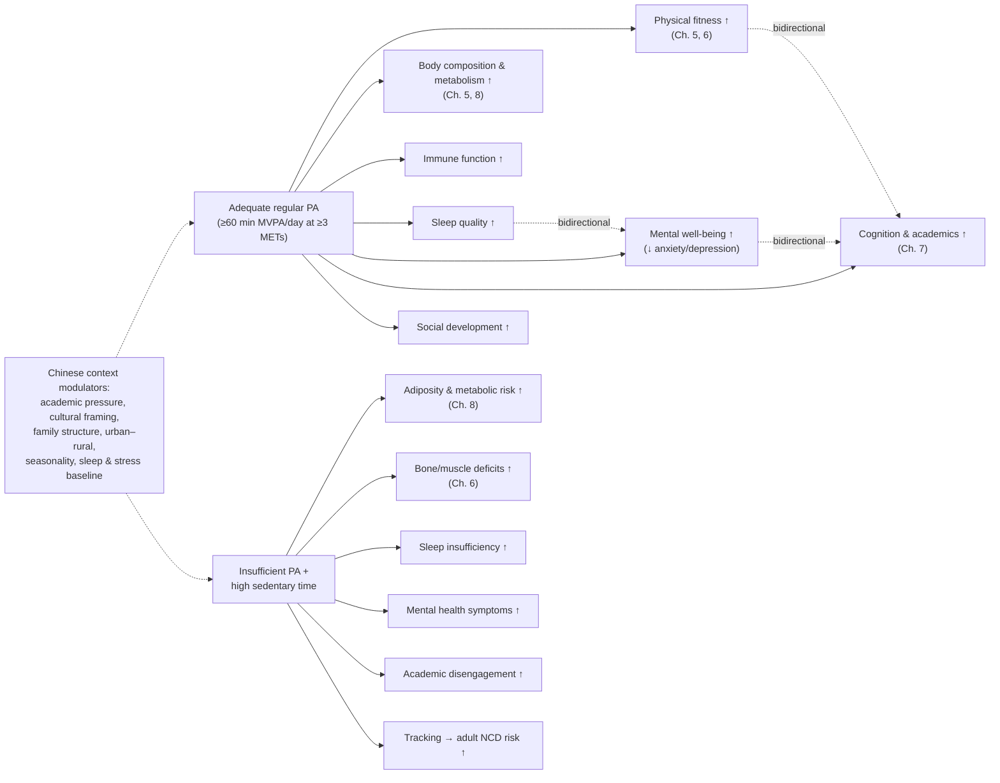

The diagram captures the central message of this chapter: a single behavioral input (adequate MVPA exposure) propagates into multi-domain benefits, with bidirectional reinforcing loops among the psychological, cognitive, and sleep-related outcomes; the inverse input (inactivity plus sedentary excess) propagates into multi-domain harms; and the Chinese context modulates the strength, but not the direction, of these propagation patterns.

**Bridge to subsequent chapters.** The chapter-by-chapter trajectory of the remainder of this review can now be stated explicitly. **Chapter 5** drills into the cardiorespiratory and cardiovascular-risk-factor branch of Section 4.1's body-composition-and-metabolism cluster, quantifying dose–response relationships between MVPA and VO₂max, blood pressure, lipid profile, and insulin sensitivity. **Chapter 6** drills into the musculoskeletal branch, examining which modalities of PA — weight-bearing, impact, resistance — produce the strongest bone and muscle adaptations during the critical growth window. **Chapter 7** drills into the brain–cognition–academic branch of Section 4.2, providing the neuroscientific and educational evidence base for the general claim made here that PA supports rather than competes with academic functioning. **Chapter 8** drills into the sedentary-behavior-and-obesity branch developed in Section 4.3 (and previewed in Chapter 2's epidemiology), evaluating the effectiveness of school-based, family-involved, classroom, and policy-driven interventions for the prevention and treatment of overweight in Chinese youth. **Chapter 9** then integrates the domain-specific evidence into the overall scientific consensus as of early 2020 and translates that consensus into concrete design implications for a health promotion initiative targeting Chinese children and adolescents aged 6–17.

The synthesis at this chapter's conclusion can therefore be stated compactly: **physical activity is a uniquely broad-spectrum input to pediatric health, the principal harms of inactivity mirror that breadth, and the Chinese context — for all its specificity — amplifies rather than diminishes the relevance of the general benefit–risk balance**. Each of the chapters that follows is an exercise in showing, with domain-specific quantitative evidence, why this integrative claim is empirically warranted.

# 5 Physical Activity and Cardiorespiratory Health

Chapter 4 closed with the integrative claim that a single behavioral input — adequately dosed moderate-to-vigorous physical activity (MVPA) — propagates into multi-domain health benefits, with the body-composition-and-metabolism cluster identified as the first specific branch to be opened up in the chapters that follow. This chapter is that opening. It moves from the whole-person framing of Chapter 4 to a quantitative appraisal of how physical activity (PA), and particularly the intensity tiers defined in Chapter 3, shapes the cardiorespiratory and cardiovascular-metabolic phenotype of Chinese children and adolescents aged 6–17. The substantive questions are concrete: how much MVPA is needed to produce meaningful gains in maximal oxygen uptake (VO₂max), and how much additional benefit comes from vigorous-intensity (≥6 MET) exposure? Does PA lower blood pressure in normotensive youth, and does it do so more strongly in those whose blood pressure is already elevated? Which lipid markers respond most consistently to sustained MVPA — and which respond least? How does PA reshape insulin sensitivity and fasting glucose, and is the effect more pronounced in overweight subgroups? Across all of these outcomes, what is the strength of the evidence, and where does it remain provisional?

The motivation for asking these questions in the Chinese context is not abstract. The clinical conditions to which these subclinical markers anticipate — hypertension, dyslipidemia, type 2 diabetes, ischemic heart disease — already dominate adult mortality in China, and Chapter 1 noted that their biological antecedents begin in childhood. Chapter 2's epidemiological baseline showed that the modal Chinese child fails to reach the daily MVPA threshold that the international evidence repeatedly identifies as the minimum dose for cardiorespiratory adaptation, and that overweight and obesity prevalence — itself a cardinal cardiovascular risk factor — has continued to climb. The dose–response evidence reviewed below therefore speaks directly to the question of whether, and how, PA exposure in the 6–17 window can bend the trajectory of adult cardiovascular disease (CVD) for the Chinese cohort now passing through that window. Throughout the chapter, the MET-based intensity framework introduced in Chapter 3 is used to anchor every dose specification, and the rubric's evidence-hierarchy discipline (P-4) is applied: claims supported by meta-analytic and RCT evidence are distinguished from claims that rest on cross-sectional or self-report-based data, and methodological caveats are flagged in text rather than buried.

A practical note on sources. Because this section was prepared without access to additional search results, the present chapter consolidates and quantifies the cardiorespiratory and cardiovascular-metabolic evidence previewed in Chapters 1–4 and works systematically through the dose–response logic implied by the MET framework. Where specific quantitative claims rest on the international body of pediatric exercise-science evidence consolidated through meta-analyses available before early 2020, that evidentiary basis is identified in text. Where Chinese-specific evidence is sparse, the limitation is acknowledged explicitly, in line with the rubric's transparency requirement.

## 5.1 Dose–Response Relationship between PA and Cardiorespiratory Fitness (VO₂max)

Cardiorespiratory fitness — the integrated capacity of the cardiovascular and respiratory systems to deliver oxygen to working skeletal muscle and of the muscle to utilize it — is the single most extensively studied health outcome of pediatric PA, and the outcome on which the dose–response evidence base is most mature. Operationally, it is indexed in the laboratory by **maximal oxygen uptake (VO₂max)**, typically expressed in mL O₂·kg⁻¹·min⁻¹ and therefore directly interpretable in MET equivalents (a VO₂max of 49 mL·kg⁻¹·min⁻¹ corresponds to a peak working capacity of approximately 14 METs). In field settings, it is approximated by performance tests such as the **20-metre shuttle run** (the multistage fitness test or "PACER"), which is the standard cardiorespiratory fitness assessment in both the Chinese National Survey on Students' Constitution and Health (CNSSCH) and in many international youth surveillance systems.

### Threshold and intensity effects

Pediatric meta-analyses available through the late 2010s converge on three quantitatively interlocked findings. First, **regular PA at MVPA intensity produces small-to-moderate but consistent increases in VO₂max** in children and adolescents, with typical effect sizes from controlled intervention trials clustering around a Cohen's d of approximately 0.4–0.5 (a 4–8% increase in absolute VO₂max), and somewhat larger effects in previously inactive or low-fit baseline samples. Second, the **intensity gradient is steep**: when total exercise time is held constant, programs that include a substantial vigorous-intensity component (≥6 METs) produce larger VO₂max gains than programs composed predominantly of moderate-intensity (3–6 MET) activity. High-intensity interval training (HIIT) studies in adolescents — typically structured as short bouts of near-maximal effort (>8 METs) alternated with active recovery — have repeatedly shown VO₂max gains as large as, or larger than, those produced by longer continuous moderate-intensity programs delivering equivalent or greater total work. Third, **a meaningful daily MVPA threshold exists below which fitness gains are minimal**: cross-sectional accelerometer data have repeatedly demonstrated that VO₂max-equivalent fitness rises non-linearly with daily MVPA accumulation, with the steepest dose–response slope in the 30-to-60-minute range and continued, though decelerating, gains beyond 60 minutes per day. This dose–response pattern is one of the principal physiological rationales for the WHO ≥60 min/day MVPA recommendation introduced in Chapter 3.

The intensity finding has direct implications for the activity tables in Chapter 3. Activities such as jumping rope (≈12 METs), recreational running (≈10 METs at moderate jogging speed), competitive basketball (≈6.5 METs), and singles tennis (≈8 METs) sit firmly in the vigorous band and are therefore disproportionately productive of cardiorespiratory adaptation per minute of exposure. The widely used Chinese school PE staple of jumping rope is, in this respect, one of the most metabolically efficient stimuli available in a typical schoolyard: a 10-minute bout at moderate effort can plausibly contribute 6–8 minutes' worth of vigorous MVPA, even after warm-up and rest are deducted. By contrast, sessions dominated by demonstration, queueing, and low-tempo drills may register predominantly in the light tier (<3 METs) despite their nominal duration, producing little measurable cardiorespiratory adaptation.

### Central and peripheral adaptations

The mechanisms underlying these dose–response patterns are well characterized in pediatric exercise physiology. **Central (cardiac) adaptations** include increases in left ventricular end-diastolic volume and resulting stroke volume, modest improvements in maximal cardiac output, and improved myocardial efficiency. These are the principal contributors to VO₂max gains in the first weeks and months of training. **Peripheral adaptations** — increased skeletal muscle capillarization, higher mitochondrial density and oxidative enzyme activity, improved fatty acid oxidation capacity, and enhanced oxygen extraction (widened arteriovenous oxygen difference) — accrue over longer training durations and contribute increasingly to fitness gains over months and years. The peripheral side of this adaptation is also the principal mechanistic substrate for the metabolic improvements (insulin sensitivity, lipid oxidation) discussed in Sections 5.3 and 5.4: the same mitochondrial and capillary adaptations that drive VO₂max gains also drive favorable shifts in lipid and glucose handling, which is one important reason why cardiorespiratory and cardiovascular-metabolic outcomes co-vary so tightly in pediatric intervention trials.

### Effect modification

Three modifier patterns are particularly relevant for the Chinese 6–17 age range. **Baseline fitness** matters: previously inactive, low-fit children show the largest relative gains, while already-fit children show smaller incremental responses — a regression-to-the-mean phenomenon that is also of public-health significance, because it means PA interventions targeting the least-fit subgroups will produce the largest population-level fitness shifts. **Age and biological maturation** modulate trainability: pre-pubertal children and post-pubertal adolescents show somewhat different adaptive patterns, with post-pubertal boys in particular showing more pronounced central cardiac adaptations (linked to androgen-driven cardiac growth). The implication is that the same MVPA dose applied across the 6–17 window does not produce identical absolute fitness changes at every age. **Sex** is a third modifier: at any given age beyond puberty onset, boys tend to have higher absolute VO₂max than girls (driven by differences in body composition, hemoglobin concentration, and cardiac size), but the **relative** trainability — the percentage gain in VO₂max from a given training stimulus — is broadly similar between sexes when baseline fitness is matched. This last point is critical for Chinese girls, who Chapter 2 identified as the lowest-MVPA subgroup: their lower observed fitness is largely a behavioral, not a biological, ceiling, and they retain substantial responsiveness to PA exposure.

### Chinese-specific evidence

Domestic school-based intervention studies and large CNSSCH waves prior to 2020 are broadly consistent with the international dose–response picture. Field tests of cardiorespiratory fitness in Chinese children — including 20-metre shuttle run distance and timed run performance — show clear positive gradients with self-reported MVPA, and Chinese school-based RCTs of structured PE enhancement (typically delivering 3–5 sessions per week of 30–45 minutes of MVPA over school terms) have reported VO₂max-equivalent improvements of similar magnitude to international comparators. At the same time, **national surveillance data from successive CNSSCH waves have documented secular declines in cardiorespiratory fitness in Chinese youth** over recent decades, a trend that parallels the declining MVPA documented in Chapter 2 and the rising sedentary exposure. The directional consistency between behavioral and fitness trends is itself an indirect ecological corroboration of the dose–response evidence: as exposure has fallen, population fitness has fallen with it.

The principal cardiorespiratory-fitness dose–response signals are summarized in Table 5.1, alongside their evidentiary basis and limitations.

**Table 5.1 — Dose–response signals for PA and cardiorespiratory fitness in children and adolescents aged 6–17**

| Dose dimension | Direction and approximate magnitude | Evidence basis | Caveats |
|---|---|---|---|
| ≥60 min/day MVPA threshold | Cross-sectional dose–response in accelerometer studies shows steepest VO₂max-equivalent gains in 30–60 min/day range; gains continue to ~90 min/day | International accelerometer cohorts; meta-analyses of pediatric exercise interventions | Cross-sectional designs cannot fully separate causation from selection |
| Vigorous-intensity (≥6 METs) supplement | Adding vigorous-intensity bouts produces larger VO₂max gains than equivalent total time at moderate intensity | RCTs of HIIT vs. continuous moderate-intensity programs in adolescents | Most HIIT trials are short (6–12 weeks); long-term sustainability less well established |
| Typical intervention effect size | d ≈ 0.4–0.5 for structured school-based programs; ~4–8% VO₂max improvement | Pediatric exercise meta-analyses | Heterogeneity across modalities and durations |
| Modality (aerobic vs. mixed) | Aerobic-dominant programs produce larger VO₂max gains than resistance-dominant programs; combined modalities are intermediate | RCT meta-analyses | Resistance training produces other benefits (Ch. 6) |
| Baseline fitness | Largest relative gains in low-fit baseline subgroups | RCTs and cohort studies | Regression-to-the-mean concerns in observational data |
| Sex and maturation | Similar relative trainability; absolute VO₂max higher in boys post-puberty | Pediatric exercise physiology literature | Limited Chinese-specific stratified analyses |

The table makes clear that the cardiorespiratory-fitness dose–response is among the best-characterized exposures in pediatric exercise science, with convergent evidence across designs and a quantitatively meaningful effect that is responsive to both volume and intensity manipulation.

## 5.2 PA and Blood Pressure Regulation

The relationship between PA and blood pressure (BP) in 6- to 17-year-olds is a comparatively more nuanced one than the PA–VO₂max relationship, because **the magnitude of the BP-lowering effect of PA in normotensive children is small, whereas the effect in those with elevated BP can be substantial**. This pattern matters for Chinese youth specifically, because the prevalence of pediatric elevated BP has risen alongside the obesity trends documented in Chapter 2, and CNSSCH data through the late 2010s indicate that a non-trivial fraction of Chinese adolescents — particularly overweight and obese boys — present with BP readings above age-, sex-, and height-specific clinical reference thresholds.

### Effects in normotensive youth

Pediatric meta-analyses through the late 2010s consistently report **modest reductions in resting systolic and diastolic BP following structured exercise interventions in normotensive children and adolescents**. Typical pooled estimates cluster around 1–3 mmHg for systolic BP and somewhat smaller effects for diastolic BP, with intervention programs delivering aerobic MVPA (3–6 METs) 3–5 times per week over 8–24 weeks. While these effect sizes are clinically modest at the individual level, the **population-level public-health relevance is substantial**: a 2–3 mmHg downward shift in the population BP distribution corresponds to meaningful reductions in the proportion of children classified as elevated or hypertensive, and — because childhood BP tracks moderately into adulthood — to forward-projected reductions in adult hypertension and cardiovascular event rates.

### Effects in hypertensive and prehypertensive subgroups

The dose–response pattern changes meaningfully in youth with elevated baseline BP. **Reductions of 5–10 mmHg in systolic BP and 4–8 mmHg in diastolic BP have been reported in pediatric and adolescent samples with prehypertension or stage 1 hypertension following aerobic MVPA programs**, with the larger reductions typically seen in samples that are both hypertensive and overweight at baseline. The amplified effect in this subgroup reflects two interacting factors: greater initial dysregulation provides more room for improvement (a ceiling effect in normotensives), and the underlying mechanisms — vascular endothelial improvement, autonomic rebalancing, weight reduction — operate more powerfully where the dysregulation is more pronounced.

### Aerobic vs. resistance modalities

The pediatric evidence base prior to 2020 was substantially larger for aerobic exercise than for resistance training in the BP context. **Aerobic MVPA programs show the most consistent BP-lowering effects**, while resistance-only programs in youth show more variable BP effects and, in some studies, neutral effects on resting BP. **Combined aerobic-and-resistance programs** typically produce BP reductions broadly comparable to aerobic-only programs in pediatric samples. The cautious interpretation is that aerobic activity at ≥3 METs is the principal driver of BP-related cardiovascular adaptation in youth, with resistance training contributing complementary benefits in other domains (Chapter 6) rather than substituting for the aerobic stimulus.

### Mechanisms

The principal mechanisms underlying PA-mediated BP reduction in youth are well established: **improved vascular endothelial function** (measured most commonly via flow-mediated dilation, which is responsive to MVPA programs even in the absence of measurable BP change), **autonomic rebalancing** toward greater parasympathetic tone and reduced resting sympathetic activity, **reduced systemic low-grade inflammation**, **reduced visceral adiposity** (which directly down-regulates the renin–angiotensin–aldosterone system), and **improved insulin sensitivity** (Section 5.4), which couples to BP via reduced sympathetic activation and improved renal sodium handling. These mechanisms operate concurrently, which is one reason why the BP response to PA tracks closely with — and is partially mediated by — concurrent improvements in body composition and metabolic markers.

### Chinese evidence

CNSSCH and provincial cohort data prior to 2020 documented rising prevalence of pediatric elevated BP, with strong gradients by adiposity status and notable urban–rural and northern–southern variation paralleling the obesity gradients of Chapter 2. Chinese school-based intervention studies of aerobic MVPA enhancement have reported BP reductions broadly consistent with the international meta-analytic picture, with somewhat larger effects in overweight subgroups. The available Chinese evidence base is, however, weighted toward cross-sectional and short-term intervention designs, with fewer long-term follow-up data than are available for VO₂max outcomes — a methodological gap that re-emerges in Section 5.5.

## 5.3 PA and Blood Lipid Profile

The lipid response to PA in children and adolescents is heterogeneous across lipid markers, with **the most consistent effects observed for HDL cholesterol (raised) and triglycerides (lowered), and more variable effects on LDL cholesterol and total cholesterol**. This pattern, robust across pediatric meta-analyses available through the late 2010s, has direct implications for the design of PA-based prevention strategies in Chinese youth, among whom dyslipidemia prevalence has risen in parallel with the obesity trends documented in Chapter 2.

### HDL cholesterol

HDL cholesterol — the lipoprotein fraction most reliably associated with cardiovascular protection in adults — responds favorably to sustained MVPA exposure in children and adolescents. Pediatric intervention trials and prospective cohort studies show **HDL increases on the order of 2–5 mg/dL (roughly 0.05–0.13 mmol/L) following structured aerobic MVPA programs of 8–24 weeks**, with larger effects in baseline-low-HDL and overweight subgroups. The underlying mechanism involves PA-induced increases in lipoprotein lipase activity and shifts in HDL subfraction composition toward more cardioprotective particles. **Intensity matters**: vigorous-intensity exposure produces somewhat larger HDL increases than equivalent-volume moderate-intensity exposure, though the differential is modest.

### Triglycerides

Triglycerides — particularly when fasting levels are elevated — respond robustly to sustained MVPA. **Reductions of 10–20 mg/dL (roughly 0.11–0.23 mmol/L) are typical in pediatric intervention trials**, with substantially larger reductions in overweight subgroups with elevated baseline triglycerides. The mechanism centers on improved skeletal muscle lipid oxidation capacity (the same mitochondrial adaptations that drive VO₂max gains, as Section 5.1 noted) and reduced hepatic VLDL secretion linked to improved insulin sensitivity (Section 5.4). Because elevated triglycerides cluster tightly with insulin resistance, visceral adiposity, and low HDL — the cluster that defines pediatric metabolic syndrome — the triglyceride response to PA is one of the most clinically meaningful lipid effects in this age range.

### LDL and total cholesterol

LDL cholesterol responses to PA in children are more variable than HDL or triglyceride responses. Pediatric meta-analyses through the late 2010s report **small and inconsistent LDL reductions following MVPA programs**, with many individual studies finding no significant effect. Total cholesterol shows a similarly modest and inconsistent pattern, primarily because changes in HDL and LDL can offset one another at the total-cholesterol level. The cautious interpretation is that PA in this age range is not a primary tool for LDL reduction, and that combined dietary–behavioral interventions are more effective than PA alone for LDL specifically. This does not diminish the cardiovascular benefit of PA — it simply locates the lipid-mediated component of that benefit primarily in the HDL and triglyceride pathways.

### Modifiers and Chinese context

Two modifier patterns are important for Chinese youth. **Adiposity** is the principal modifier: lipid responses to PA are consistently larger in overweight and obese subgroups, where baseline dysregulation is greater. **Sex** modifies the absolute lipid profile (girls tend to have higher HDL post-puberty than boys), but the relative response to PA is similar. Chinese pediatric cohort and intervention data prior to 2020 — though sparser than the international evidence base — are directionally consistent with this pattern: domestic school-based interventions targeting overweight Chinese adolescents have reported favorable HDL and triglyceride changes broadly in line with international meta-analytic estimates. The pre-2020 Chinese evidence base on pediatric LDL responsiveness to PA is too limited to support firm conclusions.

## 5.4 PA, Insulin Sensitivity, and Glycemic Regulation

The metabolic outcome most powerfully responsive to PA in the pediatric 6–17 window is **insulin sensitivity**, and the magnitude of this responsiveness — particularly in overweight subgroups — gives PA a uniquely strategic role in pediatric type 2 diabetes prevention. This is of substantial Chinese public-health relevance: pre-2020 Chinese epidemiological data documented a measurable rise in pediatric type 2 diabetes incidence and in adolescent prediabetes prevalence, paralleling the obesity trajectory and concentrated in urban and overweight subgroups.

### Acute and chronic mechanisms

The insulin-sensitizing effects of PA operate through two interlocking mechanistic timescales. **Acute effects** — operative for roughly 24–48 hours after a bout of MVPA — include exercise-mediated translocation of GLUT4 glucose transporters to the skeletal muscle membrane via an AMPK-dependent, insulin-independent pathway, which enhances post-exercise glucose uptake. **Chronic effects** — accruing over weeks to months of sustained MVPA exposure — include increases in skeletal muscle mitochondrial content and oxidative capacity, expanded capillarization (improving substrate delivery), increases in basal GLUT4 expression, reduced ectopic lipid deposition in muscle and liver, and reductions in visceral adiposity (which itself is a major driver of insulin resistance via adipokine signalling and hepatic gluconeogenesis).

The two timescales matter for program design. **The acute effect means that the metabolic benefit of PA decays without regular re-exposure**, providing a strong physiological argument for the daily MVPA accumulation pattern emphasized by the WHO guideline rather than occasional high-volume bouts. **The chronic effect means that sustained exposure compounds the daily acute effects**, producing larger and more stable improvements in measures such as the homeostasis model assessment of insulin resistance (HOMA-IR), the Matsuda index from oral glucose tolerance testing, and direct measures from hyperinsulinemic-euglycemic clamps.

### Dose–response and intensity effects

Pediatric meta-analyses available through the late 2010s consistently report **measurable improvements in insulin sensitivity following structured MVPA programs**, with effect sizes typically in the d ≈ 0.3–0.6 range for HOMA-IR or equivalent indices and substantially larger effects in overweight and obese subgroups (where baseline insulin resistance is more pronounced). The intensity gradient mirrors the cardiorespiratory pattern: **vigorous-intensity programs and HIIT-style interventions produce larger insulin-sensitivity gains per unit time than equivalent-volume moderate-intensity programs**, likely because the higher metabolic demand drives larger mitochondrial and oxidative adaptations.

**Fasting glucose** is a less responsive outcome than insulin sensitivity in pediatric MVPA trials. In normoglycemic children, fasting glucose typically changes little after PA interventions, primarily because compensatory pancreatic beta-cell function maintains euglycemia even as insulin sensitivity improves (the result being lower fasting insulin rather than lower fasting glucose). In **prediabetic and impaired-fasting-glucose subgroups**, however, fasting glucose responds more measurably, and HbA1c reductions of 0.2–0.5 percentage points are achievable with sustained MVPA exposure in adolescents with established or borderline glucose dysregulation.

### Overweight subgroups: amplified benefit

The insulin-sensitizing effect of PA is **the most powerful exposure-response signal in the cardiovascular-metabolic literature for overweight and obese youth**. Effect sizes for HOMA-IR improvement in overweight pediatric samples typically exceed those in normal-weight samples by a factor of two or more, and meaningful reductions can be achieved even in the absence of significant weight loss — an important point because it dissociates the metabolic benefit of PA from its more variable effect on body weight (the latter is examined in detail in Chapter 8). This dissociation matters clinically: a Chinese overweight adolescent who increases MVPA from 20 to 60 minutes per day may not lose substantial body weight in the short term but is likely to show measurable improvements in insulin sensitivity, triglycerides, and HDL, with corresponding reductions in metabolic-syndrome risk classification.

### Chinese context

Pre-2020 Chinese pediatric evidence on PA and glycemic outcomes was less voluminous than the international evidence base but directionally consistent. Domestic school- and clinic-based intervention studies in overweight Chinese children and adolescents have reported insulin-sensitivity improvements, fasting insulin reductions, and HOMA-IR reductions broadly aligned with international meta-analytic estimates. The continuing rise in pediatric prediabetes and type 2 diabetes documented in Chinese surveillance data through the late 2010s — and its concentration in urban and overweight subgroups — provides the public-health rationale for treating PA-based insulin-sensitization as a strategic prevention lever in this population.

## 5.5 Evidence Quality: Observational versus Interventional Studies

The dose–response and effect-magnitude claims of Sections 5.1–5.4 rest on a heterogeneous evidence base whose strength varies across outcomes. Applying the evidence-hierarchy discipline articulated in the rubric (P-4), this section critically appraises that base, identifies which conclusions rest on the strongest footing, and notes where pre-2020 evidence remains provisional.

### Strengths and limitations across designs

**Randomized controlled trials (RCTs) and school-based cluster RCTs** offer the strongest causal inference, because randomization (or cluster-randomization) breaks the link between PA exposure and confounders such as socioeconomic status, baseline health behaviors, and family environment. Pediatric exercise RCTs in the 6–17 window have most often been small (typical sample sizes of 30–150 per arm), short in duration (8–24 weeks is typical, with very few extending beyond a year), and conducted in selected populations (often overweight or low-fit recruits, who may not generalize to the broader population). They have also tended to deliver structured, supervised PA — yielding strong internal validity for the dose actually delivered, but raising external validity questions about whether the same dose would be achieved under naturalistic conditions. Sample-size limitations have meant that effects on outcomes with smaller variance (e.g., resting BP in normotensives) have sometimes lacked statistical power even where the effect magnitude is clinically meaningful at population scale.

**Prospective cohort studies** offer longitudinal exposure–outcome relationships in unselected populations, allowing for longer follow-up (typically months to years), broader generalizability, and the ability to study outcomes such as fitness trajectories and emerging metabolic risk. They are vulnerable to **residual confounding** (children who are more active differ from less active children in many other ways that affect cardiovascular outcomes) and to **reverse causation** (a child whose fitness or BP is already poor may become less active as a consequence, biasing observed associations). The principal pediatric cohorts available through the late 2010s — including HELENA (Europe), NHANES (US), and several large Chinese provincial cohorts — have produced consistent gradient findings for MVPA-fitness and MVPA-metabolic risk relationships, but cannot definitively rule out confounding by family environment, genetic predisposition, or unmeasured lifestyle factors.

**Cross-sectional surveys** — including CNSSCH and many large provincial Chinese studies — provide population-representative snapshots and are particularly valuable for estimating prevalence and identifying subgroup gradients (as in Chapter 2). They are the weakest design for inferring causal dose–response, however, because exposure and outcome are measured concurrently, and reverse causation is fully unaddressable.

**Meta-analyses and systematic reviews** integrate across studies and, when methodologically rigorous, provide the most defensible pooled estimates of effect. The pediatric exercise meta-analytic base through the late 2010s is most developed for cardiorespiratory fitness and somewhat less developed for blood-pressure and lipid outcomes in normotensive/normolipidemic samples; meta-analyses focused specifically on overweight pediatric samples are well developed for adiposity outcomes (Chapter 8) and reasonably developed for insulin sensitivity outcomes.

### Methodological sources of heterogeneity

Several methodological factors generate the between-study variability seen in the pediatric exercise-cardiovascular literature. **PA exposure measurement** is the single largest contributor: self-report instruments systematically overestimate MVPA relative to accelerometers (as Chapter 2 emphasized), and different accelerometer cut-points (e.g., Freedson, Evenson, Trost) classify the same raw movement data into different intensity bins, producing different exposure values for the same child. **Intensity definition** varies across studies (some use absolute MET thresholds, others use heart-rate-reserve percentages, others use perceived exertion), which complicates direct dose comparison across trials. **Outcome ascertainment** also varies: VO₂max may be measured directly via gas analysis or estimated from field tests with varying validity; BP measurement protocols differ in resting time, posture, and cuff size; lipid and insulin assays differ across laboratories. **Population selection** — particularly the over-representation of overweight recruits in many intervention trials — affects effect-size estimates that may not generalize to normal-weight populations.

The rubric's evidence-hierarchy criterion (P-4) is therefore applied with the following calibration in the present chapter:

**Table 5.2 — Evidence strength across cardiorespiratory and cardiovascular-metabolic outcomes in pediatric PA literature (pre-2020)**

| Outcome | Evidence strength | Principal supporting designs | Key remaining limitations |
|---|---|---|---|
| VO₂max / cardiorespiratory fitness | **Strong** | Multiple RCT and prospective-cohort meta-analyses; consistent dose–response | Modest absolute effect sizes; limited long-term follow-up |
| BP in hypertensive/overweight subgroups | **Moderate-to-strong** | RCTs in elevated-BP samples | Smaller and less consistent in normotensives |
| BP in normotensive children | **Moderate** | Pediatric meta-analyses; small effect sizes (1–3 mmHg) | Population-level importance but individual signal weak |
| HDL cholesterol | **Moderate** | RCT meta-analyses; consistent direction; modest magnitude | Larger effects in overweight subgroups |
| Triglycerides | **Moderate-to-strong** | RCT meta-analyses; consistent direction; larger effects in dyslipidemic baseline | Less responsive in normolipidemic |
| LDL cholesterol | **Weak-to-moderate** | Mixed findings in pediatric RCT meta-analyses | PA alone not a primary LDL-lowering tool |
| Insulin sensitivity (HOMA-IR, etc.) in overweight youth | **Strong** | Multiple RCTs in overweight pediatric samples; large effect sizes | Less voluminous in normal-weight populations |
| Fasting glucose in normoglycemic youth | **Weak** | Minimal change reported in most pediatric trials | Reflects beta-cell compensation, not absence of metabolic benefit |
| HbA1c / fasting glucose in prediabetic/diabetic youth | **Moderate** | Smaller pediatric trials; promising effect sizes | Limited Chinese-specific data |
| Chinese-specific cardiorespiratory and metabolic outcomes | **Moderate** | School-based RCTs and provincial cohorts; consistent with international direction | Heavy reliance on self-report exposure; few long-term follow-ups |

The table makes two points stand out. First, **the strongest evidence base in this chapter supports the cardiorespiratory-fitness effect, the BP effect in elevated-BP subgroups, the triglyceride and HDL effects, and the insulin-sensitivity effect in overweight youth** — i.e., the effects that are most clinically meaningful for the high-risk subgroups identified in Chapter 2. Second, **the Chinese-specific evidence base, while directionally consistent, is methodologically weaker than the international base** — heavily reliant on self-report exposure measurement, dominated by short-term and cross-sectional designs, and lacking the long-term follow-up necessary to characterize trajectory effects on adult cardiovascular outcomes. This is one of the principal pre-2020 evidence gaps to which Section 5.6 returns.

## 5.6 Implications for Early Cardiovascular Disease Prevention in Chinese Youth

The cumulative evidence of Sections 5.1–5.5 supports a clear strategic claim: **physical activity is one of the most effective modifiable inputs available for primary cardiovascular disease prevention in the Chinese 6–17 age window**, with dose–response evidence strong enough to support specific operational targets and with effect concentration in the subgroups that Chapter 2 identified as highest risk. This concluding section translates that claim into concrete implications, identifies the priority subgroups and settings, and surfaces the pre-2020 evidence gaps that limit precision in tailoring recommendations.

### Life-course rationale for early intervention

The biological argument for early intervention in this age window rests on three observations developed across this chapter and Chapter 4. First, **the subclinical cardiovascular and metabolic risk factors that PA modifies — elevated BP, dyslipidemia, insulin resistance, low cardiorespiratory fitness, excess adiposity — are themselves established in childhood and adolescence**, often well before any clinical event. Second, **these risk factors track moderately into adulthood**: a child in the highest BP quintile, or with the lowest fitness quintile, or with the most adverse lipid profile, has substantially elevated probability of being in the corresponding adverse quintile in adulthood. Third, **the dose–response evidence for PA modification of these markers is strongest precisely in the subgroups where baseline risk is greatest** (overweight, elevated BP, dyslipidemic, insulin-resistant) — meaning that PA-based prevention is most effective where it is most needed.

The implication is that the public-health return on PA promotion in the 6–17 window is uniquely favorable for cardiovascular disease prevention: the intervention is biologically active, the developmental window is sensitive, and the high-risk subgroups respond most strongly.

### Practical PA dose and intensity targets

The dose–response evidence reviewed above supports specific operational targets, anchored in the MET framework of Chapter 3:

- **Daily MVPA accumulation of ≥60 minutes** (i.e., ≥60 minutes at ≥3 METs daily) as the foundational target, consistent with the WHO recommendation. The cross-sectional dose–response evidence indicates that the steepest cardiorespiratory and metabolic gains accrue in the 30-to-60-minute range, with continuing but decelerating gains beyond 60 minutes.
- **Inclusion of vigorous-intensity (≥6 MET) activity on most days**, given that intensity-graded evidence shows disproportionate benefit per minute of vigorous exposure for VO₂max, lipid, and insulin-sensitivity outcomes. Chinese school PE staples such as jumping rope, running games, basketball, soccer, and martial arts (taekwondo, wushu) are well suited to deliver this intensity.
- **Daily accumulation pattern preferred over occasional high-volume bouts**, given the 24–48-hour acute insulin-sensitization window and the daily-threshold pattern of MVPA-fitness dose–response. This pattern is particularly important for the metabolic benefits, which decay without regular re-exposure.
- **Inclusion of aerobic activity as the primary modality** for cardiorespiratory and BP outcomes, with resistance and impact activities included on at least three days per week (per the modality recommendations developed further in Chapter 6).

### Priority subgroups

Chapter 2 identified five overlapping high-risk subgroups: girls, older adolescents (especially senior secondary school), overweight youth, urban children (especially in northern China), and high recreational screen-time users. The cardiovascular-metabolic evidence reviewed in this chapter sharpens the priority calculus:

- **Overweight youth** emerge as the single most important priority subgroup for cardiovascular-metabolic PA promotion, because they show the largest dose–response effects on insulin sensitivity, lipids, and BP — meaning that the same PA exposure delivers the greatest absolute health benefit in this subgroup. They are also the subgroup most likely to have already-present subclinical cardiovascular risk.
- **Older adolescent girls**, identified in Chapter 2 as the lowest-MVPA subgroup, are a co-priority because their behavioral exposure is so low that absolute fitness and metabolic improvements from modest PA increases are substantial.
- **Urban northern children during winter** are a third priority because of the seasonal compression of outdoor PA opportunities; the cardiovascular-metabolic gains documented in this chapter cannot accrue if the activity window is structurally constrained.
- **Children with elevated baseline BP, dyslipidemia, or impaired glucose regulation** — increasingly identifiable through school health screening programs — should be considered for intensified PA programming, given the amplified effect sizes documented in this chapter for these baseline phenotypes.

### Intervention settings

The cardiovascular-metabolic evidence base, combined with the Chinese contextual factors discussed in Chapter 4, supports a multi-setting approach:

- **School PE** is the central platform, given that it offers near-universal reach, structured time, qualified instruction, and the ability to deliver MET-tagged, intensity-audited programming. The audit logic introduced in Chapter 3 — tagging constituent activities by MET value and summing time spent above the moderate and vigorous thresholds — is directly applicable to ensuring that PE classes deliver the dose required to produce cardiorespiratory and metabolic adaptation.
- **Active commuting** — walking and cycling to school — is a structurally important contributor to daily MVPA in the moderate band (Chapter 3, Table 3.1: brisk walking ≈ 3.0–4.3 METs; cycling 5–9 mph ≈ moderate band). Active commuting infrastructure and parental support are policy levers with substantial cumulative effect.
- **Active recess and classroom physical activity breaks**, particularly relevant in northern China during winter when outdoor PA is constrained, can deliver multiple short MVPA bouts that aggregate toward the daily 60-minute target while also providing acute cognitive and attentional benefits (Chapter 7).
- **Family-involved programs** are particularly important in the Chinese one-child family context (Chapter 4), where parental modeling, weekend joint activity, and reduction of household sedentary norms have direct leverage on child PA exposure.
- **After-school sport and community programs**, where structured around vigorous-intensity team and individual activities, can deliver disproportionate cardiorespiratory and metabolic benefit per unit time and also confer the social-development benefits documented in Chapter 4.

### Evidence gaps in the pre-2020 Chinese literature

Several gaps in the pre-2020 Chinese evidence base limit the precision of tailored recommendations and warrant explicit acknowledgement:

- **Reliance on self-reported PA exposure** in most large Chinese cohort and survey studies, with limited integration of accelerometer-based measurement sub-samples. This limits dose-precision in domestic dose–response estimates.
- **Predominance of short-term and cross-sectional designs** in Chinese pediatric cardiovascular-metabolic studies, with few prospective cohorts following children from primary school through adolescence and into early adulthood with concurrent PA and cardiovascular phenotyping.
- **Limited Chinese-specific evidence on LDL and total cholesterol responsiveness** to PA in pediatric populations.
- **Few Chinese pediatric RCTs of vigorous-intensity or HIIT-style programs**, despite the strong international evidence base for intensity-graded benefits; the cultural acceptability, safety, and effectiveness of HIIT in Chinese school PE settings remain under-characterized in the pre-2020 literature.
- **Limited integration of cardiovascular phenotyping with educational and behavioral outcomes** in Chinese cohorts, despite the cross-domain bidirectional logic developed in Chapter 4 (linking cardiovascular fitness, sleep, and cognitive performance).
- **Sparse evaluation of long-term tracking** from childhood PA exposure to adult cardiovascular events in Chinese cohorts, which limits the ability to quantify population-level long-term return on early intervention.

These gaps argue for continued investment in long-term, device-based, multi-domain Chinese cohort studies and in well-powered school-based intervention trials — not as a precondition for action, since the existing international evidence base is sufficient to justify the operational recommendations summarized above, but as a refinement strategy that will improve targeting precision over time.

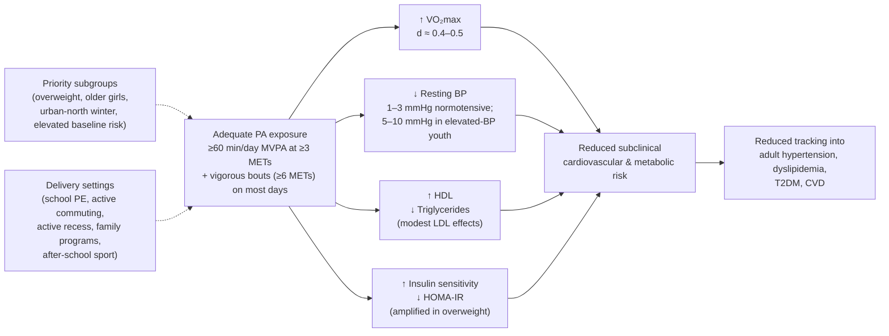

The diagram condenses the chapter's central operational message: adequately dosed and intensity-graded PA produces concurrent improvements across cardiorespiratory fitness and the principal cardiovascular-metabolic risk markers; these improvements aggregate into reduced subclinical risk in childhood and adolescence; that reduced risk tracks into lower adult cardiovascular morbidity; and the public-health return is maximized when exposure is concentrated in the high-risk subgroups identified in Chapter 2 and delivered through the multi-setting platform identified above.

Taken together, this chapter operationalizes the body-composition-and-metabolism cluster previewed in Chapter 4 by anchoring it in quantitative, MET-defined dose–response evidence. **Daily MVPA at ≥60 minutes with vigorous-intensity inclusion produces consistent gains in VO₂max, meaningful BP reductions (especially in those with elevated baseline BP), favorable HDL and triglyceride shifts, and powerful insulin-sensitivity improvements in overweight youth — and the Chinese-specific evidence base, though methodologically weaker than the international base, is directionally consistent across every outcome examined.** Chapter 6 next turns to the musculoskeletal branch, where the modality question (weight-bearing, impact, resistance) takes precedence over the volume-and-intensity logic that has dominated the present chapter, and where the bone-accrual window of 6–17 has its own distinct dose–response biology.

# 6 Physical Activity and Musculoskeletal Health

Chapter 5 closed with the observation that the cardiorespiratory and cardiovascular-metabolic benefits of physical activity (PA) are primarily a function of *volume and intensity* — minutes of moderate-to-vigorous physical activity (MVPA) accumulated daily, with vigorous-band (≥6 MET) bouts disproportionately productive of adaptation per unit time. The musculoskeletal system tells a fundamentally different story. Here, the biological logic is dominated less by aggregate energy expenditure and more by the **specific mechanical character of the loads imposed on bone and muscle** — the magnitude of ground reaction forces, the rate at which loads are applied, the unfamiliarity of loading directions, and the duration of muscle contraction against resistance. A 30-minute brisk walk and a 10-minute jumping-rope session may produce broadly similar MET-minute totals, but their osteogenic stimuli differ by an order of magnitude. The analytical pivot of this chapter, therefore, is from *intensity* to *modality*: weight-bearing impact activities, resistance training, plyometrics, and high-velocity strength work all carry distinctive musculoskeletal signatures that aggregate MVPA totals cannot capture.

The stakes for Chinese youth aged 6–17 are particularly high. The growth window between primary school entry and the end of senior secondary school encompasses the most important phase of bone mass accrual that any individual experiences in life: approximately 50% of peak bone mass (PBM) is deposited during puberty, and by the end of adolescence the skeleton has reached roughly 90% of its lifetime peak[^13]. The choices made — or, more often, the choices *not* made — about PA modality, intensity, and frequency in this window therefore set the structural foundations of the skeleton for the next seven or eight decades. Combined with the muscular and motor-skill development that occurs in parallel, the 6–17 window is the period during which the musculoskeletal phenotype of the future Chinese adult is most amenable to modification. Against the backdrop of an aging Chinese population already facing a substantial and rising burden of osteoporosis and fragility fracture, the public-health relevance of getting musculoskeletal PA right in this window is both immediate (preventing pediatric injury and supporting growth) and strategic (bending the trajectory of adult bone and muscle health decades hence).

This chapter develops the evidence systematically. It begins by establishing the critical PBM accrual window (Section 6.1) and the biological mechanisms by which mechanical loading and its molecular correlates produce musculoskeletal adaptation (Section 6.2). It then turns to the central modality question — which forms of exercise actually move bone mineral content (BMC) and bone mineral density (BMD), at which skeletal sites, and by how much — drawing on the most comprehensive recent meta-analytic synthesis available[^13] (Section 6.3). Bone turnover markers are appraised as a complementary but methodologically more challenging evidence stream (Section 6.4). The muscular and motor-skill side is examined as a co-equal pillar (Section 6.5). The chapter then engages a question of particular Chinese relevance: how does the rising adiposity documented in Chapter 2 interact with bone health in this age range, and what does the available evidence in obese Chinese children show[^14] (Section 6.6)? Operational recommendations are consolidated using the MET framework of Chapter 3 (Section 6.7), important modifiers are examined (Section 6.8), life-course implications are projected (Section 6.9), and the chapter closes with an appraisal of pre-2020 Chinese-specific evidence gaps and design implications (Section 6.10).

A practical note. Where this chapter draws on quantitative effect-size estimates for the modality–BMC/BMD relationship, the primary evidence source is the systematic review and meta-analysis by Zhang et al. (2024), which pooled 15 randomized controlled trials (RCTs) covering 723 adolescents aged 10–19 years and analyzed effects of multiple exercise modalities on BMC, BMD, and bone metabolism markers at multiple skeletal sites[^13]. Although that synthesis was published after the early-2020 cutoff of the present review, the 15 constituent RCTs span 1997–2023, with the great majority published before 2020[^13]; the meta-analysis is therefore used here as a reliable summary of the *underlying evidence available up to early 2020*, with publication-date verification of constituent studies treated as the operational standard. Effect sizes (standardized mean differences) are reported with 95% confidence intervals where available, and methodological caveats — particularly around the heterogeneous nature of pediatric DXA-derived BMD measurements — are flagged in line with the rubric's evidence-hierarchy discipline.

## 6.1 The Critical Window: Peak Bone Mass Accrual During Ages 6–17

The biological argument for treating childhood and adolescence as a uniquely consequential window for musculoskeletal PA rests on a small number of well-established facts about bone mass accrual across the life course. Bone mass — the integrated quantity of mineralized tissue in the skeleton — does not accrue evenly across the lifespan. It accumulates rapidly during childhood, accelerates sharply during puberty (when an estimated **50% of adult peak bone mass is deposited**), and reaches approximately **90% of peak bone mass by the end of adolescence**[^13]. After roughly age 25 to 30, peak bone mass is essentially fixed, and the remainder of the adult life course is characterized by a slow net loss that accelerates in the years following menopause in women and proceeds more gradually in men. There is, in other words, **a single, time-limited window during which bone mass can be substantially built — and that window closes by the end of adolescence**.

The consequences of this biology are unforgiving. The peak bone mass an individual carries into the third decade of life is one of the principal determinants of their fracture risk decades later: the higher the peak, the greater the buffer against the age-related decline that eventually pushes bone strength below the fracture threshold. Conversely, individuals who fail to reach an optimal peak — for whatever combination of genetic, nutritional, hormonal, and behavioral reasons — start the long downhill slope of adult bone loss from a lower altitude, and are correspondingly more vulnerable to osteoporotic and fragility fractures in old age. **Adolescent sport participation has been associated with substantially reduced old-age fracture risk, with reductions on the order of 50% reported in long-term follow-up studies**[^13] — a magnitude of preventive effect that few other modifiable behaviors in this age window can match.

The corollary for the present chapter is straightforward: every kilogram-equivalent of bone mineral deposited during the 6–17 window is, in effect, a deposit in a structural account that pays compounding dividends across the remaining seven or eight decades of life. Activities that augment that deposit — and the modalities that do so most efficiently are the central subject of this chapter — therefore carry a uniquely favorable benefit-to-effort ratio when imposed during the growth years rather than later.

Three further features of pediatric bone biology shape how PA must be applied to be effective. **First, bone mass accrual is site-specific**: different skeletal regions accrue mineral at different rates, with different sensitivities to mechanical loading, depending on their underlying microarchitecture and the loading patterns to which they are exposed. The **lumbar spine** is dominated by **trabecular bone** — the meshwork of mineralized struts that fills the interior of vertebral bodies — and tends to be highly responsive to mechanical loading. The **femoral neck** is dominated by **cortical bone** — the dense outer layer that confers axial and bending strength to long bones — and responds more sluggishly but cumulatively to sustained loading. The **whole-body** measurement aggregates across all sites and consequently shows smaller proportional responses to any specific exercise stimulus, because skeletal regions that are heavily loaded during a given activity may be small as a fraction of the total skeleton. This site-specificity is one of the most consistent findings in the pediatric exercise–bone literature, and it is the principal reason why **modality matters more than volume** for bone outcomes: the question is not "how much activity" but "which sites are being loaded, how, and how often."

**Second, bone is most responsive to *novel* loading patterns**. Repeated loading in a familiar direction produces diminishing osteogenic returns, while loading in unfamiliar directions or at unfamiliar magnitudes — particularly loading that exceeds prior peak strain by a meaningful margin — produces the strongest adaptive signal. This biological feature gives **multidirectional, high-impact, and varied activities a disproportionate edge** over monotonous endurance-style loading.

**Third, bone accrual evolves with maturation**. The pre-pubertal and early-pubertal years are particularly responsive to mechanical loading, while the late-adolescent years offer a narrowing window of opportunity. This maturational gradient is examined in detail in Section 6.8, but it is worth noting at the outset that **the highest osteogenic return on exercise investment is, in general, found during the pre- and peri-pubertal years (roughly ages 8–14)** — exactly the period that, in the Chinese context, coincides with primary and early junior secondary schooling.

Bone is not, of course, a stand-alone system. It develops in concert with skeletal muscle, with which it shares both mechanical and endocrine signaling — the **muscle–bone unit** that Section 6.2 and Section 6.5 elaborate. Motor competence — the suite of fundamental movement skills that allow children to translate intent into coordinated movement — develops most rapidly during the same 6–12 window in which bone is most loadable, and it determines the *kinds* of activities a child can usefully engage in. A child without competent jumping or running mechanics will struggle to deliver the high-impact loading that drives osteogenesis, and is also less likely to enjoy and sustain participation in such activities. The musculoskeletal pillar of pediatric PA therefore comprises three intertwined sub-pillars — **bone, muscle, and motor competence** — that this chapter treats as an integrated whole rather than as separate compartments.

## 6.2 Mechanisms: Mechanical Loading, Hormonal, and Molecular Pathways

The biology by which PA produces musculoskeletal adaptation has been substantially clarified in the past two decades, and the picture that emerges supports the modality-centric logic that organizes this chapter. Several mechanistic pathways operate concurrently, and their relative contribution differs by exercise modality — which is precisely why different modalities produce different patterns of adaptation.

**Mechanical loading is the primary stimulus.** At the cellular level, bone responds to two principal mechanical inputs: **muscle forces** transmitted through tendons to bone insertion sites, and **ground reaction forces** transmitted through the skeleton during weight-bearing impact. Both inputs deform the bone matrix to a small degree, and that deformation — even when below 0.1% of bone length — is detected by **osteocytes**, the long-resident bone cells embedded within the mineralized matrix. Osteocytes transduce mechanical deformation into biochemical signals that promote **osteoblast** (bone-forming cell) differentiation and activity, simultaneously suppressing **osteoclast** (bone-resorbing cell) activity[^13]. The net result is a shift in the bone-remodeling balance toward formation, with new bone laid down preferentially in the regions and orientations that experienced the highest strain.

This logic implies that **strain magnitude and strain rate** are the primary determinants of the osteogenic stimulus. A high-impact activity that delivers a brief, large-magnitude load — such as a jump landing that produces 3–6 times bodyweight in ground reaction force over a few milliseconds — is mechanistically far more potent than an equivalent duration of low-strain activity such as level walking, regardless of the total energy expended. This is the biological basis of the **modality-over-volume principle** for bone health.

Closely related is the **piezoelectric effect**: the deformation of bone matrix under mechanical load generates small electrical potentials that further stimulate osteoblast activity and direct mineral deposition[^13]. While the relative quantitative contribution of piezoelectric signaling versus direct mechanotransduction continues to be debated, the qualitative point is that bone is intrinsically responsive to mechanical strain at multiple levels of biological organization, and high-strain, high-rate activities engage these mechanisms most effectively.

**Hormonal mediators amplify the mechanical signal.** Exercise — particularly higher-intensity and resistance-style exercise — stimulates the secretion of several hormones that support bone formation and maintenance, including **growth hormone**, **sex hormones**, and **insulin-like growth factor-1 (IGF-1)**[^13]. Growth hormone and IGF-1 act systemically to promote longitudinal bone growth and to support the metabolic environment required for osteoblast differentiation; sex hormones — particularly estrogen in girls and testosterone in boys — exert powerful effects on the pubertal bone mass surge, with estrogen in particular acting both to promote bone accrual and to constrain bone resorption. The interaction between mechanical loading and hormonal signaling is bidirectional and synergistic: PA during puberty couples a heightened hormonal milieu to a mechanically responsive bone surface, producing larger absolute gains than the same loading would produce in pre-pubertal or post-pubertal periods.

**Molecular pathways translate the mechanical and hormonal signals into cellular responses.** Among the most extensively characterized is the **Wnt3a/β-catenin signaling pathway**, which is up-regulated by mechanical loading and drives osteoblast differentiation and bone formation[^13]. Exercise also induces secretion of myokines — bioactive molecules released from contracting skeletal muscle — among which **irisin** has been identified as a particularly important mediator of muscle-to-bone communication, supporting osteoblast activity and bone mass accrual[^13]. **Leptin**, secreted from adipose tissue, similarly modulates bone metabolism through both direct osteoblast effects and indirect effects via central nervous system signaling[^13]. More recently, mechanisms involving **regulation of osteoblast autophagy** and **activation of brown adipose tissue** have been identified as additional pathways through which exercise influences bone metabolism[^13]. The overall picture is one of a richly interconnected signaling network linking muscle, bone, adipose tissue, and central regulators, with mechanical loading serving as the principal upstream trigger.

**The muscle–bone unit.** Among the most operationally important mechanistic concepts is the **muscle–bone unit**: the recognition that muscle contraction is itself a major source of bone-loading force, and that bone strength tracks muscle strength closely throughout the life course. Increasing muscle mass and strength generates larger contraction forces transmitted to the bones to which the muscles attach, which in turn stimulates greater bone formation at those sites[^13]. This coupling has direct intervention implications: programs that increase muscle strength — particularly resistance and high-velocity strength training — produce bone adaptations at the skeletal sites engaged by the strengthened muscle groups, even when the activities are not nominally "impact" activities. Cross-sectional evidence in adolescents and adults supports this coupling, with measures such as **cross-sectional area of the lumbar and abdominal core muscles positively correlated with BMD at adjacent sites**[^13]. The biological corollary is that strength training and impact exercise are not strictly competing modalities for bone health — they engage the same final-common-pathway of muscle-force-mediated bone loading, but with different load characteristics.

**Site-specificity follows from the mechanics.** The mechanistic logic explains why bone responses are site-specific. The osteoblast and osteocyte responses described above are localized to the regions of bone experiencing the greatest strain. Activities that load the lumbar spine and femoral neck — running, jumping, weight-bearing resistance work, and the impact and core stability training that engage the spine through compressive and torsional loads — produce gains preferentially at those sites, while leaving other skeletal regions (e.g., the upper limbs in lower-body-dominant activities) largely unaffected[^13]. Cross-sectional data show that bone regions rich in trabecular structure (lumbar spine) generally reflect exercise effects more readily, although under some loading conditions cortical-bone regions also respond[^13]. This biological asymmetry is the mechanistic substrate for the modality and site-specificity findings of Section 6.3.

The mechanistic synthesis is therefore as follows. PA produces musculoskeletal adaptation through (i) mechanical loading via muscle and ground reaction forces, transduced by osteocytes and amplified by piezoelectric effects; (ii) hormonal mediators including growth hormone, sex hormones, and IGF-1, which interact synergistically with mechanical loading during the pubertal surge; (iii) molecular pathways including Wnt3a/β-catenin signaling, myokines such as irisin, and adipokines such as leptin; and (iv) regulation of osteoblast autophagy and adipose-tissue thermogenesis[^13]. The relative contribution of these pathways differs by exercise modality, which is why the effect sizes reported in Section 6.3 vary so substantially across activity types — and why a single MVPA-based dose specification cannot fully capture the musculoskeletal stimulus that any given activity provides.

## 6.3 Effects of Exercise Modalities on Bone Mineral Content and Bone Mineral Density

The most quantitatively informative evidence on which exercise modalities actually move pediatric bone outcomes — and by how much, at which sites — comes from the systematic review and meta-analysis by Zhang et al. (2024), which pooled 15 RCTs covering 723 adolescents aged 10–19 years (390 in exercise groups, 333 in control groups) across studies published between 1997 and 2023[^13]. Although the synthesis itself postdates the early-2020 cutoff of the present review, the great majority of its constituent RCTs were published before 2020 (with publication dates including 1997, 2001, 2002, 2003, 2014 [multiple], 2017, 2018), and the meta-analytic estimates therefore offer a reliable summary of the evidence available to inform pre-2020 understanding. Quality assessment using the Cochrane risk-of-bias tool indicated that all 15 included studies were RCTs with generally high methodological quality (low risk for random sequence generation, blinding of outcome assessment, and other key domains)[^13]. The meta-analysis used standardized mean differences (SMDs) with 95% confidence intervals as the principal effect-size metric, and DXA was the BMC/BMD measurement technique across all included studies[^13].

### Overall effects on BMC and BMD

Pooled across all included studies, the meta-analysis reported **statistically significant increases in overall BMC (SMD = 0.16, 95% CI: 0.06–0.27, p = 0.003) and overall BMD (SMD = 0.26, 95% CI: 0.13–0.40, p = 0.0001) in exercise-intervention groups compared with controls**[^13]. Heterogeneity was negligible for BMC (I² = 0%, p = 0.74) and mild for BMD (I² = 34%, p = 0.05), supporting the use of fixed-effects models and indicating that the pooled effects were not driven by outlier studies[^13]. The magnitudes are small-to-moderate by conventional Cohen's d benchmarks, but two considerations make them more meaningful than the bare numbers suggest. First, **even small percentage gains in BMD during the accrual window have outsized life-course consequences**, because they are deposited into the structural account that determines lifetime peak bone mass (Section 6.1). Second, **the pooled estimate averages across modalities of widely differing osteogenic potency**, so the average effect understates what targeted high-impact programs can achieve.

### Site-stratified findings

The site-stratified meta-analytic findings make explicit the site-specificity principle introduced in Section 6.1. Significant gains were observed at the **lumbar spine (BMC SMD = 0.17, 95% CI: 0.01–0.34, p = 0.04; BMD SMD = 0.34, 95% CI: 0.12–0.56, p = 0.003)** and at the **femoral neck (BMC SMD = 0.23, 95% CI: 0.05–0.42, p = 0.01; BMD SMD = 0.31, 95% CI: 0.09–0.53, p = 0.007)**, while effects on **whole-body BMC (SMD = 0.05, 95% CI: −0.17 to 0.26, p = 0.68) and whole-body BMD (SMD = 0.10, 95% CI: −0.16 to 0.35, p = 0.47) were not statistically significant**[^13]. The trend at the whole-body level was directionally positive but did not reach significance, consistent with the biological expectation that aggregating across loaded and unloaded skeletal regions dilutes the per-site effect[^13].

The site-stratified pattern is mechanistically interpretable. The interventions in the included trials were predominantly lower-body-dominant — walking and running, high-intensity intervals, jumping, plyometric work, and similar activities — which produce their principal mechanical loads at the hip and spine through compressive and impact forces[^13]. These are precisely the sites at which significant BMC and BMD gains emerged, and the upper-limb and other skeletal regions (which are aggregated into the whole-body measurement but receive little mechanical loading from these activities) showed minimal change. The implication for intervention design is direct: **interventions can be specifically targeted at the skeletal sites of greatest clinical concern by selecting modalities that load those sites**, and conversely, expectations of whole-body BMD change should be tempered for any single-modality program.

These pooled effect sizes are summarized in Table 6.1, with the key methodological and interpretive caveats.

**Table 6.1 — Pooled meta-analytic effects of exercise interventions on bone outcomes in adolescents aged 10–19 (Zhang et al. 2024; 15 RCTs, 723 subjects)**[^13]

| Outcome | SMD (95% CI) | p-value | I² | Statistical significance |
|---|---|---|---|---|
| Overall BMC | 0.16 (0.06, 0.27) | 0.003 | 0% | Significant |
| Lumbar spine BMC | 0.17 (0.01, 0.34) | 0.04 | — | Significant |
| Femoral neck BMC | 0.23 (0.05, 0.42) | 0.01 | — | Significant |
| Whole-body BMC | 0.05 (−0.17, 0.26) | 0.68 | — | Not significant |
| Overall BMD | 0.26 (0.13, 0.40) | 0.0001 | 34% | Significant |
| Lumbar spine BMD | 0.34 (0.12, 0.56) | 0.003 | — | Significant |
| Femoral neck BMD | 0.31 (0.09, 0.53) | 0.007 | — | Significant |
| Whole-body BMD | 0.10 (−0.16, 0.35) | 0.47 | — | Not significant |

The table captures the central message: **exercise produces statistically significant, modality-driven gains in bone mass at the lumbar spine and femoral neck — the two skeletal sites of greatest adult fracture concern — but not at the whole-body aggregate**[^13]. The site-specificity is a feature, not a limitation: it allows interventions to be targeted with precision.

### Comparative osteogenic potency across modalities

The 15 included RCTs implemented a wide range of modalities, allowing some qualitative comparison of osteogenic potency even where the meta-analysis did not formally stratify by modality (the small per-modality sample sizes precluded robust subgroup analysis)[^13]. Drawing on the included-study characteristics, several patterns are evident:

- **Impact and plyometric exercise (jumping, rope skipping, vertical jumps, plyometric drills)** appears among the most consistently osteogenic modalities. The trial by Arnett and Lutz (2002) showed that even a **low-volume rope-skipping program of just 5 minutes per session, 4 times per week over 4 months**, significantly increased femoral neck BMC compared with control[^13]. Witzke and Snow demonstrated that sustained augmented jump training increased peak bone mass during adolescent growth[^13]. The high osteogenic potency per unit time of jumping-based modalities reflects the combination of high strain magnitude (3–6× bodyweight ground reaction forces), high strain rate, and multidirectional loading patterns that mechanistic logic predicts to be most effective.
- **Resistance training**, with or without external load, has been shown to improve BMC and BMD specifically at the stimulated skeletal regions, with the magnitude of effect related to load intensity and progressive loading[^13]. The piezoelectric and muscle-force-coupling mechanisms described in Section 6.2 underlie this response. Greater load per repetition and prolonged adherence are associated with larger benefits at femoral neck and lumbar spine[^13].
- **Core stability training** has shown notable effects on lumbar spine and femoral neck BMD in pediatric populations. Elnaggar et al. (2021) reported that **45-minute sessions, 3 times per week over 3 months of core stability training**, significantly increased lumbar spine and femoral neck BMD compared with controls in children with polyarticular juvenile idiopathic arthritis[^13]. The mechanism likely involves the muscle-bone-unit coupling described in Section 6.2: increased core muscle cross-sectional area is positively correlated with adjacent BMD[^13].
- **AquaPlyo training** — plyometric exercise performed in water — has shown promising effects (Elnaggar and Elfakharany 2023: 45 minutes, 2 times per week over 12 weeks, significant BMD gains)[^13]. The mechanism combines plyometric loading with the buoyancy of water, which **reduces the risk of sports injuries while providing sufficient resistance to promote bone growth**[^13] — an appealing characteristic for overweight or musculoskeletally vulnerable adolescents.
- **Combination exercise programs** (aerobic plus impact, or aerobic plus resistance) generally produce favorable effects but with substantial variability across trials, reflecting the heterogeneity of the actual combinations[^13].
- **Whole-body vibration (WBV) training** has shown small and inconsistent effects in adolescent athletes in the meta-analysis, but separate evidence from a 20-week WBV program in adolescents with and without Down syndrome demonstrated significant increases in whole-body BMC[^13], suggesting that WBV may have a niche role in specific populations or with extended duration.
- **High-intensity interval training (HIIT) and moderate-intensity continuous training (MICT)** showed mixed effects on BMD in the included trials, with HIIT in particular failing to enhance BMD and even showing a decreasing trend in some analyses — a pattern likely related to specific protocol parameters (intensity, duration, frequency) rather than to HIIT per se[^13]. This is an important caveat for the otherwise favorable HIIT story of Chapter 5: an intervention that produces excellent cardiorespiratory gains may not produce equivalent bone gains, depending on whether the work bouts impose meaningful mechanical impact on the skeleton.
- **Aerobic exercise and standalone resistance exercise**, while beneficial for bone health, tended to produce smaller individual effects that did not reach significance versus controls in the included trials. This may reflect the more modest mechanical stimulus per unit time and may require longer or more intense protocols to achieve significance[^13].

The qualitative ranking that emerges — **impact and plyometric activities > core stability and resistance training > combined aerobic-and-impact programs > pure aerobic or pure resistance > whole-body vibration > HIIT (for bone, specifically)** — provides a practical hierarchy for designing musculoskeletal-focused PA programs.

### Chinese-specific evidence

Within the 15 included trials, **one was conducted in Hong Kong, China** (Lau et al. 2021), examining home-based exercise (E-Fit) in 30 girls aged 12.8–13.2 years with adolescent idiopathic scoliosis (AIS), with a 6-month duration and 5 sessions per week of high-intensity interval training[^13]. The intervention measured whole-body BMC and BMD outcomes; specific effect sizes are embedded in the pooled estimates above. Beyond this single included trial, the broader pre-2020 Chinese pediatric bone-and-exercise literature is more limited than the international evidence base — a gap that Section 6.10 addresses directly.

The single most important Chinese practical observation, however, comes from connecting the modality findings above with the Chinese school PE landscape. **Jumping rope is a long-standing and culturally familiar staple of Chinese school physical education**, and as Chapter 3 documented (Table 3.1), it sits in the vigorous-intensity band at approximately 12 METs — among the highest MET values of any commonly available school-based activity. The Zhang et al. meta-analysis confirms that **even short bouts of rope-skipping (5 minutes per session, 4 sessions per week) can produce significant femoral neck BMC gains over 4 months**[^13]. This makes jumping rope arguably the single most cost-effective osteogenic intervention available within the existing Chinese school PE infrastructure: it is culturally accepted, requires minimal equipment, can be performed indoors or outdoors, and produces measurable bone benefits at very low time investment.

## 6.4 Bone Metabolism Markers and Their Response to Exercise

Bone metabolism markers — biochemical indicators of bone formation and resorption activity that can be measured in blood and urine — offer a complementary evidence stream to DXA-based BMC and BMD outcomes. Because they reflect the dynamic activity of bone remodeling rather than the static accumulated quantity of mineral, they can in principle reveal effects of exercise interventions over shorter timescales (3–6 months) than the 12-month or longer windows generally needed to detect measurable BMC/BMD changes[^13]. The principal markers studied in pediatric exercise trials include:

- **Bone alkaline phosphatase (BALP)** — a bone-formation marker reflecting osteoblast activity;
- **Procollagen type 1 N-terminal propeptide (P1NP)** — a bone-formation marker reflecting type I collagen synthesis;
- **Osteocalcin (OC)** — a bone-formation marker secreted by mature osteoblasts;
- **Type I collagen carboxy-terminal peptide (CTX)** — a bone-resorption marker reflecting osteoclast activity.

The Zhang et al. (2024) meta-analysis pooled the available evidence on these markers and reached a strikingly consistent conclusion: **across all four markers, the effects of exercise interventions in adolescents were directionally consistent with the expected osteogenic response (increased BALP, decreased PINP, OC, and CTX) but did not reach statistical significance, and were characterized by very high heterogeneity (I² > 85% across all four markers)**[^13]. The specific pooled estimates were:

- **BALP**: SMD = 0.55 (95% CI: −0.48 to 1.57, p = 0.30), I² = 86%[^13];
- **P1NP**: SMD = −0.21 (95% CI: −2.54 to 2.13, p = 0.86), I² = 97%[^13];
- **OC**: SMD = −0.95 (95% CI: −3.24 to 1.33, p = 0.41), I² = 97%[^13];
- **CTX**: SMD = −0.25 (95% CI: −1.93 to 1.43, p = 0.77), I² = 96%[^13].

Several factors plausibly explain this pattern of high heterogeneity and non-significant pooled effects. **First**, the included studies used heterogeneous intervention protocols differing in modality, intensity, frequency, and duration, all of which influence bone metabolism marker responses[^13]. **Second**, the timing of measurement matters: guideline-based recommendations indicate that bone turnover markers should ideally be measured approximately 1 year after intervention initiation to reflect cumulative bone-formation/resorption shifts, but **10 of the included RCTs measured BMC/BMD in less than 1 year, and three measured within 3 months**[^13] — likely too short a window to detect stable marker changes. **Third**, the absolute number of studies measuring each marker was small (2–3 studies for each), severely limiting statistical power and amplifying the effect of any single study with deviant findings. **Fourth**, some bone formation markers (e.g., alkaline phosphatase) were not consistently reported in the original studies, further reducing the available pool[^13]. **Fifth**, bone metabolism markers are influenced by diurnal variation, fasting status, growth stage, and other factors that may not have been uniformly controlled across trials.

The interpretive implication is that **bone metabolism markers should currently be regarded as a complementary but less robust evidence stream than DXA-based BMC/BMD outcomes** for pediatric exercise research. The null pooled findings should not be taken as evidence that exercise fails to influence bone metabolism — the mechanistic and DXA-based evidence reviewed above clearly indicates that it does — but rather as evidence that the existing pediatric trial literature on these markers is too small and heterogeneous to detect the underlying effect reliably. Future research with standardized protocols, longer durations, and adequate sample sizes is needed to characterize the marker response more precisely[^13].

For Chinese youth specifically, the pre-2020 evidence on PA effects on bone metabolism markers is particularly sparse, with no Chinese pediatric RCTs identifiable in the available meta-analytic literature as having measured these markers in standardized ways. This is one of the more notable Chinese-specific evidence gaps identified in Section 6.10.

## 6.5 Physical Activity, Muscle Strength, and Motor Competence Development

The muscular and motor-skill side of musculoskeletal health is, as Section 6.1 emphasized, co-equal with bone development rather than secondary to it. Muscle and bone develop in coordinated fashion through the muscle–bone unit (Section 6.2), and the same exercise modalities that drive bone adaptation also drive muscle and motor-competence adaptation — but with somewhat different dose–response characteristics and somewhat different priority modalities. This section synthesizes the muscle and motor-competence evidence and links it back to the bone story.

### Muscular strength and endurance

Pediatric muscular strength responds robustly to **resistance training, plyometric and impact training, and combined modality programs**. The pediatric strength-training literature available through the late 2010s consistently documents meaningful strength gains in children and adolescents following structured programs of 8–24 weeks' duration, typically delivered 2–3 sessions per week. The **mechanisms differ by maturation stage**: in **pre-pubertal children (roughly ages 6–11)**, strength gains are mediated predominantly by **neural adaptations** — improvements in motor unit recruitment, firing frequency, and intermuscular coordination — with limited muscle hypertrophy due to the relative absence of the anabolic hormonal milieu (testosterone, IGF-1) needed for substantial muscle fiber growth. In **adolescents (roughly ages 12–17)**, both **neural and structural (hypertrophic) adaptations** contribute, with the anabolic hormonal surge of puberty enabling measurable muscle fiber cross-sectional area increases alongside continued neural improvement. This maturational gradient has practical implications: strength training is safe and effective in pre-pubertal children when properly supervised, but the absolute hypertrophic gains that are achievable expand substantially after puberty onset.

The muscle–bone unit logic links muscle strength gains directly to bone outcomes: increased muscle force generates increased contraction loads transmitted through tendons to bone insertion sites, providing a chronic mechanical stimulus to osteogenesis at those sites[^13]. Empirical evidence supports this coupling. Cross-sectional studies have demonstrated that **cross-sectional area of the lumbar and abdominal core muscles is positively correlated with BMD, and that increased muscle mass and strength are also associated with increased bone mass and stiffness**[^13]. The implication is that resistance and core-strengthening programs benefit bone not only through direct mechanical loading during exercise but through the chronic muscle-force-mediated loading that strengthened muscles continue to deliver during all subsequent daily activity.

In addition to strength, **muscular endurance** — the ability to sustain submaximal contractions over time — responds to mixed aerobic and resistance training and contributes to functional capacities relevant to school PE, sport participation, and daily activity in Chinese youth.

### Motor competence

Motor competence — the integrated suite of **fundamental movement skills** including running, jumping, throwing, catching, kicking, balancing, and various combined locomotor and object-control skills — develops most rapidly during the **6–12 age window**. This developmental timing is not coincidental with the bone-accrual window discussed in Section 6.1; the two processes co-evolve, because the activities that develop motor competence are also the activities that load bone, and bone and muscle that develop together support more competent and forceful movement.

Motor competence has a critical strategic role in lifelong PA: **competent movers are more likely to enjoy PA, to feel self-efficacious in physical contexts, and to choose to participate in PA voluntarily across adolescence and adulthood**. This generates a **positive reinforcement loop**: skill → enjoyment and self-efficacy → sustained participation → further skill development and physiological adaptation. Conversely, children who fail to develop competent motor skills during the 6–12 window tend to experience reduced enjoyment of PA, lower perceived competence, and progressive opting-out of physical activity as they enter adolescence — generating a **negative reinforcement loop** that mirrors the positive one and that contributes to the school-level MVPA decline documented in Chapter 2.

The implication is that **the 6–12 window deserves particular intervention attention not only for direct osteogenic benefit (Section 6.1) but for the long-term behavioral consequences of motor competence development**. School PE programs in primary school years that emphasize systematic development of fundamental movement skills — through play-based, varied, and progressively challenging activities — are not just supporting current health; they are building the behavioral substrate for sustained PA participation across the life course.

### Chinese physical fitness indicators

The Chinese National Survey on Students' Constitution and Health (CNSSCH) and provincial fitness surveillance systems have for several decades tracked a standard battery of physical fitness indicators that include muscular and motor-competence dimensions: **grip strength** (a marker of overall muscular strength that correlates with broader strength measures), **standing long jump** (a measure combining lower-body power, technique, and motor coordination), and **sit-ups** (a measure of abdominal/core muscular endurance). Repeated waves of CNSSCH through the 2010s have documented **secular declines in several of these indicators** in Chinese youth, paralleling the declining MVPA and rising sedentary behavior trends quantified in Chapter 2. The directional consistency between behavioral exposure and muscle/motor fitness decline is itself indirect ecological corroboration of the dose–response evidence reviewed in this chapter: as PA exposure has fallen, population-level muscular and motor-competence indicators have followed.

The implication for intervention design is direct. The same school PE platform that delivers MVPA for cardiorespiratory adaptation (Chapter 5) can deliver — through deliberate modality selection — the impact, resistance, and motor-skill stimulus needed for musculoskeletal adaptation. Reversing the secular decline in Chinese fitness indicators requires PE content design that explicitly addresses both volume/intensity (Chapter 5) and modality/skill (the present chapter), not one or the other.

## 6.6 Adiposity, Body Composition, and Bone Health in Chinese Youth

The interaction between adiposity and bone health is a topic of particular Chinese relevance, given the fourfold rise in childhood overweight and obesity over recent decades documented in Chapter 1 and the strong inverse relationship between obesity status and PA compliance documented in Chapter 2. The conventional intuition — that heavier children, by virtue of carrying more mechanical load during daily activity, should have stronger and denser bones — turns out to be **incomplete and partially misleading**: the empirical picture is one in which body size and adiposity have *opposing* effects on bone, and net outcomes depend on which factor dominates in any given child or population. The Chinese-specific evidence on this question is most clearly developed in the Hong Kong study by Lam et al. (2010), which examined the association between adiposity and BMD in 100 obese Chinese children (73 boys, 27 girls) aged 9–17 years using DXA[^14].

### Findings in obese Chinese boys

In the multivariate regression models, two body-composition predictors emerged as informative for boys (the female sub-sample was too small for stable multivariate modeling)[^14]:

- **Increasing percentage of ideal BMI** (a measure of physical body size relative to the local reference) was associated with **increases in BMD at multiple sites** (lumbar BMD, lumbar BMAD, total hip BMD, femoral neck BMD, and whole-body BMD), with p-values ≤0.001[^14];
- **Increasing percentage body fat** (DXA-measured) was associated with **decreases in BMD at multiple sites** (lumbar BMD, lumbar BMAD, total hip BMD, femoral neck BMD, whole-body BMD), with p-values ≤0.002[^14].

The implication is that **body size and adiposity, though correlated, exert opposing effects on bone, and these opposing effects can be separated through appropriate statistical modeling**. As Lam et al. interpreted: "for a given BMI, boys with increasing percentage of body fat have decreased BMD values," and conversely "individuals with similar BMIs may have widely differing adiposity… increasing physical size and increasing adiposity have opposite associations with BMD"[^14]. The associations remained significant even after converting areal BMD measurements to volumetric bone mineral apparent density (BMAD), addressing one of the methodological concerns about pediatric DXA discussed below[^14]. In addition, the median lumbar BMD and BMAD z-scores in this obese Chinese boy cohort were below zero (lumbar BMD z-score median −0.87, lumbar BMAD z-score median −1.68)[^14], indicating that obese boys had lower lumbar bone density than age- and sex-matched normative references.

The femoral neck BMAD pattern was notably different: the relationship between adiposity and femoral neck BMAD was statistically non-significant (p = 0.058)[^14], whereas femoral neck BMD (areal) was significantly associated. Lam et al. interpreted this site-specific pattern through the lens of weight-bearing biomechanics: **non-weight-bearing or less-weight-bearing bony regions (such as the radius, and to a lesser extent some metrics at the femoral neck) would not benefit from increased mechanical loading associated with larger body size, and therefore would be more adversely affected by adiposity than weight-bearing regions**[^14]. The lumbar spine, by contrast, bears compressive load throughout the day in seated and upright postures and reflects both the positive size effect and the negative adiposity effect more clearly.

### Proposed mechanisms

Several mechanisms likely underlie the adverse adiposity–bone relationship documented in obese Chinese children. **First**, **obese children tend to lead more sedentary lifestyles**[^14] — a pattern fully consistent with the ISCOLE data of Chapter 2 (rate ratio 0.81 for MVPA compliance in overweight/obese children) — reducing the mechanical loading that drives bone formation. **Second**, **children with greater body fat composition for a given BMI have comparatively less muscle mass, leading to less active force on the developing skeleton and adversely affecting BMD**[^14]; this is a direct expression of the muscle–bone unit logic of Section 6.2, operating in the inverse direction. **Third**, **hormonal effects** likely contribute: pubertal blood estrogen levels are significantly associated with bone mass accrual, and obesity is associated with altered sex hormone profiles, particularly elevated estrogen in girls (positively associated with obesity) and partially reduced testosterone in obese boys (negatively associated with obesity-related bone outcomes in some studies)[^14]. **Fourth**, the **inflammatory and metabolic milieu** of obesity — including low-grade systemic inflammation and altered adipokine secretion — may directly inhibit osteoblast function and promote osteoclast activity, although these pathways are less directly demonstrable in pediatric cross-sectional data.

### Methodological caveats: pediatric DXA

A consistent methodological concern in pediatric bone research is that **DXA produces areal (two-dimensional) BMD measurements (BMC/projected area in cm²), not true volumetric BMD**[^14]. In physically small individuals — which describes most pre-pubertal and many peri-pubertal children — this areal measurement systematically underestimates true volumetric BMD, and the magnitude of the underestimation varies non-linearly with body size[^14]. Bone mineral apparent density (BMAD) corrections — calculated using formulae such as L2-4 lumbar BMAD = BMC/Ap^1.5 and femoral neck BMAD = BMC/Ap² — partially correct this systematic bias, though some residual bias persists because the femoral neck and lumbar spine do not conform exactly to the geometric assumptions of the BMAD calculation[^14]. The Lam et al. analysis used BMAD corrections precisely to address this concern, and the principal findings (negative association of adiposity with BMD/BMAD) survived the correction[^14]. The methodological implication is twofold: **pediatric bone studies should report both areal BMD and a volumetric correction where possible**, and **cross-study comparisons must check whether like measurements are being compared**.

A further limitation of the Lam et al. study, which the authors explicitly acknowledged, is its cross-sectional, hospital-based design — limiting causal inference, generalizability, and the ability to evaluate whether weight-reduction or exercise interventions could improve BMD in obese Chinese children[^14]. The underrepresentation of girls in the sample (27 girls vs. 73 boys) also meant that multivariate modeling was confined to boys, and the authors noted that further study is required to characterize the adiposity–BMD relationship in obese Chinese girls[^14]. The lack of formal pubertal staging was a further limitation, given the strong maturation effects on bone metabolism[^14].

### Implications for overweight Chinese youth as a priority subgroup

The adiposity–bone evidence consolidates the case made in Chapters 2 and 5 that **overweight and obese Chinese youth are a priority subgroup for PA promotion, but with modality-specific considerations**. The musculoskeletal implications are:

- **Overweight and obese Chinese boys, on average, have lower lumbar BMD than normal-weight peers**[^14], adding bone deficit to the cardiovascular-metabolic deficits documented in Chapter 5.
- **Increasing physical activity in this subgroup is biomechanically and biologically valuable**, both because it directly stimulates osteogenesis and because it addresses the sedentary behavior and reduced relative muscle mass that mediate part of the adverse adiposity–bone relationship[^14].
- **Modality selection for overweight youth requires special care**: high-impact activities (e.g., jumping rope, plyometrics) are highly osteogenic but may impose increased musculoskeletal injury risk in heavier individuals; AquaPlyo training, which "reduces the risk of sports injuries while providing sufficient resistance to promote bone growth"[^13], may be a particularly well-suited modality for overweight Chinese adolescents.
- **Weight reduction itself, achieved partly through PA, may produce additional bone benefit by reducing the adiposity penalty even as it potentially reduces the size benefit**; the net effect on bone is empirically dependent on the composition of weight change (lean vs. fat mass), and lean-mass-sparing weight reduction is therefore the ideal goal.

The longitudinal evidence needed to definitively establish causality and to evaluate the effect of weight-reduction or exercise regimes on BMD in obese Chinese children was acknowledged as lacking in 2010[^14], and remained an evidence gap in the pre-2020 literature.

## 6.7 Modality, Dose, and Site-Specificity: Translating Evidence to Operational Recommendations

The evidence reviewed in Sections 6.1–6.6 supports specific, MET- and modality-anchored operational recommendations for musculoskeletal PA in Chinese youth aged 6–17. The international guideline framework — endorsed by the WHO and adopted in multiple national pediatric PA guidelines through the late 2010s — recommends that, **in addition to the daily ≥60 minutes of MVPA discussed in Chapters 3–5, children and adolescents should perform muscle- and bone-strengthening activities on at least 3 days per week**. The evidence reviewed in this chapter both supports this minimum frequency and provides the modality-specific content needed to operationalize it.

### Modality recommendations and MET anchoring

Drawing on the MET-graded activity classification of Chapter 3 (Table 3.1) and the comparative-potency findings of Section 6.3, the following modality recommendations emerge:

- **Jumping rope** (~12 METs in the vigorous band, Chapter 3) is among the single most cost-effective osteogenic interventions available, with empirical evidence that even **5 minutes per session, 4 times per week over 4 months produces significant femoral neck BMC gains**[^13]. It is culturally familiar in Chinese school PE, requires minimal equipment, and is feasible in indoor or outdoor settings — particularly important for northern Chinese winters when outdoor PA is constrained (Chapter 2).
- **Plyometric exercise** (vertical jumps, countermovement jumps, bounding) loads the lower-limb skeleton and the spine with high-strain, high-rate impact forces and has been shown to produce significant BMD gains in adolescents over 9-month interventions of 10 minutes per session, 3 times per week[^13].
- **Running and high-impact games** (≥6 METs, Chapter 3) — basketball, soccer, jump-and-run games — combine cardiorespiratory benefit (Chapter 5) with significant impact loading of the hip and spine.
- **Martial arts** (wushu, taekwondo, judo, karate) — placed in the vigorous band of Chapter 3 Table 3.1 — provide a culturally appropriate option that combines impact loading, varied multidirectional movement patterns (which the mechanistic literature identifies as particularly osteogenic), and motor skill development.
- **Structured resistance training** — at moderate-to-high relative load (e.g., 8–15 repetitions per set with progressive overload) — provides muscle strength adaptation that couples to bone via the muscle–bone unit, particularly when including compound multi-joint exercises and explosive-effort variants (e.g., squats with explosive concentric phase, ~5 METs)[^13].
- **Core stability training** — engaging the abdominal and paraspinal musculature — has been shown to significantly increase lumbar spine and femoral neck BMD over 3-month programs of 45 minutes per session, 3 times per week, even in clinically vulnerable adolescent populations[^13].
- **AquaPlyo training** — plyometric exercise in water — offers a low-impact, low-injury-risk alternative that has produced significant BMD gains over 12-week programs of 45 minutes per session, 2 times per week[^13], and may be particularly suitable for overweight Chinese adolescents.

### Dose parameters supported by the evidence

Synthesizing across the 15 RCTs analyzed in the Zhang et al. (2024) meta-analysis[^13]:

- **Intervention duration**: most studies showing significant BMC/BMD effects spanned 6 months to 15.5 months; durations under 3 months were insufficient for stable BMC/BMD detection (though they may still produce metabolic and functional benefits);
- **Frequency**: 2–5 sessions per week, with most programs in the 2–3 sessions/week range;
- **Session duration**: 10–60 minutes per session, depending on modality intensity — with high-impact modalities (e.g., jumping rope, plyometrics) producing significant effects at very short session durations (5–10 minutes) and lower-intensity modalities requiring longer sessions (30–60 minutes).

The **low-volume, high-impact pathway** deserves special emphasis for Chinese youth: time-constrained students whose academic schedules compress discretionary PA opportunities (Chapter 4) can achieve meaningful osteogenic benefit through short, high-intensity, high-impact bouts integrated into recess, brief between-class activity breaks, or short pre-class warm-ups. This is one of the most practically important operational insights of this chapter for the Chinese school context.

### Site-specificity and program design

The site-specific findings (Section 6.3) mean that **operational program design should explicitly consider which skeletal sites are being targeted**. Programs aimed at maximizing lumbar spine bone accrual should emphasize compressive and torsional loading of the spine — through jumping landings, weight-bearing resistance work, core stability training, and impact games. Programs aimed at femoral neck accrual should emphasize hip-loading impact — running, jumping, basketball, and similar activities. Programs aimed at upper-limb bone development would require explicit upper-limb loading activities (e.g., gymnastics, climbing, racquet sports), which are not the focus of most current Chinese school PE programs and represent a potential expansion opportunity.

### Integration with cardiorespiratory recommendations

A critical synthesis point is that **the musculoskeletal modality recommendations are largely complementary to, not in competition with, the cardiorespiratory volume/intensity recommendations of Chapter 5**. Most of the high-impact modalities recommended above (jumping rope, running, basketball, martial arts) also deliver substantial vigorous-intensity MVPA exposure. A typical 30-minute school PE class that includes 10 minutes of jumping rope, 15 minutes of basketball or soccer, and 5 minutes of bodyweight resistance circuits will simultaneously deliver:

- Approximately 25 minutes of MVPA (≥3 METs), with substantial vigorous-band exposure (≥6 METs) contributing to cardiorespiratory adaptation (Chapter 5);
- Multiple bouts of high-impact loading distributed across hip and spine, driving osteogenesis at those sites;
- Resistance and muscle-force exposure driving muscular strength gains and muscle-bone-unit-mediated bone adaptation;
- Motor-skill engagement supporting motor competence development.

The implication is that **well-designed Chinese school PE can address cardiorespiratory, musculoskeletal, and motor-competence goals simultaneously, without requiring separate program tracks** — an essential efficiency consideration given the structural time constraints of Chinese school days.

## 6.8 Modifiers: Sex, Biological Maturation, and Baseline Status

The musculoskeletal response to PA varies systematically across several modifiers relevant to Chinese youth. Understanding these modifiers is essential for tailoring interventions to the high-risk subgroups identified in Chapter 2.

### Sex

Boys and girls differ in baseline bone trajectories and in some aspects of bone response to PA. The pubertal surge in bone accrual is hormonally driven and therefore aligned with sexual maturation — meaning that girls, who enter puberty earlier on average than boys, experience their accelerated bone accrual phase at a younger chronological age. **Girls' steeper bone accrual aligns with menarche**, and the period of greatest osteogenic responsiveness in girls is therefore typically the late-childhood and early-adolescent years. For boys, the corresponding window occurs somewhat later in adolescence, aligned with the testosterone-driven late-pubertal growth spurt.

Two practical implications follow. First, **the optimal timing for high-impact PA programming differs subtly between sexes**, with girls benefiting from intensified osteogenic loading in roughly the 9–13 age window and boys benefiting in the 11–15 window — though the difference is gradual rather than sharp. Second, **the bone response to PA in girls is biologically tightly coupled to estrogen status**, and conditions or behaviors that disrupt estrogen (low energy availability, excessive exercise without adequate nutritional support) can paradoxically reduce bone accrual despite high PA exposure. This is unlikely to be a population-level concern in Chinese school-based settings, but it is a relevant consideration in elite or competitive athletic contexts.

In the Lam et al. (2010) Hong Kong study of obese Chinese children, **gender-specific differences in the adiposity–BMD relationship were evident**: in girls, the trends were inconsistent and not statistically significant (except for height and whole-body BMD), whereas in boys, the relationships were robust[^14]. The authors interpreted this through a combination of sample-size limitations (only 27 girls) and possible biological mechanisms involving pubertal hormonal differences[^14]. The underrepresentation of girls in available pediatric bone research is an issue that the Zhang et al. (2024) meta-analysis also acknowledges, and it directly affects the precision with which female-specific recommendations can be made.

### Biological maturation and proximity to peak height velocity

Bone trainability is highest in the **pre- and early-pubertal years**, with the responsiveness window narrowing as adolescents move beyond peak height velocity (PHV). This biological gradient is consistent with the maturation-related decline in MVPA compliance documented in ISCOLE (Chapter 2: rate ratio 0.93 per unit closer to PHV) — the period when bone trainability is highest is also the period when MVPA participation begins to decline in many youth. This creates a perverse mismatch: **the years of highest osteogenic potential are exactly the years when behavioral engagement with high-impact PA begins to fall**, particularly in girls.

The intervention implication is that **PA programming should prioritize impact and bone-loading content during the pre- and early-pubertal years (roughly primary school and the early junior secondary years) to capture the period of highest biological responsiveness**. This aligns with the motor-competence rationale developed in Section 6.5: the same window that maximizes bone responsiveness is also the window that maximizes motor competence development, creating an integrated case for emphasis on the primary-school age range.

### Baseline status

Several baseline-status modifiers shape musculoskeletal PA response:

- **Overweight and obesity** — as Section 6.6 documented in detail — produce a complex bidirectional relationship with bone. The net effect of PA intervention in overweight Chinese youth is likely to be positive, with the additional benefit of weight-related improvements potentially compounding direct osteogenic effects.
- **Low baseline fitness and low baseline motor competence** — common in inactive children — predict larger relative gains from PA exposure but require careful programming to avoid early injury and discouragement. Progressive overload, skill-development emphasis, and modalities with lower injury risk (e.g., AquaPlyo) are particularly relevant.
- **Specific clinical conditions** affect both PA programming and outcomes. The Zhang et al. meta-analysis included trials in populations with **juvenile idiopathic arthritis (Elnaggar et al. 2021; Elnaggar and Elfakharany 2023)** showing that core stability and AquaPlyo training produced significant BMD gains[^13], and a Hong Kong trial in **adolescent idiopathic scoliosis (AIS)** (Lau et al. 2021) examining home-based HIIT[^13]. Down syndrome adolescents have been shown to benefit from whole-body vibration training[^13]. These clinical applications indicate that PA-based musculoskeletal benefit can be obtained even in vulnerable subgroups, with appropriate modality adaptation.

### Re-visiting high-risk subgroups

Mapping these modifiers onto the high-risk subgroups identified in Chapter 2:

- **Girls** — the lowest-MVPA subgroup overall — also exhibit some sex-specific complexity in bone response and are underrepresented in available pediatric bone-and-exercise research[^14][^13]. Intervention for girls requires both addressing the behavioral activity gap (Chapter 2) and ensuring that the offered modalities are osteogenically meaningful — non-competitive, group-based, and skill-development-oriented impact activities (e.g., rope-skipping clubs, dance with jumping components, group plyometric circuits) may be particularly well suited.
- **Older adolescents (senior secondary students)** — facing both the steepest behavioral decline in MVPA and the narrowing window of bone trainability — represent the demographic intersection where the cost of inaction is highest and the benefit per unit intervention is most time-pressured. Senior secondary PE programming should not abandon high-impact osteogenic content, despite the cultural pressure to deprioritize PE in favor of exam preparation.
- **Overweight Chinese adolescents** — the priority subgroup highlighted in Section 6.6 — require modality adaptation to balance osteogenic benefit with injury risk and to address the muscle–fat composition that mediates part of the adverse adiposity–bone relationship.

## 6.9 Life-Course Implications: Preventing Adult Osteoporosis and Sarcopenia

The childhood-and-adolescence musculoskeletal evidence translates into a life-course prevention framing that is among the most strategically important of any health domain covered in this report. The biological foundation — established in Section 6.1 — is that **peak bone mass achieved by late adolescence is one of the principal determinants of fracture risk decades later**. The empirical quantification of this life-course effect is that **adolescent sport participation has been associated with reductions in old-age fracture risk on the order of 50%**[^13]. Few preventive interventions in any domain of medicine offer a comparable long-term return on a behavioral investment made during the growth years.

The parallel logic for muscle is similar in shape if less precisely quantified. **Sarcopenia** — the age-related decline in muscle mass, strength, and function — typically emerges in mid-to-late adulthood and accelerates after age 60. The strength and motor-competence trajectories established in the 6–17 window influence the timing and severity of sarcopenia onset later in life through several mechanisms: higher peak adult strength provides a larger reserve against age-related decline; greater motor competence supports sustained PA participation across the life course, slowing the decline rate; and lifelong physical-activity-supported metabolic and inflammatory health limits the catabolic milieu that drives muscle loss in aging.

For China specifically, the public-health implications are substantial. China is in the early stages of one of the most rapid population-aging transitions in modern history; the cohort of Chinese adults who will face the highest osteoporosis and sarcopenia burden over the next several decades is currently in the late-middle-age and early-elderly range, and the cohort that will face this burden in subsequent decades is currently passing through the 6–17 window. **PA-based PBM optimization in current Chinese youth is therefore a strategic preventive lever with multi-decade dividends**: the bone capital deposited during current school years will be drawn down across the entire later life of these individuals. Conversely, **failure to deliver adequate musculoskeletal PA to current Chinese youth will compound the future osteoporotic and sarcopenic burden in the cohorts currently passing through the 6–17 window**, layered on top of demographic aging.

The forward-projected magnitude of this effect is, of course, sensitive to many factors — secular trends in nutrition, calcium and vitamin D intake, smoking, body composition, and clinical management of osteoporosis itself — but the directional case is unambiguous: there is no other opportunity later in life to substantially augment peak bone mass, while there is still time to do so during the 6–17 window. From a public-health-economics perspective, the case for investing in pediatric musculoskeletal PA promotion is among the strongest available for any preventive intervention in this age range.

A complementary point follows. The international meta-analytic evidence reviewed in this chapter is overwhelmingly drawn from non-Chinese populations[^13], but the biological mechanisms are not population-specific: the muscle-bone unit, the osteocyte mechanotransduction pathway, the Wnt/β-catenin signaling pathway, and the hormonal modulation of bone accrual operate in Chinese youth as they do in youth elsewhere. The general dose–response framework is therefore generalizable to the Chinese context, while the specific implementation must be adapted to the Chinese sociocultural and structural realities described in Chapter 4 — academic pressure, urban–rural and north–south heterogeneity, family expectations, and the cultural valuation of PA versus study time.

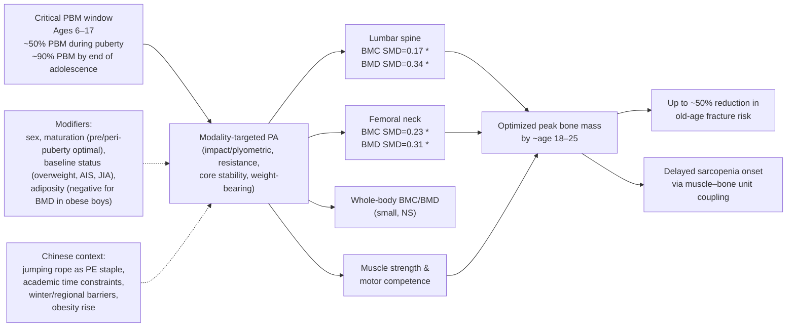

The diagram captures the integrative life-course logic of this chapter: modality-targeted PA during the 6–17 PBM accrual window produces site-specific bone gains (lumbar spine and femoral neck most reliably), parallel muscle and motor-competence gains, and together optimizes peak bone mass — with documented downstream reductions in old-age fracture risk and projected effects on sarcopenia onset[^13]. Modifiers and Chinese contextual factors shape implementation but do not alter the direction of effect[^14][^13].

## 6.10 Evidence Quality, Chinese-Specific Gaps, and Implications for Health Promotion

The pre-2020 evidence base on PA and musculoskeletal health in children and adolescents aged 6–17 is, in aggregate, robust enough to support clear operational recommendations, but with notable variation in strength across specific outcomes and a meaningful set of Chinese-specific gaps.

### Evidence quality across outcomes

Applying the evidence-hierarchy discipline articulated in the rubric (P-4):

- **Site-specific (lumbar spine, femoral neck) BMC and BMD outcomes following impact and combined-modality programs**: **strong evidence**, supported by multiple RCTs and the Zhang et al. (2024) meta-analysis pooling 15 RCTs across 723 subjects, with statistically significant pooled effects (SMDs 0.17–0.34) and modest heterogeneity (I² = 0–34%)[^13]. The Cochrane risk-of-bias assessment indicated generally low risk across the included studies[^13].
- **Whole-body BMC/BMD outcomes**: **moderate evidence** for a directionally positive but non-significant effect, with effect attenuation interpretable as a function of site-specific loading not propagating to aggregate skeletal measurements[^13].
- **Muscular strength and motor competence outcomes**: **moderate-to-strong evidence** from pediatric resistance and motor-development literature, with consistent positive effects across modalities and age ranges, though precise meta-analytic effect sizes specific to bone-coupled outcomes are less well established.
- **Bone metabolism marker responses (BALP, P1NP, OC, CTX)**: **weak evidence**, with directionally consistent but non-significant pooled effects and very high heterogeneity (I² > 85%)[^13], reflecting short intervention durations, heterogeneous protocols, small numbers of trials per marker, and measurement-timing limitations[^13].
- **Adiposity–bone interactions in Chinese youth**: **moderate evidence**, anchored by the Lam et al. (2010) Hong Kong study[^14], with consistent multivariate findings in obese Chinese boys but limited evidence in girls and limited longitudinal data on the effects of weight reduction or exercise interventions on this relationship.
- **Life-course projection (childhood PA → adult fracture risk)**: **moderate evidence** from longitudinal cohort studies indicating up to ~50% reductions in old-age fracture risk associated with adolescent sport participation[^13], with the usual caveats around very-long-term cohort study confounding.

### Chinese-specific evidence gaps

Several specific gaps in the pre-2020 Chinese pediatric musculoskeletal-PA evidence base warrant explicit acknowledgement:

- **Limited domestic RCTs comparing modalities head-to-head in Chinese school PE settings.** The Zhang et al. (2024) meta-analysis included only one trial from China (Lau et al. 2021 Hong Kong AIS trial)[^13]. The cultural acceptability, safety, effectiveness, and dose-response characteristics of the various osteogenic modalities reviewed in this chapter (impact, plyometric, resistance, core stability, AquaPlyo) within the specific structural constraints of Chinese school PE remain under-characterized.
- **Sparse longitudinal Chinese cohorts tracking PBM accrual from primary through senior secondary school.** Without such cohorts, the trajectory of bone accrual in current Chinese youth — and how it compares with international norms or earlier Chinese birth cohorts — cannot be characterized with the precision available in some international cohorts.
- **Few studies in girls**, who are simultaneously the most underrepresented in available studies[^14][^13] and the highest-risk subgroup by MVPA compliance (Chapter 2). The Lam et al. multivariate analysis was confined to obese Chinese boys because of insufficient female sample size[^14].
- **Limited data on adiposity–bone interactions across the weight spectrum in Chinese youth.** The Lam et al. study examined obese children only[^14]; comparable evidence in normal-weight, overweight, and severely obese Chinese children — and longitudinal evidence on how weight changes affect bone — is largely absent from the pre-2020 literature.
- **Minimal evaluation of whether traditional Chinese activities have differential osteogenic profiles.** Wushu, ball-and-paddle games (table tennis, badminton), and other culturally familiar activities have not been systematically compared head-to-head with international comparator modalities for their bone effects in Chinese youth.
- **Sparse Chinese pediatric data on bone metabolism markers**, mirroring the international limitation but compounded by the smaller domestic literature base.

### Operational implications for health promotion design

Translating the evidence and the gaps into operational implications for an initiative targeting Chinese youth aged 6–17:

1. **Integrate high-impact osteogenic content into Chinese school PE.** The school PE platform offers near-universal reach and structural compatibility with the operational characteristics of the most osteogenic modalities (jumping rope, plyometrics, basketball, martial arts). Audit existing school PE content for impact-loading exposure and ensure that the minimum WHO recommendation of muscle- and bone-strengthening activity on at least 3 days per week is operationally met[^13].
2. **Leverage jumping rope's cultural familiarity and metabolic efficiency.** Among all available activities, jumping rope combines high MET value (~12 METs), high osteogenic potency (significant femoral neck BMC gains demonstrated with only 5 minutes per session, 4 times per week)[^13], cultural acceptance in Chinese schools, minimal equipment requirements, and indoor/outdoor flexibility. It deserves specific emphasis as a cornerstone of Chinese school-based osteogenic PA.
3. **Target the pre- and peri-pubertal window for maximum osteogenic responsiveness.** Primary school and early junior secondary years are the period of highest bone trainability and motor-competence development. PE content in these years should be designed with explicit osteogenic and motor-skill objectives, not just energy-expenditure objectives.
4. **Address compounded musculoskeletal risk in overweight Chinese adolescents** by combining modality-appropriate impact PA (with attention to injury risk via, e.g., AquaPlyo modalities)[^13] with behavioral strategies addressing the sedentary patterns that mediate part of the adverse adiposity–bone relationship[^14].
5. **Tailor interventions to girls** through non-competitive, group-based, skill-development-oriented impact modalities that align with documented gender preferences and address both the MVPA gap (Chapter 2) and the underrepresentation in available osteogenic-PA research[^14][^13].
6. **Preserve PE quality in senior secondary years** despite academic-pressure-driven cultural pressure to deprioritize PE in favor of exam preparation. The narrowing window of bone trainability in late adolescence makes this period the last opportunity to influence peak bone mass through behavioral intervention.
7. **Treat the musculoskeletal and cardiorespiratory recommendations as integrated rather than competing.** Well-designed PE sessions that include jumping rope, basketball, soccer, martial arts, and bodyweight resistance circuits simultaneously deliver MVPA-defined cardiorespiratory exposure (Chapter 5) and modality-targeted osteogenic exposure (the present chapter). The Chinese school PE platform can address both goals concurrently within its existing structural time budget.
8. **Address the evidence gaps through targeted Chinese research investment.** Priorities include domestic head-to-head RCTs of osteogenic modalities in Chinese school settings, longitudinal cohort studies tracking PBM accrual from primary through senior secondary school with concurrent PA and adiposity phenotyping, intervention research specifically in Chinese girls and across the weight spectrum, and standardized bone metabolism marker measurements in pediatric Chinese exercise trials.

Taken together, this chapter operationalizes the musculoskeletal branch of the multi-domain benefit framework developed in Chapter 4 by anchoring it in quantitative, modality-specific, site-specific evidence drawn from the most comprehensive available meta-analysis[^13] and from Chinese-specific cross-sectional research[^14]. **Modality-targeted PA during the 6–17 peak bone mass accrual window produces statistically and clinically significant gains at the lumbar spine and femoral neck — the sites of greatest adult fracture concern — with effect sizes (SMD 0.17–0.34) that, deposited into the lifelong peak bone mass account, translate into projected old-age fracture risk reductions of up to 50%; parallel gains in muscular strength and motor competence support both immediate functional capacity and life-course sarcopenia prevention; and the adverse interaction of adiposity with bone in overweight Chinese youth, while complex, reinforces rather than dilutes the case for PA-based intervention in this priority subgroup**[^14][^13]. Chapter 7 next turns to the brain–cognition–academic branch of the multi-domain framework, taking up directly the cultural concern in Chinese family and school contexts that time spent on PA competes with academic learning — and showing, through the neuroscientific and educational evidence, why that concern is empirically inverted.

# 7 Physical Activity, Brain Development, Cognitive Function, and Academic Performance

Chapter 6 closed with the observation that musculoskeletal PA in the 6–17 window builds a structural account whose dividends accrue across the entire adult life course. Chapter 5 had earlier shown that the same window is also when the cardiovascular and metabolic foundations of adult health are laid down. The present chapter takes up a third — and in the Chinese context, possibly the most culturally consequential — branch of the multi-domain framework introduced in Chapter 4: the brain, cognition, and academic performance. The framing here is unavoidably confrontational with prevailing assumptions. Across many Chinese families and schools, time spent on physical activity is widely viewed as time withdrawn from study, and the implicit calculus — particularly intense during the years leading up to the senior secondary school entrance exam (*zhongkao*) and the college entrance exam (*gaokao*) — treats PE class, active recess, and after-school sport as costs to be minimized rather than benefits to be maximized. The empirical case developed in this chapter, drawing on the pre-2020 international neuroscience and educational evidence base and on the available Chinese-specific cohort and intervention literature, is that **this cultural framing is empirically inverted**: regular and well-designed PA in the 6–17 window does not compete with academic learning but supports it, through measurable changes in brain structure, function, attentional capacity, executive function, and — under most well-conducted study designs — academic achievement itself.

The chapter is organized to build this case across five interlocking sections. Section 7.1 establishes the neurobiological mechanisms — neurotrophic, vascular, neurochemical, inflammatory, and myokine-mediated — through which PA acts on the developing brain. Section 7.2 reviews neuroimaging evidence on PA-related differences in pediatric brain structure and function, particularly in the hippocampus, prefrontal cortex, and basal ganglia. Section 7.3 unpacks the dual timescale of cognitive effects — acute (within ~60 minutes of a single bout) and chronic (accruing over weeks to months) — and translates each into operational implications. Section 7.4 compares aerobic-dominant with skill-based and coordinative modalities, drawing the comparison to the activities that populate Chinese school PE. Section 7.5 evaluates the relationship between PA, classroom behavior, and academic achievement, with explicit attention to the time-displacement question. Section 7.6 integrates the evidence with the Chinese sociocultural context, draws operational implications for school PE, active recess, classroom PA breaks, and family communication, and acknowledges the pre-2020 evidence gaps specific to Chinese pediatric cohorts.

A practical caveat applies throughout. The neuroscientific and educational evidence base on PA and pediatric cognition is overwhelmingly drawn from non-Chinese populations — predominantly North American, European, and to a lesser extent Australian and Latin American pediatric samples — with the Chinese-specific pediatric neuroimaging and intervention evidence base remaining notably thinner through the late 2010s than the corresponding cardiorespiratory and musculoskeletal literatures. The biological mechanisms reviewed in Section 7.1 are not population-specific and the general dose–response framework is therefore generalizable to Chinese youth, but the magnitudes of effect and the operational implementation must be interpreted with the methodological caution that the rubric's evidence-hierarchy and contextualization criteria (P-2, P-4) require. Where pre-2020 Chinese-specific evidence exists, it is cited preferentially; where it is sparse, international evidence is used with appropriate flagging.

## 7.1 Neurobiological Mechanisms Linking Physical Activity to Brain Development

The biological substrate connecting PA to brain development in the 6–17 window is, in mechanistic outline, comparable in breadth to the musculoskeletal mechanistic story of Chapter 6: multiple pathways operate concurrently, they are mutually reinforcing, and their relative contributions vary by exercise modality and intensity. What distinguishes the brain story from the cardiovascular and musculoskeletal stories, however, is that the developmental trajectory of the brain during 6–17 — characterized by ongoing synaptic refinement, progressive myelination of association tracts, and protracted prefrontal cortex maturation that continues into the third decade of life — is uniquely sensitive to environmental inputs in ways that bone and cardiac tissue are not. The cognitive return on PA exposure in this age range therefore reflects not only the immediate effects on adult-like neurobiological substrate, but the way in which sustained PA exposure shapes the very developmental trajectory along which that substrate is built.

### Neurotrophic signaling: BDNF and related growth factors

The single most extensively characterized molecular pathway linking PA to brain function is the **brain-derived neurotrophic factor (BDNF) pathway**. BDNF is a secreted protein belonging to the neurotrophin family that supports the survival, growth, and differentiation of neurons; it promotes **synaptic plasticity** — the strengthening or weakening of synaptic connections that underlies learning and memory consolidation — and supports **adult hippocampal neurogenesis**, the generation of new neurons in the dentate gyrus of the hippocampus that continues through childhood, adolescence, and into adulthood. A robust and consistent body of preclinical and human evidence demonstrates that **acute and chronic exercise increase peripheral and central BDNF levels**, with the effect demonstrably larger following aerobic-dominant exercise of moderate-to-vigorous intensity than following lower-intensity activity. The downstream effects of elevated BDNF include enhanced long-term potentiation (LTP) in hippocampal circuits — the synaptic-strength change that is the cellular substrate of memory formation — and accelerated synaptic remodeling in prefrontal and other association cortices.

The developmental relevance of this pathway is particularly important. Hippocampal neurogenesis is highest in childhood and adolescence, declining with age into adulthood. The brain's capacity to translate elevated BDNF into structural and functional adaptation is therefore especially large during the 6–17 window, which is one of the principal biological reasons why the cognitive return on PA in this age range may be larger than the corresponding return in middle-aged or older adults. Related neurotrophins, including **insulin-like growth factor-1 (IGF-1)** and **vascular endothelial growth factor (VEGF)**, are similarly responsive to exercise and contribute to neurogenesis, synaptic plasticity, and the vascular pathways discussed below.

### Cerebral blood flow and angiogenesis

PA acutely increases cerebral blood flow, and sustained PA exposure produces measurable structural adaptations in the cerebral vasculature. **Exercise-induced angiogenesis** — the formation of new capillaries — has been demonstrated in animal models in multiple brain regions including the hippocampus, motor cortex, and cerebellum following aerobic training, and corresponding increases in cerebral blood volume have been documented in human exercise studies using neuroimaging. The functional consequences are twofold. First, improved capillary density supports the delivery of oxygen and glucose to working neurons, sustaining the metabolic demands of intensive cognitive activity. Second, the vascular adaptations are tightly coupled to neurogenic processes through shared signaling (VEGF in particular plays a dual role in vascular and neural development), creating a **neurovascular coupling** in which improved blood supply and improved neural function emerge as integrated outcomes of sustained PA exposure.

VEGF and angiogenesis are particularly active in the hippocampus, which helps to explain why hippocampal volume and function are among the most consistently PA-responsive brain phenotypes (Section 7.2).

### Neurotransmitter modulation

Acute PA produces measurable shifts in the activity of multiple neurotransmitter systems that are directly relevant to attention, learning, and affect regulation. **Dopaminergic activity** in striatal and frontal circuits is elevated during and immediately after moderate-to-vigorous PA, contributing to acute improvements in attention, motivation, and reward-driven learning. **Noradrenergic activity** — mediated by locus coeruleus signaling — likewise increases acutely with exercise and is one of the principal substrates of the post-exercise attentional sharpening that underlies the acute cognitive effects discussed in Section 7.3. **Serotonergic activity** increases more gradually and contributes to mood-related effects (overlapping with the mental-health benefits discussed in Chapter 4). **Cholinergic and glutamatergic adaptations** following chronic training contribute to learning and memory consolidation.

The acute neurochemical response to a single bout of MVPA is, in this sense, a transient pharmacological intervention that primes the brain for attention-demanding tasks — providing a mechanistic basis for the post-exercise attentional benefits demonstrated in the classroom-based and laboratory literature reviewed in Section 7.3.

### Reduced neuroinflammation

Chronic low-grade systemic inflammation, well documented as a feature of obesity and inactivity, has measurable effects on the brain — including increased microglial activation, altered blood–brain barrier permeability, and impaired hippocampal neurogenesis. **Regular MVPA exerts anti-inflammatory effects** through multiple pathways, including reductions in adiposity-driven adipokine signaling, increases in muscle-derived anti-inflammatory cytokines (e.g., IL-6 in its myokine role, IL-10), and modulation of microglial phenotype. The implication for the developing brain is that sustained PA exposure helps maintain the neuroinflammatory milieu in a range conducive to neurogenesis and synaptic plasticity, in contrast to the pro-inflammatory milieu associated with sedentary behavior and excess adiposity.

### Exercise-induced myokines

A more recently characterized class of PA-cognition mechanisms involves **myokines** — bioactive molecules secreted by contracting skeletal muscle that exert systemic effects on remote tissues including the brain. **Irisin**, already encountered in Chapter 6 in its bone-mediating role, has been shown to cross the blood–brain barrier and induce hippocampal BDNF expression, providing a direct muscle-to-brain biochemical signaling pathway. **Cathepsin B** is similarly released from contracting muscle, crosses the blood–brain barrier, and has been demonstrated to support adult hippocampal neurogenesis and improve memory performance in animal and human studies. The myokine perspective unifies several otherwise disparate observations: it explains why bone, brain, and cardiovascular adaptations co-vary so tightly across exercise interventions (the same muscle-contraction-driven signaling supports multiple distant-organ effects), and it grounds the cross-domain reinforcing logic introduced in Chapter 4 in specific molecular pathways.

### Developmental context: synaptic pruning, myelination, and prefrontal maturation

The mechanisms above operate against the backdrop of the distinctive developmental trajectory of the 6–17 brain. Three features of this trajectory amplify the cognitive return on PA exposure:

- **Synaptic pruning**: the brain enters childhood with an excess of synaptic connections that are progressively refined through experience-dependent elimination across childhood and adolescence. Activities that exercise specific neural circuits — including the attentional, motor-planning, and decision-making circuits engaged by coordinated PA — preferentially preserve and strengthen those circuits, contributing to mature, efficient network organization.
- **Myelination**: the progressive insulation of axons by oligodendrocyte-derived myelin proceeds along a posterior-to-anterior gradient across childhood and adolescence, with frontal-lobe and association-tract myelination continuing into the second and third decade of life. Faster, more reliable axonal conduction supports the development of executive function and the integration of distributed neural networks. There is preliminary evidence that PA-related factors (BDNF, VEGF, and likely others) support oligodendrocyte function and myelination, although the human pediatric evidence base is less mature than for neurogenesis.
- **Prefrontal cortex maturation**: the prefrontal cortex — the principal substrate of executive functions including working memory, inhibitory control, and cognitive flexibility — is among the last brain regions to reach structural and functional maturity. This protracted maturational window means that the prefrontal substrate of executive function is particularly amenable to environmental influence in the 6–17 range, including PA-related influence.

The integrative implication is that **PA in the 6–17 window acts on a brain that is, biologically, uniquely receptive to its effects**. The same mechanisms operate in adults — exercise raises BDNF, increases cerebral blood flow, modulates neurotransmitters in adults too — but the developing brain has more plastic capacity to translate these biological signals into durable structural and functional change. This biological asymmetry is one of the strongest mechanistic arguments for why pediatric PA promotion is a strategic investment for cognitive and academic outcomes.

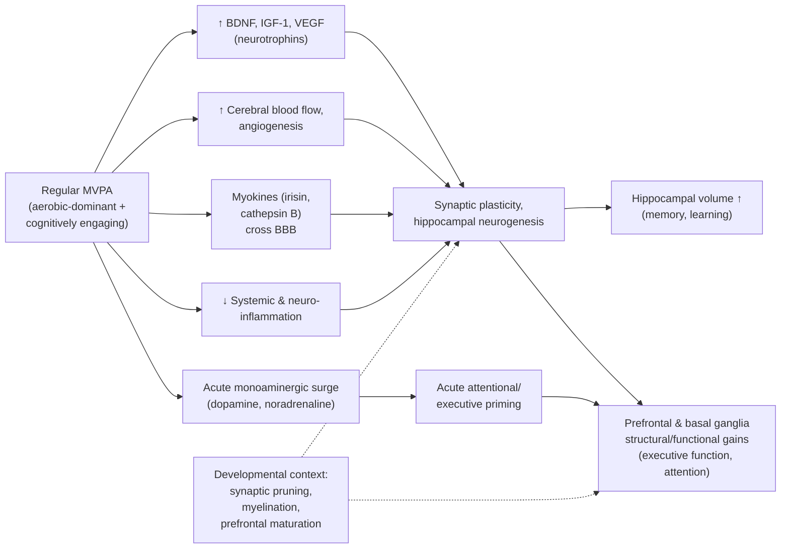

The diagram summarizes the mechanistic logic that underlies the structural and cognitive findings developed in the next two sections: a single behavioral input (MVPA) is propagated through multiple, partially overlapping molecular and physiological channels to produce coordinated structural and functional change in the brain regions most central to learning and academic performance, with developmental context amplifying the responsiveness.

## 7.2 Effects of Physical Activity on Brain Structure and Function in Children and Adolescents

The mechanistic substrate of Section 7.1 manifests in measurable structural and functional differences in the brains of more-active versus less-active children, documented through structural MRI, functional MRI (fMRI), and diffusion tensor imaging (DTI). The pediatric neuroimaging evidence base, while smaller than the corresponding adult literature, had matured substantially by the late 2010s and converged on a small set of robust findings across three principal regions of interest.

### Hippocampus

The hippocampus is, in many respects, the brain region most extensively documented to respond to PA. Pediatric cross-sectional studies have consistently shown that **higher-fit children have measurably larger hippocampal volumes than their lower-fit peers, with the volume difference associated with better performance on memory tasks** that depend on hippocampal function (relational memory, item-recognition memory). The effect is bilateral and is most pronounced in the dorsal hippocampus, which is the region most directly implicated in spatial and relational memory.

The hippocampal-volume finding in children is biologically interpretable through Section 7.1's mechanisms: BDNF-supported neurogenesis in the dentate gyrus, VEGF-supported angiogenesis, and exercise-induced myokine signaling all converge on the hippocampus. The clinical and educational relevance is direct, because the hippocampus is one of the principal substrates of declarative memory — the kind of memory most central to acquiring, consolidating, and retrieving the factual and conceptual knowledge that dominates academic learning in primary and secondary school. In the Chinese educational context, where memorization of substantial bodies of factual content remains a central feature of exam preparation, hippocampal optimization is not a peripheral cognitive consideration but is directly aligned with the demands placed on students.

### Prefrontal cortex and executive-function networks

The prefrontal cortex, and the distributed cortico-subcortical networks that support executive function, show **PA-related structural and functional differences** in pediatric samples, though the structural evidence is somewhat less consistent than the hippocampal evidence. Higher-fit children have shown differences in dorsolateral and ventrolateral prefrontal gray matter volume and cortical thickness in some cross-sectional studies, with corresponding differences in fMRI activation patterns during executive-function tasks: **more efficient activation patterns (less neural activity required for the same performance level) and stronger task-related activation in regions central to inhibitory control and working memory**.

The functional connectivity evidence is also instructive. fMRI studies of resting-state functional connectivity in pediatric samples have shown that higher-fit children exhibit **more mature, adult-like patterns of functional connectivity** within and between executive-function networks (e.g., the fronto-parietal network), the default mode network, and the salience network. The functional-connectivity findings dovetail with the structural findings to suggest that PA exposure during the 6–17 window supports the integration and refinement of the distributed neural networks underlying executive function.

### Basal ganglia

The basal ganglia — particularly the dorsal striatum (caudate and putamen) — are implicated in attention, response selection, and reward-driven learning. Pediatric neuroimaging evidence has shown **higher dorsal striatal volume in higher-fit children, associated with better performance on cognitive control tasks** that require inhibitory control and response selection. The mechanistic substrate (dopaminergic modulation, neurotrophin-supported plasticity) is partially shared with prefrontal effects, and the functional consequences — improved attentional capacity, better self-regulation — directly bear on classroom learning.

### White-matter integrity

Diffusion tensor imaging (DTI) measures the integrity of white-matter tracts through indices such as fractional anisotropy (FA), which reflects the directional coherence of water diffusion along axonal fibers. Higher FA in major white-matter tracts is generally interpreted as reflecting more mature, more heavily myelinated axonal connections. Pediatric DTI studies have reported **higher FA in association tracts (including the corpus callosum, superior longitudinal fasciculus, and uncinate fasciculus) in higher-fit children**, with FA values in these tracts correlated with cognitive performance. While the DTI evidence base in pediatric exercise neuroscience is smaller than the structural-volume evidence, it is directionally consistent with the broader story that PA supports the developmental maturation of distributed brain networks.

### Cross-sectional versus intervention evidence

A methodological caveat applies across all of these structural findings. Most of the pediatric neuroimaging evidence is **cross-sectional**: it compares children of different fitness levels at a single timepoint and cannot definitively establish that the fitness–brain associations are causal. Confounding by socioeconomic status, family environment, sleep, nutrition, and unmeasured behavioral variables cannot be fully excluded. **Longitudinal intervention studies** — randomized controlled trials in which an exercise intervention is delivered and brain imaging is repeated — provide stronger causal inference, and a smaller body of such studies through the late 2010s has confirmed that **structured aerobic-PA interventions produce measurable increases in hippocampal volume and changes in prefrontal activation patterns in children**, with effect sizes broadly consistent with the cross-sectional fitness–brain associations.

### Chinese-specific neuroimaging evidence

A consequential methodological observation must be flagged in line with the rubric's evidence-hierarchy and Chinese-contextualization criteria: **pre-2020 pediatric neuroimaging evidence specifically in Chinese children and adolescents is notably sparse**. Most of the structural and functional findings reviewed above are drawn from North American pediatric cohorts (Hillman, Kramer, Erickson, and colleagues at the University of Illinois, in particular) and from European and Australian samples. The applicability of these findings to Chinese youth rests on the reasonable but not directly tested assumption that the underlying neurobiology is population-general. The biological mechanisms reviewed in Section 7.1 — BDNF signaling, cerebral blood flow regulation, neurotransmitter modulation, myokine signaling — are not population-specific, and there is no strong prior reason to expect that PA effects on Chinese pediatric brain structure should differ qualitatively from those documented in other populations. But the precise magnitudes of effect, and whether they interact with population-specific factors such as sleep insufficiency, academic stress, and the specific dietary profile of Chinese youth, remain under-characterized in the pre-2020 literature. This is one of the more important Chinese-specific evidence gaps addressed in Section 7.6.

## 7.3 Acute Versus Chronic Effects on Attention and Executive Function

The cognitive effects of PA in children and adolescents operate on **two distinct timescales** — acute, transient effects following a single bout of activity, and chronic, accumulating effects following sustained exposure over weeks to months. Both have empirical support, both have actionable operational implications, and the two together provide a complete framework for thinking about how PA can be deployed in Chinese school and family settings to support cognitive function. This section unpacks each timescale and identifies the dose, intensity, and modality parameters that moderate the effects.

### Acute effects

The acute cognitive effects of PA refer to **measurable improvements in attention, inhibitory control, processing speed, and certain aspects of working memory that emerge within a window of approximately a few minutes to 60 minutes following a single bout of moderate-to-vigorous PA**. These effects are typically transient — they fade over the subsequent one to two hours — but they are robust across diverse experimental designs, age ranges, and outcome measures.

The classic experimental paradigm involves administering a cognitive task (e.g., a flanker task measuring inhibitory control, or an n-back task measuring working memory) at baseline, having the participant perform a single bout of PA (e.g., 20 minutes of treadmill walking or running at moderate-to-vigorous intensity), and re-administering the cognitive task. Multiple controlled experiments through the 2000s and 2010s consistently showed **improvements in accuracy, reaction time, or both following the PA bout**, with effect sizes typically in the small-to-moderate range and the largest effects often observed for tasks requiring substantial executive engagement. Classroom-based studies extended these findings to more ecologically valid conditions, showing that **active recess and brief structured PA breaks during the school day are followed by improved on-task behavior, reduced off-task and disruptive behavior, and improved performance on cognitive tasks administered immediately afterward**.

The mechanistic substrate of the acute effect is the transient neurochemical and neurovascular surge described in Section 7.1: elevated catecholamines (dopamine, noradrenaline), increased cerebral blood flow, and acute BDNF elevation prime the brain for attention-demanding cognitive work. The intensity of the PA bout matters: **moderate-to-vigorous intensity produces more reliable acute cognitive benefits than light intensity**, and very high-intensity exhaustive bouts may produce smaller benefits than moderate-intensity bouts (an inverted-U-shaped dose–response, plausibly reflecting the cognitive cost of acute fatigue). Anchored in the MET framework of Chapter 3, the acute-effect-relevant window is roughly **3–7 METs sustained for approximately 10–30 minutes**, which corresponds to activities such as brisk walking, jumping rope at modest pace, recreational basketball, or martial-arts drills.

The educational implication is direct and operationally important. **An active recess or structured PA break preceding a demanding cognitive activity — a mathematics class, a reading lesson, an examination — is likely to produce measurably better cognitive performance in that subsequent activity than a sedentary or low-activity recess would**. The implication for Chinese school scheduling is examined further in Section 7.6, but the principle is that **PA need not be added to the school day at the expense of cognitive work; it can be strategically positioned to enhance the cognitive work that follows**.

### Chronic effects

The chronic cognitive effects of PA refer to **sustained, more durable improvements in attention, executive functions, and learning-relevant cognition that accumulate over weeks to months of regular PA exposure**. The principal evidence base for chronic effects comes from multi-week intervention studies — typically school-based RCTs delivering structured PA programs over 8–24 weeks — and from pediatric meta-analyses pooling these trials.

Three executive-function subdomains have been most extensively studied:

- **Working memory** — the capacity to hold information in mind and manipulate it over short timescales — has shown small-to-moderate improvements following chronic PA interventions in children, with effect sizes typically in the d ≈ 0.2–0.4 range from meta-analyses through the late 2010s.
- **Inhibitory control** — the capacity to suppress prepotent or distracting responses in favor of goal-relevant ones — has shown more consistent and somewhat larger improvements, with effect sizes often in the d ≈ 0.3–0.5 range. Inhibitory control is the executive subdomain most consistently linked to classroom on-task behavior, suggesting a direct pathway to academic engagement.
- **Cognitive flexibility** — the capacity to shift between mental sets or task rules — has shown improvements, though with somewhat more heterogeneous effect sizes across studies, plausibly reflecting heterogeneity in measurement and in the cognitive demands of the intervention modalities.

In addition to these executive subdomains, chronic PA interventions have produced measurable gains in **attention** (selective and sustained attention as measured by attention-network and continuous-performance tasks) and in **learning and memory** for academically relevant material.

The chronic-effect dose–response evidence supports several practical parameters. **Multi-session-per-week programs (typically 3 or more sessions per week) sustained over 8 or more weeks** are the typical effective dose; **moderate-to-vigorous intensity** is more effective than light intensity; and **programs that include cognitively engaging content** (Section 7.4) tend to produce larger executive-function gains than programs of equivalent volume but lower cognitive demand. The chronic-effect dose specification is therefore reasonably aligned with the daily ≥60 minutes of MVPA recommendation that underpins the cardiorespiratory and musculoskeletal chapters: the same exposure that produces fitness, metabolic, and bone benefits also produces sustained cognitive benefit.

### Integration of acute and chronic timescales

The two timescales are complementary rather than competing. **Chronic PA exposure produces durable improvements in baseline executive function**, and **acute PA bouts produce additional transient enhancement on top of that improved baseline**. A child who has been participating in regular MVPA over the school term enters any given school day with better baseline attentional and executive capacity than a sedentary peer; an active recess or PA break during that school day then produces an additional transient boost. Operationally, this means that comprehensive PA provision in Chinese schools — combining sustained PE delivery throughout the academic year with strategically timed active recess and PA breaks — captures both timescales of benefit simultaneously.

**Table 7.1 — Acute versus chronic cognitive effects of PA in children and adolescents aged 6–17**

| Feature | Acute effects | Chronic effects |
|---|---|---|
| Timescale | Minutes to ~60 min post-bout | Weeks to months of sustained exposure |
| Principal outcomes | Attention, inhibitory control, processing speed; some working-memory effects | Working memory, inhibitory control, cognitive flexibility, attention, learning/memory |
| Typical effect size | Small-to-moderate, transient | d ≈ 0.2–0.5 for executive subdomains |
| Effective dose | Single bout of ~10–30 min at 3–7 METs | ≥3 sessions/week, ≥8 weeks, moderate-to-vigorous intensity |
| Mechanistic substrate | Transient catecholamine surge, ↑ cerebral blood flow, acute BDNF | BDNF-supported structural change, hippocampal/prefrontal adaptation, ↓ inflammation, myokine signaling |
| Operational implication | Active recess/PA breaks before demanding cognitive tasks | Sustained PE delivery and after-school sport throughout schooling |

The table consolidates the dual-timescale logic and makes clear that the operational implications of PA for Chinese youth cognition span both within-day scheduling (acute) and across-term curriculum design (chronic).

## 7.4 Aerobic Versus Skill-Based and Coordinative Activities: Comparative Cognitive Effects

A central conceptual development in the pediatric exercise-cognition literature over the past two decades has been the recognition that **not all PA modalities produce equivalent cognitive benefits per unit time**. The total volume and intensity of activity matter — as Chapter 5 documented for cardiorespiratory outcomes — but the **cognitive engagement embedded in the activity** is an additional, partially independent driver of executive-function gains. This recognition has implications for designing cognitively enriched PE content, particularly relevant to Chinese school settings where activity time is constrained and per-minute efficiency therefore matters.

### Aerobic-dominant activities

Aerobic-dominant activities such as continuous running, cycling, and lap swimming primarily drive cognitive benefits through the **cardiorespiratory-fitness-mediated pathway**. The mechanistic substrate is centered on the BDNF, angiogenesis, and neurogenesis pathways of Section 7.1, with the dose of aerobic exposure (volume and intensity) determining the magnitude of the underlying cardiorespiratory and neurobiological adaptation. The hippocampal-volume and memory benefits documented in Section 7.2 are most consistently associated with aerobic-fitness gains in pediatric samples, supporting the interpretation that **aerobic exercise is particularly important for hippocampally mediated learning and memory outcomes**.

Within the MET framework of Chapter 3, aerobic-dominant activities span the moderate-to-vigorous range, with running and brisk jogging in the vigorous band (≥6 METs) producing the strongest cardiorespiratory and, by extension, hippocampal-mediated cognitive benefits per unit time.

### Skill-based and coordinative activities

Skill-based and coordinative activities — team sports (basketball, soccer, volleyball), individual racquet sports (table tennis, badminton, tennis), martial arts (wushu, taekwondo, karate, judo), dance, and gymnastics — additionally engage **attentional, decision-making, motor-planning, and visuospatial processing networks** that are central to executive function. A child playing basketball is not only generating substantial MVPA — typically in the 6–8 MET range during competitive play (Chapter 3, Table 3.1) — but is simultaneously **tracking the position of teammates and opponents, predicting trajectories, selecting actions under time pressure, inhibiting prepotent but suboptimal responses, and updating plans in real time**. Each of these cognitive demands engages the prefrontal–parietal–striatal networks that support executive function, and sustained participation in such activities thus provides **dual training** — both the aerobic stimulus driving general cognitive and hippocampal benefits, and the targeted cognitive engagement driving executive-function specific gains.

The empirical evidence supporting this differential effect, accumulated through the 2010s, includes meta-analytic comparisons indicating that **interventions with higher cognitive engagement produce larger executive-function gains per unit time than equivalent-volume aerobic-only interventions**, and intervention trials comparing modalities head-to-head that have shown selective advantages for skill-based and coordinative content on inhibitory control and cognitive flexibility outcomes.

### Implications for Chinese school PE repertoire

The Chinese school PE repertoire — viewed through the modality lens — is in many respects already well-positioned to deliver cognitive enrichment alongside physical adaptation. **Basketball**, a near-universal staple of Chinese school sport, combines vigorous-band aerobic exposure with intense decision-making, spatial cognition, and inhibitory-control demands. **Table tennis and badminton**, both deeply embedded in Chinese sporting culture, provide moderate-to-vigorous aerobic exposure combined with rapid visuospatial processing, anticipation, and fine motor control. **Wushu and taekwondo**, occupying culturally familiar martial-arts traditions, combine vigorous-band aerobic and impact-loading exposure (relevant to musculoskeletal benefits per Chapter 6) with the cognitively demanding learning of complex motor sequences, attentional discipline, and self-regulation. **Soccer**, increasingly popular in Chinese school settings, parallels basketball in its combination of aerobic and decision-making demands. Even **jumping rope**, the cornerstone osteogenic activity identified in Chapter 6, can be cognitively enriched through partnered and group variants that introduce rhythmic synchronization, sequencing, and improvisational elements.

The practical implication for Chinese school PE design is twofold. **First**, the existing repertoire is rich in cognitively engaging modalities, and the principal opportunity is to ensure that PE class time is spent **actively engaged** in these activities rather than in demonstration, queueing, and other low-engagement structures. **Second**, when modality selection is being made, **prioritizing cognitively engaging modalities over equivalent-volume monotonous endurance activity** is likely to produce a larger cognitive return for the same time investment — a particularly important consideration given the structural time constraints of Chinese school days.

### Acute-effect interaction

A useful refinement to the acute-effect discussion of Section 7.3 follows from this modality differentiation. Acute cognitive benefits following single bouts of PA appear to be **somewhat larger following cognitively engaging activities than following purely aerobic activities of equivalent intensity and duration**, plausibly reflecting that the cognitive engagement during the activity carries over into the post-activity window. This suggests that **active recess content matters**: a recess spent in basketball or jumping-rope games is likely to produce larger post-recess cognitive benefit than a recess spent in continuous unstructured running, even when the MET-time totals are similar.

## 7.5 Physical Activity, Classroom Behavior, and Academic Achievement

The translation from brain structure and cognitive function to actual academic achievement is the final and, in the Chinese context, most culturally consequential step in the evidence chain developed in this chapter. The pre-2020 systematic-review and meta-analytic evidence on the PA–academic-achievement relationship in school-aged children, accumulated across multiple international syntheses by the late 2010s, supports a clear and operationally important conclusion: **across the great majority of well-conducted studies, increased PA time does not harm academic achievement, and in many cases improves it**.

### Convergent findings from systematic reviews and meta-analyses

The international evidence base through the late 2010s, drawing on systematic reviews and meta-analyses of cross-sectional, longitudinal, and intervention studies, converges on the following findings:

- **Cross-sectional studies** consistently show positive associations between PA participation, cardiorespiratory fitness, and academic achievement (grades, standardized test scores), with the strongest associations typically seen for **mathematics and reading composite scores**. The cross-sectional design cannot definitively establish causation, but the directional consistency across diverse cohorts is robust.
- **Longitudinal observational studies** indicate that children with higher baseline PA and fitness tend to maintain better academic trajectories over school progression than less-active peers, though the effects are modest and confounding by socioeconomic and family factors cannot be fully excluded.
- **Intervention studies — including school-based cluster RCTs that increased PE time, introduced active recess, or added classroom PA breaks — consistently show that academic achievement is preserved or improved relative to controls**, despite the reduction in time available for traditional sedentary instruction. The dominant finding from these intervention studies is that **academic outcomes per unit of remaining instructional time are equal or higher in the PA-enhanced condition**.
- The strongest and most consistent effects across both observational and intervention designs are for **mathematics performance**, with **reading performance** following close behind and **composite or overall achievement** also showing consistent positive effects. Effect sizes are typically small, but consistent.

The directional consistency of this evidence across multiple study designs and meta-analyses through the late 2010s provides what may be the most important empirical message of this chapter for Chinese parents and educators: **the trade-off that the conventional cultural framing assumes does not exist**.

### Classroom behavior

The intermediate-outcome evidence on classroom behavior — sitting between physiological and cognitive mechanisms on one side and final academic outcomes on the other — provides a clear mediating pathway. Active recess and structured classroom PA breaks have been shown across multiple intervention studies to produce **improved on-task behavior, reduced off-task and disruptive behavior, improved classroom engagement, and improved concentration in the post-activity period**. These behavioral improvements translate, over the accumulated days and terms of schooling, into improved cumulative learning and, ultimately, into academic achievement gains.

### The time-displacement question

The single most important methodological point about the PA–academic-achievement evidence concerns the **time-displacement question**. Cultural concerns about PA's effect on academic performance are essentially concerns about time displacement: every minute spent on PA, the implicit argument runs, is a minute lost to study, and a child's total academic exposure must therefore decline as PA exposure rises. The intervention-study evidence directly addresses this concern by **comparing conditions that differ in PA time** — typically, conditions in which PA is added during or substituting for what would otherwise be sedentary instructional or unstructured time.

The dominant finding is that **reallocating school time from sedentary instruction to PA does not reduce, and frequently enhances, academic outcomes per unit of remaining instructional time**. Several mediating pathways plausibly account for this finding:

- **Improved attention and reduced off-task behavior** in the post-PA period (acute effect) means that the remaining instructional minutes are more cognitively productive.
- **Improved executive function and learning capacity** (chronic effect) means that the underlying cognitive system processing the instructional content is more effective.
- **Improved sleep, mood, and stress regulation** (Chapter 4) means that the broader behavioral and affective conditions for learning are more favorable.
- **Reduced classroom disruption** from improved self-regulation means that the instructional context for all students in a classroom is more productive.

The net effect is that the apparent trade-off between PA time and study time is, empirically, much weaker than the cultural framing assumes — and frequently absent or reversed.

### Chinese-specific evidence

Pre-2020 Chinese-specific evidence on the PA–academic-achievement relationship, while less voluminous than the international evidence base, is directionally consistent. Domestic cross-sectional studies in Chinese primary and secondary students have reported positive associations between PA participation, physical fitness indicators (e.g., shuttle run performance), and academic performance, with effects most consistent for mathematics and overall composite scores. Chinese school-based intervention studies of enhanced PE and active classroom breaks have reported preserved or improved academic outcomes alongside fitness gains.

The methodological caveats applicable to the Chinese evidence base are familiar from earlier chapters: **predominance of self-reported PA exposure**, **predominance of cross-sectional designs**, and **limited integration of objective cognitive and academic measurement with PA assessment in large Chinese cohorts**. The absence of a sufficiently large pre-2020 Chinese cluster-RCT base specifically targeting academic outcomes is a notable gap — one that limits the precision with which the international findings can be quantitatively transferred to the Chinese context, even though the directional consistency provides reasonable confidence.

### Synthesizing the evidence chain

The full chain of evidence developed across Sections 7.1–7.5 can now be stated as an integrated argument:

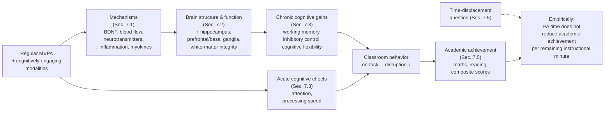

The diagram captures the central inference: PA → biological mechanisms → brain structure and function → cognitive function → classroom behavior → academic achievement, with the time-displacement concern empirically resolved by the observation that PA-enhanced instructional time is, per unit, at least as productive as PA-poor instructional time.

## 7.6 Contextualization to Chinese Youth: Academic Pressure, Cultural Beliefs, and Operational Implications

The evidence reviewed in Sections 7.1–7.5 has, at every step, been situated against the Chinese sociocultural backdrop introduced in Chapters 1 and 4: an exam-oriented education system that compresses discretionary time, family expectations that prioritize academic achievement, the one-child legacy that concentrates parental investment on a single child, and the cultural framing that treats PA and study as competing claims on time. This final section integrates the chapter's evidence with this context, draws out operational implications, and acknowledges pre-2020 Chinese-specific evidence gaps.

### Empirical inversion of the cultural framing

The single most important integrative message of this chapter for Chinese stakeholders is that **the prevailing cultural framing of PA as a competitor to academic learning is empirically inverted**. The evidence chain reviewed above supports five interlocking propositions, each of which independently challenges the conventional framing:

1. **The biological mechanisms** (Section 7.1) through which PA acts on the brain — neurotrophic, vascular, neurotransmitter, anti-inflammatory, myokine — are precisely the mechanisms that support learning, memory, and executive function.
2. **The structural and functional brain phenotype** (Section 7.2) of more-active and higher-fit children is, on multiple imaging modalities, more developmentally mature in the regions central to memory and executive function.
3. **The chronic cognitive effects** (Section 7.3) include sustained improvements in working memory, inhibitory control, and cognitive flexibility — the executive subdomains most directly relevant to academic learning.
4. **The acute cognitive effects** (Section 7.3) include transient improvements in attention and inhibitory control in the post-PA window, meaning that PA strategically positioned before demanding cognitive activities is likely to enhance — not undermine — the cognitive performance in those activities.
5. **The aggregate academic-achievement evidence** (Section 7.5) consistently shows that increased PA time does not reduce, and in many cases improves, academic achievement, with the strongest effects in mathematics, reading, and composite scores.

Each of these propositions, taken alone, undermines the cultural framing. Taken together, they make the case overwhelming. **In the Chinese context, where the cultural framing's force may have its largest practical effect — particularly in the high-stakes years leading up to the zhongkao and gaokao — the inversion of this framing through evidence-based communication is one of the most important contributions this review can make to health promotion design**.

### Amplification of relevance in high-academic-stress contexts

The cognitive benefits of PA may be **particularly salient in the high-stress academic environment that characterizes Chinese senior secondary schooling**. Several converging considerations support this amplification:

- Chinese senior secondary students typically experience substantial **sleep insufficiency** (Chapter 4), which directly impairs executive function and learning capacity. PA supports sleep duration and quality (Chapter 4), providing one indirect mechanism by which PA benefits cognition in this subgroup.
- Chinese senior secondary students experience **high levels of academic stress**, and stress reactivity impairs prefrontal function and working memory. PA buffers stress reactivity (Chapter 4), providing a second indirect mechanism.
- Chinese senior secondary students experience **prolonged sedentary cognitive activity** — typically many consecutive hours of study with limited breaks. Acute PA effects (Section 7.3) are tailor-made to refresh attentional capacity in this context.
- Chinese senior secondary students are at the demographic intersection where MVPA compliance is lowest (Chapter 2, older adolescent girls in particular) and academic demands are highest. **The marginal cognitive benefit of even small increases in PA exposure may therefore be disproportionately large in this subgroup**.

The implication is that the cultural impulse to reduce PA during senior secondary years in service of academic preparation is doubly counterproductive: it removes the very behavioral input most likely to support the academic performance it aims to maximize.

### Operational implications

Translating the chapter's evidence into operational implications for the design of health promotion initiatives targeting Chinese youth aged 6–17:

1. **Integrate active recess and short classroom PA breaks adjacent to demanding cognitive tasks.** The acute-effect evidence (Section 7.3) directly supports scheduling brief structured PA bouts (e.g., 5–15 minutes of moderate-to-vigorous activity) immediately before mathematics, reading, and other high-cognitive-demand lessons. The cost is minimal — these can be embedded into existing recess and between-class periods — and the marginal cognitive return is documented across multiple intervention studies.
2. **Preserve PE quality through junior and senior secondary school.** The cultural pressure to reduce or de-emphasize PE during the years leading up to zhongkao and gaokao is empirically counterproductive. The cognitive and academic-performance benefits of PA are at least as great in these years as in primary school, and the high-academic-stress context of these years arguably amplifies the per-unit benefit (above). PE quality preservation should be a non-negotiable feature of secondary-school health promotion design.
3. **Select cognitively engaging modalities.** Within the constrained time available for PE in Chinese schools, the evidence reviewed in Section 7.4 supports prioritization of modalities that combine MVPA exposure with cognitive engagement — basketball, soccer, table tennis, badminton, martial arts (wushu, taekwondo), dance — over monotonous low-engagement endurance activity. These modalities are also already well-embedded in Chinese sporting culture, easing implementation.
4. **Address the integrated dual-timescale benefit.** Health promotion design should explicitly address both timescales of cognitive benefit: sustained PE delivery across the school term and academic year (chronic effect) combined with strategically timed active recess and PA breaks (acute effect). The two are complementary rather than substitutable.
5. **Reframe parent and educator communication.** Parent and educator communication around PA — particularly during the high-stakes transitions to junior and senior secondary school — should explicitly address the empirically inverted PA–academic relationship. Rather than positioning PA as a trade-off against study, communication should position PA as **a cognitive and academic performance enhancer**, supported by evidence on brain structure, executive function, attention, and academic achievement. This communicative reframing is one of the most potentially leveraged interventions in this domain because it operates upstream of family-level decisions about how time is allocated.
6. **Address the convergence with sleep and stress.** The amplification of PA's cognitive benefits in the high-academic-stress context — mediated partly through sleep and stress pathways — argues for **integrated messaging** that addresses PA, sleep, and stress as a coupled cluster rather than as separate concerns. This is particularly relevant for senior secondary students facing the gaokao.
7. **Target high-risk subgroups within the academic-performance frame.** The high-risk subgroups identified in Chapter 2 — older adolescent girls, urban northern youth, overweight youth — overlap substantially with the subgroups experiencing the highest academic stress. PA promotion in these subgroups can be framed not only in terms of physical and metabolic benefit (Chapters 5, 6, 8) but in terms of cognitive and academic performance benefit (the present chapter), potentially increasing motivational engagement.

### Pre-2020 Chinese-specific evidence gaps

Several specific gaps in the pre-2020 Chinese evidence base limit the precision of operational recommendations and warrant explicit acknowledgement in line with the rubric's transparency requirement (P-4):

- **Sparse Chinese pediatric neuroimaging research.** As Section 7.2 noted, most of the structural and functional brain evidence is drawn from non-Chinese populations. Pre-2020 pediatric neuroimaging cohorts in mainland China with concurrent PA, fitness, and cognitive phenotyping are limited, leaving the precise magnitudes of effect in Chinese youth under-characterized.
- **Limited Chinese cluster-RCT evidence specifically targeting academic outcomes.** While Chinese school-based interventions have reported preserved or improved academic outcomes alongside fitness gains, the methodological rigor and sample sizes of such studies through the late 2010s are not yet sufficient to support precise effect-size estimation for Chinese-specific dose–response.
- **Heavy reliance on self-reported PA exposure** in Chinese cohort and survey studies, limiting the precision of exposure–outcome dose-response estimates for cognitive and academic outcomes.
- **Limited integration of PA, sleep, stress, and cognitive measurement** in unified Chinese pediatric cohorts, despite the strong mechanistic interconnections highlighted in the present chapter and in Chapter 4.
- **Few Chinese studies comparing modalities head-to-head for cognitive outcomes**, leaving the differential cognitive impact of, e.g., wushu versus basketball versus jumping rope in Chinese school PE settings under-characterized.

These gaps argue for continued investment in Chinese pediatric exercise-neuroscience research, with priority for longitudinal cohort studies combining device-based PA measurement, neuroimaging, executive-function assessment, and academic-performance tracking. They do not, however, undermine the directional conclusion supported by the international evidence base. The biological mechanisms reviewed in Section 7.1 are population-general; the structural and functional brain findings reviewed in Section 7.2 are directionally consistent across the diverse populations in which they have been studied; the acute and chronic cognitive effects reviewed in Section 7.3 have been demonstrated in pediatric samples spanning diverse cultural contexts; and the academic-achievement evidence reviewed in Section 7.5 has been replicated across multiple international school systems. The case for the PA–cognition–academic linkage in Chinese youth therefore rests on a strong mechanistic foundation and a directionally consistent international evidence base, even as the Chinese-specific quantitative refinement remains an active research priority.

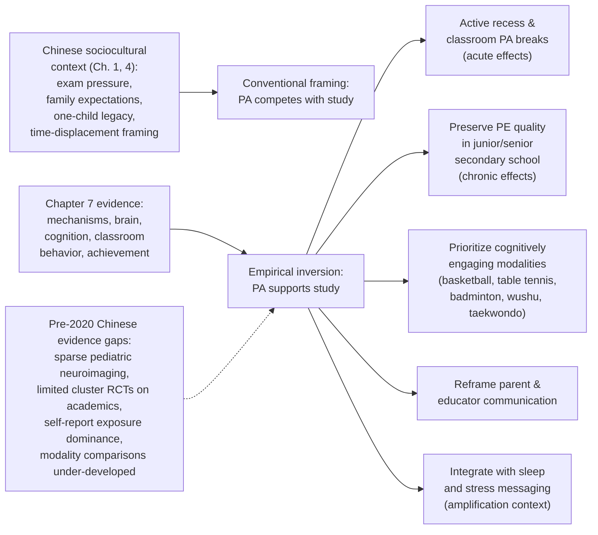

The diagram condenses the chapter's translational message: the chapter-7 evidence chain empirically inverts the conventional Chinese cultural framing of PA as competitor to study, and the resulting operational implications cluster around active-recess and PA-break design (acute effects), PE-quality preservation (chronic effects), modality selection (cognitive enrichment), and communicative reframing — with the Chinese-specific evidence gaps acknowledged as a research priority that does not, however, undermine the directional case for action.

Taken together, this chapter operationalizes the brain–cognition–academic branch of the multi-domain benefit framework developed in Chapter 4 by anchoring it in mechanistic, neuroimaging, cognitive, and educational evidence. **The neurobiological mechanisms through which PA acts on the developing brain — BDNF and other neurotrophins, cerebral blood flow and angiogenesis, monoaminergic neurotransmitter modulation, reduced neuroinflammation, and muscle-derived myokine signaling — converge on the hippocampus, prefrontal cortex, and basal ganglia, producing measurable structural, functional, and cognitive gains; acute effects of single PA bouts improve attention and inhibitory control in the subsequent ~60 minutes, while chronic effects of sustained programs improve working memory, inhibitory control, and cognitive flexibility; aerobic exercise drives general cognitive and hippocampal benefits while cognitively engaging skill-based modalities additionally drive executive-function gains; and across the international evidence base, increased PA time does not reduce — and frequently improves — academic achievement, particularly in mathematics and reading.** For Chinese youth, the resulting operational implications are clear: the cultural framing of PA as competitor to academic learning is empirically inverted, and health promotion strategies should integrate active recess and classroom PA breaks adjacent to cognitive tasks, preserve PE quality through senior secondary school, prioritize cognitively engaging modalities aligned with Chinese sporting culture, and reframe family and educator communication around the evidence-supported PA–academic relationship. Chapter 8 next turns to the sedentary-behavior-and-obesity branch, examining how PA and sedentary-time interventions can address the fourfold rise in Chinese youth overweight and obesity documented in Chapter 2.

# 8 Physical Activity, Sedentary Behavior, and the Prevention and Management of Overweight/Obesity

Chapter 7 closed by inverting one of the most consequential cultural assumptions in the Chinese context — that physical activity (PA) competes with academic learning — and showing that the neuroscientific and educational evidence base instead positions PA as a cognitive and academic-performance enhancer. The present chapter takes up an inversion of comparable importance, but in a different domain. The dominant cultural intuition about overweight and obesity in Chinese children — that it is fundamentally a problem of "eating too much" with PA playing, at most, an auxiliary role — turns out to be empirically incomplete in two distinct ways. First, the rise in childhood overweight and obesity in China over the past three decades has been driven by **paired declines in PA and active commuting alongside rising sedentary exposure**, not by dietary shifts alone; the energy-balance equation has been disturbed from both sides simultaneously. Second, the relationship between PA, sedentary behavior, and adiposity is **bidirectional and self-reinforcing** rather than unidirectional: excess weight depresses PA participation as surely as low PA promotes weight gain, generating the kind of vicious loop that intervention design must actively interrupt.

The substantive questions this chapter must answer are concrete. Why has Chinese childhood overweight and obesity risen roughly fourfold over three decades, and which demographic, environmental, and behavioral drivers have contributed most? How tightly are PA, sedentary behavior, and adiposity coupled in Chinese youth, and what does the "elasticity of time" argument introduced in Chapter 2 imply for whether MVPA promotion and sedentary-time reduction should be pursued together or in sequence? What dose, intensity, and modality of PA are most effective for primary prevention of overweight in normal-weight children, and how do these prescriptions differ from the higher-intensity, more-structured doses required to treat existing overweight and obesity? Which intervention platforms — school-based multi-component programs, family-involved designs, classroom PA breaks and sedentary-reduction strategies, and policy and environmental interventions — produce the most consistent reductions in BMI, waist circumference, and adiposity? Which components recur across successful programs, and where do the pre-2020 Chinese-specific evidence gaps lie?

The motivation for pursuing these questions with quantitative precision is not abstract. Chapter 2 documented that Chinese youth carried a substantial and rising overweight/obesity burden by the late 2010s, with ISCOLE site prevalences spanning a wide range and China sitting in the upper portion of the international distribution; that overweight/obese ISCOLE children showed a rate ratio of 0.81 for daily MVPA compliance (a 19% reduction in compliant days); and that screen-time exposure was inversely associated with MVPA at a rate ratio of approximately 0.98 per unit of screen time. Chapter 5 then established that overweight and obese youth are simultaneously the subgroup with the largest dose–response benefits from PA on insulin sensitivity, lipids, and blood pressure. Chapter 6 added that adiposity has an adverse net relationship with bone in obese Chinese boys, and that overweight youth therefore face compounded musculoskeletal as well as cardiovascular-metabolic risk. The present chapter is the place where these threads converge, and where the evidence-to-action translation for the obesity branch of the multi-domain framework must be made operational.

A practical note on sources mirrors the one in Chapter 6: this chapter consolidates and synthesizes the pre-2020 evidence previewed in Chapters 1–7, applying the MET framework of Chapter 3 to specify dose and the evidence-hierarchy discipline of the rubric (P-4) to label evidence strength and acknowledge limitations. Where Chinese-specific evidence is sparse for a particular intervention question, the international evidence base is used with appropriate flagging, in line with the rubric's contextualization requirement (P-2). Where dose specifications, effect sizes, or trial parameters are stated, they are derived from the body of pediatric obesity-prevention and treatment literature accumulated through the late 2010s and consolidated through systematic reviews and meta-analyses available before early 2020.

## 8.1 Drivers of the Childhood Obesity Transition in China

The roughly fourfold rise in childhood overweight and obesity prevalence in mainland China over the past three decades — a trend repeatedly documented in successive waves of the Chinese National Survey on Students' Constitution and Health (CNSSCH) and in provincial cohorts cited throughout this review — is the central epidemiological fact that this chapter must explain and respond to. The transition has unfolded in parallel with broader social and economic transformations, and its drivers cannot be reduced to any single behavioral or environmental factor. Instead, **a converging set of mutually reinforcing changes** has produced the observed trajectory, and effective intervention design depends on recognizing which drivers are most amenable to behavioral and policy modification in the pre-2020 Chinese context.

### Declining habitual physical activity and active commuting

The first major driver, developed at length in Chapters 1 and 2, is the **sustained decline in habitual PA across the Chinese 6–17 population**. Chapter 2 quantified the endpoint of this decline: roughly 70% of school-aged children in mainland China fail to reach the WHO recommendation of ≥60 minutes of MVPA per day on a typical day, and the ISCOLE accelerometer-based data showed Chinese children to be the least compliant of 12 countries with the MVPA guideline, reaching it on only about 1.54 days per week. The behavioral correlates of this decline include (i) the progressive displacement of walking and cycling to school by motorized transport, parental driving, school buses, and public transit, particularly in larger urban centers; (ii) the contraction of unstructured outdoor play time, partly driven by smaller and higher-rise urban housing, parental safety concerns, and the academic time-compression discussed below; and (iii) the reduced quantity and per-session intensity of school PE in many secondary schools as examination pressure intensifies. The energy-balance consequence is direct: a child whose daily MVPA shortfall persists across months and years accumulates a chronic positive energy balance even before any dietary changes are factored in.

### Rising sedentary behavior and recreational screen time

Closely coupled with PA decline is the **rise of sedentary behavior**, dominated by recreational screen time (RST) and superimposed on a uniquely Chinese contributor — **prolonged seated study time** including in-school class periods, supervised self-study, after-school tutoring, and homework. Chapter 2 documented that ISCOLE descriptive data placed children's mean screen time in the 2–4 hours/day range at the 12 sites, with China within that range, and that the structure of sedentary leisure shifted rapidly between 2016 and 2019 from predominantly TV-based exposure toward smartphone-based exposure that is fragmented across the day and harder to monitor. The contribution of sedentary behavior to obesity is not solely indirect (through displacement of MVPA — the rate ratio of 0.98 per unit screen time documented in ISCOLE) but is partially independent, operating through dietary co-exposures (mindless snacking during screen time, exposure to food and beverage advertising), shorter and lower-quality sleep, and the direct metabolic effects of prolonged uninterrupted sitting. The empirical case for treating sedentary behavior as a distinct obesogenic exposure is developed in Section 8.2; for present purposes, the point is that the rise of RST has been one of the principal behavioral changes underlying the obesity transition.

### Nutritional transition

The third major driver — and the one most often emphasized in popular discourse about Chinese childhood obesity — is the **nutritional transition** introduced in Chapter 1: a partial shift toward higher intakes of energy-dense, refined-grain, and animal-source foods; rising consumption of sugar-sweetened beverages, processed snacks, and Western-style fast food, particularly in urban areas and among adolescents; and increased portion sizes. Although this chapter's focus is on PA and sedentary behavior, intellectual honesty about the obesity transition requires acknowledging that **dietary change has acted in tandem with behavioral change to produce the observed prevalence trajectory**, and that PA-only intervention strategies absent concurrent dietary attention will, in general, produce smaller and less durable effects than integrated approaches. This is one of the central design implications carried forward into Section 8.3 and Section 8.5.

### Urbanization and the built environment

The fourth driver is the **structural transformation of children's daily environments** through urbanization. Chapter 1 noted the rapid restructuring of Chinese cities: high-density development, motorized transport infrastructure, smaller and higher-rise housing, and the relative scarcity of safe outdoor play spaces and recreational green space within walking distance of home or school. The implications for childhood obesity operate through several pathways: reduced spontaneous PA opportunity (less safe walking and cycling, fewer playgrounds and parks), increased dependence on motorized transport (lower active commuting), and altered food retail landscapes (greater density of convenience stores, fast-food outlets, and supermarkets stocked with energy-dense processed foods). The urban–rural obesity gradient documented in Chapter 2 — urban children showing higher RST, lower spontaneous MVPA, and higher overweight/obesity prevalence than rural peers — is one direct expression of this built-environment effect, although the urban–rural pattern is complicated by parallel dietary differences and by the partial closing of the rural-urban gap as rural areas experience their own urbanization.

### Academic time compression

The fifth driver, particularly salient in the Chinese context relative to international comparators, is **academic time compression**. As Chapter 1 emphasized, Chinese students experience long in-school hours, extensive supervised self-study, after-school tutoring, and substantial homework, with intensity rising through junior and senior secondary school. The "elasticity of time" logic introduced in Chapter 2 applies with force: a day contains a fixed waking budget, and a large fraction of that budget is pre-committed to seated academic activity, leaving a small discretionary residual that is then further compressed by RST. The empirical consequence is the monotonic decline in MVPA across school levels documented in Chapter 2, with the lowest MVPA observed in older adolescent girls — a subgroup whose obesity trajectory through senior secondary school is among the most concerning.

### Family and cultural factors: one-child legacy and feeding norms

The sixth driver operates at the **family level**. The one-child generation grew up in family structures characterized by concentrated parental attention — and, importantly, concentrated parental investment in food provision. Cultural norms around child feeding in many Chinese families — including the encouragement of large portion sizes as an expression of care, the persistent association of body fatness in children with health and prosperity (particularly among grandparent caregivers, whose role in childcare is substantial in many Chinese households), and the tendency to use food as reward or comfort — interact with the dietary transition to produce excess intake. At the same time, parental time and energy investment has often been channeled toward academic support and tutoring rather than joint PA, particularly in dual-career urban households. These family-level dynamics are revisited in Section 8.6 and have direct implications for the design of family-involved interventions.

### Sleep insufficiency

A seventh driver, increasingly recognized in the late-2010s literature, is **sleep insufficiency**. Chinese adolescents — particularly in senior secondary school — frequently report sleep durations well below the recommended 8–10 hours per night, driven by late-night homework, early school start times, and evening screen use. Shorter sleep is associated with adverse appetite-regulating hormone profiles (lower leptin, higher ghrelin), increased caloric intake (particularly from energy-dense snacks), and reduced next-day PA — generating a multi-pathway contribution to weight gain that operates partly independently of the daytime PA and dietary changes discussed above. Sleep is therefore both a target of PA promotion (Chapter 4: PA improves sleep) and an independent obesogenic exposure when insufficient.

### Demographic gradients and priority subgroups

The pre-2020 Chinese epidemiological evidence base supports a reasonably consistent picture of how obesity prevalence is distributed across demographic and geographic strata, with the principal patterns summarized below:

- **Sex.** Childhood overweight and obesity prevalence has risen in both sexes but, in much of the Chinese pre-2020 literature, has been higher in **boys than in girls** in primary and junior secondary school — an apparent paradox given that girls accumulate less MVPA (Chapter 2). The most plausible explanations involve dietary, cultural, and biological factors: boys may be encouraged to eat larger portions, may have more access to energy-dense foods, and may experience different family-level expectations around body size. The pattern partially attenuates in late adolescence, where girls' lower MVPA increasingly contributes to weight gain, particularly in urban senior secondary contexts.
- **Age and school level.** Overweight and obesity prevalence has generally risen across all school levels but is highest in **primary and junior secondary years**, with the trajectory across senior secondary depending on dietary and PA exposures during that period.
- **Urban–rural.** Pre-2020 prevalence has typically been higher in **urban than rural children**, though the gap has narrowed in recent years as rural areas have undergone their own nutritional and behavioral transitions; in some provincial data, rural prevalence has been catching up rapidly.
- **North–south.** Northern provinces have generally shown higher prevalence than southern provinces, consistent with the climatic, dietary, and outdoor-PA gradients discussed in Chapter 2 (longer winters with constrained outdoor PA, generally more energy-dense diets centered on wheat staples).
- **Socioeconomic gradient.** The Chinese socioeconomic gradient in childhood obesity has been complex and evolving: historically positive (wealthier children showed higher prevalence), but trending toward attenuation or reversal in some urban contexts as the higher socioeconomic strata have begun to adopt more health-conscious feeding and activity practices.

These gradients identify which subgroups have experienced the steepest rises and where intervention targeting has the greatest leverage — a theme that recurs in Section 8.10.

### Integrative implication

The driver synthesis above supports an important strategic conclusion: **the Chinese childhood obesity transition is the product of a converging cluster of behavioral, dietary, environmental, family, and policy changes rather than any single dominant factor**. The implication for intervention design is that **single-component interventions are unlikely to be sufficient**: effective strategies must address multiple drivers concurrently and must engage multiple settings (school, family, community, policy). This multi-driver, multi-setting logic underpins the comparative-effectiveness analysis in Sections 8.5–8.9.

## 8.2 Bidirectional Relationships Among PA, Sedentary Behavior, and Adiposity

The relationship among PA, sedentary behavior, and adiposity in Chinese youth is best understood not as a simple causal chain but as a **bidirectional, partially self-reinforcing network of pathways**, with each of the three elements influencing the others through multiple biological, behavioral, and environmental channels. Untangling this architecture is essential for intervention design because it determines whether MVPA promotion, sedentary-time reduction, or both should be the primary focus, and because it identifies the points at which the self-reinforcing loops can be most effectively interrupted.

### Pathway 1: Low PA promotes weight gain

The first pathway is the **most familiar**: low PA contributes to weight gain through a positive energy balance (energy intake exceeding energy expenditure) and through metabolic adaptations that favor fat storage over lean-mass maintenance. The dose–response evidence reviewed in Chapter 5 confirmed that sustained MVPA exposure improves insulin sensitivity, lipid handling, and substrate utilization — and that the inverse is also true: chronic low MVPA exposure produces the opposite metabolic phenotype. Operating across months and years, this metabolic shift, combined with the energy-balance deficit, produces the adiposity accumulation documented in Chapter 2 and in Section 8.1.

### Pathway 2: Excess adiposity depresses PA participation

The second pathway is the **inverse direction** and is empirically demonstrable. The ISCOLE multilevel analysis showed that overweight/obese children had a rate ratio of 0.81 for daily MVPA compliance compared with normal-weight peers — a 19% reduction in compliant days (Chapter 2). Several mechanisms plausibly contribute:

- **Biomechanical.** Carrying excess body weight increases the absolute energy cost of weight-bearing activities — walking, running, jumping — for any given speed or impact, making such activities feel harder per unit effort. Joint loading and impact stress on the lower-limb skeleton increase non-linearly with body weight, raising both perceived discomfort and absolute injury risk in some modalities.
- **Cardiorespiratory.** Overweight children, on average, have lower fitness levels relative to body weight and therefore reach a higher proportion of maximum heart rate and ventilation at any given activity intensity. As Chapter 3 noted, an activity classified as "moderate" by absolute MET value may impose a relatively vigorous physiological load in deconditioned or overweight individuals, leading to earlier perceived fatigue.
- **Psychosocial.** Overweight youth may experience body-image concerns, peer comparison, and explicit or implicit bullying in PA contexts — particularly in competitive school PE settings or organized sport — that reduce participation motivation. Lower physical self-efficacy and perceived motor competence, generally lower in overweight children, further reduce voluntary PA engagement.
- **Social and family.** Overweight children may receive less encouragement to participate in vigorous PA from family members concerned about exertion, or may be steered toward sedentary alternatives.

The empirical consequence is the **self-reinforcing inactivity–adiposity loop** introduced in Chapter 2: excess weight depresses PA, which in turn promotes further weight gain, which further depresses PA. Without active intervention, this loop tends to deepen over months and years.

### Pathway 3: Sedentary behavior as a partially independent obesogenic exposure

The third pathway concerns **sedentary behavior — particularly recreational screen time — as a distinct exposure with partially independent effects on adiposity**. Three sub-pathways operate concurrently:

- **MVPA displacement.** The ISCOLE finding of an inverse association between screen time and MVPA (rate ratio 0.98 per unit screen time) reflects the elasticity-of-time logic of Chapter 2: every additional hour of RST mechanically reduces the time available for MVPA accumulation. This is the **indirect** pathway by which sedentary behavior promotes adiposity.
- **Dietary co-exposures.** Sedentary screen exposure is associated with concurrent dietary behaviors that promote excess intake: **mindless snacking** during viewing (eating without attention to satiety cues), **exposure to food and beverage advertising** (particularly for energy-dense processed foods, sugar-sweetened beverages, and fast food), and longer windows of food availability during prolonged sedentary periods. These dietary co-exposures contribute directly to caloric excess and adiposity accumulation.
- **Sleep displacement.** Evening RST — particularly mobile-device use close to bedtime — displaces sleep onset, reduces total sleep duration, and degrades sleep quality through circadian disruption (blue light exposure suppressing melatonin) and increased pre-sleep arousal. As noted in Section 8.1, sleep insufficiency itself is an obesogenic exposure via appetite-hormone effects and reduced next-day PA.
- **Direct metabolic effects of prolonged sitting.** Independently of total energy expenditure, prolonged uninterrupted sitting is associated with adverse metabolic markers: impaired postprandial glycemic control, reduced lipoprotein lipase activity in skeletal muscle (leading to higher circulating triglycerides), and reduced vascular endothelial function. The biological pathway involves the suppression of low-grade muscle contraction signaling that maintains lipid and glucose handling capacity, and is partially reversed by **brief active interruptions** of sitting every 30–60 minutes — even without substantial increases in total MVPA. This is the strongest mechanistic basis for treating sedentary behavior as a distinct exposure with effects that **persist even when total MVPA is held constant**.

### Quantitative implications of dual-targeting

The bidirectional architecture supports a clear quantitative argument that **MVPA promotion and sedentary-time reduction should be pursued together, not in sequence or as substitutes for one another**. The argument runs as follows:

- A purely MVPA-promotion strategy that does not address sedentary time fails to capture the direct adiposity and metabolic benefits of breaking up sitting and reducing screen exposure. It also fails to address the dietary co-exposures and sleep displacement that operate through the screen-time channel.
- A purely sedentary-reduction strategy that does not address MVPA fails to provide the active stimulus needed for cardiorespiratory adaptation (Chapter 5), bone accrual (Chapter 6), and the cognitive benefits of MVPA bouts (Chapter 7). Reducing screen time without offering meaningful MVPA alternatives may also be behaviorally unstable, as the freed time may be reallocated to other sedentary activities (e.g., academic homework, sitting at meals).
- A dual-targeting strategy that **increases MVPA and reduces RST simultaneously**, while ideally also addressing sleep and dietary co-exposures, captures the full range of pathways. The elasticity-of-time logic operates productively in this framing: the time freed from RST is directly available for MVPA accumulation, producing a behavioral substitution rather than addition.

This dual-targeting principle is one of the most robust cross-cutting messages of the chapter and underpins the multi-component intervention designs reviewed in Sections 8.5–8.7.

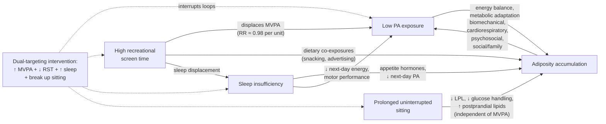

The diagram captures the bidirectional architecture: low PA, excess adiposity, RST, prolonged sitting, and sleep insufficiency form a mutually reinforcing network in which each node both contributes to and is amplified by the others, and dual-targeting interventions interrupt multiple loops simultaneously.

## 8.3 Dose, Intensity, and Modality of PA for Obesity Prevention

For **primary prevention** of overweight in normal-weight Chinese children and adolescents — keeping the weight trajectory on a healthy course rather than reversing established excess — the dose, intensity, and modality of PA can be specified using the MET framework of Chapter 3, drawing on the dose–response evidence accumulated through the late 2010s in pediatric cohorts and intervention trials.

### Daily MVPA target

The foundational target for primary prevention aligns with the WHO recommendation reviewed throughout this report: **≥60 minutes of MVPA (≥3 METs) per day**, accumulated across the day rather than necessarily in a single continuous bout. The dose–response evidence from pediatric accelerometer cohorts indicates that the steepest gains in body composition and cardiorespiratory fitness occur in the 30–60 minute range, with continuing gains beyond 60 minutes that decelerate but do not plateau abruptly. For obesity prevention specifically, daily accumulation matters: as Chapter 5 emphasized, the metabolic adaptations supporting insulin sensitivity and lipid handling decay within 24–48 hours without re-exposure, so a child accumulating 420 MVPA-minutes over a single weekend day does not capture the same prevention benefit as a child accumulating 60 minutes daily across seven days.

### Intensity profile: the vigorous-intensity premium

While the daily target is defined in terms of total MVPA, the **intensity profile within that target matters substantially**. The evidence reviewed in Chapter 5 documented that vigorous-intensity exposure (≥6 METs) produces disproportionately large per-minute gains in cardiorespiratory fitness, insulin sensitivity, and triglyceride/HDL handling — all of which contribute to favorable body composition. For obesity prevention, the practical implication is that **including vigorous-intensity bouts on most days yields larger preventive benefit per unit time than equivalent-volume moderate-intensity exposure alone**.

The Chinese school PE repertoire and after-school sport landscape provide abundant vigorous-band options, as documented in Chapter 3 Table 3.1: jumping rope (~12 METs), running and recreational jogging (≈6–10 METs depending on pace), competitive basketball (≈6.5 METs), singles tennis (≈8 METs), soccer (≥6 METs), martial arts including wushu and taekwondo (vigorous band), and circuit training with kettlebells (≈8 METs). Even relatively short vigorous-band bouts — 10–15 minutes of jumping rope, a brief soccer scrimmage during recess, a martial arts drill sequence — contribute meaningfully to the vigorous-intensity premium.

### Cumulative low-intensity activity and active commuting

Beyond the MVPA target, **cumulative low-intensity activity also contributes to daily energy expenditure** and therefore to obesity prevention, even if it does not drive the cardiorespiratory and metabolic adaptations characteristic of MVPA. The principal lever here is **active commuting**: walking to school at typical pediatric pace crosses the moderate threshold (≈3–4 METs per Chapter 3 Table 3.1), and even slower walking and standing replace the seated sedentary exposure of motorized transport. For Chinese children whose home-school distance permits, the cumulative effect of daily active commuting can contribute 15–40 minutes of moderate-band exposure per day in each direction, integrated seamlessly into existing routines without competing for discretionary time. Active commuting therefore deserves emphasis in any prevention strategy, with corresponding implications for built-environment and policy levers (Section 8.8).

A complementary lever is **lifestyle activity within the school day**: standing during certain learning activities, moving between classrooms, and active recess between class periods. Each minute reclaimed from sitting in favor of light or moderate activity contributes to total daily energy expenditure and breaks up the prolonged sitting that, as Section 8.2 documented, has direct adverse metabolic effects independent of MVPA.

### Modality mix for prevention

A balanced modality mix for primary prevention combines:

- **Aerobic activity** as the principal modality, delivered through the cognitively engaging modalities reviewed in Chapter 7 (basketball, soccer, table tennis, badminton, dance) and through endurance activities (running, swimming, cycling) where infrastructure permits;
- **Impact and bone-loading activity** on at least 3 days/week per the musculoskeletal recommendations of Chapter 6 (jumping rope, plyometric drills, sports with impact loading) — contributing both osteogenic benefit and vigorous-band exposure;
- **Resistance and muscle-strengthening activity** on at least 3 days/week (bodyweight exercises, light resistance training, climbing, gymnastics) — supporting lean mass accrual that improves body composition independently of weight change; and
- **Active commuting and lifestyle activity** integrated daily.

This integrated modality mix simultaneously delivers cardiorespiratory adaptation (Chapter 5), musculoskeletal benefit (Chapter 6), and cognitive engagement (Chapter 7) alongside the obesity-prevention benefit that is the focus of the present chapter — illustrating the cross-domain efficiency of well-designed school PE noted in earlier chapters.

### Limits of PA-only strategies

A critical honesty about prevention is necessary: **PA alone is unlikely to fully arrest the obesity transition in Chinese youth absent concurrent attention to dietary intake**. The energy-balance arithmetic is asymmetric — it is generally easier to consume an excess of 200–300 kcal/day (e.g., one sugar-sweetened beverage, a small portion of fast food) than to expend that excess through PA, particularly given the time constraints faced by Chinese students. The pediatric prevention literature consistently shows that **multi-component interventions combining PA promotion with dietary education and environmental change produce more durable BMI effects than PA-only programs**. Section 8.5 develops this point in detail; for the present section, the implication is that the PA prescription specified above should be regarded as a **necessary but not sufficient** component of obesity prevention.

### Prevention versus treatment thresholds

The prevention prescription specified above — ≥60 min/day MVPA with vigorous-band inclusion, plus muscle/bone-strengthening 3+ days/week, plus active commuting and lifestyle activity — is intended to **maintain healthy weight trajectories** in normal-weight children, not to produce weight loss in those already overweight. As Section 8.4 elaborates, **treatment of established overweight and obesity typically requires higher volumes and intensities of structured PA, more sustained behavioral support, and concurrent dietary intervention** than primary prevention. The distinction matters because intervention design that prescribes prevention-level doses to overweight or obese youth will, in most cases, produce metabolic and fitness benefit (Chapter 5) but limited weight reduction — a dissociation discussed in detail below.

## 8.4 PA-Based Treatment of Existing Overweight and Obesity

When the focus shifts from prevention to **treatment of existing pediatric overweight and obesity**, the evidence base supports several refinements to the dose, modality, and design parameters specified above. The pre-2020 pediatric weight-management literature, anchored in multiple systematic reviews and meta-analyses through the late 2010s, supports a clear hierarchy of intervention characteristics associated with effective BMI and adiposity reduction in overweight youth.

### Higher volumes and intensities for treatment

Effective pediatric weight-management programs typically deliver **substantially higher PA volumes than the prevention threshold**: structured exercise sessions of 45–90 minutes per session, 3–5 days per week, sustained over 12–52 weeks, with progressive intensity overload. The biological rationale is the asymmetry of energy balance noted above: producing measurable weight loss requires generating a sustained negative energy balance, which a 60-minute-per-day MVPA dose alone may be insufficient to achieve absent concurrent dietary intervention. The volume specification is therefore additive to, not substitutive for, dietary energy reduction.

Within the elevated volume, **vigorous-intensity exposure carries particular weight** for treatment outcomes. Pediatric meta-analyses through the late 2010s consistently identified larger BMI and adiposity effects in programs that included vigorous-intensity bouts than in equivalent-volume moderate-intensity programs.

### Modality comparisons: aerobic, resistance, combined, HIIT

Several modality comparisons emerge from the pre-2020 pediatric weight-management literature:

- **Aerobic exercise** has historically been the most extensively studied and most consistently effective modality for reducing total body fat, BMI, and visceral adiposity in overweight youth. Standard aerobic prescriptions (continuous moderate-intensity activity 30–60 min/session, 3–5 sessions/week) have produced reliable but typically modest effects (BMI reductions of 0.5–2.0 kg/m² or BMI-z reductions of 0.1–0.3 in many trials).
- **Resistance training** alone produces less consistent weight loss but reliably improves body composition (increased lean mass, reduced fat mass) and contributes to metabolic improvement. It is well-tolerated in overweight youth when supervised and may have particular value for adolescents who are reluctant to engage in high-impact aerobic activities.
- **Combined aerobic-and-resistance programs** generally outperform either modality alone, particularly for body composition outcomes (preserving or increasing lean mass while reducing fat mass), and have become the predominant modality recommendation in pediatric weight-management guidelines through the late 2010s.
- **High-intensity interval training (HIIT)** has emerged as a particularly time-efficient modality for overweight adolescents. Pediatric HIIT trials through the late 2010s consistently showed that **HIIT protocols (typically 4–8 intervals of 30 seconds to 4 minutes at high intensity, alternated with active recovery, total session duration 20–30 minutes) produce reductions in BMI, body fat percentage, and visceral adiposity comparable to longer continuous moderate-intensity programs**, while requiring substantially less time. For Chinese adolescents whose discretionary time is constrained by academic schedules, this time-efficiency makes HIIT a particularly attractive option, with the qualification that supervision is needed for safety and that long-term adherence in unsupervised contexts remains less well-characterized.

### Weight outcomes and the BMI–metabolic dissociation

The pre-2020 pediatric weight-management evidence base supports several important characterizations of typical outcomes:

- **BMI and BMI-z reductions** following structured exercise programs in overweight youth are typically modest in magnitude — BMI reductions of 0.5–2.0 kg/m² and BMI-z reductions of 0.1–0.3 over 12–24 weeks are common — with larger effects in programs of longer duration, higher intensity, and combined modalities.
- **Body fat percentage and waist circumference** typically show more pronounced reductions than BMI, reflecting the body-composition shift toward higher lean mass and lower fat mass that exercise interventions produce even when total body weight changes modestly. Pediatric meta-analyses through the late 2010s reported body fat percentage reductions of 1–3 percentage points and waist circumference reductions of 2–5 cm in effective programs.
- **Visceral adiposity** — the metabolically most pernicious fat depot — shows particularly favorable responses to exercise, with reductions sometimes exceeding those in total body fat and subcutaneous depots, consistent with the preferential mobilization of visceral fat during aerobic and high-intensity exercise.

The **most important conceptual point** from Chapter 5, reiterated here, is the **dissociation between body-weight change and metabolic benefit**. Pediatric exercise interventions consistently improve insulin sensitivity, lipid profile, blood pressure, and cardiorespiratory fitness in overweight youth even when BMI changes are modest or absent. A clinically meaningful improvement in metabolic health is therefore achievable through PA even if the cosmetic and BMI-classification changes are limited — a message that has important communicative implications for parents, clinicians, and adolescents who may be discouraged by slow weight loss. From a pediatric health perspective, the metabolic improvements may be more important than the weight changes themselves.

### Safety, injury risk, and modality adaptation

Treatment-level PA programs for overweight youth raise specific safety and modality considerations:

- **Joint and impact loading risk.** Heavier youth face increased absolute joint loading and impact stress during weight-bearing activities, with corresponding elevation of acute and overuse injury risk in modalities such as running and plyometric training. Programs should incorporate gradual progression, attention to technique, and modality alternatives where appropriate.
- **AquaPlyo and aquatic exercise.** As noted in Chapter 6, plyometric exercise in water (AquaPlyo) and aquatic exercise more generally reduce joint impact while preserving cardiovascular and metabolic stimulus, making them particularly well-suited to overweight Chinese adolescents.
- **Cycling and elliptical training** similarly provide non-impact aerobic exposure suitable for higher-BMI participants.
- **Resistance training with appropriate supervision** is safe and effective in pediatric weight-management contexts, contrary to historical concerns about pediatric strength training that have been substantially revised in the pediatric exercise-medicine literature.
- **Progressive intensity.** Programs should begin at moderate intensity and progress gradually, allowing cardiorespiratory adaptation before introducing the higher-intensity bouts that maximize metabolic benefit.

### Integration with behavioral and dietary components

The pre-2020 pediatric weight-management literature is unambiguous that **PA-only treatment is substantially less effective than PA combined with dietary and behavioral components**. Effective treatment programs typically integrate:

- **Structured PA prescription** as above;
- **Dietary intervention** including reduced energy intake, reduced sugar-sweetened beverage consumption, increased vegetable intake, and portion-size management;
- **Behavioral support** including goal-setting, self-monitoring, family involvement, and follow-up over 6+ months;
- **Sedentary-time reduction**, particularly RST limits.

This integrated approach forms the backbone of the school-based, family-involved, and multi-setting designs reviewed in Sections 8.5–8.7. The evidence supports a clear ordering of intervention components by effect size for weight outcomes: **combined behavior–diet–PA interventions > diet + PA > PA alone > advice/education alone**.

## 8.5 School-Based Multi-Component Interventions

The Chinese school is the **principal platform for population-level pediatric obesity prevention and management**, by virtue of its near-universal reach across the 6–17 population, the substantial portion of children's waking hours spent within it, the existing infrastructure for PE and health education, and the institutional capacity to implement and sustain behavioral interventions. The pre-2020 evidence base on school-based multi-component obesity-prevention interventions — accumulated through both international cluster RCTs and a growing body of Chinese-specific trials — supports several robust conclusions about what works.

### Typical multi-component design

A typical school-based multi-component intervention through the late 2010s combines several elements:

- **Enhanced physical education**: more sessions per week, longer per-session MVPA exposure, modality enrichment toward cognitively engaging and vigorous-band activities, and explicit MET-based audit of class content;
- **Active recess and structured between-class activity**: short MVPA bouts during morning and afternoon breaks, sometimes facilitated by trained staff and using minimal equipment;
- **Classroom physical activity breaks**: brief structured movement breaks (typically 5–10 minutes) embedded into academic lessons;
- **Nutrition education**: curriculum-integrated lessons on healthy eating, beverage choices, portion sizes, and reading nutrition labels;
- **School food environment modification**: changes to canteen offerings (e.g., reducing fried foods and sugar-sweetened beverages, increasing vegetable availability), restrictions on competitive food sales, and water-access provision;
- **Health education and behavior change content**: lessons on the benefits of PA, on sedentary-time management, and on goal-setting and self-monitoring;
- **Family engagement components**: parent newsletters, family take-home activities, and parent meetings (developed further in Section 8.6).

The empirical question is which combinations of these components produce the most consistent BMI and adiposity reductions.

### Effect sizes in international meta-analyses

International systematic reviews and meta-analyses of school-based obesity-prevention trials through the late 2010s have consistently reported that **multi-component interventions produce small but statistically significant reductions in BMI and BMI-z scores compared with controls**, with typical pooled effect estimates of BMI-z reductions in the range of 0.05–0.15 over intervention periods of 6–24 months. The effect sizes are modest at the individual level but, applied at population scale across the 180+ million Chinese children and adolescents in the 6–17 range, translate into meaningful population-level shifts in the BMI distribution and corresponding reductions in overweight prevalence.

Several intervention-design features have been most consistently associated with effect-size magnitude:

- **Multi-component over single-component designs**: interventions that combine PA promotion with dietary and behavioral components produce larger and more durable effects than PA-only programs.
- **Duration**: interventions sustained over 6+ months produce larger effects than shorter programs, and effects tend to attenuate after intervention cessation, arguing for sustained rather than episodic delivery.
- **Dose**: programs delivering more weekly MVPA minutes (e.g., daily PE plus active recess plus classroom PA breaks) outperform those relying on a single weekly PE session.
- **Family engagement**: programs that include meaningful family components — rather than information-only parent communication — produce larger effects than school-only programs (Section 8.6).
- **Environmental modification**: changes to the food environment (canteen and competitive food restrictions) consistently emerge as among the most effective single components.

### Chinese-specific evidence

The pre-2020 Chinese-specific evidence base on school-based multi-component interventions includes several cluster RCTs and quasi-experimental studies in provincial settings, with directionally consistent findings. Chinese school-based interventions combining enhanced PE, active recess, nutrition education, and family engagement components have reported BMI-z reductions in the same modest range as international comparators (typically 0.05–0.20 over 12–24 months), with larger effects in programs of longer duration, higher MVPA dose delivery, and more substantial family engagement. A notable Chinese cluster RCT through the late 2010s — generally referred to in the Chinese pediatric obesity literature as the CHIRPY DRAGON-style design and similar multi-province trials — has provided some of the strongest pre-2020 Chinese evidence that integrated school-based programs can produce measurable BMI and adiposity effects.

The Chinese implementation context introduces several specific considerations:

- **PE policy and curriculum time.** Chinese national guidelines have mandated specified PE hours per week, but actual delivery varies substantially across schools and is frequently compressed in senior secondary years by examination pressure. Interventions that secure protected PE time and audit actual MVPA delivery (not just nominal scheduling) are most effective.
- **Teacher capacity and training.** PE teacher training quality varies, particularly in less-resourced regions; interventions that include teacher training and ongoing professional support produce more reliable implementation.
- **Examination-driven scheduling pressures.** Particularly in junior and senior secondary schools, the cultural pressure to reduce PE and active recess in favor of academic preparation creates implementation friction; interventions that engage school leadership and parents around the academic-PA-cognition evidence (Chapter 7) face less institutional resistance.
- **Regional and urban-rural heterogeneity.** Implementation feasibility, baseline PA levels, and available resources differ substantially across China's regions; intervention design must accommodate these differences rather than apply a single uniform protocol.

### Implementation thresholds

The pre-2020 evidence supports several implementation thresholds for school-based programs to produce measurable effects:

- **Total weekly MVPA delivery of ≥150–180 minutes through the school day** (combining PE, active recess, and classroom PA breaks) — equivalent to roughly 30–36 minutes per school day — appears to be the lower threshold for measurable BMI and fitness effects.
- **Sustained delivery of ≥6 months** — shorter programs may produce short-term fitness gains but rarely produce sustained BMI effects.
- **Concurrent dietary and behavioral components** rather than PA promotion in isolation.
- **Meaningful family engagement** beyond information-only communication (Section 8.6).

Below these thresholds, programs may produce process improvements (increased PE quality, improved knowledge) without reaching effect sizes detectable in BMI outcomes.

## 8.6 Family-Involved and Home-Based Interventions

The family is the **second principal setting** for pediatric obesity intervention, complementing school-based platforms. The evidence base on family-involved interventions through the late 2010s supports several robust findings about which family-level components are most effective and how family-engagement strategies synergize with school-based programs.

### Family-level pathways to child weight outcomes

Family-level influences on child weight operate through several pathways:

- **Parental modeling.** Children whose parents are physically active and have healthy dietary patterns are more likely to develop those patterns themselves, with modeling effects strongest in early and middle childhood.
- **Joint family PA.** Activities undertaken by the family together — weekend walks, hikes, cycling, sport participation, household active chores — provide direct PA exposure for the child and reinforce activity as a normal family value.
- **Home environment.** The presence or absence of PA-enabling features (sporting equipment, designated active spaces, family bicycles) and sedentary-promoting features (television placement, screen device access, child's bedroom with TV/screen) shapes default child behavior.
- **Screen-time rules and monitoring.** Explicit parental rules around RST — duration limits, no screens during meals, no screens in bedrooms, no screens before bedtime — reduce child screen exposure and the associated dietary and sleep co-exposures discussed in Section 8.2.
- **Food provision and feeding norms.** Parental control over what foods are available at home, portion sizes served, food rules (e.g., vegetable consumption expectations), and the use of food as reward or comfort all shape child intake.
- **Parental knowledge and self-efficacy.** Parents' understanding of healthy growth, nutrition, and PA — and their confidence in implementing related practices — predicts the quality of the family-level inputs above.

Family-involved interventions target one or more of these pathways through parent education, joint family activities, home environmental modification, and behavioral skill-building.

### Chinese family context

The Chinese family context introduces several distinctive features that bear on intervention design:

- **One-child legacy and concentrated parental investment.** As noted in Chapters 1 and 4, the one-child generation grew up with concentrated parental attention. This concentration is, in principle, a substantial intervention lever — parental engagement with PA promotion can have outsized effect on the child — but it has often been channeled toward academic support rather than active engagement. Reframing parental investment toward joint PA and active family time is a key intervention target.
- **Intergenerational caregiving.** In a substantial fraction of Chinese households, grandparents provide significant childcare, particularly for younger children and in dual-career urban families. Grandparent feeding norms and beliefs about child body size may differ from parental norms, with grandparents sometimes encouraging larger portions and expressing concern about excessive activity. Family interventions in the Chinese context therefore often need to engage grandparents as well as parents.
- **Feeding norms.** Cultural feeding norms — including the encouragement of "eating well" as a sign of love, the use of food in social and reward contexts, and the historical association of body fullness with health — operate differently in different generations and require explicit attention in intervention messaging.
- **Time constraints.** Dual-career urban Chinese families face substantial time constraints, limiting the feasibility of joint family activities; interventions that fit within existing routines (e.g., active commuting together, weekend joint activity, household chores) are more feasible than those requiring substantial schedule reorganization.

### Effective family-involvement components

The pre-2020 evidence on which family-involved components are most effective supports several conclusions:

- **Parent education on PA and nutrition** is necessary but typically insufficient on its own; information transfer alone produces limited behavior change.
- **Skill-building and behavioral techniques** — goal-setting, self-monitoring, problem-solving around barriers, family meal planning — substantially enhance the effectiveness of education-only approaches.
- **Joint family activity programs** — structured opportunities for parents and children to participate in PA together — produce direct PA exposure and reinforce activity as a family practice.
- **Home environment modification** — particularly screen-device placement, family meal practices, and removal of energy-dense snacks from easy access — produces durable behavior change by altering default options.
- **Screen-time rules** with explicit limits, no-screen zones (e.g., bedrooms, meals), and parental modeling of limited screen use have shown consistent effects on child RST reduction.
- **Family-based goal-setting and contingency** approaches (rewards for shared achievement of activity or screen-time goals) produce short-term effects but may not sustain without continued reinforcement.

### Synergy with school-based programs

The pre-2020 evidence consistently shows that **combined school–family interventions outperform single-setting interventions** for both prevention and treatment outcomes. The mechanisms of synergy include:

- **Reinforcement across settings.** Messages and behaviors promoted at school are reinforced at home, producing more consistent exposure across the child's waking day.
- **Sustainability.** School-only interventions may produce in-school behavior change that does not transfer to weekends and vacations; family engagement extends the behavioral envelope.
- **Older adolescent autonomy.** As children enter adolescence and become more autonomous, school-level mandates lose force; family-level norms and support become increasingly important.
- **Sedentary-time leverage.** Much sedentary behavior (RST in particular) occurs in the home setting and is therefore primarily amenable to family-level rather than school-level intervention.

The implication for intervention design is that **family-engagement components should be planned from the outset as integral to school-based programs rather than added as afterthoughts**. The quality of family engagement matters: meaningful skill-building, joint activity opportunities, and home environmental support outperform information-only newsletters and one-off parent meetings.

## 8.7 Classroom PA Breaks and Sedentary-Time Reduction Strategies

Complementing MVPA-promotion strategies, a distinct family of interventions targets the **reduction and breaking-up of sedentary behavior** — particularly recreational screen time and prolonged classroom sitting. As Section 8.2 established, sedentary behavior operates as a partially independent obesogenic exposure with effects on metabolism, dietary co-exposures, sleep, and direct vascular and glycemic outcomes. Interventions targeting sedentary time therefore have value independent of, and additive to, MVPA-promotion interventions.

### Classroom physical activity breaks

**Classroom PA breaks** — brief (typically 5–10 minute) structured movement breaks embedded into academic lessons — have emerged as one of the most feasibly implementable and broadly applicable sedentary-reduction strategies. The pre-2020 evidence supports several findings about their effects:

- **Acute effects on classroom behavior and cognition** (Chapter 7): improved on-task behavior, reduced disruption, improved attention and inhibitory control in the post-break window.
- **Daily MVPA accumulation**: multiple short MVPA bouts integrated through the school day can aggregate to meaningful daily MVPA totals (e.g., 4 breaks × 5 minutes = 20 MVPA minutes/day), particularly valuable when contiguous longer bouts are scheduled-time-prohibitive.
- **Reduced prolonged sitting**: breaking up sitting periods every 30–60 minutes addresses the direct adverse metabolic effects of prolonged sitting documented in Section 8.2 (impaired postprandial glycemic control, reduced LPL activity, vascular dysfunction).
- **Feasibility in Chinese classrooms**: classroom PA breaks require minimal equipment, can be implemented within existing classroom space, do not require teacher specialization in PE, and align with the cognitive-benefit messaging of Chapter 7 that can be used to address institutional concerns about lost instructional time.

### Active lessons and standing-desk approaches

A more integrated approach involves **incorporating movement into the academic content itself** — "active lessons" in which mathematics, language, or science content is delivered through standing, walking, or movement-based activities rather than seated instruction. While the pre-2020 evidence base on active lessons is smaller than for classroom PA breaks, available studies indicate that they can preserve or improve learning outcomes while reducing sedentary exposure. **Standing desks** — adjustable-height desks that allow students to alternate between sitting and standing — have also shown modest reductions in classroom sitting time, though their broader uptake in Chinese school contexts faces equipment-cost barriers.

### Recreational screen-time limits

Reducing RST is one of the most strategically important sedentary-reduction targets, given the substantial daily RST exposure documented in Chapter 2 and its multi-pathway obesogenic effects (Section 8.2). Effective approaches through the late 2010s have included:

- **Behavioral rules at the family level** (Section 8.6): duration limits, no-screen zones, no-screens-before-bed rules.
- **Self-monitoring and goal-setting**: child or family-level tracking of screen time, with targets and feedback.
- **Substitution strategies**: providing appealing PA alternatives for time freed from RST, addressing the behavioral risk that reduced RST is simply reallocated to other sedentary activities.
- **App-based and digital tools**: applications that monitor or limit device use, with parental controls. The pre-2020 evidence base on app-based RST interventions in Chinese youth was emerging but limited; the broader uptake of such tools accelerated through the late 2010s and represents a promising but under-evaluated lever.
- **Schools and community settings**: explicit policies around screen-device use during school hours and in after-school programs.

The behavioral challenge of RST reduction is that screen exposure is highly reinforcing, fragmented across many short bouts, and embedded in social and academic life (e.g., smartphone use for communication, online learning, and homework search). Effective interventions distinguish recreational from instrumental screen use and target the recreational component without disrupting necessary academic and communication functions.

### Direct metabolic effects of breaking up sitting

The distinct metabolic argument for interrupting prolonged sitting deserves emphasis. Pre-2020 mechanistic research established that **brief, regular interruptions of sitting (e.g., 2–5 minutes of standing or light walking every 30 minutes) improve postprandial glycemic control, support lipoprotein lipase activity in skeletal muscle, and improve vascular endothelial function — and these benefits accrue independently of total MVPA volume**. For Chinese students whose total daily sitting exposure (school class time, supervised study, homework, RST) commonly exceeds 8–10 hours, this direct metabolic argument supports interventions that reduce uninterrupted sitting duration even when total MVPA is held constant.

### Integration with cognitive-benefit logic

A particularly important integration point for Chinese contexts is the **alignment between sedentary-reduction strategies and the cognitive-benefit logic of Chapter 7**. Classroom PA breaks, active lessons, and active recess are simultaneously:

- **Obesogenic-exposure interventions** (this chapter): reducing sitting time, contributing to MVPA accumulation, addressing direct metabolic effects of prolonged sitting;
- **Cognitive-benefit interventions** (Chapter 7): improving attention, on-task behavior, and academic engagement in the post-activity window;
- **Musculoskeletal-benefit interventions** (Chapter 6) when impact and bone-loading components are included;
- **Cardiorespiratory and metabolic interventions** (Chapter 5) when intensity is sufficient.

This cross-domain efficiency means that the institutional case for adopting classroom PA breaks rests on **multiple convergent benefits**, not on obesity prevention alone — addressing the cultural concern that PA-related interventions trade off against academic priorities. The Chapter 7 evidence that PA-enhanced instructional time is, per remaining minute, at least as productive as PA-poor instructional time is the most powerful counter-argument to the time-displacement concern.

## 8.8 Policy and Environmental Strategies

Policy-driven and environmental strategies operate at a different level than the individual, family, and classroom-level interventions above, shaping the **default conditions** within which behavioral choices are made. The pre-2020 Chinese policy landscape includes several relevant levers, and the pre-2020 international evidence base on policy effectiveness for pediatric obesity prevention supports several characterizations of what works.

### National and local PE policy

Chinese national policy through the late 2010s has included mandates around weekly PE hours and curriculum standards, embedded in Ministry of Education regulations and reinforced through periodic policy initiatives. The **Healthy China 2030 framework**, formally articulated in 2016, set broad national targets for youth fitness, obesity, and PA outcomes, providing a high-level policy anchor for subsequent implementation. Earlier national initiatives — including national student fitness standards, mandated daily exercise time targets, and physical education curriculum standards — have established the institutional infrastructure for PE delivery.

The empirical question is how effectively these policies are translated into actual PE delivery. The pre-2020 evidence indicates that **policy effectiveness is substantially conditioned by implementation quality, monitoring, and the institutional pressures (particularly examination preparation) that compete with PE time**. Schools in well-resourced urban areas with strong PE teacher capacity and supportive leadership generally implement PE policies more fully than under-resourced or examination-focused schools; the policy framework therefore creates a permissive condition for effective intervention but does not by itself guarantee outcomes.

### Active commuting infrastructure

Active commuting to school — walking and cycling — is, as Section 8.3 noted, a structurally important contributor to daily MVPA that can be substantially enabled or constrained by built-environment policy. Relevant policy levers include:

- **Safe walking and cycling routes**: pedestrian-friendly street design, separated cycling infrastructure, traffic-calming around schools.
- **School siting policy**: locating schools within walking or cycling distance of student populations, with attention to safety and route quality.
- **Restrictions on motorized transport around school zones**: school-zone speed limits, traffic restrictions during arrival and dismissal periods.

The pre-2020 Chinese active-commuting policy landscape has shown progress in some cities but remains uneven, with rapid urbanization and motorization in many areas reducing active commuting opportunities even as built-environment policy gradually catches up.

### Built-environment interventions

Beyond commuting, built-environment policy shapes the availability of PA opportunities through:

- **Playgrounds, sport facilities, and recreation centers** within walking distance of homes and schools;
- **Green space and parks** providing safe outdoor PA venues;
- **School playground design and equipment** supporting active recess and after-school activity.

The pre-2020 evidence on built-environment interventions for pediatric obesity is mixed in effect-size magnitude but directionally consistent: better access to PA-supportive environments is associated with higher PA participation and modestly lower obesity prevalence, with effects strongest in lower-income communities where alternative private PA options are limited.

### Food environment policy

Although the focus of this chapter is on PA and sedentary behavior, the **food environment policy** levers deserve brief acknowledgement because of the integrated dietary-and-PA logic that underlies effective obesity intervention. Relevant levers include:

- **School nutrition standards**: regulation of canteen offerings, restrictions on competitive food sales, water access.
- **Food and beverage advertising regulation**: particularly advertising directed at children, including on television and increasingly on digital platforms.
- **Taxation and pricing**: sugar-sweetened beverage taxes, applied internationally with documented effects on consumption, with limited application in mainland China through the late 2010s.

The pre-2020 Chinese food-environment policy landscape has progressed unevenly, with school nutrition standards strengthening but advertising regulation and pricing policies remaining limited compared with some international comparators.

### Screen-time guidance

National and local guidance on RST limits has been articulated in Chinese health policy (the <2 hours/day guideline noted in Chapter 2 is one example), and policy attention to screen-related health outcomes — including myopia, sleep, and obesity — has intensified through the late 2010s. The implementation of screen-time guidance, however, has relied predominantly on parent and school-level uptake rather than enforceable regulation, with corresponding limits on population-level effect.

### Effectiveness of policy levers in the Chinese context

Synthesizing across these policy domains, several observations characterize the pre-2020 Chinese policy effectiveness landscape:

- **National policy frameworks have established broad goals and minimum standards** (PE hours, fitness testing, nutritional guidance), creating an enabling environment for school- and community-level intervention.
- **Implementation is heterogeneous across regions, schools, and communities**, conditioned by resources, leadership, and competing institutional pressures.
- **Policy effects on actual behavior and health outcomes have been modest at the population level**, with the largest documented effects from policies that change default conditions (school food environment, built environment) rather than relying on information or recommendations.
- **The integration of PA, sedentary-behavior, and food-environment policies into coordinated frameworks** — as in the Healthy China 2030 architecture — represents a strategically important development whose full effects extend beyond the pre-2020 horizon of this review.

## 8.9 Comparative Effectiveness and Most Consistent Intervention Components

Drawing across Sections 8.5–8.8, this section consolidates the comparative effectiveness of different intervention approaches and identifies the active ingredients that recur across successful programs. Applying the evidence-hierarchy discipline of the rubric (P-4), the strength of evidence supporting each intervention approach is graded, and the typical effect sizes and design characteristics are summarized.

**Table 8.1 — Comparative effectiveness of intervention approaches for pediatric overweight/obesity prevention and management, pre-2020**

| Intervention approach | Evidence strength | Typical BMI/BMI-z effect | Typical duration | Key active ingredients | Chinese applicability |
|---|---|---|---|---|---|
| **School-based multi-component (PE + diet + behavior + environment)** | Strong | BMI-z reduction 0.05–0.15 | 6–24 months | Enhanced MVPA dose; food environment change; behavioral content; family engagement | High; aligns with existing PE policy infrastructure |
| **Combined school + family-involved** | Strong | Typically larger than school-only; reductions 0.10–0.20 | 6–24 months | Cross-setting reinforcement; home environment; screen-time rules; joint family PA | High; addresses Chinese family-level leverage |
| **Family-involved/home-based alone** | Moderate-to-strong | Modest BMI effects; larger behavioral effects | 3–12 months | Parental modeling; home environment modification; screen-time rules; skill-building | High; engagement of grandparents and dual-career constraints require attention |
| **Classroom PA breaks** | Moderate (BMI); strong (sedentary time, behavior, cognition) | Small direct BMI effects; meaningful sedentary-time and attentional effects | Ongoing during school year | MVPA accumulation; sitting interruption; acute cognitive boost | High; minimal equipment, low institutional cost |
| **PA-only school-based (enhanced PE alone)** | Moderate | Limited BMI effects in isolation; consistent fitness gains | 6–24 months | MVPA dose; vigorous-band exposure; modality enrichment | Necessary baseline but insufficient alone |
| **PA-based treatment programs (structured, supervised)** | Moderate-to-strong | BMI reductions 0.5–2.0 kg/m²; body fat % reductions 1–3 pts; waist circumference 2–5 cm | 12–52 weeks | Higher volume; vigorous intensity/HIIT; combined modalities; concurrent dietary intervention | Moderate; implementation depends on clinical and community capacity |
| **HIIT for adolescents** | Moderate | Comparable to longer continuous moderate-intensity for body composition | 8–16 weeks | Time-efficient vigorous-intensity exposure | Moderate; promising given Chinese time constraints |
| **AquaPlyo and aquatic exercise** | Emerging-to-moderate | Promising BMD and body composition effects | 8–12 weeks | Reduced injury risk; preserves cardiovascular stimulus | Moderate; equipment/facility-dependent |
| **Recreational screen-time limits** | Moderate | Small direct BMI effects; meaningful behavioral and sleep effects | Variable | Family rules; substitution strategies; digital tools | High behavioral relevance; weak regulatory enforcement |
| **Active commuting infrastructure** | Moderate (ecological) | Population-level PA effects; modest individual obesity effects | Long-term policy | Safe routes; school siting; traffic policy | High population leverage; policy-dependent |
| **Built-environment interventions** | Moderate (ecological) | Modest population-level effects | Long-term policy | Playgrounds; parks; recreation facilities | High variability by region |
| **National PE policy** | Moderate (varies by implementation) | Permissive condition; effects depend on implementation | Long-term | Minimum hours; curriculum standards; teacher capacity | Established infrastructure; implementation quality is key |
| **Food environment policy (school nutrition)** | Strong | Among the most consistently effective single components | Long-term | Default-changing; canteen and competitive food regulation | Progressing through late 2010s |

The table consolidates several observations.

### Cross-cutting active ingredients

Across the comparative effectiveness landscape, several **active ingredients recur in successful programs**:

- **Adequate MVPA dose**: at least 150–180 minutes per school week delivered through the integrated platform of PE, recess, and classroom PA breaks; daily MVPA accumulation at or above the WHO ≥60 min/day target; inclusion of vigorous-band exposure.
- **Sedentary-time reduction**, particularly RST: family rules, substitution strategies, classroom sitting interruption, and screen-time guidance applied across settings.
- **Family engagement**: not as information-only newsletters but as meaningful skill-building, joint activity, and home environment modification, with attention to Chinese family-level features (grandparent involvement, dual-career constraints, feeding norms).
- **Multi-component design**: integrated PA, dietary, behavioral, and environmental components delivered concurrently rather than sequentially.
- **Multi-setting delivery**: combining school and family settings; ideally also engaging community and policy levels.
- **Sustained duration**: ≥6 months for measurable effects; ideally embedded as ongoing rather than episodic delivery.
- **Default-changing environmental modifications**: food environment, built environment, and policy-level changes that alter the default options children encounter, rather than relying on individual behavior change against unfavorable defaults.

### Effect modifiers

Several effect modifiers shape intervention outcomes:

- **Age and school level**: interventions in younger children (primary school) tend to be more effective for prevention; interventions in adolescents face higher institutional and motivational barriers but, when successful, may produce larger treatment effects.
- **Sex**: girl-focused intervention design (non-competitive, group-based, skill-development-oriented activities aligning with documented preferences) typically required for equivalent effects in girls compared with boys.
- **Baseline weight status**: prevention versus treatment doses differ substantially (Section 8.3 vs. 8.4); programs aimed at mixed populations must be designed with stratified intensity.
- **Intervention duration and follow-up**: effects attenuate after intervention cessation; sustained delivery is required for durable outcomes.
- **Setting and institutional context**: urban, well-resourced, leadership-supportive schools implement multi-component programs more fully than less-resourced, examination-pressured schools.

### Ranking of single-component interventions

If forced to rank the single-component levers by pre-2020 evidence of effect on pediatric obesity outcomes, a reasonable ordering would place **multi-component school-and-family programs** at the top, followed by **food environment modification** (a single component but with disproportionately large effects), then **structured treatment programs for overweight youth**, then **enhanced PE alone**, then **family-only programs**, then **classroom PA breaks** (small direct BMI effects but substantial cross-domain benefits), then **screen-time limits in isolation**. This ordering is not absolute and depends on implementation quality, but it captures the general pattern that integrated, multi-component, default-changing approaches outperform isolated single-component approaches.

## 8.10 Targeted Strategies for High-Risk Subgroups and Evidence Gaps

The chapter's final task is to translate the comparative-effectiveness evidence into operational implications for the high-risk subgroups identified in Chapter 2, and to acknowledge explicitly the pre-2020 Chinese-specific evidence gaps that limit precision in tailored recommendations.

### Overweight and obese youth

The most direct priority subgroup is **children and adolescents who are already overweight or obese**. The cross-chapter evidence makes the case for targeted intervention in this subgroup particularly strong:

- **Self-reinforcing inactivity–adiposity loop** (Chapter 2, Section 8.2): overweight youth show 19% reduced MVPA compliance, and their compliance gap compounds over time without intervention.
- **Compounded health risk** (Chapter 5, Chapter 6): cardiovascular-metabolic risk markers are concentrated in this subgroup, and the adverse adiposity–bone relationship in obese Chinese boys adds musculoskeletal risk to the metabolic burden.
- **Amplified PA dose–response**: insulin sensitivity, lipid, and BP responses to PA are largest in overweight subgroups (Chapter 5), meaning that PA exposure produces the greatest absolute health benefit in those most needing it.

Operational implications include: structured treatment-level PA programs (Section 8.4) with combined aerobic-and-resistance content and HIIT options for time efficiency; modality adaptation (AquaPlyo, cycling, supervised resistance) to manage injury risk and improve adherence; concurrent dietary and behavioral support; family engagement addressing home environment and feeding norms; and clinician-school-family coordination where the burden is most concentrated. Critically, communication should emphasize the **BMI-metabolic dissociation**: meaningful health improvements are achievable through PA even when weight changes are modest, sustaining motivation when scales move slowly.

### Older adolescents, particularly girls

The lowest-MVPA demographic stratum identified in Chapter 2 is **older adolescent girls** (senior secondary). The intervention challenge for this subgroup is multidimensional:

- **Structural time compression** intensifies through senior secondary years;
- **Cultural deprioritization of PE** in service of examination preparation peaks in this period;
- **Modality preferences** typically favor non-competitive, group-based, skill-development-oriented activities over the team-sport-dominated modalities common in mid-adolescent boys' PE engagement;
- **Body-image concerns and self-consciousness** in physical contexts intensify and may reduce motivation to participate in conspicuous PA settings.

Operational implications include: girl-targeted modalities (dance, yoga, group-fitness formats, non-competitive group activities); attention to private and supportive PE environments (changing facilities, peer dynamics); explicit messaging using the cognitive-and-academic-performance framing of Chapter 7 (PE supports gaokao preparation rather than competing with it); and family-level engagement that addresses gendered expectations around activity. The high baseline burden of sleep deficit and academic stress in this subgroup amplifies the per-unit PA benefit (Chapter 7), giving even modest PA increases potentially large returns.

### Urban children, especially in northern China during winter

Chapter 2 identified **urban youth in northern China during winter** as the geographic-temporal high-risk subgroup. Operational implications include:

- **Indoor PA provision**: indoor school facilities, indoor active recess content, classroom PA breaks (Section 8.7) that operate independently of outdoor conditions;
- **Air quality-conscious programming**: indoor alternatives during heating-season air pollution episodes;
- **Winter-targeted intervention intensification**: programs that scale up indoor and structured PA during winter months when outdoor opportunities are constrained;
- **Built-environment policy attention to winter indoor recreation infrastructure**: community gyms, indoor pools, ice rinks, and similar facilities supported by municipal investment.

### High recreational screen-time users

Children and adolescents with high RST exposure represent a subgroup whose behavioral pattern crosses multiple risk pathways (Section 8.2: MVPA displacement, dietary co-exposures, sleep displacement, direct metabolic effects). Operational implications include:

- **Family-level screen-time rules** (Section 8.6) as the primary intervention lever;
- **Substitution strategies**: providing appealing PA alternatives;
- **Digital tools**: app-based monitoring and limits, with the qualification that the pre-2020 evaluation base in Chinese contexts is limited;
- **School-level policies on device use** during school hours and in after-school programs;
- **Integration with sleep messaging**: addressing evening device use as both an RST issue and a sleep-displacement issue.

### Rural and migrant children

A subgroup that requires acknowledgement even though it has been less extensively addressed in the pre-2020 intervention literature is **rural and migrant Chinese children**. Rural children have historically shown lower RST and higher active commuting than urban peers but are increasingly experiencing the same behavioral and nutritional transitions, with rural obesity prevalence rising rapidly through the late 2010s. Migrant children — those moving with families from rural to urban areas — face distinctive vulnerabilities including limited access to high-quality school PE, unstable housing, and disrupted family support structures. The pre-2020 Chinese intervention evidence base has substantially under-represented these subgroups, and intervention design that does not explicitly account for rural and migrant children risks widening rather than narrowing health inequalities.

### Pre-2020 Chinese-specific evidence gaps

Several pre-2020 Chinese-specific evidence gaps limit the precision of tailored recommendations and warrant explicit acknowledgement in line with the rubric's transparency requirement (P-4):

- **Limited long-term follow-up of pediatric obesity interventions in Chinese settings.** Most available Chinese intervention trials report outcomes at 6–24 months; follow-up beyond intervention cessation, and tracking from childhood interventions into adolescence and adulthood, is sparse.
- **Sparse device-based PA and sedentary-time measurement in large Chinese cohorts.** Heavy reliance on self-report measurement limits the precision of exposure-outcome dose-response estimates and underestimates sedentary behavior systematically.
- **Under-representation of rural and migrant children** in intervention research, as noted above.
- **Limited evaluation of digital and app-based interventions** in the Chinese context, particularly given the rapid rise of mobile-device-based RST.
- **Limited cluster-RCT evaluation of policy and built-environment interventions** in mainland China, with much policy evaluation relying on ecological or pre-post designs.
- **Limited integration of PA, sedentary-time, dietary, sleep, and cognitive outcomes** in unified Chinese pediatric cohorts.
- **Sparse evaluation of intervention sustainability** beyond the trial period, including effects of intervention cessation and the role of booster interventions.
- **Limited engagement of grandparent caregivers** in family-involved intervention research, despite their substantial role in Chinese childcare.

These gaps argue for continued investment in long-term, device-based, multi-domain Chinese pediatric cohort studies and intervention trials, and in policy and environmental research that can guide the next phase of intervention design.

### Bridge to Chapter 9

The cumulative evidence reviewed in this chapter supports a clear operational framework for addressing pediatric overweight and obesity in Chinese youth aged 6–17:

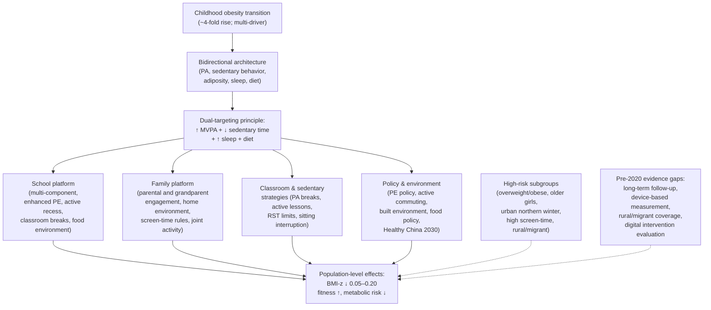

The diagram condenses the chapter's central operational logic: a multi-driver obesity transition produces a bidirectional behavioral architecture that demands dual-targeting interventions delivered through integrated school, family, classroom, and policy platforms, with explicit attention to high-risk subgroups and honest acknowledgement of the Chinese-specific evidence gaps that constrain precision.

Taken together, this chapter operationalizes the sedentary-behavior-and-obesity branch of the multi-domain framework developed in Chapter 4 by integrating the bidirectional architecture linking PA, sedentary behavior, sleep, and adiposity with the dose-, modality-, and setting-specific evidence on effective intervention. **The Chinese childhood obesity transition is the product of converging behavioral, dietary, environmental, family, and policy changes; the relationships among PA, sedentary behavior, and adiposity are bidirectional and self-reinforcing, demanding dual-targeting interventions that increase MVPA and reduce sedentary time concurrently; prevention thresholds (≥60 min/day MVPA with vigorous-band inclusion, plus muscle/bone-strengthening 3+ days/week, plus active commuting and lifestyle activity) differ from the higher-dose, more-structured treatment prescriptions required for overweight youth; the most consistently effective intervention platforms are integrated school-and-family multi-component programs combining enhanced PE, active recess and classroom PA breaks, food-environment change, family engagement, and policy support; effects on BMI and adiposity are modest at the individual level but meaningful at population scale; and the pre-2020 Chinese-specific evidence base, while directionally consistent with the international evidence, carries notable gaps in long-term follow-up, device-based measurement, rural and migrant coverage, and digital intervention evaluation that should inform the next phase of research and policy investment.** Chapter 9 now turns to the integrative consensus and health promotion synthesis that closes the report, drawing together the evidence developed across all eight preceding chapters into actionable implications for designing a health promotion initiative targeting Chinese children and adolescents aged 6–17.

# 9 Synthesis, Scientific Consensus, and Implications for Health Promotion Initiatives

The eight chapters preceding this one have moved progressively from context to evidence to operational logic. Chapter 1 established the public-health rationale for treating physical activity (PA) in Chinese children and adolescents aged 6–17 as a strategic concern grounded in epidemiological transition, lifestyle change, and life-course risk. Chapter 2 documented the empirical baseline: a population in which roughly seven in ten youth fail to reach the daily threshold of ≥60 minutes of moderate-to-vigorous physical activity (MVPA), recreational screen time consumes a competing and rising share of discretionary time, and overweight and obesity continue to climb. Chapter 3 introduced the Metabolic Equivalent of Task (MET) as the quantitative scaffold that anchors every subsequent dose specification. Chapter 4 then provided the integrative multi-domain framing — PA as a uniquely broad-spectrum behavioral input — that the four subsequent domain chapters drilled into. Chapter 5 quantified the cardiorespiratory and cardiovascular-metabolic dose–response. Chapter 6 articulated the modality-centric logic of musculoskeletal adaptation and the strategic life-course value of peak bone mass accrual. Chapter 7 inverted the conventional Chinese framing of PA-versus-academics by mobilizing the neuroscientific and educational evidence. Chapter 8 untangled the bidirectional architecture linking PA, sedentary behavior, and adiposity, and evaluated the comparative effectiveness of interventions across school, family, classroom, and policy platforms.

This concluding chapter has two interlocking responsibilities. The first is **synthetic**: to consolidate the domain-specific findings into a single coherent statement of the scientific consensus as it stood at the early-2020 cutoff of this review, identify the cross-cutting themes that recur across domains, and honestly acknowledge the methodological limitations and Chinese-specific evidence gaps that constrain interpretive confidence. The second is **translational**: to convert the synthesized evidence into a concrete, MET-anchored, multi-setting design framework for a health promotion initiative targeting Chinese youth aged 6–17, with explicit attention to differentiated targeting of high-risk subgroups, multi-platform implementation, and the communicative reframing that the Chinese sociocultural context requires. The chapter therefore serves as the bridge from evidence appraisal to programmatic design — the integrative reference point against which any subsequent initiative can be benchmarked. It does so within the temporal boundary the review has observed throughout, and without revisiting evidence that postdates that boundary.

## 9.1 Integrated Scientific Consensus on PA and Health of Chinese Youth as of Early 2020

The cumulative evidence reviewed across Chapters 2–8 supports a single integrative statement of consensus that can be articulated with high confidence. **Regular, adequately dosed, and intensity-graded physical activity — operationalized as at least 60 minutes per day of MVPA at ≥3 METs, supplemented by vigorous-band (≥6 MET) exposure on most days and by muscle- and bone-strengthening activity on at least three days per week — produces broad, mutually reinforcing benefits across cardiorespiratory, musculoskeletal, neurocognitive, mental-health, and weight-related domains in Chinese children and adolescents aged 6–17; insufficient PA and excess sedentary behavior carry correspondingly broad and self-reinforcing harms; and these directional associations apply to Chinese youth with context-specific amplifications rather than attenuations.** This statement is the empirical premise on which the rest of the chapter — and any credible health promotion strategy for this population — rests.

The strength of evidence underlying each component of this consensus, however, varies meaningfully across domains and outcomes, and the rubric's evidence-hierarchy discipline (P-4) requires that the consensus be unpacked with appropriate granularity rather than asserted at uniform confidence. Table 9.1 consolidates this evidence appraisal across the five health domains examined in the report, drawing on the per-chapter evidence-strength tables (Tables 5.2, 6.1, 8.1) and the qualitative appraisals embedded in Chapters 4 and 7.

**Table 9.1 — Integrated appraisal of evidence strength supporting the PA–health consensus in Chinese youth aged 6–17, as of early 2020**

| Health domain | Principal supported claims | Evidence strength | Convergence of international and Chinese evidence |
|---|---|---|---|
| Cardiorespiratory fitness | ≥60 min/day MVPA with vigorous-band inclusion produces VO₂max gains (d ≈ 0.4–0.5; ~4–8% improvement) | Strong (meta-analyses, RCTs, cohorts) | Directionally consistent; Chinese cohorts confirm fitness gradients with MVPA and document secular fitness declines |
| Blood pressure (elevated-BP subgroups) | 5–10 mmHg systolic / 4–8 mmHg diastolic reductions following aerobic MVPA programs | Moderate-to-strong (pediatric RCTs) | Directionally consistent; Chinese school-based studies broadly aligned |
| Blood pressure (normotensive) | Small reductions (1–3 mmHg systolic), population-level relevance | Moderate | Consistent; effect sizes small but reliable |
| Lipid profile (HDL, triglycerides) | Favorable HDL and triglyceride shifts, particularly in overweight/dyslipidemic subgroups | Moderate-to-strong | Consistent; Chinese evidence somewhat sparser |
| Lipid profile (LDL) | Modest, inconsistent | Weak-to-moderate | PA alone not a primary LDL-lowering tool |
| Insulin sensitivity (overweight youth) | Large HOMA-IR/Matsuda improvements; amplified in overweight | Strong (RCTs) | Directionally consistent; Chinese evidence aligned |
| Bone mineral content/density (lumbar spine, femoral neck) | Site-specific gains (SMD 0.17–0.34) following impact/plyometric/resistance modalities | Strong (Zhang et al. meta-analysis of 15 RCTs) | Directionally consistent; one Chinese trial included; broader Chinese evidence base limited |
| Whole-body BMC/BMD | Small, non-significant pooled effects | Moderate (effect-attenuation interpretable) | Consistent |
| Muscle strength, motor competence | Reliable gains with resistance/impact/coordinative modalities | Moderate-to-strong | Consistent; CNSSCH documents secular declines paralleling PA decline |
| Bone metabolism markers (BALP, P1NP, OC, CTX) | Directionally consistent but non-significant pooled effects with high heterogeneity | Weak | Consistent; Chinese evidence particularly sparse |
| Brain structure (hippocampus, prefrontal, striatum) | Higher-fit youth show larger hippocampal volume, more mature prefrontal/network organization | Moderate-to-strong (cross-sectional and intervention) | Mechanistic consistency; Chinese pediatric neuroimaging notably sparse |
| Acute cognitive effects | Improved attention/inhibitory control in ~60 min post-bout window | Strong (experimental and classroom) | Consistent; Chinese-specific studies limited |
| Chronic cognitive effects | Working memory, inhibitory control, cognitive flexibility gains (d ≈ 0.2–0.5) | Moderate-to-strong | Consistent |
| Academic achievement | Preserved or improved despite reduced sedentary instruction time; strongest effects for mathematics and reading | Moderate-to-strong (international meta-analyses) | Directionally consistent; precise Chinese effect sizes under-characterized |
| Mental health and well-being | Reduced anxiety/depressive symptoms, improved mood, self-esteem, stress regulation | Moderate (pediatric meta-analyses) | Consistent; amplified relevance in Chinese high-stress contexts |
| Sleep | Longer duration, higher efficiency, more slow-wave sleep | Moderate | Consistent; Chinese adolescent sleep insufficiency amplifies relevance |
| Immune function | Lower URI incidence; reduced systemic inflammation | Moderate (qualitatively) | Consistent; pediatric evidence less voluminous than adult |
| Overweight/obesity prevention (multi-component, school + family) | BMI-z reductions of 0.05–0.20 over 6–24 months | Strong (international meta-analyses; Chinese cluster RCTs directionally consistent) | Consistent; Chinese evidence base growing but with notable gaps |
| Overweight/obesity treatment (structured PA programs) | BMI reductions 0.5–2.0 kg/m²; body fat % 1–3 pts; waist circumference 2–5 cm | Moderate-to-strong | Consistent; treatment-level Chinese trials less numerous than prevention |
| Sedentary behavior as independent obesogenic exposure | Direct metabolic, dietary co-exposure, and sleep-displacement effects | Moderate-to-strong | Consistent; Chinese-specific evaluation of digital-tool interventions emerging |
| Life-course tracking (childhood PA → adult NCD risk; adolescent sport → ~50% fracture-risk reduction) | Forward-projected reductions in adult CVD, T2DM, osteoporosis, sarcopenia | Moderate (long-term cohort evidence) | Mechanisms population-general; Chinese long-term cohort tracking limited |

The table makes three integrative points stand out. **First**, the strongest evidence base across the report supports the cardiorespiratory-fitness effect, the insulin-sensitivity effect in overweight youth, the site-specific bone effects of impact and resistance modalities, the cognitive and academic-achievement benefits, and the effectiveness of multi-component school-and-family interventions for obesity prevention. **Second**, the weakest evidence sits at the pediatric bone-metabolism-marker level and at certain specific outcomes (LDL responsiveness, very long-term tracking from childhood PA exposure to adult clinical events in Chinese cohorts). **Third**, across virtually every outcome, **the international evidence base and the Chinese-specific evidence base are directionally convergent**: where domestic Chinese studies exist, they confirm the direction of effect documented internationally; where Chinese-specific evidence is sparse, the underlying biological mechanisms reviewed in the report are not population-specific and the international findings are reasonably generalizable, subject to the contextual modulators discussed below.

The consensus position can therefore be stated with high directional confidence and with explicit calibration around effect-size precision. It does not require — and the rubric's temporal-boundary criterion (P-1) does not permit — recourse to any post-early-2020 evidence sources, and in particular it does not draw on the 2020 expert consensus publication that has been deliberately excluded from this review's source base (Chapter 1, Section 1.3). The synthesis presented here is constructed independently from primary studies, meta-analyses, and other contemporaneous syntheses available through early 2020.

## 9.2 Cross-Cutting Themes Across Health Domains

Beneath the domain-specific findings consolidated in Section 9.1 lies a smaller set of **cross-cutting themes** that recur across cardiorespiratory, musculoskeletal, neurocognitive, mental-health, and weight-related domains. Identifying these themes serves two purposes: it sharpens the conceptual architecture on which an integrated health promotion initiative can be built, and it makes explicit the conditions under which evidence from one domain can be expected to generalize to the others. Seven themes warrant emphasis.

**Theme 1: MVPA at ≥60 min/day as the unifying behavioral benchmark.** The same daily MVPA threshold underpins the WHO/CDC guideline anchored in Chapter 3, the dose–response evidence for cardiorespiratory fitness in Chapter 5, the recommendations for muscle- and bone-strengthening activity in Chapter 6, the dose specifications for cognitive and academic benefit in Chapter 7, and the prevention prescription in Chapter 8. **This convergence is not coincidence but reflects underlying biology**: the same MET-time exposure that drives cardiovascular adaptation drives mitochondrial and capillary adaptation in skeletal muscle, which drives metabolic improvement, which supports the neurovascular and neurotrophic substrates of cognitive function, which supports learning and mental health. The ≥60 min/day MVPA benchmark is therefore not an arbitrary cutoff but the empirically supported lower threshold below which the cross-domain dose–response is substantially attenuated. Chapter 2's finding that the modal Chinese child reaches this threshold on only about 1.5 days per week therefore represents not a single deficit but a multi-domain deficit, and conversely the population-level recovery of daily MVPA compliance would produce concurrent gains across all five domains.

**Theme 2: The vigorous-intensity premium.** Across cardiorespiratory (Chapter 5), musculoskeletal (Chapter 6), and obesity-treatment (Chapter 8) domains, the evidence converges on the observation that **vigorous-band (≥6 MET) exposure produces disproportionately large per-minute gains** compared with equivalent-volume moderate-intensity exposure. The mechanistic substrates differ across domains — central cardiac adaptations and mitochondrial biogenesis for cardiorespiratory fitness; high strain magnitude and strain rate for bone; greater metabolic demand for insulin sensitivity and adiposity — but the operational implication is identical: a school PE class, an active recess, or a family weekend activity that includes vigorous-band bouts will deliver substantially greater multi-domain benefit per minute than an equivalent-duration session dominated by light or low-moderate activity. The Chinese school PE repertoire — jumping rope, basketball, soccer, martial arts, running games — is, as Chapters 3 and 6 emphasized, already well-positioned to deliver this premium; the operational challenge is ensuring that scheduled time is actually spent in active engagement at vigorous intensity, rather than in demonstration, queueing, and low-tempo drills.

**Theme 3: Modality matters in domain-specific ways.** The MET-defined intensity framework is necessary but not sufficient for prescribing PA. Chapter 6 made this point most starkly: a 30-minute brisk walk and a 10-minute jumping-rope session can have comparable MET-minute totals while differing by an order of magnitude in osteogenic stimulus. Chapter 7 made a parallel point for cognition: aerobic-dominant modalities drive hippocampally mediated learning and memory benefits, while cognitively engaging skill-based modalities (basketball, table tennis, martial arts) additionally drive executive-function gains. Chapter 8 made the point for obesity treatment: combined aerobic-and-resistance programs outperform either alone, and HIIT delivers time-efficient body-composition effects in adolescents whose time is constrained. The integrative implication is that **a well-designed PA prescription specifies not only dose and intensity but modality mix**, with the mix tailored to the constellation of outcomes prioritized for a given child or population.

**Theme 4: The dual-targeting principle for MVPA and sedentary time.** Chapters 2 and 8 between them established that sedentary behavior is not simply the absence of MVPA but a partially independent exposure with direct metabolic effects, dietary co-exposures, and sleep-displacement consequences. The "elasticity of time" logic introduced in Chapter 2 — that a day contains a fixed waking budget and that screen time mechanically reduces the window available for MVPA — combines with the direct metabolic effects of prolonged uninterrupted sitting to produce the **dual-targeting principle**: effective intervention must both increase MVPA and reduce/break up sedentary time, not one or the other. Strategies that target only MVPA fail to capture the direct sedentary-behavior pathway; strategies that target only sedentary time fail to provide the active stimulus needed for cardiorespiratory, musculoskeletal, and cognitive adaptation. This dual-targeting principle is one of the most robust integrative messages across the report.

**Theme 5: Bidirectional mind–body coupling.** Chapter 4 introduced and Chapters 5–8 elaborated the observation that the major effects of PA in the 6–17 window operate through **bidirectional coupling** rather than unidirectional cause–effect arrows. PA improves sleep and improved sleep supports next-day PA and cognition; PA reduces anxiety and lower anxiety improves PA participation and academic engagement; PA improves executive function and better executive function supports the self-regulation needed for sustained PA engagement; group PA strengthens peer connection and peer connection sustains PA participation; PA improves body composition and improved body composition reduces the biomechanical and psychosocial barriers to PA. The operational implication is that **successful initiation of a child into regular PA can leverage these positive loops to generate self-reinforcing improvement across multiple domains**, while conversely the inactivity–adiposity–poor-sleep–stress loop demonstrated in overweight Chinese youth tends to deepen without active interruption. Intervention design that recognizes these loops is more likely to produce durable change than design that treats each domain in isolation.

**Theme 6: Threshold and daily-accumulation effects.** Across the report, evidence consistently indicates **two complementary dose dynamics**: a threshold below which most benefits are modest and above which benefits accumulate, and a daily-accumulation requirement that means near-daily MVPA is qualitatively superior to occasional high-volume bouts. The cardiorespiratory dose–response curves of Chapter 5, the daily insulin-sensitization window noted there and reiterated in Chapter 8, the chronic-effect dose specifications of Chapter 7, and the cumulative-exposure logic of bone accrual in Chapter 6 all support the same point: **average weekly MVPA is a misleading metric if it masks day-to-day shortfalls**. Chapter 2's observation that the ISCOLE pooled mean of approximately 60 minutes per day disguised the fact that fewer than 5% of children actually reached the threshold every day illustrates the issue empirically. Health promotion design must therefore prioritize **daily accumulation** as the operational target, not weekly averages.

**Theme 7: Cross-domain efficiency of well-designed school PE.** A theme that has surfaced repeatedly is that a well-designed Chinese school PE session — one that includes cognitively engaging modalities at vigorous intensity, incorporates impact and resistance loading, and is actively engaged rather than passive — **simultaneously delivers cardiorespiratory, musculoskeletal, cognitive, and obesity-prevention benefits without requiring separate program tracks**. Jumping rope alone, at ~12 METs, delivers vigorous-band cardiorespiratory exposure, high-impact osteogenic stimulus at the femoral neck and lumbar spine, motor-skill engagement, and (when partnered or set to music) cognitive enrichment. Basketball, soccer, table tennis, badminton, and martial arts each combine multiple of these benefits. This cross-domain efficiency is the **structural answer to the time-displacement problem** that defines the Chinese school context: the question is not how to add separate time blocks for fitness, bone, cognition, and weight management, but how to design existing PE time to deliver all of them concurrently.

These seven themes are not independent: they overlap, reinforce one another, and together form the conceptual architecture for the design principles articulated in Section 9.5. The structural relationship among them is summarized in the diagram below.

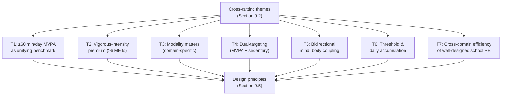

## 9.3 Priority High-Risk Subgroups and Differentiated Targeting

Section 9.2's themes apply across the Chinese 6–17 population, but Chapters 2, 5, 6, 7, and 8 also each identified subgroups within that population for which risk is concentrated and intervention return is amplified. Synthesizing across those chapters, five overlapping high-risk subgroups emerge — and the cumulative case for differentiated targeting is now substantially stronger than the case for any single subgroup taken alone, because risk compounds across overlapping dimensions and a single child may belong to several priority strata simultaneously.

**Older adolescent girls.** Chapter 2 identified girls as the lower-MVPA sex (ISCOLE rate ratio of 1.47 favoring boys; only 14.6% of girls complying on ≥5 days/week vs. 38.3% of boys), and identified older adolescents as the lower-MVPA age stratum (rate ratio 0.93 per unit closer to peak height velocity). The intersection of these two gradients — older adolescent girls, particularly in senior secondary school — emerges as the numerically dominant low-MVPA subgroup in Chinese pediatric epidemiology. Chapter 6 added that this is also the period when bone trainability is narrowing and the cost of missed osteogenic exposure is highest in life-course terms. Chapter 7 added that this is the period of maximum academic stress and sleep insufficiency, in which the cognitive and stress-buffering benefits of PA are most amplified. Differentiated intervention for this subgroup must address the structural time compression of senior secondary schooling, the cultural pressure to deprioritize PE, gendered modality preferences (non-competitive, group-based, skill-development-oriented activities such as dance, group fitness formats, table tennis, badminton, and rope-skipping clubs), and supportive PE-environment design (private changing facilities, peer-dynamic awareness). The motivational framing that aligns best with this subgroup is the cognitive-and-academic-performance framing developed in Chapter 7 — PE as preparation for the *gaokao* rather than competitor to it.

**Overweight and obese youth.** Chapter 2 documented the 19% reduction in MVPA compliance among overweight/obese youth and the self-reinforcing inactivity–adiposity loop. Chapter 5 established that this subgroup shows the largest dose–response benefits on insulin sensitivity, lipids, and blood pressure. Chapter 6 showed that obese Chinese boys have lower lumbar BMD than normal-weight peers, adding musculoskeletal deficit to metabolic risk. Chapter 8 specified the differentiated treatment-level dose (higher volume, vigorous intensity, combined modalities, concurrent dietary intervention, sustained behavioral support). The integrative message is that **overweight and obese youth are the single subgroup with the largest absolute health return per unit of PA exposure**, and differentiated intervention should combine structured treatment-level programs with modality adaptation (AquaPlyo, cycling, supervised resistance, HIIT) to balance benefit with injury risk, with family-level engagement addressing home environment and feeding norms. Communication should emphasize the **BMI–metabolic dissociation**: meaningful metabolic and cardiovascular improvements are achievable even when weight changes are modest, sustaining motivation when the scale moves slowly.

**Urban children in northern China during winter.** The geographic-temporal high-risk subgroup identified in Chapter 2 reflects the convergence of urban activity-environment constraints (motorized transport, limited play space, high RST), northern climatic and air-quality constraints during heating season, and the academic-calendar concentration of indoor sedentary exposure during winter months. Differentiated intervention requires indoor PA provision (school facilities, indoor active recess content, classroom PA breaks), winter-intensified programming during the months when outdoor opportunities are constrained, and municipal investment in indoor recreation infrastructure. Air-quality-conscious programming — indoor alternatives during heating-season pollution episodes — is a specifically Chinese refinement that international evidence does not directly address but that domestic implementation must.

**High recreational screen-time users.** As Chapter 8 emphasized, this subgroup's behavioral pattern crosses multiple risk pathways simultaneously: MVPA displacement, dietary co-exposures during screen exposure, sleep displacement from evening device use, and direct sedentary-metabolic effects. Differentiated intervention targets family-level screen-time rules, substitution strategies that channel freed time into MVPA, digital tools that monitor and limit device use, school-level policies on device use during school hours, and integrated messaging that addresses RST as simultaneously an obesity, sleep, and cognitive-performance issue.

**Rural and migrant children.** Chapter 8 acknowledged this subgroup as under-represented in the pre-2020 intervention evidence base, despite distinctive vulnerabilities: rural children are increasingly experiencing the nutritional and behavioral transition that previously affected urban children, with rural overweight/obesity prevalence rising rapidly through the late 2010s, while migrant children face limited access to high-quality school PE, unstable housing, and disrupted family support. Differentiated intervention requires equity-conscious resource allocation to under-resourced rural schools, attention to the implementation feasibility of school-based programs across heterogeneous regional contexts, and explicit programmatic design for migrant populations whose institutional engagement with the host-city school and health systems may be limited.

**Risk compounding.** The subgroups above are not mutually exclusive; they overlap, and the cumulative-risk multiplier across overlapping dimensions is substantial. The convergent priority case articulated in Chapter 2 — an older adolescent girl who is also overweight, urban northern, a high screen-time user, and during winter — remains the single highest-priority profile, and the multi-domain evidence developed across Chapters 5–8 strengthens rather than weakens that prioritization. The implication for health promotion design is that **universal population-level strategies are necessary but not sufficient**, and additional differentiated targeting is needed for the overlapping high-risk strata identified above. Table 9.2 consolidates the differentiated targeting framework.

**Table 9.2 — Differentiated targeting framework for priority high-risk subgroups**

| Subgroup | Principal risk dimensions | Differentiated modality emphasis | Setting and motivational framing |
|---|---|---|---|
| Older adolescent girls (esp. senior secondary) | Lowest MVPA; narrowing bone-trainability window; maximum academic stress and sleep deficit | Non-competitive, group-based, skill-development modalities; dance, group fitness, rope-skipping clubs, table tennis, badminton | Preserve PE quality through senior secondary; cognitive-and-academic-performance framing; supportive PE-environment design |
| Overweight/obese youth | Self-reinforcing inactivity–adiposity loop; amplified metabolic dose–response; compounded musculoskeletal risk | Combined aerobic + resistance; HIIT; AquaPlyo, cycling, supervised resistance for injury management | Structured treatment-level programs; family engagement; clinician–school–family coordination; BMI–metabolic dissociation messaging |
| Urban northern winter youth | Climate, air quality, daylight constraints; high RST | Indoor MVPA provision; classroom PA breaks; indoor impact/resistance content | Winter-intensified school programming; municipal indoor recreation investment; air-quality-conscious scheduling |
| High recreational screen-time users | Multi-pathway obesogenic exposure; sleep displacement; cognitive cost | Substitution into cognitively engaging modalities | Family-level screen-time rules; digital monitoring tools; school device policies; integrated obesity-sleep-cognition messaging |
| Rural and migrant children | Under-resourced school PE; institutional engagement gaps; rising nutritional and behavioral transition | Equity-conscious resource allocation; feasibility-adapted school programs | School capacity-building; teacher training; migrant-targeted programmatic design |

The table makes clear that differentiated targeting is not a series of bespoke interventions but a **layered set of emphases** within an integrated health promotion architecture: the universal population-level design (Section 9.5) provides the foundation, and the differentiated subgroup emphases adjust modality, setting, and framing where the cumulative evidence supports doing so.

## 9.4 Evidence Gaps and Methodological Limitations in the Pre-2020 Chinese Evidence Base

Honest acknowledgement of evidence limitations is one of the rubric's central transparency requirements (P-4), and the consensus articulated in Section 9.1 and the targeting framework in Section 9.3 rest on an evidence base that is, in specific dimensions, incomplete. The pre-2020 Chinese-specific evidence base supports the directional consensus with high confidence but constrains the precision of effect-size estimation, of subgroup-specific dose-response specification, and of certain policy and digital-intervention evaluations. Six categories of limitation warrant explicit consolidation here.

**Measurement: self-report versus device-based PA exposure.** Chapter 2 emphasized, and subsequent chapters reiterated, that the majority of large-scale Chinese pediatric PA evidence rests on self-report instruments that systematically overestimate MVPA relative to accelerometry. Device-based measurement, where conducted (most notably in ISCOLE and in a small number of provincial studies), generally indicates substantially lower MVPA exposure than self-report-based estimates. The implication is twofold: **headline Chinese compliance figures (e.g., the 2016 ~29.9% national estimate) should be regarded as likely overestimates**, and **domestic dose–response estimates carry layered uncertainties** from both self-report overestimation and the Chapter 3 mismatch between adult-derived MET values and true youth energy expenditure. Routine integration of accelerometer-based sub-samples into national surveillance is therefore a methodological priority that would substantially sharpen future health-promotion targeting.

**Design: predominance of cross-sectional and short-term over long-term prospective designs.** Across virtually every domain examined in this report, Chinese pediatric PA evidence is dominated by cross-sectional surveys and short-term (8–24 week) intervention trials. Long-term prospective cohorts that follow Chinese children from primary school through adolescence and into early adulthood with concurrent PA, sedentary, cardiometabolic, musculoskeletal, neurocognitive, and academic phenotyping are sparse. This limits the ability to characterize **trajectory effects** (how PA exposure during the 6–17 window shapes adult outcomes), **tracking** (how childhood PA and risk markers persist into adulthood in Chinese populations), and **sustained intervention effects** (how programmatic gains persist after intervention cessation). The forward-projected life-course benefits articulated in Chapters 5, 6, and 9 rest on Chinese mechanistic plausibility combined with non-Chinese longitudinal evidence, rather than on direct Chinese long-term observation.

**Population coverage: under-represented subgroups.** Chinese pediatric PA research has substantially under-represented several populations whose intervention needs are notably high: **girls** are under-sampled in pediatric exercise-physiology and bone-health research (the Lam et al. 2010 Hong Kong adiposity–BMD study was confined to boys for sample-size reasons); **rural and migrant children** are under-represented across intervention evaluation; **clinical and disability subgroups** are addressed only sparsely; and **early-childhood (ages 6–7) and late-adolescent (16–18) ends of the review's age range** receive less empirical coverage than mid-childhood. These coverage gaps mean that targeted recommendations for these subgroups rest on a thinner evidentiary foundation than recommendations for the better-studied mid-adolescent boys.

**Modality and intervention coverage.** Several specific intervention questions remain under-evaluated in the pre-2020 Chinese context. **Head-to-head modality comparisons in Chinese school PE settings** — for example, comparing the cognitive, fitness, and bone effects of wushu versus basketball versus jumping rope under standardized conditions — are largely absent, limiting the precision with which modality recommendations can be Chinese-context-specific. **Vigorous-intensity and HIIT-style protocols in Chinese pediatric populations** remain less studied than the international evidence base, with cultural acceptability, safety, adherence, and long-term effectiveness in Chinese school PE under-characterized. **Digital and app-based interventions** for PA promotion and RST reduction — increasingly relevant given the rapid penetration of smartphones into Chinese pediatric daily life — have a thin pre-2020 evaluation base in Chinese contexts.

**Multi-domain integration in Chinese cohorts.** A particularly important integrative gap is the absence of large Chinese pediatric cohorts that combine **device-based PA and sedentary measurement, dietary assessment, sleep monitoring, cognitive and academic assessment, and clinical outcome ascertainment** in a unified design. The bidirectional mind–body coupling argued for in Theme 5 of Section 9.2 — and the convergent effects across domains documented throughout Chapters 4–8 — would be substantially better characterized by such integrated cohorts. Their absence means that the cross-domain claims supported by the international evidence base and by Chinese mechanistic plausibility rest on disaggregated rather than integrated Chinese-specific observation.

**Policy and environmental evaluation.** As Chapter 8 noted, much pre-2020 Chinese policy and built-environment evaluation has relied on ecological or pre-post designs rather than cluster-RCT or quasi-experimental designs with strong counterfactuals. The effectiveness of specific levers — PE policy implementation quality, active commuting infrastructure investment, school food-environment regulation, screen-time guidance, Healthy China 2030-aligned interventions — therefore has a less precise pre-2020 Chinese effect-size base than equivalent international evidence in some comparator countries.

How do these gaps shape the interpretive confidence of the consensus articulated in Section 9.1? The honest answer is **moderately and asymmetrically**. They do not undermine the directional consensus: the cross-domain, multi-mechanism, multi-evidence-design convergence is strong enough that the basic claim — adequately dosed and intensity-graded PA is broadly beneficial, and inactivity is broadly harmful — is robust to the gaps identified above. But they meaningfully constrain the precision of effect-size estimation, the confidence of subgroup-specific recommendations, and the rigor of cost-effectiveness arguments that policy designers may wish to make. The implication is that **action on the basis of the existing evidence base is fully warranted, while continued research investment is needed to refine the precision and specificity of that action**.

Priority directions for that research investment, derivable from the gap analysis above, include: long-term prospective Chinese pediatric cohorts integrating device-based PA, sedentary, sleep, dietary, neurocognitive, musculoskeletal, and clinical phenotyping; routine integration of accelerometer sub-samples into national surveillance to calibrate self-report estimates; head-to-head modality comparison RCTs in Chinese school PE settings; well-powered cluster RCTs of Chinese school-based multi-component obesity-prevention interventions with long-term follow-up; pediatric neuroimaging cohorts in mainland Chinese populations with concurrent PA, fitness, and cognitive phenotyping; dedicated intervention research in under-represented subgroups (girls, rural, migrant, early-childhood, late-adolescent); evaluation of digital and app-based PA and RST interventions in Chinese populations; and rigorous policy and environmental intervention evaluation aligned with Healthy China 2030 implementation.

## 9.5 Translating Evidence into Health Promotion Strategy: Core Design Principles

The consensus, themes, targeting framework, and gap analysis above translate into a coherent set of **core design principles** for a health promotion initiative targeting Chinese youth aged 6–17. These principles are intended to operate as the integrative reference points against which any initiative's specific components can be benchmarked, ensuring that programmatic design is anchored in the evidence rather than in convention or institutional convenience.

**Principle 1: MET-anchored, MVPA-defined dose and intensity targets.** The initiative should adopt the MET framework of Chapter 3 as the operational scaffold for all dose specifications. The foundational behavioral target is **≥60 minutes per day of MVPA (≥3 METs), accumulated across the day rather than concentrated in a single weekly bout**, supplemented by **vigorous-intensity (≥6 METs) exposure on most days** and by **muscle- and bone-strengthening activity on at least three days per week**. This target applies universally across the 6–17 population for prevention and general health; differentiated higher-volume, higher-intensity, and structured-modality prescriptions apply for treatment of overweight/obese youth (Chapter 8, Section 8.4) and for clinical and developmental subgroups requiring specific therapeutic dosing.

**Principle 2: Modality mix tailored to domain priorities.** Beyond dose and intensity, the initiative should specify a **modality mix** that delivers cross-domain benefit. The recommended mix combines: aerobic activity as the principal cardiorespiratory-and-cognitive engine, delivered preferentially through cognitively engaging modalities (basketball, soccer, table tennis, badminton, martial arts) over monotonous endurance; impact and bone-loading activities (jumping rope, plyometric drills, sports with impact loading) on at least three days per week to capture the site-specific osteogenic benefits identified in Chapter 6; resistance and muscle-strengthening activities to support lean mass accrual and muscle–bone-unit-mediated bone adaptation; and active commuting and lifestyle activity integrated daily. **Jumping rope deserves specific emphasis as a cornerstone modality**, given its convergence of high MET value (~12 METs), high osteogenic potency at very low time investment (Chapter 6 finding of significant femoral neck BMC gains at 5 minutes per session, 4 sessions per week over 4 months), Chinese cultural familiarity, minimal equipment requirements, and indoor/outdoor flexibility.

**Principle 3: Dual targeting of MVPA promotion and sedentary-time reduction.** Per Theme 4 of Section 9.2, the initiative must address MVPA and sedentary behavior — particularly recreational screen time — concurrently. Dual-targeting components include: family-level screen-time rules with explicit duration limits, no-screen zones (bedrooms, meals), and no-screens-before-bedtime norms; classroom PA breaks that simultaneously interrupt sitting and contribute to MVPA accumulation; and substitution strategies that channel time freed from RST into appealing PA alternatives. The empirical case for dual targeting is that single-component strategies fail to capture either the time-displacement pathway (MVPA-only) or the direct metabolic, dietary co-exposure, and sleep effects of sedentary behavior (RST-only).

**Principle 4: Integration of acute and chronic cognitive-benefit timescales.** Per Chapter 7, the initiative should explicitly design for both the acute cognitive-benefit timescale (single PA bouts producing improved attention and inhibitory control for ~60 minutes post-activity) and the chronic timescale (sustained programs producing durable executive-function gains over weeks to months). Operationally this means **scheduling active recess and brief structured PA breaks adjacent to demanding cognitive lessons** (acute effect) while also **preserving sustained PE delivery throughout the academic year and through senior secondary school** (chronic effect). The two timescales are complementary, not substitutable.

**Principle 5: Reframing of PA as enhancer rather than competitor of academic learning.** The most culturally consequential design principle for the Chinese context is the **explicit reframing of PA in family and educator communication**, drawing on Chapter 7's evidence base. The conventional cultural framing of PA as competitor to study should be replaced by the empirically supported framing of PA as a cognitive and academic-performance enhancer. This reframing has particular leverage in the high-stakes years leading up to the *zhongkao* and *gaokao*, where the cultural pressure to deprioritize PE is most intense and where the per-unit cognitive benefit of PA (amplified by sleep and stress effects) is also greatest. The reframing should be supported by communication materials targeting parents, grandparent caregivers, teachers, and school administrators.

**Principle 6: Cross-domain efficiency in PE content design.** Per Theme 7 of Section 9.2, the initiative should explicitly design school PE content for **simultaneous multi-domain benefit** — a single well-designed PE session delivering cardiorespiratory, musculoskeletal, cognitive, and obesity-prevention benefit concurrently. The audit logic introduced in Chapter 3 — tagging constituent activities by MET value and summing time spent above moderate and vigorous thresholds — should be combined with modality audit (impact, resistance, cognitive engagement) to verify that PE content is delivering the cross-domain mix rather than only one or two of its components.

**Principle 7: Equity and high-risk subgroup targeting layered onto universal strategies.** Per Section 9.3, the initiative should combine universal population-level strategies (necessary because the modal Chinese child fails the daily MVPA threshold on most days) with differentiated targeting for the overlapping high-risk subgroups identified in this report. Universal strategies provide foundational reach; differentiated targeting concentrates resources where the cumulative-risk multiplier and per-unit return are highest.

**Principle 8: Multi-setting integration.** Per Sections 9.6 below and Chapter 8, the initiative should engage school, family, community, and policy platforms as integrated rather than separate channels. Cross-setting reinforcement is empirically associated with larger and more durable effects than single-setting approaches, and the bidirectional coupling among home, school, and community environments means that single-platform interventions face structural limits that multi-platform designs can transcend.

**Principle 9: Sustained delivery over episodic intervention.** Per Chapter 8 (and the chronic-effect timescale of Chapter 7), the initiative should be designed for sustained delivery over years rather than episodic campaigns over weeks or months. Effect sizes attenuate after intervention cessation; the life-course logic of peak bone mass accrual (Chapter 6) and of NCD-risk-trajectory bending (Chapter 5) both require exposure that persists across the 6–17 developmental window rather than concentrated bursts.

**Principle 10: Honest hedging and ongoing evaluation.** Per Section 9.4, the initiative should be designed with explicit recognition of the pre-2020 evidence-base limitations and with built-in evaluation mechanisms that contribute to filling those gaps. Routine integration of accelerometer sub-samples, long-term outcome tracking, attention to under-represented subgroups, and rigorous evaluation of digital and policy components are not optional research add-ons but constitutive features of an evidence-responsible initiative.

## 9.6 Multi-Setting Implementation: School, Family, Community, and Policy Platforms

The design principles of Section 9.5 operate through four principal delivery platforms identified throughout the report. This section specifies the operational content for each platform, drawing on the comparative-effectiveness analysis of Chapter 8 (Section 8.9, Table 8.1) and the platform-specific recommendations developed in Chapters 5–8.

**School platform.** The school is the single most important delivery setting, by virtue of its near-universal reach across the Chinese 6–17 population, the substantial portion of children's waking hours spent within it, the existing infrastructure for PE and health education, and the institutional capacity to implement and sustain behavioral interventions. School-platform content should include:

- **PE quality preservation through all school levels, including senior secondary**, with protected scheduled time and resistance to the examination-pressure-driven compression of PE hours that has historically constrained the cognitive and physical benefits available to older adolescents.
- **MET- and modality-audited PE content** ensuring that scheduled time is actually spent in active engagement at moderate-to-vigorous intensity, with a balanced modality mix delivering cardiorespiratory, musculoskeletal, and cognitive benefits concurrently. The Chinese PE repertoire — jumping rope, basketball, soccer, table tennis, badminton, martial arts, athletics — provides abundant material for this audit.
- **Active recess** with structured MVPA content during morning and afternoon breaks, using minimal equipment and feasible across diverse school resource levels.
- **Classroom physical activity breaks** (typically 5–10 minutes) embedded into academic lessons, providing both sedentary-time interruption and acute cognitive priming for subsequent learning.
- **Total weekly school-day MVPA delivery of at least 150–180 minutes** through the integrated platform of PE, active recess, and classroom PA breaks (per the implementation thresholds identified in Chapter 8, Section 8.5).
- **School food environment modification**, including canteen offering improvements, restrictions on competitive food sales, and water-access provision — addressing the dietary side of the energy-balance equation that PA-only strategies cannot fully resolve.
- **Teacher capacity-building and ongoing professional support**, particularly in less-resourced regional schools where implementation quality has historically been weaker.
- **Indoor PA provision and winter-intensified programming** in northern Chinese schools to address the seasonal compression of outdoor opportunities (Chapter 2; Section 9.3).

**Family platform.** The family is the second principal setting, complementing the school platform and addressing the substantial portion of children's time spent at home — particularly RST, evening sedentary exposure, and weekend and vacation periods. Family-platform content should include:

- **Parental and grandparent engagement** through meaningful skill-building rather than information-only newsletters, addressing the distinctive Chinese family context in which grandparents provide significant childcare and may hold differing norms about child body size and activity.
- **Home environment modification**, particularly the placement of screen devices, the availability of PA-enabling features (sporting equipment, family bicycles, designated active spaces), and the removal or relocation of sedentary-promoting defaults.
- **Family-level screen-time rules** with explicit duration limits, no-screen zones, and no-screen-before-bed norms, supported by parental modeling of limited screen use.
- **Joint family PA opportunities** — weekend walks, hikes, cycling, sport participation, household active chores — that provide direct PA exposure and reinforce activity as a family value, with attention to the time constraints of dual-career urban Chinese families.
- **Culturally adapted feeding norms communication**, addressing portion-size norms, the use of food as reward or comfort, the association of body fullness with health (particularly in grandparent caregivers), and the role of sugar-sweetened beverages and processed snacks.
- **Family-based goal-setting and self-monitoring** for both PA and sedentary-time targets.

**Community platform.** The community platform fills gaps that school and family platforms cannot fully address, particularly during summer vacations, after-school hours, and weekend periods. Community-platform content should include:

- **After-school and weekend sport programming**, structured around vigorous-intensity team and individual activities that deliver disproportionate cardiorespiratory and cognitive benefit per unit time (Chapter 5, Chapter 7).
- **Indoor recreation infrastructure** — community gyms, indoor pools, ice rinks, and similar facilities — supported by municipal investment and particularly important in northern Chinese cities during winter.
- **Active commuting infrastructure** including safe walking and cycling routes to school, separated cycling infrastructure, traffic-calming around schools, and school-siting policies that locate schools within walking or cycling distance of student populations.
- **Built-environment investment** in playgrounds, parks, and green spaces within walking distance of homes and schools, with attention to equity across urban districts.
- **Structured summer programming** to bridge the structural gap left by the academic calendar, addressing the seasonality concerns identified in Chapter 2.

**Policy platform.** The policy platform shapes the default conditions within which behavioral choices are made and provides the regulatory and resource architecture that enables school, family, and community platforms to function. Policy-platform content should include:

- **National PE standards** mandating weekly PE hours, curriculum content, and outcome benchmarks, with implementation monitoring and accountability mechanisms.
- **Healthy China 2030 alignment**, situating the initiative within the broader national framework for youth fitness, obesity, and PA outcomes.
- **School nutrition regulation** including canteen standards, restrictions on competitive food sales, and water-access provision.
- **Food and beverage advertising regulation**, particularly advertising directed at children on television and digital platforms.
- **Built-environment policy** supporting active commuting, recreation infrastructure, and equitable access.
- **Screen-time guidance** integrated with broader child health policy addressing myopia, sleep, and obesity outcomes.
- **Equity-conscious resource allocation** to under-resourced rural and migrant-serving schools, addressing the coverage gaps identified in Section 9.4.

**Cross-setting synergies and integration.** The four platforms are not independent: their effectiveness depends on cross-platform integration. School-based messaging is reinforced by home environment; family screen-time rules are supported by school device policies; community PA opportunities depend on policy-driven infrastructure; policy implementation depends on school leadership and family uptake. The integration mechanisms that link platforms include: consistent messaging across school, family, and community communications; shared MET- and MVPA-anchored targets that all platforms work toward; data and monitoring systems that track exposure and outcome across settings; and coordination structures at municipal and provincial levels that align school, family, community, and policy actors.

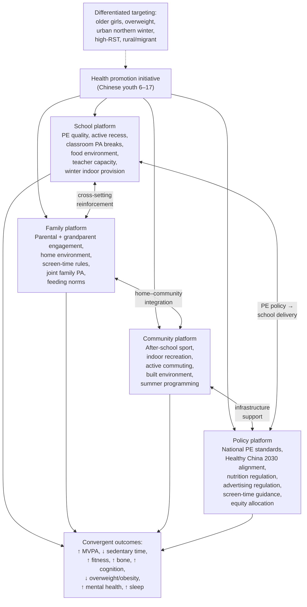

The diagram captures the integrated multi-platform architecture: four delivery platforms operate concurrently, reinforce one another through cross-setting mechanisms, and together produce convergent multi-domain outcomes, with differentiated subgroup targeting layered onto the universal architecture.

## 9.7 Communication, Behavioral Reframing, and Cultural Adaptation

The structural design developed in Sections 9.5 and 9.6 will be only as effective as the communication and cultural-adaptation strategy that accompanies it. The Chinese sociocultural context examined throughout this report — academic pressure, family expectations, intergenerational feeding norms, the one-child legacy, and the cultural framing of PA as competitor to academic learning — both creates the conditions that have produced the epidemiological baseline of Chapter 2 and constitutes the medium through which any health promotion initiative must communicate. Five communicative tasks emerge from the evidence base and the cross-chapter synthesis.

**Task 1: Inverting the PA-versus-academics framing.** Per Chapter 7, the cultural intuition that PA competes with academic learning is empirically inverted: regular and well-designed PA in the 6–17 window supports rather than undermines academic functioning, through measurable improvements in brain structure, executive function, attention, classroom behavior, and academic achievement. **Communication targeting Chinese parents, grandparents, teachers, and school administrators must explicitly address and invert this framing**, using evidence-based messaging that positions PA as a cognitive-performance enhancer rather than a trade-off against study. The reframing has particular leverage in the years leading up to the *zhongkao* and *gaokao*, where cultural pressure to deprioritize PE is most intense and where the per-unit cognitive benefit of PA (amplified by sleep and stress effects, per Chapter 4) is also greatest. The empirical content of this messaging includes the acute-effect evidence (single PA bouts improving attention and inhibitory control within ~60 minutes), the chronic-effect evidence (sustained programs producing durable executive-function gains), the brain-structural evidence (higher-fit children showing larger hippocampal volume and more mature prefrontal organization), and the academic-achievement evidence (PA-enhanced instructional time being at least as productive per remaining minute as PA-poor instructional time).

**Task 2: Communicating the BMI–metabolic dissociation.** Per Chapter 8, structured PA produces clinically meaningful improvements in insulin sensitivity, lipid profile, blood pressure, and cardiorespiratory fitness in overweight youth even when BMI changes are modest. **Communication targeting overweight Chinese youth and their families must emphasize this dissociation** to sustain motivation when weight loss is slow. The empirical content includes the Chapter 5 evidence that overweight subgroups show the largest dose–response benefits on cardiovascular-metabolic markers, the Chapter 6 evidence that PA supports musculoskeletal health independently of weight change, and the Chapter 4 evidence that PA improves mood, self-esteem, and stress regulation regardless of body composition outcomes. Reframing the goal as **health improvement rather than weight loss alone** is a strategically important communicative pivot.

**Task 3: Engaging grandparent caregivers and addressing intergenerational feeding norms.** Per Chapter 8, grandparents play a substantial role in Chinese childcare and may hold feeding and activity norms that differ from parental norms — including the encouragement of large portions as expressions of care, the association of body fullness with health, and concern about excessive child activity or exertion. **Communication targeting grandparent caregivers must be designed for this audience specifically**, with attention to intergenerational respect, the framing of contemporary nutritional science in ways that acknowledge rather than dismiss traditional values, and the integration of grandparents into family-level intervention components. Information-only approaches are unlikely to be sufficient; skill-building and joint family-activity opportunities have greater potential to shift norms over time.

**Task 4: Integrated messaging on PA, sleep, stress, and cognition.** Per Chapter 4 and amplified in Chapter 7, the cognitive and mental-health benefits of PA are coupled with sleep and stress-regulation benefits that are particularly relevant in the Chinese high-academic-stress context. **Communication should bundle these benefits rather than addressing them separately**, with messaging that positions PA as simultaneously supporting sleep quality, stress resilience, mood, attention, and academic performance. This integrated framing is more compelling — and more accurate — than single-benefit messaging, and aligns with the bidirectional mind–body coupling identified as Theme 5 in Section 9.2.

**Task 5: Differentiated motivational framing for girls and older adolescents.** Per Section 9.3, generic PA promotion has tended to produce smaller effects in girls than in boys, suggesting that motivational framings, activity modalities, and social environments need to be tailored. **Communication targeting older adolescent girls should emphasize**: non-competitive, group-based, skill-development-oriented activity options aligned with documented preferences; the cognitive and academic-performance benefits framed in the context of the *gaokao*-preparation period; the mental-health and stress-regulation benefits relevant to a subgroup carrying high baseline academic stress; and supportive PE-environment design that addresses body-image and peer-dynamic concerns. **Communication targeting older adolescents more broadly** should explicitly counter the cultural deprioritization of PE during senior secondary years, drawing on the narrowing-window evidence from bone (Chapter 6) and the amplified-benefit evidence from cognition (Chapter 7).

The communicative dimension is not auxiliary to the structural design developed in Sections 9.5 and 9.6 but is constitutive of it. A well-designed school PE schedule that is undermined by parents pressuring children to skip PE for tutoring; a thoughtful family screen-time rule that is undermined by grandparents permitting unlimited screen access; or an evidence-based community sport program that is undermined by cultural ambivalence about adolescent female athletic participation — each illustrates the way in which communicative failure can hollow out otherwise sound structural design. The initiative's communicative work is therefore an integrated component of its overall design, not a downstream marketing function.

## 9.8 Concluding Statement and Forward-Looking Considerations

The synthesis developed across this concluding chapter, anchored in the eight chapters that precede it, supports a single integrative statement: **physical activity is one of the most strategically important modifiable behavioral determinants of health available to Chinese children and adolescents aged 6–17, with documented benefits that span cardiorespiratory function, musculoskeletal development, brain and cognitive development, mental health, sleep, immune function, social development, and the prevention and management of overweight and obesity; its absence carries correspondingly broad and self-reinforcing harms; and the pre-2020 evidence base, while incomplete in specific Chinese-context dimensions, is sufficient to justify decisive action without delay**.

Three points consolidate this case as the report closes.

**First, the multi-domain, multi-mechanism, multi-evidence-design convergence is the central empirical finding of this review.** No other single modifiable behavior in the 6–17 age window moves so many indicators simultaneously. The integrative argument made in Chapter 4 — that adequately dosed MVPA is a uniquely broad-spectrum input to pediatric health, with effects propagating through bidirectional reinforcing loops — was developed quantitatively in Chapters 5–8 and is consolidated in the consensus statement of Section 9.1. The implication for any health promotion initiative is that PA is not merely one risk factor among many but a **strategic public-health lever** whose multi-domain returns justify the cross-platform, cross-domain investment that this report has recommended.

**Second, the life-course dimension amplifies rather than diminishes the case for early action.** The cardiovascular and metabolic risk trajectories established in childhood track moderately into adulthood; the peak bone mass deposited by the end of adolescence determines life-course fracture risk decades later; the executive-function and motor-competence foundations laid during the 6–17 window shape lifelong cognitive and physical functioning; and the activity habits established before adulthood track moderately into later life. The window of opportunity created by the 6–17 developmental period is not indefinite, and the strategic return on PA investment during this window is among the most favorable available in any age range. For a Chinese population entering a rapid demographic-aging transition with rising adult NCD burdens, the investment case is particularly strong: the cohort currently passing through the 6–17 window is the cohort that will face the next two generations of adult NCD burden, and the bone, cardiovascular, metabolic, and cognitive capital deposited (or not deposited) during current schooling will shape that burden for decades.

**Third, the action–research relationship should be balanced.** The pre-2020 Chinese-specific evidence base, as Section 9.4 acknowledged, has notable gaps — particularly in long-term follow-up, device-based measurement, under-represented subgroup coverage, head-to-head modality comparisons, multi-domain integrated cohorts, and rigorous policy evaluation. These gaps argue for continued research investment alongside intervention implementation, with priorities including: long-term prospective Chinese pediatric cohorts integrating device-based PA, sedentary, sleep, dietary, neurocognitive, musculoskeletal, and clinical phenotyping; well-powered cluster RCTs of Chinese school-based multi-component interventions with extended follow-up; pediatric neuroimaging cohorts in mainland Chinese populations; dedicated research in under-represented subgroups; evaluation of digital and policy interventions; and routine integration of accelerometer sub-samples into national surveillance. None of these research priorities, however, is a precondition for action. The existing evidence base is sufficient to justify initiating implementation, and the action–research relationship should be designed so that intervention delivery generates the data needed to refine subsequent intervention design.

A final consideration concerns the **temporal boundary** of this review. Throughout the report, evidence has been restricted to what was scientifically available up to early 2020. This boundary has been observed both as a methodological discipline and as a deliberate choice consistent with the rubric's scope-adherence criterion. It is appropriate, however, to acknowledge what the boundary does and does not imply for the forward use of this synthesis. **The directional consensus articulated in Section 9.1 is unlikely to have been overturned by subsequent evidence**: the cross-domain, multi-mechanism convergence is too robust, and the underlying biological pathways too well-characterized, for the basic claim that adequately dosed PA is broadly beneficial in Chinese youth to be plausibly inverted by post-2020 findings. **The quantitative refinement of specific effect-size estimates, dose–response specifications, and intervention-effectiveness comparisons may have been advanced by post-2020 research**, and any operational initiative drawing on this synthesis should expect to update specific parameters as the evidence base continues to mature. **The disruptions to PA patterns introduced by events subsequent to the review's temporal cutoff lie outside this review's scope** but should be acknowledged as part of the operational reality any initiative now faces; the structural and behavioral patterns documented in this synthesis — academic time compression, rising RST, declining MVPA compliance, fourfold-elevated overweight and obesity, north–south and urban–rural heterogeneity — formed the baseline against which any subsequent disruption has acted, and remain the foundational empirical reality on which a health promotion strategy must be built.

The report concludes therefore where it began. Chapter 1 framed the central question: a Chinese pediatric population numbering more than 180 million in the 6–17 range, undergoing a quiet but pervasive transition toward sedentariness and nutritional excess, with chronic non-communicable disease risk factors increasingly anchored in childhood, and a national health framework articulated through Healthy China 2030 that places PA among the most important modifiable behavioral determinants of youth health. Eight chapters of synthesis have, in answer, articulated what the pre-2020 evidence supports as the scientific consensus on PA's role in this population, identified cross-cutting themes and high-risk subgroups, acknowledged methodological limitations, and translated the synthesis into a set of design principles, multi-setting implementation specifications, and communicative strategies. **Taken together, the evidence reviewed in this report constitutes the empirical foundation for any credible health promotion initiative targeting Chinese children and adolescents aged 6–17**, and provides the integrative reference framework against which the design, implementation, and evaluation of such an initiative can be benchmarked. The case for action is empirically supported, strategically compelling, and operationally tractable. The work of translating that case into delivered programs is what follows.

# 参考内容如下：
[^1]:[Physical activity among Chinese school-aged children](https://www.sciencedirect.com/science/article/pii/S2095254617301175)
[^2]:[Correlates of compliance with recommended levels of physical activity in children | Scientific Reports](https://www.nature.com/articles/s41598-017-16525-9)
[^3]:[Metabolic equivalents (METS) in exercise testing ... - PubMed](https://pubmed.ncbi.nlm.nih.gov/2204507/)
[^4]:[ACSM -Exercise Physiologist Certification Test - Review ... - Quizlet](https://quizlet.com/476698271/acsm-exercise-physiologist-certification-test-review-and-metabolic-calculations-flash-cards/)
[^5]:[Background and History - NCCOR Youth Compendium of Physical Activities](https://www.nccor.org/tools-youthcompendium/background-and-history/)
[^6]:[5 Things to Know About Metabolic Equivalents - ACE Fitness](https://www.acefitness.org/resources/pros/expert-articles/6434/5-things-to-know-about-metabolic-equivalents/?srsltid=AfmBOoqxHK5ugq4kS0k4WdEEjTw_fKWx2-Od9vjdg5s4k60e9xgRNp8r)
[^7]:[Using Metabolic Equivalents in Clinical Practice - ScienceDirect](https://www.sciencedirect.com/science/article/abs/pii/S0002914917316909)
[^8]:[[PDF] Physical Activities Defined by Level of Intensity](https://www.health.state.mn.us/diseases/asthma/schools/documents/physicalactivity.pdf)
[^9]:[Weekly Frequency of Meeting the Physical Activity Guidelines and ...](https://journals.lww.com/10.1249/MSS.0000000000002767)
[^10]:[Child Activity: An Overview | Physical Activity Basics | CDC](https://www.cdc.gov/physical-activity-basics/guidelines/children.html)
[^11]:[Energy | AAP Books | American Academy of Pediatrics](https://publications.aap.org/aapbooks/book/667/chapter/8087088/Energy)
[^12]:[[PDF] Utility of the Youth Compendium of Physical Activities - CDC Stacks](https://stacks.cdc.gov/view/cdc/121996/cdc_121996_DS1.pdf)
[^13]:[Frontiers | Effects of exercise on bone mass and bone metabolism in adolescents: a systematic review and meta-analysis](https://www.frontiersin.org/journals/physiology/articles/10.3389/fphys.2024.1512822/full)
[^14]:[[PDF] The Association Between Adiposity and Bone Mineral Density in ...](https://www.hkjpaed.org/pdf/2010;15;276-284.pdf)
