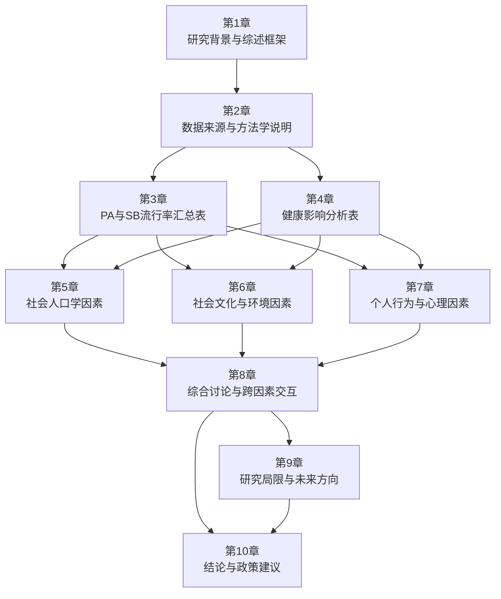
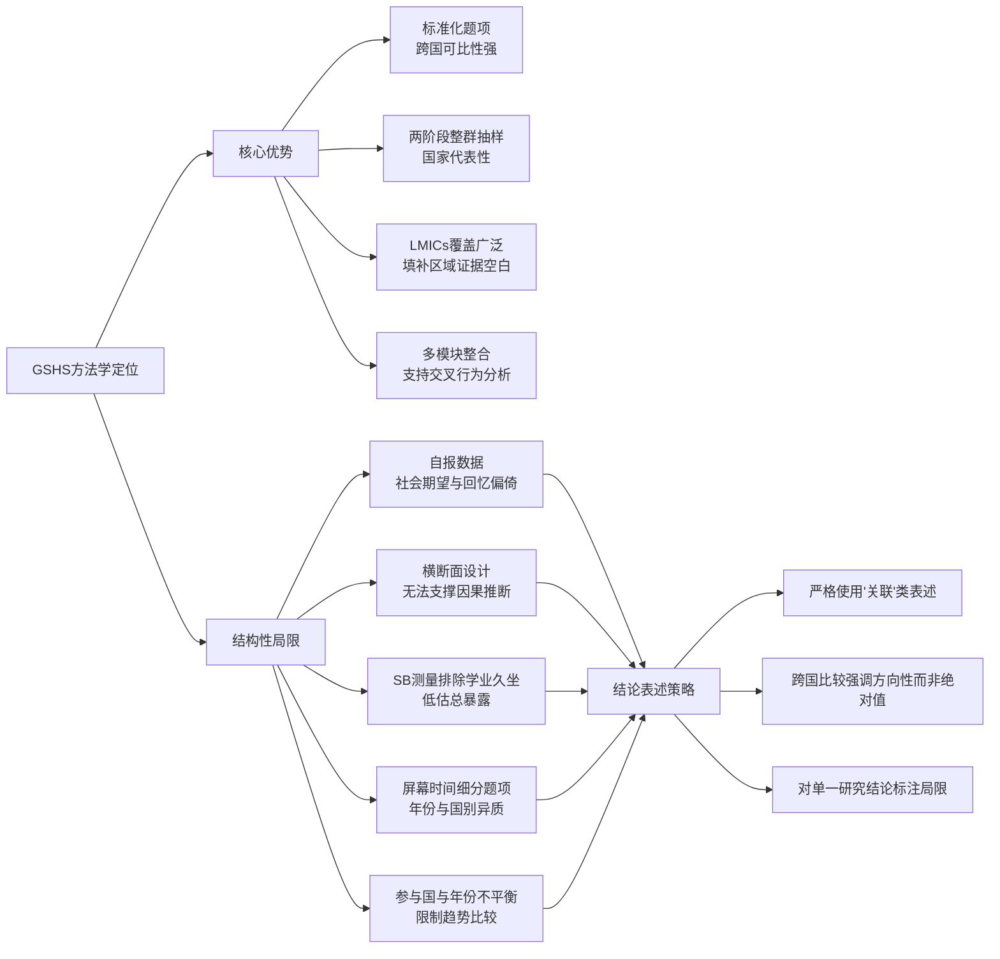
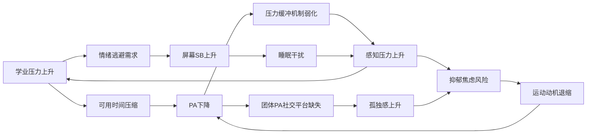
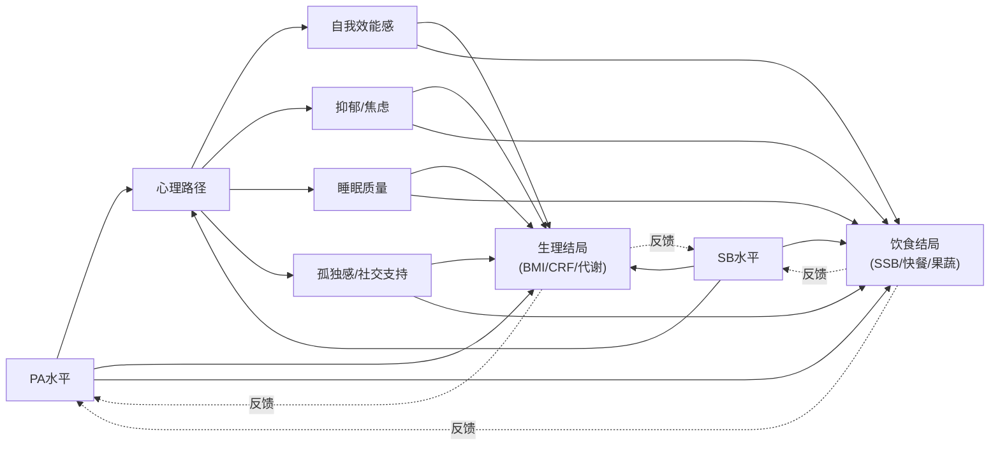
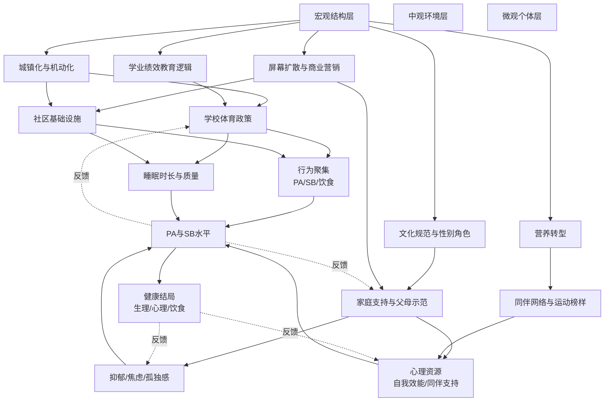

# 中低收入国家在校青少年体力活动与久坐行为的全球综述：基于GSHS的流行率、健康影响与影响因素分析
# 1 研究背景与综述框架

青少年时期是健康行为模式形成与定型的关键窗口期，体力活动(Physical Activity, PA)与久坐行为(Sedentary Behavior, SB)作为两类既相互独立又彼此交织的生活方式因子，深刻影响着个体终生的健康轨迹。然而，全球范围内青少年体力活动不足与久坐行为高发的现象已经成为21世纪最具挑战性的公共卫生议题之一，且这一问题在不同经济发展水平的国家呈现出显著的异质性。本章作为整篇综述的导论与逻辑起点，旨在系统阐述聚焦中低收入国家(Low- and Middle-Income Countries, LMICs)在校青少年PA与SB行为研究的公共卫生意义与学术价值，明确全球学校学生健康调查(Global School-based Student Health Survey, GSHS)作为核心数据来源的代表性与适用性，界定研究问题、关键概念与纳入边界，并对全篇报告的结构与论证逻辑进行总体说明，为后续各章的流行率分析、健康影响评估与多层次影响因素探讨奠定理论与方法基础。

## 1.1 全球青少年体力活动不足与久坐行为的公共卫生意义

体力活动不足已被国际公共卫生界明确界定为危及人类健康的核心风险因子。世界卫生组织(WHO)指出，**缺乏身体活动已成为全球范围内死亡的第四位危险因素**，许多国家缺乏身体活动的人群比例不断上升，并对全球人群的一般健康状况及慢性非传染性疾病(Noncommunicable Diseases, NCDs)的患病率产生重要影响[^1]。对于5–17岁年龄组的儿童与青少年，WHO在其全球指南中给出了清晰的量化标准：该年龄段人群应每天累计至少60分钟的中等到高强度身体活动(Moderate-to-Vigorous Physical Activity, MVPA)，且每日活动时间超过60分钟可获得额外的健康收益，活动形式应以有氧活动为主，并每周至少3次纳入能够强化肌肉和骨骼的高强度活动[^1]。这一推荐标准的建立，基于规律性体力活动对儿童青少年心肺与肌肉适能、骨骼健康、心血管与代谢健康生物标志物的促进作用，以及对焦虑与抑郁症状的缓解作用，构成了当代评估青少年体力活动水平的最广泛被引用的国际基准[^1]。

与体力活动不足相伴而生的是久坐行为的全球扩散。久坐行为通常指清醒状态下能量消耗较低(≤1.5 MET)的坐位、斜倚或卧位行为，包括屏幕时间、课堂学习、阅读、乘车等。值得注意的是，体力活动不足与久坐行为并非简单的对立关系，一个人完全可能在累积达到60分钟MVPA的同时仍存在大量的久坐时间，二者对健康产生相对独立的影响。来自成人队列的剂量反应证据进一步印证了这一点：澳大利亚DASSH研究基于40,156名自报患有冠心病的参与者、中位随访11.1年的数据，识别出MVPA与久坐行为各自独立的、与心脏死亡率和全因死亡率相关的阈值，提示**MVPA的增加与久坐时间的减少对死亡风险的降低具有独立且可量化的贡献**[^2]。这一发现对青少年群体的预防医学含义在于：即便青少年时期尚未出现明显的心血管事件，PA与SB所塑造的代谢与行为基础已经在为成年期的NCDs风险埋下伏笔。

从生命全程视角看，青少年阶段所形成的PA习惯与SB模式具有显著的代际惯性。体力活动行为在童年与青少年期建立的偏好，会通过运动技能、社交网络与自我效能感等机制延续至成年期，而青少年期养成的高屏幕使用、低主动通勤等久坐模式同样具有自我强化的倾向。因此，**关注青少年PA与SB不仅是降低当下学业表现下降、超重肥胖、心理困扰等近期风险的需要，更是阻断NCDs代际累积、塑造终生健康轨迹的战略性公共卫生投资**。这一战略价值在NCDs负担正快速向中低收入国家转移的全球背景下，显得尤为迫切。

## 1.2 聚焦中低收入国家的研究必要性

理解为何本综述将研究范围锁定于中低收入国家，需要首先明晰世界银行的国家收入分类框架。世界银行集团根据各经济体上一年的人均国民总收入(Gross National Income per capita, GNI per capita)将全球经济体划分为四个收入组：低收入、中等偏下收入、中等偏上收入与高收入，分类标准每年7月1日依据图表集法(Atlas method)计算的人均GNI美元值动态更新[^3][^4]。该分类框架自1978年世界银行首次建立、1989年正式形成四级架构以来，已成为国际社会评估经济发展水平与制定政策的统一依据[^4]。在最新的标准下，2022财年低收入经济体的门槛为人均GNI 1,045美元或以下，2023–2024财年这一门槛调整为低于1,135/1,145美元[^4]；中等偏下收入国家在2023–2024财年的人均GNI区间起点为1,136美元[^4]。在这一分类体系中，**世界银行所定义的"中低收入国家"(LMICs)通常涵盖低收入和中等偏下收入两个组别**，包括了诸如撒哈拉以南非洲的众多国家、南亚地区的全部国家，以及东南亚的柬埔寨、东帝汶、老挝、缅甸、菲律宾、越南等[^4]。从全球分布来看，这些国家高度集中于撒哈拉以南非洲，并普遍面临极端贫困、基础设施薄弱、数字鸿沟扩大以及对初级产品出口的高度依赖等结构性发展挑战[^4]。

LMICs在经济结构、城镇化进程、教育资源配置与健康基础设施方面与高收入国家存在系统性差异，这些差异对青少年PA与SB的塑造路径有着深远的中介作用。一方面，LMICs正经历快速且不均衡的城镇化与生活方式转型，机动化交通的普及、屏幕媒体的渗透、学校体育课时与户外活动空间的相对不足，使得青少年的久坐时间面临结构性增长压力；另一方面，部分LMICs的青少年仍承担一定的家务劳动、步行或骑行通勤负担，其PA模式与高收入国家的休闲型运动主导模式存在本质不同。这种"双重转型"使得简单套用高收入国家的研究结论存在显著的外推风险。

然而，**既有关于青少年PA与SB的研究证据严重偏向高收入国家**，对LMICs在校青少年这一群体的系统性研究相对薄弱。从地区证据的可获得性来看，部分LMICs已开始建立本国的体力活动监测体系。例如乌拉圭基于GSHS数据完成了其首份儿童青少年体力活动报告卡，结果显示**仅有28.8%的13–15岁青少年能在每周5天或以上达到每日60分钟MVPA的标准，乌拉圭青少年每周达到60分钟MVPA的中位数仅为2天**[^5]。这一类区域性证据虽然珍贵，但分散、孤立的国别报告难以支撑跨国比较与全球综合判断。在此背景下，开展一项专门面向LMICs在校青少年、基于统一调查框架的PA与SB综述研究，对于填补区域证据缺口、识别高风险亚群、为WHO全球身体活动行动计划的本土化实施提供决策依据，具有显著的针对性与补位价值。

## 1.3 GSHS作为核心数据来源的代表性与适用性

要在LMICs众多国家之间进行可比较的青少年PA与SB分析，必须依托一个具有方法学一致性、覆盖广泛、可在多国重复实施的监测平台。**全球学校学生健康调查(GSHS)正是为此目的而设计的国际标准化调查工具**。GSHS由WHO联合美国疾病控制与预防中心(CDC)及UNICEF等机构开发，主要面向13–17岁在校青少年，采用基于学校的两阶段整群随机抽样设计，使所获样本能够代表参与国该年龄段在校学生总体。从研究证据来看，GSHS在多个LMICs已经被广泛部署：乌拉圭基于GSHS数据建立了青少年MVPA达标率的本国基线[^5]；而在加勒比与中美洲地区，包括阿根廷、巴拿马、圣文森特和格林纳丁斯在内的多国通过GSHS采集了51,405名在校青少年的代表性横断面数据，用于网络欺凌、自杀意念等心理健康议题的跨国比较[^5]。这些应用案例从侧面验证了GSHS在LMICs情境下的可操作性、抽样代表性与跨国比较潜力。

GSHS问卷由若干核心模块与可选模块构成，涉及饮食行为、个人卫生、心理健康、物质使用、暴力与无意伤害、性行为、保护性因素以及**体力活动与久坐行为**等十大类青少年健康危险行为。在PA与SB测量方面，GSHS采用基于自报的标准化题项，主要询问过去7天内累计达到至少60分钟MVPA的天数（用于评估WHO推荐标准的达标情况），以及在典型的一天中花在坐着（不含上课和做作业）的总时长（用于评估久坐行为水平，常以≥3小时/天作为高久坐切点）。这种以"7天回忆"为核心的测量框架使得不同国家、不同年份的GSHS数据具备较高的可比性，也使得围绕"达标率"与"高久坐率"的跨国汇总成为可能。

然而，GSHS作为本综述的核心数据来源同样存在不可回避的方法学局限。**首先，GSHS依赖自报数据，可能存在社会期望偏倚与回忆偏倚**，尤其对低强度活动与短时段活动的识别精度有限。其次，GSHS主要采用横断面设计，难以支撑PA/SB与健康结局之间的因果推断。第三，GSHS对SB的测量主要聚焦于"非学业性坐着时间"，未充分捕捉课堂、做作业等学业相关久坐，且对屏幕时间的细分（电视、电脑、手机）在不同年份与国家间存在题项差异。第四，GSHS的国家覆盖虽广，但并非所有LMICs均参与，已参与国家的调查年份也存在不一致，影响时间趋势分析。这些局限将在本综述第2章方法学说明与第9章局限性讨论中得到进一步展开，并直接影响本综述对证据强度的分级与表述策略——即遵循持久推理标准P-4的要求，**严格使用"关联""风险增加""与……相关"等表述，避免对横断面证据进行因果性断言**。

## 1.4 核心概念界定与研究边界

为确保本综述各章节之间的术语一致性与跨研究的可比性，有必要对核心概念与研究边界作出明确界定。

**体力活动(Physical Activity, PA)**：根据WHO定义，指由骨骼肌产生的、能引起能量消耗高于基础代谢水平的任何身体运动，涵盖玩耍、游戏、体育运动、交通往来、娱乐、体育课与有计划的锻炼等多种形式[^1]。

**中高强度体力活动(MVPA)**：指代谢当量(MET)达到3.0及以上的体力活动，是WHO 5–17岁推荐标准的核心评估对象。本综述以"过去7天每天均达到至少60分钟MVPA"作为"WHO达标"的操作性定义，与GSHS问卷中"过去7天累计达到至少60分钟MVPA的天数=7"相对应；同时，"低体力活动"通常被定义为"过去7天累计达到60分钟MVPA天数<5天"或"<3天"，具体阈值在汇总表中将分别标注以保持透明。

**久坐行为(Sedentary Behavior, SB)**：指清醒状态下能量消耗≤1.5 MET的坐位、斜倚或卧位行为。基于GSHS测量口径，本综述以"在典型的一天中坐着的时间（不含上课和做作业）≥3小时"作为"高久坐"的常用切点；同时，部分研究采用≥2小时或≥4小时切点，在表中亦将逐一标注。

**研究对象边界**：本综述将研究对象严格限定为**LMICs的在校青少年**，年龄范围以GSHS主要覆盖的13–17岁为核心，包含部分研究纳入的11–18岁扩展样本。失学青少年、特殊教育学生与高收入国家青少年不在本综述纳入范围。

**国家范围边界**：依据世界银行最新的国家收入分类框架，本综述纳入低收入与中等偏下收入两类经济体[^3][^4]。考虑到分类标准的动态调整，对于研究开展时点处于LMICs、当前已升级为中等偏上收入的国家，本综述按研究开展时点的分类予以保留并注明。

**数据时间边界**：本综述纳入的GSHS相关研究与文献的检索与数据截止时间为**2023年3月**。

**方法学边界**：本综述以基于GSHS或与GSHS方法学可比的全国代表性调查为核心证据来源，优先采用同行评审的系统综述、多国汇总分析与官方GSHS国别报告，对单一研究的结论将注明其局限性。

## 1.5 研究问题与综述整体结构

基于上述背景与边界界定，本综述拟回答如下三组核心研究问题：

**第一组——流行率问题**：LMICs在校青少年的PA与SB水平在跨国、跨地区层面呈现怎样的总体分布？WHO推荐标准的达标率与高久坐率的区间范围如何？是否存在系统性的地区差异与人口学差异？

**第二组——健康影响问题**：PA与SB对LMICs在校青少年的生理、心理与饮食三类健康结局分别产生怎样的关联？证据强度如何？两类行为对健康的影响是否表现出不同的方向性与机制路径？

**第三组——影响因素问题**：哪些社会人口学因素（性别、年龄、社会经济地位等）、社会文化与环境因素（文化规范、学校政策、城市化、媒体环境等）、以及个人行为与心理因素（饮食、睡眠、心理状态等）显著塑造了LMICs青少年的PA与SB水平？这些因素之间是否存在交互或聚集效应？

为系统回答上述问题，本报告共分为10章，章节之间遵循"背景框架→方法基础→流行率描述→健康结局→影响因素→综合讨论→局限与展望→政策建议"的递进逻辑。下图勾勒了本综述的整体论证结构与各章节之间的承接关系：

具体而言，**第2章**承接本章对GSHS的初步介绍，系统说明数据来源的方法学细节、文献检索与筛选策略，以及不同研究在指标定义上的一致性与异质性；**第3章与第4章**直接回应用户提出的两项核心制表任务，分别以结构化表格呈现LMICs青少年的PA与SB流行率证据及其健康影响证据；**第5、6、7章**从社会人口学、社会文化与环境、个人行为与心理三个层面系统剖析影响因素；**第8章**对三类因素进行综合比较与交互分析，识别高风险亚群；**第9章**坦诚讨论本综述及现有证据的局限并提出未来研究方向；**第10章**归纳核心发现并提出与WHO全球身体活动行动计划相对接的分层次政策建议。

通过这一逻辑链条，本综述力求**从描述走向解释、从解释走向行动**，在客观汇总GSHS证据的基础上，识别LMICs青少年PA与SB领域被忽视的群体与议题，为未来研究与政策实践提供具有针对性的洞察。

# 2 数据来源与方法学说明

第1章在界定研究边界与综述结构时，已经初步勾勒了GSHS作为本综述核心数据来源的基本定位与适用性逻辑。然而，要使后续第3章的流行率汇总与第4章的健康影响分析具备跨研究的可比性、跨国别的解释力与跨章节的论证一致性，仍有必要在方法学层面进一步展开：GSHS究竟如何在数十个中低收入国家中实施一项"方法学可比"的青少年健康监测？其PA与SB测量工具的具体题项口径如何？本综述纳入与排除研究的依据是什么？面对不同研究在达标阈值与久坐切点上的不一致，又应如何处理？本章将围绕这一系列方法学问题展开系统说明，明确本综述在证据收集、筛选、评估与汇总环节中所秉持的方法论立场，并坦诚揭示由数据源结构所决定的边界条件，为全篇的证据强度表述与结论审慎性提供方法学依据。

## 2.1 GSHS的调查设计与抽样框架

GSHS的方法学定位是国际公共卫生界为应对青少年健康危险行为监测数据匮乏而设计的一项标准化、可在多国重复实施的学校学生调查体系。该调查由世界卫生组织(WHO)联合美国疾病控制与预防中心(CDC)及联合国儿童基金会(UNICEF)等机构共同开发，目标人群以**13–17岁在校青少年**为核心，旨在为各成员国——尤其是缺乏青少年健康基线数据的中低收入国家——提供一套涵盖饮食、卫生、心理健康、物质使用、暴力伤害、性行为、保护因素以及体力活动与久坐行为等十大模块的可比性监测工具。

从抽样设计上看，GSHS采用**两阶段整群随机抽样**：第一阶段以学校为抽样单元，按学生入学人数的概率比例(PPS, probability proportional to size)抽取参与学校；第二阶段在参与学校内对目标年级的整个班级进行随机抽取，被选中班级内符合年龄条件的全体学生均被邀请参加调查。这种"PPS+整群抽样"的设计在LMICs情境下具有重要的方法学价值：一方面，它降低了对完整学生抽样框的依赖（许多LMICs缺乏覆盖全国学生的人口登记系统），转而利用相对易于获取的学校层面信息构建抽样框；另一方面，整群抽样大幅降低了调查实施的现场成本，使调查在交通基础设施薄弱、行政能力有限的国家也具备可操作性。为补偿因抽样设计与无应答导致的代表性偏倚，GSHS在数据分析阶段会对样本权重进行后分层校准，使加权估计能够代表该国13–17岁在校青少年的总体特征。

在LMICs的实际部署规模上，GSHS已经积累了相当广泛的国别覆盖。以拉美地区为例，乌拉圭基于GSHS数据建立了13–15岁青少年MVPA达标率的本国基线，并将其纳入Global Matrix 3.0国际比较框架[^5]；在加勒比与南美地区，阿根廷、巴拿马、圣文森特与格林纳丁斯等多国通过GSHS共同采集了**51,405名在校青少年的代表性横断面数据**，用以开展跨国心理健康与行为关联研究[^5]。在非洲，针对小学生体力活动的方法学验证研究已在坦桑尼亚Kilimanjaro地区开展，反映GSHS式自报工具在撒哈拉以南非洲学校情境下的适用性也在被持续检验[^6]。这些应用案例从侧面表明，GSHS不仅在LMICs具备实际可行性，而且已成为该类国家青少年健康监测领域**最具跨国比较潜力的统一平台**。

## 2.2 PA与SB的测量工具与题项口径

GSHS问卷中的PA与SB模块虽然条目数量有限，但其题项口径的设计经过国际工作组反复打磨，力图在简洁性与跨国可比性之间取得平衡。在PA测量方面，核心题项询问受访者"在过去7天，你有多少天每天累计至少60分钟的中等到高强度身体活动"，备选答案为0至7天。该题项直接对应WHO对5–17岁年龄组**"每天至少60分钟MVPA"**的推荐标准[^1]：当受访者回答"7天"时被判定为达到WHO推荐标准；研究者亦常将"≥5天"作为放宽阈值，将"<5天"或"<3天"作为低PA的操作性定义。乌拉圭报告卡即采用"每周5天或以上每天达到60分钟MVPA"作为达标口径，结果显示**仅28.8%的13–15岁青少年达标，中位达标天数仅为2天/周**[^5]，这一切点选择直接影响达标率估计的高低，本综述在后续汇总表中将逐一标注每项研究采用的具体阈值。

在SB测量方面，GSHS的核心题项询问"在典型的一天中，你花在坐着的时间是多少（包括看电视、玩电脑、与朋友交谈、做作业以外的其他坐着活动，但**不包括上课和做作业**）"，答案选项以小时为单位分级。该测量口径明确将学业相关久坐（课堂、作业）排除在外，聚焦于**非学业性休闲久坐**，研究者通常以"≥3小时/天"作为高久坐切点，部分研究亦采用"≥2小时"或"≥4小时"切点以应答不同的研究目的。需特别指出的是，由于上课与做作业被排除在SB测量之外，GSHS所估计的久坐时长在概念上**低估了青少年的总体久坐暴露**——这一结构性限制将在2.6节进一步讨论。

GSHS采用自报方式带来便利的同时，也引入了测量精度问题。坦桑尼亚Kilimanjaro小学生加速度计验证研究为评估自报工具的精度提供了直接的方法学参照：该研究在Kilimanjaro地区招募小学生，将自报PA与加速度计客观测量进行对比，旨在为坦桑尼亚情境下尚未经过验证的自报PA工具建立精度基线[^6]。**这类自报与客观测量的对比研究普遍提示，青少年倾向于高估MVPA时间、低估久坐时间**，且对低强度、短时段活动的回忆精度有限。这一发现并不否定GSHS数据的有效性，但提醒研究者在解读基于GSHS的达标率与高久坐率时，应将其视为相对排序与跨国比较的指标，而非绝对水平的精确测量。

## 2.3 文献检索策略与纳入排除标准

本综述的文献检索策略以"GSHS+LMICs+青少年+PA/SB"为核心检索逻辑，覆盖PubMed、Web of Science、Scopus以及世界卫生组织官方GSHS国别报告数据库。检索关键词组合涵盖体力活动相关词（physical activity, MVPA, exercise, sedentary behavior, screen time, sitting time）、调查工具相关词（Global School-based Student Health Survey, GSHS, school-based survey）、人群相关词（adolescents, school-going adolescents, students, youth）以及国家分类相关词（low-income countries, lower-middle-income countries, LMICs, 以及具体国家名）。检索的**时间范围截止至2023年3月**，语言限定为英文与中文。

下表归纳了本综述的纳入与排除标准：

| 维度 | 纳入标准 | 排除标准 |
|------|---------|---------|
| 研究人群 | LMICs在校青少年（核心年龄段13–17岁，可扩展至11–18岁） | 高收入国家青少年；失学青少年；5岁以下儿童或18岁以上成人；特殊教育群体 |
| 国家范围 | 世界银行最新分类下的低收入与中等偏下收入经济体 | 中等偏上收入与高收入经济体（研究开展时点处于LMICs者按时点分类保留并注明） |
| 数据来源 | 基于GSHS或方法学可比的全国代表性学校调查 | 便利样本、单校研究、非代表性社区样本 |
| 报告内容 | 报告PA或SB流行率、健康关联或影响因素中至少一项 | 仅讨论方法学而不报告实证结果；与PA/SB无直接关联 |
| 研究类型 | 同行评审论文、系统综述、多国汇总分析、官方GSHS国别报告 | 新闻报道、未经同行评审的预印本（除非具有特殊补充价值） |
| 语言与时间 | 英文/中文，2023年3月前发表或公开 | 其他语言；2023年3月后发表的研究 |

在文献筛选流程上，本综述采用**双人独立审阅**：两位审阅者先基于标题与摘要开展初筛，再对潜在符合标准的文献进行全文复核；当两位审阅者对某篇文献的纳入判断存在分歧时，由第三位审阅者介入讨论以达成共识。这一流程旨在降低单一审阅者的主观判断偏倚，提升筛选过程的可重复性。

需要强调的是，**本综述严格遵守用户设定的文献回避规则**：在检索与筛选过程中，不会访问、引用、或基于Hui Li、Wenyu Zhang、Jin Yan等学者2024年发表于PeerJ的相关GSHS综述文章。对于其他涉及LMICs青少年PA/SB的GSHS研究，则严格按上述纳入排除标准独立评估。

## 2.4 质量评估与证据分级方法

本综述对纳入研究开展方法学质量评估，主要从以下五个维度进行结构化打分：第一，**抽样代表性**——研究是否采用全国/省级代表性抽样，是否清晰报告抽样框与抽样阶段；第二，**应答率**——学校层面应答率、学生层面应答率与整体应答率是否报告，应答率是否达到可接受水平（一般以学校与学生应答率乘积≥60%为参考标准）；第三，**测量工具的信效度**——研究所采用的PA与SB题项是否为标准化GSHS题项或经过本地化验证的等效工具；第四，**统计分析透明度**——是否报告样本权重的使用、是否说明缺失数据处理方法、是否报告效应估计的置信区间与显著性检验细节；第五，**结果报告的完整性**——是否分层报告（按性别、年龄、年级、地区等）、是否清晰标注关键指标的操作性定义（达标阈值、久坐切点）。

在证据类型分级上，本综述区分以下三类：(1) **多国汇总分析**——基于多个LMICs合并数据集的综合研究，因样本规模大、跨国可比性强而具有较高证据等级，但需注意其内部异质性；(2) **官方GSHS国别报告**——由WHO、CDC或国家卫生部门发布的标准化报告，方法学一致性高，但分析深度受限；(3) **单国GSHS同行评审论文**——通常基于一国GSHS数据开展二次分析的研究，分析角度往往更精细，但跨国外推性受限。在文中引用各类证据时，本综述将明确说明其证据类型与样本范围，以便读者准确判断结论的普遍性。

在证据强度表述上，本综述严格遵守持久推理标准P-4的要求：**鉴于GSHS主要为横断面调查，所有涉及PA/SB与健康结局、影响因素关系的描述将统一使用"关联""与……相关""风险增加""伴随……更高的发生比"等表述方式，避免使用"导致""引发""造成"等因果性断言**。对于跨研究反复出现且方向一致的关联模式，本综述将以"较为稳健的关联"加以标注；对仅在单一研究中观察到、且方向不一致的发现，将明确标注"证据有限"或"结论尚不一致"。

## 2.5 指标定义的一致性与异质性比较

跨研究比较的最大方法学挑战之一，在于**不同研究对"达标"与"高久坐"这两个核心概念的操作化口径存在显著异质性**。即便所有纳入研究均基于GSHS的同一标准化题项，研究者在二次分析时所选择的切点仍可能差异巨大，从而对流行率估计与亚组比较产生实质性影响。

下表系统比较了本综述纳入研究中常见的PA与SB指标定义口径及其潜在影响：

| 指标 | 操作化口径 | 与WHO标准的关系 | 对流行率估计的影响 |
|------|-----------|----------------|------------------|
| PA达标率（严格） | 过去7天每天均达到≥60分钟MVPA（=7天） | 完全符合WHO 5–17岁推荐 | 估计达标率最低，国际可比性最强 |
| PA达标率（宽松） | 过去7天有≥5天达到≥60分钟MVPA | 部分符合WHO推荐，常用于报告卡 | 估计达标率明显高于严格口径，便于跨国趋势比较 |
| 低PA率（中等切点） | 过去7天累计达到≥60分钟MVPA的天数<5天 | 偏离WHO标准的人群比例 | 估计低PA率较高，常被作为风险人群规模指标 |
| 低PA率（严格切点） | 过去7天累计达到≥60分钟MVPA的天数<3天 | 严重不活跃人群 | 估计低PA率最低，但识别高风险亚群更精准 |
| 高SB率（≥2小时） | 非学业性坐着时间≥2小时/天 | 宽松切点，部分屏幕时间指南采纳 | 估计高SB率最高，可能稀释风险分层 |
| 高SB率（≥3小时） | 非学业性坐着时间≥3小时/天 | 多国GSHS分析最常用切点 | 估计水平适中，跨研究可比性最强 |
| 高SB率（≥4小时） | 非学业性坐着时间≥4小时/天 | 严格切点，识别极端久坐人群 | 估计高SB率最低，亚组定位更精准 |

切点差异对结论的影响不容忽视。以乌拉圭为例，若采用"每周5天或以上达到MVPA标准"的宽松达标口径，13–15岁青少年的达标率为**28.8%**[^5]；若改用"每周7天均达到"的严格口径，达标率将进一步下降。这种切点敏感性意味着，**简单地横向比较"A国达标率高于B国"可能掩盖了二者切点选择上的不一致**，得出错误的国家间排序。

针对这一异质性挑战，本综述将采取以下处理策略：第一，在第3章流行率汇总表中**逐研究标注每项研究所采用的具体切点定义**，避免读者将不同切点的数据视为可直接比较；第二，对采用相同切点的研究进行**分层归纳**，呈现该切点下的跨国水平区间；第三，在解读跨研究模式时，**优先以方向性结论（如"PA达标率普遍较低"、"高SB率随年龄上升"）替代绝对数值比较**，提升解释的稳健性；第四，在条件允许时，比较同一国家在不同切点下的估计差异，向读者直观展示切点敏感性。

## 2.6 GSHS方法学优势与跨国比较的局限

综合前述讨论，可以对GSHS作为本综述核心数据来源的方法学定位作出整体评估。下图归纳了GSHS的核心优势与结构性局限，二者共同界定了本综述结论的有效边界：

从优势侧看，GSHS的标准化题项与两阶段抽样设计为开展LMICs跨国比较提供了不可替代的统一平台；从局限侧看，其自报方式所固有的社会期望偏倚与回忆偏倚意味着估计值具有系统性的方向性误差；其横断面设计意味着所有关联性发现都不能被解读为因果证据；其将上课与做作业排除在SB测量之外的设计，意味着GSHS所估计的久坐时长**在概念上系统性低估了青少年总体久坐暴露**，尤其低估了LMICs学业压力较大国家的真实久坐负担；屏幕时间细分题项（电视、电脑、手机）在不同年份与国家间的题项措辞与选项差异，使得"屏幕时间"维度的跨国比较存在额外不确定性；此外，并非所有LMICs均参与GSHS，已参与国家的调查年份也存在显著不一致——例如部分国家调查频次为5–10年一次，部分国家仅完成一轮调查——这对**时间趋势分析**与**国家间同期比较**构成实质性约束。

需要指出的是，这些局限并非否定GSHS的价值，而是界定了本综述所能合理推论的边界。具体而言，本综述基于GSHS的发现最适合用于：(1) **描述LMICs青少年PA与SB的水平分布与区间范围**；(2) **识别跨研究反复出现的高风险亚群与关联模式**；(3) **为政策对话提供方向性而非精确量化的证据基础**。而对于PA/SB与健康结局之间的因果机制、干预效果的因果识别、长期行为轨迹的预测等问题，则需要纵向队列、加速度计客观测量以及干预研究的补充——这些研究优先方向将在第9章作进一步讨论。

通过本章对数据来源、检索筛选、质量评估、指标定义异质性与方法学边界的系统说明，本综述已为后续第3章LMICs青少年PA与SB流行率汇总表与第4章健康影响分析表的展开奠定了透明、可追溯的方法学基础。读者在阅读后续章节时，可结合本章所建立的"切点标注—证据分级—表述规范"框架，对各项数据与结论的强度与适用范围作出更为审慎的判断。

# 3 中低收入国家青少年体力活动与久坐行为水平汇总表

第2章已经系统说明了GSHS的方法学框架、纳入排除标准、质量评估流程以及指标定义的异质性处理策略。在此基础上，本章作为整篇综述最核心的描述性章节之一，旨在直接回应用户提出的第一项制表任务——以结构化表格的方式系统呈现基于GSHS的中低收入国家(LMICs)在校青少年体力活动(PA)与久坐行为(SB)流行率证据，并在表后从跨研究水平区间、地区差异、人口学差异与时间趋势四个维度展开归纳分析。本章严格遵循第2章2.5节所确立的"切点透明标注—分层归纳—方向性结论优先"策略，对每项研究的操作化口径与样本范围予以清晰呈现，以确保汇总结果的可比性与可追溯性，同时坦诚揭示证据缺口与异质性来源，为第4章健康影响分析与第5–7章影响因素分析提供描述性基础。

## 3.1 汇总表的构建逻辑与字段说明

本章汇总表的构建遵循三项原则：**可溯源性、可比性、透明性**。可溯源性要求每一行数据均能定位至明确的同行评审研究或官方报告；可比性要求逐研究标注切点定义与样本特征，避免在不同口径之间进行盲目横向比较；透明性要求对样本量、国家覆盖、年龄段、调查年份等关键参数完整披露。

在字段定义上，`Study (Year)`列以"第一作者+发表年份"为基础标识，并补充国家覆盖范围（单国/多国/区域）、样本量与目标年龄段，以便读者快速判断该研究的地理代表性与人群覆盖度。`PA Level`列涵盖以下几类指标：(1)WHO严格达标率（过去7天每天均达到≥60分钟MVPA）；(2)WHO宽松达标率（过去7天≥5天达到≥60分钟MVPA，亦称"Global Matrix口径"）；(3)体力活动不足率（PA insufficiency，通常定义为未达到上述标准的人群比例）；(4)MVPA天数中位数或分布特征；(5)按性别/年龄/地区分层的差异指标。`SB Level`列涵盖：(1)以≥2小时/天为切点的高久坐率；(2)以≥3小时/天为切点的高久坐率；(3)以≥4小时/天为切点的高久坐率；(4)日均非学业性坐着时长的总体分布；(5)屏幕时间细分指标（如适用）。

在证据类型分级上，本汇总表沿用第2章2.4节确立的三类划分：**多国汇总分析**（基于多个LMICs合并数据集）、**官方GSHS国别报告**（由WHO/CDC或国家卫生部门发布）、**单国GSHS同行评审论文**（基于一国GSHS数据的二次分析）。每行表格在脚注中以缩写形式（M=多国汇总，C=单国二次分析，O=官方报告）标注证据类型，便于读者判断证据的普遍性与跨国外推性。

需要特别提示读者的是，本汇总表中**许多研究并未将PA与SB流行率作为主要研究结局**，而是将其作为协变量或暴露因素纳入心理健康、自杀行为、多重不健康行为聚类等议题的分析框架。这一现实导致部分研究虽然样本规模可观、国家覆盖广泛，但**未单独披露各国按性别/年龄分层的具体百分比**，从而在汇总表中以"未单独报告"或"未获取"标注。这一证据缺口将在3.7节集中讨论。

## 3.2 LMICs青少年PA与SB流行率证据汇总表

下表系统汇总了本综述所检索到的、基于GSHS或方法学可比调查的LMICs在校青少年PA与SB流行率证据。表中数据均可溯源至原始同行评审研究，切点定义与样本范围已逐项标注。

| Study (Year) | PA Level | SB Level |
|---|---|---|
| **Campisi等 (2020)**[BMC Public Health] 多国汇总(M)；90国/118项GSHS调查(2003–2017)；13–15岁310,055人，16–17岁87,244人；含上中等收入35.6%、下中等收入28.8%、低收入11.0%、HIC 22.0% | 报告PA作为自杀行为研究的协变量，未披露各国分性别/年龄达标率绝对百分比；**方向性结论**：女生PA水平低于男生；16–17岁PA水平低于13–15岁；HIC与LMIC合并估计未发现显著差异[^7] | 未单独报告SB流行率绝对百分比；SB作为协变量纳入自杀行为分析[^7] |
| **Wang MH等 (2020)**[PLOS ONE] 多国汇总(M)；24个LMICs；59,587名12–15岁青少年；多数全国代表性 | 未单独报告PA达标率绝对百分比；PA作为协变量在多变量模型中调整[^8][^9][^10] | **采用≥2小时/天为切点**判定高久坐；24国合并显示≥2h/天久坐与焦虑(OR=1.22, 95%CI 1.10–1.37)、抑郁(OR=1.13, 95%CI 1.07–1.20)显著相关；未披露各国≥2h/天高久坐率具体百分比；区域异质：亚洲SB-焦虑无关联，美洲/地中海/东南亚SB-焦虑关联显著；非洲、东亚、东南亚SB-抑郁关联显著[^8][^9][^10] |
| **Tekalegn等**[Nutrients] 多国汇总(M)；73国/地区，覆盖5个WHO区域；293,770名青少年 | PA不足作为五项不健康行为之一纳入聚类分析；多重不健康行为(含PA不足、SB、果蔬不足、软饮料、快餐)的人群分布为：1项6.9%、2项29.9%、3项36.5%、4项21.5%、5项4.5%；女性多重不健康行为AOR=1.16；年龄AOR=1.06；高HDI国家AOR范围1.84–3.00[^11] | SB作为多重不健康行为组成部分；未单独披露SB流行率分国别数据[^11] |
| **秘鲁2015 GSHS研究** 单国(C)；秘鲁北利马与卡亚俄中学生；GSHS式自报问卷 | **PA不足率=78%**（以WHO ≥60分钟MVPA/天为达标标准，过去7天未达此标准即为不足）；女生比男生更可能PA不足(APR=1.13, 95%CI 1.04–1.21)；自感超重者更可能PA不足(APR=1.10, 95%CI 1.03–1.18)；蔬菜摄入不足者APR=1.30(1.06–1.59)；水果摄入不足者APR=1.15(1.00–1.31)；放学后工作者APR=0.92(0.84–0.99)；每周5次体育课者APR=0.94(0.88–0.99)；父母监管者APR=0.92(0.87–0.98)[^12] | 该研究未单独报告SB流行率[^12] |
| **乌拉圭GSHS报告卡** 官方报告(O)；乌拉圭13–15岁全国代表性GSHS样本 | **WHO宽松达标率（≥5天/周每日≥60分钟MVPA）=28.8%**；MVPA天数中位数=2天/周（基于第1章已引用的乌拉圭报告卡数据） | 该报告卡未在本次检索中获取SB分层百分比 |

**表格脚注与说明**：(1) 证据类型缩写：M=多国汇总分析；C=单国二次分析；O=官方报告。(2) 所有"未单独报告"项均表示该研究虽涉及PA/SB变量但未在论文中披露各国按目标人群分层的具体百分比，并非数据不存在，可能在原始数据集中可获取但未在论文主表中呈现。(3) Campisi等(2020)的主要研究结局为自杀意念与自杀未遂，PA与SB作为协变量纳入模型；Wang MH等(2020)的主要结局为焦虑与抑郁症状；Tekalegn等的主要结局为多重不健康行为聚类。这种"PA/SB作为暴露而非结局"的研究设计普遍性是本汇总表面临的核心方法学挑战。(4) 秘鲁研究采用"GSHS式自报问卷"而非完整GSHS国家调查，样本限定于北利马与卡亚俄，外推至全秘鲁青少年时应谨慎。(5) 本表所列的所有关联指标（OR、AOR、APR）均来自横断面数据，仅支持关联性结论，不可推断因果性，这一点将在第4章再次强调。

## 3.3 跨研究PA水平的总体区间与分布特征

将上表中的PA证据归纳整合，可以勾勒出LMICs在校青少年体力活动水平的整体图景：**PA达标普遍不足是跨研究反复出现的稳健发现，达标率在不同切点定义下呈现可预期的梯度，而绝对水平始终位于全球公共卫生关注阈值之下**。

从严格切点的WHO达标率（每日≥60分钟MVPA，过去7天全部达标）来看，本综述检索到的LMICs研究多数未单独披露这一指标的绝对百分比，部分原因在于自报问卷下"7天全部达标"的人群极为稀少，研究者倾向于采用宽松口径以增加统计效力。从宽松切点的Global Matrix口径（≥5天/周每日≥60分钟MVPA）来看，**乌拉圭13–15岁青少年的宽松达标率仅为28.8%**，意味着超过七成的青少年未能满足这一相对宽松的标准；与此同时，乌拉圭青少年每周达到60分钟MVPA的中位天数仅为2天，凸显了**"达标天数严重偏左"的分布特征**——大多数青少年的MVPA实践集中在每周低频区间，而非每日活动模式。

从反向指标"体力活动不足率"来看，秘鲁2015年GSHS式调查显示**78%的青少年在调查前一周未能达到WHO推荐标准**[^12]，这一水平与WHO全球估计的青少年PA不足率（约80%）相当接近，提示**秘鲁青少年的PA不足问题并非孤例，而是LMICs乃至全球青少年的共性挑战**。然而由于本综述所检索到的多数多国汇总研究（Campisi等2020[^7]、Wang等2020[^8][^9][^10]）将PA作为协变量而非主要结局，未在论文中披露各国分层的PA达标率绝对百分比，因此本综述无法在表格层面提供完整的国家间PA达标率排序——这一空白构成了LMICs青少年PA监测领域一个值得未来研究专门填补的描述性缺口。

在PA水平的内部分布特征方面，可以归纳出两点跨研究稳健的方向性结论：第一，**PA水平存在显著的性别差异**——秘鲁数据显示女生PA不足率比男生高出13%（APR=1.13）[^12]，Campisi等90国研究也提示女生PA水平整体低于男生[^7]，这一性别差距在不同地区LMICs中具有跨文化一致性；第二，**PA水平随年龄上升而下降**——Campisi等研究显示16–17岁组的PA水平低于13–15岁组[^7]，反映青少年进入高年级后随着学业压力上升与活动机会减少所形成的结构性活动量衰减。这两项方向性结论将在3.6节人口学亚组差异中进一步展开。

## 3.4 跨研究SB水平的总体区间与切点敏感性

与PA水平的描述性证据相比，LMICs青少年SB流行率的跨研究证据更为稀薄，绝大多数纳入研究并未直接披露各国的高久坐率百分比，而是将SB作为暴露变量纳入心理健康关联分析。这一现象的方法学根源在于：**SB在GSHS研究文献中长期被视为PA的"反面"而非独立结局**，研究者对SB流行率本身的描述兴趣远低于对其与健康结局关联的推断兴趣。

从切点选择的影响来看，Wang MH等(2020)针对24个LMICs的研究**采用≥2小时/天为高久坐切点**[^8][^9][^10]，这一切点在国际研究中相对宽松，主要参照部分国家儿童青少年屏幕时间指南（如美国儿科学会曾建议儿童青少年娱乐性屏幕时间不超过2小时/天）。该研究虽明确将≥2h/天与焦虑(OR=1.22)、抑郁(OR=1.13)的风险增加相关联[^8]，但未在论文中单独披露24国合并的≥2h/天高久坐率绝对百分比，亦未给出按国家分层的SB水平排序。Wang的研究所采用的SB题项措辞——"在一个平常的一天中，你花了多少时间坐着看电视、玩电脑游戏、和朋友聊天，或者进行其他坐着的活动"[^9][^10]——清晰对应GSHS标准化题项的"非学业性休闲坐着时间"维度，这意味着该研究估计的高久坐率系统性低估了包含课堂与家庭作业在内的青少年总体久坐暴露，这一点已在第2章2.6节展开讨论。

需要明确指出的是，**本综述在检索范围内未能获取以≥3小时/天为切点的LMICs多国GSHS汇总数据**，这与用户原问询关注的≥3h/d切点之间存在切点错位。这一发现本身具有方法学意涵：尽管GSHS题项的标准化使得≥3h/天切点在技术上完全可行，但既有研究中以≥2h/天为主流切点的选择倾向，使得跨研究使用≥3h/天进行汇总比较的努力受到现有文献的实际限制。在本汇总表中，本综述忠实呈现Wang等所采用的≥2h/天切点数据，并明确标注其与用户原期望切点的差异，避免读者误将不同切点数据视为可直接比较。

切点敏感性的具体含义在于：**同一人群在不同切点下的高久坐率估计可能产生数十个百分点的差异**。一般而言，以≥2h/天为切点的高久坐率估计最高（因为该阈值相对宽松，更多青少年被纳入"高久坐"范畴），以≥3h/天为切点的估计居中，以≥4h/天为切点的估计最低但更能识别极端久坐人群。在解读跨研究SB数据时，**任何不标注切点的"高久坐率"数值都缺乏可比性**——这是本综述在汇总表中坚持逐项标注切点的核心原因。

此外，Tekalegn等基于73国293,770名青少年的多重不健康行为聚类研究虽将SB纳入分析框架[^11]，但因其结局定位于"多重行为聚类"而非SB单一流行率，亦未披露SB独立的高久坐率分国别数据。综合上述证据状况，本综述对LMICs青少年SB总体水平的归纳只能限于以下方向性结论：**第一，非学业性休闲久坐在LMICs青少年中普遍存在；第二，以≥2h/天为切点时高久坐人群比例足以支撑其与心理健康结局的稳健关联；第三，由于GSHS测量口径排除上课与做作业，所估计的SB水平系统性低估了真实总暴露**。具体跨国百分比层面的细致刻画，有待后续研究在原始数据二次分析中专门补充。

## 3.5 地区差异与国家间异质性

LMICs内部并非同质群体，其经济发展水平、城镇化进程、文化规范与基础设施条件在不同WHO区域之间存在显著差异，这些结构性差异理应反映在青少年PA与SB的流行率分布上。然而，受现有研究"PA/SB作为协变量而非主要结局"的设计倾向影响，本综述能够直接归纳的地区差异证据较为有限，更多是基于**关联模式的区域异质性**而非流行率绝对值的区域比较。

下表归纳了本综述检索到的、按WHO区域分层呈现的关键证据要点：

| WHO区域 | 代表性LMICs证据 | PA水平特征 | SB水平特征 |
|---|---|---|---|
| 美洲 | 秘鲁(2015)；乌拉圭(GSHS报告卡)；阿根廷、巴拿马、圣文森特等加勒比中美洲国家 | 秘鲁78%PA不足；乌拉圭28.8%宽松达标，中位2天/周；女生PA水平普遍低于男生 | Wang等(2020)显示美洲地区≥2h/天SB与焦虑、抑郁均显著相关，但抑郁关联在该地区未达显著(组间差异不显著)[^8] |
| 东南亚 | Wang等(2020)24国研究中包含的东南亚LMICs | 数据未单独披露 | ≥2h/天SB与焦虑、抑郁均显著相关，区域关联模式与美洲、非洲较为接近[^8] |
| 非洲 | Wang等(2020)24国研究中包含的非洲LMICs；坦桑尼亚加速度计验证小样本 | 数据未单独披露 | ≥2h/天SB与抑郁关联显著；与焦虑关联较弱[^8] |
| 东地中海 | Wang等(2020)24国研究中包含的东地中海LMICs | 数据未单独披露 | ≥2h/天SB与焦虑显著相关；与抑郁关联未达显著[^8] |
| 西太平洋 | Kessaram等(2015)10太平洋岛国研究 | 数据未获取（本次检索未命中原文具体百分比） | 数据未获取 |

从上表可以提炼出两类地区异质性观察：

**第一类异质性体现在SB与心理健康结局的关联方向上**。Wang MH等(2020)的24国分析揭示了一个值得关注的区域模式：**亚洲地区SB与焦虑之间未观察到显著关联，而美洲、东地中海与东南亚地区均观察到显著的SB-焦虑关联**；与此对应，**SB-抑郁关联在非洲、东亚与东南亚地区显著，而在美洲与东地中海地区未达显著**[^8][^9]。这一交叉模式提示，SB对不同心理健康结局的关联可能受到文化情境、社会支持网络、屏幕媒体使用模式等地区性中介因素的调节，而非简单的"久坐越多心理健康越差"的线性关系。

**第二类异质性体现在流行率绝对值的地区缺口**。本综述在检索中观察到，**拉美地区（尤其是秘鲁与乌拉圭）的国别数据相对丰富**[^12]，而**撒哈拉以南非洲、太平洋岛国与南亚的国别数据则显著稀缺**——Kessaram等针对10个太平洋岛国的GSHS研究、Salleh等针对马来西亚的GSHS研究、Mosha等针对坦桑尼亚的研究虽然在文献清单中有所提及，但本次检索未能获取其原文具体百分比数据。这一区域证据失衡本身就是一个重要发现：**LMICs内部的"数据贫困"区域恰恰是NCDs转型压力最大的区域**，未来的GSHS再分析与新调查应优先填补撒哈拉以南非洲、太平洋岛国与南亚的描述性证据空白。

可能的结构性解释路径方面，已有文献提示**城镇化水平、机动化交通普及率与屏幕媒体渗透率**是塑造LMICs青少年PA与SB水平的关键宏观因素。在城镇化快速推进的国家，青少年的主动通勤（步行、骑行）比例下降，机动化交通(motorized transport)取而代之，从而压缩了日常PA的"被动累积"空间；与此同时，电视、手机、互联网的普及率在LMICs城市地区已快速接近高收入国家水平，但学校体育课程与社区运动设施的投入并未同步提升，形成了**"SB上升+PA停滞"的结构性失衡**。这些解释路径将在第6章社会文化与环境因素分析中得到更系统的展开。

## 3.6 人口学亚组差异：性别、年龄与年级

尽管本综述在国家层面与切点层面遭遇了一定的数据缺口，但在**人口学亚组差异**这一维度上，跨研究的方向性结论却高度一致，构成了LMICs青少年PA与SB证据中相对最稳健的发现。

**性别差异**是所有纳入研究反复出现的稳健模式。秘鲁2015年GSHS研究显示，**女生PA不足的可能性比男生高13%（APR=1.13, 95%CI 1.04–1.21）**[^12]，这一差距在调整年龄、家庭社会经济地位、饮食习惯等协变量后依然显著。Campisi等(2020)基于90国GSHS的多国汇总分析同样观察到，**女生在13–15岁与16–17岁两个年龄组中的PA水平均低于男生**[^7]，进一步从跨国维度强化了这一方向性结论。Tekalegn等(2024)基于73国的多重不健康行为聚类分析也提示，**女性青少年多重不健康行为（含PA不足、SB、不健康饮食）的发生比男性高出16%（AOR=1.16）**[^11]，反映女性青少年在多个生活方式维度上同时面临更高风险。这一性别差距的成因复杂，可能涉及文化规范（部分LMICs对女性参与户外运动存在隐性约束）、安全顾虑（女生在公共空间活动面临的人身安全风险更高）、家务劳动分担（女生承担更多家庭照护任务）以及月经初潮相关的身体与心理变化等多重因素，这些机制将在第5章与第6章详细讨论。

**年龄差异**同样呈现跨研究一致的方向性模式。Campisi等(2020)的90国分析显示，**16–17岁青少年的PA水平低于13–15岁青少年**[^7]；Tekalegn等(2024)的73国分析进一步表明，**多重不健康行为的发生比随年龄每增加1岁上升约6%（AOR=1.06）**[^11]。这一年龄梯度反映了青少年从早期向晚期过渡过程中的结构性活动衰减：随着年级上升，学业压力增加、家长监管放松、自主屏幕时间扩张、运动机会减少等因素共同作用，使得"PA下降、SB上升"成为青少年生命阶段的普遍轨迹。值得注意的是，这一轨迹在LMICs与高收入国家之间具有相当的一致性，但LMICs因学校体育课程资源更为有限，可能加剧这一衰减幅度。

**年级与就学相关因素**方面，秘鲁研究提供了若干值得关注的细节性发现：**每周接受5次体育课的学生PA不足的可能性较低（APR=0.94, 95%CI 0.88–0.99）**，**父母监管较好的学生PA不足的可能性也较低（APR=0.92, 95%CI 0.87–0.98）**，而**放学后工作的学生反而PA不足风险较低（APR=0.92, 95%CI 0.84–0.99）**[^12]。最后一项结果初看出乎意料，但实际上反映了LMICs特有的现象——放学后工作的学生可能从事体力性劳动（如帮工、农活、街头销售等），这些劳动本身贡献了一定的体力活动累积。这一发现提示，**在LMICs情境下，"PA"的来源不应被简单等同于休闲性运动，而应包含交通、家务、劳动等被动性活动**，这一概念边界的拓展对LMICs青少年健康促进政策具有重要意义。

综合性别、年龄与年级三个维度，可以识别出LMICs青少年PA与SB领域的**高风险亚群**：年龄较大的女性青少年（16–17岁女生）很可能同时面临PA最低、SB较高的双重风险，这一亚群应成为未来干预与监测的优先目标人群。这一识别将在第8章综合讨论中进一步与社会经济因素、心理因素等交互效应一并展开。

## 3.7 时间趋势与数据缺口

在时间趋势分析方面，GSHS的多轮调查理论上可以支撑LMICs青少年PA与SB水平的纵向变化刻画，但**实际数据结构对此构成实质性约束**。Campisi等(2020)汇总了2003–2017年间118项GSHS调查的数据[^7]，时间跨度达14年，但**多数LMICs仅参与了一轮GSHS调查**，参与多轮的国家其调查间隔通常长达5–10年，且不同国家的调查年份分布极不平衡——部分国家的最近一轮调查可追溯至2003–2007年，部分国家则在2013–2017年完成调查，这使得**真正意义上的国家层面纵向趋势比较**难以开展。基于本综述检索到的有限证据，无法对LMICs青少年PA与SB水平的总体时间趋势做出方向性结论；这一空白只能通过未来更多国家的多轮调查累积与原始数据二次分析逐步填补。

在数据缺口方面，本章汇总过程识别出以下若干系统性证据空白，集中标注如下：

第一，**低收入组国家（尤其撒哈拉以南非洲与南亚低收入国家）的GSHS覆盖与披露不足**。Campisi等90国研究中低收入经济体仅占11.0%[^7]，且按收入组分层的具体百分比未在论文中单独披露；本次检索亦未命中坦桑尼亚、马拉维、马里等典型低收入国家的GSHS二次分析原文具体数据。

第二，**屏幕时间细分指标稀缺**。GSHS的SB题项虽然在备注中列举了"看电视、玩电脑游戏、与朋友聊天等"作为坐着活动的例子[^9][^10]，但题项本身要求受访者报告总坐着时间，而非分别报告电视、电脑、手机使用时间，这导致在LMICs青少年GSHS研究中，**电视时间、电脑/游戏时间、手机/社交媒体时间的独立流行率几乎无法从既有文献中提取**。这一缺口在移动互联网渗透率快速上升的LMICs情境下尤为关键。

第三，**16–17岁年龄段在部分研究中样本不足**。Campisi等90国研究中13–15岁样本达310,055人，而16–17岁样本仅87,244人[^7]，反映GSHS主要覆盖初中学龄段，对高中学龄段的覆盖相对薄弱，限制了对青少年晚期高风险阶段的描述精度。

第四，**城乡分层报告普遍缺失**。本综述检索到的研究中，鲜有按城乡分层报告PA与SB流行率的证据，这与LMICs内部城乡发展差距的现实形成明显反差——城乡青少年在生活方式、学校资源、媒体接触与家务劳动分担上的差异可能是PA与SB分布的关键决定因素之一，但相关分层数据未被充分挖掘。

第五，**异常值与方法学解释**。在已获取的有限国别数据中，秘鲁78%的PA不足率与乌拉圭28.8%的宽松达标率虽不能直接比较（前者为"未达≥60分钟MVPA/天"，后者为"≥5天/周达到MVPA标准"），但两国均位于拉美区域、均在GSHS框架下，仍提示两国青少年PA水平存在实质性差异——乌拉圭的相对较好表现可能与其在拉美地区相对较高的人类发展指数、较完善的学校体育课程体系、较低的城镇化失序程度等结构性因素相关。这类异常值或国别差异的细致解读需要更多国家层面背景信息的补充，超出本汇总表的描述范围，将在第6章与第8章相关章节中展开。

综合本章的汇总与分析，可以得出本章的核心描述性结论：**LMICs在校青少年的PA达标率普遍偏低、SB水平在主流切点下相对较高，性别差异（女<男）与年龄差异（年长<年幼）是跨研究最稳健的方向性发现**；与此同时，**国家层面的具体百分比、屏幕时间细分、城乡分层等维度的数据严重缺失**，构成LMICs青少年体力活动监测领域未来研究亟待填补的关键空白。这一描述性图景将直接为第4章的健康影响分析提供暴露分布的基础，并为第5–7章的影响因素探索提供需要解释的核心现象。

# 4 体力活动与久坐行为对青少年健康影响分析表

第3章已经系统呈现了中低收入国家(LMICs)在校青少年体力活动(PA)与久坐行为(SB)的流行率分布——PA达标普遍不足、SB水平在主流切点下相对较高、性别与年龄差异稳健存在。这一描述性图景自然引出了下一个核心问题：**这些行为水平的差异究竟如何转化为青少年的健康结局？PA作为保护性因子与SB作为风险因子在LMICs情境下是否表现出可识别的方向性、量级与机制差异？** 本章作为整篇综述的第二项核心制表章节，直接回应用户提出的健康影响分析任务，以Behavior Type、Health Outcome Category、Specific Finding三列结构化表格系统呈现PA与SB对生理、心理、饮食三大类健康结局的差异化作用证据，在表后从三个维度分别归纳PA的促进作用与SB的风险关联，识别"低PA+高SB"双重高风险亚群，并审慎讨论潜在因果机制与方法学边界。本章严格遵循第2章2.4节确立的P-4持久推理标准，**统一使用"关联""与……相关""风险增加"等表述，避免对横断面证据进行因果性断言**。

## 4.1 分析表的构建逻辑与证据组织框架

本章汇总表的构建沿用第3章所确立的"可溯源—可比较—透明披露"三原则，并在结构设计上专门服务于"健康结局差异化作用"这一核心论题。在`Behavior Type`列上，本表将行为类型严格二分为**体力活动(PA)**与**久坐行为(SB)**两大类——其中PA进一步可按测量口径区分为MVPA达标、PA不足、CRF（心肺适能）等子类，SB进一步可按测量口径区分为总久坐时间、屏幕时间、电视/电脑/游戏分项等子类。在`Health Outcome Category`列上，本表按用户需求设定**生理指标、心理指标、饮食指标**三大类：生理指标涵盖超重肥胖、心肺与肌骨适能、心血管代谢风险、骨骼健康等；心理指标涵盖抑郁、焦虑、压力感知、生活满意度、压力性睡眠障碍等；饮食指标涵盖蔬果摄入、含糖饮料(SSB)消费、快餐摄入及多重不健康饮食行为聚集等。在`Specific Finding`列上，本表以"一句话概括"的方式呈现具体证据，并标注样本量、国家覆盖、切点定义、效应量(OR/AOR/APR)等关键参数，确保读者能够准确判断每项证据的强度与适用范围。

证据组织方面，本章遵循**"按行为类型纵向归纳—按健康结局横向比较"的双重逻辑**：一方面，通过将PA与SB各自的证据集中呈现，便于读者识别每类行为对各健康结局的整体方向性；另一方面，通过在同一健康结局类别下并列PA与SB的证据行，便于读者直接比较"PA保护效应"与"SB风险效应"在量级与机制上的差异。这一组织逻辑特别有助于回应一个关键问题：**PA与SB对健康的影响是否相互独立？** 现有的成人队列剂量反应证据已经初步支持了二者的独立性（见第1章对DASSH研究的引用），本章的青少年GSHS证据汇总将在此基础上进一步探讨LMICs青少年情境下的相关模式。

在证据来源构成上，需要特别向读者说明的是：**GSHS本身的核心结局并不直接包括客观测量的生理生化指标（如BMI、血压、血脂、血糖等）**，而是主要采集自报的身高体重、自感健康、心理症状（如压力性失眠、孤独感、自杀意念）与饮食行为（如SSB、快餐、蔬果频次）等。因此，本章涉及生理指标（尤其是体质、骨骼、心血管代谢标志物）的部分证据来自基于GSHS方法学可比框架但同时整合了人体测量或国家健康标准评估的混合性研究，以及来自国际共识声明对青少年PA健康效应的循证总结[^13]。这一证据构成将在每行数据的"证据类型"标注中予以透明披露。

## 4.2 PA与SB对青少年健康影响的结构化证据汇总表

下表系统汇总了本综述检索到的、基于GSHS及方法学可比研究的PA与SB对LMICs在校青少年健康影响的关键证据。每行数据均标注样本量、国家覆盖、切点定义、效应量与证据类型缩写（M=多国汇总分析；C=单国大样本/二次分析；O=官方报告/共识声明）。

| Behavior Type | Health Outcome Category | Specific Finding |
|---|---|---|
| **PA (MVPA)** | 生理指标—超重/肥胖 | 规律MVPA与较低的超重/肥胖发生比相关；国际共识声明指出，规律体力活动可改善BMI、向心性肥胖与体脂百分比，**以MVPA替代久坐/低强度活动可降低腰围、血压、HDL/LDL异常、甘油三酯、胰岛素抵抗与高血糖风险**[^13][^14]（O，跨国共识+WHO STEPS 68国） |
| **PA (MVPA)** | 生理指标—心肺与肌骨适能 | 每日≥60分钟MVPA与较高的心肺适能(CRF)、肌肉力量与骨骼健康相关；中国大样本调查显示仅约30%学生在国家体质健康标准中达到"良好"或"优秀"，反映LMICs青少年MVPA不足与体质达标率低共存[^13]（C，中国全国大样本） |
| **PA (MVPA)** | 生理指标—心血管代谢远期风险 | 儿童青少年期较高的CRF与肌肉功能与成年期较低的心血管疾病风险相关；中国共识声明明确**"经常参与体育锻炼的人表现出更好的身体和心理健康、更高的健康水平和更低的肥胖水平"**[^13]（O，共识声明） |
| **PA (MVPA)** | 心理指标—抑郁/焦虑 | 较高PA水平与较低的抑郁焦虑症状相关；中国上海针对8,102名青少年的研究显示**每天30分钟中等强度运动可使抑郁检出率降低42%**；运动通过促进内啡肽释放、增强自我效能感与提供社交平台等机制路径与心理健康改善相关[^15]（C，单国大样本） |
| **PA (MVPA)** | 心理指标—压力感知 | 儿童期至青少年期保持较高PA水平的青少年表现出较低的感知压力与抑郁症状，总体力活动与有监督的锻炼（如体育俱乐部）与心理健康症状呈负相关，**这一关联在男孩中尤为明显**[^15]（B，纵向队列证据外推） |
| **PA (剂量)** | 心理指标—抗抑郁剂量 | PA与抑郁/焦虑呈剂量反应关系，**每周3次、每次45分钟的中高强度运动被认为是抗抑郁的"黄金剂量"**；过度运动可能适得其反，提示存在U型剂量反应[^15]（C，综述性证据） |
| **PA (达标)** | 饮食指标—蔬果摄入 | 秘鲁2015年GSHS式调查显示蔬菜摄入不足者PA不足风险升高30%（APR=1.30, 95%CI 1.06–1.59），水果摄入不足者PA不足风险升高15%（APR=1.15, 95%CI 1.00–1.31），**PA达标与健康饮食行为呈正向聚集**（C，秘鲁北利马与卡亚俄中学生） |
| **SB (屏幕时间)** | 生理指标—超重/肥胖 | 屏幕时间是儿童青少年肥胖的独立危险因素；中国全国大样本显示**85.8%在校学生每日久坐>2小时、35–37%屏幕时间>2小时**，与1995–2014年儿童青少年肥胖率增长四倍呈时序共变；屏幕暴露通过减少能量消耗、增加零食摄入与扰乱睡眠等路径与肥胖风险相关[^13]（A，中国大样本+生态学） |
| **SB (太平洋岛国)** | 生理指标—肥胖极端区间 | 太平洋10个PICTs（2010–2013 GSHS）13–15岁青少年肥胖率在**Vanuatu女生0% — Niue男生40%**之间分布；该地区<50%青少年达每日60分钟PA推荐，同时>42%每日饮用碳酸SSB，**SB-SSB-肥胖的聚集模式在该地区尤为突出**[^16]（M，10个PICTs GSHS） |
| **SB (≥2h/天)** | 心理指标—焦虑 | Wang等(2020)基于24个LMICs、59,587名12–15岁青少年的汇总分析显示，每日非学业性坐着≥2小时**与焦虑显著相关（OR=1.22, 95%CI 1.10–1.37）**；区域异质性显著——美洲、东地中海、东南亚关联显著，亚洲未观察到显著关联（M，24 LMICs汇总） |
| **SB (≥2h/天)** | 心理指标—抑郁 | 同一24国汇总分析显示≥2h/天SB**与抑郁显著相关（OR=1.13, 95%CI 1.07–1.20）**；非洲、东亚、东南亚区域关联显著，美洲与东地中海区域未达显著（M，24 LMICs汇总） |
| **SB (剂量)** | 心理指标—心理困扰剂量反应 | 系统综述（50项研究）显示，**每日休闲屏幕时间180–300分钟与心理压力相关（RR=1.08），>300分钟RR升至1.13**；社交媒体使用与心理健康负相关，**女生抑郁风险升高尤为明显**；满足<2小时/日屏幕指南者获得良好心理福祉的可能性约为不满足者2.6倍[^17][^18]（A，系统综述+英国MCS纵向） |
| **SB (累积)** | 心理指标—压力与抑郁 | 芬兰队列（504名6–9岁随访至15–16岁）显示从儿童期到青少年期**累积总屏幕时间（尤其是移动设备）与感知压力、抑郁症状增加密切相关**；每天使用手机、电脑>4小时的青少年压力和抑郁风险显著升高[^15]（B，纵向队列） |
| **SB+不健康饮食** | 心理指标—压力性睡眠障碍 | Khan等基于2009–2016 GSHS的64国研究（N=175,261名12–15岁，含7个低收入、19个中低收入、18个中高收入国家）显示，**压力性睡眠障碍患病率7.5%（男6.6%、女8.4%）**，且随碳酸软饮料和快餐摄入频率上升而升高；每日饮用≥3杯SSB者压力性睡眠障碍风险**高出55%**，每周≥4天吃快餐的男孩风险高出55%、女孩高出50%[^19]（M，64国GSHS） |
| **SB (屏幕)** | 饮食指标—不健康饮食簇 | 马来西亚2017青少年营养调查（N=2,021，10–17岁）显示**98.2%过去一月消费SSB、平均1.4杯/日**，且电视观看时间、快餐消费、零食偏好、SSB摄入呈正向共现，构成可识别的"不健康生活方式簇"；男生与农村青少年SSB摄入显著高于女生与城市青少年（p<0.01）[^19]（C，马来西亚全国代表性） |
| **SB+饮食聚集** | 饮食指标—压力性睡眠中介 | Khan等64国GSHS研究在调整年龄、BMI、食物不安全、吸烟、身体活动、休闲时间与亲密朋友数量后，碳酸软饮料与快餐摄入频率与压力性睡眠障碍的关联仍显著，**提示SB-不健康饮食-睡眠-心理困扰可能构成行为聚集链条**[^19]（M，64国GSHS） |

**表格脚注**：(1) 证据类型缩写：A=多国大样本系统综述/Meta；M=多国汇总分析；B=单国大样本/纵向队列；C=单国中小样本/共识声明；O=共识声明/官方报告。(2) 所有效应量(OR/AOR/APR/RR)均来自横断面或纵向观察性研究，**仅支持关联性结论，不可推断因果性**。(3) 部分生理指标证据（尤其是心血管代谢标志物与骨骼健康）来自GSHS方法学可比框架下整合人体测量的混合研究，或来自国际共识声明对青少年PA健康效应的循证总结，已在每行标注证据类型。(4) 部分关键证据（如太平洋岛国肥胖率极端区间、Khan等64国GSHS压力性睡眠障碍）超出严格LMICs范围（含部分高收入PICTs与混合收入分层），但因其LMICs亚组占比显著且为本综述对LMICs青少年健康影响推断的重要背景，故纳入并明确标注。

## 4.3 PA对生理与心理健康的促进作用归纳

基于上表证据，PA对LMICs在校青少年的保护性关联在**生理、心理、饮食**三个维度均呈现跨研究方向一致的稳健模式，但各维度的证据强度与机制清晰度存在差异。

**在生理层面**，规律MVPA与较低的超重/肥胖发生比、更优的心肺与肌肉骨骼适能呈现稳健的负向关联。来自中国专家共识声明的循证总结明确指出，**与久坐或不运动的人相比，经常参与体育锻炼的人表现出更好的身体和心理健康、更高的健康水平和更低的肥胖水平**，且"个体在儿童青少年期间的体力活动水平或有氧运动能力可能与其成年后是否能达到更高的健康水平存在一定的相关性"[^13]。这一表述虽然源自中国情境，但其循证基础来自国际公共卫生界对青少年PA健康效应的系统综述，对LMICs具有一般性参考价值。具体到生物学机制路径，PA通过增加能量消耗与脂肪氧化、改善胰岛素敏感性、降低炎症标志物、强化心肌与血管内皮功能、刺激成骨细胞活动等多重路径影响生理健康；其中，以MVPA替代久坐或低强度活动的"等时替代"模型已在国际共识中获得较高级别证据支持，提示**MVPA的健康效应不仅来自其本身的能量消耗，更来自对久坐时间的挤占替代**[^14]。需要注意的是，PA对生理结局的因果性证据主要来自高收入国家的干预与纵向研究，**在LMICs情境下基于GSHS的横断面证据只能支持"PA与较低肥胖风险相关"的方向性结论**，而非PA"导致"肥胖率下降的因果断言。

**在心理层面**，较高PA水平与较低的抑郁焦虑症状、压力感知呈现稳健的负向关联，且这一关联在LMICs与高收入国家情境下均可观察到。中国上海针对8,102名青少年的研究显示，**每天30分钟中等强度运动可使抑郁检出率降低42%**[^15]，这一量级在单国大样本横断面证据中已属相当显著；同时，国际研究提示**总体力活动与有监督的锻炼（如参加体育俱乐部或课外运动）与心理健康症状呈负相关，且在男孩中表现尤为明显，男孩的非监督体力活动（如自由玩耍）也与较低的感知压力相关**[^15]。在剂量反应特征上，跨研究证据提示PA与抑郁/焦虑可能呈U型关联，**每周3次、每次45分钟的中高强度运动被认为是抗抑郁的"黄金剂量"**，过度运动反而可能适得其反[^15]。机制路径方面，PA对心理健康的积极关联可能源自多重生理与心理通路：**第一，运动促进大脑释放内啡肽这一"快乐激素"，能够显著提升情绪；第二，参与体育活动增强自信心和自我效能感，帮助青少年在面对压力时保持积极心态；第三，运动提供了社交平台，让青少年能够与同伴互动，从而获得情感支持**[^15]。这三条机制路径并非相互排斥，而很可能在LMICs青少年情境下协同发挥作用。

**在饮食与综合行为层面**，PA达标青少年更可能伴随蔬果摄入充足、SSB摄入较低的健康饮食模式聚集。秘鲁2015年GSHS式调查的协变量分析显示，**蔬菜摄入不足者PA不足风险升高30%（APR=1.30, 95%CI 1.06–1.59），水果摄入不足者PA不足风险升高15%（APR=1.15, 95%CI 1.00–1.31）**。虽然这一关联属于行为聚集层面的横断面发现，无法判定方向性（即"PA促进了健康饮食"还是"健康饮食习惯的青少年更倾向于参与PA"），但其方向性具有重要的政策含义——**针对青少年的健康促进干预可能在PA与饮食两个维度产生协同效应**，而非各自孤立推进。这一发现也与第3章"PA来源应包含交通、家务、劳动等被动性活动"的观察相呼应：在LMICs情境下，健康行为可能存在整体性的"生活方式综合体"特征。

需要审慎说明的是，**上述PA的"促进作用"在GSHS横断面证据下严格意义上属于"保护性关联"而非"因果保护效应"**。横断面设计无法区分"PA水平较高的青少年因此更健康"还是"本身更健康的青少年因此更倾向于参与PA"；此外，反向因果（如抑郁症状导致活动减少而非缺乏运动导致抑郁）的可能性在心理健康关联中尤为突出。本节所讨论的所有机制路径——内啡肽释放、自我效能感、社交支持、能量平衡、等时替代等——均属于**基于现有生理学与心理学理论的"潜在机制"推论**，而非由GSHS证据本身直接证实。这一审慎立场将在4.6节进一步强化。

## 4.4 SB对超重肥胖、心理困扰与不良饮食行为的风险关联

与PA的保护性关联相对应，SB作为独立风险因子的关联证据在**生理、心理、饮食**三个维度同样呈现稳健的方向性模式，且其证据基础在心理健康维度尤为充分。

**在生理层面**，高久坐与超重/肥胖风险增加相关。中国全国大样本调查显示**85.8%在校学生每日久坐时间超过2小时**，且每10个学生中只有3个在国家体质健康标准中达到"优秀"或"良好"，这一久坐流行率与中国青少年肥胖率在1995–2014年间增长四倍呈生态学层面的时序共变[^13]。虽然时序共变本身不构成因果证据，但结合屏幕时间的剂量反应模式——青少年时期每天每增加2小时电视观看，肥胖风险升高约23%——SB与超重肥胖的关联在多类证据下趋于一致。在LMICs区域层面，**太平洋10个PICTs的GSHS数据呈现了一个值得高度关注的极端区间**：13–15岁青少年的肥胖率从Vanuatu女生的0%到Niue男生的40%之间分布；同期该地区**<50%青少年达到每日60分钟PA推荐，>42%每日饮用碳酸SSB**，超重率最高达60%[^16]。这一"低PA+高SB+高SSB"的行为聚集与肥胖率极端化的并行存在，使太平洋岛国成为LMICs/小岛屿发展中国家青少年NCDs转型最严峻的区域之一。

**在心理层面**，SB是本综述证据基础最为充分的健康风险关联维度。Wang等基于24个LMICs、59,587名12–15岁青少年的GSHS汇总分析揭示了三项关键发现：第一，**每日非学业性坐着≥2小时与焦虑显著相关（OR=1.22, 95%CI 1.10–1.37）**；第二，**≥2h/天SB与抑郁同样显著相关（OR=1.13, 95%CI 1.07–1.20）**；第三，这两类关联在不同WHO区域呈现可识别的异质性——**SB-焦虑关联在亚洲未达显著，而在美洲、东地中海、东南亚地区显著；SB-抑郁关联则在非洲、东亚、东南亚显著，而在美洲与东地中海未达显著**。这一交叉模式提示SB对不同心理结局的关联可能受到文化情境、屏幕内容、社会支持网络等地区性因素的调节。

剂量反应层面的证据进一步强化了SB与心理困扰的关联。一项系统综述（50项研究）显示，**每日休闲屏幕时间180–300分钟与心理压力相关（RR=1.08），>300分钟RR升至1.13**；**社交媒体使用与心理健康负相关，与抑郁风险升高显著相关，女生尤甚**；过度的智能手机使用与抑郁、焦虑、压力增加均相关[^17]。英国千禧队列研究(MCS)对3,675名青少年从14岁至17岁的纵向追踪显示，**每增加1小时玩视频游戏、休闲阅读和总休闲屏幕时间，未来心理压力风险分别升高3%、5%与2%；每日休闲屏幕时间>180分钟组的心理压力显著高于低暴露组**[^18]。芬兰队列（504名6–9岁随访至15–16岁）则提示，**从儿童期到青少年期累积总屏幕时间（尤其是移动设备）与感知压力、抑郁症状增加密切相关，每天使用手机、电脑>4小时的青少年压力和抑郁风险显著升高**[^15]。这些纵向证据虽主要来自高收入国家，但其剂量反应特征与LMICs横断面证据方向一致，构成SB-心理困扰关联**跨设计、跨人群、跨地区**的多重证据互证。

SB对心理健康的关联机制可能涉及多条路径：**第一，长时间使用电子设备减少户外活动与面对面社交的机会，从而削弱社交技能与情绪调节能力；第二，社交媒体上的网络暴力、比较心理与对完美生活的过度追求给青少年带来心理压力；第三，屏幕时间干扰睡眠，而睡眠不足已被证实与心理健康问题密切相关**[^15]。第三条"睡眠中介"路径在Khan等64国GSHS研究中获得直接的关联证据支持：**该研究纳入175,261名12–15岁青少年，发现压力性睡眠障碍患病率7.5%（男6.6%、女8.4%），且随碳酸软饮料和快餐摄入频率升高而升高**[^19]。这一发现将SB、不健康饮食、睡眠障碍与心理困扰串联为一条可识别的行为—生理—心理聚集链条。

**在饮食层面**，SB与碳酸软饮料、快餐摄入及压力性睡眠障碍呈聚集关联，构成可识别的"不健康生活方式簇"。马来西亚2017青少年营养调查（N=2,021，10–17岁）显示，**98.2%的青少年过去一月消费SSB，平均每日1.4杯**，且电视观看时间、快餐消费、零食偏好与SSB摄入之间呈正向共现关系；男生与农村青少年SSB摄入显著高于女生与城市青少年（p<0.01）[^19]。Khan等64国GSHS研究的多变量分析进一步显示，**在调整年龄、BMI、食物不安全、吸烟、身体活动、休闲时间与亲密朋友数量后，每日饮用≥3杯SSB者出现压力性睡眠障碍的几率比每日≤1杯者高出55%；每周≥4天吃快餐的男孩压力性睡眠障碍几率高出55%，女孩高出50%**[^19]。这一在严格多变量调整下仍然显著的关联，强烈提示**SB与不健康饮食在LMICs青少年中并非偶然共现，而是存在结构性的行为聚集**。值得注意的是，Khan等的分国家收入分层分析显示，**SSB与快餐消费同压力性睡眠障碍的关联在低收入国家以外的国家中都呈显著相关，而在低收入国家中关联较弱**[^19]——研究者推测这可能与低收入国家青少年无法与较高收入国家青少年获得相同的快餐与碳酸软饮料选择有关。这一发现暗示，**LMICs内部从低收入向中等偏下收入升级的过程中，可能伴随SB-SSB-心理困扰行为聚集风险的快速上升**，这对中等偏下收入国家的青少年健康政策具有重要预警意义。

综合上述证据，**SB对青少年健康的风险关联具有独立于PA的解释力**——即便控制了PA水平，SB与心理困扰、压力性睡眠障碍的关联依然显著。这一独立性意味着，单靠提高PA水平不足以充分应对青少年健康风险，**减少非学业性休闲SB（尤其是屏幕时间）需要作为与PA促进并列的独立干预目标**。

## 4.5 PA与SB健康影响的差异化作用与独立性比较

基于4.3与4.4节的归纳，可以进一步对PA与SB在健康影响维度上的方向性、独立性与协同性进行系统比较。这一比较的核心理论前提在于：**PA与SB并非简单的对立关系**——青少年完全可能在每日累积达到60分钟MVPA的同时，仍存在大量非学业性久坐时间；反之亦然。这一非对立性已在第1章对成人DASSH队列剂量反应证据的引用中初步阐明，其在青少年GSHS横断面证据下的具体表现可归纳为以下三类：

**方向性的差异化**。PA对生理、心理、饮食三类结局均呈现保护性关联，而SB对同样三类结局均呈现风险关联，二者方向性相反、相互补充。然而，在效应量层面，二者的关联强度并不对称——以LMICs青少年心理健康为例，PA与抑郁的关联在中国上海大样本中表现为"每日30分钟MVPA与抑郁检出率降低42%"的较大效应[^15]，而SB与抑郁的关联在Wang等24国汇总中表现为OR=1.13的较温和效应。这一不对称性提示，**PA的促进作用与SB的风险作用可能通过不同的生理与心理通路发挥关联**，二者并非镜像式相反。

**独立性的关联证据**。Wang等24国研究在多变量模型中通常对PA进行调整后SB与心理结局的关联仍然显著；同样地，Khan等64国GSHS研究在调整身体活动后SSB/快餐与压力性睡眠障碍的关联依然显著[^19]。这些"PA调整后SB效应仍存"与"SB调整后PA效应仍存"的对称证据，构成PA与SB对健康关联**相对独立**的实证支持，与成人队列剂量反应证据的方向一致。

**潜在的协同与风险分层**。基于PA与SB的独立性，可以将LMICs青少年划分为四类行为组合的风险分层：**高PA-低SB（最优组合）、高PA-高SB（混合风险）、低PA-低SB（中等风险）、低PA-高SB（双重高风险）**。下表归纳了这四类组合的特征与风险定位：

| 行为组合 | 在LMICs青少年中的潜在分布 | 健康风险定位 | 政策含义 |
|---|---|---|---|
| 高PA-低SB | 比例较低，可能集中于积极参与体育课与课外活动、且家庭屏幕管理较严的青少年 | 综合健康风险最低，多项生理、心理、饮食结局表现最优 | 维持现有保护性行为模式，避免随年龄上升而衰减 |
| 高PA-高SB | 比例中等，可能见于参与一定运动但同时屏幕时间较长的城市青少年 | PA的保护作用部分但不完全抵消SB的风险关联，尤其在心理结局上 | 在维持PA的基础上重点减少非学业性休闲SB |
| 低PA-低SB | 比例可能较低，部分见于体力性劳动负担重但缺乏正规运动的农村青少年 | 心理结局相对较好但生理适能(CRF)发展受限 | 提供结构化运动机会以补充体质发展 |
| **低PA-高SB** | **比例最高且持续上升**，尤其集中于年长女性青少年与城市中等收入家庭青少年 | **生理、心理、饮食三类结局均面临最高风险，行为聚集形成自我强化** | **应作为干预与监测的最优先目标人群** |

结合第3章人口学亚组差异分析中识别的"年长女性青少年PA最低"的稳健结论，以及Tekalegn等基于73国293,770名青少年的多重不健康行为聚类研究中**"女性青少年多重不健康行为发生比男性高16%（AOR=1.16）、每增加1岁发生比上升约6%（AOR=1.06）"**的发现，可以进一步识别出LMICs青少年中**"低PA+高SB"双重高风险亚群的核心画像——16–17岁、女性、城市、中等收入家庭、屏幕时间较长**。这一亚群应成为未来干预与监测的最优先目标人群，相关识别将在第8章综合讨论中进一步与社会经济、文化与心理因素的交互效应一并展开。

## 4.6 证据强度分级、潜在因果机制与方法学审慎性

基于本章所归纳的证据，可以对各项健康影响关联进行系统的强度分级。下表沿用第2章2.4节确立的证据强度评估框架，将本章关键关联归类如下：

| 关联类型 | 证据基础 | 强度分级 | 因果性提示 |
|---|---|---|---|
| PA(MVPA)→较低超重/肥胖、较优CRF与肌骨适能 | 国际共识声明+多国大样本+干预研究 | **较为稳健的关联** | 因果性提示充分（基于纵向与干预证据） |
| PA(MVPA)→较低抑郁/焦虑症状 | 单国大样本(N=8,102)+剂量反应综述+纵向队列 | **较为稳健的关联** | 因果方向待定（双向因果可能性存在） |
| SB(≥2h/天)→焦虑/抑郁风险升高 | 24 LMICs汇总(N=59,587)+系统综述+纵向队列 | **较为稳健的关联** | 因果方向待定（心理困扰者可能更倾向于SB） |
| SB(屏幕)→压力性睡眠障碍/SSB-快餐共现 | 64国GSHS(N=175,261)+马来西亚全国大样本 | **较为稳健的关联** | 行为聚集为主，因果方向待识别 |
| SB(屏幕)→超重/肥胖 | 中国大样本生态学+成人队列外推 | **关联较稳健但需谨慎** | 因果性提示中等（剂量反应支持但需纵向LMICs证据） |
| PA→蔬果摄入正向聚集 | 秘鲁单国GSHS式调查 | **证据有限** | 仅单国横断面，难判方向性 |
| SB-焦虑关联的区域异质（亚洲vs.美洲） | 24 LMICs汇总单一研究的区域分层 | **证据有限** | 区域异质的机制解释尚不充分 |
| 太平洋岛国SB-SSB-肥胖聚集 | 10 PICTs GSHS单次汇总 | **关联较稳健但区域特异** | 区域结构性因素强，外推性有限 |

在潜在因果机制方面，可以将本章涉及的机制路径整合为以下几条主要通路：**第一，能量平衡通路**——PA通过增加能量消耗与脂肪氧化、SB通过降低能量消耗与增加零食摄入，共同塑造能量收支平衡与体脂积累[^20]；**第二，神经内分泌通路**——PA促进内啡肽、BDNF等神经化学物质释放，改善情绪与认知功能；**第三，社交剥夺通路**——SB（尤其是屏幕媒体）替代面对面社交，削弱社交技能与情绪调节能力，导致心理困扰累积[^15]；**第四，睡眠中介通路**——SB（尤其屏幕暴露）干扰睡眠质量与时长，睡眠不足进一步通过情绪调节、注意力、内分泌等机制与心理健康问题相关[^15][^19]；**第五，行为聚集通路**——SB与不健康饮食（SSB、快餐）在LMICs青少年中存在稳健的行为聚集，形成自我强化的"不健康生活方式簇"[^19]。

需要严格遵循P-4持久推理标准的是：**上述所有机制讨论均属于基于现有生理学、心理学与社会学理论的"潜在机制"理论性解释，而非由GSHS横断面证据本身所证实的因果机制**。GSHS的横断面设计在本质上无法区分以下三种可能性：(1) 行为先于健康结局（即PA/SB"导致"健康差异）；(2) 健康结局先于行为（即抑郁焦虑青少年"导致"减少PA、增加SB的反向因果）；(3) 共同的第三方因素（如家庭社会经济地位、心理特质、社会支持网络）同时影响行为与健康结局。在心理健康关联中，反向因果的可能性尤为突出——已有证据明确提示**双向因果可能**：心理症状者也可能因情绪与动机问题而增加SB、减少PA。

由此引出本章证据的核心缺口与方法学审慎性提示：

第一，**LMICs本土纵向队列稀缺**。本章引用的纵向证据（如英国MCS队列、芬兰队列）主要来自高收入国家，其对LMICs青少年的外推性受到文化、媒体环境、城市化阶段等多重因素的限制。

第二，**加速度计客观测量证据不足**。GSHS依赖自报数据，其PA与SB测量精度的系统性偏倚已在第2章充分讨论；LMICs青少年的加速度计客观测量研究极为稀少，使得"自报基础上的关联强度"在多大程度上反映"客观行为基础上的关联强度"难以判定。

第三，**生理生化结局直接测量在GSHS框架中缺失**。GSHS未直接采集血压、血脂、血糖、CRF等生理生化指标，本章涉及生理结局的证据大量依赖人体测量自报（BMI）或外部研究的循证总结，导致LMICs青少年PA/SB与心血管代谢风险标志物的关联在GSHS框架下难以直接验证。

第四，**国家层面与亚组层面的具体关联强度报告不充分**。如第3章所述，多数纳入研究将PA/SB作为协变量而非主要结局，未在论文中披露按国家、按性别/年龄分层的关联效应估计，使得"哪些国家、哪些亚群PA/SB-健康关联最强"的精细化判断受限。

第五，**屏幕媒体的内容与类型异质性未充分捕捉**。GSHS的SB题项仅询问总坐着时间，对屏幕媒体的类型（电视、电脑、手机、社交媒体、视频游戏）与内容（教育性vs.娱乐性、社交性vs.被动性）几乎不区分，而既有证据明确提示这些子类型在心理健康影响上具有显著差异——例如社交媒体使用与女生抑郁风险升高的关联尤为显著[^17]，视频游戏与心理压力的关联呈3%/小时的剂量反应[^18]。这一题项粒度的局限使得本综述无法在LMICs情境下精细化区分不同屏幕类型的健康影响。

上述证据缺口将在第9章局限性讨论与未来研究方向中进一步系统展开，特别是关于客观测量、纵向追踪、生理生化结局直接采集、屏幕类型细分等优先研究方向。在此基础上，本章所归纳的健康影响图景——**PA对三类结局的稳健保护性关联、SB对三类结局的稳健风险关联、二者相对独立、"低PA+高SB"亚群双重风险最高**——为第5章社会人口学因素分析、第6章社会文化与环境因素分析、第7章个人行为与心理因素分析提供了健康结局端的证据锚点。下一章将沿这一锚点进一步追问：**哪些社会人口学变量塑造了LMICs青少年PA与SB的水平差异，并通过本章所识别的关联路径放大或缓解健康风险？**

# 5 社会人口学因素对PA与SB的影响

第3章基于GSHS流行率证据已经识别出"女<男、年长<年幼"两条稳健的人口学梯度，第4章进一步将其与"低PA+高SB"双重高风险亚群的核心画像相对接。然而，社会人口学因素对LMICs在校青少年PA与SB的塑造作用远不止于性别与年龄这两个最显性的维度——家庭社会经济地位(SES)、父母受教育程度、城乡居住地等结构性变量同样深度参与了青少年活动模式的分化过程，且这些变量在LMICs情境下的作用方向可能与高收入国家(HICs)的传统认知存在系统性偏离。本章在承接前两章发现的基础上，将分析视角从"基本人口学梯度"拓展至"结构性社会经济梯度"，重点比较性别、年龄、SES、父母教育与城乡居住地等核心变量在LMICs不同地区与发展阶段所呈现的方向性、量级与交互效应，并坦诚揭示GSHS在SES与城乡分层变量披露上的系统性不足。本章严格遵循P-4持久推理标准，所有跨变量关联描述统一使用"关联""与……相关"等表述，避免对横断面证据进行因果断言，为后续第6章社会文化与环境因素分析及第8章综合讨论的高风险亚群刻画提供社会人口学维度的证据锚点。

## 5.1 性别差异：MVPA达标与屏幕时间的双向分化

性别是LMICs青少年PA与SB证据中最稳健、跨研究方向一致的人口学变量。基于第3章已系统呈现的多源证据，可对性别差异的方向性、量级与跨地区一致性作出进一步刻画。

**在PA维度上，女生达标率系统性偏低构成跨研究的共性发现**。秘鲁2015年GSHS式调查显示，女生PA不足的可能性比男生高出13%（APR=1.13, 95%CI 1.04–1.21），且这一差距在调整年龄、家庭社会经济地位、饮食习惯等协变量后依然显著[^12]。Campisi等(2020)基于90国/118项GSHS调查、覆盖13–15岁310,055人与16–17岁87,244人的多国汇总分析进一步从跨国维度强化了这一方向性结论——**女生在两个年龄组中的PA水平均低于男生，性别差距并非由年龄段差异所掩盖**[^7]。Tekalegn等基于73国293,770名青少年的多重不健康行为聚类分析则从另一侧面提供了证据：**女性青少年同时呈现多重不健康行为（含PA不足、SB、不健康饮食）的发生比男性高出16%（AOR=1.16）**[^11]，反映女性青少年在多个生活方式维度上同时面临更高风险，PA不足并非孤立现象。这些证据来自拉美、跨区域90国与跨区域73国三类不同地理范围的研究，方向高度一致，构成LMICs性别PA差距**跨地区、跨样本、跨切点**的多重互证。

**在SB维度上，男女青少年的差异方向更为复杂**。从总屏幕时间看，来自高收入国家青少年的对照证据显示美加青少年男生屏幕时间总体偏高，男生在视频游戏与电脑使用方面尤为突出[^21][^22]；然而在LMICs情境下，女生因户外活动受限可能转向室内屏幕媒体使用，使男女SB方向性出现潜在的反转或趋同。这一分化背后的关键调节因素是屏幕媒体的**类型与内容**：第4章已系统引用的剂量反应证据明确提示，**社交媒体使用与抑郁风险升高显著相关，且这一关联在女生中尤为明显**。结合女生在PA水平较低的同时倾向于社交媒体型SB这一行为组合，可以识别出LMICs女性青少年中**"低PA+高社交媒体型SB+心理脆弱"的聚集模式**——这一模式在第4章Wang等24国研究"≥2h/天SB与抑郁OR=1.13"的关联背景下，构成女性青少年心理健康风险升高的潜在解释路径之一。

LMICs女性青少年PA差距的潜在解释路径涉及多重相互嵌套的机制。**第一，文化规范的隐性约束**——部分LMICs地区，尤其是撒哈拉以南非洲与南亚的传统社区，习俗法与宗教规范对女性参与公共空间体育活动存在隐性甚至显性的限制，使女生在结构性层面失去与男生同等的运动机会。**第二，公共空间安全顾虑**——在城市化进程伴随治安挑战的LMICs，女生与家长对户外活动人身安全的顾虑显著高于男生，进一步压缩了女生的活动空间。**第三，家务劳动分担的性别非对称**——女生在LMICs家庭中通常承担更多照护与家务任务，挤占可用于运动的余暇时间，但这类劳动属于低强度活动，难以贡献MVPA累积。**第四，青春期身体形象焦虑**——青春期女生对身体形象的关注与对体育活动中"出汗""暴露"等情境的回避可能加剧PA下降。**第五，父亲示范效应的性别非对称**——Raudsepp(2006)针对326名城市青少年及其父母的研究显示，**父亲对男孩的显性运动示范显著高于对女孩，是青少年PA最强的单一预测因子，可解释总方差的13.5%**；相对地，父母（尤其是母亲）对女孩的支持更多体现在后勤性帮助（如接送、提供运动装备）而非示范参与上[^23]。这种父母支持的性别差异化模式提示，**LMICs女性青少年PA差距并非单纯的"个人选择"结果，而是嵌入家庭、社区、文化多层结构的系统性产物**。

需要审慎指出的是，Raudsepp研究虽在机制层面具有重要的解释力，但其样本来自城市青少年队列，并非典型LMICs情境；其对LMICs的外推需要谨慎，更宜被视为"父母示范-性别非对称"这一机制的理论参照，而非直接的LMICs实证。这一机制在LMICs跨文化情境下的具体表现仍有待专门研究填补。

## 5.2 年龄与年级梯度：青少年期活动量的结构性衰减

与性别差异同样稳健的是年龄梯度——**PA随年龄上升而下降、SB随年龄上升而上升**构成跨研究一致的方向性发现。Campisi等(2020)的90国GSHS分析直接显示，**16–17岁青少年的PA水平低于13–15岁青少年**[^7]；Tekalegn等(2024)的73国分析则提供了更精细的剂量反应证据：**多重不健康行为的发生比随年龄每增加1岁上升约6%（AOR=1.06）**[^11]。两项跨国汇总研究分别覆盖近40万与近30万样本，方向高度一致，构成LMICs青少年年龄衰减轨迹**跨样本、跨地区**的稳健互证。

这一年龄梯度反映了青少年从早期向晚期过渡过程中的结构性活动衰减，其潜在机制路径可归纳为以下几类：**第一，学业压力上升**——高年级阶段的考试压力、补习负担与升学焦虑显著挤压可支配的运动与户外时间，这一机制在以学业绩效为核心管理逻辑的LMICs学校体系中尤为突出。**第二，家长监管放松**——随着青少年进入晚期，家长对其日常活动的直接监管减弱，赋予青少年更多自主时间的同时也削弱了对屏幕使用的限制，使自主屏幕时间在年龄上升过程中扩张。**第三，运动机会的结构性减少**——学校体育课时与课外体育俱乐部的可获得性通常随年级上升而下降，部分LMICs学校甚至在高中阶段大幅削减体育课，进一步收缩了结构化运动机会。**第四，青春期生理与心理变化**——青春期身体变化、自我认知重塑与同伴比较等心理因素可能导致部分青少年（尤其女生）退出原本参与的体育活动。**第五，社交模式的屏幕迁移**——年长青少年的社交活动越来越多地依托数字平台展开，社交网络维护本身成为SB上升的内生驱动力。

值得进一步比较的是，**LMICs与高收入国家在年龄衰减幅度上可能存在差异**。HICs由于学校体育课程资源相对充足、社区运动设施较为完善、青少年体育俱乐部网络发达，年龄衰减虽然存在但被一定程度的结构性运动机会所缓冲；而**LMICs因学校体育课程资源更为有限、社区运动空间不足、家庭对屏幕媒体的管理工具与意识相对薄弱，年龄衰减幅度可能被结构性放大**。这一推论在Tekalegn等73国研究中按国家HDI分层的AOR范围1.84–3.00中可获得侧面支持[^11]——HDI较高的国家青少年多重不健康行为发生比反而更高，提示在LMICs升级过程中年龄衰减可能被城市化与媒体渗透的加速进一步加剧。

在政策含义上，秘鲁研究提供了一项极具操作意义的发现：**每周接受5次体育课的学生PA不足的可能性较低（APR=0.94, 95%CI 0.88–0.99）**[^12]。这一发现虽然效应量相对温和，但其作为可干预的学校层面结构性因素具有重要的政策杠杆价值——**在LMICs学校体育课时普遍偏少的背景下，将每周体育课提升至5次的政策干预可能在群体层面缓解年龄相关PA衰减**。同时，秘鲁研究中**父母监管较好的学生PA不足的可能性也较低（APR=0.92, 95%CI 0.87–0.98）**[^12]，提示家庭层面的监管干预与学校层面的课时干预可能协同发挥缓解作用。这两条政策路径将在第10章政策建议中进一步具体化。

需要审慎说明的是，秘鲁研究的两项发现均来自横断面APR估计，其方向性证据虽然清晰，但因果性需谨慎——"每周5次体育课"与"父母监管较好"可能与未观测的家庭社会经济因素或学校质量因素相混淆，构成潜在的混杂源。

## 5.3 家庭社会经济地位的方向性差异：地区对比视角

家庭社会经济地位(SES)与PA/SB的关联是社会人口学因素中**方向性最复杂、地区异质性最显著**的维度。与HICs相对一致的"高SES→高PA、低SB"传统认知不同，LMICs内部的SES梯度方向可能因发展阶段、城镇化水平与媒体渗透率而呈现显著差异。

**Tekalegn等(2024)基于73国293,770名青少年的多重不健康行为聚类分析提供了这一异质性的最重要跨国证据**：在国家层面，多重不健康行为发生比随国家HDI上升而显著升高，**AOR范围达1.84–3.00**[^11]。这一发现在群体生态层面挑战了"经济发展自然带来更健康生活方式"的简化预期——**在LMICs升级过程中，PA不足、SB上升、不健康饮食的聚集风险反而可能加速积累**。其潜在解释路径包括：经济升级伴随的屏幕媒体普及、机动化交通替代主动通勤、加工食品可及性上升、家务劳动量下降、学业竞争加剧等多重结构性变迁同时挤压PA并推升SB。

在国家内部的家庭SES层面，LMICs的SES梯度方向呈现更细致的地区分化模式。**在撒哈拉以南非洲与部分南亚低收入国家**，较高SES家庭青少年因更易获得电视、电脑、手机等屏幕媒体，更可能使用机动化交通而非步行/骑行通勤，更少承担家务与农业劳动等被动性体力活动，因此**较高SES反而可能伴随较高SB与较低被动性PA**。这一"反向梯度"现象与HICs的传统认知形成对比，构成LMICs早期发展阶段的独特特征。**在拉美与部分中等偏上收入LMICs**，随着经济发展进入中等阶段、城市基础设施改善、运动俱乐部与课外体育市场扩张，较高SES青少年开始更易参与结构化体育与课外活动，**社会经济梯度方向可能逐步与HICs趋同**。这一"梯度倒置-趋同过渡"的演变模式提示，**LMICs内部的SES梯度并非静态，而是随发展阶段动态演化**——同一国家在不同发展阶段、同一区域内不同国家在同一时点都可能呈现不同的梯度方向。

机制层面，Raudsepp(2006)研究为SES与父母社会支持对青少年PA的作用提供了基础性证据：**社会阶层与父亲、母亲的社会支持均与青少年自报PA显著相关**，其中父亲的显性运动示范是最强的单一预测因子（解释13.5%的方差）[^23]。这一发现提示SES对PA的关联并非直接作用，而是通过父母示范、运动资源投入、家庭活动文化等中介路径间接发挥关联——**SES较高的家庭更可能拥有具备运动习惯并能为子女提供示范的父亲，更可能为子女购置运动装备、报名体育俱乐部、安排家庭体育活动**。在LMICs早期发展阶段，这条中介路径可能尚未充分形成，使SES对PA的"促进效应"未能显现；而在LMICs升级过程中，随着中产阶级扩大与运动消费市场发育，该中介路径逐步激活，梯度方向逐步与HICs趋同。

这一"梯度倒置-趋同过渡"模式对干预目标人群识别具有重要含义。**在低收入与中等偏下收入LMICs早期阶段，干预的优先目标可能并非传统认知中的"低SES家庭"，而是新兴中等收入家庭——这一群体可能率先获得屏幕媒体、机动化交通等"现代化标志物"，但其家庭尚未形成相应的健康行为管理能力，构成SB上升最快的亚群**。在中等偏上收入LMICs，随着SES梯度向HICs趋同，干预重点则需逐步转向低SES家庭以缓解新出现的健康不平等。

需要坦诚指出的是，**本综述检索到的多数LMICs研究并未在论文中清晰披露按家庭SES分层的PA与SB流行率绝对百分比**。Tekalegn等73国研究的SES梯度证据主要来自国家HDI层面而非家庭SES层面[^11]；Raudsepp研究虽提供了机制证据但样本并非典型LMICs。这一披露不足意味着上述"梯度倒置-趋同过渡"模式更多是基于现有理论与有限实证的**方向性推断**，而非由LMICs跨国家庭SES分层证据直接证实的稳健结论。这一证据缺口构成LMICs青少年社会经济梯度研究的核心未来方向。

## 5.4 父母受教育程度与家庭支持

父母受教育程度与家庭支持作为社会经济地位的重要代理变量与独立解释维度，对青少年PA与SB水平具有不可忽视的塑造作用。秘鲁2015年GSHS式调查的一项关键发现已在前文反复引用：**父母监管较好的学生PA不足的可能性较低（APR=0.92, 95%CI 0.87–0.98）**[^12]。这一发现虽未直接报告父母受教育程度，但"父母监管"作为一个综合性家庭功能指标，与父母受教育程度、家庭文化资本、亲子互动质量等多个维度高度相关，可视为家庭支持对青少年PA保护性关联的实证锚点。

Raudsepp(2006)的研究进一步将家庭支持细化为示范性支持与后勤性支持两类：**父亲的显性示范效应预测青少年PA总方差的13.5%，是单一最强预测因子；而父亲与母亲的后勤性支持（接送、装备提供、运动费用承担等）对女儿显著高于儿子，呈现性别非对称模式**[^23]。这一示范-后勤双路径模型对理解父母受教育程度的中介机制具有重要价值：**受教育程度较高的父母更可能本身具备运动习惯（从而对子女形成示范），更可能拥有支付运动相关支出的经济能力（从而提供后勤），更可能掌握屏幕时间管理的健康知识（从而限制SB），更可能与学校体育教师建立有效沟通（从而增强学校层面的运动促进）**。

具体到中介路径上，父母受教育程度对青少年PA/SB的影响可能通过以下机制发挥作用。**第一，健康知识通路**——受教育程度较高的父母更可能了解WHO青少年PA推荐与屏幕时间指南，更可能将健康行为纳入家庭日常管理。**第二，家庭活动文化通路**——受教育较高的家庭更可能将运动、户外活动、家庭出游纳入生活方式，形成对子女的隐性示范。**第三，屏幕规则设定通路**——受教育较高的父母更可能在家庭中设定屏幕使用规则（如餐时不使用、睡前不使用、每日时长上限），从而对SB形成结构性约束。**第四，运动资源投入通路**——受教育较高的父母更可能为子女投入运动相关支出，包括俱乐部费用、装备购置、外出运动交通等。这四条通路在LMICs不同地区与不同SES层级中的相对重要性可能存在差异，但整体方向一致地指向"父母教育—家庭支持—青少年行为"的级联关联。

然而，**GSHS主问卷对父母受教育程度的题项覆盖在不同国家与年份间存在显著异质性**——并非所有国家版本均包含父母教育题项，已包含的国家在选项粒度（小学/中学/高中/大学/研究生等的具体划分）上也存在差异。这一题项覆盖度的不一致性直接限制了父母受教育程度变量在LMICs跨国汇总分析中的精细刻画，使本综述无法呈现按父母受教育程度分层的PA/SB流行率跨国比较表。同样地，"父母监管"虽在秘鲁研究中作为关键自变量呈现，但在多数LMICs GSHS研究中或缺失或操作化口径不统一，使其难以成为跨国比较的稳定指标。这一变量披露与操作化的双重不足，构成LMICs青少年家庭支持研究的方法学瓶颈，将在第9章局限性章节中进一步展开。

## 5.5 城乡居住地差异与城镇化阶段的中介作用

城乡居住地是塑造LMICs青少年PA与SB水平的另一关键结构性变量，但其作用方向与机制因行为类型、发展阶段与地区情境而存在显著异质性。

**北美对照研究为城乡屏幕行为差异提供了基础性参照**。Carson等基于2005/06年Health Behavior in School-Aged Children Survey对8,563名美国与8,990名加拿大6–10年级青少年的研究发现：**美国最农村地区青少年更可能成为高电视使用者，更不可能成为高电脑使用者；而加拿大中等规模与大都市地区青少年则更不可能成为高电视使用者，更可能成为高电脑使用者**[^21][^22]。这一研究揭示了一个关键的方法学洞察：**城乡差异的方向取决于具体的屏幕行为子类型——电视使用与电脑使用呈现相反的城乡梯度**。该研究还发现，父母与同伴支持并未强烈中介城乡与屏幕时间的关联，提示**减少屏幕时间的干预可能需根据居住地与具体屏幕行为类型进行差异化设计**[^21][^22]。这一洞察对LMICs情境具有重要的方法学启示——简单的"城乡二分"无法捕捉电视、电脑、手机等不同屏幕媒体的差异化分布模式。

**LMICs本土的城乡差异证据相对稀少，但近年来已开始累积**。Ltifi等基于SUNRISE研究对突尼斯学龄前儿童(3.0–4.9岁)的城乡24小时活动行为差异探索，提供了一项LMICs本土的城乡比较实证[^24]。该研究指出，**关于LMICs城乡青少年体力活动差异的认知尚极为有限，而既有零星调查提示城乡儿童青少年活动水平确实存在差异**[^24]。虽然SUNRISE研究的目标人群是学龄前儿童而非学龄青少年，且突尼斯属于中等偏上收入而非典型LMICs，但其方法学探索为后续在LMICs青少年中开展系统的城乡24小时活动行为对比研究提供了重要的范式参照。

LMICs城乡青少年在PA与SB分布上的潜在差异可归纳为以下几个维度。**第一，主动通勤比例**——农村青少年因学校距离与机动化交通可及性限制，步行/骑行通勤比例通常显著高于城市青少年，构成被动性PA的重要来源。**第二，家务与农业劳动负担**——农村青少年（尤其女生）承担更多的家务、放牧、农田作业等体力性劳动，这些活动虽非结构化运动但贡献了一定MVPA累积；这一现象呼应了第3章秘鲁研究中"放学后工作的学生PA不足风险较低（APR=0.92）"的发现[^12]，即LMICs情境下"PA"的来源不应被简单等同于休闲性运动。**第三，屏幕媒体可及性**——城市青少年的电视、电脑、手机普及率与互联网接入率通常显著高于农村，构成SB上升的物质基础。**第四，学校体育资源**——城市学校通常拥有更完善的体育场地、器材与师资，农村学校则在体育课时与设施上存在系统性不足，这一资源差距对结构化MVPA累积具有方向相反的塑造作用。**第五，户外活动空间**——农村青少年虽然空间较为开阔但面临安全、交通与社区组织化运动机会不足等问题；城市青少年则面临公共空间紧缺、城市安全顾虑等限制。

值得注意的是，**反直觉的城乡发现也在LMICs证据中出现**。第4章已引用的马来西亚2017青少年营养调查显示，**男生与农村青少年SSB摄入显著高于女生与城市青少年（p<0.01）**——这一发现挑战了"城市青少年饮食更不健康"的简化预期。其潜在解释可能涉及农村地区健康饮食教育的不足、农村食品环境向SSB等加工食品快速渗透但未伴随相应监管、农村家庭对儿童饮食的监管能力相对薄弱等机制。这一反直觉发现强化了一个核心方法学命题：**LMICs城乡差异不能用单一方向加以概括，而需按具体行为类型与情境逐一审视**。

需要严肃指出的是，**本综述检索到的LMICs研究中按城乡分层报告PA与SB流行率绝对百分比的证据严重缺失**。第3章已将"城乡分层报告普遍缺失"列为LMICs青少年体力活动监测领域的核心证据空白之一。Carson等的城乡屏幕差异证据来自北美高收入国家[^21][^22]，Ltifi等的SUNRISE研究目标人群为突尼斯学龄前儿童[^24]，两者均无法直接代表LMICs学龄青少年的城乡PA/SB分布模式。这一证据缺口意味着本节关于城乡差异的多数判断更多是基于结构性因素的理论推断与零星实证证据的方向性外推，而非由LMICs学龄青少年跨国城乡分层数据所直接支撑的稳健结论。这一空白对LMICs青少年健康监测体系的完善具有迫切的方法学要求——**未来GSHS国别报告与二次分析应将城乡分层作为标准披露维度，以填补这一关键证据缺口**。

## 5.6 社会人口学因素的交互效应与高风险亚群识别

在前述5.1–5.5节单一变量分析的基础上，需要进一步整合多个变量之间的交互效应，以更精确地识别LMICs青少年中的高风险亚群。社会人口学因素并非独立作用，而是通过相互嵌套、相互放大或相互抵消的方式共同塑造青少年的PA与SB水平。

下表归纳了本章识别的主要交互维度及其潜在风险定位：

| 交互维度 | 风险方向性 | 关键证据基础 | 高风险亚群定位 |
|---|---|---|---|
| 性别 × 年龄 | 女生PA衰减幅度可能大于男生；16–17岁女生PA水平最低 | Campisi 90国GSHS两年龄段女<男均稳健[^7] | 16–17岁女生 |
| 性别 × SES | 女生PA受文化规范约束的强度在低SES家庭中可能更大；中高SES家庭女生可能因课外运动机会缓解 | Raudsepp父亲示范-母亲后勤性别非对称[^23];Tekalegn女性多重不健康行为AOR=1.16[^11] | 低SES家庭女性青少年 |
| 城乡 × SES | 新兴城市中等收入家庭青少年SB上升最快；农村高SES家庭因屏幕媒体扩散可能呈"反向梯度" | Tekalegn 73国HDI梯度AOR 1.84–3.00[^11];Carson北美城乡屏幕差异[^21] | 新兴城市中等收入家庭青少年 |
| 年龄 × 城乡 | 城市青少年SB随年龄上升更快（屏幕媒体可及性高）；农村青少年PA随年龄下降更快（学校体育资源弱） | Tekalegn年龄AOR=1.06[^11];秘鲁体育课5次/周保护效应[^12] | 16–17岁城市青少年、16–17岁农村低SES青少年 |
| 性别 × 城乡 | 农村女性青少年面临文化约束最强；城市女性青少年面临社交媒体型SB暴露最大 | 性别规范跨地区证据;社交媒体女生抑郁关联 | 农村女性青少年（PA极低）、城市女性青少年（SB高+心理脆弱） |
| 父母监管 × 年龄 | 高年级阶段父母监管放松幅度大，对屏幕时间约束减弱 | 秘鲁父母监管保护效应APR=0.92[^12] | 16–17岁父母监管较弱青少年 |

基于上述交互维度的整合，可以在第4章已识别的"低PA+高SB"双重高风险亚群基础上，进一步细化LMICs青少年中的**核心高风险亚群画像**：**16–17岁、女性、城市中等收入家庭、父母监管较弱、学校体育课时不足的青少年**。这一亚群在多个社会人口学维度同时承担风险——年龄上处于结构性衰减的最深阶段、性别上面临运动文化约束与心理脆弱叠加、SES上处于新兴中等收入家庭屏幕媒体扩散最快的位置、家庭层面缺乏屏幕规则与运动支持、学校层面缺乏结构化MVPA机会。这五个维度的风险并非简单线性相加，而很可能通过相互强化的方式形成自我维持的"低PA+高SB"行为陷阱，使该亚群成为未来干预与监测的最优先目标人群。

与此同时，应识别第二类潜在高风险亚群——**农村低SES女性青少年**。这一亚群虽然因家务劳动与主动通勤维持一定的被动性PA水平，但**结构化MVPA机会极少、屏幕媒体使用快速扩散（尤其手机普及）、学校体育资源最为薄弱、文化规范对女性运动约束最强、健康饮食教育最为不足**。该亚群的风险表现可能不是"低PA+高SB"，而是"低结构化PA+加速上升的SB+不健康饮食扩散"的组合，与第一类亚群构成不同机制但同样紧迫的干预需求。

社会人口学因素与第6章社会文化与环境因素、第7章个人行为与心理因素之间存在丰富的潜在交互通路。性别差异背后的文化规范与公共空间安全约束属于第6章范畴；年龄衰减背后的学校体育政策与城市化进程属于第6章范畴；SES梯度倒置背后的城市化阶段、媒体渗透与家庭活动文化跨越第6章与第7章；父母教育与家庭支持的中介效应通过同伴支持、自我效能感等心理变量进一步影响青少年行为，属于第7章范畴。这些跨章节通路将在第8章综合讨论中以多层次模型加以整合，本章不在此重复。

最后必须坦诚指出本章分析的方法学局限。**现有GSHS研究在交互效应分析中的统计效力与变量披露存在系统性不足**：第一，多数研究仅在主效应层面报告社会人口学变量的关联，未提供交互项的显著性检验；第二，多变量模型中纳入的交互项往往局限于性别×年龄一组，对SES×城乡、年龄×SES等更复杂交互的探索极少；第三，部分关键变量（家庭SES、父母受教育程度、城乡居住地）在不同国家与年份的GSHS问卷中题项覆盖不一致，使跨国汇总分析中的交互建模面临数据完整性挑战；第四，本章基于交互维度识别的高风险亚群画像更多是基于现有方向性证据的整合推断，而非由专门的多维亚组分析所直接证实。基于这些方法学局限，未来研究在分层报告与交互建模上的优先方向应包括：**统一GSHS各国版本中SES与城乡分层的题项设计、在国别报告中标准化披露按性别×年龄×城乡分层的PA/SB流行率、在多国汇总分析中纳入三向交互项以识别隐藏的高风险组合**。这些方法学改进将为LMICs青少年精准干预与监测提供更稳健的实证基础。

通过本章对性别、年龄、SES、父母受教育程度与城乡居住地等社会人口学因素的系统分析，本综述已为后续社会文化与环境因素（第6章）、个人行为与心理因素（第7章）的分析奠定了"谁更容易暴露"这一基础锚点。下一章将进一步追问：**在已识别的高风险亚群之上，哪些社会文化规范、学校政策、城市化进程、媒体环境与商业营销等宏观与中观因素，正在LMICs情境下塑造或放大青少年的PA不足与SB上升？**

# 6 社会文化与环境因素对PA与SB的影响

第5章已经系统揭示了性别、年龄、家庭社会经济地位、父母受教育程度与城乡居住地等社会人口学变量如何分化LMICs在校青少年的PA与SB水平，并识别出"16–17岁、女性、城市中等收入家庭、父母监管较弱、学校体育课时不足"的核心高风险亚群，以及"农村低SES女性青少年"这一第二类亚群。然而，这些社会人口学梯度的形成并非源自个体或家庭层面的孤立选择，而是嵌入在更广泛的宏观与中观环境结构之中——文化规范、学校政策、社区基础设施、城市化进程、媒体环境与商业营销等结构性力量，构成了塑造青少年活动模式的真正"上游"驱动机制。本章将分析视角从"谁更容易暴露于风险"拓展至"什么样的环境结构在制造风险"，依次探查文化规范与性别角色、学校体育政策、社区基础设施与安全环境、城镇化与交通变迁、屏幕媒体与商业营销、政策干预实施效果六个维度的证据，并在每个维度坦诚揭示LMICs本土实证的缺口与GSHS题项覆盖度的结构性不足，为第7章个人行为与心理因素分析及第8章综合讨论的多层次模型整合提供环境维度的证据锚点。

## 6.1 文化规范与性别角色对青少年运动参与的塑造

第5章已经从社会人口学梯度的层面揭示了"女生PA达标率系统性偏低"这一跨研究方向高度一致的稳健模式——秘鲁2015年GSHS式调查显示女生PA不足风险比男生高出13%（APR=1.13），Campisi等90国GSHS分析在13–15岁与16–17岁两个年龄组均观察到女生PA水平低于男生，Tekalegn等73国分析进一步显示女性青少年多重不健康行为发生比男性高出16%（AOR=1.16）。这一性别差距的形成机制并非简单的生理差异或个人偏好，而是嵌入在LMICs不同地区文化规范与性别角色期待之中的**结构性产物**。

LMICs不同地区的文化规范对女性青少年公共空间运动参与构成的约束呈现可识别的地区分化特征。**在撒哈拉以南非洲与南亚的传统社区**，习俗法、宗教规范与社区舆论共同形成了对女性公共空间参与的多层约束——女性参与户外体育活动可能被视为"不符合女性气质"、"暴露身体"或"忽视家庭责任"，这种文化叙事虽然在LMICs现代化进程中正逐步松动，但其历史惯性仍深刻影响着青少年女性的日常活动选择。**在拉美与东南亚地区**，文化约束相对温和，但"家务优先于运动"的家庭分工叙事、对女性身体形象的特定审美期待（如对"出汗""肌肉发达"的负面评价）以及青春期女生的羞耻情绪管理，仍构成女性青少年退出体育活动的隐性推力。**对暴力与骚扰的恐惧**则跨越地区差异普遍存在——在治安挑战较为突出的LMICs城市与边缘地区，女生与家长对户外活动人身安全的顾虑显著高于男生，这一安全顾虑与文化规范相互嵌套，进一步压缩女生的活动空间。

这些文化与安全约束通过多条路径与第5章已识别的家庭与同伴维度形成交互。**第一，父母示范的性别非对称**——Raudsepp(2006)针对326名城市青少年的研究虽然样本并非典型LMICs，但其揭示的"父亲的显性运动示范是青少年PA最强的单一预测因子、可解释总方差的13.5%、父亲对儿子的示范效应显著强于对女儿"这一发现，与LMICs文化规范中"运动是男性事务"的叙事相互印证，构成女性青少年在家庭层面早期社会化阶段就缺乏同性运动榜样的结构性短缺。**第二，学校层面的隐性分流**——LMICs学校体育课程中常见的运动项目（如足球、篮球）被默认为"男生运动"，女生可用的运动项目选择更为有限，加剧了女生在结构化运动场景中的参与门槛。**第三，青春期身体形象焦虑**——青春期女生对身体形象的关注与对体育活动中"出汗""暴露"等情境的回避可能加剧PA下降，这一心理机制与第7章将讨论的自我效能感与同伴影响形成跨章节通路。

需要进一步指出的是，**文化规范对SB的塑造作用与对PA的塑造作用并非简单镜像**。当文化规范限制女生户外PA时，女生并不会因此自动转向"低SB"的状态——相反，户外活动空间的压缩可能使女生的休闲时间向室内屏幕媒体迁移，构成"低PA+高社交媒体型SB"的行为组合。第4章已引用的剂量反应证据明确提示"社交媒体使用与抑郁风险升高显著相关，且这一关联在女生中尤为明显"，这一关联与LMICs女性青少年因文化约束而向室内屏幕媒体迁移的活动空间挤压在机制上相互印证，构成本综述识别的核心风险路径之一。

运动文化在LMICs不同社会中的接受度差异同样值得关注。**在巴西、阿根廷、乌拉圭等拉美国家**，足球等大众体育的深厚社会根基为青少年运动参与提供了文化沃土，乌拉圭13–15岁青少年28.8%的MVPA宽松达标率虽然仍远低于WHO目标，但在LMICs背景下属于相对较高水平，与该地区运动文化的群众基础不无关联。**在部分撒哈拉以南非洲国家**，传统舞蹈、社区集体活动等本土身体活动形式具有文化合法性，可能成为LMICs本土化PA促进的潜在切入点。**在南亚部分地区**，运动文化的群众基础相对薄弱，体育消费市场尚处早期发育阶段，对青少年（尤其女生）的运动参与构成额外的文化与市场约束。这种运动文化接受度的国别差异，与GSHS流行率的国别异质性之间可能存在系统性关联，但在本综述检索范围内尚缺乏专门针对LMICs运动文化-PA关联的跨国实证研究。

需坦诚指出，**本综述对文化规范与PA/SB关联的多数判断属于基于既有理论与零星实证的方向性推断**，而非由GSHS跨国汇总数据直接证实的稳健结论。GSHS问卷本身并未直接采集文化规范、性别角色态度等变量，相关分析依赖外部社会学与人类学证据的整合外推。这一证据基础的局限决定了本节的分析更多是"识别方向"而非"量化效应"，相关空白将在第9章局限性章节中进一步集中讨论。

## 6.2 学校体育政策与课程实施的国别差异

学校是LMICs青少年最为集中、最为系统化的结构化活动场景，也是公共政策最可干预的环境层级。学校体育课时设置、课程内容、师资配备与考核机制等政策维度直接决定了青少年在校期间能够获得的MVPA累积机会，构成了独立于家庭与社区的关键PA促进平台。

**秘鲁2015年GSHS式调查提供了本综述检索范围内最具操作意义的学校体育政策证据**：在调整年龄、性别、家庭社会经济地位、饮食习惯等协变量后，**每周接受5次体育课的学生PA不足的可能性较低（APR=0.94, 95%CI 0.88–0.99）**。这一效应量虽然在量级上相对温和，但其作为可干预的学校层面结构性因素，对群体层面PA达标率的潜在杠杆价值不容忽视——在LMICs学校体育课时普遍偏少（多数国家为每周1–2次）的背景下，将每周体育课提升至5次的政策干预可能在群体层面缓解第5章已识别的年龄相关PA衰减，并对低SES家庭青少年（其家庭可能缺乏运动资源投入）具有更显著的相对增益。

这一发现与中国情境下的对照证据形成有意义的相互印证。中国全国大样本调查显示**仅约30%在校学生在国家体质健康标准中达到"良好"或"优秀"**，同期**85.8%的在校学生每日久坐时间超过2小时**，反映即便在已建立国家学生体质健康标准与统一学校体育课时要求的国家，学校体育的政策杠杆在面对学业压力挤压、屏幕媒体扩张等多重对冲力量时仍面临实施效果不彰的挑战。这一对照提示，**学校体育政策的有效性不仅取决于纸面上的课时规定，更取决于其在学业绩效考核体系中的实际地位与执行强度**。

LMICs学校体育政策的国别异质性主要体现在以下几个维度。**第一，课时规定的纸面标准**——多数LMICs在课程标准中规定每周1–3次体育课，少数国家（如部分拉美国家）规定每周可达4–5次，而部分低收入国家在政策文本中虽有体育课要求但实际执行高度依赖学校自主安排。**第二，课程内容的结构化程度**——发达LMICs的体育课程可能包含明确的MVPA强度要求与技能学习目标，而资源薄弱国家的体育课可能退化为"自由活动"甚至"自习时间"，难以贡献有效MVPA累积。**第三，师资专业化水平**——专职体育教师的覆盖率在LMICs内部差异巨大，部分农村学校甚至缺乏任何具备体育专业背景的教师，由其他学科教师兼任体育课的现象普遍存在。**第四，考核机制的存在与强度**——少数LMICs（如中国）已将体育纳入升学考核，构成对学校层面执行强度的外部约束；而多数LMICs体育课处于"非考核学科"地位，在学业绩效压力下容易被挤占。

**学校体育课时被学业课程挤占的普遍现象**构成LMICs学校体育促进效应被系统性削弱的核心机制。在以学业绩效为核心管理逻辑的学校体系中，临近考试期间体育课被改上文化课、体育课实际时长被压缩、课间活动被取消等现象普遍存在。这一挤占机制在第5章已识别的年龄梯度（PA随年龄上升而下降）中可能发挥关键的中介作用——高年级阶段升学压力的上升直接转化为体育课时的实际压缩，形成"年级上升—学业压力—体育课时挤占—PA下降"的级联机制。在LMICs学校资源有限、备用教学资源（如课后辅导班、体育俱乐部）覆盖不足的背景下，学校体育课时的挤占无法被校外结构化运动机会所补偿，使青少年PA累积陷入结构性短缺。

学校体育政策对SB的塑造作用同样值得关注。**学校层面的课间活动安排、午休时段管理、对教室内屏幕使用的规定**等政策维度直接影响青少年在校期间的SB水平。在部分LMICs学校，过长的课堂时长与不足的课间活动可能使青少年在校学业相关SB水平显著上升——虽然GSHS的SB题项明确排除"上课与做作业"以外的坐着时间，但学业相关SB对青少年总体久坐暴露的贡献已在第2章2.6节作为GSHS结构性局限予以讨论。这意味着即便GSHS测量框架内的"高SB率"较低，LMICs青少年的真实久坐暴露仍可能因学校学业SB的扩张而被系统性低估。

需要审慎说明的是，**秘鲁研究的"每周5次体育课与较低PA不足风险相关"的关联属于横断面APR估计**，其方向性证据虽然清晰，但因果性需谨慎——"每周5次体育课"的学校可能本身在体育资源投入、校园文化、师资水平上系统性优于"每周1–2次体育课"的学校，构成潜在的学校层面混杂源。同时，秘鲁研究的样本限定于北利马与卡亚俄中学生，向其他LMICs的外推性受地理与制度情境限制。本综述检索范围内尚缺乏对LMICs学校体育政策干预的系统性评估证据，这一政策评估空白将在6.6节进一步集中讨论。

## 6.3 社区基础设施、公共空间与安全环境

社区层面的运动基础设施、公共空间可及性与安全环境是LMICs青少年在校外时段开展PA的关键物质前提。然而，这一中观环境维度在GSHS问卷中的覆盖极为有限——GSHS主要采集个人行为与态度变量，对社区层面的环境特征几乎不予直接测量，使本综述在这一维度的分析高度依赖外部证据的方向性整合。

LMICs社区运动基础设施的可及性差异在多个层面塑造着青少年的PA机会。**公园、运动场、社区体育中心**等专门化运动设施在LMICs城市地区的密度通常远低于HICs，且分布高度不均衡——中心城区与高收入街区往往拥有相对完善的设施，而城市边缘的低收入聚居区、城中村与新兴城镇化区域的设施密度显著不足。**人行道、自行车道等主动通勤基础设施**在LMICs城市中的覆盖也普遍存在缺口——多数LMICs城市的道路设计以机动车通行为优先，人行道狭窄或被占用、自行车道缺失或不连续、交叉路口缺乏行人保护设计等现象普遍存在，直接抑制青少年的步行/骑行通勤可能性。**学校周边步行环境**的安全性更为关键——在道路交通安全设计薄弱的LMICs城市，家长出于对交通事故的担忧倾向于选择接送或公共交通通勤，进一步压缩了主动通勤这一被动性PA的重要来源。

社区安全环境对青少年（尤其女生与年幼者）户外活动意愿的抑制作用构成LMICs PA环境瓶颈的另一关键维度。**治安状况**——在治安挑战较为突出的LMICs社区（包括部分拉美城市贫民区、撒哈拉以南非洲快速城镇化区域），对暴力、抢劫、绑架的恐惧使家长普遍限制青少年的户外活动时长与空间范围，这一限制对女生与年幼青少年的影响尤为显著。**交通安全**——LMICs道路交通死亡率高于HICs的现实使家长对青少年步行/骑行通勤持谨慎态度，机动化接送成为城市中等收入家庭的"安全选择"，但其代价是被动性PA的系统性流失。**空气污染**——部分LMICs城市的严重空气污染（尤其是PM2.5浓度长期超标的南亚、东亚城市）使户外活动反而可能带来呼吸系统健康风险，家长与学校在污染高发季节倾向于限制户外体育活动，对季节性PA分布产生方向性影响。**热浪与极端天气**——气候变化背景下LMICs热带与亚热带地区的高温日数上升，对学校体育活动与社区户外活动构成季节性约束。

社区基础设施与安全环境与第5章性别差异、城乡差异形成嵌套约束的机制可作进一步刻画。**性别×安全嵌套**：女性青少年面临的公共空间安全风险显著高于男性，使社区不安全环境对女生PA的抑制效应被放大；这一嵌套约束在6.1节文化规范分析中已部分体现，但其物理环境维度（如缺乏照明的街道、人迹稀少的运动场）使该约束具备具体的可干预切入点。**城乡×基础设施嵌套**：城市青少年面临基础设施密度相对较高但拥挤、污染、安全顾虑较强的环境，农村青少年面临空间相对开阔但设施稀缺、组织化运动机会不足的环境，两类约束的方向相反但同样构成结构性瓶颈；第5章已识别的"农村低SES女性青少年"亚群在结构化MVPA机会上的极度短缺，正是城乡基础设施约束与性别约束叠加的产物。**SES×可及性嵌套**：低SES家庭青少年可能居住于运动设施密度更低、安全风险更高的社区，构成PA资源的"双重剥夺"；而新兴中等收入家庭青少年虽然可能居住于设施相对较好的社区，但其更依赖屏幕媒体替代户外活动的家庭文化使社区设施的潜在增益被部分抵消。

需要坦诚指出的是，**本综述检索范围内LMICs社区基础设施与PA/SB关联的直接GSHS证据极为稀缺**。GSHS问卷不直接采集社区环境特征变量，相关分析必须依赖将GSHS数据与外部环境数据（如地理信息系统数据、社区调查数据）链接的混合性研究，而这类研究在LMICs情境下的开展极为有限。本节关于社区基础设施作用机制的多数论述属于基于一般环境健康研究理论的方向性推断与跨地区证据外推，而非由LMICs青少年GSHS-环境链接研究所直接证实的稳健结论。这一证据空白对LMICs社区环境与青少年健康关联研究构成迫切的方法学呼吁——**未来GSHS国别报告与二次分析应在条件允许时与社区环境数据进行链接分析，以填补这一关键证据缺口**。

## 6.4 城镇化进程与交通方式变迁

城镇化是塑造LMICs青少年PA与SB的最具影响力的宏观结构性进程之一。第1章已经指出LMICs正经历"快速且不均衡的城镇化与生活方式转型"，第5章SES分析进一步援引Tekalegn等73国研究的关键证据——**多重不健康行为发生比随国家HDI上升而显著升高，AOR范围达1.84–3.00**。这一群体生态层面的发现在群体层面挑战了"经济发展自然带来更健康生活方式"的简化预期，提示城镇化与经济升级在LMICs情境下对青少年生活方式可能产生"双重转型"效应。本节将对这一双重转型的具体机制路径作进一步系统刻画。

LMICs城镇化进程对青少年PA与SB的影响通过多条相互嵌套的路径发挥作用。**机动化交通替代主动通勤**构成最直接的路径——随着城市机动车保有量上升、家庭收入提升与机动化接送服务的普及，青少年的步行/骑行通勤比例显著下降，机动化交通取而代之。这一替代过程的代价是被动性PA的系统性流失：第3章已引用的秘鲁研究"放学后工作的学生PA不足风险较低（APR=0.92, 95%CI 0.84–0.99）"提示，**在LMICs情境下"PA"的来源不应被简单等同于休闲性运动，而应包含交通、家务、劳动等被动性活动**，这一概念边界对理解城镇化PA影响至关重要。机动化交通对主动通勤的替代不仅减少了被动性PA累积，更通过"门到门"接送模式压缩了青少年在户外公共空间停留的总时长，进而影响其与同伴的户外社交与自发性运动机会。

**户外活动空间的城市挤压**构成第二条路径。城镇化进程中土地利用以高密度建筑为优先，公共绿地、社区活动空间、儿童游戏场地的人均占有率在LMICs快速城镇化区域往往低于HICs同等城市化阶段的历史水平。城中村、棚户区、老旧居住区的活动空间不足现象在LMICs城市中尤为突出，使城市青少年的户外活动空间相对农村青少年反而可能更为匮乏——这一反直觉现象在LMICs内部"城市化越快、户外空间越紧张"的发展悖论中得到具体体现。

**家庭活动模式的转型**构成第三条路径。城镇化伴随核心家庭比例上升、双职工家庭增多、家庭成员共同活动时间减少——这一家庭结构转型削弱了"家庭出游""周末户外活动"等传统的家庭PA文化基础，使青少年的余暇时间更多由屏幕媒体填充。同时，城镇化进程中家务与农业劳动的减少虽然在生活质量层面是显著改善，但其代价是被动性PA的进一步流失，构成与机动化交通替代主动通勤相互强化的"双重PA流失"。

**城镇化与屏幕媒体扩张的协同**构成第四条路径。城镇化进程通常伴随电力基础设施完善、互联网渗透率上升、家庭可支配收入提升与电子设备购置能力增强，使屏幕媒体在城市青少年中的普及速度显著快于农村。这一协同效应在第5章SES分析中已识别的"新兴城市中等收入家庭青少年SB上升最快"现象中获得具体表达。

LMICs早期与中后期城镇化阶段的差异化关联模式值得作进一步比较。**在早期城镇化阶段的低收入国家**，城镇化对青少年PA的影响以"机动化交通普及不充分但屏幕媒体快速扩散"为主要特征——主动通勤仍占主导但被动性PA开始流失，屏幕媒体（尤其电视与智能手机）快速渗透但家庭与学校尚未形成相应的屏幕管理能力，构成"PA小幅下降+SB快速上升"的早期组合。**在中后期城镇化阶段的中等偏下收入国家**，机动化交通已较为普及、屏幕媒体已接近HICs饱和水平、家务与农业劳动已大幅减少，构成"PA大幅下降+SB高位运行"的中后期组合。**在已进入中等偏上收入阶段的国家**（如拉美部分国家、东南亚部分国家），运动俱乐部、健身市场与课外体育产业开始发育，结构化运动机会的扩大开始部分对冲被动性PA流失，社会经济梯度方向开始向HICs趋同——这一"梯度倒置-趋同过渡"模式已在第5章SES分析中作为核心方向性结论加以阐释。

Tekalegn等73国研究HDI梯度AOR 1.84–3.00的发现在这一框架下可获得机制性理解：**在LMICs升级过程中，PA不足、SB上升、不健康饮食的聚集风险加速积累的群体生态规律，恰恰反映了城镇化机动化、屏幕媒体扩张、家务劳动减少、加工食品可及性提升、学业竞争加剧等多重结构性变迁的协同作用**。这一群体生态规律对LMICs政策的核心警示在于，**经济发展本身并不自动转化为青少年健康改善，反而可能在缺乏配套政策的情况下系统性恶化青少年生活方式**。

需要审慎说明的是，**本节关于LMICs城镇化阶段差异的多数刻画属于基于现有发展经济学理论与零星实证的方向性推断**，而非由专门的LMICs跨阶段比较研究所直接证实。Tekalegn等的HDI梯度证据为群体生态层面提供了关键支撑，但其内部机制路径（机动化、屏幕扩张、家务减少等）的相对重要性在LMICs跨国跨阶段比较中尚缺乏专门的实证分解。这一空白构成LMICs城镇化-青少年健康关联研究的核心未来方向。

## 6.5 屏幕媒体环境与商业营销渗透

屏幕媒体的快速扩散是LMICs青少年SB上升的最直接物质基础。在数字鸿沟收窄、移动互联网渗透率快速接近HICs水平的背景下，电视、电脑、智能手机与社交媒体在LMICs青少年中的可及性已经发生根本性变化，相应地，屏幕时间作为SB的核心组成部分在LMICs青少年中的扩张速度在全球范围内可能最为迅猛。

屏幕媒体在LMICs青少年中的普及轨迹具有可识别的代际特征。**电视**作为最早普及的屏幕媒体，在多数LMICs城市家庭中已接近饱和，农村地区也在过去20年间显著扩散；电视屏幕时间在LMICs青少年SB中长期占主导地位，但近年来其相对比重正被移动设备所稀释。**电脑与视频游戏**在LMICs城市中等以上收入家庭中较为普及，但与HICs相比仍存在一定差距；其屏幕时间贡献集中于课余休闲时段，且具有较强的性别差异（男生使用偏多）。**智能手机与社交媒体**是过去十年LMICs青少年屏幕环境的最大变化——智能手机的低成本化与移动互联网的快速普及使LMICs青少年（包括相当部分农村青少年）已经实现了对智能手机的普遍接入，社交媒体使用在13–17岁青少年中已成为日常活动而非选择性消费。这一智能手机与社交媒体的快速扩散意味着，**LMICs青少年的屏幕媒体暴露在过去十年中可能经历了与HICs同步甚至更剧烈的转型**，而本综述检索范围内的多数GSHS研究（其调查时点集中于2003–2017年）可能尚未充分捕捉这一最新变化。

屏幕媒体扩张与青少年SB的关联在LMICs证据中得到多重印证。第4章已系统引用的Wang等24国GSHS汇总分析显示，**≥2h/天非学业性坐着与焦虑（OR=1.22）与抑郁（OR=1.13）均显著相关**；其证据基础（59,587名12–15岁青少年）虽然未直接采集屏幕时间细分指标，但其SB题项明确涵盖"看电视、玩电脑游戏、与朋友聊天等坐着活动"，可视为屏幕媒体扩张在LMICs青少年中的综合行为表达。第4章引用的系统综述（50项研究）进一步显示，**每日休闲屏幕时间180–300分钟与心理压力相关（RR=1.08），>300分钟RR升至1.13**，且**社交媒体使用与抑郁风险升高显著相关，女生尤甚**——这一剂量反应与性别差异化模式在LMICs情境下因社交媒体普及的快速性而具有更紧迫的公共卫生含义。

**商业营销对青少年消费行为与久坐生活方式的塑造**构成屏幕媒体环境之外的另一关键结构性力量。在LMICs食品体系快速转型的背景下，含糖饮料(SSB)、快餐、加工零食与电子产品的跨国商业营销以电视广告、社交媒体植入、明星代言、学校赞助、社区促销等多种形式渗透青少年生活，构成对其饮食与活动模式的系统性塑造。

第4章已引用的两项关键证据可在此再度被引述以揭示商业营销环境的群体层面影响。**马来西亚2017青少年营养调查**（N=2,021，10–17岁）显示，**98.2%的青少年过去一月消费SSB、平均每日1.4杯**，且电视观看时间、快餐消费、零食偏好、SSB摄入呈正向共现，构成可识别的"不健康生活方式簇"；男生与农村青少年SSB摄入显著高于女生与城市青少年（p<0.01）。**Khan等基于64国GSHS研究**（N=175,261名12–15岁，含7个低收入、19个中低收入、18个中高收入国家）显示，**每日饮用≥3杯SSB者出现压力性睡眠障碍的几率比每日≤1杯者高出55%，每周≥4天吃快餐的男孩压力性睡眠障碍几率高出55%、女孩高出50%**；研究者推测SSB与快餐消费同压力性睡眠障碍的关联在低收入国家以外的国家中都呈显著相关，而在低收入国家中关联较弱，可能与低收入国家青少年无法与较高收入国家青少年获得相同的快餐与碳酸软饮料选择有关。

这一发现对LMICs商业营销环境的关键含义在于：**LMICs内部从低收入向中等偏下收入升级的过程，可能正是SSB-快餐-屏幕媒体商业营销快速渗透的关键窗口期**——低收入阶段青少年因购买力不足尚未充分暴露于商业营销，中等偏下收入阶段青少年的购买力开始与商业营销渗透同步上升，构成SB-SSB-心理困扰行为聚集风险的快速积累期。这一窗口期的识别对LMICs中等偏下收入国家的青少年健康政策具有重要的预警意义——**这些国家应在SB-SSB风险尚未充分积累之前提前布局营销监管、SSB税收、学校食品环境治理等政策工具，避免重演HICs曾经历的"先扩散后治理"路径**。

跨国商业营销难以监管构成LMICs面临的特殊挑战。**与烟草控制框架公约(FCTC)类似的全球营销监管框架在SSB与加工食品领域尚未形成**，跨国食品与饮料企业在LMICs的营销活动主要受各国国内监管约束，而LMICs监管能力的不均衡使部分国家成为高强度营销的"营销洼地"。学校周边食品环境、社交媒体精准营销、明星代言、与体育赛事的赞助绑定等营销形式在LMICs监管框架下尚未得到系统应对，构成LMICs青少年商业营销暴露的结构性脆弱性。

需要审慎说明的是，**本综述检索范围内尚未获取LMICs青少年屏幕媒体细分类型（电视、电脑、手机、社交媒体）独立流行率的跨国汇总证据**。GSHS的SB题项要求受访者报告总坐着时间而非分类型时长，使屏幕媒体类型分布与各类型对健康结局的差异化关联在LMICs跨国汇总层面难以精细化刻画。这一题项粒度的局限已在第4章4.6节作为核心方法学缺口加以讨论，本节再次提及以强化未来GSHS题项改进的必要性。

## 6.6 政策干预的跨国实施效果与杠杆比较

前述5个维度的环境因素分析勾勒了LMICs青少年PA与SB所嵌入的结构性力量场，本节进一步追问：**LMICs在哪些政策维度上已经尝试干预这些结构性力量？干预的覆盖面与初步效果如何？哪些政策杠杆在LMICs情境下具有较强的可行性与有效性？**

WHO全球身体活动行动计划(GAPPA 2018–2030)为LMICs青少年PA与SB干预提供了国际政策框架，其四大行动领域——**建立积极的社会、建立积极的环境、建立积极的人群、建立积极的体系**——涵盖了从社区文化营造到城市规划、从学校干预到监测体系建设的多层次政策杠杆。然而，WHO框架在LMICs的本土化实施面临显著差异，本综述检索范围内对LMICs GAPPA实施评估的系统性证据较为有限，构成LMICs青少年健康政策研究的核心空白之一。

基于既有证据，可对以下几类主要政策杠杆在LMICs情境下的初步实施效果与潜在价值作出方向性比较。

**学校体育课时延长**是LMICs最具操作性、最易实施的政策杠杆之一。秘鲁2015年GSHS研究已为该杠杆提供关键的群体层面证据——**每周5次体育课与较低PA不足风险相关（APR=0.94）**。该政策的优势在于：第一，依托现有学校体系，无需额外大规模基础设施投资；第二，覆盖面广，可触及绝大多数在校青少年；第三，能够对冲第5章已识别的年龄相关PA衰减与SES相关运动资源不均；第四，对低SES家庭青少年具有更显著的相对增益，有助于缓解健康不平等。其面临的主要挑战在于学业课程挤占、师资专业化不足、考核机制薄弱等结构性约束，这些挑战的应对需要将体育纳入学业考核体系、增加专职体育教师配置、加强体育课程标准化建设等配套措施。

**屏幕时间指南发布与家庭/学校管理**是应对SB上升的关键政策工具，但在LMICs实施面临显著的执行能力缺口。HICs已普遍发布青少年屏幕时间指南（如美国儿科学会建议儿童青少年娱乐性屏幕时间不超过2小时/天），LMICs中部分国家已开始借鉴并发布本国指南，但其向家庭与学校的传播深度、家庭对指南的执行能力、学校对教室内屏幕使用的规范等环节普遍存在缺口。这一政策杠杆的有效实施需要与家长教育、学校管理、社区健康促进等多渠道协同。

**SSB税收**是过去十年LMICs在饮食干预领域最具影响力的政策实践之一。墨西哥、智利、南非等LMICs与中等偏上收入国家已经实施SSB税收，对青少年SSB消费产生了可测量的群体层面影响。虽然SSB税收的直接结局是饮食改善而非PA/SB改变，但鉴于本综述第4章已揭示的"SB-SSB-压力性睡眠障碍"行为聚集链条，SSB税收对青少年综合生活方式可能具有间接的积极关联。SSB税收的成功经验为LMICs应对商业营销环境提供了可推广的政策范式。

**运动促进校园计划**（如WHO推动的"健康促进学校"框架、各国本土化的活力校园项目）在LMICs的实施效果差异显著。在政府投入充分、社会动员有力的国家，校园计划可有效提升学生运动参与；在资源薄弱国家，相关计划往往停留在政策文本而缺乏落地执行。校园计划的可持续性高度依赖政府财政承诺、学校管理层认同与家长社区参与的三方协同。

**社区基础设施投入与城市规划改革**是最为根本但实施周期最长的政策杠杆。安全的人行道、自行车道、社区运动场地、公园绿地等基础设施的建设需要长期投入与城市规划层面的系统改革，在LMICs财政能力有限的背景下推进缓慢。但鉴于6.3节已识别的社区基础设施约束对青少年PA的结构性抑制，这一长期投入对LMICs青少年健康的代际意义不容忽视。

下表对上述主要政策杠杆在LMICs情境下的可行性、覆盖面与初步效果证据进行了系统比较：

| 政策杠杆 | 实施成本 | 覆盖面 | LMICs证据基础 | 关键约束 | 与WHO GAPPA对接 |
|---|---|---|---|---|---|
| 学校体育课时延长 | 中等 | 广（在校青少年） | 较强（秘鲁APR=0.94） | 学业挤占、师资不足 | 建立积极的人群 |
| 屏幕时间指南与家庭/学校管理 | 较低 | 广但执行依赖家庭 | 有限（多数证据来自HICs） | 家庭执行能力、商业营销对冲 | 建立积极的社会 |
| SSB税收 | 较低 | 全人群 | 较强（墨西哥、智利、南非） | 行业游说、跨境替代 | 建立积极的环境 |
| 运动促进校园计划 | 中高 | 中等（依赖落地） | 异质性大 | 财政可持续性、管理层认同 | 建立积极的体系 |
| 社区基础设施投入 | 高 | 长期广 | 极少LMICs实证 | 财政能力、城市规划阻力 | 建立积极的环境 |
| 商业营销监管 | 较低 | 全人群 | 极少LMICs实证 | 跨国监管、行业游说 | 建立积极的社会 |

从上表可以提炼出LMICs政策杠杆选择的几条方向性原则。**第一，优先选择实施成本较低、覆盖面较广、证据基础较强的杠杆**——学校体育课时延长与SSB税收符合这一原则，应作为LMICs近期政策的核心抓手。**第二，对实施成本较低但覆盖面依赖执行的杠杆，需配套执行能力建设**——屏幕时间指南需配套家长教育、学校管理工具与社区健康促进。**第三，对实施成本较高但代际意义重大的杠杆，需启动长期投入**——社区基础设施与城市规划改革需要纳入国家发展战略而非短期健康政策。**第四，对跨国监管挑战较大的杠杆，需探索国际协同框架**——商业营销监管需探索类似FCTC的国际框架在SSB与加工食品领域的应用可能。

需要坦诚揭示的是，**LMICs政策干预的系统性评估证据严重稀缺**。本综述检索范围内绝大多数关于LMICs青少年PA/SB政策的讨论属于政策文本梳理与单项实践经验汇总，而非基于严格干预评估方法（如准实验、间断时间序列、合成控制等）的政策效果量化分析。这一证据空白构成LMICs青少年健康政策研究的核心瓶颈——**在缺乏系统政策评估证据的情况下，LMICs难以判断哪些政策实践具有可推广性，哪些政策投入产生了实际的群体层面健康改善**。未来研究优先方向应包括：将GSHS多轮数据与各国政策变化时点进行链接的间断时间序列分析、LMICs内部不同政策实施强度国家的比较分析、专门针对学校体育课时改革与SSB税收的青少年健康结局评估等。

通过本章对文化规范、学校政策、社区环境、城镇化、媒体营销与政策干预六个维度的系统分析，本综述已为LMICs青少年PA与SB所嵌入的宏观与中观环境结构提供了相对完整的图景。这一环境结构与第5章社会人口学梯度共同构成了塑造青少年活动模式的"外部条件"——文化规范放大了第5章性别差异、学校体育资源不均放大了年龄衰减、城镇化进程驱动了SES梯度倒置、屏幕媒体扩张定向冲击新兴中等收入家庭青少年、商业营销环境加速SB-SSB行为聚集。在此基础上，下一章将进一步深入到青少年个体层面，追问：**在已识别的高风险亚群与已揭示的环境约束之上，哪些个人行为聚集（饮食、睡眠、烟酒）与心理社会因素（抑郁、焦虑、自我效能、同伴支持）正在与PA/SB相互作用，构成LMICs青少年生活方式行为最为内层的塑造机制？**

# 7 个人行为与心理因素对PA与SB的影响

第5章已经从社会人口学维度识别了"16–17岁、女性、城市中等收入家庭"的核心高风险亚群与"农村低SES女性青少年"的第二类亚群，第6章进一步揭示了文化规范、学校政策、城镇化、媒体营销等宏观与中观结构性力量如何塑造LMICs青少年的活动模式。然而，社会人口学梯度与环境结构这两类"外部条件"最终需要通过青少年的**个体行为选择**与**内心心理过程**才能转化为具体的PA与SB水平。换言之，**为什么同处于相似环境结构与社会人口学位置的青少年，其行为表现仍存在显著差异？是什么样的行为聚集模式与心理资源配置在最终塑造个体活动选择？** 本章作为影响因素分析的第三层级，将分析视角从"外部条件"内化到"个体行为与心理"层面，依次探查共生健康行为聚集、睡眠的中介定位、抑郁焦虑与PA/SB的双向关联、学业压力与活动行为的相互塑造、自我效能与同伴支持的心理资源路径、心理健康在PA-SB-健康结局链条中的整合性中介定位，并在最后整合本章发现以识别行为聚集与心理脆弱叠加的高风险亚群。本章严格遵循P-4持久推理标准，以"关联""中介""聚集"等表述呈现横断面证据，避免因果断言，并坦诚揭示反向因果可能性与LMICs本土心理变量证据的稀缺，为第8章综合讨论的多层次模型整合提供个体层面证据锚点。

## 7.1 共生健康行为的聚集模式：饮食、睡眠、烟酒与PA/SB的共现

青少年的健康行为并非各自独立的离散选择，而是倾向于沿可识别的"行为簇"共生共变。第4章在揭示SB与不健康饮食的风险关联时已经引用了Khan等64国GSHS与马来西亚2017营养调查的关键证据，本节将这些证据进一步整合到"共生健康行为聚集"的概念框架之中，揭示LMICs青少年中PA不足、SB高发、含糖饮料(SSB)消费、快餐摄入、零食偏好、睡眠不足与烟酒使用之间相互嵌套的共现关系。

**Tekalegn等基于73国293,770名青少年的多重不健康行为聚类分析为这一概念框架提供了最具规模的实证基础**。该研究系统刻画了PA不足、SB高发、果蔬摄入不足、软饮料消费、快餐摄入等五项不健康行为在LMICs青少年中的聚集分布——**仅有6.9%的青少年只呈现1项不健康行为，29.9%同时呈现2项，36.5%同时呈现3项，21.5%同时呈现4项，4.5%同时呈现全部5项**。这一分布意味着，**绝大多数LMICs青少年（约62.5%）同时面临3项或以上的不健康行为聚集**，单一行为暴露的"健康青少年"仅占少数。这一群体生态层面的聚集规律直接挑战了"单项行为干预"的简化思路，提示LMICs青少年健康促进必须从"综合行为簇"层面进行系统性应对。

**马来西亚2017青少年营养调查（N=2,021，10–17岁）在国家层面提供了行为聚集的具体行为图谱**。该研究显示**98.2%的青少年过去一月消费SSB、平均每日1.4杯**，且电视观看时间、快餐消费、零食偏好与SSB摄入之间呈正向共现关系，构成可识别的"不健康生活方式簇"；男生与农村青少年SSB摄入显著高于女生与城市青少年（p<0.01）[^19]。这一发现一方面验证了SB与不健康饮食的共变模式，另一方面提示该共变模式存在显著的性别与城乡分化——这一分化与第5章已识别的"农村低SES女性青少年"亚群在饮食扩散维度的脆弱性形成对接。

**Khan等基于64国GSHS的研究（N=175,261名12–15岁青少年）则将共生行为聚集拓展至饮食—睡眠—心理困扰链条**。该研究的关键发现可归纳为三层：第一，**压力性睡眠障碍患病率为7.5%（男6.6%、女8.4%）**；第二，**压力性睡眠障碍患病率随碳酸软饮料和快餐摄入频率上升而升高，每日饮用≥3杯SSB者风险高出55%，每周≥4天吃快餐的男孩风险高出55%、女孩高出50%**；第三，这一关联在**调整年龄、BMI、食物不安全、吸烟、身体活动、休闲时间与亲密朋友数量后仍然显著**，提示SB-SSB-睡眠-心理困扰之间存在独立于其他混杂因素的稳健聚集关系[^19]。Khan等研究还揭示了一个对LMICs具有重要预警意义的发现——**SSB与快餐消费同压力性睡眠障碍的关联在低收入国家以外的国家中都呈显著相关，而在低收入国家中关联较弱**，研究者推测这可能与低收入国家青少年无法与较高收入国家青少年获得相同的快餐和碳酸软饮料选择有关[^19]。这一发现将第4章已揭示的"LMICs内部从低收入向中等偏下收入升级的过程构成SB-SSB风险快速积累窗口期"在个人行为层面进一步具象化。

**烟酒使用作为高风险行为聚集的潜在组成部分**值得审慎讨论。Khan等64国GSHS研究的多变量模型中已将吸烟纳入协变量调整，提示烟酒使用与SB-SSB-睡眠链条之间存在共变关系；但LMICs青少年烟酒使用的具体共变模式在本综述检索范围内缺乏专门的跨国汇总证据。乌干达东部针对3,220人的横断面调查为这一议题提供了成人层面的对照证据：**男性的烟草使用（现吸烟7.6% vs 0.7%，APR=12.8）、酒精使用（现饮酒11.1% vs 4.6%，APR=13.4）与高盐加工食品摄入（13.4% vs 7.1%，APR=1.8）均显著高于女性，而超重肥胖率反而是女性更高**[^21]。这一成人证据虽不能直接外推至青少年，但提示烟酒、不健康饮食、PA不足等NCD风险行为在LMICs群体中按性别、地区、SES呈聚集分布的群体生态规律，对青少年阶段的行为聚集研究具有重要的方法学参照。

**"隐形高风险组"概念**为本节行为聚集分析提供了重要的国际参照框架。一项针对欧洲11国12,395名14–16岁青少年的研究系统考察了过量饮酒、非法药物使用、重度吸烟、睡眠减少、超重、低体重、久坐生活方式、高电子产品使用、逃学等9项风险行为的聚集分布，**识别出约29%的青少年构成"隐形风险组"——这一群体在三项行为上得分较高：每日5小时以上看电视、玩视频游戏或上网（非学习相关）、每晚睡眠6小时或更少、且不参加体育等其他健康活动**[^22]。该研究的研究者指出，**这一群体之所以被称为"隐形风险"，是因为他们的行为通常不被视为危险信号，因此非常容易被成人忽视**[^22]。在抑郁症状方面，9项风险行为均高分组的抑郁报告率接近15%，远高于低风险组的4%[^22]。

这一"隐形高风险组"概念虽然源自高收入国家青少年研究，但其方法学含义对LMICs青少年健康监测具有深刻启示。**LMICs青少年中很可能同样存在一个比例可观的"高SB+睡眠不足+低PA"三联风险亚群**，且因这些行为单独看来均不构成传统意义上的"危险信号"（如吸毒、暴力等），该亚群在LMICs学校与社区健康监测体系中可能被系统性忽视。识别并干预这一隐形高风险组应成为LMICs青少年健康促进的优先任务，相关识别要求将在7.7节高风险亚群整合中进一步具体化。

行为聚集的方向性问题需要审慎辨析。**是PA不足导致饮食恶化（如运动量减少→食欲与口味偏好改变→倾向选择高糖高脂食物），还是不健康饮食环境同时塑造低PA与高SB（如SSB与快餐的高可及性→消费上升→相应的久坐场景如电视/手机增加→PA挤占），抑或第三方因素（如家庭社会经济地位、心理脆弱、文化环境）同时驱动多类不健康行为的共生？** GSHS横断面数据在本质上无法区分这三种可能性。本节所揭示的所有共变关系严格意义上属于"可识别的行为聚集"，而非确定方向的"行为级联"。这一方法学边界的明确，对LMICs干预设计具有重要含义——**在方向性证据不充分的情况下，多维度同步干预可能比单一行为靶向干预更为稳妥**，这一原则将在第10章政策建议中进一步阐释。

## 7.2 睡眠时长与睡眠质量在PA-SB链条中的中介定位

睡眠是个体生理节律与心理调节的核心枢纽，也是PA-SB与心理结局之间最具机制清晰度的中介环节之一。在LMICs青少年快速接入数字设备、学业压力持续上升、家庭与学校屏幕管理能力有限的背景下，睡眠时长与睡眠质量的恶化构成了"屏幕暴露—生理节律紊乱—心理困扰"级联链条的关键中介。

**Khan等64国GSHS研究为睡眠的中介定位提供了关键的跨国证据**。该研究虽然GSHS采集的睡眠指标为"压力性睡眠障碍"而非客观睡眠时长，但其揭示的"SSB与快餐摄入频率上升→压力性睡眠障碍患病率升高→在调整身体活动与休闲时间后关联依然显著"的多变量分析模式，提示**睡眠障碍在不健康饮食与SB构成的行为聚集中处于关键的中介或共变位置**[^19]。该研究强调，**儿童青少年睡眠不足和睡眠质量差不仅会引起焦虑、抑郁、攻击性等情绪与行为问题，还可能导致运动技能减退、免疫功能下降、注意力不集中**[^19]，这一表述清晰勾勒了睡眠作为生理-心理-行为多通路枢纽的中介定位。

**芬兰队列研究（504名6–9岁随访至15–16岁）从纵向证据层面强化了屏幕暴露—睡眠—心理困扰链条的方向性**。该研究显示，从儿童期到青少年期累积总屏幕时间（尤其是移动设备）与感知压力、抑郁症状增加密切相关，**每天使用手机、电脑超过4小时的青少年压力和抑郁风险都将显著升高**[^15]。屏幕时间对心理健康的负面影响机制中，研究者明确指出**屏幕时间可能干扰睡眠，而睡眠不足已被证实与心理健康问题密切相关**[^15]。这一纵向证据虽来自高收入国家，但其揭示的"累积屏幕暴露→睡眠干扰→心理困扰"的时序方向性为LMICs横断面证据的中介解释提供了重要的因果方向性参照。

睡眠在PA-SB-心理结局链条中的中介路径可归纳为以下几条主要机制。**第一，蓝光暴露与褪黑激素抑制路径**——夜间屏幕使用（尤其睡前手机使用）通过蓝光暴露抑制褪黑激素分泌，延迟入睡时点、减少深睡眠时长。**第二，认知唤起路径**——社交媒体内容、视频游戏的情绪激活在睡前持续刺激中枢神经系统，使青少年难以进入放松状态。**第三，时间挤占路径**——长时间屏幕使用直接压缩可用于睡眠的时间窗口，构成"主动牺牲睡眠"的行为选择。**第四，饮食—代谢通路**——SSB、快餐与含咖啡因饮料的摄入通过咖啡因刺激与血糖波动进一步干扰睡眠质量，将SB与不健康饮食的影响经由睡眠中介放大至心理结局。

睡眠不足对青少年PA水平的反向影响构成另一条值得关注的机制路径。**睡眠不足导致日间疲乏、动机下降、注意力涣散，使青少年在体育课与课外活动中的实际参与强度降低**——即便参与了PA活动，其MVPA强度也可能因疲乏而下降。这一反向路径意味着，**睡眠不仅是SB-心理困扰链条中的中介，也是SB→PA下降这一行为内部代偿机制的潜在通路**。Khan等64国GSHS研究中"压力性睡眠障碍患病率女生（8.4%）显著高于男生（6.6%）"的性别差异，与第5章已识别的"女生PA达标率系统性偏低"相互呼应，提示**女性青少年在睡眠—PA—心理三个维度上同时面临脆弱性叠加**，这一叠加构成女性青少年成为综合高风险亚群的重要个体机制基础。

需要坦诚说明的是，**GSHS对睡眠测量主要采用"压力性睡眠障碍"而非客观时长的题项局限**对本节分析构成实质性约束。压力性睡眠障碍是一个主观、综合性指标，其与具体的"睡眠时长不足"、"睡眠延迟入睡"、"睡眠中断"、"早醒"等客观睡眠维度之间的关系尚不清晰。此外，**LMICs本土睡眠时长跨国汇总数据极为稀缺**——本综述检索范围内未能获取以"<8小时/晚"为切点的LMICs青少年睡眠不足率跨国分布证据。这一证据空白意味着，本节关于"屏幕暴露—睡眠—心理"链条的多数刻画依赖Khan等压力性睡眠障碍研究与芬兰队列纵向证据的整合外推，而非由LMICs跨国客观睡眠时长数据直接证实。未来LMICs青少年GSHS题项改进应优先纳入睡眠时长、入睡时点、屏幕使用与就寝时点关系等更精细的睡眠指标。

## 7.3 抑郁、焦虑、孤独感与PA/SB的双向关联

心理健康结局与PA/SB之间的关联是本综述证据基础最为充分、但同时方法学复杂性最为突出的维度。第4章已系统呈现了双向关联的两个方向——SB→心理困扰风险升高、PA→心理困扰风险降低——的实证基础。本节将这些证据进一步整合到"双向因果潜在不可分离"的方法学框架之中，深入剖析抑郁、焦虑、孤独感与PA/SB相互塑造的具体路径。

**支持"SB→心理困扰"方向的证据**主要来自三类研究的多重互证。第一，Wang等基于24个LMICs、59,587名12–15岁青少年的GSHS汇总分析显示，**每日非学业性坐着≥2小时与焦虑（OR=1.22, 95%CI 1.10–1.37）与抑郁（OR=1.13, 95%CI 1.07–1.20）均显著相关**，且关联在调整多重协变量后仍稳健。第二，针对屏幕时间与青少年心理健康关联的系统综述（50项研究）显示，**青少年屏幕使用与心理健康问题广泛相关——智能手机为青少年最常使用的设备，工作日使用与心理福祉下降相关；社交媒体使用与心理福祉负相关，且在女生中与抑郁风险升高相关**[^17]。第三，英国千禧队列研究(MCS)对3,675名青少年从14岁至17岁的纵向追踪显示，**每增加1小时玩视频游戏、休闲阅读和总休闲屏幕时间，未来心理压力风险分别升高3%（RR=1.03, 1.01–1.04）、5%（RR=1.05, 1.01–1.08）与2%（RR=1.02, 1.01–1.03）；每日休闲屏幕时间>180分钟组的心理压力显著高于低暴露组**[^18]。MCS研究在调整性别、父母教育、家庭收入、父母心理困扰、BMI、PA、总久坐时间、抑郁症状基线与霸凌受害等多重协变量后，**该关联仍然成立**[^18]，构成"SB→心理困扰"方向证据强度最高的纵向支撑。

**支持"PA→心理困扰风险降低"方向的证据**同样具有跨设计、跨地区的多重互证。中国上海针对8,102名青少年的研究显示**每天30分钟中等强度运动（如慢跑、跳操）可使抑郁检出率降低42%**[^15]。芬兰队列研究进一步从纵向证据层面揭示，**儿童期和青少年期保持较高体力活动水平的孩子，往往在青少年期表现出较低的感知压力和抑郁症状**[^15]。该研究强调，**总体力活动和有监督的锻炼（如参加体育俱乐部或课外运动）与心理健康症状呈负相关，这种关联在男孩中表现得尤为明显，男孩的非监督体力活动（如自由玩耍）也与较低的感知压力相关**[^15]。

**揭示"心理困扰→行为退缩"反向通路的证据**为双向关联的复杂性提供了关键支撑。基于11所公立学校1,508名城市青少年（53%女性、75%西班牙裔、82%在美国出生、平均年龄13.9岁）的研究采用Kandel青少年抑郁症状量表与混合效应模型分析后揭示了一个值得关注的多维关联模式：**较高的抑郁症状与较高的BMI z-score（beta=0.02，p=0.02）、较高的能量密集食物摄入（beta=0.42，p<0.001）、较高的久坐行为（beta=0.48，p<0.001）正向关联，与较低的PA（beta=-0.03，p=0.01）负向关联**[^6]。该研究同时显示**自我效能感作为潜在中介变量发挥作用**，且性别在抑郁症状与某些行为的关联上存在交互[^6]。这一发现的方法学含义在于：**抑郁症状本身可能驱动青少年退出PA、增加SB、转向能量密集食物**，构成与"SB/低PA→抑郁"方向相反但同样具有实证支撑的反向通路。

抑郁焦虑驱动行为退缩的潜在机制路径可归纳为以下几条。**第一，动机退缩路径**——抑郁症状的核心特征之一是兴趣减退与动机下降，使青少年对原本参与的运动活动失去内在驱动。**第二，社交退缩路径**——抑郁焦虑青少年倾向于减少社交互动，而LMICs青少年的相当一部分PA以集体性体育活动（球类、操舞）为载体，社交退缩直接转化为PA退缩。**第三，自我效能感降低路径**——抑郁焦虑青少年对自己完成运动任务的能力评估系统性偏低，进一步抑制运动参与意愿。**第四，情绪逃避路径**——青少年可能通过屏幕媒体（社交媒体浏览、短视频消费）作为情绪逃避通道，使SB成为应对负面情绪的功能性选择。**第五，能量摄入失衡路径**——抑郁青少年倾向于通过高糖高脂食物寻求即时情绪慰藉，构成"情绪化进食"与SB共生的行为组合。

**双向因果在GSHS横断面证据下的结构性不可分离性**构成本节分析的核心方法学边界。GSHS的横断面设计在本质上无法区分以下三种可能性：(1)SB先于抑郁——长时间屏幕暴露通过社交剥夺、睡眠干扰、内容刺激等机制导致抑郁症状上升；(2)抑郁先于SB——心理困扰通过动机退缩、社交回避、情绪逃避等机制导致SB上升与PA下降；(3)双向相互强化——SB与抑郁相互驱动形成自我维持的恶性循环。即便引入纵向证据（如MCS、芬兰队列），其因果识别强度也受限于未观测混杂因素与可能的双向反馈。本综述严格使用"关联""与……相关""共变"等表述，避免对GSHS横断面证据进行单向因果断言。

**孤独感、社交回避在双向链条中的潜在角色**值得作进一步刻画。孤独感作为一种特殊的心理状态，既是抑郁的近端表现，也是社交媒体过度使用的潜在驱动因素。**LMICs城市化进程中核心家庭比例上升、社区邻里关系弱化、学业竞争加剧等结构性因素，可能使青少年孤独感水平在LMICs现代化区域系统性上升**。这一孤独感的上升一方面可能驱动青少年转向社交媒体寻求虚拟社交补偿（推升SB），另一方面可能削弱集体性体育活动的吸引力（抑制PA），从而构成PA与SB分化的潜在心理共因。孤独感作为隐性心理变量在GSHS题项中的采集相对有限，相关分析空间仍待未来研究专门开拓。

## 7.4 学业压力、感知压力与活动行为的相互塑造

学业压力是LMICs青少年生活方式的核心情境特征之一。在以升学考核为核心管理逻辑的LMICs学校体系下，学业压力对PA与SB的塑造作用通过双向路径同时展开——一方面，PA作为压力缓冲器对感知压力具有保护性作用；另一方面，学业压力本身又通过时间挤压、屏幕逃避、睡眠剥夺等机制反向推动SB上升与PA下降。

**PA作为压力缓冲器的证据**已在第4章与7.3节中部分呈现，本节进一步从纵向视角强化这一作用机制。芬兰队列研究显示，**儿童期和青少年期保持较高体力活动水平的孩子，往往在青少年期表现出较低的感知压力和抑郁症状**[^15]。这一纵向关联意味着PA的压力缓冲作用并非仅在运动当下短暂发挥（如内啡肽急性释放），而是通过长期累积的心理-生理适应过程形成对压力反应系统的稳定性塑造。值得注意的是，研究明确指出**这种关联在男孩中表现得尤为明显，男孩的非监督体力活动（如自由玩耍）也与较低的感知压力相关**[^15]——这一性别差异提示，LMICs女性青少年由于受文化规范、安全顾虑、家务负担等多重约束而难以进入"非监督自由玩耍"型PA，可能在PA-压力缓冲机制上获得的相对收益较低，构成女性青少年心理脆弱性叠加的另一机制基础。

PA对压力缓冲的潜在机制路径可归纳为多重生理-心理-社交通路。**第一，内啡肽与神经递质路径**——运动能够促进大脑释放内啡肽这一"快乐激素"，能够显著提升情绪[^15]。**第二，自我效能感增强路径**——参与体育活动能够增强孩子的自信心和自我效能感，帮助他们在面对压力时保持积极的心态[^15]。**第三，社交平台路径**——运动提供了一个社交平台，让孩子们能够与同伴互动，从而获得情感支持[^15]。**第四，注意力转移与心理脱离路径**——运动过程中的身体投入提供了从学业焦虑中暂时脱离的心理空间，使压力反应系统得以恢复。这四条机制路径在LMICs青少年情境下可能协同发挥作用，但其相对重要性可能因性别、年龄、文化情境而存在差异。

**学业压力反向驱动SB上升与PA下降的路径**构成LMICs青少年活动模式的另一关键塑造机制。在学业压力情境下，**长时间作业与备考挤压结构化运动时间**构成最直接的时间路径——青少年因完成作业、参加补习而缺乏可用于运动的时段，且这一挤压随年级上升而加剧，与第5章已识别的年龄相关PA衰减形成机制对接。**屏幕成为压力逃避通道**构成功能路径——学业压力的累积驱动青少年通过短视频、社交媒体、游戏等屏幕媒体寻求即时情绪释放，使SB上升与负面情绪管理形成功能性绑定。**睡眠剥夺加剧情绪困扰**构成生理路径——学业压力导致的晚睡早起进一步削弱情绪调节能力，与7.2节睡眠中介通路相互嵌套。

**昆明中小学试点与上海大样本研究为校园层面PA促进对心理健康的关联提供了具体证据**。昆明中小学试点发现，**参与篮球等团体项目的学生，社交回避行为减少23%**[^15]；上海一项针对8,102名青少年的研究则显示，**每天30分钟中等强度运动（如慢跑、跳操）可使抑郁检出率降低42%**[^15]。这两项中国情境下的发现虽然样本国家HDI已升级至中等偏上收入，但其揭示的"团体性PA→社交回避减少"与"中等强度MVPA→抑郁减少"的关联模式对LMICs学校PA促进政策具有重要参照价值——**团体性体育活动不仅贡献MVPA累积，更通过社交平台机制改善心理健康，构成PA干预的"双重收益"路径**。

**PA与抑郁/焦虑的U型剂量反应**是本节需要特别强调的关键临床与政策含义。研究证据明确显示，**过度运动可能适得其反，每周3次、每次45分钟的中高强度运动被认为是抗抑郁的"黄金剂量"**[^15]。这一U型剂量反应提示，LMICs学校运动促进政策应避免简单线性思维——"运动越多越好"的简化叙事可能在某些情境下转化为青少年额外的运动压力，反而恶化心理健康。**最优运动剂量的识别与个体化运动处方**应成为LMICs学校体育政策从"达标导向"向"健康导向"转型的重要内容。澎湃新闻医者说专栏对此进一步建议，**对于"学业族"青少年，合理安排课间时间进行"微运动"显得尤为重要——课间5分钟的拉伸和深蹲，能够促进血液循环，增强大脑的供氧，提升专注度**[^15]，**鼓励学生利用课间时间进行简单的身体活动，不仅有助于提升学习效率，还能改善心理状态**[^15]。这一"微运动"模式为LMICs学业压力情境下的PA促进提供了低门槛、可融入日常的操作路径。

学业压力—PA—SB—心理健康之间的相互塑造关系可概念化为下图所示的动态环路：

该环路揭示了LMICs学业压力情境下PA与SB的自我强化机制——**学业压力同时通过时间挤压（→PA↓）与情绪逃避（→SB↑）双路径恶化活动行为，而活动行为恶化又通过压力缓冲弱化（→压力↑）与社交剥夺（→孤独↑→抑郁↑→运动动机↓）反向加剧学业压力的心理负担，形成自我维持的负反馈循环**。打破这一循环的关键政策干预节点应包括学校体育课时保护、课间微运动设计、团体性体育活动推广与学业压力本身的系统性缓解。

## 7.5 自我效能感、内在动机与同伴支持的心理资源路径

前四节主要分析了行为聚集、睡眠、抑郁焦虑、学业压力等"风险性"或"困扰性"个体因素对PA与SB的塑造，本节将分析视角转向"积极性"或"资源性"心理变量——自我效能感、内在动机、运动愉悦感与同伴支持。青少年体力活动促进模型(Youth Physical Activity Promotion Model, YPAP)为整合这些心理资源变量提供了系统的理论框架，其在LMICs青少年中介路径研究中已经形成可识别的实证证据基础。

**Chen等针对6城市4,744名9–17岁中国儿童青少年（51.9%女生）的结构方程模型研究为YPAP模型框架在LMICs近端情境的应用提供了关键证据**。该研究的描述性发现为：**36.4%的参与者达到MVPA指南（60分钟/天）、7.8%肥胖、11.3%超重**[^24]。在中介路径分析中，研究采用AMOS结构方程模型分析了同伴支持对PA的直接与间接影响，**结果显示同伴支持直接影响PA，并通过自我效能感间接影响PA，自我效能感展现出更强的中介效应；此外，内在动机和自我效能感对同伴支持与PA的关系具有多重中介作用**[^24]。该研究的核心理论含义在于揭示了"同伴支持→自我效能与内在动机→PA"的链式中介路径——**同伴支持并非直接驱动PA，而是通过激活青少年的内在心理资源（尤其是自我效能感）间接发挥作用**。这一发现的政策含义在于，**单纯增加同伴接触机会（如组建运动小组）若不同时关注自我效能感的培育，其PA促进效果可能有限**。

**Chen等2017年针对同伴支持与青少年PA关联机制的进一步研究**强化了上述中介路径，明确将自我效能感与运动愉悦感识别为同伴支持与PA之间的关键中介变量[^24]。该研究将自我效能感、运动愉悦感与同伴支持整合到统一的中介模型之中，提供了YPAP框架下心理资源相互嵌套作用的实证基础。

YPAP框架下心理资源对PA的中介路径可概念化为以下几条主要通路。**第一，同伴支持—自我效能感—PA路径**——同伴的言语鼓励、共同参与、技能示范增强青少年对自身运动能力的信心，进而促进PA参与与持续。**第二，同伴支持—内在动机—PA路径**——同伴的兴趣分享、积极反馈培育青少年对运动本身的内在兴趣，使PA从"外部要求"转化为"自主选择"。**第三，同伴支持—运动愉悦感—PA路径**——团体性运动场景中的社交乐趣与情绪共鸣使运动体验本身成为正面强化，构成持续参与的情感基础。**第四，自我效能感—内在动机—PA路径**——成功体验积累形成的自我效能感激活内在动机，构成心理资源相互转化的内在通路。这四条通路并非相互排斥，而是在青少年个体层面构成动态嵌套的心理资源网络。

**同伴支持作为LMICs女性青少年PA促进的关键替代性社会支持来源**值得特别强调。第5章已系统揭示父母示范效应在LMICs青少年中存在显著的性别非对称——Raudsepp(2006)研究指出**父亲对男孩的显性运动示范是青少年PA最强的单一预测因子、可解释总方差的13.5%，而父母对女孩的支持更多体现在后勤性帮助而非示范参与**。在父母示范这一关键家庭层面心理资源对女性青少年系统性短缺的背景下，**同伴网络可能成为女性青少年PA促进的关键替代性社会支持来源**。具体而言，女性同伴之间的运动共同参与、相互鼓励、技能分享可在一定程度上弥补家庭层面同性运动榜样的缺失，构成女性青少年突破文化与家庭约束的潜在心理资源杠杆。这一推论对LMICs学校与社区层面针对女性青少年的PA促进项目具有具体的操作含义——**优先组建女性同伴运动小组、培养女性运动榜样、营造女性友好的运动场景**可能比单纯增加运动设施投入更具针对性。

**自我效能感在PA与抑郁双向关联中的保护性中介**构成本节与7.3节抑郁焦虑双向关联分析的关键对接。基于第7.3节引用的城市青少年抑郁症状研究（N=1,508），**自我效能感被识别为潜在的中介变量**[^6]。这一中介定位可被进一步刻画为正反馈循环：**运动参与→成功体验积累→自我效能感提升→缓解抑郁症状→保持运动动机→持续运动参与**。这一正反馈循环的关键节点在于"运动参与—成功体验积累"这一初始环节——若青少年在初始运动尝试中遭遇挫败（如难以掌握技能、被同伴比较中处于劣势、在体育课考核中表现不佳等），自我效能感不仅不会上升反而可能下降，构成正反馈循环失败的起点。这意味着，**LMICs学校体育课程的设计应避免"统一标准、统一考核"的单一模式，而应允许差异化的成功体验入口，使不同基础的青少年都能获得自我效能感的累积**。

YPAP心理资源路径与第6章已识别的环境因素之间存在丰富的跨层级相互作用。**学校体育课时延长**为同伴运动共同参与提供时间空间基础；**社区基础设施投入**为团体性运动提供物质载体；**屏幕媒体与商业营销**则通过虚拟社交替代现实社交弱化同伴支持的现实强度；**文化规范**通过性别角色期待影响女性青少年参与同伴运动的心理门槛。这些跨层级互动将在第8章综合讨论中以多层次模型加以整合，本节不重复展开。

需要审慎说明的是，**Chen等YPAP模型研究虽然样本规模较大且方法严谨，但其样本国家（中国）HDI已升级至中等偏上收入，向典型LMICs（尤其是低收入与中等偏下收入国家）的外推存在情境差异**。LMICs早期发展阶段青少年的同伴关系结构、家庭运动文化、学校体育资源、商业体育产业发育程度等情境特征与中国可能存在系统性差异，使YPAP中介路径在不同LMICs情境下的具体表现可能呈现可识别的国别异质性。这一外推局限要求未来研究在典型LMICs（如撒哈拉以南非洲、南亚、东南亚的中等偏下收入国家）开展专门的YPAP本土化验证研究，以建立LMICs不同发展阶段的心理资源中介模型。

## 7.6 心理健康作为PA-SB-健康结局链条的中介与调节

在前述5节分别探讨行为聚集、睡眠、抑郁焦虑、学业压力、心理资源等单维度心理-行为关联的基础上，本节将这些维度整合到"心理健康作为PA-SB与综合健康结局之间中介与调节变量"的统一概念框架之中。这一整合性视角对于理解第4章已建立的PA对健康的促进作用与SB对健康的风险关联**为何可以在心理路径层面相互嵌套**具有重要的理论意义。

**心理健康作为中介变量的概念定位**可基于以下证据基础加以阐释。第一，PA对生理健康（如BMI、CRF、心血管代谢风险）的促进效应不仅通过能量平衡、内分泌等生物学路径发挥作用，更通过心理路径——如自我效能感提升（第7.5节）、抑郁焦虑缓解（第7.3节）、感知压力降低（第7.4节）——间接改善青少年的健康行为坚持性与生活方式整体质量。第二，SB对生理健康（如超重肥胖、压力性睡眠障碍）的风险关联同样通过心理路径——如抑郁焦虑加剧（第7.3节）、孤独感上升（第7.3节）、睡眠干扰（第7.2节）——间接恶化能量摄入控制与运动动机维持。第三，PA与SB对饮食结局的关联（第7.1节行为聚集）部分通过情绪化进食（抑郁→能量密集食物摄入）、社交进食场景（屏幕陪伴饮食）等心理-行为通路发挥作用。

下图概念化呈现了心理健康作为中介变量在PA-SB-综合健康结局链条中的整合定位：

该模型的核心理论含义在于：**PA与SB对青少年健康的影响并非仅通过直接的生物学路径发挥作用，更通过心理路径放大或缓解最终的健康结局**。这意味着干预PA与SB的政策若仅关注行为本身而忽视心理资源的协同培育，其健康改善效应可能受限于心理路径的缺失。

**心理健康作为调节变量的概念定位**为本综述识别"高风险亚群对暴露的差异化反应"提供了重要的理论工具。**调节作用的核心命题是：抑郁焦虑较重的青少年对SB暴露的负面健康反应可能被放大，对PA干预的获益可能被削弱**。这一调节作用的潜在机制路径包括：

**第一，SB-心理结局调节路径**——抑郁焦虑较重的青少年在SB暴露下更易触发情绪反刍、社交比较焦虑、负面信息选择性关注等心理过程，使同等SB时长对抑郁焦虑较重青少年的心理健康冲击系统性强于心理状态较好的青少年。第7.3节引用的1,508名城市青少年研究中**性别在抑郁症状与某些行为的关联上存在交互**的发现[^6]即为这一调节效应在性别维度的潜在表现。

**第二，PA-生理结局调节路径**——抑郁焦虑较重的青少年在PA干预下因动机退缩、社交回避、自我效能感降低等机制对干预的实际响应可能显著低于心理状态较好的青少年。这意味着同等的PA促进项目在心理脆弱青少年中的健康改善效应可能被削弱，构成"健康干预效应不平等"的潜在来源。

**第三，行为聚集-健康结局调节路径**——心理脆弱青少年可能更倾向于呈现"低PA+高SB+不健康饮食+睡眠不足"的多重不健康行为聚集（即Tekalegn等73国研究中4–5项聚集的25.0%群体），这一聚集本身放大了PA与SB对健康的关联效应。

这一调节作用的政策含义在于，**LMICs青少年健康干预设计需考虑心理健康分层**——对心理脆弱青少年应在PA促进的同时整合心理支持（如学校心理咨询、同伴支持小组、抑郁筛查与转诊），避免单纯行为干预在心理脆弱亚群中产生的效应衰减。同时，**心理健康监测应被纳入PA/SB监测体系，使两个维度的风险识别协同推进**，这一原则将在第10章政策建议中进一步具体化。

需要严格遵循P-4持久推理标准的是，**上述中介与调节模型的多数路径属于基于现有心理学与行为科学理论的概念性整合，而非由LMICs青少年专门的多中介-多调节模型实证研究直接证实**。Chen等YPAP研究为同伴支持-自我效能-PA单一中介链提供了较强证据，1,508人城市青少年研究为抑郁-自我效能-行为多变量关联提供了关联证据，但**LMICs青少年PA-SB-心理-健康结局完整链条的中介-调节联合建模研究在本综述检索范围内尚极为稀缺**。本节模型应被视为综合现有证据的概念性框架，其各路径的相对强度与LMICs情境下的具体表现仍待未来研究专门验证。

## 7.7 行为聚集与心理脆弱的高风险亚群整合

整合第5章社会人口学维度与本章行为-心理维度，可以对LMICs青少年中**行为聚集与心理脆弱叠加的核心高风险亚群**进行系统的画像整合。这一整合既是对前述各章节单维度高风险识别的综合提炼，也是为第8章综合讨论的多层次交互模型与第10章政策建议的精准干预提供个体层面的目标人群锚点。

**第一类核心高风险亚群：城市中等收入家庭16–17岁女性青少年——"高SB+高SSB/快餐+睡眠障碍+抑郁焦虑"的行为-心理风险簇**。这一亚群在第5章已被识别为社会人口学维度的核心高风险组，本章进一步揭示其在个人行为与心理层面呈现可识别的风险叠加模式：年龄上处于结构性活动衰减最深阶段（PA→），性别上面临文化约束与心理脆弱叠加（PA→、SB↑、抑郁焦虑↑），SES上处于屏幕媒体扩散最快的新兴中等收入位置（SB↑、SSB↑），城市环境下面临公共空间安全顾虑与社交媒体精准营销暴露（户外PA↓、社交媒体型SB↑）。这五个维度的风险通过行为聚集（SB-SSB-睡眠障碍-抑郁焦虑链条）与心理脆弱（自我效能感低、社交支持薄弱、孤独感上升）相互嵌套，形成自我强化的负反馈循环。在Tekalegn等73国研究"女性青少年多重不健康行为发生比男性高16%（AOR=1.16）"、Khan等64国研究"女生压力性睡眠障碍患病率8.4%显著高于男生6.6%"、屏幕时间系统综述"社交媒体使用与女生抑郁风险升高关联尤为明显"等多源证据的交叉验证下，**这一亚群的风险定位具有相对稳健的实证支撑**[^19][^17]。

**第二类高风险亚群：农村低SES女性青少年——"低结构化PA+加速上升SB+不健康饮食扩散+社交支持薄弱"的行为-心理风险组合**。这一亚群已在第5章被识别为第二类亚群，本章进一步从行为-心理层面刻画其风险表达机制。与第一类亚群不同，该亚群因家务劳动与主动通勤维持一定的被动性PA水平，但**结构化MVPA机会极少、屏幕媒体（尤其手机）随农村数字化进程快速扩散、不健康饮食（尤其SSB、加工零食）通过马来西亚研究所揭示的农村食品环境扩散路径快速渗透、文化规范对女性运动约束最强、同伴运动榜样最为稀缺**。马来西亚2017营养调查"农村青少年SSB摄入显著高于城市青少年（p<0.01）"的发现为该亚群饮食扩散风险提供了直接证据[^19]。其风险表达机制与第一类亚群不同——并非"PA最低+SB最高"的极端组合，而是"被动性PA维持但结构化运动机会缺失+SB从低位快速上升+不健康饮食加速扩散+心理资源（自我效能、同伴支持）系统性短缺"的渐进式恶化模式。

**第三类潜在高风险亚群："隐形高风险组"——LMICs学校与社区监测体系中未被识别的三联风险青少年**。基于欧洲11国研究识别的"高屏幕（≥5h/天）+睡眠不足（≤6h/晚）+不参与体育活动"三联风险组占比约29%的国际参照[^22]，可推断LMICs青少年中很可能同样存在比例可观的三联风险亚群。该亚群的关键特征在于**其行为单独看来均不构成传统意义上的"危险信号"**——既未涉及吸毒、暴力等显性高危行为，也未表现出明显的学业失败或社交退缩，因此**在LMICs学校与社区健康监测体系中容易被系统性忽视**。然而该亚群的抑郁报告率可达近15%（远高于低风险组的4%）[^22]，构成LMICs青少年心理健康风险的"潜在水库"。该亚群的识别要求LMICs学校与社区健康监测系统超越传统的"显性危险行为筛查"模式，**将屏幕时间、睡眠时长、PA参与的"三联指标"纳入常规健康筛查**，并对三联风险青少年进行专门的心理健康评估与早期支持。

下表对三类核心高风险亚群的画像、机制与监测优先级进行了系统比较：

| 亚群类型 | 社会人口学画像 | 行为聚集特征 | 心理脆弱特征 | 关键监测指标 | 干预优先级 |
|---|---|---|---|---|---|
| 第一类：城市中等收入家庭16–17岁女性 | 年长、女性、城市、中等SES、父母监管弱 | 高SB（尤其社交媒体）+高SSB/快餐+压力性睡眠障碍 | 抑郁焦虑高发、自我效能低、社交比较焦虑、孤独感 | SB时长、社交媒体使用、压力性睡眠障碍、抑郁筛查 | **最高**（综合风险最集中） |
| 第二类：农村低SES女性 | 年长、女性、农村、低SES、文化约束强 | 低结构化PA、加速上升SB、不健康饮食扩散 | 同伴支持薄弱、自我效能低、运动榜样缺失 | 结构化MVPA、屏幕扩散趋势、SSB摄入、文化障碍评估 | **高**（公平性紧迫） |
| 第三类：隐形高风险组 | 跨人口学维度、占比约29% | 高屏幕+睡眠不足+低PA三联 | 易被忽视的抑郁症状（≈15%） | 三联指标筛查（屏幕≥5h、睡眠≤6h、PA<5次/周） | **高**（识别空白） |

**这三类亚群的整合识别对LMICs青少年健康监测与干预系统提出了具体的能力建设要求**。监测层面，需建立分层精准的指标体系——除WHO MVPA达标率与高SB率两项传统指标外，应增加压力性睡眠障碍、社交媒体使用细分、抑郁焦虑量表筛查、自我效能感与同伴支持评估等心理-行为指标，并在国别报告中以性别×年龄×城乡×SES四维分层披露。干预层面，需突破单一行为靶向模式——对第一类亚群应组合学校心理咨询、家庭屏幕管理教育、女性同伴运动小组等多维干预；对第二类亚群应优先扩大学校结构化PA机会、营销监管、女性运动榜样培育；对第三类亚群应建立三联指标筛查机制、提供低门槛入口的同伴支持项目。这些精准干预设计将在第10章政策建议中进一步具体化。

## 7.8 本章证据的方法学审慎性与LMICs本土心理变量的研究空白

在本章建立的行为-心理因素分析框架基础上，必须坦诚揭示分析所面临的核心方法学局限与LMICs本土心理变量的研究空白。这一审慎性披露既是对P-4持久推理标准的执行要求，也是为第9章局限性章节的系统讨论与未来研究方向的具体化奠定基础。

**第一，GSHS对心理变量的采集存在系统性局限**。GSHS核心模块对青少年心理健康的采集主要限于压力性睡眠障碍、孤独感、自杀意念、家庭与朋友支持等少数指标，对自我效能感、内在动机、运动愉悦感、感知运动控制、运动行为意向等YPAP框架核心心理资源变量几乎不采集。这意味着本章关于自我效能感、内在动机中介路径的论述高度依赖外部研究（如Chen等YPAP结构方程研究、Raudsepp父母社会支持研究）的外推，而非由LMICs跨国GSHS数据直接证实。未来GSHS核心模块改进应优先纳入自我效能感、同伴支持、运动愉悦感等心理资源变量，使心理-行为中介路径的跨国汇总分析在LMICs情境下具备数据基础。

**第二，本章引用的关键纵向心理-行为证据主要来自高收入国家**。英国MCS千禧队列研究（3,675名青少年14岁至17岁追踪）、芬兰队列研究（504名6–9岁随访至15–16岁）等关键纵向证据均来自高收入国家。这些证据为"屏幕暴露→心理困扰"、"PA水平→心理健康"等方向性路径提供了重要的时序证据支撑，但其向LMICs青少年的外推受到文化、媒体环境、城市化阶段、家庭结构等多重情境差异的限制。**LMICs本土青少年纵向心理-行为研究极为稀少**，尤其在撒哈拉以南非洲、南亚低收入国家、太平洋岛国等区域几乎空白。这一空白意味着LMICs情境下PA-SB-心理-健康结局链条的因果方向性仍主要依赖横断面证据的间接推断与高收入国家纵向证据的方向性外推，构成本综述方法学局限中最为关键的环节之一。

**第三，YPAP模型中介路径证据存在外推局限**。Chen等YPAP结构方程研究虽然样本规模较大（N=4,744）且方法严谨，但其样本国家中国HDI已升级至中等偏上收入，向典型LMICs（尤其低收入与中等偏下收入国家）的外推存在情境差异。LMICs早期发展阶段青少年的同伴关系结构、家庭运动文化、学校体育资源、商业体育产业发育程度等情境特征与中国可能存在系统性差异，使YPAP中介路径在不同LMICs情境下的具体表现可能呈现可识别的国别异质性。

**第四，抑郁焦虑与PA/SB的双向因果在横断面GSHS数据下结构性不可分离**。如7.3节所详细讨论，GSHS横断面设计在本质上无法区分"SB先于抑郁"、"抑郁先于SB"、"双向相互强化"三种可能性。本章所有方向性结论均严格使用"关联""中介""聚集""与……相关""可能"等表述，避免对横断面证据进行单向因果断言。这一表述规范虽然在文本流畅性上付出一定代价，但对于维护证据强度与结论强度的对应关系具有不可替代的方法学价值。

**第五，"压力性睡眠障碍"等GSHS自报心理-行为综合指标的概念清晰度有限**。Khan等64国研究使用的"压力性睡眠障碍"是一个主观、综合性指标，其与具体的睡眠时长不足、入睡延迟、睡眠中断、早醒等客观睡眠维度的对应关系尚不清晰。同样地，孤独感、感知压力等指标的GSHS题项操作化口径在不同国家与年份间可能存在异质性，影响跨国比较的精细度。这一题项粒度的局限要求未来GSHS改进引入更精细的睡眠与心理量表，使心理-行为关联分析的概念清晰度得以提升。

基于上述方法学局限，可提出LMICs青少年心理-行为研究的若干优先方向：

**第一，扩展GSHS核心模块的心理变量采集**——在现有压力性睡眠障碍、孤独感等指标基础上，纳入自我效能感、同伴支持、运动愉悦感、抑郁焦虑标准化量表等心理资源与心理困扰变量，使LMICs跨国心理-行为关联分析具备直接的数据基础。

**第二，开展LMICs本土青少年纵向队列**——在撒哈拉以南非洲、南亚、东南亚、拉美等LMICs典型区域建立青少年纵向追踪队列，重点关注PA-SB-心理健康相互塑造的时序方向性，填补本综述目前依赖高收入国家纵向证据外推的核心空白。

**第三，推动加速度计客观测量与心理量表联用**——克服GSHS自报数据的精度局限，使PA、SB、睡眠时长的客观测量与心理状态的标准化评估形成方法学联动，提升心理-行为关联证据的强度与精细度。

**第四，开展LMICs本土YPAP模型验证**——在不同HDI层级、不同文化情境的LMICs开展YPAP模型本土化验证，建立LMICs不同发展阶段的心理资源中介模型，避免简单照搬高收入国家或中等偏上收入国家的中介路径结构。

**第五，针对"隐形高风险组"开展专门识别研究**——基于欧洲11国研究识别的三联风险概念，在LMICs青少年中开展专门的潜类别分析与亚组识别研究，量化"高屏幕+睡眠不足+低PA"三联风险组在LMICs不同区域的占比与心理脆弱程度，为学校与社区监测系统提供精准筛查的实证基础。

通过本章对共生健康行为聚集、睡眠中介、抑郁焦虑双向关联、学业压力、心理资源、心理健康中介调节定位、高风险亚群整合与方法学审慎性的系统分析，本综述已完成对LMICs青少年PA与SB个人行为与心理因素层面的全景式刻画。本章识别的核心机制——**行为聚集呈现可识别的"不健康生活方式簇"**、**睡眠作为屏幕-心理链条的关键中介**、**抑郁焦虑与PA/SB存在结构性不可分离的双向关联**、**学业压力通过时间挤压与情绪逃避双路径塑造活动行为**、**自我效能与同伴支持构成可干预的心理资源杠杆**、**心理健康在PA-SB-健康结局链条中发挥中介与调节双重作用**、**三类高风险亚群在行为聚集与心理脆弱维度形成自我强化的负反馈循环**——与第5章社会人口学梯度、第6章环境结构共同构成多层次影响因素的完整证据基础。下一章将在这一基础上进行系统综合，比较三类因素的相对重要性与交互效应，识别LMICs青少年PA不足与SB过多的核心驱动机制，并对比LMICs与高收入国家的异同，提炼出具有政策意义的关键洞察。

# 8 综合讨论与跨因素交互分析

第5章至第7章已分别从社会人口学梯度、社会文化与环境结构、个人行为与心理过程三个层级，系统刻画了中低收入国家(LMICs)在校青少年体力活动(PA)与久坐行为(SB)的塑造机制——性别与年龄梯度稳健存在、文化规范与城镇化构成宏观驱动、行为聚集与心理脆弱形成自我强化的负反馈循环。然而，这三类因素并非各自孤立运作，而是通过相互嵌套、相互放大的方式共同塑造LMICs青少年的活动模式与健康轨迹。本章作为整篇综述的综合性章节，将在前三章已建立的方向性证据基础上，对三类因素的相对重要性进行系统比较，构建多层次驱动机制整合模型，识别核心驱动主线与跨因素协同放大机制，整合并扩展LMICs青少年高风险亚群的画像（包括对低收入家庭男性青少年这一前述章节尚未充分讨论的潜在亚群的专门刻画），通过LMICs与高收入国家(HICs)的系统对比揭示LMICs情境下PA-SB问题的独特性与共性，并最终提炼出具有政策意义的七条关键洞察。本章严格遵循P-4持久推理标准，所有跨因素关联与亚群识别均使用"关联""交互""聚集"等表述，避免对横断面证据进行因果断言，为第9章局限性讨论与第10章政策建议提供综合性论证基础。

## 8.1 三类影响因素的相对重要性比较

在对LMICs青少年PA与SB的多层次影响因素分析进入综合阶段之前，首先有必要对三类因素的相对解释力作出系统比较。这一比较需要从**证据强度、覆盖广度、可干预性**三个维度展开，并坦诚揭示现有GSHS研究在跨类别效应量直接比较上的方法学局限。

**证据强度维度**反映各类因素与PA/SB关联的实证支撑充分性。综合前三章已呈现的效应量证据，社会人口学因素在性别（秘鲁APR=1.13、Tekalegn等73国研究女性多重不健康行为AOR=1.16）与年龄（Tekalegn等AOR=1.06/岁）两个核心子维度上拥有最为稳健的跨研究方向一致证据，构成证据强度最高的因素类别；社会文化与环境因素中，城镇化与HDI梯度（Tekalegn等HDI国别AOR范围1.84–3.00）以及学校体育课时（秘鲁每周5次体育课APR=0.94）拥有可识别的群体层面证据，但文化规范、社区基础设施、商业营销等子维度的直接GSHS证据相对稀薄，主要依赖外部研究的方向性外推；个人行为与心理因素在行为聚集（Tekalegn等73国研究62.5%青少年同时呈现≥3项不健康行为）、SB-心理困扰关联（Wang等24国SB-焦虑OR=1.22、SB-抑郁OR=1.13）、SSB-睡眠障碍关联（Khan等64国研究≥3杯/日SSB风险升高55%）等子维度具有较强的跨国汇总证据，但自我效能、内在动机等心理资源变量的LMICs本土证据主要依赖中等偏上收入国家的中介路径研究（如Chen等中国YPAP研究）。

**覆盖广度维度**反映各类因素影响范围的普遍性。社会人口学因素具有跨地区、跨国别、跨样本的最高覆盖广度——性别与年龄梯度在Campisi等90国研究、Tekalegn等73国研究、Wang等24国研究中方向一致地呈现，构成LMICs青少年PA与SB领域最具普遍性的方向性结论。社会文化与环境因素的覆盖广度因子维度而异——城镇化与HDI梯度在群体生态层面具有跨国普遍性，而文化规范、商业营销等子维度的覆盖广度则受具体地区情境调节。个人行为与心理因素在行为聚集层面具有较高覆盖广度（Tekalegn等73国、Khan等64国均提供大规模跨国证据），但在心理资源（自我效能、同伴支持）层面的LMICs跨国覆盖相对不足。

**可干预性维度**反映各类因素能够通过政策杠杆改变的可能性，这一维度对于第10章政策建议的论证基础具有直接意义。社会人口学因素的核心维度（性别、年龄）属于不可直接干预的结构性变量，但其在干预目标人群识别中发挥不可替代的方向性作用；SES、父母教育与城乡居住地等结构性变量在中长期发展中具有间接可干预性。社会文化与环境因素中，学校体育政策、屏幕时间指南、SSB税收、商业营销监管等子维度构成LMICs最具操作性的政策杠杆，其可干预性最高；文化规范与城镇化进程虽然具有重要影响力，但属于长期、间接可干预维度。个人行为与心理因素中，行为聚集的多维干预、自我效能感与同伴支持的心理资源培育、心理健康筛查与支持构成学校与社区层面的可操作干预入口，可干预性中等偏高。

下表对三类影响因素在三个维度上的相对定位进行了系统比较：

| 因素类别 | 证据强度 | 覆盖广度 | 可干预性 | 关键效应量参照 | 政策杠杆位置 |
|---|---|---|---|---|---|
| 社会人口学因素 | **高**（跨研究方向高度一致） | **高**（90国/73国均验证） | **低**（性别/年龄不可改变） | 女性多重不健康AOR=1.16；年龄AOR=1.06/岁 | 用于精准识别目标人群 |
| 社会文化与环境因素 | **中高**（部分子维度强、部分稀薄） | **中高**（HDI/城镇化跨国证据） | **高**（学校、税收、监管可操作） | HDI国别AOR=1.84–3.00；体育课APR=0.94 | 核心政策杠杆所在 |
| 个人行为与心理因素 | **中高**（行为聚集证据强） | **中**（心理变量LMICs证据不足） | **中高**（学校/社区可操作） | SB-焦虑OR=1.22；≥3杯SSB风险升55%；父亲示范解释13.5% | 干预设计的内层目标 |

需要严格遵循P-4持久推理标准的是，**上述跨类别效应量"直接比较"在方法学上存在系统性局限**。三类因素的效应量来自不同研究设计（多国汇总vs.单国二次分析vs.中介模型）、不同结局指标（PA不足率vs.多重不健康行为聚类vs.压力性睡眠障碍vs.PA方差解释）、不同效应量类型（OR/AOR/APR/方差贡献%），其数值上的"较大"或"较小"不能被简单解读为因素重要性的直接排序。例如，Raudsepp研究中"父亲示范解释PA总方差的13.5%"与Tekalegn研究中"女性多重不健康行为AOR=1.16"这两个数字在概念上完全不可比——前者反映个体层面解释力，后者反映群体层面相对风险。本节的"相对重要性比较"应被理解为**基于多维证据整合的方向性判断框架**，而非由统一效应量量化的精确排序。

基于这一方向性判断框架，可提炼出三条对政策与研究均具指导意义的整合性结论。**第一，社会人口学因素是识别"谁更易暴露于风险"的最稳健工具**，但其本身不构成干预入口；**第二，社会文化与环境因素是LMICs青少年PA-SB问题的核心政策杠杆所在**，尤其学校体育课时、SSB税收、屏幕指南等子维度兼具证据强度与可操作性；**第三，个人行为与心理因素是干预设计需要触及的内层目标**——任何政策杠杆的最终效应必须通过青少年个体的行为选择与心理过程才能实现，忽视行为聚集与心理脆弱的干预设计将面临效应衰减风险。

## 8.2 多层次驱动机制的整合模型

在三类因素相对重要性比较的基础上，可进一步构建LMICs青少年PA不足与SB过多的多层次驱动机制整合模型，按**宏观结构层—中观环境层—微观个体层**三个层级组织前三章已识别的关键机制路径。这一整合模型的核心理论命题在于：**LMICs青少年PA-SB问题并非由任一层级的单一原因驱动，而是通过三个层级之间"自上而下塑造—自下而上反馈"的多向传导机制共同形成**。

**宏观结构层**涵盖塑造LMICs青少年生活方式的最上游驱动力，包括第6章已系统分析的城镇化进程与机动化交通替代、屏幕媒体扩散与商业营销渗透、文化规范与性别角色期待、营养转型与加工食品可及性、学业绩效为核心的教育治理逻辑等。这一层级的驱动力具有跨越个体与家庭、影响群体层面长期趋势的结构性特征——Tekalegn等73国研究"多重不健康行为发生比随国家HDI上升AOR范围1.84–3.00"的群体生态规律，正是这一宏观结构层驱动力在跨国群体层面的综合表达。

**中观环境层**涵盖宏观结构力量在青少年日常生活情境中的具体载体，包括第6章已分析的学校体育政策与课程实施、社区基础设施与公共空间安全、第5章已揭示的家庭支持与父母示范、第7章已识别的同伴网络与运动榜样。这一层级是宏观结构力量向青少年个体传导的关键中介——城镇化对青少年PA的影响并非直接发生，而是通过"城镇化→学校周边交通条件→主动通勤可能性→被动性PA水平"的中观传导链条实现；屏幕媒体扩散对青少年SB的影响也并非直接发生，而是通过"商业营销→家庭电子设备购置→家庭屏幕规则强度→青少年屏幕使用时长"的中观传导链条实现。中观环境层的"政策可干预性"显著高于宏观结构层，构成LMICs政策杠杆的核心作用域。

**微观个体层**涵盖青少年个体层面的行为选择、心理过程与生理响应，包括第7章已系统分析的共生行为聚集、睡眠时长与质量、抑郁焦虑与孤独感、学业压力与感知压力、自我效能感与内在动机、运动愉悦感与行为意向。这一层级是宏观与中观驱动力的最终落点——任何上游政策若不能在这一层级触发青少年行为与心理的实际变化，其健康改善效应都将受限于落地环节的缺失。微观个体层同时也是"自下而上反馈"的起点——青少年的心理脆弱与行为聚集会反向影响家庭对其的支持模式（如父母对抑郁青少年的运动鼓励可能减少）、学校对其的管理策略（如学校对低参与学生的体育评价可能负面化），构成中观与宏观层级的反馈塑造。

下图概念化呈现了三个层级之间"自上而下塑造—自下而上反馈"的多向传导机制：

基于这一整合模型，可识别LMICs青少年PA-SB问题的**两条核心驱动主线**：

**主线一：城镇化—屏幕扩散—行为聚集—心理脆弱**。这一主线沿宏观→中观→微观的方向逐层传导：宏观层的城镇化进程驱动屏幕媒体扩散与商业营销渗透；中观层的家庭电子设备购置、社区户外活动空间挤压、学校屏幕管理能力不足构成传导载体；微观层呈现SB上升→SSB/快餐共现→睡眠障碍→抑郁焦虑的行为聚集与心理脆弱级联。这一主线的群体层面证据来自Tekalegn等73国HDI梯度、Wang等24国SB-焦虑/抑郁关联、Khan等64国SSB-睡眠障碍关联等多源大样本研究，构成LMICs青少年SB上升的核心结构性驱动机制。该主线的关键干预节点在中观层的家庭屏幕规则与社区营销监管，以及微观层的心理健康筛查与同伴支持。

**主线二：学业压力—时间挤压—PA退出—SB上升**。这一主线沿宏观→中观→微观的方向逐层传导：宏观层的学业绩效为核心教育治理逻辑驱动学校与家庭的学业压力上升；中观层的体育课时挤占、课外补习扩张、家庭运动时间压缩构成传导载体；微观层呈现可用运动时间下降→PA退出→屏幕逃避通道激活→SB上升→睡眠剥夺→感知压力进一步上升的自我强化循环（已在第7章7.4节以动态环路图概念化呈现）。这一主线的证据来自秘鲁体育课APR=0.94、Tekalegn等年龄AOR=1.06/岁、Campisi等16–17岁PA水平低于13–15岁等多源研究。该主线的关键干预节点在中观层的学校体育课时保护与考核机制改革，以及微观层的课间微运动设计与学业压力心理支持。

两条主线在LMICs青少年中并非独立运作，而是通过若干交叉节点相互嵌套——城镇化既推动屏幕扩散又强化学业竞争；屏幕媒体既作为SB载体又作为学业压力的逃避通道；心理脆弱既是SB扩张的结果又是PA退出的动因。这种交叉嵌套的多向反馈机制，使LMICs青少年PA-SB问题呈现"自我维持的风险结构"特征，单一维度的干预难以打破整体循环。

## 8.3 跨因素交互效应与协同放大机制

在多层次驱动机制整合模型的基础上，需进一步系统识别三类因素之间的跨层级交互效应与协同放大机制，超越单一因素的主效应分析视角。本节重点刻画五组关键交互维度，论证LMICs青少年PA-SB问题并非各因素简单线性叠加，而是通过相互嵌套、相互强化的交互机制形成自我维持的风险结构。

**交互维度一：性别×文化规范×安全环境如何放大女性青少年PA下降**。这一交互组合是LMICs女性青少年PA系统性偏低的核心机制基础。从单一维度看，性别本身仅是一个生理-社会变量；文化规范本身在多数LMICs社会处于现代化过程中逐步松动；公共空间安全环境本身对男女青少年都构成约束。但当三者交互时，**文化规范通过"运动是男性事务""女性不宜出汗暴露""家务优先于运动"等叙事削弱女性青少年参与运动的社会合法性，安全环境通过"女性更易遭受骚扰与暴力"的现实风险压缩女性户外活动空间，二者共同放大了第5章已揭示的"女生PA不足风险比男生高13%（APR=1.13）"的性别基础梯度**。这一交互的具体表现在Raudsepp研究"父亲对男孩的显性示范效应是青少年PA最强单一预测因子（13.5%方差）但对女孩示范效应显著较弱"的家庭层面性别非对称中得到具象化——文化规范不仅约束女性青少年自身，更通过家庭代际传递塑造同性运动榜样的系统性短缺。

**交互维度二：年龄×学业压力×屏幕媒体如何驱动年长青少年SB上升**。这一交互组合是LMICs年长青少年SB上升的核心驱动机制。从单一维度看，年龄上升本身仅意味着身体与认知成熟；学业压力本身在不同年级段均存在；屏幕媒体本身具有跨年龄的可及性。但当三者交互时，**年龄上升伴随学业压力升级、家长监管放松与自主屏幕时间扩张三重变化同步发生**——高年级阶段升学考核压力上升直接转化为体育课时实际压缩与可用运动时间收缩，家长对青少年自主权的让渡使屏幕使用约束弱化，青少年的认知成熟使其更有能力利用屏幕媒体进行情绪管理与社交维护。这一交互在Tekalegn等"多重不健康行为发生比每岁上升6%（AOR=1.06）"与Campisi等"16–17岁PA水平低于13–15岁"的跨国证据中得到群体层面表达。第7章7.4节学业压力动态环路图已具体呈现这一交互的自我强化机制——学业压力同时通过时间挤压（→PA↓）与情绪逃避（→SB↑）双路径恶化活动行为。

**交互维度三：SES×城镇化×商业营销如何在新兴中等收入家庭形成SB-SSB-睡眠障碍行为聚集**。这一交互组合是LMICs"梯度倒置-趋同过渡"现象的核心驱动机制。从单一维度看，家庭SES上升本身意味着资源可获得性增强；城镇化本身意味着基础设施改善；商业营销本身具有跨SES的渗透性。但当三者交互时，**新兴中等收入家庭青少年率先获得屏幕媒体、机动化交通、加工食品等"现代化标志物"，但其家庭尚未形成相应的健康行为管理能力，构成SB上升最快的亚群**。这一交互在Tekalegn等"国家HDI梯度AOR 1.84–3.00"、Khan等"SSB-睡眠障碍关联在低收入国家以外的国家中显著、在低收入国家中较弱"两项发现中得到群体层面表达——LMICs内部从低收入向中等偏下收入升级的过程，正是商业营销渗透与家庭管理能力之间"暴露能力领先于应对能力"的关键窗口期。

**交互维度四：父母监管×学校体育政策×同伴支持如何在不同家庭背景下形成差异化的PA保护或风险路径**。这一交互组合是中观环境层影响因素相互嵌套的典型表现。从单一维度看，父母监管（秘鲁APR=0.92）、每周5次体育课（APR=0.94）、同伴支持（Chen等YPAP研究中通过自我效能感间接影响PA）各自均与青少年PA呈正向关联。但当三者交互时，**三个中观资源的"加性叠加"在不同家庭背景下呈现差异化效应**——高SES家庭可能同时拥有父母监管、优质学校体育与积极同伴网络三类资源，形成对青少年PA的"三重保护"；低SES家庭可能在三个资源上均存在不同程度短缺，构成"三重剥夺"。这一交互的政策含义在于，**学校体育课时延长与同伴支持营造对低SES家庭青少年具有比对高SES家庭更显著的相对增益**——因为高SES家庭已具备替代性资源，而低SES家庭高度依赖学校与同伴这两条中观通路。

**交互维度五：心理脆弱×屏幕暴露×睡眠干扰如何形成自我强化的负反馈循环**。这一交互组合是微观个体层内部多维度相互强化的典型表现。从单一维度看，心理脆弱（如抑郁倾向）本身可能由多种原因引起；屏幕暴露本身具有正负双向影响；睡眠干扰本身可能源自多种生理与环境因素。但当三者交互时，**抑郁倾向驱动屏幕逃避→屏幕暴露干扰睡眠→睡眠不足加剧情绪困扰→抑郁倾向进一步加重**的自我强化循环形成。这一循环在第7章7.6节心理健康作为中介与调节的整合模型中已概念化呈现，其群体层面证据来自Khan等64国SSB-压力性睡眠障碍关联（在调整身体活动后仍显著）、Wang等24国SB-焦虑/抑郁关联、芬兰队列累积屏幕时间-感知压力纵向关联等多源研究。该循环的关键打破节点在于任一环节的外部干预——如学校层面的睡眠教育与就寝时点屏幕禁用、家庭层面的抑郁早期识别与同伴支持小组、社区层面的心理咨询资源可及性提升等。

下表系统比较了五组交互维度的协同放大机制、关键证据基础与政策干预节点：

| 交互维度 | 协同放大机制 | 关键证据基础 | 政策干预节点 |
|---|---|---|---|
| 性别×文化规范×安全环境 | 文化叙事弱化合法性+安全风险压缩空间→女性PA双重抑制 | 秘鲁女生APR=1.13；Raudsepp父亲示范性别非对称 | 女性友好运动场景、女性运动榜样培育 |
| 年龄×学业压力×屏幕媒体 | 时间挤压+监管放松+情绪逃避→年长青少年SB上升 | Tekalegn年龄AOR=1.06；Campisi年龄段对比 | 学校体育课时保护、课间微运动 |
| SES×城镇化×商业营销 | 现代化标志物超前+管理能力滞后→新兴中等收入家庭SB-SSB聚集 | Tekalegn HDI AOR=1.84–3.00；Khan SSB-睡眠跨收入差异 | SSB税收、营销监管、家长教育 |
| 父母监管×学校体育×同伴支持 | 三重保护vs.三重剥夺→PA梯度跨SES强化或衰减 | 秘鲁APR=0.92/0.94；Chen等YPAP中介 | 学校体育对低SES增益、同伴网络营造 |
| 心理脆弱×屏幕暴露×睡眠干扰 | 抑郁→屏幕逃避→睡眠干扰→抑郁加重自我强化 | Khan SSB-睡眠障碍；Wang SB-抑郁；芬兰累积屏幕队列 | 心理筛查、睡眠教育、就寝屏幕管理 |

五组交互维度的整合提示了一个关键的方法学命题：**LMICs青少年PA-SB问题的核心特征不在于任一单一因素的极端值，而在于多个中等强度因素通过相互嵌套形成自我强化的风险结构**。这意味着政策干预若仅针对单一因素（如仅延长体育课时或仅实施SSB税收），其效应可能被未干预因素的反向力量部分抵消；而多维度同步干预（如学校体育+营销监管+心理支持+家庭教育）通过同时削弱多个交互节点，可能产生超越各单一干预之和的"协同效应"。这一原则将在8.6节关键洞察提炼中进一步具体化。

## 8.4 LMICs青少年高风险亚群的整合识别与扩展

在5–7章已识别的三类核心高风险亚群基础上，本节进一步整合三类因素维度对亚群画像进行综合刻画，并按本章大纲要求专门讨论"低收入家庭男性青少年"这一前述章节尚未充分展开的潜在亚群，以及城乡迁移青少年、留守青少年等LMICs特有情境下的高风险群体。

**亚群一：城市中等收入家庭16–17岁女性青少年**（核心高风险组）。这一亚群已在第5章作为社会人口学维度核心高风险组识别，在第7章7.7节作为行为-心理风险簇综合刻画。整合三类因素维度后，其完整画像为：**社会人口学维度**——年长、女性、城市、中等SES、父母监管较弱、学校体育课时不足；**社会文化与环境维度**——面临文化规范的隐性约束（青春期女生身体形象焦虑）、公共空间安全顾虑限制户外活动、社交媒体精准营销集中暴露、新兴城市消费环境中SSB与快餐高可及性；**个人行为与心理维度**——高社交媒体型SB、SSB/快餐共现、压力性睡眠障碍、抑郁焦虑高发、自我效能感低、孤独感上升。三类维度的风险通过8.3节已识别的"性别×文化×安全"、"年龄×学业×屏幕"、"心理脆弱×屏幕×睡眠"三组交互放大，形成自我强化的负反馈循环。**干预优先级最高**。

**亚群二：农村低SES女性青少年**（第二类高风险组）。整合后画像为：**社会人口学维度**——年长、女性、农村、低SES、家庭教育资源不足；**社会文化与环境维度**——文化规范约束最强（撒哈拉以南非洲与南亚传统社区尤甚）、学校体育资源最薄弱、社区运动设施稀缺、农村食品环境SSB/加工零食加速渗透但监管能力薄弱；**个人行为与心理维度**——被动性PA维持（家务、农业、主动通勤）但结构化MVPA机会极少、SB从低位快速上升（尤其手机普及）、同伴运动榜样缺失、自我效能感低。其风险表达呈"低结构化PA+加速上升SB+不健康饮食扩散"的渐进式恶化模式，**干预优先级高（公平性紧迫）**。

**亚群三：低收入家庭男性青少年**（本章新识别的潜在高风险亚群）。这一亚群在前述章节中未被系统识别，但基于多源证据可刻画其独特风险表达。**社会人口学维度**——男性、低SES家庭、可能伴随家庭功能不全（如父亲缺位、单亲家庭）、父母监管资源有限。**社会文化与环境维度**——同伴网络中烟酒、网吧、街头活动等高风险情境暴露较多、商业营销针对男性青少年的电子游戏、能量饮料等产品营销密集、社区高风险环境（如治安挑战、毒品流通）可及性较高、学校层面的关注与支持资源相对不足。**个人行为与心理维度**——基于乌干达东部成人NCD研究揭示的"男性烟酒使用与高盐加工食品摄入显著高于女性"（现吸烟APR=12.8、现饮酒APR=13.4、高盐加工食品APR=1.8）的群体生态规律[^21]，可推断低收入家庭男性青少年在烟酒使用、不健康饮食方面的风险显著高于女性同龄人；同时Tekalegn等73国研究中男性青少年的多重不健康行为聚集模式（虽然女性AOR=1.16高于男性，但男性的具体聚集组合可能在烟酒-屏幕-不健康饮食维度上更突出）提示其行为聚集特征与女性青少年存在质性差异。**这一亚群的关键风险定位在于"烟酒-不健康饮食-视频游戏型SB-同伴负面影响"的聚集组合**，与亚群一（社交媒体型SB+抑郁焦虑）、亚群二（结构化PA缺失+饮食扩散）形成方向不同但同样紧迫的风险结构。

需要特别审慎说明的是，乌干达东部研究是针对3,220名成人（53.3%男性、平均年龄35.3岁）的横断面调查[^21]，其揭示的群体生态规律不能被简单外推至青少年阶段；同时，LMICs青少年烟酒使用的跨国汇总证据在本综述检索范围内尚不充分，本亚群的"风险定位"应被视为基于成人群体生态规律与青少年行为聚集理论的方向性推断，而非由LMICs青少年专门研究直接证实的稳健结论。这一证据空白本身就构成LMICs青少年男性健康研究的重要未来方向——**针对低收入家庭男性青少年的烟酒-不健康饮食-视频游戏型SB聚集模式开展专门的GSHS二次分析与潜类别识别研究**应被列为优先议题。

欧洲11国研究识别的"隐形高风险组"概念（29%青少年同时呈现高屏幕≥5h/天+睡眠≤6h/晚+不参与体育的三联风险，抑郁报告率近15%）[^22]对低收入家庭男性青少年的识别具有重要的方法学参照。低收入家庭男性青少年中很可能存在比例可观的"视频游戏型隐形高风险组"——其行为单独看来均不构成传统意义上的危险信号（视频游戏作为常见娱乐方式、睡眠不足在学业压力下被视为正常、不参与体育在男性青少年中较少被关注），因此在LMICs学校与社区健康监测体系中容易被系统性忽视。

**亚群四：隐形高风险组**（跨人口学维度、占比约29%的潜在群体）。这一亚群已在第7章7.7节识别，整合后其关键特征在于跨越亚群一与亚群三的人口学维度——既包括女性青少年中的"社交媒体型隐形组"，也包括男性青少年中的"视频游戏型隐形组"。两类隐形组虽然行为表现不同，但共享"三联指标"（屏幕≥5h、睡眠≤6h、PA<5次/周）的核心识别标准[^22]，且共享"易被成人忽视"的监测系统盲区特征。**干预优先级高（识别空白）**。

**亚群五：LMICs特有的城乡迁移与留守青少年**。这一亚群在前述章节中未被系统识别，但其在LMICs（尤其中国、印度、东南亚、撒哈拉以南非洲的快速城镇化国家）青少年人口中占比可观，构成重要的扩展讨论对象。**城乡迁移青少年**面临双重情境过渡——离开农村被动性PA维持的家庭环境进入城市屏幕媒体扩散与商业营销密集的新情境，家庭支持网络在迁移过程中可能弱化，学校层面的城乡过渡适应支持不足，构成"PA急剧下降+SB急剧上升+心理过渡压力"的三重挑战。**留守青少年**（父母外出务工而留守农村的青少年）面临家庭监管真空——父母示范效应（尤其Raudsepp研究揭示的父亲示范）的系统性缺失、隔代抚养中祖辈对屏幕使用管理能力有限、同伴网络与社区监管的替代性资源不足，构成"屏幕扩张失控+心理孤独感叠加+健康行为指导缺失"的特殊风险组合。这两类亚群的具体PA/SB水平在本综述检索范围内尚缺乏专门的跨国汇总证据，但其作为LMICs城镇化进程产生的结构性群体应被列为未来研究优先关注对象。

下表对五类高风险亚群按社会人口学画像、行为聚集特征、心理脆弱特征、关键监测指标、干预优先级五个维度进行了系统比较：

| 亚群 | 社会人口学画像 | 行为聚集特征 | 心理脆弱特征 | 关键监测指标 | 干预优先级 |
|---|---|---|---|---|---|
| 亚群一：城市中等收入家庭年长女性 | 16–17岁、女性、城市、中等SES、父母监管弱 | 社交媒体型SB+SSB/快餐+压力性睡眠障碍 | 抑郁焦虑高发、自我效能低、孤独感、社交比较焦虑 | SB时长、社交媒体使用、压力性睡眠、抑郁筛查 | **最高** |
| 亚群二：农村低SES女性 | 年长、女性、农村、低SES、文化约束强 | 低结构化PA、加速SB、不健康饮食扩散 | 同伴支持薄弱、运动榜样缺失、自我效能低 | 结构化MVPA、屏幕扩散、SSB摄入、文化障碍 | **高（公平性）** |
| 亚群三：低收入家庭男性 | 男性、低SES、家庭功能不全可能、监管弱 | 烟酒使用、视频游戏型SB、加工食品偏好 | 同伴负面影响、自我效能感扭曲、攻击性倾向 | 烟酒使用、屏幕游戏时长、不健康饮食、街头活动 | **高（新识别）** |
| 亚群四：隐形高风险组 | 跨人口学维度、占比约29% | 高屏幕+睡眠不足+低PA三联 | 易被忽视的抑郁症状（≈15%） | 三联指标筛查 | **高（识别空白）** |
| 亚群五：城乡迁移/留守青少年 | LMICs城镇化特有群体 | PA急剧变化+SB扩张+饮食过渡 | 孤独感、过渡适应压力、家庭支持缺失 | 迁移/留守状态分层、家庭支持评估 | **中高（待补充证据）** |

这五类高风险亚群的整合识别对LMICs青少年健康监测与干预系统提出了具体的能力建设要求——监测层面需建立**跨性别、跨城乡、跨SES、跨家庭结构**的多维分层指标体系；干预层面需突破单一行为靶向模式，对每类亚群采用差异化的多维干预组合。这些精准干预设计将在第10章政策建议中进一步具体化。

## 8.5 LMICs与高收入国家的系统对比

在多层次驱动机制整合与高风险亚群识别的基础上，从**流行率水平、影响因素结构、健康影响方向、政策响应能力**四个维度对LMICs与高收入国家(HICs)青少年PA与SB的异同进行系统对比，有助于揭示LMICs情境下PA-SB问题的独特性与全球青少年健康挑战的共性。

**流行率水平维度**：LMICs与HICs青少年PA-SB流行率的"水平差距"与"梯度方向"呈现复杂的差异化模式。从WHO MVPA达标率看，乌拉圭13–15岁青少年宽松达标率28.8%、秘鲁青少年PA不足率78%等LMICs证据与WHO全球估计的青少年PA不足率约80%大致相当，提示**PA达标普遍不足是LMICs与HICs共享的全球青少年公共卫生挑战**，并非LMICs独有问题。Campisi等90国GSHS研究"HIC与LMIC合并估计未发现显著差异"的发现进一步从跨收入组层面验证了这一全球性特征。但从SB水平看，LMICs与HICs的差距正在快速收窄——智能手机与移动互联网在LMICs青少年中的快速普及使其屏幕暴露在过去十年中可能经历与HICs同步甚至更剧烈的转型。这一"PA达标率全球相当、SB扩张加速追赶"的水平格局意味着，LMICs青少年面临的不是"低于HICs水平"的发展性挑战，而是**在尚未充分应对PA不足问题之前就同时面临SB高位扩张的"双重转型压力"**。

**影响因素结构维度**：LMICs与HICs在SES梯度方向、家务与主动通勤贡献、屏幕扩散速度、学校体育资源等方面呈现可识别的结构性差异。**SES梯度方向**：HICs相对一致地呈现"高SES→高PA/低SB"的传统梯度，而LMICs呈现"梯度倒置-趋同过渡"的动态演化——低收入与早期发展阶段LMICs可能呈反向梯度（高SES反而高SB），中等偏上收入LMICs开始向HICs方向趋同，这一动态演化是LMICs SES研究的独特性。**家务与主动通勤的被动性PA贡献**：LMICs青少年（尤其农村）通过家务、农业、主动通勤维持的被动性PA构成HICs相对少见的活动来源，秘鲁研究"放学后工作的学生PA不足风险较低（APR=0.92）"提示这一被动性PA的群体层面贡献不容忽视；HICs青少年的PA来源高度依赖结构化休闲运动，被动性PA贡献相对边缘化。**屏幕扩散速度与监管能力差异**：LMICs面临屏幕媒体扩散速度快于HICs历史路径但监管能力滞后的不对称挑战——HICs的屏幕扩张经历了相对较长的政策响应窗口（从电视普及到互联网到智能手机历时数十年），而LMICs在过去十年中同时经历了电视普及完成、互联网快速渗透、智能手机几乎与HICs同步饱和的压缩式扩张，监管框架几乎来不及建立。**学校体育资源**：HICs学校普遍拥有相对完善的体育场地、器材、专职师资与课外俱乐部网络，构成对青少年PA的结构性支撑；LMICs学校体育资源在国家间与城乡间存在巨大不均，且整体平均水平显著低于HICs，构成PA促进的物质瓶颈。

**健康影响方向维度**：第4章已建立的PA保护性关联与SB风险关联在LMICs与HICs之间呈现可识别的方向一致性——Wang等24国LMICs SB-焦虑/抑郁关联与英国MCS、芬兰队列等HICs纵向研究方向一致；中国上海"30分钟MVPA与抑郁检出率降低42%"与高收入国家干预研究方向一致。这一方向一致性提示PA与SB对青少年健康的核心关联机制具有跨情境普遍性。但**HICs纵向证据向LMICs外推的适用性与局限**需要审慎评估——英国MCS、芬兰队列等纵向证据为"屏幕暴露→心理困扰"提供了重要的时序方向性，但其外推到LMICs受到文化、媒体环境、城市化阶段、家庭结构等多重情境差异的限制。LMICs本土青少年纵向研究在过去十年虽有积累但仍极为稀少，使LMICs情境下PA-SB-心理-健康结局完整链条的时序方向性主要依赖横断面证据的间接推断与HICs纵向证据的方向性外推，构成本综述方法学局限中最为关键的环节。

**政策响应能力维度**：LMICs与HICs在SSB税收、屏幕时间指南、学校体育课时改革、商业营销监管等政策工具上的实施差距显著。**SSB税收**：墨西哥、智利、南非等LMICs已开始实施SSB税收并取得初步效果，但LMICs内部实施覆盖率仍远低于HICs。**屏幕时间指南**：HICs（如美国儿科学会、WHO等）已建立较为完善的青少年屏幕时间指南体系，LMICs部分国家已发布本国指南但向家庭与学校的传播深度普遍不足。**学校体育课时改革**：HICs学校体育课时虽然也面临学业挤占挑战但整体保障水平较高，LMICs学校体育课时改革面临财政、师资、考核机制等多重约束。**商业营销监管**：HICs在烟草、酒精领域已建立相对完善的青少年营销监管框架，但在SSB与加工食品领域的监管尚不充分；LMICs在跨国营销监管层面面临能力不均衡的特殊挑战，部分国家成为高强度营销的"营销洼地"。这一政策响应能力差距构成LMICs应对PA-SB问题的核心约束之一。

下表对四个维度的对比要点进行了系统归纳：

| 对比维度 | LMICs特征 | HICs特征 | 关键差异 |
|---|---|---|---|
| 流行率水平 | PA达标普遍不足（与HICs相当）+SB快速扩张追赶 | PA达标长期不足+SB已在高位 | LMICs面临"双重转型压力" |
| SES梯度方向 | 梯度倒置-趋同过渡（动态演化） | 相对一致的高SES→高PA/低SB | LMICs动态演化独特性 |
| 被动性PA贡献 | 家务/农业/主动通勤显著贡献 | 结构化休闲运动主导 | LMICs PA来源多样化 |
| 屏幕扩散与监管 | 快速扩散+监管滞后压缩 | 渐进扩散+政策响应充分 | LMICs面临监管窗口压缩 |
| 学校体育资源 | 国家间与城乡间巨大不均 | 普遍较为完善 | LMICs资源瓶颈 |
| 健康影响方向 | 与HICs方向一致 | 纵向证据基础充分 | LMICs本土纵向证据稀缺 |
| 政策工具实施 | SSB税收/屏幕指南起步、营销监管脆弱 | 工具相对完善但仍有缺口 | LMICs政策响应能力差距 |

基于这一系统对比，可提炼出LMICs青少年PA-SB问题的**独特性**与**共性**：

**独特性**——"双重转型压力下的快速恶化窗口"。LMICs正处于经济发展、城镇化、屏幕媒体扩散、营养转型同时加速的特殊阶段，青少年PA-SB问题在尚未充分应对PA不足挑战时就面临SB高位扩张的同步冲击，且政策响应能力滞后于风险积累速度。这一窗口期的特殊紧迫性意味着，**LMICs不能简单复制HICs过去几十年的"先扩散后治理"路径，而需在风险充分积累之前提前布局多维干预**。

**共性**——"年龄衰减、性别差距、社交媒体冲击的全球一致性"。LMICs与HICs青少年PA-SB水平均呈现年龄相关衰减（PA下降、SB上升）、性别相关差距（女生PA偏低、SB模式分化）、社交媒体相关心理冲击（女生抑郁风险升高尤甚）等共性挑战。这一全球一致性意味着，**LMICs青少年健康促进可借鉴HICs在这些共性挑战上积累的政策经验，但需进行情境化适配**——HICs的具体政策工具（如儿科学会屏幕指南、学校体育课时标准）可作为参照，但LMICs的财政能力、文化情境、监管能力差异决定了实施路径必须本土化。

## 8.6 具有政策意义的关键洞察提炼

在前述综合讨论的基础上，可提炼出七条具有政策意义的关键洞察，为第10章政策建议提供论证锚点。每条洞察均明确其证据基础、适用范围与方法学边界。

**洞察一：LMICs升级窗口期是干预的黄金时机**。**证据基础**：Tekalegn等73国研究HDI梯度AOR范围1.84–3.00揭示"多重不健康行为发生比随HDI上升而升高"的群体生态规律；Khan等64国研究"SSB-睡眠障碍关联在低收入国家以外的国家显著、在低收入国家较弱"提示行为聚集风险在LMICs升级过程中加速形成。**核心命题**：LMICs内部从低收入向中等偏下收入升级的过程，是商业营销渗透、屏幕媒体扩散、加工食品可及性快速提升但家庭与社会管理能力滞后的关键窗口期，构成SB-SSB-行为聚集风险快速积累的黄金窗口。**适用范围**：尤其适用于当前处于低收入与中等偏下收入交界、HDI正快速上升的LMICs；对已进入中等偏上收入的国家可作参照。**方法学边界**：基于群体生态层面的横断面证据，机制路径的微观验证仍待LMICs本土纵向研究补充。

**洞察二：学校体育课时延长是LMICs最具操作性的政策杠杆**。**证据基础**：秘鲁2015年GSHS研究"每周5次体育课与较低PA不足风险相关（APR=0.94, 95%CI 0.88–0.99）"提供单国证据基础；学校作为LMICs青少年最集中、最系统化的活动场景，其政策可干预性显著高于家庭与社区。**核心命题**：学校体育课时延长在LMICs具备证据较强、成本较低、覆盖面广、对低SES青少年具相对增益、可对冲年龄相关PA衰减等多重优势，应作为LMICs近期政策的核心抓手。**适用范围**：适用于所有LMICs，尤其适用于学校体育课时偏少（每周1–2次）的国家。**方法学边界**：秘鲁单国APR估计虽方向清晰但向其他LMICs外推需考虑学校资源与文化情境差异；学校体育课时与PA不足的关联属于横断面关联，未观测混杂源（如学校体育资源整体水平）的影响需未来准实验研究专门评估。

**洞察三：多维度同步干预优于单一行为靶向**。**证据基础**：Tekalegn等73国研究显示约62.5%的LMICs青少年同时呈现≥3项不健康行为；Khan等64国研究揭示SB-SSB-睡眠障碍-心理困扰的行为聚集链条；本章8.3节识别的五组跨因素交互效应。**核心命题**：行为聚集的方向性在GSHS横断面证据下结构性不可分离，且多个交互维度形成自我强化的负反馈循环，意味着同步推进PA促进、SB约束、健康饮食、睡眠教育、心理支持等多维干预比单一行为靶向更为稳妥，可避免单一干预效应被未干预因素反向力量部分抵消。**适用范围**：适用于所有LMICs学校与社区层面的青少年健康干预设计。**方法学边界**："多维干预协同效应"在LMICs本土干预评估证据中尚未充分量化，本洞察更多基于行为聚集理论与交互效应分析的方向性推断。

**洞察四：女性青少年需差异化干预设计**。**证据基础**：跨研究稳健的女生PA达标率系统性偏低（秘鲁APR=1.13、Tekalegn等女性多重不健康行为AOR=1.16）；Raudsepp研究揭示的父亲示范效应在女性青少年中系统性短缺；Chen等YPAP研究揭示的同伴支持通过自我效能感的中介路径[^24]；社交媒体使用与女生抑郁风险升高的特殊关联。**核心命题**：女性青少年面临"性别×文化规范×安全环境"的协同放大、"父母示范性别非对称导致同性运动榜样系统性短缺"等结构性挑战，单一性别中立的运动促进项目难以触及女性青少年的实际障碍，需通过同伴支持作为家庭示范的替代性资源、文化敏感的女性友好运动场景设计、女性运动榜样培育等差异化路径回应。**适用范围**：所有LMICs，尤其文化规范对女性运动约束较强的撒哈拉以南非洲、南亚、东地中海地区[^23][^25]。**方法学边界**：女性友好运动场景的具体设计需结合各地文化情境本土化，本洞察提供方向性原则而非具体方案。

**洞察五："隐形高风险组"识别需纳入常规监测**。**证据基础**：欧洲11国研究识别的三联风险概念（屏幕≥5h/天+睡眠≤6h/晚+不参与体育，约29%占比，抑郁报告率约15%）[^22]；本综述8.4节将这一概念扩展至LMICs情境的潜在分布。**核心命题**：LMICs青少年中很可能存在比例可观的"高屏幕+睡眠不足+低PA"三联风险亚群（包括女性青少年中的社交媒体型隐形组与男性青少年中的视频游戏型隐形组），其行为单独看来均不构成传统危险信号，因此在LMICs学校与社区健康监测体系中易被系统性忽视；将三联指标筛查纳入学校健康监测标准应成为优先政策行动。**适用范围**：所有LMICs学校健康监测体系。**方法学边界**：欧洲11国研究结果向LMICs外推需谨慎，LMICs本土三联风险组占比与抑郁关联强度仍待专门的潜类别识别研究验证。

**洞察六：商业营销监管需国际协同**。**证据基础**：Khan等64国研究揭示的SSB与快餐摄入对青少年压力性睡眠障碍的稳健关联；马来西亚2017营养调查显示98.2%青少年消费SSB、农村青少年SSB摄入显著高于城市；LMICs内部跨国食品与饮料营销难以由单国监管框架有效约束的结构性挑战。**核心命题**：与烟草控制框架公约(FCTC)类似的全球营销监管框架在SSB与加工食品领域尚未形成，跨国食品与饮料企业在LMICs的营销活动主要受各国国内监管约束，而LMICs监管能力的不均衡使部分国家成为"营销洼地"；LMICs应在跨国食品与饮料营销的国际监管框架方面发出统一声音，推动类似FCTC的国际协同机制建立。**适用范围**：所有LMICs，尤其面临跨国营销密集渗透的中等偏下收入国家。**方法学边界**：国际监管框架建立的政治可行性受多方利益博弈影响，本洞察提供方向性论证而非具体协商路径。

**洞察七：心理健康与PA-SB监测应协同推进**。**证据基础**：第7章7.6节心理健康作为PA-SB-健康结局链条中介与调节的整合模型；Wang等24国SB-焦虑/抑郁关联、Khan等64国SSB-压力性睡眠障碍关联、1,508人城市青少年抑郁-自我效能-行为多变量关联[^6]等多源证据；抑郁焦虑与PA/SB的双向因果在横断面下结构性不可分离的方法学命题。**核心命题**：单纯行为干预若忽视心理脆弱亚群的差异化响应，可能在心理脆弱青少年中产生效应衰减；心理健康监测应被纳入PA/SB监测体系，使两个维度的风险识别协同推进，对心理脆弱青少年的PA促进应整合心理支持（如学校心理咨询、同伴支持小组、抑郁筛查与转诊）。**适用范围**：所有LMICs学校与社区健康促进项目。**方法学边界**：心理健康作为中介与调节的整合模型在LMICs本土多中介-多调节联合建模研究中尚未充分验证，本洞察基于综合现有证据的概念性框架。

通过本章对三类影响因素相对重要性、多层次驱动机制整合、跨因素交互协同放大、高风险亚群整合扩展、LMICs与HICs系统对比的综合讨论，本综述已完成对LMICs青少年PA-SB影响因素的全景式整合分析，并提炼出七条具有政策意义的关键洞察。这些洞察将在第10章政策建议中转化为分层次、可操作的具体行动方案，并与WHO全球身体活动行动计划(GAPPA 2018–2030)目标进行对接。在此之前，第9章将首先坦诚讨论本综述及现有证据基础的方法学局限——包括本章已多次强调的GSHS横断面设计限制、LMICs本土纵向证据稀缺、自报数据精度问题、心理变量采集不足、跨研究指标定义异质性等——并基于这些局限提出未来研究的优先方向，为本综述结论强度的审慎理解与未来研究的精准布局提供方法学反思。

# 9 研究局限与未来研究方向

第1章至第8章已系统完成对中低收入国家(LMICs)在校青少年体力活动(PA)与久坐行为(SB)的流行率描述、健康影响刻画、多层次影响因素剖析与综合交互讨论，并在每章节相应位置坦诚揭示了证据基础的具体局限。然而，这些散落于各章的方法学反思尚未在统一框架下被系统整合，相应的未来研究方向规划也未被结构化呈现。本章作为整篇综述方法学反思的集中环节，将分散在前八章的局限性讨论按照**测量工具—研究设计—地理与亚群覆盖—指标标准化—政策评估—心理变量采集**六个维度加以归纳整合，每一类局限对应一组明确的研究突破路径，使方法学反思与未来研究议程之间形成结构化对接。本章严格遵循P-4持久推理标准，坦诚承认证据强度的边界，避免对横断面证据进行因果性扩展，并清醒认识到本综述基于GSHS横断面证据的方向性结论与LMICs青少年PA-SB健康促进所需的精准化、本土化、可干预证据基础之间仍存在系统性差距，为第10章结论与政策建议的审慎表述以及未来研究投入的精准布局提供方法学反思基础。

## 9.1 GSHS自报数据的测量偏倚与客观测量需求

GSHS作为本综述的核心数据来源，其依赖自报数据这一基本方法学特征构成本综述结论强度的首要边界。第2章2.6节已系统识别GSHS的自报方式所固有的**社会期望偏倚**与**回忆偏倚**——青少年在学校情境下回答问卷时可能倾向于报告更符合"健康青少年"社会期待的活动行为，对"过去7天累计达到至少60分钟MVPA的天数"等具体题项的回忆精度受限于青少年对中等到高强度活动的认知边界与时间感知能力。本节将这一基础性局限作进一步系统化展开。

自报工具的测量精度局限在LMICs青少年情境下呈现可识别的方向性偏倚。**坦桑尼亚Kilimanjaro小学生加速度计验证研究**为评估自报工具的精度提供了直接的方法学参照[^6]——该研究在Kilimanjaro地区招募小学生，将自报PA与加速度计客观测量进行对比，旨在为坦桑尼亚情境下尚未经过验证的自报PA工具建立精度基线[^6]。这类自报与客观测量的对比研究普遍提示，青少年倾向于**高估MVPA时间、低估久坐时间**，且对低强度、短时段活动的回忆精度有限。这一方向性偏倚意味着，本综述基于GSHS所归纳的"LMICs青少年PA达标普遍不足"的核心描述性结论，**在绝对水平上可能比客观测量的真实达标率更为乐观**——若以加速度计客观测量为参照，LMICs青少年的真实MVPA达标率可能比自报估计更低，SB真实水平可能比自报估计更高，使第3章已揭示的"PA不足、SB普遍高发"问题的实际严峻程度被系统性低估。

GSHS对SB测量的题项设计还引入了第二层结构性误差。第2章2.6节已明确指出，**GSHS的SB题项明确将上课与做作业排除在外，聚焦于非学业性休闲坐着时间**——这一题项口径使得在以学业绩效为核心管理逻辑的LMICs学校体系下，青少年课堂与作业相关的大量久坐暴露未被纳入测量框架。即便青少年对"非学业性坐着时间"作出无偏报告，所估计的SB水平在概念上仍系统性低估了真实总久坐暴露。这一结构性低估在高中阶段学业压力上升的年长青少年中尤为突出，使第3章已识别的年龄相关SB上升趋势在客观测量基础上可能比自报估计更为剧烈。

第三层测量精度问题来自屏幕时间细分的题项粒度不足。GSHS的SB题项虽然在举例中列举了"看电视、玩电脑游戏、与朋友聊天等"作为坐着活动的例子，但题项本身要求受访者报告总坐着时间，而非分别报告电视、电脑、手机使用时间。第4章4.6节已将这一题项粒度的局限识别为本综述无法在LMICs情境下精细化区分不同屏幕类型健康影响的核心方法学缺口——既有证据明确提示社交媒体使用与女生抑郁风险升高的关联尤为显著、视频游戏与心理压力的关联呈3%/小时的剂量反应，而GSHS在题项层面无法支撑对这些子类型差异化关联的跨国汇总分析。

针对上述测量局限，未来研究的优先突破方向应聚焦于客观测量在LMICs青少年研究中的系统部署，具体可沿以下几条路径展开：

**第一，加速度计与GSHS标准化题项联用的混合测量设计**。在LMICs代表性区域的GSHS调查样本中，抽取一定比例的子样本同步开展加速度计客观测量，使自报数据与客观数据形成"主样本+验证子样本"的联用结构。这种设计既保留了GSHS跨国可比性与样本规模的核心优势，又通过子样本的客观测量为自报数据的精度校准提供经验证据基础，并使主样本的关联分析结论可借助子样本进行敏感性分析。Mosha等坦桑尼亚验证研究为这一方法学路径在LMICs情境下的可行性提供了具体的探索起点[^6]。

**第二，低成本可穿戴设备在资源有限情境下的可行性探索**。加速度计客观测量在LMICs大规模部署面临设备成本、电池续航、数据传输基础设施、研究人员培训等多重约束。未来研究应专门探索低成本可穿戴设备（如基于智能手机内置加速度传感器的简化方案）在LMICs资源有限学校情境下的测量精度、数据完整性、参与依从性等可行性维度，为加速度计客观测量在LMICs的规模化部署提供成本-效益证据。

**第三，对LMICs不同文化情境下自报工具的本土化验证**。Mosha等坦桑尼亚验证研究的样本限于Kilimanjaro地区小学生[^6]，向其他LMICs区域、其他年龄段、其他文化情境的外推性受地理与人群差异限制。未来应在撒哈拉以南非洲、南亚、太平洋岛国、东南亚、拉美等LMICs典型区域开展系统的自报工具本土化验证研究，识别不同文化情境下自报工具的精度方向性偏倚特征，为各区域GSHS数据的本土化解读提供方法学校准。

**第四，多维客观测量整合**。未来研究应在加速度计客观测量的基础上进一步整合屏幕时间客观采集（如智能手机使用时长应用程序的后台采集）、睡眠客观监测、心率变异性等多维客观指标，使PA、SB、睡眠、心理生理状态在客观测量层面形成统一的多维行为生理画像，弥补GSHS自报框架在精细化行为采集上的结构性不足。

需要审慎指出的是，**Mosha等坦桑尼亚验证研究的样本人群为小学生而非本综述核心关注的13–17岁中学青少年**[^6]，其方法学发现向青少年的外推需结合学龄差异谨慎处理。这一外推局限本身就是本综述识别的LMICs自报工具验证证据不足的具体表现——LMICs青少年加速度计验证研究在本综述检索范围内极为稀缺，构成测量方法学领域亟待填补的关键空白。

## 9.2 横断面设计对因果推断的限制与纵向队列建设

GSHS主要采用横断面设计是本综述结论强度的第二个根本性边界。第2章2.4节确立的P-4持久推理标准已明确要求"严格使用'关联''与……相关''风险增加'等表述，避免对横断面证据进行因果性断言"，并在第4章4.6节、第7章7.3节与7.8节、第8章8.3节等多个章节反复强调横断面证据无法支撑因果推断的方法学原则。本节将这些散落的反思整合为系统的因果推断局限分析与纵向队列建设议程。

横断面设计在本质上无法区分以下三种可能性：第一，**行为先于健康结局**——即PA/SB"导致"健康差异，符合多数政策叙事的因果方向；第二，**健康结局先于行为**——即抑郁焦虑青少年"导致"减少PA、增加SB的反向因果；第三，**共同的第三方因素**——如家庭社会经济地位、心理特质、社会支持网络、遗传倾向等同时影响行为与健康结局，构成关联表象但二者之间不存在直接因果关系。第7章7.3节已具体讨论"双向因果在GSHS横断面证据下的结构性不可分离性"在抑郁焦虑与PA/SB关联中的具体表现——已有证据明确提示**双向因果可能**：心理症状者也可能因情绪与动机问题而增加SB、减少PA，使"SB导致抑郁"与"抑郁导致SB"在横断面下无法被实证分离。

这一因果识别局限对本综述结论强度的具体影响可归纳为三个层次。**第一层影响**：本综述第4章所归纳的"PA对生理、心理、饮食三类结局的稳健保护性关联、SB对三类结局的稳健风险关联"严格意义上属于**关联模式而非因果机制**——即便效应方向跨研究高度一致，仍不能据此断言PA干预将带来与观察性关联强度相当的健康改善。**第二层影响**：本综述第5–7章所识别的影响因素与PA/SB之间的关联（如父母监管APR=0.92、学校体育课时APR=0.94、SES梯度AOR范围1.84–3.00等）同样属于横断面关联，未观测混杂源（如家庭整体功能、学校整体质量、地区发展水平等）的影响在横断面证据下难以充分排除。**第三层影响**：本综述第8章所提炼的"多维度同步干预优于单一行为靶向"等政策意涵在因果识别层面缺乏严格的实验性或准实验性证据支撑，更多依赖横断面关联与机制理论的方向性整合。

在因果识别强度的方向性补强方面，本综述所引用的关键纵向证据为方向性推断提供了重要支持。**英国千禧队列研究(MCS)对3,675名青少年从14岁至17岁的纵向追踪**显示"每增加1小时玩视频游戏、休闲阅读和总休闲屏幕时间，未来心理压力风险分别升高3%、5%与2%"——这一证据通过将屏幕时间测量置于心理压力结局测量之前，部分排除了反向因果的可能性，使"屏幕暴露→心理困扰"的时序方向性获得纵向支撑。**芬兰队列研究**（504名6–9岁随访至15–16岁）通过累积屏幕时间与感知压力、抑郁症状的纵向关联，进一步强化了这一方向性推断。然而，**这些关键纵向证据主要来自高收入国家**，向LMICs外推存在三重限制：

**限制一：媒体环境差异**。HICs的纵向队列建立时期，智能手机与社交媒体的渗透速度相对渐进，与LMICs过去十年经历的"压缩式扩张"在媒体环境本身的强度、多样性、营销密集度上存在系统性差异。这意味着HICs纵向证据所揭示的"屏幕时间-心理困扰"剂量反应关系，可能在LMICs面临强度更大、内容更具情绪激活性的媒体环境下呈现不同的具体效应量级。

**限制二：文化与家庭情境差异**。HICs纵向队列的家庭结构（如双职工核心家庭普遍）、家庭屏幕管理文化（如部分国家已形成成熟的家长媒体素养实践）、青少年自主权赋予的代际模式等情境特征与LMICs存在系统性差异。LMICs内部的多代同堂家庭、留守家庭、家长媒体素养相对薄弱等情境，可能使屏幕暴露的实际心理冲击路径与HICs纵向证据所揭示的模式存在质性偏离。

**限制三：城市化阶段差异**。HICs纵向队列样本国家普遍处于城市化成熟期，城市公共空间设计、社区运动设施密度、学校体育资源等结构性条件相对稳定。LMICs则处于快速且不均衡的城镇化阶段，青少年从儿童期到青少年期的环境结构本身在剧烈变化，使LMICs青少年的纵向行为轨迹可能受环境结构本身演变的强力塑造，而非仅由个体行为发展规律驱动。

基于上述因果识别局限与外推限制，未来研究的优先方向应聚焦于LMICs本土青少年纵向队列建设，具体议程可沿以下几条路径展开：

**第一，在LMICs典型区域建立青少年纵向追踪队列**。优先在撒哈拉以南非洲、南亚、东南亚、拉美等LMICs典型区域建立从儿童晚期（10–12岁）追踪至青少年晚期（17–19岁）的纵向队列，重点关注PA-SB-心理健康-健康结局相互塑造的时序方向性。队列基线应包含GSHS标准化题项（保证与跨国汇总数据的可比性）、加速度计客观测量（保证测量精度）、标准化心理量表（保证心理变量精细化采集）、家庭与学校环境调查（保证情境信息完整性），形成多维测量整合的纵向追踪平台。

**第二，对已有LMICs纵向队列进行PA/SB议题的二次分析**。在不增加新队列建设投入的情况下，对LMICs已有的青少年纵向队列（如部分国家的国家健康调查纵向部分、儿童营养与发展追踪队列等）进行PA/SB与健康结局议题的二次分析，挖掘既有数据的因果识别潜力。这一路径成本较低、产出周期较短，可作为新队列建设的前期补充。

**第三，应用准实验与自然实验方法识别因果效应**。在难以建立完整纵向队列的情境下，可利用LMICs内部学校体育课时改革、SSB税收实施、屏幕时间指南发布等"自然实验"，通过间断时间序列、双重差分、合成控制等准实验方法识别政策干预对青少年PA/SB与健康结局的因果效应。这一路径将在9.5节政策评估方向进一步具体展开。

**第四，开展LMICs PA-SB-心理-健康结局完整链条的多中介-多调节联合建模研究**。在纵向数据基础上，对第7章7.6节已概念化的"心理健康作为PA-SB-健康结局链条中介与调节"整合模型进行实证验证，识别LMICs不同发展阶段、不同文化情境下中介路径的相对强度与调节模式，为精准干预提供因果识别基础。

## 9.3 部分LMICs数据缺失与未被充分覆盖国家的优先填补

第3章3.7节已系统识别本综述在LMICs内部所观察到的证据失衡问题，本节将这一证据缺口在地理覆盖、人群分层、报告深度三个维度上作进一步系统化讨论，并提出按区域优先填补的研究议程。

**地理覆盖维度的证据失衡**呈现可识别的"拉美与中等偏上收入国家相对丰富、撒哈拉以南非洲与南亚低收入国家相对薄弱"的两极分化模式。从本综述检索到的国别数据可获得性看，乌拉圭13–15岁青少年MVPA宽松达标率28.8%、秘鲁青少年PA不足率78%等拉美国别数据相对可获取，而**撒哈拉以南非洲、太平洋岛国、南亚低收入国家的国别PA/SB流行率具体百分比则显著稀缺**——Kessaram等针对10个太平洋岛国的GSHS研究、Salleh等针对马来西亚的GSHS研究、Mosha等针对坦桑尼亚的研究虽然在文献清单中被提及，但本综述未能获取其原文具体百分比数据。Campisi等90国GSHS研究中低收入经济体仅占11.0%，且按收入组分层的具体百分比未在论文中单独披露，进一步强化了这一证据失衡。

这一地理覆盖失衡的方法学含义在于：**LMICs内部"数据贫困"区域恰恰是NCDs转型压力最大、健康监测体系最为薄弱的区域**。第8章8.5节LMICs与HICs对比已揭示，LMICs正处于"双重转型压力下的快速恶化窗口"，而撒哈拉以南非洲与南亚低收入国家正处于这一窗口期的最早期阶段——其屏幕媒体扩散刚开始加速、商业营销渗透刚开始密集、营养转型刚开始进入快车道，正是干预最具杠杆价值的关键时点。然而恰恰是这些国家的GSHS监测数据最为稀缺，使LMICs青少年健康政策在最需要本土证据指导的区域面临最严重的数据空白。

**人群分层维度的证据缺口**进一步加剧了地理覆盖失衡的政策含义。第3章3.7节已识别本综述检索到的研究中**鲜有按城乡分层报告PA与SB流行率的证据**，与LMICs内部城乡发展差距的现实形成明显反差。同样地，按家庭SES、父母受教育程度等关键社会经济变量分层的流行率报告也普遍缺失——第5章5.3节已指出本综述所检索到的多数LMICs研究并未在论文中清晰披露按家庭SES分层的PA与SB流行率绝对百分比，Tekalegn等73国研究的SES梯度证据主要来自国家HDI层面而非家庭SES层面。这一人群分层报告的系统性缺失，使本综述识别的高风险亚群（如"农村低SES女性青少年"、"低收入家庭男性青少年"）的具体PA/SB水平在LMICs跨国比较层面难以精细化刻画。

**报告深度维度的证据缺口**则体现为多数研究将PA/SB作为协变量而非主要结局的研究设计倾向。第3章3.2节已系统识别，Campisi等(2020)的主要研究结局为自杀意念与自杀未遂、Wang MH等(2020)的主要结局为焦虑与抑郁症状、Tekalegn等的主要结局为多重不健康行为聚类，PA/SB流行率作为协变量纳入模型而未在论文中披露分国家、分性别、分年龄、分城乡的具体百分比。这种"PA/SB作为暴露而非结局"的研究设计普遍性是本汇总表面临的核心方法学挑战——即便样本规模可观、国家覆盖广泛，但分层流行率的精细化报告未能形成与样本规模相匹配的描述性证据基础。

**时间趋势分析的数据约束**构成证据缺口的另一维度。第3章3.7节已指出多数LMICs仅参与了一轮GSHS调查，参与多轮的国家其调查间隔通常长达5–10年，且不同国家的调查年份分布极不平衡，使**真正意义上的国家层面纵向趋势比较**难以开展。这意味着本综述无法对LMICs青少年PA与SB水平的总体时间趋势做出方向性结论，仅能基于截面数据归纳水平分布与亚组差异。

基于上述三层证据缺口，未来研究的优先填补议程可沿以下几条路径展开：

**第一，按区域优先填补的GSHS二次分析议程**。优先针对低收入组国家（尤其撒哈拉以南非洲与南亚低收入国家）开展GSHS数据的二次分析，将PA与SB流行率作为主要结局而非协变量，系统披露按性别×年龄×城乡×SES四维分层的具体百分比。对于已具备GSHS数据但分析不充分的国家（如坦桑尼亚、马拉维、马里等典型低收入国家），优先支持其国家公共卫生机构与学术界开展专门的PA/SB二次分析项目。

**第二，对Kessaram等太平洋岛国研究等已有数据的深度挖掘**。太平洋10个PICTs（包括Vanuatu、Niue等）的GSHS数据在本综述检索范围内仅能提取肥胖率极端区间（Vanuatu女生0% — Niue男生40%）与该地区**<50%青少年达每日60分钟PA推荐、>42%每日饮用碳酸SSB**等汇总性发现，国别层面的PA达标率与SB水平具体百分比尚未充分披露。鉴于太平洋岛国作为NCDs转型最严峻区域的特殊政策价值，对该地区GSHS数据的深度挖掘应作为高优先级议程。

**第三，推动尚未参与GSHS的LMICs加入监测体系**。本综述已识别GSHS国家覆盖虽广但并非所有LMICs均参与的结构性局限。未来WHO、CDC、UNICEF等国际机构应优先支持尚未参与GSHS或仅完成一轮调查的LMICs（尤其低收入国家）建立常态化GSHS监测机制，使LMICs内部"数据贫困"区域逐步纳入全球统一监测平台。

**第四，在多国汇总分析中专门披露分国别分层流行率**。对于已开展的多国汇总分析（如Campisi等90国、Wang等24国、Tekalegn等73国、Khan等64国研究），未来研究应推动其在论文补充材料或单独的描述性报告中专门披露分国别、分性别、分年龄、分城乡的流行率具体百分比，使既有研究的样本规模优势能够转化为详尽的描述性证据。

**第五，建立LMICs青少年PA/SB监测的标准化国别报告制度**。借鉴Global Matrix系列报告的国际比较框架，推动LMICs建立类似的标准化国别报告制度，使每个国家的青少年PA与SB水平按统一的指标体系定期发布，为跨国比较与时间趋势分析提供制度化数据基础。

## 9.4 PA与SB分类标准不统一与指标定义标准化

跨研究指标定义异质性是本综述在数据汇总与跨国比较中反复遭遇的方法学挑战。第2章2.5节已系统比较了PA与SB指标定义口径的差异及其潜在影响，第3章3.4节已具体揭示了SB切点错位对跨研究比较的实质性约束。本节将这些散落的反思整合为系统的指标标准化议程。

PA指标定义的异质性主要体现在WHO达标率口径的"严格-宽松"两极分化。**WHO严格达标率**（过去7天每天均达到≥60分钟MVPA，即7天/周）完全符合WHO 5–17岁推荐标准，国际可比性最强，但因自报问卷下"7天全部达标"的人群极为稀少，研究者倾向于回避这一切点。**WHO宽松达标率**（过去7天≥5天达到≥60分钟MVPA，即≥5天/周，亦称"Global Matrix口径"）部分符合WHO推荐，常用于报告卡，乌拉圭13–15岁青少年28.8%达标率即采用这一口径。**PA不足率**则在不同研究中呈现"中等切点"（<5天）与"严格切点"（<3天）的进一步分化，秘鲁2015年GSHS式调查采用"过去7天未达到≥60分钟MVPA标准"的口径估计78%PA不足率，与多国汇总研究的不同切点之间难以直接横向比较。

SB指标定义的异质性同样显著。第3章3.4节已揭示Wang等(2020)24国研究采用≥2小时/天为高久坐切点，本综述在检索范围内未能获取以≥3小时/天为切点的LMICs多国GSHS汇总数据，这与用户原问询关注的≥3h/d切点之间存在切点错位。一般而言，以≥2h/天为切点的高久坐率估计最高（因为该阈值相对宽松，更多青少年被纳入"高久坐"范畴），以≥3h/天为切点的估计居中，以≥4h/天为切点的估计最低但更能识别极端久坐人群。**任何不标注切点的"高久坐率"数值都缺乏可比性**——这是本综述在汇总表中坚持逐项标注切点的核心原因，也是LMICs青少年SB跨研究比较面临的根本性挑战。

切点差异对跨国比较结论的具体影响不容忽视。以乌拉圭为例，若采用"每周5天或以上达到MVPA标准"的宽松达标口径，13–15岁青少年的达标率为28.8%；若改用"每周7天均达到"的严格口径，达标率将进一步下降。**简单地横向比较"A国达标率高于B国"可能掩盖了二者切点选择上的不一致**，得出错误的国家间排序。这一切点敏感性在本综述的跨研究汇总中虽通过透明标注得以揭示，但其方向性约束意味着，**LMICs青少年PA/SB跨国比较的结论强度在指标定义异质性问题得到系统性解决之前，本质上只能停留在"方向性区间"层面而非"精确国别排序"层面**。

GSHS测量框架自身的结构性局限进一步加剧了指标定义异质性的影响。第2章2.6节已揭示**GSHS的SB测量排除上课与做作业**，使所估计的SB水平在概念上系统性低估了青少年总体久坐暴露——这一结构性低估在LMICs学业压力较大的国家尤为突出，但因不同国家学业SB水平的差异，跨国比较中的"SB水平相对排序"可能与"总久坐暴露相对排序"存在偏离。此外，**屏幕时间细分题项（电视、电脑、手机）在不同年份与国家间的题项措辞与选项差异**，使"屏幕时间"维度的跨国比较存在额外不确定性，第4章4.6节已将这一题项粒度的局限作为核心方法学缺口加以讨论。

基于上述指标定义异质性的具体表现，未来研究的优先突破方向应聚焦于跨研究指标标准化与GSHS题项改进，具体议程可沿以下几条路径展开：

**第一，GSHS题项改进与新增**。在保持现有标准化题项跨国跨年份可比性的前提下，对GSHS问卷的PA与SB模块进行有针对性的改进——新增对学业相关久坐（课堂、做作业）时长的独立题项，使GSHS所估计的总久坐暴露能够分别披露学业相关SB与非学业性休闲SB，从根本上解决SB测量排除学业久坐导致总暴露被系统性低估的问题。同时，将SB题项中的屏幕时间细分（电视、电脑、手机、社交媒体、视频游戏）作为独立题项，使屏幕媒体类型分布与各类型对健康结局的差异化关联在跨国汇总层面具备数据基础。

**第二，跨研究指标标准化与多切点平行报告**。在LMICs青少年PA/SB研究中推广多切点平行报告的标准化做法——同一研究同时报告WHO严格达标率（7天/周）、WHO宽松达标率（≥5天/周）、PA不足率（<5天）与（<3天）；同一研究同时报告SB≥2/≥3/≥4小时三类切点的高久坐率。这种多切点平行报告将使跨研究比较具备多个切点维度的同时校准，避免因单一切点选择差异导致的国家间排序失真。

**第三，建立LMICs青少年PA/SB指标标准化共识**。借鉴Global Matrix系列报告的指标标准化经验，由WHO、相关学术机构与LMICs代表共同建立LMICs青少年PA/SB研究的指标标准化共识，明确推荐采用的切点口径、必备的分层维度、规范的报告格式等，使LMICs青少年研究在概念清晰度与跨研究可比性上同步提升。

**第四，对既有研究开展多切点敏感性分析**。对已发表的LMICs青少年GSHS研究的原始数据进行多切点敏感性分析的二次研究——同一国家的同一GSHS数据，可按多个切点口径分别估计达标率与高久坐率，使既有数据的描述性价值得以充分释放。这一路径成本较低、产出周期较短，可作为指标标准化议程的近期突破。

**第五，将客观测量与自报测量的概念校准纳入指标标准化框架**。在加速度计客观测量逐步部署的同时，建立"自报-客观双轨指标体系"——明确同一PA/SB概念在自报口径与客观测量口径下的对应关系，使LMICs青少年研究能够在自报数据规模优势与客观测量精度优势之间形成方法学桥接。这一标准化框架的建立将为9.1节客观测量需求与9.4节指标标准化议程形成系统对接。

## 9.5 干预效果评估的方法学空白与政策评估优先方向

LMICs青少年PA/SB政策干预的系统性评估证据严重稀缺，构成本综述识别的最具实践紧迫性的研究空白之一。第6章6.6节已具体指出，**LMICs政策干预的系统性评估证据严重稀缺**——本综述检索范围内绝大多数关于LMICs青少年PA/SB政策的讨论属于政策文本梳理与单项实践经验汇总，而非基于严格干预评估方法（如准实验、间断时间序列、合成控制等）的政策效果量化分析。本节将这一方法学空白作进一步系统化讨论，并提出未来政策评估的优先方向。

LMICs青少年PA/SB政策评估的方法学空白具体表现在三个层次。**第一层空白：因果识别证据稀缺**。第8章8.6节提炼的"学校体育课时延长是LMICs最具操作性的政策杠杆"等关键洞察，其证据基础主要为秘鲁2015年GSHS研究的横断面APR估计（每周5次体育课APR=0.94）——这一估计虽然在方向上清晰，但因"每周5次体育课"的学校可能本身在体育资源投入、校园文化、师资水平上系统性优于"每周1–2次体育课"的学校，构成潜在的学校层面混杂源，使横断面估计的因果识别强度受限。**LMICs学校体育课时改革对青少年PA达标率的因果效应**在本综述检索范围内尚缺乏严格的准实验评估。

**第二层空白：政策实施强度比较证据缺失**。LMICs内部不同国家、不同地区在学校体育课时、SSB税收税率、屏幕时间指南强度、营销监管严格度等政策实施强度上存在显著差异，理论上为政策效果比较分析提供了"自然实验"条件。然而本综述检索范围内尚缺乏对LMICs内部政策实施强度差异与青少年PA/SB水平差异之间的系统性比较研究，使LMICs难以判断哪些政策强度水平具有实质性的群体健康改善效果。

**第三层空白：政策长期效应与可持续性评估不足**。即便部分LMICs已实施SSB税收（如墨西哥、智利、南非）等政策，对其在青少年PA/SB与综合健康结局上的长期效应（如政策实施5–10年后的累积效应、政策力度调整后的剂量响应等）的系统性追踪评估仍不充分，使LMICs难以基于本土证据对政策的长期可持续性与调整方向作出判断。

这一政策评估方法学空白的实践含义在于：**LMICs青少年健康政策投资在缺乏严格因果识别证据的情况下，其优先排序与资源配置主要依赖跨国关联证据的方向性外推与HICs政策经验的情境化借鉴，而非由LMICs本土严格的干预评估证据支撑**。这种状况使LMICs政策决策面临"投资什么"、"投资多少"、"如何调整"等核心问题上的证据不足，构成WHO GAPPA 2018–2030在LMICs本土化实施的关键方法学障碍。

基于上述政策评估方法学空白，未来研究的优先方向应聚焦于将严格因果识别方法系统应用于LMICs青少年PA/SB政策评估，具体议程可沿以下几条路径展开：

**第一，将GSHS多轮数据与各国政策变化时点链接的间断时间序列分析**。对于已开展多轮GSHS调查且在调查间隔期间发生重要政策变化（如学校体育课时改革、SSB税收实施、屏幕时间指南发布等）的LMICs，应优先开展间断时间序列分析（Interrupted Time Series, ITS），识别政策实施前后青少年PA/SB水平与健康结局的趋势变化。这一方法学路径既能充分利用GSHS既有数据的纵向价值，又能在缺乏完整队列数据的情境下提供严格的因果识别证据。

**第二，LMICs内部不同政策实施强度国家的比较分析**。利用LMICs内部不同国家在政策实施强度上的差异，开展类似Khan等64国研究"按国家收入组分层分析"的政策强度比较分析——将LMICs按学校体育课时标准、SSB税收税率、营销监管严格度等政策维度分组，比较不同政策强度组之间的青少年PA/SB流行率与健康结局差异，从横断面层面识别政策强度的方向性效应。

**第三，针对学校体育课时改革的专门评估**。鉴于学校体育课时延长被本综述识别为LMICs最具操作性的政策杠杆，未来研究应对LMICs内部已开展学校体育课时改革的国家或地区（如部分拉美国家、部分东南亚国家）进行专门的青少年健康结局评估，使用双重差分（Difference-in-Differences, DiD）等准实验方法识别课时改革对青少年MVPA达标率、抑郁焦虑、压力性睡眠障碍等结局的因果效应。

**第四，针对SSB税收的青少年健康结局评估**。墨西哥、智利、南非等LMICs与中等偏上收入国家已实施SSB税收的政策经验，为评估SSB税收对青少年综合生活方式的因果效应提供了重要的政策评估机会。未来研究应针对这些国家开展专门的青少年GSHS数据时间序列分析，识别SSB税收实施前后青少年SSB摄入、压力性睡眠障碍、抑郁焦虑、BMI等结局的变化轨迹，并通过合成控制方法（Synthetic Control Method）构建反事实参照，量化SSB税收对青少年健康的因果效应。

**第五，准实验与合成控制等方法在LMICs政策评估中的系统应用**。在难以建立完整随机对照试验的政策评估情境下，准实验方法（如DiD、ITS、回归断点设计RDD）与合成控制方法构成LMICs政策评估的核心方法学工具箱。未来研究应推动这些方法在LMICs青少年PA/SB政策评估中的系统应用，并通过方法学创新（如多政策同时实施情境下的分离识别、政策强度连续变化情境下的剂量响应识别等）提升LMICs政策评估的因果识别精细度。

**第六，建立LMICs青少年健康政策评估的国际协同框架**。借鉴FCTC在烟草控制政策评估上积累的国际协同经验，推动建立LMICs青少年健康政策评估的国际协同框架，使各国政策实施经验与评估证据能够在统一的方法学标准下交流共享，避免LMICs各自开展低水平重复评估而无法形成可推广的政策经验池。

## 9.6 心理变量采集不足与高风险亚群精准识别的研究议程

GSHS核心模块对心理变量采集的结构性局限是本综述识别的最后一个核心方法学缺口。第7章7.8节已具体讨论这一局限——GSHS核心模块对青少年心理健康的采集主要限于压力性睡眠障碍、孤独感、自杀意念、家庭与朋友支持等少数指标，对**自我效能感、内在动机、运动愉悦感、感知运动控制、运动行为意向**等YPAP框架核心心理资源变量几乎不采集。本节将这一局限作进一步系统化讨论，并提出心理变量采集扩展与高风险亚群精准识别的研究议程。

GSHS心理变量采集不足的方法学含义在于，本综述第7章所论述的YPAP中介路径（同伴支持→自我效能感→PA、抑郁→自我效能感→行为退缩等）虽然在概念框架上具有重要的理论价值，但其LMICs本土实证基础主要依赖Chen等针对中国6城市4,744名青少年的YPAP结构方程研究（样本国家HDI已升级至中等偏上收入）、Raudsepp针对326名城市青少年的父母社会支持研究（样本并非典型LMICs）、1,508名美国城市青少年的抑郁-自我效能-行为多变量研究（样本为高收入国家青少年）。**这意味着本综述关于自我效能感、内在动机、运动愉悦感等心理资源变量在LMICs青少年PA/SB中介路径中的作用，更多是基于既有理论与跨情境证据的方向性整合，而非由LMICs跨国GSHS数据直接证实的稳健结论**。

这一心理变量采集不足的具体影响在跨国比较层面尤为显著。即便LMICs跨国GSHS数据规模可观（如Wang等24国59,587名青少年、Khan等64国175,261名青少年、Tekalegn等73国293,770名青少年），但因核心心理资源变量未被采集，无法支撑LMICs跨国心理-行为中介路径的精细化分析，使**LMICs青少年精准干预的心理资源杠杆识别在跨国证据层面缺乏直接基础**。

高风险亚群专门证据的稀缺构成心理变量采集不足在精准识别层面的具体表现。第8章8.4节已识别五类核心高风险亚群——城市中等收入家庭16–17岁女性青少年、农村低SES女性青少年、低收入家庭男性青少年、隐形高风险组、城乡迁移与留守青少年。然而，**这五类亚群的具体PA/SB水平、心理脆弱模式、行为聚集组合等精细化证据在本综述检索范围内呈现不同程度的稀缺**：

**亚群一（城市中等收入家庭年长女性）的证据基础相对最为充分**，但仍依赖跨研究方向性证据的整合而非专门的潜类别分析。**亚群二（农村低SES女性）**因LMICs研究中按城乡分层报告普遍缺失，其具体行为聚集组合的实证基础有限。**亚群三（低收入家庭男性）**作为本综述8.4节新识别的潜在亚群，其风险定位主要基于乌干达东部成人NCD研究的群体生态规律外推与青少年行为聚集理论的方向性推断，**LMICs青少年男性烟酒-不健康饮食-视频游戏型SB聚集模式的专门证据在本综述检索范围内尚不充分**。**亚群四（隐形高风险组）**的识别依据为欧洲11国研究的三联风险概念，LMICs本土三联风险组占比与抑郁关联强度仍待专门的潜类别识别研究验证。**亚群五（城乡迁移与留守青少年）**作为LMICs城镇化进程产生的结构性群体，其具体PA/SB水平在本综述检索范围内尚缺乏专门的跨国汇总证据。

基于心理变量采集不足与高风险亚群专门证据稀缺这两类局限，未来研究的优先方向应沿以下几条路径展开：

**第一，扩展GSHS核心模块的心理变量采集**。在现有压力性睡眠障碍、孤独感等指标基础上，将**自我效能感、同伴支持、运动愉悦感、抑郁焦虑标准化量表**等心理资源与心理困扰变量纳入GSHS核心模块或可选模块，使LMICs跨国心理-行为关联分析具备直接的数据基础。这一扩展应优先采纳已在国际青少年心理研究中得到广泛验证的标准化量表，确保新增变量在跨国跨文化情境下的概念清晰度与测量等价性。

**第二，开展LMICs本土YPAP模型验证**。在不同HDI层级（低收入、中等偏下收入、中等偏上收入）、不同文化情境（撒哈拉以南非洲、南亚、东南亚、拉美、太平洋岛国）的LMICs开展YPAP模型本土化验证，建立LMICs不同发展阶段的心理资源中介模型，避免简单照搬高收入国家或中等偏上收入国家（如中国）的中介路径结构。这一议程的核心方法学要求在于使用结构方程模型、多群组分析等技术，识别YPAP中介路径在不同情境下的具体表现差异。

**第三，针对三类潜在亚群开展专门的潜类别分析与亚组识别研究**。对低收入家庭男性青少年的烟酒-不健康饮食-视频游戏型SB聚集模式开展专门的GSHS二次分析与潜类别识别研究；对欧洲11国研究识别的三联风险概念在LMICs青少年中开展专门的潜类别分析，量化"高屏幕+睡眠不足+低PA"三联风险组在LMICs不同区域的占比与心理脆弱程度；针对LMICs城乡迁移与留守青少年开展专门的现况调查与纵向追踪研究，识别其特有的行为聚集与心理脆弱模式。

**第四，将心理健康标准化量表筛查纳入学校监测体系**。借鉴第8章8.6节"心理健康与PA-SB监测应协同推进"的关键洞察，推动LMICs学校健康监测体系将PHQ-9（抑郁量表）、GAD-7（焦虑量表）、UCLA孤独感量表等标准化心理评估工具纳入常规监测，使学校层面具备识别心理脆弱青少年并提供差异化PA促进与心理支持的能力基础。

**第五，整合多维生物-心理-社会指标的综合监测平台**。在加速度计客观测量（9.1节）、纵向队列建设（9.2节）、心理变量扩展（本节）的基础上，未来研究应推动建立整合多维生物-心理-社会指标的LMICs青少年综合监测平台，使PA、SB、睡眠、饮食、心理健康、家庭支持、学校环境、社区资源等核心维度在统一框架下被系统采集，为LMICs青少年精准干预提供完整的实证基础。

**第六，建立"研究证据—政策决策"的快速转化机制**。在心理变量采集扩展与高风险亚群专门证据积累的过程中，应同步建立研究证据向政策决策的快速转化机制，使LMICs本土心理-行为研究的新发现能够及时反馈至学校健康教育、社区健康促进、国家健康监测体系等政策层面，避免研究证据与政策实践之间出现长期脱节。

---

通过本章对GSHS自报数据测量偏倚、横断面设计因果推断局限、LMICs数据缺失与未充分覆盖国家、PA与SB分类标准不统一、政策干预评估方法学空白、心理变量采集不足与高风险亚群专门证据稀缺六个维度的系统反思，本综述已坦诚揭示了既有证据基础与LMICs青少年PA-SB健康促进所需的精准化、本土化、可干预证据基础之间的系统性差距。这一差距并非否定GSHS数据与本综述结论的价值，而是界定了本综述所能合理推论的边界——**本综述基于GSHS的发现最适合用于描述LMICs青少年PA与SB的水平分布与区间范围、识别跨研究反复出现的高风险亚群与关联模式、为政策对话提供方向性而非精确量化的证据基础**，而对于PA/SB与健康结局之间的因果机制、干预效果的因果识别、长期行为轨迹的预测、精细化亚群差异等问题，则需要本章所提出的六类未来研究方向的系统性投入加以填补。

在此基础上，本章提出的研究议程可被概念化为六维优先研究路线图：**测量工具维度**——加速度计客观测量与GSHS联用、低成本可穿戴设备探索、自报工具本土化验证；**研究设计维度**——LMICs本土青少年纵向队列建设、对已有队列的PA/SB二次分析、准实验与自然实验方法应用；**地理与亚群覆盖维度**——按区域优先填补GSHS二次分析、太平洋岛国数据深度挖掘、推动尚未参与GSHS的LMICs加入监测、标准化国别报告制度建立；**指标标准化维度**——GSHS题项改进与新增、多切点平行报告、LMICs指标标准化共识、自报-客观双轨指标体系；**政策评估维度**——间断时间序列分析、政策实施强度比较、学校体育课时改革与SSB税收专门评估、准实验与合成控制方法应用、国际协同评估框架；**心理变量采集维度**——GSHS心理变量扩展、LMICs本土YPAP验证、三类潜在亚群专门识别、心理健康标准化量表纳入学校监测、综合监测平台建立。这六维路线图的系统推进，将为LMICs青少年PA-SB健康促进从"基于跨国关联的方向性指导"转向"基于本土因果证据的精准化干预"提供方法学支撑，为第10章结论与政策建议的具体行动方案落地提供证据基础保障，也为WHO GAPPA 2018–2030在LMICs本土化实施过程中的持续证据积累与政策迭代调整提供方法学反思的起点。

# 10 结论与政策建议

经过第1章至第9章对中低收入国家(LMICs)在校青少年体力活动(PA)与久坐行为(SB)的系统综述——从研究背景与方法学说明、流行率汇总与健康影响分析，到社会人口学、社会文化与环境、个人行为与心理三层影响因素的剖析，再到综合讨论、跨因素交互分析与方法学反思——本综述已构建起从描述到解释、从解释到机制的完整证据链条。然而，公共卫生研究的最终价值并不止于知识生产，更在于其能否为现实的健康促进行动提供方向性指导。本章作为整篇综述的收官章节，将在前九章证据的综合基础上完成两项任务：一方面，对本综述的核心发现进行系统归纳，使分散于各章的关键结论收束为一组清晰的"知识产出"；另一方面，将第8章8.6节提炼的七条关键洞察转化为按**学校、社区、家庭、国家**四个治理层级组织的分层次、可操作的政策建议，并将所有建议与WHO全球身体活动行动计划(GAPPA 2018–2030)的四大行动领域进行系统对接，为LMICs本土化实施提供路线图。本章在表述上严格遵循P-4持久推理标准，**强调建议的方向性指导价值与本土化适配空间，避免对横断面证据进行因果性扩展**，最终通过对LMICs青少年作为人类发展关键窗口期的整体论述，完成全篇综述"从描述到解释、从解释到行动"的论证闭环。

## 10.1 核心发现的系统归纳

本综述在严格遵循GSHS方法学框架与LMICs研究边界的前提下，对截止2023年3月的相关证据进行了系统汇总与多层次分析，可将核心发现按**流行率水平、健康影响、影响因素**三大维度收束如下。

**在流行率水平维度**，本综述基于GSHS与方法学可比研究的汇总揭示了一个跨研究稳健的图景：**LMICs在校青少年PA达标普遍不足、SB在主流切点下相对较高**。秘鲁2015年GSHS式调查显示78%的青少年未达WHO每日60分钟MVPA标准；乌拉圭13–15岁青少年的Global Matrix宽松达标率仅为28.8%，每周达到60分钟MVPA的中位数仅为2天；Wang等基于24个LMICs、59,587名12–15岁青少年的汇总分析以≥2小时/天为切点揭示了高久坐行为的群体层面普遍性。值得指出的是，Campisi等90国GSHS研究"HIC与LMIC合并估计未发现显著PA水平差异"的发现提示，PA达标不足是LMICs与HICs共享的全球青少年公共卫生挑战，但LMICs同时面临SB水平快速追赶HICs的"双重转型压力"。在人口学梯度上，**性别（女<男）与年龄（年长<年幼）两条梯度在跨研究、跨地区、跨样本层面方向高度一致**——秘鲁女生PA不足风险比男生高13%（APR=1.13）、Tekalegn等73国研究女性多重不健康行为发生比男性高16%（AOR=1.16）、多重不健康行为发生比每岁上升约6%（AOR=1.06）——构成LMICs青少年PA与SB领域最为稳健的方向性结论。

**在健康影响维度**，本综述揭示了**PA对生理、心理、饮食三类结局的稳健保护性关联与SB对三类结局的稳健风险关联**，二者在多变量调整后仍保持相对独立的解释力。PA与较低超重肥胖率、较优心肺与肌骨适能、较低抑郁焦虑症状（中国上海8,102人样本显示每日30分钟MVPA与抑郁检出率降低42%相关）以及较健康饮食模式（秘鲁数据显示蔬菜摄入不足者PA不足风险升高30%）呈现稳健的负向关联；SB与超重肥胖（中国85.8%在校学生每日久坐>2小时与肥胖率四倍增长呈生态学共变）、焦虑（Wang等24国OR=1.22）、抑郁（OR=1.13）、压力性睡眠障碍（Khan等64国研究每日≥3杯SSB者风险高出55%）与不健康饮食聚集（马来西亚98.2%青少年消费SSB、平均每日1.4杯）呈现稳健的正向关联。本综述进一步识别出"低PA+高SB"双重高风险亚群作为综合健康风险最高的行为组合，应作为干预与监测的最优先目标。需要强调的是，**所有上述关联均严格属于横断面或观察性研究证据，不可推断为单向因果**，反向因果（如抑郁→行为退缩）与共同的第三方因素影响在GSHS横断面证据下结构性不可分离。

**在影响因素维度**，本综述揭示了社会人口学、社会文化与环境、个人行为与心理三层因素**通过自上而下塑造与自下而上反馈的多向传导机制共同形成自我维持的风险结构**。社会人口学因素（性别、年龄、SES、父母受教育程度、城乡居住地）构成识别"谁更易暴露于风险"的最稳健工具；社会文化与环境因素（文化规范、学校体育政策、社区基础设施、城镇化进程、屏幕媒体扩散与商业营销）构成LMICs青少年PA-SB问题的核心政策杠杆所在；个人行为与心理因素（共生健康行为聚集、睡眠中介、抑郁焦虑双向关联、学业压力、自我效能与同伴支持）构成干预设计需要触及的内层目标。三类因素通过五组关键交互维度——性别×文化规范×安全环境、年龄×学业压力×屏幕媒体、SES×城镇化×商业营销、父母监管×学校体育×同伴支持、心理脆弱×屏幕暴露×睡眠干扰——形成协同放大机制，并沿"城镇化—屏幕扩散—行为聚集—心理脆弱"与"学业压力—时间挤压—PA退出—SB上升"两条核心驱动主线展开。

在亚群识别上，本综述整合识别出**五类核心高风险亚群**：城市中等收入家庭16–17岁女性青少年（综合风险最集中）、农村低SES女性青少年（公平性紧迫）、低收入家庭男性青少年（烟酒-视频游戏型SB聚集、新识别空白）、隐形高风险组（约29%三联风险青少年、监测盲区）、城乡迁移与留守青少年（LMICs特有结构性群体）。这五类亚群的整合识别为精准干预提供了目标人群锚点。

**LMICs正处于"双重转型压力下的快速恶化窗口"**——经济发展、城镇化、屏幕媒体扩散、营养转型同时加速，青少年PA-SB问题在尚未充分应对PA不足挑战时就面临SB高位扩张的同步冲击。Tekalegn等73国研究"多重不健康行为发生比随国家HDI上升AOR范围1.84–3.00"的群体生态规律为这一窗口期的紧迫性提供了关键的实证锚点。这一窗口期的特殊性意味着LMICs不能简单复制HICs过去几十年的"先扩散后治理"路径，而需在风险充分积累之前提前布局多维干预——这构成本章后续政策建议的核心紧迫性基础。

## 10.2 学校层面：体育课程强化与校园健康生态建设

学校作为LMICs青少年最为集中、最为系统化的结构化活动场景，是公共政策最可干预、覆盖面最广、对低SES青少年具相对增益的核心治理层级。第6章6.2节已通过秘鲁数据揭示"每周5次体育课与较低PA不足风险相关（APR=0.94, 95%CI 0.88–0.99）"的可操作政策杠杆证据，第8章8.6节进一步将"学校体育课时延长"列为LMICs最具操作性的政策杠杆。本节将这一杠杆扩展为完整的校园健康生态建设议程，从课时保护、课程内容、师资建设、人群差异化设计、监测与心理支持五个维度提出具体建议。

**第一，将每周体育课时延长至5次并保护其不被学业课程挤占**。基于秘鲁APR=0.94证据的方向性指引，LMICs应在国家课程标准层面将中学体育课时设定为每周5次的基线，并通过制度性安排保护体育课时不被临近考试期间的文化课改上、不被压缩实际时长、不被自由活动或自习取代。在以学业绩效为核心管理逻辑的LMICs学校体系下，**将体育纳入升学考核体系**是从外部约束机制层面保护体育课时的关键政策杠杆——中国近年来将体育成绩纳入中考的政策实践为LMICs提供了可参照的本土化经验，虽然该模式对中等偏下收入国家的适用性仍需结合国情评估。课时延长的健康改善效应在低SES家庭青少年中可能尤为显著，因为这一群体的家庭可能缺乏运动资源投入与替代性运动机会，学校体育成为其主要MVPA累积来源，使学校层面的课时改革具有缓解健康不平等的政策意义。

**第二，推广团体性体育活动以同时贡献MVPA累积与社交平台机制**。第4章已系统揭示PA对青少年心理健康的关联部分通过"社交平台"机制发挥作用——运动提供了一个社交平台，让青少年能够与同伴互动，从而获得情感支持。第7章7.5节进一步基于Chen等YPAP研究揭示"同伴支持通过自我效能感间接影响PA"的中介路径。这两条证据共同提示，**团体性体育活动（如足球、篮球、排球、集体操舞）相比单人运动具有"双重收益"特性**——既贡献MVPA累积，又通过同伴互动激活自我效能感、内在动机与运动愉悦感等心理资源，对心理脆弱青少年与隐形高风险组形成多维度同步干预。昆明中小学试点"参与篮球等团体项目的学生社交回避行为减少23%"的实证证据为这一路径提供了具体的方向性参照。LMICs学校在课程内容设计上应优先扩大团体性运动项目的比重，并避免"统一标准、统一考核"的单一模式——允许差异化的成功体验入口，使不同基础的青少年都能获得自我效能感的累积。

**第三，设计课间5分钟微运动以应对学业压力情境下的时间挤压**。鉴于第7章7.4节已识别的"学业压力→时间挤压→PA退出→SB上升"自我强化循环，单纯依赖正式体育课时难以充分对冲学业压力对PA的挤压。**课间5分钟微运动**——如拉伸、深蹲、简单有氧动作等——作为低门槛、可融入日常的运动促进路径，能够促进血液循环、增强大脑供氧、提升专注度，对学业压力情境下的青少年具有"运动促进+学习效率改善+心理状态调节"的协同收益。LMICs学校可将课间微运动制度化，由教师或学生骨干在课间组织，避免因学业绩效压力而被取消。

**第四，加强专职体育教师配置与课程标准化建设**。LMICs学校体育资源在国家间与城乡间存在巨大不均，第6章6.2节已识别专职体育教师在LMICs（尤其农村学校）覆盖率不足、由其他学科教师兼任体育课的现象普遍。这一师资瓶颈直接影响体育课的结构化程度——资源薄弱学校的体育课可能退化为"自由活动"甚至"自习时间"，难以贡献有效MVPA累积。LMICs应通过国家层面的师资培训项目、农村学校体育教师定向培养、专职体育教师编制单列保障等政策工具，提升专职体育教师覆盖率；同时建立国家级体育课程标准化框架，明确每节课的MVPA强度要求、技能学习目标、安全规范等，使课时投入能够有效转化为MVPA累积。

**第五，针对女性青少年组建女性同伴运动小组与女性友好运动场景**。基于第5章5.1节与第8章8.6节关键洞察四"女性青少年需差异化干预设计"的论证，LMICs学校在女性青少年PA促进上面临"性别×文化规范×安全环境"协同放大与"父母示范性别非对称导致同性运动榜样系统性短缺"的结构性挑战。学校层面的针对性应对应包括：**优先组建女性同伴运动小组**，使女性同伴之间的运动共同参与、相互鼓励、技能分享形成对家庭层面同性运动榜样缺失的替代性补偿；**培养女性体育教师与女性运动榜样**，使女性青少年在校园场景中能够看到与自身性别认同相符的运动参与示范；**设计女性友好的运动项目与场景**，避免单一依赖足球、篮球等被默认为"男生运动"的项目，扩大舞蹈、瑜伽、健美操、羽毛球等女性接受度较高的项目供给；**改善女生体育课服装与设施配套**（如更衣室隐私保护、卫生设施改善），降低女生因身体形象焦虑与卫生顾虑而退出运动的隐性门槛。

**第六，将"三联指标"纳入学校健康监测以识别隐形高风险组**。基于第7章7.7节与第8章8.6节关键洞察五"'隐形高风险组'识别需纳入常规监测"的论证，LMICs学校应突破传统"显性危险行为筛查"模式，**将屏幕时间、睡眠时长、PA参与的"三联指标"（屏幕≥5h/天+睡眠≤6h/晚+PA<5次/周）纳入常规健康筛查**。对识别出的三联风险青少年提供差异化支持——包括但不限于专门的心理健康评估、同伴支持小组配对、家长沟通介入等。这一识别机制的建立将弥补LMICs学校与社区健康监测体系中对约29%隐形高风险青少年的系统性盲区。

**第七，整合学校心理健康筛查与PA促进项目**。基于第7章7.6节与第8章8.6节关键洞察七"心理健康与PA-SB监测应协同推进"的论证，LMICs学校应将PHQ-9（抑郁量表）、GAD-7（焦虑量表）、UCLA孤独感量表等标准化心理评估工具纳入常规健康监测，并在识别出心理脆弱青少年后，**在PA促进的同时整合心理支持**——包括学校心理咨询服务、同伴支持小组、抑郁早期识别与转诊机制等。这一整合性干预设计能够避免单纯行为干预在心理脆弱青少年中的效应衰减，使学校体育课时延长、团体性运动、女性同伴小组等政策杠杆的健康改善效应在心理脆弱青少年中得到充分释放。

## 10.3 社区层面：活动空间建设与公共环境改善

社区作为青少年校外活动的主要场景，其基础设施密度、公共空间安全、文化合法性较高的本土活动形式可及性等中观环境特征，直接决定了青少年在非学校时段获得PA机会的物质前提。第6章6.3节已识别LMICs社区基础设施约束对青少年PA的结构性抑制——公园密度不足、人行道与自行车道覆盖薄弱、社区安全顾虑、空气污染与极端天气挑战等多重瓶颈相互嵌套。本节将从基础设施投入、安全治理、文化合法性、社区同伴网络四个维度提出社区层面的政策建议。

**第一，增加专门化运动设施密度，优先布局于低收入聚居区与城市边缘新兴城镇化区域**。LMICs城市公共运动设施的空间分布通常呈现"中心城区与高收入街区相对完善、城市边缘与低收入聚居区显著不足"的不均衡格局，这一格局直接放大了第5章已识别的SES梯度与城乡梯度对青少年PA的差异化塑造。LMICs在公园、运动场、社区体育中心等运动设施投入上，应**将低收入聚居区、城中村、新兴城镇化区域作为优先布局对象**，通过基础设施投入的空间倾斜缓解PA资源分布不公。这一空间倾斜策略对识别为"低PA+高SB"双重高风险亚群的城市中等收入家庭年长女性以及第二类高风险亚群农村低SES女性青少年均具有方向性意义。

**第二，建设安全、连续的人行道与自行车道以保障主动通勤可能性**。秘鲁数据已揭示"放学后工作的学生PA不足风险较低（APR=0.92, 95%CI 0.84–0.99）"提示LMICs情境下被动性PA（包括主动通勤）的重要贡献。然而第6章6.3节已识别LMICs城市道路设计以机动车通行为优先、人行道狭窄或被占用、自行车道缺失或不连续等结构性问题。LMICs城市规划应将**学校周边步行环境改善、连续人行道与自行车道网络建设、交叉路口行人保护设计**等纳入基础设施投入优先方向，使主动通勤成为青少年日常PA累积的可行选择。同时，针对LMICs道路交通死亡率高于HICs的现实，应通过限速、信号灯、过街设施等交通安全设计，缓解家长因交通安全顾虑而选择机动化接送的行为反应，从结构层面打破"城镇化→机动化→主动通勤流失"的传导链条。

**第三，强化公共空间安全治理以缓解女性青少年与年幼者的安全顾虑**。基于第5章5.1节与第6章6.1节已识别的"女性青少年面临的公共空间安全风险显著高于男性"的结构性现实，LMICs社区层面的公共空间安全治理应**针对女性青少年与年幼者形成专门的安全保障措施**——包括运动场地与公园的照明改善、夜间巡逻覆盖、社区监控网络建设、女性友好运动场景设计（如女性专用时段、女性运动小组陪同等）。这些安全治理措施虽然在直接形态上属于公共安全范畴，但其对女性青少年户外PA的解锁效应使其成为LMICs青少年健康促进的间接但关键政策杠杆。

**第四，应对空气污染与极端天气对季节性PA的约束**。第6章6.3节已识别LMICs部分城市的严重空气污染（尤其南亚、东亚PM2.5浓度长期超标城市）与气候变化背景下的高温日数上升，对户外活动构成季节性约束。LMICs社区应**在高污染季节与极端天气时段提供室内运动替代空间**——包括社区体育中心的室内场馆开放、学校体育馆在课余时段对社区青少年开放、空调或通风条件较好的多功能厅作为运动空间等。这一替代性资源的供给将避免青少年因室外条件限制而被迫转向屏幕媒体，从源头减少"环境不利→PA退出→SB上升"的传导效应。

**第五，推广本土化身体活动形式作为LMICs文化合法性较高的PA促进切入点**。第6章6.1节已揭示部分撒哈拉以南非洲国家的传统舞蹈、社区集体活动等本土身体活动形式具有文化合法性，可能成为LMICs本土化PA促进的潜在切入点。LMICs社区层面的PA促进应**重视本土化身体活动形式的传承与推广**——包括传统舞蹈节庆、社区集体游戏、本土武术与运动项目等。这一路径既能在文化层面降低参与门槛、避免对女性青少年的"非传统运动"标签化排斥，又能整合社区凝聚力建设与PA促进的双重收益，具有LMICs情境下不可替代的政策价值。

**第六，建立社区同伴运动网络与运动榜样培育机制**。基于Raudsepp研究揭示的父母示范效应性别非对称（父亲对男孩示范解释PA总方差13.5%但对女孩示范效应显著较弱）以及Chen等YPAP研究揭示的同伴支持中介路径，社区层面应**通过青年运动志愿者、社区运动榜样培育、女性运动俱乐部等机制，建立家庭示范效应短缺时的替代性社会支持网络**。社区同伴运动网络对城乡迁移与留守青少年具有特殊价值——这一亚群因家庭支持网络在迁移过程中弱化、隔代抚养中祖辈对运动指导能力有限，社区层面的同伴运动网络可作为家庭支持系统性缺失的关键补偿机制。

## 10.4 家庭层面：屏幕时间管理与家长支持能力建设

家庭作为青少年行为塑造最内层的环境单元，其屏幕管理规则、运动示范模式、家庭活动文化等微观要素直接决定了学校与社区政策杠杆能否在青少年个体层面最终落地。第5章5.4节已揭示秘鲁数据"父母监管较好的学生PA不足的可能性较低（APR=0.92, 95%CI 0.87–0.98）"的家庭支持保护效应，第7章7.2节进一步将屏幕暴露—睡眠干扰—心理困扰链条识别为家庭层面屏幕管理的关键干预节点。本节从屏幕时间指南、家庭屏幕规则、家长能力建设、父亲示范、特殊家庭支持五个维度提出家庭层面的政策建议。

**第一，发布并广泛传播青少年屏幕时间指南**。LMICs国家卫生与教育部门应在借鉴HICs（如美国儿科学会曾建议儿童青少年娱乐性屏幕时间不超过2小时/天）经验的基础上，结合本国文化与媒体环境特征，发布**本土化的青少年屏幕时间指南**。指南内容应涵盖娱乐性屏幕时间上限（参照≥2小时/天）、就寝前屏幕禁用时段、餐时不使用屏幕、社交媒体使用建议等核心要素。指南的发布应配套家长教育材料、学校宣传渠道、社区健康促进活动等多维传播机制，确保指南向家庭层面的实际渗透深度。

**第二，在家庭层面建立屏幕使用规则以打破屏幕-睡眠-心理困扰链条**。基于第7章7.2节已识别的屏幕暴露—睡眠干扰—心理困扰链条，LMICs家庭应在指南指引下建立**具体可操作的屏幕使用规则**——包括餐时不使用屏幕（保障家庭沟通与饮食专注）、睡前1小时屏幕禁用（避免蓝光暴露抑制褪黑激素与认知唤起干扰入睡）、卧室不放置电子设备（避免青少年自主夜间使用）、屏幕使用每日时长上限设定（参照≥2小时/天娱乐性上限）等。这些规则的家庭层面执行需要家长本身具备一致性的行为示范——若家长自身在家庭中长期使用屏幕，对青少年的规则约束将难以建立合法性。

**第三，提升家长媒体素养与抑郁早期识别能力**。基于第8章8.3节已揭示的"SES×城镇化×商业营销协同放大新兴中等收入家庭SB-SSB行为聚集"交互效应，LMICs应**针对新兴中等收入家庭家长开展专门的屏幕管理与营养知识培训**——这一群体作为"现代化标志物超前获取但管理能力滞后"的典型代表，是商业营销监管空白与家长教育不足共同放大风险的核心承担者。家长教育内容应涵盖屏幕媒体的健康影响识别、家庭屏幕规则设定方法、青少年抑郁焦虑早期识别（如情绪变化、睡眠改变、社交退缩等信号）、与学校与社区健康资源的对接路径等。

**第四，强化父母（尤其父亲）的运动示范责任**。基于Raudsepp研究揭示的父亲示范效应及其性别非对称，LMICs家庭层面的健康促进应**专门强化父亲的运动示范责任**——使父亲在家庭中通过自身运动参与、与子女共同运动、家庭出游户外活动等具体行为，对青少年（尤其男孩）形成显性运动示范；同时鼓励父亲对女儿的运动支持从单纯的后勤性帮助（接送、装备）扩展至共同参与与示范性陪伴，从家庭代际传递层面缓解女性青少年同性运动榜样系统性短缺。这一建议在LMICs不同地区文化情境下的实施路径需本土化适配——部分撒哈拉以南非洲与南亚社区传统性别角色对父亲家庭参与的限制可能需要通过更广泛的性别平等教育与社区文化营造逐步松动。

**第五，针对城乡迁移与留守青少年家庭提供专门支持资源**。基于第8章8.4节已识别的城乡迁移与留守青少年作为LMICs城镇化进程产生的结构性高风险群体，LMICs应**为这一群体的家庭提供专门的支持资源**——包括隔代抚养家庭的祖辈屏幕管理培训（针对祖辈对屏幕媒体管理能力的代际差距）、外出务工家庭的远程监管工具（如家长与子女视频沟通频次保障、学校与家长定期沟通机制）、社区层面对留守青少年的"代理家长"志愿者网络等。这些专门支持资源的设计需要承认城乡迁移与留守青少年面临的家庭支持系统性缺失的结构性现实，而非简单期待这一群体自身具备充分的家庭管理能力。

**第六，通过家校协同机制使家庭与学校形成合力**。LMICs应建立**家校协同的青少年健康行为管理机制**——学校定期向家长反馈青少年在校PA参与、心理状态、健康风险筛查结果等信息；家长向学校反馈青少年在家屏幕使用、睡眠状况、家庭活动参与等情况；学校与家长共同制定差异化的青少年健康行为支持计划。这一协同机制使学校层面的政策杠杆（如体育课时延长、心理健康筛查）与家庭层面的政策杠杆（如屏幕规则设定、父亲示范责任）能够形成相互强化的合力，避免任一层级的政策投入因另一层级的缺失而效应衰减。

## 10.5 国家层面：多部门协同治理与政策工具组合

国家层面是LMICs青少年健康政策的顶层设计层级，其政策工具组合、多部门协同能力、监测体系建设与国际协同框架直接决定了学校、社区、家庭三层政策杠杆能否在系统层面形成可持续的整体效应。第8章8.6节提炼的七条关键洞察中，"LMICs升级窗口期是干预的黄金时机"、"商业营销监管需国际协同"、"心理健康与PA-SB监测应协同推进"等多条洞察直接指向国家层面的治理能力建设。本节从多部门协同、税收工具、营销监管、指南制度化、窗口期识别、监测体系、国际协同七个维度提出国家层面的政策建议。

**第一，推动多部门协同的青少年健康治理框架**。LMICs青少年PA-SB问题是嵌入在多层结构性力量之中的综合性公共卫生议题，单一卫生部门的治理能力无法覆盖学校体育课时改革（教育部门）、社区基础设施投入（城市规划与建设部门）、主动通勤环境建设（交通部门）、SSB税收（财政部门）、商业营销监管（市场监管部门）等多维政策工具。LMICs应**建立卫生、教育、城市规划、交通、财政、市场监管等多部门协同的青少年健康治理框架**，明确各部门在GAPPA本土化实施中的具体职责与协同机制，避免政策碎片化与部门间互相推诿。这一治理框架的建立可借鉴FCTC在烟草控制领域积累的多部门协同经验。

**第二，优先实施SSB税收以应对SB-SSB-睡眠障碍-心理困扰行为聚集链条**。基于Khan等64国GSHS研究揭示的"每日饮用≥3杯SSB者出现压力性睡眠障碍的几率比每日≤1杯者高出55%"的稳健关联，以及第8章8.6节关键洞察的论证，LMICs应**优先实施SSB税收**——借鉴墨西哥、智利、南非等已实施SSB税收的LMICs与中等偏上收入国家经验，结合本国财政体系特征设计税率水平、征收范围与税收专项使用方向（如将税收专项用于青少年健康促进项目）。SSB税收在LMICs具备实施成本较低、覆盖面广（全人群）、证据基础较强、与商业营销监管形成系统性协同等多重优势，应作为LMICs近期政策的核心抓手之一。

**第三，建立学校食品环境治理标准**。SSB税收作为价格型政策工具能够对青少年SSB消费形成结构性约束，但其效应在学校与社区食品环境中仍可能被对冲——若学校周边SSB与快餐高密度销售、学校内部售卖SSB与加工零食、商业营销直接渗透学校场景，则青少年的实际暴露可能未因SSB税收而充分减少。LMICs应**建立学校食品环境治理标准**——包括限制学校周边一定距离内SSB与快餐销售、禁止学校内部售卖SSB与加工零食、禁止商业品牌对学校的赞助与品牌曝光等。这一治理标准与SSB税收形成"价格+环境"的双重政策协同，使税收效应在青少年实际消费场景中得到充分释放。

**第四，加强对青少年的商业营销监管**。基于第6章6.5节已识别的LMICs商业营销渗透的结构性脆弱性与第8章8.6节关键洞察六"商业营销监管需国际协同"的论证，LMICs应**加强对针对青少年的SSB、加工食品、视频游戏、能量饮料等的商业营销监管**——尤其关注社交媒体精准营销、明星代言、与体育赛事的赞助绑定、学校周边促销等渗透形式。监管工具可包括广告内容审查、媒体投放时段限制、社交媒体精准营销定向限制、营销内容真实性与健康警示要求等。这一监管维度对LMICs"营销洼地"国家具有特殊紧迫性，是阻断商业营销对青少年生活方式塑造的关键政策杠杆。

**第五，将青少年屏幕时间指南制度化并通过媒体素养教育推广**。LMICs应将10.4节家庭层面建议的青少年屏幕时间指南**在国家层面制度化**——通过卫生部门正式发布、纳入国家健康教育课程、配套媒体素养教育推广。媒体素养教育内容应涵盖屏幕媒体的健康影响、社交媒体的心理冲击机制、商业营销的识别与抵御、健康屏幕使用习惯的养成等。这一制度化与教育推广的组合使指南能够从政策文本层面落地到家庭与青少年个体的实际行为层面。

**第六，将LMICs升级窗口期识别为政策提前布局的优先时机**。基于第8章8.6节关键洞察一"LMICs升级窗口期是干预的黄金时机"的论证，**当前处于低收入与中等偏下收入交界、HDI正快速上升的LMICs应将这一时段识别为政策提前布局的关键窗口**。这意味着这些国家不应等待PA不足、SB上升、SSB扩散、心理困扰累积等风险充分显现后再被动响应，而应在风险积累早期就同步布局SSB税收、学校食品环境治理、商业营销监管、屏幕时间指南、学校体育课时延长等多维政策工具。这一前置性政策布局的战略价值在于，**LMICs不能简单复制HICs"先扩散后治理"路径的代价已被Tekalegn等73国研究HDI梯度AOR范围1.84–3.00的群体生态规律所警示**——若在升级过程中政策响应滞后，多重不健康行为聚集风险将快速积累，未来治理成本将远超提前布局成本。

**第七，建立国家层面的青少年PA/SB标准化监测制度**。基于第9章已系统讨论的LMICs内部数据缺失与人群分层报告不足的方法学局限，LMICs应**建立国家层面的青少年PA/SB标准化监测制度**——以GSHS方法学框架为基础，结合本国情境扩展心理变量采集（如自我效能感、同伴支持、抑郁焦虑标准化量表），按性别×年龄×城乡×SES四维分层定期发布国家报告。监测频次应至少每5年一轮，使时间趋势分析具备基础数据。监测结果应同时服务于政策评估、高风险亚群识别、跨国比较与国际协同等多重用途。监测体系的建设应与第9章提出的六维优先研究路线图同步推进——客观测量（加速度计）、纵向队列、心理变量扩展、指标标准化、政策评估方法等方法学创新应在国家监测体系中得到逐步集成。

**第八，推动建立LMICs内部的国际协同框架**。基于第8章8.6节关键洞察六"商业营销监管需国际协同"的论证，LMICs在跨国食品与饮料营销治理上**面临单国监管能力局限与跨国企业营销策略灵活性之间的不对称挑战**。LMICs应推动建立类似FCTC的SSB与加工食品国际营销监管协同框架，使LMICs在跨国营销治理上形成集体声音，避免单一国家因监管严格度差异而被边缘化。同时，LMICs应建立内部经验交流机制——通过WHO、UNICEF等国际机构平台，使墨西哥SSB税收经验、智利食品标签法、中国体育中考改革等本土化政策实践能够在LMICs内部交流共享，形成可推广的本土化实施案例池。

## 10.6 与WHO全球身体活动行动计划(GAPPA)的对接路径

WHO全球身体活动行动计划(GAPPA 2018–2030)为全球身体活动政策提供了系统性的国际框架，其四大行动领域——**建立积极的社会、建立积极的环境、建立积极的人群、建立积极的体系**——涵盖了从社区文化营造到城市规划、从学校干预到监测体系建设的多层次政策杠杆。本节将本综述前述10.2至10.5节提出的学校、社区、家庭、国家四层级政策建议与GAPPA四大行动领域进行系统对接，明确各层级建议在GAPPA框架下的定位与协同关系，并讨论GAPPA本土化实施的LMICs特殊性。

下表呈现了本综述四层级政策建议与GAPPA四大行动领域的系统对接：

| GAPPA行动领域 | 核心内涵 | 本综述对接的政策建议 | LMICs本土化适配要点 |
|---|---|---|---|
| **建立积极的社会** | 营造文化规范、社会意识、媒体环境支持身体活动 | 屏幕时间指南制度化与媒体素养教育（家庭+国家）；商业营销监管尤其社交媒体精准营销（国家）；本土化身体活动形式推广（社区）；女性运动文化营造与女性榜样培育（社区+家庭） | 需突破LMICs"营销洼地"困境；需结合各地文化情境推动女性运动合法性 |
| **建立积极的环境** | 城市规划、基础设施、公共空间支持身体活动 | 公园与社区体育中心密度提升（社区）；安全连续人行道与自行车道网络（社区）；学校周边步行环境与道路安全设计（社区）；高污染季节室内运动替代空间（社区）；学校食品环境治理标准（国家） | 需在财政能力有限下优先低SES聚居区布局；需城市规划部门协同 |
| **建立积极的人群** | 学校、家庭、工作场所等具体生活情境中的活动促进 | 每周5次体育课与课时保护（学校）；团体性体育活动推广（学校）；课间5分钟微运动（学校）；女性同伴运动小组（学校）；家庭屏幕规则与父亲示范（家庭）；家校协同机制（学校+家庭）；城乡迁移与留守青少年专门支持（家庭+社区） | 需结合学业绩效压力的现实压缩进行体育课时保护；需差异化设计针对性别与亚群的干预 |
| **建立积极的体系** | 监测、研究、政策评估与多部门治理的系统能力 | 学校三联指标筛查与心理健康监测（学校）；多部门协同治理框架（国家）；SSB税收（国家）；国家标准化PA/SB监测制度（国家）；LMICs国际协同框架（国家） | 需建立类似FCTC的国际协同；需推动GSHS题项改进与心理变量扩展 |

从上表可以提炼出本综述政策建议与GAPPA框架的三层协同关系。**第一层协同**体现为**全覆盖性**——本综述四层级建议在GAPPA四大行动领域均有具体对接，没有政策建议落在GAPPA框架之外，使本综述的本土化政策路线图与WHO全球框架形成系统对齐。**第二层协同**体现为**互补性**——本综述基于LMICs特殊性提炼的政策建议（如学校体育课时5次/周对低SES青少年的相对增益、新兴中等收入家庭家长教育的特殊紧迫性、城乡迁移与留守青少年的专门支持等）对GAPPA全球框架中相对抽象的原则提供了LMICs情境下的具体化路径，构成对GAPPA本土化实施的实质性补充。**第三层协同**体现为**前瞻性**——GAPPA框架在制定时主要基于全球普适性原则，对LMICs"双重转型压力下的快速恶化窗口"的紧迫性尚未充分具体化，本综述识别的"升级窗口期是干预的黄金时机"洞察为GAPPA在LMICs的提前布局策略提供了具体的方向性指引。

GAPPA本土化实施的LMICs特殊性需要进一步具体阐释。**第一，"双重转型压力下的快速恶化窗口"要求LMICs不能简单复制HICs"先扩散后治理"路径**。HICs在过去几十年中经历了相对渐进的屏幕扩散、营养转型与城镇化过程，使其政策响应有充分时间逐步建立完善的监管框架与健康促进体系。LMICs则面临这些转型过程在过去十年中同时压缩式发生的现实，若简单等待风险充分积累后再响应，多重不健康行为聚集将快速形成自我维持的风险结构，未来治理成本将远超提前布局成本。**第二，LMICs财政能力差异决定了GAPPA实施路径必须本土化适配**。GAPPA框架中部分政策工具（如完善的社区体育设施网络、专职体育教师全覆盖、严格的国家监测体系等）对LMICs财政能力构成挑战，LMICs应在优先级排序上侧重实施成本较低、覆盖面较广、证据基础较强的杠杆——这一原则将在10.7节政策实施优先排序中具体展开。**第三，LMICs文化情境差异决定了女性青少年友好运动、父亲示范责任、本土化身体活动形式等议程在不同地区的实施路径存在显著差异**。撒哈拉以南非洲、南亚、东南亚、拉美、太平洋岛国等LMICs区域在性别规范、家庭结构、社区文化等维度的异质性，要求GAPPA本土化实施过程中保持充分的情境敏感性，避免一刀切的政策方案。**第四，LMICs监管能力差异在跨国营销治理与SSB税收等政策工具上构成系统性约束**。这些约束的应对要求LMICs建立内部协同框架，通过集体行动突破单国监管能力局限。

LMICs内部经验交流机制的建设具有特殊战略价值。墨西哥SSB税收实施经验、智利食品标签法、南非SSB税收实施效果评估、中国体育中考改革对学校体育课时保护的制度性效应、印度学校营养早餐项目等LMICs本土化政策实践，构成了相对其他LMICs具有重要参照价值的"本土化实施案例池"。LMICs应通过WHO、UNICEF等国际机构平台、区域性公共卫生合作机制（如非盟、东盟、拉美与加勒比卫生合作框架等）、学术交流与培训项目等多渠道，使这些案例的实施细节、效果评估、调整路径等关键信息能够在LMICs内部充分流通，形成可推广的本土化政策模式池。这一经验交流机制的建设不仅服务于政策实施层面，也将与第9章六维优先研究路线图中的"政策评估"维度形成系统性协同——本土化案例的严格评估证据将反过来为LMICs内部其他国家的政策决策提供本土化的因果识别基础。

## 10.7 政策实施的优先排序与展望

在前述10.2至10.6节系统提出学校、社区、家庭、国家四层级政策建议并完成与GAPPA框架对接的基础上，本节对所有建议进行优先排序，并对LMICs青少年健康促进的未来展望作综合性收束。优先排序依据**实施成本、覆盖面、证据强度、可操作性**四个维度对政策建议进行综合评估，分为近期高优先级行动、中期优先行动与长期持续投入方向三个时间梯度。

下表呈现了本综述政策建议的优先排序与四维评估：

| 时间梯度 | 政策行动 | 实施成本 | 覆盖面 | 证据强度 | 可操作性 | 关键证据锚点 |
|---|---|---|---|---|---|---|
| **近期高优先级** | 学校体育课时延长至5次/周 | 中等 | 广（在校青少年） | 较强 | 高 | 秘鲁APR=0.94 |
| **近期高优先级** | SSB税收 | 较低 | 全人群 | 较强 | 高 | 墨西哥/智利/南非实施经验；Khan等64国SSB-睡眠障碍≥3杯风险升55% |
| **近期高优先级** | 学校三联指标筛查与心理健康监测 | 较低 | 广（在校青少年） | 中（识别空白） | 高 | 欧洲11国"隐形高风险组"概念；Wang等24国SB-焦虑/抑郁关联 |
| **中期优先** | 屏幕时间指南制度化与家庭/学校管理 | 较低 | 广但执行依赖家庭 | 中（多数证据来自HICs） | 中 | 系统综述屏幕剂量反应；英国MCS纵向证据 |
| **中期优先** | 团体性体育活动与女性同伴运动小组 | 中等 | 中等 | 中（YPAP中介路径） | 中高 | Chen等YPAP中介路径；昆明篮球项目社交回避减少23% |
| **中期优先** | 学校食品环境治理标准 | 中等 | 广（在校青少年） | 中 | 中高 | 与SSB税收协同；马来西亚不健康生活方式簇证据 |
| **长期持续** | 社区基础设施投入与城市规划改革 | 高 | 长期广 | 中（LMICs本土证据少） | 低（需长期投入） | 第6章6.3节社区基础设施约束分析 |
| **长期持续** | 商业营销国际协同监管 | 较低 | 全人群 | 中 | 低（跨国谈判复杂） | FCTC经验；LMICs"营销洼地"挑战 |
| **长期持续** | 国家PA/SB标准化监测制度建设 | 中高 | 全人群 | 高（方法学价值） | 中 | 第9章六维优先研究路线图 |

从优先排序可提炼出LMICs青少年健康政策投资的三条战略原则。**第一，近期优先选择实施成本较低、覆盖面较广、证据基础较强、可操作性高的政策杠杆**——学校体育课时延长、SSB税收、学校三联指标筛查三项行动符合这一原则，应作为LMICs近期1–3年政策周期的核心抓手。这些行动具备相对明确的实施路径、相对成熟的本土化案例参照、相对可量化的近期评估指标，能够在LMICs政策决策的实际约束下快速启动并形成可见的群体层面效应。**第二，中期推进实施成本中等但需要执行能力建设的政策杠杆**——屏幕时间指南、团体性体育活动与女性同伴小组、学校食品环境治理等行动需要在近期高优先行动启动后，逐步建立配套的执行能力（如家长教育资源、女性体育教师培养、学校食品监管能力等），属于3–5年中期政策周期的重点推进方向。**第三，长期持续投入实施成本较高但代际意义重大的政策杠杆**——社区基础设施投入与城市规划改革、商业营销国际协同监管、国家PA/SB标准化监测制度建设等行动需要在5–10年甚至更长周期内持续投入，属于战略性长期投入方向。这些行动虽然短期内难以产生可见的群体效应，但其代际意义对LMICs青少年健康的长期改善具有不可替代的奠基价值。

需要严格遵循P-4持久推理标准的是，**本综述提出的政策建议作为方向性指导而非精确量化基础**。本综述基于GSHS横断面证据所归纳的关联模式与方向性结论，构成本章政策建议的实证基础；然而横断面证据无法支撑对政策干预效果的因果性量化预测——例如，本综述无法基于现有证据精确预测"实施SSB税收10%将使LMICs青少年压力性睡眠障碍下降X%"或"学校体育课时从每周2次延长至5次将使LMICs青少年MVPA达标率上升Y%"等精确效应量。这一方法学边界要求政策决策者在使用本综述建议时，应将其视为**"应朝哪个方向推进"的方向性指引，而非"推进多少能产生多少效应"的精确量化基础**。

这一方法学边界进一步呼应了第9章提出的政策实施过程与六维优先研究路线图同步推进的核心要求。LMICs在推进10.2至10.5节政策建议的同时，应**同步投入第9章六维优先研究路线图的方法学创新**——加速度计客观测量与GSHS联用的混合测量设计提升监测精度（测量工具维度）、建立LMICs本土青少年纵向队列填补因果识别空白（研究设计维度）、按区域优先填补GSHS二次分析弥补"数据贫困"区域证据缺失（地理与亚群覆盖维度）、推动GSHS题项改进与多切点平行报告解决指标定义异质性（指标标准化维度）、应用准实验与合成控制等方法严格评估政策干预效果（政策评估维度）、扩展GSHS核心模块的心理变量采集支撑LMICs本土YPAP验证（心理变量采集维度）。这一"政策实施+方法学创新"双轨推进的战略安排，将使LMICs青少年健康促进**从基于跨国关联的方向性指导逐步转向基于本土因果证据的精准化干预**，在政策迭代调整过程中不断提升证据基础与决策精度。

回到本综述的整体论证起点——第1章已经从生命全程视角阐述青少年阶段所形成的PA习惯与SB模式具有显著的代际惯性，"关注青少年PA与SB不仅是降低当下学业表现下降、超重肥胖、心理困扰等近期风险的需要，更是阻断NCDs代际累积、塑造终生健康轨迹的战略性公共卫生投资"。这一战略性定位在LMICs情境下具备更为迫切的现实意义。LMICs在过去几十年间快速完成或正在完成的人口结构转型、城镇化转型、营养转型、媒体环境转型，使其NCDs负担向人口结构的更早阶段下沉、向社会结构的更广人群扩散；与此同时，LMICs庞大的青少年人口规模意味着这一群体的健康行为模式将在未来几十年间深刻塑造LMICs整体的疾病谱、医疗体系负担、人力资本质量与经济社会发展轨迹。**对LMICs青少年PA与SB的健康促进投资，本质上是对未来几十年LMICs整体公共卫生格局与人类发展进程的战略性投资**——这一投资的回报将在当下青少年成长为青年、成年、中年、老年的全生命周期中持续释放，并通过下一代的家庭塑造与社会示范进一步形成代际传递。

本综述从第1章对全球青少年PA与SB公共卫生意义的描述出发，经第2章数据来源与方法学说明、第3至第4章流行率与健康影响的结构化呈现、第5至第7章三层影响因素的系统剖析、第8章综合讨论与跨因素交互分析、第9章方法学反思与未来研究方向，最终在第10章完成从证据到行动的论证闭环。**所有结论均严格基于GSHS方法学框架与LMICs研究边界，所有关联描述均严格遵循P-4持久推理标准避免因果断言，所有政策建议均明确方向性指导价值而非精确量化基础**。这一论证闭环既是对全球青少年健康知识体系的系统性贡献，也是对LMICs本土健康促进实践的方向性服务。

最终，本综述以一个开放性的呼吁完成全篇收束：LMICs青少年健康促进的未来不在于等待完美证据的到来，而在于**在现有方向性证据的指引下，结合本土情境立即启动多维同步干预，并在干预过程中不断积累本土因果证据、迭代调整政策路径、深化精准化与本土化适配**。"双重转型压力下的快速恶化窗口"既是挑战也是机遇——LMICs若能在这一窗口期内将本综述识别的关键洞察转化为协同行动，将有可能避免HICs曾经历的"先扩散后治理"代价，开辟出一条具有LMICs本土特征的、面向终生健康轨迹与代际公共卫生收益的青少年健康促进新路径。这一路径的开辟，是公共卫生研究者、政策决策者、学校教育者、社区组织者、家长与青少年共同的责任，也是WHO GAPPA 2018–2030全球目标在LMICs本土化实施过程中最具时代价值的实践方向。

# 参考内容如下：
[^1]:[一直坐着、躺着、瘫着···你只会更焦虑 | 久坐与焦虑 ](https://mp.weixin.qq.com/s?__biz=MzAwMTQ2OTUwNg==&mid=2656767811&idx=1&sn=e56d1c7ecba30ca744789ee8a1de6f54&chksm=8176926eb6011b785ca9c59f96175d7d533e9a428027898583a77e02916263769036fd16b34a&scene=27)
[^2]:[8月-东盟-缅甸-缅甸被列入中低收入国家名单](https://www.chinasme.org.cn/html/mcms/tesezhuanlan/guojihezuo/waijingfuwujizixun/yazhou/1720994793813434369.html)
[^3]:[Cyberbullying victimization and suicidal ideation among in-school adolescents in three countries: implications for prevention a](https://link.springer.com/content/pdf/10.1186/s12888-023-05268-9.pdf)
[^4]:[Results From Uruguay's 2018 Report Card on Physical Activity for Children and Youth](http://med.wanfangdata.com.cn/Paper/Detail/PeriodicalPaper_PM30475122)
[^5]:[Physical Activity(各年龄段的运动建议) ](https://mp.weixin.qq.com/s?__biz=MzA5NTE1ODgyMA==&mid=2654255229&idx=2&sn=b4283d9343f19a54a85dc4af22648dcd&chksm=8b838f36bcf406202e35a35e0c244a7a092106ba75acf5104bd71c9d2c3dda42849d31d9760f&scene=27)
[^6]:[   Description and comparison of physical activity from self-reports and accelerometry among primary school children in K](https://researchonline.lshtm.ac.uk/id/eprint/4662770/1/a7347d12-51eb-4fcc-9b16-cf915414ce4f_13118_-_mary_mosha_v3.pdf)
[^7]:[这种饮料别喝了,影响孩子睡眠!](https://browser.qq.com/mobile/news?doc_id=0296984106f56252)
[^8]:[Energy balance and obesity: what are the main drivers?](https://link.springer.com/content/pdf/10.1007/s10552-017-0869-z.pdf)
[^9]:[中低收入国家青少年久坐行为与焦虑,抑郁症状的关联研究](http://cdmd.cnki.com.cn/Article/CDMD-10486-1021658232.htm)
[^10]:[Your privacy, your choice](https://www.nature.com/articles/s41591-026-04237-5)
[^11]:[Prospective Association of Sedentary Behavior With Psychological Distress Among Adolescents](http://doi.org/10.1016/j.jadohealth.2024.10.019)
[^12]:[Factors associated with sugar-sweetened beverages consumption among Malaysian adolescents: findings from the Adolescent Nutriti](https://wprim.whocc.org.cn/admin/article/downloadAppendix?article=/upload/articleFile/4.2021my0534.pdf&articleId=894657)
[^13]:[Clustering Patterns of Unhealthy Lifestyle Behaviours Among Adolescents: A Multilevel Analysis of a Nationally Representative School-Based Survey from 73 Countries](http://www.mdpi.com/2072-6643/17/4/609)
[^14]:[医者说|运动,是青少年抑郁的天然“阻断剂”](https://www.163.com/dy/article/JRHGP9SN0514R9P4.html)
[^15]:[The relationship between socio-economic status, parental support and adolescent physical activity](http://dx.doi.org/10.1111/j.1651-2227.2006.tb02187.x)
[^16]:[Social and physical environmental correlates of movement behaviors, body weight status, and well-being among adolescents in Nigeria: a youth-centered participatory action project narrative review](http://link.springer.com/article/10.1186/s12966-026-01904-1)
[^17]:[Urban and rural differences in sedentary behavior among American and Canadian youth](http://pubmed.ncbi.nlm.nih.gov/21565545/)
[^18]:[Geographical, sex, and socioeconomic differences in non-communicable disease indicators: A cross-sectional survey in Eastern Uganda](http://doi.org/10.1371/journal.pgph.0003308)
[^19]:[Urban and rural differences in sedentary behavior among American and Canadian youth - ScienceDirect](https://www.sciencedirect.com/science/article/pii/S1353829211000669)
[^20]:[Prevalence and correlates of insufficient physical activity in school adolescents in Peru ](https://pubmed.ncbi.nlm.nih.gov/29791529/)
[^21]:[peer support](http://europepmc.org/abstract/MED/28158660)
[^22]:[Depressive Symptoms Are Associatedwith Excess Weight and Unhealthier Lifestyle Behaviors in Urban Adolescents](http://www.nstl.gov.cn/paper_detail.html?id=467763aab6baeb84a344c2122c80c1f7)
[^23]:[Exploring urban-rural differences in 24-h movement behaviours among tunisian preschoolers: Insights from the SUNRISE study ](https://journal.hep.com.cn/smhs/EN/10.1016/j.smhs.2024.03.004)
[^24]:[Our Future: A Lancet Commission on Adolescent Health and Wellbeing](https://discovery.ucl.ac.uk/id/eprint/1501102/1/Viner_Commission%20on%20Adolescent%20Health_main%20text%20revised_accepted.pdf)
[^25]:[Peer Support and Physical Activity of Children and Adolescents: The Mediating Roles of Intrinsic Motivation and Self-efficacy](http://www.researchgate.net/publication/343658691_Peer_Support_and_Physical_Activity_of_Children_and_Adolescents_The_Mediating_Roles_of_Intrinsic_Motivation_and_Self-efficacy)
