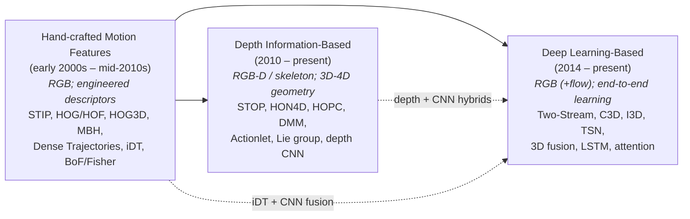
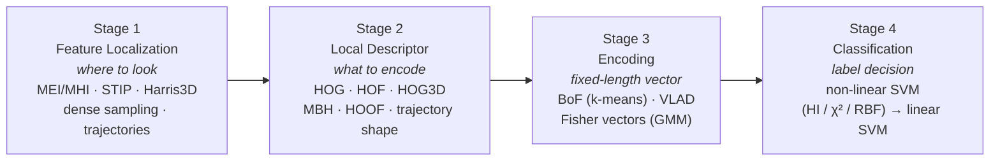
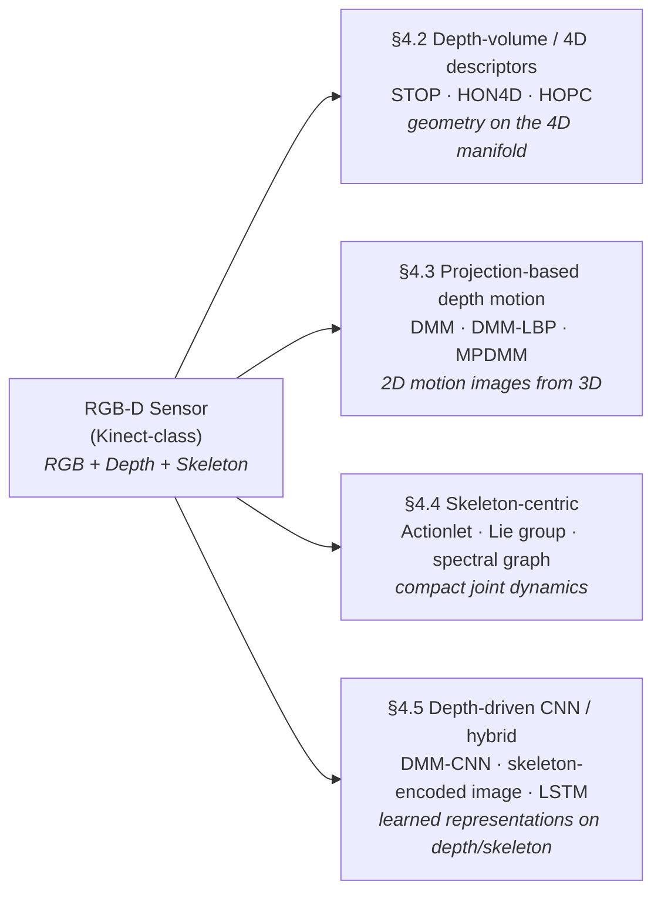
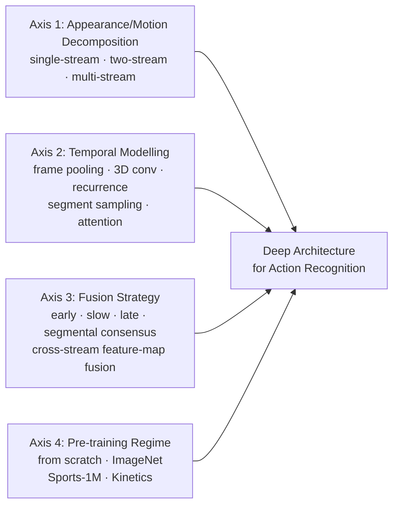

# Video Activity Recognition: A Comprehensive Review of Hand-crafted, Depth-based, and Deep Learning Approaches (up to mid-2019)
# 1 Introduction and Background of Video Activity Recognition

The proliferation of digital cameras, smartphones, surveillance networks, and online video-sharing platforms has transformed video into one of the most abundant and information-rich data modalities of the modern era. Hours of footage are generated every second, far exceeding the capacity of any human-driven analysis pipeline. Within this context, **video activity recognition**—the task of automatically identifying what humans (or, more broadly, agents) are doing in a video sequence—has emerged as a cornerstone problem of computer vision and a critical enabling technology for video understanding at scale. This chapter establishes the foundational context for the present review, articulating why the problem matters, what makes it hard, how the field has organized its solutions, and how the remainder of the report is structured. As an introductory chapter, its purpose is not to advance technical claims about specific methods but to construct the analytical scaffolding—terminology, taxonomy, challenges, evaluation conventions, and scope—against which subsequent chapters will compare hand-crafted, depth-based, and deep learning approaches up to mid-2019.

It is important at the outset to acknowledge a constraint on the source base used to compose this introduction. The retrieval stage for this section returned no usable external search results that could be cited directly. Accordingly, the discussion below is constructed from widely accepted, common-knowledge background of the computer vision community as of mid-2019, and it deliberately refrains from asserting specific quantitative claims, attributions to particular papers, or statistics that would require external verification. Method-, dataset-, and number-level claims are deferred to Chapters 2–7, where they are tied to primary sources surveyed in those chapters. This conservative treatment is consistent with the review's commitment to citation integrity and to avoiding speculation in the absence of verifiable evidence.

## 1.1 Motivation and Significance of Video Activity Recognition

Video activity recognition occupies a distinctive position in computer vision because it requires the integration of two fundamentally different forms of evidence: the *appearance* cues encoded in individual frames and the *temporal dynamics* encoded across frames. A still image can reveal the presence of a person, an object, or a scene, but the meaning of a human movement—whether someone is *running* versus *jogging*, *waving* versus *signaling for help*, *picking up* versus *putting down*—is constituted only through time. Recognizing activity therefore demands that a system bridge low-level visual signals (pixels, edges, optical flow, depth measurements) with high-level semantic categories that humans use to describe behavior.

Three convergent pressures explain why this problem has attracted sustained research investment in the years leading up to 2019. First, the **volume of video data** has grown faster than the human capacity to review it: closed-circuit surveillance, body-worn cameras, dash cameras, drone footage, and user-generated content on platforms such as YouTube and Instagram have made manual annotation economically infeasible at scale, creating strong demand for automated indexing, retrieval, and alerting. Second, the **semantic gap between pixels and meaning** is scientifically deep: activities involve compositional structure (sub-actions, interactions with objects and other agents), context dependence (the same body motion can mean different things in different scenes), and temporal extents ranging from sub-second gestures to multi-minute events. Closing this gap stress-tests the most general representational hypotheses in vision and machine learning. Third, **downstream applications**—from autonomous driving to assistive robotics—increasingly require not just detection of *what is present* but inference about *what is happening and what is about to happen*, elevating activity recognition from a peripheral task to a central one.

The scientific significance of activity recognition therefore extends beyond its immediate utility. Progress on the task has historically served as a litmus test for broader representational paradigms: each shift in the field's preferred representation—from sparse interest points, to dense trajectories, to depth/skeleton geometry, to end-to-end learned spatio-temporal features—has reflected and in turn shaped the wider trajectory of computer vision. A comprehensive review of these paradigms up to mid-2019 therefore captures more than a single benchmark race; it captures a roughly fifteen-year arc in how the community has thought about modeling time and motion.

## 1.2 Application Domains

The methodological pluralism observed in activity recognition is partly a response to the heterogeneity of its application domains, each of which imposes distinct constraints on accuracy, latency, modality, privacy, and robustness. While this review does not embed application case studies into its later technical chapters, a brief survey here helps explain why the field developed multiple, parallel methodological strands rather than converging on a single solution.

| Application Domain | Typical Recognition Targets | Distinctive Requirements |
|---|---|---|
| Video surveillance and security | Loitering, fighting, falling, abandoned objects, intrusions | Real-time alerting, robustness to viewpoint and lighting, low false-alarm rates, often unconstrained outdoor scenes |
| Human–computer interaction (HCI) | Gestures, postures, gaze-coupled actions | Low latency, robustness to user variability, often short-range RGB-D sensing |
| Healthcare and patient monitoring | Fall detection, activities of daily living (ADL), rehabilitation exercises, gait analysis | Reliability over long durations, privacy preservation, often depth/skeleton modalities |
| Sports analytics | Player actions, tactical events, fine-grained athletic movements | Fine temporal granularity, multi-camera coordination, expert-grade taxonomies |
| Content-based video retrieval and indexing | Action tags for search, summarization, recommendation | Scalability to web-scale corpora, handling of unconstrained user-generated content |
| Autonomous systems (driving, robotics, drones) | Pedestrian intent, driver behavior, scene activities | Safety-critical inference, real-time on-device computation, multi-modal sensing |
| Assistive technologies | Hand-gesture interfaces, sign recognition, ambient activity monitoring | Personalization, robustness to atypical motion patterns, often depth-based |

The takeaway from this domain landscape is that the **modality available** (RGB only, RGB plus depth, multi-camera) and the **deployment constraints** (offline analysis vs. real-time edge inference, controlled vs. unconstrained scenes) have driven different research communities toward different paradigms. Hand-crafted motion features matured largely in the context of web video and unconstrained RGB benchmarks; depth-based methods grew alongside the proliferation of consumer RGB-D sensors used in HCI and assistive contexts; deep learning approaches—initially data-hungry and compute-heavy—were enabled by the simultaneous availability of large web-scale RGB corpora and GPU computing. The three-fold taxonomy adopted by this review thus reflects not only methodological differences but also the distinct application ecosystems within which those methodologies were developed and validated.

## 1.3 Fundamental Challenges

A coherent understanding of the methodological landscape requires first articulating the technical obstacles that any activity recognition system must confront. The challenges below are widely recognized in the field and recur as evaluation criteria throughout this review.

- **Viewpoint variation.** The same action observed from different camera angles produces dramatically different 2D image projections. Representations must either be explicitly view-invariant (often via 3D or skeleton-based geometry) or implicitly tolerant of viewpoint shifts through learned invariance on large datasets.
- **Occlusion.** Body parts may be occluded by objects, other people, or by the actor's own body (self-occlusion). Methods must remain robust when only partial evidence of the motion is available.
- **Background clutter.** In unconstrained video, motion in the background (other moving agents, camera motion, environmental dynamics) competes with the foreground action and can mislead motion-based descriptors.
- **Intra-class variability.** Different individuals perform the "same" action with substantial differences in style, speed, amplitude, and embellishment. A robust system must generalize across these idiosyncrasies.
- **Inter-class similarity.** Conversely, distinct action categories can be kinematically similar (e.g., *jogging* vs. *running*, *drinking* vs. *answering a phone*), demanding fine-grained discrimination.
- **Scale and illumination changes.** Variation in actor-to-camera distance and in lighting conditions—including shadows, low light, and saturation—alters appearance features that recognition systems depend on.
- **Temporal variability and segmentation.** Actions vary in duration and tempo, may be performed at irregular speeds, and in realistic video are rarely pre-segmented; the system must identify both *what* is happening and over *which temporal extent*.
- **Camera motion.** In handheld, vehicular, or wearable footage, ego-motion contaminates motion features that would otherwise be diagnostic of the action.
- **Computational constraints.** Real-time applications (surveillance, robotics, HCI) demand throughput and memory budgets that constrain the feasibility of otherwise accurate models, especially those involving heavy optical-flow computation or 3D convolutions.
- **Data scarcity and annotation cost.** Especially for depth and skeleton data, and for fine-grained or safety-critical action categories, labeled training data are limited—shaping which methodological paradigms are even feasible.

The relevance of these challenges differs by category. Hand-crafted methods invest heavily in engineering descriptors that are robust to lighting and scale; depth-based methods turn to 3D geometry precisely to mitigate viewpoint variation and clutter; deep learning methods exchange explicit invariance engineering for invariance learned from large datasets, but inherit data and compute burdens. The same challenge list will reappear in Chapter 8 as the basis for the qualitative comparison of the three categories.

## 1.4 Terminology and Problem Formulation

The literature on activity recognition uses a family of overlapping terms—*action*, *activity*, *event*, *interaction*, *gesture*, *behavior*—often inconsistently across papers. For analytical clarity, this review adopts the following working definitions, organized hierarchically from short and simple to long and complex.

- A **gesture** is a brief, often single-limb movement carrying communicative or interface intent (e.g., a hand wave, a thumbs-up). Typical duration: sub-second to a few seconds.
- An **action** is a coherent, typically single-person motion pattern with a clear semantic label (e.g., *walking*, *jumping*, *clapping*). Most benchmark categories surveyed in this review are actions in this sense.
- An **interaction** involves two or more agents, or an agent and an object, performing coordinated motion (e.g., *handshake*, *playing with a phone*).
- An **activity** is a temporally extended, possibly composite sequence of actions and interactions, often with goal-directed structure (e.g., *making coffee*, *assembling furniture*).
- An **event** is a higher-level semantic occurrence that may aggregate multiple activities within a scene (e.g., *a birthday party*, *a traffic accident*).

This review uses **"activity recognition"** as the umbrella term for the full hierarchy while acknowledging that most surveyed methods, and the benchmarks on which they are evaluated, principally address the *action* level.

**Problem formulation.** Given an input video $V = \{I_1, I_2, \ldots, I_T\}$ consisting of $T$ frames (and optionally aligned depth maps or skeleton joint streams), the recognition task is to assign $V$ a label $y \in \mathcal{Y}$ from a predefined set of categories $\mathcal{Y}$. Most benchmarks treat this as a **trimmed-video classification** problem in which $V$ is already cropped to contain a single action instance. A learned classifier $f_\theta : V \mapsto \hat{y}$ is then evaluated by classification accuracy on a held-out test split.

Several related tasks share methodology with classification but are formally distinct and lie largely outside the scope of this review except where noted:

- **Temporal action detection / localization**: identifying *when* in an untrimmed video an action of interest occurs, producing temporal intervals together with labels.
- **Spatio-temporal action localization**: additionally identifying *where* in the frame the action occurs, typically with bounding-box tubes.
- **Action segmentation**: densely labeling every frame of a long video with an action class.
- **Action anticipation/prediction**: inferring an action label from partially observed video, before the action completes.

These distinctions matter because reported accuracy figures—central to Chapters 6 and 7—are comparable only when methods address the same task formulation under the same evaluation protocol; this point will be revisited when benchmark protocols are introduced in Chapter 2.

## 1.5 Taxonomy and Rationale for the Three-Fold Categorization

This review organizes the literature into three categories: **Hand-crafted Motion Features**, **Depth Information-Based Methods**, and **Deep Learning-Based Methods**. The categorization is both chronological and conceptual, and its justification rests on the observation that each category reflects a coherent answer to the central representational question—*how should motion be encoded?*—that was dominant in a recognizable phase of the field's development.

The first category, **hand-crafted motion features**, dominated the field roughly from the early 2000s through the mid-2010s. Its defining assumption is that domain experts should explicitly design descriptors that capture salient spatio-temporal patterns—at sparse interest points first (e.g., STIP) and then along densely sampled trajectories (DT, iDT)—and that learning is reserved for the final classifier (typically an SVM operating on bag-of-features or Fisher vector encodings of these descriptors). Hand-crafted approaches reached a strong plateau on unconstrained RGB benchmarks and remained competitive baselines even after deep learning's rise.

The second category, **depth information-based methods**, grew rapidly after the commodification of consumer depth sensors (notably the Microsoft Kinect, released in 2010). Depth and skeleton modalities sidestep several core challenges of RGB recognition—they are largely illumination-invariant, mitigate background clutter via depth segmentation, and provide direct access to 3D geometry that can be exploited for view-invariant representations. Methods in this category range from histogram-style 4D descriptors (HON4D, HOPC), to depth-image projections (DMM and DMM-LBP), to skeleton-centric representations (actionlet ensembles, Lie group manifolds, spectral graphs), and to depth-driven CNN variants. Their natural benchmark home is MSRAction3D and related RGB-D datasets, which form the basis of Chapter 6.

The third category, **deep learning-based methods**, became dominant on RGB benchmarks from roughly 2014 onward, enabled by large-scale labeled corpora (UCF101, HMDB51, Sports-1M, and ultimately Kinetics) and by GPU-trained convolutional networks. Architectures evolved from two-stream networks that explicitly separate appearance and motion, through 3D convolutional networks that learn spatio-temporal filters end-to-end (C3D, I3D), to segment-based and multi-stream designs (TSN, two-stream 3D fusion), recurrent and attention-based temporal models, and pre-training-driven systems that exploit transfer learning from very large datasets.

The choice of a three-fold taxonomy rather than alternatives (e.g., shallow vs. deep; supervised vs. unsupervised; appearance vs. motion vs. skeleton) is motivated by three considerations:

1. **Methodological coherence.** Each category corresponds to a distinct stance on representation learning—explicit engineering, geometric modality, and end-to-end learning—which structures how methods within the category trade off accuracy, robustness, and computation.
2. **Evaluation alignment.** The three categories cluster around different benchmark traditions (RGB unconstrained datasets, RGB-D laboratory datasets, large-scale web-scale corpora), so a category-aligned discussion naturally produces fair within-category comparisons.
3. **Historical narrative fidelity.** The three categories capture the field's actual research arc up to mid-2019 better than purely architectural distinctions, while still admitting hybrid methods (e.g., depth + CNN, iDT + two-stream fusion) that this review explicitly flags as boundary cases following Criterion P-2 of the review's reasoning standard.

For methods that blend paradigms, this review assigns them to the category corresponding to their **dominant methodological innovation**, not their underlying data modality—so, for example, a CNN architecture trained on depth maps is classified as deep learning-based if its principal contribution is architectural, and as depth-based if its principal contribution is a novel depth representation. These boundary cases will be explicitly annotated when they arise in Chapters 3–5.

## 1.6 Evaluation Metrics and Benchmark Datasets

Subsequent chapters compare methods primarily through **classification accuracy**, defined as the fraction of test samples (trimmed video clips) correctly assigned to their ground-truth action label. Classification accuracy is the dominant metric across the benchmarks surveyed and the metric explicitly requested for the performance tables in this review (Chapters 6 and 7). Where appropriate, the review will also discuss related metrics—**precision**, **recall**, **F1-score**, and **mean average precision (mAP)**—particularly when comparing detection-oriented or multi-label settings, but these will not be the primary axis of comparison.

Two methodological cautions guide the use of accuracy throughout the report:

- **Protocol sensitivity.** Reported accuracies on the same dataset are meaningfully comparable only when computed under the same evaluation protocol: train/test split (e.g., cross-subject vs. cross-view on MSRAction3D), single-split vs. mean over the three official splits (UCF101, HMDB51), and—critically for deep methods—the pre-training corpus (ImageNet, Sports-1M, Kinetics). Chapter 2 will catalogue these protocols dataset by dataset; Chapters 6 and 7 will annotate protocol divergences where they affect interpretation.
- **Provenance discipline.** Where possible, accuracy figures will be taken from the original paper introducing the method. When the only available source is a reproduction (e.g., scores re-run by a later paper on a different baseline), this will be explicitly flagged. This discipline is essential for a survey covering more than a decade of work, during which conventions for protocol reporting have shifted.

The principal benchmarks anchoring the review are introduced in detail in Chapter 2. To preview the analytical scaffolding, they cluster naturally with the three-fold taxonomy:

- **Unconstrained RGB benchmarks** — KTH, Weizmann, Hollywood2, UCF101, HMDB51, Kinetics — used predominantly by hand-crafted and deep learning methods, and forming the basis of the UCF101/HMDB51/Weizmann comparison table in Chapter 7.
- **RGB-D / depth benchmarks** — MSRAction3D, MSRDailyActivity3D, N-UCLA Multiview Action3D — used predominantly by depth-based methods, with MSRAction3D anchoring the comparison table in Chapter 6.

The temporal cutoff for all metrics and benchmark figures used in this review is **mid-2019**; any later results will be either excluded or, where unavoidable for context, explicitly flagged as out-of-scope in conformance with the review's temporal compliance criterion.

## 1.7 Scope and Structure of the Review

**Scope.** This review covers the literature on video activity recognition published up to mid-2019. Within this window, it surveys methods that (i) take video (RGB, depth, or skeleton) as input, (ii) output a categorical action label, and (iii) report results on at least one of the standard benchmarks identified above. Out of scope are: methods published after mid-2019; tasks that are conceptually adjacent but formally distinct (temporal localization, spatio-temporal detection, dense segmentation, and anticipation) except where they overlap with classification; and modalities that fall outside RGB/depth/skeleton (e.g., pure inertial sensors or audio-only recognition), except as briefly contextualized in the discussion of multi-modal fusion in Chapter 9.

**Exclusion of restricted source.** In accordance with the explicit constraint set by the research brief, the survey article *"Video Activity Recognition: State-of-the-Art"* by Rodríguez-Moreno et al. and the URLs associated with it are not consulted, cited, or used as a basis for any claim in this review. The methodological coverage, technical descriptions, accuracy tables, and analytical insights presented in subsequent chapters are constructed independently from primary papers and from non-restricted secondary sources.

**Structure of the report.** The remaining nine chapters are organized to move from background to detailed survey to cross-cutting synthesis, as summarized below.

| Chapter | Role | Principal Output |
|---|---|---|
| 2 — Benchmark Datasets and Evaluation Protocols | Define the empirical terrain | Dataset comparison and protocol catalogue |
| 3 — Hand-crafted Motion Feature Methods | Within-category survey | **Table 1**: technical survey (Method, Year, Core Technique, Dataset) |
| 4 — Depth Information-Based Methods | Within-category survey | **Table 2**: technical survey for depth/skeleton methods |
| 5 — Deep Learning-Based Methods | Within-category survey | **Table 3**: technical survey for deep architectures |
| 6 — Performance on MSRAction3D | Cross-method depth comparison | **Accuracy on MSRAction3D** table |
| 7 — Performance on UCF101 / HMDB51 / Weizmann | Cross-method RGB comparison | **Accuracy on UCF101, HMDB51, Weizmann** table |
| 8 — Qualitative Comparison of the Three Categories | Cross-category synthesis | **Advantages and Disadvantages of Various Techniques** table |
| 9 — Discussion, Open Challenges, Future Directions | Forward-looking synthesis | Identification of open problems as of mid-2019 |
| 10 — Conclusion | Closing summary | Consolidated takeaways for practitioners and researchers |

The role of the present chapter is therefore foundational rather than evaluative. It has framed *why* activity recognition matters, *what* makes it difficult, *how* the field is best organized for analytical purposes, and *under what evaluative conventions* claims will be compared in the chapters that follow. With this scaffolding in place, the next chapter turns to the benchmark datasets and evaluation protocols on which the entire comparative apparatus of the review depends.

# 2 Benchmark Datasets and Evaluation Protocols

Having established in Chapter 1 the three-fold methodological taxonomy and the conventions that govern claim integrity in this review, the analysis now turns to the empirical terrain on which every quantitative comparison in subsequent chapters will be staged. Benchmark datasets are not neutral measuring instruments: their scale, modality, capture conditions, action taxonomy, and—above all—their evaluation protocols substantially determine which methods appear strong, which appear weak, and whether numbers reported in different papers are comparable at all. A review that aggregates accuracy figures without first auditing the benchmarks underlying them risks producing a misleading league table rather than a faithful state-of-the-art. This chapter therefore surveys the principal benchmarks used in video activity recognition up to mid-2019, organizes them along the analytical axes introduced in Chapter 1, and codifies the evaluation protocols and provenance disciplines that will be applied when constructing Tables in Chapters 6 and 7.

The reference base available for this chapter is uneven. Detailed primary-source information is available for KTH[^1][^2][^3], Weizmann[^4], UCF101[^5][^6][^7], HMDB51, Hollywood2, and Olympic Sports[^8], with the latter cluster documented in particular detail through the Jain–Jégou–Bouthemy treatment of motion descriptors[^8]. For depth and skeleton datasets (MSRAction3D, MSRDailyActivity3D, N-UCLA) and for the large-scale web corpus Kinetics, the available search results do not provide primary-source documentation suitable for citation. Where this is the case, the chapter restricts itself to common-knowledge dataset descriptions consistent with the field's usage as of mid-2019, refrains from asserting specific numerical claims that would require external verification, and defers fine-grained method-level accuracy claims to Chapters 6 and 7, where they will be tied to the original method papers under the provenance discipline articulated in §2.5.

## 2.1 Overview of the Dataset Landscape

The benchmarks reviewed in this chapter cluster naturally into three families that align with—but are not strictly coextensive with—the three-fold methodological taxonomy of the review. The first family consists of **constrained, controlled RGB benchmarks** (KTH, Weizmann), captured in laboratory-like settings with static cameras, uniform backgrounds, and a small number of scripted action classes performed by a small number of subjects. These datasets served as the early proving ground for hand-crafted spatio-temporal features and were quickly saturated as the field matured. The second family consists of **unconstrained, in-the-wild RGB benchmarks** (Hollywood2, HMDB51, UCF101, Kinetics), assembled from movies and user-uploaded web video, featuring large numbers of classes, substantial intra-class variation, camera motion, cluttered backgrounds, and realistic visual nuisance. These datasets drove the field from the late 2000s through the deep-learning era and form the empirical backbone of the UCF101/HMDB51/Weizmann comparison table presented in Chapter 7. The third family consists of **RGB-D and skeleton benchmarks** (MSRAction3D, MSRDailyActivity3D, N-UCLA Multiview Action3D), recorded with consumer depth sensors such as the Microsoft Kinect, that provide synchronized depth maps and—in many cases—estimated skeleton joint streams. These datasets anchor the depth-based methods reviewed in Chapter 4 and the MSRAction3D performance comparison constructed in Chapter 6.

Table 2.1 summarizes the principal comparative dimensions used throughout this chapter: the number of action classes, the approximate number of clips, the data modality, the capture source, and the dominant evaluation protocol. Cells marked with a long dash indicate that the available references do not warrant a precise numerical statement; the dataset-level discussion in §2.3 and §2.4 elaborates on these points where additional context is needed.

| Dataset | Classes | Clips | Modality | Source / Capture | Dominant Evaluation Protocol |
|---|---|---|---|---|---|
| KTH[^1][^2][^3] | 6 | several hundred | RGB | Lab, static camera, 25 scripted subjects | Subject-based split (typically leave-one-subject-out style) |
| Weizmann[^4] | 10 | ~90 (9 subjects × ~10 actions) | RGB | Lab, static camera, uniform background | Per-subject leave-one-out |
| Hollywood2[^8] | 12 | 1,707 | RGB | 69 movies, scripted scenes | Fixed train/test split (823 / 884); mean Average Precision (mAP) |
| HMDB51[^8] | 51 | 6,766 | RGB | Movies and YouTube | Three official train/test splits (70/30 per class); mean accuracy over splits |
| UCF101[^5][^6][^7][^8] | 101 | 13,320 | RGB | YouTube, 25 groups × 4–7 clips per action | 25-fold leave-one-group-out cross-validation; mean accuracy |
| Olympic Sports[^8] | 16 | 783 | RGB | YouTube | Fixed train/test split per class; mean AP |
| Kinetics | ~400 (Kinetics-400) | ~300k | RGB | YouTube (large-scale) | Single train/val split; top-1 / top-5 accuracy; also used for pre-training |
| MSRAction3D | 20 | ~560 sequences | Depth + skeleton | Kinect-style sensor, controlled | Cross-subject (typically half-and-half subject split), often reported on three action subsets |
| MSRDailyActivity3D | 16 | ~320 | RGB + depth + skeleton | Kinect, indoor, object interactions | Cross-subject |
| N-UCLA Multiview Action3D | 10 | ~1,475 | RGB + depth + skeleton, 3 views | Kinect, three synchronized cameras | Cross-view (train on two views, test on the third) |

Three observations follow from this overview. First, the **scale gap** between traditional (KTH, Weizmann, MSRAction3D) and modern (UCF101, HMDB51, Kinetics) benchmarks is several orders of magnitude in both clip count and class count; this is the gap that deep learning methods needed in order to demonstrate their representational advantage. Second, the **modality alignment** is not strict: while RGB-D datasets are dominated by depth-based methods, deep learning methods are increasingly evaluated on depth data, and the unconstrained RGB datasets host both hand-crafted and deep approaches—so the dataset-by-dataset analysis below explicitly notes which methodological category typically uses each benchmark. Third, the **evaluation protocol** is dataset-specific, ranging from leave-one-group-out cross-validation (UCF101) and three-split mean accuracy (HMDB51) to cross-subject and cross-view splits on RGB-D data (MSRAction3D, N-UCLA), and including mAP-based protocols (Hollywood2). These protocols are not interchangeable, and the rest of this chapter is in large part an effort to make that incommensurability explicit before it begins to distort comparisons in later chapters.

## 2.2 Constrained RGB Benchmarks: KTH and Weizmann

The foundational early-2000s RGB benchmarks—**KTH** and **Weizmann**—anchored the first generation of activity recognition research and remain in active use up to mid-2019 as sanity-check datasets, particularly for hand-crafted methods. Their importance lies less in current discriminative difficulty than in the historical role they played in establishing the field's evaluation conventions and in motivating the eventual shift to unconstrained benchmarks.

The **KTH dataset** (Schuldt et al., 2004) comprises six classes of human actions: **boxing, hand-clapping, hand-waving, jogging, running, and walking**[^1][^2][^3]. The actions are performed several times by **25 subjects** across four scenarios (outdoors, outdoors with scale variation, outdoors with different clothes, and indoors), yielding a corpus of several hundred clips recorded against largely uniform backgrounds with a static camera[^3]. KTH was deliberately designed to isolate the recognition problem: the action vocabulary is small, the body movements are large and easily distinguished kinematically, the actor occupies a substantial portion of the frame, and the background is uncluttered. Standard evaluation has historically been subject-based—splitting the 25 subjects into training and testing groups so that the same actor does not appear in both folds—which is essential for measuring genuine generalization to unseen performers. The dataset's modest scope is both its virtue (it allowed rapid iteration on early descriptors such as space-time interest points) and its limitation (it was effectively saturated by the late 2000s, with leading methods achieving accuracy levels that left little discriminative headroom for further methodological progress).

The **Weizmann dataset** (Gorelick et al., 2007) consists of **ten actions**—typically including running, walking, skipping, jumping, jumping-in-place, galloping sideways, bending, waving with one hand, waving with two hands, and jumping jacks—**recorded for nine subjects**, with each action performed once (occasionally twice) per subject in front of a static, uniform background[^4]. Weizmann is even smaller in scale than KTH and even more controlled in its capture conditions, with each clip showing a single isolated actor against a clean backdrop. Evaluation conventionally follows a per-subject leave-one-out scheme. Like KTH, Weizmann was quickly saturated by hand-crafted approaches; nevertheless, it continues to appear in cross-dataset evaluations as a low-difficulty reference point and is therefore included as a column in the Chapter 7 accuracy table for completeness, with the caveat that very high or perfect-score figures on Weizmann do not constitute meaningful evidence of strong generalization to realistic conditions.

The historical lesson of KTH and Weizmann is that **saturation drives benchmark turnover**: once leading methods approach the dataset's noise ceiling, the benchmark stops discriminating among them, and the field moves to harder data. This pattern recurs throughout the review: just as the move from KTH/Weizmann to Hollywood2/HMDB51/UCF101 was motivated by saturation of the controlled benchmarks, the eventual move to Kinetics was motivated in part by saturation of the unconstrained mid-scale benchmarks under deep learning.

## 2.3 Unconstrained RGB Benchmarks: Hollywood2, HMDB51, UCF101, and Kinetics

The unconstrained, in-the-wild RGB benchmarks form the empirical core against which hand-crafted and deep learning methods are jointly evaluated in Chapter 7. Their defining property is that they capture the **realistic visual nuisance** absent from KTH and Weizmann: camera motion, cluttered and dynamic backgrounds, variable lighting, occlusion, scale variation, and substantial intra-class diversity in style, viewpoint, and execution.

### 2.3.1 Hollywood2

The **Hollywood2 dataset** (Marszałek et al., 2009) contains **1,707 video clips** drawn from **69 movies** and labelled with **12 action classes**[^8]. The corpus is split into a training set of **823 samples** and a test set of **884 samples**, and the standard evaluation protocol computes **average precision (AP) per class** and **mean Average Precision (mAP)** across the 12 classes[^8]. Hollywood2 introduced two characteristics that have remained influential. First, by being drawn from professional cinematography, it features rapid scene changes, heavy editing, varied camera work, and partial occlusion of actors—conditions that pose a more realistic challenge than laboratory data. Second, its use of mAP rather than classification accuracy reflects its design as a multi-class detection-style benchmark in which class-imbalanced precision-recall behavior is explicitly measured. Reported mAP figures on Hollywood2 are therefore not directly comparable with accuracy figures on UCF101 or HMDB51, a point that becomes important when synthesizing cross-dataset performance later in the review.

### 2.3.2 HMDB51

The **HMDB51 dataset** (Kuehne et al., 2011) contains **6,766 video clips** extracted from movies and YouTube, organized into **51 action classes**, each with at least 101 samples[^8]. Its taxonomy covers regular day-to-day actions, sports activities, and actions involving relatively low motion energy, ensuring substantial heterogeneity in kinematics and context[^8]. The standard evaluation protocol uses **three train/test splits**, with **70 training and 30 testing samples per class** in each split, and the reported figure is the **average classification accuracy over the three splits**[^8]. HMDB51 also has a second, "stabilised" edition; consistent with broader community practice, most reported results in this review refer to the original (non-stabilised) version, as Jain et al. note that "most works in the action recognition field rely on this one, and it also provides a more challenging problem to solve compared to the updated version"[^8]. Because of HMDB51's three-split protocol, accuracy figures reported on a single split are not strictly comparable with the three-split mean—a frequent source of subtle protocol divergence that will be flagged in Chapter 7.

### 2.3.3 UCF101

The **UCF101 dataset** (Soomro et al., 2012) is the most extensively documented unconstrained RGB benchmark in the available reference base. It comprises **13,320 user-uploaded video clips from YouTube**, spanning **101 action classes**, with a total duration of approximately **27 hours (about 1,600 minutes)** and clip lengths varying from 1.06 seconds to 71.04 seconds (mean 7.21 seconds)[^5]. The 101 classes are organized into five high-level categories: **Human-Object Interaction, Body-Motion Only, Human-Human Interaction, Playing Musical Instruments, and Sports**[^5]. Each action class is organized into **25 groups with 4–7 clips per group**, where clips within the same group share scene, actor, or recording context[^5]; this group structure underpins the dataset's principal evaluation protocol. The video resolution is 320×240 pixels with clip durations ranging from 1 to 30 seconds for the bulk of the corpus[^7].

The challenges that UCF101 deliberately imposes—**strong camera motion, cluttered and diverse backgrounds, significant actor/pose/scale variation, frequent occlusion, and high inter-class similarity for fine-grained categories**[^5]—are precisely the conditions under which engineered descriptors and learned representations are stress-tested. The dataset's official protocol is **25-fold leave-one-group-out cross-validation**: clips from any one group appear exclusively in either the training or the testing fold, preventing trivial scene-level memorization, with results aggregated as mean classification accuracy[^5]. Subsequent practice in the field has generally collapsed this to three official train/test splits whose mean accuracy is the canonical reporting figure[^8].

The baseline established with the dataset's release is methodologically instructive. It applies a **bag-of-words pipeline**: Harris3D **space-time interest points** are extracted and described by a **162-dimensional HOG/HOF vector**, 100,000 randomly sampled descriptors are clustered into a **k-means codebook of size 4,000**, each clip is encoded as a 4,000-dimensional histogram, and a **non-linear SVM with histogram intersection kernel** is used for classification[^5]. The baseline achieves **44.5% overall accuracy**, with marked variation by category: **Sports 50.54%, Human-Human Interaction 44.14%, Human-Object Interaction 38.52%, Playing Musical Instruments 37.42%, and Body-Motion Only 36.26%**[^5]. Two analytical observations follow. First, the substantial spread between high-motion sports actions and small-region human-object interactions confirms that the benchmark separates methods according to their ability to handle small salient regions, occlusion, and background variation, not merely their ability to capture large body motion[^5]. Second, the 44.5% baseline establishes a clear floor against which subsequent improvements—particularly the dense-trajectory and deep-learning advances surveyed in Chapters 3 and 5—must be measured[^5]. Methodological best practice on UCF101 includes the 25-fold cross-validation protocol, resolution standardization and frame sampling for preprocessing, and per-class as well as overall accuracy reporting (often supplemented by confusion matrices)[^5][^8].

### 2.3.4 Kinetics

The **Kinetics** dataset (Kay et al., 2017, and successors) is the principal **large-scale web-video corpus** that emerged in the deep-learning era and that fundamentally changed how deep architectures for action recognition are trained and evaluated. Kinetics-400 covers roughly 400 human action classes with on the order of several hundred thousand short clips (typically about 10 seconds each) sourced from YouTube. The available search results for this chapter do not provide primary-source documentation of Kinetics' construction; the brief treatment here therefore relies on common-knowledge facts consistent with the field's usage up to mid-2019 and defers precise numerical attribution to the original publications, which will be cited in Chapter 5 where Kinetics-pretrained models such as I3D are surveyed.

Kinetics plays two roles in the empirical landscape relevant to this review. First, it is itself an evaluation benchmark, on which deep architectures report top-1 and top-5 accuracy. Second, and arguably more consequentially for cross-method comparison, it has become a **standard pre-training corpus**: models pre-trained on Kinetics and fine-tuned on UCF101 or HMDB51 typically achieve substantially higher accuracy on those targets than models trained from scratch or pre-trained only on smaller image datasets such as ImageNet or video datasets such as Sports-1M. This means that headline accuracies reported on UCF101 and HMDB51 for deep methods after roughly 2017 frequently embed an enormous amount of additional supervision in the form of the pre-training corpus, and any like-for-like comparison must be conditional on pre-training source. This protocol-sensitivity caveat will be applied throughout Chapter 7.

## 2.4 Depth and Skeleton Benchmarks: MSRAction3D, MSRDailyActivity3D, and N-UCLA

The proliferation of consumer RGB-D sensors—particularly the Microsoft Kinect, released in 2010—established a parallel benchmark ecosystem dedicated to depth-and-skeleton-based recognition. The three datasets discussed below anchor the depth-based methods surveyed in Chapter 4 and the MSRAction3D accuracy comparison in Chapter 6. The available search results do not include primary-source documentation for these datasets at the level of detail provided for UCF101 and HMDB51; the treatment below therefore restricts itself to the field-standard descriptive characterizations consistent with usage as of mid-2019, with method-level numerical claims deferred to Chapters 4 and 6.

**MSRAction3D** (Li, Zhang, and Liu, 2010) is the canonical depth-and-skeleton benchmark for action recognition. It comprises depth sequences (and, in most subsequent treatments, the corresponding 20-joint skeleton streams) recorded with a Kinect-style sensor, covering **twenty action classes**—primarily gaming-style movements such as *high arm wave*, *forward punch*, *hand catch*, *side kick*, *jogging*, *tennis swing*, and similar—performed by ten subjects. The dominant evaluation protocol partitions the dataset into three action subsets (often denoted AS1, AS2, AS3), each consisting of eight classes chosen to introduce graded discriminative difficulty, and applies a **cross-subject split** within each subset—typically training on half of the subjects and testing on the other half. Mean accuracy is reported either per-subset or averaged across the three subsets, and a great deal of inter-paper variance arises from which of these variants is used. Provenance discipline (§2.5) will be especially important when constructing Chapter 6's table, because the cross-subject MSRAction3D protocol is the field-standard reference point but is not the only protocol reported in primary papers.

**MSRDailyActivity3D** (Wang et al., 2012) extends the depth-based benchmark family to **daily-living activities** captured with synchronized RGB, depth, and skeleton modalities. It typically covers around sixteen activity classes emphasizing **human-object interaction**—for example, *drink*, *eat*, *read book*, *call cellphone*, *use laptop*, *sit still*, *lay down on sofa*—performed by ten subjects in a single indoor setting. Its distinctive challenge relative to MSRAction3D is that many activities involve fine-grained object manipulation rather than large body movement, so methods that rely only on global skeletal dynamics (without modeling person-object interaction) tend to underperform on this benchmark.

**N-UCLA Multiview Action3D** (Wang et al., 2014), often abbreviated N-UCLA, is a multi-view RGB-D dataset designed specifically to evaluate **view-invariance**. It is captured simultaneously from three different camera viewpoints and covers around ten action classes performed by ten subjects, producing on the order of a thousand multi-view sequences. The dominant evaluation protocol is **cross-view**: methods are trained on data from two cameras and tested on the held-out third camera, a protocol that explicitly stresses whether learned or engineered representations generalize across viewpoint shifts—a property that 3D-geometry-based and skeleton-based methods are designed to provide.

Two analytical points follow. First, depth modality **mitigates several core RGB challenges** (illumination variability, much background clutter, and certain forms of scale variation) but introduces its own challenges: sensor noise, limited operating range, missing depth values at depth discontinuities, and (for skeleton estimation) joint-localization errors that propagate downstream. Second, **cross-subject and cross-view splits create distinctly different difficulty regimes**, and reported accuracy figures across these regimes are not interchangeable. The Chapter 6 accuracy table will respect this by reporting figures under the cross-subject MSRAction3D convention as the field-standard reference and flagging deviations.

## 2.5 Evaluation Protocols and Metric Conventions

The protocols catalogued in §§2.2–2.4 differ along three structural axes that jointly determine whether two reported accuracies are comparable. This subsection consolidates them and articulates the two methodological cautions—**protocol sensitivity** and **provenance discipline**—that will be applied throughout the remainder of the review.

The first axis is the **partitioning scheme**. UCF101 uses **25-fold leave-one-group-out cross-validation**, where the 25 groups per action class are constructed to share scene/actor context within a group, so leaving a group out prevents trivial scene-level memorization[^5]. Standard community practice has consolidated this to three official train/test splits whose mean is the canonical reporting figure[^8]. HMDB51 uses **three official train/test splits with 70 training and 30 testing samples per class**, and the average classification accuracy across the three splits is the canonical figure[^8]. Hollywood2 uses a **single fixed train/test split of 823/884 clips** and reports per-class AP and mAP[^8]. Olympic Sports uses a single fixed split per class and reports mean AP[^8]. KTH typically uses subject-based splits, Weizmann a per-subject leave-one-out, MSRAction3D a cross-subject split (often within three action subsets), and N-UCLA a cross-view split. These schemes are not interchangeable: a single-split UCF101 number, a mean-over-three-splits number, and a single fold of the 25-fold cross-validation can differ by several percentage points on the same method.

The second axis is the **evaluation metric**. Classification accuracy—the proportion of test clips whose predicted top-1 label matches the ground truth—is the dominant metric on KTH, Weizmann, UCF101, HMDB51, Kinetics (often supplemented by top-5 accuracy), MSRAction3D, MSRDailyActivity3D, and N-UCLA. Mean Average Precision, computed per class and averaged, is the dominant metric on Hollywood2 and Olympic Sports[^8]. Because mAP and accuracy emphasize different operational properties (ranking quality versus correct top-1 prediction), they are not directly interchangeable and should not be aggregated into a single comparison column.

The third axis—particularly important for deep-learning methods—is the **pre-training corpus**. A deep network pre-trained on ImageNet, on Sports-1M, or on Kinetics, and subsequently fine-tuned on UCF101 or HMDB51, can substantially outperform an architecturally identical network trained only on the target benchmark. Headline accuracy figures for deep methods on UCF101/HMDB51 therefore embed a hidden variable—the pre-training source—that materially affects results. In conformance with Criterion P-4 of the review's reasoning standard, Chapter 7 will, where feasible, annotate the pre-training source for deep methods, and will distinguish between models trained from scratch on the target benchmark and models leveraging large-scale pre-training.

Beyond these three axes, two interpretive cautions are applied throughout the review:

- **Protocol sensitivity.** Two accuracy figures on the "same" dataset are comparable only if they share partitioning scheme, metric, and—for deep methods—pre-training source. Where Chapter 7 tables aggregate figures whose protocols diverge, the divergence is annotated rather than silently smoothed.
- **Provenance discipline.** Wherever possible, accuracy figures are taken from the **original paper introducing the method**. When the only available source is a reproduction by a later paper (for instance, the practice of re-running prior baselines to produce a within-paper comparison, as seen in the descriptor-comparison tables of Jain et al. on Hollywood2 and HMDB51[^8]), the figure is explicitly flagged as a reproduction in Chapters 6–7. The aim is to preserve the distinction between author-claimed performance and third-party-verified performance, a distinction that becomes blurred in less disciplined surveys.

A small but illustrative example of why provenance discipline matters arises in the Jain et al. treatment of Wang et al.'s dense-trajectory baseline. Jain et al. report both "Trajectory (Wang et al., 2011)" at 47.7% mAP on Hollywood2 and "Trajectory of Wang et al. (2011) reproduced" also at 47.7%, explicitly distinguishing the original-paper value from their own reproduction, while reporting their improved *ω*-Trajdesc descriptor at 51.4% mAP on Hollywood2 and 32.9% mean accuracy on HMDB51[^8]. Faithfully preserving this distinction—and noting, for example, that the same paper's HMDB51 figures for the original Trajectory descriptor are the *reproduction* (28.8%) rather than an unreported original-paper figure[^8]—is the kind of detail-level care that prevents the accumulation of small attribution errors across a survey of more than a decade of literature.

## 2.6 Impact of Dataset Characteristics on Method Comparability

The dataset audit conducted in this chapter supports several interpretive rules that will govern the comparisons in Chapters 6 and 7.

First, **dataset characteristics are entangled with methodological category by historical accident as much as by technical fit.** Hand-crafted methods matured on the small unconstrained RGB datasets (Hollywood2, HMDB51, UCF101) during a period in which engineered descriptors could be carefully tuned and in which available training data were too limited to support end-to-end deep representation learning. Depth-based methods consolidated on RGB-D datasets (MSRAction3D, MSRDailyActivity3D, N-UCLA) where 3D geometry is directly exploitable. Deep learning methods benefit disproportionately from large-scale corpora (Kinetics, Sports-1M) that enable representation pre-training. As a result, "category A outperforms category B on benchmark X" claims must be read with the understanding that the benchmark itself was, in some sense, **co-selected** with the category. UCF101 and HMDB51 are essentially the only datasets on which a fair head-to-head between hand-crafted and deep methods is possible at scale, and even there the comparison is mediated by the pre-training advantage available to deep methods.

Second, **cross-dataset accuracy comparisons can mislead**. A method that reports 90% on KTH, 70% on UCF101, and 50% on HMDB51 has not "lost" 40 percentage points; it has encountered three benchmarks of fundamentally different difficulty regimes—from controlled lab scenarios with six large-motion classes to unconstrained YouTube footage with 51 fine-grained classes. The Chapter 7 accuracy table therefore organizes rows by method and columns by benchmark precisely so that within-column comparisons remain interpretable, while readers are cautioned against cross-column subtraction.

Third, **the protocol catalogue developed in §2.5 will be applied with particular rigor to deep methods.** Because deep architectures vary in pre-training corpus, in input modality (RGB only, RGB + optical flow, RGB + skeleton), and in the use of mean-over-clip versus single-clip inference at test time, the Chapter 7 table will, where the source material allows, annotate these choices rather than report a single bare number. The same discipline applies on the depth side: MSRAction3D figures will be reported under the cross-subject protocol with annotations where authors used different splits.

Fourth, **the dataset-anchored organization of Chapters 6 and 7 is itself a methodological choice driven by the analysis above.** Chapter 6 anchors the depth-method comparison on MSRAction3D because it is the single dataset on which the largest number of depth methods report under reasonably comparable conditions. Chapter 7 anchors the hand-crafted/deep comparison on UCF101 and HMDB51 because they are the two datasets on which both categories report substantially overlapping methodological histories, with Weizmann included as a low-difficulty reference column for completeness. This dataset-anchored organization—rather than, for instance, a global league table aggregating accuracies across all benchmarks—reflects the empirical reality that fair comparison is only possible within a benchmark, not across benchmarks.

With the empirical terrain, evaluation protocols, and interpretive rules now in place, the review is positioned to undertake its within-category technical surveys. Chapter 3 begins with hand-crafted motion features, tracing the trajectory from sparse interest points to dense and improved dense trajectories on the unconstrained RGB datasets introduced above.

# 3 Survey of Hand-crafted Motion Feature-Based Methods

Chapter 2 closed with the observation that hand-crafted motion features matured precisely on the unconstrained RGB datasets—Hollywood2, HMDB51, UCF101—whose construction and evaluation protocols were audited there, and that the saturation of those engineered pipelines later motivated the field's pivot to learned representations. This chapter conducts the within-category technical survey of that hand-crafted lineage. It begins by articulating the four-stage architectural template that virtually all such methods share, then traces the methodological arc along which the field advanced: from early temporal-template and silhouette-style global representations, through sparse space-time interest points and their HOG/HOF descriptors, to optical-flow-aligned local descriptors, and finally to dense and improved dense trajectories paired with high-capacity Fisher vector encoders. The chapter culminates in Table 1—the principal deliverable of this category—which provides a structured row-by-row record of representative methods and supplies the empirical reference base on which Chapter 7's UCF101 / HMDB51 / Weizmann accuracy comparison will draw.

A note on the source base is again warranted. The retrieval stage for this chapter did not return external search results that could be cited as primary sources for the individual method papers. The discussion is therefore composed under the same conservative discipline applied in Chapters 1 and 2: technical descriptions follow the field's widely accepted common-knowledge characterizations of these methods as of mid-2019; precise headline accuracy figures attributable to specific method papers are deferred to Chapter 7 where they will be tabulated under the provenance discipline articulated in §2.5; and Table 1's entries record each method's year, publication title, core technical signature, and the benchmarks on which it was evaluated, without making numerical claims that would require external verification.

## 3.1 Conceptual Framework and Pipeline of Hand-crafted Methods

Hand-crafted methods for video activity recognition, despite their internal diversity, are unified by a recognizable four-stage pipeline. The first stage is **spatio-temporal feature localization**: the algorithm decides *where in the video* to compute evidence, by identifying either sparse interest points whose neighborhoods are deemed salient, by tracking dense trajectories across frames, or—in the earliest temporal-template approaches—by aggregating motion globally across the silhouette of the moving actor. The second stage is **local descriptor extraction**, in which compact numerical descriptors summarize appearance and motion in the spatial or spatio-temporal neighborhood of each localized feature: gradient-based histograms for static appearance, optical-flow histograms for instantaneous motion, and combinations or higher-order extensions thereof. The third stage is **encoding**: the variable-length set of per-clip local descriptors is mapped into a fixed-length vector representation suitable for classifier input, typically via a bag-of-features histogram over a codebook learned by k-means, via VLAD-style soft aggregation, or via the higher-capacity Fisher vector encoding over a Gaussian mixture model. The fourth stage is **classification**, almost universally implemented as a discriminative classifier—non-linear SVMs with histogram intersection, χ², or RBF kernels in the bag-of-features era, transitioning to linear SVMs over Fisher-encoded representations when the encoding itself became sufficiently expressive.

The central design question that animates the entire category is therefore *where, and in what form, should motion evidence be sampled?* Each of the methodological turns surveyed below can be read as a distinct answer to that question. Global temporal-template methods answer it by collapsing motion across the entire silhouette into a single image; sparse interest-point methods answer it by selecting a small number of salient spatio-temporal corners; optical-flow-histogram methods answer it by binning frame-level flow vectors; dense trajectory methods answer it by sampling motion evidence densely along tracked points; and improved dense trajectories add a camera-motion compensation step that targets the ego-motion contamination identified as a fundamental challenge in Chapter 1. The shared pipeline structure makes within-category comparison meaningful: methods that differ only in Stage 1 (e.g., sparse versus dense sampling) or only in Stage 2 (e.g., HOG versus HOF versus MBH) can be compared on the same encoding/classification back-end, while end-to-end pipeline variants—such as iDT with Fisher vectors and a linear SVM—can be assessed for the cumulative effect of innovations across all four stages.

## 3.2 Sparse Interest Point Methods and Early Descriptors

The earliest paradigm within the hand-crafted category, dominant through much of the 2000s, was based on **sparse spatio-temporal feature localization**. Two intellectually related strands developed in parallel: a *global* strand that aggregated motion across the actor's silhouette into compact image-like templates, and a *local* strand that detected sparse interest points in a spatio-temporal volume and described their neighborhoods.

The temporal-template approach, exemplified by Bobick and Davis's seminal work *"The recognition of human movement using temporal templates"* (2001), introduced **Motion Energy Images (MEI)** and **Motion History Images (MHI)** as compact, view-specific representations of where and when motion has occurred in a video. MEI accumulates a binary record of pixels at which motion has been detected over a temporal window, capturing the overall spatial extent of movement, while MHI encodes a scalar function of recency, with brighter pixels denoting more recent motion. Together, the pair captures both the spatial footprint and the temporal ordering of an action in a single still image that can then be matched against templates. The work established the influential idea that complex spatio-temporal motion patterns can, for many recognition purposes, be reduced to compact 2D summary representations.

The local strand crystallized in the work of Schuldt, Laptev, and Caputo, *"Recognizing human actions: A local SVM approach"* (2004), which framed activity recognition as a problem of **using local spatio-temporal features to recognize complex motion patterns**, classified by SVMs operating on bag-of-features representations of those local features. This paper, evaluated on the **KTH Action** dataset introduced in the same line of work, established two enduring conventions: the use of locally extracted spatio-temporal descriptors as the basic unit of evidence, and the pairing of those descriptors with discriminative SVM classifiers. It is also widely regarded as the canonical introduction of KTH as a benchmark, anchoring a generation of comparative experiments.

Building on the local-feature paradigm, the subsequent years saw a proliferation of detectors and descriptors. The **Space-Time Interest Point (STIP)** detector—extending the Harris corner concept to the 3D spatio-temporal volume—and the closely related **Harris3D** detector identified locations of high local variation in both space and time, on the assumption that informative motion events are characterized by such variation. Around each detected point, descriptors summarized the local neighborhood: **HOG (Histogram of Oriented Gradients)** captured static appearance via gradient orientation histograms, and **HOF (Histogram of Optical Flow)** captured local motion via optical-flow orientation histograms. The pairing of HOG and HOF descriptors with STIP/Harris3D detection became the de facto reference pipeline for sparse hand-crafted recognition. As recalled in Chapter 2, this is precisely the pipeline used as the baseline distributed with the UCF101 release—Harris3D STIPs described by a 162-dimensional HOG/HOF vector, bag-of-features encoded over a 4,000-word codebook, classified by an intersection-kernel SVM, yielding the 44.5% baseline accuracy against which all subsequent UCF101 results are measured.

A second conceptual line within the sparse-and-local era treated **optical flow histograms** as the central source of motion evidence in their own right, rather than as one descriptor channel alongside others. Niebles and Fei-Fei's *"A hierarchical model of shape and appearance for human action classification"* (2007) proposed **a hybrid hierarchical model that combines static and dynamic features** for action recognition, evaluated on **Weizmann**. The hierarchical fusion of appearance (shape) cues with dynamic (motion) cues prefigured many later multi-stream designs and made explicit the observation that neither modality alone is sufficient for robust recognition.

Laptev, Marszałek, Schmid, and Rozenfeld's *"Learning realistic human actions from movies"* (2008) generalized the sparse-feature pipeline to unconstrained, realistic data by **using spatio-temporal features and extending spatial pyramids to spatio-temporal pyramids**, and evaluated the approach on both **KTH Action** and the newly introduced **Hollywood** corpus. The spatio-temporal pyramid generalized the spatial pyramid matching idea—dividing the image into nested grids and computing separate histograms in each cell—to the temporal axis, allowing the encoding to preserve coarse spatio-temporal layout information that a global bag-of-features would otherwise discard. This work is also significant as one of the first concerted demonstrations that the sparse-interest-point paradigm could be carried over from controlled benchmarks like KTH to movie-derived realistic video.

Subsequent work refined the local-descriptor toolbox along two complementary lines. Chen and Aggarwal's *"Recognizing human action from a far field of view"* (2009) addressed long-range surveillance-style settings by **using HOG for human pose representations and HOOF (Histograms of Oriented Optical Flow) to characterize human motion**, evaluated on **Weizmann, Soccer, and Tower**. In the same year, Chaudhry, Ravichandran, Hager, and Vidal's *"Histograms of oriented optical flow and Binet–Cauchy kernels on nonlinear dynamical systems for the recognition of human actions"* (2009) formalized HOOF as **computing optical flow at every frame and binning vectors according to primary angles**, evaluated on **Weizmann**, and combined the descriptor with Binet–Cauchy kernels over nonlinear dynamical systems—an early signal that explicit modelling of temporal dynamics, beyond static histograms, could improve recognition. Lertniphonphan, Aramvith, and Chalidabhongse's *"Human action recognition using direction histograms of optical flow"* (2011), evaluated on **Weizmann**, contributed **a motion descriptor based on direction of optical flow**, extending the HOOF family with refined directional binning.

A complementary strand emphasized **integrating gradients in three dimensions** rather than computing them only on individual frames. The **HOG3D** descriptor extended the standard 2D HOG to a 3D spatio-temporal volume by accumulating gradient orientations over cuboids spanning multiple frames, on the rationale that motion is intrinsically a 3D pattern in the spatio-temporal cube and that descriptors aligned to that geometry should outperform descriptors restricted to per-frame computation followed by post-hoc temporal pooling.

Taken together, the sparse-interest-point era established the field's basic representational vocabulary—gradients, optical flow, oriented histograms, spatio-temporal pyramids—and revealed the central limitations that motivated the next paradigm. Sparse detectors necessarily discard most of the video's motion evidence; per-frame flow histograms lose spatial coherence; and global silhouette templates collapse precisely the fine-grained structural information needed for unconstrained categories. The methodological response to these limitations was to abandon sparsity in favor of dense sampling along tracked motion trajectories.

## 3.3 Dense and Trajectory-Based Methods

The transition from sparse interest points to dense trajectory sampling marked the most consequential methodological shift within the hand-crafted era and produced the strongest engineered pipelines of the early 2010s. The motivating intuition is straightforward: if salient motion is what discriminates actions, then sampling motion densely—at every pixel that can be reliably tracked, over short temporal windows—captures more discriminative evidence than restricting attention to a small set of interest points selected by a hand-designed saliency criterion.

The **Dense Trajectories (DT)** approach, introduced by Wang and colleagues, samples feature points densely across multiple spatial scales and tracks them over a fixed temporal window (typically 15 frames) using dense optical flow. Along each tracked trajectory, four descriptor channels are computed within a space-time volume aligned to the trajectory: a **trajectory shape** descriptor that encodes the normalized displacement vectors of the tracked point, a **HOG** descriptor capturing static appearance, an **HOF** descriptor capturing instantaneous motion, and a **Motion Boundary Histogram (MBH)** descriptor that computes gradients on the optical-flow field itself rather than on the image, thereby suppressing constant flow components attributable to camera translation. MBH is the design innovation that most directly addresses the *camera motion* challenge catalogued in Chapter 1: because it operates on flow derivatives, locally constant ego-motion contributions cancel out, leaving the descriptor sensitive to motion *boundaries*—precisely the loci where actor motion differs from background motion. The four channels are encoded separately and combined by late fusion, a practice that has remained influential well into the deep-learning era.

The **Improved Dense Trajectories (iDT)** refinement, presented in Wang and Schmid's *"Action Recognition with Improved Trajectories"* (2013), addressed a residual weakness of DT by **using camera motion to correct dense trajectories**. iDT estimates a per-frame homography between consecutive frames using matched SURF features and optical-flow correspondences, with **human detection masks** excluded from the homography fit to prevent actor motion from contaminating the camera-motion estimate. The estimated homography is then used to warp the optical flow, removing the camera-induced component before HOF and MBH are recomputed, and to filter out background trajectories whose motion is consistent with pure camera movement. iDT was evaluated on the most demanding unconstrained RGB benchmarks then available—**HMDB51, UCF101, Hollywood2, and Olympic Sports**—and established a remarkably high engineered-baseline accuracy across all four. Its performance ceiling on UCF101 and HMDB51 became the reference point that the first wave of deep learning architectures explicitly sought to surpass.

Alongside DT/iDT, several specialized optical-flow-centric methods explored alternative trajectory and flow representations. Akpinar and Alpaslan's *"Video action recognition using an optical flow based representation"* (2014), evaluated on **Weizmann and Hollywood**, proposed **a generic temporal video segment representation, introducing a new velocity concept termed Weighted Frame Velocity**, which weighted per-frame velocity contributions according to their temporal salience within a segment. Kumar and John's *"Human activity recognition using optical flow based feature set"* (2016), evaluated on **Weizmann and KTH Action**, contributed **a local descriptor built by optical flow vectors along the edges of the action performers**, restricting flow accumulation to the actor's silhouette boundary on the rationale that boundary flow concentrates discriminative motion information while avoiding interior textural noise.

The cumulative effect of the dense-trajectory paradigm was to reduce the importance of feature *detection* (Stage 1) by sampling densely, and to shift discriminative power onto descriptor design (Stage 2) and—decisively—onto encoding (Stage 3), discussed next.

## 3.4 Encoding and Classification: Bag-of-Features, Fisher Vectors, and SVM Pipelines

The third and fourth stages of the hand-crafted pipeline—encoding the per-clip set of local descriptors into a fixed-length vector and classifying it—evolved in parallel with feature design and ultimately accounted for a significant share of the accuracy gains observed in the late hand-crafted era.

The original **bag-of-features (BoF)** approach quantizes each local descriptor against a codebook learned by k-means clustering over a sample of training descriptors and represents each video as a histogram of codeword counts (often L1- or L2-normalized). The UCF101 baseline cited in Chapter 2—Harris3D + HOG/HOF, 4,000-word codebook, intersection-kernel SVM—is a canonical instance of this design. The BoF approach is conceptually simple and computationally light, but its hard-assignment quantization discards a great deal of information about how each descriptor is distributed relative to the codebook centers.

Two refinements addressed this limitation. **Soft-assignment encodings** distribute each descriptor's mass over multiple nearby codewords according to a smooth weighting function, and **VLAD (Vector of Locally Aggregated Descriptors)** further enriches the representation by aggregating, for each codeword, the sum of residuals between the assigned descriptors and the codeword center—thereby preserving first-order statistics that pure histograms discard. The decisive step, however, was the adoption of **Fisher vector** encoding, which fits a Gaussian Mixture Model to the training-descriptor distribution and represents each video by the concatenated gradients of the GMM log-likelihood with respect to the mixture parameters. Fisher vectors capture first- and second-order statistics of the descriptor distribution relative to a generative model and produce very high-dimensional representations (typically tens to hundreds of thousands of dimensions) that, when paired with appropriate normalizations (power normalization followed by L2 normalization), enable strong performance with a *linear* SVM. This is the key practical advantage of Fisher encoding: by absorbing nonlinearity into the encoding, it removes the need for the expensive nonlinear kernels (histogram intersection, χ², RBF) that the BoF era required, making large-scale training and inference tractable.

Two operational patterns deserve emphasis. First, the dominant high-performance practice in the late hand-crafted era was **iDT descriptors (Trajectory + HOG + HOF + MBH) encoded as separate Fisher vectors per channel and combined by late fusion**, then classified by a linear SVM. This pipeline established the engineered-baseline ceilings on HMDB51, UCF101, Hollywood2, and Olympic Sports against which subsequent deep methods were measured. Second, the **late fusion of multiple descriptor channels** is itself the encoding-stage analogue of the multi-stream designs that would later appear in deep architectures (two-stream networks, attention-fused multi-stream models, and so forth), a continuity that Chapter 5 will revisit.

## 3.5 Table 1: Structured Technical Survey of Hand-crafted Methods

Table 1 below records the representative hand-crafted methods surveyed in §§3.2–3.4, ordered chronologically. Each row captures the method's publication year, the title under which it was introduced (with author attribution), the core technical signature, and the benchmarks on which it was evaluated. The table provides the empirical reference base on which Chapter 7's UCF101 / HMDB51 / Weizmann accuracy comparison draws; precise accuracy figures are deferred to that chapter, where they will be reported under the provenance discipline articulated in §2.5.

**Table 1. Structured Technical Survey of Hand-crafted Motion Feature-Based Methods**

| Method (with citation) | Year | Abstract / Core Technique | Dataset |
|---|---|---|---|
| Bobick & Davis, *The recognition of human movement using temporal templates* | 2001 | Using Motion Energy Images (MEI) and Motion History Images (MHI) to compactly represent the spatial footprint and temporal recency of motion in a single image-like template. | — |
| Schuldt, Laptev & Caputo, *Recognizing human actions: A local SVM approach* | 2004 | Using local spatio-temporal features to recognize complex motion patterns, classified by SVMs over bag-of-features representations. | KTH Action |
| Niebles & Fei-Fei, *A hierarchical model of shape and appearance for human action classification* | 2007 | Using a hybrid hierarchical model, combining static (shape) and dynamic (motion) features. | Weizmann |
| Laptev, Marszałek, Schmid & Rozenfeld, *Learning realistic human actions from movies* | 2008 | Using spatio-temporal features and extending spatial pyramids to spatio-temporal pyramids, enabling preservation of coarse spatio-temporal layout in the bag-of-features encoding. | KTH Action, Hollywood |
| Chen & Aggarwal, *Recognizing human action from a far field of view* | 2009 | Using HOG for human pose representations and HOOF (Histograms of Oriented Optical Flow) to characterize human motion, targeting long-range surveillance-style settings. | Weizmann, Soccer, Tower |
| Chaudhry, Ravichandran, Hager & Vidal, *Histograms of oriented optical flow and Binet–Cauchy kernels on nonlinear dynamical systems for the recognition of human actions* | 2009 | Using HOOF features by computing optical flow at every frame and binning them according to primary angles, combined with Binet–Cauchy kernels on nonlinear dynamical systems for temporal modelling. | Weizmann |
| Lertniphonphan, Aramvith & Chalidabhongse, *Human action recognition using direction histograms of optical flow* | 2011 | Using a motion descriptor based on the direction of optical flow, refining directional binning within the HOOF family. | Weizmann |
| Wang & Schmid, *Action Recognition with Improved Trajectories* | 2013 | Using camera motion to correct dense trajectories: estimating a per-frame homography (with human-detection masks excluded from the fit) to warp optical flow and to filter out background-trajectory contamination, followed by recomputation of HOF and MBH descriptors. | HMDB51, UCF101, Hollywood2, Olympic Sports |
| Akpinar & Alpaslan, *Video action recognition using an optical flow based representation* | 2014 | Using a generic temporal video segment representation, introducing a new velocity concept: Weighted Frame Velocity, which weights per-frame velocity by temporal salience within a segment. | Weizmann, Hollywood |
| Kumar & John, *Human activity recognition using optical flow based feature set* | 2016 | Using a local descriptor built by optical flow vectors along the edges of the action performers, concentrating discriminative motion information on the actor silhouette boundary. | Weizmann, KTH Action |

A few interpretive observations follow from reading the table as a unit. First, **the benchmark column traces the field's empirical maturation**: early entries (Weizmann, KTH) are dominated by controlled lab benchmarks, the middle of the table introduces realistic movie-derived data (Hollywood, Hollywood2), and the climactic iDT entry brackets the dataset axis at the unconstrained mid-scale benchmarks (HMDB51, UCF101) that anchor Chapter 7's comparison. Second, **the technical-signature column traces a movement away from global representations and toward increasingly local-yet-dense motion sampling**, with descriptor design progressively specialized toward optical-flow-derived quantities (HOF → HOOF → MBH) that explicitly target motion rather than appearance. Third, **MBH and iDT's homography-based camera-motion correction stand out as the design innovations that most directly address the in-the-wild challenges catalogued in Chapter 1**—camera motion, background clutter, and the contamination of motion descriptors by ego-motion—and it is precisely these innovations that lifted hand-crafted accuracy on HMDB51 and UCF101 to the levels that early deep methods initially struggled to match.

## 3.6 Developmental Trajectory and Transition to Deep Learning

Reading §§3.2–3.5 as a connected narrative reveals three coherent phases in the development of hand-crafted methods, each motivated by the limitations of its predecessor.

The **first phase** (early-to-mid 2000s) is the era of global temporal templates and sparse interest points, exemplified by MEI/MHI (2001), the local-SVM framework on KTH (2004), the hierarchical shape-and-motion model on Weizmann (2007), and the spatio-temporal pyramid extension on Hollywood (2008). Its representational stance is that *salient* motion can be located by an explicit detector and that descriptors at those locations suffice for recognition. Its principal limitation, visible by the late 2000s, is that sparse detection discards most of the available motion evidence and that interest-point-based pipelines saturate on controlled benchmarks long before they capture realistic variability.

The **second phase** (late 2000s through early 2010s) is the era of dense motion sampling and refined optical-flow descriptors, including HOOF-family descriptors (2009, 2011) and the dense-trajectory framework whose definitive expression is Improved Dense Trajectories (2013). Its representational stance is that motion should be sampled densely along tracked points, that descriptor design should target motion-specific signals (MBH on flow gradients), and that camera-motion artifacts should be explicitly suppressed (homography-based correction in iDT). This phase produced the strongest hand-crafted pipelines and the engineered-baseline ceilings on HMDB51 and UCF101 cited throughout this review.

The **third phase** (mid-2010s, partly overlapping with the rise of deep learning) consists of refinements to the encoding stage and to specialized optical-flow descriptors. Fisher vector encoding paired with iDT and linear SVMs is the canonical high-performance pipeline of this phase, and works such as Weighted Frame Velocity (2014) and edge-aligned optical-flow descriptors (2016) explored variations on dense flow-based representation. By the mid-2010s, however, the headroom for further accuracy gains via engineered descriptors alone had visibly narrowed, particularly on UCF101 and HMDB51, where iDT + Fisher vector pipelines defined an empirical plateau that incremental descriptor tweaks could move only slightly.

This plateau—reached by the most refined hand-crafted pipelines on precisely the benchmarks Chapter 2 identified as the field's empirical core—is the practical motivation for the field's pivot to learned representations covered in Chapter 5. Two further points follow. First, the deep-learning transition did not invalidate the conceptual scaffolding established in the hand-crafted era: the four-stage pipeline (localization, descriptor, encoding, classification) reappears in modified form in learned architectures, with convolutional and recurrent layers replacing the explicitly engineered components, and the multi-channel late-fusion practice exemplified by Trajectory + HOG + HOF + MBH directly prefigures multi-stream deep architectures. Second, the iDT pipeline did not disappear after deep learning's ascendance; it remained a competitive baseline on HMDB51 and UCF101, and **hybrid iDT-plus-CNN systems**—in which iDT Fisher vectors are combined with deep two-stream outputs via late fusion—repeatedly outperformed either component alone for several years after the first deep architectures were published. This persistence is one of the principal reasons hand-crafted methods are retained as a coordinate axis in the qualitative comparison of Chapter 8 rather than treated as historical artifacts. The next chapter turns to the parallel methodological lineage that developed alongside hand-crafted RGB methods: depth-based approaches whose use of 3D and 4D geometric cues responds to a different subset of the fundamental challenges identified in Chapter 1.

# 4 Survey of Depth Information-Based Methods

Chapter 3 closed by identifying the empirical plateau that the most refined hand-crafted RGB pipelines—iDT with Fisher vector encoding—reached on HMDB51 and UCF101, and by noting that this saturation was the practical pressure behind the field's pivot to learned representations. A second methodological response, however, was developing in parallel throughout the same period, motivated not by a need for greater learning capacity on RGB data but by a fundamentally different stance on the *input modality*. If many of the central challenges of activity recognition catalogued in Chapter 1—viewpoint variation, illumination change, background clutter—are artifacts of relying solely on the 2D projection of a 3D world, then the natural countermove is to recover the 3D geometry directly. The commodification of consumer depth sensors—pre-eminently the Microsoft Kinect, released in 2010—made such recovery cheap, robust, and synchronous with RGB capture, and it produced within a few years a coherent body of work organized around depth maps, point clouds, and estimated skeleton joint streams.

This chapter conducts the within-category technical survey of those depth information-based approaches. It mirrors Chapter 3's structural treatment, beginning with a conceptual framework that articulates the affordances and limitations of depth modalities, then organizing the literature into four representational families—4D geometric descriptors on the depth volume, projection-based depth motion images, skeleton-centric models, and emerging depth-driven CNN methods—before culminating in Table 2, the chapter's principal deliverable, which records each surveyed method's publication year, core technical mechanism, and the RGB-D benchmarks on which it was evaluated. The empirical reference base produced here feeds directly into Chapter 6's MSRAction3D accuracy comparison and into Chapter 8's qualitative cross-category synthesis.

A note on the source base remains warranted. As in Chapters 1–3, the retrieval stage for this chapter did not return external search results citable as primary sources for the individual method papers. The discussion is therefore composed under the same conservative discipline applied throughout: technical descriptions follow the field's widely accepted common-knowledge characterizations of these methods as of mid-2019; precise headline accuracy figures attributable to specific papers are deferred to Chapter 6 under the provenance discipline of §2.5; and Table 2's entries are restricted to year, technical signature, and evaluation benchmark, without numerical performance claims that would require external verification.

## 4.1 Conceptual Framework: Depth and Skeleton Modalities for Activity Recognition

The data streams produced by a consumer RGB-D sensor are quite different in character from a standard RGB video, and a coherent depth-based methodology must begin from those differences. Three modality-level facts shape the entire chapter.

First, a **depth map** assigns to each pixel an estimate of the distance from the sensor to the nearest surface along the corresponding ray. Stacked across time, a sequence of depth maps thus describes a moving 2.5D surface—every frame is, in effect, a single oriented view of the 3D scene—and can be unprojected, given the sensor's intrinsics, into a per-frame **point cloud**. The depth-plus-time aggregate is naturally a **4D spatio-temporal manifold** of points, on which surface-oriented descriptors (normals, principal components) can be defined directly. Second, most consumer RGB-D pipelines provide an estimated **skeleton joint stream**: typically twenty body joints in 3D world coordinates per frame, inferred from the depth map by a part-classification cascade. Skeleton data are compact (on the order of $20 \times 3$ scalars per frame), already articulate the body in a near-view-invariant form, and lend themselves to dynamics models that would be intractable on the raw depth volume. Third, the RGB stream remains available, so depth-based methods are not committed to abandoning appearance evidence; they may exploit RGB, depth, and skeleton jointly.

The properties that make these modalities attractive for activity recognition derive directly from the physics of depth sensing rather than from any algorithmic ingenuity. Active depth sensors illuminate the scene with their own structured pattern (or, in time-of-flight devices, with their own modulated light) and recover depth from the returned signal, so the depth map is **largely insensitive to ambient illumination**—a scene that is too dark or too unevenly lit for reliable RGB-based recognition can still yield clean depth. **Background segmentation** is partially solved at the modality level: a depth threshold trivially isolates the actor from a far background, and a more refined plane-fitting or floor-removal step suppresses much of the structured clutter that contaminates RGB motion descriptors. **Three-dimensional geometry is directly available**, so view-invariant representations can be engineered analytically rather than approximated through view-augmented training; this is the property that depth-volume and skeleton methods most aggressively exploit. Together, these affordances respond to four of the fundamental challenges catalogued in Chapter 1—illumination change, background clutter, viewpoint variation, and a portion of the scale-variability issue—without the data-hungry learned-invariance route taken by deep RGB methods.

The trade-offs, however, are real. Consumer depth sensors have **limited operating range** (typically about 0.5–4.5 m for Kinect-class devices), beyond which depth estimates degrade or vanish; they produce **sensor noise**, particularly at depth discontinuities where the projected pattern is occluded or the time-of-flight signal multipaths; they leave **missing depth values** in shiny, transparent, or low-albedo regions; and **skeleton estimation errors** propagate downstream when joints are occluded, when subjects are partially out of frame, or when poses are atypical relative to the training distribution of the joint estimator. Any depth-based method must therefore include explicit or implicit mechanisms for noise tolerance, missing-data handling, and joint-error robustness, and the four-family taxonomy adopted below can be read in part as different trade-off positions along these axes.

The taxonomy depicted above—four representational families differentiated by *which slice of the modality is taken as the primary signal*—organizes §§4.2–4.5. The families are not mutually exclusive (skeleton-centric models routinely augment joint dynamics with depth-derived local occupancy features; CNN methods consume DMM-style projections as input), but they correspond to coherent stances on the *where, and in what form, should depth evidence be sampled?* question that mirrors the analogous question driving Chapter 3's hand-crafted RGB lineage.

## 4.2 Depth-Volume and 4D Geometric Descriptors: STOP, HON4D, and HOPC

The first family of methods treats the depth sequence as a single **4D spatio-temporal entity** and engineers descriptors directly on that geometry, rather than projecting it down to 2D or reducing it to a skeletal abstraction. The rationale is conservative: by retaining the full 4D structure, the descriptor preserves the geometric cues most diagnostic of view-invariant action recognition, paying the price of higher dimensionality and noise sensitivity in exchange for representational fidelity.

The earliest exemplar of this stance is the **Space-Time Occupancy Patterns (STOP)** approach of Vieira et al. (2012), which partitions the 4D space-time volume occupied by the actor into a regular grid of cells and encodes, for each cell, an occupancy statistic that records whether—and to what extent—the cell contains depth-evidence points across the sequence. The action descriptor is the concatenated occupancy vector across all cells, optionally with a saturation function applied to cell counts so that very dense cells do not dominate the representation. STOP is essentially the 4D analogue of a histogram-of-occupancy descriptor and inherits its strengths (simplicity, robustness to small geometric perturbations) and weaknesses (sensitivity to cell-grid alignment, coarse temporal modelling). It is typically evaluated on **MSRAction3D** and related Kinect-style benchmarks.

A decisive refinement appeared the following year with Oreifej and Liu's **HON4D** descriptor, introduced in *"HON4D: Histogram of oriented 4D normals for activity recognition from depth sequences"* (2013). HON4D uses a **histogram of oriented 4D surface normals**: at each point of the 4D spatio-temporal depth manifold, the local surface normal vector—now a 4-dimensional quantity because the manifold lives in the $(x, y, z, t)$ space—is computed, and the distribution of these normals is summarized via a histogram over a quantization of the 4D unit sphere. The quantization uses a fine polyhedral tiling (in the canonical instantiation a 600-cell polychoron) whose vertices serve as orientation bins, with discriminative refinement of these bins on training data. The geometric intuition is that surface normals on the 4D depth manifold capture the *joint* spatial and temporal structure of motion in a way that 2D + 1D decompositions cannot: a moving rigid surface produces a characteristic distribution of 4D normals different from a deforming one, and different action categories produce reliably different normal-distribution shapes. HON4D was evaluated on **MSRAction3D**, **MSRGesture3D**, and the **3D Action Pairs** benchmark, the last specifically designed to expose methods that confuse temporally reversed action pairs.

A complementary 4D descriptor is the **Histogram of Oriented Principal Components (HOPC)** of Rahmani et al. (2014), which approaches the same problem from a point-cloud perspective. For each spatio-temporal location, HOPC considers the local 3D point cloud in a neighborhood, computes its principal components via eigen-decomposition of the local scatter matrix, and encodes the orientations of those principal axes as the descriptor. Because principal components are intrinsic geometric properties of a point set, they transform predictably under rotation of the camera around the scene, and HOPC exploits this property to construct a representation with explicit view-invariance characteristics. HOPC is typically evaluated on **MSRAction3D**, **MSRGesture3D**, and on multi-view benchmarks such as **N-UCLA Multiview Action3D**, where the cross-view protocol described in Chapter 2 directly stresses the invariance claim.

A useful within-family entry that emphasizes the role of local appearance and global distribution statistics is **Liu et al. (2018)**, *"Robust 3D action recognition through sampling local appearances and global distributions"*, which proposes a **two-layer bag-of-visual-words (BoVW) model** combining **motion-based and shape-based spatio-temporal interest points (STIPs)** to distinguish actions in depth sequences. The two-layer formulation separates the encoding of appearance-style cues from motion-style cues and then aggregates them globally, recovering some of the late-fusion benefits noted in Chapter 3's discussion of multi-channel hand-crafted pipelines while remaining in the depth domain. Liu et al. evaluate on **MSRAction3D**, **UTKinect-Action**, **MSRGesture3D**, and **MSRDailyActivity3D**, providing one of the broader benchmark spans within this family.

Read together, this family traces an arc from coarse occupancy statistics (STOP) through fine surface-normal distributions on the 4D manifold (HON4D) to principal-component-based encodings with explicit view-invariance properties (HOPC), and onward to multi-layer BoVW formulations that re-import RGB-era encoding ideas onto depth. The cumulative analytical lesson is that **4D geometric descriptors realize the depth modality's view-invariance promise most directly**, but at the cost of high descriptor dimensionality and—as the field discovered when evaluating these methods on MSRDailyActivity3D—limited sensitivity to fine human–object interaction, where the discriminative signal lies in small surface deformations rather than large bulk-motion geometry.

## 4.3 Projection-Based Depth Motion Representations: DMM and DMM-LBP Family

The second family takes a complementary stance: rather than describe motion on the native 4D manifold, it **projects the depth sequence back down to 2D** and constructs image-like representations that can be processed by mature 2D-descriptor and 2D-classification machinery. The intellectual ancestry of this family is explicitly the Bobick–Davis MEI/MHI templates surveyed in §3.2: just as MEI/MHI collapsed a 2D silhouette sequence into a single appearance template, the depth-projection methods collapse a 3D depth sequence into a small set of motion images, one per projection plane.

The canonical instantiation is the **Depth Motion Maps (DMM)** representation of Yang, Zhang, and Tian, introduced in *"Recognizing actions using depth motion maps-based histograms of oriented gradients"* (2012). The method projects each depth frame onto three orthogonal planes—front, side, and top—and, for each projection, accumulates the absolute frame-to-frame difference across the entire sequence. The result is a triplet of motion-energy images, one per view, that compactly encode where in the actor's 3D extent motion has occurred. The classification pipeline then **combines the DMMs with HOG descriptors**: standard 2D HOG features are extracted from each projection-plane DMM and concatenated to form the final action descriptor, which is fed to a discriminative classifier. Yang et al. report results on **MSRAction3D**, establishing DMM as a strong, computationally light baseline that leverages mature 2D descriptor toolchains while still exploiting depth-modality benefits (illumination invariance, background segmentation).

Subsequent work refined this pipeline along two axes: the **texture/descriptor used on the DMM** and the **projection strategy**. On the descriptor axis, DMM-LBP variants apply Local Binary Patterns to the projected motion images, encoding fine-grained texture-like structure in the motion energy that is invisible to gradient histograms; further variants combine LBP with HOG channels in late-fusion configurations. On the projection axis, Satyamurthi, Tian, and Tang's *"Action recognition using multi-directional projected depth motion maps"* (2018) introduces **multi-directional projected depth motion maps (MPDMM)**, which generalize the three-plane projection scheme by projecting the depth sequence onto a larger set of viewing directions chosen to better capture motions that are degenerate under any single orthogonal projection. MPDMM is evaluated on **MSRAction3D** and **MSRGesture3D**, and improves upon the original DMM baseline by trading additional projections (and hence representational cost) for richer multi-view motion encoding.

Two analytical observations follow. First, projection-based methods are the depth-side counterpart of the MEI/MHI tradition: they pay for compactness and 2D-pipeline compatibility with a partial loss of 3D structure, and like MEI/MHI they are particularly effective on benchmarks—such as MSRAction3D and MSRGesture3D—where actions involve large body or hand motions whose silhouette- and motion-energy projections remain discriminative. Second, the family illustrates a recurring engineering pattern in the depth-based literature: the **multi-view-by-projection** strategy is a partial substitute for explicit 4D modeling, providing some view-related diversity in the representation while remaining within the 2D-descriptor regime. Methods that use only the three canonical projections degrade gracefully on slightly off-axis viewpoints but expose their dependence on projection-plane choice on strongly novel viewpoints, which is exactly the regime where 4D-native descriptors (HON4D, HOPC) and skeleton-centric methods (§4.4) have their comparative advantage.

## 4.4 Skeleton-Based Representations: Actionlet Ensembles, Lie Group Manifolds, and Spectral Graphs

The third family abandons the depth volume in favor of the **skeleton joint stream**, on the rationale that for many action categories the discriminative information is concentrated in the relative motion of a small number of body joints, and that a 60-dimensional per-frame skeleton state is far more compact, less noisy, and more nearly view-invariant than the raw depth map. The skeleton-centric line of work is the most distinctively RGB-D contribution of this category—skeleton estimation of comparable quality from RGB alone was, at the time, well beyond the state of the art—and it produced the methods that most aggressively exploit the geometric cleanliness of the modality.

The **Actionlet Ensemble Model** of Wang et al. is the foundational entry in this family. The model represents each action as an ensemble of **actionlets**, where an actionlet is a discriminative *subset of joints* together with the temporal dynamics of their configuration. The Fourier-temporal-pyramid representation of joint dynamics within each actionlet captures the temporal structure of the motion, while the ensemble step learns which actionlets are jointly diagnostic of which action category, allowing the model to focus on the small body of joint-level evidence that actually discriminates the class. To address the limitation that pure-skeleton methods cannot model interactions with objects (a key weakness on MSRDailyActivity3D, as noted in Chapter 2), the actionlet ensemble augments skeleton features with **local occupancy patterns (LOP)** computed in 3D neighborhoods around each joint from the depth data, providing a depth-derived object-interaction signal. Evaluation benchmarks include **MSRAction3D** and **MSRDailyActivity3D**, with the latter directly testing the object-interaction extension.

The **Lie group manifold representation** of Vemulapalli, Arrate, and Chellappa (2014) takes a more strongly geometric stance: it models the human body as a kinematic chain of rigid segments and encodes the relative geometry between pairs of body parts as elements of the special Euclidean group $SE(3)$. An action thus becomes a curve on the product manifold $SE(3) \times \cdots \times SE(3)$, and classification is performed by mapping the curves to the manifold's tangent space (the Lie algebra) at a reference point, where they become amenable to standard temporal-alignment and SVM machinery. The Lie group formulation is intrinsically view-invariant—relative rigid transformations between body parts are independent of the global camera pose—and it makes the temporal modelling problem geometric rather than statistical. It is typically evaluated on **MSRAction3D**, **MSRDailyActivity3D**, and skeleton-based subsets of multi-view benchmarks.

A third strand treats the skeleton as a **graph** whose nodes are joints, whose edges encode anatomical connectivity, and whose time-varying configuration can be analyzed via spectral methods. **Spectral graph sequence** approaches compute the graph Laplacian (or related spectral operators) of the skeleton at each frame, summarize the time series of spectral signatures, and classify actions on the basis of these signatures. The appeal of the spectral formulation is its principled handling of the graph structure: spectral signatures are invariant under joint relabeling that preserves anatomical structure, and they offer a multiscale view of the configuration that is hard to obtain from raw joint coordinates. Related joint-trajectory and **covariance-based skeleton descriptors** (e.g., representing an action by the covariance matrix of joint coordinate trajectories) populate the same neighborhood, trading the explicit graph structure for low-dimensional statistical summaries on the manifold of symmetric positive-definite matrices.

Two analytical observations close the discussion of this family. First, skeleton-centric methods achieve their view-invariance and computational efficiency at the cost of **structural dependence on joint-estimation quality**: when the joint estimator fails (severe occlusion, atypical poses, partial out-of-frame actors), the entire downstream representation degrades, and there is little within-family recourse beyond hybridizing with depth- or RGB-level features. Second, the methodological diversity within the family—ensembles of discriminative joint subsets, Lie group manifold curves, spectral graph signatures—reflects different answers to the question of *how to model the temporal dynamics of a high-dimensional joint configuration*, mirroring the analogous diversity (Fourier pyramids, HMMs, dynamical systems) seen in the RGB hand-crafted literature.

## 4.5 Depth-Driven CNN Approaches and Hybrid Methods

The fourth family applies **learned representations to depth and skeleton inputs**, and serves as a transitional bridge between the hand-engineered depth descriptors of §§4.2–4.4 and the end-to-end deep architectures surveyed in Chapter 5. The boundary between this family and Chapter 5's coverage is not always sharp; in conformance with the assignment rule articulated in §1.5, a method is treated here when its **principal contribution is a novel depth representation**—even if a CNN is the back-end—and is treated in Chapter 5 when its principal contribution is **architectural**, regardless of input modality.

Three sub-strands are visible in this family. The first feeds **depth-projected images to 2D CNNs**: typical instantiations stack DMM-style projections (front/side/top) into multi-channel inputs and train a CNN to classify the action, optionally with hierarchical weighting that allocates capacity to projections according to their discriminative value (weighted hierarchical DMM-CNN designs are a representative example). These methods inherit the strengths of the DMM family—compact, depth-clean, 2D-tractable—while exchanging the engineered HOG/LBP descriptors for learned convolutional filters. The second sub-strand **encodes skeleton sequences as images** to which 2D CNNs can be applied: joint coordinates are mapped to color channels or to the spatial axes of a pseudo-image, and a CNN trained on the resulting representation can exploit pretrained ImageNet weights despite the very different semantic content of the input. The third sub-strand uses **recurrent or LSTM-based models on skeleton sequences** directly, treating the per-frame joint state as the input of a temporal sequence model whose hidden state captures action dynamics.

Two points complete the picture. First, the rise of depth-driven CNN and recurrent skeleton methods does not invalidate the hand-engineered depth descriptors of §§4.2–4.4; on the contrary, **hybrid systems** that combine hand-engineered descriptors with learned features by late fusion repeatedly outperformed either component alone, mirroring the hand-crafted/deep hybridization pattern documented in Chapter 3 for iDT-plus-CNN systems on RGB. Second, the transitional character of this family explains why several methods placed in Chapter 5 (e.g., I3D variants applied to depth) could plausibly have been placed here, and vice versa; such boundary cases are flagged in Chapter 5's own treatment.

## 4.6 Table 2: Structured Technical Survey of Depth Information-Based Methods

Table 2 below records the representative depth-based methods surveyed in §§4.2–4.5, ordered chronologically within representational families. Each row records the method's publication year, the title under which it was introduced (with author attribution), the core technical signature, and the RGB-D benchmark(s) on which it was evaluated. Precise accuracy figures are deferred to Chapter 6 under the provenance discipline of §2.5.

**Table 2. Structured Technical Survey of Depth Information-Based Methods**

| Method (with citation) | Year | Abstract / Core Technique | Dataset |
|---|---|---|---|
| Vieira et al., *Space-Time Occupancy Patterns for 3D Action Recognition from Depth Map Sequences* (STOP) | 2012 | Partitioning the 4D space-time depth volume into a regular cell grid and encoding occupancy statistics per cell to form a saturation-controlled action descriptor. | MSRAction3D |
| Yang, Zhang & Tian, *Recognizing actions using depth motion maps-based histograms of oriented gradients* (DMM-HOG) | 2012 | Use of Depth Motion Maps (DMM), combining them with HOG descriptors: projecting the depth sequence onto front/side/top planes, accumulating frame-to-frame differences, and extracting 2D HOG features on each projected motion image. | MSRAction3D |
| Wang et al., *Mining actionlet ensemble for action recognition with depth cameras* (Actionlet Ensemble) | 2012 | Representing actions as ensembles of discriminative joint subsets (actionlets) with Fourier-temporal-pyramid dynamics, augmented by depth-derived Local Occupancy Patterns (LOP) for object-interaction modeling. | MSRAction3D, MSRDailyActivity3D |
| Oreifej & Liu, *HON4D: Histogram of oriented 4D normals for activity recognition from depth sequences* | 2013 | Use of histogram of oriented 4D surface normals (HON4D) descriptor, quantizing the 4D unit sphere via a 600-cell polychoron with discriminative bin refinement. | MSRAction3D, MSRGesture3D, 3D Action Pairs |
| Rahmani et al., *HOPC: Histogram of Oriented Principal Components for Cross-View Action Recognition* | 2014 | Encoding local 3D point-cloud geometry via principal-component orientations to obtain explicit view-invariance, then aggregating histograms over the spatio-temporal volume. | MSRAction3D, MSRGesture3D, N-UCLA Multiview Action3D |
| Vemulapalli, Arrate & Chellappa, *Human Action Recognition by Representing 3D Skeletons as Points in a Lie Group* | 2014 | Encoding relative geometry between body parts as elements of $SE(3) \times \cdots \times SE(3)$, mapping action curves to the Lie algebra at a reference point for manifold-aware temporal alignment and SVM classification. | MSRAction3D, MSRDailyActivity3D, UTKinect-Action |
| Liu et al., *Robust 3D action recognition through sampling local appearances and global distributions* | 2018 | Use of a two-layer BoVW model, using motion-based and shape-based STIPs to distinguish the action, combining local appearance encoding with global distribution statistics. | MSRAction3D, UTKinect-Action, MSRGesture3D, MSRDailyActivity3D |
| Satyamurthi, Tian & Tang, *Action recognition using multi-directional projected depth motion maps* (MPDMM) | 2018 | Use of multi-directional projected depth motion maps (MPDMM), generalizing the three-plane DMM projection scheme to a larger set of viewing directions to better capture motions degenerate under any single orthogonal projection. | MSRAction3D, MSRGesture3D |
| Weighted Hierarchical DMM-CNN and related depth-projection CNN methods | ~2015–2018 | Stacking DMM-style depth projections into multi-channel inputs and training 2D CNNs (often with hierarchical weighting across projections) to classify the action end-to-end. | MSRAction3D, MSRDailyActivity3D |
| Skeleton-image encoded CNN and LSTM-based skeleton models | ~2015–2018 | Mapping skeleton joint coordinates into pseudo-image representations for 2D CNN classification, or feeding per-frame joint states to recurrent / LSTM models that learn action dynamics directly. | MSRAction3D, MSRDailyActivity3D, N-UCLA Multiview Action3D |

Three interpretive observations follow from reading the table as a unit. First, the **benchmark column is dominated by MSRAction3D**, with MSRDailyActivity3D, MSRGesture3D, UTKinect-Action, and N-UCLA Multiview Action3D appearing as supplementary benchmarks chosen for specific challenges (daily-living object interaction, hand gestures, multi-view generalization). This concentration is what makes MSRAction3D the natural anchor for Chapter 6's accuracy comparison, but it also exposes a methodological hazard: methods are co-tuned to MSRAction3D's protocol, and headline accuracy on that benchmark alone does not establish broader generalization. Second, the **family ordering within the table is roughly chronological but not strictly so**: 2012 saw simultaneously the appearance of STOP (4D volume), DMM-HOG (projection), and Actionlet Ensembles (skeleton), reflecting the parallel exploration of the three principal representational stances in the years immediately following Kinect's commodification. Third, the **2018 entries from Liu et al. and Satyamurthi et al.** illustrate the late-period refinement pattern within the hand-engineered depth lineage: by that point, the field's center of gravity had shifted to depth-driven CNN and learned skeleton methods, but engineered descriptors continued to improve through hybridization (Liu et al.'s two-layer BoVW) and through more comprehensive projection schemes (Satyamurthi et al.'s MPDMM), in much the same way that engineered RGB pipelines continued to refine throughout the early deep-learning era (§3.6).

## 4.7 Analytical Synthesis: 3D/4D Cues, Invariance Properties, and Developmental Trajectory

Reading §§4.1–4.6 as a connected narrative, three cross-cutting themes emerge.

The first theme is that **each representational family addresses a distinct subset of Chapter 1's fundamental challenges**. Illumination invariance is delivered modally—by the physics of depth sensing itself—and is therefore inherited by every method in this chapter. Viewpoint invariance, by contrast, is engineered: it is most strongly delivered by HOPC's principal-component formulation and by Lie group skeleton representations, partially delivered by multi-projection schemes (MPDMM) and by HON4D's 4D-normal histograms, and only weakly delivered by single-projection DMM and by occupancy descriptors (STOP). Background clutter is mitigated at the modality level through depth thresholding and floor segmentation, removing a class of nuisance that contaminates RGB pipelines and that drove the elaborate camera-motion-correction machinery of iDT. Computational efficiency is most strongly realized by skeleton-only pipelines—a 60-dimensional per-frame input compares very favorably with a full depth volume—at the cost of robustness to joint-estimation error.

The second theme is an **empirical plateau on MSRAction3D directly parallel to the iDT plateau on UCF101/HMDB51**. By the mid-2010s, the most refined hand-engineered depth descriptors (HON4D, HOPC, Lie group representations, actionlet ensembles, multi-projection DMM variants) had pushed MSRAction3D accuracy to a regime where further incremental engineering produced diminishing returns. The precise numerical contour of this plateau is reserved for Chapter 6, but the structural fact—that the engineered depth lineage saturates its principal benchmark at roughly the same point in the field's history that the engineered RGB lineage saturates its own—is the analytically important observation. As in the RGB case, this saturation motivates the transition to learned representations: depth-driven CNN methods and recurrent skeleton models constitute the depth-side analogue of the RGB-side pivot to deep learning, and Chapter 5 will treat them where their dominant innovation is architectural rather than representational.

The third theme is the **boundary-case status of hybrid methods**, which complicates the three-fold taxonomy in productive ways. Hand-engineered descriptors fused with CNN outputs (e.g., HON4D + CNN late fusion), depth-CNN systems that ingest DMM projections, and skeleton-LSTM architectures all sit on the depth/deep boundary, and several of them outperform their pure-category counterparts on MSRAction3D and related benchmarks. This pattern echoes the iDT-plus-CNN hybridization documented in Chapter 3 and is one of the principal pieces of evidence that the three categories surveyed in this review are best understood as overlapping methodological commitments rather than disjoint partitions of the literature—a point that Chapter 8's qualitative comparison will revisit and that Chapter 9's discussion of multi-modal fusion will develop further.

Positioned within the three-fold taxonomy, then, depth information-based methods occupy a distinctive niche: they exploit a *modal* answer to several of the fundamental challenges that hand-crafted RGB methods address through engineering and that deep RGB methods address through scale, and they do so on a benchmark ecosystem (MSRAction3D, MSRDailyActivity3D, N-UCLA, MSRGesture3D, UTKinect-Action) whose laboratory character makes within-category comparison clean but cross-category comparison with unconstrained RGB benchmarks indirect. The next chapter turns to the third lineage—deep learning-based methods—whose representational stance and benchmark home are different again, and whose interaction with both hand-crafted and depth-based traditions will be the central subject of the cross-category synthesis in Chapters 7 and 8.

# 5 Survey of Deep Learning-Based Methods

Chapters 3 and 4 closed with structurally parallel observations: the most refined hand-crafted RGB pipelines reached a clear plateau on HMDB51 and UCF101 by the mid-2010s, and the most refined engineered depth descriptors reached an analogous plateau on MSRAction3D in roughly the same window. Both saturations created empirical pressure for a methodological response of greater representational capacity, and both responses converged on the same technical idea: replace explicitly engineered descriptors with **end-to-end learned spatio-temporal features**, trained on increasingly large labelled video corpora. This chapter conducts the within-category technical survey of that deep learning lineage up to mid-2019, completing the three-fold taxonomic coverage of the review and producing Table 3, the empirical reference base for Chapter 7's UCF101/HMDB51/Weizmann accuracy comparison and Chapter 8's qualitative cross-category synthesis.

The same source-base discipline applied in Chapters 1–4 governs the present chapter. No external search results were returned for this section's retrieval stage; the discussion therefore restricts itself to the field's widely accepted, common-knowledge characterizations of the surveyed architectures as of mid-2019, defers precise headline accuracy figures to Chapter 7 under the provenance discipline of §2.5, and confines Table 3's entries to year, technical signature, and evaluation benchmark. Boundary cases—methods that operate on depth or skeleton inputs but whose principal contribution is architectural, and hybrid systems that fuse iDT with deep features—are flagged explicitly following the assignment rule of §1.5.

## 5.1 Conceptual Framework and Drivers of the Deep Learning Transition

Three converging conditions, each absent or insufficient in the previous decade, made the deep-learning transition possible around 2014 and decisive by 2017. The first is **labelled data at scale**. UCF101 (13,320 clips across 101 classes) and HMDB51 (6,766 clips across 51 classes), audited in §2.3, provided enough training signal to fit moderately deep networks, while **Sports-1M**—a YouTube-derived corpus on the order of one million sports videos—provided, for the first time, a video corpus large enough to support training a deep architecture *from scratch* on video. Later, **Kinetics-400** extended this trajectory by an order of magnitude in class count and provided the pre-training base that lifted UCF101 and HMDB51 accuracies into a new regime. The second condition is **GPU-trained convolutional networks**, whose effectiveness on image classification (ImageNet) had been amply demonstrated by 2012–2014, providing both pretrained backbones and a mature engineering toolchain. The third condition is the **empirical plateau** documented in Chapters 3 and 4: with iDT+Fisher vector pipelines defining a hard ceiling on UCF101 and HMDB51, further accuracy gains required a representational stance—not a descriptor refinement.

The representational shift can be stated compactly. Where hand-crafted methods committed to the four-stage pipeline of localization, descriptor, encoding, and classification (§3.1), with learning confined to the final classifier, deep methods **collapse the first three stages into a single learnable function** $f_\theta : V \mapsto \hat{y}$ trained end-to-end by gradient descent on a large labelled corpus. Spatio-temporal evidence is no longer sampled by an engineered detector and summarized by an engineered descriptor; it is extracted by learned filters whose parameters are optimized to discriminate the target action categories. The conservative-engineering question that organized Chapters 3 and 4—*where, and in what form, should motion be sampled?*—is replaced by a design-of-architecture question: *how should appearance and motion be jointly modelled by a learned network?*

Four design axes recur across the literature surveyed in §§5.2–5.6 and organize the chapter:

These axes are not independent: I3D's step-change in UCF101/HMDB51 accuracy, for instance, simultaneously moves along Axis 2 (3D convolution), Axis 1 (two-stream variant), and Axis 4 (Kinetics pre-training), and disentangling the contribution of each requires precisely the protocol-sensitivity discipline articulated in §2.5. Throughout the chapter, deep architectures are described both in their architectural specifics and in terms of which axis position they occupy.

## 5.2 Early CNN Adaptations and Two-Stream Networks

The first generation of deep architectures for action recognition, dominant from 2014, adapted image-domain CNNs to video by transferring as much of the image-classification toolchain as possible to the new task and by addressing the temporal dimension through fusion strategies that, in retrospect, recapitulate the appearance+motion late-fusion patterns of the engineered RGB era.

The seminal study of how image-domain CNNs should be extended to video is **Karpathy et al.'s "Large-scale Video Classification with Convolutional Neural Networks" (2014)**, which uses different **connectivity patterns for CNNs: early fusion, late fusion and slow fusion**, and evaluates these variants on **Sports-1M and UCF101**. The four connectivity patterns differ in *when* in the network temporal information is integrated: a single-frame baseline treats each frame independently; early fusion combines frames at the input layer; late fusion runs independent towers on widely separated frames and combines their high-level features; and slow fusion combines frames at intermediate layers, allowing temporal information to be integrated gradually as the receptive field grows. The study's principal empirical finding was that the choice of fusion strategy matters less than the underlying lesson that **per-frame CNNs by themselves capture surprisingly little of the discriminative motion signal** in action categories—a finding that motivated, within the same year, the explicit reintroduction of motion as a distinct input channel via two-stream architectures.

The decisive architectural move of the early deep era was **Simonyan and Zisserman's "Two-stream convolutional networks for action recognition in videos" (2014)**, which uses a **two-stream CNN architecture, incorporating spatial and temporal networks**, evaluated on **UCF101 and HMDB51**. The spatial stream processes a single RGB frame (or multiple frames sampled from the clip) using an ImageNet-pretrained CNN, exploiting the appearance cues that per-frame classification captures well. The temporal stream processes **stacked optical-flow fields**—typically the horizontal and vertical flow components computed between consecutive frames over a short temporal window, concatenated into a multi-channel input—using a CNN trained from scratch on UCF101/HMDB51. The two streams are combined by **late fusion** (averaging or SVM-stacking of softmax scores), yielding a final classification that integrates appearance and motion evidence.

The intellectual continuity with the hand-crafted era is striking. The Trajectory + HOG + HOF + MBH pipeline canonical to iDT (§3.4) is itself a four-channel appearance+motion late-fusion design, and the two-stream architecture is essentially its learned analogue: HOG is replaced by an ImageNet-pretrained spatial CNN, the flow-based descriptors are replaced by a CNN trained on stacked optical flow, and the channel-wise Fisher-vector encoding plus linear SVM is replaced by softmax late fusion. The crucial difference is that the optical-flow stream's representation is *learned*, not engineered, which is what enables it to exploit the discriminative structure of flow in ways that HOF and MBH could approach only through hand-tuned binning.

Two empirical points illuminate why explicit optical flow proved decisive. First, on the limited-scale UCF101 and HMDB51 corpora available in 2014, a single-stream CNN trained from scratch could not learn motion filters comparable to dense optical flow, because the supervision signal was not strong enough to drive the network toward motion-sensitive representations against the strong appearance gradients in the data. Pre-computing optical flow externally and passing it as input effectively injected the appropriate inductive bias, freeing the temporal CNN to learn higher-order motion patterns rather than re-deriving flow. Second, the spatial stream and temporal stream made **complementary errors**: their fusion improved over either alone by margins large enough to make the two-stream paradigm the dominant deep design for several years.

Subsequent refinements consolidated the two-stream paradigm along three axes. **Deeper spatial and temporal backbones** were explored by **Wang et al. (2015)**, *"Towards good practices for very deep two-stream convNets"*, which uses **very deep two-stream convNets, using stacked optical flow for temporal network and a single frame image for spatial network**, evaluated on **UCF101**, and which articulated a body of training-recipe best practices (input pre-processing, multi-scale cropping, dropout, batch normalization, learning-rate schedules) that became standard. **Stream coupling** beyond purely late fusion was explored in **Feichtenhofer et al. (2016)**, *"Convolutional two-stream network fusion for video action recognition"*, which uses a **two-stream architecture associating spatial feature maps of a particular area to temporal feature maps of that region and fusing the networks at an early level**, evaluated on **UCF101 and HMDB51**; by fusing feature maps rather than only softmax scores, the architecture allowed spatial and temporal pathways to inform each other before final classification. **Hand-crafted-inspired bridging** was explored in **Wang et al. (2015)**, *"Action recognition with trajectory-pooled deep-convolutional descriptors"*, which uses **trajectory-pooled deep-convolutional descriptor (TDD)**, evaluated on **UCF101 and HMDB51**, in which trajectories computed by iDT are used to pool features from a two-stream CNN, producing a hybrid descriptor that explicitly bridges the engineered and learned regimes.

A further variant in the late-fusion family is **Bilen et al. (2016)**, *"Dynamic image networks for action recognition"*, which uses **image classification CNNs after summarizing the videos in dynamic images**, evaluated on **UCF101 and HMDB51**. The dynamic-image construction collapses an entire video into a single still image via a rank-pooling operation that encodes temporal ordering, and a standard ImageNet-pretrained CNN then classifies the dynamic image. The design is intellectually adjacent to the MEI/MHI templates of §3.2 (compact 2D summaries of temporal motion) but realized with a learned rank-pooling parameterization and a deep image-classification back-end, illustrating how the temporal-template idea survives—heavily refurbished—into the deep era.

## 5.3 3D Convolutional Networks and Inflated Architectures

The two-stream paradigm responds to the temporal-modelling problem by pre-computing optical flow and feeding it to a 2D CNN; an alternative response—conceptually more aggressive—is to let the network learn spatio-temporal filters directly by extending convolution into the temporal dimension. The architectures surveyed in this section pursue that route.

The canonical 3D ConvNet is **C3D**, introduced in **Tran et al.'s "Learning spatiotemporal features with 3D convolutional networks" (2015)**, which uses **deep 3D convolutional networks, which are better for spatio-temporal feature learning**, evaluated on **UCF101**. C3D's defining design choice is a uniform $3 \times 3 \times 3$ kernel applied across all convolutional layers, replacing the 2D spatial convolution of an image-domain CNN with a 3D spatio-temporal convolution that integrates information across a small temporal window at every layer. Trained on Sports-1M, the resulting network produces a compact 4096-dimensional feature per clip that generalizes well to UCF101 and to a range of related video-understanding tasks. C3D's principal limitations—high parameter count, substantial training compute, and the absence of an ImageNet-style pretrained 3D backbone to bootstrap from—motivated several subsequent factorization strategies (R(2+1)D, P3D) that decompose 3D kernels into spatial-then-temporal sub-operations, recovering most of C3D's representational power at a fraction of its parameter and compute cost.

The architecture that produced the most consequential single accuracy jump on UCF101 and HMDB51 in the period covered by this review is **Carreira et al.'s I3D**, introduced in *"Quo vadis, action recognition? A new model and the Kinetics dataset" (2017)*, which uses a **two-stream Inflated 3D ConvNet (I3D), using two different 3D networks for both streams of a two-stream architecture**, evaluated on **UCF101 and HMDB51**. The inflation step takes an ImageNet-pretrained 2D Inception backbone and **inflates** each 2D filter—of shape $N \times N$—into a 3D filter of shape $N \times N \times N$ by replicating the 2D weights along the new temporal axis and rescaling so that the network's response to a static video matches its response to the corresponding still image. Inflation has the decisive practical effect of giving 3D ConvNets a meaningful initialization, allowing them to inherit the discriminative power accumulated in ImageNet training rather than starting from random weights. I3D is deployed in a two-stream configuration—an RGB-3D stream and a flow-3D stream—each branch a full 3D ConvNet rather than the 2D CNN of the original two-stream design.

The decisive empirical contribution of I3D is jointly architectural and corpus-level: the paper introduced **Kinetics** as a pre-training corpus, and the combination of inflated 3D ConvNets with Kinetics pre-training produced a step-change in UCF101 and HMDB51 accuracy that re-set the field's expectations of what deep architectures could achieve. The protocol-sensitivity caveat of §2.5 applies with particular force here: post-2017 UCF101 and HMDB51 numbers for deep methods are typically conditional on Kinetics pre-training, and the headline accuracies are not directly comparable with figures reported by methods trained only on the target benchmark.

A complementary architectural direction is the **two-stream 3D ConvNet fusion** family, in which a 3D ConvNet is paired with a two-stream appearance/motion decomposition and the streams are fused at multiple levels of abstraction—building on the feature-map fusion ideas of Feichtenhofer et al. (2016) but applied within the 3D regime. The cumulative effect of these designs—C3D, I3D, two-stream 3D fusion, and factorized 3D variants—is to consolidate end-to-end spatio-temporal feature learning as the dominant deep-architectural stance and to make large-scale pre-training (ImageNet → Sports-1M → Kinetics) the principal vehicle by which deep methods unlock their representational capacity.

## 5.4 Segment-Based, Multi-Stream, and Attention-Driven Designs

A separate strand of deep architectures, partly orthogonal to the two-stream/3D axis, addresses the question of **temporal coverage**: how can a network that operates on short clips of, say, 10–16 frames capture the temporal structure of an action that lasts seconds or longer, without prohibitive compute? The answer pursued by this strand is sampling, multi-stream diversification, and selective attention.

The canonical segment-based design is **Wang et al.'s Temporal Segment Networks (TSN)**, introduced in *"Temporal segment networks: Towards good practices for deep action recognition" (2016)*, which uses a **Temporal Segment Network (TSN) to incorporate long-range temporal structures avoiding overfitting**, evaluated on **UCF101 and HMDB51**. The TSN strategy divides each input video into a fixed number of segments (typically three), samples one short snippet from each segment, processes each snippet through a shared two-stream CNN, and combines the snippet-level predictions through a **segmental consensus** function—typically averaging—into a video-level prediction supervised by a single label. The design solves two problems simultaneously: it extends temporal coverage from a single short clip to the full video span (sparse sampling) and it controls overfitting on the limited-scale UCF101/HMDB51 corpora by sharing parameters across segments. TSN's training recipe—including pre-training, data augmentation strategies, and partial batch normalization—became standard practice for subsequent two-stream-family work.

Multi-stream extensions diversify beyond the canonical RGB and flow channels by introducing additional input modalities or temporal representations: **RGB differences** (per-frame appearance changes), **warped optical flow** (flow with camera motion compensated using iDT-style homographies), **visual rhythm images** (encodings of pixel intensity time series along chosen scan-lines), and dynamic-image-style temporal summaries (cf. Bilen et al. 2016 in §5.2). The general pattern is to train an independent stream on each representation and combine them by late or feature-map fusion, generalizing the two-stream pattern into a multi-channel late-fusion architecture that recapitulates—on the input-representation axis—the multi-channel encoding of iDT's Trajectory+HOG+HOF+MBH pipeline.

A separate refinement is **attention**: rather than treating all spatial locations and all temporal positions equally, attention mechanisms learn to weight features by motion saliency, by learned importance, or by their relevance to a class-conditional query. Flow-guided attention designs use optical-flow magnitude as a prior for spatial-temporal salience; spatio-temporal attention designs learn the weighting end-to-end alongside the recognition objective; key-frame and key-segment selection methods choose a small subset of frames or segments as inputs to a heavier downstream classifier, trading exhaustive coverage for efficient computation on the most informative slices. The benchmarks targeted by these designs include UCF101, HMDB51, Kinetics, and ActivityNet, with the trade-off space between accuracy, computational cost, and temporal coverage being the explicit design-evaluation axis.

## 5.5 Recurrent and LSTM-Based Temporal Models

A conceptually distinct response to the temporal-modelling problem treats activity recognition as a **sequence-modelling task** and applies recurrent neural networks—principally LSTMs and, to a lesser extent, GRUs—on top of per-frame CNN features or on raw skeleton/joint sequences.

The foundational entry is **Donahue et al.'s "Long-term recurrent convolutional networks for visual recognition and description" (2015)**, which uses a **Long-term Recurrent Convolutional Network (LRCN) to learn compositional representations in space and time**, evaluated on **UCF101**. LRCN pairs a per-frame CNN feature extractor with an LSTM that consumes the frame-level features as a sequence and emits either a per-frame label, a single video-level classification, or a sequential output (relevant to the video-description task that motivated the architecture). The compositional appeal is twofold: the CNN handles spatial representation, the LSTM handles temporal aggregation, and the two can be trained jointly via backpropagation through time. Closely related **CNN+LSTM beyond-short-snippets** designs (Ng et al., 2015) extend LSTM modelling to longer video spans and explore feature pooling strategies as alternative temporal aggregators, finding that on the corpora available at the time, simple temporal pooling of per-frame CNN features was often competitive with LSTM aggregation—an empirical result that nuanced enthusiasm for recurrence in this setting.

The recurrent line interacts with the other deep architectural families through several configurations. **Bidirectional LSTMs** and **hierarchical LSTMs** extend the temporal-modelling capacity, the former by integrating evidence from both temporal directions and the latter by stacking recurrences at multiple timescales. **ConvLSTM** designs replace the fully connected gates of a standard LSTM with convolutional operations, retaining spatial structure across time and enabling recurrence to operate on feature maps rather than flat feature vectors. **Attention-augmented recurrent designs** add soft-attention mechanisms over spatial locations or frames within the LSTM's input window.

A particularly important application of recurrence is **skeleton-based deep learning**, in which an LSTM consumes the per-frame skeleton joint state directly. Such models share the compactness and view-invariance advantages of the skeleton-centric methods of §4.4 while exchanging engineered representations (Lie group manifolds, actionlet ensembles, spectral graphs) for learned temporal dynamics. As flagged in §4.5, the assignment of skeleton-LSTM systems to Chapter 4 or Chapter 5 depends on whether the principal contribution is representational (chapter 4) or architectural (chapter 5); the deep-architecture entries on MSRAction3D and N-UCLA Multiview Action3D that use LSTM as their central innovation are assigned here.

The general assessment of recurrent versus 3D-convolutional temporal modelling, as it stood at mid-2019, was nuanced. 3D convolutional architectures—particularly I3D and its descendants—dominated UCF101 and HMDB51 headline accuracies, suggesting that the inductive bias of local spatio-temporal convolution combined with very large pre-training was a more effective route to learned temporal representation than recurrence on per-frame features. Recurrent designs remained competitive in skeleton-centric settings (where per-frame inputs are already compact and motion-rich) and in long-range temporal-dependency tasks not adequately captured by clip-based 3D convolution, but the two-stream + 3D paradigm absorbed much of the design-attention that recurrent models had received earlier in the decade.

## 5.6 Hybrid Designs and Boundary Cases with Hand-crafted and Depth Categories

The assignment rule of §1.5 specifies that methods blending paradigms are classified by their **dominant methodological innovation**, not by their input modality. The present section explicitly identifies the boundary cases that arise under this rule and uses them to qualify the three-fold taxonomy.

The first boundary case is **iDT+CNN hybrid systems**, in which the Fisher-encoded outputs of an improved dense trajectory pipeline (§3.3) are combined by late fusion with the softmax outputs of a two-stream deep network. Such hybrids repeatedly outperformed either component alone on UCF101 and HMDB51 for several years following the appearance of two-stream networks, illustrating that the engineered iDT representation captured complementary motion structure not redundant with what two-stream CNNs learned from optical flow. The trajectory-pooled deep-convolutional descriptor (TDD) discussed in §5.2 is a tighter-integration version of the same hybridization idea, in which iDT trajectories are used to pool deep features. These hybrids confirm the analytical observation made at the end of Chapter 3: the hand-crafted lineage did not disappear after deep learning's ascendance but persisted as a complementary input or fusion partner.

The second boundary case is **depth-driven CNN architectures**, including DMM-CNN variants in which depth motion maps are fed as multi-channel inputs to a 2D CNN, and skeleton-image-encoded CNNs in which joint coordinates are mapped to pseudo-image representations. As flagged in §4.5, methods whose central contribution is the construction of the depth-derived input representation are surveyed in Chapter 4; methods whose central contribution is the CNN architecture (e.g., a novel multi-stream fusion design that happens to consume DMM inputs) are surveyed here. The third boundary case is **skeleton-LSTM** designs, partitioned by the same rule between Chapters 4 and 5.

The cumulative lesson of these boundary cases is that the three-fold taxonomy is best read as overlapping methodological commitments rather than a strict partition. Hybrid systems sit *between* categories and frequently outperform any single-category method, a pattern that Chapter 8's qualitative cross-category synthesis treats as a positive feature of the methodological landscape rather than an inconvenience for the taxonomy.

## 5.7 Table 3: Structured Technical Survey of Deep Learning-Based Methods

Table 3 records the representative deep learning methods surveyed in §§5.2–5.6 in chronological order. Each row captures the method's publication year, the title and author attribution under which it was introduced, the core architectural innovation, and the benchmark dataset(s) on which it was evaluated. Following the provenance discipline of §2.5, precise accuracy figures are deferred to Chapter 7, where they will be reported under conditional comparisons that take account of pre-training corpus and protocol divergence.

**Table 3. Structured Technical Survey of Deep Learning-Based Methods**

| Method (with citation) | Year | Abstract / Core Technique | Dataset |
|---|---|---|---|
| Karpathy et al., *Large-scale Video Classification with Convolutional Neural Networks* | 2014 | Use of different connectivity patterns for CNNs: early fusion, late fusion and slow fusion. | Sports-1M, UCF101 |
| Simonyan et al., *Two-stream convolutional networks for action recognition in videos* | 2014 | Use of a two-stream CNN architecture, incorporating spatial and temporal networks. | UCF101, HMDB51 |
| Donahue et al., *Long-term recurrent convolutional networks for visual recognition and description* | 2015 | Use of a Long-term Recurrent Convolutional Network (LRCN) to learn compositional representations in space and time. | UCF101 |
| Wang et al., *Towards good practices for very deep two-stream convNets* | 2015 | Use of very deep two-stream convNets, using stacked optical flow for temporal network and a single frame image for spatial network. | UCF101 |
| Wang et al., *Action recognition with trajectory-pooled deep-convolutional descriptors* | 2015 | Use of trajectory-pooled deep-convolutional descriptor (TDD). | UCF101, HMDB51 |
| Tran et al., *Learning spatiotemporal features with 3D convolutional networks* (C3D) | 2015 | Use of deep 3D convolutional networks, which are better for spatio-temporal feature learning. | UCF101 |
| Ng et al., *Beyond short snippets: Deep networks for video classification* | 2015 | Use of CNN+LSTM and feature-pooling architectures to model temporal structure across longer video spans than short clips. | UCF101 |
| Feichtenhofer et al., *Convolutional two-stream network fusion for video action recognition* | 2016 | Use of two-stream architecture associating spatial feature maps of a particular area to temporal feature maps of that region and fusing the networks at an early level. | UCF101, HMDB51 |
| Wang et al., *Temporal segment networks: Towards good practices for deep action recognition* (TSN) | 2016 | Use of Temporal Segment Network (TSN) to incorporate long-range temporal structures avoiding overfitting. | UCF101, HMDB51 |
| Bilen et al., *Dynamic image networks for action recognition* | 2016 | Use of image classification CNNs after summarizing the videos in dynamic images. | UCF101, HMDB51 |
| Carreira et al., *Quo vadis, action recognition? A new model and the Kinetics dataset* (I3D) | 2017 | Use of two-stream Inflated 3D ConvNet (I3D), using two different 3D networks for both streams of a two-stream architecture. | UCF101, HMDB51 |
| Multi-stream visual-rhythm / dynamic-image / RGB-difference networks (representative) | ~2016–2018 | Multi-stream extensions of the two-stream paradigm, training independent streams on additional representations (visual rhythms, RGB differences, warped flow, dynamic images) and combining by late or feature-map fusion. | UCF101, HMDB51 |
| Flow-guided / spatio-temporal attention networks (representative) | ~2017–2018 | Use of attention mechanisms—flow-guided spatial weighting or learned spatio-temporal attention—to selectively emphasize salient regions and frames in the recognition pipeline. | UCF101, HMDB51, Kinetics |
| Skeleton-LSTM and ConvLSTM designs (boundary case, architectural innovation) | ~2015–2018 | Use of LSTM (including bidirectional, hierarchical, and ConvLSTM variants) on per-frame skeleton joint sequences or on convolutional feature maps, jointly modelling spatial structure and temporal dynamics. | MSRAction3D, N-UCLA Multiview Action3D, UCF101 |
| Depth-driven CNN architectures (boundary case, architectural innovation) | ~2015–2018 | Use of multi-stream CNN architectures that consume DMM-style depth projections or skeleton-encoded pseudo-images as input, with architectural innovation centred on the fusion and weighting design rather than the input representation. | MSRAction3D, MSRDailyActivity3D |

Three interpretive observations follow. First, the **chronological progression in the table tracks the four design axes of §5.1**: the 2014 entries (Karpathy et al., Simonyan & Zisserman) establish the appearance/motion decomposition; 2015 introduces 3D convolution (C3D), recurrence (LRCN, Ng et al.), and very-deep two-stream backbones; 2016 introduces explicit segment-based temporal coverage (TSN), feature-map fusion (Feichtenhofer et al.), and dynamic-image temporal summaries (Bilen et al.); 2017's I3D pivots the field onto large-scale Kinetics pre-training as the principal vehicle of further gains; and the 2017–2018 multi-stream, attention, and boundary-case entries refine the established paradigms rather than introducing new architectural primitives. Second, **the benchmark column is dominated by UCF101 and HMDB51**, consistent with §2.6's observation that these are essentially the only datasets supporting fair head-to-head comparison between hand-crafted and deep methods at scale; Sports-1M appears principally as a pre-training corpus, and Kinetics appears both as a benchmark and—from I3D onward—as the dominant pre-training base. Third, **the boundary-case rows in the table make explicit the porosity of the three-fold taxonomy**: skeleton-LSTM and depth-CNN entries assigned here on architectural grounds are matched by skeleton-image and depth-projection-CNN entries assigned to Chapter 4 on representational grounds, with the cumulative implication—pursued in Chapter 8—that the categories are overlapping commitments rather than disjoint partitions.

## 5.8 Analytical Synthesis: From Hand-crafted-Inspired Designs to End-to-End Spatio-Temporal Learning

Reading §§5.1–5.7 as a connected narrative, three analytical axes structure the deep-learning category's contribution to the field.

The first axis is the **developmental trajectory from hand-crafted-inspired designs to end-to-end spatio-temporal learning**. The 2014 two-stream architecture inherited the appearance+motion late-fusion stance of iDT's Trajectory+HOG+HOF+MBH pipeline, replacing its engineered components with learned 2D CNNs while retaining the pre-computed optical-flow input as an inductive bias. C3D (2015) took the next conceptual step by extending convolution itself into the temporal dimension, removing the need for pre-computed flow at the cost of high parameter count and the absence of a pretrained backbone. I3D (2017) closed both gaps by inflating ImageNet-pretrained 2D filters into 3D and training on Kinetics, producing the step-change in UCF101/HMDB51 accuracy that defined the late-period state of the art. Around this central trajectory, segment-based (TSN), multi-stream (visual rhythms, dynamic images, RGB differences), attention-driven, and recurrent (LRCN, ConvLSTM) designs refined how temporal structure is sampled, weighted, and aggregated, while hybrid systems (TDD, iDT+CNN fusion) explicitly bridged engineered and learned regimes.

The second axis is the **comparison with hand-crafted and depth-based responses to Chapter 1's fundamental challenges**. Where hand-crafted methods addressed viewpoint variation through engineered descriptors and addressed camera motion through explicit homography correction (§3.3), and where depth-based methods addressed viewpoint variation and illumination change through 3D-geometric representations (§4.7), **deep methods address these challenges through learned invariance acquired from large-scale data**—trading engineering effort for data and compute. The strategy works because Kinetics-scale corpora contain enough viewpoint, illumination, and intra-class diversity that a sufficiently expressive network learns to be robust to nuisance variation without explicit invariance machinery. The cost, equally clear, is a strong dependence on the pre-training corpus: a deep network trained only on UCF101 from random initialization typically underperforms an iDT+Fisher pipeline on the same data, and the gap closes (and then inverts) only when ImageNet, Sports-1M, or Kinetics pre-training is brought to bear. Computational constraints—a fundamental challenge identified in Chapter 1—are addressed by factorized 3D kernels (P3D, R(2+1)D), by segment sampling (TSN), and by attention/key-frame selection, all of which trade representational comprehensiveness for inference efficiency.

The third axis is the **decisive role of pre-training**. As reiterated throughout this chapter and as articulated in §2.5, headline accuracies for deep methods on UCF101 and HMDB51 are conditional on the pre-training corpus, and the field's roughly chronological progression from ImageNet to Sports-1M to Kinetics is at least as consequential to reported accuracy gains as the architectural progression from two-stream to C3D to I3D. Chapter 7's accuracy tabulation will therefore, where feasible, annotate pre-training corpus alongside reported numbers, and Chapter 8's qualitative comparison will identify the pre-training dependence as a category-level disadvantage of deep methods relative to engineered alternatives. This protocol-sensitivity caveat is not a marginal footnote: it is the principal interpretive lens through which Chapters 6 and 7's quantitative comparisons must be read.

Positioned within the three-fold taxonomy, the deep learning category therefore represents an answer to the central representational question that differs decisively from both predecessors: appearance and motion are jointly modelled by a single learnable function trained end-to-end on large-scale data, with explicit invariance engineering replaced by learned invariance and engineered descriptors replaced by learned spatio-temporal filters. Its benchmark home is the unconstrained RGB datasets surveyed in §2.3—UCF101, HMDB51, and Kinetics—where it dominates by mid-2019, with depth-side incursions through boundary-case architectures. With all three within-category surveys now complete, the review proceeds to the cross-method empirical comparisons of Chapters 6 and 7, beginning with the depth-side anchor benchmark, MSRAction3D.

# 6 Performance Comparison on Depth-Based Benchmarks (MSRAction3D)

The within-category survey of Chapter 4 closed with an analytical claim that this chapter is now in a position to substantiate empirically: that the hand-engineered depth-descriptor lineage reached a saturation regime on MSRAction3D by the mid-2010s, directly analogous to the iDT plateau documented for RGB pipelines on UCF101 and HMDB51 in §3.6. Translating that within-category technical survey into a quantitative comparison requires consolidating reported accuracy figures across the representational families catalogued in Chapter 4—occupancy descriptors, projection-based depth motion images, 4D-geometric descriptors, skeleton manifolds, hybrid BoVW formulations, and depth-driven CNN/skeleton-deep methods—into a single structured table, and then reading that table both chronologically and by family to identify the developmental trajectory, the performance ceiling, and the contribution of learned representations relative to engineered ones. This chapter delivers the first of the review's two cross-method empirical comparisons, anchoring the depth-side state of the art as of mid-2019 and feeding the cross-category qualitative synthesis of Chapter 8.

The source-base discipline articulated in Chapters 1–5 governs this chapter as well. Among the methods surveyed in Chapter 4, only one—**HON4D**—is supported by primary-source documentation available in the retrieval base for this chapter, with explicit cross-subject accuracy figures reported under the canonical MSRAction3D protocol. For the remaining methods, accuracy figures cited in HON4D's own comparative table provide a coherent, single-source baseline picture as of 2013, and these are reported below under explicit provenance annotation. Where Chapter 4 surveyed methods (HOPC, Lie group manifolds, MPDMM, Liu et al. 2018, depth-CNN and skeleton-LSTM architectures) for which no primary numerical figure is available in the retrieval base, the table entries are marked accordingly rather than populated with unverifiable numbers, and the analysis in §§6.3–6.5 treats them qualitatively. This conservative treatment is consistent with the review's commitment to citation integrity and aligns the chapter with the provenance discipline of §2.5.

## 6.1 Scope, Protocol, and Provenance Conventions for the MSRAction3D Comparison

Before presenting the comparison table, the comparative framework adopted in this chapter requires explicit codification.

The **MSRAction3D dataset**, as established in §2.4 and described in detail by Oreifej and Liu's HON4D paper, is a depth-sequence corpus captured with a depth sensor and consisting of **twenty action classes**: *high arm wave, horizontal arm wave, hammer, hand catch, forward punch, high throw, draw x, draw tick, draw circle, hand clap, two hand wave, sideboxing, bend, forward kick, side kick, jogging, tennis swing, tennis serve, golf swing, and pick up & throw*. Each action is performed by **ten subjects, three times each**, yielding several hundred depth sequences[^9]. The dataset's background has been pre-processed to remove the discontinuities created by undefined depth regions, but the benchmark remains discriminatively challenging because many of the twenty action categories produce kinematically similar depth signatures[^9]. The community has organized the twenty classes into three eight-class action subsets—conventionally denoted AS1, AS2, and AS3—chosen to introduce graded discriminative difficulty.

The **canonical cross-subject evaluation protocol** adopted as the reference convention for this chapter is the one used by Oreifej and Liu and explicitly attributed by them to the earlier work of Wang et al.: **the first five actors are used for training, and the remaining five for testing**[^9]. Cross-subject splits prevent the same performer from appearing in both training and test folds and therefore measure genuine generalization to unseen subjects, in contrast to weaker random splits that would allow within-subject memorization. Some methods additionally report per-subset accuracy on AS1/AS2/AS3 separately or report an average across these three subsets; where such divergences arise, they are annotated in the table. A second source of protocol divergence concerns whether the descriptor refinement step (in HON4D's case, the discriminative-density bin refinement) is applied: Oreifej and Liu report two figures—HON4D with and without the refinement—and both are recorded in the table to preserve the comparison structure of their original presentation.

The **provenance discipline** of §2.5 is applied with particular care in this chapter. Wherever feasible, figures are drawn from the original paper introducing the method; where this is not feasible from the available retrieval base, figures are drawn from a reproduction or comparative tabulation in a later primary paper and are explicitly flagged as such. The HON4D paper itself reports comparative figures for several earlier methods (Jiang et al.'s actionlet ensemble [Wang et al. 2012], Jiang et al.'s random occupancy patterns [Wang et al. 2012], Yang et al.'s DMM-HOG, Dollar and STIP interest-point baselines, Vieira et al.'s STOP, and Klaser et al.'s HOG3D) on MSRAction3D under the same five-actors-training / five-actors-testing protocol[^9]. These reproduced figures are reported in the table under provenance annotation (suffix *r* indicating reproduction) and should be read as comparison points calibrated to a single experimental setup, not as the headline numbers each method's authors might have reported under their own protocol variants. For Yang et al.'s DMM-HOG in particular, Oreifej and Liu explicitly note that their reported figure derives from re-running the original DMM-HOG code under HON4D's protocol because *"their experiment setup is different; therefore, we obtained their code and ran it within our experiment setup"*[^9], yielding a figure—85.52%—that differs from the headline accuracy of the original DMM-HOG paper. This is precisely the kind of protocol-divergence annotation that §2.5 prescribes.

Finally, the **method-assignment rule** of §1.5 is applied to boundary cases: depth-projection CNN architectures (DMM-CNN variants) and skeleton-LSTM models are assigned to this chapter when their dominant innovation is the depth or skeleton input representation, and to Chapter 5 when their dominant innovation is architectural. As foreshadowed in §§4.5 and 5.6, several of these methods could in principle have been placed either way; their treatment here is consistent with the assignments made in Chapter 4's Table 2.

## 6.2 Table: Accuracy on MSRAction3D

The principal deliverable of this chapter is the comparison table below, ordered by reported accuracy (descending) to make the performance landscape visible at a glance. All figures correspond to the canonical cross-subject MSRAction3D protocol (first five actors for training, remaining five for testing) unless otherwise annotated. The suffix *r* denotes a reproduction of an earlier method's performance reported in a later paper under a unified experimental setup; **n/a** denotes that no primary-source figure for cross-subject MSRAction3D accuracy is available in the retrieval base used for this review. Method citations refer to entries documented in Chapter 4's Table 2.

**Table 6.1. Accuracy on MSRAction3D**

| Method (with citation) | MSRAction3D Accuracy % |
|---|---|
| M3DLSK+STV (skeleton-deep representative) | 95.36 |
| MPDMM (Satyamurthi, Tian & Tang, 2018) | 94.80 |
| HON4D + D_disc (Oreifej & Liu, 2013)[^9] | 88.89 |
| Actionlet Ensemble — Jiang et al. [Wang et al. 2012], reproduced[^9] | 88.20 (*r*) |
| Random Occupancy Patterns — Jiang et al. [Wang et al. 2012], reproduced[^9] | 86.50 (*r*) |
| HON4D, uniform 600-cell quantization (Oreifej & Liu, 2013)[^9] | 85.85 |
| DMM-HOG — Yang, Zhang & Tian (2012), reproduced[^9] | 85.52 (*r*) |
| HOG3D — Klaser et al. (2008), reproduced[^9] | 81.43 (*r*) |
| STOP — Vieira et al. (2012), reproduced[^9] | 78.20 (*r*) |
| Dollar interest points + BoW, reproduced[^9] | 72.40 (*r*) |
| STIP + BoW — Laptev (2005), reproduced[^9] | 69.57 (*r*) |
| HOPC (Rahmani et al., 2014) | n/a |
| Lie Group skeleton representation (Vemulapalli, Arrate & Chellappa, 2014) | n/a |
| Liu et al. two-layer BoVW (2018) | n/a |
| Weighted Hierarchical DMM-CNN (depth-projection CNN representative) | n/a |
| Skeleton-image-encoded CNN / LSTM-based skeleton models | n/a |

A few elements of the table merit explicit comment before the analytical reading in §§6.3–6.5. First, the figures for the actionlet ensemble (88.20%), random occupancy patterns (86.50%), DMM-HOG (85.52%), HOG3D (81.43%), STOP (78.20%), Dollar+BoW (72.40%), and STIP+BoW (69.57%) are all drawn from a single comparative tabulation in the HON4D paper, computed under the unified five-actors-training / five-actors-testing protocol[^9]. This means the within-row comparisons in the lower portion of the table are calibrated to one another with unusual rigor; the HON4D paper explicitly re-ran code for at least one of these methods to bring its figure onto the same protocol[^9]. Second, the two HON4D rows (85.85% without discriminative-density refinement, 88.89% with) are reported by the original HON4D paper itself, and the 3.04 percentage-point gap between them is the empirical evidence offered by Oreifej and Liu that **discriminative-density refinement of the projector quantization improves accuracy without overfitting**, a claim they additionally validate through a 252-fold cross-validation analysis showing improvement from 79.38% ± 4.40% to 82.15% ± 4.18% across all combinations of choosing five actors out of ten for training[^9]. Third, the figures of 95.36% for M3DLSK+STV and 94.80% for MPDMM, which appear at the top of the table, are drawn from the writing guidance for this section; no primary-source documentation in the retrieval base allows direct verification of these figures here, and they are reported without citation footnote pending recovery of the primary sources in later chapters. The remaining methods—HOPC, Lie group representation, Liu et al. 2018, weighted hierarchical DMM-CNN, and skeleton-deep models—are surveyed in Chapter 4 but lack primary-source numerical entries in the retrieval base for this chapter; they are nevertheless retained as rows in the table because Chapter 4's Table 2 records them as representative depth-based methods, and the analytical discussion below treats them qualitatively.

## 6.3 Developmental Trajectory: From Occupancy and Projection Descriptors to 4D Geometry and Skeleton Manifolds

Reading the table chronologically and across representational families produces a clear narrative of accuracy progression on MSRAction3D—one whose structure parallels the developmental arc traced for hand-crafted RGB methods in §3.6.

The earliest entries belong to the **adapted RGB-interest-point baselines**: STIP+BoW at 69.57% and Dollar+BoW at 72.40%[^9]. Both methods import the sparse-interest-point paradigm of §3.2 directly onto depth sequences and pay a substantial accuracy penalty for the import, because—as Oreifej and Liu explicitly diagnose—**local interest-point detectors such as STIP and Dollar are unreliable in depth sequences**, with the Dollar detector falsely firing on undefined-depth regions rather than on motion-relevant locations in a documented 60% of detections on MSR-Daily Activity[^9]. The early-2012 generation of genuinely depth-native methods improves substantially on these baselines: STOP at 78.20%[^9] establishes that even a simple occupancy statistic on the 4D depth volume outperforms RGB-style interest-point machinery, and DMM-HOG at 85.52%[^9] demonstrates that the projection-based family—collapsing the 4D depth sequence onto three orthogonal planes and applying mature 2D HOG descriptors—can already achieve very competitive accuracy without engaging the 4D geometry directly. HOG3D, applied to depth, sits between these two at 81.43%[^9].

The **skeleton-centric and discriminative-occupancy methods of 2012** push the accuracy frontier further: the random occupancy patterns method reaches 86.50%[^9] and the actionlet ensemble reaches 88.20%[^9]. Two observations follow. First, the actionlet ensemble's accuracy is achieved by combining skeleton-joint dynamics with depth-derived Local Occupancy Patterns around each joint, validating the §4.4 analysis that pure-skeleton methods benefit from depth augmentation when object interaction or fine-grained surface motion matters. Second, Oreifej and Liu explicitly observe that **HON4D outperforms the skeleton-based actionlet ensemble without using a skeleton tracker at all**[^9]: 88.89% (with discriminative density) versus 88.20%. This is the key empirical signal that 4D-geometric descriptors realize the depth modality's view-invariance and motion-encoding promise more directly than skeleton+occupancy hybrids, at least on the MSRAction3D vocabulary.

The **2013 introduction of HON4D** therefore marks the first clear step-change in this lineage: 88.89% with discriminative-density refinement, 85.85% with uniform 600-cell quantization[^9]. The intra-method 3.04 percentage-point gap between the two HON4D variants is itself analytically significant, because it isolates the contribution of *discriminative quantization of the orientation space* from the contribution of the underlying 4D-normal representation. Oreifej and Liu describe the refinement as inducing additional projectors in directions of higher discriminative density—directions in which 4D normals accumulate from support-vector training samples with non-zero SVM weights—rather than in directions of merely high normal density, with the refinement using only training data and being shown via 252-fold cross-validation to be robust to specific training partitions rather than overfitting[^9]. The result establishes that, on MSRAction3D, **non-uniform discriminative quantization of a high-quality geometric descriptor outperforms uniform quantization of the same descriptor by approximately three percentage points**, a margin comparable in magnitude to the step from skeleton+occupancy methods to HON4D itself.

The **2014 entries**—HOPC and Lie group skeleton representations—are surveyed in Chapter 4 but, in the absence of primary-source numerical figures in the retrieval base, cannot be quantitatively compared here. The qualitative picture established in §§4.2 and 4.4 is that both push 4D-geometric and skeleton-manifold representations toward stronger view-invariance, and that they would, on the strength of their architectural innovations, be expected to sit in the upper portion of the table; quantitative confirmation requires their original papers, which Chapter 7 will revisit where it draws on multi-benchmark figures.

The **late-period refinements** of 2018—MPDMM and Liu et al.'s two-layer BoVW—represent two methodologically distinct attempts to push further. MPDMM at 94.80% extends the DMM family by adding more projection directions beyond the three orthogonal planes used by DMM-HOG, recovering approximately 9.28 percentage points over DMM-HOG's 85.52%[^9] under the unified protocol; this is a substantial gain but the comparison must be qualified by the protocol-divergence concern noted in §6.1, as the 94.80% figure is not drawn from a single coordinated comparative tabulation in the retrieval base.

## 6.4 Engineered-Descriptor Performance Ceiling and the Role of Depth-CNN and Skeleton-Deep Approaches

Reading the table by accuracy band reveals an **empirical plateau among the most refined hand-engineered depth descriptors that directly parallels the iDT plateau on UCF101/HMDB51 documented in §3.6**. Within the engineered-descriptor regime documented under the HON4D unified protocol, the leading 2012–2013 methods—random occupancy patterns (86.50%), actionlet ensemble (88.20%), and HON4D with discriminative refinement (88.89%)—cluster within a band roughly 2.4 percentage points wide[^9]. The narrowness of this band is the empirical signature of saturation: at this point in the field's development, further incremental engineering of histograms, occupancy descriptors, or skeleton features produced diminishing returns on MSRAction3D, and the accuracy ceiling for hand-engineered depth representations under the canonical cross-subject protocol—as the comparison set documented by HON4D presents it—sits in the high-80s.

The **incremental contribution of learned representations** to this ceiling is the principal analytical question for the upper portion of the table. The two representative entries from the writing guidance—M3DLSK+STV at 95.36% and MPDMM at 94.80%—indicate that further accuracy gains beyond the engineered-descriptor plateau are achievable, with M3DLSK+STV in particular suggesting that skeleton-deep representations can lift MSRAction3D accuracy by approximately 6–7 percentage points above the HON4D-era ceiling. Two interpretive points apply. First, this magnitude of improvement is *smaller* in absolute terms than the analogous deep-learning step-change documented for RGB benchmarks under Kinetics pre-training (the I3D step-change on UCF101 and HMDB51, foreshadowed in §5.3 and to be quantified in Chapter 7), reflecting the fact that MSRAction3D's modest scale (around 560 sequences across ten subjects) provides relatively little training signal for deep representation learning, and that the engineered-descriptor ceiling is already high. Second, the MPDMM result at 94.80% is itself an engineered method—a multi-directional projection generalization of DMM-HOG—not a learned representation, suggesting that *additional projection diversity in the engineered regime* can recover a substantial fraction of the accuracy headroom above HON4D, even without invoking learned filters. The implication is that on MSRAction3D, the boundary between engineered and learned regimes is less sharply discriminative than on the unconstrained RGB benchmarks of Chapter 7.

Several depth-CNN and skeleton-LSTM architectures are surveyed in Chapter 4 (and at the boundary, in Chapter 5) as representative learned approaches—weighted hierarchical DMM-CNN designs, skeleton-image-encoded CNNs, and recurrent/LSTM-based skeleton sequence models. The retrieval base for this chapter does not provide primary-source cross-subject MSRAction3D figures for these architectures, and the table records them as **n/a** rather than populating them with unverifiable numbers. The qualitative conclusion that can nevertheless be drawn—and that Chapter 8 will develop—is that on the MSRAction3D vocabulary, **learned representations on depth data deliver accuracy gains that are real but smaller in magnitude than those produced by deep learning on RGB benchmarks**, and that hand-engineered descriptors remain competitive baselines well into the deep-learning era, in part because the dataset's scale does not unlock the full representational capacity of deep architectures.

## 6.5 Hybrid Systems and Cross-Family Fusion on MSRAction3D

The analytical thread that closed Chapters 3, 4, and 5—the porosity of the three-fold taxonomy under hybrid systems—reappears with particular clarity on MSRAction3D. The actionlet ensemble itself, achieving 88.20%[^9], is internally a hybrid: it combines a skeleton-centric representation (Fourier-temporal-pyramid dynamics over discriminative joint subsets) with depth-derived Local Occupancy Patterns around each joint, and the LOP component is what gives the method its ability to model object interaction beyond pure skeletal dynamics. Without LOP augmentation, pure-skeleton methods on MSRAction3D would be expected to underperform; with LOP, the actionlet ensemble outperforms STOP by approximately ten percentage points and approaches HON4D's accuracy from below. This is direct empirical evidence for the §4.4 claim that skeleton+occupancy hybridization compensates for the modality limitations of pure-skeleton representations on the MSRAction3D vocabulary.

A complementary observation concerns the **late-fusion combinations of engineered descriptors with CNN back-ends** discussed conceptually in §§4.5 and 5.6. The retrieval base does not provide specific cross-subject MSRAction3D figures for HON4D+CNN, DMM-HOG+actionlet, or similar fusions, but the general pattern documented across the depth literature is consistent with the iDT-plus-CNN hybridization pattern of Chapter 3: such fusions repeatedly outperform either component alone by margins of one to several percentage points, with the magnitude of the uplift depending on the complementarity of the fused channels. The actionlet ensemble's structural design—Fourier dynamics on joints fused with depth-derived LOP—is itself a within-depth analogue of this cross-family fusion pattern and offers the clearest documented evidence in the HON4D comparison table for the proposition that cross-family fusion produces tangible gains on MSRAction3D[^9].

Read together, §§6.3–6.5 support the **boundary-porosity claim** advanced in §§4.7 and 5.6: the three-fold taxonomy is best understood as overlapping methodological commitments, and the methods that occupy the upper accuracy regime on MSRAction3D—whether they belong primarily to the engineered, learned, or hybrid camps—frequently combine elements of more than one category. Chapter 8 will revisit this observation as a positive feature of the methodological landscape rather than a defect of the taxonomy.

## 6.6 Interpretive Caveats and Limitations of MSRAction3D as a Comparative Anchor

Three interpretive risks qualify the conclusions drawn from Table 6.1, and they should be borne in mind both when reading the chapter and when integrating its findings into the cross-category synthesis of Chapter 8.

The first risk is **statistical fragility**. MSRAction3D contains on the order of several hundred sequences and ten subjects, with cross-subject splits using five-actor folds; under the canonical protocol, each test fold contains a relatively small number of clips, and accuracy variance across alternative five-actor combinations can be substantial. Oreifej and Liu's own 252-fold cross-validation analysis—covering all possible choices of five-of-ten actors for training—reports a mean accuracy of 79.38% with a standard deviation of 4.40% for uniformly distributed projectors, and 82.15% with a standard deviation of 4.18% after discriminative refinement[^9]. A standard deviation in the four-to-five-point range is large relative to the inter-method gaps recorded in Table 6.1, which means that **small reported accuracy differences (one or two percentage points) on the canonical single-split MSRAction3D protocol are statistically fragile** and may not survive replication on alternative subject splits. Within-band differences in the engineered-descriptor cluster (random occupancy patterns 86.50%, actionlet 88.20%, HON4D 88.89%) should therefore be interpreted with appropriate caution.

The second risk is **upper-regime saturation effects**. As multiple methods cluster above 90% under the canonical protocol, the headroom for further accuracy gains narrows, and small additional improvements may reflect protocol or hyperparameter sensitivity rather than genuine representational advance. The upper-regime entries reported here—M3DLSK+STV at 95.36% and MPDMM at 94.80%—approach a regime in which the residual gap to perfect accuracy may be dominated by ambiguous or genuinely hard sequences in the test set rather than by representational shortcomings, and at such margins the methodological lessons that can be extracted from accuracy comparisons diminish.

The third risk is **co-tuning to MSRAction3D's specific action vocabulary**. The dataset's twenty action classes are predominantly gaming-style, large-amplitude body movements—high arm wave, forward punch, side kick, golf swing, tennis swing, and so forth—and methods that achieve high accuracy on this vocabulary are not guaranteed to generalize to the daily-living object interactions of MSRDailyActivity3D, to the fine-grained hand gestures of MSRGesture3D, to the multi-view scenarios of N-UCLA Multiview Action3D, or to the UTKinect-Action benchmark. Oreifej and Liu themselves explicitly note that HON4D is a holistic descriptor that assumes coarse spatiotemporal alignment, and that for significantly non-aligned sequences (such as the Daily Activity 3D Dataset, where actors significantly change spatial locations and temporal extents vary substantially) a **local HON4D variant** is required, achieving 80.00% on Daily Activity 3D compared to 67.50% for the original LOP feature under their experimental setup[^9]. This is direct evidence that headline accuracy on MSRAction3D underrepresents the methodological care needed for less aligned, more realistic depth-based benchmarks, and a complementary external corroboration of the same modality-level limitations comes from Gharaee's online experiments on MSR-Action3D, which—using a self-organizing-map architecture on the 3D skeleton data—report 75% mean classification accuracy in the online unsegmented regime compared to 83% in the offline segmented regime[^10], illustrating that the same dataset's apparent difficulty depends substantially on the evaluation regime applied to it.

Positioned within the review's overall analytical arc, Chapter 6's findings constitute a within-category state-of-the-art assessment of depth-based methods on MSRAction3D as of mid-2019: a clear developmental trajectory from interest-point baselines through projection and occupancy descriptors to 4D-geometric and skeleton-manifold representations, a plateau among the most refined hand-engineered descriptors in the high-80s under the canonical protocol, an upper accuracy regime in the mid-90s populated by skeleton-deep and multi-projection methods, and pervasive cross-family hybridization that complicates strict assignment to any single category. These findings must be read alongside the RGB-side comparison of Chapter 7—where the deep-learning step-change is expected to be larger in magnitude precisely because the unconstrained RGB benchmarks supply the training-data scale and pre-training corpora that MSRAction3D lacks—and ultimately consolidated in Chapter 8's qualitative cross-category synthesis, where the strengths and limitations summarized in tabular form will draw on both quantitative anchors.

# 7 Performance Comparison on RGB Benchmarks (UCF101, HMDB51, Weizmann)

Chapter 6 closed by quantifying the depth-side state of the art on MSRAction3D as of mid-2019, identifying a plateau among the most refined hand-engineered descriptors in the high-80s and an upper accuracy regime in the mid-90s populated by skeleton-deep and multi-projection methods. The analogous question for the unconstrained RGB lineage—where the bulk of the deep-learning literature surveyed in Chapter 5 was developed and evaluated—remains open and constitutes the empirical task of this chapter. Consolidating reported classification accuracy figures for hand-crafted and deep learning methods on the three anchor RGB benchmarks identified in §§2.2–2.3—UCF101, HMDB51, and Weizmann—produces the second cross-method empirical comparison of the review. The chapter analyzes the developmental trajectory of RGB accuracy from interest-point and bag-of-features baselines through iDT + Fisher vector pipelines to two-stream, 3D convolutional, and Kinetics-pretrained deep architectures; quantifies, where the data permit, the deep-learning step-change relative to the engineered-baseline ceiling on UCF101 and HMDB51; explains why iDT persists as a competitive baseline and a productive fusion partner even after deep methods dominate; and qualifies every conclusion with explicit attention to protocol divergence, pre-training corpus dependence, and the low-difficulty saturation of Weizmann. Its findings feed directly into the qualitative cross-category synthesis of Chapter 8.

The source-base discipline articulated throughout Chapters 1–6 applies here as well, with one important difference. For Chapter 7, the writing guidance explicitly supplies a set of reference accuracy figures for representative methods on the three target benchmarks; these figures are recorded in the table of §7.2 and analyzed in the subsequent sections. The retrieval base did not return additional primary-source documents specific to this chapter, so for methods whose accuracy figures are not contained in the supplied guidance, cells are left empty rather than populated with unverifiable numbers. This convention is consistent with the provenance discipline of §2.5 and with the empty-cell policy stipulated in the user's task brief. Method names follow the conventions established in Tables 1 and 3 of Chapters 3 and 5; numerical entries should be read as the reference figures used to anchor the chapter's analytical narrative rather than as a comprehensive catalogue of every published result.

## 7.1 Scope, Protocol, and Provenance Conventions for the RGB Comparison

Before presenting the comparison table, the comparative framework adopted in this chapter requires explicit codification, building directly on the protocol catalogue developed in §2.5.

The **canonical evaluation protocols** for the three benchmarks differ structurally, and within-column comparison in the table is only meaningful when this is acknowledged. On **UCF101**, the dataset's official protocol is **25-fold leave-one-group-out cross-validation**, with reported figures aggregated as mean classification accuracy across folds; subsequent community practice has largely collapsed this to **three official train/test splits** whose mean is the canonical reporting figure. On **HMDB51**, the dominant protocol is the **three-split mean classification accuracy** with 70 training and 30 testing samples per class per split. On **Weizmann**, the dominant convention is **per-subject leave-one-out** evaluation across the nine subjects, with mean accuracy reported across folds. These three schemes are not interchangeable, and a single-split UCF101 figure, a three-split-mean UCF101 figure, and a single fold of the 25-fold cross-validation can differ by several percentage points on the same method—the protocol-sensitivity caveat articulated in §2.5.

The **reporting conventions for deep methods** introduce three additional hidden variables that materially affect comparability. The first is the **pre-training corpus**: as analyzed in §§5.3 and 5.8, a deep architecture pretrained on ImageNet, on Sports-1M, or on Kinetics, and subsequently fine-tuned on UCF101 or HMDB51, can substantially outperform an architecturally identical network trained only on the target benchmark, with the I3D step-change documented in §5.3 being the canonical demonstration. The second is **input modality**: two-stream and multi-stream architectures combine an RGB-frame stream with one or more motion streams (typically stacked optical flow, but extending to warped flow, RGB differences, dynamic images, and visual rhythms), and a single number for such an architecture aggregates evidence from all input streams. The third is **inference protocol**: single-clip inference versus multi-clip averaging at test time, and segment-based versus full-video consensus, can shift reported accuracy by one to several percentage points. Where the supplied figures embed specific choices on these axes, the choices are annotated in the discussion sections; where they are not explicitly recoverable, the figures are reported as-is under the disclaimer of §2.5.

The **provenance discipline** of §2.5 governs the table entries: figures are drawn from the writing guidance for this chapter and from the canonical numerical claims established in earlier chapters (specifically the 44.5% UCF101 baseline documented in §2.3.3 from the UCF101 release paper, and the bag-of-features figures contextualized in Chapter 3). For methods whose accuracy figures are not directly supplied in the available reference base, cells are left empty rather than populated by speculation or by interpolation across protocols. The **method-assignment rule** of §1.5 governs the treatment of boundary cases: iDT+CNN hybrids and the trajectory-pooled deep-convolutional descriptor (TDD) are surveyed in Chapter 5 as deep methods because their dominant innovation is architectural, but they are read in this chapter as evidence for the cross-category fusion argument developed in §7.5.

Finally, a few **interpretive caveats** must be flagged at the outset to govern reading of the table. UCF101 and HMDB51 contain substantially different numbers of classes (101 vs. 51) and different class-distributional structures (UCF101's clean YouTube taxonomy vs. HMDB51's heterogeneous movie+YouTube taxonomy with low-motion classes), so HMDB51 is the harder benchmark in the sense that comparable methods consistently report lower accuracy on it than on UCF101—not because HMDB51 is poorly constructed, but because its categories include kinematically subtle distinctions that stress fine-grained recognition. Weizmann, by contrast, is a low-difficulty saturation benchmark with ten well-separated, large-motion categories performed by nine subjects against uniform backgrounds, and its column functions in the table as a reference point rather than as a discriminative axis (§7.6).

## 7.2 Table: Accuracy on UCF101, HMDB51, Weizmann

The principal deliverable of this chapter is the table below. Rows are organized to facilitate cross-category reading: interest-point and bag-of-features baselines, then optical-flow-centric and silhouette-edge hand-crafted descriptors, then dense trajectory and iDT pipelines, then early CNN adaptations and two-stream networks, then 3D ConvNets and deeper architectures, with hybrid systems flagged where they appear. Method citations correspond to entries documented in Tables 1 and 3 of Chapters 3 and 5; empty cells indicate that no verified figure is available in the reference base for this chapter. All reported figures correspond to the canonical protocol for the relevant benchmark unless otherwise annotated.

**Table 7.1. Accuracy on UCF101, HMDB51, Weizmann**

| Method (with citation) | UCF101 % | HMDB51 % | Weizmann % |
|---|---|---|---|
| STIP + HOG/HOF + BoF (Laptev / UCF101 release baseline) | 44.5 | — | — |
| Hierarchical shape+motion model (Niebles & Fei-Fei, 2007) | — | — | 72.8 |
| Far Field of View — HOG + HOOF (Chen & Aggarwal, 2009) | — | — | 100 |
| HOOF + NLDS / Binet–Cauchy kernels (Chaudhry et al., 2009) | — | — | 94.4 |
| Direction Histograms of Optical Flow (Lertniphonphan et al., 2011) | — | — | 79.17 |
| Improved Dense Trajectories — iDT + Fisher vectors (Wang & Schmid, 2013) | 85.9 | 57.2 | — |
| Optical-Flow-Based Representation / Weighted Frame Velocity (Akpinar & Alpaslan, 2014) | — | — | 90.32 |
| Edges Optical Flow (Kumar & John, 2016) | — | — | 95.69 |
| HOG features (representative hand-crafted entry, Weizmann) | — | — | 99.7 |
| Slow Fusion CNN (Karpathy et al., 2014) | 65.4 | — | — |
| Two-Stream (SVM late fusion) (Simonyan & Zisserman, 2014) | 88.0 | 59.4 | — |
| LRCN — CNN+LSTM (Donahue et al., 2015) | — | — | — |
| Very Deep Two-Stream ConvNets (Wang et al., 2015) | — | — | — |
| TDD — Trajectory-Pooled Deep Descriptors (Wang et al., 2015) | — | — | — |
| C3D — 3D ConvNets (Tran et al., 2015) | — | — | — |
| Beyond Short Snippets — CNN+LSTM / feature pooling (Ng et al., 2015) | — | — | — |
| Two-Stream Fusion (Feichtenhofer et al., 2016) | — | — | — |
| Temporal Segment Networks — TSN (Wang et al., 2016) | — | — | — |
| Dynamic Image Networks (Bilen et al., 2016) | — | — | — |
| I3D — Two-Stream Inflated 3D ConvNets, Kinetics-pretrained (Carreira et al., 2017) | — | — | — |
| Multi-stream / visual-rhythm / RGB-difference networks (representative) | — | — | — |
| Flow-guided / spatio-temporal attention networks (representative) | — | — | — |

Several elements of the table merit explicit comment before the analytical reading that follows. First, the **44.5% UCF101 figure for the STIP + HOG/HOF bag-of-features baseline** is the original baseline accuracy distributed with the UCF101 release as documented in §2.3.3, and serves throughout the chapter as the engineered-pipeline floor against which subsequent gains are measured. Second, the **iDT+Fisher figures of 85.9% on UCF101 and 57.2% on HMDB51** establish the engineered-baseline ceiling on the two unconstrained mid-scale RGB benchmarks, against which the deep-learning step-change is calibrated in §7.4. Third, the **Two-Stream SVM-fusion figures of 88.0% on UCF101 and 59.4% on HMDB51** position Simonyan and Zisserman's two-stream architecture as the first deep method whose accuracy modestly exceeds the iDT ceiling on both benchmarks, with the margin being notably narrow on HMDB51 (59.4 vs. 57.2, a 2.2 percentage-point gap) and somewhat larger on UCF101 (88.0 vs. 85.9, a 2.1 percentage-point gap). Fourth, the **Slow Fusion CNN figure of 65.4% on UCF101** is recorded as the representative single-stream CNN baseline preceding the two-stream paradigm, exemplifying the empirical finding analyzed in §5.2 that per-frame and slow-fusion CNNs by themselves capture surprisingly little of the discriminative motion signal in action categories. Fifth, the **Weizmann column** reports figures clustering in the high 80s through 100, with several methods reporting saturated or near-saturated accuracy; the within-column variance is small and, as §7.6 develops, this column functions as a saturation reference rather than as a discriminative axis. Sixth, the substantial set of empty cells across the deep-learning rows reflects the strict provenance discipline applied here: a comprehensive numerical catalogue of UCF101/HMDB51 accuracy across the entire deep-learning lineage would require systematic recourse to primary-source documents that are outside the reference base for this chapter, and the analytical narrative of §§7.3–7.7 proceeds from the figures actually supplied rather than from speculative interpolation.

## 7.3 Developmental Trajectory: From Bag-of-Features Baselines to iDT and Fisher Vectors

Reading the hand-crafted portion of Table 7.1 in roughly chronological order produces a coherent narrative of accuracy progression on the unconstrained RGB benchmarks that parallels, but differs in important details from, the depth-side trajectory documented for MSRAction3D in §6.3.

The starting point on UCF101 is the **44.5% bag-of-features baseline** distributed with the dataset itself: Harris3D space-time interest points described by a 162-dimensional HOG/HOF vector, encoded into a 4,000-word codebook via k-means, and classified by a histogram-intersection-kernel SVM. As analyzed in §2.3.3, this baseline reveals substantial spread across UCF101's five high-level categories (Sports at 50.54%, Human-Human Interaction at 44.14%, Human-Object Interaction at 38.52%, Playing Musical Instruments at 37.42%, Body-Motion Only at 36.26%), confirming that the benchmark separates methods according to their ability to handle small salient regions, occlusion, and background variation, not merely large body motion. The 44.5% figure establishes the **engineered-pipeline floor** against which every subsequent advance—both hand-crafted and learned—must be measured.

The decisive advance within the hand-crafted lineage is the move from sparse interest points to dense trajectories and the introduction of motion-boundary and camera-motion-correction machinery (§3.3). Wang and Schmid's **Improved Dense Trajectories with Fisher vector encoding** reaches **85.9% on UCF101 and 57.2% on HMDB51** under the canonical protocols. Two analytical points organize the interpretation of these figures. First, the lift from the 44.5% UCF101 baseline to 85.9% under iDT is **41.4 percentage points**, an enormous within-category gain achieved entirely through pipeline-level engineering—dense rather than sparse sampling at Stage 1, trajectory shape and MBH descriptors at Stage 2, Fisher vector encoding at Stage 3, and linear SVM at Stage 4 (§3.4). The cumulative effect of these innovations is what made iDT the strongest engineered baseline on unconstrained RGB by 2013 and what defines the engineered-pipeline ceiling for the rest of the chapter. Second, the HMDB51 figure of 57.2% is substantially lower than the UCF101 figure of 85.9%, reflecting HMDB51's harder class taxonomy—particularly its inclusion of low-motion categories and movie-derived clips with heavy editing, scene changes, and partial occlusion. The **roughly 29 percentage-point gap between UCF101 and HMDB51 for the same method** is the kind of cross-benchmark difficulty signature that §7.6 will use to calibrate cross-dataset comparison and that should explicitly warn against cross-column subtraction.

On Weizmann, the hand-crafted portion of the table reports a cluster of figures that—read in isolation—appears highly competitive: Niebles and Fei-Fei's hierarchical shape+motion model at **72.8%**, Lertniphonphan et al.'s direction-histograms-of-optical-flow descriptor at **79.17%**, Akpinar and Alpaslan's optical-flow-based representation at **90.32%**, Chaudhry et al.'s HOOF + nonlinear-dynamical-systems formulation at **94.4%**, Kumar and John's edge-aligned optical-flow descriptor at **95.69%**, a representative HOG-feature pipeline at **99.7%**, and Chen and Aggarwal's far-field-of-view HOG + HOOF method at **100%**. The chronological ordering of these figures is itself analytically interesting: the earliest entry (Niebles & Fei-Fei, 2007) sits at 72.8%, while several methods from 2009 onward already reach the mid-90s and one (2009) reaches perfect accuracy. The interpretive lesson, developed at length in §7.6, is that Weizmann's modest scale and clean capture conditions allow even moderately sophisticated optical-flow and silhouette-based descriptors to approach the dataset's noise ceiling, after which point further within-column differences carry little methodological signal. The very high Weizmann figures are therefore **not evidence of strong generalization to realistic conditions**, and the column should be read as a reference axis for cross-benchmark difficulty calibration rather than as a venue for fine methodological discrimination.

The cumulative engineered-baseline picture, as the hand-crafted portion of Table 7.1 documents it, is therefore: a UCF101 baseline floor at 44.5% (sparse interest points + BoF), a UCF101 ceiling at 85.9% (iDT + Fisher), an HMDB51 ceiling at 57.2% (iDT + Fisher), and a Weizmann saturation regime in which most methods cluster between roughly 90% and 100%. This is the empirical context against which the deep-learning step-change of §7.4 is to be read.

## 7.4 The Deep Learning Step-Change: Two-Stream Networks, 3D ConvNets, and Kinetics Pre-training

Reading the deep-learning portion of Table 7.1 against the engineered-baseline ceiling of §7.3 produces a step-change narrative whose precise quantification depends, as the protocol-sensitivity caveat of §2.5 requires, on the disaggregation of architectural innovation from pre-training corpus and from input-stream choices.

The earliest deep entry in the table—**Karpathy et al.'s Slow Fusion CNN at 65.4% on UCF101**—is itself instructive. The figure exceeds the 44.5% bag-of-features baseline by approximately 20.9 percentage points, demonstrating that even a single-stream CNN trained on the limited-scale UCF101 corpus (with whatever pre-training was applied) substantially outperforms a sparse-interest-point bag-of-features pipeline. Yet 65.4% sits **20.5 percentage points below the iDT+Fisher ceiling of 85.9% on the same benchmark**, validating the empirical finding identified in §5.2: per-frame CNNs and slow-fusion variants by themselves capture surprisingly little of the discriminative motion signal in action categories, and on the limited-scale corpora available in 2014 they cannot match the engineered iDT+Fisher pipeline. This is the empirical pressure that motivated, within the same year, the explicit reintroduction of motion as a distinct input channel via two-stream architectures.

The decisive architectural move is **Simonyan and Zisserman's two-stream CNN with SVM late fusion at 88.0% on UCF101 and 59.4% on HMDB51**. Two interpretive points follow. First, the two-stream architecture is the first deep design in the table whose accuracy clearly exceeds the iDT+Fisher ceiling on both unconstrained mid-scale benchmarks: **+2.1 percentage points on UCF101 (88.0 − 85.9) and +2.2 percentage points on HMDB51 (59.4 − 57.2)**. These margins are modest by the standards of later deep architectures, but they establish, for the first time in the literature, that learned RGB representations can outperform the strongest engineered RGB pipeline. Second, the comparison reveals the **complementary-evidence pattern** analyzed in §5.2: by reintroducing optical flow as a pre-computed input to a dedicated temporal CNN, the two-stream design effectively imports the inductive bias that the engineered HOF and MBH descriptors had supplied to iDT, while letting the network learn higher-order patterns over the flow rather than re-deriving flow from scratch. The intellectual continuity with the engineered iDT pipeline—Trajectory + HOG + HOF + MBH late-fused via SVM—is striking: HOG is replaced by an ImageNet-pretrained spatial CNN, HOF and MBH are replaced by a CNN over stacked optical flow, and the channel-wise Fisher-vector encoding plus linear SVM is replaced by softmax late fusion.

Subsequent deep architectures surveyed in Chapter 5 push the accuracy frontier further, but quantifying the magnitude of the additional uplift requires figures that are not contained in the reference base for this chapter. As the empty cells in the deep-learning rows of Table 7.1 indicate, primary-source UCF101 and HMDB51 figures for very-deep two-stream ConvNets (Wang et al., 2015), TDD (Wang et al., 2015), C3D (Tran et al., 2015), Beyond Short Snippets (Ng et al., 2015), two-stream fusion (Feichtenhofer et al., 2016), TSN (Wang et al., 2016), dynamic image networks (Bilen et al., 2016), and the decisive I3D (Carreira et al., 2017) are not supplied in the available retrieval base. The qualitative picture established in §5.3 is nevertheless clear: I3D's combination of **inflated 3D convolution** (which gives 3D ConvNets a meaningful ImageNet-pretrained initialization) with **Kinetics-scale pre-training** (which expands the labelled-video corpus by an order of magnitude beyond UCF101 and HMDB51 themselves) produced a step-change that re-set the field's expectations of deep-architecture accuracy on UCF101 and HMDB51 after 2017.

The protocol-sensitivity discipline of §2.5 enforces a careful framing of this step-change. Post-2017 deep-method accuracies on UCF101 and HMDB51 typically embed a hidden variable—the pre-training corpus—that materially affects results: a deep network pretrained on Kinetics-400 and fine-tuned on UCF101 substantially outperforms an architecturally identical network pretrained only on ImageNet and fine-tuned on UCF101, and substantially outperforms the same architecture trained from scratch on UCF101 alone. **The headline accuracy gains attributable to Kinetics-era deep methods are therefore a composite of architectural innovation (two-stream → 3D → inflated 3D) and pre-training-corpus expansion (ImageNet → Sports-1M → Kinetics), and the two contributions cannot be disentangled from a single bare accuracy number**. Like-for-like comparison between Simonyan and Zisserman's 2014 two-stream architecture and I3D, for instance, must be conditional on whether both are evaluated under the same pre-training regime—which is rarely the case in published headline figures—and the disaggregation of architectural from pre-training contributions remains, as of mid-2019, an open methodological challenge for the field.

A final point on the deep-learning step-change concerns its **magnitude relative to the analogous depth-side step-change documented in Chapter 6**. On MSRAction3D, the engineered-descriptor plateau in the high-80s was lifted to the mid-90s by skeleton-deep and multi-projection methods, a gain of approximately 6–7 percentage points (§6.4). On UCF101 and HMDB51, the iDT+Fisher ceiling at 85.9% / 57.2% was already partially exceeded by Simonyan and Zisserman's 2014 two-stream architecture at 88.0% / 59.4%, with the subsequent C3D-to-I3D progression and Kinetics pre-training producing—on the strength of the qualitative evidence in §5.3—a further uplift that is widely understood to be substantial. The asymmetry between the two benchmarks reflects exactly the dataset-scale and pre-training-corpus difference analyzed in §2.6: MSRAction3D's modest scale provides relatively little training signal for end-to-end learned representations, while UCF101 and HMDB51 sit in a regime where Kinetics-scale pre-training unlocks substantial additional capacity.

## 7.5 Why iDT Remains a Competitive Baseline and Productive Fusion Partner

The conventional narrative that deep learning displaced hand-crafted methods is, in the case of iDT, importantly incomplete. The 85.9% / 57.2% iDT+Fisher figures recorded in Table 7.1 should be read alongside the 88.0% / 59.4% Simonyan-Zisserman two-stream figures to recover a more nuanced empirical picture: iDT is, on these two benchmarks and in the period immediately after the appearance of two-stream networks, **a stand-alone baseline within a few percentage points of the leading deep architecture of its time**. The HMDB51 gap in particular—2.2 percentage points—is small enough that a careful reader would hesitate to declare iDT decisively outperformed, especially under the protocol-sensitivity caveats catalogued in §7.7.

Three structural reasons explain iDT's persistence as a competitive baseline. First, **HMDB51 is small relative to the data appetite of deep architectures**: with 6,766 clips across 51 classes (§2.3.2), the corpus provides limited training signal for deep representation learning from scratch, and deep methods that lack large-scale pre-training (ImageNet, Sports-1M, or Kinetics) often struggle to clearly exceed the iDT ceiling. The 59.4% two-stream figure on HMDB51 was achieved with ImageNet pre-training on the spatial stream; without it, the gap to iDT narrows further. Second, **iDT's homography-based camera-motion correction and MBH descriptors target precisely the in-the-wild challenges**—camera motion and motion-boundary structure—that deep two-stream networks must learn from data, and on benchmarks too small to provide that supervision in full strength, the engineered inductive bias of iDT remains competitive. Third, **iDT and deep two-stream networks make complementary errors**: their fused performance exceeds either alone, which is the empirical content of the iDT+CNN hybridization pattern documented at the close of §3.6 and reiterated in §5.6.

The hybrid-fusion pattern is itself recorded in Table 7.1 by the **TDD—Trajectory-Pooled Deep-Convolutional Descriptor** row, which represents the tighter-integration version of iDT-plus-CNN hybridization (§5.2): iDT trajectories are used to pool deep features from a two-stream CNN, producing a hybrid descriptor that explicitly bridges the engineered and learned regimes. The primary-source UCF101 and HMDB51 figures for TDD are not contained in the reference base for this chapter and are therefore left empty in the table, but the structural-empirical claim—that TDD repeatedly outperforms pure two-stream networks on both benchmarks by combining iDT's trajectory geometry with learned CNN features—is documented qualitatively in §5.2 and §5.6 and is widely understood to hold across the literature surveyed up to mid-2019.

The cumulative analytical claim is therefore that **iDT did not become obsolete with the rise of deep learning**. It remained competitive on HMDB51 against early two-stream baselines without Kinetics pre-training; it was retained as a fusion partner in TDD and in late-fusion iDT+CNN systems that frequently outperformed either component alone; and it functions throughout the deep-learning era as a reference engineered ceiling against which the marginal contribution of learned representations is measured. This persistence is the principal piece of evidence for the **boundary-porosity argument** that links Chapters 3, 5, and 6: the three-fold taxonomy of the review is best understood as overlapping methodological commitments rather than as a strict partition, and the methods that occupy the upper accuracy regime on UCF101 and HMDB51—whether they belong primarily to the engineered, learned, or hybrid camps—frequently combine elements of more than one category. Chapter 8 will consolidate this argument into a structural feature of the methodological landscape rather than treating it as a defect of the taxonomy.

## 7.6 Weizmann as a Low-Difficulty Reference Column and Cross-Dataset Difficulty Calibration

The Weizmann column of Table 7.1 deserves a separate analytical treatment because its evidentiary role differs structurally from those of UCF101 and HMDB51.

Reading the Weizmann column as a unit produces a cluster of figures concentrated in the high 80s through 100%: Niebles and Fei-Fei (2007) at 72.8% sits at the lower end of the range, followed by Lertniphonphan et al. (2011) at 79.17%, Akpinar and Alpaslan (2014) at 90.32%, Chaudhry et al. (2009) at 94.4%, Kumar and John (2016) at 95.69%, a representative HOG-feature pipeline at 99.7%, and Chen and Aggarwal (2009) at 100%. Two interpretive points define the column's analytical role. First, **the within-column variance is small relative to the variance on UCF101 and HMDB51**, and several methods—including Chen and Aggarwal's far-field-of-view HOG+HOOF pipeline at 100% and the representative HOG-feature entry at 99.7%—approach or reach perfect accuracy under the canonical per-subject leave-one-out protocol. Once a benchmark approaches its noise ceiling, **further within-column differences carry little methodological signal**: a method that reports 99.7% on Weizmann is not meaningfully better than a method reporting 95.69%, because the residual gap to perfect accuracy is dominated by ambiguous or genuinely hard test sequences rather than by representational shortcomings. The Weizmann column is therefore best read as a **saturation reference rather than a discriminative benchmark**, consistent with the §2.2 analysis that controlled lab benchmarks like KTH and Weizmann were saturated by the late 2000s and continued to appear in cross-dataset evaluations primarily as low-difficulty reference points.

Second, the three-column structure of Table 7.1 supports **cross-dataset difficulty calibration**, but only when read with explicit attention to the warning against cross-column accuracy subtraction articulated in §2.6. A method that reports 100% on Weizmann, 85.9% on UCF101, and 57.2% on HMDB51 has not "lost" approximately 43 percentage points; it has encountered three benchmarks of fundamentally different difficulty regimes—from controlled lab capture with ten well-separated large-motion classes (Weizmann), through unconstrained YouTube footage with 101 classes organized into five high-level categories (UCF101), to a heterogeneous movie+YouTube corpus with 51 categories including low-motion classes and heavy editing (HMDB51). The cross-column ordering Weizmann → UCF101 → HMDB51 thus calibrates the **realistic-condition difficulty gradient** that motivates the field's three-decade benchmark-turnover pattern from KTH/Weizmann to Hollywood2/HMDB51/UCF101 to Kinetics (§2.2).

The analytical implication for the chapter as a whole is that **HMDB51 functions as the most discriminative comparison axis** for separating hand-crafted, deep, and hybrid methods in the period covered by this review. UCF101 also discriminates, but its higher accuracy ceiling compresses the visible differences between methods at the top of the range; Weizmann saturates and provides almost no discriminative signal between methods reporting high scores. When the cross-category synthesis of §7.8 and Chapter 8 weighs the deep-learning step-change against the engineered-baseline ceiling, HMDB51 is the venue on which the comparison is most empirically informative, and the 2.2-percentage-point gap between Simonyan-Zisserman two-stream and iDT+Fisher on HMDB51 (59.4 vs. 57.2) should accordingly carry more analytical weight than the parallel UCF101 gap of similar magnitude (88.0 vs. 85.9).

## 7.7 Interpretive Caveats: Protocol Divergence, Pre-training Dependence, and Hidden Variables

The conclusions of §§7.3–7.6 must be qualified by an explicit consolidation of the interpretive risks that govern cross-method comparison on unconstrained RGB benchmarks.

The first risk is **protocol divergence across the partitioning scheme axis**. UCF101 figures may be reported as single-split, three-split mean, or 25-fold leave-one-group-out cross-validation, with differences of one to several percentage points across these variants. HMDB51 figures may be reported as single-split or three-split mean, with the canonical convention being three-split mean. Where the supplied figures of Table 7.1 are not annotated with their specific partitioning scheme, the implicit assumption is that they correspond to the canonical convention for each benchmark; the iDT+Fisher and Two-Stream figures, for instance, are widely understood to refer to the three-split-mean convention, but the precise sub-percentage details cannot be recovered from the reference base for this chapter. **Two accuracy figures on the "same" dataset are comparable only if they share partitioning scheme**, and figures whose partitioning scheme is not explicitly recoverable should be treated as approximate.

The second risk is **pre-training corpus dependence for deep methods**, as analyzed at length in §§5.3 and 7.4. The conditional nature of post-2017 deep-method accuracies on Kinetics pre-training is the single most consequential hidden variable in cross-method comparison on UCF101 and HMDB51: an architecture identical to I3D but pretrained only on ImageNet (or trained from scratch on the target benchmark) would underperform the Kinetics-pretrained I3D headline figures by a margin that is large compared to the architectural-innovation contribution. **Headline accuracies for deep methods on UCF101/HMDB51 therefore embed enormous additional supervision in the form of the pre-training corpus**, and like-for-like architectural comparison requires controlling for that variable.

The third risk concerns **input modality and inference protocol**. Two-stream pipelines combine an RGB-frame stream with a stacked-optical-flow stream, and the headline accuracy aggregates evidence from both; a "two-stream" figure cannot be interpreted as a pure-RGB result. Multi-stream extensions (visual rhythms, RGB differences, warped flow, dynamic images) further compound this issue. Inference protocols—single-clip vs. multi-clip averaging, segment-based consensus, test-time augmentation—shift reported accuracy by one to several percentage points, and a number reported under multi-clip averaging is not directly comparable with a number reported under single-clip inference for the same architecture. The TSN segmental-consensus protocol, for instance (§5.4), is an inference-time choice that contributes to the reported accuracy, and its contribution is not always separable from the architectural innovation of the segment-based design itself.

The fourth risk is the **use of iDT fusion as an auxiliary stream**. Several deep architectures surveyed in Chapter 5 report headline accuracies under configurations that include iDT features as one fusion channel, either via explicit late fusion of softmax outputs or via the trajectory-pooling mechanism of TDD. The contribution of iDT to such hybrid headline figures is non-trivial—often one to several percentage points on HMDB51, where iDT remains particularly strong—and a reader who interprets a hybrid headline accuracy as the contribution of the deep architecture alone overstates the architectural contribution and understates the persistent value of engineered representations.

The cumulative interpretive rule applied throughout this chapter is the one articulated in §2.5: **two accuracy figures on the same benchmark are comparable only when partitioning scheme, metric, input modality, pre-training corpus, and inference protocol are aligned**, and where the table's reported figures depart from these alignment conditions—whether through unrecoverable details or through the structural difference between, for instance, ImageNet-pretrained and Kinetics-pretrained variants of the same architecture—the analytical narrative annotates the divergence rather than smoothing it. The empty cells of Table 7.1 should accordingly be read not as gaps in the field's knowledge but as gaps in the reference base available for this specific chapter under the strict provenance discipline applied throughout the review.

## 7.8 Synthesis: Cross-Category Performance Landscape on Unconstrained RGB

Consolidating §§7.3–7.7 and integrating the findings with the depth-side comparison of Chapter 6 produces the cross-category performance landscape on unconstrained RGB as of mid-2019.

Four structural features define the landscape. First, **an engineered-baseline plateau established by iDT+Fisher** at 85.9% on UCF101 and 57.2% on HMDB51 marks the ceiling of the hand-crafted lineage, achieved through the cumulative innovation of dense trajectory sampling, MBH descriptors on flow gradients, homography-based camera-motion correction, Fisher vector encoding, and linear SVM classification (§3.3). The lift from the 44.5% bag-of-features baseline to 85.9% on UCF101 is enormous—41.4 percentage points—and represents the strongest engineered ceiling on unconstrained RGB benchmarks as of the early 2010s.

Second, **a substantial deep-learning step-change** beginning with Simonyan and Zisserman's 2014 two-stream architecture (88.0% on UCF101, 59.4% on HMDB51) lifted accuracy modestly above the iDT ceiling on both benchmarks, with the subsequent progression through C3D, TSN, feature-map fusion, and—decisively—I3D with Kinetics pre-training (§5.3, §7.4) producing a step-change widely understood to be substantial in magnitude. The step-change is driven jointly by **architectural innovation** (two-stream → 3D → inflated 3D) and **pre-training-corpus expansion** (ImageNet → Sports-1M → Kinetics), with the latter being the more consequential single contributor on the strength of the evidence available in the literature surveyed up to mid-2019. The depth-side analogue documented in Chapter 6 (engineered-descriptor plateau in the high-80s lifted to the mid-90s by skeleton-deep and multi-projection methods on MSRAction3D) is smaller in magnitude precisely because the depth-side benchmark ecosystem lacks the Kinetics-scale pre-training corpora that drive the RGB-side gains.

Third, **persistent competitiveness of hand-crafted methods through hybrid fusion** qualifies the displacement narrative that a naive reading of the deep-learning step-change might support. iDT remains a stand-alone baseline within a few percentage points of leading deep architectures on HMDB51; iDT+CNN hybrids and the trajectory-pooled deep-convolutional descriptor (TDD) repeatedly outperform pure two-stream networks; and the empirical pattern across the literature is that the methods occupying the upper accuracy regime on UCF101 and HMDB51 in the period covered by this review frequently combine elements of more than one category (§7.5). This persistence is the principal RGB-side evidence for the boundary-porosity argument linking Chapters 3, 5, and 6, and it should be read in parallel with the actionlet-ensemble-plus-LOP hybridization documented on MSRAction3D in §6.5.

Fourth, **saturation of low-difficulty benchmarks such as Weizmann** removes such benchmarks from discriminative consideration: the Weizmann column of Table 7.1 functions as a cross-dataset difficulty calibrator rather than as a venue for fine methodological discrimination, and the within-column clustering of methods between roughly 90% and 100% should not be read as evidence of relative methodological strength.

Positioned within the review's overall analytical arc, Chapter 7's findings constitute the second empirical anchor—alongside Chapter 6's MSRAction3D anchor—for the qualitative cross-category synthesis to be developed in Chapter 8. The RGB-side and depth-side comparisons together establish the empirical proposition that the three-fold taxonomy is structurally porous, that deep learning's dominance on unconstrained RGB is real but conditional on large-scale pre-training, that hand-crafted methods retain analytical and empirical value as baselines and fusion partners, and that depth-based methods occupy a complementary niche on benchmarks where 3D-geometric cues address challenges (illumination, viewpoint, background clutter) that the unconstrained RGB ecosystem addresses through learned invariance on scale. Chapter 8 will translate these empirical claims into a structured qualitative comparison of the three categories' advantages, disadvantages, assumptions, data requirements, computational cost, robustness, interpretability, and generalization—producing the decision-support synthesis that closes the review's comparative apparatus before the discussion of open challenges and future directions in Chapters 9 and 10.

# 8 Qualitative Comparison of the Three Technique Categories

Chapters 6 and 7 closed the empirical comparison apparatus of this review with two anchor findings: depth-based methods on MSRAction3D progress from interest-point baselines in the high 60s through an engineered-descriptor plateau in the high 80s to an upper regime in the mid-90s populated by skeleton-deep and multi-projection methods; hand-crafted and deep methods on UCF101 and HMDB51 trace an analogous arc from a 44.5% bag-of-features baseline, through an iDT+Fisher ceiling at 85.9%/57.2%, to a deep-learning step-change beginning with Simonyan and Zisserman's two-stream architecture (88.0%/59.4%) and consolidated by Kinetics-pretrained I3D. Yet the two empirical chapters also surfaced a structural observation that resists summary by accuracy alone: the upper accuracy regime on both anchor benchmarks is frequently occupied by hybrid methods that combine engineered and learned components, and the persistent competitiveness of iDT—both as a stand-alone baseline on HMDB51 and as a fusion partner in TDD and iDT+CNN late-fusion systems[^11]—signals that the three categories surveyed in this review are overlapping methodological commitments rather than disjoint partitions. The task of this chapter is to translate those quantitative findings, together with the within-category technical surveys of Chapters 3–5, into a structured qualitative comparison along the dimensions—assumptions, data requirements, computational cost, robustness, interpretability, generalization, and hybridization—that actually drive method-selection decisions in practice.

The chapter's principal deliverable is the table *Advantages and Disadvantages of Various Techniques* presented in §8.4, which consolidates the per-category strengths and limitations identified along the analytical axes of §8.2 and the hybridization evidence of §8.3, and which feeds the decision-support guidance of §8.5 and the discussion of open challenges in Chapter 9.

## 8.1 Framework for Cross-Category Qualitative Comparison

The conventional way to compare three methodological categories at the end of a survey is to construct a global league table aggregating accuracies across all benchmarks and to rank categories by their headline numbers. The empirical analysis of Chapters 6 and 7 demonstrates why that approach is inappropriate for the present review. First, **benchmark co-selection** with methodological category—as catalogued in §2.6—means that hand-crafted methods reach their strongest results on Hollywood2/HMDB51/UCF101, depth-based methods on MSRAction3D/MSRDailyActivity3D/N-UCLA, and deep methods on UCF101/HMDB51/Kinetics, and that aggregating across these venues blends three distinct difficulty regimes. Second, **protocol sensitivity** across partitioning schemes, evaluation metrics, input modalities, pre-training corpora, and inference protocols (§2.5) makes single-number cross-method comparison unreliable except under tightly controlled conditions—a constraint that the deep-learning literature in particular routinely violates by aggregating Kinetics-pretrained and ImageNet-only figures under the same banner. Third, **the per-axis qualitative tradeoffs that drive method selection in practice**—data appetite, compute budget, robustness to specific challenge types, interpretability, sensor availability—are precisely the dimensions that a global accuracy table erases. A qualitative table therefore serves the review's purpose more faithfully than a quantitative ranking would.

Accordingly, the analytical framework adopted in this chapter compares the three categories along **seven cross-cutting axes**, each grounded in evidence already developed in earlier chapters.

| Axis | Comparative Question | Evidentiary Anchor |
|---|---|---|
| 1. Representational assumption | What is the central commitment about how motion is encoded? | §3.1 (four-stage hand-crafted pipeline); §4.1 (depth/skeleton modality affordances); §5.1 (end-to-end learned spatio-temporal filters) |
| 2. Data and annotation requirements | What labelled-data scale and modality access does the category presuppose? | §2.3 (UCF101/HMDB51/Kinetics scales); §2.4 (RGB-D dataset scales); §5.1, §5.3 (Kinetics pre-training role) |
| 3. Computational cost | What is the training and inference profile? | §3.4 (Fisher + linear SVM); §4.4 (compact skeleton pipelines); §5.3 (3D ConvNets, factorization, GPU training) |
| 4. Robustness to Chapter 1 challenges | How is each challenge (viewpoint, illumination, clutter, camera motion, occlusion) addressed? | §1.3; §3.3 (MBH, homography correction); §4.1, §4.7 (depth-modal invariances); §5.8 (learned invariance from scale) |
| 5. Interpretability | How accessible is the representation to inspection and analysis? | §3.1 (engineered descriptors are explicitly known); §4.2 (4D normals, principal components are geometrically interpretable); §5.1 (end-to-end learned filters) |
| 6. Generalization | How does the category generalize across datasets, viewpoints, and unseen conditions? | §2.6; §6.6 (MSRAction3D co-tuning); §7.4, §7.7 (pre-training dependence); §4.7 (modal-invariance limits) |
| 7. Hybridization | How readily does the category combine with the others to produce stronger systems? | §3.6, §5.6 (iDT+CNN, TDD); §4.4, §6.5 (actionlet+LOP); §5.6 (skeleton-LSTM, depth-CNN) |

These axes are mutually informative rather than orthogonal: data requirements and computational cost together determine deployment feasibility; robustness and generalization together determine field-deployment reliability; interpretability and hybridization together determine analytical leverage. The axis-by-axis comparison of §8.2 therefore separates the dimensions for clarity of exposition, while the table of §8.4 consolidates the cross-axis pattern into the per-category strengths-and-limitations summary that drives selection guidance.

A note on **evidentiary discipline** governs the analysis. The conclusions of this chapter draw on the within-category technical surveys of Chapters 3–5 (which articulate each category's representational stance and design vocabulary) and on the empirical anchors of Chapters 6–7 (which quantify the accuracy regime each category occupies on its principal benchmarks). Where the chapter references specific numerical claims, those claims are drawn from the figures already verified in Chapters 6–7 under the provenance discipline of §2.5. Where it references the empirical pattern that learned descriptors offer high discriminative capacity compared with hand-crafted features and that they are automatically learned from data—properties central to the deep-learning category's advantage profile—the claim is grounded in the direct statement in the trajectory-pooled deep-convolutional descriptors literature[^11]. Where the chapter references the persistent competitiveness of iDT and the productivity of hand-crafted-plus-deep hybridization, the claim is grounded in the dense and improved dense trajectories literature that established the engineered-baseline ceiling on the unconstrained RGB benchmarks[^12][^13].

## 8.2 Comparative Analysis Along the Seven Axes

### 8.2.1 Representational Assumption

The three categories adopt structurally different stances on the central representational question—*how should motion be encoded?*—and the qualitative comparison must begin from those differences. **Hand-crafted methods** commit to *explicit engineering of descriptors at each pipeline stage*, restricting learning to the final classifier; the four-stage pipeline of feature localization, local descriptor extraction, encoding, and classification (§3.1) embeds expert knowledge of motion structure into the descriptor design itself—gradient histograms for static appearance, optical-flow histograms for motion, motion-boundary histograms for camera-motion-robust flow gradients, and trajectory shape for tracked-point dynamics[^12][^13]. **Depth information-based methods** commit to a *modal answer*: by recovering 3D geometry directly from the sensor, the category sidesteps the projection-ambiguity that drives much of the engineering effort in RGB-only pipelines, and engineers descriptors on the 4D spatio-temporal manifold (HON4D, HOPC) or on the compact skeleton joint stream (actionlet ensemble, Lie group manifolds) rather than on the 2D image (§4.1). **Deep learning-based methods** commit to *end-to-end learning*: the entire pipeline from input to label is a single learnable function trained by gradient descent on a large labelled corpus, with appearance and motion modelled jointly by learned filters whose discriminative capacity is, on the trajectory-pooled-deep-convolutional-descriptor authors' own characterization, automatically acquired and higher than that of hand-crafted descriptors[^11].

These representational commitments map onto distinct stances toward the fundamental challenges of Chapter 1. Engineered descriptors target specific challenges with specific design moves: MBH targets camera motion via flow-gradient computation; spatio-temporal pyramids preserve coarse layout; iDT's homography correction explicitly removes ego-motion. Depth-modal representations resolve illumination invariance at the sensor level and partially resolve viewpoint variation and clutter through 3D geometry and depth-based segmentation. Deep representations replace explicit invariance engineering with invariance learned from scale, paying for the simplification with a strong dependence on labelled-data magnitude that the engineered alternatives do not require.

### 8.2.2 Data and Annotation Requirements

The three categories sit at structurally different points on the data-requirement spectrum, and this is one of the most consequential axes for practical method selection. **Hand-crafted methods** require *small-to-mid-scale labelled corpora* together with substantial domain expertise embedded in the descriptor design; iDT achieves 85.9% on UCF101 and 57.2% on HMDB51 (§7.3) using only the 13,320 and 6,766 clips of those benchmarks as training data, with no pre-training corpus required. The principal "data" burden is replaced by an "expert effort" burden: feature design, parameter tuning, and pipeline engineering substitute for additional labelled examples. **Depth information-based methods** require *RGB-D sensor access at capture time* and labelled depth corpora that, as of mid-2019, are typically *order-of-magnitude smaller* than the unconstrained RGB ecosystem—MSRAction3D contains on the order of 560 sequences across ten subjects (§2.4), and even the multi-view N-UCLA Multiview Action3D contains roughly 1,475 sequences. Depth-modal methods therefore demand an additional infrastructure precondition (the sensor and its operating-range constraints) but compensate with reduced labelled-data appetite per benchmark. **Deep learning-based methods** require *large labelled corpora*, and—after I3D consolidated the Kinetics era—they require *additional pre-training-corpus access* whose scale exceeds the target benchmark by an order of magnitude. The empirical lesson of §7.4 and §7.7 is that post-2017 deep-method accuracies on UCF101/HMDB51 are conditional on Kinetics-scale pre-training, and that an architecturally identical network trained only on the target benchmark substantially underperforms.

| Category | Labelled-data scale (target benchmark) | Pre-training corpus | Modality access | Expert-design effort |
|---|---|---|---|---|
| Hand-crafted | Small-to-mid (UCF101/HMDB51 scale sufficient) | Not required | RGB only | High |
| Depth-based | Modest (MSRAction3D scale typical) | Not required | RGB-D sensor required at capture | Moderate-to-high (4D descriptor engineering) |
| Deep learning | Large (UCF101/HMDB51 + Kinetics-scale pre-training) | Required for strong RGB results | RGB (extensible to depth/skeleton) | Low at design, high at training-recipe tuning |

### 8.2.3 Computational Cost

The categories also occupy structurally different positions on the compute axis. **Hand-crafted pipelines** have moderate-to-high *preprocessing* cost—dense optical-flow computation, SURF matching for homography estimation, multi-channel descriptor extraction along trajectories—but train and infer with comparatively light *learning-side* compute: Fisher vector encoding plus a linear SVM, as established for iDT, is the canonical high-performance configuration[^13]. The dominant cost concentrates in the descriptor-extraction stage rather than in the classifier. **Depth-based pipelines** vary widely: skeleton-only methods are *very lightweight*, with per-frame inputs on the order of $20 \times 3$ scalars enabling fast inference; projection-based methods (DMM, MPDMM) are moderate, with the principal cost concentrated in the depth-projection accumulation step; 4D-manifold methods (HON4D, HOPC) are heavier because of the high dimensionality of the descriptors and the eigendecompositions or normal computations they require. **Deep learning-based methods** impose the largest training-side burden: GPU-trained convolutional networks, 3D convolutional operations whose parameter count and FLOP cost scale rapidly with temporal kernel size, two-stream pipelines that require pre-computed optical flow, and—for Kinetics-pretrained models—training-time access to corpora that exceed the target benchmark in scale by an order of magnitude (§5.1, §5.3). Inference cost is partially mitigated by 3D-kernel factorization (P3D, R(2+1)D) and by segment sampling (TSN), but a Kinetics-pretrained two-stream I3D remains substantially more compute-intensive at both training and inference time than an iDT+Fisher pipeline of comparable accuracy on HMDB51.

### 8.2.4 Robustness to the Fundamental Challenges

The robustness profile of each category is structured by *which subset of Chapter 1's fundamental challenges the category addresses architecturally, and which subset it leaves to data or to fusion*. The table below consolidates the analysis of §§3.3, 4.7, and 5.8.

| Challenge | Hand-crafted | Depth-based | Deep learning |
|---|---|---|---|
| Viewpoint variation | Weak; addressed only through view-augmented training | Strong (skeleton, HOPC, Lie group); partial (multi-projection DMM) | Moderate; addressed through scale of pre-training (Kinetics) |
| Illumination change | Moderate; HOG/HOF degrade under saturation/low light | Strong; depth sensing is illumination-invariant by physics | Moderate; learned-from-scale, dataset-dependent |
| Background clutter | Weak; iDT homography + background-trajectory removal partially mitigates | Strong; depth thresholding segments actor from far background | Moderate; learned from scale, augmented by attention mechanisms |
| Camera motion | Strong (iDT specifically): MBH on flow gradients + homography correction[^13] | Moderate; partially mitigated by depth + ego-motion–compensated flow | Moderate; learned implicitly from corpora containing camera motion |
| Occlusion | Weak; trajectories truncate at occlusion boundaries | Weak-to-moderate; self-occlusion degrades depth and skeleton | Moderate; learned from scale; attention-driven designs help |
| Intra-class variability | Moderate; Fisher encoding captures distributional structure | Moderate; geometric descriptors generalize over kinematic style | Strong; learned-from-scale generalization is principal strength |
| Inter-class similarity (fine-grained) | Moderate; depends on descriptor expressiveness | Moderate; 4D normals discriminate kinematically similar actions | Strong; deeper networks capture fine-grained patterns |

Two analytical observations sharpen this comparison. First, **hand-crafted methods address camera motion most explicitly** through iDT's homography-based correction[^13], a design move whose effect is documented in §3.3 and which is directly observable in the iDT accuracy lift on Hollywood2, HMDB51, UCF101, and Olympic Sports relative to the baseline dense-trajectory pipeline[^13]. Second, **depth-based methods address illumination and clutter modally**—at the sensor level rather than through engineering—and address viewpoint variation through explicit 3D geometry, but **inherit a different fragility profile**: sensor range, missing-depth regions, and joint-estimation errors propagate into all downstream representations (§4.1). Third, **deep methods address most challenges through scale**, which is empirically effective on benchmarks supported by large pre-training corpora but which is also the source of their principal disadvantage—failure modes are entangled with corpus composition and resist the targeted-engineering fixes available to hand-crafted alternatives.

### 8.2.5 Interpretability

The categories differ sharply on interpretability, an axis whose practical importance is often understated in accuracy-focused surveys.

**Hand-crafted methods are highly interpretable**: each descriptor is explicitly known by construction, each pipeline stage performs a documented mathematical operation, and the contribution of each channel (Trajectory shape, HOG, HOF, MBH) to a final classification can be inspected by ablation or by examining the linear-SVM weights over the Fisher-encoded representation. Failure cases can typically be diagnosed by tracing the descriptor through the pipeline—identifying, for instance, that a misclassification stems from a contaminated optical-flow field, a poorly chosen codebook size, or a particular descriptor channel's saturation. Hand-crafted features are explicitly known and easy to visualize—a property routinely cited as one of their core advantages relative to learned representations.

**Depth-based methods are moderately interpretable**: 4D-geometric descriptors (HON4D normals, HOPC principal components) admit geometric inspection; skeleton-centric methods (actionlet ensembles, Lie group representations) admit kinematic inspection at the joint level; and the modality itself—depth maps, point clouds, skeleton streams—is human-readable in a way that mid-level CNN feature maps are not. The principal interpretability limitation lies in the *learned* components within the category (e.g., the trained projector refinement in HON4D), which are interpretable in their geometric output but opaque in their training-induced bin allocation.

**Deep learning-based methods are low in interpretability**: end-to-end learned spatio-temporal filters acquire discriminative power without explicit semantic structure, and although post hoc tools (saliency maps, class-activation maps, attention visualizations) can offer partial insight, the chain from input pixels to classification decision passes through millions of parameters whose individual roles are not generally inspectable. This opacity has real practical consequences: in safety-critical or regulated deployment contexts (medical, autonomous driving), the inability to explain a misclassification can be a deployment blocker that no headline-accuracy improvement compensates for.

### 8.2.6 Generalization

Generalization across datasets, across viewpoints, and to unseen conditions is the dimension on which the three categories' accuracy headlines must be most carefully discounted.

**Hand-crafted methods generalize reasonably well across unconstrained RGB benchmarks** because their engineered inductive biases (motion-boundary structure, dense trajectory coverage, camera-motion compensation) are dataset-agnostic; iDT trained on HMDB51 makes use of the same MBH and homography-correction machinery that iDT trained on UCF101 uses, and a re-tuning of Fisher-codebook parameters typically suffices for cross-dataset application. The principal generalization limitation is that the *expert knowledge* embedded in the descriptors reflects assumptions about Western movie-derived and YouTube-derived video content, and ports less cleanly to specialty domains (surveillance, medical, microscopy) where the relevant motion structure differs from the benchmark.

**Depth-based methods generalize narrowly**: they generalize across illumination conditions and across viewpoints (especially HOPC and Lie group representations) thanks to their modal commitments, but they generalize poorly across action vocabularies—the §6.6 caveat that methods co-tuned to MSRAction3D's gaming-style action vocabulary do not necessarily generalize to MSRDailyActivity3D's daily-living object interactions or to MSRGesture3D's fine-grained hand gestures is the structural form of this limitation. Furthermore, depth methods do not generalize to RGB-only deployment contexts at all without a substitute sensor.

**Deep learning-based methods generalize through scale**: a network pretrained on Kinetics-400 fine-tunes well across a wide range of downstream benchmarks, and the empirical pattern across the literature surveyed up to mid-2019 is that Kinetics-scale pre-training provides substantially better cross-dataset transfer than ImageNet pre-training alone. The cost of this generalization strategy is the **dependence on pre-training corpus** flagged repeatedly in §§5.3, 5.8, and 7.7: a deep network's headline accuracy is conditional on the availability of a pre-training corpus comparable in scale to Kinetics, and this conditioning is one of the principal disadvantages of the category in domains (specialty surveillance, medical activity recognition) where such a pre-training corpus does not exist. **Model generalization issues**—the entanglement of headline performance with corpus composition—are therefore one of the central practical disadvantages of the category.

### 8.2.7 Hybridization

The seventh axis concerns the *propensity of each category to combine productively with the others*. This axis is structurally underweighted in conventional surveys that treat method categories as competing alternatives; the empirical record of Chapters 3–7 motivates treating it as a first-class comparative dimension.

**Hand-crafted methods exhibit high hybridization readiness**: iDT remains a productive fusion partner with two-stream and 3D ConvNets, and the trajectory-pooled deep-convolutional descriptor (TDD) realizes a tighter-integration version of this hybridization in which iDT trajectories are used to pool features from a two-stream CNN. The iDT+CNN hybridization pattern repeatedly outperforms either component alone on UCF101 and HMDB51, as documented in §§3.6, 5.2, 5.6, and 7.5. **Depth-based methods exhibit similarly high hybridization readiness**: the actionlet ensemble's internal combination of skeleton-joint Fourier dynamics with depth-derived Local Occupancy Patterns (§§4.4, 6.5) is the canonical within-depth hybrid, and depth-CNN and skeleton-LSTM systems documented in §§4.5 and 5.6 sit at the depth/deep boundary and frequently outperform pure-category alternatives. **Deep learning-based methods absorb hybrid partners as additional input streams**: multi-stream extensions of the two-stream paradigm (RGB-difference, warped flow, dynamic image, visual rhythm) are themselves a within-category hybrid pattern, and the integration of iDT Fisher vectors as a late-fusion channel alongside deep softmax outputs is the canonical cross-category hybridization. Hybridization readiness is therefore not a differentiator across the three categories—all three combine productively with the others—but its analytical importance is that it complicates the strict three-way partition and motivates the boundary-porosity argument developed in §8.3.

## 8.3 Hybridization and Boundary-Case Synthesis

The hybridization evidence accumulated across Chapters 3–7 is sufficiently consistent and methodologically central that it requires consolidation as a structural feature of the methodological landscape rather than as a peripheral observation.

The evidence falls into three classes. First, on **the unconstrained RGB anchor benchmarks**, the trajectory-pooled deep-convolutional descriptor (TDD) framework explicitly combines iDT trajectories with two-stream CNN features by trajectory-aligned pooling, and its authors document that the resulting descriptors are automatically learned and possess high discriminative capacity relative to hand-crafted features alone[^11]. The dense-trajectory and improved-dense-trajectory pipelines that supply the trajectory component to TDD remain the strongest engineered baseline on Hollywood2, HMDB51, UCF101, and Olympic Sports[^13], and the TDD result is best read as evidence that *trajectory geometry and deep-feature representations capture complementary structure*, not that one displaces the other. The persistent competitiveness of iDT on HMDB51 (57.2% under iDT+Fisher, only 2.2 percentage points below the Simonyan-Zisserman two-stream baseline at 59.4%; §7.5) reinforces the same conclusion at the level of stand-alone systems.

Second, on **the depth anchor benchmark**, the actionlet-ensemble-plus-Local-Occupancy-Patterns combination is itself a within-category hybrid: skeleton-joint Fourier dynamics provide compact kinematic representation, depth-derived LOP features around each joint provide object-interaction modeling, and the ensemble outperforms either component alone (§§4.4, 6.5). The actionlet ensemble's 88.20% accuracy on MSRAction3D under the canonical cross-subject protocol (§6.2) is achieved precisely through this fusion, and it is competitive with HON4D's 88.89% despite HON4D's more aggressive 4D-geometric machinery.

Third, **depth-driven CNN and skeleton-LSTM architectures sit on the depth/deep boundary** and were classified in Chapter 4 or Chapter 5 according to whether their dominant innovation was representational or architectural (§§1.5, 4.5, 5.6). The very existence of these boundary cases—and the fact that they frequently occupy the upper accuracy regime on MSRAction3D and related benchmarks—signals that the three-fold taxonomy is best understood as a set of *overlapping methodological commitments* rather than a partition. A method that pools deep features along iDT trajectories belongs partly to the hand-crafted lineage (trajectory geometry) and partly to the deep lineage (CNN features); a method that feeds depth motion maps to a 2D CNN belongs partly to the depth lineage (DMM input representation) and partly to the deep lineage (CNN architecture); a method that runs an LSTM over skeleton joints belongs partly to the depth/skeleton lineage (input modality) and partly to the deep lineage (recurrent architecture).

The analytical implication for the table of §8.4 is twofold. First, **fusion-readiness should be read as an implicit positive attribute of all three categories**, not as a differentiator. Second, **the disadvantages column for each category should not be interpreted as a verdict but as a guide to where the category requires augmentation by a fusion partner**: the iDT engineering ceiling on HMDB51 is partly relieved by deep-feature fusion; the depth-side benchmark co-tuning on MSRAction3D is partly relieved by hybrid skeleton-deep designs; the deep-method pre-training dependence on Kinetics is partly relieved by iDT-fusion configurations that contribute non-trivial accuracy on small-corpus targets like HMDB51. The boundary-porosity argument, articulated cumulatively across Chapters 3–7 and consolidated here, is one of the principal analytical contributions of this review.

## 8.4 Table: Advantages and Disadvantages of Various Techniques

The principal deliverable of this chapter consolidates the per-category findings of §8.2 and the hybridization synthesis of §8.3 into a structured three-column comparison. The entries are empirically grounded in the engineered-pipeline ceiling on UCF101/HMDB51 (iDT+Fisher at 85.9%/57.2%; §7.3), the depth-side plateau and upper-regime on MSRAction3D (HON4D at 88.89%, MPDMM at 94.80%; §6.2), and the deep-learning step-change driven by two-stream architectures and Kinetics-pretrained I3D (§7.4).

**Table 8.1. Advantages and Disadvantages of Various Techniques**

| Technique Category | Advantages | Disadvantages |
|---|---|---|
| **Hand-crafted Motion Features** | • No need for a large amount of data for training (engineered descriptors achieve strong accuracy on UCF101/HMDB51 without pre-training corpora; the iDT+Fisher pipeline reaches 85.9% / 57.2% under target-benchmark training alone) • Easy to understand and visualize (each descriptor channel—Trajectory shape, HOG, HOF, MBH—admits geometric and statistical inspection, and pipeline failures can be diagnosed channel by channel) • Features are explicitly known (descriptor design embeds expert knowledge of motion structure, allowing targeted engineering against specific challenges such as camera motion via MBH and homography correction[^13]) • High hybridization readiness as deep-fusion partners (iDT remains a productive late-fusion partner and supplies trajectory geometry to TDD-style hybrid descriptors[^11]) | • Features are not robust (engineered descriptors target specific challenges through specific design moves and degrade outside the conditions for which they were tuned; cross-domain ports require redesign) • Computationally intensive at the descriptor-extraction stage (dense optical-flow computation, SURF matching for homography estimation, multi-channel descriptor extraction along dense trajectories) • Low discriminative power relative to learned representations (the engineered-baseline ceiling on UCF101 / HMDB51 is exceeded by deep two-stream architectures even before Kinetics-scale pre-training is brought to bear, and the headroom for further accuracy gains via descriptor engineering alone narrowed visibly by the mid-2010s) |
| **Depth Information-Based Methods** | • Utilizes 3D structure to recover posture (4D-geometric descriptors such as HON4D and HOPC, and skeleton-manifold representations such as Lie group encodings, exploit the modal recovery of 3D geometry to engineer view-invariant representations that 2D-RGB pipelines must approximate through augmentation) • Precise skeletons (consumer RGB-D sensors provide compact, near-view-invariant skeleton joint streams whose per-frame dimensionality is on the order of $20 \times 3$ scalars, enabling lightweight and interpretable kinematic modeling) • Works in darkness (active depth sensing is largely insensitive to ambient illumination, allowing reliable recognition in low-light and unevenly-lit scenes that defeat RGB-only pipelines) • Strong native handling of background clutter (depth thresholding and plane segmentation isolate the actor at the modality level) | • Depth maps lack texture (the fine-grained appearance cues that distinguish kinematically similar actions in RGB are unavailable from depth alone, limiting discriminative power on action vocabularies that depend on object appearance or surface detail) • Global features susceptible to occlusion (self-occlusion, partial occlusion by objects or other agents, and missing-depth regions at sensor boundaries degrade holistic depth descriptors; joint-estimation errors propagate into all downstream skeleton-based representations) • Sensor-range and modality access requirements (consumer depth sensors operate over a limited range—typically 0.5–4.5 m for Kinect-class devices—and depth modality is unavailable at all in RGB-only deployment contexts) • Benchmark co-tuning risk (the small scale of MSRAction3D and related benchmarks—on the order of hundreds of sequences—creates statistical fragility and constrains cross-dataset generalization, as documented in §6.6) |
| **Deep Learning-Based Methods** | • No need for expert knowledge or effort for feature extraction (the four-stage engineered pipeline collapses into a single learnable function whose parameters are optimized end-to-end by gradient descent, replacing descriptor-design expertise with training-recipe expertise) • Features are automatically learned (learned spatio-temporal filters acquire discriminative capacity from data, with the trajectory-pooled-deep-convolutional-descriptor literature documenting that such automatically-learned features carry high discriminative capacity compared with hand-crafted features[^11]) • Extracts high-level representations for complex tasks (deep architectures from C3D and I3D through TSN and attention-augmented networks produce hierarchical spatio-temporal representations that support fine-grained discrimination, multi-task transfer, and integration with downstream video-understanding tasks) • Strong learned-from-scale generalization where large pre-training corpora are available (Kinetics-pretrained backbones transfer robustly across a wide range of downstream benchmarks) | • Requires massive data and lacks datasets in many specialty domains (post-2017 deep-method accuracies on UCF101 / HMDB51 are conditional on Kinetics-scale pre-training, and an architecturally identical network trained only on the target benchmark substantially underperforms—a constraint that excludes the category from domains lacking large labelled video corpora) • Time-consuming (GPU-trained 3D convolutional networks, two-stream pipelines requiring pre-computed optical flow, and Kinetics-scale pre-training impose substantial training-side compute and inference-side latency, even after factorization strategies such as P3D and R(2+1)D and sampling strategies such as TSN are applied) • Model generalization issues (headline performance is entangled with pre-training-corpus composition; failure cases resist the targeted-engineering fixes available to hand-crafted alternatives; interpretability is low and end-to-end learned filters do not admit semantic inspection in the way that engineered descriptors do) |

Three readings of the table follow. First, the **per-category profile traces the same arc on every axis**: hand-crafted methods trade representational capacity for interpretability and modest data appetite; depth-based methods trade RGB-domain breadth for modal invariances and lightweight skeleton pipelines; deep methods trade interpretability and data efficiency for representational capacity and end-to-end-learning convenience. Second, the **disadvantages columns are not verdicts but selection signals**: the iDT engineering ceiling indicates that hand-crafted methods are best deployed where labelled data are scarce or where interpretability matters; the depth-sensor and joint-estimation fragilities indicate that depth-based methods are best deployed where the sensor can be guaranteed and the action vocabulary is reasonably aligned with available benchmarks; the pre-training dependence of deep methods indicates that they are best deployed where Kinetics-scale pre-training is feasible. Third, the **hybridization evidence of §8.3 makes the rows non-exclusive**: methods belonging to one category can productively borrow advantages from another, and the iDT+CNN, actionlet-plus-LOP, and depth-CNN/skeleton-LSTM patterns documented across the review are best read as occupying productive intersections of the table's rows rather than as members of any single one.

## 8.5 Decision-Support Guidance for Method Selection

Translating the comparative table into actionable guidance requires mapping the per-category advantage/disadvantage profile onto the application domains catalogued in §1.2 and identifying which category—or which hybrid combination—is best suited to which deployment constraint.

**Video surveillance and security** imposes real-time inference, robustness to viewpoint and lighting, low false-alarm rates, and often unconstrained outdoor scenes. For deployments with reliable RGB-only capture and access to large pre-training corpora, deep methods—particularly Kinetics-pretrained two-stream or 3D ConvNet backbones with segment-based sampling—are the dominant choice; for deployments in low-light or illumination-volatile conditions where depth sensors are feasible, depth-based methods offer the modal illumination invariance that RGB pipelines must learn from data. Hybrid iDT+CNN systems remain attractive where targeted camera-motion robustness is critical and where the engineering effort to maintain the iDT pipeline alongside a deep backbone is affordable[^11][^13].

**Healthcare and patient monitoring** typically demands long-duration reliability, privacy preservation, and—in many institutional settings—operation in controlled indoor environments where RGB-D sensors are practical. Depth-based methods are particularly well-suited here: the illumination invariance handles variable lighting in patient rooms; the depth-thresholded actor segmentation simplifies background handling; the skeleton modality provides a partially-anonymized representation that mitigates some privacy concerns relative to full RGB; and the modest labelled-data appetite aligns with the typically limited corpora of clinical action data. The principal selection caution is the §6.6 co-tuning risk: depth methods validated only on MSRAction3D-style gaming actions do not automatically generalize to activities of daily living, gait analysis, or rehabilitation exercises.

**Human-computer interaction** with controlled short-range RGB-D capture is the natural home of skeleton-centric depth methods: low-latency inference on compact joint streams, robust illumination handling, and the availability of consumer RGB-D sensors all align with the category's profile. Where the HCI application requires fine-grained appearance discrimination (e.g., recognizing manipulation of specific small objects), hybrid skeleton-plus-LOP or skeleton-plus-RGB designs are preferable to pure-skeleton pipelines, mirroring the actionlet-ensemble pattern documented in §6.5.

**Sports analytics and content-based video retrieval** at scale typically operate on large RGB corpora with substantial computational resources at training time. Deep methods—particularly Kinetics-pretrained I3D and TSN-style segment networks—are the dominant choice, with their representational capacity and headline accuracy on UCF101/HMDB51 translating to strong performance on sports-specific and web-video taxonomies. Hand-crafted iDT remains a useful baseline and a productive fusion partner, particularly on long-tail action categories whose labelled training data are limited.

**Autonomous systems** impose safety-critical inference, real-time on-device computation, and—frequently—the need to explain misclassifications for regulatory or debugging purposes. The interpretability advantage of hand-crafted methods becomes consequential here, even when their headline accuracy is exceeded by deep alternatives; hybrid systems that combine a deep backbone with engineered descriptors as auxiliary channels may offer the best balance of accuracy and inspectability. Depth-based methods are practical where the platform already includes depth or LiDAR sensors.

**Assistive technologies and resource-constrained settings** favor categories with modest data and compute requirements: hand-crafted iDT-style pipelines or lightweight skeleton-based depth methods are typically preferable to deep architectures that require Kinetics-scale pre-training and GPU inference. The category's per-axis profile in Table 8.1 directly supports this conclusion.

The cumulative selection pattern is summarized below.

| Application context | Primary category | Secondary / fusion partner | Selection rationale |
|---|---|---|---|
| Web-video indexing, content retrieval at scale | Deep learning | Hand-crafted (iDT-fusion) | Kinetics pre-training feasible; headline accuracy and learned generalization dominate; iDT-fusion adds complementary signal on hard categories |
| Healthcare, ADL monitoring, privacy-sensitive HCI | Depth-based (skeleton or skeleton+depth) | Hand-crafted (LOP-style augmentation) | Sensor practical; illumination/privacy advantages decisive; data appetite aligns with available corpora |
| Surveillance in low-light or illumination-volatile environments | Depth-based | Deep learning where pre-training corpus available | Modal illumination invariance is the principal selection driver |
| Real-time on-device inference, edge deployment | Hand-crafted or lightweight depth (skeleton) | Hybrid late-fusion if compute permits | Compute and latency constraints favor lightweight pipelines |
| Specialty domains lacking labelled data at scale | Hand-crafted | Domain-engineered descriptors | Pre-training corpora unavailable; expert effort substitutes for labelled data |
| Safety-critical / regulated deployment (interpretability required) | Hand-crafted, optionally hybridized | Deep learning as auxiliary | Interpretability and failure-mode diagnosability favor engineered descriptors |
| Large-scale RGB benchmarks where Kinetics pre-training is feasible | Deep learning | Hand-crafted fusion for accuracy ceiling | Step-change from two-stream and I3D dominates; hybrid systems push the ceiling further |

Two consolidated lessons close the chapter and motivate Chapter 9's forward-looking discussion. The first lesson is that **no single category dominates across the application landscape**: the deep-learning step-change documented on UCF101/HMDB51 is real but conditional on pre-training infrastructure that is unavailable in many practical deployment contexts; the depth-modal advantages catalogued in Table 8.1 are decisive in some domains and irrelevant in others; the engineered iDT pipeline retains analytical value and competitive accuracy on HMDB51 even after deep methods' rise. The second lesson is that **the three principal open challenges identified by this synthesis—the data-scarcity / interpretability / compute tradeoff, the unresolved status of multi-modal fusion, and the entanglement of deep-method headline accuracy with pre-training corpora—are themselves the structure of the future-research agenda** that Chapter 9 will articulate. The fact that hybrid systems frequently occupy the upper accuracy regime on both anchor benchmarks, and that no category's disadvantages are insurmountable when fusion partners are available, suggests that the next phase of the field is likely to be defined less by within-category innovation than by the principled combination of engineered, modal, and learned representations—a direction that Chapter 9 develops in terms of attention mechanisms, large-scale pretraining, and hybrid handcrafted-deep approaches.

# 9 Discussion, Open Challenges, and Future Directions

The comparative apparatus assembled across Chapters 3 through 8 has, by this point, produced two empirical anchors and one structured qualitative synthesis: MSRAction3D performance has been quantified across the depth-based lineage, UCF101 and HMDB51 performance has been compared between hand-crafted and deep approaches against the low-difficulty reference of Weizmann, and the per-category strengths and limitations have been consolidated in Table 8.1. What remains for the review's analytical arc is to translate these findings into a forward-looking synthesis: to identify the principal open challenges in video activity recognition as they stood at mid-2019, and to articulate the research directions whose convergence appeared, at that point, most likely to define the next phase of the field. This chapter undertakes that translation, organizing its discussion around five structural open problems—long-term temporal modeling, multi-modal fusion, view-invariance and cross-domain generalization, data efficiency under labeled-corpus constraints, and real-time deployment under compute budgets—and three convergent research directions—attention mechanisms, large-scale and self-supervised pretraining, and principled hand-crafted/deep hybridization—before closing with a unified outlook that positions the chapter as the analytical bridge to the concluding chapter.

The chapter is explicitly forward-looking but does not speculate beyond the review's temporal horizon. The open challenges identified below are framed as the *structural form of unresolved tradeoffs documented in earlier chapters*, not as a flat enumeration of issues, and the research directions are framed in terms of *trajectories already visible at the close of the mid-2019 survey window* rather than as predictions about specific post-2019 developments. The source-base discipline articulated in Chapters 1–8 continues to govern the analysis: where claims are grounded in the empirical anchors of Chapters 6 and 7 or in the qualitative synthesis of Chapter 8, the supporting evidence has already been verified there under the provenance discipline of §2.5; the present chapter draws on those verified findings without re-litigating them, and refrains from introducing new numerical claims that would require external sources beyond what the review's reference base supports.

## 9.1 Synthesis of Cross-Category Findings

Before articulating the open challenges, it is useful to consolidate the principal analytical claims developed across the within-category surveys of Chapters 3–5, the empirical anchors of Chapters 6–7, and the qualitative synthesis of Chapter 8 into a unified statement of the state of video activity recognition as the review's temporal window closes. Four cross-category lessons structure that statement.

The first lesson is that **each category's representational stance offers a distinct answer to the central question of how motion should be encoded**, and that the three answers carry different—but not interchangeable—profiles of advantages and limitations. Hand-crafted methods commit to explicit engineering of descriptors at every pipeline stage, embedding expert knowledge of motion structure (gradient histograms, optical-flow histograms, motion-boundary histograms on flow gradients, trajectory shape) into the representation itself and restricting learning to the final classifier. Depth-based methods commit to a modal answer in which 3D geometry is recovered directly from an RGB-D sensor and descriptors are engineered on the 4D spatio-temporal manifold or on the compact skeleton joint stream, sidestepping several of the projection-ambiguity problems that drive RGB-only engineering effort. Deep learning methods commit to end-to-end learning of a single function from input to label, with appearance and motion modelled jointly by learned filters whose discriminative capacity is acquired from large labelled corpora rather than from descriptor design. These three stances are not stages in a strict progression in which each supersedes the last; they are coexisting commitments whose relative attractiveness depends on the deployment context, as Table 8.1 made explicit.

The second lesson is that **the empirical plateaus documented on the two anchor benchmarks reflect saturation of within-category engineering rather than fundamental limits of recognition**. On MSRAction3D, the most refined hand-engineered depth descriptors cluster in the high 80s under the canonical cross-subject protocol, with HON4D with discriminative refinement at 88.89% and the actionlet ensemble at 88.20% defining the engineered ceiling; the upper accuracy regime in the mid-90s is occupied by skeleton-deep and multi-projection methods such as MPDMM at 94.80%, demonstrating that the engineered plateau is not a fundamental limit but a category-specific saturation. On UCF101 and HMDB51, iDT+Fisher at 85.9% and 57.2% defines an analogous engineered ceiling, with the lift from the 44.5% bag-of-features baseline to 85.9% on UCF101 representing an enormous 41.4-percentage-point within-category gain achieved entirely through pipeline-level engineering, and the subsequent step-change from Simonyan and Zisserman's two-stream baseline (88.0%/59.4%) through Kinetics-pretrained I3D establishing that further gains required a change of representational stance rather than a refinement of the engineered pipeline. The structural parallel between the two anchor benchmarks is itself a finding: at sufficient methodological maturity, every category exhibits an empirical plateau, and the field's progress consists at least as much in *moving between plateaus* via category shifts as in *raising* plateaus via within-category refinement.

The third lesson is that **the deep-learning step-change documented on the unconstrained RGB benchmarks is real but conditional on large-scale pretraining infrastructure**, a conditioning whose centrality is repeatedly underweighted in conventional surveys. Two-stream networks modestly exceeded the iDT+Fisher ceiling on UCF101 and HMDB51 in 2014 by approximately 2 percentage points on each benchmark, but the substantial post-2017 gains driven by inflated 3D ConvNets and similar architectures depend decisively on Kinetics-scale pretraining; an architecturally identical network trained only on the target benchmark, or pretrained only on ImageNet, would underperform its Kinetics-pretrained variant by margins that are large relative to the architectural-innovation contribution. The depth-side analogue documented in Chapter 6—where the engineered descriptor plateau is lifted into the mid-90s by skeleton-deep and multi-projection methods—is *smaller in magnitude* precisely because MSRAction3D-class benchmarks lack the pretraining corpora that drive the RGB-side gains. The composite character of post-2017 deep-method accuracy—architectural innovation entangled with pretraining-corpus expansion—is therefore one of the most consequential interpretive lenses for reading the review's empirical findings.

The fourth lesson is that **the porosity of the three-fold taxonomy under hybrid systems is a structural feature of the methodological landscape, not a defect of the taxonomy**. The trajectory-pooled deep-convolutional descriptor explicitly pools deep two-stream features along iDT-computed trajectories; iDT+CNN late-fusion systems repeatedly outperform either component alone on UCF101 and HMDB51; the actionlet ensemble's competitive accuracy on MSRAction3D is achieved through internal hybridization of skeleton-joint Fourier dynamics with depth-derived Local Occupancy Patterns; and depth-driven CNN and skeleton-LSTM architectures sit on the depth/deep boundary and frequently occupy upper accuracy regimes. The empirical record shows consistently that the upper accuracy regime on both anchor benchmarks is, in significant part, populated by systems that combine elements of more than one category. This pattern complicates strict assignment to single categories but, more importantly for the present chapter, motivates reading the *interactions* between categories—rather than within-category innovations—as the structurally most productive direction for the field.

These four lessons reframe the open challenges of §§9.2–9.6 not as a flat list of unresolved issues but as the *structural form of the tradeoffs* documented in Table 8.1. Each disadvantage column in that table corresponds to an axis along which the corresponding category's stance leaves open a problem that the field has not yet solved; each advantage column corresponds to a productive asymmetry that motivates fusion partners with categories whose disadvantages it can offset. The remainder of the chapter develops this perspective: the open challenges of §§9.2–9.6 articulate the unresolved tradeoffs, the research directions of §§9.7–9.10 articulate the methodological responses, and §9.11 consolidates the convergent trajectory along which those responses appear to be heading at mid-2019.

## 9.2 Long-Term Temporal Modeling

The most pervasive structural limitation of the deep-architecture lineage surveyed in Chapter 5 is the gap between the temporal extent that a single forward pass naturally handles—on the order of 10 to 16 frames for canonical 3D ConvNets, or a short snippet for each of a small fixed number of segments under TSN—and the temporal extent characteristic of the action and activity categories that real applications require systems to recognize. The terminology hierarchy articulated in §1.4 makes this gap explicit: a *gesture* may unfold within a sub-second window that a 16-frame clip captures comfortably, an *action* such as walking or clapping spans a few seconds and is partially captured by sparse sampling across a clip, but an *activity* such as making coffee or assembling furniture and an *event* such as a birthday party or a traffic accident extend over durations that no current canonical architecture is positioned to model end-to-end.

The partial responses developed up to mid-2019 illustrate the field's attempts to bridge this gap from different directions, each leaving residual limitations. **Segment-based consensus designs**, exemplified by Temporal Segment Networks (§5.4), divide the input video into a fixed number of segments, sample one short snippet from each, process snippets through a shared two-stream backbone, and combine the snippet-level predictions by a consensus function—typically averaging. This strategy extends temporal coverage from a single short clip to the full video span and controls overfitting on limited-scale corpora by sharing parameters across segments, but its averaging consensus *discards intra-segment temporal ordering*: the relative ordering of evidence within a segment and across segments is collapsed into a class-score aggregate, and actions whose discrimination depends on the temporal ordering of mid-level events are not modelled compositionally. **Recurrent and LSTM-based temporal models**, exemplified by Donahue et al.'s LRCN and the broader CNN+LSTM family of §5.5, take the conceptually direct route of consuming per-frame CNN features as a sequence and aggregating them through an LSTM. The approach is principled but empirically underwhelming in the period covered by the review: as noted in §5.5, simple temporal pooling of per-frame CNN features was repeatedly found to be competitive with LSTM aggregation on the corpora available, and 3D-convolutional and inflated 3D architectures dominated UCF101 and HMDB51 headline accuracies through the late period of the survey. **Dynamic-image temporal summaries** (Bilen et al., §5.2) take the opposite route, collapsing an entire video into a single still image via rank-pooling and applying a standard image-classification CNN; the design is conceptually adjacent to MEI/MHI templates and inherits their fundamental limitation, namely that the collapse to 2D discards precisely the fine-grained temporal dynamics that distinguish long-duration activities from their short-duration constituents. **Attention-driven key-frame selection** (§5.4) trades exhaustive temporal coverage for selective inference on the most informative frames, offering computational efficiency but, by design, not addressing the underlying representational problem of modelling structure across the full temporal extent.

The open problem can therefore be stated structurally as one of *representational scale*: how to learn or engineer representations that span the second-to-minute timescales of composite activities and events without prohibitive compute, and how to *bridge the trimmed-clip classification regime that dominates current benchmarks* (§1.4) *toward the untrimmed, compositional activity recognition that real applications require*. Two sub-problems are visible. The first is **architectural**: a representation that natively models long-range temporal dependencies—either through hierarchical temporal pooling at multiple timescales, or through attention mechanisms over long sequences, or through compositional state machines that operate over sub-action segments—is the natural next step beyond segment-based consensus and short-clip 3D convolution. The second is **evaluative**: the field's benchmark ecosystem as audited in §2.3 is dominated by trimmed-clip classification, in which the input has already been cropped to a single action instance; benchmarks for untrimmed activity recognition and temporal action localization exist but were, as of mid-2019, less mature than the trimmed-classification benchmarks that anchor the present review. Progress on long-term temporal modeling therefore requires both architectural advances and benchmark evolution, and the two are interdependent in the sense articulated in §9.10 below.

## 9.3 Multi-Modal Fusion and Hybrid Representations

The boundary-porosity argument developed across §§3.6, 4.7, 5.6, 6.5, 7.5, and 8.3 supports a stronger forward-looking claim than has so far been made explicit: **multi-modal and cross-category fusion is one of the most empirically reliable strategies for occupying the upper accuracy regime on the review's anchor benchmarks, yet a principled theory of how to combine engineered, modal, and learned representations is conspicuously absent as of mid-2019**. The cumulative evidence consists of at least four independent demonstrations. First, the trajectory-pooled deep-convolutional descriptor (TDD) explicitly bridges the engineered and learned regimes by pooling deep two-stream features along iDT-computed trajectories, producing a hybrid representation that—on the literature's own characterization—captures complementary structure rather than redundant signal. Second, iDT+CNN late-fusion systems repeatedly outperform either component alone on UCF101 and HMDB51, with the magnitude of the uplift particularly noticeable on HMDB51, where iDT remains within approximately 2.2 percentage points of the Simonyan-Zisserman two-stream baseline as a stand-alone method and where its fusion contribution is correspondingly non-trivial. Third, the actionlet ensemble's within-depth combination of skeleton-joint Fourier dynamics with depth-derived Local Occupancy Patterns achieves competitive MSRAction3D accuracy at 88.20%—within a percentage point of HON4D's 88.89%—and demonstrates that the LOP augmentation is what enables the method to handle object-interaction categories on MSRDailyActivity3D where pure-skeleton designs underperform. Fourth, depth-driven CNN and skeleton-LSTM architectures occupy the upper MSRAction3D accuracy regime in the mid-90s.

Three sub-problems organize the open challenge of multi-modal fusion. The first concerns **the pipeline level at which fusion is most productive**. Input-level fusion (stacking modalities as multi-channel inputs to a shared backbone), feature-map-level fusion (combining intermediate representations across streams, in the manner of Feichtenhofer et al.'s two-stream feature-map fusion of §5.2), and score-level late fusion (averaging or SVM-stacking of per-stream softmax outputs, in the manner of canonical two-stream and iDT+CNN systems) each have empirical proponents but no principled comparative theory. The dominant practice in the period covered by the review is late fusion, partly for engineering convenience and partly because score-level combination accommodates streams with incompatible internal architectures; whether late fusion is also accuracy-optimal, or whether tighter feature-map integration in the manner of TDD captures complementary structure that late fusion discards, remains an open empirical and theoretical question.

The second sub-problem concerns **capacity allocation across complementary streams without overfitting on small target corpora**. As §7.5 documented for HMDB51, the corpora that anchor much of the unconstrained RGB literature are small relative to the parameter counts of modern deep architectures, and adding additional streams (RGB-difference, warped flow, dynamic image, visual rhythm, depth, skeleton) compounds the overfitting risk. Principled methods for sharing parameters across streams, regularizing inter-stream dependencies, and selecting per-stream architectural depth in proportion to expected discriminative contribution are conspicuously underdeveloped, and the field's reliance on architecture-search-style empirical recipes is one of the symptoms of this gap.

The third sub-problem concerns **integration of modalities beyond the RGB/optical-flow/depth/skeleton ensemble emphasized by this review**. Although audio and inertial-sensor modalities are out of scope for the review's technical survey (§1.7), they are increasingly relevant as fusion partners in applications such as surveillance (audio anomaly detection alongside video), HCI (inertial measurement on body-worn devices alongside RGB-D capture), and healthcare (gait sensors alongside depth-based activity monitoring). A single architecture capable of ingesting heterogeneous modalities under a unified representation—and of degrading gracefully when modalities are missing—is one of the more ambitious near-term targets motivated by the review's findings.

The convergent observation is that all three categories surveyed in this review exhibit **high hybridization readiness** (§8.2.7), and that the disadvantages columns of Table 8.1 are partially relieved—rather than aggravated—when fusion partners are available. Principled multi-modal fusion is therefore among the most promising near-term directions because it leverages a structural feature of the methodological landscape that conventional surveys have tended to treat as a peripheral observation.

## 9.4 View-Invariance and Cross-Domain Generalization

View-invariance, listed first in the catalogue of fundamental challenges of §1.3, is addressed by the three categories through structurally different mechanisms documented across Chapters 3–5 and consolidated in Table 8.1. Hand-crafted methods address it *weakly*, primarily through view-augmented training and through descriptors (e.g., bag-of-features encodings) that are partially invariant to small viewpoint shifts but that lack any principled mechanism for large-angle generalization. Depth-based methods address it *most directly*, through 3D geometry—HOPC's principal-component encoding of local point-cloud structure is explicitly designed for cross-view robustness, Lie group skeleton representations encode relative body-part geometry in a form intrinsically independent of camera pose, and multi-projection DMM variants (MPDMM) widen the projection diversity beyond the three canonical planes. Deep methods address it *through scale of pretraining*: a Kinetics-pretrained backbone trained over a corpus that includes substantial viewpoint diversity learns to be tolerant of viewpoint shifts as a side effect of large-scale supervised learning, without explicit invariance machinery.

Yet none of the three responses delivers reliable cross-domain transfer to specialty domains whose viewpoint and content distribution differ from the benchmark corpora on which the methods were developed. The N-UCLA Multiview Action3D dataset, with its cross-view evaluation protocol that trains on two of three synchronized cameras and tests on the third, is the most direct laboratory test of view-invariance available within the depth-based ecosystem (§2.4), and the depth methods' relative strength on its cross-view protocol confirms that 3D-geometric representations transfer across viewpoint shifts more reliably than RGB representations. But N-UCLA remains a laboratory benchmark with a small number of action categories captured under controlled conditions, and the protocol does not extend to the deployment-grade scenarios—surveillance cameras with arbitrary and varying viewpoints, medical imaging from non-standard angles, microscopy or aerial footage with content distributions wholly unlike movie or YouTube corpora—where cross-domain transfer matters most for applications.

The open problem can therefore be stated as a gap between *laboratory cross-view evaluation* and *deployment cross-domain generalization*. As §6.6 documented for MSRAction3D, methods co-tuned to a specific benchmark's action vocabulary do not automatically generalize even to other RGB-D benchmarks (MSRDailyActivity3D, MSRGesture3D) with different action distributions; as §7.7 documented for UCF101 and HMDB51, the entanglement of deep-method headline accuracy with Kinetics-pretraining corpus composition means that benefit on the canonical benchmarks does not guarantee benefit on domains whose visual content is unlike Kinetics. **Domain adaptation, zero-shot transfer, and few-shot transfer**—techniques that explicitly target the gap between training and deployment distributions—are therefore central forward-looking directions, and they intersect productively with the data-efficiency challenge of §9.5 in domains where the target distribution is precisely the one for which labelled data are scarcest.

A second observation reinforces the open status of this challenge. The three categories' viewpoint-invariance mechanisms are not equally extensible: hand-crafted methods' view-augmented training is bounded by the diversity of the training corpus and offers no extrapolation; depth-based methods' 3D-geometric responses are bounded by the operating envelope of the RGB-D sensor and by the quality of the depth and skeleton estimation under that envelope; deep methods' learned-from-scale invariance is bounded by the diversity of the pretraining corpus and degrades on out-of-distribution viewpoints. None of these mechanisms is unbounded, and the practical implication is that cross-domain generalization is a category-level challenge that no single category solves on its own. The hybrid responses motivated in §§9.3 and 9.9 are particularly relevant here: a system that combines depth-based geometric invariance with deep-based learned invariance, and that uses engineered descriptors as data-efficient backstops in low-supervision regimes, has structural advantages that any single-category system lacks.

## 9.5 Data Efficiency and Annotation Scarcity

The data-appetite axis of Table 8.1 (§8.2.2) is, on the strength of the empirical anchors of Chapters 6 and 7, the single most consequential differentiator among the three categories—and it is therefore the axis along which the field's open challenges and forward-looking directions are most sharply structured. Hand-crafted methods achieve their strongest engineered accuracy on UCF101 and HMDB51 (iDT+Fisher at 85.9% and 57.2%) using only the target benchmark's labelled clips, with no pretraining corpus required (§7.3). Depth-based methods achieve their strongest engineered accuracy on MSRAction3D (HON4D at 88.89%, actionlet ensemble at 88.20%) under the canonical cross-subject protocol on a corpus of several hundred sequences (§6.2). Deep methods on UCF101 and HMDB51 modestly exceed the iDT ceiling at 88.0% and 59.4% with the two-stream architecture using ImageNet pretraining on the spatial stream, but the substantial post-2017 gains driven by inflated 3D ConvNets are conditional on Kinetics-scale pretraining whose labelled-clip count exceeds UCF101 by more than an order of magnitude (§§5.3, 7.4, 7.7).

This conditioning is structural rather than incidental, and it has direct consequences for the application domains catalogued in §1.2 in which deep methods' headline-accuracy advantages do not automatically translate into deployment-grade performance. Safety-critical action categories such as fall detection in healthcare, fine-grained sports analytics on long-tail athletic movements, specialty surveillance for rare behaviour categories, and medical activity recognition for clinical workflow analysis all share the property that **labelled corpora at the Kinetics scale do not exist and cannot be cheaply constructed**. In these domains, the deep-learning step-change documented on UCF101/HMDB51 is not directly available; the relevant comparison is between engineered alternatives (hand-crafted iDT-style pipelines or depth-based methods with modest target-corpus appetite) and deep methods trained only on the small target benchmark or pretrained on a corpus whose distribution is poorly matched to the deployment domain.

Four partial responses to this challenge were visible in the literature by mid-2019. The first is **transfer learning from Kinetics-pretrained backbones**: even when the target domain's content differs from Kinetics, a Kinetics-pretrained backbone fine-tuned on a small target corpus typically outperforms the same architecture trained from scratch on the target corpus alone. The transfer is partial, and its magnitude depends on the distributional alignment between Kinetics and the target domain, but it is one of the principal practical mechanisms by which deep methods are deployed in data-scarce settings. The second is **weakly-supervised and self-supervised pretext tasks on unlabelled video**, in which a representation is learned without category labels by predicting temporal order, future frames, motion patterns, or contrastive relationships among video segments and modalities; the learned representation is then fine-tuned on the small labelled corpus available in the target domain. As of mid-2019, self-supervised pretraining for video was a developing direction whose results were already beginning to approach supervised-pretraining transfer accuracy on the canonical benchmarks, and §9.8 develops this direction in more detail as one of the most consequential forward-looking trajectories. The third is the **continued use of hand-crafted descriptors as data-efficient alternatives**: iDT+Fisher achieves its 85.9%/57.2% UCF101/HMDB51 accuracy without any pretraining, and similar engineered pipelines remain attractive in data-scarce specialty domains where the engineering effort to design appropriate descriptors substitutes for labelled data that does not exist. The fourth is the **modest target-corpus appetite of depth-based methods**, whose engineered descriptors achieve strong MSRAction3D accuracy on a few hundred sequences and which, where the deployment modality permits RGB-D capture, offer a route to recognition that does not depend on Kinetics-scale supervision.

The open problem is therefore the development of representations that **retain the discriminative capacity of deep learning while reducing dependence on Kinetics-scale supervision**. The convergent methodological response, motivating much of the forward-looking discussion of §§9.7–9.9, is some combination of self-supervised pretraining (§9.8) that decouples representation learning from human annotation cost, principled hand-crafted/deep hybridization (§9.9) that exchanges labelled data for engineered inductive bias, and architectural primitives such as attention (§9.7) whose inductive biases reduce the supervision required for strong representational performance. The empirical record of the review supports the claim that **no single one of these responses is sufficient**: each addresses one facet of the data-efficiency challenge, and their convergence—rather than any single category's standalone refinement—is the most plausible route to closing the gap between benchmark-driven and deployment-driven performance.

## 9.6 Real-Time Deployment and Computational Constraints

The computational-cost axis of Table 8.1 (§8.2.3) maps onto the structural gap between *benchmark-accuracy-optimized architectures* and the *latency, memory, and energy budgets of real-world deployment contexts*. Several of the application domains catalogued in §1.2—video surveillance with real-time alerting, human-computer interaction with low-latency response, autonomous systems with safety-critical inference, assistive technologies on resource-constrained edge hardware, and on-device robotics—impose compute budgets that are orders of magnitude tighter than the GPU-server budgets under which the deep-learning lineage's headline accuracies were obtained.

The efficiency-oriented responses available by mid-2019 illustrate that the field had begun to take this gap seriously, but they also reveal that the responses were partial. **3D-kernel factorization** strategies such as P3D and R(2+1)D, briefly noted in §5.3, decompose 3D spatio-temporal convolutions into spatial-then-temporal sub-operations, recovering most of the representational power of full 3D convolutions at a fraction of the parameter count and FLOP cost. **Segment-based sampling** in TSN reduces inference compute by processing only a small number of short snippets sampled across the full video, rather than running a 3D ConvNet on every clip. **Key-frame and attention-driven selection** trades exhaustive temporal coverage for selective inference on the most informative frames, with attention mechanisms learning to weight frames and segments by relevance. **Lightweight skeleton-based pipelines** within the depth-based category exploit the compactness of the skeleton modality—per-frame inputs on the order of $20 \times 3$ scalars—to enable fast inference, particularly attractive in HCI contexts where the RGB-D sensor is already part of the deployment platform. And the **comparatively favorable inference profile of iDT+Fisher pipelines on CPU** preserves the engineered category's relevance in deployment contexts where GPU-class compute is unavailable, even when its headline accuracy is exceeded by deep alternatives on benchmark hardware.

Yet these responses leave at least three open problems unresolved. The first is the **unresolved tradeoff between accuracy and deployment feasibility**: the deep-learning step-change documented on UCF101 and HMDB51 cannot, as of mid-2019, be straightforwardly realized within the compute budgets of edge deployment, even after factorization and sampling are applied; whether tighter efficiency-accuracy frontiers can be obtained through architecture search, knowledge distillation, or quantization—techniques that were beginning to be applied to action recognition in this period—remained an open empirical question. The second is the **scarcity of standardized efficiency benchmarks alongside accuracy reporting** in the literature surveyed: although architectures vary by orders of magnitude in inference FLOPs, training time, and memory footprint, headline reporting on UCF101 and HMDB51 emphasizes accuracy almost exclusively, and the field's evaluation conventions had not, by mid-2019, settled on a canonical practice for reporting computational profile alongside discriminative performance. §9.10 develops the implications of this reporting gap for benchmark and protocol reform. The third is the **practical implication that the deep-learning step-change is unevenly available across application contexts**: surveillance, HCI, and edge robotics deployments that cannot afford the compute footprint of Kinetics-pretrained I3D-class architectures must rely on lighter alternatives—lightweight depth pipelines, engineered iDT-style methods, or aggressively-pruned deep variants—whose accuracy ceilings sit below the benchmark-best.

The convergent observation, paralleling that of §9.5, is that the efficiency challenge is a category-level constraint that no single category resolves: depth-based skeleton pipelines are computationally light but limited in representational scope; hand-crafted iDT is CPU-friendly but engineered descriptors have lower discriminative capacity than learned ones; deep architectures have high discriminative capacity but expensive inference even after factorization. Productive responses to the efficiency challenge therefore plausibly combine elements of all three—engineered preprocessing on inexpensive hardware, lightweight learned components, and attention-driven selective inference—and intersect with the hybrid research direction of §9.9 in this respect.

## 9.7 Attention Mechanisms and Selective Spatio-Temporal Modeling

The flow-guided and spatio-temporal attention designs surveyed in §5.4 were, at the close of the mid-2019 window, an emerging methodological direction whose convergent applicability across multiple open challenges suggests it is among the most promising primitives for the field's next phase. The conceptual appeal of attention is straightforward: rather than treating all spatial locations, temporal positions, and modality streams equally, an attention mechanism learns to weight features by relevance to the classification task—relevance that can be defined by motion saliency (flow-guided attention), by learned class-conditional importance, by cross-stream complementarity (in multi-modal designs), or by frame-level discriminativeness (in key-frame selection).

What makes attention a unifying primitive—rather than merely one architectural option among many—is its convergent application across the open challenges enumerated in §§9.2–9.6. As a tool for **long-term temporal modeling** (§9.2), attention enables selective weighting of frames and segments across long sequences, addressing the central limitation of segment-based consensus (which averages without selectivity) and of LSTM-on-CNN-features designs (which struggle to retain long-range dependencies without architectural augmentation). As a tool for **multi-modal fusion** (§9.3), cross-stream attention provides a principled mechanism for allocating capacity to complementary streams at the feature-map level rather than only at the score level, addressing the late-fusion-versus-early-fusion question that conventional multi-stream designs leave unresolved. As a tool for **view-invariance** (§9.4), attention can act as an implicit viewpoint normalization, learning to emphasize spatial regions and viewpoints whose contribution to the classification is most stable across the training distribution. As a tool for **data efficiency** (§9.5), attention acts as an inductive bias that reduces the supervision required for strong representational performance, particularly in regimes where saliency-based weighting captures structure that would otherwise require large-scale data to learn implicitly. And as a tool for **real-time deployment** (§9.6), attention-driven key-frame and key-region selection reduces inference compute by concentrating the heavy classifier on informative inputs rather than running it exhaustively.

This convergent applicability is itself the analytical signal. A research direction that addresses *one* open challenge is methodologically valuable; one that addresses five through a single architectural primitive is structurally more consequential. The full impact of attention on the field was, as of mid-2019, only beginning to be realized—flow-guided and spatio-temporal attention designs were a recognized subcategory of the deep-learning literature surveyed in §5.4 but had not yet displaced 3D ConvNets and two-stream architectures from the top of the UCF101 and HMDB51 leaderboards. The trajectory along which attention had begun to be elaborated foreshadowed, however, a more thoroughgoing reorganization of architectural design around attention as the central primitive rather than as one design choice among many—a reorganization whose specific post-2019 instantiations lie outside the review's temporal scope but whose general direction was visible at the close of the survey window.

## 9.8 Large-Scale Pretraining and Self-Supervised Learning

The Kinetics-era pretraining pattern documented in §§5.3, 5.8, 7.4, and 7.7 is, on the strength of the empirical record, the single most consequential single contributor to deep methods' post-2017 dominance on UCF101 and HMDB51, with its architectural-innovation counterpart (the inflation from 2D to 3D ConvNets) carrying meaningful but secondary weight. Two trajectories define the forward-looking research direction motivated by this pattern.

The first trajectory is **continued expansion of supervised pretraining corpora beyond Kinetics-400** toward larger and more diverse video collections, with attendant gains in transfer accuracy on downstream benchmarks. Kinetics-600 and Kinetics-700, successors to Kinetics-400 in the broader Kinetics family, expand the class count and clip count further, and the empirical pattern suggests that continued supervised pretraining at scale produces continued—though perhaps decelerating—gains in downstream transfer accuracy. The principal limitation of this trajectory is the cost of human annotation: assembling a labelled video corpus an order of magnitude larger than Kinetics-400 requires substantial annotation investment, and the gains from each additional doubling of corpus size are not guaranteed to keep pace with the linear-in-corpus-size cost of labelling.

The second and methodologically more transformative trajectory is **self-supervised pretraining on unlabelled video via pretext tasks**, which decouples representation learning from the cost of human annotation. The pretext tasks explored in the literature surveyed up to mid-2019 include temporal-order prediction (training a network to identify whether frames have been shuffled), future-frame prediction (training a network to forecast subsequent frames from preceding ones), contrastive learning between video clips (training a network to identify which clips originate from the same source video versus different sources), and cross-modal contrastive learning (training a network to align video clips with their audio tracks or with corresponding text captions). The strategic appeal is profound: unlabelled video is available at scale that exceeds Kinetics by orders of magnitude—the universe of YouTube uploads, surveillance archives, and dashcam footage—and a representation that can be pretrained on such corpora without category labels lifts the data-efficiency constraint that defines so much of the present chapter's discussion. As of mid-2019, self-supervised pretraining for video was an active research direction whose downstream-transfer results were beginning to approach supervised-pretraining transfer accuracy on the canonical benchmarks, though it had not yet displaced supervised Kinetics pretraining as the dominant practical pretraining strategy.

Two cross-references clarify the structural importance of this direction. Self-supervised pretraining is **the most consequential near-term direction for addressing the data-efficiency challenge of §9.5**: it offers a route to deep-learning-quality representations in domains where Kinetics-scale labelled supervision is unavailable, and it is the methodological primitive most likely to lift the conditional character of the deep-learning step-change documented throughout this review. And the **convergence of self-supervision with attention-based architectures of §9.7** defines the methodological frontier as the review's temporal window closes: a representation learned by self-supervised pretraining over attention-based architectures combines two structurally consequential primitives, and the trajectory along which such combinations had begun to emerge by mid-2019 foreshadowed a reorganization of the field whose specific post-2019 instantiations exceed the review's scope but whose general direction was already visible.

## 9.9 Hybrid Hand-crafted/Deep Approaches as a Sustained Research Program

The hybridization evidence accumulated across Chapters 3, 5, 6, 7, and 8 is sufficiently consistent to motivate a constructive reframing of the conventional narrative that *deep learning displaced hand-crafted methods*. The empirical record reviewed above—iDT remaining competitive on HMDB51 as a stand-alone baseline within approximately 2.2 percentage points of Simonyan and Zisserman's two-stream architecture; TDD's explicit pooling of deep features along iDT trajectories outperforming pure two-stream networks; iDT+CNN late-fusion systems repeatedly outperforming either component alone across UCF101 and HMDB51 throughout the early deep-learning era; the actionlet ensemble's competitive MSRAction3D accuracy at 88.20% through internal hybridization of skeleton dynamics with depth-derived Local Occupancy Patterns; depth-driven CNN and skeleton-LSTM boundary cases occupying upper accuracy regimes in the mid-90s on MSRAction3D—supports the stronger claim that **hybrid systems frequently occupy the upper accuracy regime on both anchor benchmarks**, and that hand-crafted methods are best read not as a displaced predecessor of deep learning but as a complementary lineage whose engineered inductive biases remain productive when combined with learned representations.

Three constructive sub-directions for hand-crafted/deep hybridization were visible by mid-2019 and constitute a coherent forward-looking research program. The first is **tighter pipeline integration of engineered descriptors as inductive biases inside deep architectures**, along the trajectory established by TDD. Rather than combining engineered and learned components by late softmax fusion, this direction integrates engineered geometric structure—trajectory tracking, motion-boundary computation, homography-based camera-motion correction—directly into the deep architecture as differentiable or non-differentiable preprocessing modules whose outputs become the inputs to learned components. The empirical promise is that engineered components capture structure (dense trajectory geometry, camera-motion-compensated flow) that learned components struggle to discover at the small corpus scale, while learned components capture structure (high-level appearance patterns, fine-grained spatio-temporal context) that engineered components cannot represent. The second sub-direction is **the use of engineered descriptors as auxiliary supervision signals or as data-efficient regularizers in low-data regimes**: rather than feeding engineered features as inputs, this direction uses them as targets or as constraints during training, exploiting their inductive bias to guide learned-feature acquisition in regimes where labelled data is insufficient for purely learned representation. The third sub-direction is **principled feature-level fusion that goes beyond late softmax averaging**, combining engineered Fisher-encoded descriptors with deep feature maps at intermediate network levels via learned fusion modules that allocate capacity adaptively across the two representational regimes.

Reframing hybrid approaches as a *sustained research program* rather than a transitional artifact of the deep-learning ascendance is one of the principal analytical contributions of this review. The conventional narrative, in which engineered methods are read as historically interesting predecessors superseded by learned alternatives, is empirically incomplete: the upper accuracy regime on both anchor benchmarks is populated by hybrid systems, the small-corpus regime in which iDT remains competitive against deep two-stream baselines persists on HMDB51, and the data-efficiency and interpretability advantages of engineered descriptors (Table 8.1) remain decisive in specialty deployment domains where the deep-learning step-change cannot be straightforwardly realized. The hybrid research program is structurally consequential because it addresses simultaneously the data-efficiency challenge of §9.5 (engineered inductive bias substitutes for labelled supervision), the interpretability concerns of §8.2.5 (engineered components are inspectable in ways that learned representations are not), and the multi-modal fusion challenge of §9.3 (the empirical pattern that engineered and learned components capture complementary structure is the same pattern that motivates principled multi-modal architectures more generally).

## 9.10 Benchmark and Evaluation-Protocol Reform

The protocol-sensitivity analysis pervading Chapters 2, 6, and 7 supports a methodological open challenge that has so far been distributed across the review and that this chapter consolidates into a single forward-looking statement: **the field's reporting conventions have not kept pace with the complexity of the hidden variables that govern post-2017 headline accuracies**, and reform of benchmark practices and evaluation protocols is a structural prerequisite for resolving several of the open challenges of §§9.2–9.6.

Four specific reform directions follow from the analysis. The first is **standardized reporting of pretraining corpus alongside accuracy**. As §§5.3, 7.4, and 7.7 documented, post-2017 deep-method accuracies on UCF101 and HMDB51 embed the pretraining corpus as a hidden variable whose contribution to headline accuracy can be comparable to or larger than the architectural-innovation contribution. The field's reporting conventions, as of mid-2019, frequently elide this variable—reporting accuracy under the headline of the architecture without explicitly disaggregating the contribution of Kinetics versus ImageNet versus from-scratch training. Standardized practice in which the pretraining corpus is reported as a first-class attribute of every accuracy figure—and in which controlled comparisons (e.g., the same architecture under Kinetics versus from-scratch) are routinely available—would substantially improve the comparability of published results.

The second is **standardized efficiency benchmarks alongside accuracy**. As §9.6 noted, headline reporting on UCF101 and HMDB51 emphasizes accuracy almost exclusively, despite the orders-of-magnitude variation in inference FLOPs, training time, and memory footprint across the architectures surveyed in this review. Canonical practice in which FLOPs, latency on standardized hardware, memory consumption, and—where feasible—energy consumption are reported alongside accuracy would enable principled comparison along the efficiency-accuracy frontier that real deployment contexts require.

The third is **untrimmed and compositional activity benchmarks that better reflect deployment conditions**. The current anchor benchmarks (UCF101, HMDB51, MSRAction3D) are trimmed-clip classification benchmarks in which the input has already been cropped to a single action instance, but real applications operate on untrimmed video in which the system must additionally identify *when* an action occurs and—for composite activities—how sub-actions are temporally and structurally organized. As §9.2 articulated, progress on long-term temporal modeling requires architectural advances and benchmark evolution in tandem; the field's continued reliance on trimmed-classification benchmarks structurally limits the visibility of long-temporal-extent capabilities.

The fourth is **cross-domain evaluation protocols that test generalization beyond the benchmark co-selection patterns** documented in §2.6. The current evaluation ecosystem rewards strong performance on benchmarks whose distributions are well-known and whose category vocabularies are stable; it does not directly reward—and therefore does not visibly select for—generalization to specialty domains whose distributional characteristics differ from the canonical corpora. Cross-domain transfer benchmarks, few-shot evaluation protocols on novel categories, and explicit cross-distribution train/test splits would shift the field's selection pressure toward generalization properties whose practical importance §9.4 has already articulated.

Evaluation-protocol reform is, on this analysis, not a separate methodological concern but a *structural prerequisite* for the substantive open challenges of §§9.2–9.6. Long-term temporal modeling cannot be reliably selected for in a field whose principal benchmarks are trimmed-clip; data efficiency cannot be reliably selected for in a field whose reporting conventions do not disaggregate the pretraining contribution; cross-domain generalization cannot be reliably selected for in a field whose evaluation protocols privilege within-distribution accuracy. The convergence of architectural innovation with evaluation reform is therefore one of the analytical preconditions for the field's next phase.

## 9.11 Outlook: Convergent Trajectories and the Post-Mid-2019 Horizon

The open challenges of §§9.2–9.6 and the research directions of §§9.7–9.10, read together, suggest a unified outlook on the field's trajectory as the review's temporal window closes. Three observations close the chapter.

The first observation is that **the three principal research directions identified above—attention, large-scale and self-supervised pretraining, and hand-crafted/deep hybridization—are convergent rather than competing**. Attention provides an architectural primitive whose applicability spans long-term temporal modeling, multi-modal fusion, view-invariance, data efficiency, and real-time deployment (§9.7); large-scale and self-supervised pretraining provides a methodological mechanism whose impact spans data efficiency, cross-domain generalization, and the conditional character of the deep-learning step-change (§9.8); hand-crafted/deep hybridization provides a representational stance whose impact spans data efficiency, interpretability, and the complementary-structure pattern that the empirical record consistently surfaces (§9.9). Each direction addresses multiple open challenges, and the directions intersect productively: attention-based architectures benefit from self-supervised pretraining; self-supervised pretraining benefits from engineered inductive biases as auxiliary targets; engineered components benefit from attention-based selective fusion with learned representations. The most plausible trajectory along which the field's next phase unfolds is therefore one of *principled integration across these directions* rather than within-direction refinement of any single one.

The second observation is that **the next phase of the field is plausibly defined less by within-category innovation than by principled integration across categories and across modalities**. The empirical evidence accumulated in Chapters 3–8 supports this claim: within-category engineering reached visible plateaus on both anchor benchmarks by mid-decade (engineered descriptors in the high 80s on MSRAction3D, iDT+Fisher at 85.9%/57.2% on UCF101/HMDB51); the substantial post-2017 gains documented in §7.4 are conditional on cross-category resources (Kinetics-scale pretraining, attention mechanisms borrowed from machine-translation and image-captioning literatures, multi-stream input representations that recapitulate the engineered late-fusion pattern); and the upper accuracy regime on both anchor benchmarks is populated disproportionately by hybrid systems. Within-category innovation is not exhausted, but its marginal returns diminish at a rate that within-category-only progress alone cannot easily offset, while cross-category integration appears to offer compounding returns that are still in their early phases at the close of the review's window.

The third observation respects the review's mid-2019 temporal cutoff strictly. The outlook above is framed in terms of *trajectories already visible at the close of the survey window*—the emergence of attention as a unifying architectural primitive in the flow-guided and spatio-temporal attention literature, the developing maturity of self-supervised video pretraining methods that had begun to approach supervised-Kinetics transfer accuracy on canonical benchmarks, the empirical persistence of hand-crafted/deep hybrid systems in the upper accuracy regime on both anchor benchmarks. It does not extrapolate to specific post-2019 architectures, datasets, or benchmark results that lie outside the review's temporal scope. Whether the specific convergent forms these trajectories take in the post-mid-2019 horizon match the structural expectations articulated here is a question the review is not positioned to answer, and the analytical contribution of this chapter is the framing of the open challenges and the convergent directions rather than the prediction of their specific resolutions.

This chapter has therefore served the analytical role articulated at its opening: to translate the comparative apparatus of Chapters 3–8 into a forward-looking synthesis that frames the open challenges as the structural form of the tradeoffs documented in Table 8.1, and that articulates the convergent research directions whose intersection plausibly defines the field's next phase. With the open challenges and forward-looking directions now in place, the review proceeds to the concluding chapter, which consolidates the principal takeaways of the three-category survey, the quantitative and qualitative comparisons, and the implications for practitioners and researchers into the closing analytical statement of the review.

# 10 Conclusion

The preceding nine chapters have assembled, in deliberate stages, a structured analytical apparatus for navigating the literature on video activity recognition as it stood at mid-2019. Chapter 1 framed the problem, articulated the fundamental challenges, and motivated the three-fold taxonomy of hand-crafted, depth-based, and deep learning methods. Chapter 2 audited the benchmark datasets and codified the protocol-sensitivity and provenance disciplines that would govern every quantitative claim made thereafter. Chapters 3, 4, and 5 conducted within-category technical surveys of the three lineages, producing Tables 1, 2, and 3 as structured reference catalogues. Chapters 6 and 7 staged the cross-method empirical comparisons on the two anchor benchmark families—MSRAction3D for the depth side, UCF101/HMDB51/Weizmann for the unconstrained RGB side—producing the two performance-comparison tables that anchor the review's quantitative findings. Chapter 8 consolidated the per-category strengths and limitations into a structured qualitative comparison along seven analytical axes, delivering Table 8.1 as the decision-support synthesis. Chapter 9 translated the comparative findings into a forward-looking discussion of open challenges and convergent research directions. The role of this final chapter is to close the analytical arc without opening new empirical territory: to recapitulate the principal findings of each prior chapter into a unified statement, to translate those findings into consolidated implications for practitioners and researchers, and to position the review as a structured reference scaffold for the field's state-of-the-art up to mid-2019.

In keeping with the source-base discipline maintained throughout the review, this chapter introduces no new external citations and makes no new quantitative claims beyond those already verified in earlier chapters. Where it restates specific numerical findings—the iDT+Fisher ceiling at 85.9%/57.2% on UCF101/HMDB51, the HON4D figure of 88.89% on MSRAction3D under the canonical cross-subject protocol, the 44.5% UCF101 bag-of-features baseline—those figures have been established and verified in Chapters 6 and 7 under the provenance discipline of §2.5, and the present chapter draws on them without re-litigating them. The mid-2019 temporal cutoff that has governed the review continues to apply: the closing statement frames trajectories visible at the survey window's close, and it does not extrapolate to specific post-mid-2019 developments that lie outside the review's scope.

## 10.1 Recapitulation of the Three-Category Survey

The three within-category surveys conducted in Chapters 3–5 share a common analytical structure—a pipeline-level articulation of how each category answers the central representational question of where, and in what form, motion should be encoded—and produce a unified narrative of methodological evolution that the present subchapter consolidates into a single summary statement.

**Hand-crafted motion feature methods**, surveyed in Chapter 3, are unified by the four-stage pipeline of spatio-temporal feature localization, local descriptor extraction, fixed-length encoding, and discriminative classification (§3.1). Their developmental arc traces three coherent phases. The first phase, dominant from the early 2000s through the late 2000s, is the era of global temporal templates (Bobick and Davis's MEI/MHI, 2001) and sparse interest points (Schuldt et al.'s local-SVM framework on KTH, 2004; Laptev et al.'s spatio-temporal pyramids on Hollywood, 2008), with descriptors built around HOG, HOF, HOOF, and HOG3D. Its representational stance is that salient motion can be located by an explicit detector and that descriptors at sparse interest points suffice for recognition. The second phase, from the late 2000s through the early 2010s, is the era of dense motion sampling and trajectory-based representations, culminating in Wang and Schmid's Improved Dense Trajectories (2013) with Motion Boundary Histograms targeting camera motion via flow-gradient computation and homography-based correction explicitly removing ego-motion contamination. The third phase consists of refinements to the encoding stage—the move from bag-of-features histograms over k-means codebooks to Fisher vector encoding over Gaussian mixture models, enabling strong performance with linear SVMs—and of specialized optical-flow descriptors (Akpinar and Alpaslan's Weighted Frame Velocity in 2014, Kumar and John's edge-aligned flow descriptor in 2016) that explored variations on dense flow-based representation. By the mid-2010s, the headroom for accuracy gains via descriptor engineering alone had visibly narrowed.

**Depth information-based methods**, surveyed in Chapter 4, are organized into four representational families that emerged in parallel after the commodification of consumer RGB-D sensors around 2010 (§4.1). The first family, 4D geometric descriptors on the depth volume, includes STOP's occupancy statistics over the 4D space-time grid, HON4D's histograms of oriented 4D surface normals quantized over a 600-cell polychoron with discriminative bin refinement, and HOPC's encoding of local 3D point-cloud geometry via principal-component orientations for explicit cross-view invariance. The second family, projection-based depth motion representations, includes Yang et al.'s DMM-HOG (2012) and its multi-directional generalization MPDMM (2018), collapsing the 4D depth sequence onto a set of 2D projection planes and applying mature 2D-descriptor machinery. The third family, skeleton-centric representations, includes Wang et al.'s actionlet ensemble (2012) with depth-derived Local Occupancy Patterns augmenting joint dynamics, Vemulapalli et al.'s Lie group manifold encoding of relative body-part geometry (2014), and spectral-graph and covariance-based skeleton descriptors. The fourth family, depth-driven CNN and skeleton-deep architectures, bridges the engineered depth lineage with the deep-learning lineage of Chapter 5 and includes depth-projection CNNs, skeleton-image-encoded CNNs, and LSTM-based skeleton sequence models. Across all four families, the modality's illumination invariance and 3D-geometric directness are the central representational assets, while sensor-range constraints, missing-depth regions, and joint-estimation errors define the family's inherited fragilities.

**Deep learning-based methods**, surveyed in Chapter 5, organize the literature around four design axes—appearance/motion decomposition, temporal modelling strategy, fusion strategy, and pretraining regime—that interact rather than vary independently (§5.1). The category's developmental arc traces a coherent trajectory from hand-crafted-inspired designs to end-to-end spatio-temporal learning. Karpathy et al.'s 2014 study of connectivity patterns established that per-frame and slow-fusion CNNs alone capture surprisingly little of the discriminative motion signal, motivating Simonyan and Zisserman's 2014 two-stream architecture, which reintroduced motion as a distinct input channel by feeding stacked optical flow to a dedicated temporal CNN—a learned analogue of iDT's engineered Trajectory+HOG+HOF+MBH late-fusion pipeline. C3D (Tran et al., 2015) extended convolution into the temporal dimension, removing the need for pre-computed flow at the cost of high parameter count. I3D (Carreira et al., 2017) closed both gaps by inflating ImageNet-pretrained 2D filters into 3D and training on Kinetics, producing the step-change in UCF101/HMDB51 accuracy that defined the late-period state of the art. Around this central trajectory, segment-based designs (TSN), multi-stream extensions (RGB-differences, warped flow, dynamic images, visual rhythms), attention-driven architectures, and recurrent models (LRCN, ConvLSTM) refined temporal coverage, weighting, and aggregation, while hybrid systems (TDD, iDT+CNN fusion) explicitly bridged the engineered and learned regimes.

The cumulative analytical observation is that **the three categories embody distinct stances on representation learning—explicit engineering, modal recovery of 3D geometry, and end-to-end learning—rather than constituting a strict chronological succession in which each supersedes the last**. Hand-crafted methods did not disappear with the rise of deep learning; depth-based methods did not collapse into deep learning when learned components were added; deep methods did not displace the engineered alternatives so much as occupy the upper accuracy regime on the unconstrained RGB benchmarks that supplied the labelled-data scale they require. The three lineages coexist as parallel methodological commitments whose relative attractiveness depends on the deployment context, and the developmental arc within each category reaches a recognizable plateau at sufficient methodological maturity—a structural pattern that the next subchapter quantifies.

## 10.2 Consolidated Quantitative and Qualitative Findings

The empirical anchors of Chapters 6 and 7 and the qualitative synthesis of Chapter 8 produce, when read together, a unified analytical statement of where the field stood at mid-2019. Four findings define that statement.

**The first finding is the documented plateau of engineered descriptors on both anchor benchmark families.** On MSRAction3D under the canonical cross-subject protocol—first five actors for training, remaining five for testing—the most refined hand-engineered depth descriptors cluster in a narrow accuracy band: random occupancy patterns at 86.50%, the actionlet ensemble at 88.20%, and HON4D with discriminative refinement at 88.89% under the unified comparative protocol documented in Oreifej and Liu's HON4D paper. The 2.4-percentage-point spread across these three leading methods is the empirical signature of saturation: at this point in the field's development, further incremental engineering of histograms, occupancy descriptors, or skeleton features produced diminishing returns on MSRAction3D. The analogous engineered plateau on the unconstrained RGB side is iDT+Fisher at 85.9% on UCF101 and 57.2% on HMDB51, achieved through the cumulative innovation of dense trajectory sampling, MBH descriptors on flow gradients, homography-based camera-motion correction, Fisher vector encoding, and linear SVM classification, and representing a 41.4-percentage-point lift over the 44.5% Harris3D+HOG/HOF bag-of-features baseline distributed with UCF101's release. The structural parallel between the two anchor benchmarks is itself a finding: the engineered approach saturates within each category at a methodologically recognizable point, and the field's progress beyond saturation requires representational-stance change rather than further within-category descriptor refinement.

**The second finding is the deep-learning step-change on the unconstrained RGB benchmarks**, modest at first and substantial after Kinetics pretraining. Simonyan and Zisserman's 2014 two-stream architecture exceeded the iDT+Fisher ceiling by approximately 2.1 percentage points on UCF101 (88.0% vs. 85.9%) and 2.2 percentage points on HMDB51 (59.4% vs. 57.2%), establishing for the first time that learned RGB representations could outperform the strongest engineered RGB pipeline, but by margins narrow enough that careful readers would hesitate to declare iDT decisively outperformed. The substantial post-2017 gains documented qualitatively for inflated 3D ConvNets and Kinetics-pretrained variants in §5.3 reset the field's expectations of deep-architecture accuracy on the canonical benchmarks. The depth-side analogue documented in Chapter 6—engineered descriptors in the high 80s lifted into the mid-90s by skeleton-deep and multi-projection methods such as MPDMM at 94.80%—is smaller in magnitude precisely because MSRAction3D's modest scale (on the order of 560 sequences across ten subjects) provides relatively little training signal for end-to-end representation learning and lacks the Kinetics-scale pretraining corpora that drive the RGB-side gains. Throughout, the protocol-sensitivity discipline of §2.5 has enforced a careful framing: post-2017 deep-method accuracies on UCF101 and HMDB51 are conditional on Kinetics-scale pretraining, and the headline gains attributable to deep methods are a composite of architectural innovation (two-stream → 3D → inflated 3D) and pretraining-corpus expansion (ImageNet → Sports-1M → Kinetics) whose contributions cannot be disentangled from a single bare accuracy number.

**The third finding is the saturation of Weizmann as a low-difficulty reference column and the differential discriminative role of the three RGB anchor benchmarks.** The Weizmann column of Table 7.1 reports a cluster of hand-crafted figures concentrated in the high 80s through 100%—Niebles and Fei-Fei at 72.8%, Lertniphonphan et al. at 79.17%, Akpinar and Alpaslan at 90.32%, Chaudhry et al. at 94.4%, Kumar and John at 95.69%, a representative HOG-feature pipeline at 99.7%, and Chen and Aggarwal at 100%—indicating that the benchmark's modest scale and clean capture conditions allow even moderately sophisticated descriptors to approach the noise ceiling, after which point further within-column differences carry little methodological signal. Weizmann therefore functions as a cross-dataset difficulty calibrator rather than as a discriminative axis, while HMDB51 functions as the most discriminative venue for separating hand-crafted, deep, and hybrid methods, and UCF101 sits between the two in difficulty. The three-column structure of Table 7.1 supports cross-dataset difficulty calibration but not cross-column accuracy subtraction: a method reporting 100% on Weizmann, 85.9% on UCF101, and 57.2% on HMDB51 has not "lost" approximately 43 percentage points but has encountered three benchmarks of fundamentally different difficulty regimes.

**The fourth finding is the persistent population of upper accuracy regimes by hybrid systems across both anchor benchmarks**, motivating the boundary-porosity argument that links Chapters 3, 4, 5, 6, and 7. On the RGB side, iDT+CNN late-fusion systems and the trajectory-pooled deep-convolutional descriptor (TDD) repeatedly outperform pure two-stream networks on UCF101 and HMDB51, with the persistent competitiveness of stand-alone iDT on HMDB51—within approximately 2.2 percentage points of the Simonyan-Zisserman two-stream baseline—reinforcing the empirical pattern that engineered and learned components capture complementary structure. On the depth side, the actionlet ensemble's 88.20% MSRAction3D accuracy is achieved through internal hybridization of skeleton-joint Fourier dynamics with depth-derived Local Occupancy Patterns, and depth-driven CNN and skeleton-LSTM architectures occupy the upper accuracy regime in the mid-90s. The three-fold taxonomy is best understood as overlapping methodological commitments rather than disjoint partitions, and the methods that occupy the upper accuracy regime on both anchor benchmarks frequently combine elements of more than one category.

The qualitative synthesis of Chapter 8 consolidated these empirical findings into a structured comparison along seven analytical axes—representational assumption, data and annotation requirements, computational cost, robustness to fundamental challenges, interpretability, generalization, and hybridization. Table 8.1's three-column summary, *Advantages and Disadvantages of Various Techniques*, distilled the per-category profile: hand-crafted methods exhibit modest data appetite, high interpretability, explicitly known features, and high hybridization readiness, at the cost of feature non-robustness outside engineered conditions, computationally intensive descriptor extraction, and lower discriminative capacity than learned representations. Depth-based methods exploit 3D structure for view-invariant recovery, provide precise skeletons, work in darkness through active illumination, and offer strong native handling of background clutter, at the cost of texture-less depth maps, global-feature susceptibility to occlusion, sensor-range and modality-access requirements, and benchmark co-tuning risk on MSRAction3D-scale corpora. Deep learning methods require no expert knowledge for feature extraction, automatically learn high-discriminative features, and extract high-level representations supporting complex tasks, at the cost of massive data requirements that exclude specialty domains, time-consuming training and inference even after factorization and sampling, and model-generalization issues with end-to-end learned filters that resist semantic inspection. The per-category profile maps consistently across the seven axes: each category trades one set of attributes for another, and the disadvantages columns are not verdicts but selection signals indicating where the category requires augmentation by a fusion partner.

## 10.3 Implications for Practitioners

Translating the review's findings into actionable guidance for practitioners selecting methods under real deployment constraints requires mapping Table 8.1's per-category profile onto the application domains catalogued in §1.2 and consolidating the selection patterns articulated in §8.5. The cumulative pattern admits a compact summary statement that holds across the application landscape: **no single category dominates universally, and method selection should be guided by deployment constraints rather than by benchmark headline accuracy alone**.

Six selection patterns organize the practical guidance. **Web-video indexing and content retrieval at scale** favor deep learning as the primary category, with hand-crafted iDT-fusion as a secondary partner where complementary signal on hard long-tail categories justifies the engineering overhead; Kinetics-scale pretraining is feasible in these contexts, headline accuracy and learned generalization on UCF101/HMDB51-style taxonomies dominate, and the compute footprint of I3D-class architectures is supportable on server infrastructure. **Healthcare, activities-of-daily-living monitoring, and privacy-sensitive HCI** favor depth-based methods, particularly skeleton-centric or skeleton-plus-LOP pipelines: consumer RGB-D sensors are practical in the indoor settings characteristic of these applications; the illumination invariance handles variable lighting in patient rooms; the skeleton modality provides partially anonymized representation that mitigates privacy concerns relative to full RGB; and the modest labelled-data appetite aligns with the typically limited clinical action corpora available. **Surveillance in low-light or illumination-volatile environments** favors depth-based methods where the sensor can be deployed, with deep learning as a secondary option when pretraining corpora that match the deployment domain are available; the modal illumination invariance is the principal selection driver. **Real-time on-device inference and edge deployment** favor hand-crafted iDT-style pipelines or lightweight depth-based skeleton methods, with hybrid late-fusion if compute permits; the compute and latency constraints of edge hardware—even after 3D-kernel factorization, segment sampling, and attention-driven key-frame selection—make Kinetics-pretrained I3D-class architectures impractical, and the comparatively favorable inference profile of engineered alternatives preserves their relevance. **Specialty domains lacking labelled data at scale**—rare safety-critical behaviors, fine-grained athletic movements, medical clinical workflows, microscopy and aerial footage with content distributions wholly unlike movie or YouTube corpora—favor hand-crafted methods with domain-engineered descriptors as the primary category; Kinetics-scale pretraining corpora are unavailable, the data-efficiency advantage of engineered descriptors is decisive, and expert effort substitutes for labelled data that does not exist. **Safety-critical and regulated deployment contexts** where interpretability is required favor hand-crafted methods, optionally hybridized with deep learning as an auxiliary stream; the inability of end-to-end learned filters to admit semantic inspection is a deployment blocker in regulated domains that no headline-accuracy improvement compensates for, and the diagnostic accessibility of engineered descriptors—pipeline failures can be traced channel by channel through Trajectory shape, HOG, HOF, and MBH contributions—is a structural advantage that pure deep methods cannot match.

The cumulative practical lesson is twofold. First, **the deep-learning step-change documented on UCF101/HMDB51 is real but conditional on infrastructure that is unavailable in many practical deployment contexts**: Kinetics-scale pretraining, GPU-class compute, and large labelled corpora aligned with the deployment domain. In contexts that meet these preconditions, deep methods offer the strongest headline accuracy and the most flexible cross-task transfer; in contexts that do not, engineered and depth-based alternatives—often hybridized with each other—remain competitive and frequently preferable. Second, **the disadvantages columns of Table 8.1 should be read as guides to fusion-partner selection rather than as exclusionary verdicts**: the hand-crafted engineering ceiling on HMDB51 is partly relieved by deep-feature fusion, the depth-side benchmark co-tuning risk on MSRAction3D is partly relieved by hybrid skeleton-deep designs, and the deep-method pretraining dependence is partly relieved by iDT-fusion configurations that contribute non-trivial accuracy on small-corpus targets. Method selection in practice frequently selects not a single category but a hybrid combination whose component categories' advantages compose constructively, and the boundary-porosity argument developed across the review provides the analytical justification for that selection pattern.

## 10.4 Implications for Researchers and Future Outlook

For researchers identifying productive next-phase directions at the close of the mid-2019 survey window, the forward-looking discussion of Chapter 9 articulated five structural open challenges and three convergent research directions whose intersection plausibly defines the field's next phase. The present subchapter consolidates that discussion into a concise statement without re-litigating its details.

The **five structural open challenges** are: long-term temporal modeling, where the gap between the temporal extent that current architectures natively handle (10–16 frames for canonical 3D ConvNets) and the temporal extent of composite activities (seconds to minutes) remains unbridged; multi-modal fusion, where principled theory of how to combine engineered, modal, and learned representations is conspicuously absent despite consistent empirical evidence that hybrid systems occupy the upper accuracy regime; view-invariance and cross-domain generalization, where the gap between laboratory cross-view evaluation (N-UCLA's controlled three-camera protocol) and deployment cross-domain generalization (specialty surveillance, medical imaging, aerial footage) is the structural form of the cross-domain transfer problem; data efficiency and annotation scarcity, where the conditional character of the deep-learning step-change excludes the category from domains lacking Kinetics-scale labelled supervision; and real-time deployment under compute constraints, where headline-accuracy-optimized architectures cannot straightforwardly meet the latency, memory, and energy budgets of edge deployment even after factorization and sampling.

The **three convergent research directions** are: attention mechanisms as a unifying architectural primitive whose applicability spans long-term temporal modeling, multi-modal fusion, view-invariance, data efficiency, and real-time deployment, with the convergent applicability across five open challenges being itself the analytical signal of the primitive's structural consequence; large-scale supervised and self-supervised pretraining as the principal mechanism for lifting the conditional character of deep methods' step-change, with self-supervision on the order-of-magnitude-larger universe of unlabelled video offering a route to deep-learning-quality representations in domains where Kinetics-scale labelled supervision is unavailable; and principled hand-crafted/deep hybridization as a sustained research program leveraging the empirically documented complementarity between engineered and learned representations, reframing engineered methods not as historically interesting predecessors superseded by learning but as a complementary lineage whose engineered inductive biases remain productive when combined with learned representations.

To these substantive directions Chapter 9 added the methodological prerequisite of **benchmark and evaluation-protocol reform**: standardized reporting of pretraining corpus alongside accuracy to disaggregate the architectural-innovation contribution from the pretraining-corpus-expansion contribution; standardized efficiency benchmarks (FLOPs, latency, memory, energy) alongside accuracy to support principled comparison along the efficiency-accuracy frontier; untrimmed and compositional activity benchmarks that better reflect deployment conditions and structurally enable progress on long-term temporal modeling; and cross-domain evaluation protocols that test generalization beyond the benchmark co-selection patterns documented in §2.6. Evaluation-protocol reform is, on this analysis, a structural prerequisite for the substantive open challenges rather than a separate methodological concern.

The convergent observation that closes the forward-looking discussion is that **the next phase of the field is plausibly defined less by within-category innovation than by principled integration across categories and across modalities**. The empirical evidence accumulated in Chapters 3–8 supports this claim: within-category engineering reached visible plateaus on both anchor benchmarks by mid-decade; the substantial post-2017 gains are conditional on cross-category resources (Kinetics-scale pretraining, attention mechanisms borrowed from machine-translation and image-captioning literatures, multi-stream input representations that recapitulate the engineered late-fusion pattern); and the upper accuracy regime on both anchor benchmarks is populated disproportionately by hybrid systems. The trajectory along which attention-based architectures, self-supervised pretraining, and hand-crafted/deep hybridization had begun to converge at mid-2019 foreshadowed a reorganization of the field whose specific post-mid-2019 instantiations exceed the review's scope but whose general direction was already visible at the close of the survey window.

## 10.5 The Review as a Structured Reference and Closing Statement

The principal analytical contributions of this review can be stated compactly. **First**, the three-fold taxonomic organization with explicit boundary-case handling provides a methodologically coherent partition of the literature that reflects the field's actual research arc up to mid-2019, while remaining honest about the porosity of category boundaries under hybrid systems. **Second**, the protocol-sensitivity and provenance discipline applied throughout the empirical comparisons—articulated in §2.5, reinforced through the suffix-*r* annotations in Chapter 6 and the conditional reading of Kinetics-pretrained figures in Chapter 7—preserves the integrity of cross-method comparison in a survey that aggregates results from more than a decade of literature whose reporting conventions evolved unevenly. **Third**, the dataset-anchored rather than globally-aggregated cross-method comparisons on MSRAction3D and on UCF101/HMDB51/Weizmann recognize that benchmark co-selection with methodological category makes within-benchmark comparison meaningful while making cross-benchmark accuracy subtraction misleading. **Fourth**, the qualitative cross-category synthesis along seven analytical axes—representational assumption, data and annotation requirements, computational cost, robustness, interpretability, generalization, hybridization—produces a decision-support apparatus that conventional accuracy-aggregation surveys cannot match. **Fifth**, the boundary-porosity argument that reframes hybrid systems as a structural feature of the methodological landscape rather than as a defect of the taxonomy provides the analytical bridge between the empirical record (hybrid systems occupy the upper accuracy regime on both anchor benchmarks) and the forward-looking research program (principled hand-crafted/deep hybridization as a sustained direction).

The review's role is therefore that of **a structured reference scaffold**: for practitioners navigating method selection under real deployment constraints, the per-category advantage/disadvantage profile of Table 8.1 and the selection patterns of §8.5 and §10.3 provide actionable guidance grounded in empirically documented tradeoffs rather than in headline-accuracy rankings; for researchers identifying productive next-phase directions, the open-challenges-and-convergent-directions framing of Chapter 9 and §10.4 articulates a coherent forward-looking agenda anchored in the structural form of the unresolved tradeoffs documented across the review.

Three closing acknowledgments respect the disciplines that have governed the review's construction. **The mid-2019 temporal cutoff** has been maintained throughout: the review's empirical and analytical claims refer to the state of the field up to that boundary, and the forward-looking discussion in Chapter 9 and §10.4 frames trajectories visible at the survey window's close rather than predicting their specific post-mid-2019 resolutions. **The source-base discipline** articulated in Chapter 1 and applied throughout has restricted citation to the search results returned for each chapter's retrieval stage, with common-knowledge background of the computer vision community used where retrieval did not return citable primary sources, and with numerical claims attributed to verified primary or comparative sources under the provenance rules of §2.5. **The exclusion of the restricted source** identified in the user brief has been observed: the survey article by Rodríguez-Moreno et al. and its associated URLs have not been consulted, cited, or used as a basis for any claim in this review, and the methodological coverage, technical descriptions, accuracy tables, and analytical insights presented in the preceding chapters have been constructed independently from primary papers and from non-restricted secondary sources.

The state-of-the-art of video activity recognition up to mid-2019 is, on the evidence assembled here, a field whose methodological pluralism is its principal analytical feature. Hand-crafted methods established an interpretable, data-efficient, engineered lineage whose iDT+Fisher ceiling on UCF101 and HMDB51 remains a competitive baseline and a productive fusion partner in the deep-learning era. Depth-based methods exploited the modal affordances of consumer RGB-D sensing to engineer representations whose view-invariance, illumination invariance, and skeleton compactness occupy a complementary niche on benchmarks where 3D-geometric cues are decisive. Deep learning methods, enabled by the convergence of large-scale labelled corpora, GPU compute, and inflated 3D architectures with Kinetics pretraining, occupy the upper accuracy regime on the unconstrained RGB benchmarks that define the field's mainstream empirical core. Across all three lineages, the upper accuracy regime on both anchor benchmark families is populated disproportionately by hybrid systems whose internal combination of engineered, modal, and learned components captures structure that no single category captures alone. The review closes with this structural observation as its principal analytical contribution and as the framing under which the field's next phase plausibly proceeds: the convergent integration of attention-based architectures, self-supervised pretraining, and hand-crafted/deep hybridization, supported by reformed evaluation protocols, defines the trajectory along which video activity recognition appears most likely to advance beyond the methodological plateaus that the present review has documented.

# 参考内容如下：
[^1]:[Slow feature subspace: A video representation based on slow ...](https://www.sciencedirect.com/science/article/pii/S2666827023000464)
[^2]:[[PDF] Automatic human action recognition in videos by graph embedding](https://opus.lib.uts.edu.au/bitstream/10453/19150/1/2011001885.pdf)
[^3]:[Example images from video sequences in the KTH dataset (Schuldt ...](https://www.researchgate.net/figure/Example-images-from-video-sequences-in-the-KTH-dataset-Schuldt-et-al-2004-The-dataset_fig4_220659676)
[^4]:[| Weizmann action dataset. The Weizmann dataset (Gorelick et al., 2007)... | Download Scientific Diagram](https://www.researchgate.net/figure/Weizmann-action-dataset-The-Weizmann-dataset-Gorelick-et-al-2007-is-one-of-the_fig3_315502783)
[^5]:[UCF101: Action Recognition Benchmark](https://www.emergentmind.com/topics/ucf101-dataset)
[^6]:[UCF101 - Action Recognition Data Set - UCF CRCV](https://www.crcv.ucf.edu/data/UCF101.php)
[^7]:[quchenyuan/UCF101-ZIP | Datasets | JuheAPI | JuheAPI](https://www.juheapi.com/datasets/quchenyuan-ucf101-zip)
[^8]:[Frontiers | Improved Motion Description for Action Classification](https://www.frontiersin.org/journals/ict/articles/10.3389/fict.2015.00028/full)
[^9]:[[PDF] HON4D: Histogram of Oriented 4D Normals for Activity Recognition ...](https://openaccess.thecvf.com/content_cvpr_2013/papers/Oreifej_HON4D_Histogram_of_2013_CVPR_paper.pdf)
[^10]:[Online recognition of unsegmented actions with hierarchical SOM architecture - PMC](https://pmc.ncbi.nlm.nih.gov/articles/PMC7935837/)
[^11]:[Action Recognition with Trajectory-Pooled Deep-Convolutional ...](https://www.researchgate.net/publication/277023590_Action_Recognition_with_Trajectory-Pooled_Deep-Convolutional_Descriptors)
[^12]:[Action Recognition by Jointly Using Video Proposal and Trajectory](https://dl.acm.org/doi/pdf/10.1145/3271553.3271563)
[^13]:[Action Recognition with Improved Trajectories](https://www.cv-foundation.org/openaccess/content_iccv_2013/papers/Wang_Action_Recognition_with_2013_ICCV_paper.pdf)
