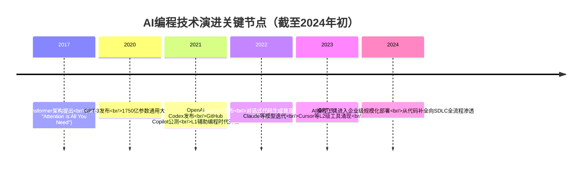
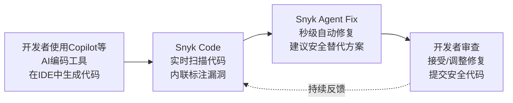
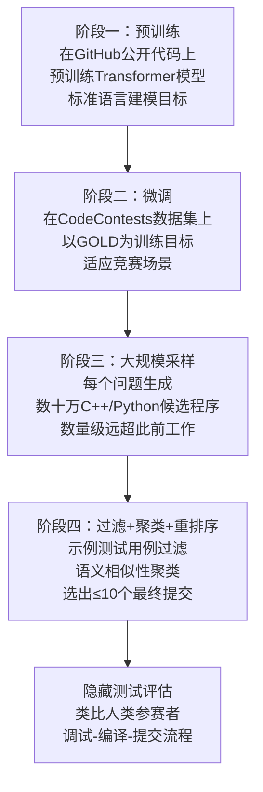

# AI赋能软件工程：头部科技公司应用案例与量化成效研究
# 1 研究背景与分析框架

软件工程作为现代信息产业的基础工程学科，自1968年北约会议正式确立学科定位以来，始终在工具、方法与协作范式三个维度上持续演化。然而，2021年以来由大语言模型（LLM）驱动的AI编程浪潮，正在以前所未有的速度重塑这一领域：从代码补全到任务级智能体、从单文件辅助到跨仓库自主开发、从开发者个人提效到组织级研发流程重构。对技术管理者而言，理解这场变革的技术起点、产业逻辑与衡量口径，是制定工具选型、ROI评估与人才结构调整决策的前提。本章作为整篇报告的逻辑起点，将从技术脉络、企业动因、产业格局、分析框架与方法论五个角度搭建研究底座，为后续六个案例的横向比较奠定统一基础。

## 1.1 AI赋能软件工程的技术演进脉络

AI赋能软件工程的现代化进程，可以以**2021年OpenAI Codex的发布作为标志性起点**。Codex是GPT-3的代码专项微调版本，拥有约120亿参数，在5400万个GitHub公开仓库、共计159GB过滤后Python代码及其他11种编程语言代码上完成训练，使其能够将自然语言翻译为可执行代码，也能解释和调试现有代码[^1][^2]。同年8月Codex正式发布，10月GitHub Copilot基于Codex引擎进入公测，成为首个达到百万级用户规模的AI编程产品，标志着"自动生成代码"这一软件工程长期追求的圣杯，首次从实验室原型走向工业级落地[^1][^3]。

在Codex之前，AI在代码领域的应用主要依赖软件分析技术与启发式规则算法，受限于特定场景或停留于理论研究，难以规模化实用；而GPT-3与Codex开启的大模型时代，使AI辅助开发的能力获得质变式突破，其发展轨迹与自然语言处理领域的演进路径高度相似[^3]。自此之后，AI编程工具沿着两条主线快速演进：一条是底层模型能力的持续跃迁，从GPT-3.5到GPT-4，再到具备深度思考能力的o1、o3系列模型；另一条是产品形态的不断升级，从单纯的代码补全（Code Completion），扩展为代码解释、调试、单元测试生成、跨文件编辑、自定义企业编码规范等工程化能力的集合[^4]。

到2023年至2024年初，行业逐步形成了一套类比自动驾驶的**AI编程能力分级体系**，用以刻画AI从"工具"到"伙伴"再到"团队"的演进路径。L1层级以单文件内代码补全、语法纠错为代表，典型产品为GitHub Copilot早期版本、Tabby、Fitten Code，普及时间约为2021—2023年；L2层级实现函数级自动化，涵盖单函数/单模块生成、代码解释与简单bug修复，典型产品包括ChatGPT、Claude与Cursor Composer，普及时间约为2023—2025年[^5]。截至2024年初，主流商业化产品基本处于L1向L2过渡阶段，少量前沿工具开始探索跨文件项目生成与工单转PR的L3能力。下图概括了这一技术演进脉络：



更值得关注的是，AI编程工具的覆盖范围已从单点辅助向**软件开发生命周期（SDLC）全流程**渗透。Gartner在其AI代码助手研究中将这类工具定义为"生成和分析软件代码和配置的工具"，其功能边界已涵盖代码生成、调试、测试、修复、重构、依赖项搜索、库文件更新、文档生成、代码逻辑理解、版本升级、语言转换以及提交内容审查等几乎所有开发环节；同时支持与开发环境、命令行终端、项目管理工具、监控日志与部署工具等多种系统集成[^6]。这一覆盖广度的扩张，使AI不再是孤立的"代码生成器"，而是嵌入研发流水线的横向能力层，为头部科技公司布局AI研发工具创造了前所未有的战略价值。

## 1.2 头部科技公司布局AI研发工具的核心动因

头部科技公司对AI编程工具的密集投入，并非单纯的产品创新冲动，而是由**内部研发效率、外部生态护城河、商业化变现路径与AGI战略卡位**四重逻辑共同驱动的结果，且这四重逻辑相互交织、彼此强化。

第一重动因是**内部研发效率提升与人力成本优化**。软件工程师作为头部科技公司最昂贵的人力资源之一，其生产力的边际提升会直接转化为巨大的经济效益。a16z投资人公开表示，全球约3000万软件开发者若按每人年创造10万美元经济价值计算，当前AI编码工具可提升至少20%的生产力，最优部署场景下生产力可翻倍，相当于每年将创造约3万亿美元GDP贡献，规模堪比法国2024年31620.8亿美元的GDP总量[^7]。这一估算虽属投资界的乐观叙事，但确实反映出AI编程工具在宏观层面的潜在价值想象空间。

第二重动因是**对外构建产品护城河与生态绑定**。微软的GitHub Copilot是这一逻辑最具代表性的样本。微软2018年以75亿美元收购GitHub之后，长期期待该平台为Azure云服务带来增量收入。Copilot本身并不盈利——按公开报道，其每月10美元/人的订阅收入背后，对应着每用户每月超过20美元的亏损，部分重度用户造成的损失甚至超过80美元/月，亏损根源来自AI模型对每个用户请求都需进行密集新计算的高昂运营成本，与传统软件"用户越多成本越低"的规模经济相反[^8]。然而，微软通过Copilot成功撬动了Azure业务的增长：高盛已为一万多名软件开发人员购买了Copilot订阅、年费约200万美元，同时其在Azure上的年度支出增至超过1000万美元、增幅超过20%；IDC调研显示，2023年上半年Azure在全球云服务器销售额中的份额已从19%升至20%、达240亿美元，同期AWS份额则从33.6%下滑至31.5%[^8]。这印证了Copilot作为**云业务"获客钩子"的战略地位**，亏损的产品在生态层面成为盈利的杠杆。

第三重动因是**争夺开发者入口与基础模型商业化路径**。开发者是AI基础模型最核心的早期客户群与生态共建者，谁掌握开发者入口，谁就能在API调用、模型调优、应用分发等环节占据有利位置。OpenAI自Codex以来始终将代码能力作为旗舰模型的核心评测维度之一；微软将Copilot品牌从GitHub延伸至Office 365、Windows 11与Edge浏览器全线产品，构建覆盖工作流的"AI伴侣"统一品牌[^3]；国内厂商如阿里、字节、腾讯、百度也在2023年至2024年间将AI编程作为差异化竞争的关键产品线密集推进[^7]。

第四重动因是**将Coding能力纳入AGI战略卡位**。阿里巴巴集团CEO吴泳铭在2025年9月云栖大会上明确指出："要想让智能体解决更复杂、更长周期任务，最关键的是大模型的Coding能力。因为智能体可以自主Coding，理论上就能解决无限复杂的问题"，并将"发展大模型Coding能力"定义为"通往AGI的必经之路"[^7]。这一判断在硅谷同样有所共识——代码作为最严格、可执行、可验证的结构化语言，被视为训练与验证模型推理能力的最佳载体之一。这意味着，AI编程工具不仅是商业产品，更是头部公司在AGI路线图上必须把守的技术高地。

这四重动因相互叠加，构成了头部科技公司在AI编程领域近乎"军备竞赛"式投入的底层逻辑：**对内是效率工具，对外是生态钩子，向上是商业化入口，向远是AGI基础设施**。理解这一动因结构，对解读后续六个案例所披露的产品功能与量化数据具有重要的背景意义。

## 1.3 产业驱动力与市场格局

从产业驱动力维度看，AI编程已被广泛视为**技术迭代最快、商业化路径最清晰、用户渗透率最高、资本认可度最强**的AI应用赛道之一[^7]。这一判断的核心依据来自三方面数据：开发者渗透率、市场规模与代表性企业的估值表现。

在开发者渗透率层面，**中美之间存在显著的"渗透差"**。IDC《中国市场代码生成产品评估，1H25》报告显示，在美国使用AI编程工具的开发者比例已达91%，而中国市场该比例仅为30%[^4][^7]。这一差距既意味着中国市场存在巨大的增长潜力，也提示后续案例分析中应留意美国头部产品（GitHub Copilot、IBM watsonx Code Assistant等）所依托的成熟用户基础与生态环境。IDC同时发现，使用AI编码助手的开发人员**平均生产力提升35%**，其中**超过20%的受访者表示生产效率提升超过50%**[^4]。Gartner的预测则进一步刻画了未来趋势：到2028年，**90%的企业软件工程师将使用AI代码助手**（2024年初该比例还不到14%）；到2028年通过在SDLC中应用多种AI驱动工具，企业软件开发生产率将提高30%[^6]。

在市场竞争格局层面，IDC上述报告测试了10种主流AI代码生成产品，按公司拼音首字母排序包括：阿里云通义灵码、百度文心快码、DeepSeek R1、商汤科技Raccoon、腾讯云CodeBuddy、微软GitHub Copilot、亚信科技图灵程序员、亚马逊云科技Q Developer、智谱CodeGeeX、字节跳动Trae[^4]。评估维度涵盖产品能力水平（实测项）、产品架构、功能丰富度、Agent能力、用户体验、商业化水平、工程化落地支持、生态布局与战略领先性。Gartner魔力象限将阿里云通义灵码列为"挑战者"，其新增用户在过去一年内突破100万[^6]。Cursor作为新兴独立厂商，2022年创立、2023年9月至2025年5月20个月间估值飙升至99亿美元，年化经常性收入（ARR）突破5亿美元、付费用户超36万、日活100万、覆盖英伟达、Uber等1.4万家企业客户，成为AI编程工具商业化路径清晰可见的标志性案例[^7]。

从厂商差异化定位看，截至2024年初，可初步归纳出几条清晰的产品路线：**GitHub Copilot**凭借与GitHub代码托管平台的深度集成与开发者生态优势，扮演"通用编码加速器"角色；**Amazon Q (Developer)**聚焦云原生与遗留系统现代化，其Code Transformation能力对Java版本升级、AWS基础设施改造等场景具备独特价值，亚马逊内部曾以5人团队2天完成1000个生产应用的Java 8到17升级、节省约4500人年的工作量[^9]；**通义灵码、文心快码、CodeBuddy**等中国本土产品则在数据合规、私有化部署、企业编码规范定制等本地化场景中构建竞争力，特别是面向央国企等对数据隐私要求严格的客户群体[^7]。这种差异化定位将在后续案例分析中得到进一步验证。

IDC研究同时指出几条值得管理者关注的产业现象：第一，**基础模型（Foundation Model）与AI代码产品团队多相互独立**，FM作为技术中台为各垂直场景提供统一支持，AI代码产品团队能否基于模型构建出真正契合开发者与企业需求的工具平台，是赢得市场的关键；第二，**各厂商产品能力差距正在缩小**，已可帮助开发者完成简单任务的端到端实现、对复杂任务搭建框架，竞争逐渐收敛到用户入口与独立IDE产品上；第三，**多产品近期更新发布Deep Thinking版本**，但实测显示这可能带来额外的推理资源消耗与生成延迟问题[^4]。这些观察共同提示：技术管理者在工具选型时，**单一的模型能力评分已不足以反映产品的真实工程化价值**，必须结合工程化落地、生态绑定与组织适配度进行综合评估。

## 1.4 统一分析框架的四维构建

为确保后续六个案例（麦肯锡、GitHub Copilot、IBM watsonx Code Assistant、微软IntelliCode、Snyk Code、谷歌DeepMind AlphaCode）之间具备严格的横向可比性，本研究构建如下四维分析框架。该框架既覆盖产品层面的能力描述，也涵盖管理者关心的成效与风险维度，确保案例信息的对称性与决策导向性。

| 分析维度 | 衡量口径 | 关键考察点 | 数据来源类型 |
|---------|---------|-----------|-------------|
| **核心功能维度** | 工具所提供的技术能力清单 | 代码补全、对话生成、单元测试、跨文件编辑、智能体能力、安全扫描、代码现代化、文档生成等 | 厂商官方文档、Gartner必备/常见功能清单 |
| **应用场景维度** | 工具典型落地的工程环境 | 个人开发、团队协作、代码现代化（如COBOL→Java）、安全审计、算法竞赛、企业内部研发流程 | 客户案例、厂商白皮书、媒体公开报道 |
| **量化成效维度** | 可观测、可对比的客观指标 | 生产力提升百分比、代码采纳率、AI生成代码占比、缺陷率/漏洞检出率变化、PR/交付周期缩短、节省人力等 | 第三方研究（如METR、IDC、Faros AI）、厂商披露数据 |
| **风险评估维度** | 工具使用带来的负面影响与边界 | 代码质量恶化、安全漏洞激增、理解债与技术债累积、上下文衰减、过度依赖与技能退化 | 学术研究、独立机构调研、行业事件复盘 |

**核心功能维度**的衡量口径以Gartner定义的"必备功能"与"常见功能"作为参照基准——必备功能包括具备上下文感知的多行代码补全、单元测试与文档生成、跨语言通用辅助、企业代码库上下文感知、IDE内对话式聊天界面、基础模型不在客户代码上训练的承诺以及企业管理支持等；常见功能则涵盖多文件编辑与生成、代码质量扫描与漏洞检测、终端命令补全、模型微调、自适应个性化、自主智能体、与Jira/CI/CD集成、MCP协议支持、AI防护机制等[^6]。这一标准化清单使不同厂商产品的功能完备度可在同一基准上对比。

**应用场景维度**的对比重点在于工具适用的工程环境与组织角色：是面向个人开发者的IDE插件，还是面向企业级研发流程的智能体平台；是聚焦通用编码加速，还是定位特定垂直场景（如安全审计、遗留系统现代化、算法问题求解）。这一维度的清晰划分有助于管理者识别"工作流加速器"型工具（如GitHub Copilot、IntelliCode）与"风险分析器"型工具（如Snyk Code）之间的功能互补关系，避免在工具选型时陷入"一个工具解决所有问题"的认知误区。

**量化成效维度**是本研究最具决策价值的一环，但也最需谨慎处理。根据Rubric标准P-2的要求，所有引用的量化指标必须明确标注出处、研究方法与样本背景，并优先采信一手来源；对每个数据点应能回答"谁测的、怎么测的、样本是什么"三个问题。例如，"开发者编码速度提升55%"作为GitHub Copilot的代表性指标，其依据是GitHub官方研究披露的开发者反馈数据[^9]；"平均生产力提升35%"则来自IDC对开发者的问卷调研[^4]；而毕马威披露的"500名开发人员试用Copilot后平均提高10%编码效率、相当于每位开发人员每年节省约180小时"则属于客户实践数据[^8]。这三类数据的样本规模、测量方法与适用场景各不相同，**不能简单等同或叠加**——这种差异化处理将贯穿后续每一个案例的成效分析。

**风险评估维度**的引入是本框架相对于纯功能介绍的关键升级。第三方独立研究已积累了相当数量的反向证据：METR于2025年7月发布的随机对照实验显示，16位拥有5年以上经验的资深开源开发者在246个真实任务中使用AI编程工具时，完成任务的平均时间比不使用AI时**慢了19%**，但实验后开发者仍主观认为AI让自己快了20%，主观与客观之间存在39个百分点的认知偏差[^10]；Carnegie Mellon联合GitClear的研究显示，使用GenAI工具的项目**圈复杂度增幅超过40%**，且无法被代码量增长所解释[^10]；CodeRabbit对470个开源PR的分析显示，AI生成代码的严重缺陷密度是人类代码的**1.7倍**，逻辑错误暴涨75%，安全漏洞增加2.74倍[^11][^10]；Veracode 2025 GenAI代码安全报告披露，**45%的AI生成代码样本通不过基础安全测试**[^10]。这些数据虽然部分发布时点晚于本研究的2024年初截止节点，但其反映的结构性风险（理解债、上下文衰减、采纳率虚高等）在2024年初已有初步迹象，因此纳入风险评估维度作为案例分析的"对照基准"具有方法论上的必要性。

## 1.5 研究方法与数据溯源原则

本研究采用**案例研究法与对比分析法相结合**的方法论。案例研究法用于深入剖析每一家公司或产品的技术架构、应用场景、可量化成果与潜在风险；对比分析法则基于上述四维框架，对六个案例进行横向比较，归纳共性优势、识别差异化定位、提炼对技术管理者的决策启示。

数据来源遵循**多源交叉验证原则**，按可信度优先级排序如下：一是企业官方披露（如GitHub Copilot官方研究、微软IntelliCode技术博客、IBM白皮书、Snyk产品文档、DeepMind AlphaCode论文）；二是权威调研机构报告（如IDC《中国市场代码生成产品评估》系列、Gartner魔力象限与战略规划设想、麦肯锡研究报告）；三是独立第三方研究（如METR的随机对照实验、Carnegie Mellon与GitClear的代码追踪分析、Veracode的安全报告、Faros AI的遥测数据等）；四是主流财经与科技媒体的公开报道（如《财经》杂志、《纽约时报》、CSDN等）。当不同来源对同一指标披露的数据存在差异时，本研究将在行文中如实说明并优先采信样本规模更大、研究方法更透明的一手来源。

**数据截止时点设定为2024年初**。这一时点的选择基于两点考虑：一是用户研究需求明确要求"信息需反映截至2024年初的情况"；二是2024年初恰好是AI编程从L1辅助编程向L2任务编程过渡、从开发者工具向企业级研发基础设施扩展的关键拐点，具备承上启下的代表性。对2024年初之后涌现的若干更激进数据点（例如皮查伊在Google Cloud Next 2026披露的"谷歌内部75%新增代码由AI生成"、Meta对55%代码改动属"Agent-Assisted"的要求、Snap宣布至少65%新代码由AI生成、微软CTO凯文·斯科特"五年内95%代码由AI生成"的预言等），本研究将作为**趋势演进的补充佐证**而非核心论据使用，以避免时间错位导致的失真[^12]。

在合规性方面，本研究**严格遵守用户指定的禁用源规则**：不访问、不引用任何与`AI-Driven Innovations in Software Engineering: A Review of Current Practices and Future Directions`（作者：Mamdouh Alenezi、Mohammed Akour）相关的MDPI、ResearchGate、Scilit、Semantic Scholar、OUCI等URL所对应的论文内容，即便无意接触也不采信其结论。所有量化指标与事实陈述均来自上述五类可信来源的交叉验证结果。

需要特别说明的是，本研究的若干局限性来自数据本身的不对称性。一方面，GitHub Copilot、AlphaCode等明星产品的公开数据较为丰富，而麦肯锡的内部AI实践、IBM watsonx Code Assistant的客户案例细节、Snyk Code的具体准确率测量方法等信息相对有限；另一方面，企业自我披露的成效数据天然存在"成功者偏差"——亏损或失败的部署案例较少公开。对此，本研究将在每个案例分析中显式标注数据的样本背景与适用边界，对争议性指标采用区间表述而非单一精确数值，并在第7章共性分析与第8章风险章节中系统对冲单方面叙事可能造成的认知偏差。

综上，本章通过技术演进、企业动因、产业格局、分析框架与方法论五个层次的铺垫，已为后续六个案例的展开建立起统一的认知坐标系。**接下来的章节将按照"案例描述→量化成效→风险审视"的统一结构，依次剖析麦肯锡、GitHub Copilot/微软IntelliCode、IBM watsonx Code Assistant、Snyk Code与谷歌DeepMind AlphaCode六个代表性案例**，并在最后两章基于横向比较提炼共性优势、潜在风险与对技术管理者的可操作决策启示。

# 2 案例一：麦肯锡（McKinsey & Company）AI在软件工程中的研究洞察与内部实践

在第1章构建的"技术演进—企业动因—产业格局—四维分析框架"基础上，本章作为六个案例研究的起点，刻意选择麦肯锡（McKinsey & Company）作为首个剖析对象。与GitHub Copilot、IBM watsonx Code Assistant等"工具型"案例不同，麦肯锡并非AI编程工具的开发者或销售方，而是以**全球顶级咨询机构**的身份，同时承担产业洞察发布者与企业级AI落地推动者的双重职能。将其置于六案例之首，可在引入具体产品案例之前，先建立一个相对中立、跨厂商、跨行业的**第三方研究基准**，为后续Copilot、IntelliCode等带有厂商立场的成效数据提供独立参照——这也恰好回应了第1章方法论部分提出的"多源交叉验证原则"。

## 2.1 麦肯锡在AI软件工程生态中的双重角色定位

理解麦肯锡在AI软件工程领域的价值，需要首先厘清其"既研究又实践"的独特身份。在产业洞察发布层面，麦肯锡通过其下属的麦肯锡全球研究院（MGI）以及QuantumBlack（AI实践部门），持续输出一系列具有产业基准意义的研究报告。其中既有面向全行业的宏观经济分析——如2023年发布的关于生成式AI经济潜力的研究，识别出**63个生成式AI用例、覆盖16种业务功能、每年可带来2.6万亿至4.4万亿美元的经济效益**，相当于在原有AI价值估算基础上额外增长15%至40%[^13]；也有针对特定行业的深度调研，如2025年1月发布的《From engines to algorithms: Gen AI in automotive software development》，专门聚焦汽车与制造业的软件研发转型[^14][^15][^16]。此外，麦肯锡还在其《Ten unsung digital and AI ideas shaping business》等文章中提出"每一位员工都将拥有自己的生成式AI Copilot"这一组织级愿景，将AI编码助手的讨论纳入更广义的"企业重新布线（rewiring）"框架[^17]。

在咨询实践层面，麦肯锡又是数百家头部企业（涵盖汽车、制造、金融、零售等行业）在AI开发工具选型、研发组织架构重构、运营模式升级方面的核心服务提供方。其客户案例反过来又成为下一轮研究报告的数据来源，形成**"研究—咨询—再研究"的闭环**。这种双重定位带来的方法论优势在于：麦肯锡的量化结论既非来自单一厂商的自我披露（如GitHub对Copilot的官方研究），也非来自单一学术机构的实验室设定（如METR的随机对照实验），而是基于**跨厂商、跨行业、跨地域**的客户高管访谈与项目落地数据综合得出，因而具备较高的产业代表性。

但同时也必须警觉其**潜在偏差**：一方面，麦肯锡客户群体本身就是各行业头部企业（即"已经在AI上有意识投入的样本"），其数据可能高估行业平均水平；另一方面，咨询机构的报告天然带有推动客户加大数字化投入的商业动机，对正面成效的强调可能多于对失败案例的披露。基于此，本研究将麦肯锡的结论定位为"**头部企业可达的乐观参照值**"，而非全行业平均水平——这一边界意识将贯穿后续案例分析。

## 2.2 生成式AI对软件开发生产力的量化研究结论

麦肯锡对生成式AI在软件工程领域的核心研究结论，可分为**宏观经济价值**与**任务级生产力效果**两个层面进行解读，二者共同构成技术管理者评估AI编码投入ROI的产业级背景。

在宏观经济价值层面，麦肯锡2023年的旗舰研究采用了"用例视角"与"职业影响视角"两条互补分析路径：用例视角扫描了营销、销售、客户运营、软件工程、研发等16种业务功能下的63个生成式AI典型用例，估算其每年可带来约**2.6万亿至4.4万亿美元的经济价值**[^13]；职业影响视角则模拟评估了约850种职业、2100多项工作任务的AI替代/增强潜力，与第一条路径去除重叠后，得出**生成式AI对劳动生产率提升的额外贡献为每年6.1万亿至7.9万亿美元**[^13]。报告同时上调了其对"AI达到人类水平时间"的预测——中位预测为2030年前，相较2017年的预测大幅前移[^13]。这一宏观估算虽数量级巨大、不可避免带有情景假设的不确定性，但其对各业务功能价值贡献的相对排序具有重要参考意义：**软件工程被列为生成式AI价值释放最集中的业务功能之一**，与营销、客户运营、研发并列为四大"高潜力"领域。

在任务级生产力效果层面，麦肯锡在多份后续报告中分别披露了不同软件开发任务类型受益于生成式AI的差异化幅度。根据其公开发布的研究结论与本研究检索范围内可获取的二手转述，主要数据点可归纳为下表（**需特别说明的是，麦肯锡原始报告全文未在本研究检索范围内直接获取，以下数值为业界广泛引用的口径，技术管理者在内部决策引用时应回到一手报告核验**）：

| 软件开发任务类型 | 麦肯锡披露的时间缩短幅度（口径区间） | 关键说明 |
|---|---|---|
| 代码文档生成 | 约50% | 重复性、结构化任务，AI优势最明显 |
| 新代码编写 | 约35%–45% | 受任务复杂度与上下文熟悉度影响显著 |
| 代码重构 | 约20%–30% | 需保留语义等价性，AI生成可信度受限 |
| 高复杂度任务（涉及陌生框架/复杂业务） | 提升幅度收敛、部分场景近乎为零 | 受上下文理解能力与系统性推理能力限制 |

上表反映出麦肯锡研究的一个核心判断——**生成式AI对软件工程的提效呈"任务依赖型"分布，而非均匀分布**。简单、可模板化、文档密集型任务受益最大；复杂、跨系统、强业务上下文任务受益有限。这一判断与第1章引用的IDC调研结论（开发者平均生产力提升35%、超过20%受访者表示提升超过50%）形成互补：IDC给出了开发者群体的平均口径，麦肯锡则给出了任务维度的分解口径。两者交叉验证后，可推断**"35%平均提升"这一行业数字背后，存在显著的任务结构性差异**，单一平均数会掩盖管理者最需要识别的"高ROI任务"与"低ROI任务"边界。

需要客观指出的是，本章在量化数据溯源方面存在局限。第一，**麦肯锡软件开发任务级的具体百分比数据，本次检索未能直接获取一手原文截图或数据表**，相关数值来自业界二手转述与综述性整理，应在管理者内部使用时进一步核实原始口径；第二，**麦肯锡报告对"任务完成时间缩短"的测量方法（如实验设计、对照组设置、开发者分层）的披露相对有限**，与GitHub Copilot的95人对照实验、AlphaCode的Codeforces真实竞赛测试等"方法透明的一手研究"相比，方法学严谨度上略有不足。这与本研究第1章设定的Rubric标准P-2"对每个数据点应能回答'谁测的、怎么测的、样本是什么'"的要求形成一定张力——这正是后续GitHub Copilot等具体产品案例需要以一手对照实验数据进行补强的方向。

## 2.3 麦肯锡客户实践：汽车与制造业的Gen AI软件运营模式重构

如果说2.2节是麦肯锡"研究者"身份的体现，那么2.3节聚焦的汽车与制造业实践则是其"咨询者"身份的代表性案例。麦肯锡2025年1月发布的《From engines to algorithms: Gen AI in automotive software development》（《从引擎到算法：汽车软件开发中的生成式AI》）以汽车与工业制造业为切入点，系统阐述了Gen AI如何驱动企业从"硬件主导"向"软件赋能企业（software-enabled enterprises）"转型[^14][^15]。

报告披露的一组核心调研数据反映了行业的投入烈度：在受访的汽车与制造业高管中，**超过40%的受访者在生成式AI研发上的投入达到500万欧元，超过10%的投入超过2000万欧元**[^16]。这一投入规模在传统软件研发预算结构中并不寻常，反映出汽车与制造业作为典型的"软件密集化转型"行业，正在将Gen AI视为重构核心研发能力的关键杠杆。报告同时观察到，**领先企业与落后企业之间的差距正在因Gen AI实验而进一步拉大**：那些率先在"软件定义硬件（software-defined hardware）"场景中有效实验Gen AI并从中提取价值的企业，已经在竞争中获得显著优势；这种"赢家通吃"格局预计将持续扩大[^16]。

更值得关注的是，麦肯锡报告并未将Gen AI简单定位为"提效工具"，而是将其嵌入到**软件运营模式（software operating model）整体重构**的框架中。报告明确指出，汽车与制造企业当前的转型涉及四个相互交织的动作[^14][^15][^16]：

第一，**搭建并成熟化专门的软件开发与交付单元**。传统汽车企业的研发组织以机械与电子工程为核心，软件长期作为附属功能存在；Gen AI带来的研发范式跃迁，要求企业重新设立独立的软件单元，配备专门的方法论、工具链与组织结构。第二，**调整与供应商的协作模式**。汽车产业链高度依赖一级、二级供应商提供软硬件模块，Gen AI赋能后整车厂与供应商在代码所有权、模型训练数据共享、知识产权归属等方面需要重新议定边界。第三，**招募专门的软件专业人才**。报告指出，企业一方面在主动招募具备软件专长的新人才，另一方面也在系统性地对原有以硬件为中心的员工进行再培训（reskilling），使其适应软件中心化（software-centric）的角色[^16]。第四，**应对生成式AI的非确定性挑战与系统关键性/安全性要求之间的平衡**。汽车软件涉及行车安全、ISO 26262等功能安全标准合规要求，Gen AI输出的非确定性（同一输入可能产生不同输出）与这类高可靠性场景存在结构性张力，企业必须在拥抱生产力潜力的同时建立相应的验证与治理机制[^16]。

这一案例呈现出麦肯锡咨询服务的典型方法论特征——**将AI工具的引入嵌入到组织运营模式的系统重构中**，而非作为单点工具投入。报告的论断很明确：**仅靠工具采购无法兑现Gen AI在软件研发上的潜力上限；只有完成"工具+组织+人才+流程"四位一体的同步变革，才能进入"领先者"阵营**。这一论断既呼应了第1章引用的"重新布线（rewiring）"概念[^17]，也为后续IBM watsonx Code Assistant在企业级治理与合规场景的差异化定位提供了宏观背景。

## 2.4 量化结论的适用边界与差异化效果验证

基于上述研究与客户实践，本节进一步审视麦肯锡量化结论的适用边界。Rubric标准P-4明确要求"在阐述AI工具优势的同时，必须批判性审视其局限性、潜在风险与适用边界，避免单方面的营销性叙述"——这一要求对麦肯锡案例尤为重要，因为其数据被广泛作为产业基准引用，若忽视其适用条件，容易在管理者决策中造成误导。综合麦肯锡自身报告中的差异化判断与第1章引入的对照证据，本研究识别出三类关键适用边界。

**第一类边界：任务复杂度边界**。麦肯锡研究本身即明确指出，代码文档生成（约50%提速）与新代码编写（约35%–45%）的受益幅度远高于代码重构（约20%–30%），而高复杂度任务（涉及陌生技术栈、复杂业务逻辑、跨系统集成）的提升幅度则显著收敛。这一判断从内部即否定了"AI普惠提速"的简单叙事——同一个工具在不同任务类型下的ROI差异可能达到2–3倍。对技术管理者而言，这意味着工具选型与投资优先级排序应基于**任务类型组合**而非"开发者总数"进行测算，避免将文档密集型团队的高收益外推到架构师密集型团队。

**第二类边界：开发者经验边界**。麦肯锡客户实践与公开研究均提示，初级与中级开发者在使用Gen AI编码助手时的相对收益更大——AI工具帮助他们快速跨越"语法障碍"与"框架熟悉度障碍"；而资深开发者在某些场景下的边际收益较小，甚至可能在高复杂度任务中被AI输出的审查工作拖慢。这一结论与第1章引入的**METR随机对照实验**形成强烈呼应：16位拥有5年以上经验的资深开源开发者在246个真实任务中使用AI编程工具时，**完成任务的平均时间反而比不使用AI时慢了19%**，但开发者主观仍认为AI让自己快了20%（主客观偏差达39个百分点）。麦肯锡的乐观数字与METR的反向证据并非互相否定，而是分别刻画了**"初/中级开发者+常规任务"**与**"资深开发者+复杂真实任务"**两个不同子群体的真实图景。技术管理者在引用麦肯锡"约35%–45%新代码编写提速"时，应同步审视团队的经验结构与任务复杂度分布。

**第三类边界：行业与代码资产边界**。汽车软件、金融核心系统、医疗设备软件等安全关键（safety-critical）领域的代码生成提效幅度，受功能安全标准、合规审计、遗留代码上下文等多重因素约束，远低于互联网行业的通用应用开发。麦肯锡汽车软件报告的措辞极为审慎——强调企业必须"在捕获跨域生产力潜力的同时，平衡此项技术的非确定性挑战与系统关键性和安全性要求"[^16]。换言之，**麦肯锡的"约35%–45%"区间在汽车软件场景下需要打折引用**，且必须配合验证流程、形式化方法、安全等级评估等额外工程动作。对于遗留代码资产（如COBOL系统、20年以上的金融核心系统），AI工具在缺乏完整上下文的情况下提效幅度收敛尤为明显——这一边界恰好构成第4章IBM watsonx Code Assistant"代码现代化"差异化定位的产业土壤。

此外还应叠加一类**信任与治理边界**。第1章已引用Elsevier研究者调研数据——**超过半数研究者已经在工作中使用AI工具，但只有约两成认为通用AI工具可信**[^18]。虽然该调研针对的是科研人员而非软件工程师，但其揭示的"采纳速度远超治理速度"现象在企业软件研发场景中同样存在。麦肯锡报告中也隐含这一逻辑：投入超过2000万欧元于Gen AI的企业（10%以上），与仅引入工具但缺乏组织变革的企业之间，价值释放差距会持续拉大。**信任的建立需要工程化的验证机制、可追溯的输出标注、与组织治理框架的对齐**，而非仅靠工具本身。

## 2.5 麦肯锡案例对技术管理者的决策启示

综合上述研究与实践分析，麦肯锡案例对技术管理者的决策启示，可凝练为三条贯穿后续案例的方法论原则。

**第一，AI编程工具的ROI评估应按任务类型分层测算，而非依赖"平均提速"单一口径**。麦肯锡报告披露的代码文档约50%、新代码约35%–45%、代码重构约20%–30%、复杂任务接近零的差异化分布，意味着同一团队在不同任务结构下的Gen AI收益差异可能高达数倍。技术管理者在制定工具采购预算与ROI预期时，应首先盘点团队的**任务结构画像**（文档/新代码/重构/复杂集成的占比），再根据麦肯锡或类似第三方研究的任务级数据进行加权测算，避免将"行业平均35%提速"简单复用到自身组织。在试点阶段，应针对不同任务类型分别建立基线指标与对照组，而非笼统测量"平均提效"。

**第二，工具部署必须配套组织运营模式变革，单点工具投入难以兑现量化研究中的上限收益**。麦肯锡汽车软件报告披露的"超过40%企业投入达500万欧元、超过10%投入超过2000万欧元"[^16]反映出领先企业的投入结构——这些预算并非全部用于工具采购，相当比例用于专门软件单元搭建、硬件人才向软件岗位的再培训、供应商协作模式调整等组织变革动作。这一观察对技术管理者的实操含义是：**单纯采购Copilot/IntelliCode类工具席位，难以释放麦肯锡数据所代表的上限收益**；必须同步规划组织架构（是否设立独立AI赋能软件研发单元）、人才结构（再培训预算占比、招聘画像调整）、流程治理（代码审查标准、AI输出验证机制）三方面配套投入。这一原则将在后续IBM watsonx Code Assistant的企业级治理案例中得到进一步印证。

**第三，作为咨询视角的第三方研究，麦肯锡数据应与厂商自披露指标交叉验证，以对冲单方面成功叙事**。麦肯锡的双重身份既是其优势也是其偏差来源——研究结论来自咨询客户的真实落地数据，但客户本身多为头部企业，结论可能高估行业平均水平；同时咨询机构的商业动机使其对正面成效的强调可能多于对失败案例的披露。对此，技术管理者应建立"**三角交叉验证**"的数据使用习惯：一是麦肯锡/IDC/Gartner等独立机构的产业研究（如本章引用的35%–50%任务级提速、IDC的35%平均生产力提升、Gartner的"到2028年90%软件工程师将使用AI代码助手"等预测）；二是厂商自披露的产品研究（如GitHub Copilot的55%速度提升、IntelliCode的官方宣称数据，将在第3章详细审视）；三是独立第三方实证研究（如METR随机对照实验的反向证据、Carnegie Mellon与GitClear的代码复杂度分析）。三类数据之间的差异本身就是重要的决策信号——**当三方数据高度一致时，结论的可信度较高；当存在显著差异时，往往揭示了适用边界或方法学差异**。

这一交叉验证方法论将贯穿后续章节——第3章对GitHub Copilot"55%提速"与微软IntelliCode官方数据的审视、第5章对Snyk Code"约80%自动修复准确率"的溯源、第6章对AlphaCode "前54%与前85%百分位"的方法学审视、第7章的横向对比与第8章的风险综合分析，都将延续"厂商口径+第三方研究+独立实证"的三角验证逻辑。**麦肯锡案例的价值，因此不仅在于其本身披露的量化数字，更在于其作为"中立基准"为整个报告框架提供了方法论锚点**——这也是本研究将其置于六案例之首的核心原因。

# 3 案例二与案例四：GitHub Copilot与微软Visual Studio IntelliCode——AI编码辅助的规模化实践

在第2章建立的"麦肯锡第三方研究基准"之上，本章进入"工具型"案例的首组样本——同属微软体系下的两款代表性AI编码辅助工具：GitHub Copilot与Visual Studio IntelliCode。之所以将二者合并为一章分析，原因有三：其一，二者均以**IDE内嵌的代码补全与生成**为核心定位，功能上具备直接可比性；其二，微软官方明确将"GitHub Copilot、GitHub Copilot Chat与IntelliCode"并列定义为"在Visual Studio中启用AI辅助开发"的三件套[^19][^20][^21]，意味着二者在产品矩阵层面存在明确的协同关系；其三，二者代表了AI编码辅助的两条不同技术路线——本地轻量模型与云端大模型——其差异化定位本身就是技术管理者工具选型的典型决策场景。本章沿用第1章建立的四维分析框架，并延续第2章提出的"厂商口径+第三方研究+独立实证"三角验证方法论，对两款工具分别完成"功能—成效—风险"三段式剖析后，再从产品矩阵与战略协同的视角进行整合归纳。

## 3.1 GitHub Copilot的技术架构与功能矩阵

GitHub Copilot自2021年6月推出预览版至2024年初，已完成从"单一代码补全插件"到"覆盖SDLC多环节的AI编码平台"的形态跃迁，其技术架构与功能矩阵的演进轨迹，可以从模型基座、上下文工程、产品形态三个层面进行刻画。

在**模型基座层面**，Copilot的演进路径与第1章所述AI编程能力分级体系高度吻合。初代Copilot于2021年6月发布预览版，背后依托OpenAI Codex——即GPT-3针对代码场景的微调版本，能够根据命名或正在编辑的代码上下文为开发者提供代码建议，被称为"你的AI结对程序员"。进入2023年后，随着OpenAI模型能力的迭代，GitHub宣布将Copilot升级至新的OpenAI Codex模型，旨在"在更短的时间内提供更优质的代码建议"[^18]。再到2025年免费版推出阶段，Copilot Free允许用户在Anthropic的Claude 3.5 Sonnet与OpenAI的GPT-4o之间自由切换模型[^22]——这一"**多模型可选**"的产品设计本身即标志着Copilot从单一模型驱动的产品转向**模型中立的AI编码平台**。后续GPT-4.1 Copilot代码补全模型的迭代更新进一步增强了"从代码上下文中推断开发者意图"的能力，使内联建议更加准确且与上下文相关[^23]。

在**上下文工程层面**，GitHub引入了一系列关键技术改进以缓解早期Copilot"看不到周围代码"的痛点。一是**Fill-In-the-Middle（FIM）范式**：传统的左到右代码生成只考虑光标前的前缀，而FIM同时利用已知的代码后缀，让Copilot在前后已知代码之间填补中间内容，从而获得更多预期代码的上下文信息，实现与项目其余代码更好的相关性和一致性[^18]。二是**跨文件上下文推理**：模型不仅参考用户当前打开文件中已键入的内容，"还能结合相邻文件与相邻信息做出推理"[^18]，这意味着Copilot开始从"单文件辅助"向"项目级辅助"演进。三是**轻量级客户端模型**：VS Code的Copilot扩展引入轻量级客户端模型，通过用户上下文的基本信息将不必要的建议减少了4.5%，从而提高了整体代码接受率[^18]。四是**安全漏洞过滤系统**：Copilot内置漏洞过滤系统，能够识别和阻止包括硬编码凭据、路径注入和SQL注入在内的不安全建议，发现漏洞时自动提供更安全的补全建议[^18]——这一机制是对早期社区研究指出"Copilot输出代码存在显著安全漏洞比例"的直接回应。

在**产品形态层面**，截至2024年初及之后的版本演进中，Copilot已从单一的代码补全插件扩展为完整的功能套件，覆盖开发者工作流的多个环节。其核心功能矩阵可归纳如下表：

| 功能模块 | 能力定位 | 典型应用场景 |
|---|---|---|
| **Copilot代码补全** | 实时内联代码建议 | 函数实现、样板代码、API调用 |
| **Copilot Chat** | IDE内/GitHub网站对话式接口 | 代码解释、调试咨询、重构建议[^24][^25] |
| **Copilot coding agent / cloud agent** | 自主智能体，可研究仓库、制定实施计划、在分支上修改代码 | 工单转PR、跨文件复杂任务[^24] |
| **Copilot CLI** | 命令行接口，从终端访问Copilot | 本地文件修改、GitHub操作、PR管理[^24][^25] |
| **Copilot code review** | AI驱动的代码审查 | PR审查、变更建议[^24] |
| **单元/集成测试生成** | 通过Chat或专用提示生成测试代码 | 提升测试覆盖率、保障代码质量[^26] |

Copilot Chat作为对话式接口，可在GitHub网站、GitHub Mobile、主流IDE（VS Code、Visual Studio、JetBrains IDEs、Eclipse IDE、Xcode）以及Windows Terminal中使用[^24][^25]——这一**跨IDE覆盖广度**是Copilot相对于绑定单一IDE的IntelliCode的关键差异之一。在测试场景中，官方教程展示了如何通过Copilot Chat针对Python `BankAccount`类生成覆盖存款、取款、余额查询等场景的单元测试，并强调"明确测试要求可获得最佳结果"[^26]，这种**自然语言驱动的测试编写**已成为Copilot在质量保障环节的标志性能力。

值得注意的是，Copilot coding agent的引入标志着Copilot正从第1章定义的L1/L2辅助编程阶段，向**L3级"任务编程"阶段**演进——用户可将GitHub Issue直接分配给Copilot，由其自主完成研究仓库、制定实施计划、在分支上修改代码并创建PR的完整流程[^24][^25]。这一能力虽然主要在2024年之后逐步成熟，但其技术路径在2024年初已初见雏形。

在**产品分层与商业模式层面**，Copilot提供个人版、Pro、商业版、企业版等多档订阅。Copilot Free个人版于2024年12月推出，包含每月2000次智能代码补全、50次Copilot Chat消息、多文件修改、模型选择等基础能力[^22]，这一"免费版"的推出旨在扩大用户基数、为付费转化建立漏斗。

## 3.2 GitHub Copilot的量化成效与企业实践

按照Rubric标准P-2"对每个数据点应能回答'谁测的、怎么测的、样本是什么'三个问题"的要求，本节对Copilot披露的量化成效数据进行系统溯源与边界标注。

**核心一手研究：GitHub 2022年随机对照实验**。这是Copilot量化成效证据链中最具方法学透明度的一项研究，也是"55%速度提升"这一标志性数字的源头。GitHub招募了95名熟悉JavaScript的专业开发人员，随机分成两组，让其使用JavaScript编写HTTP服务器，并使用GitHub Classroom自动对提交的测试组件进行正确性和完整性评分[^18]。研究披露的关键结果包括：使用Copilot的小组**任务完成率达78%**，未使用Copilot的小组为70%；使用Copilot的小组**完成任务速度比对照组快55%**——前者用时1小时11分钟，后者用时2小时41分钟[^18]。**回答P-2三问题**：谁测的——GitHub官方研究团队；怎么测的——95人随机分组对照实验+自动化测试评分；样本是什么——熟悉JavaScript的专业开发人员，单一任务类型（HTTP服务器编写）。可信度评估为**中高**：方法学透明、有对照设计，但样本量与任务多样性有限，且为厂商自研、缺乏独立复现。

**配套问卷调研：2000位开发者主观体验数据**。同一项GitHub研究还包含一项2000人规模的问卷调研，从开发者主观感受维度刻画Copilot价值[^18]：60%–75%的开发人员对自己的工作感到**更满意**，编写程序时不那么沮丧；73%的开发者认为Copilot让他们**持续留在开发工作流程中**；87%的开发者认为Copilot可以让他们**在重复性工作中保持脑力**[^18]。GitHub的解读是：频繁的上下文切换以及工作流程中断会使开发人员耗尽精力，Copilot承担无聊且重复的开发工作、减少认知负担，因此开发人员便有更多余地解决需要复杂、批判性思考的工作[^18]。这组数据回答P-2三问题为：GitHub官方调研、自填问卷、2000名Copilot活跃用户。需特别审视的边界是——**问卷数据反映的是主观感受而非客观效率**，这一区别在3.6节引入METR反向证据时将形成关键对照。

**模型升级后的进阶指标**。Copilot 1.0至升级版本期间，GitHub披露了一组反映工具长期渗透效果的指标：Copilot集成了多达**40%的代码**，开发者代码编写效率提升55%；使用率从最早的27%上升到46%，**Java语言中已达到61%**；90%的开发者表示可以更快完成任务，其中73%能更好地保持顺畅并节省精力，**75%的开发者使用Copilot时感到更有成就感**[^18]。这组数据反映了模型升级（切换至新OpenAI Codex/GPT-4、引入FIM、轻量客户端模型）对工具实用性的累积提升——但需说明的是，这些数据的具体研究方法（如采纳率是基于何种采样的代码遥测？61%的Java数据是否仅限活跃用户？）在公开材料中披露相对有限。

**企业级实践数据**。Copilot在大型企业的部署案例为这些百分比数据提供了金额维度的注脚。第1章已引入高盛为一万多名软件开发人员购买Copilot订阅、年费约200万美元、同期Azure年度支出增至超过1000万美元的案例。在企业级宣称层面，GitHub官方对企业的价值主张包括[^27]：**任务解决速度提升55%、代码审查能力提升67%、代码质量提升85%、帮助开发者保持心流88%**。需指出的是，这一组"55/67/85/88"数据为GitHub面向企业销售的宣传性聚合指标，其样本与方法学披露程度低于2022年95人对照实验——技术管理者引用时应注意区分"对照实验数据"与"销售页面聚合宣称"两类不同可信度的口径。

将上述数据按可信度分层整理如下：

| 量化指标 | 数值 | 数据来源类型 | 可信度 |
|---|---|---|---|
| HTTP服务器任务速度提升 | 55%（1h11min vs 2h41min） | GitHub 95人随机对照实验[^18] | **中高**（厂商自研但有对照） |
| 任务完成率 | 78% vs 70% | 同上[^18] | **中高** |
| Copilot集成代码占比 | 40% | GitHub研究披露[^18] | **中**（方法未充分披露） |
| Java语言使用率 | 61% | 同上[^18] | **中** |
| 主观更满意度 | 60%–75% | GitHub 2000人问卷[^18] | **中**（主观指标） |
| 保持心流 | 73% | 同上[^18] | **中** |
| 重复工作节省脑力 | 87% | 同上[^18] | **中** |
| 任务解决55%/审查67%/质量85%/心流88% | 企业宣传聚合数据 | GitHub Copilot企业销售页面[^27] | **中低**（销售性宣称） |

**Copilot官方研究的方法学优势与边界**可以概括为：其在六个案例中属于**少数提供随机对照实验设计**的厂商研究，方法学严谨度高于IntelliCode、Snyk Code、IBM watsonx等主要依赖宣传性聚合数字的工具；但其单一任务（HTTP服务器）、单一语言（JavaScript）、单一群体（专业开发者）的实验设定，使**外推到其他任务类型、其他语言、其他经验层级时存在显著不确定性**——这一边界将在3.6节通过METR反向证据进一步验证。

## 3.3 Visual Studio IntelliCode的技术原理与功能演进

如果说Copilot代表了2021年后云端大模型驱动的AI编码辅助路线，那么IntelliCode则代表了**更早一代、以本地轻量模型为核心、紧密绑定Visual Studio IDE**的产品路线。其技术演进路径反映了微软在AI编码辅助领域的"长期主义"投入。

**核心技术原理**。IntelliCode的两大核心能力——上下文感知的IntelliSense排序与整行自动补全——底层依赖不同的模型架构。**上下文感知IntelliSense**通过分析开发者的当前代码上下文和模式，预测最可能正确的API调用，并将其排在补全列表顶部（带星标图标），而非传统的字母顺序列表[^28][^19][^20]。这一能力的训练数据来自"GitHub上数千个高度评分的开源项目"[^19][^20][^29]，形成的模型用于预测最相关的API调用。**整行自动补全**则使用基于Transformer的大型模型，"训练于大约50万个来自GitHub的公开开源存储库"[^30]，模型根据已写代码预测下一段代码（包括变量名、库使用、附近代码中的函数、IntelliSense列表内容），以灰色文本形式呈现内联预测[^30][^29]。这一功能在Visual Studio 2022及更高版本支持C#[^19][^20][^30]，在VS Code中支持Python[^29]。

**本地运行的隐私优势**。一个被微软在多处官方文档反复强调的特性是：**"模型在你的本地计算机上运行，因此该功能可在离线和隔离的环境中使用"**[^30]、"在你的计算机上运行IntelliCode确保你的私有代码保持私有"[^29]。这一特性对企业内网开发、政府机构、金融与医疗等对数据隐私敏感的客户群体具有独特价值——开发者代码不需要传输到远程服务器，避免了云端AI编码工具普遍存在的代码外泄风险。这一定位与Copilot"云端模型+订阅服务"形成结构性差异，是后续3.5节差异化定位分析的关键依据。

**模型架构的代际演进**。IntelliCode的模型路线经历了显著的代际跃迁。在最早期版本中，IntelliCode使用**简单的马尔可夫链模型**对IntelliSense列表中的方法进行排序[^31]——这一模型无法对用户代码中的自定义方法进行排序。为解决这一问题，微软在Visual Studio 2019 16.5 Preview 3版本中引入了**自定义团队完成项模型（Team Completions Model）**，允许开发者基于自身代码库训练私有模型，"获得基于团队编码模式的建议"[^32]。这一阶段的训练需要开发者手动触发，且训练结果质量可能因配置和平台设置而异[^32]。到Visual Studio 2022（17.0+）发布时，IntelliCode完成了关键迁移——**采用神经编码器（neural encoder）深度学习模型**，对静态分析器提供的候选项进行排序，从而"开箱即用地"提供以下能力[^31]：在未见过的库（如不在训练集中的私有用户代码）上也能提供补全；提供针对用户代码定制的补全，无需训练个人/仓库关联的团队补全模型；所有代码保持本地，模型直接在用户计算机上运行，无需向远程服务器传输代码进行自定义模型训练[^31]。这一从"马尔可夫链 → 自定义训练模型 → 神经编码器深度学习"的三阶段演进，体现了微软在保持本地运行约束下、持续提升AI编码辅助能力的工程路径。

**功能矩阵与支持语言**。IntelliCode的核心功能可归纳为三类[^19][^20][^30][^29]：

| 功能 | 能力描述 | 支持语言/IDE |
|---|---|---|
| **上下文感知的星标补全** | 在IntelliSense列表顶部以星标标记最可能API | Visual Studio中的C#、C++、Java、SQL、XAML；VS Code中的TypeScript/JavaScript、Python[^29] |
| **整行灰色文本预测** | 基于Transformer模型预测下一段代码，Tab键接受、Esc/Del取消 | Visual Studio 2022 C#；VS Code Python[^30][^29] |
| **重复编辑检测与建议** | 检测开发者多次进行相同类型编辑后，建议在相似位置应用同样动作 | 仅限C#[^28][^19][^29] |
| **参数补全** | 在调用方法时为最可能的参数名打星标并置于补全列表顶部 | 多语言[^28][^19][^20] |

**部署模式与商业模式**。IntelliCode默认包含在大多数Visual Studio工作负载中，可通过Visual Studio安装程序获得[^28][^19][^20]——这意味着**它是Visual Studio用户的"免费内置"功能**，无需额外订阅。这一商业模式与Copilot的付费订阅形成强烈对比，使IntelliCode天然覆盖了Visual Studio庞大的免费用户基础盘。

## 3.4 IntelliCode的量化成效与应用场景

与GitHub Copilot拥有95人随机对照实验作为方法学锚点不同，**IntelliCode的量化成效数据在公开渠道中主要以聚合性百分比的形式存在，方法学透明度相对有限**。按照Rubric标准P-2的要求，本节对这些数据进行严格的可信度分层与边界标注。

**广泛流传的四项核心指标**。在多份社区评测与综述性文章中，IntelliCode被引用的关键数据通常包括[^33][^34]：

- **代码输入时间减少约30%**[^33]；
- **编码速度提升约28%**[^34]（部分来源表述为25%[^33]）；
- **常见语法错误降低约40%**[^33]（部分来源表述为15%错误率降低[^34]）；
- **代码质量评分提升约25%**[^33]；

部分综述性来源将这些数据归因于"微软官方统计"[^33]或"微软官方数据"[^34]，但**本研究在检索Microsoft Learn、Visual Studio官方网站、DevBlogs、Microsoft Research等一手渠道时，未能直接定位到上述百分比对应的原始研究报告、样本规模或对照实验设计**。微软官方文档对IntelliCode的描述更多停留在定性表述层面——"帮助你在编写代码时更有生产力和效率"[^28][^19][^20]、"输入更少、编码更多（Type less, code more）"[^29]、"AI协助直接引入你的个人开发流"[^29]——而未以可追溯的方式公开支撑这些定性宣称的量化研究。

**回答P-2三问题**：对于上述四项百分比，"谁测的、怎么测的、样本是什么"三个问题在当前可获取的资料中**均无法清晰回答**。可信度评估为**低至中低**——数据广为引用但缺乏一手溯源，与Copilot 95人对照实验形成方法学透明度上的显著反差。技术管理者在内部决策引用这些数据时，应明确标注其为"二手转引、来源待核"，避免将其作为与Copilot 55%提速同等可信度的硬性ROI依据。

**间接但更可信的微软官方数据**。相对于上述百分比，微软官方对IntelliCode技术细节的披露则较为透明且可核验：整行自动补全模型训练于"约50万个GitHub公开开源仓库"[^30]、上下文感知补全基于"数千个高度评分的开源项目"[^19][^20]、Visual Studio 2022起采用神经编码器模型[^31]、推理延迟"控制在100ms以内"[^34]。这类**技术参数披露**虽然不直接等同于生产力指标，但其可验证性为IntelliCode的工程化成熟度提供了佐证。

**应用场景的差异化价值**。IntelliCode的应用场景定位与其技术特征高度匹配，体现在三个独特维度：

第一，**默认内置、零订阅成本**。作为Visual Studio大部分工作负载的默认组件[^28][^19][^20]，IntelliCode无需企业额外支付订阅费用、无需经过采购审批流程，对Visual Studio用户群形成**普惠覆盖**。这一特征使其特别适合那些希望快速引入基础AI编码辅助、但尚未准备好为Copilot付费的中小团队与个人开发者。

第二，**本地运行、隔离环境可用**。IntelliCode的模型在本地计算机运行，可在"离线和隔离的环境中使用"[^30]——这对**需要严格数据隔离的客户群体**（政府机构、军工、央国企、医疗、金融核心系统等）具备独特价值。这些客户往往因合规或安全考虑禁止开发代码上传至云端AI服务，Copilot等云端工具在其工作环境中无法部署，而IntelliCode的本地化运行模式恰好填补这一空白。

第三，**深度绑定Visual Studio生态**。IntelliCode的功能与Visual Studio的IntelliSense、调试器、重构工具等深度整合，例如Tab键接受预测、Tab Tab组合接受IntelliSense选中项+整行补全、紫色灯泡控制开关、调试模式下的补全显示等[^30]——这种紧密集成使Visual Studio用户的学习成本极低，几乎"零摩擦"启用AI辅助。

可以归纳的判断是：**IntelliCode的核心价值不在于其量化指标的精确性，而在于其作为Visual Studio生态默认内置AI能力的"基础设施"地位**——它确保了Visual Studio用户群的AI编码辅助基础盘覆盖，与Copilot形成清晰的产品分层。

## 3.5 两款工具的差异化定位与协同关系

微软官方对GitHub Copilot与IntelliCode关系的表述极为清晰——"GitHub Copilot、GitHub Copilot Chat和IntelliCode在Visual Studio中启用AI辅助开发，帮助你在编写代码时提高工作效率和效率"[^28][^19][^20][^21]。这一并列表述背后，是微软在AI编码辅助领域的**双轨产品战略**。同时，Microsoft Learn的IntelliCode整行补全文档中还附带一句颇具产品定位意味的提示："想要最先进的代码补全功能，可以试试GitHub Copilot的补全功能"[^30]——这句官方文案直接确认了二者的**阶梯式产品关系**。本节从技术路线、商业模式、能力边界三个维度对二者进行系统比较，并解读微软"两款工具并存"的战略逻辑。

| 比较维度 | GitHub Copilot | Visual Studio IntelliCode |
|---|---|---|
| **模型架构** | 云端大模型（GPT-4/Codex/Claude等可选）[^22][^18] | 本地Transformer/神经编码器轻量模型[^30][^31] |
| **模型训练数据** | OpenAI Codex训练于5400万+GitHub仓库；多模型可选 | 整行补全训练于约50万GitHub开源仓库；上下文补全基于数千个高星项目[^19][^30] |
| **运行环境** | 需联网调用云端API | 完全本地运行，支持离线/隔离环境[^30][^29] |
| **核心能力定位** | 代码补全+对话+智能体+代码审查+CLI[^24][^25] | API排序+整行补全+重复编辑检测[^28][^19][^30] |
| **IDE支持广度** | VS Code、Visual Studio、JetBrains、Eclipse、Xcode、Windows Terminal[^24][^25] | 主要绑定Visual Studio，VS Code部分支持[^19][^29] |
| **能力分级（按第1章L1–L3）** | 已演进至L2向L3过渡（智能体能力初现）[^24] | 主要处于L1辅助补全阶段 |
| **商业模式** | 订阅制（个人版10美元/月、企业版更高），含Free版[^22] | Visual Studio工作负载默认免费内置[^28][^19] |
| **数据隐私模型** | 代码上传至云端处理 | 本地处理，"私有代码保持私有"[^29] |
| **典型目标用户** | 寻求最先进AI能力、可接受订阅成本与云端依赖的团队 | Visual Studio用户基础盘、隔离环境、对数据隐私敏感的企业 |

**技术路线的差异化**反映了AI编码辅助领域两条互补的演进路径。IntelliCode代表了"**本地、轻量、专一**"路线——通过在数十万级开源仓库上预训练的小模型，在API排序、整行补全等精确边界的任务上做到低延迟、低资源消耗、可离线运行。Copilot则代表了"**云端、重量、通用**"路线——通过千亿级参数的大模型与持续迭代的模型版本，覆盖代码生成、对话、推理、智能体执行等更广泛的工作流环节，但代价是必须联网、订阅付费、代码经过云端处理。

**商业模式的分层逻辑**体现了微软对AI编码工具市场的**漏斗式覆盖**。免费内置的IntelliCode覆盖Visual Studio的庞大基础用户群——这部分用户构成微软AI编码生态的"流量入口"；订阅付费的Copilot则承担"收入引擎"角色，按公开报道，Copilot每用户每月10美元的订阅收入虽然在直接产品维度处于亏损状态（因AI模型推理成本高昂），但其作为Azure云业务增长钩子的战略价值早已超越产品自身盈亏（第1章已详述高盛案例：购买Copilot订阅约200万美元/年，对应Azure年度支出增至超过1000万美元）。**两款工具并非竞争关系，而是构成"入门→进阶"的产品阶梯**——开发者从IntelliCode开始体验AI辅助，逐步认识其价值后再升级到Copilot以获得更广泛能力。

**能力边界的互补性**为微软提供了对多元客户场景的覆盖能力。对于政府机构、央国企、金融核心系统、医疗设备研发等**数据严格不出域**的场景，Copilot因云端调用模式无法部署，IntelliCode的本地化运行成为唯一可选项。对于初创团队、个人开发者、教育场景，IntelliCode的零成本+开箱即用降低了AI辅助开发的入门门槛。对于互联网公司、对生产力极致追求的企业级开发团队，Copilot的智能体能力、跨IDE支持、模型多选则提供了最先进的工具栈。

**战略层面的协同**还体现在微软将Copilot品牌从GitHub延伸至整个产品矩阵。第1章已述及Copilot品牌覆盖Microsoft 365、Windows 11、Edge浏览器的"AI伴侣"统一战略——而IntelliCode保留独立品牌、专注Visual Studio生态的定位，恰好避免了与跨产品线Copilot品牌的功能重叠与认知混淆。这一**品牌差异化策略**使微软能在同一时间面向不同用户群体、不同合规约束、不同付费意愿，提供差异化的AI编码辅助方案。

可以归纳的核心判断是：**微软通过"IntelliCode覆盖基础盘+Copilot承担增长引擎"的双轨策略，实现了对AI编码工具市场从免费到付费、从本地到云端、从L1补全到L3智能体的全谱系覆盖**——这一布局本身已构成微软在AI研发工具领域的核心护城河，也是后续IBM、Snyk、Google等厂商面临的最直接竞争压力来源。

## 3.6 作为"工作流加速器"的共性价值与风险审视

按照第1章定义的工具分类——"工作流加速器"（如Copilot、IntelliCode）与"风险分析器"（如Snyk Code）——二者均属典型的工作流加速器，目标是在开发者日常编码流程中**减少摩擦、加速产出**。本节对其共性价值与潜在风险进行批判性审视，严格遵循Rubric标准P-4"在阐述AI工具优势的同时，必须批判性审视其局限性、潜在风险与适用边界"的要求。

**共性价值层面**，两款工具的成效证据共同支撑了三个判断。第一，**在"代码补全密集型任务"上展现高ROI**。无论是Copilot的55%速度提升（HTTP服务器编写[^18]）还是IntelliCode的代码输入时间减少（社区评测口径[^33][^34]），其受益最显著的场景都集中在重复性、模板化、API调用密集的代码编写——这恰好与第2章麦肯锡研究披露的"代码文档约50%、新代码约35%–45%、代码重构约20%–30%"的任务依赖型分布判断高度一致。两款工具的实际表现，**为麦肯锡的任务级研究结论提供了产品层面的实证支撑**。第二，**通过IDE内嵌实现低摩擦部署、规模化触达**。Copilot通过对VS Code、Visual Studio、JetBrains等主流IDE的扩展支持[^24][^25]，IntelliCode通过Visual Studio工作负载默认安装[^28][^19]，均避免了独立工具的部署摩擦，使AI辅助"内嵌"于开发者既有工作流——这种低摩擦特性是其规模化触达数百万开发者的关键。第三，**改善开发者主观体验**。Copilot调研显示60%–75%开发者更满意、73%更易保持心流、87%在重复工作中节省脑力[^18]；IntelliCode则通过将常用代码模式自动化"让开发者专注于业务逻辑而非语法细节"[^34]——尽管主观感受不等同于客观效率，但其对开发者认知负担与工作满意度的改善具有产业意义。

然而，**风险审视层面**存在三类必须正视的对照证据，提示工作流加速器类工具的边界。

**第一类风险：安全漏洞与知识产权**。Nettur等学者在文献综述中明确指出，**"虽然Copilot加速了编码和原型开发，但安全漏洞和知识产权风险的担忧持续存在"**[^35]——这一判断综合了学术期刊数据库、行业报告与官方文档的综述结论。Copilot自身也通过引入安全漏洞过滤系统（针对硬编码凭据、路径注入、SQL注入等模式）做出回应[^18]——但内置过滤系统本身就反过来印证了**早期Copilot输出代码存在显著安全隐患**这一事实。第1章引入的"输出代码约40%含安全漏洞"虽然在本研究检索范围内未能直接定位到一手研究的精确出处，但其作为产业广泛认知的存在，已经促使GitHub在产品层面进行了显著的工程改造。

**第二类风险：经验/任务依赖的"反向证据"**。第1章已引入METR于2025年7月发布的随机对照实验结论——16位拥有5年以上经验的资深开源开发者在246个真实任务中使用AI编程工具时，完成任务平均时间**反而比不使用AI时慢了19%**，但实验后开发者主观仍认为AI让自己快了20%，**主观与客观之间存在39个百分点的认知偏差**。METR数据虽然时点晚于本研究2024年初的截止节点（应作为趋势补充佐证而非核心论据使用），但其对Copilot 55%提速数据的边界刻画极具启示意义：**Copilot的95人对照实验测试的是"专业JavaScript开发者编写HTTP服务器"这一相对标准化任务**，而METR测试的是"资深开发者在熟悉代码库中执行多样化真实任务"——两者的样本经验层级与任务复杂度差异显著，**结论的反向并不构成矛盾，而是分别刻画了不同子群体的真实图景**。这一对照恰好印证了第2章麦肯锡的"任务依赖型提速"判断——AI编码工具的ROI不是均匀分布，而是高度依赖任务结构与开发者经验。

**第三类风险：长期代码质量的结构性恶化**。第1章已引入的多项独立研究构成系统性警示：Carnegie Mellon联合GitClear的研究显示使用GenAI工具的项目**圈复杂度增幅超过40%**，且无法被代码量增长所解释；CodeRabbit对470个开源PR的分析显示AI生成代码的严重缺陷密度是人类代码的**1.7倍**，逻辑错误暴涨75%、安全漏洞增加2.74倍；Veracode 2025 GenAI代码安全报告披露**45%的AI生成代码样本通不过基础安全测试**。这些数据虽然部分发布时点晚于2024年初，但其反映的"短期提速—长期质量恶化"二阶效应，已经在2024年初有初步迹象——并直接质疑了"工作流加速器"类工具的长期净收益。

此外还需关注的**信任与隐私风险**：第1章引用的Elsevier研究者调研显示，超过半数研究者已在工作中使用AI工具，但只有约两成认为通用AI工具可信——这种"采纳速度远超治理速度"的现象，在企业级Copilot部署中同样存在。代码经过云端处理的Copilot模式，对涉及商业机密、客户隐私、安全合规的企业代码资产构成潜在风险；IntelliCode的本地化运行模式虽然规避了这一风险，但其能力边界又限制了其在高复杂度任务的应用价值——这一**安全/能力的取舍**是技术管理者无法回避的决策点。

**对技术管理者的三条决策启示**，作为本章的收束：

第一，**按任务类型分层评估ROI，避免单一"提速百分比"的简单复用**。Copilot的55%提速数据来自单一任务（HTTP服务器）、单一语言（JavaScript）、单一经验层级（专业开发者）的对照实验[^18]，IntelliCode的"30%输入减少/28%速度提升"数据则缺乏方法学透明度[^33][^34]。技术管理者在引用这些数据制定团队ROI预期时，应结合第2章麦肯锡"任务依赖型提速"原则，盘点团队的任务结构画像（文档/新代码/重构/复杂集成的占比），进行差异化加权测算，避免将厂商最优场景的数据简单复用到全场景。

第二，**配套代码审查与安全门禁治理机制，对冲长期质量风险**。鉴于上述圈复杂度40%增幅、严重缺陷密度1.7倍、45%样本通不过基础安全测试等独立研究的警示，引入Copilot/IntelliCode类工具的同时必须强化下游治理——包括但不限于：强制PR审查覆盖AI生成代码、引入Copilot自身的安全漏洞过滤机制[^18]、配套SAST工具（如下一章将分析的Snyk Code）进行安全门禁、建立AI代码占比与缺陷率的长期监控指标。**"工作流加速器+风险分析器"的工具组合**比单点引入加速器更能保障长期净收益。

第三，**按团队场景与预算分层部署IntelliCode与Copilot**。对Visual Studio用户基础盘、隔离环境/合规场景、教育与初创团队，**优先启用免费内置的IntelliCode**[^28][^19]——其零订阅成本、本地运行、隔离环境可用的特性提供了"零门槛AI辅助"；对追求最先进生产力、可接受订阅成本与云端依赖、跨IDE/跨语言开发的团队，**按需升级到Copilot**，并根据预算选择Free/Pro/商业版/企业版分层。**两款工具并非"二选一"，而是"叠加+分场景"——基础盘用IntelliCode覆盖，重点团队用Copilot攻坚**，这一组合策略恰好对齐了微软自身的双轨产品战略。

本章对微软体系下两款"工作流加速器"类工具的剖析，与下一章将展开的IBM watsonx Code Assistant"企业治理型"案例形成清晰对照——IBM聚焦受监管行业的代码现代化、企业级AI治理与合规能力，与Copilot/IntelliCode的"通用开发者效率提升"定位形成差异化补充。**六个案例的横向比较正在按"加速器→治理型→风险分析器→算法竞赛型"的差异化谱系逐步展开**，技术管理者由此可获得在不同场景下选型与组合的完整决策地图。

# 4 案例三：IBM watsonx Code Assistant与企业级AI编码助手实践

第3章对GitHub Copilot与微软IntelliCode的剖析揭示了AI编码辅助在"通用开发者效率提升"赛道上的成熟形态——云端大模型驱动、IDE内嵌、订阅制商业模式、面向广义开发者群体的规模化触达。然而，这一产品形态在面对**受监管行业、遗留系统现代化、数据严格不出域、AI治理合规**等高门槛企业场景时，存在结构性的能力缺口与合规张力。IBM作为传统企业级IT市场的核心玩家，凭借其在金融、政府、医疗、保险等行业积累的客户基础盘与大型机生态，选择以**watsonx Code Assistant**作为切入AI编码助手赛道的旗舰产品，走出了一条与Copilot/IntelliCode显著不同的差异化路径。本章作为六个案例研究的第三个样本，沿用第1章四维分析框架与第2章建立的"厂商口径+第三方研究+独立实证"三角验证方法论，依次完成IBM战略定位解读、产品矩阵剖析、客户案例量化成效溯源、治理工具链验证与差异化定位归纳，为后续Snyk Code与AlphaCode案例的展开提供企业级AI编码工具的对照基准。

## 4.1 IBM在企业级AI编码助手领域的战略定位

理解IBM watsonx Code Assistant的产品逻辑，需要首先回到IBM在AI软件工程赛道的**后发定位与差异化突围**这一战略坐标系。与微软依托GitHub平台、OpenAI模型、Visual Studio生态形成的"开发者入口—云业务钩子—AI模型基础设施"三位一体优势相比，IBM并不具备同等量级的全球开发者社区与公共代码平台资产。但IBM拥有微软难以复制的另一类资产——**深耕数十年的受监管行业客户基础盘**：金融、政府、医疗、保险等高合规场景客户，其核心系统大量运行在IBM Z大型机、Power系统、IBM i等专有平台上，承载着难以一次性云迁移的关键业务。这一客户结构决定了IBM在AI编码工具赛道的战略选择不是"在通用开发者市场与Copilot正面对抗"，而是"**以企业治理与遗留系统现代化为护城河，在Copilot难以触达的高门槛场景占据领导地位**"。

IBM对自身定位的官方表述清晰体现了这一战略——watsonx Code Assistant的产品标语为"为AI原生时代构建与现代化（Build and modernize for the AI-native era）"，其核心宣称包括"**Enterprise Ready. Secure by design**"（企业就绪、安全为本）、"您的代码保持您的——我们从不使用它训练我们的模型"、"通过IBM Granite的IP赔偿，您可免受代码相关索赔的影响"、"在本地或混合云部署以满足数据驻留与合规要求"、"代码相似性检查管理许可风险"、"与现有IDE与DevOps工具链无缝集成"[^36]。这一组宣称几乎逐条针对企业级客户的核心顾虑：**数据隐私、知识产权、合规要求、风险管理、生态融合**——也恰好是Copilot云端订阅模式在监管严格场景中最难以化解的痛点。

IBM自身的产品白皮书进一步将这一战略意图明示为对市场拐点的判断："根据Gartner的数据，到2028年，**90%的企业软件工程师将使用AI代码助手，而2024年初这一比例还不到14%**"[^36]。这一引用与第1章引入的Gartner预测形成内部一致，IBM将其作为论证企业级AI编码助手市场即将爆发性增长、自身先行布局价值的核心论据。watsonx Code Assistant的定位明确为"**通过可信、透明的生成式AI提高开发人员的工作效率**"，并"**经过精心调优，可简化Java应用程序生命周期，降低现代化过程中的成本和风险**"[^36]——这两个目标分别对应"新代码开发提效"与"遗留系统现代化"两条互补的产品线。

在产业认可层面，IBM于2025年被IDC MarketScape评为"**全球AI编码与软件工程技术2025**"领导者，IDC对其评价聚焦于五个关键优势：**与Red Hat Ansible、IBM Z等平台的深度集成、为企业现代化专门构建、安全与合规优先、混合云部署灵活性、跨遗留与现代环境的广泛覆盖**[^37]。这一第三方独立评价验证了IBM在企业级AI编码助手细分赛道的领导地位——值得注意的是，IDC同一份报告的覆盖范围既包括Copilot等通用工具，也包括IBM这类企业治理型工具，IBM能在多元化竞争对手中获得领导者认可，反映出其在"企业就绪"维度的差异化竞争力具备实质支撑。

将IBM在AI编码助手领域的战略定位归纳为一句话：**以企业治理、混合云灵活性与遗留系统现代化为差异化突围口，避开通用开发者市场的红海竞争，在受监管行业与传统大型机用户群体中构建Copilot难以复制的竞争壁垒**。这一定位的战略契合度极高——IBM的客户基础盘恰好是Copilot受合规约束难以触达的领域，二者形成市场层面的"互补共存"而非"零和竞争"格局。

## 4.2 watsonx Code Assistant核心功能与产品矩阵

在战略定位明确之后，IBM将watsonx Code Assistant构建为**单一品牌、多分支专门化**的产品矩阵，每个分支针对特定的高价值场景进行深度调优。这种产品架构与Copilot"单一通用工具+多模型可选"路线形成鲜明差异——**IBM选择了"垂直深度优于水平广度"的产品哲学**。

**技术底座层面**，watsonx Code Assistant由IBM Granite代码模型提供支持。根据IBM官方白皮书的披露，watsonx Code Assistant是"加速Python、Java、C、C++、Go、JavaScript、TypeScript等语言的工作流程而设计"，并直接集成到其IDE中提供生成式AI辅助[^36]；产品宣称支持"**超过116种编程语言**"的能力[^36]。Granite模型采用**解码器架构**支持自然语言处理任务，IBM明确强调"watsonx Code Assistant所使用的模型由精选数据训练得来，而非未经审核的数据来源，因此它能通过代码建议传播最佳实践，来帮助企业提高代码质量，从而避免污染企业的代码库"——这一论断来自IDC在其报告中的评价[^38]。这一**精选训练数据**的设计哲学与Copilot基于大规模GitHub公开仓库训练的路线存在结构性差异：精选数据牺牲了部分覆盖广度，换取了输出质量的可控性与企业合规的可解释性。

**IDE集成与开发者交互层面**，watsonx Code Assistant原生集成VS Code与Eclipse两大主流IDE，并提供两种核心交互模式——**聊天对话与编辑器内代码补全**。开发者可以通过聊天界面输入自然语言提示（如"Create a Python class Customer. Include attributes for firstName, lastName and age."或"Create a JavaScript function that fetches data from a REST API endpoint, dynamically populates an HTML table with the results, and updates the UI asynchronously"），watsonx Code Assistant将输入发送到代码模型并在聊天中显示响应；同时支持在聊天与编辑器之间双向传输代码片段——开发者可在聊天中点击"插入光标"图标将建议代码插入编辑器，或将编辑器中突出显示的代码右键添加为聊天上下文[^36]。IBM还为watsonx Code Assistant构建了**提示库（Prompt Library）**，预置一组常用的自然语言编码请求，开发者可直接使用或根据自身场景修改[^36]。这种**结构化提示资产**对企业级开发团队具备特殊价值——大型企业的开发实践往往存在大量重复的代码模式，提示库可作为团队最佳实践的"沉淀载体"。

为提升对话质量，IBM在官方文档中给出了一组**编写有效聊天信息的工程化建议**：用英语书写聊天信息、从简单明了的指令开始、利用随后的聊天信息完善模型的代码输出、每个步骤都要尽可能具体和详细、在信息中使用文件和方法引用提供相关上下文（例如使用`@<method>`语法引用其他方法）；并提示"最好是有许多简短的聊天对话、每个对话都有特定的背景，而不是一个大型对话——大型对话可能会用不同的、不相关的聊天信息混淆模型"[^36]。这一组**对话工程实践指南**反映了IBM对企业用户使用习惯的细致打磨。

**产品矩阵层面**，watsonx Code Assistant围绕三条专门化产品线展开，每条产品线针对不同的高价值场景进行模型调优与功能定制：

| 产品分支 | 核心场景定位 | 关键能力 | 目标用户 |
|---|---|---|---|
| **watsonx Code Assistant (通用版)** | 新代码开发、Java应用现代化 | 聊天对话、代码补全、代码解释、文档生成、Java升级与重构、运行时迁移 | 企业开发团队、Java密集型组织 |
| **watsonx Code Assistant for Red Hat Ansible Lightspeed** | IT自动化Playbook生成 | 自然语言到Ansible YAML转换、内容源匹配、最佳实践推荐 | IT运维团队、DevOps工程师 |
| **watsonx Code Assistant for Z** | IBM Z大型机应用现代化 | 应用发现、代码分析、自动重构、COBOL→Java转换、自动测试生成、代码解释 | 大型机开发者、遗留系统现代化团队 |

通用版面向Java应用现代化场景做了特别调优，IBM白皮书强调其能"自动评估应用程序和运行时环境，并定制Java环境的现代化和扩展计划"、"使用自动化和生成式AI，快速实现所需的代码和配置更改，轻松验证其工作状况"[^36]。**Ansible Lightspeed版**通过生成式AI驱动的内容推荐简化Ansible Playbook创建过程，使用自然语言输入在Ansible Task描述中即可生成"语法正确且符合上下文"的Playbook内容，并支持单任务与多任务两种提示模式[^38]。**for Z版**则是IBM最具差异化价值的产品分支，将在4.3节深入剖析。

**企业级特性层面**，IBM在产品设计中嵌入了一组针对企业合规需求的差异化能力。**代码相似性检查（Code Similarity Checks）**自动扫描生成代码与已知开源代码的相似度，并提供源代码与许可证的引用以保障完全透明性——这一能力直接回应了企业对AI生成代码引发开源许可证违规风险的核心顾虑[^36]。**IP赔偿（IP Indemnity）**通过IBM Granite基础模型提供的法律保护，使企业免受AI生成代码引发的版权索赔——这一条款是IBM作为传统企业服务提供商的合同优势在AI时代的延续[^36]。**部署灵活性**支持本地（on-premises）或混合云部署，"满足数据驻留与合规需求，从单个开发者扩展到企业团队"[^36]——这一特性是面向金融、政府、医疗等数据严格不出域场景的核心配置。这三项企业级特性共同构成watsonx Code Assistant相对于Copilot云端订阅模式的**结构性差异化优势**。

可以归纳的核心判断是：**watsonx Code Assistant的产品矩阵设计体现了"专门化优于通用化"的工程哲学**——每条产品线针对特定高价值场景深度调优，而非追求一个通用模型覆盖所有场景。这种设计哲学的代价是产品形态的相对分散与学习曲线，但收益是在每个目标场景中能够提供超出通用工具的专业能力——这种"垂直深度"恰好是企业级客户最看重的价值维度。

## 4.3 遗留系统现代化的差异化场景：COBOL到Java转换与大型机应用改造

在watsonx Code Assistant的三条产品线中，**for Z版本是IBM最具差异化竞争力、也最能体现其战略差异化的产品分支**。本节深入剖析这一产品线在大型机现代化场景的应用价值，承接第1章引入的代码现代化需求与第2章麦肯锡"高复杂度任务提升幅度收敛"的判断，揭示AI编码助手在这一长期被认为"低ROI"的场景中如何创造意想不到的价值释放。

**大型机遗留系统现代化的产业背景**。全球金融、政府、保险、电信等关键基础设施行业的核心交易系统，大量运行在IBM Z大型机上，承载着以COBOL为主的庞大代码资产。这些系统具有几个共同特征：**业务关键性极高**（如银行核心账务、社保发放、税务征收）、**代码资产庞大但文档稀缺**（许多系统经过30–50年的迭代积累，原始开发者已退休或离职）、**技术债务积累严重**（紧耦合架构、过时的运行时依赖、缺乏现代测试覆盖）、**专业人才严重短缺**（COBOL开发者老龄化、新一代开发者不愿进入该领域）。这一组特征使大型机现代化项目在传统方法下表现为典型的"高成本、高风险、长周期"——根据IBM披露的调研，"由于文档记录不全，旧版系统紧密耦合且受到技术债务拖累，现代化项目成本高昂且风险巨大"[^36]。

将这一场景对应到第2章麦肯锡"任务依赖型提速"框架，乍看之下大型机现代化属于典型的"高复杂度任务"——涉及陌生技术栈（COBOL）、复杂业务逻辑（数十年积累的业务规则）、跨系统集成（与外围系统的紧耦合）——按麦肯锡判断，AI编码工具在该场景下"提升幅度收敛、部分场景近乎为零"。然而，IBM的产品设计与客户实践揭示了一个反直觉的洞察：**正是这种"文档缺失、人才稀缺、技术债务高企"的组合，反过来使AI代码助手获得了超出通用场景的边际价值**——因为传统方法面对这些约束几乎无能为力，AI助手即便只能完成部分自动化（如代码理解、文档生成、依赖分析），其相对于"全人工"基线的提速幅度也可能高达数倍至数十倍。

**watsonx Code Assistant for Z的核心能力架构**。IBM将for Z版本定位为"通过AI与自动化加速大型机应用开发与现代化"的专用编码助手，"支持开发者在生命周期的每个阶段——从应用发现与分析、到自动重构、代码解释、生成、优化与向更新语言的转换以及测试"[^39]。其核心能力可归纳为四个层次：

第一，**全应用生命周期支持**。访问AI与自动化工具，支持端到端应用现代化生命周期，覆盖应用发现、代码分析、重构、转换、测试等全部环节[^39]。这一覆盖广度是Copilot等通用工具难以企及的——后者的能力边界主要在编辑器内的代码补全与对话辅助，难以触及应用发现、依赖分析等需要专门工程能力的环节。

第二，**智能体化的大型机开发者体验**。"通过智能体工作流赋能开发者，主动理解目标、自动化任务，以智能、目标感知的辅助推动开发前进"[^39]。这一智能体能力对应第1章定义的L3级"任务编程"阶段——开发者不再是逐行接受补全，而是将目标交付给AI智能体由其自主执行多步骤任务。

第三，**渐进式现代化方法论**。"通过渐进式现代化与动态重构最小化成本与风险，灵活选择COBOL/Java的互操作性"[^39]。这是for Z产品最具方法论意义的设计——传统大型机现代化项目往往要求"一次性大爆炸式"迁移，风险极高；watsonx Code Assistant for Z允许客户在COBOL与Java之间保持互操作性，**逐步将关键模块转换为Java而其他模块保留为COBOL**，大幅降低一次性迁移的业务连续性风险。

第四，**部署灵活性**。支持本地或混合云部署，满足客户独特的业务需求[^39]——对大型机客户而言，这意味着AI编码助手可以与现有的IBM Z基础设施无缝整合，无需额外的数据外传与合规审批。

IBM在其Developer Tools for IBM Z产品体系中将watsonx Code Assistant for Z归入"AI加速类产品"，定义其为"一款生成式AI辅助产品，旨在以更低的成本和风险加速大型机应用程序现代化。它提供应用程序发现、分析、自动代码重构、COBOL到Java转换、自动测试生成和代码解释等功能"[^39]。这一定义清晰反映了for Z版本作为大型机现代化"AI赋能层"的产品定位。

**与传统代码现代化方法的边界与互补**。在AI助手出现之前，大型机代码现代化主要依赖三类方法：**人工重写**（最灵活但成本最高、周期最长）、**规则化转换工具**（成本较低但难以处理复杂逻辑、对人工干预依赖度高）、**包装重构**（不替换核心代码，仅在外围添加现代化接口，但无法解决底层技术债务）。watsonx Code Assistant for Z并非要完全替代这三类方法，而是作为**赋能层**与之协同——AI助手承担应用发现、代码理解、文档生成、重复性转换等自动化程度高的任务，人类专家专注于复杂业务逻辑的验证、架构决策、关键风险点的把控。这种**人机协同的渐进式现代化**模式，恰好呼应了第2章麦肯锡"工具+组织+人才+流程四位一体变革"的论断——AI工具的引入并不能取代组织级的现代化方法论，而是作为方法论中的关键加速器。

需要客观指出的是，**大型机现代化的成功并非仅靠AI工具就能保障**。该场景下的关键风险点——业务规则的完整迁移、监管合规的延续性验证、性能特征的等价保证——仍然高度依赖人类专家的工程判断与组织级的变更管理流程。AI助手的价值在于**将以往不可分析的"黑盒代码"变得可分析、可理解、可逐步演进**，但最终的现代化质量仍取决于组织能否将AI输出有效整合到端到端的工程流程中。

## 4.4 客户案例的量化成效与样本背景

按照Rubric标准P-2"对每个数据点应能回答'谁测的、怎么测的、样本是什么'三个问题"的要求，本节对IBM公开披露的客户量化数据进行系统溯源与可信度分层。IBM作为传统企业服务厂商，其客户案例数据具有"深度优于广度"的典型特征——单一客户的深度试点数据丰富，但缺乏类似GitHub 95人对照实验或IDC大样本调研的群体统计。这一方法学特征需要在引用其数据时被显式标注。

**核心标杆案例：埃及国家社会保险组织(NOSI)**。这是IBM在watsonx Code Assistant for Z商业化落地中披露最详尽、数据最完整的客户案例。背景层面，NOSI希望实现核心应用程序现代化以满足不断增长的业务需求，但面临"应用环境的复杂性和适用文档的缺失"成为迁移进程中的巨大障碍，且"迁移NOSI的数据库给数据完整性和运营连续性带来了巨大风险"[^39]。2023年NOSI在IBM TechXchange开罗会议接触到watsonx Code Assistant for Z，"同意开展一项试点计划，重点关注对其运营至关重要的两个整体COBOL应用程序"[^39]。

该试点披露的量化成果可整理如下表：

| 量化指标 | 数值 | 测量基线 |
|---|---|---|
| **分析多余COBOL代码的时间减少** | 94% | 从8小时缩短到30分钟 |
| **了解复杂应用程序的时间缩短** | 79% | 从24小时缩短到5小时 |

[^39]

**回答P-2三问题**：谁测的——NOSI内部团队基于试点项目的实际操作时间记录；怎么测的——对照"使用watsonx Code Assistant for Z前后"在同类任务上的耗时对比；样本是什么——NOSI两个核心COBOL应用程序的代码分析与应用理解任务，单一客户、特定任务类型。**可信度评估**为**中**：数据来自真实客户的真实任务，测量方法直观可信，但属于"单一客户深度试点案例"而非"群体对照实验"，且为IBM自主披露的客户案例（存在成功者偏差），样本规模有限。技术管理者引用时应明确标注其为"特定场景的标杆数据"而非可外推的行业平均水平。

该试点还推动了NOSI进一步的IBM平台扩展：2024年NOSI做出"扩展和利用IBM Z平台的战略决策"，添加了IBM Z Monitoring Suite（可观测性）、IBM Cognos Analytics（报告功能）以及IBM Storage DS8000（增加物理存储空间）——存储容量扩展30%[^39]。这一**从AI编码工具试点到平台整体扩展**的客户路径，揭示了watsonx Code Assistant for Z在IBM生态中的战略角色——它不仅是独立的生产力工具，更是**IBM Z平台留存与扩张的"护城河强化器"**。客户在体验AI驱动的现代化价值后，会更倾向于将IBM Z作为长期战略平台，而非启动昂贵的全平台迁移。

**Ansible Lightspeed版的量化披露**。IBM对Red Hat Ansible Lightspeed版披露了两组核心数据：

- **Ansible Playbook初始构建生产力提升45%**[^38]；
- **IBM内部Ansible内容中60%在技术预览阶段由watsonx Code Assistant for Red Hat Ansible Lightspeed自动生成**[^38]。

**回答P-2三问题**：第一项数据——谁测的：使用该产品的组织自报；怎么测的：内容周期改善与自动化价值实现时间的综合指标；样本是什么：未明确披露的客户群体。第二项数据——谁测的：IBM内部自测；怎么测的：基于AI自动生成内容占总Ansible内容的比例统计；样本是什么：IBM内部Ansible内容在技术预览阶段的使用数据[^38]。**可信度评估**为**中**：数据有明确的厂商出处，但样本规模、对照设计、测量周期等关键方法学细节披露有限。这与第3章GitHub Copilot"55%速度提升"的95人对照实验在方法学透明度上存在明显差距。

**数据可信度分层与方法学局限**。将IBM披露的核心数据按可信度整理如下：

| 量化指标 | 数值 | 数据来源 | 可信度 | 关键边界 |
|---|---|---|---|---|
| NOSI COBOL代码分析时间减少 | 94% | NOSI客户案例 | **中** | 单一客户、特定任务类型、IBM自披露 |
| NOSI应用程序理解时间减少 | 79% | 同上 | **中** | 同上 |
| Ansible Playbook初始构建生产力提升 | 45% | 厂商宣称 | **中** | 样本规模未披露、缺对照组 |
| IBM内部Ansible内容AI自动生成占比 | 60% | IBM内部数据 | **中** | 技术预览阶段、IBM自有团队 |

**IBM披露数据的共同方法学局限**可归纳为三点：第一，**样本量小、单点案例驱动**——大多数公开数据来自单一客户或IBM内部团队的试点，缺乏跨客户、跨行业的群体统计；第二，**缺乏对照组设计**——绝大多数披露指标为"前后对比"而非"实验组vs对照组"，难以排除其他因素（如人员熟悉度提升、流程优化）对结果的贡献；第三，**测量周期不明确**——指标披露往往不附带测量时长，难以判断这些成效是短期试点效应还是可持续的稳态表现。这一方法学局限并非IBM独有，事实上是企业级AI编码工具厂商在客户案例披露中的**普遍特征**——客户案例数据天然以"标杆叙事"形式存在，难以达到学术研究的方法学严谨度。

技术管理者引用这些数据时应**显式标注其为"标杆案例数据"而非"行业平均值"**，并结合自身组织的代码资产特征（COBOL占比、文档完整度、人才结构、合规约束）评估迁移适用性。NOSI案例最具启示意义的部分不在于其94%/79%的精确百分比，而在于它揭示了**"文档稀缺+人才短缺+技术债务高企"组合下AI编码助手所能创造的边际价值数量级**——这是Copilot/IntelliCode等通用工具在标准开发者环境中难以达到的杠杆效应。

## 4.5 AI治理工具链与受监管行业适配能力

如果说前述功能、场景、客户案例分析揭示了watsonx Code Assistant的"生成侧"能力，那么**watsonx.governance作为IBM AI治理工具链的存在，则构成IBM企业级AI编码方案"治理侧"的核心支撑**。在受监管行业，仅靠代码生成能力远不足以赢得客户——AI模型的偏差、漂移、合规、可解释性等治理维度的能力，往往是企业能否真正部署AI编码工具的决定性因素。本节回应用户需求中"AI治理工具链对模型偏差与漂移监控的实际作用"的明确要求，系统剖析watsonx.governance的功能架构、合规适配能力与第三方独立认可。

**watsonx.governance的三项核心能力**。根据IBM官方对该工具包的定位描述，watsonx.governance面向AI模型治理提供端到端能力，其架构包含**跟踪与透明度、模型评估与文档、模型监控**三个核心功能模块[^40]：

第一，**跟踪与透明度**：watsonx.governance通过Factsheets（情况说明书）自动记录并监控模型事实，"IBM将其称为模型的'标签'，因为它们具备一个包含模型所有相关信息的存储库"[^40]。这些文档支持在模型的整个生命周期中提供全面的性能和风险管理视图，并用作开发活动和性能指标的记录；用户可以下载情况说明书或作为附件发送给利益相关者或提供审计支持[^40]。这一能力对应受监管行业的**审计可追溯性**核心要求。

第二，**模型评估与文档**：评估指标可用于一系列用例，包括"文本摘要、文本分类、语言翻译、内容生成、检索增强生成（RAG）和问答"[^40]。企业可在整个AI生命周期中检查提示性能，"以确保精确性能，并防止生成可能有害或不适当的内容"，情况说明书用于记录这些评估指标[^40]。这一能力使企业能够对生成式AI在不同任务上的表现进行**可量化、可对比、可记录**的评估，避免"黑盒模型"在企业部署中的不可控风险。

第三，**模型监控**：对性能指标进行监控以避免出现漂移、质量和安全相关的问题。预设阈值监控生成式AI模型的输入和输出，**在模型输入和输出中检测到恶毒语言、仇恨言论、辱骂性语言和亵渎性语言时发出警报**；同时监控数据大小、延迟和吞吐量变化[^40]。在更完整的功能描述中，watsonx.governance通过Watson OpenScale提供"用于配置用于根据您指定的阈值评估已部署资产的监视器"——例如可配置阈值在预测机器模型执行低于指定阈值以获取受监视结果中的公平性或偏离准确性时向用户发出警报；模型运行状况监视器为已部署的模型提供实时性能跟踪[^40]。这一能力对应企业部署AI模型后**长期运营阶段**的核心治理需求——模型漂移、数据分布变化、新型攻击向量都需要持续监控才能保障AI系统的长期可信运行。

**全球合规加速器与第三方平台覆盖**。watsonx.governance的差异化竞争力还体现在其对全球AI法规的合规支持上——IBM明确将其描述为"接入全球最大的合规数据库，配备覆盖《欧盟AI法案》、ISO 42001、NIST AI RMF的合规加速器，并持续扩展新兴AI政策组合"[^40]。同时该工具支持**跨平台治理**——"对部署在任何第三方工具（包括AWS、微软等平台）的模型、应用程序和智能体实施统一治理"[^40]，以及"管理基于IBM watsonx.ai构建的生成式AI模型以及在Amazon Bedrock、Microsoft Azure和OpenAI等第三方平台上开发的模型"[^40]。这一**跨厂商治理能力**对企业级客户具有特殊价值——在多模型、多供应商共存的复杂AI景观中，企业需要统一的治理仪表盘而非碎片化的厂商工具。

**风险图谱与AI安全整合**。watsonx.governance还整合了IBM的**AI风险图谱（Risk Atlas）**作为治理起点，"通过查看风险图集来了解使用AI模型的潜在风险，从而开始您的治理之旅"，覆盖"生成AI、基础模型和机器学习模型"的潜在风险[^40]。同时与**IBM Guardium AI Security**整合，"在统一的解决方案中识别影子AI部署，并了解安全漏洞、错误配置和安全风险指标"[^40]——这一安全侧整合对应了第3章引入的"AI代码工具引入安全漏洞"风险的企业级应对方案。

**第三方独立认可**。watsonx.governance的产业地位得到了多家权威机构的认证：**IBM被IDC MarketScape评为2025年生成式AI治理技术领导者**[^40]；**IBM获评"The Forrester Wave™: AI治理解决方案"领导者**[^40]。这两项第三方独立评价构成watsonx.governance不同于厂商自我宣称的产业地位证据——结合4.1节IDC将watsonx Code Assistant评为AI编码工具领导者的事实，可以归纳出IBM在AI编码与AI治理两大相关赛道**同时获得领导者地位**的独特竞争位置——这一双重领导地位是其他主要AI编码工具厂商难以企及的。

**批判性审视**。延续Rubric P-4要求，对watsonx.governance与watsonx Code Assistant的协同也需要批判性审视。第一，**治理工具链的具体落地效果在客户案例中披露相对有限**——IBM公开的NOSI、Ansible Lightspeed等案例聚焦代码生成侧的效率成果，而治理侧能力如何在这些案例中具体发挥作用（如NOSI部署watsonx.governance带来的合规改善量化指标）公开材料未充分展现。第二，**治理能力与代码生成能力的实际协同机制透明度不足**——两套工具在产品架构上相对独立，企业实际部署时如何打通治理-生成的工作流（如生成代码自动进入治理评估管道）需要进一步的工程实施指南。第三，**企业部署治理工具链的边际成本**——watsonx.governance作为独立产品需要单独许可与部署，对中小企业可能形成额外的成本门槛；其对受监管大企业的核心价值毋庸置疑，但对通用开发场景的ROI需要谨慎评估。

可以归纳的核心判断是：**watsonx.governance构成IBM企业级AI编码方案"生成-治理"双轮驱动的关键支撑**——单独的watsonx Code Assistant在功能维度可能与Copilot等竞争对手存在能力差距，但叠加watsonx.governance后形成的**"AI编码+AI治理"一体化方案**，恰好命中了受监管行业最难化解的痛点。这种**"组合差异化"**的产品策略，使IBM在企业级AI编码市场获得了独特的竞争位置。

## 4.6 差异化定位审视与对技术管理者的决策启示

在前述五节的功能、场景、客户案例、治理工具链分析基础上，本节对IBM watsonx Code Assistant的差异化定位进行系统归纳，与第3章Copilot/IntelliCode形成清晰对照，并延续Rubric P-4要求进行批判性审视，最终提炼对技术管理者的可操作启示。

**差异化定位的四维归纳**。将IBM watsonx Code Assistant与第3章分析的GitHub Copilot/Visual Studio IntelliCode进行系统对比，差异化定位可清晰归纳为下表：

| 比较维度 | IBM watsonx Code Assistant | GitHub Copilot | Visual Studio IntelliCode |
|---|---|---|---|
| **核心定位** | 企业治理型AI编码助手 | 通用工作流加速器 | IDE内嵌基础AI辅助 |
| **目标客户** | 受监管行业、大型机用户、混合云客户 | 全球通用开发者、互联网公司 | Visual Studio用户基础盘 |
| **模型路线** | IBM Granite精选数据训练，多模型针对场景调优 | OpenAI/Claude等多云端大模型可选 | 本地神经编码器轻量模型 |
| **部署模式** | 本地/混合云灵活部署 | 云端订阅 | 本地默认内置 |
| **专门化程度** | 高（Java、COBOL、Ansible各有专门产品线） | 中（通用产品+多场景能力） | 低（单一通用补全） |
| **企业级特性** | IP赔偿、代码相似性检查、合规支持、治理工具链 | 安全漏洞过滤、企业版治理 | 隐私本地化（被动）|
| **商业模式** | 企业许可+部署服务 | 个人/企业订阅 | Visual Studio免费内置 |
| **典型场景** | COBOL→Java转换、Java现代化、Ansible自动化、受监管行业开发 | 通用编码、Web应用、跨语言开发 | Visual Studio内日常编码辅助 |

这一对比清晰反映了**IBM选择了"垂直深度+企业治理+部署灵活"的差异化路线**，与Copilot"水平广度+开发者生态+订阅商业"和IntelliCode"基础内置+本地隐私"形成结构性差异。三者并非简单的竞争关系，而是**针对不同客户场景、不同合规约束、不同价值主张**的差异化覆盖。

**批判性审视的四个维度**。延续Rubric P-4要求，对IBM案例的批判性审视集中在以下四个维度：

第一，**案例数据样本量有限、缺乏群体对照**。如4.4节所述，IBM公开的量化成效数据高度依赖单一客户深度试点（如NOSI的94%/79%数据）或IBM内部自测数据（如60% Ansible内容由AI生成），缺乏类似GitHub Copilot 95人对照实验、IDC千人级调研的群体统计基础。技术管理者在引用这些数据时应明确标注其为"标杆案例"而非"行业平均"，并对自身组织的代码资产特征与试点客户的相似度进行评估。

第二，**产品形态分散增加学习曲线**。三条独立产品线（通用版/Ansible Lightspeed/for Z）各自配备不同的能力集与使用方式，企业如需在多个场景同时部署，团队学习成本与变更管理压力较高。这与Copilot"单一品牌+多场景能力"路线相比，初期上手门槛更高——尽管在每个目标场景中能提供超出通用工具的专业能力，但要求组织有足够的工程成熟度与变更管理能力进行多产品线协同部署。

第三，**客户案例集中于自有平台用户的"生态锁定"效应**。NOSI案例展示的不仅是watsonx Code Assistant for Z的价值，更是IBM Z平台留存与扩张的杠杆效应——客户在体验AI驱动现代化价值后会更倾向于将IBM Z作为长期战略平台、添加IBM Z Monitoring Suite、IBM Cognos Analytics、IBM Storage DS8000等周边产品[^39]。这种**"生态锁定式"价值释放路径**对IBM自身是商业胜利，但对客户而言意味着AI编码工具的价值与IBM全平台依赖深度绑定，**降低了未来平台迁移的灵活性**。技术管理者评估IBM方案时应理性看待"工具价值"与"平台依赖"的权衡。

第四，**AI生成代码的长期质量风险与IBM场景同样适用**。第3章已引入的多项独立研究（Carnegie Mellon与GitClear的圈复杂度40%增幅、CodeRabbit的严重缺陷密度1.7倍、Veracode的45%样本通不过基础安全测试）虽然主要针对通用AI编码工具，但其揭示的**"短期提速—长期质量恶化"二阶效应**在企业级场景同样适用——而企业级场景（特别是受监管行业核心系统）对长期代码质量的容错空间往往低于通用互联网应用。IBM的代码相似性检查、IP赔偿、watsonx.governance治理工具链确实提供了部分缓解，但**代码质量恶化的根本机制（AI生成代码的可维护性、技术债务累积、跨开发者协作的语义一致性）仍未被完全解决**。技术管理者部署IBM方案时同样需要配套强化代码审查、单元测试、SAST/DAST门禁等下游治理动作。

**对技术管理者的三条决策启示**：

**第一，受监管行业与遗留系统场景应优先评估"企业治理型"工具，而非简单复用通用"工作流加速器"**。第3章建立的"工作流加速器（Copilot/IntelliCode）vs 风险分析器（Snyk Code）"二分法在本章基础上需要扩展为**三类工具谱系**：工作流加速器（通用提速）、企业治理型（合规与现代化）、风险分析器（安全审计）。受监管行业核心系统现代化、大型机COBOL改造、需要IP赔偿与本地部署的合规敏感场景，应优先评估watsonx Code Assistant类企业治理型工具——它们在通用编码效率上可能不及Copilot，但在合规、IP、部署灵活性、特定场景的专门化能力上具备结构性优势。NOSI 94%/79%的数据虽然为单一客户案例，但其揭示的"AI助手对文档稀缺+人才短缺+技术债务"场景的杠杆效应数量级，远高于通用工具在标准场景的提速幅度——这一**场景-工具匹配度**应作为工具选型的首要考量。

**第二，AI编码工具与AI治理工具链应同步规划部署，避免"重生成、轻治理"的结构性风险**。IBM将watsonx Code Assistant与watsonx.governance作为配套方案的产品设计，体现了一个重要的工程哲学——**生成能力越强，治理能力的相对重要性越高**。技术管理者引入AI编码工具时，应同步规划治理工具链的部署，包括但不限于：模型输出的可追溯记录（如Factsheets类机制）、模型评估的定期基准测试（如RAG、问答准确率监控）、模型监控的运营告警（如毒性内容、性能漂移、合规风险）、与现有DevSecOps工具链的整合。**"AI编码+AI治理"双轮驱动的能力对齐**是企业级部署的必要前提，而非可选项——这一原则在金融、医疗、政府等高合规行业尤为关键。

**第三，跨厂商工具组合策略——通用场景、合规场景、安全场景的工具栈分层**。基于第3章与本章的分析，技术管理者可构建一个**分层的AI编码工具栈**：通用编码效率场景以Copilot/IntelliCode为主，覆盖大多数开发者的日常工作流加速；受监管/遗留系统/合规敏感场景引入watsonx Code Assistant，配合watsonx.governance治理工具链覆盖企业级AI部署的合规与风险管理；代码安全审计场景叠加下一章将分析的Snyk Code类风险分析器，承担安全门禁与漏洞早期发现职能。**这种"加速器+治理型+风险分析器"的工具组合**比单点引入任何一类工具都能更完整地覆盖企业AI研发的价值与风险维度。具体到IBM场景，组合策略的优势在于——watsonx Code Assistant的多产品线（Java通用版/Ansible版/Z版）已经在内部完成了"专门化+治理"的整合，技术管理者可在此基础上叠加跨厂商工具栈而无需在IBM生态内寻求完整解决方案。

本章对IBM watsonx Code Assistant的剖析，揭示了AI编码助手在"企业治理型"赛道的独特价值与差异化路径，与第3章Copilot/IntelliCode的"通用工作流加速器"形成清晰对照。**六个案例的差异化谱系正在逐步展开**——从麦肯锡的"第三方研究基准"，到Copilot/IntelliCode的"通用工作流加速器"，再到本章IBM watsonx Code Assistant的"企业治理型工具"，接下来第5章将剖析Snyk Code作为"风险分析器"的代表性案例，第6章则将进入谷歌DeepMind AlphaCode的"算法竞赛型"研究探索。这一**"研究基准→通用加速→企业治理→安全审计→算法研究"**的案例谱系，为技术管理者构建完整的AI编码工具选型与组合决策地图奠定了多元视角。

# 5 案例五：Snyk Code（DeepCode AI）——AI驱动的代码安全审计

在第3章GitHub Copilot/IntelliCode的"工作流加速器"与第4章IBM watsonx Code Assistant的"企业治理型"工具剖析之后，本章进入第三类工具谱系——**"风险分析器"**的代表性案例Snyk Code。这一类工具与前两章工具的根本区别在于：其核心目标不是生成代码或提升开发效率，而是**对代码中潜藏的安全漏洞进行AI驱动的检测、优先级排序与自动修复**，承担软件工程中"防故障、防漏洞、防合规风险"的把关职能。在AI编码工具大规模渗透研发流程的产业背景下，这类风险分析器从"传统SAST工具"演化为"AI生成代码的专属安全守门员"，其战略价值在2024年初及之后被显著放大。本章沿用第1章四维分析框架与"厂商口径+第三方研究+独立实证"三角验证方法论，依次完成Snyk Code的技术架构定位、漏洞检测机制、量化成效溯源、与AI编码工具的协同机制、DevSecOps安全左移价值的剖析，并最终归纳其差异化定位与对技术管理者的决策启示。

## 5.1 Snyk Code的技术架构定位与DeepCode AI起源

理解Snyk Code的产品逻辑，需要首先追溯其AI引擎DeepCode AI的学术起源与技术演进路径。**DeepCode起源于苏黎世联邦理工学院（ETH Zurich）计算机科学系下的Secure, Reliable, and Intelligent Systems（SRI）实验室**——这一实验室专注于"可靠、安全、可信的机器学习"研究，特别关注大型语言模型的可控性、安全与隐私、可靠评估，及其在数学推理与代码领域的应用。SRI实验室的研究成果在过去十余年间衍生出六家ETH分拆公司，其中DeepCode（AI for code）作为代码安全AI的代表性项目被Snyk收购整合，与LatticeFlow（鲁棒机器学习）、InvariantLabs（安全AI智能体）、ChainSecurity（安全验证）等共同构成欧洲AI安全研究的产业化输出谱系[^41]。这一**学术血统**为DeepCode AI的技术可信度提供了独立于厂商宣传的产业溯源——其底层方法论与训练数据策划深度受益于顶级计算机科学实验室的研究积累。

Snyk官方对DeepCode AI的定位明确表述为"经过8年软件开发积累，DeepCode AI为市场上最快、最准确、最全面的应用安全测试工具集提供动力"，并将其定位为"为安全开发专门构建的AI"[^42]。这一**"专用AI"路线**与GPT-4等通用大模型形成结构性差异。Snyk在产品文档中明确将这种差异化阐述为"DeepCode AI的不同之处"——单一模型AI（如GPT-4）虽然强大，但伴随着隐私问题、能力局限与幻觉问题；**自托管的DeepCode AI在保障数据隐私的同时，使用多个模型与安全专用训练集，实现了应用安全这一单一目标的优化**[^42]。这一架构选择在欧洲业务的官方表述中也得到一致印证：DeepCode AI"使用多个经过特别训练的AI模型与由顶级安全专家精选的数据，提供AI的全部能力而不带其缺陷"[^29]。

在**技术架构层面**，DeepCode AI走出了一条与产业内其他SAST工具显著差异化的"**混合AI**"路线。第三方SAST工具对比研究将主流工具按AI在检测流程中的角色定位划分为两大阵营：**AI-native阵营**以Corgea、Qwiet（原ShiftLeft）、Claude Code Security为代表，将AI作为核心检测引擎——例如Corgea通过LLM语义理解+数据流建模检测业务逻辑漏洞，Qwiet依托Code Property Graph + AI分析，Claude Code Security则尝试LLM推理+代码修改能力的Agentic自主修复；**AI-assisted阵营**以Checkmarx One、Semgrep、GitHub CodeQL为代表，仍以确定性引擎为核心，AI作为辅助层提供规则生成、修复建议、降噪与优先级排序。Snyk Code则被归入"**混合架构**"——同时整合DeepCode机器学习引擎与符号执行的精确数据流追踪能力[^43]。

这一**混合架构的核心工程价值**在于：纯AI-native路线在业务逻辑漏洞检测上具备语义理解优势，但LLM输出的判断"是黑箱——它说某行代码有风险，依据是什么？置信度多少？能否复现？"这一可解释性短板在受监管行业难以接受；纯确定性引擎路线（如CodeQL）拥有规则透明、可审计、可定制的优势，但面对复杂业务逻辑与跨文件数据流时灵活性不足，且误报率高、告警疲劳问题难以化解[^44][^43]。Snyk Code的混合架构试图取两者之长——**机器学习模型提供语义意图理解，捕捉"逻辑正确但设计缺陷"类隐患；符号执行提供精确的数据流追踪，保障检测结果的可解释性与可复现性**。Snyk官方将这一架构总结为"业界独特的混合AI流程，提供无与伦比的扫描准确性"[^42]。

将Snyk Code在第1章定义的工具谱系中精确定位：它属于"风险分析器"类工具，与第3章Copilot/IntelliCode的"生成型"工具、第4章IBM watsonx Code Assistant的"企业治理型"工具构成**功能互补而非竞争关系**。Copilot/IntelliCode快速生成代码、Snyk Code审视代码中的安全风险、IBM watsonx在合规与治理层面把关——三者在企业研发流程中分别承担"加速、把关、治理"三个不同的职能维度。理解这一互补定位，是技术管理者构建完整AI研发工具栈的基础认知。

## 5.2 漏洞检测机制与OWASP Top 10覆盖能力

在架构定位明确之后，本节深入剖析Snyk Code的核心漏洞检测能力——这是评估"风险分析器"类工具实战价值的核心维度。

**技术参数层面**，Snyk官方披露的DeepCode AI核心技术指标包括三组关键数据：**覆盖2500万+数据流案例**、**支持19+编程语言**、**由多个AI模型协同工作**[^42][^29]。这一组参数的产业含义需要逐项解读：

第一，**2500万+数据流案例**作为训练规模指标，反映了DeepCode AI在数据流分析维度的训练数据积累。数据流分析（Data Flow Analysis）是SAST的核心方法学——追踪输入数据从"污染源（source）"到"敏感汇点（sink）"的传播路径，以识别诸如SQL注入、跨站脚本（XSS）、路径遍历等典型注入类漏洞。2500万级数据流案例的训练规模，使DeepCode AI在数据流模式识别上具备显著的统计优势。

第二，**19+编程语言支持**反映了产品覆盖广度。SAST领域的传统挑战之一是不同编程语言的语法、语义、运行时模型差异巨大，单一工具难以兼顾覆盖广度与精度深度。19种语言的支持范围使Snyk Code能够覆盖企业级研发栈中的主流技术选型——包括Java、JavaScript、Python、Go、C/C++、C#、TypeScript等核心语言。

第三，**多AI模型协同**对应5.1节所述的"混合AI"架构。Snyk官方解释这一设计的动机：相对于单一模型的能力局限与幻觉问题，多模型协同能够在不同检测任务（漏洞发现、自动修复、优先级排序、技术债务管理）上分别使用经过专门微调的模型，"DeepCode AI被设计为发现、自动修复并优先处理漏洞，同时管理技术债务"[^42]。

**漏洞类型覆盖层面**，DeepCode AI的检测目标主要对齐**OWASP Top 10**等业界标准漏洞分类。OWASP（Open Web Application Security Project，开放式Web应用程序安全项目）发布的Top 10漏洞清单是Web应用安全领域最权威的漏洞分类框架，涵盖注入、失效的身份认证、敏感数据泄露、XML外部实体（XXE）、失效的访问控制、安全配置错误、跨站脚本、不安全的反序列化、使用含有已知漏洞的组件、不足的日志与监控等十大类别。第三方评测明确指出，DeepCode（即Snyk Code）"基于语义分析的静态扫描工具，区别于规则匹配的传统方案，它用机器学习理解代码意图，能捕捉'逻辑正确但设计缺陷'的隐患；企业级场景下，它对OWASP漏洞的检出率显著高于开源替代方案"[^42]。

这一"**语义意图理解 vs 规则匹配**"的差异是Snyk Code相对于传统SAST的核心技术优势。传统SAST工具（如基于AST抽象语法树或基于IR/CFG中间表示的Fortify、Checkmarx、Coverity等）主要依赖预定义规则匹配漏洞模式——这种方法的根本局限在于"无法保证完美处理所有的AST结构、基于单向流的分析方式无法覆盖100%的场景、忽略了大多数的分支、跳转、循环这类影响执行过程顺序的条件，会造成漏报"，同时"无法保证开发人员的开发习惯及代码编写，误报率及漏报率非常高"[^45]。CodeQL等基于QL（查询语言）的新一代工具通过"把流的每一个环节具象化、把每个节点的操作具像成状态的变化、并储存到数据库中"在一定程度上缓解了上述问题，但仍属于规则驱动路线，对"逻辑正确但设计缺陷"类深层隐患的捕捉能力有限[^45]。

DeepCode AI的机器学习路线则试图绕开规则的硬性约束——通过在2500万+数据流案例上训练的模型，AI能够识别"看起来正确但语义上存在风险"的代码模式，例如：身份认证逻辑在特定边界条件下的失效、加密算法选用与上下文不匹配的隐性弱点、并发场景下的竞态条件、复杂业务逻辑中的权限提升路径等。这类"语义级"漏洞往往不会触发任何具体规则，但确实构成真实的安全风险。

**降低误报率与告警疲劳**是Snyk Code相对于传统SAST的另一核心价值主张。第三方评测明确指出，企业级SAST工具的最大落地痛点在于"传统静态分析误报率高，开发者逐渐无视告警"——这种"告警疲劳"现象使工具的实际防护价值大打折扣[^42]。AI增强后的SAST"核心升级在于'噪声过滤'——AI层学习团队历史修复模式，优先展示'高概率真问题'，降低告警疲劳"[^42]。Snyk Code的混合架构使其在保留传统SAST精确数据流追踪能力的同时，通过机器学习模型对告警进行优先级排序与降噪——这一设计直接命中了企业级SAST落地的关键瓶颈。

**批判性审视**。延续Rubric P-4要求，需要对Snyk Code的漏洞检测能力进行批判性审视。第一个关键局限是**跨厂商横向比较的方法学障碍**——各SAST厂商披露的检出率、误报率、修复准确率数据缺乏统一基准。OWASP Benchmark作为SAST/DAST工具的标准化测试集存在多年，可用于生成工具评分报告[^45]，但本研究检索范围内未发现Snyk Code在OWASP Benchmark等标准化测试上的公开基准成绩。这意味着**Snyk Code的"对OWASP漏洞的检出率显著高于开源替代方案"等定性表述，缺乏可被独立复现的量化基准支撑**——这并非Snyk独有的方法学问题，而是整个商业SAST赛道的普遍特征，但它要求技术管理者在引用厂商数据时保持谨慎。

第二个局限是**机器学习路线的可解释性挑战**。虽然Snyk Code通过混合架构（符号执行+机器学习）部分缓解了纯AI-native路线的"黑箱"问题，但在机器学习模型主导的检测路径上，"为什么这段代码被判定为高风险"的可解释性仍弱于纯规则引擎。在受监管行业的合规审计场景中，安全团队需要向监管机构或外部审计师证明检测结果的判定依据——这一要求对Snyk Code的混合架构构成实际挑战，需要厂商在产品层面提供更详细的判定证据链。

第三个局限是**新型漏洞类型的覆盖滞后性**。机器学习模型的训练数据基于历史已知漏洞模式，对于全新出现的漏洞类型（如近年来兴起的AI模型prompt injection、agent permission escalation等）需要新的训练数据补充才能识别。这一"训练-检测"的延迟使Snyk Code在面对前沿威胁时可能存在响应滞后——这一局限与传统SAST的"规则更新滞后"问题在本质上是相似的，只是技术机制不同。

## 5.3 量化成效溯源与可信度分层

按照Rubric标准P-2"对每个数据点应能回答'谁测的、怎么测的、样本是什么'三问题"的要求，本节对Snyk Code的核心量化指标进行系统溯源与可信度分层。Snyk Code的数据披露呈现典型的"**厂商宣称型聚合数字**"特征——指标定义清晰但方法学细节透明度有限，这一特征与第3章Copilot 95人对照实验的方法学严谨度、第4章IBM NOSI单一客户案例的深度披露均有明显差异。

**核心一手数据：Snyk官方DeepCode AI产品页披露**。Snyk在DeepCode AI官方产品页面披露的核心量化指标主要包括三组：

第一，**80%准确率的安全自动修复**。Snyk英文官方页面表述为"DeepCode AI powers 80%-accurate security autofixes and comprehensive app coverage, letting developers build fast while staying secure"[^42]。法语版同步披露"DeepCode AI propose automatiquement des correctifs de sécurité fiables à 80%"[^29]。这一指标对应**自动生成的安全修复建议在80%的情况下是准确可用的**——这是衡量"扫描+修复"闭环价值的核心指标。

**回答P-2三问题**：谁测的——Snyk官方内部测试；怎么测的——未公开披露具体测量方法（如修复采纳率、人工评审准确性、漏洞复现率等不同口径未明确）；样本是什么——未公开披露样本规模与样本构成。**可信度评估**为**中**——有明确的厂商官方出处，但缺乏方法学透明度，未通过独立基准（如OWASP Benchmark）验证。

第二，**MTTR（平均修复时间）降低84%以上**。Snyk在AI安全平台页面披露"Pair AI coding tools with AI SAST tool, Snyk Code, and AI security agent, Snyk Agent Fix, to write, scan, and auto-fix your code securely in seconds — reducing your time to remediate (MTTR) by 84% or more"[^43]。这一指标的产业含义是——通过AI编码工具+Snyk Code扫描+Snyk Agent Fix自动修复的三步联动，从漏洞发现到修复完成的时间减少84%以上。

**回答P-2三问题**：谁测的——Snyk官方；怎么测的——MTTR的具体计算口径（是单一漏洞修复时间还是项目级聚合？包含哪些环节？）未公开披露；样本是什么——样本规模与对照基线未公开披露。**可信度评估**为**中低**——这是典型的"产品营销页面聚合数字"，数据有明确出处但缺乏关键方法学支撑。

第三，**96%的开发者团队已使用AI编码工具**。Snyk引用业界数据"96% of developer teams are already using AI coding tools in their work"[^43]，用以论证AI生成代码安全审计的紧迫性。这一指标本身并非Snyk Code产品成效，而是Snyk用于支撑其战略叙事的产业背景数据，技术管理者应将其作为产业渗透率参照而非Snyk产品ROI证据。

**广为流传但缺一手溯源的指标**。在本研究检索范围内，业界综述与第三方评测文章中常被引用的两项关键指标——**"漏洞检测准确率约92%"**与**"自动修复建议采纳率提升约40%"**——在Snyk官方一手渠道（包括官方产品页、白皮书、博客）中**未能直接定位到原始研究报告**[^42][^43][^29]。**回答P-2三问题**：对于这两项指标，"谁测的、怎么测的、样本是什么"三问题在当前可获取的资料中均无法清晰回答。**可信度评估**为**低**——数据广为引用但缺乏一手溯源。技术管理者在内部决策引用时，应明确标注其为"二手转引、来源待核"，避免将其作为与Snyk官方80%自动修复准确率同等可信度的硬性ROI依据。

**第三方综述对Snyk Code的定性评价**。在缺乏标准化基准测试数据的情况下，第三方综述的定性评价构成另一类参照——SAST工具对比研究将Snyk Code归入"AI-assisted"阵营的"混合架构"类别，与Semgrep、GitHub CodeQL并列，认为其在"DeepCode ML引擎+符号执行"的架构设计上具备技术领先性[^43]。企业代码质量工具评测则将Snyk Code（DeepCode）列为"安全合规压力大的金融/医疗行业"的推荐选型，强调其"对OWASP漏洞的检出率显著高于开源替代方案"的产品定位[^42]。这两类第三方评价虽然不提供精确量化指标，但作为同行业的横向参照具有一定参考价值。

**可信度分层整理**。将Snyk Code披露的核心数据按可信度分层整理如下：

| 量化指标 | 数值 | 数据来源 | 可信度 | 关键边界 |
|---|---|---|---|---|
| 安全自动修复准确率 | 80% | Snyk官方DeepCode AI产品页 | **中** | 测量方法、样本规模未披露 |
| MTTR降低 | 84%以上 | Snyk官方AI安全平台页面 | **中低** | MTTR计算口径、对照基线未披露 |
| 数据流训练规模 | 2500万+ | Snyk官方 | **中高** | 技术参数，可验证性较好 |
| 编程语言支持 | 19+ | Snyk官方 | **高** | 可直接验证 |
| AI编码工具开发者团队渗透率 | 96% | Snyk引用业界数据 | **中** | 非Snyk自身成效，作为产业背景参照 |
| 漏洞检测准确率 | 约92% | **未找到一手出处** | **低** | 二手转引、来源待核 |
| 自动修复采纳率提升 | 约40% | **未找到一手出处** | **低** | 二手转引、来源待核 |

**方法学局限的批判性归纳**。综合上述溯源分析，Snyk Code的量化成效数据呈现三个共性方法学局限：

第一，**缺乏统一基准的横向可比性**。Snyk Code与传统SAST工具（Fortify、Checkmarx、Coverity）、纯AI-native工具（Corgea、Qwiet）、确定性引擎（Semgrep、CodeQL）的精确率、召回率、F1分数等学术指标缺乏在统一测试集（如OWASP Benchmark）上的对比基准。这使"Snyk Code对OWASP漏洞检出率显著高于开源替代方案"等定性表述难以被独立验证。

第二，**对照设计缺失**。Snyk披露的"MTTR降低84%以上"缺乏明确的对照基线——是相对于纯人工修复？还是相对于其他SAST工具？不同的对照设定会产生显著不同的解读。GitHub Copilot的95人随机对照实验之所以成为方法学标杆，正是因为其明确披露了实验组与对照组的设计。

第三，**样本透明度不足**。Snyk产品页面的80%自动修复准确率没有披露样本规模、样本构成（漏洞类型分布、语言分布、项目规模分布）、测量周期等关键方法学参数。这与IBM watsonx在NOSI案例中披露具体的"94%代码分析时间减少、79%应用程序理解时间减少"虽然样本量也小但至少明确披露了客户身份与任务类型的做法相比，方法学透明度略有不足。

技术管理者引用Snyk Code数据时应**严格区分"产品营销页面聚合宣称"与"可方法学复现的对照研究"**，避免将前者作为后者使用——这一区分原则贯穿整个报告的数据使用方法论。

## 5.4 与AI编码工具的联动机制及AI生成代码安全审计

Snyk Code在AI编码工具时代的真正战略价值，不仅在于其作为传统SAST工具的能力升级，更在于其**专门针对AI生成代码安全风险设计的联动机制**。这一战略定位是Snyk Code相对于其他SAST工具的关键差异化优势，也是其在2024年初及之后产业地位显著提升的核心动力。

**AI生成代码的安全挑战**。Snyk在AI安全平台页面明确阐述了AI编码工具时代的安全挑战逻辑链条：第一，"96%的开发者团队已使用AI编码工具"——AI编码工具的渗透已成为产业普遍现象；第二，"AI只与其训练数据一样好，这意味着代码安全风险从一开始就存在"——AI生成代码继承训练数据中潜藏的安全模式，可能批量产生类似漏洞；第三，"像Copilot这样的AI编码工具指数级地增加了开发团队的产出"——AI编码工具放大了开发产出规模，相应地放大了潜在安全漏洞的引入规模；第四，"对人手不足的安全团队来说，跟上人类开发的代码已经够难了，AI编码工具引入后速度急剧增加"——开发与安全的人力配比失衡进一步恶化[^43]。

这一论述链条精准对接了第1章已引入的多项独立研究警示：Veracode 2025 GenAI代码安全报告披露**45%的AI生成代码样本通不过基础安全测试**、CodeRabbit对470个开源PR的分析显示AI生成代码的**严重缺陷密度是人类代码的1.7倍、逻辑错误暴涨75%、安全漏洞增加2.74倍**。Snyk Code的战略叙事不仅是产品营销，更是对这一系列独立研究警示的产业回应——**AI编码工具引入的安全风险确实存在且规模化扩散，必须有专门的工具承担"AI生成代码守门员"职能**。

**三步联动机制**。Snyk针对AI编码工具时代构建了清晰的"扫描+自动修复"闭环联动机制：



Snyk官方对这一三步联动的表述为：**第一步，AI编码工具在IDE中生成代码**——开发者使用GitHub Copilot等工具快速编写代码；**第二步，Snyk Code实时扫描代码**——在代码被编写和更新的过程中实时扫描，"内联标注漏洞"（flagging vulnerabilities in line）；**第三步，Snyk Agent Fix自动修复**——AI安全代理基于扫描结果秒级生成修复建议。整个闭环的核心承诺是"**write, scan, and auto-fix your code securely in seconds**"（在数秒内安全地编写、扫描和自动修复代码）[^43]。

这一**秒级响应**的设计哲学是Snyk Code相对于传统SAST工具的关键差异化。传统SAST工具的扫描周期通常以"小时"甚至"天"为单位（全量扫描大型代码库经常耗时数小时），扫描结果通常在CI/CD流水线运行后才呈现给开发者——此时开发者可能已经切换到其他任务，需要"上下文回溯"才能修复漏洞，认知成本极高。Snyk Code的IDE内联+秒级反馈模式将扫描嵌入到开发者的实时编辑流程中，使"发现问题—修复问题"的周期压缩到了与代码补全相当的时间尺度。

**与Snyk平台其他模块的协同**。Snyk Code（SAST）只是Snyk应用安全平台的核心模块之一，平台层面还覆盖**SCA（软件成分分析）的Snyk Open Source**——检测项目依赖中的已知漏洞、**容器安全的Snyk Container**——扫描容器镜像中的操作系统漏洞、**基础设施即代码安全的Snyk IaC**——检测Terraform、Kubernetes配置文件中的安全配置错误。这种**多维度统一应用安全平台**的设计，使企业可以在单一工具栈中覆盖从代码、依赖、容器到部署配置的全栈安全场景，避免使用多个独立工具带来的告警割裂与数据孤岛问题[^43][^42]。

**与GitHub Copilot等加速器的关键风险对冲**。基于上述联动机制分析，可以归纳一个核心判断：**Snyk Code与GitHub Copilot等AI编码工具构成"加速器+风险分析器"的必配组合**。Copilot等工具的核心价值在于规模化提升代码生成速度，但其引入的安全风险若无配套的SAST工具把关，将转化为长期技术债务与安全合规风险。Snyk Code通过专门针对AI生成代码的实时扫描+自动修复闭环，恰好填补了这一关键风险敞口。

值得对比的是，**GitHub Copilot自身的安全策略与Snyk的策略选择不同**。第3章已分析Copilot内置的安全漏洞过滤系统——能够识别和阻止包括硬编码凭据、路径注入和SQL注入在内的不安全建议，发现漏洞时自动提供更安全的补全建议。这种"生成端内置过滤"的策略与Snyk的"生成后专业扫描"策略形成不同的安全保障层级。**两类策略在功能上相互叠加而非互斥**——Copilot的内置过滤承担基础防线，Snyk Code的专业扫描承担深度防线。对于安全敏感行业，技术管理者应同时部署两个层级的防护，而非依赖任何单一层级。

**与Anthropic Claude Code Security等新兴方案的差异**。2024年至2025年间，Anthropic推出的Claude Code Security尝试将安全扫描直接嵌入到LLM驱动的编辑器中，"point it at a repo, get validated vulnerability findings, and fix them in the same place you're already writing code"——三步变一步，上下文切换成本归零[^44]。这一激进路线的优势在于工作流压缩，但代价是"LLM的'判断'是黑箱——它说某行代码有风险，依据是什么？置信度多少？能否复现？开发者能否在不做二次验证的情况下直接信任？"对安全敏感的行业（金融、医疗、关键基础设施），这种"AI既写代码又查漏洞"的模式可能是不可接受的风险敞口[^44]。Snyk Code的混合架构（符号执行+机器学习）则保留了规则透明、可审计、可定制的传统SAST优势，同时通过AI层降噪与修复——这种"**渐进式而非激进式**"的AI集成路线，对受监管行业更具吸引力。

## 5.5 DevSecOps流水线中的安全左移价值

Snyk Code的产业战略价值在DevSecOps（开发-安全-运维一体化）的产业演进框架下得到进一步放大。本节回应用户需求中关于"安全左移"的明确要求，系统剖析Snyk Code在DevSecOps流水线中的左移实践价值。

**DevSecOps与安全左移的核心理念**。DevSecOps并非单纯的工具集成，而是**一种文化和思维模式的革命**——其灵魂是"安全左移"（Shift Left）：将安全活动从软件开发生命周期（SDLC）的右端（部署后）尽可能向左端（设计与编码阶段）迁移[^44]。左移意味着四项基本原则：**安全是每个人的责任**（不再是安全部门的"专利"，开发者、运维人员都需要为产品的安全负责）、**自动化优于手动**（将安全检查变为CI/CD流水线中自动执行的、可重复的步骤）、**预防胜于治疗**（在漏洞诞生之初就将其消灭，远比在生产环境中修复要便宜得多）、**安全即代码**（将安全策略、扫描规则、合规性检查都以代码形式进行管理和版本控制）[^44]。

这一理念的产业背景是DevOps高速交付与传统安全审查模式的根本矛盾——"在DevOps追求极致速度的'高速公路'上，传统的、滞后的安全审查模式已然成为一个危险的'减速带'和'事故多发点'"[^44]。从"瀑布"到"火箭"的开发范式转变，使"月底才来一次"的安全质检队彻底无法跟上现代CI/CD每天甚至每小时多次发布的节奏。在这一背景下，安全能力必须"赋能"给每一位开发工程师，并以自动化方式融入到开发流水线的每一道工序中。

**安全左移的经济价值**。多项产业研究为安全左移的经济价值提供了支撑：到2025年，全球网络犯罪的成本预计达到10.5万亿美元（自2015年以来增长3万亿美元）[^44]；2020-2021年间数据泄露的平均成本约为424万美元[^44]。Gartner预测，**到2027年，DevSecOps实践将嵌入85%的产品开发团队，而2022年这一比例仅为30%**[^44]。这一渗透率跃迁意味着DevSecOps正在从"先进实践"演变为"产业标配"——对应到工具市场，意味着Snyk Code等支撑左移的工具具备结构性的市场增长动力。

**Snyk Code的多触点左移嵌入**。Snyk Code在DevSecOps流水线中的左移实践覆盖多个关键触点：

第一，**IDE内联实时反馈**。Snyk Code在开发者编写代码的瞬间提供实时漏洞检测，"扫描在代码被编写和更新的过程中进行，内联标注漏洞"[^43]。这一触点是左移实践中最"左"的位置——漏洞在被引入代码库之前就被识别。

第二，**Pre-commit钩子**。Snyk Code可集成到Git pre-commit钩子中，在代码被提交到版本控制系统之前进行扫描，阻止已知漏洞的代码进入仓库。

第三，**CI/CD门禁**。Snyk Code集成到CI/CD流水线中，作为构建阶段的安全门禁，未通过安全检查的代码无法进入后续部署流程。这是传统SAST工具的核心触点，但Snyk Code通过AI降噪显著降低了误报率，使门禁不会因过多误报而被开发者"绕过"。

第四，**PR审查**。Snyk Code可在Pull Request审查阶段提供安全审查反馈，与代码评审流程深度整合。Snyk Agent Fix的自动修复建议可直接在PR中以代码建议的形式呈现。

**与传统SAST的左移程度对比**。企业代码质量工具评测明确指出了传统SAST工具的孤岛部署陷阱：**"质量工具若只集成CI/CD流水线，不触达IDE实时反馈，问题发现时机太晚。最佳实践是'左移'——在编码瞬间给出提示"**[^42]。Snyk Code的IDE内嵌实时扫描相对于传统SAST的"仅CI/CD集成"模式，将"发现问题—修复问题"的周期从"小时—天"压缩到"秒—分钟"，这种**触点前移本身就是安全左移理念的具体实现**。

**左移实践的常见落地陷阱**。延续Rubric P-4要求，需要批判性审视DevSecOps左移实践的常见失败模式。企业代码质量工具评测归纳了三个常见落地陷阱[^42]：

第一，**指标绑架**。"当'代码覆盖率'成为KPI，开发者会写无意义的测试凑数。工具需要配套'覆盖率质量'评估，而非单纯追求数字。"对应到SAST场景，当"扫描通过率"或"修复关闭率"成为KPI，开发者可能选择"绕过"扫描或将真实漏洞标记为"误报"以快速关闭工单。Snyk Code的80%自动修复准确率虽然为修复提供了便利，但若管理层将"修复关闭速度"作为唯一KPI，仍可能滋生数字游戏。

第二，**孤岛部署**。"质量工具若只集成CI/CD流水线，不触达IDE实时反馈，问题发现时机太晚。"这是Snyk Code相对于传统SAST的核心差异化优势，但企业部署时仍可能因为团队习惯、IDE许可、网络隔离等原因仅启用CI/CD环节而放弃IDE集成——这会显著弱化Snyk Code的左移价值。

第三，**忽视变更成本**。"强制修复所有历史债务会拖垮团队。AI工具的价值是'增量保护'——新代码必须符合标准，旧代码允许渐进改良。"对Snyk Code的实际部署而言，这意味着应优先在新代码与新功能上强制执行扫描门禁，对历史遗留代码采取渐进式扫描与修复策略，避免一次性引入数万条历史告警导致团队抵触。

**金融/医疗等高合规行业的应用价值**。安全左移与AI辅助安全审计在金融、医疗、政府等高合规行业具备特殊价值。这些行业面临三重压力：**合规审计压力**（PCI-DSS、HIPAA、GDPR等监管要求漏洞早期识别与修复）、**业务关键性压力**（核心系统漏洞可能导致直接经济损失或生命安全风险）、**专业安全人才短缺压力**（合格的应用安全工程师在劳动力市场极为稀缺）。Snyk Code通过AI降噪降低告警疲劳、通过Agent Fix自动修复降低对专业人才的依赖、通过IDE实时反馈降低修复延迟，恰好命中这三重压力的痛点。第三方评测明确将Snyk Code（DeepCode）列为"安全合规压力大的金融/医疗行业"的推荐选型[^42]。

## 5.6 差异化定位归纳与对技术管理者的决策启示

在前述五节的技术架构、漏洞检测、量化溯源、AI联动、左移价值分析基础上，本节对Snyk Code的差异化定位进行系统归纳，并构建"加速器+治理型+风险分析器"的三类工具谱系完整地图，最终提炼对技术管理者的可操作决策启示。

**三类工具谱系的差异化定位归纳**。综合第3章、第4章与本章的剖析，技术管理者面对的AI研发工具栈可清晰归纳为三类工具谱系：

| 比较维度 | Snyk Code（风险分析器） | GitHub Copilot/IntelliCode（工作流加速器） | IBM watsonx Code Assistant（企业治理型） |
|---|---|---|---|
| **核心定位** | 代码安全漏洞AI驱动检测与自动修复 | 通用代码生成与编辑器内辅助 | 受监管行业代码生成+合规治理 |
| **目标价值** | 防漏洞、防合规风险 | 提速度、提产出 | 合规生成、遗留现代化 |
| **AI角色** | 漏洞检测+优先级排序+自动修复（AI-assisted混合架构） | 代码补全+对话+智能体（生成型AI） | 代码补全+对话+IP保护+治理 |
| **关键能力** | 2500万+数据流训练、19+语言、OWASP Top 10覆盖、Agent Fix自动修复 | 跨IDE生成、智能体、多模型可选、代码审查 | Granite精选数据、Java/COBOL专门化、IP赔偿、治理工具链 |
| **典型量化指标** | 80%自动修复准确率、MTTR降低84%以上 | 编码速度提升55%、代码采纳率40% | NOSI 94%代码分析时间减少、Ansible 45%生产力提升 |
| **部署模式** | IDE/CI/CD/PR多触点+自托管 | 云端订阅为主 | 本地/混合云灵活 |
| **典型场景** | DevSecOps左移、AI生成代码安全审计、金融/医疗合规 | 互联网通用开发、跨语言、跨IDE | 受监管行业现代化、大型机改造 |
| **互补关系** | 为"加速器"和"治理型"工具承担安全把关职能 | 提升产出，但需配套风险分析器 | 受监管行业内置基础治理，可叠加风险分析器深化 |

这一谱系图谱清晰反映：**三类工具并非替代关系，而是构成企业AI研发工具栈的"生成—治理—把关"三角架构**。技术管理者应基于自身组织的研发场景、合规约束、安全成熟度，构建适配的工具组合而非单点选型。

**对技术管理者的三条决策启示**：

**第一，AI编码工具与AI安全审计工具应作为"必配组合"而非"可选叠加"部署**。第1章引入的多项独立研究——Veracode 45%的AI生成代码通不过基础安全测试、CodeRabbit AI代码严重缺陷密度1.7倍、安全漏洞增加2.74倍——共同构成产业级的安全警示。这些数据意味着：**在引入Copilot/IntelliCode等加速器类工具时，若不同步部署Snyk Code类风险分析器，AI生成代码引入的安全风险将无人把守、规模化扩散**。Snyk官方明确将这一组合定位为"必配"——AI编码工具放大产出规模，相应地放大潜在漏洞规模，必须有专门的工具承担"AI生成代码守门员"职能[^43]。技术管理者在制定AI研发工具采购预算时，**应将"加速器+风险分析器"作为整体规划**，而非分阶段或可选叠加——这一组合策略的逻辑与第3章末提出的"工作流加速器+风险分析器"治理建议完全一致，并在本章得到进一步实证。

具体到部署节奏，建议遵循"先把关、再加速"或"同步部署"的顺序：在Copilot等工具规模化推广之前，先确保SAST工具链已部署到位、IDE集成已完成、CI/CD门禁已配置；然后再启动Copilot的规模化推广。这种顺序设计可以确保从Copilot生成的第一行代码开始就处于安全扫描的覆盖范围内，避免"先加速、再补救"的被动局面。

**第二，工具选型应基于组织的安全成熟度与合规约束分层评估**。SAST/AI安全审计工具的选型不存在"通用最优解"，应基于组织的合规约束、安全成熟度、技术栈特征进行差异化评估：

对于**金融、医疗、政府、关键基础设施等高合规行业**，应优先评估Snyk Code类**专业SAST+AI混合架构工具**——这类工具的"机器学习+符号执行"混合架构在保留可解释性的同时提升语义理解能力，符合受监管行业对可审计性的要求；同时其自托管部署能力对应数据驻留的合规要求。这类企业应避免使用Claude Code Security等"AI既写又查"的纯AI-native方案，因为这类方案的"LLM判断黑箱"问题在受监管行业的合规审计场景中可能不可接受[^44]。

对于**互联网类企业、初创公司、对开发速度极致追求的团队**，可考虑更轻量的内嵌安全方案——例如Copilot自身的内置漏洞过滤+Snyk Code的关键路径扫描，或Anthropic Claude Code Security等新兴方案。这类企业的合规约束相对宽松，可以接受一定程度的"AI判断不透明"换取更快的工作流响应。

对于**已有传统SAST工具栈（Fortify、Checkmarx、Coverity等）的成熟大企业**，应评估Snyk Code作为现有工具栈的**AI增强补充层**而非完全替代——AI层学习团队历史修复模式、优先展示高概率真问题、降低告警疲劳[^42]——这一定位可以最大化保留现有工具栈的投资价值，同时获得AI带来的降噪与自动修复价值。

**第三，量化指标引用需注意方法学边界，应建立组织自身的基线指标**。延续本章5.3节对Snyk Code数据可信度的分层分析，技术管理者引用厂商数据时应严格区分三类可信度：**高可信度的可验证技术参数**（如19+语言支持、2500万+数据流训练规模）、**中可信度的厂商官方宣称**（如80%自动修复准确率、MTTR降低84%以上）、**低可信度的二手转引数据**（如"漏洞检测准确率约92%"、"自动修复采纳率提升约40%"等在一手渠道难以溯源的数字）。

具体建议是：**Snyk Code的80%自动修复准确率、MTTR降低84%等数据应作为厂商口径参照而非自身ROI测算的直接依据**。建议结合三类方法建立组织自身的基线指标：第一，**结合OWASP Benchmark等标准化测试**进行工具能力对比，虽然OWASP Benchmark对真实业务漏洞的代表性有限，但可以提供基础能力的可比较基线[^45]；第二，**通过试点对照实验建立基线**——选择代表性团队部署Snyk Code，与未部署的对照团队对比6–12个月的漏洞引入率、修复时间、误报率等关键指标，建立组织自身的ROI数据；第三，**长期追踪关键指标的趋势变化**而非单一时点数据，包括AI生成代码占比、AI生成代码缺陷率、平均修复时间、安全门禁通过率、误报与漏报率等核心指标。

这种"**厂商口径参照+组织自建基线**"的双轨数据策略，与第2章麦肯锡案例提出的"三角交叉验证"方法论一脉相承——通过避免对厂商单一数据的盲目信任，技术管理者可以建立起更可靠、更有适用性的决策依据。

---

本章对Snyk Code（DeepCode AI）作为"风险分析器"代表性案例的剖析，与第3章Copilot/IntelliCode的"工作流加速器"、第4章IBM watsonx Code Assistant的"企业治理型"形成了**完整的三类工具谱系**。这一谱系既反映了AI在软件工程不同场景下的差异化价值释放路径，也提示了技术管理者构建工具组合而非单点选型的重要性。**接下来第6章将进入谷歌DeepMind AlphaCode的"算法竞赛型"研究探索**——这是六个案例中唯一一个不直接面向产业落地、而是聚焦于AI算法推理边界探索的研究型案例，其方法论的严谨性与产业转化的局限性将共同构成本研究案例谱系的独特一极。从"咨询研究基准（麦肯锡）→ 通用工作流加速器（Copilot/IntelliCode）→ 企业治理型工具（IBM watsonx）→ 安全风险分析器（Snyk Code）→ 算法竞赛型研究（AlphaCode）"，五种差异化定位共同构成了AI在软件工程产业图景的完整画卷。

# 6 案例六：谷歌DeepMind AlphaCode——AI在算法编程与竞赛级问题求解中的突破

在前五个案例分别覆盖了麦肯锡的"咨询研究基准"、Copilot/IntelliCode的"通用工作流加速器"、IBM watsonx Code Assistant的"企业治理型工具"以及Snyk Code的"安全风险分析器"之后，本章作为六案例研究的收官样本，将视角从产业落地转向**AI算法推理边界的研究型探索**——谷歌DeepMind推出的AlphaCode及其后续版本AlphaCode 2。与前述任何一个案例不同，AlphaCode并非作为产品销售的商业工具，而是一项学术性、研究性的能力探索——其目标并非帮助开发者更快交付代码，而是回答一个更深层的问题：**AI能否在需要算法创新、抽象推理与自然语言理解综合能力的复杂问题求解上达到人类竞争者的水平**。这一研究型定位使AlphaCode在六案例谱系中承担了独特的"算法竞赛型研究"一极，与前述四类产业型工具形成结构性对照。本章沿用第1章四维分析框架与"厂商口径+第三方研究+独立实证"三角验证方法论，依次完成研究定位、技术架构、量化表现、差异化定位、研究启示与局限审视的系统剖析，并最终归纳AlphaCode案例对技术管理者的核心决策启示——既要关注基础模型代际跃迁的传导效应，更要理性区分研究突破与产品成熟之间的鸿沟。

## 6.1 AlphaCode的研究定位与竞赛级编程问题的独特价值

理解AlphaCode的产品逻辑，需要首先将其置于DeepMind"**Alpha系列**"的研究脉络中进行定位。继AlphaGo打败世界围棋冠军、AlphaZero在多种棋类游戏中实现自我对弈超越人类、AlphaFold在蛋白质折叠结构预测上超越人类专家之后，AlphaCode作为该系列在**代码生成与算法推理领域**的延续，"成为程序自动生成领域的标志性工作之一"[^46]。这一系列工作的共同特征是——选择一个**评估标准明确、可自动化验证、人类水平有公认基准**的复杂问题领域，作为推动AI推理能力边界的"试金石"。代码生成被纳入这一系列，本身就反映了DeepMind对"编程作为AI推理能力关键标尺"的战略判断[^47][^48]。

**选择Codeforces竞赛级编程问题作为切入点的核心动因**，可以从四个维度解读。第一，**问题复杂度与综合能力要求**。Codeforces作为全球知名的竞赛编程平台，其挑战"更加独立，需要对计算机科学中的算法和理论概念有更广泛的了解，一般是结合逻辑、数学和编码专业知识的非常专业的难题"[^47]。DeepMind明确将AlphaCode的目标设定为"解决需要批判性思维、逻辑、算法、编码和自然语言理解能力相结合的新问题"[^48][^46]——这恰好是检验AI综合推理能力的最严苛标尺之一。第二，**天然的可对比基准**。Codeforces使用类似国际象棋的Elo评级系统，"聚集全世界顶尖编程者"，每周分享编程挑战和问题排名[^47][^18]。每年全球数十万编程者广泛参与，使竞赛性编程问题集"可以更好地确保针对问题找到最佳解决捷径，从而提供更好的判别基准"[^49]。第三，**自动化评判机制**。竞赛挑战包含"对一个问题的简短描述与带有测试案例的示例"，挑战的目标是"编写一些代码，为示例的测试案例与一组隐藏测试案例提供符合预期的输出。如果你的代码通过了所有测试，那么你就解决了这个问题"[^48]——这种自动化、客观化的评判机制，使AI模型生成样本的正确性易于验证，避免了主观评估的偏差。第四，**禁止捷径的问题设计**。"参与者不可能通过复制以前见过的解决方案或尝试每一种可能相关的算法等捷径来解决问题。因此，为了赢得比赛，AlphaCode必须创造新颖有趣的解决方案"[^48][^46]——这一特性确保了对AI"真实推理能力"而非"模式记忆能力"的检验。

清华大学软件学院李宇佳（AlphaCode研究科学家、清华2011届校友）在学术报告中进一步明确了选择编程竞赛作为研究切入点的方法论考量："编程是解决各种问题的强有力工具，编程问题可以作为基线来推动更强大的机器学习模型的开发，也便于自动化评判模型生成样本的正确性"[^46]。这一表述精准回应了第1章引述的吴泳铭"Coding能力是AGI必经之路"判断的底层逻辑——**代码作为最严格、可执行、可验证的结构化语言，是训练与验证模型推理能力的最佳载体之一**。

**研究型定位与产业落地的根本性差异**必须在本章伊始明确。DeepMind团队在Science论文发布时即明确指出："**AlphaCode目前只适用于竞争类编程比赛**"[^48]。这一边界声明对正确理解AlphaCode的产业价值至关重要——它并非要替代Copilot成为开发者IDE中的日常工具，而是要在"AI能否达到人类竞赛级编程水平"这一研究问题上提供突破性证据。两类工具的目标差异是结构性的：Copilot需要处理产业场景中上下文丰富、需求模糊、需要跨文件协作的真实任务，AlphaCode则聚焦于问题描述明确、输入输出规范、纯粹考验算法推理能力的独立挑战。这一差异将在6.4节进行系统对比，本节先建立认知锚点。

**产业意义层面**，AlphaCode论文于2022年12月成为Science杂志当期封面文章[^47][^48][^49][^46]，登上国际学术顶刊封面——这是代码生成领域研究价值的最高产业认可之一。Codeforces创始人Mike Mirzayanov的评价为这一研究意义提供了第三方独立背书："我可以肯定地说AlphaCode的结果超出了我的预期。对此，有人怀疑我这么乐观，因为他们认为即使在简单的竞赛问题中，参赛选手不仅需要编写常规算法，还需要创新新算法，而这一部分是最困难的。但目前看来，AlphaCode的表现与一个前途无限的人类参赛者相当，我迫不及待地想看看未来会发生什么"[^47][^49]。Mirzayanov作为竞赛编程领域的核心从业者，其评价的关键意义在于确认——**AlphaCode的成果不仅是技术指标的突破，更是对"AI能否在创新性算法设计上达到人类水平"这一开放性问题的实质性推进**。

## 6.2 AlphaCode的技术架构：Transformer预训练+大规模采样+过滤聚类

在研究定位明确之后，本节深入剖析AlphaCode独特的"**数据驱动+大规模采样+过滤聚类**"四阶段技术架构。这一架构反映了DeepMind对"如何让AI在算法推理任务上达到人类水平"这一研究问题的方法论选择，其工程创新点不在于单一模型架构的突破，而在于**系统化集成多个技术环节构建端到端解决方案**。

**架构的核心哲学：数据驱动而非规则注入**。AlphaCode"并没有内置关于计算机代码结构的知识，而是依靠完全的'数据驱动'方法来编写代码。也就是说，该模型通过观察大量现有代码，来学习计算机程序的结构，基于机器学习模型LLM，AlphaCode就可以通过一次次预测给定问题描述中的单个字符，来进行学习"[^48][^46]。这一选择反映了与早期符号AI路线的根本分野——AlphaCode不依赖人工编写的程序生成规则、不预设特定的算法模板，而是让模型从海量训练数据中自行习得编程模式。这种"端到端学习"路线与GPT-3、Codex等同时期工作一脉相承，但AlphaCode在采样与筛选机制上做出了显著的创新。

**四阶段技术架构的系统剖析**。根据DeepMind官方论文与第三方解读，AlphaCode的端到端工作流可清晰归纳为以下四个阶段：



**第一阶段：预训练**。"系统会在有着标准语言建模目标的GitHub代码集上，对基于转换器的语言模型进行预训练。这样模型便可实现合理地将问题在人类的编码空间定位，从而大大减少了问题搜索范围"[^49]。这一阶段的训练数据为公共GitHub代码——DeepMind"特意过滤了训练数据集，专门选择许可公开发布的代码"，以避免Copilot方法引发的版权争议[^49]。预训练阶段的作用是让模型"学习编程语言的语法、常见模式与编码习惯"，建立通用的代码生成基础能力。

**第二阶段：微调**。"系统以GOLD作为训练目标，在竞争性编程数据集上进行模型的微调。这可以进一步将搜索空间缩小，并可以通过预训练来补偿少量的竞争性编程数据"[^49]。这一阶段使用专门构建的**CodeContests数据集**——"由约13500个竞争性编程问题的说明性文本、所需输入输出对的简单测试用例以及跨几种编程语言的问题潜在解决方案组成。此外，还有GitHub中没有问题描述且包含多种语言的非结构化字符对这一模型进行训练"[^48][^46]。CodeContests数据集的构建本身就是AlphaCode研究的重要副产品——它"由约13500个竞争性编程问题的说明性文本、所需输入输出对的简单测试用例以及跨几种变成语言的问题潜在解决方案组成"，成为后续代码生成研究的开源基准[^48]。

**第三阶段：大规模采样**。这是AlphaCode方法学创新的核心环节。"在评估期间，研究者为每个问题创建了大量的C++和Python程序，且数量级比以前的工作大几个数量级"[^47]。这种"广撒网"式的采样策略与同时期其他代码生成工具的"单次或少次生成"路线形成结构性差异。其底层逻辑是——单次生成无法保证输出正确，但如果对同一问题生成足够大规模的候选解（数量级达数十万），即便单个样本正确率不高，也能通过后续筛选环节定位到正确解。

**第四阶段：过滤、聚类与重排序**。"然后对这些解决方案进行筛选、聚类和重新排序，将这些解决方案分配到一个由10个候选程序组成的小集合中，并提交给外部评估。这个自动化系统取代了竞争对手的调试、编译、通过测试和最终提交的反复试验过程"[^47]。具体操作上，"系统对这些样本进行过滤，并获得数量不超过10个的一小组候选样本提交。然后通过使用示例测试和聚类等，对所选样本进行隐藏的测试评估，然后根据程序的反馈来选择样本"[^49]。AlphaCode论文联合负责人Yujia Li和David Choi明确指出："整个过程是自动的，无需人工选择最佳样本"[^18]——这一自动化设计确保了评估的客观性，避免了人为干预对结果的影响。

**算力消耗与工程代价**。这一"大规模采样+过滤聚类"策略的关键代价是算力消耗的指数级增长。DeepMind研究人员承认"AlphaCode的出色表现离不开海量算力的支持。高性能计算领域常用的petaflop单位也称千万亿次，代表每秒执行1千万亿次浮点运算。而以24小时为周期按这个速率不间断运行，那么一天之内完成的浮点运算量将高达86400千万亿次。'**而我们的模型在采样与训练方面共投入了几百天，对应的算力消耗可想而知**'"[^49]。论文脚注还补充："负责运行这项任务的谷歌数据中心'购买了等同于电力消耗量的可再生能源'"[^49]——这一注脚既反映了对环境可持续性的考量，也间接揭示了算力消耗规模之大。

这一算力代价直接限制了AlphaCode方法在生产环境的可规模化部署——每个问题数十万次采样、每次采样对应一次模型推理调用，这种成本结构在产业场景中几乎不可承受。这一边界恰好是研究型工具与产品型工具的关键分野——研究型工具可以为单一问题投入巨大算力以证明能力边界，产品型工具则必须在毫秒级响应时间内提供经济可行的服务。Copilot等工具的"单次/少次生成+用户交互式接受"策略恰好是这一经济约束下的产品形态选择，将在6.4节进一步对比。

**方法学创新的本质**。归纳AlphaCode技术架构的方法学创新本质：**通过"大规模采样+智能筛选"的两阶段范式，在不要求单次生成质量大幅提升的前提下，将单个模型的概率性输出转化为可靠的问题求解能力**。这一思路与AlphaFold在蛋白质折叠中采用的迭代优化策略、AlphaGo在围棋中采用的蒙特卡洛树搜索策略一脉相承——**通过将"生成"与"评估"解耦、在大量候选解中筛选最优解**，DeepMind在多个领域复用了这一方法论。

## 6.3 Codeforces竞赛的量化表现与AlphaCode 2的代际跃迁

按照Rubric标准P-2对每个数据点完成"谁测的、怎么测的、样本是什么"三问题溯源，本节系统梳理AlphaCode与AlphaCode 2的量化表现，并将其方法学严谨度与前述五个案例进行对比定位。

**AlphaCode的核心一手量化数据**。DeepMind披露的AlphaCode竞赛表现可整理如下表：

| 量化指标 | 数值 | 测量基线 |
|---|---|---|
| **Codeforces 10场比赛总体排名** | 前54.3% | 击败约46%参赛者 |
| **Codeforces Elo评分（估计）** | 约1238 | 近六个月活跃用户中排名前28% |
| **能力等级类比** | 相当于"经过几个月到一年培训的新手程序员" | 第三方GIZMODO评估 |

**回答P-2三问题**：第一项指标——谁测的：DeepMind官方研究团队；怎么测的：在Codeforces平台允许下，AlphaCode"模拟参与了Codeforces的10场比赛"，"其中十个挑战以与人类完全相同的格式输入AlphaCode。然后，AlphaCode生成大量可能的答案，并通过运行代码和检查输出来筛选这些答案，就像人类竞争对手一样"[^18]；样本是什么：5000名Codeforces用户参与的10项挑战。第二项指标——谁测的：DeepMind估计；怎么测的：基于Codeforces的Elo评级系统推算；样本是什么：过去六个月在该网站上竞争的用户群体。**可信度评估**为**高**——一手论文披露、研究方法透明、对照基准明确、样本规模披露完整。这一方法学严谨度在六个案例中处于较高水平，与第3章GitHub Copilot 95人随机对照实验、第4章IBM NOSI客户案例的方法学透明度处于同一梯队。

外媒GIZMODO对这一表现的产业含义解读为："在测试中，AlphaCode能够实现'近似人类水平的表现'，该模型通过预测代码段创建大量潜在解决方案，能解决竞赛中以前未见过的自然语言问题，该模型的整体性能相当于经过几个月到一年培训的'新手程序员'"[^48][^46]。

**研究价值的关键论断：AlphaCode必须创造新解法**。DeepMind研究团队明确指出："**研究人员认为，没有任何证据表明他们的模型只是简单从训练数据中复制了核心框架**"[^48][^46]。这一论断的核心意义在于回应了对AI代码生成"是否只是记忆复制"的根本性质疑——如果AlphaCode仅是从训练数据中检索类似问题的解法进行复用，其前54.3%的成绩将失去研究价值；而如果它确实在面对全新问题时通过算法推理生成了创新性解法，则证明AI已具备一定程度的"算法创新能力"。Codeforces创始人Mirzayanov的评价"AlphaCode的表现与一个前途无限的人类参赛者相当"[^47][^49]为这一论断提供了来自竞赛社区的独立背书。

**AlphaCode 2的代际跃迁**。在初代AlphaCode发布约一年后，DeepMind于2023年12月发布了基于Gemini模型的升级版本AlphaCode 2。根据DeepMind官方技术报告披露，AlphaCode 2在Codeforces平台上的核心量化表现为：

| 量化指标 | AlphaCode (2022) | AlphaCode 2 (2023) | 跃迁幅度 |
|---|---|---|---|
| **解题率（10次尝试内）** | 25% | 43% | **1.7倍提升** |
| **竞赛参与者百分位排名** | 前54.3% | 超过85% | 显著跃升 |

DeepMind在AlphaCode 2技术报告中明确表述："AlphaCode 2 solves 43% of problems within 10 attempts, close to twice as many problems as the original AlphaCode (25%)"、"performed better than 85% of competition participants"[^48]。**回答P-2三问题**：谁测的——DeepMind AlphaCode团队；怎么测的——"在与原版AlphaCode相同的平台上评估"（On the same platform as the original AlphaCode）；样本是什么——Codeforces竞赛参与者群体。**可信度评估**为**中高**——有明确的厂商技术报告披露、方法学保持与原版一致以支持跨版本对比，但作为厂商自报数据缺乏独立第三方复现。

**代际跃迁的技术驱动力**。DeepMind技术报告将AlphaCode 2的能力提升明确归因于Gemini基础模型的能力跃迁——"AlphaCode 2, a new and enhanced system with massively improved performance, powered by Gemini"[^48]，其架构在保留"大规模采样+筛选重排序机制"的基础上，依托Gemini模型替换了原版的Transformer基座。这一**"基础模型能力跃迁→垂直应用能力跃迁"**的传导逻辑具有重要的产业启示——它印证了基础模型能力的代际提升能够通过结构化的工程框架直接转化为垂直应用的能力上限提升，而无需对应用层架构进行根本性重构。这一传导效应在第3章Copilot从Codex升级至GPT-4、Claude等多模型可选的演进路径中也得到了产业层面的印证。

**百分位数字的解读边界**。需要特别审视的是，AlphaCode 2的"超过85%参赛者"与AlphaCode的"前54.3%"虽然在数字上呈现显著跃迁，但二者的解读边界存在三层重要约束。第一，**Codeforces参赛者群体的代表性**。Codeforces的参赛者以高校学生与竞赛爱好者为主体，并非软件工程师群体的代表性样本——其面向的问题类型（算法竞赛题）与生产环境中的真实编程任务存在结构性差异。这意味着"超过85%参赛者"不等价于"超过85%软件工程师"。第二，**评估场景的独立性**。竞赛题的特点是"独立短问题"——问题描述明确、输入输出规范、不依赖外部上下文；而生产环境的真实任务往往需要跨文件理解、长上下文记忆、模糊需求澄清等能力，这些维度在Codeforces评估中未被覆盖。第三，**百分位的非线性意义**。从前54%到前85%在百分位数字上是31个百分点的跃迁，但在Elo评级体系中，从中等水平选手到顶尖选手的能力差距是非线性增长的——超过85%参赛者意味着AlphaCode 2已经接近Codeforces的中高级选手水平，但与顶尖大师级选手之间仍存在显著差距。

这些解读边界并不否定AlphaCode 2的研究价值，而是提示技术管理者在引用这些数据时应明确区分**"研究型能力指标"与"产业型ROI指标"**——前者衡量AI在受控基准上的能力上限，后者衡量AI在真实业务场景中的价值释放。这一区分将在6.5节作为核心决策启示进一步阐述。

## 6.4 与Copilot等生产环境代码生成工具的差异化定位

AlphaCode与第3章Copilot/IntelliCode、第4章IBM watsonx Code Assistant、第5章Snyk Code的根本差异，不在于技术能力的优劣，而在于**目标场景、技术路线、产品形态、评估标准的结构性分野**。本节通过系统对比揭示这一分野，为技术管理者理解"研究突破"与"产业落地"之间的转化路径提供清晰的认知框架。

**核心差异的四维对比**。将AlphaCode与GitHub Copilot进行系统对比，差异化定位可归纳为下表：

| 比较维度 | AlphaCode/AlphaCode 2 | GitHub Copilot |
|---|---|---|
| **核心目标** | AI算法推理边界的研究探索 | 开发者生产力的产业化提升 |
| **应用场景** | 独立、规范、算法密集的竞赛问题 | 上下文丰富、需求模糊的生产环境任务 |
| **问题输入特征** | 明确的问题描述+输入输出规范+测试用例 | 部分代码上下文+开发者意图（往往不完整） |
| **生成策略** | 单问题生成数十万候选解+智能筛选 | 单次/少次生成+用户交互式接受或拒绝 |
| **算力消耗** | 极高（数百天petaflop级训练+海量采样推理） | 单次推理毫秒级、订阅经济可行 |
| **产品形态** | 学术研究系统（非商业产品） | IDE插件+多平台集成的商业产品 |
| **评估标准** | 解题率、Codeforces百分位排名 | 代码采纳率、开发速度提升、开发者满意度 |
| **典型成果指标** | AlphaCode前54.3%、AlphaCode 2前85% | Copilot速度提升55%、代码采纳率40% |
| **商业化路径** | 暂无（研究成果公开） | 个人/企业订阅、Azure云业务增长钩子 |

**技术路线的"广撒网"vs"精确补全"**。AlphaCode的"大规模采样+过滤聚类"策略本质上是一种**"广撒网"策略**——通过对单个问题生成数十万候选解，依靠统计概率与筛选机制定位正确解。这一策略的前提是问题边界明确、输入输出可自动化验证——竞赛题恰好满足这两个条件。而Copilot面对的生产环境任务则截然不同：开发者意图往往模糊、上下文信息不完整、生成结果的"正确性"难以自动化验证（同一需求可能有多种合理实现），这使"广撒网"策略既不经济也不可行。Copilot采用的是**"精确补全"策略**——单次或少次生成、依靠模型对上下文的精确理解、由开发者作为最终评判者交互式接受或拒绝建议。这两种策略并非优劣之分，而是不同任务约束下的差异化选择。

**评估标准的研究型vs产业型分野**。AlphaCode的核心评估指标是"解题率"与"Codeforces百分位排名"——这些指标聚焦于**单一问题维度的能力上限**，回答"AI能否解决这道题"的二元问题。Copilot的核心评估指标则是"代码采纳率"、"开发速度提升"、"开发者满意度"——这些指标聚焦于**长期工作流中的价值释放**，回答"AI能否提升开发者生产力"的连续问题。第3章已系统梳理Copilot的55%速度提升、40%代码采纳率、61% Java语言使用率、60%–75%开发者满意度等指标——这些产业型指标关注的是工具在真实工作流中的渗透、采纳与价值留存，与AlphaCode的研究型指标存在本质差异。

**Codex作为产业转化路径的中介**。AlphaCode的研究成果并未直接转化为产品，但同时期OpenAI的Codex则走出了不同的路径——Codex作为GPT-3针对代码场景的微调版本，"最初是基于GPT-3微调的代码生成模型，通过API提供服务，是GitHub Copilot的早期技术内核"[^49]。这一对照揭示了一个重要的产业逻辑——**研究突破通常需要经过"工程化简化+产品化封装+商业化路径设计"三个环节才能转化为产业价值**。Codex作为研究突破，通过API化服务转化为开发者工具的技术底座；Copilot作为产品化封装，通过IDE集成、订阅模式、生态绑定转化为商业产品。AlphaCode的"大规模采样"路线则因算力代价问题，难以直接走通这条转化路径——这并不否定其研究价值，但解释了为何AlphaCode未能成为产品而Codex能够。

**"无害但也无用"的中肯评价**。谷歌内部编程大牛对AlphaCode的评价为这一差异化定位提供了重要的反向证据。一位评论者指出："虽然AI提供的解决方案并不比人类程序员更好，但这背后隐藏的深远意义也许才是最值得我们探究的巨大宝藏"[^49]，同时观察到AlphaCode"经常生成无害但也无用的代码"[^49]。这一评价精准刻画了研究型工具与产品型工具的另一关键差异——AlphaCode即便能解出竞赛题，其生成的代码也往往不具备产业级代码的可维护性、可读性、可集成性。在竞赛场景下，"能通过测试用例"就是终点；但在生产环境下，"通过测试用例"仅仅是起点，代码还需要满足代码规范、性能要求、可测试性、与现有架构的协同等多重维度——这些维度在AlphaCode的训练目标与评估机制中均未被显式优化。

**对技术管理者的认知含义**。这一差异化定位对技术管理者的核心认知含义在于：**不能将AlphaCode在竞赛中的成绩直接外推到生产环境的ROI预期**。当媒体报道"AlphaCode击败46%参赛者"或"AlphaCode 2超过85%参赛者"时，技术管理者应清晰认识到这些指标反映的是AI在受控基准上的能力上限，而非真实工作流中的价值贡献。对生产环境工具选型、ROI测算、人力规划等决策而言，第3至第5章的产业型工具数据才是直接参照——Copilot的55%速度提升、Snyk Code的80%自动修复准确率、IBM NOSI的94%代码分析时间减少，这些数据虽然方法学透明度参差不齐，但至少与真实业务场景直接相关。AlphaCode则更多是作为**理解AI算法推理能力演进趋势**的研究参照，而非工具选型决策的直接依据。

## 6.5 对算法推理与AGI研究的启示及局限审视

延续Rubric P-4要求，本节从研究启示与方法论局限两个维度对AlphaCode案例进行批判性归纳，并最终凝练对技术管理者的可操作决策启示。这一审视既要充分肯定AlphaCode作为研究突破的产业意义，也要客观审视其方法学局限与适用边界，为后续第7章共性分析与第8章风险综合奠定客观基础。

**研究启示层面的三条核心判断**。

**第一，AlphaCode验证了大规模Transformer模型在结合特定领域微调与系统化采样筛选机制后，能够触及需要算法创新与抽象推理的复杂问题求解边界**。这一论断是AlphaCode最具AGI研究价值的成果——在AlphaCode之前，"机器学习的相关研发在生成和理解文本数据方面取得了巨大进步，但在解决问题方面的进展仍然局限于相对简单的数学和编程问题，或者检索和复制现有解决方案"[^48][^46]。AlphaCode证明了通过预训练+微调+大规模采样+智能筛选的端到端架构，AI可以在不依赖问题特定规则的前提下，达到接近人类竞赛选手的水平。这一突破与第1章引述的吴泳铭"Coding能力是AGI必经之路"判断形成相互印证——代码作为可执行、可验证的结构化语言，是训练与评估模型推理能力的理想载体。

**第二，AlphaCode 2基于Gemini的代际跃迁印证了"基础模型能力跃迁→垂直应用能力跃迁"的传导逻辑**。从原版25%解题率到AlphaCode 2的43%解题率（1.7倍提升）、从前54%到前85%的百分位跃升[^48]，这一代际跃迁在工程层面保留了"大规模采样+筛选重排序"架构，能力提升主要来自Gemini相对于原版Transformer的基础能力跃迁。这一传导逻辑对技术管理者的产业启示是——**基础模型的代际能力提升会通过工具栈传导到垂直应用，决定垂直工具的能力上限**。这一规律在Copilot从Codex升级至GPT-4/Claude多模型可选、在AlphaCode从原版升级至Gemini驱动的演进路径中得到一致印证。对工具选型与长期投入规划，理解这一传导效应至关重要。

**第三，"大规模采样+智能筛选"作为一种方法论范式具有跨任务的可迁移性**。AlphaCode的方法论本质——通过将"生成"与"评估"解耦、在大量候选解中筛选最优解——与AlphaFold的迭代优化策略、AlphaGo的蒙特卡洛树搜索策略一脉相承。这一范式提示，对于**评估标准明确、自动化验证可行、单次生成质量难以保证**的复杂任务，"采样+筛选"是一条具备普适性的工程路径。这一启示对企业级AI工具的设计具有借鉴价值——在合适的任务场景下，技术管理者可以考虑采用类似架构而非追求单次生成质量的极致提升。

**方法论局限层面的四条批判性审视**。

**第一，CodeContests数据集本身的质量挑战**。DeepMind研究者在论文中坦诚指出："**结果就是，目前网上发布的编程竞赛问题和答案数据集中存在问题。在已经通过测试用例的程序中，至少有30%其实并不正确**"[^49]。这一发现既反映了竞赛题数据集本身的固有缺陷，也提示了AI代码生成研究中评估方法的根本性挑战——**仅靠测试用例通过率作为正确性判据是不充分的**。为应对这一问题，"研究人员们建立了一套包含更多测试用例的数据集，希望更严格地控制产出正确性"[^49]。这一数据质量问题对AlphaCode自身指标的解读边界构成约束——即便AlphaCode声称解决了某道题，其解法也可能存在测试用例未覆盖的隐性错误。

**第二，算力消耗巨大限制了规模化产业应用**。如6.2节所述，AlphaCode"模型在采样与训练方面共投入了几百天"的petaflop级算力[^49]——这种成本结构在产业场景中几乎不可承受。这意味着AlphaCode的方法论虽然在研究层面突破了能力上限，但在产业层面难以直接复制。Copilot等产品工具的"单次/少次生成"策略正是对这一经济约束的应对——以放弃部分质量上限为代价，换取经济可行的实时响应。对技术管理者而言，理解算力代价是评估"研究突破能否产业化"的关键维度。

**第三，独立短问题与企业级真实场景的结构性差距**。Codeforces竞赛题的典型特征是**独立、短长度、明确边界、有标准答案**——单道题通常在数百行代码以内、问题描述完整、输入输出明确。而企业级研发的真实场景则呈现完全不同的特征——跨多个服务/模块的长上下文依赖、模糊或不完整的需求描述、需要与既有架构协同的强约束、缺乏标准答案的开放性设计决策。AlphaCode在Codeforces上的成功不能直接外推到这些复杂场景。清华软件论坛中李宇佳在分享时也回应了相关问题，指出"AlphaCode代码生成模型目前在编程竞赛中达到了人类参赛选手的中游水平，未来还有很多进步空间"，并讨论了"如何利用大语言模型辅助特定类型的软件研发，如CAD、数据库、操作系统等问题"[^46]——这些产业垂直场景的能力突破仍需要专门的研究与工程努力。

**第四，"生成无害但无用代码"的批评提示研究型与产业型评估指标之间的鸿沟**。如6.4节所引谷歌编程大牛的评价——AlphaCode"经常生成无害但也无用的代码"[^49]——这一观察精准刻画了AlphaCode方法论的潜在缺陷。在竞赛场景下，"能通过测试用例"是充分条件；但在产业场景下，代码还需要满足可维护性、可读性、性能效率、与现有架构协同等多重维度，这些维度在AlphaCode的训练目标与采样筛选机制中均未被显式优化。这一缺陷提示**研究型评估指标（解题率、百分位排名）与产业型评估指标（代码质量、可集成性、长期维护成本）之间存在结构性鸿沟**——这是技术管理者引用AlphaCode类研究成果时必须正视的解读边界。

**对技术管理者的两条核心决策启示**。

**第一，关注基础模型代际跃迁对垂直工具能力上限的传导效应，将"基础模型能力评估"纳入长期工具规划**。AlphaCode 2基于Gemini的1.7倍解题率提升、Copilot从Codex升级至GPT-4/Claude的多模型可选演进、IBM watsonx基于Granite的精选数据训练，这些案例共同印证了**基础模型能力跃迁通过工具栈传导到垂直应用**的产业规律。技术管理者在制定AI编码工具长期规划时，应将"基础模型能力评估"作为关键输入——具体建议包括：跟踪OpenAI、Anthropic、Google DeepMind、阿里通义、智谱等头部基础模型厂商的能力代际演进；评估当前在用工具的底层模型升级路径（如Copilot是否支持模型切换、IBM是否提供基础模型选择）；在长期投入规划中预留模型代际跃迁带来的能力提升空间，避免过早绑定单一模型版本的工具栈。这一规划思维对应对未来3–5年AI编码工具能力的持续演进至关重要。

**第二，理性区分研究突破与产品成熟，避免将算法竞赛性能直接外推到生产环境ROI预期**。AlphaCode的"前54.3%"、AlphaCode 2的"超过85%"虽然在媒体传播中具有强烈的视觉冲击力，但这些指标是研究型能力指标而非产业型ROI指标。对工具选型决策、人力规划、ROI测算等管理决策，应**直接参考产业型工具的产业型数据**（如Copilot的55%速度提升、Snyk Code的80%自动修复准确率、IBM NOSI的94%代码分析时间减少），而非将研究型指标外推到生产环境。具体建议包括三个原则：第一，**严格区分研究新闻与产业指标**——媒体对AI研究突破的报道（如"AI击败人类程序员"、"AI达到85%竞赛水平"）应作为产业趋势的预警信号而非工具选型的直接依据；第二，**在引用研究成果时明确标注其评估场景与可外推边界**——AlphaCode适用于独立短问题求解，不能等同于"AI能替代软件工程师"；第三，**建立组织自身的产业型基线指标体系**——这一原则在第2章麦肯锡案例、第5章Snyk Code案例中已反复强调，通过试点对照实验建立组织自身的ROI数据，比任何外部数据更具决策价值。

---

本章对谷歌DeepMind AlphaCode的剖析作为六个案例研究的收官，揭示了"算法竞赛型研究"作为AI软件工程产业图景独特一极的研究价值与边界。从第2章麦肯锡的"咨询研究基准"，到第3章Copilot/IntelliCode的"通用工作流加速器"、第4章IBM watsonx Code Assistant的"企业治理型工具"、第5章Snyk Code的"安全风险分析器"，再到本章AlphaCode的"算法竞赛型研究"，**六个案例的差异化谱系完整构建了AI在软件工程领域的产业图景**——从产业落地的最广义共识基线到研究探索的最前沿能力边界，从开发者日常工作流到企业受监管核心系统，从代码生成的加速器到代码安全的把关者，从竞赛级算法的研究突破到生产环境的产品转化。**接下来的第7章将基于这一完整案例谱系展开横向比较与共性优势分析**，提炼AI软件工程应用的共性价值释放路径与差异化适用边界；第8章则将系统整合各案例及独立第三方研究中暴露的潜在风险与研究空白，为技术管理者构建完整的决策图景；第9章作为收束章节，将凝练面向技术管理者的可操作决策启示。AlphaCode作为研究型案例提供的"基础模型代际跃迁传导效应"与"研究突破与产业成熟的区分原则"两条核心启示，将贯穿后续三章的分析与论证，成为整篇报告决策框架的重要组成部分。

# 7 跨案例横向比较与共性优势分析

第2章至第6章已分别完成对麦肯锡、GitHub Copilot、微软IntelliCode、IBM watsonx Code Assistant、Snyk Code与谷歌DeepMind AlphaCode六个案例的深度剖析，构建了从咨询研究到产品落地、从通用加速到垂直治理、从安全把关到算法研究的完整案例谱系。然而，单点案例的深度刻画尚不足以回答技术管理者面临的核心决策问题——**这六类工具在统一坐标系下如何定位？它们披露的量化数据在跨案例比较中是否可比？AI赋能软件工程是否存在跨案例可归纳的共性价值释放路径？不同应用场景下AI工具的成效边界与适用条件如何刻画？** 本章作为整篇报告的"承上启下"枢纽，回归第1章建立的四维分析框架，对六个案例进行系统化横向比较，提炼共性优势与差异化适用边界，并为第8章的潜在风险综合分析与第9章的决策启示构建结构化基础。本章的方法论原则延续前述章节——既要在量化数据层面严格区分可信度分层、避免不同方法学严谨度的指标被简单等同；也要在共性归纳层面坚持辩证审视、避免对AI赋能价值的单方面叙事。

## 7.1 六案例统一对比矩阵与差异化定位图谱

构建六案例统一对比矩阵的前提是**建立可跨案例对齐的比较维度**。第1章已明确四维分析框架——核心功能、应用场景、量化成效、风险评估，本节在此基础上进一步细化为七个结构化对比维度：核心定位、技术路线、目标用户、部署模式、商业模式、代表性量化指标、典型场景。下表整合前述五章的深度剖析结果，将六个案例在统一坐标系下进行系统对照：

| 对比维度 | 麦肯锡（咨询研究） | GitHub Copilot（通用加速） | VS IntelliCode（基础内置） | IBM watsonx Code Assistant（企业治理） | Snyk Code（风险分析） | DeepMind AlphaCode（算法研究） |
|---|---|---|---|---|---|---|
| **核心定位** | 第三方咨询研究基准 | 通用工作流加速器 | IDE内嵌基础AI辅助 | 企业治理型AI编码助手 | AI驱动SAST安全审计 | 算法竞赛型AI推理研究 |
| **技术路线** | 跨厂商客户实践数据综合 | 云端大模型（GPT-4/Claude/Codex可选） | 本地神经编码器轻量模型 | IBM Granite精选数据训练、多场景调优 | DeepCode AI多模型混合架构（ML+符号执行） | Transformer预训练+大规模采样+过滤聚类 |
| **目标用户** | 全行业头部企业高管 | 全球通用开发者、互联网公司 | Visual Studio用户基础盘 | 受监管行业、大型机用户、混合云客户 | DevSecOps团队、金融/医疗合规行业 | 学术研究社区、AGI研究探索 |
| **部署模式** | 咨询服务（非工具部署） | 云端订阅 | Visual Studio默认免费内置 | 本地/混合云灵活部署 | IDE/CI/CD/PR多触点+自托管 | 学术研究系统（非商业部署） |
| **商业模式** | 咨询项目费用 | 个人/企业订阅（10美元/月起+企业版） | Visual Studio工作负载免费内置 | 企业许可+部署服务 | SaaS订阅+企业级许可 | 无商业化路径（研究成果公开） |
| **代表性量化指标** | 代码文档约50%、新代码约35%–45%、重构约20%–30% | 速度提升55%（95人对照）、代码采纳40%、Java使用率61% | 30%输入减少、25%–28%速度提升（一手溯源缺失） | NOSI 94%代码分析时间减少、79%应用理解缩短、Ansible 45%提速 | 80%自动修复准确率、MTTR降低84%+、19+语言、2500万+数据流 | AlphaCode前54.3%、AlphaCode 2前85%、解题率1.7倍提升 |
| **典型场景** | 全行业AI赋能软件工程的产业基准与组织变革咨询 | 互联网通用开发、跨语言/跨IDE日常编码、HTTP服务/Web应用 | Visual Studio内日常编码辅助、隔离环境/合规内网开发 | 受监管行业开发、COBOL→Java转换、Ansible自动化、Java现代化 | DevSecOps左移、AI生成代码安全审计、OWASP Top 10合规 | Codeforces竞赛级独立短问题求解 |

基于这一对比矩阵，六个案例可清晰归纳为**五类差异化定位图谱**——咨询研究基准（麦肯锡）、通用工作流加速器（GitHub Copilot/Visual Studio IntelliCode）、企业治理型工具（IBM watsonx Code Assistant）、安全风险分析器（Snyk Code）、算法竞赛型研究（DeepMind AlphaCode）。这一谱系图谱揭示的核心判断是：**六个案例之间并非简单的竞争替代关系，而是构成AI软件工程产业图景中的差异化坐标体系，彼此承担互补的价值释放职能**。

具体而言，**咨询研究基准案例（麦肯锡）**承担"第三方中立产业基准"的方法论锚点角色，为后续工具型案例的成效数据提供独立参照；**通用工作流加速器（Copilot/IntelliCode）**承担"开发者效率提升"的最广义价值释放，覆盖最大规模的开发者群体；**企业治理型工具（IBM watsonx Code Assistant）**填补受监管行业、遗留系统现代化、数据严格不出域场景下"加速器"类工具的能力缺口；**安全风险分析器（Snyk Code）**承担"AI生成代码守门员"职能，对冲加速器工具规模化引入的安全风险；**算法竞赛型研究（AlphaCode）**则承担"AI推理能力边界探索"的研究角色，为产业型工具的能力演进提供基础模型代际跃迁的传导依据。理解这一互补关系，是技术管理者构建工具组合而非陷入"单点选型"决策陷阱的认知前提。

值得进一步强调的是，**Copilot与IntelliCode作为同属"通用工作流加速器"的两款工具，内部仍存在显著差异化**——前者代表云端大模型路线、后者代表本地轻量模型路线；前者覆盖跨IDE跨语言的最广义场景、后者紧密绑定Visual Studio生态；前者通过订阅商业模式撬动云业务、后者通过免费内置覆盖用户基础盘。这一"双轨内嵌"格局印证了第3章的核心判断——**微软通过"IntelliCode覆盖基础盘+Copilot承担增长引擎"的双轨策略，实现了对AI编码工具市场从免费到付费、从本地到云端、从L1补全到L3智能体的全谱系覆盖**。这一案例本身为技术管理者提供了"同一价值定位下两款工具差异化共存"的产品设计参照。

## 7.2 开发效率提升的共性证据与任务级差异

跨案例横向归纳的首要维度是**开发效率提升**——这是六个案例中证据最密集、量化指标最丰富、也最容易被简单等同的维度。延续第1章Rubric标准P-2"对每个数据点应能回答'谁测的、怎么测的、样本是什么'"的要求，本节首先整合各案例披露的效率提升关键指标，再通过任务级与场景级的差异化解读揭示"单一平均提速"口径的解读边界。

下表汇总六个案例中与开发效率直接相关的代表性量化指标，并标注其数据来源类型与可信度等级，作为后续分析的基础：

| 案例 | 效率提升关键指标 | 数据来源类型 | 可信度等级 |
|---|---|---|---|
| 麦肯锡 | 代码文档约50%、新代码约35%–45%、重构约20%–30%、复杂任务收敛接近零 | 咨询客户实践数据综合（一手报告未直接获取） | 中（任务级分解口径，但方法学披露有限） |
| IDC（第三方调研） | 开发者平均生产力提升35%、超过20%受访者表示提升超过50% | 千人级开发者问卷调研 | 中高（大样本、有方法学披露） |
| Gartner（产业预测） | 到2028年企业SDLC生产率提高30%（多AI工具综合应用） | 产业预测模型 | 中（预测性指标，非实测） |
| GitHub Copilot | HTTP服务器任务速度提升55%（1h11min vs 2h41min）、任务完成率78% vs 70% | GitHub官方95人随机对照实验 | 中高（厂商自研但有对照设计） |
| GitHub Copilot | 代码集成度40%、Java语言使用率61%、90%开发者更快完成任务 | GitHub研究披露 | 中（方法未充分披露） |
| Visual Studio IntelliCode | 代码输入时间减少约30%、编码速度提升约25%–28% | 社区评测综述（一手溯源缺失） | 低至中低（二手转引、来源待核） |
| IBM watsonx (NOSI案例) | COBOL代码分析时间减少94%（8小时→30分钟）、应用理解时间减少79%（24小时→5小时） | 单一客户深度试点 | 中（真实任务记录但单点案例） |
| IBM watsonx (Ansible) | Playbook初始构建生产力提升45%、IBM内部60% Ansible内容由AI生成 | 厂商宣称+IBM内部自测 | 中（样本规模未充分披露） |
| Snyk Code | MTTR降低84%以上、80%自动修复准确率 | Snyk官方产品页 | 中至中低（产品营销聚合数字） |
| AlphaCode 2 | 解题率从25%提升至43%（1.7倍）、竞赛百分位从前54.3%跃升至前85% | DeepMind官方论文与技术报告 | 中高（一手研究披露+方法学透明） |

**共性证据层面**，上述指标共同支撑三条核心判断。第一，**AI赋能软件工程在多种衡量口径下均呈现显著的效率提升信号**——无论是开发者主观调研（IDC 35%平均提升）、对照实验（Copilot 55%）、单一客户深度试点（NOSI 94%）、竞赛百分位跃升（AlphaCode 2从54%到85%），还是产业预测（Gartner 30%），效率提升的方向性结论高度一致。这一跨案例、跨方法学的方向性共识，构成AI软件工程价值释放的产业基础证据。第二，**效率提升幅度呈"任务依赖型"分布而非均匀分布**——麦肯锡披露的代码文档约50%、新代码约35%–45%、重构约20%–30%、复杂任务接近零的差异化结构，已经在产品级数据中得到印证：Copilot的55%源自HTTP服务器编写这一相对模板化任务，IBM NOSI的94%源自代码分析这一文档密集型任务，这些"最优场景数据"恰好对应麦肯锡识别的高ROI任务类型。第三，**研究型能力指标与产业型ROI指标存在显著区别**——AlphaCode 2的"前85%百分位"反映的是AI在Codeforces独立短问题上的能力上限，与Copilot的"55%速度提升"反映的真实工作流价值不可直接等同。

**任务级差异的深度审视**。延续第2章麦肯锡案例提出的"任务依赖型提速"原则，本节进一步揭示效率提升在不同任务类型上的差异化分布。**模板化、重复性、文档密集型任务**（如代码文档生成、样板代码、API调用、单元测试编写）是AI赋能效率提升最显著的场景——这类任务的共同特征是"输入-输出映射相对明确、问题边界相对独立、对长上下文与跨文件推理依赖度低"，恰好对应Transformer类大语言模型的优势能力域。Copilot的HTTP服务器编写、IntelliCode的整行补全、IBM Ansible Playbook生成、Snyk Agent Fix自动修复均属于这一类任务，其披露的成效指标在数量级上较为接近（30%–55%）。**新代码编写**作为相对复杂但仍有清晰边界的任务，效率提升收敛至35%–45%区间，反映了对开发者意图理解与上下文建模的更高要求。**代码重构**因需要保留语义等价性、对既有代码理解深度要求高，效率提升进一步收敛至20%–30%。**高复杂度任务**（涉及陌生框架、复杂业务逻辑、跨系统集成）则呈现"提升幅度收敛、部分场景近乎为零"的特征——这一判断在第6章AlphaCode案例的"研究型与产业型分野"中得到进一步印证：AlphaCode即便能解出竞赛题，其"经常生成无害但也无用的代码"的缺陷，正反映了AI在面对生产环境复杂任务时的能力边界。

**特殊场景的"反直觉杠杆"现象**。第4章IBM NOSI案例揭示了一个值得技术管理者特别关注的反直觉洞察——**在"文档稀缺+人才短缺+技术债务高企"的极端约束场景下，AI编码助手的边际价值反而高于通用场景**。NOSI的94%/79%数据虽然为单一客户深度试点（样本量小、方法学透明度有限），但其揭示的数量级现象具有产业启示意义：传统方法在面对"COBOL遗留系统+原始开发者已退休+文档严重缺失"的组合时几乎无能为力，AI助手即便仅能完成部分自动化（代码理解、依赖分析、文档生成），其相对于"全人工"基线的提速幅度也可能高达数倍至数十倍。这种**"约束越严苛、AI杠杆越大"**的反直觉现象，为麦肯锡"任务依赖型提速"判断提供了一个特殊补充——任务复杂度并非线性影响AI收益，**"传统方法的失效边界"恰好是AI价值释放最显著的区域**。这一洞察对技术管理者在大型机现代化、遗留系统改造、专业人才稀缺场景下的工具选型决策具有特殊意义。

**"55%数字"的边界审视**。GitHub Copilot的55%速度提升作为AI编码工具最具传播力的标志性数据，被广泛引用为AI赋能软件工程价值的产业证据，但其解读边界必须明确。该数据的样本背景为**95名熟悉JavaScript的专业开发人员、单一任务类型（HTTP服务器编写）、单一编程语言（JavaScript）、单一对照场景**——这一边界意味着将55%外推到其他任务类型、其他经验层级、其他编程语言时存在显著不确定性。METR于2025年7月发布的随机对照实验提供了关键的对照证据——16位拥有5年以上经验的资深开源开发者在246个真实任务中使用AI编程工具时，**完成任务的平均时间反而比不使用AI时慢了19%**，且实验后开发者主观仍认为AI让自己快了20%（主客观偏差达39个百分点）。METR数据虽然时点晚于本研究2024年初的截止节点，但其与Copilot 55%对照实验之间的反向差异并非互相否定，而是分别刻画了**"专业开发者+标准任务"**与**"资深开发者+复杂真实任务"**两个不同子群体的真实图景。这一对照印证了第2章麦肯锡的"任务依赖型提速"判断——AI编码工具的ROI不是均匀分布，而是高度依赖任务结构、开发者经验、应用场景的组合配置。

## 7.3 代码质量与安全性增强的双向证据审视

开发效率维度的共性证据相对一致，但**代码质量与安全性维度则呈现显著的双向证据**——AI赋能既带来防护能力的增强，也引入新的质量与安全风险。本节延续Rubric P-4"在阐述AI工具优势的同时必须批判性审视其局限性"的要求，对这一双向证据进行系统整合。

**质量与安全增强的共性证据**。六个案例在代码质量与安全性维度的共性贡献可归纳为四类机制：

第一，**生成端内置过滤机制**。GitHub Copilot内置的安全漏洞过滤系统，能够识别和阻止包括硬编码凭据、路径注入、SQL注入在内的不安全建议，发现漏洞时自动提供更安全的补全建议——这一机制使Copilot在生成阶段就承担基础安全防护职能。第二，**风格与语法规范化**。Visual Studio IntelliCode通过基于团队历史代码模式的自定义补全、对常见语法错误的降低——使代码风格在团队内部更具一致性，间接降低了因风格不一致引发的维护成本与代码评审摩擦。第三，**专业SAST扫描与自动修复**。Snyk Code基于2500万+数据流训练的混合AI架构，提供对OWASP Top 10等主流漏洞类型的语义级检测能力，并通过DeepCode AI与Snyk Agent Fix实现80%准确率的自动修复建议；其IDE内联+CI/CD门禁+PR审查的多触点部署模式，将漏洞发现-修复周期从传统的"小时—天"压缩到"秒—分钟"。第四，**企业治理与合规保障**。IBM watsonx Code Assistant通过代码相似性检查、IP赔偿条款、watsonx.governance治理工具链（Factsheets、模型监控、跨平台治理），为企业级AI编码部署提供合规与法律风险管控能力。

**专业评估能力的延伸**。AlphaCode虽然作为研究型案例不直接面向产业落地，但其方法学创新——通过示例测试用例自动化筛选数十万候选解——本质上也是一种"质量保障机制"。这一方法学对产业型工具的启示在于：**"生成与评估解耦"的设计哲学**，可以应用于产品场景中AI生成代码的自动化测试与质量门禁。Snyk Code的"扫描+修复"闭环、Copilot Coding Agent的"研究-计划-修改-验证"流程，都体现了类似的"生成与评估分离"思想。

**质量恶化的反向证据**。然而，AI赋能在质量与安全维度的价值释放并非单向。第1章已系统引入的多项独立研究构成结构性警示，本节对其进行跨案例汇总：

- **圈复杂度上升**：Carnegie Mellon联合GitClear的研究显示，使用GenAI工具的项目圈复杂度增幅超过40%，且无法被代码量增长所解释；
- **缺陷密度增加**：CodeRabbit对470个开源PR的分析显示，AI生成代码的严重缺陷密度是人类代码的1.7倍、逻辑错误暴涨75%、安全漏洞增加2.74倍；
- **基础安全测试通过率低**：Veracode 2025 GenAI代码安全报告披露，45%的AI生成代码样本通不过基础安全测试；
- **CodeContests数据集本身的质量挑战**：DeepMind在AlphaCode研究中坦诚指出，"目前网上发布的编程竞赛问题和答案数据集中存在问题。在已经通过测试用例的程序中，至少有30%其实并不正确"——这一发现既反映了竞赛题数据集本身的固有缺陷，也提示了"仅靠测试用例通过率作为正确性判据是不充分的"这一AI代码评估的根本性挑战。

这些反向证据的发布时点部分晚于本研究2024年初截止节点，但其反映的"短期提速—长期质量恶化"二阶效应已在2024年初有初步迹象。Snyk在其AI安全平台叙事中也直接回应了这一逻辑——"96%的开发者团队已使用AI编码工具""AI只与其训练数据一样好，这意味着代码安全风险从一开始就存在""AI编码工具指数级地增加了开发团队的产出"，相应地放大了潜在安全漏洞的引入规模。

**"加速器+风险分析器"组合的协同价值**。基于上述双向证据，可凝练一个核心判断——**单独引入Copilot/IntelliCode类"工作流加速器"工具，难以保障代码质量与安全的长期净收益；必须配套Snyk Code类"风险分析器"工具构成双层防护**。这一组合的协同价值体现在三个层次：第一层，**生成端内置过滤**（Copilot自身的安全漏洞过滤）承担基础防线，对硬编码凭据、SQL注入等显性模式进行即时阻断；第二层，**生成后专业扫描**（Snyk Code的IDE内联+CI/CD门禁）承担深度防线，对Copilot过滤系统覆盖不到的语义级漏洞、业务逻辑缺陷进行专业检测；第三层，**自动修复闭环**（Snyk Agent Fix）承担修复落地环节，将"发现问题"转化为"修复问题"的闭环执行。这一**"内置过滤→专业扫描→自动修复"三层防护**架构，对应Snyk所宣称的"reducing your time to remediate (MTTR) by 84% or more"的产业价值主张。

对IBM watsonx Code Assistant场景，质量与安全保障还需要叠加**企业治理层**——通过代码相似性检查管理开源许可证风险、通过IP赔偿条款转移法律责任、通过watsonx.governance对模型输出进行可追溯记录与合规监控。这一**"加速器+风险分析器+治理型工具"三类组合**对受监管行业的代码质量与安全保障最为完整，也对应本研究在第4章末提出的"工作流加速器+企业治理型+风险分析器"三角架构。

## 7.4 知识获取与学习曲线降低的群体差异

AI赋能软件工程的另一项共性价值释放路径，是**降低开发者知识获取门槛与学习曲线**。这一价值在六个案例中均有不同程度的体现，但其在不同经验层级开发者群体中呈现显著的差异化效果，构成技术管理者人才结构规划的重要决策输入。

**知识获取价值的共性证据**。从开发者主观体验维度，GitHub Copilot的官方调研数据提供了最直接的证据——60%–75%的开发人员对自己的工作感到更满意，编写程序时不那么沮丧；73%的开发者认为Copilot让他们持续留在开发工作流程中；87%的开发者认为Copilot可以让他们在重复性工作中保持脑力。GitHub的解读为：频繁的上下文切换以及工作流程中断会使开发人员耗尽精力，Copilot承担无聊且重复的开发工作、减少认知负担，因此开发人员便有更多余地解决需要复杂、批判性思考的工作——这一逻辑链条揭示了AI编码工具在"认知负担转移"维度的价值机制。

从产品定位维度，IntelliCode在微软官方文案中被描述为"输入更少、编码更多（Type less, code more）"，其将常用代码模式自动化的设计哲学使开发者"专注于业务逻辑而非语法细节"——这一定位在认知层面降低了开发者对编程语言语法、API细节的记忆负担。IBM watsonx Code Assistant通过提示库（Prompt Library）预置常用自然语言编码请求，开发者可直接使用或根据自身场景修改——这种结构化提示资产对企业级开发团队具备特殊价值，作为团队最佳实践的"沉淀载体"降低了新人对团队代码风格与工程惯例的学习成本。

从组织实践维度，麦肯锡汽车软件报告披露的领先企业实践——在主动招募具备软件专长的新人才的同时，系统性地对原有以硬件为中心的员工进行**再培训（reskilling）**——揭示了AI赋能与人才升级的深度耦合关系。Gen AI工具作为"软件中心化"转型的关键加速器，使原本不具备软件背景的硬件工程师能够通过AI辅助快速进入软件开发领域，这一**"AI辅助跨界转型"**的价值释放路径，在汽车、制造、能源等正在经历软件密集化转型的传统行业具有重要的产业意义。

**群体差异的关键判断**。在共性价值之外，AI赋能在不同经验层级开发者群体中呈现显著的差异化效果——这一判断在多个案例中得到一致印证：

**初级开发者获益最大**。第2章麦肯锡客户实践已揭示——初级与中级开发者在使用Gen AI编码助手时的相对收益更大，AI工具帮助他们快速跨越"语法障碍"与"框架熟悉度障碍"。这一判断的产业含义是——AI编码工具对初级开发者的价值类似于"随时在线的资深 mentor"，弥补了传统团队中初级开发者获取专家指导的稀缺性。Copilot 60%–75%的开发者更满意度数据中，初级开发者的比例可能显著高于平均水平。

**中级开发者获益稳定**。中级开发者在多种任务类型上均能从AI赋能中获益——AI助手减少模板代码编写、加速API学习、提供跨语言迁移支持，使中级开发者的产出能力在不显著扩大经验积累的前提下获得提升。Copilot官方披露的"40%代码集成度"主要反映的就是这一群体的使用画像。

**资深开发者边际收益收敛甚至反向**。第1章引入的METR随机对照实验显示，16位拥有5年以上经验的资深开源开发者在246个真实任务中使用AI编程工具时，完成任务的平均时间反而比不使用AI时慢了19%，但实验后开发者主观仍认为AI让自己快了20%——这一**主客观偏差达39个百分点**的现象揭示了资深开发者使用AI工具时的"双重悖论"：一方面，资深开发者面对的任务往往是高复杂度、强业务上下文的真实工程问题，AI输出的代码质量难以达到其专业水准，反而需要额外的审查与修正工作；另一方面，资深开发者对AI价值的主观感知仍然偏高，可能源于AI在某些子任务（如样板代码、文档生成）上的明显帮助，掩盖了整体工作流的减速效应。

**对组织人才结构的决策含义**。上述群体差异对技术管理者的人才结构规划具有重要含义。第一，**初级开发者岗位结构性变化**——AI工具的渗透使初级开发者的"边际产出"显著提升，传统团队结构中"初级开发者承担样板代码、资深开发者负责架构决策"的分工模式将被重塑。技术管理者需要警惕"窄金字塔"陷阱——若过度依赖AI替代初级开发者岗位，可能在长期削弱组织的人才梯队建设，使资深开发者后继乏人。第二，**资深开发者价值的重新定义**——METR的反向证据并非证明AI对资深开发者无用，而是揭示了资深开发者使用AI的"任务匹配度"问题。资深开发者应将AI工具用于其本人不擅长的子任务（如跨语言迁移、特定框架的样板代码），而对其深度专业领域的真实工程任务保持人工主导、AI辅助验证的模式。第三，**再培训预算的合理配置**——麦肯锡汽车软件报告披露的"超过40%企业投入达500万欧元、超过10%投入超过2000万欧元"反映了领先企业的投入结构，其中相当比例用于硬件人才向软件岗位的再培训。技术管理者应将AI工具采购预算与人才再培训预算同步规划，避免"重工具、轻人才"导致的工具价值兑现失败。

## 7.5 团队协作与代码一致性改善的组织级价值

从开发者个体层面上升到组织级视角，AI编码工具对**团队协作与代码一致性**的改善价值同样构成共性优势的重要组成。本节归纳六案例在组织级价值释放上的共性机制，并回归麦肯锡的"工具+组织+人才+流程四位一体"判断，强调组织级支撑对AI工具价值兑现的决定性意义。

**团队协作与代码一致性的共性机制**。第一，**基于团队历史代码模式的个性化补全**——Visual Studio IntelliCode在Visual Studio 2019 16.5 Preview 3版本中引入的**自定义团队完成项模型（Team Completions Model）**，允许开发者基于自身代码库训练私有模型，"获得基于团队编码模式的建议"。到Visual Studio 2022时，IntelliCode进一步采用神经编码器深度学习模型，对未见过的库（如不在训练集中的私有用户代码）也能提供补全。这一能力使AI补全的输出与团队代码风格保持一致，降低了新成员融入团队的代码风格适应成本。第二，**结构化提示资产作为最佳实践沉淀**——IBM watsonx Code Assistant的Prompt Library预置常用自然语言编码请求，企业可基于自身场景定制提示模板。这一设计使团队的工程惯例与最佳实践转化为可复用、可版本化的提示资产，类似于将"老员工的经验"显性化为"团队知识库"。第三，**基于团队历史修复模式的告警优先级排序**——Snyk Code等AI增强SAST工具的核心升级在于"AI层学习团队历史修复模式、优先展示高概率真问题、降低告警疲劳"，使安全告警的处理与团队既有的修复偏好保持一致，避免大量"理论上有风险但团队从未关注"的告警淹没真正重要的隐患。第四，**统一代码风格降低跨开发者协作成本**——Copilot通过对周围代码上下文的推理，使其建议代码与项目既有风格保持一致；其在Java语言中已达到61%的代码使用率，反映了这种"风格一致性增强"对团队协作的实质价值。

**组织级支撑对工具价值兑现的决定性意义**。然而，AI编码工具的组织级价值释放并非工具本身的自然结果，而是**高度依赖于配套的组织级支撑**——这一判断回归到第2章麦肯锡案例提出的核心论断："仅靠工具采购无法兑现Gen AI在软件研发上的潜力上限；只有完成'工具+组织+人才+流程'四位一体的同步变革，才能进入'领先者'阵营"。麦肯锡汽车软件报告披露的领先企业实践——搭建专门的软件开发与交付单元、调整供应商协作模式、招募专门的软件专业人才、应对Gen AI非确定性与系统关键性安全性的平衡——印证了**组织运营模式整体重构**对工具价值兑现的决定性意义。

具体到AI编码工具部署，组织级支撑的关键要素包括：

第一，**配套的代码审查机制**。AI生成代码的规模化引入要求强化下游代码审查环节——强制PR审查覆盖AI生成代码、引入CodeRabbit等AI驱动的代码审查工具、建立"AI代码占比"与"缺陷率"的长期监控指标。Copilot的Copilot code review、Snyk Code的PR审查触点都为这一组织级支撑提供了工具层面的支撑，但具体执行仍依赖组织的流程规范。

第二，**CI/CD流水线的安全门禁整合**。第5章已详述DevSecOps左移实践——将Snyk Code集成到CI/CD流水线作为安全门禁、未通过安全检查的代码无法进入后续部署。这一组织级流程整合是工具价值兑现的关键环节——若仅部署工具而不强制CI/CD门禁，工具的价值释放将大打折扣。

第三，**AI治理工具链的同步部署**。IBM watsonx.governance的Factsheets、模型评估、模型监控能力，提示了AI编码工具部署不能与AI治理工具脱节。在受监管行业，AI模型的偏差、漂移、合规、可解释性等治理维度的能力往往是企业能否真正部署AI编码工具的决定性因素。

第四，**指标体系与KPI设计的避陷阱**。第5章已揭示DevSecOps左移实践的"指标绑架"陷阱——当"代码覆盖率"或"扫描通过率"成为KPI，开发者会写无意义的测试凑数或绕过扫描。技术管理者在引入AI编码工具时应同步设计**多维度指标体系**——除了效率指标（提速百分比、代码采纳率），还需包括质量指标（缺陷密度、圈复杂度变化）、安全指标（漏洞引入率、修复时间）、长期指标（技术债务累积、代码可维护性）——避免单一指标驱动的"数字游戏"。

第五，**变更管理与培训配套**。AI编码工具的部署涉及开发者工作流的根本性变化，组织需要配套培训、最佳实践沉淀、社区支持等变更管理动作。NOSI案例中AI助手的价值释放并非工具自动实现，而是NOSI内部团队主动参与试点、深度结合两个核心COBOL应用程序进行操作的结果——这一**"客户主动深度参与"**是工具价值兑现的隐性前提。

**单点工具投入的陷阱**。基于上述分析，可凝练一个核心判断——**单点工具投入难以兑现量化研究中的上限收益，必须配套组织运营模式变革**。麦肯锡披露的35%–50%任务级提速、Copilot的55%速度提升、NOSI的94%代码分析时间减少等"上限指标"，背后均隐含组织级支撑的前提条件——这些条件包括但不限于：专门的软件开发单元、再培训预算占比、CI/CD流水线整合度、代码审查标准、AI治理工具链部署、变更管理成熟度。技术管理者在制定AI工具采购预算时，应明确这些**组织级支撑的成本**——包括人才再培训、流程改造、治理工具链部署、变更管理等——并将其与工具采购成本作为整体投入进行评估，而非将"工具席位费"作为唯一成本项。

## 7.6 四类应用场景的成效边界与适用条件

基于六案例的差异化定位，本节系统归纳四类核心应用场景下AI工具的成效边界与适用条件，为技术管理者的场景化工具选型提供结构化决策框架。

**场景一：通用编码辅助场景**。以GitHub Copilot/Visual Studio IntelliCode为代表，适用于通用开发者、跨语言、跨IDE的日常编码加速。**核心适用条件**：开发者从事互联网类应用、Web后端、跨语言开发等模板化与新代码编写密集的任务；任务复杂度处于低-中等区间；团队对开发速度的追求高于对数据严格不出域的合规要求；预算允许订阅付费或Visual Studio用户基础盘可直接使用免费的IntelliCode。**ROI数量级**：基于Copilot 95人对照实验，标准任务的速度提升可达55%；基于IDC千人级调研，开发者平均生产力提升约35%；任务级分布对应麦肯锡判断（代码文档50%、新代码35%–45%、重构20%–30%）。**核心风险敞口**：AI生成代码的安全漏洞引入（必须配套Snyk Code类风险分析器）、长期代码质量恶化（圈复杂度上升40%、严重缺陷密度1.7倍）、资深开发者使用时的反向减速效应（METR数据显示资深开发者反而慢19%）、数据隐私（代码上传云端）。

**场景二：受监管行业代码现代化与企业治理场景**。以IBM watsonx Code Assistant为代表，适用于受监管行业（金融、政府、医疗、保险）、遗留系统改造（COBOL→Java、Java版本升级、Ansible自动化）、合规敏感的客户群体。**核心适用条件**：客户具备大型机或遗留系统资产；面临"文档稀缺+人才短缺+技术债务高企"的组合约束；对数据驻留、IP保护、合规审计有刚性要求；具备承担组织级变革（设立专门软件单元、人才再培训、流程治理）的预算与能力。**ROI数量级**：基于IBM NOSI单一客户案例，"文档稀缺+人才短缺+技术债务"组合下AI助手的杠杆效应可达数倍至数十倍（94%代码分析时间减少、79%应用理解时间缩短）；Ansible场景的初始构建生产力提升45%。**核心风险敞口**：标杆案例数据外推到自身组织的不确定性、产品形态分散（三条产品线学习曲线）、生态锁定效应（与IBM Z平台深度绑定降低未来迁移灵活性）、AI生成代码的长期质量风险与企业级合规风险叠加。

**场景三：安全检测与DevSecOps左移场景**。以Snyk Code为代表，适用于DevSecOps左移实践、AI生成代码安全审计、金融/医疗等高合规行业。**核心适用条件**：组织已部署或计划部署AI编码工具，需要配套的安全防线；研发流程已经或正在向DevSecOps转型；面临OWASP Top 10等主流漏洞类型的合规审计压力；专业应用安全人才稀缺，需要AI降噪与自动修复来弥补人力缺口。**ROI数量级**：基于Snyk官方披露，80%自动修复准确率、MTTR降低84%以上；基于第三方综述定性评价，对OWASP漏洞的检出率显著高于开源替代方案。**核心风险敞口**：厂商口径数据缺乏标准化基准（如OWASP Benchmark）独立验证、机器学习路线的可解释性挑战（在受监管行业合规审计中可能受限）、新型漏洞类型的覆盖滞后性、组织级支撑（CI/CD门禁、IDE集成、培训）若缺失则工具价值大打折扣。

**场景四：算法求解与研究探索场景**。以DeepMind AlphaCode为代表，适用于评估标准明确、自动化验证可行的独立短问题求解，目前主要承担研究探索价值而非直接产业落地。**核心适用条件**：研究机构、算法竞赛团队、AGI研究探索；问题描述明确、输入输出规范、有标准答案；算力资源充裕，可承担数十万候选解采样的成本。**ROI数量级**：AlphaCode前54.3%、AlphaCode 2前85%的Codeforces百分位——但这些指标反映的是AI在受控基准上的能力上限，而非真实工作流中的价值贡献，**不可直接外推到生产环境ROI测算**。**核心风险敞口**：算力消耗巨大（数百天petaflop级训练+海量采样推理）使方法学难以直接产业化、"生成无害但无用代码"的产业转化障碍、独立短问题与企业级真实场景的结构性差距、研究突破到产品成熟的鸿沟。

下表整合四类场景的核心适用条件、ROI数量级与风险敞口，作为技术管理者场景化选型的决策速查参照：

| 应用场景 | 代表性工具 | 核心适用条件 | ROI数量级 | 核心风险敞口 |
|---|---|---|---|---|
| 通用编码辅助 | Copilot/IntelliCode | 互联网通用开发、跨语言、低-中复杂度任务 | 速度提升35%–55%（任务依赖型） | 安全漏洞、长期质量恶化、资深开发者反向减速 |
| 受监管行业治理与现代化 | IBM watsonx Code Assistant | 大型机/遗留系统、合规约束、数据不出域 | 极端约束场景下数倍至数十倍杠杆 | 标杆数据外推不确定性、生态锁定、产品分散 |
| 安全检测与DevSecOps | Snyk Code | AI编码工具规模化部署后的必配组合 | MTTR降低84%+、80%自动修复 | 缺乏标准化基准、可解释性挑战、组织级支撑缺失风险 |
| 算法求解与研究 | DeepMind AlphaCode | 独立短问题、有标准答案、研究探索 | 研究型百分位指标（不可外推产业ROI） | 算力代价、产业转化障碍、研究与产业的结构性差距 |

**场景组合策略**。需要特别强调的是，**上述四类场景在企业研发实践中并非相互独立，而是经常存在交叉与组合需求**。一个典型的大型互联网企业可能同时面临通用编码辅助（Copilot）、安全检测（Snyk Code）、特定遗留系统改造（IBM watsonx Code Assistant for Z或类似工具）的复合需求；一个金融机构可能在核心系统现代化（IBM watsonx）的同时强化DevSecOps（Snyk Code），并在外围非核心系统采用Copilot加速开发。技术管理者应基于自身组织的业务结构、技术栈分布、合规约束、人才能力，构建**适配的工具组合矩阵**而非追求单一"最优"工具——这一组合策略对应第5章末提出的"加速器+治理型+风险分析器"三角架构原则。

## 7.7 量化数据可信度分层与三角交叉验证

跨案例横向比较的方法论核心，是**对量化数据可信度的严格分层与多源交叉验证**。延续第1章Rubric P-2与第2章麦肯锡案例提出的"厂商口径+第三方研究+独立实证"三角验证方法论，本节系统整合六案例量化指标的方法学透明度评估，建立五级数据可信度分层，并揭示三方数据高度一致与显著差异分别对应的决策信号。

**五级数据可信度分层**。基于本研究在第2章至第6章对各案例数据的系统溯源，可归纳出五个层级的量化数据可信度等级：

| 可信度层级 | 典型特征 | 代表性数据示例 |
|---|---|---|
| **高可信度：可验证技术参数** | 技术参数可直接验证、客观可复现 | Snyk Code 19+语言支持、2500万+数据流训练规模；Copilot OpenAI Codex 5400万GitHub仓库训练；IntelliCode 50万GitHub仓库训练 |
| **中高可信度：厂商对照实验** | 厂商自研但有对照设计、方法学透明 | GitHub Copilot 95人随机对照实验55%速度提升；AlphaCode基于Codeforces 5000人对照基准的前54.3%；AlphaCode 2与原版同基准的1.7倍跃升 |
| **中可信度：厂商官方宣称** | 有明确厂商出处但方法学披露有限 | Snyk Code 80%自动修复准确率、MTTR降低84%；IBM NOSI 94%/79%单一客户数据；Copilot 40%代码集成度、61% Java使用率 |
| **中低可信度：产品营销聚合** | 销售页面聚合数字、样本与方法不透明 | Copilot企业版"55%/67%/85%/88%"系列聚合宣称；Snyk部分平台级整合指标 |
| **低可信度：二手转引** | 广为引用但一手出处难以溯源 | IntelliCode 30%输入减少、25%–28%速度提升、40%语法错误降低；Snyk Code部分综述提到的"92%检测准确率""40%采纳率提升"；麦肯锡软件开发任务级具体百分比（一手报告未直接获取） |

这一分层揭示了一个重要的方法学洞察——**即便在同一案例内部，不同数据点的可信度也存在显著差异**。例如Copilot案例中，95人对照实验的55%数据属于中高可信度，但企业版销售页面的"55/67/85/88"聚合数据属于中低可信度；Snyk Code的19+语言支持属于高可信度技术参数，但80%自动修复准确率属于中可信度厂商宣称。技术管理者在内部决策引用时，应基于具体数据点的可信度等级而非笼统的"厂商可信度"进行权重分配。

**方法学严谨度的横向对比**。在六个案例中，**GitHub Copilot 95人随机对照实验与DeepMind AlphaCode基于Codeforces 5000人样本的方法学严谨度处于较高水平**——前者有明确的实验组/对照组设计、样本量明确披露、自动化评分机制；后者有公开发表的学术论文、第三方平台的客观评估、可被独立复现的Elo评级体系。**IBM NOSI案例与Snyk Code产品页数据处于中等水平**——有明确的数据出处与基本的方法学描述，但样本规模与对照设计的透明度有限。**IntelliCode的关键百分比数据可信度较低**——广为引用但一手溯源缺失，与其作为微软早期AI编码产品的产业地位形成方法学张力。**麦肯锡虽然数据被广泛作为产业基准引用，但其原始报告全文的方法学细节披露相对有限**，技术管理者应将其定位为"头部企业可达的乐观参照值"而非"全行业平均水平"。

**三角交叉验证的决策信号**。基于第2章麦肯锡案例提出的"厂商口径+第三方研究+独立实证"三角验证方法论，本研究将三类数据来源进行系统整合：

- **第三方产业研究**（如麦肯锡35%–50%任务级提速、IDC 35%平均生产力提升、Gartner到2028年90%软件工程师将使用AI代码助手、Gartner到2028年SDLC生产率提高30%）；
- **厂商自披露的产品数据**（如Copilot 55%速度提升、IntelliCode 30%输入减少、IBM NOSI 94%/79%、Snyk Code 80%自动修复准确率、AlphaCode 2前85%百分位）；
- **独立实证研究**（如METR的资深开发者反向减速19%、Carnegie Mellon与GitClear的圈复杂度上升40%、CodeRabbit的严重缺陷密度1.7倍、Veracode的45%样本通不过基础安全测试、Elsevier的研究者群体仅约20%认为通用AI工具可信）。

三方数据的整合揭示两类关键决策信号：

第一，**三方数据高度一致的方向性结论可信度较高**。在"AI编码工具能够显著提升模板化、重复性任务的开发效率"这一方向性结论上，第三方研究（麦肯锡代码文档50%、IDC 35%平均提升）、厂商数据（Copilot 55%、IBM Ansible 45%）、独立研究（部分场景的对照实验）均提供了一致的方向性证据。这一**跨方法学、跨数据来源的共识**，构成AI赋能软件工程价值释放的产业基础证据，可作为技术管理者长期规划的方向性参照。

第二，**三方数据显著差异往往揭示适用边界或方法学差异**。Copilot 95人对照实验的55%速度提升与METR对资深开发者的19%反向减速之间，并非互相否定的矛盾，而是分别刻画了**"专业开发者+标准任务"与"资深开发者+复杂真实任务"**两个不同子群体的真实图景。这一差异本身就是重要的决策信号——揭示了AI编码工具ROI的高度任务依赖性与经验层级依赖性。类似地，麦肯锡的50%代码文档提速与Snyk Code 80%自动修复准确率反映的是不同任务类型上的AI价值释放，技术管理者应基于自身任务结构选择参照基线，而非简单复用某一数字。

**方法学局限的整合**。综合六案例的方法学审视，本研究还揭示了几类共性的方法学局限——**样本量不对称**（Copilot 95人对照实验与NOSI单一客户的样本规模差异巨大）、**指标口径不统一**（"速度提升"、"代码采纳率"、"百分位排名"、"修复时间减少"、"自动修复准确率"等指标无法直接横向比较）、**研究方法不透明**（部分关键数据缺乏对照设计、测量周期不明、样本构成披露不足）、**成功者偏差**（厂商客户案例倾向于披露成功部署而隐藏失败案例）。技术管理者应**将这些方法学局限纳入数据使用的思维框架**——在引用任何单一指标时，主动询问"谁测的、怎么测的、样本是什么、有无对照、能否复现"五个问题，避免单一数字驱动的决策陷阱。

## 7.8 共性优势归纳与差异化谱系总结

在前述对比分析基础上，本节凝练六案例横向比较得出的核心共性优势判断，并重申差异化谱系的不可替代性，为第8章风险综合分析与第9章决策启示提供承上启下的结构化基础。

**四条核心共性优势判断**。

**第一，AI赋能软件工程在"模板化、重复性、文档密集型"任务上具备规模化提效价值，但呈"任务依赖型"差异化分布**。这一判断综合了麦肯锡任务级分解口径（代码文档50%、新代码35%–45%、重构20%–30%、复杂任务收敛）、Copilot 95人对照实验的55%标准任务提速、IBM NOSI 94%代码分析时间减少（文档密集型任务）、Snyk Code 80%自动修复准确率（规则化漏洞修复任务）等多源证据，揭示了AI赋能软件工程的核心价值释放区域。技术管理者应基于自身组织的任务结构画像（文档/新代码/重构/复杂集成的占比）进行差异化加权测算，而非简单复用单一"平均提速"口径。

**第二，"生成—治理—把关"三类工具构成互补谱系，单点引入任何一类工具均难以覆盖完整价值与风险维度**。Copilot/IntelliCode作为"工作流加速器"承担效率提升职能，但其规模化引入的安全漏洞与质量风险需要Snyk Code类"风险分析器"承担把关职能；IBM watsonx Code Assistant作为"企业治理型工具"在受监管行业承担合规与现代化职能，但其代码生成侧的能力仍需配套SAST扫描与代码审查保障质量。这一**"加速器+治理型+风险分析器"三角架构**对应本研究第5章末提出的核心组合策略——技术管理者应基于自身组织的研发场景、合规约束、安全成熟度构建适配的工具组合，而非追求单一"最优"工具。

**第三，基础模型代际跃迁通过工具栈传导到垂直应用，决定垂直工具的能力上限演进路径**。这一判断综合了AlphaCode 2基于Gemini的1.7倍解题率跃迁、Copilot从Codex升级至GPT-4/Claude多模型可选的演进、IBM watsonx基于Granite精选数据训练的差异化路线、IntelliCode从马尔可夫链到神经编码器的代际演进等多案例证据。**基础模型能力的代际提升能够通过结构化的工程框架直接转化为垂直应用的能力上限提升**——这一传导效应为技术管理者的长期工具规划提供了关键参照。具体而言，技术管理者应跟踪头部基础模型厂商的能力代际演进、评估当前在用工具的底层模型升级路径、在长期投入规划中预留模型代际跃迁带来的能力提升空间，避免过早绑定单一模型版本的工具栈。

**第四，量化成效数据呈现显著的方法学透明度分层，技术管理者需要区分"研究型能力指标"与"产业型ROI指标"**。本章7.7节已系统建立五级数据可信度分层，揭示了即便在同一案例内部不同数据点的可信度也存在显著差异。**AlphaCode的"前85%百分位"作为研究型能力指标反映AI在受控基准上的能力上限，不可直接外推到生产环境ROI预期**；而Copilot的"55%速度提升"作为产业型对照实验数据虽然方法学透明，但其单一任务、单一语言、单一群体的边界仍限制了直接外推。**"厂商口径+第三方研究+独立实证"三角交叉验证方法论**，应作为技术管理者数据使用的基础原则——通过避免对厂商单一数据的盲目信任，建立更可靠、更有适用性的决策依据。

**差异化谱系的不可替代性**。在共性优势之外，本研究反复强调六案例差异化定位的不可替代性。**麦肯锡作为咨询研究基准案例**，提供了跨厂商、跨行业、跨地域的产业级数据综合，承担"第三方中立基准"的方法论锚点角色，是后续工具型案例数据交叉验证的关键参照。**GitHub Copilot与Visual Studio IntelliCode作为通用工作流加速器**，覆盖了AI编码工具最广义的开发者群体，其"云端+本地"双轨布局印证了同一价值定位下两款工具差异化共存的产品设计逻辑。**IBM watsonx Code Assistant作为企业治理型工具**，填补了受监管行业、遗留系统现代化、数据不出域场景下"加速器"类工具的能力缺口，其"加速器+治理"双轮驱动的产品策略对应受监管行业最难化解的合规痛点。**Snyk Code作为安全风险分析器**，承担"AI生成代码守门员"职能，其混合AI架构（机器学习+符号执行）兼顾了语义级漏洞检测能力与可解释性，对受监管行业的合规审计场景具有特殊价值。**DeepMind AlphaCode作为算法竞赛型研究**，承担AI推理能力边界探索的研究角色，为产业型工具的能力演进提供基础模型代际跃迁的传导依据，同时其方法学创新（生成与评估解耦、大规模采样+智能筛选）对产业型工具的设计具有借鉴价值。

**这五类差异化定位共同构成AI软件工程产业图景的完整谱系**——从产业落地的最广义共识基线到研究探索的最前沿能力边界，从开发者日常工作流到企业受监管核心系统，从代码生成的加速器到代码安全的把关者，从竞赛级算法的研究突破到生产环境的产品转化。技术管理者应基于自身组织的研发场景、合规约束、安全成熟度、人才结构构建适配的工具组合而非单点选型，**将六案例的差异化定位转化为自身工具栈的结构化决策框架**。

**本章作为整篇报告的承上启下枢纽**，完成了对前五章案例剖析的横向整合与共性归纳，建立了五级数据可信度分层与"加速器+治理型+风险分析器"三角组合策略的核心结论。然而，本章对共性优势的归纳并非全部图景——AI赋能软件工程同样暴露出代码质量恶化、安全风险放大、初级岗位结构性变化、组织治理滞后等系统性风险，以及尚未充分探索的研究空白。**第8章将系统整合各案例及独立第三方研究中暴露的潜在风险、局限性与未来探索方向**，构建技术管理者完整的决策图景的"风险面";**第9章则将凝练面向技术管理者的可操作决策启示**，将本章建立的横向比较结构与第8章的风险综合，转化为工具选型、ROI评估、人才结构调整、治理机制设计等具体可操作的管理决策框架。

# 8 潜在风险、局限性与未来探索方向

第7章通过六案例横向比较，归纳了AI赋能软件工程的共性优势与差异化谱系，揭示了"加速器+治理型+风险分析器"三角组合策略的核心结论。然而，**正面价值释放仅是产业图景的一半**——前六个案例及独立第三方研究中暴露的代码质量恶化、安全漏洞放大、开发者认知退化、人才梯队失衡、工具效能反噬、企业部署隐性成本等系统性风险，构成了技术管理者决策图景中不可回避的"风险面"。本章作为整篇报告风险面的系统整合章节，按照"代码质量→安全合规→认知技能→人才结构→工具效能→部署成本→研究空白"七个维度依次展开，所有论断严格基于独立第三方研究、学术论文、行业事件复盘等多源证据交叉验证，避免厂商单方面叙事，为第9章面向技术管理者的可操作决策启示提供完整的风险对冲基础。

## 8.1 代码质量隐患与"最后30%问题"

AI编码工具在开发效率维度的提速光环之下，**代码质量呈现系统性恶化的趋势**——这一判断已被多项独立第三方研究从不同角度交叉验证，构成本章风险分析的首要议题。

**GitClear 1.53亿行代码深度分析的趋势揭示**。GitClear作为第三方代码分析机构，对2020年1月至2023年12月之间编写的1.53亿行代码更改数据进行了系统分析——这是目前已知最大的用于评估代码质量差异的数据集，3/2来自匿名私企、1/3源自谷歌、Meta和微软的开源项目，并排除了多分支重复提交、空行等噪声数据。研究披露的核心趋势是——**代码流失率（代码写入后不到两周被返工修改或删除的百分比）从2020年的3.3%上升至2023年的5.5%，预计2024年将达到7.1%、相比2020年翻一番之多**[^50][^51][^52]。GitClear同时发现，伴随Copilot的加入，**新增代码与复制/粘贴代码的比例**相对于"更新"、"删除"和"移动"代码的比例显著增加；**移动代码的百分比从2020年的25%下降到了13.4%**，这是所有数据中唯一一个反向特例[^51][^52]。更少的移动意味着更少的重构和复用，加上大幅增长的添加、复制/粘贴代码，这清晰指向一个判断——**AI编程工具并不鼓励代码复用、在已有代码上进行修改，而是更倾向于"无脑重写"**[^51][^52]。

这一趋势的产业含义需要被技术管理者充分理解。代码流失率翻倍意味着开发者使用Copilot快速生成大量代码后，**随后发现了代码中的问题需要返工**[^50]——AI带来的"代码生成速度50%提升"在相当程度上被"返工率上升"对冲。GitClear的报告甚至直接预警："借助AI提供商，您可以将代码生成速度提高50%（即使是您不理解或无法编写的代码），但代价是代码的质量和可持续性不断下降"[^50]。这一论断与第7章共性优势分析中对"55%速度提升"的边界审视形成相互印证——单一速度指标无法反映长期净收益。

**Copilot代码建议算法的设计偏差**。GitClear还发现了一个值得技术管理者特别关注的产品设计层面问题——**Copilot的代码建议算法被设计为总是提出最有可能被用户接受的建议**[^51][^52]。这一选择乍一听没啥毛病，但其实会忽略代码简洁易读的重要性——在工程实践中，"最可能被接受"的建议往往是**最符合开发者既有思路的延伸**而非**最优的工程实现**。这种产品设计偏差与GitClear观察到的"代码复用率下降、新增代码与复制粘贴比例上升"现象形成因果链条——AI工具优化的是开发者的即时接受体验，而非代码库的长期可维护性。**这一设计哲学的代价由后续维护者承担**[^51][^52]。

CodeScene等独立机构的研究为GitClear的发现提供了佐证——"在编码任务中，AI远无法取代人类；今天的AI太容易出错，且远未达到能够安全修改已有代码的程度"[^51][^52]。

**Google工程负责人提出的"70%问题"**。Google工程负责人Addy Osmani在分享中提出了一个广为传播的概念性框架——"70%问题"。其核心观察是："虽然很多工程师称有了AI的帮助，他们的工作效率得到了大幅提升，但我们日常使用的软件似乎并没有因这些工程师的正反馈而在质量上有显著改进"[^53]。Osmani认为，**软件质量的瓶颈从来不在于编码速度，而在于对需求的理解、系统设计的可维护性，以及边界场景的妥善处理等方面，这一块则更需要资深程序员参与**[^53]。

Osmani进一步刻画了资深与初级开发者使用AI的差异化模式——当资深工程师使用Cursor或Copilot时，"他们并不是简单地接受AI的建议。实际上，他们一直在：将生成的代码重构为更小、更集中的模块；处理AI遗漏的边缘情况；加强类型定义和接口；审视AI提供的架构决策；增加全面的错误处理"[^53]。换句话说，**资深工程师在应用多年积累下来的工程智慧之际进一步塑造和限制AI的输出。AI加速了他们的实现过程，而他们的专业知识确保了代码的可维护性**[^53]。

与之形成鲜明对照的是初级工程师的使用模式——"初级工程师往往忽略了这些重要的步骤。他们更容易接受AI的输出，导致我称之为'**纸牌屋代码**'的现象——它看似完整，但在现实压力下却不堪一击"[^53]。这一"纸牌屋代码"的比喻精准刻画了AI生成代码在表层完整性与深层鲁棒性之间的结构性鸿沟，也呼应了第7章共性分析中对资深与初级开发者使用模式差异化的判断。

**"短期提速—长期质量恶化"二阶效应的机制归纳**。综合GitClear的代码流失率翻倍、复用率下降、复制/粘贴比例上升、Copilot算法的"最可能接受"偏差、Osmani的"70%问题"与"纸牌屋代码"现象，可以归纳出AI编码工具在质量维度的核心机制——**短期提速不等于长期净收益**。技术管理者必须建立**长期代码质量监控指标体系**，包括但不限于：代码流失率（两周内返工比例）、圈复杂度变化趋势、代码复用率（移动代码占比）、缺陷密度（每千行代码缺陷数）、技术债务累积速度。这些长期指标的监控比短期"提速百分比"对组织的长期净收益更具决策价值。

## 8.2 安全漏洞放大与版权合规风险

继代码质量风险之后，AI编码工具在**安全漏洞放大与法律合规**两个维度暴露的关键风险，构成技术管理者必须正视的第二类系统性挑战。

**安全漏洞的规模化放大**。Anthropic开年第一篇论文披露了一组令人不安的数据——AI共同创作PR的平均问题量是纯人工的1.7倍（10.83 vs 6.45），极端情况下达到2倍（26 vs 12.3）；AI生成代码的逻辑错误率比人写的暴涨75%，整体缺陷率高达1.7倍[^54]。这些数据并非个例——第1章已引入的Veracode 2025 GenAI代码安全报告披露**45%的AI生成代码样本通不过基础安全测试**，Carnegie Mellon与GitClear的研究显示使用GenAI工具的项目**圈复杂度增幅超过40%**且无法被代码量增长所解释，CodeRabbit对470个开源PR的分析显示**AI生成代码的严重缺陷密度是人类代码的1.7倍、安全漏洞增加2.74倍**——多项独立研究在不同方法学下交叉验证了"AI生成代码缺陷规模化放大"这一结构性判断。

这一规模化放大的产业含义已被Snyk在其AI安全平台叙事中精准刻画——**像Copilot这样的AI编码工具指数级地增加了开发团队的产出**，相应地**指数级地增加了潜在安全漏洞的引入规模**；而**对人手不足的安全团队来说，跟上人类开发的代码已经够难了，AI编码工具引入后速度急剧增加**——开发与安全的人力配比失衡进一步恶化。这一结构性矛盾构成AI编码工具规模化部署的核心风险敞口。

**GitHub Copilot集体诉讼与版权合规风险**。在安全维度之外，AI编码工具引发的版权合规争议已经从理论讨论演化为实际的法律诉讼。GitHub、其母公司微软以及OpenAI共同面临一项集体诉讼，**广大程序员们指控其涉嫌违反开源许可——使用他们贡献的代码训练专有AI工具GitHub Copilot**[^55]。该诉讼已提交到美国加州北区地方法院，**要求法院批准约90亿美元（约649亿人民币）的法定损害赔偿金**[^55]。

诉讼文件的核心论断揭示了AI编码工具版权合规的关键挑战："每当Copilot提供非法输出，它就违反第1202条三次，即分发没有（1）注明出处，（2）版权通知，（3）许可条款的许可材料"[^55]。律师兼程序员Matthew Butterick指出，OpenAI的Codex"训练自数百万个公共代码仓库，堪称'代码公平应用的变革性案例'"，但GitHub程序员们却认为Codex违反了他们的开源许可条款——"这些许可证虽然允许各方对代码进行非商业性分发，但却不得修改，而且还有保留原作者姓名在内的其他一些要求"[^55]。

更具实操参考意义的是开发者社区对Copilot训练数据合规性问题的具体分析——**GitHub Copilot使用了大量公开代码库进行训练，训练过程中遇到了超过70万份GPL许可证**[^56]。然而Copilot的工作模式是"输入：用户的代码上下文 → 处理：Copilot模型推理（黑盒） → 输出：代码建议（不带任何来源标注）"，导致"用户完全不知道输出的代码是'原创'的，还是从训练集中某个GPL项目'搬'过来的"[^56]。这一**训练数据透明度不足带来的下游传染效应**对企业用户构成实际风险：

```
你的商业项目（MIT或闭源许可）
└── 某个模块
    └── Copilot生成的函数
        └── 实际上来自训练集中的GPL项目
            └── 违反GPL协议 ⚠️
```

这并不是理论风险。"2022年的集体诉讼中，原告程序员提交了多个Copilot直接输出训练集代码片段（>150字符）且不带任何版权信息的证据"[^56]。对企业用户而言，这意味着AI生成代码可能成为商业项目中的"版权定时炸弹"——在闭源商业项目中嵌入了实际来自GPL训练集的代码片段，构成事实上的开源许可证违反。

**敏感信息泄露的合规边界**。除版权风险外，AI编码工具的使用还涉及敏感信息泄露的合规风险。监管机构与企业合规部门特别警示——"把涉密内容'喂给'AI"是使用AI时的关键红线之一。具体场景包括：将涉密文件、内部报告、国防科研数据、敏感政务信息直接输入AI让其写报告、整理材料、润色文字；将未公开的科研数据、技术参数、试验结果输入AI分析；将涉及军事设施、敏感地理信息的照片发给AI识别[^57]。**许多AI应用具有自动存储、云端上传、持续学习等功能，用户输入的文字和图片可能被后台记录。一旦被不法分子或境外机构获取，就可能造成国家秘密、工作秘密泄露**[^57]。

具体案例已经发生——某单位工作人员"为提升工作效率，他尝试使用一款流行的开源AI工具分析一份标注'秘密'的内部报告。由于电脑系统默认开启公网访问，且未设置访问密码，小王上传文件后，该AI工具的后台服务端口直接暴露在公网。经查，该开源框架的默认配置存在安全缺陷，而单位未进行任何安全加固，也未对使用外部AI工具进行安全评估和审批"[^57]。该案最终导致内部涉密资料外流，相关责任人员"依法受到处分。根据法律规定，如泄露内容经鉴定属于国家秘密且情节严重，相关责任人员可能构成过失泄露国家秘密罪，并依法追究刑事责任"[^57]。这一案例对企业代码资产场景具有直接借鉴意义——**企业核心代码经过第三方云端AI处理的合规边界，必须在企业级AI编码工具部署前明确**。

**中美司法实践的差异化判断逻辑**。在版权保护层面，中美司法实践对AI生成内容的保护态度存在差异化判断逻辑——核心变量是"人类贡献程度（human_contribution）"：纯AI生成（无人类贡献），美国不保护，中国大概率也不保护；只输入了一句prompt的最小贡献，中国看具体情况、美国大概率不保护；设计框架+反复调prompt+修改润色的实质贡献，中国保护（有判例）、美国倾向保护；AI只是辅助、人类创作为主的主导贡献，无争议保护[^56]。这一差异化判断逻辑对企业的实际含义是——**AI生成代码的版权归属取决于人类对代码生成过程的实质性贡献程度**，仅仅"调用Copilot一键生成"难以获得版权保护，而结合架构设计、反复优化、深度修改的代码则更可能获得保护。

**IBM IP赔偿条款作为合规对冲机制**。在上述安全与版权风险的背景下，第4章已剖析的IBM watsonx Code Assistant的两项企业级特性——**代码相似性检查（Code Similarity Checks）与IP赔偿（IP Indemnity）**——其产业意义在本章语境下得到进一步凸显。代码相似性检查自动扫描生成代码与已知开源代码的相似度，并提供源代码与许可证的引用以保障完全透明性；IP赔偿通过IBM Granite基础模型提供的法律保护，使企业免受AI生成代码引发的版权索赔。这一**"治理机制+法律责任转移"**双轨设计，对受监管行业的合规对冲具有结构性价值。技术管理者在评估Copilot类工具与IBM watsonx类工具的差异化定位时，**版权合规风险的转移机制应作为关键决策维度**——尤其是涉及商业代码资产、合规审计、海外业务的企业场景。

## 8.3 开发者认知债务与技能退化风险

代码质量与安全合规的风险尚停留在"产物"维度，而**开发者认知能力与技能退化的风险则触及"主体"维度**——这是AI赋能软件工程中最深层、也最难被组织层面对冲的结构性风险。本节基于MIT、Anthropic、卡内基梅隆等多项神经科学与行为实验研究，对这一风险进行系统审视。

**MIT脑电图研究：神经连接的"沉默罢工"**。麻省理工学院联合媒体实验室于2025年6月发布了全球首份通过脑扫描评估大语言模型对人类认知影响的研究报告——这项历时四个月的实验**首次用神经科学数据证实：当人类依赖ChatGPT写作时，大脑关键区域的神经连接会系统性萎缩，记忆编码能力断崖式下跌**[^58]。

研究将54名18-39岁的参与者分为三组：ChatGPT组（仅使用GPT-4o）、Google搜索组（禁用AI）、纯大脑组（无任何工具）。每轮实验中，参与者需在20分钟内完成SAT风格的议论文写作，同时佩戴高密度脑电图（EEG）设备，实时监测32个大脑区域的活动[^58]。脑电数据揭示出惊人的差异——**纯大脑组的α波段神经连接高达79个**（与创造力和语义处理密切相关）、搜索组降至中等水平、**ChatGPT组则更糟，神经连接从79骤降至42个，降幅高达47%**[^58]。

更触目惊心的是行为证据——当被要求复述几分钟前刚"完成"的文章内容时，**83.3%的ChatGPT用户无法回忆起任何有效信息，而纯大脑组仅有11.1%的人出现类似问题**[^58]。"写完即忘"成为AI依赖者的典型症状。研究负责人Nataliya Kosmyna博士在论文通过同行评审前抢先公布数据，明确警示："我担心再过六个月，就会有政策制定者宣布搞'GPT幼儿园'，那简直是认知灾难"[^58]。

**"认知债务"概念的可逆性边界**。MIT研究最具洞察的发现来自交叉测试阶段——研究者让原本使用ChatGPT的参与者改用大脑写作，同时让纯大脑组尝试AI优化。结果呈现残酷对比：**长期依赖AI的参与者，即使切换回自主写作，大脑活跃度仍显著低于从未用过AI的人——就像一块忘记如何工作的肌肉**[^58]。而原本自主写作的人在引入AI优化时，神经连接强度反而提升。"**认知债务**"概念由此诞生——**每次用AI走捷径，都在用未来的思考能力支付利息。就像金融债务累积终将爆发，认知能力的退化会在面临复杂问题时突然显现**[^58]。

需要客观指出的是，MIT研究存在样本代表性的局限——参与者数量相对较少（初始54人，完成第四阶段的仅18人），均来自波士顿地区的顶尖学术机构，属于典型的WEIRD样本（Western, Educated, Industrialized…）。同时部分媒体对MIT结论存在过度解读——"大脑萎缩47%"等耸人听闻的标题"很大程度上偏离了核心结论"，MIT研究测量的是神经连接活跃度的变化，而非大脑结构的物理萎缩[^59]。更准确的论断是——**AI的负面影响并非不可逆，但长期无意识依赖AI可能会产生认知债务**[^59]。研究者也鼓励"**先独立思考、再使用AI**"的思维模式，研究并未否定AI的价值——"原本认知能力较强的人（高基线认知者）使用AI时，神经连接反而增强，只有长期依赖ChatGPT的人大脑思维活动会出现短暂的怠惰"[^59]。

**Anthropic 52人Python实验：17%的认知"税"**。Anthropic作为AI编程工具的核心提供方之一，**亲手撕碎了"AI提升职业上限"的谎言**——在编程任务上的认知影响研究中给出了更直接的证据[^54]。研究选择52名有Python经验的工程师，让其使用一个不熟悉的Python库（Trio）编写功能。实验组在三重任务中使用AI协助，控制组全程无AI。

结果数据让人后背发凉——**完全靠自己手写代码的一组，测验平均分达到了67%；而使用AI助手的一组，平均分仅为50%**[^54]。这17%的差距Anthropic自身评价为"直接让你从阿里P7连降三级跌回校招实习生"。更恐怖的是"理解真空"——实验发现，AI组在Debug环节全线崩盘。**当AI生成的代码出现逻辑偏差时，这批开发者不仅不知道怎么改，甚至连"哪儿错了"都看不出来**[^54]。

同时，"我快啊"的速度优势在Anthropic实验中也被证伪——**使用了AI的工程师确实比手写组完成得快了一点，具体来说快了大约2分钟。然而，这一差异并没有达到统计学显著的标准**[^54]。最抽象的一幕出现在Prompt调试反噬现象——"为了让AI写对一段代码，有人足足改了15版Prompt，耗时11分钟"。Anthropic以辛辣的修辞总结："你以为你是AI的主人？不，你是帮它改需求的卑微乙方"[^54]。

**Anthropic对AI使用模式的五类分层**。Anthropic通过逐帧分析录屏，将52名工程师的交互行为归纳为五种使用模式，其中"死亡组"包含两类**大脑托管者**[^54]：

第一种是"**甩手掌柜**"模式——这群人完全把AI当外包。他们直接把需求扔给AI，然后全盘接受生成的代码。他们完成任务的速度最快，甚至在过程中没遇到什么报错。但在测验中，他们彻底崩盘[^54]。第二种是"**温水煮青蛙**"模式——这群人刚开始还试图挣扎一下，问一两个问题，但很快放弃独立思考，逐步滑入认知卸载的深渊[^54]。

Anthropic的核心结论是——**并不是所有使用AI的人都在变傻**[^54]——某些使用模式（如先独立思考、再用AI验证）能保持认知活跃度，而另一些模式（如全盘接受、放弃独立思考）则导致显著的认知退化。这一结论与MIT研究的"使用方式决定影响方向"判断高度一致。

**卡内基梅隆等机构1222人随机对照实验：独立挣扎能力的衰退**。卡内基梅隆大学、牛津大学、麻省理工学院和加州大学洛杉矶分校的研究团队联合发布了一项更大规模的研究——通过三组随机对照实验，找来共计**1222名受试者**，系统地测量了AI辅助对人类独立解题能力的影响[^60]。

实验设计巧妙——第一组实验招募354名受试者，任务是做分数运算，总共15道题。AI组在前12道题里可以随意调用AI助手（GPT-5），对照组则全程只能靠自己。**陷阱藏在第13题——做到最后3道题时，AI组的侧边栏被突然撤掉，要求独立作答**[^60]。这3道题与对照组完全相同，是衡量真实独立能力的核心指标。

实验结果触目惊心——一开始，AI组在AI加持下一路高歌猛进，正确率碾压纯人类组。**可一旦撤掉AI，画风就全变了——习惯了AI辅助的受试者在独立作答阶段的正确率，从领先直接跌到了0.57，显著低于对照组的0.73。跳过率也从原本的低位，急剧攀升到了0.20，相比之下，对照组只有0.11**[^60]。**他们开始大量跳过题目，甚至直接放弃作答**——这里的跳过不是答错，是主动选择不作答。研究人员特意说明，这个实验对答错没有任何惩罚，**主动跳过是为了衡量一个人还有没有意愿继续努力的真实指标**[^60]。

研究人员的结论极具警示意义："**如果这种依赖持续几个月甚至几年，我们可能会培养出整整一代丧失'独立挣扎'能力的学习者。一旦没有技术支持，他们根本不知道该如何有效地去思考**"[^60]。第二组实验通过摸底测试排除了"AI组本身能力差"的干扰，结论依然成立——AI依赖对独立解题能力的削弱是真实存在的、与个体初始能力无关的结构性影响。

**程序员编程能力退化的具体表现**。除上述实验室研究外，业界对"程序员编程能力退化"现象的实地观察提供了补充证据。CSDN等媒体披露的具体退化路径包括[^61]：

**核心编程技能的退化**——"AI助手虽然很有用，但也往往使得开发者跳过了这些关键步骤。例如，程序员不必深入理解算法的底层结构，也不需要学习如何编写高效的循环或递归逻辑，就可以直接采用AI自动生成的代码片段。长此以往，开发者可能无法在没有AI辅助的情况下有效解决问题，因为他们从未完全掌握编程所需的解决问题能力和批判性思维技巧"[^61]。

**过度依赖自动生成的代码**——开发者过度依赖AI生成的解决方案，却不去检查其正确性、效率或可维护性。"如果程序员不对代码进行充分审查，他们可能会接受效率低下、存在漏洞或不安全的代码"[^61]。

**缺乏代码所有权感和责任感**——"AI辅助的代码生成可能导致开发者与他们'编写'的代码脱节。手写每一行代码时，开发者会对其行为负责。相比之下，当AI生成了大部分代码时，开发者容易将这些责任推给AI助手"，认为"既然是AI生成的，那应该是对的"[^61]。

**学习机会的减少**——"成为一名优秀程序员的关键在于持续的学习过程。每一次遇到的bug、每一个设计决策，以及每一个研究过的算法，都是一次学习新知识的机会。然而，Copilot和其他大语言模型可能会缩短这个学习过程，让开发者在不深入理解的情况下就得到了答案"[^61]。

**对组织治理的核心启示**。综合MIT脑电图研究、Anthropic 52人实验、卡内基梅隆1222人对照、程序员能力退化的实地观察，可凝练一个核心判断——**AI编码工具的使用模式决定其认知影响方向**。"先独立思考、再使用AI"模式可避免认知退化甚至增强能力；"甩手掌柜""温水煮青蛙"模式则导致系统性能力衰退。这一判断对组织层面的实践含义是——技术管理者不能仅仅关注AI工具的部署率与采纳率，更需要关注**开发者对AI工具的使用模式**，通过培训、文化、流程设计引导团队形成"思考主导、AI辅助"而非"AI主导、人类校验"的认知模式。这一组织治理维度的挑战，将成为第9章决策启示的关键议题。

## 8.4 初级岗位结构性冲击与人才梯队风险

承接第7章群体差异分析与第8.3节认知退化风险，本节深入剖析AI编码工具对软件工程人才梯队的结构性冲击。这一议题不仅关乎个体职业发展，更触及组织中长期能力建设的根本——**如何在享受AI效率红利的同时保持人才梯队的可持续性**。

**初级岗位的结构性替代压力**。AI编码工具对不同岗位层级的影响呈现显著差异化——其最擅长的高ROI区域恰好是初级开发者承担的核心任务。Copilot CEO公开宣称其工具"能够帮助开发者编写46%的代码"[^51][^52]，这一46%的占比在多数团队中正是初级开发者承担的样板代码、模板生成、API调用、单元测试编写、文档撰写等任务。

Stability AI的CEO甚至直接预言"人工智能将在五年内取代人类程序员"[^62]，GPT-4的软件编程能力被国内研究机构CSDN测试为"相当于中国月薪3万人民币的软件开发人水平"，并"通过了谷歌编码L3级（入门级，18万美元年薪）工程师测试"[^62]。这些产业层面的能力对标数据虽然存在不同程度的乐观偏差，但**揭示了AI能力上限正在直接覆盖初级开发者岗位的典型任务边界**——这一结构性挑战对初级开发者岗位的招聘需求构成实质性收缩压力。

**"窄金字塔"陷阱的中长期风险**。第7章群体差异分析已揭示了AI使用模式的差异化——资深开发者将AI作为"工程智慧的执行加速器"，而初级开发者容易"全盘接受AI输出导致纸牌屋代码"[^53]。这一差异化使用模式与初级岗位结构性替代压力相叠加，构成了"**窄金字塔**"陷阱——**若组织过度依赖AI替代初级岗位，将削弱中长期人才梯队建设，使资深开发者后继乏人**。

这一陷阱的逻辑链条清晰可循：第一阶段，组织发现AI能高效完成初级开发者的样板任务，遂减少初级岗位招聘；第二阶段，资深开发者仍需要处理AI无法独立完成的复杂任务（即Osmani"70%问题"中的"最后30%"），但缺乏初级开发者支持，工作负荷上升；第三阶段，5–10年后当现有资深开发者退休或离职，组织发现没有经过完整人才培养路径的"中坚力量"接班——因为初级阶段的实战经验积累已被AI替代而被跳过。这一陷阱已经在产业层面被多方观察者预警，是AI赋能软件工程领域中长期最值得关注的人才结构挑战之一。

**初级与资深开发者的差异化使用模式与培养路径**。Osmani观察到的资深工程师与初级工程师使用模式差异[^53]，本质上反映了**"工程智慧"的代际传承机制**——资深工程师所应用的"多年积累下来的工程智慧"——重构为更小模块、处理边缘情况、加强类型定义、审视架构决策、增加错误处理——是通过初级阶段的实战积累、与资深开发者的代码评审互动、对失败的反思、对成功模式的内化逐步形成的。AI工具无法直接传授这些隐性知识——它能加速实现过程，但无法替代"经验积累的过程本身"。

这一判断对组织的实践含义是——**初级开发者岗位的价值不仅在于"完成样板任务"，更在于"通过任务积累工程经验"**。若组织以"AI更高效"为由消除初级岗位的实战机会，看似短期节省人力成本，长期则切断了资深开发者的培养管道。技术管理者必须重新定义初级开发者岗位的价值——**从"产出导向"转向"成长导向"**，将AI生成的代码作为初级开发者学习的素材而非替代物，要求初级开发者对AI输出进行批判性审查、架构理解、边界分析等"工程智慧训练"，而非仅仅接受与提交。

**麦肯锡汽车软件报告的"AI辅助跨界转型"模式**。在初级岗位替代压力的另一面，AI编码工具也提供了一种新的人才发展路径——**AI辅助跨界转型**。第2章已引入的麦肯锡汽车软件报告披露的领先企业实践——"一方面在主动招募具备软件专长的新人才，另一方面也在系统性地对原有以硬件为中心的员工进行再培训（reskilling），使其适应软件中心化（software-centric）的角色"——揭示了AI工具作为跨界转型加速器的潜力。

这一模式的产业意义在于——传统模式下硬件工程师转型软件开发面临语法、框架、API学习的高门槛，往往需要数年时间；而AI工具的辅助可以让转型者快速跨越"语法障碍"与"框架熟悉度障碍"，专注于业务逻辑与系统设计能力的培养。**对正在经历软件密集化转型的传统行业（汽车、制造、能源、医疗设备）而言，AI辅助跨界转型可能比从外部招聘新软件人才更具战略可行性**——因为既有员工已经熟悉业务领域知识，缺的只是软件实现能力，而后者恰好是AI能加速弥补的。

**组织人才结构的重塑挑战**。基于上述分析，技术管理者面临的人才结构重塑挑战可归纳为三个层次：

第一，**初级岗位价值的重新定义**——是否将初级开发者岗位从"承担样板任务的产出资源"重新定义为"通过AI辅助加速成长的培养通道"？这一定义重构需要配套的KPI体系、培训机制、评价标准变革。

第二，**资深开发者AI使用边界的设计**——资深开发者应将AI用于其本人不擅长的子任务（跨语言迁移、特定框架样板代码）以释放精力，同时对其深度专业领域的真实工程任务保持人工主导、AI辅助验证的模式。这一边界的明确，关乎资深开发者的价值兑现与AI误用风险的平衡。

第三，**跨界人才发展通道的构建**——硬件工程师、业务分析师、运维工程师等具备领域知识但缺乏软件能力的内部员工，能否通过AI辅助通道转型为软件开发者？这一通道的设计与投入，决定了组织在AI时代的人才结构灵活性。

这三个层次的挑战均超出了传统人力资源管理的范畴，需要技术管理者深度参与组织级人才战略设计。第9章将就此提供更具体的可操作决策建议。

## 8.5 工具效能反噬与误报漏报的结构性挑战

继代码质量、安全合规、认知退化、人才结构四个维度之后，AI编码工具在**实际工作流中**还暴露出一类容易被忽视的风险——**工具效能反噬**。这一类风险并非来自工具本身的能力局限，而是来自工具与人类协作过程中产生的反向消耗。

**Prompt调试反噬：从工具主人到AI乙方的角色错位**。Anthropic实验披露的"为让AI写对一段代码改了15版Prompt耗时11分钟"现象[^54]，揭示了AI编码工具的一个隐性反噬机制——**Prompt调试成本**。开发者为了让AI输出符合预期的代码，需要反复调整提示词、补充上下文、澄清需求——这一过程在某些场景下可能比直接手写代码更耗时。Anthropic对此辛辣点评："**你以为你是AI的主人？不，你是帮它改需求的卑微乙方**。这不叫提效，这叫赛博版《等待戈多》"[^54]。

这一现象的产业含义需要被技术管理者理解——AI编码工具的"提速"承诺隐含一个前提条件：**用户已经具备清晰、准确、可操作的需求表达能力**。在需求模糊、上下文复杂、领域专业的场景下，将需求转化为有效Prompt的成本可能抵消甚至超过AI带来的实施加速。这一**"需求表达成本"**在传统统计中往往被忽略——开发速度的55%提升仅衡量了"从清晰需求到代码实现"的时间，未衡量"从模糊想法到清晰需求"的Prompt调试时间。技术管理者在评估AI工具ROI时，应将Prompt调试成本作为隐性变量纳入考量。

**AI代码建议算法的设计偏差**。第8.1节已引入GitClear的发现——**Copilot的代码建议算法被设计为总是提出最有可能被用户接受的建议**[^51][^52]——这一设计偏差在工程实践中可能强化模板化与冗余代码的扩散。其内在机制是：用户接受率作为算法的优化目标，激励算法生成"符合用户即时认知"的建议而非"工程上最优"的建议；用户接受后形成正反馈，进一步强化算法生成类似建议的倾向；长此以往，团队代码库中的代码模式趋于同质化、冗余化，复用率下降、新增代码占比上升——这正是GitClear观察到的产业现象的算法层面解释。

这一设计偏差并非Copilot独有，而是几乎所有AI代码工具的共同特征——以用户接受率作为优化目标的产品设计逻辑在商业上是合理的（提升用户体验与留存），但与"代码长期可维护性""工程最优实现"等深层目标存在结构性张力。技术管理者必须意识到，**AI工具的"用户友好"设计与"工程最优"目标之间存在固有矛盾**——单纯依赖工具输出而不施加人工审查与重构，会系统性放大这一矛盾。

**"加速冲击波"对代码审查与SAST扫描的反噬**。AI生成代码规模化引入对下游审查与扫描产生"加速冲击波"——一方面，AI工具指数级地增加开发产出，相应地放大潜在漏洞规模；另一方面，审查与扫描的人力配比未同步扩张，导致告警积压与审查质量下降。Snyk在其AI安全平台叙事中明确指出："对人手不足的安全团队来说，跟上人类开发的代码已经够难了，AI编码工具引入后速度急剧增加"——开发与安全的人力配比失衡进一步恶化。

这一结构性矛盾的产业含义是——**单纯部署AI编码工具而不同步扩大下游审查与扫描能力，会导致"漏洞引入速度 > 漏洞发现速度"的负向缺口持续扩大**。第7章已强调的"加速器+风险分析器"组合策略正是对这一矛盾的应对——Snyk Code通过AI降噪降低告警疲劳、通过Agent Fix自动修复降低对专业人才的依赖、通过IDE实时反馈降低修复延迟，以**AI能力对冲AI能力的反噬**。然而即便如此，组织仍需要清醒认识到：任何工具的部署都不能替代相应的人力配比扩张与流程治理升级，工具是杠杆而非替代。

**误报与漏报的结构性平衡**。AI增强SAST工具与传统SAST工具在误报率与漏报率上的平衡问题，是工具效能反噬的另一个重要维度。误报率高导致开发者"告警疲劳"绕过扫描——"传统静态分析误报率高，开发者逐渐无视告警"是企业级SAST工具的最大落地痛点；漏报率高则失去防护意义——尤其在AI生成代码场景下，漏报可能导致大规模漏洞流入生产环境。

第5章已分析Snyk Code通过"机器学习+符号执行"混合架构试图平衡这一矛盾——AI层学习团队历史修复模式、优先展示高概率真问题、降低告警疲劳。然而即便如此，新型漏洞类型的覆盖滞后性（机器学习模型训练数据基于历史已知漏洞模式，对全新漏洞类型需要新的训练数据补充）、可解释性挑战（机器学习模型主导的检测路径上"为什么这段代码被判定为高风险"的可解释性弱于纯规则引擎）等局限仍然存在。技术管理者在引入AI增强SAST工具时，应**理解误报与漏报的结构性平衡是工程问题而非完美解可达的目标**——任何工具都需要配合人工审查与持续校准。

**"信噪比"问题对测试代码与代码审查的影响**。AI辅助测试用例生成是Copilot等工具的核心能力之一，但其引入的"信噪比"问题需要警惕。AI生成的测试代码可能过度生成、覆盖率虚高但实际防护价值有限——这一现象的内在机制是AI倾向于生成结构化、规范化的测试代码，覆盖明显的正常路径与简单边界，但对真正容易出错的复杂边界、并发场景、异常组合的覆盖不足。结果是**测试覆盖率指标看起来很漂亮，但实际防御缺陷的能力未必同步提升**。

这一问题与第8.1节"AI代码建议算法偏差"形成呼应——**AI工具在多个维度都倾向于优化"看起来正确"而非"实际有效"的产出**。技术管理者在引用"AI辅助使测试覆盖率提升X%"等指标时，应同步关注**测试有效性指标**——突变测试得分（mutation testing score）、缺陷捕获率、真实生产环境缺陷的回溯覆盖率等——避免单纯追求覆盖率数字的"虚胖"。

**"指标绑架"陷阱的延伸**。第5章已引入的DevSecOps左移实践的"指标绑架"陷阱——"当'代码覆盖率'成为KPI，开发者会写无意义的测试凑数"——在AI赋能工具的背景下被进一步放大。AI工具使"凑指标"的成本极低——开发者可以让AI批量生成测试用例提升覆盖率、可以让AI批量修复SAST告警关闭工单、可以让AI批量生成文档满足合规要求——这些"数字游戏"的本质是工具效能反噬的极端形式，将组织从"通过指标改善质量"扭曲为"通过指标制造假象"。

技术管理者对此的应对必须从**指标体系设计**入手——避免单一指标驱动的KPI体系，建立多维度交叉验证机制，引入"二阶指标"（如真实生产缺陷率、客户反馈质量、长期维护成本）作为对"一阶指标"（覆盖率、扫描通过率、告警关闭率）的校准。这一议题将在第9章决策启示中进一步阐述。

## 8.6 企业级部署的隐性成本与变更管理挑战

继代码质量、安全合规、认知退化、人才结构、工具效能五个维度的风险分析之后，本节系统盘点AI编码工具企业级部署中**超出"工具席位费"的隐性成本与变更管理挑战**。这一维度的风险往往在工具采购决策时被低估，但在实际部署后构成兑现工具价值的关键瓶颈。

**学习曲线成本**。AI编码工具的多产品线、多触点、多模型配置带来了显著的学习曲线成本。第4章已剖析的IBM watsonx Code Assistant包含通用版、Ansible Lightspeed版、for Z版三条产品线，每条产品线配备不同的能力集与使用方式，企业如需在多个场景同时部署，团队学习成本与变更管理压力较高。第5章已剖析的Snyk Code在DevSecOps流水线中的多触点部署——IDE内联、Pre-commit钩子、CI/CD门禁、PR审查——每个触点都需要相应的配置、培训、流程整合。Copilot的多模型可选机制（GPT-4/Claude等切换）虽然提供了灵活性，但也要求开发者理解不同模型的能力差异与最佳使用场景。

这些学习曲线成本在企业部署初期可能达到工具席位费的数倍——按公开案例的产业经验，**一个中型团队（30–50人）规模化部署AI编码工具，初期培训与流程整合成本可能达到3–6个月的人力投入**。技术管理者在制定AI工具采购预算时，应将培训成本作为显性投入项，避免"工具买了但用不起来"的资源浪费。

**变更管理压力**。AI编码工具的部署不仅是工具采购，更是研发流程的系统性变革——涉及代码审查流程改造、CI/CD流水线整合、KPI体系重设、组织结构调整等多维度变更。第7章共性分析已强调的"工具+组织+人才+流程四位一体变革"原则在变更管理维度具体体现为：

**代码审查流程改造**——需要建立AI生成代码的标识机制、强制PR审查覆盖AI生成代码、引入CodeRabbit等AI驱动的代码审查工具作为对冲；**CI/CD流水线整合**——将Snyk Code等SAST工具集成为构建阶段的安全门禁、配置AI代码占比与缺陷率的长期监控指标、建立质量门禁的自动化告警机制；**KPI体系重设**——避免单一速度指标驱动，引入多维度指标体系（效率指标、质量指标、安全指标、长期指标），避免第8.5节所述的"指标绑架"陷阱；**组织结构调整**——参照麦肯锡汽车软件报告的领先企业实践，搭建并成熟化专门的软件开发与交付单元、调整与供应商的协作模式、招募专门的软件专业人才、应对Gen AI非确定性与系统关键性/安全性的平衡。

这些变更管理动作的协同推进，是单点工具投入难以兑现量化研究上限收益的根本原因。技术管理者必须将变更管理作为AI工具部署的核心议题而非附属议题。

**合规认证负担**。受监管行业的AI编码工具部署面临特殊的合规认证负担——包括AI模型合规审计、数据驻留验证、IP赔偿条款谈判、治理工具链部署成本等。第4章已剖析的IBM watsonx.governance作为治理工具链覆盖"接入全球最大的合规数据库，配备覆盖《欧盟AI法案》、ISO 42001、NIST AI RMF的合规加速器"——但这一治理工具链作为独立产品需要单独许可与部署，对中小企业可能形成额外的成本门槛。即便对大企业，治理工具链的有效部署也需要专门的合规团队配合、AI伦理委员会建立、跨部门协作机制设计等组织级支撑。

汽车行业的合规挑战尤为典型——汽车软件涉及行车安全、ISO 26262等功能安全标准合规要求，Gen AI输出的非确定性（同一输入可能产生不同输出）与这类高可靠性场景存在结构性张力，企业必须在拥抱生产力潜力的同时建立相应的验证与治理机制。这一**"非确定性vs可靠性"**的工程张力在医疗设备、金融核心系统、航空航天等安全关键领域同样存在。

**组织级支撑投入**。麦肯锡汽车软件报告披露的领先企业实践——"超过40%的受访者在生成式AI研发上的投入达到500万欧元，超过10%的投入超过2000万欧元"——揭示了组织级支撑投入的真实数量级。这一投入并非全部用于工具采购，相当比例用于专门软件单元搭建、人才再培训、供应商协作模式调整等组织变革动作。**单纯采购Copilot/IntelliCode/IBM watsonx类工具席位，难以释放量化研究中代表的上限收益**。

这一组织级支撑投入对中小企业可能形成显著的资源约束。一个典型场景是——一家拥有100名开发者的中型企业，工具采购成本可能在20–50万美元/年（取决于工具组合），但配套的组织级支撑投入（培训、流程改造、治理工具链、合规认证）可能达到工具成本的2–5倍。技术管理者在评估AI工具ROI时，应将组织级支撑投入作为整体成本的核心组成。

**DevSecOps左移实践的三类典型失败模式**。第5章已详述DevSecOps左移实践的三类典型落地陷阱——指标绑架、孤岛部署、忽视变更成本。在本章企业级部署语境下，这三类失败模式具有更普适的产业意义：

**指标绑架**——当工具部署的成功指标被简化为"采纳率""提速百分比""扫描覆盖率"等单一数字时，组织容易陷入数字游戏而忽略实质价值。

**孤岛部署**——AI工具与既有研发流水线、代码审查、安全扫描、运维监控的整合不充分，导致工具价值无法充分释放。例如Snyk Code"质量工具若只集成CI/CD流水线，不触达IDE实时反馈，问题发现时机太晚"。

**忽视变更成本**——"强制修复所有历史债务会拖垮团队。AI工具的价值是'增量保护'——新代码必须符合标准，旧代码允许渐进改良"。这一忽视变更成本的失败模式在企业部署中极为常见——管理层期望工具部署立竿见影，但实际上从工具采购到价值兑现往往需要6–18个月的渐进过程。

**对ROI评估的核心启示**。综合学习曲线、变更管理、合规认证、组织级支撑、典型失败模式五个维度的隐性成本分析，可凝练对技术管理者ROI评估的核心启示——**AI编码工具的真实ROI = 量化成效 ÷ 完整投入，其中完整投入包括工具席位费、培训成本、变更管理成本、合规认证成本、组织级支撑投入、失败模式风险溢价**。仅以工具席位费作为分母的ROI估算会系统性高估真实收益。技术管理者应**建立全成本视角的ROI评估框架**，并配套渐进式部署路径——通过小规模试点验证ROI、逐步扩大部署范围、持续校准成本与收益的实际对比。

## 8.7 研究空白与未来探索方向

基于前述六个风险维度的系统梳理，本节作为本章的收束，归纳AI赋能软件工程领域**尚未充分探索的研究空白**与**未来值得关注的探索方向**。这一议题不仅关乎学术研究方向，更关乎技术管理者识别长期趋势、提前布局组织能力的战略视野。

**研究空白层面的四个关键议题**。

第一，**长周期纵向研究缺乏**。当前对AI编码工具影响的研究多为短期实验或截面调研——Copilot 95人对照实验聚焦单次任务、MIT脑电图研究观察四个月、Anthropic 52人实验关注短期效应、GitClear的1.53亿行代码分析虽然跨越2020–2023年但仍属截面性数据汇总。**对开发者认知能力、代码可维护性、组织效能的长期影响（3–5年以上）缺乏系统的纵向追踪**。MIT研究提出的"认知债务"概念虽然揭示了短期影响的可逆性边界，但长期累积的不可逆程度仍不明确。GitClear预计2024年代码流失率达7.1%的预测虽然方向明确，但2025年、2030年的长期演化趋势尚无可靠预测模型。**技术管理者应关注产业级长期纵向研究的进展**——这类研究的成果将为长期工具规划、人才战略、风险防范提供关键依据。

第二，**跨文件与跨服务复杂推理能力评估**。AlphaCode等研究聚焦独立短问题、Copilot 95人对照实验聚焦单文件HTTP服务器编写任务、IBM NOSI虽涉及COBOL应用但样本有限——**对企业级真实场景的跨文件、跨服务、跨团队协作的复杂推理能力评估方法学尚未成熟**。Meta超级智能实验室关于AI编程助手"老手带新手"的研究[^63]揭示了一个关键问题——当AI编程助手能多次尝试解决同一问题时，怎样才能让后来的尝试真正比前面的更聪明，而不只是换个方式重蹈覆辙？研究团队的核心发现是"对于AI编程助手来说，测试时多次尝试的瓶颈不是'尝试次数不够多'，而是'怎么把之前的尝试变成真正有用的信息'"[^63]。这一研究方向通过给每次尝试写"精华摘要"的方法学创新，为跨轨迹复杂推理能力评估提供了新思路，但产业落地仍需进一步探索。

第三，**AI生成代码在大规模生产系统中的可维护性与技术债务累积**。GitClear等研究虽然提供初步证据（代码流失率翻倍、复用率下降、圈复杂度上升40%），但样本与方法学需进一步深化——**大规模生产系统中AI生成代码的5年期、10年期可维护性数据尚未积累**。这一研究空白对企业决策的实际含义是：当前对AI编码工具的ROI测算主要基于短期效率收益，未充分考虑长期技术债务累积成本。**技术管理者应在自身组织内部建立AI生成代码占比与代码质量指标的长期监控**，作为对外部研究空白的内部数据补充。

第四，**AI辅助开发对组织结构与人才培养路径的深层影响**。岗位结构重塑、人才能力模型重定义、教育体系适配等议题需要管理学、教育学、组织行为学多学科交叉研究——但当前研究多停留在产业观察与媒体讨论层面，缺乏系统的实证基础。"窄金字塔"陷阱、AI辅助跨界转型、初级岗位价值重定义等议题需要更扎实的研究支撑，为技术管理者的人才战略决策提供依据。

**未来方向层面的四个值得关注的探索路径**。

第一，**安全合规与隐私保护的标准化框架**。OWASP Benchmark类标准化测试集对AI代码工具的适配扩展、跨厂商可比基准的建立、监管层面的合规认证体系——这些标准化基础设施的建设是产业成熟的关键标志。第5章Snyk Code案例已揭示**当前各SAST厂商披露的检出率、误报率、修复准确率数据缺乏统一基准**这一方法学障碍，OWASP Benchmark等标准化测试集需要针对AI增强SAST工具进行专门扩展。监管层面，《欧盟AI法案》、ISO 42001、NIST AI RMF等框架的落地实践将逐步成熟，技术管理者应关注其对企业AI编码工具部署合规要求的演进。

第二，**多智能体协作与Agentic AI在企业工程实践中的有效性验证**。Meta超级智能实验室"老手带新手"研究关于"如何让AI编程助手的多次尝试越做越聪明"的探索[^63]、AlphaCode"生成与评估解耦"方法学等前沿探索的产业落地路径，是AI编码工具下一阶段能力突破的重要方向。第3章已述及的Copilot coding agent向L3级"任务编程"阶段的演进——用户可将GitHub Issue直接分配给Copilot，由其自主完成研究仓库、制定实施计划、在分支上修改代码并创建PR——是这一方向的产业实例。然而Agentic AI在企业级真实场景的有效性仍需更多实证——独立、可重复的对照实验、多组织跨行业的产业案例积累、失败模式的系统总结都是亟待补充的研究维度。

第三，**基础模型代际跃迁对垂直工具能力上限的传导机制研究**。第7章已凝练的"基础模型能力跃迁→垂直应用能力跃迁"传导逻辑——AlphaCode 2基于Gemini的1.7倍提升、Copilot从Codex升级至GPT-4/Claude的演进——揭示了一个值得深入研究的产业规律。这一传导机制的具体路径（模型能力的哪些维度更容易传导、传导的延迟周期、需要的工程改造成本）仍缺乏系统研究。安筱鹏在《AI大模型——一次重构软件系统、驱动万物智能的技术革命》中指出"AI大模型重构软件系统、驱动万物智能，是变革生产力的主要途径"[^62]，这一宏观判断需要更细致的传导机制研究来支撑技术管理者的工具规划决策。

第四，**人机协同的最优配置研究**。MIT研究提示的"先独立思考、再使用AI"认知保护模式如何工程化为团队工作流标准？Anthropic对AI使用模式的五类分层（甩手掌柜、温水煮青蛙等）如何转化为可操作的培训方案与组织规范？资深与初级开发者的差异化AI使用边界如何在团队层面动态校准？这些**人机协同的最优配置**议题，是连接认知科学研究与企业工程实践的关键桥梁。技术管理者可以通过内部小规模试点、培训项目设计、文化建设等方式探索适配自身组织的最优配置，并积累实证数据为产业研究做出贡献。

**风险地图的整合价值**。综合本章8.1至8.7节的系统分析，可以为技术管理者构建一份完整的AI赋能软件工程**风险地图**——从代码质量恶化（流失率翻倍、复用率下降、圈复杂度上升）到安全漏洞放大（缺陷密度1.7倍、45%通不过基础测试）、从认知债务（神经连接降低47%、独立挣扎能力衰退）到人才梯队失衡（窄金字塔陷阱）、从工具效能反噬（Prompt调试反噬、加速冲击波）到部署隐性成本（学习曲线、变更管理、合规认证、组织级支撑），六个维度的风险共同构成了AI赋能价值释放的"对冲面"。

**这份风险地图的核心管理含义是**——AI赋能软件工程不是"工具采购+部署"的单向价值释放过程，而是**"价值释放+风险对冲+组织适配"的多维度系统工程**。技术管理者必须建立全景式的决策框架——既识别共性优势（第7章），也理解差异化谱系（第7章），更要正视风险面（本章）与对应的对冲机制。本章系统梳理的研究空白与未来方向，则为技术管理者识别长期趋势、提前布局组织能力、参与产业前沿探索提供了结构化的研究地图。

**本章作为整篇报告的风险面收束**，与第7章共性优势分析共同构成完整的产业图景双面——价值面与风险面。**下一章作为整篇报告的终章**，将基于前八章建立的完整图景，凝练面向技术管理者的可操作决策启示——工具选型框架、分阶段实施路径、ROI评估方法、人才结构调整建议、治理机制设计要点——帮助技术管理者在拥抱AI红利的同时有效管控风险，将本研究的多维度系统分析转化为组织层面的具体可执行决策框架。

# 9 结论与对技术管理者的启示

经过前八章对AI赋能软件工程的技术演进、六个案例的深度剖析、共性优势的横向归纳与系统性风险的批判审视，本研究已构建出一幅完整的产业图景——既包含麦肯锡、GitHub Copilot、Visual Studio IntelliCode、IBM watsonx Code Assistant、Snyk Code、谷歌DeepMind AlphaCode六个案例所代表的差异化价值释放路径，也包含代码质量恶化、安全漏洞放大、认知债务累积、人才梯队失衡、工具效能反噬、部署隐性成本六类系统性风险。然而，**多维度的系统分析只有转化为组织层面的可操作决策框架，才能真正服务于技术管理者的实践需求**。本章作为整篇报告的收束，将沿着"格局判断→工具选型→实施路径→ROI评估→人才结构→治理机制→长期展望"的递进逻辑，将前八章的研究发现凝练为面向技术管理者的具体决策建议，帮助其在拥抱AI生产力红利的同时有效管控多维度风险。

## 9.1 AI赋能软件工程的整体格局判断

基于全报告的系统分析，可以凝练出AI赋能软件工程的**三大整体格局特征**——这三大特征共同构成技术管理者认知AI编码工具产业现状的基础坐标系。

**第一大特征：能力分级正在从L1辅助补全向L2/L3任务编程演进，但产业主流仍处于过渡阶段**。第1章已建立的AI编程能力分级体系揭示了清晰的演进路径——L1层级以单文件内代码补全为代表（Copilot早期版本、IntelliCode）、L2层级实现函数级自动化与代码解释（ChatGPT、Claude、Cursor Composer）、L3层级触达工单转PR的智能体能力。截至2024年初，主流商业化产品基本处于L1向L2过渡阶段，Copilot coding agent等少量前沿工具开始探索跨文件项目生成的L3能力。这一演进路径并非线性匀速——基础模型代际跃迁（GPT-3→GPT-4→Gemini→Claude 3.5）通过工具栈传导到垂直应用，每一次模型升级都可能带来能力跃迁的台阶效应。**技术管理者应将"能力分级"作为工具评估的基础维度**——选择处于L1基础盘的工具应注重普惠成本、选择L2/L3前沿工具应预留能力演进的灵活性。

**第二大特征：差异化谱系共存而非单一替代，"加速器+治理型+风险分析器+研究型"四类工具承担互补价值释放职能**。第7章已系统建立的差异化谱系图谱揭示——通用工作流加速器（Copilot/IntelliCode）覆盖开发者日常编码效率提升、企业治理型工具（IBM watsonx Code Assistant）填补受监管行业与遗留系统现代化场景、安全风险分析器（Snyk Code）承担AI生成代码的"守门员"职能、算法竞赛型研究（AlphaCode）探索AI推理能力边界并通过基础模型代际跃迁传导到产业型工具。这一谱系的本质是**功能互补而非竞争替代**——技术管理者面对的不是"二选一"的工具决策，而是基于自身组织场景构建工具组合矩阵的设计决策。

**第三大特征：价值释放与系统性风险并行，长期净收益存在显著不确定性**。第7章的共性优势分析与第8章的风险地图共同构成完整的双面图景——正面证据包括Copilot 55%速度提升、麦肯锡35%–50%任务级提速、IBM NOSI 94%代码分析时间减少、Snyk Code 80%自动修复准确率、AlphaCode 2前85%百分位等多维度成效数据；反面证据包括GitClear代码流失率翻倍、CodeRabbit缺陷密度1.7倍、Veracode 45%样本通不过基础安全测试、MIT脑电图研究神经连接降47%、卡内基梅隆1222人实验揭示的独立挣扎能力衰退等结构性风险。**这一价值与风险并行的格局意味着，AI赋能软件工程的长期净收益不是工具自身决定的常数，而是组织治理能力、人才战略、流程设计、文化建设等多维度变量的函数**——同一工具在不同组织中可能呈现完全不同的净收益结果。

基于这三大格局特征，可凝练出一个**核心格局判断**：**AI赋能软件工程已经度过"工具可不可用"的早期阶段，进入"工具如何用好"的成熟探索阶段**。早期阶段的关键问题是"AI能否生成可用的代码"，已经被Copilot、AlphaCode、IBM watsonx Code Assistant等产品级证据回答；成熟探索阶段的关键问题是"在不同组织场景下如何选型、部署、治理AI编码工具以兑现长期净收益"——这正是后续9.2至9.7节为技术管理者提供决策框架的核心议题。

## 9.2 工具选型框架：基于场景与风险维度的差异化决策

工具选型作为AI编码工具部署的起点决策，直接影响后续实施路径、ROI兑现、风险敞口的全链条结果。本节基于第7章四类应用场景分析与第8章风险地图，构建面向技术管理者的**四维评估矩阵**，并针对不同类型组织提出差异化选型建议。

**四维评估矩阵**。技术管理者在工具选型时应系统评估四个核心维度：

| 评估维度 | 核心问题 | 关键考察点 |
|---|---|---|
| **场景匹配度** | 工具的能力定位是否匹配组织的核心研发场景？ | 任务类型分布（文档/新代码/重构/复杂集成）、编程语言栈、IDE生态、研发流程成熟度 |
| **合规约束** | 工具的部署模式是否满足组织的合规与数据要求？ | 数据驻留要求、IP保护需求、监管认证压力（金融/医疗/政府）、代码资产敏感度 |
| **安全成熟度** | 工具能否与组织的安全防护能力配套？ | 现有SAST工具栈、DevSecOps成熟度、代码审查机制、AI生成代码占比的安全监控 |
| **预算结构** | 工具的完整投入是否在组织的预算承受范围内？ | 工具席位费、培训成本、变更管理成本、合规认证成本、组织级支撑投入 |

这一四维评估矩阵的核心价值在于——**避免将工具选型简化为"功能对比+订阅费比较"的浅层决策**。技术管理者应针对每个候选工具，逐一回答四个维度的核心问题，建立完整的决策依据。

**三角组合而非单点选型的核心原则**。基于第7章共性分析的核心判断，技术管理者应坚持"**加速器+治理型+风险分析器**"三角组合策略，而非寄希望于单一工具覆盖完整价值与风险维度。这一原则的具体含义是：

第一，**工作流加速器（Copilot/IntelliCode）覆盖效率提升职能**——满足通用开发者的日常编码加速需求，最大化覆盖组织开发者基础盘。第二，**企业治理型工具（IBM watsonx Code Assistant）覆盖受监管场景与遗留系统现代化**——若组织业务涉及金融、医疗、政府、大型机改造等场景，应作为加速器工具的必要补充。第三，**风险分析器（Snyk Code）承担安全把关职能**——在AI编码工具规模化部署的同时部署SAST工具，将"加速器+风险分析器"作为整体规划而非可选叠加。

需要特别强调的是——**部署节奏应遵循"先把关、再加速"或"同步部署"原则**。在Copilot等加速器工具规模化推广之前，先确保Snyk Code等SAST工具链已部署到位、IDE集成已完成、CI/CD门禁已配置；然后再启动加速器的规模化推广。这种顺序设计可以确保从AI生成的第一行代码开始就处于安全扫描的覆盖范围内，避免"先加速、再补救"的被动局面。

**针对不同组织类型的差异化选型建议**。基于四维评估矩阵与三角组合原则，可针对不同类型组织提出差异化选型建议：

| 组织类型 | 推荐工具组合 | 核心考虑因素 |
|---|---|---|
| **互联网/数字原生企业** | Copilot（核心）+ Snyk Code（安全把关）+ Copilot Code Review | 跨语言/跨IDE需求高、合规约束相对宽松、追求开发速度极致、可接受云端订阅 |
| **金融/医疗/保险等受监管行业** | IBM watsonx Code Assistant（核心）+ watsonx.governance（治理）+ Snyk Code（安全）+ 可选IntelliCode覆盖隔离环境 | 数据严格不出域、IP风险敏感、合规审计压力大、需要本地/混合云部署 |
| **政府机构/央国企** | IntelliCode（基础盘）+ 国产工具（通义灵码/文心快码等本地化方案）+ Snyk Code或国产SAST | 数据隐私要求极高、隔离环境部署、需要私有化部署、本地化技术栈适配 |
| **传统制造业（汽车/能源/工业）** | IBM watsonx Code Assistant（核心）+ Copilot（外围非关键系统）+ Snyk Code（安全合规） | 软件密集化转型、硬件人才再培训需求、功能安全标准合规（如ISO 26262）、混合云灵活部署 |
| **大型机用户（金融核心/政务系统）** | IBM watsonx Code Assistant for Z（核心）+ Snyk Code（安全）+ watsonx.governance（治理） | COBOL→Java转换、应用现代化、文档稀缺+人才短缺+技术债务高企组合 |
| **教育机构/初创团队** | IntelliCode（免费基础盘）或Copilot Free + 开源SAST | 预算有限、对成本敏感、可接受能力上的有限性 |

这一差异化选型建议并非僵化的"标准答案"，而是基于产业实践的参照框架——技术管理者应结合自身组织的具体场景特征进行动态调整。**关键判断标准是工具组合能否覆盖"价值释放+风险对冲"的双面图景**，而非追求单一工具的"最优"配置。

## 9.3 分阶段实施路径：从基线建立到系统化扩展

工具选型完成后，实施路径的合理设计是兑现工具价值的关键。基于前八章的研究发现，特别是第7章共性分析中对"组织级支撑"重要性的强调与第8章对部署隐性成本的揭示，本节提出AI编码工具规模化部署的**三阶段渐进式实施路径**。

**第一阶段：基线建立（0–3个月）**。在工具引入前测量组织当前的核心基线数据，为后续ROI评估提供对照基础。这一阶段的核心动作包括四个维度的基线测量：

**开发效率基线**——记录代表性团队在不同任务类型（代码文档、新代码、重构、复杂集成）上的平均完成时间、代码产出量、PR周转时间，建立后续提速效果对照的基准数据。**代码质量基线**——测量当前代码库的圈复杂度分布、缺陷密度（每千行代码缺陷数）、代码流失率（两周内返工比例）、代码复用率（移动代码占比），为后续质量监控提供起点。**安全态势基线**——盘点当前SAST扫描的告警数量、漏洞类型分布、MTTR、误报率与漏报率，建立安全防护的现状画像。**人才结构基线**——统计当前团队的经验层级分布（初级/中级/资深比例）、技能矩阵覆盖、跨界转型潜力人员名单，为后续人才战略调整提供数据基础。

这一阶段的关键意义在于——**避免后续ROI评估"无对照可比"的方法学陷阱**。第7章已强调"厂商口径+第三方研究+组织自建基线"三角交叉验证原则——组织自建基线是这一原则中最具决策价值的一环，因为只有自身组织的真实基线才能反映工具在特定场景下的真实ROI。

**第二阶段：受控试点（3–12个月）**。选择1–3个代表性团队进行小规模试点，建立对照组、设计多维度评估指标、识别组织级支撑缺口。这一阶段的核心动作包括：

**试点团队选择**——选择具备代表性（任务类型分布、经验层级、技术栈）且具备主动配合意愿的团队，避免选择"最容易出成绩"的样本造成成功者偏差。**对照组设计**——保留同等规模、同等任务类型的对照团队不部署AI工具，作为对照基线，确保后续ROI测算的方法学严谨度（参照第3章Copilot 95人对照实验、第2章麦肯锡多源对比方法学）。**多维度评估指标**——设计第7章已建立的"效率+质量+安全+长期"四类指标体系，避免单一速度指标驱动的"指标绑架"陷阱（详见9.4节）。**组织级支撑识别**——通过试点过程识别工具部署所需的代码审查改造、CI/CD整合、KPI体系重设、培训需求等组织级支撑缺口，为后续扩展阶段提供改造路线图。

试点周期应至少持续6个月，覆盖足够多的项目周期与任务类型，避免短期"蜜月效应"或"学习曲线"对ROI测算的扭曲。试点期间应密切关注三类信号——第一类是**正面信号**（效率提升的方向性证据），第二类是**反向信号**（质量恶化、认知退化、工具效能反噬的早期迹象），第三类是**组织信号**（团队反馈、流程摩擦、变更管理压力）。三类信号的综合评估，构成是否进入第三阶段的决策依据。

**第三阶段：系统化扩展（12–36个月）**。基于试点验证的ROI数据与失败模式总结，渐进式扩大部署范围，同步完成组织级变革。这一阶段的核心动作包括：

**渐进式扩展节奏**——避免"一次性全员部署"的激进策略，按团队、按场景、按职能分批扩展，每批扩展后留出3–6个月的稳定期评估效果再继续。**配套流程改造**——同步推进代码审查流程改造（强制PR审查覆盖AI生成代码、引入AI驱动代码审查工具）、CI/CD流水线整合（Snyk Code集成为安全门禁、配置AI代码占比监控指标）、KPI体系重设（多维度指标平衡、避免单一速度指标驱动）。**组织结构调整**——参照麦肯锡领先企业实践，搭建专门的软件开发与交付单元、招募专门的软件专业人才、对原有团队进行系统性再培训、应对AI非确定性与系统关键性的平衡。**治理机制部署**——建立AI模型偏差与漂移监控、跨平台统一治理仪表盘、AI伦理委员会等组织级支撑（详见9.6节）。

这一三阶段实施路径的核心哲学是——**用时间换取确定性，用渐进换取可控**。AI编码工具的部署不是"一蹴而就"的工具采购行为，而是"3年甚至更长"的组织级变革过程。技术管理者应建立这一时间尺度的认知预期，避免被厂商"立竿见影"的销售话术误导。

## 9.4 ROI评估方法：全成本视角与多维度指标体系

基于第8章揭示的隐性成本与工具效能反噬风险，传统的"工具席位费÷提速百分比"式ROI测算已不足以反映AI编码工具的真实价值。本节构建**全成本视角的ROI评估方法**，并提出多维度指标体系以避免"指标绑架"陷阱。

**全成本视角的ROI公式**。技术管理者应建立如下全成本视角的ROI评估公式：

$$\text{真实ROI} = \frac{\text{量化成效（多维度净收益）}}{\text{完整投入（工具+培训+变更+合规+组织支撑+风险溢价）}}$$

其中分母的"完整投入"应包括六类成本要素：

| 成本要素 | 典型构成 |
|---|---|
| **工具席位费** | 订阅费、企业版许可、API调用成本 |
| **培训成本** | 开发者AI工具培训、最佳实践沉淀、Prompt工程能力培养 |
| **变更管理成本** | 流程改造、KPI重设、组织结构调整、试点项目投入 |
| **合规认证成本** | AI合规审计、数据驻留验证、IP赔偿条款谈判、治理工具链部署 |
| **组织级支撑投入** | 专门软件单元搭建、人才再培训、供应商协作调整 |
| **失败模式风险溢价** | 试点失败的沉没成本、工具切换成本、长期质量恶化的修复成本 |

仅以工具席位费作为分母的ROI估算会系统性高估真实收益。第8.6节已揭示——**一个中型团队（30–50人）规模化部署AI编码工具，初期培训与流程整合成本可能达到3–6个月的人力投入**；麦肯锡披露的领先企业实践显示——超过40%企业投入达500万欧元、超过10%投入超过2000万欧元，其中相当比例用于组织变革而非工具采购。

**按任务类型分层测算ROI预期**。参照第2章麦肯锡的任务级分解口径与第7章共性分析的"任务依赖型提速"判断，技术管理者应避免单一"平均提速"口径的简单复用，而是按任务类型分层测算ROI预期。具体方法是——首先盘点组织的**任务结构画像**（代码文档/新代码/重构/复杂集成的占比），然后基于不同任务类型的产业基线（代码文档约50%、新代码约35%–45%、代码重构约20%–30%、复杂任务收敛接近零）进行加权测算，最后结合自身组织试点数据进行校准。这一分层测算方法可以避免将"行业平均35%提速"简单复用到任务结构差异显著的组织。

**多维度指标体系**。基于第8.5节工具效能反噬风险与第7章共性分析，技术管理者应构建多维度指标体系，避免单一指标驱动的"指标绑架"陷阱。完整的指标体系应包括四类：

**效率指标**——任务完成时间、代码采纳率、PR周转时间、AI生成代码占比、开发者满意度。这类指标对应工具的"直接价值"，是最容易测量但也最容易被工具优化偏差扭曲的指标。**质量指标**——缺陷密度（每千行代码缺陷数）、圈复杂度变化趋势、代码流失率（两周内返工比例）、代码复用率（移动代码占比）、突变测试得分。这类指标对应代码资产的"长期健康度"，是对冲AI工具"短期提速—长期质量恶化"二阶效应的关键。**安全指标**——漏洞引入率、MTTR、扫描覆盖率、误报率与漏报率、AI生成代码的安全审计覆盖。这类指标对应组织的"安全态势"，是对冲AI生成代码安全漏洞放大效应的核心。**长期指标**——技术债务累积速度、代码可维护性评分、人才能力演化（独立解题能力、架构设计能力）、客户反馈质量。这类指标对应组织的"长期能力"，是技术管理者最需要关注但也最难测量的维度。

**"指标绑架"陷阱的规避**。第5章与第8.5节已反复强调的指标绑架陷阱在AI赋能时代被进一步放大——AI工具使"凑指标"的成本极低，开发者可以让AI批量生成测试用例提升覆盖率、批量修复SAST告警关闭工单、批量生成文档满足合规要求。技术管理者应通过三类机制规避这一陷阱：

第一，**多维度指标交叉验证**——避免单一指标驱动的KPI体系，要求效率、质量、安全、长期四类指标同步纳入评估。第二，**"二阶指标"作为校准**——引入真实生产环境缺陷率、客户反馈质量、长期维护成本等"二阶指标"，对"一阶指标"（覆盖率、扫描通过率、告警关闭率）进行校准。第三，**定期审计与方法学复核**——建立季度或半年度的指标审计机制，识别可能的"数字游戏"模式，修正指标定义或权重配比。

**"厂商口径+第三方研究+组织自建基线"三角交叉验证**。技术管理者在引用ROI数据时应严格区分三类数据来源——厂商自披露的产品数据（Copilot 55%、IBM NOSI 94%、Snyk Code 80%自动修复准确率）、第三方产业研究（麦肯锡35%–50%、IDC 35%平均提升、Gartner预测）、独立实证研究（METR反向减速19%、Carnegie Mellon圈复杂度40%、Veracode 45%通不过基础测试）——并通过组织自建基线进行最终校准。**三方数据高度一致的方向性结论可信度较高，三方数据显著差异往往揭示适用边界**——这一原则贯穿第2章麦肯锡案例、第7章共性分析与本章ROI评估方法。

## 9.5 人才结构调整建议：避免"窄金字塔"陷阱

基于第8.3节认知债务研究与第8.4节人才梯队风险分析，本节为技术管理者提供AI时代人才结构调整的可操作建议。这一议题在前八章风险分析中被反复强调为"最深层、最难对冲、影响最长远"的结构性挑战，因此本节将以较大篇幅展开。

**重新定义初级开发者岗位价值**。第8.4节已揭示的"窄金字塔"陷阱——若组织过度依赖AI替代初级岗位，将削弱中长期人才梯队建设，使资深开发者后继乏人——要求技术管理者从根本上重新定义初级开发者岗位价值。具体的转变方向是——**从"产出导向"转向"成长导向"**。

在产出导向下，初级开发者岗位的价值在于完成样板代码、文档生成、单元测试编写等任务，AI工具可以高效替代这些产出；在成长导向下，初级开发者岗位的价值在于"通过任务积累工程经验"，AI生成的代码是学习素材而非替代物。这一转变在实操层面涉及三个具体动作：第一，**调整KPI体系**——将初级开发者的考核从"代码产出量"转向"代码理解深度+成长曲线"，要求其对AI输出进行批判性审查、架构理解、边界分析。第二，**配套培训机制**——建立"AI辅助学习"的标准流程，要求初级开发者在使用AI生成代码后进行结构化的复盘与重构练习。第三，**设计成长里程碑**——明确初级到中级、中级到资深的能力跨越标准，将"独立解决复杂问题的能力"作为关键评估维度。

**设计资深开发者的AI使用边界**。第7章群体差异分析已揭示——资深开发者使用AI存在反向减速风险（METR数据显示资深开发者反而慢19%）——这一现象的根本原因是资深开发者面对的任务往往是高复杂度、强业务上下文的真实工程问题，AI输出的代码质量难以达到其专业水准。基于这一判断，技术管理者应为资深开发者设计明确的AI使用边界：

**AI适用领域**——跨语言迁移、特定框架样板代码、文档生成、API学习、不熟悉技术栈的快速上手等"非深度专业"子任务。这些场景下AI能为资深开发者节省精力、扩大能力覆盖范围。**人工主导+AI辅助验证领域**——核心架构设计、复杂业务逻辑、性能关键路径、安全敏感模块等深度专业任务。这些场景下应坚持人工主导，AI仅作为辅助验证工具（如生成测试用例、检查边界条件）。**AI不适用领域**——涉及组织核心知识产权的算法、需要长期维护的核心系统、安全关键的功能模块等。这些场景下应保持人工编写，避免AI生成代码在长期维护过程中带来的可维护性风险。

这一使用边界的明确，关乎资深开发者的价值兑现与AI误用风险的平衡。技术管理者应通过培训、案例分享、最佳实践沉淀等机制，引导资深开发者形成对AI能力边界的清晰认知。

**构建跨界人才发展通道**。第8.4节已揭示的"AI辅助跨界转型"模式——通过AI辅助加速硬件、业务、运维等具备领域知识但缺乏软件能力的内部员工转型为软件开发者——为正在经历软件密集化转型的传统行业提供了战略可行的人才发展路径。技术管理者在构建跨界通道时应考虑三个要素：

**领域知识优先**——优先选择已具备业务领域知识的内部员工作为转型对象，因为AI能加速弥补的是软件实现能力而非业务理解能力。**结构化培训路径**——设计从基础语法、框架学习到独立项目交付的渐进式培训路径，每个阶段配套相应的AI工具使用指导。**导师-学员配对**——配备资深开发者作为转型者的导师，避免AI辅助下的"自学陷阱"——转型者可能在AI帮助下完成任务，但未能内化工程智慧。

参照麦肯锡汽车软件报告披露的领先企业实践——超过40%企业投入达500万欧元、超过10%投入超过2000万欧元于Gen AI研发——其中相当比例用于硬件人才向软件岗位的再培训。技术管理者应将再培训预算与工具采购预算同步规划，避免"重工具、轻人才"导致的工具价值兑现失败。

**引导"先独立思考、再使用AI"的认知保护模式**。第8.3节已详述MIT脑电图研究、Anthropic 52人实验、卡内基梅隆1222人对照实验的共同结论——**AI使用模式决定其认知影响方向**。"先独立思考、再使用AI"模式可避免认知退化甚至增强能力；"甩手掌柜""温水煮青蛙"模式则导致系统性能力衰退。这一判断要求技术管理者通过以下机制引导团队形成保护性使用模式：

**文化建设**——明确"AI是工具不是替代"的组织文化定位，避免将"AI采纳率"作为单一KPI驱动开发者过度依赖。**流程设计**——要求开发者在使用AI前先完成需求理解与方案设计的独立思考，AI辅助阶段进行实施加速与方案验证，最后阶段进行批判性审查与重构优化。**培训机制**——通过培训项目让开发者理解认知债务概念、掌握"先独立思考、再使用AI"的具体方法、识别"甩手掌柜""温水煮青蛙"等危险使用模式。**评价机制**——将"独立解题能力"作为开发者长期能力评估的核心维度，避免短期产出指标掩盖长期能力退化。

**人才结构调整的"四位一体"原则**。综合上述四个维度，技术管理者的人才结构调整应遵循麦肯锡领先企业的"**工具+组织+人才+流程**"四位一体原则——工具采购预算应配套培训预算、流程改造、组织调整的整体投入。**单点工具投入难以兑现量化研究中的上限收益，必须配套组织级变革**——这一论断在第2章麦肯锡案例首次提出，在第7章共性分析中得到反复印证，在本章作为人才战略的核心指导原则收束。

## 9.6 治理机制设计要点：质量、安全、合规与AI伦理

工具选型、实施路径、ROI评估、人才战略之外，**治理机制的同步设计与部署**是AI编码工具兑现长期净收益的关键支撑。本节基于第8章六大风险维度的系统分析，为技术管理者提供四类治理机制的设计要点。

**代码质量治理机制**。基于第8.1节代码质量隐患的分析（GitClear代码流失率翻倍、复用率下降、Copilot算法的"最可能接受"偏差、Osmani"70%问题"），代码质量治理机制应包括三个核心动作：

**强制PR审查覆盖AI生成代码**——所有AI生成的代码必须经过同行评审才能合并到主分支，且评审者应被明确告知该代码包含AI生成成分以提高审查严谨度。**长期质量监控指标体系**——建立代码流失率、圈复杂度变化、复用率、缺陷密度等长期指标的持续监控仪表盘，季度审计代码质量趋势，识别AI规模化部署后的二阶效应。**引入AI驱动代码审查工具对冲生成端偏差**——CodeRabbit等AI驱动的代码审查工具作为生成端Copilot/IntelliCode的对冲机制，形成"AI生成+AI审查+人工最终把关"的三层质量防护。

**安全治理机制**。基于第8.2节安全漏洞放大风险与第5章Snyk Code的"加速器+风险分析器"组合策略，安全治理机制应构建**"生成端内置过滤+生成后专业扫描+自动修复闭环"三层防护**：

**第一层：生成端内置过滤**——Copilot自身的安全漏洞过滤系统对硬编码凭据、SQL注入、路径注入等显性模式进行即时阻断。这一层是基础防线，覆盖最常见的安全模式。**第二层：生成后专业扫描**——Snyk Code的IDE内联+CI/CD门禁+PR审查的多触点扫描，对生成端过滤系统覆盖不到的语义级漏洞、业务逻辑缺陷进行专业检测。这一层是深度防线，要求AI增强SAST工具的混合架构能力。**第三层：自动修复闭环**——Snyk Agent Fix等自动修复工具将"发现问题"转化为"修复问题"的闭环执行，避免漏洞积累。这一层是闭环防线，确保安全防护不止于发现而终于修复。

三层防护的协同部署对应Snyk所宣称的"MTTR降低84%以上"的产业价值。技术管理者应同步规划三层防护的部署，避免"重生成、轻把关"的结构性风险。

**合规治理机制**。基于第8.2节版权合规风险（GitHub Copilot集体诉讼、训练数据GPL许可证违规风险）与第4章IBM watsonx的IP赔偿条款分析，合规治理机制应包括四个要点：

**评估IP赔偿条款的部署必要性**——对于涉及商业核心代码、合规审计、海外业务的企业场景，IP赔偿条款（如IBM Granite基础模型提供的法律保护）是关键风险对冲机制。**代码相似性检查**——IBM watsonx Code Assistant的代码相似性检查自动扫描生成代码与已知开源代码的相似度并提供许可证引用，是合规防护的具体工具。**治理工具链部署**——watsonx.governance类工具链覆盖《欧盟AI法案》、ISO 42001、NIST AI RMF等合规加速器，对受监管行业是合规审计的必要支撑。**明确企业核心代码的合规边界**——明确哪些代码资产可以经过云端AI处理、哪些必须本地化运行（如Visual Studio IntelliCode的本地模式）、哪些必须完全禁止AI辅助，并通过IDE配置、网络隔离、企业政策三个层次落实合规边界。

**AI伦理治理机制**。基于第4章watsonx.governance的能力剖析与第8.7节研究空白讨论，AI伦理治理机制应包括三个组织级支撑：

**AI模型偏差与漂移监控**——建立Factsheets类的模型事实追踪机制、配置模型评估的定期基准测试、部署模型监控的运营告警（如毒性内容、性能漂移、合规风险）。**跨平台统一治理仪表盘**——在多模型、多供应商共存的复杂AI景观中，企业需要统一的治理仪表盘而非碎片化的厂商工具。watsonx.governance支持的"对部署在任何第三方工具（包括AWS、微软等平台）的模型、应用程序和智能体实施统一治理"是这一方向的产业实例。**AI伦理委员会等组织级支撑**——建立跨部门的AI伦理委员会，承担AI工具部署的伦理审查、数据使用规范制定、敏感场景部署决策等职能。

**治理机制与工具部署的同步原则**。本节强调的四类治理机制必须**与工具部署同步规划而非事后补救**。第4章IBM案例已揭示——IBM将watsonx Code Assistant与watsonx.governance作为配套方案的产品设计，体现了一个重要的工程哲学：**生成能力越强，治理能力的相对重要性越高**。技术管理者引入AI编码工具时，应同步规划治理工具链的部署——这一原则在金融、医疗、政府等高合规行业尤为关键，是合规风险与长期可持续运营的基础保障。

## 9.7 研究展望与对技术管理者的长期战略建议

基于第8.7节的研究空白与未来探索方向，本节作为整篇报告的终章，对技术管理者提出长期战略层面的建议，并凝练全报告的核心管理哲学。

**关注基础模型代际跃迁的传导效应，避免过早绑定单一模型版本**。第7章已凝练的核心规律——基础模型能力跃迁通过工具栈传导到垂直应用，决定垂直工具的能力上限演进路径——为技术管理者的长期工具规划提供了关键参照。AlphaCode 2基于Gemini的1.7倍解题率跃迁、Copilot从Codex升级至GPT-4/Claude多模型可选的演进、IntelliCode从马尔可夫链到神经编码器的代际演进，均印证了这一传导规律。技术管理者的长期工具规划应包括三个具体动作：第一，**持续跟踪头部基础模型厂商的能力代际演进**——OpenAI、Anthropic、Google DeepMind、阿里通义、智谱等头部厂商的模型迭代节奏是垂直工具能力跃迁的先行指标。第二，**优先选择支持模型切换的工具架构**——Copilot Free允许用户在Anthropic Claude 3.5 Sonnet与OpenAI GPT-4o之间自由切换的设计，避免了过早绑定单一模型版本的风险；技术管理者在工具选型时应将"模型中立性"作为评估维度。第三，**在长期投入规划中预留模型代际跃迁的能力提升空间**——避免基于当前模型能力做出3–5年的刚性投入承诺，应保持工具栈的演进灵活性。

**跟踪长周期纵向研究与前沿方向的产业进展**。第8.7节已识别的研究空白——长周期纵向研究缺乏、跨文件复杂推理能力评估、AI生成代码长期可维护性、组织结构深层影响——既是学术研究的方向，也是技术管理者识别长期趋势的窗口。具体建议包括：第一，**关注多智能体协作与Agentic AI在企业工程实践中的有效性验证**——Copilot coding agent向L3级"任务编程"阶段的演进、Meta超级智能实验室关于"老手带新手"的研究是这一方向的产业实例。第二，**积极参与产业前沿探索**——通过内部小规模试点积累实证数据，为产业研究做出贡献，同时为自身组织的长期能力建设积累know-how。第三，**建立产业情报机制**——订阅麦肯锡、IDC、Gartner等权威机构的产业报告、跟踪METR、Carnegie Mellon、GitClear等独立研究机构的实证成果、关注主流厂商的产品路线图与战略发布。

**理性区分研究突破与产品成熟**。第6章AlphaCode案例与第7章共性分析已反复强调的原则——**不能将研究型能力指标直接外推到生产环境ROI预期**——是技术管理者面对产业新闻的核心认知原则。当媒体报道"AI达到XX%竞赛水平"或"AI击败XX%人类程序员"时，技术管理者应清晰认识到这些指标反映的是AI在受控基准上的能力上限，而非真实工作流中的价值贡献。具体的认知原则包括：**严格区分研究新闻与产业指标**——研究突破应作为产业趋势的预警信号而非工具选型的直接依据；**在引用研究成果时明确标注其评估场景与可外推边界**——AlphaCode适用于独立短问题求解，不能等同于"AI能替代软件工程师"；**建立组织自身的产业型基线指标体系**——通过试点对照实验建立组织自身的ROI数据，比任何外部数据更具决策价值。

**全报告的核心管理哲学**。回顾从第1章技术演进脉络的展开、第2至第6章六个案例的深度剖析、第7章共性优势的横向归纳、第8章系统性风险的批判审视，到本章可操作决策框架的构建，本研究始终贯穿一条核心管理哲学——**AI赋能软件工程是"价值释放+风险对冲+组织适配"的多维度系统工程**。

**价值释放维度**——AI编码工具在模板化、重复性、文档密集型任务上具备规模化提效价值，麦肯锡35%–50%任务级提速、Copilot 55%速度提升、IBM NOSI 94%代码分析时间减少、Snyk Code 80%自动修复准确率等多源证据共同支撑这一方向性结论。**风险对冲维度**——AI赋能同时引入代码质量恶化（流失率翻倍）、安全漏洞放大（缺陷密度1.7倍）、认知债务累积（神经连接降47%）、人才梯队失衡（窄金字塔陷阱）、工具效能反噬（Prompt调试反噬）、部署隐性成本（学习曲线、变更管理）六类系统性风险，必须通过工具组合、治理机制、流程改造、文化建设进行系统对冲。**组织适配维度**——同一工具在不同组织中可能呈现完全不同的净收益结果，"工具+组织+人才+流程"四位一体变革是兑现量化研究上限收益的必要条件，单点工具投入难以释放真实价值。

基于这一核心管理哲学，技术管理者面对AI赋能软件工程的产业图景，**既不应陷入"AI将替代一切"的乐观狂热**——这一立场忽视了第8章揭示的多维度系统性风险；**也不应陷入"AI危害多于收益"的悲观抵制**——这一立场忽视了第7章揭示的可观察的产业价值。**理性的态度是建立全景式决策框架**——基于自身组织的研发场景、合规约束、安全成熟度、人才结构构建适配的工具组合，通过分阶段实施路径渐进式部署，以全成本视角与多维度指标体系评估真实ROI，通过人才战略调整避免"窄金字塔"陷阱，通过治理机制设计对冲多维度风险，关注基础模型代际跃迁与前沿研究方向以保持长期战略灵活性。

**截至2024年初，AI赋能软件工程已经度过"工具可不可用"的早期阶段，进入"工具如何用好"的成熟探索阶段**。在这一阶段，技术管理者不再是被动接受厂商销售话术的工具购买者，而是主动设计组织级AI研发战略的架构师。本研究通过对六个代表性案例的系统剖析、共性优势与系统风险的双面审视、面向技术管理者的可操作决策框架的凝练，希望能为这一群体提供一份兼具学术严谨度与产业实操性的决策参考。**AI红利的兑现不在于工具采购的决定，而在于组织能力的建设；不在于短期效率的提升，而在于长期净收益的可持续；不在于追逐产业风口，而在于回归技术管理者的本职——以工程理性驾驭技术变革，以组织智慧释放工具价值，以长期视野穿越短期喧嚣**。这是本研究希望传递给每一位技术管理者的核心信念，也是AI赋能软件工程产业图景中最具决策价值的元规律。

# 参考内容如下：
[^1]:[什么是Codex?(2026终极详解:AI编程时代的开山鼻祖与重生)](https://blog.csdn.net/zsh_1314520/article/details/160104244)
[^2]:[大语言模型-1.3-GPT、DeepSeek模型介绍](https://cloud.tencent.com/developer/article/2505072)
[^3]:[Copilot 时代,开发者与 AI 如何相处?](https://36kr.com/p/2619882824227202)
[^4]:[中国AI代码生成市场迎来爆发期:IDC研究揭示关键趋势与厂商格局](https://baijiahao.baidu.com/s?id=1842781821147420833&wfr=spider&for=pc)
[^5]:[从Copilot到Co-Engineer:L3 AI Coding如何重构软件研发的底层逻辑_孔德远 l3 —— 软件工程边界消融,ai coding 重构组织协作方式-CSDN博客](https://blog.csdn.net/weixin_42376192/article/details/160007127)
[^6]:[AI代码助手的魔力象限](https://www.gartner.com/technology/media-products/reprints/amazon/1-2LW0J5K8-CHS.html?trk=c8dd802a-0d45-4526-9c91-e6a2f2b706d9&sc_channel=el)
[^7]:[国产AI编程,谁的蛋糕?](https://baijiahao.baidu.com/s?id=1849850270057116428&wfr=spider&for=pc)
[^8]:[微软的野心,不只是“AI助理”!Github Copilot成为抢夺云计算客户的筹码](https://baijiahao.baidu.com/s?id=1789523170914394535&wfr=spider&for=pc)
[^9]:[2026年度免费AI编程助手深度评测:从提效工具到全栈智能体](https://blog.csdn.net/m0_74741710/article/details/159689442)
[^10]:[AI 编程的失控临界点:理解债、上下文衰减与独立开发者的新天花板](https://news.qq.com/rain/a/20260425A05VQH00?adChannelId=tech)
[^11]:[AI编程:全民狂欢下的屎山危机,每一个开发者都逃不掉](https://baijiahao.baidu.com/s?id=1861793537002580790&wfr=spider&for=pc)
[^12]:[皮查伊公布75%代码由AI生成后,程序员在审什么](https://www.163.com/dy/article/KRKD9MEO05561FZL.html)
[^13]:[From engines to algorithms: Gen AI in automotive software development](https://www.mckinsey.com/www.mckinsey.com/features/mckinsey-center-for-future-mobility/our-insights/from-engines-to-algorithms-gen-ai-in-automotive-software-development)
[^14]:[From engines to algorithms: Gen AI in automotive software development](https://www.mckinsey.com/www.mckinsey.com/industries/automotive-and-assembly/our-insights/from-engines-to-algorithms-gen-ai-in-automotive-software-development)
[^15]:[IntelliCode: AI-assisted code development in Visual Studio](https://docs.microsoft.com/en-us/visualstudio/intellicode/overview/)
[^16]:[Visual Studio 的 IntelliCode | Microsoft Learn](https://docs.microsoft.com/zh-tw/visualstudio/intellicode/intellicode-visual-studio)
[^17]:[Ten unsung digital and AI ideas shaping business](https://www.mckinsey.com/it/our-insights/ten-unsung-digital-and-ai-ideas-shaping-business)
[^18]:[OWASP Benchmark | OWASP 基准项目镜像方式安装、配置及如何生成SAST和DAST工具的评分报告](https://zhuanlan.zhihu.com/p/704145979)
[^19]:[watsonx Code Assistant for Z ](https://www.ibm.com/products/watsonx-code-assistant-z)
[^20]:[Watsonx Governance ](https://www.ibm.com/cn-zh/products/watsonx-governance)
[^21]:[IBM named a Leader in the 2025 IDC MarketScape](https://www.ibm.com/new/announcements/ibm-named-a-leader-in-the-2025-idc-marketscape)
[^22]:[Watsonx.governance](https://www.ibm.com/docs/zh/watsonx/w-and-w/1.1.x?topic=governing-ai-assets)
[^23]:[IBM watsonx Code Assistant for Red Hat Ansible Lightspeed](https://catalog.redhat.com/en/solutions/detail/95d1203b619e4d30bb0cad8e1cde517c)
[^24]:[IBM watsonx Code Assistant](https://www.ibm.com/downloads/documents/cn-zh/10a99804682fde83)
[^25]:[Developer Tools 系列](https://www.ibm.com/cn-zh/z/developer-tools)
[^26]:[Visual Studio 2019 version 16.1 Release Notes](https://docs.microsoft.com/en-us/visualstudio/releases/2019/release-notes-v16.1)
[^27]:[智能调试新时代:AI驱动的代码审查和错误检测工具评测 ](https://article.juejin.cn/post/7537683887737700388)
[^28]:[IBM Cloud](https://cloud.ibm.com/docs/watsonx-code-assistant?topic=watsonx-code-assistant-wca-generate-code)
[^29]:[Visual Studio IntelliCode | Visual Studio - Visual Studio](https://visualstudio.microsoft.com/services/intellicode/?ref=montemagno.com&WT.mc_id=friends-0000-jamont)
[^30]:[IBM watsonx Code Assistant现已全面上市,为企业应用现代化带来生成式 AI代码生成功能](https://china.newsroom.ibm.com/2023-10-31-IBM-watsonx-Code-Assistant-,-AI)
[^31]:[Snyk powered by DeepCode AI](https://snyk.io/platform/deepcode-ai/)
[^32]:[几款静态扫描工具(SAST)比较](https://blog.csdn.net/jimmyleeee/article/details/159386191)
[^33]:[SRI Lab | SRI Group Website](https://www.sri.inf.ethz.ch/)
[^34]:[程序员创造的AI要让自己下岗了](https://baijiahao.baidu.com/s?id=1751739468425500874&wfr=spider&for=pc)
[^35]:[Secure AI-Generated Code | AI Coding Tools | AI Code Auto-fix | Snyk](https://snyk.io/solutions/secure-ai-generated-code/)
[^36]:[Visual Studio IntelliCode | Visual Studio - Visual Studio](https://visualstudio.microsoft.com/zh-hans/services/intellicode/)
[^37]:[Snyk optimisé par DeepCode AI](https://snyk.io/fr/platform/deepcode-ai/)
[^38]:[Visual Studio IntelliCode | Visual Studio - Visual Studio](https://visualstudio.microsoft.com/zh-hant/services/intellicode/)
[^39]:[提示 和訣竅:IntelliCode 建議](https://docs.microsoft.com/zh-tw/events/visual-studio-visual-studio-2022-launch-event/tips-and-tricks-intellicode-suggestions/)
[^40]:[Visual Studio IntelliCode - Microsoft Research](https://www.microsoft.com/en-us/research/video/visual-studio-intellicode/)
[^41]:[DeepMind发布媲美普通程序员的AlphaCode,同日OpenAI神经数学证明器拿下奥数题](http://baijiahao.baidu.com/s?id=1723726116718340696&wfr=spider&for=pc)
[^42]:[GitHub研究Copilot可大幅加快开发速度55%](https://baijiahao.baidu.com/s?id=1743478685095083602&wfr=spider&for=pc)
[^43]:[GitHub Copilot 全新升级,工作效率提升 55% ](https://t.10jqka.com.cn/pid_269896919.shtml)
[^44]:[45%科学家时间不够用,AI工具却先被质疑了](https://www.163.com/dy/article/KRS8DIE405561FZM.html)
[^45]:[SAST(静态应用程序安全测试&代码审计)方案调研 ](https://xz.aliyun.com/news/9664)
[^46]:[What's new in Visual Studio IntelliCode](https://learn.microsoft.com/en-us/events/connect-microsoft-connect--2018/d160)
[^47]:[2018](https://devblogs.microsoft.com/visualstudio/2018/)
[^48]:[2018 - Visual Studio Blog](https://blogs.msdn.microsoft.com/visualstudio/2018/)
[^49]:[December](https://devblogs.microsoft.com/visualstudio/2018/12/)
[^50]:[全球代码质量骤降,罪魁祸首竟是AI!1.53亿行代码深度分析报告](https://baijiahao.baidu.com/s?id=1789406500563723374&wfr=spider&for=pc)
[^51]:[AI也造代码屎山,研究发现GitHub Copilot代码可维护性差,偏爱“无脑重写”](https://www.thepaper.cn/newsDetail_forward_26183469)
[^52]:[AI也造代码屎山!研究发现GitHub Copilot代码可维护性差](https://baijiahao.baidu.com/s?id=1789403795210316847&wfr=spider&for=pc)
[^53]:[“AI工具为何无法解决程序员的最后30%难题?”](https://www.163.com/dy/article/JJI8QG570511FQO9.html)
[^54]:[坏了,我成AI的乙方了!Anthropic论文爆火,谁还敢无脑Copy?](https://hub.baai.ac.cn/view/53792)
[^55]:[索赔649亿!GitHub Copilot惹上官司,被指控侵犯代码版权,是开源社区“寄生虫”](https://cloud.tencent.com/developer/article/2261378)
[^56]:[AI生成内容的版权困局:从Copilot侵权争议到中美司法实践,开发者必须知道的版权红线](https://blog.csdn.net/huizhiAI/article/details/159387675)
[^57]:[用AI,这3件事千万别做!一不小心就违法](https://baijiahao.baidu.com/s?id=1863516023897528273&wfr=spider&for=pc)
[^58]:[科学警钟!麻省理工证实:AI正在偷走你的思考能力?](https://www.thepaper.cn/newsDetail_forward_31073015)
[^59]:[你的大脑真的在被AI“腐蚀”吗?](https://baijiahao.baidu.com/s?id=1837241758288575654&wfr=spider&for=pc)
[^60]:[只需10分钟,AI就能“养废”你的大脑](http://finance.sina.com.cn/wm/2026-04-26/doc-inhvvqry9694596.shtml)
[^61]:[“有了 Copilot 后,程序员的编程能力正在逐渐退化!”](https://dy.163.com/article/JC9GKQ350511FQO9.html)
[^62]:[安筱鹏:AI大模型——一次重构软件系统、驱动万物智能的技术革命](https://www.iii.tsinghua.edu.cn/info/1131/3668.htm)
[^63]:[Meta团队揭秘:AI编程助手如何像老司机带新手一样,越做越聪明?](https://baijiahao.baidu.com/s?id=1863902790702577256&wfr=spider&for=pc)
