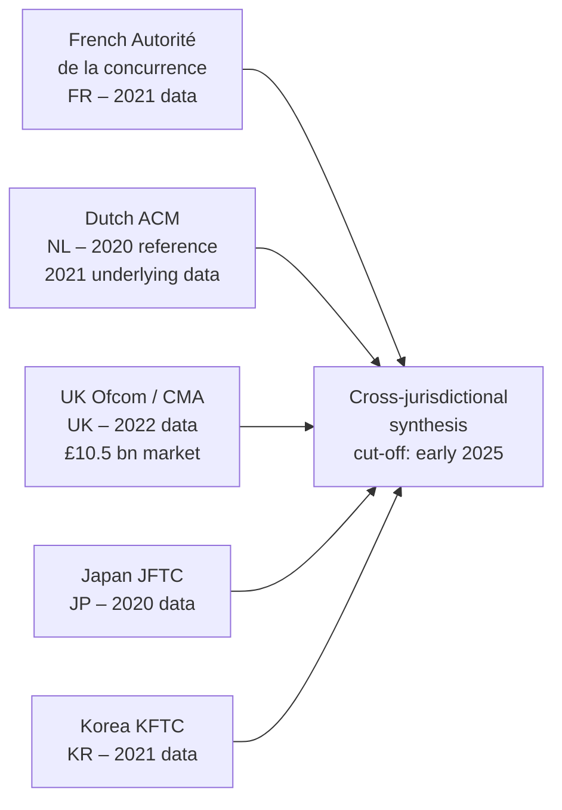
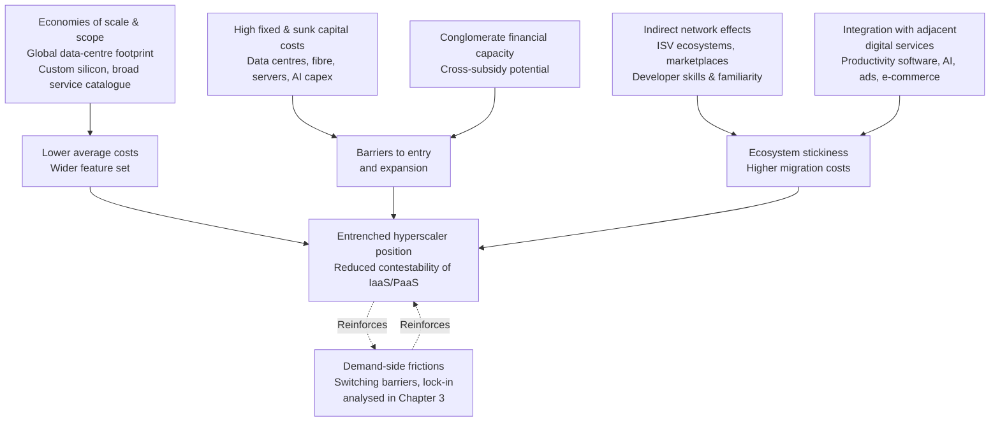
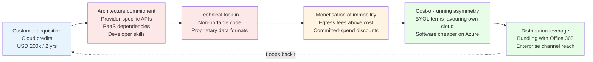

# Competitive Landscape of the Public Cloud Computing Services Market: An Analysis of IaaS and PaaS Based on Competition Authority Findings
# 1 Introduction and Scope of the Analysis

Public cloud computing has, within little more than a decade, evolved from a niche IT delivery model into a foundational layer of the global digital economy. As enterprises, governments, and digital-native firms increasingly rely on remotely provisioned compute, storage, and platform services, the competitive conditions under which these services are supplied have become a central concern for competition authorities across major jurisdictions. Between roughly 2022 and early 2025, a notable convergence of regulatory attention emerged: market studies and sector inquiries by the French *Autorité de la concurrence*, the Dutch *Autoriteit Consument & Markt* (ACM), the UK *Office of Communications* (Ofcom) and *Competition and Markets Authority* (CMA), the *Japan Fair Trade Commission* (JFTC), and the *Korea Fair Trade Commission* (KFTC) each independently scrutinized the structure of public cloud markets and the conduct of the largest providers. This report synthesizes the findings of those studies. Before turning to the substantive analysis of market structure (Chapter 2) and competition issues (Chapter 3), this opening chapter establishes the analytical perimeter of the report: it defines the relevant services, justifies the focus on Infrastructure-as-a-Service (IaaS) and Platform-as-a-Service (PaaS) for business customers, situates the topic within the broader digital economy, sets out the methodological approach and temporal cut-off, and clarifies the key terminology that will recur throughout the subsequent chapters.

## 1.1 Definition of the Public Cloud and Service Layer Classification

The "public cloud" refers to a model in which computing resources—compute capacity, storage, networking, and higher-level software functionality—are owned and operated by a third-party provider and made available to a wide range of unrelated customers over the public internet (or dedicated network interconnections) on a shared, on-demand, and typically usage-based basis. It is contrasted with the "private cloud" (where infrastructure is dedicated to a single organization, whether operated in-house or by a third party) and "hybrid" or "multi-cloud" deployments that combine the two. The CMA, in scoping its market investigation of cloud services in the United Kingdom, focused specifically on cloud services used as public clouds, encompassing both IaaS and PaaS layers, and quantified the relevant expenditure in the UK at approximately £10.5 billion.[^1]

Within the public cloud, the industry and competition authorities consistently distinguish three principal service layers, organized hierarchically by the degree of abstraction provided to the customer:

| Service Layer | What the Provider Supplies | What the Customer Manages | Typical Customer Interface | Illustrative Use Cases |
|---|---|---|---|---|
| **IaaS** (Infrastructure-as-a-Service) | Virtualized compute, storage, networking, and basic security primitives | Operating systems, middleware, runtime, applications, data | APIs, command-line interfaces, web consoles configuring virtual machines, storage buckets, virtual networks | Hosting custom applications, lift-and-shift of on-premise workloads, raw storage and back-up, large-scale batch processing |
| **PaaS** (Platform-as-a-Service) | Managed runtime environments, databases, container orchestration, application development platforms, AI/ML and analytics services on top of IaaS | Application code, application data, configuration | SDKs, managed-service APIs (e.g. managed databases, serverless functions), development tooling | Application development and deployment, managed databases and data warehouses, machine-learning training and inference, event-driven and serverless workloads |
| **SaaS** (Software-as-a-Service) | Complete, ready-to-use application functionality delivered over the network | Only user-level data and configuration | Web browsers, mobile apps, application-specific APIs | Productivity suites, CRM, ERP, collaboration and communication tools delivered to end users |

In practical terms, IaaS provides the raw "compute, storage, and networking" building blocks that customers assemble into their own systems, while PaaS offers higher-level managed services—databases, container platforms, AI services, event-driven runtimes—that reduce the operational burden on the customer but tie the customer's code more closely to provider-specific service definitions. SaaS, by contrast, delivers fully managed applications whose internal architecture is generally opaque to the user. This taxonomy provides the definitional baseline used throughout this report and aligns with the scope adopted by the UK CMA, whose market investigation expressly covered cloud services used as public clouds, including IaaS and PaaS.[^1]

## 1.2 Rationale for Focusing on IaaS and PaaS for Business Customers

The report concentrates on IaaS and PaaS, and within those layers on business (B2B) customers, for four interrelated reasons that flow directly from the way competition authorities have framed their own inquiries.

First, **structural homogeneity**: IaaS and PaaS share the same underlying capital-intensive infrastructure base (regional data-centre footprints, fibre and submarine cable interconnections, custom silicon, and globally distributed control planes). The economic forces that shape the IaaS layer—high fixed costs, scale economies, and network effects mediated through software ecosystems—continue to operate at the PaaS layer, where they are reinforced by the technical lock-in characteristic of managed services. SaaS, by contrast, is a much more heterogeneous category, ranging from horizontal productivity suites to vertical-specific applications, each with its own distinctive competitive dynamics.

Second, **foundational role**: IaaS and PaaS function as upstream inputs to virtually all other digital services, including SaaS itself. Many SaaS providers themselves run on hyperscaler IaaS/PaaS, which means competitive conditions in IaaS/PaaS propagate through the entire digital value chain. Analyzing the foundational layer thus illuminates competitive effects that extend well beyond the immediate market.

Third, **alignment with regulatory focus**: the CMA's UK market investigation expressly scoped its work around public cloud IaaS and PaaS, the layers in which £10.5 billion of UK expenditure was identified.[^1] Other authorities surveyed in this report have taken a similar approach, treating IaaS and PaaS as the relevant frame of reference for assessing concentration, switching barriers, and the conduct of the largest providers. Maintaining the same perimeter enables consistent cross-jurisdictional synthesis in later chapters.

Fourth, **customer characteristics**: business customers—ranging from start-ups and scale-ups to large enterprises and public-sector bodies—are the principal demand-side actors for IaaS and PaaS. Consumer-facing cloud storage products, while economically significant, operate under fundamentally different competitive conditions (different distribution channels, different switching dynamics, different relevance of egress fees and licensing) and have not been the focus of the competition-authority studies underpinning this report. Restricting the analysis to B2B IaaS/PaaS therefore aligns the report's scope with the evidentiary base on which it relies.

## 1.3 Macro-Relevance of Cloud Services to the Digital Economy

The competitive analysis that follows acquires its significance from the scale and centrality of cloud services to contemporary economic activity. Public cloud has become the default delivery mode for new enterprise IT workloads, the principal computational substrate for artificial intelligence research and deployment, and a critical input to digitally enabled productivity across both private and public sectors. The order of magnitude of the market is illustrated by the figures cited in regulatory work: the CMA, in its market study of UK cloud services, identified expenditure of approximately **£10.5 billion** on public cloud IaaS and PaaS in the United Kingdom alone.[^1] A market of this scale—covering, in a single mid-sized European economy, an annual spend equivalent to that of major regulated infrastructure sectors—indicates the systemic relevance of competitive conditions in cloud.

Several macro-economic considerations reinforce the case for close regulatory and analytical scrutiny. First, cloud services are an **enabler of digital transformation** across virtually all sectors of the economy, from financial services and retail to healthcare and government, meaning that any distortion in cloud markets transmits to a very wide downstream user base. Second, cloud infrastructure is the **principal platform for AI development and deployment**, including training and serving of large foundation models, whose economic and strategic importance has grown sharply in the period covered by this report. Third, cloud is an **input to innovation**, particularly for start-ups and scale-ups whose access to flexible, low-fixed-cost infrastructure is shaped by the commercial practices of the largest providers (including the cloud credit programmes examined in Chapter 3). Fourth, public cloud increasingly underpins **critical national infrastructure and public-sector services**, which raises both competition-policy and broader resilience concerns. Together, these factors explain why competition authorities in Europe, the United Kingdom, Japan, and Korea have, broadly contemporaneously, prioritized cloud as a subject of detailed market study.

## 1.4 Methodological Approach and Sources

The report adopts a **comparative, source-based methodology**, synthesizing the findings of competition-authority market studies and sector inquiries from five jurisdictions:

The selection of these five authorities reflects three criteria. First, **subject-matter focus**: each authority has produced a dedicated public cloud market study or sector report covering IaaS/PaaS competitive conditions, rather than only tangential references in broader digital-markets work. Second, **geographic balance**: the sample combines three European jurisdictions (France, the Netherlands, the United Kingdom) with two leading Asian economies (Japan, Korea), enabling identification of both common findings and jurisdictionally specific dynamics (for example, the presence of regional Asian providers such as NTT, Fujitsu, NHN, Naver Cloud, and KT in Japan and Korea). Third, **comparable analytical depth**: each report addresses, to varying degrees, the same recurring themes—hyperscaler concentration, switching barriers, egress fees, cloud credits, and Microsoft licensing—allowing a structured cross-jurisdictional comparison in Chapter 4.

The report applies a **temporal cut-off of early 2025**, meaning that only findings, data, and regulatory positions published up to that point are reflected; later developments, including post-cut-off remedies, commitments, or further investigations, are outside scope. Within that window, the reference years for market-share data vary by jurisdiction—France 2021, the Netherlands 2020 (reflecting 2021 underlying data), the United Kingdom 2022, South Korea 2021, and Japan 2020—which has direct implications for the comparability of the figures presented in Chapter 2 and is flagged explicitly there.

Several **methodological limitations** of this source-based approach deserve acknowledgment at the outset. The competition authorities cited employ different measurement bases (revenue versus usage incidence), different scope definitions (some include or exclude particular PaaS or hybrid offerings), and different reporting formats (point estimates, banded ranges, or residuals). Consequently, the comparative tables and discussions in this report are designed to illustrate **patterns and orders of magnitude** rather than to support strict arithmetic comparison across jurisdictions. Where significant differences in methodology or data vintage affect interpretation, they are flagged in the text. The report also remains strictly **descriptive of authority findings**: it does not offer independent predictions, normative policy recommendations beyond those expressed by regulators, or speculative claims about future market evolution.

## 1.5 Key Terminology and Analytical Baseline

To ensure terminological consistency across the report and to provide readers with the conceptual tools required for the analysis in subsequent chapters, the following key terms are used in the following defined senses:

- **Hyperscaler.** A cloud provider operating at the largest tier of scale, characterized by globally distributed data-centre infrastructure, a very broad portfolio of IaaS and PaaS services, very substantial capital expenditure, and a multi-region or worldwide customer base. In the studies surveyed, the term is consistently applied to *Amazon Web Services (AWS)*, *Microsoft Azure*, and *Google Cloud*. These three providers form the analytical centre of gravity of the report.

- **Workload.** A discrete unit of computing activity—an application, service, dataset, or processing task—that runs on cloud infrastructure. The concept is important because customer relationships with cloud providers are typically organized workload by workload, and discussions of switching, portability, and multi-cloud strategies are best understood at the workload level rather than at the level of the customer as a whole.

- **Multi-cloud.** The strategy of using IaaS and/or PaaS services from more than one provider concurrently, whether to allocate different workloads to different providers, to use specialized services from each, or as a form of risk mitigation. Multi-cloud is distinct from "switching" because workloads are placed in parallel rather than migrated.

- **Hybrid cloud.** A deployment model combining public cloud services with private cloud or on-premise infrastructure, with workloads or data moving between the two environments. Hybrid configurations are particularly relevant to the analysis of software licensing (notably Microsoft's BYOL terms) because they involve customers running licensed software both on their own premises and in public cloud environments.

- **BYOL (Bring Your Own License).** A licensing model under which a customer that holds an existing licence for vendor software (such as Windows Server or SQL Server) is permitted to use that licence to run the software on cloud infrastructure, rather than purchasing a separate cloud-bundled licence. The economic conditions attached to BYOL—and changes to those conditions, particularly the modifications introduced by Microsoft from October 2019 onwards affecting outsourcing rights on competing clouds—are a recurring subject of competition-authority analysis examined in Chapter 3.

- **Independent Software Vendor (ISV).** A third-party software producer whose products are offered to run on, or are integrated with, cloud platforms. ISV ecosystems generate indirect network effects: the larger and more diverse the ISV portfolio supporting a given cloud, the more attractive that cloud is to customers, and vice versa.

- **Egress fees.** Charges levied by cloud providers for outbound data transfer—data leaving the provider's network to another provider's network or to an on-premise environment—typically asymmetric with respect to ingress, which is generally free of charge. Egress fees feature prominently in the analysis of switching barriers and pricing issues in Chapter 3.

- **Cloud credits.** Promotional grants of cloud usage entitlements, often in significant amounts, made available to particular customer segments (notably start-ups, scale-ups, academic institutions, and developer communities), examined in Chapter 3 in terms of their potential effects as de facto loyalty mechanisms.

Together, these definitions establish the shared vocabulary on which the remainder of the report relies. With the scope, justification, macro-context, methodology, and terminology now established, Chapter 2 turns to the substantive analysis of market structure and competitive dynamics, beginning with the identification of the principal categories of players and the construction of a cross-jurisdictional comparative picture of market shares.

[^1]: Outline of Infra Cloud Market Survey in UK – Lexology.

# 2 Part One – Market Structure and Competitive Dynamics

Chapter 1 established the scope of the analysis (public cloud IaaS and PaaS for business customers), the macro-relevance of cloud services, and the comparative source-based methodology drawing on the five competition authorities. The present chapter operationalizes that frame. It moves from the conceptual scaffolding to the empirical foundations on which the rest of the report depends: who supplies public cloud services, how concentrated supply is across the surveyed jurisdictions, and which structural forces explain why a small number of providers have captured—and continue to entrench—the dominant share of the market. The chapter is organised in three steps. Subsection 2.1 maps the principal categories of providers, distinguishing the U.S. hyperscalers from European pure players, Asian regional champions, and trusted-cloud joint ventures. Subsection 2.2 synthesizes market-share evidence into a cross-jurisdictional comparative table, flagging the methodological caveats that arise from differing reference years, measurement bases, and scope. Subsection 2.3 then examines the economic and technical drivers—economies of scale and scope, capital intensity, network effects through ISV ecosystems and developer familiarity, and conglomerate integration—that the surveyed authorities identify as the engines of the observed concentration. Together, these three steps prepare the ground for Chapter 3's analysis of specific anti-competitive practices, by showing that the conduct examined later operates upon, and reinforces, a market structure that is already strongly tilted toward a small number of integrated providers.

## 2.1 Categories of Players in the Public Cloud Market

Public cloud IaaS and PaaS markets, while presented in the media as a single global "cloud industry", in fact comprise distinct categories of suppliers operating at very different scales and with very different strategic positionings. The competition authorities surveyed converge on a similar taxonomy, which can be organised around four categories: the three U.S. hyperscalers, European pure players, Asian regional champions, and trusted-cloud joint ventures.

### 2.1.1 The Three U.S. Hyperscalers

At the centre of every authority's analysis stand three providers — *Amazon Web Services* (AWS), *Microsoft Azure*, and *Google Cloud Platform* (GCP) — uniformly described as "hyperscalers". The French *Autorité de la concurrence* in its July 2023 opinion characterized these three players as dominating the sector and noted that in 2021 they accounted for **80% of the growth in spending on public cloud infrastructure and applications in France**, observing that their "financial firepower" and "ecosystems of digital services" position them to "potentially hinder the development of competition".[^2] The UK Ofcom market study similarly identified AWS and Microsoft as the two leading providers, with Google "their closest competitor" but materially behind, and grouped the three under the heading "hyperscalers", stating that "the vast majority of cloud customers use their services in some form".[^3] The CMA, concluding its market investigation, found that AWS and Microsoft each held between **30% and 40%** of the UK IaaS market as of 2024, while noting Microsoft's PaaS share had risen to the **20–30%** band since 2020.[^4][^5]

The hyperscalers share four defining structural features documented in the authority reports. First, **service breadth**: each offers a portfolio of several hundred distinct IaaS and PaaS services covering compute, storage, networking, databases, container orchestration, serverless platforms, AI/ML, analytics, and adjacent capabilities. Second, **capital intensity**: the CMA emphasized that competing at hyperscale requires "significant capital investment in fixed assets such as data centers, networks and servers, and components which become largely a sunk cost", and observed that "the largest cloud providers are making substantial investments in IaaS and AI capabilities to expand their services in coming years".[^4] Third, **worldwide footprint**: each operates global regions and availability zones supported by privately owned long-haul and submarine fibre, generating both technical performance advantages and economies of scope across geographies. Fourth, **adjacent ecosystem integration**: each is embedded in a wider corporate group with significant positions in adjacent digital markets — Amazon in e-commerce and devices; Microsoft in productivity software, operating systems, and enterprise application stacks; Google in advertising, search, and Android — a feature discussed further in subsection 2.3.

### 2.1.2 European "Pure Players"

A second category, particularly prominent in the analysis of the French *Autorité*, comprises European "pure players" whose business is concentrated on cloud infrastructure and platform services and whose strategic narrative emphasises European data sovereignty, regulatory compliance, and independence from non-EU jurisdictional reach. Representative names recurrently cited include **OVHcloud**, **Scaleway**, and **3DS Outscale**. In the UK context, the *Civo* CEO's submissions to Ofcom and the CMA, as well as smaller providers identified in the CMA's evidence base, illustrate the same category of challenger providers oriented toward transparency, lower egress costs, and simpler pricing.[^6]

European pure players operate at scales that are typically orders of magnitude smaller than the hyperscalers, both in revenue and in installed capacity. Their narrower service catalogues — generally focused on core IaaS and selected PaaS components such as managed Kubernetes, object storage, and managed databases — reflect both capital constraints and a deliberate positioning around openness and portability. As discussed in subsection 2.3 and Chapter 3, the very characteristics that differentiate these providers from the hyperscalers (smaller ISV ecosystems, narrower PaaS portfolios, limited bargaining power against proprietary software vendors) are also a function of the structural advantages the hyperscalers enjoy.

### 2.1.3 Asian Regional Champions

A third category, especially visible in the JFTC and KFTC studies, consists of Asian regional champions that retain meaningful but minority positions in their home markets. In **Korea**, the KFTC's two-stage market study (32 providers surveyed plus some 3,000 stakeholders) confirmed that domestic providers occupy ranks 3 and 4 of the market, with **Naver Cloud** reaching 7.0% in 2021 and competing with Google for third place, alongside other domestic actors such as **NHN** and **KT**.[^7][^8][^9] In **Japan**, the JFTC's 2022 report identified Japanese providers as small but identifiable players: in the IaaS user-incidence survey, **NTT Communications** reached 5.7% and **Fujitsu** 4.2%, while domestic providers more generally occupied the long tail behind the three U.S. hyperscalers.[^10][^11]

Beyond Japan and Korea, the broader Asian competitive landscape — as referenced in cross-jurisdictional regulatory exchanges — includes **Alibaba Cloud** and **Tencent Cloud**, which hold material positions in mainland China and in parts of Asia-Pacific but are largely outside the geographic scope of the five surveyed authorities' market studies. Their visibility in the studies covered here is therefore limited; the JFTC and KFTC studies focus principally on the competitive dynamics within their home markets, where domestic providers compete primarily on quality-of-service localization, regulatory alignment, and managed-services partnerships rather than on global scale.

### 2.1.4 Trusted-Cloud Joint Ventures

A fourth, more recent category — particularly significant in the French regulatory landscape and referenced more broadly across the European studies — consists of "trusted cloud" joint ventures that combine hyperscaler technology with local industrial partners to address sovereignty, regulatory, and security concerns. These constructions allow customers (notably in regulated sectors and the public sector) to access hyperscale technology under operational and governance arrangements designed to insulate workloads and data from extraterritorial legal exposure. The *Autorité de la concurrence* explicitly considered such constructions among the various market structures relevant to its analysis of the French cloud sector and the practices likely to affect competition.[^2]

While the surveyed studies do not provide directly comparable quantitative data on the share of trusted-cloud joint ventures in each market, their importance lies in the qualitative competitive question they raise: whether they expand effective competitive choice for sensitive workloads or whether they consolidate hyperscaler technology penetration into segments — notably public-sector procurement — that might otherwise be served by European pure players. This tension between sovereignty objectives and competitive market structure is part of the regulatory backdrop against which the egress, credit, and licensing practices examined in Chapter 3 are assessed.

## 2.2 Cross-Jurisdictional Comparison of Market Shares

Building on the supply-side taxonomy, this subsection synthesizes the market-share evidence reported by the five competition authorities. The comparison must, at the outset, be read as **illustrative of patterns and orders of magnitude rather than as a strict arithmetic ranking**: the underlying figures differ across jurisdictions in reference year, measurement basis, perimeter (pure IaaS, IaaS+PaaS, or broader cloud spend), and reporting format (point estimates, banded ranges, or residuals deduced from leaders' shares).

### 2.2.1 Comparative Table

The table below assembles the principal headline figures reported by the *Autorité de la concurrence* (France), the *Autoriteit Consument & Markt* (ACM, Netherlands), Ofcom/CMA (United Kingdom), the *Korea Fair Trade Commission* (KFTC), and the *Japan Fair Trade Commission* (JFTC). Each row preserves the format in which the respective authority reported its findings.

| Jurisdiction (Reference year) | Amazon Web Services | Microsoft Azure | Google Cloud | Other / Notes |
|---|---|---|---|---|
| **France (2021)** | ~46% of IaaS+PaaS revenue | ~17% of IaaS+PaaS revenue | Not separately disclosed | The three hyperscalers together captured ~80% of growth in spending on public cloud infrastructure and applications in 2021[^2] |
| **Netherlands (2020 ref.; 2021 underlying data)** | 35–40% (banded) | 35–40% (banded) | Not separately disclosed | The two largest providers (Azure, AWS) each at 35–40%; 65% of Dutch businesses used cloud services in 2021, vs. EU average 41%[^12][^13] |
| **United Kingdom (2022; updated to 2024 in CMA final)** | 30–40% (banded; AWS and Microsoft each, IaaS, 2024); combined AWS+Microsoft 70–80% in 2022 | 30–40% (banded; IaaS, 2024); PaaS share risen to 20–30% since 2020 | 5–10% (closest competitor, 2022) | UK public cloud IaaS/PaaS spend estimated at £7.5 bn in 2022 (Ofcom) and £10.5 bn at the time of the CMA's final report; less than 1% of customers switch providers per year[^4][^5][^3][^14] |
| **South Korea (2021)** | ~62.1% (down from 77.9% in 2019; 70.0% in 2020) | ~12.0% (2021; up from 6.7% in 2019) | ~6.5% (2021; up from 3.5% in 2019) | Naver Cloud ~7.0% in 2021 (third place); domestic providers (NHN, KT) in long tail; based on IaaS/PaaS revenue data submitted by 16 public-cloud-focused providers[^7][^9][^8] |
| **Japan (2020)** | IaaS user-incidence 49.6% (PaaS 27.6%) | IaaS user-incidence 23.2% (PaaS 28.5%) | (Within combined hyperscaler total) | Combined AWS+Azure+GCP share of IaaS+PaaS market: 60–70% in FY2020, up ~20 percentage points from FY2017; NTT Comm. IaaS 5.7%; Fujitsu IaaS 4.2%; 85.9% of users would not switch even if their provider raised prices by 5–10%[^10][^11] |

Several **methodological caveats** are essential to a sound reading of this table. First, **measurement basis differs**: France and Korea report revenue-based shares; Japan reports user-incidence (the proportion of surveyed firms naming each provider in a multiple-choice question, which is why IaaS percentages do not sum to 100%), supplemented by a combined hyperscaler revenue/scope estimate; the UK CMA reports banded revenue-share estimates; the Dutch ACM reports banded shares without disclosing the underlying methodology in detail. Second, **scope differs**: the French figure aggregates IaaS and PaaS, the Korean figure is based on IaaS/PaaS revenue from 16 firms primarily active in public (commercial) cloud, the JFTC distinguishes IaaS and PaaS user-incidence separately, and the CMA distinguishes IaaS from PaaS in its banded ranges. Third, **reference years differ**: the comparison spans 2020 (Japan/Netherlands underlying data) to 2024 (CMA updated IaaS shares), a four-year window in a rapidly growing market. Fourth, the **"Other" residual is heterogeneous**: in France and the UK it is dominated by Google and a tail of mostly European pure players; in Japan and Korea it includes domestic providers with material individual shares; in the Netherlands the residual is not explicitly decomposed in the public summary.

### 2.2.2 Cross-Jurisdictional Patterns

Notwithstanding these caveats, the picture that emerges from the five jurisdictions is **remarkably consistent in its qualitative features**.

**A duopolistic or near-duopolistic core, with AWS and Microsoft jointly dominant.** In four of the five jurisdictions, AWS and Microsoft together account for the overwhelming majority of public cloud IaaS/PaaS supply: roughly 63% of revenue in France (2021),[^2] 70–80% combined in the Netherlands (each at 35–40%),[^12] 70–80% combined in the UK in 2022,[^3] and around 74% of Korean revenue in 2021.[^7][^9] In Japan, the JFTC's combined-share figure of 60–70% for the three hyperscalers in FY2020 falls within the same range when the contribution of Google is factored in.[^10]

**AWS as the dominant single player in most markets, but with Microsoft challenging or matching.** AWS is the single largest provider by revenue in France (~46%), the UK (where AWS and Microsoft are banded at 30–40% each but AWS's position has historically led), Korea (62.1% in 2021), and Japan (49.6% IaaS user-incidence).[^2][^4][^7][^10] The Netherlands stands out as the jurisdiction in which the ACM reports Microsoft Azure ahead of AWS within an overlapping band, reflecting the strength of Microsoft's enterprise penetration in the Dutch market.[^12] Microsoft's relative position has been **strengthening over time**: the Korean data show Microsoft's share rising from 6.7% in 2019 to 12.0% in 2021, and the CMA reports Microsoft's PaaS share increasing to 20–30% since 2020.[^4][^7][^9]

**Google Cloud as a distant third with single-digit to low-double-digit shares.** Where separately reported, Google Cloud appears materially behind: Ofcom reported 5–10% for Google in the UK in 2022;[^3] the KFTC reported 6.5% in Korea in 2021;[^7] the French *Autorité* did not separately disclose Google's revenue share but treated Google as one of the three hyperscalers dominating sector growth.[^2]

**The "rest of the market" varies materially in composition.** The most striking jurisdictional differences concern the structure of the non-hyperscaler tail. In Korea, Naver Cloud reached 7.0% in 2021 and competed with Google for third place, with other domestic providers (NHN, KT) also present.[^7][^8] In Japan, identifiable domestic providers (NTT Communications 5.7% IaaS user-incidence; Fujitsu 4.2%) operate at meaningful scale, although the hyperscalers have been gaining share rapidly (combined hyperscaler share rising ~20 percentage points between FY2017 and FY2020).[^10] In France, the UK, and the Netherlands, the tail is more fragmented and the European pure players individually hold smaller shares, though they are central to the European competitive policy debate.

**Concentration is increasing, not declining.** The Korean time-series data, the Japanese FY2017–FY2020 trend, and the CMA's documentation of Microsoft's rising PaaS share all point in the same direction: the period covered by the surveyed studies has seen the hyperscaler share grow, not erode, despite the entry of European pure players and the rise of regional champions.[^4][^10][^9] As discussed in 2.3, this is consistent with the operation of strong structural drivers of concentration.

## 2.3 Structural Drivers of Concentration and Entrenchment

The market structure documented in 2.2 is not accidental. The five competition authorities, despite their differing analytical frameworks, converge on a substantially overlapping set of structural drivers that explain both the observed concentration and the difficulty of effectively contesting hyperscaler positions. Five drivers stand out: economies of scale and scope; very high fixed and sunk costs of entry and expansion; direct and indirect network effects, particularly through ISV ecosystems and developer familiarity; conglomerate financial capacity; and integration with adjacent digital services. As shown in the diagram below, these drivers operate jointly and reinforce one another.

### 2.3.1 Economies of Scale and Scope

Cloud infrastructure exhibits pronounced **economies of scale**. The CMA found that "larger cloud providers have lower average costs compared to smaller providers", reflecting the fixed-cost-intensive nature of data-centre operations, the ability to amortise long-haul fibre and custom silicon investments across very large customer bases, and the operational efficiencies of automated, software-defined infrastructure at hyperscale.[^4] The KFTC reached a substantively identical conclusion, observing that the cloud industry "requires significant upfront investments in infrastructure such as data centers and R&D" and consequently "tends to exhibit strong economies of scale", which "can make it difficult for new competitors to enter the market and may even drive existing ones out".[^7]

Closely allied are **economies of scope**: each additional service in a provider's catalogue can be built upon, and integrated with, the existing portfolio at relatively low marginal cost, while broadening the provider's appeal to customers seeking a one-stop-shop solution. The very broad service catalogues of the hyperscalers — encompassing not only IaaS and core PaaS but also managed databases, AI/ML, analytics, IoT, identity, and security — embody this dynamic. The KFTC's survey-based finding that 79.9% of Korean customers spend more than 60% of their cloud budget with a single provider, citing "quality" (42.9%), "variety of solutions and services" (40.2%), and "reputation" (38.6%) as the principal reasons, captures the consequence of scope economies as experienced on the demand side.[^7][^8]

### 2.3.2 Capital Intensity and Barriers to Entry

The capital cost of operating at hyperscale constitutes a substantial **structural barrier to entry and expansion**. The CMA was explicit on this point: "There are substantial barriers to entry and expansion in cloud services, particularly in IaaS as this requires significant capital investment in fixed assets such as data centers, networks and servers, and components which become largely a sunk cost".[^4] The barrier is not merely the absolute size of the investment but its **sunk** character: once committed, much of the spend is irrecoverable, which deters entry by new players uncertain of their ability to secure long-term demand at sufficient scale.

The CMA further observed that the hyperscalers' ongoing investment programmes — particularly in AI-capable infrastructure — may themselves operate as a barrier, noting that "while this investment can have pro-competitive effects and benefit cloud customers, it may also deter market entry or expansion by potential rivals".[^4] In effect, the rapid escalation of capital intensity associated with AI workloads raises the minimum efficient scale of operation, widening the gap between the hyperscalers and other players.

### 2.3.3 Network Effects: ISV Ecosystems and Developer Familiarity

A third category of drivers operates through **direct and, more importantly, indirect network effects**.

**Indirect network effects via ISV ecosystems and marketplaces.** The KFTC describes "powerful network effects" arising from "the ease of interoperability among companies using the same cloud provider and the high complementarity with adjacent software".[^7] In concrete terms, the larger a cloud's installed customer base, the more Independent Software Vendors port their products, build native integrations, certify reference architectures, and offer their software through the cloud's marketplace; and the richer the ISV ecosystem, the more attractive the cloud becomes to new customers. The KFTC documented that "Amazon, Microsoft, Google, Naver, KT and other major providers operate marketplaces", taking commissions of 3% to 20% on paid software intermediated through them.[^7] These marketplaces, alongside the broader ISV partner ecosystem, function as a "platform within a platform" that compounds the cloud's gravitational pull.

**Developer skills and familiarity.** A parallel network effect operates through human capital. As cloud platforms diffuse, more developers acquire skills in the specific services, APIs, SDKs, and tooling of the leading providers; certifications, training materials, and community resources accumulate disproportionately around those providers; recruitment pipelines reinforce these skill concentrations. The KFTC's analysis of switching frictions explicitly identifies "programming languages, APIs (the communication languages between applications and operating systems), SDKs (software development kits)" as platform-specific assets that customers have already invested in and cannot readily replicate elsewhere, contributing to lock-in once an initial choice has been made.[^7] In the Japanese context, an IT vendor cited by the JFTC-linked reporting explained that switching is rare because the cost and risk of doing so exceed any plausible benefit.[^10]

**Reputation as a self-reinforcing signal.** The KFTC adds a further mechanism: in conditions of significant uncertainty about service quality, functionality, and interoperability, customers rely heavily on provider reputation, and a low market share itself signals low reputation, reinforcing incumbent dominance.[^7] Together, ISV ecosystems, developer skills, and reputation produce a configuration in which the structural advantages of the leading providers compound over time.

### 2.3.4 Conglomerate Financial Capacity

A fourth driver, particularly emphasised by the French *Autorité*, is the **conglomerate financial capacity** of the hyperscalers. The *Autorité* observed that the three hyperscalers, by virtue of their financial firepower and ecosystems of digital services, are "in a position to potentially hinder the development of competition".[^2] Two mechanisms are relevant. First, the ability to sustain very large and prolonged investment programmes — in data centres, AI hardware, and global networks — without immediate profitability pressure provides a level of strategic patience that smaller providers cannot match. Second, the ability to deploy cloud credits at very large scale (analysed in detail in Chapter 3) functions as a commercial instrument that smaller competitors cannot replicate profitably. The conglomerate position thus translates into a competitive advantage at the level of the IaaS/PaaS offering itself.

### 2.3.5 Integration with Adjacent Digital Services

The fifth driver — adjacency and ecosystem integration — links cloud markets to broader digital-economy positions and is consistently flagged across the surveyed studies. The CMA, in its final report, addressed Microsoft's software licensing practices as a distinct competitive issue, noting that certain Microsoft products "do not [become] available to Google and AWS" and that some products are "used disproportionately on Azure", which "is at least partly because some customers' choice of cloud is influenced by Microsoft's licensing practices".[^5] The KFTC, conducting its own analysis, identified the risk that providers may "extend their dominance in the primary market to closely related markets with strong complementarities", whether via tie-ins, bundling, exclusive dealing, or self-preferencing.[^7]

The integration mechanism operates in both directions. On one side, hyperscaler control of adjacent assets — productivity software (Microsoft 365), operating systems (Windows Server), database systems (SQL Server), advertising and search (Google), e-commerce and devices (Amazon), and increasingly proprietary AI foundation models — provides distribution channels into the cloud and shapes the relative cost of running competing workloads on rival clouds. On the other side, dominance in cloud creates a privileged channel for distributing and embedding adjacent services. The detailed analysis of how these integration effects translate into specific competition concerns — particularly Microsoft's October 2019 BYOL/Outsourcing changes and the bundling of Microsoft Teams with Office 365/Microsoft 365 — is undertaken in Chapter 3.

### 2.3.6 Interaction with Demand-Side Frictions

A final analytical point closes this chapter. The structural drivers analysed above operate on the **supply side**: they shape the relative cost positions, ecosystem strengths, and competitive options of providers. They are reinforced — and their effects on contestability amplified — by the **demand-side frictions** that all five authorities document and that Chapter 3 examines in detail: high switching costs arising from technical incompatibility and data migration burdens, egress fees that penalise outbound data movement, complex and opaque pricing structures that obscure comparison, committed-spend discounts that tie customers to single providers, cloud credits whose loyalty-rebate-like properties bind customers at the outset of their cloud journey, and software-licensing and bundling practices that raise the cost of running workloads on rival clouds. The KFTC's market study summarized the consequence with particular clarity: even where alternative providers are available, "high switching costs can lead to user lock-in",[^7] and the JFTC's finding that **85.9% of Japanese users would continue with their current provider even if prices rose by 5–10%** quantifies the resulting demand inelasticity.[^10]

The result is a self-reinforcing equilibrium. Supply-side advantages (scale, scope, capital intensity, ecosystems, conglomerate integration) entrench hyperscaler positions; the entrenched positions generate demand-side frictions (switching costs, lock-in, dependence) that further reduce the effectiveness of competitive pressure; the reduction in competitive pressure preserves the rents that finance the next round of supply-side investment. It is against this self-reinforcing backdrop that Chapter 3 turns to the specific conduct identified by competition authorities — switching barriers, egress fees and cloud credits, and exclusive licensing and bundling — through which the structural conditions described in the present chapter are translated into observable anti-competitive effects.

# 3 Part Two – Main Competition Issues and Anti-Competitive Practices

Chapter 2 established that the public cloud IaaS/PaaS landscape across France, the Netherlands, the United Kingdom, Korea, and Japan is structurally concentrated around three hyperscalers, and that this concentration is sustained by economies of scale and scope, prohibitive capital intensity, indirect network effects through ISV ecosystems and developer skills, conglomerate financial capacity, and integration with adjacent digital services. Yet structural advantage does not by itself foreclose competition. The five surveyed competition authorities, together with parallel proceedings at the European Commission, have identified a specific set of *conduct* through which hyperscaler positions are converted into durable market power: practices that elevate the costs and frictions of moving workloads between providers, pricing instruments that monetise that immobility, and licensing and bundling arrangements that leverage adjacent software dominance into the cloud layer itself. This chapter dissects that conduct.

The analysis is organised in four steps. Subsection 3.1 examines the technical and contractual machinery of switching barriers — the foundation on which most other practices operate. Subsection 3.2 then analyses two pricing practices that have attracted the most concentrated regulatory attention: egress fees and cloud credit programmes. Subsection 3.3 turns to Microsoft's exclusive licensing changes since October 2019 and the bundling of Teams with Office 365 / Microsoft 365, both of which leverage adjacent-software dominance into IaaS/PaaS competition. Subsection 3.4 synthesises how these practices interact, showing that they form a coordinated system rather than a list of discrete grievances. Throughout, the analysis remains strictly descriptive of the findings authorities have themselves articulated.

## 3.1 Switching Barriers: Technical Lock-In and Contractual Frictions

Switching barriers — the costs, frictions, and risks a customer must absorb to move workloads from one cloud provider to another, or to operate them in parallel across multiple providers — sit at the analytical heart of every market study examined in this report. The CMA, framing the issue in its egress fees working paper, summarized the underlying logic in conventional industrial-organization terms: customers face a trade-off between the expected benefits of switching or multi-clouding (lower spend, higher flexibility, access to better-fitted services) and the expected costs (time and cost of moving workloads, reconfiguration, retraining, ongoing management complexity); where switching costs exceed the perceived benefits, customers stay even with offerings that would otherwise be better; and "switching costs may further harm competition in the long run where they make it more difficult for smaller rivals to expand, benefit from economies of scale, and compete with larger rivals on a stronger footing."[^15] This subsection examines, in turn, the technical and the contractual/financial dimensions of these barriers.

### 3.1.1 Technical Barriers: APIs, Data Formats, and the Particular Difficulty of PaaS

The technical infrastructure of public cloud services is not standardised. Each hyperscaler exposes its IaaS and PaaS functionality through its own application programming interfaces (APIs), software development kits (SDKs), command-line tools, configuration languages, and data formats. From the customer's perspective, an application built on one provider's stack incorporates many provider-specific dependencies that must be re-engineered to run on a competing cloud.

The French *Autorité de la concurrence* articulated this dynamic in its June 2023 opinion: technical barriers to migration "can arise at different levels, linked in particular to the specificities of the architecture and the solutions used," and "non-negligible migration costs can stem from the variety of products and services, in particular as regards PaaS services, the interconnection of IT services and the lack of portability of data and applications."[^16] The *Autorité* illustrated the point with a concrete example — Amazon's S3 object storage service — explaining that interoperability questions arise even at the IaaS layer where the service appears, on the surface, to be a commodity. It went further to observe that interoperability with PaaS services is "even more complex," because, for instance, "changing a PaaS database service requires rewriting the part of the application code that uses that service."[^16] The *Autorité* did not exclude that providers might "voluntarily" deploy mechanisms to impede interoperability, such as using specific data formats designed to prevent portability.[^16]

The KFTC arrived at a substantively identical diagnosis from the Korean evidence. In its market study, the KFTC identified the platform-specific assets in which customers accumulate sunk investments — "programming languages, APIs (the communication languages between applications and operating systems), SDKs (software development kits)" — as the principal technical roots of lock-in. Because these assets are not directly transferable, the customer's investment of skills, code, and architecture in one provider's stack creates an irreversible commitment cost that competing providers cannot neutralise.

Ofcom and the CMA reached parallel conclusions for the United Kingdom. Ofcom found that "technical barriers to switching involve the different APIs, protocols and workflows that customers must use for their application to work with each cloud,"[^17] a constraint that persists even where customers have adopted ostensibly open underlying technologies. The Omdia analyst quoted in *The Register*'s coverage of the CMA referral captured the residual non-portability vividly: "Even if an application is developed using Kubernetes, which is an open technology, the settings and other config requirements mean these workloads cannot just be moved between environments."[^17] The implication is significant: open-source foundations do not, by themselves, deliver workload portability across hyperscaler clouds, because each provider layers its own managed-service configurations, identity systems, networking primitives, and operational tooling on top.

The CMA's qualitative customer research, conducted by Jigsaw, corroborated this picture from the demand side. The Jigsaw report found that, for most participants, "the technical challenges combined with the lack of a clear business case were the main barriers to switching, with egress fees in some cases contributing to the reluctance to consider a switch," and that "in almost no cases were egress fees considered as the main or even one of the main barriers to switching."[^15] The dominant barrier is therefore not the visible monetary cost of egress, but the prior technical question of whether the workload can in fact be moved, and at what risk.

### 3.1.2 The Particular Severity of PaaS Lock-In

The technical barrier intensifies sharply as customers move from IaaS to PaaS. IaaS provides virtual machines, block storage, and virtual networks that are, in principle, addressable in conceptually similar ways across providers (even if implementation details differ). PaaS, by contrast, consists of managed services whose semantics are deeply provider-specific: a managed relational database, a serverless function runtime, an event-streaming platform, or a managed Kubernetes control plane each embodies vendor-specific configuration, identity integration, networking model, scaling behaviour, and operational tooling. Customer application code calls these managed services through proprietary APIs.

The *Autorité*'s observation that switching a PaaS database "requires rewriting the part of the application code that uses that service"[^16] captures the implication: PaaS lock-in is not a passive friction but an *active* re-engineering cost incurred by the customer. The KFTC's analysis of indirect network effects — "the ease of interoperability among companies using the same cloud provider and the high complementarity with adjacent software" — reinforces the same insight: as customers ascend the abstraction stack, they exchange operational simplicity for tighter integration with the chosen provider's service catalogue, and the relative cost of switching rises accordingly. The CMA's documentation that Microsoft's PaaS share in the UK had risen from earlier levels to the 20–30% band since 2020 (cited in Chapter 2) takes on additional significance in this light: the segment of the market in which lock-in is most severe is also the segment in which one hyperscaler has been gaining ground most quickly.

### 3.1.3 Contractual and Financial Frictions: Committed-Spend Discounts and Pricing Opacity

Layered onto the technical foundation are contractual and financial mechanisms that further reduce switching propensity.

**Committed-spend agreements.** Hyperscalers offer customers significant discounts in exchange for commitments to spend specified amounts over multi-year horizons. The CMA's egress fees working paper records that, in the sample of recent UK contracts it reviewed, "the customers had all negotiated discounts across products rather than discounts specifically related to egress fees" — that is, discounts arrived via committed-spend agreements applicable to a broad bundle of services rather than as standalone egress concessions.[^15] The CMA examined committed-spend agreements as a distinct feature in a separate working paper, recognising that they constitute their own potential source of lock-in. The French *Autorité*, addressing the same issue, identified "contractual clauses restrictive of competition," "tied sales," "tariff advantages favouring the provider's products," and "technical restrictions" as practices that, if implemented by a dominant operator, could constitute abuse.[^16] Crucially, the *Autorité* recorded that "several complaints are pending before the European Commission on the basis of similar practices,"[^16] indicating that the issue is not jurisdictionally idiosyncratic.

**Pricing opacity.** The French *Autorité* observed that "it may be difficult for clients to anticipate future cloud costs because offers are complex and tariffs lack readability."[^16] This opacity has two competition-relevant effects. First, it impedes meaningful price comparison across providers at the point of initial procurement, blunting one of the principal disciplines that competing offerings could exert. Second, it makes ex ante quantification of the cost of switching — including the cost of running parallel workloads on two clouds during a migration — speculative, further raising the perceived risk of a move.

**Egress fees as a tangible monetary friction.** Egress fees, examined in detail in 3.2, complete the contractual/financial layer. As the CMA framed the matter, egress fees represent a cost both when switching ("a customer will need to transfer data between public clouds and will incur a fee if the volume of data transferred is large enough") and when multi-clouding ("a customer will transfer data back and forth between public clouds and will incur ongoing egress fees over time if the volume of data transferred reaches a sufficient level").[^15] The *Autorité* observed in equivalent terms that egress fees, "in their current structure, could give rise to a risk of customer lock-in… by making it more difficult for cloud users to leave their first provider or to use multiple providers simultaneously in a multi-cloud environment."[^16]

### 3.1.4 The Resulting Demand Inelasticity

The combined effect of technical and contractual barriers is a demand-side configuration that authorities document in strikingly consistent terms. The CMA noted that less than 1% of UK customers switch providers per year — a switching rate that is, by the standards of competitive markets, vanishingly small. The JFTC's finding (carried forward from Chapter 2) that 85.9% of Japanese users would not switch even under a 5–10% price increase quantifies the same inelasticity in Japan. Ofcom found that "some UK businesses have told us they're concerned about it being too difficult to switch or mix and match cloud provider, and it's not clear that competition is working well."[^17] The KFTC's documentation that 79.9% of Korean customers concentrate more than 60% of their cloud spending with a single provider points in the same direction.

The analytical conclusion that emerges across the five jurisdictions is convergent. **Switching barriers operate as a system, not a list**: technical incompatibility makes migration physically difficult; PaaS dependencies make the difficulty disproportionately severe for the most strategically committed customers; opaque and complex pricing makes the cost of migration hard to quantify ex ante; committed-spend discounts make staying financially attractive; and egress fees attach a concrete monetary penalty to outbound data flows. The result is a competitive environment in which the disciplinary effect of rival offerings is materially attenuated — exactly the conditions in which the pricing practices analysed in 3.2 and the licensing and bundling practices analysed in 3.3 can be sustained.

## 3.2 Pricing Issues: Egress Fees and Cloud Credit Programmes

Two pricing practices have attracted especially detailed regulatory scrutiny in the period covered by this report: egress fees and cloud credit programmes. Both have been characterised — by the French *Autorité* in 2023 and, in considerably greater quantitative depth, by the CMA in its 2024 egress fees working paper — as raising specific concerns that the structural concentration documented in Chapter 2 makes particularly acute. This subsection examines each in turn.

### 3.2.1 Egress Fees: Design, Magnitude, and Cost-Reflectivity

Egress fees are charges levied by cloud providers on data transferred *out* of their infrastructure — to another cloud provider, to a customer's on-premise environment, or to end users via the internet. The first analytically salient feature is the **asymmetry with ingress**: cloud providers generally do not charge for data flowing *into* their infrastructure, but most providers charge customers when transferring data within (internal transfer fees) and out of the cloud (egress fees).[^15] This asymmetry creates a structurally one-way pricing pattern: it is cheap to commit data to a cloud and expensive (or at least non-trivial) to remove it.

#### Pricing structure

The CMA documented the prevailing pricing structure in detail. Egress list prices for the three largest providers in March 2024 exhibited two distinctive features: "a higher marginal price for low volumes of data transfer outside of the free tier" and "declining marginal prices for higher volumes of data transfer," supplemented by "free tiers" allowing customers to egress a certain volume without paying fees.[^15] AWS, Microsoft, Google, and Oracle all offered free tiers for certain services. By contrast, smaller European providers — Oracle (for tiers beyond its free tier) and OVHcloud — used a "flatter fee structure," charging "one price irrespective of the amount of data transferred," and the CMA observed that these smaller providers "also charge materially lower fees than other providers included in the comparison."[^15] The pricing topography therefore distinguishes hyperscalers from challenger providers in the level and shape of egress charges.

#### Prevalence and magnitude

The CMA's customer-data analysis established that **egress fees are paid by a substantial majority of customers**. Among customers with at least USD 1,000 in annual spend in 2022, the unweighted proportion paying egress fees was [50–60]% for AWS, [60–70]% for Microsoft, and [80–90]% for Google; weighted by cloud spend, the proportion rose to [90–100]% for all three.[^15] This indicates that, while egress fees account for a small proportion of total provider revenues (in the [0–5]% range for each), they touch the great majority of larger customers — precisely the population for whom switching costs matter most.

The CMA's analysis of hypothetical one-off switching costs found that "egress fees paid to move all of a UK customer's data once from one cloud provider to another range between [0–5]% to [5–10]% of a customer's annual spend." For the average UK customer of AWS, a one-off switch would cost around [0–5]% of annual costs; for the average UK customer of Microsoft, [0–5]% to [0–5]%; for the average UK customer of Google, [0–5]%.[^15] These average figures, however, mask a long-tailed distribution: in 2022, between [10–20]% and [20–30]% of customers across the three providers would have faced one-off switching egress costs *exceeding 5% of total annual spend*, and a non-trivial minority would have faced costs above 10%.[^15] The cost is therefore concentrated on data-intensive customers — those with the largest accumulated stocks of cloud-resident data, who are also those whose strategic decisions most influence overall market structure.

For multi-cloud rather than one-off switching, the magnitudes are materially higher. The CMA recalled Ofcom's earlier estimate that "a hypothetical multi-clouding customer could face egress fees costing between 5% and 15% of its overall annual cloud spending."[^15] Because multi-cloud architectures involve recurring data transfers, the egress cost is incurred on an ongoing basis rather than as a one-off, transforming what is a moderate friction for switching into a substantially larger drag on integrated multi-cloud operation.

#### Cost-reflectivity: the CMA's analysis

The most analytically consequential element of the CMA's working paper is its assessment of whether egress fees reflect the underlying costs of providing egress data transfers. The hyperscalers have consistently asserted that they do: AWS, Microsoft, and Google each maintained in their issues-statement responses that "egress fees are reflective of costs."[^15]

The CMA's evidence-based analysis points in the opposite direction. The Authority identified internet transit and peering costs as "the main egress-specific cost across cloud providers" — the only costs that can plausibly be attributed specifically to egress rather than being shared with ingress and internal data transfers.[^15] On the structure of these costs, the CMA documented that a substantial portion of large cloud providers' peering arrangements are settlement-free: "Microsoft said it has settlement-free contracts for all its UK ISPs, so it does not pay any fixed or variable costs to ISPs in the UK"; another large provider stated that "most of its internet peering is settlement-free"; and a CDN provider observed that "the marginal costs of data transfer for AWS, Microsoft, and Google are often near-zero for large customers, because they use third party CDNs who have interconnected infrastructure to these cloud providers."[^15] The CMA's own analysis indicated that "transit costs comprise a relatively small proportion of networking costs for large cloud providers."[^15]

Set against the modest scale of egress-specific costs, the revenue and margin evidence is striking. For AWS, the only provider for which a full cost-allocation analysis was possible, the CMA reported that **"AWS egress margins (excluding CloudFront) have been [redacted] for 2019 to 2023 under all scenarios"** and that "AWS's average revenues per GB from egress have been [redacted] than its average costs per GB for egress" and "AWS's current list prices are [redacted] AWS's average egress costs per GB over the period 2019 to 2023."[^15] Although the precise figures are redacted, the CMA's stated conclusion is unambiguous: "We consider the difference between AWS' unit costs for egress (even when including AWS' indirect cost allocation) and its average revenues and list prices for egress to be consistent with egress fees not being reflective of costs."[^15] For Microsoft, internal documents reviewed by the CMA showed that "Networking Services gross margins were [redacted] in FY23, [redacted] in FY22 and 93% in FY21,"[^15] and that the internal transfer price Azure charges other Microsoft business units is materially lower than its egress list prices to external customers — a divergence that, if internal transfer pricing follows the arm's length principle, points in the same direction.

The French *Autorité* reached a substantively similar conclusion from its own investigation. It found that "the investigation conducted by the *Autorité* showed that these 'egress fees' are potentially disconnected from the costs directly borne by providers," and that "these fees constitute a major concern for the sector, due to their price structure proportional to the volume of data transferred, customers having no possibility to anticipate in advance a future need for data traffic and bandwidth usage."[^16] The *Autorité* concluded that egress fees, "in their current structure, could give rise to a risk of customer lock-in on a market in full expansion, by making it more difficult for cloud users to leave their first provider or to use multiple providers simultaneously in a multi-cloud environment."[^16]

#### The EU Data Act and voluntary commitments

In response to the EU Data Act, which entered into force on 11 January 2024 and (i) requires under Article 29 that switching charges, including egress charges relating to switching, "cannot exceed costs incurred by the provider of data processing services that are directly linked to the switching process concerned" until 12 January 2027, with full removal of switching charges required thereafter, and (ii) requires under Article 34(2) that egress charges for parallel use of data processing services cannot exceed costs incurred (effective 12 September 2025),[^15] the three largest hyperscalers announced voluntary global programmes of free switching egress in early 2024. Google announced its programme on 11 January 2024; AWS on 5 March 2024; and Microsoft on 13 March 2024.[^15]

The CMA's analysis of these commitments raised significant operational concerns. Each programme applies only where customers "are moving all data off" the provider (with smaller-volume migrations handled case-by-case via customer-support requests); each requires customer approval and self-nomination before free egress applies; each is bounded by short execution windows (60 days following approval); and each is, by the providers' own terms, voluntary and revocable: "both AWS and Microsoft have noted that they may make changes with respect to the free data transfer policies at any time."[^15] Critically, "the scope of the programmes indicates that they relate to switching only and not multi-cloud use,"[^15] leaving the more economically significant case — ongoing multi-cloud operation — untouched by the voluntary commitments.

The CMA also identified the underlying difficulty that any structural remedy must overcome: providers "cannot identify the purpose of a customer's data transfer out of their cloud infrastructure" and cannot "consistently identify the peer… to which the data is transferred and whether the peer is the end destination."[^15] Because the same egress flow could be heading to another cloud (switching or multi-cloud), to on-premise infrastructure, or to end users (e.g. streaming media), targeting a remedy at switching/multi-cloud specifically requires either customer self-nomination or an imperfect proxy such as Border Gateway Protocol Autonomous System Number identification — neither of which provides a complete solution.[^15]

#### Synthesis

The egress fee picture documented across France, the UK, and (in summary form) the Netherlands is internally consistent. Egress fees are widely paid by a majority of larger customers; they materially exceed the costs that can plausibly be attributed specifically to egress; they create one-off switching costs that are significant for a non-trivial minority of data-intensive customers and recurring multi-cloud costs in the 5–15% range; and the structural asymmetry between free ingress and charged egress, combined with the inability of providers to distinguish switching from other egress, places customers in a position from which exit is materially more costly than entry. As the *Autorité* expressed in qualitative terms and the CMA in quantitative terms, this configuration is "consistent with egress fees not being reflective of costs"[^15] and operates as a switching penalty rather than as the recovery of a genuine resource cost.

### 3.2.2 Cloud Credit Programmes: Targeted Grants and Loyalty Effects

The second pricing practice — cloud credit programmes — was identified most clearly by the French *Autorité* in its 2023 opinion, alongside egress fees, as one of the practices "globally affecting competition in the sector."[^16] The mechanism is straightforward: hyperscalers extend grants of cloud usage entitlements, often denominated in U.S. dollars, to particular customer segments — most prominently start-ups, scale-ups, academic institutions, and developer communities — that can be redeemed against the provider's catalogue of IaaS and PaaS services.

#### The *Autorité*'s analysis

The *Autorité* described a dual character. On the one hand, cloud credits "are synonymous with added value for many companies, in particular start-ups, and for providers": start-ups "can save themselves significant investment costs," and providers "boost the adoption of their technology."[^16] This pro-competitive dimension is genuine and corresponds to the conventional economic role of promotional pricing in new-market expansion.

On the other hand, the *Autorité* signalled specific concerns about the scale, duration, and reach of these programmes. It noted that "the amounts offered in cloud credits are sometimes high, up to USD 200,000 over two years,"[^16] and observed that "the vast ecosystem of companies they concern and their validity duration distinguish them from the free trials usually encountered."[^16] The implication, articulated explicitly by the *Autorité*, is that the economic logic of these programmes is qualitatively different from that of a short promotional trial designed merely to allow product evaluation: a two-year, USD 200,000 grant covers a substantial proportion of an early-stage company's foundational infrastructure-building period.

The *Autorité* expressed doubt that "all cloud service providers can offer these credits profitably."[^16] This is the analytical pivot: where one form of customer acquisition expenditure is profitable for hyperscalers (given their scale, conglomerate financial capacity, and ability to spread fixed costs across very large customer bases) but unprofitable for smaller European pure players and regional champions, the practice operates asymmetrically. Smaller competitors cannot match the offer without losses they cannot absorb, while customers acquired on the strength of large credit packages develop architectural and skill dependencies on the chosen platform during the credit period — exactly the dependencies that the switching barriers analysed in 3.1 then make costly to undo.

The *Autorité* explicitly connected credits to lock-in: "cloud credits can lead to locking in a customer. It is well known that development on a specific cloud creates the risk of no longer being able to migrate to another provider."[^16] The credit therefore functions in two stages. In the *acquisition* stage it shifts the early-stage customer's choice toward the granting provider. In the *retention* stage, technical lock-in (3.1) and egress fees (3.2.1) operate on top of the architecture built during the credit period, transforming what began as a targeted promotional grant into a durable customer relationship.

#### Connection to the conglomerate structure documented in Chapter 2

The credits analysis dovetails directly with the conglomerate-financial-capacity driver identified in Chapter 2. Where a competitor's commercial offering requires above-cost pricing to sustain investment, the same offering by a hyperscaler embedded in a much larger group can be cross-subsidized by, or simply absorbed within, the group's wider profit pool. The *Autorité*'s observation that hyperscalers' "financial firepower" allows them "to potentially hinder the development of competition"[^16] applies with particular force to the credits instrument: its competitive bite depends not on the unit economics of the cloud business as a standalone proposition but on the strategic patience that conglomerate financing makes possible.

#### Treatment in other jurisdictions

The credits issue is most prominent in the French analysis, but it is consistent with the broader competition-authority concern with start-up acquisition strategies. The UK CMA's broader work on committed-spend agreements (cited in 3.1) shares the same analytical core: financial commitments and discount structures that smaller competitors cannot replicate profitably function as exclusionary devices when deployed at scale by dominant providers in a concentrated market.

### 3.2.3 The Combined Effect of the Two Pricing Practices

The two pricing practices analysed in this subsection are not independent. Cloud credits operate at the *entry* point of a customer's cloud journey, shaping the architectural choices made before significant data has been committed or PaaS dependencies created. Egress fees operate at the *exit* point, applying a tangible monetary friction to the reversal of choices already made. Between the two lies the technical lock-in documented in 3.1, which converts initial architectural choices into durable irreversible commitments. The practices are sequential and complementary: each is most effective when the others are in place. This sequential structure is taken up in 3.4.

## 3.3 Exclusive Licensing and Bundling Practices

A third category of conduct — analytically distinct from switching barriers and from egress/credit pricing — comprises the use of adjacent software market positions to shape competitive conditions within cloud. This subsection focuses on Microsoft, which is the provider whose conduct in this area has been most extensively documented across multiple jurisdictions. Two practices stand out: changes to "Bring Your Own License" (BYOL) and outsourcing rights introduced from October 2019 that affect the cost of running Microsoft software on rival clouds; and the bundling of Microsoft Teams with Office 365 and Microsoft 365 productivity suites.

### 3.3.1 Microsoft's October 2019 Licensing Changes and BYOL

Ofcom's market study and the CMA's subsequent investigation identified Microsoft's software licensing practices, and BYOL changes in particular, as a specific competitive concern. The factual proposition documented by Ofcom and reported by *The Register* is straightforward: "another notable area that Ofcom highlighted concerns software licensing practices, in particular Microsoft, with its widely used software that was found to be much more expensive to run on rival clouds than on its own Azure platform."[^17] The CMA's final report developed the same point, finding that certain Microsoft products were "used disproportionately on Azure," which "is at least partly because some customers' choice of cloud is influenced by Microsoft's licensing practices"[^18] — a statement that goes directly to the causal mechanism: the licensing terms themselves influence cloud-provider selection, and not only the use of the software once a cloud has been chosen.

The competitive mechanism is the conventional **raising rivals' costs** mechanism. Many enterprise customers run substantial workloads dependent on Microsoft software — notably Windows Server and SQL Server. Where the licensing terms make these products materially more expensive to run on AWS, Google Cloud, or a European pure player than on Azure, the relative cost of running a workload on Azure declines correspondingly. The effect is not a direct prohibition of using Microsoft software on competing clouds; it is a price differential that influences the customer's choice of cloud provider at the margin, accumulated across many decisions and many customers.

The Cloud Service Providers in Europe (CISPE) industry association formalised this concern in a complaint to the European Commission. As reported in *The Register*'s coverage of the CMA referral, CISPE filed a complaint "over what it sees as Microsoft's unfair licensing for software in the cloud," and its secretary-general urged "the CMA to take an enforcement action on unfair software licensing in the cloud," characterising the practices as ones in which "some software companies use their 'strong position in software products to distort competition in cloud infrastructure.'"[^17]

The French *Autorité* situated the same set of practices within its broader analytical framework of conduct that, "if implemented by an operator in a dominant position, could constitute abusive practices," explicitly listing "restrictive contractual clauses, tied sales, tariff advantages favouring the provider's products and technical restrictions."[^16] The *Autorité* noted that "several complaints are pending before the European Commission on the basis of similar practices,"[^16] which include but are not limited to the CISPE complaint.

The competitive implications run in two directions. **For competing clouds**, the licensing terms operate as a cost handicap on the substantial slice of enterprise demand that depends on Microsoft software. **For the broader system**, the practice connects to the conglomerate-integration driver identified in Chapter 2: Microsoft's dominance in productivity software, operating systems, and enterprise database systems is leveraged into cloud-layer competitive conditions through the licensing terms applicable to those products in cloud environments. As the CMA observed, certain Microsoft products "do not [become] available to Google and AWS,"[^18] crystallising the asymmetric availability of inputs across competing cloud platforms.

### 3.3.2 Bundling of Microsoft Teams with Office 365 / Microsoft 365

The second Microsoft-related practice analysed by authorities concerns the bundling of Microsoft Teams, its videoconferencing and collaboration application, with the Office 365 and Microsoft 365 productivity suites. The European Commission opened formal proceedings in July 2023 following complaints from Slack Technologies and, subsequently, from Alfaview GmbH, "raising similar concerns regarding the distribution of Teams."[^19][^20] On 25 June 2024 the Commission issued a Statement of Objections (SO) in cases AT.40721 and AT.40873, jointly, which "preliminarily" set out the Commission's view that Microsoft's conduct breached EU competition rules.[^21][^22] As one industry summary characterised the underlying complaint, "Microsoft's practices hindered competition in the communication and collaboration software market"[^22] by tying Teams to its productivity suites, "thereby granting it an undue advantage over competitors."[^22]

#### The commitments accepted by the Commission

Following the Statement of Objections, Microsoft proposed a series of commitments. In Friday's announcement, the Commission accepted the commitments, with the Slack and Alfaview complaints withdrawn in light of those commitments.[^23] The substance of the commitments, as set out in the Commission's communication and contemporaneous reporting, is fourfold:[^22][^23]

- Microsoft will offer Office 365 and Microsoft 365 **without Teams** at a price lower than the suites that include Teams;
- Microsoft commits **not to offer discount rates on Teams higher than those offered on suites without Teams**;
- Microsoft will provide **interoperability** with certain Microsoft products for competing providers; and
- Microsoft will allow customers to **extract their Teams messaging data for use in competing solutions**.

The duration of these commitments is significant: they are made binding for **seven years** for the unbundling and pricing commitments, and for **ten years** for the interoperability and data portability commitments.[^23] Non-compliance is subject to fines of up to 10% of Microsoft's global annual revenue.[^23]

EU competition commissioner Teresa Ribera characterised the decision as one that "opens up competition in this crucial market, and ensures that businesses can freely choose the communication and collaboration product that best suits their needs."[^23] Microsoft's European Government Affairs vice-president stated that "we turn now to implementing these new obligations promptly and fully."[^23]

#### The competitive mechanism: leveraging into adjacent markets and the indirect IaaS/PaaS effect

The competitive mechanism, in conventional terms, is a **tying/bundling** mechanism: a dominant position in the productivity-software market (Office 365 / Microsoft 365) is leveraged to advantage Teams in the adjacent market for collaboration and communication tools. The Commission's preliminary finding was that this conduct "granted [Teams] an undue advantage over competitors,"[^22] precisely the conventional formulation of an exclusionary bundling concern.

The implications, however, extend beyond the immediate Teams market — and this is the point that connects the practice to the broader IaaS/PaaS analysis of this report. Microsoft's productivity software is distributed through extensive enterprise channels, embedded in long-term customer relationships, and integrated with administrative tooling. Where Teams is bundled with Office 365 and Microsoft 365, it inherits these distribution and administrative advantages. The same channel infrastructure that Microsoft uses to distribute Office 365 and Teams is also the channel through which Microsoft cross-sells Azure to enterprise customers, both via direct sales relationships and via the integration of Azure-dependent services into the Microsoft 365 administrative experience. Bundling thus has, in addition to its direct effect on the Teams market, an indirect distribution effect on Azure: a customer whose collaboration software is supplied (effectively without separate decision) as part of its Microsoft 365 subscription is a customer for whom Microsoft's broader enterprise relationship is reinforced.

This integration logic is, again, exactly the conglomerate-integration driver identified in Chapter 2. The CMA's observation that some Microsoft products "do not [become] available to Google and AWS"[^18] and that customers' choice of cloud is "influenced by Microsoft's licensing practices"[^18] applies, in modified form, to the broader enterprise relationship that bundling helps to sustain. The Commission's intervention in the Teams case does not, by itself, address cloud-layer competition; but it addresses one of the channels through which adjacent-market dominance is leveraged into the broader enterprise software relationship of which cloud is a part.

#### Treatment in other jurisdictions

National competition authorities have largely deferred to the European Commission on Teams. The KFTC's general analytical framework — which identifies the risk that providers may "extend their dominance in the primary market to closely related markets with strong complementarities," via tie-ins, bundling, exclusive dealing, or self-preferencing — captures the same concern in a different jurisdiction without reaching a specific finding on Teams. The French *Autorité*, similarly, framed tied sales as one of the practices that, under conditions of dominance, could constitute abuse,[^16] without making a specific finding on Teams in its 2023 opinion.

### 3.3.3 Synthesis: Adjacent Power and Cloud Competition

The two practices analysed in this subsection — BYOL/outsourcing changes and the bundling of Teams — share a single underlying logic. In each case, Microsoft's position in an adjacent software market is used to shape competitive conditions either directly within cloud (BYOL) or in a market whose distribution channels overlap materially with cloud sales (Teams/Office 365). In each case, the consequence is to raise the relative cost — for customers and for competing providers — of building cloud businesses outside Microsoft's stack. And in each case, the conduct has been the subject of formal authority engagement: the CMA in its market investigation; the European Commission via the CISPE complaint (BYOL) and the formal Statement of Objections and commitments decision (Teams); and the French *Autorité* via its analytical framework on dominant-firm conduct in cloud.

## 3.4 Synthesis: Interaction of Practices and Cumulative Competitive Effects

The three categories of conduct analysed in 3.1 to 3.3 are not independent grievances drawn from disparate market studies. The competition authorities surveyed, despite differing in jurisdictional focus and analytical vocabulary, converge in identifying a **system** of mutually reinforcing practices that together translate the structural concentration documented in Chapter 2 into a durable competitive disadvantage for rivals and a durable customer-side immobility. This concluding subsection draws the interaction explicitly.

### 3.4.1 The Sequential Logic: Acquisition, Lock-In, Monetisation, Leverage

The practices examined operate at different points in the customer's cloud relationship and reinforce each other across that lifecycle.

**Acquisition.** Cloud credits attract early-stage customers — start-ups, scale-ups, academic users, developers — at the formative stage of their architectural decision-making, when the cost differential of competing providers is most easily decisive. The *Autorité*'s observation that credit amounts can reach USD 200,000 over two years and that smaller competitors cannot replicate the offering profitably[^16] captures this acquisition-stage asymmetry.

**Architectural commitment and technical lock-in.** During the period in which the customer builds its workloads on the chosen platform, provider-specific APIs, SDKs, programming-language idioms, PaaS service definitions, and operational tooling become embedded in the customer's code and skills base. The *Autorité*'s observation that "changing a PaaS database service requires rewriting the part of the application code that uses that service"[^16] and the KFTC's identification of platform-specific APIs/SDKs as sunk customer investments capture the resulting irreversibility.

**Monetisation of immobility.** Egress fees and committed-spend discounts attach concrete financial frictions to the architectural commitments that the lock-in stage has already made physically difficult to reverse. The CMA's finding that egress fees are "consistent with… not being reflective of costs"[^15] and the *Autorité*'s parallel finding that they are "potentially disconnected from the costs directly borne by providers"[^16] establish that this monetisation is not a recovery of resource costs but a switching penalty.

**Cost-of-running asymmetry.** Microsoft's BYOL/outsourcing changes apply at a different layer of the system, shifting the relative cost of running Microsoft-dependent workloads across competing clouds. Together with the CMA's observation that certain products "do not [become] available to Google and AWS,"[^18] this practice ensures that, for customers committed to the Microsoft software stack, the rational cloud choice is biased toward Azure — independent of (and additional to) the lock-in and egress mechanisms.

**Distribution leverage.** The bundling of Teams with Office 365 / Microsoft 365 — the subject of the European Commission's Statement of Objections of June 2024[^22] and the commitments decision[^23] — leverages an adjacent-market position into the enterprise software relationship of which cloud is part. While the immediate competitive harm identified by the Commission concerns the collaboration-software market, the broader channel logic reinforces Microsoft's enterprise relationship and therefore the underlying conditions for Azure sales.

### 3.4.2 Why the Practices Reinforce Each Other

The interaction is not additive but **multiplicative**. Each practice is more effective in the presence of the others.

**Credits are more effective where technical lock-in is severe.** A credit programme that brought start-ups onto a platform whose architectures were readily portable would amount to a transient subsidy with limited persistence. The strategic value of credits depends on the prospect that the customer, having built its architecture during the credit period, will be unable to leave at low cost when the credits expire. Technical lock-in (3.1) and egress fees (3.2.1) are exactly the mechanisms that ensure this persistence.

**Egress fees are more effective where technical lock-in already exists.** A customer for whom outbound data movement was the only switching cost could plausibly absorb a one-off egress charge as a price of competition. The CMA's qualitative customer research found that egress fees, on their own, were rarely identified as the principal switching barrier; rather, "the technical challenges combined with the lack of a clear business case were the main barriers to switching, with egress fees in some cases contributing to the reluctance to consider a switch."[^15] Egress fees acquire their full force in combination with the technical and architectural barriers that already make migration risky.

**Licensing terms compound switching barriers.** Where a customer's workloads depend on Microsoft software, the BYOL/outsourcing terms applicable to that software on competing clouds add to the cost of using a competing cloud, even before the technical and data-transfer costs of migration are considered. The CMA's finding that customers' cloud choice is "influenced by Microsoft's licensing practices"[^18] expresses precisely this compounding effect.

**Bundling deepens enterprise relationship stickiness.** While the Teams bundling case targets a specific collaboration-software market, the resulting depth of Microsoft's enterprise relationship strengthens the channel through which Azure is cross-sold, and the integration of Microsoft 365 administrative experiences with Azure-dependent services reinforces the de facto coupling between productivity-software adoption and cloud-vendor selection.

### 3.4.3 The Feedback Loop with Structural Concentration

The practices examined in this chapter operate upon, but also reinforce, the structural conditions documented in Chapter 2.

On the **supply side**, the rents generated by elevated egress margins and by the cost-of-running asymmetries associated with licensing finance the next round of capital expenditure — in data centres, custom silicon, AI infrastructure — that perpetuates the scale and capital-intensity advantages identified in 2.3. The CMA's observation that the hyperscalers' AI investment programmes may themselves operate as a barrier to entry takes on additional significance in this light: the conduct examined in this chapter contributes to the financial capacity for that investment.

On the **demand side**, the practices examined deepen the demand inelasticity observed across the jurisdictions — the less than 1% UK annual switching rate, the 85.9% JFTC finding on Japanese customers' price-insensitivity, the 79.9% KFTC finding on Korean customers' single-provider concentration. Customers who have absorbed credit-driven architectural commitments, navigated PaaS lock-in, considered egress costs, and confronted licensing differentials are customers whose responsiveness to alternative offerings is materially attenuated.

The feedback loop closes when the resulting demand-side immobility protects the supply-side rents that finance further investment. The result, documented consistently across the surveyed jurisdictions, is the self-reinforcing equilibrium that Chapter 2 anticipated and that this chapter has now traced through specific conduct: hyperscaler positions entrenched by structural advantages, monetised through conduct, and protected by the resulting customer-side immobility.

### 3.4.4 Implications for Cross-Jurisdictional Regulatory Engagement

The analysis of this chapter implies that no single remedy directed at any one practice — egress, credits, BYOL, or bundling — can, on its own, restore effective competition in IaaS/PaaS. The practices function as a system; remedying any one element while leaving the others intact addresses only one link in the chain. The voluntary free-switching egress programmes announced by AWS, Microsoft, and Google in early 2024 illustrate the point: they address one frictional element (one-off switching egress), under voluntary and revocable terms, while leaving multi-cloud egress untouched, leaving technical lock-in untouched, leaving credits untouched, and leaving licensing and bundling untouched.[^15]

It is against this analytical backdrop — a system of mutually reinforcing practices operating on a market structurally tilted toward three providers — that Chapter 4 examines the cross-jurisdictional regulatory responses: the convergences and divergences across the French, Dutch, UK, Japanese, and Korean authorities in their characterisations of the problem, and the regulatory instruments (notably the EU Digital Markets Act and the EU Data Act) through which the documented market failures are being addressed.

[^17]: UK regulator's IaaS market probe confirmed — *The Register*, reporting on Ofcom's referral of the UK cloud market to the CMA and Ofcom's market-study findings.
[^15]: Cloud services market investigation: Egress fees working paper — Competition and Markets Authority, 23 May 2024.
[^16]: L'Autorité de la Concurrence va examiner s'il faut ouvrir des enquêtes contentieuses dans le Cloud — *La Revue du Digital*, reporting on the French *Autorité de la concurrence* opinion 23-A-08 of 29 June 2023.
[^18]: UK Cloud Market Faces Shake-Up: CMA Recommends Strategic Action (reporting findings of the CMA cloud services market investigation final report).
[^21]: Cases AT.40721 – Microsoft Teams and AT.40873, Statement of Objections — European Commission, EUR-Lex summary.
[^19]: Statement of Objections to Microsoft — European Commission.
[^22]: Microsoft's EU Antitrust Case Nears Resolution: EU Commission seeks feedback on remedy proposals — Licenseware.
[^23]: Microsoft makes commitments on Teams to allay EU antitrust concerns — Euronews via Yahoo News Canada.
[^20]: The EU's Investigation into Microsoft Teams — PDF summary of the EU antitrust investigation.

# 4 Cross-Jurisdictional Synthesis and Convergence of Regulatory Findings

Chapters 2 and 3 examined, sequentially, the structural conditions and the specific conduct identified by the five competition authorities surveyed. The present chapter takes a step back from the substantive analysis and reorganises the evidence along a different axis: not by issue, but by authority. The question is no longer "what did the market studies find?" but "how do those findings compare across jurisdictions, and what does the comparison itself reveal about the public cloud sector?". Three observations frame the analysis that follows. First, the five authorities — operating under different legal frameworks, in markets of materially different size and composition, and with different methodological resources — reached substantively overlapping diagnoses on the central competitive questions, a degree of convergence that is itself analytically significant. Second, where they diverged, the divergence largely reflects either domestic market structure (the presence of Asian regional champions, the prominence of French sovereignty constructions) or the depth and focus of the individual investigation rather than disagreement on the underlying competitive mechanisms. Third, the substantive findings are now being operationalised through a regulatory response architecture — most prominently the EU Data Act, the EU Digital Markets Act, the European Commission's Teams commitments decision, and the CMA's market investigation outcome — whose shape, at the early-2025 cut-off, can be described without speculation. Subsections 4.1 to 4.3 develop each of these strands; 4.4 integrates them into a consolidated cross-jurisdictional assessment.

## 4.1 Points of Convergence Across Authorities

The most striking feature of the cross-jurisdictional picture is the breadth of substantive agreement among five authorities that conducted their inquiries largely independently. The convergence operates at five levels: market structure, switching frictions, egress fee design, the role of conglomerate financial capacity and adjacent-market integration, and the cumulative effect on competitive discipline.

### 4.1.1 Hyperscaler Dominance and Near-Duopolistic Cores

The first and most foundational point of agreement concerns the identification of AWS, Microsoft Azure, and Google Cloud as a distinct category — "hyperscalers" — occupying a dominant position in IaaS/PaaS in each of the surveyed jurisdictions. The French *Autorité de la concurrence* characterised the three providers as dominating the French sector and capturing approximately 80% of the growth in spending on public cloud infrastructure and applications in France in 2021. Ofcom and the CMA grouped the same three providers under the heading "hyperscalers" and found that AWS and Microsoft each held 30–40% of the UK IaaS market by 2024, with Google as their closest competitor at 5–10% in 2022. The KFTC's revenue-based shares yielded an AWS/Microsoft/Google combined share of approximately 80.6% of Korean revenue in 2021; the JFTC's combined-hyperscaler measure indicated 60–70% of Japanese IaaS+PaaS in FY2020, up roughly 20 percentage points from FY2017; and the Dutch ACM banded both Azure and AWS at 35–40% each.

The convergence is qualitative rather than arithmetic: the precise shares differ, but every authority identified the same three providers, in the same order of magnitude of dominance, and noted the same trajectory of strengthening hyperscaler positions over time.

### 4.1.2 Switching Barriers Rooted in Technical Incompatibility and PaaS Lock-In

The second convergence concerns the diagnosis of switching barriers. The French *Autorité* identified the architecture-specific nature of cloud services, the lack of data and application portability, and the particular severity of PaaS lock-in (illustrated by its observation that "changing a PaaS database service requires rewriting the part of the application code that uses that service"). The KFTC identified the same platform-specific assets — programming languages, APIs, SDKs — as the principal technical roots of customer lock-in. Ofcom found that "technical barriers to switching involve the different APIs, protocols and workflows that customers must use for their application to work with each cloud," and the CMA's customer research found technical challenges to be the dominant switching barrier. The Dutch ACM's framing of lock-in concerns is consistent with the same diagnosis.

### 4.1.3 Egress Fees as Switching Penalties Disconnected from Underlying Costs

The third convergence concerns the characterisation of egress fees. The French *Autorité* concluded that egress fees are "potentially disconnected from the costs directly borne by providers" and that, "in their current structure, [they] could give rise to a risk of customer lock-in… by making it more difficult for cloud users to leave their first provider or to use multiple providers simultaneously in a multi-cloud environment." The CMA, in considerably greater quantitative depth, found AWS's average revenues per GB and list prices to be inconsistent with cost reflectivity, and Microsoft's Networking Services gross margins to be very high (93% in FY21). Both authorities therefore reached convergent conclusions through different methods: a qualitative reasoning anchored in the asymmetry between ingress and egress and the proportional pricing structure (France), and a quantitative cost-allocation analysis comparing average revenue per GB to allocable egress costs (UK).

### 4.1.4 Conglomerate Financial Capacity and Adjacent-Market Integration

Fourth, the surveyed authorities converged on the role of conglomerate financial capacity and adjacent-market integration as structural drivers entrenching hyperscaler positions. The French *Autorité* observed that the hyperscalers' "financial firepower" and "ecosystems of digital services" position them "to potentially hinder the development of competition." The KFTC analysed the same dynamic in its discussion of the risk that providers may "extend their dominance in the primary market to closely related markets with strong complementarities," whether via tie-ins, bundling, exclusive dealing, or self-preferencing. The CMA explicitly identified Microsoft's licensing practices as a competitive issue rooted in adjacent-market dominance, finding that customers' choice of cloud is "influenced by Microsoft's licensing practices."

### 4.1.5 Cumulative Effect: Attenuated Competitive Discipline

The fifth convergence is the most consequential. Across the five jurisdictions, authorities documented in strikingly similar quantitative terms a level of demand-side immobility incompatible with effective competitive discipline. The CMA found that **less than 1% of UK customers switch providers per year**. The JFTC found that **85.9% of Japanese users would not switch even if their provider raised prices by 5–10%**. The KFTC found that **79.9% of Korean customers concentrate more than 60% of their cloud budget with a single provider**. The Dutch ACM and the French *Autorité* reached qualitatively similar conclusions about customer lock-in.

The table below summarises the convergent diagnoses on the central competitive questions:

| Substantive Issue | FR (*Autorité*) | NL (ACM) | UK (Ofcom/CMA) | JP (JFTC) | KR (KFTC) |
|---|---|---|---|---|---|
| Three hyperscalers identified as dominant | ✓ | ✓ | ✓ | ✓ | ✓ |
| Technical switching barriers (APIs, PaaS lock-in) | ✓ | ✓ | ✓ | ✓ (qualitative) | ✓ |
| Egress fees disconnected from costs / operate as switching penalty | ✓ (qualitative) | (referenced) | ✓ (quantified) | (referenced) | (referenced) |
| Conglomerate financial capacity / adjacent-market integration | ✓ | ✓ | ✓ | ✓ | ✓ |
| Demand-side immobility documented | (qualitative) | (qualitative) | <1% switching p.a. | 85.9% would not switch at 5–10% | 79.9% concentrate >60% with one provider |

The pattern of independent convergence across authorities operating under different competition-law frameworks, with different procedural tools and different domestic market conditions, lends the shared diagnosis an empirical robustness that no single national study could provide on its own.

## 4.2 Points of Divergence and Jurisdictional Emphases

The convergence on substantive diagnosis is accompanied by significant variation in emphasis, depth, and scope. The variations largely reflect either domestic market structure or the choices each authority made in scoping its inquiry, rather than substantive disagreement on the underlying competitive mechanisms.

### 4.2.1 The UK CMA: Quantitative Depth on Technical Switching, Committed-Spend, and Egress Cost-Reflectivity

The CMA stands out for the **quantitative depth** of its analysis. Where the French *Autorité* characterised egress fees as "potentially disconnected from costs", the CMA assembled customer-level data on egress payments (50–60% to 80–90% of AWS, Microsoft, and Google customers paying egress fees), one-off switching cost estimates as a percentage of annual spend, and a cost-allocation analysis comparing AWS's average revenues per GB with its average costs per GB over 2019–2023. The CMA also examined committed-spend agreements as a distinct working-paper topic, identifying them as a source of lock-in additional to the technical and egress mechanisms. This quantitative orientation — possible because the CMA exercised market-investigation powers permitting compulsory information gathering — produced findings of evidentiary specificity not matched in the other jurisdictions' market studies, even where the qualitative diagnoses are convergent.

### 4.2.2 The French *Autorité*: Cloud Credits, Trusted-Cloud Joint Ventures, and Acquisition Strategies

The French *Autorité*'s 2023 opinion has its own distinctive emphases. Three issues are more prominent in the French analysis than elsewhere:

- **Cloud credits.** The *Autorité* identified credits as a transversal pricing concern alongside egress fees, observed that credit amounts can reach USD 200,000 over two years, and expressed doubt that "all cloud service providers can offer these credits profitably." This focus on credits as a competition issue — and the analytical connection to subsequent technical lock-in — is more explicit in the French opinion than in the UK and Asian studies, where the issue receives comparatively less direct treatment.
- **Trusted-cloud joint ventures.** The *Autorité* expressed specific vigilance toward joint-venture constructions such as Bleu and S3NS, noting that "such common structures may group together companies that already enjoy significant competitive advantages," which could limit the capacity of less powerful actors to compete.
- **Acquisition strategies under the DMA.** The *Autorité* drew attention to hyperscaler acquisition strategies and the prospects for closer control offered by the Digital Markets Act, given that acquired companies often have turnover below merger-notification thresholds.

### 4.2.3 The Dutch ACM: Lock-In and the AWS/Azure Duopoly

The Dutch ACM's published analysis is narrower in scope than the French and UK studies. Its principal contributions, as reflected in the evidence used in Chapters 2 and 3, concern the identification of AWS and Microsoft Azure as each occupying the 35–40% band within the Netherlands — the only one of the surveyed jurisdictions in which the public summary places Microsoft Azure at or above AWS — and the documentation of lock-in concerns within that essentially duopolistic core. The ACM's contribution to the cross-jurisdictional picture lies in its confirmation that the structural diagnosis applies in a smaller European market with a high cloud-adoption rate (65% of Dutch businesses using cloud services in 2021, against an EU average of 41%).

### 4.2.4 The JFTC: Persistence of Japanese Providers and Rising Hyperscaler Shares

The JFTC's 2022 report has two distinctive features. First, it documents the **persistence of identifiable Japanese providers** — NTT Communications at 5.7% IaaS user-incidence and Fujitsu at 4.2% — alongside the hyperscalers, capturing a market structure with a meaningful, if minority, domestic component. Second, the JFTC documented the **trajectory of change**: combined hyperscaler share of the Japanese IaaS+PaaS market rose by approximately 20 percentage points between FY2017 and FY2020. The JFTC's combination of structural snapshot and time-series evidence quantifies the trajectory of concentration that other authorities document more impressionistically.

### 4.2.5 The KFTC: Domestic Champions and Marketplace Commissions

The KFTC's two-stage market study (32 providers surveyed and approximately 3,000 stakeholders consulted) is distinctive in two respects:

- **Domestic champion analysis.** The KFTC documented the role of Korean domestic providers — Naver Cloud at 7.0% in 2021 (third place, competing with Google), alongside NHN and KT — and analysed the competitive dynamics between domestic providers and hyperscalers as a specific theme.
- **Marketplace commissions.** The KFTC identified marketplace operation by "Amazon, Microsoft, Google, Naver, KT and other major providers", taking commissions of 3% to 20% on paid software intermediated through them — an analytical angle that surfaces the role of cloud marketplaces as a distinct competitive sub-issue and that receives less explicit treatment in the European studies.

### 4.2.6 Cross-Cutting Observations on the Distribution of Issues

Two cross-cutting patterns deserve explicit note. First, the **credits** issue, while central in France, receives comparatively less explicit treatment in the UK and Asian studies, although the CMA's parallel work on committed-spend discounts addresses an analytically related concern. Second, the **licensing and bundling** issue, while flagged across jurisdictions (most explicitly by the CMA in the UK and analytically by the KFTC's framework on dominance extension), has been pursued most actively at the **European Commission level**, both via the formal Statement of Objections and June 2024 commitments decision on Teams and via the open BYOL complaints that include the CISPE filing. The cross-jurisdictional picture is therefore one in which national market studies have characterised the system of issues, while specific enforcement action against particular practices has, to date, gravitated toward EU-level proceedings or national market-investigation remedies (UK CMA).

| Authority | Distinctive Emphasis |
|---|---|
| UK CMA / Ofcom | Quantitative analysis of egress cost-reflectivity; committed-spend agreements; technical switching at scale |
| French *Autorité* | Cloud credits as transversal practice; trusted-cloud joint ventures (Bleu, S3NS); acquisition strategies under DMA |
| Dutch ACM | Lock-in and AWS/Azure duopoly within a high-adoption Dutch market |
| JFTC | Persistence of Japanese providers (NTT, Fujitsu); time-series trajectory of hyperscaler share growth |
| KFTC | Domestic champion analysis (Naver, NHN, KT); marketplace commissions; two-stage methodology |

## 4.3 Regulatory Instruments Addressing Identified Market Failures

By the early-2025 cut-off, the substantive findings synthesised in 4.1 and 4.2 had begun to translate into a recognisable architecture of regulatory responses. This subsection maps the principal instruments without offering speculative policy recommendations.

### 4.3.1 The EU Data Act: Switching Charges and Free Switching Post-2027

The EU Data Act, which entered into force on **11 January 2024**, addresses the egress-fee diagnosis directly. As recalled in Chapter 3, Article 29 requires that switching charges, including egress charges relating to switching, "cannot exceed costs incurred by the provider of data processing services that are directly linked to the switching process concerned" until **12 January 2027**, with full removal of switching charges required thereafter. Article 34(2) requires that egress charges for parallel use of data processing services likewise cannot exceed costs incurred, effective **12 September 2025**.

In response, the three largest hyperscalers announced voluntary global programmes of free switching egress in early 2024 — Google on 11 January 2024, AWS on 5 March 2024, and Microsoft on 13 March 2024. As the CMA documented, each programme applies only where customers "are moving all data off" the provider, requires customer approval and self-nomination, is bounded by short execution windows (60 days following approval), and is voluntary and revocable, with each provider noting that "they may make changes with respect to the free data transfer policies at any time." Critically, the scope of the voluntary programmes "relates to switching only and not multi-cloud use," leaving the more economically significant case of ongoing multi-cloud operation outside their coverage. The Data Act's broader scope — covering both switching and parallel use — therefore extends beyond the voluntary programmes already announced.

### 4.3.2 The EU Digital Markets Act and the Question of Cloud Gatekeeper Designations

The Digital Markets Act provides a horizontal ex ante framework potentially applicable to cloud services. The application of the DMA to cloud has been the subject of explicit institutional engagement at the EU level: the European Parliament's Committee on the Internal Market and Consumer Protection (IMCO), in **January 2025**, urged "swift enforcement of the DMA, highlighting concerns over delays and the inclusion of AI and cloud services within DMA gatekeeper designations".[^24] The French *Autorité* drew explicit attention to the DMA's relevance to controlling hyperscaler acquisition strategies that, at present, often fall below merger-notification thresholds.[^25] At the early-2025 cut-off, however, no cloud-specific gatekeeper designation under the DMA had been made; the instrument's role with respect to public cloud IaaS/PaaS remains, in practical terms, a potential rather than a deployed one.

### 4.3.3 The European Commission's Statement of Objections and Commitments on Microsoft Teams

The bundling diagnosis, raised across the surveyed jurisdictions but pursued most actively at the EU level, has produced a concrete enforcement outcome. As analysed in Chapter 3, the European Commission opened formal proceedings in July 2023 following the Slack and Alfaview complaints; issued a Statement of Objections on **25 June 2024** in cases AT.40721 and AT.40873; and accepted commitments from Microsoft that include unbundling Office 365/Microsoft 365 from Teams at a lower price than the bundled suites, refraining from offering deeper discounts on Teams than on suites without Teams, providing interoperability with certain Microsoft products for competing providers, and allowing customers to extract Teams messaging data. The commitments are binding for **seven years** (unbundling and pricing) and **ten years** (interoperability and data portability), with non-compliance subject to fines of up to 10% of Microsoft's global annual revenue. As Commissioner Teresa Ribera stated, the decision "opens up competition in this crucial market, and ensures that businesses can freely choose the communication and collaboration product that best suits their needs."

### 4.3.4 The CMA Market Investigation Final Report and Strategic Action

In the United Kingdom, the CMA's market investigation provides the principal national-level remedial architecture. The investigation's independent inquiry group published provisional findings on **28 January 2025**[^24], and the final report and recommended strategic actions followed within the time-frame covered by this report. As discussed in Chapter 3, the CMA's substantive findings address technical switching, committed-spend agreements, egress fee cost-reflectivity, and Microsoft's licensing practices in concrete operational detail.

### 4.3.5 Parallel National Market Studies Opened in 2024

The architecture of regulatory engagement extends beyond the five jurisdictions whose completed market studies underpin this report. The **Danish Competition and Consumer Authority** initiated, by press release of **12 July 2024**, an examination of "the market for cloud services for businesses and the public sector".[^24] The **Spanish CNMC** launched, by press release of **7 May 2024**, a "public consultation on cloud services in Spain".[^24] These initiatives — together with the **OECD roundtable** held on competition in the provision of cloud computing services (referenced in the context of broader policy exchange and excluded from substantive reliance in this report)[^24] — indicate that the regulatory attention documented in the surveyed studies has continued to widen geographically into 2024 and early 2025.

### 4.3.6 An Industry Recognition of Antitrust Salience

The institutional recognition of cloud computing as a focus of competition policy concern was further reflected in the **June 2025** Concurrences workshop "Shifting Skies: Cloud Computing Under Antitrust Scrutiny", which assembled, among others, DG COMP's Director for Markets and Cases II (Alberto Bacchiega), the Head of the Digital Economy Unit of the French Competition Authority (Yann Guthmann), and counsel from Google, indicating that, at the early-2025 cut-off, antitrust scrutiny of cloud had become institutionalised as a structured policy dialogue across regulators, economists, industry, and counsel.[^24]

### 4.3.7 Mapping the Response Architecture

The following table maps the principal regulatory instruments to the substantive issues they address:

| Substantive Issue | Principal Regulatory Instrument(s) | Status at Early-2025 Cut-Off |
|---|---|---|
| Egress fees as switching penalty | EU Data Act Art. 29 (switching) and Art. 34(2) (parallel use); voluntary AWS/Microsoft/Google free-switching programmes (early 2024) | Data Act in force 11 Jan 2024; Art. 34(2) effective 12 Sep 2025; full Art. 29 removal 12 Jan 2027 |
| Hyperscaler acquisitions, gatekeeper conduct | EU Digital Markets Act; European Parliament IMCO call (Jan 2025) for swift enforcement and inclusion of AI and cloud services | No cloud-specific gatekeeper designation at cut-off |
| Bundling of Teams with Office 365 / Microsoft 365 | EC Statement of Objections (25 June 2024); commitments decision; binding 7 years (unbundling/pricing) and 10 years (interoperability/portability) | Commitments accepted; complaints withdrawn |
| Technical switching, committed-spend, BYOL, egress | UK CMA market investigation (provisional findings 28 Jan 2025; final report and recommended strategic actions)[^24] | Operative remedial architecture in the UK |
| National market-study coverage | Danish Competition Authority study (12 July 2024); Spanish CNMC consultation (7 May 2024)[^24] | Inquiries opened; outcomes pending |

The architecture is therefore composed of three layers: horizontal EU instruments (Data Act, DMA) addressing classes of conduct across the sector; specific EU enforcement (Teams commitments) addressing a discrete bundling practice; and national market-investigation outcomes and ongoing studies (UK CMA; Danish and Spanish authorities) addressing the diagnosis at jurisdictional level.

## 4.4 Integrated Cross-Jurisdictional Assessment

Drawing the convergence, divergence, and regulatory-instrument analyses together yields an integrated cross-jurisdictional picture that can be characterised with some precision.

### 4.4.1 A Shared Diagnosis

At the early-2025 cut-off, the **shared regulatory diagnosis** of the public cloud IaaS/PaaS sector across the five surveyed jurisdictions and the parallel EU proceedings is as follows. The market is structurally concentrated around three hyperscalers (AWS, Microsoft Azure, Google Cloud), with AWS and Microsoft jointly occupying a dominant or near-duopolistic position in IaaS/PaaS in each surveyed jurisdiction and Google a distant third. The concentration is sustained by a set of structural drivers — economies of scale and scope, capital intensity, indirect network effects through ISV ecosystems and developer familiarity, conglomerate financial capacity, and integration with adjacent digital services — that no European pure player, Asian regional champion, or trusted-cloud joint venture can match individually. Operating upon this structural foundation is a coordinated system of conduct: technical switching barriers anchored particularly in PaaS lock-in; egress fees that operate as switching penalties and that are documented to be inconsistent with cost reflectivity; cloud credit programmes that smaller competitors cannot replicate profitably; and Microsoft's exclusive licensing and bundling practices that leverage adjacent-software dominance. The cumulative effect is a level of demand-side immobility — quantified by the CMA, the JFTC, and the KFTC in convergent terms — that materially attenuates competitive discipline.

That five authorities operating under different legal frameworks (French and EU competition law; Dutch competition law; UK Competition Act and the market-investigation regime; Japanese Antimonopoly Act; Korean Monopoly Regulation and Fair Trade Act), with different procedural toolkits, and in markets of different size and composition, reached substantively overlapping diagnoses is itself an analytical finding. The probability that such convergence reflects coincidence, methodological contamination, or shared analytical bias is much lower than the probability that it reflects the underlying structural and behavioural reality.

### 4.4.2 The Locus of Divergence

The divergences identified in 4.2 are best characterised not as substantive disagreements but as **complementary specialisations**. The CMA's quantitative depth on egress cost-reflectivity supplies evidentiary specificity that the French *Autorité*'s qualitative diagnosis anticipates. The French focus on credits and trusted-cloud joint ventures addresses issues central to the French (and broader European) market that are less salient in the UK and Asian contexts. The JFTC and KFTC analyses of Japanese and Korean providers, and of marketplace commissions, illuminate dimensions of the sector that the European studies engage less directly. Read together, the five studies are mutually informative rather than mutually contradictory.

### 4.4.3 Limits of the Comparative Synthesis

The limits of the comparative exercise must, however, be flagged explicitly — as already noted in Chapter 1 and recalled at each substantive point in Chapters 2 and 3. The market-share figures rest on different measurement bases (revenue versus user-incidence), different scopes (IaaS, PaaS, or aggregate), different reporting formats (point estimates, banded ranges, or residuals), and different reference years (2020 to 2024). The qualitative findings rest on different procedural toolkits and different evidence-gathering powers. The cross-jurisdictional comparison is therefore an exercise in pattern identification — establishing the consistent qualitative shape of the diagnosis — rather than an exercise in arithmetic ranking. The recurring caveats inserted in earlier chapters are integral to a sound reading of the synthesis.

### 4.4.4 Issues on Which Authorities Have Flagged the Need for Further Engagement

Several of the surveyed authorities, and the European Commission, have explicitly signalled the need for further investigation or coordinated regulatory engagement at the early-2025 cut-off. The French *Autorité* noted that "several complaints are pending before the European Commission on the basis of similar practices" to those it analysed, indicating that the licensing/bundling diagnosis is being pursued at EU level. The CMA's working paper on egress fees flagged the technical difficulty that providers "cannot identify the purpose of a customer's data transfer" and "cannot consistently identify the peer… to which the data is transferred" — a finding that has direct implications for the design of any remedy targeted specifically at switching or multi-cloud egress. The European Parliament's IMCO committee, in January 2025, called for swift DMA enforcement and the inclusion of AI and cloud services within DMA designations[^24]. The opening of Danish (July 2024) and Spanish (May 2024) market studies[^24] indicates that the jurisdictional coverage of the diagnosis is expected to widen.

### 4.4.5 Closing the Descriptive Arc

The cross-jurisdictional synthesis presented in this chapter closes the descriptive arc of the report. Chapter 2 established the structural conditions; Chapter 3 traced the conduct that operates upon those conditions; the present chapter has shown that this structural and behavioural picture is substantially shared across the five surveyed competition authorities and is now being addressed through a recognisable regulatory response architecture. Chapter 5 consolidates the principal findings.

# 5 Conclusions

The preceding four chapters have moved from the conceptual scoping of the public cloud sector (Chapter 1), through the structural mapping of supply and the drivers of concentration (Chapter 2), into the detailed examination of specific anti-competitive conduct (Chapter 3), and on to the cross-jurisdictional synthesis of regulatory findings and the architecture of responses now being deployed (Chapter 4). The present chapter consolidates the principal conclusions that emerge from that arc. It does so along three interrelated dimensions — market structure, anti-competitive conduct, and the convergence of regulatory diagnoses — and closes with an explicit reaffirmation of the report's evidentiary boundaries. Consistent with the methodological discipline maintained throughout, the conclusions stated here are descriptive of findings authoritatively documented by the five surveyed competition authorities (the French *Autorité de la concurrence*, the Dutch ACM, the UK Ofcom/CMA, the JFTC, and the KFTC), supplemented where directly relevant by European Commission proceedings. They are not normative recommendations, predictive claims about post-cut-off market evolution, or independent extrapolations beyond what the surveyed authorities have themselves concluded.

## 5.1 Consolidated Findings on Market Structure and Hyperscaler Dominance

The first principal conclusion of the report concerns the structural condition of public cloud IaaS and PaaS markets. Across all five surveyed jurisdictions, the supply side of the market is dominated by three providers — Amazon Web Services, Microsoft Azure, and Google Cloud — which the surveyed authorities consistently designate as "hyperscalers", and within that group AWS and Microsoft form a duopolistic or near-duopolistic core that captures the overwhelming majority of public cloud expenditure. The French *Autorité* documented that the three hyperscalers captured approximately 80% of the growth in spending on public cloud infrastructure and applications in France in 2021, with AWS at around 46% and Microsoft at around 17% of IaaS+PaaS revenue. The Dutch ACM banded each of Microsoft Azure and AWS in the 35–40% range. The UK Ofcom and CMA found combined AWS+Microsoft shares of 70–80% of UK IaaS in 2022, with AWS and Microsoft each at 30–40% by 2024 and Microsoft's PaaS share rising into the 20–30% band since 2020. The KFTC reported AWS at 62.1%, Microsoft at 12.0%, and Google at 6.5% of Korean revenue in 2021. The JFTC documented combined hyperscaler share of 60–70% of Japanese IaaS+PaaS in FY2020, with IaaS user-incidence of 49.6% for AWS and 23.2% for Microsoft. Although measurement bases, scopes, and reference years differ, the qualitative shape of the picture is the same across all five jurisdictions.

The dominant position is not static. The Japanese FY2017–FY2020 time series shows combined hyperscaler share rising by approximately 20 percentage points over three years. The Korean data show Microsoft's share rising from 6.7% in 2019 to 12.0% in 2021. The CMA documents Microsoft's PaaS share growing from earlier levels into the 20–30% band since 2020. **The trajectory documented by the surveyed authorities is one of increasing, not declining, concentration**, notwithstanding the entry of European pure players and the persistence of Asian regional champions. Other supply-side actors — OVHcloud, Scaleway, 3DS Outscale and similar European pure players in the European jurisdictions; Naver Cloud (7.0% in Korea in 2021), NHN, KT, NTT Communications (5.7% IaaS user-incidence in Japan), Fujitsu (4.2%) in the Asian jurisdictions; and trusted-cloud joint ventures such as Bleu and S3NS — are present in the surveyed markets but operate at scales materially below the hyperscalers and have not, on the evidence assembled by the authorities, displaced the hyperscaler-dominated structure.

The structural drivers identified by the surveyed authorities and synthesised in Chapter 2 — economies of scale and scope, very high fixed and sunk capital costs of data centres and global networks, indirect network effects through ISV ecosystems and developer skills/familiarity, conglomerate financial capacity, and integration with adjacent digital services — operate jointly and reinforce one another. The CMA's finding that "larger cloud providers have lower average costs compared to smaller providers" and that competing at hyperscale requires "significant capital investment in fixed assets… which become largely a sunk cost", the KFTC's substantively identical analysis of scale economies, and the French *Autorité*'s emphasis on the hyperscalers' "financial firepower" and "ecosystems of digital services" converge on a structural picture in which the contestability of the IaaS/PaaS market is materially limited even before any specific conduct is examined.

## 5.2 Consolidated Findings on Anti-Competitive Practices and Their Cumulative Effects

The second principal conclusion concerns the specific conduct through which hyperscaler positions are translated from structural advantage into durable market power. The surveyed authorities have documented four interlocking categories of practice.

**Switching barriers.** The technical and contractual frictions documented across the surveyed jurisdictions converge on a single diagnosis. Technically, the absence of standardisation across hyperscaler APIs, SDKs, configuration languages, and data formats means that workloads built on one provider's stack incorporate provider-specific dependencies that must be re-engineered to run elsewhere; the French *Autorité* identified, in particular, that switching a PaaS database "requires rewriting the part of the application code that uses that service", and the KFTC identified platform-specific APIs and SDKs as the sunk customer investments at the root of lock-in. Contractually, committed-spend discounts (analysed by the CMA), opaque and complex pricing structures (flagged by the *Autorité* as impeding ex ante cost anticipation), and egress fees combine to add financial frictions to the underlying technical immobility. The severity of these barriers is greatest at the PaaS layer, which is also the layer in which Microsoft's share has been growing most rapidly.

**Egress fees.** Across the *Autorité*'s qualitative analysis and the CMA's quantitative analysis, the conclusion is convergent: egress fees, in their current structure, are inconsistent with the underlying costs that can plausibly be attributed specifically to outbound data transfer, and operate as switching penalties rather than as recovery of resource costs. The CMA's evidence-based assessment found AWS egress margins to be high under all scenarios across 2019–2023, Microsoft's Networking Services gross margins at 93% in FY21, and the marginal costs of outbound transfer at hyperscale to be near-zero for large customers given settlement-free peering arrangements. The CMA quantified one-off switching egress costs at 0–10% of annual spend for a non-trivial minority of customers, and recurring multi-cloud egress at 5–15% of annual cloud spending. The *Autorité* reached the same qualitative conclusion: egress fees are "potentially disconnected from the costs directly borne by providers" and operate as a lock-in mechanism.

**Cloud credit programmes.** The French *Autorité* documented credit grants reaching USD 200,000 over two years, identified the dual character of credits (genuine pro-competitive value at acquisition and loyalty-rebate-like effect over time), and expressed doubt that "all cloud service providers can offer these credits profitably". The asymmetric profitability of credit programmes between hyperscalers and smaller competitors — which the *Autorité* connected explicitly to hyperscaler conglomerate financial capacity — combined with the architectural dependencies seeded during the credit period, transforms credits from a transient subsidy into a durable mechanism of customer attachment.

**Exclusive licensing and bundling.** Microsoft's licensing terms applicable to Windows Server, SQL Server, and related products on competing clouds — and in particular the changes affecting outsourcing/BYOL rights from October 2019 onwards — have been identified by the CMA as influencing customers' choice of cloud, with certain Microsoft products "used disproportionately on Azure" because "some customers' choice of cloud is influenced by Microsoft's licensing practices". The CISPE complaint to the European Commission, the *Autorité*'s framework on tied sales and tariff advantages favouring the provider's products, and the KFTC's analysis of dominance extension all reach the same diagnosis. Separately, the European Commission's 25 June 2024 Statement of Objections and subsequent commitments decision on the bundling of Microsoft Teams with Office 365/Microsoft 365 — committing Microsoft for seven years (unbundling and pricing) and ten years (interoperability and data portability) — established at EU level that the bundling practice "granted [Teams] an undue advantage over competitors", with consequential reinforcement of the enterprise channels through which Azure is cross-sold.

| Practice category | Principal authority finding(s) | Documented competitive effect |
|---|---|---|
| Switching barriers (technical & contractual) | FR *Autorité*; KFTC; Ofcom/CMA; ACM | Workloads tied to provider-specific APIs/SDKs/data formats; PaaS rewriting cost; committed-spend and opaque pricing add financial frictions |
| Egress fees | CMA (quantitative cost-allocation); FR *Autorité* (qualitative) | Disconnected from underlying costs; one-off switch 0–10% of annual spend, multi-cloud 5–15%; voluntary AWS/MSFT/Google free-switching programmes cover switching only, not multi-cloud |
| Cloud credits | FR *Autorité* | USD 200,000 over two years; smaller competitors cannot match profitably; architectural lock-in seeded during credit period |
| Licensing & bundling | UK CMA; EC (Teams SO 25 Jun 2024 + commitments); CISPE complaint; FR *Autorité*; KFTC | Microsoft software more expensive on rival clouds; certain products "do not [become] available to Google and AWS"; Teams bundle "granted… undue advantage over competitors" |

The cumulative effect of these four categories of conduct — and this is the analytical pivot of the report — is that they operate as a **mutually reinforcing system** rather than as discrete grievances. Credits operate at the acquisition stage, when architectural choices are most malleable; technical lock-in and PaaS dependencies convert those choices into irreversible commitments; egress fees and committed-spend discounts monetise the resulting immobility; licensing terms tilt the cost of running workloads on competing clouds; and bundling reinforces the enterprise channels through which the favoured cloud is cross-sold. Each practice is more effective in the presence of the others, and the system as a whole produces the demand-side immobility quantified by the surveyed authorities in convergent terms: **less than 1% of UK customers switch providers per year (CMA), 85.9% of Japanese users would not switch even at a 5–10% price increase (JFTC), and 79.9% of Korean customers concentrate more than 60% of their cloud budget with a single provider (KFTC)**. These figures, documented independently across three jurisdictions, are incompatible with the operation of effective competitive discipline.

## 5.3 Cross-Jurisdictional Convergence and the Authoritatively Documented Areas of Competition Concern

The third principal conclusion concerns the convergence of regulatory diagnoses. Five competition authorities operating under different legal frameworks (French and EU competition law; Dutch competition law; UK Competition Act and the market-investigation regime; the Japanese Antimonopoly Act; and the Korean Monopoly Regulation and Fair Trade Act), with different procedural toolkits and in markets of materially different size and composition, reached substantively overlapping diagnoses on the central questions: the identification of three hyperscalers as dominant; the rooting of switching barriers in technical incompatibility and PaaS lock-in; the characterisation of egress fees as switching penalties disconnected from costs; the importance of conglomerate financial capacity and adjacent-market integration as structural drivers; and the quantified demand-side immobility documented in convergent terms. The probability that such convergence reflects coincidence or shared analytical bias is, as Chapter 4 argued, much lower than the probability that it reflects the underlying structural and behavioural reality.

On the basis of the evidence assembled by these authorities, the **principal areas in which competition concerns have been authoritatively documented as of early 2025** can be stated with precision:

- **Hyperscaler concentration in IaaS and PaaS**, documented consistently across France, the Netherlands, the UK, Korea, and Japan, with AWS and Microsoft forming a duopolistic core and Google as a distant third;
- **Technical switching barriers and PaaS lock-in**, identified by all five authorities as the foundation on which other frictions operate;
- **Egress fees disconnected from underlying costs**, established quantitatively by the CMA and qualitatively by the *Autorité*, and recognised in the EU Data Act's prohibitions on switching and parallel-use charges in excess of costs;
- **Committed-spend discounts and cloud credit programmes** as financial mechanisms that smaller competitors cannot replicate profitably, identified principally by the CMA (committed-spend) and the *Autorité* (credits);
- **Microsoft's exclusive licensing and bundling conduct**, identified by the CMA, addressed by the CISPE complaint and the *Autorité*'s analytical framework, and formally enforced at EU level via the Teams Statement of Objections and commitments decision.

These five areas constitute the substantive core of the regulatory diagnosis at the early-2025 cut-off. The **regulatory response architecture** that has begun to translate that diagnosis into operative instruments — the EU Data Act (in force 11 January 2024; Article 34(2) on parallel use effective 12 September 2025; Article 29 full removal of switching charges effective 12 January 2027); the EU Digital Markets Act (with the European Parliament's IMCO committee in January 2025 calling for swift enforcement and inclusion of AI and cloud services within DMA designations); the European Commission's Teams commitments decision (binding for 7/10 years and reinforced by potential fines of up to 10% of Microsoft's global annual revenue); the UK CMA's market investigation provisional findings (28 January 2025) and final recommended strategic actions; and the parallel market studies initiated by the Danish Competition and Consumer Authority (12 July 2024) and the Spanish CNMC (7 May 2024) — represents the operational expression of those diagnoses. The architecture is, at the cut-off, composed of three layers: horizontal EU instruments addressing classes of conduct; specific EU enforcement addressing discrete bundling practices; and national market-investigation outcomes and ongoing studies addressing the diagnosis at jurisdictional level. The report does not, consistent with its descriptive character, offer predictions about the effectiveness of these instruments beyond what the authorities themselves have stated.

## 5.4 Scope, Evidentiary Boundaries, and Closing Remarks

It is appropriate, in closing, to reaffirm the methodological discipline that has framed the report throughout. The analysis is **descriptive and source-based**, drawing exclusively on findings, data, and regulatory positions documented by the five surveyed competition authorities and, where directly relevant, by parallel European Commission proceedings, all up to the **early-2025 temporal cut-off**. The jurisdictional perimeter is **France (2021 reference data), the Netherlands (2020 reference, 2021 underlying data), the United Kingdom (2022 data updated to 2024 in the CMA final report), South Korea (2021), and Japan (2020)**, with EU-level proceedings (the Data Act, the DMA, the Teams Statement of Objections and commitments decision, and the CISPE BYOL complaint) referenced where they bear directly on the surveyed diagnoses.

The cross-jurisdictional comparisons presented throughout the report — and in particular the market-share table in Chapter 2 — rest on figures that differ in **measurement basis** (revenue versus user-incidence), **scope** (pure IaaS, IaaS+PaaS, or broader cloud spend), **reference year** (2020 to 2024 across the surveyed jurisdictions), and **reporting format** (point estimates, banded ranges, or residuals deduced from leaders' shares). These differences support **pattern identification and characterisation of orders of magnitude**; they do not support strict arithmetic ranking across jurisdictions. The recurring caveats inserted at each substantive point in Chapters 2, 3, and 4 are integral to a sound reading of the conclusions stated here.

Within these boundaries, the report has refrained from independent prediction of post-cut-off market evolution, from normative policy recommendations beyond those expressed by the surveyed authorities themselves, and from speculative claims about the effectiveness of the regulatory instruments now being deployed. Where authorities have flagged the need for further investigation — the *Autorité*'s reference to pending complaints before the European Commission, the CMA's identification of the technical difficulty of distinguishing the purpose of egress data flows, the IMCO committee's call for DMA enforcement attentive to cloud, and the opening of Danish and Spanish national studies — the report has recorded those signals as part of the regulatory landscape, without extrapolating beyond them.

The analytical core that emerges from the consolidated findings is, finally, this: as of early 2025, the public cloud IaaS and PaaS sector across the surveyed jurisdictions is **structurally concentrated around three hyperscalers**, with a duopolistic AWS/Microsoft core and Google as a distant third; that concentration is **sustained by a coherent set of supply-side drivers** — scale, scope, capital intensity, network effects, conglomerate capacity, and adjacent-market integration — that no smaller competitor can match individually; and a **mutually reinforcing system of conduct** — switching barriers, egress fees, cloud credits, licensing terms, and bundling — has been documented by five independent competition authorities to attenuate competitive discipline to the point at which less than 1% of UK customers switch providers annually and the great majority of Japanese and Korean customers exhibit functional immobility. This convergent regulatory diagnosis — established independently by authorities operating under different legal frameworks, with different procedural tools, and in markets of different composition — constitutes the analytical centrepiece of the picture that this report has set out to synthesise, and the foundation upon which the regulatory response architecture identified in Chapter 4 is now being constructed.

# 参考内容如下：
[^1]:[Outline of Infra Cloud Market Survey in UK - Lexology](https://www.lexology.com/library/detail.aspx?g=0a899687-740d-41c7-be4a-ab6498521072)
[^2]:[Informatique en nuage ("cloud") : L'avis de l'Autorité de la concurrence](https://afjv.com/news/11209_informatique-nuage-cloud-avis-autorite-concurrence.htm)
[^3]:[Ofcom Cloud Investigation Amazon, Microsoft To CMA - Silicon UK](https://www.silicon.co.uk/cloud/cloud-management/ofcom-refers-cloud-investigation-of-amazon-microsoft-to-cma-532880)
[^4]:[‘Misses the mark’: Microsoft, AWS hit out at CMA cloud competition report | IT Pro](https://www.itpro.com/cloud/cloud-computing/misses-the-mark-microsoft-aws-hit-out-at-cma-cloud-competition-report)
[^5]:["Competition is not working well," says UK CMA concluding cloud market investigation - DCD](https://www.datacenterdynamics.com/en/news/competition-is-not-working-well-says-uk-cma-concluding-cloud-market-investigation)
[^6]:[Regulating hyperscalers: How the CMA investigation could alter ...](https://www.civo.com/blog/cma-investigation-cloud-computing)
[^7]:[클라우드 서비스 분야 실태조사 결과 발표 (2022. 12. 28)](https://competition.tistory.com/entry/KFTCpressreleasecloudmarketstudy)
[^8]:[공정위 "국내 클라우드 시장 점유, AWS·MS·네이버 순" - ZDNet korea](https://zdnet.co.kr/view?no=20221228091202)
[^9]:[국내 클라우드 시장점유율, '70% 안팎' 아마존 1위…2위는 MS](https://v.daum.net/v/20221228100018290?f=p)
[^10]:[日本を覆うクラウドロックイン　政府目指す「マルチクラウド」が危ない | 日経クロステック（xTECH）](https://xtech.nikkei.com/atcl/nxt/mag/nc/18/092400133/060100079)
[^11]:[(令和4年6月28日)クラウドサービス分野の取引実態に関する報告書について（デジタルプラットフォーム事業者の取引慣行等に関する実態調査報告） | 公正取引委員会](https://www.jftc.go.jp/houdou/pressrelease/2022/jun/220628.html)
[^12]:[ACM: aanpassingen in Data Act nodig om concurrentie tussen cloudaanbieders te stimuleren - MSP Business](https://mspbusiness.com/datacenter-en-cloud/acm-aanpassingen-in-data-act-nodig-om-concurrentie-tussen-cloudaanbieders-te-stimuleren)
[^13]:[ACM: amendments to Data Act necessary for promoting competition among cloud providers | ACM](https://www.acm.nl/en/publications/acm-amendments-data-act-necessary-promoting-competition-among-cloud-providers)
[^14]:[Market regulator could go for Microsoft and Amazon in cloud services](https://www.iteuropa.com/news/market-regulator-could-go-microsoft-and-amazon-cloud-services)
[^15]:[[PDF] Egress fees working paper - GOV.UK](https://assets.publishing.service.gov.uk/media/664f2556993111924d9d3aa8/240521_-_Egress_Fees__.pdf)
[^16]:[L'Autorité de la Concurrence va examiner s'il faut ouvrir des ...](https://www.larevuedudigital.com/lautorite-de-la-concurrence-etablit-les-risques-sur-la-concurrence-dans-le-cloud)
[^17]:[UK regulator's IaaS market probe confirmed](https://www.theregister.com/a/1490629)
[^18]:[UK Cloud Market Faces Shake-Up: CMA Recommends Strategic ...](https://medium.com/prompt-engineering/uk-cloud-market-faces-shake-up-cma-recommends-strategic-oversight-of-microsoft-and-aws-68e1e64ac725)
[^19]:[Statement of Objections to Microsoft - European Commission](https://ec.europa.eu/commission/presscorner/detail/pl/ip_24_3446)
[^20]:[[PDF] The EU's Investigation into Microsoft Teams](https://papers.ssrn.com/sol3/Delivery.cfm/4888247.pdf?abstractid=4888247&mirid=1&type=2)
[^21]:[[PDF] Cases AT.40721 – Microsoft Teams and AT.40873 - EUR-Lex](https://eur-lex.europa.eu/legal-content/EN/TXT/PDF?uri=CELEX%3A52025AT40721%2801%29)
[^22]:[Microsoft's EU Antitrust Case Nears Resolution - licenseware](https://licenseware.io/microsofts-eu-antitrust-case-nears-resolution-eu-commission-seeks-feedback-on-remedy-proposals)
[^23]:[Microsoft makes commitments on Teams to allay EU antitrust concerns - Yahoo News Canada](https://ca.news.yahoo.com/microsoft-makes-commitments-teams-allay-092236704.html)
[^24]:[Concurrences](https://www.concurrences.com/en/evenement/shifting-skies-cloud-computing-under-antitrust-scrutiny)
[^25]:[Cloud public : des crédits aux frais de sortie, ce qui alerte l'Autorité de la concurrence](https://www.silicon.fr/Thematique/cloud-1370/Breves/Cloud-public-des-credits-aux-frais-de-sortie-ce-qui-402875.htm)
