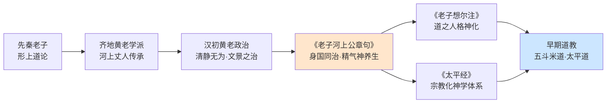
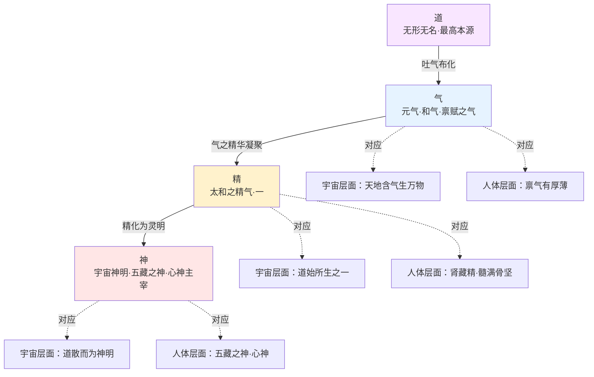
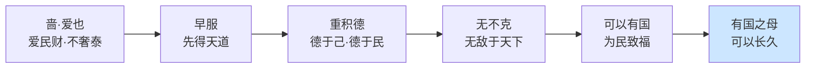
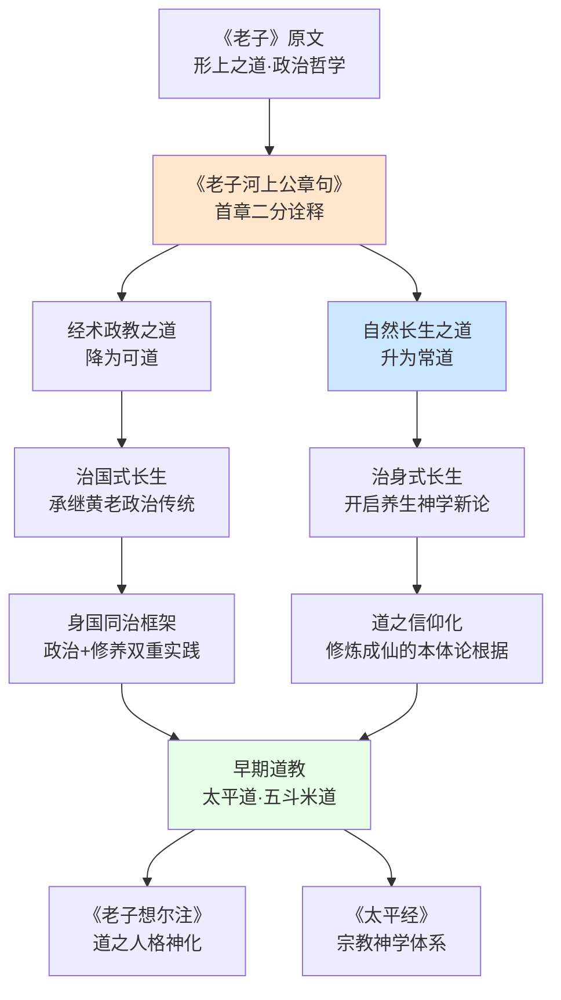
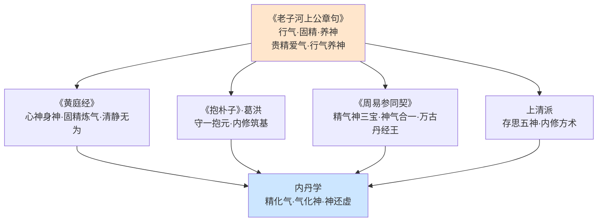

# 《老子河上公章句》中的长生不死思想：精气神、自我观与修行进路
# 1 背景介绍：《老子河上公章句》及其作者河上公

道家"长生不死"思想能够从先秦《老子》的形上玄思演化为系统化的养生实践与神仙信仰，《老子河上公章句》（Lǎozǐ Héshànggōng Zhāngjù）是其中不可绕开的关键文本。这部托名河上公（Héshàng Gōng）的《老子》注本，既是现存最早、最完整的《道德经》注释之一，也是黄老政治哲学转向早期道教养生神学的重要枢纽。要理解此书如何独辟蹊径地诠释"长生不死"，必须先回到其文本生成的历史语境之中，厘清作者身份、成书年代、文本体例与思想史定位四个相互交织的基础问题。

## 1.1 河上公其人：黄老传承中的历史形象与神仙传说

"河上公"这一名号最早见于《史记·乐毅列传》，司马迁称："乐臣公学黄帝、老子，其本师号曰河上丈人，不知其所出。河上丈人教安期生，安期生教毛翕公，毛翕公教乐瑕公，乐瑕公教乐臣公，乐臣公教盖公。盖公教于齐高密、胶西，为曹相国师。"[^1][^2]这段记载勾勒出一条清晰的黄老学派传承谱系，自河上丈人（Héshàng Zhàngrén）凡六传至汉初名相曹参，恰好对应汉初"无为而治"政治实践的思想源头[^3]。据此，河上丈人当生当战国末期至秦汉之际，是齐地黄老学派的开山祖师，其学说要旨为"贵清静而民自定"，主张以清静无为治国安民[^4][^2]。

然而，与正史中这一相对清晰的学术传承线索相对照的，是《神仙传》及《老子道德经序诀》中关于河上公授书汉文帝的著名仙话。葛洪整理的《神仙传》记载：汉文帝"好老子之道"，对《道德经》中疑义不解，闻"陕州河上有人诵《老子》"，遂亲赴草庵求教。文帝以"普天之下，莫非王土"相责，河上公则"拊掌坐跃，冉冉在空虚之中，去地百余尺"，回以"余上不至于天，中不累人，下不居地，何民之有焉"，文帝大惊悟，方知是神人，于是河上公"即授素书《老子道德章句》二卷"[^3][^5][^6]。文帝跪受经书后，"言毕，失公所在"。这段传说被道教奉为经典，河上公也因此被尊为"河上真人"列入神仙谱系[^3][^5]。

围绕河上公身世，学界与道门形成了三种主要解释：其一为**老子化身说**，刘宋时期天师道经典《三天内解经》明确将河上公视为老子为传承道统而下凡的化身，这是道教正统观点[^5]；其二为**正史考据说**，依据《史记》《高士传》等典籍，认为河上公是战国末期黄老隐士，"自隐姓名，居河之湄，著老子章句"[^7][^2]；其三为**秦末汉初隐士说**，与汉文帝传说相对应，将其定位为西汉初年隐居河滨的高士[^2][^8]。值得注意的是，《神仙传》中的故事透露出"道教创立前期，某些道士蔑视专制君权、向往个人自由的情操"——河上公"上不至天，中不累人，下不居地"的超脱姿态，正是对帝王权威的一种象征性挑战[^3]。

更为关键的是，正史中的河上丈人与传说中授书文帝的河上公，按时间推算"实际上他们的生活年代相差约有三百年，所以应该不是同一个人"[^6]。这一史实差距恰恰揭示了一个深层的思想史现象：**东汉方士在全面神化老子的时代氛围中，将战国黄老祖师"河上丈人"与汉初仙话中的"河上公"逐渐合并为同一形象，并最终由灵宝派吸收入道教神谱**[^3]。河上公由历史人物向宗教神仙的演化过程，本身就是黄老学派被早期道教吸收、改造的一个缩影。

## 1.2 成书年代之争：西汉、东汉与魏晋诸说的辨析

《老子河上公章句》虽托名河上公所撰，但其实际成书时代却聚讼纷纭。学界长期以来形成了几种主要观点，每种观点对理解该书的思想性质——究竟是纯黄老著作，还是早期道教文献——具有决定性影响。

下表归纳了关于成书年代的主要学说及其依据：

| 主张 | 代表学者 | 主要依据 | 思想性质判定 |
|------|---------|---------|------------|
| **西汉前期/中期说** | 金春峰、黄钊 | 思想接近汉初黄老气论；《汉书·艺文志》未著录不足以否定；该书既不晚至魏晋，也不晚至东汉，"很可能成书于西汉中期或稍前" | 偏向纯黄老学派著作 |
| **东汉中后期说** | 王明 | 训诂特征、宗教化倾向已显，与汉末方士神仙信仰契合 | 黄老向早期道教过渡的文献 |
| **魏晋葛洪时代说** | 部分早期研究者 | 神仙传说定型于葛洪《神仙传》 | 早期道教成熟期作品 |
| **老子化身/秦汉之际说** | 道教传统 | 《神仙传》河上公授书文帝的仙话 | 道教经典 |

黄钊在《〈老子河上公章句〉成书时限考论》中明确指出，将该书拉得太晚"不但有违历史的真实，也大大削弱了该书应有的历史地位"，他基本赞同金春峰的西汉前期说，并从新的角度论证"该书既不能晚至魏晋葛洪时代，也不能晚至东汉"，推测"很可能成书于西汉中期或稍前"[^9]。金春峰在《汉代思想史》中亦持类似立场，该书自1987年初版后多次修订增补，被誉为填补了中国大陆汉代思想史研究空白的奠基之作[^10][^11][^12]。

而王明作为我国近现代道家道教研究的拓荒者，早年发表的《〈老子河上公章句〉考》是该领域奠基性论文之一[^13]。王明依据训诂、思想特征等多方面证据，倾向于将成书年代定于东汉中后期，认为此书将《道德经》分八十一章，"用极简单的语言从养生之道的角度阐说《道德经》义理，同时阐发治国之道，主张通过自身修炼而长生不老，是道家思想向道教理论过渡的一个重要标志"[^6]。

针对反对意见提出的"《汉书·艺文志》未著录"这一关键质疑，颜建益援引金春峰的回应指出：《汉书·艺文志》漏载西汉作品的情况"所在多有"，如东海张霸所传《尚书百两篇》，《论衡》《汉书》皆有提及而《艺文志》未录，故以此否定西汉说"是很不妥贴的"[^14]。此外，李若晖关于《老子》八十一章本形成的研究表明，**北大汉简七十七章本与河上公八十一章本之间的重要中介是《淮南子》所引据之《老子》**，该本《道经》部分分章已同于（或近于）河上公八十一章本，这为河上公本的早期渊源提供了重要线索[^15]。

综合各说，目前学界较为稳妥的判断是：该书的核心思想框架很可能在西汉中期前后已经成形，但最终定型（尤其是其中较明显的神仙长生倾向）可能延续到东汉中后期[^6]。这一**跨时段累积成型**的认识，恰好可以解释为何该书既保留浓厚的黄老政治哲学色彩，又萌发出鲜明的养生神学倾向——它本身就是一部承载汉代思想转型轨迹的复合文本。鉴于现有材料的限制，本研究在后续讨论中将不强行裁断单一年代，而是聚焦其文本所呈现的思想结构本身。

## 1.3 文本特征与注释体例：八十一章本与"章句"之学

《老子河上公章句》在《道德经》文本史上的奠基地位，首先体现于其分章定型之功。该书将《道德经》定型为八十一章，**前37章为《道经》，后44章为《德经》，合称《道德经》，并在每章前冠以二字章题**[^16]。以下选取部分章题，可见其分章命名所蕴含的诠释取向：

| 章序 | 章题 | 主题指向 |
|------|------|---------|
| 第1章 | 体道（Tǐ Dào） | 体悟大道 |
| 第2章 | 养身（Yǎng Shēn） | 养护身体 |
| 第3章 | 安民（Ān Mín） | 安定民众 |
| 第6章 | 成象（Chéng Xiàng） | 玄牝成象 |
| 第10章 | 能为（Néng Wéi） | 载营魄抱一 |
| 第12章 | 检欲（Jiǎn Yù） | 节检情欲 |
| 第16章 | 归根（Guī Gēn） | 归根复命 |
| 第42章 | 道化（Dào Huà） | 道生一 |
| 第55章 | 玄符（Xuán Fú） | 含德之厚 |
| 第59章 | 守道（Shǒu Dào） | 深根固蒂 |

仅从章题命名即可看出，注者有意通过"养身""安民""检欲""归根""守道"等具操作性的概念，将《老子》形上玄理转化为可实践的修身—治国双重指引，章题本身已构成对正文的解释性导引。

所谓"章句"（zhāngjù），是汉代流行的经典注释体式。《文心雕龙·章句》对此有清晰说明："夫设情有宅，置言有位；宅情曰章，位言曰句……句司数字，待相接以为用；章总一义，须意穷而成体。"[^15]章句之学的核心在于通过分章断句来确立义理框架——正如《汉书·楚元王传》所言："歆治《左氏》，引传文以解经，转相发明，由是章句义理备焉"，**章句分而后义理立**[^15]。河上公本通过八十一章的精心切分与章题统摄，实际上是以注释体例本身参与了对《老子》思想的重构。

将河上公本置于《道德经》版本史的整体坐标中，其特征更为清晰。下表对比主要版本的关键特征：

| 版本 | 时代 | 篇章结构 | 主要特征 |
|------|------|---------|---------|
| **郭店楚简本** | 战国中晚期 | 不分章，约2000字，为传世本的2/5 | 现存最早古本，文字与通行本差异较大 |
| **马王堆帛书甲乙本** | 秦末汉初 | 《德经》在前、《道经》在后 | 现存最早完整古本 |
| **北大汉简本** | 西汉中期 | 77章，分"老子上经/下经" | 上经对应德经、下经对应道经 |
| **河上公本** | 西汉中期—东汉 | 81章，道经37章+德经44章，每章有章题 | 现存最早完整注本，多修身炼气之语 |
| **王弼本** | 三国魏（226—249） | 81章，无章题 | 多谈玄说虚，文人学士所好 |

帛书甲乙本"都是《德篇》在前，《道篇》在后"[^7]，而河上公本则确立了《道经》在前、《德经》在后的通行结构，**这一调整本身体现了从政治术（"德"侧重治术）向形上学—养生学（"道"侧重根本）的重心转移**。学界普遍认为"现在的传世本是在古本基础上经后人加工调整过的版本"，而"王弼本是在河上公本的基础上修订而成的，也就是说，王弼本和河上公本有传承关系"[^16]。

从注释风格上看，河上公本"重在解释老子意旨，说理透彻，平铺直叙，语言朴实流畅，平易近人"[^8]，与王弼"多谈玄说虚"的玄学诠释形成鲜明对比。从受众分布看，"河上公本多被道教人士和下层民众所推崇，王弼本则广为文人学士所喜好"[^7]，这种受众差异恰好折射出两种注释路径的思想旨趣——一者面向身国治理与修炼实践，一者面向玄理思辨。

在文字层面，研究者比较发现，河上公本与王弼本在35章存在文字差异，46章保持一致；而在多处异文中，河上公本的用词反而比王弼本更接近马王堆帛书本，如第十五章"俨兮其若客"（帛书甲乙本同作"其若客"）、第三十二章"天下不敢臣"（帛书乙本作"而天下弗敢臣"）、第四十六章多出"罪莫大于可欲"一句（帛书甲乙本均有此句）、第四十九章多出"百姓皆注其耳目"（帛书甲本作"百姓皆属耳目焉"）等[^16]。**这些异文比对表明河上公本所据底本时代相对较早，进一步支持其文本结构成形于西汉的判断**。

## 1.4 思想史定位：黄老学向早期道教过渡的关键文献

理解《老子河上公章句》的核心价值，必须将其置于汉代思想史的整体演变之中。汉初鉴于秦朝因严刑峻法过度"有为"而覆灭的教训，自高祖刘邦起便奉行黄老之学，推崇"无为而治"，至文景时期出现"文景之治"盛世，曹参"萧规曹随"的清静政治正是黄老思想直接政治化的产物[^1]。司马迁在《史记·自序》中转述其父司马谈对道家（黄老）的评价："道家使人精神专一，动合无形，赡足万物。其为术也，因阴阳之大顺，采儒、墨之善，撮名、法之要，与时迁移，应物变化，立俗施事，无所不宜，指约而易操，事少而功多"[^14]——黄老之学并非纯粹的道家思想，而是以道家为基础综合各家之长的实用学问。

《老子河上公章句》正是在这一思想氛围中萌生与定型。该书"解释了天道与人事相通，治国与治身相同，二者皆本于清虚无为的自然之道"，被概括为"言治国治身之要"[^8]。这种**治身与治国的双重性**（即后文将系统讨论的"身国同治"），既体现了对汉初黄老政治哲学的承续，又通过将"治身"上升至与"治国"并立的高度，开辟了一条由政治哲学向养生神学转化的通道。

然而，《河上公章句》并未止步于对黄老传统的延续。它的革命性贡献在于引入了系统的元气论、精气神养生学说与长生修炼观念，**将《老子》的形上之道转化为可操作的修身实践**。颜建益指出："在汉代的时候，《老子河上公章句》的出现，无疑是在道家宇宙论、政治论之外更将学说带入到养身的层面。这是道家学说中新的开创"[^14]。这一转向具有决定性意义——它使《老子》从一部主要面向君王的政治哲学经典，逐渐演变为同时面向个人生命修炼的宗教性经典。

将《河上公章句》与稍晚的《老子想尔注》（Lǎozǐ Xiǎng'ěr Zhù，五斗米道经典）进行对比，可以更清晰地看出其过渡性地位。学界比较研究表明：**《老子想尔注》将"道"人格神化，显现出明确的宗教神学目的，将老子道的哲学引向了宗教神学，确立了道教的信仰对象，论证了长生成仙的可能性；而《河上公章句》则将"道"看成宇宙本体与自然法则，发展了老子生命哲学，对道之体的理解接近于老子本意**[^17][^18]。但同时，《河上公章句》"主要是通过道论发展了老子的生命哲学，提出了因循自然，与道和同，贵精爱气，行气养神，除情去欲，利他无私，谦卑不争的养生之道，形成了较为系统的养生理论，对道教的形成发展、深入人心起到了极大作用"[^17]。

这种独特的中间位置使《河上公章句》成为联系道家与道教的枢纽——它在保持哲学性的同时孕育了宗教性，在论述治国之道的同时开启了长生之路。正是基于此，有研究者将该书的核心贡献概括为"**自然长生之道**'升格为'**常道**'"，即通过对《老子》首章"道可道，非常道"的创造性诠释，将原本形上意义上的"常道"转化为指向长生不死的信仰对象，从而完成了"自然长生之道"的信仰性奠基[^19]。这一诠释学转向，正是后续章节将要重点剖析的核心问题。

下图概括了从黄老政治哲学经《河上公章句》向早期道教转化的思想脉络：

由此可见，**《老子河上公章句》既是汉代黄老学派的思想结晶，又是早期道教信仰的理论奠基**。它向上承接了从河上丈人到曹参的黄老传统，将清静无为的政治哲学转化为治身治国并重的实践智慧；向下开启了《想尔注》《太平经》等道教经典的宗教化路径，为长生成仙的信仰提供了系统的概念框架与方法论基础。理解了这一过渡性的思想史定位，我们才能真正进入该书最具创造性的层面——它对"精""气""神"三大核心概念的独特界定，对"自我"本质的多元化重构，以及对"长生不死"的双重诠释与系统修行方法的提出。这正是接下来各章将依次深入展开的核心议题。

# 2 核心概念解析：精、气、神及其内在关系

在第一章厘清了《老子河上公章句》（Lǎozǐ Héshànggōng Zhāngjù）的文本背景与思想史定位之后，本章将进入此书最具理论原创性的层面——对"精"（jīng）、"气"（qì）、"神"（shén）三大概念的系统建构。正是依托这三个概念，河上公得以将《老子》原本侧重形上玄思与政治哲学的论述，转化为一套兼具宇宙生成论与人体生命论的实践化体系。需要强调的是，《老子》原文中"气""神"等概念虽已出现，但其内涵相对含混，未形成系统的本体—生命学说；而河上公则借助汉代黄老气论的思想资源，对这些概念进行了实体化、层级化的重塑，使之既可解释宇宙的生成次第，又可指导个体的修身实践。本章将依次辨析"气""精""神"三者的具体界定，构建"道—气—精—神"的层级化生结构，分析其在养生论中的动态转化关系，并将其置于汉代气论的整体坐标中加以定位。

## 2.1 以气释道：元气、和气与精气的概念谱系

在《河上公章句》的概念体系中，"气"是连接形上之道与具体万物的核心范畴。河上公注《老子》首章"无名，天地之始"曰："始者道本也，吐气布化，出于虚无，为天地本始也"[^20]；又注"有名，万物之母"曰："万物母者，天地含气生万物，长大成熟，如母之养子也"[^20]。在此，"道"通过"吐气布化"的方式，将自身的本源能量倾注于虚无之中，进而由天地"含气"而生养万物。**"气"不再仅是《老子》中某种含混的运行状态，而被河上公明确化为宇宙生成的实际承担者**。

在《老子》第二章"生而不有"句下，河上公注："元气生万物而不有"[^20]，直接将"元气"作为万物生成的本源；而在第一章"玄之又玄"句下，他又强调："禀气有厚薄，得中和滋液则生贤圣，得错乱污辱则生贪淫也"[^20][^21]。这表明在河上公的体系中，"气"不仅是宇宙生成的本源能量，也是个体禀赋差异的根本原因——人之贤圣与贪淫，皆因禀受元气时的厚薄、清浊有别。这种以禀气厚薄解释人性差异的思路，正是汉代气论的典型特征，可在王充"万物之生，皆禀元气"的命题中找到呼应[^22]。

更具理论意义的是河上公对汉代宇宙生成论的简化与改造。《淮南子·天文训》提出了"道始于虚霩，虚霩生宇宙。宇宙生气，气有涯垠。清阳者薄靡而为天，重浊者凝滞而为地"的生成模式，可概括为"道→虚霩→宇宙→气→天地"的五阶结构[^22]。河上公则将这一链条简化为更为直接的**"道→气→天地→万物"四阶结构**，省去"虚霩""宇宙"两个中间环节，使"气"直接成为"道"显化的第一形态[^22]。这一简化绝非随意，而是承载着明确的诠释意图——通过缩短道与气之间的距离，使"气"获得近乎本体的地位。

正如研究者所指出的，河上公"将'道'和'气'进行互释互训，从而极大地凸显了其以'气'为本体的宇宙生成论思想"[^22]。换言之，**河上公采取了一种"以气解道"的诠释策略，使原本超言绝象的"道"通过"气"获得了可被感知、可被实践的现实根基**。研究者也清醒地指出："有名而无形的'气'是不能和无名也无形的'道'等同看待的。'气'是'道'的显化，是接近'道'的存在。因此，河上公的气论思想处于道家和道教的连接点上"[^22]。这一定位极具洞察力——正是因为"气"既属于自然主义的范畴，又可被进一步实体化为修炼对象，《河上公章句》的气论才能同时承载汉代黄老的理性精神与早期道教的养生—成仙诉求。

综观全书，"气"在《河上公章句》中至少具有以下几重相互关联的面向：

| 气的层次 | 核心命题 | 功能定位 |
|---------|---------|---------|
| **元气** | "元气生万物而不有"[^20] | 宇宙生成的本源能量 |
| **和气**（中和之气） | "天地含气生万物""得中和滋液则生贤圣"[^20] | 道之运行状态、生养万物的调和之气 |
| **厚薄之气** | "禀气有厚薄，得中和滋液则生贤圣，得错乱污辱则生贪淫"[^21][^20] | 个体禀赋差异的根源 |
| **精气** | "一者，道始所生，太和之精气也"[^23] | 气中精华，沟通宇宙与人体 |

这一谱系既保持了"气"作为单一本源能量的统一性，又通过元气、和气、精气等不同侧面的展开，使之能够解释从宇宙生成到个体差异、再到修养实践的不同层面，构成了《河上公章句》整个概念体系的本体论基础。

## 2.2 精为道之精微："太和之精气"与生命本源

如果说"气"是道向万物落实的总体范畴，那么"精"则是"气"中最为精微凝聚的形态。在《河上公章句》中，"精"具有形上与生理的双重内涵，而连接二者的关键命题正是"一者，道始所生，太和之精气也"[^23]。这一命题出现在第十章"载营魄抱一"的注释中，河上公明确指出："抱一能无离：言人能抱一使不离于身则长存。一者，道始所生，太和之精气也"[^23]。**"一"既是道生化万物序列中的第一阶——"道生一"之"一"——又被界定为"太和之精气"，从而将《老子》"道生一，一生二，二生三，三生万物"的宇宙生成论与人体可"抱守"的精微物质打通**。

这种将形上之"一"与可修炼之"精气"等同的做法，在思想史上具有明显的承续脉络。《管子》中已有"凡物之精，化则为生。下生五谷，上为列星。流于天地之间，谓之鬼神；藏于胸中，谓之圣人"以及"精也者，气之精者也。气，道乃生；生乃思，思乃知"的论述[^22]。**稷下道家的这一"精—气"理论，将"精"界定为气之精华，并赋予其化生万物、内藏成圣的双重功能，正是河上公"太和之精气"概念的直接思想来源**。河上公在此基础上更进一步，将"精"明确置入"道生一"的宇宙论框架，使其同时承担本体论的中介功能与生命论的实体功能。

在人体层面，"精"被具体落实为可被爱护、固守的精微物质。《河上公章句》第三章"强其骨"句下注："爱精重施，髓满骨坚"[^21][^24]——精被爱惜、慎重不外泄，则可化为骨髓使骨骼坚实。第十章"专气致柔"句下注："专守精气使不乱，则形体能应之而柔顺"[^23]——专一固守精气，形体便能保持柔顺。这些命题表明，**"精"在河上公体系中既是个体生命的物质本源，也是修炼实践可直接作用的对象**。

值得强调的是，河上公的"精"概念实现了宇宙论与生命论的一体化贯通：宇宙生成的"太和之精气"与人身可固守的"精气"，并非两个不同的实体，而是同一精微之气在不同层面的显现。人之所以能够"抱一""长存"，正是因为人身所禀之精与宇宙生成之精同源同质；爱精固精的修炼之所以可能通向长生，也正是因为这种精微之气本就是道之精华在身体中的凝聚。**这一打通使河上公的精气说既不是单纯的形上玄思，也不是单纯的医学养生，而是一套兼具本体论根基与实践指向的统一理论**。

## 2.3 神之多重面向：道之神明、五藏之神与心神主宰

在《河上公章句》中，"神"是一个含义最为丰富、层次最为复杂的概念。综合文本可见，"神"至少具有三重相互关联的面向：宇宙性的道之神明、分藏于五脏的五神、以及统摄生命的心神主宰。

第一重面向是**作为道之显化的宇宙性神明**。研究者归纳河上公的宇宙化生论时指出："道散而为神明，流为日月，分为五行"——"道"通过散布而成为神明、流行而成为日月、分化而成为五行[^24]。在此意义上的"神"，是道在天地之间显现自身灵明性的一种存在形态，与"气""精"共同构成道向万物落实的不同侧面。河上公注"神得一以灵"时强调，神之所以具有灵性，正是因为得"一"（即太和之精气）[^25][^20]——神并非独立的超越实体，而是道的能量在最为精微层面的显现。

第二重面向是**作为五藏所藏之"五神"**。河上公注《老子》第三章"实其腹"句下曰："怀道抱一守，五神也"[^21]，明确提出修养工夫的核心在于"守五神"。这一概念与《黄帝内经》"五脏藏神"传统直接呼应——《素问·宣明五气篇》所言"心藏神，肺藏魄，肝藏魂，脾藏意，肾藏志"[^26]，确立了五脏分藏五神的基本框架。河上公在继承这一框架的同时进行了关键调整：将"脾藏意、肾藏志"改为"脾藏志、肾藏精"，使"精"取代"意"在五藏神中获得独立地位。这一调整凸显了**河上公以"精"为肾本位、强化精在修炼实践中核心地位的诠释意图**。

第十章"载营魄抱一"句下，河上公的注释尤为关键："载营魄：营魄，魂魄也。人载魂魄之上，得以生当爱养之，喜怒亡魂、惊伤魄，魂在肝、魄在肺，美酒甘肴腐人肠肺，故魂静志道不乱，魄安得寿延年也"[^23]。在此短短一段中，河上公完成了多重理论建构：将《老子》"营魄"明确解为"魂魄"；将魂、魄分别配属于肝、肺两脏；指出魂魄会因情绪过度（喜怒）与饮食过度（美酒甘肴）而损伤；并提出"魂静魄安"是延年的关键。这种**将抽象之"神"分散落实于具体脏腑、并以情志饮食为损益机制的诠释，使"养神"从形上修养转化为可操作的脏腑调摄**。

魂、魄之间还存在阴阳二元的结构关系。综合相关论述，**魂属阳为雄，主出入于鼻，与天通；魄属阴为雌，主出入于口，与地通**。这一结构与河上公独特的"玄牝"诠释直接相关——"玄"为天为鼻，"牝"为地为口，鼻口正是魂魄出入、与天地元气往来的通道。由此，五藏神不仅是静态的脏腑配属，更是动态的天人交通系统。

第三重面向是**作为生命主宰的心神**。河上公注《老子》第五章"天地之间"句下曰："人能除情欲，节滋味，清五脏，则神明居之也"[^21]——只有通过去除情欲、节制饮食、清净五脏的工夫，"神明"才能安居于身。在此意义上的"神"，是统摄五藏之神、主宰生命活动的核心存在。这种主宰地位与中医"心藏神"传统相通——"心是可接受外界客观事物并作出反应，进行心理、意识和思维活动的脏器""心为藏神之脏，君主之官""五脏六腑之大主"[^26]——而河上公则将这一医学观念吸收进养生哲学，强调神在形神关系中的主导地位。

下表归纳"神"的三重面向及其文本依据：

| 层次 | 内涵 | 文本依据 | 主要功能 |
|------|------|---------|---------|
| **宇宙性神明** | 道散而为神明、流为日月 | "道散而为神明，流为日月，分为五行"[^24]；"神得一以灵"[^20] | 道在天地间的灵明显化 |
| **五藏之神** | 魂、魄、神、精、志分藏五脏 | "魂在肝、魄在肺"[^23]；"怀道抱一守，五神也"[^21] | 分管各脏的生理—心理活动 |
| **心神主宰** | 统摄全身的精神主宰 | "清五脏则神明居之"[^21]；"魂静志道不乱"[^23] | 主宰生命活动、协调五神 |

需要注意的是，"神"与情欲、嗜欲之间存在内在张力。河上公反复强调："除嗜欲，去乱烦……怀道抱一守，五神也"[^21]、"喜怒亡魂、惊伤魄"[^23]——情欲过度、情绪剧烈，皆会损伤五神乃至导致神明离形。这一张力构成了《河上公章句》养神论的核心问题意识：**情欲是神之敌人，唯有通过"除情去欲"的工夫，五神才能安守其位，从而实现"得寿延年"乃至"长存不亡"**。这一思想线索将在第三章自我观与第五章修行方法中得到进一步展开。

## 2.4 道—气—精—神的层级化生结构

在分别辨析"气""精""神"三者的内涵之后，我们可以进一步将其置入一个统一的化生结构中加以理解。综合前述文本与分析，《河上公章句》实际上构建了一个**道—气—精—神四阶层级模型**，这一模型同时具有宇宙生成与人体构成的双重维度。

从宇宙生成维度看：道为最高本源，无形无名；道"吐气布化"而生元气[^20]；元气中之精华凝结为"太和之精气"，即"一"[^23]；"一"复化生阴阳二气，由阴阳二气交感而成"和、清、浊三气"，进而分为天、地、人，"三生万物即天地人共生万物"[^24]；与此同时，"道散而为神明，流为日月"[^24]，神明作为道之灵性显化贯穿于此化生过程之中。

从人体构成维度看：人禀气以生，禀气有厚薄而成性[^21]；身体中之精气为生命之本，藏于肾而化为骨髓[^21]；精气进一步化为五藏之神（魂、魄、神、精、志），分别司管各脏的生理与情志活动[^23]；五神统摄于心神之下，构成完整的生命主体[^26]。

这一层级模型有三个值得强调的特征。**其一是同源异化**：道、气、精、神并非四个独立实体，而是同一本源在不同层级上的显化——道为整体，气为道之显化，精为气之精华，神为精气所化之灵明。**其二是宇宙—身体同构**：化生序列既是宇宙生成的次第，也是人体构成的层次；宇宙中有的化生阶段，人体中皆有对应的存在形态。这种同构关系为《河上公章句》"身国同治"乃至"身—宇宙同治"的整体修养论提供了本体论依据。**其三是可逆性**：化生序列从道至神是顺向的展开，而修养工夫则是从神向精、向气、向道的逆向回归——通过养神而固精、固精而养气、养气而合道，最终实现"与道通神"的最高境界。

这一层级模型的建立，标志着河上公完成了一项重要的理论工作：**将《老子》原文中相对独立、有时甚至含混并列的"气""神"等概念，整合为一个具有内在逻辑次序的统一体系，使每一个概念都获得了在整体中的精确位置**。正是借助这一体系，《河上公章句》才能够将形上玄思与具体修炼无缝衔接起来。

## 2.5 精气神在养生论中的相互依存与转化

层级化生结构揭示了精、气、神三者在本体论上的次第关系，而在养生实践层面，三者更呈现为一种动态的相互依存与循环转化关系。简言之，**精充则气足、气足则神旺；反之，神耗则气散、气散则精亡**。这种正反两向的互动，构成了《河上公章句》养生论的基本动力学。

正向积累的链条可从多处文本得到印证。在"精"的层面，河上公主张"爱精重施，髓满骨坚"[^21]——爱惜精气、慎重不外泄，则髓满骨坚，身体获得物质基础上的充盈。在"气"的层面，"专守精气使不乱，则形体能应之而柔顺"[^23]——以精为根基的专一之气，使形体保持柔顺如婴儿。在"神"的层面，"能如婴儿，内无思虑，外无政事，则精神不去也"[^23]——精神不离散，则生命得以长保。三者构成一个层层递进的积累链条：固精以养气，养气以致柔，致柔以全神。

反向耗损的路径同样在文本中清晰可见。河上公在"载营魄抱一"的注中明确指出耗损机制："喜怒亡魂、惊伤魄……美酒甘肴腐人肠肺"[^23]。**情绪过度（喜怒、惊）损伤魂魄即神，饮食过度（美酒甘肴）损伤肠肺即气与精的物质载体**。一旦神受损则不能驭气，气紊乱则不能固精，精亏耗则身体衰竭，整个生命系统因此走向崩坏。这一耗损路径揭示出，养生不仅是"积累"的工夫，更是"防损"的工夫——避免情志失调与饮食无度是养生的基本前提。

不同的修炼工夫则分别针对精、气、神三者展开，但又彼此相通：

| 修炼工夫 | 直接作用对象 | 文本依据 | 间接效应 |
|---------|------------|---------|---------|
| **爱精重施** | 精 | "爱精重施，髓满骨坚"[^21] | 髓满骨坚则气有所根 |
| **专气致柔** | 气 | "专守精气使不乱，则形体能应之而柔顺"[^23] | 形体柔顺则神得安宅 |
| **除情去欲** | 神 | "除嗜欲，去乱烦"[^21]；"除情欲，节滋味，清五脏，则神明居之"[^21] | 五脏空虚则精气不耗 |
| **怀道抱一** | 整体 | "怀道抱一守，五神也"[^21] | 三者同养、合于大道 |
| **守中和** | 气之质地 | "除情去欲守中和，是谓知道要之门户也"[^21][^24] | 禀气中和则贤圣可期 |

从这一表格可以清晰看出，**虽然不同工夫各有侧重，但任何一种工夫的展开都同时牵动精、气、神三者**：爱精不仅是固守物质之精，也是为气之专一与神之安守提供基础；专气不仅是调息致柔，也是使精不外泄、神不离形；除情去欲不仅是养神之法，也是节制精气耗损的根本之道。三者构成一个相互资养的有机系统——任何一环的强化都会增益其余两环，任何一环的损伤也会牵连其余两环。

这种循环资养的动力学，与河上公提出的"知足止足""损之又损"等节制工夫密切相关。通过适度节制情欲——而非彻底禁绝——使生命能量在精、气、神三个层级之间保持动态平衡，从而实现"长生久视"。这一思路既不同于单纯医学意义上的养形，也不同于单纯哲学意义上的养神，而是**以气论为基础、以三者循环互养为机制的一套整合性养生哲学**，为后续章节将要详述的具体修行方法提供了系统的方法论原理。

## 2.6 概念创新与汉代黄老气论的思想坐标

将《河上公章句》的精气神学说置于《老子》原文与汉代相关文献的整体坐标中加以比较，可以更清晰地看出河上公的概念创新及其思想史定位。

首先是**对《老子》原文的实体化、可操作化转译**。《老子》原文中虽然出现"载营魄抱一""专气致柔""谷神不死"等命题，但其内涵相对含混——"营魄"究竟所指为何？"专气"如何专守？"谷神"是何种存在？这些问题在《老子》文本本身并无明确答案。河上公则通过注释逐一加以实体化界定：将"营魄"明确为"魂魄"并配属肝、肺[^23]；将"专气致柔"解为"专守精气使不乱"[^23]；将"谷神不死"中之"谷"训为"养"，使"养神则不死"成为可实践命题（如其他相关注释中所述）。**这种从含混到明确、从玄思到操作的转译，是河上公最具创造性的诠释贡献**。

其次是**对汉代气论谱系的承续与简化**。如前所述，河上公的气论与《管子》"精也者，气之精者也"[^22]、《淮南子》"道→虚霩→宇宙→气→天地"[^22]的传统一脉相承，但通过将生成链条简化为"道→气→天地→万物"[^22]、并通过道气互训凸显气本体倾向，他实际上完成了对汉代气论的一次集成与简化。这一简化使"气"作为本源能量的地位更为突出，也使道气之间的张力被最大程度地缩小，从而为后续的修炼实践扫清了形上障碍。

第三是**以五藏神为枢纽的身体宗教化诠释**。河上公的"五神"概念虽源自《黄帝内经》的"五脏藏神"传统[^26]，但其调整（以"精"代"意"）与扩展（赋予五神以宇宙论意义、与天地相通），实际上已超出了单纯医学的范畴，进入了准宗教化的领域。**通过将五脏视为五神居所、将身体视为微型宇宙，《河上公章句》为身体的神圣化、为"治身即治国、治身即修道"的命题奠定了概念基础**。这一身体观对后世早期道教（尤其是上清派的存思五神之法）产生了深远影响。

下表归纳《河上公章句》精气神学说在汉代气论谱系中的独特位置：

| 文献 | 时代 | 气论特征 | 与《河上公章句》关系 |
|------|------|---------|--------------------|
| **《老子》原文** | 春秋战国 | 气、神概念含混并列 | 河上公注释的诠释对象 |
| **《管子》** | 战国 | "精也者，气之精者也"[^22] | 河上公"精气"概念的直接来源 |
| **《淮南子》** | 西汉初 | "道→虚霩→宇宙→气→天地"[^22] | 河上公简化为四阶结构的母本 |
| **《黄帝内经》** | 秦汉 | "五脏藏神"[^26] | 河上公"五神"概念的医学来源 |
| **《河上公章句》** | 西汉中—东汉 | 道气互训、五藏纳神、精气神层级化 | **综合上述并实现一体化整合** |
| **《老子想尔注》** | 东汉末 | 进一步将道人格神化 | 沿河上公方向更进一步走向宗教 |

从这一比较可见，**《河上公章句》的独特贡献在于"既保留气论的自然主义底色，又通过五藏神等概念为身体的宗教化诠释开辟空间"**。它没有像《想尔注》那样彻底走向道之人格神化，而是停留在自然主义气论的框架内进行精微化与系统化；但同时，它通过五藏纳神的诠释，又为后续的宗教化展开预留了充分的概念空间。这种**中间性、过渡性的理论形态**，正是其在思想史上独特价值的根源。

综合本章的分析，可以得出一个总体性的判断：**《老子河上公章句》通过"以气解道、以精摄气、以神统精"的概念建构，将《老子》的形上之道转化为可操作的生命修养体系。"气"作为本源能量、"精"作为生命本质、"神"作为灵明主宰，三者构成一个层级化生、循环互养的有机统一体**。这一统一体不仅是宇宙生成的本体论模型，更是个体修养的实践论框架——它为下一章将要讨论的"自我"构成问题提供了概念工具，也为第四章"长生不死的两种形式"与第五章"修行方法"的展开奠定了理论基础。正是借助这套精气神学说，《河上公章句》才能够在汉代黄老气论与早期道教神学之间架起一座承前启后的桥梁。

# 3 "自我"的构成：身国同构下的人之本质

在第二章厘清了"精""气""神"三者的层级化生结构与互养机制之后，一个更为根本的问题随之浮现：在《老子河上公章句》（Lǎozǐ Héshànggōng Zhāngjù）的视野中，"人"或"自我"究竟由什么构成？是否存在一个单一的、不朽的灵魂作为生命的本质核心？要回答这一问题，必须深入剖析河上公独特的身心理论。**本章的核心论点在于：《河上公章句》所建构的"自我"，并非西方哲学或宗教传统中那种以单一灵魂为核心的一元化主体，而是一个由天地二元来源的"五性"与"六情"所构成的复合身心结构，并由分藏于五脏的多元神灵共同居住、共同维持的开放系统；与此同时，这一身体性的自我又被同构为一个微型政治体，使得"治身"与"治国"在同一套原理下展开**。这一非一元论的人性观，是河上公能够将《老子》形上玄思转化为可操作修养实践的人性论基础，也直接决定了其后续"长生不死"双重诠释与具体修行方法的内在逻辑。

## 3.1 五性六情说：天地二元下的身心结构

要理解《河上公章句》对"自我"的界定，必须从其最具原创性的"五性六情"说入手。这一学说集中体现于第六章《成象》对"是谓玄牝"一句的注释中。河上公在此处构建了一个完整的天人交通图景：

> "玄，天也，于人为鼻。牝，地也，于人为口。天食人以五气，从鼻入藏于心。五气清微，为精、神、聪、明、音声五性。其鬼曰魂，魂者雄也，主出入人鼻，与天通，故鼻为玄也。地食人以五味，从口入藏于胃。五味浊辱，为形、骸、骨、肉、血、脉六情。其鬼曰魄，魄者雌也，主出入人口，与地通，故口为牝也。"[^27]

这段注释包含极为丰富的理论层次。**"五性"指精、神、聪、明、音声五者，具体指精气、五藏神及人的听、视、言等感官能力**；"六情"则指构成人身体的"形、骸、骨、肉、血、脉"六种情实，引申指人身的六种情欲[^28][^29]。两者的根本差异在于来源与质地：五性源于"天食人以五气"，气清微而属阳，从鼻入而藏于心，是人之生命活动与精神感官能力之根；六情源于"地食人以五味"，味浊辱而属阴，从口入而藏于胃，构成人有形躯壳的物质基础并引申为情欲之实[^29][^27]。

这一二元结构的精妙之处，在于它将抽象的阴阳二元论彻底落实到了具体的身体经验之中。天与地、阳与阴、清微与浊辱、鼻与口、心与胃、魂与魄——这些对立范畴并非平行的形上抽象，而是通过呼吸（鼻入五气）与饮食（口入五味）两种最基本的生命活动得以贯通。**人之所以为人，不是因为禀受了某种单一的灵性本质，而是因为同时承接了天地两种异质能量并将其内化为自身的两套子系统**。这种身心结构的最大特征是其开放性——人通过鼻口持续与天地交通，自我始终处于与外部宇宙的能量交换之中，绝非一个封闭自足的灵魂实体。

将河上公的"五性六情"说与同时代汉儒的同名学说作对比，更能凸显其理论独特性。**在《白虎通·情性》中，"五性"指"仁、义、礼、智、信"，"六情"指"喜、怒、哀、乐、爱、恶"**[^29]——这是一套纯粹伦理化的性情概念，将人的本质界定为道德属性与情感反应的结合。而河上公的"五性"与"六情"则完全脱离了伦理范畴，转入养生范畴：五性是精神性、感官性的生命能力，六情是形体性、物质性的躯壳构成。

| 比较维度 | 《白虎通·情性》 | 《老子河上公章句》 |
|---------|----------------|------------------|
| **五性内涵** | 仁、义、礼、智、信 | 精、神、聪、明、音声 |
| **六情内涵** | 喜、怒、哀、乐、爱、恶 | 形、骸、骨、肉、血、脉 |
| **概念范畴** | 伦理—道德范畴 | 养生—身体范畴 |
| **来源解释** | 阴阳之气与道德属性 | 天之五气（鼻）/地之五味（口） |
| **价值取向** | 五性可发为善，六情须节制 | 守五性以长生，去六情以养身 |

这一对比揭示出河上公的根本理论意图：**他在形式上沿袭了汉儒"性阳情阴"的传统框架，但在内容上将性情概念由伦理范畴转入了道家的养生论域**[^29]。"五性"不再是儒家意义上的道德本性，而是关乎生命延续的精神性能力；"六情"也不再是道德情感，而是构成肉身并易于耗散精气的形体存在。正因如此，《河上公章句》主张**"五性属阳，是人能够实现'长生久寿'之生命目的的必要条件；六情属阴，是人修道养生的消极障碍"**，并由此提出"守五性，去六情"的核心修养取向[^29]。

值得进一步分析的是，"守五性、去六情"并非意味着否定身体本身——形、骸、骨、肉、血、脉作为身体的物质构成显然不可去除。所谓"去六情"，更精确地说是去除由六情所引申出的过度情欲，即对感官刺激与肉体享受的执着追求。这种执着会消耗五性所代表的精神能量，使人偏离长生之道。**这一思路与第二章所揭示的"喜怒亡魂、惊伤魄""美酒甘肴腐人肠肺"的精气神耗损机制完全一致**——情欲过度耗散精气，节制情欲方能保全五性，从而为长生奠定身体基础。由此，"五性六情"说不仅是对身体构成的静态描述，更是一套蕴含价值判断的修养指南。

## 3.2 五藏神与多元神灵共居的人体观

如果说"五性六情"说揭示了自我在身体物质构成层面的二元结构，那么"五藏神"观念则进一步揭示了自我在精神构成层面的多元结构。河上公在第六章注"谷神不死"时明确指出：

> "谷，养也，人能养神则不死。神，谓五藏之神也。肝藏魂，肺藏魄，心藏神，脾藏意，肾藏精与志。五藏尽伤，则五神去。"[^27]

这段注释虽简短，却包含了对自我本质的革命性界定。**"神"在此并非指一个统一不可分的灵魂实体，而是分藏于五脏的五个相对独立的神灵——魂（肝）、魄（肺）、神（心）、意（脾）、精与志（肾）**[^27]。这一界定基本承袭《黄帝内经·素问·宣明五气篇》"心藏神、肺藏魄、肝藏魂、脾藏意、肾藏志"的医学传统，但河上公在肾的对应上有所调整——将"肾藏志"扩展为"肾藏精与志"，使"精"在五藏神中获得突出地位，与其整体修炼论中爱精固精的核心位置相呼应（如第二章所论）。

更为关键的是，河上公进一步揭示了"神"在魂魄层面的阴阳二元交通机制。在前引第六章注中，他明确指出：**"其鬼曰魂，魂者雄也，主出入人鼻，与天通"；"其鬼曰魄，魄者雌也，主出入人口，与地通"**[^27]。魂属阳为雄，通过鼻与天相通；魄属阴为雌，通过口与地相通。这一结构与"玄牝"（玄=天=鼻，牝=地=口）的整体象征系统完全对应——鼻口不仅是五气五味的入口，更是魂魄出入、与天地往来的通道。**自我并非一个封闭于躯壳之内的精神实体，而是通过五脏神灵与天地宇宙保持着持续往来的开放系统**。

在第十章《能为》"载营魄抱一"的注释中，河上公对魂魄机制作了更为具体的展开：将"营魄"明确解为"魂魄"，将魂、魄分别配属于肝、肺，并指出"喜怒亡魂、惊伤魄……美酒甘肴腐人肠肺，故魂静志道不乱，魄安得寿延年也"（如第二章所引）。这一注释揭示了五神共居人体所必然伴随的脆弱性——五神并非天然永恒存在于身体之中，而是通过特定的脏腑作为其居所，一旦脏腑因情志或饮食失调而受损，五神便会离开身体。

下表系统归纳五藏神的配属、属性与功能：

| 五脏 | 所藏之神 | 阴阳属性 | 交通通道 | 损伤诱因 |
|------|---------|---------|---------|---------|
| **肝** | 魂 | 阳·雄 | 鼻（与天通） | 喜怒过度（"喜怒亡魂"） |
| **肺** | 魄 | 阴·雌 | 口（与地通） | 美酒甘肴（"美酒甘肴腐人肠肺"） |
| **心** | 神 | —（主宰） | —（藏五气） | 嗜欲烦乱（"除嗜欲，去乱烦"） |
| **脾** | 意 | — | — | （未具体展开） |
| **肾** | 精与志 | — | — | 施泄无度（"爱精重施"） |

这一表格清晰地显示，**"自我"在《河上公章句》中被分解为一个由五个相对独立的神灵共居的复合体**。每一个神灵都有其特定的脏腑居所、阴阳属性、与外界沟通的通道，以及特定的损伤诱因。这与一元论灵魂观——无论是西方基督教传统中"灵魂为不朽精神实体"的观念，还是某些印度宗教传统中"阿特曼为永恒自我"的观念——形成根本性的对照。

河上公注释中最具警示意味的一句话是："**五藏尽伤，则五神去**"[^27]。这一命题揭示了多神共居人体观的核心特征：

**其一，自我的脆弱性**：五神并非天然恒久存在于人体之中，而是依赖于五脏作为其居所。一旦五脏受损至极，五神便会离开身体——这意味着"自我"作为五神的集合体并不具有内在的不朽性，而是一种需要持续维护的脆弱状态。

**其二，自我的可修养性**：正因为五神可能因脏腑受损而离去，反过来说，通过保养脏腑——节制情欲、调摄饮食、清净五脏——便能使五神安守其位。这一可修养性正是河上公整个养生论的逻辑起点：**"养神"之所以可能通向"不死"，不是因为有一个不朽灵魂等待被唤醒，而是因为通过持续的修养工夫可以使五神长久居于身体之中**[^27]。

**其三，自我的开放性**：五神通过鼻口与天地相通，意味着自我并非一个孤立于宇宙之外的精神孤岛，而是宇宙整体气化流行中的一个节点。养生因此不仅是对内的脏腑调摄，更是对外的天人交通——通过鼻口的呼吸吐纳与五气五味的有节摄入，使个体生命与宇宙能量保持和谐互动。

这种"多元神灵共居人体"的观念，与灵魂一元论存在根本性的人性论差异。在一元论框架中，灵魂作为单一精神实体先验地构成自我的本质，身体只是灵魂暂时的居所；而在河上公的框架中，恰恰相反——**五神依存于五脏（身体），脱离了具体的脏腑居所，神便不能独存**。这并非否定精神的重要性，而是将精神彻底"身体化"——精神的存续与身体的健全是同一个过程的两面。正因如此，《河上公章句》才能既极度重视"养神"，又将养神的具体工夫落实到爱精、固气、调脏等极为身体化的实践之中。

需要补充的是，五神之中并非完全平等——心所藏之"神"具有某种统摄性地位。河上公注第五章"天地之间"句下曰："人能除情欲，节滋味，清五脏，则神明居之也"（如第二章所论）——通过清净五脏，"神明"得以安居。此处的"神明"既可指五神整体，也特指心所藏之神作为生命主宰。但需要强调的是，这种统摄性并不意味着"心神"是唯一不朽的灵魂核心，而是表明在五神共居的结构中存在一种功能性的主次秩序。这种秩序，恰好为下一节"身国同治"的政治隐喻提供了关键的概念对应——心神为君、五神为臣、百体为民。

## 3.3 身国同治：自我作为修养主体与政治隐喻的双重定位

"五性六情"说与"五藏神"观念已经勾勒出《河上公章句》中身体性自我的基本轮廓，但要完整理解其"自我"概念，还必须引入另一个核心命题——**"圣人之治国与治身同也"**[^30][^31]。这一命题出现在第三章《安民》的注释中，是河上公整个思想体系的纲领性陈述之一。

第三章原文为"不尚贤，使民不争……是以圣人之治，虚其心，实其腹，弱其志，强其骨，常使民无知无欲"。这本是《老子》面向君王所提出的"无为之治"的政治理想[^32]。然而，河上公在注释这段经典政治哲学文本时，却作出了一个具有决定性意义的诠释转向——他在"是以圣人之治"句下明确注曰："**说圣人治国与治身同也**"[^30][^31]，由此将原本单向度的政治哲学命题转化为治国与治身的双重命题。

这一转向是如何具体展开的？河上公的注释为我们提供了清晰的对应关系：

| 《老子》原文 | 河上公注（治身义） | 治国义（隐含/呼应） |
|------------|------------------|-------------------|
| **虚其心** | "除嗜欲，去乱烦"[^30][^31] | 清除政教烦扰，使民心无乱 |
| **实其腹** | "怀道抱一守，五神也"[^30][^31] | 充实民生，使百姓安饱 |
| **弱其志** | "和柔谦让，不处权也"[^30][^31] | 不尚贤能权位，使民不争 |
| **强其骨** | "爱精重施，髓满骨坚"[^30][^31] | 固本强基，国祚绵长 |
| **常使民无知无欲** | "返朴守淳"[^30][^31] | 使民复归淳朴自然 |
| **使夫智者不敢为** | "思虑深，不轻言"[^30][^31] | 智者不敢妄为乱政 |
| **为无为，则无不治** | "不造作，动因循""德化厚，百姓安"[^30][^31] | 顺应自然，无为而无不治 |

这一对应表揭示了《河上公章句》身国同构观念的精妙之处：**《老子》原文中每一个本来面向政治治理的具体命题，都被河上公赋予了一个对应的修身工夫含义**。"虚其心"既是政治上的清静无扰，也是修身上的除嗜欲去乱烦；"实其腹"既是政治上的安饱民生，也是修身上的怀道抱一守五神；"强其骨"既是政治上的固本强国，也是修身上的爱精重施使髓满骨坚[^30][^31]。两套含义并非互相替代，而是通过同一套语言同时呈现——治身与治国在原理上是完全同构的。

这种同构关系的理论基础，在于将身体视为一个微型政治体。在《河上公章句》的隐喻系统中：

- **心神犹如君主**——统摄五脏、协调五神，正如君主统摄百官、协调百政；
- **五藏五神犹如百官**——各司其职、分管不同的生理与情志功能，正如百官分管不同的政务；
- **百体四肢犹如百姓**——接受心神与五神的指挥与滋养，正如百姓接受朝廷的治理与抚育；
- **嗜欲烦乱犹如内乱外患**——会扰乱五神、损伤脏腑，正如内乱外患会动摇国本。

在这一隐喻框架下，**自我修养就是一种内在的政治治理过程**：除嗜欲犹如清政（去除腐败扰民之政）；怀道抱一守五神犹如安民（使百官百姓各安其位）；爱精重施犹如固本（充实国库与民生基础）；返朴守淳犹如教化（使民风归于淳厚）。反过来，**国家治理也被同构为一种放大的"养生"过程**——理想的统治者治国时所做的，本质上与个体修身时所做的是同一套工作，只不过对象由个体身心扩展为整个国家共同体。

这一身国同治的诠释，恰好契合并深化了《老子》第三章本身的精神。原章核心思想是"无为而治"——通过不尚贤、不贵难得之货、不见可欲来消除民众争夺名利的根源，使民心安定[^32]。河上公的注释在保持这一政治旨趣的同时，将其原理推广至个体身心：**正如治国应"上化清静，下无贪人"[^30][^31]，治身也应"虚心以养神，实腹以养气"——清静、寡欲、节制是治国与治身共通的根本原理**。这种由治国向治身的延伸，使《老子》原本面向少数君王的政治哲学，转化为人人可修的内在治理之道。

值得专门讨论的是身国同治的双向诠释意义。一方面，**它将治身赋予了政治哲学的高度**——修身不再仅仅是个人养生延寿的私事，而是与治国同等重要、同一原理的根本实践。一个能治身的人，本质上也具备了治国的智慧；反之，一个不能治身的统治者，也不可能真正治好国家。另一方面，**它也将治国赋予了养生哲学的深度**——治国不仅是制度安排与权力运作，更是一种"养生于国"的整体调摄艺术。统治者对待国家，应如修养者对待自己的身体——爱惜民力如爱惜精气，使民安饱如使五神安守，化民成俗如除情去欲。

在身国同治的框架下，"自我"获得了独特的双重身份定位：

**其一，自我作为养生修炼的实践主体**。通过对五性的守护、对六情的节制、对五神的安养、对精气的固守，自我从一个被天地二元能量构造的被动产物，转变为主动维护与提升自身生命质量的能动主体。修养不仅是对身体的调摄，更是对自我整体——身、心、神三个层面——的系统经营。

**其二，自我作为政治哲学的隐喻载体**。自我的身体结构（心—五藏—百体）成为政治结构（君—百官—百姓）的微缩模型；自我的修养工夫（除欲、抱一、爱精）成为政治治理（清政、安民、固本）的内在镜像。在此意义上，每一个修身者实际上都在以身体为试验场，演练着一种政治哲学的根本智慧。

这两重身份并非两个不同的自我，而是同一个自我在两个不同诠释维度上的呈现。**正因为自我同时是修养主体与政治隐喻，《河上公章句》才能够实现其最具特色的理论转向——将《老子》原本面向君王的政治哲学，下沉为人人可修的内在治理之道；同时将原本属于个人养生的修炼实践，上升为具有政治哲学高度的根本智慧**。

从更广阔的视野看，这一身国同构的自我观，与第一章所述河上公本"治国治身"双重旨趣的总体特征完全一致。它既保持了汉初黄老学派"清静无为"的政治哲学传统，又通过将治身置于与治国并列的高度，开辟了一条由政治哲学向养生神学转化的通道——而这一通道正是后续章节将要详细讨论的"长生不死"双重诠释（治国长治与个体长生）的人性论与结构论基础。

综合本章的分析，可以得出几个总体性的判断：**第一，《老子河上公章句》所建构的"自我"，是一个由天地二元能量（五气五味）构造而成的复合身心结构，五性属阳源于天、六情属阴源于地，两者通过鼻口的呼吸与饮食持续与宇宙交通——这是一个本质上开放、动态、可调节的系统，而非封闭自足的灵魂实体**[^29][^27]。

**第二，《河上公章句》明确不承认一个单一不朽的灵魂作为自我的本质核心**。"神"被分解为分藏于五脏的五个相对独立的神灵（魂、魄、神、意、精与志），它们各自有特定的脏腑居所、阴阳属性与天地交通通道；自我作为五神共居的复合体，其存续依赖于脏腑的健全——"五藏尽伤，则五神去"[^27]。这是一种与灵魂一元论根本不同的多元化、身体化的人性观。

**第三，通过"身国同治"的诠释框架，自我同时获得了修养主体与政治隐喻的双重身份**。心神为君、五神为臣、百体为民的内在政治结构，使治身工夫与治国之道在同一套原理下展开。这一双重身份既将治身提升为具有政治哲学高度的根本实践，也将治国转化为一种"养生于国"的整体艺术。

这一非一元论、多元化、身体化、政治化的自我观，构成了《河上公章句》整个长生不死理论的人性论根基。**正因为自我不是一个等待被拯救或解脱的不朽灵魂，而是一个由精气神构成、由五神共居、需要持续修养才能存续的开放系统，"长生不死"才不可能通过某种一次性的宗教救赎来实现，而必须通过日复一日的爱精、固气、养神、除欲来达成**。这种自我观决定了下一章将要展开的两种"长生不死"形式——治国长治与治身长生——之所以能够并行不悖、相互呼应，也决定了第五章具体修行方法之所以必须从呼吸吐纳、节欲固精、清净五脏等极为身体化的工夫切入。河上公的整个修养体系，正是这种独特自我观的逻辑必然展开。

# 4 长生不死的两种形式：经术政教之道与自然长生之道

经过前三章对《老子河上公章句》（Lǎozǐ Héshànggōng Zhāngjù）文本背景、精气神概念体系与"自我"构成的层层铺垫，我们终于得以进入此书最具原创性、也最具思想史意义的核心命题——对"长生不死"的双重诠释。如果说前面三章揭示了河上公"用什么修"（精气神）与"修什么"（身国同构之自我）的问题，那么本章将正面回应一个更为根本的目标论问题：**修养究竟通向何种"长生"？这种"长生"是世俗的国祚绵延，还是个体的不死成仙？两者之间又是什么关系？**

回答这一问题的钥匙，恰恰隐藏于《河上公章句》第一章对《老子》开篇"道可道，非常道"的注释之中。正是在这段看似简短的注文里，河上公完成了对"道"本身的二分重构，由此开辟出两条互为表里、又有层级差别的长生路径。这一诠释学操作不仅决定了全书的目标论框架，更在思想史上完成了从黄老政治学向神仙养生学的关键转向，为后续道教信仰的兴起奠定了理论基础。

## 4.1 首章诠释的二分操作："可道"与"常道"的层级重构

理解《河上公章句》全部长生论的起点，是其第一章《体道》对《老子》开篇句的注释。河上公注"道可道"曰："**谓经术政教之道也**"；注"非常道"则曰："**非自然生长之道也。常道当以无为养神，无事安民，含光藏晖，灭迹匿端，不可称道**"[^33][^34]。这看似简短的两句注释，实际上完成了一次根本性的概念重构。

在《老子》原文中，"道可道，非常道"通常被理解为对"道"之不可言说性的形上声明——可言说之道并非那永恒的道。无论是王弼本所代表的玄学诠释路径，还是后世学者如赵汀阳从"践行"角度的重新解读[^34]，主流的注释传统都倾向于将这句话视为一个本体论或认识论的命题。然而，河上公的诠释完全不同——他不是在追问"道是否可以言说"，而是在**对"道"本身作出层级区分**：

**第一层操作是为"可道"赋予具体所指**。河上公将"可道"明确界定为"经术政教之道"——即可以通过言说与施行加以传授的礼法典章、政治教化之道。这是一种世俗性、操作性、相对性的道，它有具体的内容（经术、政教），可以被讲述、被学习、被实施，但也因此而有其时代局限。

**第二层操作是为"常道"赋予全新内涵**。河上公将"常道"界定为"自然生长之道"，并进一步描述其特征为"以无为养神，无事安民，含光藏晖，灭迹匿端，不可称道"[^33]。值得特别注意的是，"常道"在此被同时赋予了**两个相互关联的面向**：一是"无为养神"——指向个体生命的修养与长生；二是"无事安民"——指向社会政治的清静治理。这两个面向并非对立，而是统一于"含光藏晖、灭迹匿端"的不可言说性之中。

**第三层操作是确立两者之间的层级关系**。通过将"经术政教之道"放在"可道"位置而将"自然生长之道"升格为"常道"，河上公实际上确立了一个**价值层级**：经术政教属于可说、可施、相对而变的"次级之道"，自然长生则属于不可说、自然自成、永恒不变的"最高之道"。这种层级判定颠覆了《老子》原文的政治哲学重心——原本面向君王治国的"经术政教"被降为相对层级，而原本只是形上玄思中的"常道"则被赋予了具体的长生指向。

这一诠释学操作具有清晰的思想史意图。陈霞在研究《河上公章句》的诠释方法时指出：**"《老子道德经河上公章句》在'自然长生之道'与'经术政教之道'的一升一降之间，开辟出了阐释的新领域……由于其将'自然长生之道'上升为'常道'，客观上为早期道教的产生提供了理论基础"**[^35]。换言之，河上公并非偶然地作出了一个文本注解，而是有意识地通过"转换论题、切换立论角度等诠释学方法对《老子》进行了创造性的发挥，以开拓出新的论题"[^35]。这种"一升一降"的诠释学操作，是后续整个长生论得以展开的文本与逻辑起点。

下表归纳首章二分诠释的核心结构：

| 层级 | 《老子》原文 | 河上公注释 | 性质特征 | 实现路径 |
|------|------------|-----------|---------|---------|
| **次级之道** | "道可道" | "谓经术政教之道也" | 可言说、可施行、相对而变 | 治国安民、礼法典章 |
| **最高之道** | "非常道" | "非自然生长之道也。常道当以无为养神，无事安民，含光藏晖，灭迹匿端，不可称道" | 不可言说、自然自成、永恒不变 | 治身长生 + 治国安民（双重） |

这一二分操作的精妙之处在于：**它既没有彻底抛弃"经术政教之道"——因为它仍然承认这是一种"道"，只是不是"常道"；又通过将"自然长生之道"升格，为整个长生论确立了不容置疑的最高目标**。由此，全书的论述结构得以展开为两条线索：一条是承继黄老政治传统的治国之道（属"可道"层级），另一条是开启养生神学新论的治身之道（属"常道"层级），两者共同构成完整的"长生不死"理论，但在层级上后者高于前者。

## 4.2 经术政教之道：治国式长生与国祚绵长

虽然"经术政教之道"被河上公降为"可道"层级，但这并不意味着它在《河上公章句》整体思想中无足轻重。恰恰相反，作为一部承续汉初黄老政治传统的注本，全书对治国之道的关注贯穿始终。**这一路径所追求的并非个体的肉身不死，而是一种"国家层面的长生"——通过清静无为、爱民节俭、不施苛政，使社稷长久、国祚绵延**。

这一治国式长生的核心理论文本，是《河上公章句》第五十九章《守道》对《老子》"治人事天莫若啬"句的注释[^36]。这一章的注释完整呈现了治国式长生的整体逻辑：

河上公对这一链条作出了精细的注释。他将"莫若啬"中的"啬"训为"爱"，并明确指出双重含义："**治国者当爱民财，不为奢泰；治身者当爱精气，不为放逸**"[^36]。这一注释极具象征性——在同一句经文之下，治国与治身被并列展开，治国之"爱民财"与治身之"爱精气"被视为同一原理的两种应用。这种并列处理本身就体现了第三章所论"身国同治"观念在长生论中的具体落实。

在治国维度上，"爱民财、不为奢泰"被视为"早服"——即"先得天道"。河上公解释："**夫独爱民财，爱精气，则能先得天道也**"[^36]。先得天道意味着"重积德"——既积德于己，也积德于民。重积德则"无不克"——"克，胜也。重积德于己，则无不胜"[^36]。无不克则"莫知其极"，进而"可以有国"——"莫知己德有极，则可以有社稷，为民致福"[^36]。最终达成的终极目标是"有国之母，可以长久"——河上公此处的注释尤为关键：

> "**国身同也。母，道也。人能保身中之道，使精气不劳，五神不苦，则可以长久**"[^36]

这段注释完整地揭示了《河上公章句》治国式长生的深层逻辑——**国之长久与身之长生本质上是同一过程**。"母"即道，国之有道犹如身之有道；治国者能保国中之道（清静无为、爱民节俭），如同治身者能保身中之道（爱精养神、不劳不苦），两者皆能"长久"。这与其他章节关于以道治国的注释相呼应——"以道治国，使国家安宁"、"国君一定要爱民如子"、"反对采取严刑酷法"、"提倡节俭"、"提倡守静"[^35]，构成完整的治国式长生体系。

值得专门展开的是治国式长生的几个核心机制：

**第一，爱民节俭的物质基础**。"爱民财，不为奢泰"意味着减少苛捐杂税、避免大兴土木、节制宫廷奢华，使民众有基本的生活资料维持生计。这与汉初黄老政治"与民休息"的政策传统直接呼应——汉文帝、景帝时期奉行的"轻徭薄赋""农事为本"等政策，正是这一思想的政治实践。

**第二，反对严刑酷法的政治智慧**。河上公明确反对苛政严刑——"**治国者刑罚酷深，民不聊生，故不畏死也**"、"**禁多令烦，不可归诚，故欺侮也**"[^35]。这一立场承续了《老子》"民不畏死，奈何以死惧之"的政治批判，也呼应了汉初黄老学派对秦朝严刑峻法导致迅速覆亡的历史反思——汉初思想者"努力的从秦代灭亡的过程中汲取经验教训，想要有一个更好的文化思想建构，避免再有残酷的战争"[^35]。

**第三，清静无为的治理境界**。河上公主张"**处中和，行无为，则天下自化**"[^35]——通过守静、效法大地的安静柔和，避免躁动妄为，使天下自然归于和谐。这一境界与《老子》第十七章"太上，下知有之"的理想统治者形象相通——最高级的治理是百姓只知有此君主，没有过多干预与扰动。

由此可见，治国式长生的核心机制可概括为：**通过爱民节俭奠定物质基础（啬）→ 通过减除苛政积累政治德性（重积德）→ 通过清静无为达成自然治理（无为而无不为）→ 最终实现国祚绵长（可以长久）**。这一路径的整体精神是"国家层面的养生"——把国家视为一个有机体，统治者对待国家应如修养者对待自己的身体，爱惜民力如爱惜精气，节制政令如节制情欲，守静无为如守静养神。

正是在此意义上，治国式长生构成《河上公章句》对汉初黄老政治哲学的直接继承。**它使《老子》原本面向君王的政治智慧获得了一种"长生"的目标定位——治国不仅是当下的政治治理，更是一种使社稷绵延、国祚长久的"政治养生"实践**。但与此同时，由于这一路径被河上公明确归入"经术政教之道"即"可道"层级，它在全书的价值体系中处于次级地位——它是有限的、相对的、面向治世的，而非通向个体生命终极超越的"常道"。这一定位为下一节"治身式长生"的展开预留了更高层级的空间。

## 4.3 自然长生之道：治身式长生与神仙化的终极指向

如果说治国式长生是河上公对黄老政治哲学的承续，那么治身式长生则是其最具原创性的理论开拓。**作为被升格为"常道"的"自然长生之道"，治身式长生不仅追求延年益寿，更最终指向一种突破生死、形神超越的神仙化境界**。这一路径不仅突破了《老子》原文的边界，也开辟了道家学说由形上哲思转向宗教修炼的全新论域。

治身式长生的理论根基，是第二章已系统展开的精气神层级化生体系与第三章所论的多元神灵共居人体观。在此基础上，《河上公章句》提出了一套层层递进的修养目标体系。其核心命题集中体现于第六章《成象》"谷神不死"的注释——"**谷，养也。人能养神则不死。神谓五脏之神**"[^35][^37]——以及第五十九章《守道》"长生久视之道"的注释——"**深根固蒂者，乃长生久视之道**"[^36]。

第五十九章对"长生久视之道"的完整注释最为系统：

> "**人能以气为根，以精为蒂，如树根不深则拔，蒂不坚则落。言当深藏其气，固守其精，使无漏泄**"[^36]

这一注释揭示了治身式长生的核心机理：**以气为根、以精为蒂——将抽象的长生目标转化为具体的精气固守工夫**。气如树根支撑生命，精如花蒂连接整体；根不深则被拔，蒂不坚则脱落；唯有深藏气、固守精、使之不漏泄，方能实现"长生久视"。这一比喻极为生动地将生命与树木类比，使长生从一种宗教性的愿望转化为一种可被理解、可被实践的生理学—心理学过程。

进一步分析治身式长生的内容层次，可以归纳出一个层层递进的目标体系：

**第一层：养形——通过行气固精保养形体**。这是治身式长生的物质基础层。通过爱精固精使"髓满骨坚"，通过专气致柔使形体柔顺如婴儿，通过节制情欲与饮食避免身体损耗。这一层次仍属于经验性的养生范畴，与《黄帝内经》等汉代医学传统直接相通。

**第二层：养神——通过除情去欲安守五神**。这是治身式长生的精神核心层。河上公明确主张"**守五性，去六情，节志气，养神明**""**爱气养神，益寿延年**"[^35]——将养神视为养生论的核心。"人能养神则不死，神谓五脏之神""**肝藏魂，肺藏魄，心藏神，肾藏精，脾藏志，五藏尽伤，则五神去矣**"[^35]——通过避免"六情指：喜、怒、哀、乐、爱、憎，六种情感"[^35]的过度，使五神安守其位，避免脱离形体。

需要补充澄清的是，第三章已论及《河上公章句》之"六情"原指"形、骸、骨、肉、血、脉"六种身体物质构成；此处所引"喜、怒、哀、乐、爱、憎"乃是注疏者对易于损伤精神的过度情感的概括表述[^35]，与第三章身体性"六情"是同一概念在养生实践层面的引申指涉，并不矛盾。河上公的"养神"工夫，正是要通过抑制过度的情感波动来保护五神所赖以居住的脏腑。

**第三层：抱一守中——通过怀道抱一与道相合**。这是治身式长生的合道层。河上公将其表述为"**除情去欲守中和**"[^34]、"**怀道抱一**"等命题——通过守住中和之气、紧抱"太和之精气"之一，使个体生命与宇宙大道相通。这一层次已超越单纯的身体保养，进入与道合一的形上境界。

**第四层：轻举升云——通过形神超越成仙不死**。这是治身式长生的终极目标层。**在此层次，长生不再是肉身的延年，而是一种突破生死的形神超越**。河上公注释中蕴含的这一指向，正是其"自然长生之道"最终通向神仙化的关键所在——通过修炼达到"无有身体，得道自然，轻举升云"的状态，实现彻底的生命超越。这一目标已经溢出了医学养生的范畴，进入了准宗教性的神仙信仰领域。

下表系统归纳治身式长生的层层递进结构：

| 层次 | 修养工夫 | 直接目标 | 终极指向 |
|------|---------|---------|---------|
| **养形** | 行气、固精、爱精重施 | 髓满骨坚、形体柔顺 | 延年益寿 |
| **养神** | 守五性、去六情、除嗜欲 | 五神安守、神明不离 | 益寿延年 |
| **抱一守中** | 怀道抱一、守中和 | 与道相通、归根复命 | 长生久视 |
| **轻举升云** | 形神超越 | 无有身体、得道自然 | 成仙不死 |

这一层级结构揭示出治身式长生的根本特征——**它是一个由身体性的养形渐次上升至宗教性的成仙的连续光谱，而非两个截然分离的领域**。这一连续性正是河上公诠释学的精妙之处：他没有像后世某些道教文献那样将"成仙"完全独立为一个超越性的宗教范畴，而是将其作为养生连续光谱的自然延伸——通过日复一日的精气神保养工夫，量变最终引发质变，使个体从延年益寿渐次过渡到形神超越、成仙不死。

**这种以养生为基础、以成仙为终极的长生观，使治身式长生既保持了道家自然主义的底色，又获得了宗教性的指向功能**。它不要求修养者一开始就接受某种超验信仰，只要求从最基本的爱精、固气、养神工夫做起；而随着工夫的累积深化，长生的指向自然会从世俗的延年提升至超验的成仙。这种"渐进通达"的特征，使治身式长生具有极强的实践亲和力，也为其在汉代向更广泛阶层传播奠定了基础。

值得专门分析的是治身式长生如何"突破《老子》原文边界"。在《老子》原文中，虽然出现"长生久视""谷神不死"等命题，但其具体所指相对含混——"长生"是否意味着不死？"谷神不死"中的"谷神"是何种存在？《老子》本身未作明确回答。河上公则通过其精气神体系与五藏神理论，将这些含混命题彻底具体化、可操作化：**"谷"被训为"养"，"谷神不死"被解为"养神则不死"，养神被进一步落实为养五脏之神**[^35][^37]。通过这一系列实体化诠释，原本可能仅是文学性比喻的命题被转化为具体的修炼指南，《老子》也因此从一部哲学经典转化为一部修炼经典。

正是这一转化，使治身式长生不仅突破了《老子》原文边界，更突破了哲学性话语的边界——它将形上之"道"转化为可修可证的生命实践对象，将抽象的长生概念转化为具体的精气神保养工夫。这一突破为下一章具体修行方法的系统展开提供了完整的目标论依据——既然长生是可修可证的，那么具体的修行方法就成为必然需要展开的实践指南。

## 4.4 两种长生的同构与层级：从"身国同治"到"治身高于治国"

在分别考察了治国式长生与治身式长生之后，一个关键问题随之浮现：这两种长生形式之间究竟是什么关系？是平行并列，还是有所层级？理解这一关系，需要回到第三章已经详细展开的"身国同治"理论框架。

**从同构性角度看，治国式长生与治身式长生共享同一套基本原理**。两者都以"清静、无为、节俭、守中"为根本工夫，都以"长久"为目标，都将"道"作为终极依据。这种同构性在第五十九章注释中得到了最清晰的表达——"**治国者当爱民财，不为奢泰；治身者当爱精气，不为放逸**"[^36]——在同一句经文之下，治国之"爱民财"与治身之"爱精气"被视为同一原理在不同对象上的应用。河上公进一步明确："**夫独爱民财，爱精气，则能先得天道也**"[^36]——无论是治国之爱民还是治身之爱精，达到的效果都是同一的"先得天道"。

下表系统对比两种长生形式的同构性：

| 维度 | 治国式长生（经术政教之道） | 治身式长生（自然长生之道） |
|------|------------------------|------------------------|
| **核心工夫** | 爱民财，不为奢泰 | 爱精气，不为放逸 |
| **方法原理** | 清静无为、不施苛政 | 除情去欲、守中和 |
| **关键机制** | 重积德于民、于己 | 重积德于己、深根固蒂 |
| **终极依据** | 道（国之母） | 道（身中之道） |
| **目标表述** | 有国可以长久 | 长生久视 |

正是这种深度的同构性，使河上公在第五十九章注中能够直接断言"**国身同也**"——国与身在结构上、原理上完全同构。**治国之道与治身之道并非两条独立的路径，而是同一原理在两个不同层级上的展开**。这一同构关系是第三章"身国同治"观念在长生论中的具体落实。

然而，同构并不意味着平等。**通过将"自然长生之道"升格为"常道"、将"经术政教之道"降为"可道"，河上公实际上确立了一个明确的层级判定——治身高于治国，长生重于治世**。这一层级判定背后蕴含着深刻的理论意涵：

**第一，时间维度上的差异**。治国式长生关乎一世一朝的国祚延续，即便最为成功，也终究是有限度的——任何王朝都不可能真正"永久"存在。而治身式长生在其终极指向上则关乎个体生命的根本超越——通过"轻举升云"实现真正的形神超越。从时间无限性角度看，治身式长生具有治国式长生所不具备的超越性。

**第二，根基维度上的差异**。治国式长生最终也必须以治身式长生为根基——一个不能治身的统治者，本身已经偏离了道，又如何能真正以道治国？反之，一个能治身的修养者，本身已经体悟了道的根本原理，因此也具备了治国的内在资格。河上公将"母"释为"道"、将"保身中之道"作为"可以长久"的根本前提[^36]，恰恰说明在他的理论框架中，**身中之道是国中之道的本源**。

**第三，主体维度上的差异**。治国式长生面向少数统治者，是君王治世的特殊智慧；而治身式长生面向人人——任何愿意修养的个体都可以通过爱精、固气、养神来追求长生。这种主体范围的差异，使治身式长生在普世性上远胜于治国式长生。

由此可以理解河上公为何将治身式长生升格为常道——**不是因为治国式长生不重要，而是因为它在时间、根基、主体三个维度上都从属于治身式长生**。治国式长生最终被纳入治身式长生的整体框架之中，成为"保身中之道"在政治领域的外部延伸。一个修养者通过养神固精而长生，一个统治者通过爱民节俭而国祚绵长——后者实际上是前者原理在更大尺度上的扩展应用。

这一层级判定揭示了河上公独特的思想立场——**"身国并重而以身为本"**。一方面，他没有像后世某些纯粹的宗教文献那样彻底放弃政治哲学的关怀，治国式长生在全书中仍占有重要位置；另一方面，他通过常道—可道的层级判定，明确将治身置于治国之上，使整个理论体系的重心从政治哲学转向了养生哲学。**这种"两条腿走路而以治身为重心"的立场，正是《河上公章句》作为"黄老—道教过渡文献"的思想史定位的核心体现**——它既保留了黄老政治哲学的关怀，又孕育了道教养生神学的核心目标。

## 4.5 思想重心的转向：从黄老政治学到神仙养生学

将首章二分诠释置于汉代思想史的整体脉络中加以观照，可以更清晰地看出其背后所发生的根本性思想转向——**从面向君王治国的黄老政治学，转向面向个体生命的神仙养生学**。这一转向不仅是河上公个人的诠释选择，更是汉代思想整体演变的一个缩影。

要理解这一转向，必须先了解汉初黄老学派的政治哲学定位。如第一章所论，汉初鉴于秦朝因严刑峻法过度"有为"而覆灭的教训，自高祖刘邦起便奉行黄老之学，推崇"无为而治"。"汉初的哲学特点：1、接续战国晚期的百家融会，博采众长，黄老思想特别盛行。2、总结秦朝覆灭教训，提出治国的重要措施。既吸取前人的经验教训，又能够把学术和政治结合起来，让思想为政治服务，而不是纯理论的探讨"[^35]。换言之，**汉初黄老学派的核心定位是为政治服务的实用学问，其思想重心在于治国之术而非个体修炼**。

然而，到了汉武帝"罢黜百家、独尊儒术"之后，黄老思想在政治意识形态层面的主导地位被儒家所取代。这一变化迫使黄老传统寻找新的发展空间。**研究者明确指出，河上公"把老子那个形而上、宇宙本原和规律的'道'拉了下来，转而成为一个经世致用的道。既保证国家治理，延长百姓寿命，也可以韬光养晦。把'道'从高高在上变为人人可以掌握的术层面"**[^35]。这一"拉下来"的过程，正是黄老思想从纯粹政治哲学向养生哲学转化的关键节点。

河上公的首章二分诠释，正是在这一思想史背景下展开的。**通过将"经术政教之道"降为"可道"、将"自然长生之道"升为"常道"，他实际上完成了道家学说重心的根本性挪移——从面向君王的治国之术转向面向个体生命的养生之学**。这一转向具有几个值得专门分析的特征：

**其一，对治国之道的保留与降格**。河上公并未抛弃治国之道，治国式长生在全书中仍占有重要地位（如第三章、第五十九章等）。但通过将其归入"可道"层级，他实际上削弱了治国之道的最高合法性——治国虽然重要，但它不是道的最高形态。这种"保留并降格"的处理，使《河上公章句》既维持了与黄老政治传统的连续性，又开辟出超越政治哲学的新空间。

**其二，对个体生命的全新重视**。通过将"自然长生之道"升为"常道"，河上公为个体生命的修炼赋予了前所未有的形上根据。**修身养生不再仅是延年益寿的世俗追求，而成为对"常道"——即宇宙最高原理——的直接体悟与实践**。这一重视呼应了汉代思想中"个体生命意识觉醒"的整体趋势，也为道教这一以个体修炼为核心的宗教传统的出现奠定了思想基础。

**其三，对神仙信仰的理论接纳**。汉代是中国神仙信仰极度兴盛的时代，方士群体在政治与社会生活中都极为活跃——"秦皇汉武到此寻仙访道，可谓盛极一时也"[^33]。河上公本身也被传说塑造为一位修仙得道的方士形象——"河上公修仙得道之处在琅琊（今日照）天台山"，传说"嵇康者，师黄老，尚玄学……见安期先生石屋尚在，河上公坐痕犹存"[^33]。这种方士背景使河上公能够自然地将神仙信仰的核心命题——肉身不死、形神超越——纳入对《老子》的诠释之中，使治身式长生最终通向"轻举升云"的神仙化指向。

将河上公的转向置于同时代文献的整体坐标中比较，更可见其思想史意义。**《淮南子》虽然也涉及养生议题，但其整体框架仍以治国之术为重心；《太平经》则已完全走向宗教化的神学体系，构造出"天帝—真人—方士"的传授系统**[^38]。**《河上公章句》恰好处于两者之间——它既不像《淮南子》那样仍以政治哲学为本位，也不像《太平经》那样完全宗教化，而是在常道—可道的层级框架内同时容纳治国哲学与养生神学，并明确以后者为重心**。这一中间性、过渡性的理论位置，正是其思想史价值的根源。

更进一步，河上公的转向还呼应了汉代思想中另一个重要趋势——"天人合一"观念的具体化与可操作化。在董仲舒的天人感应学说中，天人关系仍主要是一种政治神学的隐喻——通过灾异预警等方式连接天命与政治。而在河上公的体系中，**天人关系被彻底落实为可操作的生命实践——鼻通天为玄、口通地为牝、五气养五性、五味养六情，个体通过呼吸吐纳与饮食调摄持续与天地交通**（如第二、三章所论）。这种从政治神学到生命实践的天人关系转化，正是黄老政治学向神仙养生学转向的深层支撑。

总而言之，河上公的首章二分诠释绝非孤立的文本注解，而是汉代思想从政治本位转向生命本位的整体转向的一个具体表现。**通过将"自然长生之道"升为"常道"，他实际上为整个道家传统在汉武帝之后的新历史语境中找到了一条新的发展道路——从面向君王治国的特殊学问，转向面向人人修身的普世智慧**。这一转向不仅决定了《河上公章句》本身的思想性质，更深刻影响了后续整个道教传统的理论方向。

## 4.6 信仰性诠释的奠基意义：为早期道教开辟理论空间

至此，我们终于可以总结性地分析首章二分诠释作为"信仰性诠释"的奠基意义。**陈霞将《河上公章句》对《老子》的这一诠释明确界定为"信仰性诠释"——通过将原本形上意义上的"常道"转化为指向长生不死的信仰对象，完成了"自然长生之道"的信仰性奠基**[^35]。这一信仰性奠基对早期道教的产生具有决定性的理论意义。

要理解"信仰性诠释"的意涵，需要将其与一般"哲学性诠释"区别开来。在哲学性诠释中，"道"主要作为本体论或形上学的概念被讨论——它解释宇宙的来源与结构，但本身不具备明确的实践指向或信仰对象的功能。而在信仰性诠释中，"道"则被赋予了**可信仰、可追求、可实现**的具体内容——它不仅是一个解释性的概念，更是一个目标性的对象。河上公通过将"常道"界定为"自然长生之道"，实际上完成了从哲学性概念向信仰性对象的转化：

**第一，使"道"获得了具体的目标指向**。在《老子》原文中，"常道"是不可言说的形上之道，其具体内容并不明确。而在河上公的诠释中，常道被明确为"自然长生之道"，即通向长生不死的修炼之道。这一明确化使"道"不再是一个抽象的本体概念，而成为一个可被追求、可被实现的具体目标。

**第二，使"道"获得了可信仰的实践维度**。通过将常道与养神不死、轻举升云等具体修炼目标联系起来，河上公实际上为"道"赋予了宗教意义上的信仰对象功能。修养者不再只是哲学地理解道，而是宗教性地信仰、追求道——相信通过修炼可以与道合一，相信道之中蕴含着永恒生命的可能。

**第三，使"道"获得了普世性的可及性**。通过将"自然长生之道"作为"常道"提供给所有修养者，河上公实际上将原本属于少数哲人或君王的"道"普世化为人人可追求的宗教信仰对象。这一普世化是任何成熟宗教得以建立的关键条件。

陈霞在系统研究《河上公章句》的诠释方法时进一步指出：**"《河上公章句》虽然依经而注，但以章句的形式、因特定读者而对《老子》文本中那些引而未发的思想通过岐解等方式进行了从隐到显、从抽象到具体的继承和发挥，甚至突破《老子》文本的界限，开拓出新的论题，下启了道教"**[^37]。这一评价精准地揭示了《河上公章句》的诠释学性质——**它并非简单的注释，而是通过特定的诠释学方法，使《老子》文本中"引而未发"的思想被显性化、具体化，并由此开启了道教传统**。

进一步分析这一信仰性诠释如何"为早期道教开辟理论空间"，可以归纳出几个关键路径：

**其一，为道之神圣化预留概念空间**。通过将常道与长生不死联系起来，河上公使"道"获得了超越世俗的神圣性。虽然他本人尚未将道完全人格神化，但他所建立的"道—长生—信仰"链条，为后续《老子想尔注》将道直接人格神化为"太上老君"这一神圣实体铺平了道路。

**其二，为修炼成仙提供本体论根据**。通过将"自然长生之道"作为常道，河上公为修炼成仙这一宗教目标提供了形上学根据——成仙不是某种偶然的神迹，而是与最高之道合一的必然结果。这一本体论根据后来被《太平经》《抱朴子》等道教经典进一步系统化，成为道教修炼神学的核心。

**其三，为身国同治的宗教实践提供框架**。通过将治国与治身同时纳入常道的双重要素（"无为养神，无事安民"），河上公为后世道教既参与政治又重视修炼的双重传统提供了原型。早期道教如太平道既追求"太平世道"又重视个体修炼[^38]，五斗米道既建立宗教组织又强调个人修身——这种"政教合一—修养并重"的特征，皆可追溯至河上公的身国同治框架。

下图概括了《河上公章句》信仰性诠释对早期道教的奠基作用：

通过这一脉络可以清晰看出，**《河上公章句》的首章二分诠释正是早期道教得以兴起的关键理论枢纽**。没有这一诠释所完成的信仰性奠基——将常道转化为长生不死的信仰对象——后续道教传统很难直接从《老子》的形上玄思中发展出系统的宗教神学。正是河上公的这一诠释学转向，使道家传统中"长生""成仙"等本来零散的命题获得了统一的形上根据，使道教得以将这些命题整合为完整的宗教体系。

最后需要强调的是，**这一诠释学转向对理解《河上公章句》"黄老—道教过渡文献"思想史定位的关键作用**。如第一章所论，《河上公章句》既承续了黄老政治传统，又孕育了道教养生神学，这一过渡性正是其独特价值的根源。而本章所分析的首章二分诠释，恰恰是这一过渡性最集中、最典型的理论体现——通过将"经术政教之道"保留为可道、将"自然长生之道"升为常道，《河上公章句》在同一个理论框架内既保持了对黄老政治哲学的承续，又完成了向神仙养生学的转向。这种"既承且转"的诠释学操作，正是黄老—道教过渡得以发生的关键机制。

综合本章的分析，可以得出几个总体性的判断：**第一，《老子河上公章句》通过首章对"道可道，非常道"的创造性二分诠释，确立了"经术政教之道"（可道）与"自然长生之道"（常道）的层级关系，并由此开辟出治国式长生与治身式长生两条互为表里的长生路径**。

**第二，治国式长生承继汉初黄老政治传统，通过爱民节俭、清静无为、不施苛政而使国祚绵长，其核心机制可概括为"国家层面的养生"——把国家视为有机体，通过类似治身的清静无为达成长治久安**。

**第三，治身式长生则突破《老子》原文边界，构建出从养形、养神、抱一守中到轻举升云的层层递进结构，最终指向形神超越、成仙不死的宗教性目标，使治身工夫从延年益寿渐次过渡到神仙化境界**。

**第四，两种长生形式在原理上完全同构（"国身同也"），但在层级上治身高于治国——治身式长生在时间、根基、主体三个维度上都高于治国式长生，治国式长生最终被纳入治身式长生的整体框架之中**。

**第五，这一二分诠释背后蕴含着汉代思想从黄老政治学向神仙养生学的根本转向，呼应了汉代神仙信仰兴盛、个体生命意识觉醒的整体氛围，使《河上公章句》成为联结道家政治哲学与道教养生神学的关键文献**。

**第六，作为一种"信仰性诠释"，首章二分诠释完成了从哲学性概念向信仰性对象的转化，使"道"获得了具体的目标指向、可信仰的实践维度与普世性的可及性，为早期道教的产生开辟了理论空间，对《老子想尔注》《太平经》等后续道教经典产生了深远影响**。

至此，我们已经完整地揭示了《河上公章句》长生不死思想的目标论框架——通过首章的二分诠释确立的两种长生形式，特别是被升格为常道的治身式长生，为下一章具体修行方法的展开提供了清晰的目标指引。既然长生是可修可证的，既然其终极指向是形神超越的成仙化境界，那么具体的修行方法——行气、固精、养神——便成为整个理论体系不可或缺的实践展开。下一章将系统梳理这些具体修行方法及其内在协同关系，完成对《河上公章句》长生不死思想的整体把握。

# 5 修行方法：行气、固精、养神的具体进路

经过前四章的层层铺垫，《老子河上公章句》（Lǎozǐ Héshànggōng Zhāngjù）的整个思想架构已清晰显现——以精气神层级化生为本体论基础（第二章），以多元神灵共居人体为人性论根据（第三章），以"自然长生之道"被升为常道为目标论核心（第四章）。然而，一个完整的"长生不死"理论若仅停留于本体—人性—目标三层架构而未提供具体的实践工夫，便仍是悬空的哲学构想而非可信奉的生命之道。正是在此意义上，**修行方法构成了《河上公章句》全部理论得以"落地"的关键环节——它将抽象的精气神保养转化为日复一日的呼吸、节欲、调神工夫，使"长生不死"从形上玄思变为可操作、可累积、可检验的实践过程**。

本章作为全篇收束章节，将系统梳理《河上公章句》提出的三大核心修炼工夫——**行气**（xíng qì）、**固精**（gù jīng）、**养神**（yǎng shén）——的具体内涵与操作要领；揭示三者在"贵精爱气、行气养神"整体体系中的协同互养关系；并通过追溯其与《黄帝内经》、汉代医药养生学的思想渊源，以及考察其对《黄庭经》《抱朴子》《周易参同契》等后世道教经典的奠基作用，呈现河上公修行论作为黄老—道教过渡枢纽的思想史价值，从而完成对全书"长生不死"思想从理论到工夫的逻辑闭环。

## 5.1 行气之法：玄牝呼吸与元气保养

行气作为《河上公章句》最具操作性的修行工夫，其理论根基集中体现于第六章《成象》对"绵绵若存，用之不勤"一句的注释之中。这是河上公全书中对呼吸吐纳之法描述最为系统、最为精细的段落，也是后世内丹学呼吸理论的源头之一。

第六章注释的核心段落为："**绵绵若存：鼻口呼噏喘息，当绵绵微妙，若可存，复若无有。用之不勤：用气当宽舒，不当急疾懃劳也**"[^39]。这段注释虽极为简短，却蕴含着一套完整的呼吸工夫论，可从三个层面加以剖析。

**其一，玄牝作为鼻口呼吸通道的象征意义**。如第二、三章所论，河上公将"玄牝"明确解为"玄，天也，于人为鼻；牝，地也，于人为口"[^39]，使"玄牝之门"具体落实为鼻口两个生命门户。在此基础上，"绵绵若存"的呼吸便被赋予了远超普通生理活动的象征意义——**鼻口的呼噏喘息并非单纯的肺部换气，而是个体生命与天地元气之间持续不断的交通往来**。河上公明确指出："根，元也。言鼻口之门，是乃通天地之元气所从往来也"[^39]。换言之，每一次呼吸都是一次微型的天人合一——通过鼻吸纳天之五气以化为精、神、聪、明、音声五性，通过口摄入地之五味以构成形、骸、骨、肉、血、脉六情。**呼吸吐纳因此不仅是养形之术，更是天人交通的具体实现**。

**其二，"绵绵微妙，若存若无"的呼吸要诀**。河上公对呼吸状态的描述极为精微——"当绵绵微妙，若可存，复若无有"[^39]。所谓"绵绵"，指呼吸应如丝如缕、连绵不绝；所谓"微妙"，指呼吸应深细到几乎无法察觉的程度；所谓"若可存，复若无有"，则强调呼吸应达到一种似有似无、若存若亡的临界状态。这种状态与《老子》原文"绵绵若存"的诗意描述精神一致——"如丝如缕、连绵不绝的样子"，"实际存在却难以看到的意思"[^40]。**这种深细绵长的呼吸方式，正是后世内丹学所谓"胎息"工夫的早期表述——通过将呼吸调至极致深细，使生命气机回归到接近胎儿在母体中的原始状态**。

**其三，"用气当宽舒，不当急疾勤劳"的根本原则**。河上公强调，呼吸的根本要诀在于宽舒缓慢，绝不可急促劳碌[^39]。这一原则蕴含着深刻的生命动力学洞察——急疾的呼吸会加速元气的消耗，正如急疾的政治会加速国祚的损耗（呼应第四章治国式长生的"清静无为"原理）。**只有通过宽舒缓慢的呼吸节奏，才能使元气在体内充分循环、滋养五脏，而不至于因急速进出而被耗散**。这一节制性的呼吸原则，与全书反对"放逸"、主张"知足止足"的整体精神完全一致。

将河上公的行气之法置于其精气神理论的整体框架中可见，**行气的根本目的不仅在于调息养形，更在于通过呼吸吐纳维持精气神三者的本体性根基**。如第二章所述，"气"是道向万物显化的第一形态、是连接形上与形下的本源能量；而呼吸恰恰是个体生命中"气"得以持续更新的最直接通道。通过深细宽舒的呼吸，个体不仅在生理层面维持了生命活动，更在本体层面不断从天地元气中获取道之能量的注入。这种**"呼吸即合道"**的工夫，使行气获得了远超普通养生术的形上意义。

## 5.2 固精之法：爱精重施与深根固蒂

如果说行气是从"气"的层面维持生命与宇宙的交通，那么固精则是从"精"的层面巩固生命的物质根基。在《河上公章句》中，固精被视为整个长生工夫的根本基础——精若不固，则气无所依、神无所养，长生之道亦无从谈起。

固精之法的两大核心命题，分别出现于第三章《安民》与第五十九章《守道》。第三章"强其骨"句下的"**爱精重施，髓满骨坚**"[^37]，揭示了固精的基本原理——通过爱惜精气、慎重不轻易外泄，使骨髓充盈、骨骼坚固，从而为整个生命系统提供坚实的物质基础。第五十九章"长生久视之道"下的"**人能以气为根，以精为蒂，如树根不深则拔，蒂不坚则落。言当深藏其气，固守其精，使无漏泄**"，则通过树根与花蒂的生命比喻，将固精提升为长生工夫的根基性地位。

"爱精重施"四字具有双重含义需要细致辨析。**其一是普遍意义上的精气爱惜**——对作为生命物质基础的精气保持节俭、慎重的态度，避免任何形式的轻率耗散。这一意义贯穿于整个修养实践——情志过度、饮食无度、思虑烦乱、言语轻率等任何耗损精气的行为，都属于违背"爱精"原则的"放逸"。**其二是房中节欲意义上的精气保养**——"重施"特指对性活动中精液外泄的节制与慎重。正如第二章已论及的耗损机制，过度的情欲与放纵的房事是耗散精气最直接、最显著的方式，故"爱精重施"在汉代养生语境中常被理解为兼及房中节欲的工夫。

将固精之法置于汉代养生传统的整体坐标中加以观照，可见其思想脉络的深厚。**汉代房中养生传统极为发达**——《汉书·艺文志》著录黄帝、容成等房中家八家，认为"乐而有节，则和平寿考；及迷者弗顾，以生疾而陨性命"[^41]；马王堆帛书有《养生方》两卷专言房中事[^41]。这一传统的核心精神是"既不'禁欲'也不'纵欲'，而是寻求阴阳的平衡与和谐"[^42]，与河上公的"爱精重施"在精神上完全一致。

特别值得关注的是汉代房中术中"还精补脑"的方术线索。该方术认为通过在房事中"避免精液的流失"，可以"把精液输送到身体上部而滋养大脑"，从而实现"还精补脑"的效果[^41]。彭祖养生学中亦有类似论述——通过"意念控制或修炼固精功法"，使"精气经尾椎、脊椎上升至脑部，以先天之精滋养大脑"[^42]。**虽然《河上公章句》本身并未直接、系统地论述"还精补脑"的具体方术，但其"爱精重施，髓满骨坚"的命题与这一汉代养生传统在精神方向上完全契合**——皆主张通过节制精液外泄而将精气转化为对身体（尤其是骨髓与脑髓）的滋养。

更进一步，固精之法承续了汉代神仙家"贵精"的根本传统。先秦稷下道家的《管子》已提出"**精也者，气之精者也**"的核心命题（如第二章所论），将"精"视为气中精华、生命本源。这一"贵精"传统经由汉代神仙家的发展，至《河上公章句》获得了系统的理论表达——精既是宇宙化生的"太和之精气"（一），又是个体生命中可被固守、可被滋养的精微物质，故固精既是养身之术，又是合道之工。

下表归纳固精之法的核心要素：

| 维度 | 核心命题 | 文本依据 | 实践指向 |
|------|---------|---------|---------|
| **基本原理** | 爱精重施，髓满骨坚 | 第三章注[^37] | 爱惜精气，慎重不外泄 |
| **生命比喻** | 以气为根，以精为蒂 | 第五十九章注 | 精气固守如树根花蒂 |
| **核心方法** | 深藏其气，固守其精 | 第五十九章注 | 使精气无漏泄 |
| **目标效应** | 长生久视 | 第五十九章 | 长寿不死 |
| **节欲指向** | 不为放逸 | 第五十九章注 | 节制情欲、房中节欲 |

由此可见，**固精之法并非孤立的房中节欲技术，而是整个"贵精爱气"养生哲学的具体落实——它从最根本的物质层面巩固生命系统，为行气与养神的进一步展开提供坚实基础**。

## 5.3 养神之法：除情去欲与怀道抱一

行气与固精分别从"气"与"精"两个层面展开工夫，而养神则直接面向最高层级的"神"——这是《河上公章句》整个修养体系的核心与统摄。**养神之法之所以最为关键，是因为五藏神的安守直接决定了生命的存续与否——"五藏尽伤，则五神去"[^39]，而养神工夫的根本目的，正是通过种种工夫使五神长久居于身体之中**。

养神之法的总纲，是河上公对《老子》"谷神不死"的诠释性转化。如第二章已论，河上公将"谷"训为"养"，将"谷神不死"解为"**人能养神则不死**"[^39][^40]，并进一步明确"**神，谓五脏之神也。肝藏魂，肺藏魄，心藏神，肾藏精，脾藏志**"[^39]。这一诠释完成了从形上玄思到具体工夫的关键转化——"谷神不死"不再是不可言说的形上隐喻，而成为通过具体养神工夫可实现的现实目标。养神之法可从三个相互关联的层面展开：

**其一，除情去欲——五神安守的前提**。河上公反复强调情欲过度对五神的损害——第二章已引"喜怒亡魂、惊伤魄……美酒甘肴腐人肠肺"的耗损机制。基于这一损伤机制，养神工夫的首要任务便是"**除嗜欲，去乱烦**"[^37]——去除过度的嗜欲、清除烦乱的思虑。具体而言，河上公主张"**除情欲，节滋味，清五脏，则神明居之**"——通过去除情欲、节制饮食、清净五脏三管齐下，使神明得以安居身体之中。

值得强调的是，"除情去欲"并非彻底禁绝情感与欲望，而是对**过度**情志的节制。如第三章所论，河上公的工夫精神是"知足止足"而非"完全禁绝"——通过适度的节制使情欲不至于伤害精气神，而非要求修养者成为无欲无情的木偶。这种节制工夫的最高境界，是使五脏达到一种"空虚"状态——"**除情欲，使五藏空虚，神乃归之**"。所谓"空虚"，并非指生理意义上的空乏，而是指清除了情志杂念之后五脏所呈现的清净状态；只有在这种清净状态下，五神才能安守其位、不至于因情志波动而离散。

**其二，怀道抱一——养神工夫的最高境界**。如果说"除情去欲"是养神的消极工夫（去除妨碍），那么"怀道抱一"则是养神的积极工夫（直接合道）。这一命题集中体现于第十章《能为》的注释中——"**抱一能无离：言人能抱一使不离于身则长存。一者，道始所生，太和之精气也**"。修养者所要紧抱的"一"，不是抽象的形上概念，而是道初生的"太和之精气"——这一精气既存在于宇宙化生的本源处，也存在于人身的精微深处。**通过"抱一"，修养者使自己的精神与道之精微直接相契合，从而实现一种远超五神安守的更高境界——与道合一**。

第三章注释中所述"**怀道抱一守，五神也**"[^37]，揭示了"抱一"与"守五神"之间的内在关联——心怀大道、紧抱于一，正是守护五神得以可能的根本依据。两者之间的关系可如此理解：守五神是怀道抱一在五脏层面的具体落实，而怀道抱一则是守五神的形上根基。**没有抱一守一，单纯的守五神便缺乏统摄；没有守五神，抽象的抱一也无法落实。两者构成养神工夫的纵深结构**。

这一抱一工夫与同时代道教文献中的"守一"传统密切相关。**汉代《太平经》中"守一"一词已开始频繁出现**[^38]，《太平经·守一明之法》明言"守一明之法，长寿之根也"[^43]；至魏晋葛洪《抱朴子》进一步发展为"守真一""玄一"理论——"凡要入道，先要牢牢抓住这个根本的'一'"[^38]，认为"人能守一，一亦守人"[^43]。**河上公的"怀道抱一"正处于这一思想脉络的关键节点——上承先秦《老子》"载营魄抱一"的命题，下启汉魏道教"守一"工夫的成熟体系**。

**其三，无为养神——与治国之道的贯通**。河上公在第一章即明确指出"**常道当以无为养神，无事安民**"[^37]——将"无为养神"与"无事安民"并列为常道的双重含义。这一并列绝非简单的修辞对仗，而是身国同治理论在养神工夫层面的具体体现。**正如治国之最高境界是"无为而无不为"——通过不妄加干预使天下自化，养神之最高境界也是"无为养神"——通过不强求、不造作、不勉力使五神自然安守**。

这种"无为"的养神精神，与"除情去欲"形成微妙的张力与互补——"除情去欲"强调主动去除，而"无为养神"则强调顺应自然。两者并非矛盾，而是工夫的不同阶段：初阶通过"除情去欲"的主动努力去除妨碍，进阶则通过"无为养神"的自然境界使五神自然安守。这种由"有为"渐入"无为"的工夫递进，正是道家修养论的典型特征。

综合三个层面，养神之法的核心地位由此凸显——**在精气神三者中，神居于统摄性地位；在养形、固精、行气、养神诸工夫中，养神是最终的目的与归宿**。如第二章所论，"虽然不同工夫各有侧重，但任何一种工夫的展开都同时牵动精、气、神三者"——而所有工夫的终极指向，正是使五神安守、神明归位、最终"养神则不死"。

## 5.4 三法协同：贵精爱气、行气养神的整体修炼体系

在分别考察行气、固精、养神三大工夫之后，需要进一步揭示三者作为一个有机整体的协同互养关系。**在《河上公章句》的修炼体系中，行气、固精、养神并非三个独立可分的工夫，而是同一长生实践的三个相互依存、相互成就的面向；任何一法都不能脱离其他二法而单独成立，三法的协同互养构成"贵精爱气、行气养神"的整体修炼体系**。

三法之间的协同关系可从两个维度加以分析：一是结构上的"一体三面"统一性，二是动力学上的循环资养机制。

**结构上的"一体三面"统一性**体现于三法各自所对应的本体层级与工夫指向。行气直接作用于"气"的层面——通过呼吸吐纳维持元气的新陈代谢，使个体生命与天地元气持续交通；固精直接作用于"精"的层面——通过爱精重施巩固生命的物质根基，使精微之气得以深藏不漏；养神直接作用于"神"的层面——通过除情去欲与怀道抱一使五神安守、神明归位。三法所对应的精气神三者，正是同一道在不同层级上的显化（如第二章所论的"道—气—精—神"层级化生结构），故三法虽各有侧重，本质上是同一修养工夫在不同层级上的展开。

下表系统归纳三法的协同结构：

| 工夫 | 直接对象 | 核心方法 | 间接增益 | 文本依据 |
|------|---------|---------|---------|---------|
| **行气** | 气 | 玄牝呼吸、绵绵微妙、宽舒不急 | 气足则精有所根、神有所养 | 第六章注[^39] |
| **固精** | 精 | 爱精重施、深藏固守、不轻外泄 | 精固则气有所凝、神有所宅 | 第三章[^37]、第五十九章注 |
| **养神** | 神 | 除情去欲、怀道抱一、无为养神 | 神守则气得统、精得保 | 第六章[^39]、第十章注 |

**动力学上的循环资养机制**则呼应了第二章已揭示的精气神动力学。简言之，**任何一法的强化都会增益其余两法，任何一法的损伤也会牵连其余两法**。固精使精气深藏，则呼吸吐纳所摄入的元气有所凝聚不至于散失（增益行气）；同时也使五神所赖以居住的物质基础得以巩固（增益养神）。行气使元气持续更新，则精得以不断从新鲜元气中获得补充（增益固精）；同时也为五神提供持续的能量供养（增益养神）。养神使五神安守不离，则精气运行得到统摄不至于紊乱（统摄行气与固精）。**这种三向互益的循环结构，使整个修养体系具有极强的内在稳定性与自我强化能力——只要从任何一法切入并持之以恒，其他两法自然会得到增益**。

反向耗损的链条同样具有循环性——情志过度伤神，神伤则不能统摄精气；精气紊乱则呼吸亦失其调；呼吸失调则元气耗散加速精气进一步亏损。**一个环节的损伤会沿三法关系链条快速蔓延，最终导致整个生命系统崩坏**。正因如此，《河上公章句》在论述修养时反复强调"知足止足""不为放逸""不为奢泰"——通过持续的节制工夫防止任何一个环节出现耗损，从而维持三法之间的良性循环。

将三法协同体系的总体精神加以概括，可以归纳为"**贵精爱气、行气养神**"八字纲领。"贵精爱气"是从消极防损角度——以爱惜的态度对待精气，避免任何形式的耗散；"行气养神"是从积极养生角度——通过呼吸吐纳与精神修养主动滋养生命。两者构成防与养的双重保障，覆盖了从消极防御到积极建设的完整工夫光谱。

更进一步，三法协同体系还呼应了第四章所论的两种长生形式之关系。治身式长生通过精气神三法的协同实现个体生命的根本超越；治国式长生则通过爱民、节俭、清静的政治工夫实现国祚的绵长。**两种长生形式在工夫精神上完全同构——精气神三法的"爱、固、守、抱"原则，与治国之"爱民、节用、清静、无为"原则，本质上是同一原理在身与国两个尺度上的应用**。这一同构关系再次印证了"国身同也"的核心命题，也使三法协同体系获得了远超个人养生的政治哲学高度。

值得专门强调的是，**"知足止足"贯穿三法的根本精神**。无论是行气的"宽舒不急"、固精的"重施不放逸"，还是养神的"除情去欲不烦乱"，其共同的精神底色都是"知足止足"——通过适度的节制使生命能量在三个层级之间保持动态平衡。这种"中和"取向使河上公的修炼体系既不流于纯粹的禁欲苦行，也不沦为放纵的肉身追求，而是在两个极端之间寻找一条可持续的长生之道。正是这种"中和"精神，使《河上公章句》的修行方法具有极强的实践亲和力与可操作性。

## 5.5 医学渊源：与《黄帝内经》及汉代养生学的承续

要完整把握《河上公章句》修行方法的思想史价值，必须将其置于汉代医学—养生学传统的整体脉络中加以观照。河上公的修养体系并非凭空构造，而是对先秦至汉代丰富的医学与养生传统的哲学化整合与升华。

**与《黄帝内经》的关系最为直接**。如前文反复论及，《河上公章句》的"五藏神"理论直接承袭《黄帝内经·素问·宣明五气篇》"心藏神，肺藏魄，肝藏魂，脾藏意，肾藏志"的医学传统。河上公在此基础上作了关键性的调整——将"脾藏意、肾藏志"调整为"脾藏志、肾藏精"（或"肾藏精与志"），使"精"在五藏神中获得独立地位。这一调整看似细微，意义却极为重大——**它使"精"从一个一般性的生理概念上升为五藏神之一，从而在概念层面就将精的爱惜与神的守护直接关联，为整个固精养神工夫提供了理论依据**。

除了五藏神理论之外，河上公还继承了《黄帝内经》关于脏腑与情志关系、形神相依等核心命题，并将其改造为养生哲学。脏腑与情志的对应——肝主魂而易伤于喜怒、肺主魄而易伤于美酒甘肴——正是河上公"喜怒亡魂、惊伤魄"耗损机制的医学根据。形神相依的观念——"心是可接受外界客观事物并作出反应"、"心为藏神之脏，君主之官"、"五脏六腑之大主"——则被河上公吸收为养神工夫的医学—心理学基础。**通过将《黄帝内经》的医学语言转化为养生哲学语言，河上公实现了医学传统的形上学升华**。

**与汉代医药养生学的关联同样深厚**。汉代是中国养生学体系初步成型的关键时期——行气、导引、节欲、服食等具体养生方术在此期间得到系统发展。《汉书·艺文志》著录的"神仙者，所以保性命之真而游求于其外者也"[^44]的方仙道传统，以及马王堆出土的《养生方》《导引图》等文献，皆体现了汉代养生学的繁荣。

具体而言，**行气之法在汉代医学—神仙传统中已有相当发展**。研究者指出，方仙道"宣称有行气、辟谷等方术"[^38]——行气作为汉代养生学的核心方术之一，与《河上公章句》第六章注释中所述的"绵绵微妙、宽舒不急"的呼吸要诀一脉相承。**房中养生**方面，《汉书·艺文志》著录黄帝、容成等房中家八家[^41]，至葛洪《抱朴子》仍极重视——"不行房中，'虽服百药，犹不得长生也'"[^41]。**导引按摩**方面，"邹衍著书一百零五篇……奠定了方士之学的理论基础"[^44]，相关方术亦广为流传。**服食辟谷**方面，"燕齐方士师承安期生、羡门高，以服食仙药、炼制丹砂为主"[^44]。

将这些汉代养生方术与《河上公章句》进行比较，可以看到一个清晰的特征：**河上公并未原封不动地照搬这些方术，而是对其进行了哲学化的升华与整合**。具体的呼吸技巧、房中方术、导引动作、服食方法等在《河上公章句》中皆退居次要位置，而其背后的根本原理——爱精、固气、养神、抱一——则被提升为形上学高度的核心命题。**这种"由术入道"的哲学化转向，正是河上公修养体系区别于一般汉代养生术的根本特征**。

**与先秦稷下道家精气说的承续**则构成第三条思想脉络。如第二章所论，《管子》"精也者，气之精者也。气，道乃生；生乃思，思乃知"以及"凡物之精，化则为生。下生五谷，上为列星。流于天地之间，谓之鬼神；藏于胸中，谓之圣人"的论述，已构建了一套精气一体、宇宙人体贯通的本体—生命学说。河上公的"一者，道始所生，太和之精气也"正是对这一传统的直接继承与深化——将"精"明确置入"道生一"的宇宙论框架，使其同时承担本体论的中介功能与生命论的实体功能。

下表归纳《河上公章句》修行方法的三大思想渊源：

| 渊源 | 时代 | 核心贡献 | 在《河上公章句》中的体现 |
|------|------|---------|----------------------|
| **稷下道家精气说**（《管子》） | 战国 | "精也者，气之精者也"；精气化生与内藏成圣 | "太和之精气"概念、精气固守工夫 |
| **《黄帝内经》医学传统** | 秦汉 | 五脏藏神、脏腑情志、形神相依 | 五藏神理论、情志损伤机制、心神主宰 |
| **汉代方仙道养生学** | 秦汉 | 行气、房中、导引、服食等具体方术 | 玄牝呼吸、爱精重施、知足止足等工夫 |

**河上公的独特贡献，在于将这三条传统整合进《老子》诠释框架，使之获得了形上学高度与系统化表达**。先秦稷下道家的精气说虽具理论深度但缺乏完整的修养工夫；《黄帝内经》的医学传统虽有丰富的脏腑神理论但缺乏明确的长生指向；汉代方仙道的养生方术虽具实践性但缺乏统一的形上根据。**而《河上公章句》通过"以气解道、以精摄气、以神统精"的概念建构，将三者熔铸为一个既有形上根据、又有具体工夫、且明确指向长生不死的完整体系**——这正是它在汉代养生—修炼传统中独一无二的位置所在。

## 5.6 道教传承：对内丹学与神仙修炼术的奠基

如果说《河上公章句》对汉代医学—养生传统的承续构成其"承前"的一面，那么其对后世道教修炼传统的影响则构成"启后"的另一面。**作为黄老—道教过渡的关键文献，《河上公章句》的修行方法对后世《黄庭经》、葛洪《抱朴子》、《周易参同契》乃至整个内丹学传统产生了深远而具体的奠基性影响**。本节将分别考察四条主要传承路径，揭示河上公修行论作为道教修炼史源头活水的枢纽地位。

**第一条传承路径：对《黄庭经》的直接影响**。《黄庭经》（亦称《老子黄庭经》）作为"道家修行的重要经典之一"[^45]，与《周易参同契》《悟真篇》并称"道教修炼三大著作"[^45]。研究者明确指出，《黄庭经》"**思想传承了《黄帝内经》《老子河上公章句》以及《太平经》等书中的脏腑理论与养生学说**"[^45]，并"特别是与《太平经》中的'思神'、'守一'等道教神仙思想相结合，将道教内丹派的固精炼气说，从理论上推到了比较完善的程度"[^45]。

《黄庭经》对河上公的具体继承体现在三个层面：**其一，心神身神理论的承续**——《黄庭经》"经中又继承了早期道家关于养生的学说，提出了心神身神来主宰"[^45]，这与河上公"心藏神"的统摄性地位、"五藏神"的分布观念直接相承。**其二，固精炼气说的奠基**——《黄庭经》的固精炼气理论可追溯至河上公"爱精重施"与"专守精气"的核心命题。**其三，清静无为养生观的延续**——"《黄庭经》的养生修行的思想，可以归结为清静无为"[^45]，正是河上公"无为养神"思想的进一步发展。

**第二条传承路径：对葛洪《抱朴子》及魏晋神仙道教的影响**。葛洪《抱朴子》作为魏晋神仙道教的核心理论著作，其修炼论与河上公存在明确的继承关系。最为关键的是"守一"概念的发展——葛洪在《抱朴子》中"谈'玄一''守真一''知一'，核心意思大致相同：凡要入道，先要牢牢抓住这个根本的'一'"[^38]。**这一"守一"工夫的思想源头，正是河上公"怀道抱一"的命题**——研究者明确指出，从"先秦老庄'抱一'、汉代道教'守一'的基础上"，葛洪进一步"向内里再扎一寸，从'知有一''敬一'走向实实在在的'守一'"[^38]。

葛洪对河上公的传承不止于"守一"。在精气神三宝理论方面，葛洪明确提出"**守一者，心之根本也；抱元者，气之根源也**"[^38]，将"守一"与"抱元"明确分工——一管心、一管气——这一精细化分工正是对河上公"养神"与"行气"分立而又相通的进一步发展。在内修外炼关系方面，葛洪强调"内修筑基，外炼还丹"，将内修视为根本——"内修筑基，外炼还丹"。**这一"内修为本"的修炼观，正是河上公"贵精爱气、行气养神"内修体系的直接发展**。

**第三条传承路径：对《周易参同契》及内丹学的奠基作用**。《周易参同契》被誉为"万古丹经王"[^44]，"为古老的内丹学和外丹学提供了理论体系"[^44]。其核心修炼理论——精气神三宝合炼、还精补脑、神气合一——皆可在河上公的修行方法中找到早期源头。

具体而言：**精气神三宝理论**——河上公"道—气—精—神"层级化生结构与精气神三者循环互养的动力学，为后世内丹学"精化气、气化神、神还虚"的炼丹次第提供了概念基础。**还精补脑思想**——河上公"爱精重施，髓满骨坚"以及与汉代房中"还精补脑"传统的精神契合，为内丹学的精气上行学说提供了早期思想资源。**神气合一观念**——后世道教所谓"《黄庭经》说：'心神合一炼真人。'心神合一，就是金丹大道"[^42]，以及《参同契》"水火既济，神气合真"[^42]的核心命题，皆与河上公"怀道抱一""魂静志道不乱"的境界一脉相承。

更为关键的是修炼理念上的根本转向——**葛洪传承下来的"真正的丹道不在外炼，而在内修"**[^42]、"**外丹是借物明理，内丹才是真修实炼**"[^42]的内修取向，正是河上公"治身式长生"路径的进一步深化。**没有河上公将修养重心从外在政治移向内在身心的思想转向，后世内丹学从外丹到内丹的整体转型便缺乏理论根基**。

**第四条传承路径：对上清派存思五神等道教修炼术的概念铺垫**。河上公"五藏神"理论（魂、魄、神、精、志）所建构的"多神共居人体"观念（如第三章所论），为后世上清派"存思五神"等具体修炼方术提供了直接的概念框架。上清派将五脏神具体化、形象化，发展出复杂的存思观想方术，其概念基础正是河上公所确立的五藏纳神理论。

下图概括了《河上公章句》修行方法对后世道教修炼传统的奠基性影响：

通过这四条传承路径的考察，**《河上公章句》作为黄老—道教过渡文献在修行方法层面的关键枢纽地位得以充分显现**。它向上承接了先秦稷下道家精气说、《黄帝内经》医学传统与汉代方仙道养生术，将这些异源的思想资源整合为一个统一的修养体系；向下开启了《黄庭经》《抱朴子》《周易参同契》乃至整个内丹学传统，为后世道教提供了核心的概念框架、修炼次第与精神方向。**没有《河上公章句》所完成的这一整合与开启工作，后世道教修炼传统将缺失关键的过渡环节**。

更为深刻的是，《河上公章句》对后世道教的影响不仅是具体方术与概念的传承，更是修炼范式的根本性奠基。**"由术入道"的哲学化升华、"内修为本"的修炼取向、"精气神三位一体"的本体—工夫结构、"治身高于治国"的价值层级——这些根本性的范式特征，皆奠基于《河上公章句》并贯穿整个后世道教修炼传统**。在此意义上，将《河上公章句》视为道教修炼学的"源头"绝非过誉之辞。

---

行文至此，我们已经完整地展开了《老子河上公章句》"长生不死"思想的全部理论维度——从第一章的文本背景与思想史定位，到第二章的精气神层级化生本体论，再到第三章的多元神灵共居人性论，第四章的两种长生目标论，最终落脚于本章的具体修行方法论。**这一从背景到本体、从本体到人性、从人性到目标、从目标到工夫的完整逻辑展开，正是《河上公章句》作为一部体系性著作的内在统一性所在**。

回顾全篇，可以得出几个对全书"长生不死"思想的总体性判断：

**第一，《老子河上公章句》通过对《老子》的创造性诠释，完成了从形上玄思到生命修炼的根本性转化**。它既不是纯粹的哲学注释，也不是单纯的宗教文献，而是介于两者之间的过渡性著作——在保持《老子》哲学深度的同时，赋予其具体的生命指向与可操作的修炼工夫。

**第二，全书的核心理论建构围绕"精—气—神"三大概念展开**，三者构成一个层级化生、循环互养的有机统一体——气为本源能量、精为生命本质、神为灵明主宰。这一概念体系既是宇宙生成的本体论模型，又是个体修养的实践论框架。

**第三，《河上公章句》所建构的"自我"是一个由天地二元能量构造、由多元神灵共居、由身国双重身份界定的复合开放系统**——既非西方哲学的不朽灵魂，也非单纯生理意义上的物质躯壳，而是一个需要持续修养才能存续的动态平衡体。

**第四，全书最具原创性的理论贡献是首章"经术政教之道—自然长生之道"的二分诠释**——通过将后者升为常道，开辟出治国式长生与治身式长生两条互为表里的长生路径，并明确以治身式长生为更高层级，完成了从黄老政治学向神仙养生学的思想重心转向。

**第五，行气、固精、养神三大修行方法构成"贵精爱气、行气养神"的整体修炼体系**——三法在结构上"一体三面"、在动力学上"循环资养"，共同构成实现长生不死的具体进路；这一修养体系既承续了汉代医学—养生传统，又奠定了后世道教内丹学的核心范式。

**第六，《河上公章句》在中国思想史上的独特价值，在于其作为"黄老—道教过渡文献"的中间性、过渡性地位**——它既保留了道家自然主义的底色，又孕育了道教宗教性的萌芽；既继承了汉初黄老的政治哲学关怀，又开启了魏晋神仙道教的修炼神学传统。正是这种过渡性，使其成为理解整个道家—道教思想转型不可绕开的关键节点。

任继愈先生曾言："**道教典籍在中国文化宝库的地位决不下于佛教，甚至更为重要**"[^37]。而在浩如烟海的道教典籍中，《老子河上公章句》以其独特的过渡性地位、系统的理论建构、深远的传承影响，无疑是最值得深入研习的几部根本性文献之一。它所构建的"长生不死"思想体系——既是对《老子》的创造性诠释，也是对汉代生命哲学的集大成；既面向身国并治的现世智慧，也指向形神超越的终极超越——至今仍为理解中国道家生命观、身体观、政治观提供着不可替代的思想资源。

# 参考内容如下：
[^1]:[《老子想尔注》与《河上公章句》之道论比较研究](https://read.cnki.net/web/Dissertation/Article/2008094481.nh.html)
[^2]:[汉代思想史](https://baike.baidu.com/item/汉代思想史/12317766)
[^3]:[《道德经》第一传人——河上公](http://5m584v.smartapps.cn/pages/article/article?frModule=tashuo_article_bottom&id=e361767632c5296b0c08404a&source=tashuo_article_bottom)
[^4]:[对《老子河上公章句》与《老子想尔注》中“道”的观念之比较](https://www.scholarmate.com/S/2au0UF)
[^5]:[从河上公到曹参:一个对汉初“黄老之治”影响巨大的道家流派!](https://baijiahao.baidu.com/s?id=1669487085734540486&wfr=spider&for=pc)
[^6]:[《老子河上公章句》,道德经的最经典注解,另带注释](https://www.meipian.cn/1ik4zclw)
[^7]:[河上公本与王弼本的差异](https://www.meipian.cn/55qvpylv)
[^8]:[【道篇330】《姬氏道德经》与《老子河上公章句》对比学习之十六 ](https://www.sohu.com/a/297608979_556637)
[^9]:[《《老子》河上公章句》成书时限考论](http://d.wanfangdata.com.cn/periodical/zzxk200102016)
[^10]:[五脏藏神](https://baike.baidu.com/item/五脏藏神/20282004)
[^11]:[道家宇宙生成观:“道”起源论和“元气”起源论 ](https://mp.weixin.qq.com/s?__biz=MzA3MzAxNDg5Ng==&mid=2247600764&idx=4&sn=24bd1c096ffc8d2c2446528f93f6d0e3&chksm=9ece0288b09cd3f23a2014418a632f4245fa56baf18e0e5accf4bab0babe75ec7c9471e09336&scene=27)
[^12]:[道德经注 汉 河上公](https://caifuxingmingxue.com/1953751-1953751_2786717.html)
[^13]:[《道德经》版本这么多,我们该选择哪一个? ](https://mp.weixin.qq.com/s?__biz=MzIyODc2MDY3Mg==&mid=2247494196&idx=1&sn=ab9c0d0cd0c4c7a4e8d10ded8fc709b7&chksm=e9b7792411ae4405164601353999f0b43a796bb0747b2c6d9b24b2ed617f3a29d0628ee6a27d&scene=27)
[^14]:[德的最高境界是什么?](https://www.163.com/dy/article/K879CC5H0541WAGV.html)
[^15]:[哲人| 道家道教研究的拓荒者——纪念王明先生诞辰110周年](http://philosophy.cssn.cn/bsgk/lszl/hyl/202103/t20210318_5319801.html)
[^16]:[河上丈人](https://baike.baidu.com/item/河上丈人/4762976)
[^17]:[美丽崤函· 锦绣山河行┃诗词里的三门峡(8) ](https://mp.weixin.qq.com/s?__biz=MjM5MjE2ODU2OQ==&mid=2650151316&idx=2&sn=d78d000599f6dbb54e8cc353be0cd37c&chksm=bea8d68289df5f94c98602a0eeff1037bbf368419d390f78439913712e9ea64b123dd95c5801&scene=27)
[^18]:[颜建益:《老子河上公章句》中的法家思想之探讨](https://www.xinfajia.net/content/wview/5692.page)
[^19]:[汉代思想史(修订增补第四版)](https://baike.baidu.com/item/汉代思想史（修订增补第四版）/56972524)
[^20]:[第三章 虚心实腹 ](https://www.douban.com/group/topic/8784551/)
[^21]:[《老子河上公章句》的“五性六情”说论析](https://read.cnki.net/web/Journal/Article/ZZXS202302008.html)
[^22]:[道德经·圣人之治](https://baike.baidu.com/item/道德经·圣人之治/10279926)
[^23]:["自然长生之道"升格为"常道"——论《老子道德经河上公章句》对《老子》的信仰性诠释](http://www.cnki.com.cn/Article/CJFDTotal-PDSZ201704010.htm)
[^24]:[传承千年的帝王之道:宠辱若惊,以身为天下](https://dy.163.com/article/K9DPML3U0541WAGV.html)
[^25]:[(成象第六)](https://weibo.com/3630124017/M4FWPrbMk)
[^26]:[《老子河上公章句》的“五性六情”说论析](https://www.scholarmate.com/S/ElFFFF)
[^27]:[【传统文化】乐之斋随笔解析《道德经》玄学之谜十:“也”字的妙用‖周述华 ](http://scdfz.sc.gov.cn/whzh/ctwh/content_185639)
[^28]:[第八讲 河上公的“气”](https://www.jianshu.com/p/3aea819eacaf)
[^29]:[每日学经典 | 《老子河上公章句》守道第五十九 ](https://www.sohu.com/a/491681696_121124716)
[^30]:[高海波:《老子》“道可道”的一种新的可能诠释 ](https://www.phil.tsinghua.edu.cn/info/1037/1459.htm)
[^31]:[守一](https://baike.baidu.com/item/守一/8788104)
[^32]:[守其中和](https://www.jianshu.com/p/054e42a014db)
[^33]:[学术研究 > 学术观点](http://lzdaoism.org/research/findOne?typeFirst=1&typeSecond=4&id=4b3a13a6b4ef4a979e238d89eabe637b)
[^34]:[道士打坐为何必须守一抱元?葛洪在抱朴子揭秘少做这一步等于修炼全白费,你知道原因吗](https://baijiahao.baidu.com/s?id=1863832266282901565&wfr=spider&for=pc)
[^35]:[道教“典籍”可谓包罗万象,堪称中国文化之宝库——约19000字](https://baijiahao.baidu.com/s?id=1770923893746519939&wfr=spider&for=pc)
[^36]:[东汉时期,五斗米道和太平道相继出现,标志着“道教”的正式诞生](https://baijiahao.baidu.com/s?id=1771476203955950899&wfr=spider&for=pc)
[^37]:[葛洪遇仙后,为何著《抱朴子》?这部奇书道出内丹修炼的关键](https://baijiahao.baidu.com/s?id=1818580318542399494&wfr=spider&for=pc)
[^38]:[满网都是“郭有才”,越谈越没学问](https://www.163.com/dy/article/KKBV0HRB05538DP3.html)
[^39]:[成象第六](http://www.guoxue123.com/zhibu/0101/03lzhsgz/007.htm)
[^40]:[老子《道德经》 第六章 谷神不死,原文+注释+翻译+名家解读 ](https://mp.weixin.qq.com/s?__biz=MzkxMjI5MzY0OQ==&mid=2247504138&idx=2&sn=1636be1bd4ad1487a39dd6118e0ea65d&chksm=c10dbb74f67a326259e04868a5d9352821eb45db2f8e1e2ba9f9265048c891607319c577e998&scene=27)
[^41]:[神仙家的千古绝学,《周易参同契》的仙术自何而来!](https://mp.weixin.qq.com/s?__biz=MzU2OTE0MDk4OQ==&mid=2247498768&idx=2&sn=3ec67fd10c3ccdb3cbf01a06c62ebfe9&chksm=fdc2524dcb4b37165cecfd776cf46e3c653633302ca30dee98b80f311878eccc0a5ce5ae2470&scene=27)
[^42]:[中国道教思想史](https://baike.baidu.com/item/中国道教思想史/1584718)
[^43]:[营魄抱一](https://baike.baidu.com/item/营魄抱一/55137047)
[^44]:[炁体源流之《黄庭之道》:清静无为](https://baijiahao.baidu.com/s?id=1786808093420916978&wfr=spider&for=pc)
[^45]:[华夏根柢百家津梁:卿希泰道教论集](https://ubook.reader.qq.com/book-read/27256064/6)
