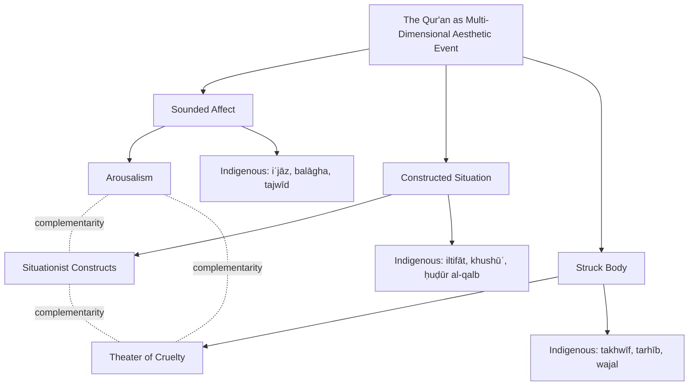

# Reading the Qur'an Through Western Aesthetic Lenses: Arousalism, Situationist Constructs, and the Theater of Cruelty as Frameworks for Interpreting Qur'anic Affect, Experience, and Imagery
# 1 Introduction: From Doctrinal Content to Aesthetic Affect in Qur'anic Studies

The Qur'an has long been studied as a repository of doctrine, law, and prophetic history—a text whose meaning is unlocked principally through philological analysis, theological commentary (*tafsīr*), and juridical extraction (*istinbāṭ*). Yet for the communities who have lived with it for fourteen centuries, the Qur'an has never been only a text to be parsed for propositional content; it has been a voice to be heard, a rhythm to be internalized, a presence whose recitation reshapes the air of a room and the disposition of a body. The question this report takes up is what happens to Qur'anic interpretation when we shift our analytical center of gravity from *what the scripture says* to *how it makes the reader and listener feel*—and, more provocatively, when we mobilize the conceptual vocabularies of Western modern and contemporary art theory to articulate that experiential dimension. The introduction that follows sets out the rationale, the stakes, and the conceptual architecture of this experiment in comparative aesthetic hermeneutics.

## 1.1 The Affective Turn in Qur'anic Studies

For most of its history, the dominant scholarly apparatus surrounding the Qur'an has been organized around the recovery and clarification of semantic content. Classical *tafsīr* literature inventories occasions of revelation (*asbāb al-nuzūl*), adjudicates legal rulings, harmonizes apparent contradictions, and traces lexical genealogies; Orientalist philology, in turn, has historicized the text's vocabulary, sources, and redaction. In both modes, the implicit ontology of the scripture is propositional: the Qur'an is a structure of meanings to be decoded, and the ideal reader is a hermeneut whose task is to recover, clarify, and systematize those meanings. This paradigm has produced indispensable scholarship, but it has also tended to marginalize a series of phenomena that are central to how the Qur'an actually operates among its audiences: the sonic textures of recitation, the rhythms of public and private oral performance, the somatic responses of listeners, and the embodied disciplines (postures, breathing, attentive silence) that shape reception.

One productive way to characterize the field that traditional scholarship has built is to treat the Qur'an as what Talal Asad has termed a **"discursive tradition"**—a historically extended argument about what counts as correct practice, correct recitation, correct interpretation, and correct embodiment, transmitted through authorized institutions and exemplary persons. Asad's framing has the merit of rescuing Islamic textual practice from the Protestant-inflected assumption that scripture is essentially a private object of belief; it situates the Qur'an within a living tradition of authorized speech and disciplined response. Yet even within this framing, the affective and aesthetic dimensions of recitation can recede behind the institutional and discursive scaffolding that authorizes them.

The "affective turn" in Qur'anic studies pushes further. It insists that Qur'anic recitation is not reducible to melody alone but specifically foregrounds the reciter's **timbre**—the grain and color of the voice—and the pure sonorous effects that the disciplines of *tajwīd* are designed to produce: the precise articulation of consonants, the calibrated lengthening of vowels, the controlled pauses (*waqf*), the resonance of nasalization (*ghunna*). These are not ornaments laid over a meaning; they are constitutive of how the Qur'an is encountered. The mysterious disjointed letters (*al-ḥurūf al-muqaṭṭaʿa*) that open certain sūrahs—*Alif Lām Mīm*, *Ḥā Mīm*, *Yā Sīn*—are perhaps the limiting case: signs that resist semantic decoding and present themselves first and foremost as sound, as voiced presence.

Crucially, this turn reconfigures the position of the audience. Where philological-doctrinal approaches imagine the reader as an interpreter standing outside the text and decoding it, an affective approach defines the reader's role as one of **participation**. The listener is not the terminus of a one-way semantic transmission but a co-constituent of an event whose meaning emerges only in the encounter—in the trembling (*wajal*) of the heart described in Q 8:2, in the skin that shivers and then softens at the remembrance of God in Q 39:23, in the tears and prostrations that the text repeatedly invokes as appropriate responses to itself. To attend to how the Qur'an makes the reader feel is therefore not to abandon interpretation but to expand it: it is to read the text together with the bodies and dispositions it summons into being.

## 1.2 Rationale for Western Aesthetic Lenses and Methodological Stakes

If the affective dimensions of the Qur'an demand analytical attention, the question becomes which conceptual vocabulary is best suited to articulate them. Islamic intellectual traditions possess sophisticated indigenous categories—*iʿjāz* (the inimitable rhetorical perfection of the Qur'an), *balāgha* (eloquence), *naẓm* (compositional order), *faṣāḥa* (lucidity), *khushūʿ* (humble attentiveness), and the technical disciplines of *tajwīd*—each of which captures something essential about Qur'anic experience. Yet contemporary scholars working at the intersection of religious studies, aesthetics, and literary theory have increasingly supplemented these indigenous resources with concepts drawn from Western modern and contemporary art theory: theories of expression and emotional arousal, of constructed environments and immersive milieus, of anti-representational intensity and embodied spectatorship.

The rationale for such borrowing is neither that indigenous categories are inadequate nor that Western theory is privileged. It is, rather, that aesthetic phenomena cross cultural boundaries in ways that justify cautious comparative work. A theory that articulates how organized sound arouses emotion in a Western concert hall may illuminate something about how Qur'anic recitation arouses emotion in a mosque, not because the two practices are identical but because both engage human perceptual and affective capacities that are not culturally hermetic. Similarly, a theory of how a constructed environment displaces passive spectatorship and draws participants into a lived event may illuminate how Qur'anic narrative organizes its addressees, even though the Situationist café and the recited sūrah are worlds apart.

The methodological stakes, however, are real. Three risks deserve explicit acknowledgment. First, **Orientalist projection**: imported categories can flatten the specificity of Islamic textual practice, assimilating it to Western paradigms whose presuppositions (secularity, autonomy of the aesthetic, the death of the author) are foreign to scripture. Second, **anachronism and category mismatch**: theories developed in twentieth-century European contexts—in response to bourgeois spectacle, psychological theater, or the formalism of the concert hall—carry historical baggage that does not transfer cleanly to a seventh-century revealed text. Third, **theological reduction**: an exclusively aesthetic reading risks treating the Qur'an as if it were an artwork, sidelining its claim to be divine speech and the existential and soteriological demands that follow from that claim.

These risks do not disqualify the comparative project; they discipline it. The methodological posture adopted here is heuristic and exploratory rather than reductive. Western aesthetic concepts function in this report as **partners in dialogue with the Qur'anic text**, not as master keys; they generate questions and articulations that can then be tested against the text's own structures and against indigenous categories. The safeguards are threefold: making the conceptual borrowings explicit and provisional; staying close to specific Qur'anic passages rather than abstract generalities; and preserving the asymmetry between the secular avant-garde origins of these theories and the sacred status of the text they are used to illuminate.

## 1.3 Three Lenses: Arousalism, Situationist Constructs, and the Theater of Cruelty

This report proposes that three concepts, drawn from distinct moments in modern and contemporary aesthetic thought, together provide a usefully complementary toolkit for analyzing Qur'anic experience. Each lens foregrounds a different dimension of how the text affects its audience, and each maps onto a distinct register of Qur'anic form—sound, narrative structure, and imagery, respectively.

**Arousalism** is the aesthetic-theoretical claim that an artwork expresses an emotion if it has the power to arouse that emotion in a suitably qualified audience. Tracing its lineage from eighteenth-century British aesthetics (Francis Hutcheson, Archibald Alison) through twentieth- and twenty-first-century philosophers such as Colin Radford, Jerrold Levinson, Aaron Ridley, and Jenefer Robinson—and answering challenges from formalist critics like Eduard Hanslick and Peter Kivy—Arousalism offers a precise conceptual machinery for asking how the Qur'an's sonic and rhetorical surfaces evoke awe, fear, hope, and tranquility in listeners. It is especially well suited to the question of why even a non-Arabic-speaking listener can be moved by recitation: an audience-centric theory of expression can theorize the "primitive" or "truncated" emotions that arise prior to semantic comprehension.

**Situationist Constructs** is the second lens, drawn from the avant-garde movement led by **Guy-Ernest Debord and articulated in his 1957 manifesto *Toward a Situationist International (Report on the Construction of Situations)***. Debord defined the "constructed situation" as an integrated ensemble of behaviors and a transient milieu deliberately designed to produce a unified ambience—a lived event that overcomes the passivity of the spectator. Together with the related concepts of *dérive*, *détournement*, psychogeography, and the critique of the "society of the spectacle," this framework provides resources for interpreting the Qur'an's distinctive narrative behavior: its rupture of linear chronology, its recursive retelling of prophetic stories across multiple sūrahs, its abrupt shifts of voice and addressee (*iltifāt*), and its eschatological scenes that situate the listener inside the Day of Judgment rather than merely informing them about it. The Situationist lens, more than the Arousalist one, is calibrated to the question of how textual structure constructs an environment of participation.

**The Theater of Cruelty**, the third lens, is Antonin Artaud's program for a theater that bypasses discursive reason and strikes the spectator's nerves and sensibility directly through light, sound, gesture, and spectacle. Articulated in *The Theater and Its Double*, Artaud's "cruelty" denotes not gratuitous brutality but rigor, necessity, and the violent awakening of the audience to metaphysical reality. This lens is most productively applied to the Qur'an's apocalyptic, eschatological, and infernal imagery—the cosmic dissolution of the Hour, the visceral depictions of Hell, the bodily punishments and rewards—where phonetic intensity, accumulative parallelism, and sudden imagistic violence combine to produce shock, dread, and somatic affect.

The three lenses are complementary rather than redundant. The table below summarizes their division of analytical labor.

| Lens | Theoretical origin | Primary register of Qur'anic form | Mode of audience engagement | Key analytical question |
|---|---|---|---|---|
| Arousalism | 18th-c. British aesthetics → 20th–21st-c. analytic philosophy (Hutcheson, Alison, Radford, Levinson, Ridley, Robinson) | Sound, rhetoric, language | Emotional arousal in a qualified audience | How does the text *evoke* emotion? |
| Situationist Constructs | Guy-Ernest Debord, *Toward a Situationist International* (1957), and the Situationist International | Narrative structure, voice, temporal frame | Participatory immersion in a constructed milieu | How does the text *construct a situation* the audience inhabits? |
| Theater of Cruelty | Antonin Artaud, *The Theater and Its Double* (1938) | Apocalyptic and eschatological imagery | Visceral, bodily, anti-discursive assault | How does the text *strike* the spectator's body and senses? |

The complementarity can be stated as a working hypothesis: sound is best illuminated by Arousalism, structure by Situationist Constructs, and imagery by the Theater of Cruelty—though, as later chapters will show, the three registers interpenetrate, and so do the three lenses.

## 1.4 Research Question, Scope, and Structure of the Report

The central research question of this report can now be formulated precisely: **How can Arousalism, Situationist Constructs, and the Theater of Cruelty jointly illuminate the Qur'an's sonic, narrative, and imagistic strategies for producing experience?** The question is deliberately conjunctive. It does not ask which theory is most accurate but how the three together reconfigure the Qur'an as an aesthetic event—an event whose meaning is inseparable from the affective, situational, and visceral responses it elicits.

The scope of inquiry is bounded in three ways. *Textually*, the report concentrates on passages that exemplify the three registers: short Meccan sūrahs whose phonetic and rhythmic intensity is pronounced (e.g., Q 81, Q 82, Q 84, Q 88, Q 99, Q 101), recursive prophetic narratives (Mūsā across Q 7, Q 20, Q 26, Q 28; Yūsuf in Q 12; Maryam in Q 19), imagistic verses (Q 24:35, Q 55, Q 56, Q 2:264), and verses that thematize affective reception (Q 8:2, Q 39:23). *Theoretically*, it limits itself to the three named lenses, while engaging adjacent debates (formalism, embodiment theory) only as needed. *Methodologically*, it positions itself as a comparative aesthetic experiment, neither displacing indigenous categories such as *iʿjāz*, *balāgha*, *tajwīd*, and *khushūʿ* nor subordinating them, but holding them in productive tension with Western frameworks.

The structure of the chapters that follow mirrors this triadic design. Chapter 2 develops Arousalism as an aesthetic theory of expression and applies it to Qur'anic soundscapes, rhetoric, and imagery. Chapter 3 reconstructs the Situationist concept of the constructed situation and tests it against the Qur'an's non-linear, recursive, and address-shifting narrative style. Chapter 4 elaborates Artaud's Theater of Cruelty and applies it to the Qur'an's apocalyptic and infernal imagery. Chapter 5 synthesizes the three lenses along comparative axes—locus of meaning, mode of engagement, kind of experience—and critically interrogates the legitimacy and risks of importing secular avant-garde theory into the reading of scripture. Chapter 6 consolidates the findings into an outline for an aesthetic hermeneutics of the Qur'an and identifies avenues for further research, including dialogue with embodiment theory, empirical studies of listeners' affective responses, and sustained engagement with indigenous Islamic categories.

The wager of the report, articulated here at the outset, is that an aesthetic hermeneutics need not compete with doctrinal exegesis but can recover dimensions of the Qur'an that purely semantic approaches have left underdescribed: the timbre of the reciting voice, the situational pull of the eschatological scene, the visceral force of the apocalyptic image. To attend to these is not to aestheticize revelation but to take seriously the fact that, for its addressees, revelation has always been a matter of being moved.

# 2 Arousalism and the Qur'an: Theorizing the Affective Power of Sound, Language, and Imagery

If Chapter 1 argued that the Qur'an's significance is borne by its sound as much as by its semantic information, the present chapter takes up the philosophical question implicit in that claim: by what mechanism does organized sound—and, beyond sound, organized language and imagery—come to bear emotional significance for an audience? The most direct and historically influential answer in Western aesthetics has been some form of *Arousalism*: the thesis that an artwork or expressive object bears an emotion in virtue of its capacity to arouse that emotion in a suitably qualified audience. This chapter reconstructs Arousalism as a theoretical instrument, situates it within the longer debate over expression in the arts, and then tests its purchase across three Qur'anic registers—recited sound, rhetorical-figurative language, and vivid imagery—before considering its capacity to theorize the well-attested affective responses of listeners who do not understand Arabic. The chapter closes by assessing what Arousalism illuminates, what it underdescribes, and how its limits motivate the Situationist and Artaudian analyses that follow.

## 2.1 Reconstructing Arousalism as an Aesthetic Theory of Expression

In its most precise contemporary formulation, **Arousalism** is the claim that a work of art (or, more broadly, an aesthetic object) *expresses* an emotion E if and only if it possesses the *power* to *arouse* E in a suitably qualified audience under appropriate conditions of reception. The thesis is biconditional: it specifies both the criterion of expression (the capacity to move) and the locus of that expression (the response of a competent perceiver). It is therefore an *audience-centric* theory of expressive meaning, in contrast to theories that locate expression in the artist's psychological state or in formal properties intrinsic to the work.

Arousalism is, properly speaking, a concept within aesthetic theory that refers to the characteristic of artworks or other objects to evoke emotional and sensory responses in observers. Historically, it has been most closely associated with the modernist art movement of the late nineteenth and early twentieth centuries, in which the question of how form, color, and sound *move* the perceiver became central to artistic theory and practice. Among modernism's important theorists of arousalist aesthetics, **Wassily Kandinsky** occupies a central place; in *Concerning the Spiritual in Art*, he famously articulated the arousalist mechanism through a musical analogy: "Colour is the keyboard, the eyes the hammers, the soul is the piano with many strings." The image compresses the entire arousalist thesis: the perceptual surface of the work (color, sound) acts upon the receiving instrument (eye, ear) so as to set into resonance the inner life of the audience (the soul's strings). The artwork does not merely *represent* an emotion; it *plays* the audience.

Although the modernist articulation gives Arousalism its sharpest expression, its lineage runs back to eighteenth-century British aesthetics. **Francis Hutcheson**, in elaborating his theory of an "internal sense" by which we apprehend beauty, prepared the ground for an account in which aesthetic properties are constituted by their effects on a properly attuned perceiver. **Archibald Alison**, in his associationist account, theorized how perceptual qualities trigger trains of feeling and imagination through learned and natural associations, so that the emotional character of a landscape, a melody, or a poem is realized in the responsive movement of the spectator's mind. These earlier formulations supplied two enduring elements: the notion that aesthetic content is *response-dependent*, and the recognition that the response is not a brute reflex but the disciplined activity of a *qualified* perceiver.

The twentieth- and twenty-first-century analytic tradition refined Arousalism in response to the difficulty that audiences often appear to *recognize* emotions in artworks without actually *feeling* them—we hear a piece as sad without becoming sad. **Colin Radford** pressed the "paradox of fiction" (how we are moved by what we know to be unreal), which sharpened the demand that any arousal-theory specify what kind of emotion is in play. **Jerrold Levinson** responded by distinguishing fully cognitive emotions (which require beliefs about real objects) from *imaginative* or partial affective states that artworks can reliably produce. **Aaron Ridley** developed a "melismatic" account on which the listener empathically inhabits the music's expressive gestures, and **Jenefer Robinson** has argued that musical and literary expression operates first through fast, automatic affective appraisals—what she terms "primitive" emotional responses—prior to and beneath full cognitive uptake. The shared upshot is a *graduated* Arousalism: the relevant arousal need not be a full-blooded, object-directed emotion but may be a "truncated" or proto-emotional state—an inner stirring, a pre-cognitive movement of mood—elicited reliably in qualified listeners.

Several conceptual moves deserve emphasis because they will return throughout this chapter. First, the **qualified listener** is not an arbitrary fiction but a normative idealization: the audience competent in the relevant idiom, attentive, neither distracted nor jaded, possessed of the perceptual sensitivities the work presupposes. Second, the distinction between *expressed* and *aroused* emotion allows Arousalism to acknowledge that a listener may recognize a sad piece without becoming sad, while insisting that the expressive property is *grounded in* the capacity to arouse in the appropriate conditions. Third, the notion of **primitive or truncated emotions** opens conceptual space for affective responses that are reliably elicited even where the audience lacks the doctrinal, linguistic, or cultural competence to articulate them—a feature whose Qur'anic relevance will be central to §2.6.

Arousalism, so reconstructed, gives us a precise instrument: a theory of expression that locates aesthetic meaning in the responsive activity of a competent audience, that admits gradations of affective intensity, and that can be brought to bear on any object—painting, symphony, or recited scripture—whose surface is organized so as to *play* its perceivers.

## 2.2 Arousalism in Debate: Formalist and Resemblance-Theoretic Counterpositions

Arousalism has never been the only candidate theory of artistic expression, and its application to the Qur'an benefits from a clear view of its principal rivals. Three counterpositions are particularly relevant.

The first is **formalism**, whose classical articulation is Eduard Hanslick's claim, mounted against the Romantic emotion-theorists of nineteenth-century music criticism, that the content of music is reducible to "tonally moving forms" (*tönend bewegte Formen*). On Hanslick's view, what music presents is structure—pattern, contour, development—and any emotion the listener experiences is a contingent psychological by-product, not the expressive content of the work. Formalism's force lies in its insistence that the work's intrinsic properties are primary and that audience response is too variable to ground objective expression. Applied to the Qur'an, a formalist would insist that the rhythmic, phonetic, and rhetorical structure—the very *naẓm* and *iʿjāz* that the Islamic tradition reveres—is itself the expressive content, and that arousal in listeners is a downstream consequence rather than a constitutive criterion.

The second counterposition is the **resemblance** or *contour* theory, most prominently developed by **Peter Kivy**. Kivy argues that music expresses sadness, joy, or solemnity not by arousing those feelings but by *resembling* their outward behavioral expression: a slow, drooping, minor-mode melody resembles the gait and voice of a sad person, much as a basset hound's face resembles human sadness without itself being sad. Expression on this view is a perceptible *property* of the work analogous to a representational likeness. Resemblance theory is attractive because it explains how we attribute emotions to artworks without supposing that listeners actually undergo those emotions; it also undercuts Arousalism by severing expression from arousal.

The third counterposition is the family of **embodiment** accounts, which locate expressive meaning in the listener's somatic mimicry of the work's gestures—the body that subtly tenses with a rising line, that breathes with a phrase's contour, that mirrors the reciter's articulatory effort. Embodiment theories are not strict rivals to Arousalism; rather, they specify a *mechanism* by which arousal is realized, locating it below conscious cognition in the perceiver's sensorimotor apparatus.

Each of these positions illuminates something Arousalism alone cannot. Formalism is right that without a structured object capable of *bearing* expression, no arousal would be reliably elicited; the *capacity* to arouse is grounded in formal organization. Resemblance theory is right that listeners distinguish recognizing an emotion in a work from undergoing it, and that aesthetic perception involves an attribution of qualities, not merely a registration of inner stirrings. Embodiment theory is right that arousal is not an ethereal mental event but a bodily one, achieved through felt mimicry, posture, breath, and the activation of pre-reflective sensorimotor schemata.

For a recited and sacred text, however, none of these rivals can fully replace Arousalism. Formalism, taken strictly, cannot account for the deep tradition—both Islamic and ethnographic—of describing recitation in terms of its *effects* on hearts that tremble, eyes that weep, skin that shivers and softens. Resemblance theory struggles with the specifically *non-representational* dimensions of Qur'anic sound, particularly the disjointed letters whose meaning resists figural reading. Embodiment theory, valuable as a supplement, does not by itself adjudicate which felt mimicries count as expressive of which emotions; it requires precisely the normative apparatus of the "qualified listener" that Arousalism supplies.

The position adopted in what follows is therefore a **calibrated, non-reductive Arousalism**: a framework that treats audience arousal as the criterion of expression while integrating formalist attention to structural organization, resemblance-theoretic acknowledgment that recognition and arousal can come apart, and embodiment-theoretic specification of the bodily mechanisms of response. Such calibration is particularly important for a sacred text whose expressive surface engages listeners across multiple registers—sonic, rhetorical, imagistic—and whose audiences range from doctrinally trained reciters to non-Arabophone outsiders.

## 2.3 Qur'anic Soundscapes: Tajwīd, Rhythm, and the Disjointed Letters as Sites of Arousal

The most direct application of Arousalism to the Qur'an is to its sonic surface, because it is precisely here that the Qur'anic tradition itself most insists on the constitutive role of audience response. The transmission of the Qur'an and its social existence are essentially oral; the significance of the revelation is carried as much by sound as by semantic information, and, as one ethnographic study of recitation puts it bluntly, "the Qur'an is not the Qur'an unless it is heard."[^1] The familiar sound of recitation is the Muslim's predominant and most immediate means of contact with the word of God, and for many believers recitation remains their only access to the text.[^1]

That this orality is not incidental decoration but *constitutive of expressive meaning* is a thesis the Islamic tradition itself articulates in striking terms. According to Muslim perception, the parameters of rhythm, timbre, and phonetics are all understood as having a divine source and organization; the divine identity of the text gives it an inherent perfection and makes of it a model of beauty, while imbuing it with an authority and prestige that distinguish it from music.[^1] **Islam, alone among the Abrahamic religions, has in its canonical rituals excluded singing, almost entirely concentrating the arousalist power of sound on the recitation of scripture itself.**[^1] This concentration is decisive for any aesthetic theory of Qur'anic experience: the arousing capacity of organized sound that other traditions distribute across hymnody, chant, and liturgical music is, in Islam, focused on a single performative practice—the recitation of the revealed text. The Qur'an, in this sense, is the Islamic tradition's privileged arousalist instrument.

The discipline that regulates this instrument is *tajwīd*, "the system of rules regulating the correct oral rendering of the Qur'an," whose importance for any study of the Qur'an cannot be overestimated. *Tajwīd* preserves the nature of a revelation whose meaning is expressed as much by its sound as by its content, and it does so through a comprehensive set of regulations governing the parameters of sound production, such as duration of syllable, vocal timbre, and pronunciation; further, *tajwīd* links these parameters to meaning and expression, and indicates the appropriate attitude of the reciter to the Qur'anic recitation as a whole.[^1] In Arousalist terms, *tajwīd* is the codification of the conditions under which Qur'anic sound reliably arouses the appropriate responses in qualified audiences. The categories it governs—points of articulation (*makhārij*), manner of articulation (*ṣifāt*), assimilation (*idghām*) and dissimilation (*iẓhār*), nasalization (*ghunna*), extended duration (*madd*), and pause and beginning (*al-waqf wa-l-ibtidāʾ*)—are not merely phonetic prescriptions; they are the technical specification of an affective machinery.[^1]

A particularly clear case of this affective machinery is the rule of *ikhfāʾ* (partial concealment), which governs the pronunciation of a syllable-final /n/ or /m/ before certain letters. The classical sources define it as "the pronunciation of a letter between full pronunciation (*iẓhār*) and assimilation (*idghām*), free of doubling (*tashdīd*), and with nasality (*ghunna*) of the letter"; another defines it as "a state between full pronunciation and full assimilation."[^1] What is striking for an Arousalist reading is that such definitions, as Nelson observes, "do not guide the student to producing the intended sound; rather, they identify a sound which the student has heard and learned by imitation."[^1] The discipline of *tajwīd* is irreducibly oral: its texts are aids to recognition, and the sound itself is transmitted by ear from teacher to student.[^1] The qualified listener of Arousalist theory is thereby specified concretely: a person whose ear has been trained, through years of imitation, to discriminate the precise gradations of nasality, length, and articulatory pressure that constitute the recited text.

Within this disciplined framework, the Qur'anic tradition organizes recitation into distinct styles whose Arousalist functions differ markedly. Ethnographic and indigenous categorization recognize a series of *turuq* (ways of reciting): *taḥqīq* (very slow, with longest durations and most complete articulations, characteristic of certain *qirāʾāt* and the basis of melodic reciting in general), *ḥadr* (very quick, with shortest durations and all options to lighten or elide, typical of private under-the-breath recitation), and *tadwīr* (medium tempo).[^1] On top of this tripartition lies the more functionally significant distinction between **murattal** and **mujawwad**: the former a relatively unornamented, text-oriented style associated with private devotion, daily ritual prayers, and pedagogical contexts, with limited pitch variation and an accessible, "speech-bound" character; the latter a melodically elaborated, vocally artistic style reserved for public occasions, in which the reciter "seeks to involve the listeners" through the dramatic use of register, sectioning of the text, and conscious vocal artistry.[^1] Nelson's account of the Cairene tradition is unambiguous about the *mujawwad*'s arousalist intent: "the dramatic use of register and sectioning of the text and a conscious use of vocal artistry and melody heighten the listener's emotional involvement," and the use of microphones and loudspeakers "both signals and underlines the more public and performative nature of this style."[^1]

The ethnographic record of how such recitation actually arouses its audiences reads almost as a textbook illustration of Arousalist theory. Nelson's opening description of a public Cairo performance is worth quoting at length:

> "But as he begins a high passage he catches their attention. Suddenly the power of the phrase seizes the scattered sensibility of the crowd, focusing it, and carrying it forward like a great wave, setting the listeners down gently after one phrase and lifting them up in the rising of the next. The recitation proceeds, the intensity grows. A man hides his face in his hands, another weeps quietly. Some listeners tense themselves as if in pain, while, in the pauses between phrases, others shout appreciative responses to the reciter. Time passes unnoticed."[^1]

What the ethnography registers is precisely what Arousalist theory predicts: the organized sound, calibrated by *tajwīd* and intensified by *mujawwad* artistry, *plays* the qualified audience—weeping, tensing, vocalizing—through phrases that focus a scattered sensibility into a unified affective movement. The "qualified listener" here is not a philosopher's abstraction but the Cairene devotee whose ear has been formed by decades of exposure and whose body has internalized the conventions of response.

Crucially, this affective power is not reducible to melody alone. The Qur'anic tradition specifically emphasizes the **reciter's timbre** and **pure sonorous effects**—the grain of the voice, its color and resonance, distinct from the melodic line it traces. The classical authority for this emphasis is a famous *ḥadīth* preserved in *Ṣaḥīḥ Muslim* (no. 793), in which the Prophet praises the voice of Abū Mūsā al-Ashʿarī by saying that he had been given "*one of the instruments of the house of David*" (*mizmār min mazāmīr āl Dāwūd*). The praise locates the reciter's distinction not in his interpretive choices or his melodic invention but in the *instrumental quality of the voice itself*—a sonorous capacity figured as belonging to the same order as the legendary musical gifts of the Davidic line. The tradition thus authorizes, at its highest level, an Arousalist attention to vocal *timbre* as an irreducible carrier of expressive power. The reciter is not merely a vehicle for transmitting words; the reciter's voice *is*, in some constitutive sense, part of what the qualified listener hears and is moved by.

The strongest Arousalist test case in the Qur'anic soundscape, however, is the set of **mysterious disjointed letters** (*al-ḥurūf al-muqaṭṭaʿa*) that open twenty-nine sūrahs—*Alif Lām Mīm*, *Ḥā Mīm*, *Yā Sīn*, *Kāf Hā Yā ʿAyn Ṣād*, and others. These letters resist semantic decoding; the classical tradition has offered multiple interpretive proposals, none decisive. As pure phonemic sequences, performed under the full discipline of *tajwīd* with its extended *madd* on each letter, they present the listener with sound that *cannot* be processed as discursive content and that *must* therefore be received as sound. They are, in effect, the Qur'an's purest arousalist instrument: a phonic surface whose entire expressive work is done through the resonance, length, nasality, and timbral shaping of voiced letters. For an Arousalist reading, the disjointed letters function as a *limit case* that strongly confirms the theory: where semantic content drops out, expressive power persists, and the qualified listener is moved by the disciplined production of sound as such.

Two summary observations follow. First, the Qur'anic tradition's own categories—*tajwīd*, *murattal* and *mujawwad*, the *turuq*, the praise of vocal *mazāmīr*—articulate, in indigenous terms, what Arousalism articulates philosophically: a structured organization of sound whose criterion is its disciplined capacity to arouse a qualified audience. Second, the ethnographic and textual evidence converges on a finding that any purely formalist or resemblance-theoretic account would leave underdescribed: the Qur'an's sonic register is *constitutively oriented toward affective response*. The tradition does not merely tolerate audience emotion as a contingent by-product of correct recitation; it cultivates, codifies, and rewards it.

## 2.4 Rhetoric and Figurative Language as Affective Generators

Beyond pure sound, the Qur'an's rhetorical and figurative surface constitutes a second site at which Arousalist analysis is illuminating. The Qur'an is revealed through a variety of modes, including narrative prose, poetic imagery, and oratory, and a respected scholarly tradition exists which identifies and analyzes the literary devices used in the poetic and rhetorical expression of the Qur'an—rhyme, metaphor, simile, paronomasia, anaphorism, concision, and so forth—devices often referred to as the "music" of the Qur'an.[^1] The metaphor is telling: the rhetorical surface, like the sonic surface, is conceived in terms of its musical, that is, its affective, capacity.

The aspects of Qur'anic style most obvious in recitation are rhyme, assonance, and rhythm, all of which serve to unify the various speech modes of the text.[^1] The structure of Arabic itself is conducive to multisyllabic rhyme, since all morphemes fit into one of a number of syllabic patterns marking such features as voice, number, gender, case, intent, and reciprocity; to a large extent, the rhyme and rhythmic patterns inherent in the language account for the untranslatability of the sound of the text.[^1] An Arousalist reading exploits exactly this point: the formal features that resist translation are the very features that carry the work's expressive power. What is lost in translation is not a stylistic flourish but the work's capacity to arouse.

Specific rhetorical configurations function as identifiable affective generators. In the short Meccan sūrahs—Q 81, Q 82, Q 84, Q 101—rhetorical compression and an accelerating cadence combine to produce dread. The opening of Q 81 (*al-Takwīr*), with its long sequence of conditional clauses ("When the sun is folded up... when the stars fall... when the mountains are set moving..."), uses anaphoric repetition and parallel rhythmic patterning to construct an accumulating sense of impending judgment that resolves only at the appearance of the main clause: "then a soul shall know what it has produced." The qualified listener is held in escalating tension by the rhetorical structure itself, prior to and beyond any propositional uptake. Within the same chapter, in Q 81:32–39, a sudden regularity of poetic feet and a relative shortness of line highlight a crucial question: "*then whither go ye?*" (*fa-ayna tadhhabūn*).[^1] The Arousalist reading is precise: rhetorical *form* (compressed line, regular foot) produces a specific *affect* (arrested attention, urgency, address) in the qualified hearer.

A second device is the use of *rhyme, rhythm, and syntactic parallelism* to *set up expectations* that are then delayed before final resolution. In passages such as Q 91:1–8, parallel syntax, rhythm, and end-rhyme establish a pattern whose effect is interrupted by extra syllables and a change in syntax, but resolved according to expectation by the end-rhyme and rhythm.[^1] The affective shape of the passage is one of expectation, suspension, and resolution—an arousalist structure isomorphic with the cadential structure of music. As Nelson observes, this end-rhyme cadence parallels the aesthetics of Arabic music itself, in which tension is heightened or resolved in the melodic cadence and the pause which follows, so that "the use of the melodic cadence is a characteristic feature of the melodic style of recitation, and it serves to emphasize the qualities of the Qur'anic text."[^1] Rhetorical and sonic arousal are here fused.

A third Qur'anic rhetorical phenomenon especially congenial to Arousalist analysis is the *mutashābihāt*—phrases of varying length that recur throughout the text with little or no variation, functioning as cadential formulae or refrains. The phrase "gardens of Eden under which rivers flow" recurs with slight variation in over twenty different passages, and a comparable formulaic pattern characterizes many other recurrent constructions.[^1] These refrains are not merely mnemonic devices; they generate, through recognition and accumulating familiarity, the specific affective quality of *continuity*, *return*, and *enveloping presence*—what Nelson describes as the structural counterpart of the Qur'an's transcendence of linear time, with each part of the text referring to other parts by means of association and repetition of image, phrase, and rhythm, so that "the whole is constantly present."[^1] For the qualified listener, encountering a *mutashābih* mid-recitation is to be returned, affectively, to the entire textual fabric. Arousalist theory captures this as an expressive effect grounded in the audience's accumulated competence.

Ultimately, scholars and listeners recognize that the ideal beauty and inimitability of the Qur'an lie not merely in the content and order of the message or in the elegance of the language, but in the use of *the very sound of the language to convey specific meaning*—an "almost onomatopoeic use of language, so that not only the image of the metaphor but also the sound of the words which express that image are perceived to converge with the meaning."[^1] This convergence is the precise object of an Arousalist reading: sound and sense are not two distinct channels but a single expressive surface whose effect on the qualified listener is the criterion of its expressivity.

The indigenous category for this combined excellence is **iʿjāz**—the inimitable rhetorical perfection of the Qur'an—together with *balāgha* (eloquence), *faṣāḥa* (lucidity), and *naẓm* (compositional order). These categories are not merely formalist; they are conjoined to a robust tradition of describing the Qur'an's effects on its hearers, from the awe of the early Meccan converts to the trembling and tears of contemporary devotees. The Arousalist framework, far from displacing *iʿjāz*, can be understood as offering a philosophical articulation of one of its constitutive dimensions: the capacity of the Qur'anic rhetorical surface to *arouse* qualified audiences in ways that no human composition can match. Conversely, the indigenous categories restrain a purely Arousalist reading from treating arousal as the *sole* criterion of expression, by insisting on the irreducible structural-formal properties (*naẓm*) that ground the capacity to arouse.

## 2.5 Imagery and Sensory Arousal: Cosmic, Natural, and Eschatological Figures

The third Qur'anic register at which Arousalism finds purchase is imagery—the vivid sensory figures, cosmic scenes, and concrete pictures whose density makes the Qur'an, even in translation, a strikingly imagistic text.

The Qur'an's imagery operates across a calibrated range of affective targets. At one pole are the *contrastive* paradise-and-fire constructions of Q 55 (*al-Raḥmān*) and Q 56 (*al-Wāqiʿa*), in which gardens, fountains, fruits, and companions are juxtaposed against scenes of fire, scalding wind, and bitter food. The arousalist mechanism is double: the imagery of paradise elicits longing, hope, and tranquility, while the imagery of fire elicits dread—and the two arousals are placed in close rhetorical proximity, so that the qualified listener's affective state is modulated rapidly between hope and fear. Q 55's refrain "*Then which of the favors of your Lord will you deny?*" punctuates each image with a direct address to the audience, transforming description into solicitation of response.

At another pole are the *cosmic-dissolution* sūrahs—Q 81 (*al-Takwīr*), Q 82 (*al-Infiṭār*), Q 84 (*al-Inshiqāq*), Q 99 (*al-Zalzala*), Q 101 (*al-Qāriʿa*)—where natural and cosmic figures (the sun folded, stars falling, mountains uprooted, the earth shaken, the sky split) generate an imagistic vocabulary of catastrophic intensity. These figures do not function primarily as descriptions of a future event; they function as arousing presentations, and their accumulation in short, rhythmically compressed lines produces in the qualified listener an affect that exceeds any single image—a generalized dread that the Arousalist framework can name as the work's expressive content.

A third class consists of the *parabolic* and *figurative* images embedded within longer didactic passages. Q 2:264 likens charity nullified by reproach to a smooth rock covered with soil from which a heavy rain leaves only the bare stone—a single concrete image whose affective load is disappointment, futility, and warning. Q 24:35—the celebrated **Light Verse**—constructs an extended figure of "light upon light," in which Allah's light is figured through a niche, a lamp in a glass, the glass like a glittering star, the lamp lit from a blessed olive tree neither of the east nor of the west, whose oil would almost glow forth though no fire touched it. The Light Verse's arousalist effect operates not through dread but through wonder: the accumulation of luminous figures, none of which adequately represents its referent, generates an affective state of reverence and awe. The qualified listener is moved by the imagistic surplus itself.

A fourth class consists of the *somatic-eschatological* images that the Qur'an deploys in its depictions of judgment and the afterlife: scenes of bodies and faces in Q 88:1–7 ("faces that Day will be humbled, working hard and weary, scorched by burning fire, given to drink from a boiling spring..."), of recompense in Q 56:41–56, of registers and balances in Q 101, of the earth bringing forth its burdens in Q 99. These images are imagistic but also viscerally addressed—they engage the listener's body through figures of heat, weight, dragging, and exposure—and they thereby anticipate dimensions of Qur'anic experience that Arousalism alone cannot fully theorize.

Here a limit of the framework begins to appear. Arousalism's analytical strength is its specification of *which* emotion the qualified audience is reliably brought to feel; it can name the awe of Q 24:35, the dread of Q 101, the longing of Q 56. But the Qur'an's eschatological imagery does not merely arouse identifiable emotions; it *assaults* the listener's body and *interrupts* its discursive composure in ways closer to what Antonin Artaud will call the "Theater of Cruelty." The visceral shock of an image is not exhausted by the emotion it elicits; it includes a quality of *intensity*, *involuntariness*, and *bodily strike* that pushes beyond the cognitive-affective vocabulary of Arousalism. This is not an objection to Arousalism within its proper domain—it remains the most adequate framework for theorizing how the *Light Verse* arouses awe, or how Q 55 modulates longing and dread—but it identifies the boundary at which the third lens of this report must take over. Chapter 4 will return to the eschatological imagery from precisely this Artaudian angle.

## 2.6 Truncated and Primitive Emotions: Theorizing the Non-Arabophone Listener

One of the strongest motivations for adopting an Arousalist framework in Qur'anic studies is empirical: listeners who do not understand Arabic are nonetheless frequently and reliably moved by recitation. Recitation draws its support from the whole of Egyptian society, uniting the elite and the masses, the traditional and the Westernized, and "counts among its supporters Christians, Jews, and even nonbelievers who are drawn by, and acknowledge, the miraculous power and beauty of the sound."[^1] The phenomenon is not confined to Egypt or to a single confessional context; it is reported across the breadth of the Muslim world and beyond, including by ethnographers and ethnomusicologists whose own initial engagement with the tradition was, by their account, prompted by the affective force of the sound itself rather than by prior doctrinal sympathy. Nelson herself acknowledges this trajectory: "My own interest in Qur'anic recitation was caught and held by the power of the sound itself. I wanted to understand how it worked and to explain its effect."[^1]

A theory of Qur'anic expression that cannot account for this cross-linguistic affective transmission is to that extent inadequate. The doctrinal-semantic paradigm is poorly equipped here, since by hypothesis the listener does not parse the propositional content. Formalist accounts can describe the structural features that the non-Arabophone listener perceives—rhythm, rhyme, melodic contour, vocal grain—but cannot, on their own terms, explain why those features should elicit specifically *affective* responses. Resemblance theory faces the difficulty that what the non-Arabophone listener responds to is not obviously the resemblance of recited sound to any human behavioral signature of a specific emotion; the responses reported are often diffuse and pre-categorical, not the recognition of "sadness" or "joy" as such.

The Arousalist framework, refined by Levinson's and Robinson's notions of **truncated** and **primitive emotions**, has comparative advantages here. On Robinson's account, expressive content is registered first through fast, automatic, sub-personal affective appraisals that precede full cognitive uptake; Levinson allows that artworks can reliably produce partial or imaginative affective states even where full object-directed emotions are unavailable. These categories are well calibrated to the phenomenology of non-Arabophone listening. The non-Arabophone listener does not undergo, say, eschatological terror in the full Qur'anic sense (which would require beliefs about the Day of Judgment), but does undergo a *truncated* affective state—an unsettled solemnity, a felt gravity, an arrested attentiveness—that the work has the capacity to arouse in a perceptually competent (if doctrinally innocent) audience. Similarly, the non-Arabophone listener may register the *Light Verse* not as a fully cognized expression of divine luminosity but as a primitive affect of wonder elicited by the play of vocal contour and rhythmic suspension.

This account is preferable to two rival explanations. First, it is more precise than the reduction of cross-linguistic response to *generic musical pleasure*. Reports of weeping, trembling, and prolonged attention exceed what generic musicality reliably produces; the responses are emotion-typed in directions (gravity, awe, dread, repose) that align with the work's structurally specified expressive content. Second, it is preferable to the explanation by *exoticism*, which would attribute the non-Arabophone's response to mere unfamiliarity. Exoticism predicts a generalized aesthetic curiosity, not the specific affective shapes—weeping, somatic stillness, the focusing of "scattered sensibility" that Nelson's ethnography describes—reported across listeners and across decades.

Two qualifications must be entered. The first concerns the *qualified listener*. Arousalism does not predict that the affective machinery of Qur'anic recitation will operate identically on every hearer; on the contrary, its central concept presupposes the disciplined and competent perceiver. The non-Arabophone listener is *partly* qualified—perceptually attentive to sonic texture, attuned to vocal grain, capable of registering rhythmic and cadential structure—but *partly* unqualified, lacking the linguistic and doctrinal competencies that the Cairene devotee brings to the same performance. The cross-linguistic response is therefore not the *paradigm* of Qur'anic arousal but a *partial realization* of it, useful as a test case precisely because it isolates the strictly sonic-formal dimension of the work's expressive power from its semantic-doctrinal dimension.

The second qualification is theological. The Arousalist framework theorizes the Qur'an as an *aesthetic* object whose expressive power is grounded in audience response. The Islamic tradition, however, locates the Qur'an's authority not in its arousing capacity but in its divine origin; the affective power is a *sign* of that origin (a dimension of *iʿjāz*), not its substitute. There is therefore an asymmetry between the aesthetic arousal of the non-Arabophone listener and the theological status of the text. Recognizing the aesthetic phenomenon is not the same as recognizing the revelation, and an Arousalist reading must hold these levels distinct. To say that the Qur'an reliably arouses primitive affective states in non-Arabophone listeners is a claim within aesthetics; to say that this arousal is *evidence* of divine origin is a theological claim that lies beyond what Arousalism, as such, can adjudicate. This restraint, far from a weakness, is what enables Arousalism to function as a heuristic partner rather than a theological substitute.

## 2.7 Assessing Arousalism's Reach and Limits for Qur'anic Hermeneutics

Across the three registers examined—recited sound, rhetorical-figurative language, and vivid imagery—the Arousalist framework has demonstrated substantial purchase. It articulates philosophically what the Qur'anic tradition itself articulates in indigenous categories: that the text's expressive surface is constitutively oriented toward the affective response of a qualified audience. The discipline of *tajwīd* with its codified machinery of duration, nasality, and articulatory precision, the *mujawwad* style's deliberate intensification of vocal artistry, the prophetic praise of Abū Mūsā's voice as a Davidic *mizmār*, the limit case of the *ḥurūf al-muqaṭṭaʿa*, the cadential structures of short Meccan sūrahs, the recurring *mutashābihāt*, and the contrastive paradise-fire imagery of Q 55 and Q 56 all converge on a single point: the Qur'an's expressive content is grounded in its disciplined capacity to arouse competent audiences.

The framework's specific contributions to an aesthetic hermeneutics of the Qur'an can be summarized along three axes. **First**, it provides a *philosophical articulation* of what the indigenous Islamic categories of *iʿjāz*, *balāgha*, and *tajwīd* register at the level of practice: a normative theory of audience response that allows the affective dimensions of recitation to be analyzed with conceptual precision rather than treated as ineffable. **Second**, it offers an *account of cross-linguistic affective transmission* that neither doctrinal exegesis nor formalist analysis can supply. By drawing on Levinson's and Robinson's notions of truncated and primitive emotion, it explains why non-Arabophone listeners are reliably moved by recitation without claiming that they undergo the full object-directed emotions of doctrinally trained listeners. **Third**, it theorizes the *expressivity of the reciting voice*—the timbre, grain, and sonorous quality that the prophetic *ḥadīth* singles out for praise—as a constitutive carrier of expressive meaning, irreducible to either the semantic content of the text or the melodic line through which it is performed.

The framework's limits, however, are equally important to mark. The table below summarizes the Arousalist verdict in comparison with its principal rivals across the three Qur'anic registers analyzed in this chapter.

| Register | Arousalism | Formalism (Hanslick) | Resemblance theory (Kivy) | Embodiment theory |
|---|---|---|---|---|
| Sound (*tajwīd*, *mujawwad*, disjointed letters) | Strong: theorizes audience arousal as criterion of expressive meaning; specifies the qualified listener | Partial: captures structural organization but cannot account for the tradition's emphasis on listener affect | Weak: non-representational sound resists resemblance reading | Complementary: specifies somatic mechanism of arousal |
| Rhetoric (rhyme, parallelism, cadence, *mutashābihāt*) | Strong: theorizes how rhetorical structures arouse identifiable affective shapes (dread, suspense, return) | Partial: identifies *naẓm* but underdescribes its affective targeting | Partial: some rhetorical contours can be read as resembling emotional gestures | Complementary: explains felt mimicry of cadential structures |
| Imagery (paradise, fire, cosmic dissolution, Light Verse) | Strong for *named* emotions (awe, longing, dread); limited for *visceral shock* and *anti-discursive intensity* | Weak: imagery's affective targeting exceeds formal description | Partial: some imagery resembles emotional situations, but eschatological figures exceed this | Complementary: bodily affect is real but not theorized at the imagistic level |

The pattern is suggestive. Arousalism is strongest where the Qur'an's expressive surface is organized around the cultivation of *named affective states* in qualified audiences—and this is most of the text most of the time. It is weaker where the text's operation on its audience exceeds the cognitive-affective vocabulary of "arousing emotion E in audience A": where, that is, the text constructs an inhabited situation that envelops the listener rather than merely moving them (the territory of Chapter 3), or where it produces a visceral, anti-discursive shock that overwhelms the categories of emotion-typing themselves (the territory of Chapter 4).

Three specific Qur'anic phenomena mark this boundary. **First**, the *participatory immersion* effected by Qur'anic narrative—the way sūrahs like Q 12 (Yūsuf) or the recursive Mūsā cycles position the listener inside the unfolding scene rather than presenting it as past—is not well captured by an audience-arousal model, because the relevant mode of engagement is environmental rather than emotional. **Second**, the *visceral shock* of the most extreme eschatological imagery—the bodies in Q 88, the registers in Q 101—exceeds the gradient of emotions Arousalism is designed to discriminate; it operates closer to what Artaud will theorize as a strike against the spectator's nerves. **Third**, the *soteriological stakes* of revelation—the fact that the Qur'an's arousing capacity is, for the tradition, evidence of its divine origin and thus a matter of salvation rather than aesthetic value—lies beyond the proper jurisdiction of any aesthetic theory, and Arousalism's restraint on this point is a methodological virtue rather than a deficiency.

These limits do not retract the framework's contribution; they specify its proper domain. Arousalism gives an aesthetic hermeneutics of the Qur'an its first major instrument: a precise, philosophically articulated, audience-centered theory of how organized sound, language, and imagery move competent hearers. It establishes that, and how, the Qur'an's affective power can be analyzed without being either explained away or mystified. The two chapters that follow take up what Arousalism cannot reach. Chapter 3 turns to the structural devices by which the Qur'an constructs lived situations its addressees inhabit—an environmental, participatory mode of engagement that requires the Situationist concept of the constructed situation rather than the Arousalist concept of expressive arousal. Chapter 4 turns to the visceral, anti-discursive intensity of Qur'anic apocalyptic imagery—a register in which the text strikes the spectator's body in ways that Artaud's Theater of Cruelty is best positioned to articulate. Together, the three lenses will provide the multi-dimensional aesthetic hermeneutics whose architecture Chapter 1 sketched and whose synthesis Chapter 5 will consolidate.

In parallel with these Western frameworks, the Qur'anic tradition possesses ancient and sophisticated theoretical neighbors of its own. The concept of **rasa** in classical Indian aesthetics, as elaborated in the *Nāṭyaśāstra* tradition, offers a remarkable theoretical parallel to Arousalism: *rasa* names the contemplative abstraction in which human inward feelings permeate the embodied forms of the external world, generating in the qualified spectator (the *rasika*) the specific aesthetic savor that the artwork is organized to produce. Like Arousalism, *rasa* theory locates expressive meaning at the meeting of organized form and competent reception; unlike Arousalism, it understands this meeting not as the arousal of ordinary emotions but as their transmutation into a contemplative state. The parallel matters here for two reasons. First, it shows that audience-centric, affect-oriented aesthetic theorization is not a peculiarly Western or modernist invention but a cross-cultural pattern of reflection on how organized form moves competent perceivers. Second, it suggests that an aesthetic hermeneutics of the Qur'an need not be dependent on Western avant-garde categories alone; indigenous Islamic categories such as *iʿjāz*, *balāgha*, and *khushūʿ*, together with non-Western aesthetic traditions such as *rasa*, can serve as conversation partners that enrich, qualify, and discipline the Arousalist reading developed here. The deeper implication—taken up again in Chapter 6—is that the aesthetic dimensions of Qur'anic experience belong to a broader human inquiry into how form and affect compose one another, an inquiry to which Arousalism contributes one important, but not sole, voice.

[^1]: Kristina Nelson, *The Art of Reciting the Qur'an* (Austin: University of Texas Press, 1985).

# 3 Situationist Constructs and the Qur'an: Constructed Situations, Détournement, and Non-Linear Narrative as Immersive Experience

Chapter 2 closed by marking a boundary. Arousalism, in its calibrated, non-reductive form, gave a precise account of how the Qur'an's sonic and rhetorical surfaces *move* a qualified audience; it could name the awe of the Light Verse, the dread of the cosmic-dissolution sūrahs, the longing modulated against fear in Q 55 and Q 56. Yet it left at least two phenomena underdescribed: the way the Qur'an's narrative architecture seems to position its listeners *inside* a scene rather than before it, and the way its eschatological passages work less by representing a future event than by collapsing the distance between hearer and event. The first of these phenomena is the concern of the present chapter; the second, which Arousalism can name as affect but cannot exhaust, will be the concern of Chapter 4. To address the first, the report turns from a vocabulary of *arousal* to a vocabulary of *situation*: from how the text moves its audience to how it constructs an environment the audience inhabits.

The lens for that turn is supplied by the post-war French avant-garde. In 1957, Guy-Ernest Debord drafted the founding manifesto of what would become the Situationist International, and at its conceptual center stood a deliberately new theoretical object: the *constructed situation*, a transient ensemble of place, participants, and provoked events organized to yield a "superior passional quality." The vocabulary that grew up around that object—*dérive*, *détournement*, psychogeography, the critique of the spectacle—was developed for the analysis of streets, cities, and post-bourgeois cultural praxis, not scripture. But its formal core—a theory of how environments are composed so as to abolish passive spectatorship and produce participants—has been recognized as transferable to other domains in which audiences are not merely informed but inserted. The argument of this chapter is that the Qur'an's distinctive narrative architecture is one such domain: its rupture of linear chronology, its recursive prophetic cycles, its abrupt shifts of voice and addressee (*iltifāt*), its embedded dialogues, and its eschatological scenes can be read, with appropriate methodological calibration, as *Qur'anic constructed situations*—structural devices by which the text composes a milieu in which the listener is repositioned from spectator to participant.

The chapter develops this argument in ten sections. It begins by reconstructing the Situationist framework on its own terms (§§3.1–3.2), explicitly calibrates the cross-domain move (§3.3), and then tests the framework against five distinct features of Qur'anic narrative architecture: non-linear chronology (§3.4), recursive prophetic cycles with their counter-example and variant (§3.5), the address-architecture of *iltifāt* (§3.6), the eschatological scene as situation (§3.7), and the détournement of prior materials (§3.8). A synthetic section consolidates the figure of the listener inside the Qur'anic milieu (§3.9), and a critical closing section interrogates the limits and risks of the comparative move and marks the boundary at which Chapter 4 takes over (§3.10).

## 3.1 Reconstructing the Constructed Situation: Debord, the Situationist International, and the Architecture of Lived Ambience

The concept of the *constructed situation* receives its inaugural articulation in the section of Debord's 1957 *Report on the Construction of Situations and on the International Situationist Tendency's Conditions of Organization and Action* titled "Toward a Situationist International." Debord defines it with deliberate compression: "Our central idea is the construction of situations, that is to say, the concrete construction of momentary ambiences of life and their transformation into a superior passional quality."[^2] The definition is dense, and each of its terms repays attention. The situation is a *construction*, not a discovery or a found state; it is *concrete*, not abstract; it is *momentary*, not durable; it is an *ambience*, not an object or an action; and its purpose is *transformation* of the ordinary into something of "superior passional quality." Debord further specifies the formal architecture of the situation through the example of a gathering: it would be desirable, he writes, "to study what organization of the place, what selection of participants and what provocation of events are suitable for producing the desired ambience."[^2] Three coordinated elements—place, participants, provoked events—are organized so as to yield a fourth, *ambience*, which is the situation's expressive content.

This definition is anchored, in Debord's text, by a sharply diagnostic claim about what the situation is *against*. "The construction of situations begins beyond the ruins of the modern spectacle. It is easy to see how much the very principle of the spectacle — nonintervention — is linked to the alienation of the old world. Conversely, the most pertinent revolutionary experiments in culture have sought to break the spectators' psychological identification with the hero so as to draw them into activity by provoking their capacities to revolutionize their own lives. **The situation is thus designed to be lived by its constructors.** The role played by a passive or merely bit-part playing 'public' must constantly diminish, while that played by those who cannot be called actors, but rather, in a new sense of the term, 'livers,' must steadily increase."[^2] The constructed situation is defined, that is, by a precise inversion of the relation between work and audience that obtains in the spectacle: *non-intervention* is replaced by participation; identification with a *represented hero* is replaced by the activity of the "liver"; the public is dissolved into co-constructors. This is the Situationist axiom most directly pertinent to the present chapter's argument: **the constructed situation is, formally, a device for the abolition of the spectator**.

Around the constructed situation, Debord's *Report* and subsequent Situationist work assembled a family of allied concepts. *Unitary urbanism* is defined "first of all as the use of all arts and techniques as means contributing to the composition of a unified milieu"; it determines, among other things, "the acoustic environment as well as the distribution of different varieties of food and drink," and it works "by way of a certain number of force fields" each of which "will tend toward a specific harmony distinct from neighboring harmonies."[^2] Crucially for the analysis to follow, unitary urbanism is *dynamic*, directly related to styles of behavior, and "the most elementary unit of unitary urbanism is not the house, but the architectural complex, which combines all the factors conditioning an ambience, or a series of clashing ambiences, on the scale of the constructed situation."[^2] The architectural principle Debord then derives is decisive: "Architecture must advance by taking emotionally moving situations, rather than emotionally moving forms, as the material it works with."[^2] The aesthetic object is no longer the form that moves the spectator (the Arousalist's object) but the situation in which a participant lives.

*Psychogeography* is defined within the same conceptual field as "the study of the exact laws and specific effects of geographical environments, whether consciously organized or not, on the emotions and behavior of individuals."[^2] It is the empirical-investigative correlate of the constructed situation: where unitary urbanism *composes* milieus, psychogeography *studies* the affective laws by which milieus shape conduct. The *dérive*, in turn, is the experimental practice through which psychogeographical knowledge is gathered: "the practice of a passional journey out of the ordinary through a rapid changing of ambiences."[^2] The *dérive* is neither aimless wandering nor purposive itinerary; it is a disciplined exposure of the wanderer to a series of ambiences whose affective laws are observed in the wanderer's own response. It is, in this sense, the Situationist's analogue of the qualified listener: a competent participant whose attuned responsiveness is the instrument by which the affective grammar of environments is read.

Two further features of Debord's account bear on the Qur'anic analysis to follow. First, the situation is *non-continuous*. "Situationist theory resolutely supports a noncontinuous conception of life. The notion of unity must cease to be seen as applying to the whole of one's life... instead, it should apply to the construction of each particular moment of life."[^2] The unity at stake in the constructed situation is local, momentary, ambient; it is not the unity of a biography or a narrative arc. Second, the situation is *anti-aesthetic* in the traditional sense. "In contrast to the aesthetic modes that strive to fix and eternalize some emotion, the situationist attitude consists in going with the flow of time."[^2] The aim is not the fixation of expressive content in an enduring artifact but its production in a passing event whose value lies precisely in being lived.

It is worth noting that, even within Debord's own corpus, the constructed situation evolved against the foil of its theoretical opposite. The *Society of the Spectacle* (1967), Debord's later and more famous work, develops the critique of "a modern society in which authentic social life has been replaced with its representation," where "the spectacle is not a collection of images" but "a social relation among people, mediated by images."[^3] The Situationist view, that source confirms, is one in which "situations are actively constructed and characterized by 'a sense of self-consciousness of existence within a particular environment or ambience.'"[^3] The constructed situation is, in this longer arc, the positive form whose negative photograph the spectacle traces.

For the purposes of the present chapter, three features of the Situationist framework can be extracted as analytically operative. First, **the constructed situation is an integrated ensemble of place, participants, and provoked events whose product is an ambience**. Second, **the constructed situation abolishes the spectator and produces "livers"—participants whose presence within the milieu is the condition of its existence**. Third, **the constructed situation is non-continuous, momentary, and ambient rather than narrative**: its unity is the unity of a moment, not a story. These three features will provide the analytic instruments by which §§3.4–3.8 read the Qur'an.

## 3.2 Détournement, Spectacle, and the Critique of Passive Reception

Two further Situationist concepts must be brought into focus before the cross-domain application can be calibrated. The first is *détournement*. Debord defines it programmatically when he writes that unitary urbanism "must include both the creation of new forms and the *détournement* of previous forms of architecture, urbanism, poetry and cinema."[^2] *Détournement* is the rerouting and repurposing of preexisting cultural materials—forms, phrases, images, scenarios—to produce new meaning and a new ambience. It is not citation, which preserves the source's authority, nor parody, which inverts it; it is *redeployment*, in which the material's prior context is detached and its expressive function reassigned within a new composition. Debord later illustrated the principle in his own writing practice by lifting a passage from Lautréamont's *Poésies* and inserting it, unmarked, into *The Society of the Spectacle*'s thesis on plagiarism: "Ideas improve. The meaning of words participates in the improvement. Plagiarism is necessary. Progress implies it."[^3] The act exemplifies the concept: a preexisting sequence is rerouted to perform new work in a new ambience.

The second is the critique of the *spectacle*. Although developed most systematically in *The Society of the Spectacle*, its conceptual core is already operative in the 1957 *Report*. The spectacle, in Debord's mature formulation, names "a social relationship between people that is mediated by images," in which "all that was once directly lived has become mere representation."[^3] Its defining principle, as the *Report* puts it explicitly, is *non-intervention*: the spectator is structurally excluded from the event whose representation she consumes.[^2] The Situationist diagnosis is that the spectacle's regime depreciates lived experience, fragmenting it into roles, images, and consumption, and replacing participation with passive identification. Against this regime the constructed situation is conceived as antithesis: a form designed precisely to "break the spectators' psychological identification with the hero so as to draw them into activity."[^2]

Two analytical instruments highly relevant to Qur'anic hermeneutics fall out of this conceptual complex. The first is a vocabulary for **textual reworking of inherited cultural material**. *Détournement*, in its strictly formal sense, names an operation that any composer of a major textual corpus undertakes when she works with materials already in circulation: figures, formulae, scenarios, narrative arcs whose prior context is detached and whose expressive function is reassigned. The Qur'an's well-documented engagement with biblical, late-antique Arabian, and Near Eastern narrative materials—prophetic figures from Ibrāhīm to ʿĪsā, formulae of covenant and sign, scenarios of flood and city destroyed—has long been described in genetic and intertextual terms (source-criticism, *Isrāʾīliyyāt*, late-antique studies). The Situationist vocabulary offers a complementary *formal* description: how the inherited material is *recomposed* so as to yield a different ambience. The second instrument is a vocabulary for **textual refusal of passive reception**. The spectacle's defining principle of non-intervention has its precise inversion in any text that structurally positions its audience as participant rather than observer; and what the constructed situation theorizes—the dissolution of the spectator into the "liver"—provides categories for analyzing how scripture is engineered against the posture of mere reading.

These instruments are formal: they describe what a text does to its inherited materials and to its audience without prejudging the metaphysical status of the text or the political program of its composer. That distinction is essential for what follows, and it is the subject of the next section.

## 3.3 From Avant-Garde to Scripture: Methodological Calibration of a Secular-Revolutionary Vocabulary

The transfer of Situationist concepts to the analysis of the Qur'an is not innocent. Debord's project is historically specific in ways that bear directly on its transferability. The 1957 *Report* situates itself within a sharply defined polemical horizon: anti-capitalist, anti-bourgeois, anti-Stalinist, post-1956 European, programmatically secular and revolutionary. Its diagnosis of "the ruling class" and its critique of "the bourgeois idea of happiness," its call to "publicize desirable alternatives to the spectacle of the capitalist way of life," its identification of *Socialist Realism* with reactionary cultural restoration and of avant-garde art with the prospect of "a new advance of world revolution"—all of these articulate a horizon that is internally coherent but external to scripture.[^2] The *Report*'s programmatic conclusion is unequivocal about its political stakes: "We must everywhere present a revolutionary alternative to the ruling culture... We must put forward the slogans of unitary urbanism, experimental behavior, hyper-political propaganda, and the construction of ambiences. The passions have been sufficiently interpreted; the point now is to discover new ones."[^2] This is not the vocabulary of revealed religion; it is the vocabulary of a secular revolutionary praxis whose target is the cultural-political configuration of mid-twentieth-century Europe.

The methodological question, then, is which features of the constructed situation are *formally transferable* to a text whose horizon is theocentric and soteriological, and which features carry *ideological residues* that must be bracketed. The distinction can be drawn with reasonable precision. The constructed situation has a **formal core**: the architecture of place, participants, and provoked events that produces an ambience; the abolition of the spectator and the production of "livers"; the non-continuous, momentary, ambient unity; the *détournement* of inherited forms understood as a formal operation. It also has a **programmatic core**: revolutionary praxis, abolition of separations between art and life, anti-art polemic, the construction of new desires as the engine of world transformation, the explicit secular and anti-bourgeois horizon. Only the formal-experiential core can serve as a heuristic for reading the Qur'an; the programmatic core must be bracketed, not because it is invalid in its own domain, but because its transfer would amount to category mistake.

This distinction yields three safeguards that govern the rest of the chapter, all of which extend the methodological posture articulated in Chapter 1. **First**, the Situationist concept is deployed *heuristically and provisionally*, not ontologically: to call a Qur'anic passage "a constructed situation" is to register a structural analogy, not to identify a metaphysical equivalence between revealed speech and human composition. **Second**, the *asymmetry* between secular avant-garde and revealed text is preserved at every stage: where the Situationist constructor is a human collective producing momentary milieus against the spectacle, the Qur'anic constructor is, for the tradition, divine speech producing a milieu whose authority and permanence are of an entirely different order. **Third**, the analysis remains in *parallel engagement* with indigenous categories—*iltifāt* (rhetorical shift of address), *ḥuḍūr al-qalb* (presence of heart), *khushūʿ* (humble attentiveness), the long Arabic rhetorical tradition of *mukhāṭaba* (direct address)—so that the Situationist vocabulary functions as a conversation partner with what the tradition has long named in its own terms, not as a replacement for those terms.

With these calibrations in place, the analysis can proceed.

## 3.4 Rupture of Linear Chronology: The Qur'an as Non-Narrative Construction

The first feature of Qur'anic architecture to which the Situationist framework applies productively is the text's well-documented refusal of linear historical narration. In a comparative perspective that takes the Hebrew Bible and the synoptic Gospels as benchmarks of scriptural narrative organization, the Qur'an's structural divergence is striking: prophetic history is dispersed across sūrahs rather than concentrated into continuous narratives; expository, exhortatory, legal, and liturgical material is interleaved with story without warning; the conventional markers of historical sequence—dating, genealogical anchoring, geographical specification—are largely absent; and the same episode may recur across multiple sūrahs in different lengths, with different emphases, without the discrepancies being harmonized into a single canonical version.

This structural feature has long been registered by Qur'anic scholarship under various descriptions—"non-narrative," "atomistic," "kerygmatic," "liturgical." Chapter 2 already noted, with Nelson, the way "the whole is constantly present" through association and recurrence: each part of the text refers to other parts by means of repetition of image, phrase, and rhythm, so that the listener encounters a fabric in which any part returns the whole. The Situationist concept of the *constructed situation*—and especially Debord's insistence that "situationist theory resolutely supports a noncontinuous conception of life," in which "the notion of unity must cease to be seen as applying to the whole of one's life... instead, it should apply to the construction of each particular moment"[^2]—provides a formal vocabulary that names what this Qur'anic feature does, structurally, to the listener.

A linear historical narrative installs its reader in the position of observer of a past sequence: the reader's temporal position is *after* the narrated events, and her cognitive task is the reconstruction of their order. The Qur'an's dispersal of narrative material, its interleaving with non-narrative discourse, and its recursive return to the same scenes in different ambient configurations *block* this reconstructive task. There is no continuous "story" to reconstruct; there are, instead, recurrent ambient configurations of figures, scenes, and addresses whose unity is not narrative-sequential but ambient-cumulative. The listener's position is, in consequence, not *after* the events but *within* a recurrent field in which the same scenes return as present milieus.

The Situationist concept of unitary urbanism is precise here. Debord defines unitary urbanism as the composition of a "unified milieu" through "a certain number of force fields" each of which "will tend toward a specific harmony distinct from neighboring harmonies."[^2] The image is illuminating for the Qur'an. The text is not organized as a linear thoroughfare from beginning to end (as a continuous narrative would be); it is organized as a series of force fields—prophetic, eschatological, doxological, legislative, parabolic—each with its own characteristic harmony, juxtaposed and interpenetrating across the sūrah boundaries. The unity is the unity of a composed milieu, not of a story; and the listener's mode of engagement is not the reconstruction of a sequence but the inhabitation of a field.

It is worth registering an important asymmetry. The Situationist non-continuous unity is, in Debord's formulation, polemically opposed to the bourgeois unity of biography and the religious unity of the immortal soul, both of which he treats as "reactionary mystification."[^2] The Qur'anic non-continuous unity is not anti-eschatological in any comparable sense; on the contrary, it is oriented around an absolute eschatological horizon (the Day of Judgment, the encounter with God) that gives the recurrent field its directionality. The formal analogy—non-continuous, ambient, anti-sequential unity—holds, but the metaphysical content differs entirely. This is precisely the asymmetry that the methodological calibration of §3.3 was designed to preserve: the formal observation is admissible; the programmatic transfer is not.

## 3.5 Recursive Prophetic Cycles as Constructed Ambiences: The Case of Mūsā and the Counter-Example of Yūsuf

The most distinctive instance of the Qur'an's non-narrative architecture is its recursive retelling of prophetic stories. The Mūsā cycle is the paradigm case: significant portions of his biography appear across Q 7 (*al-Aʿrāf*), Q 20 (*Ṭā Hā*), Q 26 (*al-Shuʿarāʾ*), Q 28 (*al-Qaṣaṣ*), and elsewhere, with each appearance foregrounding different elements and producing different affective ambiences. Q 20 emphasizes the dialogic intimacy of the burning bush ("Is there any news of Mūsā that has reached you?... When he saw a fire and said to his family: 'Stay here, I have perceived a fire; perhaps I can bring you a torch from it'"), unfolding into an extended divine address. Q 26 foregrounds the confrontation with Pharaoh and the staged contest with the magicians, with its rhythmic accumulation of verses and refrain-like resolution. Q 28 opens with the infant Mūsā's exposure on the river, the inspiration to his mother, and his reception in Pharaoh's household. Q 7 integrates the Mūsā material into a longer typological sequence of prophets whose missions follow a shared structural pattern.

These retellings do not converge on a single canonical narration in the way that, say, the four Gospels' presentations of the Passion are conventionally read as supplementing or contesting one another's chronological reconstruction. They are not pieces of a single puzzle whose assembly would yield the "real" Mūsā story; they are distinct *ambient configurations* of a recurrent material. Each foregrounds a different scene or affective focus—divine address, prophetic confrontation, maternal anxiety, typological pattern—and each yields a distinct passional quality.

The Situationist framework supplies a precise vocabulary for what this structure does. Each retelling functions as a *constructed situation*: an ensemble of place (the mountain, Pharaoh's court, the river, the assembly of magicians), participants (Mūsā, God, Pharaoh, his magicians, the Children of Israel), and provoked events (the call, the contest, the exposure, the crossing) organized so as to yield a specific ambience. The relationship among the retellings is not chronological-narrative but ambient-comparative: they are neighboring "force fields" in the Qur'an's composed milieu, each with its own harmony. The listener who encounters the Mūsā material across the corpus is not assembling a biography; she is inhabiting a series of milieus whose shared figure binds them into a recurrent constellation. The recursive structure, in Situationist terms, is a unitary-urbanist composition of overlapping ambiences around a shared force field.

The counter-example confirms the rule. Q 12 (*Yūsuf*) is a single sustained linear narrative—the only extended continuous biography in the Qur'an—and the text marks itself as such at its opening: "We narrate to you the most beautiful of stories" (*nahnu naquṣṣu ʿalayka aḥsana al-qaṣaṣ*). The narrative unfolds from dream through betrayal, slavery, temptation, imprisonment, dream-interpretation, vizierate, recognition, and reunion, with conventional narrative markers of sequence largely intact. Read against the recursive Mūsā cycles, Yūsuf is the exception that illuminates the norm: the Qur'an is *capable* of sustained linear narration, but does so once and conspicuously, marking the exception with a self-reflexive announcement. The methodological yield of the counter-example is double. First, it shows that the recursive structure of the Mūsā material is not a default of incapacity but a positive choice of a different mode. Second, it shows that even Q 12's continuous narration is itself a constructed situation—an extended ambient milieu of dream, recognition, and revelation whose immersive quality differs from the recursive mode without abandoning the formal logic of ambient composition. Where the Mūsā cycles construct a constellation of neighboring force fields, Yūsuf constructs a single extended field of unusual depth.

Q 19 (*Maryam*) presents a third structural variant. Its opening sequences—the prayer of Zakariyyā in the sanctuary, the annunciation to Maryam in her withdrawal, the birth of ʿĪsā beneath the palm-tree—are not stitched into a continuous biography but presented as a sequence of compressed intimate scenes, each functioning as a self-contained constructed situation with its own characteristic ambience (the elderly prophet's whispered supplication, the angelic encounter, the solitary birth, the infant speaking from the cradle). Maryam, between the recursive dispersal of Mūsā and the sustained continuity of Yūsuf, demonstrates a third compositional possibility: the chain of compressed scenes, each yielding a distinct passional quality, threaded by a shared figure but unified ambiently rather than narratively.

The taxonomy can be summarized as follows.

| Sūrah | Structural mode | Place(s) | Provoked event(s) | Ambient quality |
|---|---|---|---|---|
| Q 20, Q 26, Q 28 (Mūsā cycles) | Recursive distribution of a single figure across multiple ambient configurations | Mountain, Pharaoh's court, river, magicians' contest | Divine call, prophetic confrontation, infant exposure, contest | Constellation of neighboring force fields around a shared figure |
| Q 12 (Yūsuf) | Sustained linear narration, self-marked as exceptional | Canaan, well, Egypt, prison, vizierate | Dream, betrayal, temptation, recognition, reunion | Single extended ambient field of unusual depth |
| Q 19 (Maryam) | Chain of compressed intimate scenes | Sanctuary, withdrawal, palm-tree, cradle | Annunciation, birth, infant speech | Threaded sequence of self-contained scene-ambiences |

The three modes are formal variants of a common compositional logic: in each, the architectural unit is the ambient milieu rather than the narrative sequence. The Situationist vocabulary names this logic with precision.

## 3.6 Iltifāt, Shifts of Voice, and Embedded Dialogue: The Qur'an's Address-Architecture

If the recursive prophetic cycles supply the most distinctive macro-level instance of Qur'anic situation-construction, the phenomenon of *iltifāt* supplies its most distinctive micro-level instance. *Iltifāt*—literally "turning"—is the celebrated rhetorical phenomenon by which Qur'anic discourse shifts, without warning, between grammatical persons (first, second, third), between numbers (singular, plural), between addressees (the Prophet, the believers, the unbelievers, all of humanity), and sometimes between tenses. A verse opens in third-person narration of past events and ends in first-person divine speech; an apostrophe to the Prophet gives way mid-clause to direct address to the listener; a description of a category of persons modulates into an embedded dialogue in which those persons speak and are answered.

The phenomenon was recognized and named early by Arabic rhetorical scholarship, where *iltifāt* is classified among the figures of *ʿilm al-maʿānī* and treated as one of the resources of *balāgha*. Indigenous treatments emphasize its rhetorical effects: surprise, intensification of attention, the drawing of the addressee into the discursive scene, the modulation of distance. The Situationist framework offers, in different vocabulary, a complementary articulation of the same effect at the level of structural architecture.

Debord's formulation of unitary urbanism is again pertinent: the architectural complex, not the house, is the elementary unit, and it works through "the atmospheric effects of rooms, hallways, streets — atmospheres linked to the activities they contain."[^2] Translated to discourse, the architectural complex of the Qur'anic address-system is not the single grammatical position but the moving ensemble of positions through which the listener is conducted. Each grammatical position is, in this analogy, a room with its own atmospheric quality—third-person narration as observation, second-person address as solicitation, first-person divine speech as authority, embedded dialogue as participation in the spoken scene. *Iltifāt* is the architecture's hallway: the unannounced doorway through which the listener is moved from one atmospheric quality to another.

The structural function of *iltifāt*, on this reading, is precisely Situationist: it abolishes the position of the spectator. A discourse that maintained a stable grammatical position—a sustained third-person narrative, for instance—would install the listener in a stable observational stance. *Iltifāt* makes that stance impossible. The listener cannot settle into the role of observer because the discourse keeps relocating her: now she is being told *about* a past event, now she is being addressed *by* the divine voice, now she is overhearing a conversation between prophets, now she is herself the addressee of the question that conversation raised. The cumulative effect is the collapse of the distance between text and audience: the listener is not told about a conversation; she is inserted into it.

A concrete illustration can be drawn from the eschatological material. The cosmic-dissolution sequences of Q 81–84 (analyzed for their imagery in Chapter 2 and revisited as situations in §3.7 below) repeatedly transition between third-person description of the world's unmaking and second-person address to the listener: "*then a soul shall know what it has produced*" (Q 81:14) is followed shortly by the explicit interrogative apostrophe "*then whither go ye?*" (*fa-ayna tadhhabūn*, Q 81:26). The shift from impersonal cosmic description to direct second-person address relocates the listener within the scene it had just been describing. What was the future of an unspecified "soul" becomes the present "you" of the listener. The grammatical transition performs the structural work of installing the audience inside the milieu.

The convergence between Situationist and indigenous Arabic rhetorical analyses is important to register. The Situationist reading does not displace what the *balāgha* tradition has long observed; it articulates, in a different vocabulary, an effect that the tradition named under *iltifāt* and treated as one of the constitutive resources of Qur'anic eloquence. What the Situationist vocabulary adds is a *structural* articulation: it makes explicit that *iltifāt* is not merely a local stylistic device but an architecture, and that the architecture works by abolishing the spectator's position.

## 3.7 Eschatological Scenes as Constructed Situations: Q 81, Q 82, Q 84, and the Day of Judgment

The framework applies most intensively to the short Meccan eschatological sūrahs. Q 81 (*al-Takwīr*), Q 82 (*al-Infiṭār*), and Q 84 (*al-Inshiqāq*) construct the Day of Judgment not as a future event narrated from a present vantage but as a milieu the listener already inhabits.

The conditional cascade of Q 81 is paradigmatic. Its opening twelve verses unfold a long sequence of temporal clauses introduced by *idhā* ("when"): when the sun is folded up, when the stars fall, when the mountains are set moving, when the pregnant camels are abandoned, when the wild beasts are gathered, when the seas swell, when souls are paired, when the buried girl is asked for what offense she was killed, when the scrolls are unrolled, when the sky is stripped, when the Fire is set blazing, when Paradise is brought near. The cascade resolves only at verse 14: "then a soul shall know what it has produced." The structural device is the suspension of the main clause across an accumulating cascade of conditionals. Chapter 2 analyzed this in Arousalist terms as a rhetorical engine of dread. The Situationist analysis names something different: the conditional cascade is not merely an emotional accelerator but a *compositional ensemble* of place (the cosmos at its unmaking), participants (sun, stars, mountains, camels, beasts, seas, souls, the buried girl, the scrolls, the sky, the Fire, Paradise), and provoked events (folding, falling, moving, abandoning, gathering, swelling, pairing, questioning, unrolling, stripping, blazing, bringing-near), organized so as to yield a unified ambience of cosmic dissolution. The structure satisfies Debord's specification of the constructed situation point for point: place, participants, provoked events, ambience.

Q 82 develops a related but distinct ensemble. Its opening verses present a parallel sequence of cosmic-dissolution conditionals (the sky cleft, the stars scattered, the seas burst forth, the graves overturned) that resolves into the address: "*a soul shall know what it has sent forward and kept back*." The ambient quality is similar to Q 81's but the compositional unit is shorter and its main clause arrives sooner; it produces a more compressed, sharper milieu. Q 84's cosmic splitting (the sky split, the earth stretched and casting out what is in it) is followed by an extended address-architecture in which the recipient of the record in the right hand and the recipient of it from behind are alternately presented, each scenario unfolding into embedded direct address.

Across these three sūrahs the Situationist analysis identifies a coordinated structural orientation. The Day of Judgment is not *described* as something the listener will one day encounter; it is *constructed* as a milieu in which the listener is already, by virtue of the recitation's grammatical and imagistic operations, positioned. The conditional cascades supply the place (the unmaking cosmos); the address-shifts (the moves between cosmic description, third-person reference to "a soul," and second-person address) supply the participatory architecture; the imagistic accumulation supplies the provoked events; the rhythmic-rhetorical coordination supplies the unified ambience. The Day of Judgment, read structurally, is a Qur'anic constructed situation, and its compositional logic is precisely that which Debord's *Report* articulated: place, participants, provoked events, transformed into "superior passional quality."

The bridge to indigenous categories is direct. The classical exegetical tradition has long noted that the eschatological sūrahs operate to produce *khushūʿ* (humble attentiveness) and *wajal* (trembling of the heart) in the listener—affective states that are simultaneously the test of the recitation's reception and the marks of its having been received. What the Situationist framework adds to this indigenous recognition is a structural account of *how* the text composes the milieu in which these states arise: not merely by representing the terrors of the Day but by constructing an ensemble that the listener inhabits.

It is at this point that the framework also marks its own limit, and signals the necessity of Chapter 4's analysis. The eschatological sūrahs are *structurally* constructed situations, and the Situationist vocabulary illuminates that dimension precisely. But the imagery they deploy—the buried girl asked for the offense for which she was killed, the scrolls unrolled, the seas swelling, the Fire set blazing—does more than compose a milieu; it assaults the listener's body with a visceral intensity whose mode of operation exceeds the categories of ambient composition. The Situationist framework theorizes the *structural-environmental* dimension of these passages; it does not exhaust their *imagistic-visceral* dimension. That dimension is the proper object of Artaud's Theater of Cruelty, to which Chapter 4 turns.

## 3.8 Détournement of Prior Materials and the Reconstitution of Sacred History

The final structural feature to which the Situationist framework applies is the Qur'an's reworking of inherited narrative, figural, and formulaic materials. The figures of Ibrāhīm, Mūsā, Maryam, ʿĪsā, Yūsuf, and many others; the formulae of covenant, sign, and day; the scenarios of the flood, the city destroyed, the prophet rejected and vindicated—all are materials with prior contexts in the biblical, late-antique Arabian, and broader Near Eastern textual environment. The Qur'an does not present them as if for the first time; nor does it cite them in the documentary mode of quotation; it recomposes them within its own compositional architecture.

The Situationist concept of *détournement* offers a formal vocabulary for this operation. *Détournement* names the rerouting and repurposing of preexisting cultural materials toward new meaning and a new ambience.[^2] Applied here in its strictly formal sense, it describes a textual operation visible in the Qur'an's handling of inherited material: the figures are detached from their prior narrative contexts and reassembled within Qur'anic ambient configurations whose passional quality differs from their antecedents. Ibrāhīm in the Qur'an is not the Ibrāhīm of Genesis transposed into Arabic; he is recomposed within a Qur'anic ambience whose dominant tones are *ḥanīfīya* (primordial monotheism), confrontation with idolatry, and prophetic exemplarity, and whose Qur'anic scenes (the breaking of the idols, the conversation with the father, the binding of the son) are configured to produce affective qualities specific to that ambience. The flood narrative around Nūḥ, the destruction of Sodom and Gomorrah recast as the people of Lūṭ, the Egyptian episodes around Yūsuf and Mūsā—each is recomposed within a Qur'anic milieu whose harmony differs from its biblical or extra-biblical antecedents.

Two methodological clarifications are essential. **First**, the present analysis is comparative-formal, not genetic. It does not advance any theological claim about sources, dependence, borrowing, or originality; those are questions for other inquiries. *Détournement* is invoked here purely as a heuristic for describing the *textual operation* by which preexisting figural and narrative materials are recomposed within a new ambient architecture. The same formal description would apply, mutatis mutandis, to any text that works with inherited material—and most major textual corpora do.

**Second**, the asymmetry between Situationist *détournement* and Qur'anic recomposition must be explicitly preserved. Situationist *détournement* is, in Debord's articulation, an act of subversive reappropriation by human agents against the regime of the spectacle; it is programmatically polemical, oriented toward the disruption of bourgeois cultural authority. Qur'anic recomposition, for the tradition that receives the Qur'an as revelation, is not subversive reappropriation by human agents but divine speech that *establishes* its own authority and configures inherited material in light of it. The formal analogy—reassembly of inherited materials into a new ambient configuration—holds; the agential and metaphysical content differs entirely. The framework, applied with this asymmetry preserved, names a textual operation without prejudging its theological status.

The yield of the *détournement* lens is to make legible, as a single structural operation, what has been described under disparate categories in the comparative-historical literature (intertextuality, source-criticism, late-antique milieu studies, *Isrāʾīliyyāt*). What those literatures often describe genetically—who knew what from whom—the *détournement* lens describes formally: how inherited material is recomposed so as to participate in the broader Qur'anic project of constructing ambient milieus rather than narrating continuous sequences. Read this way, the *détournement* of prior materials is continuous with the other features analyzed in this chapter: it is one more instance of the Qur'an's compositional logic, in which the architectural unit is the ambient situation rather than the narrative line.

## 3.9 From Spectator to Participant: The Listener Inside the Qur'anic Milieu

The five features analyzed across §§3.4–3.8—non-linear chronology, recursive prophetic cycles, *iltifāt*, eschatological scenes, and *détournement* of prior materials—do not stand as a list of disparate devices. They form a coordinated structural orientation, and the Situationist framework names what they coordinate around: the abolition of the spectator and the construction of a milieu the listener inhabits.

A non-linear chronology blocks the listener's installation as observer of a past sequence and installs her instead within a recurrent ambient field. Recursive prophetic cycles compose neighboring ambient configurations of shared figures, presenting them not for biographical reconstruction but for ambient inhabitation. *Iltifāt* moves the listener through grammatical positions so rapidly that no stable observational stance can be maintained, collapsing the distance between discourse and audience. Eschatological scenes construct the Day of Judgment as a present milieu rather than a future event, positioning the listener inside the unmaking cosmos. The *détournement* of inherited materials reconfigures their ambient quality so that figures and scenarios familiar from prior contexts arrive as constituents of a new milieu rather than as quotations from an old one. Across all five, the structural orientation is consistent: **the Qur'an does not present a represented world for contemplation; it constructs a milieu for habitation.**

This finding bears directly on the affective phenomena documented in Chapter 2. The weeping, trembling, somatic stillness, and focusing of "scattered sensibility" that Nelson's ethnography records are not, on the present analysis, responses to aroused emotion alone (though they are also that, and Arousalism's theorization of that dimension stands). They are also responses to *participatory immersion* in a constructed situation. The Cairene devotee whose tears mark her reception of a *mujawwad* performance is not merely a qualified listener whom organized sound has moved; she is also a participant within a constructed milieu in which she is positioned not as observer but as addressee. The two analyses are complementary: Arousalism articulates the affective mechanism by which the sonic and rhetorical surface plays the qualified hearer; the Situationist framework articulates the structural mechanism by which the textual architecture positions her within the scene.

The convergence between this Situationist reading and indigenous Islamic categories is significant. *Khushūʿ*—humble attentiveness, often translated as reverential submission—names the disposition of the listener whose attention has been gathered into the recitation's milieu, whose body is composed in postures and silences appropriate to that milieu, whose interior life has been ordered by participation rather than mere reception. *Ḥuḍūr al-qalb*—presence of heart—names the same orientation from the side of the heart: the listener whose interior attentiveness has come to be present within the scene of recitation rather than wandering outside it. The disciplines of attentive recitation, like the disciplines of ritual prayer (*ṣalāt*) into which Qur'anic recitation is embedded, are practices of *being-present-within* rather than *observing-from-without*. The Situationist vocabulary illuminates these indigenous categories not by replacing them but by articulating, in cross-cultural conceptual terms, the structural-aesthetic dimension of what they name.

A schematic summary of how the Situationist framework reads each register of Qur'anic architecture, alongside its indigenous correlates, can be tabulated as follows.

| Register | Situationist analysis | Indigenous correlate |
|---|---|---|
| Non-linear chronology | Unitary composition of force fields; non-continuous unity | "The whole is constantly present" (Nelson); *naẓm* |
| Recursive prophetic cycles | Neighboring ambient configurations around shared figures | *mathānī* (the recurring); patterns of *qaṣaṣ* |
| *Iltifāt* (shifts of address) | Architecture of moving positions; abolition of stable spectator | *iltifāt* (rhetorical turning); *mukhāṭaba* |
| Eschatological scenes | Constructed situations of the Day; place + participants + provoked events | Categories of *al-Sāʿa*; *khushūʿ*, *wajal* |
| *Détournement* of prior materials | Formal recomposition of inherited figures into new ambiences | *qaṣaṣ al-anbiyāʾ*; the *iʿjāz* of recomposition |

The picture that emerges is one of mutual illumination rather than displacement: the Situationist categories give a structural-aesthetic articulation to phenomena that the Qur'anic tradition has long recognized and named in its own terms.

## 3.10 Limits, Risks, and the Asymmetry Between Avant-Garde and Revelation

The chapter closes by acknowledging, in disciplined form, the limits and risks of the comparative move it has made. Four risks deserve explicit articulation.

**The first is ideological projection.** Debord's constructed situation was developed within a secular-revolutionary horizon whose explicit aims included the overthrow of bourgeois cultural authority and the construction of a post-capitalist mode of life. The danger of transferring his vocabulary to a sacred text is that the secular horizon migrates with the formal apparatus, so that the Qur'an is read as if its construction of situations were itself a revolutionary praxis against the cultural authority of its time. The Qur'an does indeed contest established orders—Meccan polytheism, social injustice, the spectacle of late-antique Arabian religious commerce around the Kaʿba—but its horizon is theocentric and soteriological, not secular-revolutionary, and its constructive aim is not the post-spectacle society of "livers" Debord imagined but the formation of communities of *khushūʿ* and *ʿibāda*. The methodological safeguard is to deploy the formal core of the constructed situation while explicitly bracketing the programmatic core.

**The second is anachronism.** The Situationist concepts are embedded in a critique of twentieth-century consumer spectacle whose conditions (mass media, commodified leisure, the welfare-state cultural industries) are entirely foreign to the seventh-century context of Qur'anic revelation. Reading the Qur'an as anti-spectacle risks projecting onto the text a polemical structure that does not belong to its historical horizon. The safeguard is to treat the spectacle/situation contrast not as a substantive historical thesis about what the Qur'an opposed but as a formal contrast between modes of audience engagement—passive observation versus participatory inhabitation—whose application to the Qur'an is heuristic.

**The third is the reduction of revelation to construction.** To analyze the Qur'an as a constructed situation in the formal sense is not to claim that the Qur'an *is*, ontologically, a construction in the Situationist sense—that is, the product of human collective composition aimed at producing momentary milieus. For the tradition that receives the Qur'an, the text is divine speech, and its construction of situations is, theologically, the divine composition of milieus whose authority and permanence differ in kind from any human production. The formal analogy must not be confused with metaphysical identity. The safeguard is to deploy the Situationist vocabulary heuristically rather than ontologically, and to keep the asymmetry between revealed text and secular avant-garde explicitly in view.

**The fourth is overextension.** A heuristic that names so much—non-linear chronology, recursive cycles, *iltifāt*, eschatological scenes, *détournement* of inherited materials—risks becoming analytically vacuous if every Qur'anic device is read as a "constructed situation." The safeguard is to specify the formal criteria of the constructed situation (place, participants, provoked events, ambient quality, abolition of the spectator) and to apply the concept only where these criteria are met, rather than treating it as a universal solvent.

These risks discipline the comparative project rather than disqualifying it. The chapter has argued, under these constraints, that the Situationist vocabulary names a real structural orientation of the Qur'anic text—a coordinated abolition of the spectator's position and construction of milieus the listener inhabits—and that this naming illuminates dimensions of the text underdescribed by purely Arousalist or purely exegetical approaches. The Situationist framework functions, in the report's overall architecture, as the second of three complementary lenses: where Arousalism articulates how the Qur'an's surface *moves* its audience, Situationist analysis articulates how its architecture *positions* its audience.

The chapter also marks, in closing, the boundary at which Chapter 4 takes over. The Situationist framework articulates the structural-environmental dimension of Qur'anic immersion with precision; what it does not exhaust is the *visceral-imagistic intensity* of certain Qur'anic passages, especially the apocalyptic and infernal imagery whose mode of operation on the listener exceeds the categories of ambient composition. The Day of Judgment scenes of Q 81 are structurally constructed situations, but their imagery—the buried girl, the unrolled scrolls, the swelling seas—does more than compose a milieu; it strikes the listener's body. To theorize that strike requires a third lens, and Chapter 4 turns to Antonin Artaud's Theater of Cruelty to supply it.

A brief comparative note bridges the chapters. Just as Chapter 2 closed by registering that audience-centric aesthetic theorization is not a peculiarly Western invention—the classical Indian concept of *rasa* (a contemplative abstraction in which inward feelings permeate the embodied forms of the external world) supplies a non-Western theoretical neighbor of Arousalism—so the present chapter can register that compositional theorization of participatory milieu is not a peculiarly Situationist invention. The Islamic tradition's own categories of *iltifāt*, *khushūʿ*, *ḥuḍūr al-qalb*, and the disciplines of *ṣalāt* and attentive recitation articulate, from within their own conceptual world, an orientation toward participation rather than spectatorship that the Situationist vocabulary illuminates in cross-cultural terms. The deeper implication, taken up again in Chapter 6, is that the structural dimensions of Qur'anic experience—like its sonic dimensions before them and its visceral dimensions to follow—belong to a broader human inquiry into how form and presence compose one another, an inquiry to which the Situationist concept of the constructed situation contributes one important, but not sole, voice.

# 4 The Theater of Cruelty and Qur'anic Apocalyptic Imagery: Visceral Intensity, Sensory Assault, and the Audience's Body

Chapter 3 closed by marking a second boundary. The Situationist framework illuminated, with structural precision, how the Qur'an's non-linear chronology, recursive prophetic cycles, *iltifāt*, and eschatological scenes compose milieus the listener inhabits rather than observes. Yet at the end of that analysis a residue remained. The cosmic-dissolution sequences of Q 81 *are* structurally constructed situations, but their imagery does more than compose a milieu: the buried girl questioned about her offense, the seas swelling, the Fire set blazing, the scrolls unrolled—these figures *strike* the listener before they install her. Something operates in such passages that exceeds both calibrated emotional arousal and ambient inhabitation. The listener does not merely feel awe or dread; she is, in a vocabulary the Islamic tradition itself supplies, *struck* with *wajal* (trembling), her skin shivering (*taqshaʿirru julūduhum*, Q 39:23), her heart softened by an intensity that bypasses discursive composure. To theorize this strike requires a third lens, and this chapter turns to the most rigorous twentieth-century theorist of anti-representational, anti-discursive sensory assault: Antonin Artaud.

Artaud's program of a "Theater of Cruelty," articulated in *The Theater and Its Double* (1938), proposed a radical break with the psychological and text-based theater of the European tradition in favor of a stagecraft whose central operation was the violent awakening of the spectator's nerves and sensibility. Its central concepts—cruelty as rigor and necessity, the raising of the human body to the dignity of signs, metaphysics-in-action, the rejection of representation in favor of strike—provide an analytical vocabulary calibrated precisely to the dimension of Qur'anic experience that the two prior lenses underdescribe. The argument of the present chapter is that the apocalyptic, eschatological, and infernal imagery of the Qur'an can be read, with appropriate methodological calibration, as a *scriptural* deployment of formal-experiential operators that Artaud's program theorized for a different domain. The chapter develops this argument in nine sections, moving from reconstruction of Artaud's program (§§4.1–4.2), through methodological calibration (§4.3), to sustained application across sound (§4.4), accumulative parallelism (§4.5), infernal imagery (§4.6), and the address-architecture of bodily affect (§4.7), before consolidating convergences and tensions (§4.8) and bridging to Chapter 5's synthesis (§4.9).

## 4.1 Reconstructing the Theater of Cruelty: Artaud's Program for an Anti-Representational, Metaphysical Theater

Antonin Artaud articulated the Theater of Cruelty in a series of manifestos and essays gathered as *The Theater and Its Double*, the foundational theoretical work of his theatrical-aesthetic vision.[^4] At the heart of that program lies a radical reversal of the relationship between theater and reality that European stagecraft had assumed since the nineteenth century. Where the psychological theater of dialogue and character treated the stage as a space for the imitation of life, Artaud insisted on the inverse: "**Art is not the imitation of life but life is the imitation of a transcendent principle with which art can put us back into communication.**"[^4] The sentence inverts the entire mimetic framework. Theater is not a secondary reflection of an ordinary life it presupposes; ordinary life is itself a degraded reflection of a transcendent principle that theater alone, properly conceived, can recover. The theatrical event is not representation but *communication with the real*—and the real, for Artaud, is precisely "more real than life itself."[^4]

This inversion drove a coordinated set of refusals. Artaud rejected the dominance of the playwright's text over the production, refused the supremacy of dialogue over gesture, light, and spectacle, and abandoned the conventional separation between stage and auditorium that installed the spectator as observer of a represented scene. In their place he proposed a theater of *direct sensory force*: a stagecraft in which light, sound, gesture, costume, rhythm, and the trained body of the actor would act not as carriers of a represented meaning but as direct strikes on the spectator's sensibility. The theater's purpose, on this view, was not to communicate ideas through narrative imitation but to produce a metaphysical event in which the audience was awakened, through sensory intensity, to dimensions of the real that ordinary discursive consciousness obscures.

The terminus of this program is what Artaud calls the "intelligent body"—a phrase whose paradox is its point. Reason, in the program's polemic, is not the master organ of human experience but a regulatory faculty whose dominance has obscured a deeper somatic intelligence. "There is a mind in the flesh, a mind quick as lightning," Artaud writes, and theater—because of its irreducibly "physical aspect"—is the privileged site at which this fleshly intelligence can be activated and through which "metaphysics enters the mind."[^4] The theatrical event aims not at instructing the discursive faculty but at striking the body so that the body's own intelligence is awakened. The spectator's nerves, not her concepts, are the operative receivers; the goal of the strike is a transformation that bypasses discursive reason and arrives at metaphysical contact directly.

The horizon within which Artaud articulated this program was distinctively Gnostic-inflected. Scholarly reconstruction of Artaud's intellectual milieu has long identified an "obsession with doubleness—of the self, of the body, of the world, and of God—underl[ying] the agonistic dynamic which governs his dramaturgy," with the Theater of Cruelty oriented toward the recovery of a "double" that is "more real than life itself."[^4] The cosmology behind this language drew on a heterodox Gnostic strand mediated through esoteric reading (Éliphas Lévi, Surrealist appropriations of mystic literature) and articulated through Artaud's own concepts of the *point suprême* and the "counter-demiurgical project."[^4] In this cosmology, the material world is the construction of a flawed demiurgical principle, and the human spirit's true vocation is the recovery of an obscured divine spark through intensities that puncture the demiurgical surface. The Theater of Cruelty, on this reading, is the disciplined production of such intensities: not entertainment, not edification, but a counter-demiurgical practice whose purpose is the metaphysical awakening of the spectator to a reality the ordinary world conceals.

This horizon matters analytically because it specifies what Artaud meant by the term that gives his program its name. "**Cruelty**" was systematically misunderstood by his contemporaries as a call to staged brutality—blood, violence, transgressive shock for its own sake. Artaud himself clarified, in his second letter to Jean Paulhan published as an appendix to *The Theater and Its Double*, that the term meant something entirely different. Cruelty, he wrote, is "**the sense of hungering after life, cosmic strictness, relentless necessity, in the Gnostic sense of a living vortex engulfing darkness, in the sense of the inescapably necessary pain without which life could not continue.**"[^4] The definition has four constituents whose articulation must be preserved: cruelty is *appetite* ("hungering after life"); it is *strictness* ("cosmic strictness"); it is *necessity* ("relentless necessity," "inescapably necessary pain"); and it operates in the mode of an *engulfing vortex* whose action is the engaging of darkness rather than its avoidance. None of these constituents reduces to gratuitous brutality. Cruelty is the rigor of a composition that does not flinch from what its truth demands; it is the necessity of pain understood as the condition of life rather than its negation; it is the appetite of an art that hungers after the real.

The theatrical implications of this clarified cruelty are programmatic. A theater of cruelty is one whose every element is composed with the rigor demanded by metaphysical contact: light precisely calibrated to strike, sound modulated to bypass the discursive ear, gesture trained to the dignity of signs, the actor's body raised to the status of a hieroglyph whose articulation *is* the meaning rather than its vehicle. The stagecraft is not soft, not optional, not negotiable; it is "relentless" in the precise sense that any compromise of its discipline would compromise its metaphysical reach. This is why Artaud insisted on the term despite its inevitable misreading: he wanted to name an art whose composition was as strict as the cosmos it sought to recover.

Two further features of the program complete the reconstruction. First, in Artaud's articulation the body of the performer is "raised to the dignity of signs": gesture and posture become hieroglyphic, the human form itself reading as a sign-system whose articulation is the work's expressive substance. This was a deliberate refusal of psychological acting, in which the body is the transparent vehicle of an interior state the spectator is invited to imagine; in Artaud's program the body *is* the sign, and there is no interior state for which it stands. Second, the program rejected the conception of theater as edification or as catharsis in the Aristotelian sense. The audience is not purged of pity and terror; the audience is *awakened* by them. Artaud's theater is a pedagogy of intensity, but its lesson is not moral instruction; it is the recovery of contact with a metaphysical real from which ordinary life has been severed.

This is the program—at once aesthetic, metaphysical, and (in its Gnostic horizon) theological—that the present chapter brings to bear on the Qur'an's apocalyptic register. Before the application can proceed, however, the program's operative components must be isolated from the biographical and metaphysical horizon that gave them their original color.

## 4.2 Cruelty as Rigor and Necessity: Disambiguating the Concept and Specifying Its Analytical Operators

If "cruelty" is to function as an analytical lens on a sacred text, it must be disambiguated with care. The term carries two distinct freights: a *formal-experiential* freight that names structural and phenomenological features of certain artistic compositions, and a *biographical-metaphysical* freight that ties those features to Artaud's particular Gnostic cosmology and personal psychic history. The first freight is portable; the second is not. The task of this section is to specify the formal-experiential operators that can be deployed heuristically across domains while explicitly bracketing the Gnostic horizon that, for Artaud, gave them their original metaphysical justification.

Four operators can be extracted from the reconstruction in §4.1. The first is **rigor and necessity in composition**: the demand that every element of a work be calibrated with strict discipline to the work's expressive task, with no compromise of intensity for the sake of comfort, accessibility, or psychological reassurance. This operator names a property of the work, not a property of the audience. A composition exhibits cruelty in this first sense when its construction is "relentless"—when its elements are coordinated under a unifying compositional necessity that admits no slack.

The second operator is **anti-discursive sensory assault**. This names the work's mode of operation on the audience: not the communication of propositional content through representation, but the direct striking of the spectator's nerves and sensibility through sensory force. The work bypasses discursive reason and arrives at the body before the concept can intervene. This operator is what distinguishes Artaudian cruelty most sharply from rival aesthetic categories: where Arousalism theorizes the calibrated arousal of identifiable emotions in a qualified audience, and the Situationist framework theorizes the construction of milieus the audience inhabits, Artaudian cruelty theorizes a *strike* that precedes both emotion-typing and ambient inhabitation. The audience is not first informed and then moved; the audience is hit, and the cognitive-affective work follows.

The third operator is **the raising of the human body to the dignity of signs**. This names a specific compositional choice: the deliberate elevation of bodily form, gesture, and somatic figure into the work's expressive substance rather than its transparent vehicle. In Artaud's theater this meant the trained hieroglyphic body of the actor; in a textual deployment, the analog is the treatment of the body—skins, faces, hearts, hands, feet—as itself the sign-material through which the work's expressive force is delivered. The body is not described from outside; the body *is* the sign.

The fourth operator is **the production of a metaphysical awakening through shock**. This names the work's ultimate ambition: not entertainment, not catharsis in the Aristotelian sense, not the imparting of information, but the violent recovery of contact with a dimension of reality from which the audience has been severed. The shock is teleological. Its function is not to scandalize but to awaken; the intensity is in service of a contact whose stakes exceed the aesthetic horizon.

These four operators—rigor of composition, anti-discursive sensory assault, the body raised to the dignity of signs, and shock as metaphysical awakening—are formally specifiable and analytically portable. What must be explicitly bracketed is the cosmological horizon within which Artaud originally located them. His Gnostic dualism, in which matter is the prison of a divine spark and the demiurgical god is the antagonist of the true Monad, is foreign to Qur'anic theology, in which matter is divine creation (*khalq Allāh*), God is one (*tawḥīd*), and the cosmos is the unmediated work of the same God whose speech the Qur'an is. To deploy Artaud's operators in a Qur'anic reading is therefore *not* to import his cosmology; it is to extract a formal-experiential vocabulary and to use it within a theological frame that is its precise opposite. The same applies to Artaud's polemical anti-Christianity, his rejection of the body's "filthy scabby meat,"[^4] and his personal struggle with institutional confinement: these are the biographical-metaphysical residues that the chapter brackets. What remains, and what is portable, is the formal-experiential core.

The positioning of Artaudian cruelty against the two prior lenses can now be specified with precision. Arousalism theorizes how organized sound and rhetoric *move* a qualified audience to identifiable affective states (awe, dread, longing, tranquility); its locus is the calibrated arousal of named emotions. The Situationist framework theorizes how textual architecture *positions* the audience inside a constructed milieu; its locus is participatory inhabitation of an ambient situation. Artaudian cruelty theorizes how imagistic and phonetic intensity *strikes* the audience's body before discursive cognition can intervene; its locus is the visceral strike that exceeds both emotion-typing and ambient construction. The three are not rivals but complementary registers of analysis, each calibrated to a dimension of the work the others underdescribe. A single Qur'anic passage may simultaneously arouse (Arousalism), situate (Situationism), and strike (Artaud); the three lenses together provide the multi-dimensional articulation that any one alone cannot supply.

| Operator (Artaudian) | Formal description | Domain of application | Bracketed from transfer |
|---|---|---|---|
| Rigor and necessity | Strict coordination of every compositional element to the work's task | Qur'anic structural-rhetorical organization | Gnostic counter-demiurgy as the *justification* of rigor |
| Anti-discursive sensory assault | Direct strike on the spectator's nerves before semantic uptake | Qur'anic phonetic and imagistic intensity | Artaud's individualist polemic against bourgeois theater |
| Body raised to the dignity of signs | Treatment of bodily form as expressive substance, not vehicle | Qur'anic infernal and eschatological somatic imagery | Artaud's metaphysical hatred of the body as Demiurgic prison |
| Shock as metaphysical awakening | Intensity in service of contact with a dimension exceeding ordinary discourse | Qur'anic terror-pedagogy (*takhwīf*) and its soteriological function | Gnostic dualism between transcendent Monad and material world |

The disambiguation makes the lens deployable. The next section specifies the methodological constraints under which it can responsibly be deployed.

## 4.3 Methodological Calibration: Importing an Avant-Garde, Gnostic-Inflected Vocabulary into Scriptural Reading

The methodological posture established in Chapter 1 and refined in Chapter 3—heuristic and provisional deployment, preservation of asymmetry between secular avant-garde and revealed text, parallel engagement with indigenous categories—applies with particular force to the Artaudian lens, because the risks of transfer are sharper here than for either Arousalism or Situationism. Four risks deserve explicit articulation before the application proceeds.

**The first risk is theological reduction.** Artaud's program treats the work as the privileged site of metaphysical contact; transferred without qualification to scripture, this stance threatens to reduce revelation to spectacle, treating Qur'anic recitation as a theatrical effect whose success is measured by the intensity of audience response. The Qur'an, for the tradition that receives it, is not a work whose value lies in its capacity to produce a metaphysical event in the audience; it is divine speech (*kalām Allāh*) whose authority precedes and exceeds any aesthetic response it generates. The affective power of the text is, for the tradition, a *sign* of its divine origin (a dimension of *iʿjāz*) rather than its substitute. The safeguard is to deploy Artaud's operators as a heuristic for analyzing *how* the text's surface operates on its audience, while explicitly refusing the inference that the operation exhausts the text's meaning.

**The second risk is metaphysical projection.** Artaud's cosmology is Gnostic-dualist: matter is the prison of the spirit, the demiurgical god is the antagonist of the true transcendent principle, and the work's intensity is a counter-demiurgical practice. Qur'anic eschatology is theocentric and creationally monist: the Day of Judgment is the act of the same God who created the cosmos and whose speech the Qur'an is, and the terrors of that Day are not the unmasking of a flawed demiurge but the manifestation of divine justice and majesty. To read Qur'anic apocalyptic imagery as if it shared Artaud's Gnostic horizon would be a category mistake of the first order. The safeguard is the rigorous bracketing of Artaud's cosmology specified in §4.2.

**The third risk is anachronism.** Artaud's program was forged in opposition to a specific historical formation—the European bourgeois theater of the late nineteenth and early twentieth centuries, with its psychological drama, its dialogue-centered stagecraft, and its consumer spectacle. The Qur'an's seventh-century horizon has nothing to do with these targets. To read the Qur'an as if it were anti-bourgeois avant-garde would project onto the text a polemical structure entirely foreign to it. The safeguard is to treat Artaud's anti-representational program as a formal contrast between modes of audience engagement—representation versus strike—rather than as a substantive historical thesis about what the Qur'an opposed.

**The fourth risk is the moral hazard of aestheticization.** The Qur'an's infernal imagery depicts scenes of punishment whose theological stakes are eschatological judgment, not aesthetic effect. To read these scenes through the lens of theatrical cruelty risks treating them as if their value lay in their capacity to produce shock—a reading that would aestheticize divine justice and obscure the soteriological function the tradition assigns to them. The safeguard is to hold the aesthetic analysis in disciplined relation to the theological frame: Artaudian cruelty illuminates *how* the imagery operates on the listener's body, but the question of *why* this operation matters—the question of warning, mercy, and the call to repentance that the tradition articulates under *takhwīf* and *tarhīb*—is a theological question that the aesthetic frame does not answer and must not pretend to answer.

These four safeguards, together with the parallel engagement with indigenous categories that Chapters 2 and 3 also pursued, set the terms under which the Artaudian lens can responsibly be deployed. The indigenous categories most directly relevant are *takhwīf* (instilling fear of God, of judgment, of consequence), *tarhīb* (intimidation in the soteriological sense of awakening sober dread), *wajal* (trembling of the heart at remembrance of God), *khushūʿ* (humble attentiveness), and the broader rhetorical category of *inshāʾ* (performative discourse that produces rather than describes its effect). These categories articulate, from within the Islamic tradition's own resources, the affective and soteriological work that Artaud's formal-experiential operators name from outside. The Artaudian lens functions, in what follows, as a conversation partner that illuminates the structural-aesthetic dimension of what the indigenous categories have long recognized—not as a master key that replaces them.

## 4.4 Phonetic Intensity and the Sonic Strike: Short Meccan Sūrahs as Acoustic Assault

The first register at which Artaudian cruelty illuminates the Qur'an is phonetic. Chapter 2 analyzed the sonic surface of the short Meccan sūrahs through the Arousalist framework, showing how organized sound, calibrated by *tajwīd*, reliably arouses calibrated affective states in qualified audiences. That analysis stands. But the Arousalist reading captures only one dimension of how this sonic surface operates. Beneath the calibrated arousal of named emotions lies a more elemental phonetic phenomenon: a strike on the listener's nerves whose force precedes any affective typification and whose mode of operation is precisely what Artaud's program theorized for the sensory force of stagecraft.

The sūrahs in question—Q 81 (*al-Takwīr*), Q 82 (*al-Infiṭār*), Q 84 (*al-Inshiqāq*), Q 99 (*al-Zalzala*), Q 101 (*al-Qāriʿa*)—are organized phonetically in ways that converge on a single acoustic effect. Their lines are compressed: short bursts of three to seven syllables, terminating in a hammering end-rhyme that returns with predictable but accelerating frequency. Their consonantal clusters are explosive: doubled emphatics (*ḍ*, *ṣ*, *ṭ*, *ẓ*), guttural fricatives (*ḥ*, *kh*, *ʿ*), and abrupt glottal stops (*hamza*) cluster at line-ends and rhythmic stress points. Their rhythmic acceleration is calibrated: an opening sequence establishes a baseline cadence, which the subsequent verses compress and intensify until the resolution arrives with disproportionate force. The end-rhyme of Q 101, with its repeated *-ʿah* (*al-qāriʿah, mā al-qāriʿah, mā adrāka mā al-qāriʿah*), exemplifies the technique: a hammered, plosive return whose very phonetic shape enacts the percussive "striking" the sūrah's title names (*al-qāriʿa* = "the Striking Calamity").

Read through the Arousalist lens, this organization is a structural device for arousing dread in a qualified audience. Read through the Artaudian lens, something more is in operation. The phonetic intensity is not a vehicle for an aroused emotion; it is itself the strike. The compressed line, the explosive consonant cluster, the hammered end-rhyme—these act on the listener's auditory and somatic apparatus before any semantic content has been processed. The listener's nerves register the percussion of the sound before the listener's discursive faculty has decoded the meaning of the words. This is precisely what Artaud's program demanded of stagecraft: sensory force that bypasses discursive reason and arrives at the body directly. In Qur'anic recitation, calibrated by the rigor of *tajwīd*, the sound itself performs the work.

The disciplinary apparatus that makes this possible is the very *tajwīd* whose Arousalist function Chapter 2 analyzed. The rules governing duration (*madd*), articulation pressure (*shidda*), nasalization (*ghunna*), and pause (*waqf*) are not merely phonetic prescriptions; in the Artaudian frame, they are the codified discipline by which the sonic surface is calibrated to its strike-function. The reciter trained in *tajwīd* is, in Artaud's vocabulary, the performer whose body has been raised to the dignity of signs—whose articulatory apparatus is so disciplined that the sound produced is the meaning rather than its vehicle. The Cairene *mujawwad* performer whose recitation produces weeping, somatic stillness, and the focusing of "scattered sensibility" documented in Nelson's ethnography is, on the present reading, an instance of precisely the relationship between trained body and audience strike that Artaud theorized for the stage.

Two features of the indigenous tradition converge with the Artaudian reading. The first is the category of *takhwīf*—the deliberate instilling of fear of God and of judgment as a pedagogical and soteriological function of Qur'anic discourse. *Takhwīf* names, in the tradition's own terms, what the Artaudian lens describes as the strike's teleological orientation: the intensity is not gratuitous but is in service of awakening. The second is the closely related *tarhīb*—the intimidation that, paired with its complement *targhīb* (the inducement of desire for paradise), structures much of Qur'anic eschatological discourse. The pairing is significant: the Qur'an does not deploy intensity uniformly but modulates between *tarhīb* and *targhīb*, between the dread-strike and the longing-draw, so that the listener is moved through alternating intensities rather than overwhelmed by a single tone. Artaud's operators name what *tarhīb* does; they do not name the whole structure of Qur'anic affective composition.

The phonetic intensity of these sūrahs cannot, finally, be communicated in translation; this is a point that Chapter 2 made in Arousalist terms and that bears restatement here in Artaudian ones. What is lost in translation is not a stylistic ornament but the strike itself. The semantic content of "when the sky is split" (*idhā al-samāʾu inshaqqat*, Q 84:1) survives translation; the phonetic strike of the *idhā... in-sha-qqat* cadence, with its emphatic doubled consonant and the falling intonation of the closing syllable, does not. For the non-Arabophone listener, as Chapter 2 noted, what survives is a truncated or primitive affect—an unsettled solemnity that the work has the capacity to elicit even in audiences who cannot parse its propositional content. This phenomenon is itself a confirmation of the Artaudian operator: the strike precedes semantic comprehension because the strike is not located in semantic content. The non-Arabophone listener registers a partial version of the same anti-discursive sensory force that the qualified Arabophone listener registers more fully.

## 4.5 Accumulative Parallelism and Imagistic Violence: The Conditional Cascades of Cosmic Dissolution

The phonetic strike is one channel; the imagistic strike is another, and the two operate in coordination in the cosmic-dissolution passages whose conditional cascades Chapter 3 analyzed as constructed situations. The present section returns to those passages and reads their imagery, rather than their structure, through Artaud's lens.

The opening of Q 81 unfolds twelve conditional clauses introduced by *idhā* before its main clause arrives at verse 14. Each conditional clause is an image: the sun folded up (*kuwwirat*), the stars fallen (*inkadarat*), the mountains set moving (*suyyirat*), the pregnant camels abandoned (*ʿuṭṭilat*), the wild beasts gathered (*ḥushirat*), the seas swelling (*sujjirat*), souls paired (*zuwwijat*), the buried girl questioned about her offense (*suʾilat*), the scrolls unrolled (*nushirat*), the sky stripped (*kushiṭat*), the Fire set blazing (*suʿʿirat*), Paradise brought near (*uzlifat*). The structural reading from Chapter 3 noted how this cascade composes a constructed situation of cosmic dissolution. The Artaudian reading adds a further observation: the cascade is a *sustained sensory assault* in which each image strikes before the previous one has been cognitively processed.

The mechanism is precise. The compressed conditional clauses arrive at a tempo faster than discursive uptake can match. The listener registers the sun folded—and before the imagination has constructed the scene of a folded sun, the stars are falling. Before the falling stars have been integrated, the mountains are moving. Before the moving mountains, the pregnant camels are abandoned. Each image is fully imagistic—concrete, sensory, somatically targeted—but the rhythm of their arrival denies the listener the leisure of representation. The cascade does not present a represented sequence of events for contemplation; it strikes a sequence of images at a tempo that exceeds representation. This is what Artaud's program theorized as the bypassing of discursive reason: imagery whose deployment does not invite imaginative construction but compels somatic registration.

The violence of certain images within the cascade is particularly striking. The buried girl questioned about her offense (Q 81:8–9: *wa-idhā al-mawʾūdatu suʾilat / bi-ayyi dhanbin qutilat*) interrupts the cosmic register with a sudden anthropic specificity that lands with disproportionate force. The cosmos has been unmade across seven verses of cosmic figures; the eighth verse arrives at a single buried infant. The shift of scale—from sun and stars and mountains to a single victim—is, in the Artaudian frame, a precisely calibrated act of compositional rigor. The listener whose senses have been overwhelmed by cosmic imagery is suddenly addressed with a human figure whose specificity strikes with renewed force precisely because the cosmic dilation has prepared it. This is rigor in Artaud's sense: necessity of composition that does not flinch from the figure its truth demands.

The accumulative parallelism that organizes the cascade is itself an Artaudian operator. Parallelism in this register is not the elegant variation of a literary surface; it is the rhythmic engine of sustained assault. The repeated *idhā* prefix establishes a metrical pulse that the imagistic content fills; each new image arrives in the same prosodic slot as the last, so that the cumulative effect is one of percussive accumulation rather than narrative development. The listener is not following a story; the listener is being struck twelve times in rapid succession. Q 82's parallel cascade (*idhā al-samāʾu infaṭarat / wa-idhā al-kawākibu intatharat / wa-idhā al-biḥāru fujjirat / wa-idhā al-qubūru buʿthirat*) compresses the same architecture into four hammered strikes before the main clause arrives. Q 84's cascade (*idhā al-samāʾu inshaqqat... wa-idhā al-arḍu muddat / wa-alqat mā fīhā wa-takhallat*) modulates the architecture with shorter conditionals and a more abrupt resolution. Q 99 deploys the same engine on a different cosmic event (the earthquake): *idhā zulzilati al-arḍu zilzālahā / wa-akhrajati al-arḍu athqālahā*. Each sūrah is a variation on a single Artaudian compositional principle: parallelism as the engine of sustained imagistic strike.

The interpenetration of the three lenses is most visible at exactly this point. The same cascade that Arousalism reads as a rhetorical engine of dread, and that Situationism reads as a constructed situation of cosmic dissolution, Artaud's program reads as accumulative imagistic violence whose tempo exceeds discursive processing. The three readings do not compete; they articulate three dimensions of a single passage. The Arousalist articulates the calibrated affective targeting (dread, urgency); the Situationist articulates the ambient construction (place, participants, provoked events); the Artaudian articulates the visceral strike (the tempo of imagistic accumulation that bypasses discursive uptake). A complete aesthetic analysis of Q 81 requires all three; no two of them exhaust the third.

## 4.6 Hellfire and the Body in Pain: Infernal Imagery as Scriptural Theater of Cruelty

If the cosmic-dissolution sūrahs deploy imagistic accumulation in the register of cosmos, the Qur'an's infernal imagery deploys it in the register of the human body. Across passages such as Q 22:19–22, Q 74:26–30, Q 56:41–56, Q 69:30–37, Q 88:1–7, and Q 101, the Qur'an's depictions of Hell construct a somatic vocabulary of striking precision and intensity. This is the register at which Artaud's third operator—the raising of the human body to the dignity of signs—finds its most direct Qur'anic application.

The somatic vocabulary of these passages can be specified. Q 22:19–22 presents the disputants in their Lord, for whom "garments of fire have been cut" (*quṭṭiʿat lahum thiyābun min nār*) and over whose heads "boiling water will be poured" (*yuṣabbu min fawqi ruʾūsihimu al-ḥamīm*), so that "with it is melted what is in their bellies and the skins" (*yuṣharu bihi mā fī buṭūnihim wa-al-julūd*), and for them are "hooked rods of iron" (*maqāmiʿu min ḥadīd*); every time they seek to escape from anguish they are returned to it. Q 74:26–30 announces *saqar*, "I will cast him into *saqar*," and asks "what will make you know what *saqar* is?"—"it leaves nothing and spares nothing, scorching the skin" (*lawwāḥatun li-l-bashar*); over it are nineteen. Q 56:41–56 presents the "companions of the left" in "scorching wind and boiling water" (*samūm wa-ḥamīm*) and "shade of black smoke" (*ẓill min yaḥmūm*), with food of "the *zaqqūm* tree" filling their bellies and drink of boiling water poured "like thirsty camels' drinking." Q 69:30–37 commands: "Seize him and shackle him, then in Hellfire roast him, then in a chain whose length is seventy cubits insert him" (*fī silsilatin dharʿuhā sabʿūna dhirāʿan fa-aslukūhu*). Q 88:1–7 opens: "Has there come to you the report of the Overwhelming?"—faces on that Day "humbled, working hard and weary" (*ʿāmilatun nāṣibatun*), "scorched by burning fire" (*taṣlā nāran ḥāmiyatan*), "given to drink from a boiling spring" (*tusqā min ʿaynin āniyatin*), with no food for them "save bitter thorn" (*ḍarīʿ*) that "neither nourishes nor avails against hunger."

What Artaud's third operator names with precision is the mode of these passages' operation. They do not *describe* punishment from outside; they *raise the body to the dignity of signs*. The body's heat, the body's burning, the body's thirst, the body's exhaustion, the body's confinement in seventy-cubit chains, the body's faces working hard and weary, the body's skins melted by *ḥamīm*—these are not descriptions of an unhappy state; they are sign-figures in which the body itself, in its precise somatic register, is the expressive substance. The listener does not learn that the punished body suffers; the listener registers the punished body as the *sign-material* through which the work's expressive force is delivered. The Artaudian reading captures the mode by which these passages operate on the listener's own body through the deployed body in the text.

The mechanism is, again, anti-representational. A representational reading would treat the imagery as informational: this is what the punishment of the wicked will be, presented in vivid description for the audience's instruction. But the imagery's force on its listeners has never been primarily informational; the tradition itself, in its categories of *takhwīf* and *tarhīb*, registers the work these passages do as *production* of an effect rather than *transmission* of an item of information. The Qur'an's infernal imagery is not, primarily, a doctrinal description of the topography of Hell; it is a deployment of bodily sign-figures whose function is the awakening of the listener to the seriousness of judgment. The Artaudian framework articulates this distinction with precision: representation and strike are different modes of operation, and the infernal imagery operates in the second mode.

The somatic specificity of the deployed figures deserves further attention. The Qur'an's hell does not present an abstract suffering; it presents heat that scorches, water that boils, chains that constrain, food that does not nourish, drink from a boiling spring, garments cut from fire, faces that work hard and grow weary. Every figure is somatically targeted. The listener whose own body knows heat, thirst, exhaustion, and constraint registers each figure through the somatic memory of analogous experiences. The strike is not a strike on an abstract faculty; it is a strike on the embodied listener whose own body the deployed figures address. This is what it means, in Artaud's program, for the body to be raised to the dignity of signs: the sign-material is bodily because the addressee is bodily, and the strike lands precisely because the sign-material and the addressee share the same somatic register.

A theological qualification must be entered with care. The infernal passages are not, for the Islamic tradition, primarily aesthetic objects whose value lies in their capacity to strike; they are revelations of eschatological reality whose theological stakes are divine judgment, the seriousness of moral consequence, and the call to repentance. Their function within the broader Qur'anic discourse is the awakening of *taqwā* (God-consciousness) and the redirection of conduct, not the production of aesthetic effect. The Artaudian lens illuminates *how* these passages operate on the listener's body—through somatic sign-figures, anti-representational strike, sustained imagistic intensity—but it does not adjudicate, and must not pretend to adjudicate, the theological question of *why* this operation matters. The aestheticization risk identified in §4.3 is most acute here, and the safeguard is the disciplined distinction between aesthetic analysis (which describes the mode of operation) and theological interpretation (which articulates its soteriological function within the tradition's own framework).

With this distinction preserved, the Artaudian reading yields a substantive analytic gain. The infernal imagery of the Qur'an has been variously discussed in the secondary literature under categories of rhetoric (vivid description, *waṣf*), eschatology (Qur'anic teaching about Hell), and pedagogy (the function of warning in religious discourse). The Artaudian lens adds a category these inquiries have tended to leave underdescribed: the *somatic-aesthetic* dimension by which the imagery operates as bodily strike rather than as information. The contribution is modest but real: it names a register of operation that has been recognized in practice (*takhwīf*, *wajal*) but that has lacked a developed conceptual articulation in cross-cultural aesthetic terms.

## 4.7 The Body Addressed: Second-Person Apostrophe, Wajal, and Skin Shivering

The Qur'an does not only deploy bodies as sign-figures; it also names, with notable explicitness, the bodily affects it produces in its listeners. A set of verses thematizes the Qur'an's own reception in somatic terms, and these verses provide perhaps the most striking evidence that the visceral-imagistic register Artaud's program theorized was something the Qur'anic tradition itself recognized and named.

Q 8:2 presents the believers as those "whose hearts tremble when God is mentioned" (*wajilat qulūbuhum*). The verb *wajila*—trembling, quaking, the heart's involuntary shuddering—names the somatic affect that Qur'anic remembrance is held to produce in those properly disposed to receive it. The verse is not prescriptive in the ordinary sense; it identifies a class of believers by reference to the bodily affect their hearts undergo at the mention of God. The criterion of belief, on this verse's articulation, is somatic.

Q 39:23 develops the same theme with greater specificity. God, the verse says, has sent down "the best of speech" (*aḥsana al-ḥadīth*) as "a Book whose verses resemble each other, paired" (*kitāban mutashābihan mathāniya*); from it "**the skins of those who fear their Lord shiver**" (*taqshaʿirru minhu julūdu alladhīna yakhshawna rabbahum*); "then their skins and their hearts soften to the remembrance of God" (*thumma talīnu julūduhum wa-qulūbuhum ilā dhikri Allāh*). The verse is doubly remarkable. It names skin-shivering (*taqshaʿirru al-julūd*) as the affective response of those properly disposed; and it specifies a sequence—first the shiver, then the softening—that corresponds with striking precision to what Artaud's program theorized as the sequence of strike and metaphysical awakening. The strike comes first (the shiver of skin and heart); the awakening (the softening, the receptivity to *dhikr*) follows. The Qur'an, in this verse, articulates from within its own theological frame the very sequence that Artaud's anti-representational program articulated for the theatrical strike: the body is struck, and through the strike the receptive contact is established.

Q 22:1–2 opens the sūrah with a direct apostrophe to all humanity and an associated somatic register: "**O mankind, fear your Lord; indeed, the earthquake of the Hour is a tremendous thing**" (*yā ayyuhā al-nāsu ittaqū rabbakum inna zalzalata al-sāʿati shayʾun ʿaẓīm*). The verse continues with the somatic effect of that Hour: "On the day you see it, every nursing mother will forget what she was nursing, and every pregnant woman will deliver her load, and you will see the people drunk, though they are not drunk, but the punishment of God is severe." The verses do not describe the Day from a stable observational distance; they address humanity directly (*yā ayyuhā al-nāsu*) and place the addressee within the somatic register of the Hour's terror—the forgotten infant, the miscarried load, the appearance of drunkenness that is not drunkenness. The address is itself a strike: the second-person *kum* in *rabbakum* and the second-person plural *tarawnahā* ("you will see it") locate the listener within the scene rather than before it.

The Qur'an's frequent second-person interrogatives operate as further strike-instruments. *Fa-ayna tadhhabūn* ("then whither go ye?", Q 81:26), already noted in Chapter 3 for its *iltifāt* function, also operates Artaudically: the abrupt second-person plural question, arriving in the middle of a sequence that had been describing cosmic events, strikes the listener with the demand of personal accounting. *Hal atāka ḥadīthu al-ghāshiya* ("Has there come to you the report of the Overwhelming?", Q 88:1) opens its sūrah with a second-person singular question whose function is not informational but performative: the question is itself the strike, addressing the listener with the existential demand of *al-ghāshiya* before the sūrah has begun to describe what it is. *Mā adrāka mā al-qāriʿa* ("What will make you know what the Striking Calamity is?", Q 101:3) operates the same engine: a second-person question that arrests the listener with the gap between what the addressee knows and what the divine speaker is about to disclose.

These second-person addresses are, in Artaud's vocabulary, the precise theatrical inverse of the bourgeois stage's fourth wall. Where the represented theater installed the spectator behind a wall of representation, the Qur'an's second-person address eliminates the wall: the listener is addressed directly, and the address is performative rather than descriptive. The listener is not being told *about* the Hour, *about* the Overwhelming, *about* the Striking Calamity; the listener is being asked, and the question is the strike.

The convergence with indigenous categories is at this point dense and significant. *Wajal* names the trembling of the heart that the Qur'an itself prescribes as the affective criterion of belief; *khushūʿ* names the humble attentiveness that the discipline of recitation aims to produce; *tadhakkur* names the act of remembrance through which the strike's awakening is realized in the listener's life. The Qur'an, on the present analysis, does not merely deploy intensities that happen to produce these affects; it names the affects as the proper response and locates them at the structural center of its self-understanding. What it means that the Qur'an itself prescribes the affective register Artaud's program sought is a question the present analysis can pose but cannot finally answer; what it can register is the convergence between the formal-experiential operators Artaud articulated and the affective register the Qur'an itself names. The convergence is not an identity—Artaud's Gnostic horizon and the Qur'an's theocentric horizon remain incommensurable—but it is a structural correspondence at the level of the formal-experiential operators that the disambiguation of §4.2 extracted.

## 4.8 Convergences, Tensions, and the Limits of an Anti-Representational Reading

A critical assessment of the lens can now be offered. The Artaudian framework, deployed under the safeguards of §4.3, yields four genuine convergences with what the Qur'anic apocalyptic register does.

**The first convergence is the priority of sensory strike over discursive content.** Both Artaud's program and the Qur'an's apocalyptic register treat sensory force as primary and discursive content as derivative. Artaud insists that "metaphysics enters the mind" through the strike on the body; the Qur'an, in Q 39:23, locates the receptivity to *dhikr* downstream of the somatic shiver and the softening it produces. Both, in their distinct vocabularies, articulate a sequence in which the body is reached first and the discursive faculty is reached through the body.

**The second convergence is the raising of the body to the dignity of signs.** Both Artaud's program and the Qur'anic infernal imagery deploy bodily figures as expressive substance rather than as transparent vehicles for represented states. Artaud's hieroglyphic actor and the Qur'an's bodily sign-figures of heat, weight, dragging, and exposure operate by the same anti-representational logic: the body *is* the sign.

**The third convergence is the anti-representational orientation of imagery that does not depict but assails.** The cosmic-dissolution cascades and the infernal somatic figures operate, on the present reading, in the mode Artaud theorized for stagecraft: their imagery is deployed not for representation but for strike. The accumulative parallelism, the rhythmic compression, the somatic specificity converge to produce a mode of operation that bypasses representation.

**The fourth convergence is the conception of intensity as awakening.** Both Artaud's program and the Qur'an's terror-pedagogy treat intensity as teleological rather than expressive: the strike's purpose is awakening, not the production of aesthetic effect for its own sake. The Qur'an's *takhwīf* and *tarhīb* are oriented toward *taqwā* and repentance; Artaud's cruelty is oriented toward metaphysical contact. The teleologies differ in their substantive content but converge in their structural orientation toward awakening through intensity.

Against these convergences, four tensions must be registered with equal explicitness.

**The first tension is metaphysical**: Artaud's Gnostic dualism versus Qur'anic theocentric monism. For Artaud, the matter that the strike penetrates is the prison of a divine spark; the cosmos is the work of a flawed demiurge against which the cruelty's counter-demiurgical project is mounted. For the Qur'an, the cosmos is the unmediated creation of the same God whose speech the Qur'an is, and the apocalyptic dissolution of that cosmos is not the unmasking of a demiurgical illusion but the manifestation of divine sovereignty over creation. The two cosmologies are not merely different; they are precise inverses on the question of matter's relation to the divine. The structural convergence in the use of anti-representational intensity coexists with this metaphysical inversion; the former does not entail or imply the latter, and the safeguard of §4.3 is essential at exactly this point.

**The second tension is horizonal**: secular avant-garde versus revealed scripture. Artaud's program is, in its programmatic core, a polemic against bourgeois cultural authority and ecclesiastical Christianity; the Qur'an's discourse is the constitutive speech of a religious tradition whose authority precedes any cultural-polemical horizon. To deploy Artaud's operators in a Qur'anic reading is to extract their formal-experiential core while bracketing their programmatic core—and the discipline of that bracketing is the precondition of the reading's legitimacy.

**The third tension is the limit-case of aestheticization.** The Qur'an's infernal imagery has, for the tradition, theological stakes that exceed aesthetic analysis. An Artaudian reading that treated these passages as if their value lay in their capacity to produce shock would aestheticize divine judgment in a manner that the tradition would rightly resist. The safeguard is the disciplined distinction between aesthetic analysis (which describes the mode of operation on the listener's body) and theological interpretation (which articulates the soteriological function within the tradition's own framework). The two are complementary rather than competitive, but the distinction must be preserved.

**The fourth tension is communal-liturgical**: Artaud's program is fundamentally individualist, oriented toward the metaphysical awakening of the individual spectator in the moment of theatrical event. The Qur'an's reception is communal-liturgical: recitation is embedded in *ṣalāt*, transmitted through pedagogical chains, received within communities of *khushūʿ* and shared affective response. The strike that Artaud theorized for the isolated individual spectator operates, in the Qur'anic context, within communal frames that Artaud's program did not contemplate. This is not a fatal disanalogy—the strike on the individual body is real and analyzable in either context—but it is a feature of Qur'anic reception that the Artaudian lens, on its own, cannot articulate.

The summary of convergences and tensions can be tabulated.

| Dimension | Convergence (formal-experiential) | Tension (metaphysical-horizonal) |
|---|---|---|
| Mode of operation | Sensory strike prior to discursive content | Gnostic counter-demiurgy vs. theocentric monism |
| Sign-material | Body raised to the dignity of signs | Artaud's hatred of matter vs. Qur'anic creation theology |
| Representational status | Anti-representational; imagery assails rather than depicts | Secular avant-garde polemic vs. soteriological revelation |
| Teleology | Intensity as awakening | Metaphysical contact vs. *taqwā* / repentance; aestheticization risk |
| Reception | Listener's body as receiver of strike | Artaudian individualism vs. communal-liturgical reception |

The calibrated, non-reductive Artaudian reading that emerges from this assessment captures the visceral-imagistic dimension of Qur'anic apocalyptic discourse with substantive analytic precision while preserving the asymmetries that prevent category mistake. Artaud's program does not become a master key to scripture; the Qur'an does not become a theater. Instead, Artaud's formal-experiential operators function as conversation partners with the Qur'anic text, illuminating a register of its operation—the visceral strike, the body raised to the dignity of signs, the accumulative imagistic violence, the anti-representational mode—that purely Arousalist or purely Situationist readings underdescribe.

## 4.9 Bridge to Synthesis: Sound, Situation, and Strike as Complementary Registers

The chapter's findings can now be consolidated and the comparative synthesis of Chapter 5 prepared. Three lenses have been brought to bear on the Qur'an across Chapters 2, 3, and 4, and each has illuminated a distinct register of its operation on the audience.

Arousalism theorized how organized sound and rhetoric move qualified audiences to identifiable affective states. Its strength lay in articulating, with philosophical precision, the calibrated arousal of awe, dread, longing, and tranquility that the Qur'anic surface produces through the discipline of *tajwīd* and the rhetorical figures of *balāgha*. Its limit lay at the boundary where the text's operation on its audience exceeded the cognitive-affective vocabulary of "arousing emotion E in audience A"—where, that is, the text constructed an inhabited situation or produced a visceral anti-discursive strike. The Situationist framework theorized how textual architecture constructs milieus the listener inhabits. Its strength lay in articulating the abolition of the spectator's position through non-linear chronology, recursive prophetic cycles, *iltifāt*, eschatological scenes as constructed situations, and the *détournement* of inherited materials. Its limit lay at the boundary where the text's imagery and phonetic intensity assaulted the listener's body in ways that ambient composition alone did not exhaust. The Theater of Cruelty has now theorized how imagistic and phonetic intensity strikes the listener's body in anti-discursive force. Its strength lies in articulating the sensory strike, the body raised to the dignity of signs, the accumulative imagistic violence, and the anti-representational mode of the Qur'an's apocalyptic register. Its limit lies in the metaphysical and horizonal tensions registered in §4.8, which require the disciplined bracketing of Artaud's Gnostic horizon and the methodological safeguards of §4.3.

The three registers interpenetrate. A single Qur'anic passage—say, the opening cascade of Q 81—may simultaneously arouse (calibrated dread in qualified audiences), situate (the constructed milieu of the unmaking cosmos with the listener positioned inside it), and strike (the accumulative imagistic violence whose tempo bypasses discursive uptake). No two of these readings exhaust the third, and the three together provide a multi-dimensional aesthetic hermeneutics that purely arousal-based, purely structural, or purely visceral readings could not.

The convergence with indigenous Islamic categories has been registered at each stage and now constitutes a connective tissue that Chapter 5 will examine systematically. Arousalism corresponds in its analytic targets with *iʿjāz*, *balāgha*, *tajwīd*, and the disciplines of vocal production; Situationism corresponds with *iltifāt*, *khushūʿ*, *ḥuḍūr al-qalb*, and the disciplines of attentive recitation; the Theater of Cruelty corresponds with *takhwīf*, *tarhīb*, *wajal*, and the somatic vocabulary of *taqshaʿirru al-julūd*. The correspondences are not identifications—each Western framework carries horizonal residues that the indigenous categories do not share, and each indigenous category articulates dimensions (notably the soteriological) that the Western frameworks do not name—but they are sufficient to ground a comparative aesthetic hermeneutics in which Western frameworks and indigenous categories function as conversation partners rather than as substitutes.

Chapter 5 will consolidate this comparative architecture by examining the three lenses along systematic axes—locus of meaning, mode of audience engagement, kind of experience foregrounded—and by interrogating critically the legitimacy and risks of the comparative experiment as a whole. The synthesis will need to articulate not only what each lens contributes but also what their combination yields that none individually supplies, and to specify methodological safeguards adequate to the asymmetries that the bracketing operations of each chapter have established. The wager that Chapter 1 articulated—that an aesthetic hermeneutics can recover dimensions of the Qur'an underdescribed by purely doctrinal or legal approaches without aestheticizing revelation—will be tested at the level of synthesis. The findings of Chapters 2, 3, and 4 provide the materials for that test.

A final note on the broader implication. Just as Chapters 2 and 3 closed by registering that audience-centric and compositional aesthetic theorization is not a peculiarly Western invention—the classical Indian concept of *rasa* providing a parallel to Arousalism, the indigenous categories of *iltifāt* and *khushūʿ* articulating from within the Islamic tradition what the Situationist framework articulates from outside—so the present chapter can register that the theorization of anti-representational sensory strike is not a peculiarly Artaudian invention. The Qur'an's own self-description in Q 39:23, which names the shiver of skin and the softening of hearts as the proper response to "the best of speech," articulates from within its own theological frame a phenomenology of the strike that Artaud's secular program theorized in different terms. The deeper implication—taken up again in Chapter 6—is that the visceral-imagistic dimensions of religious experience, like its sonic and structural dimensions before them, belong to a broader human inquiry into how form and body compose one another, an inquiry to which the Theater of Cruelty contributes one important, but not sole, voice. The Qur'an, on the multi-lens reading developed here, emerges not as an artifact to which Western theory is applied but as a text whose own articulation of its operation on its listeners can illuminate, and be illuminated by, the most rigorous formal-experiential vocabularies that twentieth-century aesthetics produced.

# 5 Comparative Synthesis: How the Three Lenses Reconfigure the Qur'an as an Aesthetic Event

The three preceding chapters have each developed, register by register, a distinct analytical lens on Qur'anic aesthetic experience: Arousalism on the sonic and rhetorical surface, Situationist Constructs on the narrative architecture, and the Theater of Cruelty on the apocalyptic and infernal imagery. Each lens was reconstructed on its own theoretical terms, calibrated methodologically against the asymmetries of cross-cultural and cross-historical transfer, applied to specific Qur'anic passages, and assessed for the reach and the limits of its contribution. What remains is the integrative work that the report has been preparing since Chapter 1: the systematic comparison of the three lenses, the articulation of what they jointly yield that none individually supplies, and the critical interrogation of the comparative project itself. This chapter undertakes that integrative work along three coordinated tasks: it specifies the comparative axes by which the three lenses are juxtaposed and differentiated (§5.1), articulates their convergences (§5.2), tensions (§5.3), and complementarities (§5.4); consolidates the positive reconfiguration of the Qur'an they jointly produce (§5.5); and submits the comparative experiment to systematic critical scrutiny by mapping its principal risks (§5.6) and proposing methodological safeguards adequate to those risks (§5.7). The chapter functions, in the report's architecture, as the hinge between the register-by-register analyses of Chapters 2–4 and the consolidated hermeneutic and research agenda of Chapter 6.

## 5.1 Three Axes of Comparison: Locus of Meaning, Mode of Engagement, Kind of Experience

Any genuine comparative synthesis must specify in advance the dimensions along which comparison proceeds; otherwise the synthesis risks devolving into a juxtaposition of summaries. Three axes, distilled from the analyses of Chapters 2–4, supply the architecture needed.

The first axis is the **locus of expressive meaning**. Where does each framework place the grounding of the work's aesthetic content? Arousalism, in its calibrated non-reductive form, locates expressive meaning in the *responsive affect of a qualified audience*: the criterion of expression is the work's reliable capacity to arouse the relevant affective state in competent perceivers. The Situationist framework, by contrast, locates it in the *composed ambience* of the constructed situation—an integrated ensemble of place, participants, and provoked events whose product is a unified milieu; expressive content is what the architecture composes, not what the audience reports. The Theater of Cruelty locates it in the *anti-representational intensity of the strike*: the work's expressive force is what its sensory composition does to the spectator's nerves and sensibility before discursive uptake. The three loci are not interchangeable. They specify three different theoretical objects—audience response, composed environment, sensory strike—each of which constitutes its lens's primary analytic target.

The second axis is the **mode of audience engagement** each framework foregrounds. For Arousalism, the engagement is *calibrated emotional arousal*: the qualified listener is brought to specific named affective states (awe, dread, longing, tranquility, reverence) by the work's structurally specified expressive capacity. For Situationism, the engagement is *participatory inhabitation of a milieu*: the listener is reconfigured from spectator into "liver," from observer into co-constituent of an ambient situation. For Artaud, the engagement is *visceral bodily assault prior to discursive uptake*: the body is struck before the concept can intervene, and the strike is the audience's mode of contact with the work.

The third axis is the **kind of experience foregrounded**—what category of human experience each lens treats as the primary site of aesthetic value. Arousalism foregrounds *named affective states* whose recognition and naming presuppose the conceptual vocabulary of emotion. Situationism foregrounds *lived environment*—a phenomenological category that names neither emotion nor sensation but the felt quality of being-within-a-milieu, what Debord called "ambience." The Theater of Cruelty foregrounds *bodily shock*—a category that precedes both emotion-typing and ambient inhabitation, naming the somatic event of being-struck.

These three axes can be tabulated, consolidating the findings of Chapters 2–4.

| Axis | Arousalism | Situationist Constructs | Theater of Cruelty |
|---|---|---|---|
| **Locus of expressive meaning** | Responsive affect of qualified audience | Composed ambience of place + participants + provoked events | Anti-representational intensity of the sensory strike |
| **Mode of audience engagement** | Calibrated emotional arousal | Participatory inhabitation of a constructed milieu | Visceral bodily assault prior to discursive uptake |
| **Kind of experience foregrounded** | Named affective states (awe, dread, longing) | Lived environment (ambience, being-within) | Bodily shock (the somatic event of strike) |
| **Primary Qur'anic register** | Sound and rhetoric (*tajwīd*, *naẓm*, cadence) | Narrative architecture (non-linear, recursive, *iltifāt*) | Apocalyptic and infernal imagery |
| **Theoretical lineage** | Hutcheson → Alison → Kandinsky → Radford, Levinson, Ridley, Robinson | Debord, Situationist International (1957) | Artaud, *The Theater and Its Double* (1938) |
| **Indigenous correlate** | *iʿjāz*, *balāgha*, *tajwīd* | *iltifāt*, *khushūʿ*, *ḥuḍūr al-qalb* | *takhwīf*, *tarhīb*, *wajal* |
| **Boundary at which lens cedes ground** | Beyond named emotions—where text constructs milieu or strikes body | Beyond ambient composition—where imagery assails rather than envelops | Beyond strike—where the soteriological function exceeds aesthetic operation |

The table makes visible what the chapter-by-chapter analyses have demonstrated piecemeal: the three lenses are not three competing answers to the same question but three differently scoped answers to differently scoped questions. Arousalism asks how the text moves; Situationism asks how the text positions; Artaud asks how the text strikes. The questions are distinct, and so are the analytic instruments calibrated to them. The architecture of the comparison is now in place; the substantive synthesis can proceed.

## 5.2 Convergences: The Shared Displacement of the Semantic-Doctrinal Center of Gravity

Despite their distinct theoretical objects and analytic targets, the three lenses share a small number of substantive convergences that ground their joint deployment as a unified aesthetic hermeneutics. Three convergences deserve articulation.

The first and most decisive is **methodological**: all three frameworks displace the traditional semantic-doctrinal center of gravity in Qur'anic interpretation toward the experiential. The classical apparatus of *tafsīr* and the philological tradition treat the Qur'an primarily as a structure of propositions to be decoded—a text whose meaning is recovered through lexical analysis, occasions of revelation, juridical extraction, and theological harmonization. The three lenses do not deny the legitimacy or importance of that work; they expand the interpretive horizon by treating the Qur'an additionally as *an event whose meaning is inseparable from its operation on listeners*. For Arousalism, this means analyzing how the text arouses; for Situationism, how it positions; for Artaud, how it strikes. In each case, the analytic target has shifted from the proposition-bearing surface of the text to the affective, environmental, and visceral phenomena that the surface produces in qualified audiences. This shared displacement is what justifies treating the three lenses as a *single hermeneutic project* in three coordinated registers rather than as three unrelated theoretical exercises.

The second convergence is the **shared centrality of the qualified, competent, or properly disposed audience**. Arousalism's "qualified listener" is the trained perceiver whose ear has been formed by long exposure and whose disciplined receptivity is the criterion of the work's expressive realization. The Situationist "liver" is the participant whose presence within the constructed milieu is the condition of the situation's existence; the milieu is not a stage set that exists independently of its inhabitants but a configuration realized only in their participation. The Artaudian struck spectator is the body whose nerves and sensibility receive the work's sensory strike; without the receptive body, the strike has no terminus. In each case, the lens presupposes a *normative figure* whose disciplined receptivity is constitutive, not contingent. The convergence is significant for Qur'anic studies because the Islamic tradition itself articulates, through categories such as *khushūʿ*, *ḥuḍūr al-qalb*, *wajal*, *taqwā*, and the broader disciplines of attentive recitation and ritual prayer, a corresponding normative figure: the believer whose proper disposition is the condition under which the Qur'an's operation is fully realized. The convergence is therefore not merely philosophical but ratifies, in cross-cultural conceptual terms, what the Islamic tradition has long named in its own categories: that reception is constitutive of revelation's affective and aesthetic reach.

The third convergence is a **shared anti-formalism**. Each lens, in its own register, refuses to locate expressive meaning solely in the intrinsic properties of the work, insisting instead on the constitutive role of reception (Arousalism), environment (Situationism), or bodily strike (Artaud). Arousalism refuses Hanslick's formalist reduction of music to "tonally moving forms"; Situationism refuses to treat the work as an object presented to a passive spectator and insists that "architecture must advance by taking emotionally moving situations, rather than emotionally moving forms, as the material it works with"; Artaud refuses representational theater's separation of stage and auditorium in favor of a strike that abolishes the distance between work and body. Each lens, in different ways, is anti-formalist not in the sense of denying the importance of structural composition but in the sense of denying that structural composition alone exhausts expressive meaning. The Qur'an, on the convergent reading, is not adequately analyzed as a formal object whose structural properties can be inventoried in isolation from its operation on listeners.

These three convergences—methodological displacement, normative audience, anti-formalism—ground the legitimacy of a unified aesthetic hermeneutics of the Qur'an even where the three lenses diverge in their theoretical commitments. They are the points at which the three frameworks meet, and they specify what they jointly contribute that no philological-doctrinal apparatus alone can supply: a coordinated articulation of the Qur'an as an event whose aesthetic meaning is realized in the disciplined receptivity of qualified audiences.

## 5.3 Tensions: Audience-Centric Ontology, Constructed Milieu, and Anti-Spectacle Metaphysics

The convergences must not be allowed to occlude the genuine theoretical tensions among the three frameworks that any responsible synthesis must register. Three sub-dimensions of tension deserve articulation.

The first tension concerns the **locus of expressive grounding**. Arousalism's audience-centric ontology treats expressive meaning as *response-dependent*: the work expresses E iff it has the capacity to arouse E in qualified perceivers under appropriate conditions. The Situationist framework, by contrast, locates expressive content in the *composed milieu itself*: the ambience is the situation's expressive substance, and audience response is a manifestation of that substance rather than its criterion. Artaud's program is in a third position: expressive force is grounded in the *anti-representational intensity of the strike*, an operation that is neither reducible to a response-criterion (since the strike's force exceeds the audience's capacity to type it) nor to ambient composition (since the strike's tempo exceeds the leisure of ambient inhabitation). The three positions are not equivalent reformulations of a single thesis; they specify three distinct ontologies of expressive meaning that pull in different directions when pressed for an account of what *grounds* the Qur'an's aesthetic content. An Arousalist might insist that even the visceral strike of Q 101 is, ultimately, theorizable as the arousal of a particular truncated or primitive affect in qualified audiences; a Situationist might insist that the strike is itself a feature of an ambient composition; an Artaudian might insist that both reductions miss the point precisely by trying to subsume the strike under a more domesticated category.

The second tension concerns the **political and metaphysical horizons** each framework carries from its origin. Arousalism, as developed in the analytic-aesthetic tradition, operates within a broadly secular cognitive-affective debate about expression, with little explicit political or metaphysical commitment beyond a naturalistic theory of mind. Situationism carries a sharply defined *secular-revolutionary horizon*—anti-capitalist, anti-bourgeois, anti-spectacle—articulated by Debord in the 1957 *Report* as a programmatic alternative to the cultural authority of the spectacle. Artaud's Theater of Cruelty carries a *Gnostic-inflected metaphysical horizon* in which the strike is a counter-demiurgical practice of recovery from the prison of matter. The three horizons are not merely different; they are mutually incommensurable in their substantive commitments. To deploy all three in the reading of a single text requires the disciplined bracketing of these horizons at each transfer—the methodological labor that Chapters 3 and 4 undertook explicitly. The tension is not paperable-over: each lens must be deployed in its formal-experiential core while its horizonal residues are held at arm's length, and the success of the multi-lens hermeneutic depends on the rigor of these bracketing operations.

The third tension concerns the **conception of the audience**. The Arousalist's qualified perceiver is, paradigmatically, an attentive individual whose perceptual sensitivities have been trained by exposure to a tradition; the engagement is broadly contemplative-receptive. The Situationist's "liver" is a *co-constructing participant* whose presence is constitutive of the situation; the engagement is participatory-active. The Artaudian struck body is a *receiving surface* whose nerves and sensibility are the terminus of the work's force; the engagement is somatic-passive in the moment of strike (though teleologically oriented toward awakening). These three audience figures are not freely composable into a single coherent figure; they emphasize different aspects of the receiving subject (sensitivity, participation, somatic exposure), and their integration in the figure of the Qur'anic listener requires that each be invoked at the register to which it is calibrated. The Cairene devotee whose tears Nelson's ethnography records is simultaneously a qualified perceiver (in the Arousalist register of *mujawwad* recitation), a "liver" within the constructed milieu of the recited sūrah (in the Situationist register of eschatological scene-construction), and a struck body whose skin shivers and heart softens (in the Artaudian register of the visceral strike); but the three aspects of her receptivity are not the same aspect, and conflating them would obscure what each lens specifically illuminates.

These tensions are **productive rather than disabling**. They specify the distinct analytic domains in which each lens is strongest and the boundaries at which it cedes ground to the others. They are also methodologically informative: they make explicit that the multi-lens hermeneutic developed in this report is not a unified theory of Qur'anic aesthetics but a *coordinated deployment* of three theoretically distinct frameworks, each operating within its calibrated domain. The synthesis that emerges is not theoretical unification—an attempt to derive Arousalism, Situationism, and Artaud from a common foundation—but *analytical complementarity*: the use of three calibrated instruments to articulate three distinct dimensions of a single text's operation on its listeners.

## 5.4 Complementarities: Sound, Structure, and Imagery as a Working Division of Labor

The working hypothesis that has guided the report since Chapter 1 can now be articulated in its consolidated form: **sound is best illuminated by Arousalism, narrative structure by Situationist Constructs, and apocalyptic imagery by the Theater of Cruelty**. This is the *division of labor* hypothesis, and the analyses of Chapters 2–4 have provided substantial evidence for its heuristic value. Yet the same analyses have also demonstrated, repeatedly, that the three Qur'anic registers do not operate separately but interpenetrate, and that the three lenses correspondingly interpenetrate when applied to specific passages. The complementarity is therefore double: at the level of registers (sound, structure, imagery) and at the level of lenses, with cross-register applications routinely required for adequate analytic articulation.

Four worked examples consolidate the evidence.

The first is the **conditional cascade of Q 81 (*al-Takwīr*)**. Read through the Arousalist lens, the cascade is a rhetorical engine of dread: its anaphoric *idhā*-repetition, accelerating cadence, and suspended main clause arouse calibrated affective tension in qualified audiences, resolved only at "then a soul shall know what it has produced" (Q 81:14). Read through the Situationist lens, the cascade is a constructed situation: place (the cosmos at its unmaking), participants (sun, stars, mountains, camels, beasts, seas, souls, the buried girl, the scrolls, the sky, the Fire, Paradise), and provoked events (folding, falling, moving, abandoning, gathering, swelling, pairing, questioning, unrolling, stripping, blazing, bringing-near) compose an ambience the listener inhabits rather than observes. Read through the Artaudian lens, the cascade is a sustained sensory assault: the tempo of imagistic arrival exceeds discursive uptake, the buried girl interrupts cosmic dilation with a strike of anthropic specificity, and the percussive end-rhymes hammer the listener's auditory apparatus. Each reading captures something the others underdescribe; the cascade requires all three for adequate analytic articulation. The interpenetration of registers within the cascade—phonetic (sound), structural (composed ambience), imagistic (cosmic figures)—is mirrored by the interpenetration of lenses.

The second is the **infernal somatic figures of Q 22:19–22 and Q 88:1–7**. The garments of fire cut for the disputants, the boiling water poured over their heads, the melting of what is in their bellies and the skins, the hooked rods of iron (Q 22); the humbled faces working hard and weary, scorched by burning fire, given to drink from a boiling spring, with no food save bitter thorn (Q 88)—these passages are most fully illuminated by the Artaudian lens, which articulates the raising of the body to the dignity of signs and the anti-representational strike on the listener's own body through the deployed bodily figures. But they are not exhausted by that lens. The Arousalist lens articulates the calibrated dread and the *tarhīb* function that the imagery serves within the broader Qur'anic affective architecture; the Situationist lens articulates the construction of an infernal milieu in which the listener is positioned as potential addressee of the somatic figures. The Artaudian reading is dominant here, but the other two are operative.

The third is the **recursive Mūsā cycles of Q 7, Q 20, Q 26, Q 28**. These are most fully illuminated by the Situationist lens, which articulates the recursive distribution of a shared figure across multiple ambient configurations and the abolition of the spectator's reconstructive task. But the rhetorical surface of each cycle—the dialogic intimacy of Q 20's burning bush, the rhythmic confrontation of Q 26's contest with the magicians—is also a site of Arousalist analysis: each cycle deploys its sonic and rhetorical resources to arouse specific affective qualities (intimacy, urgency, prophetic resolve). The Artaudian lens is least operative here; the Mūsā cycles do not, on the whole, strike the listener's body in the mode of the apocalyptic sūrahs. But where particular scenes within the cycles intensify—Pharaoh's pursuit, the parting of the sea—elements of imagistic strike emerge.

The fourth is the **Light Verse of Q 24:35**. This is most fully illuminated by the Arousalist lens, which articulates the affective surplus of "light upon light" as the qualified listener's response to an imagistic accumulation none of whose terms adequately represents its referent. The Situationist lens contributes by articulating the verse as a constructed micro-milieu—niche, lamp, glass, olive tree, oil, light upon light—that the listener inhabits in the moment of recitation. The Artaudian lens is least operative here; the verse's mode of operation is wonder and reverence rather than strike. The example illustrates that not every Qur'anic passage requires all three lenses with equal force; the multi-lens hermeneutic specifies *which* lenses are dominant in *which* registers, and the responsible analyst calibrates the deployment to the passage.

The pattern that emerges across these examples is summarized in the following table.

| Passage | Dominant register | Primary lens | Secondary lens(es) | Lens that cedes ground |
|---|---|---|---|---|
| Q 81 conditional cascade | Sound + structure + imagery (interpenetrating) | All three operative | All three operative | None |
| Q 22:19–22, Q 88:1–7 (infernal somatic figures) | Imagery | Theater of Cruelty | Arousalism (calibrated dread); Situationism (infernal milieu) | — |
| Q 20, Q 26, Q 28 (Mūsā cycles) | Narrative structure | Situationist Constructs | Arousalism (rhetorical surface) | Theater of Cruelty (mostly) |
| Q 24:35 (Light Verse) | Imagery + rhetoric | Arousalism (wonder) | Situationism (micro-milieu) | Theater of Cruelty |
| Q 39:23 (skin shivering, hearts softening) | Self-thematization of reception | Theater of Cruelty (strike-then-softening) | Arousalism (response); Situationism (positioned addressee) | — |
| Short Meccan sūrahs (Q 99, Q 101) | Sound + imagery | Arousalism + Theater of Cruelty | Situationism | — |

The division of labor is therefore **heuristic rather than ontological**. The lenses are calibrated to different registers because the Qur'anic surface itself stratifies its operations across sound, structure, and imagery; but the integration of the three lenses is necessary precisely because the Qur'an's registers are not separately operative but coordinately deployed. The complementarity is not a tidy partition of analytic territory; it is a flexible coordination of instruments calibrated to a text whose registers interpenetrate.

## 5.5 The Qur'an Reconfigured: From Doctrinal Text to Multi-Dimensional Aesthetic Event

The comparative synthesis can now be drawn together into a positive characterization of what the three lenses, taken together, reveal about the Qur'an. The reconfiguration is articulated along three coordinated dimensions, each corresponding to one of the lenses and to one of the Qur'anic registers it primarily illuminates.

The Qur'an is, first, **sounded affect**: organized voice that, under the discipline of *tajwīd* and the artistry of *mujawwad* recitation, arouses calibrated affective states in qualified listeners. The reciter's timbre, the cadential structures of short Meccan sūrahs, the recurring *mutashābihāt*, the contrastive paradise-fire imagery of Q 55 and Q 56, the disjointed letters that resist semantic decoding and present themselves as pure phonic surface—all converge on a single point: the Qur'an's expressive content is grounded in its disciplined capacity to arouse competent audiences. Arousalism articulates this dimension philosophically and corresponds, in indigenous Islamic vocabulary, to *iʿjāz*, *balāgha*, *faṣāḥa*, and the disciplines of *tajwīd*.

The Qur'an is, second, **constructed situation**: an architecture of milieus the listener inhabits rather than observes. Its non-linear chronology refuses the position of observer-of-a-past-sequence; its recursive prophetic cycles compose neighboring ambient configurations of shared figures; its *iltifāt* moves the listener through grammatical positions so rapidly that no stable observational stance can be maintained; its eschatological scenes construct the Day of Judgment as a present milieu rather than a future event; its *détournement* of inherited materials reconfigures their ambient quality so that figures and scenarios familiar from prior contexts arrive as constituents of a new milieu. Situationism articulates this dimension and corresponds to indigenous categories of *iltifāt*, *mukhāṭaba*, *khushūʿ*, and *ḥuḍūr al-qalb*.

The Qur'an is, third, **struck body**: a visceral assault that awakens through anti-representational intensity. The phonetic strike of compressed Meccan sūrahs, the accumulative imagistic violence of the conditional cascades, the infernal somatic figures that raise the body to the dignity of signs, the second-person apostrophes that abolish the fourth wall, and the Qur'an's own self-thematization in Q 39:23 of skin-shivering and heart-softening as the proper response to "the best of speech"—all converge on a single phenomenology: the body is struck, and through the strike the receptive contact is established. The Theater of Cruelty articulates this dimension and corresponds to indigenous categories of *takhwīf*, *tarhīb*, *wajal*, and the somatic vocabulary of *taqshaʿirru al-julūd*.

These three dimensions are not three separate Qur'ans but three coordinated registers of a single text. The multi-dimensional reconfiguration *recovers experiential dimensions of the Qur'an that purely philological, theological, or legal approaches have underdescribed*, while preserving the asymmetry between aesthetic analysis and theological interpretation that the report has maintained throughout. The Qur'an, on this reading, is not reduced to an artwork; it is articulated as a text whose claim to be divine speech operates *through* sonic, situational, and visceral dimensions whose aesthetic mechanisms can be analyzed without being theologically substituted.

The convergence with indigenous Islamic categories is at this point dense enough to warrant explicit articulation. *Iʿjāz*—the inimitable rhetorical perfection of the Qur'an—is the master indigenous category that integrates what the three Western lenses analyze separately: its dimensions include the arousing capacity that Arousalism theorizes (the affective surplus that no human composition can match), the compositional architecture that Situationism theorizes (the *naẓm* that organizes recurrent ambient configurations), and the awakening intensity that Artaud's program theorizes (the *takhwīf* and *tarhīb* whose somatic strike the tradition has long named). The comparative synthesis does not displace *iʿjāz*; it articulates one of its constitutive dimensions in cross-cultural conceptual terms and ratifies the long-recognized centrality of indigenous categories by supplying them with conversation partners from the Western aesthetic tradition. The deepest yield of the multi-lens hermeneutic is therefore not that it imports Western frameworks into Qur'anic studies but that it makes legible, in the conceptual vocabulary of cross-cultural aesthetic theory, what the Islamic tradition has long known and named in its own categories: that the Qur'an's expressive reach extends across sonic, situational, and visceral registers, and that its reception is constitutive of its operation.

The diagram makes visible the architecture of the multi-lens hermeneutic: three Western frameworks, three corresponding registers of Qur'anic operation, three families of indigenous categories, and a network of complementarities that bind the three together into a single aesthetic event with three coordinated dimensions.

## 5.6 Legitimacy and Risks of Applying Secular Avant-Garde Theory to Sacred Scripture

The chapter must now undertake its critical task: a systematic interrogation of the legitimacy of importing secular Western avant-garde frameworks into the reading of revealed scripture. Each of Chapters 2–4 articulated specific risks at its own register; this section consolidates them into a unified critique organized around four principal categories.

**The first risk is category mismatch.** Concepts forged for modernist art, post-war urbanism, or experimental theater carry presuppositions whose transfer to revealed scripture is not innocent. Arousalism, as developed in the analytic-aesthetic tradition, presupposes a naturalistic theory of mind and a broadly secular ontology of the artwork; its concept of the "qualified perceiver" assumes a perceptual training that is culturally and historically situated. Situationism's "constructed situation" was developed in opposition to mid-twentieth-century European consumer spectacle and presupposes secular collective composition by human agents. Artaud's "cruelty" was developed within a Gnostic-inflected cosmology whose dualism between matter and spirit is foreign to Qur'anic creation theology. The presuppositions of secularity, of the autonomy of the aesthetic, of the death of the author, of human collective agency in cultural production—all of these are, in their original theoretical contexts, constitutive features of the frameworks, not peripheral assumptions easily detached. The risk of category mismatch is that the transferred frameworks carry these presuppositions silently into the reading of a text whose own self-understanding flatly contradicts them.

**The second risk is theological reduction.** An exclusively aesthetic reading of the Qur'an—one that treated its expressive operations as exhausting its significance—would occlude the text's claim to be divine speech and the soteriological stakes that follow from that claim. The Qur'an, for the tradition that receives it, is not an artwork whose value lies in its experiential effects; it is *kalām Allāh*, whose authority precedes any aesthetic response it generates. The affective power of recitation is, for the tradition, a *sign* of divine origin (a dimension of *iʿjāz*) and a means of moral-spiritual formation (*tarbiya*, *taqwā*), not a substitute for the soteriological function of the revelation. Aestheticization—the treatment of the Qur'an as if it were an artwork whose merit is its capacity to produce experience—is a real risk, and it is sharpest at the registers where Western aesthetic theories are most operative: the calibrated arousal of the *mujawwad* performance, the constructed milieu of the eschatological scene, the visceral strike of the infernal imagery. In each case, the aesthetic analysis must be held in disciplined relation to the theological frame, and the question of *why* these operations matter—the question of warning, mercy, judgment, and the call to repentance—must be located outside the aesthetic frame, in the theological vocabulary that the tradition itself supplies.

**The third risk is Orientalist projection.** Imported frameworks can flatten the specificity of Islamic textual practice, assimilating it to Western paradigms whose conceptual authority is implicitly privileged, and reproducing hierarchical assumptions in which Western theory is the interpretive subject and the Qur'an the interpreted object. The risk is structural: even when the analyst's intent is comparative-symmetric, the rhetorical and institutional weight of Western aesthetic vocabulary can install a one-way interpretive direction in which Arousalism, Situationism, and Artaud "explain" what *iʿjāz*, *iltifāt*, and *takhwīf* "are"—as if the indigenous categories needed Western articulation to become intelligible. The asymmetry is particularly dangerous because it can operate beneath the level of explicit theoretical commitment, in the very rhetorical economy of the comparative project.

**The fourth risk is anachronism and horizonal projection.** Each of the three frameworks is embedded in a specific twentieth-century European intellectual horizon whose conditions are foreign to the seventh-century context of Qur'anic revelation. The Situationist polemic against bourgeois spectacle, the Artaudian counter-demiurgical project against ecclesiastical Christianity and psychological theater, the analytic-aesthetic debates against Hanslickian formalism—all are situated, polemical, and historically specific. To read the Qur'an as if it were anti-bourgeois avant-garde, or anti-ecclesiastical Gnostic, or post-Hanslickian cognitivist, would project polemical structures onto the text that have nothing to do with its own historical horizon. The seventh-century Meccan-Medinan context within which the Qur'an articulated itself contested polytheism, social injustice, the spectacle of late-antique religious commerce around the Kaʿba, and the rejection of prophets by their peoples—not the targets of twentieth-century European avant-garde polemic.

These four risks are real and they specify the points at which the comparative project can go wrong. Weighed against the analytic gains documented in Chapters 2–4—the precise articulation of cross-linguistic affective transmission, the structural account of how *iltifāt* abolishes the spectator's position, the formal-experiential articulation of the somatic strike that *wajal* and *taqshaʿirru al-julūd* name—the risks do not disqualify the comparative project but discipline it. The chapter therefore argues for a **calibrated affirmation**: the comparative experiment is legitimate under explicit methodological discipline; without that discipline, it slides into the failures the four risks specify.

## 5.7 Methodological Safeguards for Comparative Aesthetic Readings of Scripture

Building on the risk analysis of the prior section and generalizing from the protocols deployed in Chapters 2–4, the chapter closes by proposing a consolidated set of seven methodological safeguards for comparative aesthetic readings of scripture. The safeguards are not external constraints imposed on the project from outside; they are the discipline internal to the project, without which its analytic gains cannot be secured.

**(1) Heuristic-provisional rather than ontological deployment of imported concepts.** To call a Qur'anic passage "a constructed situation," or to describe its operation as a "strike," is to register a structural analogy, not to identify a metaphysical equivalence between revealed speech and human composition. The imported concepts function as analytic instruments for naming features of the text's operation; they do not function as ontological claims about what the text *is*. This safeguard distinguishes comparative aesthetic hermeneutics from theological reductionism: the former uses Western frameworks to articulate what the text does; the latter would use them to redefine what the text is.

**(2) Explicit bracketing of programmatic, metaphysical, and polemical residues.** Each imported framework carries residues that do not transfer: the secular-revolutionary horizon of Situationism, the Gnostic dualism of Artaud, the formalist debates internal to analytic aesthetics. These residues must be bracketed at the point of transfer, and the bracketing must be made explicit so that subsequent readers can verify the discipline. The formal-experiential core of each framework—the constructed situation as ensemble-yielding ambience, the strike as anti-representational sensory force, the arousal as response-criterion of expression—is portable; the programmatic and metaphysical horizons are not.

**(3) Preservation of asymmetry between secular avant-garde origins and the sacred status of the text.** The Western frameworks have secular origins; the Qur'an has, for the tradition that receives it, divine origin. The asymmetry is not a contingent feature of the comparison but a structural one, and preserving it at every stage of the analysis is essential. Where the Situationist constructor is a human collective producing momentary milieus against the spectacle, the Qur'anic constructor is, for the tradition, divine speech producing milieus whose authority and permanence are of an entirely different order. The asymmetry must be visible in the rhetorical economy of the analysis, not only in disclaimers.

**(4) Parallel and ongoing engagement with indigenous categories as conversation partners.** *Iʿjāz*, *balāgha*, *faṣāḥa*, *naẓm*, *tajwīd*, *iltifāt*, *mukhāṭaba*, *khushūʿ*, *ḥuḍūr al-qalb*, *takhwīf*, *tarhīb*, *wajal*, *taqwā*, *tadhakkur*—these indigenous categories are not items to be translated into Western vocabulary but conversation partners with whom the Western frameworks are placed in productive tension. The conversation flows in both directions: the Western frameworks supply cross-cultural conceptual articulations of what the indigenous categories name in their own terms, and the indigenous categories supply specifications that the Western frameworks lack (notably the soteriological function that the Western frameworks cannot articulate).

**(5) Close textual anchoring in specific Qur'anic passages.** Every comparative claim must be tested against specific passages rather than abstract generalities. The risks of category mismatch and Orientalist projection are most acute at the level of abstract generalization; they are most disciplined at the level of close reading. The analyses of Chapters 2–4 have proceeded passage by passage—Q 81's conditional cascade, Q 22's somatic figures, the Mūsā cycles across Q 7, Q 20, Q 26, Q 28, Q 39:23's skin-shivering, Q 24:35's light upon light—and this discipline is constitutive, not decorative.

**(6) Disciplined distinction between aesthetic analysis and theological interpretation.** Aesthetic analysis describes operations on the listener: how the text arouses, positions, strikes. Theological interpretation articulates soteriological function: why these operations matter within the tradition's own framework of salvation, judgment, mercy, and human formation. The two are complementary rather than competitive, but the distinction must be preserved. The aesthetic frame cannot, on its own terms, adjudicate the theological questions; and the theological frame cannot, on its own terms, articulate the aesthetic mechanisms. The disciplined distinction is the precondition for both frames to do their proper work without colonizing the other.

**(7) Cross-cultural comparative breadth as a check on Western privilege.** The Western aesthetic vocabulary is not the only available conceptual resource for articulating the dimensions of Qur'anic experience that the report has analyzed. Chapter 2 closed by registering the relevance of the classical Indian concept of *rasa*—a contemplative abstraction in which inward feelings permeate the embodied forms of the external world, generating in the qualified spectator (the *rasika*) the aesthetic savor the work is organized to produce—as a non-Western theoretical neighbor of Arousalism. Comparable observations were made for the structural and visceral registers. The broader implication is that an aesthetic hermeneutics of the Qur'an need not be dependent on Western avant-garde categories alone; non-Western aesthetic traditions and indigenous Islamic categories together provide a wider conversation in which the Western frameworks function as one voice among others. This cross-cultural breadth is itself a safeguard against the Orientalist risk: it prevents the comparative project from installing Western theory as uniquely authoritative.

These seven safeguards do not exhaust the methodological discipline that comparative aesthetic hermeneutics of scripture require, but they consolidate the protocols that have governed the report's analyses and offer them as a program for further work. The wager articulated in Chapter 1—that an aesthetic hermeneutics can recover dimensions of the Qur'an underdescribed by purely doctrinal or legal approaches without aestheticizing revelation—has been tested across three registers and at the level of comparative synthesis; the safeguards specify the conditions under which the wager remains a responsible one.

The chapter has consolidated the multi-lens aesthetic hermeneutics that Chapters 2–4 built up register by register. It has specified the three axes along which the lenses are juxtaposed, articulated their convergences and tensions, mapped the working division of labor across sound, structure, and imagery, characterized the Qur'an as a multi-dimensional aesthetic event of sounded affect, constructed situation, and struck body, and submitted the comparative experiment to systematic critical scrutiny under seven explicit methodological safeguards. The synthesis is complete in its architecture; what remains is the consolidating retrospect and the prospective research agenda that Chapter 6 will provide. That chapter will draw together the principal findings, articulate the broader implications for the study of religious texts and aesthetics, identify the contributions and limits of the comparative experiment, and propose avenues for further research—including integration with embodiment theories, comparative work across scriptural traditions, empirical studies of listeners' affective responses to recitation, and sustained dialogue with indigenous Islamic categories—so that the multi-lens hermeneutic developed here can function not as a closed system but as an opening into further inquiry.

# 6 Conclusion: Toward an Aesthetic Hermeneutics of the Qur'an

The report set out to test whether three concepts drawn from distinct moments of modern and contemporary Western aesthetic thought—Arousalism, Situationist Constructs, and the Theater of Cruelty—could, jointly and under disciplined methodological constraints, articulate dimensions of Qur'anic experience that purely philological, theological, or legal approaches leave underdescribed. Chapters 2 through 5 developed that test register by register and then consolidated it along comparative axes. What remains is the consolidating retrospect: the drawing-together of the findings into a single hermeneutic posture, the candid balance sheet of contributions and limits, the systematic articulation of the indigenous Islamic categories that have been the report's silent interlocutors throughout, and the prospective research agenda that the experiment opens. The chapter closes by returning to the wager articulated at the outset and asking whether it has been honored.

## 6.1 Consolidated Findings: The Qur'an as Sounded Affect, Constructed Situation, and Struck Body

The central analytical yield of the three-lens hermeneutic can be stated with compression. Arousalism, reconstructed in its calibrated, non-reductive form from its eighteenth-century British-aesthetic origins through its modernist articulation in Kandinsky's pianistic image of soul-strings struck by color, and refined by twentieth- and twenty-first-century theorists (Radford, Levinson, Ridley, Robinson) against the formalist counterposition of Hanslick and the resemblance-theoretic alternative of Kivy, articulated the Qur'an's sonic and rhetorical surface as a structured organization of expressive material whose criterion is its disciplined capacity to arouse a qualified audience. The discipline of *tajwīd* with its codified machinery of duration, nasalization, and articulatory precision; the affective intensification of the *mujawwad* style; the limit case of the *ḥurūf al-muqaṭṭaʿa* whose semantic refusal foregrounds sound as such; the cadential structures of short Meccan sūrahs and the recurring *mutashābihāt*; and—at the highest level of prophetic authorization—the *ḥadīth* preserved in *Ṣaḥīḥ Muslim* (no. 793) in which the Prophet praises the voice of Abū Mūsā al-Ashʿarī as "one of the instruments of the house of David" (*mizmār min mazāmīr āl Dāwūd*), locating the reciter's distinction in the instrumental quality of the voice itself: all converge on the point that the Qur'an's expressive content is grounded in its disciplined capacity to move competent hearers. Arousalism also gave the report its account of cross-linguistic affective transmission: Levinson's and Robinson's notions of truncated and primitive emotion explain why non-Arabophone listeners are reliably moved by recitation without claiming that they undergo the full object-directed emotions of doctrinally trained listeners.

Situationist Constructs, reconstructed from Guy-Ernest Debord's 1957 *Report on the Construction of Situations*, supplied the second lens. Debord defined the constructed situation as "the concrete construction of momentary ambiences of life and their transformation into a superior passional quality," an integrated ensemble of place, participants, and provoked events organized to yield a unified ambience and, decisively, "designed to be lived by its constructors" rather than passively observed. The reader's role within such a situation is, accordingly, **participation**: the listener is reconfigured from spectator into co-constituent, from observer into one of those whom Debord called, in a new sense of the term, "livers." Applied to the Qur'an, the framework illuminated a coordinated structural orientation across five distinct architectural features: the rupture of linear chronology, the recursive distribution of prophetic figures across multiple ambient configurations (the Mūsā cycles of Q 7, Q 20, Q 26, Q 28, against the counter-example of Q 12's sustained Yūsuf narrative and the compressed scenic chain of Q 19), the address-architecture of *iltifāt*, the eschatological scenes of Q 81, Q 82, and Q 84 as constructed situations of the Day of Judgment, and the *détournement* of inherited prophetic and figural materials. Across all five features the structural orientation was consistent: the Qur'an does not present a represented world for contemplation; it constructs a milieu for habitation.

The Theater of Cruelty, reconstructed from Artaud's *The Theater and Its Double*, supplied the third lens. Disambiguated from the gratuitous-brutality misreading and extracted from its Gnostic-inflected metaphysical horizon, Artaud's program yielded four formal-experiential operators: rigor and necessity in composition, anti-discursive sensory assault, the raising of the human body to the dignity of signs, and shock as metaphysical awakening. These operators articulated the visceral-imagistic dimension of Qur'anic apocalyptic and infernal discourse with substantive analytic precision: the phonetic strike of compressed Meccan sūrahs (Q 99, Q 101); the accumulative imagistic violence of the conditional cascades of Q 81, Q 82, Q 84; the infernal somatic figures of Q 22:19–22, Q 56:41–56, Q 69:30–37, Q 74:26–30, and Q 88:1–7, in which heat, weight, thirst, exhaustion, and constraint deploy the body as expressive sign-material; the second-person apostrophes (*fa-ayna tadhhabūn*, *hal atāka ḥadīthu al-ghāshiya*, *mā adrāka mā al-qāriʿa*) that abolish the fourth wall; and the Qur'an's own self-thematization in Q 39:23 of skin-shivering (*taqshaʿirru julūduhum*) followed by the softening of skins and hearts (*talīnu julūduhum wa-qulūbuhum*), a sequence of strike-then-receptivity that the Qur'an itself articulates from within its own theological frame.

The three dimensions interpenetrate within single passages. The conditional cascade of Q 81 simultaneously arouses (calibrated dread in qualified audiences), situates (the constructed milieu of the unmaking cosmos with the listener positioned inside it), and strikes (the accumulative imagistic violence whose tempo bypasses discursive uptake). No two of these readings exhaust the third. Together they displace the semantic-doctrinal center of gravity in Qur'anic interpretation toward the experiential without abandoning the propositional content that classical *tafsīr* and philological scholarship have so painstakingly recovered. The reconfiguration is additive rather than substitutive: the Qur'an emerges, on the multi-lens reading, as a text whose meaning is borne *also* by its operation on listeners—by the sounded affect of its disciplined voice, the constructed situations of its narrative architecture, and the struck bodies of its eschatological address.

## 6.2 Broader Implications for the Study of Religious Texts and Aesthetics

The Qur'anic case, if it can stand as developed across the preceding chapters, has implications that extend beyond Qur'anic studies in two directions.

The first direction concerns the wider study of scripture. The multi-lens experiment demonstrates the analytical productivity of treating sacred texts as multi-dimensional aesthetic events whose meaning is realized in disciplined reception rather than as propositional structures whose meaning is recovered solely through decoding. The methodological template the report has developed—heuristic borrowing under explicit asymmetry, disciplined bracketing of programmatic and metaphysical residues, parallel engagement with indigenous categories, close textual anchoring, and the distinction between aesthetic analysis and theological interpretation—is in principle usable for other scriptural traditions whose reception has historically been irreducible to semantic decoding. Liturgical chant in the Christian traditions, the recited Torah of the synagogue, the Vedic *mantra* whose efficacy lies partly in its sounded performance, the Buddhist sūtra whose recitation generates merit independent of comprehension: each of these is a candidate site for the kind of multi-register analysis the report has developed for the Qur'an. The template does not predict that the same three Western lenses will illuminate these traditions in the same proportions; on the contrary, the calibration of which lens is dominant in which register is precisely what each comparative analysis must determine for itself. What the template provides is a methodological discipline within which such analyses can responsibly proceed.

The second direction concerns what the Qur'anic case contributes back to Western aesthetic theory. Arousalism, Situationism, and Artaud's program were each forged in specific twentieth-century European debates whose horizons (formalism in concert-hall music criticism, bourgeois consumer spectacle in post-war urbanism, psychological dialogue-theater in the European stage tradition) gave them their original polemical color. The encounter with the Qur'an stretches each framework beyond its original horizon and clarifies it in instructive ways. Arousalism's account of cross-linguistic affective transmission is sharpened by the test case of non-Arabophone listening, where the Levinsonian-Robinsonian apparatus of truncated and primitive emotion demonstrates its discriminating power. Situationism's formal core—place, participants, provoked events, the abolition of the spectator—is shown to be portable across the asymmetry between secular collective composition and revealed discourse, and is thereby revealed to be a more general theory of compositional engagement than its 1957 polemical framing made apparent. Artaud's operators, extracted from their Gnostic horizon, are shown to articulate something the Qur'an itself names from within a theocentric horizon (Q 39:23's strike-then-softening), and the very phenomenology Artaud theorized in counter-demiurgical terms turns out to be theorizable in entirely different metaphysical idioms—a clarification that returns to Western aesthetic theory a generalization of its own formal-experiential insights.

The broader implication, stated as a thesis, is that the affective, situational, and visceral dimensions of textually mediated experience belong to a broader human inquiry into how form and reception compose one another—an inquiry to which Western aesthetic theory contributes important voices but not the sole or master voice. The Qur'anic case, by exposing each Western framework to the discipline of its limits, ratifies what cross-cultural comparative reflection has long suggested: that the human capacities for being moved, positioned, and struck by organized form are widely distributed, and that the theoretical articulation of those capacities is correspondingly distributed across the world's reflective traditions.

## 6.3 Contributions and Limits of the Comparative Experiment

A candid balance sheet must register both sides of what the report has done.

On the contribution side, four specific analytical gains stand out. *First*, the report has supplied a philosophical articulation of cross-linguistic affective transmission that neither doctrinal exegesis nor formalist analysis can match: the Levinsonian-Robinsonian apparatus of truncated and primitive emotion, deployed within a calibrated non-reductive Arousalism, explains why non-Arabophone listeners are reliably moved by recitation without overclaiming that they undergo the full object-directed emotions of doctrinally trained audiences. *Second*, it has supplied a structural account of the Qur'an's narrative architecture—non-linear chronology, recursive prophetic cycles, *iltifāt*, eschatological scene-construction, *détournement* of inherited materials—as a coordinated abolition of the spectator's position and a construction of milieus the listener inhabits; this account names with formal precision what indigenous categories such as *iltifāt*, *khushūʿ*, and *ḥuḍūr al-qalb* have long articulated from within the tradition. *Third*, it has supplied a formal-experiential vocabulary for the visceral strike that *wajal* and *taqshaʿirru al-julūd* name, articulating in cross-cultural conceptual terms the phenomenology that the Qur'an itself self-thematizes in Q 39:23 and Q 8:2. *Fourth*, it has consolidated, across the seven safeguards specified in §5.7, a methodological program for comparative aesthetic readings of scripture that future work can build on, contest, or refine.

On the limits side, four corresponding limitations must be acknowledged. *First*, the residual risks of category mismatch, theological reduction, Orientalist projection, and aestheticization are mitigated by the report's safeguards but not eliminated; each remains a permanent disciplinary hazard of the comparative project, requiring vigilance at every transfer rather than a one-time resolution. *Second*, each of the three lenses has registered, internally, what it cannot reach: Arousalism cannot articulate participatory immersion or anti-discursive strike; Situationism cannot articulate the somatic violence of the Qur'an's imagistic intensity; Artaud's program cannot articulate the communal-liturgical embedding of recitation, and none of the three can adjudicate the soteriological function the tradition assigns to revelation. *Third*, the report has tested a *hermeneutic posture* rather than constructing a *unified theory*: the three lenses remain theoretically distinct, their joint deployment is coordinated rather than unified, and the tensions among their loci of expressive grounding (response-criterion, ambient composition, anti-representational strike) have not been resolved but explicitly preserved as productive. *Fourth*, the empirical claims about audience response on which the Arousalist analysis especially leans have rested principally on Nelson's ethnographic account and on the textual self-thematization of affective reception in verses such as Q 39:23 and Q 8:2; systematic empirical reception studies across linguistic and confessional groups remain a future task rather than a completed one.

The balance sheet, taken together, suggests that the multi-lens hermeneutic should be received as what it is: an experiment in comparative aesthetic interpretation whose gains are real and specifiable, whose limits are real and specifiable, and whose value depends on the disciplined awareness of both.

## 6.4 Dialogue with Indigenous Islamic Categories: *iʿjāz*, *Balāgha*, *Tajwīd*, *Khushūʿ*

The report has, at each stage, registered the indigenous Islamic categories whose specifications correspond to and exceed the Western frameworks deployed. The consolidated mapping can now be stated systematically.

| Western lens | Primary correspondences | Specifications the Western framework lacks |
|---|---|---|
| **Arousalism** | *iʿjāz* (inimitable rhetorical perfection); *balāgha* (eloquence); *faṣāḥa* (lucidity); *naẓm* (compositional order); *tajwīd* (codified discipline of recitation) | Theological grounding of expressive surplus in divine origin; integration of arousing capacity with soteriological function; codification of qualified listenership through pedagogical chains of transmission |
| **Situationist Constructs** | *iltifāt* (rhetorical turning); *mukhāṭaba* (direct address); *khushūʿ* (humble attentiveness); *ḥuḍūr al-qalb* (presence of heart); *mathānī* (the recurring); *qaṣaṣ al-anbiyāʾ* (the narratives of the prophets) | Embedding of attentive reception within ritual prayer (*ṣalāt*) and broader disciplines of *ʿibāda*; communal-liturgical framing absent from Situationist individualism |
| **Theater of Cruelty** | *takhwīf* (instilling fear of God); *tarhīb* (sober dread, paired with *targhīb*); *wajal* (trembling of the heart); *taqshaʿirru al-julūd* (skin-shivering); *taqwā* (God-consciousness as telos); *tadhakkur* (remembrance as the strike's downstream realization) | Theocentric monism in place of Gnostic dualism; soteriological orientation of intensity toward repentance and formation; the structural pairing of *tarhīb* and *targhīb* that modulates intensity rather than concentrating it |

Three observations follow from the mapping. *First*, the indigenous categories collectively supply what the Western frameworks individually cannot: a soteriological orientation, a communal-liturgical embedding, and—most importantly—the integrative master-concept of *iʿjāz*, whose dimensions span what the three Western lenses analyze separately (arousing capacity, compositional architecture, awakening intensity). The Western lenses, deployed in coordination, articulate three constitutive dimensions of *iʿjāz*; they do not replace it. *Second*, the indigenous categories articulate normative figures of reception (the listener of *khushūʿ*, the believer whose heart trembles at remembrance, the body whose skin shivers and softens) that match in precision the normative figures Western aesthetic theory supplies (Arousalism's qualified perceiver, Situationism's "liver," Artaud's struck spectator). The convergence at the level of normative reception is one of the report's most significant findings: across deeply different theoretical horizons, the recognition that disciplined receptivity is constitutive of expressive meaning emerges as a common structural insight. *Third*, the indigenous categories possess interrogative power against the Western frameworks: they specify what the Western frameworks cannot articulate and thereby identify the points at which Western theory must be supplemented, qualified, or held in check.

The proposal that follows is methodological: future comparative work on Qur'anic aesthetics should invert the rhetorical economy in which Western theory has typically functioned as the interpretive subject and indigenous categories as items awaiting articulation. The inversion does not mean abandoning Western theory; it means allowing indigenous categories such as *iʿjāz*, *khushūʿ*, *wajal*, and *taqshaʿirru al-julūd* to interrogate the Western frameworks—to ask what these frameworks miss, what they distort, and what they could not have generated on their own. The conversation, on this proposal, flows in both directions, with neither voice subordinated to the other.

## 6.5 Avenues for Further Research

The prospective research agenda the report opens can be organized into four principal directions.

The first is **integration with embodiment and cognitive theories of aesthetic experience**. Each of the three lenses has, at its limit, gestured toward somatic mechanisms whose specification lies beyond the lens's own resources: Arousalism toward the bodily realization of musical and rhetorical arousal, Situationism toward the embodied disciplines of inhabiting a milieu, Artaud toward the strike whose terminus is the spectator's nerves and sensibility. Contemporary embodiment theory, sensorimotor accounts of perception, and cognitive theories of automatic affective appraisal provide resources for specifying these mechanisms with empirical precision. Future work could test how the four operators of Artaudian cruelty operate at the level of sensorimotor mimicry, how *iltifāt* shifts modulate attentional and predictive coding processes, and how the cadential structures of short Meccan sūrahs interact with auditory expectancy in the qualified listener's brain and body.

The second is **comparative work across scriptural traditions**. The Qur'anic case has tested the multi-lens hermeneutic on one tradition; its generality remains to be demonstrated. Liturgical chant in the Eastern and Western Christian traditions, Vedic recitation and the *mantra* tradition more broadly, Buddhist sūtra recitation, the cantillated Torah of the synagogue, and Sikh *kīrtan* offer rich candidate sites for testing whether sound, structure, and imagery cluster into comparable registers across traditions and whether the three Western lenses retain their analytic purchase under different theological and ritual conditions. Such comparative work would also generate productive disanalogies: the Qur'an's specifically Islamic concentration of arousalist sonic power on scriptural recitation (rather than distributing it across hymnody and instrumental liturgy) is one feature whose comparative significance can only be assessed against the broader scriptural-aesthetic landscape.

The third is **empirical reception studies**. The report has leaned, at decisive moments, on Nelson's ethnographic account of Cairene recitation and on the Qur'an's textual self-thematization of affective reception. Systematic empirical work—ethnographic, ethnomusicological, psychophysiological—on listeners' affective responses to recitation across linguistic groups (Arabophone, non-Arabophone Muslim, non-Muslim), recitation styles (*murattal*, *mujawwad*), and listening contexts (ritual prayer, public performance, private devotion, mediated reception) would supply the empirical grounding that the philosophical Arousalist apparatus presupposes but does not generate. The methodological template established by Nelson—close ethnographic attention to a specific Cairene tradition, integrated with the indigenous categorization of *turuq* and styles—provides a model that comparable studies in other Muslim contexts and among non-Muslim listeners could extend.

The fourth is **deeper sustained engagement with indigenous Islamic intellectual traditions**. The report has named classical *iʿjāz* theory, the disciplines of *balāgha* and *tajwīd*, and the affective vocabulary of *khushūʿ* and *wajal* as conversation partners, but has not undertaken sustained engagement with the major classical theorists (al-Jurjānī, al-Bāqillānī, al-Rummānī, al-Zarkashī) whose theoretical articulations of these categories possess sophistication that the present report has touched only obliquely. Sufi aesthetic reflection on the affective and metaphysical reception of Qur'anic recitation, and contemporary Muslim scholarship on Qur'anic experience, constitute further bodies of work whose integration into the comparative project would substantially deepen its indigenous grounding.

To these four principal directions, the report adds a fifth: **the inclusion of non-Western theoretical neighbors as further conversation partners**. The classical Indian concept of *rasa*, mentioned at the close of Chapter 2 as a non-Western theoretical neighbor of Arousalism, illustrates the wider availability of comparative resources. Sustained comparative work between *rasa* theory and *iʿjāz*, between the *Nāṭyaśāstra*'s analysis of qualified spectatorship (the *rasika*) and Arousalism's qualified perceiver, between Sanskrit poetics' *dhvani* (suggestion) and *balāgha*'s rhetorical apparatus, would diversify the comparative landscape and further mitigate the risk of installing Western theory as uniquely authoritative. The principle is consistent: the wider the conversation, the more disciplined the comparison.

## 6.6 Closing Reflection: Aesthetic Hermeneutics Without Aestheticization

The wager articulated at the outset of this report was that an aesthetic hermeneutics of the Qur'an can recover dimensions of the text underdescribed by purely doctrinal or legal approaches without aestheticizing revelation. The wager has two faces: a positive face (recovering experiential dimensions) and a negative face (refusing the reduction of revelation to aesthetic effect). Whether the wager has been honored depends on whether both faces have been kept in view.

The positive face the report has, by its own lights, honored: three distinct registers of Qur'anic operation—sounded affect, constructed situation, struck body—have been articulated with conceptual instruments calibrated to each, the registers' interpenetration within single passages has been demonstrated, and the resulting reconfiguration has recovered dimensions of the Qur'an that purely philological, theological, or legal approaches leave underdescribed. The Qur'an, on the multi-lens reading, is no longer adequately described as a structure of propositions to be decoded; it is also—and constitutively also—a voice that moves, an architecture that positions, and an imagery that strikes.

The negative face has required more disciplined work. The seven methodological safeguards consolidated in Chapter 5—heuristic-provisional rather than ontological deployment of imported concepts; explicit bracketing of programmatic, metaphysical, and polemical residues; preservation of asymmetry between secular avant-garde origins and the sacred status of the text; parallel and ongoing engagement with indigenous categories as conversation partners; close textual anchoring; disciplined distinction between aesthetic analysis and theological interpretation; and cross-cultural comparative breadth as a check on Western privilege—are not external constraints on the project but its internal discipline. The distinction between aesthetic analysis (which describes how the text operates on listeners) and theological interpretation (which articulates why these operations matter soteriologically) has been maintained as the precondition for both frames to do their proper work without colonizing the other. The Western frameworks deployed throughout the report have functioned, by the report's own design, as heuristic and provisional partners in dialogue with the Qur'anic text, not as master keys whose application exhausts the text's meaning.

The multi-lens hermeneutic is, accordingly, best characterized not as a closure but as an opening: an instrument that makes legible, in cross-cultural conceptual terms, what the Qur'anic tradition has long known and named in its own categories. The trembling of the heart at the mention of God in Q 8:2, the skin that shivers and then softens at the remembrance of God in Q 39:23, the tears and prostrations the text invokes as appropriate responses to itself, the Cairene devotee's "scattered sensibility" focused by the *mujawwad* phrase, the prophetic praise of Abū Mūsā's voice as one of the instruments of the house of David—each of these is a textual or ethnographic articulation, internal to the Islamic tradition, of what the multi-lens hermeneutic articulates from outside in different conceptual idiom. The report's deepest claim is therefore modest: it has not discovered something the tradition did not know; it has supplied cross-cultural conceptual instruments for articulating, in dialogue with the tradition's own categories, what the tradition has always known—that revelation has been, for its addressees, a matter of being moved, positioned, and struck. To attend to these dimensions is not to aestheticize revelation but to take seriously the fact that revelation, throughout its fourteen-century life among the communities who have received it, has never been only a text to be parsed for propositional content; it has been, and remains, a voice whose recitation reshapes the air of a room and the disposition of a body.

What follows from this conclusion is not a closed system but an invitation: to extend the inquiry through embodiment theory, cross-scriptural comparison, empirical reception studies, and sustained engagement with indigenous Islamic and other non-Western aesthetic traditions; to test the multi-lens hermeneutic against passages and registers the present report has not addressed; to contest, refine, or replace the specific theoretical instruments deployed here where better instruments can be found. The Qur'an's aesthetic life is, on the showing of this report, deep enough to sustain such inquiries without exhaustion; the conceptual instruments developed in modern and contemporary aesthetic thought are, on the same showing, rich enough to participate in such inquiries without dominating them. The conversation between them, conducted under the discipline this report has tried to specify, is one that the present moment of Qur'anic studies appears positioned to take further.

# 参考内容如下：
[^1]:[The Art Of Reciting The Quran Kristina Nelson | PDF](https://www.slideshare.net/slideshow/the-art-of-reciting-the-quran-kristina-nelson/279024880)
[^2]:[Report on the Construction of Situations | The Anarchist Library](https://theanarchistlibrary.org/library/guy-debord-report-on-the-construction-of-situations)
[^3]:[The Society of the Spectacle - Wikipedia](https://en.wikipedia.org/wiki/The_Society_of_the_Spectacle)
[^4]:[Matter out of Madness III: Cruelty - by Angus Docherty](https://turkizhandi.substack.com/p/matter-out-of-madness-iii-cruelty)
