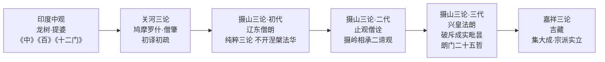
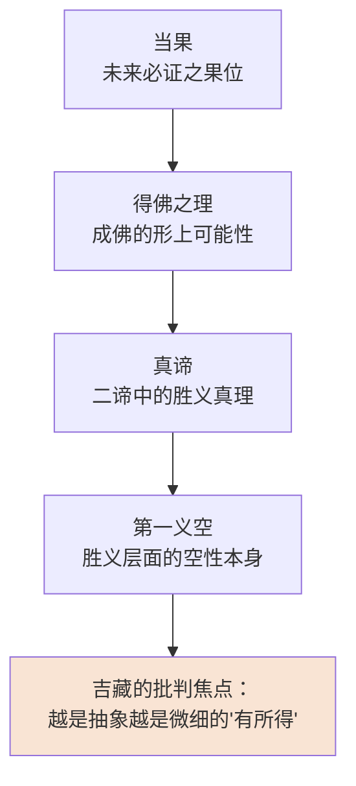
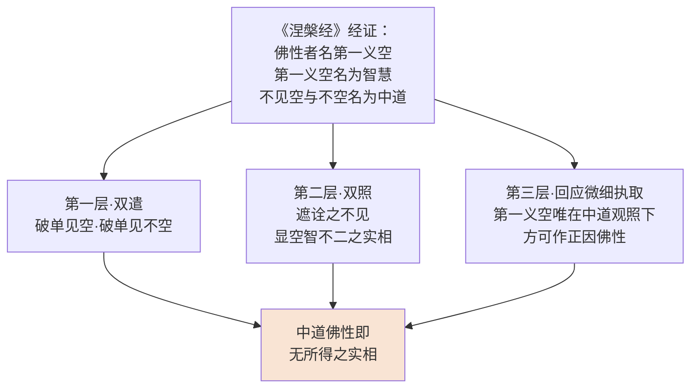
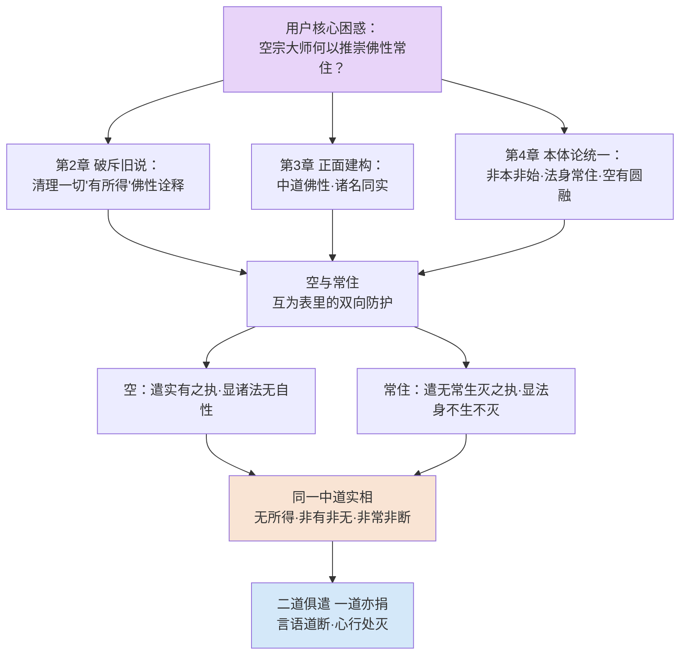

# 空与有的圆融：吉藏佛性思想中的中道智慧与常住之辨
# 1 吉藏其人与三论宗的思想坐标

中国佛教思想发展至南北朝末期至隋初，正处于一个义学纷呈、教派将立未立的关键时段。一方面，自鸠摩罗什译出"三论"以来奠定的般若性空之学，经由摄山一系僧人的潜心研习而日臻精纯；另一方面，自竺道生倡"一阐提皆有佛性"以来，涅槃学派围绕"佛性常住"的诠释蔚为大宗，与地论、摄论、成实、毗昙诸家共同织就了一幅多元交锋的义学图景。**吉藏（549—623）正是在此交错的思想坐标中应运而生的关键人物**——他既以"破邪显正"的般若立场对治诸家的"有所得"边见，又不能不正面回应彼时最具时代分量的佛性问题。要理解他何以能在"空"与"佛性常住"之间寻得圆融之道，必先厘清其个人生命轨迹、所承法脉以及所处义学语境这三重坐标。本章即以此为目标，为后续四章对吉藏佛性思想本身的深入剖析铺设人物背景与思想史基础。

## 1.1 吉藏生平与弘法历程

吉藏其人，是一位身世横跨多重文化与时代的高僧。其原籍为安息（今伊朗一带），先祖因避仇而东迁中国，至吉藏本人则已生于南朝金陵（今南京），故其虽具西域血统，所受熏陶与所操学问皆属南朝佛教正统[^1]。吉藏生于公元549年，正值南朝梁、陈交替之际；卒于623年，时已入唐，故其一生横跨梁末、陈、隋、唐四朝，亲历了南北分裂走向统一、佛教义学由南北分流走向汇通的整个历史进程[^1][^2]。

从出家因缘看，吉藏七岁即投兴皇寺法朗法师门下出家[^1]。此一师承关系对其一生学问的塑造具有决定性意义——法朗（507—581）乃陈代三论学最负盛名的宗匠，吉藏自幼濡染于摄岭三论义学，遂得以系统承接龙树中观一脉的纯正学统。从其求法环境看，南朝陈代（557—589）的金陵兴皇寺乃当时三论学的中心，听众常逾千人[^3]，吉藏即在这一极富学术氛围的环境中成长，逐步累积起后来集摄岭三论学之大成的学术根柢。

依据现有材料，吉藏的弘法生涯大致可分为陈代受学、隋代著述、晚年弘传三个阶段。陈代时其主要任务为受学与初步弘讲；至隋代（581—619），则进入著述的高峰期，其重要论著《中观论疏》《大乘玄论》《三论玄义》《二谛义》《法华玄论》《涅槃经游意》等大多撰成于此一时期[^1][^2]。在地理上，吉藏中年以后曾驻锡浙江绍兴的嘉祥寺，并因此被后世尊称为"嘉祥大师"，三论宗亦因此别称"嘉祥宗"[^4]。隋唐之际，吉藏又入长安，于慧日道场、实际寺等处继续讲经弘法，最终于唐武德六年（623年）示寂，世寿七十五[^1]。

吉藏一生著述宏富，传世经论疏释二十余种，几乎涉及当时所有重要的大乘经论。这一著述规模本身即说明，**吉藏并非一专门家，而是一位力图以三论义理统摄全部大乘佛教的体系性建构者**。其著作的特点是义理深细、辨析精严，往往针对当时各家旧说逐一加以分疏与破斥，而后会归于"无所得"之中道正观[^2][^1]。正是这一兼具承袭与批判、纯粹与综合双重品格的学问性格，使吉藏成为后世讨论三论义理时无法绕开的关键人物，也直接决定了其处理佛性问题时所采取的方法论进路。

## 1.2 三论宗的法脉源流与摄岭学统

要理解吉藏的思想立场，必须将其置入三论宗的整个法脉源流之中。三论宗的中土传承一般被划分为三个阶段：**关河三论、摄山三论与嘉祥三论**[^5]。三个阶段彼此衔接、各有侧重，共同构成三论宗自印度传入至中土宗派成立的完整链条。

最远的源头自然可追溯至印度。三论宗所依的核心论典——龙树《中论》《十二门论》与提婆《百论》——是印度大乘中观学派的代表作[^6]。龙树（约150—250）以南天竺婆罗门种姓出身，是大乘中观学派的奠基者，其《中论》《十二门论》《大智度论》等论以"诸法性空"为根本前提，系统阐发空有相即融通的中道不二之理；其弟子提婆则以辩破外道邪见著称，《百论》二十品即出其手[^6]。这三部论由后秦鸠摩罗什译入汉地，并经其本人及弟子僧肇等加以诠释发挥，奠定了所谓"关河旧说"的基础[^6]。

关河三论虽义理纯正，但在六朝中土并未真正成宗，反而长期处于成实学说的笼罩之下。**真正使三论学在南方重新焕发活力的，是摄山一系的僧人**。摄山三论以法度始，经由僧朗、僧诠、法朗三代传承，史称"摄山三师"[^5]。其中辽东僧朗（生卒年不详）出身高丽，齐梁之际南下建康，先后居摄岭止观寺、草堂寺，最后驻锡栖霞寺；他"为性广学，思力该普"，尤善《华严经》与三论，不开讲《涅槃》《法华》，纯粹以三论之学立宗[^5]。梁武帝原本宗奉成实，曾派十位僧人入摄山随僧朗习三论之学，梁武帝由成实转向三论的转向与僧朗有直接关系，这一事件标志着摄山三论由山林学问跃升为受官方关注的重要义学派别[^5]。

摄山三论的第二代是止观僧诠，第三代则是兴皇法朗。**法朗（507—581）作为吉藏的直接师承，对吉藏的思想塑造起到了奠基性作用**。法朗俗姓周，徐州沛郡沛县人，二十一岁出家，初学禅、律、成实、毗昙各家学说，后因深感"鹫山妙法群唱罕弘，龙树道风宗师不辍"，乃至摄山从僧诠学三论与《华严》《大品》等经[^3]。从僧诠受学之后，法朗"顿感之前所学不过是佛学的枝叶而已，唯有龙树开创、罗什诠释的三论学才是佛门正宗"，自此以三论义理为根本立场[^3]。陈永定二年（558年），法朗奉敕入建康兴皇寺，宣讲《华严》《大品》《中论》《百论》《十二门论》等经论，前后二十余年，各二十余遍，常随听众多达千余人[^3]。其讲经"语言晓畅、论理严密"，且"讲人所不敢讲，发人所不敢发，斥外道、批毗昙、排成实、呵大乘"，并因辩破成实而被称为"伏虎朗"[^3]。

法朗门下有"朗门二十五哲"之称，知名弟子包括吉藏、罗云、法安、慧哲、法澄、道庄、智矩、慧觉等[^3]。值得特别注意的是，法朗虽以三论为宗，却长期讲授《法华经》，其弟子吉藏正是承袭了法朗对《法华经》的重视[^3]——这一细节预示着吉藏日后并不会将自己局限于纯粹的三论义学之中，而会以三论义理为方法去诠释包括《法华》《涅槃》在内的更广阔的大乘经典体系。

摄山三师之间存在一些被吉藏在《中观论疏》中反复称引的共同观点，这些"摄岭相承"或"山门相承"的一致主张至少包括：**于教二谛观、三种二谛观，以及将《中论》二十七品判为三段等核心方法**[^5]。这些方法论遗产为吉藏的二谛说与判教体系奠定了直接基础。综观三论宗的传承谱系，吉藏所承接的法统可追溯为：**龙树—提婆—鸠摩罗什—僧肇—昙济—僧朗—僧诠—法朗—吉藏**[^3]。这一谱系既显示了吉藏与印度中观学的纯正血缘关系，也显示了其与南方摄山义学的直接师承——这两重渊源共同构成了吉藏处理一切佛教问题（包括佛性问题）的方法论底色。

为更清晰地呈现这一传承结构及其各阶段的思想重心，可制作如下脉络图：

由此图可见，吉藏处于这一长链条的末端，其位置既是"承前"——承接摄岭相承的所有学术遗产——又是"启后"——将原本散在于讲诵之中的三论义学体系化、宗派化，使之得以与天台、摄论等并立而行。

## 1.3 吉藏作为三论宗实际创立者的贡献

学术界一般将三论宗的"实际创立者"地位归于吉藏，而非追溯至僧朗、法朗等摄山先师，其根据在于：摄山三师虽义学纯正、影响深远，但其学问仍主要表现为口耳相传的讲诵活动与零散的注疏（如法朗《中论玄义》《四悉檀义》《中论疏》[^3]），未能形成具有宗派建制性质的完整理论体系。**真正将摄岭三论学说系统化、体系化，使之以独立宗派的形态屹立于隋唐佛教之林的，正是吉藏**[^6][^2]。其贡献可大致从四个维度加以考察。

第一，在**思想体系建构**方面，吉藏完成了二谛与中道理论的体系化提升。其最具代表性的建树是"四重二谛说"——破南北朝诸师（特别是成实师）以二谛为"理"之说，提出"二谛唯是教门，不关境理"，并依次建立俗谛（有）→真谛（空）→俗真合明（非空非有）→忘言绝虑（言语道断）的四重次第结构[^2]。这一结构既继承了摄岭相承的"于教二谛"传统，又将其推向更精细的层级化诠释。与此相应，吉藏又在《中观论疏》中对"八不"中道作出进一步发挥，破斥地论师、摄论师对"八不"的实体化解读，明确"八不"是"破邪显正"的辩证工具，所谓"不坏假名而说实相"[^2]。这一套二谛—八不—中道的方法论框架，正是吉藏日后处理佛性常住问题时所赖以化解张力的核心工具。

第二，在**判教体系革新**方面，吉藏一改南北朝以来流行的"时教"判教模式，破斥天台智顗的"五时八教"说，提出更具批判性的"二藏三轮"判教架构，将一切教法判为菩萨藏（如《般若》《华严》）与声闻藏（如《阿含》）两大类；同时立"破四宗"之说，分别破斥毗昙之"实有"、成实之"空见"、地论之"真常"与摄论之"唯识"，宣称三论宗"唯破不立，显无所得正观"[^2]。这一判教方式的根本特色，**不在于建立一更高的教法位阶，而在于以批判性方法重新厘定各家义学的边界**——这正是吉藏全部思想工作的方法论底色。

第三，在**文献注疏奠基**方面，吉藏通过《中观论疏》十卷、《百论疏》三卷、《大乘玄论》五卷等一系列系统化注疏著作，集摄岭以来三论学之大成。其中《中观论疏》以"破邪显正"四段科判《中论》二十七品，针对北方地论师的缘起实有说展开破斥；《百论疏》以"内外并呵"破外道十执，矛头亦指向成实师之"空见"；《大乘玄论》则系统阐释佛性、二谛等核心义理，并直接针对摄论师"识有境无"之说展开批判[^2]。这一系列著作不仅整理了摄岭三论的口传教学遗产，更将其提升为系统性的义学论著，使三论宗具备了与其他宗派并列的文献基础。

第四，在**法脉传承开拓**方面，吉藏在《法华玄义》卷十中明确梳理了僧朗→僧诠→法朗→吉藏的传法谱系，确立了三论宗独立于天台、成实之外的宗派地位[^2]。同时，其弟子慧灌将三论之学传入日本，被《元亨释书》卷一记载为日本三论宗初祖[^2]，从而开启了三论宗的国际传播。

吉藏临终偈"破邪不存正，显正不立邪。二道俱遣，一道亦捐"（《续高僧传》卷十一）[^2]——这十六字最为简洁地概括了其全部学问的根本精神：**不以"立"为目的，而以"破"为方法；不以"破"为终点，而以"双遣"为归趣**。这一精神同样贯穿于其佛性论之中，构成本研究后续四章所要展开分析的方法论起点。

## 1.4 南北朝隋初佛教义学的多元格局

吉藏的思想活动并不发生于真空中，而是发生于南北朝末期至隋初这一中国佛教义学最为多元交锋的时段。要准确理解其佛性论的针对性与问题意识，必须先对此一时期的整体义学格局有所把握。

依据汤用彤《汉魏两晋南北朝佛教史》及后续学者的研究，南北朝佛教义学大体可归纳为以下数大学派的并立：**涅槃学派、地论学派、摄论学派、成实学派、毗昙学派**等[^7][^8]。各派以不同经论为根本依据，对成佛根据、心识结构、空有关系等核心问题作出不同诠释，构成义学交锋的主要战场。其中与吉藏佛性论关系最密切者，当推涅槃学派、地论学派与摄论学派三家。

**涅槃学派**自竺道生（晋宋之际）首倡"一切众生悉有佛性"以来，至南北朝时期蔚为大宗，传承研习《大般涅槃经》达三百余年，自公元五世纪中期至八世纪中期一直兴盛不衰[^9][^8]。竺道生早年师从鸠摩罗什学般若中观，后转研涅槃佛性论，著有《佛性当有论》等，被誉为"涅槃圣"；其依据法显六卷本《大般泥洹经》提出"一阐提亦可成佛"，曾因此遭众僧摈遣，至大本《涅槃经》传来印证其说而获平反[^9]。竺道生的根本贡献在于**将佛性从抽象本体转向现实人心，以"涅槃生死不二"为辩证立场，反对执著涅槃境界**[^9]，这一思想路向为后世禅宗"识心见性""即心即佛"提供了直接渊源。

但涅槃学派并非一统：其传承"较为松散，没有严格意义上的传承关系；涅槃师为数众多，异说纷纭"[^1]。北朝有僧妙、昙延、净影慧远、法总一系，以"涅槃众主"地位影响极大[^8]；隋末唐初则有慧隆、慧哲、慧璿、智聚、慧乘等师，在金陵、襄阳、江陵、江都、苏州、彭城各地继续发展，并夹杂着三论学派、天台宗一并发展[^8]。诸涅槃师对何谓"正因佛性"提出十余家不同主张，这一纷争状况成为吉藏《大乘玄论》中系统总结评判十一家佛性说的直接背景——汤用彤亦在《汉魏两晋南北朝佛教史》中专门指出，"以道生为代表的涅槃师说兴起，吉藏《大乘玄论》对过去各家涅槃师的说法作了总结"[^9]。

**地论学派**以《十地经论》为根本依据，分南、北两道。北朝涅槃学派的发展即伴随着地论学派的同步繁盛——昙延（516—588）青年时即在地论学派系统中学习，听《华严经》《大智度论》《十地经》《地持论》《佛性论》《究竟一乘宝性论》等[^8]。地论学派的核心议题之一即"佛性本有"与"始有"之争，在敦煌遗书中发现的地论学派《涅槃经疏》（拟）甚至提出独特的"先际无性，中际有也"的折衷说——即佛性既非本有，亦非始有，而在众生实际修行的"中际"而有[^9]。这一争论直接构成吉藏后来讨论"当常—现常"二常之辨的对话对象。

**摄论学派**以《摄大乘论》为根本依据，重点讨论阿黎耶识与种子说，主张"识有境无"，将成佛根据安立于第八识种子。吉藏在《大乘玄论》中对摄论师的"识有境无"展开直接批判[^2]，正反映出这一学派在当时义学格局中的重要分量。

**成实学派**与**毗昙学派**则分别代表小乘空、有二端的中土延伸。成实学派以《成实论》为本，长期在南方占据义学主流地位，至摄山僧朗、法朗时期方被三论学逐步取代；毗昙学派则以说一切有部论书为依据，主张诸法实有。这两派构成法朗时代"斥外道、批毗昙、排成实"的主要对治对象[^3]，至吉藏时期，对二者的批判已升级为系统化的"破四宗"工作[^2]。

整体来看，南北朝隋初的义学格局可归纳为下表：

| 学派 | 根本经论 | 核心议题 | 代表人物 | 与吉藏对话方式 |
|------|---------|---------|---------|---------------|
| 涅槃学派 | 《大般涅槃经》 | 佛性常住、一阐提成佛 | 竺道生、昙延、净影慧远、法总、慧乘 | 总结评判十一家佛性说 |
| 地论学派 | 《十地经论》 | 本有/始有、真心缘起 | 法上、僧范、昙延 | 破"真常"、二常之辨 |
| 摄论学派 | 《摄大乘论》 | 阿黎耶识、识有境无 | 真谛及其门人 | 破"识有境无"、批黎耶为正因 |
| 成实学派 | 《成实论》 | 二谛为理、人法二空 | 南朝成实诸师 | 破"空见"、破二谛为理 |
| 毗昙学派 | 一切有部论书 | 诸法实有 | 北朝毗昙诸师 | 破"实有" |
| 三论学派 | 《中》《百》《十二门》 | 无所得中道 | 僧朗—僧诠—法朗—吉藏 | 立自宗 |

由此可见，**吉藏所处的义学环境绝非单一阵线，而是一个多元交叉、各有立场的复杂场域**。其佛性论的展开方式——既要回应涅槃学派的常住妙有主张，又要批判地论、摄论的实体化倾向，还要清算成实、毗昙的边见——正是这一多元格局所必然要求的方法论选择。

## 1.5 空有之争与吉藏佛性论的问题域

在前述多元义学格局中，最具时代分量、也最直接构成吉藏佛性论问题域的，是**南北朝至隋初围绕"般若性空"与"涅槃妙有"之间的理论张力**——即所谓"空有之争"。这一张力既是吉藏佛性论的逻辑起点，也是本研究全篇所要探究的核心问题。

从思想史脉络看，自鸠摩罗什译出大小品《般若经》《大智度论》及三论以来，般若性空之学曾在中土流行一时，形成六家七宗的繁荣局面。然而至刘宋以后，随着竺道生倡"一阐提皆有佛性"并由大本《涅槃经》印证，**佛教思想重心逐步由"般若性空"向"涅槃妙有"转移**——汤用彤即指出，"竺道生将般若实相说与涅槃佛性论相结合，提出'佛性我'的概念……推动了晋宋之际中国佛学重心由般若性空说向涅槃妙有论的转变，使融合般若实相与佛性如来藏的心性论思想经过不断改造与发挥，最终成为中国化佛学的主流"[^9]。

至吉藏时代，这一转移已发展到一个相当极端的状态。当时学界研究涅槃的兴盛已"渐至于偏颇，许多人只知涅槃不明真空，使'般若三论学'陷入低谷，几至于衰歇"[^1]。涅槃师们对《涅槃经》的理解"多是师心自作，涅槃学派的思想多与'涅槃'本义不相符合"[^1]——这一判断出自吉藏本人，反映了他对当时义学局面的根本不满。

正是在这一背景下，**吉藏将"破洗诸家对涅槃的误解视为应尽的义务"，并"以'无所得'的空性为宗旨融合三论与《涅槃》，对'涅槃'思想进行了重新的阐释"**[^1]。这一选择本身蕴含着一种深刻的方法论意识：吉藏并不打算放弃涅槃佛性论这一时代议题而退守纯粹的般若三论；相反，他要以三论的无所得空性精神为指导，重新诠释涅槃佛性的真实含义。换言之，**吉藏的目标不是"破涅槃以立般若"，亦不是"破般若以立涅槃"，而是"以般若空观重新安立涅槃佛性"**。

这一目标蕴含着一个深层的理论挑战：**作为一位坚守"无所得"立场的空宗大师，吉藏如何能够安立"佛性常住"这一看似与缘起性空相冲突的命题**？这一挑战正是本研究全篇所要回答的核心问题，也是用户在研究主题中所提出的核心困惑。

依据现有材料初步勾勒，吉藏化解这一张力的基本进路体现在以下几个层面：其一，从方法论上以"二谛为教门，不关境理"[^2]的立场，将"佛性常住"重新理解为方便施设的言教，而非有所得的实体；其二，从义理上以"非因非果"的中道为"正因佛性"，破斥南北朝十余家以心识、众生、当果、第一义空等为佛性的实体化主张[^9]；其三，从涅槃名义上"认为它们之间没有截然不同的分别，一切言教都是佛陀的方便教化，涅槃没有固定不变的名义可为我们所执取"[^1]——这一立场表明，吉藏化解空有矛盾的根本方法，是回到"无所得"的中道实相之中，使空与佛性常住皆显现为方便言说的一体两面。

由此初步可以揭示出吉藏佛性论的核心问题域：**它不是一个孤立的佛性论问题，而是一个方法论问题——即如何以三论中观的无所得方法重新安立涅槃学派的根本议题**。这一问题域决定了：

| 论题层面 | 吉藏的处理方向 | 与传统空有之争的关系 |
|---------|---------------|---------------------|
| 破斥旧说 | 总结评判十一家佛性主张 | 既批"识有境无"之有偏，亦批"空见"之空偏 |
| 确立正见 | 以中道、第一义空、般若智慧贯通佛性 | 将佛性纳入般若中观框架 |
| 常住与空 | 以法身常住、非本非始解二常之争 | 化解涅槃妙有与缘起性空之表面矛盾 |
| 实践意义 | 以"无所得"佛性观支持一乘判教 | 在批判性与激励性之间求平衡 |

上表清晰呈现了本研究后续四章的逻辑展开顺序，亦明确显示了吉藏佛性论的全部内容皆服务于化解空有之争这一核心目标。**正是在这一意义上，吉藏的佛性论不是其学问中孤立的一支，而是其全部三论义学在面对时代核心议题时的集中体现**——它既检验了"无所得"方法论的解释力，也展现了三论学说在与涅槃学派对话过程中所达到的理论高度。

需要指出的是，本章所勾勒的吉藏生平、师承与时代格局只是后续四章研究的入门铺垫，对其佛性论本身的具体内容——包括对十一家佛性说的破斥逻辑、中道佛性的正面建立、二常之辨与法身常住的会通方式以及一乘判教的实践意义等——将在第2至第5章中逐一展开深入分析。本研究将始终围绕"空与佛性常住如何统一"这一核心问题展开，避免脱离主线的枝蔓性铺陈，并将吉藏的所有论述置于其二谛义、八不中道、破邪显正的方法论框架中加以理解，以期最终为用户所提出的核心困惑提供一个具有思想史深度的学术回应。

# 2 破斥旧说：对南北朝十一家佛性论的批判性总结

在第1章中已经勾勒出吉藏所处的多元义学格局——涅槃学派"传承较为松散，没有严格意义上的传承关系；涅槃师为数众多，异说纷纭"[^10]，由此带来的直接学术后果，是关于"何者为正因佛性"这一根本议题在南北朝百余年间生发出十余家彼此不同甚至相互矛盾的主张。**面对这一纷然杂陈的局面，吉藏在《大乘玄论》卷三〈佛性义〉中作了一次空前规模的批判性总结**[^11]——他不仅一一罗列诸家观点，更以三论"无所得"的中观立场对其作出体系化的归纳与逐一破斥。本章即以《大乘玄论·佛性义》为核心文本，依次还原吉藏对十一家正因佛性说的归类逻辑（2.1）、对假实类（2.2）、心识类（2.3）、境理类（2.4）三大类型主张的具体反驳，进而提炼其三重破斥方法论（2.5），并反思纯粹破斥工作的内在限度（2.6），为第3章吉藏正面建立中道佛性观的论述确立批判性基础。

## 2.1 十一家佛性说的思想史背景与吉藏的归纳工作

要理解吉藏归纳工作的必要性，首先须了解其所面对的思想史困境。自竺道生倡"一阐提皆有佛性"以来，《大般涅槃经》在南北朝百余年间一直是义学讨论的中心文本之一。涅槃学派"主要围绕佛性论展开学说，形成关于佛性本质的11种不同见解"[^12]；同样地，涅槃学派"围绕佛性本有或当有、顿悟或渐悟等问题展开论争，提出以'众生''心''真神'等为佛性的十余种解释"[^10]。这些主张并非仅限于涅槃学派内部，而是与同期兴盛的地论学派"本有/始有""现常/当常"之争[^13]、摄论学派以阿黎耶识为依止之说[^14][^15]、以及梁武帝萧衍的"真神论"[^16][^17]等交错互涉，共同构成了吉藏所要面对的整片"佛性义"思想丛林。

吉藏归纳工作的学术意义，正在于他将这一散漫无序的丛林**重新组织为可被般若中观方法论处理的统一对象**。如史经鹏的研究指出："以吉藏《大乘玄论》或慧均《大乘四论玄义》的记载来看，南北朝曾流行十余家佛性学说……如此众多的佛性论观点，在南北朝百余年间，顺势而起，竞擅风流，极大丰富了中国佛性论的内涵"[^18]。但同一研究亦提醒，"这些史料多杂有记载者或批评者的主观意识，也无法充分体现出如此众多佛性论的思想史意义"[^18]——这一警示对理解吉藏的归纳工作至关重要：**吉藏并非中立的思想史记录者，而是带着明确的批判立场对诸家进行重新组织的破斥者**。

这一点在地论学派佛性论的"层叠"现象上有显著体现。圣凯的研究指出，地论学派佛性论原本"呈现出'隐显''本有''当有''现有'等复杂的思想脉络。至净影慧远时代，依隐显而论述'理性'与'行性'，理性是隐、本有的，而行性则是既本有又始有的"，但"经过吉藏的'转述'与'批判'，地论师的佛性论成为'本有''始有'泾渭分明的对立观点"[^13]。换言之，吉藏的归纳本身包含了一种**诠释性的简化与对立化**——他通过将复杂的地论"隐显—理性—行性"结构压缩为"本有vs始有"的二元对立，使之成为更易被三论"非本非始"中道立场所破斥的批判靶子。这一现象提示我们：吉藏对十一家的归纳并非纯粹的客观分类，而是带有明确目的性的方法论建构。

依据《大乘玄论·佛性义》的内在逻辑，吉藏所归纳的十一家主张可大致划分为**假实、心识、境理**三大类型，构成一个由具体到抽象、由实体到理体的递进谱系：

| 类型 | 所属诸家 | 共同特征 | 吉藏判定 |
|------|---------|---------|---------|
| **假实类** | ①以众生为正因；②以六法（五阴及假人）为正因 | 将佛性等同于现实有情或其构成要素 | 落入"实有"边见 |
| **心识类** | ③以心为正因；④以冥传不朽为正因；⑤以避苦求乐为正因；⑥以真神为正因；⑦以阿黎耶识为正因 | 将成佛根据安立于精神主体或种子识 | 落入"识有"之执 |
| **境理类** | ⑧以当果为正因；⑨以得佛之理为正因；⑩以真谛为正因；⑪以第一义空为正因 | 将佛性安立于抽象之理或空性本身 | 落入"理外有理"的微细执取 |

这一三层分类不仅在排列顺序上呈现出由粗到细、由显到隐的层级关系，**更暗含着吉藏批判力量的递进逻辑**：假实类的实体化最易破，因其与缘起明显相违；心识类稍隐，因其精神主体易被误为离色而清净；境理类最难破，因其已自觉远离"有"边而趋近"空"，但仍未脱离"有所得"之根本病根。可以说，吉藏正是要通过这一由浅入深的破斥次第，**最终揭示出连"第一义空"本身若被对象化亦不免成为新的边见**——这是其后续建立"非因非果"中道佛性论的关键铺垫。

## 2.2 假实类佛性说：以众生与六法为正因之批判

假实类佛性说的两家——以众生为正因、以六法（五阴及假人之假实结合）为正因——是吉藏破斥序列中最为直接的对象，因其将佛性最显著地实体化为现实存在的有情或其构成要素。

第一家以**众生**为正因。此说的思想根源可追溯至北凉译经助手道朗（约5世纪初）。据纪华传的研究，道朗"为鸠摩罗什之后，至摄山三论宗复兴之前的重要人物"，曾"列席昙无谶的译场，笔受《涅槃经》，并分别作义记、义疏，阐发《涅槃经》的玄旨"[^19][^10]，"提倡以'中道'为佛性"[^12]。在南朝义学传承中，僧旻（467—527）一系也大致承袭以众生为正因之立场——僧旻曾"于兴福寺讲解《成实论》"，并对道生顿悟说有所继承，其讲演"经文之义近儒者则以儒家学说解说之"[^20]，体现出将佛性与现实有情贴近论说的倾向。

吉藏对此说的反驳逻辑相当清晰：**若众生即是佛性，则佛性应有生灭流转之相**。众生作为缘起所生之假名存在，本身正是无常、有生死的；若以此为成佛之正因，则佛性亦应随众生之生灭而生灭，这显然与《涅槃经》"如来常住无有变易"[^12]的根本命题相违。更深一层看，吉藏的反驳实际上揭示了此说在方法论上的根本错误：**它将"佛性"这一形上原理与"众生"这一现实存在直接等同，混淆了二谛中"约真"与"约俗"的位阶**——若以俗谛的众生作正因，则真谛的常住佛性无以安立；若以真谛的佛性作众生，则众生之假名缘起又无从说明。

第二家以**六法**为正因。所谓"六法"即五阴（色、受、想、行、识）加上由五阴和合所成之假人，合而为六。此说在南朝的代表人物当属梁武帝萧衍。萧衍在《注解大品序》中明确提出："涅槃是显其果德，般若是明其因行。显果则以常住佛性为本，明因则以无生中道为宗"[^16]，试图将般若与涅槃统一起来。在佛性问题上，他既不愿放弃缘起所成的现实生命载体（五阴假人），又要为成佛保留实在的根据，遂提出以五阴假人之"六法"为正因的折衷主张。

吉藏对六法说的破斥延续了其对众生说的逻辑：**五阴本身正是缘起所成的无常法**，《阿含经》以来的根本立场即明确指出五阴皆苦、皆空、皆无我；若以无常之五阴为常住佛性之正因，岂非以无常为常住之因？因中已具果性方为正因，而无常之因不可能产生常住之果，故六法说在因果关系的逻辑上即不能成立。更进一步，吉藏指出此说之根本病根仍在"有所得"：**它试图通过实指某种现实存在物来为佛性提供"载体"，却不知佛性正是要超越一切可指可执之载体的中道实相**。

值得注意的是，假实类两家的批判工作虽然在逻辑上较为简明，但其思想史意义颇为重大。**它直接针对的不仅是南朝义学家的具体主张，更是中土传统中根深蒂固的"灵魂—载体"思维模式**——杨维中曾分析道，"在玲珑剔透、不可言说的'实相'、'空'、'中道'面前，神不灭的灵魂说如此根深蒂固，以致于很多中土人士难于理解其深刻的含义……仍然习惯以改头换面的'灵魂说'来理解、解释'法性'、'佛性'"[^16]。假实类佛性说正是这一"灵魂—载体"思维模式在涅槃学语境中的延续，吉藏对其的破斥实际上承担着将中土佛性论从前佛教的实体化思维中解放出来的思想史任务。

## 2.3 心识类佛性说：从心、真神到阿黎耶识的实体化倾向之批判

如果说假实类佛性说的实体化倾向尚停留于现实有情的层面，那么心识类佛性说则将佛性安立于更为内在的精神主体或种子识之上，其实体化倾向更为隐蔽，也更具理论挑战性。**吉藏在此一类型上倾注了最为详尽的批判力度**，因为这一类主张涵盖了当时义学界最为流行的几种成佛根据论。

第一家以**心**为正因。此说所指之"心"，大致相当于一般意义上的精神主体或心识活动本身。第二家以**冥传不朽**为正因，强调心识在生死流转中具有一种暗中相续、永不断绝的传承功能，使前生善业能在来生显现。第三家以**避苦求乐**为正因，将众生本能性的趋乐避苦倾向视为成佛的最初动力。这三家主张虽各有侧重，但**共同特征在于将佛性安立于某种心理活动或心识倾向之中**——前者偏向心体本身，中者偏向心识的相续功能，后者偏向心识的内在动力。

吉藏对此三家的破斥可统一概括为：**心识本身正是缘起所生的有为法，而非超越生灭的常住法**。若以"心"为正因，则心有刹那生灭，何以能为常住佛性之因？若以"冥传不朽"为正因，则所谓"传"者必有能传所传，能传所传皆是有为之相续，岂能即为常住佛性？若以"避苦求乐"为正因，则此一本能本身正是无明烦恼所驱动的染污心态，岂能即为清净佛性之根据？特别是对"避苦求乐"说，吉藏的批判尤为犀利——**避苦求乐恰恰是众生在生死轮回中所应被超越的执着，怎能反将其视为成佛的根据**？这显然将众生的染污心态与佛的清净智慧混为一谈，是典型的"以无明为佛性"的颠倒之见。

第四家以**真神**为正因，是梁武帝萧衍所主张的"真神论"。此说在中国佛教史上具有相当重大的影响。据杨维中分析，梁武帝"以'佛性论'为基础。这是道生'阐提成佛说'理论的延续"[^17]，而其具体阐发则采取了"真神"这一充满中土色彩的概念。梁武帝认为，众生身中有一种超越生死、不随肉身朽灭的"真神"，正是这一"真神"在生死中保持着同一性，从而使成佛成为可能。**这一主张实际上是将印度佛教的"佛性"概念翻译成了中土传统的"神不灭"语言**[^16]——它既继承了东晋慧远"冥神绝境，谓之涅槃"的思路[^21]，又与梁武帝亲自参与的反范缜《神灭论》论战相呼应（"梁武帝曾发动60多位朝臣，批判范缜的神灭论"[^17]）。

吉藏对真神说的破斥意义尤为深远。**他必须同时回应两层挑战**：其一，从佛教内部立场看，"真神"是一种实体化的精神主体，与"诸法无我"的根本教义直接相违；其二，从中土思想史看，"真神"承载着自慧远以来中土佛教"立神不灭以救涅槃"的整体思想倾向，破斥真神即意味着对这一思想倾向的整体清算。吉藏的破斥逻辑大致可概括为：**若有一"真神"实存以为佛性，则此"神"或为有为，或为无为；若为有为，则有生灭，岂能称真；若为无为，则与万法分离，何以能为众生成佛之依据**？通过这一双关诘难，吉藏将"真神论"既不能立足于缘起、亦不能立足于无为的双重困境暴露无遗。

第五家以**阿黎耶识**为正因，是摄论学派的核心主张。据现存文献，真谛所传的摄论学说将"第八识看作染净、真妄并陈的和合识"，"以'解性阿赖耶'的纯净无染作为众生还灭、解脱的依据，以其在缠而不觉作为迷染有漏的原由"[^15]。在《大乘玄论·二谛义》中，吉藏明确记述了对摄论师的批判："对大乘师依他分别二为俗谛，依他无生分别无相不二真实性为真谛。今明……"[^22]——可见摄论学派的三性、二谛说正是吉藏在《大乘玄论》整体批判工作中所明确针对的对象之一。

吉藏对阿黎耶识说的破斥可从两个层面理解。**其一为名相之破**：阿黎耶识无论被诠释为"妄识"（如玄奘所传）抑或"真妄和合识"（如真谛所传），都难以避免在"识"这一概念本身上设立一种实体性的存在；而"识"无论真妄，皆是缘起所生的依他起法，不能成为超越缘起的常住佛性。**其二为方法论之破**：摄论学派将阿黎耶识立为"应知依止"或"所知依止"[^15]，这一"依止"概念本身即蕴含着一种实体性的能依所依结构——而这正是"识有境无"立场的核心病根。吉藏对此的根本回应是：**若仍执"识有"，则与"境有"在结构上完全相同，只是将执着的对象从外境换成了内识而已，并未真正超越"有所得"**。

综合心识类五家，吉藏批判的**共同方法论指向**可总结为：将成佛根据安立于任何一种被实体化的精神主体或种子识中，本质上仍然是一种"以有为常""以变为不变"的颠倒之见，与缘起性空之根本立场不能相容。这一批判工作的思想史意义，远不止于义学层面的辨析——它实际上为后世禅宗"无心""无相""无住"的心性论方向作了重要的方法论准备。

## 2.4 境理类佛性说：当果、得佛之理、真谛、第一义空之批判

境理类佛性说是吉藏破斥工作中最具理论难度的部分。**这一类主张已经自觉地避开了将佛性等同于现实存在或心识活动的粗显错误**，转而将佛性安立于某种抽象的理体、果位或空性之中。但在吉藏看来，**这种抽象化的安立仍然未能脱离"有所得"之根本病根**，只不过将执着的对象从粗显移至微细而已。

第一家以**当果**为正因，是地论学派"当常—本有"之争的核心立场。圣凯的研究指出，地论学派佛性论"从《金刚仙论》开始，'现常'佛性是当有、现有义，'当常'佛性是本有义；经过地论师阐释，呈现出'隐显''本有''当有''现有'等复杂的思想脉络"[^13]。"当果"主张的核心是：成佛是众生未来必当证得的果位，此一"当来之果"即是众生身中所具的佛性。**这一说法看似规避了将佛性实体化为现成存在的错误，但吉藏指出其仍有根本困难**——若"当果"为佛性，则在众生未成佛之前，此一"当果"究竟存在还是不存在？若存在，则与"现常"无异，仍是实体化；若不存在，则不可能为成佛之因。

第二家以**得佛之理**为正因。此说较"当果"更为抽象，主张佛性不是某种具体的存在或未来之果，而是"众生能够成佛的道理"本身。这一主张在逻辑结构上接近某种形上学意义上的"可能性"或"潜能"。吉藏对此说的破斥相当犀利：**若以"得佛之理"为佛性，则此"理"究竟可得抑或不可得？若可得，则"理"亦成为对象化的所得物，与"有所得"无异；若不可得，则又何以称为"得佛之理"**？这一两难逻辑直接揭示了将佛性诠释为某种"理"的根本困境。

第三家以**真谛**为正因。此说更进一步将佛性安立于二谛中的真谛——即超越世俗谛的胜义真理。吉藏对此说的批判须结合其二谛义理解。在《大乘玄论·二谛义》中，吉藏明确反对"以境理为谛"的传统理解，主张"攝嶺興皇何以言教為諦耶……為對由來以理為諦故，對緣假說"[^22]——即二谛唯是教门、不关境理。在这一立场下，**若以"真谛"为正因佛性，则已经预设了真谛是一种独立的、可被对象化的"境理"**，这与吉藏"二是教，不二是理"[^22]的根本立场直接相违。

第四家以**第一义空**为正因，这是境理类四家中最为微妙、也最具理论挑战性的一家。**此说的高明之处在于，它似乎已经达到了与三论立场最为接近的程度**——它不以任何"有"为佛性，而是以"空"本身（而且是"第一义"层面的空，即胜义空）为正因。然而正是在此一最为接近三论立场的地方，**吉藏施展了其批判工作中最为精微的一击**：即便是"第一义空"，若被对象化为正因，亦不免成为新的有所得见。

这一批判的方法论依据可在《大乘玄论·二谛义》的"四重二谛"中找到。吉藏在四重二谛的层级化建构中明确指出："此三种二諦皆是教門，說此三門，為令悟不三，無所依得始名為理"[^22]——即便是最高一重的"非二非不二"亦只是教门，**真正的"理"是要超越一切层级的"无所依得"**。若以"第一义空"为佛性正因，则"第一义空"本身已成为"所依得"之对象，与三论"无所得"之根本宗旨相违。这一批判的洞察力之深，正在于它揭示了：**思想批判工作的最大难度，不在于破斥粗显的实体化错误，而在于破斥那些已经自觉远离实体化但仍未真正脱离"有所得"思维的微细执取**。

综合境理类四家，吉藏批判的核心洞察可概括为：**任何试图将佛性安立于某种"理"或"空"之上的努力，只要这一"理"或"空"被视为可被认知、可被把握的对象，就仍然落入"有所得"的窠臼**。这一洞察直接为第3章吉藏正面建立"非因非果""不见空与不空"的中道佛性观提供了批判性铺垫——既然连"第一义空"都不能作为正因佛性，那么唯一可能的正面立场就是"双遣双照"的中道本身。

为更清晰地呈现境理类四家在抽象层级上的递进关系，可制如下脉络图：

图中清晰显示，境理类四家在抽象化程度上呈现层层递进，但吉藏的批判焦点始终是同一的——**抽象化本身并不能解决"有所得"的根本问题，反而可能因其精微而更不易被察觉**。

## 2.5 三重破斥方法论：有无破、三时破、即离破

吉藏对十一家佛性说的破斥不是杂乱无章的随机辩驳，而是有着清晰的方法论自觉。**通过对其具体破斥论证的提炼，可以归纳出三重辩证工具：有无破、三时破、即离破**。这三种方法皆源自龙树《中论》以来的中观辩证传统，是吉藏将印度中观辩破技法系统运用于中土佛性论争的方法论创举。

**第一重为"有无破"**，是吉藏最基本的破斥工具。其逻辑结构是：对任何被立为正因佛性的对象X，追问"X究竟为有为无？"——若X为有，则X即是有为法，与缘起所生之万法无异，何以能为超越生灭的常住佛性之因？若X为无，则X根本不存在，又何以能为成佛之因？这一双关诘难直接源于龙树《中论》"诸法不自生，亦不从他生，不共不无因"的破生方法。在十一家中，吉藏对众生说、六法说、心说、真神说等的反驳基本都运用了这一逻辑。**"有无破"的方法论意义在于，它将一切实体化佛性观置于"有/无"二难之间，使任何试图安立某种实在为佛性的努力都陷入逻辑困境**[^23]。

**第二重为"三时破"**，源自龙树《中论·观去来品》对去者去时的破斥逻辑。其逻辑结构是：对任何被立为正因佛性的对象X，追问"X存在于何时？过去、未来抑或现在？"——若X存在于过去，则过去已灭，X已不存在，何以能为现在成佛之因？若X存在于未来，则未来未生，X尚未存在，又何以能为现在成佛之因？若X存在于现在，则现在刹那不住，X亦不能保持其同一性，何以能为常住佛性之因？这一三时俱破的方法对地论学派"当果""本有""始有"之争具有直接的杀伤力——**无论将佛性归入哪一时态，皆不能成立**。

值得注意的是，"三时破"对当时义学界讨论最为热烈的"本有/始有"之争具有釜底抽薪的作用。圣凯指出，吉藏正是通过这一类批判，使原本"复杂的思想脉络"被简化为"'本有''始有'泾渭分明的对立观点"[^13]——其简化的目的正是为了便于以"三时破"加以统一破斥。**吉藏由此为第4章将要展开的"非本非始"中道立场预先扫清了道路**。

**第三重为"即离破"**，是吉藏破斥中最具中观特色的方法。其逻辑结构是：对任何被立为正因佛性的对象X，追问"X与空究竟相即抑或相离？"——若X与空相即，则空之外别无X可言，X之实体性自破；若X与空相离，则X堕于空之外而成有所得，与缘起性空之根本立场相违。**这一即离两难诘难，对境理类四家（特别是"第一义空"说）具有最为致命的杀伤力**——即便所立的对象是"第一义空"本身，仍然要面对"空与空是相即还是相离"的根本困境。

三重破法的内在关联可作如下整理：

| 破法 | 逻辑结构 | 主要针对 | 中观渊源 |
|------|---------|---------|---------|
| 有无破 | 立X为有则违空，立X为无则无以为因 | 假实类、心识类 | 八不中道之"不生不灭"[^23] |
| 三时破 | X存于三时皆不可得 | 心识类、当果说、地论二常之争 | 《中论·观去来品》[^23] |
| 即离破 | X与空相即则无X，相离则违空 | 境理类（尤其第一义空说） | 八不之"不一不异"、"色即是空"[^23] |

三重破法在吉藏的实际运用中并非孤立施展，而是常常综合使用，针对不同对象的不同弱点而有所侧重。**这一方法论的根本精神，正如三论宗以"破邪显正"为宗旨所体现的——"破邪净尽，概无所得，真理自能显现，故破邪即显正；若破邪之外别有显正，则堕入有所得之见"**[^24]。换言之，三重破法本身并不是为了建立任何替代性的"正"理论，而是为了通过彻底的破斥使真理自然显现——这一立场延续了龙树以来"破而不立"的应成中观精神[^23][^24]。

需要特别指出的是，吉藏对三重破法的运用，并非简单照搬印度中观的辩破技法，而是结合中土佛性论争的具体语境进行了创造性转化。**印度中观的破斥主要针对外道与小乘的实体观，而吉藏的三重破法则主要针对大乘内部各家对"佛性"概念的实体化诠释**——这一对象的转换使吉藏的批判工作具有了独特的中土思想史意义，也使三论宗在面对涅槃学派这一时代显学时获得了方法论上的优势地位。

## 2.6 批判工作的内在限度与正面建构之必要

吉藏对十一家佛性说的批判工作展示了三论"无所得"立场的强大解构力量。**然而，单纯的破斥并不足以回应涅槃学派提出的"佛性常住"这一正面命题**——这一点是吉藏自身所深知的，也是本章批判工作所暴露的内在限度所在。

这一限度首先体现在思想史的现实压力上。如第1章已指出，至吉藏时代，涅槃佛性论已成为中土义学的主流，"佛性常住"作为《涅槃经》明确宣说的命题具有不可绕过的经典依据[^12][^10]。吉藏若仅止于破斥诸家而不能正面安立佛性，便无法对涅槃学派提出的根本议题作出实质性回应，其全部批判工作也将沦为消极的辨析而无建设性。**正如三论宗本身所自觉到的，"破邪净尽则真理自显"——但'真理自显'本身仍须有相应的言诠方式**[^24][^25]，否则便会落入"破而无显"的吊诡。

这一限度其次体现在"破邪即显正"的方法论张力上。三论宗一方面主张"破邪即显正""破而不立"[^24][^25]，另一方面又须建立其自身的中道正观以与诸家相区别。吉藏临终偈"破邪不存正，显正不立邪。二道俱遣，一道亦捐"（见第1章所引）恰恰揭示了这一张力——**纯粹的"破"必然要走向"双遣"，而"双遣"本身又须落实为正面的中道言诠**。在佛性议题上，这意味着吉藏必须在批判性清理的基础上，为正因佛性提供一种"不落两边"的正面安立方式，而非仅仅停留于破斥层面。

这一限度最终指向第3章的核心议题。**通过本章的批判性清理，吉藏已经为正面建构腾出了空间**——所有粗显的实体化主张（假实类）已被排除，所有精微的精神主体或种子识立场（心识类）已被破斥，连最为抽象的"理"或"空"作为正因的可能性（境理类）也被否定。在这一彻底清理之后，唯一可能的正面立场就是：**佛性既非任何具体的存在物，亦非任何抽象的理体，而是双遣"是非有无"之中道实相本身**。这正是吉藏在《大乘玄论·佛性义》中所要建立的"非因非果""非真非俗""非本非始"的中道佛性观——其核心命题之一即"不见空与不空名为佛性"，将在下一章展开深入分析。

由此可以清晰地看到，本章的破斥工作与下一章的正面建构构成了一个不可分割的整体。**吉藏的破斥不是为了破而破，而是为了在彻底破斥"有所得"的诸家边见之后，使中道佛性这一"无所得"的正见得以自然显现**。这一方法论次第本身即体现了三论"立破同时"[^24]、"破邪即显正"[^25]的根本精神——只有在彻底的破斥之后，正面的安立才能避免重新落入"有所得"的窠臼；同样，只有在明确的正面安立之中，破斥工作才能避免沦为虚无主义式的全盘否定。

综合本章所论，吉藏对南北朝十一家佛性说的批判性总结，**既是其"破邪显正"方法论在佛性议题上的集中运用，也是其化解"空与佛性常住"之根本张力的必要准备**。通过将假实类、心识类、境理类三大类型主张逐一纳入"有无破""三时破""即离破"的辩证框架中加以破斥，吉藏一方面清理了中土佛性论中根深蒂固的实体化思维倾向，另一方面也为后续建立"非因非果"的中道佛性观——即在不违缘起性空的前提下重新诠释佛性常住——奠定了方法论基础。第3章将由此出发，正面分析吉藏如何通过"不见空与不空"的核心命题以及佛性、法性、真如、般若、涅槃等概念的同义互训，将佛性、第一义空与般若智慧统一为同一中道实相的不同言诠，从而真正化解用户所提出的"空宗大师何以推崇佛性常住"这一核心困惑。

# 3 确立正见：中道佛性与第一义空、般若智慧的会通

第2章通过对十一家佛性说的批判性清理，使一切"有所得"的佛性诠释——无论是粗显的实体化主张、隐微的精神主体安立、抑或最为精微的"理"与"空"的对象化把握——皆已被三重破法逐一瓦解。然而正如该章末节所提示，**单纯的破斥并不足以回应涅槃学派提出的"佛性常住"这一时代命题**；吉藏若不能在彻底的破斥之后正面安立佛性，便无法对"空与佛性常住如何统一"这一核心张力给出实质回应。本章即在此一批判性基础上，正面还原吉藏中道佛性观的论证结构。研究将从三重双非的论证骨架（3.1）入手，深入诠释"不见空与不空名为佛性"这一核心命题的中道意蕴（3.2），考察吉藏将佛性、法性、真如、实际、般若、涅槃作同义互训的会通策略（3.3），聚焦"第一义空名为智慧"所揭示的般若与佛性的统一（3.4），最后以"理内理外有无佛性"之辨展示中道佛性论的理论辐射力（3.5）。本章是化解空有矛盾的理论核心，亦为第4章常住与空之会通、第5章一乘判教与修证意义的展开奠定正面教理基础。

## 3.1 三重双非：非因非果、非真非俗、非本非始的中道立论

吉藏在《大乘玄论·佛性义》中所建立的中道佛性观，其论证骨架由三重双非构成：**非因非果、非真非俗、非本非始**。这三重双非并非彼此孤立的命题，而是从因果、真俗、本始三个不同维度对"有所得"佛性观的统一破斥与中道安立，体现了吉藏"双遣双照"方法论在佛性议题上的精确运用。

**第一重"非因非果"**，针对的是南北朝佛性论中根深蒂固的因果对立化倾向。吉藏所处的义学语境中，无论是以"众生""六法"为正因者将佛性置于"因"位，还是以"当果"为正因者将佛性置于"果"位[^26]，皆未脱离以因果范畴框定佛性的窠臼。**吉藏的根本反驳是：佛性作为中道实相，既非生灭因法亦非有为果法**——若将佛性等同于因，则佛性堕于无常生灭之相；若将佛性等同于果，则佛性又须有能证之因方可显现，与"佛性常住无有变易"[^27]之根本立场相违。在第2章已分析的境理类批判中，吉藏对"当果说""得佛之理说"的破斥，正是这一"非因非果"立场的具体运用。其方法论意义在于：**佛性不是某种被因果链条所规定的存在，而是超越因果对立的中道实相本身**。

**第二重"非真非俗"**，依摄岭"二谛唯是教门，不关境理"的根本立场展开。如吉藏在《三论略章》中明确记述："攝山師云。二諦者。乃是表中道之妙教。窮文言之極說也"[^28]；又指出二谛"一者單明二諦……二者復明二諦……三者重複明二諦。空有為二。非空非有名為不二。二與不二。應為俗諦。非二非不二。方是真諦"[^28]。这一层级化的二谛诠释，其核心精神是将二谛理解为引导众生破执的"教门"而非可被对象化把握的"境理"。**正是基于这一立场，吉藏破斥以"真谛"或"第一义空"为正因佛性的境理化倾向**——若以真谛为佛性，则真谛已被预设为独立的、可被认知的"境理"，与"二谛唯是教门"的根本主张相违；若以第一义空为佛性，则更须面对第2章所揭示的"即离破"困境。**佛性既非俗谛之有，亦非真谛之空，而是"非二非不二"的中道本身**——这一立场直接呼应了吉藏所确立的"重复明二谛"的最高层级，即"非二非不二，方是真谛"[^28]。

**第三重"非本非始"**，针对地论学派"本有/始有"之争而立。如第2章所引圣凯研究指出，地论学派佛性论原本"呈现出'隐显''本有''当有''现有'等复杂的思想脉络"，而经吉藏"转述"与"批判"后被简化为"'本有''始有'泾渭分明的对立观点"。**吉藏简化的目的，正是为了以"非本非始"的中道立场对二者作统一破斥**——若佛性本来现成（本有），则众生与佛在佛性上无别，何须修行？若佛性修后始得（始有），则佛性即成有为造作之法，与常住之性相违。这一"非本非始"的双遣立场，将在第4章的二常之辨中进一步展开为对"当常—现常"二常之争的根本回应。

三重双非的内在逻辑关联可整理为下表：

| 维度 | 双非命题 | 所破对象 | 方法论依据 |
|------|---------|---------|-----------|
| 因果维度 | 非因非果 | 众生、六法、当果、得佛之理 | 八不中道之"不生不灭"[^29] |
| 真俗维度 | 非真非俗 | 真谛说、第一义空说 | 摄岭"二谛唯是教门"[^28] |
| 时间维度 | 非本非始 | 地论"本有/始有"之争 | 《中论》"不来不去"[^29] |

三重双非共同构成吉藏中道佛性论的论证骨架。**值得注意的是，这三重双非并非任意的排列组合，而是分别对应了第2章所破十一家的三大类型**——"非因非果"主要破假实类与心识类的因位安立及境理类的当果说，"非真非俗"主要破境理类的真谛说与第一义空说，"非本非始"则主要破诸家关于佛性时间属性的实体化预设。由此可见，吉藏的破立工作具有高度的内在统一性：**破斥工作所清理的边见，正是正面建构所要双遣的对象；正面建构所确立的中道，正是破斥工作所要显现的归趣**。这一"破立同时"的方法论自觉，正是三论宗"破邪即显正"之根本精神的具体落实。

## 3.2 核心命题诠释："不见空与不空名为佛性"的中道意蕴

吉藏中道佛性论最为核心的经证，是《大般涅槃经·师子吼菩萨品》中的一段著名经文："**佛性者名第一义空，第一义空，名为智慧。所言空者，不见空与不空。智者见空及不空，常与无常，苦之与乐，我与无我……见一切空不见不空，不名中道。乃至见一切无我，不见我者，不名中道。中道者，名为佛性。以是义敌，佛性常恒，无有变易**"[^27][^30]。这段经文同时确立了三个层面的根本论旨：**佛性即第一义空，第一义空即智慧，中道即佛性**——而其中道意蕴的关键，正在于"不见空与不空"这一双遣双照的辩证表述。

**第一层意蕴是双遣：单见空或单见不空皆落两边**。经文明言"见一切空，不见不空，不名中道"[^27]，反过来若执"不空"为实有妙性，亦不名中道。吉藏的中观立场对此一命题的诠释极具洞察力：**单纯的空见会落入"恶取空"的虚无主义，而单纯的不空见则会落入"真神""真我"的实体主义**——两者皆是"有所得"的边见。这一双遣立场直接呼应了大乘佛教自《心经》"不生不灭、不垢不净、不增不减"以来的根本句式[^31]，亦与《中论》"不生亦不灭，不常亦不断，不一亦不异，不来亦不出"的八不中道一脉相承[^31][^29]。**吉藏正是依此双遣立场，将佛性从"空"与"不空"的二元对立中解放出来，使之显现为超越两边的中道实相本身**。

**第二层意蕴是双照：双遣不等于消极的双否定**。经文紧接着言"智者见空及不空"[^27]——这表明中道并非简单地不见空亦不见不空，而是在不执取的前提下同时洞照空与不空的辩证统一。**这正是吉藏所运用的"遮诠"方法的精微之处**。如延寿在《宗镜录》中所诠："遮者，遣其所非；表者，显其所是"[^31][^32]——遮诠之"不见"并非否定认知本身，而是排除对认知对象的执取。**"不见空与不空"中的"不见"，正是遮诠意义上的"遣其所非"**：所遣者并非空或不空本身，而是对空或不空的实体化把握；所显者则是超越二元对立的中道实相之"空智不二"的观照状态。

这一遮诠诠释方式直接承袭了僧肇以来"正话反说"的方法论传统——僧肇"以'不真'为真空，以'不迁'为常住，以'无知'为真知"[^31]，皆是通过遮诠的方式间接诠显超越言诠的实相。**吉藏对"不见空与不空"的中道化诠释，正是这一遮诠方法在佛性议题上的精确运用**：以遮诠破斥对"空"或"不空"的对象化执取，使佛性作为中道实相之真实义得以自然显现。

**第三层意蕴是回应第2章所破的"第一义空为正因"之微细执取**。这一层意蕴最具理论张力——经文明言"佛性者名第一义空"[^27]，而第2章已展示吉藏破斥"以第一义空为正因佛性"的境理类立场。**这是否意味着吉藏自相矛盾**？答案是否定的，关键正在于"不见空与不空"这一限定。**吉藏的根本立场是：第一义空作为正因佛性能否成立，取决于它是否被置于"不见空与不空"的中道观照之下**。若以"第一义空"为可被对象化把握的"理"或"境"——如吉藏所记"以第一义空为正因佛性者，此是北地摩诃衍师所用"[^33]——则此一"第一义空"已成"有所得"之物，非真正的第一义空；唯有在"不见空与不空"的双遣双照之中，第一义空方显其真实义，方可成为正因佛性。

由此可见，**吉藏的破斥与建立看似矛盾实则统一**：他所破斥的"以第一义空为正因佛性"，是被对象化、实体化的第一义空；他所确立的"佛性者名第一义空"，是在"不见空与不空"的中道观照下、与智慧不二的第一义空。这一精微的分判，正是吉藏中道佛性论的根本运思方式——**它不是否定佛性即第一义空，而是要求以无所得的中道智慧来理解何谓"第一义空"**。

为清晰呈现"不见空与不空"命题的三层意蕴及其方法论结构，可作如下示意：

由此图可见，"不见空与不空"的中道意蕴在三个层面同时展开，最终汇归于"无所得之实相"这一中道佛性的根本定义。**这一命题的运思方式，既是吉藏破斥工作的归趣，也是其正面建构的起点——它将破与立、否定与肯定、遮与表统一在同一个辩证的中道结构之中**。

## 3.3 概念同义互训：佛性、法性、真如、实际、般若、涅槃的会通

如果说"不见空与不空"的命题揭示了中道佛性的根本运思方式，那么吉藏将佛性、法性、真如、实际、般若、涅槃等概念作同义互训的会通策略，则在概念论层面为化解空有矛盾提供了关键支撑。

**吉藏在《大乘玄论》中明确确立了诸名同实的立场**："**平等大道，为诸众生觉悟之性，名为佛性……为诸法体性，名为法性。妙实不二，故名真如。尽原之实，故名实际。佛性、法性、真如、实际等，并是佛性之异名**"[^34]。这一表述具有重要的方法论意义：**它将一系列在南北朝义学中被分别处理、各自归属于不同经论传统的概念，统摄于同一"平等大道"之中**——佛性属涅槃学，法性属般若学，真如属唯识与如来藏学，实际属般若与唯识共用，而吉藏一并将其视为"佛性之异名"。

这一会通策略的思想史渊源可追溯至更早。如《大般若经》列法性十二异名（真如、法界、法性、不虚妄性、不变异性、平等性、离生性、法定、法住、实际、虚空界、不思议界）[^34]；《大智度论》列四名（如、法性、实际、实相）[^34]；《大乘止观》列七名（自性清净心、真如、佛性、法身、如来藏、法界、法性）[^34]。在中土思想史上，慧远《法性论》"经历了一个从以'本无'理解佛性到以般若中观理解法性的演变过程，主张法性本无、不变，且非有非无、无性，认为法与法性理一而名异"；竺道生则"融通法、法性、实相、理、佛、佛性等概念，从不同角度阐述成佛的依据和途径"[^34]。**吉藏的同义互训策略，正是这一思想史进程在三论宗立场上的集大成式总结**。

**会通策略的核心义学意义在于打通般若学与涅槃学的概念壁垒**。如《涅槃经游意》所记，吉藏在该书中"以法界，法性，法身，般若佛性况涅槃"[^35]——他以一系列与般若学密切相关的概念（法界、法性、法身、般若）来诠释涅槃，这一做法直接呼应了其全部学问的根本宗旨。正如第1章已指出，吉藏的目标不是"破涅槃以立般若"，亦不是"破般若以立涅槃"，而是"以般若空观重新安立涅槃佛性"。**而同义互训正是这一安立工作的概念论手段**：当佛性与法性、般若、实际等概念被确认为同一实理的不同言诠时，"第一义空"与"佛性常住"便不再是分属两个不同经论传统的对立命题，而是同一中道实相在不同言诠脉络中的不同表达。

值得注意的是，**吉藏的会通策略与同时代摄论学派的会通策略存在根本性的方法论分野**。如圣凯所述，摄论学派"继承真谛以真如诠释佛性的传统，而且将第一义空、自性清净心、阿摩罗识、解性等都纳入佛性的思想体系"；摄论师"将真如、理等同起来，以诠释'本有'佛性的普遍性、内在性"，并"完全是以如来藏缘起来解读《摄论》"[^33]。**摄论师的会通是以"真常唯心"为统摄**——将佛性、第一义空、真如、阿摩罗识等汇归于"自性清净心"的本体性安立。而吉藏的会通则**以"无所得"中道为统摄**——将诸概念汇归于"非真非俗、非因非果"的中道实相，而非任何一种被对象化的"心"或"理"。

这一方法论分野的根本意义可表列如下：

| 比较项 | 摄论师的会通策略 | 吉藏的会通策略 |
|--------|----------------|----------------|
| 统摄核心 | 阿摩罗识、自性清净心 | 无所得中道实相 |
| 思想立场 | 真常唯心 | 无所得空观 |
| 佛性诠释 | 本有的、内在的心体 | 非本非始的中道 |
| 与涅槃学关系 | 以如来藏缘起解读 | 以二谛中道安立 |
| 主要批判对象 | 新译唯识"五性各别" | 一切实体化佛性观 |

由此对照可见，**虽然两派都试图打通般若与涅槃，但其方法论起点截然不同**。摄论师试图通过设立一种最高的本体性心识（阿摩罗识、解性）来统摄诸名，本质上仍未脱离"心识有"的实体化倾向——这正是吉藏在《大乘玄论》中所明确批判的对象（参见第2章心识类批判）。而吉藏则坚持以"无所得"为根本立场，使诸名的会通不依赖于任何被对象化的"心"或"理"，而仅仅依赖于诸名所共同指向的中道实相本身。

**这一会通策略对化解空有矛盾具有决定性意义**。当佛性、法性、真如、实际、般若、涅槃被确认为同一中道实相的不同言诠时，"佛性常住"便不再意味着安立某种与"缘起性空"对立的实体性存在，而仅仅意味着以"常住"这一名相来言诠中道实相的"非生非灭"之相；同样，"第一义空"也不再意味着否定一切的虚无空，而是与佛性、般若、涅槃同一实理的不同表述。**在这一会通框架下，空与有、性空与妙有、般若与涅槃的所有表面矛盾，都化归为同一中道实相在不同言诠脉络中的不同表达——而这正是吉藏化解空有矛盾的概念论关键**。

## 3.4 般若与佛性的统一：智慧观照下的中道实相

在前文确立的概念同义互训基础上，**《涅槃经》"第一义空名为智慧"这一关键经文，为佛性、第一义空与般若智慧的统一提供了直接的经典依据**。这一统一不仅是概念上的等同，更涉及对佛性根本性质的重新理解——佛性不是某种独立于智慧之外的客观实体或抽象理体，而是与般若智慧不二的中道实相本身。

**第一层意义是经证层面的"空—智—性"三位一体结构**。经文明言"佛性者名第一义空，第一义空名为智慧"[^27][^30]——这一表述将三个看似异质的概念紧密关联：作为成佛根据的"佛性"、作为胜义真理的"第一义空"、作为观照能力的"智慧"被等同为同一实相的三个面向。**关键在于理解"第一义空名为智慧"的内涵**：此处所谓"空"并非作为客观对境的空理，而是与"智慧"不二的观照状态本身——即"智者见空及不空"[^27]的"见"之活动本身。同样地，"佛性"在此一结构中也不是外在所证的客观存在，而是般若现前的实相本身。这就形成了一种**境智不二的根本结构**：佛性既非离智之境，亦非离境之智，而是境智不二的中道实相。

这一三位一体结构在《涅槃经》后续经文中得到进一步深化："佛性者即第一义空，第一义空，名为中道。中道者即名为佛。佛者名为涅槃"[^30]。**佛性—第一义空—中道—佛—涅槃形成一个完整的同义链**，其根本所指皆是同一中道实相。吉藏对这一同义链的运用，正是其同义互训策略的经典依据。

**第二层意义是义学层面对"般若性空"与"涅槃妙有"分立局面的回应**。如第1章所述，南北朝至隋初的义学发展呈现出"般若性空—涅槃妙有"两大传统的分立局面。**吉藏的统一策略既不放弃般若的破执立场，又不退避涅槃的正面命题**——他通过"第一义空名为智慧"的经证，将涅槃学派所推崇的"佛性"安立于般若的"空—智—不二"结构之中，从而使佛性论不再是与般若中观相外的独立议题，而成为般若智慧在面对成佛根据问题时的必然展开。

这一回应方式具有深刻的思想史意义。如学界所论，"吉藏大师所阐扬的中道实相的思想，既继承了大乘佛教般若中观一系的理论，同时也体现出了印度大乘佛教空有二宗相融汇的倾向，同时由于吉藏大师将佛性这一概念引入到了中道实相的思想之中，从而使得中道实相理论具有了中国文化与中国思想的一些元素"[^36]。**吉藏并非将佛性外在地添加于般若中观之上，而是通过"第一义空名为智慧"的内在统一，使佛性成为般若中观的内在展开**——这一进路既保持了三论宗的般若立场，又使其能够正面回应涅槃学的时代议题。

**第三层意义是方法论层面对三论宗的延伸**。三论宗以"破邪显正"为根本宗旨，"核心理论是诸法性空的中道实相论"[^37]。**当佛性被安立于"空—智—不二"的般若结构之中时，佛性论便从一个外在的议题转化为三论宗内在体系的必然展开**——它不再需要从《涅槃经》之外引入新的本体论假设，而仅仅是三论宗"中道实相论"在成佛根据问题上的具体应用。这一方法论延伸的根本意义在于：**它使吉藏能够在不偏离三论宗根本立场的前提下，对涅槃学派的所有核心命题（佛性、常住、妙有等）作出全新的中道化诠释**。

由此可以初步回应用户所提出的核心困惑："**空宗大师何以推崇佛性常住**？"答案是：**吉藏并未将佛性常住作为与缘起性空对立的命题来推崇，而是将其作为般若智慧在面对成佛根据问题时的必然延伸来安立**。在"第一义空名为智慧"的根本经证下，佛性不再是某种与空对立的实有妙性，而是与般若不二的中道实相本身——这一实相的"常住"，不是有所得的实体性常住，而是离言绝相的中道之常（这一点将在第4章关于二常之辨与法身常住的讨论中得到充分展开）。**正是在这一意义上，吉藏的佛性论不仅没有违背三论宗的般若立场，反而成为该立场在最深刻议题上的具体落实**。

## 3.5 理内理外之辨与佛性范畴的拓展

在确立中道佛性论的核心结构之后，吉藏在《大乘玄论》中提出的"**理内理外有无佛性**"之辨，将这一理论的辐射力拓展至佛性范畴的边界问题——具体而言，即佛性是否遍及无情之物（草木瓦石）。这一拓展不仅显示了中道佛性论的理论辐射力，更直接开启了后世天台湛然"无情有性"论的思想先河。

**"理内理外"是吉藏佛性论中具有方法论意义的一对概念**。如学界所述，"在佛性问题上，主张中道佛性，吉藏从理内与理外角度讨论草木佛性等问题"[^37]。这里所谓"理内"，指中道实相之内、依无所得正观所摄之一切；所谓"理外"，则指落于有所得边见之外、依实体化思维所设之物。**这一对概念的根本判准，不是有情/无情的对象性区分，而是是否落入"有所得"的方法论区分**。

**吉藏"草木亦有佛性"之说的论证逻辑**正是基于这一方法论区分。如学界所述，"隋末唐初，三论宗的吉藏在《大乘玄论》中提出'草木亦有佛性'的思想"，并"始于南北朝吉藏提出的'理内无情有性'中道观"[^38]。其论证可分两步：**在"理内"层面，无情有情皆不出中道实相，故草木亦在佛性所摄之内**——因为佛性既已被诠释为中道实相，则一切法不出此实相之外，自然包括草木瓦石；**在"理外"层面，则有情无情皆无所谓佛性可言**——因为"理外"本身就意味着落于有所得边见之外，连有情之佛性都无从安立，更遑论无情？

**这一辨析的精微之处在于其方法论的双向性**：吉藏既不像传统涅槃学派那样将佛性局限于有情众生（如"以众生为正因"诸说），又不像后世某些主张那样实体化地将佛性赋予万物。**他通过"理内理外"的方法论区分，使无情有性之说仅在"理内"的中道实相意义上成立，而避免了在"理外"将佛性实体化赋予无情物的偏失**。这一精微平衡正体现了吉藏中道方法论的一贯精神：**任何关于佛性范畴的拓展，皆须以"是否落入有所得"为根本判准，而非以对象本身的属性为判准**。

**理内理外之辨的思想史辐射力极为深远**。在中国佛性论的发展史上，吉藏的"理内无情有性"为后世留下了重要的理论资源。如学界所述："在佛性论发展历史上，天台宗六祖湛然第一次对'无情有性'进行了系统的论证，使得'无情有性'论成为中兴天台宗的特色理论"；同时，"牛头宗法融受吉藏影响而提出'草木久来合道'"[^38]。**湛然系统化的"无情有性"论与吉藏"理内有性"之说在思想源流上具有直接关联**——尽管二者的方法论基础有所不同（湛然依"真如缘起"，吉藏依"中道实相"），但将佛性范畴拓展至无情物这一根本方向，确实由吉藏开启。

值得注意的是，**吉藏的"理内理外"之辨与第3.1节所确立的三重双非具有深层的方法论一致性**。无论是"非因非果""非真非俗""非本非始"的三重双非，还是"理内理外"的方法论区分，其根本判准皆是同一的——**以中道实相为根本判准，以是否落入"有所得"为破立标准**。这一方法论的统一性显示了吉藏中道佛性论的理论自觉与体系完整性：**从破斥旧说的批判性工作，到正面建立的双遣双照，再到概念互训的会通策略，最后至范畴拓展的理内理外之辨，所有论说皆围绕"无所得中道"这一根本立场展开，构成一个内在自洽的理论体系**。

为综合呈现本章所论吉藏中道佛性论的整体结构，可作如下汇总：

| 论说层次 | 核心命题 | 方法论运用 | 与化解空有矛盾的关系 |
|---------|---------|-----------|---------------------|
| 论证骨架 | 三重双非（非因非果·非真非俗·非本非始） | 双遣双照 | 从因果、真俗、本始三维度破实体化设定 |
| 核心命题 | 不见空与不空名为佛性 | 遮诠双遣 | 使第一义空在中道观照下作正因佛性 |
| 会通策略 | 佛性·法性·真如·实际·般若·涅槃同义互训 | 无所得中道为统摄 | 将空与佛性常住统一于同一中道实相 |
| 内在统一 | 第一义空名为智慧 | 境智不二 | 使佛性成为般若的内在展开而非外在添加 |
| 范畴拓展 | 理内无情有性 | 中道实相为判准 | 显示中道佛性论的理论辐射力 |

由此可见，**吉藏的中道佛性论是一个由批判性破斥到正面建构、由核心命题到概念会通、由内在统一到范畴拓展的完整理论体系**。其根本贡献，正是通过"无所得中道"这一方法论统摄，使佛性论从涅槃学派内部的实体化论争中解脱出来，转化为般若中观在最深刻议题上的必然展开。

至此，本章已从论证骨架、核心命题、概念互训、内在统一、范畴拓展五个维度，正面建构了吉藏中道佛性论的理论核心。**用户所提出的"空宗大师何以推崇佛性常住"这一核心困惑，已在概念论与方法论层面获得了初步的理论回应——吉藏并非在矛盾中艰难地维系两个对立立场，而是在更深的层次上揭示了二者本来就是同一中道实相的不同言诠**。然而，"佛性常住"作为一个具体命题，其常住之"常"究竟应作何解？这一"常"是否会重新陷入实体化的窠臼？吉藏如何通过法身理论将"常住"与"缘起性空"作最终的统一？这些问题将构成第4章"常住与空：二常之辨与法身理论对空有矛盾的化解"的核心议题，由此将本章在概念论与方法论层面已确立的统一推进至本体论与实相论层面的最终会通。

# 4 常住与空：二常之辨与法身理论对空有矛盾的化解

第3章已从概念论与方法论层面证成：在吉藏的中道佛性论中，佛性、第一义空、般若、法性、真如、涅槃等诸名同实，皆汇归于"无所得"的中道实相。然而，**这一概念论上的统一尚未直面用户所提困惑中最为锐利的一面——"佛性常住"作为《大般涅槃经》明确宣说的命题，其"常"字本身似乎就预设了某种与"缘起性空"相违的恒常性**。倘若吉藏不能在本体论与实相论层面对"常"作出符合"无所得"立场的重新诠释，则其全部佛性论仍难免被怀疑为"以常住妙有暗中替换缘起性空"的折衷之论。本章即承接第3章已确立的中道立场，将研究推进至本体论与实相论层面：以南北朝地论学派"当常—现常"之争为思想史入口（4.1），考察吉藏"非本非始"之中道立场对二常对立的双遣超越（4.2），进而以法身理论对"常"作中道化重诠（4.3），并通过吉藏与唯识、地论在"理心"安立路径上的根本分野来凸显其方法论独特性（4.4），最终从空有圆融的最高论旨上对用户核心困惑作出系统回应（4.5）。

## 4.1 二常之争的思想史溯源：地论学派本有始有之辨

吉藏对"佛性常住"命题的处理，无法脱离其所直面的具体思想史语境——南北朝地论学派关于"本有/始有"以及由此衍生的"现常/当常"之争。这一争论既是吉藏佛性论的对话对象，也是理解其"非本非始"中道立场的必要思想史背景。

地论学派的根本经论是世亲《十地经论》，由北魏菩提流支与勒那摩提共同译出。**译毕之后，菩提流支与勒那摩提两系门人因对阿黎耶识染净问题及佛性来源的不同诠释，分裂为南北两道**[^39][^40]。依《佛学大辞典》"阿梨耶识"条所记，南道派慧远《大乘义林章》卷三载，南道认为"阿陀那识为无明痴闇之妄识，阿梨耶则为如来藏自性清净心"，主张佛性本有清净，"亦即妄法非真如外另有别体，乃系真如不守自性，随缘而成为妄法"[^39]；北道派则"以为，众生的根本识、即阿梨耶识，为诸法的依持，一切法从阿梨耶识生起。然此识为无明的妄心，而非不生不灭的真如"，"主张佛性后有，须长劫修行，始得成佛"[^39]。

将这一阿黎耶识染净问题与佛性来源问题结合起来，便构成了著名的"本有/始有"之争。**北道论师"以众生之心性本为杂染，把世界的最高本体归结为具杂染性质的阿赖耶识，因而主佛性'始有'，认为佛性是后天熏习而成的，即'当常'之说"**；**南道论师"以众生之心性本为清净，把世界的最高本体归结为'清净阿赖耶识'、'如来藏'或'无垢识'，强调后天只是去除污染障蔽以使本有之清净心得以显现，因而主佛性'本有'，即'现常'之说"**[^40]。这一对立的核心可整理为下表：

| 派别 | 阿黎耶识性质 | 佛性立场 | 时间属性 | 修行论指向 |
|------|------------|---------|---------|----------|
| 北道 | 无明妄心、染污 | 始有 | 当常（未来当成） | 长劫熏习方能成佛 |
| 南道 | 如来藏、自性清净 | 本有 | 现常（现已具足） | 去染显净即可成佛 |

这一争论之所以重要，在于它实际上是**"佛性的时间属性"这一根本问题在南北朝义学中的具体化呈现**。地论学派《宝性论》传统中的两种比喻——"地藏"喻"住自性性"的本有清净心、"树果"喻"引出性"的修行历程——本就内蕴本有与始有的张力[^41]。圣凯的研究指出，"《宝性论》以'地藏'比喻'住自性性'的自性清净心体，这是'本有'；以'树果'比喻'引出性'的'修行无上道'的历程，这是'始有'。因此，《宝性论》的佛性比喻，亦会引申出'本有'与'始有'之争"[^41]。地论师将这一张力进一步问题化为非此即彼的对立，形成了南北朝佛性论中最为尖锐的理论冲突之一。

南道派的代表人物净影慧远（523—592）继承了这一传统并加以发挥。圣凯的研究指出，地论学派以"真如"与"真识"为核心概念诠释佛性，"以真如、法身等诠释佛性，以体用、隐显等探讨佛性的存在论与修道论"，并"以神虑、真心、真识心等诠释佛性，凸显佛性的主体意义"[^41]。这一双重诠释使得南道派的佛性论呈现出"真理、本体与主体的统一"[^41]——但正因为这一"统一"是通过设立"真识心"这一本体性主体而达成的，恰恰构成了吉藏所要批判的对象。

值得特别注意的是，地论学派内部的实际状况比"本有vs始有"的二元对立更为复杂。如第2章所引圣凯研究指出，地论学派佛性论原本"呈现出'隐显''本有''当有''现有'等复杂的思想脉络"，至净影慧远时代更"依隐显而论述'理性'与'行性'，理性是隐、本有的，而行性则是既本有又始有的"；**但"经过吉藏的'转述'与'批判'，地论师的佛性论成为'本有''始有'泾渭分明的对立观点"**。这一观察对理解本章的核心问题至关重要：**吉藏对二常之争的处理，在一定程度上是其自身批判性建构的产物**——他通过将地论学派复杂的思想脉络简化为"本有vs始有"的尖锐对立，使之成为可被"非本非始"中道立场所统一破斥的批判靶子。

此外，敦煌遗书地论学派《涅槃经疏》（拟）中所呈现的另一种折衷立场也值得关注。该疏文献中出现了独特的"先际无性，中际有也"的说法——即佛性既非本有，亦非始有，而是在众生实际修行的"中际"而有[^42]。这一折衷立场显示，地论学派内部其实已经在尝试以某种"中道"方式化解本有始有的对立。然而这一折衷立场仍然停留于时间序列内部的折衷（即在"过去—中际—未来"的时间框架内安立佛性），与吉藏将彻底超越时间序列的"非本非始"中道立场仍有根本区别。

## 4.2 非本非始：吉藏中道立场对二常对立的双遣超越

面对地论学派"本有/始有"或"现常/当常"的尖锐对立，**吉藏的根本应对方式不是择一站队，而是以"非本非始"的中道立场对二者作统一的双遣**。这一双遣并非简单的折衷，而是从方法论根本上拒绝"本有/始有"这一对立本身的合法性——因为这一对立预设了佛性是某种可被置于"过去—现在—未来"时间序列中加以定位的对象，而这一预设正是吉藏所要彻底破除的"有所得"思维。

吉藏"非本非始"立场的论证依据，可从其方法论的多个层面加以重构。

**第一层依据是第2章所揭示的"三时破"方法**。如该章所论，吉藏对任何被立为正因佛性的对象X，皆运用"X存在于何时？"的三时诘难——若X存在于过去，则过去已灭，X不能为现在成佛之因；若X存在于未来，则未来未生，X尚未存在，亦不能为成佛之因；若X存在于现在，则现在刹那不住，X不能保持其同一性。**这一"三时俱破"的方法，对"本有/始有"之争具有釜底抽薪的作用**：地论南道主"本有"，将佛性归入"过去/无始以来"的时态；地论北道主"始有"，将佛性归入"未来当证"的时态——而吉藏的三时破直接揭示，无论将佛性归入哪一时态，皆陷入逻辑困境。**佛性不在时间序列之中，而是超越时间序列的中道实相本身**。

**第二层依据是"本无今有不应是常"的辩破逻辑**。这一逻辑可表述为：若佛性原本无而现今有（如"始有/当常"说所主），则佛性是有为造作之法，有为造作之法必有生灭变易，岂能称"常"？反过来，若佛性原本有而现今显（如"本有/现常"说所主），则在"原本有"的状态与"现今显"的状态之间必有一个隐显转化的过程，而"隐显"本身即是变易，亦不能称真正的"常"。**由此，"本有"与"始有"在"常"的根本性质上皆不能成立**——它们看似对立，实则共同分享着同一个错误前提：将佛性视为某种可被置于时间序列中的存在物。

**第三层依据是"是否落入'有所得'"的方法论判准**。如第2章已揭示，三论宗的根本判准不是某种主张的具体内容是否合理，而是该主张是否落入"有所得"的边见。**地论南北道之争表面上是关于佛性时间属性的对立，实质上是双方都未脱离"将佛性对象化为某种存在物"的根本预设**——南道将佛性对象化为"本来具足的清净心体"，北道将佛性对象化为"修行始得的果位"，二者皆为"有所得"。吉藏的"非本非始"立场，正是要从这一共同的根本预设中将佛性解放出来——**佛性不是任何可被对象化把握的存在物，无论这一存在物被定位于过去、现在还是未来**。

这一双遣超越的精神，与《涅槃经》中"佛性非常非无常"的经证形成深层呼应。如经文所言："善根有二，一者常，二者无常，佛性非常非无常，是故不断，名为不二；一者善，二者不善，佛性非善非不善，是名不二。蕴之与界，凡夫见二，智者了达其性无二；无二之性，即是佛性"[^43][^44]。**这一"佛性非常非无常"的经证，为吉藏的"非本非始"立场提供了直接的经典依据**——既然佛性本身就是超越"常/无常"对立的不二之性，那么将佛性归入"本有"（暗中预设了某种永恒之常）或"始有"（暗中预设了从无到有的变易）的任何一方，都是与经证根本立场的违背。

**值得注意的是，吉藏的"非本非始"双遣并不是消极的"既非此亦非彼"的虚无否定，而是积极地指向"非二而二、二而不二"的中道实相**。这一点与第3章所确立的"双遣双照"方法论一脉相承。在四重二谛的层级结构中，"非二非不二"作为最高一重的真谛，恰恰对应着对"本有/始有"这一二元对立的根本超越[^45]。**佛性作为中道实相，既非时间序列中的本有之物，亦非时间序列中的始有之物，而是超越时间序列本身的"非本非始、非生非灭"之实相**——这一实相不能被任何关于"时态"的命题所规定，唯能通过遮诠的方式间接显示。

这一双遣超越的方法论意义可整理为下表：

| 对立项 | 二常之争 | 共同预设 | 吉藏双遣 |
|--------|---------|---------|----------|
| 时间属性 | 本有 vs 始有 | 佛性可被定位于时间序列 | 非本非始 |
| 修行论 | 现常（去染显净） vs 当常（熏习成就） | 佛性是某种被障蔽或被造作之物 | 非显非作 |
| 本体性质 | 自性清净心 vs 杂染阿黎耶识 | 佛性是某种实体性心识 | 非真识非妄识 |
| 方法论根本 | 二选一的实体安立 | "有所得"思维 | "无所得"中道 |

由此可见，**吉藏的"非本非始"立场不仅化解了二常之争的表面对立，更从方法论根本上拒绝了产生这一对立的"有所得"思维框架**。这一拒绝的彻底性，正是其能够在不偏离三论宗"无所得"立场的前提下重新安立"佛性常住"的关键所在。

## 4.3 法身常住：常住之"常"的中道化重诠

在"非本非始"双遣立场的基础上，**吉藏对"佛性常住"之"常"作出了根本性的中道化重诠——这一"常"不是有所得的实体性恒常，而是离言绝相、不生不灭的实相之常**。这一重诠的关键，是借助"法身"理论作为概念中介，使"常"从凡夫所执的有为常住转化为中道意义上的"非常非无常"之常。

**法身常住作为"常"的中道化诠释枢纽**，其经证依据在于《大般涅槃经》以"佛身常住不灭"作为全经主要阐述的根本命题之一[^46]。该经"主要阐述'佛身常住不灭'、'涅槃常乐我净'、'一切众生悉有佛性'以及一阐提和声闻、辟支佛均得成佛等大乘佛教思想"[^46]——其中"佛身常住"与"佛性常住"在经文逻辑中本就是一体之两面。**吉藏正是抓住"佛身常住"这一命题作为切入口，通过将"佛身"诠释为离生灭相的"法身"，进而将"常住"重新诠释为法身之实相之常**。

这一诠释的核心义学操作可分两步。

**第一步是将"佛身"从色身、报身的实体化理解转化为"法身"的实相化理解**。如第3章所引《涅槃经游意》所示，吉藏"以法界、法性、法身、般若佛性况涅槃"——他将法身与法界、法性、般若、佛性、涅槃作同义互训，使法身不再被理解为某种有相可见的"佛之身体"，而是与法性、般若、佛性同一的中道实相本身。**在这一同义互训的框架下，"佛身常住"实际上等同于"法性常住"、"般若常住"、"中道实相常住"**——其所谓"常"不是某种实体的恒常存在，而是中道实相在"不生不灭"这一面向上的方便言诠。

**第二步是将"常住"从凡夫的"有为常"或外道的"实体常"转化为中道意义上的"非常非无常"之常**。这一步骤的关键经证仍然是《涅槃经》的"佛性非常非无常"[^43][^44]——既然佛性本身已被经文明确说为"非常非无常"，则任何对"佛性常住"之"常"的实体化理解都与经证直接相违。**吉藏的诠释方向是：将"常住"理解为对"无常生灭"的遮诠式破斥，而非对某种实体性恒常的表诠式安立**。换言之，说佛性"常住"，其实质意义是说佛性"非无常"——而"非无常"并不直接等同于实体意义上的"常"，而是通过双遣"常/无常"对立而显现的中道实相之相。

这一诠释方式与僧肇以来三论传统的方法论一脉相承。**僧肇曾以"不真"诠"真空"、以"不迁"诠"常住"、以"无知"诠"真知"，皆采取遮诠方式间接诠显超越言诠的实相**（如第3章所引）。吉藏对"常住"的诠释正是这一传统的延续——以"非无常"间接诠显"常住"，以"非常非无常"双遣两边而显示中道实相之相。这一遮诠诠释的精微之处在于：**它既保留了《涅槃经》"佛性常住"命题的字面合法性，又通过中道方法论使之免于落入实体化的窠臼**。

**在这一重诠下，"常住"与"空"的关系发生了根本性的转变**。它们不再是两个相互对立的属性——前者属于"有"的范畴而后者属于"无"的范畴——而是同一中道实相在不同言诠脉络中的不同表述。具体而言：

| 言诠角度 | 所遣 | 所显 | 实质所指 |
|---------|------|------|----------|
| "空" | 遣"实有"之执 | 显诸法无自性 | 中道实相 |
| "常住" | 遣"无常生灭"之执 | 显法身不生不灭 | 中道实相 |
| "佛性" | 遣"有所得"成佛根据之执 | 显无所得之中道因 | 中道实相 |
| "第一义空" | 遣"俗谛之有"之执 | 显胜义之空（与智不二） | 中道实相 |

由此表可见，"空"与"常住"作为不同言诠角度的方便施设，其所遣对象不同（前者遣"有"，后者遣"无常"），但所显之中道实相是同一的。**这正是吉藏化解"佛性常住"与"缘起性空"之表面矛盾的关键支点——二者并非两个对立属性的安立，而是同一中道实相依应破之执不同而采取的不同遮诠方式**。

**这一支点的成立依赖于一个根本的方法论前提——"无所得"立场的彻底贯彻**。如《无所得》条目所示，"无所得"的核心是"诸法均由因缘所生，本无自性，以无自性，故无决定相可得"，进而是"不堕于生灭、常断、一异、来去等四双八计之中道正观"[^47]。**正是在"不堕于常断"这一中道正观下，"常住"才能被理解为不堕"常断"二边的中道之常，而非堕于"常"边的实体性恒常**。换言之，吉藏所言佛性之"常住"，恰恰是因为它"非常非无常"才得名"常住"——这一"常住"的真实义在于双遣"常断"二边，而非肯定"常"边、否定"无常"边。

这一精微的诠释方式，使吉藏能够在不放弃"佛性常住"命题字面合法性的前提下，将其完全纳入三论宗"无所得"中道实相论的框架之中。**"常住"不再是与"空"对立的实体属性，而是"空"作为中道实相在"不生不灭"这一面向上的方便言诠**——这一论断既保留了《涅槃经》的经典权威，又彻底实现了空与佛性常住的本体论统一。

## 4.4 理心之辨：吉藏与唯识、地论在佛性安立路径上的根本分野

吉藏中道佛性论的方法论独特性，通过与同时代其他佛性安立路径的比较可以得到更清晰的呈现。**南北朝至隋唐间最为主流的佛性安立路径是"心识中心"路径**——无论是地论学派以阿黎耶识真心（南道）或妄心（北道）为佛性依止，还是稍后兴起的法相唯识宗以阿赖耶识种子为成佛根据，皆将佛性安立于某种被对象化的心识结构之上。吉藏的根本分野在于：**他既不依任何实体性心识，也不依任何本体性理体，而是以"无所得中道实相"为根本立场，对一切心识与境理的对象化安立作统一双遣**。

**地论学派的"心识中心"路径**已在前文有所涉及。圣凯的研究指出，地论学派"以神虑、真心、真识心等诠释佛性，凸显佛性的主体意义，探讨佛性与佛身的因果意义"，并通过这一诠释"实现真理、本体与主体的统一"[^41]。这一统一的方法论关键，是将"真如佛性"与"佛性真心"两个层面通过"真识"概念加以打通——既保留了佛性作为客观真理（真如）的存在论地位，又确立了佛性作为修行主体（真心）的心识论功能。**这一进路的根本特征是：佛性必须被安立于某种主体性心识之中，否则其作为修行根据的功能便无法实现**。

**摄论学派的会通策略**则采取了另一种心识中心路径。如第3章所引，摄论学派"继承真谛以真如诠释佛性的传统，而且将第一义空、自性清净心、阿摩罗识、解性等都纳入佛性的思想体系"，并"将真如、理等同起来，以诠释'本有'佛性的普遍性、内在性"。这一会通看似已经接近吉藏的同义互训策略，但其根本方法论仍然依赖于"阿摩罗识"或"自性清净心"这一最高本体性心识——**将佛性、第一义空、真如、阿摩罗识等汇归于"自性清净心"的本体性安立**（见第3章3.3节比较表）。

**法相唯识宗的种子说**则将佛性安立于阿赖耶识所藏的"无漏种子"之中。这一路径的根本特征是：佛性不是某种现成的心识本体，而是阿赖耶识所含藏的、能生起无漏果法的潜在种子——其方法论本质仍是将佛性对象化为某种可被心识所摄持的存在物。

将这三种"心识中心"路径与吉藏的中道路径作系统对照，可整理为下表：

| 比较项 | 地论南道 | 地论北道 | 摄论学派 | 法相唯识 | 吉藏中道 |
|--------|---------|---------|---------|---------|----------|
| 佛性根本依止 | 自性清净心（阿梨耶识） | 阿黎耶识（妄心） | 阿摩罗识/解性 | 阿赖耶识无漏种子 | 无所得中道实相 |
| 心识染净 | 真心、清净 | 妄心、杂染 | 真妄和合、解性纯净 | 妄识、有漏种子与无漏种子并存 | 双遣真妄 |
| 时间属性 | 本有/现常 | 始有/当常 | 本有 | 种子需熏习现行 | 非本非始 |
| 与"理"的关系 | 真如随缘成万法 | 真如外在于妄心 | 真如即理即心 | 真如离言、与种子异位 | 非心非理 |
| 方法论核心 | 以真识统一真理与主体 | 以妄识依持万法 | 以解性会通空有 | 以种子安立因果 | 以双遣超越对象化 |

由此对照可见，**前四种路径虽在具体安立上各有不同，但其方法论根本特征皆是"心识中心"——即将佛性作为某种心识或与心识相关的"理"加以对象化的安立**。这一安立方式不可避免地落入第2章所揭示的心识类与境理类批判范围之内。

**吉藏的中道路径的根本特色，正在于其"双遣对象化"的彻底性**。他既不像地论师那样在真识与妄识之间选择一方作为佛性依止，也不像摄论师那样设立阿摩罗识作为最高的真常本体，更不像法相唯识那样将佛性归结为种子的潜能。**他的根本主张是：佛性既非心识（无论真妄），也非理体（无论真如、实际还是第一义空——若被对象化把握的话），而是双遣一切对象化设定的中道实相本身**。

这一路径分野的深层意义可从两个层面理解。

**第一层意义是对"佛性需有依止"这一根本预设的拒绝**。地论、摄论、唯识诸路径皆隐含着一个共同预设——佛性作为成佛根据，必须有某种"依止"（无论是心识、种子还是真如理体）才能成立。**而吉藏的根本立场恰恰是：这一"依止"预设本身就是"有所得"的根源**。佛性作为中道实相，不需要任何依止，因为它本身就是诸法实相之"非有非无"的中道——任何为佛性寻求"依止"的努力，皆已落入对象化的窠臼。

**第二层意义是对"心—理"二元结构的拒绝**。地论学派以来的佛性论争，本质上是围绕"心"与"理"的关系展开的——是以心摄理（如真识统一真理），还是以理摄心（如真如本体），抑或在二者之间寻求平衡（如解性会通）？**吉藏的根本回应是："心—理"二元结构本身就是需要被超越的有所得思维**。在中道实相中，既无可被对象化的"心"，亦无可被对象化的"理"——心与理皆为缘起所成的方便言诠，皆须以"无所得"立场加以双遣。

正是这一方法论分野，使**吉藏的佛性论展现出与同时代其他佛性论根本不同的思想品格**。如圣凯所述，吉藏将地论师复杂的佛性论简化为"本有vs始有"的对立加以批判——这一批判的真实意图，不是要在"本有"与"始有"之间选择一方，而是要从根本上拒绝产生这一对立的"心识中心"思维框架。同样地，吉藏对摄论学派"识有境无"立场的批判（如《大乘玄论》所记"对大乘师依他分别二为俗谛"[^45]），也不是要在"识有"与"境有"之间作出选择，而是要双遣"识有"与"境有"二者，使佛性回归于"无所得"的中道。

这一独特路径的思想史意义在于：**吉藏开辟了一条不依任何对象化设定（无论是心、识、理还是种子）来安立佛性的方法论道路**。这条道路在与同时代主流"心识中心"路径的对照中，凸显出三论宗"破邪显正"方法论的根本特色——通过彻底破斥一切"有所得"安立，使"无所得"的中道实相自然显现为佛性的真实义。

## 4.5 空有圆融：中道实相论框架下的最终会通

在前述各节的论证基础上，本章可以对用户所提核心困惑作出最终的本体论回应：**在吉藏"无所得"中道实相论框架下，缘起性空与佛性常住非但不矛盾，反而互为表里**。这一会通不是表层的概念调和，而是从本体论与实相论根本立场上对二者关系的重新诠释。

**第一层会通是"空"与"常住"作为同一中道实相的两面向**。如4.3节所论，"空"作为破执之言诠，其所遣对象是"实有"之执——它使诸法不再被理解为有自性的实体存在，而显现为缘起所成的无自性之假名。"常住"作为破执之言诠，其所遣对象是"无常生灭"之执——它使法身佛性不再被理解为有为造作的生灭之法，而显现为离言绝相的不生不灭之实相。**二者所遣对象不同，但所显之中道实相是同一的**——这一中道实相既不可被理解为"实有"（故须以"空"遣之），也不可被理解为"断灭无常"（故须以"常住"遣之），而是"非有非无、非常非断"的中道本身。

**第二层会通是"空"与"常住"在双向防护中的互为表里关系**。这一关系可表述如下：

- **"空"防护"常住"不落入实体化**：若仅说"佛性常住"而无"空"的遮诠防护，则"常住"易被理解为某种有所得的实体性恒常，与外道的"神我"无别——这正是吉藏所批判的"真神说"的根本病根。"空"的遮诠功能，使"常住"始终保持其作为方便言诠的性质，而不被对象化为实体属性。
- **"常住"防护"空"不落入虚无主义**："空"作为破执之诠显，若不被"常住"等正面言诠所平衡，则易被误解为对一切的全盘否定，落入"恶取空"的虚无主义——这正是《涅槃经》所批判的"见一切空，不见不空，不名中道"的偏失。"常住"的正面言诠功能，使"空"避免落入消极的全盘否定，而显其与佛性、般若、涅槃不二的真实义。

**正是在这一双向防护中，"空"与"常住"展现出互为表里的辩证关系**——二者并非两个独立的命题需要被外在地"调和"，而是同一中道实相必然要采取的两种相互补充的言诠方式。**任何单举一方而废弃另一方的做法，都会落入"有所得"的边见**——单举"空"而废"常住"会落入恶取空，单举"常住"而废"空"会落入实体化。唯有"空"与"常住"双管齐下，才能真正显示中道实相的"非有非无、非常非断"。

**第三层会通是这一空有圆融与全篇论证结构的内在呼应**。回顾本研究前三章的论证脉络：

- **第2章的破斥工作**——通过对十一家佛性说的批判性清理，破斥了一切"有所得"的佛性诠释，为正面建构腾出空间；
- **第3章的正面建构**——通过"不见空与不空名为佛性"的核心命题与诸名同实的会通策略，从概念论与方法论层面确立了中道佛性论的理论核心；
- **本章的本体论统一**——通过"非本非始"双遣、法身常住的中道化重诠以及与"心识中心"路径的根本分野，从本体论与实相论层面完成了空有圆融的最终会通。

**这一三阶段的论证结构本身即体现了吉藏临终偈"破邪不存正，显正不立邪。二道俱遣，一道亦捐"所揭示的根本精神**（如第1章所引）。这一精神可从本章的会通论旨加以重新诠释：

- "破邪不存正"——破斥一切有所得的佛性诠释，不在破斥之外另立某种正面的"中道佛性"实体；
- "显正不立邪"——正面显示中道实相，不通过预设某种"邪见"作为反衬来建立中道；
- "二道俱遣"——空与常住、破与立、遮与表二道双遣，使中道实相超越一切二元对立；
- "一道亦捐"——连"双遣"本身也不可执取，最终归于"无所得"的彻底实相。

**正是在"一道亦捐"的最高境界中，吉藏的空有圆融才达到其最终的归趣**——空、常住、佛性、般若、涅槃皆为方便言诠，皆须被"无所得"立场加以双遣双照；唯有在这一彻底的双遣双照中，中道实相才能不被任何言诠所限定，从而真正显其"言语道断、心行处灭"的实相之相。

将这一会通的逻辑结构作综合呈现，可作如下示意：

由此图可见，本研究自第2章以来的论证脉络最终汇归于"二道俱遣，一道亦捐"的最高归趣——**这一归趣既是对用户核心困惑的最终回应，也是吉藏全部佛性论的根本精神所在**。

至此，本章已从思想史溯源、双遣超越、中道重诠、路径分野、空有圆融五个层面，完成了"佛性常住"与"缘起性空"在中道实相论框架下的本体论会通。**用户所提"空宗大师何以推崇佛性常住"的核心困惑，已获得了系统性的理论回应——吉藏既非在空与常住之间艰难地维系两个对立立场，亦非以暗中替换的方式将一者还原为另一者，而是从更深的中道实相层面揭示了二者本来就是同一实相的不同言诠**。这一会通的方法论基础是三论宗"无所得"的根本立场，其经证依据是《涅槃经》"佛性非常非无常"与"不见空与不空名为中道"的双重经证，其本体论结构则是"空与常住互为表里的双向防护"的辩证统一。

然而，这一空有圆融的中道佛性论并非仅止于理论的精微辨析，而必然要落实于实践的具体维度。**吉藏的中道佛性观如何在判教层面为"会三归一"的一乘思想提供理论支撑？如何为修行者破除我执法执、契入实相正观提供指导？如何在批判"有所得"诸说的同时，仍能维系众生发心向道的宗教激励性？这些问题将构成第5章"理论的实践意义"的核心议题**——由此将本章在本体论层面已完成的空有圆融，进一步推进至判教论、修证论与信仰论的具体落实，使吉藏佛性论的全部理论意义在思想批判性与宗教激励性之间达成最终的微妙平衡。

# 5 理论的实践意义：一乘判教、修证指引与众生成佛的信念

前四章已经在思想史背景、批判性破斥、正面建构与本体论会通四个层面，系统呈现了吉藏中道佛性论的理论结构，并对"空宗大师何以推崇佛性常住"这一核心困惑作出了概念论与本体论层面的回应。然而，**任何深刻的佛教义学若仅止于思辨的精微而无法落实于宗教生活的具体维度，便不能真正成为"佛教"思想**——这一点在吉藏自身的学问性格中体现得尤为明显，因为三论宗"破邪显正"的根本宗旨本就不是为了纯粹的概念辨析，而是为了引导众生契入实相、究竟解脱。本章即承接前四章已确立的理论核心，将研究推进至判教、修证、信仰三大实践维度：考察中道佛性观如何为"会三归一"的一乘判教提供理论支柱（5.1），分析"无所得"立场对修证实践的方法论指引（5.2），探究吉藏以"假名说佛性"维系宗教激励性的辩证智慧（5.3），最后总括其理论在思想批判性与宗教激励性之间所达成的微妙平衡，作为全篇研究的归结点（5.4）。

## 5.1 会三归一的一乘判教：中道佛性作为众生平等成佛的理论根据

吉藏的判教工作与其佛性论之间存在一种深层的内在关联：**正是因为他确立了"无所得"中道佛性作为众生平等成佛的根本依据，"会三归一"的一乘判教才能在理论上获得最为彻底的支撑**。这一关联可从《法华玄论》《法华游意》两部专门诠释《法华经》的著作中得到清晰呈现。

**首先须把握吉藏对《法华经》根本宗旨的理解**。在《法华游意》的开题序中，吉藏明确将《法华经》全经判为"二章"："**此经文虽有七轴义有二章。一开方便门二显真实义**"[^48]。所谓"开方便门"即开示三乘为方便施设，所谓"显真实义"即显示一佛乘为究竟真实。**这一"开二种方便、显二种真实"的判释结构，正是"会三归一"思想的方法论展开**——三乘并非究竟之教，而是佛陀为引导不同根器众生所设的方便言诠；一佛乘才是佛陀本怀所在的真实归趣。吉藏在序中以"借一以破三。三除而一舍。假修以斥短。短息而修忘"[^48]来概括这一结构，已显示出其判教工作内在地贯彻着"破邪显正、立而即遣"的三论方法论精神。

**这一判教结构的深层逻辑，与第3章所确立的"双遣双照"中道立场具有方法论上的同构性**。如吉藏在《法华玄论》中所论："夫借一以破三。三除而一舍……然则言穷虑绝。何实何权。本性寂然。孰开孰覆。故理超言外强称为妙"[^48]——三既被破，一亦不存；权既被遣，实亦不留；最终归于"言穷虑绝"的中道实相。**这一"破三遣一"的双遣立场，正是"非二非不二"的四重二谛在判教论层面的具体运用**：一与三、权与实并非两个被对象化的固定教法，而是在"无所得"立场下相互限定、相互超越的言诠方式。

**其次，"一切众生悉有佛性"这一《法华经》《涅槃经》共同宣说的命题，在吉藏的中道佛性论框架下获得了不同于地论、摄论诸师的新诠释**。如第2、3章所论，吉藏既批判以"众生"为正因佛性（落入实体化），又批判以"真心""阿黎耶识"为佛性依止（落入心识中心化），更批判以"第一义空"为对象化的正因佛性（落入境理化）。**那么，他如何安立"一切众生悉有佛性"这一支撑一乘判教的根本命题**？答案在于：吉藏所言"众生悉有佛性"中的"有"，**不是有所得意义上的"实有"，而是中道实相意义上的"非有非无之有"**——众生之所以"有"佛性，不是因为众生身中藏着某种实体性的佛性，而是因为众生与诸法一样不出中道实相之外，皆为中道实相的方便言诠。

这一中道化诠释与《法华经》"方便品"经文"诸佛两足尊，知法常无性，佛种从缘起，是故说一乘"[^49]形成深层呼应。**"佛种从缘起"一句尤为关键**：所谓"佛种"（即成佛之因、佛性之同义）不是某种独立的实体性存在，而是"从缘起"——即在缘起法的整体结构中显现。这一表述本身即蕴含了缘起性空与佛性肯定的内在统一——正因为"佛种"无自性（缘起即空），故众生皆得成佛（一乘平等）；若"佛种"有自性、有定性，则众生根器固定，反不能成立"一切众生皆得成佛"的一乘宗旨。

**第三，中道佛性观如何破除"五性各别"式的根器分判，确立一阐提亦得成佛的平等立场**。如《法华经》"方便品"明言："诸佛两足尊，知法常无性"——"法常无性"即诸法无自性。倘若众生根器是有自性的、固定的，则佛陀便不能以"一佛乘"度化一切众生；正因为众生根器与一切法一样无自性、皆为缘起所成，所以根器的所谓"差异"皆是因缘和合所现的暂时相状，而非众生本质上的固定属性。**这正是"会三归一"在佛性论上的方法论根据**——"三乘"作为针对不同根器所设的方便，其"差别"本身就是缘起所成的方便施设，而非本质的差别；故三乘终能归于一乘，正因为众生根器与佛性皆为无自性的中道实相。

**这一平等立场直接呼应了竺道生以来"一阐提亦有佛性"的中土佛性论传统，但又在方法论上有所超越**。如第1章所论，竺道生最初提出"一阐提皆有佛性"曾遭众僧摈遣，至大本《涅槃经》传来印证方得平反；其论证主要依赖于经证权威与"理"的本体论安立。**而吉藏的论证则不依赖于"理"的本体论安立**——他不是说一阐提身中有某种"理性"作为成佛根据，而是说一阐提与一切众生一样不出中道实相之外，皆为缘起所成的无自性之假名；既然其"一阐提"之相为缘起假名，则其"不成佛"之相也是缘起假名，故终究亦得成佛。这一论证既保留了"一阐提亦得成佛"的根本结论，又彻底避免了将"佛性"对象化为某种本体性"理"的危险。

**第四，吉藏判教与天台智顗判教的方法论分野**。如第1章所引，吉藏破斥天台智顗的"五时八教"说，提出"二藏三轮"的判教架构，其根本特色"不在于建立一更高的教法位阶，而在于以批判性方法重新厘定各家义学的边界"。这一方法论分野在《法华经》诠释上有清晰体现。天台判教以"开三显一"为《法华经》之要义，强调"于迹门之化仪中，开除法华经以前诸经所说三乘权教之执着，显示一乘真实之教"[^50]——其方法论本质是在三乘与一乘之间作出"以一摄三、显一废三"的位阶判定。**吉藏的判释则更进一步**：他不仅"开三显一"，更"破一遣三"——既以一乘为真实而开权三乘，又以双遣立场使一乘本身不被对象化为某种最高教法。如《法华玄论》卷五所论："以三显三以一显一者言。昔三异今一此三在一外。今一异昔三此一在三外。故一非三一三非一三。如此一三皆是执见"[^51]——若执"一"为离"三"之独立教法，则"一"亦成执见。**这一更为彻底的双遣立场，正是吉藏中道佛性论在判教维度上的方法论延伸**。

将吉藏判教论与佛性论的内在关联可整理为下表：

| 判教层面 | 佛性论对应 | 方法论根据 |
|---------|-----------|-----------|
| 开三显一（三乘为方便、一乘为真实） | 破斥实体化佛性诸说、确立中道佛性 | 双遣双照 |
| "佛种从缘起"故说一乘 | 佛性即中道实相、非有自性 | 缘起性空 |
| 一阐提亦得成佛 | 中道佛性遍及一切众生 | "理内有性" |
| 一三皆为执见、破一遣三 | "非因非果""非真非俗"双遣 | 无所得中道 |

由此可见，**吉藏的一乘判教不是与佛性论平行的另一议题，而是中道佛性论在教法判释维度上的具体运用**——判教论与佛性论在"无所得"中道立场上达成了内在统一。

## 5.2 无所得佛性观的修证指引：破除我执法执与契入中道正观

吉藏的中道佛性论不仅在判教层面具有实践意义，更在具体的修证实践层面提供了根本性的方法论指引。**这一指引的核心可概括为：以"无所得"立场为修行总持，以双遣双照之中道正观为修行根本进路，避免修行本身落入新的对象化执取**。

**首先，"无所得"立场作为修行总持的方法论功能**。如第2、3章已揭示，吉藏所破斥的诸家佛性说，其共同病根在于将佛性对象化为某种可被把握、可被证得的存在物——无论是粗显的"众生""六法"，还是隐微的"真心""阿黎耶识"，抑或最为抽象的"得佛之理""第一义空"。**这一对象化的思维方式若延伸至修行层面，便会形成一种"以执取为修行"的根本颠倒**——修行者将佛性视为某种待证得的"目标"，将成佛视为某种待获取的"果位"，将"见性"视为某种待发生的"心理事件"。在吉藏看来，这一切对象化的修行预设皆是"有所得"的延伸，皆与缘起性空的根本立场相违。

**故吉藏的修证指引首先是一种"反向"的指引——不是教人去"求"佛性，而是教人"放下"对佛性的求取**。这一指引的方法论依据，正是其全部学问的根本立场。如《法华玄论》卷一所论，吉藏将"具二庄严能问能答"的法师品质归结为"福慧兼习"，而其中"福"为慈忍、"慧"为空观；进而又将其概括为"慈忍为行空慧为解"，最终归于"虽行慈忍常毕竟空。虽毕竟空常行慈忍"[^52]的境智不二之实相。**这一表述揭示了吉藏修证论的根本结构——"行"与"解"、"福"与"慧"、"慈忍"与"空观"既不可偏废，又不可分离；而其统一的最终归趣是"毕竟空"中的"无所得"实相**。

**其次，"不见空与不空名为佛性"对禅观实践的指引**。如第3章所论，这一核心命题的关键在于"不见"的遮诠功能——它既不是要求修行者去"见"某种佛性（这便落入"有所得"），也不是消极地否定一切观照（这便落入"恶取空"），而是在双遣"空"与"不空"之执取的同时双照中道实相。**这一遮诠立场对禅观实践的具体指引可概括为三点**：

其一，**修行不是去"见"某种佛性**——若以为修行的目的是亲见某种实在的"佛性"，则已落入将佛性对象化的窠臼。吉藏的根本立场是：佛性作为中道实相，本来就不是某种可被观察、可被把握的对象；修行者若执着于"见佛性"，便已与佛性的真实义背道而驰。

其二，**修行亦不是去"不见"任何东西**——若以为修行的目的是达到某种"什么都不见"的虚无境界，则又落入"恶取空"的另一边见。如《涅槃经》所明："见一切空不见不空，不名中道"——单纯的"不见"亦是中道所要破斥的偏失。

其三，**修行的真实意趣是在双遣观照中体证境智不二的中道实相**。如第3章已论，"佛性者名第一义空，第一义空名为智慧"——佛性、空、智慧三者本是同一中道实相的不同面向。**故修行不是主体（智慧）去把握客体（佛性、空），而是在"空智不二"的观照状态中使中道实相自然显现**。这一指引与僧肇以来的中国佛教传统遥相呼应——僧肇"以无知为真知"的般若立场，正是吉藏修证论的方法论先驱。

**第三，关于破除我执法执的具体方法论运用**。"我执"与"法执"作为大乘佛教所要破除的两大根本执着，在吉藏的中道立场下被赋予了独特的诠释。**"我执"不仅指对独立自我的执着，更指对"修行主体"的对象化把握**——若修行者执着于"我在修行""我证得了某境界""我超越了我执"，则我执非但未破，反在更精微的层面强化。**"法执"不仅指对外境法相的执着，更指对"修行所证之法"的对象化把握**——若修行者执着于"佛性""真如""涅槃""空"等作为某种可被证得的"法"，则法执非但未破，反在更精微的层面强化。

吉藏对此一困境的回应方式，正是"二道俱遣，一道亦捐"的彻底立场。**修行者不仅要破我执法执，更要破"破我执法执"本身的执取**——这一连续递进的双遣，构成了吉藏修证论最为精微的运思。如第4章所引，吉藏临终偈"破邪不存正，显正不立邪。二道俱遣，一道亦捐"在修证维度上可重新诠释为：破我执而不存某种"无我"之正见，显中道而不立某种"非中道"之邪相；二道既已俱遣，连"双遣"本身的修行方法也须舍弃。**这一彻底的修证立场，使吉藏的中道正观真正达到了"言语道断、心行处灭"的实相之境**。

**第四，慈悲与空观双修的实践统一**。值得特别注意的是，吉藏的修证论并非纯粹的智慧路径，而是慈悲与空观双修的圆融实践。如《法华玄论》所述：

"次会此二门圆成一旨。虽行慈忍常毕竟空。虽毕竟空常行慈忍。慈忍不妨毕竟空毕竟空不妨慈忍。指慈忍为毕竟空指毕竟空为慈忍。故地经云悲慧合修行则其事也。得此观成空有无碍。"[^52]

**这一段文字尤为精彩地揭示了吉藏修证论的根本结构——慈忍（慈悲）与空观（般若）既不可偏废、又互为表里**。这一表里关系并非外在地相互平衡，而是内在地相互成就——慈忍即毕竟空，毕竟空即慈忍；二者在中道实相中达成了"空有无碍"的统一。这一立场与"空"不是摆烂、而是更高级的认真[^53]的方法论精神完全一致——真正理解"空"不是让修行者躺平避世，而是使其能够在"无所得"中道立场上更深入地行慈忍、度众生。

由此可见，**吉藏的修证指引展现出一种深刻的方法论辩证**：既要求修行者破斥一切对象化的修行预设，又要求修行者积极行慈忍、修空观；既不允许修行者执着于某种"修行所证"，又不允许修行者放弃修行本身。**这一辩证的统一点，正是"无所得"中道立场——修行者唯有以"无所得"为根本进路，才能真正避免修行落入新的执取，同时不失修行的实质内容**。

## 5.3 假名说佛性的方便善巧：批判性与宗教激励性的辩证统一

在前述破斥与建构的论证基础上，吉藏佛性论必然面对一个最为精微的张力点：**既然破斥了"当果""得佛之理"等一切实体化的成佛根据，何以仍能维系众生发心向道的宗教信念**？倘若处理不当，吉藏的批判性立场极易被误解为对成佛根据的全盘否定，从而瓦解众生修行的宗教激励性；反过来，若为了保护宗教激励性而退让批判立场，又会重新落入"有所得"的窠臼。**吉藏化解这一张力的方法论关键，正是"假名说佛性"的方便善巧立场**。

**首先，须明确"假名"在三论义学中的方法论地位**。"假名"作为大乘佛教的核心方法论概念之一，其根本含义是：诸法皆为缘起所成的无自性之"假施设"——它们既非"实有"（违缘起），亦非"全无"（违现见），而是缘起之"假名有"。**这一"假名有"的立场使三论宗能够在"无所得"中道立场下保留一切方便言诠的合法性**——只要这些言诠不被实体化为"实有"，便可作为引导众生破执的方便施设。

**吉藏对"佛性"的处理正是这一"假名"立场的具体运用**。如第3章已论，吉藏将佛性诠释为中道实相，与法性、真如、实际、般若、涅槃同义互训。**在这一同义互训的框架下，"佛性"不是某种实有的存在物，而是为引导众生认识中道实相所施设的方便言诠**——它的功能性价值不在于指称某种实有的成佛依据，而在于使众生通过这一言诠破除"成佛无因"或"成佛有定"的两边执着，从而发起菩提心、走上成佛之道。

**这一立场可以通过"以有空义故，一切法得成"的根本逻辑加以理解**。如《中论》所言："以有空义故，一切法得成；若无空义者，一切则不成"[^53]——正因为有"空"义，一切现象（包括佛性、众生、成佛等）才能在缘起意义上成立；若无"空"义，则一切现象皆将凝固为有自性的实体，反而无法成立。这一逻辑在佛性论上的具体应用是：**正因为佛性是"空"的（即无自性、为假名施设），众生才能真正成佛；若佛性是"实有"的（即有自性、为实体），则佛性要么本来现成（众生无须修行）、要么永远外在（众生无法证得），皆不能成立"众生成佛"这一根本命题**。

**其次，二谛"于教二谛"立场对宗教激励性的保护功能**。如第3章所引摄岭旧说："攝山師云。二諦者。乃是表中道之妙教。窮文言之極說也"——二谛唯是教门、不关境理。**这一立场使吉藏能够在严格区分"约真"与"约俗"的方法论框架下，保护俗谛层面的宗教激励性命题**。

具体而言，"佛性常住""一切众生悉有佛性""众生皆当作佛"等命题，在俗谛层面作为方便言教仍具完全合法性——它们对引导众生发心向道、确立成佛信念具有不可替代的功能性价值。**而这些命题在真谛层面的限定（即"非常非无常""非有非无""佛性即第一义空"等中道诠释），并不取消其在俗谛层面的合法性，而是防止其被实体化为"有所得"之实有**。换言之，吉藏的真俗二谛并不是相互否定的两个层级，而是相互配合的方便结构——俗谛激励众生发心、真谛防止众生执取，二者共同构成完整的修证引导。

**这一辩证立场可在《法华经》"常不轻菩萨"的精神中找到典范**。如所述："常不轻菩萨见一切众生皆礼拜赞叹，言'我不敢轻于汝等，汝等皆当作佛'，即便遭人骂辱、打掷，亦不嗔恨，终得成佛。此精神彰显'众生皆有佛性'的平等观，倡导对一切众生的尊重与包容"[^49]。**常不轻菩萨"汝等皆当作佛"的言教，正是俗谛层面方便施设的典型示例**——它在俗谛层面对一切众生的成佛潜能作出明确肯定，使众生获得发心向道的根本信念；而在真谛层面，这一"皆当作佛"的言教并不预设某种实体性的"佛性"作为成佛根据，而是基于中道实相之"众生无自性、成佛亦无自性"的根本立场。

**第三，"假名说佛性"如何具体协调批判与立信**。吉藏的方法论操作可概括为三个层次：

| 层次 | 言说立场 | 功能 | 防护对象 |
|------|---------|------|----------|
| 俗谛立信 | "众生悉有佛性""佛性常住""皆当作佛" | 维系宗教激励性、确立成佛信念 | 防止落入"成佛无因"之断见 |
| 真谛破执 | "佛性非常非无常""不见空与不空""非因非果" | 破除一切对象化执取 | 防止落入"佛性实有"之常见 |
| 中道双遣 | "二道俱遣，一道亦捐" | 超越二谛对立、归于无所得实相 | 防止落入"真俗二分"之微细执取 |

由此表可见，**吉藏的"假名说佛性"立场是一个三层立体结构**——俗谛立信、真谛破执、中道双遣相互配合、各司其职，使理论的批判性与宗教的激励性得以在更深的层次上达成统一。

**第四，这一辩证统一在思想史上的独特意义**。中国佛教史上对宗教激励性与批判性张力的处理，曾出现过多种不同方案。地论、摄论诸师倾向于通过设立"真心""阿摩罗识"等本体性安立来保护激励性——其代价是难以彻底贯彻"无所得"立场；天台、华严等宗派倾向于通过精密的判教体系来安排激励性——其代价是可能在体系建构中重新引入实体化倾向。**吉藏的独特之处在于：他既不依靠本体性安立，也不依靠体系性建构，而是通过"假名"这一方法论概念的精微运用，使激励性与批判性在"无所得"立场上达成内在统一**。

这一独特立场使吉藏的佛性论展现出深刻的辩证智慧——**它既不是"为破而破"的解构主义，也不是"为立而立"的本体主义；既不放弃《涅槃经》《法华经》所提供的强大宗教激励资源，也不放弃般若中观所要求的彻底批判立场**。这一辩证智慧正是化解用户所提核心困惑在实践层面的关键所在：吉藏推崇"佛性常住"，不是因为他放弃了空宗立场，而是因为他以更深的中道方法论将"佛性常住"作为方便言教纳入了"无所得"的根本框架。

## 5.4 思想批判性与宗教激励性的微妙平衡：吉藏佛性论的实践归趣

至此，本研究已经从思想史背景（第1章）、批判性破斥（第2章）、正面建构（第3章）、本体论会通（第4章）、实践意义（本章前三节）五个层面，完成了对吉藏佛性思想的系统呈现。**本节作为全篇研究的归结点，将对吉藏佛性论的实践归趣作综合性总结，并最终回归用户所提核心困惑，从实践维度完成对"空与佛性常住如何圆融"这一根本问题的完整回应**。

**首先，吉藏佛性论在"破邪显正"批判性立场与"广度众生"宗教激励性之间所达成的平衡，其方法论关键可概括为"以无所得中道立场为内核、以假名方便为外用"的内外兼备结构**。

具体而言：**内核的"无所得中道立场"确保理论的批判性纯粹**——它要求一切佛性诠释必须经受"是否落入有所得"的根本审查，使理论不至于退化为某种实体化的本体论；**外用的"假名方便"确保理论的宗教激励性**——它使"佛性常住""众生成佛""皆当作佛"等正面命题作为方便言教仍具完全的功能性价值，使理论能够真正引导众生发心向道。**这一内外结构既避免了纯粹解构主义的虚无化危险，也避免了盲目信仰主义的实体化危险**。

**其次，这一平衡的实践意义不仅限于吉藏自身的学问，更在中国佛性论的整体发展史上留下了深远的思想资源**。

从对禅宗的方法论铺垫看：吉藏所确立的"不见空与不空""无所得""双遣双照"等核心立场，**为后世禅宗"无心""无相""无住"的心性论方向作了重要的方法论准备**。如禅宗强调"不立文字、直指人心、见性成佛"，其"不立"的立场正可在吉藏"假名"方法论中找到深层呼应；禅宗"无心可用""无相可见"的修证指引，也与吉藏"不见空与不空"的中道立场一脉相承。

从对天台湛然"无情有性"论的思想资源贡献看：如第3章所论，吉藏在《大乘玄论》中提出"理内无情有性"的中道观，开启了将佛性范畴拓展至无情之物的理论方向。**后世天台宗六祖湛然系统论证"无情有性"，使之成为中兴天台宗的特色理论，其思想源流可追溯至吉藏的开创性工作**。值得注意的是，湛然的论证依赖于"真如缘起"的本体论框架，与吉藏依"中道实相"的方法论框架有所不同——但将佛性范畴拓展至无情物这一根本方向，确由吉藏所开启。

从对中国佛教平等观的思想贡献看：吉藏中道佛性观所支撑的"一切众生悉有佛性""一阐提亦得成佛""众生皆当作佛"等命题，**与中国佛教"众生平等"的根本伦理立场相互呼应**。如所述："以佛性作为众生平等的理论依据，把人类对生命的视角扩展为对一切有情乃至无情的尊重"[^54]——这一伦理立场在吉藏的中道佛性论中获得了最为彻底的方法论支撑。**因为佛性既被诠释为中道实相，则众生之间的所谓"差别"皆为缘起所成的方便假名，而非本质的差别；故一切众生在中道实相意义上本来平等，无有高下贵贱之分**。

**第三，回归用户核心困惑的最终回应**。用户所提的根本困惑是："吉藏一方面是弘扬'空'的大家，另一方面又似乎很推崇《涅槃经》等讲'佛性常住''佛性不空'的经典"——这一表面矛盾如何化解？经由本研究五章的系统呈现，可对此一困惑作如下最终回应：

**吉藏并非在"空"与"佛性常住"之间艰难地维系两个对立立场，亦非以暗中替换的方式将一者还原为另一者，而是从更深的中道实相层面揭示了二者本来就是同一实相的不同言诠**。具体而言：

- 在**思想史层面**（第1章），吉藏所处的多元义学格局使他必须同时回应般若性空与涅槃妙有两大传统，"以般若空观重新安立涅槃佛性"成为其根本学术任务；
- 在**批判性层面**（第2章），吉藏通过对十一家佛性说的彻底破斥，清理了一切"有所得"的佛性诠释，为正面建构腾出了方法论空间；
- 在**建构性层面**（第3章），吉藏通过"不见空与不空"的核心命题与诸名同实的会通策略，将佛性、第一义空、般若、法性、真如、涅槃统一为同一中道实相的不同言诠；
- 在**本体论层面**（第4章），吉藏通过"非本非始"的双遣立场与法身常住的中道化重诠，使"佛性常住"与"缘起性空"在"无所得"中道实相中达成最终统一；
- 在**实践层面**（本章），吉藏通过"假名说佛性"的方便善巧立场，使理论的批判性与宗教的激励性在判教、修证、信仰三大维度上得以协调共存。

**这五个层面的论证最终汇归于一个根本结论**：在吉藏的中道佛性论中，"空"与"佛性常住"不是两个相互对立的命题，而是同一中道实相依应破之执不同而采取的不同遮诠方式——"空"遣"实有"之执而显诸法无自性，"常住"遣"无常生灭"之执而显法身不生不灭；二者所遣对象不同，但所显之中道实相是同一的。**这一辩证的统一不是表层的概念调和，而是基于"无所得"中道立场的根本性方法论操作**。

**第四，吉藏佛性论的根本精神之归结**。综观全篇研究，吉藏佛性论的根本精神可凝缩为四个层面：

| 层面 | 根本精神 | 经典表述 |
|------|---------|----------|
| 方法论 | 无所得中道 | "破邪显正"、双遣双照 |
| 本体论 | 中道实相 | "不见空与不空名为佛性" |
| 实践论 | 假名方便 | "佛种从缘起，是故说一乘" |
| 归趣论 | 言语道断 | "二道俱遣，一道亦捐" |

**这四个层面构成一个完整的实践归趣结构——方法论上以"无所得"为根本立场，本体论上以"中道实相"为根本所指，实践论上以"假名方便"为外用善巧，归趣论上以"言语道断"为最终极至**。这一结构既保持了三论宗"破邪显正"的根本立场，又使涅槃学派的"佛性常住"获得了符合"无所得"立场的中道化诠释，最终达成了"以般若空观重新安立涅槃佛性"的整体学术目标。

**最后，吉藏佛性论的思想史意义可作如下凝缩**：作为南北朝至隋初义学交锋的最重要成果之一，吉藏的中道佛性论既是对三论宗般若中观立场的系统化展开，也是对涅槃学派"佛性常住"命题的彻底重诠；既是对地论、摄论诸师实体化倾向的方法论清算，也是对中国佛教未来发展方向（特别是禅宗、天台"无情有性"论等）的方法论铺垫。**在这一意义上，吉藏佛性论不仅是其个人学问的最重要成就，更是中国佛教思想史从"般若性空—涅槃妙有"分立时代走向"空有圆融、中道为本"的新时代的关键过渡环节**。

至此，本研究所要回应的用户核心困惑——"吉藏作为空宗大师何以推崇佛性常住"——已在思想史、方法论、本体论、实践论的多重维度上获得了完整的理论回应。**这一回应的根本归趣可概括为：吉藏的全部佛性论工作，既不是对"空"立场的放弃，也不是对"佛性常住"命题的妥协，而是以更深的中道方法论将二者统一于"无所得"实相之中——使"空"成为防护"常住"不落实体化的遮诠工具，使"常住"成为防护"空"不落虚无主义的正面言诠；二者在中道实相中互为表里、相互成就，共同显示出"言语道断、心行处灭"的真实义**。

这正是吉藏佛性思想的最深智慧所在——也是本研究在经历五章系统论证之后所能达成的最终归结点。

# 参考内容如下：
[^1]:[略论吉藏大师的“涅槃名义”思想 ](https://www.zgfxy.cn/yjcg/zgx/fy/zdessq2006n/content_809)
[^2]:[吉藏大师(549-623)作为三论宗的实际创宗... 来自清亦凉兮 - 微博](https://weibo.com/6442882973/Q3ifJoe4s)
[^3]:[法朗](https://baike.baidu.com/item/法朗/3203468)
[^4]:[【觅宗记】三论宗 初祖 吉藏 嘉祥寺 祖庭(上) ](https://www.sohu.com/a/119867415_488218)
[^5]:[人物丨三论“三师”研究:摄山三论第一代之辽东僧朗 ](https://mp.weixin.qq.com/s?__biz=MzUxMTAyMjA0OQ==&mid=2247483660&idx=1&sn=63f411fbbe4c8bf1b30cda407f6fbefd&chksm=f97b4782ce0cce94e8d34f059417fd9de2790cc78e1d672c9a78043f8237ad7209c9597d8085&scene=27)
[^6]:[佛教三论宗:隋朝之前“三论”的传译和状况](https://baijiahao.baidu.com/s?id=1760946639325400050&wfr=spider&for=pc)
[^7]:[汉魏两晋南北朝佛教史(增订本)](https://baike.baidu.com/item/汉魏两晋南北朝佛教史（增订本）/1702075)
[^8]:[《大般涅槃经》在北朝隋唐时期的传播与影响 ](https://www.zgfxy.cn/ztjj/fhty/fxwd__yjcg/zgx/fx/zdssqeyyn/content_728)
[^9]:[涅盘佛性说](https://baike.baidu.com/item/涅盘佛性说/8177164)
[^10]:[涅槃学派](https://baike.baidu.com/item/涅槃学派/776396)
[^11]:[大乘玄论](https://upimg.baike.so.com/doc/1319030-1394514.html)
[^12]:[涅盘宗](https://baike.baidu.com/item/涅盘宗/6243523)
[^13]:[地论学派"南北二道"佛性论的学术史阐释](http://www.cnki.com.cn/article/cjfdtotal-zzxs201906005.htm)
[^14]:[摄论学派](https://baike.baidu.com/item/摄论学派/619728)
[^15]:[历史与发展--陕西汉传佛教宗派历史文化--《陝西佛教祖庭文化资源宝库》](https://www.sxlib.org.cn/dfzy/sxfjwhzybk/sxhcfjzplswh/lsyfz/201701/t20170122_614827.html)
[^16]:[杨维中:中国佛学 四、灵魂与佛性(三)真神论与灵魂说](https://www.nengliangcan.cn/xuefo/202413.html)
[^17]:[萧衍——舍道归佛皇帝僧人](http://www.sxlfcs.com/foxue/ShowArticle.asp?ArticleID=188)
[^18]:[【史经鹏】敦煌遗书地论学派《涅槃经疏》(拟)中的佛性思想](http://www.philosophy.org.cn/fzxk/zjx/201712/t20171229_3799883.shtml)
[^19]:[纪华传:三论宗道朗及关河旧说考辨](https://fo.china.com/foxsgd/20001286/20211028/25468547_all.html)
[^20]:[白话《唐高僧传 》丨释僧旻 ](https://mp.weixin.qq.com/s?__biz=MzAwMTAxNTkxNg==&mid=2650533310&idx=2&sn=14898ec0fb721b0816fe2e3e210e3396&chksm=82ef64bdb598edab37a02a8ba1ee062cc84aa5b4126c53799a43ab0a4d457eedf468f629a709&scene=27)
[^21]:[涅盘学](https://baike.baidu.com/item/涅盘学/6821235)
[^22]:[T1853 大乘玄論](https://cbetaonline.dila.edu.tw/zh/T45n1853)
[^23]:[大乘佛教的哲学思想:中观论(Mādhyamaka)](https://baijiahao.baidu.com/s?id=1862315076071803889&wfr=spider&for=pc)
[^24]:[破邪即显正](https://baike.baidu.com/item/破邪即显正/311344)
[^25]:[中国大 乘第一宗派「三论宗」,以破邪显正为宗旨,有这3层原因!](http://baijiahao.baidu.com/s?id=1665767593780364000&wfr=spider&for=pc)
[^26]:[吉藏队"正因佛性"众说之评判](http://d.wanfangdata.com.cn/periodical/fy202010016)
[^27]:[《大般涅盘经》](https://www.douyin.com/note/7333791204787735848)
[^28]:[0876 54.P0834 三论略章(一卷)〖隋.吉藏撰〗](http://www.dzj.fosss.org/xzj/11/3594-x54n0876)
[^29]:[中道](https://baike.baidu.com/item/中道/22720776)
[^30]:[第一义谛;第一义空](https://www.meipian.cn/579tix64)
[^31]:[遮诠](https://baike.baidu.com/item/遮诠/1635634)
[^32]:[二诠](https://baike.baidu.com/item/二诠/6677757)
[^33]:[三种佛性与真实胜乘——摄论师的佛性、一乘思想](http://www.lingshh.com/weishiyantaohui/20.htm)
[^34]:[法性异名](https://baike.baidu.com/item/法性异名/3336656)
[^35]:[涅槃经游意_(吉藏)小说最新章节全文免费在线阅读下载-QQ阅读](https://ikan.qq.com/oppo/bookInfo.html?bid=790054&g_f=200000)
[^36]:[吉藏大师中道实相思想与佛教中国化的关系(一)](https://mp.weixin.qq.com/s?__biz=MzA3OTg2MTI4OQ==&mid=2650610278&idx=1&sn=261518c8b139697a0d4cd400f872d80b&chksm=87a4b920b0d330366da7827d9fb7d57e57121d9cf9f4ea001a258042726c71f2f379edabb304&scene=27)
[^37]:[三论学派](https://baike.baidu.com/item/三论学派/23154477)
[^38]:[无情有性](https://baike.baidu.com/item/无情有性/1552917)
[^39]:[佛学大辞典](https://foxue.bmcx.com/aliyeshi_tlw__foxued/)
[^40]:[无论一件衣服有多脏,衣服还是那个衣服,衣服本身是无所谓脏净的](https://baijiahao.baidu.com/s?id=1639182896714807143&wfr=spider&for=pc)
[^41]:[地论学派佛性论的"真如"与"真识"义](https://xbzs.ecnu.edu.cn/EN/article/downloadArticleFile.do?attachType=PDF&id=11545)
[^42]:[【史经鹏】敦煌遗书地论学派《涅槃经疏》(拟)中的佛性思想](http://philosophychina.cssn.cn/fzxk/zjx/201712/t20171229_3799883.shtml)
[^43]:[善根有二:一者常,二者无常,佛性非常非无... 来自评论员王维 - 微博](https://weibo.com/2309828751/H4pLJ49tS)
[^44]:[佛说善根有二:一者常,二者无常,佛性非常非无常,是..._淘股吧](https://www.taoguba.com.cn/dialog/246vBKxkV3Y_72142924_1)
[^45]:[1853 45.P0015 大乘玄论 (5卷)〖隋 吉藏撰〗](http://dzj.fosss.org/dzz/15/1917-t45n1853?start=1)
[^46]:[《大般涅槃经》(707) 涅槃学派 ](https://mp.weixin.qq.com/s?__biz=MzIzNzQ2NDc0OA==&mid=2247591840&idx=3&sn=a5b9970596de31a98d7b42e83f55bce5&chksm=e8cb1a63dfbc937539ce5698dc0cab1c91f445f5f42037ea7b4308e18351010d9ed97ea26483&scene=27)
[^47]:[无所得](https://baike.baidu.com/item/无所得/23158457)
[^48]:[法华游意 (1卷)〖隋 吉藏撰〗](http://www.shixiu.net/dujing/fojing/jingshubu/3174.html)
[^49]:[会三归一,开权显实——《妙法莲华经》的核心教义与譬喻阐释](https://baijiahao.baidu.com/s?id=1862931648613768660&wfr=spider&for=pc)
[^50]:[佛学大辞典](https://foxue.bmcx.com/kaisanxianyi__foxued/)
[^51]:[法华玄论 (10卷)〖隋 吉藏撰〗](http://www.shixiu.net/dujing/fojing/jingshubu/3172_5.html)
[^52]:[法华玄论](https://m.qidian.com/book/1001549456/)
[^53]:[吉藏大师的佛门秘籍:用中观思想治愈精神内耗 ](https://www.sohu.com/a/965108953_121124779)
[^54]:[众生平等](https://baike.baidu.com/item/众生平等/303002)
