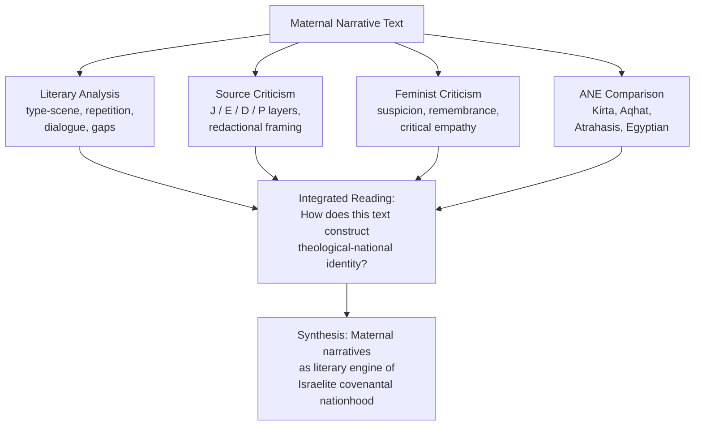
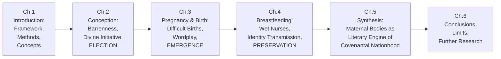
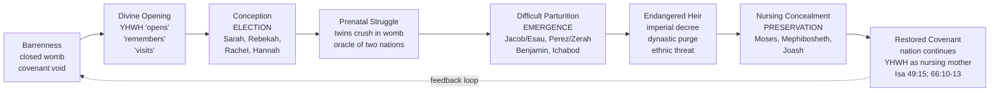

# Mothers of a Nation: Motherhood Narratives as Theological and National Identity Construction in the Hebrew Bible
# 1 Introduction: Motherhood, Theology, and Nationhood in the Hebrew Bible

When the angel of YHWH meets the fleeing Egyptian slave-woman Hagar at a desert spring and addresses her by name, promising that she will bear a son whose descendants will be "too numerous to count," the encounter does something more than relieve one woman's distress. It inaugurates a narrative pattern in which the bodies of women — barren, pregnant, parturient, nursing — become the textual stage on which the Hebrew Bible negotiates the most fundamental questions of who Israel is, how it came into being, and what binds it to its God. Hagar's annunciation, as Carolyn Mackie observes, "gathers up the previous story and carries it forward, forming a trope that serves to set the stage for the most unexpected, impossible birth of them all," and the encounter closes with Hagar herself naming the deity *El-roi*, "the God who sees me."[^1] That a non-Israelite slave's reproductive crisis should generate a divine name, and that this scene should later echo across the matriarchal type-scenes of Sarah, Rebekah, Rachel, Manoah's wife, Hannah, and the Shunammite woman, signals that motherhood in the Hebrew Bible is never a merely domestic affair. It is, instead, the medium through which an emerging covenant people learns to speak about itself.

This report investigates how the biblical authors transform the physiological experiences of conception, gestation, parturition, and lactation into a literary-theological grammar for narrating Israel's election, emergence, and preservation. The present chapter establishes the conceptual, methodological, and architectural foundations of that investigation. It sets out why motherhood narratives merit sustained attention, formulates the guiding research questions and central thesis, delimits the textual corpus, articulates the methodological toolkit drawn from literary, source-critical, feminist, and ancient Near Eastern comparative approaches, defines the operative analytical categories, and previews the four-part structure that culminates in the argument that maternal narratives constitute a literary engine of Israelite identity formation.

## 1.1 Rationale and Significance: Why Motherhood Narratives Matter

Mothers occupy a structurally disproportionate position in the Hebrew Bible. Measured purely by lines of dialogue or duration of narrative presence, figures such as Sarah, Rebekah, Rachel, Leah, Manoah's wife, Hannah, Bathsheba, the Shunammite woman, Jochebed, and the nameless nurse of Mephibosheth are minor characters within stories that foreground their husbands, sons, or kings. Measured by the weight of what their reproductive experiences mediate — covenant promise, tribal identity, dynastic survival, and prophetic vocation — they are indispensable. Six annunciation type-scenes catalogued by Robert Alter alone (to Sarah, Rebekah, Rachel, Manoah's wife, Hannah, and the Shunammite woman) generate the patriarchs of Israel, the tribal founders, the judge Samson, the prophet Samuel, and a child whose birth marks the prophetic authority of Elisha.[^2] When the annunciation to Hagar (Genesis 16) is added — and, as scholars have increasingly recognized, it must be, since her encounter most closely parallels both the conventions of the type-scene and the later annunciation to Mary — the maternal archive expands to include the matriarch of the Ishmaelite line and the first woman in the Bible to receive direct divine speech and to confer a name upon the deity.[^3][^1]

This disproportion is not incidental. It reflects a deliberate authorial strategy in which the female reproductive body operates as a privileged site for negotiating four interlocking concerns: **body, family, covenant, and nation**. The womb is where divine promise becomes flesh; the labor-bed is where genealogy is decided; the breast is where ethnic and religious identity is transmitted; and each of these moments is, in the canonical telling, simultaneously a moment in which Israel itself is being conceived, born, or nursed. The literary economy by which a private, embodied experience is made to carry such public, theological freight is one of the distinctive features of biblical narrative, and it is the principal object of this study.

A second reason for the scholarly urgency of the topic concerns the gap between the literary representation of motherhood and the everyday social reality of Israelite women. Carol Meyers, whose *Discovering Eve* (1988) and its expanded successor *Rediscovering Eve* (2013) constitute landmark archaeological-sociological studies of women in ancient Israel, has argued forcefully that "biblical sources alone do not give a true picture of ancient Israelite women because urban elite males wrote the vast majority of the scriptural texts and the stories of women in the Bible concern exceptional individuals rather than ordinary Israelite women."[^4][^5] Meyers's reconstruction, grounded in highland village archaeology, depicts ordinary Israelite women "not as submissive chattel in an oppressive patriarchy, but rather as strong and significant actors within their families and society," whose household economic, social, and religious roles were substantially more extensive than the canonical narratives suggest.[^4][^6] Her work establishes a critical distinction that must be carried throughout the present report: between **motherhood as an ideological-literary construct** mobilized by elite male scribes for theological-political ends, and **motherhood as an embedded social practice** of which the biblical text offers only a partial, refracted, and exceptional window. Both registers matter. The first is the object of close textual analysis; the second supplies the comparative ballast that prevents over-reading the literary construct as transparent social description.

The third source of significance lies in the long afterlife of these narratives. Within the canon itself, prophetic and poetic texts repeatedly redeploy maternal imagery — birth-pangs, nursing breasts, the womb that opens and closes — to figure the suffering and restoration of the nation. Beyond it, the annunciation type-scene becomes the template upon which the New Testament constructs the births of John the Baptist and Jesus, with Madhavi Nevader arguing persuasively that Luke's annunciation to Mary "stands in relation to an expansive hinterland of texts" stretching back to Hagar, Sarah, Hannah, and the Ugaritic Kirta legend.[^3] The maternal narratives of the Hebrew Bible are thus not parochial curiosities but the foundational pattern from which two millennia of theological reflection on incarnation, election, and salvation have been generated. Understanding how they work in their own original context is a prerequisite for understanding how subsequent traditions have used — and frequently overwritten — them.

## 1.2 Research Questions and Central Thesis

The present study is organized around four interlocking research questions:

1. **How do the biblical authors theologize reproductive experience?** Through what metaphors, vocabularies, and narrative conventions are conception, pregnancy, birth, and nursing rendered as theological events rather than merely biological ones? What role does YHWH play in opening and closing wombs, and how does this divine agency interact with — and frequently eclipse — the contributions of human fathers?

2. **How are wombs, lineages, and maternal voices mobilized to construct Israel as a covenant nation?** In what ways do individual maternal stories prefigure, generate, or symbolize the corporate identity of Israel? How do specific Hebrew lexemes — *yalad* (to bear), *zera* (seed), *rechem* (womb), *chevley yoledah* (birth-pangs), *meneket* (wet-nurse) — link the singular female body to the collective national body?

3. **Whose maternal stories are amplified, marginalized, or erased, and to what ideological ends?** How do the canonical narratives handle outsider mothers (Hagar, Tamar of Genesis 38, Ruth), anti-mothers (Athaliah, Jezebel), and silenced or violated women (the Levite's *pilegesh*, Tamar of 2 Samuel 13)? What does the distribution of voice, name, and narrative attention reveal about the ideological architecture of the text?

4. **What 'grand story' do these maternal narratives ultimately tell about Israel and YHWH?** When the discrete episodes of barrenness, annunciation, difficult birth, and covert nursing are synthesized, what overarching arc emerges concerning the nation's relationship with its God?

The **central thesis** that organizes the report's response to these questions is that **maternal narratives function as a literary engine for constructing Israel's identity as a covenant people**. This engine operates along three coordinated axes that correspond to the three principal stages of reproduction. *Conception* — repeatedly preceded by barrenness and resolved by divine intervention — encodes the doctrine of **election**: Israel is not a natural growth but a graced creation, conceived by promise rather than by ordinary fertility. *Pregnancy and childbirth* — frequently violent, contested, and accompanied by birth-order reversals — encode the experience of national **emergence and crisis**: the chosen people emerge not smoothly but through prenatal struggle and painful parturition, a pattern that the prophets will redeploy to figure exile and return. *Breastfeeding and nurturing* — often staged at moments of dynastic or ethnic peril — encode the work of **preservation**: covenantal identity is transmitted across generations through liminal female agents whose milk and care safeguard continuity when the formal structures of patriarchy and monarchy fail. Together, these three strands form a coherent narrative arc — election, emergence, preservation — that parallels and constitutes Israel's covenantal self-understanding: a people miraculously conceived by divine promise, painfully born into history through struggle, and nursed into continued existence under conditions of recurrent threat.

This thesis is distinctive in three respects relative to prior scholarship. First, it integrates rather than isolates the three reproductive stages, treating them as a coordinated narrative system rather than as discrete motifs. Second, it takes seriously both the theological-literary mechanics of the text (against purely sociological readings that would dissolve the canonical construction) and the feminist-critical interrogation of its ideological work (against confessional readings that would naturalize patriarchal arrangements). Third, it holds in tension the celebratory and the terrifying dimensions of biblical motherhood — affirming with Phyllis Trible that "feminism is a prophetic movement, examining the status quo, pronouncing judgment, and calling for repentance,"[^7][^8] while also recognizing, with Robert Alter and others, the literary sophistication by which maternal episodes generate theological meaning.

## 1.3 Scope, Corpus, and Periodization

The primary corpus of this study comprises the maternal narratives of the **Pentateuch (Genesis–Deuteronomy) and the Former Prophets (Joshua–Kings)**, with strategic engagement of selected prophetic texts (Isaiah, Hosea, Jeremiah, Lamentations) and poetic materials (Psalms, Song of Songs) where these redeploy or transform the foundational maternal motifs. This delimitation reflects three considerations.

First, the Pentateuch and Former Prophets constitute the **principal narrative site at which Israel's origins are told**. It is here that the patriarchal genealogies are constructed, the tribal founders born, the Exodus generation delivered, the judges raised up, and the monarchy established. The maternal stories embedded within these books are therefore directly implicated in the construction of national identity in a way that later prophetic or wisdom maternal imagery — which presupposes the foundational narratives — is not.

Second, the prophetic redeployment of maternal imagery (Isaiah's nursing Zion, Hosea's adulterous wife, Jeremiah's Rachel weeping for her children, Lamentations' personified Daughter Zion) functions intelligibly only against the backdrop of the foundational narratives. Including these texts as secondary corpus permits the study to trace how the maternal grammar developed in the foundational period is extended, intensified, and sometimes inverted in moments of national crisis.

Third, the periodization of the texts themselves is a vexed question. The Pentateuch and Former Prophets contain demonstrable redactional layers spanning from the early monarchy through the post-exilic period, and individual maternal episodes may reflect the concerns of multiple authorial moments. This study acknowledges such layering — particularly through the source-critical lens introduced in §1.4 — but does not aim at a comprehensive diachronic reconstruction. Rather, it engages source-critical observations selectively, where they illuminate genuine differences in how distinct traditions narrate maternal figures (for instance, the juxtaposition of J, E, and P elements in the Sarah cycle, or the editorial framing of the Joash narrative in Kings versus Chronicles).

The criteria for selecting representative episodes are explicit. Episodes are foregrounded when they (a) feature a named or narratively significant maternal figure whose reproductive experience drives the plot; (b) involve explicit divine speech, intervention, or naming connected to the reproductive event; (c) generate consequences for the genealogical or national line; or (d) furnish lexical-metaphorical material that recurs elsewhere in the canon. Peripheral mentions — fleeting genealogical notices, mothers referenced only as appendages to royal succession lists — are engaged only when they illuminate broader patterns. A small number of episodes that the canonical text marginalizes or silences (notably the unnamed *pilegesh* of Judges 19, whose narrative pertains to gendered violence rather than reproduction proper) are addressed in the synthetic chapter as counter-evidence that the report's thesis must integrate rather than suppress, following the rubric's insistence on dialectical engagement with tensions in the data.

## 1.4 Methodological Framework: Literary, Source-Critical, Feminist, and Comparative Approaches

The study deploys a four-fold interpretive toolkit, each component of which addresses a dimension of the maternal narratives that the others alone cannot reach.

**Literary analysis** provides the foundational layer. The decisive contribution here is Robert Alter's identification, in his 1983 *Prooftexts* essay "How Convention Helps Us Read: The Case of the Bible's Annunciation Type-Scene" and his 1981 *The Art of Biblical Narrative*, of the **annunciation type-scene** as a recurrent literary convention.[^1][^2] The type-scene, as scholars working in Alter's wake have refined it, consists of approximately five components: (1) the plight of a woman (typically barrenness); (2) prayer or appeal to God; (3) divine annunciation that a son will be born; (4) birth report; and (5) concluding statement.[^3] Seven Hebrew Bible scenes conform to this pattern with varying degrees of fidelity — those of Hagar (Genesis 16), Sarah (Genesis 18), Rebekah (Genesis 25), Rachel (Genesis 29–30), Manoah's wife (Judges 13), Hannah (1 Samuel 1), and the Shunammite woman (2 Kings 4).[^3] Recognizing the type-scene allows the reader to perceive not only what each instance shares but, more importantly, **how deviations from convention generate meaning** — Hagar's plight is not barrenness but the wrath of her mistress; the Shunammite woman does not ask for a child and resists the prophet's promise; Rachel's struggle is intra-familial rather than purely physiological. Alongside the type-scene, the study attends to characteristic features of biblical narrative identified in the broader literary-critical tradition: **repetition and Leitwort** (key-word patterning), **dialogue and direct speech**, **narrative gaps and ambiguity**, **characterization**, **plot structure**, and **irony and reversal**.

**Source-critical perspectives** (J, E, D, P) supply a second register. While the present study does not aim at exhaustive source attribution, it acknowledges that the maternal narratives reflect multiple authorial traditions whose differing theological emphases are sometimes visible within a single story-complex. The Sarah cycle, for instance, contains material conventionally attributed to J, E, and P, and the redactor's juxtaposition of these strands itself constitutes a meaningful editorial choice. Source-critical sensitivity is particularly relevant for understanding (a) the differing portrayals of divine agency in conception across traditions, (b) the priestly emphasis on covenant and circumcision in the Sarah-Isaac narrative, and (c) the variant framings of episodes that appear in both Kings and Chronicles (notably the Joash episode discussed in chapter 4).

**Feminist biblical criticism** constitutes the third methodological pillar, and it requires explicit positioning given the contested state of the field. **Phyllis Trible's** 1984 *Texts of Terror* inaugurated a sustained feminist engagement with biblical narratives of female suffering, framing feminism as "a prophetic movement, examining the status quo, pronouncing judgment, and calling for repentance" and arguing for a hermeneutic that combines suspicion with remembrance, reading "on behalf of" victimized female characters such as Hagar, Tamar, the Levite's *pilegesh*, and the daughter of Jephthah.[^7][^8] **Elisabeth Schüssler Fiorenza**, in *Bread Not Stone* and *In Memory of Her*, developed a more programmatic "hermeneutics of suspicion" that interrogates the patriarchal structures of biblical texts and proposes a "canon within the canon" oriented to texts of emancipation such as Genesis 1:27 and Galatians 3:28.[^7] Both scholars have been criticized — most notably in confessional responses such as John Rankin's — for what is alleged to be an over-reliance on the experience of the interpreter rather than the text on its own terms; Rankin charges Trible specifically with making Hagar into a "substitute Christ-figure" and with misreading the divine command for Hagar to return to Sarai as "divine terror" rather than redemptive engagement with the consequences of sin.[^7] The present study takes such debates seriously without resolving them confessionally: it accepts Trible's diagnostic of the gendered violence and asymmetries documented in the text, while remaining attentive to the literary-rhetorical mechanics by which the text generates its meanings.

More recent feminist scholarship has further pluralized the field. Barbara Thiede and Johanna Stiebert, in their 2025 reflection on four decades of post-Trible feminist biblical criticism, argue that feminist work has become "vibrant, diverse, interdisciplinary, and dynamic," integrating trauma studies, masculinity studies, queer studies, and postcolonial criticism, and they advocate "critical empathy" — empathy "motivated by a moral imperative to acknowledge that … suffering is itself wrong" — as a methodological orientation.[^8] Their assessment surveys important interventions including the edited volume *Terror in the Bible* (Melanchthon and Whitaker 2021) and Rhiannon Graybill's *Texts After Terror* (2021), with the latter advocating a vocabulary of "fuzzy, messy, and icky" to capture the ambiguity of sexual violence narratives. Thiede and Stiebert offer pointed critique of Graybill's approach, arguing that it risks downplaying biblical violence and accords with "language and tactics used to silence rape victims."[^8] The present study draws methodologically on this expanded toolkit — particularly the recognition that biblical hegemonic masculinity is systemic rather than merely the product of individual "bad apples,"[^8] and that maternal narratives must be read alongside, not apart from, the narratives of sexual violence that frequently surround them. It also draws on the work of **Esther Fuchs**, whose *Sexual Politics in the Biblical Narrative* argues that biblical narrative is fundamentally androcentric in a way that literary critics have insufficiently reckoned with,[^8] and on broader womanist and intersectional voices (Renita Weems, Wilda Gafney, Musa Dube) cited in the field-mapping reviews.[^8]

**Ancient Near Eastern comparative analysis** supplies the fourth methodological component, calibrating claims about the distinctiveness of biblical motherhood against the broader cultural matrix in which Israel's scribes worked. The principal comparative texts deployed in this study include:

- The **Ugaritic *Kirta* epic** (KTU 1.14–1.16), in which the king Kirta, bereft of descendants, weeps until he is granted a dream-theophany by the high god Ilu/El, who promises him a wife and progeny. The Ras Shamra texts thus furnish a clear ancient Near Eastern parallel for the royal dream-annunciation and for the linkage between dynastic continuity and divine intervention.[^3]
- The **Ugaritic *Aqhat* legend** (KTU 1.17–1.19), which similarly opens with a childless king (Danil) granted a son through divine intervention, and which has been the subject of detailed form-critical comparison with the Hannah narrative and the Aqhat epic itself.[^3][^9]
- The **Atrahasis epic**, in which the goddess Mami/Nintu (Ninhursag), at the prompting of Enki, fashions humanity from clay mixed with the flesh and blood of a slain god, with seven male and seven female prototypes produced by fourteen birth-goddesses, after which the text prescribes a nine-day ritual celebration "when the bed is laid let husband and wife lie together … let there be rejoicing for nine days; let them call Ishtar Ishara."[^10] The Atrahasis material is crucial for understanding how Mesopotamian theogonic and anthropogonic traditions frame human reproduction as a divine craft, against which the biblical narratives may be read as both continuous and polemically transformed.
- **Egyptian and Mesopotamian birth annunciation traditions** more broadly, including the royal divine annunciations surveyed by Scott Ashmon, which serve diverse functions from legitimating destiny to elevating maternal status.[^3]

The comparative dimension follows the rubric's calibration principle (P-4): claims about the distinctiveness or significance of Hebrew Bible motifs are calibrated against ANE parallels without overstating either uniqueness or dependence. The biblical authors are best understood neither as inventing the maternal-theological grammar *ex nihilo* nor as merely transcribing inherited ANE conventions, but as creatively redeploying a shared cultural repertoire in the service of distinctive theological-political ends.

The relationship among these four methodological strands may be visualized as follows:

The diagram captures the study's commitment to **methodological pluralism without methodological eclecticism**: each strand interrogates the text from a distinctive angle, but the strands converge on the integrated question of how maternal narratives function in the construction of covenantal national identity.

## 1.5 Key Concepts: Barrenness, Annunciation, Covenant, and Nationhood

Four analytical categories recur throughout the report and require explicit definition at the outset.

**Barrenness** functions in the Hebrew Bible as simultaneously a physiological plight and a theological topos. Of the seven matriarchal figures associated with the annunciation type-scene, six are barren — Sarah (Genesis 18:11), Rebekah (Genesis 25:21), Rachel (Genesis 29:31), Manoah's wife (Judges 13:2), Hannah (1 Samuel 1:2), and the Shunammite woman (2 Kings 4:15) — while the seventh, Hagar, is the structural outlier whose plight is the wrath of her mistress.[^3][^2] The recurrence of this pattern is so striking that, as one commentator puts it, the "sheer number of single or childless women who fill the pages of Scripture should give pause to anyone who insists that the 'biblical mandate' for women is to marry and have children."[^1] More precisely, the recurrence indicates that barrenness operates as a **theological signaling device**: it marks the maternal subject as one whose reproductive future depends not on natural fertility but on divine intervention, thereby framing the child to be born as a child of promise. Margaret Odell observes that in the Sarah-Abraham narrative, the couple's advanced age "underscore[s] the miraculous nature of this particular birth," but that the story also exposes "problematic ruptures in relationships," using the divine question "Where is your wife Sarah?" to point to "Sarah's existential situation" within a fractured marriage.[^11] Barrenness is thus simultaneously a category of grace and a category of pathos: it permits the demonstration of divine power while exposing the relational, social, and existential vulnerabilities of the maternal subject.

**Annunciation** is the literary convention by which divine speech, female bodies, and the destiny of nations are linked. As outlined in §1.4, the type-scene comprises a stable set of components, but its deeper function is to mark the announced child as one whose existence and identity are constituted by divine pronouncement. The annunciation does not merely predict the birth; it **performatively constitutes the child's significance**, naming the son in advance (Ishmael, Isaac, Samson, Samuel) and binding his destiny to a divine purpose. Madhavi Nevader's analysis of the Lukan annunciation to Mary as drawing simultaneously on the annunciation type-scene and on the **theophany type-scene** (scene-setting, divine appearance, human response, expression of doubt, externalization) demonstrates that for some maternal figures — Hagar most clearly — the annunciation functions as a **transformative theophany** in which the woman is constituted as a new kind of subject, capable even of naming the deity.[^3]

**Covenant** is the framework that converts maternal reproduction into salvation-historical lineage. Israel's covenantal self-understanding is genealogically structured: YHWH's promise to Abraham is a promise of offspring, land, and blessing through a specific son born of a specific wife (Genesis 17:15–19, Genesis 18:10–14). The repeated affirmation that "it is through Isaac that your offspring will be reckoned" (Genesis 21:12) makes the maternal body the indispensable conduit of covenant — even as it generates the painful exclusion of Hagar and Ishmael that Trible has read as "text of terror."[^7] Covenant thus operates as the theological mechanism by which the singular reproductive event is transposed onto the corporate national plane: the son born to Sarah is simultaneously the heir of the covenant promise, the patriarch of the Israelite line, and the type of all subsequent miraculously-conceived covenant children.

**Nationhood** designates the imagined community whose origins and identity are traced through these maternal bodies. The term "nation" is used here in its biblical-literary rather than its modern political sense: it denotes the corporate Israel of the biblical narrative, understood as a people defined by descent from a specific genealogical line, by covenant with a specific deity, and by a shared narrative of origin in which reproductive moments — Sarah's conception of Isaac, Rebekah's wrestling twins, Tamar's twins Perez and Zerah, Hannah's gift of Samuel, the rescues of Moses, Mephibosheth, and Joash — function as **constitutive episodes**. The biblical construction of nationhood is thus deeply maternal even as the canonical text is predominantly told from a male perspective: the patriline runs *through* the matriline, and the matrilineal episodes carry disproportionate constitutive weight.

These four categories interact dialectically throughout the report. Their relationships may be summarized as follows:

| Concept | Physiological Register | Theological Register | National Register |
|---------|------------------------|----------------------|-------------------|
| **Barrenness** | Inability to conceive | Stage for divine intervention; election | Israel as a non-natural, graced people |
| **Annunciation** | Pregnancy announced | Divine speech constitutes the child's destiny | Founding figures bound to YHWH's purpose |
| **Conception/Birth** | Reproductive event | God opens the womb; covenant inscribed | Tribal founders, dynastic heirs emerge |
| **Nursing** | Lactation, infant survival | Identity formation; divine maternal metaphor | Generational transmission of covenant |
| **Covenant** | (no direct physiological correlate) | Promise structured genealogically | National lineage as theological lineage |
| **Nationhood** | (corporate body imagined as maternal body) | Israel as YHWH's child / spouse | Imagined community grounded in maternal episodes |

The table makes visible the report's basic claim that **each maternal-physiological event is simultaneously coded at theological and national registers**, and that the work of biblical narrative is precisely to render these three registers inseparable.

Two further conceptual debates require acknowledgment. The first concerns **patriarchy and hegemonic masculinity**. The biblical narratives are, with rare exceptions, authored, transmitted, and edited within patriarchal structures; David Clines's foundational work on biblical masculinity has demonstrated how violent male characters are routinely valorized while their violence against women is "bypassed and normalised," and Esther Fuchs has charged literary critics with "rarely allow[ing]" the androcentrism of biblical narrative "to interfere with their analytical procedures."[^8] At the same time, Carol Meyers has cautioned against reading patriarchy as totalizing, arguing that ordinary Israelite women exercised substantial agency within household structures that the elite literary record obscures.[^4][^6] The present study holds these positions in productive tension: the maternal narratives are products of patriarchal scribal culture and reflect its asymmetries, yet they also generate moments of female agency, voice, and even divine naming that exceed and complicate the patriarchal frame.

The second debate concerns **female agency** in the text. The question of whether biblical mothers act as autonomous subjects or merely as instruments of patriarchal-theological purposes admits no single answer. Sarah's laughter, Rebekah's inquiry of YHWH (Genesis 25:22), Hagar's naming of the deity, Hannah's prayer and song, Rachel's lament — each suggests genuine subjectivity. Yet the same characters are also instrumentalized within the genealogical-covenantal machinery of the canonical narrative. The report will track this tension throughout, refusing both the celebratory reading that finds emancipated heroines in every chapter and the suspicious reading that reduces every female character to an ideological cipher.

## 1.6 Structure of the Study and Chapter Roadmap

The report unfolds in six chapters organized around a tripartite analytical core. Following this introduction (Chapter 1), three substantive chapters treat the three reproductive stages in sequence; a synthetic chapter integrates them into the overarching argument; and a concluding chapter consolidates findings and proposes avenues for further inquiry.

**Chapter 2: Conceptions of Conception** analyzes how biblical authors depict the act and process of conception, investigating the metaphorical vocabulary drawn from domestic life (the womb as house, vessel, chamber) and agricultural production (seed, sowing, fruitfulness, fertile and barren land). It examines the theological logic by which God is portrayed as the agent who opens and closes the womb, contrasting this with the relatively muted role of the human father. Through close reading of Sarah (Genesis 17–21), Rebekah (Genesis 25), Rachel (Genesis 29–30), and supporting cases including Hannah and Manoah's wife, the chapter demonstrates how the barrenness-followed-by-divine-intervention pattern frames covenant heirs as products of grace rather than nature, grounding national lineage in theological election.

**Chapter 3: Imagery of Pregnancy and Childbirth** explores how pregnancy and parturition are rendered in vivid bodily and symbolic terms, with particular attention to the recurrent motif of difficult or contested childbirth. It argues that Rebekah's struggling twins (Genesis 25:21–26) and Tamar's birth of Perez and Zerah (Genesis 38:27–30) function as etiological prefigurations of the destinies of Israel, Edom, and the Davidic line. The chapter further investigates Hebrew lexical and metaphorical resonances — the polysemy of *yalad*, the redeployment of birth-pangs (*chevley yoledah*) imagery in Exodus traditions and prophetic visions of national rebirth — demonstrating how individual labor and collective deliverance are linguistically and theologically interwoven.

**Chapter 4: Narratives of Breastfeeding and Nurturing** examines how breastfeeding and post-partum nurturing are narrated as more than physiological acts, functioning as vehicles for transmitting covenantal identity and as covert mechanisms of resistance against oppressive powers. Through detailed analysis of the rescue of Moses (Exodus 2, where his Hebrew mother is paid by Pharaoh's daughter to nurse him), Mephibosheth (2 Samuel 4:4, where the nurse's flight preserves the Saulide line), and Joash (2 Kings 11 / 2 Chronicles 22, where Jehosheba and the nurse hide the Davidic heir from Athaliah's purge), the chapter argues that wet nurses operate as liminal agents safeguarding theological continuity at moments when royal or ethnic survival is imperiled. It also considers milk-and-honey imagery and the maternal-divine metaphors of Isaiah 49:15 and 66:11–13.

**Chapter 5: Comprehensive Analysis** synthesizes the preceding three thematic strands into the report's integrated argument. It demonstrates how conception (election), childbirth (emergence and crisis), and breastfeeding (preservation) form a coherent narrative arc paralleling Israel's relationship with YHWH. It assesses how this maternal grand narrative interacts with patriarchal structures, ancient Near Eastern parallels, and source-critical layers, and engages dialectically with counter-evidence — outsider matriarchs, anti-mothers such as Athaliah and Jezebel, narratives of maternal trauma and silencing — that the thesis must integrate. The chapter closes by articulating the grand story these maternal narratives convey: that Israel itself is, in essence, **a child miraculously conceived, painfully born, and divinely nursed into covenantal existence**.

**Chapter 6: Conclusion and Avenues for Further Research** consolidates the principal findings, identifies limitations of the study (notably the thinness of philological treatment in certain areas, the gaps in primary Ugaritic and Egyptian comparative material, and the inherent provisionality of some interpretive claims), and proposes directions for further inquiry, including comparative work with additional ANE birth and nursing traditions, intertextual reception in Second Temple literature, and the diachronic evolution of maternal imagery across the canon.

The argumentative trajectory of the report may be visualized as a movement from foundational matriarchal narratives, through the three reproductive stages, to synthetic reflection on national identity formation:

The diagram makes explicit the **tripartite analytical core** — election, emergence, preservation — that the report develops in chapters 2 through 4 and integrates in chapter 5. The interpretive payoff of this structure is that each substantive chapter both stands on its own as a focused analysis of one reproductive stage and contributes a necessary component to the cumulative argument, such that the synthesis of chapter 5 emerges organically from the preceding analyses rather than being asserted from outside them.

By the close of the report, the reader should be in a position to perceive how the biblical authors' sustained literary and theological investment in maternal narratives constitutes one of the canon's most powerful — and most contested — instruments for imagining Israel into being. The mothers of the Hebrew Bible are not, as casual reading might suggest, merely the wives of the patriarchs, the mothers of the kings, or the supporting cast of the prophets' biographies. They are, in the architecture of the canonical narrative, the very wombs in which Israel as a covenant people is conceived, the very bodies through which it is painfully born, and the very breasts at which it is nursed into continuing existence. To understand how the Hebrew Bible tells the story of Israel and its God is, in significant measure, to understand how it tells the story of mothers.

# 2 Conceptions of Conception: Divine Initiative, Human Fatherhood, and Domestic-Agricultural Metaphors

The introductory chapter argued that the maternal narratives of the Hebrew Bible function as a literary engine of covenantal nationhood, organized along three coordinated reproductive axes — election, emergence, and preservation. This chapter develops the first of those axes by inquiring how the biblical authors render the act of conception itself. If the canonical narrative of Israel is to be understood as the story of a graced people rather than a naturally proliferating tribe, then the textual portrayal of conception is the place where that grace must first become legible. The opening question is therefore not anatomical but theological: when biblical narrators describe a woman conceiving a son, where do they locate the causality, and through what metaphors do they make that causality intelligible?

The answer that emerges from sustained reading is that the Hebrew Bible systematically removes conception from the domain of ordinary fertility and re-describes it as a divine act executed upon, in, and through the female body. The human father, ostensibly the genealogical anchor of the patriline, recedes at the decisive moment; the mother's womb is rendered as a domestic chamber that YHWH alone may open; and the language of seed and fruit binds individual reproduction to the agricultural fertility of the covenant land. Read together, these literary moves accomplish a single theological feat: they encode Israel's election in its very conception. The covenant child is not a child of natural increase but of promise.

This chapter pursues that argument through seven sections. It begins with the lexical and theological grammar of the opened and closed womb (§2.1); develops the typological function of barrenness across the matriarchal cycle (§2.2); examines the dual metaphorical vocabulary of domestic and agricultural conception (§2.3); interrogates the muted role of the human father (§2.4); offers sustained close readings of the principal conception narratives (§2.5); calibrates the biblical pattern against its ancient Near Eastern context (§2.6); and synthesizes the chapter's findings under the heading of conception-as-election (§2.7).

## 2.1 The Theological Grammar of the Opened and Closed Womb

The most concentrated theological idiom for conception in the Hebrew Bible is the formula by which YHWH "opens" or "closes" the womb. The Genesis narratives apply this language with remarkable consistency: when Sarai despairs of her own fertility, she frames her plight in precisely these terms — "the LORD has prevented me from bearing children" (Genesis 16:2) — locating the closure of her womb in divine agency rather than physiological accident. The same idiom returns when Leah, the unloved wife of Jacob, conceives Reuben: "When the LORD saw that Leah was hated, he opened her womb, but Rachel was barren."[^12] A few verses later, after Rachel's prolonged plight, "God remembered Rachel, and God listened to her and opened her womb." Hannah's narrative similarly attributes both her affliction and her eventual conception of Samuel to YHWH, "for the LORD had closed her womb" (1 Samuel 1:5–6). In each case, the verb of opening (a form of *patach*, "to open") and its complement of closing (cognate with *sagar* or related forms) is bound directly to the divine subject. Conception is not what happens between husband and wife; it is what happens when YHWH decides that it shall happen.

This grammar accomplishes three theological displacements at once. First, it displaces **female physiological capacity**. The matriarchs are not simply infertile women who later become fertile through medical or natural improvement; they are women whose reproductive futures are held shut and then released by the deity. Second, it displaces **male generative contribution**. Although the Hebrew imagination is intensely interested in the "seed" (*zera*) of the patriarchs (a point developed in §2.3), the seed is never sufficient on its own; it requires the divine opening of the receiving womb to become a covenant child. Third, it displaces **secondary causation altogether**. There are no biblical narratives in which a matriarch conceives because she follows a fertility regimen, consults a competing deity, or finds a more potent partner; Rachel's experiment with mandrakes (Genesis 30:14–17) is treated by the narrator as an episode of marital negotiation rather than as the actual mechanism of conception, which is subsequently attributed to God's remembering of her.

The narrative of Leah's first conception offers a particularly clear specimen of how this grammar works. Multiple major translations preserve the literal Hebrew construction "and he opened her womb": "When the LORD saw that Leah was hated, he opened her womb, but Rachel was barren."[^12] The verse arranges three elements in tight syntactic sequence — YHWH's seeing, YHWH's opening, Rachel's continuing closure — and thereby presents reproduction as a direct continuation of divine perception. The relevant Hebrew root underlying the woman-as-mother in this narrative tradition is connected to *yalad* (to bear, to give birth, to act as midwife, to show lineage), a lexeme whose semantic range itself binds the biological act of bearing to the genealogical act of constituting a line of descent. When YHWH opens the womb of Leah, the text does not simply describe a conception; it inaugurates a genealogy whose constitutive moment is divine attention to female suffering.

This idiom is most readily attributed to the J source's characteristic interest in divine intimacy with the matriarchs (Sarai's complaint in Genesis 16, Leah and Rachel's narratives in Genesis 29–30), although P traditions also affirm divine control of fertility through the covenant promise (Genesis 17:15–19) and the verb pattern of opening recurs across strands without strict source allocation. While a definitive source-critical map of every conception text exceeds the present scope (and the evidence available here permits only cautious differentiation), the cumulative weight of the idiom across traditions makes one observation secure: the displacement of reproductive causality onto YHWH is not the idiosyncrasy of a single redactional layer but a pervasive feature of the canonical text's treatment of maternal bodies.

The theological stakes of this grammar are considerable. If Israel's existence depends on a sequence of wombs opened by YHWH — Sarah's, Rebekah's, Rachel's, Hannah's — then Israel itself is constituted as a people whose existence is suspended over the void of barrenness, sustained moment by moment by divine willingness to open what is otherwise closed. The election of Israel is encoded not as a political or military fact but as a reproductive fact: at every node of the founding genealogy, the line could have failed, and at every node, YHWH alone has prevented its failure.

## 2.2 Barrenness as Typological Device: The Matriarchal Pattern

The opened-womb grammar of §2.1 makes structural sense only against the prior condition that the womb was closed. It is therefore unsurprising that the Hebrew Bible deploys **barrenness** as the consistent precondition for the conception of covenant heirs. Of the seven figures associated with the annunciation type-scene identified by Robert Alter[^13] — Hagar, Sarah, Rebekah, Rachel, Manoah's wife, Hannah, and the Shunammite woman — six begin their stories as childless and unable to conceive. The recurrence is statistically extraordinary, and as the introductory chapter has already noted, it cannot plausibly be explained as demographic coincidence. It is a deliberate authorial typology.

Sarah's case establishes the paradigm in its most developed form. Genesis 17 has YHWH announcing to Abraham that "I will establish My covenant with Isaac, whom Sarah will bear to you at this time next year"[^14] — a verse that, as the Berean Standard and several other translations make explicit, fixes the covenant lineage on a single, as-yet-unconceived son to be borne by a specific, named, and aged wife. The announcement explicitly contrasts Isaac with Ishmael; God promises to bless Ishmael and to make him "fruitful" and "multiply him greatly," yet declares, "But my covenant I will establish with Isaac."[^14] The covenant, in other words, is **narrowed through the maternal body**: not just any son of Abraham, and not even the firstborn son of Abraham, but the son of Sarah, whose advanced age makes the conception unmistakably miraculous.

The Genesis 18 annunciation at the Oaks of Mamre dramatizes this miracle through Sarah's laughter. As Rachel Adelman observes, "Sarah, who sets the precedent for this privilege of bearing 'the chosen son,' is almost completely occluded from the revelation. The news is first conveyed to Abraham alone… Sarah is not allowed to command her annunciation scene."[^15] The scene's literary architecture is intricate: the divine messengers verify Sarah's presence, ask after her by name, and announce the birth while she eavesdrops from the tent entrance "which was behind him." Sarah laughs inwardly — "Now that I am withered, am I to have enjoyment — with my husband so old?" — and is then rebuked indirectly, through Abraham, by a divine question that confirms the impossibility about to be overcome: "Is anything too wondrous for the Lord?"[^15] Adelman reads the scene as a "repartee around laughter" that "realigns the relations between the matriarch and God, calling for a direct encounter, which in turn enables her to conceive."[^15] On this reading, Sarah's barrenness is not merely a biological waiting room but the staging area for a theophanic confrontation that itself effects the opening of her womb. The transformation of "her aged body — withered, without pleasure — into that of a voluptuous nursing mother confirms the divine promise."[^15]

Rebekah's case compresses the pattern into a single verse: "Isaac entreated the LORD for his wife, because she was barren; and the LORD granted his prayer, and Rebekah his wife conceived" (Genesis 25:21). Here the type-scene's standard components — the plight, the prayer, the divine intervention, the conception — are telescoped into a tight syntactic sequence that links Isaac's intercession to YHWH's granting and Rebekah's conceiving. The compression is rhetorically efficient: the narrator does not need to dwell on the barrenness because the convention is by now established. Rebekah's narrative quickly pivots from conception to the prenatal struggle that will be treated in Chapter 3, but the conception itself bears the characteristic theological signature.

Rachel's case stretches the pattern across multiple chapters. In the relevant Genesis material, after Leah has borne four sons through YHWH's opening of her womb, Rachel cries out to Jacob in despair, "Give me children, or I shall die" (Genesis 30:1). Jacob's angry response — "Am I in the place of God, who has withheld from you the fruit of the womb?" — is itself a theological signal: even within the narrative world, the characters understand that fertility belongs to God, not to husbands. Rachel resorts to the surrogate strategy of giving her maidservant Bilhah to Jacob, then to a mandrake-bargain with Leah, before the narrator finally concludes: "Then God remembered Rachel, and God listened to her and opened her womb. She conceived and bore a son, and said, 'God has taken away my reproach'" (Genesis 30:22–23). The verb of remembering (*zakhor*) belongs, as Adelman notes for the broader annunciation pattern, to the standard vocabulary of God's covenantal mindfulness: "the invocation of the verb *pakod* or *zakhor* — to call to mind or pay mind to — to indicate God's manifest mindfulness of His promise."[^15] Rachel's conception is thus framed as an act of divine attention to a previously deferred subject; her barrenness was not punishment but waiting.

The same pattern recurs beyond Genesis. Hannah's barrenness in 1 Samuel 1 is explicitly attributed to YHWH ("the LORD had closed her womb"), her prayer at the Shiloh sanctuary becomes the occasion of an annunciatory blessing through Eli, and her conception of Samuel is described as YHWH "remembering" her. Manoah's wife in Judges 13 is introduced precisely as "barren and had no children" before the angel of YHWH announces the impending birth of Samson. The Shunammite woman of 2 Kings 4 inverts the convention by not requesting a child but receiving one through Elisha's annunciatory promise — and the inversion is precisely what makes the scene legible as a type-scene at all.

The cumulative function of this typology is to mark the covenant line as **non-natural**. As one feminist commentator on Hannah observes in the broader context of biblical childlessness, "the sheer number of single or childless women who fill the pages of Scripture should give pause to anyone who insists that the 'biblical mandate' for women is to marry and have children." Within the more specific frame of the present chapter, the same observation points to a different conclusion: the matriarchs are barren because barrenness is the theologically necessary precondition for divine intervention. If Sarah conceived Isaac at twenty, the conception would prove only that Sarah was fertile; because she conceives at ninety, the conception proves that YHWH is sovereign. The barrenness-and-intervention pattern is the literary device by which the text guarantees that every covenant heir is read as a child of grace.

It is worth noting that this typology does not exhaust the biblical treatment of motherhood. Outsider mothers (Hagar, Tamar of Genesis 38, Ruth) and anti-mothers (Athaliah) operate by different rules, and the report's synthetic chapter will revisit these counter-cases. But within the canonical mainline of covenant lineage, the typology is remarkably uniform: barrenness precedes promise, promise precedes intervention, and intervention produces the heir.

## 2.3 Domestic and Agricultural Metaphors of Conception

The theological grammar of the opened womb does not float free of concrete imagery. It is anchored in two intersecting metaphorical systems through which the Hebrew Bible renders conception intelligible: a **domestic** system that treats the female body as house, tent, vessel, or chamber, and an **agricultural** system that treats reproduction as seed, sowing, and fruit-bearing. These two systems are not separate registers but interpenetrating idioms, and their interaction is one of the principal means by which the text slides between individual reproduction and corporate national fertility.

The domestic system surfaces most plainly in the language of "building up" a house through offspring. When Sarai gives Hagar to Abram, she says, "Behold now, the LORD has prevented me from bearing children. Go in, please, to my maid; perhaps I shall obtain children by her" (Genesis 16:2) — the Hebrew expression underlying the rendering "obtain children" is literally "be built up from her" (*ibbaneh mimmenah*), a verbal form built on the root *bnh*, "to build," that elsewhere yields the noun *bayit*, "house." The same root resurfaces at the close of the book of Ruth, when the elders bless Boaz with the words, "May the LORD make the woman who is coming into your house like Rachel and Leah, who together built up the house of Israel" (Ruth 4:11). The matriarchs are described as builders of the corporate "house of Israel" precisely through their child-bearing — a metaphor that simultaneously locates national identity in maternal reproduction and renders the female body itself as architecture. The womb, on this image, is the inner chamber of the domestic house in which the future of the larger national house is constructed.

Adjacent to this architectural metaphor is the imagery of the womb as **tent**, which the Hagar–Sarah narrative actualizes spatially. Sarah's annunciation at Mamre is staged precisely at the boundary of a tent: "And Sarah was listening at the tent opening, which was behind him."[^15] The tent functions both as the literal domestic enclosure within which Sarah's withered body resides and as the symbolic enclosure within which the impossible conception will occur. When the divine voice asks, "Where is Sarah your wife?" — and is answered, "Here, in the tent"[^15] — the question's emphasis on Sarah's location within the domestic chamber prepares the reader to perceive the tent-womb as the chamber that YHWH is about to open. Schroer and Staubli's broader observation that biblical anthropology unfolds aspectively through "nexus points of the human body (throat, heart, and womb)" supports the recognition that the womb is, for the Hebrew imagination, not merely an organ but a topographical site, a domestic chamber within the larger architecture of the person and the household.[^12]

The agricultural metaphor system is at least as pervasive. The Hebrew *zera*, "seed," functions throughout the patriarchal narratives as the standard term for offspring or descendants — "I will surely multiply your seed as the stars of the heavens" (Genesis 22:17), "through your seed all nations of the earth shall be blessed" (Genesis 22:18), "Through Isaac your offspring [*zera*] will be reckoned" (Genesis 21:12, alluded to in Genesis 17:21 and Romans 9:7 ).[^14] The metaphor draws conception into the broader vocabulary of agrarian production: seed is sown, grows, and yields fruit, and reproductive vocabulary maps directly onto these stages. The expression "fruit of the womb" (*pri ha-beten*) makes the integration explicit, treating the child as the *pri* (fruit) of the maternal *beten* (belly/womb), as Rachel's outcry to Jacob already presupposes when he protests, "Am I in the place of God, who has withheld from you the *pri ha-beten*?" (Genesis 30:2).

This agricultural metaphor is anchored already in the creation accounts that frame the patriarchal narratives. The primordial blessing "Be fruitful and multiply" (Genesis 1:28), repeated to Noah after the flood and reactivated in the patriarchal promises, fuses generation with horticulture: human reproduction is described in the same language used for the proliferation of plants and animals across the land. When the Sarah cycle finally produces Isaac — whose name means "he laughs," yielding a triple wordplay on Abraham's laughter (Genesis 17:17), Sarah's laughter (Genesis 18:12), and the divine question "Is anything too wondrous for the LORD?" (Genesis 18:14)[^15][^14] — the agricultural metaphor permits the narrative to read the conception as the long-deferred "fruit" of the divine promise to "multiply" Abraham's seed.

The two systems interact most productively when they are mapped onto each other. The maternal body, conceived as house and chamber, is also conceived as soil and field; the seed sown by the patriarch yields fruit only when the chamber is opened by YHWH. This double metaphor enables a crucial theological slide. When the prophet of Isaiah 54 addresses the post-exilic community as a barren woman — "Sing, O barren one, who did not bear; break forth into singing and cry aloud, you who have not been in travail; for the children of the desolate one will be more than the children of her that is married, says the LORD"[^13] — the address presupposes the entire metaphor-system developed in the patriarchal narratives. Zion-as-mother is barren in the same way Sarah was barren; Zion-as-mother will be made fertile in the same way Sarah was made fertile; the "children" of Zion will be the "seed" of Israel restored. The exhortation that follows — "Enlarge the place of your tent, and let the curtains of your habitations be stretched out; do not hold back, lengthen your cords and strengthen your stakes"[^13] — explicitly reactivates the domestic metaphor of the maternal tent-chamber, now expanded onto the corporate scale of the restored city. Isaiah 54 is, in effect, a prophetic application of the Sarah-pattern to the nation as a whole.

Two further elements deserve mention. First, the figuration of fertile and barren **land** in the patriarchal narratives runs parallel to the figuration of fertile and barren women. The promised land is described as "flowing with milk and honey" — a maternal-agricultural composite that anticipates the breastfeeding imagery treated in Chapter 4 — while exile is figured as desolation, and the desolate land is feminized as a bereft mother. Second, the polysemy of *yalad*, which means both "to bear young" and, in derived senses, "to show lineage," makes the very vocabulary of childbearing inseparable from the construction of genealogy. To say that a matriarch "bore" a son is already to say that she constituted a line of descent.

Together, these metaphor-systems prepare the central theological move that the chapter is building toward: the singular reproductive event of an individual matriarch is, by the time the text has finished describing it, already a corporate national event. The womb-chamber that YHWH opens is also the house of Israel under construction; the seed that finds purchase is also the *zera* of Abraham being multiplied; the fruit of the womb is also the future of the covenant people.

## 2.4 The Muted Human Father and the Displacement of Male Agency

If the maternal body is so densely figured in the conception narratives, what becomes of the human father? The patrilineal genealogies of the Hebrew Bible are conspicuous in their accumulation of male names — "X begot Y, who begot Z" — and yet, when the narrative zooms in on the actual moment of conception, the father's biological role is repeatedly muted, displaced, or rerouted through prayer rather than through generative action. This is not an accidental feature of the text. It is the necessary complement of the divine-agency grammar developed in §2.1: if YHWH is the one who opens the womb, then the human father cannot also be claimed as the effective cause of conception, on pain of theological contradiction.

The Sarah cycle illustrates the displacement starkly. Genesis 21:1–2 — the verse that finally narrates the conception and birth of Isaac after chapters of anticipation — reads: "The LORD visited Sarah as he had said, and the LORD did to Sarah as he had spoken. And Sarah conceived and bore Abraham a son in his old age at the time of which God had spoken to him."[^14] The grammatical subject of the verbs that produce the conception is the LORD, not Abraham; Abraham appears only as the indirect beneficiary ("bore Abraham a son") and as the addressee of the original promise ("of which God had spoken to him"). The divine "visiting" of Sarah is rendered in a vocabulary (*paqad*) that, as Adelman notes, belongs to the standard annunciation lexicon of divine mindfulness.[^15] Abraham, throughout the conception narrative proper, is essentially passive: he laughs in disbelief (Genesis 17:17), he hosts the divine messengers, and he eventually rejoices in his son, but the text does not assign him a generative role at the moment of conception itself.

Isaac's case is even more striking. The narrative of Rebekah's conception of Jacob and Esau begins with the statement that "Isaac entreated the LORD for his wife, because she was barren" (Genesis 25:21). The verb of entreating (a form of *atar*) belongs not to the vocabulary of generation but to the vocabulary of intercession. Isaac's role is precisely **prayerful**, not **procreative**, in the decisive moment; he is the supplicant who asks YHWH to act, not the agent who himself acts. The verse concludes, "and the LORD granted his prayer, and Rebekah his wife conceived" — the chain of causation runs through Isaac's entreaty to YHWH's granting to Rebekah's conceiving, with Isaac functioning as the mediator of a divine action upon his wife rather than as the proximate cause of the conception. Rebekah's subsequent direct inquiry of YHWH about the prenatal struggle (Genesis 25:22), discussed further in Chapter 3, reinforces the impression that the theologically decisive relationship in this narrative is between YHWH and Rebekah, with Isaac as a relatively marginal third figure.

The Hannah narrative continues the pattern. Hannah's husband Elkanah, confronted with his beloved wife's grief at her barrenness, tries to comfort her with what is perhaps the least helpful question in the Hebrew Bible: "Hannah, why do you weep? And why do you not eat? And why is your heart sad? Am I not more to you than ten sons?" (1 Samuel 1:8). The question's pathos lies precisely in its **ineffectuality**; Elkanah cannot produce a child for Hannah, and his offer of conjugal devotion as a substitute for offspring misses the structural-theological character of her plight. The narrative subsequently makes the contrast explicit: Hannah does not turn to Elkanah for the solution but to YHWH, vowing at Shiloh and receiving Eli's blessing, after which "the LORD remembered her" and she conceives. Elkanah, like Abraham and Isaac before him, is the genealogical occasion but not the theological cause of the conception.

This pattern of muted paternity invites multiple interpretations, and the feminist critical tradition has been divided on how to read it. One reading, available within a broadly literary frame, takes the muting as a **theological elevation device**: by clearing the human father from the foreground, the text amplifies the divine agency that the narrative wishes to celebrate. On this reading, the displacement of the patriarch is not anti-patriarchal but theocentric; it leaves the patriline intact while transferring causal authority to the deity.

A second reading, developed in the feminist tradition associated with Esther Fuchs and Phyllis Trible, takes the muting as a feature of the text's broader androcentric architecture. As discussed in the introductory chapter, Fuchs has argued that biblical narrative is fundamentally androcentric in ways literary critics have insufficiently reckoned with, and the displacement of male reproductive agency onto YHWH may function not to honor the matriarchs but to **interpose a divine masculine subject** between the human father and the maternal body, thereby preserving male authority at a higher register. On this reading, YHWH operates as the ultimate Patriarch whose opening of wombs supersedes and underwrites the lesser patriarchies of Abraham, Isaac, and Jacob.

A third reading, available in Carol Meyers's sociological-archaeological reconstruction, would insist that whatever the literary surface depicts, the everyday Israelite women whose reproductive practice the canonical text largely ignores exercised substantial household agency in matters of fertility, midwifery, and child-rearing. The literary muting of paternal contribution at the moment of conception thus tells us about the **ideological structure of the elite scribal narrative**, not about the actual division of labor in Israelite households.

The present study holds these three readings in productive tension rather than choosing among them. What is secure, on any of them, is that the canonical text **does not** allow the human father to occupy the causal center of the conception narrative. Whether one reads this as a theocentric elevation, as a higher-order patriarchal move, or as an elite literary effacement, the textual effect is the same: at the decisive reproductive moment, the human father is offstage, and YHWH is the operative subject.

This displacement has one final implication that should be flagged before the close readings of §2.5. If the human father is muted, then so too, in a different way, is the **straightforward female agency** of the matriarch. Sarah does not will herself to conceive at ninety; Rebekah does not unbar her own womb; Rachel does not procure Joseph by her mandrakes. The matriarchs are subjects of remarkable speech, prayer, naming, and lamentation, but the conception itself is something done **to** them by YHWH. The result is a maternal subjectivity that is theologically charged precisely because it is not autonomously reproductive: the matriarch is the site at which divine action becomes flesh, and her agency takes the form of receiving, naming, and responding to that action rather than of generating the child by her own initiative. This is one of the central tensions the report tracks across all four chapters — and it surfaces here, in conception, with particular clarity.

## 2.5 Case Studies in Conception: Sarah, Rebekah, Rachel, and Supporting Figures

The preceding sections have developed the general grammar, typology, metaphors, and gender dynamics of biblical conception narratives. This section now turns to sustained close readings of the principal cases, demonstrating how the general pattern is realized — and creatively deviated from — in each particular narrative.

### 2.5.1 Sarah (Genesis 17–21)

The Sarah cycle is the most extensively developed conception narrative in the Hebrew Bible, and its complexity is in part a function of its composite character. The cycle juxtaposes materials commonly associated with the P source (the covenant-of-circumcision narrative of Genesis 17, with its emphasis on the renaming of Abram and Sarai, the inauguration of circumcision as covenant sign, and the explicit declaration that "I will establish my covenant with Isaac"[^14]) with materials commonly associated with J or E (the Mamre theophany of Genesis 18 with its tent-staged annunciation, Sarah's inner laughter, and the divine rebuke through Abraham). The redactor's decision to place these annunciations adjacent to each other generates a **dual annunciation structure** in which the same promise is delivered twice, first to Abraham alone (Genesis 17:15–21) and then to Sarah eavesdropping at the tent entrance (Genesis 18:9–15).

The Genesis 17 annunciation is striking for its explicit transposition of conception onto the register of covenant. YHWH declares: "But I will establish My covenant with Isaac, whom Sarah will bear to you at this time next year."[^14] Several features of this verse are worth highlighting. First, the verb "establish" (*aqim*) — derived, as the Strong's analysis notes, from a root meaning "to arise, stand up, stand"[^14] — signals permanence and continuity; the covenant is not provisional but enduring, and its endurance is mapped onto the specific reproductive event of Sarah's bearing Isaac. Second, the syntax binds the covenant to a single named child borne by a single named woman at a single specified time. The contrast with Ishmael, whom God promises to bless and multiply but with whom the covenant will *not* be established (Genesis 17:20–21), demonstrates that the covenant operates by exclusion as well as inclusion. Third, the prediction "at this time next year" supplies what one commentator describes as a "precise timetable [that] turns a vague hope into an expectant countdown"[^14] — converting the conception into a forecast event whose fulfillment will retrospectively confirm the divine word.

The Genesis 18 annunciation re-stages the promise for Sarah's hearing. As Adelman's reading emphasizes, Sarah is occluded from the encounter even as it is performed for her benefit: she eavesdrops at the tent opening "which was behind him," she laughs inwardly at the absurdity of the announcement, and she is rebuked indirectly through Abraham.[^15] Yet the rebuke itself becomes the occasion of the most theologically charged question in the cycle: "Is anything too wondrous for the LORD?"[^15] Adelman argues that Sarah's laughter, far from disqualifying her, "realigns the relations between the matriarch and God, calling for a direct encounter, which in turn enables her to conceive."[^15] Sarah is never punished for her laughter — the absence of punishment being itself a striking feature of the narrative — and the laughter is preserved in the name of the son: Isaac, *Yitzhaq*, "he laughs," which Strong's lexicographical entry glosses precisely as "Isaac — 'he laughs,' son of Abraham and Sarah."[^14] The laughter that began as Sarah's incredulous response to the impossible announcement becomes, by the time the son is named, a permanent theological signature of the conception itself: every utterance of Isaac's name in the subsequent narrative reactivates the original laughter and the divine question that overcame it.

The cycle is completed at Genesis 21:1–2, where YHWH's prior speech becomes flesh: "The LORD visited Sarah as he had said, and the LORD did to Sarah as he had spoken."[^14] The repetition ("as he had said… as he had spoken") emphasizes that the conception is the literal fulfillment of the prior divine word; the child is not so much produced as performed into existence by the realization of YHWH's promise. Sarah's subsequent declaration — "God has brought laughter for me; everyone who hears will laugh with me" (Genesis 21:6) — completes the wordplay and rebinds her earlier laughter to the joyous fulfillment.

The cycle's most painful feature is the parallel-yet-excluded conception of Ishmael through Hagar (Genesis 16). As the introductory chapter has already noted, Hagar's annunciation establishes the type-scene in its first canonical instance, and her naming of YHWH as *El-roi* makes her the first woman in the Bible to confer a divine name. Yet Genesis 17's covenant-narrowing explicitly excludes Ishmael from the covenantal line, and Genesis 21's celebration of Isaac is followed by the expulsion of Hagar and Ishmael (Genesis 21:8–21). The text thus juxtaposes two conceptions — one of a slave-woman, fertile and conceived without divine intervention; one of a free wife, barren and conceived only through divine intervention — and assigns the covenant to the latter alone. The juxtaposition makes explicit what the typology of §2.2 implies: the covenant child is not the naturally conceived child but the miraculously conceived one. Hagar's conception, by contrast, is precisely *not* miraculous; it is the product of Sarah's strategy of being "built up" through her maidservant, and it remains within the order of ordinary fertility. The cycle thus uses Ishmael as a foil that makes Isaac's significance visible.

### 2.5.2 Rebekah (Genesis 25:19–26)

The Rebekah narrative compresses the conception pattern into a remarkably small number of verses. Genesis 25:21 reads, in characteristic translations, "Isaac entreated the LORD for his wife, because she was barren; and the LORD granted his prayer, and Rebekah his wife conceived." Two features distinguish this narrative from the Sarah cycle.

First, the compression itself signals the **conventionality** of the pattern by the time the narrator reaches Rebekah. There is no extended annunciation scene, no dual delivery, no laughter — only a tight prayer-grant-conception sequence. The narrator can afford this brevity because the reader has already internalized the type-scene from the Sarah cycle and recognizes its essential components.

Second, the very next verse introduces a distinctive deviation: "But the children struggled together within her; and she said, 'If it is thus, why do I live?' So she went to inquire of the LORD" (Genesis 25:22). Rebekah's direct inquiry of YHWH is unprecedented in the matriarchal narratives. Where Sarah eavesdropped at the tent entrance and was rebuked indirectly through Abraham, Rebekah herself goes to inquire of YHWH and receives a direct oracular response (Genesis 25:23) concerning the two nations in her womb. The literary effect is to elevate Rebekah's theological subjectivity: she is not merely the object of divine action upon her body but a subject who initiates conversation with YHWH about that body. This direct engagement prefigures the prenatal struggle that Chapter 3 will examine as the etiological foundation for the Israel-Edom relationship.

### 2.5.3 Rachel and Leah (Genesis 29:31–30:24)

The Rachel-Leah cycle extends the conception pattern across the longest sustained narrative of any matriarchal cycle, and it complicates the pattern through the introduction of **intra-familial rivalry**. The narrative is framed at its opening by the formula of §2.1: "When the LORD saw that Leah was hated, he opened her womb, but Rachel was barren."[^12] Leah's first conception is thus simultaneously divine attention to her marital affliction (the verb "saw" recalls Hagar's earlier theophany, in which she named YHWH "the God who sees me") and a structural reversal of expectation: it is the unloved wife, not the loved one, whose womb YHWH opens first.

The naming of the resulting sons becomes the literary engine of the rivalry. Leah names her firstborn Reuben because "the LORD has looked upon my affliction; for now my husband will love me" (Genesis 29:32)[^12], converting the conception into a verbal protest against marital asymmetry. Rachel, watching her sister bear son after son, gives Bilhah to Jacob as surrogate; the surrogate's sons are also named in protest, and the rivalry escalates through the mandrake-bargain (Genesis 30:14–17) until the narrative reaches the climactic verse: "Then God remembered Rachel, and God listened to her and opened her womb. She conceived and bore a son, and said, 'God has taken away my reproach.' And she called his name Joseph, saying, 'May the LORD add to me another son'" (Genesis 30:22–24).

Several features of this cycle reward attention. First, the cycle multiplies the conception event across **twelve births** (eleven sons and one daughter at this stage of the narrative, with Benjamin born later in Genesis 35), making it the literary engine of the entire tribal-genealogical system. The twelve tribes of Israel are not descended from twelve different patriarchs but from one patriarch and four mothers (Leah, Rachel, Bilhah, Zilpah), and each tribal founder is named through a brief etymological wordplay that encodes the maternal experience of conception. The corporate body of Israel is thus literally constructed out of the conception narratives of these four women.

Second, the cycle exemplifies the dual mechanism by which divine opening interacts with human strategy. The narrative permits the matriarchs to engage in surrogate arrangements and mandrake negotiations, but the decisive verb in each crucial conception remains the divine "opening" or "remembering." Even where the matriarchs act with considerable agency, the theological causality is preserved.

Third, the cycle's culmination in Rachel's conception of Joseph deploys a verb of divine remembering (*zakhor*) that, as Adelman notes for the broader annunciation pattern, signals YHWH's "manifest mindfulness of His promise."[^15] Rachel's prolonged barrenness is reframed retrospectively as a waiting period during which she has not been forgotten but only deferred.

### 2.5.4 Supporting Figures: Hannah and Manoah's Wife

Two further cases demonstrate that the conception pattern is not confined to the Genesis matriarchs but extends into the Former Prophets.

Hannah's narrative in 1 Samuel 1 conforms to the type-scene in almost every component: the barrenness (with explicit attribution to YHWH's closing of her womb), the rival fertile wife Peninnah whose taunts intensify the plight (recalling the Sarah-Hagar and Rachel-Leah rivalries), the husband's inadequate comfort, the prayer at the Shiloh sanctuary, the priestly blessing (Eli's "Go in peace, and may the God of Israel grant your petition"), and the eventual conception and birth of Samuel. Hannah's prayer at Shiloh and her Magnificat-like song after Samuel's weaning (1 Samuel 2:1–10) constitute one of the most extensive maternal theological speeches in the Hebrew Bible, articulating a vision of divine reversal in which "the barren has borne seven, but she who has many children is forlorn" (1 Samuel 2:5). Hannah's case thus extends the matriarchal pattern into the era of the early prophets and binds it to the institutional emergence of monarchy through Samuel's later anointing of Saul and David.

Manoah's wife in Judges 13 conforms to the pattern through a different emphasis. The narrative introduces her simply as "barren and had no children" before the angel of YHWH appears to announce the birth of Samson. Notably, the annunciation is given to the wife alone, in her husband's absence, and Manoah's subsequent prayer for a second annunciation results in the angel reappearing — again to the wife alone, who then summons her husband. The narrative thus continues the pattern by which the **divine messenger preferentially addresses the maternal subject** even when the patriarchal husband is the formal head of the household. The annunciation is also distinctive in providing pre-natal dietary instructions (the mother must abstain from wine and unclean food because the child will be a Nazirite from the womb), thereby making the maternal body itself a site of consecration that begins before conception is complete.

These five cases — Sarah, Rebekah, Rachel-Leah, Hannah, Manoah's wife — together demonstrate that the conception pattern is **durable**, **flexible**, and **expansive**. It is durable in repeating across centuries of narrated time and multiple authorial traditions; flexible in admitting compression (Rebekah), extension (Rachel-Leah), and variation (Manoah's wife); and expansive in moving from the patriarchal matriarchs to the prophetic and judges' eras, preparing the ground for the prophetic redeployments of maternal imagery that Chapter 5 will integrate.

## 2.6 Ancient Near Eastern Comparisons and the Distinctiveness of Israelite Conception Theology

The biblical conception pattern does not develop in cultural isolation. The introductory chapter has already noted the comparative importance of the Ugaritic *Kirta* and *Aqhat* legends, the Atrahasis epic, and the broader Egyptian and Mesopotamian birth annunciation traditions. This section calibrates the biblical pattern against those parallels, following the rubric's principle (P-4) of avoiding both overstated uniqueness and overstated dependence.

**Continuities** between the biblical pattern and its ANE context are substantial. The Ugaritic *Kirta* epic features a king who, bereft of descendants, weeps until the high god Ilu/El grants him a dream-theophany promising a wife and progeny; the *Aqhat* legend similarly opens with the childless king Danil receiving divine intervention to obtain the son Aqhat. The general framework — childless protagonist, divine intervention, eventual conception — closely parallels the biblical pattern, and the formal correspondence between the *Aqhat* opening and the Hannah narrative has been noted by comparative scholars. The Atrahasis tradition assigns the creation of humanity to the birth-goddess Mami/Nintu (Ninhursag) at the prompting of Enki, and birth-related divine action remains a basic feature of Mesopotamian theological thought.

These continuities suggest that the biblical authors are working within a shared ANE cultural assumption that **fertility depends on divine favor**, not within a fully indigenous imagination. The opened womb of Sarah, Rebekah, and Rachel finds structural cousins in the Ugaritic palaces of Kirta and Danil and, at a greater remove, in the birth-goddess economy of Atrahasis. The biblical authors did not invent the theological connection between divine agency and reproduction; they inherited it.

**Distinctivenesses** are equally important. Four points of contrast merit explicit articulation.

First, the biblical pattern is **monotheistic**. Where the Ugaritic and Mesopotamian traditions distribute reproductive agency across multiple deities — Ilu/El for royal annunciation, Mami/Nintu for the original creation of humanity, Ishtar/Ishara for sexual union (the Atrahasis text prescribes the invocation of Ishtar Ishara as part of the conjugal celebration following the creation of humanity) — the biblical narrative concentrates reproductive agency exclusively in YHWH. There is no Israelite birth-goddess; there is no biblical equivalent to the fourteen birth-goddesses of Atrahasis who fashion the prototype humans from clay. The single deity who opens Sarah's womb, opens Leah's womb, opens Rachel's womb, opens Hannah's womb, and announces Samson's conception is the same deity throughout, and the unity of agency is itself a theological signature of the biblical tradition.

Second, the biblical pattern is **covenantally embedded**. Where the ANE parallels link divine intervention to dynastic continuity in general (Kirta and Danil are kings whose sons will perpetuate royal lines), the biblical pattern links each conception to a specific covenant promise made to a specific patriarchal line and ultimately to a specific people. Isaac is not just Abraham's heir; he is the heir of the covenant established at Genesis 17.[^14] Jacob and Esau are not just Isaac's sons; they are the eponyms of nations whose destinies are oracled before birth (Genesis 25:23). Joseph is not just Jacob's son; he is the proximate cause of the Israelites' descent into Egypt and thus of the Exodus. The biblical narrative thus binds individual conception to a long-arc national salvation-history in a way that the ANE parallels do not.

Third, the biblical pattern foregrounds **barrenness** with a typological intensity that exceeds the parallels. While childlessness is a plot element in *Kirta*, *Aqhat*, and other ANE texts, the systematic recurrence of barren matriarchs across the foundational genealogies — Sarah, Rebekah, Rachel, Hannah, Manoah's wife — has no precise ANE parallel of comparable density. The biblical text appears to have deliberately amplified the barrenness motif as a means of theologizing conception more thoroughly.

Fourth, the biblical pattern grants **theological voice** to the maternal subject in ways that exceed many ANE parallels. Hagar names YHWH; Sarah laughs and is named in her son's name; Rebekah inquires of YHWH directly; Hannah prays and sings; Rachel grieves and is remembered. The ANE comparative texts available for the present study do not give comparable voice to the maternal subjects of dynastic annunciations, although a fuller comparative engagement would require primary work with the Ugaritic and Egyptian texts that exceeds the scope of the present report.

A summary comparison may be tabulated as follows:

| Feature | Hebrew Bible | Ugaritic *Kirta* / *Aqhat* | Atrahasis (Mesopotamia) |
|---------|--------------|-----------------------------|--------------------------|
| Reproductive divine agency | Single deity (YHWH) | High god Ilu/El, with pantheon | Distributed: Mami/Nintu + Enki + Ishtar |
| Locus of barrenness | Matriarch | Often king himself | Pre-human humanity |
| Annunciation recipient | Often maternal subject directly | Usually king via dream | Pantheon council |
| Covenantal embedding | Tight (covenant-to-Isaac) | Dynastic continuity | Anthropogonic |
| Birth-goddess figure | Absent | Auxiliary | Central (fourteen birth-goddesses) |
| Maternal speech/voice | Substantial (Hagar, Sarah, Rebekah, Hannah, Rachel) | Limited in available evidence | Limited in available evidence |

The table presents the comparison with appropriate caution: the available evidence regarding maternal voice in the comparative texts is itself partial, and a fuller philological treatment of the Ugaritic and Mesopotamian primary materials would refine these claims. With that caveat, the comparison supports a calibrated conclusion: the biblical conception theology is **continuous** with ANE assumptions about divine reproductive agency while being **distinctive** in its monotheistic concentration, its covenantal embedding, its typological intensification of barrenness, and its amplified maternal voice. The biblical authors are creative redeployers of a shared cultural inheritance, not inventors *ex nihilo* and not mere transcribers.

## 2.7 Conception as Election: From Individual Womb to National Body

The preceding sections have established that the biblical conception narratives are constructed around four interlocking features: a theological grammar by which YHWH opens and closes the womb; a typology of barrenness that frames covenant heirs as products of grace; a metaphor-system that maps the maternal body onto house and field; and a displacement of human paternity that elevates divine agency. This concluding section synthesizes these features under the heading announced in the chapter introduction: **conception as election**.

The synthesis begins with an observation already implicit in the case studies of §2.5. When Sarah conceives Isaac, the conception is not described primarily as a reproductive event but as the fulfillment of a covenant promise: "I will establish my covenant with Isaac, whom Sarah will bear to you at this time next year."[^14] When Rebekah conceives Jacob and Esau, the conception is immediately followed by an oracular pronouncement that the two children in her womb are "two nations" and "two peoples" who will be separated from each other (Genesis 25:23). When Rachel conceives Joseph, the conception is framed as God's "remembering" of a deferred matriarch whose son will eventually bring Jacob's family to Egypt and set up the entire Exodus narrative. When Hannah conceives Samuel, the conception produces the prophet who will anoint Saul and David, founders of the monarchy. In each case, the conception is not merely the birth of an individual; it is **the constitution of a covenantal-national position**.

This means that the singular reproductive event of an individual matriarch is, by the time the text has finished narrating it, already a corporate national event. The barren matriarch's miraculously-opened womb is, in literary effect, a figure for Israel itself as a graced and non-natural people. The doctrine of election — the affirmation that Israel exists because YHWH has chosen Israel rather than because Israel has emerged through ordinary processes — is encoded into the very vocabulary of conception. To say that YHWH "opens" Sarah's womb is to say something simultaneously biological, theological, and political: biologically, that an aged woman conceives; theologically, that the deity intervenes; politically, that the people whose lineage runs through her son exists by divine election rather than by natural increase.

The integrity of this election-by-conception motif depends on the cumulative weight of multiple narratives rather than on any single text. No single conception narrative carries the full theological argument; the pattern is constructed across **repetition**. Sarah's miracle becomes typological only because Rebekah's miracle echoes it, and Rebekah's miracle becomes typological only because Rachel's echoes both. Hannah's narrative continues the pattern into the prophetic era; Manoah's wife extends it into the period of the judges. By the time the canonical narrative reaches the announcement to the Davidic line, the pattern is so embedded that any subsequent miraculous birth (including, in later Jewish and Christian tradition, the births of John the Baptist and Jesus) can be read as a continuation of it. The election of Israel is, on this reading, not a single doctrinal proposition but a literary effect generated by the cumulative narration of opened wombs.

Three dialectical tensions complicate this synthesis and prepare the ground for subsequent chapters.

The first is the **exclusion of Hagar**. The Sarah cycle's celebration of Isaac is achieved at the cost of the displacement of Hagar and Ishmael. Hagar's conception, fertile and natural, is rendered theologically secondary precisely because it lacks the miraculous quality that Isaac's conception possesses. Yet Hagar is also, as the introductory chapter has noted, the first woman in the Bible to receive direct divine speech and to name the deity. The text simultaneously honors Hagar at the level of theophany and marginalizes her at the level of covenant. This tension cannot be resolved by simply choosing one side; it must be carried forward into the synthetic chapter as a feature of the canonical text's theological ambivalence about outsider mothers.

The second is the **instrumentalization of female bodies**. The conception narratives celebrate the matriarchs as theological subjects (Sarah's laughter, Rebekah's inquiry, Hannah's prayer), yet they also use the matriarchal womb as a vehicle for purposes that exceed and constrain the woman's own agency. The patriarchal genealogies of the Hebrew Bible track sons, not mothers, and the matriarchs are remembered primarily for the children they produced rather than for the lives they led. Feminist scholarship in the Trible-Fuchs tradition rightly insists that this instrumentalization be named, even where the text itself does not foreground it.

The third is the **muting of male agency**, which §2.4 has analyzed at length. The displacement of the human father onto YHWH leaves a structural ambiguity about how to read the resulting elevation of the deity: as a theocentric celebration of divine action, as a higher-order patriarchal move, or as an elite literary effacement of household realities. The report does not aim to resolve this ambiguity but to track it across the four substantive chapters.

These three tensions notwithstanding, the chapter's central argument can be stated with confidence. **The biblical theology of conception encodes the doctrine of election by transforming the singular reproductive event into a divinely caused, covenantally embedded, and typologically patterned constitution of national lineage.** Israel is, in the architecture of the canonical narrative, a people whose existence is suspended over the void of barrenness and sustained moment by moment by YHWH's willingness to open what would otherwise remain closed. The maternal womb is the chamber in which this election is performed, and the matriarch is the theological subject whose laughter, inquiry, and prayer mark the moment when the divine word becomes the seed of a nation.

The next chapter takes up the second axis of the report's tripartite arc: emergence. If conception encodes election, then pregnancy and parturition encode the painful and contested process by which the elected people emerges into history. Rebekah's wrestling twins, Tamar's twins Perez and Zerah, and the broader vocabulary of *chevley yoledah* — the birth-pangs that biblical and prophetic texts will redeploy for national crisis — will demonstrate how the literary engine introduced here continues to drive the construction of Israelite covenantal identity. The womb that has been opened in election will now labor in emergence.

# 3 Imagery of Pregnancy and Childbirth: Difficult Births, National Origins, and Hebrew Wordplay

Chapter 2 closed with the observation that the womb opened in election must now labor in emergence. If conception encodes Israel's status as a graced and non-natural people, then pregnancy and parturition must encode the painful and contested process by which that elected people actually comes into history. This chapter pursues that thesis by examining how the Hebrew Bible renders gestation and birth as vivid bodily, symbolic, and theological events—events in which the maternal body becomes the literary stage on which the destinies of nations are decided, the costs of nationhood are inscribed, and the very lexicon of labor becomes the linguistic engine of national identity construction.

The argument unfolds in seven movements. It begins by establishing the Hebrew lexical and phenomenological grammar of parturition (§3.1); turns to the two foundational narratives of difficult twin-births—Rebekah's Jacob and Esau (§3.2) and Tamar's Perez and Zerah (§3.3); confronts the dark obverse of the emergence pattern in the deaths of Rachel and Phinehas's wife (§3.4); traces the prophetic redeployment of birth-pang imagery for Exodus and post-exilic restoration (§3.5); examines the etymological naming-acts that bind individual labor to collective destiny (§3.6); and synthesizes the chapter's findings under the heading of emergence (§3.7).

The cumulative thesis is that the biblical authors render pregnancy and parturition not as a smooth proliferation of covenantal seed but as **labor**—painful, contested, often fatal, and yet linguistically and theologically generative. The nation emerges from the maternal body not despite the struggle but through it.

## 3.1 The Body in Labor: Biblical Vocabulary and Phenomenology of Parturition

The lexical core of Hebrew parturition vocabulary is the verb *yalad*, whose semantic range was already noted in Chapter 2: it means "to bear, to bring forth," "to act as midwife," and—in its derived nominal and verbal stems—"to constitute a lineage" or "to show ancestry." The polysemy is theologically crucial. When the Hebrew Bible reports that a woman *yalad* a son, the same verb that names the physiological act also names the genealogical construction of a line of descent. Individual labor and collective lineage are not two different phenomena requiring two different words; they are aspects of a single linguistic event. This polysemy is the indispensable lexical premise on which the entire chapter's argument depends.

Around *yalad* clusters a richer vocabulary of travail. The phrase *chevley yoledah*—"the pangs of a woman in labor"—names the convulsive pains of contractions and becomes, as §3.5 will demonstrate, one of the most productive metaphors in prophetic literature for collective crisis. The verb *chil* (to writhe, to be in anguish) and its cognate noun forms denote the trembling, twisting bodily experience of birth-pain, often deployed alongside *tzir* (pang, pang of distress) in poetic doublets. The verb *qashah* ("to be hard, severe") supplies the standard biblical idiom for difficult labor: Rachel's death at Ephrath is introduced by the statement that she "had hard labour" (*qashtah belidetah*), and the midwife at Phinehas's wife's deathbed speaks against the same backdrop of obstetric extremity. The term *mishbar*, literally "a place of breaking," can denote the birthstool or the moment of crisis at which the child breaks through; it shares its root with words for shattering and breach and thereby fuses parturition with rupture.

Adjacent to this vocabulary stands the figure of the *meyalledet*, the midwife, who appears at decisive moments of biblical labor: Shiphrah and Puah in Exodus 1, the unnamed midwife at Tamar's twin-birth in Genesis 38, the midwife who reassures Rachel even as she dies in Genesis 35, the women who attend Phinehas's wife in 1 Samuel 4. The midwife is the human auxiliary whose presence makes the parturient moment legible: she announces the sex of the child, she ties the scarlet thread on the emerging hand, she comforts the dying mother with the word that a son has been born. Her speech, frequently the last word a dying mother hears, becomes the verbal frame within which the new life is socially recognized.

This vocabulary is not merely descriptive but theologically charged. To speak of *chevley yoledah* is already to speak of an experience whose phenomenology—sudden onset, inescapable progression, agonizing intensity, and culmination in either life or death—lends itself naturally to metaphorical extension. To speak of a birth as *qashah* is already to mark it as the kind of event that may produce both a covenant heir and a maternal corpse. To speak of the *mishbar* is already to invoke a breaking-point at which something either emerges or shatters. The Hebrew lexicon of parturition is, in this sense, pre-loaded with the very categories the prophets will later mobilize when they figure exile, the Day of YHWH, and post-exilic rebirth as labor.

A caveat is in order regarding the depth of philological treatment possible here. The available evidence permits secure observations about the polysemy of *yalad*, the prophetic productivity of *chevley yoledah*, and the narrative role of the *meyalledet*; it permits more cautious observations about *mishbar* and the precise semantic boundaries of *chil* and *tzir*, where a comprehensive lexicographic treatment would require resources beyond the present scope. The chapter therefore foregrounds the lexemes whose theological work is most clearly attested in the surveyed narratives and treats marginal cases with appropriate provisionality.

What the survey establishes, even with these limitations, is a methodological premise on which the remainder of the chapter rests: **the biblical vocabulary of parturition is not a neutral descriptive register but a theologically charged linguistic system in which bodily extremity, genealogical construction, and national destiny are linked at the level of the lexeme itself**. The womb-as-mishbar is also Israel's breaking-point; the *yoledah* in pangs is also Zion in distress; the *meyalledet* who speaks the word of life over a dying mother is also the prophetic voice that announces national rebirth. These linkages will become explicit in the prophetic redeployments of §3.5, but they are already latent in the foundational narratives to which the chapter now turns.

## 3.2 Rebekah's Struggling Twins: Intra-Uterine Conflict as National Etiology

The conception of Jacob and Esau, treated in Chapter 2 as the compressed paradigm of barrenness-prayer-conception, becomes in its continuation one of the Hebrew Bible's most theologically dense pregnancy narratives. Genesis 25:22 reports: "The babies jostled each other within her, and she said, 'Why is this happening to me?' So she went to inquire of the LORD."[^14] The verb conventionally rendered "jostled" or "struggled together" (a form built on *ratzatz*, "to crush, to oppress") is far stronger than English translations typically convey. The twins are not gently kicking; they are crushing each other. The first action narrated of these two figures—who will become the eponyms of two nations whose long enmity will shape Israel's geopolitical imagination—is mutual oppression performed inside their mother's body.

Rebekah's response is itself unprecedented in the matriarchal narratives. Where Sarah laughed inwardly and was rebuked indirectly through Abraham, where Rachel cried out to Jacob in despair, Rebekah goes directly to YHWH. The text reads, in the King James idiom, "And she went to enquire of the Lord."[^14] No intermediary, no priest, no patriarchal husband: Rebekah is the inquirer, and YHWH is the addressee. The directness of this oracular consultation marks Rebekah as a theological subject of the first rank, capable of asking the deity to interpret the meaning of an event occurring in her own body.

The oracle Rebekah receives is the structural pivot of the entire narrative: "Two nations are in your womb, and two peoples from within you will be separated; one people will be stronger than the other, and the older will serve the younger" (Genesis 25:23).[^14] The verse performs an astonishing literary maneuver: it explicitly identifies the contents of Rebekah's womb not as two children but as **two nations** (*shnei goyim*) and **two peoples** (*shnei le'umim*). The Hebrew makes the identification without metaphorical hedging; what is in Rebekah's body *is* the future Israel-Edom relationship, in compressed embryonic form. The womb has become a microcosm of the geopolitical future, and the intra-uterine crushing literalizes the inter-national rivalry that will play out across centuries of narrated time.

The oracle further establishes that "the older will serve the younger"—a phrase whose Hebrew construction is, as commentators have noted, sufficiently ambiguous that it could grammatically be read in the reverse direction as well, but whose canonical interpretation throughout subsequent Israelite tradition is fixed by the narrative outcome. The reversal of natural primogeniture is announced **before birth**, as a divine pronouncement about destiny, rather than discovered after the fact. The birth-order reversal motif is thus not a contingent literary outcome but a programmatic theological signature.

The parturition itself realizes the oracle in vivid physical detail. "The first to come out was red, and his whole body was like a hairy garment; so they named him Esau. After this, his brother came out, with his hand grasping Esau's heel; so he was named Jacob."[^14] Three name-etymologies are crammed into these two verses. Esau (*Esav*) is connected to his hairy appearance (his name "may mean hairy," as one footnote tradition notes); the wordplay continues immediately when his redness is invoked to explain why he is also called Edom (*Edom*, "red"), the eponym of the nation whose enmity with Israel will become a recurring biblical theme.[^14] Jacob (*Ya'aqov*) is connected to his grasping of Esau's heel (*aqev*), and as the NIV footnote tradition notes, the name functions in a "Hebrew idiom for he deceives." The fraternal struggle that began as intra-uterine crushing continues as a heel-grasp at the moment of emergence, and the heel-grasp encodes both the literal posture of the second twin and the deceitful character that the subsequent narrative will assign to him.

What this opening accomplishes, literarily and theologically, is the encoding of an entire national destiny in the parturient moment. The Israel-Edom relationship is not constructed by later prophets retroactively reading geopolitical conflict back into the patriarchal narrative; it is generated, in the canonical text, **at the moment of birth**, by the bodies of the twins themselves and by the etymological naming-acts that fix their identities. Esau's redness becomes Edom's identity; Jacob's heel-grasp becomes Israel's character; the prenatal oracle becomes the geopolitical scaffolding of subsequent biblical history.

Three further features of this narrative deserve attention. First, the birth-order reversal motif inaugurated here will recur throughout the Hebrew Bible: Ephraim over Manasseh, David over his elder brothers, Solomon over his elder brothers, and at a structural level the very pattern by which Israel itself—a small, late, and ostensibly subordinate people—becomes YHWH's chosen heir over the older imperial powers. The reversal is not contingent but typological. When biblical narrators report that the younger is preferred, they are reactivating the Rebekah-twins pattern, in which divine election overrides natural primogeniture.

Second, the labor itself is rendered without explicit pain-vocabulary. The text does not deploy *chevley yoledah* or *qashah* for Rebekah's delivery; the narrator is more interested in the twins' emergence than in the mother's experience. This is itself a feature of the narrative's strategy: Rebekah's body is treated as the **container** of national destiny rather than as the subject of phenomenological suffering. The pain that prophetic literature will later associate with national emergence is, in Rebekah's case, displaced from the labor itself onto the prenatal crushing—the struggle inside, rather than the agony of delivery, becomes the dominant register.

Third, Rebekah's direct inquiry of YHWH—which has no parallel among the major matriarchs—marks her as the maternal subject who most fully grasps the theological significance of her own body. She does not merely bear the twins; she actively seeks divine interpretation of what her body is doing. The text thereby grants the matriarch an unusually high theological subjectivity even as it instrumentalizes her body as the site of national etiology. This tension—maternal voice elevated, maternal body deployed—will recur throughout the chapter and into the synthetic chapter that follows.

## 3.3 Tamar's Perez and Zerah: Outsider Maternity and the Davidic Line

If Rebekah's twin-birth establishes the pattern, Tamar's twin-birth in Genesis 38:27–30 intensifies and complicates it. The narrative setting is itself irregular: Tamar is the Canaanite widow of Judah's son Er, denied her levirate due by Judah's withholding of his third son Shelah, who has posed as a roadside prostitute and conceived twins by her own father-in-law. The Genesis 38 narrative has long puzzled commentators precisely because of its placement, breaking into the Joseph cycle at Genesis 37–50 with what appears to be an unrelated story of irregular sexual conduct. Yet the chapter's culminating parturition makes its function within the broader Hebrew Bible plain: it is the etiology of the Davidic line.

The birth narrative itself echoes Genesis 25 with deliberate variation. "Now it came to pass, at the time for giving birth, that behold, twins were in her womb. And so it was, when she was giving birth, that the one put out his hand; and the midwife took a scarlet thread and bound it on his hand, saying, 'This one came out first.'"[^16] Several features distinguish this from Rebekah's parturition. First, a midwife is explicitly present and exercises authoritative speech: it is the *meyalledet* who declares "This one came out first" and binds the scarlet thread as a physical marker of supposed primogeniture. Second, the birth-order reversal is enacted in real time at the bedside rather than oracled in advance. The midwife thinks she has identified the firstborn, but her identification is overturned by what happens next: "Then it happened, as he drew back his hand, that his brother came out unexpectedly; and she said, 'How did you break through? This breach be upon you!' Therefore his name was called Perez. Afterward his brother came out who had the scarlet thread on his hand. And his name was called Zerah."[^16]

The wordplay is dense. Perez (*Peretz*) is derived from the root *paratz*, "to break through, to burst forth, to breach." The midwife's exclamation at the moment of the unexpected emergence—"How did you break through? This breach be upon you!"—performs the folk etymology in real time, fixing the name to the verbal action by which the child has reversed the expected birth order. Zerah (*Zerach*) is connected to the root *zarach*, "to rise, to shine," typically associated with the rising of the sun or the dawning of light; the scarlet thread on his emerging hand is the visible marker that links his name to brightness and dawn. The pair Perez-Zerah thus encodes a contrast between rupture and radiance, breach and dawn, with the **breach** child—Perez—claiming the primogenital place that the midwife's scarlet thread had pre-emptively assigned to the **dawn** child.

The genealogical payoff of this birth is delivered elsewhere in the canon, particularly in the Book of Ruth, whose closing verses trace the line from Perez through Boaz to David. But the Genesis narrative itself supplies the etiological foundation: the Davidic line is descended from Perez, the breach-child, born to an outsider Canaanite mother through an irregular union with her father-in-law, by means of a birth-order reversal performed against the midwife's expectations. The ideological work of this narrative is considerable. It establishes that the royal line of Israel emerges not from orderly succession but from **breach**: from a rupture in the expected pattern of patriarchal continuity, from a foreign maternal body, from a sexual encounter that the text itself acknowledges as outside the normal order of things. Judah's eventual recognition—"She is more righteous than I" (Genesis 38:26)[^16]—does not undo the irregularity; it consecrates it as the theological precondition for the Davidic future.

Several features of the narrative reward closer attention. First, the agency of Tamar across the chapter as a whole is striking. The narrative, as one homiletic reading observes, "cannot condone or excuse Tamar's methods" while acknowledging that "God's people, with good motives, choose bad methods" and "God can overrule for His glory, as He does here."[^17] Whether one frames this in confessional, feminist, or literary terms, the textual fact remains: Tamar's actions secure the levirate due that Judah had unjustly withheld, and the narrative ultimately vindicates her against her father-in-law's hypocrisy. The outsider mother becomes the agent who restores genealogical integrity to the line that will produce David.

Second, the placement of Genesis 38 within the Joseph cycle is itself a literary signal. The chapter intervenes between Joseph's sale into Egypt (Genesis 37) and his trials in Potiphar's house (Genesis 39), and it functions, on one reading, as a Judah-counterpart to the Joseph narrative: while Joseph resists illicit sexuality and rises through divine providence, Judah engages in illicit sexuality and is humbled, only to have his irregular union produce the royal line. The text thereby establishes a contrast between the two principal sons of Jacob—Joseph, the favored son whose descendants will become the northern tribes, and Judah, the morally compromised son whose descendants will become the southern monarchy. That the Davidic line should be traced through Judah's *peretz*-moment, rather than through Joseph's righteousness, is a theological choice with implications far beyond Genesis 38 itself.

Third, the breach motif inaugurated here recurs throughout the Hebrew Bible. The verb *paratz* and its derivatives become a productive theological vocabulary for moments of irregular but divinely sanctioned emergence: the "breaching" of dams, walls, and boundaries; the "breaking through" of populations and divine action. When Genesis 35 reports Jacob's reaction to Reuben's transgression with Bilhah—"How did you break through? This breach be upon you!"—the very phrase the midwife uses for Perez is reactivated as a name (Perez means "breach"). When later biblical writers use *paratz* to describe national expansion (e.g., the "breaking forth" of Jacob's descendants in Genesis 28:14), they are drawing on a vocabulary whose paradigmatic instantiation is the Perez-birth.

The Tamar-Perez narrative thus performs a theological argument: legitimate national continuity, including the most legitimate of all biblical continuities—the Davidic monarchy—**emerges through rupture rather than orderly succession**. The womb that produces David is a Canaanite womb, conceived in irregular union, and the birth itself is a contested breach against the midwife's preliminary verdict. The election of David, like the election of Israel itself, is encoded in a parturient moment that resists the natural patriarchal order.

This integration of an outsider mother into the foundational royal genealogy is one of the canonical text's most significant departures from a purely endogamous patrilineal logic. Together with Ruth the Moabite (whose narrative explicitly culminates in the same Davidic line), Tamar establishes that the maternal contribution to Israel's national identity cannot be reduced to ethnic purity. The covenant lineage runs through outsiders as well as insiders, through breach as well as through orderly succession.

## 3.4 Hard Labor and Maternal Death: Rachel, Phinehas's Wife, and the Cost of Emergence

The election-emergence pattern developed in §§3.2–3.3 produces covenant heirs, but it does so at a cost that the canonical text refuses to suppress. In two of the Hebrew Bible's most striking parturition narratives, the mother does not survive. The births of Benjamin and Ichabod are produced by labors that kill their mothers, and the text uses these maternal deaths to inscribe on the maternal body itself the costs that the emerging nation demands.

### 3.4.1 Rachel at Ephrath

Genesis 35:16–20 narrates Rachel's death in childbirth as the family travels south from Bethel toward Ephrath. The Hebrew construction is explicit about the obstetric extremity: "Rachel laboured in childbirth, and she had hard labour" (*va-teqash be-lidtah*).[^16] The verb *qashah*—"to be hard, severe"—signals a labor of the most difficult kind, identified by one commentator on the basis of subsequent textual cues as "apparently start[ing] hemorrhaging during a breech birth."[^16] The text does not name the medical complication, but its narration of the consequences is unmistakable: Rachel dies giving birth, and the entire scene becomes a paradigm of parturient tragedy.

The midwife speaks the first word of the death-scene: "Do not fear; you will have this son also."[^16] The reassurance is structurally identical to many midwifery comforts in the Hebrew Bible—the news that a son has been born—but here the comfort is rendered ironic by Rachel's failing strength. The narrative continues: "And so it was, as her soul was departing (for she died), that she called his name Ben-Oni; but his father called him Benjamin."[^16] The dual naming is theologically remarkable. Ben-Oni, traditionally rendered "son of my sorrow" (literally "son of my distress" or "son of my vigor," with the latter reading supported by some philological reconstructions), is the mother's dying word. Benjamin, "son of the right hand" or "son of the south," is the father's counter-naming.

Two features of this dual-naming demand attention. First, it represents a rare instance in which the mother's birth-naming is **explicitly overridden** by the father's. In the matriarchal narratives surveyed in Chapter 2 and the previous sections of this chapter, mothers name their children—Sarah names Isaac, Leah and Rachel name the tribal founders, Tamar witnesses the midwife's naming of Perez. Jacob's overriding of Rachel's Ben-Oni is unusual and significant: it suggests that the mother's dying speech, with its emphasis on sorrow, is theologically and politically unsuitable for the future tribal eponym, and the father intervenes to reframe the child's identity in the language of strength and direction. Yet the canonical text preserves both names. The reader is given access to Rachel's dying word even as it is overwritten, and the *narrative memory* of "son of my sorrow" survives within the textual record alongside the official "son of the right hand."

Second, Rachel's burial is staged as a striking departure from patriarchal norms. "So Rachel died and was buried on the way to Ephrath (that is, Bethlehem). And Jacob set up a pillar on her grave, which is the pillar of Rachel's grave to this day."[^16] One commentator observes: "It is a big deal that Rachel was not buried in the family tomb in Mamre. Jacob's body will be carted more than 200 miles from Egypt so he can be put there. It was an important family ritual. Yet, as one commentator noted, Jacob commits his beloved wife's corpse to a roadside grave."[^16] The same commentator notes that "from antiquity, many cultures had specifically different burial customs when it came to women who died in child birth," citing examples from Assyria, the Philippines, Nigeria, Benin, and from English practice in which "starting in the 15th century, the bodies of English mothers who died in childbirth were frequently interred outside the sanctified walls of their local churchyards."[^16] Whatever the precise cultural rationale, Rachel's exclusion from the patriarchal tomb at Machpelah—where Sarah, Abraham, Rebekah, Isaac, and eventually Leah and Jacob will be buried—is itself a literary statement: the matriarch who died bringing forth Benjamin is set apart, her grave becoming a roadside monument that later biblical writers will redeploy. When Jeremiah hears Rachel weeping for her children (Jeremiah 31:15), he hears her at Ramah, near her roadside grave, lamenting the exile that the descendants she bore will eventually undergo.

The Rachel narrative thus accomplishes two complementary moves. It establishes that the covenant lineage can be produced through maternal death, and it establishes that the mother who dies producing the lineage may be theologically remembered in ways that exceed and complicate the patriarchal framing of her contribution. Rachel is the matriarch who dies for the twelfth tribe, and her death-birth becomes a literary node to which subsequent biblical reflection on national suffering will repeatedly return.

### 3.4.2 The Wife of Phinehas at Shiloh

The second maternal death-narrative is even more explicitly bound to national catastrophe. 1 Samuel 4:19–22 narrates the labor of Phinehas's unnamed wife at the moment of Israel's defeat at the Battle of Aphek. The chapter's broader context, as summarized in the recent encyclopedic treatment, is the disastrous campaign against the Philistines in which the Israelites bring the Ark of the Covenant onto the battlefield "in the hope of securing divine favor, but this act reflected a superstitious reliance on the artifact rather than true obedience."[^18] The defeat is catastrophic: thirty thousand Israelite infantry are killed, Eli's sons Hophni and Phinehas die in battle, the Ark is captured by the Philistines, and Eli himself dies upon hearing the news.[^18]

It is into this moment of multiple convergent catastrophes that Phinehas's pregnant wife's labor erupts. The Hebrew text reports that "Phinehas's unnamed wife, who was pregnant at the time, went into labor upon hearing these reports, overwhelmed by grief for the loss of her husband, her father-in-law, and the sacred symbol of God's presence among the Israelites."[^18] The labor is triggered by news rather than by ordinary obstetric progression—a literary device that binds the parturient moment to the national catastrophe at the level of cause as well as symbol. As "complications arose during the delivery, the attending women informed her that she had borne a son, but she remained unresponsive, her focus consumed by the national and personal tragedies."[^18] The midwifery formula familiar from Rachel's death—the assurance that a son has been born—is here delivered to a woman who can no longer be comforted by it, because the cost of the birth includes not only her own death but the loss of the Ark itself.

In her final moments, she names the child Ichabod. The Hebrew form *'Ikabod* is, as the lexicographic tradition specifies, a compound built from the particle *'î* (an exclamatory or interrogative element denoting woe or "where?"), the noun *kabod* (glory, honor, weight), and a connective.[^18][^19] The name has been variously rendered "Where is the glory?" "Woe to the glory," and "inglorious"; the Septuagint translates it as the exclamatory "Ouai barchaboth"—"Woe to the glory of Israel"—and the Vulgate renders the explanatory verse "Translata est gloria de Israel," "The glory has departed from Israel."[^18] The Strong's lexicographical entry, summarizing the construction, glosses the name simply as "(there is) no glory, i.e., inglorious."[^19]

The mother's dying speech, as preserved in 1 Samuel 4:21–22, explicitly binds the maternal death to the national catastrophe: "And she called the boy Ichabod, saying, 'The glory has departed from Israel,' because the ark of God was taken and because of her father-in-law and her husband."[^19] The naming-act is the same kind of folk-etymological maternal speech that Rachel performs over Ben-Oni and that Leah and Rachel perform over the tribal founders, but here the etymology is national rather than personal. The mother does not name her child "son of my sorrow"; she names him **"the glory has departed,"** explicitly attaching her son's identity to Israel's loss of YHWH's manifest presence.

This is the most explicit fusion in the entire Hebrew Bible of individual labor and national crisis. The maternal body, in the moment of its dying parturition, becomes the linguistic site at which the loss of divine glory is named. The Ark's capture and the mother's death are not parallel events; they are the **same event**, expressed in the dual register of national catastrophe and obstetric tragedy. The womb that produces a son also produces, in the very speech-act of naming, the verdict on Israel's spiritual condition.

The theological grammar of the Ichabod episode inverts the conception-grammar of Chapter 2. There, YHWH opened wombs to inaugurate the covenant line; here, YHWH's glory departs from Israel at the moment a womb opens in death. There, conception encoded election; here, parturition encodes desolation. The pattern is not contradicted but completed: the same maternal body that bears the nation forward can also bear forth the verdict on the nation's failure. Phinehas's wife is the dark mirror of Sarah, and Ichabod is the dark mirror of Isaac.

The episode also bears integration with the synthesis question of Chapter 5: what becomes of the maternal-theological grammar when the mothers themselves are victims of the same processes that the canonical text celebrates? Phinehas's wife is unnamed (a feature she shares with many biblical women whose dying words nonetheless become canonical); her death is occasioned by news of national defeat that she herself did not cause; her infant son will, according to 1 Samuel 14:3, survive into the priestly genealogy but play no further narrative role. The mother's contribution is reduced to the etymological speech-act that names the catastrophe, and the speech-act itself is preserved precisely because it became theologically useful for subsequent biblical and post-biblical lament.

### 3.4.3 Maternal Death as the Dark Obverse of Emergence

Together, the Rachel and Phinehas's-wife narratives function as the canonical counter-evidence that the chapter's thesis of emergence-through-struggle must integrate rather than suppress. The election-emergence-preservation arc developed across the report's three substantive chapters is not a triumphalist narrative of smooth covenantal advance; it is a narrative in which the costs of nationhood are inscribed on the maternal body in the most literal terms possible. The women who bear Israel forward sometimes die in the bearing, and the canonical text remembers their dying words.

What makes these episodes integrate into rather than refute the chapter's thesis is their theological generativity. Rachel's roadside grave becomes the site from which Jeremiah will hear her weeping for the exiled tribes (Jeremiah 31:15–17), and that prophetic re-hearing of the dying matriarch's voice becomes one of the canon's most powerful images of national grief. Ichabod's name becomes, as the encyclopedic treatment notes, "an idiom denoting the departure of honor, glory, or divine presence from a person, institution, or nation, often invoked in sermons and writings to lament moral or spiritual decline,"[^18] and the maternal speech-act of Phinehas's wife becomes a permanent vocabulary item for biblical and post-biblical lament. The dying mothers are not silenced by their deaths; their final words become the linguistic resources by which subsequent biblical and Jewish tradition names crisis and grief.

This is the dialectical integration the chapter requires: maternal death is not the failure of the maternal-theological grammar but one of its most generative moments. The cost of national emergence is real, the cost is inscribed on the maternal body, and the maternal body's final speech becomes the theological vocabulary of the people whose emergence it served.

## 3.5 Chevley Yoledah: Birth-Pangs as Metaphor for Exodus and Prophetic Rebirth

The lexicon of parturition developed in the foundational narratives does not remain confined to individual matriarchal stories. By the time the canonical text reaches Exodus and the prophetic literature, the vocabulary of birth-pangs has become a productive metaphor for collective experience. The transformation is not arbitrary; it is intelligible only against the foundational matriarchal patterns established in Chapter 2 and in §§3.2–3.4 of the present chapter. Birth-pang language can figure national crisis because the canonical text has already invested individual labor with national meaning.

### 3.5.1 Exodus as Birth-Narrative of the Nation

The opening chapters of Exodus inaugurate this transition. As Sarah Rindner has summarized Ilana Pardes's foundational reading: "Israeli scholar Ilana Pardes, among others, understands Exodus to depict the *birth* of a nation in a manner that is almost tangible from a literary perspective, and the birth images in the book's opening chapters comport with this reading. The specific language of *paru va-yishretzu va-yirbu* recalls the blessings of the covenant that God made with Israel in Genesis, and one senses that the opening of Exodus represents the beginning of their fulfillment."[^20] The Hebrew of Exodus 1:7 piles up four verbs of proliferation—"the Israelites were fertile and prolific; they multiplied and increased very greatly, so that the land was filled with them"—creating what Rindner describes as a "fertile overabundance" that "forms a jarring counterpart to the childless longing of the matriarchs in Genesis."[^20]

The Exodus opening thus deliberately inverts the matriarchal pattern. Where Genesis foregrounded barren wombs miraculously opened by YHWH, Exodus opens with wombs so prolific that "Israelite fertility frightens and perhaps sickens the Egyptians."[^20] The midwives Shiphrah and Puah, when they explain to Pharaoh why they cannot suppress the Israelite birthrate, deploy a striking phrase: "the Hebrew women's reproductive powers are unstoppable—*ki chayot hennah*—usually translated as 'because they are vigorous' but technically also meaning 'because they are like animals.'"[^20] The midwives' speech preserves the matriarchal vocabulary of conception and birth while transposing it onto the corporate scale: the entire Hebrew people is now figured as a woman in labor whose proliferative power exceeds Pharaoh's capacity to contain it.

Rindner draws out the methodological implication: the midwives "straddle the line between unbridled nature and conscious human choice and control. By profession, they are human intermediaries in the realm of teeming and unfettered nature. Pharaoh asks them to disrupt these natural processes by killing every boy that is born, but they resist by pointing to the uncontainable fecundity of the Hebrew women… their act of resistance is not a relinquishing of human responsibility in the face of nature run amok. Their standing up to Pharaoh represents precisely the opposite—it is a refusal to see human procreation in purely naturalistic, amoral terms. This is why the midwives are explicitly described as 'fearing God.'"[^20] The midwives function, in this reading, as **theological midwives of the nation itself**: their refusal to kill the Hebrew newborns is the literal preservation of the people whose birth Exodus is narrating.

The Exodus opening thus accomplishes a remarkable literary maneuver. It takes the maternal-physiological vocabulary developed in the matriarchal narratives—conception, birth, midwifery, naming—and applies it to the collective body of Israel. The nation itself is in labor; the midwives are the human auxiliaries who attend that labor; Pharaoh is the obstetric oppressor who seeks to suppress the birth; and YHWH, who will subsequently deliver the people through the splitting waters of the sea (an image that itself echoes the breaking of waters in human parturition), is the divine agent whose action makes the birth possible. The Exodus, on this reading, is the parturition of the nation, and the prophetic redeployment of birth-pang imagery for national crisis and restoration that follows is intelligible only because Exodus has already established the equation of national emergence with collective labor.

### 3.5.2 Prophetic Redeployments: Isaiah, Micah, Jeremiah

Once the equation has been established, the prophets exploit it with extraordinary creativity. Isaiah deploys *chevley yoledah* and related birth-pang vocabulary at multiple moments. In Isaiah 37:3, when Hezekiah's emissaries report to the prophet during the Assyrian crisis, they describe the day as one in which "the children are come to the birth, and there is not strength to bring forth"—the metaphor of obstructed labor encoding the political emergency.[^14] The note in one commentary tradition makes the implication explicit: "犹大被比作一个临产的妇女,在生产中因太虚弱而难产" ("Judah is compared to a woman about to give birth, suffering hard labour because she is too weak to deliver").[^14] The national crisis is figured precisely as the *qashah* of difficult parturition that the chapter has tracked from Rachel's death-scene onward.

The same prophetic tradition redeploys the imagery for restoration. Isaiah 66:7–9, treated in the secondary literature as a deliberately constructed inversion of the matriarchal pattern, reads: "Before she was in labor, she delivered; Before her pain came, she gave birth to a boy. Who has heard such a thing? Who has seen such things? Can a land be born in one day? Can a nation be given birth all at once? As soon as Zion was in labor, she also delivered her sons. 'Shall I bring to the point of birth but not give delivery?' says the Lord. 'Or shall I who gives delivery shut the womb?' says your God."[^21] The passage reactivates the entire matriarchal-theological grammar developed in Chapter 2—the divine "shutting" and "opening" of wombs, the question of divine power over parturition, the equation of birth and national emergence—and applies it to the post-exilic restoration. Cruickshank's reading, citing Goldingay, notes that "commentators generally see the prophecy 'suddenly' taking on 'a new direction' in this verse" but argues instead that the passage continues the chapter's central theme by "expressing the new beginning of 65:17 in a fresh way to drive home his point."[^21] On this reading, Isaiah 66 deliberately constructs a paradoxical labor—painless delivery followed by painful labor pangs—to figure the post-exilic restoration as a nation "born in a day" whose subsequent troubles (the opposition encountered by Zerubbabel, Esther, and Nehemiah) constitute the labor pains that *follow* rather than precede the birth.[^21]

The inversion is theologically deliberate. The matriarchal narratives established a pattern of pain-then-birth; Isaiah 66 inverts it to birth-then-pain, figuring the restoration as a sudden divine act whose painful consequences for the restoration community do not negate but rather confirm its reality. The prophetic grammar of national rebirth is, in this respect, a sophisticated reworking of the foundational matriarchal grammar—neither a simple repetition nor a rejection, but a transposition that preserves the underlying theological logic while inverting the temporal sequence.

Other Isaianic passages deploy the imagery more conventionally. Isaiah 26:17–18 figures Israel's failed efforts at deliverance as a woman in labor who produces only wind: "Like a woman with child, who writhes and cries out in her pangs when she is near her time, so we have been at thy presence, O Lord. We have been with child, we have writhed; we have, as it were, brought forth wind." Isaiah 42:14 deploys the labor metaphor for YHWH himself: "Now will I cry like a travailing woman; I will destroy and devour at once"—a remarkable instance, noted in one citation, of "the sudden shift from Yahweh as warrior to Yahweh as a woman in child[birth]."[^18] The deity is figured in maternal-parturient terms, and the same vocabulary of *yoledah* that names Rachel's death and Phinehas's wife's catastrophic labor is mobilized to name divine action.

Micah 4:9–10 supplies a still more explicit instance of the labor-as-exile metaphor: "Agony has gripped you like a woman in childbirth. Writhe and groan, O daughter of Zion, like a woman in labor, for now you shall go out from the city and dwell in the open country; you shall go to Babylon. But there you shall be rescued; there the LORD will redeem you from the hand of your enemies."[^21] As Cruickshank notes, "Isaiah and Micah both track on the same theme, and they illustrate how the dual metaphor of labor and childbirth functioned in the pre-exilic period. It was an image of exile and restoration."[^21] The exile is the labor; the return is the delivery; the nation that emerges from Babylon is the child whose parturition the prophetic literature has been narrating.

Isaianic personification of Zion as woman across the book's arc, as Gina Hens-Piazza summarizes in her CBQ study, develops "Zion's metaphoric depiction as woman in her varied forms (prostitute, mother, barren one, wife, etc.)" as "arguably one of the most pervasive literary constructs across Isaiah," with the "shift in portrait of the metaphoric personification of female Zion from the opening chapter of Isaiah to its conclusion in chap. 66" suggesting "the required societal shift regarding women envisioned for the realization of Isaian eschatology."[^22] The point for the present chapter is that Zion's personification as parturient woman is the prophetic culmination of a literary trajectory whose origin is the maternal narratives of Genesis and Exodus. The same matriarch whose womb YHWH opened in election becomes, at the prophetic register, the entire city of Jerusalem in labor.

### 3.5.3 The Grammar of National Rebirth

The cumulative effect of these prophetic redeployments is the construction of a stable theological vocabulary in which **collective crisis is articulated as labor and collective restoration is articulated as delivery**. The vocabulary is sufficiently established that prophetic and apocalyptic literature can subsequently deploy it without explanation: when a prophetic text refers to "the day of YHWH" in terms of birth-pangs, the audience already knows that the metaphor encodes catastrophic-yet-generative national experience.

The chain of transposition is the chapter's central argumentative achievement. Individual matriarchal labor (Sarah, Rebekah, Rachel, Tamar) → labor as the moment of national etiology (Rebekah's twins as Israel-Edom) → maternal death as the dark obverse of national emergence (Rachel, Phinehas's wife) → Israelite proliferation as collective parturition (Exodus 1) → exile and restoration as national labor (Isaiah, Micah, Jeremiah). At each stage, the vocabulary of parturition does work that physiological description alone could not perform. The Hebrew lexicon of *yalad*, *chevley yoledah*, *qashah*, and *mishbar* is not merely descriptive but generative: it generates the conceptual resources by which the canonical text figures national emergence at every scale.

## 3.6 Wordplay, Naming, and the Linguistic Construction of National Identity

The chapter's attention to specific Hebrew lexemes converges in a final synthetic observation: biblical narrators use the parturient moment as a **privileged site of folk etymology**, in which the mother's (or occasionally father's) speech-act of naming binds the newborn's identity to a national, geographical, or theological destiny.

The cluster of birth-naming wordplays encountered across this chapter and Chapter 2 is striking when enumerated together. Sarah's son Isaac (*Yitzhaq*) is named for the laughter that punctuated his annunciation. Rebekah's twins yield three naming-acts: Esau from his hairy appearance, Edom from his redness, Jacob from his heel-grasp. The Leah-Rachel cycle generates twelve tribal-founder names, each etymologically tied to its mother's experience of conception, sorrow, gratitude, or rivalry: Reuben ("see, a son" / "the LORD has looked on my affliction"), Simeon ("the LORD has heard"), Levi ("attached"), Judah ("praise"), and on through Joseph ("may he add") and eventually Benjamin / Ben-Oni at Rachel's death. Tamar's twins yield Perez (breach) and Zerah (rising/scarlet), with the midwife performing the etymology in real time. Moses (*Mosheh*), drawn from water, is named by Pharaoh's daughter with a wordplay (*meshitihu*, "I drew him out") that fuses Egyptian and Hebrew elements at the moment of his rescue. Ichabod ("the glory has departed") binds infant identity to national catastrophe.

The density of this onomastic activity is theologically significant. Naming, in the Hebrew Bible, is not the post-hoc registration of an already-existing identity; it is the speech-act by which identity is constituted. When a mother names her son at the moment of birth, she is performing a theological act that fixes the child's destiny to a verbal etymology. The folk-etymological reading of the name—often loosely connected to the underlying root in ways modern lexicographers might find imprecise—is precisely the point: the *narrator's* etymology, not the *scientific* etymology, is what determines the meaning of the name in the canonical text.

Three observations follow. First, the productivity of certain verbal roots in this naming-grammar is striking. The root *paratz* (to break through) generates Perez and reactivates whenever the canonical text wants to mark an irregular but divinely sanctioned emergence. The root *aqav* (heel, supplanter) generates Jacob and reactivates whenever the canonical text wants to mark deceptive cunning that nonetheless secures the blessing. The root *zarach* (to rise, to shine) generates Zerah and reactivates in solar and dawn imagery throughout the Psalter and the prophets. The root *yalad* itself generates not only the verbal vocabulary of bearing but also the noun *toldot* (generations), the recurring superscription that organizes Genesis into its genealogical structure ("These are the *toldot* of Adam… of Noah… of Shem… of Terah… of Isaac"). The lexicon of parturition is, at the level of root productivity, also the lexicon of genealogy and national identity.

Second, the gender distribution of naming is significant. The matriarchs do the great majority of the birth-naming in the foundational narratives. Leah and Rachel together name eleven of Jacob's twelve sons (Benjamin being the exception, where Jacob overrides Rachel's Ben-Oni). Sarah names Isaac in line with the divine pre-naming, with the wordplay on laughter belonging to her. Hagar receives a name from YHWH but herself names YHWH *El-roi*. Eve names Cain and the others. The mother's voice, in the moment of parturition, is granted unusual narrative authority precisely because the etymological speech-act is the literary device through which the child's national destiny is fixed.

Third, the parturient moment is the structural place at which the canonical text most fully integrates body, language, and destiny. The same physiological act—birth—is also the linguistic act of naming, and the linguistic act of naming is also the theological act of identity-fixing. The maternal body and the maternal voice converge at the birth-stool, and the convergence produces the names that subsequent biblical narrative will inherit. When the canonical text refers to "Israel" or "Edom" or "Perez" or "Benjamin" or "Ichabod," it is mobilizing identities that were generated in specific parturient moments and that carry, in their etymological structure, the memory of those moments.

This is why the chapter's argument culminates here, in the linguistic register. The Hebrew Bible's construction of national identity does not consist primarily in propositional statements about who Israel is. It consists in **embedded etymologies**, each generated at a parturient moment, each preserving in compressed form the conditions under which the national line emerged. Israel as a people is, in this respect, the cumulative inheritance of a sequence of folk-etymological maternal speech-acts—a people whose self-understanding is encoded in the names its mothers gave its tribal founders at the moment of their birth.

## 3.7 Synthesis: Pregnancy and Childbirth as Emergence

The chapter has tracked the second axis of the report's tripartite arc—emergence—through six analytical moves: the lexical foundations, the two foundational difficult-twin-birth narratives, the maternal-death counter-cases, the prophetic redeployments of birth-pang imagery, and the etymological naming-acts that bind body to destiny. The synthesis can now be stated with the cumulative weight of the preceding analysis.

The biblical authors render pregnancy and parturition as the literary stage on which Israel's painful and contested entry into history is performed. Intra-uterine struggle prefigures inter-national rivalry: Rebekah's twins crush each other in the womb because Israel and Edom will crush each other across centuries of subsequent history. Birth-order reversals encode covenantal election that subverts natural primogeniture: Jacob's grasping of Esau's heel and Perez's breaching past Zerah are the parturient instantiations of the broader pattern by which YHWH chooses the younger, the late, the unexpected. Maternal death exposes the cost of nationhood: Rachel dies bringing forth the twelfth tribe, and Phinehas's wife dies as the Ark is captured, and their dying words become the linguistic resources of subsequent biblical lament. Birth-pang imagery becomes the prophetic lingua franca of exile and restoration: from Exodus 1's collective Hebrew labor through Isaiah's parturient Zion to Jeremiah's Rachel weeping for her children, the vocabulary of *yalad* and *chevley yoledah* is mobilized at every scale.

What holds these moves together is the chapter's central claim: **emergence is encoded in the Hebrew Bible not as smooth proliferation but as labor—painful, contested, and linguistically generative**. The covenant heirs developed in Chapter 2's analysis of election do not simply appear in history; they emerge through prenatal struggle, through breach, through maternal death, through midwifery resistance to Pharaoh, through the eventual labor of the entire collective body of Israel. The maternal-theological grammar developed at the foundational level becomes, in the prophetic literature, a vocabulary of sufficient generative power to articulate national catastrophe and restoration.

Three dialectical tensions structure this synthesis and merit explicit articulation as the chapter closes.

The first is the tension between **celebration and tragedy**. The chapter has integrated the celebratory narratives of difficult-yet-successful parturition (Rebekah's twins, Tamar's twins) with the tragic narratives of maternal death (Rachel, Phinehas's wife). Both registers are essential to the canonical construction of emergence; neither alone is sufficient. Israel's emergence is celebrated as the production of the tribal eponyms and the Davidic line, and Israel's emergence is mourned as the death of Rachel and the loss of the glory at Ichabod's birth. The canonical text does not choose between these registers; it preserves both, and the prophetic literature subsequently activates both—Isaiah's joyous parturient Zion alongside Jeremiah's weeping Rachel.

The second tension is between **patriarchal framing and maternal voice**. The narratives surveyed here are embedded in patriarchal structures: Isaac entreats YHWH for Rebekah, Jacob overrides Rachel's Ben-Oni with Benjamin, Phinehas's wife is unnamed even as her dying word becomes canonical. Yet the same texts grant remarkable maternal speech and naming. Rebekah inquires of YHWH directly and receives the oracle of two nations. Leah and Rachel name eleven of the twelve tribal eponyms. The midwives Shiphrah and Puah resist Pharaoh on the basis of their fear of God. The mother of Phinehas, dying, performs the most theologically consequential naming-act in the chapter. The patriarchal framing and the maternal voice are not opposed in the text; they are interwoven, with the mother's voice often performing the work that the father's silence or absence makes necessary.

The third tension is between the **biological and the political-theological**. The chapter's argument depends on the equation, performed by the canonical text itself, of physiological parturition with national emergence. This equation is not biologically neutral: it instrumentalizes female bodies for theological-political ends, and the feminist critical tradition is right to interrogate that instrumentalization. Yet the equation also generates remarkable theological resources, including a vocabulary in which YHWH himself can be figured as a woman in labor (Isaiah 42:14) and in which national restoration can be articulated as divine midwifery. The instrumentalization and the theological generativity are inseparable; both must be named, and neither cancels the other.

The chapter prepares the transition to Chapter 4 by noting a final observation. The nation that has been elected at conception and born in labor must now be **nursed into continuing existence**. The maternal body has produced the covenant heir, but the heir is an infant—vulnerable, dependent, and incapable of preserving its own identity without further maternal labor. Chapter 4 will examine that labor: the breastfeeding, the wet-nursing, the covert preservation of endangered heirs by liminal female agents. Moses must be nursed by his Hebrew mother under Pharaoh's eye; Mephibosheth must be carried by his nurse out of the Saulide collapse; Joash must be hidden by his aunt and her nurse from Athaliah's purge. The lexicon of *meneket* and the imagery of milk-and-honey will extend the maternal-theological grammar developed in Chapters 2 and 3 into the third axis of the report's tripartite arc—preservation.

The womb that has been opened in election and that has labored in emergence will now nurse in preservation. The literary engine of covenantal nationhood continues to run on maternal bodies.

[^14]: Bible Gateway, Genesis 25 (CUV, NIV, KJV, NKJV).
[^14]: Bible Gateway / classical Chinese commentary tradition on Isaiah 37, including the note "犹大被比作一个临产的妇女" ("Judah is compared to a woman about to give birth").
[^22]: Gina Hens-Piazza, "Personification in Isaiah," *Catholic Biblical Quarterly* (2022).
[^17]: Homiletic commentary on Genesis 38 (Levirate marriage, Tamar, and the Davidic line).
[^16]: Bible Gateway, Genesis 33–35 (CUVMPS, KJV, NKJV).
[^16]: "Funeral March," Genesis 35:1–29 commentary, citing Barnhouse, Wenham, Alter, Waltke, and Cox & Ackerman, "Rachel's Tomb," *Journal of Biblical Literature* 128/1 (2009).
[^18]: Grokipedia entry on "Ichabod," with citations to 1 Samuel 4:19–22, the Battle of Aphek, the Septuagint and Vulgate renderings, and rabbinic and patristic interpretive traditions.
[^18]: "Destruction and Deliverance in Isaiah 42:10–17" (JSTOR).
[^20]: Sarah Rindner, "The Midwives of Parshat Shemot," *The Book of Books* (2015), drawing on Ilana Pardes and Aviva Gottlieb Zornberg.
[^21]: Robert E. Cruickshank Jr. with Daniel E. Harden, "Isaiah's New Heavens and New Earth (Part 6): Birth, Labor, Rebuilding, Rejoicing," citing Goldingay (2025), Watts (2005), and Mensah on Rachel's death.
[^19]: Strong's H350, *'î-ḵāḇôḏ*, Blue Letter Bible.

# 4 Narratives of Breastfeeding and Nurturing: Wet Nurses, Identity Transmission, and Resistance to Empire

Chapter 3 closed with an observation that anticipates this chapter's central question: the nation that has been elected at conception and born in labor must now be **nursed into continuing existence**. The covenant heir, however miraculously conceived and painfully born, emerges from the maternal body as an infant — vulnerable, dependent, incapable of preserving its own ethnic-religious identity, incapable of defending itself against the imperial decree, the dynastic purge, or the assimilating power of the foreign court. The literary engine of covenantal nationhood that has driven the report's analysis through election and emergence requires, at this third stage, a third kind of maternal labor: the labor of preservation. The breast that nourishes, the arms that flee, the bedchamber that hides, the temple precinct that conceals — these are the sites at which the Hebrew Bible stages the third and most precarious phase of its covenantal arc.

This chapter pursues that argument through eight movements. It begins with the lexical and socio-cultural foundations of nursing in ancient Israel (§4.1); proceeds through three principal case studies of endangered-heir rescue — Moses (§4.2), Mephibosheth (§4.3), and Joash (§4.4); examines the marginal-yet-generative figure of Deborah, Rebekah's nurse (§4.5); traces the milk-and-honey imagery that extends nurturing onto the geographical register of the covenant land (§4.6); analyzes the prophetic redeployment of nursing imagery to figure YHWH himself in maternal terms (§4.7); and synthesizes the chapter's findings under the heading of preservation (§4.8). The cumulative thesis is that the canonical text deploys **wet nurses and nursing mothers as the preferred liminal agents through whom theological continuity is safeguarded when formal patriarchal and monarchic structures fail**. The same maternal-theological grammar that opened wombs in election and labored in emergence now operates in concealment, flight, and the slow work of identity transmission across years rather than moments.

## 4.1 The Wet Nurse in Ancient Israel: Lexicon, Social Practice, and Liminal Status

The Hebrew vocabulary of nursing is concentrated around three principal lexemes. The verb *yanaq* (Strong's 3243), "to suck, to give milk," in its Qal stem describes the infant's action of suckling and in its Hiphil stem describes the woman's action of nursing or causing to suckle; it is precisely this Hiphil form that appears in Pharaoh's daughter's instruction to Jochebed, *wĕhêniqihû*, "nurse him for me."[^23] The participial noun *meneket* — derived from the same root and designating "wet nurse" specifically as the woman who nurses another's child — appears at decisive narrative moments: Rebekah's nurse departing with her from Paddan-aram (Genesis 24:59) and dying below Bethel (Genesis 35:8), the nurse Pharaoh's daughter solicits (Exodus 2:7), Mephibosheth's nurse fleeing with him (2 Samuel 4:4), and Joash's nurse hidden with him in the bedchamber (2 Kings 11:2).[^24] Alongside *meneket* stands the cognate term *omeneth* (foster-mother, nurse-guardian), whose semantic field overlaps with but extends beyond physiological nursing into the broader work of caretaking and identity formation.[^24] The complete distribution of *meneket* and its cognates across the canon — Genesis 24:59; 35:8; Exodus 2:7–9; Ruth 4:16; 2 Samuel 4:4; 2 Kings 11:2; 2 Chronicles 22:11; Numbers 11:12; Isaiah 49:23; 60:16; 66:10–13 — supplies the philological skeleton on which this chapter's analysis hangs.[^24]

The social practice underlying this vocabulary can be reconstructed with reasonable confidence from the canonical narratives themselves and from the broader Near Eastern context. As Olojede summarizes Marsman's reconstruction of women in Ugarit and Israel, "In ancient Israel, the wet nurse nursed a baby on behalf of another woman. This service often entailed breastfeeding the baby, particularly when the mother had insufficient breast milk or died during childbirth, and providing general care (Exod. 2:5–9; Ruth 4:16; 2 Kings 11:2). The wet nurse, like the related role of the midwife, was exclusively a female occupation in Israel. Although women in the lower strata of society nursed their own babies, wealthy and royal women could engage the services of a wet nurse."[^24] Two implications of this reconstruction are critical for the present chapter. First, wet-nursing was a recognized female occupation embedded within the household economy, neither marginal nor exotic but a normal feature of elite and royal child-rearing. Second, the wet nurse frequently remained attached to the family long after weaning was complete: as Olojede notes, "nurses stayed with the family of the babies sometimes long after the baby had been weaned, as in the case of Deborah."[^24] The wet nurse who continued in the household for decades, accompanying her former charge through marriage, migration, and old age, occupies a distinctive social position — bound to the family by ties of bodily intimacy but not by blood, present at the most consequential moments of household life but rarely named or foregrounded in the canonical narrative.

This dual positioning is what the chapter's argument will repeatedly exploit. The wet nurse is **proximate enough** to the heir to bear him in her arms, to flee with him when danger comes, to hide with him in a bedchamber, to nurse him through his most vulnerable years; and she is **marginal enough** to evade detection by the powers that would destroy him. She is neither the mother (whose connection to the heir is genealogically obvious) nor the father (whose authority is publicly registered) nor the official guardian (whose appointment is politically visible); she is a household functionary whose presence with the child is taken for granted and therefore unremarked. The very anonymity that the feminist critical tradition has rightly identified as a feature of the text's marginalization of female figures becomes, in the canonical narrative's preserving logic, the structural condition that makes preservation possible. The nurse who is not named cannot be found by Pharaoh's enforcers, by the Philistine pursuers at Jezreel, or by Athaliah's purge squad.

A second feature of the wet nurse's liminality concerns the **transmission of identity** through the act of nursing itself. The Berean commentary on Exodus 2:9, drawing on standard interpretations of the ancient practice, observes that "the cultural practice of wet-nursing was common in ancient times, and it was not unusual for children to be nursed by someone other than their biological mother," and that "this period of nursing, which could last several years, was crucial for Moses' identity formation. The act of nursing symbolizes care, protection, and the transmission of cultural and spiritual values."[^23] Whether or not one accepts the full theological weight that confessional commentary places on this transmission, the underlying anthropological point is sound: in a non-literate household economy in which infant and toddler formation occurs almost entirely within the domestic sphere, the woman who nurses a child for several years is the woman who teaches him to speak, who sings him the songs that will form his earliest religious imagination, who feeds him the foods that mark him as a member of one ethnic-religious community rather than another. The nurse's milk is not merely caloric; it is, in the canonical text's logic, the medium through which covenantal identity passes from generation to generation. When the nurse is the biological mother (as in the Moses narrative), the transmission is genealogically as well as culturally complete; when the nurse is an outsider or a household servant (as in many of the canonical cases), the transmission carries the specific household's identity-formation into the next generation.

The third feature of liminality concerns the **temporal structure** of nursing-work. Unlike conception, which is an instant; unlike birth, which is a crisis of hours; nursing extends over years. The Berean commentary notes that wet-nursing "could last several years," and the canonical narratives confirm this duration: Joash is hidden with his nurse for **six years** in the precincts of the Temple before he is publicly proclaimed king at age seven (2 Kings 11:3–4, 21), and Deborah accompanies Rebekah from her own infancy through the matriarch's entire life into Jacob's caravan, a span of decades.[^25][^24] This extended temporal structure makes nursing the canonical text's preferred site for the slow, sustained work of identity transmission that conception and birth cannot themselves accomplish. Election and emergence are moments; preservation is a duration.

It bears noting that the present reconstruction of nursing-as-social-practice draws on the canonical narratives, on Olojede's summary of Marsman, and on the general Near Eastern background; a fuller philological and archaeological treatment would require resources beyond the present scope, particularly with respect to the comparative Ugaritic and Mesopotamian material on royal wet-nursing arrangements. The chapter proceeds on the basis of what the surveyed evidence supports — namely, that wet-nursing was a recognized female occupation, that nurses frequently remained attached to households long past weaning, and that the social position of the nurse was characterized by the dual proximity-and-marginality that the case studies below exploit theologically.

With these foundations established, the chapter turns to the three principal case studies through which the canonical text develops its preservation theology.

## 4.2 Moses and the Maternal Conspiracy of Exodus 2: Nursing Under the Empire's Gaze

The rescue of the infant Moses in Exodus 2:1–10 is the canonical text's most fully developed instance of nursing-as-resistance, and it is structured as a coordinated maternal operation against imperial infanticide. The chapter that precedes this episode has established the political stakes: Pharaoh's escalating decrees against Hebrew reproduction — first that the midwives should kill the male infants on the birthstool, then that every Hebrew son should be cast into the Nile (Exodus 1:15–22). The midwives Shiphrah and Puah have already inaugurated a pattern of female resistance, as Chapter 3 has noted, refusing Pharaoh's decree on the basis of their fear of God and citing the supposedly uncontainable fecundity of the Hebrew women as their cover. Exodus 2 picks up this pattern and develops it through a second tier of female conspiracy, now centered not on midwifery but on nursing.

The narrative structure is striking in its coordination. Jochebed, Moses's biological mother, conceals her son for three months; when concealment is no longer possible, she constructs an ark of bulrushes coated with bitumen and pitch — a deliberate echo of Noah's ark, with the Hebrew *tevah* used for both vessels — and places it among the reeds at the river's edge.[^26] Miriam, his sister, stations herself at a distance "to know what would be done to him." Pharaoh's daughter, bathing at the river, discovers the basket, recognizes the child as Hebrew, and is moved with compassion despite her father's explicit decree. Miriam emerges from her watching-station and asks, "Shall I go and call for you a nurse from the Hebrew women, that she may nurse the child for you?" The princess agrees; Miriam fetches her own mother; and Pharaoh's daughter instructs Jochebed: *Take this child and nurse him for me, and I will pay your wages*.[^23]

The literary and theological density of this sequence rewards careful attention. The Berean Standard rendering of Exodus 2:9 — "Pharaoh's daughter said to her, 'Take this child and nurse him for me, and I will pay your wages.' So the woman took the boy and nursed him" — preserves the precise terms of the arrangement.[^23] The Hebrew verb *hêlîkî* ("take") grants Jochebed legal custody of her own son; the Hiphil imperative *wĕhêniqihû* ("nurse him for me") commissions her to the work of nursing; the noun *śĕkārêḵ* ("your wages") establishes that the work will be compensated.[^23] As the Berean commentary observes with appropriate irony, "The offer of wages to Jochebed for nursing her own son is an example of God's provision and blessing… The empire that enslaved Israel now finances Israel's deliverer."[^23] The economic detail is not incidental: the canonical text takes pains to specify that the Hebrew mother who has been forced to surrender her son to the Nile now receives Egyptian wages for nursing him, and the imperial treasury underwrites the formation of the prophet who will eventually confront Pharaoh in YHWH's name.

The episode's structural irony operates at several levels simultaneously. At the most immediate level, Pharaoh's decree of infanticide is defeated not by male warriors or prophetic intervention but by an interlocking network of women: the midwives who refused the first decree, the mother who hid her son and constructed his ark, the sister who watched and mediated, the princess who defied her father, and the same mother who is now paid to do what she would have done unpaid. As the Berean commentary's "Teaching Points" articulate, "The account highlights the significant roles women played in God's plan for Moses. Both Jochebed and Pharaoh's daughter were instrumental in his survival and upbringing."[^23] At a second level, the very household of the empire becomes the site of the empire's undoing: the future deliverer is nursed by his Hebrew mother under Egyptian sponsorship within reach of the palace itself, and the years of nursing — which the cultural practice allowed to extend to several years — are precisely the years during which Hebrew identity could be transmitted through the medium of maternal speech, song, food, and song before Moses is "brought to Pharaoh's daughter, and he became her son."[^23]

The naming of Moses at Exodus 2:10 completes the structural irony with a bilingual wordplay. Pharaoh's daughter names the child Moses (*Mosheh*), explaining: "I drew him out of the water" — the Hebrew verb *meshitihu* supplying the folk etymology.[^23] The wordplay fuses an Egyptian-sounding name (whose actual Egyptian etymology, as the Berean cross-references note, may have been quite different) with a Hebrew explanation that fixes the rescued infant's identity to the act of drawing out from water. The same princess who has drawn the infant out of the Nile will, by giving him this name, encode the rescue into his very identity; and that identity, drawn from water in compound Egyptian-Hebrew form, will later be revealed in the deliverer who draws his people out of Egypt by leading them through the parted waters. The naming-act is a maternal speech-act of the kind tracked in Chapter 3, but it is performed here by an Egyptian princess rather than a Hebrew matriarch — a striking instance of the canonical text granting naming-authority to an outsider woman whose compassion has overridden her father's decree.

The political theology of this arrangement is captured in the Berean commentary's observation that "God works through unexpected agents. The same royal household that had decreed death for Hebrew boys now shelters one."[^23] This is not, however, merely a theological inversion at the level of divine providence; it is a structural argument about where covenantal identity is preserved when imperial power has criminalized its continued existence. The argument runs roughly as follows. Pharaoh's decree targeted Hebrew male infants as a demographic threat to the empire; the formal Hebrew patriarchal structures could not protect those infants because they lacked the political standing to do so; the formal Egyptian royal structures actively pursued the infants for destruction; therefore, the preservation of the future deliverer required a route that bypassed both formal patriarchies — Hebrew and Egyptian — and operated through the unofficial maternal channels that neither patriarchy was equipped to surveil. The wet nurse arrangement that Pharaoh's daughter brokered is precisely such a route: it is a transaction between two women (the princess and Jochebed) about the body of a third party (the infant Moses), and it accomplishes what no patriarchal intervention could have accomplished, namely the preservation of Hebrew identity-formation within the very household that sought its erasure.

This reading also responds to the chapter's broader thesis that nursing is the canonical text's preferred instrument for transmitting identity when other channels have failed. Hebrew patriarchal transmission has been disrupted (the fathers cannot openly raise their sons); Hebrew communal transmission has been criminalized (the male infants cannot be allowed to grow up among their people); but maternal nursing transmission can occur in plain sight, under imperial sponsorship and at imperial expense, because the empire does not recognize what is being transmitted. Pharaoh's daughter believes she is sponsoring routine wet-nursing care for an infant she has adopted; she does not perceive that the wet nurse is in fact the biological mother and that the months and years of nursing will form the future deliverer in his ancestral religious identity. The very invisibility of nursing-as-formation — the assumption that the wet nurse is a neutral biological auxiliary rather than a cultural agent — is what allows the canonical text to stage the empire's defeat at the breast that the empire itself is paying for.

It is worth registering, with appropriate methodological caution, that this reading depends on a particular construal of what the years of nursing accomplish. The canonical text does not narrate the content of Moses's early religious formation in Jochebed's house; it simply reports that the woman took the boy and nursed him, and that when the child had grown older, she brought him to Pharaoh's daughter. The argument that these years constitute crucial identity-formation is an interpretive extrapolation supported by the broader anthropological evidence regarding extended nursing, by the cultural-formational role of the wet nurse in Israelite household practice, and by the subsequent narrative's assumption that Moses, raised in Pharaoh's house, nonetheless retains a Hebrew identity sufficient to recognize his people and to kill the Egyptian taskmaster on their behalf in Exodus 2:11. The interpretive extrapolation is reasonable, but the canonical text's silence about its mechanism should be noted as a feature of the narrative rather than filled in with confessional certainty. What the text **does** show is the arrangement itself — paid Hebrew nursing of a Hebrew infant within imperial sponsorship — and the subsequent narrative does demonstrate, in Moses's adult recognition of his people, that something has been preserved across the years of nursing and palace-rearing that allows the future deliverer to function as a deliverer rather than as a fully assimilated Egyptian prince.

The Moses narrative thus inaugurates the chapter's central pattern in its most elaborated form. Subsequent rescues will operate more briefly and at lower narrative resolution, but the structural elements established here — the imperial or dynastic threat, the female conspiracy that bypasses formal patriarchal channels, the use of nursing-care as the covert medium of preservation, the inscription of the rescue into the future deliverer's identity — will recur in each of the case studies that follow.

## 4.3 Mephibosheth's Nurse and the Preservation of the Saulide Line (2 Samuel 4:4)

The notice of Mephibosheth's rescue in 2 Samuel 4:4 is brief — a single verse embedded in a larger narrative about the assassination of Ish-bosheth — and yet it encodes the chapter's central pattern in remarkably compressed form. The verse reads: "And Jonathan, Saul's son, had a son that was lame of his feet. He was five years old when the tidings came of Saul and Jonathan out of Jezreel, and his nurse took him up, and fled: and it came to pass, as she made haste to flee, that he fell, and became lame. And his name was Mephibosheth."[^25]

The narrative occasion is the catastrophic collapse of the Saulide dynasty. Saul and Jonathan have died at Mount Gilboa, fighting the Philistines at Jezreel; the news of their deaths is reaching the household at the precise moment narrated; Ish-bosheth, the remaining Saulide claimant to the throne, will shortly be assassinated by Rechab and Baanah as the surrounding chapter recounts.[^25] Into this moment of dynastic catastrophe — comparable in its compounding character to the catastrophes that converged at Phinehas's wife's labor in Chapter 3 — the canonical text inserts the unnamed nurse, who takes up the five-year-old grandson of Saul and flees. The verse's economy is striking: it does not name her, does not identify her household standing, does not narrate her motivation, does not specify her destination. It simply records that she took up the child and fled, and that in her haste the child fell.

What the verse does with this economy is theologically significant. First, it identifies the nurse as the **sole effective agent** of Saulide dynastic preservation at this moment. The Saulide men — Saul, Jonathan, and the other sons named earlier — are dead at Gilboa; Ish-bosheth, the remaining male heir of fighting age, will die in his bed shortly; the surviving Saulide remnant consists of a five-year-old grandson and the woman who carries him. As Trapp's commentary tradition notes regarding the verse, the child was "neither fit to reign, nor likely to revenge Ishbosheth's death," and his lameness "encouraged the traitors" who later assassinated Ish-bosheth precisely because they perceived no credible Saulide threat remaining.[^25] The dynastic line is reduced, in this verse, to a child and his nurse, and the nurse's flight is the only action between that child and total Saulide extinction.

Second, the verse inscribes on the child's body the cost of that preservation. In her haste to flee, the nurse drops the child; the fall produces a lameness that will be permanent and that will define Mephibosheth's subsequent life in the Davidic court. As the narrative continues across 2 Samuel 9, 16, and 19, Mephibosheth's lameness recurs as a marker of his identity — David shows him kindness for Jonathan's sake (2 Samuel 9), Ziba accuses him of treachery during Absalom's revolt (2 Samuel 16), and Mephibosheth defends himself to David on his return (2 Samuel 19). At each appearance, the lameness produced in the nurse's flight is the bodily inscription of the rescue itself: the same fall that preserved his life from Saulide collapse marked him for life as a figure who could never assume the throne, never lead the people, never function as anything other than the rescued remnant of a defeated line.

This pattern of inscribed cost echoes the Ichabod pattern developed in Chapter 3. There, the catastrophe of national emergence was inscribed on the dying mother's speech-act of naming, fixing the loss of the Ark and the loss of the mother to the infant's identity for the rest of the canonical text. Here, the catastrophe of dynastic collapse is inscribed on the rescued infant's body, fixing the cost of preservation to his physical existence. In both cases, the canonical text refuses to narrate preservation or emergence as costless: the maternal labor that brings the heir forward into history, and the maternal labor that carries the heir away from destruction, both leave their marks — Ben-Oni's name, Ichabod's name, Mephibosheth's lameness — on the heirs who survive.

Third, the structural parallel with the Moses narrative deserves comment. In both cases, a young child of a politically endangered line is preserved by a female caretaker who acts at the moment of collapse. The differences between the cases are also instructive. Moses's rescue involves a coordinated network of named women (Jochebed, Miriam, Pharaoh's daughter); Mephibosheth's rescue involves a single anonymous nurse. Moses's rescue results in his being formed in Hebrew identity through extended nursing under imperial sponsorship; Mephibosheth's rescue results in his being preserved as a lame remnant whose subsequent role in the Davidic court is dependent on royal favor rather than dynastic restoration. Moses becomes a deliverer; Mephibosheth becomes a sign of Davidic *chesed* toward the displaced Saulide remnant. The two narratives thus illustrate that nursing-as-preservation does not always produce a future deliverer; sometimes it produces only a survivor whose continued existence testifies to what was lost as well as to what was saved.

A further comparison with the Rachel and Phinehas's-wife narratives of Chapter 3 illuminates the pattern. Rachel died fleeing toward Ephrath in hard labor, producing Benjamin at the cost of her own life; Phinehas's wife died bringing forth Ichabod under the news of catastrophe; here, the unnamed nurse flees with Mephibosheth in her arms, producing a lame survivor at the cost of his bodily integrity. The pattern of female flight-under-catastrophe recurs across these narratives, and the cumulative effect is to establish the maternal body — whether biological mother or wet nurse — as the canonical text's preferred site for the carrying-forward of endangered lines through moments of collapse.

It bears noting that the nurse herself disappears from the narrative after this single verse. We do not learn whether she survives the flight, where she takes the child, who eventually receives him, or what becomes of her in the long years before Mephibosheth resurfaces in 2 Samuel 9. Her anonymity is not relieved; her role is reduced to a single verb of taking-up and a single verb of fleeing. The feminist critical tradition is right to register this anonymity as a feature of the text's general handling of female caretaking figures — present at the decisive moments, absent from the longer narrative attention. Yet the canonical text's brief notice is also what makes Mephibosheth's later appearances intelligible: without that single verse, the Davidic court would have no Saulide remnant to whom David could show kindness, and the long arc of Davidic-Saulide reconciliation would lack the narrative occasion that 2 Samuel 9 requires. The nurse's preserving action is structurally indispensable to the subsequent narrative even though her own person is structurally invisible.

The Mephibosheth narrative thus extends the chapter's pattern from the imperial register (Moses against Pharaoh) to the dynastic register (Mephibosheth against the catastrophic vacuum of Gilboa). The third case study will extend it further, to the most explicitly developed instance in the canon: the concealment of the Davidic heir Joash against the purge of a usurping queen.

## 4.4 Jehosheba, the Nurse, and the Hidden Davidic Heir: Joash in 2 Kings 11 / 2 Chronicles 22

The concealment of Joash in 2 Kings 11 and the parallel account in 2 Chronicles 22 is the Hebrew Bible's most extensively developed nursing-rescue narrative, and it stages the chapter's thesis in its most explicit form. The narrative occasion is the dynastic catastrophe that follows Jehu's revolt: Ahaziah, king of Judah, has been killed by Jehu in Samaria along with the rulers of Israel; Athaliah, Ahaziah's mother and the daughter of Ahab and (by canonical assumption) Jezebel, learns of her son's death and sets about destroying "all the royal family" (2 Kings 11:1) — that is, the entire Davidic line including, as commentators have noted, her own grandchildren.[^25][^27] As the Garner-Howes commentary observes, "Athaliah was so selfish and unconcerned for her family that she seemingly did not realize there remained yet one of the princes alive. He was a small baby, the son of Ahaziah whom Jehu slew, who with his nurse was stolen away and hidden in the temple."[^27]

The canonical text presents this concealment with deliberate precision. 2 Kings 11:2 reads: "But Jehosheba, King Joram's daughter, Ahaziah's sister, took Joash son of Ahaziah and stole him away from among the king's children who were about to be killed; she put him and his nurse in a bedroom. Thus she hid him from Athaliah, so that he was not killed."[^25] 2 Chronicles 22:11 supplies the parallel account with a critical additional identification: "Then Jehoshabeath, the daughter of king Jehoram, the wife of Jehoiada the priest, (for she was the sister of Ahaziah,) hid him from Athaliah, so that she slew him not."[^27] The Chronicles redaction thus identifies Jehosheba/Jehoshabeath as the wife of the priest Jehoiada — an identification absent from Kings — and thereby integrates the rescue directly into the priestly establishment that will subsequently restore the throne. The two redactions agree on the basic narrative shape but differ in this ideologically charged respect: Kings presents Jehosheba as a princess-aunt who acts on her own initiative, while Chronicles presents her as a princess-aunt **and** priest's-wife whose action operates within and through the priestly apparatus.[^25][^27]

This source-critical difference is theologically consequential. The Kings narrative, read on its own terms, presents the rescue as accomplished by female agency that subsequently allies itself with the priest Jehoiada when the moment for restoration arrives in the seventh year; the Chronicler's redaction tightens the integration by making the rescue itself an act of the priestly household. The narrative attention to Jehoiada in both accounts — his subsequent organization of the captains, his arming of the guards with David's weapons from the temple, his crowning and anointing of Joash, his execution of Athaliah — is preceded in Chronicles by his prior involvement (through his wife) in the concealment itself.[^25][^27] On either reading, the structural pattern holds: the Davidic heir is preserved through the joint agency of a royal female (Jehosheba) and a wet nurse, with the nurse explicitly present in both Kings and Chronicles as a fellow occupant of the bedchamber in which the child is hidden.[^25][^21]

The spatial logic of the concealment merits attention. The verb "she put him and his nurse in a bedroom" (a *cheder*, inner chamber) and the subsequent statement that "he remained with her six years, hidden in the house of the LORD" (2 Kings 11:3) construct a layered topography of concealment: the innermost is the bedchamber, the surrounding structure is the priestly residence within the Temple precincts, the outermost is the Temple itself.[^25] Each layer is a maternal-sanctuary register. The bedchamber is the domestic chamber within which the woman and the nursing child are most fully at home; the priestly residence is the household within which Jehosheba and Jehoiada operate; the Temple is the house of YHWH whose precincts are sacred space inviolable by the usurping queen. The Temple, in this construction, functions as a kind of macro-bedchamber — an architectural womb within which the Davidic heir gestates for six years before his public emergence at age seven.

The narrative duration is equally significant. The text specifies that "he remained with her six years, hidden in the house of the LORD, while Athaliah reigned over the land" (2 Kings 11:3), and that Joash was seven years old when he began to reign (2 Kings 11:21).[^25] This six-year concealment is the longest sustained nursing-and-nurturing operation narrated in the canonical text. It is sufficiently long to constitute the entirety of Joash's formative years; sufficiently long to mean that the priestly household, not the royal household, is where his identity is formed; sufficiently long to make the priest Jehoiada effectively his foster-father and Jehosheba effectively his foster-mother, with the nurse providing the daily bodily care that the extended duration requires. As Brueggemann's commentary tradition notes (cited in the Sign of the Rose treatment), Joash "begins his long reign at the age of seven. He is under the influence of Jehoida and yet his reign will be one of the times that 2 Kings views favorably."[^25] The formation that the six years of priestly-household concealment produced is what the subsequent narrative will partially credit for the temporary religious revival under Joash and Jehoiada.

The most theologically striking feature of this narrative, however, is its construction of **Athaliah as the structural antithesis of the preserving nurses**. Athaliah is the canonical text's most fully developed anti-mother. As the Sign of the Rose treatment puts it, she "is a mother who seizes power by killing the royal family which likely contains her own children and grandchildren," and she ends as "the only woman in the bible, 'to be awarded the moniker: "the Wicked"' in 2 Chronicles 24:7."[^25] Where Jehosheba steals the infant from among "the king's sons that were slain" and hides him with his nurse, Athaliah is the one who has set in motion the slaying from which he must be hidden. Where the nurse nurtures the Davidic heir for six years in the bedchamber, Athaliah occupies the throne for six years over the destruction she has wrought. Where the canonical text characterizes the nursing-rescue as the preservation of the Davidic covenant (in implicit reference to YHWH's promise to David in 2 Samuel 7:15–16, as the Garner-Howes commentary notes: "Her attempt to usurp the throne of David was directly contrary to God's covenant with David"),[^27] it characterizes Athaliah's reign as a six-year aberration that "pull[s] the people further from the worship of the LORD."[^25]

The structural opposition is sharpened by the gender symmetry of the contest. Athaliah is the only woman in the canonical narrative to occupy the Davidic throne in her own right; she is opposed not by a male claimant (the only male claimant being a hidden infant) but by the female household network that has concealed the infant — Jehosheba, the nurse, and (in the Chronicles redaction) the priestly household into which Jehosheba has married. The contest for the Davidic line is thus, at one level, a contest between two female agencies: a destroying queen-mother and a preserving aunt-and-nurse. The canonical text's verdict on this contest is not ambiguous. Athaliah's eventual execution is staged with deliberate restraint — Jehoiada commands that she not be killed within the Temple precincts, and she is brought out through the horses' entrance to the king's house and killed there — and the chapter closes with the observation that "the city was quiet after Athaliah had been killed."[^25] The Sign of the Rose commentary draws out the significance of this closing phrase: "The assertion that the 'city was quiet' is more important than the simple phrasing might suggest. The term 'quiet' (*shaqath*) is the same term used in the book of Judges in the recurring phrase 'the land had rest.'"[^25] The reign of the destroying queen-mother ends; the reign of the preserved Davidic heir begins; the land has rest.

The Joash narrative thus stages the chapter's thesis in its most explicit form. The Davidic covenant — a covenant whose continuation has been understood across the canon as suspended over the void of dynastic failure, sustained moment by moment by YHWH's faithfulness to David — is preserved at a moment of catastrophic threat through the joint action of a royal woman and a wet nurse operating within the Temple precincts. The formal patriarchal-monarchic structures have failed: the legitimate king is dead, his sons have been slaughtered, the usurper occupies the throne. What remains is a single infant whose survival depends entirely on female caretaking that operates beneath the radar of the formal political structure. The Temple, ordinarily the architectural site of YHWH's covenantal presence in Israel, here functions as the maternal sanctuary within which the Davidic future is hidden. The covenant survives because a princess-aunt steals the infant, because a nurse hides him in her bedchamber, because the priestly household provides architectural concealment, and because Athaliah — despite her purge — fails to find the one child whose preservation will eventually overturn her reign.

It bears noting, as a final dialectical observation, that the narrative's celebration of Jehosheba and the nurse should not obscure their structural anonymity in the canonical text. Jehosheba appears in two verses across Kings (2 Kings 11:2) and Chronicles (2 Chronicles 22:11), and the nurse is identified only by her function. Neither figure is given a speaking part; neither figure is developed beyond the single action of taking-up and hiding. As Olojede notes in her treatment of unsung heroines, "Jehosheba, the sister of King Ahaziah, took her nephew Joash (and his nurse) to hide the little prince from Athaliah's sword," but the narrative does not develop her interiority or motivation beyond that single action.[^21] The preserving women of the Joash narrative are, like the nurses of Moses and Mephibosheth, present at the decisive moment and absent from the broader narrative attention. The canonical text repeatedly grants female caretakers the structurally indispensable role of preservation while declining to grant them the narrative development that male protagonists routinely receive.

## 4.5 The Forgotten Nurse: Deborah of Genesis 35:8 and the Theology of Little People

The notice of Deborah's death in Genesis 35:8 — "Now Deborah, Rebekah's nurse, died and was buried under the oak below Bethel. So it was named Allon Bacuth"[^24] — has long puzzled commentators. As Olojede surveys the field, an entire range of adjectives has been applied to the verse: "strange, intrusive, most intrusive, overbearing, perplexing, curious, puzzling, tantalizingly unexplained, troubling, and surprising."[^24] Westermann judges the verse "difficult [schwierig] because it does not fit the context"; Rendsburg admits that "the commentators have traditionally struggled with Gen. xxxv 8"; Fokkelman confesses that "v.8 is overbearing, we do not know what to do with it."[^24] The puzzlement is intelligible. Why does the canonical text pause to record the death of an unnamed wet nurse — unnamed, that is, at her introduction in Genesis 24:59, where she is identified only as Rebekah's "nurse" — and then dignify her burial with sufficient mourning that the burial site is permanently memorialized as the Oak of Weeping?

Olojede's literary and theological analysis, which the present section draws on extensively, offers a compelling response. The verse is not intrusive but **strategically placed**, anchoring the chapter's broader claim that nursing figures bear disproportionate covenantal weight despite their narrative marginality.[^24] Three lines of evidence support this reading.

First, the verse occupies a structurally significant position within Genesis 35 as a whole. Olojede notes that Blum identifies "a structural parallel between the death and burial of, and the place naming for Deborah and Rachel" — both deaths occurring within the same chapter, both burials marked by the establishment of memorials (the oak named Allon Bacuth for Deborah; the pillar over Rachel's tomb), both deaths signaling that "the Jacob Cycle was about to close."[^24] The two deaths bracket Jacob's final movement toward Canaan: the nurse who accompanied Rebekah from Paddan-aram decades earlier, and the matriarch whose own death in childbirth at Ephrath produces the twelfth tribe. The structural parallel binds the nurse's death to the matriarch's death, granting the nurse a literary dignity comparable to the matriarch's.

Second, the **scale of the mourning** indicates the household's perception of the nurse's significance. As Olojede observes: "So great was the mourning and the weeping at Deborah's funeral that the oak under which she was buried was named 'the Oak of Weeping'." She compares the description of mourning at Jacob's later death — "they mourned with a great and very sore lamentation" — and notes that Mathews's description of the mourning for Deborah uses parallel language: "The grievous mourning and raising of a special memorial evidenced the deep heartache Jacob must have felt toward the passing of the nursemaid who had attended him in his childhood."[^24] The mourning thus exceeds what convention would assign to "an ordinary maid," and the canonical text deliberately registers this excess by naming the oak after the weeping itself.

Third, the **burial location** is theologically charged. Deborah is buried below Bethel — the place of Jacob's foundational theophany, the place of the ladder-dream, the place to which Jacob has just returned with his household and at which he has erected an altar. Olojede notes that "the association of Deborah's burial with Bethel echoes the reference to Bethel in verses 1–7 and 9–16," and that "the catchword organization that connects the unit with the context is Bethel."[^24] The nurse is not buried at a random crossroads; she is buried in the sacred precincts of Israel's foundational theophanic site, and her grave becomes part of the Bethel tradition itself. The connection is reinforced by the fact that the later judge Deborah of Judges 4–5 holds court "under the palm tree of Deborah between Ramah and Bethel" — a textual connection that Olojede surveys with appropriate caution, noting that scholars differ on whether the two Deborahs share more than a name but acknowledging that "the proximity of the location and the similarity of names in the two texts suggest either an overlap in or the development of tradition."[^24]

The most theologically generative reading of the verse, however, is the one Olojede draws from Diebner's 1988 study. Diebner argues that "the solution to the question of the placement of verse 8 in Genesis 35 and of Deborah in Jacob's itinerary is twofold — Deborah's role and Deborah's name."[^24] As *meneket*, Deborah was a producer of milk; her name, Deborah (*Devorah*), means "bee" and connects her to the production of honey. Diebner therefore reads her death as theologically timed: "Deborah did not die accidentally, but at the right time — the moment Jacob stepped on the threshold of Canaan, the land flowing with milk and honey. Her name was not mentioned earlier in 24:59, because it had to be introduced at the right moment."[^24] On this reading, the producer of milk and honey dies at the threshold of the land of milk and honey; her mission as the domestic supplier of nursing and household sweetness is completed precisely when the land that will supply these in covenantal abundance comes within reach. The nurse's death thus inscribes the transition from the diaspora household-economy of the patriarchal sojourn to the covenantal land-economy of the Promised Land.

Whether Diebner's etymological reading carries the full weight he assigns to it is a question on which scholarly opinion may legitimately divide; the wordplay between *meneket* and the land of *chalav u-devash* is suggestive without being directly stated by the canonical text. What is more secure is the broader theological claim that follows: the canonical text treats the nurse's death with sufficient dignity to register her as a figure of covenantal significance, and the burial site's permanent memorialization indicates that the household's memory of her exceeds what social hierarchy would predict. Olojede draws out the liberationist implication: "the inclusion of Deborah's eulogy in the story of the 'big men' of Genesis demonstrates that God is not only on the side of the great, but also on the side of the marginalized and those the society regards as little people."[^24] The canonical text honors the nurse who, in death, "stood shoulder-to-shoulder in death with noble women" — she is one of only six women whose burials are recorded in the entire Old Testament, joining Sarah, Rachel, Rebekah, Leah, and (under exceptional circumstances) Jezebel.[^24]

Two further observations integrate this section with the chapter's broader argument. First, the targumic tradition Olojede cites links Deborah's death to news of Rebekah's own passing: "Jacob learnt of his mother's death when Deborah died. The Fragment Targums FT, therefore, translates the 'Allon Bacuth' as the 'Other Weeping' from the Greek allon (other), presuming that the weeping for Rebekah was the 'first weeping'."[^24][^28][^29] On this reading, the nurse's death is the literary vehicle through which the canonical text registers the matriarch's death — Rebekah's own demise being conspicuously absent from the explicit narrative.[^24] The nurse, who has been Rebekah's intimate companion from infancy, dies as the proxy through whom the matriarch's death is mourned. This is a strikingly literary use of the nurse-figure: she carries the mourning that the canonical text declines to assign directly to the matriarch, and her oak becomes the memorial that Rebekah's grave (whose location at Machpelah is mentioned only retrospectively in Jacob's deathbed speech) does not receive in narrative real-time.

Second, the *omeneth*-and-*meneket* roles overlap in Deborah's case in a way that confirms the section's broader argument about the extended temporal duration of nursing-work. As Olojede notes, "Whereas some interpreters read the phrase 'Rebekah's nurse' to mean the nurse who suckled Rebekah as a child, others regard it as the nurse who was assigned to Rebekah to help her suckle her babies when they would eventually arrive."[^24] Either reading produces the same structural observation: Deborah's relationship with Rebekah and Rebekah's household extends across the matriarch's entire life and into the next generation. She is the household figure whose presence spans Rebekah's infancy, Rebekah's marriage to Isaac, Rebekah's childbearing, and Jacob's adulthood and migration. The wet nurse's longue durée in the household is what gives her the dignity that the canonical text registers at her death.

The Deborah notice thus functions in the chapter's argument as a kind of structural anchor. The high-stakes rescues of Moses, Mephibosheth, and Joash demonstrate how nursing-figures preserve endangered heirs at moments of catastrophic threat; the Deborah notice demonstrates how the canonical text honors nursing-figures whose work has been quieter and more sustained, the slow generational labor of household nurturing that does not produce a dramatic rescue but that nonetheless undergirds the covenantal line across decades. Without Deborah, Rebekah's life as matriarch is unnarrated in its daily texture; without the nurse, Jacob's childhood and migration are unaccompanied by the household intimacy that makes them livable. The canonical text registers this fact — partially, briefly, but with sufficient narrative weight to permanently name a tree.

## 4.6 Milk and Honey: Nursing Imagery and the Geography of the Covenant Land

The chapter's case studies have so far operated at the scale of individual rescues. The Hebrew Bible's deployment of nursing imagery, however, extends well beyond these individual narratives to the geographical and theological register of the covenant land itself. The phrase "a land flowing with milk and honey" (*eretz zavat chalav u-devash*), introduced at Exodus 3:8 in the context of YHWH's promise to deliver Israel from Egypt to a "good and large land,"[^30] and repeated across the Torah and the Former Prophets as the standard formula for the Promised Land, makes the geographical promise of the covenant land in explicitly maternal-nursing terms.[^31] The land that Israel will inherit is figured as a body whose abundance sustains the covenant people; the milk and honey that flow from it are not metaphors selected at random but the precise products of the lactation and apicultural economies that constitute the household sustenance of ancient agrarian life.[^31]

The integration of this geographical imagery with the chapter's nursing-narratives is not merely associative. As Chapter 2 has demonstrated, the maternal body is rendered across the Hebrew Bible through interlocking domestic and agricultural metaphor systems — house, tent, chamber, soil, field, fruit. The land-as-mother imagery extends these systems onto the corporate-geographical scale. The maternal body that produces milk for the covenant heir is, in the broader literary economy, of a piece with the land that produces milk for the covenant people. Both are figured as fluid-producing bodies whose abundance sustains the dependent population; both are figured as bodies whose blessing comes from YHWH's covenantal faithfulness rather than from autonomous fertility.

The thematic continuity is reinforced by the threshold-moment at which the milk-and-honey phrase is introduced. Exodus 3:8 places the phrase in YHWH's burning-bush speech to Moses: "So I have come down to deliver them out of the hand of the Egyptians, and to bring them up from that land to a good and large land, to a land flowing with milk and honey."[^30] The speech is addressed to the deliverer whom the chapter's first case study has identified as himself the product of an extended nursing-rescue. The man who was nursed by his Hebrew mother under Egyptian sponsorship for several years is now being commissioned to lead his people to a land that itself flows with milk. The literary chain is unbroken: Moses's own nursing-formation prepares him to bring the people to the land that will nurse them collectively.

Diebner's reading of Deborah's death at the threshold of Canaan, surveyed in §4.5, intensifies this connection. The wet nurse named "Bee" — the household producer of milk and (etymologically) honey — dies at the moment Jacob's caravan crosses into the land that will collectively produce milk and honey for his descendants.[^24] The transition from individual nursing to collective land-nursing is literarily marked by the death of the figure who has embodied the former. Whether or not one accepts the full weight of Diebner's etymological argument, the textual juxtaposition is striking: the nurse dies at Bethel, the deity who will sustain the descendants in the land of milk and honey is the same deity whose theophany Jacob has just experienced at Bethel, and the chapter's structural movement toward Canaan is inaugurated by the burial that names the Oak of Weeping.

The prophetic literature exploits this connection in both positive and negative registers. In the positive register, the land's nursing capacity is repeatedly invoked as a sign of covenantal blessing. The phrase recurs with formulaic regularity across the Torah's promises (Exodus 3:8, 13:5, 33:3; Leviticus 20:24; Numbers 13:27; Deuteronomy 6:3, 11:9, 26:9, 26:15, 27:3, 31:20) and into the prophetic literature (Jeremiah 11:5, 32:22).[^30] At each occurrence, the formula functions as a compressed theological argument: the land's lactation-and-honey economy is the visible sign that YHWH has delivered Israel into a maternal abundance.

In the negative register, the failure of the land's nursing capacity becomes the prophetic vocabulary of covenantal rupture. Although the present survey does not engage Hosea or Joel in the philological depth that a full prophetic treatment would require, the contrastive pattern is clear from the broader logic of the canonical text: when the prophets wish to figure exile, judgment, or the withdrawal of covenantal blessing, they reach for the imagery of dried-up fluids — withered breasts, dried wine and oil, parched land. The maternal-geographical imagery thus operates as a productive metaphor system in both directions: the flowing-with-milk-and-honey formula encodes covenantal fidelity, and the failure of that flow encodes covenantal failure. The earlier prophetic redeployments of birth-pang imagery surveyed in Chapter 3 (Isaiah 26:17–18 producing "wind" rather than children; Micah 4:9–10 figuring exile as labor) are continuous with this pattern: the maternal body, whether individual or geographical, can fail to produce, and the failure becomes the prophetic vocabulary of national crisis.

The integration of geographical and maternal registers thus completes a literary movement that the chapter's case studies have prepared. The nurse's milk that preserves Moses prepares him for the land that nurses Israel; the nurse's milk that preserves Joash prepares him for the throne in the land that the Davidic covenant has secured; the geographical promise that Israel will inhabit a land of milk and honey is, at the deepest level, the corporate-scale realization of what each individual nursing-rescue has accomplished at the level of the endangered heir. The land of milk and honey is the canonical text's geographical answer to the question that the rescues raise: what becomes of the preserved heir when the imperial or dynastic threat has passed? He returns to a land that will nurse him on the scale appropriate to a people rather than an infant.

It bears noting, with appropriate methodological humility, that the present section's integration of milk-and-honey imagery with the chapter's nursing-rescues operates at a higher level of interpretive synthesis than the case-study readings themselves. The canonical text does not explicitly link Exodus 3:8 to Exodus 2:9, nor does it explicitly link Deborah's death to the threshold of the land of milk and honey. The connections are literary-thematic rather than verbally explicit, and the section's argument is therefore a synthesis the report constructs from the converging evidence rather than a claim the canonical text makes in propria persona. The synthesis is, in the report's judgment, the most parsimonious account of why the canonical text deploys these particular metaphors in these particular places, but the interpretive extrapolation should be marked as such.

## 4.7 YHWH as Nursing Mother: Isaiah 49:15, 66:10–13, and the Maternal-Divine Metaphor

The most extensive prophetic redeployment of the chapter's nursing imagery occurs in Deutero-Isaiah, where the canonical text figures YHWH himself in explicitly maternal-nursing terms. The pivotal verse is Isaiah 49:15: "Can a woman forget her nursing child, and not have compassion on the son of her womb? Surely they may forget, yet I will not forget you."[^32] The verse is structured as a rhetorical comparison whose force depends entirely on the strength of the maternal-nursing bond: the question presupposes that a nursing mother's attachment to her infant is the strongest natural bond known to human experience, and the verse's theological argument is that YHWH's attachment to Israel exceeds even that. As Greene's analysis of the feminine imagery of YHWH in Deutero-Isaiah notes, the metaphors employed in Isaiah 42:14, 46:3–4, and 49:14–15 "are unique in biblical literature — a woman giving birth, an expectant mother, and maternal care and attention — in that they describe a demonstrably masculine deity, Yhwh, with imagery that is unquestionably and uniquely feminine."[^11]

Greene's argument, drawing on Conceptual Metaphor Theory, is that "gender is a salient feature of the metaphors under consideration. Deutero-Isaiah is thus able to highlight simultaneously both Yhwh's matchless fidelity to Israel and the breadth of divine power by tapping into previously unutilized poetic imagery." The result, on Greene's reading, is that "feminine god-language serves a unique purpose in that it reimagines the relationship between nation and deity, highlighting the importance of Yhwh's compassion, which extends beyond the plane of the divine."[^11] The methodological caution Greene exercises — distinguishing the saliency of gender in specific metaphors from broader claims about the deity's gender as such — is one the present section adopts. The argument is not that YHWH is, in the canonical text's theology, a female deity; the argument is that Deutero-Isaiah deliberately deploys explicitly female-bodied imagery (lactation, birth-pangs, maternal compassion) to figure dimensions of YHWH's covenantal relationship to Israel that the canon's predominantly masculine vocabulary cannot fully articulate.

The Isaiah 66:10–13 passage develops the maternal imagery with even greater specificity. The Chinese text rendered in the canonical sources reads, in close English translation: "Rejoice with Jerusalem, and be glad with her, all you that love her; rejoice for joy with her, all you that mourn for her, that you may suck and be satisfied with the breasts of her consolations; that you may drink deeply, and be delighted with the abundance of her glory. For thus says the LORD: Behold, I will extend peace to her like a river, and the glory of the nations like an overflowing stream; then you shall suck, you shall be carried upon her side, and shall be dandled upon her knees. As one whom his mother comforts, so will I comfort you; and you shall be comforted in Jerusalem."[^33] The passage is the canonical text's most extensive integration of the chapter's three principal vectors — physiological nursing, national preservation, and theological identity — into a single sustained metaphor.

Three features of the passage merit careful attention. First, the **figure of Zion as nursing mother**: the post-exilic Jerusalem is rendered as a maternal body at whose "consoling breasts" the returnees nurse. The verb at the heart of the imagery (*yanaq*, "to suck") is the same verb that has tracked across the chapter from Pharaoh's daughter's instruction to Jochebed through Mephibosheth's rescue to Joash's concealment.[^24] The lexeme that names individual nursing in the household narratives is now applied to the entire post-exilic community's relationship to the restored city. Zion does not merely contain the returnees; she nurses them, and the milk of her consolation is the medium through which the returnees recover their covenantal identity.

Second, the passage's climactic verse — "As one whom his mother comforts, so will I comfort you" — performs the **divine self-comparison to a comforting mother** that is the section's structural center. The Hebrew comparison is explicit and unhedged: YHWH likens himself to a mother who comforts a child. The comparison is structurally identical to the one in Isaiah 49:15, but here it is performed in the positive register (the comfort that YHWH offers) rather than the negative register (the impossibility of YHWH's forgetting). Together, the two verses construct a maternal-divine portrait whose components — non-forgetfulness, compassion, comfort, sustaining nursing — articulate the dimensions of YHWH's covenantal faithfulness that Deutero-Isaiah is concerned to communicate to a post-exilic community seeking restoration.

Third, the surrounding context of Isaiah 66 is the post-exilic restoration imagery that Chapter 3 has already engaged. Verses 7–9 figure the restoration as a paradoxical labor — "Before she was in labor, she delivered; before her pain came, she was delivered of a boy" — and verses 10–13 follow this birth-imagery with the nursing-imagery that the restored child requires. The literary movement reproduces the chapter's tripartite arc in miniature: parturition followed by nursing, with both stages figured at the corporate scale of the restored community. The mother who has given birth to the post-exilic Israel is the same mother who now nurses Israel at her breast, and YHWH is the divine agent whose action stands behind both maternal labors.

Isaiah 49:23 supplies a fourth dimension of the maternal-divine imagery that deserves brief treatment. The verse reads: "Kings will be your foster fathers, and their queens your nursing mothers. They will bow to you facedown and lick the dust at your feet. Then you will know that I am the LORD; those who hope in Me will never be put to shame."[^23] The image inverts the imperial-decree pattern that has structured the chapter's earlier case studies: where Pharaoh's daughter nursed a Hebrew infant in covert resistance to her father's decree, here entire foreign monarchies will openly serve as foster-parents to Zion's restored children. The reversal of imperial hostility into foster-parental service is one of the canonical text's strongest articulations of eschatological restoration, and the specific terms it deploys — *omenayich* (foster-fathers, from *omen*) and *meyniqotayich* (nursing-mothers, from *meneket*) — are the same lexemes that the chapter has tracked through the foundational nursing narratives.[^24] The eschatological vision is, at the lexical level, the reactivation of the chapter's preserving-nurse vocabulary on the scale of international relations.

The chapter's broader argument about prophetic maternal-divine imagery requires, finally, an engagement with the contested debate about feminine grammatical gender, the Shekhinah tradition, and the ancient Near Eastern goddess traditions against which the biblical maternal-divine imagery may be calibrated. This debate is genuinely complex, and the present section engages it with appropriate critical caution. On one side stands the substantial Jewish mystical and academic tradition, surveyed in extensive detail in the Roden source on which subsequent paragraphs draw with care, which observes that the Hebrew abstract noun *Shekhinah* (from *shakhan*, "to dwell") has feminine grammatical gender in Hebrew and Aramaic, that the term comes to be used in rabbinic and later kabbalistic literature as a quasi-personalized term for divine presence, and that in certain medieval kabbalistic traditions the Shekhinah is identified as a feminine principle within the divine *sefirot*.[^2] On the same side stands the archaeological evidence from Kuntillet Ajrud, dating to the second half of the 9th century BCE, in which inscriptions invoke "Yahweh and his Asherah" — an inscription that has fueled significant scholarly debate about popular Israelite religion and the possibility of a feminine consort tradition.[^2]

On the other side stands the canonical text's own systematic refusal to name a female deity, its polemical posture against Asherah and Ashtoreth worship across the Deuteronomistic History and the prophets, and its consistent grammatical use of masculine forms for YHWH. The Athirat/Asherah/Ashratu evidence from the broader Near East shows that "her role as a mother is limited to divine children and royal children" in the Ugaritic and broader Northwest Semitic contexts, where she appears as the *rabitu* or "queen mother" within polytheistic pantheons.[^34] The biblical text's relationship to this broader tradition is polemical: it rejects the cult of Asherah even as, on some readings, it deploys feminine imagery for YHWH himself in ways that may represent a polemical absorption-and-transformation of the broader tradition's maternal-divine vocabulary.

The present section's judgment, in line with the report's broader calibration principle on ANE comparisons (P-4), is that the maternal-divine imagery of Deutero-Isaiah is best read as a deliberate poetic exploitation of feminine bodily metaphors for theological purposes within a fundamentally monotheistic and predominantly masculine theological grammar, rather than as evidence for a fully developed consort theology in the canonical text itself. The Roden source — an early Branch Davidian theological treatise advancing strong claims about the Holy Spirit as "Mother Goddess" and reading the canonical text through a programmatic feminine-divine lens — is engaged here as a witness to the existence of such reception-traditions but is not adopted as a model for the canonical text's own theological argument.[^2] The Kuntillet Ajrud evidence remains genuinely interesting for the history of popular Israelite religion but does not, on its own, settle the question of the canonical text's theological intent.

What can be said with confidence, and what the chapter's argument requires, is that the canonical text deploys explicitly maternal-nursing imagery for YHWH at decisive moments in Deutero-Isaiah, that this imagery operates as the prophetic redeployment of the foundational nursing-narratives surveyed in §§4.2–4.5, and that the imagery extends the chapter's three principal vectors — physiological nursing, national preservation, theological identity — into the most extensive integration the canonical text offers. YHWH-as-nursing-mother is the prophetic culmination of the canonical text's nursing-grammar; the maternal divine imagery is the theological vocabulary by which Deutero-Isaiah articulates the post-exilic relationship between YHWH and Israel in terms whose force depends entirely on the foundational narratives' establishment of the maternal-nursing bond as the strongest known to human experience. The fact that the canonical text is willing to reach for this imagery, and to apply it to a deity whose predominant masculine vocabulary is otherwise stable, indicates that the nursing-relation is theologically generative in ways the masculine vocabulary alone cannot capture.

## 4.8 Synthesis: Breastfeeding as Preservation and the Completion of the Covenantal Arc

The chapter has tracked the third axis of the report's tripartite arc — preservation — through seven analytical moves: the lexical and socio-cultural foundations, three principal case studies of endangered-heir rescue, the marginal but theologically generative figure of Deborah, the milk-and-honey imagery that extends nurturing onto the geographical register, and the prophetic redeployment of nursing imagery to figure YHWH himself in maternal terms. The synthesis can now be stated with the cumulative weight of the preceding analysis.

The biblical authors render breastfeeding and post-partum nurturing as the literary stage on which the covenant heir's continued existence is secured against imperial decree, dynastic purge, and ethnic threat. Where conception (Chapter 2) encoded election as the divine opening of the womb against barrenness, and where parturition (Chapter 3) encoded emergence as painful labor through which national identity is constituted, **nursing now encodes preservation as the slow generational work of liminal female agents whose milk, care, and concealment carry the covenant heir across moments of catastrophic threat**. The three case studies — Moses, Mephibosheth, Joash — together demonstrate that this preservation operates through a stable structural pattern: an imperial or dynastic threat to the covenant heir; the failure of formal patriarchal-monarchic structures to respond to that threat; a female conspiracy that bypasses those failed structures by deploying nursing-care as the covert medium of preservation; and the eventual emergence of the preserved heir into the public role that his nursing-rescue has prepared. The Deborah notice extends this pattern from the high-stakes rescue narratives to the quieter household-economy register, demonstrating that nursing-figures bear covenantal weight even when no dramatic rescue is required. The milk-and-honey imagery extends the pattern from the individual maternal body to the geographical body of the covenant land. The Deutero-Isaianic redeployment extends the pattern to the theological register of YHWH himself, articulating divine compassion in the maternal-nursing vocabulary that the foundational narratives have made theologically generative.

What holds these moves together is the chapter's central claim: **the wet nurse and nursing mother function as the canonical text's preferred instruments for safeguarding theological continuity when formal patriarchal and monarchic structures fail**. Pharaoh's decree destroys the formal channels through which Hebrew patriarchal continuity could operate; Jochebed, Miriam, and Pharaoh's daughter establish an unofficial nursing channel that bypasses the imperial obstruction. The catastrophe at Gilboa destroys the formal channels through which Saulide dynastic continuity could operate; the anonymous nurse establishes an unofficial flight that preserves the line at the cost of the child's bodily integrity. Athaliah's purge destroys the formal channels through which Davidic dynastic continuity could operate; Jehosheba and the nurse establish an unofficial concealment within the Temple precincts that preserves the line for six years until restoration becomes possible. In each case, the channel of preservation is not the official patriarchal-monarchic line but the unofficial maternal-nursing network, and the canonical text's repeated recurrence to this pattern indicates a sustained theological argument: when the formal structures fail, the covenant continues to operate through the bodies and arms of women whom the formal structures themselves had treated as marginal household functionaries.

Three dialectical tensions structure this synthesis and merit explicit articulation as the chapter closes.

The first is the tension between **celebration and silencing**. The chapter has celebrated the preserving female agency of Jochebed, Miriam, Pharaoh's daughter, the unnamed nurse of Mephibosheth, Jehosheba, the unnamed nurse of Joash, and Deborah. The same chapter has registered that most of these figures are anonymous, that Jehosheba speaks no recorded words, that the nurses of Mephibosheth and Joash never re-enter the narrative after their decisive actions, and that even the named figures — Jochebed, Miriam, Deborah — receive narrative attention disproportionately less than their structural importance would predict. The canonical text simultaneously depends on these figures for the continuation of its covenantal arc and refuses to develop them as full narrative subjects. The feminist critical tradition is right to register this asymmetry as a feature of the text's broader patriarchal architecture, and the chapter's celebration of preserving agency must hold this asymmetry in view rather than masking it with confessional satisfaction. The figures who preserve the covenant are also figures whom the canonical text treats as instrumentally as it treats them indispensably.

The second tension is between **elevation and instrumentalization**. The chapter has shown that the nursing-figure occupies a position of remarkable theological dignity — the medium through which Hebrew identity is transmitted under Pharaoh's gaze, the agent through whom the Davidic covenant is preserved against a usurping queen, the figure whose death is memorialized in the naming of an oak below Bethel, the imagery through which YHWH himself articulates his compassion in Deutero-Isaiah. The same chapter has shown that this dignity is repeatedly deployed for dynastic-theological ends that exceed and constrain the nursing-figures themselves. Jochebed's love for her son becomes the medium for Israel's deliverance; the nurse's flight with Mephibosheth becomes the medium for Davidic *chesed* toward the Saulide remnant; the nurse's six-year concealment of Joash becomes the medium for Davidic-priestly restoration; Deborah's lifetime of nursing-work becomes the medium for the literary closure of the Jacob cycle. The maternal-theological grammar elevates the nursing-figure precisely insofar as her elevation serves the larger covenantal project, and the chapter's celebration must hold this instrumentalization in view as one of the conditions of the elevation itself.

The third tension is between the **maternal-divine imagery's theological generativity and the patriarchal framing within which it nonetheless operates**. The chapter has shown that Deutero-Isaiah's deployment of nursing-mother imagery for YHWH is one of the canonical text's most theologically generative moves, articulating dimensions of divine compassion that the masculine vocabulary alone cannot capture. The same chapter has shown that this imagery operates within a fundamentally monotheistic theological grammar that consistently refuses to name a female deity, that polemically rejects the cult of Asherah, and that grammatically continues to refer to YHWH in masculine forms. The maternal-divine imagery is, in this respect, a creative poetic exploitation of feminine bodily metaphors within a theological structure that remains predominantly masculine. The imagery's force depends on the foundational nursing-narratives' establishment of the maternal-nursing bond as the strongest known to human experience, but the imagery does not, on the canonical text's own terms, dissolve the broader masculine framing. The report's calibration principle on ANE comparisons supports treating this combination — generative maternal imagery within a predominantly masculine theological grammar — as the canonical text's distinctive achievement rather than as evidence for a more fully developed feminine-divine theology that the text itself does not advance.

The chapter prepares the transition to Chapter 5 by noting a final observation. The three movements of the report's tripartite arc are now in place. Conception (Chapter 2) has encoded election; parturition (Chapter 3) has encoded emergence; nursing (the present chapter) has encoded preservation. Each movement has been developed through its own lexical foundations, its own foundational case studies, its own prophetic redeployments, and its own dialectical tensions. What remains is the synthesis Chapter 5 will perform: the integration of election, emergence, and preservation into the report's overarching argument that **Israel itself is, in the architecture of the canonical narrative, a child miraculously conceived, painfully born, and divinely nursed into covenantal existence**. The maternal-theological grammar that the report has traced through three chapters of physiological-literary-theological analysis is now ready to be assembled into the single arc that constitutes the canonical text's most distinctive contribution to the construction of Israelite national identity. The womb that has been opened in election and that has labored in emergence has now nursed in preservation; what remains is to perceive these three labors as the coordinated literary engine through which Israel is, in essence, conceived, born, and nursed into being.

[^26]: Jules Gleicher, "Moses Politikos," 政治哲学中的摩西 ("经典与解释" 第14期), tr. Li Zhiyuan, citing Nahum Sarna, *Exploring Exodus*, and J.H. Hertz, *The Pentateuch and Haftorahs*.
[^23]: Berean Standard Bible and commentary tradition on Exodus 2:9, with cross-references to Genesis 21:7, 1 Samuel 1:20–28, Isaiah 49:23, and Hebrews 11:23–25.
[^31]: Malcolm T. Sanford, "Israel: Land of Milk and Honey," *American Bee Journal*, on Exodus 3:8 and the apicultural-agricultural background.
[^25]: John Trapp, commentary on 2 Samuel 4, Blue Letter Bible.
[^25]: "2 Kings 11: The Overthrow of Athaliah in Judah and the Beginning of the Reign of King Joash," Sign of the Rose, citing Brueggemann (2000), Israel (2019), Choon-Leong Seow (NIB III).
[^24]: F. Olojede, "The 'First Deborah' — Genesis 35:8 in the Literary and Theological Context," *Acta Theologica* 36/1 (2016): 133–151, with citations to Marsman (2003), Diebner (1988), Westermann, Rendsburg, Sarna, Hamilton, Fokkelman, and others.
[^30]: 《圣经》中的经典英文词语解析汇总, citing Exodus 3:8 on the land flowing with milk and honey.
[^27]: Garner-Howes Baptist Commentary on 2 Kings 11 and 2 Chronicles 22, StudyLight.org.
[^32]: Isaiah 49:15, New King James Version, Bible Gateway.
[^21]: F. Olojede, *Unsung Heroines of the Hebrew Bible: A Contextual Theological Reading from the Perspective of Woman Wisdom* (Stellenbosch University dissertation, 2011), on Jehosheba and Joash.
[^28]: Michael Maher, tr., *Targum Pseudo-Jonathan: Genesis*, The Aramaic Bible Volume 1B (Liturgical Press, 1992).
[^33]: Isaiah 66, 圣经在线阅读, on Zion's consoling breasts and divine maternal comfort.
[^29]: Targum Jonathan on Genesis, Sefaria Library.
[^11]: Nathaniel E. Greene, "The Rhetorical Force of the Divine Feminine: An Assessment of the Feminine Imagery of Yhwh in Deutero-Isaiah," *Catholic Biblical Quarterly* (2023).
[^2]: Lois I. Roden, *Behold Thy Mother* (Living Waters, 1980), with citations to Raphael Patai, *The Hebrew Goddess*; the Jewish Encyclopedia entries on Shekhinah and Holy Spirit; the Encyclopedia Judaica entry on Shekhinah; and the Kuntillet Ajrud inscription as reported in *Biblical Archaeology Review*, Sept.–Oct. 1978.
[^34]: "Athirat, Asherah, Ashratu: A Reassessment According to the Textual Sources," ResearchGate.

# 5 Comprehensive Analysis: Maternal Bodies as Literary Instruments of Covenantal Nationhood

The preceding three chapters have followed the maternal body of the Hebrew Bible through three sequential labors: the labor of conception in which YHWH opens what barrenness has closed; the labor of parturition in which national destinies are decided at the breaking-point of the birthstool; and the labor of nursing in which liminal female agents preserve endangered heirs across years of imperial decree and dynastic purge. The three chapters were designed to stand each on its own terms — each anchored in its own lexical foundations, its own foundational case studies, its own prophetic redeployments, and its own dialectical tensions — while contributing a necessary component to a single cumulative argument. The present chapter assembles those components. It demonstrates that conception, parturition, and nursing operate in the canonical text not as three discrete motifs but as a coordinated literary system whose tripartite arc parallels and constitutes Israel's covenantal self-understanding. It situates that system in relation to patriarchal structures, source-critical layers, and ancient Near Eastern parallels; it engages the counter-evidence of outsider mothers, anti-mothers, and maternal trauma that the system must integrate rather than suppress; and it closes by articulating the grand story toward which the entire report has been moving: that Israel itself is, in the architecture of the canonical narrative, a child miraculously conceived by divine election, painfully born into history through prenatal struggle and parturient crisis, and divinely nursed into continuing existence through the labor of liminal female agents.

## 5.1 Recapitulation and Integration: The Tripartite Arc of Election, Emergence, Preservation

The cumulative argument of the report can be stated most economically by recapitulating the three movements developed across Chapters 2–4 and demonstrating that their integration is not an external imposition on the canonical text but a literary structure the text itself has constructed. Chapter 2 demonstrated that the Hebrew Bible's authors systematically displace reproductive causality onto YHWH through the grammar of the opened and closed womb, typologically intensifying barrenness as the precondition for divine intervention and rendering the matriarchal body through interlocking domestic and agricultural metaphors of house, tent, chamber, soil, seed, and fruit. Chapter 3 demonstrated that the same authors render parturition not as smooth proliferation but as labor — painful, contested, and often fatal — in which the polysemy of *yalad* binds the physiological act of bearing to the genealogical construction of a line of descent, and in which the vocabulary of *chevley yoledah*, *qashah*, and *mishbar* becomes the prophetic lingua franca for national crisis and rebirth. Chapter 4 demonstrated that the same authors deploy wet nurses and nursing mothers as the canonical text's preferred liminal agents through whom theological continuity is safeguarded when formal patriarchal and monarchic structures fail, with the lexeme *meneket* tracking from Rebekah's nurse through Pharaoh's palace to Athaliah's purge and finally onto YHWH himself in the maternal-divine imagery of Deutero-Isaiah[^32][^11].

What integrates these three movements into a single literary system is the observation that each is structurally incomplete without the others. Conception without parturition produces no historical Israel — Sarah's opened womb requires Isaac's birth, Rebekah's granted prayer requires the struggling twins, Rachel's remembered grief requires Joseph's emergence. Parturition without nursing produces no continuing Israel — Moses born into the Nile decree requires Jochebed's paid nursing, the infant Joash born into Athaliah's purge requires Jehosheba's six-year concealment in the Temple bedchamber, the lame Mephibosheth carried from Gilboa requires the anonymous nurse whose flight preserves the Saulide remnant[^18][^25][^21]. And nursing without prior election and emergence has nothing to preserve. The three labors form a chain in which each link presupposes and completes the others, and the canonical text's repeated recurrence to this chain — across centuries of narrated time, across multiple authorial traditions, and across genres from patriarchal narrative through monarchic history into prophetic poetry — indicates a sustained literary investment in the chain itself rather than in any of its links in isolation.

The integration may be visualized as follows:

The diagram captures the three movements as a coordinated cycle in which the restored covenant at one stage generates the conditions under which a new generation will face the same threefold labor. The feedback loop is not merely formal: it corresponds to the canonical text's repetition of the pattern across generations, with Rebekah's barrenness recapitulating Sarah's, Rachel's recapitulating Rebekah's, Hannah's recapitulating Rachel's, and Phinehas's wife's catastrophic parturition recapitulating in dark mirror the maternal deaths that Israel's emergence has demanded.

What makes this system specifically Israelite, rather than merely a generic narrative pattern, is the way each stage encodes a specific theological-political proposition about Israel's covenantal status. Election encodes the proposition that **Israel exists not by natural increase but by divine choice against the void of barrenness**. Emergence encodes the proposition that **Israel emerges not smoothly but through painful struggle whose costs are inscribed on the maternal body itself**. Preservation encodes the proposition that **Israel continues not through the formal patriarchal-monarchic structures alone but through the unofficial labor of female agents whose preserving work the formal structures themselves rarely recognize**. The three propositions together constitute a theology of covenant in which divine initiative, historical struggle, and sustained continuity are not abstractions but bodily realities performed through specific maternal figures at specific narrative moments.

The literary engine metaphor introduced in Chapter 1 can now be specified more precisely. An engine has parts that work together to produce motion. The maternal narratives of the Hebrew Bible have parts — barren matriarchs, struggling twins, paid wet nurses, hidden infants, dying mothers, prophetic re-deployments — that work together to produce the narrative motion by which the canonical text moves from the divine promise to Abraham through the establishment of the monarchy and the experience of exile to the prophetic visions of restoration. The engine is not a single text or a single character; it is the coordinated system through which female reproductive experience is transmuted into the theological-political grammar of national identity.

## 5.2 The Maternal Grand Narrative and Israel's Covenantal Self-Understanding

The cumulative argument of the report's first four chapters culminates in a thesis whose force depends entirely on the weight of accumulated evidence rather than on any single proof-text. **Israel itself is rendered, in the architecture of the canonical narrative, as a child whose existence is the cumulative inheritance of the maternal narratives the canon contains.** This is not a metaphor imposed from outside the text; it is the literary effect produced by the text's own repeated recurrence to maternal vocabulary at every scale.

The accumulation operates through three concentric registers. At the **individual register**, the maternal narratives concern specific women — Sarah, Hagar, Rebekah, Rachel, Leah, Tamar, Jochebed, Hannah, Phinehas's wife, the nameless nurses of Mephibosheth and Joash, Jehosheba, Deborah — whose reproductive experiences are narrated with varying degrees of detail and theological investment. At the **corporate register**, the same narratives generate the tribal eponyms, the priestly genealogies, and the royal lines through which Israel as a structured people exists. Leah and Rachel together name eleven of the twelve tribal founders; Tamar's twins produce the Perez line through which David descends; Hannah's son Samuel anoints the first two kings; Jehosheba's preservation of Joash maintains the Davidic line through Athaliah's purge[^25]. At the **national register**, the maternal vocabulary becomes the prophetic lingua franca by which the entire community of Israel is figured: Isaiah's parturient Zion who labors and is delivered; Jeremiah's Rachel who weeps at Ramah for her exiled children; Deutero-Isaiah's YHWH whose compassion exceeds even the most attached nursing mother's[^32][^11]; Isaiah 66's Zion whose consoling breasts feed the returnees from exile[^33]. The three registers are not separate but layered: every individual narrative is already corporate (the matriarch's son is the tribal eponym), and every corporate narrative is already national (the tribal eponym is part of Israel), and the prophetic redeployments make explicit what the foundational narratives have implied all along.

The Pardes-Rindner reading of Exodus 1 surveyed in Chapter 3 supplies the pivotal moment at which the corporate and national registers become fully explicit. The opening verses of Exodus pile up four verbs of proliferation — fertility, fruitfulness, multiplication, increase — and present the Israelite community itself as a body in labor whose proliferative power exceeds Pharaoh's capacity to contain it[^20]. The midwives Shiphrah and Puah resist Pharaoh's decree by appealing to the uncontainable fecundity of the Hebrew women, and the canonical text presents their resistance as the theological midwifery of the nation itself. From this point forward, the matriarchal grammar developed in Genesis is no longer confined to individual reproductive episodes; it becomes the vocabulary by which the canonical text describes the corporate body of Israel as such. The maternal-theological grammar of the patriarchal narratives is, in this sense, a deliberately constructed preparation for the national-scale labor that Exodus will narrate. The promise made to Abraham concerning his seed becomes intelligible only when the seed has been borne forth by a sequence of opened wombs; the deliverance from Egypt becomes intelligible only when the people themselves have become the laboring body whose midwives must resist the empire; the inheritance of the land of milk and honey becomes intelligible only when the maternal-geographical imagery developed across the foundational narratives has been established as the theological vocabulary for what covenantal blessing tastes like.

The prophetic redeployments complete this movement by extending the maternal grammar onto the scale of exile and restoration. Jeremiah's Rachel at Ramah weeps for the exiled tribes because the matriarch's roadside grave, established in the Genesis 35 parturient death-narrative, becomes available to the prophet as the literary site at which national mourning can be voiced. Isaiah's parturient Zion labors and is delivered because the foundational narratives have established that nations are born through labor. Deutero-Isaiah's YHWH compares himself to a nursing mother who cannot forget her child because the nursing-rescues of Moses, Mephibosheth, and Joash have established the maternal-nursing bond as the strongest known to human experience[^32]. Each prophetic move presupposes and activates a specific foundational narrative, and the cumulative effect is to constitute Israel — at the prophetic register — as the corporate child whose election, emergence, and preservation have been performed across the foundational narratives surveyed in Chapters 2–4.

The grand narrative thus produced is not a single story but a single arc. Israel is conceived in barrenness and divine promise; Israel emerges in painful labor that costs the lives of mothers; Israel is preserved in nursing-concealment when imperial and dynastic powers seek its destruction; Israel is figured by the prophets as the corporate child whose mother is Zion and whose ultimately nursing mother is YHWH himself. The arc is the canonical text's most distinctive literary instrument for narrating the relationship between a small late-emerging people and the deity who claims that people as his own. No alternative arc available within the canon — neither the warrior-king arc, nor the priestly-cultic arc, nor the wisdom-discourse arc — performs this work with comparable theological depth or comparable literary economy. The maternal arc binds physiological, theological, and national registers into a single coordinated grammar, and the canonical text's repeated recurrence to that grammar across genres, periods, and authorial traditions indicates that this binding is one of the text's most considered theological achievements.

## 5.3 Patriarchal Structures and the Dialectic of Maternal Agency

The report's argument cannot rest at the level of celebration. The maternal grand narrative has been constructed within fundamentally patriarchal scribal cultures, and its theological elevation of female reproductive experience coexists — often within the same verses — with practices of anonymity, silencing, and instrumentalization that the feminist critical tradition has rightly identified as features of the text's own architecture. The present section interrogates this dialectic, refusing both the confessional reading that would naturalize the patriarchal arrangements and the reductive suspicious reading that would dissolve every female character into ideological ciphers.

The evidence for elevation is substantial. The matriarchs of the foundational narratives are granted speech of a kind that the patriarchs themselves do not always receive. Sarah laughs and the laughter is preserved in her son's name; Rebekah inquires of YHWH directly and receives the oracle of two nations in her womb; Rachel cries out to Jacob in despair and her dying word over Ben-Oni is preserved even as Jacob overrides it; Hannah's prayer and song constitute one of the most extensive maternal theological speeches in the canon; the midwives Shiphrah and Puah are named at the moment Pharaoh is not, and their fear of God becomes the canonical text's verdict on their resistance[^20]. Hagar names YHWH as *El-roi* at the well, the first woman in the Hebrew Bible to confer a divine name. Pharaoh's daughter names Moses with a bilingual wordplay that fixes the rescued infant's identity to the act of drawing out from water. The mother of Phinehas, dying, names her son Ichabod in a speech-act that becomes one of the canon's most enduring vocabulary items for the departure of divine glory[^18][^21]. Each of these naming-acts grants the maternal figure linguistic authority over the identity of the figure she has produced or rescued, and the canonical text preserves these naming-acts as theologically consequential rather than merely incidental.

The evidence for silencing is equally substantial. Phinehas's wife is unnamed even as her dying word becomes canonical[^18]. The nurses of Mephibosheth and Joash are unnamed and never re-enter the narrative after their decisive preserving actions[^25]. Deborah, Rebekah's nurse, is unnamed at her introduction in Genesis 24:59 and named only at her death in Genesis 35:8, with the canonical text recording her decades of household labor in a single verse[^24]. Jehosheba speaks no recorded words; her preservation of Joash is narrated in a single verse in Kings and given priestly-household context in a single verse in Chronicles, with the rest of the chapter belonging to her husband Jehoiada's restoration operation[^25][^21]. Sarah, despite the depth of her characterization, is repeatedly occluded from the annunciation scenes performed for her benefit; the divine messengers verify her presence by name and announce the birth while she eavesdrops from the tent entrance behind the speaker. Rebekah, despite her direct inquiry of YHWH, dies between the canonical narrative's interest in her son's blessing-deception and Jacob's return from Paddan-aram; the canonical text registers her death only retrospectively at Genesis 49:31 in Jacob's deathbed speech[^24]. The pattern is not random: the canonical text grants maternal figures theological dignity at the decisive narrative moments while systematically refusing to develop them as full narrative subjects across the longer arcs in which their preserving actions operate.

The most theologically incisive response to this dialectic has been articulated within the feminist critical tradition itself, which Chapter 1 surveyed and which the report has drawn on throughout. Phyllis Trible's framing of feminism as "a prophetic movement, examining the status quo, pronouncing judgment, and calling for repentance" supplies one register: the canonical text's marginalizations are not to be naturalized but named, and the suffering of marginalized maternal figures is to be read with what Thiede and Stiebert have called "critical empathy." Esther Fuchs's argument that biblical narrative is fundamentally androcentric in ways literary critics have insufficiently reckoned with supplies a second register: the displacement of reproductive causality onto YHWH may function not only to honor the matriarchs but to interpose a divine masculine subject between the human father and the maternal body, preserving male authority at a higher theological register. Carol Meyers's archaeological reconstruction of ordinary Israelite women's household agency supplies a third register: whatever the literary surface depicts, the elite scribal narrative is a refracted and partial window onto reproductive practices in which ordinary women exercised substantial agency that the canonical text largely ignores. The three registers do not cancel each other; they triangulate the dialectic that the canonical text itself contains.

The report's judgment is that the tension is constitutive of the text rather than incidental to it. The canonical text simultaneously depends on maternal figures for the continuation of its covenantal arc and refuses to develop them as full narrative subjects, and this simultaneous dependence-and-refusal is one of the features that the maternal grand narrative carries forward into its prophetic redeployments. When Deutero-Isaiah deploys nursing-mother imagery for YHWH, the deployment is theologically generative precisely because the nursing-mother bond has been established as the strongest known to human experience by foundational narratives in which the nursing mothers themselves were granted dignity-at-the-moment while being structurally invisible across the longer narrative[^11]. The prophetic imagery thus inherits both the elevation and the silencing; it could not generate its theological force without the elevation, and it could not operate within the patriarchal theological grammar without the silencing.

Several further specifications sharpen this dialectic. First, **maternal speech is most fully developed at moments of crisis or naming and most fully muted across the longer narrative durations**. The matriarchs speak at the threshold — Sarah at the tent entrance, Rebekah at the door of YHWH's inquiry, Rachel at the moment of dying, Phinehas's wife at the moment of catastrophic news — but the canonical text rarely narrates what they say across the years of their household lives. Second, **the displacement of human paternal agency that Chapter 2 tracked also functions as a displacement of fully autonomous maternal agency**. The matriarchs are not the autonomous causes of their own conceptions; the conception is something done to them by YHWH, and their subjectivity takes the form of receiving, naming, and responding to divine action rather than of generating the child by their own initiative. This is one of the central tensions the report has tracked across all four chapters, and it surfaces here with particular clarity: maternal voice is elevated, maternal body is instrumentalized, and the two operations cannot be separated within the canonical text's own architecture. Third, **the same patriarchal framing that constrains the matriarchs also makes possible the prophetic redeployments that the report's grand narrative argument requires**. The maternal-divine imagery of Deutero-Isaiah operates within a fundamentally monotheistic and predominantly masculine theological grammar; the imagery's force depends on the maternal vocabulary's having been established within that broader framing rather than as an independent feminine-divine theology. The patriarchal framing is, in this respect, the structural condition for the theological generativity that the report has tracked, even as it is also the condition under which most of the maternal figures themselves remain anonymous and underdeveloped.

The dialectic cannot be resolved without doing violence to one side or the other. The chapter's argument is that this irresolvability is itself a feature of the canonical text, and that the report's grand narrative claim must hold both sides in productive tension rather than collapsing either into the other. Israel is, in the architecture of the canonical narrative, a child miraculously conceived, painfully born, and divinely nursed into covenantal existence — and the maternal figures through whom this conception, birth, and nursing occur are simultaneously dignified at decisive moments and silenced across longer durations, simultaneously theologically indispensable and structurally invisible, simultaneously celebrated and instrumentalized. To name only the dignity is to falsify the text; to name only the silencing is to miss the canonical text's most considered theological achievement. The dialectical integration both is required.

## 5.4 Source-Critical Layers and the Composite Construction of the Maternal Grammar

The report has engaged source-critical observations selectively across the preceding chapters, following the methodological principle that source-critical sensitivity should illuminate where it illuminates rather than be imposed comprehensively where the surveyed evidence does not support a definitive map. The present section consolidates those observations and articulates what source-critical analysis adds to the report's central argument.

The most extensively developed source-critical evidence concerns the **Sarah cycle**, which juxtaposes materials commonly associated with the P source (the covenant-of-circumcision narrative of Genesis 17, with its emphasis on the renaming of Abram and Sarai, the inauguration of circumcision as covenant sign, and the explicit declaration that the covenant will be established with Isaac whom Sarah shall bear) with materials commonly associated with J or E (the Mamre theophany of Genesis 18 with its tent-staged annunciation, Sarah's inner laughter, and the divine rebuke through Abraham). As Chapter 2 demonstrated, the redactor's decision to place these annunciations adjacent to each other generates a dual annunciation structure in which the same promise is delivered twice, first to Abraham alone and then to Sarah eavesdropping at the tent entrance. The theological work performed by this juxtaposition exceeds what either tradition alone could accomplish: P supplies the covenantal-legal framing within which the promise becomes structurally binding; J or E supplies the phenomenological encounter at which the promise becomes psychologically real for Sarah herself. The redacted whole thus binds the covenantal-juridical register to the experiential-bodily register in a way that demonstrates the maternal-theological grammar developing through and across source traditions rather than being confined to a single one.

The **divergent framings of the Joash episode** in Kings and Chronicles supply a second instance. The 2 Kings 11 narrative presents Jehosheba as the princess-aunt who acts on her own initiative to steal Joash and hide him with his nurse, while the 2 Chronicles 22:11 redaction identifies her additionally as the wife of Jehoiada the priest, integrating the rescue itself into the priestly household[^25][^21]. As Chapter 4 noted, this source-critical difference is theologically consequential: the Kings narrative presents the rescue as accomplished by independent female agency that subsequently allies itself with the priest, while the Chronicler tightens the integration by making the rescue itself an act of the priestly household. On either reading, the structural pattern of nursing-as-preservation holds, but the Chronicler's redaction more fully institutionalizes the rescue within the priestly establishment. The convergence of both redactions on the structural pattern indicates that the underlying maternal-theological grammar is not the property of any single source tradition but is operative across the redactional layers that successive authors brought to bear on the Joash episode.

The **displacement of reproductive causality onto YHWH** that Chapter 2 identified as a pervasive canonical feature provides a third source-critical observation. The idiom of YHWH opening and closing wombs appears across what scholars have associated with multiple source traditions: in J-related material (Sarai's complaint in Genesis 16, Leah and Rachel's narratives in Genesis 29–30), in P-related material (the covenant promise of Genesis 17), and in the early Samuel materials whose source-critical attribution is independent. The cumulative weight of the idiom across traditions makes one observation secure: the displacement is not the idiosyncrasy of a single redactional layer but a pervasive feature of the canonical text's treatment of maternal bodies, reinforced rather than diminished by redactional juxtaposition. Whatever the differences between J, E, and P on other theological matters — covenant, sacrifice, cultic centralization, divine names — the conviction that YHWH alone opens wombs and that the maternal body is therefore the chamber of divine action operates across them all.

A fourth observation concerns the **differential authorial investments in maternal narrative density**. The Genesis matriarchal cycles develop maternal narratives at extensive length, with multiple chapters devoted to Sarah, Rebekah, and the Rachel-Leah complex; the Exodus narrative develops the maternal-resistance pattern through Shiphrah, Puah, Jochebed, Miriam, and Pharaoh's daughter in compressed but theologically dense form; the Deuteronomistic History compresses maternal narratives further (the nurses of Mephibosheth and Joash are each rendered in a single verse), while developing the anti-mother figures (Athaliah, Jezebel) with sufficient detail to make them function as the dark mirrors that the synthesis requires[^25]. The prophetic literature redeploys the maternal vocabulary in poetic compression that presupposes the foundational narratives without re-narrating them. The differential investment across the canon is itself a feature of the maternal grand narrative: the foundational narratives perform the theological-literary work that the later canonical materials can presuppose and exploit, and the cumulative architecture depends on this division of redactional labor.

A final source-critical observation that bears on the report's argument concerns the **canonical text's relation to popular Israelite religion**. The Kuntillet Ajrud inscriptions surveyed in Chapter 4, dating to the second half of the 9th century BCE and invoking "Yahweh and his Asherah," suggest that at the level of popular religious practice some Israelite worshippers conceived YHWH as having a feminine consort. The canonical text's redactional layers, particularly those associated with the Deuteronomistic tradition, are polemically opposed to such a conception and systematically reject the cult of Asherah[^2]. The maternal-divine imagery that Deutero-Isaiah deploys for YHWH operates, on this reading, as a kind of polemical absorption-and-transformation: the canonical text concentrates in YHWH himself the maternal-nursing imagery that competing popular traditions distributed across a divine couple, thereby preserving the theological force of the maternal vocabulary while refusing the polytheistic theology to which other Near Eastern traditions linked it. The source-critical observation is that this absorption-and-transformation is not the work of a single redactor but the cumulative achievement of multiple redactional layers — the matriarchal narratives that establish the maternal vocabulary as theologically generative, the Deuteronomistic polemic that excludes a feminine consort, and the Deutero-Isaianic redeployment that reapplies the maternal vocabulary to the single deity. The report's argument that the maternal grand narrative is a literary engine of Israelite identity formation is thus also an argument about the redactional sophistication by which multiple authorial traditions converged on a shared maternal-theological grammar without lapsing into either polytheism or the abandonment of feminine bodily imagery for divine action.

## 5.5 Ancient Near Eastern Calibration: Continuities, Distinctivenesses, and the Hebrew Bible's Creative Redeployment

Chapter 2's comparative section developed an extensive calibration of the biblical conception pattern against the Ugaritic *Kirta* and *Aqhat* legends, the Atrahasis epic, and the broader Egyptian and Mesopotamian birth annunciation traditions. The present section synthesizes that calibration with the additional comparative material that Chapter 4 introduced concerning Asherah, the Kuntillet Ajrud inscriptions, and the broader goddess traditions of the ancient Near East, in order to assess the distinctiveness of the biblical maternal-theological grammar as a whole rather than at any single stage.

The continuities are substantial. The general framework — childless protagonist, divine intervention, eventual conception, dynastic continuation — closely parallels the biblical pattern, and the formal correspondence between the *Aqhat* opening and the Hannah narrative has been noted by comparative scholars. The Atrahasis tradition assigns the creation of humanity to the birth-goddess Mami/Nintu at the prompting of Enki, and birth-related divine action remains a basic feature of Mesopotamian theological thought. The Asherah and Ashratu evidence shows that her role as a mother is limited to divine children and royal children in the Ugaritic and broader Northwest Semitic contexts, where she appears as the *rabitu* or "queen mother" within polytheistic pantheons. The biblical authors are not working in cultural isolation; they inherit a shared Near Eastern assumption that fertility depends on divine favor, that royal and covenantal continuity is suspended over the void of childlessness, and that maternal bodies are the sites at which divine action becomes visible in history.

The distinctivenesses, however, are equally important, and the report's calibration principle (P-4) requires that they be specified carefully without overstating either uniqueness or dependence. Four points of contrast merit synthetic articulation.

First, the biblical pattern is **monotheistic in its concentration of reproductive agency**. Where the comparative traditions distribute reproductive agency across multiple deities — Ilu/El for royal annunciation, Mami/Nintu for the original creation of humanity, Ishtar/Ishara for sexual union, Asherah for queen-mother functions — the biblical narrative concentrates reproductive agency exclusively in YHWH. There is no Israelite birth-goddess; there is no biblical equivalent to the fourteen birth-goddesses of Atrahasis who fashion the prototype humans from clay. The single deity who opens Sarah's womb is the same deity who opens Leah's, Rachel's, and Hannah's, and the unity of agency is itself a theological signature of the biblical tradition. The Kuntillet Ajrud evidence indicates that this monotheistic concentration was not universally accepted at the level of popular religious practice in 9th-century BCE Israel, but the canonical text's polemical exclusion of Asherah and its concentration of maternal-divine imagery in YHWH himself represent a deliberate theological achievement against rather than in continuity with the broader Near Eastern pattern[^2].

Second, the biblical pattern is **covenantally embedded** in a way that the comparative parallels are not. Where Kirta and Danil are kings whose sons will perpetuate royal lines, Isaac is the heir of a covenant established with Abraham that binds a specific people to a specific deity across all subsequent generations. Where the Atrahasis material frames human reproduction within a general anthropogonic context, the biblical narrative binds each conception to a long-arc national salvation-history. This covenantal embedding is what allows the maternal narratives to function as the literary engine of covenantal nationhood rather than as a generic narrative pattern of royal-dynastic continuity.

Third, the biblical pattern foregrounds **barrenness with a typological intensity** that exceeds the parallels. While childlessness is a plot element in *Kirta*, *Aqhat*, and other Near Eastern texts, the systematic recurrence of barren matriarchs across the foundational genealogies — Sarah, Rebekah, Rachel, Hannah, Manoah's wife — has no precise parallel of comparable density. The biblical text appears to have deliberately amplified the barrenness motif as a means of theologizing conception more thoroughly, making the divine opening of closed wombs the structural signature of election.

Fourth, the biblical pattern grants **theological voice to the maternal subject** in ways that exceed many comparative parallels. Hagar names YHWH; Sarah laughs and is named in her son's name; Rebekah inquires of YHWH directly; Hannah prays and sings; Rachel grieves and is remembered; Phinehas's wife names her son in the etymological speech-act that becomes the canonical vocabulary for the departure of glory[^18]. The Near Eastern comparative texts available for the present study do not give comparable voice to the maternal subjects of dynastic annunciations, although a fuller comparative engagement would require primary work with the Ugaritic and Egyptian texts that exceeds the scope of the present report — a limitation that should be marked rather than concealed.

A summary of the calibration may be tabulated as follows:

| Feature | Hebrew Bible | Ugaritic / Mesopotamian / Egyptian Parallels |
|---------|--------------|-----------------------------------------------|
| Reproductive divine agency | Concentrated in single deity (YHWH) | Distributed across pantheon (Ilu/El, Mami/Nintu, Ishtar, Asherah) |
| Barrenness as typology | Systematic, dense, across all major matriarchs | Episodic, in royal contexts |
| Covenantal embedding | Tight binding of conception to specific national-covenantal lineage | Generally dynastic-royal rather than covenantal |
| Maternal voice and naming | Substantial: Hagar names YHWH, Sarah laughs, Rebekah inquires, Hannah prays, Phinehas's wife names Ichabod | Limited in available evidence |
| Birth-goddess figure | Absent; YHWH appropriates feminine imagery directly | Central in Atrahasis (fourteen birth-goddesses) |
| Polemic against goddess traditions | Active and sustained (Deuteronomistic polemic against Asherah cult) | (not applicable) |
| Maternal-divine imagery for deity | Deployed for YHWH in Deutero-Isaiah (Isa 42:14; 46:3-4; 49:14-15; 66:10-13) | Maternal imagery for deities is generic in polytheistic systems |

The judgment that emerges from this comparison is that the biblical maternal-theological grammar is **continuous** with Near Eastern assumptions about divine reproductive agency while being **distinctive** in its monotheistic concentration, its covenantal embedding, its typological intensification of barrenness, its amplified maternal voice, and its polemical-absorptive relationship to goddess traditions. The biblical authors are creative redeployers of a shared cultural inheritance rather than inventors *ex nihilo* or mere transcribers. They take the broader Near Eastern vocabulary of divine reproductive agency and concentrate it; they take the broader Near Eastern motif of royal-dynastic annunciation and embed it within covenantal narrative; they take the broader Near Eastern figure of the birth-goddess and refuse her, while absorbing her vocabulary into the single deity who is otherwise grammatically masculine; they take the broader Near Eastern attention to maternal bodies and amplify it through extensive matriarchal narrative cycles. The cumulative effect is a maternal-theological grammar whose force depends on the comparative background that the canonical text both inherits and creatively transforms.

## 5.6 Counter-Evidence and Dialectical Integration: Outsider Mothers, Anti-Mothers, and Maternal Trauma

The maternal grand narrative the report has constructed across the preceding sections operates as a coherent literary system, but the canonical text contains substantial counter-evidence that the system must integrate rather than suppress. The rubric's principle of dialectical integration (P-6) requires that the synthesis be tested against these counter-cases, with the report identifying counter-evidence and integrating it dialectically rather than forcing harmonization. The present section engages four categories of counter-evidence: outsider mothers whose narratives complicate any purely endogamous reading of covenantal lineage; anti-mothers whose destructive maternal power inverts the preserving pattern; victims of gendered violence whose stories sit adjacent to the maternal narratives without being assimilable to them; and the dying mothers whose deaths inscribe the cost of nationhood on the female body.

### 5.6.1 Outsider Mothers and the Permeability of Covenantal Lineage

The first category of counter-evidence comprises mothers who stand outside the conventional ethnic-religious boundaries of Israel and yet are integrated into the canonical genealogy of the covenant people. Hagar the Egyptian slave-woman is the first woman in the Hebrew Bible to receive direct divine speech and to confer a name upon the deity; her annunciation at the well establishes the type-scene that subsequent matriarchal narratives will follow; and yet Genesis 17's covenant-narrowing explicitly excludes Ishmael from the covenantal line, and Genesis 21 narrates the expulsion of Hagar and Ishmael into the wilderness. Tamar of Genesis 38 is a Canaanite widow who secures her levirate due through irregular sexual conduct with her father-in-law Judah, and the twins she bears include Perez, the breach-child through whom the Davidic line descends. Ruth the Moabite is integrated into the same Davidic genealogy through her levirate marriage to Boaz, and the closing verses of the Book of Ruth trace the line from Perez through Boaz to David.

These cases complicate any reading of the maternal grand narrative as purely endogamous. The covenant lineage runs through outsiders as well as insiders, through ethnically unsanctioned unions as well as patriarchally orthodox ones, through women whose initial standing within Israelite community is precarious or non-existent. The integration is not incidental: the Davidic line itself, which the canonical text presents as the royal continuation of the covenant promise, descends through Perez (Tamar's breach-child) and through Obed (Ruth's son with Boaz), and the two outsider mothers therefore stand at constitutive nodes of the royal genealogy.

The dialectical integration the report requires is this: the maternal grand narrative is not contradicted but rather **expanded and complicated** by the outsider mothers. The covenant child is conceived against the void of barrenness (Sarah), the covenant child emerges through prenatal struggle and birth-order reversal (Rebekah's twins), the covenant child is preserved through liminal female agency (Moses, Joash) — and the covenant lineage itself is more porous to outsider maternity than a purely endogamous reading would predict. Hagar's exclusion from the covenant line is real, but so is her status as the first woman to name YHWH and the first to receive a personal annunciation; Tamar's irregular union is condemned by no recorded divine speech but vindicated by Judah's confession that "she is more righteous than I"; Ruth's Moabite identity is the structural condition under which her loyalty becomes theologically meaningful as a chosen rather than inherited covenantal allegiance. The canonical text simultaneously narrows the covenant through Isaac and opens it through Perez and Obed, and the simultaneity is one of the features the synthesis must hold rather than resolve.

### 5.6.2 Anti-Mothers and the Inversion of the Preserving Pattern

The second category of counter-evidence comprises figures whose maternal power operates destructively rather than preservingly. Chapter 4 developed Athaliah as the structural antithesis of Jehosheba and the nurse: where Jehosheba stole the infant from among the king's sons that were slain and hid him with his nurse, Athaliah was the one who had set in motion the slaying from which he must be hidden; where the nurse nurtured the Davidic heir for six years in the bedchamber, Athaliah occupied the throne for six years over the destruction she had wrought; where the canonical text characterizes the nursing-rescue as the preservation of the Davidic covenant, it characterizes Athaliah's reign as a six-year aberration that pulled the people further from the worship of YHWH and ended with the city's becoming "quiet" after her execution[^25]. Athaliah is "a mother who seizes power by killing the royal family which likely contains her own children and grandchildren," and she ends as "the only woman in the bible, 'to be awarded the moniker: "the Wicked"'" in 2 Chronicles 24:7[^25]. Jezebel, her mother (or grandmother) in the Omride line, supplies the broader pattern: the queen-mother whose power operates through cultic and political destructiveness rather than through covenantal preservation.

The anti-mother figures cannot be assimilated to the preserving pattern, and they should not be. They function in the canonical text as **dark mirrors** of the preserving figures, and their narrative role is precisely to constitute the structural opposite against which the preserving figures are defined. The Joash narrative's force depends on the contrast between Jehosheba and Athaliah; Elijah's confrontation with Jezebel depends on the contrast between her destructive royal power and the prophetic preservation of YHWH's covenant; the canonical text's verdict on the Northern Kingdom and the late Omride period depends on the construction of these anti-mothers as figures whose maternal power has been inverted into national catastrophe. The dialectical integration the report requires is that the maternal grand narrative is not the only story the canonical text tells about powerful female figures; it is the story in which preserving maternal power constructs the covenantal arc, and it operates within a canonical architecture that also contains destructive maternal power constructed precisely to be opposed.

### 5.6.3 Maternal Trauma and Victims of Gendered Violence

The third category of counter-evidence comprises the canonical text's narratives of female suffering, particularly those concerning victims of gendered violence — the Levite's *pilegesh* of Judges 19, whose dismembered body becomes the occasion for inter-tribal war; Tamar of 2 Samuel 13, whose rape by her half-brother Amnon is followed by years of desolation in Absalom's house; the daughter of Jephthah, sacrificed in fulfillment of her father's rash vow; and other figures whose suffering Trible's *Texts of Terror* has placed at the center of feminist biblical interpretation. These narratives do not concern reproduction proper, and they cannot be assimilated to the maternal grand narrative without doing violence to their distinctive theological-ethical weight. The report has acknowledged across its preceding chapters that the maternal narratives must be read alongside, not apart from, the narratives of sexual violence that frequently surround them, and that biblical hegemonic masculinity is systemic rather than merely the product of individual "bad apples."

The dialectical integration the report requires is that **the maternal grand narrative operates within a canonical architecture that also contains gendered violence and female suffering whose theological-ethical weight is irreducible to the maternal pattern**. The narratives of trauma are not absorbed into the celebratory reading; they stand as evidence of what the patriarchal structures cost women whose reproductive role does not protect them from violence. The Levite's *pilegesh* dies in service of a narrative whose patriarchal logic the canonical text itself does not fully endorse; Tamar of 2 Samuel 13 lives as desolate in her brother's house because the patriarchal structures that should have protected her have failed; the daughter of Jephthah is sacrificed because her father's rash vow operates within a religious-political structure that values the vow above the daughter. These cases do not refute the maternal grand narrative, but they do limit any triumphalist reading of it. The canonical text's elevation of maternal figures at decisive moments coexists with its narration of female suffering at other moments, and both must be held in view.

### 5.6.4 Dying Mothers and the Cost of Nationhood

The fourth category of counter-evidence, developed extensively in Chapter 3, comprises the mothers who die in or shortly after labor. Rachel dies at Ephrath producing Benjamin, with the Hebrew construction *qashah* explicitly marking her labor as obstetrically extreme[^24]; Phinehas's wife dies at Shiloh producing Ichabod, with her dying speech-act binding the loss of the Ark to her infant's name[^18][^21]. These maternal deaths are not absorbed into the celebratory reading of the maternal grand narrative; they constitute the dark obverse of the pattern. The same maternal body that bears Israel forward also bears forth the verdict on Israel's failure (Phinehas's wife) or pays with her life for the genealogical advance (Rachel). The dialectical integration is that **the maternal grand narrative is celebratory and tragic at once, and the tragic dimension is not a footnote to the celebratory but a constitutive feature of it**.

What makes these dying mothers integrate into rather than refute the synthesis is their theological generativity. Rachel's roadside grave becomes the site from which Jeremiah will hear her weeping for the exiled tribes, and that prophetic re-hearing of the dying matriarch's voice becomes one of the canon's most powerful images of national grief[^24]. Ichabod's name becomes "an idiom denoting the departure of honor, glory, or divine presence from a person, institution, or nation, often invoked in sermons and writings to lament moral or spiritual decline," and the maternal speech-act of Phinehas's wife becomes a permanent vocabulary item for biblical and post-biblical lament[^18]. The dying mothers are not silenced by their deaths; their final words become the linguistic resources by which subsequent biblical and Jewish tradition names crisis and grief. The cost of national emergence is real, the cost is inscribed on the maternal body, and the maternal body's final speech becomes the theological vocabulary of the people whose emergence it served.

The four categories of counter-evidence — outsider mothers, anti-mothers, victims of gendered violence, dying mothers — do not refute the maternal grand narrative. They complicate it, expand it, oppose it, and inscribe its costs upon the female body. The synthesis the report has constructed is robust precisely because it integrates these tensions rather than suppressing them: Israel is conceived by election and emerges through emergence and is preserved through preservation, and the canonical text simultaneously records the outsider mothers through whom the covenant line passes against ethnic expectation, the anti-mothers whose destructive power requires opposition, the female victims whose suffering the patriarchal structures fail to prevent, and the dying mothers whose final speech becomes the prophetic vocabulary of subsequent generations. The grand narrative is not a triumphal arc but a coordinated literary system in which celebration and tragedy, dignity and silencing, election and exclusion are held together by the canonical text's sustained literary investment in maternal bodies.

## 5.7 Gender, Agency, and Theology: Implications for Reading the Hebrew Bible

The report's findings carry implications for the broader hermeneutical project of reading the Hebrew Bible, and the present section articulates these implications with appropriate methodological humility. The findings do not constitute a comprehensive theology of gender or a definitive account of female agency in biblical narrative; they constitute a sustained reading of one literary system — the maternal grand narrative — that is one component within a larger canonical architecture. With that scope acknowledged, several implications emerge.

The first implication concerns the productive tension between **celebratory and suspicious readings** that has structured the report throughout. The maternal grand narrative cannot be read responsibly within either pole alone. A purely celebratory reading misses the canonical text's systematic anonymization of preserving female figures, its instrumentalization of female bodies for theological-political ends, and its embedding of maternal elevation within fundamentally patriarchal scribal cultures. A purely suspicious reading misses the canonical text's elevation of maternal voice at decisive moments, its theological generativity in figuring YHWH himself in nursing-mother terms, and the structural fact that the canonical arc of covenantal nationhood is unintelligible without the maternal labor it presupposes. The report's methodological commitment has been to hold both poles in productive tension, following the rubric's specification that reasoning should be "hermeneutically self-aware about the difference between descriptive analysis of the text and ideological evaluation" (P-3). The maternal narratives are simultaneously what the celebratory reading sees and what the suspicious reading sees, and the canonical text contains both registers without resolving them.

The second implication concerns the **relationship between literary-theological mechanics and feminist-critical interrogation**. The report has engaged Trible, Fuchs, Schüssler Fiorenza, Meyers, Pardes, Thiede and Stiebert, Graybill (with appropriate critical engagement), and the broader feminist tradition not as external imposition on the text but as interlocutors whose questions illuminate features of the text that other interpretive frameworks miss. The maternal grand narrative is intelligible as a literary system because Alter's type-scene analysis, the source-critical tradition, and the broader literary-narrative approach make visible the patterns the canonical text deploys. The same narrative is intelligible as ideologically charged because the feminist critical tradition makes visible the asymmetries that the patterns operate within. The two frameworks are not competitors but complements, and the report's argument depends on their joint deployment.

The third implication concerns the **maternal-divine imagery of Deutero-Isaiah** and the contested debates about feminine grammatical gender, the Shekhinah tradition, and the canonical text's polemical relationship to goddess traditions. Chapter 4 engaged this debate with the calibration that the maternal-divine imagery is best read as a deliberate poetic exploitation of feminine bodily metaphors for theological purposes within a fundamentally monotheistic and predominantly masculine theological grammar, rather than as evidence for a fully developed consort theology in the canonical text itself[^11][^2]. The present section consolidates that calibration. The Hebrew abstract noun *Shekhinah* (from *shakhan*, "to dwell") has feminine grammatical gender, and the term comes to be used in rabbinic and later kabbalistic literature as a quasi-personalized term for divine presence; in certain medieval kabbalistic traditions the Shekhinah is identified as a feminine principle within the divine *sefirot*. The Kuntillet Ajrud inscription invoking "Yahweh and his Asherah" indicates that at the level of popular Israelite religion in the 9th century BCE some worshippers conceived YHWH as having a feminine consort[^2]. These traditions are theologically interesting and historically significant, but they should not be read back into the canonical text as evidence for an explicit feminine-divine theology that the text itself does not advance. The canonical text's grammatical use of masculine forms for YHWH is stable; its polemical posture against Asherah and Ashtoreth worship across the Deuteronomistic History and the prophets is sustained; its deployment of maternal-nursing imagery for YHWH in Deutero-Isaiah operates within rather than against this broader theological grammar.

What the canonical text *does* offer, and what the report's argument requires, is the **deliberate poetic exploitation of explicitly female-bodied imagery — lactation, birth-pangs, maternal compassion — to figure dimensions of YHWH's covenantal relationship to Israel that the canon's predominantly masculine vocabulary cannot fully articulate**[^11][^32]. This is a more modest claim than the Shekhinah tradition would support, but it is a more grounded claim within the canonical evidence. The maternal-divine imagery is theologically generative precisely because it draws on the foundational narratives' establishment of the maternal-nursing bond as the strongest known to human experience, and its force depends on the prior canonical investment in maternal bodies that the report has tracked across all preceding chapters.

The fourth implication concerns **female agency within patriarchal narrative structures**. The report has refused to collapse this question into a single answer, and the refusal is itself a finding rather than an evasion. Sarah's laughter, Rebekah's inquiry of YHWH, Hagar's naming of the deity, Hannah's prayer and song, Rachel's lament — each suggests genuine subjectivity. Yet the same characters are also instrumentalized within the genealogical-covenantal machinery of the canonical narrative. The midwives Shiphrah and Puah resist Pharaoh on the basis of their fear of God, but their resistance operates through deception (the appeal to the supposedly uncontainable fecundity of Hebrew women) that the canonical text does not narrate as ethically uncomplicated. Pharaoh's daughter defies her father's decree, but she also names the Hebrew infant in a way that integrates him into the Egyptian royal household. Jehosheba steals the Davidic heir, but she does so within a priestly-household network that ultimately restores not only the heir but the broader patriarchal-monarchic structure. Female agency in the maternal narratives is real, but it operates within constraints that the report has documented and that subsequent interpretation must continue to engage.

The fifth implication concerns the **broader project of biblical theology**. The maternal grand narrative is not the only theological resource the Hebrew Bible offers, and the report's argument should not be read as a claim that all theological reflection on the canon must pass through the maternal vocabulary. What the report does claim is that the maternal vocabulary is one of the canon's most distinctive and most theologically productive resources, that it has been systematically underappreciated within traditions that have emphasized the priestly-cultic, the prophetic-ethical, the wisdom-discursive, and the warrior-royal arcs over the maternal-physiological, and that its full integration into biblical theology requires sustained attention to the literary mechanics by which the canonical text transmutes female reproductive experience into a theological-political grammar. Carol Meyers's sociological-archaeological reconstruction of ordinary Israelite women remains an essential complement to any literary reading: the maternal narratives surveyed in this report concern exceptional individuals rendered through elite scribal narrative, and the everyday social practice of motherhood in ancient Israel was substantially more extensive than the canonical text alone reveals. Biblical theology that takes the maternal grand narrative seriously must also take seriously the gap between literary representation and lived practice.

## 5.8 The Grand Story: Israel as Conceived, Born, and Nursed into Covenantal Existence

The chapter — and with it the cumulative argument of the report's substantive analysis — converges on a single synthetic claim. **Israel itself is, in the architecture of the canonical narrative, a child miraculously conceived by divine election against the void of barrenness, painfully born into history through prenatal struggle and parturient crisis, and divinely nursed into continuing existence through the labor of liminal female agents.** The claim is not a metaphor imposed from outside the canonical text but the literary effect produced by the text's own sustained deployment of maternal vocabulary at every register from individual conception through corporate genealogy to national emergence and prophetic restoration.

The grand story binds the singular reproductive event to corporate national destiny at every register. At the **physiological register**, the canonical text takes the most concrete bodily experiences known to its scribes — the closing and opening of wombs, the contractions of labor, the production and transmission of milk — and renders them with sufficient narrative specificity that they remain recognizable as bodily experiences. Sarah's withered body becomes voluptuously fertile; Rebekah's struggling twins crush each other inside her; Rachel hemorrhages in hard labor on the road to Ephrath; Jochebed nurses her own son under Egyptian sponsorship; the nurse drops the five-year-old Mephibosheth in her flight; Joash is hidden with his nurse in the Temple bedchamber for six years[^18][^25][^24]. At the **theological register**, the canonical text renders these same bodily experiences as divine actions: YHWH opens and closes wombs, YHWH grants prayers for conception, YHWH remembers deferred matriarchs, YHWH labors like a woman in childbirth at the Day of YHWH, YHWH cannot forget Israel any more than a nursing mother can forget her infant[^32][^11]. At the **national register**, the canonical text renders the divine-bodily events as the constitutive episodes of Israel's existence: Sarah's miraculously-opened womb produces Isaac and through Isaac the covenant line; Rebekah's struggling twins prefigure Israel-Edom; Tamar's breach-child Perez produces David; the maternal labor of Exodus 1 figures the birth of the nation itself; the prophetic Zion in labor figures the restoration from exile; the prophetic YHWH-as-nursing-mother figures the divine compassion that sustains Israel through every threat. The three registers are not separate but layered: every physiological event is already theological (because YHWH is the agent), and every theological event is already national (because the covenant line is at stake), and the canonical text's distinctive achievement is to render them inseparable.

The grand story integrates the celebratory and tragic dimensions of biblical motherhood. The same maternal-theological grammar that celebrates Sarah's miraculous conception of Isaac also narrates Hagar's exclusion from the covenant; the same grammar that celebrates the resourceful resistance of Shiphrah, Puah, Jochebed, and Miriam against Pharaoh's decree also narrates the deaths of Rachel and Phinehas's wife in catastrophic labor; the same grammar that celebrates Jehosheba's preservation of Joash also narrates Athaliah's destruction of the rest of the royal family; the same grammar that figures YHWH as a nursing mother who cannot forget her child also recognizes that human nursing mothers sometimes do forget, that human covenants sometimes fail, that the maternal body sometimes dies producing what it bears. The celebratory and tragic dimensions are not alternatives but constitutive features of a single literary system, and the canonical text's refusal to choose between them is one of the features that makes the system theologically generative across centuries of subsequent reception.

The grand story positions the Hebrew Bible's maternal narratives as one of the canon's most distinctive and most contested literary instruments for imagining a nation into being. Other arcs are available within the canon — the warrior-royal arc of David and his successors, the priestly-cultic arc of tabernacle and temple, the prophetic-ethical arc of confrontation and judgment, the wisdom-discursive arc of Proverbs and Job — and each performs important theological work. The maternal arc, however, performs work that the others cannot. It binds physiological, theological, and national registers into a single grammar in which divine action becomes visible through specific female bodies at specific narrative moments. It produces a vocabulary in which the prophets can articulate exile and restoration without abandoning the foundational covenantal framing. It generates the maternal-divine imagery that subsequent Jewish and Christian theological reflection on God's love, compassion, and faithfulness has continued to draw upon. And it preserves, in its silences and asymmetries, the dialectical tensions that the feminist critical tradition has rightly insisted must be named: the canonical text simultaneously depends on maternal figures for its grand narrative and refuses to develop them as full narrative subjects across the longer arcs, and this dependence-and-refusal is one of the canonical text's most considered theological choices.

What the canonical text accomplishes through this grand story is the imagination of a people whose existence depends not on natural increase but on divine choice, not on smooth proliferation but on painful labor, not on its own resources but on the slow generational work of female agents whose preserving labor the formal patriarchal-monarchic structures themselves rarely recognize. Israel is, in this telling, a covenantal child — and the covenantal child has been conceived in barrenness, borne in struggle, and nursed in concealment, and the prophetic literature returns the people repeatedly to the maternal vocabulary because no other vocabulary the canon contains can articulate the depth of the dependence the people's existence presupposes. The womb that was opened in election, the body that labored in emergence, and the breast that nursed in preservation are, in the final analysis, the literary instruments through which the Hebrew Bible's authors have imagined a small late-emerging people into the cosmic-historical role of being YHWH's covenantal child.

The next chapter consolidates the report's findings, identifies its limitations, and proposes avenues for further inquiry. It also returns to the methodological question of what it means to read the Hebrew Bible's maternal narratives in their own original context as a precondition for understanding how subsequent traditions have used and frequently overwritten them. The grand story articulated in the present chapter is the report's culminating contribution to that conversation: a coordinated literary system in which female reproductive experience is the medium through which a covenant nation comes into being, and in which the womb, the birthstool, and the breast are the architectural sites of the canonical text's most sustained theological imagination.

# 6 Conclusion and Avenues for Further Research

The report set out to investigate how the Hebrew Bible's authors transform the physiological experiences of conception, gestation, parturition, and lactation into a literary-theological grammar for narrating Israel's election, emergence, and preservation. Five substantive chapters have developed that investigation through close textual analysis, source-critical sensitivity, feminist-critical interrogation, and ancient Near Eastern comparative calibration. The present chapter closes the report by consolidating its principal findings, restating the central thesis with the cumulative weight of the preceding analysis, candidly identifying the methodological and evidentiary limitations under which the study has operated, and proposing substantive directions for further inquiry that would refine, extend, and contest the report's contributions. The closing section returns to the culminating image toward which the entire study has been moving — Israel as a child miraculously conceived, painfully born, and divinely nursed into covenantal existence — and situates the report's modest contribution within the broader scholarly conversation on gender, body, and nationhood in the Hebrew Bible.

## 6.1 Consolidation of Principal Findings and Restatement of the Central Thesis

The cumulative argument developed across Chapters 2 through 5 may be restated with appropriate concision. The Hebrew Bible's authors deploy maternal narratives as a literary engine of covenantal nationhood, and that engine operates along three coordinated axes whose integration constitutes one of the canonical text's most distinctive theological achievements. **Conception encodes election**: the systematic displacement of reproductive causality onto YHWH, the typological intensification of barrenness across the matriarchal cycles, and the dual metaphor-system of domestic chamber and agricultural seed together render the covenant child as a child of grace rather than of natural increase. **Parturition encodes emergence**: the polysemy of *yalad*, the prenatal struggles of Rebekah's twins and the breach-birth of Perez, the maternal deaths of Rachel and Phinehas's wife, and the prophetic redeployment of *chevley yoledah* imagery for Exodus and post-exilic restoration together render Israel as a people whose entry into history is painful, contested, and linguistically generative. **Nursing encodes preservation**: the canonical text's repeated recurrence to wet nurses and nursing mothers — Jochebed under Pharaoh's gaze, the anonymous nurse fleeing with Mephibosheth, Jehosheba and the nurse hiding Joash in the Temple bedchamber, Deborah accompanying Rebekah across decades, YHWH himself figured as nursing mother in Deutero-Isaiah — together renders covenantal identity as something safeguarded across years rather than moments, through liminal female agents whose preserving labor bypasses the formal patriarchal-monarchic structures when those structures fail.

The three axes are not independent motifs but a coordinated literary system. Conception without parturition produces no historical Israel; parturition without nursing produces no continuing Israel; nursing without prior election and emergence has nothing to preserve. The canonical text's repeated recurrence to the full tripartite chain — across centuries of narrated time, across multiple authorial traditions, and across genres from patriarchal narrative through monarchic history into prophetic poetry — indicates a sustained literary investment in the chain itself rather than in any of its links in isolation.

The principal substantive findings supporting this thesis may be enumerated. First, the **grammar of the opened and closed womb** operates across source-critical layers as the canonical text's most concentrated theological idiom for reproductive causality, with Sarah's, Leah's, Rachel's, and Hannah's conceptions all attributed directly to YHWH's action upon the maternal body and with the human father consistently displaced from causal centrality at the decisive moment. Second, the **typological intensification of barrenness** — six of the seven figures associated with the annunciation type-scene begin childless — operates as a literary device guaranteeing that every covenant heir is read as a child of grace rather than of ordinary fertility. Third, the **domestic-agricultural metaphor system** binds individual reproduction to corporate national fertility, with the matriarchal body figured as house, tent, chamber, soil, and field, and with *zera* and *pri ha-beten* mapping conception onto the broader vocabulary of agrarian production that the prophetic literature subsequently extends onto Zion and the covenant land. Fourth, the **polysemy of *yalad*** — meaning both "to bear" and, in derived senses, "to constitute a lineage" — supplies the lexical foundation on which the canonical text builds the equation of individual labor with national emergence, with the prophetic redeployment of *chevley yoledah* for Exodus deliverance (Pardes), Hezekiah's Assyrian crisis (Isaiah 37:3), and post-exilic restoration (Isaiah 66:7–9; Micah 4:9–10) presupposing the foundational matriarchal narratives. Fifth, the **liminal status of the wet nurse** — proximate enough to bear the heir, marginal enough to evade detection by hostile powers — makes nursing the canonical text's preferred medium for transmitting identity when formal channels have been criminalized or destroyed, with Moses, Mephibosheth, and Joash exemplifying the structural pattern. Sixth, the **prophetic redeployment of maternal imagery onto Zion and YHWH himself** — Jeremiah's Rachel at Ramah, Isaiah's parturient Zion, Deutero-Isaiah's YHWH who cannot forget his nursing child (Isaiah 49:15), Isaiah 66:10–13's consoling breasts — extends the foundational maternal-theological grammar onto the corporate-eschatological scale that the report's grand narrative argument requires.

Throughout the development of this thesis the report has held three **dialectical tensions** in productive engagement rather than collapsing them into resolution. The tension between **celebration and tragedy** is constitutive of the canonical text's maternal grand narrative: the same grammar that celebrates Sarah's miraculous conception also narrates Hagar's exclusion; the same grammar that celebrates the resourceful maternal resistance of Exodus also narrates the catastrophic deaths of Rachel and Phinehas's wife; the same grammar that celebrates Jehosheba's preservation of Joash also constructs Athaliah as the destroying anti-mother whose execution is required for the city to become "quiet." The tension between **elevation and silencing** structures the canonical text's handling of maternal figures: maternal voice is granted at decisive narrative moments (Sarah's laughter, Rebekah's inquiry, Hagar's naming of YHWH, Hannah's prayer, Phinehas's wife's etymological speech-act) while being systematically muted across the longer narrative durations during which maternal labor actually operates. The tension between **patriarchal framing and maternal voice** structures the canonical text's broader architecture: the displacement of human paternal agency onto YHWH simultaneously honors the matriarchs and interposes a divine masculine subject between the human father and the maternal body, and the elevation of maternal speech at the threshold coexists with the absence of maternal narrative development across the longer arcs. These tensions are not the report's failures to integrate; they are the canonical text's own irresolvable features, and the report's argument has depended on holding them together rather than choosing among them.

## 6.2 Limitations of the Present Study

The report has operated under several methodological and evidentiary limitations that should be acknowledged candidly. The first concerns the **thinness of philological treatment** in certain areas. While the polysemy of *yalad*, the productivity of *chevley yoledah*, and the canonical distribution of *meneket* have been treated with adequate confidence on the basis of the surveyed evidence, the precise semantic boundaries of *mishbar* (the birthstool/breaking-point), *chil* (to writhe, to be in anguish), and *tzir* (pang) have been engaged with appropriate provisionality, and a fuller lexicographic mapping of the *meneket*/*omeneth* distinction — the wet nurse who suckles versus the foster-mother who guards — would refine the chapter on nursing. Similarly, the precise lexical mechanics of *patach* (to open) and its complement *sagar* (to close, or related forms) in the womb-opening idiom have been engaged at a level adequate for the report's argument but not at the depth a comprehensive philological treatment would require.

The second limitation concerns the **partial nature of the comparative engagement with primary ancient Near Eastern materials**. The report has drawn on secondary summaries of the Ugaritic *Kirta* and *Aqhat* legends, the Atrahasis epic, the broader Egyptian and Mesopotamian birth annunciation traditions, the Ugaritic Anat material, and the Northwest Semitic Athirat/Asherah/Ashratu evidence; it has also engaged Veldhuis's extensive philological analysis of the Old Babylonian "Cow of Sin" childbirth incantation corpus, which provides a particularly dense witness to Mesopotamian magical-medical reflection on parturition. The "Cow of Sin" material — in which the moongod Sin's beloved cow Geme-Sin suffers difficult labor and is delivered by two heavenly Lamassus bearing "oil-from-the-jar" and "water-of-labour," with the incantation concluding in a supplication that the attended woman give birth "just as Geme-Sin gave birth normally"[^9] — supplies a striking ancient parallel to the biblical pattern of divine intervention in human parturition, with the heavenly descent of the helping spirits anticipating, at a structural level, the kind of divine action that the biblical text concentrates in YHWH alone. The "Cow of Sin" corpus also supplies a witness to the productivity of word-play between *littu* ("cow") and *alittu* ("woman in childbirth"), to the recurring motif of the boat held fast at "the quay of death" and "the quay of distress," and to the cosmological framing of obstetric crisis as a matter requiring intervention from heaven[^9]. Fuller engagement with the primary Ugaritic texts — the *Aqhat* and *Kirta* cycles, the Anat material in Walls's analysis, the broader Ras Shamra mythological corpus, and additional Akkadian incantation tablets surveyed in studies such as Gill's comprehensive treatment of Old Babylonian Sumerian and Akkadian incantation tablets[^35] — would refine the calibration developed in Chapters 2, 4, and 5. The report's claims about the distinctiveness of the biblical pattern are accordingly stated with appropriate provisionality.

The third limitation concerns the **selective rather than comprehensive engagement with source-critical layers**. The report has drawn on source-critical observations where they illuminate genuine differences in how distinct traditions narrate maternal figures — the J/E/P juxtaposition in the Sarah cycle, the differential framing of the Joash narrative in Kings and Chronicles, the question of whether the Genesis 5 and 11 toledot scrolls preserve a pre-Priestly genealogical tradition subsequently reworked by P[^10] — but it has not undertaken a systematic source-critical reconstruction of the entire maternal corpus. A more comprehensive source-critical treatment would attend to the differential investments of J, E, D, and P in maternal narrative density and to the precise redactional history by which the maternal-theological grammar was assembled across multiple authorial moments.

The fourth limitation concerns the **interpretive provisionality of certain synthetic claims**. The integration of milk-and-honey geographical imagery with the nursing-rescue narratives, the integration of Deborah's death at Bethel with the threshold of the land of milk and honey (Diebner's etymological reading), and the more general claim that the canonical text's maternal-divine imagery in Deutero-Isaiah operates as a polemical absorption-and-transformation of broader goddess vocabulary all operate at a higher level of interpretive synthesis than the case-study readings themselves. These claims are, in the report's judgment, the most parsimonious accounts of why the canonical text deploys particular metaphors at particular places, but they should be marked as interpretive extrapolations rather than as claims the canonical text makes *in propria persona*.

The fifth limitation concerns the **gap between elite scribal narrative and ordinary Israelite social practice** that Carol Meyers's archaeological-sociological reconstruction underscores. The maternal narratives surveyed in this report concern exceptional individuals rendered through elite scribal narrative; the everyday social practice of motherhood, midwifery, and household nursing in ancient Israel was substantially more extensive than the canonical text alone reveals. The report's literary-theological argument has been formulated with this gap in view, but a fuller integration of archaeological and ethnographic evidence would refine the claims about how the canonical text's grammar relates to the practices it both presupposes and obscures.

The sixth limitation concerns the **necessarily partial engagement with the full feminist-critical, womanist, and postcolonial literature**. The report has drawn on Trible, Fuchs, Schüssler Fiorenza, Pardes, Meyers, Thiede and Stiebert, and has registered the existence of broader womanist (Weems, Gafney) and intersectional (Dube) traditions, but a fuller engagement with these traditions — particularly with intersectional readings that attend to the racial, ethnic, and class dimensions of Hagar's exclusion, Tamar's outsider status, and the anonymity of the nurses — would deepen the dialectical analysis the report has attempted. Greifenhagen's ethnographic deployment of the "patriarchal bargain" concept to consider female agency in biblical narrative[^35] and the broader ethnicity-and-identity tradition represented by Sparks, Mullen, Brett, and Smith-Christopher[^36] are productive interlocutors whose engagement would refine the report's account of how outsider mothers (Hagar, Tamar, Ruth, Zipporah) function within the canonical text's ethnic-boundary construction[^36].

The seventh limitation concerns the **scope restrictions** the report has accepted. The corpus has been delimited to the Pentateuch and Former Prophets with strategic engagement of selected prophetic and poetic texts; the Megillot (particularly Ruth and Lamentations), the later prophetic literature, and the wisdom corpus have been engaged only selectively. A fuller treatment of Ruth, in particular — whose outsider-maternity narrative culminates in the explicit construction of the Davidic line and whose closing genealogy is theologically continuous with the Tamar-Perez narrative — would enrich the report's account of outsider mothers as counter-evidence integrated dialectically into the maternal grand narrative.

These limitations are not weaknesses to be concealed but conditions to be marked. They identify the precise places where subsequent inquiry could refine, contest, or extend the report's contributions, and the following sections develop those avenues.

## 6.3 Comparative Ancient Near Eastern Avenues

The first productive horizon for further inquiry concerns deeper comparative engagement with the ancient Near Eastern materials surveyed in the report. Several specific avenues merit articulation.

The **Ugaritic corpus** offers significant resources for refining the calibration developed in Chapters 2, 4, and 5. Walls's dissertation on the goddess Anat in Ugaritic myth supplies a comprehensive treatment of Anat's roles in violence, fertility, and comparative mythology that would enrich the comparison between the biblical maternal grammar and the broader Ugaritic theological imagination[^35]. The Athirat/Asherah/Ashratu material, in which Athirat appears as the *rabitu* or "queen mother" whose role is limited to divine and royal children[^34], supplies a precise structural counterpoint to the biblical concentration of maternal-divine imagery in YHWH; Hadley's study of the Asherah cult in ancient Israel and Judah[^36] and the broader iconographic literature[^34] would refine the account of how the canonical text's polemical posture against Asherah relates to its deployment of maternal-nursing imagery for YHWH. Bembry's treatment of Ugaritic evidence on aging deities[^9] and the broader *Aqhat* and *Kirta* literature, including the studies of the ethics of violence in *Aqhat*[^9], offer additional resources for calibrating the biblical pattern of royal-dynastic annunciation against its Northwest Semitic background.

The **Mesopotamian corpus** offers equally productive avenues. The Atrahasis anthropogony, in which Nintu/Mami at Enki's prompting fashions humanity from clay mixed with the flesh and blood of a slain god, with fourteen birth-goddesses producing seven male and seven female prototypes and the text prescribing a nine-day ritual celebration that includes the invocation "let them call Ishtar Ishara,"[^10] supplies a particularly rich comparative resource for understanding how Mesopotamian theogonic and anthropogonic traditions distributed reproductive agency across multiple divine figures — Anu, Enlil, Enki, Nintu/Ninhursag, Ishtar — against which the biblical concentration in YHWH alone may be calibrated[^10]. The Old Babylonian and Middle Assyrian childbirth incantation corpus, particularly the "Cow of Sin" tablets analyzed in detail by Veldhuis across five manuscripts spanning the Neo-Assyrian, Middle Assyrian, and Middle Babylonian periods[^9], supplies dense philological evidence for how Mesopotamian magical-medical traditions rendered parturition as a matter of cosmological intervention; the productivity of word-play between *littu* and *alittu*, the recurring motif of "oil-from-the-jar" and "water-of-labour" as the heavenly liquids brought down by helping spirits, the boat-held-fast-at-the-quay-of-death motif, and the supplication formula "just as Geme-Sin gave birth normally, may also this girl in labour give birth"[^9] all merit sustained comparison with the biblical pattern. The Lamashtu and Pazuzu traditions, in which the dangerous demon Lamashtu threatens women in childbirth and newborn infants while protective spirits (Lamassu) defend them[^35][^9], offer a further comparative register against which the biblical absence of a comparable demonic-protective economy may be assessed. Gill's comprehensive survey of Old Babylonian Sumerian and Akkadian incantation tablets[^35] and the broader Mesopotamian magical-medical literature supply the philological foundation for such comparative work.

The **Egyptian corpus**, engaged only briefly in the report, offers further productive horizons. The Isis-nursing-Horus iconography[^36], the royal divine annunciation traditions in which the king's birth is rendered as the product of theogamy between the high god and the queen, and the broader Egyptian maternal-divine imagery would refine the account of how the biblical text relates to Egyptian as well as Mesopotamian and Ugaritic traditions. The narrative situation of Moses's rescue in Exodus 2 — staged at the Egyptian court, involving an Egyptian princess as the agent of preservation — invites particularly close comparative engagement with Egyptian maternal-royal iconography.

The **broader Northwest Semitic and Anatolian** materials supply additional comparative resources. Beckman's comparative treatment of the Cow of Sin material against Hittite parallels[^9] and the Hittite ritual traditions more broadly would enrich the account of how the biblical pattern relates to the Anatolian as well as the Mesopotamian and Levantine traditions.

Such comparative work would refine three principal claims developed in the report. First, it would refine the claim about the **biblical concentration of reproductive agency in YHWH alone**, providing more precise calibration against the polytheistic distributions of the surrounding traditions. Second, it would refine the claim about the **polemical absorption of goddess vocabulary into the maternal-divine imagery of Deutero-Isaiah**, providing more precise calibration against the specific Asherah, Anat, Ishtar, and Isis traditions whose maternal-divine vocabulary the biblical text both presupposes and transforms. Third, it would refine the claim about the **amplification of maternal voice in the canonical text**, providing more precise calibration against the comparative evidence for whether and how maternal subjects speak in the Ugaritic, Mesopotamian, and Egyptian materials — a comparison the report has engaged only at the level of preliminary observation.

## 6.4 Intertextual Reception in Second Temple Literature and Prophetic Re-Readings

The second productive horizon concerns the reception and transformation of the foundational maternal narratives in Second Temple literature and in the canonical prophetic redeployments not fully treated in the report.

The **Second Temple rewriting** of the matriarchal narratives offers a rich field of inquiry. Jubilees recasts the patriarchal narratives within a programmatic anti-exogamy frame, treating intermarriage as the source of defilement and impurity and prescribing strict endogamy[^36]. Jubilees 30, which builds a paradigm for the ban on intermarriage, and the related material in Jubilees 19:11 (where Keturah is identified as Abraham's third wife taken from the daughters of his household servants) demonstrate the Second Temple movement to harmonize the patriarchal narratives with the holy-seed ideology articulated in Ezra-Nehemiah[^36]. Pseudo-Philo's *Biblical Antiquities* (L.A.B.) similarly rewrites the matriarchal traditions, with Pseudo-Philo's Tamar declaring "It is better for me to die than to have intercourse with gentiles" — a striking reframing of the Genesis 38 narrative that resists the canonical text's apparent openness to outsider maternity[^36]. The Genesis Apocryphon, the rewritten Bible traditions, and the broader Second Temple exegetical literature would all repay sustained attention. Pirqe de Rabbi Eliezer's identification of Keturah with Hagar[^36] and the rabbinic exegetical reception of the matriarchal narratives in midrash and targum (including the Fragment Targums' translation of "Allon Bacuth" as the "Other Weeping" linking Deborah's death to Rebekah's, surveyed by Olojede ) supply further evidence of how subsequent Jewish tradition processed the canonical text's tensions concerning outsider mothers and maternal mortality.

The **canonical prophetic redeployments** not fully treated in the report supply a second productive avenue. The personification of Mother Zion and Daughter Zion in Lamentations — where the city is figured as a weeping mother bereft of her children, drawing on the foundational maternal grammar to articulate the catastrophe of Jerusalem's destruction — extends the prophetic maternal vocabulary in registers the report has engaged only briefly. The fuller Isaianic personification of Zion across the book's arc, surveyed by Hens-Piazza in her CBQ study of Isaiah's "metaphoric depiction" of Zion as woman in her varied forms (prostitute, mother, barren one, wife), would refine the account of how the prophetic redeployment operates. Hosea's marriage and maternal imagery, Jeremiah's broader maternal-prophetic vocabulary beyond the Rachel-at-Ramah passage, Ezekiel's two-sisters allegory (chs. 16 and 23), and Micah's labor-as-exile imagery (Micah 4:9–10) all merit fuller treatment than the report has offered.

The **Lukan annunciation type-scene** and its Hebrew Bible hinterland offer a third avenue, briefly noted in Chapter 1. As Madhavi Nevader has argued, Luke's annunciation to Mary stands in relation to an expansive hinterland of texts stretching back to Hagar, Sarah, Hannah, and the Ugaritic *Kirta* legend, and a sustained study of how the foundational maternal narratives are received and transformed in the New Testament — including the genealogies of Matthew (which preserves the outsider mothers Tamar, Rahab, Ruth, and the wife of Uriah within the Davidic genealogy) and Luke — would extend the report's contribution into the broader Jewish and Christian reception history.

The **rabbinic Shekhinah tradition** and its complex relationship to the maternal-divine imagery of Deutero-Isaiah offer a fourth avenue. The report has registered the existence of this tradition with appropriate methodological caution, treating it as a witness to subsequent reception rather than as evidence for the canonical text's own theological argument. A fuller engagement would trace how the rabbinic and kabbalistic Shekhinah tradition developed in dialogue with the canonical maternal-divine imagery, how the medieval *sefirot* speculation related to the foundational biblical materials, and how subsequent Jewish mystical reception both extended and transformed the canonical maternal-theological grammar.

The **patristic and rabbinic reception of outsider mothers** offers a fifth avenue. The debates over ethnic boundary-construction and the holy seed that animate Ezra-Nehemiah and Jubilees continue across subsequent Jewish and Christian exegesis, with the reception of Hagar, Tamar, Ruth, and Zipporah supplying a particularly rich case study. Winslow's analysis of Zipporah's circumcision of her son (Exodus 4:24–26) and its theological work in linking Zipporah to the chain of "preserving, delivering women in the lives of the ancestors"[^36], drawing on Pardes's reading of Zipporah's act as resonant with the Egyptian Isis tradition[^36], demonstrates the productivity of such intertextual reception study; a fuller treatment would extend this work to include the Christian patristic reception of Hagar in Paul (Galatians 4) and subsequent Christian exegesis, the rabbinic and patristic reception of Tamar and Ruth, and the broader pattern by which subsequent traditions either extended or constrained the canonical text's openness to outsider maternity.

## 6.5 Diachronic Evolution of Maternal Imagery Across the Canon

The third productive horizon concerns more comprehensive diachronic and source-critical inquiry into the evolution of maternal imagery across the canon, building on the selective source-critical observations integrated in Chapters 2, 4, and 5.

A fuller **redactional mapping of the Sarah cycle** would attend to the precise interactions of J, E, and P materials in Genesis 17–21, distinguishing the P covenant-of-circumcision framing from the J or E Mamre theophany, the J or E expulsion of Hagar in Genesis 21 from the parallel material in Genesis 16, and the various redactional layers by which the dual-annunciation structure was assembled. Such a mapping would refine the account of how the maternal-theological grammar developed across the authorial traditions and how the redacted whole accomplishes theological work that no single tradition could achieve alone. Carr's treatment of the Genesis 5 and 11 toledot tradition, which argues for an early pre-Priestly "scroll of the toledot of Adam" with its chronology of long-lived primeval patriarchs subsequently appropriated and reworked by the Priestly source[^10], suggests one direction such redactional inquiry might productively pursue: tracing how the genealogical-toledot framework that organizes the canonical Genesis narratives relates to the maternal-narrative material that fills out those genealogies at decisive points.

A fuller **comparative treatment of the Joash narrative** in Kings and Chronicles would attend to the precise differences between the redactions — the Chronicler's identification of Jehosheba as Jehoiada's wife absent from Kings, the differential framing of the nurse's role, the priestly-household integration in Chronicles versus the more independent female agency in Kings — and to what these differences reveal about the developmental trajectory of the maternal-preservation grammar across the monarchic-period and post-exilic redactions.

A fuller **developmental trajectory** from matriarchal narrative through monarchic-era nursing rescues to prophetic and post-exilic redeployment would attempt to reconstruct how the maternal-theological grammar developed across the early monarchic, exilic, and post-exilic periods. The relationship between the foundational matriarchal narratives (whose redactional date remains contested but which contain demonstrably early as well as late material), the Deuteronomistic History's nursing-rescue narratives (Mephibosheth and Joash), the exilic prophetic redeployments (Jeremiah's Rachel at Ramah, the Deutero-Isaianic maternal-divine imagery), and the post-exilic restoration imagery of Isaiah 60–66 supplies the chronological skeleton for such a reconstruction, but the precise diachronic mechanics by which the maternal grammar developed across this trajectory remain a productive subject for further inquiry.

A fuller treatment of the **relationship between Deuteronomistic polemic against Asherah and the concentration of maternal-divine imagery in YHWH** would attend to whether the canonical text's polemical absorption-and-transformation of goddess vocabulary represents a coordinated theological achievement across redactional layers or a contingent convergence of independent developments. The Kuntillet Ajrud evidence for popular Israelite invocation of "Yahweh and his Asherah" in the second half of the 9th century BCE, the Deuteronomistic polemic against Asherah worship across the Former Prophets, and the Deutero-Isaianic deployment of maternal-divine imagery for YHWH together constitute a particularly rich case study in how the canonical text negotiates the relationship between popular religious practice, programmatic theological polemic, and creative poetic exploitation of feminine bodily metaphor.

## 6.6 Gender, Body, and Nationhood: Situating the Report within Ongoing Scholarly Conversations

The report's contribution may be situated within the broader scholarly conversation on gender, body, and nationhood in the Hebrew Bible. Several productive intersections deserve articulation as the report closes.

The **feminist biblical critical tradition** has supplied the report's most important methodological interlocutor, and the report's contribution joins an ongoing conversation that Trible inaugurated in *Texts of Terror*, that Fuchs developed in her analysis of biblical androcentrism, that Schüssler Fiorenza extended in her programmatic "hermeneutics of suspicion," that Pardes pursued in her countertraditional readings, and that Thiede and Stiebert have recently surveyed in their four-decade retrospective on post-Trible feminist biblical criticism. The report's argument that the maternal grand narrative must be read in productive tension between celebratory and suspicious registers — affirming the theological generativity of maternal imagery while naming the asymmetries within which that imagery operates — represents an attempt to honor what this tradition has accomplished while contributing a sustained integrated analysis of the three reproductive axes that the tradition has more often engaged in isolation.

The **womanist and intersectional traditions** represented by Weems, Gafney, Dube, and others extend the feminist conversation in directions the report has engaged only briefly. Gafney's womanist midrash on the matriarchs, Weems's foundational womanist readings of biblical women, and Dube's postcolonial feminist work supply resources for analyzing the racial, ethnic, and class dimensions of the maternal narratives that the report's primarily literary-theological focus has not fully developed. Subsequent inquiry that integrates these traditions more fully would refine the dialectical analysis the report has attempted, particularly with respect to Hagar's exclusion (whose racial and class dimensions Trible's reading has begun to develop but which womanist readings have extended), Tamar's outsider status, the anonymity of the Egyptian princess and the nurses, and the broader patterns by which the canonical text constructs ethnic and racial boundaries through maternal bodies.

The **trauma studies and masculinity studies** traditions surveyed by Thiede and Stiebert supply further productive avenues. The report has registered the existence of these traditions and has drawn on their methodological commitments — particularly the recognition that biblical hegemonic masculinity is systemic rather than merely the product of individual "bad apples," and that maternal narratives must be read alongside narratives of sexual violence rather than apart from them — without developing them at the length they deserve. Subsequent inquiry that integrates Graybill's *Texts After Terror* (with appropriate critical engagement of its "fuzzy, messy, and icky" vocabulary), the broader trauma studies literature on biblical narrative, and the Clines-Stiebert tradition of biblical masculinity studies would deepen the account of how the maternal grand narrative operates within and against the broader patriarchal architecture the canonical text simultaneously presupposes and contests.

The **archaeological-sociological reconstruction** developed by Meyers in *Discovering Eve* and *Rediscovering Eve* supplies an essential complement to any literary reading. The report has acknowledged the gap between elite scribal narrative and ordinary Israelite social practice that Meyers's work documents, but a fuller integration would attend to the household-archaeological evidence for Israelite women's reproductive practice, midwifery, and child-rearing in ways that contextualize the canonical text's exceptional narratives within the broader social fabric they refract. The honoring of Meyers in multiple Festschriften and the ongoing development of her sociological-archaeological approach[^35] indicate the productivity of this avenue.

The **postcolonial criticism** tradition supplies a final productive avenue. The Greifenhagen deployment of the ethnographic concept of the patriarchal bargain[^35], Smith-Christopher's work on the mixed-marriage crisis and the politics of Ezra[^36], the broader ethnicity-and-identity tradition represented by Sparks, Mullen, Brett, Eskenazi, and Hoglund[^36], and the postcolonial feminist work that traces these debates into contemporary critical practice would all deepen the report's account of how the canonical text constructs ethnic and national boundaries through maternal bodies. Winslow's analysis of Zipporah as the foreign wife whose actions secure the survival of Moses and through him of Israel[^36], read alongside the Tamar, Ruth, and Hagar materials, supplies a particularly rich case study in how the canonical text's openness to outsider maternity functioned as a counter-position to the dominant golah ideology articulated in Ezra-Nehemiah[^36]. The report's account of outsider mothers as counter-evidence integrated dialectically into the maternal grand narrative would be substantially refined by fuller engagement with this postcolonial and ethnicity-studies literature.

The report's modest but substantive contribution to these conversations may be stated in closing. **The maternal grand narrative is one of the canon's most distinctive and theologically productive resources for imagining a nation into being, and its full integration into biblical theology requires sustained attention to the literary mechanics by which female reproductive experience is transmuted into a theological-political grammar.** No alternative arc available within the canon — neither the warrior-royal arc, nor the priestly-cultic arc, nor the prophetic-ethical arc, nor the wisdom-discursive arc — performs this work with comparable theological depth or literary economy. The maternal arc binds physiological, theological, and national registers into a single coordinated grammar in which divine action becomes visible through specific female bodies at specific narrative moments; it produces the vocabulary by which the prophets articulate exile and restoration without abandoning the foundational covenantal framing; it generates the maternal-divine imagery that subsequent Jewish and Christian theological reflection on God's love, compassion, and faithfulness has continued to draw upon; and it preserves, in its silences and asymmetries, the dialectical tensions that subsequent inquiry must continue to name.

The report has held the celebratory and suspicious registers in productive tension throughout, refusing both the confessional reading that would naturalize the patriarchal arrangements within which the maternal grand narrative operates and the reductive suspicious reading that would dissolve every maternal figure into an ideological cipher. Subsequent inquiry must continue to hold these registers in tension. The canonical text's elevation of Sarah's laughter, Rebekah's inquiry of YHWH, Hagar's naming of the deity, Hannah's prayer and song, Rachel's lament over Ben-Oni, Phinehas's wife's etymological speech-act over Ichabod, and the preserving labor of Jochebed, Miriam, Pharaoh's daughter, the anonymous nurses of Mephibosheth and Joash, Jehosheba, and Deborah constitutes a sustained theological investment in maternal bodies that no responsible reading can dismiss. The canonical text's simultaneous anonymization of most of these preserving figures, its instrumentalization of female reproductive experience for theological-political ends that exceed and constrain the figures themselves, its narration of female suffering at moments when the patriarchal structures fail to protect the women whose reproductive role does not save them from violence, and its embedding of maternal elevation within a fundamentally patriarchal scribal architecture constitutes a no less sustained pattern that no celebratory reading can suppress. Both patterns must be held; the canonical text contains both; and the maternal grand narrative is what it is precisely because the canonical text refuses to choose between them.

The closing image toward which the report's argument has been moving is the one with which Chapter 5 concluded and to which this final section returns. **Israel itself is, in the architecture of the canonical narrative, a child miraculously conceived by divine election against the void of barrenness, painfully born into history through prenatal struggle and parturient crisis, and divinely nursed into continuing existence through the labor of liminal female agents whose preserving work the formal patriarchal-monarchic structures themselves rarely recognize.** The womb that was opened in election, the body that labored in emergence, and the breast that nursed in preservation are the three literary instruments through which the Hebrew Bible's authors have imagined a small late-emerging people into the cosmic-historical role of being YHWH's covenantal child. The mothers of the Hebrew Bible are not, as casual reading might suggest, merely the wives of the patriarchs, the mothers of the kings, or the supporting cast of the prophets' biographies. They are the very wombs in which Israel as a covenant people is conceived, the very bodies through which it is painfully born, and the very breasts at which it is nursed into continuing existence. To understand how the Hebrew Bible tells the story of Israel and its God is, in significant and irreducible measure, to understand how it tells the story of mothers — and of the dialectical tensions, irreducible silences, and theological generativity that the canonical text's telling preserves for whatever subsequent inquiry may yet undertake.

[^10]: Tikva Frymer-Kensky, tr., "The Epic of Atra-Hasis Version 2," in J. O'Brien and W. Major, *In the Beginning* (Scholars Press, 1982), as presented in Mesopotamian Gods & Kings.
[^10]: D. M. Carr, "The Book of the Toledot (Descendants) of Adam (Genesis 5; 11:10–26 and Related Texts)," doi:10.1093/oso/9780190062545.003.0005.
[^35]: Neal H. Walls, *The Goddess Anat in Ugaritic Myth* (SBL Dissertation Series; originally Johns Hopkins Ph.D. thesis, 1991).
[^35]: *Journal of Hebrew Scriptures*, Volume 16 (2016), review noting Greifenhagen's deployment of the ethnographic concept of the patriarchal bargain and Festschrift contributions honoring Carol Meyers.
[^35]: Nicholas M. Gill, "Sumerian and Akkadian in Old Babylonian Incantation Tablets" (2024).
[^9]: "Ethics of Violence in the Story of Aqhat," PDF.
[^9]: Niek Veldhuis, *A Cow of Sin*, Library of Oriental Texts, Volume 2 (Styx Publications, Groningen, 1991).
[^9]: Jason Bembry, "Chapter 2. The Ugaritic Evidence," in *Yahweh's Coming of Age* (Penn State University Press, 2011), pp. 61–88.
[^34]: "Athirat, Asherah, Ashratu: A Reassessment According to the Textual Sources," ResearchGate.
[^34]: "Image, Text, Exegesis: Iconographic Interpretation and the Hebrew Bible," on Athirat as chief goddess and consort of El in Ugaritic mythology.
[^36]: Kenton L. Sparks, *Ethnicity and Identity in Ancient Israel: Prolegomena to the Study of Ethnic Sentiments and Their Expression in the Hebrew Bible*.
[^36]: Judith M. Hadley, *The Cult of Asherah in Ancient Israel and Judah*.
[^36]: Karen Strand Winslow, "Ethnicity, Exogamy, and Zipporah," *Women in Judaism: A Multidisciplinary Journal* 4/1 (Winter 2006), Haggard Graduate School of Theology, Azusa Pacific University.
[^36]: "Embodied Legitimacy: Infant Naturalism as Political Instrument," on Isis nursing Horus-Osiris iconography.

# 参考内容如下：
[^1]:[Journal of Hebrew Scriptures - Volume 16 (2016) - Review](https://jhsonline.org/index.php/jhs/article/view/29456/21472)
[^2]:[(PDF) Athirat, Asherah, Ashratu: a reassessment according to the ...](https://www.researchgate.net/publication/326095969_Athirat_Asherah_Ashratu_a_reassessment_according_to_the_textual_sources)
[^3]:[Rediscovering Eve: Women in Context | PDF | Bible | Biblical Criticism](https://www.scribd.com/document/890784618/OceanofPDF-com-Rediscovering-Eve-Carol-Meyers)
[^4]:[Key Themes and Figures in Biblical Scripture Study Guide | Quizlet](https://quizlet.com/study-guides/key-themes-and-figures-in-biblical-scripture-267e1873-bab7-4faa-a7c0-13f1e35c995c)
[^5]:[Image, Text, Exegesis: Iconographic Interpretation and the Hebrew ...](https://dokumen.pub/image-text-exegesis-iconographic-interpretation-and-the-hebrew-bible-9781472550514-9780567168139.html)
[^6]:[[PDF] Ethnicity and Identity in Ancient Israel - dokumen.pub](https://dokumen.pub/download/ethnicity-and-identity-in-ancient-israel-prolegomena-to-the-study-of-ethnic-sentiments-and-their-expression-in-the-hebrew-bible-9781575065168.html)
[^7]:[Feminist Critique of the Bible – TEI](https://www.teii.org/biblical-theology-education/feminist-critique-of-the-bible/)
[^8]:[圣经叙事的艺术](http://lib.cuc.edu.cn/bookInfo_0101240354.html)
[^9]:[Roman Charity of Allegory Breastfeeding as “Other Speech” – Atmostfear Entertainment](https://www.atmostfear-entertainment.com/opinions/spirituality/roman-charity-other-speech/)
[^10]:[[PDF] Ethnicity, Exogamy, and Zipporah - Women in Judaism](https://wjudaism.library.utoronto.ca/index.php/wjudaism/article/download/225/312/625)
[^11]:[Chapter 2. The Ugaritic Evidence](https://www.degruyterbrill.com/document/doi/10.1515/9781575066165-004/html?srsltid=AfmBOorhQI3XPXHayI3CHBE9disfYmNe7IH_kFRxyoLxAe_Ak1EhLd7G)
[^12]:[[PDF] THE BIOGRAPHY OF ANCIENT ISRAEL NATIONAL NARRATIVES ...](https://ftp.mamanaturalbirth.com/browse/EbSmRC/9FE170/the-biography__of-ancient_israel_national_narratives__in_the_bible.pdf)
[^13]:[2 Kings 11 The Overthrow of Athaliah in Judah and the Beginning of the Reign of King Joash | Sign of the Rose](https://signoftherose.org/2025/11/11/2-kings-11-the-overthrow-of-athaliah-in-judah-and-the-beginning-of-the-reign-of-king-joash/)
[^14]:[The Midwives of Parshat Shemot - The Book of Books](https://bookofbooksblog.com/2015/12/31/the-midwives-of-parshat-shemot/)
[^15]:[Ichabod — Grokipedia](https://grokipedia.com/page/Ichabod)
[^16]:[Passover/Pesach – Questioning Torah](https://mtorah.com/category/readings-for-holy-days/passoverpesach/)
[^17]:[Ilana Pardes. The Biography of Ancient Israel: National Narratives of ...](https://www.journals.uchicago.edu/doi/pdf/10.1086/375939?download=true)
[^18]:[Athaliah and the Davidic Line in 2 Chronicles 22-23](https://library.abide.edu.kg/chronicles-athaliah-preservation-of-line/)
[^19]:[Chapter 4 Sarah, Rebekah and Rachel: Beautiful and Barren in - Brill](https://brill.com/display/book/9789004366305/BP000014.xml?srsltid=AfmBOoqKM3zyBZfQsLBAk8on1cZlG8xZ2kSfaAH3cPdmOquew4oS6q5k)
[^20]:[DISCOVERING EVE: Ancient Israelite Women in Context, by Carol ...](https://www.ebay.com/itm/163603987753)
[^21]:[(PDF) Sumerian and Akkadian in Old Babylonian Incantation Tablets](https://www.academia.edu/127131484/Sumerian_and_Akkadian_in_Old_Babylonian_Incantation_Tablets)
[^22]:[Full text of "Isaiah 40 55 Yale Anchor Bible Commentary"](https://archive.org/stream/Isaiah4055YaleAnchorBibleCommentary/Isaiah%2040-55%20The%20Anchor%20Yale%20Bible%20Commentaries%20Volume%2019A_djvu.txt)
[^23]:[Isaiah’s New Heavens and New Earth (Part 6): Birth, Labor, Rebuilding, Rejoicing | It's about time](http://lastdayspast.com/bob-cruickshank/isaiahs-new-heavens-and-new-earth-part-6-birth-labor-rebuilding-rejoicing/)
[^24]:[I & II Kings (2007): A Commentary (Old Testament Library) [Reprint ...](https://dokumen.pub/i-amp-ii-kings-2007-a-commentary-old-testament-library-reprintnbsped-9780664238919-9780664220846-0664220843-0664238912.html)
[^25]:[Discovering Eve: Ancient Israelite Women in Context - Carol Meyers - Google Books](https://books.google.com/books/about/Discovering_Eve.html?id=ssFUqmW-fOIC)
[^26]:[Isaiah 49:15 NKJV - “Can a woman forget her nursing - Bible Gateway](https://www.biblegateway.com/passage/?search=Isaiah%2049%3A15&version=NKJV)
[^27]:[The Epic of Atra-Hasis Version 2 - Mesopotamian Gods & Kings](https://www.mesopotamiangods.com/the-epic-of-atrahasis-version-2/)
[^28]:[THEOLOGY OF PENTATEUCH](https://alphathalassery.org/user_files/downloads/74ca1e1bfc542e29c8d4bb46a54e754a.pdf)
[^29]:[[PDF] PU3791 V44 1991 - New York University](https://mc.dlib.nyu.edu/files/books/brill_awdl000001/brill_awdl000001_lo.pdf)
[^30]:[Women Erased: All About Eve with Carol Meyers](https://futurechurch.org/women-in-church-leadership/all-about-eve/)
[^31]:[2 Kings: Anchor Yale Bible Commentary [AYBC]:  Mordechai Cogan: 9780300140743 - Christianbook.com](https://www.christianbook.com/2-kings-anchor-yale-bible-commentary/mordechai-cogan/9780300140743/pd/140743)
[^32]:[The Goddess Anat in Ugaritic Myth | PDF | Ancient Literature - Scribd](https://www.scribd.com/document/947319923/The-Goddess-Anat-In-Ugaritic-Myth)
[^33]:[[PDF] Ethics of Violence in the Story of Aqhat - dokumen.pub](https://dokumen.pub/download/the-ethics-of-violence-in-the-story-of-aqhat-978-1-4632-1498-2.html)
[^34]:[(PDF) "Those Weaned From Milk": The Divine Wet Nurse Motif in Isaiah's 28's Ceremony for the Covenant with Mut](https://www.academia.edu/41404894/_Those_Weaned_From_Milk_The_Divine_Wet_Nurse_Motif_in_Isaiahs_28s_Ceremony_for_the_Covenant_with_Mut)
[^35]:[Embodied Legitimacy: Infant Naturalism as Political Instrument in ...](https://www.researchgate.net/publication/403924323_Embodied_Legitimacy_Infant_Naturalism_as_Political_Instrument_in_Ancient_Egyptian_Art/download)
[^36]:[Basson - The Goddess Hathor and The Women of Ancient Egypt - 2012 | PDF | Horus | Ancient Egyptian Religion](https://www.scribd.com/document/262254437/Basson-the-Goddess-Hathor-and-the-Women-of-Ancient-Egypt-2012)
