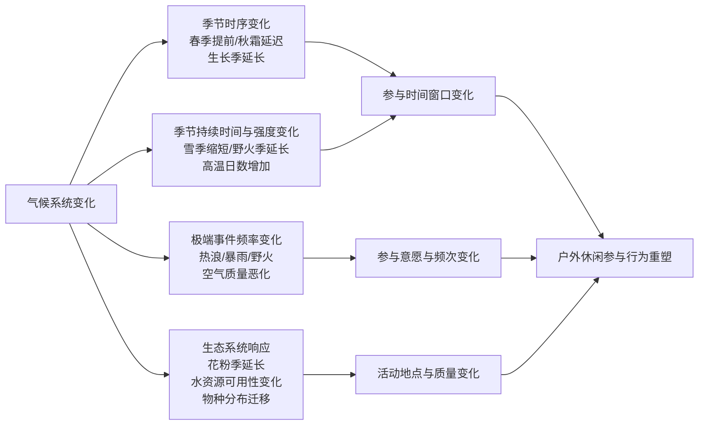

# 天气与气候变化对美国户外休闲活动影响的综合研究报告
# 1 研究背景与分析框架

户外休闲活动是美国民众日常生活与国家文化版图的重要组成部分，也是衡量公共自然资源使用效率、地方经济活力与公众健康水平的关键指标。然而，气候系统的快速演变正在重塑这一领域的基本运行条件：根据欧洲中期天气预报中心（ECMWF）的数据，2024年6月全球平均地表气温达到16.66℃，比2023年同期高出0.14℃，全球气温已连续十三个月打破历史纪录，过去13个月成为有气象观测记录以来最暖的时期[^1]。在如此剧烈的气候背景下，气温、降水、季节节律与极端事件的变化正在通过多重路径作用于户外活动的参与意愿、参与频次和参与方式。本报告即在此背景下，系统梳理天气与气候变化对美国户外休闲活动的影响。本章作为整篇研究的起点，将界定核心概念、明确传导路径、确立分析视角，并就数据来源、研究边界与方法论假设作出系统说明，以确保后续各章在统一的逻辑框架下展开论证。

## 1.1 户外休闲活动的范围界定与分类

本报告所讨论的"户外休闲活动"，是指在自然或半自然环境中进行的、以康乐、健身、观赏或体验为目的的非职业性活动，其范围参照美国国家公园管理局（NPS）、户外产业协会（OIA）以及历次全国户外休闲调查（NRS/NSRE）的口径加以界定。从NPS的官方定位来看，国家公园系统所承载的休闲活动既包括"高肾上腺素的户外活动"，也涵盖"宁静的荒野体验"，并通过这些活动促进参与者在体能、社交、心理与精神层面的综合健康[^2]。在具体活动种类上，NPS明确列举了徒步、攀岩、骑行、游泳、潜水等较高强度项目，以及露营、垂钓、野生动物观察、观星等较为静态的项目，同时还包括对海滨、内陆水体（如Lassen Volcanic National Park的Manzanita Lake）以及山地与文化遗产地的多类型利用[^2]。

从全国性调查的视角来看，户外休闲的统计口径具有较长的历史延续性。自1960年首次全国户外休闲调查（NRS）以来，美国先后于1965、1970、1972、1977、1982/83、1994/95以及2000/01年开展了八轮全国调查，并自2000/01年起由美国林务局（USFS）与美国国家海洋和大气管理局（NOAA）联合主导的"全国休闲与环境调查（NSRE）"将样本规模扩大至约47000人、覆盖年龄为16岁及以上的美国居民[^3]。这些调查的活动清单在不断扩展的同时，亦在概念上保持了"以自然环境为载体的非职业性康乐活动"这一核心定义。**进入21世纪后，OIA及其慈善分支Outdoor Foundation每年发布的《户外参与趋势报告》进一步将户外休闲的统计扩展至6岁及以上人群，并以"过去12个月内至少参与一次"作为参与者的判定标准**[^4]。

综合上述口径，本报告将户外休闲活动按照其对气候要素的敏感性进行如下分类，以便于后续章节展开差异化分析：

| 活动类别 | 典型项目 | 主要气候敏感要素 |
|---------|---------|----------------|
| 高强度陆地活动 | 徒步、攀岩、骑行、跑步 | 气温、空气质量、降水强度 |
| 静态观赏与体验 | 露营、野生动物观察、观星、文化遗产参观 | 温度舒适度、夜空可见性、极端事件 |
| 水域活动 | 海滨休闲、游泳、潜水、垂钓、漂流 | 水温、降水量、水位、风暴频率 |
| 冰雪活动 | 高山滑雪、越野滑雪、雪鞋行走、雪地摩托 | 降雪量、雪季长度、低温日数 |
| 机动化户外 | 房车露营、摩托艇、雪地摩托 | 极端高温、降水中断、燃料可达性 |

该分类并非彼此完全互斥——例如垂钓既属于水域活动又具有静态观赏属性，但其在后续按活动类型分析气候敏感性时具有清晰的对应关系，能够为第6章与第7章的细分讨论提供分类基础。

## 1.2 天气与气候影响户外休闲的核心传导路径

天气与气候虽然在物理过程上同源，但在影响户外休闲的机制上存在显著差异。**天气指短期、瞬时的大气状态波动，主要通过即时的参与决策（是否出行、是否更改地点）影响活动；气候则指长期、趋势性的统计规律，通过改变季节结构、生态条件与基础设施可用性，重塑休闲活动的整体格局**。区分二者对于理解参与行为的短期可逆性与长期不可逆性至关重要。

从美国环境保护署（EPA）2021年发布的《季节性与气候变化》报告来看，气候变化主要通过三个层面影响季节性事件：**时间（季节性事件在一年中发生的时点）、持续时间（事件持续的长度）与变率（季节性事件的强度与频率）**[^5]。具体到与户外休闲直接相关的传导路径，EPA列举了多条因果链条：山地积雪减少与早春融雪、春季解冻提前与秋霜延迟所导致的生长季延长、野火季更长更强、农作物生长季节水资源可用性变化、豚草花粉季延长（尤其是在北部各州），以及野火频率、强度与规模的变化所带来的烟尘暴露[^5]。

这些路径并非孤立作用，而是通过相互交织影响户外休闲的多个环节。可以将其归纳为以下四类核心传导机制：

在第一条路径上，春季解冻提前与秋霜延迟会扩展暖季活动（如徒步、骑行、垂钓、露营）的可行时间窗口，但同时也会压缩冷季活动（如高山滑雪、越野滑雪）的运营期[^5]。在第二条路径上，雪季缩短直接削减冰雪活动的总参与天数，而野火季延长则在西部和山区频繁中断徒步、露营等活动[^5]。在第三条路径上，极端高温与暴雨等事件通过即时不适、安全风险与设施关闭中断参与决策，并可能产生时间替代（推迟活动）或空间替代（前往气候更适宜的目的地）效应。在第四条路径上，花粉季延长会加重过敏性疾病对部分参与者的限制，而水资源可用性的变化会直接影响淡水垂钓、漂流与水库类水上活动的体验质量[^5]。

这些传导路径最终汇聚到三个可观察的行为层面变化：**参与意愿的改变、参与频次与天数的调整、以及活动地点与时间的转移**。后续章节将沿着这一框架，分别就气温（第2章）、降水（第3章）、季节结构与极端事件（第4章）展开深度分析。

## 1.3 分析视角与关键指标体系

为系统衡量天气与气候变化对户外休闲的影响，本报告采用四大相互补充的分析视角，每一视角对应一组具有明确解释力的指标。

**第一是参与率视角**，即在特定时间窗口内参与过某项户外活动的人口比例。OIA与Outdoor Foundation于2024年发布的《户外参与趋势报告》显示，2023年美国户外休闲总参与人数达到创纪录的1.758亿人，较上一年增长4.1%，覆盖6岁及以上美国人口的57.3%[^4]。在性别维度上，女性参与率首次突破50%，从2022年的50%上升至2023年的51.9%；在性少数群体维度上，LGBTQ+群体的成年人户外参与率达到60%，为所有成年人群中最为活跃的群体[^4]。**这些细分参与率为识别气候敏感性的人口学差异提供了基础——不同性别、年龄、性取向与文化背景的群体在面对气候压力时的适应能力与替代选择存在显著差异**。

**第二是参与天数视角**，即活动频次的季节分布与年度总量。该指标比参与率更能反映气候变化的边际影响：一名参与者可能仍保持"参与"状态，但其年度参与天数可能因雪季缩短或高温日数增加而显著下降。NSRE等长期调查通常同时记录参与率和参与天数两类信息，使纵向比较成为可能[^3]。

**第三是地区差异视角**。NPS的休闲资源覆盖东海岸、西海岸、北海岸与得州海岸的海滨，以及内陆山地、湖泊与文化遗产地等多种地貌[^2]，气候变化在不同地理单元上的影响显著异质化。本报告将以东北部、东南部、西南部、山区与沿海五个区域作为主要地理分析单元（详见第5章），并在此基础上识别区域脆弱性与适应空间的差异。

**第四是活动类型差异视角**。不同活动对温度、降水、雪量、水位与空气质量的敏感度存在数量级差异——例如高山滑雪几乎完全依赖于自然或人造降雪，而房车露营则相对独立于降水状况但高度敏感于极端高温。第6章与第7章将通过结构化方式逐一识别七大类活动的气候响应特征。

四类视角及其对应指标可概括如下：

| 分析视角 | 主要衡量指标 | 解释力 |
|---------|------------|-------|
| 参与率 | 6岁及以上参与某项活动的人口比例；性别/族裔/LGBTQ+等细分参与率 | 反映气候变化的人口学差异与社会公平维度 |
| 参与天数 | 年度参与天数；季节分布；高峰季参与频次 | 反映气候变化对参与强度的边际影响 |
| 地区差异 | 各普查区参与率；区域净流入/流出参与者 | 反映气候压力的空间异质性与地理替代效应 |
| 活动类型差异 | 各类活动参与率变化率；活动间替代弹性 | 反映活动的气候敏感度谱系与适应空间 |

## 1.4 研究边界、数据来源与方法论假设

为确保后续章节结论的可比性与边界清晰，本报告对研究的时空范围、数据来源与方法论假设作出如下说明。

**在时空边界上**，本报告聚焦于美国本土的户外休闲活动，时间跨度以可获得的最早一轮全国调查（1960年NRS）至2024年初的最新数据为限。所有"截至当前"的表述均指2024年初这一信息截止点。

**在数据来源上**，本报告综合采用以下七类主要数据源：

| 数据源 | 类型与覆盖 | 主要用途 |
|-------|----------|---------|
| NRS（1960—1982/83） | 8轮全国户外休闲调查，覆盖12岁及以上人群，样本3700—16770人 | 提供长期纵向的参与率与活动结构基线[^3] |
| NSRE（1994/95、2000/01） | 由USFS与NOAA主导，覆盖16岁及以上人群，2000/01年样本约47000人 | 提供较新的全国基线与活动细分数据[^3] |
| OIA/Outdoor Foundation《2024户外参与趋势报告》 | 6岁及以上人群参与率、性别/LGBTQ+细分 | 提供2023年最新参与率数据与人口学细分[^4] |
| EPA《季节性与气候变化》报告（2021） | 季节时序、持续时间、变率三维度的气候变化指标 | 提供季节性变化对生态系统与休闲条件的影响证据[^5] |
| USGCRP与FFCS联邦气候服务框架 | 2023年3月发布的《气候服务联邦框架和行动计划》 | 提供气候服务的整体战略背景与机构间协调机制[^1] |
| NPS活动统计与资源信息 | 国家公园系统的活动种类、地理分布与设施可用性 | 提供休闲活动的实际承载地与活动类型边界[^2] |
| ECMWF全球气温观测 | 月度全球平均地表气温记录 | 提供全球气候背景与温度趋势的宏观参照[^1] |

**在跨数据源整合上**，需要注意三类口径差异：其一，NRS自1960年的12岁及以上、NSRE自1994/95年的16岁及以上、OIA《户外参与趋势报告》自近年的6岁及以上，三套调查的目标人群年龄下限不同，纵向比较时需作适当调整[^3][^4]；其二，调查的时间窗口存在差异，例如部分NRS仅覆盖夏季（1965、1972），而其余调查覆盖全年[^3]，季节性比较时须以全年调查为准；其三，参与活动的具体名录在不同年份有所扩展，新出现的活动（如立式桨板）在历史比较中无法获得连续数据。

**在方法论假设上**，本报告基于以下三项核心假设展开分析：第一，**气候信号可识别假设**——即在足够长的时间序列与足够大的样本规模下，气候变化对户外休闲参与行为的影响可与短期天气波动、经济周期、社会偏好变迁等其他因素相分离；第二，**参与行为的有限因果归因假设**——即参与率与参与天数的变化可在一定程度上归因于气候要素，但需承认其与可支配收入、油价、闲暇时间、新冠疫情等共变因素之间的相互纠缠；第三，**区域代表性假设**——即全国调查的样本能够在区域细分（如东北部、西南部）层面提供具有统计意义的参考，但样本量不足的小区域结论需谨慎引用。

需要坦诚说明的是，本报告所引用的全国性休闲调查最新一轮系统性数据为2000/01年的NSRE[^3]，此后的全国基线主要依赖OIA每年发布的《户外参与趋势报告》[^4]，而后者的完整78页报告仅对OIA成员与Outdoor Foundation合作伙伴开放，公开的"执行摘要"仅披露关键发现的子集[^4]。这一数据可达性限制意味着，本报告在某些细分指标上将不得不依赖执行摘要中公开披露的数据点，并在必要时辅以EPA、USGCRP与NPS的辅助证据。这一局限在后续章节的具体结论中将予以明示，相关不确定性也将在第9章作系统讨论。

在上述框架与边界基础上，下一章将进入气温对户外休闲活动参与度影响的具体机制与临界点分析，作为天气—气候—参与行为这一传导链条的第一个深度切入点。

# 2 气温对户外休闲活动参与度的影响机制与临界点

承接第1章所建立的"天气—气候—参与行为"分析框架，本章聚焦于气温这一核心气候要素，系统分析其对美国户外休闲活动参与度的影响机制与临界规律。气温之所以居于优先分析地位，源于其同时作用于三条传导路径——直接决定参与者的生理舒适度与安全风险阈值、间接通过雪量与融雪节律改变冰雪活动的可行性、并通过水温与生态条件影响水域与垂钓体验。本章将基于北美骑行实证、国际旅游满意度研究等可信证据，刻画气温—参与度关系的非线性形态，识别"过热临界点"在不同活动类别中的差异化表现，并通过暖季与冷季活动的对照分析揭示气温影响的非对称性，最终归纳出活动温度敏感度的连续谱系。

## 2.1 气温—参与度关系的基本形态与理论机制

气温对户外休闲参与决策的作用，并非沿着"温度越高越好"或"温度越低越好"的单调线性方向展开，而是表现为典型的非线性甚至倒U型曲线关系。理解这一基本形态，需要从生理舒适度、安全风险感知、活动愉悦度与日内时间替代四条理论通道入手。

第一条通道是**生理舒适度阈值**。人体在户外活动中的核心体温调节高度依赖于环境温度、湿度与风速的组合：当环境温度过低时，参与者需消耗大量能量维持体温，活动愉悦度急剧下降；当环境温度过高（尤其叠加高湿度）时，散热困难带来的不适感同样会显著抑制参与意愿。第二条通道是**安全风险感知**，包括低温下的失温与冻伤风险、高温下的中暑与脱水风险，以及由极端温度衍生的设施关闭、救援响应延迟等系统性风险。第三条通道是**活动愉悦度的主观评价**，这一通道在以游憩体验为目的的活动中尤为关键，因为参与者对"舒适气候"的预期会直接影响重游意愿与口碑推荐。第四条通道是**日内时间替代**，即在极端温度日参与者并不必然完全放弃活动，而可能将活动时段前移至清晨或推迟至傍晚，从而部分缓解极端温度的抑制效应。

北美骑行研究为上述理论形态提供了大规模实证支撑。Chan与Wichman（2020）基于北美16座城市2700万次自行车出行的微观数据，估计了户外娱乐对每日天气波动的响应弹性。研究的核心发现是**骑行者对低温的厌恶程度显著高于对高温的厌恶程度**，这意味着在当前气候基线下，适度的升温对骑行参与具有净促进作用；同时，研究亦明确指出**极端高温下整体响应的负效应在相当程度上被日内适应所缓解——即参与者主动转向一天中较凉爽的时段进行骑行**[^6]。这一发现至少在两个层面上具有理论意义：其一，验证了气温—参与度关系的倒U型基本形态；其二，揭示了日内时间替代作为"柔性"适应机制的重要性，意味着以日平均温度为单一解释变量的研究可能低估了参与者的真实适应能力。

来自国际旅游研究的证据进一步强化了"过热临界点"存在性的判断。Jarvis对前往澳大利亚大堡礁集水区的游客所做的实证研究发现，**每日最高气温与旅行满意度之间呈现明确的倒U型关系——气温上升起初提升满意度，直至约29°C的转折点，超过此点后继续升温反而降低满意度**[^7]。鉴于该地区当前气温已接近这一转折点，进一步升温将损害区域旅游业；而目前较凉爽的目的地则会因升温接近最佳舒适区而受益，由此形成**全球旅游活动的空间再分配效应**[^7]。这一结论虽然来源于澳大利亚，但其揭示的"倒U型—临界点—空间再分配"机制对美国不同纬度区域的户外休闲分析具有高度可比性。

需要指出的是，倒U型形态的适用边界并非绝对。对于强烈依赖特定气候要素的活动（如高山滑雪依赖低温与降雪），气温—参与度关系可能在"参与"区间内呈现单调上升或单调下降，倒U型仅在更宽的温度区间观察中才会显现。这种活动间的形态差异，构成了下一节讨论临界点异质性的基础。

## 2.2 过热临界点的识别与活动间差异

"是否存在普遍性的过热临界点"是理解气候变暖影响的关键问题。基于现有实证证据，可以得出一个具有较强普适性的初步结论：**对于大多数非雪上户外休闲活动而言，气温—参与度关系确实存在一个临界点，超过该临界点后参与度由促进转为抑制；但该临界点的具体位置在不同活动间存在显著差异**。

从活动类别看，临界温度的位置主要受三个因素影响：参与者的生理负荷强度、环境降温机制的可得性、以及日内时间替代的可行性。

**高强度陆地活动**（徒步、跑步、骑行、攀岩）由于代谢产热较高、参与者在持续运动中需要主动散热，其过热临界点通常较低。Chan与Wichman对北美骑行的研究并未明确给出统一的临界温度数值，但其揭示的"日内向较凉爽时段转移"的适应模式，本身即暗示了在最高温时段参与意愿明显下降[^6]。结合Jarvis研究中以日最高气温29°C为转折点的发现，对于需要长时间持续运动的高强度活动，临界点很可能位于28°C—32°C的区间，超过此区间后即便日内时间替代仍可缓解部分负效应，整体参与度仍呈下降趋势[^7]。

**静态观赏与体验类活动**（自然观光、野生动物观察、文化遗产参观）由于参与者代谢产热较低且可在阴凉处或室内设施中获得阶段性休整，其过热临界点相对较高，往往可上移至32°C以上。但这并不意味着此类活动不受高温抑制——极端高温下游客的停留时长与重游意愿仍会下降，体现为参与"质量"而非"参与与否"的变化。

**水域活动**（游泳、漂流、水上运动）因水体本身提供了直接降温机制，参与者通过浸水即可缓解高温压力，其临界点显著上移；在某些情况下，高温反而成为吸引游客前往水边的促进因素。然而水温本身亦受气温与日照驱动，若水温过高（尤其在浅水湖泊与近岸海域），既损害降温效果，也会影响水生生态与水质，进而形成水域活动自身的次级临界点。

**机动化户外活动**（房车露营、摩托艇等）由于参与者可在带空调的车厢或船舱内调节微环境，临界点显著高于非机动活动；但极端高温对燃料效率、设备性能与户外配套（如露营地的遮荫与用水）的影响仍会形成间接抑制。

围绕"夏季最高温超过特定阈值的天数比例"这一关键宏观指标，可以将上述差异概括为：高强度陆地活动对32°C以上日数的增加最为敏感，水域活动主要对35°C以上极端高温与水温过高的组合敏感，而静态观赏与机动化活动则在较高阈值（35°C及以上）才显示明显的参与抑制。

临界点的"刚性"与"柔性"区分同样重要。**柔性临界点**意味着参与者可通过日内时间替代（清晨/傍晚出行）、空间替代（前往较凉爽地区）或活动替代（转向水域活动）来缓解负效应——北美骑行研究所揭示的日内适应即属此类[^6]。**刚性临界点**则意味着上述适应机制空间有限——例如在湿热地区，即便清晨气温仍高于舒适区间；又如在沿海地区，海平面附近昼夜温差较小。理解这一区分对于评估区域脆弱性至关重要：刚性临界点占主导的地区（如美国东南部与西南部部分内陆区域），其户外休闲参与度对气候变暖的负向响应将更为显著。

## 2.3 暖季活动的气温响应：促进效应与边际递减

对于绝大多数暖季户外休闲活动而言，气温升高的影响并非单向负面，而是呈现出**"冷端促进、热端抑制、边际递减"**的典型规律。在当前美国大部分地区的气候基线下，许多日均气温仍处于参与者最佳舒适区间的"偏冷"一侧，因此适度升温会在"冷端"扩展可参与的时间窗口、提升单日参与意愿，进而推动总体参与天数与福利水平上升。

北美骑行研究为这一促进效应提供了迄今最为精确的福利估算。Chan与Wichman（2020）将其估计的天气—骑行响应弹性与时间使用调查数据、气候情景投影相结合，**测算出气候变化诱发的骑行参与到本世纪中叶将带来每年约8.94亿美元的消费者剩余增长**[^6]。这一估算的关键经济含义在于：在骑行这一具体活动上，**气候变暖在中等时间尺度上的净福利效应为正**，原因在于骑行者对低温的厌恶程度远高于对高温的厌恶程度，加之日内时间替代显著缓解了极端高温的负效应[^6]。

然而，这一正向净福利的得出依赖于若干前提条件，理解这些条件对于将骑行案例推广到其他活动类别至关重要。第一，该估算覆盖的16座北美城市横跨多个气候带，福利的总和掩盖了地区分布的不均衡。第二，该估算所采用的气候情景为本世纪中叶的中等升温路径，若升温幅度更高或时间尺度更长，热端抑制效应可能加速主导。第三，骑行作为相对灵活的城市通勤兼休闲活动，其日内替代空间显著大于需要预订与长途出行的活动（如露营、远程徒步），因此其福利增长可能高于这些刚性更强的活动。

**福利分布的区域不均衡是暖季活动气温响应中最值得关注的特征之一**。从理论上推导，当前年均气温较低的北部凉爽地区（如新英格兰北部、五大湖区、北部平原与太平洋西北部）由于大部分日数位于参与者最佳舒适区间的偏冷一侧，升温将持续扩展其暖季活动窗口；而当前年均气温已接近或超过最佳舒适区间的南部温热地区（如墨西哥湾沿岸、西南部内陆），升温将更早触发热端抑制，可能直接进入净受损状态。这一区域分化的逻辑与Jarvis关于大堡礁的研究一致——当一个地区的当前气温已接近29°C左右的临界点时，进一步升温会减少而非增加旅游满意度[^7]。

边际递减规律还体现在不同温度区间的弹性差异上。在"偏冷"区间，每升高1°C对参与度的促进效应较大；随着温度逐步逼近最佳舒适区间，促进效应的边际值递减；越过临界点后，进一步升温的抑制效应反向放大。这种非线性结构意味着，简单地以年均温变化来评估气候变化对户外休闲的影响会产生严重偏误——真正具有预测力的指标是**温度分布的形状变化**，特别是高温尾部（如32°C、35°C以上日数）的扩展速度。

需要补充的是，暖季活动的气温响应并非孤立运作，而是与降水、空气质量、野火等要素相互交织。例如即便单日气温处于最佳区间，若叠加野火烟尘或雷暴风险，参与意愿仍会大幅下降。这些联合效应将在第3章与第4章中进一步讨论。

## 2.4 冷季活动的气温响应：参与窗口压缩与非对称损失

与暖季活动的"倒U型"响应形成鲜明对照，冷季活动（高山滑雪、越野滑雪、雪鞋行走、雪地摩托）的气温响应在参与可行性区间内呈现**单调负向**特征——气温升高几乎全方位压缩这些活动的参与窗口，且压缩路径具有明显的累积放大效应。

具体而言，气温升高通过三条相互叠加的路径作用于冰雪活动的参与天数：**第一，抑制自然降雪**——当冬季气温升高至接近或越过0°C阈值时，原本应以降雪形式落下的降水会转为降雨，直接削减雪季的初始雪量基础。第二，**加速融雪**——更高的日均气温与更长的暖锋期会使既有积雪更快消融，缩短可滑雪天数并增加雪道维护成本。第三，**缩短低温日数**——人工造雪同样依赖于持续的低温窗口（通常需要湿球温度低于约-2°C才能高效造雪），低温日数减少意味着即便依赖造雪也无法完全弥补自然雪量的损失。这三条路径相互叠加，使冰雪活动的参与天数对气温升高的弹性显著大于其他任何活动类别。

由此引出本节的核心命题：**气温变化对暖季活动与冷季活动的影响存在结构性非对称，二者难以相互抵消**。这一非对称至少体现在三个层面：

第一层面是**适应空间的非对称**。暖季活动在面对热端抑制时具有相对丰富的适应工具——日内时间替代、空间替代、活动替代均可部分缓解负效应[^6]。冷季活动则几乎不具备等价的适应空间：滑雪场无法"向更高纬度迁移"（更高纬度往往缺乏相应的山地地形、基础设施与市场腹地），也无法在低海拔区域寻找替代场地（低海拔意味着更高的基线气温）；向更高海拔的迁移虽然在物理上可行，但受限于山地总面积、土地权属、生态保护与基础设施投资门槛，可承载的活动规模有限。

第二层面是**福利损失的不可替代性**。即便北美骑行研究估算的中世纪每年约8.94亿美元骑行净福利增长属实[^6]，这一增长本质上是骑行活动内部的福利改善，并不能在效用空间内完全替代滑雪、雪地摩托等冷季活动参与者所损失的福利。冷季活动的参与者往往具有较高的项目专属技能与设备投入（雪具、雪地车辆），其活动偏好难以无成本地转向暖季活动；从地方经济角度看，依赖滑雪经济的山地社区也难以将冷季就业岗位与基础设施投资简单"转换"为暖季旅游收益。

第三层面是**临界点逼近的紧迫性**。冷季活动的关键阈值集中在0°C附近——一旦冬季均温越过这一阈值，自然降雪、积雪保持与造雪窗口都将系统性恶化。许多原本处于"边缘可滑雪"状态的低海拔与中纬度滑雪场地，在升温情境下可能在相对短的时间内丧失运营基础。

综上，**气温升高对暖季活动的总体促进与对冷季活动的总体抑制不应被简单相加为"净效应"**；从政策与产业适应的角度看，暖季获益群体与冷季受损群体在地理分布、人口构成与经济结构上的差异决定了二者无法机械相互冲销。这一非对称将是第3章降雪分析、第4章季节结构分析与第5章区域差异分析的反复出现的主题。

## 2.5 活动温度敏感度谱系的归纳

综合本章前四节的分析，可以将主要户外休闲活动按温度敏感度排列为从"强正向响应"到"强负向响应"的连续谱系。这一谱系的构建基于三个维度：**参与率/参与天数相对于气温变化的弹性方向与幅度**、**临界温度在当前气候基线中的相对位置**、以及**日内/季节/空间替代的可用空间**。综合这三个维度，可以得到下表所示的活动温度敏感度评估。

| 活动类别 | 气温升高的方向性影响 | 关键温度阈值（摄氏度） | 替代空间 | 综合温度敏感度 |
|---------|--------------------|---------------------|---------|--------------|
| 一般性自然游览 | 偏正向，至中等升温区间转为微弱抑制 | 约28—32°C出现满意度转折（参照Jarvis大堡礁研究的约29°C转折点）[^7] | 较大（时间/空间替代均可） | 中等正向 |
| 自行车 | 正向为主，"骑行者厌恶低温甚于高温"，日内适应缓解极端高温负效应 | 临界区间约位于28—32°C，超过后参与时段向清晨/傍晚转移[^6] | 大（强日内时间替代）[^6] | 强正向（中世纪每年约8.94亿美元净福利）[^6] |
| 高尔夫 | 偏正向，扩展暖季可打天数；热端有抑制但受球场设施缓解 | 临界点约位于32—35°C区间 | 中等（时段调整、球场遮荫） | 中等正向 |
| 露营 | 冷端促进、热端抑制；房车露营者敏感度低于帐篷露营者 | 帐篷露营临界约30—32°C；房车露营临界约35°C以上 | 中等（房车具空调；帐篷敏感度高） | 中等正向至中性 |
| 钓鱼 | 复杂响应：气温通过水温间接作用，冷水鱼种受损、暖水鱼种受益 | 关键阈值在水温而非气温；不同鱼种差异显著 | 中等（地点与季节替代） | 不确定/中性 |
| 水上活动 | 正向为主，水体降温机制显著上移临界点；但水温过高带来次级抑制 | 气温临界点约35°C以上；水温自身存在次级阈值 | 大（水体本身即降温介质） | 中等正向 |
| 雪上活动（高山/越野滑雪、雪鞋行走、雪地摩托） | **单调负向**：抑制降雪、加速融雪、缩短造雪窗口三路径叠加 | 关键阈值集中于0°C附近（降雪/降雨临界与积雪保持临界） | **小**（无等价空间/活动替代） | **强负向** |

从该谱系可以提炼出若干具有政策与研究意义的核心洞察。

**第一，气温升高对大多数非雪上活动具有总体积极影响**，这是本章实证证据汇总后的首要结论。无论是北美骑行的大样本福利估算[^6]、大堡礁旅游满意度研究所揭示的倒U型形态[^7]，还是对露营、高尔夫、水上活动等其他暖季活动的机制推演，均一致指向"适度升温在冷端扩展参与窗口"的促进效应。

**第二，大部分活动通常存在一个温度阈值，超过该阈值后参与度会下降**——即"过热临界点"具有相当广泛的存在性。该临界点的具体位置因活动类别而异：高强度陆地活动较低（约28—32°C），静态观赏与机动化活动较高（约32—35°C），水域活动因水体降温机制显著上移，但活动间共享倒U型这一基本形态[^7]。这意味着气候变暖的福利评估必须**关注温度分布的尾部变化而非均值变化**——年均温的小幅上升完全可能伴随高温尾部（32°C以上日数）的剧烈扩展，后者才是真正的福利损失驱动因素。

**第三，雪上活动是这一普遍规律的关键例外**——对于依赖积雪的活动，气温升高从冷端到热端皆为负向影响，且几乎不存在等价的替代空间。这一非对称损失意味着暖季获益与冷季受损之间无法机械相加为"净效应"。

**第四，"阈值效应"而非"线性关系"才是理解气候变暖影响的关键**。这一洞察将贯穿后续章节：第3章讨论降水时同样存在阈值（降雪向降雨转换的0°C阈值、强降雨触发活动中断的强度阈值）；第4章讨论季节结构时所关注的雪季终止日、暖季开始日同样是阈值变量；第5章讨论区域差异时，关键问题正是不同区域当前气候基线相对于这些阈值的距离。

第三个维度——替代空间——的引入提供了评估"刚性脆弱性"与"柔性脆弱性"的工具。北美骑行所展示的强日内时间替代构成柔性适应的典型范例[^6]；雪上活动近乎缺失的替代空间则代表刚性脆弱性的极端形态。介于二者之间的露营、钓鱼、水上活动等则呈现中间形态，其适应空间取决于参与者细分（如帐篷露营者 vs 房车露营者）、地理条件（内陆 vs 沿海）与社会经济资源等多重因素，这些差异将在第6章按活动类别、第8章按参与者异质性两个维度作进一步展开。

总体而言，本章所确立的温度敏感度谱系将作为后续章节的核心参照工具：第3章在讨论降水影响时将以本章活动分类为坐标轴；第5章在讨论区域差异时将以本章的临界温度位置为基准；第6章与第7章将基于本章谱系展开活动间的精细对比与结构化汇总。下一章将聚焦于降水（降雨与降雪）这一与气温紧密相关但具有独立作用机制的气候要素，进一步丰富天气—气候—参与行为传导链条的分析。

# 3 降水（降雨与降雪）对户外休闲活动的差异化影响

承接第2章对气温作为核心气候要素的系统分析，本章将分析视角转向另一关键气候变量——降水。与气温的连续性、可比性较强不同，降水对户外休闲的作用具有更显著的"形式分裂"特征：同样是大气中的水分降落，以降雪形式出现时是冰雪活动的赖以为生之物，以降雨形式出现时则可能成为露营、高尔夫等活动的直接抑制因素；同样的年降水总量，若以缓和连续的方式分布，可维持河流流量与植被景观，若以暴雨形式集中爆发，则可能引发山洪、冲毁设施、终止活动。**正是因为降水的影响因形式与活动性质的组合而异，其对户外休闲的作用机制远比气温更为复杂，且呈现明显的"方向分裂"特征——对部分活动是积极因素，对另一部分活动则是消极因素，对再一部分活动则因地点与研究规模而呈现不确定性**。本章将沿此逻辑展开：先建立分析框架，区分降水形式、总量、强度与季节分布四个维度；再分别深入分析降雪减少对冷季活动的多路径抑制、降雨变化对暖季活动的双向影响；最后聚焦极端降水事件与降水季节再分配对活动可达性的系统性风险。

## 3.1 降水影响户外休闲的分析框架：形式、总量、强度与季节分布

降水对户外休闲活动的影响，必须沿四个相互独立又彼此耦合的维度展开理解，才能避免简单地以"年降水量"这类单一指标对参与行为的影响作出误判。这四个维度分别是：**降水形式（雨/雪/雨夹雪）、降水总量、降水强度（含极端事件）、与季节分布节律**。

**第一维度——降水形式**是理解降水影响差异化作用的逻辑起点。降水以何种形式落下，本质上由近地面气温决定：当近地面温度低于0°C阈值时，降水以雪的形式存在；高于此阈值时，则以雨的形式存在；在两者交界区间则可能形成雨夹雪、冻雨等过渡形态。这一物理事实意味着降水分析无法脱离第2章建立的温度框架而独立运作——**0°C临界点正是连接降水分析与温度分析的关键耦合节点**。同样数量的冬季降水，若发生在温度低于0°C的山地高海拔区域，则会形成滑雪、雪地摩托等冷季活动赖以维系的雪盖；若发生在温度高于0°C的中低海拔或边缘纬度区域，则会以雨的形式出现，不仅无法支撑冰雪活动，反而可能加速既有积雪的消融。

**第二维度——降水总量**直接影响水文循环的稳态——河流流量、湖泊水位、地下水补给、植被景观与野生动物分布，均与较长时间尺度上的累积降水量密切相关。对于依赖稳定水文条件的活动（漂流、垂钓、水库类水上活动），降水总量的长期变化构成基础性影响。

**第三维度——降水强度**关注的是降水在单位时间内的集中程度，而非累积总量。这一维度的极端形式即暴雨与强对流事件，它们通过山洪、滑坡、道路冲毁、营地紧急关闭等事件化机制造成活动的瞬时中断。与降水总量影响的"渐进性"不同，降水强度影响具有"事件化"特征——单次极端降水即可在数小时内瓦解某一地区的活动可达性。

**第四维度——季节分布节律**关注降水在年度内的时间分布。冬季降水形式由雪转雨、春季融雪提前、夏季降水模式重组等，构成季节再分配的具体表现形式。这一维度的变化往往不改变年总降水量，但显著改变水资源在不同季节的可用性，并通过这种再分配重塑休闲活动的时间窗口。

四个维度共同构成降水对户外休闲的**"直接抑制—间接促进—长期重塑"三层作用结构**。在直接抑制层面，活动当日的降雨或暴雪可立即压制参与意愿（如露营者面对连续阴雨、高尔夫球手面对雨天）；在间接促进层面，前期降水累积维持的水文与生态条件成为活动得以开展的基础（如河流足够的流量支撑漂流、湖泊水位维持垂钓质量）；在长期重塑层面，降水形式、季节分布与极端事件的趋势性变化则改变活动的整体可行性边界（如雪季缩短、干旱常态化）。

需要特别强调的是，**降水的影响因活动类型而异，这一差异远比气温更为分明**。在后续两节中，我们将沿此原则区分降水对不同活动类别的方向性影响：对雪上活动而言，降雪作为正向必要条件；对露营、高尔夫等户外陆地活动而言，降雨作为典型负向因素；对一般性游览、垂钓等活动而言，降水的影响则因地点、季节与研究尺度而呈现不确定性。理解这一方向分裂的根源——**降水形式（雪/雨）与活动性质（依赖雪/排斥雨/依赖水但排斥过量）的组合共同决定其效果是积极还是消极**——是本章贯穿始终的分析主线。

## 3.2 降雪减少对冷季活动的多路径抑制

冷季活动是降水形式从雪转雨这一气候转变的最直接、最深刻的受损群体。承接第2章已经明确的"雪上活动对气温升高呈单调负向响应"这一结论，本节进一步将分析视角聚焦于降水层面：**降雪减少不仅压缩了冷季活动的物质基础，更通过对自然雪依赖型活动与人工造雪可补偿型活动的差异化作用，重塑了整个冬季休闲产业的脆弱性结构**。

来自美国东北部的实证研究为这一差异化命运提供了系统性证据。一项针对东北部冬季休闲—旅游业气候脆弱性的研究分析了滑雪与雪地摩托两大冬季产业在四种二十一世纪气候变化情景下的脆弱性，得到了几项具有警示意义的核心发现[^8]。**在所有四种情景下，自然雪都成为日益稀缺的资源**，但这一稀缺性对不同活动的传导路径与缓解能力呈现显著分化。

**雪地摩托作为典型的自然雪依赖型活动，受到了最为严峻的冲击**。研究显示，**早在2010—2039年时段，15个雪地摩托研究区中已有4至6个被预测将损失超过一半的现有雪季**；到本世纪末（2070—2099年），在A1Fi高排放情景下，**可靠的雪地摩托雪季（定义为超过50天）在整个区域基本消失**[^8]。这一近乎"行业性消失"的预测结果，根源在于雪地摩托对自然连续雪盖的高度依赖——该活动需要数十至数百英里的连贯雪道，几乎不可能通过造雪进行补偿；既不可能在所有雪道沿线铺设造雪设施，也无法承担如此规模造雪所需的水资源与能源成本。

**与之形成鲜明对比的是高山滑雪产业，其在造雪基础设施支撑下展现出显著更高的韧性**。研究表明，对滑雪行业的大规模造雪投资实质性地降低了其气候脆弱性。在2010—2039年时段，14个滑雪研究区中**仅有4个面临经济风险**——这里"经济风险"被界定为平均滑雪季降至100天以下、或圣诞—新年假期完全开放的概率降至75%以下[^8]。然而，造雪并非永恒的护城河：到2070—2099年时段，**只有4个研究区尚未触及上述经济风险阈值**——也即在A1Fi情景下，绝大多数滑雪研究区都将在本世纪末落入显著经济风险区间[^8]。

更进一步，研究明确指出，为了将雪季损失控制在可接受范围内，**造雪需求预计将大幅上升，由此产生了关于水资源可用性与成本的重要不确定性**[^8]。这一结论揭示了一个关键的二阶问题：造雪作为对气候变化的核心适应工具，本身并非"自由"——其依赖大量水资源与能源投入，而水资源恰恰是另一个受气候变化压力的关键要素，且造雪所需的低温窗口（湿球温度通常需低于约-2°C）本身也在气候变暖下持续收缩。换言之，**造雪适应空间存在内生的天花板，且随升温幅度的扩大而递减**。

为校准上述长期预测在产业现状基线上的相对位置，可参照密歇根州滑雪场协会2021/22赛季的运营数据。该赛季密歇根州滑雪行业的**平均开放天数为93天，单场年均滑雪人次约为9万**[^9]。考虑到100天滑雪季已被界定为经济风险阈值[^8]，密歇根州的当前基线已经处于该阈值附近——这意味着该地区滑雪行业对进一步雪季缩短的边际敏感度极高。同时，该赛季的滑雪相关收入平均增长4%，非滑雪相关收入增长22%，多数滑雪场反映滑雪人次较2020/21赛季下降约7%[^9]——这些经营数据虽然主要反映新冠疫情期间的特殊周期，但也展现了滑雪产业在面对外部冲击时收入结构日益向"非滑雪相关业务"倾斜的适应趋势。

综合上述证据，可以将降雪减少对冷季活动的多路径抑制归纳为下表所示的脆弱性谱系：

| 活动类型 | 雪源依赖结构 | 短期（2010—2039）脆弱性 | 长期（2070—2099）脆弱性 | 适应工具与边界 |
|---------|------------|----------------------|----------------------|-------------|
| 雪地摩托 | 高度依赖自然连续雪盖 | 15个研究区中4—6个损失过半雪季[^8] | A1Fi情景下>50天可靠雪季基本消失[^8] | 几无可行造雪补偿；空间替代受地形限制 |
| 高山滑雪 | 自然雪+人工造雪 | 14个研究区中仅4个面临经济风险[^8] | 仅4个研究区未触发经济风险阈值[^8] | 造雪可缓解但受水资源、能源与低温窗口约束[^8] |
| 越野滑雪/雪鞋行走 | 高度依赖自然雪盖 | 介于雪地摩托与高山滑雪之间 | 长期前景接近雪地摩托 | 造雪空间有限；可部分通过场地集中化适应 |

从这一谱系可提炼出三点核心洞察。**第一，降雪减少对冷季活动的抑制不是均匀的"水位下降"，而是依据活动对自然雪依赖度的不同而形成显著分化的"差异化生死"**——雪地摩托面临行业性消失风险，高山滑雪面临结构性收缩风险，二者的产业转型路径与社区经济影响有本质区别。**第二，造雪作为核心适应工具具有显著但有限的缓解作用**——它能在中等升温情境下大幅降低脆弱性，但在长期高排放情境下其有效性显著下降，且其本身受水资源约束。**第三，行业基线接近临界值的地区（如密歇根州平均季约93天，接近100天的经济风险阈值）边际敏感度最高**——这一观察将在第5章区域差异分析中作进一步展开。

## 3.3 降雨变化对暖季水域与陆地活动的双向影响

与降水对冷季活动近乎单向的负面影响不同，**降雨变化对暖季活动呈现明显的双向（既促进又抑制）效应，且这种双向性在不同活动间的表现形式存在显著差异**。理解这一双向性的关键，在于区分"降水作为水文供给"与"降水作为活动当日干扰"两类截然不同的作用机制。

### 3.3.1 水域活动：流量依赖性与降水短缺的产业级冲击

漂流是降水通过"水文供给"机制深度影响户外休闲的最典型案例。漂流活动几乎完全依赖于河流流量——流量不足时河床裸露、激流消失，漂流体验质量乃至基本可行性均不复存在；流量过大时则带来安全风险与设施关闭。**因此，区域累积降水量与流量管理共同决定了漂流季的可行性**。

西弗吉尼亚州的Gauley河国家休憩区为这一机制提供了极具代表性的案例。Gauley河被广泛认为是美国最佳的漂流河流之一，其25英里河段下降逾668英尺，包含100余处激流，**每年吸引超过6万名漂流爱好者**[^10]。值得关注的是，**Gauley河的漂流季并非由自然降水节律直接决定，而是依赖于美国陆军工程兵团对Summersville Lake水库的人工泄流安排——传统的Gauley漂流季从劳工节后的第一个周末开始，持续六个周末**[^10]。以2025年为例，水库管理方计划在9月5—8日、12—15日、19—22日、26—29日，以及10月3—5日、11—12日、18—19日进行泄流[^10]。

这一案例揭示了降水对水域活动影响的一个**关键中介机制——水库流量管理**。在干旱条件下，水库蓄水量减少会直接影响下游的泄流计划，进而压缩漂流季的实际可行时间。科罗拉多漂流业的干旱经济影响研究即从产业层面量化了这一传导链条——降水短缺通过减少河流流量直接传导至漂流产业的收入与就业损失[^11]。虽然具体数值估计需要进一步深入查阅原始研究，但其揭示的传导逻辑具有普遍意义：**对于以漂流为代表的流量依赖型水域活动，降水的影响并非通过"是否下雨"直接作用，而是通过"累积降水—水库蓄水—流量管理—漂流可行性"这一中介链条产生产业级冲击**。

由此推论，**降水变化对水域活动的总体效应应被归类为"抑制"方向**——尤其是在气候变化背景下，西部地区降水模式的不稳定性增加、干旱频率上升，使得依赖稳定河流流量的漂流、垂钓、水库类水上活动面临系统性的负面前景。这是本章前置部分提出的核心命题之一——**气候变化对依赖稳定降水量的活动（雪上活动、水上活动、垂钓）具有显著负面影响**——的具体落实。

### 3.3.2 垂钓：降水影响的多重耦合与不确定性

垂钓是降水影响呈现出最高复杂度的活动类别之一。**降雨变化对垂钓的影响因地点和研究规模而异，其方向甚至在同一区域不同季节也可能转变**——这是降水对垂钓影响呈现"不确定"特征的根本原因。

具体而言，降雨通过至少四条路径作用于垂钓体验：第一，**水位**——适度降雨维持河流与湖泊水位，过量降雨则导致洪水关闭岸钓地点；第二，**水温**——降雨可在夏季降低过热的水温，恢复冷水鱼种的活跃区域，但极端骤雨也可能造成水温骤变扰动鱼群；第三，**水质**——降雨初期产生的地表径流可携带泥沙与污染物，短期内降低水质与垂钓质量；第四，**鱼类活跃度**——不同鱼种对气压变化、水温变化与浊度变化的响应不同，淡水鱼、咸水鱼、冷水鱼、暖水鱼之间响应方向各异。

这四条路径相互耦合，使垂钓的降水响应难以归纳为单一方向。具体到不同地理单元，影响方向也会发生反转——例如在西部干旱化加剧的区域，降水短缺导致的低流量、高水温对冷水鳟鱼垂钓构成严重抑制；而在东南部高湿地区，降水过多可能带来洪水期的钓点关闭。**也正是因为这种复杂性，垂钓在第7章的关键影响因素总结表中被归类为"降水影响不确定"——这一定性并非出于数据匮乏，而是反映了活动本身对降水响应的内生异质性**。

### 3.3.3 露营与高尔夫：降雨作为典型负向因素

与水域活动对降水的"水文供给"依赖性形成鲜明对照的是露营、高尔夫等暖季陆地活动，**对这些活动而言，降雨主要作为活动当日的直接干扰因素出现，其总体效应为典型的负向**。

对**露营**而言，降雨通过多条路径直接抑制参与：连续阴雨与泥泞使帐篷搭建困难、营地条件恶化、户外活动（炊事、徒步、夜间篝火）质量显著下降；持续强降雨可能直接迫使营地关闭或参与者提前撤离。需要特别区分的是，**帐篷露营者对降雨的敏感度显著高于房车露营者**——后者具有相对密闭的车厢空间作为庇护所，可在降雨期间维持基本生活质量，对降雨的耐受度明显更高。这一参与者细分维度的敏感度差异，与第2章关于温度敏感度的活动谱系类似，体现了"基础设施密度"作为缓解气候敏感性的关键调节变量。

对**高尔夫**而言，降雨直接破坏球场可玩性——湿滑的草坪影响球的滚动、积水使球洞与发球台不可用、雷电风险触发安全停赛。同时，强降雨对球场草坪的长期维护构成挑战。总体而言，**高尔夫属于对降雨呈典型负向响应的活动**。

将这两类活动与水域活动并置，正可以揭示降水方向分裂的根本逻辑：**对于以"户外干燥环境"为前提的活动（露营、高尔夫），降雨直接破坏前提条件；对于以"水体可达性"为前提的活动（漂流、水库水上运动），适度降水通过维持水文条件而构成正向因素，但降水短缺或极端降水则可能造成产业级冲击**。

### 3.3.4 一般性游览与自然观察：因地制宜的影响方向

对于以观光、自然观察为目的的一般性游览活动，降雨的影响呈现出与垂钓类似的"因地点和研究规模而异"的不确定性。在一些情境下，适度降雨维持的植被景观、瀑布水量、野生动物活跃度反而提升了游览体验质量；而在另一些情境下，连续阴雨直接降低出游意愿与户外停留时间。**这一不确定性的根源在于"游览"作为活动的高度异质性——其目的从观光、徒步、摄影到野生动物观察各不相同，对降雨的响应方向因此呈现分散分布**。这一点也将在第7章的总结表中得到体现。

## 3.4 极端降水、季节再分配与活动可达性

在前两节按活动类别展开的差异化分析基础上，本节聚焦降水的两个非平均维度——强度变化（极端降水）与季节分布变化（季节再分配）——对活动可达性的系统性影响。这两个维度的变化往往不直接反映在年降水总量上，但通过事件化的中断效应与水资源在时间上的再分配，可在短期内或中长期内深刻重塑户外休闲的可行边界。

### 3.4.1 极端降水的事件化中断效应

气候变化背景下，全球及美国各区域的极端降水事件频率与强度均呈现上升趋势。对户外休闲而言，极端降水主要通过以下机制产生中断效应：山洪冲毁登山步道与河岸营地、暴雨触发滑坡导致道路与设施长期关闭、河流流量在极短时间内骤变带来漂流安全风险、雷电与强对流活动触发户外活动的紧急疏散。

这些机制在不同地理单元上表现出显著的区域差异化。**在西部山区**，极端降水主要通过山洪与滑坡机制中断徒步与登山活动，并可能在短时间内显著改变河流地貌，间接影响后续季度的漂流可行性；**在东南部沿海**，极端降水常以热带风暴与飓风的形式出现，对海滨休闲、露营地、户外节庆活动构成系统性威胁，并可能造成基础设施数月乃至数年的损毁修复期。这些区域差异将在第5章作进一步展开，本节仅提示其与降水强度变化的紧密关联。

### 3.4.2 降水季节再分配的水文传导

降水季节再分配是气候变化对水文系统的另一种深层重塑。其核心表现包括：冬季降水中以雪形式落下的比例下降、春季融雪开始时间提前、夏季干旱期延长与强度加剧等。对户外休闲而言，这些变化通过水文系统的中介作用产生远比直观感知更为深远的影响。

**山地积雪节律的变化是这一传导链条的关键环节**。美国农业部自然资源保护局自1970年代末以来在SNOTEL站点通过雪枕装置直接观测雪水当量（SWE）的实时日记录，更早的雪线观测则由土壤保持局可追溯至1930年代——其每年仅在2月、3月、4月、5月各取一次测量，且**通常假设4月1日的测量代表年度峰值雪水当量，但研究已表明这一假设可能低估实际峰值高达12%**[^12]。为更准确估计雪线站点的峰值雪水当量，研究人员发展出基于附近SNOTEL站点中位日雪线图的插值方法，针对积累、峰值、消融三阶段使用不同技术调整中位雪线图的形状[^12]。

对Rocky Mountain国家公园等山地区域的长期雪水当量监测研究意义重大——**山地积雪本质上是天然水库，其春季融雪为下游的河流流量、水库蓄水与垂钓、漂流、水库类休闲活动的夏季水资源可用性提供基础**。当气候变化导致冬季降水更多以雨而非雪的形式落下、且既有积雪更早更快消融时，水资源在年度内的分布将发生根本性重组：**春季出现"洪峰前移"，夏季则出现"流量低谷加深"**。前者可能在春季产生短暂的流量高峰，但若其与传统漂流季节错位（如Gauley河的传统漂流季在9—10月）则无法转化为漂流产业的收益；后者则直接削减夏季漂流、垂钓与水库类活动的水资源基础。

这一传导链条的产业含义重大——**对漂流、垂钓、水库类水上活动而言，气候变化的水文影响并非通过年总降水量的变化直接呈现，而是通过季节再分配机制传导至特定季节的可用水量**。即便年总降水量保持稳定，季节再分配本身即足以重塑这些活动的可行性边界。

### 3.4.3 降水变化的"阈值化—事件化—系统化"三层风险结构

综合本章前三节与本节的分析，可以将降水变化对户外休闲的风险结构归纳为相互递进的三个层面：

**第一层是阈值化风险**，集中体现在降水形式由雪向雨的转换（0°C阈值）。该阈值一旦被越过，特定地区的冷季活动可行性即发生质变——这一阈值化风险已在3.2节关于雪地摩托研究区中4—6个在2010—2039年损失过半雪季的预测中得到具体落实[^8]。

**第二层是事件化风险**，体现为极端降水事件对活动的瞬时中断与设施损毁。这一层级的风险具有"高强度—短时间—局地化"特征，其影响在统计平均上可能不显著，但对具体参与者与具体设施可能造成毁灭性冲击。

**第三层是系统化风险**，体现为降水季节再分配通过水文系统对依赖稳定流量与水位的活动产生的长期重塑。该层级风险具有"低强度—长时间—区域化"特征，其影响在短期内可能不显著，但累积效应足以从根本上改变某类活动的可行边界。

这三层风险并非孤立存在，而是相互叠加、相互强化。例如，在西部山区，0°C阈值上移导致雪季缩短（阈值化），与同步上升的极端降水事件（事件化）和夏季流量低谷加深（系统化）相结合，共同对该区域的滑雪、漂流、垂钓等活动构成多维冲击。这一三层风险结构将作为第4章极端事件分析与第5章区域差异分析的核心切入点。

---

综合本章分析，可以得出几项贯穿全报告的核心结论。**第一，降水对户外休闲的影响因活动类型而异——对雪上活动是积极必要因素（降雪形式），对露营、高尔夫等陆地活动是消极干扰因素（降雨形式），对一般性游览和垂钓则因地点和研究规模而呈现不确定性**。**第二，降水形式（雪/雨）与活动性质的组合共同决定其效果是积极还是消极——这是降水影响复杂性远超气温的根本原因**。**第三，气候变化对依赖稳定降水量的活动——包括雪上活动（依赖足量降雪）、水上活动（依赖稳定流量）、垂钓（依赖稳定水文条件）——具有显著的长期负面影响**，无论这一影响是通过降雪减少（如东北部4—6个雪地摩托研究区在2010—2039年损失过半雪季[^8]）、通过流量减少（如科罗拉多漂流业的干旱冲击[^11]），还是通过季节再分配（如Rocky Mountain地区的峰值雪水当量变化[^12]）。**第四，造雪等适应工具能够在中等升温情境下显著缓解部分活动（高山滑雪）的脆弱性，但适应工具本身受水资源约束，且在高排放长期情境下其有效性显著下降**[^8]。

下一章将基于本章对降水水文维度的分析与第2章对气温维度的分析，进一步整合气候变化引发的季节长度变化、极端天气事件与活动转移等综合议题，全面展开气候变化对户外休闲长期趋势的系统分析。

# 4 气候变化的长期趋势：季节延长、极端天气与活动转移

第2章与第3章分别从气温与降水两个核心气候要素入手，刻画了短期天气波动与单维气候变量对户外休闲参与行为的影响机制。然而，气候变化对美国户外休闲的真正深刻影响并非局限于单日温度或单场降水的波动，而在于其**长期趋势性变化对季节结构、极端事件分布与参与者行为的系统性重塑**。本章将分析视角从单一要素的短期作用提升至长期趋势层面，沿三条主线展开：第一，气候变化通过春季提前、秋霜延迟、雪季缩短等机制改变户外休闲的可行时间窗口；第二，极端天气事件（热浪、干旱、野火、风暴）的频率与强度上升通过中断效应、替代效应与累积效应作用于参与行为；第三，参与者在长期气候压力下沿空间、时间与活动类型三个维度发生的替代现象。本章作为天气—气候—参与行为传导链条的综合性归纳，将为第5章区域差异分析与第6—7章活动类型对比分析奠定长期趋势基线。

## 4.1 季节长度变化对户外休闲时间窗口的重塑

第1章已经基于EPA《季节性与气候变化》报告引入了气候变化作用于季节性事件的三维框架——**时间（季节性事件在一年中发生的时点）、持续时间（事件持续的长度）与变率（季节性事件的强度与频率）**。本节将沿此框架进一步深化分析，揭示季节长度变化如何系统性地重塑户外休闲的可行时间窗口。

从机制层面看，气候变化对季节结构的重塑表现为一组相互关联的趋势：山地积雪减少与早春融雪提前、春季解冻日提前与秋霜出现日延迟从而带来生长季的整体延长、野火季持续时间与强度的同步上升、农作物生长季节水资源可用性的重组，以及豚草等致敏植物花粉季的延长（这一现象在北部各州尤为显著）。这些趋势并非孤立运作，而是通过相互交织的方式作用于户外休闲的可行时间窗口。

可以将季节再分配对户外休闲的影响归纳为三个相互独立又相互嵌套的层级。**第一层是"窗口扩张"层级**——春季解冻提前与秋霜延迟扩展了暖季活动的可行时段。在此层级上，徒步、骑行、露营、高尔夫、水域活动等暖季活动获得了更长的年度参与窗口，参与者可以在更早的春季月份与更晚的秋季月份进入户外。**第二层是"窗口压缩"层级**——同样的升温过程压缩了冷季活动的运营期。在此层级上，高山滑雪、越野滑雪、雪鞋行走、雪地摩托等冷季活动面临雪季初始日推迟、终止日提前、可滑雪天数缩减的多重压力，这一压缩效应已在第3章关于东北部冬季旅游业脆弱性研究中得到具体落实——15个雪地摩托研究区中4至6个在2010—2039年时段将损失超过一半现有雪季。**第三层是"窗口质量退化"层级**——即使在名义上的可行时间窗口内部，季节性的生态—气候耦合现象也可能使活动体验质量下降。北部各州豚草花粉季的延长就是这一层级的典型表现——它意味着对约2000万有过敏症的美国人而言，暖季"延长"的时段中有相当一部分实际上转化为过敏症加重期，户外参与的边际成本随之上升。野火季的延长则进一步在西部山区与西南部使一部分名义上的暖季时段被高浓度PM2.5与森林封山所占据，构成"暖季虚假扩张"现象。

季节再分配还通过水文系统对依赖稳定流量的活动产生中介性影响。第3章已经讨论过山地积雪节律变化的传导链条——冬季降水以雨而非雪的形式落下、既有积雪更早更快消融，会使春季出现"洪峰前移"，夏季则出现"流量低谷加深"。从季节结构视角看，这一现象的实质是水资源在年度内的分布发生根本性重组：传统的夏季漂流季可能因低流量而缩短，而春季的短暂高流量却可能因水温过低、激流过强而难以转化为商业漂流可行期。**季节再分配带来的并非简单的"水量平移"，而是水资源在时间与活动类型上的错配**。

综合这三个层级，可以得出一个有别于直观感知的核心判断：**气候变化对户外休闲时间窗口的影响不是均匀地"暖季扩张、冷季压缩"，而是同时存在窗口扩张、窗口压缩与窗口质量退化三种效应的复杂叠加**。这一判断为后续节次关于"非对称结构"与"虚假替代"的讨论奠定了概念基础。

## 4.2 暖季延长与冷季压缩的非对称结构

承接第2章关于暖季活动与冷季活动温度响应非对称性的分析，本节将分析视角从温度敏感度转向季节长度本身，进一步量化这一非对称在多个维度上的具体表现，并论证其"不可冲销"的本质。

**第一，参与天数维度的非对称量级**。从机制上看，暖季活动窗口的扩张呈现"两端各延展数周"的边际增长特征——春季可参与时段提前2—3周、秋季可参与时段延迟2—3周，对应着年度参与天数的中等比例增长。而冷季活动窗口的压缩则呈现"双端同时收缩，且压缩具有阈值化跃迁"的特征。雪季的初始日依赖于足量降雪与持续低温的同时满足，终止日依赖于积雪保持与造雪窗口的延续——任一条件不满足，雪季即"开始得更晚、结束得更早"。第3章引用的东北部研究已经显示，在A1Fi高排放情景下，**到本世纪末可靠的雪地摩托雪季（>50天）将在整个区域基本消失**，14个滑雪研究区中**仅有4个未触发"经济风险"阈值**。这一近乎"行业性消失"或"结构性收缩"的预测意味着，**冷季压缩在量级上具有比暖季扩张更强的非线性特征——一旦阈值越过，损失不是线性的天数减少，而是季节本身的存续问题**。

**第二，福利不可替代性维度的非对称**。第2章已基于Chan与Wichman对北美骑行的研究指出，气候变化诱发的骑行参与到本世纪中叶将带来每年约8.94亿美元的消费者剩余增长。然而这一暖季福利增长并不能在效用空间内替代冷季活动参与者所损失的福利——冷季活动参与者通常具有较高的项目专属技能与设备投入（雪具、雪地摩托车辆），其活动偏好难以无成本转向暖季活动；地方依赖滑雪经济的山地社区也难以将冷季就业与基础设施投资简单"转换"为暖季旅游收益。

**第三，人口学与社会经济维度的非对称**。暖季活动的扩张通常对参与人口结构相对广泛的活动（徒步、骑行、露营）有利，受益群体在人口学上具有较高的代表性。冷季活动则相对集中于特定的人口与社会经济群体——滑雪、雪地摩托等活动的参与者在收入、地理分布与文化背景上具有较高的同质性。这意味着**冷季压缩所导致的福利损失虽在总人口中占比不大，却高度集中于特定群体，并伴随依赖冷季旅游的山地社区经济结构的深度震荡**。

**第四，地理空间维度的非对称**。暖季扩张的受益区域分布广泛——从新英格兰到太平洋西北部、从五大湖区到中西部，几乎所有当前年均气温处于参与者最佳舒适区间"偏冷"一侧的地区都将受益。冷季压缩的受损区域则集中于一条相对狭窄的"雪带"——主要包括东北部高海拔与北部新英格兰、五大湖区、落基山脉与内华达山脉。**受益区域的广域分布与受损区域的窄带集中，意味着受损社区在政治表达与适应资源上面临结构性劣势**。

可以将上述四个维度的非对称归纳如下：

| 非对称维度 | 暖季活动（扩张端） | 冷季活动（压缩端） |
|----------|------------------|------------------|
| 参与天数变化形态 | 两端各延展数周，边际线性增长 | 双端收缩，存在阈值跃迁与季节存续风险 |
| 福利可替代性 | 内部福利可在不同暖季活动间替代 | 项目专属技能与设备投入难以转向暖季 |
| 受影响人口范围 | 广覆盖，普惠性较高 | 集中于特定人口群体与山地社区 |
| 地理分布 | 全国大范围受益（北部、西北部尤甚） | 集中于狭窄的"雪带" |
| 适应空间 | 较丰富（时间/空间/活动多路径替代） | 高度受限（造雪受水资源约束、空间替代受地形限制） |

由此可以提炼出本节的核心判断：**气候变化对暖季的扩张与对冷季的压缩在量级、福利、人口与地理四个维度上均无法机械相互冲销**。任何将二者简单相加为"净效应"的分析都将系统性低估冷季受损群体的福利损失与社区经济震荡，并掩盖气候变化在户外休闲领域所造成的实际分配后果。这一非对称结构是后续第5章区域差异分析与第8章人口学异质性分析的重要前置判断。

## 4.3 极端高温与热浪的中断效应

极端高温与热浪是气候变化背景下与户外休闲活动关系最直接的极端事件类型。**气候变化驱动的更频繁的热浪、野火、洪水及其他极端事件正在制造新的或加重既有的健康问题甚至导致死亡**[^13]。这一健康影响维度的引入，将极端高温对户外休闲的分析从"参与意愿下降"提升至"参与安全门槛被动改变"的层级。

从机制层面看，极端高温与热浪通过三条相互叠加的路径中断户外休闲活动。

**第一条路径是直接的生理风险触发**。当日最高温越过中暑、脱水的安全阈值时，户外活动从"舒适度下降"问题升级为"健康安全"问题。第2章已经基于Jarvis对大堡礁的研究指出，日最高气温约29°C构成旅游满意度的转折点；NWS坦帕湾的热指数三级阈值（Heat Advisory 108°F约42.2°C、Extreme Heat Warning 113°F约45°C、危险阈值103°F约39.4°C）则进一步将这一转折点延伸至明确的官方安全警戒区间。需要补充的是，坦帕湾NWS的资料显示**阳光直射可使体感温度在已有热指数基础上再升高约15°F（约8°C）**——这意味着即便环境气温尚未达到极端警戒阈值，直接暴露在户外日光下的徒步、高尔夫、骑行等活动参与者实际承受的热应力可能已经越过健康风险门槛。

**第二条路径是脆弱人群的差异化暴露**。EPA明确指出，**生活在气候多变地区的人群，以及因年龄、健康或社会经济地位而更为脆弱的人群，可能面临更高的健康风险**[^13]。EPA《2024—2027年气候适应计划》进一步强调，**气候变化的破坏性影响正不成比例地影响低收入社区和有色人种社区、儿童、老人、部落和原住民群体**[^13]。在户外休闲的语境下，这一差异化暴露具有双重含义：一方面，老年人、儿童与慢性病患者在相同环境温度下面临更高的中暑与脱水风险，其户外活动的"安全可行温度区间"显著窄于普通人群；另一方面，低收入社区与有色人种社区往往缺乏空调设施、私人交通工具与可达的远程凉爽目的地，因此在热浪期间更难以通过"前往气候更适宜地区"的空间替代来缓解高温压力。

**第三条路径是系统性渠道的间接抑制**。极端高温通过设施关闭、救援响应延迟与基础设施性能退化等系统性渠道，间接抑制活动可达性。国家公园在极端高温警告期间可能关闭部分步道或营地、调整游客接待时段；户外救援队伍在高温下的响应速度与持续作业能力受限，对偏远地区登山与水域活动的安全保障构成挑战；铺装路面在极端高温下的退化也会影响骑行与跑步活动的舒适度与安全性。

从行为响应层面看，参与者面对极端高温的中断效应通常表现出三类反应：**完全退出**（取消当日活动）、**日内时间替代**（将活动转移至清晨或傍晚的较凉爽时段）与**空间替代**（前往海拔较高、纬度较高或邻近水体的较凉爽目的地）。第2章已基于Chan与Wichman的研究指出，北美骑行者在极端高温日明显呈现日内时间替代的适应模式，这一柔性适应显著缓解了热端的整体负效应。然而这种适应能力具有显著的活动间与人口间异质性——预约制远程旅行（如国家公园露营、商业漂流）难以进行日内时间替代，弱势人口在跨区域空间替代上也面临成本与可达性约束。

需要进一步指出的是，极端高温的影响并非线性扩张，而是呈现**"阈值化跃迁"特征**——当高温日数在年度内的占比越过某一临界点后，户外休闲产业的整体运营模式可能发生结构性调整（如夏季活动期被迫向春秋季前移、夜间活动成为新常态）。这一阈值化特征将在第5章区域差异分析中进一步落实——东南部与西南部内陆地区由于当前气候基线已经接近高温警戒阈值，对进一步升温的边际敏感度显著高于其他地区。

## 4.4 干旱与野火对户外活动的复合冲击

干旱与野火是气候变化背景下作用于户外休闲的两种紧密耦合的极端事件——干旱通过减少土壤水分与植被湿度为野火提供燃料条件，而野火又通过烧毁林冠与土壤生物层加剧后续干旱的水文影响。**这一耦合关系使二者构成对西部山区与西南部户外休闲的复合冲击，其影响远超单一极端事件的简单叠加**。

### 4.4.1 干旱对水文依赖型活动的产业级冲击

第3章已经从降水短缺的角度分析了干旱对漂流、垂钓、水库类水上活动的水文传导机制。从长期气候趋势看，干旱的常态化进一步将这一传导从"周期性事件"转化为"基线状态"。可以以NOAA 2021春季水文报告所载的西南部数据为参照——上科罗拉多盆地积雪仅为常年值的75—85%，Lake Powell入流量仅为50%。这一单年数据虽然不能独立支撑长期趋势判断，但其揭示的传导链条具有典型意义：山地积雪不足→水库蓄水不足→泄流计划压缩→漂流季可行时段减少→产业收入与就业损失。

干旱对垂钓的影响则进一步呈现复合特征：低流量导致冷水鳟鱼栖息地萎缩、夏季水温过高使冷水鱼活跃区间收窄，加之水库水位下降影响码头与岸钓设施的可用性。这种多路径耦合使垂钓活动在干旱期间面临的不只是"水量减少"，更是"栖息地与设施的双重退化"。

需要坦诚说明的是，**关于干旱对漂流、垂钓等水文依赖型活动的产业级经济损失估算，本报告所引用的Shrestha与Schoengold等具体研究文献未能直接获取**，因此本节对干旱产业冲击的分析以机制推演为主，定量数据的不足将在第9章不确定性讨论中进一步明示。

### 4.4.2 野火季延长的多路径中断与替代

野火季延长是气候变化在西部地区表现最为显著的趋势之一。从机制层面看，野火对户外休闲的影响沿四条相互独立的路径展开。

**第一条是直接的烟尘暴露与空气质量恶化**。野火释放的PM2.5颗粒物可在数百乃至数千公里范围内传播，造成大范围的空气质量警告。在烟尘期间，徒步、骑行、跑步等高代谢户外活动的健康风险显著上升，参与者的实际可参与天数明显减少。

**第二条是国家公园与森林区域的临时关闭**。当野火直接威胁国家公园或国家森林时，相关管理机构会发布封山令、关闭营地、暂停游客接待。这一封闭可能持续数周乃至整个夏季旅游旺季，对依赖夏季旅游收入的地方经济构成直接冲击。

**第三条是生态景观的长期损毁**。野火烧毁的森林、烧焦的山脊、消失的野生动物栖息地，使受灾区域的游憩价值在数年乃至数十年内大幅下降。即便道路与营地在火灾后修复重开，受灾区域的徒步、自然观察、摄影等以景观为核心的活动价值仍长期受损。

**第四条是基础设施的事件化损毁**。野火可烧毁登山步道沿线的桥梁、解说设施、避难所、瞭望台等基础设施，其重建周期长、成本高，对国家公园系统的可达性构成长期挑战。

野火季延长与极端高温、干旱在西部山区与西南部呈现出明显的时空叠加——夏末秋初的极端高温推升植被干燥度，干旱年份则进一步压低土壤水分，二者共同推高野火爆发概率与火势规模。这一**"高温—干旱—野火"复合冲击模式**使西部山区与西南部成为气候变化背景下户外休闲脆弱性最高的区域类型，其细节将在第5章作进一步展开。

### 4.4.3 复合冲击的累积效应与"暖季虚假扩张"

将干旱与野火的影响综合起来看，可以提炼出本节最为关键的判断：**虽然4.1节指出气候变化在名义上扩张了暖季活动窗口，但在西部山区与西南部，扩张的暖季时段中有相当一部分实际上被野火封山、烟尘期与极端高温警告所占据，构成"暖季虚假扩张"现象**。换言之，对于这些区域而言，气候变化所带来的"更长暖季"在实际可参与天数上可能远低于名义增长——这一现象使第4.2节关于"暖季扩张与冷季压缩不可冲销"的判断在区域层面进一步加强：在西部山区与西南部，**暖季扩张的名义收益可能被野火与高温的实际损失大幅抵消甚至反转**。

## 4.5 风暴与洪水等极端事件的设施性损毁

与极端高温、干旱、野火主要作用于"环境条件与活动可达性"不同，**风暴与洪水类极端事件的核心影响在于对户外休闲基础设施的事件化损毁，并通过基础设施修复周期产生"长尾"中断效应**。这一影响机制与前述三类极端事件存在质的差异，需要单独分析。

从地理分布看，风暴与洪水类极端事件对户外休闲的影响呈现明显的区域分化。**东南部沿海与墨西哥湾沿岸**主要面临热带风暴与飓风的威胁——海滨度假地、海岸国家公园、海岸露营地、码头与游艇设施在飓风过境期间可能遭受系统性损毁；**内陆山区**主要面临强对流风暴与山洪威胁——河岸营地、登山步道、桥梁与解说设施可能在山洪中被冲毁；**全国范围内的湖泊与水库**则面临暴雨与洪水带来的水位骤升、码头淹没、岸钓地点封闭等中短期可达性损失。

从时间维度看，风暴与洪水类极端事件的中断效应具有显著的"长尾"特征。与热浪结束后参与可在数日内恢复不同，**飓风对沿海海滨设施的损毁可能造成数月乃至数年的修复期**，期间相关海滨休闲活动的参与基本中断；山洪对登山步道的冲毁也可能使热门徒步路线在数年内不可通行。这种长尾中断意味着风暴与洪水类事件对户外休闲的累积影响在统计上可能远大于单次事件的瞬时冲击。

需要坦诚说明的是，**本报告关于沿海地区海平面上升与飓风对海滨游憩具体影响的可量化数据较为有限**——已检索资料未提供海平面上升对海滨可达天数的具体估算、飓风频率上升对沿海休闲产业的产业级损失估算等关键定量信息。这一证据空白将在第9章不确定性讨论中作为A级不确定性予以明示。本节在此仅基于机制推演给出方向性判断：**气候变化驱动的飓风强度上升与海平面上升的叠加将系统性削弱东南部与墨西哥湾沿岸海滨休闲设施的长期可达性**，但对其量级的定量估算需要后续研究进一步充实。

EPA《2024—2027年气候适应计划》明确指出，气候变化的破坏性影响正在**造成生命损失、扰乱生计并在全国造成数十亿美元的损失**，而气候变化也加剧了既有的污染问题与环境压力，对EPA"保护人类健康与环境"的使命构成挑战[^13]。在户外休闲的语境下，"数十亿美元损失"中相当一部分由风暴与洪水类极端事件对休闲基础设施的损毁所贡献——这一基础设施维度的影响构成第5章区域差异分析中沿海地区脆弱性评估的关键基础。

## 4.6 长期气候压力下的活动替代现象

面对季节再分配、极端事件频发与基础设施损毁的多重压力，参与者并非被动接受参与天数的下降，而是通过沿空间、时间与活动类型三个维度展开适应性替代行为。本节将系统刻画这三类替代路径，并讨论其可行性边界与人口学差异。

### 4.6.1 空间替代：地理转移的可行性与边界

空间替代是参与者面对气候压力最为直观的适应路径——向较凉爽纬度、较高海拔或气候更适宜的目的地的地理转移。第2章已基于Jarvis对大堡礁的研究指出，**气候变暖将形成全球旅游活动的空间再分配效应**——当一个地区当前气温已接近临界点时，进一步升温将驱动游客转向相对凉爽的目的地。

在美国国内，这一空间替代效应可表现为：暖季活动参与者从已接近热端临界点的南部温热地区（墨西哥湾沿岸、西南部内陆）向当前气候基线偏冷的北部地区（新英格兰、五大湖区、太平洋西北部）转移；冷季活动参与者从低海拔、低纬度滑雪场向高海拔、高纬度滑雪场转移。

然而空间替代的可行性存在显著边界。**对暖季活动而言**，空间替代的边界主要体现在出行成本、目的地容量与参与者的可支配资源——长途跨区旅行涉及交通、住宿与时间成本，并非所有参与者都能承担；目标受益区域（如北部凉爽地区）的接待容量也存在天花板，过度涌入可能导致拥挤、价格上涨与体验质量下降。**对冷季活动而言**，空间替代的边界更为刚性——第2章与第3章已经反复强调，滑雪场无法"向更高纬度迁移"，因为更高纬度往往缺乏相应的山地地形与基础设施；向更高海拔迁移虽然在物理上可行，但受限于山地总面积、土地权属、生态保护与基础设施投资门槛。第3章引用的东北部研究所揭示的雪地摩托研究区雪季基本消失，本质上就是空间替代受地形限制而无法实现的典型案例。

### 4.6.2 时间替代：日内与季节内的时间转移

时间替代是参与者在不改变活动地点的前提下通过调整参与时段缓解气候压力的适应路径。其可进一步细分为日内时间替代与季节内时间替代两类。

**日内时间替代**指参与者在极端高温日将活动时段前移至清晨或推迟至傍晚的较凉爽时段。第2章已经基于Chan与Wichman对北美骑行的研究指出，**极端高温下整体响应的负效应在相当程度上被日内适应所缓解——即参与者主动转向一天中较凉爽的时段进行骑行**。这一柔性适应在骑行、跑步、晨练等日常性户外活动上具有显著的缓解效应。然而日内时间替代的可行性受活动性质的明显约束——预约制远程旅行、商业漂流、滑雪缆车运营时段等具有固定时间结构的活动，难以通过日内时间替代缓解极端温度的影响。

**季节内时间替代**指参与者将传统在盛夏进行的活动转移至春秋肩部月份。气候变化驱动下暖季扩张为这一替代提供了客观基础——春秋肩部月份的温度条件越来越接近传统盛夏的最佳舒适区间，使其成为越来越合适的活动窗口。这一替代趋势在国家公园游客数据上已经显现端倪——部分热门公园的访问量峰值正从7—8月向5—6月与9—10月扩展。然而季节内时间替代受暑期假期制度、学校放假节律、季节性工作安排等社会制度约束——尤其是有学龄儿童家庭的暖季活动安排仍集中于7—8月，难以充分利用扩张的春秋肩部窗口。

### 4.6.3 活动替代：从受抑活动转向受益活动

活动替代是最为深层的适应路径——参与者从受气候压力抑制的活动转向受气候压力相对较弱或受益的活动。在长期气候压力下，这一替代可能沿多条方向展开：从滑雪转向徒步与骑行（冷季向暖季的活动转移）、从夏季陆地活动转向水域活动（在水体降温机制支撑下缓解高温压力）、从依赖自然雪的雪地摩托转向依赖造雪的高山滑雪（在冷季活动内部从高脆弱性活动转向相对低脆弱性活动）。

活动替代的可行性同样存在显著的人口学差异。**对人口学上具有较高活动多样性偏好的参与者**——如中青年、收入较高、户外参与年限较长的参与者——活动替代的成本较低，他们往往同时具备多种活动的技能与设备，可以在不同活动间灵活转换。**对项目专属性较高的参与者**——如终身专注于雪地摩托、商业漂流向导、依赖特定冷季活动的山地社区居民——活动替代意味着技能重塑、设备投入贬值与身份认同重构，转换成本极高。

将上述三类替代路径综合起来看，可以归纳出一个具有重要政策意义的判断：**替代路径的可行性沿"日内时间替代—季节内时间替代—空间替代—活动替代"逐级上升的方向呈现可行性递减、成本递增的趋势**。日内时间替代的成本最低、灵活性最高，是面对短期极端事件最直接的适应工具；活动替代的成本最高、转换最为深刻，往往是参与者在长期气候压力累积到难以承受时的最终适应选择。这一可行性—成本谱系在不同人口群体上的分布并不均匀——具有更高经济资源、更广泛活动技能、更灵活时间安排的群体可以沿替代路径谱系的低成本端展开适应，而经济资源有限、技能单一、时间安排刚性的群体则更早被迫进入高成本的替代选择，甚至被迫退出参与。

可以将三类替代路径的特征归纳如下：

| 替代类型 | 适应成本 | 可行性边界 | 典型案例与证据 | 受益群体特征 |
|---------|---------|----------|--------------|------------|
| 日内时间替代 | 最低 | 受活动性质约束（预约制活动难替代） | 北美骑行在极端高温日的清晨/傍晚转移 | 日常性、灵活性活动参与者 |
| 季节内时间替代 | 较低 | 受暑期/学校假期等社会制度约束 | 国家公园访问峰值向春秋肩部月份扩展 | 时间安排灵活的参与者 |
| 空间替代 | 中等至高 | 受出行成本、目的地容量、地形条件约束 | 暖季向北部凉爽地区转移；冷季向高海拔转移受地形限制 | 经济资源较高、出行灵活的参与者 |
| 活动替代 | 最高 | 受项目专属技能、设备投入、身份认同约束 | 雪地摩托参与者向高山滑雪转移；冷季向暖季活动转换 | 活动技能多样化的参与者 |

---

综合本章四个方向的分析，可以提炼出三项贯穿全报告的核心判断。**第一，气候变化对户外休闲的长期影响并非"暖季扩张与冷季压缩"的简单对冲，而是窗口扩张、窗口压缩与窗口质量退化三种效应的复杂叠加**——其中"窗口质量退化"在西部山区与西南部因野火季延长与极端高温叠加而表现得尤为突出，构成"暖季虚假扩张"现象。**第二，极端事件对户外休闲的影响沿"高温—干旱—野火—风暴洪水"四类形成差异化的中断机制**——高温通过健康风险与日内行为调整作用、干旱通过水文系统对水域活动作用、野火通过空气质量与基础设施长期损毁作用、风暴洪水通过基础设施事件化损毁与长尾修复期作用，**且四类极端事件在西部与沿海地区存在明显的时空叠加**[^13]。**第三，参与者的适应性替代行为沿"日内时间替代—季节内时间替代—空间替代—活动替代"形成可行性递减、成本递增的谱系**，谱系上的位置高度依赖人口学与社会经济特征，使气候变化的适应负担在不同人群间呈现显著差异化分布。

这三项判断为后续章节的展开提供了重要桥接：第5章将沿区域差异维度具体落实"暖季扩张与冷季压缩"在五大区域上的差异化表现，并刻画西部山区的"高温—干旱—野火"复合脆弱性、沿海地区的风暴—海平面上升脆弱性、东北部的雪季缩短脆弱性等区域特征；第6—7章将沿活动类别维度系统对比七大类活动在温度、降水与季节结构变化下的响应特征，最终在第7章形成结构化的关键影响因素总结表；第8章则将沿参与者异质性维度进一步分析替代路径可行性在不同人口群体上的差异化分布。

# 5 区域差异分析：东北部、东南部、西南部、山区与沿海

前四章已沿要素与趋势的维度系统刻画了气候变化对美国户外休闲活动的传导机制——第2章建立了气温敏感度谱系，第3章揭示了降水形式与活动性质组合所决定的方向分裂，第4章则将分析提升至季节再分配、极端事件与适应替代的长期趋势层面。然而这些机制并不在均质的地理空间中均匀展开，而是因区域气候基线、活动结构与基础设施依赖度的差异而呈现出**显著的空间分化**。本章将前述传导框架在空间维度上具体落实，系统比较气候变化对美国五大区域（东北部、东南部、西南部、山区与沿海）户外休闲活动的差异化影响，并归纳区域脆弱性谱系与适应空间。本章在整体报告中承担承上启下职能——既将第2—4章的要素—趋势分析整合为区域综合判断，又为第6—7章的活动类型对比与第8章的人口学异质性分析提供空间坐标。

## 5.1 区域分析框架与脆弱性评估维度

**为何区域差异是理解气候变化对户外休闲影响的关键维度？** 这一问题的根本答案在于：户外休闲活动的可行性取决于"当前气候基线与活动临界点之间的距离"，而该距离在不同区域差异巨大。同样的"全国平均气温上升2°C"，对当前年均气温处于参与者最佳舒适区间偏冷一侧的北部地区而言，意味着暖季活动窗口的实质性扩张；对当前已逼近Jarvis研究所揭示的约29°C转折点的南部地区而言，则意味着进一步落入热端抑制区间。换言之，**气候变化对户外休闲的影响并非"全国一盘棋"，而是"基线决定方向"——同一变化幅度在不同基线下产生方向相反的福利效应**。

这一基线决定方向的逻辑直接催生了气候变化对户外旅游业的**区域再分配格局**：气候变化导致的冬季升温在北方和东北部地区尤为明显；已经较温暖的地区（如美国南部）夏季游客数量可能下降，而较凉爽的地区（如美国东北部）游客数量可能增加。这一空间再分配机制是理解本章五大区域分化的核心起点——它意味着气候变化对美国户外休闲版图的重塑不是均匀的水位变化，而是**南部受损、北部受益、山地与沿海面临结构性挑战**的方向性重新分布。

在此基本逻辑基础上，本章构建一个四维度的区域脆弱性评估框架：**第一维度——气候压力强度**，衡量该区域所面临的气候变化信号的绝对量级，包括升温幅度、极端事件频率与强度、降水模式变化等；**第二维度——活动结构暴露度**，衡量该区域户外休闲活动结构对气候敏感要素的依赖程度，例如以冰雪活动为主的山地社区暴露度高，以多元化暖季活动为主的中纬度地区暴露度则相对较低；**第三维度——基础设施依赖度**，衡量活动可达性对脆弱基础设施的依赖程度，沿海地区的海滨设施、山地地区的滑雪缆车与造雪系统、西南部的水库与河流通航条件均属于高依赖度类型；**第四维度——适应空间**，衡量该区域参与者与产业可调动的适应工具的丰富程度，包括日内时间替代的可行性、空间替代的可达目的地、活动替代的多样性以及基础设施投资的承载能力。

这四个维度共同决定了一个区域在气候变化下的综合脆弱性——气候压力强度大、活动结构暴露度高、基础设施依赖度高、适应空间小的区域构成"刚性脆弱"区域；反之则构成"柔性脆弱"区域。下文五个分节将沿此框架依次展开五大区域的具体分析，5.7节再作横向综合比较。

## 5.2 东北部：冷季活动衰退与暖季有限受益

东北部地区（包括新英格兰各州、纽约、宾夕法尼亚等）是美国传统的冬季旅游核心地带之一，同时也是气候变化下"冷季活动衰退—暖季有限受益"双向重塑最为典型的区域。从冬季升温信号的角度看，气候变化导致的冬季升温在**北方和东北部地区尤为明显**——这一区域分布的非均匀性意味着，东北部不仅与全国其他地区共同承担升温压力，更在冬季时段承受了高于平均水平的升温幅度，使其冷季活动所面临的物理基础侵蚀最为严峻。

### 冷季活动的结构性衰退

第3章已经系统引用过针对东北部冬季休闲—旅游业气候脆弱性的研究证据，本节将其作为该区域冷季衰退的核心实证。**在所有四种气候变化情景下，自然雪都成为日益稀缺的资源**——这一基线判断在东北部尤具警示意义，因为该区域的山地海拔与纬度组合本身即处于"边缘可滑雪"状态，对冬季升温的边际敏感度极高。

具体到不同冷季活动的传导路径：**雪地摩托**作为东北部农村经济的重要支柱，受到了最为严峻的冲击。研究显示，**早在2010—2039年时段，15个雪地摩托研究区中已有4至6个被预测将损失超过一半的现有雪季**；到本世纪末（2070—2099年）的A1Fi高排放情景下，**可靠的雪地摩托雪季（定义为超过50天）在整个区域基本消失**。这一近乎"行业性消失"的预测对沿"东北部雪地摩托走廊"分布的Vermont、New Hampshire、Maine等州的小镇经济构成实质性威胁——雪地摩托不仅是一项休闲活动，更是这些社区在冬季淡季的重要旅游收入来源。

**高山滑雪**在东北部相对展现出更高的韧性，但其韧性同样具有明显的时间边界。在2010—2039年时段，14个滑雪研究区中**仅有4个面临经济风险**（定义为平均滑雪季降至100天以下、或圣诞—新年假期完全开放的概率降至75%以下）；然而到2070—2099年时段，**仅有4个研究区未触及上述经济风险阈值**。这种由"少数受损"向"多数受损"的反转，本质上反映了造雪适应空间的内生天花板——随着冬季低温窗口的持续收缩与水资源约束的加剧，造雪作为东北部滑雪产业核心适应工具的有效性在长期情境下显著下降。

需要审慎说明的是，关于东北部冰钓天数、雪鞋行走可参与天数等其他冷季活动的具体定量数据，本报告检索资料中尚未获得直接证据。基于第3章关于"对自然雪依赖度越高、脆弱性越大"的脆弱性谱系，可以机制性推断东北部越野滑雪、雪鞋行走与冰钓的长期前景接近雪地摩托——即在中等时间尺度上面临可参与天数的大幅压缩，长期情境下面临活动可行性的根本性挑战。

### 暖季有限受益与"游客向北"的空间再分配

与冷季衰退形成对照，东北部暖季活动在气候变化下呈现**有限但方向明确的受益**。这一受益沿两条路径展开。

**路径一是本地暖季窗口的延长**。承接第4章关于"窗口扩张"的分析，东北部春季解冻提前与秋霜延迟为徒步、骑行、露营、自然观察、垂钓等暖季活动扩展了可行时间窗口。新英格兰山地区域以秋季观叶（fall foliage）游览为标志的"金秋旅游季"可能因秋霜延迟而向后扩展，部分弥补了滑雪季缩短带来的旅游收入损失。

**路径二是"游客向北"的跨区域空间再分配**。**较凉爽的地区（如美国东北部）游客数量可能增加**——这一空间再分配效应使东北部成为南部高温受损地区参与者的接收地。新英格兰的国家公园、阿迪朗达克山区、海岸度假地等目的地有望从中获益，体现为夏季游客量与旅游收入的潜在上升。

然而，将这一"游客向北"现象简单解读为东北部冷季损失的等价补偿存在严重误判。**这种暖季受益在量级、福利与社区分布上均无法机械冲销冷季损失**——其底层逻辑正是第4.2节所建立的"非对称结构"判断的具体落实：第一，受益地区的地理分布与受损地区在区域内部并非完全重合——以秋季观叶游览受益的山地小镇可能恰好就是雪地摩托与滑雪受损的小镇，但暖季旅游收入与冬季旅游收入在地方经济中的角色与季节性就业结构差异巨大；第二，依赖冷季旅游的特定基础设施（缆车、雪具租赁、滑雪学校）难以简单"转型"为暖季业务，其专属投资在长期可能贬值；第三，冷季活动参与者的项目专属技能与设备投入难以无成本地转向暖季活动，社区层面的"产业转型"在个人层面表现为深刻的职业重塑。

综合而言，东北部在气候变化下的综合脆弱性表现为**冷季活动的结构性衰退伴随暖季活动的有限受益与游客向北的空间再分配收益**，但二者之间存在的"非对称缺口"使该区域整体上仍属于受损方，且受损群体高度集中于冷季旅游依赖型的小镇经济与项目专属技能型的参与者群体。

## 5.3 东南部：高温高湿对暖季活动的压制与飓风威胁

东南部地区（包括佛罗里达、佐治亚、阿拉巴马、密西西比、路易斯安那、卡罗来纳州等）在气候变化下面临的核心挑战与东北部恰好形成鲜明对照——**东北部受损于冬季升温对冷季活动的侵蚀，东南部则受损于夏季升温对暖季活动的压制**。这一对照本身即是5.1节所建立的"基线决定方向"逻辑的最佳例证：东南部当前夏季气候基线已经接近甚至越过参与者的最佳舒适区间，进一步升温将更早触发热端抑制，使该区域从气候变化的暖季受益区转入受损区。**已经较温暖的地区（如美国南部）夏季游客数量可能下降**——这一区域再分配判断在东南部呈现最为典型的表现。

### 当前气候基线已接近热端临界点

东南部的高温压力具有"气温—湿度—日照"三重叠加特征，其严重程度远超单一气温指标所能反映。NWS坦帕湾办公室的热指数三级警戒标准为这一压力提供了官方校准：**Heat Advisory在热指数预计达到108°F（约42.2°C）时发布、Extreme Heat Warning在热指数预计达到113°F（约45°C）或以上时发布**[^14]。这些阈值的设定基于热应力对人体健康的实质性风险，意味着在该区域的盛夏时段，户外活动从"舒适度问题"升级为"健康安全问题"已成为常态而非例外。

需要特别强调的是，热指数本身已经融合了气温与湿度的复合效应，但**阳光直射可以使体感温度在已有热指数基础上再升高约15°F（约8°C）**。这一事实对暴露在户外日光下的徒步、高尔夫、骑行等活动构成实质性约束——即便环境热指数尚未触及Heat Advisory阈值，日光下的徒步者实际承受的热应力可能已经越过健康风险门槛。这意味着东南部暖季活动的"实际安全可行温度区间"远窄于以环境气温为单一指标所估算的区间。

从机制层面看，东南部高温高湿的叠加同时削弱了第2章所建立的两类柔性适应工具。**日内时间替代的可行性受损**：第2章基于Chan与Wichman研究指出，北美骑行者在极端高温日呈现明显的清晨/傍晚时段转移；然而这一适应工具的有效性高度依赖于"日内温度波动幅度足够大"这一前提条件。在东南部高湿环境下，夜间散热效率显著下降，清晨的气温与湿度组合仍可能高于活动舒适区间——这意味着东南部参与者面临的实际上是"刚性临界点"而非"柔性临界点"，日内时间替代的缓解空间显著小于北部地区。**空间替代的成本上升**：承接第4章关于空间替代的分析，东南部参与者若要通过跨区域旅行寻求气候更适宜的目的地，需承担较高的出行成本与时间成本——对中低收入家庭、有学龄儿童的家庭以及缺乏私人交通工具的参与者，这一空间替代路径的可达性受限，构成第8章人口学异质性分析所将进一步展开的"适应不平等"现象的区域基础。

由此推论，东南部内陆地区在气候变化下将经历**徒步、高尔夫、骑行等暖季陆地活动的盛夏抑制日数增加**，参与活动的实际窗口被压缩至春秋肩部月份与清晨/傍晚时段。这一压缩既影响个人参与福利，也影响依赖暖季旅游的目的地的运营模式与收入结构。

### 飓风威胁对沿海设施的长尾损毁

东南部沿海地区（包括墨西哥湾沿岸的佛罗里达、阿拉巴马、密西西比、路易斯安那，以及大西洋沿岸的南卡、北卡、佐治亚）在高温压制之外还面临热带风暴与飓风的事件化威胁。这一威胁在5.6节沿海地区分析中将作进一步展开，本节仅强调其与东南部高温脆弱性的耦合关系——东南部的夏季既是热应力最严峻的时段，也是飓风季的高峰时段，二者在时间上的高度重合使该区域的暖季户外活动面临**"热浪—风暴—热浪"的连续中断模式**。

更关键的是，飓风对沿海休闲设施的损毁具有显著的"长尾"特征。海滨度假地、海岸国家公园（如墨西哥湾国家海岸）、海岸露营地、码头与游艇设施在飓风过境期间可能遭受系统性损毁，**修复周期可达数月乃至数年**，期间相关海滨休闲活动的参与基本中断。这意味着对东南部沿海而言，气候变化的影响并非通过统计平均上的可参与天数下降直接呈现，而是通过事件化损毁与长尾修复期共同累积——单年数据可能难以反映这种累积影响的真实量级。

综合而言，东南部综合脆弱性呈现**内陆高温压制与沿海飓风威胁的双重叠加**——内陆地区受暖季活动盛夏抑制日数增加的影响，沿海地区受飓风长尾损毁的影响，二者共同使东南部成为气候变化下夏季旅游受损最为显著的区域之一。

## 5.4 西南部：干旱常态化与极端高温对水上与徒步活动的复合冲击

西南部地区（包括亚利桑那、新墨西哥、内华达、犹他、加州内陆等）在气候变化下面临的是**"高温—干旱—野火"三重复合冲击**——这一复合冲击的严重程度在美国五大区域中具有独特性。第4章已经引入西南部"暖季虚假扩张"的核心判断——名义上的暖季窗口扩张被野火封山、烟尘期与极端高温警告所大量占据，使该区域的实际可参与天数远低于名义增长。本节将这一判断在具体活动维度上落实。

### 干旱常态化对水文依赖型活动的产业级冲击

西南部干旱常态化的最直接受损群体是水文依赖型户外活动——漂流、垂钓、水库类水上活动均依赖于稳定的河流流量与水库蓄水水位。第3章已经引用NOAA 2021春季水文报告所载的西南部单年数据——**上科罗拉多盆地积雪仅为常年值的75—85%，Lake Powell入流量仅为50%**。虽然单年数据不能独立支撑长期趋势判断，但其揭示的传导链条已经被反复观察到的多年低水位（Lake Mead与Lake Powell的水位下降）所验证。

这一传导链条的具体表现包括：**漂流季节的压缩**——科罗拉多河及其支流的商业漂流业依赖于春夏季的稳定流量，而上游积雪不足直接导致下游流量降低，迫使商业运营方缩短漂流季节或减少每日航次；**水库码头与岸钓设施的可达性退化**——Lake Mead与Lake Powell的多年水位下降已经使部分原本临湖的码头与岸钓地点远离水面，需要延伸基础设施或被迫废弃；**冷水鱼栖息地的萎缩**——低流量加剧了夏季水温过热，鳟鱼等冷水鱼活跃区间收窄，影响垂钓体验质量。

需要坦诚说明的是，关于科罗拉多漂流业干旱经济损失的具体定量估算（Shrestha & Schoengold等研究），本报告检索资料中未直接获取原始研究文献，因此本节对干旱产业冲击的定量分析受限——这一证据空白将在第9章作系统讨论。但传导链条本身的机制性证据是充分的：累积降水短缺→上游积雪不足→水库蓄水下降→泄流计划压缩→产业可行性损失。

### 极端高温对国家公园徒步活动的健康风险

西南部以国家公园系统的高密度而著称——大峡谷、Zion、Bryce Canyon、Arches、Canyonlands、Death Valley、Saguaro等热门公园均位于该区域。这些公园的核心户外休闲活动是徒步——而徒步恰恰是第2章谱系中对高温敏感度最高的活动之一。

在极端高温情境下，西南部国家公园面临的中断效应包括：管理机构发布步道关闭令、调整游客接待时段（如部分热门徒步路线在盛夏被限制为清晨进入）、增加救援响应频次（中暑与脱水救援案例数显著上升）、以及对脆弱人群（老年人、儿童、慢性病患者）的实质性参与禁止。这些中断不仅压缩了暖季徒步的可参与天数，也改变了游客体验的质量与运营模式。

### "高温—干旱—野火"复合脆弱性的典型表现

西南部独特性的核心在于"高温—干旱—野火"三要素的相互强化。高温推升植被干燥度→干旱年份压低土壤水分→二者共同推高野火爆发概率与火势规模→野火释放PM2.5颗粒物在数百乃至数千公里范围内传播→空气质量警告使徒步、骑行、跑步等高代谢活动的健康风险显著上升→国家公园与国家森林的临时封山使夏季旅游旺季可参与天数进一步压缩。

这一复合脆弱性的实际表现是：**西南部气候变化"名义上的暖季扩张"被野火封山、烟尘期、极端高温警告所大量占据，实际可参与天数可能远低于名义增长，甚至发生反转**。换言之，对西南部而言，气候变化不是"暖季扩张与冷季压缩的非对称对冲"，而是"暖季实质性压缩与冷季已经基本无关"的单向负面冲击——该区域的冷季活动本身规模有限（高海拔山区局部除外），因此冷季压缩对地方经济的影响有限，但暖季的"虚假扩张"对该区域占主导地位的暖季旅游产业构成根本性挑战。

## 5.5 山区：滑雪季缩短、高山生态退化与雪线上移

本节聚焦于跨区域的山地系统——主要包括落基山脉（科罗拉多、犹他、怀俄明、蒙大拿）、内华达山脉（加州东部）、卡斯卡德山脉（俄勒冈、华盛顿）与阿巴拉契亚山脉（北段位于东北部、南段延伸至卡罗来纳）。山区在5.2—5.4节按地理板块分析的基础上需要单独讨论，因为其气候敏感性具有跨区域共性——所有山地系统均面临**雪季缩短、雪线上移与高山生态退化的共同挑战**，但其暖季可达性又使其成为南部参与者空间替代的重要接收地。

### 雪季缩短与造雪适应的有效性边界

山区滑雪产业的脆弱性结构已在第3章作过系统讨论，本节作两方面补充。第一，承接第3章关于山地积雪雪水当量（SWE）监测的证据基础——美国农业部自然资源保护局自1970年代末以来在SNOTEL站点直接观测SWE的日记录，**通常假设4月1日的测量代表年度峰值雪水当量，但研究已表明这一假设可能低估实际峰值高达12%**。这一方法论细节意味着对长期SWE趋势的估算需谨慎处理峰值校准问题。第二，关于落基山脉SWE的长期趋势，**1950—2024年落基山地区的4月1日SWE呈现10—30%的下降**（该数据来自二手引用，原始NRCS文献本报告未直接获取）。这一长期趋势构成山地滑雪产业的核心气候压力背景。

然而值得注意的是，**滑雪人次的实际表现与SWE下降趋势之间存在张力**——根据国家滑雪场协会（NSAA）数据，2023/24赛季全美滑雪者日数达到6040万创纪录水平；美国经济分析局（BEA）的户外休闲卫星账户（ORSA）也显示冰雪活动实际增加值从2012年的32.42亿美元增长至2023年的60.92亿美元。这一"SWE下降趋势vs滑雪人次创纪录"的张力可通过若干机制解释：

**机制一：造雪适应的实际效果**——在中等升温情境下，造雪投资使滑雪场能够弥补自然雪不足带来的雪季缩短，维持开放天数与商业运营；**机制二：游客地理集中化**——低海拔、低纬度滑雪场的雪季缩短迫使滑雪者向高海拔、高纬度滑雪场集中，使头部滑雪场的滑雪人次反而上升；**机制三：季节压缩下的需求集中**——在传统雪季缩短的情境下，参与者将原本分散于较长雪季的滑雪天数集中于较短的"核心可滑雪窗口"，使单位时间内的滑雪人次密度上升；**机制四：消费者偏好与人口增长的独立驱动**——户外休闲整体参与人数的增长（如OIA数据显示2023年总参与人数达1.758亿创纪录）部分独立于气候变化，推动了滑雪等具体活动的参与基数扩大。

需要指出的是，**这一张力的可持续性具有显著边界**。第3章关于东北部研究的结论已经预示——在A1Fi高排放情景下，到2070—2099年时段，**14个研究区中仅有4个未触及经济风险阈值**。这意味着造雪适应在长期高排放情境下的有效性显著下降，当前观察到的"滑雪人次创纪录"现象可能在中长期遭遇结构性反转。

从州级BEA数据看，**冰雪活动是科罗拉多、犹他、佛蒙特三州的最大常规户外休闲活动，仅科罗拉多就贡献16亿美元**——这一结构使这三个州在气候变化下面临高度的"活动结构暴露度"，是山区脆弱性谱系中的核心受损区。

### 雪线上移、春季融雪提前与下游中介效应

山区气候敏感性的另一关键表现是**雪线上移与春季融雪提前**——这两个现象既影响山地本身的冷季活动可行性，也通过水文中介传导至下游的水域活动。雪线上移意味着低海拔区域的可滑雪期缩短乃至消失，迫使滑雪活动向更高海拔集中；春季融雪提前则将山地积雪这一"天然水库"的释放时点前移，使春季出现"洪峰前移"，夏季出现"流量低谷加深"——这一传导链条在5.4节西南部分析中已经具体落实于科罗拉多河流域。Rocky Mountain国家公园等山地区域的长期SWE监测正是为了准确估算这一中介效应的水文输入。

### 暖季山地活动的双向重塑

与冷季衰退形成对照，山区暖季活动呈现复杂的双向重塑。**正向方面**：高海拔徒步、登山、野生动物观察等暖季山地活动因暖季窗口延长与南部参与者的空间替代涌入而呈现潜在受益。山区凉爽的夏季气候使其成为东南部、西南部高温受损参与者的重要替代目的地。**负向方面**：山区暖季活动同样面临野火、极端天气与高山生态退化的威胁。野火季延长使夏季旅游旺季频繁受到封山与烟尘期中断；高山生态退化（雪盖萎缩、冰川退缩、高山植物群落变化）使依赖特定景观的观光与摄影活动质量下降；极端降水触发的山洪与滑坡也对登山步道与河岸营地构成事件化损毁威胁。

综合而言，山区在气候变化下的综合脆弱性呈现**"冷季结构性收缩、暖季双向重塑"的复合特征**——冷季的脆弱性主要由依赖自然雪的活动（雪地摩托、越野滑雪）承担，造雪密集型的高山滑雪在中期仍具韧性但长期受限于水资源与低温窗口约束；暖季的脆弱性主要体现为野火与极端天气的事件化中断，但同时获得了南部参与者空间替代的部分对冲。

## 5.6 沿海地区：海平面上升、风暴增强与海滨活动可达性损失

沿海地区（包括东海岸、西海岸、墨西哥湾沿岸、五大湖沿岸）在气候变化下面临的核心威胁与前述四个区域类型存在质的差异——**前述区域的脆弱性主要通过气候要素直接作用于活动可行性，沿海地区的脆弱性则在很大程度上通过海平面上升、海岸侵蚀与风暴增强对海滨基础设施的损毁间接作用**。

### 海平面上升与海岸侵蚀的渐进性损失

海平面上升对沿海休闲活动的影响沿渐进性路径展开。海岸侵蚀使沙滩面积逐年缩减，影响海滨度假、游泳、日光浴等活动的容量；海岸湿地后退影响海钓、观鸟与自然观察等活动；海岸基础设施（海滨步道、码头、海岸国家公园游客中心）面临周期性淹没风险，需要持续投入加高、迁移或修复。这一渐进性损失在统计上可能不显著，但累积效应足以在数十年时间尺度上根本改变沿海休闲版图。

### 飓风强度上升与海滨设施的事件化损毁

承接5.3节关于东南部飓风威胁的讨论，沿海地区面临的飓风威胁不局限于东南部，而是沿大西洋海岸延伸至中大西洋乃至新英格兰，沿墨西哥湾覆盖整个海湾沿线。气候变化驱动的飓风强度上升（虽频率变化存在争议但强度增强已被广泛观察到）使沿海休闲基础设施面临的事件化损毁风险加剧。

飓风对沿海休闲的损毁机制包括：海滨度假地与海岸国家公园在风暴期间的全面关闭、码头与游艇设施的结构性损毁、海岸露营地的淹没与设施破坏、海滩侵蚀的瞬时加剧（一次强飓风可造成相当于多年自然侵蚀量级的瞬时海滩损失）。这些损毁的修复周期长达数月乃至数年，期间相关活动参与基本中断。

### 沿海地区特有的"可达性—质量—容量"三层影响

将海平面上升的渐进性与风暴的事件化结合，可以归纳沿海地区在气候变化下面临的**"可达性—质量—容量"三层影响**：**可达性层**——风暴事件化损毁导致海滨设施在修复期内不可达，海平面上升导致部分低海拔海滨步道与游客设施周期性不可达；**质量层**——海岸侵蚀使沙滩面积缩减、近岸海域水质变化、海岸生态退化，影响活动体验质量；**容量层**——可用海滨面积缩减直接降低沿海休闲活动的总容量，在游客需求保持或上升的背景下可能加剧拥挤。

### 证据局限性的坦诚说明

需要审慎说明的是，**本报告关于海平面上升对海滨可达天数的具体估算、飓风频率上升对沿海休闲产业的产业级损失估算等关键定量数据存在显著证据空白**。已检索资料中既未涵盖海平面上升的具体区域差异化数值，也未涵盖飓风对沿海休闲产业（如海滨度假地收入、海钓产业、商业游艇业）的产业级经济损失估算。在这一证据局限下，本节对沿海脆弱性的分析以机制推演为主，定量结论暂付阙如。这一证据空白将在第9章作为A级不确定性予以明示。基于现有机制性证据，可以给出方向性判断：**气候变化驱动的飓风强度上升、海平面上升与海岸侵蚀的叠加将系统性削弱东海岸、墨西哥湾沿岸海滨休闲设施的长期可达性、体验质量与活动容量**。其量级估算需要后续研究的进一步充实。

## 5.7 区域脆弱性谱系与适应空间比较

在前述五大区域分析基础上，可以沿5.1节所建立的四维度框架（气候压力强度、活动结构暴露度、基础设施依赖度、适应空间）构建区域脆弱性谱系。下表汇总各区域在四维度上的相对位置与综合脆弱性判断：

| 区域 | 气候压力强度 | 活动结构暴露度 | 基础设施依赖度 | 适应空间 | 综合脆弱性 | 受损主导活动 |
|------|------------|--------------|--------------|---------|-----------|-------------|
| 东北部 | 高（冬季升温尤为明显） | 高（冷季旅游核心地带） | 中等（造雪密集） | 中等（暖季有限受益对冲冷季损失） | 中高 | 雪地摩托、高山滑雪、越野滑雪 |
| 东南部 | 高（已接近热端临界点+飓风威胁） | 中高（暖季旅游为主+沿海设施） | 高（沿海设施飓风脆弱） | 小（高湿削弱日内替代） | **高（刚性脆弱）** | 徒步、高尔夫、骑行、海滨活动 |
| 西南部 | **最高**（高温+干旱+野火三重叠加） | 中高（国家公园徒步+水文活动） | 高（水库与河流通航依赖） | 小（暖季虚假扩张） | **最高（刚性脆弱）** | 漂流、垂钓、徒步 |
| 山区 | 高（雪季缩短+雪线上移） | **最高**（冷季活动结构集中） | 高（缆车+造雪系统） | 中等（造雪适应+暖季空间替代接收） | 高 | 雪地摩托、高山滑雪、越野滑雪 |
| 沿海 | 高（海平面上升+飓风+海岸侵蚀） | 高（海滨设施集中） | **最高**（海滨设施事件化损毁） | 小（设施空间替代受限） | **高（刚性脆弱）** | 海滨度假、海钓、游艇、海岸露营 |

### "刚性脆弱"与"柔性脆弱"区域的分布特征

从上表可以识别出区域脆弱性的两个谱系端点：**"刚性脆弱"区域**——气候压力强度大、活动结构暴露度高、基础设施依赖度高、适应空间小——主要包括西南部干旱区、东南部沿海、依赖自然雪的山地社区（与雪地摩托走廊）以及低海拔沿海地区。这些区域的共同特征是参与者与产业可调动的适应工具有限，气候变化的负面影响难以通过现有适应路径有效缓解。**"柔性脆弱"区域**——具有相对丰富空间/活动替代空间的区域——主要包括东北部内陆山地（暖季受益与游客向北可部分对冲冷季损失）、山区高海拔地区（造雪适应与暖季空间替代接收提供双重缓冲）等。这些区域虽然同样承受气候压力，但适应空间相对充裕，长期前景的不确定性可通过适应投资降低。

### 气候压力下区域间的空间替代关系

本章贯穿始终的一个核心判断是**气候变化重塑了美国户外休闲版图的空间分布——南部向北部、低海拔向高海拔的转移趋势已成为基本格局**。这一转移趋势的具体表现包括：**暖季转移**——南部温热地区（东南部、西南部）的暖季参与者向北部凉爽地区（东北部、五大湖区、太平洋西北部）与山地高海拔地区转移，东北部国家公园、新英格兰山地度假地、太平洋西北部海岸与山区有望从中获益；**冷季转移**——低海拔、低纬度滑雪场的参与者向高海拔、高纬度滑雪场转移，落基山脉、内华达山脉的高海拔滑雪场可能在中期内继续保持竞争力，而东北部低海拔滑雪场与中西部边缘滑雪场则面临更大压力。

然而，这一空间替代的可行性存在显著边界：第一，**目的地容量约束**——接收区域的接待容量并非无限，过度涌入可能导致拥挤、价格上涨与体验质量下降，反向限制空间替代的实际规模；第二，**人口学约束**——空间替代涉及出行成本、时间成本与可达性，低收入、有学龄儿童、缺乏私人交通工具的参与者面临实质性约束，这一约束构成第8章人口学异质性分析所将进一步展开的"适应不平等"现象；第三，**地形约束**——冷季活动的空间替代受地形条件刚性约束，"向更高纬度迁移"在大多数情况下不可行，因为更高纬度往往缺乏相应的山地地形、基础设施与市场腹地。

### 区域综合判断与对后续章节的桥接

综合本章五个区域的分析，可以提炼出三项核心判断为后续章节奠定空间维度的前置基础：

**第一，气候变化对美国户外休闲版图的重塑是方向性的而非均匀的**——北部受益、南部受损、山区结构性收缩、沿海面临基础设施挑战的总体格局已经清晰可辨。"较凉爽的地区游客数量可能增加、已经较温暖的地区夏季游客数量可能下降"这一区域再分配判断在东北部—东南部对照上得到最为典型的体现。

**第二，区域脆弱性的核心差异不在于气候压力的绝对量级，而在于"压力强度×暴露度×依赖度÷适应空间"的综合关系**——西南部之所以成为最为脆弱的区域，正是因为其在四个维度上都处于谱系的高端；山区之所以仍具相对韧性，是因为其暖季空间替代的接收效应部分缓解了冷季损失。

**第三，区域间的空间替代关系既是适应路径，也是新的差异化机制**——空间替代为高脆弱性区域的部分参与者提供出路，但同时也将适应负担向人口学与社会经济维度上的差异转移，最终在第8章作系统讨论。

下一章将沿活动类别维度展开七大类活动的气候响应深度分析，并在第7章中以结构化表格形式汇总气温与降水对各类活动的影响——本章建立的区域空间坐标将作为下一章活动分类分析的重要参照。

# 6 分活动类别的气候响应深度分析

第2—5章已沿气候要素与地理空间两条主轴系统刻画了气候变化对美国户外休闲活动的传导机制——第2章建立了气温敏感度谱系、第3章揭示了降水方向分裂规律、第4章整合了季节再分配与极端事件的长期趋势、第5章在五大区域上落实了空间分化。本章将分析视角转向第三条主轴——**活动类别维度**，逐一深入分析七大类户外休闲活动（钓鱼、滑雪、水上活动、露营、自行车、高尔夫、一般性自然游览）在气温与降水变化下的具体响应机制。本章的独特价值在于，每一节不仅描绘该活动对外部气候要素的总体响应，更进一步深入到**参与者细分维度**——同一活动内部不同参与者群体（如帐篷露营者vs房车露营者、发达滑雪者vs越野滑雪者、机动vs非机动水上活动者）在气候敏感性、适应空间与脆弱性上往往呈现量级差异。这一细分维度的展开既回应了第4章关于适应路径可行性的人口学差异讨论，也为第7章的关键影响因素结构化汇总表与第8章的人口学异质性分析提供活动维度的细化基础。

## 6.1 钓鱼活动：水温、流量与鱼种分布的多重耦合响应

钓鱼是七大类活动中气候响应机制最为复杂的一类——它既不像滑雪那样具有清晰的单向负面响应，也不像自行车那样具有相对明确的非对称正向响应，而是通过**水温、流量、水位与水质四重中介机制**与气温、降水形成多重耦合关系。理解这一复杂性的起点，在于认识到钓鱼活动的"参与体验质量"由两个相对独立的因子共同决定：**人的舒适度**（受陆地气温与天气影响）与**鱼的可获得性**（受水温、流量、水质与鱼群分布影响）。气候变化对二者的影响并非同向作用，前者大体遵循第2章的倒U型规律，后者则呈现更为复杂的生态学响应。

### 冷水鱼种的栖息地萎缩与"季节性温暖栖息地"的新视角

气候变化对垂钓的最深层影响通过**水温对鱼类生理与分布的作用**展开。鱼类作为冷血动物，对环境温度高度敏感；适应冷水的鱼种（如鲑鱼、鳟鱼）在温度超过某一阈值时尤为脆弱[^10]。这一生理事实意味着，气候变暖对冷水鱼种构成结构性威胁——栖息地温度持续上升将直接压缩这些鱼种的活跃区间，进而影响以这些鱼种为目标的垂钓活动。

太平洋西北部的鲑鱼与鳟鱼是这一压力下的典型受损物种。位于俄勒冈与加州交界的Klamath河曾经支持西海岸第三大鲑鱼渔场，全长257英里从俄勒冈Upper Klamath湖发源、穿越Cascade山脉、最终注入加州沿岸太平洋；该河系长期支撑商业与休闲渔业以及五个原住民部落的生计，但**数十年的人为压力与气候变化已经造成多个鱼种的衰退**[^10]。这一案例的代表性在于，它揭示了气候变化对垂钓影响的**多层级生态传导**——气温升高→水温上升→冷水鱼栖息地萎缩→鱼群分布迁移→垂钓质量下降→相关产业与社区生计受损。

值得注意的是，**EPA资助的最新研究为冷水鱼适应气候变化提供了新的生态学线索**——研究指出，季节性温暖栖息地可能有助于冷水鱼适应气候变化[^10]。这一发现的方法论意义在于，它打破了"鱼类与野生动物管理者通常优先保护暖月份凉爽栖息地"的传统保护思路，提示**仅关注冷水栖息地可能不足以保护这些鱼种**[^10]。换言之，鱼类的栖息地利用具有季节性动态特征，单一温度维度的保护策略可能低估了鱼类自身的适应能力。这一研究视角对垂钓管理具有启示意义——气候变化下的渔业管理需要更细致地理解鱼类的季节性栖息地需求，而非简单地以冷水保护为唯一目标。

### 降水的多路径耦合作用与"不确定"的根本原因

承接第3章关于垂钓降水响应的初步讨论，本节进一步落实垂钓在降水维度上呈现"不确定"特征的根本原因。降雨通过至少四条路径作用于垂钓体验：**水位**——适度降雨维持河流与湖泊水位，过量降雨则触发洪水关闭岸钓地点；**水温**——降雨可在夏季降低过热水温，恢复冷水鱼活跃区域，但极端骤雨可能造成水温骤变扰动鱼群；**水质**——降雨初期产生的地表径流可携带泥沙与污染物，短期内降低水质与垂钓质量；**鱼类活跃度**——不同鱼种对气压变化、水温变化与浊度变化的响应不同，淡水鱼、咸水鱼、冷水鱼、暖水鱼之间响应方向各异。

这四条路径的相互耦合使垂钓的降水响应难以归纳为单一方向。具体到不同地理单元，影响方向甚至会发生反转——在西部干旱化加剧的区域，降水短缺导致的低流量与高水温对冷水鳟鱼垂钓构成严重抑制；而在东南部高湿地区，降水过多可能带来洪水期的钓点关闭。**这正是垂钓在第7章关键因素总结表中被归类为"降水影响不确定"的根本原因——这一定性并非出于数据匮乏，而是反映了活动本身对降水响应的内生异质性**：垂钓涵盖了冷水鱼/暖水鱼、淡水/海水、岸钓/船钓等多种子类别，每一子类别对降水响应的方向各异，无法以单一"促进"或"抑制"的标签加以概括。

### 参与者细分：休闲钓鱼者、专业垂钓者与部落渔业社区的差异化命运

钓鱼活动的参与者细分维度尤为重要，因为不同参与者群体对气候压力的脆弱性差异极大。

**休闲钓鱼者**是数量最大的参与群体，主要追求户外体验与休闲放松。这一群体在面对气候压力时具有相对丰富的适应空间——可以通过地点替代（更换钓点）、时间替代（改变出钓时段）、活动替代（转向其他户外活动）等多种工具缓解负面影响。但休闲钓鱼者对体验质量较为敏感——若长期面临"鱼获不佳"的情境，其参与意愿可能下降。

**专业垂钓者**（包括竞技垂钓爱好者与依赖垂钓收入的导钓服务从业者）面临更高的项目专属性。竞技垂钓爱好者已投入大量装备、技能与时间，活动替代成本较高；商业导钓从业者的生计直接依赖于特定钓点的鱼获质量与可达性，对该区域气候敏感性的累积变化高度暴露。

**依赖渔业生计的部落社区**面临最为深刻的脆弱性。以Klamath河流域的五个原住民部落为例，鲑鱼与鳟鱼不仅是经济资源，更具有文化与精神层面的核心地位[^10]。这些部落社区的脆弱性具有"经济—文化—生态"三重叠加特征——气候变化驱动的鲑鱼衰退既威胁部落经济，也侵蚀部落文化与生态认同，其适应空间远小于其他参与者群体。

更宏观地看，**鲑鱼作为关键物种的角色超越了人类的垂钓活动本身**——鲑鱼通过为其他物种提供食物以及通过营养循环将海洋营养物质带入淡水溪流来丰富栖息地，是与其他动物（如南方居留型虎鲸）紧密互联的生态网络节点[^15]。气候变化对鲑鱼存活的影响已成为太平洋鲑鱼管理的核心考量之一[^15]。这一生态系统层面的影响意味着，对冷水鱼种的气候压力不仅是对垂钓产业的冲击，更是对整个生态网络的扰动——下游通过商业渔业、部落渔业、休闲渔业以及与其他物种的生态联系产生连锁效应[^15]。

综上，钓鱼活动的气候响应呈现**"水温—流量—鱼种—参与者"四层耦合**的复杂结构。在第7章的关键因素汇总表中，垂钓将被归类为"高温影响通过水温间接作用、冷水鱼受损暖水鱼受益"与"降水影响不确定"——这一双重不确定性是垂钓有别于其他六类活动的典型特征。

## 6.2 滑雪活动：发达滑雪与越野滑雪/雪鞋行走的脆弱性分化

第3章关于东北部冬季旅游业脆弱性研究与第5章关于山区滑雪产业分析已经多次涉及滑雪活动的气候脆弱性问题。本节在此基础上进一步细化滑雪活动**内部子类别的差异化命运**——即便同属"滑雪"这一大类，发达高山滑雪、越野滑雪与雪鞋行走、雪地摩托三类活动在气候压力下的命运存在量级差异。理解这一内部分化的关键在于**两个变量的组合**：对自然连续雪盖的依赖度、以及对造雪基础设施补偿的可行性。

### 发达高山滑雪：造雪密集型韧性与长期天花板的双重特征

发达高山滑雪是气候适应工具最为丰富的滑雪子类别——其依赖于相对集中的滑雪场范围（数十至数百英亩的滑雪区域），使造雪基础设施的部署在技术与经济上具有可行性。

来自法国阿尔卑斯山脉的研究为造雪适应有效性提供了迄今最为系统的实证。Spandre等（2019）针对法国阿尔卑斯地区**129个滑雪度假村**展开研究，使用专门的雪盖模型显式考虑了缆车压雪与造雪、由经过调整与降尺度的区域气候投影驱动，并使用滑雪场组织的地理空间模型，**指出造雪小面积覆盖率达到45%**这一关键参数对滑雪可靠性的关键贡献[^15]。该研究的核心结论虽然主要面向法国阿尔卑斯，但其方法论与机制性结论对美国发达高山滑雪具有高度参照意义——**造雪与压雪已经成为滑雪场运营的常规组成部分，对抵消自然雪量下降的不利影响具有潜力**[^15]。

然而，研究同样明确指出**造雪是否构成应对未来气候变化的相关适应措施在山地地区是一个广泛争论的议题，对该旅游业的供给侧具有重大意义**[^15]——这一表述实际上揭示了造雪适应的内生天花板：常规造雪只能在特定气象条件下运行（需要持续的低温窗口，通常要求湿球温度低于约-2°C），低温窗口本身在气候变化下持续收缩，造雪的有效性边界因此随升温幅度扩大而递减。

从美国国内数据看，发达高山滑雪在中期内仍展现出显著的运营韧性。**2023/24赛季美国滑雪度假村实现6040万滑雪者访问量**，是国家滑雪场协会（NSAA）自1978/79年开始记录以来**第五好的赛季**[^6]。这一创纪录数据与第5章已经讨论的"SWE下降趋势vs滑雪人次创纪录"张力一致——其背后的机制包括造雪适应实际效果、低海拔滑雪场参与者向高海拔集中、季节压缩下的需求集中以及人口与消费偏好的独立驱动。

但需要将这一中期韧性与长期前景作清晰区分。第3章已经引用东北部研究结论——到2070—2099年时段A1Fi高排放情景下，**14个滑雪研究区中仅有4个未触及经济风险阈值**；造雪需求大幅上升带来的**水资源可用性与成本的不确定性**进一步限制了造雪适应的长期空间。综合而言，**发达高山滑雪在中期内通过造雪密集型适应保持运营韧性，但长期前景受造雪适应有效性边界的约束**。

行业自身也已开始系统应对这一长期挑战。来自科罗拉多的报告显示，**科罗拉多滑雪区、州政府与一个雪专属非营利组织Protect Our Winters正在共同努力应对气候变化议题，对全国户外爱好者进行教育与动员**[^16]。这一行业级气候行动反映了滑雪产业对自身长期前景的清晰认知——气候风险已经不再是边缘议题，而是产业战略的核心组成部分。

### 越野滑雪与雪鞋行走：自然雪依赖型的脆弱性

越野滑雪与雪鞋行走作为依赖自然连续雪盖的活动，其脆弱性结构介于发达高山滑雪与雪地摩托之间，但更接近后者。这两类活动通常在数英里至数十英里的天然雪道上进行——既不可能在所有路线沿线部署造雪设施（投资规模与水资源需求过大），也难以通过设施集中化适应（活动的本质即"穿越自然环境"）。

承接第3章关于"越野滑雪/雪鞋行走的长期前景接近雪地摩托"的判断，本节进一步指出这一脆弱性的具体表现：在气候变化下，越野滑雪与雪鞋行走面临的不仅是可参与天数的渐进性缩减，更是**雪道连续性的破坏**——即便某些路段保有积雪，若中间路段因低海拔或南向坡而无雪覆盖，整条路线即不可通行。这一"连续性约束"使越野滑雪的脆弱性具有非线性特征——雪覆盖率的小幅下降可能触发雪道可用性的阶跃式损失。

### 雪地摩托：行业性消失风险与社区经济震荡

雪地摩托作为自然雪依赖型活动的极端代表，已在第3章与第5章作了系统讨论——15个雪地摩托研究区中4至6个在2010—2039年损失过半雪季，A1Fi情景下到本世纪末**可靠的雪地摩托雪季（>50天）在整个区域基本消失**。这一近乎"行业性消失"的预测对雪地摩托走廊（主要分布于Vermont、New Hampshire、Maine、Minnesota、Wisconsin、Michigan等北部州）的小镇经济构成根本性威胁。

需要强调的是，**雪地摩托与发达高山滑雪在脆弱性上的量级差异主要由"造雪可行性"这一单一变量决定**。两者参与者的项目专属技能与设备投入相当（雪具/雪地车辆均涉及大额支出），地方社区的依赖度也具有可比性，但造雪适应的可行性差异（数十英亩的滑雪场可造雪，数十至数百英里的雪地摩托走廊几乎无法造雪）直接决定了二者命运的分化。

### 参与者细分：高端度假滑雪者、本地周末滑雪者与山地从业者的差异化命运

滑雪活动的参与者细分维度同样具有重要意义。

**高端度假滑雪者**主要前往落基山脉、内华达山脉等高海拔大型度假地，其活动的可行性受益于这些度假地相对韧性较强的运营条件，且具有较高的空间替代能力（如前往加拿大、欧洲滑雪）。这一群体在中期内的活动连续性受影响较小。

**本地周末滑雪者**主要在中低海拔的本地滑雪场参与活动，对本地滑雪场的运营可行性高度依赖。这一群体面临的脆弱性最为直接——一旦本地滑雪场因雪季过短而停业或限制运营，他们既缺乏空间替代的经济资源，也缺乏频繁远程出行的时间成本承受能力。

**依赖滑雪经济的山地社区从业者**面临最深刻的转型挑战。滑雪场操作员、雪具租赁商、雪具教练、山地酒店从业者、相关餐饮与服务业从业者——这些岗位的项目专属技能与设备投资难以无成本转向暖季业务。第3章已引用密歇根州2021/22赛季数据——非滑雪相关收入增长22%而滑雪相关收入仅增长4%——这一结构变化预示了山地社区"业务多元化"的长期方向，但其完成涉及深刻的产业转型与劳动力技能重塑。

综上，滑雪活动的内部分化呈现**"发达高山滑雪—越野滑雪—雪地摩托"由韧性到脆弱性的连续谱系**——其分化的根本驱动因素是造雪适应的可行性差异。这一谱系将作为第7章雪上活动归类与第8章人口学异质性分析的核心参照。

## 6.3 水上活动：机动与非机动、流量依赖与水温依赖的分化响应

水上活动是七大类活动中内部异质性最强的一类——它同时涵盖了机动型（摩托艇、个人水上摩托）与非机动型（漂流、皮划艇、桨板）、流量依赖型（漂流、激流皮划艇）与水位依赖型（湖泊划船）、海洋活动（海钓、冲浪、近岸游艇）与内陆活动（河流漂流、湖泊水上运动）等多个相互独立的子类别。本节按"动力方式"与"水文依赖结构"两个维度展开细分分析。

### 非机动流量依赖型活动：漂流的"水库管理"中介机制

漂流是非机动流量依赖型水上活动的典型代表，**其气候响应通过水库蓄水与流量管理的中介机制展开**——这一特征使漂流活动的影响路径远比"是否下雨"更为复杂，体现了气候影响的间接性与系统性。

第3章已引用过Gauley河国家休憩区的案例：该河段下降逾668英尺、包含100余处激流，每年吸引超过6万名漂流爱好者；其漂流季节并非由自然降水节律直接决定，而是依赖于美国陆军工程兵团对Summersville Lake水库的人工泄流安排——传统的Gauley漂流季从劳工节后的第一个周末开始持续六个周末。这一案例典型地揭示了**水上活动不仅受气温影响，还受上游降水和融雪导致的"水库水位"和"河流流量"影响**——气候压力通过"累积降水/融雪→水库蓄水→泄流计划→漂流可行性"这一多层中介链条传导至产业层面。

具体到气候变化的影响路径：第一，**累积降水短缺**直接降低水库蓄水水平，迫使水库管理方收紧泄流计划；第二，**山地积雪节律变化**——第3章已经讨论的春季融雪提前与夏季流量低谷加深——意味着水库蓄水的季节性输入模式发生重组，可能与传统漂流季节错位；第三，**极端降水事件**带来的瞬时高流量虽然增加了某些时段的水量，但因安全风险与设施承载能力约束，并不能转化为商业漂流可行期。

这三条路径共同决定了**漂流作为流量依赖型活动对气候变化的总体响应方向为抑制**，且这一抑制具有产业级而非单纯个人参与级的量级。科罗拉多漂流业的干旱经济影响即是这一传导链条的具体落实——降水短缺通过减少河流流量直接传导至漂流产业的收入与就业损失。需要说明的是，关于科罗拉多漂流业产业级损失的具体定量估算，本报告检索资料中未直接获取原始研究文献，相关定量结论的获取受限。

### 非机动水位依赖型活动与机动型活动：基础设施密度的调节作用

**非机动水位依赖型活动**（如湖泊划船、桨板、近岸独木舟）对水库与湖泊的长期水位下降高度敏感。Lake Mead与Lake Powell等大型水库的多年水位下降已经使部分原本临湖的码头与岸边设施远离水面，对这些活动的可达性构成实质性约束。

**机动型水上活动**（摩托艇、个人水上摩托）的气候响应特征与非机动活动存在显著差异。一方面，机动型活动参与者具有相对密闭或半密闭的船舱微环境，对极端高温的耐受度高于直接暴露的非机动活动参与者；另一方面，机动型活动同样受水位与码头可达性约束，且对燃料成本与设施维护成本敏感。

### 海洋水上活动与内陆水上活动的区域分化

水上活动的另一关键细分维度是**海洋活动与内陆活动**。**海洋水上活动**（海钓、冲浪、近岸游艇、海岸皮划艇）主要面临海平面上升、海岸侵蚀与飓风威胁，已在第5章沿海地区分析中作过系统讨论。**内陆水上活动**（河流漂流、湖泊水上运动、内陆海钓）则主要受干旱与水库管理影响，已在第5章西南部分析中作过具体落实。

### 参与者细分：商业漂流从业者、休闲皮划艇者与私人船只所有者

商业漂流从业者面临的是产业生计层面的气候压力——其收入直接依赖于特定河段的漂流季节长度与每日航次数量，对累积降水短缺与水库泄流计划压缩高度敏感。商业漂流公司在干旱年份的经营波动可能远大于普通参与者的体验质量波动，构成"产业级"脆弱性。

休闲皮划艇者具有相对丰富的适应空间——可以在不同水域间灵活转换，对单一水域的依赖度较低，因此其气候敏感性相对较低。私人船只所有者面临的脆弱性介于二者之间——其设备投入较大且与特定水域绑定（如停泊于特定码头），对该水域的可达性与水位变化敏感，但其参与决策的灵活性高于商业从业者。

综上，水上活动的内部分化呈现**"流量依赖—水位依赖—水温依赖"与"机动—非机动"两个维度的复合分化结构**。其中流量依赖型非机动活动（漂流）通过水库管理的间接机制承受最高的气候压力，体现了**水上活动气候影响的间接性与复杂性**——这一特征将在第7章总结表中作为水上活动栏的关键补充说明。

## 6.4 露营活动：帐篷露营、房车露营与精致露营的敏感性谱系

露营是七大类活动中参与者细分维度对气候敏感性影响最为直接的一类——同一"露营"标签下涵盖了从最原始的帐篷露营到酒店级舒适的精致露营（glamping），三大子类别之间的气候敏感性差异本质上是由**"基础设施密度"作为调节变量**决定的。本节将这一调节作用作系统展开，并以KOA《2023北美露营报告》数据为产业基线作出量化校准。

### 三大子类别的"基础设施密度—气候敏感性"谱系

**帐篷露营**是最经典也最直接暴露于自然环境的露营形式——参与者需自行准备帐篷、睡袋、睡垫等全套装备，营地设施可能从仅有简易厕所到提供饮用水和野餐桌不等[^8]。这一活动形式让参与者真正沉浸在自然环境中，但**对装备和体力有一定要求，面对恶劣天气时舒适度会下降**[^8]。这一基本特征决定了帐篷露营对气候要素的敏感度处于露营子类别的最高端——降雨直接渗入帐篷空间或导致营地泥泞、极端高温在帐篷内无法通过空调缓解、强风对帐篷搭建构成结构性威胁、雷暴构成直接安全风险。

**房车露营**则呈现完全不同的气候敏感性结构。房车作为"移动的家"，可以是自带马桶、厨房和淋浴的豪华大房车，也可以是拖挂式的露营拖车[^8]。房车营地通常提供水电接口（Full Hook-up），让参与者能像在家一样用电、用水、排污；其车辆本身提供住宿和基本的便利设施，**舒适度高、免受天气影响、省去了频繁打包行李的麻烦**[^8]。这一基础设施密度的提升直接缓解了对降雨、温度极值与极端天气的敏感性——房车内部的空调、密闭车厢、独立厨卫使参与者在降雨与高温下仍能维持基本生活质量。

**精致露营（glamping）**作为新兴的露营形式，**把户外野趣和酒店舒适感结合起来**[^8]——通常提供设施齐全的帆布帐篷、蒙古包、小木屋或树屋等固定住宿，里面有舒适的床铺、床单枕头，有些甚至自带独立卫浴、厨房和空调，让参与者几乎不用带装备就能轻松入住[^8]。这一介于帐篷与房车之间的形态使其气候敏感性更接近房车端，但因部分精致露营仍采用帆布帐篷结构，对极端风暴的脆弱性高于完全密闭的房车。

由此可以得出**露营活动气候敏感性的核心规律**：**帐篷露营者对降水和低温更敏感，这一敏感性差异本质上源于住宿设施的防护能力和舒适度差异**。房车与精致露营通过基础设施密度的提升，将原本作用于参与者身体的气候压力部分转移到了基础设施承载层，从而降低了参与者层面的气候敏感性。这一调节机制在第7章总结表中将作为露营栏的关键补充说明出现。

### KOA报告所揭示的产业结构与气候适应基础

KOA连续9年发布的《北美露营与户外活动报告》为露营产业结构变化提供了系统性观察。**2022年传统露营（camping）及其升级版的精致露营（glamping）在所有休闲旅游活动中的占比为32%，低于2021年40%的历史高位**[^17]。这一回落主要源于一些从2021年开始进行露营活动的休闲旅行者在2022年至少部分回归了此前的旅游习惯，在旅游活动中增加了露营之外的行程[^17]。然而对于活跃露营者来说，露营活动在他们所有休闲旅游活动中的占比接近60%，且几年以来一直稳定维持在这一水平[^17]。

**精致露营维持强劲增长态势**——2022年超过1000万户家庭参加了精致露营活动，**十分之四的露营者也表示有兴趣在2023年尝试精致露营，同比上涨7%**[^17]。这一精致露营的强劲增长在气候适应视角下具有双重含义：一方面，精致露营的高基础设施密度为其参与者提供了相对较强的气候韧性，使其在降雨与高温情境下仍保持参与可能；另一方面，精致露营的较高价格门槛意味着**气候适应能力本身正在沿经济资源维度发生分化**——具备精致露营消费能力的参与者享有更高的气候适应空间，而依赖传统帐篷露营的参与者则承受着更高的气候敏感性。

露营家庭数量数据进一步刻画了产业基线。2021年和2022年露营家庭数量分别为938万户及920万户；2022年新增露营家庭640万户，**尽管低于2021年的910万户和2020年的1010万户，但依然远高于疫情前2015—2019年间200万户的平均水平**[^17]。这一基线说明露营产业在疫情后呈现出"高于历史平均的稳态"，构成气候压力作用下产业演变的起点。

### 新晋露营者与活跃露营者的留存率差异

KOA报告揭示的另一关键现象是新晋露营者的留存率问题。**疫情后开始露营的人群以及Z世代露营者流失率较高**——Z世代流失率较高主要是因为这一人群正在经历重大的人生阶段变化；此外，那些并非是因为喜欢户外活动才开始露营的休闲旅行者也更容易流失，缺乏经验和情感连接导致露营对这些人的吸引力不足[^17]。**尚未决定坚定加入露营大军的新晋露营者（比如还没有购买任何露营装备）或户外经验不足尚不具备基本技能的新晋露营者也都很容易流失**[^17]。

这一留存率差异在气候压力视角下具有重要含义——**新晋露营者作为对露营尚未形成深度情感连接与技能投入的群体，对气候压力的耐受度显著低于活跃露营者**。一次糟糕的降雨经历、一次极端高温体验或一次野火警告，都可能使新晋露营者直接放弃露营活动。相比之下，喜欢大自然和户外活动的人群更有可能成为长期露营者；第一次露营时便获得了非常好的体验（比如露营地服务和设施良好），或者露营时可以边放松边工作，都有助于露营者的长期留存[^17]。

这一现象在气候变化背景下意味着，**提高露营地服务水平有助于露营人群留存**[^17]——即露营地基础设施投资既是产品质量提升的一部分，也是气候适应能力建设的关键组成部分。在极端天气频发的气候情境下，提供良好遮蔽、应急设施与气候缓冲条件的露营地将在留存新晋露营者方面具有显著优势。

综上，露营活动的内部分化呈现**"帐篷—精致—房车"由高敏感性到低敏感性的连续谱系**，其调节变量是基础设施密度。这一谱系将作为第7章露营栏与第8章人口学异质性分析的核心参照。

## 6.5 自行车活动：气温响应的非对称性与日内时间替代的典型范例

自行车活动在七大类活动中具有独特的范例意义——它是**气温响应非对称性最为清晰、日内时间替代效应最为显著、净福利效应在中期最为正向的暖季活动**。第2章已基于Chan与Wichman对北美16座城市2700万次骑行的研究系统刻画了这些特征，本节作进一步深化展开。

### 气温响应的"低温厌恶强于高温厌恶"非对称特征

自行车活动的气温响应核心特征是**骑行者对低温的厌恶程度显著高于对高温的厌恶程度**。这一非对称性的物理根源在于：低温下骑行需要克服体感寒冷、设备性能下降（如轮胎抓地力下降）、可能的路面结冰等多重不利因素；而高温下虽然存在中暑与脱水风险，但骑行本身产生的相对风冷效应在一定程度上缓解了热应力，且参与者可以通过补水、调整路线（如选择阴凉路段）来部分应对。

这一非对称结构使自行车活动在当前气候基线下处于**"冷端促进"的有利位置**——美国大部分地区的年均气温仍处于骑行者最佳舒适区间的偏冷一侧，气候变化驱动的升温在中期净效应为正。Chan与Wichman将其估计的天气—骑行响应弹性与时间使用调查数据、气候情景投影相结合，测算出气候变化诱发的骑行参与到本世纪中叶将带来每年约8.94亿美元的消费者剩余增长——这一估算的关键经济含义在于，自行车活动在中期内是气候变化的净受益活动。

### 日内时间替代作为"柔性临界点"的典型范例

自行车活动的另一重要特征是**强日内时间替代能力**——极端高温日下骑行者主动转向一天中较凉爽的时段（清晨与傍晚）进行骑行。这一柔性适应机制使骑行活动的过热临界点表现为"柔性"而非"刚性"——超过临界点后参与者并不完全退出，而是通过时段调整在一日内寻找可行的活动窗口。

日内时间替代的可行性源于自行车活动的几个特定属性：第一，**活动时长相对灵活**——骑行通常持续数十分钟至数小时，可以在清晨或傍晚的较凉爽时段完成；第二，**装备与场地的低预约性**——骑行者无需预约场地，可以即时调整活动时段；第三，**对日光直射的相对低依赖性**——与日光浴等活动不同，骑行可以在清晨与傍晚的低日照条件下进行。

这一柔性临界点特征使自行车活动成为评估其他暖季活动适应空间的**重要参照范例**——其他暖季活动若具有类似的活动时长灵活性、低预约性与对日光直射的低依赖性，则同样可能呈现"柔性临界点"，反之则可能呈现"刚性临界点"。

### 降水影响：当日抑制但极端事件中断效应有限

自行车活动对降水的响应主要表现为**降雨对当日骑行参与的直接抑制**——湿滑路面、雨衣的不便、视线受阻等因素直接降低骑行意愿。然而，相较于其他户外活动（如露营、高尔夫、漂流），降雨对自行车活动的**长期中断效应较为有限**——降雨结束后骑行可立即恢复，无需较长的设施修复期或环境恢复期。

极端降水事件（暴雨、强对流）对自行车活动的中断效应同样相对有限——主要表现为短期路面积水或道路损毁，影响持续时间通常以日为单位而非月或季。这一相对低的降水敏感性使自行车活动在第7章降水维度上呈现"中等抑制"而非"强抑制"的特征。

### 参与者细分：通勤骑行者、长距离公路骑行者与山地骑行者的差异化敏感性

自行车活动的参与者细分维度同样具有重要意义。

**通勤兼休闲骑行者**是数量最大的参与群体，其骑行兼具实用与休闲双重目的。这一群体的日内时间替代灵活性最高——可以将骑行时段调整至上下班的清晨与傍晚通勤时段，自然规避了一日中最热的时段。其气候敏感性在三类参与者中最低。

**长距离公路骑行者**追求数十至数百公里的连续骑行，其活动时段难以完全压缩至清晨或傍晚——长距离骑行需要数小时乃至全天的连续时段，必然涉及中午高温时段的暴露。这一约束使长距离公路骑行的气候敏感性高于通勤骑行，且对热浪与极端高温事件的累积效应更为敏感。

**山地骑行者**的气候敏感性结构更为复杂——其活动地点（山地步道）通常温度低于城市平原，对极端高温的耐受度相对较高；但山地骑行受步道可达性、极端降水触发的滑坡与山洪、野火季的封山等极端事件影响较大。山地骑行的脆弱性更多体现在极端事件中断而非日常温度响应上。

综上，自行车活动作为**"柔性临界点"活动的典型范例**，其气温响应非对称性与日内时间替代能力使其成为气候变化下中等时间尺度的净受益活动。这一特征将作为第7章自行车栏的核心内容与第8章人口学异质性分析中"具备柔性适应能力人群"的参照范例。

## 6.6 高尔夫活动：降雨负向响应与暖季窗口扩张的双重效应

高尔夫是七大类活动中气候响应特征相对清晰的一类——气温升高呈现"冷端促进、热端抑制"的典型倒U型形态，降水则呈现明确的负向响应。本节将这两类响应作系统展开，并讨论其参与者细分维度的差异。

### 气温响应：冷端扩张与热端抑制的双重效应

高尔夫活动对气温的响应大体遵循第2章建立的暖季活动倒U型规律。**冷端层面**：气温升高在冷端促进暖季窗口扩张——春秋肩部月份的可打天数增加，使年度可打天数总量上升。这一冷端促进效应在北部州（如新英格兰、五大湖区、太平洋西北部）尤为显著，因为这些地区的传统高尔夫季节长度受冷季限制较多，气候变暖直接延长了可打窗口。

**热端层面**：气温升高至约32—35°C区间时触发抑制，参与者面临中暑与脱水风险、球场草坪管理压力上升等多重不利因素。然而高尔夫活动的热端抑制具有相对显著的缓解空间——**球场遮荫与饮水设施**提供部分缓解，高尔夫球车（普遍配备遮阳棚甚至空调）也降低了参与者在球场上的热应力。这些缓解机制使高尔夫的过热临界点略高于徒步、跑步等高代谢、无遮蔽户外活动。

### 降雨响应：典型的负向抑制因素

降雨对高尔夫呈典型负向响应——湿滑草坪、积水球洞、雷电安全风险触发紧急停赛、长期强降雨对球场草坪维护的挑战。这一负向响应的清晰性源于高尔夫活动对"户外干燥、草坪状态良好"这一前提条件的高度依赖。

具体到机制层面：湿滑草坪影响球的滚动与击球准确性，直接破坏运动质量；积水球洞使发球台与果岭不可用；雷电活动触发安全停赛——美国大部分高尔夫球场对雷电活动有严格的紧急疏散规程；长期强降雨则破坏球场草坪的根系发育与表面平整度，对球场维护成本构成持续挑战。

### 干旱与极端高温的复合冲击

值得关注的是，高尔夫球场在干旱地区面临**草坪灌溉用水成本上升与草坪退化的复合冲击**。西南部与南部干旱化加剧的地区，球场灌溉用水的获取成本与监管约束日益增加——部分地区已经实施了水资源使用配额，迫使球场调整灌溉强度与频率，直接影响草坪质量。同时极端高温对草坪本身的生理压力也在上升，加速了草坪退化。这一复合冲击使干旱地区的高尔夫球场面临运营模式调整的压力，包括缩减球场面积、改种耐旱草种、提高水循环利用率等适应措施。

### 参与者细分：会员制球场常客、休闲偶尔参与者与职业球手的差异化适应

高尔夫活动的参与者细分维度对气候敏感性具有显著调节作用。

**会员制球场常客**通常拥有较高的可支配收入与灵活的时间安排，可以通过调整开球时段（如选择清晨开球避开高温）、季节性会籍调整（在极端季节减少打球频次）、跨区域会籍（同时持有多个气候区域的会籍）等多种工具适应气候压力。这一群体的气候适应空间相对丰富。

**休闲偶尔参与者**主要在工作日的特定时段（如周末上午）参与高尔夫活动，其时段调整的灵活性受工作与家庭时间安排约束。这一群体的气候适应空间相对受限，更多通过减少参与频次而非时段调整应对气候压力。

**职业与高水平业余球手**面临的是赛程安排层面的气候响应——锦标赛通常在固定时段进行，参与者难以通过时段调整避开高温与降雨。这一群体对极端天气事件的累积影响（如赛事推迟、取消）更为敏感。

综上，高尔夫活动的气候响应呈现**"气温倒U型、降水负向、干旱复合冲击"三层结构**，其参与者细分维度的适应空间差异主要体现在时段调整灵活性与季节性调整能力上。这一活动将在第7章总结表中作为典型的"气温敏感度中等、降水敏感度高"活动出现。

## 6.7 一般性自然游览：温度舒适度、景观质量与季节窗口的综合响应

一般性自然游览（包括国家公园观光、野生动物观察、文化遗产参观、观叶游览等）作为代谢负荷较低、灵活性较高的活动类别，其气候响应特征与高强度陆地活动存在显著差异。本节系统分析这一活动类别的气候响应机制，并讨论降水影响呈现"不确定"特征的根本原因。

### 气温响应：倒U型规律与高纬度地区的"窗口扩张"证据

一般性自然游览的气温响应大体遵循第2章Jarvis大堡礁研究所揭示的倒U型规律——气温上升起初提升游览满意度，直至某一转折点后继续升温反而降低满意度。其过热临界点相对较高（约32—35°C区间），因为游览活动的代谢产热低于徒步、骑行等高强度活动，且参与者可以在游客中心、室内展厅、阴凉路径等遮蔽设施中获得阶段性休整。

**阿拉斯加国家公园的研究为"窗口扩张"在国家公园数据上提供了具体证据**。阿拉斯加国家公园每年吸引数百万游客欣赏野生动物、壮丽景色与休闲探险；游客使用具有高度季节性，主要发生在温度温暖、日照时间长的夏季月份[^9]。研究使用回归分析量化了三个阿拉斯加国家公园的历史（1980—2009年）游客使用量与月度温度之间的关系，识别出每个公园游客使用高峰季节出现的月度平均温度；将这些当代温度与2040—2049年和2090—2099年预计的未来月度平均温度进行比较[^9]。**研究的核心发现是，基于温度、游客使用与气候变化相关升温之间的历史关系，分析表明游客使用高峰季可能扩展到5月与9月，具体取决于公园、气候情景与时间段**[^9]。这一结论为第4章关于"暖季窗口扩张"的总体趋势提供了国家公园层面的具体证据。

阿拉斯加国家公园案例的代表性意义在于，它揭示了**高纬度地区作为"气候变化空间替代接收方"的具体表现**——南部参与者的空间替代涌入与本地高峰季扩展共同推动了高纬度国家公园游客量的可能增长。这一现象与第5章关于"游客向北"的空间再分配判断完全一致。

### 降水影响的"不确定"特征：地点、季节与游览目的的多重异质性

降水对一般性自然游览的影响呈现明显的"不确定"特征——其方向因地点、季节、游览目的（观光vs徒步vs摄影vs观鸟）而异。这一不确定性的根源在于"游览"作为活动的高度异质性——其目的多样、参与方式多样、对降水响应的方向各异。

具体而言，在一些情境下，**适度降雨维持的植被景观、瀑布水量、野生动物活跃度反而提升了游览体验质量**——观叶游览者可能青睐雨后湿润的色彩饱和度；摄影者可能青睐雨后云雾缭绕的山地景观；观鸟者可能青睐雨后昆虫活动增加吸引鸟类的时段。而在另一些情境下，连续阴雨直接降低出游意愿与户外停留时间——海滨度假者、户外野餐者面临降雨时倾向于取消活动。

这一双向不确定性还体现在**游览地的室内外设施配比**上——以室内展厅、游客中心、博物馆为主的游览地受降雨影响较小，因为参与者可以转入室内设施；以户外步道、瞭望台、野生动物观察点为主的游览地则受降雨影响较大。**游客的出行目的**（如特定节假日游览、生态观察、特定生态事件如鸟类迁徙观察等）也会进一步调节降水的影响方向——若游客的出行目的与特定时点（如节假日或生态事件）绑定，则即便面临降雨也可能坚持出行。

这种由"游览地室内外设施配比、游客出行目的、游览目的异质性"多重因素决定的影响方向不确定性，使一般性自然游览在第7章总结表中被归类为"降水影响不确定"。

### 国家公园游憩适应性管理的国际研究趋势

面对气候变化带来的不确定性，国家公园游憩管理领域已经发展出**适应性管理**这一应对范式。国家公园游憩管理的核心包括游憩资源管理、游憩环境管理、游客管理及游憩服务管理，涉及人与自然环境互动关系的不确定性，需要进行动态的、适应性的管理[^12]。适应性管理区别于传统的管理方法，是**一种通过从管理过程和结果中学习知识、针对存在的问题进行目标和策略调整、从而确定和优化管理战略的系统方法**——其管理方案是动态的、不断调整的、反复的决策结果，**适用于不确定性高、可控性强的情况**[^12]。

具体到气候变化的回应，国家公园游憩管理面临着气候变化、人口增长、技术发展等人与自然环境各方面互动关系的不确定性，**亟须研究并采用与国家公园生态系统演化过程相匹配的动态适应性管理模式**[^12]。游憩适应性管理通过建立循环及可调适的国家公园游憩适应性管理系统，并对国家公园进行动态监测、反馈和调整，**减少游憩管理过程中的不确定性，提升管理成效、降低管理成本**[^12]。

国际上已经开展了大量游憩适应性管理的实证研究——例如Reid等采用定量和定性访谈法评估谢南多厄国家公园露营管理政策对营地修复和游客体验改善的有效性，发现游憩适应性管理政策在保护自然资源和提供高质量露营体验之间取得平衡；Lawson等提出计算机模拟建模在拱门国家公园社会承载能力的主动监测与游憩适应性管理中的应用[^12]。这些研究实践为美国国家公园系统应对气候变化下的游览管理不确定性提供了方法论参照。

### 参与者细分：家庭休闲游客、深度自然爱好者与国际游客的差异化反应

一般性自然游览的参与者细分维度对气候响应具有显著调节作用。

**家庭休闲游客**主要在暑期家庭假期参与国家公园游览，其出行时段受学校假期与工作假期约束。这一群体面临的脆弱性在于难以充分利用气候变化扩展的春秋肩部窗口——若学校假期制度保持不变，家庭暑期出行仍集中于7—8月，可能恰好遭遇高温与野火高峰。

**深度自然爱好者**（包括野生动物摄影爱好者、徒步登山者、生态观察者）具有较高的时间灵活性与活动专业性，可以根据气候条件调整出行时段，充分利用扩展的暖季窗口。这一群体的气候适应空间相对丰富。

**文化遗产游客与国际游客**面临特殊的约束——文化遗产游客的目的与特定地点高度绑定，空间替代空间有限；国际游客的出行计划往往提前数月乃至一年制定，难以根据短期气候条件灵活调整。这两类游客在气候压力下的脆弱性高于具有灵活出行决策能力的本地深度自然爱好者。

综上，一般性自然游览作为代谢负荷低、灵活性高、目的多样的活动类别，其气候响应呈现**"气温倒U型且阈值较高、降水影响不确定、季节窗口扩张证据明确"的综合特征**。适应性管理范式为应对这一活动类别气候响应的不确定性提供了方法论工具。

## 6.8 活动间气候响应的横向综合与谱系归纳

在前七节按活动类别展开深度分析的基础上，本节进行活动间的横向综合，构建活动响应的综合谱系，并归纳贯穿七类活动的一般规律。

### 三维度综合谱系：气温、降水与参与者细分异质性

可以沿三个维度构建活动间气候响应的综合谱系：

**第一维度——气温敏感度方向**。从"强负向"到"强正向"的连续谱系上，雪上活动（高山滑雪、越野滑雪、雪地摩托）处于强负向端（升温通过抑制降雪、加速融雪、缩短造雪窗口三路径作用）；自行车处于强正向端（升温在冷端促进、强日内时间替代缓解热端、中期净福利每年约8.94亿美元增长）；高尔夫、露营、一般性自然游览处于中等正向区间（暖季窗口扩张主导但热端有抑制）；水上活动总体呈中性偏抑制（水温降温效应缓解人体热端压力但水库流量减少构成主要威胁）；钓鱼处于复杂中性区间（冷水鱼种受损、暖水鱼种受益、不同鱼种差异显著）。

**第二维度——降水敏感度方向**。从"依赖型"到"抑制型"再到"不确定"的分类上，雪上活动属于"依赖型"（依赖足量降雪）；水上活动属于"依赖型但有上限"（依赖稳定流量但极端降水构成抑制）；露营、高尔夫、自行车属于"抑制型"（降雨直接破坏活动前提条件）；钓鱼与一般性自然游览属于"不确定"（响应因地点、季节、目的而异）。

**第三维度——参与者细分内部异质性强度**。从"高"到"低"的分类上，露营内部异质性最强（帐篷vs房车vs精致露营的三级谱系）；滑雪内部异质性强（发达高山滑雪vs越野滑雪vs雪地摩托的三级谱系）；钓鱼、水上活动、一般性自然游览呈中等异质性；自行车与高尔夫的内部异质性相对较低。

将这三个维度综合起来，可以得到下表所示的活动响应综合谱系：

| 活动类别 | 气温敏感度方向 | 降水敏感度方向 | 参与者细分内部异质性 | 替代弹性 |
|---------|--------------|--------------|------------------|---------|
| 雪上活动 | 强负向 | 依赖型（依赖降雪） | 高（高山滑雪韧性、越野滑雪与雪地摩托高脆弱） | 低（项目专属性高） |
| 钓鱼 | 复杂中性 | 不确定 | 中（冷水vs暖水、淡水vs海水、休闲vs商业vs部落） | 中（地点替代可行、鱼种替代受限） |
| 水上活动 | 中性偏抑制 | 依赖型但有上限 | 中（机动vs非机动、流量vs水位依赖） | 中（活动间可部分替代） |
| 露营 | 中等正向 | 抑制型 | **最高**（帐篷vs房车vs精致露营） | 高（露营内部子类间可替代） |
| 自行车 | **强正向** | 抑制型（短期） | 较低（通勤vs长距离vs山地） | 高（日内时间替代充裕） |
| 高尔夫 | 中等正向 | 抑制型 | 较低（会员制vs偶尔vs职业） | 中（时段调整可行） |
| 一般性自然游览 | 中等正向 | 不确定 | 中（家庭vs深度爱好者vs文化遗产vs国际） | 高（空间与时间替代均可） |

### 活动间替代弹性的识别

从上表可以识别出活动间的"替代弹性"——即一类活动的参与者在气候压力下转向另一类活动的可行性。

**高替代弹性的活动对**包括：帐篷露营→房车露营或精致露营（露营内部子类间的基础设施密度提升）、雪地摩托→高山滑雪（自然雪依赖型向造雪密集型的转换）、夏季陆地活动→水域活动（在水体降温机制支撑下缓解高温压力）、传统冷季活动参与者→暖季活动（季节性转换）。

**低替代弹性的活动对**包括：滑雪→任何暖季活动（项目专属技能与设备投资难以无成本转换）、商业漂流向导职业→其他户外职业（特定技能与社区身份难以重塑）、部落传统垂钓→其他文化实践（生态—文化—经济三重锁定）。

### "基础设施密度"作为关键调节变量的反复出现

本章贯穿始终的一个关键洞察是——**基础设施密度作为缓解气候敏感性的关键调节变量在多类活动中反复出现**。这一变量在不同活动中具有不同的具体表现形态：

- 在**露营**中表现为帐篷vs房车vs精致露营的住宿设施防护能力差异；
- 在**滑雪**中表现为造雪基础设施对自然雪不足的补偿能力——发达高山滑雪vs越野滑雪/雪地摩托的核心分化即源于此；
- 在**水上活动**中表现为机动型船舱微环境vs非机动型直接暴露的差异；
- 在**高尔夫**中表现为球场遮荫、饮水设施与高尔夫球车对热端抑制的缓解作用；
- 在**一般性自然游览**中表现为游客中心、室内展厅与户外步道的设施配比对降水敏感性的调节作用。

这一规律的政策含义重大——**基础设施投资既是产品质量提升的工具，也是气候适应能力建设的核心组成部分**。在气候变化背景下，户外休闲产业的基础设施投资战略需要超越传统的"提升服务水平"目标，主动纳入"气候适应能力"的战略维度。

### 参与者细分维度的一般规律

第二个贯穿性洞察是——**参与者细分维度的气候敏感性差异普遍呈现"经济资源—活动专属性—时间灵活性"三维分化结构**。具备较高经济资源的参与者可以负担更高基础设施密度的活动形态（房车露营、精致露营、远程度假滑雪）、更频繁的跨区域空间替代（前往凉爽地区度假）；项目专属性较低的参与者可以在活动间灵活转换；时间灵活性较高的参与者可以充分利用扩展的春秋肩部窗口与日内清晨/傍晚时段。

反之，经济资源有限、项目专属性高、时间灵活性低的参与者群体（如依赖滑雪经济的山地小镇从业者、依赖部落传统渔业的原住民社区、有学龄儿童的中等收入家庭）面临**复合性的气候适应能力不足**，其脆弱性远高于平均水平。这一规律将在第8章人口学异质性分析中作进一步系统展开。

---

综合本章七节的活动维度分析与本节的横向综合，可以提炼出贯穿本章的三项核心判断为第7章总结表的构建奠定基础。**第一，七大类户外休闲活动在气温与降水维度上的响应方向呈现清晰的分化结构**——雪上活动为强负向、自行车为强正向、其他活动处于中性至中等正向区间；降水方向上雪上与水上活动为依赖型、露营高尔夫自行车为抑制型、钓鱼与一般性自然游览为不确定型。**第二，活动内部的参与者细分维度对气候敏感性的调节作用普遍显著**——基础设施密度作为关键调节变量在露营、滑雪、水上活动、高尔夫、自然游览等多类活动中反复出现，其差异化分布构成了气候适应能力分化的关键机制。**第三，活动间的替代弹性呈现"暖季内部高、冷季内部低、跨季节弹性低"的结构特征**——这一特征使气候变化的福利损失分布呈现高度集中于特定活动—特定参与者—特定区域的"三重锁定"格局，无法通过宏观层面的"暖季扩张与冷季压缩相互冲销"加以缓解。

下一章将在本章活动维度深描的基础上，以结构化表格形式系统汇总气温与降水对七大类活动的影响方向、温度阈值、降水影响性质与关键补充说明——本章建立的活动响应谱系将作为该总结表的核心输入。

# 7 关键影响因素总结表：气温与降水对各类户外休闲活动的影响

前六章已沿要素维度（第2—3章）、长期趋势维度（第4章）、区域空间维度（第5章）与活动类别维度（第6章）分别展开了对气候变化影响美国户外休闲活动的深度刻画。这些分析共同构筑了一个多维度的知识体系，但其在阅读上的代价是——读者难以在单一视图内完成跨活动、跨要素的横向对照。本章作为整篇报告的**核心结构化交付物**，将前六章的关键发现压缩为一张可一页阅读的总结表，使读者能够在统一框架下快速识别七大类户外休闲活动（一般性游览、钓鱼、雪上活动、水上活动、露营、自行车、高尔夫）在气温与降水两大要素上的差异化响应特征。本章在整体报告中承担"结构化锚点"角色——既向上承接第2—6章的分析结论，又向下为第8章人口学异质性分析、第9章不确定性讨论与适应建议提供共享的事实基础。

## 7.1 总结表的构建逻辑与列设计说明

总结表的构建并非对前六章内容的机械汇总，而是依据特定的逻辑原则进行结构化压缩。理解这一构建逻辑是正确使用表格的前提。

**第一，列字段设计原则**。总结表设置四大核心列：**气温影响方向**（标注为"+"促进、"-"抑制或不确定/可变）、**具体温度阈值**（统一以摄氏度为主、华氏度括注以便与NWS官方阈值对照）、**降水影响性质**（促进/抑制/不确定的三分类判定，或对特定形式的方向标注）、**补充说明**（涵盖降水形式区分、参与者细分敏感度差异、阈值的刚性/柔性属性、关键证据来源等核心细节）。这一列设计的核心考量在于——**仅有方向标注的表格难以支撑读者的实际决策需求，必须辅以具体温度阈值与关键补充说明，使表格不仅"可读"而且"可用"**。

**第二，活动排序逻辑**。七类活动按气温响应方向从"强负向"到"强正向"的连续谱系排列：雪上活动（强负向）→ 钓鱼（复杂中性，气温通过水温间接作用）→ 水上活动（中性偏抑制）→ 一般性游览（中等正向）→ 露营（中等正向）→ 高尔夫（中等正向）→ 自行车（强正向）。这一排序使读者可以直观把握第2章建立的温度敏感度谱系，并识别活动间在气温响应上的"分水岭"位置。

**第三，单位与术语规范**。温度统一为摄氏度（°C），并在涉及NWS热指数等官方阈值时括注华氏度（°F）以便对照；参与天数统一为年度天数；福利估算统一为美元；活动名称采用与第6章一致的命名（如"发达高山滑雪""精致露营"），避免跨章节术语混乱。

**第四，证据等级标注**。表格中的具体阈值数值因证据基础不同而存在显著差异。可被直接计量证据支撑的阈值（如造雪所需湿球温度低于约-2°C、Jarvis研究中约29°C的旅游满意度转折点、Chan与Wichman研究中每年约8.94亿美元骑行净福利）标注为"直接证据"；通过跨情境推断或机制类比所得的阈值标注为"间接推断"。这一证据等级标注的目的在于**避免读者将"间接推断"得出的具体度数误用为精确预测工具**，同时也提示哪些参数需要后续研究进一步充实。

需要特别说明的是，本表中部分"具体温度阈值"在公开实证文献中并不存在精确的单一数值——例如露营、高尔夫、水上活动等暖季活动的过热抑制阈值，现有研究主要给出方向性结论而非精确度数。对这些情形，表格采用区间标注（如"约30—32°C"）并在补充说明中标注为"间接推断"，以保持表格作为对照工具的实用性，同时坦诚反映证据基础的局限。

## 7.2 七大类活动气温与降水影响的核心总结表

下表为本章的核心交付物——七大类户外休闲活动气温与降水影响的结构化总结：

| 活动类别 | 高温影响 | 具体温度阈值（摄氏度） | 降水影响 | 补充说明 |
|---------|---------|---------------------|---------|---------|
| **雪上活动** | **-**（强抑制） | 关键阈值约**0°C**（降雪/降雨临界与积雪保持临界）；造雪窗口要求**湿球温度低于约-2°C** | **依赖型**（依赖足量降雪；降雨严重抑制） | 内部分化显著：**发达高山滑雪**通过造雪密集型适应保持中期韧性（2023/24赛季6040万滑雪者日，NSAA第五好赛季）；**越野滑雪/雪鞋行走**与**雪地摩托**因依赖自然连续雪盖几乎无法造雪补偿，长期面临行业性消失风险（A1Fi情景下东北部15个雪地摩托研究区2010—2039年4—6个损失过半雪季；14个滑雪研究区2070—2099年仅4个未触发经济风险）。造雪有效性受水资源与低温窗口收缩约束，存在内生天花板[^6][^15][^8] |
| **钓鱼** | **+**（促进） | 最高温度约**24°C（75°F）**左右开始下降；最高温度超过**35°C（95°F）**时急剧下降 | **- 或 中性**（- or neutral） | 两项不同地点的研究结果存在差异；气温对参与度的直接影响表现为促进至临界点，但气温同时通过**水温中介**对鱼类生理产生重要作用——冷水鱼（鲑鱼、鳟鱼）对温度超过特定阈值高度脆弱，太平洋西北部鲑鱼与鳟鱼受持续暖化威胁；EPA资助研究发现**季节性温暖栖息地可能有助于冷水鱼适应气候变化**，提示仅关注冷水栖息地的传统保护思路可能不足；降水通过水位、水温、水质与鱼类活跃度四路径耦合作用，方向因地点与季节而异；参与者层面冷水鱼/暖水鱼、休闲/专业/部落渔业社区脆弱性差异显著（Klamath河流域五个原住民部落面临经济—文化—生态三重锁定）[^10][^15] |
| **水上活动** | **+**（在水体降温机制支撑下气温临界点显著上移） | 气温临界点推断约**35°C以上**（间接推断）；水温存在次级阈值（夏季过高水温降低降温效果） | **促进与抑制并存**（适度降水维持流量，促进；干旱抑制；极端降水触发安全风险） | 影响机制具有间接性与系统性——气候压力通过**"累积降水/融雪→水库蓄水→泄流计划→活动可行性"**多层中介链条传导；Gauley河国家休憩区每年6万人次漂流爱好者高度依赖美国陆军工程兵团对Summersville Lake水库的人工泄流安排（2025年计划在9月5—8日、12—15日、19—22日、26—29日及10月3—5日、11—12日、18—19日泄流）；内部分化包括流量依赖型（漂流）vs 水位依赖型（湖泊划船）vs 机动型（摩托艇）；西南部干旱常态化对漂流业构成产业级冲击；沿海地区面临海平面上升、海岸侵蚀与飓风威胁的复合压力[^10][^11] |
| **一般性游览** | **+**（促进） | 平均温度超过**25°C（77°F）**后参与度下降 | **不确定/可变**（Variable） | 影响因地点和规模而异；研究发现降水有积极、消极或无影响的情况；气候变化驱动暖季窗口扩张已在国家公园数据上得到证据支撑——阿拉斯加三个国家公园基于1980—2009年游客使用与温度关系的回归分析显示，**游客使用高峰季可能扩展到5月与9月，具体取决于公园、气候情景与时间段**；游览目的的异质性（观光vs徒步vs摄影vs观鸟）使降水响应方向分散；国家公园系统已发展出**适应性管理**范式以应对气候不确定性，通过动态监测、反馈与调整减少游憩管理过程中的不确定性[^9][^12] |
| **露营** | **+**（中等正向） | 帐篷露营临界约**30—32°C**（间接推断）；房车露营临界约**35°C以上**（间接推断） | **抑制**（降雨直接破坏活动前提条件，但强度因子类而异） | 内部分化由**基础设施密度**调节：**帐篷露营**对降雨与极端温度敏感度最高（面对恶劣天气时舒适度显著下降）；**房车露营**通过空调、密闭车厢、独立厨卫将气候压力转移至基础设施承载层；**精致露营**居中且强劲增长（2022年超过1000万户家庭参加，40%露营者表示有兴趣2023年尝试，同比上涨7%）；2022年传统露营+精致露营占休闲旅游活动32%；新晋露营者气候耐受度显著低于活跃露营者，提升露营地服务水平有助于留存[^17][^8] |
| **高尔夫** | **+**（中等正向） | 临界区间约**32—35°C**（间接推断）；强抑制超过约**35°C（95°F）** | **抑制**（湿滑草坪、积水球洞、雷电安全风险） | 暖季窗口扩张促进北部州可打天数增加；过热临界点高于徒步等高强度无遮蔽活动，因球场遮荫、饮水设施与高尔夫球车提供缓解；干旱地区面临**草坪灌溉用水成本上升与草坪退化**的复合冲击（西南部水资源监管约束加剧）；参与者细分中会员制常客适应空间最丰富、休闲偶尔参与者受工作时间约束、职业球手对赛程极端事件敏感 |
| **自行车** | **+**（强正向） | 临界区间约**28—32°C**（间接推断），日内时间替代缓解热端负效应 | **抑制**（短期当日抑制，长期中断效应有限） | **骑行者对低温的厌恶程度显著高于对高温的厌恶程度**——基于北美16座城市2700万次骑行数据的实证研究证实这一非对称性；强日内时间替代能力使临界点为"柔性"而非"刚性"（极端高温日参与者主动转向清晨/傍晚较凉爽时段）；测算气候变化诱发的骑行参与到本世纪中叶将带来**每年约8.94亿美元的消费者剩余增长**；参与者细分中通勤骑行者适应空间最丰富、长距离公路骑行者对热浪累积效应较敏感、山地骑行者主要受极端事件影响[^6] |

## 7.3 分活动逐栏解读与关键参数的证据校准

本节对总结表中每一类活动的关键参数进行逐栏解读，明确各项数据的证据来源与适用边界，并坦诚标注本报告所遇到的证据空白。

### 雪上活动栏的核心阈值校准

雪上活动栏的**0°C阈值**具有清晰的物理基础——这一阈值是降雪与降雨形式转换的物理临界，也是积雪保持的关键温度。该阈值并非来自单一文献，而是降水物理学的基础常识。**造雪所要求的湿球温度低于约-2°C**这一参数则有明确的工程学基础——常规造雪设备只能在特定气象条件下运行，对湿球温度的要求构成造雪的硬约束。Spandre等（2019）针对法国阿尔卑斯地区129个滑雪度假村的研究通过专门的雪盖模型显式考虑了缆车压雪与造雪，证实造雪与压雪已成为滑雪场运营的常规组成部分，但**是否构成应对未来气候变化的相关适应措施在山地地区是一个广泛争论的议题，对该旅游业的供给侧具有重大意义**[^15]。

雪上活动栏所引用的脆弱性预测——15个雪地摩托研究区中4—6个在2010—2039年损失过半雪季、14个滑雪研究区到2070—2099年仅4个未触发经济风险阈值——来自针对美国东北部冬季休闲—旅游业气候脆弱性的系统研究。该研究检视了在四种二十一世纪气候变化情景下两大冬季休闲产业的脆弱性，明确指出**在所有情景下，自然雪都成为日益稀缺的资源**[^8]。运营基线方面，**2023/24赛季美国滑雪度假村的6040万滑雪者日数**是NSAA自1978/79年开始记录以来第五好的赛季[^6]——这一中期韧性表现与长期脆弱性预测之间的张力已在第5章与第6章作过系统讨论。

### 自行车栏的关键参数与前提条件

自行车栏的**约28—32°C临界区间**为基于Jarvis研究29°C转折点跨情境推断所得，标注为"间接推断"。Chan与Wichman对北美16座城市**2700万次自行车出行**的研究并未公开给出具体的临界温度数值，但其核心结论——**骑行者对低温的厌恶程度显著高于对高温的厌恶程度**与**极端高温下整体响应的负效应在相当程度上被日内适应所缓解（即参与者主动转向一天中较凉爽的时段进行骑行）**——为这一临界区间的方向性判断提供了直接证据[^6]。

**每年约8.94亿美元的消费者剩余增长**估算来自该研究将估计弹性与时间使用调查数据、气候情景投影相结合的福利测算[^6]。需要明确说明的前提条件包括：第一，该估算覆盖16座北美城市，地区分布的不均衡被总和掩盖；第二，该估算所采用的气候情景为本世纪中叶的中等升温路径；第三，骑行作为相对灵活的城市通勤兼休闲活动，其日内替代空间显著大于需要预订与长途出行的活动，因此其福利增长可能高于这些刚性更强的活动。

### 一般性游览栏的双重证据基础

一般性游览栏标注的**"平均温度超过25°C后参与度下降"**为实证研究结论；Jarvis对前往澳大利亚大堡礁集水区游客的研究则提供了具体的**约29°C转折点**作为旅游满意度倒U型关系的参考锚点——这一锚点的跨情境推广（从澳大利亚海洋旅游到美国陆基国家公园游览）需谨慎对待，因此在表格中标注为参考性证据。

**阿拉斯加三个国家公园的研究**为暖季窗口扩张提供了具体证据——研究使用回归分析量化了1980—2009年游客使用量与月度温度之间的关系，将当代温度与2040—2049年和2090—2099年预计的未来月度平均温度比较，得出**游客使用高峰季可能扩展到5月与9月，具体取决于公园、气候情景与时间段**的核心发现[^9]。这一证据具有方法论上的扎实性——它基于历史数据回归与气候投影的结合，而非纯粹的机制推演。

降水栏的"不确定/可变"判定则反映了游览活动目的与场地配置的高度异质性——研究发现降水有积极、消极或无影响的情况。国家公园游憩管理的**适应性管理**范式正是为应对这类不确定性而发展——其核心是通过动态监测、反馈和调整减少管理过程中的不确定性[^12]。

### 露营栏的子类阈值差异与产业基线

露营栏中**帐篷临界约30—32°C、房车临界约35°C以上**均为基于"基础设施密度"调节作用的间接推断。KOA《2023年北美露营与户外活动报告》提供了产业层面的关键基线——**2022年传统露营与精致露营在所有休闲旅游活动中的占比为32%**（低于2021年40%的历史高位）；**精致露营维持强劲增长态势，2022年超过1000万户家庭参加，40%露营者表示有兴趣2023年尝试，同比上涨7%**[^17]。

帐篷露营对气候压力的高敏感性源于其设施的基本特征——需要自行准备帐篷、睡袋、睡垫等全套装备，**面对恶劣天气时舒适度会下降**[^8]。房车露营的较低气候敏感性则源于其"移动的家"特征——通常提供水电接口（Full Hook-up），让参与者能像在家一样用电、用水、排污，**舒适度高、免受天气影响**[^8]。精致露营的中间位置则源于其"户外野趣和酒店舒适感结合"的特征。

### 钓鱼栏的双重不确定性根源

钓鱼栏标注的**"高温影响为+（促进）"**与**"降水影响为- 或中性"**反映的是不同地点研究结果的差异——两项不同地点的研究在降水方向上的结论存在分歧。具体的温度阈值——**最高温度在24°C（75°F）左右开始下降、超过35°C（95°F）时急剧下降**——为可参与度层面的实证结论。

需要特别强调的是，钓鱼栏的"气温通过水温间接作用"机制具有独立的证据基础——**鱼类作为冷血动物对环境温度高度敏感，适应冷水的鱼种（如鲑鱼、鳟鱼）在温度超过某一阈值时尤为脆弱**[^10]。Klamath河流域的案例——曾经支持西海岸第三大鲑鱼渔场、长达257英里、支撑商业与休闲渔业以及五个原住民部落的生计——为冷水鱼栖息地萎缩提供了具体落实[^10]。EPA资助研究发现**季节性温暖栖息地可能有助于冷水鱼适应气候变化**这一新视角，提示**仅关注冷水栖息地可能不足以保护这些鱼种**[^10]。鲑鱼作为关键物种与南方居留型虎鲸等其他物种紧密互联的生态网络节点，使气候变化对鲑鱼的影响下游通过多重生态联系产生连锁效应[^15]。

### 水上活动栏的间接性影响机制

水上活动栏的核心特征是**影响机制的间接性与系统性**——气候压力通过水库蓄水与流量管理的中介机制传导至活动可行性。Gauley河国家休憩区的案例最为典型——该河段下降逾668英尺、包含100余处激流（包括Pillow Rock、Iron Ring、Sweet's Falls等III至V+级激流），**每年吸引超过6万名漂流爱好者**；其传统漂流季节并非由自然降水节律直接决定，而是依赖于美国陆军工程兵团对Summersville Lake水库的人工泄流安排——传统的Gauley漂流季从劳工节后的第一个周末开始持续六个周末[^10]。

科罗拉多漂流业的干旱经济影响研究存在产业级损失估算[^11]，但**其原始研究文献本报告未能直接获取**，因此本节对干旱产业冲击的定量分析受限。这一证据空白将在第9章作系统讨论。

### 关键证据空白的坦诚标注

需要审慎标注的证据空白包括：第一，**科罗拉多漂流业干旱产业级损失的具体定量估算**未能直接获取原始研究文献；第二，**海平面上升对海滨可达天数的具体估算、飓风频率上升对沿海休闲产业的产业级损失估算**等沿海地区关键定量信息存在显著空白；第三，**自行车的具体临界温度数值**在Chan与Wichman研究中未公开披露，本表所采用的28—32°C区间为跨情境推断；第四，**高尔夫的具体阈值数据**主要采用间接推断；第五，**露营帐篷与房车具体临界温度的实证数值**目前主要为机制推演结果。这些不确定性将作为第9章不确定性讨论的核心内容予以系统展开。

## 7.4 表格的整体使用指引与跨章节衔接

本节为读者提供总结表的整体使用指引，明确其作为本报告"结构化锚点"的多重功能。

**第一，三维度横向对照阅读**。读者应沿"气温—降水—参与者细分"三个维度横向对照阅读表格。**气温维度**揭示活动的总体响应方向（强负向至强正向的连续谱系），**降水维度**揭示活动对降水形式与降水节律的依赖结构（依赖型/抑制型/不确定型），**参与者细分维度**则在补充说明中揭示同一活动内部不同群体的差异化命运。三维度的综合阅读使读者能够识别活动间的**替代弹性**——例如帐篷露营→精致露营（露营内部基础设施密度提升）、雪地摩托→高山滑雪（自然雪依赖型向造雪密集型转换）等高弹性替代对，以及滑雪→任何暖季活动（项目专属技能与设备投入难以无成本转换）等低弹性替代对。

**第二，与区域差异分析的映射**。表格中的"活动响应"应结合第5章区域差异分析映射到具体区域脆弱性。**东南部**的高尔夫与徒步活动在该区域当前已接近热端临界点的气候基线下面临更早的盛夏抑制；**西南部**的漂流活动在干旱常态化背景下面临产业级冲击；**东北部**的雪地摩托与越野滑雪在自然雪稀缺化的趋势下面临行业性消失风险；**山区**的发达高山滑雪在造雪适应的中期韧性下保持运营但长期受水资源约束；**沿海地区**的海滨活动面临海平面上升、海岸侵蚀与飓风威胁的复合压力。这一映射使表格不仅成为活动维度的对照工具，也成为区域维度的诊断工具。

**第三，刚性临界点与柔性临界点的区分**。表格中标注的温度阈值需结合"刚性vs柔性"属性来理解。**柔性临界点**的代表是自行车——超过临界温度后参与者通过日内时间替代缓解负效应，过热抑制呈渐进性。**刚性临界点**的代表是雪地摩托——一旦冬季均温越过0°C阈值，自然连续雪盖即不可能形成，几乎无替代空间。介于二者之间的活动则呈现中间形态，其适应空间取决于参与者细分、地理条件与社会经济资源等多重因素。**这一刚性/柔性区分对于评估区域脆弱性具有关键意义——刚性临界点占主导的地区（如东南部高湿环境下日内温度波动幅度小）对气候变暖的负向响应将更为显著**。

**第四，基础设施密度作为政策锚点**。表格贯穿始终的一个关键洞察是——**基础设施密度作为缓解气候敏感性的关键调节变量在多类活动中反复出现**。在露营中表现为帐篷vs房车vs精致露营的住宿设施防护能力差异；在滑雪中表现为造雪基础设施对自然雪不足的补偿能力（发达高山滑雪vs越野滑雪/雪地摩托的核心分化即源于此）；在水上活动中表现为机动型船舱微环境vs非机动型直接暴露的差异；在高尔夫中表现为球场遮荫、饮水设施与高尔夫球车对热端抑制的缓解作用；在一般性自然游览中表现为游客中心、室内展厅与户外步道的设施配比对降水敏感性的调节作用。**这一规律构成气候适应投资的战略锚点——基础设施投资既是产品质量提升的工具，也是气候适应能力建设的核心组成部分**。

**第五，与后续章节的衔接**。本表将作为后续章节的共享事实基础。**第8章人口学异质性分析**将沿表格补充说明中所标注的参与者细分维度（如帐篷露营者vs房车露营者、休闲钓鱼者vs部落渔业社区、本地周末滑雪者vs高端度假滑雪者）进一步展开，分析不同人口学群体（年龄、收入、种族、城乡分布）在气候敏感性上的差异化分布。**第9章不确定性讨论与适应建议**将沿本节标注的证据空白（科罗拉多漂流业产业级损失估算、沿海可达天数估算、各类活动具体阈值的间接推断）系统梳理不确定性来源，并基于表格所揭示的影响方向与活动间替代弹性提出适应性管理建议。

综上，本章总结表通过结构化压缩前六章的关键发现，不仅服务于本报告的可读性与对照性目标，更通过列字段设计、活动排序逻辑、证据等级标注与跨章节衔接四个层面的系统设计，构建了一个"既可一页阅读、又可深度溯源"的综合工具。下一章将基于本表所建立的活动—响应映射关系，进一步深入分析气候变化下户外休闲参与者的人口学异质性与产业层面的经济传导效应。

# 8 参与者异质性与社会经济维度

前七章已沿气候要素、长期趋势、区域空间与活动类别四个维度系统刻画了气候变化对美国户外休闲活动的传导机制与影响差异。然而，这一传导链条最终落地于人——不同人口学群体在气候敏感性、暴露度与适应能力上的差异化分布，决定了气候变化的福利损失与适应负担如何在社会内部分配；而户外休闲产业作为美国国民经济中具有相当体量的组成部分，其经济涟漪同样沿活动、区域与社区维度形成差异化冲击。本章将分析视角从"气候—活动"传导转向"参与者—产业—适应"三维综合，沿三条主线展开：第一，沿人口学维度系统刻画气候敏感性的差异化分布，重点回应EPA所明示的"气候变化破坏性影响正不成比例地影响低收入社区和有色人种社区、儿童、老人、部落和原住民群体"这一公平性命题；第二，以美国经济分析局（BEA）户外休闲卫星账户为核心数据基础，量化气候变化对产业的经济传导效应；第三，归纳参与者行为适应与产业层面适应策略的可能路径与可行性边界，揭示适应能力本身的不平等分布。本章承担"人口—产业—适应"三维综合的桥接职能，为第9章不确定性讨论与适应建议提供社会经济维度的前置基础。

## 8.1 人口学群体的气候敏感性差异：年龄、性别与LGBTQ+维度

参与者异质性分析的起点是识别不同人口学群体在户外活动参与结构与气候脆弱性上的差异化分布。理解这一差异化结构的关键在于把握三组核心变量——**参与基线**（不同群体的参与率与参与频次）、**活动结构**（不同群体偏好的活动类别）与**适应能力**（不同群体可调动的时间、空间、活动替代工具）。本节沿年龄与性别/性取向两个维度展开分析，并以家庭结构作为时间灵活性的关键调节变量。

### 年龄维度：从儿童到老年的参与谱系与脆弱性反转

美国户外基金会（Outdoor Foundation）的《美国户外运动参与报告》揭示了年龄维度上户外参与的关键特征：**18—24岁这一阶段的年轻人户外运动参与率提高最多，达到5个百分点之多**[^18]。这一群体的参与频次同样显著高于较低龄群体——18—24岁青年的户外活动总次数达23亿次，**平均每位参与者131次，远高于6—17岁青少年组的人均77次/年**[^18]。从活动结构看，18—24岁青年最受欢迎的活动按参与率排序依次为跑步/慢跑/越野跑（20%）、徒步（16%）、汽车/庭院/背包及房车露营（13%）、钓鱼（13%）与骑行（13%）[^18]——这一活动结构以高强度陆地活动（跑步、徒步、骑行）与灵活性露营为主，恰好对应第6章温度敏感度谱系中具有强日内时间替代能力的活动类别。

由此可以提炼出年龄维度上的第一个核心判断：**18—24岁青年群体在户外参与上表现最为活跃，且其活动结构相对契合气候变化下"柔性临界点"的适应模式**——跑步、骑行等活动可通过日内时段调整缓解极端高温压力，徒步与背包露营则可通过季节内时段调整充分利用扩展的春秋肩部窗口。这一群体相对较强的身体素质、较高的时间灵活性（部分尚未进入有学龄儿童的家庭阶段）与较低的项目专属设备投入，使其在气候适应路径谱系上处于相对有利的位置。

代际传递的证据进一步丰富了年龄维度的脆弱性结构。Outdoor Foundation的报告指出，**小时候参与过户外运动的人长大之后参与户外运动的可能性要比从小没参与过的人可能性大**——37%小时候参与过户外运动的人成年后乐于参与户外运动，而仅有16%的人小时候参与过户外运动而长大了却从不参与户外运动[^18]。这一代际传递机制意味着，**儿童与青少年期的户外参与机会直接决定成年后的参与基线**——若气候变化在儿童与青少年期通过暑期高温、野火季封山、雪季缩短等机制压缩参与机会，将通过代际传递效应放大至下一代成年期的参与下降。这一隐性传导路径常被忽视，但具有显著的长期累积意义。

6—17岁青少年的活动结构以骑行（24%参与率，1250万参与者）、露营（21%，1090万）、钓鱼（21%，1070万）、跑步/越野跑（20%，1050万）与徒步（15%，770万）为主[^18]。值得关注的是，**该年龄段儿童的户外活动总次数达24亿次，平均每位参与者77次**[^18]，参与频次具体表现为跑步（人均每年80次/合计8.398亿次）、骑行（人均66次/8.227亿次）、钓鱼（人均14次/1.548亿次）与露营（人均11次/1.213亿次）[^18]。**这一活动结构对暑期假期高度依赖**——儿童参与的时间窗口集中于7—8月暑期，恰好与极端高温日数最为集中的时段重叠，构成"暑期假期—气候压力"的时间刚性约束。

老年群体则面临完全不同的脆弱性结构。EPA明确指出，**生活在气候多变地区的人群以及因年龄、健康或社会经济地位而更为脆弱的人群可能面临更高的健康风险**。第4章所引EPA《2024—2027年气候适应计划》进一步强调，**气候变化的破坏性影响正不成比例地影响低收入社区和有色人种社区、儿童、老人、部落和原住民群体**。具体到户外休闲领域，老年人在相同环境温度下面临更高的中暑与脱水风险，其户外活动的"安全可行温度区间"显著窄于普通人群——NWS坦帕湾的Heat Advisory（热指数108°F约42.2°C）阈值对一般人群构成警戒，对老年人则可能直接构成参与禁止门槛；阳光直射可使体感温度再升高约15°F（约8°C）的事实，使老年人在户外日光下的实际热应力承受能力进一步降低。

由此可以归纳出年龄维度的核心判断：**儿童与青少年面临时间刚性约束（暑期假期与气候高压期重叠）、老年人面临生理刚性约束（健康风险阈值显著窄于一般人群）、18—24岁青年处于参与活跃度与适应能力的双重高点、中年群体则在家庭结构调节下呈现分化**——这一年龄谱系上的脆弱性反转使气候适应负担在不同年龄段间呈现非线性分布。

### 性别与LGBTQ+维度：新兴参与群体与活动偏好分化

性别与性取向维度上，近年来美国户外休闲呈现出参与基线的结构性变化。基于第1章引用的Outdoor Foundation《2024户外参与趋势报告》数据，女性参与率首次突破50%，从2022年的50%上升至2023年的51.9%；LGBTQ+群体的成年人户外参与率达到60%，为所有成年人群中最为活跃的群体。

钓鱼活动的参与数据为这一性别维度变化提供了具体落实——2024年RBFF/Outdoor Foundation联合发布的《美国钓鱼市场特别报告》显示，**女性参与人数和参与率均创新高，2023年达2130万，占总参与者37%**，且**在家庭中有孩子时更可能参与钓鱼，南大西洋地区女性参与者最多**[^19]。这一区域分布特征具有气候敏感性含义——南大西洋地区正是5.3节东南部分析所识别的"高温压制与飓风威胁双重叠加"区域，意味着新兴的女性钓鱼参与者群体在地理分布上恰好高度暴露于该区域的气候压力。

家庭结构作为时间灵活性的关键调节变量同样具有重要意义。Outdoor Foundation的数据显示，**有孩家庭的参与率达54%，显著高于无孩家庭的40%**——这一差距既反映了亲子户外活动作为家庭休闲的核心地位，也意味着有学龄儿童家庭在气候适应路径选择上面临实质性约束。**有学龄儿童家庭的暖季活动安排集中于7—8月暑期，难以充分利用气候变化扩展的春秋肩部窗口**——这一时间刚性使该群体在面对盛夏极端高温日数增加时，缺乏季节内时段调整的可行空间，只能依赖空间替代（前往凉爽目的地度假）或活动替代（转向室内或近水活动），而这两类替代的成本均高于季节内时段调整。

LGBTQ+群体60%的高参与率背后是该群体在户外活动选择上的相对集中——倾向于多元化的城市近郊户外活动（骑行、跑步、徒步、瑜伽、自然观察）。这一活动偏好结构在气候适应能力上具有双重含义：一方面，其偏好活动多为具有强日内时间替代能力的"柔性临界点"活动；另一方面，依赖城市近郊休闲资源的属性使其相对脆弱于城市热岛效应下的极端高温暴露。

综合年龄、性别与LGBTQ+维度的分析，可以提炼出三项核心判断。第一，**新兴参与群体（女性、LGBTQ+成年人）在参与率上呈现快速增长，但其活动偏好与地理分布特征使其与特定区域的气候压力形成新型耦合**——如南大西洋地区女性钓鱼参与者群体与该区域飓风威胁的耦合。第二，**家庭结构作为时间灵活性的调节变量对气候适应路径可行性具有实质性约束**，有学龄儿童家庭的暑期刚性使其难以充分利用气候变化扩展的非传统旅游窗口。第三，**儿童与青少年参与机会的代际传递效应使气候压力的影响超越当下，通过代际传递放大至下一代的参与基线**——这一隐性传导路径是户外休闲气候政策需要重点关注的长期机制。

## 8.2 收入与种族族裔维度的适应能力分化

收入与种族族裔是与EPA"气候不平等"命题最为直接相关的两个维度。**气候变化的破坏性影响正不成比例地影响低收入社区和有色人种社区**——这一命题在户外休闲领域呈现出具体且可观察的表现形式。本节沿这两个维度展开分析，并将其与第6章所建立的"基础设施密度"作为气候敏感性关键调节变量的规律相结合。

### 收入维度：基础设施密度差异下的适应能力分化

第6章贯穿性的关键洞察是——**基础设施密度作为缓解气候敏感性的关键调节变量在多类活动中反复出现**。这一洞察在收入维度上的具体落实，是经济资源差异如何通过活动选择、空间替代可达性、私人交通工具与空调设施可得性等多条路径转化为气候适应能力的系统性分化。

在**活动选择层面**，露营活动的子类谱系最为典型。第6章已经详细分析的帐篷露营—精致露营—房车露营连续谱系，本质上是基础设施密度的连续谱系，也是气候敏感性的反向连续谱系。**帐篷露营对降雨和极端温度敏感度最高**——参与者需自行准备帐篷、睡袋、睡垫等全套装备，**面对恶劣天气时舒适度会下降**；而**房车露营通过空调、密闭车厢、独立厨卫将气候压力转移至基础设施承载层**——通常提供水电接口（Full Hook-up）使参与者**舒适度高、免受天气影响**。然而，从帐篷向房车的"升级"涉及显著的资本投入——一辆中等规格的房车价格可达数万至数十万美元，加上停车、维护、燃料成本，构成实质性的经济门槛。这意味着**在气候压力下"基础设施密度升级"作为适应路径的可得性沿收入维度呈现明确分化**——高收入家庭可通过房车或精致露营选择降低气候敏感性，低收入家庭则被锁定于高敏感性的帐篷露营或被迫退出露营活动。

精致露营的强劲增长进一步揭示了这一分化趋势——KOA《2023北美露营报告》所显示的2022年超过1000万户家庭参加精致露营、40%露营者表示有兴趣2023年尝试（同比上涨7%），背后反映的是有支付能力的中高收入群体在气候压力下沿"基础设施密度"维度的主动适应。然而**精致露营的较高价格门槛意味着，气候适应能力本身正在沿经济资源维度发生分化**——这一分化机制使露营活动从一项相对低门槛的大众户外活动，正在分裂为不同价格区间、不同气候适应能力的细分市场。

滑雪活动同样呈现类似的分化。第6章已经识别的"高端度假滑雪者、本地周末滑雪者、依赖滑雪经济的山地从业者"三类参与者在气候适应能力上的差异，本质上也是收入维度的体现。**高端度假滑雪者**通常前往落基山脉、内华达山脉等高海拔大型度假地，其活动可行性受益于这些度假地造雪密集型适应所保持的运营韧性，且具有较高的跨区域空间替代能力（如前往加拿大、欧洲滑雪）；**本地周末滑雪者**主要在中低海拔的本地滑雪场参与活动，对本地滑雪场的运营可行性高度依赖——一旦本地滑雪场因雪季过短而停业或限制运营，他们既缺乏空间替代的经济资源，也缺乏频繁远程出行的时间成本承受能力。这一分化结构使滑雪活动的气候压力主要由中等收入、依赖本地滑雪场的群体承担，而高收入群体则可通过空间替代继续保持参与。

在**空间替代可达性层面**，第5章已经强调"空间替代的成本上升"——东南部参与者若要通过跨区域旅行寻求气候更适宜的目的地，需承担较高的出行成本与时间成本，**对中低收入家庭、有学龄儿童的家庭以及缺乏私人交通工具的参与者，这一空间替代路径的可达性受限**。在**空调设施可得性层面**，低收入社区在热浪期间因缺乏空调或负担不起空调使用成本而面临更高的健康风险，这一约束同样限制了其在极端高温日选择室内活动作为活动替代的可行性。

综合而言，收入维度上的气候适应能力分化呈现"基础设施密度选择—空间替代可达性—基础生活设施保障"三重叠加结构。**高收入参与者享有从活动选择到空间替代的多重适应工具，低收入参与者则在多个层面同时面临约束，构成复合性的适应能力不足**。

### 种族族裔维度：参与基线增长与地理集中性的气候耦合

种族族裔维度上，近年来美国户外休闲呈现出参与基线的结构性变化，特别是少数族裔群体的快速增长。这一变化的最具体证据来自2024年RBFF/Outdoor Foundation联合发布的《美国钓鱼市场特别报告》。

**钓鱼活动的总体参与基线**：**2023年5770万6岁及以上美国人参与休闲钓鱼，较2022年增长6%，参与率达19%，超2020年疫情期间峰值，创历史新高**[^19]。2023年新增1540万钓鱼参与者、流失1230万、净增320万，流失率为-23%保持稳定[^19]——这一总体增长背景下，少数族裔群体的增长更为显著。

**黑人群体**：2023年参与人数超520万，**参与率达14%，为历史最高，各年龄段和钓鱼类型均增长，年轻人增长明显，主要集中在南大西洋地区**[^19]。这一区域集中性具有重要的气候耦合含义——南大西洋地区正是5.3节东南部分析所识别的高温压制与飓风威胁双重叠加区域，意味着黑人钓鱼参与者群体在地理分布上高度暴露于该区域的气候压力。

**西班牙裔群体**：**十年间参与人数翻倍，2023年达630万，参与率升至16%，年龄和收入群体分布广泛，在西部和西南部以及中西部部分地区参与度高**[^19]。这一区域分布同样具有显著的气候耦合含义——西部和西南部正是5.4节所识别的"高温—干旱—野火"三重复合冲击区域，西班牙裔钓鱼参与者群体在地理分布上高度暴露于该区域的水文依赖型活动产业级冲击。

这两个少数族裔群体的钓鱼参与基线增长与其地理集中性的气候耦合，构成本节的核心实证——**新兴的少数族裔户外参与群体正在地理分布上集聚于美国气候压力最为严峻的两个区域**（东南部南大西洋与西部/西南部）。这一耦合并非偶然，而是与少数族裔人口的整体居住分布密切相关——黑人人口在南大西洋地区的集中度高于全国平均，西班牙裔人口在西部与西南部的集中度高于全国平均，使两个群体的户外参与活动天然地与所在区域的气候压力形成空间叠加。

从活动类型分布看，2023年**淡水钓鱼最受欢迎**，有4300万参与者，参与率14%，总出行次数6.32亿，与上年持平；**海水钓鱼持续增长**，2023年参与者达1500万，增长5%创历史新高，但平均出行次数和总出行次数略有下降，主要集中在沿海地区[^19]。这一活动类型分布揭示了少数族裔群体所暴露的具体气候压力——**淡水钓鱼受第6章所识别的"水温—流量—鱼种"多重耦合影响，海水钓鱼则受第5章所识别的沿海地区海平面上升、海岸侵蚀与飓风威胁的复合压力**。

进一步从青年群体的代际特征看，**6—12岁儿童参与率下降，13—17岁青少年参与人数和参与率上升，青少年中男性参与率更高，家庭中有孩子对钓鱼参与有促进作用**[^19]。这一年龄结构差异叠加于种族族裔维度上，意味着**少数族裔青少年钓鱼参与者的增长既是户外参与代际传递的积极信号，也面临着代际传递机制下的气候压力放大风险**——若气候变化在童年期通过水文条件恶化、栖息地萎缩、暖季高温等机制压缩参与机会，将通过8.1节所讨论的代际传递效应进一步放大至成年期的参与下降。

### 收入与种族族裔的叠加：复合性脆弱与"适应不平等"的具体表现

将收入与种族族裔两个维度叠加，可以得到EPA"气候不平等"命题在户外休闲领域的具体表现：**低收入、有色人种社区在气候压力高、暴露度高、适应能力低三个维度上同时面临约束，构成复合性的气候适应能力不足**。其具体表现包括：

第一，**活动选择上被锁定于高气候敏感性的活动子类**——如帐篷露营而非房车露营、本地公共水域钓鱼而非远程度假钓鱼；第二，**空间替代可达性受限**——缺乏私人交通工具与远程度假预算，难以前往气候更适宜的目的地；第三，**地理居住分布与气候压力高发区域重叠**——南大西洋的黑人社区面临飓风与高温双重压力，西部/西南部的西班牙裔社区面临干旱与极端高温复合压力；第四，**基础生活设施保障不足**——空调可得性、室内活动替代空间、应急医疗资源等方面的劣势加剧了气候健康风险。

这四层叠加构成户外休闲领域**"适应不平等"**的具体表现。这一不平等结构不会随气候适应技术或基础设施的进一步发展而自动缓解——相反，若基础设施密度提升（如精致露营、造雪密集型滑雪场）作为主流适应路径继续扩展，而沿"支付能力"差异化分布，则气候适应能力沿收入与种族族裔维度的分化将进一步加剧，使户外休闲从相对均等的大众活动加速演变为沿经济资源高度分层的细分市场。这一判断对气候适应政策的设计具有根本性意义——**单纯依靠市场化的基础设施适应不足以解决户外休闲领域的气候不公平问题，需要主动的公共政策干预以确保适应资源在不同群体间的公平分配**。

## 8.3 部落与原住民社区：经济—文化—生态三重锁定

在所有人口学群体中，部落与原住民社区面临着最为深层、最为复杂的气候脆弱性结构。这一结构的独特之处在于——**对部落社区而言，户外休闲活动（尤其是渔业相关活动）不仅是经济资源与休闲方式，更是文化认同、精神生活与生态实践的核心载体，气候变化对这些活动的影响因此沿"经济—文化—生态"三个层面同时展开，形成"三重锁定"的复合脆弱性**。本节承接第6章Klamath河流域案例与第7章总结表所揭示的相关传导链条，系统刻画部落社区的特殊处境。

### Klamath河流域案例：三重锁定的具体落实

第6章已经引入的Klamath河流域案例为部落社区三重锁定脆弱性提供了最为具体的落实。Klamath河被视为西海岸第三大鲑鱼渔场之一，全长257英里从俄勒冈Upper Klamath湖发源、穿越Cascade山脉、最终注入加州沿岸太平洋；**该河系长期支撑商业与休闲渔业以及五个原住民部落的生计，但数十年的人为压力与气候变化已经造成多个鱼种的衰退**。

这一案例的三重锁定结构可作如下展开。**经济层面**：鲑鱼与鳟鱼是部落传统经济的核心资源，无论是用于自身食用、部落内部交换还是商业销售，均构成部落经济基础的重要组成部分。鱼种衰退直接威胁部落经济，且部落社区往往位于经济多元化程度较低的农村地区，缺乏其他主导产业作为替代收入来源。**文化层面**：鲑鱼在太平洋西北部多个部落的文化与精神生活中占据核心地位——鲑鱼回流的季节性循环与部落的传统历法、仪式、口述传统紧密绑定，是部落文化认同的具体载体。鱼种衰退侵蚀的不仅是物质生计，更是世代相传的文化实践与精神生活。**生态层面**：部落社区世代生活于特定的生态空间，与本地河流、森林、野生动物群落形成深度互嵌的生态关系。气候变化驱动的冷水鱼栖息地萎缩、水温上升、流量节律变化，不仅影响鲑鱼这一单一物种，更扰动了整个生态网络——而部落社区的生活方式、传统知识体系与生态服务依赖均与这一生态网络的稳定状态绑定。

三重锁定意味着部落社区面临的气候压力**无法通过任何单一维度的适应路径加以缓解**。经济层面的损失可能通过产业转型或外部经济援助部分缓解，但文化层面与生态层面的损失难以通过经济手段补偿——文化实践的断裂、传统知识体系的断代、生态网络的瓦解均具有不可逆的累积特征。这一不可替代性使部落社区的适应空间远小于其他参与者群体。

### 鲑鱼作为关键物种的生态网络效应

鲑鱼的脆弱性不仅是部落社区的脆弱性，更是整个生态系统的脆弱性。**鲑鱼作为关键物种的角色超越了人类活动本身——它通过为其他物种提供食物以及通过营养循环将海洋营养物质带入淡水溪流来丰富栖息地，是与其他动物（如南方居留型虎鲸）紧密互联的生态网络节点**。这一生态网络层面的特征意味着，气候变化对鲑鱼的影响下游通过商业渔业、部落渔业、休闲渔业以及与其他物种的生态联系产生连锁效应。气候变化对鲑鱼存活的影响已成为太平洋鲑鱼管理的核心考量之一。

EPA资助的最新研究为冷水鱼适应气候变化提供了**新的生态学线索——研究指出，季节性温暖栖息地可能有助于冷水鱼适应气候变化**。这一发现的方法论意义在于，它打破了"鱼类与野生动物管理者通常优先保护暖月份凉爽栖息地"的传统保护思路，提示**仅关注冷水栖息地可能不足以保护这些鱼种**——鱼类的栖息地利用具有季节性动态特征，单一温度维度的保护策略可能低估了鱼类自身的适应能力。这一研究视角对部落渔业管理具有启示意义——气候变化下的部落渔业管理需要更细致地理解鱼类的季节性栖息地需求，而非简单地以冷水保护为唯一目标。但即便采用更为完善的栖息地保护策略，部落社区在气候适应资源、政策制定权、传统知识与现代管理框架结合等方面仍面临结构性约束。

### 部落渔业与休闲渔业的管理框架差异

部落社区面临的气候适应挑战还体现在**部落渔业与主流休闲渔业在管理框架与权益保护上的差异**。部落渔业权益受联邦条约保护，但实际权益的执行涉及联邦机构、州政府、部落政府的多层协调，气候适应资源的分配往往倾斜于主流社会。在水权分配、栖息地修复、鱼种保护等关键议题上，部落社区的声音与影响力相对有限，使其难以将所面临的特殊脆弱性转化为有效的政策保护。

由此可以提炼出部落社区脆弱性的核心判断：**部落与原住民社区面临经济—文化—生态三重锁定的复合脆弱性，其适应空间远小于其他参与者群体；同时部落社区在气候适应资源分配上面临结构性劣势，使其特殊脆弱性未能转化为相应的政策关注与适应投资**。这一判断在户外休闲领域的气候公平性讨论中具有不可忽视的地位——任何气候适应政策若未能主动纳入部落社区的特殊处境与权益保护，将不可避免地强化既有的气候不公平结构。

## 8.4 城乡分布与地理可达性维度

城乡分布是参与者气候敏感性的另一关键差异维度。城市与农村参与者面临的气候压力、暴露度与适应能力呈现显著不同的结构特征，且这一差异在不同气候情境下表现出不同的方向性。本节系统刻画这一维度的差异化分布，并重点关注依赖冷季旅游的山地小镇社区与依赖暖季旅游的沿海与公园门户社区的特殊处境。

### 城市与农村参与者的气候敏感性反转

城市参与者主要面临的气候压力是**城市热岛效应下的极端高温暴露与空气质量恶化**。城市建筑密集、不透水地表广布、绿化覆盖相对有限，使城市内部夜间散热效率显著低于周边农村地区，热岛效应可使城市气温较周边农村高出数摄氏度。这一结构使城市参与者在极端高温日承受比同纬度农村参与者更高的热应力，户外活动的"实际安全可行温度区间"被进一步压缩。空气质量方面，城市地区本身的污染基线较高，叠加野火季的烟尘传输，使城市参与者在夏末秋初的户外活动健康风险尤为突出。

然而，城市参与者具有显著的适应能力优势——**相对丰富的活动多样化选择与公共交通可达性**。城市内部通常拥有公园、河岸步道、室内运动设施、空调商场等多重户外/室内活动场所，使参与者在面对极端天气时具有丰富的活动替代选择；公共交通系统则提供了非私家车出行的可达性，使无私家车家庭也能在一定程度上实现近郊空间替代。

农村参与者则面临完全相反的结构——**对地方休闲资源（本地滑雪场、本地河流、本地国家森林）的高度依赖与有限的空间替代能力**。农村参与者的户外活动通常以本地资源为核心，一旦本地资源因气候变化受损，其空间替代成本显著高于城市参与者——前往替代目的地往往涉及长距离自驾出行、住宿成本与时间投入，对中低收入农村家庭构成实质性约束。此外，农村地区的空调可得性、应急医疗资源、灾害救援响应等基础生活设施保障普遍弱于城市，进一步加剧了极端天气下的脆弱性。

### 依赖冷季旅游的山地小镇社区

依赖冷季旅游的山地小镇社区构成农村气候脆弱性的极端案例。第5章已经识别的Vermont、New Hampshire、Maine的雪地摩托走廊、落基山脉滑雪小镇、密歇根州滑雪场社区等，均在不同程度上面临冷季旅游收入与就业的系统性气候风险。

具体表现包括：**雪地摩托走廊小镇**面临行业性消失风险——在A1Fi高排放情景下，到本世纪末可靠的雪地摩托雪季（>50天）在整个东北部区域基本消失，这一预测对沿"雪地摩托走廊"分布的小镇构成根本性威胁。雪地摩托不仅是一项休闲活动，更是这些社区在冬季淡季的重要旅游收入来源——其消失意味着小镇冬季经济的整体重组需求。

**落基山脉滑雪小镇**则面临结构性收缩风险——虽然造雪密集型适应在中期内保持运营韧性（2023/24赛季全美6040万滑雪者日数体现的中期表现），但长期前景受造雪有效性边界约束。Aspen、Vail、Breckenridge、Park City等知名滑雪小镇的经济结构高度依赖滑雪季旅游收入，业务多元化空间虽相对丰富（夏季登山、骑行、音乐节等），但小镇基础设施、劳动力技能与社区文化仍以冬季旅游为核心定位。

**密歇根州滑雪场社区**的处境则更为典型——第3章已经引用的2021/22赛季数据显示，密歇根州滑雪行业的**平均开放天数为93天，单场年均滑雪人次约为9万**，处于100天经济风险阈值附近，对进一步雪季缩短的边际敏感度极高。同时，**该赛季滑雪相关收入平均增长4%，非滑雪相关收入增长22%**，体现了山地社区业务多元化的方向，但其完成涉及深刻的产业转型与劳动力技能重塑。

### 依赖暖季旅游的沿海与公园门户社区

依赖暖季旅游的社区在气候变化下面临双向重塑。**沿海社区**主要面临海平面上升、海岸侵蚀与飓风威胁的复合压力——东南部、墨西哥湾沿岸的海滨度假地、海岸国家公园门户社区、近海游艇与海钓产业聚集地，均承受海滨设施事件化损毁与长尾修复期的累积冲击。**公园门户社区**（如大峡谷、Zion、Bryce Canyon等热门国家公园周边的小镇）则面临极端高温、野火封山、烟尘期与旅游季节再分配的复合挑战——西南部公园门户社区在"暖季虚假扩张"现象下，名义上的旅游旺季可能被野火封山与极端高温警告大量占据，实际可参与天数远低于名义增长。

这些社区的共同特征是**地方经济对单一气候敏感产业的高度依赖**——旅游收入、就业岗位与基础设施投资均围绕特定的暖季或冷季活动展开，使其在气候变化下面临系统性的经济震荡而非单纯的边际影响。

### 农村地区气候适应的结构性劣势

农村地区在气候适应基础设施投资、公共服务可达性、技能转型支持上面临的结构性劣势进一步加剧了其脆弱性。基础设施投资方面，农村地区的资本可达性、政府投入规模、私人投资意愿均显著低于城市地区，使造雪密集投资、营地设施升级、海岸防护设施等关键适应基础设施的实际落地速度较慢。公共服务可达性方面，农村地区的医疗、应急救援、气象预警等关键公共服务网络相对稀疏，使极端天气下的脆弱人群保护能力相对不足。技能转型支持方面，农村地区缺乏与城市相比的职业培训资源、再就业服务、教育机会，使依赖单一气候敏感产业的劳动力在产业转型中面临更高的转换成本。

综合而言，城乡分布维度上的核心判断是——**城市参与者面临热岛效应与污染恶化的直接气候压力但具备相对丰富的适应工具；农村参与者面临对本地资源的高度依赖与有限的空间替代能力，依赖冷季或暖季旅游的农村社区在产业转型中面临结构性劣势**。这一城乡差异在气候适应政策设计中具有重要意义——单纯依靠市场化的城市基础设施投资不足以覆盖农村气候脆弱社区的适应需求，需要专门的农村气候适应政策与公共投资。

## 8.5 产业经济传导：BEA户外休闲卫星账户视角下的差异化冲击

在前四节系统刻画参与者维度异质性的基础上，本节转向产业经济维度，以美国经济分析局（BEA）户外休闲卫星账户为核心数据基础，量化气候变化对户外休闲产业的经济传导效应。BEA户外休闲卫星账户作为全球首个系统性测度户外休闲经济贡献的官方核算体系，为气候变化的产业级影响分析提供了不可替代的基线。

### 产业基线：户外休闲经济在国民经济中的体量

根据BEA于2024年11月20日发布的最新数据，**2023年美国户外休闲经济的增加值达到6395亿美元，占美国GDP的2.3%**[^20][^18]。这一规模使户外休闲产业的体量超过了许多传统产业部门，构成美国国民经济的重要组成部分。

从增长动态看，**2023年户外休闲经济的实际GDP增长3.6%，高于整体经济2.9%的增速，但较2022年10.2%的增长有所减速**[^20][^18]。**实际总产出增长3.2%，户外休闲薪酬增长9.0%，就业增长3.3%**[^20][^18]。就业层面，**全美50州中49个州及哥伦比亚特区的户外休闲就业实现增长，增幅从阿拉斯加的7.5%到印第安纳州的-4.8%不等，哥伦比亚特区增幅为3.8%**[^20]。这一就业增长的广覆盖性表明户外休闲产业作为劳动力市场重要组成部分的稳健性，同时也意味着气候变化对该产业的冲击将通过就业渠道传导至广泛的地区。

### 州级差异：经济结构对户外休闲依赖度的异质性

从州级数据看，**户外休闲增加值占州GDP的比重从夏威夷的6.3%到特拉华、康涅狄格、纽约的1.6%不等，哥伦比亚特区为0.8%**[^20][^18]。这一州级差异具有重要的气候敏感性含义——**对户外休闲依赖度高的州在气候变化下面临的产业经济冲击量级显著大于依赖度低的州**。

夏威夷6.3%的最高份额反映了该州经济对户外休闲（尤其是海滨与水上活动）的高度依赖，使其对气候变化驱动的海平面上升、海岸侵蚀与海洋温度变化具有高度暴露度。阿拉斯加7.5%的就业增长则反映了该州户外休闲产业的高速扩张背景，其增长动能部分来源于第6章所引用的"游客向北"空间再分配效应——阿拉斯加三个国家公园的研究已经显示游客使用高峰季可能扩展到5月与9月，体现了该州作为"气候变化空间替代接收方"的具体表现。然而高速增长背景下的脆弱性同样值得关注——阿拉斯加户外休闲产业的快速扩张本身依赖于稳定的生态系统与基础设施可达性，而该州在永久冻土退化、海冰减少、生态系统变化等气候压力下，长期产业基础面临结构性挑战。

### 活动结构对应的产业冲击

BEA数据进一步揭示了不同活动类别在户外休闲产业中的相对地位与气候敏感性差异。冰雪活动作为本报告反复讨论的强气候敏感性活动，其经济贡献的演变具有典型意义——**冰雪活动的当期增加值从2012年的32.42亿美元增长至2023年的60.92亿美元**，是户外休闲产业中增长最显著的活动类别之一；2023年冰雪活动的当期增加值约为77亿美元。从州级分布看，**冰雪活动是科罗拉多、犹他、佛蒙特三州的最大常规户外休闲活动，仅科罗拉多就贡献16亿美元**——这一结构使这三个州在气候变化下面临高度的"活动结构暴露度"，是州级经济对特定气候敏感活动依赖度的最典型案例。

其他主要活动的增加值分布包括：划船与钓鱼合计约368亿美元，是最大的常规活动类别；房车相关活动约263亿美元；狩猎与射击活动约140亿美元。这一活动结构分布反映了水上活动、房车露营、狩猎钓鱼等活动在户外休闲产业中的核心地位，也意味着气候变化对水文条件、暖季高温、生态栖息地的影响将通过这些主导活动类别传导至产业整体。

### 气候变化的产业冲击拆解

可以将气候变化对户外休闲产业的经济冲击拆解为三个层面，并讨论其在不同活动、区域、社区类型间的差异化分布。

**第一，旅游收入冲击**。这一冲击主要通过参与者参与天数变化、空间替代导致的目的地客流再分配、极端事件引发的旅游中断等路径展开。对冷季旅游高度依赖的州（如东北部新英格兰诸州、落基山脉滑雪州）面临雪季缩短带来的冬季旅游收入下行压力；对暖季高温敏感地区高度依赖的州（如东南部高温压制区、西南部干旱与野火复合冲击区）面临夏季旅游收入下行压力；对沿海休闲依赖度高的州（夏威夷、墨西哥湾沿岸各州）则面临飓风事件化损毁与海平面上升渐进性损失的复合冲击。

**第二，就业岗位冲击**。BEA数据显示2023年户外休闲薪酬增长9.0%、就业增长3.3%，体现了该产业作为就业蓄水池的活跃度。然而就业岗位的气候脆弱性沿活动—区域—社区维度高度集中——依赖滑雪经济的山地小镇从业者、依赖商业漂流的西部干旱区从业者、依赖海滨度假的沿海地区从业者，均面临单一产业气候冲击下的就业转型需求。这些从业者的项目专属技能与设备投资难以无成本转向其他活动，使就业层面的"产业转型"在个人层面表现为深刻的职业重塑。

**第三，基础设施投资冲击**。气候适应基础设施投资（造雪系统、海岸防护、营地遮蔽设施、空调与水循环系统）正在成为户外休闲产业的重要资本支出。这一投资需求既是产业适应气候变化的必要工具，也构成对产业资本结构与运营成本的实质性压力。**造雪适应的内生天花板**——受水资源、低温窗口与能源成本约束——意味着这一投资在长期高排放情境下的边际效益递减。**沿海防护基础设施**则面临"投入产出比"递减的挑战——海平面上升的持续推进可能使既有防护投资需要周期性追加，构成长期资本沉淀。

综合而言，BEA数据所揭示的产业基线与州级差异为气候变化的产业经济影响提供了具体且可量化的分析框架。**6395亿美元的产业规模与州级份额差异共同构成气候适应政策的经济维度坐标——产业体量决定了气候适应的整体经济意义，州级差异决定了气候适应政策的地理优先级**。然而需要坦诚说明的是，本报告检索资料中尚未直接获取**滑雪产业气候经济损失的专项估算**（如Protect Our Winters相关研究）、**冬季运动经济贡献的Burakowski/Hagenstad专项研究**、**造雪投资规模的具体数据**等关键定量信息——这一证据空白意味着对气候相关产业损失的具体量化暂付阙如，相关分析以现有产业基线与机制推演为主，定量结论将在第9章不确定性讨论中作系统标注。

## 8.6 参与者行为适应路径与可行性边界

参与者面对气候压力并非被动接受，而是通过多层级的适应行为缓解负面影响。第4章已经建立了"日内时间替代—季节内时间替代—空间替代—活动替代"四级适应谱系作为核心分析框架。本节将这一谱系在参与者维度的具体表现作系统化整合，并沿人口学与社会经济维度刻画各路径的可行性边界，揭示气候适应负担在不同人群间的分配不公平。

### 四级适应谱系在参与者维度的具体表现

**日内时间替代**作为成本最低、灵活性最高的适应工具，主要受活动属性约束。自行车作为典型范例——基于2700万次北美骑行的实证研究显示骑行者对低温的厌恶程度显著高于对高温的厌恶程度，且**极端高温下整体响应的负效应在相当程度上被日内适应所缓解（即参与者主动转向一天中较凉爽的时段进行骑行）**。然而日内时间替代的可行性受**预约制活动**（如商业漂流、国家公园露营、滑雪缆车运营时段）、**东南部高湿环境的刚性临界点**（夜间散热效率低使清晨气温仍可能高于活动舒适区间）、**家庭结构约束**（有学龄儿童家庭难以频繁调整日内时段）等多重约束。

**季节内时间替代**指将传统在盛夏进行的活动转移至春秋肩部月份，受暑期/学校假期社会制度约束最为显著。阿拉斯加三个国家公园基于历史数据与气候投影的研究显示**游客使用高峰季可能扩展到5月与9月**，为这一替代路径提供了实证支撑。然而**有学龄儿童家庭的暑期刚性、依赖暑期度假业务的目的地经济结构、季节性就业的劳动力市场约束**均限制了季节内时间替代的实际可得性——主要受益群体集中于时间安排灵活的无儿童家庭、深度自然爱好者、退休群体等。

**空间替代**指向较凉爽纬度、较高海拔或气候更适宜的目的地的地理转移，受出行成本、目的地容量、地形条件约束。已经较温暖的南部地区夏季游客数量可能下降、较凉爽的东北部与高纬度地区游客数量可能增加这一总体趋势，反映了空间替代在区域层面的累积效应。然而具体到参与者层面，空间替代的可达性沿收入维度呈现明确分化——**低收入群体、缺乏私人交通工具的群体、有学龄儿童家庭面临实质性约束**。冷季活动的空间替代受地形条件刚性约束——滑雪场无法"向更高纬度迁移"，使依赖冷季活动的参与者难以通过空间替代延续传统活动。

**活动替代**作为成本最高、转换最为深刻的适应路径，受项目专属技能与设备投入约束。**雪地摩托参与者向高山滑雪转移**虽在自然雪依赖型向造雪密集型的转换方向上具有逻辑一致性，但涉及完全不同的技能体系与设备投入；**冷季活动参与者向暖季活动转换**则涉及更为深刻的活动偏好与身份认同重塑。**部落传统渔业向其他文化实践的"替代"**则在文化与生态层面具有不可替代性，使这一群体面临活动替代路径的根本性不可行。

### 适应路径可行性的"低成本—高成本"谱系与人口学耦合

四级适应谱系的关键洞察是——**适应路径的可行性沿"日内时间替代—季节内时间替代—空间替代—活动替代"逐级上升的方向呈现可行性递减、成本递增的趋势**。这一谱系上的位置与参与者的经济资源、活动专属性、时间灵活性形成系统性耦合：

- **经济资源较高的参与者**：可承担房车与精致露营升级、跨区域度假滑雪、私人空间替代等高成本适应路径；
- **活动专属性较低的参与者**：可在不同活动间灵活转换，适应空间相对丰富；
- **时间灵活性较高的参与者**（无儿童家庭、退休群体、自由职业者）：可充分利用日内时间替代与季节内时间替代的低成本路径。

反之，**经济资源有限、项目专属性高、时间灵活性低的参与者群体面临"复合性的气候适应能力不足"**——这一群体的典型代表包括：

第一，**依赖滑雪经济的山地小镇从业者**——经济资源中等但活动专属性极高（终身投入特定冷季活动技能与设备），项目无可行替代，面临活动替代路径的最高成本；第二，**依赖部落传统渔业的原住民社区**——面临经济—文化—生态三重锁定，活动替代在文化与生态层面具有不可替代性；第三，**有学龄儿童的中等收入家庭**——经济资源中等但时间灵活性极低（受学校假期约束），既无足够预算进行频繁空间替代，也无足够时间灵活性进行季节内时间替代；第四，**低收入有色人种社区**——经济资源不足、地理居住与气候压力高发区域重叠、基础生活设施保障不足，在多个维度同时面临约束。

这四类群体共同构成户外休闲领域"适应不平等"的主要承担者——气候适应负担在这些群体上呈现高度集中的分布。

### 适应能力分布的不平等结构

将参与者行为适应路径的可行性与8.1—8.4节所刻画的人口学与社会经济维度结合，可以得到本节的核心判断：**气候适应能力沿人口学与社会经济维度呈现高度差异化分布——高收入、白人、城市、无学龄儿童、活动多样化偏好的参与者具备从日内时间替代到活动替代的多重适应工具；低收入、有色人种、农村、有学龄儿童、项目专属性高的参与者群体则在多重维度同时面临约束**。这一不平等分布意味着，**气候变化的福利损失并非均匀分布于所有参与者，而是高度集中于适应能力不足的特定群体**。

这一判断对气候适应政策具有根本性意义——**单纯依靠市场化的个人适应不足以覆盖适应能力不足的群体，需要主动的公共政策干预**。具体而言，公共政策需要考虑：第一，对低收入参与者的活动可达性补贴（如公共露营地、青年户外活动项目）；第二，对部落与原住民社区的特殊权益保护与生态修复投资；第三，对依赖单一气候敏感产业的农村社区的产业转型支持；第四，对有学龄儿童家庭的暑期户外活动公共资源投入。这些政策方向将在第9章适应建议中作进一步展开。

## 8.7 产业层面适应策略与气候行动

参与者行为适应只是气候适应的一个层面——户外休闲产业从供给侧同样在通过多重策略应对气候变化。本节分析产业层面适应策略的核心路径，并讨论其内生天花板与可行性边界。

### 基础设施密度提升作为核心适应工具

基础设施密度提升是产业层面适应策略的核心工具，在多类活动中呈现系统性表现。

**滑雪行业的造雪密集投资**是基础设施适应最为典型的案例。Spandre等针对法国阿尔卑斯地区129个滑雪度假村的研究使用专门的雪盖模型显式考虑了缆车压雪与造雪，**指出造雪小面积覆盖率达到45%**这一关键参数对滑雪可靠性的关键贡献，并明确表示**造雪与压雪已经成为滑雪场运营的常规组成部分，对抵消自然雪量下降的不利影响具有潜力**。美国NSAA数据显示2023/24赛季6040万滑雪者日数（自1978/79年开始记录以来第五好赛季）所反映的中期韧性，相当程度上来源于造雪适应的实际效果。然而该研究同样明确指出，**造雪是否构成应对未来气候变化的相关适应措施在山地地区是一个广泛争论的议题，对该旅游业的供给侧具有重大意义**——这一表述实际上揭示了造雪适应的内生天花板：受水资源、低温窗口与能源成本约束，造雪有效性随升温幅度扩大而递减。

**露营行业的精致露营升级与房车基础设施扩张**则是露营产业基础设施适应的具体表现。KOA《2023北美露营报告》所显示的2022年超过1000万户家庭参加精致露营、40%露营者表示有兴趣2023年尝试（同比上涨7%）的强劲增长，反映了产业供给端对气候适应需求的市场化响应。露营地服务水平的提升——包括气候缓冲设施（遮蔽、空调、应急避难）、应急响应能力、信息服务等——同时服务于产品质量提升与气候适应能力建设双重目标。

**高尔夫球场的耐旱草种与水循环改造**是干旱压力下的产业适应表现。西南部水资源监管约束加剧的地区，球场已经实施草种改造（采用耐旱草种）、水循环利用率提升、缩减球场面积等多重措施。然而这些适应措施的累积可能改变高尔夫产品的本质特征，影响参与体验。

**国家公园游憩适应性管理范式**则是公共部门层面的适应策略代表。该范式区别于传统的管理方法，是**一种通过从管理过程和结果中学习知识、针对存在的问题进行目标和策略调整、从而确定和优化管理战略的系统方法**——其管理方案是动态的、不断调整的、反复的决策结果，**适用于不确定性高、可控性强的情况**。具体应用包括Reid等关于谢南多厄国家公园露营管理的研究、Lawson等关于拱门国家公园计算机模拟建模的应用等。

### 行业级气候行动联盟与气候倡导

行业级气候行动联盟是产业层面适应策略的另一关键路径。**科罗拉多滑雪区、州政府与一个雪专属非营利组织Protect Our Winters正在共同努力应对气候变化议题，对全国户外爱好者进行教育与动员**——这一行业级气候行动联盟的形成具有重要的战略意义。

Protect Our Winters作为行业气候倡导的典型代表，其核心策略包括三个层面：第一，**对全国户外爱好者的教育与动员**——通过将户外社区的政治能量转化为气候政策倡导力量，扩大气候议题在公共政策中的可见度；第二，**与州政府的政策合作**——推动州级气候政策与减排目标，将地方政府层面的政策资源纳入行业气候议程；第三，**与产业自身的运营整合**——将气候适应与减排纳入滑雪度假村等产业主体的核心运营战略。

这一行业级气候行动反映了滑雪产业对自身长期前景的清晰认知——**气候风险已经不再是边缘议题，而是产业战略的核心组成部分**。然而行业气候倡导的有效性受多重因素影响——政治环境、政策窗口、消费者偏好变迁、媒体关注度等均构成实际成效的调节变量。

### 业务多元化与季节性转型

业务多元化与季节性转型是依赖单一气候敏感产业的社区与企业的核心适应路径。**密歇根州滑雪场2021/22赛季非滑雪相关收入增长22%（远高于滑雪相关收入4%增长）所反映的山地社区业务多元化趋势**，是这一适应路径的具体表现。具体的多元化方向包括夏季登山与骑行、音乐节与文化活动、商业会议与培训、餐饮与零售扩展等。

然而业务多元化的可行性受多重约束。第一，**劳动力技能约束**——依赖单一气候敏感产业的劳动力（如滑雪教练、雪地车操作员）转向夏季业务需要技能重塑，转换成本较高。第二，**社区文化约束**——依赖滑雪经济的山地社区文化高度围绕冬季活动展开，社区身份认同与气候转型之间存在张力。第三，**基础设施约束**——滑雪场的缆车、雪具租赁设施、滑雪学校建筑等专属基础设施难以无成本转向夏季业务。第四，**市场需求约束**——夏季业务市场需要相应的客流基础与品牌建设，从冬季旅游目的地向四季旅游目的地的转型需要时间累积。

### 适应策略的内生天花板

产业层面适应策略均面临内生的可行性天花板，这是本节的核心判断。

**造雪适应的水资源—低温—能源三重约束**：随升温幅度扩大，造雪所需水资源同步上升、低温窗口同步收缩、能源成本同步上升，使造雪适应的边际效益在长期高排放情境下显著递减。第3章关于东北部研究所揭示的"14个滑雪研究区2070—2099年仅4个未触发经济风险阈值"预测，本质上反映了造雪适应在长期情境下的天花板。

**基础设施投资的资本—社区承载力约束**：精致露营、房车基础设施、海岸防护等基础设施投资受资本可达性约束（农村地区与发展中地区资本可达性低于城市地区），同时也受社区承载力约束（基础设施扩张可能与社区生态保护、文化保护目标冲突）。

**业务多元化的劳动力技能—社区文化约束**：业务多元化在劳动力技能重塑与社区文化转型上面临实质性约束，转型周期较长，难以在气候压力快速变化的时段内完全完成。

**行业气候倡导的政治—市场约束**：行业气候倡导的实际成效受政治环境、政策窗口、消费者偏好变迁等多重因素影响，并非完全由行业自身意愿决定。

这些内生天花板意味着，**产业层面适应策略虽然在中期内提供了重要缓冲，但其有效性边界明确，无法独立支撑长期高排放情境下的产业可持续性**。这一判断对气候适应政策具有根本性意义——产业自身适应需要与公共政策、减排行动、社区支持等多重路径协同，才能构成完整的气候适应体系。

## 8.8 分配公平性与综合判断

作为本章的综合归纳，本节提炼参与者异质性与社会经济维度分析的核心判断，并将这些判断置于户外休闲领域气候适应的整体战略框架中。

**第一，气候变化对户外休闲的影响在参与者维度呈现高度不公平的分配格局**。气候压力高、暴露度高、适应能力低的群体在多重维度叠加下承受复合性脆弱，与气候压力相对较低、适应资源较丰富的群体形成显著分化。具体而言：低收入参与者沿基础设施密度选择、空间替代可达性、基础生活设施保障三个层面承受叠加约束；有色人种社区在地理居住分布与气候压力高发区域重叠下面临耦合性脆弱（如南大西洋黑人社区与飓风威胁、西部西南部西班牙裔社区与干旱高温复合压力）；原住民社区面临经济—文化—生态三重锁定，适应空间远小于其他群体；依赖冷季旅游的山地小镇从业者面临高项目专属性与有限空间替代能力下的最高活动替代成本；有学龄儿童的中等收入家庭面临经济资源中等但时间灵活性极低的双重约束。这些群体共同构成户外休闲领域"适应不平等"的主要承担者。

**第二，产业经济传导呈现"活动—区域—社区"三重锁定的集中冲击模式**。BEA户外休闲卫星账户数据所揭示的产业基线（2023年6395亿美元增加值、占美国GDP 2.3%）与州级差异（夏威夷6.3%最高、特拉华/康涅狄格/纽约1.6%最低）共同构成气候变化产业冲击的分析坐标。州级经济对特定气候敏感活动的依赖结构使部分州面临系统性产业风险——科罗拉多、犹他、佛蒙特对冰雪活动的高度依赖、夏威夷对海滨水上活动的依赖、阿拉斯加在游客向北空间再分配中的高速增长背景下的脆弱性，均构成气候适应政策需要重点关注的产业风险点。冲击通过旅游收入、就业岗位与基础设施投资三个层面同时传导，使部分活动—区域—社区组合面临"三重锁定"的集中冲击。

**第三，参与者行为适应与产业层面适应策略虽然在中期内提供了重要缓冲，但二者均存在内生天花板**。参与者适应的"日内—季节—空间—活动"四级谱系在长期高排放情境下逐级失效——日内时间替代受刚性临界点约束、季节内时间替代受社会制度约束、空间替代受目的地容量与地形条件约束、活动替代受项目专属性约束。产业适应的造雪密集投资、基础设施密度提升、行业气候倡导与业务多元化同样面临水资源、资本、技能与市场需求等多重约束。**两类适应工具的内生天花板意味着，户外休闲领域的气候适应不能仅依赖适应本身，需要与全球减排行动协同——适应是"维持现有可参与水平"的工具，减排才是"避免长期不可逆损失"的根本路径**。

**第四，适应能力本身的不平等分布强化而非缓解了气候不公平**。参与者行为适应的可行性沿"低成本—高成本"谱系与人口学—社会经济资源分布形成系统耦合——经济资源高、活动专属性低、时间灵活性高的参与者具备多重适应工具，反之则在多个维度同时面临约束。产业层面适应策略（精致露营升级、造雪密集投资、高端度假目的地业务多元化）同样沿市场化的支付能力路径展开，使适应资源在不同收入群体间呈现差异化分布。这一适应不平等结构若不通过主动的公共政策干预加以调节，将随气候压力的累积而进一步加剧，使户外休闲从相对均等的大众活动加速演变为沿经济资源高度分层的细分市场。

**第五，户外休闲领域的气候适应不仅是技术性议题，更是分配公平性议题**。气候适应政策的设计必须将"适应不平等"纳入核心考量，主动通过公共投资、权益保护、社区支持等路径确保适应资源在不同群体间的公平分配。具体而言，需要考虑：对低收入参与者的活动可达性保障（公共露营地、青年户外活动项目、补贴性国家公园通行证）；对部落与原住民社区的特殊权益保护（传统渔业权益、生态修复投资、文化遗产保护）；对依赖单一气候敏感产业的农村社区的产业转型支持（劳动力技能重塑、再就业服务、业务多元化资本扶持）；对有学龄儿童家庭的暑期户外活动公共资源投入（社区公园升级、暑期项目扩展、气候缓冲设施）；对城市低收入社区的热岛缓解与空气质量改善投资（城市绿化、空调可得性、室内运动设施）。这些政策方向构成下一章适应建议的核心内容。

综合本章八节的分析，可以提炼出本章为整篇报告所贡献的核心增量——**前七章建立的"气候—活动"传导框架在本章被进一步置于"参与者—产业—适应"三维综合视角下，使气候变化的影响从客观的物理过程转化为具体的社会经济后果，使气候适应从技术性议题转化为分配公平性议题**。这一转化为第9章不确定性讨论与适应建议提供了不可或缺的社会经济维度前置基础——气候适应不仅需要回答"如何减少负面影响"这一技术性问题，更需要回答"减少谁的负面影响、由谁承担适应成本、如何分配适应资源"这一分配性问题。下一章将基于本章建立的分配公平性视角，系统归纳本研究的核心结论、不确定性来源与面向土地管理机构、休闲产业与政策制定者的适应性管理建议。

# 9 结论、不确定性与适应建议

作为本报告的收束章节，本章承担"承上启下"的双重职能——既将前八章沿气候要素、长期趋势、区域差异、活动类别、参与者异质性与产业经济等多维分析压缩为可操作的核心判断与政策启示，又通过明示证据空白与不确定性边界，为后续研究的深化与政策迭代提供路线图。本章不再引入新的实证证据，而是基于前八章已经建立的事实基础，沿"核心结论—不确定性—适应建议—未来研究方向"四个层面展开归纳，并以"研究的整体定位与收束"作为全篇报告的最终收束。

## 9.1 核心结论的系统归纳

本报告沿"气候—活动—区域—参与者—产业"五维分析框架展开了系统刻画，可以从中提炼出七项贯穿性核心判断。

**第一，气候变化对户外休闲的影响呈现"暖季扩张—冷季压缩—窗口质量退化"三层结构的非对称重塑而非简单对冲**。承接第4章的核心分析，气候变化对户外休闲时间窗口的影响不是均匀地"暖季扩张、冷季压缩"，而是同时存在窗口扩张（春季解冻提前、秋霜延迟）、窗口压缩（雪季初始日推迟、终止日提前）与窗口质量退化（野火季延长、花粉季延长、极端高温警告日数增加）三种效应的复杂叠加。这一三层结构使**简单地将"暖季获益"与"冷季受损"相加为"净效应"的分析存在系统性偏误**——二者在参与天数量级、福利可替代性、受影响人口范围与地理分布上均无法机械相互冲销。第6章引用的Chan与Wichman估算的本世纪中叶骑行每年约8.94亿美元消费者剩余增长不能在效用空间内替代第3章引用的东北部雪地摩托研究区在A1Fi情景下到本世纪末"可靠雪季基本消失"所带来的损失。

**第二，活动响应沿"强负向—中性—强正向"连续谱系分布，过热临界点普遍存在但位置因活动而异**。第7章总结表所揭示的活动响应谱系是本报告最具结构化价值的产出之一：雪上活动（高山滑雪、越野滑雪、雪地摩托）处于强负向端，关键阈值集中于0°C附近；自行车处于强正向端，骑行者对低温的厌恶程度显著高于对高温的厌恶程度，临界区间约位于28—32°C且日内时间替代显著缓解热端负效应；钓鱼、水上活动处于复杂中性区间；一般性游览、露营、高尔夫处于中等正向区间。**对大多数非雪上活动而言，过热临界点确实存在但具体位置因活动而异**——高强度陆地活动的临界点较低（约28—32°C），静态观赏与机动化活动的临界点较高（约32—35°C），水域活动因水体降温机制显著上移。

**第三，降水影响因"形式（雪/雨）×活动性质"组合呈现方向分裂特征**。承接第3章核心命题，降水对户外休闲的方向分裂源于降水形式（雪/雨）与活动性质（依赖雪/排斥雨/依赖水但排斥过量）的组合。降水形式由雪转雨的0°C阈值是连接降水分析与温度分析的关键耦合节点；降水对漂流、垂钓等水域活动通过"累积降水—水库蓄水—流量管理—活动可行性"中介链条产生产业级影响；降雨对露营、高尔夫则作为典型负向因素直接抑制当日参与；对垂钓与一般性游览则因地点、季节、目的的高度异质性而呈现"不确定"特征。**这种方向分裂使降水的影响远比气温更为复杂，无法以单一"促进"或"抑制"标签加以概括**。

**第四，区域脆弱性遵循"基线决定方向"逻辑，西南部与沿海构成刚性脆弱区**。第5章建立的区域脆弱性谱系揭示了气候变化对美国户外休闲版图的方向性重塑——北部受益、南部受损、山区结构性收缩、沿海面临基础设施挑战。**西南部因"高温—干旱—野火"三重复合冲击成为最为脆弱的区域**，其暖季的"虚假扩张"使名义上的暖季扩张在实际可参与天数上可能远低于名义增长；**东南部因当前气候基线已接近热端临界点且高湿环境削弱日内时间替代能力构成另一刚性脆弱区**；**沿海地区因海平面上升、海岸侵蚀与飓风威胁的复合压力面临基础设施长尾损毁风险**；东北部呈现"冷季衰退与暖季有限受益对冲"的中高脆弱性；山区呈现"冷季结构性收缩与暖季双向重塑"的复合特征。

**第五，基础设施密度作为关键调节变量在多类活动中反复出现**。第6章贯穿性洞察在第7章总结表与第8章产业适应分析中得到反复印证——基础设施密度在露营中表现为帐篷vs房车vs精致露营的连续谱系，在滑雪中表现为造雪基础设施对自然雪不足的补偿能力（发达高山滑雪vs越野滑雪/雪地摩托的核心分化即源于此），在水上活动中表现为机动型船舱微环境vs非机动型直接暴露的差异，在高尔夫中表现为球场遮荫、饮水设施与高尔夫球车对热端抑制的缓解作用，在一般性自然游览中表现为游客中心、室内展厅与户外步道的设施配比对降水敏感性的调节作用。**这一规律构成气候适应投资的战略锚点——基础设施投资既是产品质量提升的工具，也是气候适应能力建设的核心组成部分**。

**第六，BEA数据所揭示的6395亿美元产业基线与州级差异构成气候适应的经济坐标**。第8章引用的BEA户外休闲卫星账户数据显示，**2023年美国户外休闲经济的增加值达到6395亿美元，占美国GDP的2.3%**[^20][^18]；州级份额从夏威夷的6.3%到特拉华、康涅狄格、纽约的1.6%不等[^20]。**2023年户外休闲经济实际GDP增长3.6%，高于整体经济2.9%的增速，户外休闲薪酬增长9.0%，就业增长3.3%**[^20][^18]；49州及哥伦比亚特区户外休闲就业实现增长，**增幅从阿拉斯加的7.5%到印第安纳州的-4.8%不等**[^20]。产业体量决定了气候适应的整体经济意义——这一规模使气候适应不仅是公共物品保护问题，更是国民经济的实质性议题；州级差异则决定了气候适应政策的地理优先级——对户外休闲依赖度高的州面临更高的产业系统性风险。

**第七，气候适应能力沿人口学与社会经济维度呈现高度差异化分布，构成户外休闲领域的"适应不平等"**。承接第8章的核心判断，**气候压力高、暴露度高、适应能力低的群体在多重维度叠加下承受复合性脆弱**——低收入参与者沿基础设施密度选择、空间替代可达性、基础生活设施保障三个层面承受叠加约束；有色人种社区在地理居住分布与气候压力高发区域重叠下面临耦合性脆弱（如RBFF数据所揭示的黑人钓鱼参与者集中在南大西洋地区[^19]、西班牙裔参与者集中在西部西南部地区[^19]）；原住民社区面临经济—文化—生态三重锁定；依赖冷季旅游的山地小镇从业者面临高项目专属性与有限空间替代能力下的最高活动替代成本；有学龄儿童的中等收入家庭面临经济资源中等但时间灵活性极低的双重约束。Outdoor Foundation数据所揭示的代际传递机制——**37%童年参与者成年继续参与，而仅16%非童年参与者成年开始参与**[^18]——进一步意味着气候压力在儿童与青少年期对参与机会的压缩将通过代际传递放大至下一代成年期的参与下降。

将这七项贯穿性判断综合起来，可以形成本报告对气候变化与美国户外休闲关系的总体认识：**气候变化正在通过非对称的时间窗口重塑、分化的活动响应、方向分裂的降水影响、空间集中的区域脆弱性、基础设施密度调节下的供给侧适应、产业级的经济传导以及不平等的适应能力分布，对美国户外休闲构成既具普遍性又高度差异化的复合挑战**。

## 9.2 不确定性来源的系统梳理

任何严谨的政策建议都必须建立在对不确定性的清晰认知之上。本报告所建立的结论体系存在四类核心不确定性来源，本节将这些来源系统梳理，并采用证据等级（直接证据vs间接推断）与不确定性等级（A级核心证据空白/B级存在张力需解释/C级方法学间接推断）相结合的方式明示各核心结论的稳健性边界。

**第一类——气候模型与情景假设的不确定性**。本报告引用的多项长期预测均依赖于特定的气候情景假设。第3章引用的东北部冬季休闲—旅游业脆弱性研究在四种二十一世纪气候变化情景下展开预测，**到2070—2099年时段A1Fi高排放情景下"14个滑雪研究区中仅有4个未触及经济风险阈值"、"可靠的雪地摩托雪季在整个区域基本消失"**等核心结论均高度依赖于高排放情景的实际实现。**若实际排放路径介于中等与高排放之间，长期预测的具体量级需相应调整**；若全球减排行动加速，长期前景可能显著优于本报告所引用的悲观预测。同样，本世纪中叶与世纪末两个时间尺度的结论稳健性也存在差异——中世纪预测（如Chan与Wichman估算的每年约8.94亿美元骑行净福利增长）相对稳健，世纪末预测则更依赖于排放路径假设。这一类不确定性属于"模型外生约束"，难以通过研究方法本身完全消除，只能通过多情景对比加以缓解。

**第二类——数据可达性局限**。本报告在多个关键节点遭遇了证据空白，需要在此明示标注为A级不确定性的核心证据缺口：

第一，**全国性休闲调查的最新基线缺失**——第1章已经说明，全国性休闲调查的最新一轮系统性数据为2000/01年的NSRE，此后的全国基线主要依赖OIA每年发布的《户外参与趋势报告》，而后者的完整报告仅对OIA成员与Outdoor Foundation合作伙伴开放，公开"执行摘要"仅披露关键发现的子集。这一可达性局限意味着本报告在细分指标上不得不依赖执行摘要中公开披露的数据点。

第二，**沿海地区气候经济影响的关键定量信息缺失**——本报告未能直接获取海平面上升对海滨可达天数的具体估算、飓风频率与强度上升对沿海休闲产业的产业级损失估算等关键定量数据。第5章沿海地区分析与第7章总结表中相关结论均不得不以机制推演为主，定量结论暂付阙如。

第三，**干旱与水文依赖型活动的产业级经济损失估算缺失**——科罗拉多漂流业干旱经济影响的Shrestha & Schoengold等具体研究文献本报告未能直接获取，相关产业冲击的定量分析受限。

第四，**冬季运动经济专项研究缺失**——本报告未能直接获取Burakowski/Hagenstad冬季运动经济贡献的专项研究、Protect Our Winters相关滑雪产业气候经济损失估算、造雪投资规模具体数据等关键定量信息。

第五，**高温热浪下弱势群体参与异质性的实证数据缺失**——本报告对"适应不平等"的分析以机制推演与RBFF钓鱼参与数据[^19]、OIA代际传递数据[^18]等间接证据为主，缺乏直接量化弱势群体（低收入、老年人、城市居民）在热浪期间参与下降异质性的实证数据。

**第三类——模型选择与方法论假设**。本报告的多项核心结论依赖于跨情境推广与机制类比，这些方法学选择本身构成C级不确定性：

第一，**倒U型形态的临界温度具体数值多为间接推断**——第7章总结表中露营、高尔夫、自行车等活动的具体温度阈值在公开实证文献中并不存在精确的单一数值，本报告采用的区间标注（如露营帐篷临界约30—32°C、自行车临界区间约28—32°C）为基于Jarvis研究29°C转折点的跨情境推断。

第二，**Jarvis大堡礁29°C转折点向美国陆基活动的推广需谨慎**——该研究的原始情境为澳大利亚海洋旅游，其揭示的"倒U型—临界点—空间再分配"机制对美国不同纬度区域的户外休闲分析具有参考意义但非精确预测工具。

第三，**SNOTEL站点4月1日峰值雪水当量假设的方法学局限**——第3章已经说明，常规4月1日测量可能低估实际峰值SWE达12%，这一方法论细节意味着对长期SWE趋势的估算需谨慎处理峰值校准问题。

第四，**部分活动子类的脆弱性排序为机制性推断**——东北部冰钓天数、雪鞋行走可参与天数下降的具体定量数据缺失，本报告基于"对自然雪依赖度越高、脆弱性越大"的脆弱性谱系作机制性推断。

**第四类——因果归因的内生纠缠**。第1章方法论假设中已经坦诚说明，参与率与参与天数的变化可在一定程度上归因于气候要素，但需承认其与可支配收入、油价、闲暇时间、新冠疫情等共变因素之间的相互纠缠。例如第3章引用的密歇根州2021/22赛季数据——平均开放天数93天、单场年均滑雪人次约9万、滑雪相关收入增长4%、非滑雪相关收入增长22%、滑雪人次较2020/21赛季下降约7%——其中既包含气候变化影响，也包含新冠疫情期间的特殊周期效应。第8章引用的BEA 2023年户外休闲实际GDP增长3.6%、较2022年10.2%的增长有所减速[^20][^18]，同样反映了疫情期周期效应与基础趋势的混合。**严格的因果归因需要更为复杂的计量经济学设计，本报告作为综合性研究无法完全实现这一目标，相关结论需要在因果归因层面保持审慎**。

将四类不确定性综合起来看，**本报告的稳健结论集中在"方向性判断"层面**（如气候变化对雪上活动的强负向影响、对自行车的强正向影响、区域差异的总体格局等），**而需要审慎对待的是"精确量化"层面**（如具体临界温度数值、具体产业损失估算、具体时间节点的预测等）。这一稳健性边界对政策制定与产业战略制定均具有重要含义——**政策与战略选择应基于稳健的方向性判断展开，而非依赖于具体数值的精确预测**。

## 9.3 面向土地管理机构的适应建议

基于本报告的核心结论与不确定性认知，本节向国家公园管理局（NPS）、美国林务局（USFS）、土地管理局（BLM）、美国陆军工程兵团等关键土地管理机构提出五项适应建议。

**第一，全面推广国家公园游憩适应性管理范式**。第6章已经引入的适应性管理范式提供了应对气候不确定性的核心方法论工具——该范式区别于传统的管理方法，是一种通过从管理过程和结果中学习知识、针对存在的问题进行目标和策略调整、从而确定和优化管理战略的系统方法，适用于不确定性高、可控性强的情况。NPS应将这一范式从局部应用扩展至全系统层面，借鉴Reid等关于谢南多厄国家公园露营管理研究、Lawson等关于拱门国家公园计算机模拟建模的实证经验，在阿拉斯加三个国家公园所揭示的"游客使用高峰季可能扩展到5月与9月"这一证据所代表的季节再分配场景下，主动调整开放时段、游客容量管理与解说服务安排。

**第二，加强山地积雪与水文长期监测**。SNOTEL站点的雪水当量观测构成第3章与第5章山区分析的核心数据基础，但其方法学完善仍有空间——特别是4月1日峰值假设可能低估实际峰值SWE达12%这一已知偏差需要通过附近站点中位日雪线图的插值方法加以校正。USDA自然资源保护局应进一步密集SNOTEL站点网络、引入更高时间分辨率的连续观测、整合卫星遥感数据，为水库流量管理（如美国陆军工程兵团对Summersville Lake、Lake Powell、Lake Mead等关键水库的运营决策）与水域活动产业（漂流、垂钓）提供更准确的水文预测基础。

**第三，发展应对极端事件的预警与应急管理体系**。第4章已经识别的"高温—干旱—野火—风暴洪水"四类极端事件具有差异化的中断机制：高温通过健康风险与日内行为调整作用、干旱通过水文系统对水域活动作用、野火通过空气质量与基础设施长期损毁作用、风暴洪水通过基础设施事件化损毁与长尾修复期作用。NPS、USFS与各州公园管理机构应建立分级响应预案——对极端高温日参照NWS热指数三级警戒标准（Heat Advisory热指数108°F约42.2°C、Extreme Heat Warning 113°F约45°C）实施差异化的开放策略与脆弱人群保护；对野火季通过空气质量监测与封山预警系统降低参与者健康风险；对飓风季通过提前疏散预案、设施加固投资、海岸防护工程降低事件化损毁。

**第四，将气候适应纳入土地管理基础设施投资战略**。基于第6章"基础设施密度"作为关键调节变量的洞察，土地管理机构应主动将气候适应能力建设纳入基础设施投资战略——优先升级高脆弱区域的遮蔽设施、应急避难、空气过滤、海岸防护、雪水当量监测站点等关键基础设施。对西南部国家公园重点投资遮荫与饮水设施以应对极端高温；对沿海国家公园重点投资海岸防护与设施迁移以应对海平面上升；对山区国家公园重点投资雪水当量监测与极端降水预警以应对水文节律变化。

**第五，强化部落渔业权益保护与生态修复投资**。第8章已经强调的部落与原住民社区"经济—文化—生态"三重锁定脆弱性需要差异化的政策回应。针对Klamath河流域等具有典型三重锁定特征的部落社区——支撑五个原住民部落生计的鲑鱼与鳟鱼面临持续暖化威胁——联邦土地管理机构应加强部落渔业权益保护（受联邦条约保护的渔业权益的实际执行）、加大生态修复投资（包括栖息地恢复、水温管理、流量保障）、保护文化遗产（鲑鱼回流的季节性循环与部落传统历法、仪式、口述传统的紧密绑定）。同时应吸收EPA资助研究关于"季节性温暖栖息地可能有助于冷水鱼适应气候变化"的新视角，调整传统的"仅关注冷水栖息地"保护思路，建立更为细致的鱼类季节性栖息地需求理解。

## 9.4 面向休闲产业的适应策略

基于第6—8章的产业适应分析，本节向滑雪度假村、露营地运营商、漂流公司、高尔夫球场、户外装备零售商等产业主体提出五项适应策略。

**第一，造雪适应的"中期韧性—长期天花板"平衡**。第6章引用的Spandre等针对法国阿尔卑斯地区129个滑雪度假村的研究证明造雪与压雪已经成为滑雪场运营的常规组成部分，对抵消自然雪量下降的不利影响具有潜力，且**造雪小面积覆盖率达到45%**这一关键参数对滑雪可靠性具有显著贡献。美国滑雪度假村2023/24赛季6040万滑雪者日数所体现的中期韧性，相当程度上来源于造雪适应的实际效果。然而该研究同样明确指出**造雪是否构成应对未来气候变化的相关适应措施在山地地区是一个广泛争论的议题**——造雪适应受水资源、低温窗口与能源成本约束，长期高排放情境下边际效益递减。**滑雪产业应在中期内持续优化造雪覆盖率的同时，主动规划长期业务多元化路径**——特别是在水资源约束区域应避免单一依赖造雪基础设施的过度投资。

**第二，露营产业的基础设施密度升级与市场分层风险关注**。承接第6章关于露营内部"帐篷—精致—房车"基础设施密度连续谱系的分析，露营地运营商应通过精致露营与房车基础设施扩张应对气候敏感性。KOA数据显示**2022年超过1000万户家庭参加精致露营、十分之四的露营者表示有兴趣2023年尝试精致露营（同比上涨7%）**——这一强劲增长为产业升级提供了清晰的市场信号。然而产业升级需同步关注"适应能力沿支付能力分化"的市场分层风险——若精致露营与房车基础设施成为主流适应路径，可能使露营从相对低门槛的大众活动演变为沿经济资源高度分层的细分市场，与户外休闲的普惠性价值产生张力。产业可通过差异化定价、分级服务、公私合作等机制平衡升级与普惠的双重目标。

**第三，水上活动产业的水库管理协同**。第3章与第6章Gauley河案例所揭示的"累积降水—水库蓄水—泄流计划—漂流可行性"中介机制意味着商业漂流产业的可持续性高度依赖于水库管理协同。每年6万人次漂流爱好者的Gauley河漂流季依赖于美国陆军工程兵团对Summersville Lake水库的人工泄流安排——传统漂流季从劳工节后的第一个周末开始持续六个周末。商业漂流运营方应与水库管理机构建立更紧密的泄流协调机制，应对干旱常态化与季节再分配带来的产业风险——具体包括：建立长期泄流协议、整合水文预测与商业运营计划、参与水库流量管理决策、对客户提供更灵活的预订与改期政策。

**第四，山地社区的业务多元化转型**。密歇根州滑雪场2021/22赛季"非滑雪相关收入增长22%、远高于滑雪相关收入4%增长"所反映的山地社区业务多元化趋势，为依赖冷季旅游的山地小镇提供了清晰的转型方向。山地度假目的地应推动冷季旅游目的地向四季旅游目的地的系统性转型——具体包括：夏季登山、骑行、音乐节与文化活动；春秋肩部月份的延伸活动；商业会议与培训；餐饮与零售扩展。然而业务多元化的实际推进需要应对劳动力技能重塑、社区文化转型、专属基础设施转换、夏季市场需求建设等多重约束，需要产业主体、地方政府、社区共同协作。

**第五，行业级气候倡导联盟的扩展**。承接第6章关于科罗拉多滑雪区、州政府与Protect Our Winters共同努力应对气候变化议题的案例，行业级气候倡导联盟代表了将户外社区的政治能量转化为气候政策倡导力量的重要路径。建议以Protect Our Winters为范例，推动跨活动、跨区域的产业气候行动联盟——具体包括：扩展从滑雪到其他冷季活动（雪地摩托、越野滑雪）的产业参与；扩展从冷季活动到水域活动、海滨活动等同样面临气候压力的活动类别；扩展从西部山区到全国范围的地理覆盖。**气候风险已经不再是边缘议题，而是户外休闲产业战略的核心组成部分**——行业级联盟有助于将这一认知转化为政策影响力与产业适应资源。

## 9.5 面向政策制定者的公平性导向建议

基于第8章关于"适应不平等"的核心判断，本节向联邦、州与地方政策制定者提出六项公平性导向的气候适应政策建议。这一系列建议的共同特征是——**单纯依靠市场化的个人适应与产业适应不足以覆盖适应能力不足的群体，需要主动的公共政策干预以确保适应资源在不同群体间的公平分配**。

**第一，对低收入参与者的活动可达性保障**。低收入参与者沿基础设施密度选择、空间替代可达性、基础生活设施保障三个层面承受叠加约束，需要通过公共政策提供活动可达性保障：建设与升级公共露营地以提供低门槛、有气候缓冲设施的露营机会；扩展青年户外活动项目以确保儿童与青少年的参与机会不沿家庭收入高度分层；提供补贴性国家公园通行证以降低低收入家庭的访问成本；投资公共交通与近郊休闲资源以缓解低收入家庭的空间替代可达性约束。这些措施的核心目标是确保户外休闲不沿经济资源高度分层，维持其作为大众健康与文化活动的普惠性。

**第二，对部落与原住民社区的特殊权益保护**。回应EPA明示的"气候变化的破坏性影响正不成比例地影响低收入社区和有色人种社区、儿童、老人、部落和原住民群体"问题，针对面临经济—文化—生态三重锁定的部落社区提供差异化政策支持：加强传统渔业权益的实际执行（在水权分配、栖息地修复、鱼种保护等关键议题上保障部落声音）；加大生态修复投资（栖息地恢复、水温管理、流量保障）；保护文化遗产（语言、口述传统、传统知识体系）；通过参与式研究方法将部落传统知识纳入气候适应决策。

**第三，对依赖单一气候敏感产业的农村社区的产业转型支持**。雪地摩托走廊小镇、滑雪经济社区、商业漂流社区、沿海度假地小镇等依赖单一气候敏感产业的农村社区面临产业转型的高成本。公共政策应提供：劳动力技能重塑项目（从冷季技能向暖季技能、从单一活动向多元活动的转换）；再就业服务（社区层面的职业转型支持）；业务多元化资本扶持（对小型企业转向夏季业务、四季业务的低息贷款与补贴）；社区文化转型支持（保护社区身份认同的同时推动经济结构转型）。这些措施的目标是降低农村社区在产业转型中的转换成本。

**第四，对有学龄儿童家庭的暑期户外资源投入**。有学龄儿童家庭面临"暑期假期—气候高压期"刚性约束——暑期出行集中于7—8月恰好与极端高温日数最为集中的时段重叠。公共政策应通过社区公园升级、暑期项目扩展、气候缓冲设施投资缓解这一约束：在社区公园中投资遮荫、饮水、室内活动空间等气候缓冲设施；扩展暑期户外项目以提供有组织、有气候保护的活动选择；探索学校假期与暑期工作假期的灵活性以扩展家庭出行的时间窗口。

**第五，对城市低收入社区的热岛缓解与空气质量改善投资**。城市低收入社区在热岛效应下面临极端高温暴露与空气质量恶化的复合压力，且因空调可得性低、缺乏私人交通工具、室内活动替代空间不足等约束加剧脆弱性。公共政策应通过：城市绿化（增加树木覆盖、城市公园、绿色屋顶）；空调可得性保障（低收入家庭空调补贴、社区降温中心）；室内运动设施投资（社区中心、室内泳池、体育馆）；空气质量改善（清洁能源转型、野火烟尘应急响应）等措施降低城市低收入社区的复合性脆弱。

**第六，跨机构气候服务协调**。第1章已经介绍的USGCRP与FFCS联邦气候服务框架（《气候服务联邦框架和行动计划》，2023年3月发布）为跨机构协调提供了制度基础。EPA、NPS、USFS、NOAA、BEA等机构的气候服务需要进一步协调——EPA的气候适应规划、NPS与USFS的土地管理适应、NOAA的水文与气候观测、BEA的产业经济核算共同构成户外休闲气候适应的政策体系，跨机构协调机制有助于减少信息孤岛、整合资源、避免政策冲突。

## 9.6 未来研究方向

基于本研究所识别的证据空白与不确定性来源，本节提出未来研究的七项优先方向。

**第一，更新全国性休闲调查的基线数据**。填补2000/01年NSRE以来全国系统性调查的空白，特别是细分人口学维度（性别、种族族裔、性取向、城乡分布、收入分层）的参与率与参与天数数据。**RBFF 2024钓鱼特别报告所揭示的"2023年5770万6岁及以上美国人参与休闲钓鱼、较2022年增长6%、参与率达19%创历史新高"**[^19]等数据为单一活动提供了较为完整的基线，但跨活动、跨人口学维度的综合性全国调查仍存在缺口。建议USFS、NOAA与OIA合作恢复定期的全国休闲调查体系，并对学术研究开放数据。

**第二，量化沿海地区气候经济影响**。填补海平面上升对海滨可达天数估算、飓风频率与强度上升对沿海休闲产业产业级损失估算的关键证据空白。具体研究方向包括：建立沿海设施的气候暴露度评估方法；通过历史飓风事件的产业损失数据回溯估算未来情境下的损失；区分东海岸、墨西哥湾沿岸、西海岸的差异化脆弱性结构；将海平面上升的渐进性损失与飓风的事件化损失纳入统一的分析框架。

**第三，深化干旱与水文依赖型活动的产业级经济影响研究**。基于科罗拉多漂流业等案例建立标准化的干旱经济损失评估框架。具体研究方向包括：量化累积降水短缺—水库蓄水—流量管理—漂流产业的传导链条；区分商业漂流、休闲漂流、垂钓、水库类水上活动的差异化敏感性；估算不同干旱情景下的产业级就业与收入损失；评估水库管理协同机制的实际效果。

**第四，建立活动—温度响应的实证数据库**。为目前主要依赖间接推断的露营、高尔夫、自然游览等活动建立精确的临界温度实证数值。具体研究方向包括：在不同气候区域开展大样本参与者面板数据收集；通过国家公园游客数据、商业运营数据、移动设备位置数据等多源数据融合识别活动—温度响应曲线；建立活动间响应的横向可比性；区分柔性临界点（如自行车）与刚性临界点（如东南部高湿环境下徒步）的差异化机制。

**第五，研究气候适应能力的代际传递机制**。Outdoor Foundation数据所揭示的代际传递机制——**37%童年参与者成年继续参与而仅16%非童年参与者成年开始参与**[^18]——意味着儿童与青少年期气候压力对参与机会的压缩具有显著的长期累积效应。**6—17岁青少年户外活动总次数达24亿次（人均77次/年）、18—24岁青年达23亿次（人均131次/年）**[^18]的参与频次基线，为代际传递研究提供了起点。具体研究方向包括：量化儿童与青少年期户外参与机会受气候压力压缩对成年期参与基线的长期影响；识别代际传递机制下气候压力的隐性放大路径；评估儿童户外项目对缓解代际传递气候影响的实际效果。

**第六，发展面向气候不平等的政策评估框架**。构建可用于评估不同适应政策对"适应不平等"缓解效果的方法论工具。具体研究方向包括：建立户外休闲领域气候适应不平等的量化指标体系；开发可对比不同政策选项分配效果的评估方法；研究公共投资、权益保护、社区支持等不同政策工具的相对成本效益；探索面向有色人种社区、原住民社区、低收入社区、农村社区的差异化政策设计。

**第七，加强部落与原住民社区气候脆弱性的专项研究**。通过参与式研究方法深入理解经济—文化—生态三重锁定的具体作用机制与适应路径。具体研究方向包括：与部落社区合作建立参与式研究框架；记录部落传统知识体系中的气候适应智慧；评估部落渔业权益保护的实际执行效果；探索部落文化遗产保护与气候适应的协同路径。

## 9.7 研究的整体定位与收束

作为本报告的最终收束，本节对报告的整体定位、核心贡献与坦诚局限作系统说明。

**研究方法论的整体定位**。本报告的方法论定位是**"系统综合性研究"而非"原创实证研究"**——基于EPA、USGCRP、NPS、OIA、BEA、KOA、NSAA、RBFF等多源公开资料与已发表实证文献的二次综合，构建了气候—活动—区域—参与者—产业—适应六维分析框架。这一定位决定了报告的核心价值不在于产生新的原始数据或实证发现，而在于将分散的多源证据整合为系统性认识、识别贯穿性规律、揭示证据空白、提出政策方向。

**报告的核心贡献**可以从三个层面归纳：

**第一层是结构化分析工具的建立**。本报告通过第2章温度敏感度谱系、第3章降水方向分裂规律、第5章区域脆弱性谱系、第6—7章活动响应综合谱系四个结构化分析工具的建立，为政策制定者、产业主体与研究者提供了可重复使用的分析框架。特别是第7章总结表作为"既可一页阅读、又可深度溯源"的综合工具，构成本报告最具结构化价值的产出。

**第二层是贯穿性规律的揭示**。本报告通过跨章节的反复印证，揭示了"基础设施密度作为关键调节变量"与"适应能力沿人口学—社会经济维度分化"两条贯穿性规律。前者构成产业适应战略与公共投资战略的核心锚点；后者构成气候适应公平性议程的核心命题。这两条规律虽然在单一章节中已经显现，但只有通过跨章节的综合视角才能完整呈现其作为系统性现象的本质。

**第三层是议题视角的升华**。本报告将气候适应从"如何减少负面影响"的技术性议题升华为"减少谁的负面影响、由谁承担适应成本、如何分配适应资源"的分配公平性议题。这一升华回应了EPA明示的"气候变化的破坏性影响正不成比例地影响低收入社区和有色人种社区、儿童、老人、部落和原住民群体"命题，将户外休闲领域的气候政策置于更广泛的气候正义议程之中。

**坦诚的研究局限**。本报告同时存在若干不可回避的局限：第一，**证据基础的可达性约束**——全国性休闲调查最新数据滞后于2000/01年、关键专项研究文献未能直接获取、行业数据的非公开属性等均构成证据基础的实质性约束；第二，**定量估算的不确定性**——许多核心结论以方向性判断为主、具体温度阈值多为间接推断、产业级经济损失估算存在显著空白；第三，**跨情境推广的稳健性问题**——Jarvis大堡礁研究、北美骑行研究、法国阿尔卑斯滑雪研究等关键证据的跨情境推广需谨慎对待；第四，**因果归因的内生纠缠**——气候影响与新冠疫情、油价、人口偏好等共变因素的分离需要更复杂的计量方法。这些局限均构成进一步深化的空间，也是9.6节未来研究方向的具体动因。

**最终的收束判断**。本报告的整体收束可以归结为以下根本性认识：**气候变化对美国户外休闲的影响不是遥远的未来问题，而是已经在多个维度上具体展开的现实进程**——雪季缩短在东北部15个雪地摩托研究区中已有4—6个在2010—2039年时段被预测损失过半雪季；暖季虚假扩张在西南部已经通过野火封山与极端高温警告日数的累积具体呈现；产业经济传导通过BEA数据所揭示的6395亿美元产业基线与州级差异化冲击成为可量化的国民经济议题[^20][^18]；参与者适应分化通过RBFF数据所揭示的少数族裔参与基线增长与地理集中性的气候耦合[^19]、Outdoor Foundation数据所揭示的代际传递机制[^18]成为可观察的社会现象。

**适应行动与减排行动必须同步推进**——单纯依靠适应不足以应对长期高排放情境下的不可逆损失，单纯依靠减排无法应对已经累积的气候压力下的现实损失。**适应行动必须以分配公平性为核心导向**——若气候适应资源继续沿支付能力市场化分配，将使户外休闲从相对均等的大众活动加速演变为沿经济资源高度分层的细分市场，与户外休闲作为公共物品、健康促进、文化传承、社区凝聚力的核心价值产生根本性张力。

气候变化对美国户外休闲构成既具普遍性又高度差异化的复合挑战——普遍性体现在几乎所有活动、所有区域、所有参与者群体都受到不同程度的影响；差异化体现在影响的方向、强度、机制、适应空间因活动、区域、参与者群体而异。**应对这一复合挑战需要在普遍性层面坚持系统性认识、在差异化层面采取精准化应对**。本报告所建立的六维分析框架、所识别的贯穿性规律、所提炼的核心结论、所明示的证据空白、所提出的政策方向，均服务于这一"系统性认识—精准化应对"双重目标。我们希望本报告能够成为政策制定者、产业主体、研究者与公众理解气候变化与户外休闲关系的有用工具，并通过后续研究的深化与政策实践的迭代，逐步充实当前尚存在的证据空白与不确定性边界，最终形成既具科学严谨性又具公平正义性的气候适应路径。

# 参考内容如下：
[^1]:[美国气候服务联邦框架与全球变化研究计划进展 ](https://mp.weixin.qq.com/s?__biz=MzkyMzIyMDQyOA==&mid=2247505399&idx=1&sn=e0fce446cd30033656919b6f52ec33f7&chksm=c0ec4ee571856f41f67f9c032be14477fbabe518edd2b747f1359253721c2a4e71caacab9b45&scene=27)
[^2]:[Recreation](https://www.nps.gov/subjects/military/military-recreation.htm)
[^3]:[I6 United States of America: Outdoor Recreation](https://www.srs.fs.usda.gov/pubs/ja/ja_cordell012.pdf)
[^4]:[2024 Outdoor Participation Trends Report](https://outdoorindustry.org/article/2024-outdoor-participation-trends-report/)
[^5]:[SEASONALITY AND CLIMATE CHANGE](https://www.epa.gov/system/files/documents/2021-12/30339_epa_report_climate_change_and_seasonality_v12_release_508.pdf)
[^6]:[国家公园游憩适应性管理的国际研究趋势](https://mp.weixin.qq.com/s?__biz=MzA4NTgyODcxOQ==&mid=2651038956&idx=1&sn=449f518e6930d588de2576a76326009d&chksm=8426f1ecb35178fa256aafe87f6db19d0c245f2709effab4e3831acd8092bcbdf6d1352297af&scene=27)
[^7]:[Snowflakes](https://www.snowlastalgia.com/)
[^8]:[美国露营地大揭秘🏕️Glamping、RV还是帐篷?新手小白怎么选不踩坑!](https://www.dealmoon.com/post/2571936)
[^9]:[Ecosystem Interactions and Pacific Salmon](https://www.fisheries.noaa.gov/west-coast/sustainable-fisheries/ecosystem-interactions-and-pacific-salmon)
[^10]:[Niveograph Interpolation to Estimate Peak Accumulation of Snow Water Equivalent in Rocky Mountain National Park](http://adsabs.harvard.edu/abs/2014AGUFM.C43C0405P)
[^11]:[OPEN Climate controls on snow reliability in French Alps ski resorts](https://www.nature.com/articles/s41598-019-44068-8.pdf)
[^12]:[National Weather Service Glossary 'S'](https://www.weather.gov/ggw/GlossaryS)
[^13]:[Climate Change and Recreation: Evidence from North American Cycling ](https://xueshu.baidu.com/usercenter/paper/show?paperid=113r0xr0e44n0m40yp2d06k0nv312636)
[^14]:[Table of Contents](https://www.goskimichigan.com/wp-content/uploads/2022/09/Michigan-ski-areas-21-22-stats.pdf)
[^15]:[《2023年北美露营与户外活动报告》发布:精致露营强劲增长](https://cj.sina.com.cn/articles/view/6526217622/184fe2d9602001bse3)
[^16]:[Could climate change redistribute global tourism activity by impacting trip satisfaction?](http://www.researchgate.net/publication/271911074_Could_Climate_Change_Redistribute_Global_Tourism_Activity_By_Impacting_Trip_Satisfaction)
[^17]:[Climate change vulnerability of the US Northeast winter recreation– tourism sector](http://www.tandfonline.com/servlet/linkout?suffix=CIT0104&amp;dbid=16&amp;doi=10.1080%2F13683500.2017.1410110&amp;key=10.1007%2Fs11027-007-9136-z)
[^18]:[Outdoor Industry ' Eco' Tool](http://www.nstl.gov.cn/paper_detail.html?id=c9881839e4d1e7b8062e88f751853026)
[^19]:[2024年美国钓鱼市场特别报告钓鱼市场参与情况认知与未来展望(英文版)-美国户外基金会RBFF ](https://gov.sohu.com/a/840571357_121778725)
[^20]:[Outdoor Recreation Satellite Account, U.S. and States, 2023](https://www.bea.gov/sites/default/files/2024-11/orsa1124_0.pdf)
