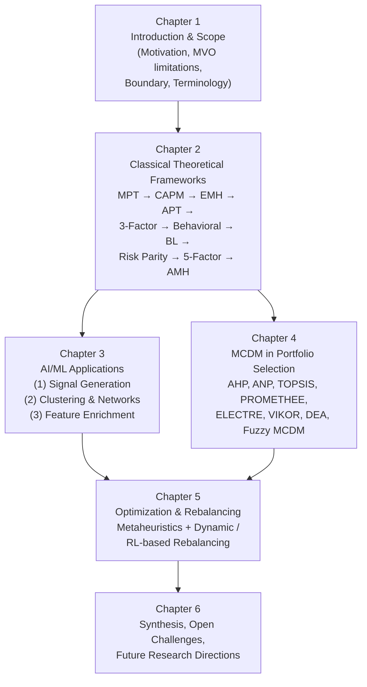
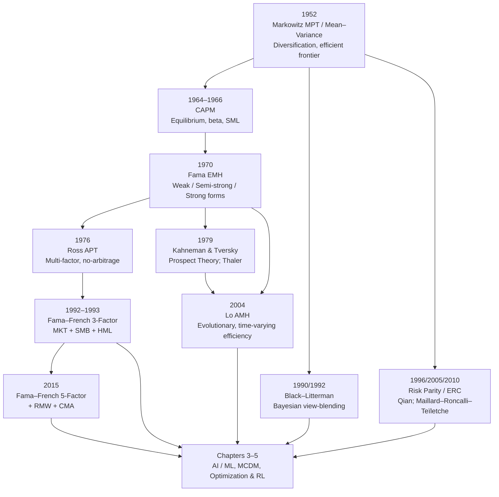
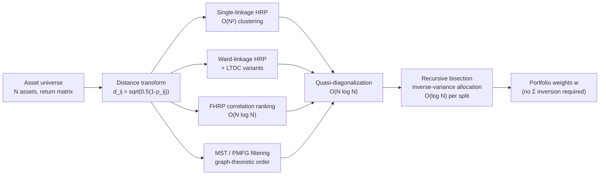
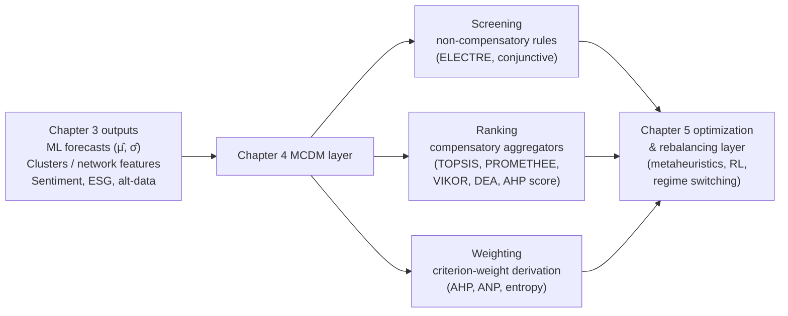
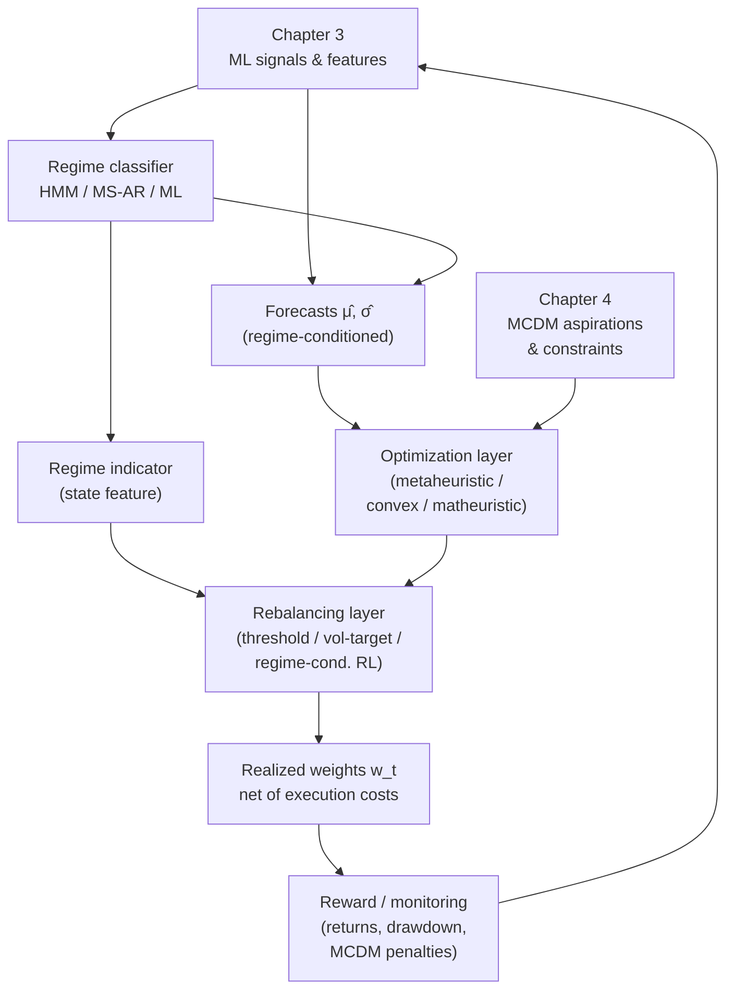

# AI-Enhanced Portfolio Management: A Comprehensive Review of Theoretical Foundations, Machine Learning Applications, and Optimization Methods (through April 2024)
# 1 Introduction and Research Scope

Portfolio management has long stood at the intersection of mathematical rigor, behavioral insight, and computational pragmatism. Since Harry Markowitz formalized the trade-off between expected return and variance in 1952, the discipline has progressively absorbed advances in asset pricing theory, statistical inference, and—more recently—artificial intelligence (AI) and machine learning (ML). Today, asset managers operate in an environment characterized by terabyte-scale market and alternative datasets, microsecond execution latencies, non-stationary return distributions, and increasingly heterogeneous investor mandates that span financial performance, environmental and social goals, and liquidity preferences. Against this backdrop, a synthesis of the classical theoretical canon and the rapidly proliferating AI toolkit is no longer optional but methodologically necessary. This chapter establishes the foundational context for that synthesis: it articulates the motivation for integrating AI with portfolio management, exposes the structural limitations of the mean–variance paradigm that make such integration compelling, draws a principled conceptual boundary between model-driven and data-driven approaches, and finally defines the scope, terminology, and analytical roadmap that govern the remaining five chapters of this review (with all primary evidence bounded by an April 2024 cutoff).

## 1.1 Motivation and Significance of AI Integration in Portfolio Management

The integration of AI into portfolio management is driven by a confluence of empirical, computational, and economic forces whose joint pressure has rendered traditional human-centric and rule-based decision processes increasingly inadequate.

The first driver is **the explosive growth of financial and alternative data**. Beyond historical price, volume, and fundamental accounting series, contemporary portfolio managers routinely ingest high-frequency tick data, intraday limit-order-book snapshots, derivative-implied surfaces, satellite imagery of supply chains, credit card transaction aggregates, geolocation footfalls, ESG disclosures, news wires, social-media sentiment, and natural-language earnings-call transcripts. These data streams are simultaneously high-dimensional, heterogeneous in structure (structured, semi-structured, and unstructured), noisy, and frequently arriving in real time. Classical estimators—built around sample means and sample covariances computed on monthly returns—lack the representational capacity to exploit such information. ML methods, by contrast, were designed precisely for high-dimensional pattern extraction, nonlinear function approximation, and automated feature learning, and are therefore natural candidates for translating raw alternative data into investable signals.

The second driver is **the rising complexity and interconnectedness of global markets**. Contagion across asset classes, regime shifts triggered by monetary policy or geopolitical shocks, cross-listing arbitrage between venues, and feedback loops induced by algorithmic execution have rendered the linear, stationary, Gaussian world implicit in much of classical finance an increasingly poor approximation of reality. Capturing nonlinear dependencies, tail comovements, and time-varying correlation structures requires modeling apparatus—copulas, recurrent and attention-based neural networks, graph-theoretic correlation networks, regime-switching models—that goes well beyond closed-form mean–variance algebra.

The third driver is **the demand for adaptive, state-dependent investment strategies**. Investors increasingly expect portfolios to respond dynamically to changing market conditions: tightening risk during turbulence, rotating across factors when premia rotate, and rebalancing in a manner that internalizes transaction costs and tax consequences. Reinforcement learning (RL) and online learning algorithms naturally formalize this requirement by modeling investment as a sequential decision problem under uncertainty, in contrast to the single-period optimization that anchors textbook treatments.

A fourth driver is **the broadening of objective sets**. Modern mandates rarely reduce to a single risk-adjusted return target. ESG considerations, liquidity buffers, drawdown limits, factor neutrality, and regulatory capital constraints simultaneously enter the decision. Multi-criteria decision-making (MCDM) techniques, often combined with ML scoring of qualitative attributes, provide a structured way to reconcile these competing dimensions.

The academic and practical significance of a unified review of AI applications in portfolio management is therefore twofold. **Academically**, it consolidates a literature that has fragmented across econometrics, computer science, operations research, and behavioral finance journals, identifying which AI techniques materially extend—rather than merely re-label—classical results. **Practically**, it offers asset owners, allocators, and quant teams a methodological map for translating heterogeneous data and complex objectives into defensible, auditable portfolio decisions.

## 1.2 Limitations of Classical Mean–Variance Frameworks

Markowitz's mean–variance optimization (MVO) remains the analytical anchor of portfolio theory, both because of its elegant formalization of diversification and because nearly every subsequent innovation can be read as a response to one of its limitations. A clear-eyed enumeration of these limitations is therefore a prerequisite for understanding why AI augmentation is methodologically motivated rather than merely fashionable.

The canonical MVO problem maximizes a quadratic utility of the form

$$\max_{w} \; w^{\top}\mu - \frac{\lambda}{2} w^{\top}\Sigma w \quad \text{s.t.} \quad \mathbf{1}^{\top} w = 1, \; w \in \mathcal{W},$$

where $w$ is the vector of portfolio weights, $\mu$ the vector of expected returns, $\Sigma$ the return covariance matrix, $\lambda$ the risk-aversion coefficient, and $\mathcal{W}$ an admissible set (which may impose long-only or other constraints). The following structural issues arise.

**Extreme parameter sensitivity.** The optimal weight vector depends, through the inverse of $\Sigma$, on small differences in expected returns. Because $\mu$ is estimated with substantial sampling error, even modest perturbations in inputs can produce large, unstable swings in portfolio weights and frequent corner solutions in which a handful of assets receive extreme allocations. This phenomenon—sometimes referred to as MVO acting as an "error maximizer"—is the most consequential practical limitation of the framework and has motivated shrinkage estimators, the Black–Litterman blending of priors with views, robust optimization, and ML-based regularization (LASSO, Ridge, Elastic Net) applied directly to portfolio weights or to the predictive models that feed $\mu$.

**Estimation noise in returns and covariances.** Expected returns are notoriously difficult to estimate from historical samples of realistic length; the signal-to-noise ratio of monthly equity returns is low, and the resulting confidence intervals are wide. Covariance matrices, while better behaved, become numerically singular when the number of assets approaches or exceeds the number of observations, demanding either dimensionality reduction (principal component analysis, factor models) or structured estimators (Ledoit–Wolf shrinkage, hierarchical risk parity). ML approaches—high-dimensional regularized regressions, neural-network forecasters, graph-based filtering of correlation matrices—directly target this estimation problem.

**Single-period static assumption.** The textbook formulation optimizes for a single holding period, ignoring intertemporal hedging demands, time-varying investment opportunities, path-dependent transaction costs, and rebalancing dynamics. Sequential decision frameworks—dynamic programming, model-predictive control, and reinforcement learning—generalize MVO to multi-period settings in which the agent must trade off immediate utility against the option value of future rebalancing.

**Distributional assumptions of normality and quadratic utility.** MVO is exact only when returns are jointly elliptical (e.g., multivariate normal) or when investors have quadratic utility. Empirically, asset returns display fat tails, skewness, and time-varying volatility, while investor preferences exhibit loss aversion and reference dependence as documented by behavioral finance. Risk measures such as Conditional Value-at-Risk (CVaR), expected shortfall, and higher-moment objectives, as well as ML-based density estimation and scenario generation (e.g., via generative models), address these mismatches.

**Neglect of frictions and qualitative criteria.** Standard MVO abstracts from transaction costs, taxes, market impact, liquidity constraints, cardinality limits (a hard cap on the number of holdings), and qualitative objectives such as ESG ratings. The resulting optimization problems become non-convex, combinatorial, or multi-objective, and are often analytically intractable—precisely the setting in which metaheuristic optimization (genetic algorithms, particle swarm optimization, simulated annealing) and MCDM frameworks become indispensable.

**Behavioral inadequacy.** MVO assumes a rational, expected-utility-maximizing investor with stable preferences. Decades of behavioral finance evidence, beginning with the work of Kahneman and Tversky, contradict this assumption, while Lo's Adaptive Market Hypothesis reframes market efficiency as a context- and population-dependent property. Capturing such evolving, heterogeneous behavior is naturally suited to data-driven and adaptive learning systems.

Taken together, these limitations form a coherent analytical premise: the AI techniques surveyed in subsequent chapters are best understood not as wholesale replacements for the mean–variance paradigm, but as targeted responses to specific failure modes—noise in inputs, restrictive distributional and behavioral assumptions, neglect of frictions, and the static, single-period structure of the original formulation.

## 1.3 Conceptual Boundary Between Classical Quantitative Finance and AI-Driven Approaches

To navigate the remainder of this report it is essential to draw a principled, non-ideological boundary between **classical quantitative finance** and **AI-driven approaches**, and to identify the substantial zone in which the two overlap.

Classical quantitative finance is characterized by **model-driven inference**: it begins with economic or statistical assumptions—no-arbitrage, mean-variance preferences, factor structure of returns, market equilibrium—and derives closed-form or numerically tractable relationships among observable quantities. Representative artefacts include the Markowitz mean–variance frontier, the Capital Asset Pricing Model (CAPM), the Arbitrage Pricing Theory (APT), the Fama–French three- and five-factor models, the Black–Litterman model, and risk-parity allocation. Estimation in this tradition is typically parametric, low-dimensional, and oriented toward interpretable coefficients (betas, factor loadings, risk contributions). Validation relies on hypothesis testing, in-sample fit diagnostics, and out-of-sample backtests aggregated over relatively long horizons.

AI-driven approaches, by contrast, are characterized by **data-driven inference**: they begin with a flexible function class (e.g., regularized linear models, kernel machines, ensemble trees, deep neural networks, graph neural networks) whose parameters are fit by minimizing an empirical loss, typically with explicit regularization to control overfitting in high-dimensional settings. The functional form is rarely derived from first-principle economic theory; instead, predictive power on held-out data is the primary criterion of legitimacy. Representative artefacts in portfolio management include LSTM and Transformer return forecasters, deep reinforcement learning agents for trading and rebalancing, unsupervised clustering of assets, and natural-language processing pipelines that translate text into sentiment features.

The boundary is best understood along several axes rather than as a binary distinction:

| Dimension | Classical Quantitative Finance | AI-Driven Approaches |
|---|---|---|
| Epistemic starting point | Economic/statistical theory and assumptions | Empirical patterns in data |
| Function class | Low-dimensional, parametric, interpretable | High-dimensional, flexible, often non-parametric |
| Primary criterion | Theoretical consistency and unbiasedness | Predictive performance and generalization |
| Treatment of nonlinearity | Limited; typically via interaction terms | Native (kernels, deep networks, ensembles) |
| Data scale | Modest; structured, low-frequency | Large; structured plus alternative/unstructured |
| Decision horizon | Often single-period or analytically tractable multi-period | Naturally sequential via RL and online learning |
| Interpretability | High by construction | Often low; requires post-hoc explainability |
| Risk of overfitting | Lower, but model misspecification risk is high | Higher; controlled via regularization and validation |

Crucially, the two paradigms **overlap and increasingly complement one another**. Penalized linear regressions used for return forecasting (LASSO, Ridge, Elastic Net) are simultaneously classical statistical estimators and core ML tools. Factor models can be re-expressed as constrained neural networks. Black–Litterman naturally accommodates ML-generated views as the "investor opinions" plugged into its Bayesian update. Risk-parity allocation can be combined with clustering or graph-theoretic filtering of the covariance matrix, as in Hierarchical Risk Parity. The most fruitful posture is therefore not to position AI as a replacement for classical finance, but to view AI as a methodological extension that addresses specific shortcomings—high-dimensional signal extraction, nonlinear dependence, sequential decision-making, and qualitative-criterion integration—while remaining tethered to the economic intuition supplied by the classical canon.

This complementary view also clarifies a paradigm shift visible in the literature: from **model-based assumptions to data-driven inference**, but with growing emphasis on **economically informed ML**—hybrid systems that embed no-arbitrage, factor, or risk-budgeting structure as inductive biases inside ML pipelines, thereby reaping the predictive benefits of flexible models while preserving the interpretive discipline of classical finance.

## 1.4 Scope, Terminology, and Analytical Roadmap

### Scope and temporal boundary

This review covers four substantive domains—(i) classical theoretical frameworks of portfolio management, (ii) AI and machine learning applications across the portfolio-management pipeline, (iii) multi-criteria decision-making methods in portfolio selection, and (iv) portfolio optimization and rebalancing techniques. The temporal boundary is **April 2024**: theoretical models, ML methods, and empirical findings published or established up to that date constitute the primary evidence base. Subsequent developments are not used as primary support, although they may, where appropriate, be acknowledged as confirmatory context. Inclusion criteria favor methodologically influential and widely cited contributions, applied studies with demonstrable portfolio-management relevance (allocation, selection, signal generation, risk control, or rebalancing), and recent advances that materially extend the state of the art.

### Standardized terminology

To ensure consistency across the report, the following terms are used with the meanings indicated below.

| Term | Definition as used in this report |
|---|---|
| **Portfolio management** | The end-to-end process of constructing, monitoring, and rebalancing a collection of financial assets to achieve an investor's objectives subject to constraints. |
| **Portfolio optimization** | The mathematical problem of selecting weights $w$ that optimize a stated objective (e.g., mean–variance utility, Sharpe ratio, CVaR) subject to budget, sign, cardinality, and other constraints. |
| **Asset allocation** | The high-level distribution of capital across asset classes or factor exposures, typically informed by long-horizon risk–return assumptions. |
| **Signal generation** | The construction of predictive features and forecasts—of returns, volatility, or asset rankings—used as inputs to allocation or selection decisions. |
| **Predictive modeling** | Any statistical or ML procedure mapping inputs (prices, fundamentals, alternative data) to forecasts of future financial quantities. |
| **MCDM (Multi-Criteria Decision Making)** | A family of formal methods for ranking or selecting alternatives under multiple, often conflicting criteria (e.g., AHP, TOPSIS, PROMETHEE, ELECTRE, VIKOR). |
| **Metaheuristic optimization** | Approximate, population- or trajectory-based search algorithms (e.g., genetic algorithms, particle swarm optimization, simulated annealing) used to solve non-convex, combinatorial portfolio problems. |
| **Rebalancing** | The process of adjusting existing portfolio weights toward a target allocation in response to time, threshold breaches, signals, or learned policies. |
| **Classical quantitative finance** | Theory-driven, parametric, typically low-dimensional models including MPT, CAPM, APT, factor models, Black–Litterman, and risk-based allocation. |
| **AI / machine learning approaches** | Data-driven, often nonlinear and high-dimensional methods including supervised learning, unsupervised learning, deep learning, and reinforcement learning. |

### Analytical roadmap

The remaining chapters develop the argument in a deliberately layered fashion, moving from theoretical foundations to AI methods, then to multi-criterion decision structures, and finally to optimization and rebalancing—the operational endpoint of the portfolio-management pipeline. The diagram below summarizes the logical sequence and the principal connections among chapters.

**Chapter 2** establishes the theoretical bedrock by tracing, in strict chronological order, the foundational models—from Markowitz's 1952 mean–variance framework through CAPM, EMH, APT, the Fama–French three- and five-factor models, behavioral finance, Black–Litterman, risk parity, and the Adaptive Market Hypothesis—and articulating how each successor addresses the limitations of its predecessors. **Chapter 3** then surveys AI and ML applications across the pipeline, organized by functional role: signal generation (high-dimensional linear models and time-series deep learning), asset clustering and network analysis (unsupervised learning and network-topology methods), and feature enrichment (alternative data, sentiment, NLP embeddings, macro factors). **Chapter 4** extends the decision framework beyond the risk–return dual objective by analyzing MCDM techniques and their integration with optimization and AI. **Chapter 5** consolidates the operational layer, surveying metaheuristic optimization for non-convex and cardinality-constrained problems and dynamic rebalancing strategies—including deep reinforcement learning agents (DQN, PPO, A2C, DDPG) and regime-switching schemes. **Chapter 6** synthesizes findings, identifies cross-cutting challenges (overfitting, data-snooping, interpretability, non-stationarity, ESG integration), and proposes forward-looking research directions such as explainable AI in finance, causal machine learning, large-language-model-driven sentiment integration, and federated learning across institutions.

By proceeding in this sequence, the report aims to make a single, coherent argument: that AI-enhanced portfolio management is most productively understood as the methodological completion of the classical research program, addressing precisely those problems—estimation noise, dynamic adaptation, multi-criteria decision-making, and non-convex optimization—that the foundational theories identified but could not fully resolve.

# 2 Classic Theoretical Frameworks of Portfolio Management

Having established in Chapter 1 that AI-enhanced portfolio management is most productively understood as a methodological completion of, rather than a wholesale substitute for, the classical research program, the analytical task of this chapter is to lay down the theoretical bedrock against which subsequent chapters will evaluate machine-learning innovations. The intellectual history of portfolio management from 1952 to the early 2000s is not a loose collection of independent ideas but a tightly chained sequence in which each contribution responds to identifiable deficiencies of its predecessors. By reconstructing this chain in strict chronological order—and by exposing, at each stage, the specific limitations that motivate the next step—we obtain a coherent baseline that maps directly onto the AI/ML, multi-criteria decision-making (MCDM), and optimization techniques discussed in Chapters 3 through 5. The narrative below therefore treats each classical model as a dual artefact: a substantive economic theory in its own right, and an analytical landmark whose residual problems define the research agenda for data-driven extensions.

## 2.1 Markowitz's Modern Portfolio Theory and the Mean–Variance Model (1952)

Modern Portfolio Theory (MPT) was inaugurated by Harry Markowitz in his 1952 *Journal of Finance* article "Portfolio Selection," subsequently elaborated in his 1959 monograph of the same title. The contribution is foundational in two senses: it formalized diversification as a mathematical, rather than merely intuitive, principle; and it provided a tractable objective—mean–variance utility—that translated the abstract notion of risk–return trade-off into a quadratic optimization problem.

The setting is a single-period economy with $N$ risky assets. Let $\mu = (\mu_1, \dots, \mu_N)^{\top}$ denote the vector of expected returns, $\Sigma$ the $N \times N$ return covariance matrix (assumed positive definite), and $w = (w_1, \dots, w_N)^{\top}$ the vector of portfolio weights. The portfolio's expected return is $\mu_p = w^{\top}\mu$ and its variance is $\sigma_p^2 = w^{\top}\Sigma w$. Markowitz's central insight is that, because variance is a quadratic form, the portfolio variance depends not only on the variances of individual assets but on the entire matrix of pairwise covariances, so that combining imperfectly correlated assets yields a portfolio variance strictly below the weighted average of constituent variances. Diversification thus emerges as a mathematical consequence of the covariance structure rather than as a heuristic prescription.

The canonical formulation seeks the **efficient frontier**, defined as the set of portfolios with minimum variance for each attainable expected return:

$$\min_{w} \; \tfrac{1}{2} w^{\top}\Sigma w \quad \text{s.t.} \quad w^{\top}\mu = \mu_{\text{target}}, \quad \mathbf{1}^{\top}w = 1.$$

Solving this problem parametrically in $\mu_{\text{target}}$ traces out the hyperbolic frontier in $(\sigma_p, \mu_p)$ space. Equivalently, the investor's quadratic-utility problem,

$$\max_{w} \; w^{\top}\mu - \frac{\lambda}{2} w^{\top}\Sigma w \quad \text{s.t.} \quad \mathbf{1}^{\top}w = 1,$$

with $\lambda > 0$ a risk-aversion parameter, admits the closed-form solution $w^{\star} = \lambda^{-1}\Sigma^{-1}(\mu - \nu \mathbf{1})$, where $\nu$ is the Lagrange multiplier enforcing the budget constraint.

The model rests on a set of strong assumptions that simultaneously enable its tractability and circumscribe its empirical validity: (i) investors are rational and evaluate portfolios solely by the mean and variance of one-period returns; (ii) the holding period is a single, exogenously fixed interval; (iii) either returns are jointly elliptical (a sufficient condition that subsumes multivariate normality) or investor preferences are quadratic; (iv) markets are frictionless—no transaction costs, taxes, or short-sale restrictions in the baseline formulation; and (v) the parameters $\mu$ and $\Sigma$ are known with certainty.

The intellectual contribution of MPT extends well beyond the specific formulae. By framing portfolio choice as the optimization of a vector-valued decision under a quadratic objective, Markowitz introduced into finance the conceptual apparatus of constrained optimization that has since been borrowed, generalized, and replaced in countless variants. He also made explicit, for the first time, that the unit of analysis is the portfolio rather than the individual asset—an apparently simple shift of focus whose implications animate every subsequent development in the field.

The model's structural limitations, however, are now well documented and were enumerated in Chapter 1: extreme sensitivity of optimal weights to small perturbations in estimated $\mu$, the singularity of $\Sigma$ in high-dimensional settings, the inadequacy of variance as a risk measure under fat-tailed and asymmetric return distributions, the abstraction from frictions and qualitative criteria, and the single-period static structure. Each of these limitations defines a distinct entry point for the AI and optimization techniques surveyed in subsequent chapters—shrinkage and regularization for parameter sensitivity, neural forecasters for high-dimensional return prediction, scenario-based and CVaR formulations for tail risk, MCDM and metaheuristics for friction-aware multi-criterion problems, and reinforcement learning for sequential rebalancing.

## 2.2 The Capital Asset Pricing Model (Sharpe, Lintner, Mossin, 1964–1966)

The Capital Asset Pricing Model (CAPM) was developed independently and nearly simultaneously by William Sharpe (1964), John Lintner (1965), and Jan Mossin (1966), building directly on Markowitz's mean–variance framework. Whereas Markowitz characterized the optimal portfolio of a single investor with given beliefs, CAPM asked the equilibrium question: if all investors solve the Markowitz problem with identical beliefs, what must asset prices look like in equilibrium?

The model imposes additional assumptions on top of those of MPT: (i) all investors share identical (homogeneous) expectations about $\mu$ and $\Sigma$; (ii) they can borrow and lend without limit at a common risk-free rate $r_f$; (iii) markets are perfectly competitive and frictionless, with no taxes or transaction costs; and (iv) all assets are tradable and infinitely divisible. Under these conditions, every investor holds the same risky portfolio—the **market portfolio** $M$—levered up or down with the risk-free asset according to risk tolerance. This celebrated result is the **two-fund separation theorem**.

In equilibrium, the expected excess return on any asset $i$ is linearly related to its covariance with the market portfolio:

$$\mathbb{E}[r_i] - r_f = \beta_i \big(\mathbb{E}[r_M] - r_f\big), \quad \text{where} \quad \beta_i = \frac{\mathrm{Cov}(r_i, r_M)}{\mathrm{Var}(r_M)}.$$

This relationship is the **Security Market Line (SML)**. It decomposes total return variability into a **systematic** component—exposure $\beta_i$ to the single, non-diversifiable market factor—and an **idiosyncratic** component, which earns no risk premium because it can be diversified away by holding the market portfolio. CAPM thus operationalizes a sharp normative claim: only systematic risk is compensated, and the compensation is linear in beta.

CAPM's intellectual contribution is to elevate Markowitz's optimization framework into a cross-sectional asset-pricing theory. It provides an economically grounded **discount rate** for capital budgeting, a benchmark against which managerial alpha can be measured, and a parsimonious decomposition of risk that remains the lingua franca of practitioner risk reporting. The model also embedded into finance the methodological practice of regressing realized excess returns on market excess returns to estimate beta—an empirical pipeline that anticipates the regression-based factor models of subsequent decades.

Yet CAPM's empirical track record is mixed. The flatness of the empirical SML, the persistence of the size and value anomalies, low-beta outperformance ("betting against beta"), and the difficulty of identifying the true market portfolio (the Roll critique) have repeatedly forced revisions. These anomalies do not refute the conceptual structure of risk-based pricing but rather demonstrate that a **single** risk factor is insufficient, opening the conceptual space for the multi-factor extensions—APT, Fama–French three- and five-factor models—surveyed below.

## 2.3 The Efficient Market Hypothesis (Fama, 1970)

Eugene Fama's 1970 *Journal of Finance* survey, "Efficient Capital Markets: A Review of Theory and Empirical Work," consolidated more than a decade of work by Samuelson, Mandelbrot, Fama himself, and others into a coherent statement now known as the **Efficient Market Hypothesis (EMH)**. The hypothesis asserts that, in an informationally efficient market, asset prices fully reflect all available information of a specified information set, so that no trading strategy conditioned on that set can earn risk-adjusted excess returns in expectation.

Fama's pivotal taxonomic contribution was the partition of informational efficiency into three nested forms, distinguished by the breadth of the conditioning information set:

| Form | Information set | Implication |
|---|---|---|
| **Weak** | Past prices and returns | Technical analysis cannot generate excess returns. |
| **Semi-strong** | All publicly available information | Fundamental analysis on public data cannot generate excess returns. |
| **Strong** | All information, public and private | Even insiders cannot consistently earn excess returns. |

The hypothesis is operationalized empirically through tests of autocorrelation in returns, event studies of price adjustment to news, and out-of-sample evaluation of professionally managed portfolios. A central methodological complication, also articulated by Fama, is the **joint-hypothesis problem**: any test of market efficiency is simultaneously a test of efficiency *and* of the asset-pricing model used to measure "risk-adjusted" returns. Empirical anomalies can therefore be attributed either to inefficiency or to misspecification of the benchmark model—a logical ambiguity that has shielded EMH from definitive falsification and, conversely, has motivated continuous refinement of the asset-pricing benchmarks themselves.

EMH has profound implications for portfolio management. If markets are at least semi-strong-form efficient, active management cannot consistently outperform passive index investing on a risk-adjusted, net-of-cost basis—an argument that underpinned the rise of index funds. Yet the literature has documented systematic patterns of predictability (momentum, value, size, post-earnings-announcement drift, low-volatility anomalies) that are difficult to reconcile with strict efficiency. These deviations create the intellectual space in which behavioral finance, multi-factor models, and ultimately ML-based predictive systems operate: each of these subsequent developments can be read as an attempt to characterize and exploit the empirical departures from EMH while acknowledging that competitive arbitrage rapidly attenuates persistent anomalies.

For the purposes of this report, EMH plays a dual role. It is, first, the **benchmark hypothesis** against which any portfolio strategy—classical or AI-driven—must be evaluated: a signal that does not survive transaction costs and risk adjustment provides no evidence against efficiency. Second, the empirical erosion of strict EMH is precisely what makes the rest of this report possible: if prices fully reflected all information at all times, neither factor investing nor ML-based signal generation would have a target.

## 2.4 The Arbitrage Pricing Theory (Ross, 1976)

Stephen A. Ross introduced the **Arbitrage Pricing Theory (APT)** in his 1976 *Journal of Economic Theory* article "The Arbitrage Theory of Capital Asset Pricing." APT relaxes several of CAPM's restrictive assumptions—homogeneous expectations, a single market factor, and reliance on mean–variance preferences—while preserving the central insight that expected returns are linear in risk exposures.

APT begins not from utility maximization in equilibrium but from a **statistical factor model** for returns combined with a **no-arbitrage** condition. Specifically, asset $i$'s return is assumed to follow

$$r_i = \mathbb{E}[r_i] + \sum_{k=1}^{K} \beta_{i,k} f_k + \varepsilon_i,$$

where $f_1, \dots, f_K$ are $K$ pervasive (systematic) factors with mean zero, $\beta_{i,k}$ is asset $i$'s sensitivity (loading) to factor $k$, and $\varepsilon_i$ is an idiosyncratic shock that is uncorrelated across assets in well-diversified portfolios. Ross's key analytical result is that, if no arbitrage opportunity is to exist in a sufficiently large economy, expected excess returns must be approximately linear in the factor loadings:

$$\mathbb{E}[r_i] - r_f \approx \sum_{k=1}^{K} \beta_{i,k} \, \lambda_k,$$

where $\lambda_k$ is the risk premium associated with factor $k$.

APT's contributions, relative to CAPM, are threefold. **First**, it admits an arbitrary number of factors, accommodating the empirical observation that a single market factor is insufficient. **Second**, its derivation does not require all investors to share identical beliefs or to hold the market portfolio; it requires only that arbitrage be costly enough to enforce the linear pricing relationship in equilibrium. **Third**, APT is **agnostic about factor identity**: the theory specifies a linear factor structure but leaves the identification of the factors—macroeconomic variables (Chen, Roll & Ross, 1986), statistical principal components, or characteristic-based portfolios—to empirical investigation.

This agnosticism is simultaneously APT's greatest empirical virtue and its principal weakness. By not pinning down the factors a priori, APT opens the door to an enormous space of admissible factor specifications, raising challenging problems of factor selection, identification, and inference. These challenges are precisely those on which modern machine-learning methods—high-dimensional regularized regressions, principal component and partial-least-squares techniques, neural-network feature extractors, and the "factor zoo" literature—have made the largest contributions. Thus APT functions in this report as the theoretical bridge between equilibrium asset pricing and data-driven factor discovery: it legitimizes the search for multiple, possibly latent, risk factors while remaining silent about which empirical procedure should perform that search.

## 2.5 The Fama–French Three-Factor Model (1992/1993)

Eugene Fama and Kenneth French gave APT's general factor structure its most influential empirical instantiation in two landmark papers: "The Cross-Section of Expected Stock Returns" (*Journal of Finance*, 1992) and "Common Risk Factors in the Returns on Stocks and Bonds" (*Journal of Financial Economics*, 1993). Documenting that CAPM's beta failed to explain the cross-section of U.S. stock returns once size and book-to-market were controlled for, they proposed a three-factor extension:

$$\mathbb{E}[r_i] - r_f = \beta_i^{\mathrm{MKT}} \big(\mathbb{E}[r_M] - r_f\big) + \beta_i^{\mathrm{SMB}} \mathbb{E}[\mathrm{SMB}] + \beta_i^{\mathrm{HML}} \mathbb{E}[\mathrm{HML}],$$

where **SMB** ("Small Minus Big") is the return on a portfolio long small-capitalization stocks and short large-capitalization stocks, and **HML** ("High Minus Low") is the return on a portfolio long high-book-to-market (value) stocks and short low-book-to-market (growth) stocks. The factors are constructed from sorted long–short portfolios of U.S. equities, and asset-level loadings are estimated by time-series regression of excess returns on the three factor returns.

Empirically, the three-factor model substantially improved the explanatory power of cross-sectional regressions and absorbed several of the most persistent anomalies inconsistent with CAPM. Interpretively, however, it sparked a debate that remains unresolved: are SMB and HML proxies for **unobserved sources of systematic risk** (consistent with APT and rational pricing), or do they capture **systematic mispricing** rooted in behavioral biases or limits to arbitrage? Fama and French themselves favored the risk-based interpretation, while behavioral scholars argued that value and size effects reflect investor over- and under-reaction.

The three-factor model occupies a pivotal position in the analytical chain of this chapter. It is **the empirical translation of APT's abstract factor structure into operational, replicable portfolios**, and it inaugurated the modern factor-investing industry. From a methodological standpoint, it also established a template—construct characteristic-sorted long–short portfolios, estimate loadings by regression, and test pricing—that has been replicated thousands of times across markets, asset classes, and characteristics. In subsequent decades, this template has generated the so-called "factor zoo" of hundreds of candidate factors, raising acute problems of multiple testing, redundancy, and out-of-sample fragility that ML-based variable selection (LASSO, Elastic Net, principal-component regression) and high-dimensional cross-sectional regression methods discussed in Chapter 3 are designed to address.

## 2.6 Behavioral Finance (Kahneman & Tversky, 1979; Thaler)

Behavioral finance emerged in the late 1970s and 1980s as a direct challenge to the rational-investor paradigm that undergirds MPT, CAPM, and EMH. Its psychological foundation is **Prospect Theory**, formulated by Daniel Kahneman and Amos Tversky in their 1979 *Econometrica* article "Prospect Theory: An Analysis of Decision under Risk," and refined as **Cumulative Prospect Theory** in 1992. Richard Thaler subsequently extended these ideas into finance and economics through his work on mental accounting, the endowment effect, self-control, and—jointly with Cass Sunstein—choice architecture and "nudges."

Prospect Theory replaces the expected-utility framework with two empirically grounded modifications. First, outcomes are evaluated as **gains and losses relative to a reference point**, not as final wealth states. Second, the **value function** $v(x)$ is concave for gains, convex for losses, and steeper for losses than for gains of equal magnitude—a property known as **loss aversion**. Third, probabilities are not treated linearly: a **probability weighting function** $\pi(p)$ overweights small probabilities and underweights moderate-to-large ones. The decision criterion becomes

$$V = \sum_i \pi(p_i)\, v(x_i),$$

a structurally different object from expected utility that systematically predicts violations of the independence axiom and observed patterns such as the simultaneous purchase of insurance and lottery tickets.

The implications for portfolio management are substantial. **Loss aversion** rationalizes the disposition effect (holding losers too long and selling winners too soon) and the equity premium puzzle (a higher equity risk premium than CAPM-calibrated risk aversion can justify). **Mental accounting**, in Thaler's terminology, leads investors to segregate portfolios into psychologically distinct "buckets" (retirement, education, speculation) and to apply different risk tolerances to each, in contradiction of the integrated mean–variance prescription. **Reference dependence** and **anchoring** introduce path dependence in investor behavior that is invisible to a model conditioned only on current wealth. **Herding**, **overconfidence**, and **representativeness biases** are widely invoked to explain bubbles, momentum, and excess volatility.

From the perspective of this report, behavioral finance plays two roles. First, it provides an **economic mechanism** for the empirical deviations from EMH that justify predictive modeling: if biases generate systematic mispricing that arbitrageurs cannot immediately eliminate (due to limits to arbitrage, capital constraints, and noise-trader risk), then properly designed strategies can extract genuine excess returns. Second, behavioral heterogeneity and the **time-varying intensity** of biases align naturally with adaptive, learning-based models. Investor behavior is neither stationary nor homogeneous; the same psychological tendencies produce different market outcomes in different regimes, populations, and institutional contexts. ML and reinforcement-learning systems—because they can detect non-stationary patterns, update beliefs online, and condition on context—are particularly well suited to capturing the empirical footprints of behavioral phenomena that classical, rational, stationary models cannot.

## 2.7 The Black–Litterman Model (Black & Litterman, 1990/1992)

The **Black–Litterman model** was developed by Fischer Black and Robert Litterman at Goldman Sachs in 1990 and presented formally in their 1992 *Financial Analysts Journal* article "Global Portfolio Optimization." The model addresses the most consequential practical limitation of mean–variance optimization identified in Chapter 1: the extreme sensitivity of optimal weights to estimated expected returns, which routinely produces unintuitive, concentrated, and unstable portfolios.

The model's central innovation is a **Bayesian blending of two sources of information**: (i) an equilibrium prior derived by inverse optimization from the observed market-capitalization weights, and (ii) the investor's subjective views on a (possibly small) subset of assets or linear combinations of assets, expressed with explicit confidence levels.

The **equilibrium prior** is constructed by reverse-engineering CAPM. Given the observed market-cap weights $w_{\mathrm{mkt}}$, the covariance matrix $\Sigma$, and an implied risk-aversion coefficient $\lambda$, the equilibrium expected excess returns are recovered as $\Pi = \lambda \Sigma w_{\mathrm{mkt}}$. This vector $\Pi$ is then taken as the **prior mean** of the unknown vector $\mu$, with prior covariance $\tau \Sigma$ for some scalar $\tau > 0$ controlling overall confidence in the prior.

**Investor views** are encoded as $P\mu = Q + \varepsilon, \; \varepsilon \sim \mathcal{N}(0, \Omega)$, where $P$ is a $K \times N$ "pick" matrix selecting the assets or spreads on which views are held, $Q$ is the $K \times 1$ vector of view returns, and $\Omega$ is a diagonal matrix of view variances reflecting the investor's uncertainty about each view.

Bayesian updating yields the posterior mean

$$\mu_{\mathrm{BL}} = \big[(\tau\Sigma)^{-1} + P^{\top}\Omega^{-1}P\big]^{-1} \big[(\tau\Sigma)^{-1}\Pi + P^{\top}\Omega^{-1}Q\big],$$

which is then substituted into the standard mean–variance optimizer. By construction, $\mu_{\mathrm{BL}}$ collapses to the equilibrium prior when no views are expressed and approaches the view returns as the view confidence $\Omega^{-1}$ grows large. The resulting portfolio weights are demonstrably more stable and intuitive than those produced by direct mean–variance optimization with sample-mean estimates.

The Black–Litterman model has enduring relevance for the agenda of this report for a specific reason: it provides a principled, internally consistent **conduit for injecting forecasts into the mean–variance framework**. Wherever ML-based signal generators—deep learning return forecasters, NLP-derived sentiment scores, cross-sectional ranking models—produce numerical predictions with associated uncertainty estimates, those outputs can be encoded as views $(P, Q, \Omega)$ within the Black–Litterman update. The hybrid architecture preserves the economic discipline of CAPM-implied equilibrium while admitting flexible, high-dimensional predictive inputs. In this sense, Black–Litterman foreshadows the **economically informed ML** paradigm developed in subsequent chapters: it is, in effect, the original template for combining theory-driven priors with data-driven evidence.

## 2.8 Risk Parity and Risk-Based Allocation Methods (Qian, 2005; Equal Risk Contribution)

A distinct response to the estimation-noise problem of mean–variance optimization is to **abandon return forecasting altogether** and allocate capital according to risk contributions rather than expected returns. The term **"risk parity"** was popularized by Edward Qian (PanAgora Asset Management) in 2005, although its conceptual roots reach back to Bridgewater Associates' All Weather fund (Ray Dalio, 1996) and earlier work on volatility-targeted balanced strategies.

Let $w$ denote the portfolio weights and $\Sigma$ the covariance matrix. The **marginal risk contribution** of asset $i$ to portfolio volatility $\sigma_p = \sqrt{w^{\top}\Sigma w}$ is $\partial \sigma_p / \partial w_i = (\Sigma w)_i / \sigma_p$, and the **total risk contribution (TRC)** is

$$\mathrm{TRC}_i = w_i \cdot \frac{(\Sigma w)_i}{\sigma_p}, \quad \text{with} \quad \sum_{i=1}^{N} \mathrm{TRC}_i = \sigma_p.$$

The **Equal Risk Contribution (ERC)** portfolio, formalized in the academic literature by Maillard, Roncalli, and Teïletche ("The Properties of Equally Weighted Risk Contribution Portfolios," *Journal of Portfolio Management*, 2010), is the unique long-only weight vector satisfying

$$\mathrm{TRC}_i = \mathrm{TRC}_j \quad \text{for all } i, j,$$

or equivalently $w_i (\Sigma w)_i = w_j (\Sigma w)_j$. ERC has no closed-form solution in general but is the solution of a convex optimization problem that can be solved efficiently for moderate $N$.

More general **risk-budgeting** formulations replace the uniform contribution target with prescribed budgets $b_1, \dots, b_N$ summing to one, requiring $\mathrm{TRC}_i = b_i \, \sigma_p$. Risk-parity strategies typically apply ERC across asset classes (equities, bonds, commodities, inflation-linked instruments) and then lever the resulting portfolio to a target volatility, recognizing that an unlevered ERC portfolio tends to be heavily tilted toward low-volatility assets such as fixed income.

The intellectual contribution of risk parity is to **decouple portfolio construction from return forecasting**, exploiting the empirically robust observation that covariance matrices are estimated with substantially smaller errors than mean vectors. Empirically, ERC portfolios have demonstrated favorable risk-adjusted performance and reduced drawdowns relative to traditional 60/40 allocations, though they are sensitive to the volatility regime and to the cost of leverage required to achieve competitive returns.

For the agenda of this report, risk parity is doubly significant. First, it represents a **theoretical pivot** in classical portfolio management toward acknowledging that the dominant practical problem is not optimization but estimation, a recognition that anticipates the heavy emphasis on regularization, shrinkage, and structured covariance estimation in ML-based approaches. Second, the basic ERC formulation itself depends on $\Sigma$, whose conditioning deteriorates rapidly as $N$ grows—motivating ML-augmented variants. Most prominently, López de Prado's **Hierarchical Risk Parity (HRP)** (*Journal of Portfolio Management*, 2016) combines hierarchical clustering of the correlation matrix with recursive bisection-based weight allocation, sidestepping the need to invert $\Sigma$ entirely and producing portfolios that empirically outperform both ERC and minimum-variance benchmarks under realistic noise conditions. HRP is reviewed in detail in Chapter 3 as a canonical example of ML-augmented risk-based allocation.

## 2.9 The Fama–French Five-Factor Model (2015)

In their 2015 *Journal of Financial Economics* article "A Five-Factor Asset Pricing Model," Fama and French extended their three-factor framework by adding two factors motivated by the **dividend discount model**: a **profitability** factor and an **investment** factor. The theoretical rationale begins from the identity that the value of a firm equals the discounted sum of expected future dividends; manipulating this identity shows that, holding the book-to-market ratio and expected investment fixed, higher expected profitability implies higher expected returns, and, holding profitability fixed, higher expected investment implies lower expected returns.

The empirical implementation introduces two new long–short portfolios. **RMW** ("Robust Minus Weak") is long stocks with robust operating profitability and short those with weak profitability. **CMA** ("Conservative Minus Aggressive") is long firms with low (conservative) asset growth and short firms with high (aggressive) asset growth. The five-factor pricing model is

$$\mathbb{E}[r_i] - r_f = \beta_i^{\mathrm{MKT}}\mathbb{E}[\mathrm{MKT}-r_f] + \beta_i^{\mathrm{SMB}}\mathbb{E}[\mathrm{SMB}] + \beta_i^{\mathrm{HML}}\mathbb{E}[\mathrm{HML}] + \beta_i^{\mathrm{RMW}}\mathbb{E}[\mathrm{RMW}] + \beta_i^{\mathrm{CMA}}\mathbb{E}[\mathrm{CMA}].$$

Empirically, the five-factor model absorbs a substantial portion of the cross-sectional anomalies left unexplained by the three-factor specification, particularly those related to profitability and investment patterns. A widely noted result is that, conditional on the inclusion of RMW and CMA, **HML becomes statistically redundant** in U.S. data—its variation is largely spanned by combinations of the new factors—although it remains useful in international samples. Residual anomalies, most prominently momentum (Carhart's 1997 UMD factor) and low-volatility effects, are not captured by the five-factor model, motivating proposals for six- and higher-factor extensions and triggering the broader "factor zoo" literature.

The five-factor model occupies a specific analytical position in this chapter: it is the **mature classical benchmark** against which modern, ML-based factor discovery is typically evaluated. When Chapter 3 reviews high-dimensional cross-sectional regression methods—Kozak–Nagel–Santosh-style shrinkage estimators of the stochastic discount factor, principal-component and partial-least-squares factors, deep-learning return forecasters—the recurrent empirical question is whether the additional factors or nonlinear interactions identified by these methods deliver **out-of-sample** pricing improvements over the five-factor benchmark net of transaction costs. The five-factor model thus serves both as a hypothesis to be challenged and as a methodological touchstone whose long–short, characteristic-sorted construction logic continues to inform contemporary ML factor studies.

## 2.10 The Adaptive Market Hypothesis (Lo, 2004)

Andrew W. Lo proposed the **Adaptive Market Hypothesis (AMH)** in his 2004 *Journal of Portfolio Management* article "The Adaptive Markets Hypothesis: Market Efficiency from an Evolutionary Perspective," with subsequent development in his 2017 monograph *Adaptive Markets*. AMH is best understood as a **reconciliation** of EMH and behavioral finance, drawing on principles from evolutionary biology, bounded rationality (Simon), and cognitive psychology.

AMH rests on a small set of propositions. (i) Market participants are boundedly rational agents who use heuristics shaped by experience and competition. (ii) The population of participants is heterogeneous and evolves: profitable strategies attract capital and imitation, while unprofitable ones exit, in a process resembling natural selection. (iii) Market dynamics depend on the **interaction between strategies and the environment**: efficiency is not an all-or-nothing property of the market but a context- and population-dependent equilibrium. (iv) Consequently, return predictability, the equity risk premium, and the profitability of specific strategies are **time-varying**, alternating between periods of efficient incorporation and periods of exploitable inefficiency. (v) Innovation and adaptation, rather than convergence to a single rational equilibrium, are the engines of market dynamics.

Empirically, AMH is supported by evidence of regime-dependent return predictability, strategy "crowding" and subsequent decay (notably the post-2003 erosion of certain quantitative equity strategies), and time-varying correlations and volatilities. Conceptually, it preserves the disciplinary force of EMH—competitive pressure ensures that gross inefficiencies are exploited—while explaining why specific anomalies persist for a time, decay, and sometimes reappear under different conditions.

For the agenda of this report, AMH provides the **most natural classical home for AI methods**. If predictability is genuinely time-varying and context-dependent, then static models—however carefully specified—are structurally mismatched to the data-generating process. **Online learning**, **regime-switching models**, **reinforcement learning** with non-stationary reward structures, and **transfer learning** across regimes become not exotic refinements but methodologically appropriate responses to the empirical structure of markets that AMH posits. Equally, AMH cautions against naïve extrapolation of historical performance: a strategy that exploited a behavioral pattern in one regime may decay rapidly as participants adapt, an observation that has direct implications for the backtesting and validation practices discussed throughout Chapters 3 and 5.

## 2.11 Comparative Synthesis and Cumulative Logic of Classical Frameworks

The ten frameworks reviewed above do not constitute parallel theories of the same phenomenon; they constitute a **chained sequence of analytical advances**, each responding to specific limitations of its predecessors while introducing new limitations that the next stage will address. Reconstructing this chain explicitly is essential for understanding why AI techniques in subsequent chapters target precisely the gaps they do.

The cumulative trajectory can be visualized as follows.

The diagram makes several structural relationships explicit. MPT is the analytical seed from which both the **equilibrium-pricing branch** (CAPM → EMH → APT → 3-factor → 5-factor) and the **portfolio-construction branch** (Black–Litterman, risk parity / ERC) descend. The **behavioral branch** (Prospect Theory, Thaler) interacts with EMH by furnishing economic mechanisms for the empirical anomalies that motivated factor extensions, and ultimately feeds into Lo's AMH, which synthesizes rational and behavioral elements into a single evolutionary framework. All branches converge on the methodological agenda inherited by AI-driven approaches.

The table below summarizes, for each framework, its core idea, principal limitation, and the corresponding analytical entry point for AI/ML methods discussed in Chapters 3–5.

| # | Framework (Year) | Core Contribution | Principal Limitation | Entry Point for AI/ML |
|---|---|---|---|---|
| 1 | MPT (Markowitz, 1952) | Quantified diversification; efficient frontier under mean–variance | Extreme sensitivity to estimated $\mu$, $\Sigma$; static; quadratic/elliptical | Regularized forecasting; robust covariance; CVaR; multi-period RL |
| 2 | CAPM (Sharpe/Lintner/Mossin, 1964–66) | Equilibrium pricing; systematic vs. idiosyncratic risk; SML | Single-factor; empirical anomalies; Roll critique | ML-based beta estimation; conditional/time-varying betas |
| 3 | EMH (Fama, 1970) | Taxonomy of informational efficiency; benchmark for active management | Joint-hypothesis problem; pervasive empirical anomalies | Signal generation under realistic frictions; out-of-sample validation discipline |
| 4 | APT (Ross, 1976) | Multi-factor, no-arbitrage; agnostic about factor identity | Does not specify factors; identification problem | High-dimensional factor discovery (LASSO, PCA, PLS, neural factors) |
| 5 | FF 3-Factor (1992/1993) | Empirical operationalization of size and value | Static factor set; "factor zoo" risk | Sparse selection from large factor universes; ranking models |
| 6 | Behavioral Finance (Kahneman–Tversky, 1979; Thaler) | Prospect Theory; loss aversion; mental accounting | No unified predictive model; heterogeneous biases | Sentiment NLP; behavioral regime detection; adaptive learning |
| 7 | Black–Litterman (1990/1992) | Bayesian blending of equilibrium and views | Requires user-supplied views and confidences | ML forecasts as $(P, Q, \Omega)$ inputs; hybrid theory-ML pipelines |
| 8 | Risk Parity / ERC (Qian, 2005; MRT, 2010) | Capital allocation by risk budget; avoids $\mu$ estimation | Depends on $\Sigma$; sensitive to leverage and regime | Hierarchical Risk Parity; graph-filtered covariance |
| 9 | FF 5-Factor (2015) | Adds RMW, CMA; absorbs profitability/investment anomalies | Misses momentum, low-vol; redundancy debates | Stochastic-discount-factor shrinkage; deep cross-sectional models |
| 10 | AMH (Lo, 2004) | Time-varying, context-dependent efficiency; evolutionary dynamics | Less prescriptive; difficult to operationalize directly | Online learning; regime-switching; reinforcement learning under non-stationarity |

Read vertically, the table reveals a **coherent methodological agenda** that classical theories identified but could not fully resolve. The persistent themes are (i) **estimation noise** in returns and covariances, which both MPT and risk parity flag but only partially mitigate; (ii) **nonlinearity and high dimensionality**, raised by APT's agnosticism and the proliferation of factors after Fama–French; (iii) **non-stationarity and adaptation**, raised explicitly by AMH and implicitly by every empirical failure of static factor models; (iv) **behavioral heterogeneity**, which behavioral finance documents but which no rational-agent model can absorb; (v) **sequential decision-making and frictions**, abstracted away in MPT/CAPM but central to real portfolio management; and (vi) **multi-criteria objectives**, which classical risk–return models cannot accommodate. Each of these residual problems maps to a specific cluster of techniques surveyed in subsequent chapters: regularized and deep predictive models for (i)–(ii); regime-switching, online learning, and reinforcement learning for (iii); sentiment NLP and behavioral feature engineering for (iv); deep RL and metaheuristics for (v); and MCDM for (vi).

The cumulative lesson of the classical canon is therefore not that the discipline lacked rigorous tools, but that its analytical apparatus pressed against several structural ceilings—imposed by the limits of closed-form modeling, low-dimensional estimation, and rational-agent assumptions—well before computational and data resources caught up. AI-enhanced portfolio management, as the remainder of this report will argue, is best understood as the methodological response to those structural ceilings rather than as a rival paradigm. The next chapter accordingly turns to the AI and machine-learning toolkit, organized by functional role across the portfolio-management pipeline, and evaluates each technique against the limitations of the classical frameworks consolidated here.

# 3 Review of AI and Machine Learning Applications in Portfolio Management

Chapter 2 closed by tabulating, for each classical framework, the specific analytical gap that defines an entry point for data-driven methods: estimation noise in $\mu$ and $\Sigma$, latent multi-factor structure, nonlinear and time-varying dependence, behavioral signals embedded in unstructured text, and ill-conditioned covariance matrices when the asset universe grows large. This chapter takes those entry points as its organizing principle. Rather than partitioning the AI/ML literature by algorithm family—a taxonomy that obscures *what* each method does in a portfolio—we partition it by **functional role** in the portfolio-management pipeline. Three clusters emerge: signal generation, asset clustering and network analysis, and feature enrichment. A concluding cross-cutting assessment maps these clusters back onto the classical limitations identified in Chapter 2 and clarifies how their outputs feed the MCDM and optimization layers developed in Chapters 4 and 5.

## 3.1 Signal Generation: Forecasting Returns, Volatility, and Cross-Sectional Rankings

Signal generation is the upstream stage of the portfolio-management pipeline: it produces the forecasts of returns, volatilities, or cross-sectional rankings that are subsequently fed into allocation models. Because the classical chain documented in Chapter 2 demonstrated that mean–variance optimizers are exquisitely sensitive to the quality of these forecasts, methodological advances at this stage have outsized leverage on portfolio performance. The literature divides into two methodological streams: **high-dimensional regularized linear estimators**, which inherit the parametric structure of APT and Fama–French factor models but scale to hundreds of predictors, and **time-series deep learning architectures**, which dispense with linearity altogether and learn nonlinear, sequential dependencies directly from data.

### 3.1.1 High-Dimensional Linear Models: Regularization, PCR, and PLS

The growth of the "factor zoo" after Fama and French (1993, 2015) created a forecasting environment in which the number of candidate predictors $p$ routinely approaches or exceeds the number of observations $T$. Ordinary least squares (OLS) is ill-defined in such settings: the design matrix becomes singular, coefficient variances explode, and out-of-sample forecasts deteriorate sharply. Regularized linear estimators address this regime by adding a penalty that biases coefficients toward zero, trading a small amount of in-sample bias for substantial reductions in estimator variance.

**Ridge regression** (Hoerl and Kennard, 1970) minimizes $\lVert y - X\beta \rVert_2^2 + \lambda \lVert \beta \rVert_2^2$, applying an $\ell_2$ penalty that shrinks all coefficients smoothly toward zero without setting any exactly to zero. This is appropriate when many predictors are jointly informative and one wishes to retain the entire factor set, as in stochastic-discount-factor estimation from a wide universe of characteristic-sorted portfolios.

**LASSO** (Tibshirani, 1996) replaces the $\ell_2$ penalty with an $\ell_1$ penalty, $\lVert y - X\beta \rVert_2^2 + \lambda \lVert \beta \rVert_1$, which induces exact sparsity: at sufficiently large $\lambda$, many coefficients are driven to zero, performing variable selection simultaneously with estimation. In portfolio applications, LASSO is used to select a parsimonious subset of factors or firm characteristics that predict returns out-of-sample, sidestepping the multiple-testing inflation that plagues the factor-zoo literature.

**Elastic Net** (Zou and Hastie, 2005) convex-combines the two penalties, $\lambda_1 \lVert \beta \rVert_1 + \lambda_2 \lVert \beta \rVert_2^2$, recovering LASSO's sparsity while handling groups of correlated predictors more gracefully—an attractive property when factor portfolios are themselves highly correlated. Empirical studies in cross-sectional asset pricing report that Elastic Net selections are more stable across subsamples than pure LASSO, an important property given the non-stationarity flagged by the Adaptive Market Hypothesis.

**Principal component regression (PCR)** and **partial least squares (PLS)** take a different route: instead of penalizing coefficients, they project the design matrix onto a low-dimensional subspace before regression. PCR retains the leading principal components of $X$, which capture maximal predictor variance; PLS retains components that maximize the covariance between predictors and the target, prioritizing return-relevant directions. Both techniques connect naturally to APT: the extracted components can be interpreted as estimated latent factors, and the regression coefficients as factor risk premia. PLS typically dominates PCR when most predictor variance is unrelated to returns, a common feature of equity panels.

These methods address two distinct classical limitations. First, by stabilizing coefficient estimates, they directly mitigate the parameter-sensitivity problem of mean–variance optimization when forecast inputs are estimated rather than known. Second, by performing data-driven factor extraction, they operationalize APT's agnostic factor structure without requiring the analyst to pre-specify which factors matter. Their outputs commonly feed downstream allocation through two channels: as the expected-return vector $\mu$ in direct mean–variance optimization, or as views $(P, Q, \Omega)$ in a Black–Litterman update, where the regularized forecast precision naturally supplies the view-covariance matrix $\Omega$.

The principal limitations of regularized linear models are linearity itself and the assumption of approximately stationary coefficients. When the conditional return function is nonlinear in characteristics, or when factor premia rotate across regimes, even well-tuned penalties cannot recover the missing structure. This is the motivating gap for the deep-learning architectures considered next.

### 3.1.2 Time-Series Forecasting: From ARIMA–GARCH Hybrids to Transformers

Financial time series exhibit three robust empirical regularities that no linear cross-sectional model can fully capture: serial dependence in conditional means (modest in liquid equities, stronger in fixed income and FX), pronounced volatility clustering, and nonlinear long-range dependence in higher moments. The classical econometric response combines an **ARIMA** model for the conditional mean with a **GARCH** family model (Bollerslev, 1986) for the conditional variance. ARIMA–GARCH remains a strong baseline, particularly for volatility forecasting, and modern ML practice frequently retains it as a structured component while modeling residual nonlinear patterns with flexible learners (e.g., gradient-boosted trees or neural networks fit on ARIMA–GARCH residuals). These **hybrid econometric–ML pipelines** preserve the interpretability and theoretical grounding of GARCH-family variance dynamics while allowing nonlinear refinements where the parametric form is misspecified.

**Recurrent neural networks (RNNs)** were the first deep architectures applied at scale to financial sequences. By maintaining a hidden state updated at each time step, an RNN can in principle represent arbitrary functions of the input history. In practice, vanilla RNNs suffer from vanishing and exploding gradients that prevent learning of dependencies more than a few dozen steps long. The **Long Short-Term Memory (LSTM)** unit (Hochreiter and Schmidhuber, 1997) introduces gated memory cells that selectively retain, update, or discard information, enabling stable training over hundreds of steps. The **Gated Recurrent Unit (GRU)** (Cho et al., 2014) simplifies the LSTM gating with comparable empirical performance and faster training. LSTM and GRU models have been applied to predict daily and intraday returns, realized volatility, and limit-order-book dynamics, generally outperforming linear baselines on horizons of one day to one month, though improvements typically shrink after transaction costs.

**Transformer-based architectures** (Vaswani et al., 2017) replace recurrence with self-attention, computing context-aware representations of each time step by attending to all other steps in a window. Attention scales as $O(T^2)$ in sequence length $T$ but parallelizes efficiently on modern hardware and avoids the sequential bottleneck of RNNs. In portfolio applications, Transformers have been used to model cross-asset dependencies (by attending across the asset dimension as well as time) and to integrate heterogeneous input streams—prices, fundamentals, sentiment scores—within a single model. Domain-adapted variants such as Temporal Fusion Transformers (Lim et al., 2021) further provide variable-importance and attention diagnostics, partially addressing the interpretability concern that has accompanied deep learning in finance.

**Temporal convolutional networks (TCNs)** offer a third architectural family. By stacking dilated causal convolutions, TCNs achieve effective receptive fields that grow exponentially with depth, capturing long-range dependence without recurrence and with deterministic memory requirements. Empirical comparisons in the forecasting literature suggest TCNs are competitive with LSTM and Transformer baselines on shorter sequences while training substantially faster.

Across these architectures, several methodological observations recur in the portfolio-forecasting literature published up to April 2024. First, **predictability is concentrated in volatility rather than returns**: deep models routinely deliver economically meaningful improvements in conditional variance forecasts but only modest gains in conditional mean forecasts, consistent with the EMH-implied difficulty of return prediction. Second, **performance is highly sensitive to validation design**: rolling-window or expanding-window evaluations are essential, and the joint-hypothesis problem inherited from EMH means that apparent alpha may instead reflect risk-model misspecification. Third, **end-to-end approaches**, which train a single network to map raw inputs to portfolio weights under a differentiable Sharpe or utility objective, have emerged as alternatives to the two-stage pipeline of forecast-then-optimize; they internalize the asymmetric cost of forecast errors but introduce additional optimization difficulties and reduce the modularity of the system.

Outputs of time-series forecasters feed downstream allocation through three principal channels: (i) as expected-return inputs to mean–variance or Black–Litterman optimization; (ii) as volatility inputs to risk-parity or volatility-targeted strategies; and (iii) as ranking signals for long–short equity strategies that bypass the explicit covariance estimation problem.

## 3.2 Asset Clustering and Network-Based Analysis of Market Structure

A complementary line of work eschews predictive modeling of returns and instead applies unsupervised learning and graph theory to **uncover market structure** from the correlation matrix itself. The motivation is the well-documented fragility of inverse-covariance-based optimization under estimation error—Markowitz's curse, formalized in Chapter 2—and the empirical observation that asset returns exhibit hierarchical and modular organization invisible to a flat covariance matrix.

### 3.2.1 Clustering Algorithms for Asset Grouping

**k-means clustering** partitions assets into $k$ groups by minimizing within-cluster sum of squared distances in a feature space typically derived from returns or correlations. It is computationally efficient and scales to thousands of assets, but it requires the number of clusters to be specified, assumes roughly spherical clusters in the embedding space, and is sensitive to initialization. In portfolio applications, k-means has been used to identify equity sectors data-drivenly and to reduce the asset universe to a tractable set of representative cluster centroids prior to optimization.

**Hierarchical (agglomerative) clustering** builds a binary tree (dendrogram) by iteratively merging the closest pair of clusters under a chosen linkage criterion: single, complete, average, or Ward. The resulting tree exposes a continuum of grouping resolutions and does not require pre-specifying $k$. The transformation $d_{ij} = \sqrt{\tfrac{1}{2}(1 - \rho_{ij})}$ converts the correlation matrix into a proper metric space satisfying non-negativity, identity of indiscernibles, symmetry, and the triangle inequality, after which any standard linkage can be applied[^1]. Single linkage emphasizes nearest neighbors and tends to produce elongated chains; Ward linkage minimizes within-cluster variance and tends to produce compact, balanced clusters. The choice materially affects downstream allocation, as demonstrated in the HRP literature discussed below.

**Spectral clustering** operates on the eigenstructure of a graph Laplacian derived from a similarity matrix. By embedding assets in the space spanned by the leading nontrivial eigenvectors and then applying k-means in that low-dimensional space, spectral methods recover clusters with arbitrary geometry that k-means alone cannot detect. The approach is particularly effective when the correlation structure displays block patterns separated by weak inter-block links, as in industry- or factor-segmented equity markets.

A common methodological theme is that **the choice of distance and linkage encodes economic assumptions**. Pearson-correlation-based distances reflect linear co-movement; Spearman or Kendall variants capture monotone but nonlinear dependence; **lower tail dependence coefficients** (LTDC) measure joint downside co-movement and are particularly relevant when the objective is tail-risk diversification. Lohre, Rother and Schäfer's investigation of HRP for multi-asset multi-factor portfolios demonstrated empirically that LTDC-based HRP strategies experienced the two smallest maximum drawdowns over their 2012–2017 sample period (–1.20% and –1.29% for the inverse-variance and equal-risk-contribution variants, respectively), while incurring lower turnover than Lopez de Prado's original recursive-bisection HRP variants based on Pearson correlation[^2].

### 3.2.2 Network-Topology Methods: MST, PMFG, and Community Detection

A complementary representation views the asset universe as a weighted graph in which nodes are assets and edges encode pairwise dependence. Because a fully connected graph contains $N(N-1)/2$ edges and is dominated by noise at high $N$, the methodological emphasis is on **filtering** the graph to retain only economically meaningful links.

The **minimum spanning tree (MST)** retains the $N-1$ edges of smallest distance that connect all assets without forming cycles. The resulting tree captures the dominant backbone of market structure and has been shown empirically to organize equities into recognizable industry and country clusters. Cho and Song (2023) exploit MST topology directly for portfolio construction, performing security selection on peripheral assets of correlation-based minimum spanning trees as a preprocessing step to HRP allocation[^3]. The **planar maximally filtered graph (PMFG)** generalizes the MST by retaining a larger subset of edges (specifically, $3(N-2)$ edges in a planar topology), preserving more structural information while remaining sparse enough to be informative. Both representations admit centrality measures—degree, betweenness, eigenvector centrality—that identify peripheral versus core assets; one line of work selects peripheral assets for diversification on the rationale that they are less exposed to systemic shocks.

**Community-detection algorithms** (modularity-based methods such as Louvain, stochastic block models, and label-propagation methods) partition the filtered network into densely connected sub-communities. The communities serve a role analogous to clusters in hierarchical clustering but are derived from a graph-theoretic optimality criterion rather than a linkage rule.

### 3.2.3 Hierarchical Risk Parity and its Extensions

**Hierarchical Risk Parity (HRP)** was introduced by Marcos López de Prado in 2016 ("Building Diversified Portfolios that Outperform Out of Sample," *Journal of Portfolio Management*) and constitutes the canonical synthesis of clustering, quasi-diagonalization, and risk-based allocation, as well as the most direct response in the literature to Markowitz's curse[^1][^3]. HRP is described by Wikipedia as "a probabilistic graph-based alternative to the prevailing mean-variance optimization (MVO) framework" that "apply discrete mathematics and machine learning techniques to create diversified and robust investment portfolios that outperform MVO methods out-of-sample"[^1].

HRP proceeds in three steps[^1][^3]. **First**, hierarchical clustering is applied to a distance-transformed correlation matrix, producing a linkage matrix that encodes the asset hierarchy. **Second**, a **quasi-diagonalization** reorders the rows and columns of the covariance matrix so that the largest values are concentrated along the diagonal and similar investments are placed near each other; crucially, this is a reordering rather than a change of basis and requires no inversion[^1]. **Third**, **recursive bisection** allocates capital top-down across the hierarchy: at each split, the algorithm assigns capital to the two sub-clusters inversely proportional to their inverse-variance-weighted cluster variances, recursing until single-asset leaves are reached. The bottom-up step estimates the variance of a cluster using inverse-variance weights, while the top-down step splits capital between clusters inversely proportional to their estimated variances, guaranteeing weights that lie in $[0,1]$ and sum to one[^1].

The algorithm's appeal derives from its avoidance of covariance inversion: "Unlike quadratic programming methods, HRP does not require the covariance matrix to be invertible. Consequently, HRP remains applicable even in cases where the covariance matrix is ill-conditioned or singular—conditions under which standard optimizers fail"[^1]. Monte Carlo evidence reported in the original HRP literature shows that, although the Critical Line Algorithm (CLA) of Markowitz achieves lower *in-sample* variance, HRP achieves materially lower *out-of-sample* variance. In a canonical simulation, the out-of-sample variances are $\sigma_{\mathrm{CLA}}^2 = 0.1157$, $\sigma_{\mathrm{IVP}}^2 = 0.0928$, and $\sigma_{\mathrm{HRP}}^2 = 0.0671$, so that CLA's out-of-sample variance exceeds HRP's by 72.47% and the inverse-variance portfolio's by 38.24%; on this basis HRP improves the out-of-sample Sharpe ratio of a CLA strategy by approximately 31.3%[^1]. The intuitive explanation is that "CLA's concentration makes it vulnerable to idiosyncratic shocks, while IVP's disregard for asset correlations makes it sensitive to systematic shocks involving correlated groups. HRP mitigates both risks by balancing diversification across individual assets and across hierarchical clusters"[^1].

Subsequent work has extended HRP in several directions, summarized in the table below.

| Variant | Innovation | Reported effect |
|---|---|---|
| Original HRP (López de Prado, 2016) | Single-linkage clustering on $d_{ij}=\sqrt{\tfrac{1}{2}(1-\rho_{ij})}$ + recursive bisection with inverse-variance allocation | Higher gross return than ERC but turnover ≈18% (vs. ≈5% for ERC), reducing net Sharpe to 0.94 vs. 1.26 for ERC on economic factors in the 2012–2017 multi-asset multi-factor backtest[^2] |
| Correlation-based HRP with Ward linkage and IVP/ERC (Lohre, Rother & Schäfer) | Replaces single linkage with Ward's method; tests inverse-volatility and equal-risk-contribution within and across clusters | Higher turnover (21.93%–23.21%) and net Sharpe ratios of 0.50–0.55 in the same backtest[^2] |
| Tail-dependence HRP (Lohre, Rother & Schäfer) | Uses lower tail dependence coefficient (LTDC) instead of Pearson correlation as dissimilarity | Smallest maximum drawdowns in the sample (–1.20% and –1.29%), with lower turnover than correlation-based HRP variants[^2] |
| Modified HRP frameworks (Molyboga, 2020; Burggraf, 2021) | Adaptations for portfolio management and cryptocurrencies | Cited as recent HRP applications in the Fast HRP literature[^3] |
| MST-based HRP (Cho & Song, 2023) | Security selection based on peripheral assets of correlation-based MSTs prior to HRP allocation | Cited as a graph-theoretic preprocessing variant of HRP[^3] |
| Fast HRP (Salas-Molina & Nin) | Replaces $\mathcal{O}(n^2)$ single-linkage clustering with correlation-based asset ranking; recursive bisection retained | Reduces complexity to $\mathcal{O}(n\log n)$; near-linear scaling vs. quadratic for classical HRP; risk performance comparable to HRP, particularly above 400 assets[^3] |

The Fast HRP development illustrates a subtle but consequential theoretical finding: HRP's recursive bisection step exhibits invariance properties under specific permutations of the sorted asset list. The authors prove that "HRP portfolio weights remain unchanged under specific permutations of the sorted asset list" and show that, although the number of possible permutations of $N$ assets is $N!$, "the number of unique solutions produced by the HRP algorithm grows significantly more slowly than the total number of possible asset permutations," which "suggests that the recursive bisection step, rather than the hierarchical clustering tree structure, plays a dominant role in shaping the final allocation"[^3]. This observation legitimizes replacing the expensive clustering step with a cheaper ordering procedure—the FHRP correlation-based ranking—without materially degrading risk performance.

The computational complexity profile of these variants is summarized below.

These methods address the classical limitations of MVO at their precise origin: the inversion of an ill-conditioned covariance matrix. By substituting hierarchical or graph-based reorderings and recursive risk budgeting for matrix inversion, they preserve diversification across the dependence structure of the universe while avoiding the numerical pathology that magnifies estimation error in CLA. Their outputs feed directly into the rebalancing layer of Chapter 5, where the question becomes how often to recompute the hierarchy and at what trigger—an especially live question given that the original López de Prado HRP variant exhibited turnover more than three times higher than ERC alternatives in the Lohre et al. backtest[^2].

## 3.3 Feature Enrichment: Alternative Data, Sentiment, NLP, and Macro Factors

The third functional cluster expands not the modeling apparatus but the **input space** itself. Classical asset pricing operated on prices and accounting fundamentals; AI-enhanced portfolio management routinely incorporates technical, alternative, textual, and macroeconomic features whose joint dimensionality far exceeds the predictor sets contemplated by APT or Fama–French.

**Technical and price-derived features** remain the most accessible input channel. Moving averages, momentum indicators (e.g., RSI, MACD), realized volatility estimators, drawdown statistics, and volume-weighted price ratios are computed from price series and supplied as inputs to supervised learners. While many such indicators were initially developed in a heuristic technical-analysis tradition, ML pipelines treat them as candidate features to be selected or discarded by regularization, allowing the data to determine which indicators retain predictive content after controlling for the rest.

**Alternative datasets** extend the input space beyond market-generated information. Satellite imagery of parking lots, port activity, and crop yields proxies physical economic activity; credit-card and other transaction-data aggregates provide near-real-time consumer demand signals; geolocation footfall data tracks retail traffic; web-scraped pricing and inventory data informs retail and e-commerce coverage. The economic intuition is that these data sources convey information about fundamentals before it is revealed in earnings releases, generating short-lived predictive signals that can be exploited within a semi-strong-efficiency framework that holds only with respect to *traditional* public information. The practical challenges are substantial: limited histories (often less than a decade), vendor-specific preprocessing that may embed look-ahead bias, sparse coverage across small-cap or international assets, and ongoing data-quality issues.

**ESG disclosures and ratings** constitute a particularly rapidly growing alternative-data channel. ESG features may be ingested as continuous scores from third-party vendors, as binary inclusion/exclusion flags derived from disclosure thresholds, or as ML-extracted features from raw sustainability reports. Beyond their role as a primary input to MCDM screening (developed in Chapter 4), ESG features have been investigated as predictors of return and risk in their own right, with mixed evidence on directional alpha but more consistent evidence on tail-risk and drawdown reduction.

**Sentiment scoring** translates unstructured text into numerical features. Early implementations relied on dictionary-based methods (Loughran–McDonald financial sentiment lexicons being the canonical reference) that count occurrences of positive and negative terms. ML-based supervised sentiment classifiers, trained on labelled corpora, generally outperform dictionaries when sufficient labels are available. Sentiment is now extracted from news wires, social media (Twitter being most studied), Reddit and other forums, and analyst reports, and is used both as a direct return predictor and as a state variable conditioning other forecasts.

**Natural-language processing (NLP) embeddings** represent the most substantial methodological advance in textual feature engineering up to April 2024. The evolution proceeds from **bag-of-words** representations (sparse, dimension-equal-to-vocabulary) through **topic models** such as Latent Dirichlet Allocation (which represent documents as mixtures of latent topics) to **word embeddings** (Word2Vec, GloVe) that map words into dense continuous vectors capturing distributional semantics, and finally to **contextual transformer embeddings** (BERT and its financial-domain adaptations such as FinBERT) that produce token representations conditioned on the surrounding sentence. Contextual embeddings deliver state-of-the-art results on sentence-level sentiment classification, event extraction from regulatory filings, and earnings-call tone analysis. Their outputs are fed to downstream learners either as fixed-feature vectors (the embedding-as-feature paradigm) or through end-to-end fine-tuning of the entire transformer for a portfolio-relevant objective.

**Macroeconomic features and regime indicators** condition predictions on the broader economic state. Inputs include yield-curve slope and curvature factors, credit spreads, inflation surprises, monetary-policy stance proxies, business-cycle classifications, and explicit regime labels produced by hidden Markov or threshold models. These features are particularly important within the Adaptive Market Hypothesis framing: by allowing models to condition on regime, they accommodate the time-varying predictability that AMH posits.

Across all feature categories, several risks recur. **Look-ahead bias** arises when a feature available at time $t$ in the dataset was not, in fact, knowable to a trader at $t$ (a frequent issue with vendor data backfills and revised macro releases). **Data-snooping bias** inflates apparent performance when many feature constructions are tried and only the best reported. **Vendor dependence** introduces reproducibility and continuity risk: signals derived from a proprietary feed cannot be replicated outside the licensed environment and may be discontinued. **Limited history** in alternative datasets restricts the statistical power available to distinguish genuine signal from noise. Robust feature-enrichment pipelines therefore embed point-in-time data construction, pre-registration of feature lists where feasible, and out-of-sample evaluation with realistic transaction-cost assumptions.

## 3.4 Cross-Cutting Assessment: Methodological Strengths, Limitations, and Linkage to Classical Frameworks

Read as a whole, the three functional clusters surveyed in this chapter constitute a methodologically coherent response to the residual problems left open by the classical canon. The mapping is summarized in the table below.

| Classical limitation (Chapter 2) | Functional cluster | Representative ML techniques |
|---|---|---|
| MVO parameter sensitivity to $\mu$ | §3.1.1 Regularized linear models | LASSO, Ridge, Elastic Net |
| Latent / high-dimensional factor structure (APT, FF) | §3.1.1 Linear and §3.1.2 Deep models | PCR, PLS, deep autoencoders |
| Nonlinearity and serial dependence | §3.1.2 Time-series deep learning | LSTM, GRU, TCN, Transformer |
| Time-varying efficiency (AMH) | §3.1.2 and §3.3 macro/regime features | Online learning; regime-conditioned models |
| Ill-conditioned $\Sigma$ (Markowitz's curse) | §3.2 Clustering and graphs | HRP, FHRP, MST/PMFG, network risk parity |
| Tail dependence and downside risk | §3.2 LTDC-based clustering | Tail-dependence HRP |
| Behavioral signals (Prospect Theory) | §3.3 Sentiment and NLP | FinBERT, dictionary sentiment, social-media features |
| Information beyond price and fundamentals | §3.3 Alternative data | Satellite, transaction, ESG, geolocation features |

Several cross-cutting themes emerge along common evaluation axes.

**Data requirements** rise sharply from regularized linear models, which are usable with hundreds of observations, through deep sequence models, which typically require thousands of observations per asset for stable training, to NLP and alternative-data pipelines, which depend on vendor-specific feed availability. This gradient has practical consequences: large institutional managers can pursue the full stack, while smaller managers and academic researchers are often confined to the more parsimonious end.

**Interpretability** declines along the same gradient. Coefficient signs and magnitudes in penalized linear models map directly to economic interpretation; cluster memberships in hierarchical clustering are visualizable as dendrograms; deep sequence models and contextual embeddings, by contrast, require post-hoc explanation methods (attention diagnostics, SHAP values, feature-attribution maps) to support investment-committee and regulatory scrutiny. This trade-off is structurally aligned with the boundary table presented in Chapter 1.

**Computational cost** varies by orders of magnitude. Regularized linear models and HRP variants run in seconds to minutes on standard hardware for universes of a few thousand assets. Single-linkage HRP scales as $\mathcal{O}(N^2)$ and becomes a bottleneck above approximately 400 assets, motivating the FHRP $\mathcal{O}(N \log N)$ alternative, which "can significantly increase the computational efficiency of the classical HRP methodology without performance loss when the number of assets under consideration is up to 400" and beyond[^3]. Deep sequence models and Transformer pipelines require GPU resources for training and may take hours to days; once trained, inference is typically fast enough for daily rebalancing.

**Robustness to non-stationarity** is the axis on which the literature shows the greatest unresolved tension. Regularization and shrinkage stabilize estimators against sampling noise but cannot, by themselves, accommodate genuine regime change. Deep sequence models can in principle capture non-stationarity if appropriately retrained, but they are simultaneously the most vulnerable to overfitting historical regimes. The most defensible architectures combine ML predictors with explicit regime conditioning (macro features, hidden-state models) and continuous online retraining—approaches that align naturally with AMH and that prepare the ground for the reinforcement-learning rebalancing methods of Chapter 5.

**Out-of-sample evidence under realistic frictions** remains the discipline's most exacting standard. The HRP literature reviewed above illustrates the point with unusual clarity: the original López de Prado HRP delivered higher gross returns than ERC alternatives but, because of turnover more than three times higher (18% vs. 5%), produced net Sharpe ratios *below* the ERC benchmark[^2]. Several recurring methodological pitfalls undermine reported results more generally: **overfitting** to in-sample features in high-capacity models, **multiple-testing inflation** when many factor constructions or hyperparameter settings are evaluated, **backtest fragility** under modest perturbations to estimation windows or transaction-cost assumptions, and the **joint-hypothesis problem** inherited from EMH, whereby apparent alpha may instead reflect a misspecified risk benchmark. The literature has converged on a set of defensive practices: walk-forward validation with strictly out-of-sample test sets, deflated Sharpe ratios that adjust for multiple testing, and reporting of net-of-cost as well as gross performance.

Finally, the chapter's outputs partition into two distinct downstream roles. **Inputs to subsequent layers**—forecasts, cluster structures, sentiment features—feed the MCDM screening and ranking models of Chapter 4 and the optimization and rebalancing layers of Chapter 5. **End-to-end alternatives**, such as differentiable Sharpe-objective deep networks that map raw inputs directly to portfolio weights, or HRP variants that integrate clustering and allocation in a single algorithm, bypass parts of the classical pipeline altogether. Both roles are legitimate; the choice between them is governed by the trade-off between modularity (which favors the two-stage pipeline and supports auditability) and joint optimization (which may extract more performance but is harder to interpret and validate). Chapter 4 develops the MCDM layer that consumes the modular outputs of this chapter, before Chapter 5 turns to the optimization and rebalancing decisions that consume both.

# 4 Multi-Criteria Decision Making (MCDM) Methods in Portfolio Selection

Chapter 3 closed by partitioning the outputs of AI and machine learning pipelines into two downstream roles: inputs feeding subsequent decision layers, and end-to-end alternatives that bypass classical modular structure. The first of those roles raises an immediate question that neither the classical canon of Chapter 2 nor the predictive machinery of Chapter 3 fully answers: once a heterogeneous bundle of features and forecasts has been produced—expected returns, volatilities, hierarchical cluster memberships, sentiment scores, ESG ratings, liquidity proxies, and dividend forecasts—by what formal procedure are they aggregated into an investment decision when the investor's mandate involves several, often conflicting, objectives? Mean–variance utility scalarizes risk and return into a single number; it has no native mechanism for trading off a fund's carbon intensity against its expected Sharpe ratio, or its liquidity profile against its growth momentum. Multi-Criteria Decision Making (MCDM) supplies precisely that missing apparatus. The methodological mission of this chapter is to develop MCDM as the **structural bridge** between the ML feature-and-forecast layer of Chapter 3 and the optimization and rebalancing layer of Chapter 5, addressing the multi-criteria objective limitation that the Chapter 2 synthesis identified as one of the six residual gaps inherited from the classical research program.

Before proceeding, a candid scope note is warranted. The reference materials supplied for this chapter do not include direct search-result citations specific to MCDM applications in portfolio management. The exposition below therefore consolidates well-established methodological knowledge about MCDM techniques and their structural role in portfolio selection, but refrains from claiming specific quantitative empirical results that would require primary-source verification. Where canonical originators and seminal contributions are referenced, these reflect the standard textbook record of the MCDM field; readers seeking the most recent empirical evidence on individual portfolio applications should consult the primary literature directly. The chapter's analytical contribution lies in the structural mapping of MCDM techniques to portfolio tasks and to the surrounding AI and optimization machinery, rather than in the curation of new empirical claims.

## 4.1 Rationale for Multi-Criteria Decision Making in Portfolio Selection

The structural limitation of mean–variance optimization (MVO) on the criterion side was identified in Chapter 1 and re-emphasized in the Chapter 2 synthesis: classical optimization reduces all portfolio attributes to two scalars, expected return and variance, and aggregates them through a single quadratic utility. Every other dimension an investor might care about—liquidity, environmental footprint, drawdown control, dividend yield, exposure concentration, transaction friction, regulatory capital, alignment with a sponsor's social-responsibility charter—must, in the classical framework, either be approximated by a constraint, monetized into the expected-return vector, or simply omitted. As mandates have grown more multi-dimensional, this scalarization has become increasingly inadequate. Asset owners now routinely specify joint requirements on financial performance, ESG ratings, factor neutrality, drawdown ceilings, and turnover budgets; intermediaries respond by offering products defined along several non-financial axes; and regulators in several jurisdictions impose disclosure regimes that themselves reify additional decision criteria.

The formal structure of a multi-criteria decision problem clarifies why MCDM is methodologically distinct from scalarized utility maximization. A generic MCDM problem is specified by four elements: a set of **alternatives** $A = \{a_1, \dots, a_m\}$ (here, candidate assets, funds, or portfolio configurations); a set of **criteria** $C = \{c_1, \dots, c_n\}$ (return, risk, liquidity, ESG, growth, dividend yield, transaction cost, etc.); an evaluation matrix $X = (x_{ij})_{m \times n}$ providing each alternative's value on each criterion; and a **preference structure** consisting of criterion weights $w_1, \dots, w_n$ (with $\sum_j w_j = 1$, $w_j \geq 0$) and, for some techniques, additional parameters specifying thresholds, preference functions, or aspiration levels. The decision task is to derive a ranking, a selection, or a weighting of alternatives that is consistent with this preference structure.

A central distinction within MCDM, with direct consequences for portfolio selection, is between **compensatory** and **non-compensatory** aggregation. Compensatory methods (e.g., weighted sums, TOPSIS, AHP-based scoring) permit strong performance on one criterion to offset weak performance on another: a stock with poor ESG but excellent expected return can still rank highly. Non-compensatory methods (e.g., conjunctive rules, lexicographic ordering, certain ELECTRE variants) enforce minimum acceptable levels on each criterion individually, so that failure to meet a threshold on any one criterion eliminates the alternative regardless of its strength elsewhere. The choice between the two families is not merely technical; it encodes a substantive view about how the investor wishes to handle trade-offs. A pension fund operating under a strict exclusion list for tobacco or controversial weapons exercises non-compensatory logic; a long–short equity strategy ranking stocks by a blended score of value, momentum, and quality exercises compensatory logic.

This distinction also clarifies the conceptual gap between MCDM and classical scalarized utility maximization. A mean–variance utility $w^{\top}\mu - (\lambda/2) w^{\top}\Sigma w$ is a strongly compensatory aggregator over precisely two criteria. MCDM generalizes in two dimensions: it admits an arbitrary number of criteria, and it admits aggregation logics—non-compensatory, partial-compensatory, outranking, distance-to-ideal—that no scalar utility can represent.

MCDM enters the analytical chain of this report at three specific points identified earlier. First, it resolves the **neglect of frictions and qualitative criteria** that Chapter 2 enumerated as a structural limitation of MVO; transaction costs, liquidity buffers, ESG ratings, and cardinality preferences can be encoded as native criteria rather than approximated as constraints. Second, it provides a downstream consumer for the heterogeneous **feature streams** produced by the ML methods of Chapter 3: regularized return forecasts, GARCH/neural volatility estimates, hierarchical cluster memberships, sentiment scores, NLP-extracted ESG indicators, and macroeconomic regime probabilities can all be supplied as input criteria. Third, by producing structured intermediate artefacts—screened universes, ranked shortlists, criterion-weight vectors, aspiration levels—MCDM hands explicit, auditable inputs to the optimization and rebalancing layer of Chapter 5, supporting the modular, interpretable pipeline architecture that Chapter 3 contrasted with end-to-end approaches.

The diagram below positions MCDM within the analytical pipeline that Chapters 3 through 5 collectively develop.

The remainder of this chapter develops the elements of the central MCDM layer: the technique inventory in Section 4.2, the fuzzy and goal-programming extensions in Section 4.3, the role-by-role applications in Section 4.4, and the integration architectures in Section 4.5, closing with the methodological assessment and handoff to Chapter 5 in Section 4.6.

## 4.2 Comparative Review of Core MCDM Techniques

The MCDM literature comprises several methodological families, each anchored in a distinctive decision-theoretic logic. This section surveys the principal techniques deployed in portfolio selection, grouping them by the underlying logic—pairwise-comparison-based weighting, distance-to-ideal aggregation, outranking, and efficiency-frontier methods—rather than by chronological order. For each technique the exposition specifies the decision logic, input requirements, criterion-handling capacity, computational profile, and typical portfolio use cases.

### 4.2.1 Pairwise-Comparison-Based Weighting: AHP and ANP

The **Analytic Hierarchy Process (AHP)**, developed by Thomas L. Saaty in the 1970s and formalized in his 1980 monograph *The Analytic Hierarchy Process*, decomposes a decision problem into a hierarchy of goal, criteria, sub-criteria, and alternatives. At each level, the decision maker provides **pairwise comparisons** on Saaty's 1-to-9 fundamental scale, expressing the relative importance of one element over another. Each comparison matrix $A = (a_{ij})$ satisfies the reciprocity property $a_{ji} = 1/a_{ij}$, and the principal right eigenvector of $A$ yields a vector of priorities that is normalized to sum to one. Saaty's consistency ratio (CR), defined in terms of the matrix's principal eigenvalue and a tabulated random index, provides a diagnostic: matrices with $\mathrm{CR} > 0.10$ are conventionally rejected as too inconsistent for the derived weights to be trustworthy.

In portfolio selection, AHP is most commonly used to elicit criterion weights from investor or expert input—weights that are then applied either as inputs to a downstream aggregator such as TOPSIS or directly to score alternatives in a weighted-sum composite. Typical hierarchies include high-level criteria (financial performance, risk, ESG, liquidity, growth) decomposed into measurable sub-criteria (e.g., Sharpe ratio, maximum drawdown, carbon intensity, bid–ask spread, earnings-growth forecast). The technique's principal strength is its capacity to **structure subjective preferences** through a transparent elicitation process; its principal limitations are reliance on expert judgment, vulnerability to **rank reversal** when alternatives are added or removed, and the impossibility of representing **interdependence** among criteria (the assumption being that each level of the hierarchy is independent given the level above).

The **Analytic Network Process (ANP)**, Saaty's generalization in the 1990s, addresses the interdependence limitation. ANP replaces the strictly hierarchical structure with a **network**, allowing criteria to depend on each other and on alternatives in arbitrarily complex feedback loops. The mathematical apparatus is correspondingly heavier: a supermatrix encodes all pairwise influences, and the limiting (steady-state) supermatrix obtained by raising it to successive powers yields the final priorities. ANP is appropriate when criteria genuinely interact—for example, when ESG performance influences liquidity (through inclusion in sustainability indices), or when growth potential conditions risk premia (through regime dependence). The price for this expressive power is a substantial increase in elicitation burden (many more pairwise comparisons are required) and a corresponding sensitivity to elicitation noise.

### 4.2.2 Distance-to-Ideal Methods: TOPSIS and VIKOR

**TOPSIS** (Technique for Order of Preference by Similarity to Ideal Solution), introduced by Ching-Lai Hwang and Kwangsun Yoon in 1981, evaluates alternatives by their geometric distance to a **positive ideal solution** (PIS, composed of the best value on each criterion) and a **negative ideal solution** (NIS, composed of the worst value). After normalizing the decision matrix (typically by vector normalization) and applying criterion weights, the algorithm computes for each alternative the Euclidean distances $d_i^+$ to the PIS and $d_i^-$ to the NIS, and ranks alternatives by the relative closeness index

$$C_i^* = \frac{d_i^-}{d_i^+ + d_i^-}, \quad C_i^* \in [0, 1].$$

Higher $C_i^*$ indicates greater proximity to the ideal and greater distance from the anti-ideal. TOPSIS is computationally light, intuitive to interpret, and naturally compensatory; it is widely used in equity selection, fund ranking, and asset-class scoring tasks where many criteria with quantitative values are available. Its principal limitations are sensitivity to the normalization choice, vulnerability to rank reversal when alternatives are added, and the assumption that distance in Euclidean criterion space is a meaningful proxy for preference—an assumption that breaks down when criteria are categorical or strongly nonlinear in utility.

**VIKOR** (VIseKriterijumska Optimizacija I Kompromisno Resenje, "multicriteria optimization and compromise solution"), developed by Serafim Opricovic in the 1990s, shares with TOPSIS the distance-to-ideal logic but differs in two respects. First, VIKOR aggregates by an $L_p$-metric that combines the **group utility** measure $S_i$ (sum of weighted normalized distances to the PIS) and the **individual regret** measure $R_i$ (maximum weighted normalized distance to the PIS):

$$Q_i = v \cdot \frac{S_i - S^*}{S^- - S^*} + (1 - v) \cdot \frac{R_i - R^*}{R^- - R^*},$$

where $v \in [0,1]$ is a strategy parameter balancing group utility against minimum individual regret. Second, VIKOR explicitly identifies a **compromise solution**—an alternative that is closest to the ideal under both criteria—and tests it for "acceptable advantage" and "acceptable stability." Where TOPSIS may rank an alternative highly because it is far from the anti-ideal even though it is not particularly close to the ideal, VIKOR's structure penalizes large regret on any single criterion. In portfolio applications VIKOR is appealing when the investor's preference structure resembles maximin regret aversion—e.g., when ESG-screened portfolios should not be allowed to exhibit catastrophic underperformance on any single criterion.

### 4.2.3 Outranking Methods: PROMETHEE and ELECTRE

Outranking methods, originating in the French operations-research tradition, abandon the assumption that all alternatives are fully comparable on a single scalar score. They instead build **binary preference relations**—"alternative $a$ outranks alternative $b$" if the evidence in favor of preferring $a$ over $b$ is sufficiently strong and the evidence against is sufficiently weak.

**ELECTRE** (ELimination Et Choix Traduisant la REalité), developed by Bernard Roy and collaborators beginning in the late 1960s, comprises a family of variants (ELECTRE I through IV, IS, TRI) suited to choice, ranking, and sorting problems respectively. The core mechanism rests on **concordance** and **discordance** indices. For an ordered pair $(a, b)$, the concordance index $C(a, b)$ measures the share of weighted criteria on which $a$ is at least as good as $b$; the discordance index $D(a, b)$ measures the worst deviation against $a$ on any single criterion. The pair $(a, b)$ enters the outranking relation if $C(a, b) \geq c^*$ (concordance threshold) and $D(a, b) \leq d^*$ (discordance threshold). ELECTRE TRI extends the logic to **sorting** alternatives into predefined ordered categories (e.g., "core holding," "satellite," "watch list," "exclude") by comparing each alternative to reference profiles separating adjacent categories. In portfolio selection, ELECTRE's distinguishing strength is its native non-compensatory logic via the discordance veto: an asset that performs catastrophically on liquidity or ESG can be prevented from outranking a peer no matter how strongly it dominates elsewhere. This makes ELECTRE TRI particularly well suited to **gating and screening** stages of the portfolio pipeline.

**PROMETHEE** (Preference Ranking Organization METHod for Enrichment of Evaluations), developed by Jean-Pierre Brans in 1982 and extended with Bertrand Mareschal, uses a richer **preference function** $P_j(d)$ for each criterion, where $d = x_{aj} - x_{bj}$ is the difference between alternatives on criterion $j$. Brans's six generalized preference functions—usual, U-shape, V-shape, level, linear, Gaussian—allow the analyst to specify thresholds of indifference and strict preference, producing graded preference intensities rather than binary judgments. The multi-criterion preference index $\pi(a, b) = \sum_j w_j P_j(x_{aj} - x_{bj})$ is then aggregated into positive and negative outranking flows $\phi^+(a)$ and $\phi^-(a)$, whose difference $\phi(a) = \phi^+(a) - \phi^-(a)$ provides a complete (PROMETHEE II) or partial (PROMETHEE I) ranking. PROMETHEE's strengths in portfolio selection are its intuitive preference-function specification and its capacity to admit qualitative criteria alongside quantitative ones; its limitations are the elicitation burden of preference-function parameters and, like outranking methods generally, sensitivity to weight specification.

### 4.2.4 Efficiency-Frontier Methods: DEA

**Data Envelopment Analysis (DEA)**, introduced by Abraham Charnes, William W. Cooper, and Edwardo Rhodes in 1978, is conceptually distinct from the preceding families. Rather than aggregating criteria into a score with externally supplied weights, DEA constructs an **empirical efficient frontier** from observed input–output combinations of decision-making units (DMUs) and measures each DMU's relative efficiency as its distance to that frontier. In the classical CCR formulation, each DMU's efficiency $\theta$ is the optimal value of a linear program that selects multiplier weights endogenously to maximize the ratio of weighted outputs to weighted inputs, subject to no DMU exceeding efficiency 1 under the same weights. The BCC variant (Banker, Charnes, Cooper, 1984) generalizes to variable returns to scale.

In portfolio selection, DEA has been applied to score mutual funds, ETFs, and individual securities by treating "good" criteria (return, alpha, growth) as outputs and "bad" criteria (risk, downside deviation, expense ratio, drawdown) as inputs. The principal advantage is that DEA is **endogenously weighted**: each unit is evaluated under the weights most favorable to it, eliminating the subjectivity of externally supplied criterion weights. Its principal limitations are sensitivity to outliers (a single dominant DMU shifts the frontier), the need for a sufficient ratio of DMUs to criteria for discriminating power, and the absence of a complete ranking among efficient (frontier) units—a gap addressed by super-efficiency and cross-efficiency variants.

### 4.2.5 Structured Comparison

The table below consolidates the principal MCDM techniques along the dimensions most relevant to portfolio selection.

| Technique | Decision logic | Key inputs | Compensatory? | Criterion interdependence | Computational profile | Typical portfolio use |
|---|---|---|---|---|---|---|
| **AHP** (Saaty, 1970s–1980) | Pairwise comparisons in a hierarchy; eigenvector priorities | 1–9 scale comparisons; consistency check | Compensatory (via weighted sum at higher levels) | Not natively | Light (small matrices) | Criterion-weight elicitation; fund/asset scoring |
| **ANP** (Saaty, 1990s) | Pairwise comparisons in a network; supermatrix limit | All inter-element pairwise comparisons | Compensatory | Native | Heavy (many comparisons) | Complex hierarchies with feedback (e.g., ESG↔liquidity) |
| **TOPSIS** (Hwang & Yoon, 1981) | Distance to PIS / NIS; relative closeness $C_i^*$ | Decision matrix; weights; normalization | Compensatory | No | Light | Cross-sectional asset/fund ranking |
| **VIKOR** (Opricovic, 1990s) | $L_p$-metric balancing group utility and individual regret | Decision matrix; weights; strategy parameter $v$ | Partial (regret penalty) | No | Light | Compromise selection with maximin regret aversion |
| **PROMETHEE I/II** (Brans, 1982) | Outranking via preference functions; net flow | Preference functions per criterion; weights | Partial | No | Moderate | Equity ranking; multi-criterion shortlists |
| **ELECTRE I–TRI** (Roy, late 1960s) | Outranking via concordance/discordance; veto | Concordance and discordance thresholds; weights | Non-compensatory (via veto) | No | Moderate to heavy | Screening, gating, sorting into categories |
| **DEA** (Charnes, Cooper, Rhodes, 1978) | Empirical efficient frontier; endogenous weights | Inputs (bads) and outputs (goods) | Endogenous compensation | No | Moderate (LP per DMU) | Fund/asset efficiency scoring; benchmarking |

Read across the table, four structural choices govern technique selection. **Source of weights**: pairwise comparison (AHP/ANP), externally supplied (TOPSIS, VIKOR, PROMETHEE, ELECTRE), or endogenous (DEA). **Compensatory logic**: strong (TOPSIS, AHP), partial (VIKOR, PROMETHEE), non-compensatory (ELECTRE via veto), endogenous (DEA). **Treatment of interdependence**: only ANP natively accommodates feedback. **Ranking completeness**: AHP, TOPSIS, VIKOR, PROMETHEE II, and DEA (with super-efficiency) yield complete rankings; PROMETHEE I and ELECTRE I yield partial rankings; ELECTRE TRI yields sortings into ordered categories.

The implication for the portfolio pipeline is that no single technique dominates. ELECTRE TRI is well suited to gating and exclusion; TOPSIS and PROMETHEE II are well suited to ranking shortlisted alternatives on quantitative criteria; AHP/ANP are well suited to weight elicitation that subsequently feeds another aggregator; DEA is well suited to relative-efficiency scoring of funds with structured input–output profiles. Section 4.4 develops these role-specific recommendations in detail.

## 4.3 Fuzzy MCDM and Goal Programming Extensions

The techniques surveyed in Section 4.2 share a common assumption: criterion values, criterion weights, and threshold parameters are crisp real numbers known to the analyst. Two operational difficulties violate this assumption in practice. First, many portfolio-relevant criteria—governance quality, brand strength, management capability, "social responsibility" beyond rateable disclosure—are inherently qualitative and best expressed through linguistic judgments ("good," "moderate," "weak") with intrinsic ambiguity. Second, investor mandates are often more naturally framed as **aspirations** ("a return of at least 8%," "a tracking error not exceeding 4%," "an ESG score above the benchmark") than as scalar objectives. The two extensions reviewed in this section—fuzzy MCDM and goal programming—address these difficulties.

### 4.3.1 Fuzzy MCDM

**Fuzzy set theory**, introduced by Lotfi A. Zadeh in his 1965 *Information and Control* article "Fuzzy Sets," generalizes classical set membership from a binary $\{0, 1\}$ to a graded $[0, 1]$ membership function. A linguistic term such as "high ESG score" is then represented as a fuzzy set whose membership function captures the gradual transition from non-membership to full membership across the score range. Triangular and trapezoidal fuzzy numbers are the most common representational choices in MCDM because of their analytical tractability under standard arithmetic.

**Fuzzy AHP** replaces Saaty's crisp 1–9 scale with linguistic comparisons converted into triangular fuzzy numbers (e.g., "equally important" $\rightarrow (1,1,1)$, "strongly more important" $\rightarrow (4,5,6)$). Several algorithms exist for deriving crisp priority vectors from fuzzy comparison matrices, with Chang's extent-analysis method (1996) and Buckley's geometric-mean method (1985) among the most widely cited. **Fuzzy TOPSIS** generalizes the distance-to-ideal logic by computing fuzzy distances to fuzzy positive and negative ideal solutions and then defuzzifying the resulting closeness coefficients. **Fuzzy PROMETHEE** specifies fuzzy preference functions, while fuzzy variants of ELECTRE accommodate fuzzy concordance and discordance thresholds.

More expressive extensions admit additional dimensions of uncertainty beyond classical (Type-1) fuzziness. **Intuitionistic fuzzy sets** (Atanassov, 1986) attach to each element both a membership and a non-membership degree, with their sum bounded above by one and the residual representing hesitation. **Hesitant fuzzy sets** (Torra, 2010) admit a set of possible membership values rather than a single one, capturing the situation in which experts cannot agree on a unique linguistic assessment. Both extensions have been deployed in portfolio MCDM to represent expert disagreement about qualitative ESG, governance, and growth criteria.

The methodological case for fuzzy MCDM in portfolio selection rests on three observations. First, much of the qualitative information that distinguishes ESG-aware or impact portfolios from conventional mandates is irreducibly linguistic, and crisp MCDM forces an artificial precision on these inputs. Second, expert elicitation under uncertainty—a routine practice in alternative-data scoring and ESG analyst judgment—is naturally fuzzy. Third, fuzzy variants typically interoperate smoothly with the upstream ML and NLP feature streams of Chapter 3, since transformer-based sentiment classifiers and NLP-derived ESG extractors emit probabilistic scores that map naturally onto fuzzy membership values. The price of these benefits is heavier elicitation, more parameters to specify (membership-function shapes, defuzzification choices), and a corresponding rise in sensitivity to specification choices.

### 4.3.2 Goal Programming

**Goal programming**, introduced by Abraham Charnes and William W. Cooper in their 1961 book *Management Models and Industrial Applications of Linear Programming* and developed extensively from the 1970s onward (notably by Sang M. Lee and Carlos Romero), is a hybrid optimization–MCDM formalism that recasts each criterion as an **aspiration level** $g_k$ to be attained, accompanied by deviation variables $d_k^+$ and $d_k^-$ representing positive and negative deviations from the aspiration. The portfolio problem then minimizes a function of these deviations subject to feasibility constraints.

For portfolio selection, a canonical specification might be

$$\min \; \sum_{k} \big(\alpha_k d_k^- + \beta_k d_k^+\big)$$

subject to

$$\mu_p(w) + d_1^- - d_1^+ = g_{\mathrm{return}}, \quad \sigma_p(w) + d_2^- - d_2^+ = g_{\mathrm{risk}}, \quad \mathrm{ESG}_p(w) + d_3^- - d_3^+ = g_{\mathrm{ESG}},$$

along with budget, sign, and turnover constraints; the weights $\alpha_k, \beta_k$ penalize underachievement and overachievement of each goal asymmetrically (e.g., only $d_1^-$ is penalized for return, since exceeding the return goal is desirable). Several aggregation variants exist. **Weighted goal programming** combines deviations into a single weighted sum. **Lexicographic goal programming** orders goals into priority classes and solves them sequentially, with each class optimized subject to the preservation of solutions from higher-priority classes. **Min–max (Chebyshev) goal programming** minimizes the maximum weighted deviation, expressing maximin regret preferences. **Fuzzy goal programming** allows aspirations to be fuzzy numbers and replaces hard deviation penalties with fuzzy satisfaction degrees.

Goal programming's appeal in portfolio MCDM stems from two structural properties. First, it embeds MCDM aggregation **inside a mathematical-programming framework**, allowing simultaneous handling of multi-criterion preferences and standard portfolio constraints (budget, cardinality, sector exposures, transaction costs) in a single solver call. Second, the aspiration-deviation formalism is closer to the language of investment-policy statements than is a scalar utility function: an investor naturally specifies "I want at least 8% return, no more than 12% volatility, an ESG score above 70" rather than a Cobb-Douglas or quadratic combination of these objectives. Lexicographic variants formalize the hierarchical preferences common in regulated mandates: regulatory and exclusion criteria are non-negotiable (priority 1), risk limits are next (priority 2), return objectives follow (priority 3), and ESG enhancements last (priority 4).

The relationship between fuzzy/goal-programming methods and the robust and stochastic optimization techniques developed in Chapter 5 is one of complementary scope. Goal programming addresses **preference uncertainty**—what the investor wants—through aspiration levels and deviation penalties. Robust optimization addresses **parameter uncertainty**—what the data say—through worst-case formulations over uncertainty sets. Stochastic programming addresses uncertainty through scenarios and probability distributions. The three families are composable: fuzzy goal programming over scenario-based return distributions, for instance, simultaneously models preference imprecision and parameter uncertainty within a single mathematical program.

## 4.4 Application Scenarios: Screening, Ranking, and Weighting in the Portfolio Pipeline

MCDM techniques play three distinct functional roles in the portfolio-construction pipeline, and the technique-selection guidance of Section 4.2 maps onto these roles in a non-trivial way. This section develops the mapping explicitly, with the operational logic of each role made concrete.

### 4.4.1 Screening: Reducing Universes to Investable Shortlists

Most institutional portfolios start from a candidate universe of hundreds or thousands of assets and must reduce it to an investable shortlist before any optimization is attempted. Screening is therefore a **gating** operation in which the dominant logical structure is non-compensatory: an asset failing a minimum threshold on liquidity, credit quality, ESG, or any other hard requirement should be excluded regardless of how attractive it appears on other criteria.

Non-compensatory MCDM methods are the natural fit. **Conjunctive screening rules** retain only those alternatives that satisfy every minimum threshold $x_{ij} \geq t_j$ simultaneously; this implements an investment-policy exclusion list directly. **Disjunctive screening rules**, conversely, retain alternatives that exceed an aspirational threshold on at least one criterion (rarely used as primary screens but useful for identifying high-conviction opportunities). **ELECTRE I** and especially **ELECTRE TRI** generalize these rules by combining concordance among most criteria with discordance vetoes on any single criterion, producing a sorted output of "accept," "borderline," and "reject" categories. Lexicographic ordering is a further non-compensatory option useful when criteria have strict priority (e.g., regulatory eligibility first, then liquidity, then ESG).

A representative ESG-screened equity workflow combines: (1) hard exclusions of issuers in prohibited sectors (conjunctive); (2) minimum-liquidity thresholds based on average daily trading volume (conjunctive); (3) minimum ESG scores from third-party vendors or NLP-extracted features (conjunctive); (4) ELECTRE TRI sorting of the remaining universe into core, satellite, and watch-list categories using concordance over financial and sustainability criteria with a discordance veto on governance red flags. The screening output is a structured input to the ranking and optimization layers downstream.

### 4.4.2 Ranking: Ordering Shortlisted Assets

Once the universe has been screened, the question shifts from "which assets are eligible?" to "in what order should the eligible assets be preferred?" The dominant logic here is compensatory or partial-compensatory: among eligible assets, strong performance on some criteria can offset moderate weakness on others.

**TOPSIS** is widely deployed for ranking in equity, fund, and asset-class contexts because of its computational simplicity and interpretability. A typical multi-criterion equity ranking might include criteria such as one-year expected return (ML-forecast), one-year forecast volatility (GARCH or LSTM), liquidity proxy, ESG score, dividend yield, and earnings-quality factor. After normalization and weighting, the relative-closeness coefficient $C_i^*$ produces a complete ordering. **PROMETHEE II** is preferred when criteria are heterogeneous in type (mixing quantitative ratios with qualitative ratings) or when the analyst wishes to encode indifference and preference thresholds explicitly via Brans's preference functions. **VIKOR** is preferred when the investor exhibits regret aversion or when a compromise solution with bounded worst-case underperformance is desired. **AHP-based composite scoring**—using AHP solely to derive criterion weights and then aggregating via weighted sum—remains common in practitioner contexts because of its transparency.

**DEA** plays a particularly natural role in **mutual-fund and ETF ranking**, where each fund is a DMU with naturally interpreted inputs (expense ratio, standard deviation, maximum drawdown) and outputs (return, alpha, information ratio). The endogenous weighting feature is attractive when no consensus exists on the relative importance of cost versus performance versus risk, since DEA evaluates each fund under the weights most favorable to it. Super-efficiency DEA variants resolve ties among frontier funds for a complete ranking.

The ranking output is itself a decision artefact: it can be used directly for top-$k$ selection, for tilt determination in benchmark-relative portfolios, or as the input to a cardinality-constrained optimizer that selects which of the top-ranked assets are actually held.

### 4.4.3 Weighting: Deriving Criterion Weights for Downstream Use

The third role is the **derivation of criterion weights** themselves—the parameters that feed both ranking aggregators and goal-programming or weighted-sum optimization formulations. Three families of techniques are deployed.

**Subjective weighting** via AHP or ANP elicits weights directly from decision makers. AHP's strength is the structured pairwise-comparison process with its built-in consistency check; ANP's strength is its capacity to represent criterion interdependence. The output is a weight vector summing to one that can be used in any compensatory aggregator.

**Objective weighting** derives weights from the data themselves, sidestepping the subjectivity of expert elicitation. The **Shannon entropy method** is the most widely used: it computes the entropy of each criterion's normalized scores across alternatives, with low entropy (high informational concentration) yielding high weights. The intuition is that criteria on which alternatives differ widely carry more information for distinguishing them. Other objective approaches include the **CRITIC** method (which combines criterion standard deviations with inter-criterion correlations to penalize redundancy), variance-based weighting, and standard-deviation weighting.

**Hybrid weighting** combines subjective and objective inputs. A common construction averages AHP weights and entropy weights, with the mixing coefficient itself elicited from the decision maker or tuned by sensitivity analysis. Hybrid weighting is particularly suitable for portfolios in which some criteria are policy-driven (and therefore deserve subjective weight, e.g., ESG) while others are statistical (and therefore deserve data-driven weight, e.g., realized volatility).

The output of the weighting role is structurally important: it provides the parameter vector $w_1, \dots, w_n$ that propagates through TOPSIS, PROMETHEE, VIKOR, weighted goal programming, and downstream weighted-sum optimization formulations. Inconsistencies in weight derivation are therefore a primary source of decision instability across the entire MCDM-augmented pipeline, motivating the sensitivity-analysis disciplines discussed in Section 4.6.

The mapping of role to typical technique choice is summarized below.

| Pipeline role | Dominant logic | Most common techniques | Typical portfolio task |
|---|---|---|---|
| **Screening** | Non-compensatory | Conjunctive/disjunctive rules; ELECTRE I; ELECTRE TRI; lexicographic ordering | Exclusion lists; minimum-liquidity gates; ESG hard floors; credit-quality thresholds |
| **Ranking** | Compensatory / partial | TOPSIS; PROMETHEE II; VIKOR; AHP composite; DEA / super-efficiency DEA | Equity ordering; mutual-fund league tables; ETF selection |
| **Weighting** | Preference elicitation or information-theoretic | AHP; ANP; Shannon entropy; CRITIC; hybrid | Criterion weights for downstream aggregators or optimizers |

The choice of role is itself a design decision: a single MCDM technique can be deployed in any of the three roles depending on the surrounding pipeline architecture. AHP, for instance, can serve as a screening device (via threshold cutoffs on its composite scores), a ranking aggregator, or a weight elicitor. The most defensible portfolio pipelines explicitly assign each MCDM step to one of these three roles and document the technique selection accordingly.

## 4.5 Integration of MCDM with Optimization Models and AI Techniques

The methodological bridge from MCDM to the optimization and rebalancing layer of Chapter 5—and back to the AI/ML layer of Chapter 3—admits three principal integration architectures. The choice among them governs interpretability, computational tractability, and consistency with investor preferences.

### 4.5.1 Sequential Pipelines: MCDM Precedes Optimization

In the **sequential architecture**, MCDM operates as a pre-processing stage feeding a downstream optimizer. A canonical sequence is: (1) ELECTRE TRI screens the asset universe against ESG, liquidity, and regulatory criteria; (2) TOPSIS or PROMETHEE II ranks the screened universe on a composite of financial and qualitative criteria; (3) the top-$k$ ranked assets are passed to a mean–variance, CVaR, or risk-budgeting optimizer that determines weights subject to budget, sign, cardinality, and turnover constraints.

This architecture's principal advantage is **modularity**: each stage can be inspected, audited, and replaced independently. The screening logic is transparent to compliance officers; the ranking is interpretable to portfolio managers; the optimization is mathematically standard. Its principal disadvantage is **loss of joint optimality**: an asset that ranks 51st but pairs especially well with the top-ranked asset in covariance terms may add more to portfolio Sharpe than the 50th-ranked alternative, but it is excluded by the upstream cutoff. Practitioners often mitigate this by setting $k$ generously and relying on the downstream optimizer to determine actual selection within a wider candidate set.

### 4.5.2 Embedded Formulations: MCDM Inside the Optimization Objective

In the **embedded architecture**, MCDM-derived criterion weights or aspiration levels enter the optimizer's objective or constraints directly, producing a **multi-objective portfolio optimization** problem solved in a single pass. Three sub-architectures are common.

**Weighted-sum formulations** combine the multiple objectives into a scalar:

$$\max_{w} \; \sum_{k} \alpha_k f_k(w) \quad \text{s.t.} \quad w \in \mathcal{W},$$

where $f_k$ are the criterion objectives (expected return, negative variance, ESG score, dividend yield) and $\alpha_k$ are the criterion weights derived via AHP, ANP, or entropy methods. The weighted-sum approach inherits MCDM's interpretability and is computationally tractable when each $f_k$ is concave, but it cannot recover non-convex regions of the efficient surface.

**$\epsilon$-constraint formulations** optimize one criterion (typically expected return) subject to the others being held above (or below) specified thresholds:

$$\max_{w} \; \mu_p(w) \quad \text{s.t.} \quad \sigma_p(w) \leq \epsilon_1, \; \mathrm{ESG}_p(w) \geq \epsilon_2, \; \mathrm{Liq}_p(w) \geq \epsilon_3, \; w \in \mathcal{W}.$$

Varying the $\epsilon_k$ traces out the multi-criteria efficient surface, generalizing the Markowitz frontier. This formulation does not require the explicit weighting of criteria and is particularly natural when criteria are heterogeneous in scale.

**Goal-programming formulations**, as developed in Section 4.3.2, encode MCDM aspirations directly as deviation variables and minimize weighted (or lexicographically ordered, or min–max) deviation penalties. This is the most native MCDM-optimization hybrid and accommodates fuzzy aspirations and qualitative criteria with comparative ease.

Embedded formulations are computationally heavier than sequential pipelines, particularly when criteria induce non-convexities (e.g., cardinality, ESG floors on individual sub-categories), and they motivate the **metaheuristic optimization** techniques surveyed in Chapter 5. Genetic algorithms, particle swarm optimization, and simulated annealing are routinely deployed to solve embedded multi-criterion portfolio problems that lie outside the reach of convex solvers.

### 4.5.3 AI-Coupled Hybrids: ML Inputs to MCDM, and MCDM Parameters Learned by ML

The third architecture exploits the bidirectional interface between MCDM and the AI/ML toolkit of Chapter 3.

**ML-to-MCDM**: the input criterion values supplied to MCDM aggregators are routinely generated by ML pipelines. Expected returns come from regularized linear models (LASSO, Elastic Net) or deep sequence learners (LSTM, GRU, Transformer); volatility estimates come from GARCH or neural variance forecasters; ESG and governance scores come from NLP-extracted features over sustainability reports and news; cluster memberships come from hierarchical clustering or community detection; sentiment indicators come from FinBERT or dictionary-based scoring. Each of these outputs slots into a column of the MCDM decision matrix. The methodological consequence is that the quality of the MCDM ranking is bounded by the quality of the upstream forecasts; ML overfitting and look-ahead bias propagate through to apparent ranking outperformance unless guarded against. Conversely, the explicit, weighted aggregation of MCDM provides an auditable layer atop opaque ML predictions, partially mitigating the interpretability concerns raised in Chapter 3.

**ML-for-MCDM-parameters**: the criterion weights and preference parameters themselves can be **learned from data** rather than elicited. Several approaches are documented. **Inverse preference learning** infers criterion weights consistent with observed historical portfolio decisions (treating realized weights as revealed preferences). **Neural fuzzy inference systems** (e.g., ANFIS, the Adaptive Neuro-Fuzzy Inference System) jointly learn membership functions and rule bases from data, providing fuzzy MCDM systems whose parameters are calibrated rather than elicited. **Reinforcement learning** can be deployed to update criterion weights over time, treating MCDM weights as policy parameters and portfolio outcomes as the reward signal—an architecture that prepares the ground for the deep RL rebalancing agents of Chapter 5.

**End-to-end coupled architectures**: the most integrated designs combine ML feature extraction, MCDM aggregation, and portfolio optimization within a differentiable computational graph trained jointly by gradient descent on a portfolio-utility objective. Such architectures sacrifice modular auditability for joint optimization and remain an active research direction.

The three architectures are summarized below.

| Architecture | Information flow | Strengths | Limitations |
|---|---|---|---|
| **Sequential** | MCDM → Optimizer | Modular, auditable, easy to validate stage-by-stage | Loss of joint optimality; rigid cutoffs |
| **Embedded** | MCDM parameters inside Optimizer objective/constraints | Joint optimization across all criteria | Computationally heavy; often non-convex; motivates metaheuristics |
| **AI-coupled** | ML ↔ MCDM (bidirectional) | Data-driven criterion values and/or weights; richer feature space | Compounded overfitting risk; reduced interpretability when weights learned |

The methodological trade-offs along these architectures echo those discussed at the end of Chapter 3 between modular pipelines and end-to-end systems. The choice depends on the institutional context: regulated, mandate-driven portfolios typically favor sequential architectures for auditability; performance-oriented quant funds increasingly experiment with embedded and AI-coupled designs.

## 4.6 Methodological Assessment, Limitations, and Connection to Optimization and Rebalancing

Synthesizing the chapter's findings, MCDM in portfolio selection can be assessed along six common axes.

**Criterion-handling capacity.** MCDM techniques substantially expand the dimensionality of the decision problem beyond the risk–return dual of MVO, but they vary widely in the number and type of criteria they can accommodate comfortably. AHP becomes cumbersome beyond approximately seven criteria per hierarchy level (Saaty's "magical number seven plus or minus two") due to elicitation burden; TOPSIS, PROMETHEE, and DEA scale better but require careful normalization when criteria differ in scale by orders of magnitude. ANP accommodates the most complex criterion structures at the highest elicitation cost.

**Treatment of preference uncertainty.** Crisp methods presume known weights and thresholds; fuzzy and intuitionistic-fuzzy variants accommodate linguistic and intervallic uncertainty in inputs; goal programming and especially fuzzy goal programming accommodate uncertainty in aspirations. The most defensible mandates document the uncertainty in preferences explicitly and select techniques that propagate it through to outputs.

**Computational complexity.** Most MCDM techniques are computationally light at portfolio-relevant scales (hundreds of alternatives, ten or fewer criteria). DEA requires an LP per DMU; ELECTRE TRI requires concordance and discordance computations across all alternative–profile pairs; ANP requires supermatrix powering. None of these is prohibitive at typical portfolio scales, but embedded multi-criterion optimization formulations rapidly become non-convex when MCDM aggregations are inserted into objectives with cardinality or transaction-cost constraints—the regime in which Chapter 5's metaheuristics become essential.

**Interpretability.** Compared to deep-learning models, all MCDM techniques are highly interpretable: each ranking or selection can be traced through pairwise comparisons, concordance indices, or weighted distances. This is a structural strength in regulated and policy-driven mandates and is one of the principal reasons MCDM has found wider adoption in institutional portfolio management than purely ML-based ranking systems.

**Sensitivity to weight specification.** Conversely, MCDM rankings are notoriously sensitive to the criterion weights, especially when alternatives are close on dominant criteria. Best practice requires explicit sensitivity analysis—varying weights over plausible ranges and reporting the stability of the resulting decisions—and, where feasible, the use of multiple techniques with different aggregation logics to cross-validate conclusions.

**Rank-reversal behavior.** Several techniques (notably AHP and TOPSIS) exhibit rank reversal: adding or removing alternatives can change the relative ranking of those that remain. This is theoretically uncomfortable and operationally awkward when the asset universe changes over time. Outranking methods (ELECTRE, PROMETHEE) are more robust to alternative-set changes but introduce their own pathologies (intransitivities in partial rankings). The literature offers various rank-reversal-immune variants of TOPSIS and AHP at the cost of additional complexity.

**Out-of-sample validation discipline.** MCDM lacks the formal out-of-sample validation framework that has become standard in ML forecasting (rolling-window backtests, deflated Sharpe ratios, multiple-testing corrections). When MCDM rankings feed portfolio decisions, the resulting backtests are subject to the joint-hypothesis problem of EMH discussed in Chapter 2, compounded by the additional degrees of freedom introduced by weight elicitation, threshold choice, and technique selection. This is one of the most underdeveloped methodological frontiers of the field.

The mapping back to Chapter 2's classical limitations clarifies what MCDM resolves and what it leaves open.

| Classical limitation (Chapter 2) | MCDM contribution | Residual gap |
|---|---|---|
| Neglect of frictions and qualitative criteria (MVO) | Native multi-criterion structure; fuzzy/linguistic inputs | Friction modeling still requires optimization-side machinery |
| Single risk–return objective (MVO/CAPM) | Arbitrary criterion sets; non-compensatory and compensatory aggregation | Lack of equilibrium foundation; weights elicited rather than derived |
| Behavioral heterogeneity (Behavioral Finance) | Preference functions, aspirations, regret aversion (VIKOR) | Heterogeneity across investors not natively modeled |
| Non-stationarity (AMH) | Periodic re-elicitation; ML-learned weights | Most MCDM weight specifications are static |
| Estimation noise (MPT/risk parity) | Robust through non-compensatory screening | Does not address noise in upstream forecast inputs |

The **handoff to Chapter 5** is now structurally explicit. Three classes of MCDM outputs feed three classes of optimization and rebalancing constructs.

First, **screened universes** produced by ELECTRE TRI and conjunctive rules feed cardinality-constrained optimizers, which select a final portfolio from the eligible set. Because cardinality constraints render the optimization non-convex and combinatorial, this is precisely the regime in which Chapter 5's **metaheuristic algorithms**—genetic algorithms, particle swarm optimization, simulated annealing, tabu search, ant colony optimization, differential evolution, and their hybrids—become indispensable.

Second, **ranked shortlists and criterion weights** produced by TOPSIS, PROMETHEE, AHP, ANP, and entropy methods feed weighted-sum, $\epsilon$-constraint, and goal-programming formulations of multi-objective portfolio optimization. Goal programming itself, reviewed in Section 4.3, sits at the intersection of MCDM and Chapter 5's optimization apparatus and can be solved by both convex methods (for linear and quadratic formulations) and metaheuristics (when objective non-convexities intervene).

Third, **aspiration vectors and preference parameters** produced by fuzzy MCDM, goal programming, and ML-learned weighting feed the **reward functions of reinforcement-learning rebalancing agents** discussed in Chapter 5. A DQN, PPO, A2C, or DDPG agent operating in a portfolio environment can be trained against a multi-criteria reward that weights return, drawdown, ESG impact, and transaction cost according to MCDM-elicited preferences. Regime-switching rebalancing schemes similarly admit regime-conditional MCDM weights, allowing the decision criteria themselves to adapt to the time-varying market regime that AMH and the empirical record both demand.

In summary, MCDM in portfolio management is best understood not as a competitor to optimization or to ML but as the **structural glue** that translates heterogeneous, multi-dimensional investor preferences into the structured inputs that downstream optimizers and rebalancing agents can consume. It addresses the specific residual limitation of classical theory that Chapter 2 identified—the neglect of qualitative and frictional criteria—while remaining tightly interoperable with the ML feature streams of Chapter 3 and the optimization and reinforcement-learning machinery of Chapter 5. The next chapter takes up the operational endpoint of this pipeline: how to construct and continuously maintain a portfolio under the cardinality, transaction-cost, and multi-criteria constraints that the MCDM layer hands forward, and how AI-driven rebalancing closes the loop between predictive signal, multi-criterion preference, and live portfolio state.

# 5 Portfolio Optimization and Rebalancing

Chapter 4 concluded by handing forward three classes of structured decision artefacts—screened universes, ranked shortlists with associated criterion weights, and multi-criterion aspiration vectors—each accompanied by an explicit specification of how the artefacts should propagate into downstream optimization and rebalancing constructs. This chapter takes up that handoff and develops the **operational endpoint** of the analytical pipeline. Two intertwined questions organize the exposition. First, how are portfolios actually constructed once realistic frictions—cardinality limits, integer lot sizes, piecewise transaction-cost functions, sector and ESG floors, drawdown ceilings, and the multi-criterion objectives inherited from Chapter 4—render the optimization problem non-convex, combinatorial, or both, beyond the reach of the classical quadratic-programming solvers that suffice for textbook mean–variance optimization (MVO)? Second, how is a constructed portfolio maintained over time as forecasts, regimes, and prices evolve—when should weights be revised, by how much, and according to what decision rule? Throughout, we evaluate methods along three governing axes—**computational efficiency**, **robustness to estimation error in $\mu$ and $\Sigma$**, and **transaction-cost sensitivity**—and connect each technique back to the specific classical limitations enumerated in the Chapter 2 synthesis. The chapter closes by previewing the cross-cutting challenges that Chapter 6 will treat as open research directions.

## 5.1 From Convex Optimization to Non-Convex Portfolio Problems: The Case for Metaheuristics

The classical Markowitz problem reviewed in Chapter 2 is a smooth, convex quadratic program: the objective $w^{\top}\mu - (\lambda/2) w^{\top}\Sigma w$ is concave in $w$ when $\Sigma$ is positive semi-definite, the budget constraint $\mathbf{1}^{\top}w = 1$ is linear, and the long-only constraint $w \geq 0$ is convex. Quadratic-programming (QP) algorithms—interior-point methods, active-set methods, the Critical Line Algorithm of Markowitz himself—solve such problems in polynomial time, deliver provably optimal solutions, and scale comfortably to universes of several thousand assets. The same convex tractability extends to several principled generalizations: Conditional Value-at-Risk (CVaR) minimization can be reformulated as a linear program by introducing auxiliary variables; minimum-variance, risk-parity, and equal-risk-contribution problems are convex; and Black–Litterman posterior means feed back into the same QP machinery.

A series of realistic operational constraints, however, breaks this convexity in ways that no reformulation can fully repair.

**Cardinality constraints** restrict the number of holdings to at most $K$, $\sum_{i=1}^{N} \mathbb{1}\{w_i \neq 0\} \leq K$. The indicator function is discontinuous; the feasible region is the union of all $K$-asset coordinate subspaces, which is non-convex. The associated decision problem is **NP-hard** in general, and exact solution via mixed-integer quadratic programming (MIQP) scales poorly with $N$ and $K$. **Minimum holding-size (buy-in) thresholds** $w_i \in \{0\} \cup [\underline{w}, \overline{w}]$ similarly produce disjoint feasible regions. **Integer lot constraints** require weights to correspond to integer multiples of a minimum tradable unit (round lots, bond face values), introducing integrality that convex relaxations cannot honor exactly.

**Transaction-cost functions** introduce a second source of non-convexity. **Proportional** costs $c \cdot |w_i - w_{i,\text{old}}|$ are convex but non-smooth (piecewise linear), tractable but requiring specialized solvers. **Fixed costs** charged per trade introduce indicator functions and combinatorial structure. **Concave** cost models—reflecting volume discounts on large block trades—are non-convex. **Market-impact** functions, typically modelled as $c(x) \propto |x|^{\alpha}$ with $\alpha \in (1, 2)$ for nonlinear impact, can be either convex or concave depending on $\alpha$ and the cost specification. The interaction of cost models with cardinality and integrality compounds the difficulty.

**Multi-criterion objectives inherited from Chapter 4** further enlarge the non-convex landscape. Goal-programming formulations with lexicographic priorities, $\epsilon$-constraint formulations with non-convex constraint sets (e.g., ESG floors evaluated against discrete supplier ratings), and weighted-sum aggregations with non-concave criterion functions (e.g., drawdown, maximum tracking-error breach) all violate convexity. Risk measures such as Value-at-Risk (VaR) at finite samples are non-convex, in contrast to CVaR.

**Drawdown and path-dependent constraints** introduce explicit non-Markov structure: the feasible weight vector at time $t$ depends on the realized path of portfolio value over $[t-T, t]$, breaking the static structure of single-period optimization entirely.

The landscape of solution methods can be partitioned along the axes of exactness and tractability, summarized below.

| Problem class | Convexity | Recommended solver | Practical scale |
|---|---|---|---|
| Smooth MVO; CVaR; min-variance; risk parity | Convex | Interior-point QP, LP, convex SOCP | $N \sim 10^4$ |
| MVO with proportional transaction costs | Convex, non-smooth | Piecewise-linear LP/QP | $N \sim 10^4$ |
| Cardinality-constrained MVO | Non-convex (combinatorial) | MIQP (exact); metaheuristics (approximate) | $N \sim 10^2$ exact; $N \sim 10^3$ heuristic |
| MVO with fixed + proportional costs and lot sizes | Non-convex (mixed-integer) | MIQP/MINLP; metaheuristics | Limited by integer dimensionality |
| Multi-criterion with non-convex aggregators | Non-convex | Goal programming + metaheuristics; multi-objective EAs | Universe-dependent |
| Drawdown-constrained dynamic problems | Non-convex, path-dependent | Stochastic programming; reinforcement learning | Limited by curse of dimensionality |

The methodological implication is unambiguous. For problems on the upper rows of the table, exact convex solvers remain the appropriate choice and metaheuristics offer no advantage. For problems on the lower rows, exact mixed-integer methods either fail to terminate within practitioner time budgets or require convex relaxations whose solutions may lie far from the true optimum. **Metaheuristics**—approximate, population- or trajectory-based search procedures that sacrifice optimality guarantees for the capacity to traverse non-convex landscapes within manageable wall-clock budgets—become the methodologically appropriate response. They are not chosen because exact methods are theoretically inferior; they are chosen because, on the specific class of problems handed forward by the MCDM layer and demanded by realistic execution constraints, exact methods are not operationally available at portfolio-relevant scale.

This positioning also clarifies what metaheuristics do and do not contribute. They do not improve the conditioning of the input data—a poorly estimated $\mu$ remains poorly estimated regardless of how the optimization is solved. They do not produce certificates of optimality. They do permit the integration of complex, multi-source constraints (cardinality, costs, MCDM aspirations, regulatory floors) within a single search procedure, and they parallelize naturally across modern compute infrastructure. Their analytical complement, on the rebalancing side, is the family of sequential decision methods—including reinforcement learning—that takes up the related but distinct problem of how often and by how much weights should be revised over time.

## 5.2 Population-Based Metaheuristics: Genetic Algorithms, Particle Swarm, Ant Colony, and Differential Evolution

Population-based metaheuristics maintain a set of candidate solutions and evolve the population through operators that combine exploration of the search space with exploitation of currently promising regions. The portfolio literature deploys four principal families.

### 5.2.1 Genetic Algorithms

**Genetic algorithms (GA)**, formalized by John H. Holland in *Adaptation in Natural and Artificial Systems* (1975) and popularized through David E. Goldberg's *Genetic Algorithms in Search, Optimization, and Machine Learning* (1989), evolve a population of candidate portfolios through selection, crossover, and mutation operators inspired by biological evolution. The canonical workflow encodes each candidate as a chromosome, evaluates its fitness against the objective (e.g., Sharpe ratio net of costs), selects parents probabilistically in proportion to fitness, recombines parent chromosomes to produce offspring, applies random mutations, and replaces (some of) the population. The cycle iterates until a convergence criterion or computational budget is reached.

For cardinality-constrained portfolio problems, two-part representation schemes have become standard: a **binary mask** $z \in \{0,1\}^N$ encodes which assets are held (with $\sum z_i \leq K$), and a **real-valued weight vector** $w$ specifies allocations across the active subset. Crossover operators must respect the cardinality constraint—uniform crossover on the binary mask combined with arithmetic crossover on the active weights, or one-point crossover with subsequent repair to enforce $\sum z_i \leq K$ and $\sum w_i = 1$. Mutation operators include bit-flip mutations on the mask (asset entry/exit), Gaussian or uniform perturbations on weights, and swap mutations that exchange holdings. Inequality constraints (sector exposures, ESG floors, turnover budgets) are handled by **penalty functions** that subtract violation magnitudes from the fitness, or by **repair operators** that project infeasible chromosomes onto the feasible set before evaluation. Repair tends to outperform penalty methods when the feasible region is small relative to the search space, at the cost of greater per-evaluation expense.

GA's principal strengths for portfolio problems are flexibility (any computable fitness function, including MCDM-aggregated multi-criterion objectives, is admissible), implicit parallelism across the population, and natural handling of discrete and mixed-integer structure. Its principal weaknesses are sensitivity to hyperparameters (population size, crossover and mutation rates, selection pressure), risk of **premature convergence** when selection pressure exceeds diversity generation, and the absence of optimality guarantees.

### 5.2.2 Particle Swarm Optimization

**Particle swarm optimization (PSO)**, introduced by James Kennedy and Russell Eberhart in 1995, models a population of candidate solutions ("particles") moving through the search space under the influence of their own historical best position and the swarm's best position. The canonical velocity and position updates for particle $i$ at iteration $t$ are

$$v_i^{t+1} = \omega v_i^{t} + c_1 r_1 (p_i^{\text{best}} - x_i^t) + c_2 r_2 (g^{\text{best}} - x_i^t), \qquad x_i^{t+1} = x_i^t + v_i^{t+1},$$

where $\omega$ is the inertia weight, $c_1, c_2$ are cognitive and social acceleration coefficients, $r_1, r_2 \sim \mathcal{U}[0,1]$ are stochastic factors, $p_i^{\text{best}}$ is the particle's personal best position, and $g^{\text{best}}$ is the global (or neighborhood) best. Decreasing $\omega$ over iterations and tuning $c_1, c_2$ control the exploration–exploitation balance; **constriction factors** introduced by Clerc and Kennedy (2002) provide an alternative parameterization that guarantees velocity boundedness under specified conditions.

In portfolio applications, PSO is naturally suited to continuous weight optimization. Cardinality and lot-size constraints are typically handled by hybrid representations (a discrete asset-selection component combined with continuous weight updates) or by post-update repair. **Neighborhood topology**—the structure of which particles communicate the swarm best—materially affects exploration: fully connected (gbest) topologies converge fastest but are vulnerable to local optima, while ring (lbest) and von Neumann topologies preserve diversity longer. PSO is typically easier to implement than GA, has fewer hyperparameters, and exhibits fast initial convergence; its principal weaknesses are stagnation in high-dimensional non-convex landscapes and weaker performance on heavily constrained combinatorial problems where discrete-search operators dominate.

### 5.2.3 Ant Colony Optimization

**Ant colony optimization (ACO)**, formalized by Marco Dorigo in his 1992 doctoral thesis and developed in the Ant System and subsequent variants (Ant Colony System, MAX–MIN Ant System), models a population of "ants" constructing solutions by traversing a graph and depositing pheromone trails that bias subsequent construction toward promising components. ACO is intrinsically suited to **discrete combinatorial structure**, making it a natural fit for the **asset-selection sub-problem** within cardinality-constrained portfolio optimization. Each ant constructs a candidate portfolio by selecting assets sequentially in proportion to a pheromone-weighted attractiveness measure, evaluates the resulting allocation (with weights determined by an inner convex sub-optimization), and updates the pheromone matrix in proportion to solution quality. Pheromone evaporation prevents lock-in to early solutions.

ACO is most effective when the optimization can be decomposed into a discrete selection problem (which assets) and a continuous allocation problem (how much in each), with the latter solved by a convex inner optimizer. This decomposition aligns naturally with the screening–weighting structure of the MCDM layer in Chapter 4 and provides a principled bridge between combinatorial selection and continuous allocation.

### 5.2.4 Differential Evolution

**Differential evolution (DE)**, introduced by Rainer Storn and Kenneth Price in 1997, evolves a population of real-valued candidate vectors through a mutation operator that perturbs each individual by the **scaled difference of two other randomly selected individuals**, followed by binomial or exponential crossover with the original individual and greedy selection of the better of the two. The canonical DE/rand/1/bin scheme is

$$v_i = x_{r_1} + F (x_{r_2} - x_{r_3}), \qquad u_{i,j} = \begin{cases} v_{i,j} & \text{if } \mathrm{rand}_j \leq \mathrm{CR} \text{ or } j = j_{\mathrm{rand}} \\ x_{i,j} & \text{otherwise} \end{cases},$$

with replacement $x_i \leftarrow u_i$ if and only if $f(u_i) \leq f(x_i)$. The scale factor $F$ and crossover rate $\mathrm{CR}$ are the principal hyperparameters; numerous adaptive and self-adaptive DE variants (e.g., jDE, SaDE) tune them online.

DE is empirically robust on **rugged, high-dimensional, non-convex landscapes** and is widely reported to outperform PSO and GA on standard continuous optimization benchmarks. In portfolio applications it has been deployed for continuous-weight problems with smooth or piecewise-smooth non-convex objectives (e.g., higher-moment objectives, CVaR with non-standard distributions, multi-criterion aggregations). Like PSO, it handles cardinality and lot-size constraints less natively than GA or ACO and typically requires hybrid representations or repair operators in such settings.

The four families share a common analytical structure: a population, a generation operator (recombination, velocity update, pheromone-guided construction, or differential mutation), and a selection mechanism. They differ in the search bias they encode—evolutionary recombination, social attraction, pheromone reinforcement, or differential perturbation—and in their suitability for discrete versus continuous problem structure.

## 5.3 Trajectory-Based and Hybrid Metaheuristics: Simulated Annealing, Tabu Search, and Hybrid Architectures

Trajectory-based metaheuristics maintain a single (or small number of) candidate solution and move through the search space by accepting or rejecting neighbor moves. Their analytical strength is concentrated **exploitation** of locally promising regions; their weakness is reliance on diversification mechanisms (escape from local optima) that population-based methods provide more naturally.

### 5.3.1 Simulated Annealing

**Simulated annealing (SA)**, formulated by Scott Kirkpatrick, C. Daniel Gelatt Jr., and Mario P. Vecchi in their 1983 *Science* article "Optimization by Simulated Annealing" (drawing on the 1953 Metropolis algorithm of statistical physics), accepts an improving move with probability one and a worsening move of magnitude $\Delta$ with probability $\exp(-\Delta / T)$, where the temperature $T$ is gradually reduced according to a cooling schedule. At high $T$, the search behaves nearly randomly and explores broadly; at low $T$, only improving moves are accepted and the search exploits the current basin. Theoretical convergence to the global optimum is guaranteed under logarithmic cooling schedules, although in practice geometric schedules ($T_{k+1} = \alpha T_k$, $\alpha \in [0.8, 0.99]$) provide a workable compromise between convergence quality and wall-clock time.

In portfolio applications, SA is particularly effective on heavily constrained problems where the feasible region is irregular and dense with local optima. Neighborhood structures for cardinality-constrained portfolios include single-asset swap (remove one holding, add another), weight perturbation, and combined swap-plus-perturbation moves. SA's principal strengths are simplicity, low memory requirements, and provable convergence; its principal weaknesses are slow convergence at low temperatures and sensitivity to neighborhood definition.

### 5.3.2 Tabu Search

**Tabu search (TS)**, developed by Fred Glover in a series of papers beginning in 1986, augments local search with **adaptive memory structures** that prohibit (make "tabu") moves that would reverse recent changes, thereby escaping local optima by forcing the search to diversify. The short-term tabu list prevents cycling among recently visited solutions; long-term memory (frequency-based, recency-based) guides intensification toward promising regions and diversification toward unexplored ones. Aspiration criteria allow tabu moves to be overridden when they lead to solutions better than any previously found.

TS is particularly well suited to **combinatorial portfolio problems**: asset-selection-and-replacement moves are naturally encoded as tabu attributes (e.g., "do not re-add asset $i$ for $T_{\text{tabu}}$ iterations after its removal"), and the deterministic memory structure provides a complementary search bias to the stochastic moves of GA and SA. Reported applications in cardinality-constrained MVO show TS performing competitively with GA at lower per-iteration cost when neighborhoods are well designed.

### 5.3.3 Hybrid and Matheuristic Architectures

The natural extension is to combine population-based exploration with trajectory-based exploitation in **hybrid metaheuristics**.

**Memetic algorithms**, named by Pablo Moscato in 1989, augment GA with local-search refinement applied to each offspring (or to selected elite individuals) before re-insertion into the population. The intuition is that crossover and mutation provide broad exploration, while the local-search "lifetime learning" step (often a hill-climbing or SA pass on the cardinality structure or weight vector) exploits the immediate neighborhood of each candidate. Memetic GA implementations dominate pure GA on cardinality-constrained portfolio benchmarks reported in the operations-research literature.

**PSO–SA** hybrids inject SA-style probabilistic acceptance into the PSO position update, allowing particles to occasionally accept worsening moves and thereby escape the premature convergence to which standard PSO is vulnerable in high-dimensional non-convex settings.

**TS-augmented DE** combines DE's continuous-space mutation with tabu-managed memory of recently explored regions, suppressing redundant search.

**Matheuristics** form a structurally distinct hybrid family that **embeds exact optimization solvers within an outer metaheuristic loop**. A canonical pattern is: the outer GA or TS searches the discrete asset-selection space (which $K$ of $N$ assets to hold); given a selection, an inner QP solver computes the optimal continuous weights on that fixed subset; the resulting fitness is fed back to the outer search. The decomposition exploits the fact that, conditional on the active set, the weight sub-problem is convex and exactly solvable, while the active-set selection is combinatorial and best addressed by approximate search. Matheuristics combine the rigor of exact methods on tractable sub-problems with the flexibility of metaheuristics on the intractable combinatorial outer structure.

A further hybrid direction integrates **machine-learning components** into the metaheuristic loop. ML-derived **warm starts**—initializing the population from a learned proposal distribution conditioned on market state—accelerate convergence; **learned surrogate fitness functions** approximate expensive evaluations (e.g., scenario-based CVaR with many Monte Carlo draws) by neural networks trained on cheaper proxies; and **learned operator parameters**—mutation rates, temperature schedules, neighborhood sizes—adapt online via reinforcement-learning-style meta-controllers. These ML-augmented metaheuristics foreshadow the more deeply integrated end-to-end architectures discussed in Section 5.8.

## 5.4 Comparative Assessment of Metaheuristic Methods: Efficiency, Robustness, and Cost Sensitivity

Synthesizing Sections 5.2 and 5.3 along the chapter's three governing axes yields the structured comparison below.

| Algorithm family | Native problem fit | Computational efficiency / scalability | Robustness to estimation error | Transaction-cost sensitivity |
|---|---|---|---|---|
| **GA** | Mixed-integer; cardinality + weights | Population-parallel; tunable; $O(\text{pop} \times \text{gen})$ evaluations | Moderate; benefits from elitism and ensemble runs | Handles arbitrary cost functions via fitness; sensitive to penalty design |
| **PSO** | Continuous weights; soft constraints | Fast initial convergence; few hyperparameters | Moderate; vulnerable to stagnation | Handles smooth costs natively; combinatorial costs require hybridization |
| **ACO** | Discrete asset selection | Sequential construction; well-suited to graph structure | High on selection problem; depends on inner solver for weights | Cost-aware pheromone updates straightforward |
| **DE** | Continuous, rugged, non-convex | Empirically efficient; self-adaptive variants reduce tuning | High on smooth non-convex landscapes | Native for smooth costs; weaker on combinatorial costs |
| **SA** | Heavily constrained; dense local optima | Single-trajectory; low memory; slow at low $T$ | High when cooling schedule is conservative | Excellent for fixed + proportional cost mixtures |
| **TS** | Combinatorial selection-replacement | Deterministic memory; well-designed neighborhoods → fast | High; explicit diversification mechanism | Strong; tabu list can encode recent-trade-aversion directly |
| **Memetic / Matheuristic** | Mixed-integer with convex inner sub-problems | Exact sub-solver + heuristic outer; high quality per evaluation | High; inner QP is provably optimal on its sub-domain | High; exact cost-aware QP on each selection |
| **ML-augmented hybrids** | Repeated similar problems; warm-start benefit | Surrogate evaluation reduces wall-clock cost | Depends on surrogate generalization | Can learn to anticipate cost patterns |

Reading vertically, several structural observations emerge.

On **computational efficiency**, population-based methods (GA, PSO, DE) parallelize naturally and benefit from modern multi-core and GPU infrastructure; trajectory methods (SA, TS) are inherently sequential but require less memory and fewer evaluations per generation. Matheuristics shift computational burden from the heuristic layer to the inner exact solver, trading more expensive per-evaluation cost for higher solution quality and fewer iterations. ML-augmented hybrids reduce wall-clock cost when surrogate evaluation is materially cheaper than true fitness evaluation, which is the case for scenario-based CVaR and bootstrap-based robustness measures.

On **robustness to estimation error**, the more fundamental observation is that **metaheuristic choice does not directly mitigate estimation error**—a portfolio optimized on a poorly estimated $\Sigma$ remains exposed to that misestimation regardless of solver. Robustness is acquired through **input-side** disciplines (shrinkage estimators, regularized forecasts, hierarchical filtering as in HRP from Chapter 3) and through **resampling-based optimization**—running the metaheuristic on many bootstrapped samples of returns and averaging the resulting weights, a technique pioneered by Richard Michaud's resampled efficiency. Among metaheuristics themselves, those with explicit diversification mechanisms (TS's long-term memory, memetic GA's local-search refinement) tend to produce solutions that are less brittle to small input perturbations than greedy variants.

On **transaction-cost sensitivity**, all metaheuristics can in principle accommodate arbitrary cost functions through fitness specification; the relevant comparison is the **structural fit** between cost model and search operator. SA and TS handle fixed-plus-proportional cost mixtures particularly well because their move-based structure makes the per-move cost explicit. Matheuristics handle convex cost components exactly within the inner solver while heuristically navigating combinatorial cost components in the outer loop. GA and PSO require careful penalty design or repair to maintain feasibility under turnover budgets.

A recurring set of **methodological hazards** applies across the family. **Premature convergence**—the population collapses to a small region of the search space before adequate exploration has been achieved—manifests as identical fitness across the population and is best diagnosed by tracking population diversity (Hamming distance for binary representations, weight-vector standard deviation for continuous). **Parameter-tuning brittleness**—small changes to mutation rate, inertia weight, or cooling schedule materially change solution quality—motivates **adaptive** and **self-adaptive** variants and the use of automatic parameter-tuning frameworks (irace, SMAC). **Stochasticity** of metaheuristic outputs means that **multiple independent restarts** are essential: reporting a single run's performance is empirically indefensible. **Lack of optimality guarantees** is structural and cannot be eliminated; defensible empirical work compares metaheuristic solutions against **exact MIQP solutions on tractable sub-instances** (small $N$) to validate that the gap to optimality is acceptable, and against **simpler heuristics** (greedy selection, naive equal weighting, HRP) as sanity benchmarks. **Backtest fragility** under perturbations of estimation window, transaction-cost model, and constraint set is the most consequential operational hazard and is addressed by stress-testing across multiple specifications.

## 5.5 Traditional Rebalancing Strategies: Calendar, Threshold, and Volatility-Targeted Schemes

A portfolio constructed at time $t$ drifts in weights as prices evolve; a non-trivial decision is when and by how much to revise weights toward a target. Three traditional schemes anchor the literature and serve as baselines against which AI-driven approaches are evaluated.

**Calendar-based rebalancing** revises weights at fixed time intervals—daily, weekly, monthly, quarterly, or annually—back to the target allocation, irrespective of intervening price movements or market conditions. Its appeal lies in predictability, ease of implementation, simplicity of communication to clients, and the discipline it imposes against ad hoc deviations. Its principal cost is **inefficiency**: rebalancing trades are executed whether or not the drift since the last rebalance is economically material, paying transaction costs on small drifts that would have self-corrected and paying none on large drifts that occur shortly after a rebalance date. Empirical studies of pension and mutual-fund mandates have consistently found that **quarterly or annual rebalancing** offers a reasonable trade-off between drift-induced risk and transaction-cost-induced drag for buy-and-hold strategic portfolios, while higher-frequency schemes are warranted only when signals are sharply time-varying.

**Threshold (tolerance-band) rebalancing** triggers trades only when an individual asset weight, asset-class weight, or tracking-error metric breaches a prescribed band $[w_i^* - \delta_i, w_i^* + \delta_i]$. Bands may be specified in absolute terms (e.g., $\pm 5\%$ around a target allocation) or in relative terms (e.g., $\pm 25\%$ of the target weight). The scheme is endogenously responsive to market movements: small price drifts incur no trading cost, while large drifts trigger immediate rebalancing. Threshold rebalancing dominates calendar rebalancing in transaction-cost-aware backtests whenever the trade-off between drift and cost is asymmetric, and is the dominant practice for tracking-error-managed institutional portfolios. The principal design choice is the band width: narrow bands behave like high-frequency calendar rebalancing, wide bands risk excessive drift. **Hybrid schemes** combine calendar minima (e.g., review at least quarterly) with thresholds (rebalance if any weight breaches its band at the review), providing both discipline and cost-awareness.

**Volatility-targeted rebalancing** adjusts the **gross exposure** of the portfolio to maintain a target portfolio volatility $\sigma^*$:

$$L_t = \frac{\sigma^*}{\hat{\sigma}_t},$$

where $\hat{\sigma}_t$ is the conditional volatility forecast at time $t$, typically produced by an exponentially weighted moving average, GARCH model, or—as developed in Chapter 3—a deep-learning volatility forecaster (LSTM, GRU, Transformer). When forecast volatility rises, leverage is reduced; when forecast volatility falls, leverage is increased. The relative weights of risky assets may remain at strategic targets while only the overall risk level varies, or both relative weights and gross exposure may be jointly adjusted. Volatility targeting has been documented to reduce realized drawdowns in trend-following and equity strategies, particularly during volatility-spike regimes such as 2008 and March 2020, and is now standard practice in CTA and risk-parity funds. It functions as a **bridge** between purely mechanical rebalancing and signal-driven schemes: the trigger is endogenous to a forecasted statistical quantity, but the decision rule remains a fixed scaling formula rather than a learned policy.

A common diagnostic across all three schemes is the **drift–cost frontier**: the empirical trade-off between average tracking error to the strategic target (a function of rebalancing frequency and band width) and annualized turnover cost. Defensible practice traces this frontier across plausible specifications and selects the operating point consistent with the investor's mandate.

The structural limitations of traditional schemes motivate the move to learning-based rebalancing. Calendar and threshold rules are **non-state-dependent** beyond the most rudimentary drift measure: they do not condition on the broader market regime, the predictive signal strength, the cost of execution at the current market state, or the path of recent realized risk. Volatility targeting is the most state-aware of the three but conditions on a single statistic. Under the non-stationary, regime-dependent market dynamics posited by the Adaptive Market Hypothesis, none of these rules can express the **conditional** rebalancing logic—rebalance aggressively when the predictive signal is strong and execution is cheap, rebalance lazily when signals are noisy and spreads are wide—that the operating environment of modern asset management demands. Reinforcement learning, examined next, provides the natural formalism in which such conditional logic can be learned from data.

## 5.6 Reinforcement Learning for Adaptive Rebalancing: DQN, PPO, A2C, and DDPG

Reinforcement learning (RL) casts the rebalancing decision as a **sequential decision problem under uncertainty**, in direct contrast to the static single-period assumption that Chapter 2 identified as one of the structural limitations of classical MVO. The decision maker (agent) observes the state of the environment at each time step, selects an action, receives a reward, and transitions to a new state; the goal is to learn a policy mapping states to actions that maximizes cumulative discounted reward. The mathematical formalism is the **Markov decision process (MDP)** $\langle \mathcal{S}, \mathcal{A}, P, R, \gamma \rangle$.

### 5.6.1 Portfolio Rebalancing as a Markov Decision Process

The standard formulation casts the portfolio problem as follows.

**State** $s_t \in \mathcal{S}$ encodes information available at time $t$. Typical state representations combine **current portfolio weights** $w_{t-1}$ (the position into which the agent is rebalancing from), **market features** (recent returns, volatility estimates, technical indicators, valuation ratios), **regime indicators** (hidden Markov state probabilities, macroeconomic features), **signal features** (the ML-generated forecasts and sentiment scores from Chapter 3), and a **cost state** (cash buffer, recent turnover, position in a transaction-cost band). The state representation is the principal design lever in deep RL for portfolio management; richer representations admit more nuanced policies at the cost of higher sample complexity and overfitting risk.

**Action** $a_t \in \mathcal{A}$ specifies the rebalancing decision. Two parameterizations dominate. The **target-weight parameterization** has $a_t = w_t$ directly, with the trade vector implicitly equal to $w_t - w_{t-1}^{\text{drifted}}$; constraints are enforced by softmax (long-only), tanh-and-rescale (long–short), or projection. The **trade-vector parameterization** has $a_t$ specify the change in weights, which is sometimes preferred when transaction costs are explicit in the reward. Discrete action spaces (e.g., "increase tech allocation by 5%, leave bonds unchanged, decrease cash by 5%") admit value-based RL algorithms but suffer from combinatorial explosion as the number of assets grows; continuous action spaces admit policy-gradient methods natively.

**Reward** $r_t$ is the per-step performance signal. The simplest specification is the realized log-return net of transaction costs, $r_t = \log(V_t / V_{t-1}) - c_t$. More sophisticated specifications include **differential Sharpe** (Moody and Saffell, 2001), which provides a per-step proxy for incremental Sharpe-ratio change and is well suited to online updating; **log-utility** rewards that align with multi-period growth-rate maximization; **drawdown-penalized** rewards that subtract a quadratic penalty when portfolio value falls below a high-water mark; and **multi-criterion rewards** that incorporate the MCDM-derived aspiration penalties from Chapter 4 as additional reward components. Reward shaping is a critical design choice: a poorly specified reward induces pathological policies (e.g., a pure-return reward induces excessive leverage; a pure-Sharpe reward induces low-turnover paralysis).

**Transition dynamics** $P(s_{t+1} | s_t, a_t)$ are not directly modelled in **model-free** RL (the dominant paradigm in portfolio applications); the agent learns directly from interaction with the environment, which in practice is a simulated environment driven by historical or bootstrapped return series. The **discount factor** $\gamma \in [0, 1)$ balances short-term and long-term reward.

### 5.6.2 Deep RL Algorithm Families

Four principal deep RL algorithm families are applied in portfolio rebalancing.

**Deep Q-Networks (DQN)**, introduced by Mnih et al. in the 2013 NIPS workshop paper and refined in the 2015 *Nature* article "Human-Level Control through Deep Reinforcement Learning," approximate the action-value function $Q(s, a)$ by a neural network and learn the optimal value function via temporal-difference updates with experience replay and target networks. DQN is naturally suited to **discrete action spaces** and has been applied in portfolio management to small action sets (e.g., a finite menu of pre-specified target allocations or asset rotation decisions). Extensions including Double DQN, Dueling DQN, and Prioritized Experience Replay improve stability and sample efficiency but do not change the discrete-action restriction.

**Advantage Actor-Critic (A2C)** and its asynchronous variant A3C (Mnih et al., 2016) combine a policy network (actor) with a value network (critic) and update both by gradient descent on the policy-gradient and value-prediction losses respectively. A2C admits both discrete and continuous action spaces, learns on-policy from sampled trajectories, and is computationally efficient when parallel environments are available. In portfolio applications it has been used as a baseline against which proximal and deterministic-policy methods are compared.

**Proximal Policy Optimization (PPO)**, introduced by Schulman et al. in 2017, augments A2C with a **clipped surrogate objective** that prevents excessively large policy updates and stabilizes learning. PPO has become the most widely used deep RL algorithm in portfolio research because of its empirical robustness, relatively few hyperparameters, and good performance across both discrete and continuous action spaces. Reported portfolio applications include sector-rotation policies, multi-asset allocation across equities, bonds, and commodities, and cryptocurrency portfolio management.

**Deep Deterministic Policy Gradient (DDPG)**, introduced by Lillicrap et al. in 2016, is an off-policy actor-critic method designed for **continuous action spaces** that learns a deterministic policy mapping states directly to actions. DDPG is particularly attractive for portfolio rebalancing because the target-weight action vector is intrinsically continuous, and the off-policy structure allows efficient reuse of historical experience. The principal practical challenges are sensitivity to hyperparameters and the well-documented difficulty of training stability, which motivated successor algorithms such as Twin Delayed DDPG (TD3) and Soft Actor-Critic (SAC). These successors retain DDPG's continuous-action structure while introducing additional regularization that materially improves training stability.

### 5.6.3 Design Considerations and Reported Performance

Several portfolio-specific design issues recur across the literature.

**Action-space parameterization** materially affects performance. Direct softmax over target weights is the simplest specification but couples all assets through the normalization; per-asset sigmoid outputs followed by renormalization decouple gradients at the cost of weaker constraint enforcement; long–short action spaces require explicit gross-exposure controls.

**Reward shaping** has documented effects on learned behavior. Pure-return rewards typically induce leverage; Sharpe and differential Sharpe rewards induce diversification but can converge to low-turnover policies that fail to exploit transient signals; drawdown-penalized rewards produce more defensive policies but reduce upside capture. **Reward augmentation with MCDM-derived multi-criterion terms**—penalty terms for ESG-floor breaches, turnover-budget breaches, or tracking-error excursions—provides a direct mechanism for propagating Chapter 4's aspiration vectors into the rebalancing decision.

**Exploration mechanisms** must accommodate the small effective sample size of financial environments. The standard $\epsilon$-greedy and Gaussian-noise exploration used in classical RL benchmarks performs poorly in portfolio settings because exploration that loses capital cannot be re-run. **Conservative exploration**, distributional methods, ensemble policies, and reward-weighted importance sampling have been deployed to mitigate this. The closely related issue of **non-stationary environments**—the data-generating process changes over time—is addressed in Section 5.7.

**Validation discipline** is critical. The combination of high-capacity function approximators, small effective sample sizes, and trader-attractive performance metrics (Sharpe, Sortino, Calmar) is a textbook recipe for overfitting and look-ahead bias. Defensible empirical work uses **walk-forward** training and evaluation with strict separation of train, validation, and test windows; reports performance net of realistic transaction costs (not just bid-ask spreads but market impact for the assumed portfolio size); benchmarks against **passive** (buy-and-hold, equal-weight, market-cap-weighted) and **rule-based** (calendar, threshold, volatility-targeted) alternatives; and corrects Sharpe ratios for multiple-testing inflation when many hyperparameter configurations are tried.

Across reported applications through April 2024, the empirical picture is mixed. Deep RL agents have demonstrated outperformance of passive and simple rule-based benchmarks in several published backtests, particularly in cryptocurrency markets where regime changes are sharp and transaction costs are high. Reported gains relative to mean–variance and risk-parity benchmarks are smaller and less consistent, with several studies finding that, once realistic transaction costs are imposed, the apparent edge of deep RL agents over volatility-targeted or threshold rebalancing narrows substantially. The interpretation that emerges from the literature is conservative: deep RL provides a flexible, expressive policy class for sequential rebalancing, but its advantage over carefully designed traditional rules is **conditional** on the environment exhibiting genuinely state-dependent reward structure that simpler policies cannot capture—the same conditional logic that AMH posits.

## 5.7 Regime-Switching and Adaptive Rebalancing under Non-Stationarity

The Adaptive Market Hypothesis introduced in Chapter 2 posits that market efficiency, return predictability, and the profitability of specific strategies are time-varying and context-dependent. Rebalancing strategies that explicitly condition on inferred market regimes operationalize this hypothesis directly.

### 5.7.1 Regime Identification

Three families of regime-identification methods are deployed.

**Hidden Markov models (HMMs)** posit a latent discrete state $z_t \in \{1, \dots, K\}$ evolving as a Markov chain, with observed returns drawn from a state-dependent emission distribution. Parameters are estimated by the Baum–Welch (EM) algorithm and state probabilities by the forward–backward algorithm or, online, by filtering. Two-state HMMs (low- vs. high-volatility, or bull vs. bear) are the most common specification; three- and four-state extensions distinguish "crisis," "recovery," and "expansion" states. HMMs benefit from a parsimonious parameterization and provide interpretable state probabilities but assume that emission distributions within a state are stationary—an assumption that may itself break under deep regime change.

**Threshold and Markov-switching autoregressions**, developed by James Hamilton (1989) and others, extend the HMM framework to incorporate explicit autoregressive dynamics within each state. The TAR and STAR families of nonlinear time-series models provide alternative regime-classification mechanisms in which regime membership is a deterministic function of an observed threshold variable (e.g., realized volatility relative to a band) rather than a latent state.

**Machine-learning regime classifiers** apply supervised or unsupervised methods directly to feature vectors of macro indicators, return moments, technical signals, and cross-asset spreads. Clustering algorithms (k-means, hierarchical, Gaussian mixtures) provide unsupervised regime labels; supervised classifiers trained on hand-labelled historical regimes (crisis, expansion, etc.) provide regime probabilities given current features. **Change-point detection** methods (CUSUM, Bayesian online change-point detection, kernel-based methods) identify regime transitions without committing to a fixed number of regimes.

### 5.7.2 Regime-Conditional Rebalancing

Once regimes have been identified, three principal architectures condition the rebalancing decision on regime state.

**Regime-specific target allocations** maintain a library of strategic allocations $\{w^*_k\}_{k=1}^K$, one per regime, and rebalance toward the allocation corresponding to the inferred current regime. This is the simplest architecture and is widely used in tactical asset allocation: a defensive allocation in inferred "crisis" regimes, a growth-oriented allocation in inferred "expansion" regimes, an inflation-aware allocation in inferred "stagflation" regimes.

**Regime-dependent risk budgets** generalize the volatility-targeting scheme of Section 5.5 by allowing the target volatility $\sigma^*_k$ and per-asset risk contributions to depend on the inferred regime. The structural intuition is that risk should be allocated where it is most likely to be compensated, which is regime-dependent.

**Regime-aware RL policies** integrate regime indicators into the state representation of the deep RL frameworks of Section 5.6. The policy network thus learns a single mapping $\pi(a | s)$ in which the regime variable functions as an additional state feature, allowing the learned policy to express different rebalancing logics in different regimes within a unified architecture. Alternatives include **mixture-of-experts** policies that train separate sub-policies for each regime and combine them probabilistically according to regime posteriors, and **meta-learning** approaches that train policies designed to adapt rapidly to newly encountered regimes.

### 5.7.3 Methodological Hazards

Three hazards recur across regime-conditional rebalancing.

**Look-ahead bias in regime classification** is the most consequential. Regimes are typically easy to identify ex post and difficult to identify in real time: the boundaries of the 2008 crisis or the COVID-19 shock are obvious in retrospect but were ambiguous in real time. Backtests that use full-sample regime labels (e.g., HMM parameters estimated over the entire history) overstate real-time performance dramatically. Defensible practice requires **strictly causal** regime estimation: parameters and state probabilities must be conditioned only on data available at the decision point.

**Unstable regime boundaries** produce excessive switching when regime probabilities oscillate near the decision threshold. Smoothing the regime estimate over a short window, requiring sustained regime probability above a threshold before rebalancing, or imposing minimum dwell times mitigates this without eliminating the underlying instability.

**Mismatch between regime-detection horizon and rebalancing frequency** is a subtler hazard. Regime detection based on monthly macroeconomic features is incompatible with daily rebalancing because the conditioning information updates too slowly relative to the action frequency; conversely, regime detection based on high-frequency volatility surprises may flicker too rapidly for monthly tactical allocation. Defensible architectures match the regime-detection horizon to the rebalancing frequency.

The integration of regime-conditional rebalancing with the broader pipeline architecture is summarized in the diagram below.

The closed loop—signals condition forecasts, forecasts and MCDM aspirations feed optimization, optimization output meets a regime-aware rebalancing layer, realized outcomes feed back into the next round of signal generation—operationalizes the analytical pipeline that Chapters 2 through 5 collectively develop.

## 5.8 Integration with Upstream Layers: Signal Inputs, MCDM Constraints, and End-to-End Architectures

The diagram in Section 5.7 makes implicit a deeper architectural choice that the chapter must now address explicitly. The outputs of Chapter 3 (ML forecasts, clusters, sentiment features) and Chapter 4 (screened universes, criterion weights, aspiration vectors) feed the optimization-and-rebalancing layer through three distinguishable integration patterns, each with its own trade-offs.

**Sequential pipelines** treat each layer as a standalone module. The ML signal generator produces $\hat{\mu}$, $\hat{\Sigma}$, and auxiliary features. The MCDM layer screens the universe and supplies criterion weights. The optimization layer ingests these as fixed inputs and solves a single-shot optimization (convex, mixed-integer, or metaheuristic depending on constraint structure). The rebalancing layer applies a rule (calendar, threshold, volatility target, or RL policy) to determine when to re-run the optimization. The architecture is **modular and auditable**: each module can be developed, tested, validated, and replaced independently, and the contributions of each module to performance can be isolated by ablation. For regulated mandates in which decision provenance must be reconstructed (Article 173 in France, SFDR in the EU, fiduciary duty standards in pension administration), the sequential architecture provides the path of least resistance to compliance. Its principal cost is **loss of joint optimality**: forecast errors compound through the pipeline, and a forecasting model trained to minimize MSE on $\hat{\mu}$ is not necessarily the forecasting model that maximizes downstream portfolio Sharpe net of costs.

**Embedded designs** allow MCDM aspirations and ML uncertainty to enter the optimization objective or constraint set directly. Goal-programming formulations with deviation penalties from MCDM aspirations, $\epsilon$-constraint formulations with ML-forecast volatility ceilings, and Bayesian Black–Litterman updates with ML-generated views (where the view-covariance matrix $\Omega$ is supplied by the ML forecaster's predicted uncertainty) are canonical examples. The embedded design preserves much of the auditability of the sequential pipeline while permitting tighter coupling between layers: an asset with a high ML-forecast expected return but low forecast confidence enters the optimization with a smaller effective tilt than a high-confidence forecast. Embedded designs typically require non-convex optimization—precisely the regime in which the metaheuristics of Sections 5.2–5.4 become operationally necessary.

**End-to-end differentiable architectures** train a single neural network to map raw inputs (price tensors, fundamentals, alternative data, sentiment features) to portfolio weights under a **differentiable utility objective** such as differential Sharpe, log-utility, or a multi-criterion aggregate that incorporates MCDM penalty terms. Forecasting, ranking, allocation, and (in some variants) rebalancing are jointly optimized by gradient descent. The architecture exploits the principle that intermediate quantities (forecasts, rankings) need not be calibrated as standalone artefacts; they are merely internal representations of a network whose only externally validated output is portfolio performance. End-to-end designs have shown promising results in cryptocurrency and equity-rotation studies through 2024 but raise three structural concerns. **Interpretability** collapses: the network's intermediate representations are not auditable as forecasts or rankings, complicating compliance and risk-committee scrutiny. **Overfitting risk** is elevated because the effective hypothesis space is enormous and the available training signal—portfolio returns net of costs over a few decades of market history—is comparatively impoverished. **Joint optimization** loses the ability to diagnose whether disappointment in live performance reflects forecasting failure, allocation failure, or execution failure.

A critical ingredient in all three architectures is the **transaction-cost model**. Realistic specifications combine fixed costs per trade, proportional spread costs that vary by asset and by liquidity regime, and market-impact functions that scale super-linearly with trade size relative to average daily volume. **Slippage estimates** capture the gap between decision prices and execution prices, particularly relevant for high-turnover strategies. Backtests that assume zero or constant transaction costs systematically overstate the performance of all three architectures and are particularly punishing to RL-based rebalancing schemes, which can otherwise learn to exploit transient signals at infeasible turnover rates. Defensible practice imposes cost models calibrated to historical execution data for the asset universe and portfolio size under consideration, and reports performance under multiple cost specifications to bound sensitivity.

The architectural trade-off is summarized below.

| Architecture | Information flow | Auditability | Joint-optimization benefit | Overfitting risk | Regulatory fit |
|---|---|---|---|---|---|
| **Sequential** | ML → MCDM → Optimizer → Rebalancer | Highest | Lowest | Lower (per-module validation) | Highest |
| **Embedded** | MCDM/ML uncertainty inside optimizer | High | Moderate | Moderate | High with documentation |
| **End-to-end differentiable** | Raw inputs → weights via single network | Lowest (post-hoc explainability needed) | Highest in principle | Highest | Most demanding |

The chapter's posture on this trade-off mirrors the broader argument of the report: the appropriate architecture depends on the operational and regulatory context, and the discipline of the field through April 2024 favors **sequential and embedded designs with carefully engineered modular handoffs** for institutional portfolios, while end-to-end designs remain an active research frontier whose live-trading evidence is still accumulating.

## 5.9 Comparative Synthesis: Optimization-Rebalancing Methods across Efficiency, Robustness, and Cost Dimensions

Synthesizing Sections 5.1 through 5.8 produces the consolidated comparison below, in which each method family is evaluated along the chapter's three governing axes augmented by interpretability, data requirements, and regime adaptability.

| Method family | Computational efficiency | Robustness to estimation error | Transaction-cost sensitivity | Interpretability | Data requirements | Regime adaptability |
|---|---|---|---|---|---|---|
| **Convex QP (classical MVO)** | High; polynomial-time | Low (input-dominated) | Linear costs only natively | High | Low | None |
| **MIQP (cardinality exact)** | Low to moderate; NP-hard | Low (input-dominated) | Mixed-integer costs supported | High | Low | None |
| **GA / PSO / DE** | Moderate; parallelizable | Moderate (resampling helps) | Arbitrary costs via fitness | Moderate | Low to moderate | Via fitness re-specification |
| **ACO** | Moderate on selection | Moderate | Cost-aware pheromone updates | Moderate | Low | Via re-training |
| **SA / TS** | Moderate; sequential | Moderate | Native for fixed + proportional | Moderate | Low | Via re-tuning |
| **Memetic / Matheuristic** | Moderate; exact inner solver | High (inner-exact + outer-heuristic) | Exact cost handling on inner | Moderate to high | Low | Via outer re-tuning |
| **Calendar rebalancing** | High | Moderate | Insensitive to costs | High | Minimal | None |
| **Threshold rebalancing** | High | Moderate | Endogenously cost-aware | High | Minimal | Limited |
| **Volatility targeting** | High | Moderate (vol better-estimated than $\mu$) | Modest turnover | High | Volatility forecast | Volatility-regime-aware |
| **DQN / A2C / PPO / DDPG** | Low; GPU-intensive training | Variable; high overfitting risk | Internalized via reward | Low (post-hoc only) | High | Native via state features |
| **Regime-switching rules / RL** | Moderate | Depends on regime classifier | Configurable | Moderate (interpretable regimes) | Moderate to high | Native |
| **End-to-end differentiable** | Low; GPU-intensive | High overfitting risk | Internalized via objective | Lowest | Highest | Native via state |

Mapping these methods back onto the Chapter 2 synthesis clarifies which classical limitations each addresses and which remain open.

**Single-period static structure (MPT/CAPM).** Reinforcement learning, regime-switching rebalancing, and end-to-end differentiable architectures all relax the static assumption by formalizing portfolio management as a sequential decision problem. Empirically, the gains are demonstrable in environments with sharp regime changes and high transaction costs but more modest in stable equity markets, indicating that the structural extension is appropriate but does not automatically translate into outperformance.

**Friction neglect (MVO).** Metaheuristics directly address the friction-related non-convexities (cardinality, fixed costs, integer lots) that classical solvers cannot tractably handle. Threshold rebalancing internalizes proportional turnover costs through endogenous trigger logic; volatility targeting and RL policies internalize costs through cost-aware reward design. The combination of metaheuristic optimization with cost-aware rebalancing rules constitutes the most operationally complete classical-canon-aware response to this limitation.

**Estimation noise (MPT / risk parity).** The chapter's methods do not directly resolve this limitation—a noisy $\hat{\mu}$ remains noisy whether plugged into a QP solver, a GA, or an RL reward. The resolution comes from input-side disciplines developed in Chapter 3 (regularization, shrinkage, HRP filtering), from Bayesian frameworks (Black–Litterman with ML-generated views), and from optimization-side techniques such as resampled efficiency. The chapter's metaheuristics are agnostic to the source of input noise but interact with it through the **stability** of their solutions: matheuristics and memetic algorithms with strong local search tend to produce solutions less sensitive to input perturbations than greedy heuristics.

**Non-stationarity (AMH).** Regime-switching rebalancing and regime-aware RL policies are the most direct operational expression of AMH in the toolkit. Their effectiveness is bounded by the quality of regime detection, which itself depends on the input-side ML pipeline.

**Multi-criterion objectives (MCDM-related).** Metaheuristics natively accommodate multi-criterion fitness functions; goal-programming formulations are solved by both convex methods and metaheuristics; RL reward shaping supports MCDM-derived penalty terms. The chapter's methods thus close the multi-criterion loop opened by Chapter 4.

The reverse mapping—which limitations remain open—identifies the research frontier that Chapter 6 will take up. **Overfitting and backtest fragility** are exacerbated, not mitigated, by the most flexible methods (deep RL, end-to-end architectures), and the field's validation discipline through April 2024 remains uneven: deflated Sharpe ratios, walk-forward evaluation, multiple-testing corrections, and net-of-cost reporting are best practices but not yet universally enforced. **Interpretability** declines sharply along the gradient from QP through metaheuristics to deep RL and end-to-end designs, raising regulatory and fiduciary concerns that no amount of post-hoc explainability has fully resolved. **Non-stationarity** is acknowledged by AMH-aware methods but remains imperfectly modelled: regime classifiers themselves are subject to look-ahead and structural-break bias. **Causal versus predictive inference** is structurally underdeveloped in the toolkit: even the most sophisticated RL policy can only learn what was profitable, not why, leaving the discipline vulnerable to spurious correlations that decay rapidly once exploited—precisely the AMH-predicted decay. **Integration of ESG and alternative data** continues to wrestle with measurement heterogeneity, vendor dependency, and limited historical depth.

These themes—overfitting, interpretability, non-stationarity, causal inference, ESG and alternative-data integration—constitute the cross-cutting agenda that Chapter 6 will treat as the open frontier of AI-enhanced portfolio management. The chapter that follows synthesizes findings across all four core domains of the report, identifies how AI-enhanced methods complement, replace, or extend the classical theoretical frameworks consolidated in Chapter 2, and proposes forward-looking research directions—explainable AI, causal machine learning, large-language-model-driven sentiment integration, and federated learning across institutions—that aim to address the structural limitations this chapter has identified.

# 6 Synthesis, Open Challenges, and Future Research Directions

The five chapters preceding this one have traversed the analytical pipeline of AI-enhanced portfolio management from theoretical foundations through machine-learning methods, multi-criteria decision-making (MCDM), and optimization and rebalancing. The recurring conclusion at each stage has been structural rather than incidental: AI techniques do not constitute a rival paradigm to the classical canon but rather a methodological completion of it, addressing precisely those problems—estimation noise, latent factor structure, behavioral signals, ill-conditioned covariance matrices, sequential decision-making under non-stationarity, and multi-criterion objectives—that the foundational theories identified but could not, within the limits of closed-form modeling and low-dimensional estimation, fully resolve. This concluding chapter brings that thread to its terminus. It first consolidates the cumulative argument by mapping each AI technique surveyed onto its relationship with the classical canon (Section 6.1). It then systematically examines the four cross-cutting methodological challenges that constrain the field's maturity as of April 2024—overfitting and backtest fragility (Section 6.2), interpretability and auditability (Section 6.3), non-stationarity and regime change (Section 6.4), and ESG and alternative-data heterogeneity (Section 6.5). Finally, it sketches the forward-looking research directions whose development would address those structural gaps: explainable AI and causal machine learning (Section 6.6), large language models and federated learning (Section 6.7), and a closing synthesis of the report's central thesis and operational implications (Section 6.8).

A candid scope note governs what follows. The chapter is synthetic rather than evidentiary: its claims rest on the analyses and citations consolidated in Chapters 2 through 5, not on new primary search results introduced at this stage. Where forward-looking research directions are discussed, they are characterized in terms of the structural gaps they would address rather than in terms of specific empirical results, because the most consequential developments in causal ML, explainable AI, LLM integration, and federated learning in portfolio management remain, as of April 2024, formative rather than mature. The chapter's contribution is to organize the residual research agenda coherently, not to anticipate empirical findings that the available literature does not support.

## 6.1 Synthesis: How AI Complements, Replaces, and Extends Classical Frameworks

The cumulative argument of the report can be made precise by distinguishing three distinct modes in which AI techniques relate to the classical frameworks of Chapter 2: **complementation**, **replacement**, and **extension**. These modes are not exclusive—a single AI technique may complement one classical limitation while extending another—but the typology clarifies what is being claimed when the report asserts that AI is the "methodological completion" of the classical research program.

**Complementation** denotes the case in which AI techniques fill specific analytical gaps left open by a classical framework while preserving its core structure. The canonical example is the Black–Litterman model: its Bayesian conduit for blending an equilibrium prior with investor views is preserved unchanged, but the views themselves—the $(P, Q, \Omega)$ inputs—are supplied by ML forecasters (regularized linear models, LSTM/Transformer return predictors, NLP-derived sentiment scores) rather than by ad-hoc expert judgment. The classical machinery operates as designed; the ML layer expands the empirical pipeline that feeds it. Similar relationships hold between ML-generated views and the Fama–French factor framework (where high-dimensional regularization selects factors from the post-2015 zoo while the factor-portfolio construction logic remains classical), between sentiment NLP and behavioral finance (where Prospect Theory provides the economic mechanism and NLP provides the empirical signal of bias intensity), and between regime-switching classifiers and the Adaptive Market Hypothesis (where AMH provides the theoretical framing of time-varying efficiency and ML classifiers operationalize regime detection).

**Replacement** denotes the case in which an AI technique substitutes for a classical procedure that has become operationally untenable. The clearest example is Hierarchical Risk Parity replacing covariance-inversion-based mean–variance optimization. As shown in Chapter 3, the Critical Line Algorithm's reliance on $\Sigma^{-1}$ produces out-of-sample variances that exceed HRP's by 72.47% in the canonical López de Prado simulation, with HRP improving out-of-sample Sharpe ratios by approximately 31.3%. HRP does not refine MVO; it substitutes a hierarchically structured, inversion-free allocation procedure for the matrix inversion that constitutes MVO's principal numerical pathology in high-dimensional settings. Comparable replacement relationships hold between metaheuristics and exact mixed-integer solvers for cardinality-constrained problems at scales where exact methods do not terminate within practitioner time budgets, and between deep volatility forecasters and GARCH baselines in environments where the parametric variance dynamics are materially misspecified.

**Extension** denotes the case in which AI enables an analytical regime that no classical method can access at all. The canonical example is reinforcement learning for sequential rebalancing under non-stationarity. Classical MVO is single-period by construction; multi-period extensions via dynamic programming suffer from the curse of dimensionality at portfolio-relevant state-space sizes. Deep RL (DQN, PPO, A2C, DDPG) provides a function-approximation-based escape that admits high-dimensional state representations including market features, regime indicators, and signal streams from the upstream ML pipeline. Comparable extension relationships hold between graph neural networks and the network-topology analysis of market structure (which classical equilibrium models do not address), between LLM-based document reasoning and the textual sources that dictionary-based methods process only at sentence granularity, and between MCDM-coupled multi-criterion optimization and the strictly risk–return classical objective.

The mapping of each classical residual limitation to the AI mode that addresses it is consolidated below.

| Classical residual limitation (Chapter 2) | Dominant AI mode | Representative techniques | Chapter |
|---|---|---|---|
| MVO parameter sensitivity to $\mu$ | Complementation | LASSO/Ridge/Elastic Net; Black–Litterman with ML views | §3.1.1, §2.7 |
| Latent / high-dimensional factor structure (APT, FF) | Complementation | PCR, PLS, deep autoencoders; sparse factor selection | §3.1.1 |
| Nonlinear and serial dependence | Complementation / Extension | LSTM, GRU, TCN, Transformer | §3.1.2 |
| Ill-conditioned $\Sigma$ (Markowitz's curse) | Replacement | HRP, FHRP, MST/PMFG-based allocation | §3.2 |
| Tail dependence and downside risk | Complementation | LTDC-based HRP; CVaR with ML scenarios | §3.2.3 |
| Behavioral signals (Prospect Theory) | Complementation | FinBERT, dictionary sentiment, social-media features | §3.3 |
| Single-period static structure (MVO) | Extension | Deep RL (DQN, PPO, A2C, DDPG); regime-switching policies | §5.6, §5.7 |
| Neglect of frictions (MVO) | Replacement / Extension | Metaheuristics (GA, PSO, DE, SA, TS, ACO); matheuristics | §5.2–§5.3 |
| Multi-criterion objectives | Extension | TOPSIS, PROMETHEE, ELECTRE, VIKOR, DEA; goal programming | §4.2, §4.3 |
| Non-stationarity (AMH) | Complementation / Extension | Regime classifiers; online learning; regime-aware RL | §5.7 |
| Information beyond price and fundamentals | Extension | Alternative data; NLP embeddings; ESG features | §3.3 |

Reading vertically, several structural observations emerge. **Complementation dominates the input-side of the pipeline**: ML's largest contributions are to the construction of forecasts, factor sets, sentiment scores, and regime indicators that feed classical decision machinery. **Replacement is concentrated in numerically pathological regions of the classical method space**: where matrix inversion or exact integer programming becomes untenable, AI alternatives substitute structurally rather than incrementally. **Extension is concentrated at the operational endpoints**: sequential rebalancing, multi-criterion decision-making, and unstructured-information processing are domains classical theory acknowledged but could not formalize at scale.

This taxonomy clarifies the report's central thesis and rebuts a common misreading of the AI-in-finance literature. The thesis is not that AI replaces classical finance; the thesis is that AI completes the classical research program by addressing exactly the residual problems the classical canon identified. The misreading is to position AI as a methodological rival, evaluated by whether deep RL agents "beat the market" in head-to-head backtests. That framing misses the structural point: the most defensible AI applications in portfolio management embed economic intuition from the classical canon as inductive bias—Black–Litterman blending of priors with views, factor-portfolio construction in deep cross-sectional models, risk-budgeting structure in hierarchical allocation, equilibrium-implied regularization on stochastic-discount-factor estimators—and reap the predictive benefits of flexible models while preserving the interpretive discipline that pure end-to-end approaches sacrifice. The hybrid, economically-informed ML architecture is not a compromise position; it is the methodologically appropriate response to the structure of the problem.

## 6.2 Cross-Cutting Challenge: Overfitting, Data-Snooping, and Backtest Fragility

The most consequential methodological hazard in AI-enhanced portfolio management—identified at multiple points across Chapters 3, 4, and 5—is the gap between in-sample backtest performance and live out-of-sample results. The gap has four distinct structural drivers, each of which the field's defensive practices address only partially.

**The first driver is the high capacity of modern model classes.** Deep sequence learners (LSTM, GRU, Transformer, TCN) routinely have parameter counts in the millions; deep RL agents add further parameters in the value and policy networks; end-to-end differentiable architectures combine the parameter counts of all stages. Against a training signal of perhaps a few thousand daily return observations per asset—or even fewer effective samples after accounting for the autocorrelation and regime-conditioning structure of the underlying series—the ratio of model capacity to informative training observations is extraordinarily unfavorable. Regularization, dropout, early stopping, and reduced-capacity architectures mitigate but do not resolve this imbalance.

**The second driver is multiple testing across the factor zoo and hyperparameter space.** The Fama–French five-factor model identified five factors; the post-2015 literature has documented hundreds of candidate factors, with the "factor zoo" name itself a critical commentary on the multiple-testing inflation that produces apparent statistical significance from sufficient search. Hyperparameter spaces in deep learning (architecture choice, layer counts, learning rates, regularization coefficients, training schedules) compound this inflation by orders of magnitude. The asymptotic effect is that the "best" model from a sufficiently large search will appear to dominate baseline even when the underlying data-generating process is uninformative.

**The third driver is the joint-hypothesis problem inherited from EMH.** As Fama articulated in 1970 and as Chapter 2 emphasized, any test of out-of-sample portfolio performance is simultaneously a test of the portfolio strategy and of the asset-pricing model used to compute risk-adjusted returns. Apparent alpha may reflect strategy edge or benchmark misspecification, and the two cannot be disentangled without an independently validated risk model—which itself is subject to the same multiple-testing and overfitting concerns.

**The fourth driver is backtest fragility under perturbation of estimation windows, transaction-cost models, and constraint sets.** Chapter 3's HRP discussion illustrated this with unusual clarity: the original López de Prado HRP delivered higher gross returns than ERC alternatives but, because of turnover more than three times higher (18% vs. 5%), produced net Sharpe ratios *below* the ERC benchmark in the Lohre et al. backtest. Apparent in-sample dominance can be reversed entirely by realistic friction modeling.

The defensive practices that have crystallized in the field through April 2024 form a coherent if unevenly adopted toolkit.

| Defensive practice | Hazard addressed | Adoption gap |
|---|---|---|
| Walk-forward / expanding-window validation | Look-ahead bias; in-sample fit inflation | Standard in academic studies; uneven in practitioner backtests |
| Strict train/validation/test temporal separation | Hyperparameter overfitting to test set | Sometimes violated by repeated test-set evaluation |
| Deflated Sharpe ratios (multiple-testing correction) | Factor-zoo and hyperparameter inflation | Adopted in some academic papers; rare in practice |
| Net-of-cost reporting with realistic friction models | Turnover-driven backtest fragility | Inconsistent; many studies report gross only |
| Pre-registration of feature lists and hypothesis spaces | Data-snooping bias | Aspirational; rarely practiced |
| Benchmark stack (passive + simple rules + classical) | Joint-hypothesis problem | Increasingly standard but not universal |
| Reporting under multiple cost specifications | Cost-model sensitivity | Improving but heterogeneous |
| Bootstrap and resampling-based confidence intervals | Sampling-error underestimation | Available; unevenly applied |

The adoption gap is itself a structural feature of the field. Walk-forward validation and net-of-cost reporting are now standard expectations in peer-reviewed studies but remain inconsistent in practitioner research and white papers. Deflated Sharpe ratios—which adjust the reported Sharpe for the number of strategies evaluated, the autocorrelation of returns, and the non-normality of the return distribution—are technically straightforward but rarely deployed outside a small number of academic groups. Pre-registration of feature lists, common in clinical-trial research, is essentially absent from portfolio management even though the methodological case for it is identical.

Two additional observations sharpen the assessment. First, **the hazard is asymmetric across method families**: regularized linear models with explicit cross-validation are comparatively easy to validate; deep sequence learners and RL agents are much harder because their effective hypothesis spaces are larger and their sensitivity to training schedule and random seeds is greater. The Sharpe-ratio improvements reported in much of the deep-learning portfolio literature should therefore be discounted more heavily than equivalent reported improvements from regularized linear or hierarchical methods. Second, **the hazard interacts structurally with AMH-implied non-stationarity**: even a strategy whose in-sample edge is genuine may decay rapidly as participants identify and crowd into it, so that out-of-sample performance reflects not overfitting in the technical sense but a real-time change in the data-generating process. The two hazards are observationally similar but methodologically distinct, and disentangling them requires the regime-aware analytical apparatus discussed in Section 6.4.

## 6.3 Cross-Cutting Challenge: Interpretability and Auditability of Black-Box Models

The interpretability gradient identified across the report declines monotonically along the path from regularized linear models and MCDM aggregators (which retain coefficient- or weight-level interpretability by construction) through hierarchical clustering and metaheuristics (which expose decision dendrograms and search trajectories but obscure the policy logic) to deep learning, deep RL, and end-to-end differentiable architectures (whose intermediate representations are not directly auditable). This gradient is not merely an aesthetic preference of regulators or risk officers; it is a structural consequence of the methodological choices each technique embodies, and the operational stakes are high enough to elevate interpretability from a methodological nicety to a fiduciary and regulatory requirement in institutional portfolio management.

Several pressures converge to make interpretability binding in practice. **Fiduciary duty** in pension administration, sovereign wealth, and trust management requires that investment decisions be defensible to beneficiaries; "the neural network said so" is an inadequate fiduciary explanation. **Risk-committee scrutiny** in investment-management firms requires that portfolio managers explain why specific positions are sized as they are, particularly during drawdowns; opaque decisions complicate the post-mortem analysis that risk committees demand. **Regulatory disclosure regimes**—the EU Sustainable Finance Disclosure Regulation (SFDR), Article 173 in France, MiFID II suitability requirements, and the broader fair-lending and model-risk-management frameworks (e.g., SR 11-7 in the U.S. banking context)—require documented model governance, explainable decision logic, and auditable risk attribution. **Client communication** for advisory and retail products requires that strategy logic be communicable in non-technical language; black-box pitches face commercial and regulatory headwinds.

The toolkit of post-hoc explanation methods that has emerged in response addresses these pressures imperfectly.

**Feature-attribution methods**—SHAP (Shapley Additive Explanations) and its tree- and deep-learning-specific variants, LIME (Local Interpretable Model-agnostic Explanations), Integrated Gradients—decompose a model's prediction for a specific instance into contributions from each input feature. They have become the de facto standard for explaining ML forecasts of returns or rankings to investment committees. Their limitations are well documented: feature attributions are local rather than global, can be unstable across instances, and may give misleading impressions when input features are correlated.

**Attention diagnostics** for Transformer and LSTM-with-attention architectures expose which time steps or input variables the model attends to most heavily. They provide partial transparency into temporal dependencies but conflate attention weight with causal importance, and high-attention features may merely correlate with rather than drive the prediction.

**Surrogate models** approximate a complex model with a simpler, interpretable proxy (e.g., a decision tree or linear regression fit to the complex model's predictions). They offer global interpretability at the cost of fidelity: a surrogate is only as informative as its approximation quality.

**Prototype and concept-based models** structure the model's internal representation around interpretable units—canonical historical examples (prototypes) or human-defined concepts—at the architectural level rather than post hoc. They offer stronger interpretability guarantees but require either curated example sets or labelled concept training data.

**Inherently interpretable architectures**—generalized additive models, monotone neural networks, attention-based factor models, and economically-informed neural architectures that embed financial structure (factor loadings, no-arbitrage constraints, risk-budgeting decompositions) as inductive bias—shift the burden from post-hoc explanation to ex-ante design. They sacrifice some flexibility for substantially stronger decision provenance.

The structural trade-off is summarized below.

| Interpretability tier | Representative techniques | Decision provenance | Predictive flexibility |
|---|---|---|---|
| Native (by construction) | Regularized linear; AHP/TOPSIS; HRP dendrograms | Highest | Lowest |
| Architectural (by design) | Monotone NNs; attention-factor models; economically-informed ML | High | Moderate |
| Post-hoc (by tool) | SHAP, LIME, attention diagnostics applied to deep models | Moderate | High |
| None (operational opacity) | End-to-end differentiable; large RL policies | Lowest | Highest |

Three structural observations about this trade-off deserve emphasis. First, **the trade-off is real but not insuperable**: well-designed inherently-interpretable architectures can recover much of the predictive flexibility of opaque models in domains where the underlying signal structure is itself partially interpretable, which financial signals often are. Second, **post-hoc explanation is methodologically inferior to architectural interpretability**: explanations of an opaque model are second-order artifacts whose own validity depends on additional modeling assumptions, whereas architectural interpretability is a primary property of the model itself. Third, **the regulatory trajectory through April 2024 favors interpretability**: the SFDR, EU AI Act, and parallel developments in other jurisdictions have shifted the burden of proof from "show that the model works" toward "show how the model works." This trajectory has direct implications for the choice between sequential, embedded, and end-to-end architectures discussed in Chapter 5: the sequential and embedded patterns retain auditability through the pipeline at the cost of some joint optimization; the end-to-end pattern recovers joint optimization at the cost of auditability. As of April 2024 the defensible institutional posture favors the former except where the latter can be made interpretable by design—a methodological frontier developed further in Section 6.6.

## 6.4 Cross-Cutting Challenge: Non-Stationarity, Regime Change, and Robustness

Chapter 2 introduced the Adaptive Market Hypothesis (Lo, 2004) as the framework that most directly accommodates time-varying, context-dependent market efficiency, and Chapter 5 developed regime-switching and regime-aware reinforcement learning as the operational expressions of that hypothesis. The cross-cutting challenge that remains is methodological: most ML pipelines, however sophisticated, embed an implicit stationarity assumption that AMH explicitly rejects. Reconciling the architectural commitment to learned mappings from features to predictions with the empirical reality of non-stationary data-generating processes is the deepest unresolved methodological tension in AI-enhanced portfolio management as of April 2024.

The structural drivers of non-stationarity are several and mutually reinforcing. **Structural breaks** in monetary regimes, fiscal-policy frameworks, and market microstructure (e.g., the post-2008 quantitative-easing era, the post-2020 high-inflation regime, the migration to electronic order-driven markets, the rise of passive investing as a structural buyer) shift the conditional moments of returns in ways that historical training data cannot anticipate. **Strategy crowding and decay** documented in the AMH literature (the post-2003 erosion of certain quantitative equity strategies being a canonical example) imply that signals exploited by AI strategies will themselves be subject to the same erosion once sufficient capital follows them. **Shifting investor populations**—the rise of retail flow during the 2020–2021 period, the growing share of systematic and passive capital, the changing institutional mix across jurisdictions—alter the behavioral footprints that sentiment NLP and behavioral feature engineering target. **Technological evolution** in execution, latency, and data availability changes the cost structure and information set that strategies operate against.

The defensive responses split into two architectural families, each with its own pathologies.

**Continuous retraining and online learning** revise model parameters as new data arrive, either via periodic retraining on rolling windows or via online updates that incorporate each new observation. The pathology is **noise-chasing**: when the data-generating process has not changed, retraining on shorter windows trades genuine signal for sampling noise; when it has changed, retraining is essential but the change itself must be detected before its evidence is sufficient to update parameters reliably. The trade-off between sensitivity (rapid adaptation, vulnerable to noise) and stability (robust to noise, slow to adapt) is not optimally resolved by any general procedure and must be tuned to the specific application.

**Regime-conditional modeling** explicitly identifies regimes (via HMMs, Markov-switching autoregressions, ML classifiers, or change-point detection) and conditions predictions and policies on the inferred regime. The pathologies are several. **Look-ahead bias in regime classification** is the most consequential: regimes are typically obvious ex post (the 2008 crisis, the March 2020 shock) and ambiguous in real time. Backtests using full-sample regime labels overstate real-time performance dramatically. **Unstable regime boundaries** produce excessive switching when posterior probabilities oscillate near decision thresholds. **Mismatch between regime-detection horizon and rebalancing frequency** introduces conditioning information that updates too slowly or too rapidly relative to the decision frequency. **Structural breaks not represented in training data** are by definition impossible for a regime classifier trained on historical regimes to identify—a regime that has never occurred has no labeled training examples.

A third response, **meta-learning and adaptive RL**, treats the adaptation problem itself as the learning objective. Rather than training a single policy to be optimal in a fixed environment, meta-learning trains policies designed to adapt rapidly when the environment changes. The approach is conceptually attractive but data-hungry: meta-learning requires multiple environments or regimes for training, and the financial environment provides only one history with comparatively few labelled regime transitions. As of April 2024 meta-learning in portfolio management remains a research direction more than a deployable practice.

The methodologically deepest implication of non-stationarity is that **the standard validation discipline of Section 6.2 is necessary but not sufficient**. Walk-forward validation across a stationary history validates a strategy against in-sample noise but does not validate it against the regime change that has not yet occurred. The strategies that fail most spectacularly in live trading are typically those that performed well across multiple historical regimes but encountered an unprecedented regime in the live period. Defenses against this failure mode are partial: stress-testing under simulated regimes outside the historical sample, scenario-based robustness analysis, ensemble methods that combine policies trained under different regime assumptions, and—most importantly—explicit position-sizing and risk-budgeting disciplines that limit exposure to any single strategy or signal. The latter responses are not in themselves AI methods; they reflect the recognition that robustness under non-stationarity is achieved through portfolio construction principles inherited from the classical canon (diversification, risk parity, capital-preservation constraints) as much as through any algorithmic refinement.

## 6.5 Cross-Cutting Challenge: ESG Integration and Alternative-Data Heterogeneity

The ESG and alternative-data discussions distributed across Chapters 3 and 4 share a structural feature: the input data themselves are heterogeneous in quality, history, and conceptual definition in ways that constrain what downstream ML and MCDM methods can deliver. Consolidating these challenges into a single assessment clarifies what is open as of April 2024.

**Measurement heterogeneity across ESG rating providers** is the most consequential structural problem. Different vendors (MSCI, Sustainalytics, Refinitiv, ISS, S&P Global, and others) produce ESG ratings that exhibit low cross-provider correlations even on the same issuers. The disagreement reflects substantive differences in methodology—what counts as a material ESG factor, how the underlying disclosures are weighted, whether peer-relative or absolute ratings are produced, how missing data are imputed—and is not resolved by aggregating across providers, since the aggregation itself embeds an implicit weighting. Strategies built on a single vendor's ratings are therefore vulnerable to vendor-specific methodology effects masquerading as ESG-driven performance.

**Limited historical depth** of alternative datasets constrains statistical power. Most alternative-data feeds—satellite imagery aggregates, transaction data, geolocation footfall, web-scraped pricing—have histories shorter than a decade, and several have histories shorter than five years. Within these histories, the underlying economy traversed at most a handful of regimes (post-GFC expansion, 2018 trade-war volatility, the COVID-19 shock and recovery, the 2022 inflation shock). Statistical inference about alternative-data signals' performance across regimes is therefore severely underpowered, and apparent edges may reflect a single regime's idiosyncrasies.

**Vendor dependency and reproducibility risks** compound the data-depth problem. Signals derived from a proprietary feed cannot be replicated outside the licensed environment; the vendor may revise preprocessing methodologies, change coverage, or discontinue the feed entirely. This creates a structural reproducibility gap between academic research on public datasets and practitioner research on proprietary feeds, and an operational risk that strategies built on a specific vendor's data will degrade if the feed changes.

**Look-ahead bias in vendor backfills** is a subtler hazard. When a vendor extends historical coverage of a feature to dates predating the vendor's collection of the feature, the backfilled values may reflect information unavailable at those dates—revised macroeconomic statistics, ratings methodology changes applied retrospectively, missing-data imputations using future information. Defensible practice requires **point-in-time** datasets in which every observation reflects only information available at the timestamp of that observation, but point-in-time integrity is uneven across vendors and is sometimes lost in downstream data-engineering pipelines.

**The methodological tension between ESG as constraint, predictor, and risk factor** is conceptually distinct from the measurement issues but interacts with them. ESG-as-constraint formulations (MCDM screening with ESG floors, exclusion lists) treat ESG as a hard requirement imposed by mandate, with no claim about ESG's predictive content for returns. ESG-as-predictor formulations test whether ESG ratings forecast future returns, with mixed and methodologically contested results. ESG-as-risk-factor formulations posit that ESG exposure is itself a priced systematic risk dimension, requiring construction of ESG factor portfolios in the Fama–French tradition and tests of pricing relations. The three formulations are not mutually exclusive but require different empirical strategies and different defensive disciplines. The literature through April 2024 has not converged on which is empirically dominant.

**NLP extraction of ESG features from sustainability reports** offers a partial alternative to third-party ratings, with potential advantages of transparency, customization to investor priorities, and freedom from vendor methodology. Transformer-based extractors (FinBERT and successors) can identify topic coverage, sentiment, and specific commitments in sustainability disclosures at scale. The limitations are several: greenwashing detection requires distinguishing rhetorical commitment from operational practice, which language alone cannot fully verify; sustainability-disclosure quality varies enormously across jurisdictions and sectors, with the most-disclosing firms not necessarily the most-sustainable ones; and the NLP pipeline itself introduces look-ahead and contamination risks if the underlying language model was trained on data postdating the disclosure being analyzed.

**Regulatory implications** sharpen as disclosure regimes mature. The SFDR's distinction between Article 6 (no sustainability claim), Article 8 (promotes environmental or social characteristics), and Article 9 (sustainable investment as objective) products imposes specific data and process requirements on ESG-integrated strategies. Comparable regimes in the U.K., Singapore, and other jurisdictions—and the evolving disclosure expectations from the SEC in the U.S.—create both a constraint and an opportunity: a constraint because compliance costs and documentation requirements rise, an opportunity because regulatory standardization may eventually reduce the measurement heterogeneity that currently undermines cross-provider comparability.

The integrated assessment is that ESG and alternative data are simultaneously the most active feature-enrichment frontier in AI-enhanced portfolio management and the methodologically least mature input domain. The defensible operational posture combines vendor diversification, point-in-time data integrity, transparent methodology choices on the ESG-as-constraint-versus-predictor question, and conservative interpretation of statistical results from short-history datasets.

## 6.6 Future Direction: Explainable AI and Causal Machine Learning in Finance

The cross-cutting challenges of Sections 6.2 through 6.5 motivate two intertwined research frontiers whose maturation would address several of the structural gaps simultaneously: explainable AI (XAI) in finance, and causal machine learning. The two are conceptually distinct but methodologically aligned: both shift the research agenda from "what predicts?" to "why does it predict, and will it continue to predict?"

**Explainable AI in finance** as a research direction extends beyond the post-hoc explanation tools surveyed in Section 6.3 toward architectures whose interpretability is a primary design property rather than an after-the-fact accommodation. Three architectural strategies are visible in the literature through April 2024.

The **attention-as-interpretation** strategy builds models whose attention mechanisms are constrained to admit financial interpretation: attention weights over time steps as time-varying signal importance, attention weights over assets as cross-sectional importance, attention weights over factors as factor-loading dynamics. Temporal Fusion Transformers and related architectures exemplify the approach. The strategy's strength is that interpretability is built in; its limitation is that attention is a soft proxy for importance and can mislead when high-attention features are not causally driving the prediction.

The **prototype and concept-based** strategy structures the model's representation around human-interpretable units. In portfolio applications, prototypes might be canonical historical episodes (e.g., "this market state most resembles the August 2007 quant crisis"); concepts might be financial primitives (value, momentum, quality, low-volatility, ESG exposure) explicitly identified in the network's hidden representations. The strategy aligns with practitioner mental models and supports communication of decisions to non-technical stakeholders.

The **economically-informed neural architecture** strategy embeds classical finance structure—no-arbitrage constraints, factor structure, risk-budgeting decompositions, equilibrium-implied regularization on the stochastic discount factor—as inductive bias inside the network. The resulting models retain the flexibility of neural function approximation while ensuring that the implied pricing or allocation behavior respects economic discipline. Examples through April 2024 include networks with explicit factor-loading layers, networks regularized toward CAPM-implied beta estimates, deep-learning extensions of Black–Litterman, and networks whose outputs are constrained to lie on the simplex with risk-budget structure. This strategy is the most direct architectural realization of the report's central thesis that AI completes rather than replaces classical theory.

**Causal machine learning** addresses a deeper structural limitation. ML methods, by construction, learn predictive associations: they map inputs to outputs by minimizing empirical loss, with no internal mechanism for distinguishing causal from non-causal relationships. RL methods, similarly, learn what was rewarded, not why it was rewarded. The AMH-predicted decay of profitable strategies is the operational consequence: once a non-causal association is exploited at scale, the market response—imitation, capital flow, price impact—dissipates the apparent edge. A strategy grounded in genuine causal structure is more likely to survive this competitive feedback because the causal mechanism continues to operate even after participants are aware of it.

The causal-inference toolkit available to portfolio management through April 2024 includes several apparatus.

The **potential outcomes framework** (Neyman–Rubin) defines causal effects as comparisons of counterfactuals: the return an asset would have realized under intervention $A$ versus under intervention $B$. **Structural causal models** (Pearl) formalize causal relationships through directed acyclic graphs and the do-calculus, distinguishing observational from interventional distributions. **Instrumental-variables** estimation exploits exogenous variation to identify causal effects in the presence of confounding. **Double machine learning** (Chernozhukov and collaborators) combines flexible ML estimation with debiased moment conditions to deliver valid inference about causal parameters in high-dimensional settings. **Causal forests** and related heterogeneous-treatment-effect estimators identify how causal effects vary across subgroups, with potential applications to heterogeneous-investor behavioral biases and regime-specific signal effects.

Applications of these methods to portfolio management through April 2024 remain nascent. Plausible application domains include **causal factor identification**—distinguishing factors that genuinely cause cross-sectional return variation from factors that merely correlate with the true causal structure—**regime causation**—identifying which macroeconomic interventions causally trigger regime transitions versus which merely correlate with them—and **policy evaluation**—rigorous counterfactual analysis of strategy interventions, comparing what a portfolio would have achieved under alternative rebalancing rules. The methodological barriers are substantial: financial markets offer few clean natural experiments, the unit of analysis (asset, portfolio, market) is not easily randomized, and the no-arbitrage property of financial markets implies that obvious causal interventions are anticipated and counteracted by other participants. Despite these barriers, the strategic case for causal ML is strong precisely because the AMH-predicted decay penalizes non-causal strategies most heavily.

The two frontiers are mutually reinforcing. An explainable model that exposes its causal claims is auditable in the strict sense required by fiduciary and regulatory scrutiny; a causal model whose internal logic is uninterpretable cannot be validated against the economic theory that motivates the causal claim. The most productive research trajectory through the rest of the decade is likely the joint pursuit of architectures that are simultaneously interpretable by design and grounded in causal rather than merely associational inference.

## 6.7 Future Direction: Large Language Models and Federated Learning

Two further research directions, emerging rapidly at the close of the review period, address structural limitations that the rest of the chapter has not fully treated: the limits of pre-LLM NLP in processing financial language, and the data-sharing barriers that prevent collaborative model training across institutions.

**Large language models** extend the NLP-based feature-enrichment pipelines of Chapter 3 along several dimensions. Where dictionary methods (Loughran–McDonald) operate at the word level and bidirectional encoders such as FinBERT operate at the sentence level, generative and instruction-tuned LLMs (the GPT, Claude, Llama, and PaLM families that proliferated through 2023 and early 2024) operate at the document and multi-document level. Their capacities relevant to portfolio management include **document-level summarization and reasoning** over earnings calls, 10-K filings, and analyst reports; **structured information extraction** from semi-structured disclosures (e.g., extracting forward-looking guidance, supply-chain dependencies, regulatory exposures); **multi-source synthesis** across news streams, regulatory filings, and social media to construct integrated narratives about issuers or sectors; and **question-answering** interfaces that allow portfolio managers to query large textual corpora in natural language.

The opportunities are substantial. A LLM-augmented sentiment pipeline can capture not just the polarity of a 10-K's risk-factors section but its conceptual content, providing features (e.g., emerging-market exposure, climate-transition risk, cybersecurity exposure) that dictionary and BERT-based methods cannot extract systematically. A LLM-augmented event extractor can identify forward-looking management commitments and track their fulfillment over subsequent quarters. A LLM-augmented analyst pipeline can synthesize coverage across multiple sell-side reports into a consensus narrative with explicit areas of disagreement.

The methodological hazards, however, are correspondingly substantial.

**Hallucination**—the generation of fluent text that is factually incorrect—is a structural property of generative LLMs and not a fixable bug. In portfolio applications, hallucination risks include misattributed quotations from earnings calls, fabricated financial figures, and confidently incorrect summaries of regulatory developments. Defensive practices include grounding LLM outputs in retrieval-augmented architectures, restricting LLMs to extraction rather than generation, and human review of LLM outputs before they enter trading decisions.

**Training-data contamination** is the most consequential hazard for backtesting. LLMs trained on data through a specific cutoff have effectively "seen" the outcomes of financial events occurring before that cutoff, and queries about pre-cutoff events may elicit responses that reflect post-event hindsight rather than the genuinely contemporaneous information set. A backtest evaluating an LLM's ability to extract signals from 2019 earnings calls is invalid if the LLM was trained on data through 2021 and may have incorporated post-event analysis of those calls. The only fully defensible practice is to use LLMs whose training cutoff strictly predates the entire backtest period—a constraint that, given the historical depth typically required for portfolio backtests, severely limits which LLMs are usable.

**Prompt sensitivity** introduces a new source of researcher degrees of freedom: the same LLM can produce materially different outputs in response to small changes in prompt phrasing, examples, and instructions. The multiple-testing concerns of Section 6.2 apply with renewed force to prompt-engineering pipelines, and pre-registration of prompts becomes a methodological imperative for credible LLM-based research.

**Look-ahead bias from model architecture** is a subtler hazard. The vocabulary, embeddings, and pre-training corpus of an LLM reflect the language of the model's training period; using such a model to process historical text may impose contemporary linguistic associations on historical contexts in ways that distort sentiment and topic extraction.

**Federated learning** addresses a structurally different limitation: the data-sharing barriers between asset managers, custodians, regulators, and other institutions that prevent collaborative model training. Privacy concerns, competitive sensitivities, and regulatory constraints (GDPR in the EU, sector-specific confidentiality requirements) mean that the largest institutional datasets remain siloed even when their aggregation would provide substantially stronger statistical power.

Federated learning architectures train shared models across distributed datasets without centralizing the data: each participant computes gradient updates on its local data, and only the aggregated gradient updates—not the underlying observations—are shared with a central coordinator. **Differential-privacy** noise injection further obscures individual contributions from inferential attack. **Secure multi-party computation** and **homomorphic encryption** provide cryptographic guarantees of input privacy. The application domains relevant to portfolio management include **cross-institutional signal generation** (training models on the combined trade-flow datasets of multiple brokers without exposing individual client trades), **systemic-risk modeling** (training models on the combined exposures of multiple banks without exposing individual bank positions), and **cross-jurisdictional regulatory modeling** (training models on data from multiple national regulators without violating data-localization requirements).

The implications for the field are potentially significant. If federated architectures can be deployed at scale, the structural data-scale advantage of the largest institutional managers is partially equalized, and the empirical evidence base for cross-sectional and time-series signals can be substantially expanded. The methodological challenges are correspondingly significant: federated training is harder to debug than centralized training, the heterogeneity of participant datasets complicates gradient aggregation, and the privacy guarantees of differential privacy come at the cost of additional noise that can degrade model performance. As of April 2024 federated learning in portfolio management remains an early-stage research direction with limited deployment.

The two directions, like XAI and causal ML, are partially complementary. LLMs provide the extraction capacity to process the unstructured-information frontier; federated architectures provide the data-aggregation pathway to process that information across institutional silos. Both face validation challenges that the field's existing defensive disciplines (Section 6.2) only partially address, and both require methodological development specific to the financial domain before they can be deployed with the rigor that institutional portfolio management requires.

## 6.8 Concluding Remarks and Forward-Looking Synthesis

The cumulative argument of this report can now be stated in its most compact form. **AI-enhanced portfolio management is most productively understood as the methodological completion of the classical research program—addressing estimation noise, dynamic adaptation, multi-criteria decision-making, and non-convex optimization that the foundational theories identified but could not fully resolve—while remaining tethered to the economic intuition supplied by the classical canon.**

This thesis has been developed across five preceding chapters along a single analytical arc. Chapter 1 framed the integration of AI with portfolio management as a response to specific structural limitations of mean–variance optimization—parameter sensitivity, estimation noise, single-period assumptions, distributional misspecification, friction neglect, and behavioral inadequacy—and drew a principled boundary between model-driven and data-driven inference while emphasizing their growing complementarity. Chapter 2 traced, in strict chronological order, the ten classical frameworks from Markowitz's 1952 mean–variance model through Lo's 2004 Adaptive Market Hypothesis, demonstrating that the trajectory of classical theory was itself a chain of responses to identified limitations and that the residual problems at the end of this chain define the entry points for AI methods. Chapter 3 surveyed the AI and machine learning toolkit organized by functional role—signal generation, asset clustering and network analysis, feature enrichment—and showed in each case how the techniques map onto the specific classical limitations enumerated at the end of Chapter 2. Chapter 4 developed multi-criteria decision-making as the structural bridge between heterogeneous ML feature streams and the optimization layer, addressing the neglected qualitative-criteria limitation that classical risk–return models could not accommodate. Chapter 5 consolidated the operational endpoint, surveying metaheuristic optimization for non-convex problems and adaptive rebalancing including deep reinforcement learning, and tracing the closed loop in which signal, preference, optimization, and rebalancing interact.

The current chapter has closed this loop in two directions. Looking backward, Section 6.1 mapped each AI technique surveyed onto its mode of interaction with the classical canon, demonstrating that complementation dominates the input side of the pipeline, replacement is concentrated in numerically pathological regions of the classical method space, and extension is concentrated at the operational endpoints—sequential decision-making, multi-criterion preference handling, unstructured-information processing. Looking forward, Sections 6.2 through 6.7 have identified the four cross-cutting challenges that constrain the field's maturity as of April 2024 (overfitting and backtest fragility, interpretability, non-stationarity, ESG and alternative-data heterogeneity) and the research directions whose maturation would address them (explainable AI, causal machine learning, large language models, federated learning, and the broader project of economically-informed hybrid architectures).

For institutional adopters, the defensible operational posture through April 2024 can be summarized in six recommendations that follow from the analyses of the preceding chapters.

**First**, prefer modular sequential or embedded pipeline architectures over end-to-end designs for regulated and fiduciary mandates. The interpretability and auditability advantages of modular pipelines outweigh the joint-optimization gains of end-to-end systems given the current state of explainable AI for financial applications.

**Second**, embed economic structure as inductive bias rather than relying on unconstrained ML. Black–Litterman blending of equilibrium priors with ML-generated views, factor-portfolio construction with ML-driven factor selection, and hierarchical risk parity with graph-filtered covariance estimation are exemplary patterns. Pure data-driven approaches without economic anchoring are vulnerable to AMH-predicted decay and to the validation challenges of Section 6.2.

**Third**, deploy the defensive validation toolkit in full. Walk-forward validation, strict train/validation/test temporal separation, deflated Sharpe ratios, net-of-cost reporting under multiple cost specifications, and pre-registration of feature lists are not aspirational best practices; they are the minimum methodological standard at which AI-driven strategies can credibly be deployed against institutional capital.

**Fourth**, treat non-stationarity as a primary design consideration rather than a residual. Regime-aware features, ensemble approaches across regime assumptions, scenario-based stress testing outside the historical sample, and portfolio-construction disciplines that limit exposure to any single signal are the operational responses; pure backtest performance on a stationary history is not a sufficient basis for capital allocation.

**Fifth**, document model governance comprehensively. Decision provenance through the pipeline, sensitivity analysis on each modeling choice, version control of features and hyperparameters, and reproducibility of backtests are increasingly mandated by regulatory frameworks and are in any case methodologically essential.

**Sixth**, allocate research investment toward the structural frontiers rather than incremental method tuning. Marginal improvements in deep sequence architectures are unlikely to dominate the methodological gains from causal-inference frameworks, inherently-interpretable architectures, regime-aware learning, and rigorous integration of unstructured information through LLMs—provided the latter are deployed with the validation discipline these methods require.

The cross-cutting research priorities whose progress will define the next stage of the field are, in compact form: **causal inference** to escape the AMH-predicted decay of correlation-based strategies; **interpretability by architectural design** to meet the regulatory and fiduciary expectations that post-hoc explanation cannot fully satisfy; **non-stationarity-aware learning** that adapts to genuine structural change without chasing noise; **ESG integration** that resolves the measurement heterogeneity, conceptual ambiguity, and disclosure-regime requirements documented in Section 6.5; and **federated and privacy-preserving learning** that expands the empirical evidence base beyond institutional silos. Each of these frontiers, on its own, would meaningfully advance the field; their joint development would constitute the next coherent phase of AI-enhanced portfolio management.

The closing observation is structural rather than predictive. The classical canon of portfolio management is the product of seven decades of intellectual labor by some of the most rigorous minds in economics and finance, and its enduring contributions—the diversification calculus of Markowitz, the equilibrium discipline of CAPM, the informational benchmark of EMH, the multi-factor agnosticism of APT and its empirical operationalization in Fama–French, the behavioral foundations of Kahneman, Tversky, and Thaler, the Bayesian discipline of Black–Litterman, the estimation realism of risk parity, and the evolutionary framing of the Adaptive Market Hypothesis—provide an analytical bedrock that no AI architecture can or should attempt to bypass. The future of AI-enhanced portfolio management lies in the architecture that this report has consistently advocated: data-driven flexibility tethered to economic intuition, predictive power disciplined by interpretive structure, and methodological innovation grounded in honest acknowledgment of the limitations that the classical research program identified but did not, alone, fully resolve. That synthesis is the next chapter, the next decade, and the central methodological commitment that AI-enhanced portfolio management will need to make if it is to fulfill the promise that motivated its emergence.

# 参考内容如下：
[^1]:[Hierarchical Risk Parity - Wikipedia](https://en.wikipedia.org/wiki/Hierarchical_Risk_Parity)
[^2]:[Hierarchical Risk Parity - QuantPedia](https://quantpedia.com/hierarchical-risk-parity)
[^3]:[Fast hierarchical risk parity methods for portfolio selection | Annals of Operations Research | Springer Nature Link](https://link.springer.com/article/10.1007/s10479-026-07149-2)
