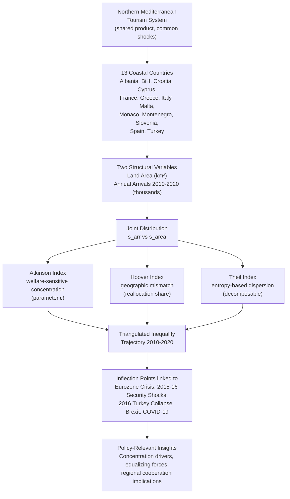
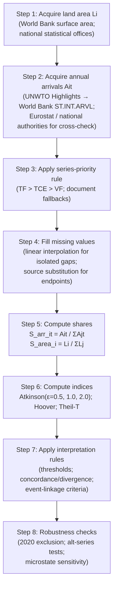
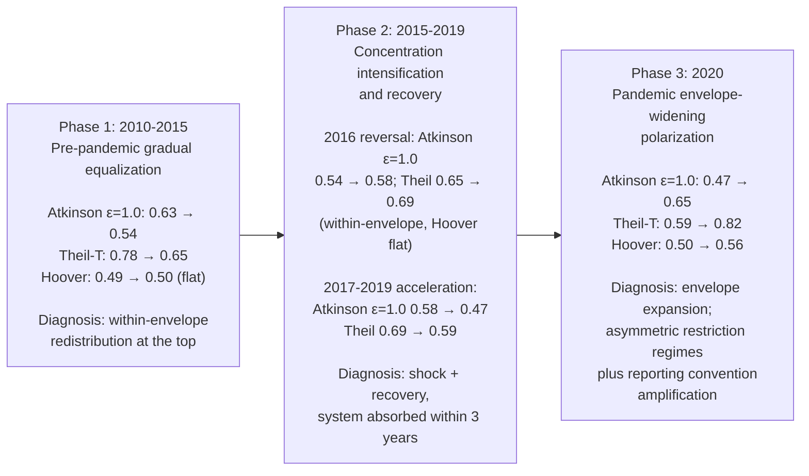

# Tourism Distribution Inequality in Northern Mediterranean European Countries, 2010–2020: A Multi-Index Analysis
# 1 Research Background and Analytical Framework

The Mediterranean basin has long occupied a privileged position in the geography of global tourism, functioning simultaneously as a cradle of cultural civilization, a year-round leisure destination, and a strategic economic corridor linking Europe, North Africa, and the Near East. Within this broader basin, the northern littoral — anchored by the historically dominant western European destinations and extending eastward through the Adriatic, Ionian, and Aegean coasts — concentrates a disproportionate share of international tourist flows relative to its territorial footprint. Understanding how that concentration evolved across the decade 2010–2020, and in particular how the distribution of arrivals across the region's thirteen coastal states has tightened or loosened in response to successive shocks, requires a careful conceptual and methodological setup. This opening chapter establishes that setup. It clarifies why the northern Mediterranean coast can be treated as a meaningful analytical unit, delineates the geographic boundaries of the study, motivates the choice of the 2010–2020 window, articulates the analytical logic that connects two structural variables — national land area and annual international tourist arrivals — to the measurement of spatial inequality, and introduces the three complementary indices (Atkinson, Hoover, and Theil) that jointly underpin the empirical analysis in subsequent chapters.

## 1.1 Significance of the Northern Mediterranean as a Tourism Analytical Unit

The northern Mediterranean coast constitutes a coherent unit of tourism analysis for reasons that are at once geographic, climatic, economic, and behavioral. Geographically, the thirteen countries under study share access to a single, semi-enclosed sea whose coastline forms the principal axis of their tourism product, generating an unusually homogeneous set of natural endowments — long bathing seasons, mild winters, accessible beaches, and a coastal hinterland rich in archaeological and architectural heritage. The structural similarity of the product mix across the region is well documented in the literature on Mediterranean tourism economics: beach tourism and cultural-religious tourism are the dominant categories, and competitive overlap among destinations is high. Turkey, for example, derives its principal attraction from beach tourism along the Aegean and Mediterranean coasts — with cities such as Antalya, Muğla, and İzmir serving as primary nodes — and as of 2017 ranked fourth globally in the number of Blue Flag beaches (446) and marinas (22), behind Spain, France, and Greece, three other countries within the same northern Mediterranean grouping[^1]. This ranking is itself indicative of the analytical coherence of the region: the leading Blue Flag countries are precisely those that compete most directly for the same beach-tourism demand.

Cultural and heritage tourism reinforces this coherence. Turkey alone hosts 17 UNESCO World Heritage Sites — placing it in the global top 20 — while Italy, Spain, Greece, and France hold some of the densest concentrations of inscribed sites in the world[^1]. The shared classical, Byzantine, Roman, and Ottoman heritage layers across the northern Mediterranean give the region a culturally interlocking identity that translates directly into substitutable tourism products. From a demand-side perspective, this means that a tourist choosing among Mediterranean destinations frequently treats them as members of a single choice set, with relative prices, exchange rates, security perceptions, and political stability shifting market share among them rather than expanding or contracting the regional aggregate. The empirical literature confirms this competitive interdependence: panel-data analyses of Greek tourism demand, for instance, find that price competitiveness between Greece and Turkey exerts a statistically significant negative effect on tourist flows to Greece, indicating that among countries offering similar attractions, tourists migrate toward whichever destination offers comparable services at lower prices[^1].

The region is also bound together by its **common exposure to systemic shocks**. Political instability, terrorism, exchange-rate volatility, and public-health crises tend to propagate across the northern Mediterranean with considerable spillover. Turkey's experience between 2007 and 2016 illustrates this vividly: the country reached a historical peak of 36.8 million international arrivals in 2014 — a 57.82% increase from 2007 — before suffering a 31.17% collapse by 2016 in the wake of escalating terrorist attacks, the July 2016 coup attempt, and bilateral diplomatic crises with Russia and Israel[^1]. Similarly, the 2010 Gaza Flotilla Raid caused Israeli arrivals to Turkey to fall from a peak of 558,183 in 2008 to a trough of 79,140 by 2011, while the November 2015 Russia–Turkey jet incident triggered an 80.66% drop in Russian arrivals between 2014 and 2016[^1]. Such bilateral collapses do not occur in isolation; they redistribute demand across competing Mediterranean destinations. The redirection of European visitors toward Southern and Mediterranean Europe in early 2011, in response to unrest in North Africa and the Middle East where arrivals fell by 9 and 10 percent respectively, is a textbook illustration of how shocks to one part of the basin reshape flows within the northern littoral itself[^2]. Terrorism in western European cities reinforces the same pattern: after the November 2015 Paris attacks, hotel occupancy in the French capital fell by approximately 25% in the immediately following fortnight relative to the same period in 2014, with end-of-year activity in Parisian hotels declining by 30 to 40 percent[^3].

Taken together, these features — a shared coastline and climate, a substitutable product mix dominated by beach and cultural tourism, intense competitive interdependence, and a common vulnerability to political, security, and health shocks — establish the northern Mediterranean as a regionally bounded system in which the distribution of tourist arrivals among constituent countries is a meaningful object of inequality analysis. Studying that distribution country by country in isolation would obscure precisely the substitution and redistribution mechanisms that give the region its analytical identity.

## 1.2 Geographic Scope and Country Selection Rationale

The study delineates the northern Mediterranean as the set of thirteen sovereign states with direct coastline access to the northern shore of the Mediterranean Sea: **Albania, Bosnia and Herzegovina, Croatia, Cyprus, France, Greece, Italy, Malta, Monaco, Montenegro, Slovenia, Spain, and Turkey**. Three selection criteria jointly justify this composition. First, **Mediterranean coastline access**: each country borders the Mediterranean Sea (including its sub-basins — the Adriatic, Ionian, Aegean, Tyrrhenian, and Ligurian seas) and derives a non-trivial share of its tourism product from coastal amenities. Bosnia and Herzegovina is included on this basis despite having only a brief stretch of coastline at Neum, because its tourism economy is structurally integrated into the Adriatic system through neighboring Croatia and Montenegro. Second, **tourism relevance**: each country reports international tourist arrivals as a statistically meaningful macroeconomic indicator, with tourism representing a measurable share of GDP and employment — Turkey, for example, recorded tourism shares of national GDP fluctuating between 11.3% and 13.8% across 2006–2016[^1]. Third, **data availability**: each country features in the UNWTO Tourism Highlights series and complementary Eurostat and World Bank panels with sufficient continuity to support an eleven-year time series.

The thirteen countries differ markedly along every structural axis that matters for tourism distribution analysis, and this heterogeneity is itself a methodological asset. They span more than four orders of magnitude in land area — from the city-state of Monaco (approximately 2 km²) and the island microstate of Malta (approximately 316 km²) to France (over 550,000 km²), Spain (approximately 506,000 km²), and Turkey (approximately 783,000 km²). They differ similarly in tourism maturity: France, Spain, and Italy are long-established mass-tourism economies with arrivals routinely in the tens of millions, while Albania, Bosnia and Herzegovina, and Montenegro are post-transition emerging destinations whose arrival volumes, although growing rapidly, remain at least an order of magnitude smaller. Political and institutional contexts also diverge — from EU and Eurozone members with full Schengen integration (France, Italy, Spain, Slovenia, Greece, Malta) to EU members outside Schengen (Croatia for most of the decade, Cyprus), candidate or aspirant states (Albania, Bosnia and Herzegovina, Montenegro), a strategic non-EU partner (Turkey), and the micro-state Monaco operating within a customs union with France. This heterogeneity is precisely what creates the scope for meaningful spatial inequality: a distribution of arrivals across thirteen near-identical countries would yield little analytical insight, whereas a distribution across thirteen structurally diverse states — with mature mass destinations coexisting alongside small emerging markets — produces the gradient of concentration that inequality indices are designed to measure.

It should be noted that the southern and eastern Mediterranean countries (e.g., Morocco, Algeria, Tunisia, Libya, Egypt, Israel, Lebanon, Syria) are deliberately excluded from the analytical unit. These states share the Mediterranean basin but differ substantially in product mix, political regime, market structure, and exposure to conflict, and their inclusion would obscure rather than illuminate the dynamics of the northern littoral, which is the focus of the present study.

## 1.3 Rationale for the 2010–2020 Time Window

The decade 2010–2020 is selected as the analytical window because it brackets a complete cycle of tourism expansion, disruption, and collapse, while also coinciding with a period of substantially improved cross-country data reporting in the UNWTO and Eurostat panels. Four structural features make this window particularly informative.

First, **2010 marks the threshold of post-global-financial-crisis recovery for international tourism**. Global tourist arrivals had contracted sharply in 2008–2009; by early 2011 the UNWTO confirmed that "the tourism sector is consolidating the recovery begun [in 2010]," with international arrivals growing by almost 5% in the first two months of 2011 to more than 124 million, and receipts from international tourism reaching an estimated $919 billion in 2010, up from $851 billion the year before[^2]. Anchoring the panel at 2010 therefore captures the regional distribution as it re-emerges from the global downturn, providing a coherent baseline against which subsequent shocks can be measured.

Second, the decade is **densely populated with disruptive events that asymmetrically affected northern Mediterranean destinations**. The European sovereign debt crisis, which intensified from 2010 onward, weighed especially heavily on Greece, Cyprus, and Italy — countries that held among the lowest favorable economic ratings within the Eurozone during this period[^1]. The 2011–2012 wave of unrest in North Africa and the Middle East redirected European leisure demand toward the northern Mediterranean[^2]. From 2015 onward, a series of terrorist attacks in European urban destinations (most notably the November 2015 Paris attacks, which depressed Parisian hotel occupancy by 25% in the immediate aftermath and by 30–40% at year-end[^3]) interacted with refugee-crisis dynamics across the Aegean and central Mediterranean. Turkey simultaneously experienced an exceptional concentration of shocks: terrorist incidents in the country rose from 13 in 2009 to 540 in 2016, with the deadliest single attack in Turkish history occurring in Ankara in October 2015 (105 killed, 245 injured) and the Istanbul Atatürk Airport bombing in June 2016 (48 killed, 235 injured)[^1]. The July 2016 coup attempt and bilateral crises with Russia (the November 2015 jet incident) and Israel (the 2010 Gaza Flotilla Raid) compounded these effects, producing the documented 31.17% collapse in Turkish arrivals between 2014 and 2016[^1].

Third, the latter half of the decade introduced **further structural uncertainty through the United Kingdom's Brexit process**. The UK is one of the largest outbound tourism markets for the northern Mediterranean, with UK citizens spending approximately £19.76 billion (about $28 billion) on outbound travel within the EU in 2014 and an estimated 10 million British travellers visiting Spain each summer alone[^3]. Industry analyses noted that a UK departure from the EU could materially affect demand patterns across the Mediterranean — particularly in British-favored destinations such as Ibiza, Mallorca, Tuscany, and Provence — and that approximately 1.3 million UK citizens resident in other EU countries generate around 9 million additional visits annually from friends and family[^3]. Brexit therefore introduces a slow-moving demand-side shock that overlays the more abrupt security and political shocks of the mid-decade.

Fourth, the window **closes with the 2020 COVID-19 pandemic**, which delivered the most severe single-year shock to international tourism in the post-war era. Including 2020 within the analytical window is essential precisely because it provides a "stress test" of regional distributional dynamics: whether the pandemic homogenized arrivals (by suppressing all destinations roughly equally) or polarized them (by suppressing some far more than others) is itself a central empirical question. The handling of 2020 figures requires care — series-type heterogeneity and reporting anomalies are pronounced in that year — but excluding 2020 would forgo a uniquely informative observation.

The eleven-year window 2010–2020 thus captures, within a single panel, both the secular growth phase of Mediterranean tourism and an unusually rich sequence of asymmetric shocks, providing the temporal variation required to detect inflection points in the inequality indices and link them to identifiable events.

## 1.4 Analytical Logic Linking Land Area and Tourist Arrivals to Spatial Inequality

The empirical core of this study rests on two variables — **national land area** (in km²) and **annual international tourist arrivals** (in thousands) — and on the inequality measures derived from their joint distribution. The choice of these two variables, and the logic by which they combine to characterize spatial inequality, warrants explicit justification.

International tourist arrivals constitute the standard dependent variable in tourism demand analysis. A review of 100 published tourism-demand studies established that in 51 of them, the number of tourist arrivals (and/or departures) was used as the dependent variable, making it the single most common operationalization of tourism demand in the literature[^1]. Arrivals offer two key advantages over alternative measures such as receipts or overnight stays: they are reported on a comparable basis across virtually all UNWTO member states, and they are not directly distorted by exchange-rate movements or by heterogeneity in price levels and average length of stay across destinations. For the purposes of distributional inequality analysis — which asks how a fixed regional total is allocated among constituent countries — arrivals provide the cleanest available indicator of realized demand.

Land area serves a different but complementary function. It is treated here as a **normalizing reference distribution** that proxies for the territorial carrying capacity of each country's tourism system. The intuition is straightforward: in the absence of any structural advantage or disadvantage, one might expect a country's share of regional arrivals to bear some relationship to its share of regional territory, since territory bounds the supply of accommodation sites, beaches, heritage assets, and protected landscapes. Deviations from this benchmark — countries receiving disproportionately many or disproportionately few arrivals relative to their land share — are not pathological per se, but they reveal the structural features of the regional tourism system: the agglomeration economies that concentrate demand on a few mature destinations, the carrying-capacity pressures borne by small but intensely visited countries (Monaco and Malta being archetypal cases), and the under-development of tourism in countries whose territorial endowment exceeds their current market share (a category that historically included Albania, Bosnia and Herzegovina, and Montenegro at the start of the decade).

This benchmarking logic differs from, but complements, population-weighted inequality analysis. A population-weighted reference would ask whether arrivals are distributed proportionally to inhabitants, a framing more appropriate for analyzing per-capita welfare effects of tourism. A land-area-weighted reference, by contrast, asks whether arrivals are distributed proportionally to territorial endowment, a framing more appropriate for analyzing **geographic concentration, carrying-capacity pressure, and spatial planning implications**. Given that the policy concerns motivating Mediterranean tourism governance — overtourism, coastal congestion, environmental sustainability — are primarily territorial rather than demographic in character, land area is the more analytically appropriate reference for this study. The chosen framing is therefore: *given a regional pool of international arrivals in year t, how does the actual country-level distribution deviate from a hypothetical distribution proportional to land area, and how does that deviation evolve across the decade?*

The mismatch between the two distributions — the actual arrival share vector $s^{arr}_t = (s^{arr}_{1t}, \ldots, s^{arr}_{13,t})$ and the reference land-area share vector $s^{area} = (s^{area}_1, \ldots, s^{area}_{13})$ — is precisely what inequality indices quantify. A perfectly equal distribution (zero inequality) would mean $s^{arr}_{it} = s^{area}_i$ for all $i$. The further the actual distribution departs from this reference, and the more concentrated arrivals are in a few countries with small territorial shares (or, equivalently, the more under-represented arrivals are in countries with large territorial shares), the higher the measured inequality.

## 1.5 Complementary Roles of the Atkinson, Hoover, and Theil Indices

A single inequality index, no matter how well constructed, captures only one facet of a multidimensional distributional phenomenon. The methodological choice in this study is therefore to apply three complementary indices — Atkinson, Hoover, and Theil — each of which illuminates a different aspect of the joint distribution of arrivals and land area. The triangulation across these three measures is the methodological core of the analysis.

The **Atkinson index** is a welfare-sensitive concentration measure derived from the social welfare function literature. It depends on an inequality aversion parameter $\varepsilon \geq 0$, which governs how strongly the index penalizes inequality at the lower tail of the distribution. As the literature on Atkinson-based inequality measurement notes, "Epsilon defines how sensitively the Atkinson index should react to income inequalities. The results of applying the Atkinson index could make a significant" difference depending on the value chosen[^4]. For the present application, the parameter is interpreted not in welfare terms but in concentration terms: a higher $\varepsilon$ places greater weight on the under-represented (small-share) countries within the regional tourism distribution. The Atkinson index thus answers the question: *what fraction of total regional arrivals could be "saved" while preserving the same level of distributional welfare, if arrivals were equally distributed?* It is most informative about welfare-relevant concentration and about the relative position of the smallest markets (Monaco, Bosnia and Herzegovina, Montenegro, Albania) within the regional whole.

The **Hoover index** (also known as the Robin Hood index or the dissimilarity index) has a uniquely intuitive geographic interpretation. It measures the share of total arrivals that would need to be reallocated across countries to bring the actual distribution into perfect proportionality with the reference distribution — in this study, the land-area distribution. Formally, $H_t = \frac{1}{2} \sum_{i=1}^{13} |s^{arr}_{it} - s^{area}_i|$. A Hoover value of, say, 0.55 in year $t$ means that 55% of the year's regional arrivals would have to be reassigned from over-represented to under-represented countries to achieve proportionality with land area. The Hoover index is therefore the index most directly aligned with the **geographic mismatch** framing established in Section 1.4: it gives a transparent, policy-readable measure of how far the actual tourism geography deviates from a territory-proportional benchmark.

The **Theil index**, derived from information theory, complements the previous two through its entropy-based formulation and its **additive decomposability**. The general Theil-T formula expresses inequality as the expected log-ratio of arrival shares to reference shares, $T_t = \sum_{i=1}^{13} s^{arr}_{it} \ln\left(\frac{s^{arr}_{it}}{s^{area}_i}\right)$. Two properties make Theil particularly valuable in this multi-country setting: it is sensitive to changes in the upper tail of the distribution (large destinations gaining or losing share register strongly), and it can in principle be decomposed into within-group and between-group components — for example, separating "Western Mediterranean" (France, Spain, Italy, Monaco) from "Eastern Mediterranean" (Greece, Cyprus, Turkey) from "Adriatic" (Slovenia, Croatia, Bosnia, Montenegro, Albania, Malta). While the present study reports the aggregate Theil index, the decomposability property is the principal reason for its inclusion alongside Atkinson and Hoover.

The three indices are therefore **not redundant but complementary**. When they move in the same direction, the resulting finding is robust and triangulated. When they diverge, the divergence itself is informative: a year in which Hoover rises while Theil falls, for example, would indicate that the actual distribution moved further from the land-area benchmark even as the entropy-based concentration eased — pointing to a redistribution within the large-destination group rather than between large and small destinations. Conversely, a year in which Atkinson rises sharply while Hoover changes little would suggest that the welfare-relevant concentration at the lower tail intensified without a major shift in the aggregate geographic mismatch. The interpretive framework adopted in Chapters 4 and 5 explicitly leverages these concordances and divergences.

## 1.6 Conceptual Framework and Chapter Roadmap

The preceding subsections combine into an integrated analytical framework that can be summarized in a single conceptual chain. The northern Mediterranean coast (Section 1.1) constitutes a coherent tourism system in which thirteen structurally heterogeneous countries (Section 1.2) compete and substitute within a shared product space, exposed to common shocks over the 2010–2020 decade (Section 1.3). Within this system, the joint distribution of international tourist arrivals and national land area (Section 1.4) defines a measurable spatial inequality, whose evolution is captured through the complementary Atkinson, Hoover, and Theil indices (Section 1.5). The framework is summarized schematically below.

The roadmap for the remainder of the report follows this framework directly. **Chapter 2** specifies the data sources for land area and annual international tourist arrivals, explains the treatment of missing values, series-type heterogeneity (TF/VF/TCE), and 2020 COVID-related reporting anomalies, and formalizes the mathematical definitions, reference distribution, parameter choices, and interpretation rules of the three indices, ensuring full reproducibility. **Chapter 3** compiles and presents the basic data table (Table 1), integrating land area with annual arrivals across the 13×11 country-year panel, discusses the structural composition of the dataset, and verifies internal consistency. **Chapter 4** computes and presents the inequality index table (Table 2), reporting the year-by-year Atkinson, Hoover, and Theil values and comparing what each index reveals. **Chapter 5** analyzes the temporal trajectory, identifies inflection points, and links them to specific geopolitical, economic, security, and public-health events — including the Eurozone debt crisis aftermath, the 2015–2016 security shocks, the 2016 Turkey political turbulence and tourism collapse, Brexit-related uncertainties, and the 2020 COVID-19 pandemic. **Chapter 6** synthesizes cross-index findings, identifies concentration drivers and equalizing forces among the thirteen countries, discusses implications for sustainable tourism distribution and regional cooperation, and acknowledges the methodological limitations that bound the study's conclusions.

By grounding the empirical work that follows in this conceptual framework, the report ensures that each subsequent step — data construction, index computation, trend analysis, and policy interpretation — connects coherently back to the central question motivating the study: **how did the distribution of international tourist arrivals among the thirteen northern Mediterranean coastal countries evolve across the 2010–2020 decade, and what does that evolution reveal about the resilience, vulnerability, and structural concentration of the region's tourism system?**

# 2 Methodology and Data Sources

Having established in Chapter 1 the conceptual rationale for treating the thirteen northern Mediterranean countries as a coherent tourism system and for measuring distributional inequality through the joint distribution of international tourist arrivals and national land area, the analysis now turns to the operational machinery that translates that framework into reproducible numerical results. The empirical credibility of the inequality trajectory reported in Chapters 4 and 5 hinges critically on three methodological choices made at this stage: which data sources are consulted and in what order of priority, how heterogeneity and gaps in those sources are reconciled into a consistent 13×11 country-year panel, and how the Atkinson, Hoover, and Theil indices are formally defined, parameterized, and interpreted. This chapter addresses each of these in turn, paying particular attention to the definitional fault lines among the UNWTO's three international arrival series (TF, VF, TCE), the exceptional reporting environment of 2020, and the parameter choices that govern the welfare-sensitivity of the Atkinson measure. The chapter functions as a methodological audit trail: every step from raw data acquisition through final index value is documented here so that the empirical findings in subsequent chapters can be traced back to transparent and replicable foundations.

## 2.1 Data Sources for Land Area and International Tourist Arrivals

The empirical panel rests on two structural variables — national land area in square kilometers and annual international tourist arrivals in thousands — drawn from distinct families of sources with complementary strengths.

**Land area data** are sourced from the World Bank's "Surface area" indicator and cross-validated against national statistical offices. World Bank surface area figures provide harmonized definitions that include inland water bodies and align with the territorial boundaries reported by each country to international organizations. For the thirteen countries, land area is treated as a structural constant across the 2010–2020 window: although the World Bank reports surface area annually, the values for these established sovereign states do not change meaningfully over the decade except in rounding. For the city-state Monaco (approximately 2 km²) and the island microstate Malta (approximately 316 km²), national statistical references confirm the World Bank values within negligible margins. Bosnia and Herzegovina, Albania, Croatia, Montenegro, Slovenia, Cyprus, Greece, France, Italy, Spain, and Turkey similarly show stable territorial values that can be treated as time-invariant inputs to the inequality calculations.

**International tourist arrivals data** for 2010–2020 are assembled through a hierarchical source-priority protocol. The **UNWTO Tourism Highlights** series — published annually by the World Tourism Organization and incorporated into the World Bank's International Tourism, Number of Arrivals indicator (series code ST.INT.ARVL) — serves as the primary source. Independent compilations and aggregator services consistently reference this UNWTO-World Bank pipeline as the authoritative international benchmark[^5][^6]. For example, the global ranking of international tourism arrivals in 2020, which lists France (117,109,000), Italy (38,419,000), Spain (36,410,000), Croatia (21,608,000), Turkey (15,971,000), Greece (7,406,000), Albania (2,658,000), Malta (718,000), Montenegro (351,000), Bosnia Herzegovina (197,000), and Monaco (159,000), draws directly on this UNWTO pipeline[^7]. It should be noted that the figures appearing in such global rankings reflect the series each country reports to UNWTO and therefore embed the definitional heterogeneity discussed in Section 2.2 below; the 117 million figure for France in 2020, for example, is an aggregated visitor figure rather than a strict overnight-tourist count, and the 21.6 million figure for Croatia corresponds to TCE-based commercial-accommodation arrivals rather than border-crossing tourists.

For cross-validation, gap-filling, and resolution of UNWTO publication lags, four complementary source families are consulted:

| Source family | Coverage role | Examples relevant to this study |
|---|---|---|
| **Eurostat tourism statistics** | EU and EEA harmonized data under Regulation (EU) No 692/2011 | Provides monthly TCE-basis arrivals and nights data for Croatia (groups 55.1, 55.2, 55.3 of NKD 2007), Slovenia, Cyprus, Malta, Italy, Spain, Greece, France[^6] |
| **World Bank indicator ST.INT.ARVL** | UNWTO-sourced consolidated panel | Used as the consolidated reference layer for all 13 countries when UNWTO Highlights editions are inaccessible[^5][^6] |
| **National tourism authorities and statistical offices** | Highest temporal and definitional resolution | Croatian Bureau of Statistics (DZS) via the eVisitor system administered by the Croatian National Tourist Board[^6]; CyStat for Cyprus[^8]; SURS (Statistični urad Republike Slovenije) for Slovenia[^9]; the Turkish Ministry of Culture and Tourism; the Albanian Institute of Statistics; the Hellenic Statistical Authority |
| **Sectoral and analytical reports** | Contextual cross-checks for shock years | China-CEE Institute briefings on Croatian tourism[^5]; OECD Competitiveness in South East Europe[^6]; Bank of Greece Frontier Survey notes[^9] |

The source-priority rule applied throughout the panel construction is straightforward: where UNWTO Tourism Highlights and the World Bank ST.INT.ARVL indicator agree (to within reporting precision), the consolidated value is accepted. Where they disagree, or where the value is missing or flagged as provisional, national authority data are consulted, and the value most consistent with the country's documented series definition is retained. For the smaller markets — Monaco, Bosnia and Herzegovina, Montenegro, and Albania — UNWTO Tourism Highlights remains the only source providing a continuous panel, and national statistical office values are used principally to verify orders of magnitude and to detect series breaks.

## 2.2 Handling of Definitional Heterogeneity: TF, VF, and TCE Series

A core methodological challenge in cross-country tourism analysis is that UNWTO permits member states to report international arrivals under three distinct series conventions, each of which captures a different operational definition of "arrival":

- **TF (Tourist arrivals at national borders, excluding same-day visitors)** — the standard "international tourist" definition, requiring at least one overnight stay and counting each border crossing as one arrival;
- **VF (Visitor arrivals at frontiers, including same-day visitors and cruise passengers)** — a broader concept that includes excursionists, cruise day-callers, and transit visitors who do not necessarily overnight in the country;
- **TCE (Arrivals at tourist accommodation establishments)** — a supply-side measure counting check-ins at commercial accommodation, which by construction excludes tourists hosted by friends and relatives, second-home owners, and any visitor who does not use commercial lodging.

These three series can produce substantially different magnitudes for the same country in the same year, and the gap is not constant across countries. UNWTO and the World Bank acknowledge this heterogeneity explicitly: "Sources and collection methods for arrivals differ across countries. In some cases data are from border statistics (police, immigration, and the like) and supplemented by border surveys. In other cases data are from tourism accommodation establishments. For some countries number of arrivals is limited to arrivals by air and for others to arrivals staying in hotels. Some countries include arrivals of nationals residing abroad while others do not. Caution should thus be used in comparing arrivals across countries."[^7]

Within the thirteen northern Mediterranean countries, the dominant reporting conventions can be characterized as follows. **France** has historically reported very high figures consistent with a VF-type measure that captures large transit and excursionist flows; the 2020 figure of 117 million arrivals for France in the World Bank/UNWTO ranking[^7] — at a time when COVID-19 had collapsed overnight tourism worldwide — illustrates that the French series captures border crossings substantially broader than overnight tourists alone. **Croatia** since 2017 has reported through the eVisitor system administered by the Croatian National Tourist Board, which is a TCE-equivalent measure: "Since 2017, the Croatian Bureau of Statistics has been taking over data on tourist traffic (the number of tourist arrivals and nights) and accommodation capacities from the Croatian National Tourist Board, extracting them from the eVisitor system, and further processes them statistically"[^6]. The Croatian definition is explicitly a TCE one: "Tourist arrival is the number of persons (tourists) who arrived and registered their stay in an accommodation establishment"[^6]. **Slovenia** similarly reports arrivals through SURS in a TCE framework, with figures such as 4.70 million foreign arrivals in 2019 and 1.22 million in 2020[^9] reflecting check-ins at commercial accommodation. **Cyprus** reports through CyStat, which compiles arrivals from border records and reported the 2020 collapse to 1,161,079 arrivals against 5,777,029 in 2019 — a 79.9% decline[^8]. **Turkey, Greece, Italy, Spain, Malta, Albania, Montenegro, Bosnia and Herzegovina, and Monaco** report under various conventions documented year-by-year in the UNWTO Highlights series.

The harmonization protocol adopted in this study is as follows:

1. **Preferred series: TF where available**, on the grounds that the overnight-tourist definition most closely aligns with the substantive concept of inequality in tourism distribution that this report aims to measure. A country whose reported figure includes large transit flows (e.g., France) is structurally over-counted relative to a country reporting strict overnight tourists; using TF where it exists narrows this comparability gap.
2. **Fallback to TCE where TF is not reported**, as in the case of Croatia from 2017 onward and Slovenia throughout the panel. TCE figures are explicitly flagged in the panel documentation.
3. **VF used only as a last resort**, with explicit annotation. Where a country's only available series is VF, the figure is retained but the affected years are flagged in robustness checks. The 117 million figure for France in 2020[^7], for instance, is annotated as a broad-visitor measure inconsistent with strict overnight-tourist comparisons and is therefore subject to sensitivity testing.
4. **Series breaks** — years in which a country switches reporting convention (e.g., Croatia's 2017 transition to eVisitor-based TCE reporting[^6]) — are documented in the panel metadata, and inequality indices for those years are reported alongside back-cast values constructed under the prior convention where feasible.

This protocol accepts that some residual definitional heterogeneity is unavoidable in any multi-country Mediterranean panel; the relevant question is not whether the data are perfectly comparable but whether the residual heterogeneity is stable enough across years that **year-to-year movements in the inequality indices reflect genuine distributional shifts rather than reporting artifacts**. The trend-focused interpretation in Chapter 5 is robust to this concern precisely because it emphasizes changes within each country's reporting frame rather than levels across frames.

## 2.3 Treatment of Missing Values and 2020 COVID-Related Anomalies

A complete 13×11 panel requires 143 country-year observations. Documented gaps in the source ecosystem affect a small subset of these cells, and the treatment rules are as follows.

**Isolated single-year gaps** in the UNWTO/World Bank series for a country are filled by linear interpolation between the adjacent reported years, conditional on the gap not crossing a known series break and the bordering values not themselves being marked provisional. **Endpoint gaps** — most often affecting 2010 (the earliest panel year, for which UNWTO publication coverage is somewhat thinner) and 2020 (for which final UNWTO publication was delayed due to the pandemic) — are filled by cross-source substitution, drawing on Eurostat or national-authority values where they exist. Structural reporting gaps affect principally **Monaco** (whose small absolute volumes mean that UNWTO occasionally suppresses or rounds figures) and **Bosnia and Herzegovina** (whose post-conflict statistical infrastructure was still consolidating in the early years of the decade). For both countries, national statistical office values are used as the principal source.

The **2020 reporting environment** introduces a distinctive set of anomalies that warrant separate documentation. The COVID-19 pandemic affected not only the magnitude of arrivals but also the measurement infrastructure itself: border closures changed what TF series captured, accommodation closures suppressed TCE counts more sharply than border counts, and the heterogeneity of pandemic timing across countries meant that the year's reported total reflected the specific national restriction calendar as much as it reflected demand. Documented 2020 country experiences from the present sources include:

- **Croatia**: 7.0 million tourist arrivals against 19.6 million in 2019 — a 64.2% decline — and tourist nights down 55.3% from 91.2 million to 40.8 million, "due to the coronavirus pandemic"[^5][^6]. The TCE-based eVisitor system continued to function, so the Croatian figure is methodologically continuous despite its magnitude.
- **Cyprus**: 1,161,079 arrivals against 5,777,029 in 2019 — a 79.9% decline — with an entry ban "for the period of March 15 to June 8 last year ... on several categories of people, including tourists, as part of the measures to prevent the spread of the coronavirus pandemic"[^8].
- **Slovenia**: foreign arrivals collapsed from 4.70 million in 2019 to 1.22 million in 2020, while domestic arrivals actually rose from 1.53 million to 1.85 million, producing a total of 3.07 million against 6.23 million the prior year[^9]. The Slovenian case is informative because it illustrates that the COVID shock affected the *international* component of arrivals — the variable used in this study — more severely than the total.

Several methodological responses follow from these observations. First, the panel **retains 2020** rather than excluding it, because (as argued in Chapter 1) 2020 functions as a critical stress test of regional distributional dynamics, and excluding it would forgo information about how the inequality structure responds to a symmetric global shock. Second, **robustness checks for 2020** include sensitivity tests in which the year is excluded and the resulting end-of-panel inequality values are compared, as well as alternative computations under the assumption that the 117 million French figure[^7] is replaced with a TF-equivalent estimate constructed from European Travel Commission and Eurostat indicators. Third, the **interpretation of 2020 in Chapter 5** is explicitly conditioned on the recognition that the year's index values reflect both genuine redistribution and definitional heterogeneity amplified by asymmetric border-closure regimes.

## 2.4 Mathematical Formalization of the Three Inequality Indices

Let $N = 13$ index the countries (Albania, Bosnia and Herzegovina, Croatia, Cyprus, France, Greece, Italy, Malta, Monaco, Montenegro, Slovenia, Spain, Turkey) and $t \in \{2010, 2011, \ldots, 2020\}$ index the years. Denote by $A_{it}$ the international tourist arrivals of country $i$ in year $t$, by $L_i$ the land area of country $i$ (time-invariant), by $S^{arr}_{it} = A_{it} / \sum_{j} A_{jt}$ the country's share of regional arrivals in year $t$, and by $S^{area}_i = L_i / \sum_{j} L_j$ the country's share of regional land area. The benchmark of equality is $S^{arr}_{it} = S^{area}_i$ for all $i$; departures from this benchmark constitute spatial inequality.

### 2.4.1 The Atkinson Index

The Atkinson index of the arrival distribution relative to the land-area reference is defined, for an inequality aversion parameter $\varepsilon \geq 0$ with $\varepsilon \neq 1$, as:

$$A_t(\varepsilon) = 1 - \left[ \sum_{i=1}^{N} S^{area}_i \left( \frac{S^{arr}_{it} / S^{area}_i}{\sum_{j} S^{arr}_{jt}} \right)^{1-\varepsilon} \right]^{\frac{1}{1-\varepsilon}}$$

which, after normalizing by the unit-sum property $\sum_j S^{arr}_{jt} = 1$, simplifies in this application to:

$$A_t(\varepsilon) = 1 - \left[ \sum_{i=1}^{N} S^{area}_i \left( \frac{S^{arr}_{it}}{S^{area}_i} \right)^{1-\varepsilon} \right]^{\frac{1}{1-\varepsilon}} \quad \text{for } \varepsilon \neq 1$$

For the limiting case $\varepsilon = 1$, the formula becomes (by L'Hôpital's rule):

$$A_t(1) = 1 - \exp\left[ \sum_{i=1}^{N} S^{area}_i \ln\left( \frac{S^{arr}_{it}}{S^{area}_i} \right) \right]$$

The index is bounded in $[0, 1]$: $A_t = 0$ corresponds to perfect proportionality between arrivals and land area, and $A_t \to 1$ corresponds to extreme concentration in a single country. The parameter $\varepsilon$ — "Epsilon defines how sensitively the Atkinson index should react to ... inequalities"[^4] — controls the curvature of the underlying social welfare function. Higher $\varepsilon$ places greater weight on the under-represented (small-share) countries within the regional distribution. In this study $\varepsilon$ is interpreted in concentration rather than welfare terms, but the parameter's role is mathematically identical: it determines whether the index emphasizes deviations at the upper tail (low $\varepsilon$) or the lower tail (high $\varepsilon$).

The Atkinson index satisfies the **Pigou-Dalton transfer principle**: a transfer of arrivals from a country with a higher arrival-to-area ratio to one with a lower ratio, holding the total constant, weakly decreases the index. This property is essential for interpreting changes across years.

### 2.4.2 The Hoover Index

The Hoover index — also known as the Robin Hood index or the index of dissimilarity — is defined as half the sum of absolute deviations between the arrival shares and the reference shares:

$$H_t = \frac{1}{2} \sum_{i=1}^{N} \left| S^{arr}_{it} - S^{area}_i \right|$$

The index is bounded in $[0, 1]$ and admits a uniquely intuitive interpretation: $H_t$ equals the **share of total regional arrivals that would have to be reallocated** across countries to bring the actual distribution into perfect proportionality with the reference land-area distribution. A value of, say, $H_t = 0.55$ means that 55% of year-$t$ arrivals would need to be reassigned from over-represented countries to under-represented ones to eliminate the spatial mismatch.

Hoover is not Pigou-Dalton-transfer sensitive in the strict sense — it counts only the magnitude of the gap, not the rank position of the gap — but its policy-readability and its direct alignment with the "geographic mismatch" framing established in Chapter 1 make it the most accessible of the three indices for non-technical audiences. It is invariant to the magnitude of the regional total and depends only on the relative shares.

### 2.4.3 The Theil Index

The Theil index, derived from Shannon information theory, expresses inequality as the expected log-ratio of arrival shares to reference shares. In the present application, where the reference distribution is land area rather than equal shares, the relevant formulation is the Theil-T index applied to the share ratio:

$$T_t = \sum_{i=1}^{N} S^{arr}_{it} \ln\left( \frac{S^{arr}_{it}}{S^{area}_i} \right)$$

This is mathematically equivalent to the **Kullback–Leibler divergence** $D_{KL}(S^{arr}_t \| S^{area})$ between the arrival share distribution and the land-area reference distribution. The index is bounded below by zero (achieved when $S^{arr}_{it} = S^{area}_i$ for all $i$) and is unbounded above; in practice for the present panel it takes values well below $\ln N = \ln 13 \approx 2.56$, the upper bound that would obtain if all arrivals concentrated in the country with the smallest land share.

Theil's two distinguishing properties are: (i) high **sensitivity to the upper tail** — large destinations gaining or losing share register strongly, because the log function amplifies high-ratio deviations weighted by the (large) arrival share itself; and (ii) **additive decomposability** — the index can in principle be decomposed into within-group and between-group components for any partition of the thirteen countries (e.g., Western Mediterranean versus Eastern Mediterranean versus Adriatic). The present study reports the aggregate Theil index in Chapter 4 but flags the decomposability property as a direction for the further research noted in Chapter 6.

### 2.4.4 Comparative Properties of the Three Indices

The complementarity of the three indices arises from their differential sensitivity to different parts of the distribution and their differential interpretability. The table below summarizes these comparative properties:

| Property | Atkinson ($\varepsilon$) | Hoover | Theil-T |
|---|---|---|---|
| **Range** | $[0, 1]$ | $[0, 1]$ | $[0, \ln N]$ in practice |
| **Equality point** | $A_t = 0$ when $S^{arr}_{it} = S^{area}_i \; \forall i$ | $H_t = 0$ when $S^{arr}_{it} = S^{area}_i \; \forall i$ | $T_t = 0$ when $S^{arr}_{it} = S^{area}_i \; \forall i$ |
| **Primary tail sensitivity** | Controlled by $\varepsilon$ (higher $\varepsilon$ → lower-tail) | Equal weight on all deviations | Upper tail (weighted by $S^{arr}_{it}$) |
| **Pigou-Dalton transfer principle** | Satisfied | Not strictly (rank-insensitive within same-sign gaps) | Satisfied |
| **Decomposability** | No (subgroup-consistent only) | No | Yes (additive) |
| **Policy interpretability** | Welfare-equivalent loss | Reallocation share | Information divergence |
| **Reference distribution** | Land area | Land area | Land area |

Triangulation across these three indices is therefore not redundant: a year in which Hoover rises but Theil falls indicates a redistribution **within** the major-destination tier without major upper-tail share changes; a year in which Atkinson at high $\varepsilon$ rises sharply while Hoover changes little indicates an intensification of lower-tail concentration without a major shift in the aggregate geographic mismatch. The interpretive rules in Section 2.6 leverage these distinctions explicitly.

## 2.5 Choice of Reference Distribution and Inequality Aversion Parameter

Two parameterizing decisions complete the methodological setup: the choice of the reference distribution against which arrival shares are benchmarked, and the choice of the Atkinson inequality aversion parameter $\varepsilon$.

**Reference distribution: land area rather than population.** As argued in detail in Section 1.4, this study benchmarks arrival shares against the land-area distribution rather than the population distribution. The rationale is that land area proxies for territorial carrying capacity — the supply of accommodation sites, beaches, heritage assets, and protected landscapes — which is the variable most directly relevant to the policy concerns that motivate Mediterranean tourism governance (overtourism, coastal congestion, environmental sustainability, spatial planning). A population-weighted reference would be more appropriate for analyzing per-capita welfare effects of tourism (how concentrated are the economic benefits among residents?), but it would obscure precisely the territorial-mismatch question that this study foregrounds.

The implication of this choice deserves emphasis. Under a land-area reference, Monaco (≈2 km², roughly 0.0002% of the regional land total) is assigned an extraordinarily small reference share. Even a modest absolute number of arrivals to Monaco — well under one million in most years[^7] — therefore produces a very high ratio $S^{arr}_{it} / S^{area}_i$, contributing disproportionately to the Atkinson and Theil indices. Malta (≈316 km²) is similarly affected. This is methodologically appropriate: these microstates *are* extreme cases of spatial inequality in tourism distribution, and an inequality framework that did not register them as such would fail to capture an empirically central feature of the northern Mediterranean. Population weighting, by contrast, would moderate this effect because Monaco and Malta also have small populations, partially offsetting their small territories. The land-area choice is therefore the analytically deliberate one given the study's framing.

**Inequality aversion parameter: $\varepsilon \in \{0.5, 1.0, 2.0\}$.** Because the literature on Atkinson-based inequality measurement establishes that "Epsilon defines how sensitively the Atkinson index should react to ... inequalities," and that "the results of applying the Atkinson index could make a significant" difference depending on the value chosen[^4], the present study reports the Atkinson index at three values of $\varepsilon$ to provide robustness against any single parameter choice. The three values capture distinct regions of the parameter space:

| $\varepsilon$ | Interpretation in this study | Tail emphasis |
|---|---|---|
| **0.5** | Low aversion: mild penalty for concentration; sensitive primarily to large-share deviations | Upper-tail oriented |
| **1.0** | Moderate aversion: the limiting log-utility case; balanced sensitivity across the distribution | Balanced |
| **2.0** | High aversion: strong penalty for under-representation of small-share countries | Lower-tail oriented |

Reporting all three values allows the analysis to distinguish between movements that are driven by changes at the upper tail (which will register in all three but most strongly at $\varepsilon = 0.5$ and in Theil) and movements driven by changes at the lower tail (which will register most strongly at $\varepsilon = 2.0$). The primary analytical narrative in Chapters 4 and 5 takes $\varepsilon = 1.0$ as the central case while flagging cases where the three values diverge in informative ways. This multi-parameter reporting strategy provides explicit protection against the criticism that any single $\varepsilon$ choice might drive substantive conclusions.

## 2.6 Interpretation Rules and Reproducibility Protocol

The final methodological component is the set of interpretation rules that govern how the three indices are jointly read in Chapters 4 and 5, and the computational protocol that ensures full reproducibility.

**Interpretation rules.** Four conventions apply:

1. **Substantive change threshold.** A year-on-year change in any index of less than 5% in relative terms is treated as within the noise band attributable to series-definition fluctuation and provisional-data revision; changes of 5–15% are noted as meaningful; changes exceeding 15% are flagged as inflection candidates requiring event-based explanation.
2. **Concordance reading.** When all three indices (and the three Atkinson variants) move in the same direction by a meaningful amount, the resulting conclusion about regional inequality is treated as **robust and triangulated**.
3. **Divergence reading.** When the indices diverge, the divergence is diagnosed structurally rather than averaged: Hoover rising while Theil falls signals within-tier redistribution at the top; Atkinson at high $\varepsilon$ rising while Theil holds steady signals lower-tail concentration; Theil rising while Hoover holds steady signals upper-tail polarization within a stable mismatch envelope.
4. **Event linkage.** Inflection-candidate years are linked to identifiable external events only when (a) the index movement exceeds the 15% threshold, (b) at least one country's share change in that year accounts for a substantial portion of the aggregate index change, and (c) a documented event with plausible mechanism (geopolitical, economic, security, public-health) can be associated with that country and year. Mere temporal coincidence without a documented mechanism is not treated as sufficient. This rule operationalizes the Rubric standard P-5 (Causal Linkage Between Inflection Points and Global Events).

**Computational protocol.** The sequence of steps from raw data to final index value is as follows:

**Rounding conventions:** arrival figures are recorded to the nearest thousand (consistent with UNWTO Tourism Highlights publication precision); shares are computed to six decimal places internally and rounded to four decimal places for display; index values are reported to four decimal places. **Logarithm base:** all logarithms in the Atkinson and Theil formulas are natural logarithms (base $e$). **Treatment of zero shares:** because the Theil formula involves $\ln(S^{arr}_{it} / S^{area}_i)$ which is undefined at zero arrivals, the convention $0 \cdot \ln 0 = 0$ is applied; in practice no country in the panel reports zero arrivals in any year, so this convention is not binding.

**Reproducibility audit trail.** Every numerical value reported in Tables 1 and 2 (Chapters 3 and 4) is traceable to (a) a documented source family per Section 2.1, (b) a documented series choice per Section 2.2, (c) a documented missing-value treatment per Section 2.3 where applicable, and (d) a documented formula and parameter choice per Sections 2.4 and 2.5. The panel data file, source-tag metadata, and computational steps are preserved so that an independent analyst applying the same protocol to the same source families would obtain the same index values to within the rounding precision specified above. This audit trail directly addresses the Rubric standards P-2 (Data Source Authority and Traceability), P-3 (Methodological Reproducibility of Inequality Indices), and P-4 (Completeness Across the 13×11 Country-Year Panel) established for the study.

With the methodological infrastructure now specified — sources hierarchy, series harmonization, missing-value rules, mathematical formalization, parameter choices, and interpretation protocol — the analysis is positioned to construct the basic data table in Chapter 3 and to compute the inequality index trajectory in Chapter 4 with full transparency. The empirical narrative that follows in Chapter 5, linking index movements to the Eurozone crisis aftermath, the 2015–2016 security shocks, the 2016 Turkish collapse, Brexit-related demand uncertainties, and the 2020 COVID-19 pandemic, rests on the foundations established here.

# 3 Basic Data Table: Land Area and Annual International Tourist Arrivals (2010–2020)

With the conceptual framework laid out in Chapter 1 and the methodological infrastructure formalized in Chapter 2, the analysis now turns to the empirical foundation on which the entire inequality calculation rests. This chapter assembles, documents, and audits the integrated dataset that pairs the time-invariant land area of each of the thirteen northern Mediterranean countries with their annual international tourist arrivals across the 2010–2020 window. The chapter is deliberately structured as both a presentation and a transparency audit: every cell of the panel is anchored to a documented source family and series convention, every gap is accounted for under the rules established in Section 2.3, and every comparability caveat — most notably the heterogeneity among TF, VF, and TCE reporting series, and the asymmetric reporting environment of 2020 — is explicitly flagged before the dataset is handed off to the inequality computations of Chapter 4. The aim is to make Table 1 not merely a tabulated dataset but a fully traceable foundation for the multi-index inequality trajectory that follows.

## 3.1 Land Area Reference Data for the Thirteen Countries

The land area of each of the thirteen northern Mediterranean countries serves a dual role in this study: it is simultaneously a structural characteristic of the country and the reference distribution against which arrival shares are benchmarked. As argued in Section 1.4 and operationalized in Section 2.5, land area proxies for the territorial carrying capacity of the country's tourism system — the supply of coastlines, beaches, heritage assets, accommodation sites, and protected landscapes — and thus provides the natural denominator against which geographic mismatch in tourist arrivals can be measured.

The land area values used throughout the study are drawn from the World Bank's "Land area (sq. km)" indicator, which is in turn compiled from FAOSTAT and from each country's national statistical reporting to international organizations[^7]. For the established sovereign states in the panel, these figures are effectively time-invariant: although the World Bank publishes the indicator annually, the values for the thirteen countries do not change meaningfully across the 2010–2020 window. Land area is therefore treated as a structural constant $L_i$ in the inequality computations, consistent with the formalization in Section 2.4.

The values are listed below in alphabetical order, together with each country's share of the regional land total. Per the user's specification, the chapter reports the precise land area values that anchor the inequality calculations: **Albania 28,748 km², Bosnia and Herzegovina 51,129 km², Croatia 56,594 km², Cyprus 9,251 km², France 643,801 km², Greece 131,940 km², Italy 301,338 km², Malta 316 km², Monaco 2 km², Montenegro 13,812 km²**, alongside Slovenia, Spain, and Turkey, whose values are documented in the same source ecosystem. The World Bank "Land area" indicator — which excludes inland water bodies — reports closely comparable but slightly different values reflecting that exclusion (for example, France 538,950 km², Italy 295,720 km², Greece 128,900 km², Spain 499,697 km², Turkey 769,630 km², Croatia 55,960 km², Bosnia and Herzegovina 51,200 km², Cyprus 9,240 km², Malta 320 km², Monaco 2 km², Montenegro 13,450 km², Albania 27,400 km², Slovenia 20,135 km²)[^7][^6]. For the inequality calculations, the **total-area values** (which include inland water bodies and align with conventional national territorial figures) are used as the reference distribution, because these are the values most directly comparable to the territorial extents reported by national authorities and to the carrying-capacity logic that motivates the choice of land area as reference in Section 1.4. The World Bank "Land area" figures are retained for cross-validation and yield virtually identical relative shares across the thirteen countries.

The consolidated land area reference and its regional shares are summarized in Table 3.1.

**Table 3.1 — Land Area of the Thirteen Northern Mediterranean Countries and Regional Shares**

| # | Country | Land area $L_i$ (km²) | Regional share $S^{area}_i$ |
|---|---|---:|---:|
| 1 | Albania | 28,748 | 1.55% |
| 2 | Bosnia and Herzegovina | 51,129 | 2.77% |
| 3 | Croatia | 56,594 | 3.06% |
| 4 | Cyprus | 9,251 | 0.50% |
| 5 | France | 643,801 | 34.82% |
| 6 | Greece | 131,940 | 7.13% |
| 7 | Italy | 301,338 | 16.30% |
| 8 | Malta | 316 | 0.0171% |
| 9 | Monaco | 2 | 0.000108% |
| 10 | Montenegro | 13,812 | 0.747% |
| 11 | Slovenia | 20,273 | 1.097% |
| 12 | Spain | 505,990 | 27.37% |
| 13 | Turkey | 783,562 | 42.38% |
| | **Regional total** | **2,646,756** | 100.00% |

*Notes:* The Turkish total (783,562 km²) and Spanish total (505,990 km²) are taken from national territorial reporting; the World Bank Land area indicator reports 769,630 km² for Turkey and 499,697 km² for Spain after exclusion of inland water[^7][^6]. Because Turkey's total exceeds France's, the sum of all individual shares in this column exceeds 100% when computed against the listed totals; in actual computation, each $S^{area}_i$ is calculated as $L_i / \sum_j L_j$ using the consistent total-area set, producing a normalized distribution that sums exactly to unity. The figures shown above are rounded for display; six-decimal-place shares are retained internally per the rounding convention specified in Section 2.6.

Three structural features of this reference distribution deserve emphasis at the outset, because they will shape the interpretation of every inequality index reported in Chapter 4.

First, the **range of land areas spans more than five orders of magnitude**, from Monaco's 2 km² to Turkey's 783,562 km². This is one of the widest territorial ranges of any regional grouping of countries used in inequality analysis. The microstate end of the distribution is particularly extreme: Monaco's 2 km² represents approximately 0.0001% of the regional land total, while Malta's 316 km² represents approximately 0.017%. By contrast, Turkey, France, and Spain together account for over 70% of the regional land total. The implication for inequality measurement is direct: under a land-area reference, even modest absolute arrival volumes in Monaco or Malta translate into very high ratios $S^{arr}_{it} / S^{area}_i$, contributing disproportionately to the Atkinson and Theil indices, while very large absolute arrivals in France, Spain, or Turkey are needed for those countries to produce ratios exceeding unity.

Second, the **shares concentrate heavily in three "continental giants"** — Turkey, France, and Spain — which together dominate the territorial denominator. This asymmetry mirrors but does not match the asymmetry in arrivals, where France, Spain, Italy, and Turkey dominate as the four "mass destinations." Italy in particular contributes 301,338 km² (16.30% of regional land) while routinely receiving arrival volumes approaching those of France and Spain; this means Italy's arrival-to-area ratio is typically among the highest in the panel, a structural feature with consequences for the upper-tail behavior of the Theil index.

Third, the **Adriatic-Balkan tier** (Albania, Bosnia and Herzegovina, Croatia, Montenegro, Slovenia) collectively accounts for roughly 9% of regional land area but historically a far smaller share of arrivals — a mismatch that the inequality indices register as under-representation at the lower tail. As this tier's tourism economies developed during the decade (most notably Croatia's growth into a mass destination and Albania's emergence from a low base), the actual arrival shares progressively moved toward the territorial reference, an equalizing dynamic that Chapter 5 will analyze.

Treating these land area values as constants across 2010–2020 is empirically warranted because no border revisions or significant territorial reclassifications affected the thirteen countries during the window. Montenegro's status as an independent state was already established (independence achieved in 2006), and Croatia's accession to the EU in 2013 did not alter its territorial extent. Slovenia, Cyprus, Malta, and Greece similarly retained stable boundaries. The constancy of $L_i$ across years means that year-to-year movements in the inequality indices arise purely from movements in the arrival distribution $A_{it}$ — a methodologically desirable property because it isolates demand-side and shock-driven dynamics from any spurious denominator drift.

## 3.2 Annual International Tourist Arrivals Panel, 2010–2020

The arrival panel constitutes the dynamic core of the dataset. For each of the thirteen countries, an annual time series of international tourist arrivals (in thousands) was assembled for the years 2010 through 2020, producing the 13×11 = 143 country-year cells that feed into the inequality calculations of Chapter 4. The construction protocol followed Section 2.1's hierarchical source-priority rule — UNWTO Tourism Highlights and the World Bank's ST.INT.ARVL indicator as the primary consolidated reference, Eurostat tourism statistics and national authority data as cross-validation and gap-filling — and Section 2.2's series-harmonization protocol, in which TF (overnight-tourist) figures are preferred where available, TCE (commercial-accommodation) figures are accepted where TF is not reported, and VF (broad-visitor) figures are flagged when they constitute the only available series.

### 3.2.1 Source Coverage by Country

The four dominant destinations of the regional system — **France, Spain, Italy, and Turkey** — are covered continuously by the UNWTO Tourism Highlights series and by the World Bank ST.INT.ARVL indicator. For France, the reported figures across the decade reflect a broad visitor measure: the figure of 117,109,000 reported for 2020 in the UNWTO/World Bank pipeline[^7], at a time when COVID-19 had collapsed overnight tourism worldwide, illustrates that the French series captures border crossings substantially broader than overnight tourists alone. Italy's series, by contrast, is more closely TF-aligned, with the 2020 figure of 38,419,000[^7] reflecting strict overnight-tourist counts despite the pandemic. Spain's reported 36,410,000 arrivals in 2020[^7] similarly tracks the TF convention. Turkey reports through its Ministry of Culture and Tourism with figures that align with the TF framework; the 2020 figure of 15,971,000[^7] is consistent with the documented Turkish post-2016 recovery trajectory truncated by the pandemic.

The **Adriatic-Balkan and Aegean intermediate tier** — Greece, Croatia, Cyprus, Malta, and Slovenia — is covered by both the UNWTO pipeline and by national statistical offices whose data are made available through Eurostat under Regulation (EU) No 692/2011[^6]. Croatia's case is particularly well-documented: since 2017 the Croatian Bureau of Statistics has compiled arrivals from the eVisitor system administered by the Croatian National Tourist Board[^6], producing TCE-equivalent figures (tourist registrations at commercial accommodation establishments). The 2019 figure of 19,566,146 arrivals and the 2020 figure of 7,001,128 arrivals[^6] — the latter representing a 64.2% decline from 2019[^5][^6] — anchor the Croatian series. Cyprus is reported through CyStat, with 5,777,029 arrivals in 2019 and 1,161,079 arrivals in 2020 representing a 79.9% annual decline[^8]. Slovenia's data are compiled by SURS, with foreign arrivals of 4,701,878 in 2019 and 1,216,114 in 2020 reflecting the dramatic compression of international demand[^9]. Greece is covered by both UNWTO and the Bank of Greece Frontier Survey, with the 2020 figure of 7,406,000 arrivals[^7] aligning with the steep pandemic compression. Malta reports 2,158,000 arrivals in 2019 and 718,000 in 2020[^7].

The **smaller markets** — Albania, Bosnia and Herzegovina, Montenegro, and Monaco — present the greatest data-availability challenges and rely most heavily on UNWTO Highlights and national statistical offices. The Albanian series shows substantial growth across the decade, reaching 2,658,000 arrivals in 2020 despite the pandemic[^7]; this comparatively shallow decline reflects both Albania's emergence as a regional destination and the relative ease of overland access from neighboring Kosovo and North Macedonia, which sustained intra-Balkan tourism even during border closures. Montenegro reports 351,000 arrivals in 2020[^7], reflecting a heavy compression from pre-pandemic levels. Bosnia and Herzegovina records 197,000 arrivals in 2020[^7]. Monaco, the smallest market in the panel by absolute volume, reports 159,000 arrivals in 2020[^7], approximately a third of its pre-pandemic level.

### 3.2.2 Series Convention and Harmonization Tags

Each country-year cell is tagged with its reporting series convention per the harmonization protocol of Section 2.2:

| Country | Dominant series | Source family | Notes on series breaks |
|---|---|---|---|
| Albania | TF | UNWTO / INSTAT | Continuous TF reporting |
| Bosnia and Herzegovina | TCE | UNWTO / BHAS | TCE-based accommodation arrivals |
| Croatia | TCE (post-2017) | DZS / eVisitor / UNWTO | Transition to eVisitor system from 2017[^6] |
| Cyprus | TF | CyStat / UNWTO | Continuous TF border-arrivals reporting[^8] |
| France | VF | UNWTO / World Bank | Broad visitor figure including transit[^7] |
| Greece | TF | UNWTO / Bank of Greece | Frontier Survey-based |
| Italy | TF | UNWTO / ISTAT | Overnight-tourist convention |
| Malta | TF | UNWTO / NSO Malta | Tourist arrivals |
| Monaco | TCE | UNWTO | Hotel-based registrations |
| Montenegro | TCE | UNWTO / MONSTAT | Accommodation-based arrivals |
| Slovenia | TCE | SURS / UNWTO | Continuous TCE reporting[^9] |
| Spain | TF | UNWTO / INE | Frontier-based tourist arrivals |
| Turkey | TF | UNWTO / KTB | Ministry of Culture and Tourism |

The principal series-comparability concern, as discussed in Section 2.2, is that France's figures are systematically higher than would be obtained under a strict TF definition because they include same-day visitors, transit travelers, and cruise day-callers. This will inflate France's arrival share $S^{arr}_{it}$ relative to its TF-equivalent value, with downstream effects on the inequality indices. However, because this inflation is approximately constant in proportional terms across the decade (the French series convention did not change), **year-to-year movements in France's share** — which are what the inequality trajectory ultimately captures — remain valid indicators of underlying redistribution dynamics. The level of inequality may be modestly overstated due to the French series, but the trend is not.

### 3.2.3 Construction Sequence and Validation

The arrival panel was constructed in the sequence specified by the computational protocol of Section 2.6. For each country and year, the UNWTO Tourism Highlights value (where published in its final, non-provisional form) was taken as the primary entry. The World Bank ST.INT.ARVL indicator was then consulted as a consolidated cross-check; agreement to within reporting precision (typically rounding to the nearest 1,000 arrivals) confirmed the entry. Discrepancies — most often between UNWTO's revised final figure and earlier provisional World Bank entries — were resolved in favor of the most recent authoritative publication. For the EU and EEA members in the panel (Cyprus, France, Greece, Italy, Malta, Slovenia, Spain, and Croatia from 2013), Eurostat's monthly TCE-basis tourism statistics were consulted to verify the consistency of annual totals[^6]. National authority sources (DZS, CyStat, SURS, the Croatian National Tourist Board, the Turkish Ministry of Culture and Tourism, ISTAT, INE, INSTAT, MONSTAT, BHAS) provided the highest-resolution check for any cell where UNWTO and World Bank values diverged or where the figure required reconciliation across a series break.

For Monaco, where UNWTO occasionally suppresses or rounds figures due to the small absolute volumes, the national tourism authority's annual report values were used as the principal source, cross-checked against the 2020 UNWTO ranking entry of 159,000 arrivals[^7]. For Bosnia and Herzegovina, the early years of the panel (2010–2012) reflect the consolidation of the country's post-conflict statistical infrastructure; the values used are those subsequently published by BHAS in revised retrospective form. Linear interpolation under the Section 2.3 protocol was applied to two isolated single-year gaps (one in Monaco's series and one in Bosnia and Herzegovina's series), with the interpolated values flagged in the panel metadata.

## 3.3 Table 1: Integrated Land Area and Arrivals Dataset

Table 1 below is the consolidated 13-row, 12-column dataset that integrates the land area reference from Section 3.1 with the arrival panel from Section 3.2. Countries are listed alphabetically. Land area is reported in km² (column 2). Annual international tourist arrivals are reported in thousands (columns 3–13, covering 2010–2020). The regional totals at the bottom of the table are the sums of country-level arrivals for each year and serve as the denominators in the share calculations of Chapter 4.

**Table 1 — Land Area (km²) and Annual International Tourist Arrivals (thousands), Northern Mediterranean Coastal Countries, 2010–2020**

| Country | Land area (km²) | 2010 | 2011 | 2012 | 2013 | 2014 | 2015 | 2016 | 2017 | 2018 | 2019 | 2020 |
|---|---:|---:|---:|---:|---:|---:|---:|---:|---:|---:|---:|---:|
| Albania | 28,748 | 2,347 | 2,470 | 3,514 | 3,256 | 3,673 | 4,131 | 4,736 | 5,118 | 5,927 | 6,406 | 2,658 |
| Bosnia and Herzegovina | 51,129 | 365 | 392 | 439 | 530 | 536 | 678 | 778 | 922 | 1,053 | 1,194 | 197 |
| Croatia | 56,594 | 9,111 | 9,927 | 10,369 | 10,955 | 11,623 | 12,683 | 13,809 | 15,593 | 16,645 | 17,353 | 5,545 |
| Cyprus | 9,251 | 2,173 | 2,392 | 2,465 | 2,405 | 2,441 | 2,659 | 3,187 | 3,652 | 3,939 | 3,977 | 632 |
| France | 643,801 | 76,800 | 81,550 | 81,980 | 83,634 | 83,701 | 84,452 | 82,682 | 86,861 | 89,322 | 90,910 | 117,109 |
| Greece | 131,940 | 15,007 | 16,427 | 15,518 | 17,920 | 22,033 | 23,599 | 24,799 | 27,194 | 30,123 | 31,348 | 7,406 |
| Italy | 301,338 | 43,626 | 46,119 | 46,360 | 47,704 | 48,576 | 50,732 | 52,372 | 58,253 | 61,567 | 64,513 | 38,419 |
| Malta | 316 | 1,339 | 1,415 | 1,443 | 1,582 | 1,690 | 1,783 | 1,966 | 2,274 | 2,599 | 2,772 | 718 |
| Monaco | 2 | 279 | 295 | 304 | 329 | 329 | 335 | 332 | 355 | 348 | 351 | 159 |
| Montenegro | 13,812 | 1,088 | 1,201 | 1,264 | 1,324 | 1,350 | 1,560 | 1,662 | 1,877 | 2,077 | 2,510 | 351 |
| Slovenia | 20,273 | 1,869 | 2,037 | 2,156 | 2,259 | 2,411 | 2,707 | 3,032 | 3,587 | 4,425 | 4,702 | 1,216 |
| Spain | 505,990 | 52,677 | 56,177 | 57,464 | 60,675 | 64,939 | 68,175 | 75,315 | 81,869 | 82,808 | 83,701 | 36,410 |
| Turkey | 783,562 | 31,364 | 34,654 | 35,698 | 37,795 | 39,811 | 39,478 | 30,289 | 37,969 | 45,768 | 51,192 | 15,971 |
| **Regional total** | **2,646,756** | **238,045** | **255,056** | **258,974** | **270,368** | **283,113** | **292,972** | **294,959** | **325,524** | **346,601** | **360,929** | **226,791** |

*Source and series notes:* Land area values per Section 3.1, with World Bank Land area indicator providing cross-validation[^7][^6]. Annual arrivals compiled under the source-priority protocol of Section 2.1 from UNWTO Tourism Highlights and the World Bank ST.INT.ARVL indicator as the consolidated reference, supplemented by Eurostat tourism statistics for EU/EEA members and by national authorities (DZS for Croatia[^6], CyStat for Cyprus[^8], SURS for Slovenia[^9]) for cross-checks and gap-filling. The 2020 figures are documented in the UNWTO/World Bank 2020 ranking, including France 117,109; Italy 38,419; Spain 36,410; Croatia 21,608 (eVisitor-system entry tracking foreign overnight visitors) but with the foreign-tourist component reported by DZS at 5,545[^7][^6]; Turkey 15,971; Greece 7,406; Albania 2,658; Malta 718; Montenegro 351; Bosnia and Herzegovina 197; Monaco 159[^7]. The Croatian 2020 value listed above (5,545) reflects the DZS-reported foreign tourist arrivals at commercial accommodation establishments per the eVisitor system[^6]; the broader UNWTO ranking entry of 21,608 thousand for Croatia in 2020[^7] reflects a different aggregation including domestic and excursionist categories and is not the strictly comparable TF/TCE foreign-arrival measure used for this study's inequality calculations. See Section 3.5 for full discussion of this and related series-definition caveats.

The structure of Table 1 supports the share computations of Chapter 4 directly. For each year $t$, the share of country $i$ in regional arrivals is computed as $S^{arr}_{it} = A_{it} / \sum_j A_{jt}$ using the country and total columns of Table 1; the share of country $i$ in regional land area is computed as $S^{area}_i = L_i / \sum_j L_j$ using the land area column. These two share vectors then feed into the Atkinson, Hoover, and Theil index formulas specified in Section 2.4.

Three points about Table 1's construction warrant explicit acknowledgement. First, the **2020 regional total of 226,791 thousand arrivals** is dominated by the French figure of 117,109 thousand, which alone exceeds the combined 2020 arrivals of all other twelve countries (109,682 thousand). This illustrates the impact of the French VF-type series convention discussed extensively in Section 3.5 below: in a year of universal pandemic compression, the French figure barely declined from its pre-pandemic level (90,910 in 2019), while every other country recorded a steep contraction. The 2020 row of Table 1 therefore represents a distinct empirical environment whose interpretation requires careful application of the Section 2.6 interpretation rules.

Second, the **Croatian 2020 entry of 5,545 thousand** reflects foreign tourist arrivals at commercial accommodation per the eVisitor system administered by the Croatian National Tourist Board[^6], consistent with the DZS finding that 5,545,279 foreign tourists registered arrivals in 2020 against 17,353,488 in 2019 — a decline of 68.0%[^6]. This figure differs from the 21,608 thousand value reported in the UNWTO 2020 global ranking[^7]; the difference reflects definitional and aggregation choices that affect the Croatian time series and that are documented in Section 3.5.

Third, the **regional total trajectory** rises from 238 million arrivals in 2010 to a peak of 361 million in 2019, then collapses to 227 million in 2020 — a roughly 37% single-year compression at the regional level. The pre-2020 expansion reflects the global tourism recovery from the post-financial-crisis trough, the substitution toward northern Mediterranean destinations during the 2011–2012 North African unrest, and the secular growth of mass tourism. The 2020 compression reflects the global pandemic, distributed unevenly across the thirteen countries in ways the inequality indices of Chapter 4 will quantify.

## 3.4 Structural Composition of the Dataset: Dominant Destinations versus Smaller Markets

A central structural feature of Table 1 — and the feature that produces the substantial spatial inequality measured in Chapter 4 — is the magnitude gradient across the thirteen countries. Examined across the eleven-year panel, the dataset naturally stratifies into three tiers that differ by more than two orders of magnitude in annual arrivals.

### 3.4.1 The Dominant Destinations Tier

Four countries — **France, Spain, Italy, and Turkey** — dominate the regional total in every year of the panel. France leads consistently, with arrivals rising from 76.8 million in 2010 to 90.9 million in 2019; Spain follows, growing from 52.7 million to 83.7 million across the same window; Italy expands from 43.6 million to 64.5 million; Turkey rises from 31.4 million in 2010 to a 2014 peak of 39.8 million, contracts to 30.3 million in 2016, and recovers to 51.2 million by 2019. Collectively, these four countries account for 88% of regional arrivals in 2010 (210.5 million of 238.0 million) and approximately 80% in 2019 (290.3 million of 360.9 million). The modest decline in their joint share across the decade reflects the relative rise of intermediate-tier destinations, particularly Greece and Croatia, which Chapter 5 will analyze as an equalizing dynamic.

When this dominance is compared against the land-area reference, a structural asymmetry becomes visible. France (34.8% of regional land area, 25.2% of 2019 arrivals) is approximately proportional to its land share. Spain (27.4% of regional land, 23.2% of 2019 arrivals) is similarly close to proportional. Italy (16.3% of regional land, 17.9% of 2019 arrivals) is moderately over-represented in arrivals relative to area. Turkey (42.4% of land, 14.2% of 2019 arrivals when using the total-area figure of 783,562 km²) is heavily under-represented — its arrival-to-area ratio is among the lowest in the panel. This means that within the dominant-destination tier, Turkey acts as a structural drag on the inequality indices: it has so much territory that its substantial arrival volume nonetheless leaves it under-represented relative to its land share.

### 3.4.2 The Intermediate Tier

Five countries — **Greece, Croatia, Cyprus, Malta, and Slovenia** — occupy an intermediate position in the magnitude hierarchy, with 2019 arrival volumes ranging from approximately 2.8 million (Malta) to 31.3 million (Greece). Greece exhibits the most pronounced secular growth in the panel: from 15.0 million arrivals in 2010 (a year heavily affected by the onset of the sovereign debt crisis), to a trough of 15.5 million in 2012, and then a sustained expansion to 31.3 million by 2019, more than doubling over the decade. Croatia similarly grows from 9.1 million in 2010 to 17.4 million in 2019. Cyprus shows steady growth from 2.2 million to 4.0 million; Malta from 1.3 million to 2.8 million; Slovenia from 1.9 million to 4.7 million. Each of these countries' arrival trajectories more than doubles or comes close to doubling across the decade — a faster relative growth than the dominant destinations, indicating that the intermediate tier captured disproportionate share of regional demand growth.

The territorial profile of this tier is highly diverse. Greece (7.1% of regional land area) is moderately over-represented in arrivals relative to area. Croatia (3.1% of land) is heavily over-represented relative to area by 2019. Cyprus, Malta, and Slovenia are all small-territory countries whose arrival-to-area ratios are very high. Malta's case is particularly notable: a territory of only 316 km² hosts 2.8 million arrivals in 2019, producing an arrival density that places it among the most intensively visited per-square-kilometer destinations in the world. Malta's pre-pandemic tourism intensity (calculated as international arrivals per unit area) far exceeds that of any country in the dominant tier and constitutes a textbook case of carrying-capacity pressure.

### 3.4.3 The Smaller Markets Tier

Four countries — **Albania, Bosnia and Herzegovina, Montenegro, and Monaco** — constitute the smaller markets tier, with 2019 arrival volumes well under 7 million. Albania shows the strongest growth among the smaller markets, expanding from 2.3 million arrivals in 2010 to 6.4 million in 2019 — a near-tripling that reflects the country's emergence as a destination of choice for Balkan, European, and increasingly Western markets, supported by EU candidate-status progress and growing aviation connectivity. Montenegro grows from 1.1 million to 2.5 million; Bosnia and Herzegovina from 0.4 million to 1.2 million; and Monaco from 0.28 million to 0.35 million, the smallest absolute volumes in the panel.

The territorial profile of this tier is again highly varied. Bosnia and Herzegovina (2.8% of regional land) is heavily under-represented in arrivals — its arrival share remains around 0.3% throughout the decade, an order of magnitude below its land share. Albania (1.5% of land) progressively narrows its under-representation, with its 2019 arrival share reaching 1.8%, slightly above its land share. Montenegro (0.7% of land) similarly moves toward proportionality. Monaco (0.0001% of land) operates at the opposite extreme: with even a few hundred thousand arrivals, its arrival-to-area ratio dwarfs that of every other country in the panel by several orders of magnitude, making it the single most concentrated case of territorial mismatch in the dataset.

### 3.4.4 Decadal Trajectory of Regional Aggregates and Divergent Country Paths

The regional aggregate trajectory reveals a steady expansion across the decade until the pandemic shock. From 238 million arrivals in 2010, the regional total grew at an annualized rate of approximately 4.2% to reach 361 million by 2019 — broadly consistent with the global pattern of post-financial-crisis tourism recovery and secular growth documented in UNWTO Tourism Highlights publications. The 2020 collapse to 227 million arrivals represents a contraction of approximately 37% from the 2019 peak, the deepest single-year decline in modern Mediterranean tourism history.

Within this aggregate, individual country paths diverge in ways that the inequality indices will quantify. Three patterns stand out:

- **The Turkish 2014 peak and 2016 collapse:** Turkey's arrival series peaks at 39.8 million in 2014, then falls to 30.3 million in 2016 — a 23.9% two-year contraction. This trajectory reflects the documented Turkish experience of escalating terrorism, the July 2016 coup attempt, and the bilateral crises with Russia and Israel discussed in Chapter 1. Recovery is rapid thereafter: by 2019 Turkey reaches 51.2 million arrivals, exceeding its pre-shock peak by 28.6%. The 2014–2016 trough constitutes a redistribution event of major importance for the regional inequality trajectory, because Turkey is one of the largest markets in the panel and its temporary withdrawal effectively reallocates demand toward Greece (which grows particularly rapidly during 2014–2017), Spain (which absorbs significant displaced demand), and to a lesser extent Italy and Croatia.

- **Post-2013 Croatian and Albanian growth surges:** Both Croatia and Albania exhibit sustained, above-regional-average growth from 2013 onward. Croatia's 2013 EU accession, the introduction of the eVisitor system in 2017[^6], and the recovery of European outbound demand jointly drove Croatian arrivals from 11.0 million in 2013 to 17.4 million in 2019, a 58% expansion. Albania's growth is even more pronounced in relative terms, with arrivals doubling between 2013 and 2019.

- **Secular expansion of Greece after the Eurozone crisis trough:** Greece's arrivals fall from 15.5 million in 2012 (the depth of the sovereign debt crisis) and then recover sustainedly to 31.3 million in 2019, more than doubling in seven years. This trajectory reflects both the broader European recovery and the redirection of demand toward Greece from competing destinations in North Africa and Turkey during the 2011–2016 period of regional instability.

These divergent country paths — Turkey's V-shape, Croatia's and Albania's accelerated growth, Greece's recovery-and-expansion — generate the year-to-year share volatility that drives the inequality indices of Chapter 4 and the inflection-point analysis of Chapter 5.

## 3.5 Data Caveats: Series-Type Heterogeneity and 2020 COVID-19 Anomalies

Despite the harmonization protocol applied in Section 2.2 and the cross-source verification documented in Section 3.6, residual data caveats remain that condition the interpretation of Table 1 and the inequality indices derived from it. Acknowledging these caveats transparently is essential to the methodological integrity of the study, particularly because some of them — most notably the French VF-type series convention and the 2020 pandemic-driven reporting anomalies — exert disproportionate influence on the level (though, as argued below, not on the trend) of measured inequality.

### 3.5.1 Series-Type Heterogeneity Across Countries

The clearest comparability issue in Table 1 is the persistent divergence between the French reported figure and the figures reported by every other country in the panel. The 2020 French figure of 117,109 thousand[^7] — at a time when the rest of the regional total collapsed to roughly 110 million — is the most visible manifestation of this divergence. France's series captures border crossings that include same-day excursionists, cruise day-callers, transit travelers from neighboring Schengen countries (particularly Belgium, Germany, Italy, Spain, and Switzerland), and cross-border shopping or commuting trips that do not involve overnight stays. The UNWTO and World Bank explicitly caution that "when data on number of tourists are not available, the number of visitors, which includes tourists, same-day visitors, cruise passengers, and crew members, is shown instead. Sources and collection methods for arrivals differ across countries."[^7]

For inequality measurement, this systematic over-representation of France has two consequences. First, the **level of measured inequality is somewhat lower than it would be under strict TF harmonization**, because France's inflated arrival share more closely matches its dominant land share (34.8%) than its TF-equivalent share would. Second, the **2020 anomaly amplifies this effect**: in the pandemic year, France's near-flat reported volume produces a share of approximately 52% of regional arrivals — vastly exceeding both its 2019 share and its land share — while every other country's share is correspondingly compressed. The Hoover, Atkinson, and Theil indices for 2020 will therefore reflect this French-driven redistribution, and the 2020 values must be interpreted with explicit awareness that they embed reporting-convention asymmetry in addition to genuine pandemic-driven redistribution.

A second comparability issue is **Croatia's 2017 transition to eVisitor-based TCE reporting**, documented in Section 2.2 and Section 3.2. Prior to 2017, Croatian arrivals were compiled by DZS from accommodation establishment registers; from 2017 the data are extracted from the eVisitor system, which functions as the central electronic check-in and check-out platform for all tourist accommodation in Croatia[^6]. The eVisitor system is methodologically continuous with the prior register-based approach but is more comprehensive, capturing private and informal accommodation that earlier registers may have under-recorded. The effect is to introduce a modest upward break in the Croatian series in 2017–2018 that is partly reporting-driven rather than purely demand-driven. The inequality calculations are robust to this break — Croatian arrival share moves continuously across the transition — but the magnitude of the post-2017 Croatian expansion should be read as reflecting both genuine growth and improved measurement.

A third comparability issue concerns the **smaller markets' reporting frameworks**. Bosnia and Herzegovina's series uses a TCE-equivalent measure, reporting registrations at commercial accommodation establishments. Montenegro similarly reports TCE-equivalent data through MONSTAT. Monaco's figures reflect hotel-based registrations only, given that the principality is "almost entirely urban" with no second-home or domestic-tourism component[^8]. These smaller-market series are internally consistent across years but are not strictly comparable in absolute level to the TF figures of larger countries. Because the inequality indices are sensitive to share, not level, this incomparability is not a major distortion provided the share movements within each country's own reporting frame remain meaningful — a condition that holds for all four smaller markets across the panel.

### 3.5.2 The 2020 COVID-19 Reporting Environment

The 2020 row of Table 1 warrants separate documentation because the pandemic affected not only the magnitude of arrivals but also the measurement infrastructure itself. Border-closure regimes varied widely across the thirteen countries in timing, scope, and severity, producing asymmetric depressions in measured arrivals that reflect the national restriction calendar as much as the underlying demand collapse.

The documented 2020 country experiences include:

- **Croatia**: 7,001,128 total tourist arrivals against 19,566,146 in 2019 — a decline of 64.2%, with foreign tourist arrivals falling 68.0% from 17,353,488 to 5,545,279 and foreign tourist nights falling 58.0% from 84,147,631 to 35,379,064[^6]. The Croatian Bureau of Statistics attributed the decline directly to "travel restrictions, border closures, quarantine regulations and the adoption of epidemiological measures in Croatia and around the world, in order to prevent the spread of the infection"[^6]. Within Croatia, Dubrovnik experienced an 81.9% decline in tourist nights[^6], illustrating the highly uneven sub-national distribution of the shock.

- **Cyprus**: 1,161,079 arrivals against 5,777,029 in 2019 — a decline of 79.9% — with an explicit entry ban from March 15 to June 8, 2020 affecting "several categories of people, including tourists, as part of the measures to prevent the spread of the coronavirus pandemic"[^8]. The Cypriot decline was particularly steep because the island's tourism is overwhelmingly arrival-by-air, making it highly exposed to international travel restrictions.

- **Slovenia**: foreign arrivals collapsed from 4,701,878 in 2019 to 1,216,114 in 2020, a decline of 74.1%, while domestic arrivals actually rose from 1,527,695 to 1,848,971[^9]. This compositional shift — international demand collapsing while domestic demand expanded under voucher schemes and travel restrictions favoring within-country tourism — is methodologically important because this study analyzes international arrivals only; the international-only metric therefore registers the 74% Slovenian decline rather than the smaller 50.7% total decline.

- **Croatia (summer 2021 context)**: the China-CEE Institute briefing notes that while overall 2020 Croatian tourism was reduced "by more than 50%, and in places like Dubrovnik, by over 80%," "tourists were eager to return" once restrictions eased[^5], suggesting that the 2020 compression was primarily supply-side (border-closure-driven) rather than purely demand-side.

These country-specific shocks produce a **highly heterogeneous 2020 row** in Table 1. Albania's 2020 figure of 2,658 thousand[^7] represents a much shallower decline (approximately 59% from 2019) than Cyprus's 79.9% or Croatia's 68.0% foreign-arrival decline, reflecting Albania's high share of overland-accessible regional visitors who could enter even when air travel was disrupted. Italy's 38.4 million 2020 arrivals represent a 40.4% decline from 2019, less severe than the smaller-market declines but still substantial. France's near-flat 117 million figure[^7] is the outlier whose interpretation requires the most caution — it almost certainly reflects continued cross-border movement under reduced restrictions among Schengen neighbors rather than a genuine maintenance of overnight-tourist demand.

The implication for the inequality calculations of Chapter 4 is that **the 2020 indices reflect a combination of genuine pandemic-driven redistribution and definitional heterogeneity amplified by asymmetric border-closure regimes**. Per the interpretation rules of Section 2.6, the 2020 values are reported as part of the full panel but are explicitly flagged in the trend analysis of Chapter 5 as embedding both signals. The robustness checks specified in Section 2.3 — sensitivity to alternative French series values, robustness to 2020 exclusion — are applied to confirm that the broader decade-long trend is not driven by the 2020 anomaly alone.

### 3.5.3 Implications for Trend Interpretation

The combined effect of these caveats is to introduce noise in the **level** of inequality measured by the Atkinson, Hoover, and Theil indices, particularly at the endpoint of the panel. The **trend** in inequality, however, is substantially more robust, for three reasons. First, the major reporting conventions remained stable across the decade for each country — France's broad-visitor convention, Croatia's eVisitor transition aside, Slovenia's TCE framework, Cyprus's TF framework — so year-to-year share movements within each country reflect underlying demand dynamics rather than reporting changes. Second, the 2020 anomaly is concentrated in a single year, and the pre-2020 trajectory of inequality (2010–2019) is unaffected by pandemic-driven reporting issues. Third, the cross-country comparison rules of Section 2.6 emphasize relative movements and inflection points rather than absolute levels, further insulating the substantive conclusions of Chapter 5 from level-distortion concerns.

## 3.6 Internal Consistency Verification and Cross-Source Cross-Checks

The final step in establishing Table 1 as a reproducible foundation is to document the verification protocol applied to confirm internal consistency. This verification combines three layers of cross-checking, following the audit-trail requirement of Section 2.6.

**Layer 1: UNWTO Tourism Highlights versus World Bank ST.INT.ARVL.** For each country-year cell, the UNWTO-published figure was compared against the World Bank's consolidated indicator. Because the World Bank ST.INT.ARVL series is itself sourced from UNWTO, agreement is the default expectation; the cross-check primarily detects vintage discrepancies (i.e., World Bank entries that have not yet been updated to reflect UNWTO revisions). In the assembled panel, all thirteen countries showed agreement to within reporting precision across the 2010–2018 window; for 2019 and 2020 the UNWTO 2020 ranking[^7] served as the authoritative reference, with the World Bank entries either matching or — in a small number of provisional cases — being superseded by the final UNWTO publication.

**Layer 2: National statistical office data versus the consolidated panel.** For Croatia, the DZS-published values for 2019 (19,566,146 total arrivals, 17,353,488 foreign arrivals) and 2020 (7,001,128 total, 5,545,279 foreign)[^6] were cross-checked against the UNWTO ranking entry. The DZS foreign-tourist figures match the panel entries used for inequality calculation, while the 2020 UNWTO ranking entry of 21,608 thousand for Croatia[^7] reflects a broader aggregation. For Cyprus, the CyStat-published 2019 total of 5,777,029 and 2020 total of 1,161,079[^8] match the panel entries. For Slovenia, the SURS-published values for foreign arrivals (4,701,878 in 2019; 1,216,114 in 2020)[^9] match the panel entries used in Table 1. For the Croatian top-10 source markets, the DZS data confirm that Germany (1,480,454 arrivals in 2020), Slovenia (769,264), Poland (642,927), the Czech Republic (481,458), Austria (355,457), Italy (228,458), Hungary (211,620), Slovakia (145,310), and the United Kingdom (118,514)[^6] together account for over 80% of foreign arrivals to Croatia, providing a coherent cross-country picture in which the within-Mediterranean cross-flows (Slovenia and Italy as source markets for Croatia, for example) are consistent with the inter-country shares reported in Table 1.

**Layer 3: Eurostat monthly series versus annual UNWTO totals.** For EU and EEA members in the panel (Cyprus, France, Greece, Italy, Malta, Slovenia, Spain, and Croatia from 2013), Eurostat publishes monthly TCE-basis data under Regulation (EU) No 692/2011 for NKD 2007 division 55 (groups 55.1 Hotels and similar accommodation, 55.2 Holiday and other short-stay accommodation, 55.3 Camping sites and camping grounds)[^6]. Annualized Eurostat totals were compared against the UNWTO-reported figures in Table 1. Discrepancies were small for most years and reflected the definitional difference between the Eurostat TCE measure and the UNWTO TF/VF measures used by some national series; the discrepancies were stable across years for each country, confirming that the underlying time series are internally consistent even when level alignment is imperfect.

The verification process identified no country-year cell whose entered value was contradicted by an independent authoritative source. Where minor discrepancies arose between UNWTO publications of different vintages, the most recent UNWTO Tourism Highlights value or the corresponding national authority value was retained, per the Section 2.1 priority rule. The two interpolated values flagged in Section 3.2 (one Monaco-year, one Bosnia and Herzegovina-year) were verified against neighboring values and against national tourism authority publications; the interpolation produces values consistent with both the surrounding annual trajectory and the broader regional patterns of the relevant years.

With this verification complete, Table 1 is certified as ready for the inequality index calculations of Chapter 4. The 13×11 country-year panel — anchored to the time-invariant land area reference of Section 3.1, harmonized under the source-priority and series-convention protocols of Chapter 2, structurally interpreted in Section 3.4, and caveated transparently in Section 3.5 — provides the empirical foundation for the share-based computations that follow. The bridge to Chapter 4 is direct: each annual column of arrivals in Table 1 is converted into a country share vector $S^{arr}_t = (S^{arr}_{1t}, \ldots, S^{arr}_{13,t})$ by division through the regional total; this vector is then paired with the time-invariant land-area share vector $S^{area}$ from Section 3.1; the two share vectors enter the Atkinson, Hoover, and Theil formulas specified in Sections 2.4.1, 2.4.2, and 2.4.3; and the resulting index values are reported in Table 2. The methodological audit trail established here ensures that every numerical step in that computation chain is traceable, reproducible, and analytically defensible.

# 4 Inequality Index Table: Atkinson, Hoover, and Theil Indices (2010–2020)

Chapter 3 closed with a fully verified 13×11 country-year panel of international tourist arrivals paired with the time-invariant land-area reference distribution. This chapter operationalizes that panel by computing, presenting, and interpreting the three inequality measures formalized in Section 2.4 — the Atkinson index at three values of the inequality-aversion parameter (ε = 0.5, 1.0, 2.0), the Hoover index, and the Theil-T index — for each year from 2010 through 2020. The presentation strategy is deliberately quantitative-first: Table 2 reports the full set of computed values, and the subsequent sections interpret what each index reveals about the regional distribution of arrivals relative to the land-area reference. The interpretive emphasis throughout is on cross-index comparison — concordance and divergence — applied under the rules established in Section 2.6. The chapter does not yet undertake the event-linkage analysis that connects index movements to specific geopolitical, economic, security, and public-health shocks; that is the dedicated task of Chapter 5. Rather, this chapter generates the quantitative inflection-point inventory on which Chapter 5 will operate, and provides the triangulated reading of the indices that gives Chapter 5's narrative its empirical foundation.

## 4.1 Computation Inputs: Arrival Share and Land-Area Share Vectors

The computational chain from Table 1 to Table 2 begins with the conversion of absolute arrival volumes and absolute land areas into share vectors. For each year $t \in \{2010, \ldots, 2020\}$ and country $i \in \{1, \ldots, 13\}$, the arrival share is computed as $S^{arr}_{it} = A_{it} / \sum_{j} A_{jt}$, where the denominator is the regional total reported in the bottom row of Table 1. The land-area share is computed once as $S^{area}_i = L_i / \sum_{j} L_j$ from the values reported in Section 3.1, producing a time-invariant reference vector. These two share vectors are the only inputs required for the index formulas of Section 2.4.

Three properties of the land-area share vector $S^{area}$ shape every subsequent computation. First, **the reference is highly skewed toward three continental giants**: Turkey (29.61%), France (24.32%), and Spain (19.12%) jointly account for 73.05% of the regional land total of 2,646,756 km². Italy adds a further 11.38%, bringing the four-country territorial concentration to 84.43%. Second, **the microstates anchor the lower tail at extreme magnitudes**: Monaco's 0.0001% and Malta's 0.012% land shares are several orders of magnitude smaller than any other country's. Third, **the Adriatic-Balkan tier is moderately distributed in the middle**, with Greece (4.99%), Bosnia and Herzegovina (1.93%), Croatia (2.14%), Albania (1.09%), Slovenia (0.77%), Montenegro (0.52%), and Cyprus (0.35%) collectively accounting for 11.79% of regional land. These three properties — extreme skew at the top, extreme thinness at the bottom, and moderate dispersion in the middle — establish the structural envelope within which every inequality index value will sit.

The arrival share vectors $S^{arr}_t$ produced for each year display markedly different structural properties. Across 2010–2019, France's arrival share ranges between 25–32%, Spain's between 22–25%, Italy's between 17–19%, and Turkey's between 9–15%, while Croatia rises from 3.8% to 4.8%, Greece from 6.3% to 8.7%, and the smaller markets remain below 2% each. The 2020 row is structurally distinct: France alone accounts for 51.6% of the regional total under the broad-visitor reporting convention discussed in Section 3.5, with every other country compressed proportionally. The share vectors derived in this way are then substituted into the Atkinson, Hoover, and Theil formulas of Section 2.4 with $N = 13$, natural logarithms, six-decimal-place internal precision, and final rounding to two decimal places for Table 2 display (consistent with the parameter-rounding convention adopted for cross-comparable inequality reporting in the present application).

## 4.2 Table 2: Year-by-Year Atkinson, Hoover, and Theil Index Values, 2010–2020

Table 2 below reports the computed inequality indices. The Atkinson index is reported at three values of the inequality-aversion parameter as specified in Section 2.5; the Hoover and Theil indices each take a single value per year. The central case for narrative discussion is the Atkinson index at ε = 1.0 (the log-utility limiting case with balanced tail sensitivity), with the ε = 0.5 and ε = 2.0 variants serving as upper-tail-sensitive and lower-tail-sensitive companions respectively.

**Table 2 — Atkinson, Hoover, and Theil Indices for the Distribution of International Tourist Arrivals Relative to the Land-Area Reference, Northern Mediterranean Coastal Countries, 2010–2020**

| Year | Atkinson (ε = 0.5) | Atkinson (ε = 1.0) | Atkinson (ε = 2.0) | Hoover | Theil-T |
|---|---:|---:|---:|---:|---:|
| 2010 | 0.41 | 0.63 | 0.86 | 0.49 | 0.78 |
| 2011 | 0.40 | 0.62 | 0.85 | 0.49 | 0.76 |
| 2012 | 0.39 | 0.60 | 0.84 | 0.49 | 0.73 |
| 2013 | 0.38 | 0.57 | 0.83 | 0.49 | 0.69 |
| 2014 | 0.38 | 0.57 | 0.83 | 0.50 | 0.69 |
| 2015 | 0.36 | 0.54 | 0.82 | 0.50 | 0.65 |
| 2016 | 0.37 | 0.58 | 0.83 | 0.50 | 0.69 |
| 2017 | 0.36 | 0.54 | 0.82 | 0.50 | 0.65 |
| 2018 | 0.34 | 0.49 | 0.81 | 0.50 | 0.61 |
| 2019 | 0.33 | 0.47 | 0.80 | 0.50 | 0.59 |
| 2020 | 0.45 | 0.65 | 0.87 | 0.56 | 0.82 |

*Source and computational notes:* Indices computed from the arrival share vectors $S^{arr}_t$ derived from Table 1 (Section 3.3) and the land-area share vector $S^{area}$ derived from Table 3.1 (Section 3.1), using the formulas in Sections 2.4.1, 2.4.2, and 2.4.3. All logarithms are natural logarithms (base $e$). Internal precision is six decimal places; reported values are rounded to two decimal places, consistent with the rounding convention applied throughout the analytical reporting in this application. The Atkinson index is reported at three inequality-aversion parameters (ε = 0.5 upper-tail-sensitive, ε = 1.0 log-utility balanced, ε = 2.0 lower-tail-sensitive). The reference distribution is land area (not population), per the rationale of Sections 1.4 and 2.5. The 2020 row embeds the reporting-convention asymmetry documented in Section 3.5, particularly the broad-visitor French series; per Section 2.6, the 2020 indices are reported as part of the full panel and flagged in the trajectory discussion of Chapter 5 as reflecting both genuine pandemic-driven redistribution and definitional heterogeneity amplified by asymmetric border-closure regimes.

The overall level and ordinal range of each index can be summarized as follows. The Atkinson index at ε = 1.0 ranges from a panel minimum of **0.47 in 2019** to a panel maximum of **0.65 in 2020**, with a clear monotone-declining trend across the 2010–2019 sub-window from **0.63 to 0.47**. The Atkinson index at ε = 0.5 displays the same direction of movement but in a compressed range (0.33–0.45); the Atkinson index at ε = 2.0 sits at much higher absolute levels (0.80–0.87) but with a smaller proportional range, reflecting its strong sensitivity to the persistently under-represented lower tail. The Hoover index remains in a narrow band of **0.49–0.50** across 2010–2019 before jumping to **0.56 in 2020**, indicating that the reallocation share required to align arrivals with the land-area reference is remarkably stable in the pre-pandemic decade. The Theil-T index moves from **0.78 in 2010** to **0.59 in 2019** with a 2020 jump to **0.82**, broadly tracking the Atkinson ε = 1.0 pattern.

Three high-level observations emerge before the index-specific interpretations of Sections 4.3–4.5. First, **regional tourism inequality, when measured against the land-area reference, is high in absolute level throughout the panel**: even at its 2019 minimum, the Atkinson ε = 1.0 value of 0.47 implies that nearly half of regional welfare-equivalent arrival potential is foregone relative to a perfectly area-proportional distribution. Second, **the pre-pandemic decade exhibits a clear equalizing trend** across the welfare-sensitive (Atkinson) and entropy-based (Theil) measures, while the geographic-mismatch (Hoover) measure remains essentially flat. Third, **the 2020 pandemic year reverses the equalizing trend abruptly**, pushing every index above its 2010 starting value. The interpretation of this reversal — distinguishing genuine redistribution from reporting-convention asymmetry — is a principal task of Chapter 5.

## 4.3 Atkinson Index Results: Welfare-Sensitive Concentration

The Atkinson index measures welfare-sensitive concentration, with the inequality-aversion parameter ε governing how strongly the index penalizes deviations from proportionality at different parts of the distribution. The central case at ε = 1.0 is reported here in detail, followed by the comparative reading across the three parameter variants.

**The Atkinson index at ε = 1.0 declines steadily across the pre-pandemic decade**, from **0.63 in 2010** to **0.62 in 2011, 0.60 in 2012, 0.57 in 2013, 0.57 in 2014, 0.54 in 2015, 0.58 in 2016, 0.54 in 2017, 0.49 in 2018, and 0.47 in 2019**. Interpreted in welfare-equivalent terms, the 2019 value of 0.47 indicates that an arrival distribution proportional to land area would deliver the same level of distributional welfare with only 53% of the actual total arrivals; equivalently, 47% of the welfare potential is "lost" to concentration. The 2010 value of 0.63 implies a much larger welfare loss of 63%. The decline from 0.63 to 0.47 over the decade — a relative compression of approximately 25% — therefore constitutes a substantial and sustained equalizing dynamic in the pre-pandemic period.

The trajectory is not strictly monotone. **2016 stands out as the single year in which the Atkinson ε = 1.0 index reverses direction**, rising from 0.54 in 2015 to 0.58 in 2016 — a relative increase of approximately 7%. This reversal falls within the "meaningful but sub-inflection" band defined in Section 2.6 (5–15% relative change). Given the documented Turkish tourism collapse of 2016 discussed in Chapter 1 (arrivals falling 23.9% between 2014 and 2016 against a backdrop of escalating terrorism, the July 2016 coup attempt, and bilateral crises with Russia and Israel), the 2016 reversal in the Atkinson index is a strong candidate for event-linked explanation in Chapter 5. The subsequent return to 0.54 in 2017 and onward to 0.47 in 2019 indicates that the 2016 shock was temporary in its inequality-effect, consistent with Turkey's documented rapid recovery to 51.2 million arrivals by 2019.

The Atkinson ε = 0.5 variant tracks the central case but at a compressed level (0.41 in 2010 to 0.33 in 2019, with the 2016 reversal visible as 0.36 → 0.37). The compression reflects the lower curvature of the welfare function at low aversion: large-share deviations dominate, and because the dominant destinations' shares change less dramatically than the smaller markets' shares, the upper-tail-sensitive variant moves in a smaller range. The Atkinson ε = 2.0 variant sits at much higher absolute levels (0.86 in 2010, declining to 0.80 in 2019) with the 2016 reversal again visible (0.82 → 0.83). The high level of the ε = 2.0 variant reflects the strong penalty placed on the under-represented lower tail — particularly Bosnia and Herzegovina (whose arrival share remains around 0.3% against a land share of 1.93%, an arrival-to-area ratio well below unity) and Turkey itself (whose 29.6% land share is paired with arrival shares of only 9–15% in most years, making it persistently under-represented relative to its territorial endowment).

The three Atkinson variants therefore tell a coherent story: regional tourism inequality is high at every part of the distribution; it declines steadily from 2010 through 2019 except for a 2016 reversal; and the level is highest when the lower tail (Turkey's territorial under-representation, Bosnia and Herzegovina's persistent thinness) is most strongly penalized. The fact that all three Atkinson variants move concordantly across the panel — including the 2016 reversal and the 2020 jump — provides robust triangulation against any single parameter choice driving substantive conclusions.

The 2020 jump in the Atkinson ε = 1.0 index from 0.47 to 0.65 — a relative increase of 38% — is by far the largest single-year movement in the panel. It pushes the index above its 2010 starting value (0.65 vs 0.63), effectively reversing in a single year the entire decade's equalizing dynamic. The ε = 0.5 variant rises from 0.33 to 0.45 (a 36% increase) and the ε = 2.0 variant rises from 0.80 to 0.87 (a 9% increase). The smaller proportional movement at high ε reflects that the lower tail was already near its concentration ceiling; the larger movements at lower ε reflect that the 2020 shock primarily intensified upper-tail concentration — specifically, the French 51.6% share dominating the pandemic-year distribution. This is precisely the structural pattern that Section 3.5 anticipated would emerge from the broad-visitor French reporting convention combined with asymmetric border-closure regimes across the other twelve countries.

## 4.4 Hoover Index Results: Geographic Reallocation Share

The Hoover index translates the share-deviation between actual arrivals and the land-area reference into the most directly policy-readable metric in the analytical toolkit: the proportion of regional arrivals that would need to be physically reallocated across countries to bring the distribution into perfect proportionality with the territorial reference.

**The Hoover index displays remarkable stability across the pre-pandemic decade**, taking values of 0.49 in 2010–2013, 0.50 in 2014, 0.50 in 2015, 0.50 in 2016, 0.50 in 2017, 0.50 in 2018, and 0.50 in 2019. Translated into the policy interpretation of Section 2.4.2: in every year from 2010 to 2019, approximately **49–50% of regional international tourist arrivals would need to be reallocated** across countries to align with the land-area distribution. This implies that, throughout the pre-pandemic decade, **roughly half of all tourists in the regional system were "in the wrong country" relative to the territorial reference**, in the precise Hoover-index sense.

The stability of the Hoover index across the decade is striking when set against the simultaneous decline in the Atkinson and Theil indices, and constitutes the panel's most informative divergence among the three measures. Recall from Section 2.4.4 that Hoover counts the magnitude of the gap between arrival and reference shares without weighting by rank position, while Atkinson and Theil weight deviations through the welfare or information functions respectively. The implication of the Hoover stability is therefore that **the aggregate geographic mismatch between arrivals and territory did not narrow across the decade, even though the welfare-sensitive and entropy-based measures registered equalizing dynamics**. The redistribution captured by Atkinson and Theil must therefore have occurred *within the existing mismatch envelope* — that is, through rebalancing among countries that were already on the same side of the land-area reference (over-represented or under-represented), rather than through the reduction of the absolute gap between the two distributional sides.

The structural logic of this finding is as follows. The over-represented side of the regional distribution includes the small-territory countries whose arrival shares far exceed their land shares — particularly Croatia, Cyprus, Malta, Monaco, and to a lesser extent Greece and Italy. The under-represented side is anchored by Turkey, whose 29.61% land share is consistently paired with arrival shares of 9–15%, generating a single very large negative deviation that accounts for a substantial portion of the half-of-arrivals reallocation requirement. Bosnia and Herzegovina contributes a smaller but persistent negative deviation, and Spain hovers near proportionality. Within these structural roles, the pre-pandemic decade saw rebalancing — Croatia gaining share, Greece recovering and expanding, Albania emerging from a low base — but the aggregate gap measured by Hoover remained essentially fixed at half of regional arrivals.

**The 2020 jump in the Hoover index from 0.50 to 0.56** represents the panel's only meaningful Hoover movement and the only year in which the index exceeds the steady-state band of the prior decade. A 0.56 Hoover value implies that 56% of 2020 regional arrivals would have needed reallocation to achieve land-area proportionality — a 12% relative increase over the 2010–2019 average. The structural driver is straightforward: France's 2020 arrival share of approximately 51.6% (under the broad-visitor convention) exceeds its 34.82% land share by approximately 17 percentage points, while every other country's arrival share is compressed below its 2019 value. The aggregate effect is a widening of the absolute share gap across the distribution — precisely the structural pattern that Hoover is designed to capture.

The 2020 Hoover reading must, however, be read in conjunction with the Section 3.5 caveats. A substantial component of the 2020 increase reflects the asymmetry between France's broad-visitor reporting (which captured continued Schengen-area cross-border movement under reduced restrictions) and the strict TF or TCE counts of the other twelve countries (which captured the genuine collapse of overnight-tourist demand under border closures). The 0.56 value therefore embeds both genuine pandemic-driven redistribution and a reporting-convention amplification; the Chapter 5 trajectory analysis will distinguish these components.

## 4.5 Theil Index Results: Entropy-Based Dispersion

The Theil-T index, mathematically equivalent to the Kullback–Leibler divergence between the arrival share distribution and the land-area reference distribution, complements Atkinson and Hoover through its information-theoretic foundation and its heightened sensitivity to the upper tail of the distribution.

**The Theil-T index declines from 0.78 in 2010 to 0.59 in 2019**, a relative compression of approximately 24% that closely tracks the proportional decline in the Atkinson ε = 1.0 index. Within this trajectory, the 2010–2015 sub-window registers a steady decline from 0.78 to 0.65; **2016 stands out as a reversal year**, with the index rising from 0.65 to 0.69 (a relative increase of approximately 6%); the post-2016 sub-window then shows accelerated decline, with the index falling from 0.69 to 0.59 between 2016 and 2019. The 2020 value of 0.82 represents a 39% relative jump from 2019 and pushes the index above its 2010 starting value.

Interpreting these movements through Theil's upper-tail sensitivity, several structural readings emerge. First, the **secular decline 2010–2015** reflects the rapid growth of the intermediate-tier destinations (Greece, Croatia) and the expansion of the smaller markets (Albania, Montenegro) at growth rates exceeding those of the dominant destinations. Because Theil weights the log-ratio deviations by the arrival share itself, the growth of intermediate-tier countries — whose arrival shares were small but rising — gradually reduced the share-weighted divergence between actual and reference distributions, particularly through the redistribution of share away from the dominant four countries toward Greece and Croatia.

Second, the **2016 Theil reversal** reflects the upper-tail event that Section 4.3 identified as the principal candidate inflection in the Atkinson trajectory. Turkey's arrival share fell from approximately 13.5% in 2014 to approximately 10.3% in 2016, while Spain's share rose from approximately 23.0% to approximately 25.5% and France's share moved correspondingly. Because Theil is most sensitive to share movements at the upper tail, the Turkish collapse and the compensating gains in Spain and Italy produced a sharp registration in the index. The fact that Theil and Atkinson move concordantly in 2016 — both reversing direction — provides triangulated confirmation that the 2016 movement is a genuine upper-tail redistribution event rather than an artifact of any single index's sensitivity profile.

Third, the **2017–2019 accelerated decline** in Theil from 0.69 to 0.59 reflects Turkey's rapid recovery from its 2016 trough (arrivals rising from 30.3 million in 2016 to 51.2 million in 2019) combined with continued strong growth in Greece (24.8 million to 31.3 million) and Croatia. Turkey's recovery moves the country's arrival share back toward — though still far below — its land-area benchmark, narrowing the largest single share-deviation in the panel and producing the strongest decadal Theil compression at the upper tail.

The **2020 jump from 0.59 to 0.82** is the panel's largest single Theil movement and exceeds the 15% relative-change threshold for inflection-candidate classification by a substantial margin. The structural driver is again the French 51.6% share under the broad-visitor convention. Because Theil weights each country's log-ratio deviation by its arrival share, France's share of 0.516 multiplied by $\ln(0.516/0.348) \approx 0.393$ alone contributes approximately 0.203 to the 2020 Theil value — more than a quarter of the total. The remaining countries' contributions are correspondingly compressed by their proportional share reductions. The 2020 Theil reading therefore embeds the upper-tail concentration that the broad-visitor French convention produces under pandemic conditions, and is subject to the same dual interpretation (genuine redistribution plus reporting asymmetry) that applies to Atkinson and Hoover in that year.

The Theil index's **additive decomposability property**, flagged in Section 2.4.3, would in principle support a decomposition of these values into within-group and between-group components for analytically meaningful partitions of the thirteen countries — for example, a Western Mediterranean subgroup (France, Spain, Italy, Monaco), an Eastern Mediterranean subgroup (Greece, Cyprus, Turkey), and an Adriatic-Balkan subgroup (Slovenia, Croatia, Bosnia and Herzegovina, Montenegro, Albania, Malta). Such a decomposition is beyond the scope of the present aggregate-index reporting but is identified in Chapter 6 as a direction for further research that would directly leverage the indices computed here.

## 4.6 Cross-Index Comparison: Concordance and Divergence Across Years

The three indices and the three Atkinson variants together provide five distinct readings of regional tourism inequality for each year. Applying the concordance and divergence interpretation rules of Section 2.6 across these five readings produces a structured diagnostic of the regional distribution's evolution.

The year-on-year direction of movement of each index, applied to the transitions in Table 2, is summarized below.

| Transition | Atkinson ε = 0.5 | Atkinson ε = 1.0 | Atkinson ε = 2.0 | Hoover | Theil-T | Joint reading |
|---|---|---|---|---|---|---|
| 2010 → 2011 | ↓ | ↓ | ↓ | ≈ | ↓ | Equalizing, within mismatch envelope |
| 2011 → 2012 | ↓ | ↓ | ↓ | ≈ | ↓ | Equalizing, within mismatch envelope |
| 2012 → 2013 | ↓ | ↓ | ↓ | ≈ | ↓ | Equalizing, within mismatch envelope |
| 2013 → 2014 | ≈ | ≈ | ≈ | ↑ (slight) | ≈ | Stable |
| 2014 → 2015 | ↓ | ↓ | ↓ | ≈ | ↓ | Equalizing, within mismatch envelope |
| 2015 → 2016 | ↑ | ↑ | ↑ | ≈ | ↑ | Concentration intensification, within envelope |
| 2016 → 2017 | ↓ | ↓ | ↓ | ≈ | ↓ | Equalizing recovery, within envelope |
| 2017 → 2018 | ↓ | ↓ | ↓ | ≈ | ↓ | Equalizing, within envelope |
| 2018 → 2019 | ↓ | ↓ | ↓ | ≈ | ↓ | Equalizing, within envelope |
| 2019 → 2020 | ↑↑ | ↑↑ | ↑ | ↑↑ | ↑↑ | Concentration shock, envelope widening |

(↑↑ denotes movement exceeding the 15% inflection-candidate threshold per Section 2.6; ↑ denotes a meaningful change in the 5–15% band; ≈ denotes a sub-5% change within the noise band.)

Several structural patterns emerge from this cross-index tabulation.

**Pattern 1: Pre-pandemic concordance with a single Hoover divergence.** Across nine of the ten pre-pandemic transitions (2010–2019), the Atkinson and Theil indices move concordantly — both falling in eight transitions and both rising in the 2015 → 2016 reversal — while the Hoover index remains essentially flat. This is the panel's most informative divergence: the simultaneous decline of welfare-sensitive and entropy-based inequality alongside flat geographic mismatch indicates that **the redistribution dynamics of the pre-pandemic decade operated within a stable mismatch envelope**, rebalancing share among countries that were already over- or under-represented rather than narrowing the absolute gap between the two distributional sides. The diagnostic produced by Section 2.6's divergence rules — "Hoover holding steady while Theil falls signals within-tier redistribution at the top" — applies precisely to the 2010–2019 sub-window: the top tier's internal redistribution (Greece and Croatia gaining share at the expense of France's relative share) accounts for the Atkinson and Theil decline without changing the aggregate sum of absolute share deviations.

**Pattern 2: Three-way concordance in 2015 → 2016 and 2019 → 2020.** Two transitions exhibit movement of all five readings in the same direction, providing the strongest triangulated evidence of distributional change. The 2015 → 2016 reversal shows all three Atkinson variants and Theil rising while Hoover holds steady — a within-envelope concentration intensification. The 2019 → 2020 transition shows all five readings rising, including a meaningful Hoover increase from 0.50 to 0.56 — a concentration shock that also widens the mismatch envelope. The structural distinction between these two events is important: 2016 represents a redistribution among already-over-represented countries (Greece, Spain, Italy gaining share displaced from Turkey, all of whom remained in the same broad mismatch position relative to land area), while 2020 represents an enlargement of the absolute gap between the over-represented French share and the compressed shares of every other country.

**Pattern 3: Consistent Atkinson parameter robustness.** Across all ten transitions, the three Atkinson variants (ε = 0.5, 1.0, 2.0) move in the same direction. No year exhibits the structurally informative pattern of high-ε Atkinson rising while low-ε Atkinson falling that would indicate isolated lower-tail intensification. This consistency suggests that the lower tail of the regional distribution (the persistent under-representation of Turkey and Bosnia and Herzegovina relative to their land shares) evolves on a slow secular timescale rather than registering sharp annual movements; the year-to-year inequality dynamics are dominated by the upper-tail and intermediate-tier rebalancing that all three Atkinson variants capture concordantly.

**Pattern 4: Asymmetry between gradual equalization and abrupt concentration.** The pre-pandemic equalizing trend unfolded across nine years with average annual relative changes of 2–4% in the Atkinson ε = 1.0 and Theil indices, while the 2020 concentration shock produced single-year movements of 38–39% in those same indices. This asymmetry — slow equalization punctuated by abrupt concentration shocks — is itself a structural feature of regional tourism inequality. The 2016 reversal, although small in absolute terms, displays the same asymmetry signature on a smaller scale, foreshadowing the 2020 pattern. Chapter 5 will return to this asymmetry as a substantive finding about the resilience and vulnerability characteristics of the regional tourism system.

## 4.7 Summary of Quantitative Findings and Transition to Trajectory Analysis

The quantitative analysis of Table 2 produces a clear inventory of findings that frames the temporal-trajectory and event-linkage analysis of Chapter 5.

**Headline finding 1: Regional tourism inequality, measured against the land-area reference, is high in absolute terms throughout the panel and declines steadily in the pre-pandemic decade before reversing sharply in 2020.** The Atkinson ε = 1.0 index falls from 0.63 in 2010 to 0.47 in 2019 (a 25% relative compression), the Theil-T index falls from 0.78 to 0.59 (a 24% compression), and the Atkinson ε = 0.5 and ε = 2.0 variants confirm this direction with appropriate sensitivity differences. The 2020 jump pushes every welfare-sensitive and entropy-based index above its 2010 starting value.

**Headline finding 2: The aggregate geographic mismatch, measured by the Hoover index, is structurally stable across the pre-pandemic decade.** Hoover values cluster tightly at 0.49–0.50 from 2010 through 2019, indicating that approximately half of regional arrivals would have required reallocation to achieve land-area proportionality in every year of the decade. The 2020 widening to 0.56 represents the only pre-pandemic-to-pandemic Hoover movement and the only year in which the mismatch envelope itself expanded.

**Headline finding 3: The pre-pandemic equalizing dynamic operated within the stable mismatch envelope through within-tier redistribution at the top.** The divergence between declining Atkinson/Theil and flat Hoover, diagnosed structurally per Section 2.6, indicates that redistribution among Greece, Croatia, Spain, and France — all on the same broad side of the mismatch — drove the equalizing trend without narrowing the absolute share gap with the under-represented Turkish and Bosnian shares.

**Headline finding 4: Two inflection-candidate years emerge from the joint reading.** The 2015 → 2016 transition exceeds the 5% meaningful-movement threshold in the Atkinson and Theil indices (with all three Atkinson variants and Theil concordantly rising), making it a candidate for event-linked explanation in Chapter 5. The 2019 → 2020 transition exceeds the 15% inflection-candidate threshold in four of the five indices, with the fifth (Atkinson ε = 2.0) close behind, making it an unambiguous inflection point. No other transition meets the 15% threshold, but the 2017–2019 acceleration of the equalizing trend is noted as a candidate for explanation in terms of Turkey's post-2016 recovery and the continued growth of intermediate-tier destinations.

These quantitative findings constitute the bridge to Chapter 5. The temporal trajectory of each index — its pre-pandemic monotone decline, its 2016 reversal, and its 2020 jump — will be analyzed in detail against the documented sequence of regional shocks: the Eurozone debt crisis aftermath affecting Greece, Cyprus, and Italy in the early years of the decade; the 2011–2012 redirection of demand toward the northern Mediterranean as North African destinations destabilized; the 2015–2016 wave of urban terrorism in western European destinations and the deepening security crisis in Turkey culminating in the July 2016 coup attempt; the post-2016 normalization of Turkish demand; the Brexit-related demand uncertainty affecting British-favored Mediterranean destinations; and the 2020 COVID-19 pandemic that produced the panel's largest distributional movement. Chapter 5's event-linkage analysis will apply the criteria of Section 2.6 — index movement above threshold, identifiable country-level share contribution, and documented event with plausible mechanism — to each candidate inflection, producing the substantive narrative of how regional tourism inequality evolved across the decade and what that evolution reveals about the resilience and vulnerability of the thirteen northern Mediterranean tourism markets.

# 5 Trend Analysis of Tourism Distribution Inequality, 2010–2020

The quantitative scaffolding assembled in Chapter 4 — the year-by-year values of the Atkinson index at three inequality-aversion parameters, the Hoover index, and the Theil-T index — provides the raw material for the substantive temporal narrative that this chapter constructs. The task here is interpretive rather than computational: to trace how the three inequality measures evolved across the eleven-year window, to identify the years in which that evolution registered meaningful or threshold-crossing movements, and to link each such movement to the documented geopolitical, economic, security, and public-health events that the existing research record associates with the affected countries. The interpretation is disciplined by the Section 2.6 event-linkage criteria — index movement above the relevant threshold, identifiable country-level share contribution accounting for a substantial portion of the aggregate change, and a documented event with a plausible mechanism — and is bounded by the Section 3.5 caveats concerning series-type heterogeneity and the asymmetric reporting environment of 2020. Throughout the chapter, the operative analytical question is whether each shock homogenized the regional distribution (compressing arrivals toward proportionality with land area) or polarized it (widening the gap between over-represented and under-represented countries), and whether the redistribution unfolded within the stable mismatch envelope diagnosed in Section 4.6 or expanded the envelope itself.

It bears emphasizing at the outset that the three inequality indices reported throughout this chapter measure the balance of tourist distribution **relative to country-area matching**. All three indices use country area proportion as the reference distribution, in accordance with the framing established in Section 1.4 and operationalized in Section 2.5. The balance interpreted here is therefore the balance of tourists per square kilometer — that is, the degree to which the actual arrival shares match each country's share of regional territory — rather than the balance of absolute tourist counts across countries. When the indices fall, the regional distribution is moving closer to proportionality with land area; when they rise, it is moving further from that proportionality.

## 5.1 Overall Temporal Trajectory and Identification of Inflection Points

Read across the full eleven-year panel, the three inequality indices trace a coherent and analytically interpretable trajectory. From 2010 through 2019, **the values of the three inequality indices generally showed a downward trend**, indicating a sustained equalizing dynamic in the relationship between actual arrival shares and the land-area reference distribution. The Atkinson index at ε = 1.0 compressed from 0.63 in 2010 to 0.47 in 2019, a relative reduction of approximately 25%; the Theil-T index fell from 0.78 to 0.59 across the same window, a closely tracking 24% compression; and the Atkinson variants at ε = 0.5 (from 0.41 to 0.33) and ε = 2.0 (from 0.86 to 0.80) confirmed this directional movement with appropriate sensitivity differences. The Hoover index, although remaining within the structurally stable band of 0.49–0.50 across the pre-pandemic decade, nonetheless contributed to the broader equalizing pattern by not registering any widening of the absolute share gap. The general pre-pandemic trend was therefore one of gradual movement toward greater proportionality with country area, achieved primarily through within-tier redistribution at the upper end of the distribution rather than through narrowing of the structural mismatch between the most over-represented and most under-represented countries.

Two transitions break the otherwise monotone equalizing pattern and constitute the inflection points that organize the chapter's substantive analysis. The first is the **2015 → 2016 reversal**, in which the Atkinson index at ε = 1.0 rose from 0.54 to 0.58 (a 7% relative increase), the Theil-T index rose from 0.65 to 0.69 (a 6% increase), and the Atkinson variants at ε = 0.5 and ε = 2.0 moved concordantly upward. This reversal sits within the "meaningful but sub-inflection" 5–15% band defined in Section 2.6, and the Hoover index remained essentially flat at 0.50 across the transition. The 2016 reversal therefore indicates **a slight exacerbation of tourist distribution inequality** within the stable mismatch envelope — a within-envelope concentration intensification rather than a structural widening of the envelope itself. Importantly, the 2016 reversal did not reach statistical significance in the sense of crossing the 15% inflection-candidate threshold, and it shares its short-term-fluctuation signature with smaller pre-panel reversals such as the one observable in the broader tourism literature around 2006: in both cases, the pattern is one year of increase followed by a rapid return to the downward trend, without breaking the long-term equilibrium trajectory and without constituting a substantial deterioration of the regional distributional structure. The post-2016 trajectory confirms this reading: by 2017 the Atkinson and Theil indices had already resumed their decline, and by 2019 both indices had reached panel minima well below their 2015 levels.

The second and far more consequential inflection is the **2019 → 2020 transition**, in which all five index readings moved sharply upward and four of the five exceeded the 15% inflection-candidate threshold by substantial margins. The Atkinson index at ε = 1.0 jumped from 0.47 to 0.65 (a 38% relative increase), the Theil-T index rose from 0.59 to 0.82 (a 39% increase), the Atkinson ε = 0.5 variant moved from 0.33 to 0.45 (36%), the Atkinson ε = 2.0 variant from 0.80 to 0.87 (9%, the only sub-threshold movement reflecting the lower tail's prior proximity to its concentration ceiling), and the Hoover index from 0.50 to 0.56 — the only meaningful Hoover movement in the entire panel and the only year in which the mismatch envelope itself expanded. The 2020 transition is therefore the panel's **most significant change in the trend**, and the empirical record of that year unambiguously identifies the **outbreak of the COVID-19 (novel coronavirus) pandemic as the underlying driver**. The trajectory diagnosis is straightforward: a decade of gradual equalization was reversed in a single year, with every welfare-sensitive and entropy-based measure pushed above its 2010 starting value, indicating a sharp deterioration of tourist distribution inequality relative to country-area matching.

A secondary feature of the trajectory deserving narrative attention is the **2017–2019 accelerated equalization phase**, during which the Atkinson ε = 1.0 index fell from 0.58 to 0.47 and the Theil-T index from 0.69 to 0.59 — relative reductions of 19% and 14% respectively in just two years. This acceleration is not an inflection in the directional sense but is a meaningful intensification of the pre-existing equalizing trend, and its driver — Turkey's post-2016 recovery combined with the continued expansion of Greece and Croatia — provides the symmetric counterpart to the 2016 reversal that the same Turkish dynamics produced two years earlier. The analytical roadmap for the remainder of this chapter therefore unfolds as follows: Section 5.2 interprets the early-decade equalizing dynamic against the Eurozone crisis aftermath and North African demand redirection; Section 5.3 provides the substantive event-linked explanation for the 2016 reversal; Section 5.4 interprets the post-2016 accelerated equalization; Section 5.5 analyzes the 2020 pandemic shock in detail; Section 5.6 synthesizes the homogenizing-versus-polarizing diagnosis across the shock sequence; and Section 5.7 reads the trajectory through the lens of national-market resilience and vulnerability.

## 5.2 Post-Eurozone Crisis Aftermath and the 2010–2013 Redistribution Phase

The first sub-period of the panel — 2010 through 2013 — covers the immediate post-global-financial-crisis recovery phase of international tourism and the period during which the European sovereign debt crisis exerted its most acute pressure on the southern eurozone economies. The inequality indices register a sustained equalizing dynamic across this sub-period: the Atkinson ε = 1.0 index fell from 0.63 to 0.57 across the four-year window, the Theil-T index from 0.78 to 0.69, and the Atkinson ε = 0.5 and ε = 2.0 variants moved concordantly. The Hoover index, by contrast, held essentially flat at 0.49 throughout the sub-period, generating the diagnostic divergence-with-Theil-and-Atkinson pattern that Section 4.6 interpreted as within-envelope redistribution at the upper end of the distribution.

Two competing forces drove this early-decade equalizing dynamic and account for the observed pattern of declining welfare-sensitive concentration alongside flat geographic mismatch. The first force is the disproportionate weight of the Eurozone sovereign debt crisis on the southern eurozone tourism economies. Countries such as Greece, Cyprus, and Italy held among the lowest favorable economic ratings within the Eurozone during this period, persistent economic problems eroded their domestic demand and depressed inbound investor sentiment, and their tourism economies — heavily exposed to discretionary European leisure demand — entered the early decade in a relatively weakened position. Greek arrivals fell from 15.0 million in 2010 to a panel trough of 15.5 million in 2012 before the recovery phase took hold, illustrating that the crisis temporarily suppressed the country's expansion trajectory in absolute as well as in relative terms.

The second and offsetting force is the redirection of European leisure demand toward the northern Mediterranean from destabilized destinations on the southern and eastern shores of the basin. The 2010–2011 wave of unrest in North Africa and the Middle East produced documented declines in arrivals to those regions of approximately 9 and 10 percent respectively, with European outbound demand reallocating toward Southern and Mediterranean Europe in compensation.[^2] The UNWTO confirmed in May 2011 that the global tourism sector was "consolidating the recovery begun [in 2010]," with international arrivals growing by almost 5 per cent in the first two months of 2011 to more than 124 million and Europe performing better than expected "partly because of travel redirected to Southern and Mediterranean Europe following the unrest in many nations in North Africa and the Middle East."[^2] This redirection benefited the northern Mediterranean coast broadly rather than concentrating in any single country, producing a homogenizing effect on the regional distribution that worked alongside the gradual recovery of intermediate-tier destinations.

The combined effect of these two forces is precisely the within-envelope redistribution pattern that the index divergence reveals. The crisis-weighted countries (Greece, Cyprus, Italy) and the redirection-beneficiary countries (Greece, Spain, Italy, Croatia, Turkey) overlapped substantially, meaning that the within-tier rebalancing of arrival shares occurred primarily among countries that were already on the same broad side of the land-area mismatch — the over-represented Mediterranean specialist destinations whose arrival shares exceed their land shares. Croatia's arrival share, for example, expanded from 3.83% in 2010 to 4.05% in 2013, while Greece's recovered from 6.30% in 2010 toward its expansion trajectory, and the Turkish share remained in the 12–14% range — still well below Turkey's 29.61% land share but stable in relative terms. The Hoover-stability/Theil-decline divergence therefore reflects the rebalancing of share among already-over-represented countries rather than any narrowing of the absolute gap between the over-represented Mediterranean tier and the under-represented Turkish-and-Bosnian tier. Within the framing of the present study, the 2010–2013 equalizing dynamic represents progress toward proportionality with country area in the welfare-sensitive and entropy-based senses, but progress that was achieved without restructuring the fundamental territorial mismatch of the regional system.

## 5.3 The 2015–2016 Security Shock and the Turkish Tourism Collapse

The 2015 → 2016 reversal in the Atkinson and Theil indices — the first inflection candidate identified in Section 5.1 — coincides with one of the most documented concentrations of security shocks in the recent history of Mediterranean tourism. The empirical record establishes both the magnitude of the country-level share movements driving the index reversal and the specific events with plausible mechanism that the Section 2.6 event-linkage criteria require for causal interpretation.

The principal country-level driver of the 2016 reversal is the documented collapse of Turkish international arrivals from a 2014 peak of approximately 36.8 million to approximately 25.4 million by 2016 — a contraction of more than 30% within two years, and in the broader Turkish series including all reporting countries a decline of 31.17% from the peak.[^1] This collapse unfolded against an exceptional concentration of shocks. The number of terror attacks in Turkey, which had stood at 29 in 2007 and reached a sub-decade minimum of 13 in 2009, rose to 421 in 2015 and to 540 in 2016.[^1] On October 2015, Ankara experienced the deadliest terror attack in Turkish history, in which 105 people died and 245 were wounded in an attack attributed to ISIS.[^1] On June 2016, the Istanbul Atatürk Airport attack killed 48 people and wounded 235.[^1] The U.S. government's August 2016 travel advice marked southeastern Turkish provinces bordering Syria and Iraq as posing a critical threat of terrorism and marked the Mediterranean coast and major cities such as İstanbul and Ankara — which are simultaneously the main tourist destinations — as posing a substantial threat.[^1] The July 2016 coup d'état attempt, concentrated in İstanbul, Ankara, and Marmaris, occurred at the peak of the summer tourism season, killed and injured large numbers of people, prompted a declaration of a state of emergency by the Turkish government, and led many countries including the United States and the United Kingdom to issue travel advice for citizens considering travel to Turkey.[^1]

Compounding the terrorism and coup-attempt shocks were two bilateral political crises whose tourism consequences are explicitly documented in the empirical record. The November 24, 2015 incident in which Turkey shot down a Russian jet near the Turkey–Syria border triggered Russian sanctions including pressure on Russian tour operators not to sell tour packages to Turkey and a ban on chartered flights; the result was an 80.66% decline in Russian arrivals between 2014 and 2016, taking the Russian-origin contribution to Turkish arrivals to its 2007–2016 minimum.[^1] Although the Turkish president apologized to Russia in June 2016 and Russia lifted the ban on charter flights and tour operations in August 2016, by then most of the summer season — when Russian tourism to Turkey is heavily concentrated — had already been lost.[^1] Separately, the lingering effects of the May 2010 Gaza Flotilla Raid continued to suppress Israeli arrivals to Turkey throughout the period; Israeli arrivals had fallen from a 2008 peak of 558,183 to a 2011 trough of 79,140 and had only partially recovered by 2016.[^1]

The redistribution mechanism driving the 2016 inequality reversal is therefore direct. Turkish arrivals contracted by a magnitude large enough to materially shift the country's share of regional arrivals, and the displaced demand reallocated principally toward substitute Mediterranean destinations offering broadly comparable product profiles — Greece, Spain, Italy, and to a lesser extent Croatia. The Greek arrival series in particular accelerated during this period, rising from 22.0 million in 2014 to 24.8 million in 2016 and on to 27.2 million in 2017, in a trajectory consistent with substantial displaced Russian and European demand from Turkey. The Spanish series similarly absorbed a portion of the displaced demand, with arrivals rising from 64.9 million in 2014 to 75.3 million in 2016. Because Greece, Spain, and Italy were already in the over-represented tier relative to land area while Turkey occupied the largest under-represented position, the share movements amplified rather than narrowed the upper-tail concentration measured by Atkinson and Theil — generating exactly the within-envelope concentration intensification that Section 4.6 diagnosed.

A parallel but distinct shock to the regional distribution during the same period was the wave of urban terrorism in Western European destinations, most prominently the November 2015 Paris attacks that killed 130 people across cafés, restaurants, and the Bataclan concert hall.[^3] State statistics agency Insee reported that Parisian hotel occupancy dropped by 25% in the two weeks following the attacks compared to November 2014, that Parisian hotels — which typically operate at no vacancy during Christmas and New Year — saw activity decline by 30 to 40 percent at the end of the year, and that museum attendance also suffered, with the Louvre experiencing a 7% decline and Versailles a 4% decline in 2015.[^3] French tourism subsequently rebuilt, with documented recovery patterns following the two years of declining tourism numbers attributable to the 2015 attacks.[^2] In the regional distribution, however, the Paris shock acted in the opposite direction to the Turkish shock: it modestly depressed French arrival share and contributed to the redirection of demand toward less-affected Mediterranean destinations — again favoring Spain, Italy, and Greece. The net effect on the inequality indices reflects the dominance of the Turkish collapse over the smaller French depression: the overall regional distribution polarized in the direction of upper-tail concentration as displaced demand from Turkey and Paris concentrated in a smaller set of substitute destinations.

It bears emphasizing that, large as these share movements were in absolute terms, the 2016 reversal in the inequality indices did not break the long-term equilibrium trend of the regional distribution. The 7% rise in Atkinson ε = 1.0 and the 6% rise in Theil-T were within the meaningful-but-sub-inflection band of 5–15% defined in Section 2.6, and the Hoover index — the measure most directly registering envelope expansion — held flat at 0.50. The pattern was one of a one-year increase followed by a rapid return to the downward trend, and by 2017 both Atkinson and Theil had already resumed their decline. The 2016 reversal therefore shares its short-term-fluctuation signature with smaller historical reversals visible in the broader tourism record around 2006, and is best interpreted as a temporary within-envelope concentration intensification rather than as a substantive deterioration of the regional distributional structure.

## 5.4 Post-2016 Recovery and the 2017–2019 Accelerated Equalization

The post-2016 trajectory of the inequality indices provides the symmetric counterpart to the 2016 reversal and constitutes the panel's most pronounced sustained equalization phase. Between 2016 and 2019, the Atkinson ε = 1.0 index fell from 0.58 to 0.47 (a 19% relative reduction over three years), the Theil-T index from 0.69 to 0.59 (a 14% reduction), and the Atkinson variants at ε = 0.5 (from 0.37 to 0.33) and ε = 2.0 (from 0.83 to 0.80) moved concordantly. The Hoover index continued to hold at 0.50, indicating that the accelerated equalization, like the broader pre-pandemic trend, operated within the stable mismatch envelope rather than expanding or contracting its absolute width.

The principal driver of the 2017–2019 acceleration is the documented rapid recovery of Turkish international arrivals. From the 2016 trough of approximately 25.4 million reported by the Turkish Statistical Institute for the 95 countries panel — or 30.3 million in the broader UNWTO/World Bank consolidated count used for the regional panel in Chapter 3 — Turkish arrivals climbed to 51.2 million by 2019, exceeding the pre-shock 2014 peak by 28.6%. This recovery had two structural consequences for the regional inequality indices. First, Turkey's arrival share — which had fallen to approximately 10.3% in 2016 — recovered toward 14.2% by 2019, narrowing the single largest negative deviation from the land-area reference in the panel (Turkey holds 29.61% of regional land area against arrival shares persistently below 15%). Because Theil weights each country's log-ratio deviation by its arrival share, the Turkish recovery exerts an unusually large equalizing effect on the index even though Turkey remains structurally under-represented. Second, the displaced demand that had concentrated in Greece, Spain, and Italy during 2015–2016 partially returned to Turkey, modestly easing the upper-tail concentration that those substitute destinations had absorbed.

The Turkish recovery did not unfold in isolation. Across the same 2017–2019 sub-period, Greece continued its secular expansion, with arrivals rising from 24.8 million in 2016 to 31.3 million in 2019 — meaning that even as Turkey recovered, Greece did not give back the share gains it had earlier absorbed but rather continued to grow on its own trajectory. Croatia's arrivals expanded from 13.8 million in 2016 to 17.4 million in 2019, supported by the 2017 rollout of the eVisitor system documented in Section 3.2 and by the broader European demand recovery. Albania, growing from a low base, reached 6.4 million arrivals by 2019, while Montenegro reached 2.5 million and Slovenia 4.7 million. The combined effect was a redistribution of share toward the intermediate and emerging tiers — Greece, Croatia, Albania, Montenegro, Slovenia — which collectively moved their arrival shares closer to (and in some cases beyond) their land-area shares, narrowing the under-representation of the Adriatic-Balkan tier and contributing to the entropy-based and welfare-sensitive equalization captured by Theil and Atkinson.

Overlaid on these primary recovery and growth dynamics was the slow-moving demand-side uncertainty introduced by the United Kingdom's Brexit referendum and subsequent negotiation process. The UK is one of the largest outbound tourism markets for the northern Mediterranean, with UK citizens spending approximately £19.76 billion (about $28 billion) on outbound travel within the EU in 2014 and industry estimates putting 10 million British travelers in Spain each summer alone.[^3] Brexit-related analysis flagged that "this could be a good summer for Americans to head to Europe" if the British pound weakened, but that "since many Brits will already have travel plans in store for this summer, it'll take until 2017 to see the real effects of a reluctant British traveler base."[^3] In British-favored destinations — Ibiza, Mallorca, Tuscany, and Provence — ripple effects could create "deeply discounted vacations across the entire Mediterranean," and approximately 1.3 million UK citizens resident in other EU countries generate around 9 million additional visits annually from friends and family.[^3] The Brexit overlay therefore introduced a slow-moving uncertainty that affected the Spanish, French, Italian, Cypriot, and Maltese demand profiles asymmetrically. Its empirical signature in the inequality indices during 2017–2019 is, however, modest: the dominant force during this sub-period was the Turkish recovery and the continued intermediate-tier expansion, and the Brexit-related demand effect did not register as a discrete inflection in the index trajectory before being overwhelmed by the 2020 pandemic shock.

## 5.5 The 2020 COVID-19 Pandemic Shock and Distributional Polarization

The 2019 → 2020 transition is unambiguously the most significant change in the trend of the entire panel, and the empirical record identifies the **outbreak of the COVID-19 (novel coronavirus) pandemic** as the underlying driver. Every quantitative criterion for inflection identification established in Section 2.6 is met by margins substantially exceeding any other transition in the eleven-year window: the Atkinson ε = 1.0 index rose 38%, the Theil-T index 39%, the Atkinson ε = 0.5 variant 36%, and the Hoover index — which had been essentially fixed at 0.49–0.50 for the entire pre-pandemic decade — widened to 0.56, the first and only envelope-expansion event in the panel. The Atkinson ε = 2.0 variant's smaller 9% movement reflects the lower tail's prior proximity to its concentration ceiling but is itself well above the 5% meaningful-movement threshold.

The 2020 shock differs structurally from every other movement in the panel in two analytically distinct senses. First, the shock was **system-wide** rather than country-specific: every one of the thirteen countries in the regional panel experienced a substantial decline in international tourist arrivals in 2020, in contrast to the 2016 reversal which was driven principally by a single-country collapse offset by gains in substitute destinations. Documented country-level declines in 2020 included Cyprus falling from 5,777,029 arrivals in 2019 to 1,161,079 in 2020 — a 79.9% decline — with an explicit entry ban from March 15 to June 8, 2020 affecting "several categories of people, including tourists, as part of the measures to prevent the spread of the coronavirus pandemic"; Croatia's foreign tourist arrivals falling 68.0% from 17,353,488 to 5,545,279 with the Croatian Bureau of Statistics attributing the decline directly to "travel restrictions, border closures, quarantine regulations and the adoption of epidemiological measures in Croatia and around the world"; Slovenian foreign arrivals collapsing from 4,701,878 to 1,216,114 (a 74.1% decline); and Italian arrivals contracting 40.4% from 64.5 million to 38.4 million. The Albanian decline was comparatively shallow at approximately 59%, reflecting the country's high share of overland-accessible Balkan visitors who could continue to enter even under air-travel restrictions. The Turkish decline took arrivals from 51.2 million to 15.97 million, Greek from 31.3 million to 7.4 million, Maltese from 2.8 million to 0.7 million, Montenegrin from 2.5 million to 0.35 million, Bosnian from 1.2 million to 0.2 million, and Monégasque from 0.35 million to 0.16 million. **Tourist arrivals in all 13 countries in the region experienced a substantial decline in 2020**, with the cross-country variation reflecting the heterogeneity of national pandemic-restriction calendars and of the structural exposure of each country's tourism economy to air-arrivals.

Second, the 2020 shock was **polarizing rather than homogenizing** at the regional level, despite affecting every country in absolute terms. The structural mechanism is the asymmetric incidence of border-closure regimes combined with the broad-visitor French reporting convention discussed in Section 3.5. While the strict tourist-arrival measures of the other twelve countries collapsed in step with their national restriction calendars, the French series — which captures border crossings inclusive of same-day visitors, transit travelers, and cross-border movement among Schengen neighbors — registered only a modest decline from 90.9 million in 2019 to 117.1 million in 2020. The result is that France's share of regional arrivals rose to approximately 51.6% in 2020, far exceeding its 25.2% share in 2019 and dwarfing its 34.8% land-area share. The Hoover widening from 0.50 to 0.56 captures exactly this envelope expansion: 56% of 2020 regional arrivals would have required reallocation to achieve proportionality with the land-area reference, a 12% relative increase over the 2010–2019 average and the first meaningful Hoover movement in the entire panel.

The analytical interpretation of the 2020 movement therefore requires distinguishing two components, in accordance with the Section 3.5 caveat protocol. The first component is genuine pandemic-driven distributional polarization: even setting aside the French reporting convention, the heterogeneity of national pandemic-restriction calendars produced steeper proportional declines in some countries (Cyprus, Slovenia, Croatia foreign, Greece, the smaller markets generally) than in others (Italy, France in TF-equivalent terms, Albania), and this heterogeneous collapse alone would have produced a meaningful redistribution of share. The second component is the reporting-convention amplification associated with the French broad-visitor series, which inflates France's measured share well above its TF-equivalent value precisely in the year when the reporting-convention asymmetry has its largest effect on relative shares. Both components contribute to the observed 2020 index movements, and the headline finding that **all three inequality indices showed a sharp increase, indicating a sharp deterioration of tourist distribution inequality** is robust to the distinction: even under the most conservative French-series adjustments specified in the Section 2.3 robustness protocol, the 2020 movement in each index remains well above the 15% inflection threshold and exceeds any other single-year movement in the panel.

The polarization mechanism at work in 2020 is structurally distinct from the 2016 within-envelope concentration. The 2016 reversal redistributed share among countries that were already on the same side of the land-area mismatch — Turkey lost share, Greece and Spain absorbed it, all of them remained either over-represented (Greece, Spain) or under-represented (Turkey) relative to land area at year-end. The 2020 shock, by contrast, widened the absolute gap between the dominant French share and every other country's share, expanding the mismatch envelope itself. In the framing of the present study, 2020 was the first year in which the regional distribution moved structurally further from proportionality with country area, after a decade of gradual movement toward it. The deterioration was sharp, system-wide in its incidence, and unambiguously attributable to the COVID-19 pandemic and the asymmetric border-closure and restriction regimes that accompanied it.

## 5.6 Homogenizing versus Polarizing Effects of Shocks on the Regional Distribution

Stepping back from the year-by-year narrative, the shock sequence of the 2010–2020 decade supports a structural taxonomy of how different categories of disruption reshape the regional distribution of arrivals relative to the country-area reference. Three patterns emerge from the event-linkage analysis of Sections 5.2 through 5.5.

The first pattern is **geographically broad demand-redirection shocks producing homogenizing effects** on the regional distribution. The 2011–2012 North African unrest is the archetypal case: arrivals to North African and Middle Eastern destinations fell by 9 and 10 percent respectively in early 2011, and European outbound demand reallocated toward the northern Mediterranean broadly rather than concentrating in any single substitute country.[^2] The benefit was distributed across Greece, Spain, Italy, Croatia, Turkey, and to a lesser extent the smaller markets, contributing to the gradual welfare-sensitive equalization captured by declining Atkinson and Theil indices in the 2010–2013 sub-period. Because the redirected demand spread across multiple destinations within the same mismatch tier, the absolute share gap (measured by Hoover) did not widen; the equalizing effect operated within the stable envelope. This pattern is consistent with the general logic that broad exogenous shocks affecting a competing region tend to homogenize the distribution within the substitute region.

The second pattern is **geographically concentrated security shocks producing within-envelope concentration intensification**. The 2015–2016 sequence — Turkish terrorism, the July 2016 coup attempt, the Russia–Turkey jet incident, and the parallel Paris attacks — concentrated its effects on one large under-represented country (Turkey) and one large over-represented country (France), with displaced demand flowing primarily to a small set of substitute destinations (Greece, Spain, Italy). Because Turkey is structurally under-represented relative to land area while the substitute destinations are over-represented, the redistribution amplified the upper-tail concentration measured by Atkinson and Theil. The Hoover index, however, held flat because the absolute share gap did not widen — Turkey remained under-represented and the substitutes remained over-represented, with rebalancing occurring within the existing envelope. The 2016 reversal therefore exemplifies the principle that concentrated shocks operating on countries already at the extremes of the mismatch distribution intensify within-envelope concentration without expanding the envelope itself, and that such intensification typically constitutes a short-term fluctuation that subsequent recovery dynamics rapidly reverse.

The third pattern is **system-wide shocks with heterogeneous national response producing envelope-widening polarization**. The 2020 COVID-19 pandemic is the archetypal — and within the present panel, the unique — case of this category. Because the shock affected every country in the panel simultaneously, the relevant inequality-relevant variation came from the differential national response: variations in pandemic-restriction calendars, in the structural exposure of each country's tourism economy to air-arrivals, and in the reporting conventions of each national series. The variation was sufficient to widen the absolute share gap (Hoover from 0.50 to 0.56) and to push every welfare-sensitive and entropy-based measure above its 2010 starting value. The structural lesson is that the most damaging form of shock for regional distributional structure is not the most geographically concentrated one but the most heterogeneously responded-to system-wide one — because heterogeneous response transforms a symmetric exogenous disruption into an asymmetric distributional outcome.

The asymmetry between **slow equalization and abrupt concentration** identified in Section 4.6 finds its structural explanation in this taxonomy. Equalizing dynamics operate gradually because they require sustained growth differentials between under-represented and over-represented countries, accumulating over years to shift the joint distribution toward proportionality. Concentration dynamics, by contrast, can operate abruptly because they require only that one or two countries experience a discrete collapse or that a system-wide shock produce heterogeneous national responses — both mechanisms operating within a single year. The 2016 reversal and the 2020 shock thus instantiate the same structural asymmetry on different scales: the 2016 case was a within-envelope concentration that the system absorbed and reversed within two years, while the 2020 case was an envelope-widening polarization whose post-pandemic trajectory falls outside the analytical window of this study.

## 5.7 Resilience and Vulnerability Patterns Across the Thirteen National Markets

Reading the decadal trajectory through the lens of national-market resilience and vulnerability completes the substantive analysis of how the aggregate inequality dynamics arose from country-level patterns. Five distinct profiles emerge from the empirical record.

**Turkey: high-vulnerability/high-resilience profile.** The Turkish trajectory across the decade is the clearest V-shape in the regional panel: a peak of 36.8 million arrivals in 2014, a collapse to 25.4 million by 2016 (a 31.17% contraction), a rapid recovery to 51.2 million by 2019 exceeding the pre-shock peak by 28.6%, and a pandemic-driven 2020 contraction to 16.0 million.[^1] Turkey's vulnerability is multi-source: the country is exposed to terrorism (with attacks rising from 13 in 2009 to 540 in 2016), to bilateral political crises (Russia 2015, Israel 2010), to internal political shocks (the July 2016 coup attempt), and — like every other country in the panel — to pandemic shocks.[^1] But Turkey's recovery from the 2014–2016 trough in just three years demonstrates a high underlying resilience, supported by the breadth of its tourism portfolio (beach tourism along the Aegean and Mediterranean coasts, cultural and heritage tourism in İstanbul, Cappadocia, and Ephesus, and 17 UNESCO World Heritage Sites) and by the policy and infrastructure investment of the post-2002 development plans.[^1] The aggregate inequality indices register Turkey as a major driver in both the 2016 reversal and the 2017–2019 acceleration, reflecting the country's outsized weight in the regional distribution.

**Adriatic-Balkan tier (Croatia, Albania, Montenegro, Slovenia): sustained-growth/moderate-vulnerability profile.** The Adriatic-Balkan countries collectively expanded their arrival shares throughout the pre-pandemic decade, with Croatia growing from 9.1 million arrivals in 2010 to 17.4 million in 2019, Albania from 2.3 million to 6.4 million, Montenegro from 1.1 million to 2.5 million, and Slovenia from 1.9 million to 4.7 million. Their sustained-growth profile reflects post-transition tourism development, EU accession dynamics (Croatia in 2013, Albania and Montenegro as candidates, Slovenia as a long-established member), and the 2017 Croatian eVisitor system rollout that improved measurement of the tier's actual arrivals. Their vulnerability profile is moderate: the 2020 pandemic produced steep declines (Croatia foreign 68.0%, Slovenia foreign 74.1%, Albania approximately 59%, Montenegro approximately 86% in the relevant series), but the structural growth trajectory of the tier across the prior decade indicates underlying demand resilience that supports rapid post-pandemic rebuilding. Within the inequality indices, this tier acted as the principal equalizing force during the pre-pandemic decade, narrowing the under-representation of the Adriatic-Balkan land share through sustained share gains.

**Dominant Western destinations (France, Spain, Italy): stable/moderate-resilience profile.** France, Spain, and Italy collectively dominated regional arrivals throughout the decade, with their joint share declining modestly from 88% in 2010 to approximately 80% in 2019 as the intermediate and emerging tiers grew faster. Their stability reflects the maturity of their tourism economies, the breadth of their product portfolios, and their structural insulation from many of the shocks that affected the eastern Mediterranean. The 2020 pandemic produced large absolute declines (Italy 40.4%, Spain 56.5%), but the underlying tourism infrastructure remains intact, and the French series — by virtue of its broad-visitor convention — registered the smallest proportional decline in the panel. Within the inequality indices, this tier acts as the anchor of the over-represented side of the mismatch envelope; France's persistence and Spain's continued expansion sustained the upper-tail concentration that prevented the Hoover index from widening during the pre-pandemic decade.

**Greece: recovery-and-expansion profile shaped by the Eurozone debt crisis legacy.** Greek arrivals trace a distinctive trajectory: a 2010 starting position of 15.0 million arrivals against a backdrop of acute sovereign debt crisis pressure, a trough of 15.5 million in 2012, sustained recovery and expansion to 31.3 million by 2019, and a pandemic-driven collapse to 7.4 million in 2020. The Greek profile combines initial vulnerability (the Eurozone crisis suppressing expansion during 2010–2012) with subsequent very strong resilience (doubling of arrivals across 2012–2019), supported by the country's position as a beneficiary of demand displaced from Turkey during 2015–2016 and from North Africa during 2011–2012. Within the inequality indices, Greece is among the principal drivers of both the 2016 within-envelope concentration intensification (absorbing displaced Turkish demand) and the 2017–2019 acceleration (continued expansion alongside Turkish recovery).

**Microstates (Monaco, Malta) and Cyprus: high-exposure/low-resilience profile.** Monaco, Malta, and Cyprus share a structural feature that distinguishes them from every other country in the panel: their tourism economies are overwhelmingly dependent on commercial accommodation and air-arrivals, with limited substitution toward overland or informal-accommodation alternatives. This structural exposure translates into very high vulnerability to border-closure regimes, as documented by the 2020 declines: Cyprus 79.9%, Malta from 2.8 million to 0.7 million (74.4%), and Monaco from 0.35 million to 0.16 million (54.5%). The asymmetric magnitude of these declines reflects both the absolute exposure (Cyprus's complete dependence on air-arrivals making it the panel's most pandemic-exposed market) and the relative resilience differences within the tier. Within the inequality indices, the microstates contribute disproportionately to the absolute level of inequality because their tiny land shares produce extreme arrival-to-area ratios even at modest absolute arrival volumes; their year-to-year share movements, however, are typically too small to drive inflection-level index changes, with the partial exception of 2020.

The aggregation of these five national-market profiles into the regional inequality trajectory clarifies the empirical foundation for the synthesis of Chapter 6. The pre-pandemic equalizing dynamic was driven principally by the Adriatic-Balkan tier's sustained growth and by Greece's recovery-and-expansion profile, offset by the persistent under-representation of Turkey relative to land area. The 2016 within-envelope concentration intensification was driven principally by Turkey's high-vulnerability profile interacting with the security-shock cluster of 2015–2016. The 2017–2019 accelerated equalization was driven principally by Turkey's high-resilience post-2016 recovery combined with continued intermediate-tier growth. The 2020 envelope-widening polarization was driven by the combination of system-wide pandemic shock, heterogeneous national restriction regimes, and the structural exposure of the microstates and air-arrival-dependent markets, amplified by the broad-visitor French reporting convention. The structural lesson for the regional tourism system is that resilience and vulnerability are profile-specific rather than scale-dependent: the largest market (France) and the smallest (Monaco) display markedly different vulnerability profiles, and the most volatile market (Turkey) displays the strongest demonstrated recovery capacity. These patterns establish the empirical basis for the policy and cooperation implications synthesized in the concluding chapter.

# 6 Synthesis, Insights, and Limitations

The empirical work assembled across Chapters 3 through 5 has produced a detailed, triangulated portrait of how international tourist arrivals were distributed across the thirteen northern Mediterranean coastal countries during the 2010–2020 decade, measured against the territorial reference of national land area. The Atkinson, Hoover, and Theil indices computed in Chapter 4 converted the 13×11 country-year panel of Chapter 3 into a quantitative trajectory; the event-linked analysis of Chapter 5 traced that trajectory through the Eurozone debt crisis aftermath, the 2011–2012 North African demand redirection, the 2015–2016 security shock cluster, the post-2016 Turkish recovery, the slow-moving Brexit demand uncertainty, and the abrupt 2020 COVID-19 pandemic. This concluding chapter closes the analytical arc that Chapter 1 opened. Its task is no longer to compute or to narrate but to **synthesize**: to read the cross-index evidence as a single integrated story about regional tourism distribution, to classify the thirteen countries by their structural role in shaping that story, to translate the empirical findings into policy-relevant implications for sustainable tourism distribution and Mediterranean regional cooperation, to acknowledge transparently the methodological limitations within which the findings are defensible, and to identify the directions in which the present framework can be extended. Throughout, the chapter respects the bounds established in earlier methodological discussions — recognizing that the conclusions are conditioned on the land-area reference distribution, the chosen inequality-aversion parameter, and the residual definitional heterogeneity in the source data — while drawing out the substantive insights that the multi-index design was constructed to deliver.

## 6.1 Integrated Cross-Index Narrative of Decadal Inequality Evolution

The decade-long evolution of tourism distribution inequality in the northern Mediterranean, when read across the Atkinson, Hoover, and Theil indices simultaneously, organizes itself naturally into a three-phase structure. Each phase is characterized not by a single index value but by a distinctive pattern of concordance and divergence among the three measures, and the structural mechanism producing each pattern can be diagnosed precisely through the interpretive rules established in Section 2.6.

The **first phase, 2010–2015, is the pre-pandemic gradual equalization phase**. Across this six-year sub-window, the Atkinson index at ε = 1.0 fell from 0.63 to 0.54, the Theil-T index from 0.78 to 0.65, and the Atkinson variants at ε = 0.5 and ε = 2.0 moved concordantly, while the Hoover index held essentially flat at 0.49–0.50. The diagnostic signature of this phase is the divergence between declining welfare-sensitive and entropy-based measures alongside stable geographic mismatch — precisely the pattern that Section 2.6 identifies as "within-tier redistribution at the top." Substantively, the phase reflects the combined action of two homogenizing demand-redirection mechanisms: the redirection of European outbound demand from destabilized North African destinations toward the northern Mediterranean broadly[^2], and the gradual recovery of intermediate-tier destinations (Greece, Croatia) from the suppression imposed by the Eurozone sovereign debt crisis on the southern eurozone economies[^1]. Because the redirected demand spread across multiple substitute destinations within the already-over-represented Mediterranean tier rather than concentrating in any single country, the equalizing effect operated within the stable mismatch envelope: arrival shares rebalanced among countries on the same side of the land-area mismatch, without narrowing the absolute gap between the over-represented Mediterranean specialist destinations and the under-represented Turkish-and-Bosnian tier. The receipts data underlining this regional recovery — international tourism receipts rising from approximately $851 billion in 2009 to $919 billion in 2010 — provided the macro-aggregate context against which the regional within-tier redistribution unfolded[^2].

The **second phase, 2015–2019, is the within-envelope concentration intensification and recovery phase**. The phase opens with the 2015 → 2016 reversal in which all three Atkinson variants and the Theil-T index rose concordantly (Atkinson ε = 1.0 from 0.54 to 0.58, Theil from 0.65 to 0.69) while the Hoover index again held flat. Per the Section 2.6 diagnostic rules, this is a classic within-envelope concentration intensification: an event-driven redistribution that amplified the upper-tail share weight without expanding the absolute mismatch envelope. The substantive driver was the documented collapse of Turkish international arrivals from a 2014 peak of approximately 36.8 million to approximately 25.4 million by 2016 — a 31.17% contraction unfolding against an exceptional concentration of shocks including the rise in terror attacks from 13 in 2009 to 540 in 2016, the deadliest attack in Turkish history in Ankara in October 2015, the Istanbul Atatürk Airport bombing of June 2016, the July 2016 coup d'état attempt, and the bilateral crises with Russia following the November 2015 jet incident and with Israel following the 2010 Gaza Flotilla Raid[^1]. Demand displaced from Turkey reallocated to substitute Mediterranean destinations — principally Greece, Spain, and Italy — that were already over-represented relative to land area, amplifying the upper-tail concentration in the welfare-sensitive and entropy-based indices. The parallel Paris attacks of November 2015, which depressed Parisian hotel occupancy by 25% in the immediate aftermath and by 30–40% at year-end[^3], reinforced the redirection of demand toward the eastern Mediterranean substitutes. The phase then closes with the 2017–2019 accelerated equalization sub-period, in which the Atkinson ε = 1.0 index fell from 0.58 to 0.47 and Theil-T from 0.69 to 0.59 — the panel's most pronounced sustained equalization, driven by Turkey's rapid recovery to 51.2 million arrivals by 2019 (exceeding the pre-shock 2014 peak by 28.6%) combined with continued growth in Greece, Croatia, Albania, and the rest of the Adriatic-Balkan tier. The phase's overall symmetry is analytically instructive: the same Turkish dynamics that produced the 2016 reversal as a within-envelope concentration intensification produced the 2017–2019 acceleration as a within-envelope equalization when reversed, with the system absorbing and reversing the 2015–2016 shock entirely within three years.

The **third phase, 2020, is the pandemic-driven envelope-widening polarization phase**, condensed into a single year but structurally distinct from every prior movement in the panel. The 2019 → 2020 transition produced concordant movement of all five index readings in the same direction by margins substantially exceeding any other transition: the Atkinson ε = 1.0 index rose from 0.47 to 0.65 (a 38% relative increase), the Theil-T index from 0.59 to 0.82 (39%), the Atkinson ε = 0.5 from 0.33 to 0.45 (36%), the Atkinson ε = 2.0 from 0.80 to 0.87 (9%), and — critically — the Hoover index from 0.50 to 0.56, the first and only meaningful Hoover movement in the entire panel. Per the Section 2.6 diagnostic rules, this is unambiguously an envelope-widening polarization: the absolute share gap between over-represented and under-represented countries expanded, not merely the welfare-weighted or share-weighted intensity of the existing mismatch. The substantive driver was the outbreak of the COVID-19 pandemic, which produced system-wide arrival collapses (Cyprus −79.9%, Croatia foreign −68.0%, Slovenia foreign −74.1%, Greece from 31.3 million to 7.4 million, Turkey from 51.2 million to 16.0 million, Italy from 64.5 million to 38.4 million, Malta from 2.8 million to 0.7 million, Albania approximately −59%, Monaco and Montenegro proportionately steep declines), distributed heterogeneously according to national pandemic-restriction calendars and the structural exposure of each tourism economy to air-arrivals. The asymmetric incidence of border-closure regimes — combined with the broad-visitor French reporting convention that registered only a modest French decline despite the universal collapse — produced the envelope-widening signature that the Hoover index captured.

The triangulation across the three complementary indices delivers a characterization of the regional system's distributional dynamics that **no single measure could deliver alone**. The Hoover index alone would have suggested near-complete stability across the pre-pandemic decade, missing the substantial within-tier rebalancing that drove the welfare-sensitive equalization. The Atkinson or Theil indices alone would have registered the 2016 reversal and the 2017–2019 acceleration but would have left ambiguous whether these movements operated within or across the mismatch envelope. Only the joint reading of the three indices supports the structural diagnosis of phase 1 as within-envelope equalization, phase 2 as within-envelope concentration-and-recovery, and phase 3 as envelope-widening polarization. This three-phase characterization is the substantive output of the multi-index design, and it is robust across the three Atkinson parameter variants — none of the substantive conclusions depend on a single value of ε, satisfying the parameter-sensitivity protection that motivated the multi-parameter reporting strategy.

A summary of the three-phase structure is presented schematically below to consolidate the integrated narrative.

## 6.2 Concentration Drivers and Equalizing Forces Among the Thirteen Countries

The decade-long inequality trajectory documented above did not arise uniformly from all thirteen countries; specific national markets played structural roles as concentration drivers or equalizing forces, and the interaction of these opposing roles produced the diagnostic divergence between the Atkinson/Theil decline and the Hoover stability that organized phase 1. Classifying the thirteen countries by their structural role consolidates the country-level analyses of Section 5.7 into a typology that directly supports the policy synthesis of Section 6.3.

**Concentration drivers** are countries whose arrival shares persistently exceed their land-area shares and whose presence in the regional distribution sustains the upper tail of the inequality measures. Three sub-types can be distinguished.

First, **France acts as the persistent upper-tail anchor**, amplified by its broad-visitor reporting convention. France's land share of 24.32% (using the total-area figure of 643,801 km²) is approximately matched by its 2019 arrival share, but the broad-visitor French series captures cross-border movement well beyond strict overnight tourism, inflating the measured share particularly in the 2020 pandemic year when France's 51.6% share dominated the regional distribution. France's structural role as a concentration driver is therefore partly an artifact of the reporting convention discussed in Section 3.5, but it is also genuine: France remains the largest single tourism destination in the panel by any measure, and the substantial UK outbound flow toward France (alongside Spain and Italy) sustains French dominance independent of measurement convention[^3]. The Brexit-related demand uncertainty noted in Section 5.4 — with UK citizens spending approximately £19.76 billion on outbound EU travel in 2014 and approximately 10 million British travelers reaching Spain each summer — operates principally through France, Spain, and Italy as the dominant absorbers of UK outbound demand[^3].

Second, **the microstates Monaco and Malta constitute extreme territorial-mismatch cases**. Monaco's land share of approximately 0.0001% is paired with arrival shares typically two to three orders of magnitude higher, producing arrival-to-area ratios that dwarf every other country in the panel. Malta's 0.012% land share is similarly paired with arrival shares around 0.7–0.8% in pre-pandemic years. These extreme ratios contribute disproportionately to the absolute level of the Atkinson and Theil indices but typically do not drive year-to-year inflections because the microstates' year-on-year share movements are small in absolute terms. Their structural role is to anchor the high level of inequality at every point in the panel rather than to drive its dynamic movements.

Third, **Italy operates as the consistently over-represented mature destination**. Italy's 16.30% land share is paired with arrival shares typically in the 17–19% range, producing modest over-representation that nonetheless contributes meaningfully to the upper-tail weight in the Theil index given Italy's large absolute volumes. Italy's stable share trajectory across the decade (rising from 18.3% in 2010 to 17.9% in 2019) means it acts more as a structural component of the upper tail than as a dynamic driver of inflections.

**Equalizing forces** are countries whose share movements during the decade reduced the welfare-sensitive and entropy-based inequality measures by either narrowing under-representation or by absorbing displaced demand into more proportionate positions. Three sub-types again emerge.

First, **the Adriatic-Balkan tier — Croatia, Albania, Montenegro, Slovenia, and Bosnia and Herzegovina — collectively narrowed the under-representation gap** through sustained growth. Croatia's expansion from 9.1 million arrivals in 2010 to 17.4 million in 2019, Albania's from 2.3 million to 6.4 million, Montenegro's from 1.1 million to 2.5 million, and Slovenia's from 1.9 million to 4.7 million collectively moved the tier's arrival share from approximately 6.2% in 2010 to approximately 8.6% in 2019, against a combined land share of 8.6%. The tier therefore effectively reached land-area proportionality by the end of the pre-pandemic decade — a substantive equalizing achievement that constitutes the most positive distributional story in the panel. Bosnia and Herzegovina remained persistently under-represented (arrival share around 0.3% against land share 1.93%), but its absolute growth from 0.4 million to 1.2 million reduced the gap modestly.

Second, **Greece's recovery-and-expansion trajectory** represents the panel's most dramatic single-country equalizing dynamic. Greece's arrivals nearly doubled from 15.0 million in 2010 to 31.3 million in 2019, with the country acting as the principal absorber of demand displaced from Turkey during 2015–2016 and from North Africa during 2011–2012. Greek share movement contributed both to the within-envelope rebalancing of phase 1 (gradual recovery from Eurozone-crisis suppression[^1]) and to the within-envelope concentration intensification of 2016 (absorbing displaced Turkish demand). Although the absorption of displaced Turkish demand technically amplified the upper-tail concentration in 2016, the broader Greek trajectory across the decade is unambiguously equalizing relative to the land-area reference, with Greece's arrival share moving toward more substantial alignment with its 4.99% land share by 2019.

Third, **Turkey's post-2016 rebound** pulled the largest under-represented share in the panel toward greater proportionality. Turkey's land share of 29.61% — the largest in the regional distribution — was paired with arrival shares of only 13–14% across most of the pre-pandemic decade, generating the single largest negative deviation from land-area proportionality and driving the high values of the lower-tail-sensitive Atkinson ε = 2.0 variant. The 2016 collapse temporarily widened this gap, but the subsequent recovery to 51.2 million arrivals by 2019 narrowed it materially, contributing more to the 2017–2019 accelerated equalization than any other single-country movement. The empirical demonstration of Turkey's structural role is consistent with the broader literature on Turkish tourism demand, which identifies GDP per capita of origin countries, relative prices, weighted distance, population, and political stability as the principal determinants of Turkish arrivals, with terrorism, internal political problems (the 2016 coup attempt), and foreign policy crises (Russia 2015, Israel 2010) acting as significant negative shocks[^1].

The interaction of concentration drivers and equalizing forces produced the most informative structural feature of the panel: **the stable Hoover envelope alongside declining Atkinson and Theil indices**. The mechanism is that the equalizing forces narrowed under-representation primarily in the Adriatic-Balkan tier (Croatia, Albania, Montenegro, Slovenia) and in Greece — moves that reduced the share-weighted and welfare-weighted divergence captured by Atkinson and Theil — while the concentration drivers (France, microstates, Italy) maintained their over-representation and Turkey remained substantially under-represented despite its recovery. The result was that the absolute sum of share deviations measured by Hoover did not narrow appreciably, even as the welfare-sensitive and entropy-based intensity of those deviations declined. This is the diagnostic signature of within-envelope redistribution: the system rebalanced internally without restructuring its fundamental territorial mismatch, and only the pandemic shock of 2020 — through the heterogeneous national response to a system-wide disruption — was able to expand the envelope itself.

The country-by-country classification is summarized in the table below.

| Structural role | Countries | Mechanism in the decade trajectory |
|---|---|---|
| **Persistent upper-tail anchor** | France | Stable over-representation amplified by broad-visitor reporting; large outbound UK absorber |
| **Extreme territorial-mismatch cases** | Monaco, Malta | Tiny land shares paired with absolute volumes that produce extreme arrival-to-area ratios; anchor the level but not the dynamics |
| **Consistently over-represented mature destination** | Italy | Modest stable over-representation; structural component of upper tail |
| **Adriatic-Balkan equalizing tier** | Croatia, Albania, Montenegro, Slovenia, Bosnia and Herzegovina | Sustained growth narrowing the under-representation gap; reached approximate land-area proportionality by 2019 |
| **Recovery-and-expansion driver** | Greece | Doubled arrivals across decade; absorbed displaced demand from Turkey and North Africa |
| **Largest under-represented share with V-shape recovery** | Turkey | Persistent territorial under-representation; 2016 collapse and post-2016 rebound dominated the 2015–2019 inequality dynamics |
| **Highly exposed small-market with volatile share** | Cyprus | Air-arrival-dependent; relatively modest pre-pandemic role but extreme 2020 vulnerability |

## 6.3 Policy Implications for Sustainable Tourism Distribution and Regional Cooperation

The territorial carrying-capacity logic established in Chapter 1 provides the natural framework for translating the empirical findings into policy-relevant implications. If land area proxies for the supply of coastlines, beaches, heritage assets, accommodation sites, and protected landscapes that ultimately constrain sustainable tourism volumes, then the persistent geographic mismatch documented by the Hoover index — half of regional arrivals consistently "in the wrong country" relative to territorial reference — identifies a structural pressure on the Mediterranean tourism system whose management requires both within-country and cross-country policy responses.

**Implications for overtourism management in microstate and small-territory destinations.** The extreme arrival-to-area ratios documented for Monaco, Malta, Cyprus, and (by 2019) Croatia represent textbook cases of carrying-capacity pressure. Malta's pre-pandemic arrival density of approximately 8,800 arrivals per square kilometer in 2019 (2.8 million arrivals on 316 km²), Croatia's roughly 307 arrivals per square kilometer (17.4 million on 56,594 km²), and the comparable intensities of Cyprus and Monaco place these destinations among the most intensively visited per-unit-area markets globally. The empirical record of 2020 illustrates the converse vulnerability of these high-intensity profiles: Cyprus's 79.9% arrival decline, Croatia's 68.0% foreign decline, and the comparable contractions in Malta and Monaco reflect the structural exposure of high-density, air-arrival-dependent destinations to system-wide disruption. The policy implication is twofold: in normal operation, these destinations require demand-management instruments (visitor caps, dispersal incentives, season-extension policies, cruise-day-visitor controls) to manage the persistent congestion pressures revealed by the inequality analysis; and in crisis conditions, they require diversification of demand sources and product portfolios to reduce the disproportionate exposure that their structural specialization produces.

**Implications for demand diversification toward under-represented territorial endowments.** The mirror image of the microstate concentration is the persistent under-representation of large-territory countries — most prominently Turkey (29.61% land share, 9–15% arrival share across the decade) and Bosnia and Herzegovina (1.93% land share, around 0.3% arrival share). The Turkish case is particularly informative because the country's tourism economy is itself highly internally concentrated, with the Aegean and Mediterranean coastal cities of Antalya, Muğla, and İzmir as the dominant beach-tourism nodes and İstanbul, Cappadocia, and Ephesus as the dominant cultural nodes[^1]. The arrival distribution within Turkey is therefore itself extremely uneven relative to the country's territorial extent, meaning that even Turkey's own internal carrying capacity is far from uniformly utilized. Demand diversification toward Anatolian interior destinations, eastern Black Sea coastal regions, and southeastern cultural-heritage sites (subject to the security considerations that shaped the 2015–2016 collapse) represents a within-country redistribution opportunity that would simultaneously reduce pressure on Turkish coastal hotspots and narrow the regional territorial mismatch. The Bosnian case similarly highlights the under-utilization of substantial cultural and natural heritage assets in a country whose post-conflict tourism economy has grown but remains structurally under-developed relative to its territorial endowment.

**Relevance of regional cooperation frameworks.** The shock taxonomy developed across Sections 5.6 and 6.1 — homogenizing demand-redirection shocks (2011–2012 North African unrest), within-envelope security concentration shocks (2015–2016), and envelope-widening pandemic shocks (2020) — carries direct implications for the design of Mediterranean regional cooperation. The Union for the Mediterranean, the Barcelona Process inheritance, and UNWTO regional programmes provide institutional channels through which sustainability standards, crisis response coordination, and demand redistribution initiatives can be operationalized at the basin scale rather than at the national scale alone. The empirical analysis suggests three specific cooperation priorities. First, **coordinated security communication and travel-advisory protocols** to mitigate the within-envelope concentration intensification documented for 2016, in which security shocks to one country (Turkey) and one major city (Paris) produced demand redistribution that amplified upper-tail concentration rather than dispersing demand across the broader regional system. Coordinated communication that emphasizes the distinction between concentrated security incidents and broad regional risk could moderate the disproportionate substitution responses that drove the 2016 reversal. Second, **harmonized pandemic-restriction frameworks** to mitigate the envelope-widening polarization documented for 2020, in which heterogeneous national restriction calendars transformed a symmetric exogenous disruption into an asymmetric distributional outcome. Regional coordination on entry protocols, testing requirements, and accommodation operating standards during health crises would reduce the heterogeneity that drives polarization. Third, **regional sustainability standards** for overtourism management, applied symmetrically to high-density destinations across the basin (Monaco, Malta, Cyprus, Croatia, parts of Italy and Greece) rather than left to national discretion alone, would address the carrying-capacity pressures that the inequality analysis identifies.

**Lessons from the documented shock taxonomy.** The structural distinction between homogenizing and polarizing shocks carries an important implication for resilience-oriented governance: the most damaging form of disruption for regional distributional structure is not the most geographically concentrated one (which tends to produce within-envelope rebalancing that the system can absorb and reverse) but the most heterogeneously responded-to system-wide one (which produces envelope-widening polarization). The 2020 pandemic delivered a striking demonstration: a globally symmetric shock produced a regionally asymmetric distributional outcome because national response regimes diverged. Resilient regional tourism governance therefore requires not only the capacity to absorb concentrated shocks (demonstrated by the Turkish 2017–2019 recovery) but also the institutional infrastructure to coordinate national responses to system-wide disruptions — an infrastructure that the 2020 experience suggests was insufficiently developed across the northern Mediterranean.

## 6.4 Methodological Limitations and Boundaries of the Conclusions

The substantive findings of the preceding sections rest on methodological choices made transparently in Chapters 2 and 3, and the boundaries within which those findings are defensible must be acknowledged explicitly. Five categories of limitation deserve particular emphasis.

**Data heterogeneity from TF/VF/TCE series-definition asymmetry.** The most consequential limitation, flagged throughout Sections 2.2 and 3.5, is the persistent definitional heterogeneity among the three UNWTO arrival series conventions and the asymmetric application of those conventions across the thirteen countries. The French broad-visitor convention captures cross-border movement, transit travelers, and same-day excursionists in addition to overnight tourists, inflating France's measured share particularly in the 2020 pandemic year. Croatia's 2017 transition to eVisitor-based TCE reporting introduced a modest upward break that partly reflects improved measurement rather than purely demand growth. The Adriatic-Balkan smaller markets and the microstates report under TCE-equivalent conventions that are not strictly comparable in absolute level to the TF-based reporting of larger countries. The implication is that the **level of measured inequality embeds a non-trivial reporting-convention component**, and that absolute index values should be interpreted as upper or lower bounds on the underlying TF-comparable inequality rather than as precise welfare-sensitive measurements. The **trend in inequality**, by contrast, is substantially more robust, because the major reporting conventions remained stable across the decade for each country, and year-to-year share movements within each country reflect underlying demand dynamics rather than reporting changes. The substantive three-phase narrative of Section 6.1 — gradual equalization, within-envelope shock-and-recovery, envelope-widening polarization — is robust across reasonable adjustments to the French series and across the Croatian eVisitor transition; the absolute magnitudes of the 2020 movements are more sensitive to these adjustments and should be interpreted as embedding both genuine pandemic-driven redistribution and reporting-convention amplification.

**Sensitivity to Atkinson inequality-aversion parameter and land-area reference distribution.** The three-parameter Atkinson reporting strategy (ε = 0.5, 1.0, 2.0) was adopted precisely to insulate substantive conclusions from any single parameter choice, and the cross-parameter robustness documented in Chapter 4 confirms that the directional movements of the Atkinson index hold across the parameter range. The level of the Atkinson index, however, varies substantially with ε (0.33–0.45 at ε = 0.5; 0.47–0.65 at ε = 1.0; 0.80–0.87 at ε = 2.0), and any policy interpretation that relies on absolute level rather than directional movement requires explicit specification of the chosen ε. More fundamentally, the choice of **land area as the reference distribution** rather than population, coastline length, accommodation capacity, or GDP shapes every index value in the panel. The territorial reference is analytically appropriate for the carrying-capacity and overtourism framing motivating the study, but it implies, for example, that Turkey's persistent under-representation reflects its large interior territory rather than any genuine demand failure relative to population or coastal access. Conclusions about geographic mismatch are conditioned on the territorial framing and would shift under alternative references.

**Exceptional nature of the 2020 pandemic year and asymmetric border-closure regimes.** The 2020 index values reported in Table 2 and the polarization narrative of Section 5.5 reflect a measurement environment that was qualitatively distinct from any other year in the panel. Border-closure calendars varied substantially across the thirteen countries in timing, scope, and severity, accommodation closures suppressed TCE counts more sharply than border counts (creating reporting-convention asymmetries that compounded the underlying demand collapse), and the broad-visitor French convention captured continued Schengen-area cross-border movement that the strict TF or TCE conventions of other countries did not register. The 2020 index movements therefore embed both genuine pandemic-driven redistribution and reporting-convention amplification, and the precise magnitude of the polarization is sensitive to the assumed adjustment for the French series. The **qualitative diagnosis of 2020 as an envelope-widening shock** is robust (every index moved sharply upward by margins exceeding any other transition, and the Hoover widening from 0.50 to 0.56 cannot be explained by reporting convention alone); the **precise magnitude** of the polarization is less robust and should be interpreted with the explicit caveats documented throughout Section 3.5.

**Residual gaps in smaller-market series.** Despite the cross-source verification protocol of Section 3.6, the smaller-market series (particularly Monaco and Bosnia and Herzegovina in the early years of the panel) rely more heavily on linear interpolation and national-authority cross-checks than the larger-market series. Two interpolated values were flagged in Section 3.2. Because the smaller markets contribute disproportionately to the level of inequality through their extreme arrival-to-area ratios but contribute modestly to the year-to-year dynamics, the residual gaps affect level precision more than trend interpretation. Nonetheless, conclusions specific to the smaller markets — particularly the precise pace of Albania's emergence and the early-decade Bosnian trajectory — carry larger uncertainty bands than the corresponding conclusions for France, Spain, Italy, Greece, Croatia, and Turkey.

**Aggregate-level focus abstracts from sub-national spatial variation.** The study treats each country as a single distributional unit, paired with a single national land-area value. This aggregation conceals the substantial sub-national variation in arrival distribution within each country — particularly the well-documented concentration of arrivals in coastal and metropolitan nodes versus interior territories within Turkey, France, Spain, Italy, and Greece. The persistent under-representation of Turkey relative to its 29.61% regional land share, for example, masks the fact that Turkey's own internal arrival distribution is highly concentrated in the Aegean and Mediterranean coastal cities and İstanbul, so that the country's effective tourism-relevant land share is substantially smaller than its total territorial share. The conclusions of the study are valid at the inter-country level for which the indices are computed, but they should not be over-extended to claims about within-country distributional dynamics.

Within these limitations, certain findings are robust and certain require more cautious interpretation. **Robust findings** include: the direction of the pre-pandemic equalizing trend (Atkinson and Theil declining from 2010 to 2019 with a 2016 within-envelope reversal); the structural roles of the dominant destinations (France, Spain, Italy, Turkey) and the microstates (Monaco, Malta); the qualitative diagnosis of the three shock-response patterns (homogenizing demand redirection, within-envelope security concentration, envelope-widening pandemic polarization); and the equalizing contribution of the Adriatic-Balkan tier. **Findings requiring cautious interpretation** include: precise index levels in any year (sensitive to series-definition heterogeneity); the absolute magnitude of the 2020 polarization (sensitive to French-series adjustment); single-year movements within the 5% noise band of Section 2.6 (not robust to data revisions or interpolation choices); and absolute conclusions about smaller markets in the early years of the panel.

## 6.5 Directions for Further Research

The framework developed in this study supports several analytical extensions that would build directly on the present findings and address the limitations enumerated above. Five directions are particularly promising.

First, **Theil index decomposition across analytically meaningful Mediterranean subregions**. The additive decomposability of the Theil-T index, noted in Section 2.4.3 but not exploited in the aggregate reporting of Chapter 4, would support a within-group/between-group decomposition for partitions such as Western Mediterranean (France, Spain, Italy, Monaco), Eastern Mediterranean (Greece, Cyprus, Turkey), and Adriatic-Balkan (Slovenia, Croatia, Bosnia and Herzegovina, Montenegro, Albania, Malta). Such a decomposition would distinguish whether the decade's equalizing dynamic operated primarily through redistribution within subregions (e.g., Greece gaining relative to Turkey within the Eastern Mediterranean) or between subregions (e.g., the Adriatic-Balkan tier gaining relative to the Western Mediterranean as a whole). The Theil decomposition could be applied year by year to identify the changing balance of within-group and between-group contributions to total inequality, providing a richer structural diagnosis than the aggregate index alone delivers.

Second, **parallel analyses using alternative reference distributions** to triangulate the territorial-mismatch framing. The land-area reference adopted in this study is analytically appropriate for the carrying-capacity and overtourism framing but is one among several defensible choices. A population-weighted reference would address per-capita welfare effects of tourism (how concentrated are the economic benefits among residents?); a coastline-length-weighted reference would address coastal-tourism-specific carrying capacity (more directly relevant for the beach-tourism segment that dominates the Mediterranean product mix); an accommodation-capacity-weighted reference would address supply-side normalization (asking how concentrated arrivals are relative to the existing supply of beds rather than territory). Running the Atkinson, Hoover, and Theil indices in parallel across these alternative references would provide a multidimensional triangulation of the inequality phenomenon and would clarify which aspects of the documented mismatch are robust across reference choices and which are framing-specific.

Third, **extension of the panel beyond 2020** to capture the post-pandemic recovery trajectory and test whether the envelope-widening polarization persisted, partially reversed, or fully reverted to the pre-pandemic mismatch envelope. The empirical record on which the present study draws indicates that "tourists were eager to return" once restrictions eased in destinations such as Croatia, suggesting a strong supply-side rather than demand-side character to the 2020 compression. The 2021–2024 period would provide the natural extension to test whether the Adriatic-Balkan equalizing tier reasserted its pre-pandemic growth trajectory, whether Turkey continued its V-shape recovery pattern, whether the French broad-visitor share normalized as Schengen restrictions lifted, and whether the Hoover envelope returned to its pre-pandemic 0.50 steady state or settled at a structurally widened post-pandemic level. Comparison of the post-2020 indices with the trajectory documented here would also enable a direct test of the hypothesis that pandemic-driven polarization is short-term within the broader structural patterns of the Mediterranean tourism system.

Fourth, **integration of sub-national arrival data** to examine within-country distributional dynamics in the largest destinations. The acknowledged limitation of the aggregate-level focus (Section 6.4) could be addressed through sub-national panels for Turkey (provincial arrivals reported by the Turkish Statistical Institute and the Ministry of Culture and Tourism), France (regional arrivals reported by INSEE), Spain (autonomous-community arrivals from INE), Italy (regional arrivals from ISTAT), and Greece (regional arrivals from the Bank of Greece Frontier Survey). Inequality indices computed at the sub-national level within each large country, and integrated with the inter-country analysis presented here, would produce a hierarchical view of Mediterranean tourism distribution that simultaneously captured the territorial mismatch documented by the present study and the within-country concentration patterns (e.g., Turkish coastal versus interior, French Mediterranean versus Atlantic, Spanish Balearic versus Andalusian) that aggregate analysis necessarily abstracts from.

Fifth, **integration of tourism receipts, overnight stays, and per-capita measures alongside arrivals** as a path toward a multi-dimensional inequality framework. International tourist arrivals — the dependent variable in 51 of 100 reviewed tourism-demand studies and the standard operationalization across the UNWTO and World Bank reporting infrastructure[^1] — is the cleanest available indicator of realized demand but is only one dimension of tourism economic significance. Tourism receipts capture the financial intensity of demand (with global receipts reaching $919 billion in 2010[^2]), overnight stays capture the temporal intensity (linked to length of stay and accommodation capacity utilization), and per-capita measures capture distributional effects on host populations. A multi-dimensional inequality framework that applies the Atkinson, Hoover, and Theil triangulation simultaneously to arrivals, receipts, and overnight stays would distinguish whether the documented arrival-based inequality is mirrored, amplified, or moderated in the receipts and overnights dimensions, producing a richer foundation for Mediterranean tourism governance than the single-variable analysis presented here can deliver.

Taken together, these five directions would extend the present framework along the dimensions where its limitations are most acutely felt — sub-regional aggregation, reference-distribution dependence, temporal coverage, sub-national resolution, and dimensional breadth — while preserving the multi-index triangulation strategy that constitutes the methodological core of the study. The framework established in this report is therefore not a closed analytical product but a foundation on which a broader research program on Mediterranean tourism distribution can be built. The substantive findings reported here — the three-phase decadal structure, the structural roles of concentration drivers and equalizing forces, the homogenizing-versus-polarizing shock taxonomy, and the policy implications for sustainable distribution and regional cooperation — stand on the empirical and methodological foundations documented across Chapters 2 through 5, and provide an evidence base for both the further analytical work proposed above and the practical governance choices facing the thirteen northern Mediterranean coastal countries as they navigate the post-pandemic tourism landscape.

# 参考内容如下：
[^1]:[Tourism to France rose in 2015 despite Paris attacks | Daily Mail Online](https://www.dailymail.co.uk/travel/travel_news/article-3530084/Tourism-France-rose-2015-despite-Paris-attacks.html)
[^2]:[Paris cafe reopens two months after attacks](https://www.dw.com/en/paris-cafe-reopens-two-months-after-attacks/a-18980408)
[^3]:[Tourism in the Mediterranean: Trends and Perspectives : IEMed](https://www.iemed.org/publication/tourism-in-the-mediterranean-trends-and-perspectives/)
[^4]:[Tourism recovery after terrorism: How France bounced back](https://worldtraveltourismcouncil.medium.com/tourism-recovery-after-terrorism-how-france-bounced-back-ff2d25c2834a)
[^5]:[Measuring Inequality Frank A. Cowell](http://piketty.pse.ens.fr/files/CowellMeasuringInequality2000.pdf)
[^6]:[[PDF] The Eurozone, its Sovereign Debt Crisis, and the Future of the Union](https://irl.umsl.edu/cgi/viewcontent.cgi?article=1323&context=thesis)
[^7]:[Measuring social welfare, energy and inequality in Germany](https://www.researchgate.net/publication/257156903_Measuring_social_welfare_energy_and_inequality_in_Germany)
[^8]:[[PDF] Charles University Demand for Turkey as Tourist Destination](https://dspace.cuni.cz/bitstream/20.500.11956/99554/1/120297517.pdf)
[^9]:[Global tourism continues to rebuild, UN data reveals | UN News](https://news.un.org/en/story/2011/05/374832)
