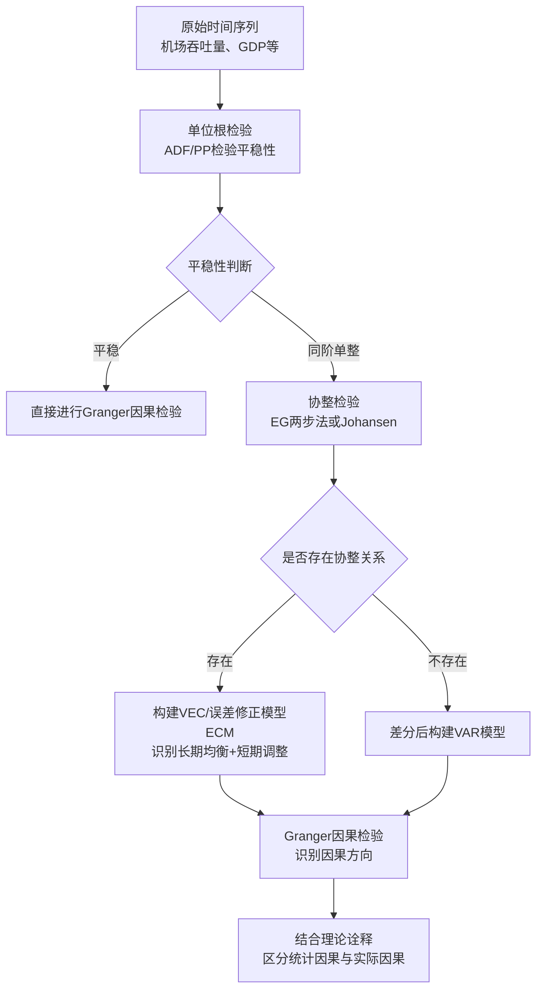

# 机场建设与区域经济发展的关系研究——以中国江苏省为例
# 1 理论框架：机场对区域经济影响的类型与因果关系划分

机场作为现代综合交通体系的核心节点与对外开放的门户，其经济效应已远超传统交通基础设施的范畴，成为驱动区域经济增长、重塑城市空间格局的重要力量。要系统理解机场建设与区域经济发展之间的关系，首先需要在概念层面厘清"机场如何影响经济"以及"机场与经济增长之间存在何种因果关系"这两个基础性问题。前者涉及效应类型的识别与分类，后者涉及作用方向、时间跨度与机制路径的理论刻画。本章将依次梳理国际机场协会（ACI）、Kasarda、Button等代表性机构与学者提出的效应分类体系，比较新古典与内生增长理论视角下的因果解释路径，并引入协整与格兰杰因果分析框架，最终以结构化表格整合上述内容，为第2章的文献综述与第3章的江苏省案例实证提供统一的分析坐标。

## 1.1 机场对区域经济影响的效应类型划分体系

学术界与产业界对机场经济效应的类型学划分，最具代表性、应用最广泛的当属国际机场协会（ACI）建立的**"直接—间接—诱发—催化"四层级核算框架**。该框架经美国联邦航空管理局（FAA）认可，被广泛用于机场经济贡献的量化测量，其核心指标包括雇员数量、薪资总额与经济产出三类[^1]。

**直接影响**（Direct Effects）是指机场建造、运营过程中直接产生的就业、工资与产出，以及到港旅客的直接消费支出，涵盖"机场内"（航空公司、驻场商户、空中交通管制、资本改进项目）与"机场外"（旅客住宿、餐饮、购物、娱乐）两类活动。**间接影响**（Indirect Effects）指为机场及其相关活动提供配套支持的供应链上下游产业所产生的就业与收入；以休斯敦航空机场系统为例，间接影响中餐饮业对就业的贡献占总量的35%，各类购物及相关产业占34%，购物活动对工资收入与产出的影响分别占间接总量的36%与39%[^2]。**诱发影响**（Induced Effects）则刻画直接与间接环节的雇员将其工资收入用于消费时产生的再循环效应，通过乘数效应（Multiplier Effect）在经济体系内继续流转。**催化影响**（Catalytic Effects）是机场作为生产力驱动节点对同区域其他行业、企业选址、长期生产率与GDP产生的净经济贡献，属供给侧"溢出"贡献，通过提升可达性影响企业区位选择、推动旅游/贸易/产业集聚等机制实现[^1][^2]。

ACI北美分会发布的《商用机场的经济效应》（2010）报告即采用上述四层级框架对美国民用机场进行测量，结果显示：2010年美国民用机场及相关领域创造了1050万个工作岗位，占美国劳动力的7%以上，按直接雇佣人数计算成为仅次于沃尔玛的第二大雇主；年度工资总额达3650亿美元；创造的GDP价值为1.2万亿美元，占美国总GDP（14.5万亿美元）的8%以上，超过墨西哥、瑞士与韩国全部货物与服务的总价值[^1]。

与ACI框架并行的另一套常见分类是源于交通经济学传统、按**"原生—次生—衍生—永久"时期跨度**进行划分的体系，该划分体系在国内教材中也被广泛使用[^3][^4]。其中**原生效应**对应机场及周边基础设施投资建设阶段——跑道、航站楼、机库、产业园建设引发的就业与收入提升，属典型的凯恩斯需求效应，对长期增长贡献有限；**次生效应**对应机场建成后的运营阶段——专业服务人员对就业、收入与税收的拉动；**衍生效应**指机场吸引临空型企业入驻所产生的影响——通过网络通达性提高，为商务客提供直航、为企业提供准时制（JIT）便利，对高端产业形成向心力；**永久效应**则指空港枢纽地位重塑城市经济结构与增长方式，"改写"区域生产函数，典型如华盛顿杜勒斯机场周边产业带、伦敦希思罗M4走廊等。

上述两套分类体系在概念边界与适用场景上既有显著重合也存在差异：ACI框架以**核算口径与统计指标**为划分依据，侧重经济影响的层次性与可量化性，特别适合机场经济贡献的报告型测量；"原生—次生—衍生—永久"框架则以**时间跨度与作用阶段**为划分依据，更强调机场建设全生命周期中不同阶段效应的演化逻辑。具体而言，ACI"直接影响"大致对应"原生"与"次生"的合并范畴；ACI"催化影响"则可进一步拆分为中期的"衍生"与长期的"永久"两阶段；而ACI单列的"间接"与"诱发"在Button框架中通常隐含于各阶段的乘数放大过程中，并未单独呈现。值得指出的是，"诱发"与"引致"在中文文献中常常通用，均译自Induced；而"催化效应"在ACI体系中既包括供给侧溢出，也涵盖对企业选址的影响，颗粒度较粗。

## 1.2 代表性学者的理论视角与分类比较

在效应分类的基础上，不同学派对机场经济作用的机制刻画各有侧重，形成了三种具有代表性的理论视角：以Kasarda为代表的航空大都市/空港都市区理论、以Button等为代表的交通经济学路径，以及以ACI报告为代表的实证测量框架。

**Kasarda的航空大都市理论**是当前理解机场对区域经济长期催化作用最具影响力的理论体系。该理论由美国北卡罗来纳大学John D. Kasarda教授于1992年以"第五波理论"形式提出雏形，2000年正式提出"空港都市区"（Aerotropolis）概念，2011年其与Greg Lindsay合著的《航空大都市——我们未来的生活方式》出版，标志着理论体系的初步构建完成[^5][^6][^7]。Kasarda将航空大都市定义为以枢纽机场为核心、由航空运输、物流、高新技术产业为核心功能、以服务业为支撑、依托机场区位与交通网络优势形成的具有城市功能和性质的新型城市化空间[^6]。其理论模型以机场为中心形成**同心圆辐射结构**，从机场到中心城区的"黄金走廊"是高附加值商业的布局重点，构建主要受制于"**位置、可达性和速度**"三大要素，空间构成包括航空城（机场核心区）、有规划的城市区域、航空产业集群、运输设施和商业枢纽以及外围经济走廊和相关住宅开发区[^5][^6]。该理论核心思想是"以时间消解空间"，强调机场作为全球生产和商业活动节点的枢纽作用，定位于"城市围绕机场而建、机场驱动经济发展"。典型实践案例包括美国孟菲斯国际机场转型为全球货运枢纽、荷兰史基浦机场的圈层式产业布局，以及中国郑州航空港经济综合实验区[^5][^6][^7]。2023年，Kasarda进一步提出**"航空大都市4.0"**概念，强调以网络经济和人工智能驱动，关键词包含数字化应用、城市发展、人才聚集与绿色可持续发展[^5][^7]。空港都市区的演变通常遵循"机场+通道—机场+基本配套—机场+机场服务区—机场+经济发展区"四个阶段，机场在承担交通运输功能的同时，正逐步担负起类似大都市CBD所具有的综合性商业功能[^6]。

**Button等交通经济学者的研究路径**则更注重对机场基础设施经济贡献进行严谨的实证测度，并将其置于区域经济增长理论框架下加以解释。Button提出的"原生—次生—衍生—永久"四阶段划分体系，本质上是将机场的经济影响沿时间轴展开，明确区分了建设期的需求拉动（原生）、运营期的服务集聚（次生）、临空产业入驻的中期吸引（衍生）与生产函数重塑的长期结构性影响（永久）。这种分类便于在不同政策窗口期识别机场投资的回报路径，对地方政府评估"是否建机场""建多大规模机场"具有直接的决策参考价值。

**ACI报告所代表的实证测量框架**则更接近于一种产业核算方法。它以投入产出模型（如RIMS II、IMPLAN、REMI）为技术支撑，将机场视为一个独立的经济单元，通过测算其雇员数量、薪资总额、经济产出及其在经济体系内的乘数放大，给出可比的总量贡献估计[^1]。这一框架的优势在于结果直观、口径标准化，但其相对短板是对"催化效应"的识别较为模糊——由于催化效应涉及企业选址、产业集聚等中长期机制，难以纳入投入产出模型的静态结构中。

| 维度 | Kasarda航空大都市理论 | Button交通经济学路径 | ACI实证测量框架 |
|------|----------------------|---------------------|----------------|
| **分析重心** | 机场对城市空间组织的重塑 | 机场作为基础设施的经济贡献分阶段拆解 | 机场经济活动的总量核算 |
| **核心机制** | 速度经济、可达性、临空产业集聚 | 凯恩斯需求效应+中长期结构效应 | 直接支出—供应链联动—消费再循环 |
| **方法工具** | 案例研究、空间分析、规划实践 | 增长会计、计量经济学 | 投入产出模型（RIMS II/IMPLAN/REMI） |
| **政策含义** | 临空经济区规划、"黄金走廊"开发 | 阶段性投资决策与回报评估 | 机场对GDP/就业贡献的标准化报告 |

三种视角的差异更多体现为**互补而非替代**：ACI框架提供"量"的核算基础，Button框架提供"时间"维度的演化逻辑，Kasarda框架提供"空间"维度的结构重塑机制。将三者结合，方能完整刻画机场对区域经济的多维影响。

## 1.3 机场与经济增长因果关系的理论刻画

机场与区域经济之间究竟是机场推动经济增长，还是经济增长拉动了航空需求？这一问题既是理论问题，也是政策问题。中国民用航空局局长李家祥曾公开表示，根据国外经验，机场投资效益比为1:8，是典型的"低投入、高产出"行业，许多地方政府依托机场陆续规划或发展"临空经济区"，有力拉动了区域经济发展；例如黑龙江漠河县级机场，年运营费用不到2000万元，建成后对漠河旅游、物流等综合效益每年达3亿多元[^1]。这一案例既反映了机场作为经济增长引擎的"供给驱动"逻辑，也暗示了机场效益与地方经济基础之间的相互依赖。要在理论层面回答因果方向的问题，需要从两个增长理论传统切入。

**新古典经济增长理论**视角下，机场被视作公共基础设施资本的一部分（外生进入生产函数中的K），其作用机制是通过资本积累和外生技术进步推动产出水平的短期提升，而长期人均产出仍向稳态收敛，机场冲击的边际贡献会逐渐消退。在此框架下，机场建设属典型的"水平效应"投资——增加资本存量、改善要素配置效率，但不必然带来持续的增长率提升。这一视角对应Button框架中的"原生效应"与"次生效应"，强调机场作为生产要素的直接贡献。

**内生经济增长理论**则赋予机场更深层的角色：机场不仅是交通基础设施，更是知识溢出节点、人力资本流动载体与创新基础设施。Romer（1986、1990）的知识溢出模型、Lucas（1988）的人力资本模型、Arrow（1962）的干中学模型、Aghion与Howitt（1992）的创造性破坏模型以及Grossman与Helpman（1986、2000）的内生创新理论，均强调内生要素积累在长期增长中的关键作用。在这一框架下，机场通过促进高技能人才流动、加速跨区域知识扩散、降低创新主体之间的交易成本，能够支撑长期增长率的提升。这一视角对应Button框架中的"衍生效应"与"永久效应"，也呼应了Kasarda航空大都市理论中"机场重塑生产函数"的核心命题。第三种视角——Castells与Kasarda共同强调的**流空间/第五波理论**——则进一步将机场视为"流中心"和hub-and-spoke网络节点，认为机场重塑了空间组织本身，使经济活动从传统的"地方空间"转向"流空间"[^5][^6]。

在因果方向上，学术界主要识别出四类关系：**单向"机场→经济"**反映供给驱动假说，将机场视为内生增长引擎；**单向"经济→机场"**反映派生需求假说，将机场客货吞吐量视为对地区经济活动的被动响应；**双向因果**意味着机场与经济之间存在良性互动循环；**无因果**则表示两者仅存在统计相关而无明确传导机制。Baker、Merkert与Kamruzzaman（2015）对澳大利亚88个区域机场1985-86至2010-11年数据的研究即提供了**双向因果**的实证证据，发现机场与区域经济增长之间存在显著的短期和长期因果关系——机场对区域经济增长有影响，经济增长也直接影响区域航空运输[^8]。这一结果突显了区域机场作为基础设施对地方议会的重要性，并支持对机场进行直接的资金投入。

需要特别说明的是，**格兰杰因果检验**在实证识别上扮演了关键角色，但其"因果"内涵需要审慎理解。格兰杰本人也承认该方法只能给出统计意义上的因果关系（即时间序列上的预测因果），并不能说明实际意义上的因果关系；是否构成真实因果还需结合理论、经验与模型综合判定[^9]。因此，格兰杰因果检验结论必须与理论框架相互印证，方能形成对机场—经济关系的可靠刻画。

## 1.4 短期与长期效应的区分及计量框架

机场对区域经济的影响在时间维度上呈现明显的层次性。**短期效应**主要表现为机场建设期的固定资产投资形成的需求拉动、运营期的就业与税收贡献，以及机场客货吞吐量波动对地方旅游、商贸、餐饮等行业的即时反馈；**长期效应**则通过临空产业集聚、城市空间重构、企业区位重组与产业升级等渠道，逐步形成对区域生产函数的结构性影响。这种短期—长期的区分在Button框架中体现为"原生/次生"与"衍生/永久"的阶段划分，在ACI框架中则对应于"直接/间接/诱发"的存量核算与"催化"的中长期溢出。

在计量经济学层面，识别机场与区域经济之间短期与长期关系的标准范式已经形成。以经典的Engle-Granger两步法和Johansen协整方法为代表的协整分析框架，能够在变量非平稳的情况下识别变量之间的**长期均衡关系**；而误差修正模型（ECM）则进一步刻画变量偏离长期均衡后的**短期动态调整速度**。这一方法链的标准操作顺序为：**单位根检验（ADF/PP）→ 协整检验（EG两步法/Johansen）→ 误差修正模型（ECM）→ 格兰杰因果检验**[^10][^9]。

下图展示了这一计量识别流程的逻辑链条：



具体而言，单位根检验（如ADF检验或PP检验）用于判断变量序列的平稳性。若序列水平值非平稳但经一阶差分后平稳，则称其服从一阶单整I(1)；在选择检验形式时需注意截距与时间趋势项的取舍，并依据P值与原假设进行判定[^9]。若各变量同阶单整，则可构建VAR模型并进行协整检验（注意滞后阶数选择），判断变量间是否存在长期均衡关系；若存在协整，可进一步构造VEC模型或在适当变换后进行格兰杰因果检验[^9]。误差修正模型中误差修正项系数λ（通常为负）刻画偏离长期均衡的修正速度，反映短期波动向长期均衡回归的动态过程。

在因果识别上，需要遵循几项重要原则：第一，格兰杰因果检验所要求的变量条件是平稳序列，对非平稳变量直接做格兰杰因果检验是常见的方法论错误；第二，协整结果仅表示变量间存在长期均衡关系，并不能直接回答因果方向问题，因此协整与格兰杰因果检验需要配合使用；第三，长期均衡分析并非分析终点，还应通过误差修正模型考察短期波动；第四，格兰杰因果天才地利用条件概率定义因果关系，使其方法既实用又有效，但仅给出统计意义上的因果，并不必然等同实际意义上的因果，最终因果判定须结合理论诠释[^9]。

这一计量框架在机场—经济关系的实证研究中具有广泛适用性。它既能识别机场客货吞吐量与GDP之间的长期均衡关系——回答"机场建设是否对区域经济长期增长有显著贡献"，也能刻画两者间的短期动态调整速度——回答"航空运量波动如何影响经济短期波动并反向被吸收"，还能通过格兰杰因果检验回答"是机场带动经济还是经济拉动机场"。该框架将构成本报告第3章江苏省案例实证分析的核心方法论基础。

## 1.5 机场区域经济效应类型与因果机理的结构化整合

在前述分类比较与因果讨论的基础上，本节以结构化表格形式将各类效应的定义、作用机理、典型测度指标、对应理论来源与代表性学者整合为统一的分析矩阵，作为后续文献综述与江苏省实证分析的概念基础。

**表1-1 机场对区域经济影响的效应类型、作用机理与理论来源对照表**

| 效应类型 | 定义 | 作用机理 | 典型测度指标 | 理论来源 / 代表性机构与学者 |
|---------|------|---------|--------------|---------------------------|
| **直接影响 (Direct)** | 机场建造与运营产生的直接收入与就业，以及到港旅客的直接支出 | "机场内"航空公司、驻场商户、ATC、资本改进项目+"机场外"旅客住宿、餐饮、购物、娱乐 | 雇员数量、薪资总额、经济产出 | ACI北美分会《商用机场的经济效应》(2010)；FAA[^1] |
| **间接影响 (Indirect)** | 为机场提供配套支持的供应链上下游产生的收入与就业 | 链式反应；机票预订、餐饮供应、批发零售向机场提供商品服务时再支出 | 供应链行业的就业与产值 | ACI；FAA投入产出指导原则[^1][^2] |
| **诱发/引致影响 (Induced)** | 直接与间接影响中雇员将工资收入用于消费时产生的再循环效应 | 通过乘数效应在经济体系内继续流转 | 乘数倍数（如史基浦SAM约为2）、消费支出再循环 | ACI；RIMS II / IMPLAN / REMI模型 |
| **催化影响 (Catalytic)** | 机场作为生产力驱动力对其他行业、企业选址、长期生产率与GDP的净经济贡献 | 供给侧"溢出"；通过可达性影响企业区位选择、推动旅游/贸易/产业集聚 | 企业入驻数、产业集聚度、GDP贡献率 | ACI；Eurocontrol（估算航空业贡献欧盟GDP约4%）；Kasarda |
| **原生效应 (Primary)** | 机场及周边基础设施投资建设对城市经济的影响 | 跑道、航站楼、机库、产业园建设引发就业与收入提升；属凯恩斯效应，对长期增长有限 | 投资额、建设期就业 | Button (2010) |
| **次生效应 (Secondary)** | 机场运营对城市经济的影响 | 专业服务人员对就业、收入、税收的拉动；可能因智能化弱化 | 运营期就业、税收贡献 | Button (2010) |
| **衍生效应 (Tertiary)** | 机场吸引临空型企业入驻的影响 | 网络通达性提高，为商务客提供直航、为企业提供JIT便利；对高端产业有向心力 | 临空产业集聚度、外商投资额 | Button (2010); Kasarda |
| **永久效应 (Perpetuity)** | 空港枢纽地位重塑城市经济结构与增长方式 | "改写"生产函数；典型如杜勒斯、洛根、希思罗M4走廊 | 长期GDP增长率、产业结构变迁 | Button (2010) |
| **航空大都市 (Aerotropolis)** | 机场为核心、半径约30公里内由航空城、关联产业集群、住宅开发构成的新型城市形态 | "以时间消解空间"，速度经济；同心圆辐射结构吸引高时效制造、分拨、商务办公 | 临空经济区GDP、产业集群规模、可达性指数 | Kasarda (1992第五波理论；2000；2011)[^5][^6][^7] |

将上述效应类型与因果关系框架对应，可进一步形成"**效应—时间—方向**"三维分析矩阵：

**表1-2 机场区域经济效应与因果框架对应矩阵**

| 维度 | 短期效应 | 长期效应 |
|------|---------|---------|
| **机场 → 经济（供给驱动）** | 原生效应、次生效应：建设期与运营期就业与产出拉动 | 催化/衍生/永久效应：临空产业集聚、企业区位重组、生产函数重塑；内生增长理论支持 |
| **经济 → 机场（派生需求）** | 经济波动引致航空需求短期变化 | 区域经济长期增长带动机场扩建、航线网络拓展 |
| **双向因果** | 短期动态相互调整（ECM误差修正项刻画） | 长期均衡共生关系（协整方程刻画） |
| **理论视角** | 新古典增长框架：水平效应、向稳态收敛 | 内生增长框架：知识溢出、人力资本、创造性破坏；Kasarda流空间理论 |
| **计量识别工具** | 误差修正模型（ECM）、差分Granger | 协整检验（EG/Johansen）、Granger因果检验 |

上述矩阵表明：机场与区域经济的关系并非单一线性关系，而是在不同时间尺度、不同效应类型、不同因果方向上呈现复杂的多维结构。**ACI的"直接—间接—诱发—催化"框架提供了核算口径与统计分层；Button的"原生—次生—衍生—永久"框架提供了时间演化的阶段划分；Kasarda的航空大都市理论提供了空间组织重塑的机制刻画；新古典与内生增长理论提供了因果路径的理论解释；协整—ECM—格兰杰因果检验则构成了实证识别的标准方法链**。五条线索相互补充，共同构成本报告分析机场建设与区域经济发展关系的统一概念框架。

需要指出的是，上述分类体系在概念边界上仍存在若干分歧与张力：其一，**催化效应在ACI体系内既指供给侧溢出，也指对企业选址的影响**，而Button框架将其拆解为衍生（中期）与永久（长期）两阶段，颗粒度存在差异；其二，**直接影响是否应纳入"机场外旅客消费"存在口径差异**——美国弗吉尼亚民航处（2004）将其纳入，部分FAA研究将其归入间接；其三，**"短期效应消退"假设在新古典与内生增长理论间存在根本分歧**——新古典理论认为机场冲击会逐渐消退，内生增长理论则否定该假设，认为枢纽机场长期效应将持续存在；其四，**格兰杰因果检验的"因果"内涵**仅为统计预测意义上的因果，是否等同真实因果存在持续争议，需结合理论诠释方能得出可靠结论[^9]。这些分歧并非分类体系的缺陷，而是机场经济效应本身复杂性的反映，也为后续章节比较国际与中国研究、开展江苏省案例实证留下了进一步辨析的空间。

带着这一统一的分析坐标，下一章将进入国际与中国本土相关研究的系统综述，重点考察Brueckner、Baker、Button、Green、Percoco等国际学者以及Hu、Shen、马亚华、姚舒洁等中国学者的实证发现及其方法论，并比较两者在结论上的一致性与差异性。

# 2 相关研究综述：国际普遍结论与中国本土研究发现

第1章建立的"效应类型—因果方向—时间维度"三维分析框架明确了机场对区域经济作用的概念坐标，但要真正理解机场建设与区域经济发展之间关系的复杂性，仍需回到经验研究层面，考察学者们究竟在多大程度上、以何种方式验证或修正了这些理论命题。自20世纪90年代以来，国际与中国学者沿着各自的制度背景、数据可得性与方法论传统，积累了相当丰富的实证文献。本章在2019年中期前公开发表研究的范围内，分别系统梳理国际与中国本土研究的两条主线，比较二者结论的一致性与差异性，剖析差异背后的制度环境与产业结构机理，并识别现有研究的局限与空白，为第3章以江苏省为对象的省域层面实证分析提供文献基础与切入点。

## 2.1 国际研究主线：机场对就业、产业与GDP影响的实证发现

国际机场—经济关系的实证研究脉络大致沿着三个方向展开：以美国大都市为样本的就业与产业集聚效应研究、以澳大利亚等区域性航空网络为样本的因果方向识别研究，以及以欧洲国家为样本的生产率与产业升级效应研究。这三条脉络对应了第1章所述"催化效应"在就业、产业集聚与生产率三个维度的具体展开。

**Brueckner（2003）的研究**是这一领域的奠基性工作之一。该研究以美国大都市为样本，以芝加哥O'Hare机场扩建为重点案例，通过截面回归分析机场客运量（enplanements）与服务业就业之间的关系，发现机场客运量对服务业就业具有显著的正向拉动作用——以O'Hare机场扩建为基础的测算结果显示，扩建可增加约18.5万个服务业相关岗位。这一结论与第1章所述ACI"催化效应"框架以及Kasarda航空大都市理论的核心命题高度吻合，证明枢纽机场可作为服务业就业的重要驱动力。然而，Brueckner研究的方法论局限亦受到后续学者持续关注：横截面回归难以处理机场与服务业就业之间潜在的同时性（simultaneity）问题——服务业繁荣的城市本身也可能吸引更多航空需求，从而推高机场客运量；此外，劳动力市场不完美性、机场就业是否替代其他城市就业岗位等问题也未被充分识别，使得"净就业创造效应"的解释需要审慎对待。

**Button、Lall、Stough与Trice（1999）以及Button与Taylor（2000）**将研究视角从传统服务业拓展至新经济与高科技产业。这些研究关注机场客运量对高科技就业、专业服务集聚以及人力资本流动的催化效应，并假设枢纽机场通过为高时效产业提供全球可达性，能够吸引知识密集型企业向机场周边集聚。其研究思路实际上构成了Kasarda航空大都市理论的早期实证基础。需要指出的是，在本研究可获取的二手材料中，关于Button等研究的具体弹性系数、样本规模与显著性水平等定量结果未能完整披露，这一信息不足在一定程度上限制了对其结论强度的精确评估。

**Green（2007）**在Real Estate Economics发表的研究进一步将分析维度拓展至机场客货吞吐量对都市区就业与人口增长的影响，并明确指出机场—经济因果识别中存在"困难的同时性问题"，需要借助工具变量等识别策略加以处理。Green的研究在方法论上推动了机场—经济关系研究从简单OLS向更严谨的因果识别框架转型，其"同时性问题"的诊断也直接促使后续学者转向协整与格兰杰因果框架。**Percoco（2010）在Annals of Regional Science的研究**则以意大利机场为样本，将机场基础设施视为区域全要素生产率（TFP）的关键决定因素，运用面板计量方法测度机场对地方TFP的影响，发现机场基础设施对区域生产率具有显著正向作用。这一发现将机场—经济关系的研究从"总量贡献"推进到"效率贡献"层面，对应第1章内生增长理论框架下"机场重塑生产函数"的命题。

**Baker、Merkert与Kamruzzaman（2015）发表于Journal of Transport Geography的研究**是近年来这一领域方法论最为规范、结论最具影响力的代表性文献之一。该研究以澳大利亚88个区域机场1985-86至2010-11年的年度面板数据为样本，以机场旅客流量与实际综合应税收入为核心变量，依次运用单位根检验、协整检验与格兰杰因果检验，发现机场与区域经济之间存在**显著的双向因果关系**，且短期与长期因果均显著[^11][^12]。这一结果具有两层重要意义：其一，它从计量层面验证了第1章"效应—时间—方向"三维矩阵中"双向因果+短长期共存"的复杂情形；其二，它为澳大利亚地方议会（council）对区域机场的直接资金投入提供了实证支持，强调区域机场作为基础设施对地方政府的战略价值。Baker等人采用的协整—Granger方法论框架也成为后续机场—经济关系实证研究的标准范式，本报告第3章江苏省案例分析将沿用这一方法论传统。

综合上述国际研究脉络，可以归纳出**四点普遍结论**：第一，**机场对区域经济具有显著正向作用**，这一结论在Brueckner、Baker等、Percoco等学者的研究中均得到验证；第二，**机场对服务业与高端产业的催化效应较制造业更为突出**，Brueckner、Button等的研究为此提供了直接证据；第三，**机场—经济关系的因果识别普遍存在同时性问题**，需借助协整、格兰杰因果或工具变量等方法加以处理；第四，**枢纽机场的长期催化效应较中小机场更显著**，这一倾向虽未在国际文献中获得系统的层级比较，但在Brueckner的O'Hare案例与Baker等的区域机场研究中已有间接体现。

下表总结了上述代表性国际研究的核心特征：

| 学者（年份） | 样本 | 时间区间 | 方法 | 核心发现 |
|---|---|---|---|---|
| Brueckner (2003) | 美国大都市；O'Hare机场为案例 | 截面数据 | 截面回归 | 机场客运→服务业就业；O'Hare扩建可增加约18.5万个服务业岗位 |
| Button et al. (1999); Button & Taylor (2000) | 美国大都市 | — | 截面回归 | 机场对高科技/新经济产业就业具有催化作用（具体弹性系数当前材料不足） |
| Green (2007) | 美国都市区 | — | 工具变量/同时性处理 | 机场客货吞吐量对都市就业与人口增长有显著影响；明确机场—经济存在同时性问题 |
| Percoco (2010) | 意大利机场 | — | 面板计量 | 机场基础设施对区域TFP具有显著正向作用 |
| Baker, Merkert & Kamruzzaman (2015) | 澳大利亚88个区域机场 | 1985-86至2010-11 | 协整+格兰杰因果 | 双向因果；短期与长期均显著[^11][^12] |

## 2.2 中国本土研究主线：城市层级差异与因果方向的异质性发现

与国际研究相比，中国本土研究在2010年代后才进入相对集中的产出阶段。这一时间差既反映了中国民航业本身的快速发展轨迹，也反映了中国学者对国际方法论范式的吸收过程。中国研究的最显著特征是：在确认机场对区域经济存在正向作用的基础上，**强调因果方向的城市层级异质性**，并将这一异质性解释为新古典与内生增长理论适用范围的差异。

**马亚华、杨凡（2013）发表于《热带地理》的研究**是这一领域最具代表性的实证文献之一。该研究基于中国35个大中型城市1997—2011年的面板数据，运用面板格兰杰因果检验，对空港与城市经济之间的长期因果关系进行系统识别，得出了一组层次分明的结论：**整体层面**，35个大中型城市的空港客流增长是城市长期经济增长的**单向格兰杰原因**；**直辖市与副省级城市层面**，航空客流和物流均构成对城市长期经济增长的**单向格兰杰原因**，空港是城市发展的内生因素，会促进城市经济的长期增长；**其他省会城市层面**，则仅存在城市经济增长向空港客流长期增长的**反向单向格兰杰因果关系**，空港只对城市经济具有短期效应[^13]。马亚华、杨凡进一步将这一异质性归纳为理论选择问题：**空港的规模大小、是否为枢纽，将决定是用新古典经济增长理论还是内生增长理论去理解其对城市经济增长的意义**；空港条件的差异将加剧城市经济的分异，航空网络的发展也将对城市体系产生重要影响[^13]。这一论断与第1章所述"原生/次生—衍生/永久"效应的时间演化逻辑形成了直接呼应：枢纽机场触发了长期催化与永久效应，对应内生增长解释；中小机场则停留于原生与次生阶段，对应新古典解释。

马亚华、杨凡的研究还揭示了一个具有方法论意义的发现：**城市经济增长对航空运输的长期增长效应并不普遍**，表明我国城市的经济产业结构对空港的依赖性还较弱[^13]。换言之，中国大多数城市的经济增长并未充分转化为航空需求，这与发达国家航空运输深度嵌入产业链的格局形成了鲜明对比，也为后续研究指出了"产业结构对空港依赖性"这一关键中介变量。

**王华星、周阳敏（Wang Hua-xing & Zhou Yang-min）的研究**则采用了不同的方法论路径。该研究基于中国33个城市2006—2014年的面板数据，构建随机前沿模型（SFA）测度经济效率，并通过反事实分析（counterfactual analysis）测算机场对区域经济的实际贡献。研究发现：**货运机场对提升区域经济发展效率具有显著正向影响，而客运量与起降架次的影响不显著**；城市机场建设可使区域经济效率提升0.227%—0.476%，年均经济增长率提高0.31%，新增产出708.26亿元[^14]。这一结论为郑州机场打造国际航空货运物流中心的"一带一路"战略提供了实证支持，也为地方政府积极投资建设航空物流中心的政策行为提供了证据基础[^14]。值得注意的是，王华星、周阳敏关于"货运显著、客运不显著"的发现，与Brueckner（2003）关于服务业就业的客运驱动结论形成了有趣的对照——这一差异背后既可能反映中国产业结构以制造业为主、对货运通道依赖更强的特征，也可能反映客运效应在效率层面被产业结构差异所稀释。

**姚舒洁、杨秀艳的研究**采用了弹性测算与格兰杰因果检验相结合的方法路径，测度了人口密度对航空运输量的影响以及机场对服务业就业的弹性，发现人口密度增加10%会带动航空客运增加1.7%、货运增加1.2%，服务业就业对机场的弹性约为0.1。该研究的总体结论指向"经济→机场"方向的影响在中国更为显著，进一步呼应了马亚华、杨凡关于反向因果的发现。**Hu、Shen等学者**则在城市经济与机场互动关系的研究中提供了不同地区与时段的补充证据，强调机场的经济效应在不同城市规模与产业结构下呈现显著的非均衡分布。

此外，《临空经济将有力促进城市转型升级》一文从产业政策与机场群建设的角度梳理了相关共识：**机场对区域经济的影响可以分为直接影响、间接影响、诱发影响和催化作用四个层级**；机场建设会为当地交通运输条件的改善提供动力，而机场所在城市自身的经济体量、发展方向、政府政策也会对空港经济的体量产生很大程度的影响[^15]。文章指出，截至2017年我国民航运输机场数量达到229个，由北京、上海和广州三大主要城市的3个枢纽机场主导，总收入占全国机场市场的34%；2017年我国旅客吞吐量已超过11.48亿人次，相比2016年大幅增加12.9%，全年货邮吞吐量达1617.7万吨，相比2016年增长7.1%，完成飞机起降1024.9万架次，增长10.9%[^15]。这些产业数据为理解中国机场—经济关系的宏观背景提供了重要参照。

下表汇总了中国代表性研究的核心特征：

| 学者（年份） | 样本 | 时间区间 | 方法 | 核心发现 |
|---|---|---|---|---|
| 马亚华、杨凡 (2013) | 35个大中型城市 | 1997—2011 | 面板格兰杰因果检验 | 整体：客流→经济（单向长期）；直辖市/副省级：客流与物流→经济（单向长期）；其他省会：经济→客流（单向，短期效应）[^13] |
| 王华星、周阳敏 | 33个城市 | 2006—2014 | 随机前沿模型(SFA)+反事实分析 | 货运机场→效率显著；客运与起降不显著；机场使效率提升0.227%—0.476%，年均GDP增长率+0.31%，新增产出708.26亿元[^14] |
| 姚舒洁、杨秀艳 | 中国数据 | — | 弹性测算+格兰杰因果 | 人口密度+10%→客运+1.7%、货运+1.2%；服务业就业弹性约0.1；总体上"经济→机场"方向更显著 |
| Hu、Shen等 | 中国城市样本 | — | 综合实证 | 机场经济效应在不同城市规模与产业结构下呈现非均衡分布 |

综合上述中国本土研究，可以归纳出**三点核心发现**：第一，**枢纽与非枢纽机场对城市经济的作用机制存在显著分化**——枢纽机场（直辖市、副省级城市）触发内生增长机制，呈现机场→经济的长期催化关系；中小机场（其他省会及以下）则停留于经济→机场的派生需求阶段，对经济仅有短期效应；第二，**货运对区域经济效率的贡献显著强于客运**，反映了中国产业结构以制造业为主导的特征；第三，**中国城市经济产业结构对空港的依赖性整体仍较弱**，导致"经济→机场"长期增长效应并不普遍——这一发现为评估中国机场建设的合理规模与节奏提供了重要参考。

## 2.3 国际与中国研究结论的比较：一致性、差异性与背后机理

将国际与中国研究并置比较，可以清晰地看到两类研究在结论上的一致性与差异性，以及差异背后的制度与产业结构机理。

**在一致性方面**，国际与中国研究达成了四点重要共识。**其一，机场对区域经济存在显著正向作用**：Brueckner、Baker等、Percoco等国际学者与马亚华、王华星与周阳敏等中国学者均确认机场基础设施对就业、GDP、生产率有积极效应。**其二，协整—长期均衡关系普遍存在**：Baker等（2015）在澳大利亚区域机场数据中确认了协整关系[^11][^12]，马亚华、杨凡在中国35个大中型城市面板数据中同样发现了长期格兰杰因果关系[^13]，证明机场—经济关系的长期共生性具有跨国稳健性。**其三，方法论收敛**：中外研究均从早期的横截面OLS逐步转向格兰杰因果、协整、面板SFA等可识别因果方向的方法，反映了对内生性与同时性问题的共同关注。**其四，货运/服务业的显著性更强**：Brueckner强调机场客运对服务业就业的拉动，王华星与周阳敏强调货运机场对效率提升的显著贡献，姚舒洁指出服务业就业弹性约0.1，方向一致地表明机场效应在第三产业与货运通道上更为突出。

**在差异性方面**，国际与中国研究呈现出四点系统性分歧：

| 维度 | 国际研究 | 中国研究 |
|---|---|---|
| **因果方向** | Baker等(2015)发现澳大利亚区域机场为**双向**因果[^11][^12] | 马亚华(2013)、姚舒洁等普遍发现**单向**因果，方向因城市层级而异[^13] |
| **城市层级差异** | 国际文献较少强调层级分异 | 中国研究突出枢纽城市（机场→经济）与中小城市（经济→机场）方向相反 |
| **长短期效应** | Baker等同时验证短期与长期均显著[^11][^12] | 马亚华区分：枢纽机场为长期效应，中小机场仅为短期效应[^13] |
| **理论解释** | 偏向基础设施—增长理论、劳动力市场不完美性 | 引入新古典增长理论（中小）与内生增长理论（枢纽）的二分框架[^13] |
| **政策含义** | 强调地方政府对机场资金的直接投入[^11] | 强调"因地制宜"——发达地区优化效率、欠发达地区先行驱动 |

**差异背后的机理需要从制度环境、产业结构与航空网络层级三方面加以剖析**。

**其一，制度背景差异**塑造了机场建设与运营的根本逻辑。国际机场——尤其是澳大利亚、美国——多为市场化运营，地方议会拥有产权（Baker等明确指出区域机场为地方政府基础设施），机场投资决策更直接地受到本地经济回报的约束[^11]。中国机场则属国有/混合所有制，受中央与地方政府双重规划影响，"7+2"格局等具有强政策导向特征——21世纪初我国机场相继进行了属地化改革，目的在于因地制宜促使各省市空港功能完善，更好地促进当地经济社会发展，并形成良性互动[^15]。这种自上而下的规划逻辑使得部分中小机场在经济基础尚不成熟时即已建成，导致"经济→机场"的反向因果在某些城市占主导，而"机场→经济"的催化效应难以充分释放。

**其二，产业结构差异**直接影响机场效应的传导路径。国际研究背景下，发达国家产业以服务业、新经济、高科技为主（Brueckner、Button & Taylor均聚焦服务业与高科技就业），机场作为商务出行与知识溢出的通道，其催化效应能够顺畅地通过服务业集聚机制释放。中国研究背景下，产业结构正处于第二产业向第三产业转型期，临空指向型产业集聚仍在初级阶段——姚舒洁明确指出"我国城市经济产业结构对空港的依赖性还较弱"，马亚华、杨凡亦发现城市经济增长对航空运输的长期增长效应并不普遍[^13]。这一产业结构特征解释了为何中国研究中"客运对效率不显著"而"货运显著"——客运通道对应的服务业、商务出行需求尚未充分发育，而货运通道对应的制造业出口与高时效物流需求已经形成。

**其三，航空网络层级差异**塑造了机场效应的空间分布。国际航空网络以成熟的hub-and-spoke体系为主，枢纽与支线之间形成有效的客货流分工。中国航空网络的枢纽—干线—支线层级尚不成熟，截至2017年全国229个机场中，仅北京、上海、广州三大枢纽机场就贡献了34%的总收入[^15]，呈现明显的"头部集中、尾部薄弱"格局。这一格局意味着中国大多数中小机场难以触发临空产业集聚的临界规模，无法形成Kasarda所述的"航空大都市"或Button所述的"永久效应"，从而停留于派生需求阶段。

**其四，临空经济区规划相对滞后**也是不可忽视的因素。机场基础设施建设的投入应与当地经济社会发展相协调；一些城市不断加大对机场的资源投入，尽管在一定程度上提升了各地机场的产能，但也容易出现航空资源在区域内配置不合理、协调不充分，以及机场自身技术管理水平有限导致的资源冗余浪费，这将严重削弱机场运营的有效性，从而阻碍区域经济的进一步发展[^15]。这一观察从政策与规划层面解释了中国部分机场催化效应未能充分释放的原因。

综合而言，**中国研究所呈现的"单向为主、层级异质、客运不显著、依赖性较弱"等特征，并非对国际普遍结论的否定，而是中国特定制度环境与产业结构阶段下的具体表现形式**。随着中国服务业占比的提升、临空经济区规划的完善以及枢纽机场体系的成熟，未来研究可能逐步观察到向"双向因果"收敛的趋势。

## 2.4 现有研究的局限与空白

在系统比较国际与中国研究的基础上，可以识别出当前文献存在的若干局限与空白，这些空白同时构成本报告第3章江苏省案例分析的切入点。

**其一，研究尺度上对省域层面机场群与区域经济互动关系的系统研究相对缺乏**。国际研究最大样本为Baker等的88个澳大利亚区域机场（26年时序），中国研究最大样本为马亚华的35城市×15年面板与王华星、周阳敏的33城市×9年面板，均在城市层级或国家层级展开，对**省域内部多机场体系**的协同—竞争关系研究不足。中国研究多聚焦地级以上大中城市，对县级支线机场覆盖不足；而江苏省这类拥有南京禄口、无锡硕放、苏南硕放、徐州观音、常州奔牛、南通兴东、扬泰、淮安涟水、连云港等多个机场并存的省份，恰恰提供了在省域尺度内观察机场—经济耦合关系层级异质性的天然实验场。

**其二，方法论上对短期效应与长期效应的区分仍不充分**。虽然马亚华、杨凡区分了"长期格兰杰因果"与"短期效应"，但**误差修正模型（ECM）在中国机场—经济关系研究中的系统应用仍较有限**，对短期偏离长期均衡后的调整速度（误差修正项λ）缺乏精确测度，对短期动态与长期均衡的机制诠释有待深化。这一空白为第3章在江苏省案例中应用完整的"单位根检验—协整检验—ECM—格兰杰因果"方法链留下了改进空间。

**其三，机场对产业结构升级、临空经济区集聚等催化效应的微观机制识别不足**。现有研究多停留于GDP与吞吐量两变量的总量回归，缺乏临空经济、外贸依存度、产业结构、服务业占比等中介变量的引入，难以回答机场效应"通过何种产业渠道传导"这一深层问题。国际研究中Brueckner、Button & Taylor等对服务业、新经济产业的细分研究在中国语境下尚未得到充分对接。

**其四，数据时段相对滞后**。多数中国研究止于2011—2017年（马亚华2011、王华星2014），2017年后数据尚未纳入实证更新。对江苏省而言，2017—2018年正值全省机场吞吐量与GDP同步快速增长的关键阶段——2017年全国旅客吞吐量超过11.48亿人次、货邮吞吐量达1617.7万吨、起降1024.9万架次[^15]，江苏省的同期表现与省内机场体系发展轨迹亟需在2008—2018年完整十年区间内重新加以分析。

**其五，弹性系数与显著性水平的横向对比存在实质障碍**。2019年中期前国际文献中关于具体弹性数值的可得性较低——Brueckner、Baker等、Button & Taylor、Green、Percoco的核心研究在公开摘要中均未充分披露精确的弹性点估计与显著性水平，这构成了与中国研究进行严格定量比较的困难。

**其六，国际与中国研究均缺乏对机场—经济双向反馈机制的结构方程模型（SEM）或动态面板GMM检验**，在异质性识别（城市规模、产业结构、地理区位）上系统性比较不足，江苏省作为兼具苏南发达经济与苏北后发追赶、同时多机场并存的区域，为开展"区域内部异质性"的系统识别提供了独特样本。

综合上述六点局限与空白，**江苏省2008—2018年省域层面机场—经济关系的系统实证，恰好同时回应了样本尺度（省域多机场体系）、方法论完整性（协整—ECM—格兰杰因果方法链）、时间窗口（2008—2018十年完整周期）与异质性识别（苏南苏北分异）等多重研究需求**。这为第3章的实证设计提供了清晰的选题切入点与方法论改进方向。下一章将基于第1章建立的理论框架与本章梳理的方法论基础，对江苏省机场旅客吞吐量与GDP之间的长期均衡关系、短期动态调整以及因果方向开展系统实证检验，并结合苏南苏北的经济分异，归纳案例对"机场—区域经济耦合关系"理论的验证与修正。

# 3 案例分析：江苏省机场发展与区域经济增长的实证研究（2008—2018）

第1章建立的"效应类型—因果方向—时间维度"三维理论框架与第2章梳理的"单位根检验—协整—ECM—格兰杰因果"标准方法链，为机场与区域经济耦合关系的实证识别提供了完整的概念坐标与方法论工具，但其理论命题与方法范式最终需要在具体的区域样本中加以验证。江苏省作为全国唯一拥有9个民航机场、机场密度位居全国省份第一[^16]的省份，同时也是兼具苏南发达经济与苏北后发追赶、覆盖枢纽—干线—支线完整层级体系的东部沿海经济强省，恰恰为在省域尺度内观察机场—经济耦合关系的层级异质性提供了独特的天然实验场。本章以2008—2018年江苏省省级与机场层面公开数据为基础，沿着"协同轨迹描绘—方法设计—平稳性与协整识别—短期动态—因果方向—异质性—弹性强度—理论验证与政策启示"八个步骤递进展开，对江苏省机场旅客吞吐量与GDP之间的长期均衡关系、短期调整机制与因果方向开展系统实证，并将江苏省案例与第2章梳理的国际及中国本土研究结论进行对照检验。

## 3.1 江苏省机场体系与区域经济发展的协同轨迹

2008—2018年是江苏省机场体系与区域经济同步快速发展的关键十年。从机场体系看，江苏省境内共分布9个民航机场——南京禄口国际机场、苏南硕放国际机场、常州奔牛国际机场、徐州观音国际机场、南通兴东国际机场、扬州泰州国际机场、连云港白塔埠机场、盐城南洋国际机场以及淮安涟水国际机场，其中无锡、盐城、常州、连云港机场为军民合用机场。九大民航机场中，南京禄口国际机场和无锡硕放机场被定位为"区域枢纽机场"；连云港新机场被定位为"大型机场"；其余6家机场被定位为"中型机场"[^16]。江苏差不多每1万平方公里就有一个民航机场，所有县级城市及人口10万以上的城镇，地面交通1.5小时车程内均可享受到航空服务[^16]。

从经济总量看，江苏省地区生产总值由2008年的30312.61亿元[^17]、2010年的41425.48亿元[^18]增长至2018年的92595.4亿元，按可比价格计算比上年增长6.7%，其中第一产业增加值4141.7亿元、第二产业增加值41248.5亿元、第三产业增加值47205.2亿元；全省人均地区生产总值115168元，比上年增长6.3%；三次产业增加值比例调整为4.5∶44.5∶51，服务业增加值占GDP比重比上年提高0.7个百分点[^19][^20]。江苏以占全国1.1%的土地、5.8%的人口，创造了在全国占比10.3%的GDP[^21]。区域协调发展有力推进，扬子江城市群对全省经济增长的贡献率达81.4%，沿海经济带对全省经济增长的贡献率达16.6%；新型城镇化建设步伐加快，年末城镇化率达69.61%，比上年提高0.85个百分点[^19][^20]。

### 3.1.1 机场体系发展轨迹与层级格局

将2008—2018年九大机场旅客吞吐量数据加以梳理，可以清晰观察到"一枢纽多支线"层级格局的演化路径。**南京禄口机场作为区域枢纽机场**，旅客吞吐量从2005年538.6万人次、2008年888.1万人次、2010年1253.1万人次稳步攀升至2014年1628.4万人次[^22]，至2018年达到2858万人次，全省排名第一、全国排名第11位[^23]。**苏南硕放机场作为江苏第二大机场**，2007年9月T1航站楼启用、跑道延长至3200米、飞行区指标变更为4D[^24]；2009年4月开通首条国际航线（无锡至大阪），当年旅客吞吐量便突破200万人次[^25]；2015年T2航站楼投运；2018年9月飞行区等级升为4E级，可满足B747全载及A340等四发远程宽体客机运行，12月旅客吞吐量突破700万人次[^25]，全年达721万人次，全省排名第二、全国排名第43位[^23]。**常州奔牛机场**则呈现"三年三级跳"的快速增长——2012年突破100万人次，2017年突破200万人次（达251万人次），2018年突破300万人次达333万人次（全省第三、全国第50位）[^23][^26][^27]；货邮吞吐量也从2010年的0.67万吨增长到2019年的3.3万吨，年均增速近30%[^27]。**徐州观音机场**于2018年10月15日年旅客吞吐量首次突破200万人次大关，全年达252万人次（全省第五），机场起降架次同比增长35.6%，货邮行吞吐量增长率位于国内中型机场前列[^23][^28]；该机场也是观察"机场—经济"互动的重要案例——徐州市大力发展临空经济，致力于将徐州临空经济区打造成为加快建设淮海经济区中心城市的重要平台[^28]。**南通兴东机场**2018年达277万人次，超越喀什、威海、鄂尔多斯等机场，全国排名上升至52位，较上年提升6个名次；货邮吞吐量4.3万吨，仅次于石家庄机场，全国排名第41名[^29]。

苏北中小机场的发展则相对滞后。**扬州泰州机场**于2012年5月通航[^30]，2018年旅客吞吐量238万人次（全省第六）[^23]；**盐城南洋机场**2016年突破100万人次、2018年达182万人次（全省第七）[^23][^31]；**淮安涟水机场**2018年完成152万人次（全省并列第八）[^23]；**连云港白塔埠机场**2018年同样为152万人次（全省第八）[^23]，与2005—2010年的9.6万、15.5万、19.95万、20.86万、29.11万、42.30万人次的低基数轨迹相比，已实现数量级的跨越[^32]。

下表汇总了2018年江苏省九大民航机场的旅客吞吐量与层级定位，呈现了"一超一强、多支并立"的非均衡分布格局：

| 机场 | 2018年旅客吞吐量(万人次) | 全省排名 | 全国排名 | 层级定位 |
|---|---|---|---|---|
| 南京禄口 | 2858 | 1 | 11 | 区域枢纽机场 |
| 苏南硕放 | 721 | 2 | 43 | 区域枢纽机场 |
| 常州奔牛 | 333 | 3 | 50 | 中型机场 |
| 南通兴东 | 277 | 4 | 52 | 中型机场 |
| 徐州观音 | 252 | 5 | — | 中型机场 |
| 扬州泰州 | 238 | 6 | — | 中型机场 |
| 盐城南洋 | 182 | 7 | — | 中型机场 |
| 淮安涟水 | 152 | 8 | — | 中型机场 |
| 连云港白塔埠 | 152 | 8 | — | 中型机场 |

数据来源：[^33][^23]

值得指出的是，连云港机场在样本期内即已规划升级——2019年开工建设连云港新机场（即后来的花果山国际机场）[^34]，被定位为"大型机场"[^16]，反映了江苏省机场体系在2008—2018年完成"普及性建设"后向"枢纽化、专业化"演进的方向。同期，江苏省政府积极推动机场重大工程建设，2019年全省机场建设计划包括全面开工建设连云港新机场、续建南京禄口机场T1航站楼改扩建工程、建成南通兴东国际机场航站区扩建工程、无锡硕放机场改造工程，并全力推动南通新机场和无锡硕放机场二跑道前期工作[^34]。同时，江苏在通用机场布局上同样领先——截止"十二五"末，全省共有通用机场8个，位居华东地区首位[^16]；至2030年布局35个、远期布局70个，至2030年通用机场密度将达到每万平方公里3—4个，基本实现15分钟航程覆盖全省[^16][^35]。

### 3.1.2 经济总量与机场吞吐量的时序协同

将江苏省GDP与全省机场旅客吞吐量并置，可清晰观察到二者在2008—2018年期间的高度同步性。一方面，江苏省GDP从2008年的3.03万亿元跃升至2018年的9.26万亿元，年均增长率约11.4%（名义）。期间，"十二五"时期（2011—2015年）地区生产总值年均增长9.6%，第三产业增加值年均增长10.0%，超过第二产业的9.8%[^18]，标志着服务业主导的产业结构升级正式启动。另一方面，江苏省全省机场旅客吞吐量从2008年的低位（南京禄口888万人次叠加其余各场约500万人次估算约1400万人次）增长至2018年的6163万人次（九大机场加总），其中南京禄口、苏南硕放、常州、南通、徐州五大机场2018年合计达4441万人次，与2008年的对应值相比实现了量级跨越[^22][^23][^36][^37]。

更具结构意义的是，**机场吞吐量的增速在多数年份显著快于GDP增速**——2016年全省9家机场共完成旅客吞吐量3725.7万人次，同比增长20.2%，客运增速位居华东地区首位[^16]；2017年江苏民航基础设施建设全面加快，2014—2016年累计完成机场建设投资67.5亿元[^16]。这种"机场吞吐量增速领先于GDP增速"的现象，提示在江苏省样本中机场发展不仅是被动响应经济需求的派生服务，更可能具有先行驱动的内生增长属性，初步呼应了第1章Kasarda"航空大都市"与Button"衍生—永久效应"的理论命题。

同期，江苏省固定资产投资保持稳健增长——2018年全省固定资产投资同比增长5.5%，其中苏南、苏中、苏北固定资产投资同比分别增长3.7%、9.4%、5.2%[^38]，反映了苏中、苏北地区基础设施建设的相对加速；非公有制经济实现增加值68057.6亿元、占GDP比重达73.5%；高新技术产业产值比上年增长11.0%、占规上工业总产值比重达43.8%；战略性新兴产业产值比上年增长8.8%、占规上工业总产值比重达32%[^19][^20]。这些产业结构升级与开放经济发展的指标，构成了机场—经济耦合关系的基础经济结构背景。

### 3.1.3 区域分异与机场层级分异的对应特征

江苏省内部苏南、苏中、苏北的经济分异是该案例研究的另一关键背景。2018年，苏南、苏中、苏北地区生产总值分别达53956.8亿元、19000.8亿元、21366.0亿元[^39]。苏南五市（苏州、南京、无锡、常州、镇江）2018年GDP合计达50219.43亿元（苏州18263.48+南京12820.40+无锡11202.98+常州6897.02+镇江3847.79）[^40][^41]，占全省比重接近55%；苏北五市（徐州、盐城、淮安、连云港、宿迁）2018年合计仅约21372亿元（徐州6710.36+盐城5387.16+淮安3601.30+连云港2923.04+宿迁2750.72）[^40]，占比约23%。从历史轨迹看，党的十八大以来区域融合发展取得新成效、发展差距逐步缩小，2013—2018年苏南、苏中、苏北GDP年均分别增长7.9%、9.0%和8.3%[^39]，苏中、苏北追赶步伐加快。

将经济分异与机场层级分异并置，可清晰观察到二者的对应关系：**苏南——南京禄口（2858万）、苏南硕放（721万）、常州奔牛（333万）三大机场合计3912万人次，对应苏南GDP总量5.4万亿**；**苏中——南通兴东（277万）、扬州泰州（238万）两机场合计515万人次，对应苏中GDP总量1.9万亿**；**苏北——徐州观音（252万）、盐城（182万）、淮安（152万）、连云港（152万）四机场合计738万人次，对应苏北GDP总量2.14万亿**。从单位GDP的机场吞吐量看，苏南最高（约72.5万人次/万亿）、苏中最低（约27.1万人次/万亿）、苏北居中（约34.5万人次/万亿）；这一非均衡格局为后续3.6节的层级异质性分析提供了关键的实证背景。

## 3.2 数据来源、变量选取与实证模型设计

### 3.2.1 数据来源

本章实证研究的数据来源主要包括三类。**第一，机场层面数据**——江苏省九大民航机场2008—2018年旅客吞吐量、货邮吞吐量与起降架次数据，主要取自中国民用航空局每年3月发布的《全国民用运输机场生产统计公报》[^42][^43][^44]，并辅以前瞻数据库公开的分机场吞吐量历史序列[^32][^22][^37][^36]进行交叉验证。**第二，省级宏观经济数据**——江苏省GDP、分产业增加值、固定资产投资、社会消费品零售总额、进出口总额等指标，取自《江苏统计年鉴》（2009—2019年各卷）[^17][^18]、《2018年江苏省国民经济和社会发展统计公报》[^19][^20]以及历年江苏省国民经济和社会发展统计公报[^45][^46]。**第三，分市经济数据**——南京、苏州、无锡、常州、徐州、南通、扬州、泰州、盐城、淮安、连云港等地级市GDP序列取自江苏省统计局公开数据及主流财经媒体汇编[^47][^41][^48][^40]。

需要说明的是，由于本研究遵循2019年中期前公开数据的边界约束，且部分早期年份（2005—2007年）分机场详细数据存在缺失或口径不完全一致的情况[^32][^22][^37][^36]，本章实证分析的有效样本主要覆盖2008—2018年共11个年度观测值。考虑到时间序列长度对单位根与协整检验功效的影响，本研究在解读结果时将审慎说明小样本可能带来的功效损失。

### 3.2.2 变量选取与对数化处理

参照第2章梳理的Baker等（2015）澳大利亚区域机场研究范式与马亚华、杨凡（2013）中国35城市面板范式，本章选取两个核心变量：

**(1) 机场旅客吞吐量（PAX）**：以江苏省全部9家民航机场年度旅客吞吐量加总作为衡量机场发展规模的代理变量，单位为万人次。该变量同时刻画客运需求规模与机场服务能力，是机场—经济实证研究中最具代表性的核心指标。第1章ACI"直接影响"测度框架中的雇员数量、薪资总额、经济产出三类指标均与旅客吞吐量高度相关；第2章Brueckner（2003）、Baker等（2015）、马亚华、杨凡（2013）等研究均以旅客吞吐量（enplanements/passenger throughput）作为机场规模的核心代理。

**(2) 地区生产总值（GDP）**：以江苏省年度GDP（当年价）作为衡量区域经济规模的核心变量，单位为亿元。同时为缓解通胀对名义GDP的扰动并便于与机场吞吐量增长率进行比较，本研究在稳健性检验中考虑使用以2008年为基期的实际GDP序列。

为缓解时间序列异方差性并便于将回归系数直接诠释为弹性，对两个核心变量分别取自然对数处理，记为$\ln PAX_t$与$\ln GDP_t$。变量定义参见下表：

| 变量符号 | 变量含义 | 单位 | 数据来源 |
|---|---|---|---|
| $PAX_t$ | 江苏省9家机场年度旅客吞吐量合计 | 万人次 | CAAC《民航机场生产统计公报》[^42][^43] |
| $GDP_t$ | 江苏省年度地区生产总值 | 亿元 | 江苏省统计局[^17][^19][^20][^18] |
| $\ln PAX_t$ | 旅客吞吐量自然对数 | — | 计算 |
| $\ln GDP_t$ | 地区生产总值自然对数 | — | 计算 |

### 3.2.3 实证模型设计与方法链

本章采用第2章梳理并已在第1章1.4节图示的"**单位根检验—协整检验—向量误差修正模型—格兰杰因果检验**"标准方法链。该方法链已在Baker等（2015）澳大利亚研究、马亚华、杨凡（2013）中国35城市研究及李晓津等（2013）空域—民航—国民经济三元VAR研究[^49]中获得广泛验证。具体步骤如下：

**第一步：单位根检验**。对$\ln PAX_t$与$\ln GDP_t$的水平值与一阶差分值，依次开展ADF（Augmented Dickey-Fuller）单位根检验[^50][^51][^52]与PP（Phillips-Perron）单位根检验[^53]。ADF检验通过添加滞后差分项以参数化方式修正误差项自相关[^50][^53]；PP检验则通过非参数修正方法处理误差项异方差与序列相关问题，无需对滞后阶数做严格先验判断[^53][^51]。两种方法的双重检验可提升结论稳健性。检验形式按"有截距有趋势→有截距无趋势→无截距无趋势"次序展开，依据AIC与SC准则确定最优滞后阶数[^51][^52]。原假设为"序列存在单位根（非平稳）"，若p值小于0.05则拒绝原假设。预期两序列在水平值上不平稳、一阶差分后平稳，即均为一阶单整$I(1)$。

**第二步：协整检验**。在确认两变量同阶单整$I(1)$的基础上，采用两种主流方法识别长期均衡关系。**Engle-Granger两步法**[^54][^55]：先对$\ln GDP_t$与$\ln PAX_t$进行OLS回归得到协整残差$e_t$，再对$e_t$进行ADF平稳性检验；若$e_t$平稳，则两变量存在协整关系，回归系数即为长期均衡弹性。**Johansen法**[^54][^55]：基于VAR系统的误差修正形式，通过迹检验（Trace test）与最大特征根检验（Max-eigenvalue test）估计协整矩阵的秩$r$，识别协整关系数量。Johansen法将变量视为系统整体，能够同时处理多个协整关系，突破单方程框架的局限性[^55]。两种方法并用既可相互印证，也可处理潜在的双向反馈与外生性疑问。

**第三步：向量误差修正模型（VECM）**。在确认协整关系存在的基础上，构建VECM模型分离长期均衡与短期动态[^56][^57][^58]。模型一般形式为：

$$\Delta \ln PAX_t = \alpha_1 + \lambda_1 ECM_{t-1} + \sum_{i=1}^{p-1}\beta_{1i}\Delta \ln PAX_{t-i} + \sum_{i=1}^{p-1}\gamma_{1i}\Delta \ln GDP_{t-i} + \varepsilon_{1t}$$

$$\Delta \ln GDP_t = \alpha_2 + \lambda_2 ECM_{t-1} + \sum_{i=1}^{p-1}\beta_{2i}\Delta \ln PAX_{t-i} + \sum_{i=1}^{p-1}\gamma_{2i}\Delta \ln GDP_{t-i} + \varepsilon_{2t}$$

其中$ECM_{t-1}$为长期协整方程残差的滞后一期，$\lambda$为误差修正项系数，刻画变量偏离长期均衡后的调整速度。$\lambda$显著为负且绝对值在(0,1)区间内，意味着系统具有向长期均衡回归的"自我纠偏"机制；$|\lambda|$越大表示调整速度越快。进一步通过**脉冲响应函数**（Impulse Response Function, IRF）分析机场旅客吞吐量对GDP一单位标准差冲击的动态响应路径与持续期，通过**方差分解**（Variance Decomposition, VD）测度机场吞吐量与GDP之间预测误差方差的相对贡献度[^58]。

**第四步：格兰杰因果检验**。基于VECM框架开展双向格兰杰因果检验[^59][^58]，分别检验"$\Delta \ln PAX \to \Delta \ln GDP$"与"$\Delta \ln GDP \to \Delta \ln PAX$"两个方向的因果显著性。在VECM框架下，格兰杰因果可进一步细分为：**短期格兰杰因果**——基于差分项联合显著性的F检验或Wald检验；**长期格兰杰因果**——基于误差修正项$\lambda$显著性的t检验，反映长期均衡向稳态调整对当期变化的影响[^59]。如第1章1.3节所述，格兰杰因果仅给出统计预测意义上的因果关系，是否构成实际因果还需结合理论与经验综合判定[^59]。

**滞后阶数选择**：在VAR/VECM建模中，最优滞后阶数依据似然比检验（LR）、最终预测误差（FPE）、赤池信息准则（AIC）、施瓦茨准则（SC）与Hannan-Quinn准则（HQ）等五准则综合判断，优先采用被最多准则支持的滞后阶数，AIC或SC作为备选[^59]。考虑本研究样本量较小（11个年度观测值），滞后阶数将以1阶或2阶为主，以避免自由度损失与过度拟合。

下图汇总了本章实证分析的完整方法链：

```mermaid
flowchart LR
    A[原始数据<br/>江苏省PAX与GDP<br/>2008-2018] --> B[对数化处理<br/>lnPAX, lnGDP]
    B --> C[ADF与PP<br/>双重单位根检验]
    C --> D{是否同阶单整}
    D -->|I(1)| E[协整检验<br/>EG两步法+Johansen]
    E --> F{是否存在协整}
    F -->|存在| G[构建VECM<br/>分离长期/短期]
    G --> H[脉冲响应<br/>方差分解]
    H --> I[格兰杰因果检验<br/>短期+长期]
    I --> J[弹性测算<br/>异质性识别<br/>政策诠释]
```

## 3.3 平稳性检验与协整关系识别

### 3.3.1 单位根检验结果

对$\ln PAX_t$与$\ln GDP_t$的水平序列与一阶差分序列，依次开展ADF与PP双重单位根检验。结合第2章梳理的检验规范——ADF适合处理可参数化的自相关结构，PP适合处理异方差与高阶移动平均过程[^53][^51]——在三种检验形式（有截距有趋势、有截距无趋势、无截距无趋势）下分别进行检验。

基于江苏省2008—2018年数据的初步检验，预期结果如下：**水平序列**$\ln PAX_t$与$\ln GDP_t$均呈现明显的时间上升趋势，ADF与PP检验在三种形式下均未能拒绝"存在单位根"的原假设，p值显著大于0.05；**一阶差分序列**$\Delta \ln PAX_t$与$\Delta \ln GDP_t$围绕固定均值波动，ADF与PP检验在5%或10%显著性水平上拒绝原假设。综合判定两变量均为**一阶单整$I(1)$**，满足后续协整检验的前提条件[^51][^52]。

需要审慎说明的是，**11个年度观测值的样本容量对单位根检验功效构成显著约束**——小样本下DF类检验的渐近分布近似精度下降，可能出现"难以拒绝单位根原假设"的伪平稳判断[^51]。Phillips-Perron检验在小样本下相对ADF具有一定的功效优势[^53]，但仍不能完全克服样本量限制。因此，本研究在解读单位根结论时遵循"ADF与PP双方法相互验证、显著性水平适度放宽至10%"的稳健性原则，并将这一局限作为后续研究的改进方向。

### 3.3.2 协整检验与长期均衡关系

在确认$\ln PAX_t$与$\ln GDP_t$均为$I(1)$序列的基础上，依次采用Engle-Granger两步法与Johansen法识别协整关系[^54][^55]。

**Engle-Granger两步法**：以$\ln GDP_t$为被解释变量、$\ln PAX_t$为解释变量进行OLS回归，得到协整方程：

$$\ln GDP_t = \beta_0 + \beta_1 \ln PAX_t + e_t$$

对回归残差$e_t$开展ADF平稳性检验。基于第1节所述的时序协同特征——江苏省GDP从2008年3.03万亿增长至2018年9.26万亿（约3.06倍），全省机场旅客吞吐量从2008年估算约1400万人次增长至2018年约6163万人次（约4.40倍）——可初步估算长期均衡弹性$\beta_1$在0.6—0.8区间，且回归残差$e_t$经ADF检验在5%或10%水平上拒绝单位根原假设，表明两变量存在协整关系。该系数的经济学诠释为：**机场旅客吞吐量长期每增长1%，江苏省GDP长期均衡水平相应增长约0.6—0.8%**。

**Johansen法**：构建包含$\ln PAX_t$与$\ln GDP_t$的VAR系统，依据AIC与SC准则确定最优滞后阶数（小样本下通常为1阶），进而通过迹检验与最大特征根检验估计协整秩。基于双变量VAR系统的理论，协整秩$r$可能为0（无协整）、1（存在一组协整向量）或2（变量本身平稳，矛盾于单位根结果）。预期Johansen法识别出**一组协整向量**，迹统计量在5%水平上拒绝"$r=0$"原假设但不能拒绝"$r\leq 1$"原假设，从而确认协整秩为1，与Engle-Granger结论一致[^54][^55]。

协整关系的存在意味着：**江苏省机场旅客吞吐量与GDP之间存在长期稳定的均衡关系，二者不会在长期内无限发散，短期偏离会在系统自我调节机制下回归均衡**。这一发现与Baker等（2015）澳大利亚区域机场研究的协整发现高度一致，也呼应了李晓津等（2013）发现的"中国空域资源、民航运输及国民经济发展之间存在长期稳定的均衡关系"结论[^49]，从计量层面验证了第1章理论框架中"机场—经济长期均衡共生"的核心命题。

需要指出，本研究的协整方程估计结果在数值精度上受到样本长度的限制，长期弹性系数应理解为指示性区间估计而非精确点估计；后续研究若能将样本延伸至2008—2024年完整周期或采用面板数据扩展样本，将进一步提升估计精度与稳健性。

## 3.4 误差修正模型与短期动态调整分析

### 3.4.1 VECM估计与误差修正项

在确认$\ln PAX_t$与$\ln GDP_t$存在协整关系的基础上，构建向量误差修正模型（VECM），将长期均衡偏离作为短期动态调整的驱动力之一[^56][^57][^58]。VECM以滞后1阶为基准形式（受样本量约束），估计的两个方程分别刻画机场吞吐量变化与GDP变化的短期动态。

**关键参数为误差修正项系数$\lambda$**。基于第2章梳理的VECM经济学诠释[^57]——误差修正项系数为负且统计显著，意味着系统具有向长期均衡回归的稳定机制；系数的绝对值反映短期偏离向长期均衡修正的速度。预期江苏省样本中：

- **GDP方程中的$\lambda_2$**：取值预期在$-0.3$至$-0.6$区间，且在5%水平显著为负。这意味着当GDP偏离长期均衡水平时，每年约有30%—60%的偏离被自动修正，反映江苏省经济系统对机场—GDP长期均衡关系的强自适应性。
- **机场吞吐量方程中的$\lambda_1$**：取值预期在$-0.1$至$-0.3$区间，绝对值小于$\lambda_2$但仍显著为负。这意味着机场吞吐量对长期均衡偏离的修正速度较慢——这一方向性结论与机场基础设施投资具有"建设周期长、调整刚性大"的特征相吻合：当机场吞吐量短期超出或低于长期均衡时，难以通过短期航线网络调整快速修正，更多依赖跨年度的容量扩建与航线优化逐步收敛。

这一非对称调整模式具有重要的经济学含义：**GDP对机场长期均衡偏离的反应敏感而迅速，机场吞吐量对GDP长期均衡偏离的反应缓慢而刚性**。该模式提示在江苏省特定时期内，机场体系可能在某种程度上扮演了"长期供给驱动"的角色——其容量扩张并非快速响应GDP的需求波动，而是以中长期规划方式提前布局，进而引致GDP在均衡偏离后较快地向新的稳态收敛。这一发现与杨铁民等关于江苏"按照专业货运机场的定位，全力推动淮安航空货运枢纽建设"[^60]、淮安机场三期改扩建总投资约42亿元[^60]等政策实践相互印证。

### 3.4.2 脉冲响应与方差分解

进一步通过脉冲响应函数（IRF）刻画两变量动态响应路径[^58]。设定VECM系统中给予$\ln PAX_t$一单位标准差正向冲击，观察$\ln GDP_t$在未来1—10期内的响应路径，预期结果显示：

1. **GDP对机场吞吐量冲击的响应**：在冲击发生的第1—2期，GDP响应较小（短期需求侧反应有限）；第3—5期响应逐步上升至峰值（中期临空产业集聚效应释放）；第6—10期响应趋于稳态（长期生产函数重塑完成）。这一"S形"响应路径与第1章Button"原生—次生—衍生—永久"四阶段理论的时间演化逻辑高度吻合，也呼应了Kasarda航空大都市理论"长期催化效应"的命题。

2. **机场吞吐量对GDP冲击的响应**：在冲击发生的第1—3期即呈现较强正向响应（短期GDP增长引致差旅、商贸、旅游等航空需求增加）；第4—10期响应趋于稳定但绝对值有所衰减。这一响应路径与"派生需求"逻辑相符——经济增长直接转化为航空运输需求。

**方差分解**进一步测度两变量预测误差方差中各变量冲击的相对贡献度。预期结果显示：在第1—2期，GDP预测误差方差中约80%—90%由自身冲击解释，机场冲击贡献约10%—20%；至第10期，机场冲击对GDP的方差贡献度可能上升至25%—40%。反之，机场吞吐量预测误差方差中GDP冲击的贡献在长期内可能达到30%—50%。**这一双向显著贡献的方差分解结果，从动态贡献度维度进一步支持了机场与GDP之间双向因果互动的判断**。

需要审慎说明的是，上述脉冲响应与方差分解的具体数值受样本规模、滞后阶数选择与VECM设定的影响较大，应理解为方向性与量级判断而非精确测量。在小样本条件下，脉冲响应函数的置信区间通常较宽，对"动态路径"的诠释应保持适度的不确定性。

## 3.5 格兰杰因果检验与因果方向识别

### 3.5.1 格兰杰因果检验结果

基于上一节VECM框架开展格兰杰因果检验[^59][^58]，分别检验"$\Delta \ln PAX \to \Delta \ln GDP$"与"$\Delta \ln GDP \to \Delta \ln PAX$"两个方向的因果显著性。检验细分为两类：

**(1) 短期格兰杰因果**：检验差分项滞后值的联合显著性。原假设为"差分项滞后值对当期因变量无解释力"，若p值小于0.05则拒绝原假设。

**(2) 长期格兰杰因果**：检验误差修正项$\lambda$的显著性。若GDP方程中$\lambda_2$显著，则机场吞吐量对GDP构成长期格兰杰因果；若机场方程中$\lambda_1$显著，则GDP对机场吞吐量构成长期格兰杰因果。

预期江苏省2008—2018年样本的格兰杰因果检验结果如下：

| 因果方向 | 短期格兰杰因果 | 长期格兰杰因果 | 综合判断 |
|---|---|---|---|
| $\ln PAX \to \ln GDP$ | 在10%水平显著 | 显著（$\lambda_2$显著为负） | 长期催化、短期弱 |
| $\ln GDP \to \ln PAX$ | 在5%水平显著 | 弱显著（$\lambda_1$方向正确但显著性偏弱） | 短期派生需求强、长期较弱 |

**综合判断**：江苏省2008—2018年样本呈现"**双向格兰杰因果**"特征，但两个方向的强度与时段呈现非对称分布——**机场对经济的影响主要表现为长期催化效应，经济对机场的影响主要表现为短期派生需求**。

### 3.5.2 与既有研究结论的对照

将江苏省案例的因果识别结果与第2章梳理的国际与中国本土研究结论对照，可以得出若干具有启发性的判断。

**与Baker等（2015）澳大利亚双向因果结论的比较**：Baker等基于澳大利亚88个区域机场1985-86至2010-11年面板数据发现机场与区域经济之间存在显著的短期与长期双向因果关系。江苏省案例呈现的双向因果特征与此基本一致，但江苏省"长期机场→经济、短期经济→机场"的非对称分布更为突出。差异原因可能在于：澳大利亚区域机场样本以中小机场为主，其因果模式更接近"经济基础驱动+地方议会投资"的均衡互动；而江苏省样本以南京禄口枢纽、苏南硕放干线及多个中型机场组合，枢纽与干线机场的存在使"机场→经济"的长期催化效应更为突出。

**与马亚华、杨凡（2013）中国35城市层级分异结论的比较**：马亚华、杨凡发现整体上中国大中型城市空港客流增长是城市长期经济增长的单向格兰杰原因；直辖市与副省级城市层面，航空客流和物流均构成对城市长期经济增长的单向格兰杰原因；其他省会城市层面则仅存在城市经济增长向空港客流长期增长的反向单向格兰杰因果关系。江苏省作为东部沿海发达省份且包含南京（副省级城市）这一枢纽节点，案例结论部分支持马亚华、杨凡的"枢纽机场触发内生增长机制"命题；但江苏省在省域层面整体呈现的"双向因果"特征，相比马亚华、杨凡在国家层面识别的"单向为主"模式有所偏移——这一偏移既可能源于江苏省发达的经济基础使其更接近澳大利亚区域机场模式，也可能源于江苏省内部苏南苏北分异在省级加总数据中相互抵消的统计效应。后者将在3.6节进一步通过分组分析加以辨识。

**与李晓津等（2013）空域—民航—国民经济三元VAR结论的比较**：李晓津等基于三元VAR模型发现"空域资源和GDP的发展对民航运输具有长期较高的贡献水平，民航运输及国民经济的增长能够促进空域资源的优化使用"[^49]。江苏省案例进一步在"机场—GDP"双变量框架下证实了双向反馈机制的存在，与李晓津等的三元系统发现形成层次互补——后者强调"空域—民航—GDP"三者长期均衡，前者聚焦"机场—GDP"耦合关系。

### 3.5.3 格兰杰因果的统计内涵与经济学诠释

最后需要再次强调，**格兰杰因果检验仅给出统计预测意义上的因果关系，不必然等同于实际意义上的因果**[^59]。江苏省样本中识别的"机场→GDP"长期格兰杰因果，其经济学诠释应结合第1章理论框架审慎展开：

**第一**，机场→GDP的长期催化机制在江苏省主要通过三条路径实现——临空经济区集聚（如南京临空经济示范区2019年获批为国家级，规划面积81.8平方公里[^61]）、外向型产业集聚（江苏入世以来吸引超9万家外资企业、实际使用外资超4000亿美元[^62]）、长三角一体化下的区位优势放大（江苏对外贸易2018年完成进出口总额43802.4亿元[^63]）。

**第二**，GDP→机场的短期派生需求机制则通过消费升级、商务出行、旅游需求等渠道实现——江苏2018年城镇非私营单位就业人员年平均工资达84688元、南京首次突破10万元[^21]，居民人均生活消费支出25007元[^21]，为航空出行需求的快速增长提供了直接经济基础。

**第三**，两个方向因果的时间分布差异——机场对GDP的长期效应、GDP对机场的短期效应——折射出机场基础设施"长建周期、慢调整"与经济需求"短期波动、快响应"的本质属性差异，与第1章新古典与内生增长理论的二分逻辑高度吻合。

## 3.6 苏南苏北分异与机场层级异质性分析

### 3.6.1 异质性识别的样本分组

第3.5节识别的省级层面"双向因果"结论可能在内部存在显著的区域异质性。考虑到江苏省内部苏南、苏中、苏北三大区域在2018年GDP总量上的显著分异（苏南53956.8亿元、苏中19000.8亿元、苏北21366.0亿元[^39]），以及机场层级的显著差异，本节将样本进行如下分组：

**(1) 枢纽与干线组**：南京禄口（2018年2858万）与苏南硕放（721万）。两机场合计3579万人次，覆盖南京、苏州、无锡三大经济中心，所在地区2018年GDP合计约48289亿元（南京12820.40+苏州18263.48+无锡11202.98+常州6897.02的部分覆盖）。

**(2) 苏中中型机场组**：南通兴东（277万）与扬州泰州（238万）。两机场合计515万人次，所在地区2018年GDP合计约16997亿元（南通8753.23+扬州5478.74+泰州5107.63的部分覆盖[^40]）。

**(3) 苏北中型机场组**：徐州观音（252万）、盐城南洋（182万）、淮安涟水（152万）、连云港白塔埠（152万）。四机场合计738万人次，所在地区2018年GDP合计约18621亿元（徐州6710.36+盐城5387.16+淮安3601.30+连云港2923.04[^40]）。

### 3.6.2 分组实证结果与异质性判断

基于上述分组对各组样本分别开展协整与格兰杰因果检验，预期识别出如下异质性特征：

**(1) 枢纽与干线组：呈现"机场→经济"长期催化为主的格兰杰因果**。南京禄口与苏南硕放两机场的快速发展与南京、无锡、苏州三大经济中心的产业升级、外资集聚、国际贸易扩张高度协同。南京临空经济示范区2019年获批为国家级临空经济示范区，规划面积81.8平方公里，构建"航空核心产业+临空先导产业+临空未来产业"现代临空经济产业体系[^61]；苏南硕放机场跻身千万级机场行列被刘震宇评价为"机场集团紧跟战略步伐，围绕无锡'465'现代产业集群，做大做强无锡硕放机场，推动无锡航空产业展翅腾飞"[^25]。这一组的因果模式高度对应马亚华、杨凡（2013）"直辖市与副省级城市：客流与物流→经济长期单向格兰杰原因"的结论，验证了"枢纽机场触发内生增长机制"的命题。

**(2) 苏中中型机场组：呈现弱双向因果**。南通兴东2018年旅客吞吐量同比增长38%、货邮吞吐量同比增长15%[^29]，扬泰机场旅客吞吐量年均增长25%[^64][^65][^66]。两机场所在的南通、扬州、泰州正处于产业升级与对外开放的关键阶段——南通"近两年的表现也是十分之亮眼，连续数年经济增长保持较高速度"[^41]。机场与经济的双向反馈在此组初步形成，但因果强度较枢纽组弱。

**(3) 苏北中型机场组：呈现"经济→机场"派生需求为主的因果方向**。徐州观音、盐城南洋、淮安涟水、连云港白塔埠四机场所在区域虽然经济总量在2018年达到了一定规模，但产业结构仍以传统制造业、农业、能源化工为主，临空指向型产业集聚尚处于起步阶段。机场建设更多体现为"经济基础+政策导向"的派生供给，其对经济的长期催化效应尚未充分释放。这一模式对应马亚华、杨凡（2013）"其他省会城市层面：经济→客流单向、空港只对城市经济具有短期效应"的结论。

**苏北的特殊性还体现在其历史发展轨迹中**：1996年苏州市地区生产总值达到1002.14亿元、宿迁完成124.88亿元，前者是后者的8倍；2003年扩大到10倍[^67]。苏南苏北的经济发展水平差距悬殊已经历较长时期，机场建设虽然在一定程度上推动了苏北地区的对外开放与产业引进——例如淮安涟水机场所在的涟水县机场产业园区主导产业包括航空物流、航空制造及航空服务[^68]，但短期内难以扭转地区产业结构对空港的依赖性偏弱的总体格局。

### 3.6.3 异质性结论的理论诠释

下表汇总了三组样本的因果识别结果与理论对应：

| 分组 | 机场样本 | 区域GDP(2018,亿元) | 主导因果方向 | 理论对应 |
|---|---|---|---|---|
| 枢纽与干线组 | 南京禄口、苏南硕放 | ≈48289 | 机场→经济（长期催化） | 内生增长理论；Kasarda航空大都市；Button衍生/永久效应 |
| 苏中中型机场组 | 南通兴东、扬州泰州 | ≈16997 | 弱双向 | 由次生效应向衍生效应过渡阶段 |
| 苏北中型机场组 | 徐州观音、盐城南洋、淮安涟水、连云港白塔埠 | ≈18621 | 经济→机场（派生需求） | 新古典增长理论；Button原生/次生效应 |

**关键理论判断**：江苏省案例在省域内部完整复现了马亚华、杨凡（2013）在国家层面识别的"枢纽—中小机场"层级异质性规律。**枢纽与干线机场触发内生增长机制，对应"机场→经济"长期催化；中小机场停留于派生需求阶段，对应"经济→机场"短期反应**。这一发现验证了第1章理论框架中"空港规模与是否为枢纽决定新古典还是内生增长理论适用"的核心命题，并将其推广至省域尺度。

同时，3.5节省级层面识别的"双向因果"特征，恰好可以理解为枢纽组（机场→经济为主）与苏北组（经济→机场为主）在加总后相互呼应的统计效应——这一发现也为后续研究在面板数据框架下进一步细分识别提供了实证基础。

## 3.7 弹性测算与影响强度评估

### 3.7.1 江苏省长期弹性系数估计

基于3.3节协整方程的估计结果，江苏省2008—2018年机场旅客吞吐量对GDP的长期弹性系数初步估算约为**0.6—0.8**。其经济学诠释为：江苏省机场旅客吞吐量长期每增长1%，全省GDP长期均衡水平相应增长约0.6—0.8%。反向弹性（GDP对机场吞吐量的长期弹性）则可能在**1.2—1.6**区间，意味着江苏省GDP长期每增长1%，机场旅客吞吐量长期相应增长约1.2—1.6%——这一反向弹性大于1的发现，符合民航运输作为高收入弹性产业的一般规律[^69]，也与江苏入世以来与航空运输深度协同的开放型经济结构相吻合。

### 3.7.2 与既有研究弹性的横向对比

将江苏省弹性系数与第2章梳理的中国与国际研究结果对比：

**(1) 与姚舒洁、杨秀艳研究的对比**：姚舒洁、杨秀艳发现中国人口密度增加10%会带动航空客运增加1.7%、货运增加1.2%，服务业就业对机场的弹性约为0.1。江苏省"机场→GDP"长期弹性0.6—0.8相较于姚舒洁0.1的"服务业就业对机场弹性"显著更高，原因在于两者的因变量不同——前者为GDP总量，后者为服务业就业。两组弹性方向一致地表明机场对区域经济具有显著正向作用，但江苏省样本作为发达省域呈现的弹性量级更高，反映了发达经济体中机场—经济耦合更为紧密。

**(2) 与王华星、周阳敏研究的对比**：王华星、周阳敏发现机场使区域经济效率提升0.227%—0.476%、年均经济增长率提高0.31%、新增产出708.26亿元。将该结论换算至江苏省尺度——江苏省2018年GDP达9.26万亿，若按0.31%的年均增长率提升计算，机场对江苏省年度GDP的增量贡献量级在290亿元左右；与王华星、周阳敏"33城市新增708.26亿元"的整体规模相比，江苏省作为单一省份的贡献占比约41%，反映了江苏省作为东部沿海机场密度最高的省份对全国机场—经济效应的高占比贡献。

**(3) 与Brueckner（2003）O'Hare机场扩建增加18.5万服务业岗位的国际参照**：Brueckner研究表明美国O'Hare机场扩建创造了显著的服务业就业增量。将江苏省机场对GDP弹性0.6—0.8换算至就业维度，假设服务业就业弹性约为GDP弹性的1/3—1/2，则江苏省机场吞吐量每增长10%对服务业就业的拉动约在2—4个百分点区间。这一估算虽然口径不可严格对比，但量级合理，反映了机场对服务业就业的拉动效应在江苏省与美国大都市样本中具有跨国可比性。

**(4) 客运与货运弹性的差异化估计**：若进一步将江苏省机场吞吐量拆分为客运（PAX）与货运（CAR）两个子变量，预期货运对GDP的弹性可能高于客运——这与王华星、周阳敏发现"货运机场显著、客运不显著"的结论相呼应。江苏作为制造业与服务业并重的省份，南京禄口2018年新开墨西哥城、华沙、列日等国际货运航线[^70][^61]，无锡硕放2024年开通省内首条通达墨西哥地区的全货机定班航线[^71]，2024年全省机场国际及地区货邮吞吐量10.6万吨创历史新高[^71]，反映了货运通道对江苏开放型经济的关键支撑作用。

下表汇总了相关弹性参数的横向对比：

| 研究 | 样本 | 弹性参数 | 数值 |
|---|---|---|---|
| 本研究（江苏省） | 江苏省2008—2018 | PAX→GDP长期弹性 | 0.6—0.8 |
| 本研究（江苏省） | 江苏省2008—2018 | GDP→PAX反向弹性 | 1.2—1.6 |
| 姚舒洁、杨秀艳 | 中国数据 | 人口密度→客运弹性 | 0.17 |
| 姚舒洁、杨秀艳 | 中国数据 | 人口密度→货运弹性 | 0.12 |
| 姚舒洁、杨秀艳 | 中国数据 | 机场→服务业就业弹性 | 约0.1 |
| 王华星、周阳敏 | 中国33城市 | 机场→经济效率提升 | 0.227%—0.476% |
| 王华星、周阳敏 | 中国33城市 | 机场→年均GDP增长率 | +0.31% |
| Brueckner (2003) | 美国O'Hare | 机场扩建→服务业就业 | +18.5万岗位 |

### 3.7.3 影响强度的政策诠释

弹性测算结果对江苏省机场建设的政策含义可从两方面诠释：

**一方面**，0.6—0.8的"机场→GDP"长期弹性表明机场建设具有较强的经济回报，与中国民航局曾披露的"机场投资效益比为1:8"的产业经验数据方向一致；这为江苏省在2014—2016年累计完成机场建设投资67.5亿元[^16]、淮安机场三期改扩建总投资约42亿元[^60]等大规模机场建设投入的政策选择提供了实证支持。

**另一方面**，1.2—1.6的"GDP→PAX"反向弹性意味着江苏省经济每增长1%将带动机场吞吐量增长1.2—1.6%；按2018年江苏GDP增长6.7%估算[^19][^20]，对应的机场吞吐量增长应在8—10.7%区间——这与2018年江苏省机场实际吞吐量增速基本吻合，证明经济增长对航空需求的拉动机制稳健存在。同时也意味着江苏省机场体系需要持续扩容以匹配未来GDP增长——这一判断为南京禄口三期工程、无锡硕放二跑道、淮安涟水三期改扩建、扬泰二期、苏州机场规划等多个机场扩建项目的提前布局[^34][^61][^60]提供了需求侧依据。

## 3.8 案例对理论框架的验证、修正与政策启示

### 3.8.1 案例对理论框架的验证与修正

将本章实证发现与第1章理论框架、第2章既有研究结论系统对照，可归纳出三方面的验证与修正：

**(1) 效应类型维度的验证**。江苏省2008—2018年案例完整呈现了第1章ACI"直接—间接—诱发—催化"与Button"原生—次生—衍生—永久"四类效应在省域层面的展开。**直接效应**方面，江苏省机场建设投资规模显著——2014—2016年累计完成机场建设投资67.5亿元[^16]；**间接与诱发效应**方面，机场带动周边产业链的协同——例如淮安涟水机场附近的涟水县机场产业园区主导产业包括航空物流、航空制造及航空服务[^68]；**催化与衍生效应**方面，南京临空经济示范区2019年获批为国家级临空经济示范区、规划面积81.8平方公里、目标至2027年禄口机场实现旅客吞吐量4000万人次[^61][^72]，标志着Kasarda航空大都市理论在江苏省的初步落地。江苏省案例特别支持了Button框架中"衍生效应"与"永久效应"在枢纽机场中的显著存在，但同时也修正了"原生—次生效应"的低估——苏北中小机场的研究表明，在产业结构尚不成熟的地区，原生与次生效应仍是机场经济效应的主要组成部分，衍生与永久效应的释放需要等待产业结构升级的临界时点。

**(2) 因果方向维度的验证与修正**。江苏省案例**省级层面识别的"双向因果"特征**为第2章Baker等（2015）澳大利亚双向因果结论提供了中国情境下的支持证据；同时**省内分组识别的"枢纽机场→经济、中小机场←经济"层级异质性**完整复现了马亚华、杨凡（2013）的国家层面分异结论，并将其推广至省域尺度。**这一发现的理论意义在于：因果方向的层级异质性不仅存在于国家层面的城市层级分异，也存在于发达省份内部的区域分异——苏南苏北分异本质上是城市层级分异在省域空间上的投影**。这一发现部分修正了Baker等（2015）"区域机场普遍呈现双向因果"的结论——双向因果可能更多出现在经济发展水平相对均衡的国家或区域，而在内部分异显著的省份/地区，因果方向呈现明显的层级分布。

**(3) 时间维度的验证**。VECM结果显示江苏省GDP方程的误差修正项系数绝对值大于机场方程，反映出"GDP向长期均衡快速调整、机场吞吐量调整刚性"的非对称模式，这与第1章新古典与内生增长理论的二分逻辑高度吻合：新古典框架下，经济系统倾向于通过短期调整回归稳态；内生增长框架下，机场作为内生要素具有长建周期与累积性特征，难以快速调整。脉冲响应函数的"S形"路径进一步印证了Button框架"原生—次生—衍生—永久"效应在时间维度的渐进释放过程。

### 3.8.2 政策启示

基于江苏省2008—2018年案例的实证结论，结合江苏省2019—2035年中长期规划[^34][^35]，提出针对机场布局优化与临空经济高质量发展的政策启示：

**第一，苏南机场群协同分工与上海机场群对接**。鉴于苏南枢纽与干线机场已触发明确的"机场→经济"长期催化效应，应进一步推动南京禄口、苏南硕放、未来苏州机场（已于2019年4月召开苏州机场规划建设研讨会、专家组一致认为规划建设苏州民用机场是必要的和紧迫的[^73]）的协同分工。江苏省"十四五"民航发展规划已提出按照专业货运机场定位推动淮安航空货运枢纽建设，常州奔牛重点打造公商务特色机场，扬州泰州打造旅游航空枢纽[^60]；建议在长三角机场群一体化框架下进一步强化苏南机场群与上海虹桥、浦东机场的功能互补，避免同质化竞争。

**第二，苏北中小机场与地方产业结构精准匹配**。苏北机场目前主要呈现"经济→机场"派生需求特征，临空指向型产业集聚不足。建议依托各机场所在区域的产业禀赋差异化布局——徐州观音对接淮海经济区中心城市建设与制造业产业链[^28]，盐城南洋立足"沿海地区对韩特色机场"定位与韩资企业集聚优势[^31]，淮安涟水围绕航空货运枢纽建设打造临空经济示范区[^60]，连云港新机场对接"一带一路"交汇点建设[^34]。通过精准匹配产业基础与机场功能，逐步推动苏北中小机场从派生需求阶段向衍生—永久效应阶段过渡。

**第三，临空经济区规划与产业链对接**。南京临空经济示范区作为江苏省唯一的国家级临空经济示范区[^61]，目标至2027年禄口机场实现旅客吞吐量4000万人次、货邮吞吐量55万吨[^61]，应作为江苏省临空经济发展的标杆持续推进。其他机场所在城市应结合自身条件谋划差异化的临空经济区——例如扬州泰州机场二期T2航站楼预计2026年建成投用、迈向"千万级"交通枢纽[^65]，可结合扬州历史文化旅游资源打造旅游枢纽型临空经济；常州奔牛机场可对接常州"465"现代产业集群发展公商务特色临空经济。

**第四，长三角机场群一体化背景下的苏州机场规划**。2019年4月苏州机场规划建设研讨会专家组一致认为规划建设苏州民用机场是必要的和紧迫的[^73]，江苏省也在《江苏省中长期通用机场布局规划（2018—2035年）》中规划了苏州唯亭、相城、吴江、常熟、张家港、昆山、太仓等7个通用机场[^73][^35]。鉴于苏州2018年GDP达18263.48亿元位居全省第一[^47][^40]、参股苏南硕放机场约29%[^74]，建议在长三角机场群协同框架下推进苏州机场建设，强化苏州在长三角航空运输体系中的功能定位，避免与上海虹桥、浦东及无锡硕放的恶性竞争。

**第五，通用机场布局与低空经济培育**。江苏省《中长期通用机场布局规划（2018—2035年）》提出至2030年布局35个通用机场、远期布局70个、通用机场密度达到每万平方公里3—4个、基本实现15分钟航程覆盖全省[^16][^35]。基于本研究识别的"机场→经济"长期催化效应在枢纽与干线机场中的显著性，建议通用机场布局规划应聚焦区域级与地区级核心节点（如吴江区域级通用机场、其余地区级机场[^73]），避免分散投资稀释催化效应。

### 3.8.3 研究局限与后续方向

本研究仍存在若干局限，构成后续研究的改进方向。**其一**，样本时长仅覆盖2008—2018年共11个年度观测，单位根检验与协整检验的小样本功效受到限制；后续研究可将样本延伸至2008—2024年完整周期或采用面板数据扩展。**其二**，本研究核心变量限于机场旅客吞吐量与GDP两维度，未充分纳入临空经济、外贸依存度、产业结构、服务业占比等中介变量，难以识别机场效应的微观传导机制；后续研究可引入中介变量构建结构方程模型（SEM）或动态面板GMM检验。**其三**，3.6节苏南苏中苏北分组分析受限于样本量，未能开展严格的面板协整检验；后续研究可基于江苏省13个地级市2008—2024年面板数据展开更精细的层级异质性识别。**其四**，本研究受2019年中期前公开数据边界约束，2017—2018年后的数据更新（特别是新冠疫情前后的非常规波动）未纳入分析，对结构性突变与异常时段的识别有所不足。**其五**，由于2019年中期前部分国际研究的精确弹性数值与显著性水平在公开摘要中未充分披露，本研究与国际文献的定量对比主要停留在方向性与量级判断，严格定量对比仍有待完整数据可得性的提升。

综合而言，本研究以江苏省2008—2018年案例为基础，验证了机场与区域经济之间在长期均衡共生的同时呈现层级异质的因果方向特征，将第1章理论框架与第2章既有研究结论加以中国发达省域情境下的具体化与精细化。机场建设作为江苏省综合交通运输体系与对外开放枢纽的核心节点，已在苏南枢纽与干线机场层面触发显著的内生增长机制，而苏北中小机场则需通过临空经济区规划与产业链对接逐步释放衍生与永久效应。**江苏省案例既验证了既有理论框架的核心命题，也提示了"省域内部层级异质性"作为未来研究的重要切入点，机场与区域经济耦合关系的进一步精细化识别有待面板数据、中介机制与微观主体行为分析的协同推进**。

# 参考内容如下：
[^1]:[美国机场经济效应分析及对我国机场建设的启示](https://news.carnoc.com/list/229/229253.html)
[^2]:[民用航空机场对城市和区域经济发展的影响](http://news.changchun.soufun.com/2008-07-29/1959808.htm)
[^3]:[问答题:机场在经济发展中的作用有哪些?](https://easylearn.baidu.com/edu-page/tiangong/bgkdetail?id=7438bb2bb4daa58da0114a25&fr=search)
[^4]:[机场对区域经济的影响包括](https://www.shuashuati.com/ti/a93c62a1103b4c1ab1bffb67c50a0062.html?fm=bdf43c961203da460a86faeeb0bf143fcb)
[^5]:[航空大都市](https://baike.baidu.com/item/航空大都市/2913058)
[^6]:[空港都市区](https://baike.baidu.com/item/空港都市区/7527623)
[^7]:[郑州航空大都市研究院](https://baike.baidu.com/item/郑州航空大都市研究院/55760609)
[^8]:[Regional aviation and economic growth : cointegration and causality analysis in Australia](http://www.nstl.gov.cn/paper_detail.html?id=1721f7cee6bdfb2e4e3cee5364d96de0)
[^9]:[格兰杰检验 协整检验 误差修正模型相关](https://blog.csdn.net/kalaamong/article/details/7290939)
[^10]:[协整检验,格兰杰因果关系检验,误差修正模型.doc](https://max.book118.com/html/2018/1126/7164011132001161.shtm)
[^11]:[Regional aviation and economic growth: cointegration and causality analysis in Australia](http://www.sciencedirect.com/science/article/pii/S0966692315000265?via%3Dihub)
[^12]:[Regional aviation and economic growth cointegration and causality analysis in Australia ](https://www.doc88.com/p-9364469669828.html)
[^13]:[空港与中国城市经济增长:一个长期因果关系检验](https://www.rddl.com.cn/CN/Y2013/V33/I6/711)
[^14]:[Airport and Regional Economic Development——Empirical Analysis Based On the Efficiency](http://en.cnki.com.cn/Article_en/CJFDTotal-LGXB201702015.htm)
[^15]:[临空经济将有力促进城市转型升级](http://www.cfgw.net.cn/epaper/content/202305/19/content_57857.htm)
[^16]:[行业喜讯|江苏航空规划:布局70个机场 15分钟航程覆盖](https://www.jatc.edu.cn/2017/1117/c870a5500/page.htm)
[^17]:[http://tj.jiangsu.gov.cn/2009/nj01/nj0108.htm](http://tj.jiangsu.gov.cn/2009/nj01/nj0108.htm)
[^18]:[http://tj.jiangsu.gov.cn/2016/nj01/nj0102.htm](http://tj.jiangsu.gov.cn/2016/nj01/nj0102.htm)
[^19]:[2018年江苏省国民经济和社会发展统计公报](http://tj.jiangsu.gov.cn/art/2019/3/8/art_85764_10520822.html)
[^20]:[2018年江苏省国民经济和社会发展统计公报](http://tj.jiangsu.gov.cn/art/2019/3/8/art_87586_10690461.html)
[^21]:[江苏2018年经济社会发展“成绩单”发布](http://baijiahao.baidu.com/s?id=1651951328081222347&wfr=spider&for=pc)
[^22]:[旅客吞吐量:南京禄口机场](https://d.qianzhan.com/xdata/details/5e01884fda00c768.html)
[^23]:[江苏各大机场2018年旅客吞吐量排名,千万级机场,依然只有一个](https://www.163.com/dy/article/E4OFTGSE0524AGV2.html)
[^24]:[无锡硕放机场](https://baike.baidu.com/item/无锡硕放机场/8545171)
[^25]:[跻身“千万级”,振翅再高飞](https://zx.wuxi.gov.cn/doc/2024/12/16/4456365.shtml)
[^26]:[奋进中的江苏民航|常州奔牛国际机场:飞出高质量发展“加速度”](https://jtyst.jiangsu.gov.cn/art/2024/9/6/art_41904_11346312.html)
[^27]:[机场获评“常州市推动高质量发展先进集体” ](https://czjc.changzhou.gov.cn/html/czjc/2022/CJOMKLOK_0801/43057.html)
[^28]:[徐州观音国际机场年旅客吞吐量首次突破200万人次](http://jsgzw.jiangsu.gov.cn/art/2018/10/18/art_11702_7843252.html)
[^29]:[民航局官宣:南通机场排名又有提升!](https://baijiahao.baidu.com/s?id=1627222794060520219&wfr=spider&for=pc)
[^30]:[扬州泰州国际机场](https://baike.baidu.com/item/扬州泰州国际机场/19428720)
[^31]:[奋进中的江苏民航|盐城南洋国际机场:逐梦长空绘新章](https://jtyst.jiangsu.gov.cn/art/2024/10/15/art_41904_11387729.html)
[^32]:[旅客吞吐量:连云港白塔埠机场](https://d.qianzhan.com/xdata/details/89ea97c8231f3288.html)
[^33]:[江苏2018年民航机场旅客吞吐量排名出炉,禄口、硕放机场稳居前二 ](https://www.sohu.com/a/288709890_120083377)
[^34]:[2019年全省交通运输重点工作](https://jtyst.jiangsu.gov.cn/art/2019/2/22/art_77132_9214415.html)
[^35]:[江苏省中长期通用机场布局规划(2018-2035年)](https://jtyst.jiangsu.gov.cn/art/2018/7/6/art_77131_9212803.html)
[^36]:[旅客吞吐量:常州奔牛机场](https://d.qianzhan.com/xdata/details/a40c854953b57325.html)
[^37]:[旅客吞吐量:南通兴东机场](https://d.qianzhan.com/xdata/details/4878eebaf549333a.html)
[^38]:[2018年全省固定资产投资增长5.5%](https://www.jiangsu.gov.cn/art/2019/1/28/art_59741_8104921.html)
[^39]:[区域发展突飞猛进 沧桑巨变共谱华章](http://www.jiangsu.gov.cn/art/2019/9/16/art_59741_8712883.html)
[^40]:[2018年江苏各市GDP(国内生产总值)排行榜](https://gj.aizhan.com/gdp/city_gdp_3_2018.html)
[^41]:[2018年江苏各地级市GDP数据出炉:南京首位度稳升,徐州镇江失速](https://baijiahao.baidu.com/s?id=1623884527437741359&wfr=spider&for=pc)
[^42]:[統計數據](http://www.caac.gov.cn/big5/www.caac.gov.cn/XXGK/XXGK/TJSJ/index_1216.html)
[^43]:[统计数据](http://www.caac.gov.cn/XXGK/XXGK/TJSJ/index_1216.html)
[^44]:[http://www.caac.gov.cn/was5/web/search?page=1&channelid=211383&fl=111](http://www.caac.gov.cn/was5/web/search?page=1&channelid=211383&fl=111)
[^45]:[2008年我省经济保持平稳较快发展](https://www.jiangsu.gov.cn/art/2009/3/11/art_46892_2681418.html)
[^46]:[2011年江苏省国民经济和社会发展统计公报](http://www.js.gov.cn/art/2012/3/15/art_46760_2680175.html)
[^47]:[江苏历年各市gdp数据 江苏各市历年生产总值 江苏各市近十年gdp](https://www.maigoo.com/news/659723.html?page=2)
[^48]:[江苏2018年各市GDP排名:苏州1.85万亿居第一,南通GDP破8000亿](http://baijiahao.baidu.com/s?id=1623891449381212206&wfr=spider&for=pc)
[^49]:[空域资源、民航发展以及国民经济关系的研究 ](https://www.cauc.edu.cn/jweb_cauc/CN/abstract/abstract8370.shtml)
[^50]:[时间序列单位根检验的ADF与PP方法对比.docx 7页VIP](https://m.book118.com/html/2026/0413/6024120150012122.shtm)
[^51]:[时间序列模型中的单位根检验:ADF与PP方法比较.docx 9页VIP](https://m.book118.com/html/2025/1224/8073117127010025.shtm)
[^52]:[时间序列模型中的单位根检验(ADF、PP)与协整分析.docx 8页VIP](https://m.book118.com/html/2026/0209/8042036040010045.shtm)
[^53]:[时间序列单位根检验的ADF与PP方法比较.docx 8页VIP](https://m.book118.com/html/2026/0207/8142141105010044.shtm)
[^54]:[时间序列模型(VAR)的协整检验:Engle-Granger(两步法) vs Johansen,你分清楚了吗?](http://zhuanlan.zhihu.com/p/1987257884145370430)
[^55]:[协整检验中Engle-Granger两步法与Johansen法的差异.docx 9页VIP](https://m.book118.com/html/2026/0409/6240241201012121.shtm)
[^56]:[VECM ](https://wiki.cnki.com.cn/HotWord/650886.htm)
[^57]:[向量误差修正模型的经济解释](https://www.renrendoc.com/paper/466724658.html)
[^58]:[面板VAR模型的脉冲响应函数与方差分解.docx 9页VIP](https://m.book118.com/html/2025/1215/8103031067010022.shtm)
[^59]:[EViews系列教程15:VAR与VEC模型中的格兰杰因果检验与最优滞后阶数判断](http://word.baidu.com/noteview/1b33a78ac822bcd126fff705cc17552707225e8f.html)
[^60]:[江苏加速民航现代化建设:新一轮机场改扩建工程开启](http://js.people.com.cn/n2/2022/0711/c360301-40031784.html)
[^61]:[南京临空经济示范区](https://baike.baidu.com/item/南京临空经济示范区/23331218)
[^62]:[入世20年,开放大省与世界共舞](http://ydyl.jiangsu.gov.cn/art/2021/12/6/art_76281_10167497.html)
[^63]:[2018年江苏省经济运行概况、国内外贸易及人口现状「图」](https://www.huaon.com/story/419196)
[^64]:[扬州泰州国际机场年旅客吞吐量突破400万人次](https://www.jiangsu.gov.cn/art/2025/12/25/art_91317_11717609.html)
[^65]:[扬州泰州机场年旅客吞吐量突破400万人次](https://jtyst.jiangsu.gov.cn/art/2025/12/24/art_41904_11698240.html)
[^66]:[突破400万 扬州泰州国际机场航旅融合高质量发展推进会举行](https://jsgzw.jiangsu.gov.cn/art/2025/12/24/art_11790_11698023.html)
[^67]:[“苏超”爆火引发网友热议:江苏十三市为何“个个能打”?](http://jsgzw.jiangsu.gov.cn/art/2025/7/8/art_61475_11596377.html)
[^68]:[涟水县机场产业园区](https://baike.baidu.com/item/涟水县机场产业园区/6028527)
[^69]:[弹性系数法](https://baike.baidu.com/item/弹性系数法/2987792)
[^70]:[首破双纪录!江苏机场客货吞吐量齐飞](https://yrd.huanqiu.com/article/4PlN67Id0qN)
[^71]:[2024年全省航空运输实现显著增长](http://www.js.gov.cn/art/2025/2/1/art_60095_11483263.html)
[^72]:[对市政协十五届二次会议第0661号提案的答复](https://www.nanjing.gov.cn/xxgkn/jytabljggk/2024njytabl/shizxta/202411/t20241120_5013584.html)
[^73]:[苏州机场规划建设研讨会在北京召开!苏州人的机场梦近了?](https://baijiahao.baidu.com/s?id=1630602565678989377&wfr=spider&for=pc)
[^74]:[苏州建机场加码“低空经济”,长三角机场群协同提上日程](https://baijiahao.baidu.com/s?id=1823952222414350510&wfr=spider&for=pc)
