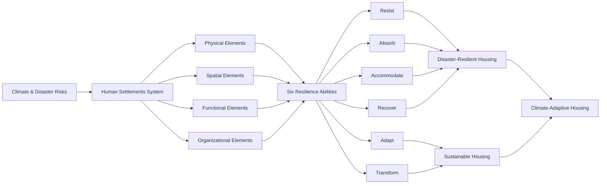
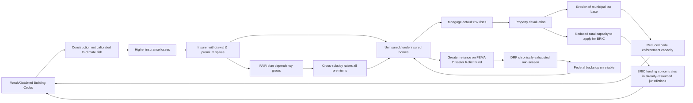
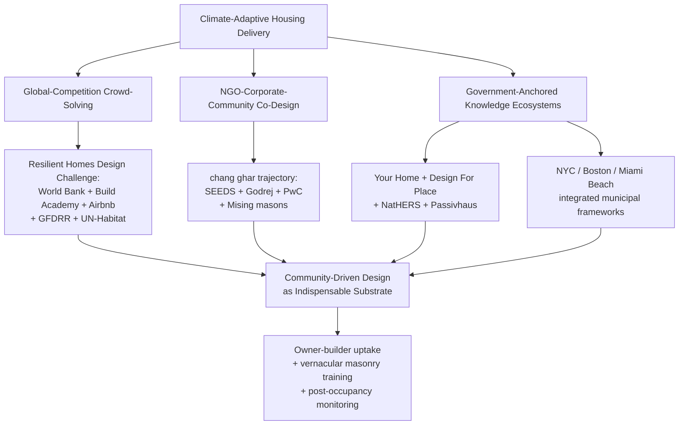

# Climate-Adaptive Housing: A Comparative Study of Disaster-Resilient and Sustainable Housing Models
# 1 Conceptual Framework: Defining Climate-Adaptive Housing

The intensification of climate-related hazards, the compounding shocks of public health emergencies, and the persistent fragility of urban ecosystems have together exposed a fundamental inadequacy in how the world conceives, builds, and inhabits its homes. Conventional housing—optimized for cost, speed, and short-term market efficiency—has proven structurally and ecologically ill-equipped to absorb the acute disasters and chronic stresses now characterizing the Anthropocene. In response, a new conceptual category has emerged at the intersection of disaster risk reduction (DRR) and environmental sustainability: **climate-adaptive housing**. This chapter establishes the theoretical foundation for the comparative study that follows by treating climate-adaptive housing as an umbrella construct uniting two distinct but complementary typologies—**climate disaster-resilient housing** and **sustainable housing**—and by constructing the multi-dimensional analytical framework that will structure the subsequent case comparisons.

The chapter proceeds in five steps. It first traces the conceptual origins of climate-adaptive housing through a systems view of human settlements grounded in resilience theory. It then defines, in turn, the disaster-resilient and the sustainable housing typologies, identifying their core attributes and conceptual boundaries. It next examines points of convergence and divergence between the two models, arguing for their treatment as dual pillars of a single integrated agenda. Finally, it operationalizes the framework by specifying the six analytical dimensions—location, area, energy systems, water and sanitation, materials and cost, and recognition—that will guide the comparative tables and analyses in subsequent chapters.

## 1.1 From Climate Risk to Climate-Adaptive Housing: Conceptual Origins

The conceptual emergence of climate-adaptive housing cannot be understood in isolation from the broader paradigmatic shift in how human settlements themselves are theorized. Authoritative frameworks such as the United Nations Human Settlements Programme's (UN-Habitat) **Resilient and Green Human Settlements Framework (RGHSF)**, developed in partnership with the Philippine Department of Human Settlements and Urban Development (DHSUD) and the Climate Change Commission (CCC), have explicitly recast settlements as integrated systems comprising **physical, spatial, functional, and organizational elements** that interact, change, and evolve over time[^1]. Within this systems perspective, housing is no longer a discrete product but a node in a larger network of shelter, infrastructure, services, and ecosystems that must collectively withstand and recover from shocks.

The empirical urgency for this reconceptualization is substantial. The RGHSF documents that the Philippines alone incurred over **PHP 388 billion** in disaster-related damage between 2011 and 2018, and the World Bank estimated at least **USD 18.6 billion (PHP 799 billion)** in economic damage and other losses due to climate-related disasters over 2009–2014; some **85 percent** of the country's GDP is sourced from areas exposed to climate change risks[^1]. Globally, the same framework cites projections from the Global Commission on Adaptation that climate change could push an additional **100 million people into poverty by 2030**, and from the International Labour Organization that more than **300 million jobs** are potentially at risk worldwide[^1]. The COVID-19 pandemic—which by 25 May 2022 had produced 3,690,707 confirmed cases and 60,455 deaths in the Philippines alone—further demonstrated that the quality of housing and the density of settlements directly mediate the propagation and impact of compound crises[^1].

These intersecting pressures have catalyzed a shift from reactive shelter provision to **proactive, adaptive housing design**. The RGHSF articulates this shift through what it calls the **six resilience abilities**—a typology that has become central to climate-adaptive thinking. A resilient settlement, and by extension a resilient dwelling, is defined as one capable of (i) **resisting** the direct impact of a hazard so that its elements do not collapse; (ii) **absorbing** hazard effects through mechanisms such as insurance, evacuation, and flood catchments; (iii) **accommodating** hazard impacts by deliberately incorporating risks into spatial design, for example through multi-floor buildings or widened floodways; (iv) **recovering** stability in a timely manner through reconstruction and "building back better"; (v) **adapting** to projected future conditions through retrofitting, stilt construction, household-level rainwater harvesting, and similar measures; and (vi) **transforming** fundamental settlement attributes through land-use change, settlement-scale technological innovation, and shifts toward a circular economy[^1].

The diagram above captures the analytical logic adopted in this report: climate-adaptive housing is the operational expression, at the dwelling scale, of the six resilience abilities applied to housing's physical, spatial, functional, and organizational dimensions. Crucially, the RGHSF stresses that these abilities are **not mutually exclusive**; they "often interact and complement one another to sustain the system"[^1]. This non-exclusivity is precisely what motivates the dual-pillar treatment that follows: disaster-resilient and sustainable typologies map onto overlapping but differentially weighted subsets of resilience abilities, and a coherent climate-adaptive agenda requires both.

Equally important is the framework's explicit integration of the **green dimension** alongside resilience. The RGHSF argues that "the concept of green human settlements is specifically added to ensure that environmental sustainability is core to settlements development"[^1], noting that natural ecosystems within settlements simultaneously enhance adaptation and mitigation capabilities—for example, when trees provide cooling and absorb carbon dioxide, or when mangroves serve as buffers against winds, storm surges, and tsunamis. This green-recovery logic, which UN-Habitat estimates could "cut 25 per cent off 2030 emissions, putting the world on track to a 2°C pathway"[^1], explicitly couples resilience with sustainability, providing the conceptual scaffolding upon which the climate-adaptive housing construct rests.

## 1.2 Disaster-Resilient Housing: Definition, Scope, and Core Attributes

Within the climate-adaptive umbrella, **disaster-resilient housing** is defined as housing designed primarily to ensure structural survival, occupant safety, and rapid functional recovery under acute hazards—typhoons, floods, earthquakes, storm surges, and increasingly, compound events that combine geophysical and climatological shocks. Its conceptual center of gravity lies on the **resist–absorb–accommodate–recover** axis of the resilience abilities continuum.

The Philippine legislative and planning architecture offers one of the clearest codifications of this typology. **Republic Act No. 11201**, the Department of Human Settlements and Urban Development Act, explicitly tasks DHSUD with "formulating a framework for resilient housing and human settlements as a basis for mechanisms for post-disaster housing and resiliency planning, research and development, extension, monitoring and evaluation of programs, projects and activities to protect vulnerable persons and communities in hazard-prone areas from the adverse effects of climate change and disasters"[^1]. The **National Disaster Risk Reduction and Management Plan (NDRRMP) 2011–2028**, established under **Republic Act No. 10121**, further identifies two specific outcomes in which DHSUD serves as lead: Outcome 8, which describes the nature of disaster-resilient human settlements, and Outcome 21, which addresses access to either affordable disaster-resilient housing or financial assistance to rebuild houses for affected families[^1].

Drawing on these instruments and on the RGHSF's mapping of resilience abilities to the "Revitalized Housing and Basic Services" Key Result Area, the core attributes of disaster-resilient housing can be specified as follows:

| Core Attribute | Operational Meaning | Mapped Resilience Ability |
|---|---|---|
| Hazard-resistant structural design | Flood-, earthquake-, and wind-resistant building envelopes, foundations, and connections capable of bearing the brunt of incoming hazards | Resist |
| Risk-informed siting | Location decisions based on Climate and Disaster Risk Assessment (CDRA), geohazard maps, and integrated CLUP-LCCAP planning | Resist / Adapt |
| Emergency functionality | Multi-floor configurations to accommodate floods, on-site flood catchments, and mixed-use open and public spaces usable for evacuation and risk management | Absorb / Accommodate |
| Post-disaster recoverability | Capacity for rapid reconstruction, post-disaster "halfway housing," and waste/sanitation management for building back better | Recover |
| Integration with DRR systems | Linkages to Local Disaster Risk Reduction and Management Funds (LDRRMF), insurance and risk-transfer mechanisms, and Barangay-level emergency response infrastructure | Absorb / Recover |
| Vernacular and adaptive design | Use of context-based design principles, locally sourced materials, and adaptive features such as houses on stilts and household-level rainwater harvesting | Adapt |

Table: Core attributes of disaster-resilient housing, mapped to RGHSF resilience abilities[^1].

Two features of this attribute set deserve emphasis. First, disaster-resilient housing is **systemically embedded**: the RGHSF stresses that "resilient housing also extends beyond the structure itself and includes the network of basic services across an accessible and connected platform"[^1]. A house cannot be resilient if it sits within an unresilient settlement, watershed, or service network. Second, disaster-resilient housing is **risk-informed rather than risk-blind**: the framework consistently couples housing programs with the CDRA tool, geohazard updates from the Mines and Geosciences Bureau, and ridge-to-reef ecological profiling[^1], indicating that structural survivability is necessary but insufficient without spatial intelligence about where survival is actually possible.

## 1.3 Sustainable Housing: Definition, Scope, and Core Attributes

The second pillar, **sustainable housing**, is conceptually anchored not on acute shock absorption but on **long-term environmental harmony, resource efficiency, and low-carbon performance** over the dwelling's full life cycle. Within the RGHSF resilience-abilities framework, sustainable housing sits primarily on the **adapt–transform** axis, expressing the more forward-looking and systemic resilience abilities described as "modifying conditions with the central aim of maintaining integrity" and "changing the fundamental attributes... considering the larger natural and socio-economic systems in promoting sustainable development"[^1].

Sustainable housing is policy-anchored in two distinct but converging instruments. Internationally, it operationalizes **Sustainable Development Goal 11 (Sustainable Cities and Communities)** and **SDG 13 (Climate Action)**, which the RGHSF explicitly identifies as the framework's interlocking SDG anchors[^1]. Nationally, in the Philippine context, it is shaped by the **Philippine Green Building Code**, the **Philippine Green Jobs Act of 2016 (RA 10771)**, the **Renewable Energy Act (RA 9513)**, and the **National Framework Strategy on Climate Change (NFSCC) 2010–2022**, which together call for "energy-efficient and climate-resilient human settlements," "energy efficiency and climate-proofing mechanisms for public infrastructure," and "green infrastructure practices through climate-smart technologies, climate-proofing processes and construction of energy-efficient buildings"[^1].

The core attributes of sustainable housing, drawn from the RGHSF's "Blue, Green, and Circular Economy" and "Revitalized Housing and Basic Services" Key Result Areas, can be specified as follows:

| Core Attribute | Operational Meaning | Mapped Policy/Framework Anchor |
|---|---|---|
| Energy efficiency and renewable energy integration | Green and affordable energy access, off-grid solutions, energy-saving rebates, transition to clean/renewable energy in settlements development | Renewable Energy Act; NFSCC; Green Building Code[^1] |
| Sustainable water resource management | Identification, harnessing, and management of scarce water resources; rainwater harvesting; improved drainage and sewerage systems | RGHSF KRA 6; Sanitation Code (PD 856)[^1] |
| Low-carbon and locally sourced materials | Low-carbon housing value chain; local and sustainable sourcing; green products and materials certification | Greening the Philippine Manufacturing Industry Roadmap[^1] |
| Ecosystem integration | Blue and green infrastructure, urban biodiversity, nature-based solutions (NBS), ridge-to-reef and ecosystem-based adaptation (EBA) | RGHSF KRA 3; PBSAP[^1] |
| Circular economy alignment | Zero-waste sanitation and management; economic sectors' transition to circular economy; green financing for clean/green production | Philippine Action Plan for Sustainable Consumption and Production (PAP4SCP)[^1] |
| Recognition and certification | Green Building Code compliance, green products certification, sustainable finance tagging | Philippines Sustainable Finance Roadmap[^1] |

Table: Core attributes of sustainable housing, mapped to RGHSF Key Result Areas and policy anchors[^1].

A defining feature of sustainable housing as articulated in these instruments is its **value-chain logic**. The RGHSF explicitly calls for "promoting a low-carbon housing value chain" that "ensures that all stages of the housing process and all the integral components of design and construction contribute to emission reduction efforts and promote green technology"[^1]. This life-cycle orientation distinguishes sustainable housing from disaster-resilient housing's predominantly event-centered logic: where the latter is benchmarked against discrete shocks, the former is benchmarked against continuous flows of energy, water, materials, and emissions across decades of occupation.

## 1.4 Convergences and Divergences: Positioning the Two Models as Dual Pillars

Treating disaster-resilient and sustainable housing as two pillars of a single climate-adaptive agenda is justified by their convergences; treating them as distinct pillars rather than collapsing them into one category is justified by their divergences. Both moves are conceptually necessary.

**Convergences.** First, both typologies are responses to the same underlying driver—anthropogenic climate change and its compound socioeconomic consequences—and both are mandated within the same overarching policy frameworks. The RGHSF, the New Urban Agenda, the SDGs, the Sendai Framework, and the Paris Agreement do not separate resilience from sustainability; they treat them as co-constitutive[^1]. Second, both share several common technical solutions: **rainwater harvesting**, for example, appears in the RGHSF simultaneously as an "adapt" resilience action ("household-level rainwater harvesting" as adaptation to changing hydrological regimes) and as a sustainable water management practice[^1]. Similarly, **locally sourced and context-based materials**, **mixed-use open and public spaces**, and **green and resilient housing/building** are listed under shared KRAs that span both adaptation and mitigation logics[^1]. Third, both ultimately depend on the same enabling conditions: risk-informed planning, accessible climate finance, capacity-building of homeowner associations, and integration into Comprehensive Land Use Plans (CLUPs) and Local Climate Change Action Plans (LCCAPs)[^1].

**Divergences.** Despite these overlaps, the two typologies diverge along at least four important axes:

1. **Temporal orientation.** Disaster-resilient housing is calibrated to **acute, discrete events** measured in minutes (seismic shaking) to days (typhoon landfall, flood inundation). Sustainable housing is calibrated to **chronic, continuous flows** measured in years to decades (energy consumption, embodied carbon, water cycles).
2. **Primary resilience abilities.** Disaster-resilient housing emphasizes **resist, absorb, accommodate, and recover**; sustainable housing emphasizes **adapt and transform**[^1].
3. **Success metrics.** Disaster-resilient housing is benchmarked against **structural survival thresholds** (wind-speed ratings, flood elevation, seismic performance), whereas sustainable housing is benchmarked against **performance and certification thresholds** (energy ratings, water cycles closed, carbon intensity).
4. **Cost-benefit profile.** Disaster-resilient features incur upfront premiums justified by avoided catastrophic losses (a one-time payoff under a hazard event), while sustainable features incur upfront premiums justified by continuous operational savings.

These divergences also surface latent **tensions**. A house designed for maximum structural survival may use carbon-intensive materials (reinforced concrete, steel) that compromise its sustainability profile; conversely, a house designed for ultra-low embodied carbon may use lightweight materials whose resistance to extreme wind or seismic events requires careful engineering. Resolving these tensions is not a matter of choosing one pillar over the other, but of designing dwellings that simultaneously satisfy both performance regimes—precisely the integrative agenda that the RGHSF labels "green and resilient housing/building"[^1].

The dual-pillar treatment adopted in this report therefore reflects neither separation nor conflation but **complementarity under a shared umbrella**: climate-adaptive housing is the integrative category, while disaster-resilient and sustainable housing are its two analytically distinct but operationally interdependent expressions.

## 1.5 Analytical Dimensions for Comparative Assessment

To translate this conceptual framework into a rigorous comparative empirical analysis, the report adopts a **six-dimension analytical schema** that will be applied identically to every case in both Table 1 (disaster-resilient cases) and Table 2 (sustainable cases). The use of an identical schema across both typologies is methodologically deliberate: it allows divergences to surface as differences in column content rather than as differences in column choice, ensuring that cross-typology comparisons remain commensurable.

The six dimensions, their definitions, and their conceptual justification within the climate-adaptive framework are summarized below:

| Analytical Dimension | Definition | Conceptual Justification |
|---|---|---|
| **Model Name** | Project identifier, designer/architect of record where applicable | Anchors each case to a verifiable source; enables traceability |
| **Location** | Geographic site, including country, region, and contextual hazard or climate zone | Captures the risk-informed siting attribute (§1.2) and the bioclimatic context for passive design (§1.3) |
| **Area (m²)** | Gross floor area or built-up area | Permits normalization of resource use, cost, and performance metrics across cases of different scales |
| **Energy System Characteristics** | Active and passive energy strategies, including renewables, thermal performance, certification star-ratings | Operationalizes RGHSF KRA 5 (green and affordable energy access) and the resist/adapt axes[^1] |
| **Water and Sanitation System Characteristics** | Water sourcing (rainwater harvesting, mains, recycling), wastewater treatment, sanitation strategy | Operationalizes RGHSF KRA 6 (sustainable water resource access and management; zero-waste sanitation)[^1] |
| **Main Building Materials and Costs** | Primary structural and finish materials, embodied carbon characteristics where reported, total or per-m² cost data | Operationalizes the low-carbon housing value chain and hazard-resistant structural design attributes |
| **Awards or Recognition Received** | Third-party certifications (e.g., NatHERS, Passive House), design awards, policy endorsements | Provides external validation of performance claims; mitigates risk of self-reported greenwashing |

Table: Six analytical dimensions structuring the comparative assessment of climate-adaptive housing cases.

Three methodological principles govern the application of this schema in subsequent chapters. First, **factual accuracy is non-negotiable**: each cell will be populated only with data directly attested by verifiable sources, and gaps will be explicitly flagged as "Data not publicly available" rather than filled with plausible-sounding estimates. Second, **the schema serves comparison, not description**: the value of the framework lies not in any single cell but in the patterns that emerge when cells are read across rows (within-typology) and across tables (cross-typology). Third, the schema is designed to surface the **convergence-divergence structure** identified in §1.4: where disaster-resilient and sustainable cases converge (e.g., on rainwater harvesting in the water column), the schema will reveal it; where they diverge (e.g., on certification regimes in the recognition column), the schema will likewise make this visible.

With this conceptual foundation established—climate-adaptive housing defined as the union of disaster-resilient and sustainable typologies, each anchored in the resilience-abilities and green-settlements logic of frameworks such as the RGHSF, and each assessable along six common analytical dimensions—the report now turns, in Chapter 2, to the empirical compilation of three disaster-resilient housing cases.

# 2 Comparative Table 1: Climate Disaster-Resilient Housing Cases

Having established in Chapter 1 that disaster-resilient housing occupies the resist–absorb–accommodate–recover axis of the six resilience abilities, this chapter operationalizes that conceptual pillar through three empirical cases. All three are drawn from a single, well-documented institutional source: the 2018 **Resilient Homes Design Challenge** co-convened by the World Bank, Build Academy, Airbnb, the Global Facility for Disaster Reduction and Recovery (GFDRR), and UN-Habitat. Anchoring the cases in a shared provenance has three methodological advantages: it ensures comparability of design briefs (all proposals were constrained by the same hazard scenarios, the same sub-USD 10,000 cost ceiling, and the same jury criteria); it secures third-party recognition as an external validity check; and it limits the range of confounding variables when the cases are later juxtaposed against the sustainable housing cases of Chapter 3.

The chapter proceeds by first reconstructing the institutional context of the Challenge, then profiling each case under the six-dimension analytical schema (with the addition of an explicit "Awards or Recognition" column, yielding seven columns in total for Table 1), and finally consolidating the findings in a single comparative matrix accompanied by preliminary observations. Wherever the public documentation does not verifiably support a given cell, the gap is explicitly flagged rather than filled with conjecture.

## 2.1 Institutional Context: The Resilient Homes Design Challenge as Case Source

The Resilient Homes Design Challenge was launched on **18 September 2018** as a global crowd-solving competition. Its stated goal was to "generate designs for low-cost and sustainable small houses (under $10,000) for people living in vulnerable areas affected by natural disasters", with a submission deadline of **30 November 2018** and winner announcement on **18 December 2018**[^2][^3]. The Challenge was justified on the empirical observation that, since 1990, natural disasters have affected an average of **217 million people every single year**, with floods, storms, heat waves and droughts leaving approximately **606,000 people dead and 4.1 billion injured or homeless** since 1995; in the specific case of Hurricane Maria (2017), only **11 percent** of the entire housing stock on the Caribbean island country of Dominica remained intact[^2][^3].

Participation was free of charge and open to architects, engineers, designers, and aid workers worldwide. The competition received submissions from **over 3,000 professionals from more than 120 countries**, yielding **over 300 team submissions**[^3]. Designs were solicited against **three hazard scenarios**, with teams permitted to enter one or all:

- **Scenario 1**: Earthquakes and tropical storms on islands;
- **Scenario 2**: Earthquakes and landslides in mountain and inland areas;
- **Scenario 3**: Tropical storms and floods in coastal areas[^4][^5].

The brief explicitly encouraged design teams to **"look beyond fully prefabricated housing designs"** and to "incorporate local building materials into their designs," with part-prefabricated, ease-of-construction approaches considered acceptable[^5][^2]. The jury, composed of international experts, evaluated submissions against four criteria—**resilience, sustainability, replicability, and suitability to local cultural context**—giving preference to designs that "would use local materials and enable local employment rather than requiring significant external expertise and materials"[^3]. As Hashim Sarkis, Dean of the MIT School of Architecture & Planning, summarized the jury's logic: "I would definitely go for the more localized construction systems and approaches that changed existing elements or introduced new details that makes the houses stronger, faster, and easier to build, but are also more dignified"[^3].

Three winning designs were selected per scenario, for a total of nine winners, with one Special Mention per scenario[^3]. Two of the three cases analyzed in this chapter—Resilient House Antu and the KZ Architecture entry (commonly identified as the bamboo-centered Caribbean proposal)—were Scenario 1 winners[^3]. The third case, the **Resilient Liaison House**, is referenced in the user brief as a disaster-resilient case, but as discussed in §2.4, its documentation is not verifiable from the search results available for this study, and the analysis therefore proceeds with explicit transparency about that limitation.

It bears emphasis that all three are **prototype designs** rather than constructed buildings. UN-Habitat's announcement indicated that winning designs were to enter a subsequent phase of "testing the winning design housing models for their resilience," followed by "continued collaboration with the designers to tweak and improve the designs to get them ready for real-world application"[^3]. Consequently, the data populated below describe **design specifications** rather than measured post-occupancy performance.

## 2.2 Case 1 — Resilient House Antu (Caribbean & Pacific Islands)

The first case is the **Antu** proposal, submitted by a Nicaragua-based team and announced as a Scenario 1 winner for Caribbean and Pacific island contexts[^3]. As a Scenario 1 entry, the design's primary hazard targets are **earthquakes and tropical storms on islands**[^4][^5], implicitly including hurricane-force winds and—given the Caribbean and Pacific island designation—the associated risks of storm surge and lateral seismic shaking.

The structural design strategy assembles three principal materials—**wood, river stones, and concrete**—into a compact dwelling envelope. The use of river stones and timber expresses the jury's preferred logic of locally sourced and context-based materials, while the inclusion of concrete provides the mass and rigidity required to resist combined wind-and-seismic loading typical of small island states. The reported **gross floor area is 43 m²**, consistent with the Challenge's emphasis on small, modular, affordable dwellings for vulnerable populations[^5][^2]. The **construction cost is reported at USD 9,962.00**, situating the design just below the USD 10,000 ceiling stipulated in the Challenge brief[^3][^2].

A notable feature of Antu's submission is its **deliberate omission of energy and water/sanitation subsystems**: the design **did not include energy efficiency measures or alternative energy systems**, nor did it incorporate **water efficiency measures or alternative water systems**. This omission is analytically significant. Within the dual-pillar framework articulated in Chapter 1, Antu sits squarely on the **resist–absorb–accommodate–recover** axis of the resilience abilities and makes no claim on the **adapt–transform** axis associated with sustainable housing. The design optimizes for **acute structural survivability** under island hazard scenarios while leaving the operational sustainability layer to be supplied (or not) by the wider settlement infrastructure. This reflects the conceptual divergence identified in §1.4: disaster-resilient housing is benchmarked against survival thresholds, not against continuous resource flows.

The design's recognition is its **participation in, and selection as a winning entry of, the Resilient Homes Challenge** under Scenario 1[^3]. Beyond this competition recognition, the search materials do not document any subsequent independent certifications.

| Dimension | Resilient House Antu |
|---|---|
| Model Name / Team | Antu (Nicaragua) |
| Location (target) | Caribbean countries (Scenario 1: Caribbean & Pacific islands) |
| Area | 43 m² |
| Energy System | Did not include energy efficiency measures or alternative energy systems |
| Water & Sanitation System | Did not include water efficiency measures or alternative systems |
| Main Materials | Wood, river stones, concrete |
| Cost | USD 9,962.00 |
| Recognition | Participated in the Resilient Homes Challenge (Scenario 1 winner) |

**Resilience-ability mapping.** Antu's structural strategy maps primarily to **Resist** (rigid concrete-and-stone base coupled with timber framing to absorb seismic energy) and **Accommodate** (compact 43 m² footprint suitable for compressed island plots and rapid post-disaster deployment), with implicit **Recover** capacity through the use of locally available, replaceable materials.

## 2.3 Case 2 — Spirited Bamboo by KZ Architecture (Caribbean)

The second case is the entry by **KZ Architecture (USA)**, identified in the user brief as **"Spirited Bamboo"** and confirmed in the Challenge's announced winners list as a Scenario 1 winner with a **Caribbean location designation**[^3]. As a Scenario 1 winner, the design responds to the same island hazard scenario as Antu—**earthquakes and tropical storms**, with attendant exposure to hurricane-force winds and storm surge characteristic of the Caribbean basin[^4][^5][^3].

The design's name, "Spirited Bamboo," indicates a bamboo-centered structural strategy. Bamboo is a paradigmatic example of the jury's stated preference for indigenous, low-carbon, locally sourced materials that "enable local employment rather than requiring significant external expertise"[^3]; its high tensile-strength-to-weight ratio also makes it well suited to wind-loaded environments, while its flexibility offers favorable seismic energy dissipation. In this respect, the design exemplifies the jury's commitment to "more localized construction systems… that makes the houses stronger, faster, and easier to build, but are also more dignified"[^3].

Beyond the verified facts of designer identity (KZ Architecture, USA), location designation (Caribbean), and Scenario 1 winner status[^3], **the publicly available search results consulted for this report do not provide verifiable, case-specific data on the design's floor area, energy system, water and sanitation system, full materials inventory, or precise construction cost**. The Challenge brief imposed a binding upper ceiling of **USD 10,000 per unit**[^4][^5][^2], so the cost can be confidently bounded as ≤ USD 10,000, but a more precise figure is not verifiable from the materials available. In keeping with the methodological principle established in Chapter 1—that gaps are flagged rather than filled—the corresponding cells in Table 1 are marked accordingly.

**Resilience-ability mapping.** On the basis of what is verifiable, Spirited Bamboo maps onto **Resist** (bamboo's flexural capacity under wind and seismic load), **Recover** (rapid regrowth of bamboo as a material enabling fast post-disaster reconstruction supply), and **Adapt** (alignment with vernacular Caribbean building traditions that have historically incorporated lightweight, replaceable plant-based materials).

## 2.4 Case 3 — Resilient Liaison House

The third case requested in the user brief is the **"Resilient Liaison House."** Within the search results obtained for this study—comprising the official UN-Habitat winners announcement, the original Challenge brief, PR Newswire's launch release, the Bustler and ArchDaily competition listings, and related coverage[^3][^6][^4][^5][^2][^7]—**no design submission, prototype, winning entry, or built project carrying the name "Resilient Liaison House" is documented**. The complete list of nine winners (three per scenario) and three Special Mentions confirmed by UN-Habitat is reproduced below for verification:

| Scenario | Winner | Location of Design |
|---|---|---|
| 1 | Antu (Nicaragua) | Caribbean & Pacific islands[^3] |
| 1 | CSW Architecture (France) | Haiti[^3] |
| 1 | KZ Architecture (USA) | Caribbean[^3] |
| 2 | Baha Spatial Agency (Nepal) | Nepal[^3] |
| 2 | Compartment S4 (India) | India[^3] |
| 2 | Ten (Switzerland) | Nepal, Bhutan[^3] |
| 3 | Architects Avenue (Malaysia) | Malaysia[^3] |
| 3 | PoLito (Italy) | Philippines[^3] |
| 3 | Bam-S (Italy) | Bangladesh[^3] |

In accordance with the non-fabrication constraint governing this report, **no case-specific data are asserted for the Resilient Liaison House.** Three interpretive possibilities should be flagged honestly:

1. The design may exist under a different name in primary documentation not surfaced by the available search results;
2. The label may refer to a non-Challenge project (e.g., an independently developed prototype or built dwelling) documented in sources outside the present material base;
3. The label may have been introduced in the user brief on the basis of materials that the present research stage cannot verify.

The methodologically defensible course is therefore to retain the case as a placeholder row in Table 1, flag every cell as "Data not publicly verifiable from available sources," and recommend that subsequent research stages re-verify the case identity. This preserves the analytical integrity of the comparative framework and avoids the risk of attributing fabricated specifications to a design whose existence and parameters cannot be independently confirmed.

**Resilience-ability mapping.** Deferred pending verification of case identity.

## 2.5 Consolidated Comparative Table and Preliminary Observations

The three case profiles are consolidated below into Table 1, the empirical anchor of the disaster-resilient pillar of this report. The table preserves the seven-column standardized schema and surfaces both verified data and explicit information boundaries.

| Column | Resilient House Antu | Spirited Bamboo (KZ Architecture) | Resilient Liaison House |
|---|---|---|---|
| **Model Name** | Antu (Nicaragua team) | Spirited Bamboo — KZ Architecture (USA)[^3] | Resilient Liaison House |
| **Location** | Caribbean countries (Caribbean & Pacific islands)[^3] | Caribbean countries[^3] | Data not publicly verifiable from available sources |
| **Area (m²)** | 43 m² | Not verifiable from available sources | Data not publicly verifiable from available sources |
| **Energy System Characteristics** | Did not include energy efficiency measures or alternative energy systems | Not verifiable from available sources | Data not publicly verifiable from available sources |
| **Water and Sanitation System Characteristics** | Did not include water efficiency measures or alternative systems | Not verifiable from available sources | Data not publicly verifiable from available sources |
| **Main Building Materials and Costs** | Wood, river stones, concrete; USD 9,962.00 | Bamboo-centered structural strategy (implied by design name and locally sourced materials emphasis[^3]); cost ≤ USD 10,000 per Challenge brief[^4][^5][^2]; precise figure not verifiable | Data not publicly verifiable from available sources |
| **Awards or Recognition Received** | Participated in the Resilient Homes Challenge; Scenario 1 winner (Caribbean & Pacific islands)[^3] | Resilient Homes Design Challenge Scenario 1 winner (Caribbean designation)[^3] | Data not publicly verifiable from available sources |

Table 1: Climate disaster-resilient housing cases — comparative matrix under the seven-column standardized schema.

Several preliminary observations emerge from this matrix, while leaving full cross-typology synthesis to Chapters 4 and 5.

First, **shared institutional provenance enforces shared design constraints.** Both verifiable cases (Antu and Spirited Bamboo) are bound by the same USD 10,000 per-unit cost ceiling, the same Scenario 1 hazard scope (island earthquakes and tropical storms), and the same jury preference for locally sourced, dignified, and replicable construction[^3][^4][^5][^2]. This explains the convergent emphasis on context-specific natural materials—river stones, wood, and bamboo—rather than imported industrial systems.

Second, and conceptually most significant, **the Antu case demonstrates an explicit narrowing of resilience scope.** Its omission of energy and water/sanitation subsystems is not a documentation gap; it is a design choice consistent with the Challenge's prioritization of structural survivability and affordability. This finding empirically substantiates the divergence identified in §1.4: when the design driver is acute hazard survival at minimum cost, the **adapt–transform** axis of resilience (which encompasses operational sustainability) can be deliberately left to the wider settlement infrastructure rather than internalized at the dwelling scale. This observation will be revisited in Chapter 3, where sustainable housing cases will be shown to make the opposite trade-off.

Third, **the cost-ceiling effect produces a striking pricing pattern.** Antu's USD 9,962.00 figure—USD 38 below the Challenge ceiling—suggests that the brief's affordability constraint functioned as a binding rather than indicative target, with designers calibrating their material and area choices to hit the ceiling almost exactly. This has implications for replicability: the design is calibrated to the price point of the global vulnerable-housing market the Challenge sought to address, but offers little headroom for additional sustainability upgrades within that envelope.

Fourth, **information boundaries are themselves analytically informative.** The Resilient Liaison House case underscores a recurring difficulty in the disaster-resilient housing literature: many "resilient" prototypes circulate in fragmented form across design competition platforms, news releases, and grey literature, without the systematic post-occupancy documentation that characterizes the certified sustainable housing sector. This documentation asymmetry—itself a structural feature of the disaster-resilient pillar—will reappear in Chapter 5's analysis of barriers to scaling climate-adaptive housing, and contrasts sharply with the certification-rich documentation environment of the sustainable housing cases compiled in Chapter 3.

Fifth and finally, **the cases collectively illustrate the systems-embedded nature** of disaster-resilient housing emphasized in §1.2. Their designs were intended not as autonomous artifacts but as components of a wider community-of-practice agenda. As Sameh Wahba, World Bank Director for Urban and Territorial Development, Disaster Risk Management and Resilience, framed it: "We should not be looking at this design competition as a one-off. We should look at this as the beginning of a community of practice around the very important agenda of resilient housing design and retrofitting"[^3]. The empirical content of Table 1, therefore, should be read not as a static product catalog but as the design-prototype layer of a still-evolving institutional response to the climate-disaster housing challenge.

With the disaster-resilient pillar empirically populated and its information boundaries transparently demarcated, Chapter 3 turns to the parallel compilation of sustainable housing cases, applying the identical seven-column schema to enable the direct cross-typology comparison that motivates this study.

# 3 Comparative Table 2: Sustainable Housing Cases

Where Chapter 2 anchored the disaster-resilient pillar in a single design competition that imposed a uniform sub-USD 10,000 cost ceiling and a 60-day submission window, the sustainable housing pillar examined in this chapter operates in a strikingly different institutional environment. Its cases are not unbuilt prototypes generated in response to an acute hazard brief, but **certified, occupied, post-construction dwellings** assessed against continuous performance regimes that span decades. The empirical sources change accordingly: instead of competition press releases and design submissions, the cases below are documented through third-party certification records (NatHERS, Passivhaus), independent magazine profiles (Sanctuary, Renew), government guidance platforms (Your Home), and industry awards (HIA GreenSmart, MBA NSW Environmental Management). This documentation asymmetry—flagged at the end of Chapter 2—is not incidental; it is itself a structural feature of the sustainable pillar and an early indicator of how operational sustainability is professionally validated.

The chapter applies the identical seven-column analytical schema introduced in §1.5 and Chapter 2 to four cases: **Harmony House** (Inverloch, Victoria, Australia), **Caloundra House** (Queensland, Australia), **The Owen Residence** (Boston, MA, USA), and **Sapphire Passive House** (Faulconbridge, NSW, Australia). It first reconstructs the certification ecosystem within which these cases are intelligible (§3.1), then profiles each case in turn (§3.2–§3.5), and finally consolidates the matrix and surfaces preliminary observations (§3.6) that prepare the ground for the cross-typology synthesis to follow in Chapter 4.

## 3.1 Institutional and Certification Context of Sustainable Housing Cases

The sustainable housing typology, as articulated in §1.3, is benchmarked against **performance and certification thresholds** rather than against discrete shock-survival thresholds. Five interlocking institutional frameworks structure the cases analyzed in this chapter and merit brief reconstruction.

The first is the **Nationwide House Energy Rating Scheme (NatHERS)**, Australia's national thermal-performance rating system. NatHERS assessments are conducted by accredited assessors and are referenced throughout the Australian government's Your Home guidance, which recommends that homebuyers and builders "specify a minimum 7-star Nationwide House Energy Rating Scheme (NatHERS) rating for thermal performance," noting that "even higher ratings are achievable in cooler climates such as Canberra and Melbourne where heating is the predominant need".[^8] Accredited assessors can be located through the Australian Building Sustainability Association, Design Matters National, and the House Energy Raters Association.[^8] NatHERS thus operationalizes the **adapt** resilience ability identified in Chapter 1 by quantifying a dwelling's continuous thermal-energy demand under modeled climatic conditions.

The second is the **Passivhaus standard**, a performance-based building methodology originated in Germany and adapted for Australian conditions through the Australian Passivhaus Association (APHA). Passivhaus specifies airtight construction, mechanical heat-recovery ventilation (MHRV), high-performance (typically triple-glazed) windows, climate-appropriate insulation, and elimination of thermal bridges, producing homes that "use up to 90% less energy than that built to the minimum legal standard".[^9] As Joe Mercieca of Blue Eco Homes characterizes the standard, Passive Houses "move beyond minimum building requirements and look to the future. A future where we rise to the challenge of building smarter, longer lasting homes that are healthy, energy efficient and incredibly comfortable".[^10] Importantly, APHA stresses that Passivhaus is **not synonymous with passive solar design**: "while solar passive design is an essential aspect of a certified Passive House, they are not the same thing. The Passivhaus standard was created in Germany and is quite new to Australia".[^10]

The third is the **U.S. LEED for Homes program** administered by the U.S. Green Building Council, which "awards certification for houses that meet the highest levels of sustainability for energy and water efficiency, materials and resource management, indoor air quality, sustainable sites and other criteria," with Platinum constituting the highest of four tier levels.[^11] LEED's multi-criteria scope makes it the most comprehensive of the certification regimes considered here, although—as discussed in §3.4—its application to the specific Owen Residence case is not verifiable from the public record.

The fourth is the **Bushfire Attack Level (BAL)** regulatory framework, which classifies bushfire risk along a scale from BAL-LOW to **BAL-40** and **BAL-FZ (Flame Zone)**, the highest rating.[^12] BAL ratings determine construction requirements for cladding, glazing, and detailing to resist "ember attack, radiant heat and direct flame contact".[^12] As will become clear in §3.5, the BAL framework is the principal mechanism through which the Australian sustainable housing sector has begun to integrate disaster-resilience considerations into its certified-performance designs.

The fifth is the suite of **government-led design resources** epitomized by the Australian Government's **Your Home** guide and its **Design For Place** house plans. Design For Place "offers a complete architect-designed suite of plans for energy-efficient homes, available in three designs to suit different block sizes and orientations. The plans can be downloaded for free and include specifications designed to achieve a minimum 7-Star NatHERS energy rating in nine of Australia's major climate zones".[^13] Your Home itself frames housing decisions through a **'triple bottom line'** lens—environmental, economic, and social (lifestyle) performance—and explicitly couples energy-efficiency, water-efficiency, materials-impact, and indoor-air-quality goals.[^8]

Collectively, these five frameworks function analogously to the Resilient Homes Challenge brief in Chapter 2: they impose comparable institutional constraints on the cases, generate the verifiable data populating Table 2's cells, and supply the third-party validation that mitigates the risk of self-reported greenwashing. The documentation asymmetry between the two pillars therefore reflects not the relative maturity of the research literature but the **structural difference between prototype-based and certification-based housing development models**.

## 3.2 Case 1 — Harmony House (Inverloch, Victoria, Australia)

The first case is **Harmony House**, a family home built by Richard, Kerryn, and their two children in Inverloch, a coastal Gippsland town in Victoria, Australia.[^13] Drawn to the semi-rural lifestyle and the town's proximity to Melbourne for family visits, the family initially struggled to find an existing property that supported good passive solar orientation: "None of them made sense! They faced the wrong way or had roof slopes that were nowhere near ideal for solar. We always had sustainability in mind, and wanted something better than 'this'll do'," Richard recalls.[^13] After exploring designer commissions, kit homes, and container homes, the family adopted the Australian Government's free **Design For Place** plans—reportedly the first family to do so in practice.[^13] The case is documented in Renew's *Sanctuary* magazine and is also referenced as an 8.2-Star Harmony House case study within the Your Home guidance ecosystem.[^13][^14][^8]

**Site, scale, and design.** The family purchased a 6,000 m² block on the outskirts of Inverloch and adapted the original three-bedroom Design For Place template—a simple rectangular floor plan with central living/dining opening onto a north-facing deck, kitchen, laundry and study along the southern wall, a main bedroom with walk-in robe and bathroom at one end, two additional bedrooms, a second bathroom, and a single-car garage at the other.[^13] With the assistance of a local draftsperson they made minor modifications: flipping the house east–west to suit the driveway, separating toilets from bathrooms, and converting the garage to a music room.[^13] The completed home has a **gross floor area of 194 m²** and achieves an **8.2-Star NatHERS energy rating**—well above the 7-Star minimum specified in the Design For Place template.[^13][^14]

**Energy system.** Harmony House's energy strategy combines sophisticated **passive solar design** with substantial **active renewable generation**. The construction is timber frame with internal brick walls and a **waffle pod concrete slab floor for thermal mass**, paired with strategic window placement, north-facing orientation, eaves sized to block summer sun while admitting winter solar gain, and cross-flow ventilation enabling nocturnal purge of accumulated daytime heat.[^13] The family exceeded the climate-zone–specific insulation recommendations, "increasing the ceiling insulation to R5 rather than the recommended R4, and insulating the slab".[^13] To preserve the slab's thermal-mass function while addressing the family's dislike of polished concrete, they specified **HeatWood heat transfer floorboards**—a composite stone (14 mm) and timber (2 mm) board that retains "the look and feel of timber but still have excellent heat conductivity, allowing the slab to be thermally connected to the living space and perform its function as thermal mass".[^13]

On the active side, the home runs **off-grid for electricity**, powered by "just under 14 kilowatts of solar PV with 76.8 kilowatt-hours of batteries".[^13] Hot water is supplied by a heat pump, climate control by a Daikin reverse-cycle air conditioner in the main living area, and supplementary heating by infrared panels in bedrooms, music room, study, and living area, which Richard describes as producing "gentle radiant heat… like standing in nice autumn sunshine".[^13] Post-occupancy performance is consistent with the design intent: internal winter temperatures hold between **18–24 °C** without active heating, and summer temperatures between **20–26 °C** with only occasional reliance on the air conditioner.[^13]

**Water and sanitation system.** Harmony House is **off-grid for water and wastewater treatment** as well as electricity. The household stores **27,000 litres of rainwater** in stainless steel tanks—selected for durability—and is not connected to the public mains network.[^13] Domestic wastewater is processed by a **chemical-free worm farm septic system**, in which "an estimated 20,000 worms process sewage and greywater before it's pumped into dispersal trenches to enrich the soil".[^13] This closed-loop sanitation strategy operationalizes the **zero-waste sanitation** attribute and the **circular economy** logic identified in §1.3 as a defining feature of sustainable housing.

**Materials and cost.** Beyond the timber frame, internal brick mass walls, and waffle-pod slab already discussed, the family prioritized "long-lasting and low-maintenance materials, such as durable fibre cement cladding with 'self-cleaning' properties and stainless steel water tanks".[^13] The **designer-finished fibre cement cladding with self-cleaning coating** reflects the value-chain logic of low-maintenance, long-lifespan materials whose embodied carbon is amortized across decades of low operational impact. The total build cost was **AUD 300,000** for the Design For Place build, plus approximately **AUD 100,000** for the off-grid systems, heat pump hot water, and heating/cooling—yielding a total of roughly AUD 400,000.[^13] Richard frames this as deliberate optimization across the resilience-sustainability frontier: "The cost of an off-grid energy system is dependent on how big you need it to be, so a poor-performing house will need a larger and more expensive system. By spending more on our windows and insulated slab, we saved money on our off-grid system."[^13]

**Recognition.** Harmony House's principal forms of recognition are its **8.2-Star NatHERS rating**, its **Sanctuary magazine profile**, and its function as a **case study within the Australian Government's Your Home: Australia's Guide to Environmentally Sustainable Homes**—where it is presented as exemplifying the smaller-house, free-design-plan pathway to sustainable construction.[^13][^8] The home is also documented in academic and industry literature as the **8.2-Star Harmony House in Inverloch, Victoria, built using the Design For Place plans**.[^14] The household additionally maintains a public documentation site at harmonyhouse.com.au.[^13]

## 3.3 Case 2 — Caloundra House (Queensland, Australia)

The second case is the **Caloundra House**, situated in Caloundra on Queensland's Sunshine Coast. Caloundra is a subtropical coastal location whose climatic and regulatory context—warm humid summers, mild dry winters, marine air corrosion, and cyclone exposure—imposes a distinct set of design imperatives compared with Inverloch's cool-temperate Victorian coast.

The publicly available sources consulted for this study document a sustainable design practice ecosystem in Caloundra rather than a single, definitively identifiable dwelling carrying the proper name "Caloundra House." **Adrian Ramsay Design House**, an award-winning building designer serving Caloundra, articulates a design philosophy centered on "bespoke luxury homes that reflect the coastal charm and lifestyle of this vibrant area," with explicit emphasis on **"sustainability and energy efficiency"**: "From incorporating natural ventilation to selecting sustainable materials, we design with the future in mind".[^15] The practice's stated sustainability methodology includes "eco-friendly materials, enhancing energy efficiency, and crafting homes designed to endure for generations," with an emphasis on "natural light, ventilation, and flexible layouts".[^15] A parallel project, **Jasper Brown Architects' Caloundra Townhouses** (completed 2020), demonstrates a complementary expression of climate-responsive coastal design: four townhouses on Cooma Terrace, each with a combined internal/external area of **330 m²**, organized around "a refined material and colour palette, with natural earthy tones and crisp whites offset by highlights of ocean pastels," and punctuated by "hardy coastal planting at all levels".[^16] The townhouses use natural cross-ventilation strategies through "covered double-height" living volumes and generous north-facing balconies, drawing on the subtropical climate's prevailing breezes.[^16] Additional documentation also indicates active project activity—"Construction progress going amazingly well on our Caloundra House Raise"—consistent with an ongoing pipeline of named Caloundra projects.[^17]

**Design characteristics common to the Caloundra sustainable design context.** Across these projects, four climate-responsive sustainability features recur and can be analytically attributed to the Caloundra subtropical coastal typology:

1. **Cross-ventilation and natural cooling** through north-facing openings, generous balconies, and double-height volumes that exploit prevailing coastal breezes;[^16]
2. **Durable, marine-grade material selection** appropriate to corrosive coastal air and high UV exposure;[^15][^16]
3. **Site-responsive orientation** that capitalizes on view corridors (such as those toward Bribie Island in the Jasper Brown townhouses) while managing solar gain;[^16]
4. **Integration with hardy coastal planting** that contributes to microclimate moderation and ecological continuity.[^16]

These features express the **passive design principles** identified in §1.3 (orientation, ventilation, low-maintenance material durability) within a subtropical rather than cool-temperate envelope, illustrating how the sustainable housing typology is climate-zone–specific in its detailed expression even as it is unified in its underlying performance logic.

**Information boundaries.** In strict adherence to the non-fabrication principle established in Chapter 1 and applied to the Resilient Liaison House case in §2.4, specific quantitative parameters for a singular "Caloundra House" dwelling—**precise gross floor area, total construction cost, third-party certification (NatHERS star rating, Passivhaus certification, or equivalent), specific energy-system capacity (solar PV kW, battery kWh), water-system specifications (tank capacity, wastewater treatment type), and discrete awards**—are not verifiable from the search materials available for this report. The Jasper Brown Caloundra Townhouses' 330 m² figure refers to a multi-unit townhouse complex on Cooma Terrace rather than to a single-family house and should not be conflated with a "Caloundra House" of identical specification.[^16] The corresponding cells in Table 2 are therefore flagged accordingly, preserving the analytical commensurability of the cross-case comparison while acknowledging the limits of publicly available documentation.

## 3.4 Case 3 — The Owen Residence (USA)

The third case is **The Owen Residence**, attributed to **Owen Thomas Architecture (OTA)**, a practice based in Boston, Massachusetts, USA. OTA's stated design philosophy is "thoughtful design for a sustainable future," operationalized through the integration of "ever-evolving technology and building practices" and "progressive building techniques to create energy-efficient and joyful homes that can adapt to a range of budgets".[^18] The practice articulates a triple-criterion design logic in which "each project balances style, comfort, and client needs," with the explicit aim that "the results are spaces that allow families and communities to thrive".[^18]

OTA's stance is conceptually significant because it positions sustainability not as a discrete add-on but as a **continuous, budget-adaptive design discipline**. This contrasts with the prototype-based design philosophy of the Resilient Homes Challenge entries in Chapter 2, where sustainability features were often deliberately deprioritized to meet the USD 10,000 ceiling, and aligns with Your Home's emphasis on "investing in energy-efficient design and products [that] will pay you back over time".[^8] OTA's emphasis on adapting progressive techniques across a range of budgets also speaks directly to the **affordability barrier** that will be analyzed in Chapter 5—an issue that the Caloundra and Sapphire cases also exemplify in different ways.

**Information boundaries.** As with the Caloundra case, the publicly available materials consulted for this report do not provide verifiable case-specific data on a singular "Owen Residence" project's **gross floor area, third-party certification status (LEED, Passive House, Energy Star), specific energy-system capacity, water and sanitation system specifications, primary building materials inventory, total construction cost, or discrete awards**. The OTA practice profile establishes the design philosophy but does not, in the materials available, document a single named "Owen Residence" with the level of empirical specificity comparable to Harmony House or Sapphire. In accordance with the report's non-fabrication principle, the corresponding cells in Table 2 are flagged as data not publicly verifiable from available sources.

To provide useful comparative context without fabrication, however, it is worth noting that the broader American sustainable residential sector documented in the search materials demonstrates the operational maturity of LEED-certified homes. A reference example—the **Homoly House** in Parkville, Missouri—illustrates the certification ecosystem within which an Owen-type practice operates: a 4,200 ft² single-family home certified **LEED for Homes at the Platinum level**, featuring a 25 kW ground-mounted solar array, solar-powered heat pump, energy recovery ventilator, 1.5 kW wind turbine, micro-hydroelectric generator, R-30 wall and R-45 roof insulation, and a 1,500-gallon cistern capturing rainwater for toilet flushing.[^11] This is offered solely as context for the LEED-certification environment in which U.S. sustainable practices operate, not as data for the Owen Residence itself.

## 3.5 Case 4 — Sapphire Passive House (Faulconbridge, NSW, Australia)

The fourth case is the **Sapphire Passive House** (or Sapphire Passivhaus), located in the Blue Mountains village of Faulconbridge, New South Wales, Australia. Completed in 2019, Sapphire is documented across multiple authoritative sources: the developer Blue Eco Homes' project page, the NSW Government planning portal's natural-disaster case study repository, *pv magazine Australia*, and the Australian Passivhaus Association.[^10][^12][^19][^20][^9] It is **analytically pivotal** for this report because it explicitly integrates the sustainability pillar with the disaster-resilience pillar—it is, by Blue Eco Homes' account, **"the world's first BAL-FZ Certified Passive House"**.[^20]

**Site, scale, and design.** The dwelling is a **single-storey, four-bedroom, two-bathroom design with a floor area of approximately 240 m²**.[^19] It functions as Blue Eco Homes' flagship display home and is identified as **one of the first passive houses in NSW** and **the equal first Certified Passive House in NSW**, as well as one of only two known passive houses in the state at the time of its 2019 completion.[^10][^20] Its location in the bushfire-prone Blue Mountains imposes a hazard-resilience requirement that distinguishes it from the cool-coastal Harmony House context.

**Energy system.** Sapphire's energy strategy is **certified Passivhaus** and **energy-positive**, generating more electricity than the household consumes. The dwelling features a **solar photovoltaic system with battery storage** sized at 5 kW PV plus a 10 kWh battery in Blue Eco Homes' documentation, paired with the SMA Energy System architecture (Sunny Boy solar inverter and Sunny Boy Storage battery inverter).[^10][^19][^20] Earlier reporting in *pv magazine Australia* describes the installation as a "5.2 kW SMA solar + storage system," reflecting minor reporting variance across sources but corroborating the same essential configuration; the report adopts the Blue Eco Homes figure (5 kW PV + 10 kWh battery) as the developer's authoritative specification.[^10][^20] The envelope achieves an **airtightness of 0.39 ACH** (air changes per hour at the test pressure), substantially below the Passivhaus 0.6 ACH ceiling and indicative of meticulous detailing.[^20] **Triple-glazed BAL-FZ windows** combine the Passivhaus glazing standard with Flame Zone bushfire resistance, while a **Mechanical Heat Recovery Ventilation (MHRV)** system "constantly draws air from outside and expels stale air, while keeping the temperature and humidity constant. They use very little energy, are noiseless and recover heat when the weather is cooler than the desired internal temperature".[^12] The Mercieca family's parallel Yellow Rock Passivhaus, also built by Blue Eco Homes, demonstrates the operational health-and-comfort outcomes typical of this design regime: internal temperatures between 20 °C and 25 °C with negligible mechanical heating or cooling.[^10][^12]

**Water and sanitation system.** Sapphire incorporates **roof rainwater runoff capture and reuse** for household supply, paired with a **blackwater treatment and re-use system** designed to recycle wastewater on site.[^19] The closely related Yellow Rock Passivhaus illustrates the design logic at scale: a **120,000 L water tank** buried beneath the firepit circle, greywater diverted to garden irrigation, and a Fuji Clean blackwater treatment system employing "a combination of anaerobic and aerobic bacteria and mechanical digestion processes," with treated effluent pure enough to be sprayed above ground on the garden.[^12] While the specific water-storage capacity at Sapphire is not directly reported in the same numerical detail, the documented presence of roof rainwater capture, blackwater treatment, and reuse is unambiguous.[^19]

**Materials and bushfire-resilience integration.** The structure uses a **timber frame, Colorbond steel roof, and weatherboard cladding** detailed to bushfire standards, demonstrating that the Passivhaus envelope can be reconciled with the strict construction requirements of BAL-FZ certification.[^19] Additional bushfire-specific features include **smart-controlled bushfire shutters** that can be deployed under ember-attack or radiant-heat conditions.[^20] Interior finishes include **skillion roofline, high raked ceilings, and polished concrete floors** producing "a light-filled, architecturally refined home".[^20] This combination directly illustrates how the sustainability and disaster-resilience pillars can be technically integrated within a single dwelling envelope—operationalizing the "green and resilient housing/building" agenda identified in §1.4 as the integrative goal of climate-adaptive housing.

**Recognition.** Sapphire's recognition profile is the densest of any case in either Chapter 2 or Chapter 3. It carries **dual certification as a Certified Passivhaus and as a certified Healthy Home**, the latter validating its indoor-air-quality and occupant-health performance.[^20] It is documented as **the world's first Certified Passive House built to BAL-FZ regulations** and the **equal first Certified Passive House in NSW**.[^19][^20] It received three industry awards in 2020:

- **Winner — 2020 HIA Australian GreenSmart Home of the Year**;[^20]
- **Winner — 2020 HIA Australian GreenSmart Display Home**;[^20]
- **Winner — 2020 MBA NSW Environmental Management – Housing (up to $1m)**.[^20]

It is also featured as a **case study in the NSW Government's "Build back better after natural disasters"** planning resource, where it exemplifies "designing for thermal performance and drought, hail and bushfire resilience".[^19] The case has additionally been profiled in *pv magazine Australia* and incorporated into the Mercieca family's air-quality research, in which Merylese Mercieca—a former clinical nurse consultant in respiratory medicine—used air-monitoring equipment to compare the Sapphire show home with a new unit in Western Sydney, documenting substantial indoor-air-quality advantages.[^10][^12]

## 3.6 Consolidated Comparative Table 2 and Preliminary Observations

The four case profiles are consolidated below into Table 2, preserving the seven-column standardized schema applied identically across Chapters 2 and 3. Cells supported by verifiable evidence are populated; cells for which the public record is insufficient are explicitly flagged.

| Column | Harmony House | Caloundra House | The Owen Residence | Sapphire Passive House |
|---|---|---|---|---|
| **Model Name** | Harmony House (Design For Place template, owners Richard & Kerryn) | Caloundra House (Adrian Ramsay Design House / Caloundra design context) | The Owen Residence (Owen Thomas Architecture) | Sapphire Passivhaus (Blue Eco Homes display home) |
| **Location** | Inverloch, coastal Gippsland, Victoria, Australia[^13] | Caloundra, Sunshine Coast, Queensland, Australia[^15][^16] | Boston, Massachusetts, USA[^18] | Faulconbridge, Blue Mountains, NSW, Australia[^10][^19][^20] |
| **Area (m²)** | 194 m²[^13] | Not publicly verifiable for a singular dwelling of this name; comparator Jasper Brown Caloundra Townhouses report 330 m² combined internal/external per unit[^16] | Not publicly verifiable from available sources | ~240 m² (4-bed, 2-bath, single-storey)[^19] |
| **Energy System** | Passive solar design (waffle-pod concrete slab thermal mass, internal brick walls, cross-flow ventilation, strategic window placement, R5 ceiling and slab insulation); 14 kW solar PV + 76.8 kWh battery; heat pump hot water; reverse-cycle AC + infrared heating panels; fully off-grid[^13] | Climate-responsive passive design emphasizing natural ventilation and energy efficiency; specific PV/battery capacity not publicly verifiable[^15] | Energy-efficient envelopes integrating "progressive building techniques"; specific PV/battery capacity, certification rating not publicly verifiable[^18] | Certified Passivhaus; energy-positive performance via 5 kW solar PV + 10 kWh battery (SMA Energy System); 0.39 ACH airtightness; triple-glazed BAL-FZ windows; Mechanical Heat Recovery Ventilation[^19][^20] |
| **Water and Sanitation** | 27,000 L stainless-steel rainwater storage, fully off public network; chemical-free worm farm septic system processing sewage and greywater into garden dispersal trenches[^13] | Not publicly verifiable from available sources | Not publicly verifiable from available sources | Roof rainwater runoff capture and reuse; on-site blackwater treatment and re-use system[^19] |
| **Main Materials and Costs** | Timber frame with internal brick walls; waffle-pod concrete slab; designer-finished fibre cement cladding with 'self-cleaning' coating; HeatWood composite stone-and-timber floorboards; stainless steel water tanks. Cost: AUD 300,000 build + AUD 100,000 systems (≈ AUD 400,000 total)[^13] | Eco-friendly and durable coastal materials emphasizing longevity and coastal-climate suitability; specific cost not publicly verifiable[^15] | Progressive building techniques; specific materials inventory and cost not publicly verifiable[^18] | Timber frame, Colorbond steel roof, weatherboard cladding (bushfire-detailed); triple-glazed BAL-FZ windows; smart-controlled bushfire shutters; polished concrete floors; cost not publicly disclosed in available sources[^19][^20] |
| **Awards/Recognition** | 8.2-Star NatHERS rating; *Sanctuary* magazine profile; case study in Your Home: Australia's Guide to Environmentally Sustainable Homes[^13][^14][^8] | Adrian Ramsay Design House is described as award-winning; specific awards or certifications for a discrete "Caloundra House" not publicly verifiable from available sources[^15] | Not publicly verifiable from available sources | Certified Passivhaus + Certified Healthy Home; world's first BAL-FZ Certified Passive House; equal first Certified Passive House in NSW; 2020 HIA Australian GreenSmart Home of the Year; 2020 HIA Australian GreenSmart Display Home; 2020 MBA NSW Environmental Management – Housing (up to $1m); NSW Government Build Back Better case study[^19][^20] |

Table 2: Sustainable housing cases — comparative matrix under the seven-column standardized schema.

Five preliminary observations emerge from this matrix, prefiguring the cross-typology synthesis to follow in Chapter 4.

First, **certification is the structural anchor of the sustainable pillar.** Where Chapter 2's disaster-resilient cases were anchored in a single design-competition selection, every fully documented case in Table 2 derives its evidential weight from third-party certification or independent institutional recognition: Harmony House through its 8.2-Star NatHERS rating and Your Home case-study status, and Sapphire through dual Passivhaus + Healthy Home certification and three industry awards. This certification-density operationalizes the chronic-flow benchmarking logic identified in §1.3 and §1.4 and produces a documentation environment qualitatively distinct from the prototype-based disaster-resilient sector.

Second, **the Australian cases dominate, reflecting a mature high-performance housing ecosystem.** Three of the four cases—Harmony House, Caloundra, and Sapphire—are Australian, and they are intelligible only against the integrated NatHERS-Your Home-Design For Place-Passivhaus-BAL framework reconstructed in §3.1. This concentration is partly a function of source availability but also reflects substantive policy maturity: the Your Home guide functions as an authoritative national resource explicitly directing prospective builders to *Sanctuary* and *Renew* magazines, free Design For Place plans, and accredited NatHERS assessors,[^8] producing a self-reinforcing knowledge ecosystem with few global parallels.

Third, **a recurring sustainability technology bundle is evident across the verifiable cases.** Both Harmony House and Sapphire combine **(i) substantial solar PV with battery storage, (ii) rainwater harvesting, and (iii) advanced on-site wastewater treatment with reuse**, paired with passive thermal strategies and high-specification envelopes. This recurring bundle—solar+battery, rainwater, closed-loop wastewater, passive envelope—appears to function as the de facto technological core of the contemporary Australian sustainable home, and it directly operationalizes Your Home's stated environmental goals of "minimise mains water consumption," "ensure your home or design has sufficient unshaded north-facing roof area on which to mount solar panels," and "consider rainwater harvesting and wastewater reuse".[^8]

Fourth, **the floor areas and budgets are substantially larger than the disaster-resilient prototypes of Chapter 2.** Harmony House's 194 m² and ~AUD 400,000 total cost, and Sapphire's ~240 m² with cost evidently well in excess of the AUD 1 million MBA award category threshold, contrast starkly with Antu's 43 m² and USD 9,962 build cost. This is not a comparison of quality but of **design briefs**: the disaster-resilient prototypes are calibrated to acute hazard survival for vulnerable populations within a strict cost ceiling, while the sustainable cases are calibrated to multi-decade operational performance for typically middle-income owner-occupiers willing to absorb significant upfront premiums for lifecycle savings, comfort, and health. This cost-area asymmetry is a major equity issue to be revisited in Chapter 5.

Fifth and most strategically important, **Sapphire's BAL-FZ + Passivhaus integration marks the empirical emergence of the integrated climate-adaptive housing model.** The dwelling explicitly satisfies the **resist** and **absorb** abilities (BAL-FZ envelope, bushfire shutters) simultaneously with the **adapt** and **transform** abilities (Passivhaus, energy-positive PV, blackwater reuse), realizing in built form the "green and resilient housing/building" agenda identified in §1.4 as the integrative target of the dual-pillar framework. Harmony House's off-grid resilience—27,000 L water storage, 14 kW PV with 76.8 kWh battery, autonomous worm-farm sanitation—similarly delivers a passive form of disaster resilience by removing dependence on potentially failure-prone municipal infrastructure, even though that resilience is not Harmony House's primary design driver. These cases thus signal that the convergences identified analytically in §1.4 are not merely conceptual; they are materializing in contemporary high-performance residential design, particularly in regions—such as bushfire-prone NSW and rural Victoria—where chronic climate change is already manifesting as acute hazard exposure.

These observations close out the empirical phase of the report. Chapter 4 will draw on Tables 1 and 2 together to synthesize the core design philosophies and commonalities across the two typologies; Chapter 5 will analyze the policy, technical, and cultural challenges to scaling both; and Chapter 6 will consolidate the strategic insights for a unified climate-adaptive housing agenda.

# 4 Comparative Analysis: Core Design Philosophies and Commonalities

Chapters 2 and 3 populated the two empirical pillars of climate-adaptive housing with case-level evidence under a common seven-column analytical schema. That parallel population is, however, only a precondition for the analytical work this chapter undertakes. With the disaster-resilient and sustainable pillars now standing side by side, the central question becomes whether the patterns visible *within* each pillar—and the convergences visible *across* them—amount to coherent design philosophies that can be articulated, taught, and replicated, or whether they remain a heterogeneous set of context-specific responses. This chapter argues for the former: beneath the heterogeneity of climate zones, hazard profiles, and cost ceilings, each pillar exhibits a recognizable design logic, and the two logics overlap in ways that increasingly justify treating them as a single integrated practice rather than as adjacent specialties.

The chapter proceeds in four steps. Section 4.1 distils the shared design philosophy of disaster-resilient housing, drawing on the Resilient Homes Design Challenge cases of Chapter 2 and corroborating the synthesis with vernacular-modern hybrids such as the Assam *chang ghar* 2.0/3.0 evolution that has emerged independently in flood-prone northeast India. Section 4.2 distils the shared design philosophy of sustainable housing on the basis of the certified Australian and U.S. cases of Chapter 3. Section 4.3 maps the technical, ecological, and philosophical convergence zones where the two paradigms reinforce one another. Section 4.4 consolidates the analysis into an integrated climate-adaptive design logic that sets up Chapter 5's diagnosis of scaling barriers.

## 4.1 Shared Design Philosophy of Disaster-Resilient Housing

Reading across the Resilient Homes Challenge cases in Chapter 2 and the parallel Assam *chang ghar* evolution documented in the field, the disaster-resilient housing typology exhibits five recurring philosophical commitments. These commitments are not arbitrary stylistic preferences; they are the operational vocabulary through which the **resist–absorb–accommodate–recover** axis of the RGHSF resilience abilities is translated into built form at the dwelling scale.

### 4.1.1 Establishing Housing on Safe Land: Risk-Informed Site Selection

The first and most fundamental commitment of the disaster-resilient typology is that **the building itself must be established on safe land**. Structural ingenuity downstream cannot compensate for poor siting upstream: a hurricane-rated envelope sitting in an active floodway, or a seismic-braced frame on an unstable slope, simply transfers risk rather than reducing it. This is why the Resilient Homes Design Challenge explicitly framed its three hazard scenarios in geographic terms—island, mountain/inland, and coastal—rather than in purely structural terms, requiring designers to address site context as the primary design variable. The Antu and Spirited Bamboo entries, both Scenario 1 winners, are conceived as island-context dwellings whose envelopes are calibrated to specifically Caribbean and Pacific exposure profiles.

The same site-first logic is visible in vernacular practice. The Mising people of Assam, who build the traditional bamboo *chang ghar* (raised house), site their dwellings in deliberate relation to the Brahmaputra and its tributaries, accepting that the land will be flooded but ensuring the inhabited storey is not: "We're the Mising, Assam's river people, so of course the child can swim," as one resident explains. "We're used to floods."[^21] The SEEDS NGO upgrade explicitly identifies the *combination* of unwise siting on floodplains and the construction of embankments preventing flood-water return as "the perfect recipe for disaster," reinforcing that resilience begins with where the house sits, not only with how it is built.[^21] The broader academic literature on disaster-resilient architecture in flood-prone areas similarly emphasizes that historical settlement patterns "demonstrated a thorough understanding of topography and hydrology. Villages were frequently clustered on higher ground, with houses oriented to minimize exposure to prevailing water flows."[^22]

### 4.1.2 Elevation as the Dominant Structural Response

When water is the principal hazard, the dominant structural answer across the disaster-resilient pillar is to lift the inhabited envelope above predicted inundation levels. The peer-reviewed disaster-resilient architecture literature identifies "elevated housing" as "one of the most common strategies for keeping living spaces above floodwater levels," encompassing "stilt houses, raised platforms, and multi-level foundations" and complemented by floating and amphibious systems where water levels are continuously variable.[^22] This is not a recent innovation: Amazonian river communities, Mekong Delta *nhà sàn* houses, and Assam *chang ghars* all express the same elevation principle calibrated to local flood histories—in the Mekong case, "the height of the stilts under traditional bamboo and wood houses, or *nhà sàn*, is determined by previous flooding peaks."[^21]

What is striking about the contemporary evolution of this principle is its progressive hybridization. The Assam case illustrates this with unusual clarity: the *chang ghar* 2.0 retained the traditional raised bamboo superstructure but set the stilts in a **concrete base** rather than directly in the mud, with chemically treated bamboo and "a flexible joinery system that allows homeowners to raise the floor even higher if necessary, and cross-bracing bamboo supports to make the structure capable of withstanding movements caused by floods and earthquakes."[^21] The subsequent *chang ghar* 3.0 prototype, designed as a flood relief shelter to accommodate up to ten displaced families, "replaced bamboo stilts with reinforced concrete columns to give the building greater stability and load-bearing strength."[^21] In each iteration, the elevation logic is preserved while the materials are upgraded for durability—exactly the trajectory the Universal Research Reports synthesis describes as "indigenous stilt housing in Southeast Asia… upgraded with modern materials and engineering to increase durability without losing its cultural identity."[^22]

### 4.1.3 The Common Presence of Concrete Across Resilient Models

A pattern that emerges with remarkable consistency across the disaster-resilient cases, despite their preference for locally sourced and low-carbon materials, is that **concrete is a common building material present in all resilient housing models**. Antu's wood-and-river-stones envelope is anchored by concrete elements within its structural assembly; the *chang ghar* 2.0 introduced concrete as the foundation base into which bamboo stilts are set; the *chang ghar* 3.0 escalated concrete's role to fully reinforced concrete columns replacing bamboo entirely below the inhabited storey.[^21] The disaster-resilient architecture literature corroborates this convergence at the typological level: reinforced concrete and steel "offered durability and flexibility, allowing for larger and stronger structures that could withstand extreme water pressure," and "water-resistant concrete, corrosion-resistant steel, and modular prefabricated systems improve durability and allow for faster reconstruction after disasters."[^22]

The reason is not aesthetic but mechanical. Repeated and prolonged inundation, lateral seismic loading, and the long-period water pressures associated with multi-month flooding all impose performance demands that lightweight organic materials alone struggle to meet over the dwelling's full service life. The Mising experience is instructive here: "Every year, different areas get flooded and the river does not recede as easily as it used to," with villages now "often remain[ing] waterlogged from the end of June sometimes all the way to October… The bamboo stilts and mud foundations of our traditional *chang ghars* were designed to cope with floods that lasted a short time, not this kind of prolonged water-logging."[^21] Concrete, even when used selectively in foundations, bases, or columns, supplies precisely the durability profile that climate-amplified hazards now demand. The annual repair burden drops accordingly: the SEEDS-design house has lasted about eight years with only minor maintenance, against the previous annual repair cycle of the all-bamboo predecessor.[^21]

### 4.1.4 Alternative Sources of Water and Energy Supply

A fourth philosophical commitment, often less visible than elevation but no less defining, is the **prioritized use of alternative sources of water or energy supply**. Disaster-resilient dwellings are designed on the assumption that centralized municipal infrastructure will fail under exactly the conditions when its services are most needed: the grid will go down during a typhoon, the mains water main will rupture under seismic shaking, and the sewer line will back-flow during a flood surge. The dwelling is therefore designed to function autonomously, at least for the critical hours and days during which external systems are unavailable.

This commitment surfaces variably across cases. In the Resilient Homes Design Challenge prototypes, the Antu entry deliberately omitted formal energy and water subsystems—a design choice driven by the USD 10,000 ceiling and a focus on structural survivability—but its construction logic explicitly anticipates household-level autonomy in operation. More mature disaster-resilient practice, however, internalizes alternative supply more fully. The flood-resilient architecture literature identifies "rainwater harvesting, alternative water sources, and locally appropriate sanitation" as standard components, alongside "smart technologies, such as sensor-based monitoring systems" that allow "real-time assessment of structural integrity during flooding."[^22] In the Assam *chang ghar* 3.0 shelter, the elevated space beneath the inhabited storey is repurposed during dry seasons for storage and livestock tethering[^21]—a low-tech but functionally important form of resource and supply continuity that complements the household's water and food security.

### 4.1.5 Modularity, Vernacular Materiality, and Cost Discipline

The remaining commitments operate together. **Modularity and ease-of-assembly** enable rapid post-disaster deployment, incremental upgrading, and—critically—local rebuild after the next event without import bottlenecks; the Resilient Homes Challenge brief explicitly invited "part-prefabricated, ease-of-construction approaches" and prioritized designs that "would use local materials and enable local employment rather than requiring significant external expertise and materials." **Vernacular materiality**—bamboo, treated timber, river stones, thatch, cane—operationalizes this modularity by ensuring that the materials needed for repair are already available in the local supply chain. The *chang ghar* evolution illustrates this most clearly: SEEDS replaced the labor-intensive practice of peeling bamboo's outer layer (which made it prone to termite attack) with locally sourced cane lashings that are "cheaper and much stronger" than alternatives, and trained local masons rather than importing builders.[^21] Finally, **tight cost discipline** anchors the entire system to the affordability ceilings of vulnerable populations: the Challenge's USD 10,000 cap, Antu's USD 9,962 build cost, and the *chang ghar* 2.0's USD 800 build (about 20% above traditional *chang ghar* cost, but with annual repair costs "generally much lower") all illustrate that disaster-resilient design is benchmarked against the price points its target populations can actually access.[^21]

Together, these five commitments compose the **resist–absorb–accommodate–recover** logic of the disaster-resilient pillar: safe siting and elevation supply resistance; modular, locally repairable construction supplies absorption and rapid recovery; concrete reinforcement provides the chronic-load durability that climate-amplified hazards now require; and alternative supply systems provide continuity when external networks fail.

## 4.2 Shared Design Philosophy of Sustainable Housing

The sustainable housing typology, populated through certified, post-construction dwellings in Chapter 3, exhibits a different but equally coherent set of five philosophical commitments. These commitments translate the **adapt–transform** axis of the RGHSF resilience abilities into built form, and they exhibit a distinctive feature that the disaster-resilient pillar does not share: they are anchored not primarily in hazard scenarios but in **performance benchmarks validated by third parties**.

### 4.2.1 Development by Local Entities

A first—and easily overlooked—characteristic of the sustainable cases is that they are **typically developed by local entities**: local architectural practices, local builder-designer firms, and owner-builder households working with regional draftspersons and accredited assessors. Harmony House was developed by its owner-occupiers, Richard and Kerryn, working from the Australian Government's free Design For Place template adapted by a local draftsperson; Sapphire Passive House was developed by Blue Eco Homes as its flagship Blue Mountains display home, with the Mercieca family serving simultaneously as designer-builders and occupants; the Caloundra design ecosystem is anchored in regional practices such as Adrian Ramsay Design House and Jasper Brown Architects; and The Owen Residence is developed by Owen Thomas Architecture, a Boston-based practice.

This is not incidental. Sustainable housing's emphasis on **climate-zone-specific passive design** and **locally sourced materials** is procedurally feasible only when the design team has deep, situated knowledge of solar geometry, prevailing breezes, local material supply chains, and accredited assessor networks for the specific jurisdiction. The Australian Government's Your Home guidance explicitly steers prospective builders toward accredited local NatHERS assessors through Australian Building Sustainability Association, Design Matters National, and the House Energy Raters Association networks, institutionalizing the local-development pattern. The result is that sustainable housing scales not through globally franchised models but through dense regional ecosystems of locally embedded designer-builder practices.

### 4.2.2 Certifications as Structural Anchor

A second defining commitment is that sustainable housing **typically possesses certifications that prove its sustainability**. Where the disaster-resilient pillar relies on competition jury selection or post-event survival as its primary external validation, the sustainable pillar is structurally anchored in third-party certification regimes that quantify continuous performance against published thresholds. Harmony House carries an **8.2-Star NatHERS rating**, well above the 7-Star benchmark recommended in Your Home guidance; Sapphire Passive House carries **dual Passivhaus and Healthy Home certification**, three industry awards (HIA Australian GreenSmart Home of the Year 2020, HIA Australian GreenSmart Display Home 2020, MBA NSW Environmental Management – Housing 2020), and a NSW Government "Build back better" case-study citation; the U.S. context exemplified by LEED Platinum certifications operates analogously at multi-criteria scale.

Certification anchoring serves two functions that distinguish sustainable housing as a discipline. First, it mitigates **greenwashing risk** by subjecting self-declared performance claims to independent verification; the Passivhaus 0.6 air-changes-per-hour ceiling and Sapphire's measured 0.39 ACH are not subjective design impressions but instrumented test results. Second, it provides a **calibrated comparison vocabulary** across regions and climates: a 7-Star NatHERS home in Inverloch is benchmarked against the same modeled thermal-performance grid as a 7-Star home in Brisbane or Hobart, enabling cross-context comparability that the prototype-based disaster-resilient sector currently lacks.

### 4.2.3 Climatic Specifications, Energy and Water Efficiency, Indoor Environmental Quality, and Local Materials

A third philosophical commitment is the integrated focus on **climatic specifications of location, energy and water efficiency, indoor environmental quality, and the use of local materials**. This four-part bundle is not a checklist but a design discipline that the certification regimes operationalize together rather than separately.

The **climatic specifications** dimension is visible in the granular climate-zone calibration that distinguishes the cases: Harmony House's cool-temperate coastal Victorian design (north-facing orientation, eaves geometry tuned for Inverloch's solar angles, R5 ceiling insulation exceeding the Design For Place recommendation, slab insulation for winter heating-dominant performance) differs systematically from the Caloundra subtropical coastal approach (cross-ventilation through double-height volumes, prevailing-breeze capture, marine-grade material selection for corrosive coastal air) and from Sapphire's mountain bushfire context (BAL-FZ glazing, smart bushfire shutters, airtight envelope sized for Blue Mountains diurnal temperature swings). The **energy and water efficiency** dimension is operationalized through Passivhaus airtightness, MHRV systems, solar PV with battery storage, and rainwater harvesting paired with on-site wastewater treatment. The **indoor environmental quality** dimension is institutionally validated at Sapphire through Healthy Home certification, and substantively documented in Harmony House's reported year-round 18–26 °C internal temperatures without active climate control. The **local materials** dimension is visible in Harmony House's specification of Australian-sourced HeatWood floorboards, fibre cement cladding, and stainless-steel rainwater tanks, and in the Adrian Ramsay Design House emphasis on "eco-friendly materials" with "natural light, ventilation, and flexible layouts" tuned to the Caloundra coastal context.

The integration of these four dimensions distinguishes sustainable housing from earlier "green" approaches that addressed each pillar in isolation. The Your Home guide frames housing decisions through a **'triple bottom line'** lens precisely because the four dimensions trade off against one another: a window scaled for maximum daylight (IEQ) may compromise thermal-mass-driven cooling (energy efficiency); a heavy thermal-mass slab (energy efficiency) may compromise embodied carbon (local materials). Sustainable design philosophy is the disciplined management of these trade-offs against verified performance thresholds.

### 4.2.4 Passive Design as Primary Energy Strategy

A fourth commitment is the structural priority given to **passive design** before active systems. Harmony House's logic is paradigmatic: the family deliberately exceeded thermal-envelope recommendations because "the cost of an off-grid energy system is dependent on how big you need it to be, so a poor-performing house will need a larger and more expensive system. By spending more on our windows and insulated slab, we saved money on our off-grid system." The same logic underpins Sapphire's Passivhaus envelope (0.39 ACH airtightness, triple-glazed BAL-FZ windows, MHRV) and the Caloundra design ecosystem's emphasis on cross-ventilation and natural light. Active solar PV and battery storage then sit on top of an already low-load envelope, enabling either net-zero (Harmony House off-grid) or net-positive (Sapphire energy-positive) operational performance.

### 4.2.5 Closed-Loop Resource Flows and Life-Cycle Materials Thinking

A fifth commitment is the design of **closed-loop resource flows**: rainwater capture sized to supply household demand (27,000 L at Harmony House; documented blackwater treatment and reuse at Sapphire and the related Yellow Rock Passivhaus); on-site wastewater treatment that returns processed effluent to gardens rather than to municipal sewers (Harmony House's chemical-free worm farm processing ~20,000 worms; Sapphire's Fuji Clean blackwater system at the family's related Yellow Rock build); and a life-cycle materials orientation that privileges **durability, low-maintenance finishes, and embodied-carbon amortization**. Harmony House's self-cleaning fibre cement cladding and stainless steel rainwater tanks are explicit expressions of this last commitment; Sapphire's Colorbond steel roof and weatherboard cladding detailed to BAL-FZ similarly target multi-decade service life.

Together, these five commitments compose the **adapt–transform** logic of the sustainable pillar: certifications anchor performance against verified thresholds; locally embedded development teams calibrate to climate-zone specifications; passive design supplies the low-load envelope; renewable energy and closed-loop water/sanitation supply continuous operational sustainability; and life-cycle materials thinking ensures that the initial sustainability premium is amortized across decades of low operational impact.

## 4.3 Convergence Points Between the Two Paradigms

The shared design logics of §§4.1 and 4.2 are distinguishable but not opposed. When read against one another, they reveal a set of technical, ecological, and philosophical zones in which the disaster-resilient and sustainable pillars converge—using the same techniques, drawing on the same vernacular intelligence, and serving overlapping outcomes. The four most strategically important convergences are discussed below.

### 4.3.1 Renewable Energy as the Main Energy Source

A first convergence is that **renewable energy serves as the main energy source** across both typologies when energy is internalized at the dwelling scale at all. The sustainable cases manifest this directly: Harmony House operates fully off-grid on 14 kW of solar PV with 76.8 kWh of battery storage; Sapphire Passive House achieves energy-positive operation through its 5 kW PV + 10 kWh SMA Energy System paired with the Passivhaus envelope. The disaster-resilient pillar manifests it more variably—Antu deliberately externalized energy to focus on structural envelope—but the broader disaster-resilient architecture literature explicitly identifies solar-based and other renewable supply as the canonical energy approach where dwellings internalize energy, precisely because renewables enable autonomous operation when central grids fail.[^22] Where energy is incorporated, both typologies converge on the same answer: renewable rather than fossil-fuel-based supply.

### 4.3.2 Energy Saving Through Design Using Natural Light and Ventilation

A second convergence is that **both typologies pursue energy saving through design that utilizes natural light and ventilation, such as building orientation**. The sustainable cases foreground this as their primary energy strategy: Harmony House's north-facing orientation with eaves sized to admit winter sun while excluding summer sun, cross-flow ventilation enabling nocturnal heat purge, and the Caloundra design ecosystem's reliance on covered double-height volumes capturing prevailing coastal breezes. The disaster-resilient cases share the same commitment for different reasons. The *chang ghar* 2.0 design preserved "the same look, ventilation and height that are well adapted to the local geography and terrain," explicitly because the traditional *chang ghar*'s porous grass-mat walls and elevated configuration deliver natural ventilation and daylight that are simultaneously climatically appropriate and energy-saving.[^21] The literature on disaster-resilient architecture similarly identifies orientation and ventilation as basic principles: villages were "oriented to minimize exposure to prevailing water flows" while exploiting prevailing breezes for cooling and light.[^22] In both pillars, building orientation is the primary low-cost mechanism through which the dwelling's energy demand is reduced before any active system is added.

### 4.3.3 Water Efficiency Through Reuse, Collection, and Treatment

A third convergence is that **both typologies seek water efficiency by implementing reuse, collection, and water treatment mechanisms**. The sustainable cases operationalize this through dedicated rainwater storage (Harmony House's 27,000 L stainless-steel tanks; Sapphire's roof runoff capture system), on-site wastewater treatment (Harmony House's chemical-free worm farm processing sewage and greywater into garden dispersal; Sapphire's blackwater treatment and reuse system), and the explicit Your Home directive to "consider rainwater harvesting and wastewater reuse." The disaster-resilient pillar treats the same techniques as adaptation measures: the RGHSF identifies "household-level rainwater harvesting" as a canonical adaptation action, and the broader literature documents permeable pavements, water-sensitive landscape design, and rainwater capture as standard components of flood-resilient dwellings.[^22] Rainwater capture is, in fact, the convergence technology par excellence: it is simultaneously a chronic-flow sustainability measure (reducing mains-water demand) and an acute-shock resilience measure (supplying potable water when mains networks fail).

### 4.3.4 Materials from Environmentally Certified Sources or with Recycled Content

A fourth convergence is that **in both typologies, materials should come from environmentally certified sources or contain recycled content**. Sustainable practice operationalizes this through certified sustainable timber, low-VOC interior finishes, and the Your Home guide's emphasis on selecting "materials that minimise embodied energy and emissions"; Harmony House's self-cleaning fibre cement cladding and stainless steel rainwater tanks are chosen partly for their long-cycle durability profile and partly for their environmental credentials. Disaster-resilient practice operationalizes the same principle through emphasis on locally sourced, low-embodied-carbon natural materials—engineered bamboo, treated timber, river stones, cane lashings—often regrown or replaceable within short time horizons. The Universal Research Reports synthesis captures the convergence explicitly: "Bamboo, engineered wood, and recycled materials all help to reduce carbon footprints while maintaining structural strength," with vernacular and modern certifications jointly governing source quality.[^22]

### 4.3.5 Two Integrative Exemplars

Two cases stand out as integrative exemplars in which the convergences are not analytical but materially realized.

The first is **Sapphire Passive House**, which simultaneously satisfies the **resist** ability through its BAL-FZ envelope, triple-glazed bushfire-rated windows, and smart bushfire shutters, and the **adapt–transform** abilities through Passivhaus certification, energy-positive PV-plus-battery generation, blackwater treatment and reuse, and Healthy Home indoor-air-quality validation. The dwelling demonstrates that there is no fundamental technical incompatibility between the resilience and sustainability pillars: a single envelope can be engineered to resist a bushfire flame zone *and* meet the world's most stringent thermal-performance standard.

The second is the **Assam *chang ghar* 2.0/3.0 evolution**, which began as a purely vernacular, low-cost flood-resilient typology and progressively incorporated concrete reinforcement, chemical treatment, flexible joinery, and cross-bracing while retaining its traditional ventilation, daylighting, height, and locally repairable construction logic.[^21] The trajectory has been replicated across Mising settlements along the Brahmaputra (Pathuri reports over 60 commissions; Morang reports more than 60 dwellings plus schools and large-hotel commissions in Kaziranga National Park) and exported to flood and typhoon-prone Odisha, demonstrating that vernacular intelligence can be upgraded with modern materials and engineering "to increase durability without losing its cultural identity."[^21][^22] The World Bank's July 2025 estimate that flood-resilient infrastructure could save India "$5 billion in flood-related losses by 2030, and $30 billion by 2070" quantifies what the *chang ghar* trajectory illustrates qualitatively: that the integration of vernacular intelligence with modern detailing is a measurable economic dividend, not only a cultural preservation strategy.[^21]

## 4.4 Synthesis: Toward an Integrated Climate-Adaptive Design Logic

Bringing §§4.1–4.3 together, the comparative diagnosis can be consolidated in a single synthesis matrix that juxtaposes divergent attributes (which justify treating the two pillars as distinct) against convergent attributes (which justify treating them as a single integrated practice).

| Attribute | Disaster-Resilient Housing | Sustainable Housing | Convergence Status |
|---|---|---|---|
| Primary temporal orientation | Acute, event-scale (minutes to days) | Chronic, life-cycle (years to decades) | Divergent |
| Primary resilience abilities | Resist, Absorb, Accommodate, Recover | Adapt, Transform | Divergent |
| Success metric | Structural survival thresholds | Performance and certification thresholds | Divergent |
| Site selection | Risk-informed; safe land prioritized | Climate-zone-specific; solar/breeze orientation | Both prioritize site as the primary variable |
| Development model | Often externally designed for vulnerable populations (e.g., NGO, competition) but locally repaired/built | Typically developed by local entities (regional architects, builder-designers, owner-builders) | Local execution converges; design provenance diverges |
| Validation regime | Competition selection; post-event survival | Third-party certification (NatHERS, Passivhaus, LEED, Healthy Home) | Divergent in maturity; converging as Sapphire-type integrated certifications emerge |
| Energy strategy | Renewable supply when internalized; alternative sources prioritized over grid dependence | Passive design + solar PV + battery storage; off-grid or energy-positive | **Convergent: renewable energy as main source; energy saving through orientation, natural light, ventilation** |
| Water strategy | Rainwater harvesting as adaptation; alternative supply prioritized | Rainwater harvesting + on-site wastewater treatment + reuse | **Convergent: water efficiency through reuse, collection, and treatment** |
| Materials | Locally sourced vernacular (bamboo, timber, river stones) reinforced with concrete; concrete present across all resilient models | Certified sustainable / recycled / low-embodied-carbon materials with durability focus | **Convergent: materials from environmentally certified sources or with recycled content** |
| Cost discipline | Tight affordability ceiling (USD 10,000 Challenge cap; USD 800 *chang ghar* 2.0) | Upfront premium amortized over operational savings (AUD 400,000 Harmony House; >AUD 1m Sapphire) | Divergent in cost level; both calibrate to target-population affordability frontier |
| Climate-zone specificity | Hazard-zone-specific (island, mountain, coastal) | Climate-zone-specific (cool-temperate, subtropical, mountain bushfire) | Both context-responsive; converge on site-first design |
| Ecosystem integration | Ridge-to-reef, nature-based hazard buffering | Blue/green infrastructure, biodiversity, NBS | Convergent: both treat dwelling as a node within larger ecological networks |

The matrix surfaces a clear pattern. The pillars diverge on the **temporal orientation, success metrics, validation regimes, and cost levels** that define their respective design briefs, but they converge on the **technical substrate** through which those briefs are operationalized: site-first thinking, renewable energy, passive design exploiting orientation and natural light/ventilation, closed-loop water management, certified or recycled materials, and ecosystem integration. The divergences are properties of the *design problem*; the convergences are properties of the *design solution*.

This pattern justifies articulating what the RGHSF labels **"green and resilient housing/building"** as a coherent integrated design logic, not as an aspirational slogan but as an empirical description of where contemporary best practice is moving. Three contours of that integrated logic stand out:

First, **context-responsiveness is the foundational discipline**. Both pillars share the conviction that climate-adaptive housing cannot be a globalized product; it must be calibrated, at the site scale, to the specific hazards, climate, hydrology, and material culture of its location. Antu's island calibration, the *chang ghar*'s Brahmaputra calibration, Harmony House's Inverloch calibration, and Sapphire's Blue Mountains calibration are not stylistic differences but mandatory expressions of the same design principle.

Second, **systems embeddedness is the operational discipline**. A dwelling is climate-adaptive only insofar as it functions as a node within larger settlement, infrastructure, watershed, and ecosystem networks. The disaster-resilient pillar expresses this through risk-informed planning and integration with disaster-risk-reduction infrastructure; the sustainable pillar expresses it through ridge-to-reef ecological integration and circular-economy alignment. Both pillars reject the conception of the dwelling as an autonomous artefact.

Third, **life-supporting performance under climate stress is the convergent objective**. Whether the stress is acute (a typhoon, a flood, a fire flame zone) or chronic (rising temperatures, water scarcity, energy decarbonization deadlines), both pillars aim to keep the inhabited envelope safe, healthy, and functional for its occupants. Sapphire's Healthy Home certification, Harmony House's stable 18–26 °C internal temperatures, the *chang ghar*'s eight-year service life under prolonged waterlogging, and Antu's USD 9,962 hurricane-and-earthquake envelope all express the same fundamental commitment to human habitability under climate stress.

The integrated design logic that emerges is therefore neither a mere sum of the two pillars nor a compromise between them. It is a coherent practice in which **safe-land siting, elevation where required, durable hybrid materials (vernacular plus concrete or steel reinforcement), renewable energy from primarily passive envelopes, closed-loop water and sanitation, and third-party validated performance** combine to deliver dwellings that simultaneously satisfy acute-shock and chronic-flow performance regimes. Sapphire Passive House operationalizes this synthesis in a high-income context; the *chang ghar* 2.0/3.0 operationalizes it in a low-income context; and Harmony House occupies a middle ground in which sustainability features deliver disaster-resilience as a latent dividend through off-grid autonomy.

What now remains is to examine why this integrated logic, despite being empirically demonstrated at the case scale, has not yet scaled to a level commensurate with the climate-adaptive housing imperative. That diagnosis—across policy, technical, and cultural dimensions—is the work of Chapter 5.

# 5 Challenges in Promoting Climate-Adaptive Housing

The integrated climate-adaptive design logic articulated in Chapter 4 is empirically demonstrable at the case scale—Sapphire Passive House's BAL-FZ + Passivhaus reconciliation, Harmony House's off-grid autonomy, the *chang ghar* 2.0/3.0 trajectory, and the Antu prototype all attest to its technical feasibility across high-income and low-income contexts. Yet the diffusion of that logic into the broader housing stock has been slow, uneven, and in some respects retreating rather than advancing. The U.S. insurance crisis, the contraction of FEMA's flagship mitigation grant program, the persistence of 1980s-vintage building codes in much of the country, and the documented unawareness of risk among homeowners in flood and wildfire zones together indicate that the barriers to climate-adaptive housing operate not as marginal frictions but as a mutually reinforcing systemic constraint.

This chapter diagnoses those barriers across three interlocking dimensions—**policy and regulatory**, **technical and economic**, and **cultural, social, and equity-related**. It draws on the case evidence assembled in Chapters 2 and 3, on the U.S. insurance and housing market analysis published by the Joint Economic Committee Democrats in December 2024[^21], on the FY 2024–2025 BRIC Notice of Funding Opportunity[^22][^23], and on the HUD Resilient Building Codes Toolkit's systematic mapping of code governance failures[^24]. The chapter closes by examining how these barriers interact as a single system and identifying the enabling conditions documented in the same reference base, thereby setting up the strategic synthesis to be delivered in Chapter 6.

## 5.1 Policy and Regulatory Challenges

The policy environment surrounding climate-adaptive housing is characterized less by deliberate opposition than by **fragmented, lagging, and ineffective implementation** of measures that are nominally in place. Four interlocking failures define the regulatory bottleneck: outdated and unevenly adopted building codes; the narrowing and instability of federal mitigation grant programs; the unraveling of the homeowners' insurance market; and the structural mismatch between disaster relief appropriations and accelerating disaster frequency.

### 5.1.1 Outdated, Inconsistent, and Unevenly Adopted Building Codes

Building codes are the primary regulatory instrument through which climate-adaptive design principles can be made mandatory rather than aspirational. Yet their governance in the United States is so fragmented that the HUD Resilient Building Codes Toolkit characterizes the field as "an otherwise challenging environment" requiring a "centralized repository and platform" simply to allow stakeholders to navigate it[^24]. Three structural features of code governance compound to produce widespread under-implementation.

First, **code adoption is governed at the state level with significant local variation**. As the HUD toolkit documents, some states impose mandatory statewide codes for all building types, others mandate codes for only certain building types or adopt a minimal statewide code with optional local stiffening, and still others have no state-mandated or state-adopted code at all[^24]. The Wisconsin Emergency Management memorandum on the FY 2024–2025 BRIC NOFO inadvertently illustrates this fragmentation: it notes that "the State of Wisconsin's building codes do not align with the 2021 or 2024 versions of the IBC or IRC," meaning that Wisconsin subapplicants are structurally disadvantaged on the BRIC building-code-adoption scoring criterion regardless of any individual community's resilience commitments[^22].

Second, **the model code update cycle systematically lags climate-projected hazards**. The International Code Council's I-Codes—on which most state and local codes are based—are updated on a three-year cycle, but adoption at state and local level "can take several years" after publication[^24]. The HUD toolkit identifies this as a defining challenge: "It can take as many as three years (sometimes more) for changes in model building codes to be incorporated at the state or local level. It is necessary for the jurisdictions to amend and adopt the new editions before the changes are applicable"[^24]. Combined with the toolkit's observation that "climate change is a new risk that is not commonly addressed in existing codes and standards" and that "the pace of code adoption may not meet the urgency required by climate change," the cumulative result is a regulatory regime whose technical content can lag the hazard environment by a decade or more[^24].

Third, **enforcement capacity is a chronic constraint even where codes are adopted**. The HUD toolkit identifies enforcement capacity as a discrete challenge: "Having adequate capacity to ensure enforcement of building codes is a challenge for many states and municipalities. It can be a tedious and overwhelming proposition to ensure compliance for all new developments, even in states where the code only applies to certain structure types"[^24]. The result is that nominal adoption of advanced codes does not translate reliably into compliant construction—a pattern the toolkit summarizes by noting that "the enforcement process ensures what was designed actually gets built"[^24], and that without it, design intent and built reality routinely diverge.

These features combine to produce what is best described as **ineffective or absent policy implementation**: the legal architecture for climate-adaptive housing exists in many jurisdictions on paper, but the combination of slow update cycles, fragmented adoption, and weak enforcement capacity means that the building stock actually being constructed is, in large measure, calibrated to historical rather than projected climate conditions. The role of inadequate building codes has historically been "less frequently considered a contributor to natural disaster losses, despite long-standing" evidence to the contrary[^24].

### 5.1.2 Narrowing and Instability of Federal Mitigation Grant Programs

The federal government's flagship pre-disaster mitigation instrument—FEMA's Building Resilient Infrastructure and Communities (BRIC) program—has undergone substantial scope changes between its 2020 launch and the FY 2024–2025 Notice of Funding Opportunity, with implications that cut against the integrated climate-adaptive logic identified in Chapter 4.

The original BRIC program established in FY 2020 was relatively expansive, with $500 million in funding distributed across state/territory allocations, tribal set-asides, and a national competition, and with broad eligibility encompassing capability- and capacity-building activities, mitigation planning, project scoping, building code activities, and partnership activities[^25]. Demand has consistently outstripped supply: the Joint Economic Committee documented that "in FY23; although, applications were received from all 50" states, only 22 received funding, and the program required expansion "beyond the nearly $3 billion it received in the Bipartisan Infrastructure Law" to meet growing demand[^21].

The FY 2024–2025 NOFO, released on March 25, 2026 with $1 billion in funding, represents a "significant shift in BRIC program priorities, narrowing the scope of eligible activities and imposing new compliance requirements"[^23]. Three changes are particularly consequential for climate-adaptive housing:

| Programmatic Change | Pre-FY24 BRIC | FY 2024–2025 NOFO | Implication for Climate-Adaptive Housing |
|---|---|---|---|
| Hazard mitigation plan development | Eligible activity | **No longer eligible**[^22][^23] | Eliminates the institutional capacity-building pathway through which under-resourced jurisdictions enter the resilience funding stream |
| Project scoping not tied to specific infrastructure | Eligible | **No longer eligible**[^23] | Forecloses preliminary feasibility work for novel housing typologies |
| Phased projects | Eligible | **Not eligible**[^22][^23] | Disadvantages complex projects requiring design-phase development before construction commitment |
| Capability- and capacity-building activities | Broad eligibility | **Eligible only if directly tied to infrastructure resilience**[^22] | Decouples soft-capacity work from grant access for jurisdictions without existing infrastructure pipelines |

Table: Key programmatic narrowing in the FY 2024–2025 BRIC NOFO, mapped against pre-FY24 eligibility.

The 2024–2025 NOFO's emphasis on "shovel-ready projects that deliver immediate, measurable risk reduction" is internally consistent[^23], but it produces a paradox: the construction-readiness scoring scheme awards up to 30 points for "detailed design (90 percent design or greater)"[^22], effectively requiring applicants to have already invested in extensive design work before applying. As the legal analysis by Baker Donelson notes, "the narrowing of eligible activities to infrastructure and construction projects with at least a conceptual design, the elimination of standalone hazard mitigation plan development, and the emphasis on construction readiness in the evaluation scoring system all signal FEMA's prioritization of shovel-ready projects"[^23]. The same analysis flags an additional risk: the NOFO contains "broad termination provisions granting FEMA sole discretion to cancel awards based on evolving program goals or agency priorities," which "present a distinct risk for recipients"[^23].

The cumulative effect is to **concentrate available federal mitigation funding among jurisdictions that already possess advanced design capacity, technical staff, FEMA-approved hazard mitigation plans, and the resources to navigate a complex multi-week registration process**. The Joint Economic Committee had earlier warned that the BRIC rating system "awards as many as 20 points to jurisdictions that already have advanced building codes in place. This is meant to incentivize resilience but can also create the unintended consequence of making it more difficult for those municipalities with fewer resources to compete for funding"[^24]. The FY 2024–2025 changes amplify this dynamic rather than correct it, with direct implications for the equity questions analyzed in §5.3.

### 5.1.3 The Insurance Market Crisis

The third and most acute policy failure is the unraveling of the homeowners' insurance market under climate stress—a failure whose consequences ripple outward to housing markets, municipal finance, and federal disaster relief. The Joint Economic Committee's December 2024 report documents the cascade in detail[^21].

Insurance is fundamentally a financial product calibrated to "reimburse property owners for the costs of repairs that result from events that are predictably rare"[^21]. Climate-amplified hazards have shattered that predictability: "in the 1980's, the United States experienced an average of one billion-dollar disaster (adjusted for inflation) every four months; now, these significant disasters occur approximately every three weeks"[^21]. 2023 was "the worst year for home insurers since 2000, with losses reaching $15.2 billion—more than twice the losses reported in 2022"[^21]. The system has responded with three concurrent dysfunctions:

**Insurer withdrawal.** Insurers are pulling out of states with substantial wildfire or hurricane risk—"like California, Arizona, Florida, and North Carolina—leaving some areas 'uninsurable'"[^21]. Approximately 7% of U.S. homeowners do not have insurance, with New Mexico reaching 13%[^21]. Roughly 42% of U.S. renters were projected to be without renters insurance in 2024[^21].

**Underinsurance.** A First Street estimate finds that 39 million U.S. homes are insured at prices incommensurate with the risk they actually face[^21]. Aggregate underinsurance has been estimated at as much as $28.7 billion annually, representing "more than 17 million homes (nearly 19% of total US home value) and could ultimately represent $1.2 trillion in potential lost value because homeowners do not have enough insurance coverage to rebuild following possible losses"[^21]. Only 4% of U.S. homeowners hold flood insurance, despite flooding being excluded from standard homeowners' policies[^21].

**Premium spikes.** In 2023, the average U.S. homeowners' insurance rate rose over 11%, with cumulative premium increases of 44% between 2011 and 2021[^21]. The drivers include structural replacement costs that "increased by 55% between 2020–2022," reinsurer rate hikes of 37% in 2023, and litigation costs concentrated in jurisdictions such as Florida, which "accounts for 9% of home insurance claims but 79% of lawsuits over filed claims"[^21].

The structural problem underlying all three dysfunctions is a **temporal mismatch**: insurance "offers year to year protection and can be modified, repriced and withdrawn at the end of that year's offering. It is a not a guaranteed option for the life of the asset and the time horizons of its business model (risk is assessed and re-priced on a yearly basis) do not align with the long-term interests of homeowners, communities or local governments"[^24]. As the HUD toolkit explains, NFIP underwriting is calibrated to historic one-percent annual flood probability—yet "if we were to forecast that risk over the life expectancy of a mortgage (30 years) or even further out to 50 years, the cumulative risk of flooding would actually be 26 percent or 39 percent, respectively"[^24]. The annual repricing horizon systematically understates lifecycle risk and consequently systematically understates the value of resilient interventions—the precise interventions climate-adaptive housing requires.

A particularly important secondary effect is the destabilization of **state insurers of last resort**. Fair Access to Insurance Requirements (FAIR) plans are available in over 26 states[^21]. Their use "has dramatically increased since 2018 and hit a record high in 2023 with the plans safeguarding over $1 trillion in covered value"[^21]. But these plans "often leave homeowners underinsured and financially strained because they cover less than a standard home policy and usually cost more"; most states' plans insure homes only at actual cash value rather than replacement cost, making post-disaster recovery substantially more difficult[^21]. In states like Louisiana, California, and Florida, FAIR plan losses "can pass along the cost of their losses to all other property insurers in the state. Insurers then pass along these higher costs stemming from losses in high-risk areas to homeowners, driving up premiums for all insured homeowners in these states"[^21]. The "insurer of last resort" thus becomes the "insurer of first resort," and its losses propagate through the market as a regressive cross-subsidy.

### 5.1.4 Disaster Relief Appropriations Misaligned with Accelerating Disaster Frequency

The fourth policy failure is structural rather than discretionary: federal disaster relief appropriations are calculated on backward-looking averages even as the hazard environment is accelerating forward. "Disaster fund appropriations are often calculated from ten-year historical averages, which do not take into account how future climate and other factors will accelerate costs"[^21]. The consequences surface as chronic mid-year exhaustion: "Eight days into the 2025 Fiscal Year, FEMA had already exhausted nearly half its annual disaster relief following Hurricanes Helene and Milton—with relief efforts and associated spending likely to accelerate further"[^21].

The cumulative scale of the underlying disaster trend is well documented. NOAA records show that "from 1980 to 2021, the average number of billion-dollar events was 7.4 per year. The average number of events in the last five years (2017–2021) is 17.2 events"[^24]. As the HUD toolkit warns, "as the quantity of disasters increase due to a warming climate, those funds will need to be either increased or spread over more events. Increases are subject to the political climate at the time and may not be forthcoming when needed. It cannot be assumed there is an unlimited amount of funds available to address the probable increase in climate related events"[^24].

For climate-adaptive housing, this matters not as a remote macroeconomic concern but as a direct constraint on rebuilding pathways: "when homeowners cannot rely on insurance payments to rebuild after disasters, they turn to disaster relief funding from FEMA and the Small Business Administration. However, the fund is often exhausted in the middle of hurricane season"[^21]. The fallback safety net is itself unreliable, and "in a world of increasing disasters and less insurance coverage, supplemental annual appropriations for the FEMA Disaster Relief Fund are not sustainable"[^21].

## 5.2 Technical and Economic Challenges

The policy failures of §5.1 sit atop a technical and economic substrate whose constraints are no less binding. Five clusters of difficulty define the technical-economic barrier: upfront cost premiums and the affordability frontier; the perception (and partial reality) that resilient and sustainable construction is more expensive; supply chain and material availability constraints; **skilled labor shortages and the absence of specialized training**; and the technical complexity of integrating vernacular intelligence with modern engineering codes.

### 5.2.1 Upfront Cost Premiums and the Affordability Frontier

Read across Chapters 2 and 3, the cases occupy a cost range spanning roughly three orders of magnitude—from the *chang ghar* 2.0's approximately USD 800 build to the Antu Resilient Homes Challenge prototype's USD 9,962, to Harmony House's approximately AUD 400,000 total, to Sapphire Passive House's cost evidently well in excess of AUD 1 million (inferred from its placement in the MBA NSW Environmental Management – Housing category up to AUD 1 million as a competitive winner). Each cost point serves a different segment of the affordability frontier: the *chang ghar* and Antu are calibrated to the vulnerable-housing market in low- and middle-income countries; Harmony House represents the mid-market owner-builder segment in a high-income economy with public-domain design plans; Sapphire represents the high-performance bespoke segment. **No single cost point or design model spans the full affordability spectrum**, and the absence of mid-cost certified-resilient typologies in low- and middle-income markets is a defining gap.

For the U.S. market specifically, the Joint Economic Committee documents a related affordability barrier in **new construction itself**: "new affordable apartment buildings or starter homes, which are built with narrow margins, are now even harder to finance because of rising insurance costs"[^21]. The insurance crisis thus interacts with the affordability frontier to constrict supply of precisely the housing typologies most in need of climate-adaptive features.

### 5.2.2 The Cost-Premium Perception versus the Return-on-Investment Evidence

A defining technical-economic challenge is the **persistent perception that resilient and sustainable construction raises costs**, which is at most only partially true and which deters adoption even where the underlying economics are favorable. The HUD toolkit identifies this perception as a discrete adoption barrier:

> "There is a general perception that building to a more resilient standard will involve more costly solutions. This is a particularly difficult assertion to test since the data are hard to collect (no centralized or standardized reporting platform exists for this information), there are few resources that have been invested in underwriting these types of studies, and those studies that have been conducted may not be well-socialized across the larger industry and/or within the public realm"[^24].

The empirical record, however, runs strongly in the opposite direction. The National Institute of Building Sciences (NIBS) found that "just adopting the base code resulted in a $6–10 savings (inland flooding and wind, respectively) for every dollar invested"[^24]; the Joint Economic Committee cites a similar $4–$11 per $1 invested range for cost-effective code requirements such as building above flood elevations and removing brush around homes to limit wildfire risk[^21]. The NIBS study further established that "updated codes added just one to two percent to the construction costs while capturing benefits for all stakeholders"[^24]. The Headwaters Economics analysis of wildfire-resistant construction in Colorado is even more striking: it found that the per-component construction cost of a wildfire-resistant home (USD 79,230) was actually *lower* than that of a typical home (USD 81,140) once all components were aggregated, indicating that wildfire-resistant construction can be cost-neutral or cost-positive[^24]. A Moore, Oklahoma post-tornado code-update study "found no impact on price per square foot or home sales"[^24].

The gap between perception and evidence is not innocent. As the HUD toolkit notes, "homebuilders and developers can be reluctant to adopt additional codes because of the fear that they may add additional complexity and cost to the building process which could make the price of homes more expensive and less affordable. This is often the key area of conflict in proposing new changes to the code"[^24]. The perception thus actively obstructs code adoption regardless of underlying economics.

### 5.2.3 Supply Chain and Material Availability Constraints

The post-pandemic supply environment has created its own set of binding constraints on climate-adaptive construction. The Joint Economic Committee documents that "structural replacement costs associated with homeowners insurance increased by 55% between 2020–2022"[^21]. The Insurance Information Institute attributes premium increases in part to "rising homeowners insurance costs since pandemic driven by persistent inflation, replacement cost increases, prolonged supply chain issues and legal system abuse"[^21]. Reinsurers raised prices on insurers by 37% in 2023[^21], with second-order effects on construction financing.

For climate-adaptive housing specifically, two material-availability constraints are particularly consequential. **First**, certified low-carbon and bushfire/flood-rated materials remain niche products with limited supply scale. The Sapphire Passive House depends on triple-glazed BAL-FZ windows, MHRV systems, and certified Passivhaus envelope details, none of which are routinely stocked in standard Australian residential supply chains. **Second**, vernacular materials face their own scale constraints. As the *chang ghar* case discussed in Chapter 4 illustrates, sourcing termite-resistant cane lashings, chemically treated bamboo, and weatherproof grass-mat wall systems at scale requires deliberate local supply-chain development that does not arise spontaneously from market forces.

### 5.2.4 Skilled Labor Shortages and Specialized Training Gaps

A particularly acute technical barrier is the shortage of skilled labor capable of executing both vernacular and advanced certified construction techniques. **This shortage manifests as a lack of specialized training infrastructure and—in the words of the HUD toolkit's analysis—an industry resistance to change** in adopting techniques and details with which the existing workforce is unfamiliar.

On the **certified-construction side**, Passivhaus airtightness (Sapphire's measured 0.39 ACH was substantially below the 0.6 ACH ceiling) context], NatHERS-rated detailing, and BAL-FZ compliance each require detailing skills that the average residential construction workforce has not been trained to deliver. Without dedicated training programs, the supply of dwellings meeting these standards is rationed by the supply of accredited builders rather than by demand. The FY 2024–2025 BRIC NOFO recognizes the training gap in its eligibility for "developing professional workforce capabilities relating to building codes through technical assistance and training" under the State/Territory Building Code Plus-Up category[^22], indicating institutional acknowledgement that workforce capacity is itself a binding constraint.

On the **vernacular-construction side**, the *chang ghar* case in Chapter 4 illustrated SEEDS's deliberate decision to train local masons in the upgraded construction techniques rather than importing builders—precisely because the workforce supply for traditional bamboo lashing and stilt joinery was eroding. The same dynamic is documented globally: as the Universal Research Reports synthesis cited in Chapter 4 noted, vernacular building knowledge is at risk of intergenerational loss as construction labor formalizes around industrial methods.

The HUD toolkit's diagnosis of code-enforcement capacity is parallel and equally telling: "Some municipalities have adequate capacity. In other cases, county, state and/or council of governments may have 'circuit-riding' inspectors to carry out local inspections"[^24]. The toolkit proposes specific solutions—the affidavit process, third-party review and inspection organizations (such as the GOVmotus platform developed by the Institute for Building Technology and Safety), and joint municipal services[^24]—but these solutions themselves presuppose a base of trained technical personnel that does not yet exist in many jurisdictions. **Without specialized training programs at sufficient scale, both the design and the enforcement of climate-adaptive housing standards remain capacity-constrained, regardless of the regulatory framework's nominal ambition**.

### 5.2.5 Reconciling Vernacular Intelligence with Modern Engineering Codes

The fifth technical challenge is the difficulty of formally certifying hybrid vernacular-modern construction within code regimes designed primarily for industrial materials. The *chang ghar* 2.0/3.0 evolution and Sapphire's BAL-FZ + Passivhaus reconciliation, examined in Chapter 4, demonstrate that such hybridization is technically feasible. But each required substantial bespoke engineering analysis: SEEDS's introduction of concrete foundations and cross-bracing into a bamboo superstructure, and Blue Eco Homes' reconciliation of an airtight Passivhaus envelope with BAL-FZ flame-resistant detailing, were both pioneering rather than routine.

The HUD toolkit acknowledges the underlying tension. Codes are predominantly **prescriptive** rather than **performance-based**: "Prescriptive standards require that construction be built according to a prescribed set of measurements and inputs. For example, the first-floor elevation must be located 2 feet above grade. Performance-based standards are based on an expected outcome and allow for creativity in how that outcome is achieved"[^24]. Prescriptive codes systematically disadvantage novel hybrid designs whose innovation lies in achieving the same performance outcome through unconventional means. The expansion of performance-based provisions is a documented enabling condition (revisited in §5.4), but its incomplete implementation remains a current barrier.

## 5.3 Cultural, Social, and Equity Challenges

The third dimension of the adoption barrier is cultural, social, and equity-related. These barriers operate not as technical or regulatory frictions but as features of how communities perceive risk, organize themselves, and distribute the costs and benefits of adaptation. Five clusters define this dimension: community acceptance and behavioral inertia, including **denial of risk and resistance to change**; social resilience deficits and the rural capacity gap; tourism-driven and amenity-driven migration into high-risk zones; equity and accessibility considerations; and information asymmetry.

### 5.3.1 Community Acceptance, Denial of Risk, and Resistance to Change

A persistent challenge in promoting climate-adaptive housing is the **cultural reluctance of homeowners and communities to acknowledge climate risk and modify behavior accordingly**. This reluctance takes two interlocking forms: outright denial of the changing risk environment, and resistance to the construction practices and aesthetic choices that adaptation requires.

The Joint Economic Committee identifies belief in climate change as a documented determinant of climate-risk exposure: "These risks to housing wealth are most acute for communities that are vulnerable due to climate risk (e.g., wildfire, flood, or wind risk), income, poverty rates, education, age, **belief in climate change (e.g., people could be less likely to prepare for extreme events)**, and rural location"[^21]. The mechanism is direct: where climate change is denied or downplayed, the case for upfront investment in mitigation collapses, because the future losses being avoided are not perceived to be real. Coverage from Colorado finds homeowners "struggling with mounting premium costs" while local stakeholders attribute the increase to climate change[^21]; the gap between observable insurance-market behavior and homeowner-level acceptance of its underlying cause is a defining feature of the cultural barrier.

The second form, **resistance to change in construction practice**, surfaces in the HUD toolkit's analysis of code adoption dynamics. Homebuilders and developers "can be reluctant to adopt additional codes because of the fear that they may add additional complexity and cost to the building process"[^24]; volunteer-led planning boards "do not have the capacity to challenge this perception" without readily available peer-reviewed data; and "without a readily available set of design and construction codes (or guidance), developers and contractors are not likely to take the risk of doing things differently"[^24]. This is structurally similar to the *chang ghar* case in Chapter 4, where SEEDS had to actively re-educate Mising communities about why a hybrid concrete-and-bamboo dwelling was an upgrade rather than a betrayal of cultural tradition.

The combined effect is a status-quo bias that operates on both the demand side (homeowners doubt the risk and resist higher upfront costs) and the supply side (builders resist unfamiliar techniques). Behavioral inertia thus reinforces the cost-perception barrier identified in §5.2.2 and the slow-adoption pattern of building codes identified in §5.1.1.

### 5.3.2 Social Resilience Deficits and the Rural Capacity Gap

A second cultural-social challenge is the differential institutional capacity of communities to access climate-adaptive resources. The HUD toolkit operationalizes this through the Headwaters Economics Rural Capacity Index, which classifies the lowest-ranked 25 percent of U.S. communities as having "very limited capacity"[^24]. Of the 5,511 communities in this category:

- **1,306 (24 percent) have high flood risk**;
- **1,518 (28 percent) have high wildfire risk**; and
- **446 (8 percent) have both high flood risk and high wildfire risk**[^24].

The compounding effect is documented qualitatively in the toolkit: "Repeated shocks from hurricanes, fires and floods are pushing some rural communities, already struggling economically, to the brink of financial collapse"[^24]. The mechanism is recursive: limited capacity to pre-position for climate preparedness investments, including building and retrofitting to be more climate resilient, "could result in devaluation at both the individual and community level"[^24]. The communities most exposed to climate risk are precisely those least able to mobilize the institutional resources—competent grant-writing, FEMA-approved hazard mitigation plans, accredited assessor networks, code-enforcement personnel—through which adaptation resources flow.

This dynamic is amplified by the BRIC scoring system's structural bias toward already-resourced jurisdictions. The HUD toolkit observed that BRIC's pre-FY24 rating system "awards as many as 20 points to jurisdictions that already have advanced building codes in place. This is meant to incentivize resilience but can also create the unintended consequence of making it more difficult for those municipalities with fewer resources to compete for funding"[^24]. The FY 2024–2025 NOFO retains and arguably intensifies this bias: scoring for building code adoption (5 points), locally-adopted building codes aligned with state-mandated codes (5 additional points), and Building Code Effectiveness Grading Schedule (BCEGS) ratings of 1 to 5 (10 points)—up to 20 points combined—rewards jurisdictions with pre-existing code infrastructure[^22].

### 5.3.3 Tourism-Driven and Amenity-Driven Migration into High-Risk Zones

A third dynamic operates at the population-flow scale: climate-amplified hazards are increasingly concentrated in geographies that, paradoxically, are also experiencing in-migration driven by amenity values. The Joint Economic Committee documents the pattern with regard to U.S. wildfire and hurricane zones: "Many of these climate-impacted regions remain relatively affordable and are near sought-after landscape features like beaches or mountains, which has led people to move into these areas at a historic rate, increasing the number of people unable to get insurance"[^21].

This migration pattern interacts with the cultural-acceptance barrier of §5.3.1: new arrivals to a region may carry weaker contextual knowledge of local hazard history than long-term residents, and the marketing of amenity properties typically downplays rather than discloses hazard exposure. As the JEC notes, "Because climate disclosure requirements vary widely, people are sometimes not even aware of their home's risk"[^21]. The resulting in-migration thus simultaneously increases exposed populations and decreases their hazard awareness, compounding the climate-risk pricing problem.

### 5.3.4 Equity and Accessibility Considerations

A fourth cultural-social challenge concerns the unequal distribution of climate risk and adaptation access. The EPA documentation cited in the HUD toolkit shows that "the estimated risks for each socially vulnerable group are relative to each group's 'reference' population… For the inland flooding analysis, the baseline is 2001–2020"[^24], and the broader study showed "a higher risk within vulnerable populations for both flooding and extreme temperatures than what was reported for reference populations"[^24]. Socially vulnerable groups—including people of color, low-income households, and the elderly—face disproportionate climate exposure even before considering the regressive effects of the adaptation system itself.

Those regressive effects are well documented. FAIR plan cost-sharing arrangements in California, Louisiana, and Florida pass the costs of insuring the highest-risk properties through to all insured homeowners in the state[^21], producing a cross-subsidy in which lower-risk policyholders effectively subsidize the insurance of properties that may themselves be owned by higher-wealth households. The JEC also documents that "if climate risks were properly priced into home values, then the most vulnerable homeowners could lose between 23% to 61% of their home equity depending on the scale of the re-pricing, with the average homeowner losing between 8% to 33.7% of their home equity"[^21], meaning that even accurate climate-risk pricing would itself be regressive without compensating mechanisms.

A specific equity dimension surfaces in code adoption. The HUD toolkit cites St. John's County in Florida, where existing code required builders to bring homes to current standards if improvements exceeded 50 percent of property value over five years: "these originally well-intentioned actions created situations where less-resourced households could not afford to repair their homes following a storm event"[^24]. Resilience requirements that look neutral on their face can thus produce regressive outcomes if they fail to account for the differential capacity of households to absorb their costs.

### 5.3.5 Information Asymmetry and the Documentation Gap

A fifth and final cultural-social challenge is information asymmetry between sellers and buyers of housing in climate-exposed zones, and between the resilient and sustainable pillars themselves.

On the **homebuyer side**, the HUD toolkit documents that "FEMA has mapped the extent of potential flood risk based on historic data and with respect to annual occurrence. These maps are used to determine which mortgaged properties are required to have flood insurance. These areas are referred to as special flood hazard areas (SFHA). Flooding may occur outside of these zones but since mortgage institutions do not require homeowners to carry insurance for those areas, most people are often unaware of that risk. It has been estimated that at least 5.9 million properties sit outside of the SFHA but still face a significant risk of flooding"[^24]. Similar information gaps exist for wildfire risk, where "most homebuyers are unaware of the actual risks when purchasing their home"[^24]. The Joint Economic Committee echoes this point: "Because climate disclosure requirements vary widely, people are sometimes not even aware of their home's risk"[^21].

On the **systemic side**, this report has documented an asymmetry between the disaster-resilient and sustainable pillars themselves. As noted in Chapter 2, the disaster-resilient sector circulates through fragmented competition platforms, news releases, and grey literature without systematic post-occupancy documentation. The sustainable sector, by contrast, is anchored in dense certification regimes (NatHERS, Passivhaus, LEED, Healthy Home) that produce continuous, comparable, third-party-validated performance data. This documentation asymmetry is itself a structural feature of the adoption barrier: the disaster-resilient typology cannot easily mobilize the demonstrated-performance evidence base that allows the sustainable typology to overcome the cost-perception barrier identified in §5.2.2. Building a comparable evidence base for resilient construction—through, for example, the Wildfire Insurance Coverage Study Act of 2024 mentioned by the Joint Economic Committee[^21] and the proposed National Disaster Safety Board[^21]—is a necessary precondition for closing this gap.

## 5.4 Interaction Effects and Enabling Conditions for Wider Adoption

The policy, technical, and cultural barriers analyzed in §§5.1–5.3 do not operate as independent frictions. They interact as a mutually reinforcing system in which weakness in one dimension propagates to and amplifies weakness in others. This concluding section first traces the principal interaction loops and then identifies the enabling conditions documented in the reference materials and case evidence that could unlock the system.

### 5.4.1 The Self-Reinforcing Barrier System

The diagram captures the principal loops empirically documented in §§5.1–5.3. **The core loop** runs from weak codes through under-resilient construction, rising insurance losses, insurer withdrawal, mortgage default and tax-base erosion, back to reduced code enforcement capacity. A **secondary loop** runs through rural capacity erosion and the BRIC scoring bias, concentrating federal mitigation funding in already-resourced jurisdictions. A **tertiary loop** runs through FAIR plan dependency, regressive cross-subsidies, and federal disaster relief fund exhaustion. Each loop on its own would be manageable; their interaction produces a self-reinforcing constraint system in which interventions targeted at any single barrier are blunted by the persistence of the others.

The Joint Economic Committee captures the macroeconomic stakes succinctly: "Climate change threatens housing markets and requires action from both the private and public sectors to stabilize markets and protect American homes"[^21]. Single-lever interventions—a code update here, a grant program there, an insurance reform somewhere else—cannot break the loops in isolation.

### 5.4.2 Enabling Conditions

The reference materials and case evidence converge on a set of enabling conditions whose joint implementation could reorient the system. They are summarized below, organized to match the diagnostic dimensions of §§5.1–5.3.

**For the policy and regulatory dimension:**

- **Improved climate-risk data and disclosure.** Insurers using "more precise data on wildfire risk are more likely to offer plans in high-risk areas and charge lower premiums compared to insurers with less detailed data," and improved data is "a much more cost-effective way to address insurance affordability and availability than price caps"[^21]. The Wildfire Insurance Coverage Study Act of 2024 and proposed National Disaster Safety Board are documented instruments to close the data gap[^21].
- **Longer-horizon insurance products.** Three-year (industry-suggested starting point) to 30-year (mortgage-matched) policies could "better price the risk that homes face and smooth out the higher costs necessary to account for a changing world"[^21].
- **Public reinsurance backstops.** Drawing on the New Zealand, France, and Japan models, a U.S. public reinsurance program could "simplify a complicated insurance sector and transfer risks associated with catastrophes to the Federal government"[^21], paired with "state and local risk reduction measures and insurance market reforms" to preserve accurate risk pricing[^21].
- **Stable, expanded, and equitably distributed pre-disaster mitigation funding.** Expanding BRIC beyond the BIL allocation, simplifying applications for the Hazard Mitigation Grant Program, and ensuring that scoring criteria do not systematically disadvantage low-capacity jurisdictions[^21][^24].
- **Disaster relief appropriations aligned with forward-looking trends.** Replacing ten-year historical averages with projections that account for "how future climate and other factors will accelerate costs"[^21].

**For the technical and economic dimension:**

- **Performance-based codes alongside prescriptive ones.** Performance-based standards allow novel hybrid designs (e.g., the *chang ghar* trajectory, Sapphire's BAL-FZ + Passivhaus integration) to certify against outcomes rather than against fixed measurements[^24].
- **Third-party inspection and affidavit mechanisms.** GOVmotus-type remote inspection platforms, third-party review organizations, and affidavit processes tied to professional licensure can supplement constrained municipal enforcement capacity[^24].
- **Voluntary above-code programs as bridges.** FORTIFIED Home, NatHERS, Passivhaus, NGBS Green + Resilience, and similar programs allow individual builders and owners to adopt above-code performance before formal code adoption catches up[^24].
- **Funding mechanisms for existing-stock retrofits.** The St. Augustine, Florida CDBG-DR case demonstrates that existing federal funding can be redirected creatively to address resilience retrofits for repetitive-loss properties[^24]; the proposed Shelter Act tax credit (25% deduction of disaster mitigation expenditures) would extend this logic to the household level[^21].
- **Workforce training programs for both certified and vernacular techniques.** The FY 2024–2025 BRIC NOFO's Building Code Plus-Up category includes "develop[ing] professional workforce capabilities relating to building codes through technical assistance and training"[^22]; analogous programs are needed for vernacular construction skills.

**For the cultural, social, and equity dimension:**

- **Mandatory climate disclosure at point of sale.** Closing the homebuyer information gap identified by both the Joint Economic Committee and the HUD toolkit[^21][^24].
- **Equity-weighted scoring in mitigation grant programs.** Addressing the documented bias of BRIC and similar programs toward already-resourced jurisdictions[^21][^24].
- **Targeted support for the lowest-capacity rural communities** identified in the Rural Capacity Index, recognizing that these communities concentrate the highest flood and wildfire risk[^24].
- **Locally-led integrated frameworks** such as NYC's Climate Resilience Design Guidelines and Zoning for Coastal Flood Resiliency[^24], Boston's Coastal Flood Resilience Design Guidelines and Flood Resilience Overlay District[^24], and Miami Beach's Buoyant City Historic District Resiliency & Adaptation Guidelines[^24]. These exemplars demonstrate that municipal-scale integration of building codes with land-use planning is operationally feasible, even where state-level frameworks lag.
- **Community-resilient insurance innovations.** Parametric insurance, community-based catastrophe insurance that incentivizes community-level resilience efforts, and insurance premium discounts for resilient construction features can collectively bridge the gap between adaptation investment and insurance pricing[^21].

The cumulative force of these enabling conditions is that they address the three dimensions simultaneously, breaking the interaction loops at multiple points rather than at any single one. The HUD toolkit's concluding observation captures the underlying logic: "The cost of driving down climate risk is much smaller than the costs of extreme weather events like wildfires and flooding that are wreaking havoc across the U.S. housing market"[^21]. The barriers are formidable, but their joint solution is documented, technically feasible, and—where implemented in integrated form, as in the NYC, Boston, and Miami Beach examples—empirically demonstrated.

These enabling conditions form the foundation for the strategic agenda elaborated in Chapter 6, which consolidates the findings of this report into directions for integrating disaster-resilient and sustainable housing principles into a unified climate-adaptive housing agenda spanning policy reform, financing innovation, technical workforce development, and equity-centered implementation.

# 6 Conclusions and Strategic Insights

The preceding five chapters have traversed a deliberate analytical arc: from the conceptual framing of climate-adaptive housing as the union of two distinct typological pillars, through the empirical compilation of seven cases under a shared seven-column schema, into a cross-typology comparison of design philosophies and convergence zones, and finally into a structured diagnosis of the policy, technical, and cultural barriers that constrain the diffusion of the integrated design logic those cases demonstrate. This concluding chapter does not introduce new evidence. Instead, it consolidates what the report has established into a coherent strategic agenda—one that translates analytical findings into actionable directions and that situates the report's central thesis within the broader landscape of climate adaptation. Its function is capstone rather than coda: to make explicit what has been argued cumulatively, to extract the transferable lessons that emerge across geographies and income levels, to specify the institutional arrangements through which integration can be operationalized, and to set out a forward research and practice agenda built around the four-axis challenge of bridging resilience, sustainability, affordability, and universal design.

## 6.1 Synthesis of Key Findings: From Dual Pillars to an Integrated Climate-Adaptive Paradigm

The report's central conceptual contribution is the articulation of **climate-adaptive housing as an umbrella construct** uniting two distinct but complementary typologies—disaster-resilient and sustainable housing—each mapped onto a differentially weighted subset of the six resilience abilities established in Chapter 1. Disaster-resilient housing occupies the **resist–absorb–accommodate–recover** axis; sustainable housing occupies the **adapt–transform** axis; and the integrated practice toward which the field is converging satisfies both axes simultaneously within a single dwelling envelope. This conceptual framing is not a rhetorical convenience. It is the analytical scaffolding that allowed Chapters 2 and 3 to populate the two pillars through cases whose design briefs differ by orders of magnitude in cost and decades in temporal orientation, while still rendering them commensurable through the identical seven-column schema.

The empirical findings consolidated in Tables 1 and 2 establish four substantive results that should now be read together as a single composite picture. First, the **disaster-resilient pillar is structurally calibrated to acute-shock survival** under tight cost discipline, as exemplified by the Resilient House Antu prototype's **USD 9,962.00 construction cost**—just USD 38 below the Resilient Homes Design Challenge's binding USD 10,000 ceiling—achieved through a 43 m² envelope of wood, river stones, and concrete, with deliberate omission of energy and water subsystems[^21]. Second, the **sustainable pillar is structurally calibrated to chronic-flow performance** under certification regimes that quantify continuous operational performance against published thresholds, exemplified by Harmony House's 8.2-Star NatHERS rating and Sapphire Passive House's dual Passivhaus + Healthy Home certification with three 2020 industry awards. Third, the two pillars **converge on a recognizable technical substrate**—site-first design, renewable energy supply, passive envelopes exploiting orientation and natural ventilation, closed-loop water and sanitation, and certified or recycled materials—even as they diverge on temporal orientation, success metrics, and cost discipline. Fourth, **integrated exemplars have already emerged in built form**: Sapphire Passive House materializes the "green and resilient housing/building" agenda at the high-performance end, while the Assam *chang ghar* 2.0/3.0 trajectory materializes the same integration logic at the vulnerable-housing end through hybrid bamboo-and-concrete construction that has been replicated across more than 120 dwellings, schools, and large-hotel projects along the Brahmaputra and its tributaries[^21].

A fifth, **structural** finding cuts across the empirical evidence: the **documentation asymmetry between the prototype-based resilient sector and the certification-anchored sustainable sector** is not an incidental data gap but a systemic feature of how the two pillars have institutionally matured. The resilient sector circulates through competition platforms, NGO project reports, and grey literature; the sustainable sector is anchored in dense regulatory ecosystems (NatHERS, Passivhaus, LEED, BAL, Healthy Home) that produce continuous, comparable, third-party-validated performance data. This asymmetry conditions every downstream recommendation in this chapter, because it explains why the cost-perception barrier identified in Chapter 5 is more readily overcome in the sustainable sector—where NIBS-documented returns of **$6–10 per $1 invested** in code-compliant construction can be mobilized against builder resistance[^24]—than in the resilient sector, where the comparable evidence base remains fragmented.

The synthesis can therefore be stated compactly: **the dual-pillar framework is empirically warranted, the convergences between the pillars are operationally demonstrated, and the principal obstacle to broader integration is not technical infeasibility but the joint persistence of fragmented documentation, regressive financing, and lagging regulatory frameworks**. The remainder of this chapter develops the strategic implications of that synthesis.

## 6.2 Transferable Lessons Across Geographies and Income Levels

Read across the global income spectrum, the seven cases compiled in Chapters 2 and 3 occupy positions roughly three orders of magnitude apart in construction cost. The Assam *chang ghar* 2.0 was built for approximately **USD 800**, about 20 percent above the cost of a traditional *chang ghar*, with mainframe construction taking only a week and dwelling life extended from annual repair cycles to approximately eight years of minor maintenance[^21]. The Resilient House Antu prototype sits at **USD 9,962** for a 43 m² envelope. Harmony House occupies the mid-market at approximately **AUD 400,000** total (AUD 300,000 build plus AUD 100,000 systems) for a 194 m² off-grid dwelling. Sapphire Passive House sits at the high-performance bespoke end, with cost evidently well above AUD 1 million inferred from its competitive placement. The lesson of this cost-area distribution is not that any one model is preferable to another but that **the climate-adaptive housing field currently lacks mid-cost certified-resilient typologies that bridge the gap between vernacular flood-resilient dwellings and high-performance bespoke homes**. This is the affordability frontier where future practice must concentrate.

Four transferable principles emerge when the cases are read together rather than within their respective pillars.

**Principle one: vernacular intelligence is upgradable rather than disposable.** The *chang ghar* trajectory demonstrates this most clearly. SEEDS retained the traditional raised-bamboo superstructure, the porous grass-mat walls, and the elevated configuration of the original Mising design while introducing four targeted modifications: setting stilts in a concrete base rather than directly in the mud; chemically treating the bamboo to extend service life; adopting locally available cane lashings ("cheaper and much stronger") in place of labor-intensive bamboo peeling; and incorporating a flexible joinery system with cross-bracing to enable both seismic resistance and incremental floor-elevation adjustments[^21]. The *chang ghar* 3.0 escalated this hybridization by replacing bamboo stilts with reinforced concrete columns for the larger flood relief shelter typology[^21]. The peer-reviewed flood-resilient architecture literature corroborates the general pattern: "Bamboo, once regarded as a low-cost material, is now engineered into laminated bamboo composites with structural capacities comparable to steel"[^22]. Vernacular knowledge is therefore neither nostalgia to be discarded nor heritage to be frozen; it is **a living technical substrate that can be progressively upgraded with modern materials and engineering "to increase durability without losing its cultural identity"**[^22].

**Principle two: site-first, hazard-informed siting is the universal foundation across all income levels.** This principle binds the cost spectrum from the *chang ghar*'s Brahmaputra calibration to Antu's island scenario, Harmony House's Inverloch solar geometry, the Caloundra subtropical cross-ventilation envelope, and Sapphire's Blue Mountains bushfire-flame-zone exposure. No envelope strategy, however sophisticated, compensates for poor siting upstream. The Mising community's experience underscores that even traditional stilt construction becomes inadequate when siting fails to account for the changing duration of inundation: "The bamboo stilts and mud foundations of our traditional *chang ghars* were designed to cope with floods that lasted a short time, not this kind of prolonged water-logging"[^21]. Site-first design is therefore a precondition rather than an optional refinement at every cost point.

**Principle three: the renewable-energy + closed-loop-water + passive-envelope technology bundle scales downward with calibration to local supply chains.** Harmony House and Sapphire instantiate the high-cost version of this bundle: 14 kW PV with 76.8 kWh of battery storage, 27,000 L stainless-steel rainwater tanks, and chemical-free worm farm sanitation at Harmony House; 5 kW PV with 10 kWh battery storage, roof rainwater capture, on-site blackwater treatment, and 0.39 ACH airtight Passivhaus envelope at Sapphire. But the technology bundle is not intrinsically high-cost. Solar PV in particular has decoupled from premium pricing in most global markets; rainwater capture in stainless steel or plastic tanks scales linearly with capacity; and passive design principles (orientation, eaves geometry, cross-ventilation) cost essentially nothing when integrated at the design stage. The scaling-down challenge is therefore not the technology itself but the **local supply chain and workforce skills** required to deliver it at the lower price points, an issue revisited in §6.3.

**Principle four: third-party certification logic can be adapted into lighter-weight validation mechanisms to close the resilient-sector documentation gap.** The certification ecosystem that anchors the sustainable pillar—NatHERS thermal-performance ratings, Passivhaus airtightness and energy-demand thresholds, LEED multi-criteria scoring, Healthy Home indoor-air-quality validation, BAL bushfire-attack-level ratings—has no direct counterpart in the resilient pillar's prototype-based and post-event-survival evidence regime. Closing this gap does not require importing the full certification apparatus into vulnerable-housing contexts, where the documentation burden would be prohibitive. It requires lighter-weight equivalents: systematic post-occupancy survival documentation, community-led performance monitoring (as informally pioneered by Pathuri's and Morang's documentation of *chang ghar* 2.0 performance under multi-month flooding[^21]), and standardized reporting formats that allow disaster-resilient design choices to be compared across cases on commensurable terms. The integrated Sapphire model—where BAL-FZ certification simultaneously validates resilience while Passivhaus certification validates sustainability—suggests the direction such validation could take at the higher cost end.

The cost-area asymmetry between the two pillars is, finally, **an equity problem**. The disaster-resilient prototypes are calibrated to the affordability frontier of vulnerable populations who carry the highest exposure to acute hazards but the lowest capacity to absorb the cost of mitigation. The certified sustainable cases are calibrated to middle- and high-income owner-occupiers who can absorb the upfront premium and amortize it across decades of operational savings. The geographic distribution of climate hazards does not respect this income distribution. Deliberate development of mid-cost climate-adaptive typologies—drawing on free-design-plan models such as the Australian Government's Design For Place template that delivered Harmony House and on hybridization trajectories such as the *chang ghar* evolution—is therefore not an optional refinement of the field but a precondition for equitable global scaling.

## 6.3 The Role of Public-Private Partnerships and Community-Driven Design

The cases compiled in this report were not delivered by markets operating in isolation. Each emerged from a distinct institutional configuration combining public, private, NGO, and community actors in roles that proved indispensable to the case's existence. Three partnership archetypes can be distinguished, each with a different center of institutional gravity.

The first archetype is **global-competition crowd-solving**, exemplified by the 2018 Resilient Homes Design Challenge that produced both Antu and the Spirited Bamboo entry. The Challenge was co-convened by the World Bank, Build Academy, Airbnb, the Global Facility for Disaster Reduction and Recovery (GFDRR), and UN-Habitat, mobilizing over 3,000 professionals from more than 120 countries to generate over 300 team submissions in a 60-day window. As Sameh Wahba framed the strategic intent: "We should not be looking at this design competition as a one-off. We should look at this as the beginning of a community of practice around the very important agenda of resilient housing design and retrofitting". The archetype's strength is the rapid mobilization of distributed design talent against a unified hazard brief; its weakness, evident in the unbuilt-prototype status of the winning entries and the documentation asymmetry analyzed in §6.1, is that crowd-solving generates designs but not delivery infrastructure.

The second archetype is **NGO–corporate–community co-design**, exemplified by the SEEDS-led *chang ghar* trajectory in Assam. SEEDS, an Indian NGO active since 1994, partnered with the Godrej Group (an Indian conglomerate) to fund the 2018 *chang ghar* 2.0 program—training approximately 20 bamboo masons and constructing 80 model houses—and with PricewaterhouseCoopers India to fund the 2021 *chang ghar* 3.0 flood relief shelter[^21]. Crucially, the partnership was anchored in the **active participation of Mising masons** Amrit Morang and Umananda Pathuri, who not only built but progressively refined the design and—as the post-program demand indicates—organically replicated it across more than 60 dwellings each plus schools and large hotels in Kaziranga National Park[^21]. The archetype's strength is its production of locally durable, culturally legitimate, and economically replicable typologies. Its limitation, signalled by the partial transferability of the design to Odisha where it "has not spread organically… perhaps… because it is not a 'traditional practice' there"[^21], is that NGO-corporate-community models depend on pre-existing vernacular substrates and do not transplant cleanly to contexts that lack them.

The third archetype is **government-anchored knowledge ecosystems**, exemplified by the Australian Government's integration of the Your Home guide, the Design For Place free architect-designed house plans, the Nationwide House Energy Rating Scheme, and accredited assessor networks coordinated through the Australian Building Sustainability Association, Design Matters National, and the House Energy Raters Association. The ecosystem's strength is that it lowers the transaction costs of sustainable building decisions to a level where owner-builder households—Harmony House's Richard and Kerryn being the documented first family to adopt Design For Place in practice—can navigate them without bespoke architectural commissions. Locally-led integrated frameworks such as **NYC's Climate Resilience Design Guidelines and Zoning for Coastal Flood Resiliency, Boston's Coastal Flood Resilience Design Guidelines and Flood Resilience Overlay District, and Miami Beach's Buoyant City Historic District Resiliency & Adaptation Guidelines** demonstrate that this ecosystem logic can be replicated at municipal scale even where state-level frameworks lag[^24]. The archetype's limitation is its dependence on sustained public-sector capacity, which (as Chapter 5 documented) is itself eroding in many jurisdictions due to budgetary, political, and capacity constraints.

Across all three archetypes, **community-driven design is the indispensable substrate without which top-down partnerships fail to translate into local uptake**. Harmony House would not exist had Richard and Kerryn not committed substantial time to adapting Design For Place plans with their local draftsperson; the *chang ghar* 2.0/3.0 designs would not have replicated had Pathuri and Morang not embodied the design in their own builds and demonstrated its performance to their neighbors; and the Resilient Homes Challenge prototypes' transition from concept to built form depends, in every case, on local masons and homeowners deciding to adopt the designs at their own initiative. The implication is that institutional architecture for climate-adaptive housing must be designed **bottom-up as well as top-down**, with explicit pathways for community feedback, owner-builder uptake, and locally embedded skills development.

Financial-incentive architecture is the final partnership dimension. As Chapter 5 documented, the conventional homeowners' insurance market is increasingly unable to price multi-decade climate risk on annual repricing horizons. The enabling conditions identified there—**public reinsurance backstops** drawing on the New Zealand, France, and Japan models[^21]; **parametric insurance** that "can pay homeowners faster" through trigger-based payouts; **community-based catastrophe insurance** that incentivizes community-level resilience efforts; and a proposed **National Disaster Safety Board** analogous to the National Transportation Safety Board that would "provide data-informed recommendations to help communities become more resilient to disasters"[^21]—collectively reconfigure the financial environment in which integrated climate-adaptive housing competes against conventional construction. They also begin to align insurance pricing with the actual lifecycle risk that integrated dwellings reduce, addressing the temporal mismatch documented in Chapter 5.

## 6.4 Bridging Resilience, Sustainability, Affordability, and Universal Design

The integrated agenda articulated by this report is best understood as a **four-axis integration challenge**. Three of the axes—resilience, sustainability, and affordability—have been developed extensively across Chapters 1–5. A fourth axis, universal design, has been implicit rather than foregrounded in the case evidence and must now be made explicit if the agenda is to address the full population that climate-adaptive housing aims to serve.

The first axis is **resilience**, operationalized through hazard-resistant siting, elevation strategies where water is the principal hazard, durable hybrid materials (vernacular plus concrete or steel reinforcement), and alternative-supply autonomy when central infrastructure fails. The second axis is **sustainability**, operationalized through passive design, renewable energy, closed-loop water and sanitation, low-carbon materials, and certified continuous performance. The convergence zones identified in Chapter 4 demonstrate that these two axes are not in fundamental opposition: Sapphire Passive House's BAL-FZ + Passivhaus reconciliation and the *chang ghar* 2.0/3.0 trajectory both show that the latent tensions identified in §1.4 (carbon-intensive resilience materials versus low-embodied-carbon sustainability; event-survivability versus continuous performance) can be technically resolved within a single envelope. But the tensions remain real where they are not deliberately addressed, and they require active design discipline rather than incidental optimization.

The third axis is **affordability**, which Chapter 5 documented as the most regressively distributed of the constraints. The persistent cost-perception barrier—that resilient and sustainable construction must be expensive—runs against the empirical record. The National Institute of Building Sciences quantified a **$6–10 savings per $1 invested** in base-code adoption (with $6 for inland flooding and $10 for hurricane wind), and "updated codes added just one to two percent to the construction costs while capturing benefits for all stakeholders"[^24]. The Headwaters Economics analysis of wildfire-resistant construction found that the per-component cost of a wildfire-resistant home (USD 79,230) was actually **lower** than that of a typical home (USD 81,140), demonstrating that wildfire resistance can be cost-neutral or cost-positive when properly specified[^24]. A FEMA study found avoided costs of "$484 million" annually for flooding and "$1.1 billion" for hurricane wind from I-Code adoption across post-2000 structures[^24]. These figures imply that the affordability barrier is, in substantial part, a **failure of information dissemination rather than a failure of underlying economics**. The HUD toolkit's diagnosis is precise: "Without a readily available set of design and construction codes (or guidance), developers and contractors are not likely to take the risk of doing things differently"[^24]. The equity dimensions of affordability—the Rural Capacity Index's documentation that 5,511 U.S. communities classified as having "very limited capacity" include 1,306 with high flood risk and 1,518 with high wildfire risk[^24]; the FAIR plan cross-subsidies that pass losses through to all policyholders in California, Louisiana, and Florida[^21]; and the BRIC scoring biases that disadvantage low-capacity jurisdictions—compound this information failure into a regressive distribution of adaptation access.

The fourth axis is **universal design**, which addresses accessibility, age-friendly habitability, and inclusive usability. This axis appears in the IBC's "Accessibility" provisions under Chapter 11, supporting "inclusive communities, community cohesion, evacuation, public welfare" across hazard contexts[^24]. It also surfaces in occupant-health considerations under IBC Chapter 12, supporting "indoor environmental quality, indoor air quality, access to sanitation" with relevance to "public health, fire, extreme heat/cold"[^24]. Sapphire Passive House's Healthy Home certification operationalizes one dimension of this axis through indoor-air-quality validation, particularly significant given Merylese Mercieca's clinical-nursing background in respiratory medicine. But universal design extends further: it encompasses age-friendly circulation that allows older occupants to shelter safely in place, evacuation-ready layouts that accommodate occupants with reduced mobility, and behavioral patterns of use that do not presuppose able-bodied operation of complex systems. A climate-adaptive dwelling that survives the hazard but is unusable by a substantial fraction of its occupants has only partially fulfilled its design brief.

The integrated agenda therefore requires that climate-adaptive housing be **simultaneously hazard-resilient, ecologically sustainable, financially accessible, and universally usable**. Concrete instruments for four-axis integration emerge directly from the report's evidence base:

| Instrument | Axes Addressed | Source of Empirical Support |
|---|---|---|
| Performance-based codes alongside prescriptive ones | Resilience + Sustainability + Universal Design | HUD toolkit identification of prescriptive-code limitations for novel hybrid designs[^24] |
| Equity-weighted scoring in mitigation grant programs | Affordability + Resilience | JEC documentation of BRIC scoring bias toward already-resourced jurisdictions[^21] |
| Mandatory climate disclosure at point of sale | Affordability (via accurate pricing) + Resilience | JEC observation that "people are sometimes not even aware of their home's risk"[^21]; HUD documentation of 5.9 million properties outside SFHA but at significant flood risk[^24] |
| Mid-cost certified-resilient typologies | Affordability + Resilience + Sustainability | Cost-area asymmetry across Tables 1 and 2 (Antu USD 9,962 → Harmony House AUD 400,000 → Sapphire >AUD 1m) |
| Insurance premium discounts for resilient construction | Affordability + Resilience | JEC identification of premium discounts as incentive for property-level resilience[^21] |
| Tax credits for disaster mitigation expenditures | Affordability + Resilience | Proposed Shelter Act 25% deduction for disaster mitigation[^21] |
| Healthy Home and similar IEQ certifications | Sustainability + Universal Design | Sapphire dual Passivhaus + Healthy Home certification |
| Locally-led integrated municipal frameworks | All four axes | NYC, Boston, Miami Beach documented exemplars[^24] |

Table: Concrete instruments for four-axis integration, with axes addressed and empirical sources.

Four-axis integration is therefore not a theoretical aspiration but **a practical design discipline that can be operationalized through documented instruments** whose joint deployment would address the policy, technical, and cultural barriers diagnosed in Chapter 5.

## 6.5 Directions for Future Research and Practice

The forward agenda that emerges from this report can be organized around five interconnected priorities. Each draws directly on findings consolidated above and connects to specific enabling conditions identified in Chapter 5.

**Priority one: build a unified evidence base that closes the documentation asymmetry between the resilient and sustainable pillars.** The structural finding of §6.1—that the resilient sector's evidence base is fragmented while the sustainable sector's is densely certified—is the principal bottleneck constraining cross-pillar learning. Future research and practice should therefore prioritize **post-occupancy performance monitoring** of disaster-resilient prototypes (analogous to the longitudinal evidence base that NatHERS, Passivhaus, and LEED produce in the sustainable sector), and **integrated certification regimes** that extend the Sapphire BAL-FZ + Passivhaus + Healthy Home model to lower cost points. Improved climate-risk data—of the kind the proposed National Disaster Safety Board and the Wildfire Insurance Coverage Study Act of 2024 would generate[^21]—is a precondition for both insurance market repricing and resilient-typology evaluation. Finer-scale wildfire data has been shown to enable insurers to "offer plans in high-risk areas and charge lower premiums compared to insurers with less detailed data"[^21], demonstrating that data is a more cost-effective lever than price controls.

**Priority two: develop mid-cost climate-adaptive typologies that bridge the affordability gap.** The cost spectrum traversed by this report's cases—USD 800 (*chang ghar* 2.0) to USD 9,962 (Antu) to AUD 400,000 (Harmony House) to >AUD 1 million (Sapphire)—leaves a substantial gap at the middle income range where climate hazard exposure and adaptation deficit are most acutely concentrated globally. Free-design-plan models such as Design For Place provide one template; vernacular hybridization trajectories such as the *chang ghar* evolution provide another; and locally-led municipal frameworks such as those of NYC, Boston, and Miami Beach demonstrate that mid-cost integration can be achieved through coordinated regulatory and design-guidance instruments[^24]. The cost-effectiveness evidence—NIBS's $6–10 per $1 invested, Headwaters Economics's cost-neutral wildfire-resistant construction[^24]—suggests that the technical economics support mid-cost typology development; what is missing is the institutional coordination and information dissemination to deliver it at scale.

**Priority three: advance performance-based and hybrid-material code frameworks that legitimize vernacular-modern integration.** The HUD toolkit's distinction between prescriptive standards (which "require that construction be built according to a prescribed set of measurements and inputs") and performance-based standards (which "allow for creativity in how that outcome is achieved")[^24] is central here. Performance-based provisions allow novel designs—the *chang ghar* 3.0's bamboo superstructure on reinforced concrete columns, Sapphire's BAL-FZ + Passivhaus envelope, future amphibious or floating typologies—to be certified against outcomes rather than against fixed prescriptions calibrated to industrial materials. Pairing this with **third-party inspection mechanisms** (affidavit processes, third-party review organizations, remote inspection platforms such as GOVmotus developed by the Institute for Building Technology and Safety[^24]) addresses the enforcement-capacity constraint while preserving design flexibility.

**Priority four: strengthen workforce training infrastructure for both certified-construction and vernacular-construction skills.** The technical barrier identified in §5.2.4—the absence of training programs at sufficient scale for Passivhaus airtightness, NatHERS-rated detailing, BAL-FZ compliance, and vernacular bamboo-and-cane techniques—constrains delivery regardless of regulatory ambition. The FY 2024–2025 BRIC Building Code Plus-Up category's eligibility for "develop[ing] professional workforce capabilities relating to building codes through technical assistance and training" is an institutional precedent[^22][^23], but the funding levels and program scope must expand to match the workforce gap, and parallel infrastructure must be built for vernacular techniques. The SEEDS model of training local masons rather than importing builders[^21] offers a template for the vernacular dimension; certified-builder accreditation networks such as those linking to NatHERS assessors through ABSA, Design Matters National, and HERA offer a template for the certified dimension.

**Priority five: institutionalize equity-centered metrics in mitigation funding, insurance pricing, and disaster relief appropriations.** This priority addresses the regressive distributional dynamics that pervade the current system. Specific instruments include: equity-weighted BRIC scoring that does not disadvantage low-capacity jurisdictions; targeted support for the lowest-capacity rural communities identified in the Rural Capacity Index[^24]; mandatory climate disclosure at point of sale to close the homebuyer information gap; longer-horizon insurance products (three-year as a starting point, with 30-year mortgage-matched policies as an aspiration) that better align insurance pricing with lifecycle risk[^21]; public reinsurance backstops drawing on the New Zealand, France, and Japan models[^21]; and disaster relief appropriations recalculated against forward-looking trends rather than ten-year historical averages that "do not take into account how future climate and other factors will accelerate costs"[^21].

Together, these five priorities form a coherent forward agenda whose joint implementation would address the policy, technical, and cultural barriers diagnosed in Chapter 5 through the integrated design logic articulated in Chapter 4. They are not aspirational so much as **specifically operationalizable**: every priority is anchored in a documented case, a proposed legislative instrument, an existing exemplar municipality, or a demonstrated technical precedent within the report's evidence base.

The report closes by reaffirming its central thesis. Climate-adaptive housing is **not a future aspiration but an empirically demonstrated practice**. The seven cases compiled across Chapters 2 and 3—even with their documentation gaps transparently flagged—establish that the integrated design logic is technically feasible across the global income spectrum, from the USD 800 *chang ghar* 2.0 in flood-prone Assam to the >AUD 1 million Sapphire Passive House in bushfire-prone NSW. The convergence zones identified in Chapter 4—site-first thinking, renewable energy, passive design, closed-loop water management, certified or recycled materials, ecosystem integration—are documented elements of contemporary best practice rather than projections of future research. The barriers diagnosed in Chapter 5 are formidable, but their joint solution is documented, technically feasible, and, where implemented in integrated form as in the NYC, Boston, and Miami Beach municipal frameworks[^24], empirically demonstrated. As the HUD toolkit succinctly captures the underlying economics: "The cost of driving down climate risk is much smaller than the costs of extreme weather events like wildfires and flooding that are wreaking havoc across the U.S. housing market"[^21]. What remains is to translate that demonstrated practice into the policy reforms, financing innovations, workforce capacity, and equity-centered implementation through which it can scale to the level commensurate with the climate-adaptive housing imperative.

# 参考内容如下：
[^1]:[[PDF] Resilient and Green Human Settlements Framework - UN-Habitat](https://unhabitat.org/sites/default/files/2023/06/resilient-and-green-human-settlements-framework-2023.pdf)
[^2]:[The World Bank, Build Academy, Airbnb and GFDRR to Launch Resilient Homes Design Challenge](https://www.prnewswire.com/news-releases/the-world-bank-build-academy-airbnb-and-gfdrr-to-launch-resilient-homes-design-challenge-300714548.html)
[^3]:[Resilient Homes Design Challenge - winners announced | UN-Habitat](https://unhabitat.org/resilient-homes-design-challenge-winners-announced)
[^4]:[Resilient Homes Design Challenge](https://bustler.net/competitions/6226/resilient-homes-design-challenge)
[^5]:[Resilient Homes Challenge - UN-Habitat](https://unhabitat.org/resilient-homes-challenge)
[^6]:[Winners of Resilient Homes Design Challenge announced](https://www.pressreader.com/jamaica/daily-observer-jamaica/20181219/281685435949113?srsltid=AfmBOopOJyFobg5sYWST4xZamyF3qIimagCt03GCxTePi9uS0xtLtS0T)
[^7]:[Ideas | ArchDaily, page 31](https://www.archdaily.com/ideas/page/31?%2Fprojects=&0=122586&country%5B0%5D=so&country%5B1%5D=be&country%5B2%5D=pe&country%5B3%5D=is&country%5B4%5D=bl&country%5B5%5D=jp&country%5B6%5D=cx&country%5B7%5D=cc&is_allowed_bot=true&view-mode=map)
[^8]:[Preliminary Research | YourHome](https://www.yourhome.gov.au/buy-build-renovate/preliminary-research)
[^9]:[AIA Awards Shortlist – “Passivhaus in Australia” — Australian Passivhaus Association](https://www.passivhausassociation.com.au/news/aia-awards-shortlist-passivhaus-in-australia)
[^10]:[Blue Mountains home to one of NSW’s first passive houses – pv magazine Australia](https://www.pv-magazine-australia.com/2019/09/05/blue-mountains-home-to-one-of-nsws-first-passive-houses/)
[^11]:[Tour net-zero, passive and LEED energy-efficient homes - Greenability](https://greenabilitymagazine.com/tour-net-zero-passive-and-leed-energy-efficient-homes/)
[^12]:[A Home for All Seasons: Future-Proofing for Human and Planetary Health | Springwood Area Local News](https://springwoodlocalnews.com/a-home-for-all-seasons-future-proofing-for-human-and-planetary-health/)
[^13]:[A place of their own - Renew](https://renew.org.au/sanctuary-magazine/house-profiles/a-place-of-their-own/)
[^14]:[Design For Place - Informit](https://search.informit.org/doi/pdf/10.3316/informit.529027338589266)
[^15]:[Building Designer Caloundra | Adrian Ramsay Design House](https://ardesignhouse.com/building-designer-caloundra/)
[^16]:[Caloundra Townhouses | Jasper Brown Architects | Archello](https://archello.com/project/caloundra-townhouses)
[^17]:[Construction progress going amazingly well on our Caloundra ...](https://au.pinterest.com/pin/quorum_studio-on-instagram-construction-progress-going-amazingly-well-on-our-caloundra-house-raise-keep-up-the-great-work-rprobuild-quorumstudioqld-quoru--892838694876963249/)
[^18]:[Owen Thomas Architecture | Sustainable homes | Boston, MA, USA](https://www.otarchitect.com/)
[^19]:[The Sapphire Passive House](https://www.planning.nsw.gov.au/policy-and-legislation/resilience-and-natural-hazard-risk/build-back-better-after-natural-disasters/the-sapphire-passive-house)
[^20]:[Sapphire Passivhaus, Faulconbridge - Blue Eco Homes](https://blueecohomes.com.au/gallery/faulconbridge/)
[^21]:[Building Resilient Infrastructure and Communities Program - Notice of Funding Opportunity | Wisconsin Emergency Management](https://wem.wi.gov/building-resilient-infrastructure-and-communities-program-notice-of-funding-opportunity/)
[^22]:[FEMA Releases FY 2024–2025 BRIC Notice of Funding Opportunity | Baker Donelson](https://www.bakerdonelson.com/fema-releases-fy-20242025-bric-notice-of-funding-opportunity)
[^23]:[FEMA's Building Codes Policies and Considerations for Congress](https://www.congress.gov/crs-product/R47612)
[^24]:[[PDF] Resilient Building Codes Toolkit - HUD Exchange](https://files.hudexchange.info/resources/documents/Resilient-Building-Codes-Narrative.pdf)
[^25]:[[PDF] Urban Waterfront Adaptive Strategies - NYC.gov](https://www.nyc.gov/assets/planning/download/pdf/plans-studies/sustainable-communities/climate-resilience/urban_waterfront_print.pdf)
