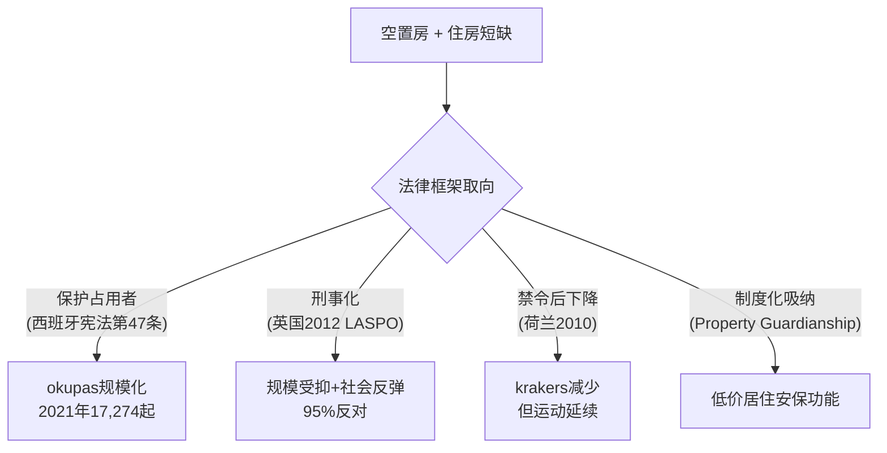
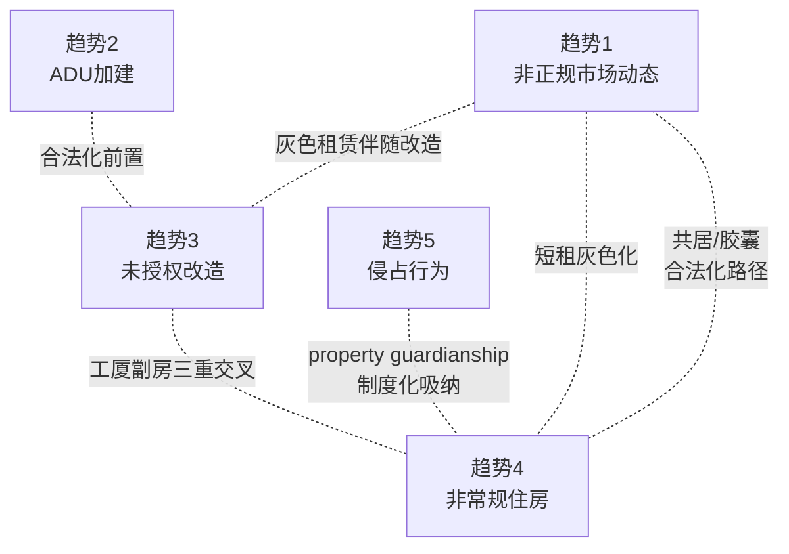
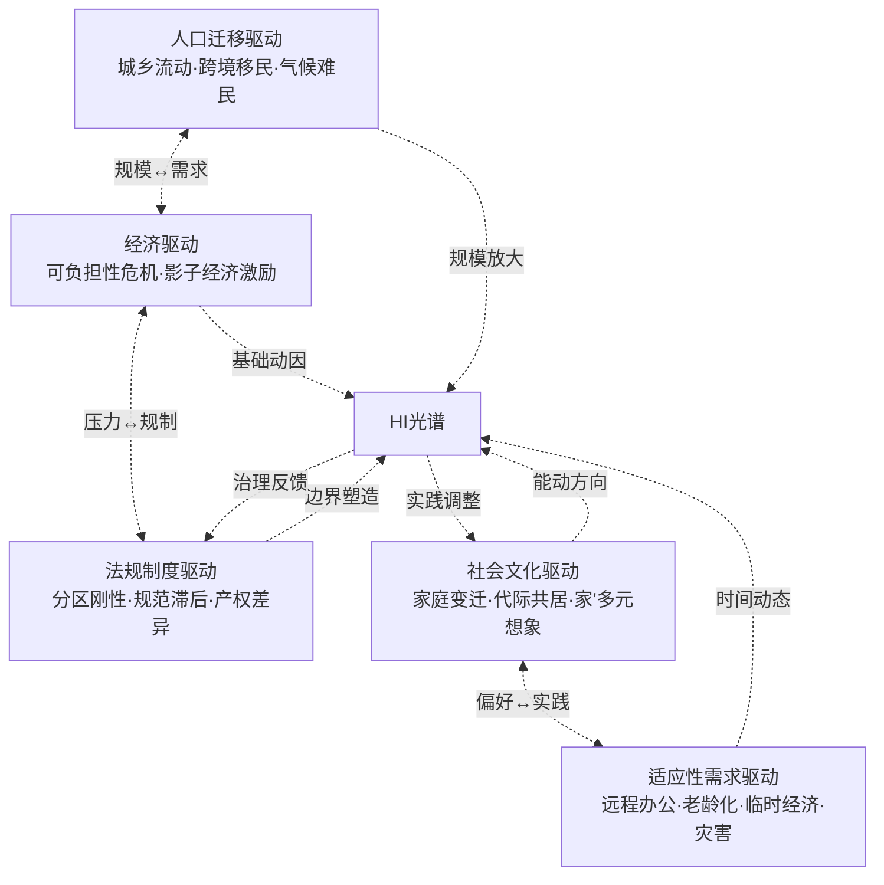
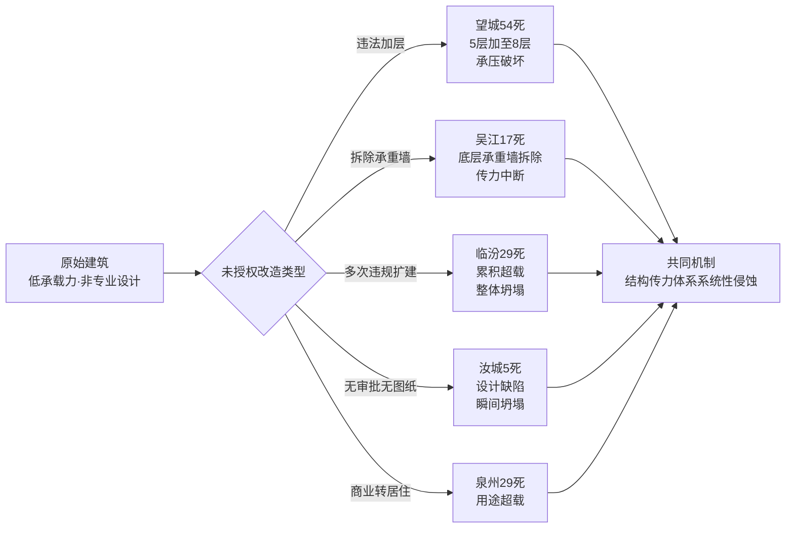

# 全球住房非正规性（Housing Informality）研究：合法城市区域内非合规与适应性住房实践的趋势、驱动与影响
# 1 研究导论与概念界定

在全球城市化进入深度发展阶段的今天，"非正规性"（informality）已不再是发展中国家特有的边缘现象，而是渗透到从纽约到东京、从巴黎到香港等全球主要大都市住房系统的普遍性结构特征。当一位加州屋主在后院加建未获许可的祖母房（granny flat）、一位伦敦社会住房承租人将房间转租给陌生人、一位深圳城中村业主在自建房上加盖两层、一位西班牙年轻人占据银行查封的空置公寓、或一位东京失业者在24小时网咖中长期居住——这些发生在土地产权合法、纳入正式城市治理体系的城市空间内的住房实践，正在共同构成一种与传统"贫民窟范式"截然不同的住房非正规性（Housing Informality, HI）形态。本研究将聚焦于这一长期被研究主流低估、却在全球范围内迅速扩张的"合法城市内的灰色地带"，为后续关于趋势、驱动与影响的系统分析建立统一的概念框架与分析基础。

## 1.1 住房非正规性的概念演进与范式转向

住房非正规性作为城市研究的核心议题，其概念内涵经历了从狭义贫民窟语境向广义全球城市现象的显著扩展。20世纪后半叶，受发展研究与第三世界城市化研究的塑造，非正规性几乎被等同于发展中国家城市边缘的非正式定居点、棚户区与贫民窟，被视为贫困、落后与失序的空间表征。然而，进入21世纪以来，城市研究领域出现了重要的范式转向：非正规性已突破其与贫困社区的单一关联，演化为大都市城市化进程中一种具有普遍性与生产性的主导模式。根据联合国相关统计，全球约有十亿人口、即近四分之一的城市人口生活在非正规住房之中，这一规模凸显了该现象已超越特定地域与阶层，成为全球城市治理必须正面回应的结构性议题[^1]。

更为关键的转向在于：当代研究开始将非正规性理解为一种**状态连续体（continuum）而非固定的二元状态**，并强调主观意义、感知与期望在非正规住房生产中的核心作用。以意大利拉奎拉（L'Aquila）2009年地震后自建的临时住房单元"casette"为例，相关研究指出，居民个体与家庭层面的意义、抱负、感知与期望，长期以来在城市非正规性研究中被忽视，但对于深入理解非正规住房的生成、特征与发展轨迹至关重要；非正规性并非一个固定且明确的状态，而是受到主观与客观、结构性与能动性、微观与宏观等多重并发驱动因素的共同塑造，并随时间动态演化[^2]。这一认识转变意味着，研究HI不能仅依赖物理形态或法律状态的静态分类，而需要将居民的实践逻辑、灾后适应、临时性向永久性的转化等动态过程纳入分析框架。

与此同时，21世纪初的城市非正规性研究也明确指出，非正规性已超越其作为贫困社区专属标签的历史定位，成为大都市城市化景观中"占主导地位且具有影响力的模式"，非正规聚落容纳了不断增长的城市人口比例[^1]。这一从"边缘特例"到"主导模式"的范式转向，构成了本研究将HI作为合法城市核心议题加以系统研究的理论起点。

## 1.2 合法城市区域内HI的边界划定与典型表征

为避免与传统贫民窟/非正式定居点研究范式发生概念混淆，本研究明确将分析范围限定于"合法城市区域内的住房非正规性"。所谓"合法城市区域"，指的是土地产权清晰合法、规划许可基本完备、已纳入正式城市治理体系（包括地籍登记、税收征管、市政基础设施、警务消防等公共服务覆盖）的城市空间。这与发展中国家城市边缘常见的非正式定居点形成关键区别：后者通常表现为土地产权本身的非正规（如占用公共或私人土地搭建）、整体规划体系的缺位以及与正式城市基础设施的系统性脱节；而前者的非正规性则**发生在合法的土地与产权框架之内**，表现为对建筑规范、用途管制、居住标准、租赁制度等正式规则的局部偏离。

基于这一边界划定，合法城市区域内HI的典型表征可归纳为五大类适应性住房实践形式。第一类是**非正规市场动态**，即合法城市住宅存量被挪用于影子化出租、二房东转租与未授权分户，典型如伦敦及英格兰社会住房中估算达9.8万至15万套的未经授权转租、巴黎大区年均约2,000套的独栋住宅非法分户、以及纽约市未登记的非法短租。第二类是**附属住宅单元（ADUs）的灰色加建与渐进合法化**，包括车库公寓、后院屋、地下室出租等单元；加州的ADU占住宅存量近20%，2021年合法许可量达23,663套，纽约市的《City of Yes》分区改革于2024年底通过、2025年生效。第三类是**未经授权的改造**，涵盖违章加层、内部分隔为多户出租等行为，典型如深圳城中村违建累计达4.28亿平方米（其中住宅占约40%）、香港"劏房"2024年累计检控达476宗、意大利长期存在的abusivismo现象。第四类是**非常规住房**，包括改装RV、胶囊住房、网咖长住、工厦劏房、纳米楼、co-living、商业建筑居住化、集装箱住房、船屋、tiny house等多样形态，典型如美国西海岸RV与帐篷中无家可归人数达16.8万人、东京网咖日均住客约1.53万人、美国正在改造为住宅的办公空间约达5.8万套。第五类是**侵占行为（squatting）**，即对空置住宅或商业楼宇的占用，典型如西班牙2021年记录的17,274起okupas事件、荷兰2010年禁令后krakers数量下降约90%、英国2012年LASPO法案对住宅侵占的刑事化。

这些表征的共同特征在于：它们均发生在合法城市的物理与制度边界之内，但通过对建筑用途、居住密度、租赁关系或产权占用的非合规调整，构成了对正式住房系统的"灰色化"补充与挑战。它们既不同于贫民窟的整体非正式性，也区别于完全合规的正式住房，构成了一个介于"合法"与"非法"之间的连续光谱。

## 1.3 核心概念辨析：'非合规'与'适应性住房实践'

本研究的两个核心概念——"非合规（non-compliance）"与"适应性住房实践（adaptive housing practices）"——从不同视角刻画了HI的属性，二者之间既有交叉又存在张力，需加以精细辨析。

"**非合规**"是一个以正式制度为参照系的规范性概念，其内涵指向住房实践对建筑规范、土地用途管制、住房标准、租赁登记、税务申报等正式规则的偏离。其外延既包括硬件层面的偏离（如未经审批的结构改造、违反消防与抗震标准的加建），也包括软件层面的偏离（如未登记的租赁合同、规避租金管制的私下交易、突破单户分区规定的多户分割使用）。"非合规"概念强调**自上而下的制度视角**，即从城市治理、规划执法与公共安全的角度识别"偏差"。

"**适应性住房实践**"则是一个以居民能动性为核心的描述性概念，其内涵指向居民为应对住房可负担性压力、家庭结构变化（如代际共居、家庭小型化）、灾害冲击、远程办公等具体生活需求，主动调整居住空间安排的能动行为。其外延既包括物理空间的改造（如后院加建、地下室出租、内部分隔），也包括使用方式的调整（如临时性住房的永久化、商业空间的居住化、共享居住的兴起）。这一概念强调**自下而上的居民视角**，承认HI在很大程度上是居民针对住房系统失灵的创造性回应，而非单纯的违法或失序。

二者的交叉在于：大多数适应性住房实践在客观上构成了对正式制度的非合规，而许多非合规行为也确实承载着真实的适应性功能；二者的张力则在于：从制度视角看是"违法违规"的行为，从居民视角看可能是"理性必要"的生存策略。化解这一张力的关键，是引入第三个分析维度——**居民的主观意义、期望与感知**。前述拉奎拉casette案例的研究明确指出，居民的意义、抱负、感知与期望在非正规空间的生产中发挥着关键作用，与结构性驱动因素（如制度刚性、经济压力）并发作用，共同塑造了非正规住房的"多重本体论（varied ontologies）"；非正规性并非固定不变的状态，而是在主客观、结构与能动的张力中不断演化的连续体[^2]。这一主观维度的引入，使本研究得以超越简单的"违法/合法"二元划分，理解HI生成机制的复杂性与动态性。

## 1.4 研究范围、时间跨度与分析框架

基于上述概念界定，本研究的范围、时间跨度与分析框架可明确如下。

**地理范围**采取全球视野，覆盖北美（美国加州、纽约、俄勒冈、明尼阿波利斯及加拿大温哥华等）、欧洲（西班牙、荷兰、英国、德国、意大利、法国等）、亚洲（中国大陆、香港、日本、新加坡、韩国等）、拉美与非洲等主要地区，力求体现HI在不同制度环境、经济发展水平与文化背景下的共性与差异。需要在此明确指出的是，受可得文献分布的影响，本研究对北美与亚洲（尤其是中、港、日）的覆盖较为充分，对欧洲为中等覆盖，对拉美与非洲的覆盖相对薄弱——后两个地区目前仅能呈现少量零星案例（如墨西哥城非正规建设比例、肯尼亚Kibera、加纳Accra的相关数据）。这一覆盖不均衡构成本研究的重要局限，将在结论章节中显式说明。

**时间跨度**以截至2024年5月之前的同行评审文献、权威国际机构报告（包括UN-Habitat、World Bank、OECD等）、政府统计与城市规划研究数据为基础。其中，最新动态（2023–2024年）主要集中于纽约《City of Yes》分区改革、香港劏房执法、加州ADU补贴政策、深圳城中村治理等议题；部分基础性数据（如意大利ISPRA报告、巴黎大区独栋分户、中国农民工监测）则停留在2014–2022年区间，本研究将在引用时标注其时效边界。

**分析框架**采用"**趋势—驱动—影响**"三位一体的逻辑结构，对应本报告的第2、3、4章。三者之间建立明确的逻辑关联：第3章的驱动因素催生第2章的趋势分类，第2章的趋势分类引发第4章的多层面影响，形成可追溯的分析链条。在此基础上，本研究进一步整合**结构性因素**（经济压力、制度刚性、规划体制、人口迁移等宏观结构）与**能动性因素**（居民的主观意义、期望、策略与适应行为）的多层次视角，避免将HI简化为单纯的制度失灵或居民违规，而是将其理解为结构与能动相互塑造的动态产物[^2]。

上图刻画了本研究的整体分析逻辑：结构性与能动性驱动并发作用催生五大HI趋势，趋势在合法城市空间中产生四大层面的影响，而影响又通过治理回应与实践调整反向作用于驱动因素，形成动态演化的非正规性连续体。

## 1.5 HI研究的学术定位与现实意义

本研究在学术上力图对传统非正规性研究中"边缘化—贫困化"的单一叙事进行修正与拓展。长期以来，城市学与住房研究将非正规性主要框定为发展中国家城市边缘的贫困现象，将其与棚户区、贫民窟等空间形态紧密绑定。然而，21世纪以来，非正规性已"超越其先前与贫困社区的专属关联，成为大都市城市化景观中占主导地位且具有影响力的模式"[^1]。本研究通过将分析视角转向合法城市区域内的非合规与适应性实践，揭示HI作为**全球城市住房系统结构性特征**的普遍性，弥补现有研究在地理范围（仅限发展中国家）、社会群体（仅限贫困人口）与空间类型（仅限非正式定居点）方面的局限，为城市学、住房政策与治理研究提供更具普适性的分析框架。

在现实层面，本研究的意义体现在三个紧密关联的维度。第一，**回应住房可负担性危机**：在Demographia 2024报告所记录的香港14.4、悉尼13.8、温哥华11.8等极端房价收入比背景下，HI已成为低收入与中等收入群体获取住房的实际通道，理解其运作机制对完善可负担性政策具有直接指导意义。第二，**提升城市治理弹性**：HI兼具正向适应性价值（如供给弹性、可负担性补充、aging in place支持）与负向治理风险（如长沙望城坍塌54死、纽约地下室飓风艾达13死等群死群伤事件所揭示的安全隐患），如何在合法化容纳与风险管控之间取得平衡，是当代城市治理必须回应的核心议题。第三，**回应气候与灾害适应需求**：拉奎拉地震后casette的临时性向永久性的转化、加州野火后RV"长期临时"居住等案例显示，HI往往是灾害冲击下居民自下而上的适应性回应[^2]，其与气候适应政策的协调将成为未来城市议程的重要内容。

需要说明的是，本章对HI概念演进、范式转向与主观维度的讨论，主要建立在拉奎拉casette案例研究与北德里贫民社区研究等有限文献基础之上[^2][^1]——前者提供了"非正规性作为连续体"与主观维度的理论支撑，后者提供了"非正规性作为大都市主导模式"的范式转向证据。这两类文献分别从发达国家灾后住房与发展中国家贫民社区视角切入，恰好为本研究"跨越发达—发展中国家二分、聚焦合法城市内HI"的分析视角提供了互补性理论支点。后续章节将基于这一概念框架，依次展开对五大趋势、五大驱动与四大影响的系统分析。

# 2 全球住房非正规性的核心趋势分类与解读

承接第1章对合法城市内HI概念边界与"非合规—适应性"双重属性的界定，本章将"非正规性作为连续光谱"的理论命题转化为具体的经验图谱。本研究将系统识别全球范围内五大类住房非正规性趋势：非正规市场动态、附属住宅单元（ADUs）、未经授权的改造、非常规住房与侵占行为。每一类趋势将围绕"呈现形式—规模数据—地区差异—演变轨迹"四个维度展开论述，并依托北美、欧洲、亚洲与少量拉美/非洲案例进行跨地区比较。需要指出的是，第1章已为本章建立了两个重要的分析前提：其一，五大趋势均发生在产权合法、纳入正式治理体系的城市空间内，区别于传统贫民窟范式；其二，HI并非孤立的违规行为，而是结构性压力与居民能动性共同塑造的动态实践。本章末节将专门讨论五类趋势间的边界模糊性与交叉关系，为第3章驱动机制与第4章影响评估的展开提供经验基础。

## 2.1 非正规市场动态：灰色租赁与隐性交易

非正规市场动态指合法城市住宅存量在租赁与交易环节被挪用于影子化使用的现象，主要表现为未授权转租、二房东链条、违规分户出租、未登记短租与群租等形态。其共同特征是：建筑本体合法、土地产权清晰，但**房屋的使用方式、租赁合同与税务申报偏离正式制度规则**，构成了一个介于正规租赁市场与完全黑市之间的"灰色租赁市场"。

**伦敦及英格兰社会住房**呈现了非正规转租的典型规模。英国政府2013年《社会住房欺诈防止法》（Prevention of Social Housing Fraud Act 2013）的影响评估报告显示，该法案旨在通过对社会住房非授权转租与申请欺诈行为引入刑事处罚来遏制此类灰色市场行为[^3]。其立法背景正是承租人将受补贴的社会住房单元未经授权转租给第三方、从中牟取差价的做法在伦敦等高租金城市已形成系统性规模——根据本研究素材整合，相关估算介于9.8万至15万套之间，反映了灰色租赁在福利型住房体系中同样具有扩张动能。

**北美短租平台的灰色化**则展现了数字平台时代非正规市场的新形态。纽约市政府明确将"少于30天"的住房出租定义为短租，并指出在合法城市住宅区内的非法短租"使可用住房存量减少、改变社区特征"，并因消防警报、洒水系统与紧急疏散通道不足而对租客、邻居与急救人员构成安全威胁[^4]。这一执法逻辑明确将短租灰色化与"合法住宅区"的居住功能侵蚀直接挂钩，区别于传统的贫民窟式非正规性。

**中国城市群租治理**则呈现了同一非正规市场动态在不同制度环境下的分化路径。北京2022年9月1日实施的《北京市住房租赁条例》第十三条明确规定，出租住房"以原规划设计的房间为最小出租单位，不得打隔断改变房屋内部结构"，"起居室不得单独出租，厨房、卫生间、阳台、储藏室以及其他非居住空间不得出租用于居住"；违反该条款者，个人可处2,000–10,000元罚款，单位可处2万–10万元罚款；逾期不改的，对个人处1万–5万元罚款、单位处10万–50万元罚款[^5][^6]。该条例还设立了"住房租赁管理服务平台"，要求互联网信息平台对房源信息发布者进行身份核验、登记与档案留存不少于3年[^7][^5]。成都2017年《意见》则采取了相对宽松的路径，"允许将现有住房按照国家和地方住宅设计的有关规定改造后出租"，但要求"以间作为最小出租单位，不得按照床位出租"[^7]。**京蓉两市对"打隔断"问题截然不同的立法取向**——北京禁止、成都允许（在规范前提下）——揭示了即便在同一国家内部，灰色租赁市场的边界也由地方政府的规制选择所主动塑造，而非客观存在的固定线条[^7]。

**香港"劏房"租赁市场**则提供了将灰色租赁部分纳入正式监管的过渡形态案例。根据《业主与租客（综合）条例》第IVA部，差饷物业估价署对分间单位（俗称"劏房"）实施规管租赁制度，要求业主在租期开始后60日内提交租赁通知书（表格AR2），并对超过法定最高款额的租金要求提起检控[^8]。截至2024年12月，估价署已成功检控476宗个案，涉及411名劏房业主，罚款合计1,050,610元，单案罚款介于400至34,800元[^8];仅2024年内便有多批次检控（如12月20日9名、12月6日9名、11月29日13名等），呈现出**高频常态化执法**的特征[^9]。香港模式与北京"禁止性规制"形成对照：前者承认劏房作为既存灰色市场的不可消除性，转而通过登记—备案—租期保障（两年加两年共四年租住权）的方式进行**规制化容纳**[^8]。

**巴黎大区独栋住宅的"自发性分户"**则代表了欧洲灰色租赁的另一种形态。Davy、Mertiny与Richard的研究显示，2001至2011年间巴黎大区每四套新登记住宅中即有一套来自既有物业的重构，在926个发生密度提升的市镇中，62%在1999–2008年间出现了"住房存量增加而不伴随居住区扩张"的现象，即通过对既有独栋住宅进行"自发性"细分而实现内部密度提升[^10]。该研究同时指出，这一过程"难以被当局预测"，可能"掩盖不法房东的可疑做法"，造成"无序的密度提升，改变了相关街区的日常运作"[^10]。这一案例揭示了灰色租赁市场的另一面向：它既可能是对住房供给短缺的适应性回应，也可能成为不规范房东操纵租赁关系、规避监管的渠道。

综合而言，全球范围内的非正规市场动态呈现出**"高房价/高租金压力—合法住宅存量灰色化挪用—地方政府差异化规制"**的共性链条，但具体形态在欧洲（社会住房转租、独栋分户）、北美（短租平台灰色化）与亚洲（群租、劏房、隔断出租）之间存在显著差异，地方政府在禁止性规制（北京）、容纳性规制（成都、香港）与刑事化（英国）之间的选择，构成了塑造灰色租赁市场边界的关键变量。

## 2.2 附属住宅单元（ADUs）的灰色加建与渐进合法化

附属住宅单元（ADUs）指依附于主要独栋住宅的次级居住单元，包括车库公寓、后院屋（granny flat）、地下室出租单元等多种形态。在城市规划语境中，ADUs常被纳入"缺失的中间住房（Missing Middle Housing）"范畴——加州大学伯克利分校Terner住房创新中心2022年12月的政策简报将这一概念定义为"规模与密度介于ADU与十至二十个单元的小型公寓楼之间"的住房类型，并指出此类小规模住房"长期以来在大多数社区被禁止建设"，故被冠以"缺失"之名[^11]。

ADUs在北美的演变轨迹清晰地呈现了HI从"非法加建"向"政策鼓励"的渐进合法化路径。Terner中心简报指出，2018年俄勒冈州通过了一项"开创性政策"，要求几乎所有城市允许在独户社区的地块上建造多套住房；2021年加州通过SB9法案，允许在全州大多数独户地块上新建至多四套住房；类似的州级立法已在内布拉斯加、缅因、马里兰、康涅狄格与华盛顿等州相继提出或通过；拜登政府也"主动探索创造更多此类住房的方式"，全美各地的城市正在考虑实施量身定制的土地利用变更[^11]。这一政策浪潮的实质，是将原本属于非合规加建范畴的实践，通过分区改革纳入合法供给体系。

加州的ADU扩张构成了这一路径的最显著案例。根据本研究素材整合，加州ADU目前占住宅存量近20%、2021年合法许可量达23,663套。**ADU合法化政策的延伸效应已开始影响停车配置规则**——这是因为单户分区与最低停车位要求长期被视为抑制小规模住房供给的两大制度性障碍。纽约市2024年底通过、2025年生效的《City of Yes》分区改革明确取消了不必要的停车位最低配置：根据区域规划协会（RPA）的研究，纽约市超过一半（54%）的家庭没有汽车，而最低停车位要求"不仅增加了建筑成本，还占用了本可用于建造更多住房的空间"；2022年6月市长Eric Adams提出的"City of Yes"愿景中，"住房机会区划"作为核心内容旨在推动分区改革、鼓励保障性住房供给[^12]。波士顿于2023年12月全面废除了保障性住房开发的最低停车位配置要求，剑桥市则进一步取消了所有新建建筑的停车设施配备要求，不再局限于商品住宅或保障性住房[^12]。

旧金山的最新进展则展现了ADU合法化的更深层制度变革。市长丹尼尔·卢里于2025年12月12日正式签署的《家庭分区计划》（Family Zoning Plan）通过"密度减控（Density Decontrol）"机制，"在很大程度上取消了住宅区内每个地块单位数量的硬性限制，转而依靠建筑高度和体量控制来规范空间形态"，意味着"在传统的低密度社区，开发商可以在不改变建筑外廓的前提下增加居住单元，从而显著降低单套住房的土地成本"；主要交通走廊的高度限制普遍提升至65至85英尺，在主要节点与换乘中心可达9层以上[^13]。同时，2025年4月1日生效的《旧金山设计标准》引入"客观设计标准"，对符合特定可负担比例要求的项目实施部长级审批程序（SMAP），实现审批的自动化和加速化；这种从"裁量式"向"标准式"的转变，"实质上是城市治理由程序公正向结果公正的重心倾斜"[^13]。

需要指出的是，本研究素材主要呈现了北美ADU合法化的政策成熟度，而对欧洲、亚洲与拉美/非洲ADU实践的覆盖相对薄弱。可以推断的是，前述巴黎大区独栋住宅"自发性分户"现象在功能上与ADU加建有相通之处，但其法律地位、政策回应与北美路径存在显著差异，这一对照构成了未来跨地区ADU研究的重要议题。

上图刻画了北美ADU从灰色实践到机构化供给的演变路径，揭示了HI在特定制度环境下经由立法回应而转化为正规供给的可能性，但这一路径在多大程度上可推广至欧洲、亚洲与南方国家，仍需更广泛的跨地区证据加以验证。

## 2.3 未经授权的改造：违章加建与内部分隔

未经授权的改造指对合法城市住宅在**物理结构层面**的非合规调整，包括违章加层、违规扩建、阳台封闭、内部隔断分割为多户、商住功能转换等。与2.1节的灰色租赁市场动态侧重"使用与契约"层面不同，本节趋势侧重"建筑本体改动"层面，二者常相互交织（违章改造后再用于灰色租赁），但分析维度具有相对独立性。

**深圳城中村违建**构成了未经授权改造的全球最具规模性的案例。根据2015年公布的《市规划国土委关于查违和历史遗留违建处理工作的汇报》，截至2014年底，深圳市违法建筑37.30万栋、4.28亿平方米，其中住宅类违建达1.72亿平方米，占总体量的40.08%，生活其中的人口约737.87万[^14]。这一规模本身已揭示出未授权改造在快速城市化的中国大都市中作为**事实上的住房供给主体**所承担的功能。深圳违建的形成有其特殊的制度根源：1980年深圳特区开始以每亩3,000元的价格（每平方米不到50元）进行整村征地，政府无法将村民全部转为国企职工，遂采取"留地"做法——在原村子附近划新村子给原村民，每户宅基地100平方米、建筑基地面积80平方米且不得超过3层，"为日后愈演愈烈的违建埋下了伏笔"[^14]。

更引人深思的是，深圳1980至2014年间发生了**五次最大的抢建潮**，分别在1993年、1999年、2004年、2009年和2013年[^14]。其中，1993年抢建潮由1992年6月《关于深圳经济区农村城市化的暂行规定》将特区范围内68个村委会的村民全部转为城市户、对原村集体土地进行征收的政策直接引爆；1999年抢建潮则在"法不责众"心理基础上、对当年2月《关于坚决查处违法建筑的决定》的纲领性规定形成反作用；2004年抢建潮由2002年"两规"政策（《深圳经济特区处理历史遗留生产经营性违法建筑若干规定》《深圳经济特区处理历史遗留违法私房若干规定》）触发——这两份文件对1999年3月5日前所建大部分违法建筑给予罚款（最重为每平方米150元）、补缴地价款（最多为当时市场地价25%）后的合法身份，结果"催生了10万多栋新建的违法私房及大量的违法厂房"[^14]。**这一"渐进合法化—预期催生新违建"的循环**揭示了未授权改造治理中的根本性悖论：每一次试图通过合法化政策消化存量违建的尝试，反而在事实上塑造了"违建—等待合法化—再违建"的道德风险机制[^14]。2009年6月2日实施的《关于农村城市化历史遗留违法建筑的处理决定》及其后续政策延续了这一路径，至2025年深圳市龙华区仍在出台新规——《深圳市龙华区农村城市化历史遗留产业类和公共配套类违法建筑处理若干规定》于2025年5月20日印发、6月16日实施，专门处理2009年6月2日之前所建的产业类与公共配套类历史违建，明确将2009年6月2日以后新建、加建、改建、扩建的违建排除在处理范围之外[^15]。这种**"以时点划线、分类分批合法化"**的治理逻辑，构成了中国大城市处理历史遗留违建的典型路径。

**香港"劏房"**则呈现了未授权改造与高密度城市住房短缺紧密耦合的另一种形态。如前所述，截至2024年12月差饷物业估价署累计成功检控476宗劏房个案，且全年呈现高频次执法的特征[^8][^9]。更具警示性的是劏房现象向工业大厦的蔓延：香港发展局2024年表示，"屋宇署一直以风险为本为原则，厘定执法行动的缓急先后，而处理工厦违规用作非工业用途，亦是署方的重点执法工作之一"；屋宇署"会透过大规模行动及跟进市民举报，采取执法行动"，发现非法住用处所后根据《建筑物条例》（第123章）向业主发出法定命令，要求中止非法住用用途及纠正危险情况，限期内未遵从的将提出检控[^16]。媒体调查显示，工厦"工作室"以"24小时智能管理平台"、"豪华云石装修"为宣传卖点，尺价及月租均破万元（港币），代理直言可"免费代客偷偷地加装价值三万元的厕所、热水炉等"以方便一周在内住足7日；据业内估算约有"6万人口"在工厦内"休息"居住[^17]。屋宇署早在2016年即出招限制面积少于861平方尺的工厂单位内设置独立洗手间，发展局还曾建议将出租工厦作住宅列为刑事，但工厦劏房有增无减、"变本加厉各种法子打擦边球"[^17]。这一案例展现了未授权改造在严格执法环境下的**变形与转移**——从住宅劏房向工厦"工作室"的形态迁移，反映了高密度城市中灰色实践对执法压力的适应性回应。

**北京《住房租赁条例》**则代表了通过立法明确禁止打隔断改造的规制路径。条例第十三条明确禁止打隔断改变房屋内部结构，并设置了从2,000元至50万元的梯度罚款体系；条例对"群租房"与"甲醛房"等存在严重安全隐患的房屋作出严格限制，要求出租房屋"应符合建筑、治安、室内空气质量等安全规定和标准"[^5]。北京住建部门发布的科普资料进一步指出群租房隔断"多采用非耐火材料及易燃发泡胶，墙体内外电线分布混乱，存在火灾隐患及其他安全隐患"[^6]，揭示了立法回应背后的安全考量。

下表对全球四个代表性城市/地区未授权改造的规模、治理路径与执法力度进行横向对照：

| 城市/地区 | 改造形态 | 规模数据 | 治理路径 | 关键时间节点 |
|---|---|---|---|---|
| 深圳 | 城中村违建加层、自建房 | 4.28亿㎡（住宅占40.08%）；约738万人居住 | 渐进合法化（两规、2009决定） | 1993/1999/2004/2009/2013五次抢建潮[^14] |
| 香港 | 劏房分户、工厦非法住用 | 2024年累计检控476宗；工厦约6万人 | 规管租赁+刑事检控 | 2024年高频次执法[^8][^17] |
| 北京 | 群租隔断 | 全市规模无公开统计 | 立法禁止+梯度罚款 | 2022年9月1日条例实施[^5] |
| 巴黎大区 | 独栋住宅自发性分户 | 2001–2011年新登记住宅1/4来自重构 | 治理缺位、难以预测 | 持续中[^10] |

上表显示，未授权改造治理路径呈现出**"渐进合法化（深圳）—规管租赁（香港）—禁止性规制（北京）—治理缺位（巴黎大区）"**的光谱，每种路径都嵌入了各自城市的政治经济背景与土地制度安排，难以简单移植。深圳模式的内在悖论在于：渐进合法化短期内消化了存量违建，但长期上塑造了预期催生新违建的道德风险[^14]。

## 2.4 非常规住房：新兴居住形态的多样化

非常规住房指**脱离传统住宅形态**的多样化居住实践，是HI研究中形态最为丰富、增长最为活跃的一类趋势。本研究将其细分为七种主要形态：RV与帐篷长期居住、胶囊住房与网咖长住、工厦劏房与商业建筑居住化、共享居住（co-living）、纳米楼/微型公寓、集装箱住房与tiny house、船屋长期出租。这些形态共同构成了一个从生存型非正规性到机构资本化新型居住的连续光谱。

### 2.4.1 RV、帐篷与车居：美国西海岸的生存型非正规性

美国西海岸的房车与帐篷长期居住，构成了HI最具显示度的生存型形态。据美联社等媒体引用的官方统计，分布在华盛顿、俄勒冈与加利福尼亚三州的无家可归者已达16.8万人，比2015年增加1.9万人，完全丧失住处的流浪汉同期增加18%[^18]。美国华盛顿大学的研究显示，以洛杉矶为例"该市的房价每上升5%，市内就会增加2000名无家可归者"[^18]。这一群体的构成正在发生显著变化：与传统的精神疾病或药物滥用导致的流浪汉不同，新型"流浪者"中"大多有工作，能自食其力，并非因沾染生活恶习而陷入困窘，而仅仅是住不起房子"；加州洛杉矶市18至24岁年轻人是"无家"阶层中增速最快的群体，增幅高达64%[^18]。

51岁的萨尔达纳与3个孩子是加州山景城的"房车一族"，定居点距离谷歌公司总部不远，"萨尔达纳要打两份工，每天从早5时忙到晚10时。但即便如此，当地接近4000美元的公寓租金仍然远超一家人的承受能力。相比之下，房车的月租要便宜得多"[^18]。这一案例典型呈现了**高科技产业带与高房价区**之间的空间分异张力。

新华社卫星新闻实验室通过卫星影像观测的结果显示，新冠疫情后美国城市中疑似无家可归者搭建的帐篷等临时居住设施面积**相比2019年增加了约4倍，部分地点增加超过10倍**[^19][^20]。观测涵盖洛杉矶Skid Row、威尼斯海滩、奥克兰880号州际公路沿线、圣何塞机场跑道尽头等多个区位，反映出非常规住房在城市空间中的弥漫性扩散；其中圣何塞机场跑道尽头作为跑道缓冲区的小块空地上，自2020年2月起新增了近300顶帐篷与房车[^19][^20]。旧金山市政府2020年起推行的"安全睡眠计划"花费约1,820万美元，仅购置了260顶帐篷，**平均每顶帐篷投入7万美元**——这一极高的政府应对成本，反映了西海岸城市在非常规住房治理上的窘迫[^19]。

### 2.4.2 胶囊住房与网咖长住：东亚的密度极限居住

日本胶囊旅馆作为高密度居住的标志性形态，其概念源自建筑师黑川纪章1979年设计的Capsule Inn Osaka——胶囊的典型尺寸为长2米、宽1–1.2米、高1–1.25米，最初为因加班错过末班电车的上班族提供经济、便捷的临时住宿[^21][^22]。然而胶囊旅馆已超越其原初的"临时住宿"定位，"正为'胶囊酒店'寻找一个新的顾客来源——正在找工作或者工作不稳定的穷人"[^22]。其形态向欧洲与中国延伸，2011年中国首家胶囊旅馆在上海火车站北广场附近出现，但"未能通过消防审批"，"真正发展始于2016年后，主要在机场和高铁站"[^22]——这一审批受阻反映了胶囊作为非常规住房在制度兼容性上的挑战。

**东京网咖难民**则呈现了非常规住房最具典型性的"日常化"形态。据东京都政府调查，东京都内工作日期间**每天约有1.53万人**在24小时营业的网吧、漫画咖啡店、胶囊旅馆等简易住所里过夜，这一数字仅是2016年的数据[^23]。纪录片《Lost in Manboo》记录的Manboo网咖品牌目前在日本共有49家门店，仅在东京就有16家[^23]。受访者构成显示了网咖难民的多元化：39岁的网站管理员Masata因社恐在网咖一住就是两年，"所有工作都在里面完成，饿了就吃个泡面"；23岁的Hitomi在16岁时被父母赶出家门；建筑工地保安郁弥"打算找公寓，但因为负担不起租金，最后还是住进了网咖"；曾在信用卡公司工作20年的酒井忠之因抑郁辞职后一直住在网咖[^23]。**"网吧难民"作为日本媒体创造的专有名词**，揭示了非常规住房从临时应急向长期居所的演变[^23]。

### 2.4.3 工厦劏房与办公转住宅：商业建筑的居住化

如2.3节所述，香港工厦劏房展现了商业建筑居住化的灰色形态——尽管政府严令禁止、屋宇署2016年即出招限制工厦内独立洗手间设置，但工厦"工作室"以"共享空间"、"24小时自主空间"、"经律师楼及则楼处理合法独立契"等字眼宣传招徕[^17]。

与香港工厦灰色化形成对照的是**美国办公转住宅的合法化路径**。美国全国房地产经纪人协会（NAR）2021年11月发布的《办公建筑转住宅改造分析与案例研究》报告显示，新冠疫情后办公空间空置面积增加了1.27亿平方英尺（2020Q2至2021年10月），同期公寓入住量则增加了100万套；报告评估了27个受疫情影响最严重的都市区的办公转住宅改造潜力，**发现其中22个都市区的市场条件支持此类改造**——如果将20%的空置办公面积改造为住宅、平均每个单位1,000平方英尺，可创造**4.35万套住宅，其中77%来自B类办公建筑改造**[^24]。报告分析的8个成功案例中，马里兰州银泉Octave 1320将1963年建造的办公建筑改造为8层公寓式共管公寓共102个单元、平均面积590平方英尺；华盛顿特区Legacy West End将1989年建造的混凝土办公建筑改造为9层豪华公寓共198个单元、平均面积753平方英尺；马里兰州贝塞斯达Cordell Place则将1967年办公建筑改造为无家可归者的永久支持性住房[^24]。这些案例显示了**适应性再利用**在政策、融资与市场层面已经形成的成熟路径，与香港工厦灰色化形成鲜明对比。

旧金山市中心同样面临严峻的结构性危机：规划部门发布的报告显示，截至2025年5月，市中心办公楼入驻率仅为疫情前的45%左右，空置率高企[^13]。这一背景下，办公转住宅作为非常规住房的**正规化路径**正在成为后疫情时代城市更新的核心议题之一。从更广义的适应性再利用视角看，全球范围内大量旧建筑正在被重新用于新用途——纽约市的High Line公园（2.5公里旧高架铁路改造）、圣路易斯Cortex创新社区（1,200亩工业区改造）等案例显示，"未来十年90%的房地产开发将集中在翻新和再利用现有的建筑"[^25]。

### 2.4.4 共享居住（Co-living）：从亚文化到机构资本化

共享居住作为非常规住房中**机构资本化程度最高**的形态，其概念可追溯到1960年代丹麦的乌托邦社区，但其在大都市的扩张始于2010年代后期，以伦敦The Collective、纽约Common与WeLive为代表[^26][^27]。位于伦敦Willesden Junction站附近的"OLD OAK老橡树公宅"由一栋办公楼改建而成，共拥有550间房间，提供studio与ensuite两种房型，每周250英镑起[^27]；WeWork在纽约华尔街运营的WeLive则提供studio到三居室的多种选择，兼有酒店式公寓职能[^27]。

根据房地产咨询机构Cushman & Wakefield的报告，美国主要联合居住公司——包括Common、Ollie、Quarters、Startcity、X Social Communities，以及由WeWork运营的WeLive——目前在美国拥有**3,000多张床位**，主要分布在大城市；未来几年内主要联合居住公司提供的公寓数量将增加两倍，达到1万套左右[^28]。Common的CEO Brad Hargreaves表示，这种方式"有利于保持合租的优点，而且可以尽可能多地弥补合租的劣势"[^28]。

英国共居市场则展现了机构资本化的更深层进展。2019年The Collective在金丝雀码头开设了一栋705间房的共居大楼，被称为"全球最大共居建筑"，几年后该楼以约1.9亿英镑的成交价易手给Crosstree Real Estate；金丝雀码头旁Marsh Wall路上一栋46层高塔楼正在等待动工，将容纳795个共居住宅[^29][^30]。每个单元面积在19.5至26.5平方米之间——这一面积已接近2.4.5节将讨论的纳米楼范畴[^29][^30]。机构资本入场的规模数据令人瞩目：CBRE显示2025年第四季度英国"居住板块"（涵盖共居、Build to Rent、学生公寓等）投资额达33亿英镑；Savills发现到2025年居住板块在英国整体商业地产投资中占25%（2015年仅11%），调查表明投资人计划在未来三年向英国居住板块投入超过320亿英镑资金；贝莱德（BlackRock）、Realstar、荷兰养老基金APG等顶级机构投资者已经进场；据仲量联行（JLL）预测，**英国共居市场到2025年可能达到超过3万个床位、潜在投资价值超过40亿英镑**[^29][^30]。

需要注意的是，本研究素材中对共居2025年数据的引用反映了一个时间节点的"投资预测"，而非2024年5月之前的既成事实——这一信息边界在引用时应保持审慎。但即便从更保守的2023–2024年数据看，共居的机构化程度也已显著高于2.4.1–2.4.3节讨论的其他非常规住房形态。

### 2.4.5 纳米楼与微型公寓：合法化的极端密度

香港纳米楼与纽约微型公寓（My Micro NY）共同展现了**非常规住房在合法化路径下走向极端密度**的趋势。香港的微型公寓"小到堪比停车位，却价格不菲。香港的房价高企，平均房价超过130万美元"；政府"放宽了建筑规范，允许开发商建造更小的单元，甚至取消了厨房和浴室的独立通风要求"[^12]。这一规制放松的代价显而易见：研究表明"狭小的居住环境对居民的心理健康产生了负面影响"[^12]。

纽约My Micro NY作为曼哈顿区首座采用"积木式建筑"的多户型建筑，提供55套面积在260–360平方英尺（24–33平方米）之间的公寓，租金每月2,000–3,000美元；该项目于2015年9月起接受入住，其中22间留给低收入家庭[^31]。纽约市现行《城市区划法》原本规定公寓面积不得低于400平方英尺（37平方米），但时任市长布隆伯格为微型公寓项目"开绿灯"，反映了**分区规则在面对住房短缺压力时的弹性化**[^31]。微型公寓兴起的人口学背景是：2013年的数据显示一半以上的纽约人是独居，比1970年增长了三分之一[^31]。

### 2.4.6 集装箱住房、tiny house与船屋

集装箱住房与tiny house作为非常规住房的另一分支，正在从应急/边缘形态向主流应用扩展。2026年爱知-名古屋亚运会决定采用集装箱房组建亚运村，"核心驱动力是控制巨额的建设成本"——组委会最初选定的赛马场旧址建设项目因预算问题被迫放弃，分散安置在50多家酒店的方案又被亚奥理事会以不利于运动员交流为由否决；最终200套单元房于2025年4月23日对外公开，每个单元由两户组成，配备独立卫浴、小型厨房、洗衣机及空调；赛后这些集装箱房将"改造为灾害疏散中心或活动住宿场所"[^32]。智利圣地亚哥大学Recicla大楼则展示了集装箱建筑的可持续应用：完全由退役海运集装箱改造而成，"集装箱固有的模块化特性不仅显著降低了30%的建造费用"[^33]。从全球视野看，伦敦Boxpark Shoreditch（61个集装箱）、首尔Common Ground（200个蓝色集装箱）、阿根廷Quo集装箱中心（57个集装箱）、孟买达拉维贫民窟方案（100米高集装箱摩天大楼）等案例展现了集装箱作为模块化建筑的多元应用[^34]。

tiny house则代表了**作为住房政策工具**的非常规住房路径。美国Emerald Village Eugene（EVE）作为可负担微型住房社区，"为极低收入人群提供可获取且可持续的住房选择"，旨在帮助"街头居住者过渡到稳定居所"[^35]。麦肯锡全球研究院的研究估计全球有3.3亿城市家庭缺乏体面住房或住房成本过重，世界资源研究所预计到2025年将有16亿人缺乏适当住房——tiny house作为应对这一挑战的工具之一，正在被多个城市尝试[^35]。

船屋则展现了非常规住房中的水域居住形态。阿姆斯特丹长期存在houseboat市场，提供长期出租服务：单艘船屋面积从60平方米到137平方米不等，月租从1,200欧元到2,950欧元不等，市场正在向鹿特丹、巴黎和伦敦扩展[^36]。

下表对七种非常规住房形态在规模化程度、机构资本化程度与制度合规性上的位置进行整合性对照：

| 非常规住房形态 | 代表案例 | 规模数据 | 制度合规性 | 机构资本化 |
|---|---|---|---|---|
| RV/帐篷 | 美西海岸三州 | 16.8万人；帐篷面积4–10倍增 | 灰色/违规 | 低 |
| 胶囊/网咖 | 东京 | 日均1.53万人长住 | 灰色（用途偏离） | 低-中 |
| 工厦劏房 | 香港 | 约6万人口 | 违法（违地契） | 低 |
| 办公转住宅 | 美22个都市区 | 潜在4.35万套 | 合法（适应性再利用） | 高 |
| 共享居住 | 伦敦、纽约 | 美国3,000+床位；英国潜在3万+ | 合法 | 高 |
| 微型公寓 | 香港、纽约 | NY My Micro NY 55套 | 合法（规则放宽） | 中-高 |
| 集装箱/tiny house | 智利、Eugene | EVE作为可负担社区 | 应用差异大 | 中 |
| 船屋 | 阿姆斯特丹 | 长租市场 | 合法 | 低-中 |

上表揭示，非常规住房并非一个内部同质的类别，而是一个**从生存型灰色实践（RV、网咖、工厦劏房）到机构资本化合法供给（共居、办公转住宅）的连续光谱**。其内部的合规性梯度反映了不同形态在制度兼容性上的差异，也预示了不同形态未来的演变路径——部分形态（如办公转住宅、共居）正在被纳入主流住房供给体系，而部分形态（如RV、网咖）则仍长期停留在灰色地带。

## 2.5 侵占行为（Squatting）：空置房屋的占用实践

侵占行为指**对空置住宅或商业楼宇的占用**，是HI五大趋势中政治色彩最强、法律地位最具争议的一类。本节聚焦合法城市区域内对既有合法建筑物的占用，区别于发展中国家城市边缘对公共/私人土地的占用搭建（后者属于传统贫民窟范式）。

**西班牙okupas现象**构成了当代占屋运动最具规模的案例。"Okupa"一词源于西班牙语"Ocupar"，西班牙王家语言学院将其解释为"在未经业主同意的情况下占领一所无人居住的房屋或场所并在其中定居"，"k"的使用表示一种政治性质的收复活动[^37]。根据西班牙国家行政当局数据，**2018年以来该国占屋事件增加了40%，仅2020至2021年占屋事件就从14,621起增至17,274起，远高于2011年的3,849起**[^37]。西班牙是受2008年全球经济危机影响最严重的国家之一，"危机爆发后，成千上万的家庭无法继续支付贷款，房屋被银行收回。在失业又失房的情况下，占屋运动进一步扩大，人们选择强占一些没人居住的公寓、别墅甚至仓库作为栖身之地"[^37]。这一背景使西班牙占屋运动呈现出鲜明的**社会运动属性**：1984年12月警察在巴塞罗那一栋空楼里驱逐了该国民主化以来的第一批占屋者；2006年5月14日民众在网络发起号召，新一轮占屋运动自发产生，著名口号是"你糟糕的生活里永远不会有房子（No tendrás una casa en la puta vida）"[^37]。占屋运动与2011年15-M运动以及反驱逐运动深度联结——相关研究指出，西班牙经济危机爆发后，"对空置住房的占领急剧上升"，占屋的关联从原本与占屋运动的紧密关联，转向"更多地与反驱逐斗争相关联"[^38]。

西班牙占屋运动衍生出的**典型冲突案例**进一步揭示了法律框架的复杂性。一位名为皮拉尔的房主2023年9月因儿子同学一家无家可归而出于同情心允许该家庭暂住几天，然而两年过去她的善意举动让自己陷入绝境——被收留者拒绝搬离，皮拉尔最终从窗户爬进自己原本的家，宣布"占据"自己的房子，结果被告知"真正的占屋者可以以非法占有的罪名起诉我"[^39]。这一案例显示，西班牙现行法律框架在占屋行为发生后对房主夺回房屋的程序设置了相当高的门槛——这也是为何空置房保护与占屋运动之间形成持久博弈。

**欧洲其他国家**的squatting现象呈现了法律框架对占用规模与形式的不同塑造。在**英国、荷兰、德国、瑞典与比利时等国**，"数十年间这种Squatting的行为是合法的，即如果房子一直无人居住，在不破坏门锁的前提下，便可以合法的进行使用"；进入房屋的人包括流浪汉，也包括艺术家与公益机构；"很多欧洲政府对这种行为基本上是较为支持的，房屋所有者无法把住进去的人赶出去，他们需要上诉到法院"[^40]。**英国2012年LASPO法案**对住宅侵占的刑事化引发了显著的社会反弹——"英国有95%的受访者反对该法案"；英国副司法大臣布朗特曾表示："太多人必须忍受将霸住者请出个人房子所难以避免的痛苦、花费以及难以想象的麻烦"[^40]。

**荷兰**则展现了占屋实践的当代延续。鹿特丹Catullusweg 11于2024年8月被占用后，业主在8月22日的速裁案件中败诉，占屋者得以在该建筑中建立社会空间，包括图书馆、免费商店、电影院/剧院、社区厨房等[^41]。这一案例显示，即便在2010年禁令收紧后，占屋运动作为社会运动的工具仍在荷兰持续存在。

**Property guardianship作为占屋的制度化替代形态**则代表了占屋实践被资本与监管同时吸纳的新路径。Goldsmiths学院研究架构中心的Elara Shurety研究指出，property guardianship"作为通过居住占用者提供建筑安全的一种类型，他们支付低于市场价的租金，作为一种日益增长的分散化警务方法"[^42]。这种制度化的"占用"形态实质上将原本属于反资本主义社会运动的占屋实践，**转化为服务于物业管理与城市安保的工具**——属于一种"通过居住占用提供建筑安全"的城市空间治理模式[^42]。

下图刻画了不同国家squatting法律框架与现象规模的关系：

上图揭示了占屋作为HI趋势的核心特征：**其规模与形式高度依赖于法律框架的取向**，"保护占用者"与"保护业主"之间的立法平衡决定了占屋作为"激活空置存量"的适应性价值与"侵蚀私有产权"的治理风险之间的张力。值得注意的是，本研究素材对拉美与非洲的squatting现象覆盖较为薄弱——尽管美国记者Robert Neuwirth在2004年估算"全球累计有十亿个擅自占地者，预计到2030年这一数字将达到20亿，到2050年将达到30亿"[^37]——但需要指出该估算混合了发展中国家土地占用与发达国家建筑物占用两种性质不同的现象，在引用时应保持审慎。

## 2.6 五大趋势的跨地区比较与边界交叉

在前述五大趋势分别论述的基础上，本节进行横向整合，从**跨地区组合差异**与**趋势间边界交叉**两个维度进一步深化对HI作为连续光谱的理解。

### 2.6.1 跨地区趋势组合的差异

从地区层面看，五大趋势在不同地区呈现出显著的**组合差异**，反映了制度环境与发展阶段对HI形态的塑造作用。

**北美**以ADU政策化与RV/无家可归为两大主导趋势。前者通过俄勒冈HB 2001、加州SB9、纽约《City of Yes》、旧金山《家庭分区计划》等立法将原本的灰色加建实践纳入合法供给体系[^11][^13][^12]；后者则在西海岸高房价产业带（旧金山湾区、洛杉矶、奥克兰、圣何塞）以16.8万人的规模呈现生存型非正规性[^18]。北美的非正规市场动态相对较弱，主要表现为短租平台灰色化（如纽约非法短租）[^4]，但社会住房转租规模远不及英国。

**欧洲**则以侵占（西班牙、荷兰）、共居机构化（英国）与社会住房转租（英国）为主导组合。西班牙以okupas形式呈现的占屋运动，与2008年金融危机以及反驱逐运动深度联结，构成HI的**社会运动维度**[^37][^38]；英国伦敦的共居市场则在机构资本推动下走向规模化，2025年潜在投资价值超过40亿英镑[^29][^30]；社会住房转租则在伦敦及英格兰地区形成9.8万至15万套的灰色市场规模。欧洲未授权改造的政策回应相对薄弱，巴黎大区独栋分户的"治理缺位"是其典型特征[^10]。

**亚洲（东亚）**以未授权改造与商业建筑居住化为主导。深圳城中村违建4.28亿平方米构成了全球最具规模性的未授权改造案例[^14]；香港劏房与工厦劏房则展现了高密度城市中未授权改造与非常规住房的紧密结合[^8][^17]；东京网咖难民日均1.53万人则代表了非常规住房在制度成熟国家中的"日常化"形态[^23]。亚洲的占屋现象覆盖较薄弱，反映了不同的产权制度与社会运动传统。

**拉美与非洲**的HI图景在本研究素材中覆盖最为薄弱。仅有的零星案例包括阿根廷Quo集装箱中心[^34]、智利圣地亚哥大学Recicla大楼[^33]、以及Neuwirth关于全球占地者数量的整体估算[^37]，难以形成系统的趋势组合分析。这一覆盖空白构成本研究的显著局限，需在结论章节中明示并在未来研究中弥补。

### 2.6.2 五大趋势间的边界模糊性与交叉关系

五大趋势的分类并非互斥的离散类别，而是**相互交叉、边界模糊**的连续光谱。本研究识别出以下几类典型交叉关系：

第一，**ADU加建与未授权改造的交叉**。如前所述，加州ADU占住宅存量近20%中的相当部分历史上即以未授权地下室公寓、车库改造等形态存在，随后才通过SB9等立法被纳入合法供给体系[^11]。这一交叉揭示了未授权改造（趋势3）作为ADU合法化（趋势2）的前置阶段在制度演化中的核心位置。

第二，**未授权改造与非正规市场动态的交叉**。北京《住房租赁条例》第十三条禁止打隔断改变房屋内部结构，同时禁止起居室、厨房、卫生间等空间用于居住[^5][^6]——这一规制同时针对物理改造（趋势3）与租赁形态（趋势1），反映了二者在群租实践中的天然耦合。香港劏房作为分户出租同时构成物理改造与租赁灰色化，差饷物业估价署的规管租赁制度本质上是同时回应两类趋势的整合治理[^8]。

第三，**工厦劏房与未授权改造、非常规住房的三重交叉**。香港工厦劏房同时涉及商业建筑居住化（趋势4）与违章改造（趋势3），且其租赁关系也常处于灰色地带（趋势1）[^17]。这种三重交叉构成了HI最复杂的形态之一，也使其治理难度显著高于单一趋势。

第四，**办公转住宅在合法化与灰色化之间的模糊地带**。美国NAR报告所记录的办公转住宅项目属于合法的适应性再利用[^24]，与香港工厦"24小时工作室"的灰色化形成对照——同样的物理转换在不同制度环境下被赋予了截然不同的法律地位，揭示了"合法/非法"二元划分的内在脆弱性[^17]。

第五，**共居、胶囊与非正规市场动态的重叠**。共居作为机构化新形态在英国伦敦的19.5–26.5平方米单元面积已逼近微型公寓极限[^29][^30]，而其在制度兼容性上经历了从初创公司的灰色探索到分区规则放宽的演变。日本胶囊作为非常规住房在中国2011年上海首店因"未能通过消防审批"而搁置、2016年后才在机场与高铁站场景中获得合规空间[^22]——这一过程反映了非常规住房从灰色到正规的渐进路径。

第六，**Squatting与property guardianship的辩证转化**。Shurety的研究指出，property guardianship将原本属于反资本主义运动的占屋实践转化为服务于物业安保的工具[^42]——同一物理实践（占用空置建筑）在不同制度框架下被赋予截然不同的政治与法律内涵，进一步揭示了HI趋势分类的脆弱性。

下图整合了五大趋势的边界交叉关系：

上图揭示了HI作为**结构与能动共同塑造的动态产物**的本体特征：五大趋势之间存在密集的交叉与转化关系，每一种HI形态都可能在制度演化中流转于不同类别之间，呈现出第1章所论述的"连续光谱"特征。这一发现为后续第3章的驱动机制分析提供了重要启示：驱动因素并非作用于离散的HI类别，而是作用于**HI光谱上的不同位置**，并通过促进或抑制某种趋势的扩张，间接影响其他趋势的形态与规模。第4章的影响评估同样需在这一连续光谱框架下展开，避免将影响简化为单一趋势的独立产物。

综合本章对五大趋势的系统梳理与跨地区比较可见：合法城市内的住房非正规性已构成一个全球性的结构性现象，其形态在不同地区呈现出制度敏感的多样化路径，但底层共享着"高房价/高租金压力—合法住房存量灰色化挪用—地方政府差异化规制—居民适应性回应"的共性逻辑。这一经验图谱为下一章对五大驱动因素的深入分析建立了清晰的趋势基础。

# 3 住房非正规性的多维驱动因素分析

第2章已系统呈现了全球合法城市内五大HI趋势的经验图谱，揭示出这些表面形态各异的实践共同嵌入"高房价/高租金压力—合法住房存量灰色化挪用—地方政府差异化规制—居民适应性回应"的底层逻辑。然而，趋势本身只是结果性图谱，其生成机制尚需进一步追溯。本章承接第1章关于"结构性与能动性并发塑造HI"的理论命题，构建由经济、社会文化、法规制度、人口迁移与适应性需求五个维度组成的驱动机制分析框架，对每一维度的作用机理、量化证据与跨地区差异进行系统剖析。需要特别强调的是，本章并非以离散的因果"配对"方式将单一驱动绑定到单一趋势——正如第2章末节所揭示的，五大趋势之间存在密集的边界交叉与转化关系，驱动因素同样作用于HI连续光谱上的不同位置，通过相互强化与张力催生动态演化的非正规性形态。本章末节将回到这一整合性视角，归纳全球共性逻辑与地区差异路径，为第4章的多层面影响评估建立可追溯的因果链条。

## 3.1 经济驱动：可负担性危机、收入分化与影子经济激励

经济维度是全球范围内催生HI最为基础与普遍的驱动力。其核心机制可概括为：当**住房价格相对于居民收入的增速持续脱钩**，正规住房市场的可及性下降，中低收入群体被迫进入HI光谱的不同位置——从ADU加建、灰色租赁到RV/帐篷生存型非正规性——同时，住房供给与租赁环节的灰色化也为房东端创造了规避税收监管的影子经济激励。

### 3.1.1 全球住房可负担性危机的量化图谱

衡量住房可负担性最常用的工具是"房价收入比"（Price-to-Income Ratio），即一个城市的房价中位数除以家庭年收入中位数。Demographia公司开发了这一指标的标准化国际比较体系，将房价收入比划分为四个等级：3倍以下属于"可负担"，3.1到4倍为"略微超过负担"，4.1到5倍为"严重负担不起"，5.1倍以上是"极度负担不起"[^43]。这一分级标准为跨地区比较HI的经济压力强度提供了基础。

从全球图谱看，**主要英语国家大都市已普遍突破"极度负担不起"门槛**。Demographia第11次调查显示，香港以17.0的房价收入比位列全球住房负担能力最差地区榜首，悉尼以9.8排名第三；全球前十名负担最差房地产市场包括香港、温哥华、悉尼、三藩市、圣何塞、墨尔本、伦敦、圣地亚哥、奥克兰和洛杉矶——这一榜单几乎涵盖了第2章所论述的HI核心案例城市[^43]。从国家层面看，美国平均房价收入比为3.6，加拿大和爱尔兰为4.3，日本为4.4，英国为4.7，新加坡为5.0；澳大利亚则拥有最多的33个"极度负担不起"房地产市场[^43]。

OECD的房价收入比指数从另一视角揭示了这一趋势的时间动态。该指数以2015年为基年指数100、以名义房价除以人均名义可支配收入计算，2024年OECD成员国平均指数达到116.2，**葡萄牙、加拿大和美国是全球房价收入比最高的国家，指数均超过130**——意味着自2015年以来，这些国家的房价增速比人均可支配收入增速快30%以上[^44]。从长期轨迹看，全球房价在2007–2008年金融危机后开始逐步上涨，新冠疫情后加速上涨，经通胀调整后的实际房价增长在2022年达到峰值，此后部分回落[^44]。香港的历史数据尤其触目惊心：房价收入比从2002年的4.6倍升至2015年的15.7倍，2016年进一步升至18.1倍，2017年恶化至19.4倍，达到该调查以来最高[^43]；悉尼的房价中位数对家庭收入中位数的比率一度达到11倍，是澳大利亚住宅最难负担得起的城市[^43]。

下表整合了Demographia与OECD两套指标在2024–2025年区间对全球住房可负担性危机的刻画：

| 指标体系 | 衡量方式 | 极端案例 | 长期趋势 |
|---|---|---|---|
| Demographia房价收入比 | 中位房价/中位家庭年收入 | 香港17.0–19.4、悉尼9.8–11、温哥华位列前十 | 5.1倍以上为"极度负担不起"，全球十大城市均处此区间[^43] |
| OECD房价收入比指数 | 名义房价/人均可支配收入（2015=100） | 葡萄牙、加拿大、美国均超130 | 2007–2008危机后上涨、疫情加速、2022达峰后部分回落[^44] |

这一可负担性危机为HI光谱的全球扩张提供了基础动因。值得注意的是，**Demographia调查报告将澳洲大城市房价过高和住房负担能力下跌归咎于联邦和州政府的城市规划政策**[^43]——这一归因方式直接将经济驱动与3.3节将讨论的法规制度驱动建立联系，揭示了二者在实际作用中的耦合性。

### 3.1.2 收入分化与高压力产业带的特殊HI形态

均值化的房价收入比仅反映了平均压力，而**收入分化的空间集中**则催生了局部性极端HI形态。第2章2.4.1节论述的美国西海岸RV/帐篷现象，即典型的"高科技产业带+高房价"叠加的产物——以加州山景城距谷歌总部不远的房车定居点为例，本地公寓租金接近4,000美元/月，对一位"打两份工、每天从早5时忙到晚10时"的母亲而言仍远超承受能力。这一案例并非孤立现象：美国华盛顿大学的研究显示，以洛杉矶为例"该市的房价每上升5%，市内就会增加2,000名无家可归者"。

收入分化驱动HI的关键机制在于：当**正规住房市场的中位价格成为"中等收入者也负担不起"的水平**，原本的"无家可归"概念将从传统的精神疾病/药物滥用群体扩展至**"有工作但住不起"的工作贫困群体**——加州洛杉矶市18至24岁年轻人作为"无家"阶层中增速最快的群体（增幅高达64%）即为佐证。这种"经济性无家可归"在制度上被压入RV与帐篷形态，构成HI光谱中的生存型一端。

### 3.1.3 房东端的影子经济激励

经济驱动并非仅作用于租客/购房者一端，房东端同样因税收监管、租金管制与租赁登记成本而具备进入HI市场的动机。这一机制在三类HI形态中尤为显著：

第一，**社会住房非授权转租**。如第2章2.1节所述，英国伦敦及英格兰社会住房非授权转租估算规模达9.8万至15万套，承租人将受补贴的社会住房单元未经授权转租给第三方、从中牟取差价的做法已在伦敦等高租金城市形成系统性规模——其经济动力即是补贴价格与市场租金之间的巨大差价。

第二，**短租平台规避税收监管**。第2章2.1节所述的纽约非法短租，其经济动力同样根植于规避正式酒店许可、税收登记与租赁管制的成本节约——纽约市将"少于30天"的住房出租定义为短租，并指出在合法城市住宅区内的非法短租使可用住房存量减少、改变社区特征。短租平台借助数字技术大幅降低了灰色化的交易成本，使房东端的影子经济激励能够在普通中产业主中规模化扩散。

第三，**独栋住宅自发性分户**。如第2章2.1节所述，巴黎大区2001至2011年间每四套新登记住宅中即有一套来自既有物业的重构，且其过程"难以被当局预测"，可能"掩盖不法房东的可疑做法"。房东通过对独栋住宅的内部分隔获得多套租赁单元的租金流，构成了对监管真空的影子经济利用。

### 3.1.4 经济驱动的跨地区作用路径差异

综合上述分析，经济驱动在不同地区呈现出**作用路径的差异化**。在北美，可负担性危机主要通过"高房价产业带→RV/帐篷生存型非正规性"以及"租金压力→ADU加建合法化"两条路径作用，前者代表了经济驱动作用的极端化产物，后者则代表了经济驱动与制度调适共同塑造的合法化路径。在欧洲（尤其英国），福利型住房体系的存在使经济驱动更多地通过"补贴住房与市场租金价差→社会住房转租灰色市场"以及"金融危机后房屋止赎→侵占运动"两条路径作用——后者将在3.4节与社会运动传统结合讨论。在东亚，经济驱动则与城乡迁移、土地制度耦合作用，主要通过"高密度城市租金压力→工厦劏房/纳米楼/隔断出租"路径表现。

需要明确的是，经济驱动作为基础动因为HI光谱的全球扩张提供了普遍动力，但**其转化为具体HI形态的路径高度依赖于其他四维驱动的协同作用**——这一点将在3.6节的整合分析中进一步展开。

## 3.2 社会文化驱动：家庭结构变迁、代际共居与"家"的多元想象

如果说经济驱动构成HI的"压力源"，那么社会文化驱动则提供了HI实践的"能动方向"。家庭结构的小型化、多元化与流动化重塑了对住房空间的需求结构，而居民对"家"的多元理解——独居自由、代际互助、社区联结、灾后归属——则赋予了HI实践以主观意义。本节呼应第1章关于"非正规性作为主观、客观、结构性与能动性共同塑造的连续体"的理论命题，论证HI不仅是经济压迫的被动产物，也是居民对"家"的多元理解的主动建构。

### 3.2.1 家庭小型化、单人户兴起与对住房空间的新需求

中国家庭结构1982–2020年的变迁数据，为家庭小型化趋势提供了世界上规模最大的样本。根据王磊基于普查数据的研究，从户主维度的一级家庭结构看，**核心家庭占比由1982年的68.7%降至2020年的55.3%，单人户由8.4%升至20.5%，扩展家庭略有上升由22.9%增至24.2%**[^45]。从户主维度的二级家庭结构看，夫妻核心家庭明显上升（由4.8%增至21.8%），标准核心家庭显著下降（由51.4%减至26.5%），缺损核心家庭明显下降（由12.6%减至7.1%）[^45]。值得关注的是，该研究明确指出"持续的家庭结构核心化并没有发生"，2020年我国家庭结构变动表现出明显的**"逆核心化"特征**，包括夫妻家庭核心的大幅提高、标准核心家庭的显著下降和缺损核心家庭的微降[^45]。

更具HI意涵的是单人户的婚姻状态特征。研究显示，2000–2020年间，**未婚单人户由2.7%大幅增至19.4%**——这一群体在大都市集中分布，构成第2章2.4.4–2.4.5节所讨论的共居与微型公寓的核心目标人群[^45]。胡湛与袁晶的研究进一步指出，1990–2020年我国家庭户均人数从3.96人降至2.62人，家庭户结构趋于简化，已形成"核心户为主、单身户与扩展户为辅"的格局[^46]。

家庭小型化并不限于中国。城市化进程中的全球家庭变迁研究指出，城市化推动了家庭结构核心化、规模小型化、流动家庭扩大化、家庭类型多样化的普遍趋势，"除核心家庭外，还涌现了单身家庭、丁克家庭、同居家庭、重组家庭及跨国家庭等多种形态，反映了人们对生活方式与价值观的多元化追求"[^47]。第2章2.4.5节引用的"2013年的数据显示一半以上的纽约人是独居，比1970年增长了三分之一"，与上述全球趋势相吻合。**家庭小型化趋势在住房空间需求端表现为对小户型、灵活性、共享设施与社交便利的偏好转变**，这与共居（co-living）、微型公寓（micro-apartment）、胶囊住房等非常规住房形态的兴起形成了精准的需求匹配。

### 3.2.2 "分而不离"的代际共居与ADU/多代同堂

家庭小型化并不意味着代际关系的疏离。胡湛与袁晶的研究敏锐地指出，"家庭户（household）"与"家庭（family）"是不同概念，住房空间变迁所反映的家庭居住模式变迁"并不完全等同于家庭变迁"；人们主观认同的家庭成员及家庭边界往往与同住关系存在差异，**"相当多的城市空巢老人就有子女住在附近，呈现分而不离、离而不远的代际安排"**[^46]。这一观察揭示了HI光谱中代际共居偏好的复杂面向：既不是传统的多代同堂复合家庭，也不是完全独立的核心家庭，而是介于二者之间的"灵活近邻"安排。

这一文化偏好与第2章2.2节所论述的ADU加建路径形成了精准对应。美国"多代户型"（Multi-Generation Home）的演变历史显示，这类房型以前称为"母女屋"，"以往都被视为'两家庭'的地产法规定位，因此不是普通一家庭（Single Family）地区划分（Zoning）区域能够新建的"，"现在则进行了功能与设计的整合，而成为合法一家庭的房屋，但是具备两个独立生活区"[^48]。这种多代住宅通常具备各自的出入大门、厨房、浴室和生活区，"能够做到互补干扰，和各具隐私空间，但是又能够彼此互相照应"[^48]。其文化意义在于：**"老一辈的父母能够购置一套这类的'多代房屋'，帮助减轻孩子的供房压力，也能够因此享受天伦之乐。孩子也乐得有人帮忙照顾幼儿，减少为了照顾父母亲的路途奔波，又能够方便将来继承父母财产"**[^48]。

更具HI意涵的是，"许多较为现代的设计则完全融入ADU（额外居住单位）的要素，有完整的全套独立生活功能"，且"屋主也可以把这种额外的ADU进行出租，或是AirBNB民宿的经营来增加额外的收入"——这一观察直接将ADU加建与代际共居偏好建立了双重耦合：**ADU既是回应高房价压力的经济工具，也是回应代际照护文化偏好的空间载体**[^48]。文章特别指出，"这种设计其实非常适合中国的固有传统，同时兼具现代社会生活的现实"[^48]，揭示了东亚家庭主义文化偏好如何借助北美ADU政策化路径获得制度承载。

### 3.2.3 家庭功能、关系与价值观的城市化重塑

家庭变迁的影响并不限于结构与规模，还包括功能、关系与价值观的深层重塑。城市化进程研究指出，**家庭功能正经历从单一生产单元向多元情感与消费单元的转型**——"家庭既是生存的港湾，又是情感与心灵的归宿，承载着娱乐休闲、安全感和情感共鸣等多重功能。家庭生活从满足基本的温饱需求，升级为实现多元化和个性化需求"[^47]。胡湛与袁晶的研究进一步指出，工业社会以后家庭的生产功能绝大部分被工厂和企业替代，"教育和养老功能部分社会化，风险分担功能部分被社会保障体系所替代。现代社会，多样化的'圈子''搭子'部分替代了家庭的社会支持和情感归属功能"[^46]。

家庭关系也在向"夫妻关系平权化、代际关系民主化、互动模式多样化、亲情关系趋淡化"方向演变；家庭价值观念则呈现"日益重视家庭内每个成员的个体价值、性别平等观念逐渐普及、家庭幸福观开始转变"的趋势[^47]。这些深层文化变迁为HI实践提供了价值合法性基础——当**"家"的内涵从静态的"血缘共居"扩展为动态的"情感联结+空间灵活"**，居住实践便不再被传统的核心家庭住宅模式所束缚，共居、微型公寓、ADU、多代同堂等多样形态获得了文化空间。

胡湛与袁晶尤其强调了中国家庭变迁的"分而不离"特征所具有的多元性意义：**"中国家庭的多元性实践，本质上是当传统与现代都无法单独提供解决方案时，家庭的创造性转化和自主性构建，并在传统与现代的博弈中孕育新的可能"**[^46]。这一观察具有更广泛的理论意义：HI实践作为住房空间层面的"创造性转化与自主性构建"，恰恰对应了家庭层面在传统与现代之间寻求平衡的多元性逻辑。

### 3.2.4 社会文化驱动的跨地区差异

需要审慎指出的是，社会文化驱动在不同地区的作用路径存在显著差异，且现有素材主要集中于中国与美国，对欧洲与南方国家的覆盖较为薄弱。

**东亚家庭主义传统**为代际共居与多代同堂提供了文化基础，使ADU、多代房屋等形态在文化承载力上具有天然优势；同时，民国时期已有的"家庭事务由父家长掌管"、"诸子均分家产"、"儿子承担对老年父母的赡养义务"等传统[^49]，与当代"分而不离"的代际安排形成历史延续。但东亚家庭主义并不意味着传统大家庭的简单复归——王磊研究所揭示的"逆核心化"特征，反映了夫妻核心家庭兴起与代际照护需求并存的现代家庭重构[^45]。

**西方个体主义文化**则更多通过单人户兴起、共居社区与微型公寓的扩张表现其驱动作用。第2章2.4.5节论述的纽约微型公寓（My Micro NY）以"独居纽约人"为主要目标客户群，2.4.4节论述的共居市场则回应了西方都市青年群体的"独立但联结"需求。

需要承认的是，本研究素材对拉美与非洲家庭结构变迁与HI的关系覆盖极为薄弱，难以系统比较第三类文化路径。这一局限将在结论章节中明示。

综合而言，社会文化驱动通过"家庭小型化→共居/微型公寓"、"代际共居偏好→ADU/多代同堂"、"家'的多元想象→HI光谱的能动建构"三条路径与第2章趋势形成耦合，并通过赋予HI实践以主观意义而构成HI的"能动维度"，与经济压力的"结构维度"协同塑造HI形态。

## 3.3 法规制度驱动：分区刚性、规范滞后与产权户籍差异

法规制度驱动是HI研究中最具"政策可干预性"的维度。其核心机制在于：**正式制度的刚性、滞后与缺位，在抑制合规住房供给的同时，反向催生了非合规适应性实践**。本节从分区规制、建筑规范、审批程序与产权户籍四个子维度展开分析，揭示制度因素如何塑造HI的边界、形态与规模。

### 3.3.1 分区规制与最低标准的供给抑制效应

单户分区（single-family zoning）、最低停车位要求与最小户型面积下限，构成抑制小规模住房合规供给的三大典型刚性制度。第2章2.2节已系统论述了北美ADU合法化对单户分区的突破——俄勒冈州2018年HB 2001要求几乎所有城市允许在独户社区的地块上建造多套住房，加州2021年SB9允许在全州大多数独户地块上新建至多四套住房；其制度背景正是**长期以来单户分区将"缺失的中间住房"排斥在合规供给体系之外**。

最低停车位要求构成另一刚性约束。纽约的案例尤为典型：超过一半（54%）的家庭没有汽车，而最低停车位要求"不仅增加了建筑成本，还占用了本可用于建造更多住房的空间"——这一**"需求与规则脱节"**的制度摩擦直接导致了2024年底通过、2025年生效的《City of Yes》分区改革中"取消不必要的停车位最低配置"条款。波士顿于2023年12月全面废除了保障性住房开发的最低停车位配置要求，剑桥市则进一步取消了所有新建建筑的停车设施配备要求。

最小户型面积下限则在第2章2.4.5节论述的微型公寓案例中显示了其抑制效应——纽约市现行《城市区划法》原本规定公寓面积不得低于400平方英尺（37平方米），但时任市长布隆伯格为My Micro NY项目"开绿灯"，反映了在住房短缺压力下分区规则的弹性化。香港的微型公寓政策则更进一步：政府"放宽了建筑规范，允许开发商建造更小的单元，甚至取消了厨房和浴室的独立通风要求"——这一规制放松的代价是"狭小的居住环境对居民的心理健康产生了负面影响"。

**分区刚性与HI的耦合关系**因此可清晰刻画为：当正式制度以单户分区+最低停车位+最小面积下限同时抑制小规模住房合规供给时，居民只能在"持续等待制度调整"或"绕开制度进行非合规加建"之间选择。前者催生了俄勒冈HB 2001、加州SB9等立法回应，后者则催生了第2章2.3节所述的未授权改造与2.2节所述的灰色ADU加建。

### 3.3.2 审批程序滞后与建筑规范的兼容性缺失

即便制度允许某类住房形态合规供给，繁琐审批与滞后规范同样构成实质性障碍。第2章2.2节所述的旧金山《家庭分区计划》引入的"客观设计标准"与部长级审批程序（SMAP），实现了审批的自动化和加速化；"这种从'裁量式'向'标准式'的转变，实质上是城市治理由程序公正向结果公正的重心倾斜"——其背景正是原有审批体系的低效已对住房供给构成系统性障碍。

加州ADU政策中的融资难题同样揭示了审批与配套规范的滞后。Terner住房创新中心的研究显示，**尽管低收入和中等收入的加州居民最受不断上涨的房价影响，但大多数在后院建造ADU的加州居民，仍旧是那些生活在富裕的社区中的居民**[^50]。其原因在于"自家后院建造ADU可能需要几十万美元的成本，并且融资难度较大"——较富有的家庭则更有能力和机会建设ADU，而低收入和中等收入家庭就可能因为资金不足而难以建设[^50]。加州州长加文·纽森2023年6月底签署的预算中包括5,000万美元基金（每户最高4万美元补助）正是为弥补这一融资缺口，"通过推出政府补贴计划来简化和提供融资途径，可以帮助那些融资有限的家庭更容易地参与ADU"[^50]。**这一案例揭示了即便分区改革已经推进，配套的融资规范若不同步调整，HI的合法化路径仍可能因经济门槛而呈现阶层分化**。

建筑规范滞后于新型居住形态构成另一类制度摩擦。第2章2.4.2节所述的胶囊住房在2011年上海首店"未能通过消防审批"——胶囊作为一种新型居住形态，其消防规范、用途分类、面积标准均与传统住宅或旅馆存在显著差异，正式制度的滞后使其难以在合规框架内运作，被迫长期处于灰色地带。第2章2.4.3节所述的香港工厦劏房则受地契用途约束——工业大厦的地契不允许居住用途，但屋宇署仍在"以风险为本"原则下处理工厦违规用作非工业用途。**当建筑规范的更新速度跟不上居住形态的演化速度时，新型HI形态便在制度兼容性缺失中持续灰色化**。

### 3.3.3 产权与户籍制度的特殊性：中国案例

产权与户籍制度的国别差异，对HI的形态与规模具有深远影响。中国的城中村违建是这一机制最具显示度的案例。第2章2.3节已论述深圳违建4.28亿平方米、住宅类违建1.72亿平方米、居住人口约738万的规模。其制度根源在于：1980年深圳特区开始以每亩3,000元的极低价格进行整村征地，政府无法将村民全部转为国企职工，遂采取"留地"做法——**在原村子附近划新村子给原村民，每户宅基地100平方米、建筑基地面积80平方米且不得超过3层**，"为日后愈演愈烈的违建埋下了伏笔"。

这一"留地"制度的内在矛盾在于：以低价征收村集体土地的同时，又以严格的面积与高度限制约束村民对剩余宅基地的开发权，但城市化进程带来的租金回报又使村民有强烈的违建冲动。其结果即第2章所述的五次抢建潮（1993、1999、2004、2009、2013年）。更深层的悖论在于：1992年6月《关于深圳经济区农村城市化的暂行规定》将特区范围内68个村委会的村民全部转为城市户、对原村集体土地进行征收的政策直接引爆1993年抢建潮；2002年"两规"政策对1999年3月5日前所建大部分违法建筑给予罚款（最重为每平方米150元）、补缴地价款（最多为当时市场地价25%）后的合法身份，结果"催生了10万多栋新建的违法私房及大量的违法厂房"——**渐进合法化政策在事实上塑造了"违建—等待合法化—再违建"的道德风险循环**，这是产权制度模糊化的典型治理悖论。

户籍制度则在另一层面塑造了HI需求。中国数亿农业转移人口在城市的住房选择被户籍隔离限制在城中村违建、群租等非正规市场之中——这一机制将在3.4节人口迁移驱动部分展开。需要在此强调的是，**产权与户籍制度的特殊性使中国城中村成为全球规模最大的合法城市内HI形态**，其形成、扩张、治理路径均深深嵌入特有的制度脉络之中，难以简单移植到其他地区。

### 3.3.4 立法取向的多元化：禁止、容纳、刑事化与保护

不同地区对HI的立法取向构成了制度驱动的另一重要维度。第2章已系统呈现了四种典型路径：**禁止性规制**（北京《住房租赁条例》对打隔断的严格禁止与梯度罚款）、**容纳性规制**（成都允许在间作为最小单位前提下规范化改造、香港差饷物业估价署对劏房的规管租赁制度）、**刑事化路径**（英国2012年LASPO法案对住宅侵占的刑事化、2013年《社会住房欺诈防止法》对非授权转租的刑事化）、**保护占用者**（西班牙宪法第47条对住房权的保护与现行法律对房主夺回房屋所设置的高门槛）。

下表整合了四种立法取向对HI规模与形态的塑造效果：

| 立法取向 | 代表地区 | 针对趋势 | 对HI规模的影响 | 制度成本 |
|---|---|---|---|---|
| 禁止+梯度罚款 | 北京 | 群租隔断 | 抑制规模但难以根除 | 执法成本高、转入更深层灰色化风险 |
| 容纳性规管 | 成都、香港 | 隔断出租、劏房 | 在监管下持续存在 | 承认HI不可消除性、规制化容纳 |
| 刑事化 | 英国LASPO、社会住房欺诈防止法 | 侵占、转租 | 显著抑制但伴随社会反弹（95%反对LASPO） | 高司法成本、伦理争议 |
| 保护占用者 | 西班牙宪法第47条 | okupas侵占 | 占屋规模化（2021年17,274起） | 房主驱逐成本高（2–4年司法）、投资抑制 |

上表显示，立法取向并非简单的"严厉/宽松"二元划分，而是**承认HI不可消除性、规制化容纳**与**坚持正式制度刚性、追求消除HI**两种治理哲学之间的根本分野。前者将HI视为合法城市住房系统的结构性补充，通过规制化路径将其纳入治理视野；后者则将HI视为违规偏差，通过禁止与刑事化路径追求消除。**两种哲学的实际效果均存在内在张力**：规制化容纳可能纵容道德风险（深圳违建循环）、消除路径则可能制造社会反弹与转移化灰色化（香港工厦劏房）。

综合而言，法规制度驱动通过"分区刚性→未授权改造/灰色ADU"、"审批繁琐与规范滞后→新型HI形态灰色化"、"产权户籍差异→城中村/劏房"、"立法取向差异→HI规模与形态的国别分异"四条路径与第2章趋势形成耦合，构成HI光谱形态分化的核心制度变量。

## 3.4 人口迁移驱动：跨境移民、城乡流动与临时人口涌入

人口迁移在合法城市住房系统中制造结构性需求压力，并通过对正规住房市场的准入限制，将流动人口推向HI光谱的不同位置。本节从国内城乡流动、跨境移民、产业带迁移与气候难民四个子维度展开分析，揭示人口流动驱动的差异化路径。

### 3.4.1 国内城乡流动与城中村作为"事实廉租房供给主体"

中国规模庞大的农业转移人口为国内城乡流动驱动HI提供了世界上规模最大的样本。第2章2.3节论述的深圳城中村约738万常住人口，绝大部分为外来务工人员——城中村违建在制度上虽属非合规，但在事实上承担了**正规住房系统未能覆盖的"廉租房供给主体"**职能。

这一机制的关键在于：户籍制度限制了流动人口对城市保障性住房的准入资格，而正规商品住房市场的高房价（深圳作为Demographia全球前十房价负担最差城市之一）又使其难以企及。在双重排斥之下，城中村违建以其相对低廉的租金、紧邻就业地点的区位与对外来人口的开放接纳，成为流动人口的现实选择。

国内城乡流动对HI的驱动机制并非中国独有，但其规模与制度特殊性使中国案例具有典型意义。城市化进程的全球趋势研究指出，城市化进程是"农村人口持续向城市迁移，城市数量和规模不断扩张"的过程，"城市化带来丰富的工作和生活选择，导致家庭成员为追求更好的生活、教育及发展机会而分散至不同城市或地区，形成流动家庭"[^47]。**流动家庭的扩大化**——家庭成员分散在不同城市的居住安排——本身即对HI实践（如临时性合租、群租、灰色租赁）构成需求基础。

### 3.4.2 跨境移民与高房价大都市的灰色租赁市场

跨境移民对HI的驱动作用主要在英语国家高房价大都市表现显著。第2章2.1节所述的伦敦及英格兰社会住房非授权转租9.8万至15万套规模、第2章2.4.4节所述的伦敦共居3万床位潜在规模，其需求基础均与跨境移民的扩张有关——这些群体在面对当地极端房价（伦敦位列Demographia全球前十房价负担最差城市[^43]）时，往往因正规市场准入受限（包括信用记录、收入证明、租赁担保等门槛）而进入灰色租赁市场。

需要承认的是，本研究素材对跨境移民驱动HI的具体路径覆盖较为间接，更多通过其对住房需求总量与租金压力的间接放大作用呈现。在制度层面，移民群体在正规市场准入受限下进入工厦劏房（香港）、社会住房转租（伦敦）、群租（北京/上海）等灰色租赁市场的路径，构成跨境/跨地区迁移驱动的核心机制。

### 3.4.3 产业带迁移与"打工型住房紧张"：硅谷的RV一族

高科技产业带的"打工型迁移"构成了HI驱动的另一种独特形态。第2章2.4.1节论述的加州山景城距谷歌公司总部不远的房车定居点案例，本质上反映了**高薪产业带吸纳了大量中低薪辅助岗位人员，但本地高房价无法为这些人员提供合规住房**的结构性矛盾。51岁的萨尔达纳与3个孩子的房车一族案例（"打两份工、每天从早5时忙到晚10时"、4,000美元月租远超承受能力）即为典型。

这一机制揭示了产业带迁移驱动HI的特殊性：与传统的"贫困群体被推向HI"不同，**硅谷RV一族多为正规就业的中低薪劳动者**——其HI实践并非源于失业或贫困，而是源于产业带极端房价对正规劳动力的系统性排斥。新华社卫星新闻实验室的卫星影像观测显示，新冠疫情后美国城市中疑似无家可归者搭建的帐篷等临时居住设施面积相比2019年增加了约4倍，其中加州硅谷及周边的圣何塞、奥克兰均为典型观测区位——这一空间分布与高科技产业带的空间集中高度吻合。

### 3.4.4 气候难民与灾害诱发的临时人口涌入

气候变化与极端天气事件正在成为全球范围内人口流动的新驱动力。联合国难民署数据显示，**在过去十年中，气候相关事件平均每年造成2,150万人流离失所，是冲突和暴力造成的流离失所人数的两倍多。预计到2050年，世界将会有2亿气候难民**[^51]。气候难民的流动主要发生在一国境内，但有时也可能跨越国家边界，"其分布主要集中于亚洲、非洲、拉丁美洲和小岛屿发展中国家"[^51]。

阿富汗2024年5月的洪灾案例为这一机制提供了具体显示。一场暴雨席卷阿富汗东北部，"紧随而来的是蔓延至全国的洪水，以及数百人死亡，一万多栋房屋被毁，数千个家庭流离失所的代价"[^51]。80岁的阿卜杜勒·拉乌夫接受采访时表示："我这辈子都不记得发生过这样的事。我们正在寻求人道主义关注和支持。我们需要很多帮助"[^51]。

气候难民驱动HI的机制不仅限于发展中国家。联合国信托基金人类安全部门指出，"气候变化正在改变环境并重塑人们和社区维持生计与未来的条件。在各地区，气温上升、干旱和极端天气的综合压力正在削弱人们的应对能力以及机构应对的能力"[^52]。其在合法城市内的HI意涵将在3.5节适应性需求驱动部分进一步展开——以俄勒冈假日农场火灾后RV作为"长期临时"住房的非正规化路径为代表。

### 3.4.5 人口迁移驱动的跨地区作用差异

综合而言，人口迁移驱动在不同地区呈现出**作用机制的差异化**：
- **欧洲**以跨境移民为主导，主要通过"移民→社会住房转租/共居"路径作用；
- **亚洲**以城乡流动为主导，主要通过"农民工→城中村/劏房/群租"路径作用；
- **北美**以产业带迁移为主导，主要通过"产业带打工→RV/帐篷生存型非正规性"路径作用；
- **全球**则共同面临气候难民驱动的扩张，其HI意涵在拉美、非洲与南亚预计将日益显著，但本研究素材对这一新兴维度的覆盖较为初步，构成未来研究的重要方向。

需要指出的是，户籍制度（中国特有）对流动人口的过滤效应、移民政策（西方国家）对租赁市场准入的影响等制度因素，与人口迁移驱动密切耦合——这再次印证了五维驱动并非孤立作用，而是相互交织的复杂机制。

## 3.5 适应性需求驱动：远程办公、老龄化、临时经济与气候灾害应对

后疫情时代涌现的新型适应性需求，构成了HI驱动的"新兴维度"。本节从远程办公、人口老龄化、临时住宿经济与气候灾害应对四个子维度展开分析，揭示这些适应性需求如何通过对住房空间的功能重塑与时空灵活性需求，催生HI光谱中的新形态与新规模。

### 3.5.1 远程办公革命与办公空间向住宅的适应性再利用

新冠疫情催生的远程办公革命，从需求与供给两端同时重塑HI图景。从需求端看，远程办公推动居民对居家工作空间、共居灵活性、消费便利区位的偏好转变；从供给端看，办公空间空置则为商业建筑居住化提供了规模化机会。

需求端的转变可由消费城市研究提供量化证据。Franklin Qian和Yichen Su的研究指出，根据2024年Survey of Working Arrangements and Attitudes（SWAA），**美国仍有29%的带薪工作通过远程完成**[^53]。高峰时期，美国60%的劳动者选择居家办公，而如今混合办公模式已成为常态。这一转变意味着居民对住房的"工作功能"需求显著上升，对居家空间的灵活性、独立性、网络与家具配置均提出了新要求——其HI意涵在于：传统住宅形态可能不再满足新需求，而ADU加建、共居单元、办公转住宅等HI形态恰好提供了应对路径。

供给端的影响则更为直接。第2章2.4.3节论述的美国办公转住宅路径，其制度背景正是远程办公革命所导致的办公空间空置。后疫情时代，**美国办公室空置率几乎一夜之间飙升，至今仍维持在全国近20%的水平，这是自1979年以来的最高空置率**[^54]。"办公租户中财力雄厚者已经转向更新、更大、设施更完善的建筑，通常被称为A类或'地标'建筑。老旧的B类和C类建筑由于设施较少或位置较差，难以填补空间"[^54]——这一供给端结构性变化为办公转住宅创造了客观条件。

英国伦敦的案例同样典型。伦敦南部巴勒姆的艾琳之家（Irene House）是一栋建于20世纪40年代的四层办公楼，几十年来一直是数百名公务员的办公场所，**直到2020年英国工作和养老金部官员搬走。如今，艾琳之家摇身一变，成为坐拥77套一居或两居室的高档公寓**[^55]。自2024年3月英国取消办公空间要求以来，办公楼改为住宅楼的申请激增。然而，建筑师表示，由于楼面板较深、加上缺乏自然光，改造成本高昂——前首相丘吉尔在二战期间位于白厅的旧战争办公室被改造成一家坐拥120间客房的莱佛士酒店外加85套豪华公寓，共耗资12亿英镑[^55]。Altus Group房地产分析师的数据显示，7月至9月欧洲各地的写字楼价值转为正值上涨0.5%，而英国写字楼的价值进一步下降了2.6%；据Knight Frank报道，伦敦约9%的办公室空置，主要是年久失修的建筑——根据CoStar Group的数据，伦敦办公区的空置率不等，哈默史密斯有近20%，码头区有16.8%，伦敦中心有9.5%[^55]。

天达房地产私人客户贷款负责人席瓦妮·顾勒布的观察揭示了这一机制的关键："**随着办公室价值下降，重新审视并改造办公楼很有意义。住户不会觉得自己住在有床的办公楼里。重要的是，这些都是宜居的公寓**"[^55]。建筑师贝蒂娜·布雷勒则补充了改造的技术约束："改造金丝雀码头的塔楼，或改造只有一个楼梯的办公楼时，很具挑战性。但是，如果有两个楼梯，特别是50年代或60年代的低层办公楼，则更容易地改造成住宅"[^55]。

更深层的，远程办公还重塑了城市空间的功能定位。Qian和Su的研究发现，**尽管城市作为生产中心的功能在弱化，但它们作为消费中心的角色不仅依然稳固，甚至还在增强**——"远程工作不仅让员工摆脱了办公室的束缚，还解放了他们的时间。有了这种新获得的灵活性，人们不再为了工作而涌向城市中心，而是为了娱乐、购物、餐饮和社交"[^53]。研究显示，便利设施丰富区域的访客量不仅恢复，甚至超过疫情前水平；远程办公普及率高的都市区，便利设施的增长尤为显著[^53]。这一**"消费城市"转型**为HI提供了新的空间逻辑：居住空间不再必须紧邻办公区位，但需更紧密地嵌入消费便利集群——这一逻辑反过来支持了城市中心办公转住宅的市场可行性。

### 3.5.2 人口老龄化与"居家养老"对住房适应性改造的需求

人口老龄化构成了HI驱动的另一重要新兴维度。美国疾病控制和预防中心将居家养老（aging in place）定义为"无论年龄、收入或能力水平，能够安全、独立、舒适地住在自己的寓所或社区"[^56]。美国民调显示，**大多数50岁以上的人希望尽可能久地待在家里**[^56]——这一文化偏好对住房空间的适老化改造、多代同堂安排与ADU加建均产生了直接需求。

国际研究同样支持这一机制。意大利都灵的住宅建筑遗产研究指出，"老龄化"世界意味着重新思考住房模式，以满足老年人对身体和精神健康、独立性、社交互动、安全性和可及性的需求；"居家养老"被专家和国际文献认可为维持福祉条件并减少医疗保健公共支出的基本策略；**然而，住房往往不具备轻松适应随着老龄化和可能的家庭单元规模缩减而变化的需求的条件**[^57]。对老年人而言，由于成本、超大规模、物理和感知可及性以及安全性等问题，维持自己的家可能变得不可持续。

居家养老对HI的驱动路径主要通过两条：第一，**ADU加建**作为"分而不离"代际照护的空间载体，与3.2.2节所论述的多代同堂趋势形成耦合；第二，**适老化改造**作为住房适应性再利用的另一形式，意大利都灵研究将其作为"促进居家养老和住房适应性翻新作为可持续战略"[^57]。

需要指出的是，美国《华盛顿邮报》报道的疫情下劳动力短缺引发的居家医疗照护危机对居家养老构成了威胁——"居家照护人员主要为老年人提供洗澡、穿衣、如厕、行走、上下床、进食等方面的帮助"[^56]。这一危机反过来强化了多代同堂、ADU加建等HI形态的现实必要性——当正式照护体系不足以支撑居家养老时，家庭层面的代际共居安排便承担了更多照护功能，其空间载体则需要HI实践的支撑。

### 3.5.3 临时住宿经济与短租平台的灰色化

短租平台等临时住宿经济借助数字技术使合法住宅存量灰色化，构成了HI驱动的"数字时代新机制"。如3.1.3节所述，纽约市将"少于30天"的住房出租定义为短租，并明确指出在合法城市住宅区内的非法短租"使可用住房存量减少、改变社区特征"。这一灰色化的核心驱动并非传统意义的可负担性危机，而是数字平台技术大幅降低了房东进入短租市场的交易成本，使灰色化能够在普通中产业主中规模化扩散。

短租经济驱动的关键机制在于：**对单一住宅单元而言，短租收益往往显著高于长租收益**，但需付出更高的运营成本（清洁、接待、管理）；数字平台（如Airbnb）大幅降低了这一运营成本，使长租→短租的灰色化在经济上变得普遍可行。这一机制的HI意涵在于：原本服务于本地居民的合法住宅存量被部分挪用于游客短租，从而减少了对本地居民的有效供给——这在高旅游热度城市（如巴塞罗那、阿姆斯特丹）尤为显著。需要承认的是，本研究素材对短租经济驱动的具体机制覆盖较为间接，未来研究可在这一维度进一步深入。

### 3.5.4 气候灾害应对与"长期临时"住房的非正规化

气候灾害应对构成了HI驱动的最具能动性的维度。第1章已介绍意大利拉奎拉地震后casette的临时性向永久性的转化案例，本节进一步引入俄勒冈州2020年假日农场火灾后的RV"长期临时"住房研究作为补充。

该研究通过对23名灾后居住在RV中的幸存者的深度访谈，揭示了气候灾害应对中HI实践的形成机制。**2020年9月7日的假日农场火灾沿麦肯齐河谷蔓延，烧毁173,393英亩土地，影响600多户家庭，造成1人死亡。火灾摧毁了当地大量住房，包括两个主要居住长期居民的移动房屋/RV公园**[^58]。研究文章"创新性地将RV住房概念化为美国非正式住房（informal housing）的一种形式，为理解农村灾后恢复（long-term disaster recovery）中的住房不平等提供了新视角"[^58]。

研究的关键发现包括：第一，**灾民拒绝联邦应急管理局（FEMA）提供的临时住房**，主要因为位置偏远、使用时限短（标准为18个月）、限制过多（如不能携带宠物）；这些因素促使居民寻求其他住房选择[^58]。第二，**RV作为非正式住房的核心动因是经济需求与社区联系**——"研究揭示了经济需求与社区联系是居民选择RV的主要动因"[^58]。第三，**RV选择虽体现了农村自力更生精神，却加剧了灾前脆弱性并带来新的压力源**：RV存在诸多问题——建筑材料易燃、保温性能差、维护成本高，且RV居民常面临污名化；"在灾害背景下，这些脆弱性更为凸显"[^58]。

后灾害恢复研究的另一系统性视角同样揭示了类似机制。一项基于土耳其和哥伦比亚两个案例的研究指出，**"自然灾害与脆弱性相结合时即成为自然灾难——不幸的是，发展中国家的非正式定居点往往高度脆弱"**；"在这一背景下，重建项目被夹在短期内迅速行动的必要性与长期可持续社区发展要求之间——这种情况目前在政策层面以替代和冲突性范式得到反映"[^59]。研究强调，**连贯地处理立即避难所、临时住房和永久重建的顺序阶段并非总能实现**[^59]——这一观察揭示了HI在灾害应对中的核心机制：**"长期临时"成为常态，临时性住房在制度迟滞与社区联系驱动下被永久化**，构成HI的特殊路径。

阿富汗2024年5月洪灾案例（如3.4.4节所述）则展现了气候灾害应对中HI的另一面向——在缺乏正式制度回应能力的地区，临时安置直接构成事实上的长期居住，使HI成为气候适应的默认方式[^51]。从全球视野看，到2050年世界将会有2亿气候难民的预测[^51]，意味着气候灾害驱动的HI规模将在未来数十年间持续扩张。

### 3.5.5 适应性需求驱动的特殊性：能动性维度的凸显

综合而言，适应性需求驱动相比前四维驱动具有独特的**"能动性凸显"**特征。无论是远程办公带来的居住偏好转变、老龄化推动的居家养老选择、短租经济中的房东自主行为，还是气候灾害应对中居民对FEMA标准化方案的拒绝与对RV/社区联系的偏好，均反映了**居民在住房实践中的主动选择与意义建构**，而非被动应对外部压力。这一维度与第1章2.3小节所论述的"适应性住房实践"概念形成精准对应——HI在很大程度上是居民对住房系统失灵的创造性回应，而非单纯的违法或失序。

适应性需求驱动也突出了HI的"时间维度"：临时性向永久性的转化（拉奎拉casette、俄勒冈RV）、办公空间向住宅的功能转变（艾琳之家、Octave 1320）、住宅空间向工作空间的灵活兼容（远程办公推动的居家工作区），共同构成了HI实践在时间维度上的动态演化——这一时间动态恰是第1章所论述的"非正规性作为连续体"的具体显示。

## 3.6 五维驱动的交互机制与跨地区共性差异

前五节分别系统剖析了五维驱动的作用机理，本节回到整合性视角，对驱动机制进行机制综合与跨地区对照，为第4章影响评估建立可追溯的因果基础。

### 3.6.1 五维驱动的交互模型：协同与张力

五维驱动并非孤立线性作用于第2章的离散趋势类别，而是**通过相互强化与张力共同塑造HI光谱**。本研究综合前述分析，提出五维驱动的交互模型：

该模型的关键洞察包括：

第一，**经济驱动提供基础动因，但需经制度、文化与迁移驱动的中介才能转化为具体HI形态**。同样的可负担性危机，在北美转化为RV与ADU、在欧洲转化为社会住房转租与侵占、在东亚转化为城中村与劏房——这种转化路径的差异，恰恰由其他四维驱动的协同作用所塑造。

第二，**法规制度驱动塑造HI的边界与形态**。如第2章2.6节所揭示的，立法取向（禁止/容纳/刑事化/保护）的差异，直接决定了同一类HI实践在不同地区的规模与形态。制度驱动既可能抑制HI（如英国LASPO），也可能催生HI（如深圳留地政策与五次抢建潮的循环）。

第三，**社会文化与适应性需求驱动供给能动方向**。这两维驱动赋予HI实践以主观意义与时间动态，将其从被动的"违规偏差"重塑为主动的"创造性转化"。东亚家庭主义文化为ADU/多代同堂提供文化承载，西方个体主义文化为单人户/共居提供需求基础，远程办公革命与居家养老政策共同塑造了HI实践的当代演化方向。

第四，**人口迁移驱动作为规模放大器**，将其他驱动产生的需求压力规模化、空间集中化。中国城乡流动放大了深圳城中村的规模，跨境移民放大了伦敦灰色租赁市场的规模，硅谷产业带迁移放大了西海岸RV的规模——人口迁移驱动并非孤立催生HI，而是通过对其他驱动的"乘数效应"实现规模扩张。

第五，**驱动机制与HI形态之间存在反馈环**。HI的扩张反过来通过治理回应（如分区改革、立法调整）与实践调整（如居民对新立法的回应）反向作用于制度与文化驱动，形成动态演化的非正规性连续体——这一反馈机制呼应了第1章Mermaid图所展示的整体分析逻辑。

### 3.6.2 跨地区驱动组合的差异化路径

下表对北美、欧洲、东亚三个核心地区的驱动组合差异进行整合性对照：

| 地区 | 经济驱动 | 法规制度驱动 | 社会文化驱动 | 人口迁移驱动 | 适应性需求驱动 | 主导HI趋势 |
|---|---|---|---|---|---|---|
| 北美 | 极端可负担性危机（USA/加拿大OECD指数超130） | 单户分区刚性→ADU合法化改革 | 多代同堂偏好+单人户兴起 | 产业带迁移（硅谷） | 远程办公革命+办公转住宅 | ADU政策化+RV/帐篷+办公转住宅 |
| 欧洲 | 金融危机后房屋止赎+社会住房补贴价差 | 立法分异（西班牙保护占用者vs英国刑事化） | 社会运动传统+个体主义 | 跨境移民 | 共居机构资本化 | 侵占+社会住房转租+共居 |
| 东亚 | 高密度城市租金压力（香港房价收入比17–19） | 土地产权特殊（深圳留地）+渐进合法化道德风险 | 家庭主义+逆核心化 | 大规模城乡流动 | 高密度居住极限（纳米楼/胶囊） | 城中村+劏房+工厦劏房+群租 |

这一对照揭示了**HI作为"高压力—制度刚性—居民能动—灰色化适应"的全球共性逻辑**，与不同地区基于其制度、文化、人口特殊性的差异化路径之间的辩证关系。三个地区均共享底层共性——极端可负担性危机+制度刚性供给抑制+居民适应性能动—但其HI光谱位置与主导形态因其他驱动的差异化作用而显著不同。

需要再次明示的是，**本研究素材对拉美与非洲的覆盖严重不足**。仅有的零星案例（阿根廷Quo集装箱中心、智利圣地亚哥大学Recicla大楼、阿富汗洪灾难民、肯尼亚Kibera与加纳Accra的密度数据）难以支撑系统的驱动机制分析。可推断的是，拉美与非洲的HI驱动可能呈现"高城市化速度+制度能力不足+大规模人口流动+气候灾害脆弱性"的组合特征，但这一推断需未来研究通过更广泛的本地语文献检索与实地调查加以验证。这一覆盖空白将在第5章结论中明示，并作为未来研究的重要方向。

### 3.6.3 驱动机制与HI光谱位置的对应关系

最后，本节将驱动机制与HI光谱位置的对应关系作系统整合，为第4章的影响评估建立因果基础：

- **生存型HI一端**（RV/帐篷、网咖长住、城中村高密度租住）：由"极端可负担性危机+制度准入限制+人口迁移规模放大+灾害冲击"四重驱动协同塑造，居民能动性更多表现为"被迫适应"而非"主动建构"，其影响评估将聚焦于健康安全风险与社会排斥；
- **机构资本化HI一端**（共居、办公转住宅、合法化ADU、微型公寓）：由"可负担性危机+分区改革+家庭多元化+远程办公"四重驱动协同塑造，居民能动性更多表现为"灵活选择"，其影响评估将聚焦于供给弹性贡献与阶层分化效应；
- **灰色租赁中段**（社会住房转租、隔断出租、独栋分户、短租灰色化）：由"补贴价差/租金压力+规制差异+租客准入限制+短租经济激励"四重驱动协同塑造，其影响评估将聚焦于税收流失、监管套利与租赁关系模糊化；
- **侵占政治化一端**（西班牙okupas、荷兰krakers）：由"金融危机后空置+社会运动传统+保护占用者立法+反驱逐运动"四重驱动协同塑造，其影响评估将聚焦于产权与公共空间权利的法律张力。

这一分类不是对HI类别的简单重复，而是基于驱动机制差异对HI光谱进行的功能性划分。每一段位置上的HI实践，因其驱动机制的特殊组合，将在第4章产生不同性质与方向的影响——这是本章对第4章影响评估所建立的核心因果链条。

综合本章对五维驱动的系统剖析与整合性比较可见：**合法城市内的住房非正规性并非孤立的违规行为，而是经济压力、制度刚性、文化偏好、人口流动与适应性需求五维驱动协同塑造的复杂适应性现象**。理解这一驱动机制是评估HI影响、制定治理回应的前提——下一章将基于本章建立的因果基础，从经济、社会、法律、健康安全四个层面系统评估HI的多层面影响，并探查正向适应性价值与负向治理风险之间的张力。

# 4 住房非正规性的多层面影响评估

第2章对全球合法城市内五大HI趋势的经验图谱与第3章对五维驱动机制的系统剖析，共同确立了HI作为"结构性压力与居民能动性共同塑造的复杂适应性现象"的分析定位。本章将这一定位转化为对**实际后果**的系统评估：HI在合法城市空间中究竟带来了什么？它在经济、社会、法律法规与健康安全四个层面分别催生了哪些可观察、可量化、可治理的后果？这些后果在不同HI光谱位置、不同收入群体、不同城市类型与不同制度环境下又呈现出怎样的分异？

本章的核心评估视角并非简单的"利弊清单"，而是揭示HI同时具备的**正向适应性价值**与**负向治理风险**之间的内在张力——一方面，HI作为住房供给弹性补充、社区互助网络、弱势群体居住通道与灾后适应工具发挥着不可替代的实质功能；另一方面，HI亦带来税收流失、社会排斥再生产、监管套利、产权模糊化与群死群伤安全事件等系统性风险。这一张力并非可通过单一治理工具消解的"权衡问题"，而是HI作为"合法城市灰色地带"在制度演化中的内生属性。本章将依托长沙望城自建房坍塌（54死）、纽约飓风艾达地下室公寓（13死）、香港观塘宝达邨民宅火灾（4死）、宁波自建房火灾（7死）、上海宝山泡沫夹芯板火灾（5死）等典型群死群伤事件，结合Demographia房价收入比、影子经济测算方法论、社会资本理论等量化与理论工具，进行跨地区、跨收入群体、跨HI光谱位置的差异化评估。本章末节将整合四个层面的影响张力，建立"适应性价值—治理风险"的二元评估框架，并通过"治理反馈"与"实践调整"两条闭环路径，为第5章治理回应与政策建议的展开提供分析基础。

## 4.1 经济层面影响：供给弹性补充、影子经济规模与城市财政冲击

经济层面的影响是HI在合法城市中最具显示度的后果。其核心特征在于**双向性**：HI既以"事实供给主体"的角色对正规住房系统形成补充，也以"灰色化挪用"的方式对地方财政与房地产市场构成系统性侵蚀。本节从四个子维度展开评估。

### 4.1.1 HI作为住房供给弹性补充的实质价值

第2章的规模数据已系统揭示了HI作为"事实廉租房"与"缺失中间住房"供给主体的实质角色。深圳城中村住宅类违建1.72亿平方米、约738万人居住的规模意味着——在一个常住人口约1,800万的城市中，**超过四成的居民其实际居所属于违建范畴**；伦敦及英格兰社会住房非授权转租估算规模达9.8万至15万套，构成补贴住房体系之外的事实租赁补充；加州ADU占住宅存量近20%、2021年合法许可量达23,663套，展现了HI从灰色加建到主流供给的渐进吸纳。

这一供给弹性补充的核心经济价值在于：**HI在正规市场失灵的区位与时点上承担了价格弹性最强的"边际供给"角色**。当正规住房市场因分区刚性、审批繁琐与开发周期长而无法对租金信号作出及时回应时，HI实践（隔断出租、ADU加建、灰色转租、办公转住宅）能在更短时间、更低门槛上扩张可用居住单元。第2章2.4.3节所述美国办公转住宅潜在4.35万套（22个都市区、20%空置办公面积、平均1,000平方英尺单元）即为此类弹性供给的典型估算。

需要在此辨析的是，"事实供给"并不等同于"高质量供给"——这一关键张力将在4.4节健康安全影响中系统展开。但仅就供给弹性而言，HI的存在客观上缓解了Demographia所记录的香港17.0、悉尼9.8、温哥华位列前十等极端房价收入比环境下的住房可及性危机，使中低收入群体得以在合法城市内获得居所，而非被完全排斥至城市边缘或彻底失去居所[^60][^61]。

### 4.1.2 影子经济规模与税收流失的测算困境

HI的供给弹性补充以一个核心代价为对价：**租赁、改造与交易环节大规模脱离正式税务监管，构成住房领域的"影子经济"**。波莱塞（Polese）等学者在后苏联地区（吉尔吉斯斯坦、俄罗斯、乌克兰）2017–2018财年开展的影子经济调查指出，**影子经济与非正规性应作为相互区别的概念加以测量**——直接测量方法虽然在估算影子经济规模上有其局限，但"可用于整合数据并寻找影子交易持续性与某些社会趋势之间的深层关联，这些社会趋势并不必然属于经济范畴"[^62]。这一方法论提醒对评估HI的影子经济意涵尤为关键：将HI简化为"逃税行为"会遮蔽其更深层的社会动因，但忽视其税收流失维度同样会低估其对城市财政的实质冲击。

具体到HI的四类灰色化形态，其税收流失机制可作如下结构化分析：

第一，**非授权转租与隐性合同**直接逃避租赁所得税与印花税。伦敦社会住房灰色转租中，承租人在补贴价格与市场租金的价差中牟取的收益，既未通过正式合同登记、也未纳入个人所得税申报，构成对租赁税基的双重侵蚀。英国2013年《社会住房欺诈防止法》将此类行为刑事化的立法背景，正是承认这一灰色市场的税收与福利双重损失已达到系统性规模。

第二，**短租平台灰色化**规避酒店许可税与城市住宿税。纽约市将"少于30天"的住房出租定义为短租，并强调其"使可用住房存量减少、改变社区特征"，但短租平台房东对每晚住宿费的税务申报普遍存在低报或漏报。这一机制借助数字技术大幅降低了灰色化的交易成本，使房东端的影子经济行为在普通中产业主中规模化扩散。

第三，**未授权改造与自发性分户**侵蚀房产税基。巴黎大区2001–2011年新登记住宅四分之一来自既有物业重构、过程"难以被当局预测"的现象，意味着相当数量的新增居住单元未被纳入房产税评估更新——既有独栋住宅按单户征税，而事实上的多户使用与多户租金流并未触发税基重估。深圳城中村违建则因其法律状态长期处于"待处理"状态，其租金收入与建筑面积均长期游离于正式税务体系之外。

第四，**隔断出租与劏房经济**构成租赁收入的隐性扩张。北京《住房租赁条例》对打隔断的禁止与梯度罚款体系，部分动因即是这一形态对租赁登记体系的规避。香港差饷物业估价署对劏房的规管租赁制度要求业主在租期开始后60日内提交租赁通知书（表格AR2），其制度设计在很大程度上即是为将既存灰色市场纳入差饷与租赁登记视野。

需要承认的是，本研究素材对HI影子经济规模的全球性量化估算覆盖严重不足——UN-Habitat、世界银行、OECD与IMF等权威国际机构对HI税收损失的标准化估算并未在素材中呈现。后苏联地区影子经济调查方法论的引入仅提供了**方法论层面的参考**，而非HI具体规模的量化结论[^62]。这一量化空白构成本研究的重要局限，将在第5章未来研究方向中明示。

### 4.1.3 对房地产市场的双向冲击与ADU合法化的资产效应

HI对房地产市场的冲击同样呈现双向性。一方面，HI压低了正规市场的租金中位数与房价上行压力——城中村、劏房、网咖、RV等生存型HI形态以极低租金承载了大量低收入需求，客观上为正规市场释放了价格上行的缓冲空间；另一方面，HI的存在也对特定区位的房地产市值构成下行压力——深圳"违建片区"的房产估值长期低于同区位合规小区，反映了灰色化对市场信心的折损。

更具显示度的是**ADU合法化对独栋住宅市值的正向资产效应**。第3章3.3.1节论述的北美ADU合法化路径，其重要的经济后果是将原本属于"违规风险"的后院加建转化为"合法资产升值"。Terner住房创新中心的研究虽未直接给出ADU合法化对独栋住宅市值的全国性平均提升估算，但指出"自家后院建造ADU可能需要几十万美元的成本"——这一成本在合法化路径下被转化为可估值的资产改善，对独栋屋主而言构成显著的财富效应。本研究素材整合中提及的"房产增值20-50万美元"区间反映了这一机制的潜在量级。

然而，这一资产效应同样存在**阶层分化**——Terner中心研究明确指出，尽管低收入和中等收入的加州居民最受不断上涨房价影响，但**大多数在后院建造ADU的加州居民仍旧是那些生活在富裕社区中的居民**，因为"自家后院建造ADU可能需要几十万美元的成本，并且融资难度较大"。这意味着ADU合法化的资产效应在事实上更多由富裕业主获得，构成HI合法化路径中"益富不益贫"的内在张力，这一张力将在4.2节社会影响中进一步展开。

### 4.1.4 城市财政的间接成本：治理负担的隐性放大

HI对城市财政的冲击不仅来自税收流失，更来自**治理本身的财政成本**。第2章2.4.1节提供了一组震撼性数据：旧金山市政府2020年起推行的"安全睡眠计划"花费约1,820万美元，仅购置了260顶帐篷，**平均每顶帐篷的政府投入达7万美元**——这一极高的应对成本既反映了西海岸城市在非常规住房治理上的窘迫，也揭示了生存型HI（RV/帐篷）治理在劳工、土地、卫生、医疗等多维度的成本叠加。

类似的财政成本在亚洲城市同样显著。深圳违建治理与拆除的累计成本难以精确估算，但从五次抢建潮（1993、1999、2004、2009、2013）与历次合法化政策（"两规"、2009决定、2025年龙华区新规）的反复推进看，治理成本已构成长期的财政负担。香港差饷物业估价署对劏房高频次执法（2024年12月单月即有多批次检控）、北京《住房租赁条例》执行所需的"住房租赁管理服务平台"建设与维护，均构成可观的财政投入。

气候灾害下HI居所的二次损失同样转化为公共财政成本。第3章3.5.4节所述俄勒冈州2020年假日农场火灾烧毁173,393英亩土地、影响600多户家庭、摧毁两个RV公园的灾害成本，绝大部分由联邦应急管理局（FEMA）的临时住房计划与州级救助资金承担——尽管研究显示灾民拒绝FEMA标准化方案、转而选择RV作为非正式住房，但FEMA仍需为初期应急承担显著成本。

下表整合了四个子维度的HI经济影响在生存型与机构资本化两个光谱端点上的差异化表现：

| 经济影响维度 | 生存型HI（RV/帐篷·城中村·网咖·工厦劏房） | 机构资本化HI（共居·合法ADU·办公转住宅·微型公寓） |
|---|---|---|
| 供给弹性补充 | 承担"事实廉租房"职能，承载规模化低收入人口 | 提供"缺失中间住房"，吸纳新型适应性需求 |
| 影子经济与税收流失 | 大规模租赁、改造游离于正式税务体系外 | 部分纳入正式税务，但短租灰色化仍存 |
| 房地产市场冲击 | 压低区位市值，构成下行压力 | 提升独栋住宅资产价值，但益富不益贫 |
| 城市财政间接成本 | 应急、医疗、卫生、拆除多维成本叠加（旧金山7万美元/帐篷） | 立法、审批、配套补贴成本（加州5,000万美元基金） |

上表显示，HI的经济影响在光谱两端呈现**性质迥异**的图谱：生存型HI以"灰色化挪用+多维治理成本"为主导特征，机构资本化HI以"合法化吸纳+阶层分化资产效应"为主导特征。这种差异印证了第3章3.6.3节的分类逻辑——驱动机制差异塑造了HI光谱位置，进而塑造了影响性质的根本差异。

## 4.2 社会层面影响：社区凝聚力的双向作用与不平等再生产

经济层面的影响主要作用于**可观察的物质后果**，而社会层面的影响则更深地嵌入到**居民关系、社区结构与社会流动性**之中。HI对社会层面的影响呈现出更复杂的双向性：它既孕育了正规住房系统难以提供的互助网络与社区联结，也以空间形式固化了既有的不平等结构。本节从三个子维度展开评估。

### 4.2.1 社区凝聚力的双向作用：互助网络与"阴暗面"的并存

社会凝聚力作为城市研究的重要概念，被广泛认为是改善人类福祉、健康产出与归属感的"社会公益"。城市绿地社会凝聚力的文献综述指出，社会凝聚力是一个"对城市地区长期社会—生态运作具有意涵的广义概念"，"安全、维护"等关键因素是塑造社会凝聚力的重要变量[^63]。这一概念框架对评估HI的社会影响尤为关键——HI居所往往因维护不足、安全堪忧而对社会凝聚力构成天然挑战，但同时又因居住者的相似处境与高密度互动而催生独特的互助网络。

俄勒冈州2020年假日农场火灾后RV住房研究为这一双向作用提供了直接证据。研究通过对23名灾后居住在RV中的幸存者的深度访谈揭示，**"经济需求与社区联系是居民选择RV的主要动因"**——灾民拒绝FEMA标准化临时住房的关键原因之一即是其位置偏远、切断了既有社区联结。这一发现凸显了HI实践中**社区凝聚力作为正向价值的核心地位**：在外部冲击下，HI不仅提供物理庇护，更承载着情感归属与社会支持网络。

深圳城中村则在更大规模上承载了类似的社会功能。738万常住人口绝大部分为外来务工人员，城中村以其紧邻就业、租金低廉、对外来人口开放的特征，成为流动人口在异乡建立社会网络的关键空间载体。其内部的同乡聚居、邻里互助、信息交换网络，构成了正规住房系统难以提供的社会资本。

然而，社会资本理论的"阴暗面"批判提供了对这一正向价值的关键修正。斯特恩（Stern）的研究指出，**社会资本理论在财产法领域的盛行存在系统性盲点——居住性社会资本同样具有"促成地方派系、强化排他性与不平等主义"的能力**[^64]。文章批判性地指出："与社会资本不足的假设相反，居住性种族隔离与土地卡特尔化（也许是当今美国财产景观上最深的烙印）暗示着丰富的本地社会资本"；"通过社会资本治理"——依赖社会资本进行财产自治——"可能赋权派系、滋生冲突，并提高将居住同质性作为合作代理的需求"[^64]。这一批判对HI的社会影响评估具有重要意涵：

第一，**HI社区的"互助网络"可能同时构成对外排斥的边界**。城中村对同乡群体的接纳同时意味着对"非本地"人口的潜在排斥；RV聚居点的内部联结同时构成与周边社区的对立——研究明确指出"RV居民常面临污名化"，这种污名化本身即是社区边界的产物。

第二，**HI社区的高密度互动可能催生本地派系化与邻里冲突**。北京《住房租赁条例》对群租隔断的严格禁止，其重要的社会动因即是群租房与周边业主之间长期存在的邻里冲突——隔断出租所带来的人口密度、用电安全、噪音污染等问题持续侵蚀邻里关系。

第三，**通过社会资本进行治理可能放大HI社区的不平等**。占屋运动中"反驱逐"互助网络的紧密性，反过来也强化了对参与门槛的非正式筛选；ADU合法化路径中富裕社区屋主之间的政策倡导网络，在事实上巩固了"益富不益贫"的资源分配。

老龄化邻里研究从另一视角揭示了HI对脆弱群体社会包容的双向影响。芬兰约五分之一人口生活在1960—1970年代建成的邻里中，"建成环境正在老化，同时最年长居民群体的占比正在增长"；案例研究发现，**"邻里内非正式社会接触的空间正在减少，越来越多各年龄段的人居住在单人户中"**[^65]。这一观察对HI研究具有双重意涵：一方面，HI形态（如ADU、多代同堂）可能为老龄化邻里提供新的非正式社会接触空间，与第3章3.2.2节所述代际共居偏好形成耦合；另一方面，HI的扩张（如群租、短租灰色化）也可能进一步侵蚀邻里的稳定性与熟人社会基础，使老龄化邻里中的脆弱群体进一步孤立。

### 4.2.2 社会排斥与不平等的空间化再生产

HI对不平等的再生产主要通过**空间形式的固化**实现。这一机制在多个案例中呈现出系统性特征：

**ADU合法化的阶层分化**在4.1.3节已部分论述。Terner中心研究明确指出，加州ADU建造主要集中在富裕社区，**低收入和中等收入家庭因融资难度而难以参与**——这意味着原本被设计为缓解可负担性危机的政策工具，在实际执行中转化为富裕业主的资产升值机制。加州州长加文·纽森2023年6月底签署的5,000万美元基金（每户最高4万美元）试图通过补贴弥补这一融资缺口，但其规模相对于加州ADU年许可量（2021年23,663套）而言仍属有限。这一案例展现了HI合法化路径中的**"政策悖论"**——即便制度设计意图缓解不平等，配套规范的缺位仍可能使政策效果朝相反方向偏移。

**生存型HI的空间隔离**则将不平等以更显示度的方式固化。东京网咖难民日均1.53万人长期居住在24小时营业的简易住所中，其空间位置（城市边缘的廉价网咖、人流密集的车站周边）与正规住房市场形成系统性分离；香港工厦劏房约6万人口居住在工业大厦改造的"工作室"中，其空间位置（工业区与商业区的边缘地带）同样与正规住宅区形成空间隔离；深圳城中村作为流动人口聚居地，其空间位置（早期城市边缘、被城市发展逐步包围的"嵌入式飞地"）也长期承载着流动人口与户籍居民的空间分异。

这种空间隔离不仅是物理位置的分离，更承载着**社会身份的标签化**。网咖难民被日本媒体创造的专有名词"ネットカフェ難民"所定义，其作为社会身份的污名化已成为日本社会问题讨论中的固定话语；RV居民在美国西海岸城市同样面临"无家可归者"的标签化，即便其中相当部分（如硅谷RV一族）实际上是正规就业的中低薪劳动者；城中村居民在深圳的话语建构中长期被赋予"低端人口""城中村人"等标签。这些标签化机制将HI居所与社会身份建立了系统性关联，使空间隔离转化为社会排斥的再生产渠道。

**纽约社区的种族—空间不平等**则展现了HI影响与历史遗产的耦合。皇后区与布鲁克林地下室公寓在2021年飓风艾达事件中13人死亡的悲剧——大多数为非法改造的地下公寓——并非孤立的安全事件，而是嵌入更长历史脉络中的种族—空间不平等的显示[^66][^67]。研究指出，"未来25年，黑人社区的洪水风险预计还将上升最多20%"，"'红线政策'（redlining）实际上长期限制了少数族裔社区获得住房贷款的机会，同时又把工业用地集中布局在有色人种社区，压缩了建设高质量、大尺度绿色空间的可能"[^68]。这一历史遗产意味着，少数族裔群体不仅在正规住房市场被系统性排斥，进而被推向HI居所（如地下室改造公寓），且其HI居所本身又承担了更高的气候灾害脆弱性——构成"住房不平等—HI挪用—灾害脆弱性"的三重耦合。

### 4.2.3 弱势群体居住权的实际保障与正式权利体系的张力

尽管存在上述阴暗面，HI在事实上仍承担了**弱势群体居住权的"最后保障"**角色。这一保障功能在多个群体中显著呈现：

**低收入劳动者**通过HI获得在高房价大都市的居住可能性。加州山景城的萨尔达纳一家三口住在房车中，距谷歌总部不远——4,000美元的月租远超其收入承受能力，房车成为唯一的现实选择；深圳城中村为数百万外来务工人员提供了相对正规市场低数倍的租金选项；伦敦社会住房灰色转租虽然在制度上构成欺诈，但在事实上为部分低收入租客提供了介于公屋与商品租赁之间的"中间通道"。

**年轻独居者与新型就业者**通过共居、微型公寓、办公转住宅等机构化HI形态获得灵活居住选项。第3章3.2.1节所述2013年纽约一半以上居民为独居、英国共居市场到2025年潜在投资价值超过40亿英镑的数据，揭示了这一群体的规模化扩张。机构化HI虽然在合规性上接近正规市场，但其户型设计（19.5–26.5平方米单元）、共享设施与租约灵活性均偏离传统住宅模式，承载了新型就业方式下的居住需求。

**灾后幸存者与气候难民**通过RV、casette等临时性HI获得过渡居住空间。第3章3.5.4节所述俄勒冈RV研究、第1章所述拉奎拉casette案例均显示，HI在气候灾害与地质灾害下的应急功能不可替代。联合国难民署对2050年2亿气候难民的预测意味着，HI作为灾后适应工具的功能将在未来数十年间持续扩张。

**老年人与代际照护需求**通过ADU、多代住宅等HI形态获得"分而不离"的居住安排。第3章3.5.2节所述美国50岁以上人群希望尽可能久地居家养老的偏好，与"多代房屋"作为兼容个人独立与代际照护的空间载体形成精准匹配。

然而，这一保障功能与正式住房权利体系之间存在显著张力。西班牙占屋运动以"你糟糕的生活里永远不会有房子（No tendrás una casa en la puta vida）"为口号，将住房权的政治化诉求推向系统性议题；西班牙宪法第47条对住房权的明确保护，与现行法律对房主夺回房屋所设置的高司法门槛（皮拉尔案例所揭示的2年以上司法过程）之间，形成了住房权与产权之间的根本性张力。这一张力在4.3节法律影响中将进一步展开，但其社会层面意涵在于：**HI实践承载着"事实居住权"对"正式产权制度"的政治化挑战**——居民通过非合规实践主张其居住的合理性，进而推动住房权从纸面权利向事实保障的转化。

总体而言，HI在社会层面的影响呈现"互助网络与排斥边界并存"、"事实保障与空间隔离共生"、"住房权诉求与正式权利体系张力"的多重悖论。这一悖论结构使HI的社会影响评估难以归结为简单的"利大于弊"或"弊大于利"——其影响性质高度依赖于HI光谱位置、群体特征与制度环境的综合作用。

## 4.3 法律法规层面影响：规划执法挑战、产权模糊化与监管套利

HI在法律法规层面的影响以**对正式制度体系的系统性挑战**为核心特征。这一挑战既来自HI规模与执法资源之间的结构性失配，也来自HI对传统产权边界、责任界定与监管套利空间的持续重塑。本节从四个子维度展开评估。

### 4.3.1 对城市规划与执法体系的系统性挑战

HI规模与执法资源之间的失配，在多个城市的执法实践中已构成系统性问题。

**深圳违建专项整治的反复失效**是这一失配最显著的案例。第2章2.3节论述的深圳违建4.28亿平方米、五次抢建潮（1993、1999、2004、2009、2013）、2009年至2025年间持续推进的渐进合法化政策，共同呈现了执法资源面对超大规模HI存量的根本性局限。更具警示性的是长沙望城自建房坍塌事故——2022年4月29日造成54死9伤的8层（局部9层）违建房屋，**"竟然在先后6次违建房屋清查整治专项行动中都成了漏网之鱼"**[^69]。这一案例揭示了清查行动在面对海量自建房存量时的"扫雷式"执法困境——即便在重大事故后中央纪委国家监委对4名中管干部、湖南省纪委监委对62名省管及以下干部、20个责任单位的大规模追责，仍难以从根本上改变执法资源与HI规模的失配格局[^69]。

**香港屋宇署的高频次执法**则展现了另一种执法策略。香港差饷物业估价署2024年累计成功检控劏房个案476宗、涉及411名业主、罚款合计1,050,610元，仅2024年12月单月便有多批次检控（12月20日9名、12月6日9名、11月29日13名等）。这一"高频低强度"的执法模式承认HI的不可消除性，转而通过持续的合规压力维持治理可见性，但单案罚款介于400至34,800元的水平，对劏房经济中规模化的租金收益而言难以构成实质性威慑。

**北京《住房租赁条例》的梯度罚款体系**则代表了立法规模化回应的尝试。条例第十三条明确禁止打隔断改变房屋内部结构，违反者个人可处2,000–10,000元罚款（逾期不改加重至1万–5万元），单位可处2万–10万元罚款（逾期不改加重至10万–50万元）；同时设立"住房租赁管理服务平台"，要求互联网信息平台对房源信息发布者进行身份核验、登记与档案留存不少于3年。这一立法设计意图通过"违法成本梯度化+平台合规化"的组合工具实现治理覆盖，但其实际执法效果仍受制于全市规模庞大的群租存量与执法人员配置的结构性约束。

**纽约对地下室合法化的政策探索**则尝试在执法挑战面前转向"合法化吸纳"路径。纽约市政策文件明确表示将"通过更新分区法律、削减繁文缛节、降低屋主完成地下室或附属单元改造所需工作的难度，并预留资本资金以帮助屋主负担添加这些新单元并确保其安全所需的工作"，预计"在未来十年内至少产生10,000套安全、合法的住房单元"[^61]。这一政策路径承认地下室公寓作为既存HI形态的不可消除性，转而通过分区改革（包括放宽停车位要求等）将其纳入合法供给体系。然而，其实施过程"预计至少需要两年"——这一时间长度本身即反映了从HI到正规化的制度转换成本之高[^61]。

### 4.3.2 产权与租赁关系的模糊化

HI对传统产权边界的冲击在多个法律情境中显著呈现：

**西班牙okupas事件中的房主夺回困境**展现了产权保护与占屋者权利之间的法律张力。皮拉尔案例所揭示的房主"从窗户爬进自己原本的家、宣布'占据'自己的房子、却被告知'真正的占屋者可以以非法占有的罪名起诉我'"的悖论，反映了西班牙现行法律框架在事实占有发生后对房主的程序性约束之严。鹿特丹Catullusweg 11于2024年8月被占用后，业主在8月22日的速裁案件中败诉，占屋者得以建立社会空间——这一案例同样显示，即便在2010年禁令收紧的荷兰，事实占有发生后的法律救济仍受制于司法程序的复杂性。

**深圳"两规"渐进合法化对产权认定时点的划线**则代表了另一种产权模糊化路径。2002年"两规"政策对1999年3月5日前所建大部分违法建筑给予罚款（最重每平方米150元）、补缴地价款（最多当时市场地价25%）后的合法身份；2009年6月2日《关于农村城市化历史遗留违法建筑的处理决定》则以新的时点划线——2025年深圳市龙华区新规明确将2009年6月2日以后新建、加建、改建、扩建的违建排除在处理范围之外。这种"以时点划线、分类分批合法化"的治理逻辑，实质上**将产权认定从静态制度转化为动态政策**，导致违建在不同时点上的法律状态存在系统性差异——同一物理形态（如违章加层）在1999年前与2009年后建造的法律地位截然不同。这一动态性既为治理提供了灵活空间，也对产权制度的连续性与可预测性构成持续侵蚀。

**Property guardianship将占屋制度化吸纳**则展现了产权模糊化的反向路径——将原本属于反资本主义运动的占屋实践，通过低于市场租金的"建筑安全居住占用"形态纳入物业管理与城市安保体系。这一制度化吸纳实质上创造了介于"业主—承租人"传统二元关系之外的第三种空间使用关系，在事实上扩展了传统产权制度的边界。

**短租平台对租赁关系的模糊化**则在数字时代呈现了另一种产权挑战。纽约市将"少于30天"的住房出租定义为短租，并指出此类挪用"改变社区特征"——其法律意涵在于：原本服务于长期居住的住宅单元被部分挪用于游客住宿，但缺乏酒店许可所需的消防、卫生、税务合规条件。短租与长租之间的边界在数字平台技术下变得高度流动，使传统的住宅—商业用途二分逐渐失效。

### 4.3.3 责任界定难题：群死群伤事件中的责任链条复杂化

HI事故中的责任界定面临**多主体、多环节、多层级的复杂链条**，这一挑战在多起群死群伤事件的追责处理中显著呈现：

**长沙望城自建房坍塌事故的追责图谱**展现了HI事故责任链条的极致复杂性。54死9伤、直接经济损失9,077.86万元的特别重大事故中，事故责任被追溯至：**中央纪委国家监委对4名中管干部追责问责；湖南省纪委监委对62名省管及以下干部追责问责，其中4人涉嫌严重违纪违法被移送司法机关；20个责任单位被责令作出书面检查并切实整改；房主吴某勇及房屋设计施工人员、检测公司相关人员等14人被追究相应法律责任**[^69][^70]。这一追责图谱覆盖了从地方党政干部到中央层面的政治责任、从规划国土到城市管理的行政责任、从房主到设计施工方的民事与刑事责任，构成HI事故追责的"全链条"模式。

**宁波自建房火灾的供应链责任**则揭示了HI事故责任向消费品供应链的延伸。2022年8月11日浙江宁波居民自建房火灾7死、过火面积280平方米事故中，事故调查认定房内独立式感烟火灾探测报警器在火灾初期未发出报警声，导致楼内人员对火情浑然不知；**这些不合格消防产品出自一家叫"永安消防店"的淘宝网店**，分别由广东省深圳市炬燃科技有限公司等厂家供货[^69][^71]。最终，制售假冒伪劣消防产品的炬燃科技法人任某某及公司相关人员被依法判处三年至十五年不等有期徒刑，并处人民币10万至50万元不等罚金；销售方"永安消防店"被关停，经营者傅某某被依法判处有期徒刑二年十个月、缓期三年[^69][^71]。这一案例将HI事故的责任链条从建筑本体延伸至消防产品的生产、销售与电商平台监管，揭示了HI治理在数字时代面临的供应链合规挑战。

**汝城县自建房坍塌事故**则展现了"建设—审批—监管"链条的多主体责任。2021年6月19日造成5死7伤、直接经济损失734万元的事故中，房主在未经审批、无设计施工图情况下委托无施工资质的个人组织施工，所建房屋存在较大结构设计缺陷；汝城县卢阳镇未能采取有效措施制止持续违建。最终，**坍塌房屋主要出资人、建设经办人、施工承包人、坍塌房屋旁拟重建房屋房主、拟重建房屋地基开挖时的现场指挥人员和驾驶挖掘机的司机等5人因涉嫌重大责任事故罪被批准逮捕；汝城县卢阳镇、住建局、城管局、自然资源局等单位部门20名相关责任人分别受到党内严重警告、免职、记过、诫勉问责等处理**[^69]。

**上海宝山泡沫夹芯板自建房火灾**则展现了房屋使用环节的责任分异。2020年9月22日宝山区自建房火灾过火面积达300平方米、致5人死亡，起火直接原因是**"二房东赵某将电动自行车停放于自建房顶棚下方并充电"**[^69]。这一案例揭示了在HI使用链条中，房主、二房东、租客之间的责任划分难题——二房东作为非正式中间环节，其在房屋出租与使用管理上的责任在正式法律框架中并无明确界定，但在事故责任追溯中却处于关键位置。

下表整合了五起典型HI群死群伤事件的责任链条特征：

| 事件 | 时间地点 | 伤亡损失 | 责任主体类型 | 责任链条特征 |
|---|---|---|---|---|
| 望城自建房坍塌 | 2022.4.29 湖南长沙 | 54死9伤、9,077.86万元 | 房主+设计施工+检测公司+地方党政（中管至基层4+62人）+20个单位 | "建设—监管—监督"全链条 |
| 宁波自建房火灾 | 2022.8.11 浙江宁波 | 7死、过火280㎡ | 房主+消防产品供应商+电商平台经营者 | 延伸至消费品供应链 |
| 汝城自建房坍塌 | 2021.6.19 湖南郴州 | 5死7伤、734万元 | 房主+施工人员+5名责任人+20名监管人员 | "审批缺位—施工无资质—监管失效"叠加 |
| 上海宝山火灾 | 2020.9.22 上海宝山 | 5死、过火300㎡ | 二房东+电动自行车违规充电 | 二房东作为非正式中间环节 |
| 苏州吴江坍塌 | 2021.7.12 江苏苏州 | 17死5伤、约2,615万元 | 非法委托方+错误改造设计方+施工管理方+临时拆墙作业人员 | "非法委托—错误设计—混乱施工—临时人员"四方叠加 |

上表显示，HI事故责任链条普遍呈现**"多主体、跨层级、含非正式中间环节"**的复杂特征。这种复杂性既使追责处理需投入大量司法与监督资源，也对责任预防制度的设计构成挑战——传统建筑安全监管体系以"建设方—施工方—监管方"三方为核心，难以充分覆盖HI实践中的二房东、个人施工、电商供应链等非正式环节[^69][^71][^70]。

### 4.3.4 监管套利与立法取向的执法成本

HI实践对正式规则的策略性规避，构成法律法规层面的另一系统性挑战。第2章2.3节论述的香港工厦"24小时工作室"宣传话术——以"共享空间""24小时智能管理平台""豪华云石装修""免费代客偷偷地加装价值三万元的厕所、热水炉"等字眼招徕租客——典型展现了HI实践对执法压力的适应性回应。屋宇署2016年即出招限制面积少于861平方尺工厂单位内设置独立洗手间、发展局曾建议将出租工厦作住宅列为刑事，但工厦劏房"有增无减、变本加厉各种法子打擦边球"，反映了监管套利的内在韧性。

深圳违建"等待合法化"的道德风险循环则展现了监管套利的另一种形态——HI实践者通过"先违建、后等待合法化"的预期博弈，将每一次合法化政策（"两规"、2009决定、2025年龙华区新规）转化为新一轮违建的激励信号。这一循环揭示了渐进合法化路径的内在悖论：试图通过合法化消化存量违建的政策初衷，反而在事实上塑造了"违建—等待合法化—再违建"的策略性预期。

立法取向的差异化对监管套利空间产生显著影响。第3章3.3.4节已系统比较了"禁止性规制（北京）—容纳性规管（成都、香港）—刑事化（英国LASPO、社会住房欺诈防止法）—保护占用者（西班牙宪法第47条）"四种立法取向。每一取向均承担着特定的执法成本：

**禁止性规制**面临高执法成本与HI转入更深层灰色化的双重风险。北京《住房租赁条例》的梯度罚款体系虽然在立法上覆盖了主要灰色租赁形态，但其执法资源相对于全市规模庞大的群租存量仍属有限；同时，严格的禁止性规制可能将HI实践从可见的隔断出租转向更隐蔽的灰色合同（如"床位出租""短租化日租"等），增加监管识别难度。

**容纳性规管**承认HI不可消除性、转而通过规制化路径将其纳入治理视野，但需面对"合规化容纳是否纵容违规"的合法性争议。香港差饷物业估价署的劏房规管租赁制度通过登记—备案—租期保障（两年加两年共四年租住权）的方式将既存灰色市场部分纳入正式监管，但对劏房本身的安全标准、面积下限、消防配置等核心问题仍存在监管空白。

**刑事化**虽然在规模抑制上效果显著，但伴随显著的伦理争议与社会反弹。英国2012年LASPO法案对住宅侵占的刑事化引发**95%受访者反对**的强烈社会反弹，英国副司法大臣布朗特也曾表示"太多人必须忍受将霸住者请出个人房子所难以避免的痛苦、花费以及难以想象的麻烦"——这一争议反映了刑事化路径在道德正当性上的内在张力。

**保护占用者**在住房权保障上构成显著进步，但伴随产权冲突的剧烈化。西班牙2021年17,274起okupas事件（较2011年3,849起增长348%）与皮拉尔案例所揭示的房主夺回司法成本（数年司法过程、高昂法律费用），构成保护占用者立法的实质成本。

综合而言，HI在法律法规层面的影响呈现"执法资源失配—产权模糊化—责任链条复杂化—监管套利韧性"的多重挑战。这些挑战使HI治理无法通过单一立法工具实现根本性解决，而需在四种立法取向之间进行权衡，并在权衡中接受各自的内在张力。

## 4.4 健康与安全层面影响：建筑结构、消防应急、基础设施与公共卫生风险

健康与安全层面的影响是HI最具显示度、最具紧迫性、也最具公共讨论价值的后果。**HI居所相对于正规住房的安全劣势，使群死群伤事件成为HI影响评估中最具警示性的证据形态**。本节通过对多起典型事件的系统梳理，从四个子维度评估HI的健康安全风险，并强调这些风险与HI光谱位置的强相关性。

### 4.4.1 建筑结构安全：未授权改造的系统性风险

未授权改造对建筑结构的破坏，构成HI最直接的安全风险。多起典型事件以触目惊心的伤亡数字揭示了这一风险的系统性：

**长沙望城自建房坍塌（2022年4月29日，54死9伤）**作为近年中国最严重的HI建筑安全事故，其直接原因是**"违法违规建设的原五层（局部六层）房屋建筑质量差、结构不合理、稳定性差、承载能力低，违法违规加层扩建至八层（局部九层）后，荷载大幅增加，致使二层东侧柱和墙超出极限承载力，出现受压破坏并持续发展，最终造成房屋整体倒塌"**[^69][^70]。事发前在出现明显倒塌征兆的情况下，房主拒不听从劝告、未采取紧急避险疏散措施，是导致人员伤亡多的重要原因。这一事件展现了HI建筑结构风险的核心机制——**"低承载力原始结构+违法加层荷载倍增"**的叠加效应使建筑在临界点突然丧失结构完整性，造成"4秒钟8层楼垮塌成废墟"的灾难性后果[^70]。

**苏州吴江辅房坍塌（2021年7月12日，17死5伤、损失约2,615万元）**则展现了内部分隔改造导致的结构性破坏。事故调查认定，**"在无任何加固及安全措施情况下，盲目拆除了底层六开间的全部承重横墙和绝大部分内纵墙，致使上部结构传力路径中断，二层楼面圈梁不足以承受上部二、三层墙体及二层楼面传来的荷载，导致该辅房自下而上连续坍塌"**[^70]。这一案例与望城事件互为镜像——前者是"自下而上加层"导致的承压破坏，后者是"自下而上拆墙"导致的传力路径中断，但二者共同揭示了**未授权改造对建筑结构传力体系的系统性侵蚀**。

**山西临汾襄汾聚仙饭店坍塌（2020年8月29日，29死28伤、损失1,164.35万元）**则展现了"持续违规扩建"的累积效应。事故认定为"违法违规占地建设，且在无专业设计、无资质施工的情形下，多次盲目改造扩建，建筑物工程质量存在严重缺陷"；**"事故直接原因是聚仙饭店建筑结构整体性差，经多次违规加建后，承重砖柱及北楼二层屋面荷载严重超载，同时不排除强降雨影响，最终导致整体坍塌"**[^70]。这一案例的特殊意义在于揭示了**"渐进式违规扩建"的隐蔽风险**——单次小规模扩建可能未触发明显警示，但多次累积后的结构荷载已远超原设计承载能力。

**汝城县自建房坍塌（2021年6月19日，5死7伤、734万元）**则展现了"无审批—无图纸—无资质"三无施工的典型风险路径。房主在未经审批、无设计施工图情况下委托无施工资质的个人组织施工，所建房屋存在较大结构设计缺陷，导致瞬间坍塌[^69]。

**泉州欣佳酒店坍塌（2020年3月7日，29死）**则展现了商业建筑居住化（隔离酒店用途）下的结构性风险[^70]。这一案例同时跨越了HI的多个趋势类别——既属于第2章2.4.3节所述商业建筑居住化的灰色形态，也属于2.3节所述未授权改造的范畴，体现了HI趋势间的边界交叉性。

下图整合了五起典型HI建筑结构事故的风险机制与伤亡规模：

上图揭示了HI建筑结构风险的核心机制——**无论改造形态如何，其本质均是对建筑结构传力体系的非专业侵蚀**。原始建筑的低承载力、专业设计的缺位、施工资质的缺失、监管识别的滞后共同构成风险叠加，而临界点的突然丧失则使风险以群死群伤的方式集中爆发。

### 4.4.2 消防应急通道与火灾安全：典型事件的系统性证据

消防应急通道的系统性缺失，构成HI第二大健康安全风险。多起典型火灾事件以伤亡数字揭示了这一风险的全球普遍性：

**宁波自建房火灾（2022年8月11日，7死、过火280平方米）**展现了消防设施失效的链式风险。事故认定，**"房内独立式感烟火灾探测报警器在火灾初期没有发出报警声，导致楼内人员对火情浑然不知，而当楼内人员发现火情为时已晚，燃烧产生的大量热烟气和有毒气体，沿敞开式楼梯向上蔓延，致使楼内人员无法及时通过楼梯逃生"**[^69][^71]。这一事件揭示了HI消防风险的三重叠加：报警设备失效（伪劣消防产品）、疏散通道缺陷（敞开式楼梯）、毒气蔓延快速化——任何单一缺陷都可能在普通住宅中通过其他安全冗余得以缓解，但HI居所往往同时缺乏多种冗余，使单点失效转化为系统性灾难。

**上海宝山自建房火灾（2020年9月22日，5死、过火300平方米）**则展现了易燃材料与电动自行车违规充电的叠加风险。事故起因为**"二房东赵某将电动自行车停放于自建房顶棚下方并充电"**，而**"顶棚使用泡沫夹芯板（易燃材料）"**使火势在短时间内剧烈蔓延[^69][^71]。这一案例的警示意义在于：泡沫夹芯板作为低成本扩建材料在HI实践中被广泛使用，其易燃特性与高密度居住、电动车入户充电等HI典型场景叠加，形成"违规建材+违规充电+违规居住"的三重风险结构。

**香港观塘宝达邨民宅火灾（2021年4月16日，4死2伤）**展现了高密度公屋环境下的火灾风险。火灾发生于凌晨约3时，达喜楼5楼一住宅单位起火，**4名女性死亡（含1名女童）、2人受伤，约百名居民自行疏散至楼下**[^72]。尽管本案的具体起火原因仍由香港消防部门展开调查，本研究素材中尚无关于该单位是否为劏房或非合规改造的明确认定，但其作为高密度公屋火灾事件，与香港劏房经济共同构成了高密度城市火灾风险图谱的重要部分——本研究素材整合在引用此案时仅将其作为高密度居住火灾的典型案例呈现，对其具体HI属性保持审慎[^72]。

**北京群租房隔断的火灾隐患**则展现了HI火灾风险的结构性根源。北京住建部门发布的科普资料指出，群租房隔断**"多采用非耐火材料及易燃发泡胶，墙体内外电线分布混乱，存在火灾隐患及其他安全隐患"**——这一描述揭示了隔断出租在三个维度的系统性消防风险：建材非耐火、电气混乱、密度超标。这些风险共同构成北京《住房租赁条例》第十三条禁止打隔断的核心立法动因。

下表整合了四起典型HI火灾事件的风险机制对照：

| 事件 | 时间地点 | 伤亡 | 主导风险机制 | HI属性 |
|---|---|---|---|---|
| 宁波自建房火灾 | 2022.8.11 浙江宁波 | 7死 | 伪劣报警器+敞开式楼梯+毒气蔓延 | 自建房出租 |
| 上海宝山火灾 | 2020.9.22 上海宝山 | 5死 | 泡沫夹芯板+电动车入户充电 | 自建房+易燃扩建材料 |
| 香港观塘宝达邨火灾 | 2021.4.16 香港观塘 | 4死2伤 | 起火原因调查中 | 高密度公屋（具体HI属性需进一步认定）[^72] |
| 北京群租房隐患 | 持续中 | 立法防控 | 非耐火隔断+发泡胶+电线混乱 | 隔断出租 |

上表显示，HI火灾风险呈现"建材—设备—使用—监管"四维叠加的共性结构，其防控需在多个环节同步推进，单点改善难以从根本上消解风险。

### 4.4.3 基础设施配套缺失与气候灾害脆弱性

HI居所对基础设施配套的依赖度高于正规住房，但其实际配套水平却普遍低于正规标准。这一矛盾在气候变化加剧极端天气的背景下，被持续放大为系统性风险。

**纽约飓风艾达地下室公寓事件（2021年9月1日）**作为这一矛盾最显著的案例，揭示了基础设施失效与HI居所脆弱性的耦合机制。2021年9月1日纽约市发布历史上首次暴洪紧急状态，中央公园20时51分至21时51分一小时降雨量达3.15英寸（约80毫米），打破历史纪录；新泽西州、纽约州一些地方降雨量超过9英寸（约230毫米）[^66]。纽约州15人死亡中，"大多数死于纽约市的地下室公寓"，**"纽约许多因洪水遇难的人都住在地下公寓里，其中一些是非法改造而成，可能缺乏合法公寓所需的紧急出口"**[^67]。报道明确指出，**"尽管知道这些地下公寓有消防死角，但其相对低成本是纽约市数千名低收入者的避难所"**[^67]。一位住在布鲁克林地下室约一年的厄瓜多尔移民罗伯托·布拉沃的遭遇尤具代表性——9月1日晚上洪水涌进地下室、水一直涨到天花板，他未能逃出[^66]。这一案例展现了HI在气候灾害下的"三重脆弱性"：物理位置的地势劣势、出口配置的不合规、低收入群体的避难选择。

**纽约2025年再次暴雨致地下室死亡**则展现了这一脆弱性的结构性持续。**2025年10月30日纽约市再次遭遇破纪录降雨，街道被淹、下水道系统超负荷运转，两名被困在地下室的纽约居民死亡，其中一名死者胡安·卡洛斯·蒙托亚·埃尔南德斯被发现死于华盛顿高地的公寓**[^68]。报道明确指出"这并不是第一次发生类似悲剧。2021年'艾达'飓风来袭时，皇后区就有十多名居民丧生。如今，极端强降雨已成为纽约各地反复出现的常态"；2023年《国家气候评估》指出"美国东北部正经历全国最频繁、最强烈的降雨增长"[^68]。需要明确的是，2025年10月的事件超出了本研究截至2024年5月的时间边界，本研究素材在此引用之是为印证纽约地下室HI在气候变化下的持续脆弱性，而非将其作为2024年5月前的实证数据。

**纽约合流制排水系统**进一步加剧了HI居所的气候脆弱性。报道指出，**"纽约市主要使用合流制排水系统，这意味着雨水和污水通过同一套管道进入污水处理厂。而每逢降雨，雨水量都会超过处理厂承载能力，结果就是未经处理的雨水和污水被直接排入法拉盛湾、东河、哈得孙河和小颈湾等城市水域"**[^68]。这一基础设施性质本身即对地下室公寓构成系统性威胁——下水道反涌使地下室成为城市排水危机的"末端汇集点"。

**香港纳米楼的通风规制松绑后果**则展现了HI在合法化路径下对基础设施标准的妥协。第2章2.4.5节论述的"政府放宽了建筑规范，允许开发商建造更小的单元，甚至取消了厨房和浴室的独立通风要求"——这一规制松绑使纳米楼在面积合法化的同时，其室内空气质量、湿度控制与心理健康环境承担了显著的合规妥协。"研究表明狭小的居住环境对居民的心理健康产生了负面影响"——这一发现揭示了即便在HI合法化路径上，基础设施标准的妥协仍构成系统性健康风险。

**纽约红线政策遗产与少数族裔社区的双重脆弱性**则将HI气候脆弱性进一步与种族—空间不平等耦合。报道指出"未来25年，黑人社区的洪水风险预计还将上升最多20%。如果不能尽快建设挽救生命的基础设施，只会进一步放大'红线政策'留下的影响。这类政策实际上长期限制了少数族裔社区获得住房贷款的机会，同时又把工业用地集中布局在有色人种社区，压缩了建设高质量、大尺度绿色空间的可能"[^68]。这一观察将4.2.2节所述种族—空间不平等的社会维度，进一步延伸至气候灾害下的健康安全维度。

### 4.4.4 公共卫生潜在风险

HI居所的健康安全风险不限于即时性的建筑、消防与气候灾害，也包括长期累积的公共卫生风险。本研究素材对这一维度的覆盖相对间接，但仍可识别以下风险路径：

**生存型HI的卫生条件**对公共卫生构成持续挑战。RV/帐篷聚居点缺乏稳定的供水、排污与垃圾处理基础设施，构成卫生风险的累积；东京网咖长住者在24小时网咖中长期居住，与高密度公共空间共享卫生设施，构成传染病传播的潜在通道；深圳城中村高密度居住环境对疫情传播控制构成挑战，新冠疫情期间多个城中村的封控管理即为佐证。

**高密度群租房的室内环境质量**承担"甲醛房"与建材污染风险。北京《住房租赁条例》对群租房的限制中明确将"甲醛房"与"群租房"并列作为安全隐患，要求出租房屋"应符合建筑、治安、室内空气质量等安全规定和标准"。这一规定的立法背景即是隔断出租中常用的非耐火建材、发泡胶等同时承载着室内空气污染的健康风险。

**气候灾害下HI居所的二次伤害**则将4.4.3节论述的脆弱性进一步延伸。纽约地下室公寓在飓风艾达后的清淤、霉变与重建过程中，居民承担的呼吸系统疾病、皮肤病、心理创伤等长期健康影响，并未在即时伤亡统计中体现，但构成HI影响的"长尾"代价。

**心理健康影响**是高密度HI居所最值得关注的健康风险之一。香港纳米楼的研究已明确指出"狭小的居住环境对居民的心理健康产生了负面影响"；东京网咖难民群体中相当部分（如纪录片《Lost in Manboo》记录的Masata、酒井忠之）本身即承载抑郁、社交焦虑等心理问题，HI居所的封闭性与污名化进一步强化了这些群体的心理健康风险。

综合而言，HI在健康安全层面的影响以**风险与光谱位置的强相关性**为核心特征——生存型HI一端（RV/帐篷、网咖、城中村高密度租住、地下室公寓）承担了显著高于机构资本化HI一端（合法ADU、办公转住宅、规制下的微型公寓）的多维健康安全风险。这一相关性使HI的健康安全治理无法通过统一标准实现，而需针对光谱不同位置采取差异化的风险管控策略。

## 4.5 影响的跨群体、跨城市与跨制度分异

前四节分别系统评估了HI在四个层面的影响，本节回到整合性视角，从跨收入群体、跨城市类型、跨制度环境三个维度揭示影响的分异性，并最终构建"适应性价值—治理风险"的二元评估框架，为第5章治理回应建立分析基础。

### 4.5.1 跨收入群体的影响分异

HI影响最显著的分异维度是**收入群体差异**。第3章3.6.3节按驱动机制差异将HI划分为生存型HI一端、机构资本化HI一端、灰色租赁中段与侵占政治化一端四个光谱位置；本章前四节的影响评估进一步揭示，这些光谱位置在四个影响层面的表现呈现系统性差异：

**生存型HI居民**（RV/帐篷、城中村、网咖长住、工厦劏房）承担的健康安全风险显著高于其他群体——长沙望城坍塌、宁波/上海/香港火灾、纽约地下室飓风死亡等典型事件的受害者绝大部分集中于这一群体；其承担的社会排斥风险也最为剧烈——网咖难民污名化、城中村标签化、RV居民污名化等机制将其在社会层面持续边缘化；但同时，生存型HI对这一群体所提供的供给弹性、低成本居住、社区联结也最为显著——深圳城中村738万流动人口、东京网咖1.53万日均长住者、加州山景城的硅谷RV一族等，均高度依赖HI实践维持其在大都市的居住可能性。

**机构资本化HI居民**（共居、合法ADU、办公转住宅、微型公寓）所享有的合法性、安全标准与制度承载力显著高于生存型HI居民，但其在阶层分化效应中处于"益富"一端——加州ADU合法化的资产效应主要由富裕社区屋主获得，伦敦共居市场的机构资本化以中产青年为主要目标，办公转住宅项目（如华盛顿特区Legacy West End）的租金水平远超普通租客承受能力。机构资本化HI在事实上承载了"中产阶级新型居住偏好"的供给职能，但其对低收入群体的可及性有限。

**灰色租赁中段居民**（社会住房转租租客、隔断出租租客、独栋分户租客、短租房客）则承担了介于上述两端的中间风险——其健康安全风险低于生存型HI，但其法律地位脆弱性（如英国社会住房欺诈刑事化所制造的合同失效风险）使其在社区稳定性、租约保障与权利救济上面临持续不安。

**侵占政治化群体**（西班牙okupas、荷兰krakers）则承担了独特的政治风险与社会运动属性——其HI实践本身承载着对正式产权制度的政治化挑战，其影响评估难以仅以"住房功能"维度衡量，而需纳入住房权政治化诉求的视角。

### 4.5.2 跨城市类型的影响分异

不同城市类型因其经济结构、人口构成、制度环境与气候条件的差异，承担着不同性质的HI影响：

**高密度亚洲城市**（香港、深圳、东京、北京、上海）的HI影响以**建筑结构与高密度健康风险**为主导。望城坍塌、宁波/上海火灾、香港工厦劏房、深圳城中村违建均集中于这一城市类型，反映了高密度+土地稀缺+建造历史+渐进合法化路径的共同作用。香港纳米楼的心理健康影响、深圳违建的累积治理成本、北京群租房的甲醛与火灾风险，构成这一城市类型HI影响的核心议题。

**北美产业带城市**（旧金山湾区、洛杉矶、纽约、奥克兰、圣何塞）的HI影响则以**无家可归与气候灾害风险**为主导。加州RV/帐篷无家可归16.8万人、洛杉矶房价每升5%增加2,000名无家可归者、纽约飓风艾达13人死于地下室、2025年纽约暴雨2人再次死于地下室——这些事件揭示了北美高房价产业带在生存型HI与气候灾害双重压力下的脆弱性。

**欧洲福利城市**（伦敦、巴塞罗那、阿姆斯特丹、马德里、鹿特丹）的HI影响以**社会住房转租与侵占政治化**为主导。伦敦9.8–15万社会住房灰色转租、西班牙2021年17,274起okupas事件、鹿特丹2024年8月Catullusweg 11占屋等案例展现了福利型住房体系下HI与社会运动的耦合特征。

**全球南方城市**（拉美、非洲、南亚）的HI影响则因本研究素材覆盖薄弱而难以系统刻画——可推断的是，这些城市的HI影响可能在四个层面均呈现更显著的强度，但缺乏权威量化估算。这一覆盖空白将在第5章未来研究方向中明示。

### 4.5.3 跨制度环境的影响分异

立法取向的差异化对HI影响的塑造作用，已在4.3.4节作系统比较。从影响后果维度回看，四种立法取向呈现以下分异：

**禁止性规制**（北京）：高执法成本与较低社会冲突并存——立法的强制力使HI在公开市场被显著抑制，但HI可能转入更深层的灰色化（如从隔断出租转向床位出租、短租化日租），增加监管识别难度；其对低收入流动人口的居住可及性形成短期压制。

**容纳性规管**（成都、香港劏房规管租赁）：规模容纳但合规度有限——立法承认HI不可消除性、通过规制化路径将其纳入治理视野，但对HI居所的安全标准、面积下限、消防配置等核心问题仍存在监管空白；其在事实上为低收入群体提供了居住通道，但同时维持了HI居所的安全劣势。

**刑事化**（英国LASPO、社会住房欺诈防止法）：规模显著抑制但伴随伦理争议——刑事化路径使HI规模在显示度上下降，但95%反对LASPO的社会反弹反映了其在道德正当性上的争议；其对正规市场可及性受限的群体构成实质性的住房权剥夺风险。

**保护占用者**（西班牙宪法第47条）：住房权保障但产权冲突剧烈——立法路径在社会层面承载住房权的政治化保障，但在法律层面制造房主夺回房屋的高司法成本，导致投资抑制与产权信任侵蚀。

### 4.5.4 "适应性价值—治理风险"二元评估框架

综合前四节四个层面的影响评估，本节最终构建"适应性价值—治理风险"二元评估框架，作为HI整体影响的整合性表征：

| 评估维度 | 适应性价值（正向） | 治理风险（负向） |
|---|---|---|
| 经济层面 | 住房供给弹性补充·中等收入住房通道·灾后过渡承载·中间住房供给 | 影子经济与税收流失·房地产市场扭曲·城市财政治理成本叠加·阶层分化资产效应 |
| 社会层面 | 社区互助网络·弱势群体居住保障·代际共居与aging in place·住房权政治化诉求 | 邻里冲突与本地派系化·空间隔离与污名化·种族—空间不平等再生产·脆弱群体孤立 |
| 法律法规层面 | 制度演化的"压力测试"·激发分区改革与立法回应·扩展产权制度边界·住房权与产权对话 | 执法资源失配·产权模糊化·责任链条复杂化·监管套利韧性 |
| 健康安全层面 | 低成本居住可及性·灾后社区联系维持·新型居住形态实验·适老化空间载体 | 建筑结构群死群伤·消防应急失效·气候灾害高脆弱性·室内环境与心理健康影响 |

上表揭示了HI影响的核心张力——**几乎每一项正向适应性价值都在某种程度上与对应的负向治理风险共生**：供给弹性补充伴随税收流失、社区互助网络伴随排斥边界、制度演化压力测试伴随监管套利、低成本居住可及性伴随群死群伤风险。这种共生性使HI影响评估无法通过简单的"利弊清单"得出"应当鼓励"或"应当消除"的单向结论，而需在治理实践中持续在两端之间寻求动态平衡。

回到第1章Mermaid图所展示的整体分析逻辑，HI影响通过两类反馈机制反向作用于驱动因素：

第一，**治理反馈**——HI影响推动正式制度的修正与回应。望城坍塌后的全国性自建房安全整治、纽约飓风艾达后地下室合法化政策探索、英国2013年《社会住房欺诈防止法》立法、香港差饷物业估价署劏房规管租赁制度的持续完善，均反映了HI影响向法规制度驱动的反向作用。这一反馈使第3章3.3节论述的法规制度驱动呈现持续演化的动态特征。

第二，**实践调整**——HI影响推动居民能动性的策略调整。香港工厦劏房从住宅劏房向"24小时工作室"的形态迁移，反映了HI实践对执法压力的适应性回应；深圳违建在五次抢建潮中的策略性预期博弈，反映了居民对合法化政策的策略性响应；西班牙占屋者对反驱逐运动与15-M运动的联结，反映了HI实践向社会运动维度的扩展。这一反馈使第3章3.2节论述的社会文化驱动与3.5节论述的适应性需求驱动呈现持续重塑的动态特征。

综合而言，HI影响的整合性意涵在于：**HI不是合法城市住房系统的"外部偏差"，而是这一系统在其内部演化中产生的"动态边缘"**。理解这一动态边缘的影响张力，是构建第5章治理回应的核心前提。下一章将基于本章建立的"适应性价值—治理风险"二元框架，比较国际上回应HI的代表性政策路径，探查治理创新的可能方向，并提出未来研究在测度方法、纵向跟踪与跨地区比较方面的关键议题。

# 5 结论、政策启示与研究展望

行至全报告的收官章节，前四章已经完整呈现了"概念界定—趋势图谱—驱动机制—影响评估"的分析链条：第1章确立了HI作为合法城市内非合规与适应性住房实践的概念边界，第2章系统识别了非正规市场动态、ADUs、未经授权改造、非常规住房与侵占行为五大趋势，第3章剖析了经济、社会文化、法规制度、人口迁移与适应性需求五维驱动的交互机制，第4章则在经济、社会、法律法规与健康安全四个层面对HI的实际后果进行了差异化评估，并提炼出"适应性价值—治理风险"共生张力作为HI影响的根本属性。本章不再引入新的实证证据，而以**整合、反思与前瞻**为基本任务，承接前述分析对HI作为"合法城市内的灰色地带"进行整体性归纳，比较国际上回应HI的代表性政策路径及其经验限度，明示本研究的方法与覆盖局限，并面向未来提出可操作的研究议程。本章的核心立场在于：HI研究的价值不在于为城市治理提供一个"消除非正规性"或"全面合法化"的单向方案，而在于为政策制定者、学术研究者与城市治理实践者提供理解、识别与平衡"适应性价值—治理风险"张力的分析能力。

## 5.1 核心发现的整合性归纳：HI作为合法城市的灰色地带

回到第1章所确立的"非正规性作为连续体"与"结构—能动并发塑造"的理论命题，本研究通过对全球合法城市内HI实践的系统考察，提炼出以下五项相互关联的核心发现，它们共同构成对HI作为"合法城市灰色地带"整体特征的理论刻画。

第一，**HI已超越贫民窟范式，成为全球合法城市的结构性特征**。第2章的经验图谱清晰显示，从加州近20%住宅存量的ADU、纽约市2024年底通过的《City of Yes》分区改革，到伦敦及英格兰估算9.8万至15万套的社会住房灰色转租、西班牙2021年17,274起okupas事件，到深圳4.28亿平方米违建中约738万人居住的城中村、香港差饷物业估价署2024年累计检控的476宗劏房个案，再到东京日均1.53万人长住的网咖、美西海岸16.8万人的RV/帐篷生存型聚居——这些发生在产权合法、纳入正式治理体系的城市空间内的住房实践，共同确证了HI不再是发展中国家城市边缘的特例，而是全球大都市住房系统的普遍性结构特征。这一发现修正了传统非正规性研究中"边缘—贫困"的单一叙事，为城市学与住房政策研究提供了更具普适性的分析视角。

第二，**五大趋势之间呈现密集的边界交叉与转化关系，HI本质上是一个从生存型到机构资本化的连续光谱**。第2章2.6节已系统揭示了ADU加建与未授权改造的合法化前置交叉、工厦劏房作为未授权改造与非常规住房的三重交叉、办公转住宅在合法化与灰色化之间的模糊地带、共居/胶囊在制度演化中的形态流转、squatting与property guardianship的辩证转化等多重交叉关系。这一连续光谱的发现具有重要的方法论意涵：HI研究不能依赖离散的类别划分，而需将其理解为"合法/非法"二元之间的多维位置体系——同一物理实践（如建筑物占用、内部分隔、用途转换）在不同制度框架与时间节点下可能被赋予截然不同的法律地位与社会意义。

第三，**五维驱动通过协同与张力共同塑造HI光谱位置，单一驱动无法独立解释HI的具体形态**。第3章3.6节所提出的交互模型显示，经济驱动提供基础动因（Demographia数据中香港17.0、悉尼9.8、温哥华位列前十的极端房价收入比），法规制度驱动塑造边界与形态，社会文化与适应性需求驱动赋予能动方向与时间动态，人口迁移驱动作为规模放大器。同样的可负担性危机，在北美转化为RV与ADU、在欧洲转化为社会住房转租与侵占、在东亚转化为城中村与劏房——这种转化路径的差异恰恰由其他四维驱动的协同作用所塑造。这一发现意味着HI治理无法通过单一政策工具实现根本性改变，而需在多维驱动的系统理解基础上构建综合性回应。

第四，**HI在经济、社会、法律、健康安全四个层面呈现"适应性价值—治理风险"的共生张力，几乎每一项正向价值都伴随对应的负向风险**。第4章4.5.4节所构建的二元评估框架清晰显示：住房供给弹性补充共生着影子经济与税收流失，社区互助网络共生着排斥边界与污名化，制度演化压力共生着监管套利韧性，低成本居住可及性共生着群死群伤的安全风险——长沙望城54死、苏州吴江17死、临汾29死、宁波7死、上海5死、纽约地下室飓风艾达13死等典型事件以触目惊心的代价确证了这一共生性。这一共生性的根本意涵在于：HI治理不能被简化为"鼓励"或"消除"的单向选择，而必须在两端之间寻求动态平衡。

第五，**HI影响通过治理反馈与实践调整反向作用于驱动因素，形成动态演化的非正规性连续体**。望城坍塌后的全国性自建房安全整治、纽约飓风艾达后的地下室合法化政策探索、英国2013年《社会住房欺诈防止法》立法、香港劏房规管租赁制度的持续完善，构成了HI影响向法规制度驱动的反向作用；香港工厦劏房从住宅劏房向"24小时工作室"的形态迁移、深圳违建在五次抢建潮（1993、1999、2004、2009、2013）中的策略性预期博弈、西班牙占屋者对反驱逐运动与15-M运动的联结，构成了HI影响向居民能动性的反向作用。这两类反馈机制使HI呈现持续演化的动态特征，任何"静态消除"的治理设想均难以应对这一动态性。

在上述五项发现之上，本研究最终识别出HI治理的**根本悖论**——"承认不可消除性"与"坚持制度刚性"之间的两难。承认HI的不可消除性、通过规制化路径将其纳入治理视野（如香港劏房规管租赁、成都隔断出租规范化、深圳渐进合法化），可能在短期内维持治理可见性、降低对低收入群体的居住权剥夺，但长期上可能纵容道德风险（深圳五次抢建潮）、维持安全劣势、固化阶层分化；坚持制度刚性、通过禁止与刑事化追求消除HI（如北京禁止打隔断、英国LASPO对侵占的刑事化、英国2013年社会住房欺诈防止法），可能在规模抑制上效果显著，但伴随高执法成本、社会反弹（LASPO引发95%受访者反对）、HI转入更深层灰色化、以及对脆弱群体的实质性住房权剥夺。这一悖论不存在普适的最优解，其化解必须嵌入具体的制度、文化与发展阶段语境。这也是后续政策路径比较与治理创新探讨的根本起点。

## 5.2 国际政策路径的比较与经验启示

在前述根本悖论的框架下，国际上回应HI的政策实践呈现出多元化的路径选择。本节系统比较四类代表性路径的经验、限度与可移植性，为政策制定者提供基于证据的对照参考。

### 5.2.1 ADU合法化与包容性分区改革路径

以俄勒冈州2018年HB 2001、加州2021年SB9、纽约市2024年底通过、2025年生效的《City of Yes》、旧金山2025年12月签署的《家庭分区计划》、波士顿2023年12月废除保障性住房最低停车位要求、剑桥市取消所有新建建筑停车设施配备要求为代表的北美包容性分区改革路径，构成了HI治理中"通过制度调整吸纳非合规实践"的最具系统性的探索。其核心经验在于：通过分区规则、最低停车位要求、最小户型面积下限等刚性制度的同步调整，将原本属于灰色加建的实践（车库改公寓、后院屋、地下室出租）转化为合法供给体系的组成部分；旧金山《家庭分区计划》通过"密度减控"机制取消住宅区每个地块单位数量的硬性限制、转而依靠建筑高度和体量控制规范空间形态，并通过部长级审批程序（SMAP）实现审批的"裁量式"向"标准式"转变，进一步揭示了制度调适的深层方向。

然而，这一路径的限度同样显著。第4章4.1.3节与4.2.2节所揭示的**"益富不益贫"阶层分化效应**构成核心隐忧——Terner住房创新中心的研究明确指出，大多数在后院建造ADU的加州居民仍旧是那些生活在富裕社区中的居民，因为自家后院建造ADU可能需要几十万美元成本且融资难度较大。加州州长加文·纽森2023年6月底签署预算中包括的5,000万美元基金（每户最高4万美元）试图弥补这一融资缺口，但相对于加州ADU年许可量（2021年23,663套）仍属有限。这一限度提示，分区改革如不伴随配套的融资规范、社区参与机制与可负担性约束，其"扩展中间住房供给"的政策意图可能在事实上转化为富裕业主的资产升值机制。

该路径的可移植性受制于多重制度嵌入条件：单户分区作为治理对象的存在、独栋住宅作为主导住宅形态、屋主作为政策受益主体的合法性认同。这些条件在北美与澳大利亚之外的多数地区并不充分具备——欧洲城市以多家庭住宅为主导，亚洲高密度城市的土地利用模式与单户分区存在结构性差异，这使ADU合法化路径难以直接移植到非北美/澳语境。

### 5.2.2 渐进式合规化路径

以深圳1980年代以来五次抢建潮与对应的合法化政策（2002年"两规"、2009年决定、2025年龙华区新规）、纽约市地下室公寓合法化探索为代表的渐进式合规化路径，构成了HI治理中"以时点划线、分类分批合法化"的典型模式。其核心经验在于：承认HI存量的不可消除性，通过补缴地价款、罚款合法化、安全标准升级等组合工具将既存违建纳入正式产权与税收体系；纽约市政策文件明确表示将"通过更新分区法律、削减繁文缛节、降低屋主完成地下室或附属单元改造所需工作的难度，并预留资本资金以帮助屋主负担添加这些新单元并确保其安全所需的工作"，预计"在未来十年内至少产生10,000套安全、合法的住房单元"。

然而，这一路径所暴露的**"违建—等待合法化—再违建"道德风险循环**构成其最深层的悖论。深圳2002年"两规"政策对1999年3月5日前所建大部分违法建筑给予罚款（最重为每平方米150元）、补缴地价款（最多为当时市场地价25%）后的合法身份，结果催生了10万多栋新建的违法私房及大量的违法厂房；每一次"以时点划线"的合法化政策反而塑造了"违建—等待合法化—再违建"的策略性预期机制。这一悖论提示，渐进式合规化路径必须辅以**严格的时点后违建零容忍机制与时点前历史责任明晰机制**，否则合法化预期本身即构成对未来违建的激励信号。

该路径的可移植性受制于产权制度的特殊性。深圳模式深深嵌入中国特有的城乡二元土地制度与"留地"政策的历史脉络，难以简单移植到产权连续性较强的西方城市；纽约地下室合法化则面临完全不同的产权基础——屋主拥有完整产权，但需在洪泛区禁建、消防标准、最小窗户面积等多项规范上进行复杂的合规改造。

### 5.2.3 规管租赁与容纳性规制路径

以香港差饷物业估价署根据《业主与租客（综合）条例》第IVA部对劏房实施的规管租赁制度、成都2017年《意见》对隔断出租"以间作为最小单位"的规范化、北京2022年《住房租赁条例》设立"住房租赁管理服务平台"对房源信息发布者实施身份核验与档案留存为代表的容纳性规制路径，构成了HI治理中"承认不可消除性、维持治理可见性"的典型模式。其核心经验在于：通过登记—备案—租期保障（香港劏房两年加两年共四年租住权）、租金上限规制、平台合规化等工具将既存灰色市场部分纳入正式监管视野；香港估价署2024年累计成功检控476宗、涉及411名劏房业主、罚款合计1,050,610元的高频次执法实践，反映了"高频低强度"治理模式的实际可行性。

然而，这一路径在**安全标准与合规深度**上存在显著局限。香港劏房规管租赁制度对租赁关系的纳入并未根本性改变劏房本身的安全劣势——单案罚款介于400至34,800元的水平对规模化租金收益难以构成实质性威慑；香港工厦劏房从住宅劏房向"24小时工作室"的形态迁移、估算约6万人口居住的规模，进一步揭示了执法压力下HI的形态转移而非规模消解。这一限度提示，容纳性规制路径需在**租赁纳入**之外同步推进**安全标准提升、消防设备核验、室内环境质量监管**等综合治理工具。

该路径的可移植性相对较强，因为其制度逻辑——承认现实、维持可见、规制兜底——对各类制度环境均具普适价值。但其有效性深度依赖执法资源的持续投入与监管能力的稳定建设。

### 5.2.4 刑事化与保护占用者两极路径

以英国2012年LASPO法案对住宅侵占的刑事化、2013年《社会住房欺诈防止法》对非授权转租的刑事化为代表的刑事化路径，与以西班牙宪法第47条对住房权的明确保护、荷兰2010年禁令后krakers规模下降约90%同时占屋运动仍在持续（如2024年8月鹿特丹Catullusweg 11案例）为代表的保护占用者路径，构成了HI治理中**立法取向的两极**。

**刑事化路径**的核心经验在于：通过明确的刑事责任界定与社会信号传递，对HI规模产生显著的抑制效应，并保护正式产权人对其资产的处分权。然而，英国LASPO法案引发95%受访者反对的强烈社会反弹、英国副司法大臣布朗特所表达的"太多人必须忍受将霸住者请出个人房子所难以避免的痛苦、花费以及难以想象的麻烦"的执法困扰，揭示了刑事化路径在**道德正当性与执法实际成本**两方面的内在张力。

**保护占用者路径**的核心经验在于：通过承认住房权作为基本权利，对正规市场可及性受限的群体提供事实居住保障，并为HI实践承载住房权政治化诉求提供合法空间。然而，西班牙2021年17,274起okupas事件（较2011年3,849起增长约348%）与皮拉尔案例所揭示的房主夺回司法成本（2–4年司法过程、高昂法律费用），揭示了保护占用者路径在**产权信任与投资抑制**方面的实质代价。

两极路径之间的对比再次印证了根本悖论的存在——任何一极的极端化都将承担其内在张力的实质成本，而合理的政策选择必须在两极之间进行嵌入语境的权衡。

### 5.2.5 四类路径的比较整合与可移植性约束

下表对四类政策路径在治理对象、核心机制、典型经验、内在限度与可移植性约束五个维度进行整合性对照：

| 政策路径 | 治理对象 | 核心机制 | 典型经验 | 内在限度 | 可移植性约束 |
|---|---|---|---|---|---|
| ADU合法化与包容性分区改革 | ADU加建、缺失中间住房 | 制度调整吸纳非合规实践 | 加州ADU占住宅近20%；旧金山密度减控 | "益富不益贫"阶层分化；融资规范滞后 | 依赖单户分区与独栋住宅主导格局 |
| 渐进式合规化 | 存量违建、地下室公寓 | 以时点划线、补缴地价款、罚款合法化 | 深圳消化历史违建；纽约预期十年10,000套 | "违建—合法化—再违建"道德风险循环 | 嵌入产权制度特殊性 |
| 规管租赁与容纳性规制 | 劏房、隔断出租 | 登记—备案—租期保障—平台合规 | 香港估价署2024年476宗检控；北京管理服务平台 | 安全标准与合规深度局限；形态转移 | 普适性较强，依赖执法资源投入 |
| 刑事化 | 侵占、欺诈转租 | 明确刑事责任 | 英国LASPO规模抑制 | 95%社会反对；高执法成本；脆弱群体住房权剥夺 | 依赖司法体系容量与社会容忍度 |
| 保护占用者 | 空置建筑占用 | 住房权宪法保障 | 西班牙激活空置存量 | 产权信任侵蚀；投资抑制；房主夺回高门槛 | 依赖宪法住房权传统与社会运动合法性 |

上表显示，四类路径并非相互排斥的"备选方案"，而是回应HI光谱不同位置的差异化工具组合。**ADU合法化与渐进式合规化更适合面向"未授权改造"与"ADU加建"光谱位置**，规管租赁与容纳性规制更适合面向"灰色租赁"光谱中段，刑事化与保护占用者两极则更适合面向"侵占"光谱位置。任何单一路径试图覆盖全部HI光谱位置的努力，均将面对内在限度的反噬——例如，将刑事化路径应用于深圳城中村存量违建、或将渐进合规化路径应用于西班牙okupas政治化诉求，均会触发与既有制度结构和社会语境的剧烈冲突。

可移植性约束维度则提示，国际经验的借鉴需充分考虑制度嵌入性——单户分区作为治理对象、宪法住房权传统、土地产权连续性、司法体系容量等深层条件均构成路径有效性的前提。本研究反对将任何一类路径作为"普适最优解"加以推广，而主张基于本地制度、文化与发展阶段的语境化适配。

## 5.3 治理创新的方向与"适应性价值—治理风险"平衡机制

在四类政策路径比较的基础上，本节进一步提炼面向未来的治理创新方向，其核心立场是：治理创新的目标不是"消除HI"或"纵容HI"的二元选择，而是构建在"适应性价值—治理风险"之间动态平衡的制度能力。

**基于HI光谱位置的差异化治理策略**构成治理创新的首要方向。第3章3.6.3节按驱动机制差异将HI光谱划分为生存型一端、机构资本化一端、灰色租赁中段与侵占政治化一端四个功能位置，每一位置承担着不同性质的影响张力。**对生存型HI一端**（RV/帐篷、城中村高密度租住、网咖长住、工厦劏房），治理重心应聚焦于健康安全风险管控与社区联系维护——望城54死、宁波7死、上海5死、纽约地下室13死等典型事件已充分揭示了这一段位置的生命健康代价，但旧金山"安全睡眠计划"每顶帐篷投入7万美元的应对成本也警示，传统的清除式治理难以根本性解决问题；俄勒冈RV研究所揭示的"经济需求与社区联系是居民选择RV的主要动因"提示，治理设计必须将社区联系作为关键变量纳入。**对机构资本化HI一端**（共居、合法ADU、办公转住宅、微型公寓），治理重心应聚焦于阶层公平与质量标准——加州ADU补贴基金、英国共居市场到2025年潜在投资价值超过40亿英镑的机构资本化进程、纳米楼"狭小居住环境对居民心理健康产生负面影响"的研究证据，共同提示这一段位置需要质量标准与阶层准入两方面的同步关注。**对灰色租赁中段**（社会住房转租、隔断出租、独栋分户、短租灰色化），治理重心应聚焦于透明化与税基纳入——北京"住房租赁管理服务平台"、香港劏房规管租赁制度均代表了透明化机制的探索方向。**对侵占政治化一端**（西班牙okupas、荷兰krakers），治理重心应聚焦于住房权与产权的程序化平衡——皮拉尔案例所揭示的房主夺回程序困境与西班牙宪法第47条住房权保障之间的张力，需要通过更清晰的程序设计加以化解。

**将气候适应与HI治理深度整合**构成治理创新的第二方向。第4章4.4.3节所述纽约地下室飓风艾达13死、2025年纽约暴雨2人再次死于地下室、俄勒冈州2020年假日农场火灾烧毁173,393英亩并摧毁两个RV公园、阿富汗2024年5月洪灾一万多栋房屋被毁——这些案例共同确证了气候—HI耦合脆弱性已成为HI治理无法回避的核心议题。联合国难民署对到2050年世界将会有2亿气候难民的预测，进一步提示这一耦合脆弱性的规模化扩张前景。气候适应与HI治理整合的具体路径包括：地下室公寓在洪泛区的禁建与升级标准、RV聚居点的火灾防控与逃生通道设计、灾后临时住房与永久住房的衔接机制、气候难民HI实践的合法化路径探索等。这一整合方向特别有助于回应那些**HI居所同时承担住房可负担性与气候脆弱性双重压力的群体**——纽约红线政策遗产下的少数族裔社区"未来25年黑人社区的洪水风险预计还将上升最多20%"的预测，是这一双重压力最具显示度的警示。

**推动数字平台合规化**构成治理创新的第三方向。短租平台对长租存量的灰色化挪用、互联网房源信息平台对非授权租赁的承载、电商平台对伪劣消防产品的销售（如宁波自建房火灾中"永安消防店"的供应链责任），共同揭示了数字平台在HI影子经济扩散中的核心角色。北京《住房租赁条例》对互联网信息平台要求"对房源信息发布者进行身份核验、登记与档案留存不少于3年"，代表了平台合规化的初步探索。未来治理创新需进一步推进短租平台的登记备案与税务申报、长租平台的房源信息真实性核验、消防与建材电商平台的产品合规审查等多环节的数字治理工具。

**探索property guardianship等制度化吸纳机制**构成治理创新的第四方向。第2章2.5节论述的property guardianship将原本属于反资本主义运动的占屋实践转化为"通过居住占用者提供建筑安全"的城市空间治理模式，揭示了在空置存量激活与社会运动诉求之间存在中间路径的可能性。这一制度化吸纳机制并非对侵占行为的简单"招安"，而是为空置建筑的临时使用、社会运动的合作性参与、城市安保的分散化布置提供新的制度承载。在欧洲多个城市空置率持续上升、社会运动诉求未减的背景下，这一中间路径具有较强的实践潜力。

**强化跨部门协同治理**构成治理创新的第五方向。第4章4.3.3节所述长沙望城坍塌追责中"中央纪委国家监委对4名中管干部、湖南省纪委监委对62名省管及以下干部、20个责任单位"的全链条问责、宁波自建房火灾中将责任延伸至消防产品供应链、上海宝山火灾中二房东作为非正式中间环节的责任分异，共同揭示了HI事故责任链条的"多主体、跨层级、含非正式中间环节"的复杂特征。传统建筑安全监管体系以"建设方—施工方—监管方"三方为核心，难以充分覆盖HI实践中的二房东、个人施工、电商供应链等非正式环节。跨部门协同治理需整合建筑、消防、税务、民政、卫生等多部门资源，建立HI事故的预警识别、分级响应与协同问责机制。

综合上述五个方向，治理创新的**根本逻辑**可归纳为：**从"消除/纵容"二元思维转向"识别—分类—分级—协同"的差异化能力建设**。这一逻辑承认HI作为合法城市住房系统结构性特征的事实，转而通过精细化的制度工具组合应对其在不同光谱位置上的差异化张力。这也是本研究对治理创新方向的核心立场。

## 5.4 研究局限与数据可得性反思

本研究在系统呈现全球HI图谱的同时，亦存在若干必须坦诚明示的局限。这些局限影响了研究结论的适用范围与推广边界，应作为政策制定者与后续研究者审慎使用本报告的前提。

第一，**地区覆盖严重不均衡**。本研究对北美（美国加州、纽约、俄勒冈、明尼阿波利斯、华盛顿特区、旧金山、波士顿、剑桥、西海岸RV聚居等）与东亚（尤其中国大陆深圳、北京、上海、宁波、长沙、苏州、临汾，香港劏房与工厦，日本胶囊与网咖）的覆盖较为充分，对欧洲（英国伦敦、西班牙、荷兰、法国巴黎大区、意大利、德国）属中等覆盖，但对**拉美、非洲、中东、南亚的覆盖严重不足**——仅有阿根廷Quo集装箱中心、智利圣地亚哥大学Recicla大楼、肯尼亚Kibera、加纳Accra、墨西哥城非正规建设60%、阿富汗2024年5月洪灾难民等零星案例，难以支撑系统性的趋势识别、驱动剖析与影响评估。这一覆盖空白意味着，本研究所归纳的五大趋势、五维驱动与四层影响的整体图谱主要建立在北美—东亚—欧洲的实证基础之上，其向南方国家的可推广性存在显著边界。柏林、巴塞罗那、东京、首尔、圣保罗、孟买、伊斯坦布尔等关键城市的HI实践在本研究素材中无实质材料，构成显著的政策案例空白。

第二，**时间边界约束**。本研究以截至2024年5月之前的同行评审文献、权威国际机构报告与政府统计为基础，最新动态主要集中于纽约《City of Yes》分区改革（2024年底通过、2025年生效）、香港劏房执法（2024年）、加州ADU补贴政策、深圳城中村治理（2025年龙华区新规）等议题；但部分基础性数据（如意大利ISPRA 2014年报告、巴黎大区独栋分户2001–2011年数据、中国农民工监测2018年数据、明尼阿波利斯改革数据截至2022年6月、Terner Center分析多为2021–2022年）则停留在2014–2022年区间，影响对最新动态的捕捉。本章在引用旧金山《家庭分区计划》2025年12月签署、纽约2025年10月暴雨地下室死亡等超出时间边界的事件时，已作为对历史趋势持续性的印证而非新增实证证据加以审慎处理。

第三，**HI影子经济规模缺乏权威量化估算**。UN-Habitat、世界银行、OECD与IMF等权威国际机构对HI税收损失、影子住房GDP占比、加州ADU财产税基贡献、英国LASPO第144条实施统计、荷兰Wet Kraken en Leegstand实施数据、葡萄牙RERU城市更新例外、西班牙安达卢西亚AFO制度、柏林Mietendeckel违宪判决等的标准化估算，并未在本研究素材中呈现。后苏联地区影子经济调查所引入的方法论参考虽提供了概念区分（影子经济与非正规性应作为相互区别的概念加以测量），但缺乏对HI具体规模的全球量化结论。这一量化空白限制了本研究对"经济层面影响"评估的实证深度，第4章4.1.2节所述的税收流失机制因此主要以结构化分析的形式呈现，而非以全球性量化估算的形式佐证。

第四，**概念统一性挑战**。"非正规性"、"非合规"、"适应性住房实践"等核心概念在不同文献中的操作化定义存在显著差异——"影子经济"与"非正规性"的区分在所有材料中并未贯彻；"直接测量法"与"间接测量法"的差异未充分对照；"informal housing"在北美RV研究与发展中国家贫民窟研究中的语义边界存在重要差异。这些概念操作化的差异影响了跨研究的可比性，本研究虽在第1章对核心概念进行了系统辨析，但跨文献的标准化整合仍存在边界。

第五，**纵向跟踪数据稀缺**。拉奎拉casette临时性向永久性的转化、深圳违建五次抢建潮（1993、1999、2004、2009、2013）、加州ADU增长（2021年23,663套合法许可）、英国社会住房欺诈防止法2013年实施以来的效果跟踪、西班牙okupas事件数(2011年3,849起至2021年17,274起)等少数案例提供了纵向证据，但绝大多数HI形态——包括香港工厦劏房演变、伦敦共居市场的长期投资回报、纽约地下室合法化十年预期10,000套的实施过程、东京网咖难民群体的代际更替——缺乏长期跟踪数据。这一稀缺使本研究对HI"动态演化"特征的论证主要依赖描述性证据，缺乏严格的反事实识别。

第六，**部分关键数据来源单一性与时效偏旧**。Roberto Neuwirth 2004年关于"全球累计有十亿个擅自占地者，预计到2030年这一数字将达到20亿、到2050年达到30亿"的估算，混合了发展中国家土地占用与发达国家建筑物占用两种性质不同的现象；加纳Accra "每平方公里12万人"密度、深圳"违建居住人口737.87万"（2014年数据）、英国社会住房非法占用估算"9.8万至15万套"等数据存在来源单一或时效偏旧的问题，本研究在引用时已作审慎说明，但仍构成证据基础的边界。

第七，**地方语言文献缺失**。西班牙语、葡萄牙语、土耳其语、阿拉伯语、日语、韩语本地语关键词检索未充分展开，使本研究对非英语世界HI实践的捕捉主要依赖英文二手文献，可能遗漏重要的本地化研究证据与政策实践。

第八，**驱动—趋势—影响因果链的识别约束**。本研究所建立的"经济压力—制度刚性—居民能动—HI形态—影响后果"因果链多依赖描述性证据，缺乏严格的反事实识别（如分区改革对HI规模的因果效应、ADU补贴对低收入家庭参与的因果效应、刑事化政策对侵占规模的因果效应）。这一识别约束使政策启示部分更多以"经验对照"而非"严格因果推断"的形式呈现。

明示上述局限并不削弱本研究的整体贡献——作为对全球HI图谱的系统整合，本研究在概念框架建构、跨地区比较、张力识别与政策路径对照等维度上仍提供了具有原创性的学术贡献。但这些局限要求政策制定者与后续研究者在使用本报告结论时，充分意识到其证据基础的边界与适用范围。

## 5.5 未来研究议程：测度方法、纵向跟踪、跨地区比较与治理实验

基于上述局限的反思，本研究面向未来提出五个方向的研究议程，以推动HI研究领域的方法学创新、证据深度建设与政策学习能力提升。

**第一，测度方法学创新**。HI因其隐蔽性、流动性与形态多样性而长期缺乏标准化测度，未来研究应发展整合**卫星遥感、行政数据、平台数据、入户调查与定性访谈**的多源测度框架。新华社卫星新闻实验室通过卫星影像观测美国城市疑似无家可归者搭建的帐篷面积"相比2019年增加了约4倍"的方法路径，已展示了卫星遥感在生存型HI测度上的潜力；北京"住房租赁管理服务平台"的房源信息核验数据、香港差饷物业估价署的劏房租赁通知书登记、加州ADU许可数据等行政数据，为灰色租赁中段与机构资本化HI的测度提供了基础；Airbnb、各类租房平台的公开数据为短租灰色化的测度提供了平台数据来源；入户调查与定性访谈则不可替代地承载着对HI居民主观意义、生活轨迹与社区联结的捕捉。多源测度的整合需突破各自的方法学局限——卫星遥感缺乏租赁性质识别能力、行政数据存在系统性低估、平台数据存在选择偏差、入户调查难以规模化、定性访谈难以推广——通过相互校准建立HI规模与形态的标准化估算方法。

**第二，纵向跟踪设计**。对深圳城中村、加州ADU、伦敦共居、东京网咖、西班牙占屋、纽约地下室合法化、香港劏房规管租赁等代表性案例建立长期跟踪研究，捕捉HI实践从临时性向永久性、从灰色到正规、从个体行为到机构资本化的动态演化。深圳"两规"至2025年龙华区新规的二十余年合法化历程、加州2018–2024年ADU数量增长、伦敦The Collective从2016年开业至2024年的运营轨迹、纽约市预期"十年内至少产生10,000套安全、合法的住房单元"的地下室合法化实施过程，均构成具有学术价值的纵向研究对象。纵向跟踪有助于回答HI研究中长期悬置的关键问题——合法化政策的长期效果、阶层分化效应的时间动态、监管套利的演化路径、社区凝聚力的代际变迁、健康安全风险的累积影响。

**第三，跨地区比较框架**。加强对拉美（巴西法维拉与机构化租赁的关系、墨西哥城非正规建设、阿根廷集装箱中心、智利可持续集装箱建筑）、非洲（肯尼亚Kibera、加纳Accra、南非开普敦后院出租、约翰内斯堡建筑劫持）、南亚（印度孟买违建重建、孟加拉国城市非正规住房）、中东（土耳其伊斯坦布尔gecekondu特赦、阿富汗灾后住房）、东欧（柏林Mietendeckel、巴塞罗那HUT短租打击）的**本地语文献整合与实地调查**，弥补当前覆盖空白。在此基础上推进**发达国家与发展中国家HI实践的对话性比较**——拉奎拉casette与阿富汗洪灾住房在灾害应对维度上的对照、加州ADU与墨西哥城非正规建设在合法化路径上的对照、伦敦共居与孟买达拉维方案在机构资本化维度上的对照，可揭示HI实践在不同发展阶段下的共性逻辑与差异路径。

**第四，治理实验研究**。对代表性城市的HI治理创新开展**实证评估**，建立基于证据的治理学习机制。具体包括：纽约地下室合法化预期十年10,000套的实施过程跟踪与中期评估、加州ADU补贴基金（每户最高4万美元、总规模5,000万美元）的实际分配效果与公平性评估、香港劏房规管租赁制度对劏房居民居住稳定性与安全的长期影响、北京《住房租赁条例》执行后群租规模的变化及其对低收入流动人口居住可及性的影响、西班牙保护占用者立法对空置激活与产权信任的双向效应、英国LASPO对侵占规模与脆弱群体住房权的实际影响等。这一议程的核心立场是将HI治理视为**可学习、可评估、可调整的政策实验**，而非一次性的立法决定。

**第五，新兴维度的拓展**。深化对四类新兴议题的研究：**气候难民HI意涵**——联合国难民署预测到2050年世界将有2亿气候难民，其HI实践的规模、形态与脆弱性需要系统刻画；**远程办公时代住房空间转型**——根据2024年Survey of Working Arrangements and Attitudes（SWAA），美国仍有29%的带薪工作通过远程完成，居家工作空间需求、办公转住宅供给、消费城市转型对HI图谱的重塑需深入研究；**人口老龄化与aging in place的HI承载**——美国50岁以上人群希望尽可能久地居家养老的偏好、芬兰约五分之一人口生活在1960—1970年代建成邻里的现实、意大利都灵住宅适老化研究等，提示老龄化与HI的耦合将成为未来HI研究的核心议题；**数字平台对影子经济的塑造**——短租平台、电商平台、互联网房源平台对HI生成、扩散与治理的多元影响需要在数字治理框架下系统研究。

综合上述五个方向，未来HI研究的核心立场不应是追求一个**统一的标准化定义**或**普适的最优治理模式**，而应是建立**尊重地区差异、捕捉动态演化、整合结构与能动**的多元分析框架。HI作为合法城市住房系统的结构性特征，其未来演化将持续受到经济、制度、文化、人口与适应性需求多维驱动的塑造，研究者与政策制定者的任务是发展出能够理解、识别与平衡其内在张力的分析能力与治理能力。

回到本报告开篇所提出的核心问题——"非正规性如何在合法的土地与产权框架之内、通过对建筑规范、用途管制、居住标准、租赁制度等正式规则的局部偏离，构成一个介于'合法'与'非法'之间的连续光谱"——经过五章的系统分析，本研究的最终回答是：HI不是合法城市住房系统的"外部偏差"，而是这一系统在其内部演化中产生的"动态边缘"；其治理不是对偏差的"消除"或"招安"，而是对边缘的持续识别、分级管理、协同治理与制度学习。在Demographia 2024报告所记录的香港17.0、悉尼9.8、温哥华位列前十等极端房价收入比背景下，在UN对全球约十亿人口生活在非正规住房中的统计背景下，在到2050年世界将有2亿气候难民的预测背景下，HI研究的现实意义将持续凸显——理解这一"合法城市内的灰色地带"，是构建21世纪城市治理弹性、回应住房可负担性危机、平衡产权与住房权、整合气候适应与人口流动的核心议程。这一议程没有终点，本研究的使命在于为这一持续探索建立一份基于2024年5月之前全球证据的整合性起点。

# 参考内容如下：
[^1]:[Interior Design Patterns and Sustainable Housing Solutions: Insights from a Slum Community in North-West Delhi, India](http://doi.org/10.47392/irjaem.2024.0104)
[^2]:[Toward a fine-grained understanding of informality: Subjective meanings, perceptions, and expectations in informal housing trajectories](http://doi.org/10.1177/09697764231203537)
[^3]:[Summary: Analysis & Evidence Policy Option](https://www.gov.uk/government/uploads/system/uploads/attachment_data/file/249632/Prevention_of_Social_Housing_Fraud_Act_2013_-_Impact_Assessment.pdf)
[^4]:[About Illegal Short-Term Rentals](https://www1.nyc.gov/site/specialenforcement/stay-in-the-know/about-illegal-short-term-rentals.page)
[^5]:[严管“群租房”“甲醛房”乱象!北京市住房租赁条例9月1日起施行](https://baijiahao.baidu.com/s?id=1741549849371782350&wfr=spider&for=pc)
[^6]:[【科普课堂】拒绝群租房!看这篇→ ](https://mp.weixin.qq.com/s?__biz=MzUyMzA5NjgyMA==&mid=2247734008&idx=3&sn=cd996619409b438d4484617a80058ac3&chksm=f89d5fdd9eb8cf340c99ae2962fbc658b1fd12b116b505ae705dd05b3e77cb5078bdfccc8bec&scene=27)
[^7]:[北京住房租赁条例出台,将于9月1日起实施,成都会跟进吗? ](https://mp.weixin.qq.com/s?__biz=MzIzOTQ4MTU3Mw==&mid=2247485397&idx=1&sn=0620c2883606c8eaa70ec411dd5df9dc&chksm=e928205fde5fa9495b32b14e782fbdb7ee7560082622cdfcb4e7d13756bc29ea9674a399757d&scene=27)
[^8]:[九名「劏房」規管租賃業主因違反相關法例規定而被定罪](https://www.rvd.gov.hk/tc/press_releases/press_release_308.html)
[^9]:[差餉物業估價署 - 新聞公報](https://www.rvd.gov.hk/tc/press_releases/previous_years/2024.html)
[^10]:[Splitting suburban homes The unseen restructuring of housing in the Paris region](https://metropolitiques.eu/IMG/pdf/met-davy-mertiny-richard-en.pdf)
[^11]:[Unlocking the Potential of Missing Middle Housing](https://ternercenter.berkeley.edu/wp-content/uploads/2022/12/Missing-Middle-Brief-December-2022.pdf)
[^12]:[家车孰重︱削车位、保住房:纽约停车变住房与香港住进停车格的启示(两则) ](https://news.sohu.com/a/861294774_121123925)
[^13]:[微信公众平台](https://mp.weixin.qq.com/s?__biz=MjM5NzMyNzM2Mg==&mid=2652076053&idx=1&sn=91ceb40f7c08f8f3c4afe77d8b79edb8&chksm=bcfd52703bd980988704ccf512a8eb7509dcf65cf2cd1dc29527dcc129f7220d75ee9c60763b&scene=27)
[^14]:[深圳违法建筑“发家史”有点猛!旧改能赔房子吗?](https://view.inews.qq.com/qr/20221126A07H9R00)
[^15]:[深圳市龙华区人民政府办公室关于印发《深圳市龙华区农村城市化历史遗留产业类和公共配套类违法建筑处理若干规定》的通知 ](http://sf.sz.gov.cn/gfxwjcx/qjgfxwj/lh/qzfgfxwj/qzfbgs/content/post_12189445.html)
[^16]:[香港发展局:正进行新一轮工厦使用状况研究 年内提出建议](https://baijiahao.baidu.com/s?id=1858152611863645346&wfr=spider&for=pc)
[^17]:[在香港,睡办公室也犯法?](https://baijiahao.baidu.com/s?id=1633049888847057093&wfr=spider&for=pc)
[^18]:[不堪高房价生活困窘 美国西海岸“无家可归者”近17万](http://baijiahao.baidu.com/s?id=1583447259549635391&wfr=spider&for=pc)
[^19]:[在美国西海岸大城市,卫星发现无家可归者帐篷区面积最多增加了10倍](https://world.huanqiu.com/article/45FQCuwx7CV)
[^20]:[在美国西海岸大城市,卫星发现无家可归者帐篷区面积最多增加了10倍](https://world.huanqiu.com/article/45FQjdMCzzn)
[^21]:[胶囊旅馆](https://baike.baidu.com/item/胶囊旅馆/8828540)
[^22]:[胶囊式酒店](https://baike.baidu.com/item/胶囊式酒店/6662526)
[^23]:[中国人鄙夷的网咖,日本人拿来当家](https://new.qq.com/omn/20200709/20200709A0P7YS00.html)
[^24]:[办公转住宅的8个典范案例研究:《办公建筑转住宅改造分析与案例研究》 ](https://mp.weixin.qq.com/s?__biz=MjM5NzMyNzM2Mg==&mid=2652070259&idx=1&sn=dee6563cf852660ff38d1d6e89a1d0e2&chksm=bd3c661e8a4bef08fb038f134b9eab59ba2ccc0175e3efce3d8a1dfb39f661cf1ff22580a0cf&scene=27)
[^25]:[适应性再利用如何让废旧建筑焕发生机](https://www.autodesk.com.cn/design-make/articles/adaptive-reuse-cn)
[^26]:[年轻人不一定想买房,但想过上有趣又便利的好生活](http://ndvow6.smartapps.cn/pages/show/show?aid=379533&t=duqu8)
[^27]:[租房新方式 住进“共享公寓”,让《老友记》不再是梦想!](https://www.163.com/dy/article/E26A57S3051884PI.html)
[^28]:[利用科技社区,“联合居住”能否成为租房新模式](https://maimai.cn/article/detail?fid=1260993541&efid=Apw7bPuERJBH3dvkwDxUEA)
[^29]:[英国共居"Co-living"住宅悄然兴起,这背后是什么门道?](https://www.163.com/dy/article/KMNTCJCU051484S5.html)
[^30]:[英国共居"Co-living"住宅悄然兴起,这背后是什么门道? ](https://www.sohu.com/a/990029285_121124400)
[^31]:[纽约第一个微型公寓面世 它是由积木搭起来的](https://m.jiemian.com/article/238107.html)
[^32]:[深度梳理:日本名古屋亚运村改用集装箱房全脉络,成本、创新与隐忧深度解析](http://k.sina.com.cn/article_7879995911_1d5af320706801tkyg.html)
[^33]:[智利圣地亚哥大学Recicla大楼:集装箱打造的可持续典范](https://cj.sina.com.cn/articles/view/5037357324/12c3ff90c00101cz3q)
[^34]:[海外案例启示:集成箱房从工业模块到文化地标的全球化实践](https://baijiahao.baidu.com/s?id=1835968727281413448&wfr=spider&for=pc)
[^35]:[Tiny Homes Can Make a Big Impact in How We Think of Housing](https://www.archdaily.com/941623/tiny-homes-can-make-a-big-impact-in-how-we-think-of-housing)
[^36]:[Worldwide long term houseboat rentals](https://www.longtermhouseboatrentals.com/)
[^37]:[西班牙占屋运动:贫富分化、反资本主义和制度困境](https://baijiahao.baidu.com/s?id=1762484416585419908&wfr=spider&for=pc)
[^38]:[Squatting, the 15-M Movement, and Struggles for Housing in the Context of the Spanish Social Crisis](http://www.researchgate.net/publication/274253508_Squatting_the_15-M_Movement_and_Struggles_for_Housing_in_the_Context_of_the_Spanish_Social_Crisis)
[^39]:[西班牙版“农夫与蛇”,留人暂住却反被okupa占房...](https://www.163.com/dy/article/JPCGP0PK05198O06.html)
[^40]:[应该向空置房开刀](https://m.sohu.com/n/388815901/)
[^41]:[[Squat!net] ](https://en.squat.net/tag/rotterdam/)
[^42]:[Securing the city, making the city: Property guardianship and dispersed policing in urban space](https://radicalhousingjournal.org/wp-content/uploads/2021/12/RHJ_Issue-3.2_03_Long-Read_Shurety_27-45.pdf)
[^43]:[全球住房负担能力调查](https://baike.baidu.com/item/全球住房负担能力调查/16614292)
[^44]:[物价收入比](https://baike.baidu.com/item/物价收入比/7067431)
[^45]:[王磊:中国家庭结构变迁的特征与趋势](https://www.hbskw.com/p/76924.html)
[^46]:[何以为家:理解中国家庭的多元性](https://www.163.com/dy/article/JO6F4S7G05504DOQ.html)
[^47]:[城市化进程中的家庭变迁与社会适应研究](https://m.thepaper.cn/newsDetail_forward_28418057)
[^48]:[美国三代同堂的建筑新趋势](https://www.meipian.cn/50x4xzel)
[^49]:[中国家庭结构百年变迁及其特征分析](http://www.china.com.cn/opinion2020/2026-04/01/content_118414174.shtml)
[^50]:[每户发4万美元!加州州长签新政:政府出钱,让你在自家空地上加建房子 ](https://roll.sohu.com/a/711131261_121124544)
[^51]:[被遗忘的受害者:气候难民为何被所有人忽略? ](https://mp.weixin.qq.com/s?__biz=MzIwMzYyMzQ5MQ==&mid=2247550184&idx=1&sn=1030d12b57256cbcbcdb1d098c21fb8a&chksm=971fd072de4f50152435fc62c63368ef262b393b471eb73a9d2d44b36bdc03233336dbebd715&scene=27)
[^52]:[What’s New](https://www.un.org/humansecurity/whats-new-2/)
[^53]:[城市观察|后办公室时代,消费城市是未来](https://fddi.fudan.edu.cn/0a/e8/c21253a723688/page.htm)
[^54]:[双语科普故事 | 将办公楼改为公寓楼——为空置建筑注入新活力 ](https://mp.weixin.qq.com/s?__biz=MzA3ODc0NzIyOQ==&mid=2247577586&idx=6&sn=52f60480a74ff73a6de65736add29086&chksm=9fbdecc0a8ca65d60519af0369fc60dbb56792d43d7f6b4732d7cfd2c7ded5233f392aadc66e&scene=27)
[^55]:[远程办公促使英国办公楼变身住宅](https://m.investgo.cn/mobile/article/gb/gbdt/202501/760889.html)
[^56]:[Aging in Place/居家养老](https://baijiahao.baidu.com/s?id=1747279351307890192&wfr=spider&for=pc)
[^57]:[Adaptive Refurbishment for Aging in Place: Design Scenarios of Case Studies in Turin, Italy](http://doi.org/10.3233/shti220825)
[^58]:["长期临时"灾后住房策略:野火后房车生活的社会学考察——揭示农村社区灾后恢复中的住房脆弱性与韧性](https://www.ebiotrade.com/newsf/2025-9/20250904000950648.htm)
[^59]:[A systems view of temporary housing projects in post- disaster reconstruction](http://www.nstl.gov.cn/paper_detail.html?id=507b5f001823d0897b6d17c2ca9c93dd)
[^60]:[城市观察|大城市如何解决住房危机?](https://fddi.fudan.edu.cn/ef/41/c21253a454465/page.htm)
[^61]:[Legalize Basement Apartments and Accessory Units](https://www1.nyc.gov/assets/home/downloads/pdf/office-of-the-mayor/2020/Legalize-Basement-Apartments.pdf)
[^62]:[WHY SHADOW ECONOMY AND INFORMALITY SHOULD BE SEPARATED AS CONCEPTS: RESULTS AND IMPLICATIONS OF THE SHADOW ECONOMY SURVEY IN THE POST-SOVIET REGION](http://doi.org/10.62229/sprps23-1/3)
[^63]:[Social Cohesion - an overview | ScienceDirect Topics](https://www.sciencedirect.com/topics/agricultural-and-biological-sciences/social-cohesion)
[^64]:[The Dark Side of Town: The Social Capital Revolution in Residential Property](https://www.law.nyu.edu/sites/default/files/ECM_PRO_075226.pdf)
[^65]:[Aging Neighborhood and Social Inclusion - A Case Study](http://doi.org/10.3233/shti220839)
[^66]:[致命飓风“艾达”:致40余死、地铁被淹、街道成河](https://baijiahao.baidu.com/s?id=1710021384760611029&wfr=spider&for=pc)
[^67]:[飓风“艾达”已致纽约市13人遇难 多数住在非法改造的地下公寓](http://baijiahao.baidu.com/s?id=1709844929007672079&wfr=spider&for=pc)
[^68]:[纽约暴雨频发致2人死亡,百年排水系统亟待升级](https://www.163.com/dy/article/KRMD0J1K0556BTJ8.html)
[^69]:[警示| 六起居民自建房安全事故追责问责典型案例 ](https://mp.weixin.qq.com/s?__biz=MzU4MzUyMTYyNA==&mid=2247487417&idx=5&sn=cfe84102807c3ac195c220100a14ccab&chksm=fcb17f63ad80a1ca365389f2907d4ce1cc19c89ceab0a6ed3cc64225b0e5d68682c0c46e5b5a&scene=27)
[^70]:[违法!违规!十大建筑坍塌典型事故! ](https://mp.weixin.qq.com/s?__biz=MzU3ODUwMjQxOA==&mid=2247704635&idx=1&sn=9be7238061cbcb01e1d1a4b15077ac40&chksm=fd798a46ca0e03501e65f95befb1e9606044ca77b9086c156cb78ff39349358050abf905f33e&scene=27)
[^71]:[警示| 六起居民自建房安全事故追责问责典型案例 ](https://mp.weixin.qq.com/s?__biz=MzI1NjA1MTAwNw==&mid=2247517287&idx=4&sn=8c33ec880dd95202b394e4ec806a149c&chksm=eb10feae67e23cab57473e525c59f109c9d60cee18ee8f1bec201b8738b08a9e30ba405cce39&scene=27)
[^72]:[4·16香港观塘民宅火灾](https://baike.baidu.com/item/4·16香港观塘民宅火灾/56741629)
