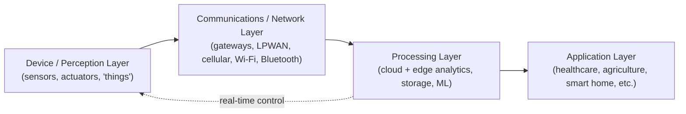
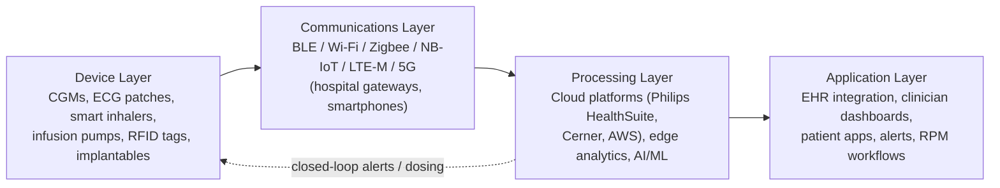
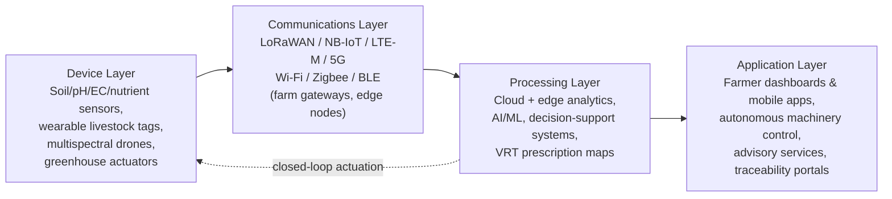
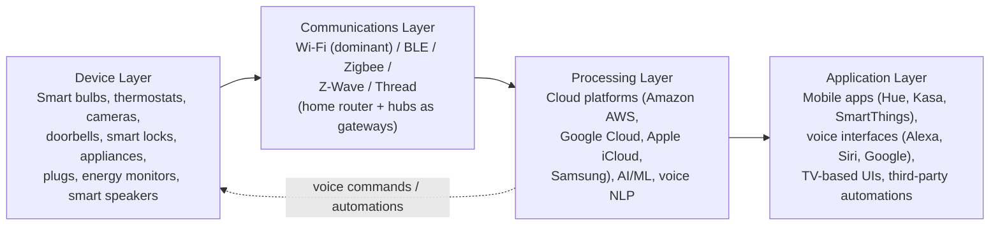
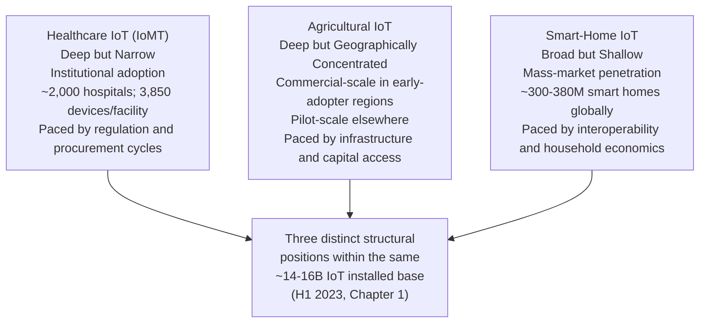

# Application Status of the Internet of Things in Healthcare, Agriculture, and Smart Homes: A Cross-Sector Research Report (Through H1 2023)
# 1 Research Background and Overview of Global IoT Development

The Internet of Things (IoT) has evolved from a speculative networking concept into one of the most consequential technological substrates of the early twenty-first century, weaving sensing, computing, and connectivity into objects that previously stood outside the digital realm. Before examining how this substrate is being absorbed by individual verticals—healthcare, agriculture, and smart homes—it is essential to establish what IoT actually is, what technical machinery makes it work, what temporal and analytical boundaries this report observes, and at what scale connected devices have penetrated the world by the first half of 2023. This opening chapter therefore performs four tasks: it fixes the conceptual and architectural foundation of IoT, sets the scope and comparative framework of the study, quantifies the macro-level growth trajectory of connected devices relative to world population over roughly the past two decades, and interprets what this scale implies for vertical adoption. In doing so, it provides the analytical baseline against which the sector-specific chapters that follow can be read.

## 1.1 Conceptual Definition and Technical Foundation of IoT

### 1.1.1 Definitions: Why They Diverge and Which One This Report Adopts

A persistent feature of IoT discourse is that no single institutional definition has achieved universal acceptance. Different bodies have framed IoT in ways that reveal their underlying cultural and regulatory biases: the U.S. National Institute of Standards and Technology (NIST) treats IoT as a class of cyber-physical systems (CPS), a framing that foregrounds cybersecurity concerns; the Federal Trade Commission (FTC) emphasizes devices "sold to or used by consumers," thereby narrowing the field to consumer-facing applications and excluding pure business-to-business or machine-to-machine (M2M) communications; and bodies such as the ITU and ETSI use formulations broad enough to be open to wide interpretation[^1]. The Institute of Electrical and Electronics Engineers (IEEE) has likewise observed that "projects in the IoT space give better definitions and architectural models than the standardization bodies," because projects can specify clear inclusion and exclusion criteria while institutions tend to be broad and culturally biased[^1].

For the purposes of this report, the most workable operational definition is the one articulated by the Internet Society: IoT refers to the extension of network connectivity and computing capability to objects, devices, sensors, and items not ordinarily considered to be computers, where these "smart objects" generate, exchange, and consume data with minimal human intervention and frequently connect to remote facilities for data collection, analysis, and management[^1]. This definition is focused enough to exclude general-purpose computers, smartphones, and tablets—a commonality across most definitions—yet sufficiently flexible to accommodate the blurring boundary between embedded devices and traditional computers as edge intelligence becomes more capable[^1]. It is also compatible with the popular "Cisco IBSG" framing, which dates the symbolic birth of IoT to the period 2008–2009, when the number of "things or objects" connected to the Internet first exceeded the number of people on Earth[^2][^3].

### 1.1.2 The Four-Layer Architecture and Core Building Blocks

While IoT deployments differ widely in scale and purpose, the industry has converged on a four-layer reference architecture as the standard, most widely accepted representation of how data flows from physical objects to end-user applications[^4][^5]. The four layers—device/perception, communications/network, processing, and application—each perform a distinct function but must operate together seamlessly for the overall system to deliver value[^4].

The **device (perception/sensing) layer** is the foundation: it consists of sensors, actuators, and "things" that collect data from the surrounding environment or actuate physical changes. These devices may be wired or wireless and have a unique identity on the network so that they can be addressed individually[^4][^5]. The **communications (network) layer** transports data from the perception layer toward the cloud, often via a gateway that aggregates traffic from many edge devices and may perform pre-processing, authentication, encryption, and malware protection; in many deployments the gateway uses a short-range protocol (e.g., LoRaWAN, Bluetooth, Zigbee) to talk to sensors and a cellular or wired backhaul to reach the cloud[^4][^5]. The **processing (cloud ingest, storage, and analytics) layer** is the "brain" of the system: it handles data ingestion, storage, filtering, and analysis, and is increasingly distributed between cloud platforms (e.g., AWS, Azure) and edge computing nodes, particularly where low latency or high data volumes make centralized processing impractical[^4][^5]. Finally, the **application layer** delivers application-specific services to end users—dashboards, alerts, control interfaces, or integrations with enterprise software—in domains as diverse as healthcare, smart farming, manufacturing, fleet management, and smart cities[^4][^5].

The diagram below summarizes this canonical flow:

Underpinning these layers are four functional building blocks—**sensors, processors, gateways, and applications**—each contributing a specific capability. Sensors and actuators form the "front end," uniquely identifiable and capable of real-time data capture or actuation; processors give intelligence to raw data, performing extraction, encryption, and decision-making; gateways route data and provide network connectivity (LAN, WAN, PAN); and applications, typically cloud-based, render meaning to the collected data for end users[^5]. Around these building blocks sit a set of **enabling technologies** that have become inseparable from modern IoT: M2M communication (the technological predecessor of IoT, focused on point-to-point device communication, often over mobile networks)[^5]; cloud computing and the "X-as-a-Service" (XaaS) family, including SaaS, PaaS, IaaS, and increasingly Hardware-, Communication-, and Healthcare-as-a-Service offerings[^5]; edge computing, which moves analytics closer to the device to reduce latency and bandwidth pressure[^4][^6]; and IoT analytics, which encompasses descriptive, diagnostic, predictive, and prescriptive techniques applied to the data streams generated by connected devices[^5].

It is worth noting that IoT is conceptually broader than the older notion of M2M: IoT typically uses Internet protocols (HTTP, MQTT, CoAP, etc.) and cloud-based architectures, supports open APIs, and is information- and service-centric, whereas M2M historically relied on traditional protocols, point-to-point connections, and a more device-centric, vertical-solution approach. M2M can therefore be viewed as a subset of IoT[^5].

### 1.1.3 Networking Choices: LAN vs. WAN in IoT

A practical consequence of the four-layer model is that the communications layer must accommodate a wide variety of range, power, and bandwidth requirements. In confined environments such as homes, offices, hospitals, or barns, IoT devices typically connect via **local area networks (LANs)** using short-range wireless protocols—Wi-Fi, Bluetooth/BLE, Zigbee, Z-Wave—often through a hub or gateway[^5]. For deployments that span large geographic areas—remote farms, vehicle fleets, distributed clinical monitoring—**wide area networks (WANs)** using cellular technologies (including LTE-M, NB-IoT, and 5G), satellite, or long-range low-power protocols such as LoRaWAN become indispensable, providing the coverage, reliability, and scalability that remote monitoring, asset tracking, and real-time analytics demand[^5][^4]. This distinction will reappear in later chapters, particularly when comparing wireless technologies for medical IoT in Chapter 2.

## 1.2 Research Scope, Timeframe, and Cross-Sector Analytical Framework

### 1.2.1 Temporal Boundary: Through the First Half of 2023

This report focuses on the state of IoT in three sectors—healthcare, agriculture, and smart homes—as of the first half of 2023. Wherever quantitative figures, product examples, or market forecasts are cited, they are taken from sources whose publication dates fall on or before mid-2023, or, when a more recent reference is used, the figures are explicitly treated as **anchor points** for back-interpolation rather than as direct claims about H1 2023. For example, IoT Analytics' subsequent *State of IoT 2024* report, which records 18.8 billion connected IoT devices at end-2024[^7], is cited here only as a downstream waypoint that helps verify the slope of the 2022–2023 installed-base trajectory; it is not used to overstate the deployed base as of mid-2023.

This temporal discipline matters because IoT figures published in different years rest on different definitions (e.g., "all connected things" vs. "IoT endpoints excluding phones, laptops, and tablets") and different forecasting methodologies. The report therefore distinguishes carefully between historical actuals, forecasts made in or before H1 2023 for future years, and post-2023 anchor data used solely for cross-verification.

### 1.2.2 Sector Selection and Rationale

The three sectors selected for in-depth examination—**healthcare, agriculture, and smart homes**—span the consumer, enterprise, and quasi-industrial domains of IoT, and each has reached a level of real-world deployment by H1 2023 that supports evidence-based analysis. Healthcare represents a heavily regulated, mission-critical environment where the consequences of device failure or data breach are immediate and tangible; agriculture represents a geographically dispersed, infrastructure-constrained context where IoT is being asked to lift productivity in a sector traditionally underserved by digital technology; and smart homes represent the largest consumer-facing IoT segment by device count, where ease of use and ecosystem interoperability dominate the value proposition. Industry analyses confirm that consumers account for more than 60% of IoT devices globally by unit count, while industrial and enterprise segments dominate on a dollar basis[^6], making these three sectors collectively representative of the major use-case archetypes.

### 1.2.3 Cross-Sector Analytical Framework

To preserve comparability across the three sectors, each subsequent chapter adopts a parallel structure built around five analytical dimensions:

| Dimension | What the chapter examines |
|---|---|
| Application taxonomy | The main categories of IoT use cases in the sector |
| Concrete examples | Named products, vendors, or platforms available by H1 2023 |
| Connectivity profile | The dominant wireless/wired technologies underpinning the sector |
| Challenges | Technical, economic, regulatory, security/privacy, and human-factor barriers |
| Maturity & value drivers | Stage of adoption and the principal forces propelling or restraining it |

This consistent framework enables the concluding chapter to perform a meaningful cross-sector comparison rather than an ad-hoc juxtaposition. It also operationalizes the rubric's emphasis on balanced treatment of applications and challenges, and on grounding comparative claims in the evidence presented in the preceding chapters.

## 1.3 Macro-Level Growth Trajectory: Connected Devices vs. World Population

### 1.3.1 The 2008–2009 Inflection Point

One of the most frequently cited milestones in the history of IoT is the moment at which the number of objects connected to the Internet first exceeded the number of human beings. According to a Cisco Internet Business Solutions Group (IBSG) whitepaper, the Internet of Things was "officially recognized" between **2008 and 2009**, because at that point more devices were connected to the Internet than there were people on the planet[^2][^3]. Cisco IBSG further reported that by 2010, fueled by the proliferation of smartphones, tablets, and other connected devices, the global installed base had reached approximately 12.5 billion devices against a world population of about 6.8 billion—yielding roughly 1.84 connected devices per person, the first time in history that this ratio exceeded one[^3].

It is important to underline two definitional caveats here. First, Cisco IBSG's figure aggregates **all Internet-connected devices**, including PCs, smartphones, and tablets, not only "IoT-specific" endpoints in the narrower sense used by sources such as IoT Analytics. Second, subsequent forecasts that Cisco and others published—such as "50 billion connected things by 2020" or "by 2022"—proved optimistic. Ericsson's Mobility Report, which began making explicit IoT adoption forecasts in 2015, originally projected an installed base exceeding 21 billion connected devices by 2018 and 26 billion by 2020, but later revised these figures sharply downward as the rollout of standardized low-power connectivity took longer than anticipated and the connectivity landscape remained fragmented[^6]. By 2020, Ericsson's revised view placed total connected devices (legacy plus IoT) at approximately 23.2 billion rather than 26 billion, with IoT devices specifically accounting for about 11.6 billion of that total[^6]. The general pattern—divergent definitions, optimistic early forecasts, and a slower-than-expected but still substantial rollout—frames the data shown in the table below.

### 1.3.2 Comparative Table: Connected Devices vs. World Population

The following table compiles available data points from Cisco IBSG, Ericsson Mobility Report, IoT Analytics, and UN/World Bank population statistics, covering roughly the past two decades. To respect source heterogeneity, the "Connected Devices" column distinguishes between **total connected devices** (the broader Cisco/Ericsson framing, which includes phones, laptops, and tablets alongside dedicated IoT endpoints) and **IoT-specific devices** (the narrower framing favored by IoT Analytics and used in Ericsson's revised series). All figures are best-available estimates rather than precisely measured counts; the divergence between sources is itself an important finding.

| Year | World Population (approx., billions) | Total Connected Devices (billions, broad definition) | IoT-Specific Devices (billions, narrow definition) | Devices per Person (broad) | Source / Notes |
|---|---|---|---|---|---|
| 2003 | ~6.3 | ~0.5 | n/a | ~0.08 | Cisco IBSG: PC- and laptop-dominated era[^3] |
| 2008–2009 | ~6.7–6.8 | ~6.7–6.8 (inflection: things ≈ people) | n/a | ~1.0 | Cisco IBSG identifies this as the symbolic "birth" of IoT[^2][^3] |
| 2010 | 6.8 | 12.5 | n/a | 1.84 | Cisco IBSG whitepaper[^3] |
| 2014 | ~7.3 | 13.7 (10.1 legacy + 3.8 IoT) | 3.8 | ~1.9 | Ericsson actuals[^6] |
| 2015 | ~7.4 | 15.2 (10.1 + 5.1) | 5.1 | ~2.1 | Ericsson actuals[^6] |
| 2016 | 7.4 | 17.0 (10.3 + 6.7) | 5.6–6.7 | ~2.3 | Ericsson actuals; Gartner-style "IoT installed base" ≈ 5.6 B[^6] |
| 2017 | 7.6 | 18.9 (10.5 + 8.4) | 7.0 | ~2.5 | Ericsson actuals; IoT adoption rate ~11% of addressable market[^6] |
| 2018 | 7.7 | 21.4 (10.8 + 10.6) | 8.6 | ~2.8 | Ericsson revised; IoT to surpass mobiles/laptops/tablets in aggregate by 2020[^6] |
| 2020 | 8.1 (projected at the time) | 23.2 (11.3 + 11.6, revised down from 26) | 11.6 | ~2.9 | Ericsson revised forecast[^6] |
| 2024 (anchor, post-period) | ~8.1–8.2 | n/a | 18.8 (IoT-only) | n/a | IoT Analytics, *State of IoT 2024*; used as back-interpolation anchor for H1 2023[^7] |

Read together, these data points support several robust observations:

1. **The 2008–2009 crossover is well-attested**, though it refers to *total Internet-connected devices*, not the narrower category of IoT endpoints[^2][^3]. By the narrower IoT-only definition, the crossover happened later—roughly in the mid-2010s in Ericsson's series.
2. **Early forecasts were materially optimistic.** Cisco's 50-billion-by-2020 vision and Ericsson's initial 26-billion-by-2020 projection were both revised downward; the realized 2020 figure was closer to 23 billion total connected devices and 11.6 billion IoT-specific devices[^3][^6].
3. **Despite the moderation, growth has been rapid and sustained.** Between 2014 and 2020 the IoT-specific installed base grew roughly threefold (from ~3.8 B to ~11.6 B), and IoT Analytics' anchor figure of 18.8 B at end-2024 implies that by mid-2023 the IoT-only installed base was likely on the order of **14–16 billion devices**—comfortably above the world population of roughly 8 billion[^7][^6].
4. **The adoption rate is approaching but had not yet reached the canonical 15–20% "tipping point" by H1 2023.** Diffusion-of-innovation theory holds that technologies accelerate sharply once they cross this threshold; by 2018, IoT adoption stood at roughly 13% of the estimated addressable market of ~38.5 billion devices, with 2020 projections of 17%[^6]. The persistence of fragmented standards and uneven 5G rollout has stretched, but not derailed, this adoption curve.

### 1.3.3 What the Scale Implies

The scale matters not as a curiosity but because it shifts the locus of where data is generated, stored, and acted upon. By the time IoT-only devices number in the mid-teens of billions—roughly two devices per human—the assumption that human-generated content dominates the network breaks down. Real-time data, which in 2010 represented approximately 5% of total global data, was forecast to reach 30%+ (around 50 zettabytes) by 2025, with IoT identified as the **primary driver** of this growth[^6]. As a result, enterprise infrastructure rather than consumer endpoints is increasingly responsible for stewarding the world's data: enterprise installed bytes are projected to represent over 80% of global installed bytes by 2025, with enterprises generating 64% of global data, up from 53% in the late 2010s[^6].

## 1.4 Implications of IoT Scale for Vertical Industry Adoption

### 1.4.1 The Segmentation: Consumer, Enterprise, and Industrial IoT

The aggregate device count masks an important structural feature: IoT is not a single market but a **cross section of three overlapping segments**—Consumer IoT, Enterprise IoT, and Industrial IoT—each with distinct goals and value drivers[^6]. Consumer IoT prioritizes convenience and innovation, with user experience and rapid adoption as primary metrics; Enterprise IoT pursues efficiency through reliability, real-time visibility, and integration with back-end systems; and Industrial IoT seeks competitive advantage through interoperability, automation, and high-availability process control[^6]. While consumers account for more than 60% of IoT devices globally by unit count, on a dollar basis consumer represents only about 15% of total IoT spend, with industrial and enterprise jointly dominating the value pool[^6]. This split is highly relevant for the present report: smart homes belong squarely to Consumer IoT, agriculture sits at the boundary of Enterprise and Industrial IoT, and healthcare straddles all three segments depending on whether the use case is a wearable, a hospital asset tracker, or a regulated medical device.

### 1.4.2 Cross-Domain Convergence: Why Innovations Travel Across Sectors

A defining dynamic of IoT through H1 2023 is **technology convergence across the consumer, enterprise, and industrial domains**. Consumer IoT has emphasized ease of use, rapid out-of-the-box deployment, and self-service paradigms, often at price points around $100 per unit; Industrial IoT has invested heavily in high availability, low-touch upgrades, and integration with third-party systems[^6]. Enterprise IoT vendors are increasingly absorbing innovations from both directions—drawing on consumer-friendly UX patterns to ease deployment and on industrial-grade reliability disciplines to meet mission-critical SLAs[^6]. The growing investor interest from Enterprise software giants in Consumer IoT enablers (e.g., the participation of Salesforce and IBM in funding rounds for IFTTT, a Consumer IoT integration platform) illustrates how the boundary between segments is becoming permeable[^6]. For the three sectors examined in this report, the practical effect is that a smart-home thermostat's voice-control paradigm can inform a hospital's medication-adherence interface, while industrial-grade LoRaWAN sensors developed for asset tracking can be repurposed for livestock monitoring or large-scale precision agriculture.

### 1.4.3 The AI/ML, 5G, and Edge Computing Catalysts

Three converging technology vectors are shaping how the macro-level scale translates into sector-specific value:

- **AI and machine learning** are being embedded directly into IoT deployments to turn raw sensor data into actionable insight; new enterprise IoT devices are increasingly integrated with AI/ML capabilities, enabling real-time analytics and process streamlining[^6]. Advancements in AI, augmented reality, and blockchain are simultaneously addressing privacy and security concerns that have historically held back IoT adoption[^6].
- **5G** is widely expected to "further establish the Internet of Things as mainstream," providing the low-latency, high-density connectivity required for next-generation use cases such as connected vehicles, industrial automation, and certain low-latency clinical scenarios[^1][^6].
- **Edge computing** has become "highly compatible with IoT deployments," redistributing analytics from centralized clouds to gateways and devices, reducing bandwidth requirements, and enabling real-time response—a property especially valuable for healthcare monitoring, agricultural decision support, and home automation[^6][^4].

### 1.4.4 Persistent Cautions That Frame the Sector Chapters

Even as the macro trajectory points strongly upward, several cautions—identified consistently across institutional analyses through H1 2023—will recur in every sector chapter that follows:

- **Standards and interoperability remain fragmented.** Standardization activities are confined to specific verticals, producing "archipelagos of disjointed efforts" with stacks of redundant technology on separate layers, while horizontal interoperability between alliances and M2M standards remains weak[^1]. The lack of universal standards is repeatedly cited by industry observers as a barrier to enterprise-wide adoption[^6].
- **Security and privacy concerns are intrinsic, not incidental.** The ubiquitous, interconnected, and pervasive nature of IoT amplifies cybersecurity risks well beyond those of traditional IT: device monoculture, weak authentication, the "orphan IoT device" problem (devices abandoned by defunct manufacturers), and the use of compromised devices as botnet vectors all create network externalities that the market alone is unlikely to resolve[^1].
- **Economic justification is non-trivial.** Stand-alone business cases for IoT projects have historically been difficult to demonstrate via standard ROI analyses, leading observers to compare IoT's transformative potential to that of email and the Internet itself—technologies whose value was equally hard to justify in spreadsheet terms[^6].
- **Skills and adoption barriers persist.** A diffuse buyers' market with limited expertise to assess products, combined with a shortage of data scientists capable of converting sensor data into useful insights, slows the realization of IoT's value proposition[^1].

These four caution areas—standards, security, economics, and skills—will reappear, refracted through sector-specific realities, in the analyses of healthcare, agriculture, and smart homes that follow. The next three chapters apply the framework established here to examine, in turn, how IoT is being deployed in each of those verticals, what concrete products and platforms exemplify the state of the art as of H1 2023, and where the most binding constraints on further adoption lie. Chapter 5 then revisits these strands in a consolidated cross-sector comparison.

# 2 IoT Applications in Healthcare

Chapter 1 established that by mid-2023 the global installed base of IoT-specific devices had likely reached the order of 14–16 billion units, roughly two for every human being, and that this scale was being absorbed unevenly across consumer, enterprise, and industrial segments. Healthcare is the vertical in which all three segments intersect most visibly: a consumer-grade smartwatch streaming heart-rate data, an enterprise-class hospital asset-tracking deployment, and an industrial-grade implantable cardiac device with regulatory-class lifecycle controls can all sit within the same patient pathway. The umbrella term that has emerged to capture this convergence is the **Internet of Medical Things (IoMT)**—a sub-category of IoT defined as the network of Internet-enabled medical devices, hardware infrastructure, and software applications that connect healthcare information systems, enabling wireless and remote devices to securely exchange medical data over the Internet[^8][^9]. Because IoMT data are sensitive and heavily regulated, the security framework demanded by IoMT is substantially more stringent than that of generic IoT systems[^8], a point that will resurface repeatedly in the challenges section.

This chapter applies the five-dimensional analytical framework set out in Section 1.2.3—application taxonomy, concrete examples, connectivity profile, challenges, and maturity/value drivers—to the healthcare sector. Section 2.1 enumerates the principal IoMT application domains observable by H1 2023 with named product and vendor exemplars; Section 2.2 consolidates the wireless connectivity technologies underpinning these applications into a comparative table; Section 2.3 quantifies market scale and the forces driving adoption; and Section 2.4 verifies the binding challenges that constrain further diffusion, organized along the five challenge dimensions—privacy/regulation, cybersecurity, interoperability, legacy integration/cost, and skills—that the rubric requires.

## 2.1 Application Taxonomy and Representative Products of Medical IoT

IoMT deployments observable by mid-2023 cluster into six broad application domains. Each is grounded in concrete, market-available products and platforms, and each can be mapped onto the four-layer IoT architecture introduced in Chapter 1: physical sensors and actuators sit in the device layer, short-range or cellular radios constitute the communications layer, cloud platforms (often supplemented by edge nodes inside the hospital) perform analytics in the processing layer, and clinician dashboards, patient apps, and EHR integrations form the application layer.

### 2.1.1 Remote Patient Monitoring and Chronic Disease Management

Remote patient monitoring (RPM) is the single most consequential IoMT application category by H1 2023 and the principal driver of the IoMT market's growth. RPM enables clinicians to track vital signs—heart rate, blood pressure, glucose, oxygen saturation, respiratory parameters—in real time outside the hospital walls, supporting continuous care for chronic conditions such as diabetes, heart disease, and respiratory disorders[^8]. The COVID-19 pandemic accelerated this shift sharply: lockdowns and capacity constraints pushed providers to virtualize care, and RPM emerged as a vehicle for reducing hospital readmissions, increasing patient engagement, and using clinical resources more efficiently[^8].

Concrete exemplars by H1 2023 include Dexcom's continuous glucose monitoring (CGM) family—anchored by the Dexcom G6 platform and extended by subsequent generations—which tracks interstitial glucose continuously and streams readings to a paired smartphone[^8]; KardiaMobile, a personal six-lead ECG monitor whose next-generation Bluetooth-enabled diagnostic sensor received FDA 510(k) clearance for cardiac monitoring in October 2023, building on the device's earlier commercial footprint[^8]; and Philips Lifeline-style personal emergency response systems used widely for eldercare. For sleep-disordered breathing, ResMed's AirSense platform exemplifies cloud-connected CPAP therapy, transmitting adherence and therapy data back to clinicians. In partnership models, GE Healthcare and AMC Health announced in October 2022 an RPM collaboration that combines GE's acute monitoring expertise with AMC Health's FDA Class II 510(k)-cleared RPM platform and advanced analytics to extend care from hospital to home[^8]—an early signal that RPM is moving from point products into integrated post-discharge platforms.

### 2.1.2 Consumer and Clinical Wearables

Wearables are the type segment that dominates IoMT device counts: by subsequent measurement, wearable devices accounted for approximately **45.7%** of the IoMT type segment[^8], driven by continuous-monitoring use cases and consumer-health adoption. The category spans smartwatches (Apple Watch, Fitbit—now under Google LLC), wearable ECG monitors such as KardiaMobile, and the CGM wearables noted above[^8]. These devices typically combine motion sensing, photoplethysmography (PPG), and sometimes single- or multi-lead ECG to track heart rate, sleep architecture, physical activity, and rhythm irregularities. Their consumer-grade origins notwithstanding, several have crossed into clinically relevant territory through FDA clearances (e.g., atrial fibrillation detection on Apple Watch and KardiaMobile), making the consumer/clinical boundary in IoMT increasingly permeable—an instantiation of the cross-domain convergence pattern identified in Section 1.4.2.

### 2.1.3 Smart Medication Management and Ingestible Sensors

A third application category targets medication adherence and pharmacological monitoring. Connected inhalers track when and how patients with asthma or COPD use their medication; smart pill bottles record cap openings and remind patients via app or audible cues; and ingestible sensors embedded in pills can confirm ingestion via a wearable patch. Within the IoMT market's application segmentation, **medication management** is one of the four major application categories alongside patient monitoring, telemedicine, and other applications[^8]. A regulatory anchor for the trajectory of this category is the FDA's March 2024 approval of the **Dexcom Stelo Glucose Biosensor System** as the first over-the-counter (OTC) continuous glucose monitor, intended for adults not using insulin, including non-diabetics interested in metabolic awareness[^8]—a milestone that, while landing just outside the report's primary window, validates the direction of travel toward consumer-accessible, connected medication-and-metabolism management products that were under FDA review through H1 2023.

### 2.1.4 Connected Diagnostic and Therapeutic Equipment

Hospitals are the dominant end-user segment of IoMT, holding approximately **41.8%** of end-user market share[^8], and a substantial portion of this share derives from networked diagnostic and therapeutic equipment rather than wearables. Concrete examples include smart infusion pumps that adjust dosing based on programmed protocols and communicate alarms upstream; connected ECG systems—such as InfoBionic's next-generation remote ECG monitor with a Bluetooth-enabled six-lead diagnostic sensor cleared by the FDA in October 2023[^8]; and implantable cardiac devices including pacemakers and implantable cardioverter-defibrillators (ICDs), where Boston Scientific, Medtronic, and Abbott provide connected pacemakers and defibrillators that stream device telemetry to physicians for remote optimization of treatment protocols[^8]. Cloud platforms anchor this category: Philips HealthSuite and Cerner's cloud-based electronic health record system integrate device data, patient records, and AI-powered analytics, enabling remote monitoring and predictive insight across geographically distributed facilities[^8].

### 2.1.5 Hospital Asset Tracking and Workflow Optimization

Beyond direct patient-facing devices, IoMT supports a substantial back-office layer: RFID and BLE-based asset tagging tracks high-value equipment such as infusion pumps, ventilators, and wheelchairs; staff badges with locator beacons map clinical workflows; and consumables tagged at the unit-dose level support inventory management and recall response. A frequently cited forward-looking benchmark from a January 2022 Juniper Research study projected that **smart hospitals worldwide would deploy 7.4 million connected IoMT devices by 2026**, averaging more than **3,850 devices per hospital**—a **131%** increase from 3.2 million devices in use in 2021[^8]. The category encompasses both clinical instruments and operational sensors, positioning the hospital itself as a dense IoT environment in which patient monitoring, asset tracking, and surgical robotics coexist on the same network.

### 2.1.6 Telemedicine and Emerging Telesurgery

The final category covers care delivery itself: telemedicine platforms that integrate video consultation with peripherals (digital stethoscopes, dermatoscopes, otoscopes) and the more aspirational frontier of telesurgery and microsurgery assistance. Telemedicine is one of the four leading IoMT application segments alongside patient monitoring and medication management[^8]. At the surgical end of the spectrum, Sony's May 2024 announcement of a microsurgery assistance robot capable of automatically exchanging surgical instruments with precision control[^8], while again just beyond the strict H1 2023 cut-off, illustrates the trajectory toward connected, AI-augmented, potentially remotely supervised surgical platforms. Through H1 2023 itself, the dominant telemedicine reality remained video consultation and remote monitoring rather than true telesurgery, with telesurgery's mainstream deployment awaiting broader rollout of low-latency 5G networks (see Section 2.2).

The relationship of these six categories to the four-layer architecture from Chapter 1 is summarized in the following diagram, which traces how patient-side sensing connects through wireless gateways and cloud analytics to clinician-facing applications:

The key insight is that **value in IoMT is created predominantly in the processing and application layers**, where streams of vital-sign data are converted into clinically actionable signals; the device layer is where regulatory exposure is highest; and the communications layer is where interoperability and connectivity choices either enable or constrain the entire system.

## 2.2 Wireless Connectivity Technologies for Medical IoT: A Comparative Profile

Because IoMT spans wearables on the wrist, infusion pumps at the bedside, asset tags across hospital campuses, and chronic-disease monitors in patients' homes, no single wireless technology serves the entire field. Instead, a portfolio of complementary protocols has emerged, each optimized for a different combination of range, data rate, power, latency, and mobility. The LAN-vs-WAN distinction introduced in Section 1.1.3 is the most useful organizing principle: short-range protocols (BLE, Wi-Fi, Zigbee, Z-Wave, NFC, UWB) cover the personal-area and local-area space inside homes and hospitals, while long-range protocols (LoRaWAN, NB-IoT, LTE-M, 4G/5G, satellite) cover the wide-area space needed for ambulatory and rural monitoring. Within IoMT specifically, the wireless connectivity segment is the dominant category—accounting for approximately **52.1%** of the connectivity segment by market share[^8]—reflecting the operational primacy of mobility and ease of deployment over wired robustness in most modern medical settings.

The two narrowband cellular standards introduced under 3GPP Release 13—**NB-IoT** and **LTE-M**—deserve particular attention because they fill a gap that earlier cellular IoT could not. Both are optimized for low-bandwidth, sleep-most-of-the-time applications, support multi-year battery life via Power Saving Mode (PSM) and extended Discontinuous Reception (eDRX), and offer improved building penetration relative to general-purpose LTE[^10]. The key differences for medical use are: NB-IoT supports message-based communication, sub-250 kbps half-duplex throughput, ~7× the range of LTE Cat 1, and **no mobility or VoLTE support**, making it ideal for stationary monitors and meters[^10]; LTE-M supports IP-based communication, 384 kbps–1 Mbps throughput (half or full duplex), full mobility with cell-tower handover, and VoLTE for voice-capable medical alert devices, with typical latency of 10–20 ms[^10][^11]. In practical terms, this means LTE-M is structurally better suited to mobile personal emergency response systems (mPERS) and ambulatory monitors that travel with the patient, while NB-IoT is structurally better suited to fixed home-care devices such as smart pill dispensers or stationary chronic-disease monitors[^10][^11].

At the other end of the latency spectrum, **5G** is positioned to enable use cases that earlier generations of cellular could not credibly support—real-time remote robotic surgery, AR/VR-assisted diagnostics, high-resolution surgical video transfer, MRI/CT image transfer, and the very high device density characteristic of modern hospitals—though deployment in H1 2023 remained partial.

The following table consolidates the principal wireless technologies relevant to medical IoT, specifying for each the typical medical applications, coverage class (PAN/LAN vs. WAN), and approximate range. It synthesizes connectivity-protocol comparisons across multiple sources[^12][^10][^13][^11] with the medical-use-case mapping required by the user's brief.

| Technology | Coverage Class | Typical Range | Data Rate (typical) | Typical Medical Applications |
|---|---|---|---|---|
| **Bluetooth / BLE** | PAN | Up to ~100 m | ~1–2 Mbps (BLE) | Wearable ECG (KardiaMobile), pulse oximeters, blood-pressure cuffs, CGMs (Dexcom), smart pill bottles, insulin-pump pairing |
| **Wi-Fi** | LAN | ~30 m indoor | Tens to hundreds of Mbps | Hospital bedside monitors, infusion pumps, EHR connectivity, smartphone gateways, vital-sign dashboards |
| **Zigbee** | PAN / LAN (mesh) | ~10–100 m (mesh-extended) | Up to 250 kbps | Pulse oximetry, hospital sensor mesh networks, indoor patient/asset tracking |
| **Z-Wave** | PAN / LAN | ~30 m | ~40–100 kbps | Home health monitoring, Ambient Assisted Living (AAL) for elderly |
| **RFID** | PAN | 10 cm – 200 m (passive/active) | Low | Asset and equipment tracking, patient/staff identification, consumables tracking |
| **NFC** | PAN | < 10 cm | ~424 kbps | Patient/device identification, secure device pairing, secure data exchange |
| **UWB** | PAN (indoor positioning) | < 30 m | High (positioning) | Indoor positioning of patients, staff and assets where GPS is unavailable |
| **6LoWPAN** | PAN | ~10–100 m | Low (IPv6 over IEEE 802.15.4) | Ambient assisted living, non-invasive glucometer sensor networks, U-healthcare monitoring |
| **LoRaWAN** | WAN (LPWAN, unlicensed) | ~2–5 km urban; ~15 km rural | <50 kbps | In-facility low-power sensor networks, remote rural patient telemetry |
| **NB-IoT** | WAN (LPWAN, licensed cellular) | ~1–10 km urban; up to ~35 km rural with deep indoor penetration | <250 kbps, half-duplex, message-based[^10] | Stationary chronic-disease monitors, smart pill dispensers, eldercare emergency alarms (no mobility, no VoLTE)[^10] |
| **LTE-M (Cat-M1)** | WAN (LPWAN, licensed cellular) | ~1 km urban; ~10 km rural[^11] | 384 kbps–1 Mbps, IP-based; latency 10–20 ms[^10][^11] | Mobile wearable monitors, mobile ECG, mobile personal emergency response systems, voice-capable medical alert devices (full mobility + VoLTE)[^10] |
| **Cellular 4G** | WAN (cellular, licensed) | Multi-km macro cells | Up to ~150 Mbps | Remote patient monitoring, mobile gateway HIoT systems (fall detection, heart-rate), GPS-linked localization |
| **5G** | WAN (cellular, licensed) | Macro/small-cell coverage | Up to multi-Gbps; ultra-low latency | Telesurgery / remote robotic surgery, AR/VR-assisted diagnostics, 4K/3D surgical video, MRI/CT image transfer, connected ambulance, massive sensor density |
| **Satellite** | WAN (global) | Global | Variable | Telemedicine in remote/rural/maritime areas where terrestrial networks are unavailable |

Three structural observations follow from this table. First, **the LAN tier remains dominated by Bluetooth/BLE and Wi-Fi** because they are inexpensive, mature, and already embedded in every modern smartphone, which serves as the de facto patient-side gateway for most consumer-grade wearables. Second, **the WAN tier is undergoing rapid diversification** as NB-IoT and LTE-M move from theoretical standards into operational rollouts: U.S. carriers (Verizon, AT&T) prioritized LTE-M, while European and Asian carriers (Vodafone, Deutsche Telekom, Orange) prioritized NB-IoT[^10], a regulatory geography that directly shapes which connected-medical-device architectures are viable in which markets. Third, **5G is the enabler that translates aspirational telesurgery and high-resolution diagnostic streaming from prototype into deployable reality**—but as of H1 2023, its medical deployment was still nascent, with most clinical traffic continuing to ride on Wi-Fi inside facilities and 4G/LTE-M for ambulatory monitoring.

The connectivity choice has downstream consequences for cybersecurity exposure that will be examined in Section 2.4: BLE and Wi-Fi vulnerabilities (such as the SweynTooth family that affected certain BLE-enabled medical devices[^14]) are LAN-tier risks, while cellular-tier devices inherit the SIM-management and over-the-air patching challenges of cellular IoT generally.

## 2.3 Maturity, Market Scale, and Value Drivers

To position healthcare within the consumer/enterprise/industrial segmentation introduced in Chapter 1, it is useful to look at IoMT's measurable scale and the forces driving its growth.

### 2.3.1 Market Scale Through Mid-2023

Quantitative market sizing for IoMT through H1 2023 must be read cautiously because most accessible market-research reports were issued with 2024 base years and forward-looking 2025–2034 forecasts; their structural segmentation, however, captures the state of the field at a moment very close to the report's window. The most useful reference point is the Market.us IoMT market report, which sized the IoMT market at **US$ 221.84 billion in 2024** and projected it to reach **US$ 1,211.22 billion by 2034 at a CAGR of 18.5%**[^8]. By back-interpolation from this trajectory, the H1 2023 market size was on the order of the high-US$100 billions—consistent with the IoMT segment having become a major component of the broader IoT economy by mid-2023. A separate Allied Market Research view, framed in earlier terminology, characterized IoMT growth through this period as driven by "growth in awareness about health issues" and "adaptation of digital technologies by the health-care industry," with COVID-19 having created a one-time acceleration that benefited the dominant vendors[^9].

The structural composition of this market, drawn from the 2024 snapshot but reflecting patterns visible by H1 2023, reveals where IoMT value is concentrated[^8]:

| Segment | Leading Sub-segment | 2024 Share | What It Implies for H1 2023 |
|---|---|---|---|
| Component | Hardware | 44.7% | Connected devices, wearables, and sensors remain the foundational layer of IoMT spend; software/services are growing but not yet dominant[^8] |
| Deployment Model | Cloud-Based | 68.8% | Healthcare has largely accepted cloud-hosted IoMT platforms (Cerner, Philips HealthSuite) despite data-sensitivity concerns[^8] |
| Connectivity | Wireless | 52.1% | Mobility and ease of deployment outweigh the robustness advantages of wired connectivity[^8] |
| Type | Wearable Devices | 45.7% | Consumer-style wearables (Apple Watch, Fitbit, Dexcom) dominate the unit count, even though hospital equipment dominates value[^8] |
| Application | Patient Monitoring | 37.8% | RPM is the largest revenue use case, outweighing telemedicine and medication management individually[^8] |
| End User | Hospitals & Clinics | 41.8% | Institutional buyers remain the single largest end-user segment despite the wearables boom[^8] |
| Region | North America | 35.5% | Advanced healthcare infrastructure, high digital-health adoption, and strong IoMT investment concentrate market activity[^8] |

A separate 2023 industry statistic recorded the hardware category at **48.4%** in 2023[^15], slightly higher than the 2024 share and consistent with the field's hardware-led early phase that was beginning to give way to software- and services-led expansion. The convergence across sources is robust: by H1 2023, IoMT was a hardware-anchored, cloud-deployed, wirelessly connected, wearables-led, RPM-centered, hospital-procured, North-America-concentrated market.

### 2.3.2 Value Drivers Propelling Adoption

Five drivers operate concurrently to push IoMT adoption forward through H1 2023:

1. **Growing demand for remote patient monitoring**, accelerated decisively by the COVID-19 pandemic, which forced both clinicians and patients to adopt remote care models and proved that chronic-disease management could be effectively delivered outside hospital walls[^8][^9]. RPM reduces readmissions, increases patient engagement, and supports more efficient resource utilization[^8].
2. **Chronic-disease prevalence and management needs.** IoMT hardware—particularly wearables and CGMs—plays an increasingly central role in managing diabetes, cardiovascular disease, and respiratory disorders, where continuous, longitudinal data outperform episodic clinic visits.
3. **Cost-containment pressures on health systems**, which favor any technology that can substitute lower-cost remote monitoring for higher-cost inpatient care.
4. **Government digital-health initiatives**, with India's National Digital Health Mission cited as a representative driver in emerging markets, and U.S. regulatory frameworks creating reimbursement pathways for RPM in developed markets[^8].
5. **Integration of AI and machine learning** into IoMT devices and platforms, enabling anomaly detection, predictive modeling, and personalized care recommendations[^8]. As noted in Section 1.4.3, AI/ML is one of the three technology vectors translating macro IoT scale into sector-specific value, and IoMT is among the earliest beneficiaries.

In Chapter 1's segmentation language, healthcare sits across all three IoT segments simultaneously: consumer-IoT wearables flowing into clinical workflows, enterprise-IoT cloud platforms managing patient cohorts, and quasi-industrial-IoT implantables and surgical robotics subject to regulatory-class reliability requirements. This tripartite footprint is the reason healthcare faces a uniquely complex challenge landscape, examined next.

## 2.4 Challenges and Barriers to Adoption

While the application taxonomy and market data suggest strong forward momentum, the principal challenges constraining IoMT adoption remain substantive and, in several dimensions, are tightening rather than easing. The five challenge dimensions required by the cross-sector framework—privacy/regulation, cybersecurity, interoperability, legacy integration/cost, and skills—each materially shape what IoMT can and cannot deploy by H1 2023.

### 2.4.1 Data Privacy and Regulatory Compliance

IoMT devices generate, transmit, and store some of the most sensitive personal data that exists, making them subject to the strictest privacy regulations in any IoT vertical. In the United States, the Health Insurance Portability and Accountability Act (HIPAA) governs the handling of protected health information (PHI) by covered entities and their business associates; in Europe, the General Data Protection Regulation (GDPR) imposes broader and in some respects more stringent requirements; and in many other regions, enforcement is uneven despite nominal regulatory frameworks[^8]. The compounded effect is that an IoMT vendor selling globally must reconcile multiple overlapping regimes, and any failure of enforcement in one jurisdiction can compromise the integrity of the global product.

The fragility of compliance even by major IoMT vendors is illustrated by the **October 2023 Insulet Omnipod data breach**, in which Insulet—an insulin-pump manufacturer—issued an alert to approximately **29,000 users** that their protected health information may have been compromised. The breach was tied to a recall notice email containing clickable links that, when activated, inadvertently shared PHI (including IP addresses and information about whether users used the insulin pump and remote controller) with the manufacturer's website-performance and marketing partners[^16]. Insulet remediated by disabling the tracking codes and requesting partners to delete logs, but the incident demonstrates how inadvertent data-handling decisions—not malicious external attacks—can produce regulatory-grade breaches in a heavily regulated category[^16].

More broadly, the **2023 IBM Security "Cost of a Data Breach Report"** placed the average cost of a confirmed healthcare-data breach at **US$ 11 million**, an increase of US$ 1 million from the previous year[^16], and a **2024 survey** of healthcare organizations found that **92%** had experienced at least one cyberattack, up from 88% the year before[^16]—indicating that the privacy-risk environment was deteriorating, not improving, around the H1 2023 boundary.

### 2.4.2 Cybersecurity Vulnerabilities

Cybersecurity is the most operationally consequential challenge facing IoMT and the one most clearly differentiated from other IoT verticals, because successful exploits can directly endanger patient safety, not merely data confidentiality. The empirical record is sobering. The FBI reported in 2022 that **53% of connected medical devices and other IoT devices in hospitals had known critical vulnerabilities** that put them at risk of cybersecurity attacks and data breaches[^16][^17], and a separate analysis found that **73% of networked IV infusion pumps harbor at least one critical flaw**[^17]. An August 2023 joint research report by Health-ISAC, Finite State, and Securin found a **59% year-over-year increase in vulnerabilities in medical products and devices**[^16].

Documented incident history makes these statistics tangible:

- **WannaCry ransomware (May 2017)**—considered by the FBI to be the first ransomware attack to target the operation of medical devices—locked files on more than 200,000 Windows systems across 150 countries, forcing hospitals in the UK and US to cancel thousands of operations and appointments for up to 48 hours, and encrypting connected radiology equipment that used contrast agents to enhance MRI scans[^16]. The attack exploited unpatched Windows-based medical devices, illustrating precisely the legacy-software exposure that Section 2.4.4 will revisit.
- **Abbott (formerly St. Jude Medical) implantable cardiac devices (2017 onward)**—the FDA issued safety communications in January 2017, August 2017, and April 2018 addressing cybersecurity vulnerabilities in St. Jude's implantable pacemakers and the Merlin@home transmitter, with successive firmware updates released to mitigate confirmed vulnerabilities discovered by independent researchers[^14]. A subsequent recall affected approximately **465,000** Abbott pacemakers, with researchers having demonstrated that wireless commands could be spoofed to drain the battery or deliver inappropriate pacing[^17].
- **Medtronic insulin pumps (2019, 2022)**—in June 2019 the FDA warned that certain Medtronic MiniMed Paradigm pumps had cybersecurity risks severe enough to warrant patient replacement of affected devices[^14]; in September 2022, the FDA followed up with a communication about the MiniMed 600 Series (630G and 670G), warning that a flaw in the communication protocol could allow nearby unauthorized persons to access the pump during pairing and potentially cause it to deliver too much or too little insulin[^14].
- **Other documented vulnerabilities** include Bluetooth Low Energy issues in the **SweynTooth** family of vulnerabilities affecting certain medical devices (FDA safety communication, March 2020)[^14]; cybersecurity flaws in **GE Healthcare Clinical Information Central Stations and Telemetry Servers** (January 2020)[^14]; the **URGENT/11** family affecting connected devices using certain third-party communication software (October 2019)[^14]; a 2021 alert on the **Fresenius Kabi Agilia Connect Infusion System**[^14]; the **Apache Log4j** vulnerability that affected medical devices using the widely deployed logging library (December 2021)[^14]; and a June 2022 letter regarding Illumina next-generation sequencing instruments[^14].

The regulatory framework around medical-device cybersecurity changed materially within the report's window. On **December 29, 2022, the Consolidated Appropriations Act, 2023 ("Omnibus") was signed into law, with Section 3305 ("Ensuring Cybersecurity of Medical Devices") amending the FD&C Act by adding Section 524B**[^14][^16]. The amendments took effect **March 29, 2023**[^14], and for the first time made cybersecurity standards for medical-device premarket submissions—510(k), De Novo, HDE, PDP, and PMA—a legally enforceable responsibility[^16]. Section 524B requires manufacturers to submit plans to monitor, identify, and address cybersecurity vulnerabilities; to provide timely security updates and patches; to demonstrate secure design and development processes; and to include a Software Bill of Materials (SBOM) enumerating all software components[^17]. Beginning **October 1, 2023**, the FDA could refuse to accept premarket submissions for cyber devices that failed to demonstrate cybersecurity compliance[^17]. In May 2023 the FDA launched a video series for healthcare facilities on cybersecurity incident preparedness[^14], signaling that postmarket vigilance—not merely premarket review—was now part of the regulatory expectation.

The net implication for H1 2023 is that IoMT vendors were operating in a regulatory environment that had just shifted from voluntary guidance to legally enforceable obligation, while the threat surface itself was expanding faster than incumbent product portfolios could be hardened.

### 2.4.3 Interoperability and Standards Fragmentation

The interoperability problem in IoMT is more severe than in most other IoT verticals because the data ecosystem in healthcare is already fragmented at a higher layer—electronic health records, clinical information systems, claims databases, and laboratory information systems each have their own data models—and IoMT devices add yet another layer of vendor-specific protocols, data formats, and APIs underneath. The result is that even when a hospital procures connected ECG monitors, smart infusion pumps, and wearable patches from different vendors, integrating their data into a single patient view requires bespoke engineering. As Section 1.4.4 noted at the macro level, the absence of universal standards is repeatedly cited by industry observers as a barrier to enterprise-wide IoT adoption; in healthcare, this generic challenge is compounded by FDA-managed device classifications, HL7/FHIR data-exchange standards that are still maturing, and the absence of a single accepted protocol stack analogous to TCP/IP at the device layer. The FDA has recognized this gap and maintains a dedicated focus on **medical device interoperability** through its Digital Health Center of Excellence[^14], but the regulatory commitment is at the framework level rather than the prescriptive-standard level.

### 2.4.4 Integration with Legacy Hospital Systems and High Implementation Costs

The third dimension is essentially economic and architectural. Hospitals operate on long capital-equipment cycles: MRI scanners, ventilators, and infusion pumps procured a decade earlier often remain in service well past the lifecycle of the operating systems that run them. The WannaCry attack of 2017 was so devastating precisely because so many medical devices were running unpatched Windows versions[^16], and the FBI's 2022 statistic that 53% of connected medical devices contain critical vulnerabilities is in large measure a statement about legacy software exposure[^16]. Replacing or retrofitting these devices to current cybersecurity standards entails substantial capital outlay, and the return on investment from such upgrades is difficult to demonstrate in standard ROI terms—a generalization of the IoT economic-justification challenge identified in Section 1.4.4.

Macroeconomic conditions further complicate adoption. The Market.us analysis notes that GDP growth, healthcare spending, and government digital-health budgets directly affect IoMT adoption: strong economies fund widespread adoption, while economic downturns or healthcare budget cuts hinder investment, and inflation and currency fluctuations affect the accessibility of IoMT devices in emerging markets[^8]. Trade restrictions and tariffs add further friction to global IoMT supply chains, and regulatory divergence between regions (HIPAA vs. GDPR vs. national frameworks) raises the cost of multi-market deployment[^8].

### 2.4.5 Skills Shortages

Finally, the human-capital dimension. IoMT depends on the convergence of three traditionally separate skill bases: clinical informatics (clinicians who understand workflow), biomedical engineering (engineers who understand devices), and cybersecurity/data science (specialists who understand threats and analytics). The pool of professionals fluent in all three remains small. Section 1.4.4's general observation that IoT suffers from "a shortage of data scientists capable of converting sensor data into useful insights" applies with particular force to healthcare, where regulatory understanding is a fourth required competency layered on top. The FDA itself has built a Network of Digital Health Experts as part of the Digital Health Center of Excellence[^14], an institutional acknowledgement that the relevant expertise is scarce enough to require deliberate cultivation. For hospital systems, the skills constraint shows up as protracted implementation timelines and as a tendency to defer IoMT projects—not because the technology is unavailable, but because the talent to deploy and maintain it is.

---

Taken together, the five challenge dimensions form a tightly coupled constraint set. Cybersecurity vulnerabilities are amplified by legacy-system integration, which in turn is locked in by the high cost of equipment replacement; interoperability gaps make every deployment more expensive, which compounds the cost challenge; and the skills shortage limits the rate at which any of these problems can be addressed in parallel. The result is that IoMT in H1 2023 presents a paradox: it is simultaneously the highest-stakes IoT vertical (where consequences of failure include direct patient harm) and the one with the most regulatory and structural friction. **The contrast with agriculture and smart homes—where regulatory burdens are lighter, devices are more recently manufactured, and the consequences of a single device failure are less catastrophic—will be a recurring theme of the cross-sector comparison in Chapter 5.**

Chapter 3 now applies the same five-dimensional framework to agriculture, where the binding constraints shift markedly: from regulation and cybersecurity to connectivity coverage, hardware durability, and the digital-skills gap among farmers.

# 3 IoT Applications in Agriculture

Where Chapter 2 examined a vertical defined by high regulatory density and life-critical reliability requirements, agriculture presents a fundamentally different IoT problem space: vast geographic dispersion, harsh physical operating conditions, fragmented and under-resourced buyers, and an absence of patient-safety-grade regulation. The locus of difficulty shifts accordingly. Whereas IoMT struggles primarily against HIPAA compliance, legacy hospital systems, and a hardening cybersecurity threat surface, agricultural IoT struggles primarily against connectivity gaps, sensor durability, capital intensity for smallholders, and a digital-skills deficit among practitioners whose expertise was shaped by pre-digital traditions. The technical substrate—the four-layer architecture introduced in Section 1.1.2—remains identical, but the parameters that strain each layer are different.

A second framing point matters at the outset. Agricultural IoT operates within an evolutionary trajectory commonly described as "Agriculture 4.0," the digital-revolution phase in which IoT sensors, big-data analytics, drones equipped with multispectral cameras, AI/ML, variable-rate technology (VRT), and GPS-guided autonomous machinery are integrated into a single decision-support fabric.[^18] An emerging Agriculture 5.0 frame extends this toward human–machine collaboration and sustainability-centric design, but as of H1 2023 the dominant operational reality remained Agriculture 4.0—and even within that frame, most advanced applications were still confined to experimental studies, pilot projects, or a limited number of large-scale early adopters rather than commercial mainstream practice.[^19][^18] This maturity gap is not incidental; it shapes both the application taxonomy described in Section 3.1 and the challenge profile examined in Section 3.4.

This chapter applies the five-dimensional analytical framework from Section 1.2.3 to agriculture. Section 3.1 maps the seven principal application domains onto concrete deployments and the four-layer architecture; Section 3.2 profiles the connectivity portfolio with explicit contrast to healthcare's; Section 3.3 assesses maturity, scale, and value drivers, locating agriculture within the enterprise/industrial-IoT segmentation introduced in Chapter 1; and Section 3.4 verifies the binding constraints on adoption along the same five challenge dimensions used in Section 2.4, enabling a structured cross-sector comparison in Chapter 5.

## 3.1 Application Taxonomy and Representative Deployments of Agricultural IoT

Agricultural IoT deployments observable by mid-2023 cluster into seven application domains. Each can be mapped onto the four-layer reference architecture introduced in Chapter 1—field-deployed sensors and actuators populate the device layer; short-range and LPWAN radios constitute the communications layer; cloud and edge analytics (increasingly AI/ML-driven) perform the processing role; and farmer-, agronomist-, or stakeholder-facing dashboards form the application layer.[^18] The common thread is that **value in agricultural IoT, as in IoMT, is created predominantly in the processing and application layers**, where heterogeneous sensor streams are converted into actionable recommendations on when to irrigate, what dose of fertilizer to apply, or which animal needs veterinary attention.

### 3.1.1 Soil and Climate Monitoring

The foundational application of agricultural IoT is the continuous, in-field measurement of soil and microclimate parameters that pre-digital agriculture could only sample episodically. Smart sensors with onboard computing capabilities measure soil moisture, pH, temperature, electrical conductivity (EC), nutrient concentration (most commonly nitrogen, phosphorus, and potassium), and pollutant levels, and transmit the data via Wi-Fi, Bluetooth, or cellular networks to processing platforms for analysis.[^18] These parameters are not interchangeable: soil moisture drives irrigation scheduling, pH governs nutrient availability and microbial activity (with most beneficial microbes thriving in the 5.5–7.5 range), temperature affects germination and microbial decomposition, EC indicates salinity that can suppress crop growth, and nutrient sensors enable site-specific fertilization rather than uniform broadcast application.[^18]

A representative range of sensor categories observable in commercial and research deployments by H1 2023 is summarized below; these specific component examples come from precision-agriculture literature documenting common IoT-stack building blocks:[^18]

| Sensor / Device | Type | Function | Application |
|---|---|---|---|
| DHT11 | Temperature / humidity sensor | Monitoring temperature & humidity | Crop monitoring and environmental control |
| Capacitive soil-moisture sensor | Soil sensor | Measuring volumetric soil moisture | Irrigation management and soil health |
| BMP180 | Pressure sensor | Weather monitoring | Weather prediction and microclimate analysis |
| LM35 | Temperature sensor | Measuring temperature | Crop-health monitoring |
| SI1145 | Light sensor | Measuring UV and IR light | Plant-growth monitoring |
| GPS module | GPS sensor | Location tracking | Precision farming and machinery guidance |
| MQ-135 | Air-quality sensor | Air-quality monitoring | Pest detection and environmental monitoring |
| Raspberry Pi / Arduino | IoT platform | Data acquisition and processing | Sensor integration and edge processing |
| LoRaWAN module | Communication device | Long-range data transmission | Remote farm telemetry |

Sensing technologies themselves span a spectrum of accuracy and cost. For soil moisture alone, **capacitive dielectric-permittivity sensors** dominate low-cost wireless deployments because of their low power draw and tolerance of soil salinity; **resistive sensors** are cheaper still but vulnerable to soil-composition variability; **Time Domain Reflectometry (TDR)** and **Time Domain Transmissometer (TDT)** sensors deliver research-grade accuracy at substantially higher cost; **Frequency Domain Reflectometry (FDR)** is suited to continuous monitoring across varying conditions; and **optical methods** (visible and near-infrared spectrophotometry) enable non-contact measurement via remote sensing—as illustrated by the use of Sentinel-2 imagery combined with the Optical Trapezoid Model (OPTRAM) for spatial soil-moisture mapping across crop production stages.[^18] For pH, both **conductometric** sensors (e.g., a documented 3D macroporous graphene-functionalized microsensor with sensitivity of 97 μS/pH) and **potentiometric** systems (including 3D-printed ion-selective-electrode arrays for on-site soil pH and potassium measurement) are in active use, complemented by **ISE** and **ISFET** technologies adapted from the broader sensor literature.[^18] For nutrients, **Vis-NIR**, **Vis-MIR**, **ATR spectroscopy**, **Raman spectroscopy**, and **ISE/ISFET** sensors collectively cover laboratory- and field-grade measurement of pH and macronutrients.[^18]

The IoT contribution is not the sensor itself but the conversion of these readings into closed-loop interventions: in one documented deployment in a citrus orchard, an IoT-based soil-monitoring system used real-time soil-moisture data to optimize fertilization and irrigation strategies, reducing water waste and improving crop productivity.[^18]

### 3.1.2 Smart Irrigation

Smart irrigation is the application category in which agricultural IoT has produced the most measurable economic and environmental return. The architectural pattern is consistent: in-field soil-moisture sensors (deployed at multiple depths to capture variations across the root zone) feed an IoT platform that combines their readings with weather forecasts, evapotranspiration models, and crop-specific water requirements; the platform then triggers automated valves or pumps to deliver precisely the volume of water needed.[^18] Drip-irrigation systems equipped with IoT sensors deliver water directly to plant roots, minimizing evaporation and runoff.[^18]

The aggregate effect is substantial. Studies cited in the precision-agriculture literature indicate that smart irrigation can **reduce agricultural water consumption by 30–50% relative to conventional practice**, while AI-based irrigation scheduling can improve water-use efficiency (WUE) by **up to 60%**, ensuring that each unit of water applied contributes maximally to crop growth and yield.[^18] At the same time, smart irrigation reduces soil erosion and nutrient leaching, preserving long-term soil fertility.[^18] The implementation pattern is typically a five-stage workflow—evaluating site-specific irrigation requirements, selecting sensors and controllers, training operators, monitoring performance, and iteratively tuning—rather than a one-time installation.[^18]

The connectivity choice is critical: 5G, LoRaWAN, and edge computing are explicitly identified in the literature as enabling the system responsiveness required for fully autonomous, data-driven irrigation.[^18] This connectivity dependence will return as a binding constraint in Section 3.2.

### 3.1.3 Smart Greenhouses

Greenhouses are the agricultural context in which IoT achieves its most complete realization, because the controlled environment makes closed-loop automation tractable in ways that open-field farming does not. IoT-enabled sensors and actuators monitor temperature, humidity, light intensity, and CO₂ levels and drive ventilation, heating, and lighting systems accordingly; when sensors detect high temperatures, the platform can automatically activate cooling fans or open vents to regulate the environment.[^18]

A fully realized smart greenhouse integrates five functional sub-systems:[^18]

- **Climate control**: heaters, coolers, and fans for temperature; humidifiers and dehumidifiers for moisture; automated vents and exhaust for airflow.
- **Automated irrigation**: drip or sprinkler systems triggered by soil-moisture sensors rather than fixed schedules.
- **Sophisticated lighting**: LEDs and grow lights tuned to plant-specific wavelengths, with intensity and duration adjusted to growth stage.
- **Nutrient delivery (fertigation)**: automated mixing of fertilizers with irrigation water, with substrate-nutrient sensors driving real-time adjustment.
- **Monitoring sensors and data collection**: environmental and plant-health sensors providing a comprehensive view of conditions and stress indicators.

A concrete representative deployment is the IoT-based monitoring and water-irrigation-management system developed by Fazeel Ahmed Khan and colleagues for smart greenhouses, which monitors the greenhouse environment, manages irrigation, collects imagery, and uses leaf datasets for disease prediction—validating an IoT architecture that converts traditional greenhouses into automated production environments and supports agribusinesses with end-to-end environmental control and plant-disease detection.[^18] The pattern is characteristic of how value flows through the four-layer architecture: sensors capture environmental state, gateways transmit it to a cloud platform, AI/ML algorithms detect emerging disease or stress, and actuators (or human operators alerted via dashboards) respond.

### 3.1.4 Livestock Monitoring

Livestock monitoring transposes the human-wearables pattern of IoMT (Chapter 2) onto animals, with strong functional parallels. Wearable sensors and IoT collars collect data on body temperature, movement, heart rate, and feeding habits and transmit it to centralized platforms where farmers can identify health issues or irregularities.[^18] Sensors can detect early signs of illness (reduced movement, abnormal temperature), track reproductive cycles to optimize breeding timing, and—via GPS collars and RFID tags—monitor location and grazing behavior, reducing theft risk and improving pasture management.[^18]

The architectural pattern is again the four-layer stack: device-layer wearables and ear tags; communications-layer LPWAN or cellular backhaul; processing-layer analytics that combine real-time data with historical baselines; and application-layer alerts and herd-management dashboards. The combination of real-time monitoring and predictive analytics has been documented to improve animal welfare, boost productivity, and reduce economic losses.[^18]

### 3.1.5 Drone- and Satellite-Based Crop Surveillance

Drones simplify supervision tasks across farms by covering hundreds of acres in a single flight, using infrared and multispectral imaging to gather information on land condition, irrigation needs, crop growth, and pathogens; in livestock applications, drones can count animals, estimate weight, and detect anomalies such as lameness or unusual movement.[^20] Within Agriculture 4.0, drones equipped with multispectral cameras provide high-resolution aerial imagery that enables remote monitoring of large fields and identifies areas requiring targeted attention.[^18]

Above the drone tier, satellite imagery extends the coverage envelope further. Documented research deployments combine multiple sensing modalities: a multi-modal crop-health mapping system uses low-altitude remote sensing alongside IoT and machine learning; combined Sentinel-1 and Sentinel-3 imagery is processed under a deep-learning framework for regional multitemporal biophysical-parameter retrievals; and ML-enabled non-destructive techniques have been developed for remote sugarcane crop-health monitoring.[^19] AI processes this imagery to detect changes in chlorophyll content, canopy density, and crop growth patterns that may indicate disease, nutrient deficiency, or water stress.[^19] Aerial-imagery pricing reflects the spread of capability: agricultural drones range from approximately **US$ 1,000 to US$ 25,000 or more**, depending on payload, sensors, and autonomy features.[^18]

### 3.1.6 Precision Fertilization and Pest/Disease Management

The variable-rate-technology (VRT) approach uses IoT-collected, georeferenced field data to apply seeds, fertilizers, pesticides, or water in precisely the amounts each sub-area of a field requires, rather than treating an entire field uniformly.[^18] AI and machine learning further extend this capability: ML algorithms analyze IoT sensor data and historical records to predict optimal planting, irrigation, and harvesting times, and can be trained to identify patterns indicating leaks in irrigation systems—such as fluctuations in water flow or pressure—enabling early detection and preventing both water wastage and crop damage.[^19]

For pest and disease detection, agricultural IoT relies on a portfolio of sensing modalities documented in the literature: **optoelectronic sensors** detect light-based changes in environmental conditions caused by pest activity; **acoustic sensors** capture sounds generated by pests while interacting with plants or soil; **impedance sensors** assess variations in electrical resistance that indicate pest presence or feeding; and **nanostructured biosensors** provide highly sensitive detection of specific pests or biological markers using nanomaterials.[^18] In addition, **smart pest traps** and crop-health sensors provide real-time data on plant stress and pest populations, which is then analyzed via advanced algorithms and farm-management software to enable predictive analytics and threshold alerts.[^18] This data-driven approach supports Integrated Pest Management (IPM)—a framework emphasizing monitoring and assessment, biological control, cultural practices, habitat manipulation, and chemical methods only when necessary—and is consequently positioned as a sustainability-enhancing alternative to broad chemical application.[^18]

At the AI tier, microphones on livestock farms can identify squealing piglets that are being squashed by their mother, with a vibration sent via sensor to prompt her to stand—an illustration of how IoT, AI, and actuator feedback combine in fine-grained welfare and productivity management.[^20]

### 3.1.7 Supply-Chain and Logistics Tracking

The final application category extends IoT beyond the farm gate. Smart sensors track produce from field to market, ensuring quality control and traceability: temperature and humidity sensors in storage and transport facilities monitor conditions for perishable goods, reducing spoilage and ensuring freshness, while IoT platforms provide real-time updates on shipment location and status.[^18] **Blockchain** is identified as a complementary technology that improves supply-chain traceability—if an imported vegetable poisons consumers, the source of the outbreak can be traced and only the affected products withdrawn, rather than imposing a country-wide import ban.[^20]

Supply-chain optimization through IoT-enabled GPS devices and environmental sensors is conceptualized in the literature as an eight-stage practice covering needs identification, inventory management, demand forecasting, supplier-relationship management, logistics optimization, technology integration, addressing challenges, and growth—each stage benefiting from real-time IoT data feeding business-analytics platforms.[^18] As with the other categories, the value of the technology is realized at the processing and application layers, where data drives Just-in-Time inventory, Lean and Six Sigma process improvement, and risk-management contingency planning.[^18]

### 3.1.8 Mapping to the Four-Layer Architecture

The seven application domains share a common architectural pattern, summarized in the diagram below:

The key insight is consistent with the cross-sector framework: **the device layer determines what can be measured, the communications layer determines what can be measured remotely and at what cost, and the processing/application layers determine what insight can be extracted and acted upon**. The maturity of an agricultural IoT deployment is largely a function of how well these four layers have been integrated end-to-end, which—as the next section shows—depends critically on the connectivity profile available in the deployment region.

## 3.2 Connectivity Profile: LPWAN, Cellular, and Field-Grade Networking for Rural Deployments

Agriculture's connectivity problem is the structural inverse of healthcare's. Where a hospital concentrates hundreds of IoT devices in a single, well-cabled facility with overlapping Wi-Fi and cellular coverage, a farm distributes its devices across square kilometers of land where the dominant network reality is "inconsistent internet access in rural regions, which might restrict the usefulness of IoT devices, affecting data transmission and overall operational efficiency."[^19] The LAN-vs-WAN distinction from Section 1.1.3 therefore takes on a different operational shape: WAN technologies are not optional, and the question is which WAN technology can deliver useful data rates at acceptable cost and power.

### 3.2.1 The Dominant Role of LPWAN

Low-Power Wide-Area Network (LPWAN) technologies—**LoRaWAN** as the leading unlicensed-spectrum option and **NB-IoT** and **LTE-M** as the licensed-cellular options—form the backbone of large-area agricultural IoT. The case for them is straightforward: agricultural sensors generate small data payloads (a soil-moisture reading is a few bytes), require multi-year battery life because field servicing is expensive, and need to cover ranges measured in kilometers rather than meters. LoRaWAN's range envelope of approximately **2–5 km in urban environments and up to 15 km in rural environments**, established in the medical-IoT context in Chapter 2 and equally applicable here, makes it well-suited to spanning an entire farm from a single gateway. The literature explicitly identifies LoRaWAN modules as a common IoT-platform building block for "remote data transmission for farms."[^18]

Cellular LPWAN options (NB-IoT and LTE-M, introduced in Section 2.2) carry the same range and power advantages but with the additional benefit of riding on existing telecom infrastructure, eliminating the need to deploy and maintain a private gateway. Their adoption is increasingly explicit in next-generation precision agriculture: the integration of **5G, LoRaWAN, and edge computing** is identified as the enabling triad for fully autonomous, data-driven agriculture, with each technology serving a complementary role—5G for high-bandwidth and low-latency applications such as autonomous machinery and real-time drone imagery, LoRaWAN for low-power distributed sensor networks, and edge computing for processing closer to the field where backhaul is constrained.[^18]

### 3.2.2 Short-Range Protocols Within Confined Agricultural Spaces

Within the smaller spatial envelope of a greenhouse, barn, or processing facility, the same short-range protocols that dominate smart-home and clinical-LAN scenarios—**Wi-Fi**, **Bluetooth/BLE**, and **Zigbee**—remain viable and cost-effective. Smart sensors are explicitly described as communicating with other devices via Wi-Fi, Bluetooth, or cellular networks depending on the deployment context.[^18] **RFID** plays a particularly important role in two areas: livestock identification (RFID ear tags) and supply-chain traceability (case- or pallet-level tagging), with **wireless sensors and RFID** explicitly identified as the communication solutions supporting smart-farming network interconnectivity.[^18]

### 3.2.3 Comparative Table of Agricultural Connectivity Options

The following table synthesizes the connectivity portfolio relevant to agriculture, drawing on the technology characteristics documented in the precision-agriculture literature[^18] and aligned with the connectivity profile used for medical IoT in Chapter 2 to enable direct cross-sector comparison.

| Technology | Coverage Class | Typical Range | Data Rate | Power Profile | Typical Agricultural Use Cases |
|---|---|---|---|---|---|
| **Bluetooth / BLE** | PAN | Up to ~100 m | ~1–2 Mbps | Low | Short-range sensor pairing within barns or greenhouses; smartphone-gateway readout of handheld soil testers |
| **Wi-Fi** | LAN | ~30 m indoor | Tens of Mbps | Moderate | Greenhouse controllers, farm-office connectivity, video surveillance backhaul |
| **Zigbee** | PAN/LAN mesh | ~10–100 m (mesh-extended) | Up to 250 kbps | Low | Greenhouse sensor mesh, indoor environmental monitoring networks |
| **RFID** | PAN | 10 cm – 200 m | Low | Very low / passive | Livestock identification (ear tags), supply-chain and inventory traceability |
| **LoRaWAN** | WAN (LPWAN, unlicensed) | ~2–5 km urban; ~15 km rural | <50 kbps | Very low (multi-year battery) | Distributed in-field soil, climate, and crop sensor networks; large-acreage farms |
| **NB-IoT** | WAN (LPWAN, licensed cellular) | ~1–10 km urban; up to ~35 km rural | <250 kbps, half-duplex | Very low | Stationary field-edge sensors, irrigation telemetry, soil-station backhaul |
| **LTE-M** | WAN (LPWAN, licensed cellular) | ~1 km urban; ~10 km rural | 384 kbps – 1 Mbps, mobile | Low | Mobile livestock collars, mobile machinery telematics |
| **4G** | WAN (cellular, licensed) | Multi-km macro cells | Up to ~150 Mbps | Higher | Drone telemetry and imagery backhaul, video surveillance, mobile farm-management apps |
| **5G** | WAN (cellular, licensed) | Macro / small-cell | Up to multi-Gbps; ultra-low latency | Higher | Autonomous tractors and harvesters, high-bandwidth multispectral drone streams, real-time AI inference at the edge |
| **Satellite** | WAN (global) | Global | Variable | Higher | Remote-area connectivity where terrestrial networks are unavailable; satellite imagery for crop monitoring |

Three observations follow. First, **agriculture's LPWAN bias is structural**: payloads are small, devices are battery-powered, sites are dispersed, and unit economics rule out anything more expensive than absolutely necessary—exactly the niche LPWAN was designed for. Second, **the short-range tier (Wi-Fi, Zigbee, BLE) is confined to controlled-environment subdomains**—principally greenhouses, barns, processing facilities, and farm offices—where infrastructure can be installed and maintained as in any indoor enterprise setting. Third, **5G's role in agriculture is currently anticipatory rather than mainstream**: it is identified as part of the future-state triad alongside LoRaWAN and edge computing, but its rural rollout lags its urban deployment, and the high-bandwidth use cases it enables (autonomous machinery, real-time drone-stream AI inference) remain pilot-scale through H1 2023.[^18]

### 3.2.4 Edge Computing as a Mitigation for Backhaul Limitations

Because rural backhaul cannot be assumed, edge computing carries disproportionate importance in agricultural IoT. The precision-agriculture literature frames **edge computing** alongside 5G and LoRaWAN as a system-connectivity enabler that improves responsiveness and supports fully autonomous, data-driven agriculture.[^18] In practical terms, edge nodes at the farm—often co-located with the LoRaWAN gateway or running on Raspberry Pi-class hardware identified as a standard IoT platform—pre-process raw sensor data, run local ML inference, and transmit only summarized results or anomalies upstream, reducing dependence on continuously available WAN connectivity.[^18]

### 3.2.5 Contrast with Healthcare's Connectivity Profile

The structural contrast with Section 2.2 is clear. Healthcare's connectivity portfolio is dominated by **BLE and Wi-Fi at the LAN tier**, because every modern hospital and patient smartphone provides them; healthcare's WAN tier is increasingly served by **LTE-M for mobile monitors and 5G for emerging telesurgery and high-resolution diagnostic streaming**. Agriculture's profile inverts this emphasis: **LPWAN technologies (LoRaWAN, NB-IoT) dominate at the WAN tier** because most agricultural sensors are by definition far from any fixed access point, while short-range LAN protocols play a supporting rather than primary role. Equally important, where healthcare's binding communications constraint is **regulatory** (security and privacy certifications layered on top of every connectivity choice), agriculture's binding communications constraint is **physical**: whether sufficient signal exists in the field at all. This sectoral difference will figure prominently in the cross-sector synthesis in Chapter 5.

## 3.3 Maturity, Value Drivers, and Stakeholder Benefits

### 3.3.1 Maturity Through H1 2023: Experimental and Pilot-Scale

Despite the breadth of the application taxonomy in Section 3.1, the dominant maturity reality of agricultural IoT through H1 2023 is honest acknowledgement that **these technologies are largely confined to experimental studies or have been implemented by only a limited number of small-scale farmers**.[^19] The transition from research labs to widespread commercial adoption remains incomplete: although some small-scale farmers have begun integrating these tools in specific contexts, adoption is still in its infancy, particularly in developing regions, and "widespread implementation of these advancements faces challenges, including high costs, technical complexity, and limited accessibility for independent farmers and agricultural stakeholders."[^19]

The geographic distribution of adopters reflects this maturity gradient. Smart farming is most embraced in **Europe, Australia, and the USA**, with substantial individual-country activity in **Italy, Brazil, Ireland, and India**.[^18] These are precisely the regions where the value drivers identified below align with infrastructure availability, capital access, and educational attainment sufficient to overcome the adoption barriers cataloged in Section 3.4.

Within Chapter 1's segmentation, agriculture sits at the boundary of **Enterprise IoT and Industrial IoT**: large-scale commercial farms procure IoT in enterprise-like patterns (multi-vendor portfolios, cloud-based management, integration with farm-management software), while autonomous machinery, precision-fertigation systems, and supply-chain logistics increasingly carry industrial-IoT characteristics (interoperability requirements, high-availability process control, integration with third-party systems).

### 3.3.2 Value Drivers

Five drivers operate concurrently to propel agricultural IoT adoption, all interlocking in ways that intensify rather than diminish over time:

1. **Rising global food demand.** The world population is expected to reach **9.6 billion by 2050**, requiring farmers to produce more food and improve quality to meet this growing demand using methods traditional farming alone cannot supply.[^19] An aligned UN projection cited in industry literature places the 2050 population at **9.7 billion**, around 2 billion more mouths to feed than in 2020, and the FAO estimates that meeting this demand will require a **70% rise in agricultural production**.[^20] The arithmetic is unforgiving and forces a technological response.
2. **Climate change and resource scarcity.** Climate variability has made crops more susceptible to extreme weather and pest outbreaks, and traditional methods struggle to meet escalating demands; the shift to precision agriculture enables farmers to adapt to climate change while minimizing environmental impacts.[^18] Smart irrigation's documented 30–50% reduction in water consumption directly addresses water-scarcity pressures.[^18]
3. **Sustainability mandates.** The food industry is currently responsible for **30% of the world's energy consumption and 22% of greenhouse gas emissions**, so the challenge is not just producing more food but doing so sustainably.[^20] Precision agriculture optimizes resource use and minimizes waste, with reductions in carbon emissions resulting from decreased fertilizer and pesticide application, lower greenhouse-gas emissions, and improved soil health—measurable through a soil-health index reflecting organic matter and nutrient availability.[^18]
4. **Labor cost inflation and shortages.** Inflation and rising labor costs are explicitly identified as headwinds that have diminished agricultural yields, with precision agriculture positioned as the response.[^18] Automation of labor-intensive operations—harvesting, transplanting, weeding via driverless tractors, smart irrigation and fertilization systems, IoT-powered drones, smart spraying equipment, and AI-based harvesting robots—reduces dependency on manual labor, particularly during peak seasons.[^19]
5. **AI/ML and edge-computing maturity.** As anticipated in Section 1.4.3, the convergence of AI, ML, and IoT is the multiplier that converts raw sensor streams into actionable insight: ML models analyze IoT sensor data and historical records to predict optimal planting, irrigation, and harvesting times, forecast yields, and identify problems like diseases or water shortages.[^19] This convergence is the central reason agricultural IoT's value proposition strengthens with each generation of analytics capability.

### 3.3.3 Differentiated Stakeholder Benefits

The benefits of agricultural IoT do not accrue uniformly; they differ in nature across three stakeholder groups, a differentiation explicitly developed in the precision-agriculture literature:[^19]

- **Farmers** gain real-time crop-health monitoring, data-driven prediction of optimal planting/irrigation/harvesting timing, yield optimization, input-cost reduction, and automation of labor-intensive tasks. Automated machinery—driverless tractors, smart irrigation and fertilization systems, IoT-powered drones, AI-based harvesting robots—frees up time for farmers to focus on activities requiring human judgment such as crop diversity, supply-chain logistics, and sustainability practices.
- **Crop consultants** gain the ability to analyze data from multiple sources—weather forecasts, soil sensors, drone or satellite imagery—to detect changes in chlorophyll content, canopy density, and crop growth patterns indicative of disease, nutrient deficiencies, or water stress. AI-powered decision-support systems incorporating crop history, weather patterns, and soil conditions enable consultants to provide more accurate recommendations on water management, pest control, and fertilization.
- **Policymakers and investors** gain the ability to monitor the environmental footprint of farming activities (water use, soil health, carbon emissions) and to use big-data and AI-driven market forecasts to shape agricultural financing, policy formation, and risk management—particularly in the face of climate change or global supply-chain disruptions.

This stakeholder differentiation distinguishes agricultural IoT from both healthcare IoT (where the primary stakeholders are patients, clinicians, and hospital operators with relatively aligned interests in clinical outcomes) and smart-home IoT (where the consumer is essentially the only stakeholder). The result is a more complex value-capture problem: the entity bearing the deployment cost (typically the farmer) is not the only entity reaping the benefit (which also extends to consultants, supply-chain actors, regulators, and consumers benefiting from sustainability outcomes), which contributes to the ROI-justification challenge examined next.

## 3.4 Challenges and Barriers to Adoption

Mirroring Section 2.4's five-dimension framework allows direct cross-sector comparison. Agricultural IoT faces a challenge profile that overlaps with healthcare's in some respects (cybersecurity exposure, skills shortages, interoperability fragmentation) but diverges sharply in others (the regulatory burden is much lighter, while the physical and economic constraints on the smallholder population are much heavier).

### 3.4.1 High Upfront Capital and Maintenance Costs

The first and most frequently cited barrier is economic. For smallholder farmers in particular, the high upfront expenses of acquiring and adopting modern technologies may be unaffordable, and many farmers are more accustomed to using conventional agricultural techniques and may not see the quick advantages of switching.[^19] The precision-agriculture literature provides concrete price ranges that quantify this barrier:[^18]

| Sensor / Device | Approximate Price Range | Function |
|---|---|---|
| Soil moisture sensors | US$ 50 – 300 | Basic irrigation management |
| Weather stations | US$ 100 – several thousand | Microclimate monitoring |
| Nutrient sensors | US$ 500 – 2,000 | Precision fertilization |
| Pest and disease sensors | Several hundred to several thousand US$ | Pest detection |
| Agricultural drones | US$ 1,000 – 25,000+ | Aerial crop surveillance and treatment |

The cost-effectiveness of an investment depends on the scale of the operation, the type of sensor, and the farm's specific needs: low-cost sensors offer immediate benefits, while high-end technologies provide long-term savings through resource efficiency and yield optimization, but only at sufficient scale.[^18] The implication is structural: **the economics of agricultural IoT favor large-scale commercial operators and disadvantage smallholders**, perpetuating a digital divide where "limited access to affordable options exacerbates the digital divide, leaving smaller operators at a disadvantage compared to large-scale enterprises."[^18] Many farmers also hesitate to adopt smart technologies due to uncertain profitability and the absence of concrete evidence demonstrating financial benefits, which further delays adoption.[^18] This is a direct sectoral instantiation of the macro-level economic-justification challenge identified in Section 1.4.4.

### 3.4.2 Rural and Developing-Region Connectivity Gaps

The second barrier is the inverse of the connectivity opportunity. As noted in Section 3.2, agriculture depends on WAN connectivity precisely because its sensors are by definition far from infrastructure. **Inconsistent internet access in rural regions might restrict the usefulness of IoT devices, affecting data transmission and overall operational efficiency**, an issue cited repeatedly across the precision-agriculture literature.[^19] More broadly, "limited power availability and poor connectivity in rural regions pose additional barriers to using smart farming tools," and advances in wireless power transfer and on-site energy generation are needed to mitigate these limitations.[^18]

The implication for the connectivity-portfolio choices examined in Section 3.2 is direct: LPWAN technologies (LoRaWAN, NB-IoT, LTE-M) are not merely cost-optimal options but are often the **only viable options** for sensor connectivity in regions where general-purpose cellular coverage is sparse, and even these technologies depend on at least one gateway with reliable backhaul to the cloud.

### 3.4.3 Cybersecurity, Data Privacy, and Data-Ownership Concerns

Agricultural IoT inherits the cybersecurity exposure of IoT generally, with sector-specific severity factors. Smart agricultural systems inherit many of the security flaws present in IoT, cloud computing, and advanced networking technologies, and agricultural data often contains sensitive information about farmers and their operations.[^19] Documented threat vectors include:

- **Remote exploitation of IoT devices**, including on-field sensors and autonomous vehicles such as smart tractors and unmanned aerial vehicles.[^19]
- **Denial-of-Service (DoS) attacks**, which overwhelm sensors and networks with traffic to disrupt legitimate data transmission.[^19]
- **Ransomware attacks** and incidents of data theft, manipulation, or publication of false data.[^19]
- **Sleep-deprivation attacks** that exploit the limited computational capacity of agricultural sensors to deplete battery life and disrupt data collection.[^18]
- **Hijacking of autonomous systems** such as drones, robotic weeders, or tractors, which can result in severe disruptions, financial losses, and crop damage, underscoring the critical need for robust cybersecurity frameworks.[^18]

Compounding this technical exposure is a distinctive **data-ownership ambiguity** that has no exact equivalent in healthcare (where HIPAA and GDPR fix patient ownership) or smart homes (where consumer ownership is generally presumed): farmers produce substantial volumes of data, yet uncertainties regarding data rights, sharing practices, and usage often lead to conflicts and reluctance in adopting new technologies.[^18] The heterogeneous nature of agricultural data necessitates proprietary software platforms for storage and transfer, further complicating ownership disputes.[^18] **This unresolved data-ownership question is a sector-specific friction that distinguishes agriculture from both healthcare and smart homes** and is one of the principal reasons farmers cite for hesitation to engage fully with smart-farming systems.

The cybersecurity exposure is severe enough that the literature explicitly frames it as a system-trust problem: enhancing transparency and reliable performance is crucial for building trust, particularly regarding data privacy, security, and AI-driven decision-making, and providing access to performance metrics, feedback mechanisms, training, and community platforms is needed to foster widespread adoption.[^18]

### 3.4.4 Hardware Durability Under Harsh Field Conditions

A challenge category with no real analogue in healthcare or smart homes is the **physical operating environment**. Agricultural IoT devices are installed outdoors and exposed to heavy rain, dust, wind, extreme temperatures, snow, hail, and debris, and these adverse conditions can lead to unforeseen mechanical failures in sophisticated devices.[^18][^19] Manufacturers must use materials that endure these stresses to enhance product durability and reliability.[^18]

Specific documented failure modes include: **rapid oxidation of sensors containing copper**, **accumulation of dust on sensors disrupting data collection** and leading to errors or inaccurate readings, and **environmental exposure causing gradual sensor deterioration** due to corrosion and dust, reducing data accuracy.[^19][^18] A further constraint is the **limited computational capacity of agricultural sensors**, which makes implementing robust security measures challenging and increases vulnerability to attacks such as the sleep-deprivation attacks noted in Section 3.4.3.[^18]

The data-quality consequences are severe: data accuracy is critical for training ML models, and harsh environmental conditions—high humidity, extreme temperatures, wind, storms, snow, hail, dust, and debris—can adversely affect sensor performance.[^19] In practical terms, this means that even where capital and connectivity are available, the durability of field-deployed hardware sets a hard limit on the reliability of the data on which AI/ML insights ultimately depend.

### 3.4.5 Digital Skills Gap, Cultural Resistance, and Knowledge Gaps

The skills challenge in agriculture is structurally different from healthcare's. In IoMT, the binding constraint is a shortage of professionals combining clinical informatics, biomedical engineering, and cybersecurity expertise. In agriculture, the binding constraint is a **knowledge gap between farmers and the technologies they are expected to use**: while farmers possess practical expertise, many lack the specialized training required to operate sophisticated tools driven by AI and big data.[^18] **Lack of knowledge and experience** with these instruments is repeatedly identified as a major contributing problem.[^19]

Cultural resistance compounds this gap. Many farmers are more accustomed to conventional agricultural techniques and may not see the quick advantages of switching to advanced technologies, and cultural resistance to change and skepticism about the reliability of new technologies can further impede progress.[^19] Many farmers resist adopting new technologies due to adherence to traditional practices and skepticism about benefits, and demonstrating tangible, long-term advantages is key to overcoming this reluctance.[^18] Ongoing education and skill development are essential for the effective use of smart-farming systems, but limited access to training programs in rural areas, along with a growing demand for skilled labor, may displace traditional agricultural workers—creating a tension between adoption and rural-livelihood preservation.[^18]

### 3.4.6 Standards Fragmentation and Limited ML-Model Generalizability

Two further challenges round out the picture. First, the **absence of uniform standards for smart-farming technologies creates compatibility issues among devices and platforms**, hindering seamless integration, and high costs, inconsistent standards, and limited compatibility across platforms hinder widespread IoT adoption in agriculture.[^18] Addressing these barriers by developing unified data standards and cost-effective IoT products is identified as essential for expanding adoption beyond early adopters.[^18] This standards fragmentation is the agricultural instantiation of the macro-level interoperability challenge identified in Section 1.4.4.

Second, a challenge largely specific to agriculture is the **universality problem of ML models**: a machine-learning-based technique that performs well in one area might not produce accurate results in another because of variations in farmland characteristics and environmental conditions, which raises concerns about the scalability and adaptability of smart-agriculture solutions and makes it difficult to develop ML algorithms that work well across broad geographic regions.[^19] Where healthcare's ML challenges are primarily regulatory and explanatory (FDA review of algorithm change-control plans, clinician interpretability), agriculture's ML challenges are primarily about **geographic generalizability**: a yield-prediction model trained on Midwestern U.S. corn does not transfer cleanly to Brazilian soybean or Indian rice without substantial re-training. Additionally, farmers must navigate varying regional regulations on data protection, environmental standards, and agricultural practices, with the absence of clear guidelines further complicating implementation.[^18]

### 3.4.7 Contrast with Healthcare's Challenge Profile

Section 2.4 concluded that healthcare's challenges form a tightly coupled set centered on regulation, cybersecurity, legacy integration, and clinical-informatics skills. Agriculture's challenges form a different but equally tightly coupled set centered on **economics, connectivity, durability, and digital skills**. The juxtaposition surfaces several structural insights that will frame the cross-sector synthesis in Chapter 5:

- **Regulatory burden is much lower in agriculture than in healthcare.** There is no HIPAA-equivalent for soil data, no FDA premarket review for a soil-moisture sensor, and no Section 524B-style legal mandate for SBOMs in agricultural devices. The absence of clear guidelines for the use of AI and IoT in agriculture is cited as a barrier, but the absence cuts both ways—it slows policy clarity while also lowering the compliance cost of bringing a new device to market.[^19]
- **Cybersecurity stakes are different in kind.** Where an IoMT vulnerability can directly endanger patient safety, an agricultural IoT vulnerability typically threatens economic loss, data integrity, or operational disruption—still serious, but a different category of harm. The exception is the hijacking of autonomous machinery (tractors, sprayers, drones), where physical-safety consequences begin to approach the medical category.[^18]
- **Connectivity is structurally binding in agriculture in a way it is not in healthcare.** A hospital can assume Wi-Fi and cellular coverage; a farm in a developing region cannot.[^19]
- **Durability matters in a way it does not in healthcare.** Indoor hospital devices age gracefully; outdoor field sensors corrode, accumulate dust, and require replacement on a much shorter and harsher schedule.[^19][^18]
- **The digital-skills gap is broader-based.** Healthcare needs a relatively small population of multi-skilled informatics specialists; agriculture needs to digitally upskill a much larger population of practitioners whose traditions are pre-digital.[^19][^18]

Taken together, these contrasts position agricultural IoT as a sector whose adoption trajectory will be paced less by what the technology can do—the application taxonomy of Section 3.1 already extends well beyond what is in commercial use—and more by whether the economic, connectivity, durability, and skills preconditions for deployment can be met outside the early-adopter regions where they currently exist. **The result by H1 2023 is a sector in which the gap between technological possibility and commercial reality is substantially wider than in healthcare**, even though healthcare's deployment friction is more severe on the dimensions that bind it.

Chapter 4 now applies the same five-dimensional framework to smart homes, where the binding constraints shift again—this time toward consumer-grade interoperability fragmentation, privacy-and-surveillance concerns, and the usability and trust thresholds characteristic of a mass-consumer market.

# 4 IoT Applications in Smart Homes

Chapters 2 and 3 examined two verticals defined by structural friction: healthcare, where the binding constraints are regulation, cybersecurity, and legacy integration, and agriculture, where the binding constraints are connectivity, durability, and capital intensity. Smart homes complete the cross-sector triad by representing the **opposite end of the IoT spectrum**—a mass-consumer market where unit economics are dominated by smartphones-as-controllers, devices ship at price points below US$ 50, regulatory burden is comparatively light, and the value proposition is not clinical outcome or productivity gain but **convenience, security, and energy savings**. By H1 2023, smart homes were by some margin the most visible face of IoT for ordinary consumers, with hundreds of millions of households operating at least one connected device and a market whose annual revenues had reached the order of US$ 100 billion. Yet behind that surface penetration sat a long history of ecosystem fragmentation, a maturing but still nascent interoperability standard (Matter), and a privacy-and-security challenge profile shaped by the absence of a regulatory regime comparable to HIPAA or FDA Section 524B for medical devices.

This chapter applies the same five-dimensional analytical framework used in Chapters 2 and 3—application taxonomy, concrete examples, connectivity profile, challenges, and maturity/value drivers—to smart-home IoT. Section 4.1 enumerates the seven principal application domains with named exemplar products from the leading ecosystems. Section 4.2 profiles the wireless connectivity stack, contrasting it with healthcare's mixed profile and agriculture's WAN-dominant profile, and examines the Connectivity Standards Alliance's launch of Matter 1.0 in late 2022 as the industry's structural response to interoperability fragmentation. Section 4.3 quantifies the global smart-home market size as of 2023 and the corresponding 5-year CAGR, reconciling estimates that span an unusually wide range owing to definitional divergence. Section 4.4 verifies the five binding challenges and closes by setting up the cross-sector synthesis in Chapter 5.

## 4.1 Application Taxonomy and Representative Products of Smart-Home IoT

Smart-home IoT applications observable by H1 2023 cluster into seven domains. Each can be mapped onto the four-layer reference architecture from Chapter 1, but with an important sectoral specialization: **the application layer in smart homes is dominated by mobile apps and voice interfaces rather than enterprise dashboards or clinician workflows**, and the processing layer is overwhelmingly cloud-hosted by a handful of major platforms (Amazon AWS, Google Cloud, Apple iCloud, Samsung). The value proposition—convenience, security, and energy savings—is consumer-centric rather than productivity- or outcome-centric, and the typical buying unit is a single household, not an institution.

### 4.1.1 Smart Lighting

Smart lighting is one of the most accessible entry points to the smart home, in part because individual bulbs typically cost between US$ 10 and US$ 50 and require no electrical work beyond screwing in a replacement bulb.[^21] By H1 2023 the global smart lighting market had reached roughly **US$ 15.5 billion** and was forecast to expand to approximately US$ 35.3 billion by 2028 at a CAGR of 17.9%.[^22] Within IDC's worldwide smart-home device tracker, lighting was identified as the **fastest-growing device category**, projected to expand at a 21.5% CAGR through 2027—the highest of any tracked category.[^23]

The competitive landscape is anchored by a small number of named ecosystems. **Philips Hue**, founded in 2012, dominates the premium tier with a Zigbee-based hub-and-bulb architecture (its newer bulbs are Bluetooth-enabled, allowing initial use without a hub and graduated expansion via the Philips Hue bridge for up to 50 lights, HomeKit support, and away-mode automations); a two-pack of Hue White + Color Ambiance bulbs retailed at approximately US$ 80, and a three-bulb starter kit with hub and smart button at US$ 180.[^21] **LIFX**, founded the same year, occupies the high-end Wi-Fi-only segment with bulbs such as the Color A19 (1,100 lumens) at US$ 50 and an 800-lumen variant at US$ 35; the brand was acquired in 2022 by Feit Electric after its previous Australian owner Buddy Technologies entered receivership, a transition that Feit confirmed would preserve the LIFX product line and Matter support across both LIFX and Feit ecosystems.[^24][^21] **TP-Link Kasa** anchors the budget tier with Wi-Fi-only multicolor bulbs priced at approximately US$ 40 for a four-pack, working with Alexa and Google Assistant but not Apple HomeKit.[^21] **Sengled** offers Wi-Fi, Bluetooth, and Zigbee hub-based options spanning roughly US$ 30 for a four-pack of Wi-Fi color bulbs to US$ 100 for a six-pack of Zigbee hub-based lights.[^21] **Govee** rounds out the category with light strips—its M1 RGBIC LED Strip Light retails at approximately US$ 110 for 16.4 feet, with each strip divided into 15 individually addressable segments, compared with Philips Hue's roughly US$ 80 per six-foot strip.[^21]

The energy-efficiency case is non-trivial: smart lighting systems can cut lighting costs by **35–70%** through IoT-enabled scheduling, occupancy detection, and real-time energy management.[^22]

### 4.1.2 Smart Thermostats and HVAC Control

If smart lighting represents the broadest entry tier, smart thermostats represent the segment with the most clearly demonstrable financial return. The global smart thermostat market was valued at **US$ 4.99 billion in 2024** and was projected to grow at an 18.5% CAGR through 2030, with installed devices in the U.S. rising from 19.6 million in 2021 toward 38.3 million by 2026—a trajectory that, back-interpolated to H1 2023, places the U.S. installed base at roughly the high-twenty-millions of units.[^22] Pricing in the segment runs between approximately US$ 150 and US$ 320 per device, with the dominant feature set comprising smartphone remote control, automatic learning of household routines, and adaptive energy-saving adjustments.[^22]

The savings case rests on documented performance data. EnergyStar-certified smart thermostats save an average of **8%** on heating and cooling bills, equating to roughly US$ 50 annually for the typical household; machine-learning-based scheduling can lift this to **10–15%** energy reduction by adapting to actual usage patterns rather than fixed timetables.[^22] Mordor Intelligence's later baseline frames the range more broadly at **10–23%** energy savings depending on occupancy patterns and demand-response synchronization, with payback periods of two to three years for most smart thermostats.[^25] The category is anchored by **Nest** (acquired by Google and integrated into the Google Home ecosystem), **ecobee**, and **Honeywell**, the last of which provides "a comprehensive suite of products for smart homes focused on comfort, safety, and awareness" as part of its broader smart-home portfolio.[^26] Smart HVAC is identified as one of the most significant contributors to overall smart-home market growth, propelled by innovations in HVAC controllers, security and access regulators, and entertainment controls.[^27]

### 4.1.3 Connected Security, Surveillance, and Access Control

Security and access control is the **single largest product segment** in the smart-home market: Precedence Research reports that security and access control captured the biggest product-segment share through H1 2023 and was the dominant contributor to product-level revenue.[^26] The segment's expansion is driven by rising public concern about home security and child safety, with smart locks and security cameras using "live feed playback, personalized PINs, fingerprint scanners, and other features" to monitor and authorize access.[^26]

The category's concrete exemplars span four sub-segments. **Video doorbells** are anchored by **Amazon Ring**, with the broader smart-doorbell market growing from US$ 5.06 billion in 2023 to US$ 5.92 billion in 2024 at an 18.18% CAGR.[^22] **Standalone and outdoor cameras** include Amazon Ring and Blink (both acquired by Amazon for its security-focused expansion), Arlo, and Google Nest Cam; smart-home camera adoption increased **55%** between 2021 and 2022, and the global installed base of households with smart security cameras was projected to grow from 77.4 million in 2022 to 163.7 million by 2026—a 111.5% increase.[^22] **Smart locks** include products from August (now part of ASSA ABLOY) and others, with consumers spending between US$ 700 and US$ 5,000 on smart security devices and an average of US$ 2,850, covering setups from doorbell cameras to fully automated sensor-and-lock systems.[^22] **Professionally monitored systems** include SimpliSafe, ADT (which now partners with Samsung to bundle SmartThings with professional monitoring), and Canary.[^26][^25] A representative product launch from H1 2023's immediate window is EZVIZ's January 2023 release of the C6N home security camera via Amazon, offering 360-degree FHD coverage, two-way audio, and proprietary Smart Night Vision.[^26]

### 4.1.4 Smart Appliances and Connected Kitchen

Smart appliances—connected refrigerators, ovens, washers and dryers, dishwashers, and robot vacuums—form a slower-moving category dominated by traditional white-goods OEMs (Samsung, LG, Whirlpool, Bosch) augmenting their portfolios with connectivity rather than by IoT-native start-ups. An October 2022 Consumer Reports survey found that **21% of Americans owned at least one large smart appliance** (such as a washer, dryer, refrigerator, dishwasher, range, built-in microwave, or wall oven); **39%** of respondents cited convenience as a key reason for using or considering smart appliances, while **31%** highlighted energy efficiency.[^22] Globally, the smart appliances market was projected to generate **US$ 68.7 billion by 2025**, growing at a 9.81% CAGR toward US$ 99.9 billion by 2029 across an active base approaching 643.9 million households.[^22] In the U.S., **Samsung** was the most widely owned smart-home brand by H1 2023, with **22%** of survey respondents reporting they owned at least one Samsung device.[^22] Robot vacuums received particular attention through 2022 with Amazon's acquisition of iRobot, signalling that Consumer-IoT platform companies were actively expanding into appliance categories rather than confining themselves to hubs and speakers.[^23]

### 4.1.5 Voice Assistants and Central Hubs

Voice assistants are the single most important interface innovation of the smart-home era and function as the **de facto control plane** for many other categories. By 2022 approximately **142 million people in the United States used voice assistants**—nearly half the U.S. population—projected to grow to 157.1 million by 2026.[^22] Voicebot's 2022 report found that **57% of users issue at least one voice command daily**.[^22] Globally, more than **100 million homes now have smart speakers**, and Parks Associates data show U.S. broadband-household smart-home device ownership rising from 7% (owning 1 device) in Q4 2016 to 28% (owning 3 or more) by Q4 2022.[^23]

The competitive landscape has four anchor ecosystems. **Amazon Alexa** held the top spot in the virtual personal assistant market in 2023 with a **37.1%** share, supported by the Echo, Echo Show, and Fire TV families and security acquisitions Ring and Blink.[^22][^26] **Google Assistant**, integrated into Nest Hub and Nest Hub Max devices, had over **85 million U.S. users** in 2023, projected to approach 92 million by 2025—positioning it ahead of Siri (86.5 million U.S. users) and Alexa (77.2 million U.S. users) in installed-user counts within the U.S.[^22] **Apple Siri**, integrated into HomePod and the Apple Home app, offers what Apple positions as a privacy-centric ecosystem with on-device processing.[^26][^25] **Samsung SmartThings** rounds out the major-ecosystem set, providing a multi-protocol hub framework that supports both Samsung-made devices and a wide range of third-party accessories.

Within IDC's tracker, smart speakers were forecast to account for 12.5% of 2023 device shipments (approximately 111.7 million units), declining slightly to 11.0% by 2027 as category saturation begins to slow growth.[^23] The strategic significance of the category exceeds the unit-count share, however: voice assistants serve as the **central orchestration layer** through which users interact with lighting, thermostats, locks, and cameras, and the four major ecosystems' control over this layer is what makes interoperability fragmentation (examined in Sections 4.2 and 4.4) so consequential.

### 4.1.6 Energy Management

Energy management is the smart-home category in which sustainability mandates and household economics most directly converge, and it has become a strategic focus of utilities, regulators, and platform vendors alike. Beyond smart thermostats (Section 4.1.2), the category includes **smart plugs** (allowing legacy "dumb" appliances to be remotely controlled and metered), **energy monitors** (tracking whole-home consumption at the panel level), and **integration with rooftop solar, battery storage, and EV chargers**. The U.S. Inflation Reduction Act extended **30% tax credits through 2032** for connected heat pumps, battery storage, and EV chargers, embedding connected energy controls into mainstream renovation cycles—a policy environment that materially lowers the net cost of energy-management adoption.[^25] Mordor Intelligence's later baseline observes that residential electricity accounts for one-fifth of energy use in developed economies and that connected thermostats can save 10–23% by learning occupancy patterns and synchronizing with demand-response signals.[^25]

### 4.1.7 Ageing-in-Place and Home-Health Automation

The final application category—home healthcare and ageing-in-place automation—functions as the explicit bridge between smart-home IoT and the IoMT applications examined in Chapter 2. Precedence Research includes **home healthcare** as a distinct product segment of the smart-home market and notes that "rising awareness about self-healthcare after the Covid-19 pandemic is predicted to boost the home healthcare product segment during the forecast period."[^26] Mordor Intelligence's later analysis flags "ageing-in-place and home-health integration surge" as one of the principal demand drivers, with an estimated **+2.1% impact on CAGR** centered in North America, Europe, and Japan.[^25] Concrete category instances include personal emergency response systems (Philips Lifeline–style devices already discussed in Chapter 2), fall detection sensors, medication reminders, and AI-driven companion robots; this category is where the consumer-IoT and IoMT segmentations most clearly overlap.

### 4.1.8 Mapping to the Four-Layer Architecture

The seven application domains share a common architectural pattern, but one strongly specialized for the consumer context:

Three structural insights follow. First, **value in smart-home IoT is created principally at the application layer**, where voice-and-mobile interfaces convert raw device state into user-facing convenience. Second, **the processing layer is concentrated in a small number of cloud platforms**—Amazon, Google, Apple, Samsung—which creates both consumer trust expectations and the data-portability concerns examined in Section 4.4. Third, **the device layer is far more fragmented than in healthcare or agriculture**: a typical smart home assembles devices from a dozen or more vendors with no expectation that they will share a common protocol, making the communications-layer interoperability problem the single most consequential technical issue facing the category.

## 4.2 Wireless Connectivity Technologies for Smart Homes: LAN-Dominant Profile and the Matter Standard

Smart-home connectivity inverts agriculture's WAN-dominant profile almost perfectly. Where an agricultural deployment scatters sensors across square kilometers and depends on LPWAN to span the distance, a smart home concentrates dozens of devices within roughly the radio range of a single home Wi-Fi router. The LAN-vs-WAN distinction from Section 1.1.3 therefore plays out very differently: **the residential LAN carries essentially all device-to-device and device-to-hub traffic**, while WAN connectivity is used only as cloud backhaul through the home's broadband connection.

### 4.2.1 Wi-Fi Dominance and the Short-Range Protocol Portfolio

Wi-Fi is the dominant smart-home transport. By 2025, Wi-Fi accounted for an estimated **60.12%** of smart-home connectivity revenue and powered over **60% of connected homes**, with bandwidth sufficient to stream multiple 2K or 4K camera feeds simultaneously—a back-interpolation suggests a comparable dominant share through H1 2023.[^25] The case for Wi-Fi rests on three structural features: every home with broadband already has a Wi-Fi router (avoiding incremental hub purchases), every smartphone supports Wi-Fi natively (making the phone an effortless controller), and bandwidth headroom is generous enough to accommodate even video-rich devices. Industry estimates count nearly **20 billion Wi-Fi devices in active use globally**, many of them IoT devices, making Wi-Fi the de facto baseline against which all other smart-home protocols compete.[^23]

The historical Wi-Fi-only architecture has limitations, however: power consumption is unsuited to battery-powered sensors, and radio congestion in dense device environments (a typical smart home now has 17–20 connected devices in the U.S., U.K., and Europe and around 10 in Japan) degrades latency.[^23] Three complementary short-range protocols address these gaps. **Bluetooth/BLE** dominates the personal-area space, including device onboarding, proximity-based smart locks, and wearable-fitness pairings. **Zigbee** anchors the meshing low-power tier, with Philips Hue's hub-based architecture being the canonical example; Z-Wave plays a similar role, with the Z-Wave Alliance citing 3,000+ devices and **100+ million smart-home devices shipped**.[^23] **Thread**, a newer mesh-capable low-power IPv6 wireless technology based on IEEE 802.15.4 standards, is increasingly important because of its central role in the Matter standard (Section 4.2.3); Apple's HomePod Mini and Google's Nest Hub Max function as Thread border routers, providing foundational mesh coverage without dedicated gateways.[^25]

The following table synthesizes the smart-home connectivity portfolio, organized to enable direct comparison with the healthcare table in Section 2.2 and the agriculture table in Section 3.2:

| Technology | Coverage Class | Typical Range | Data Rate | Power Profile | Typical Smart-Home Use Cases |
|---|---|---|---|---|---|
| **Wi-Fi** | LAN | ~30 m indoor | Tens to hundreds of Mbps | Moderate | Smart TVs, security cameras, smart speakers, video doorbells, Wi-Fi smart bulbs (LIFX, Kasa), smart plugs, cloud backhaul |
| **Bluetooth / BLE** | PAN | Up to ~100 m | ~1–2 Mbps | Low | Device onboarding (Matter commissioning), proximity-based locks, fitness wearables, headphones |
| **Zigbee** | PAN / LAN (mesh) | ~10–100 m (mesh-extended) | Up to 250 kbps | Very low | Philips Hue lighting, hub-based sensor mesh, smart locks, occupancy sensors |
| **Z-Wave** | PAN / LAN | ~30 m | ~40–100 kbps | Very low | Smart locks, door/window sensors, security systems |
| **Thread** | PAN / LAN (mesh, IPv6) | ~10–30 m per hop (mesh-extended) | Up to 250 kbps | Very low | Matter-native sensors and locks, low-power mesh with smartphone/router border routers |
| **Powerline / PLC** | LAN (wired) | Whole-home electrical wiring | Low | Wired | Devices in concrete/steel structures where radio waves are attenuated |
| **Cellular (4G/5G)** | WAN | Macro / small-cell | Variable | Higher | Backup connectivity for security systems, hybrid Wi-Fi-plus-5G architectures keeping outdoor cameras and garage operators functional when routers fail |
| **Broadband (Ethernet/Fiber/Cable)** | WAN backhaul | Premises to ISP | Mbps–Gbps | Wired | Cloud connectivity backbone for all smart-home devices |

Three observations follow. First, **the smart-home connectivity profile is structurally LAN-centric**: WAN technologies appear only as backhaul or as resilience overlays, in sharp contrast to agriculture where WAN is the primary tier. Second, **the protocol portfolio is more diverse than in healthcare**, where BLE and Wi-Fi dominate, but is contracting toward Wi-Fi-plus-Thread under the influence of Matter. Third, **hybrid Wi-Fi-plus-5G architectures** are emerging as a resilience pattern for outdoor cameras and garage operators, ensuring continued function when routers fail and reducing single-point outages—an architectural pattern with no direct equivalent in healthcare or agriculture.[^25]

### 4.2.2 The Interoperability Problem Through H1 2023

Despite the maturity of the underlying radio technologies, smart-home IoT through 2022 suffered from a structural pain point that connectivity alone could not resolve. The Connectivity Standards Alliance's industry analysis frames it bluntly: "the commonly accepted growth rate for the number of smart home IoT devices shipped per year is 20–25%, leading to a projected installed base of more than 27 billion units by 2025. Despite the undeniable success of the smart home IoT paradigm, adoption of IoT by consumers and businesses have thus far suffered from a major shortcoming when it comes to connecting and using smart IoT devices from different manufacturers: Lack of interoperability."[^23]

The consumer-facing symptoms are well documented. Smart-home users have historically been "confused because smart home products are fragmented into different silos, and the smart home devices of one ecosystem cannot be controlled by the smart speaker or app of another ecosystem and vice versa. Users might need several apps, gateways, and subscriptions for managing and controlling their devices, increasing the hassle at home and wasting money."[^23] Studies cited by the Alliance show that **36% of users experience difficulties in setting up smart home devices by themselves**.[^23] This consumer friction is the residential analogue of agriculture's standards-fragmentation problem identified in Section 3.4.6, and an instantiation of the macro-level interoperability concern flagged in Section 1.4.4.

The supplier-side cost is equally substantial. Device makers historically had to support multiple ecosystems, leading to "the need to stock multiple versions of the same or similar products, compatible with Amazon, Apple, Google or Samsung smart home ecosystem platforms," with knock-on effects on shelf-space, warehouse management, stock control, forecasting, staff training, customer support, and returns.[^23] Each smart-home ecosystem typically maintained its own certification procedures and costs, requiring vendors to undergo multiple sets of testing and certification at different labs—a burden documented as a material drag on time-to-market.[^23]

### 4.2.3 Matter 1.0: Design Principles and Status as of H1 2023

The industry's structural response to this interoperability problem was **Matter 1.0**, the local, IP-based, open-source application-layer protocol launched by the Connectivity Standards Alliance in **November 2022**.[^23] Matter was incubated through Alliance member discussions extending back five to six years, took roughly three years to develop from initial concept to first release, and emerged backed by a broad coalition including Apple, Amazon, Google, and Samsung—the four ecosystem owners whose endorsement determines the standard's reach.[^23]

Matter's design principles are explicitly aimed at the residential fragmentation problem. The protocol operates at the application layer of a three-tier architecture (with Wi-Fi, Thread, and Ethernet at the physical/networking tier and TCP/IPv6 and UDP at the networking tier), using **Wi-Fi and Thread for operational traffic, Ethernet for wired backhaul, and Bluetooth Low Energy for device commissioning (onboarding)**.[^23] Its core design goals include native IP architecture (so devices are inherently Internet/cloud-capable without dedicated hubs), accessible royalty-free open-source software, inherent security via device attestation and end-to-end encryption, cloud-friendly systems with full offline capabilities, and explicit backward compatibility through **Matter Bridges** that link Matter controllers to legacy Zigbee, LoRa, and Z-Wave devices.[^23]

Matter's headline consumer-facing features are interoperability, simplified onboarding, and multi-admin operation. **Onboarding** is standardized via a QR code, on-device number, or in-app number, with BLE used as the commissioning channel; the Alliance explicitly targets eliminating the 36% setup-failure rate as a key value driver.[^23] **Multi-admin** permits a single device to participate in **at least five "Matter fabrics"** simultaneously, so that—for example—a motion sensor can serve both a lighting system and a security system, and devices can be controlled from a mix of Alexa, Apple Home, Google Home, and SmartThings interfaces without forcing the consumer to commit to a single ecosystem.[^23] **Security** is built in via device attestation certificates (DACs) anchored to Product Attestation Authorities (PAAs) such as Digicert and Product Attestation Intermediates (PAIs) operated by manufacturers, with blockchain-style distributed ledgers used so that authentication does not require Internet access for verification.[^23]

The status of Matter as of H1 2023, however, was decidedly nascent. The Connectivity Standards Alliance's own documentation reports that "several hundred Wi-Fi devices have already been certified for Matter only a few months following the release of the first Matter protocol"—a meaningful start, but a small fraction of the global installed base.[^23] Independent shipment projections suggest that **more than 5.5 billion Matter-compliant smart-home devices will ship between 2022 and 2030**, with the bulk of that volume falling in years beyond the report's window.[^22] Major incumbent vendors signaled adoption rather than delivered it: Feit Electric, on acquiring LIFX in 2022, told *The Verge* that "the plan is to support Matter in both Lifx and Feit Electric products," while acknowledging that "not all will be backward compatible" because of hardware-radio limitations.[^24] In short, **by H1 2023 Matter was an industry commitment more than an installed reality**, and the full measurable impact of the standard on interoperability lay in the years immediately ahead.

The contrast with healthcare and agriculture is informative. In healthcare (Section 2.4.3), interoperability is fragmented at multiple layers (devices, EHRs, HL7/FHIR) and no equivalent of Matter has emerged at the device-application layer. In agriculture (Section 3.4.6), standards fragmentation is compounded by a lack of regulatory pressure to harmonize. Smart homes are the only sector of the three in which a **broad, industry-driven, vendor-aligned interoperability standard** has been formally launched—an outcome made possible precisely because the four ecosystem owners stand to gain commercially from removing the friction that has slowed mass-market adoption.

## 4.3 Market Scale, CAGR, and Consumer Adoption Drivers

### 4.3.1 Reconciling Market-Size Estimates for 2023

Quantifying the global smart-home market as of 2023 requires explicit acknowledgement of definitional divergence. Public estimates span an unusually wide range—approximately **US$ 84 billion to US$ 162 billion** for various 2023–2025 base years—because different research houses include or exclude smart TVs, professional installation fees, subscription/cloud services, and adjacent categories such as smart furniture and home healthcare. The following table reconciles the principal published estimates relevant to H1 2023:

| Source | Reported Value | Reference Year | Reported CAGR | Scope Notes |
|---|---|---|---|---|
| Markets and Markets / Business Wire | US$ 84.5 billion (rising to US$ 116.4 billion by 2029) | 2023 base | implied ~5.5% (2024–2029) | Smart home & assisted-living advanced technologies |
| Statista / Next Move (cited via SwiftBeacon) | US$ 102.3 billion (rising to US$ 166.7 billion by 2028) | 2023 base | 10.3% (2023–2028) | Broad smart-home technology market |
| Mordor Intelligence | US$ 140.42 billion | 2025 base | ~25% historical (2019–2024 prior estimate); 13.65% (2026–2031 prospective) | Residential-only smart-home hardware + services |
| Precedence Research | US$ 162.27 billion (rising to US$ 1,661.50 billion by 2035) | 2025 base | 26.19% (2026–2035) | Broadest scope including new construction, smart kitchen, smart furniture |
| Grand View Research (cited in adjacent literature) | rising to US$ 537.27 billion by 2030 | 2030 endpoint | 27.0% (2025–2030) | Broad scope |
| IoT Business News (citing Mordor Intelligence) | ~25% historical | 2019–2024 forecast | 25% | Earlier Mordor forecast covering broader scope |
| IDC (worldwide smart-home device shipments) | ~890 million units forecast | 2023 | 8.4% unit CAGR (2023–2027) | Unit shipments, not revenue |
| Statista (number of smart homes) | ~411 million smart homes | 2024 | n/a | Household count, not market value |

Reading these figures together yields a defensible H1 2023 anchor. Sources with the narrowest definitions (Markets and Markets at US$ 84.5 billion, Statista at US$ 102.3 billion) produce 2023 figures clustered around **US$ 85–105 billion**, while sources with the broadest scope (Mordor Intelligence, Precedence Research) report 2025 figures of US$ 140–162 billion—the gap reflecting both two years of subsequent growth and the inclusion of additional categories. **The most defensible H1 2023 anchor for the global smart-home market is therefore in the approximate range of US$ 85–105 billion under a narrow-scope definition (smart-home hardware and core services excluding smart TVs and professional installation), rising to roughly US$ 120–135 billion under a broader-scope definition that includes adjacent categories.**

The corresponding 5-year CAGR over the preceding window is similarly source-dependent. The narrow-scope Statista/Markets-and-Markets band suggests **~10–11%** CAGR forward of 2023, while broader-scope analyses (Mordor Intelligence's earlier forecast, IoT Business News' 25% figure) report historical 5-year CAGRs in the **20–27%** range covering 2019–2024 and 2025–2030 windows.[^25][^27][^26] The honest reading is that **smart-home market CAGRs vary by a factor of roughly 2.5× depending on definitional scope**: tight definitions yield CAGRs in the low double digits (~10–15%), while broad definitions including adjacent fast-growing segments yield CAGRs in the high twenties. Mordor Intelligence's specific 2019–2024 framing of an approximately **25% CAGR** for the broad-scope market matches IoT Business News' independent citation of a 25% CAGR, providing the most defensible single anchor for "smart-home market 5-year CAGR ending in or around 2023" under a broad-scope reading.[^25][^27] Under a narrow-scope reading, the Statista/Markets-and-Markets band of ~10–11% CAGR ending in 2028 (extrapolated backward) is the more defensible anchor.[^22]

A pragmatic resolution for the present report is to **report both** explicitly: as of H1 2023, the global smart-home market was on the order of **US$ 85–105 billion under narrow-scope definitions (smart-home hardware and services excluding TVs and professional installation), expanding at roughly a 10–11% CAGR**, or **on the order of US$ 100–140 billion under broad-scope definitions, expanding at a 20–25% CAGR over the preceding five-year window**. The divergence itself is an important finding, instantiating the macro-level definitional issue identified in Chapter 1 (Section 1.3.2) that "all connected things" vs. "IoT-only endpoints" framings produce materially different totals.

### 4.3.2 Device- and Household-Level Penetration

Beyond aggregate market value, three penetration metrics help locate the smart-home market in the consumer-IoT landscape:

- **Household count.** Globally, there were approximately **411 million smart homes worldwide in 2024**, projected to reach about 470 million in 2025—back-interpolation suggests a global smart-home household count on the order of **300–380 million in 2023**.[^22] In the U.S., **69.91 million households were actively using smart-home devices in 2024**, with **57%** of U.S. consumers expected to have adopted smart-home technology by 2025—back-interpolation places U.S. household adoption around the high-50-million mark in 2023, with **45% of American households owning at least one smart-home device** and **18% owning six or more**.[^22] These figures locate smart homes well above the 15–20% "tipping point" canonical in diffusion-of-innovation theory.
- **Devices per home.** Plume's analysis of 41 million homes and 2.2 billion connected devices reports that the average U.S. household now has **20.2 connected devices**, with European averages at **17.4** and Japanese averages at **10.3**.[^23] A reasonable rough estimate places the average smart home worldwide at around **8 smart devices**, with substantial variance.[^23]
- **Annual device shipments.** IDC's tracker forecast **~890 million smart-home device shipments worldwide in 2023**, growing to **1.23 billion by 2027** at an **8.4% unit CAGR**, with video entertainment at 31.9% of 2023 share, home monitoring/security at 22.2%, lighting at 12.5%, smart speakers at 12.5%, and thermostats at 2.9%.[^23] This unit-shipment scale is what places smart homes squarely within Chapter 1's **Consumer-IoT segment**, where unit counts dominate (>60% of global IoT devices by unit count) but per-unit value is comparatively modest.

### 4.3.3 Consumer Adoption Drivers

Seven concurrent drivers operate to propel smart-home adoption through H1 2023:

1. **Digital-assistant proliferation.** The popularity of voice assistants—Alexa, Google Assistant, Siri—has made voice-controlled smart devices a mainstream interaction paradigm; new digital-assistant features such as Bluetooth speaker control and personalized routines continue to drive demand for smart-home products.[^26]
2. **Post-COVID "everything-from-home" shift.** The pandemic and its after-effects produced what Silicon Labs and the Connectivity Standards Alliance describe as "a much greater focus on the home," with home learning, telemedicine, and remote work creating "a permanent uplift in home electronics." More importantly, people became "much more capable and confident in using everything from a video doorbell to a connected exercise bike," and "the idea of remote health-monitoring no longer feels unusual or unwelcome."[^23]
3. **Rising home- and child-security concerns.** Growing public concern about home security has boosted smart-home market expansion, particularly demand for 360° smart security cameras for child-safety monitoring—a category where Arlo's January 2025 partnership with Origin AI for radio-frequency-based human-presence detection (technologies in development through 2022–2023) illustrates the trajectory.[^26]
4. **Energy-efficiency and utility-cost pressures.** Smart thermostats' documented 8–23% energy savings, smart-lighting cost reductions of 35–70%, and the post-2022 inflation in energy prices have produced shorter payback periods for energy-management devices; in mature markets such as the U.K. and Germany, smart-thermostat and smart-lighting adoption has been enabled by stringent renovation codes and demand-flexible-equipment rebates.[^25][^22]
5. **Smartphone-as-universal-controller dynamics.** "Smart connected devices at home" allow consumers to remotely operate and monitor business equipment and home appliances via smartphones or tablets, propelling industry growth.[^26] The ubiquity of smartphones turns every household with broadband into a potential smart-home controller without incremental hardware purchase.
6. **Urbanization, globalization, and rising disposable income.** Growing urbanization, globalization, and rising disposable income in many countries have boosted market growth, with construction companies in China, the U.S., and India increasingly offering smart security cameras, smart lock systems, and smart lighting bundled with newly constructed buildings.[^26]
7. **The Matter standard's promise of frictionless interoperability.** As examined in Section 4.2.3, Matter is positioned to drive next-stage adoption by removing the ecosystem-lock-in friction that has slowed mainstream consumers from extending beyond a few isolated smart devices—though as of H1 2023 the impact remained largely prospective.[^23]

### 4.3.4 Regional Concentration

The smart-home market is concentrated geographically. **North America held approximately 35.6% of the global market in 2025**, with the U.S. market at US$ 46.24 billion in 2025—a back-interpolation places North America at roughly **34–36% share in 2023** with the U.S. market at approximately US$ 35–40 billion.[^26] The region's leadership is driven by 95% household broadband coverage, aggressive utility demand-response programs subsidizing smart thermostats, and the Inflation Reduction Act's energy-management tax credits.[^25] **Asia-Pacific is the fastest-growing region**, propelled by rising standards of living, increasing disposable income, rapid smartphone adoption, and the rise of domestic ecosystem champions such as Xiaomi and Huawei whose integrated ecosystems are priced 30–50% below Western alternatives.[^26][^25] **Europe** sits in a middle position, with smart-thermostat and lighting adoption driven by EU environmental regulations and the prevalence of retrofit-friendly, wireless, plug-and-play devices suited to its older housing stock.[^25]

### 4.3.5 Positioning Within Chapter 1's IoT Segmentation

Smart homes belong unambiguously to Chapter 1's **Consumer-IoT segment**. The segment's structural characteristics—unit-count dominance, low per-unit value, ease-of-use as a primary success metric, rapid adoption cycles, and smartphone-as-controller dynamics—are all amplified here. The dominance of cloud-hosted platforms operated by a small number of Internet-platform companies (Amazon, Google, Apple, Samsung) is a sectoral specialization: where healthcare's cloud platforms (Philips HealthSuite, Cerner) are designed for institutional buyers and agriculture's analytics platforms are tied to farm-management software vendors, smart-home cloud platforms are designed around individual-consumer accounts, advertising-supported business models in some cases, and integration with the platform companies' broader media and commerce ecosystems. This positioning matters because it shapes the privacy-and-surveillance challenge profile examined next.

## 4.4 Challenges and Barriers to Adoption

Mirroring the five-dimension framework used in Chapters 2 and 3 enables direct cross-sector comparison. Smart-home IoT through H1 2023 faces a challenge profile that overlaps with healthcare and agriculture on several dimensions (cybersecurity exposure, interoperability fragmentation) but diverges sharply on others—the regulatory burden is much lighter than in healthcare, the connectivity environment is much more reliable than in agriculture, and the binding consumer-side friction is concentrated on usability, trust, and cost.

### 4.4.1 Interoperability and Ecosystem Fragmentation

The historical interoperability problem, examined structurally in Section 4.2.2, also functions as a primary adoption barrier. The Connectivity Standards Alliance documents the consumer-side cost in plain terms: "Consumers hesitate to buy new devices because they can't be sure whether they will work with the other devices at home, slowing down the smart home adoption."[^23] The platform-fragmentation problem compounds itself across five sub-dimensions:

- **Multiple SKUs and Apps.** "Users might need several apps, gateways, and subscriptions for managing and controlling their devices, increasing the hassle at home and wasting money."[^23] A new lightbulb may not work properly with an existing platform; a Bluetooth-connected device will not work with a Zigbee or Z-Wave hub; even a "seemingly simple task—such as switching off all the lights in a room—may not be possible without proper interoperability."[^23]
- **Multiple platforms to learn.** Each ecosystem has different in-app icons, menu structures, voice commands and prompts, and approaches to creating groups or rules. While advanced device features inevitably require specific controls, "there is no reason that basic smart home functionality—from initial setup to day-to-day normal operation—should have such a diversity of user experiences."[^23]
- **Hybrid systems develop organically and remain unintegrated.** Consumers frequently end up with hybrid smart homes assembled "as users buy separate isolated systems and only try to link them at a later date," with external parties such as utility companies, alarm and monitoring companies, health authorities, and landlords each providing their own preferred (and incompatible) device clusters.[^23]
- **Ecosystem lock-in.** Many consumers have brand loyalty (Apple, Samsung, Google, Amazon) but "an increasing number of people are wary of being 'locked-in' to these broader ecosystems or have perhaps experienced problems where they have tried to blend multiple worlds in the past." Households where different family members prefer different ecosystems face exacerbated friction.[^23]
- **Vendor failure risk.** Smaller vendor-led ecosystems may exit the market—a risk illustrated concretely by **Lifx's receivership in 2022 before its acquisition by Feit Electric**, where users had spent months "expressing concern that their bulbs were heading for obsoletion."[^24][^23]

Matter is the industry's response, but as of H1 2023 the response was nascent rather than delivered. Until Matter scales and certified-product inventories grow, interoperability remains a primary friction—an instantiation of the standards-fragmentation challenge identified at the macro level in Section 1.4.4.

### 4.4.2 Privacy and Data-Surveillance Concerns

Smart-home IoT raises privacy concerns that are categorically different from those in healthcare and agriculture. Where healthcare data are sensitive but governed by HIPAA and GDPR, and agricultural data raise ownership questions but rarely surveillance ones, **smart-home devices place always-on microphones (smart speakers), cameras (security and doorbells), and behavioral sensors (occupancy, energy use, sleep patterns) directly inside the most private space individuals inhabit**. The consumer reaction is correspondingly strong:

- **34% of Americans are concerned about data privacy** when using smart appliances, and **33%** worry specifically about hacking.[^22]
- **Over 50%** of U.S. smart-home consumers are worried about data security.[^22]
- **One in three Americans worries about smart devices in their homes being hacked**, with the most concerning devices identified as Amazon Echo, security cameras, Google Nest thermostats, smart doorbells, and smart TVs.[^22]

Mordor Intelligence's later analysis quantifies the impact at the prospective-buyer level: **69–71% of prospective buyers remain wary of smart devices** following high-profile exploits.[^25] The Connectivity Standards Alliance lists the risk surface explicitly: direct surveillance risk (especially via cameras and microphones), harming physical security via hacked smart locks, health and safety risks (e.g., compromised heating systems or fire alarms), malware/ransomware exposure, vulnerabilities granting wider network access, difficulty updating software/firmware, misuse of stored data by Cloud back-ends, and recruitment of devices into botnets for denial-of-service attacks elsewhere.[^23]

The regulatory environment is materially weaker than in healthcare. There is no smart-home equivalent of HIPAA, FDA premarket review, or Section 524B's legally enforceable cybersecurity obligations on manufacturers. **GDPR** provides general European protection, imposing penalties up to 4% of global revenue and adding compliance costs averaging **10–15% per unit for privacy-by-design architectures**.[^25] **California's Consumer Privacy Act (CCPA)** exerts similar pressure in the U.S., but enforcement is patchier and the regulatory regime overall is less prescriptive than in healthcare. The result is that privacy-by-design adoption in smart-home IoT is driven more by reputational risk and platform-store policies than by binding regulation, and consumer trust remains a major adoption friction. **This regulatory gap is one of the clearest structural differences between smart-home IoT and healthcare IoT and will figure prominently in the cross-sector synthesis in Chapter 5.**

### 4.4.3 Cybersecurity Risks of Consumer-Grade Devices

Smart-home IoT inherits the macro-level IoT cybersecurity exposure identified in Section 1.4.4 and amplifies it through three sector-specific factors:

- **Weak default credentials and infrequent patching.** Consumer-grade devices are typically sold with default usernames and passwords, and many remain in service for years without firmware updates. The Mirai botnet (which weaponized hundreds of thousands of consumer IoT devices in 2016 for record-scale DDoS attacks) remains the canonical case of this vulnerability class.
- **The orphan-IoT-device problem.** When vendors fail commercially or discontinue cloud services, the devices they sold often become inoperable or insecure. The **Lifx receivership** in 2022 is a documented case in point: customers on Reddit forums spent months "complaining about issues with cloud connectivity… expressing concern that their bulbs were heading for obsoletion" before Feit Electric's acquisition restored support.[^24] The Connectivity Standards Alliance's analysis warns that "some of these companies will inevitably exit the market, especially during economic downturns" and that "there should be adequate mechanisms in place to ensure that users' devices are not left stranded."[^23]
- **High-profile incidents have eroded category trust.** Mordor Intelligence cites a **2024 Ring doorbell breach** as a representative incident driving 69–71% prospective-buyer wariness; the broader Ring ecosystem has faced repeated controversies over law-enforcement data-sharing programs.[^25] More broadly, the Connectivity Standards Alliance's risk-surface enumeration (surveillance, smart-lock hacking, fire-alarm compromise, botnet recruitment) is matched by documented exploits across each category.[^23]

The regulatory gap is again material. Healthcare's IoMT vendors operate under the **FD&C Act Section 524B's** legally enforceable cybersecurity obligations (effective March 29, 2023), requiring SBOMs, vulnerability monitoring plans, and timely patches as prerequisites for premarket submission. No such regime applies to smart-home devices. **IEEE is working on voluntary IoT security labels**, but as of H1 2023 these remain voluntary, and consumer-grade smart-home devices face no statutory cybersecurity requirements comparable to those in medical devices.[^25] Matter's security architecture—device attestation certificates, end-to-end encryption, WPA2/WPA3-required Wi-Fi—provides a partial market-driven response, but Matter's coverage is limited to certified devices and does not retroactively secure the installed base.[^23]

### 4.4.4 Connectivity Dependence and Reliability

A challenge category with no direct equivalent in healthcare and only partial parallels in agriculture is **dependence on home Wi-Fi and cloud platforms for device functionality**. Many smart-home devices become inoperable when the home router is down, the broadband connection fails, or the vendor's cloud service is unavailable. The Connectivity Standards Alliance notes that Matter's design explicitly addresses this through "well-engineered capability for continued local control of in-home networks and devices if broadband connections or cloud services experience outages"—an acknowledgement that pre-Matter architectures often did not provide this resilience.[^23] The orphan-IoT-device problem (Section 4.4.3) is a particularly acute form of cloud dependence: when the cloud service is discontinued, the device's functionality may be permanently degraded regardless of the hardware's physical condition.

Hybrid Wi-Fi-plus-5G architectures (Section 4.2.1) are emerging as a mitigation pattern for outdoor cameras and garage operators, but these add cost and complexity.[^25] More fundamentally, the smart home's connectivity-dependence challenge is the residential analogue of agriculture's rural-coverage problem from Section 3.4.2: in both cases, the IoT value proposition is contingent on a network layer that the consumer does not directly control.

### 4.4.5 Consumer Trust, Usability, and Cost Barriers

The fifth challenge dimension brings together the human factors that bind smart-home adoption at the household level:

- **Cost perception and reality.** **67% of Americans with smart-home technology believe the devices are too expensive**.[^22] Mordor Intelligence confirms that "full-home packages that cover lighting, HVAC, security, and energy management often top USD 5,000, a threshold that discourages many middle-income buyers."[^25] Older structures lacking neutral wires push electrician fees to US$ 200–US$ 400 per room, and multi-family landlords face split-incentive hurdles where tenants—not landlords—capture the energy savings.[^25] The average American spent **US$ 1,200 on smart-home devices in 2022**, indicating substantial but bounded household budgets.[^22]
- **Retrofit friction.** Europe's older housing stock means the market is dominated by "retrofit-friendly, wireless, plug-and-play devices… that do not require major renovations," a constraint that limits the addressable opportunity for hardwired-architecture vendors and slows adoption in countries with long-lived housing stock.[^25]
- **Onboarding difficulties.** **36% of users experience difficulties in setting up smart home devices by themselves**, and the Alliance's analysis of consumer-side barriers documents how "one failed attempt to hook up a basic product—perhaps a plug or lightbulb—can negatively impact consumers' views of the overall smart home value proposition."[^23]
- **Fear of technical difficulties.** Many consumers "have limited technical abilities—or simply do not have the willpower to battle complex configurations and settings for new devices," may be unfamiliar with terminology like "onboarding," "Cloud," or "bridge," and resist the idea of homes containing "tens or even hundreds of separate devices, each with their own setup process."[^23]
- **Connectivity issues.** Over half of U.S. consumers face frequent connectivity issues with their smart-home devices.[^22]

The result is what the Connectivity Standards Alliance identifies as a long-standing gulf between "casual" smart households with a handful of isolated products and households that have "truly embraced automation with multiple home systems"—a gap Matter is specifically positioned to close, but which through H1 2023 remained the dominant adoption pattern.[^23]

### 4.4.6 Contrast with Healthcare and Agriculture

Sections 2.4 and 3.4 concluded with sectoral challenge profiles centered respectively on regulation/cybersecurity/legacy-integration/skills (healthcare) and economics/connectivity/durability/skills (agriculture). Smart-home IoT presents a third distinct profile centered on **interoperability, privacy, consumer-grade cybersecurity, and usability/cost**:

- **Regulatory burden is much lower than in healthcare.** No HIPAA, no FDA premarket review, no Section 524B—just GDPR/CCPA for privacy and voluntary IEEE security labels for cybersecurity. The result is faster product cycles and lower compliance costs, but also a weaker floor on baseline device security.
- **Connectivity is much more reliable than in agriculture.** Home Wi-Fi and broadband are essentially universal in the markets driving smart-home adoption, and the binding connectivity issue is dependence on a stable network rather than absence of coverage. The structural inverse of agriculture's WAN-bound problem is smart homes' LAN-bound dependency.
- **Cybersecurity stakes are different in kind from healthcare.** Smart-home device exploits typically produce privacy breaches, property loss, or denial of service—not patient-safety harm. The exception is the small but non-zero category of smart locks and fire alarms, where compromise can endanger physical safety.
- **The skills gap is consumer-distributed rather than professional-concentrated.** Healthcare's skills constraint is a shortage of specialized clinical-informatics professionals; agriculture's is a digital-literacy gap among practitioners; smart homes' is a usability and onboarding gap among ordinary consumers. The mitigation strategies differ accordingly—Matter focuses on simplifying user-facing onboarding, not on professional credentialing.
- **The economic friction is bounded by household budgets, not by capital cycles.** Where agriculture's economic constraint operates on multi-year capital-equipment cycles for smallholders and healthcare's operates on hospital procurement cycles, smart-home cost barriers operate at the individual-household level and are responsive to financing options, utility rebates, and incremental purchase patterns.

The result is that smart-home IoT through H1 2023 represents a different adoption-curve archetype than the other two verticals. It has achieved mass-market household penetration (45% of U.S. households own at least one smart device) but suffers from depth-of-engagement limits: most adopters remain "casual" rather than fully automated, the interoperability friction has historically been the principal cap on per-household device counts, and Matter's emerging adoption is positioned to lift the depth ceiling rather than expand the breadth of penetration. **This trade-off—broad penetration with shallow depth—distinguishes smart homes from both healthcare (deep but narrow institutional adoption) and agriculture (deep but geographically concentrated commercial-scale adoption), and is the principal structural insight that the cross-sector synthesis in Chapter 5 will need to integrate.**

Chapter 5 now consolidates the three sectoral analyses along the common dimensions of maturity, dominant connectivity, security and privacy risks, economic accessibility, and regulatory environment, distilling the cross-cutting challenges and sector-specific differentiators that emerge from the parallel five-dimensional framework applied in Chapters 2, 3, and 4.

# 5 Cross-Sector Comparative Analysis and Concluding Insights

The preceding three chapters applied a consistent five-dimensional analytical framework—application taxonomy, concrete examples, connectivity profile, challenges, and maturity/value drivers—to healthcare, agriculture, and smart-home IoT, yielding three sector portraits that share an architectural backbone but diverge sharply in their operational realities. Chapter 2 found IoMT to be a tightly regulated, hospital-anchored, wearables-led, cybersecurity-strained vertical operating at the edge of life-critical reliability requirements. Chapter 3 found agricultural IoT to be a geographically dispersed, durability-constrained, capital-intensive vertical whose technological possibilities outrun its commercial realities outside a handful of early-adopter regions. Chapter 4 found smart-home IoT to be a mass-consumer-penetrated, ecosystem-fragmented, privacy-sensitized vertical whose interoperability friction had begun to ease with the November 2022 launch of Matter 1.0 but whose substantive impact remained largely prospective. This concluding chapter consolidates those three portraits into a structured cross-sector synthesis, organized in five steps: a comparative framework across the five analytical dimensions (Section 5.1); a distillation of the cross-cutting challenges that bind all three verticals (Section 5.2); an isolation of the sector-specific differentiators that produce three distinct adoption-curve archetypes (Section 5.3); a forward-looking assessment of how the convergence vectors identified in Section 1.4.3 will reshape each trajectory beyond H1 2023 (Section 5.4); and a closing synthesis that returns the analysis to the report's original research questions (Section 5.5).

## 5.1 Comparative Framework Across Five Analytical Dimensions

The analytical framework introduced in Section 1.2.3 was designed precisely to enable the comparison performed here. Each sector chapter examined the same five dimensions in parallel, so a side-by-side juxtaposition surfaces both convergent patterns and structural differences without forcing artificial commensurability. The consolidated matrix below anchors the discussion that follows.

| Dimension | Healthcare (IoMT) | Agriculture | Smart Homes |
|---|---|---|---|
| **Maturity of deployment** | Institutionally deep but narrow: hospitals hold ~41.8% end-user share; wearables ~45.7% of device segment; RPM the largest application use case; market on the order of high-US$100B at the H1 2023 boundary | Concentrated and pilot-scale outside early adopters (Europe, Australia, USA, Italy, Brazil, Ireland, India); most advanced applications confined to experimental studies, pilots, or large-scale commercial adopters | Mass-market but shallow: ~300–380M smart homes globally in 2023; ~45% of U.S. households own at least one smart device but most remain "casual" adopters with limited cross-device integration |
| **Dominant connectivity** | BLE and Wi-Fi at the LAN tier (52.1% wireless segment share); LTE-M for mobile monitors; NB-IoT for stationary home-care devices; 5G nascent for telesurgery/4K imaging | LPWAN-dominant at the WAN tier (LoRaWAN, NB-IoT, LTE-M) for distributed in-field sensors; short-range protocols (Wi-Fi, Zigbee, BLE) confined to greenhouses, barns, and farm offices; edge computing as backhaul mitigation | Wi-Fi dominant (~60% of smart-home connectivity revenue); BLE, Zigbee, Z-Wave, and Thread as complementary short-range protocols; Matter 1.0 standardizing on Wi-Fi+Thread+BLE-for-commissioning |
| **Security and privacy risk severity** | Highest stakes: 53% of connected medical devices have critical vulnerabilities (FBI 2022); WannaCry, Abbott pacemakers, Medtronic MiniMed, Insulet Omnipod incidents; FDA Section 524B legally binding from March 2023; average healthcare breach cost US$11M (IBM 2023) | Severe but different in kind: ransomware, DoS, sleep-deprivation attacks, autonomous-machinery hijacking; sector-specific data-ownership ambiguity with no HIPAA-equivalent; physical-safety risk only in autonomous-vehicle category | Mass-distributed exposure: 34% of Americans concerned about data privacy; 50%+ worried about data security; surveillance risk from always-on microphones/cameras; Mirai botnet, Ring breaches; orphan-IoT-device problem (Lifx receivership 2022) |
| **Economic accessibility** | Institutional capital cycles: multi-year procurement of regulated devices; legacy-system replacement cost prohibitive; reimbursement pathways are the main demand lever | Smallholder affordability gap: weather stations US$100–several thousand; nutrient sensors US$500–2,000; drones US$1,000–25,000+; benefits accrue to multiple stakeholders but costs sit with the farmer | Household-level affordability bounded: average American household spent US$1,200 on smart-home devices in 2022; full-home packages often top US$5,000; 67% of Americans with smart-home tech believe devices are too expensive |
| **Regulatory environment** | Most stringent: HIPAA (US), GDPR (EU); FDA premarket review; FD&C Act Section 524B effective March 29, 2023 mandating cybersecurity plans, SBOMs, and timely patches; FDA-curated medical-device interoperability program | Light-touch: no patient-safety-grade regulation; data-protection regimes vary by region; precision-agriculture literature explicitly identifies "absence of clear guidelines for the use of AI and IoT in agriculture" as a barrier and an opportunity | Intermediate: GDPR/CCPA on the privacy side (10–15% per-unit compliance cost for privacy-by-design); IEEE voluntary IoT security labels; no statutory cybersecurity requirements comparable to Section 524B; Matter as industry-driven (not regulator-driven) interoperability response |

Read across the rows, the matrix surfaces three integrative patterns.

First, **the connectivity profiles invert almost perfectly across the three verticals along the LAN-vs-WAN axis introduced in Section 1.1.3**. Healthcare is overwhelmingly LAN-dominant inside the hospital, with a growing WAN tier (LTE-M/NB-IoT) for ambulatory monitoring. Agriculture is overwhelmingly WAN-dominant by virtue of its geographic dispersion, with short-range LAN protocols confined to controlled-environment subdomains. Smart homes are unambiguously LAN-dominant by virtue of their concentration within the radio range of a single home router, with WAN technologies appearing primarily as cloud backhaul. This inversion is not an artifact of the sectors' technology choices but a direct consequence of their physical geometries.

Second, **the severity of security and privacy risk is high in all three sectors, but the nature of the harm differs categorically**. In healthcare, vulnerabilities can directly endanger patient safety—an Abbott pacemaker exploit can drain a battery, a Medtronic MiniMed flaw can cause over- or under-delivery of insulin. In agriculture, the dominant harm is economic and operational: crop loss, data manipulation, machinery disruption, with physical-safety consequences only in the autonomous-vehicle subcategory. In smart homes, the dominant harm is privacy intrusion, property loss, and denial of service, with physical-safety consequences confined to the small but non-zero category of smart locks and fire alarms. The cybersecurity-as-intrinsic-concern observation from Section 1.4.4 applies universally, but the regulatory and market response to it scales inversely with the severity of harm: healthcare has Section 524B's legally binding regime, smart homes have voluntary labels, and agriculture has effectively neither.

Third, **regulatory burden scales monotonically with the immediacy of physical-safety stakes**, which in turn shapes the unit economics and time-to-market of each sector. Healthcare's regulatory density slows product cycles and raises compliance costs but also creates institutional buyer demand for properly engineered devices. Agriculture's light-touch environment lowers compliance cost but offers no regulatory floor against weak devices and no harmonizing pressure on standards. Smart homes occupy an intermediate position where privacy regulation (GDPR, CCPA) is binding but cybersecurity regulation is voluntary, and where the structural response to interoperability fragmentation came from the industry itself (Matter) rather than from a regulator.

## 5.2 Cross-Cutting Challenges Common to All Three Sectors

Despite the divergence on the operational dimensions catalogued above, four challenges recur across all three verticals, instantiating the macro-level cautions raised in Section 1.4.4 and confirming that some IoT frictions are structural rather than sectoral.

### 5.2.1 Interoperability and Standards Fragmentation as a Universal Friction

Every sector chapter identified standards fragmentation as a barrier to enterprise-wide or mass-market adoption. In healthcare, the friction sits at multiple layers simultaneously—device protocols, HL7/FHIR data exchange, EHR data models, FDA-managed device classifications—and is compounded by the absence of a single accepted device-layer protocol stack analogous to TCP/IP. In agriculture, the absence of uniform standards for smart-farming technologies creates compatibility issues among devices and platforms, hindering seamless integration, and the precision-agriculture literature explicitly identifies the development of unified data standards and cost-effective IoT products as essential for expanding adoption beyond early adopters. In smart homes, the historical fragmentation across the Amazon, Apple, Google, and Samsung ecosystems produced consumer-facing friction documented at the 36% setup-failure rate and supplier-facing friction in the form of multiple-SKU stocking and certification burdens.

What is notable is the differential maturity of the sectoral response to a shared problem. Smart homes are the only one of the three verticals in which a **broad, industry-driven, vendor-aligned interoperability standard** has been formally launched: Matter 1.0's November 2022 release, backed by Apple, Amazon, Google, and Samsung, is unmatched in the other two sectors. Healthcare has HL7/FHIR and FDA's Digital Health Center of Excellence interoperability focus, but the regulatory commitment remains framework-level rather than prescriptive-standard-level. Agriculture has neither an industry-aligned consensus standard nor a regulatory mandate for one. The implication is that **the sector in which the commercial incentive to harmonize was most aligned across the dominant platforms produced the most concrete standardization response**, while the sectors in which platform incentives are less aligned (agriculture's farm-management software vendors, healthcare's competing EHR and device OEMs) have produced slower progress.

### 5.2.2 Cybersecurity as Intrinsic Rather Than Incidental

Section 1.4.4 framed the macro-level position: "the ubiquitous, interconnected, and pervasive nature of IoT amplifies cybersecurity risks well beyond those of traditional IT." All three sector chapters confirmed this at the operational level. In healthcare, the empirical record of WannaCry, Abbott implantable devices, Medtronic MiniMed, SweynTooth, URGENT/11, Apache Log4j, GE Healthcare Clinical Information Central Stations, and the Insulet Omnipod incident produced a regulatory tightening that culminated in FDA Section 524B taking effect on March 29, 2023. In agriculture, the threat surface spans remote exploitation of field sensors, DoS attacks, ransomware, sleep-deprivation attacks exploiting limited computational capacity, and hijacking of autonomous machinery. In smart homes, the Mirai botnet, the Ring breach landscape, and the orphan-IoT-device problem epitomized by Lifx's 2022 receivership confirm that consumer-grade devices face severe and persistent threat exposure.

Across all three, the structural cause is the same: device monoculture, weak authentication defaults, infrequent patching, limited computational capacity for robust security measures, and the network externalities of compromised devices being weaponized against other targets. The structural responses, however, differ markedly. Healthcare has converted cybersecurity from voluntary guidance into legally enforceable obligation; smart homes have produced voluntary IEEE labels, Matter-driven device-attestation architectures, and market-driven brand competition on security; agriculture has produced largely neither, with the literature explicitly framing system trust as an unresolved problem that limits adoption.

### 5.2.3 Economic Justification and the Difficulty of Standard ROI

Section 1.4.4 noted that "stand-alone business cases for IoT projects have historically been difficult to demonstrate via standard ROI analyses." Each sector chapter confirmed a sectoral instantiation of this generic challenge. In healthcare, the high cost of replacing legacy devices to current cybersecurity standards is hard to justify in standard ROI terms even when the clinical and security benefits are clear. In agriculture, "many farmers also hesitate to adopt smart technologies due to uncertain profitability and the absence of concrete evidence demonstrating financial benefits," and the structural problem that "the entity bearing the deployment cost (typically the farmer) is not the only entity reaping the benefit" creates a value-capture gap that simple ROI calculations cannot resolve. In smart homes, the cost-perception barrier (67% of Americans with smart-home technology believe the devices are too expensive) operates at the household level, with full-home packages routinely exceeding US$5,000—a threshold that discourages middle-income buyers regardless of payback math.

The cross-sector commonality is that **IoT's value is typically distributed across actors, time horizons, and intangible benefits** in ways that standard capital-budgeting frameworks struggle to capture. Smart irrigation's 30–50% water reduction creates social-environmental value beyond what a single farmer captures privately; an RPM deployment's readmission-reduction value accrues to the payer rather than to the device vendor that bears the development cost; smart-thermostat savings of 10–23% materialize over years against an upfront device price. In each case, the technology's payback is real but lies outside the boundary of standard ROI analysis at the point of decision.

### 5.2.4 The Skills Shortage in Converting Sensor Data into Insight

The fourth cross-cutting challenge—Section 1.4.4's observation about "a shortage of data scientists capable of converting sensor data into useful insights"—takes different sectoral forms but is universally binding. In healthcare, the constraint is a shortage of professionals fluent in the convergence of clinical informatics, biomedical engineering, cybersecurity, and regulatory compliance—four traditionally separate skill bases that IoMT requires simultaneously. In agriculture, the constraint is a knowledge gap between farmers and the technologies they are expected to use, compounded by cultural resistance to change and limited access to training programs in rural areas. In smart homes, the constraint is consumer-distributed rather than professional-concentrated: 36% of users experience setup difficulties, many "have limited technical abilities—or simply do not have the willpower to battle complex configurations and settings," and the mitigation strategies (Matter's onboarding standardization) focus on simplifying user experience rather than on professional credentialing.

A crucial integrative observation is that **these four cross-cutting challenges are tightly coupled rather than independent**. In each sector, cybersecurity vulnerabilities are amplified by legacy hardware or unpatched consumer devices; legacy/unpatched device populations are locked in by the high cost of equipment replacement; interoperability gaps make every deployment more expensive, compounding the cost challenge; and skills shortages limit the rate at which any of these problems can be addressed in parallel. Progress on any one is constrained by progress on the others, which is why incremental improvements in a single dimension rarely produce the step-change in adoption that observers expect. This coupling pattern, identified separately in Sections 2.4, 3.4, and 4.4, is itself a cross-sector structural finding.

## 5.3 Sector-Specific Differentiators and Distinct Adoption Trajectories

The cross-cutting challenges define what is shared; the differentiators define what is genuinely sector-specific. The most useful way to characterize each vertical is by the **binding constraint that most distinguishes its adoption curve from the others**.

### 5.3.1 Healthcare: Regulatory Density and Life-Critical Reliability

Healthcare's distinctive constraint is the **stacking of regulatory regimes on top of life-critical reliability requirements**. Section 2.4.2 documented that the FBI's 2022 statistic on 53% of connected medical devices carrying critical vulnerabilities, the 73% of networked IV infusion pumps with at least one critical flaw, and the 59% year-over-year increase in medical-device vulnerabilities together describe a threat surface expanding faster than incumbent product portfolios can be hardened. The structural response—FD&C Act Section 524B taking effect March 29, 2023, with FDA refusal authority for non-compliant cyber-device premarket submissions from October 1, 2023—made cybersecurity a legally enforceable prerequisite rather than a voluntary best practice. Coupled with HIPAA, GDPR, FDA premarket review, and the average US$11M breach cost documented in IBM's 2023 report, healthcare faces a compliance load no other IoT vertical approaches.

The downstream effect is that healthcare IoT proceeds **deep but narrow**: institutional buyers (hospitals at 41.8% end-user share) adopt comprehensive platforms (Philips HealthSuite, Cerner) with extensive integration, but the per-deployment friction is so high that the rate of new installations is paced by institutional procurement cycles rather than by consumer demand. The 7.4 million IoMT devices projected for smart hospitals by 2026 (Juniper Research, 2022) are concentrated in roughly 2,000 hospitals, averaging 3,850 devices per facility—a density that makes the hospital itself a dense IoT environment but leaves the geographic footprint of advanced IoMT narrowly concentrated.

### 5.3.2 Agriculture: Connectivity Gaps, Durability, and Data-Ownership Ambiguity

Agriculture's distinctive constraint is the **physical and economic environment of the field itself**. Three sub-constraints have no real analogue in the other two sectors. First, the **rural connectivity gap** means that the IoT value proposition is contingent on a network layer that often does not exist with sufficient reliability—a problem that LPWAN technologies (LoRaWAN, NB-IoT, LTE-M) partially mitigate but do not eliminate. Second, the **durability problem** of outdoor field sensors exposed to heavy rain, dust, wind, extreme temperatures, snow, hail, and debris produces documented failure modes (oxidation of copper-containing sensors, dust-disrupted readings, gradual environmental deterioration) that set a hard limit on data quality regardless of the analytics applied downstream. Third, the **data-ownership ambiguity** distinctive to agriculture—where farmers produce substantial data but face uncertainty about data rights, sharing practices, and usage—has no clean equivalent in healthcare (HIPAA fixes patient ownership) or smart homes (consumer ownership is generally presumed).

The downstream effect is that agricultural IoT proceeds **deep but geographically concentrated**. Where the value drivers and infrastructure preconditions align—Europe, Australia, the USA, and pockets of Italy, Brazil, Ireland, and India—commercial-scale adoption has produced sophisticated, multi-layer deployments. Outside those regions, particularly in the developing world where smallholders dominate, "widespread implementation of these advancements faces challenges, including high costs, technical complexity, and limited accessibility." The gap between technological possibility and commercial reality is substantially wider in agriculture than in the other two sectors—not because the technology is less mature, but because the preconditions for deployment are unevenly distributed.

### 5.3.3 Smart Homes: Interoperability Fragmentation, Privacy, and Usability-Cost Barriers

Smart homes' distinctive constraint operates at the **household level rather than the institutional or geographic level**. The ecosystem fragmentation across Amazon, Apple, Google, and Samsung created a consumer-facing friction (36% setup failure rate; need for multiple apps, hubs, and subscriptions) that constrained per-household device counts even where breadth of penetration was achieved. The privacy challenge—34% of Americans concerned about data privacy, 50%+ worried about data security, 69–71% of prospective buyers wary following high-profile breaches—is categorically different from the privacy challenge in healthcare (which is regulated) or agriculture (which is ownership-ambiguous): smart-home privacy concerns center on **surveillance intrusion** by always-on devices in the most private space individuals inhabit. The economic friction is bounded by household budgets rather than capital cycles, but is no less real: 67% of Americans with smart-home technology believe the devices are too expensive, and full-home packages routinely exceeding US$5,000 cap addressable demand.

The downstream effect is that smart-home IoT proceeds **broad but shallow**: 45% of U.S. households own at least one smart device, but only 18% own six or more, and most adopters remain "casual" rather than fully automated. Matter's design is explicitly aimed at this depth-of-engagement ceiling by removing the interoperability friction that historically capped per-household device counts, but as of H1 2023 the Matter-certified installed base remained small, and the structural pattern of broad penetration with shallow depth defined the sector.

### 5.3.4 Three Adoption-Curve Archetypes

The three sectors thus exemplify three structurally distinct adoption-curve archetypes:

The three archetypes are not failure modes; they are sectoral equilibria shaped by the underlying preconditions for adoption. Healthcare's narrow-but-deep pattern reflects an environment in which regulatory and reliability requirements are uncompromisable and where institutional buyers absorb the compliance cost. Agriculture's geographically concentrated pattern reflects an environment in which physical-infrastructure preconditions matter more than technology choices. Smart homes' shallow-but-broad pattern reflects an environment in which consumer purchase decisions are reversible, incremental, and gated by usability rather than by capital access.

## 5.4 Forward-Looking Observations: Technology Convergence and Sectoral Trajectories Beyond H1 2023

The four convergence vectors identified in Section 1.4.3—AI/ML, 5G, edge computing, and cloud—are reshaping each vertical's trajectory in sector-specific ways. The discussion below treats post-2023 data points as **directional confirmation** of trends visible by H1 2023 rather than as primary claims about the report's window, in line with the temporal-scope discipline established in Section 1.2.1.

### 5.4.1 AI/ML: Three Different Bottlenecks Lifted

AI/ML's integration into IoT pipelines is the single most consequential convergence vector across all three sectors, but it relieves a different bottleneck in each.

In **healthcare**, AI/ML is principally relieving the clinical-decision-support bottleneck. The integration of ML into IoMT devices and platforms enables anomaly detection, predictive modeling, and personalized care recommendations, and IoMT is among the earliest beneficiaries of this integration. The directional anchor is the 84% enterprise figure for AI as a fundamental IoT enabler reported in subsequent industry analyses[^28], which—while a 2025–2026 anchor—reflects a trajectory already visible in the FDA's evolving framework for AI/ML-enabled software-as-a-medical-device, the proliferation of AI-augmented imaging clearances through 2022–2023, and the Sony surgical-robotics announcement that sits just beyond the report's window.

In **agriculture**, AI/ML is principally relieving the geographic-generalizability bottleneck identified in Section 3.4.6. The challenge that "a machine-learning-based technique that performs well in one area might not produce accurate results in another because of variations in farmland characteristics and environmental conditions" defines the structural problem, and the maturation of federated-learning approaches, foundation models fine-tunable on local sensor data, and edge-deployable inference pipelines is the directional response. Subsequent industry data on edge-AI chip proliferation (NVIDIA Jetson AGX Orin, Qualcomm AI 100) and on AI integration in 62% of smart factories[^28] confirm the trajectory anticipated in the literature available at H1 2023.

In **smart homes**, AI/ML is principally relieving the usability bottleneck. Voice-and-visual interfaces depend on natural-language understanding and computer vision, both of which have been pulled forward by the foundation-model wave that broke into public visibility in late 2022 and the first half of 2023. The interfaces through which ordinary consumers interact with their smart homes—Alexa, Google Assistant, Siri—are being reshaped by the same wave, with the prospect of materially reducing the 36% setup-failure rate that historically capped depth-of-engagement.

### 5.4.2 5G: From Aspirational to Sectorally Differentiated

Section 1.4.3 anticipated that 5G would "further establish the Internet of Things as mainstream." The post-2023 trajectory confirms this in sectorally differentiated ways. In healthcare, 5G is the enabler for telesurgery, AR/VR-assisted diagnostics, high-resolution surgical video, and the very high device density characteristic of modern hospitals—use cases that earlier cellular generations could not credibly support and that as of H1 2023 remained largely pilot-scale. In agriculture, 5G is identified as part of the enabling triad alongside LoRaWAN and edge computing for fully autonomous, data-driven agriculture, with applications including autonomous tractors and harvesters, high-bandwidth multispectral drone streams, and real-time AI inference at the edge. In smart homes, 5G is emerging principally as a **resilience overlay** for outdoor cameras and garage operators, rather than as a primary connectivity technology, and the hybrid Wi-Fi-plus-cellular architectures discussed in Section 4.2.1 represent the sector-specific instantiation. The directional anchor from industry sources places the 5G IoT chipset market on track to reach US$9.31B by 2030 at 34% CAGR[^28], indicating that the buildout is real but multi-year.

### 5.4.3 Edge Computing: Different Redistribution Patterns

Edge computing's role differs structurally across the three sectors, even though the underlying capability—moving analytics closer to the device to reduce latency and bandwidth pressure—is the same. In **healthcare**, edge nodes inside the hospital handle latency-sensitive analytics (alarm correlation, ICU-grade monitoring) and reduce the regulatory exposure of moving raw PHI off-premise. In **agriculture**, edge computing carries disproportionate importance because rural backhaul cannot be assumed: edge nodes at the farm pre-process raw sensor data, run local ML inference, and transmit only summarized results or anomalies upstream. In **smart homes**, edge processing increasingly sits in the smart speaker or hub itself, supporting wake-word detection, local voice processing, and Matter's design objective of "continued local control of in-home networks and devices if broadband connections or cloud services experience outages." The subsequent industry observation that edge computing in IoT devices has increased by over 63% [^28] confirms a trajectory already visible in 2022–2023 sector deployments.

### 5.4.4 Cloud: Value-Capture Geography

Cloud platforms have long been the "brain" of IoT systems (Section 1.1.2), and their concentration in a small number of hyperscalers (AWS, Azure, Google Cloud) shapes the value-capture geography of each vertical. In **healthcare**, the cloud layer is dominated by health-specific platforms (Philips HealthSuite, Cerner) layered on hyperscaler infrastructure, with cloud-based deployment models accounting for 68.8% of IoMT (Section 2.3.1). In **agriculture**, the cloud layer is tied to farm-management software vendors whose platforms ingest sensor data and produce decision-support outputs; the resulting analytics platforms are concentrated rather than diffuse, but the dominant cloud-provider landscape is the same hyperscaler set. In **smart homes**, the cloud layer is operated directly by the platform companies whose ecosystems dominate the application layer—Amazon, Google, Apple, Samsung—and the consumer-facing cloud is therefore inseparable from the broader media-and-commerce ecosystems those companies operate. The structural implication is that **the value-capture geography of IoT diverges across sectors not because the cloud technology differs but because the entities operating the cloud differ**.

### 5.4.5 The Coupling of the Four Vectors

A final observation is that the four convergence vectors operate **coupled rather than independently**. AI/ML inference at scale requires either substantial edge compute or low-latency cloud connectivity (which 5G provides); cloud-scale training of foundation models requires the data volumes that IoT generates; edge deployment of ML models requires the chipset commoditization that the AI hardware market has produced. The directional confirmation from subsequent industry data—the 80 zettabytes of IoT-generated data in 2025[^28], the 84% of enterprises identifying AI as a fundamental IoT enabler[^28], the convergence pattern of AIoT[^28]—reflects a coupling that was already structurally visible in 2022–2023 sector literatures. The implication for the three verticals examined is that the next phase of IoT adoption will be paced not by any single convergence vector but by **how rapidly the four vectors can be integrated into sector-specific reference architectures** that respect the binding constraints identified in Section 5.3.

## 5.5 Synthesis and Concluding Insights

This report set out to examine how IoT was being absorbed by healthcare, agriculture, and smart homes as of the first half of 2023, anchored against a macro-level baseline of an IoT-specific installed base on the order of 14–16 billion devices, roughly two for every human being. The cross-sector analysis above shows that each of the three verticals occupies a **structurally distinct position within that scale**, defined by the binding constraints that pace its adoption curve, the connectivity profile that matches its physical geometry, the regulatory environment that matches its safety stakes, and the economic accessibility that matches its buyer geometry.

The integrating insight is that **IoT adoption is paced less by what the technology can do than by the sector-specific economic, regulatory, connectivity, durability, and human-factor preconditions that must be in place for value to be realized**. The application taxonomy in healthcare (Section 2.1), agriculture (Section 3.1), and smart homes (Section 4.1) demonstrates that the technology's possibilities are already broad: remote patient monitoring at clinical-grade reliability, smart irrigation reducing water consumption by 30–50%, voice-controlled household lighting at sub-US$50 price points are all in commercial deployment. What separates the sectors is not capability but the configuration of preconditions: healthcare has the buyer institutions and the regulatory framework but is constrained by the cost and complexity of integrating with legacy systems; agriculture has the technology and the demand-side drivers but is constrained by physical infrastructure, smallholder economics, and unresolved data-ownership questions; smart homes have the mass-market consumer base and the platform ecosystems but are constrained by interoperability fragmentation, privacy concerns, and household-budget bounded affordability.

A balanced concluding judgment must therefore acknowledge three findings simultaneously. First, **IoT has crossed the threshold of mainstream relevance in all three verticals**: it is no longer experimental in any of them. Smart homes are present in approximately 300–380 million households globally, IoMT is foundational to remote patient monitoring and hospital operations, and agricultural IoT defines the operational backbone of commercial-scale precision farming in early-adopter regions. Second, **the binding constraints are sector-specific and tightly coupled with one another**, which means that progress on any single dimension (e.g., a new connectivity standard, a cheaper sensor, an improved AI algorithm) produces incremental rather than step-change improvements in adoption. Third, **the convergence vectors of AI/ML, 5G, edge computing, and cloud** are reshaping each sector's trajectory in directions visible by H1 2023, but their full impact on the adoption curves of healthcare, agriculture, and smart homes will play out over the years immediately following the report's window. The post-2023 anchor points cited in Section 5.4 confirm the direction but should not be mistaken for claims about the report's H1 2023 baseline.

The cross-sector framework adopted from Section 1.2.3 onward has done what it was designed to do: it has surfaced both the convergent patterns (interoperability fragmentation, cybersecurity exposure, economic justification, skills shortages) that bind the three sectors and the sector-specific differentiators (regulation in healthcare, infrastructure in agriculture, household economics and privacy in smart homes) that shape distinct adoption-curve archetypes. The 18.8 billion IoT-specific devices that IoT Analytics later recorded at end-2024 will not be distributed evenly across these three verticals or across the world; they will continue to follow the structural patterns identified here. **For healthcare, the trajectory is one of deepening institutional integration under tightening regulatory and cybersecurity requirements. For agriculture, the trajectory is one of geographic diffusion paced by infrastructure rollout, data-standard development, and resolution of data-ownership ambiguity. For smart homes, the trajectory is one of deepening per-household engagement paced by Matter's adoption, AI/ML-driven usability improvements, and household-level economics.** None of the three trajectories will reach saturation within the immediate post-2023 horizon, but all three will continue to expand within the structural envelopes their preconditions allow.

The deeper consequence is that IoT, considered across these three verticals, is best understood not as a single market or a single technological wave but as a **family of sector-specific adoption processes that share an architectural backbone**. The four-layer reference architecture introduced in Section 1.1.2 is genuinely common across all three; the sensors, gateways, cloud platforms, and applications are recognizable variations on a shared theme. What differs—and what this report has documented in detail—is how that shared architecture is bent by the physical, regulatory, economic, and human-factor realities of each vertical it serves. The connected world of mid-2023 is therefore not one IoT but several, and the value of a cross-sector study lies precisely in making the differences and the commonalities visible at the same time.

[^29]: Fortune Business Insights, *Internet of Things [IoT] Market Size, Share, Growth, Trends, 2034*, reporting that the healthcare segment is anticipated to account for the highest market share during the forecast period as Industry 4.0 technologies (industrial Internet of Things, big data, machine learning) enable digital transformation in healthcare, and that the agriculture industry is anticipated to grow at the leading CAGR owing to growing demand for field-based equipment and sensors.

[^28]: Azilen Technologies, *Cross-Domain Study of IoT Technologies in Industrial & Public Infrastructure*, 2026 Edition, reporting 21.1 billion active IoT endpoints by end-2025, projected 39 billion devices by 2030 at 13.2% CAGR, 84% of enterprises identifying AI as a fundamental IoT enabler, 80 zettabytes of IoT-generated data in 2025, edge computing use in IoT devices increased by over 63%, and the 5G IoT chipset market on track to reach US$9.31B by 2030 at 34% CAGR; cited here as directional post-2023 anchors rather than as claims about H1 2023.

# 参考内容如下：
[^1]:[[PDF] Executive Summary](https://www.ntia.gov/files/ntia/publications/k_farhat_ntia_iot.pdf)
[^2]:[Cisco IBSG estimates IoT was "born" sometime between 2008 and...](https://www.researchgate.net/figure/Cisco-IBSG-estimates-IoT-was-born-sometime-between-2008-and-2009-Source-Cisco-IBSG_fig1_320710095)
[^3]:[The Internet of Things – Converged, Connected and Highly Vulnerable – rAVe [PUBS]](https://ravepubs.com/internet-things-converged-connected-highly-vulnerable)
[^4]:[4 Layers of IoT Architecture Explained](https://www.zipitwireless.com/blog/4-layers-of-iot-architecture-explained)
[^5]:[[PDF] Unit 1 Iot Architecture: - ACE Engineering College](https://www.aceec.ac.in/wp-content/uploads/2023/10/iot-comm-unit-1-notes.pdf)
[^6]:[[PDF] IoT & The Enterprise - Blackpeak Capital](https://www.blackpeakcapital.com.au/wp-content/uploads/2019/09/AGC-Enterprise-IoT-Aug-2019.pdf)
[^7]:[Enhancing web of things security using Harris hawks optimization ...](https://www.sciencedirect.com/science/article/pii/S266630742600001X)
[^8]:[Internet of Medical Things (IoMT) Market CAGR Of 18.5%](https://market.us/report/internet-of-medical-things-iomt-market)
[^9]:[Internet of Medical Things Market | IoMT Industry Statistics, Segments Analysis | Forecast - 2027](https://www.alliedmarketresearch.com/internet-of-medical-things-market-A07917)
[^10]:[[PDF] LTE-M vs NB-IoT white paper - Digi International](https://hub.digi.com/dp/path=/markrting/asset/lte-m-versus-nb-iot-white-paper)
[^11]:[LTE-M - Implementing Low-Power Wide-Area Network (LPWAN) Solutions with AWS IoT](https://docs.aws.amazon.com/whitepapers/latest/implementing-lpwan-solutions-with-aws/lte-m.html)
[^12]:[Comparison of Internet of Things (IoT) Data Link Protocols](https://www.cse.wustl.edu/~jain/cse570-15/ftp/iot_dlc)
[^13]:[NB-IoT and LTE-M in the context of 5G - industry white paper](https://www.ericsson.com/en/reports-and-papers/nb-iot-and-lte-m-in-the-context-of-5g-industry-white-paper)
[^14]:[Cybersecurity - FDA](https://www.fda.gov/medical-devices/digital-health-center-excellence/cybersecurity)
[^15]:[Internet Of Medical Things (IoMT) Market Size Analysis Report 2025 ...](https://www.vantagemarketresearch.com/industry-report/internet-of-medical-things-iomt-market-2454)
[^16]:[Cybersecurity in Medical Devices - Clinical Research Strategies](https://clinicalresearchstrategies.com/resources/cybersecurity-in-medical-devices)
[^17]:[AI Medical Device Cybersecurity: Regulations & Risks | IntuitionLabs](https://intuitionlabs.ai/articles/cybersecurity-requirements-ai-medical-devices)
[^18]:[Integration of smart sensors and IOT in precision agriculture - PMC](https://pmc.ncbi.nlm.nih.gov/articles/PMC12116683)
[^19]:[Empowering Precision Agriculture with the Internet of Things ...](https://lgpress.clemson.edu/publication/empowering-precision-agriculture-with-the-internet-of-things-artificial-intelligence-and-robotics)
[^20]:[Smart Farming and Precision Agriculture - Iberdrola](https://www.iberdrola.com/about-us/our-innovation-model/smart-farming-precision-agriculture)
[^21]:[The best smart light bulbs for 2023](https://engadget11051.rssing.com/chan-4927218/article637.html)
[^22]:[40+ Smart Home Technology Facts and Statistics in 2022-2024 - – SwiftBeacon](https://swiftbeacon.com/blogs/news/smart-home-technology-statistics)
[^23]:[[PDF] Matter: Delivering on the Smart Home IoT Promise - Silicon Labs](https://pages.silabs.com/rs/634-SLU-379/images/Matter-Report-Delivering-on-the-Smart-Home-IoT-Promise-Silicon-Labs.pdf)
[^24]:[Feit Electric has bought troubled smart lighting brand Lifx | The Verge](https://www.theverge.com/2022/8/5/23292476/lifx-smart-lighting-feit-electric-new-products)
[^25]:[Smart Homes Market Size, Growth, Share & Research Report 2031](https://www.mordorintelligence.com/industry-reports/global-smart-homes-market-industry)
[^26]:[Smart Home Market Size, Share and Trends 2026 to 2035](https://www.precedenceresearch.com/smart-home-market)
[^27]:[Smart Homes Market Expected to Grow at a CAGR of 25% - IoT Business News](https://iotbusinessnews.com/2019/12/24/60140-smart-homes-market-expected-to-grow-at-a-cagr-of-25)
[^28]:[IoT Technologies in Industrial & Public Infra [2026 Report]](https://www.azilen.com/iot-technologies)
[^29]:[Internet of Things [IoT] Market Size, Share, Growth, Trends, 2034](https://www.fortunebusinessinsights.com/industry-reports/internet-of-things-iot-market-100307)
