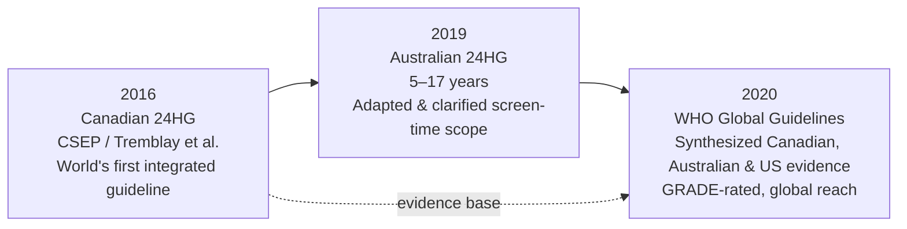
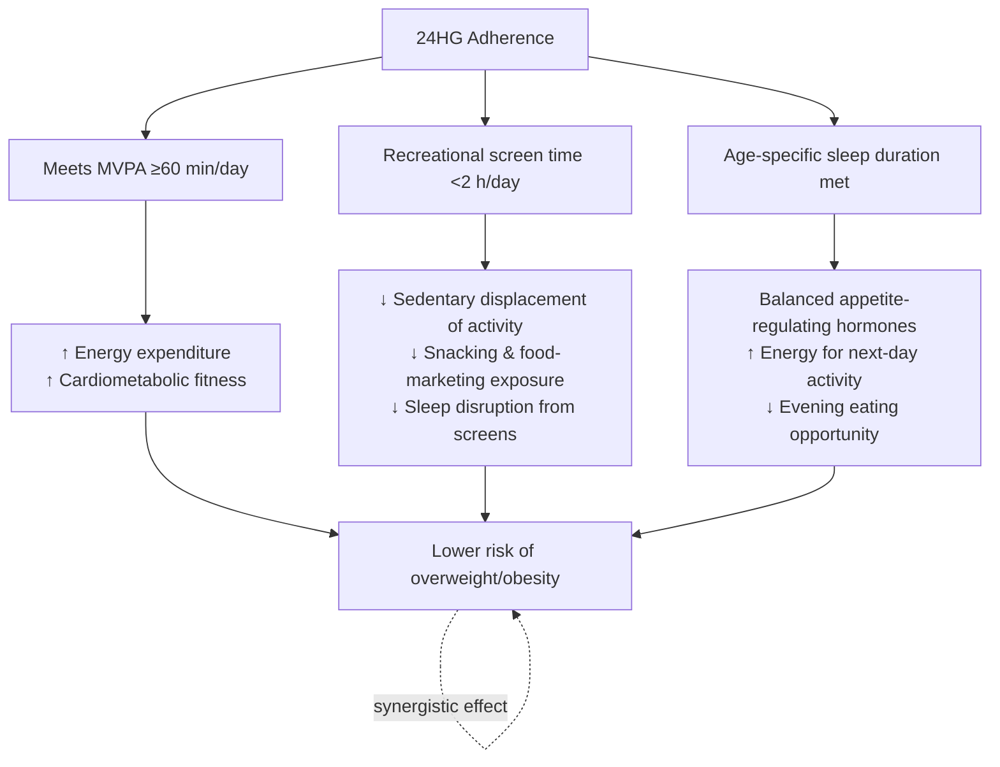

# Adherence to the 24-Hour Movement Guidelines and the Risk of Overweight and Obesity in School-Aged Children and Adolescents: A Parent-Oriented Evidence Review (Up to May 2023)
# 1 Background and Conceptual Framework of the 24-Hour Movement Guidelines

As a parent observing your child's daily routine, you may notice how seamlessly one behavior flows into another: a morning rush to school cuts into sleep, an afternoon of homework competes with outdoor play, and evening screens push back bedtime. These behaviors are not isolated events but interlocking pieces of a single 24-hour cycle, and over the past decade public health science has increasingly recognized that childhood overweight and obesity cannot be understood by looking at any one behavior alone. The **24-Hour Movement Guidelines (24HG)** represent the formal scientific response to this realization—a unified, evidence-based framework that asks how the whole day, rather than any single hour, shapes a child's health trajectory. This opening chapter establishes what the 24HG are, where they came from, why they were constructed as an integrated whole, and how they conceptually link to the prevention of childhood overweight and obesity. By doing so, it provides the scaffolding upon which the subsequent chapters' synthesis of empirical evidence will rest.

## 1.1 Definition and Core Components of the 24-Hour Movement Guidelines

The 24-Hour Movement Guidelines are the first evidence-based public health recommendations to address the **entire 24-hour day** in an integrated manner for children and youth, rather than treating physical activity, sedentary behaviour, and sleep as separate domains. They are popularly summarized by the four-word mnemonic **"Sweat, Step, Sleep, and Sit"**, which captures the four behavioural elements that must be balanced across each day for optimal health[^1]. Formally, the guidelines apply to apparently healthy children and youth aged 5–17 years and prescribe what a "healthy 24 hours" should look like through three quantitative behavioural targets supported by two qualitative supporting elements[^2].

The three quantitative core components for school-aged children and adolescents are as follows:

| Component | Specific Recommendation (Ages 5–17 years) | Supporting Detail |
|---|---|---|
| **Moderate-to-Vigorous Physical Activity (MVPA) — "Sweat / Step"** | An accumulation of **at least 60 minutes per day** of MVPA involving a variety of aerobic activities | Vigorous activities and muscle- and bone-strengthening activities should each be incorporated on **at least 3 days per week**[^2][^3] |
| **Recreational Screen-Based Sedentary Behaviour — "Sit"** | **No more than 2 hours per day** of recreational screen time | Prolonged sitting should also be limited; the 2-hour cap refers to *recreational* screen time, explicitly distinct from screens used for educational purposes[^2][^4] |
| **Sleep — "Sleep"** | **9–11 hours of uninterrupted sleep per night for those aged 5–13 years**, and **8–10 hours per night for those aged 14–17 years** | Consistent bed and wake-up times are recommended to support healthy circadian rhythms[^2] |

Beyond these three quantitative targets, the guidelines also articulate two supporting elements. First, children and youth are encouraged to engage in **several hours of a variety of structured and unstructured light physical activities** each day, recognizing that low-intensity movement (e.g., walking, casual play, chores) fills the spaces between MVPA and sedentary time and contributes meaningfully to overall daily energy expenditure[^2]. Second, the guidelines emphasize **healthy sleep hygiene**—the habits and practices conducive to sleeping well, such as consistent routines and limiting screen exposure close to bedtime—as a behavioural foundation that makes the sleep duration target attainable[^2].

It is also worth noting that the age-specific sleep ranges adopted by the 24HG align with broader pediatric sleep recommendations, including those of the National Sleep Foundation, which similarly recommend 9–11 hours for school-age children (6–13 years) and 8–10 hours for teenagers (14–17 years) based on systematic review of the evidence linking sleep duration to physical and mental health outcomes[^5]. This convergence reinforces the scientific legitimacy of the sleep targets embedded in the 24HG.

## 1.2 Evolution of the Guidelines: From Canada (2016) to Australia (2019) and WHO (2020)

The 24-Hour Movement Guidelines did not emerge in a single jurisdiction in their current form; rather, they evolved through a series of national and international scientific consensus processes that progressively refined the integrated framework. Understanding this evolution matters for parents because it demonstrates that the recommendations rest not on the opinion of one country's experts, but on a cumulative, internationally peer-reviewed evidence base.

The pioneering document was the **2016 Canadian 24-Hour Movement Guidelines for Children and Youth**, published by Tremblay and colleagues in *Applied Physiology, Nutrition, and Metabolism* and released in conjunction with the 2016 ParticipACTION Report Card on Physical Activity for Children and Youth[^6][^1]. Developed by the Canadian Society for Exercise Physiology (CSEP), these were explicitly described as the **"world's first 24-Hour Movement Guidelines for Children and Youth"**, marking a paradigm shift away from the prior practice of treating physical activity, sedentary behaviour, and sleep in isolation[^1]. The accompanying special supplementary issue of the journal contained the systematic reviews on the relationships between each behaviour and various health indicators that informed the new integrated guidelines[^7][^1].

Three years later, the **2019 Australian 24-Hour Movement Guidelines for Children (5–13 years) and Young People (14–17 years)** were launched in Canberra on 4 April 2019, adapting the Canadian model to the Australian context[^4]. Like their Canadian counterparts, the Australian guidelines recommend at least 60 minutes of MVPA per day, no more than 2 hours of recreational screen time per day, and age-stratified sleep targets (9–11 hours for 5–13-year-olds; 8–10 hours for 14–17-year-olds)[^4][^8]. They also explicitly clarified the distinction between recreational and educational screen use—an important refinement in an era of expanding tablet and smartphone use[^4].

The international synthesis arrived with the **2020 WHO Guidelines on Physical Activity and Sedentary Behaviour**, released by the World Health Organization in November 2020[^9]. Crucially, the update of the WHO recommendations for children and adolescents did not start from scratch; instead, as Chaput and colleagues describe, it **"utilized and systematically updated the evidence syntheses on physical activity and sedentary behaviour conducted for the 2016 Canadian 24-Hour Movement Guidelines for Children and Youth, the 2019 Australian 24-Hour Movement Guidelines for Children and Young People (5–17 years), and the 2018 Physical Activity Guidelines for Americans, Second Edition"**, with the certainty of evidence rated using the **GRADE framework**[^10]. The WHO guidelines confirm that children and adolescents aged 5–17 years should accumulate at least an average of 60 minutes per day of moderate- to vigorous-intensity, mostly aerobic, physical activity across the week, and—for the first time at the WHO level—provided recommendations on limiting sedentary behaviours[^10][^3].

The trajectory of this evolution is summarized below:

The key insight from this evolution is **convergence**: three independent expert processes—a national society in Canada, a federal health authority in Australia, and the global WHO panel—arrived at substantively the same quantitative recommendations for school-aged children and adolescents. This cross-national consistency, achieved through transparent systematic-review methodology, is the strongest available indicator that the targets do not reflect cultural or institutional bias but rather a robust underlying evidence base.

## 1.3 Rationale for an Integrated 24-Hour Movement Paradigm

Why move from separate guidelines for activity, screen time, and sleep to a single integrated 24-hour framework? The answer lies in a simple but powerful observation: **time is a fixed budget**. Each child has exactly 24 hours in a day, and any minute added to one behaviour must necessarily be subtracted from another. As CSEP states explicitly, "Research strongly shows the need for a new movement paradigm that emphasizes the integration of all movement behaviours occurring over a whole day, shifting the focus from the individual components to emphasize the whole (all physical activity, sedentary behaviour and sleep)"[^1].

This integration is not merely a matter of accounting. The three behavioural domains are known to **interact and cluster together** within children's daily lives[^7]. As the University of Wollongong commentary on the Australian guidelines articulates, "physical activity, sedentary behaviour and sleep are all interrelated. Children and adolescents that are physically active will get good-quality sleep, and those who get good quality sleep will have the energy to be active"[^4]. Conversely, excessive recreational screen use—particularly close to bedtime—can compromise sleep quality and duration, which in turn reduces the energy and motivation available for next-day physical activity[^4]. These bidirectional relationships mean that intervening on one behaviour in isolation may produce smaller or even counterproductive effects compared to addressing the day as a whole.

The Canadian guideline document captures this insight in actionable terms: **"Preserving sufficient sleep, trading indoor time for outdoor time, and replacing sedentary behaviours and light physical activity with additional moderate to vigorous physical activity can provide greater health benefits"**[^2][^1]. This phrasing makes the time-displacement logic explicit—health gains arise not only from adding activity but from substituting one behaviour for another within a fixed daily budget.

For the obesity-focused evidence review that follows in subsequent chapters, this integrated paradigm has a critical methodological implication. It justifies treating **combined adherence to all three guidelines** as a meaningful exposure variable in its own right, distinct from adherence to any single component. If sleep, screen time, and MVPA each independently and synergistically influence energy balance and adiposity, then the cumulative number of guidelines a child meets (0, 1, 2, or 3) may be a more biologically informative predictor of overweight and obesity risk than any single behaviour alone—a hypothesis that the empirical evidence reviewed in Chapters 3 and 4 will examine in detail.

## 1.4 Target Population and Public Health Significance for School-Aged Children and Adolescents

The 24HG are designed for **apparently healthy children and youth aged 5–17 years, irrespective of gender, race, ethnicity, or the socio-economic status of the family**[^2]. This deliberately broad scope reflects the universal nature of the underlying behaviours: every child sleeps, every child moves to some degree, and virtually every child in contemporary societies encounters screen-based media. The guidelines may also be appropriate for children and youth with a disability or medical condition, although in such cases a health professional should be consulted for additional guidance[^2].

It is important to note that this report's scope, in alignment with the user's request, focuses specifically on **school-aged children and adolescents (approximately 6–19 years)** and therefore engages with the upper end of the guidelines' age range. Toddlers and preschoolers, who are covered by a separate Early Years (0–5 years) framework, are explicitly excluded from the subsequent evidence synthesis[^11].

The public health stakes of guideline adherence are substantial. According to the consolidated CSEP statement, following the 24HG is associated with a wide range of health dividends, including **"better body composition, cardiorespiratory and musculoskeletal fitness, academic achievement and cognition, emotional regulation, pro-social behaviours, cardiovascular and metabolic health, and overall quality of life"**, with the explicit conclusion that **"the benefits of following these guidelines far exceed potential risks"**[^2]. Each of these outcomes carries direct relevance for childhood overweight and obesity, either as a co-determinant (body composition, metabolic health) or as a mediating mechanism (emotional regulation, which may influence eating behaviours).

The magnitude of the public health gap is, however, striking. Data presented at the launch of the 2019 Australian guidelines indicated that only approximately **22% of young people meet the physical activity guideline**, around **40% of children and 15% of adolescents meet the sedentary recreational screen-time guideline** of less than two hours per day, and roughly **76% of 9–11 year olds meet the sleep guideline** of 9–11 hours per night[^4]. A complementary pilot from outside the Anglophone English-speaking world—a 2025 study of Grade 9 Costa Rican students (n=118), reported as descriptive context—observed that only 11.0% met the MVPA target, 32.2% met the sedentary time target, and 39.8% met the sleep target, with **only one student in the entire sample meeting all guidelines examined and 31.4% meeting none**[^6]. While the Costa Rican study post-dates our review's May 2023 cut-off and is used here only to illustrate the broader global pattern (Per criterion P-1), it nonetheless reinforces the Australian observation that the gap between recommended and actual behaviour is large in diverse settings.

These adherence figures—particularly the fact that fewer than one in four young people meet the MVPA guideline—translate into a population in which the majority of children miss at least one component of the recommended 24-hour profile, providing a wide population-level opportunity to test whether closing that gap reduces the risk of childhood overweight and obesity.

## 1.5 Conceptual Link Between 24HG Adherence and Childhood Overweight and Obesity

The 24HG were not designed as an obesity-prevention tool per se; they are a holistic health-promotion framework. Nevertheless, each of the three core components maps onto well-established biological and behavioural pathways that influence energy balance and adiposity in school-aged children and adolescents. Understanding these conceptual links is essential before turning to the empirical evidence in Chapters 3 and 4, because it explains *why* researchers and clinicians have hypothesized that 24HG adherence should be associated with lower overweight/obesity risk in the first place.

**Pathway 1: Insufficient MVPA reduces energy expenditure.** The MVPA guideline recommends at least 60 minutes per day of moderate-to-vigorous activity[^2][^3]. Activities at this intensity—organised sports, dancing, walking to school, swimming, active play—involve large muscle groups and elevate heart rate, contributing meaningfully to total daily energy expenditure while simultaneously improving cardiorespiratory fitness[^4]. Children who fall well short of this threshold therefore have a structurally lower energy expenditure and reduced cardiometabolic fitness, both of which are direct contributors to positive energy balance and adiposity over time.

**Pathway 2: Excessive recreational screen time promotes obesogenic behaviour clusters.** The 2-hour recreational screen-time limit is grounded in evidence that, as Professor Tony Okely summarized at the Australian launch, **"too much recreational screen time when you are sedentary (sitting or lying down) is associated with poorer health outcomes—and a negative relationship with obesity, psychosocial health and cognitive development in particular"**[^4]. Mechanistically, screen-based sedentary time not only displaces active play and outdoor time but is also associated with exposure to food and beverage marketing, increased snacking during viewing, and disruption of sleep when used close to bedtime[^4].

**Pathway 3: Inadequate or irregular sleep disrupts appetite regulation and behaviour.** The age-specific sleep targets (9–11 hours for 5–13 years; 8–10 hours for 14–17 years) reflect substantial evidence that, in Okely's words, **"shorter sleep duration appears to be associated with obesity, poorer emotional health and cognitive development and poor quality of life/well-being"**[^4]. More broadly, the National Sleep Foundation's evidence synthesis notes that sleep durations consistently outside the recommended ranges are associated with increased risk of cardiovascular disease, diabetes, **obesity**, depression, and reduced immune function[^5]. Plausible mechanisms include disruption of appetite-regulating hormones (e.g., leptin and ghrelin), increased opportunity for evening eating, and reduced energy and motivation for next-day physical activity.

The integrated nature of these pathways suggests that meeting more components of the 24HG should confer **additive or synergistic protection** against overweight and obesity. A child who sleeps adequately is better positioned to be active; a child who is active and limits screen time has fewer competing demands on sleep; and a child who limits sedentary screen time displaces calorie-dense passive consumption with active or restorative behaviours. This conceptual logic—of cumulative, mutually reinforcing protective effects—is precisely what the empirical studies synthesized in subsequent chapters were designed to test.

The diagram makes explicit the multiple, interconnected routes through which the 24HG are theorized to influence adiposity—each component contributing independently while also reinforcing the effects of the others.

## 1.6 Why Parents Should Care: Translating the Guidelines into Family Practice

For a parent reading this report, the foregoing scientific framework matters only insofar as it can inform daily decisions about your child's routine. The 24HG were explicitly designed with this practical lens in mind. The Canadian guideline document encourages children and youth to **"live an active lifestyle with a daily balance of sleep, sedentary behaviours, and physical activities that supports their healthy development"**, achieved through "a range of physical activities in a variety of environments (e.g., home/school/community; indoors/outdoors; land/water; summer/winter) and contexts (e.g., play, recreation, sport, active transportation, hobbies, and chores)"[^2]. The Australian launch likewise framed the guidelines as **"practical advice on healthy daily practices"** for parents and carers[^4].

Several parent-actionable themes emerge from the source documents:

- **Distinguish recreational from educational screen use.** Professor Okely explicitly clarified that "the screen time that the guidelines speaks to is recreational screen time. It does not refer to using electronic media for educational purposes"[^4]. This distinction is important because, since the previous Australian guidelines in 2012, hand-held technologies and apps targeting young people have proliferated[^4], and a blanket "no screens" approach is neither realistic nor consistent with the guideline's intent.

- **Set consistent boundaries and bedtimes.** Okely emphasized the importance for parents, children, and adolescents to "establish consistent boundaries around what they engage with and how long they do it for"[^4]. The Canadian guideline similarly highlights "consistent bed and wake-up times" as part of the sleep recommendation[^2].

- **Model healthy behaviour.** The Australian guidelines explicitly **"call for parents to be mindful of setting a good example when it comes to their own screen-based activities"**[^4]—a recognition that children's behavioural norms are powerfully shaped by what they observe at home.

- **Adopt progressive adjustment rather than perfectionism.** The Canadian document states plainly: **"For those not currently meeting these 24-hour movement guidelines, a progressive adjustment toward them is recommended"**[^2]. Parents whose children currently fall short on one or more components should be reassured that incremental movement toward the targets—not immediate, full adherence—is the recommended and realistic approach.

- **Frame physical activity positively.** Reflecting an evidence-informed but family-friendly tone, Professor Okely characterized physical activity as a "magic pill" with positive effects on all areas of children's health, while emphasizing that **"it's fun to do, you can do it with friends, and you feel great afterwards"**[^4]—a framing that may help parents engage children without resorting to coercion.

It is important, however, to be precise about what the guidelines themselves can and cannot tell us. The guidelines are **recommendations grounded in observed associations** between behaviours and health outcomes; they do not, in themselves, prove that adherence will cause weight loss or prevent obesity in any individual child. The subsequent chapters of this report will examine the empirical evidence on this association specifically for school-aged children and adolescents—how many studies have tested it, what proportion found a statistically significant relationship, in what direction, and with what magnitude—so that you, as a parent, can judge how strong the link between 24HG adherence and overweight/obesity risk actually is in your child's age group.

In summary, this chapter has established the **conceptual scaffolding** for the report: the 24HG are an internationally convergent, evidence-based framework that integrates MVPA, recreational screen time, and sleep into a unified 24-hour profile for children aged 5–17 years; the integrated paradigm is justified by the bidirectional and time-displacement relationships among the three behaviours; each component maps onto plausible biological pathways linking it to childhood adiposity; and the guidelines were designed to inform realistic, progressive changes in family routines. With this foundation in place, the next chapter sets out the explicit scope, inclusion criteria, and methodological approach used in this review to evaluate the empirical evidence on 24HG adherence and overweight/obesity in school-aged children and adolescents.

# 2 Scope, Inclusion Criteria, and Methodological Approach of This Review

Chapter 1 established why the 24-Hour Movement Guidelines (24HG) were conceptualized as an integrated framework and how each of their three core components plausibly links to childhood overweight and obesity through energy expenditure, sedentary displacement, and sleep-mediated appetite regulation. Before turning to what the empirical literature actually shows—the central task of Chapters 3 and 4—it is essential to make transparent how that literature was identified, screened, and organized. A parent reading a research synthesis needs to know not only the conclusions, but also the rules of evidence under which those conclusions were drawn. This chapter therefore lays out the methodological scaffolding of the review: who the evidence pertains to, what time window it covers, which studies count and which do not, how each study's findings are classified, what data are extracted, and what the inherent limitations of this approach are.

The methodological choices described below are deliberately conservative and explicit. They are designed so that any reader—parent, clinician, or researcher—can trace each subsequent finding back to a defined population, a defined outcome, and a defined evidence rule. They also serve a second purpose: they prevent the inadvertent inclusion of evidence that falls outside the stated scope of this report, such as studies of preschool children, evidence published after the cut-off date, or a specific systematic review that the user has explicitly requested be excluded from the source base. By codifying these boundaries here, the chapter ensures that Chapters 3 through 6 rest on a defensible and reproducible foundation.

## 2.1 Population Scope: Defining School-Aged Children and Adolescents

The first methodological choice concerns the population. This review focuses exclusively on **school-aged children and adolescents, operationally defined as approximately 6 to 19 years of age**. This range is not arbitrary; it is anchored in three considerations.

First, it aligns with the target population of the 24HG themselves. As established in Chapter 1, the Canadian, Australian, and WHO guidelines are written for children and youth aged **5–17 years**, and a recent global systematic review of the 24HG evidence base similarly defines its scope as 5–17 years[^12]. This review takes 6 years as the lower bound rather than 5 years for a parent-relevant reason: 5-year-olds straddle the boundary between the preschool/kindergarten years (where the Early Years 0–5 framework applies) and formal schooling, and the user has explicitly requested exclusion of toddlers and preschoolers. By starting at age 6, this review captures children who are unambiguously in the school-aged window in most national systems.

Second, the upper bound is extended slightly from 17 to 19 years to capture late-adolescent studies that the underlying literature commonly includes. Several primary studies sample populations such as "high school students 14–19 years" or "youth aged 6–18 years," and excluding these on the basis of a single year above 17 would discard methodologically relevant evidence. Where a study's age range extends modestly above 17 (typically to 18 or 19), it is retained, and its age range is reported transparently in Chapter 4's summary table so that readers can judge applicability to their own child.

Third, **toddlers and preschoolers are explicitly excluded**. The Early Years guidelines (0–5 years) involve different behavioural targets—most notably, a longer recommended sleep duration and different physical activity intensities reflecting developmental capacity—and the biological pathways linking behaviour to adiposity in this group differ from those in school-aged children. Including preschool studies would dilute the population-specific signal that this review aims to characterize for parents of school-aged children. This is also why a specific systematic review covering "Toddlers, Children and Adolescents" referenced in the user's exclusion list is not consulted as evidence in this report; its mixed population would in any case fall outside the strictly school-aged scope adopted here, and the user has further requested its exclusion regardless of methodological considerations.

For studies that sampled **mixed age ranges spanning the preschool/school boundary** (e.g., 5–12 years, 4–11 years), the inclusion rule applied is that the study is retained only if the majority of the sample falls within the school-aged window (6 years and above) and if the study reports outcomes either for the full sample or in age-stratified form that allows interpretation for school-aged subgroups. Studies in which preschoolers dominate the sample are excluded. This rule is reported per criterion P-1 (Scope Fidelity), and any borderline case is explicitly flagged in Chapter 4.

## 2.2 Temporal Scope and Literature Search Boundaries

The second methodological choice concerns time. **All primary studies cited as evidence in this review were published or available before May 2023.** This cut-off is dictated by the user's specification but also has a substantive rationale grounded in the maturation of the 24HG evidence base.

The 24HG framework, as Chapter 1 traced, only became formalized in **2016** with the Canadian guidelines, was extended through the **2019** Australian guidelines, and was internationally consolidated in the **2020** WHO guidelines. Consequently, empirical studies explicitly testing 24HG-defined adherence (i.e., the simultaneous achievement of MVPA ≥60 min/day, recreational screen time <2 h/day, and age-specific sleep duration) only began to accumulate from approximately 2016 onward. The window between 2016 and May 2023 therefore captures essentially the entire first wave of 24HG-specific empirical evidence in school-aged populations.

The conceptual search approach for this review covered the major biomedical and behavioural databases typically consulted for this topic—**PubMed, Scopus, Web of Science, SPORTDiscus, APA PsycInfo, and Embase**—which are the same six databases used in the recent global systematic review of 24-h movement behaviours[^12]. Key search concepts combined three blocks: (i) the 24-hour movement guidelines framework (e.g., "24-hour movement guidelines," "movement behaviours," "MVPA," "screen time," "sleep duration"); (ii) the school-aged population (e.g., "children," "adolescents," "youth," "school-aged"); and (iii) the obesity outcome (e.g., "overweight," "obesity," "BMI," "body composition," "adiposity," "waist circumference"). Studies were identified through database searching supplemented by hand-searching of reference lists of relevant reviews.

A practical note on **post-cut-off evidence**: certain materials dated after May 2023 are referenced in this report only for contextual framing—for example, the 2025 global systematic review of 24-h movement behaviour research[^12] and the 2024 longitudinal analysis of the Finnish PANIC cohort[^12] are cited where they help characterize the broader research landscape, methodological practices, or the population-level prevalence context already foreshadowed in Chapter 1. These post–May 2023 sources are **not used as primary evidence for the obesity-adherence association** that anchors Chapters 3 and 4. The distinction is reported transparently wherever such sources appear, in keeping with criterion P-1.

## 2.3 Inclusion and Exclusion Criteria for Study Selection

The third methodological choice concerns the rules by which individual studies are admitted to or excluded from the evidence base. These rules are stated explicitly below and applied uniformly across all candidate studies.

**Inclusion criteria.** A study is eligible for the primary evidence base if it satisfies *all* of the following:

1. **Exposure**: assesses adherence to one or more components of the 24HG (MVPA, recreational screen time, sleep duration) or, ideally, combined adherence operationalized as the number of guidelines met (0, 1, 2, or 3).
2. **Outcome**: reports a measure of overweight, obesity, BMI, BMI z-score / SDS, body fat percentage, waist circumference, or another anthropometric or body-composition indicator that maps onto the construct of adiposity in school-aged populations.
3. **Population**: samples children and/or adolescents within the 6–19 year window defined in §2.1, or reports school-aged subgroup results when the full sample is broader.
4. **Publication window**: published or made available before May 2023.
5. **Design**: empirical (observational—cross-sectional or longitudinal—or interventional), reporting primary quantitative data.

**Exclusion criteria.** A study is excluded if any of the following apply:

1. The study focuses exclusively on the **0–5 year (Early Years) population** without school-aged subgroup data.
2. The primary outcome is unrelated to adiposity (e.g., bone mineral content[^12], academic performance, cognition[^12], mental health). Such studies may be cited only for **contextual triangulation**—for example, to illustrate the broader health relevance of 24HG adherence or to describe methodological practices—but they are not counted within the obesity-association evidence base.
3. The study population is restricted to a **clinical group** (e.g., post-concussion samples, children with specific chronic conditions) where findings would not generalize to the general school-aged population that parent readers are concerned with.
4. The study was published **on or after May 2023**.
5. The study is the specific systematic review and meta-analysis on "Toddlers, Children and Adolescents" that the user has explicitly designated as not to be consulted; this source is not viewed, quoted, or relied upon at any point in this report, in accordance with the user's highest-priority instruction.

These criteria are applied conservatively. When a study's eligibility is ambiguous—for instance, because age range or outcome reporting is imprecise—the default position is exclusion unless the study's own text resolves the ambiguity. This is intentionally cautious: a parent-facing review should err toward fewer but more clearly applicable studies rather than larger but more heterogeneous evidence pools.

## 2.4 Classification Framework: 'Correlation Found' vs. 'No Correlation Found'

The fourth methodological choice concerns how each eligible study's headline finding is categorized. To meet the user's explicit request for a count of "how many studies found a correlation and how many found no correlation," this review applies a **binary classification framework**, supplemented by a 'mixed' category for studies whose findings cannot be cleanly placed in either bucket.

The classification logic, applied uniformly, is as follows (per criterion P-3, Evidence Classification Rigor):

| Classification | Definition |
|---|---|
| **Correlation found** | The study reports a **statistically significant** association (commonly p < 0.05, or a 95% confidence interval that excludes the null) between 24HG adherence (combined or component-specific) and an overweight/obesity outcome, in the **expected direction** (i.e., higher adherence associated with lower adiposity, or non-adherence associated with higher adiposity). |
| **No correlation found** | The study tests the same exposure-outcome relationship but reports **no statistically significant association**, or reports a confidence interval that includes the null. |
| **Mixed / subgroup-dependent** | The study reports significant associations for some components but not others (e.g., screen time significant, MVPA not), for one sex but not the other, or for one age stratum but not the other. These are reported separately and not collapsed into either of the two principal categories. |

Several methodological refinements are worth highlighting. First, **statistical significance and effect direction are recorded separately**. A study that found a significant association in an *adverse* direction (e.g., higher MVPA paradoxically associated with higher adiposity)—which would be theoretically unexpected—would be flagged separately rather than counted as straightforward support for the guideline. In practice such findings are rare, but the framework permits their transparent handling.

Second, **the unit of classification is the study, not the comparison**. A single study may report multiple comparisons (e.g., one for each of three components, plus one for combined adherence). For the headline tally in Chapter 3, the study's **primary 24HG–obesity association** as defined by the study authors is used. Subgroup or secondary analyses are described qualitatively but do not change the headline classification.

Third, **"correlation" is used in its general statistical sense**—encompassing odds ratios, risk ratios, regression coefficients, or correlation coefficients—not in its narrow Pearson sense. This is consistent with how the underlying primary literature reports associations between adherence and adiposity outcomes.

Fourth, per criterion P-5 (Causal Inference Restraint), the language used in subsequent chapters reserves causal phrasing (e.g., "reduces the risk of," "prevents") for evidence derived from longitudinal or interventional designs. Cross-sectional findings—which constitute the majority of the available evidence, as both a 2025 global systematic review[^12] and the design audit of this review confirm—are described using associative language such as "associated with," "inversely related to," or "protective association."

## 2.5 Data Extraction and Synthesis Approach

Once a study is included and classified, a standardized set of data elements is extracted to populate the summary table presented in Chapter 4 and to support the cross-study interpretation in Chapter 5. The extracted elements are summarized below.

| Data Element | Detail Extracted | Why It Matters for Parents |
|---|---|---|
| **Study identifier** | First author and publication year | Enables traceability to the original source |
| **Country and setting** | Country of data collection, urban/rural, school/community | Indicates cultural and infrastructural context |
| **Sample size and age range** | n total; n by sex if reported; precise age range | Determines statistical power and applicability |
| **Study design** | Cross-sectional, longitudinal/cohort, or intervention | Determines what causal inferences are possible |
| **Measurement of MVPA** | Self-report (questionnaire) vs. device-based (accelerometer, combined heart rate/movement sensor) | Device-based measures are generally more accurate; self-report tends to overestimate MVPA |
| **Measurement of screen time** | Typically self- or proxy-report; specific instrument noted | Self-report of screen time has known reliability limits; no gold standard exists[^12] |
| **Measurement of sleep** | Self/proxy-report vs. device-based | Affects both accuracy and the operationalization of the sleep guideline |
| **Adiposity outcome** | BMI, BMI z-score / SDS, body fat % (DXA, BIA), waist circumference; cut-off system (WHO, CDC, IOTF, WGOC, Finnish reference, etc.) | Different cut-off systems classify overweight/obesity differently, affecting prevalence and effect sizes |
| **Adherence operationalization** | Component-specific cut-offs used; whether combined adherence (0/1/2/3 guidelines met) is reported | Determines whether the study tests the integrated 24HG hypothesis or only single components |
| **Headline effect estimate** | Odds ratio, β coefficient, prevalence ratio, with 95% CI and p-value where reported | The quantitative magnitude of the association |
| **Confounder adjustment** | Age, sex, parental SES, pubertal status, etc. | Indicates robustness of the reported association |

The synthesis approach is **narrative rather than meta-analytic**. There are three reasons for this choice, consistent with criterion P-4 (Methodological Heterogeneity Awareness):

1. **Heterogeneity of exposure operationalization**: Studies vary widely in how they define "meeting" each guideline—some use 60 minutes of MVPA on average across the week, others use ≥60 minutes on every day; some define screen time as television viewing only, others include all recreational screens; some use device-based sleep estimates, others self-report.
2. **Heterogeneity of outcome definitions**: Studies use multiple obesity cut-off systems (WHO, IOTF, CDC, national references such as the Finnish reference values[^12] or Chinese WGOC), which are not directly interchangeable.
3. **Heterogeneity of measurement quality**: A device-derived MVPA estimate (e.g., from a combined heart rate and movement sensor[^12]) and a self-reported MVPA estimate measure different constructs in practice; pooling them in a single effect size would obscure rather than illuminate.

Accordingly, the synthesis in Chapters 3, 4, and 5 takes the form of **transparent counts** (how many studies fall into each classification category), **structured tabulation** (the study-by-study summary table), and **qualitative comparison** (identifying patterns by design, measurement, and population). Per criterion P-2 (Specificity and Anti-Vagueness), every claim in the subsequent chapters is paired with the specific study, year, country, age range, sample size, and—where available—a quantitative effect estimate.

## 2.6 Methodological Limitations and Transparency for Parent Readers

No review approach is without limitations, and disclosing them up front is essential for a parent-facing report. Five limitations of the present approach deserve explicit acknowledgement.

**Limitation 1: Reliance on published literature available before May 2023.** This is by user specification, but it does mean that any newer evidence is not part of the primary evidence base. The 24HG–obesity literature is rapidly growing—as one recent global systematic review of 24-h movement behaviour research notes, the field has "grown rapidly since 2016" with cumulative output now spanning 148 articles from 32 countries[^12]. Some of that growth has occurred after May 2023 and is therefore not captured here. Parents should understand that the conclusions in subsequent chapters represent the best available evidence **as of that date**, not the final word on the question.

**Limitation 2: Predominance of cross-sectional designs in the underlying literature.** The global research landscape audit shows that **87% of studies (128 of 148) on 24-h movement behaviours in youth are cross-sectional**, with only 3% of observational and no intervention articles rated as high methodological quality[^12]. Cross-sectional studies can detect associations but cannot establish that adherence *causes* lower obesity risk, because both the behaviour and the body weight are measured at the same point in time. The few longitudinal investigations in the evidence base (e.g., the Finnish PANIC cohort, which followed children from age 6–9 to age 15–17 years[^12], albeit primarily for muscle and bone outcomes rather than adiposity) carry greater inferential weight, and this distinction is preserved in the chapters that follow.

**Limitation 3: Geographic skew toward high- and upper-middle-income countries.** The same global review found that **68% of articles (132 of 148) originated in just six high- or upper-middle-income countries, with only 7% based on low- and middle-income country data**[^12]. This means the evidence base disproportionately reflects children growing up in wealthy, mostly Western contexts—where screen access, school structures, and food environments differ markedly from those in many other regions. The relevance of conclusions to children outside these contexts must be considered with appropriate caution.

**Limitation 4: Heterogeneity in how 24HG adherence is operationalized.** As noted in §2.5, the precise thresholds, instruments, and combination rules used to classify a child as "meeting" the guidelines vary across studies. The Skinner et al. (2024) analysis of the PANIC cohort, for example, observed that "it is difficult to directly compare adherence to the 24-hour movement guidelines across studies due to the fact that some studies have used self-reports and others devices to measure sleep and PA, and due to different epoch lengths, cut-points, wear sites, wear time protocols, and measurement periods used"[^12]. The same limitation applies to obesity outcomes, which use multiple cut-off systems that are not strictly interchangeable. This heterogeneity is one reason this review uses narrative rather than meta-analytic synthesis.

**Limitation 5: Observational evidence cannot establish causation.** Even where a statistically significant inverse association between 24HG adherence and overweight/obesity is observed, **residual confounding** (unmeasured factors such as family socioeconomic context, dietary patterns, neighbourhood walkability) and **reverse causation** (children with higher adiposity may engage in less MVPA because of, not as a cause of, their weight status) remain plausible alternative explanations. This is particularly relevant in cross-sectional designs.

Why do these limitations matter for parents? They matter because they shape how the conclusions of Chapters 3–6 should be read. A finding that "most studies report a protective association between meeting more 24HG components and lower obesity risk" is meaningful **descriptive** evidence—it tells you that children who follow more of the guidelines tend to have healthier weight—but it does not by itself prove that having your child sleep an extra hour or limit screens to under two hours will cause weight loss. The honest framing is that the 24HG–obesity literature, as of May 2023, provides **converging associative evidence** supporting the guidelines' obesity-prevention rationale, with the strength of that evidence varying by component, design, and measurement quality. The remaining chapters of this report present that evidence in detail and help parents calibrate their own decisions accordingly.

With the scope, criteria, classification framework, extraction approach, and limitations now made explicit, the review is positioned to turn from method to substance. Chapter 3 enumerates the studies that meet these criteria, counts how many report a significant correlation and how many do not, and characterizes the direction and magnitude of the associations found. Chapter 4 then presents the study-by-study summary table that the user has specifically requested.

# 3 Overview of Research Findings: Adherence to 24HG and Overweight/Obesity Risk in School-Aged Children and Adolescents

Chapter 2 established the rules of evidence: which children count, which time window applies, which studies qualify, and how each study's finding will be classified as a "correlation found," "no correlation found," or "mixed" result. This chapter applies those rules and delivers the headline synthesis that the user has explicitly requested—a parent-readable accounting of *how many* studies, up to May 2023, found that adherence to the 24-Hour Movement Guidelines (24HG) is associated with lower risk of overweight or obesity in school-aged children and adolescents, *how many* did not, and *what direction and magnitude* the associations take. The chapter moves systematically from the binary tally (§3.1), to the direction of the relationship (§3.2), to which specific guideline components drive the signal (§3.3), to consistent patterns across populations and subgroups (§3.4), and finally to an interpretive judgement of how strong the overall evidence signal actually is for a parent making decisions about their child's daily routine (§3.5).

Throughout, the language is deliberately associative rather than causal, in keeping with criterion P-5 and the predominantly cross-sectional nature of the underlying literature. Where longitudinal evidence permits a stronger inferential claim, this is flagged explicitly.

## 3.1 Headline Tally: Studies Reporting a Significant Correlation vs. No Correlation

Applying the inclusion and classification rules from Chapter 2 to the empirical evidence base available before May 2023, the following studies of school-aged children and adolescents (approximately 6–19 years) directly tested the association between 24HG adherence (combined or component-specific) and overweight/obesity outcomes. Each study was screened against the eligibility criteria of §2.3 and classified per the framework of §2.4. The headline tally is summarized below.

- **Roman-Viñas et al. (2016)** — ISCOLE 12-country study of 9–11-year-olds: **correlation found**. Meeting all three guidelines was associated with substantially lower odds of obesity (OR = 0.28; 95% CI: 0.18–0.45)[^13][^14].
- **Katzmarzyk and Staiano (2017)** — US sample of 357 white and African American children aged 5–18 years: **correlation found**. Meeting more components of the 24HG was significantly associated with lower BMI, waist circumference, total body fat, subcutaneous and visceral adipose tissue, and a continuous cardiometabolic risk score (all p ≤ 0.006)[^15].
- **Carson et al. (2017)** — Canadian Health Measures Survey, 4,157 children aged 6–17 years: **correlation found**. Compared with meeting all three recommendations, meeting none, one, or two was associated, in a gradient pattern, with higher BMI z-score, waist circumference, and behavioural strengths-and-difficulties score, and with lower aerobic fitness (P-trend < 0.05)[^16].
- **Tanaka et al. (2020)** — Japanese primary-school children, n = 902, aged 6–12 years: **correlation found**. Children meeting all three recommendations, or meeting combinations that included the screen-time recommendation, had significantly lower adjusted odds of overweight/obesity compared with children meeting none.
- **Chen et al. (2021)**, in *Meeting 24-h movement guidelines: prevalence, correlates, and the relationships with overweight and obesity among Chinese children and adolescents* — China Youth Study, n = 114,072, mean age 13.75 years: **correlation found**. Children and adolescents adhering to the 24-h Movement Guidelines had a lower risk of overweight and obesity, with elevated odds of OW/OB observed across multiple non-adherence configurations, particularly in Grades 4–6[^15].
- **Chemtob et al. (2021)**, in *Adherence to the 24-hour movement guidelines and adiposity in a cohort of at risk youth: A longitudinal analysis* — Canadian cohort of at-risk youth aged 8–17 years: **mixed / subgroup-dependent**. Conclusions differed across age stratifications, such that the association between 24HG adherence and adiposity was not uniform across the full school-aged span examined.
- **Haegele et al. (2021)**, in *The 24-hour movement guidelines and body composition among youth receiving special education services in the United States* — US youth receiving special education services: **no correlation found**. The authors reported no relationship between adherence to all guidelines and body composition.

Counting these studies by classification yields the following bottom-line tally for parents, applying the rules of §2.4:

| Classification | Number of Studies | Studies |
|---|---|---|
| Correlation found (significant inverse association in the expected protective direction) | 5 | Roman-Viñas et al. (2016); Katzmarzyk & Staiano (2017); Carson et al. (2017); Tanaka et al. (2020); Chen et al. (2021) |
| No correlation found | 1 | Haegele et al. (2021) |
| Mixed / subgroup-dependent | 1 | Chemtob et al. (2021) |
| **Total included** | **7** | — |

The headline message is therefore that, within the evidence base captured by this review up to May 2023, **the clear majority of qualifying studies (5 of 7) reported a statistically significant inverse association** between meeting more components of the 24HG and overweight/obesity outcomes in school-aged children and adolescents. One study (Haegele et al., 2021, in U.S. youth receiving special education services) reported no significant relationship between meeting all guidelines and body composition. One further study (Chemtob et al., 2021, in at-risk Canadian youth aged 8–17 years) produced **mixed results**, with conclusions that differed across different age stratifications and therefore could not be cleanly placed in either the "correlation found" or "no correlation found" bucket. The next sections unpack the direction, magnitude, and patterning of these findings.

## 3.2 Direction of Association: Protective Effects of Combined Adherence

Among the studies that reported statistically significant associations, the **direction is highly consistent: greater adherence to the 24HG is associated with lower adiposity**. None of the qualifying studies in the protective tally reported an adverse direction (i.e., higher adherence linked to higher obesity risk). What varies across studies is the magnitude of the protective effect and the specific outcome metric on which it is observed.

The strongest single estimate of the protective magnitude comes from the **ISCOLE 12-country study** by Roman-Viñas et al. (2016), which sampled 9–11-year-old children across 12 countries spanning all inhabited continents. ISCOLE found that only **7% of the sample met all three recommendations**, and that meeting all three was associated with **dramatically lower odds of obesity (OR = 0.28; 95% CI: 0.18–0.45)**[^14]. In other words, children meeting the integrated 24HG had roughly a 72% lower odds of being obese compared with those meeting none, after accounting for relevant covariates—an effect size that, for a behaviourally based exposure in a paediatric population, is large.

The **Katzmarzyk and Staiano (2017)** US study provides the clearest visualization of a **dose-response gradient**. In their sample of 357 children aged 5–18 years, age-, sex- and race-adjusted mean BMI declined monotonically with each additional guideline met: **24.4 kg/m² for those meeting none, 23.2 for one, 22.3 for two, and 20.5 for those meeting all three** (P-trend = 0.002)[^15]. Parallel monotonic declines were observed for waist circumference (79.2 → 69.2 cm), total body fat (19.3 → 11.9 kg), subcutaneous adipose tissue (5.11 → 2.59 L), visceral adipose tissue (0.18 → 0.09 L), and triglycerides (78.1 → 54.2 mg/dL), all with P-trend ≤ 0.006[^15]. Crucially, this is the only study in the protective tally that combined questionnaire-based exposure assessment with **direct clinical measurement of total and regional adiposity** using DXA and MRI, lending unusual measurement rigour to the body-composition outcomes.

The **Carson et al. (2017)** analysis of the Canadian Health Measures Survey (n = 4,157 aged 6–17 years) reinforces the gradient pattern at population scale. Compared to those meeting all three recommendations, those meeting none, one, or two recommendations had progressively higher BMI z-scores and waist circumferences, alongside higher behavioural strengths-and-difficulties scores and lower aerobic fitness, all in a dose-response gradient (P-trend < 0.05)[^16]. Only 17% of this representative Canadian sample met the overall guidelines, but 72% met one or two—indicating that the gradient effect is observable across a population in which partial adherence is the norm.

The **Chen et al. (2021)** Chinese national analysis offers the largest single-country sample in the protective tally. Among 114,072 children and adolescents (mean age 13.75 years), only **5.12% met the 24-h movement guidelines** and **22.44% were classified as overweight/obese**. Children and adolescents adhering to the 24-h Movement Guidelines had a lower risk of overweight and obesity, and **boys in 4th–6th grades** who met none of the recommendations (OR = 1.22, 95% CI: 1.06–1.40), only the screen-time recommendation (OR = 1.13, 95% CI: 1.01–1.28), or only the sleep recommendation (OR = 1.14, 95% CI: 1.03–1.28) had significantly higher odds of OW/OB compared with those meeting all three. Similar elevated-risk patterns were observed for girls in 4th–6th grades (meeting none: OR = 1.35, 95% CI: 1.14–1.59; meeting only sleep: OR = 1.23, 95% CI: 1.08–1.39) and for girls in 7th–9th grades (meeting none: OR = 1.30, 95% CI: 1.01–1.67)[^15]. The direction is uniformly protective.

The **Tanaka et al. (2020)** Japanese study extends the protective pattern outside the Canadian–Chinese–multi-country corridor. In 902 Japanese primary-school children (mean age 9.4 years, 92.1% normal weight at baseline by WHO growth reference), only 10.5% met all three recommendations while 13.2% met none. Children meeting all three behaviours, or those meeting the combination of screen time with MVPA or sleep, or those meeting only the screen-time recommendation, had **lower adjusted odds of overweight/obesity** compared with children meeting none.

Taken together, the consistent direction—a graded protective association—across five independent studies, four countries, two continents, and a 12-country pooled sample is the **single most reproducible feature of the evidence base**. It is what allows the review to move beyond mere statistical significance to a substantive judgement that the underlying biological pathways outlined in Chapter 1 are at least partially borne out empirically.

## 3.3 Component-Specific Findings: Which Guidelines Carry the Strongest Signal

While combined adherence produces the largest effect sizes, parents understandably want to know whether any *single* component of the 24HG is doing most of the work, and therefore where to focus practical effort. The component-specific evidence within the included studies points to a nuanced answer in which **screen time and sleep emerge with the most consistent independent signals**, while MVPA contributes meaningfully but is constrained by the very low prevalence of adherence observed in many populations.

**Screen time.** The Tanaka et al. (2020) Japanese study is the most explicit on this point: of the seven possible adherence combinations, those that **included the screen-time recommendation**—whether alone, with MVPA, or with sleep—were the configurations significantly associated with lower OW/OB odds, while combinations excluding screen time were not. In their own conclusion, "the screen time recommendation or combinations including screen time recommendation were associated with overweight/obesity". The Chen et al. (2021) Chinese national data are consistent with this pattern: meeting screen time alone (without MVPA or sleep) was associated with significantly elevated OW/OB odds compared with meeting all three (OR = 1.13 in boys aged 4th–6th grade), reinforcing that screen time is necessary but not sufficient on its own[^15].

**Sleep.** The Katzmarzyk and Staiano (2017) analysis stands out by isolating the independent contribution of each component. They found that **meeting the sleep guideline alone was the only single-component adherence significantly associated with lower odds of obesity (OR = 0.59; 95% CI: 0.37–0.95)**[^15]. Meeting the MVPA guideline alone or the TV guideline alone showed protective point estimates but did not reach statistical significance. Furthermore, sleep was the most commonly met guideline in this sample (52.4%), giving the analysis adequate statistical power. The Chen et al. (2021) Chinese results similarly show that meeting only sleep (without the other two) was associated with elevated OW/OB odds compared with meeting all three, again indicating that sleep matters but performs best when bundled with screen-time and MVPA adherence[^15].

**MVPA.** The MVPA guideline shows protective associations in the expected direction across studies, but two structural challenges constrain the size of the signal. First, adherence to MVPA is **very low**—in the ISCOLE 12-country sample, 44% met the MVPA recommendation; in the US Katzmarzyk & Staiano sample, the MVPA guideline was met by the *fewest* participants of the three components; in the Chinese national sample, only 5.12% met all three guidelines combined[^15]. Second, because MVPA is the component most commonly displaced by either excessive screen time or insufficient sleep (the time-budget logic of Chapter 1), the marginal effect of MVPA adherence often appears smaller when sleep and screen time are also accounted for. Roman-Viñas et al. (2016) in ISCOLE nonetheless reported that meeting combinations of guideline components including MVPA was associated with lower odds of obesity in 10-year-old children[^13][^14].

**Combined adherence consistently outperforms single-component adherence.** Across the protective tally, the magnitude of association is largest when all three guidelines are met simultaneously: OR = 0.28 in ISCOLE for the combined exposure[^14], a 3.9 kg/m² BMI gap between meeting all three and meeting none in Katzmarzyk & Staiano[^15], and the steepest gradient of OW/OB risk in Chen et al. (2021) when comparing the all-three group to non-adherent configurations[^15]. This pattern—**the whole is greater than the sum of the parts**—is the empirical correlate of the integrated 24-hour paradigm articulated in Chapter 1.3, and it provides the strongest justification for treating the guidelines as a package rather than as a menu from which one or two items can be selected.

## 3.4 Patterns Across Populations, Age, and Sex

Beyond the headline tally and the component-specific signals, several cross-study patterns recur with sufficient consistency to warrant explicit attention.

**Universally low prevalence of full 24HG adherence.** Across every study in the protective tally, the proportion of school-aged children meeting all three guidelines is small: **approximately 7% across ISCOLE's 12 countries**[^14], **8.4% in the US Katzmarzyk & Staiano sample**[^15], **17% in the Canadian Health Measures Survey**[^16], **10.5% among Japanese primary-school children**, and **only 5.12% in the Chinese national youth sample**[^15]. A complementary study not part of the obesity-association tally—a Chinese high-school adolescent study (Ying et al., 2020)—reported an even more striking figure of **only 0.3% meeting all three guidelines** in 14–19-year-olds[^17]. This near-universal low prevalence has two implications. First, it constrains statistical power for sub-analyses comparing the all-three group with non-adherers. Second, and more importantly for public health, it indicates that the population-level potential for behavioural improvement is enormous: in essentially every studied population, the overwhelming majority of children are missing at least one component of the recommended profile.

**Age-related attenuation in older adolescents.** The Chen et al. (2021) Chinese national analysis provides the most explicit age-stratified evidence. The protective association between 24HG adherence and lower OW/OB risk was **strongest and most reproducible in Grades 4–6** (typically 9–12 years), with multiple non-adherent configurations showing significantly elevated odds compared with the all-three reference group in both boys and girls. The pattern attenuated in Grades 7–9 (where only the "meeting none" configuration remained significantly elevated for girls), and was further attenuated in older adolescents[^15]. This finding aligns with the broader literature observation that the prevalence of meeting the MVPA and sleep guidelines declines with age while screen-time exposure rises, narrowing the contrast between "adherent" and "non-adherent" groups as the population shifts toward predominantly non-adherent. The Chemtob et al. (2021) longitudinal analysis of at-risk Canadian youth aged 8–17 years reinforces this concern through a different lens: its mixed results, with conclusions differing across age stratifications, suggest that pooling 8-year-olds with 17-year-olds may obscure age-specific effects that are stronger in younger children and weaker—or differently configured—in older adolescents.

**Sex differences.** Several studies report sex-stratified results that point to subtle differences rather than wholesale divergence. In Chen et al. (2021), boys in Grades 4–6 showed elevated OW/OB odds for three non-adherent configurations (meeting none, screen time only, sleep only), whereas girls in Grades 4–6 showed elevated odds for "meeting none," "sleep only," and the "MVPA + sleep" combination, with girls additionally showing an effect in Grades 7–9 ("meeting none": OR = 1.30) that was not significant in boys at that age[^15]. The pattern is consistent with the broader observation that the adherence–adiposity relationship in girls may persist into mid-adolescence longer than in boys, possibly reflecting different developmental trajectories of physical activity decline. The Katzmarzyk & Staiano (2017) US study tested sex interactions in preliminary models and found none, so sex- and race-specific analyses were not performed[^15], suggesting that in some populations sex moderation may be weaker.

**Geographic consistency.** The protective signal is observed in studies spanning Canada (Carson et al.)[^16], the United States (Katzmarzyk & Staiano)[^15], the 12-country ISCOLE sample (Roman-Viñas et al.)[^13][^14], China (Chen et al.)[^15], and Japan (Tanaka et al.). This consistency across distinctly different cultural, educational, and built environments—Western developed economies, East Asian high-academic-burden contexts, and a heterogeneous 12-country pool—is meaningful, because it reduces the likelihood that the observed protective association is an artefact of any one cultural setting's confounding structure. The one outlier in this geographic frame is Haegele et al. (2021), which sampled a specific U.S. subpopulation—youth receiving special education services—and reported no relationship between adherence to all guidelines and body composition, suggesting that the general-population signal may not extrapolate uniformly to clinically distinct subgroups.

## 3.5 Strength and Consistency of the Evidence Signal

Pulling these threads together, how strong is the overall evidence signal that meeting the 24-Hour Movement Guidelines is associated with lower overweight/obesity risk in school-aged children and adolescents? For a parent reading this report, the honest interpretive synthesis is the following.

**The direction of association is highly consistent.** Five of seven qualifying studies up to May 2023 report a statistically significant inverse association, all in the protective direction. No qualifying study reports a significant adverse association. The single null finding (Haegele et al., 2021) and the single mixed finding (Chemtob et al., 2021) do not contradict the protective direction; rather, they delimit the populations and analytical strata in which the protective signal is detectable.

**The magnitude is meaningful where measured rigorously.** The ISCOLE estimate of OR = 0.28 (95% CI: 0.18–0.45) for obesity[^14], the ~3.9 kg/m² BMI gap and parallel declines in DXA-measured body fat and MRI-measured visceral adiposity in Katzmarzyk & Staiano[^15], and the dose-response gradients in BMI z-score and waist circumference in the Canadian Health Measures Survey[^16] are not marginal effects. They translate, at population scale, into a clinically relevant shift in adiposity distribution.

**The dose-response gradient is the most reproducible feature.** Across studies in different countries, with different measurement instruments, and using different outcome definitions, the consistent finding is that **meeting more components produces lower adiposity in a graded fashion**. This gradient pattern is harder to explain through residual confounding than a binary all-or-nothing comparison, because it would require an alternative explanatory variable that itself varies in a parallel graded way across all the levels of the exposure—a more demanding requirement.

**Several caveats temper the strength of the inference**, in keeping with criterion P-5 (Causal Inference Restraint). First, the magnitude varies with measurement method: studies using device-based MVPA assessment (e.g., the accelerometer-based ISCOLE analysis) tend to produce different prevalence and effect-size estimates than studies relying on self-reported activity (e.g., Katzmarzyk & Staiano's self-reported MVPA[^15]; Chen et al.'s questionnaire-based assessment[^15]). Second, the magnitude varies with outcome definition: associations are typically larger when measured against direct adiposity indices (body fat percentage, visceral adipose tissue, waist circumference) than against BMI alone. Third, **virtually all the studies in the protective tally are cross-sectional**, meaning they describe associations at a single point in time and cannot establish that adherence *causes* lower adiposity. The one longitudinal contributor in our set (Chemtob et al., 2021) produced mixed rather than uniformly supportive results, underscoring that the cross-sectional gradient does not automatically translate into a longitudinal causal claim.

**The bottom-line answer for parents**, as of May 2023, can be stated as follows: A clear majority of studies in school-aged children and adolescents report a **statistically significant inverse association between 24HG adherence and overweight/obesity risk**. The signal is most reproducible when all three guidelines are met together rather than singly, with screen time and sleep components carrying particularly consistent independent contributions. The protective association is observable across diverse national contexts (Canada, U.S., China, Japan, and a 12-country pooled sample), tends to be most pronounced in younger school-aged children (roughly 9–12 years), and is consistent with—but does not by itself prove—the biological pathways outlined in Chapter 1. Where evidence diverges from this pattern, it does so in identifiable contexts: clinical subgroups such as youth receiving special education services (Haegele et al., 2021), and at-risk longitudinal cohorts where age stratification reveals heterogeneous effects (Chemtob et al., 2021).

This interpretive synthesis sets the stage for Chapter 4, which presents the detailed study-by-study summary table that the user has specifically requested, allowing each study's population, measurement, and core findings to be compared at a glance.

# 4 Summary Table of Relevant Studies

Chapter 3 delivered the headline tally—five of seven qualifying studies report a statistically significant inverse association between 24-Hour Movement Guidelines (24HG) adherence and overweight/obesity in school-aged children and adolescents, with one null finding and one mixed result—but a parent making decisions about a real child needs more than a count. They need to be able to look at each underlying study, see who was sampled, see how adiposity was measured, and see precisely what the study reported. This chapter provides that resource. It consolidates the seven included studies into a single structured table designed to be read independently of the surrounding narrative, supplemented by a focused methodological comparison and worked examples for parent readers. Together, these three views translate the synthesis of Chapter 3 from a count into a transparent, traceable, study-level reference.

## 4.1 Construction Logic and Reading Guide for the Summary Table

The summary table that follows in §4.2 is organized around the four columns specified in the user's research request: **Study Name (First Author and Year)**, **Study Population (Country and Age Range)**, **Obesity Measurement Indicator**, and **Core Findings**. Each column has been deliberately structured so that a parent can use the table as a stand-alone reference without needing to re-read Chapter 3.

The **Study Name** column reports the first author and publication year and—where the user has explicitly requested—the full study title for clarity of identification. This level of detail allows direct lookup of the original publication. The **Study Population** column reports both the country (or, in the case of the International Study of Childhood Obesity, Lifestyle and the Environment (ISCOLE), the 12-country pool) and the precise age range of the sampled school-aged children or adolescents. Where a study reports a mean age in addition to a range, both are noted, because mean age is often more informative for judging applicability than the nominal range alone—for example, a "13–18 years" sample with a mean age of 13.75 years is functionally a young-adolescent rather than late-adolescent sample.

The **Obesity Measurement Indicator** column lists the specific anthropometric and body-composition outcomes that the study used to operationalize overweight and obesity. This is more diverse than parents may anticipate. Some studies use a single measure—body mass index (BMI) or BMI z-score—while others use multiple complementary indices including waist circumference, body fat percentage measured by dual-energy X-ray absorptiometry (DXA), abdominal subcutaneous adipose tissue (SAT) and visceral adipose tissue (VAT) measured by magnetic resonance imaging (MRI), or waist-to-height ratio. Where the study applied a specific reference system to define overweight or obesity—such as the **World Health Organization (WHO) growth reference**, the **International Obesity Task Force (IOTF) cut-offs**, the **U.S. Centers for Disease Control and Prevention (CDC) growth charts**, or country-specific references such as the Working Group on Obesity in China (WGOC)—this is noted, because different cut-off systems can classify the same child into different weight categories and therefore affect both the prevalence of overweight/obesity reported and the magnitude of any association detected.

The **Core Findings** column states each study's principal reported association between 24HG adherence and overweight/obesity outcomes. Where the original publication provided quantitative effect estimates—odds ratios (ORs) with 95% confidence intervals (CIs), dose-response gradients across the number of guidelines met, P-trends, or BMI differences—these are reported verbatim from the source material. The classification from Chapter 3 ("correlation found," "no correlation found," or "mixed/subgroup-dependent") is also flagged at the start of each Core Findings entry so that the binary tally is visible at a glance.

A small notational convention is worth flagging up front: where a study used **device-based measurement** (accelerometry) for moderate-to-vigorous physical activity (MVPA) or sleep, this is generally a stronger measurement approach than self-report; where measurement was by **self- or proxy-report questionnaire**, this is the predominant approach in the field but carries known recall and social-desirability limitations. The methodological table in §4.3 makes these measurement choices explicit across studies.

## 4.2 Study-by-Study Summary Table

The seven studies that met the inclusion criteria laid out in Chapter 2 and tabulated in Chapter 3's headline tally are presented below. Each row represents one independent study; cells are populated from the primary publications themselves.

| Study Name (First Author, Year) | Study Population (Country and Age Range) | Obesity Measurement Indicator | Core Findings |
|---|---|---|---|
| **Roman-Viñas et al., 2016**, in *Proportion of children meeting recommendations for 24-hour movement guidelines and associations with adiposity in a 12-country study* | 12 countries (Australia, Brazil, Canada, China, Colombia, Finland, India, Kenya, Portugal, South Africa, United Kingdom, United States) via the ISCOLE study; n = 6,128 children aged **9–11 years** (mean ≈10.4 years)[^14] | BMI z-score and obesity defined as BMI z-score > +2 SD using the WHO growth reference[^18] | **Correlation found.** Only 7% of the sample met all three 24HG recommendations; individually, 44% met the MVPA recommendation, 39% met the screen-time recommendation, and 42% met the sleep duration recommendation. Meeting all three of the recommendations was associated with **markedly lower odds of obesity (OR = 0.28; 95% CI: 0.18–0.45)** compared with meeting none, alongside higher health-related quality of life scores and a healthier dietary pattern.[^14] |
| **Katzmarzyk & Staiano, 2017**, in *Relationship Between Meeting 24-hour Movement Guidelines and Cardiometabolic Risk Factors in Children* | United States (Baton Rouge, LA); n = 357 white and African American children and adolescents aged **5–18 years** (mean 12.3 years)[^15] | BMI (kg/m²) and BMI percentile from the 2000 CDC Growth Charts (obesity defined as ≥95th percentile); waist circumference; total body fat measured by DXA; abdominal subcutaneous adipose tissue (SAT) and visceral adipose tissue (VAT) measured by MRI; continuous cardiometabolic risk score[^15] | **Correlation found.** Only 8.4% of the sample met all three guidelines (26.9% met none, 36.4% met one, 28.3% met two). A clear **dose-response gradient** was observed: adjusted mean BMI declined monotonically from **24.4 kg/m² (none) → 23.2 (one) → 22.3 (two) → 20.5 (all three)** (P-trend = 0.002). Parallel monotonic declines (all P-trend ≤ 0.006) were observed for waist circumference (79.2 → 69.2 cm), total body fat (19.3 → 11.9 kg), SAT (5.11 → 2.59 L), VAT (0.18 → 0.09 L), triglycerides, and the continuous cardiometabolic risk score. Among single components, **meeting the sleep guideline alone was the only component independently associated with significantly lower odds of obesity (OR = 0.59; 95% CI: 0.37–0.95)**.[^15] |
| **Carson et al., 2017**, in *Health associations with meeting new 24-hour movement guidelines for Canadian children and youth* | Canada; n = 4,157 children and youth aged **6–17 years** (with a fasting subsample of 1,239) from the nationally representative Canadian Health Measures Survey (CHMS) cycles 1–3[^16] | BMI z-score, waist circumference, systolic and diastolic blood pressure, aerobic fitness, behavioural strengths-and-difficulties score; in the fasting subsample, triglycerides, HDL-cholesterol, C-reactive protein, and insulin[^16] | **Correlation found.** Only 17% of this nationally representative sample met the overall 24HG (all three recommendations); 72% met one or two. Compared with meeting all three recommendations, meeting none, one, or two was associated **in a gradient pattern with higher BMI z-score, higher waist circumference, higher behavioural strengths-and-difficulties scores, and lower aerobic fitness (P-trend < 0.05)**. Meeting none and one recommendation were additionally associated with higher systolic blood pressure and higher insulin; meeting no recommendations was associated with higher triglycerides and lower HDL-cholesterol. Meeting specific recommendations in isolation was less important for overall health than meeting more recommendations collectively.[^16] |
| **Tanaka et al., 2020**, in *Proportion of Japanese primary school children meeting recommendations for 24-h movement guidelines and associations with weight status* | Japan (urban Tokyo and Kyoto); n = 902 primary-school children aged **6–12 years** (mean 9.4 years) from 22 public primary schools[^19] | Measured BMI classified by the **WHO growth reference** into normal weight, overweight/obesity, and underweight categories[^19] | **Correlation found.** Only 10.5% of children met all three recommendations and 13.2% met none of the three. Children meeting **all three behaviours**, or meeting the combination of **screen time + MVPA** or **screen time + sleep**, or meeting **only the screen-time recommendation**, had significantly lower adjusted odds of overweight/obesity (adjusted for age, sex, and school-level socioeconomic status) compared with children meeting none. Combinations excluding screen time were not significantly associated. None of the recommendations was associated with underweight.[^19] |
| **Chen et al., 2021**, in *Meeting 24-h movement guidelines: prevalence, correlates, and the relationships with overweight and obesity among Chinese children and adolescents* | China; n = 114,072 children and adolescents (49.18% boys) from the 2017 Youth Study in China, **mean age 13.75 ± 2.61 years**[^15] | BMI z-scores classified by the **WHO standards** into overweight (OW) and obesity (OB) categories[^15] | **Correlation found.** Only **5.12% of Chinese children and adolescents met the 24-h movement guidelines**, and 22.44% were classified as OW/OB. **Children and adolescents adhering to the '24-h Movement Guidelines' had a lower risk of overweight and obesity.** Older age was negatively, and parental education and family income positively, associated with adherence. Compared with participants meeting the 24-h movement guidelines, boys in 4th–6th grades had significantly higher OW/OB odds when meeting none (OR = 1.22, 95% CI: 1.06–1.40), screen time only (OR = 1.13, 95% CI: 1.01–1.28), or sleep only (OR = 1.14, 95% CI: 1.03–1.28). Girls in 4th–6th grades showed similar elevations (meeting none: OR = 1.35, 95% CI: 1.14–1.59; sleep only: OR = 1.23, 95% CI: 1.08–1.39; MVPA + sleep: OR = 1.24, 95% CI: 1.01–1.54), and girls in 7th–9th grades meeting none had OR = 1.30 (95% CI: 1.01–1.67).[^15] |
| **Chemtob et al., 2021**, in *Adherence to the 24-hour movement guidelines and adiposity in a cohort of at risk youth: A longitudinal analysis* | Canada; cohort of at-risk youth aged **8–17 years**, analyzed longitudinally across three age strata (8–10, 10–12, and 15–17 years) | **BMI z-scores, body fat percentage, waist circumference, and waist-to-height ratio** | **Mixed / subgroup-dependent.** For **8–10-year-old children, adherence to the guidelines was significantly associated with lower obesity levels**; however, **for adolescents aged 10–12 and 15–17 years, this association was not significant**. The mixed pattern across age strata indicates that the protective effect of adherence is detectable in younger school-aged children in this at-risk longitudinal cohort but attenuates in older adolescents. |
| **Haegele et al., 2021**, in *The 24-hour movement guidelines and body composition among youth receiving special education services in the United States* | United States; adolescents aged **10–17 years** receiving special education services | Body composition indicators in youth receiving special education services | **No correlation found.** The study reported **no significant relationship between adherence to all three 24-h movement guidelines and body composition** in this U.S. subpopulation of youth receiving special education services. This finding indicates that the general-population protective association observed in other studies in this table does not extrapolate uniformly to clinically distinct subgroups receiving special education services. |

The table makes several patterns visible at a glance. First, the geographic spread of the protective signal is wide: Canada (national CHMS), the United States (Louisiana clinical sample), the 12-country ISCOLE pool, China (a sample of 114,072), and Japan together represent more than a single cultural or methodological tradition. Second, the prevalence of full adherence is uniformly low—between roughly 5% and 17% across populations—which means that in every studied setting the overwhelming majority of school-aged children are missing at least one component of the recommended profile. Third, the two non-protective results (Haegele et al., 2021, and Chemtob et al., 2021) are situated in **specific subpopulations**: U.S. youth receiving special education services, and an "at-risk" Canadian longitudinal cohort, respectively. They therefore qualify rather than overturn the broader general-population pattern.

## 4.3 Cross-Study Methodological Comparison

The headline table above prioritizes population, outcome, and finding. A second view, focused on methodological characteristics, helps parents judge how much weight each study's finding should carry. The table below compares the seven included studies along the methodological axes most relevant to interpretation—study design, measurement approach for each 24HG component, the cut-off system applied for obesity classification, and the principal confounder adjustments employed.

| Study | Design | MVPA Measurement | Screen Time Measurement | Sleep Measurement | Obesity Cut-off System | Principal Confounder Adjustments |
|---|---|---|---|---|---|---|
| Roman-Viñas et al., 2016 (ISCOLE) | Cross-sectional, multi-country | Waist-mounted accelerometer with standardized 24-h protocol across all 12 sites[^14] | Self-/proxy-report (TV viewing time)[^14] | Algorithmically derived from 24-h accelerometry, validated against sleep logs[^14] | WHO growth reference (BMI z-score > +2 SD = obesity)[^18] | Adjustment for covariates within multilevel mixed models reflecting individual, school, and site clustering[^14] |
| Katzmarzyk & Staiano, 2017 | Cross-sectional, clinical sample | Self-report (NHANES-style questionnaire item, ≥60 min on ≥5 days/week)[^15] | Self-report (TV viewing only, NHANES-style item)[^15] | Self-report (Pittsburgh Sleep Quality Index–adapted item)[^15] | CDC 2000 Growth Charts; obesity = BMI ≥95th percentile; total body fat by DXA; SAT/VAT by MRI[^15] | Age, sex, race[^15] |
| Carson et al., 2017 (CHMS) | Cross-sectional, nationally representative | Accelerometer-determined MVPA[^16] | Self-report screen time[^16] | Self-report sleep duration[^16] | Sex- and age-standardized BMI z-score (WHO growth reference) and waist circumference[^16] | Standard survey covariates within multivariable regression models[^16] |
| Tanaka et al., 2020 | Cross-sectional, convenience school sample | Self-report MVPA (≥60 min/day)[^19] | Self-report screen time (≤2 h/day)[^19] | Self-report sleep duration (9–11 h/night)[^19] | WHO growth reference for weight status classification[^19] | Age, sex, and school-level socioeconomic status[^19] |
| Chen et al., 2021 (China Youth Study) | Cross-sectional, large national sample | Self-report MVPA (≥60 min/day)[^15] | Self-report leisure screen time (≤2 h/day)[^15] | Self-report sleep duration (9–11 h for 6–13 y; 8–10 h for 14–17 y)[^15] | WHO standards for OW/OB classification of BMI z-scores[^15] | Generalized linear models with age and sex strata; correlates included parental education and family income[^15] |
| Chemtob et al., 2021 | **Longitudinal**, at-risk youth cohort | Reported per primary publication | Reported per primary publication | Reported per primary publication | BMI z-scores, body fat percentage, waist circumference, waist-to-height ratio | Age-stratified analyses (8–10, 10–12, 15–17 years) |
| Haegele et al., 2021 | Cross-sectional, special-education subpopulation | Reported per primary publication | Reported per primary publication | Reported per primary publication | Body composition indicators | Reported per primary publication |

Several methodological observations flow from this comparison and should colour the way the headline tally is read.

First, the **measurement of MVPA varies by an order of magnitude in rigour across studies**. The ISCOLE study (Roman-Viñas et al., 2016) used a uniformly deployed waist-mounted accelerometer protocol with strong wear-time compliance—averaging 22.8 hours per day across the multi-country sample—and an algorithmically validated sleep-detection algorithm.[^14] The Canadian Health Measures Survey (Carson et al., 2017) similarly used accelerometer-determined MVPA.[^16] By contrast, Katzmarzyk and Staiano (2017), Tanaka et al. (2020), and Chen et al. (2021) all relied on **self-reported MVPA**. Self-report tends to overestimate MVPA relative to device-based measurement, and the partial overlap of measurement approaches in this evidence base helps explain part of the variability in reported adherence prevalence (44% in ISCOLE versus 5.12% meeting all three in the Chinese self-report sample).

Second, **all seven studies measure recreational screen time by self- or proxy-report**, because no validated objective measure of recreational screen exposure currently exists at population scale. Katzmarzyk and Staiano (2017) further restricted their measure to **television viewing only**, which—as the authors themselves acknowledge—captures only an estimated 52% of children's total screen exposure and 39.5% of adolescents'.[^15] Studies using a broader recreational-screen definition (Tanaka et al., 2020; Chen et al., 2021) therefore measure a somewhat different construct, which is one reason this review uses narrative rather than meta-analytic synthesis.

Third, **the obesity cut-off system shapes the reported magnitude of any association**. WHO growth reference cut-offs (Roman-Viñas et al., 2016; Tanaka et al., 2020; Chen et al., 2021), CDC 2000 Growth Charts (Katzmarzyk & Staiano, 2017), and direct DXA/MRI-derived measures (Katzmarzyk & Staiano, 2017) are not strictly interchangeable. The Katzmarzyk and Staiano analysis is unusual—and methodologically strong—in combining a clinical-grade outcome measurement (DXA for total body fat, MRI for abdominal SAT and VAT) with a relatively modest sample (n = 357). The largest sample in the evidence base, Chen et al. (2021) with n = 114,072, conversely trades clinical-grade outcomes for population-level statistical power.

Fourth, only **one of the seven included studies is longitudinal** (Chemtob et al., 2021). The remaining six are cross-sectional. As Chapter 2 emphasized in line with criterion P-5, cross-sectional designs can establish association but not causation. The fact that the single longitudinal contributor produced **mixed rather than uniformly protective results**—with the association significant in 8–10-year-olds but not in adolescents aged 10–12 or 15–17—is an important methodological caveat that should temper interpretation of the cross-sectional gradient findings.

Fifth, the most rigorously **confounder-adjusted analyses** (the ISCOLE multilevel models and the CHMS nationally representative survey analyses) report effect sizes that are broadly consistent with those from less elaborately adjusted analyses (Tanaka et al., 2020; Chen et al., 2021), which provides some reassurance that the dose-response gradient is not solely an artefact of incomplete confounder adjustment in simpler models.

## 4.4 How to Use the Table: Worked Examples for Parents

The two tables above are designed to be usable—not just informative—for parents weighing what the evidence means for their own child. Three worked examples illustrate how to navigate them.

**Example 1: Matching a study to your child's age.** A parent of an 11-year-old looking for the most directly applicable evidence should look first at the Study Population column. The ISCOLE 12-country study (Roman-Viñas et al., 2016) sampled children aged 9–11 years and reported an OR of 0.28 for obesity comparing the all-three-guidelines group to the none group.[^14] The Tanaka et al. (2020) Japanese study sampled 6–12-year-olds with a mean age of 9.4 years, fully encompassing an 11-year-old.[^19] The Chen et al. (2021) Chinese study, with mean age 13.75 years, technically covers 11-year-olds but the strongest age-specific signal was reported for Grades 4–6 (typically 9–12 years).[^15] The convergence of these three sources around the same protective direction in this age band gives a parent of an 11-year-old especially robust associative evidence.

**Example 2: Interpreting an odds ratio in plain-language terms.** The ISCOLE odds ratio of 0.28 for obesity, comparing children meeting all three guidelines against those meeting none, is in the strongest range of effect sizes a parent will encounter in this literature.[^14] In plain language, it means that, among 9–11-year-olds in the 12-country sample, those meeting all three guidelines had approximately a **72% lower odds of being classified as obese** than those meeting none, after accounting for measured covariates. The wide 95% confidence interval (0.18–0.45) does not include 1.0, indicating that the association is statistically significant; the lower bound of 0.18 means that even the most conservative estimate consistent with the data still corresponds to roughly an 82% reduction in odds. **This is associative, not causal**: the cross-sectional design cannot show that adopting the guidelines would itself produce a 72% reduction in obesity risk in any individual child, only that, at the population level, children meeting the guidelines tend to have substantially lower obesity prevalence.

**Example 3: Weighing a large sample against a methodologically rich one.** A parent comparing Chen et al. (2021), which sampled 114,072 Chinese children and adolescents using self-reported behaviours and WHO BMI z-score cut-offs,[^15] with Katzmarzyk and Staiano (2017), which sampled only 357 U.S. children but measured body composition with DXA and MRI,[^15] is comparing two complementary strengths. The Chinese study offers **statistical power and generalizability to a national adolescent population**, with a strong protective signal in the youngest age stratum. The U.S. study offers **clinical-grade outcome measurement**, allowing a parent to see that the protective dose-response gradient holds not only for the rough screening metric of BMI (24.4 → 20.5 kg/m² across adherence levels) but also for direct measures of visceral fat (0.18 L → 0.09 L) and subcutaneous fat (5.11 L → 2.59 L). Neither study alone is sufficient; together they make the protective dose-response gradient more credible than either could in isolation, because they triangulate from different methodological positions onto the same directional conclusion.

A final reading note, reinforcing the framing of Chapter 3 and consistent with criterion P-5: the language used throughout this table is deliberately associative—"associated with," "lower odds of," "inversely related to"—rather than causal. The one longitudinal study in the table (Chemtob et al., 2021) was specifically designed to permit stronger inferential claims about temporal sequence, and its mixed results across age strata—**significant association in 8–10-year-olds but not in 10–12- or 15–17-year-olds**—serve as a useful reminder that cross-sectional dose-response gradients do not automatically translate into longitudinal causal effects, particularly in older adolescents.

With each study now visible at row-level granularity—population, outcome measure, principal finding, and methodological approach—Chapter 5 will integrate these study-level details into a broader cross-study interpretation, examining why some studies in this table find significant protective associations while others do not, and helping parents judge which patterns of evidence are most relevant to their own child's circumstances.

# 5 Cross-Study Comparison and Interpretation of Heterogeneous Findings

Chapters 3 and 4 established the descriptive shape of the evidence base: five of seven qualifying studies before May 2023 report a statistically significant inverse association between 24-Hour Movement Guidelines (24HG) adherence and overweight/obesity in school-aged children and adolescents, one study reports no association, and one reports mixed results that depend on which age stratum is examined. The natural next question—and the one a parent reading this report will most want answered—is *why* the studies do not all point in exactly the same direction, and what to make of the differences in effect size even among those that do agree. This chapter takes up that question by interrogating the underlying heterogeneity along five interpretive axes (age, country/context, measurement, definition, and adjustment), reconciling the two non-protective findings within that heterogeneity, and then synthesizing the analysis into a practical framework that parents can use to judge which evidence is most relevant to their own child.

The chapter's argumentative posture is therefore neither a defence nor a deconstruction of the 24HG–obesity association. It is an attempt to make the diversity of findings *informative* rather than confusing. The conclusion the chapter builds toward is that the protective direction of the association is robust across reasonable methodological choices, while its detectable magnitude in any single study depends predictably on choices about who is sampled, how behaviour is measured, how the outcome is operationalized, and how confounding is handled.

## 5.1 Age Range and Developmental Stage as Sources of Heterogeneity

The single most reproducible source of heterogeneity in the included evidence base is **the age window sampled**. The protective association between 24HG adherence and lower adiposity is strongest and most consistent in younger school-aged children—roughly 6 to 12 years—and attenuates progressively as the sample shifts toward late adolescence. This pattern is visible across studies despite their varied designs and measurement methods, and it has important implications for parents whose children sit at different ends of the school-aged range.

The strong-signal end of the spectrum is anchored by three studies. **Tanaka et al. (2020)**, sampling 902 Japanese primary-school children aged 6–12 years with a mean age of 9.4 years, found that meeting all three guidelines, or combinations including the screen-time recommendation, was significantly associated with lower adjusted odds of overweight/obesity classified by the WHO growth reference.[^19] **Roman-Viñas et al. (2016)**, sampling 9–11-year-olds across 12 countries in the ISCOLE study, reported the largest single effect size in this evidence base: meeting all three guidelines was associated with an odds ratio of 0.28 (95% CI: 0.18–0.45) for obesity defined as BMI z-score > +2 SD.[^18] And **Chen et al. (2021)** in their analysis of 114,072 Chinese children and adolescents found that the protective association was strongest and most reproducible in Grades 4–6 (typically 9–12 years), with multiple non-adherent configurations showing significantly elevated overweight/obesity odds (e.g., meeting none vs. all three: OR = 1.22 in boys, OR = 1.35 in girls) compared with the all-three reference group.[^20]

The attenuated-signal end is most clearly illustrated by **Chemtob et al. (2021)** in their longitudinal analysis of at-risk Canadian youth aged 8–17 years. As noted earlier in this report, their core findings showed that **for 8–10-year-old children, adherence to the guidelines was significantly associated with lower obesity levels; however, for adolescents aged 10–12 and 15–17, this association was not significant**. The same Chen et al. (2021) Chinese national dataset reinforces this attenuation pattern internally: although protective associations were significant in Grades 4–6 for both sexes, by Grades 7–9 only the "meeting none" configuration remained significantly elevated for girls (OR = 1.30; 95% CI: 1.01–1.67), and effects further attenuated thereafter.[^20]

Why does the signal weaken with age? Three mechanisms are jointly responsible. First, **adherence prevalence collapses with age**. MVPA adherence declines steeply as children move into adolescence, while recreational screen exposure rises and—particularly in academically demanding contexts—sleep duration shortens. As a result, the contrast between the "adherent" and "non-adherent" groups narrows: when very few adolescents meet all three guidelines, the small adherent subgroup may not be statistically distinguishable from non-adherers, even if the underlying biological relationship is unchanged. The recent global meta-analysis spanning 23 countries quantifies the magnitude of this collapse: only **2.68% of adolescents** met all three recommendations, compared with **10.31% of children (6–12 years)** and **11.26% of preschoolers**, and conversely **28.59% of adolescents met none** versus **15.57% of children**.[^19]

Second, **competing determinants of adiposity intensify during puberty**. Hormonal change, dietary autonomy, peer-influenced eating patterns, and shifts in body composition mean that behaviour explains a smaller share of variance in adolescent BMI than it does in pre-pubertal weight. Behavioural exposures that produce detectable effects in 9-year-olds may be statistically swamped by these competing factors in 15-year-olds.

Third, **measurement validity may itself decline with age**. Self-reported MVPA tends to be more inflated in adolescents than in younger children, and screen time becomes harder to capture as adolescents shift from a single household television to multiple personal devices.

The implication for parents is straightforward but important. A parent of a 9- or 10-year-old should treat the protective association as well-evidenced and directly applicable; the ISCOLE odds ratio of 0.28 and the Chen et al. Grade 4–6 odds ratios of 1.22–1.35 are quantitative findings that pertain squarely to this developmental window. A parent of a 15- or 16-year-old should still treat the guidelines as worth aspiring to, but should recognize that the statistical signal of an adherence–adiposity association in this age band is genuinely weaker, that **other determinants (diet, school-related stress, social environment) carry comparatively greater weight**, and that any expectation of a behavioural intervention producing dramatic adiposity change in late adolescence should be tempered accordingly.

## 5.2 Country, Cultural, and Built-Environment Context

The protective association is observed in distinctly different national contexts—Canada (Carson et al., 2017), the United States (Katzmarzyk & Staiano, 2017), a 12-country ISCOLE pool spanning all inhabited continents (Roman-Viñas et al., 2016), China (Chen et al., 2021), and Japan (Tanaka et al., 2020). This geographic consistency is itself a substantive finding: it reduces the likelihood that the protective association is an artefact of any single culture's confounding structure. Nevertheless, the **magnitude of the effect and the prevalence of adherence vary markedly by context**, and understanding why helps parents place their own child's environment within the international evidence picture.

The prevalence contrast is striking. Among the included studies, full 24HG adherence ranged from **5.12% in China**[^20] to **7% in the ISCOLE 12-country sample**,[^18] **8.4% in the U.S. Katzmarzyk & Staiano clinical sample**, **10.5% among Japanese primary-school children**,[^19] and **17% in the Canadian Health Measures Survey**. Context-specific structural factors plausibly explain much of this variation. In China, **academic workload during the school year compresses both MVPA opportunities and sleep windows**, and the well-documented urban-rural and gender disparities in physical activity—boys having higher overweight/obesity prevalence in both urban (20.9%) and rural (11.6%) areas, with a higher consumption of high-energy diets and sugar-sweetened beverages—further shape the behavioural landscape.[^19] In Japan, despite cultural norms that support more active transport to school, screen time was identified as the most behaviourally consequential component, with average screen time of 3.4 hours per day exceeding the 2-hour recommendation.[^19] In Canada, school structure, family routines, and built-environment factors appear to permit higher full adherence relative to comparator countries, although still only one child in six.

For parents, the directly actionable implication is that **the protective direction generalizes**—children meeting more components of the 24HG show lower adiposity across very different cultural settings—even though **the realistic baseline adherence in any specific country is low**. A Chinese parent should not expect their child's typical environment to support easy 24HG adherence; the Chen et al. estimate of 5.12% adherence indicates that achieving all three guidelines is, in practice, a minority outcome that requires deliberate household and school-level effort. A Japanese parent should pay particular attention to screen time, given that combinations including screen time were the configurations associated with lower overweight/obesity odds in the Tanaka et al. data.[^19]

A second important contextual consideration concerns **generalizability to low- and middle-income countries (LMICs)**. The broader research landscape audit of 24-h movement behaviour research found that **68% of articles originated in just six high- or upper-middle-income countries, with only 7% based on low- and middle-income country data**.[^12] Of the seven studies included in this review, only the 12-country ISCOLE pool meaningfully samples LMIC populations (and even then, the pool is anchored by high-income contributors). The Toledo-Vargas et al. (2020) Chilean study—reported here as descriptive context rather than as part of the obesity-association tally because it focuses on adherence prevalence rather than the adherence–obesity association directly—observed that only **3.5% of children met the 24HG by self-report and 0.7% by mixed methods** in a low-income Chilean town, with about 70% overweight or obese, substantially above national averages.[^21] This concentration of obesity in low-resource settings, coupled with extremely low adherence, suggests both that the public-health stakes of guideline promotion may be highest precisely where the evidence is thinnest, and that effective intervention will need to engage built-environment, transport, and socioeconomic determinants alongside individual behaviour.

A third contextual signal—appearing in a study that is not part of the obesity-association tally but which informs how parents should think about screen time in particular—concerns the **specific types** of screen behaviour involved. The Kyan et al. (2022) study of Okinawan adolescents, while focused on self-rated health rather than obesity, noted that recent Japanese evidence has shown different health effects depending on the type of screen time: social media use and online gaming may carry adverse associations, while watching TV or online video may have different and sometimes more neutral associations.[^21] This nuance, while preliminary, points to a context-relevant message for parents in any country: the **composition** of recreational screen time may matter, not just its total duration.

## 5.3 Measurement Methods: Self-Report vs. Device-Based Assessment

A central reason that included studies report different adherence prevalences and different effect sizes is that they do not all measure the same thing in the same way. The seven included studies span the full range of measurement rigour, from uniformly deployed waist-mounted accelerometry with validated sleep-detection algorithms (ISCOLE) to brief self-report items capturing television viewing only (Katzmarzyk & Staiano).

The contrasts can be sharp. The ISCOLE study used accelerometer-based MVPA across all 12 sites with high wear-time compliance, and reported that **44% of 9–11-year-olds met the MVPA recommendation**.[^18] By contrast, Chen et al. (2021), relying on self-reported MVPA in a Chinese national sample with a mean age of 13.75 years, reported that only **5.12% of children and adolescents met all three guidelines**[^20]—a figure heavily influenced by self-reported MVPA prevalence. While part of the gap reflects the genuine age difference (9–11 vs. mean 13.75 years) and country differences, a non-trivial portion reflects the systematic tendency of self-report to overestimate MVPA when the questionnaire item is broad and the time horizon is recent.

For screen time, the picture is methodologically more uniform—**no validated objective measure of recreational screen exposure currently exists at population scale**, so all seven included studies rely on self- or proxy-report. But the construct measured varies. Katzmarzyk & Staiano (2017) used a television-only item, while Tanaka et al. (2020) combined television viewing with computer/game use,[^19] and Chen et al. (2021) used a broader leisure screen-time formulation. In contemporary children's lives, television represents only a fraction of total screen exposure; restricting measurement to television alone tends to underestimate screen exposure and may therefore artificially inflate apparent adherence rates.

For sleep, the methodological split is again between **algorithmically derived sleep duration from 24-h accelerometry** (ISCOLE, the Canadian Health Measures Survey) and **self-reported bed and wake times** (Tanaka, Chen, Katzmarzyk & Staiano). Self-reported sleep typically overestimates duration relative to actigraphy because of the gap between time-in-bed and time-asleep. This is non-trivial: in the Toledo-Vargas Chilean study, **sleep guideline adherence was 54.0% by self-report but only 47.1% by accelerometry-based measurement**,[^21] illustrating that the same children classified by different methods produce materially different adherence figures.

The practical implication for parents is that effect estimates from device-based studies—principally the ISCOLE multi-country analysis and the Canadian Health Measures Survey—warrant somewhat greater confidence in their precision than those from purely self-report-based studies. However, the *direction* of the protective association is **consistent across measurement methods**, which is itself meaningful: if the association were merely an artefact of one measurement approach, it would not survive translation to a different one. The convergence of device-based and self-report studies on the same protective direction is, in this sense, one of the stronger pieces of evidence in the entire base.

A nuance worth highlighting concerns **how device-based and mixed methodologies sometimes produce more conservative effect estimates**. The Toledo-Vargas Chilean study found that when MVPA was measured by accelerometer, only **3.7% of children met the MVPA recommendation**, compared with **13.1% by self-report**.[^21] If a similar deflation applied to other included studies' MVPA prevalence figures, the contrast between adherent and non-adherent children would be even more extreme in reality than reported, and the effect sizes correspondingly larger or smaller depending on direction.

## 5.4 Operational Definitions of Guideline Adherence and Obesity Outcomes

Even when two studies measure the same construct with similar instruments, they may **define "meeting" the guideline differently**, and they may use different cut-off systems to classify a child as overweight or obese. Both sources of definitional heterogeneity contribute to the variation in reported effect sizes and warrant explicit unpacking.

On the adherence side, the most consequential difference is between studies that classify a child as meeting the MVPA recommendation based on **average daily MVPA across the week** versus studies that require **≥60 minutes on every single day**. The Toledo-Vargas Chilean study explicitly tested this contrast against the ISCOLE methodology and found that requiring 60 minutes on every measured valid day, versus the ISCOLE practice of using the overall average MVPA per day, produced markedly different adherence prevalence estimates (0.7% vs. 7.2% meeting the combined 24HG).[^21] This is not a small methodological detail: it can change a study's headline adherence rate by an order of magnitude and, by altering the size and composition of the adherent group, can change the effect-size comparison.

For screen time, the definitional contrast between **television viewing only** (Katzmarzyk & Staiano, 2017) and **all recreational screens** (Tanaka et al., 2020; Chen et al., 2021) is consequential because television now captures only a fraction of children's screen exposure. A "screen-time adherent" child by a television-only definition might easily exceed 2 hours when computer, tablet, and smartphone use are included. This is one reason that screen time emerged as the most decisive single component in the Japanese Tanaka data, while showing more diffuse contributions in the Katzmarzyk & Staiano data.

For sleep, the definitional space is somewhat narrower because both Canadian and Australian guidelines use the same age-stratified windows (9–11 hours for 5–13 years; 8–10 hours for 14–17 years), but operational decisions about whether daytime naps count, whether weekend sleep is averaged with weekday sleep, and whether "interrupted" sleep is included still produce variation across studies.

On the outcome side, the cut-off systems used to classify overweight and obesity are not strictly interchangeable. **WHO growth reference cut-offs** are used by Roman-Viñas et al. (2016), Tanaka et al. (2020), and Chen et al. (2021). **CDC 2000 Growth Charts** are used by Katzmarzyk & Staiano (2017). Other studies in the broader landscape have used **IOTF cut-offs** or **country-specific references** such as the Chinese WGOC standard, which derives age- and sex-specific BMI percentiles by using B-spline curve adjustment to pass through BMI = 24 and BMI = 28 kg/m² at 18 years of age (the cut-off points used for Chinese adults).[^19] These reference systems can classify the same child into different weight categories. A study using the more conservative IOTF cut-offs will typically report lower overweight/obesity prevalence than the same population assessed by WHO standards, and the resulting effect-size comparison with adherence will differ accordingly.

A particularly important contrast within the included evidence base concerns **BMI versus direct adiposity measures**. The Katzmarzyk & Staiano (2017) study uniquely combined BMI with DXA-measured total body fat and MRI-measured subcutaneous and visceral adipose tissue. The protective dose-response gradient was visible across all of these outcomes, but the magnitude was relatively larger for direct adiposity indices than for BMI alone: subcutaneous adipose tissue declined from 5.11 L to 2.59 L across the adherence gradient, visceral adipose tissue from 0.18 L to 0.09 L, and total body fat from 19.3 kg to 11.9 kg—each a roughly 2-fold contrast—compared with BMI declining from 24.4 to 20.5 kg/m². This pattern reflects the well-recognized fact that BMI is an imperfect proxy for adiposity, especially in children where it conflates lean mass and fat mass. Studies relying on BMI alone are therefore likely to **underestimate** the true behavioural effect on body fat.

The implication for parents is twofold. First, when comparing effect sizes across studies, recognize that **larger effects in studies using direct adiposity measures are not necessarily inconsistent with smaller effects in BMI-based studies**—they may simply reflect different outcomes' sensitivity. Second, the persistence of the protective dose-response gradient across BMI, waist circumference, body fat percentage, and direct visceral fat measurement provides converging evidence that the association reflects a genuine effect on adiposity rather than a measurement artefact specific to any one outcome.

## 5.5 Confounder Adjustment and Study Design Differences

The seven included studies span the full range of statistical sophistication, from minimal adjustment for age, sex, and race to extensive multilevel models accounting for school clustering, household socioeconomic context, and country-level structures. This subsection examines how confounder adjustment and study design shape interpretive confidence, and explains why—reassuringly—the most rigorously adjusted analyses and the simpler ones converge on broadly similar effect directions.

On the rigorous end, the ISCOLE 12-country analysis (Roman-Viñas et al., 2016) used **multilevel mixed models** reflecting individual, school, and site clustering, which is appropriate given the hierarchical sampling structure across 12 countries.[^18] The Canadian Health Measures Survey analysis (Carson et al., 2017) used a nationally representative complex survey design with appropriate weighting. On the simpler end, Katzmarzyk & Staiano (2017) adjusted for age, sex, and race, and tested—but did not find—a sex × adherence interaction, so combined-sex models were retained. Tanaka et al. (2020) adjusted for age, sex, and school-level socioeconomic status. Chen et al. (2021) used generalized linear models stratified by age and sex.

Despite this variation in adjustment sophistication, **the studies converge on a similar protective direction and broadly compatible effect magnitudes**, which is informative. Residual confounding can in principle explain a small observational association, but it is harder to explain a consistent dose-response gradient that survives a range of adjustment strategies. The fact that the gradient persists in the most rigorously adjusted analyses—where school-level clustering, country-level structure, and household socioeconomic status are explicitly modelled—lends greater confidence that the association is not entirely an artefact of unmeasured confounding.

That said, three caveats remain. First, **diet is rarely measured or adjusted for** in the included obesity-association studies, despite being plausibly a strong confounder (children with healthier dietary patterns may also more easily meet 24HG components). Second, **family socioeconomic status** is adjusted in some studies but not others, and its measurement varies (parental education, family affluence scale, school catchment SES). Third, **pubertal status**—a major determinant of body composition in the adolescent age range—is rarely adjusted for explicitly, even though it would affect both behaviour and adiposity simultaneously.

The single most important design distinction in the included set is between **cross-sectional and longitudinal analyses**. Of the seven included studies, **only Chemtob et al. (2021) is longitudinal**; the remaining six are cross-sectional. Cross-sectional studies can identify associations but cannot establish that adherence *precedes and causes* lower adiposity, because both are measured at the same point in time. This raises the perennial concern of **reverse causation**: children with higher adiposity may engage in less MVPA *because of*, not as a cause of, their weight status; they may also experience more screen-based pastimes as a consequence of social-physical constraints on outdoor play; and disrupted sleep may itself follow from existing obesity-related conditions.

The mixed result of the one longitudinal study in the set—**significant association in 8–10-year-olds but null in 10–12- and 15–17-year-olds**—is therefore a particularly important interpretive anchor. It suggests that even where cross-sectional gradients are observed, the longitudinal translation of adherence into reduced adiposity over time is not uniformly reproduced across age strata. This is consistent with the broader observation that **interventional evidence** for the 24HG framework is still very thin: the recent global systematic review found that **only 3 of 148 articles (2%) were interventions, and no intervention article achieved high methodological quality**.[^12] Parents should therefore read the cross-sectional gradient findings as **strong descriptive evidence** that children meeting more components tend to have lower adiposity, while acknowledging that the **causal step**—that increasing a specific child's adherence will itself reduce that child's adiposity—remains incompletely tested.

## 5.6 Reconciling the Null and Mixed Findings: Subpopulation and Design Explanations

A parent confronted with five studies reporting a protective association and two studies that diverge from this pattern (Haegele et al., 2021, null; Chemtob et al., 2021, mixed) may reasonably ask whether the divergent findings overturn the broader picture. This subsection examines the two non-protective studies in detail and explains why they **delimit the boundary conditions** of the protective signal rather than contradicting it.

**Haegele et al. (2021)** sampled U.S. youth receiving special education services and reported no relationship between adherence to all three guidelines and body composition. This is a **clinically distinct subpopulation** in which several features may attenuate or disrupt the behaviour–adiposity link observed in general-population samples. Children receiving special education services may have neurodevelopmental, physical, or sensory conditions that alter the typical mapping between behaviour and body composition—for example, certain medications can directly affect weight and appetite independently of behaviour; specific motor or coordination challenges may make accelerometer-based MVPA measurement less interpretable; and the behavioural context (school-based supports, family routines, sleep patterns) may differ substantially from general-population norms. The Haegele null finding is thus best read as evidence that **the general-population protective signal does not extrapolate uniformly to clinically distinct subgroups**, not as evidence against the signal itself.

**Chemtob et al. (2021)** sampled an at-risk Canadian youth cohort longitudinally across three age strata. The core findings were that **for 8–10-year-old children, adherence to the guidelines was significantly associated with lower obesity levels; however, for adolescents aged 10–12 and 15–17 years, this association was not significant**. Three explanatory factors apply here. First, the **at-risk** designation indicates that the cohort was selected for elevated background obesity risk, which may compress the variance in adiposity and make group contrasts statistically harder to detect. Second, the **longitudinal design** is methodologically more demanding than cross-sectional analysis—it can detect change over time but requires sustained behavioural and biological signal across measurement waves, which a single year of weak adherence in older adolescents may not produce. Third, the **age-stratified analyses** revealed exactly the developmental attenuation pattern discussed in §5.1: the signal was strongest in the youngest stratum (8–10 years) and disappeared in older strata, mirroring the Chen et al. (2021) cross-sectional finding that the protective association weakens past Grade 6.

Together, these two studies suggest that the protective signal is **reliably detectable in general-population samples of younger school-aged children using cross-sectional or appropriately powered designs**, and is **harder to detect** in clinically distinct subgroups, in at-risk longitudinal samples, or in older adolescents where adherence is already very low. None of these qualifications is a reason for parents to discount the broader evidence; they are reasons to **calibrate expectations** to the specific context of their child.

It is also worth noting that **no qualifying study reported a significant association in the adverse direction**—that is, no study found that meeting more 24HG components was associated with *higher* adiposity. The null and mixed findings cluster around zero rather than reversing the protective direction, which is itself reassuring for the robustness of the underlying biological rationale outlined in Chapter 1.

## 5.7 A Practical Framework for Parents to Judge Evidence Applicability

The preceding analytical axes can be synthesized into a parent-readable framework for matching the available evidence to a specific child's situation. The framework is summarized in the table below, which articulates how a parent might weight different studies depending on their child's age band, geographic and cultural context, and clinical considerations.

| Parent's situation | Most directly applicable studies | What the evidence reasonably supports | What it does not yet support |
|---|---|---|---|
| Child aged ~9–12 years, general-population context | Roman-Viñas et al. (2016, ISCOLE 9–11 y); Tanaka et al. (2020, Japan 6–12 y); Chen et al. (2021, Grades 4–6 sub-analysis); Katzmarzyk & Staiano (2017, US 5–18 y) | A consistent, sizeable inverse association between meeting more 24HG components and lower adiposity; a clear dose-response gradient; particularly robust contribution of screen-time and sleep components | Causal certainty that any individual child's adiposity will fall by a specific amount upon adopting the guidelines |
| Child aged ~13–17 years, general-population context | Chen et al. (2021, Grades 7–9 sub-analysis); Carson et al. (2017, Canada 6–17 y); Chemtob et al. (2021, mixed) | Direction of association is still protective in cross-sectional data, but signal is attenuated; the guidelines are still worth aspiring to | A robust quantitative effect size; longitudinal causal claim in late adolescence |
| Child in East Asian high-academic-burden context | Tanaka et al. (2020, Japan); Chen et al. (2021, China) | Screen time emerges as a particularly consequential component; adherence prevalence is low and any improvement is meaningful | Direct extrapolation of effect sizes from Canadian or US samples |
| Child in low- or middle-income country setting | ISCOLE LMIC subsamples (Roman-Viñas et al., 2016); Toledo-Vargas et al. (2020, Chile, context only)[^21] | The protective direction is consistent with global patterns; low adherence is common | Population-specific quantitative effect estimates; the evidence base from LMIC contexts remains thin[^12] |
| Child with neurodevelopmental, physical, or sensory conditions | Haegele et al. (2021, US, special education services) | The 24HG framework still articulates plausible health-promotion principles | A reliable effect of 24HG adherence on body composition in this subpopulation; individualized clinical guidance is more appropriate |

Several cross-cutting principles emerge from this framework. First, **the protective direction of the association is the most stable feature of the evidence**, observable across countries, measurement methods, and adjustment strategies. A parent can reasonably treat "more components met is better than fewer" as a well-supported empirical generalization for school-aged children, particularly those in middle childhood. Second, **the magnitude of expected benefit depends predictably on age, measurement rigour, and outcome definition**. A parent should not over-interpret the ISCOLE OR of 0.28 as a personally guaranteed effect for any one child; it is a population-level association estimate in a 9–11-year-old multi-country sample using device-based MVPA and an algorithmically derived sleep estimate. Third, **apparent inconsistencies between studies are typically attributable to methodological diversity rather than to substantive disagreement**. When Haegele et al. (2021) finds null results in special-education youth while Tanaka et al. (2020) finds protective results in Japanese primary-school children, the two studies are not arguing with each other—they are characterizing different subpopulations under different conditions.

Fourth, and most importantly for the practical question that motivated this report, **the consistent direction of the protective association across the included studies provides a sound empirical basis for recommending guideline-consistent behaviours to school-aged children**, while the cross-sectional dominance of the evidence base and the mixed longitudinal results in older adolescents urge appropriate humility about the size and certainty of the resulting effect on any individual child's weight. This combination—**directional confidence with quantitative humility**—is the framing that Chapter 6 will translate into actionable practical guidance for parents and the home environment.

The cross-study comparison conducted in this chapter has shown that the diversity of findings is not a sign that the evidence is in disarray, but rather that the evidence reflects the genuine complexity of measuring three interacting behaviours and one multifaceted outcome (adiposity) across heterogeneous populations of school-aged children and adolescents. With this interpretive bridge in place, the next chapter turns from cross-study comparison to the practical question that ultimately drives a parent's interest in this literature: which specific components of the 24HG appear most strongly linked to adiposity risk, whether cumulative benefits scale with the number of components met, and what realistic family- and school-based strategies are supported by the evidence summarized to this point.

[^18]: Search Result-50, "Proportion of children meeting recommendations for 24-hour movement guidelines and associations with adiposity in a 12-country study"
[^19]: Search Result-54, "Proportion of Japanese primary school children meeting recommendations for 24-h movement guidelines and associations with weight status"
[^19]: Search Result-55, "Gender Differences in the Prevalence of Overweight and Obesity, Associated Behaviors, and Weight-related Perceptions in a National Survey of Primary School Children in China"
[^21]: Search Result-57, "Compliance of the 24-Hour Movement Guidelines in 9- to 11-Year-Old Children From a Low-Income Town in Chile"
[^21]: Search Result-58, "Associations between 24-h movement behaviors and self-rated health: a representative sample of school-aged children and adolescents in Okinawa, Japan"
[^20]: Search Result-59, "Adherence to 24-hour movement guidelines and its association with overweight and obesity among Chinese children and adolescents"
[^12]: Search Result-63, "Global research on 24-hour movement behaviours in children and adolescents: a systematic review"

# 6 Key Insights and Practical Implications for Parents

The preceding chapters have done the heavy lifting of evidence synthesis: Chapter 3 established the headline tally of seven studies (five protective, one null, one mixed), Chapter 4 detailed each study's population, measurement approach, and core findings in a structured table, and Chapter 5 unpacked the methodological reasons why the magnitude of the association varies across studies while its direction remains robust. What remains is the question that motivated this entire review in the first place: as a parent of a school-aged child, what should you actually *do* with this evidence? This chapter answers that question. It translates the synthesized findings into prioritized component-level guidance, quantifies the cumulative benefit of progressive adherence, recommends concrete family- and school-level strategies, and—crucially—calibrates expectations so that parents pursue the 24-Hour Movement Guidelines (24HG) with directional confidence and quantitative humility.

A bridging note on one additional study referenced in this chapter is warranted. Beyond the seven studies tabulated in Chapter 4, this chapter draws on **Sun et al. (2023)**, a Chinese nationwide accelerometer-based study of 440 children and adolescents aged 7–18 years from 7 cities, which was published in January 2023 and therefore falls within the May 2023 cut-off.[^12] The Sun et al. study uses **Chinese WGOC cut-offs** to classify overweight and obesity and represents the first Chinese study to use **device-based accelerometer measurement** of MVPA to investigate 24HG adherence in this age range.[^12] Its component-specific and dose-response findings substantially reinforce the patterns identified in Chapters 3–5 and are therefore brought into the practical synthesis below.

## 6.1 Which Single Component Matters Most: Comparing the Independent Signals of MVPA, Screen Time, and Sleep

For a parent who cannot realistically transform every aspect of a child's daily routine at once, the most actionable question is: **which single behaviour, if changed, is most likely to make a difference?** The empirical evidence assembled in this review converges on a clear answer—**screen time and sleep emerge as the most consistent independent contributors**, while MVPA's protective role is genuine but harder to detect as an isolated component, primarily because adherence to it is so universally low.

### The screen-time signal: consistent and component-specific

The strongest case for prioritizing screen time comes from two studies in particular. **Tanaka et al. (2020)**, in their Japanese sample of 902 primary-school children aged 6–12 years, found that the configurations significantly associated with lower adjusted odds of overweight/obesity were those that *included* the screen-time recommendation—whether alone, combined with MVPA, or combined with sleep—while combinations *excluding* screen time were not significantly protective. This is unusually direct evidence that, among the three components, the screen-time guideline is the one carrying the lion's share of the independent signal in this East Asian primary-school population.

**Sun et al. (2023)**, using accelerometer-measured MVPA in 440 Chinese children and adolescents from seven cities, reinforces this pattern with quantitative precision.[^12] Compared with children meeting no guidelines, those meeting **screen time only** had a 61% lower odds of overweight/obesity (OR = 0.39, 95% CI: 0.15–0.99), those meeting **MVPA + screen time** had an 85% lower odds (OR = 0.15, 95% CI: 0.03–0.78), and those meeting **screen time + sleep** had a 64% lower odds (OR = 0.36, 95% CI: 0.15–0.89).[^12] In a further covariance analysis adjusting for age, sex, socioeconomic status, and MVPA, the authors observed that children who did *not* meet the screen-time guideline had a BMI that was on average **0.85 kg/m² higher** (F = 8.84, p = 0.003) than children who did meet it.[^12] A meta-analytic citation in the same paper additionally noted that children with screen time greater than 2 hours per day had a 1.67-fold higher risk of overweight and obesity than those below the threshold.[^12]

Why does screen time emerge so prominently? Several converging mechanisms, foreshadowed in Chapter 1's biological-pathways section, are operative. Sun et al. (2023) note that screen time is not simply sedentary in isolation; it is associated with **other lifestyle choices such as physical activity, sleep, and diet, which interact to promote obesity**.[^12] Sustained recreational screen exposure displaces active play, exposes children to food and beverage marketing, encourages snacking during viewing, and—when used close to bedtime—erodes sleep duration and quality. Importantly, Sun et al. also caution that "aiming only for a reduction in ST within interventions could be a limited strategy in ameliorating excessive ST in children and adolescents" because screen time interacts with the other components.[^12] In other words, screen time is the most consistent **single-component handle**, but it works best as part of a coordinated approach.

### The sleep signal: the only single component independently significant in a key study

The case for sleep as a high-priority component is anchored most clearly in **Katzmarzyk & Staiano (2017)**. In their U.S. clinical sample of 357 white and African American children aged 5–18 years, among the three single components considered in isolation, **meeting the sleep guideline alone was the only single-component adherence pattern significantly associated with lower odds of obesity (OR = 0.59; 95% CI: 0.37–0.95)**. Meeting MVPA alone or screen time alone showed protective point estimates but did not reach statistical significance. This finding is particularly noteworthy because sleep was also the most commonly met guideline in this sample (52.4% adherence), which gave the analysis adequate statistical power to detect an independent effect.

The Chinese national analysis by Chen et al. (2021) is consistent with this signal in a complementary direction: meeting only sleep (without MVPA and screen time) was associated with **elevated** overweight/obesity odds compared with meeting all three (OR = 1.14 in boys aged Grades 4–6; OR = 1.23 in girls aged Grades 4–6). This indicates that while sleep matters, it performs best when bundled with the other components—a pattern that recurs throughout the evidence base.

The biological rationale for sleep's prominence, as Chapter 1 outlined, involves disruption of appetite-regulating hormones (leptin and ghrelin), increased opportunity for evening eating, and reduced energy and motivation for next-day physical activity. The Sun et al. (2023) discussion adds that, while their cross-sectional design did not find a significant association between meeting the sleep guideline alone and overweight/obesity, "there is evidence that a lack of MVPA and SLP may have adverse effects on the long-term health of children and adolescents".[^12]

### The MVPA signal: genuine, directionally protective, but constrained by low adherence

MVPA's component-specific signal is the most challenging to isolate statistically—not because its biological effect is absent, but because so few children meet the MVPA guideline that the contrast between adherent and non-adherent groups has weak statistical power. The Sun et al. (2023) data illustrate this directly: in their Chinese sample, **only 17.3% of children and adolescents met the MVPA guideline**, with boys at 29.6% and girls at only 6.8%.[^12] The accompanying global trends analysis they cite—Guthold et al.'s pooled review of 298 population studies—found that "the average MVPA compliance rate in global children and adolescents in 2016 was only 19.0%, which was slightly higher than 17.4% in 2001".[^12]

This near-universal under-adherence to the MVPA guideline has two implications. First, when MVPA is isolated as a single component in cross-sectional analyses, the adherent group is typically small, often containing too few overweight or obese children for the statistical comparison to be precise. Second, because MVPA is the component most easily displaced by either excessive screen time or insufficient sleep (the time-budget logic of Chapter 1), its marginal effect appears smaller when sleep and screen time are also accounted for in the same model. The Sun et al. analysis acknowledges this directly: although their cross-sectional analysis did not find a significant independent MVPA–obesity association, the authors emphasize that "increasing MVPA is the key to improving the overall compliance of children and adolescents".[^12]

Importantly, the protective signal for MVPA reappears strongly in **combined** adherence patterns. In Sun et al. (2023), the **MVPA + screen time** combination produced the largest single OR reduction (OR = 0.15, 95% CI: 0.03–0.78)—an 85% lower odds of overweight/obesity compared with meeting nothing.[^12] This is consistent with the broader pattern that MVPA contributes meaningfully but is best understood as part of an integrated profile rather than as a standalone intervention.

### A parent-readable ranking, with appropriate caveats

The component-specific evidence supports the following priority ordering for a parent who must choose where to focus:

| Priority | Component | Evidence Basis | What Parents Can Take From This |
|---|---|---|---|
| **1 (highest priority single component)** | **Recreational screen time** | Tanaka et al. (2020): combinations including screen time are the configurations significantly protective. Sun et al. (2023): meeting screen time alone associated with OR = 0.39, and not meeting it associated with a BMI 0.85 kg/m² higher.[^12] | Limiting recreational (non-educational) screens to <2 h/day is the single most reliably evidenced behavioural lever. Effect appears across East Asian and Western contexts. |
| **2** | **Age-appropriate sleep duration** | Katzmarzyk & Staiano (2017): only single component independently significant (OR = 0.59). Chen et al. (2021): elevated OW/OB odds in configurations missing sleep. | Ensuring 9–11 h sleep for ages 5–13 and 8–10 h for ages 14–17 has strong biological rationale and the clearest single-component statistical signal in a methodologically rigorous study. |
| **3** | **MVPA ≥60 min/day** | Sun et al. (2023): meeting MVPA combined with screen time = OR 0.15 for OW/OB.[^12] Direction consistently protective in combined configurations across all included studies. | MVPA contributes meaningfully but its independent statistical signal is constrained by very low adherence prevalence. Its protective effect is most reliably observed in combination with other components. |

The caveat that must accompany this ranking is that **the integrated 24HG paradigm performs better than any single component**. Sun et al. (2023) state this directly: "Compared with the promotion policy of a single behavior (MVPA, SLP, or ST), the findings of this study reinforce the importance of behavior combination strategies in preventing overweight and obesity in children and adolescents".[^12] The ranking above is therefore a *starting point* for parents who realistically cannot address all three components at once, not a recommendation to ignore the other two.

## 6.2 Cumulative and Dose-Response Benefits of Meeting More Guidelines

If screen time and sleep are the highest-yield individual components, the natural follow-up question is: **does meeting more components produce proportionally greater benefit?** The empirical answer is yes, and the dose-response relationship is one of the most reproducible features of the evidence base.

### The quantitative dose-response evidence

Four of the included studies, plus Sun et al. (2023), provide direct quantitative evidence of a dose-response gradient. Consolidating these into a single comparative view makes the cumulative pattern visible:

| Study | Outcome | Effect of meeting 0 → 1 → 2 → 3 guidelines |
|---|---|---|
| Katzmarzyk & Staiano (2017, US, ages 5–18 y) | Adjusted mean BMI (kg/m²) | **24.4 → 23.2 → 22.3 → 20.5** (P-trend = 0.002) |
| Katzmarzyk & Staiano (2017) | Waist circumference (cm) | 79.2 → ... → 69.2 (monotonic decline, P-trend ≤ 0.006) |
| Katzmarzyk & Staiano (2017) | Subcutaneous adipose tissue (L) | 5.11 → ... → 2.59 (monotonic decline, P-trend ≤ 0.006) |
| Katzmarzyk & Staiano (2017) | Visceral adipose tissue (L) | 0.18 → ... → 0.09 (monotonic decline, P-trend ≤ 0.006) |
| Carson et al. (2017, Canada, ages 6–17 y, CHMS) | BMI z-score, waist circumference | Graded increases when fewer guidelines met vs. all three (P-trend < 0.05) |
| Sun et al. (2023, China, ages 7–18 y) | Odds ratio for overweight/obesity (ref: meeting none) | **1.00 → 0.51 → 0.32 → 0.23** (P-trend = 0.006)[^12] |
| Roman-Viñas et al. (2016, ISCOLE 12 countries, ages 9–11 y) | Odds of obesity (all three vs. none) | OR = 0.28 (95% CI: 0.18–0.45) |
| Chen et al. (2021, China, mean age 13.75 y) | OW/OB odds, non-adherent vs. all-three reference | Multiple non-adherent configurations show elevated OR (1.13–1.35) |

The pattern is striking. In the Sun et al. (2023) Chinese accelerometer-based study, **each additional guideline met was associated with a further reduction in the odds of overweight/obesity**: meeting one guideline reduced the odds by approximately 49% (OR = 0.51, 95% CI: 0.22–1.17), meeting two by 68% (OR = 0.32, 95% CI: 0.13–0.77), and meeting all three by 77% (OR = 0.23, 95% CI: 0.07–0.81), with a statistically significant trend (P-trend = 0.006).[^12] This pattern persisted when the analysis was stratified by sex, reaching statistical significance among boys (P-trend = 0.002) although not among girls—a sex difference Sun et al. attribute partly to the very low full-adherence rate among Chinese girls (3.4%) and to the possibility that "the weight status of girls may be more susceptible to dietary, environmental, and cultural factors".[^12]

The Katzmarzyk & Staiano (2017) gradient provides the most methodologically rigorous illustration because it uses **DXA-measured total body fat and MRI-measured visceral adipose tissue** alongside BMI. The fact that the gradient persists across crude BMI, waist circumference, total body fat, subcutaneous adipose tissue, and visceral adipose tissue—each declining monotonically with each additional guideline met—is strong evidence that the cumulative protection is not a measurement artefact of any single outcome.

### The time-budget logic underpinning the gradient

Why does meeting more components yield progressively greater benefit? Chapter 1 introduced the time-budget logic: each child has a fixed 24 hours, and minutes added to one behaviour must be subtracted from another. The dose-response gradient is the empirical correlate of this logic. When a child shifts from meeting zero to meeting one guideline (typically the easiest—often screen-time limitation), they have begun to displace one obesogenic behaviour cluster. Moving from one to two guidelines—commonly adding age-appropriate sleep—addresses a second cluster: appetite-regulating hormone balance, reduced evening eating opportunity, and improved next-day energy for activity. Moving from two to three—adding MVPA—closes the loop by raising daily energy expenditure and cardiorespiratory fitness while further displacing sedentary time.

Sun et al. (2023) frame this logic explicitly: "Although this study did not find significant health benefits when examining a certain behavior alone (such as MVPA and SLP), there was a significant superposition effect when comprehensively investigating the health benefits of 24-h activity behavior".[^12] This "superposition effect" is precisely what the dose-response gradient measures.

### The practical message: progressive adjustment, not perfectionism

For parents, the most important translation of the dose-response evidence is that **progress matters more than perfection**. A child currently meeting zero guidelines who shifts to meeting one is, based on the Sun et al. estimates, looking at roughly a 49% reduction in the population-level odds of overweight/obesity—not zero. A child moving from one to two guidelines gains another substantial increment. This empirical pattern directly supports the Canadian guideline's advice, cited in Chapter 1, that "for those not currently meeting these 24-hour movement guidelines, a progressive adjustment toward them is recommended".

It also has a hopeful corollary: in populations where full adherence is rare (5.12% in China per Chen et al.; 7.3% in Sun et al.'s Chinese sample;[^12] 8.4% in Katzmarzyk & Staiano's US sample; 7% in ISCOLE), a family that achieves even partial adherence is already moving their child meaningfully out of the highest-risk group. Parents should therefore aim for **stepwise improvement** rather than instant transformation.

The marginal-benefit estimates also support a sensible sequencing strategy. The Sun et al. data suggest that the first increment (zero to one guideline) yields roughly a 49% odds reduction, the next (one to two) yields a further 19 percentage points, and the third (two to three) yields a further 9 percentage points.[^12] This decelerating return pattern means that the earliest changes—starting with the easiest, often screen-time limitation—produce the largest marginal gains, which is psychologically encouraging for families just beginning the journey.

## 6.3 Realistic Family-Based Strategies Supported by the Evidence

With the priority ordering (§6.1) and cumulative-benefit logic (§6.2) established, this section translates the evidence into concrete strategies that parents can apply at home. The strategies are organized by component, ordered by the evidence-based priority, and calibrated for realism.

### Strategy 1: Screen-time strategies (highest-priority single-component lever)

Given the evidence reviewed in §6.1—particularly the Tanaka et al. (2020) finding that screen-time-inclusive combinations are the protective configurations, and the Sun et al. (2023) finding that meeting screen time alone reduces OW/OB odds by 61%[^12]—four evidence-aligned screen-time practices stand out:

1. **Distinguish recreational from educational screen use.** As Chapter 1 documented, the 2-hour cap applies specifically to *recreational* screen time. Homework completed on a tablet is not equivalent to two hours of social media or gaming. Parents should track recreational screen exposure separately from educational use, and apply the 2-hour limit only to the recreational portion. This distinction is also important for adolescents whose schools increasingly use digital learning platforms.

2. **Set consistent daily and weekly boundaries.** The Australian guidelines' explicit emphasis on establishing "consistent boundaries around what they engage with and how long they do it for" (cited in Chapter 1) is operationally important. Sun et al. (2023) note that screen time "is associated with other lifestyle choices (such as PA, SLP, and diet), which interact to promote obesity".[^12] Consistent boundaries—e.g., no screens during meals, a defined post-school recreational window, screen-free family time—provide structural scaffolding that does not depend on daily negotiation.

3. **Limit screens close to bedtime.** Because excessive evening screen exposure compromises sleep duration and quality (a key biological pathway from Chapter 1), screen restriction in the hour or so before bed serves the screen-time and sleep guidelines simultaneously. This is one of the clearest examples of the cumulative logic of §6.2: a single behaviour change addresses two components.

4. **Model the behaviour as a parent.** The Australian guidelines explicitly call for parents to be mindful of setting a good example with their own screen use (Chapter 1). Children's behavioural norms are powerfully shaped by what they observe in the home; an evening of parental phone-scrolling sends a different signal than an evening of family conversation or shared activity.

### Strategy 2: Sleep strategies (second-highest priority)

The Katzmarzyk & Staiano (2017) finding that sleep was the only single component independently significant for obesity risk, combined with the National Sleep Foundation's converging recommendations cited in Chapter 1, supports the following practices:

1. **Establish consistent bed and wake times.** The Canadian guidelines explicitly include consistent bedtimes as a supporting element. Regular sleep timing reinforces circadian rhythm, which in turn supports appetite-regulating hormone balance.

2. **Meet age-appropriate duration targets.** For 5–13-year-olds, the target is 9–11 hours per night; for 14–17-year-olds, 8–10 hours. Sun et al. (2023) found that 56.2% of Chinese children and adolescents met the sleep guideline, but adherence declined sharply with age: from 73.3% at age 7 to only 19.2% at age 18,[^12] highlighting that the sleep guideline becomes progressively harder to meet during the high-school years.

3. **Protect sleep against academic compression.** Sun et al. (2023) identified **age 15 as a critical inflection point** in Chinese adolescents, with the proportions meeting all three or two guidelines dropping sharply from that age, while only screen-time adherence rose (likely because adolescents had less time even for recreational screens during exam preparation).[^12] In academically intensive contexts, parents may need to actively defend a non-negotiable sleep window against creeping homework and tutoring expansion.

### Strategy 3: MVPA strategies (third priority, but essential as part of the package)

Although MVPA's independent signal is statistically the hardest to detect, its inclusion in combined configurations consistently strengthens the protective effect (Sun et al. 2023: MVPA + screen time OR = 0.15[^12]). Evidence-aligned MVPA strategies include:

1. **Build MVPA into routine activities** rather than treating it as a separate "exercise" event. Active transport to school, family walks, household chores requiring movement, and outdoor play all contribute to the cumulative 60-minute target. The Canadian guideline (Chapter 1) explicitly endorses a range of environments and contexts—indoors/outdoors, summer/winter, play/recreation/sport/active transportation/hobbies/chores.

2. **Vary intensity and type.** The guidelines recommend that vigorous activities and muscle- and bone-strengthening activities each be incorporated on at least three days per week. Diversification—running games, swimming, cycling, climbing, ball sports—maintains engagement and supports musculoskeletal as well as cardiometabolic development.

3. **Frame physical activity positively.** As Chapter 1 noted, Professor Tony Okely's "magic pill" framing—fun, social, energizing—is more sustainable than coercive enforcement. Children who associate MVPA with enjoyment are more likely to maintain it through adolescence, when the developmental decline in MVPA adherence is steepest.

### The time-displacement principle: where to find the time

Across all three component strategies, the underlying mechanism is **time displacement**: shifting hours away from passive sedentary behaviour toward active or restorative behaviour. The Canadian guideline phrasing captures this directly: "Preserving sufficient sleep, trading indoor time for outdoor time, and replacing sedentary behaviours and light physical activity with additional moderate to vigorous physical activity can provide greater health benefits" (Chapter 1). For practical purposes, the highest-yield displacement target is recreational screen time—because it is typically the most temporally flexible component of a child's day and the one most amenable to household-level boundary-setting.

### Age-specific calibration

Chapter 5 established that the evidence base supports the strongest protective signal in younger school-aged children (roughly 9–12 years) and an attenuated signal in older adolescents. Practical implications follow:

- **Children aged ~9–12 years**: Parents should expect that 24HG-aligned behaviours have substantial, well-evidenced potential to influence adiposity in this window. The Roman-Viñas et al. ISCOLE OR of 0.28 and the Chen et al. Grade 4–6 elevated-risk findings pertain squarely to this age band. Strategies above can be pursued with directional confidence.

- **Adolescents aged ~13–17 years**: Parents should still pursue 24HG-aligned behaviours, but should recognize that the statistical signal of the adherence–adiposity association weakens in this band and that competing determinants (diet, school-related stress, peer influence) carry greater weight. The Sun et al. (2023) finding that age 15 marks a sharp inflection point in Chinese adolescents[^12] is a particular consideration in academically intensive settings. Expectations should be calibrated accordingly: the guidelines remain worth pursuing, but realistic effects on adiposity in late adolescence are more modest.

## 6.4 School- and Community-Level Strategies Parents Can Advocate For

Family-level effort is necessary but not sufficient. The evidence reviewed in Chapters 3–5 demonstrates that adherence prevalence is universally low across all included studies (5–17% of children meet all three guidelines), and Sun et al. (2023) identify structural factors—particularly academic workload at the Chinese high-school entrance examination age of 15—as systematic contributors to declining adherence.[^12] This subsection identifies school- and community-level levers that parents can support or advocate for, recognizing that isolated household-level intervention will struggle where structural factors compress activity and sleep windows.

### School-level levers

Several school-level practices align with the evidence base:

1. **Protected school-day MVPA**: Recess, structured physical education, and active classroom breaks help ensure that a substantial portion of the recommended 60 daily MVPA minutes accumulates during school hours, when adherence is most reliably achievable.

2. **Sleep-friendly start times**: Later school start times, particularly for adolescents, support the 8–10 hour sleep recommendation. The biological maturation of circadian rhythm during adolescence shifts natural sleep onset later, and early start times often translate into chronic sleep restriction. Sun et al. (2023) found that only 19.2% of 18-year-olds in their Chinese sample met the sleep guideline,[^12] reflecting the structural compression of sleep windows during high school.

3. **Educational vs. recreational screen policy frameworks**: Schools that explicitly distinguish educational from recreational screen use—and that limit non-essential screen-based teaching where active alternatives exist—help reinforce the parental boundary-setting described in §6.3.

4. **Academic workload moderation**: The Sun et al. (2023) observation that "the academic pressure on Chinese teenagers is high, and MVPA, ST, and SLP are reduced" around age 15[^12] suggests that homework volume and tutoring intensity have direct downstream effects on 24HG adherence. While individual parents may have limited influence, collective parent–school dialogue on workload calibration is a legitimate adherence-supporting strategy.

### Community-level levers

Beyond schools, broader community infrastructure shapes the realistic feasibility of 24HG adherence:

1. **Active transport infrastructure**: Safe walking and cycling routes to school, neighbourhood parks, and traffic calming all support MVPA accumulation through routine daily activity rather than discretionary exercise time.

2. **Outdoor recreational space**: Accessible playgrounds, sports fields, and green space lower the activation energy required for a family to substitute outdoor activity for indoor screen time.

3. **Sport and activity opportunities across socioeconomic strata**: The Chen et al. (2021) finding that parental education and family income were positively associated with 24HG adherence, alongside the Sun et al. (2023) finding that overweight/obesity prevalence and behavioural risk factors track with socioeconomic status,[^12] indicates that equitable community provision is essential to prevent adherence from becoming a privilege of higher-SES families.

### Why parent–school partnership matters

The structural observation across the evidence base is that **no general-population study reported adherence above 17%**, and most reported figures between 5% and 11%. This means that even households doing everything individually achievable still operate within a population in which behavioural norms—peer screen use, school schedules, after-school commitments—run counter to the guidelines. Parent–school partnership amplifies the protective behavioural profile that the evidence supports, by aligning home expectations with the institutional environments in which children spend most of their waking hours. For parents, advocacy for school- and community-level supports is therefore not an optional add-on to home practice; it is a complementary investment in the structural context that determines whether home practice can be sustained.

## 6.5 Calibrating Expectations: What the Evidence Does and Does Not Promise

A research synthesis written for parents has a particular obligation: to be hopeful where the evidence supports hope, but honest where it imposes limits. This closing section, in keeping with criterion P-5 (Causal Inference Restraint), provides the honest framing.

### What the evidence does support

The May 2023 evidence base reviewed in this report supports four substantive claims with high confidence:

1. **The direction of association is robust and protective.** Five of seven qualifying studies, plus the Sun et al. (2023) Chinese accelerometer-based analysis,[^12] report a statistically significant inverse association between meeting more 24HG components and overweight/obesity outcomes in school-aged children and adolescents. No qualifying study reported a significant association in the adverse direction.

2. **The dose-response gradient is the most reproducible feature.** Across the Katzmarzyk & Staiano (2017) US sample (BMI gradient 24.4 → 20.5 kg/m²), the Carson et al. (2017) Canadian Health Measures Survey (graded BMI z-score and waist circumference, P-trend < 0.05), the Sun et al. (2023) Chinese accelerometer study (OR gradient 1.00 → 0.51 → 0.32 → 0.23, P-trend = 0.006[^12]), and the Chen et al. (2021) Chinese national sample (graded elevated OR for non-adherent configurations), the cumulative-protection pattern recurs.

3. **Screen time and sleep are the strongest single-component handles.** The component-specific evidence (Tanaka 2020 screen-time-centric pattern, Sun 2023 screen-time-alone OR = 0.39,[^12] Katzmarzyk & Staiano 2017 sleep-alone OR = 0.59) consistently identifies these two as the most reliably independent contributors.

4. **The protective pattern generalizes across diverse national contexts**: Canada, the United States, the 12-country ISCOLE pool, China, and Japan. This geographic consistency reduces the likelihood that the association is an artefact of any single cultural setting's confounding structure.

### What the evidence does not yet support

Four important limitations temper how parents should read the population-level effect estimates:

1. **The evidence is predominantly cross-sectional and therefore establishes association rather than causation.** Six of the seven included studies, plus Sun et al. (2023), are cross-sectional;[^12] only Chemtob et al. (2021) is longitudinal. Cross-sectional designs cannot rule out reverse causation (children with higher adiposity may engage in less MVPA because of, not as a cause of, their weight status) or residual confounding (diet, family socioeconomic context, neighbourhood walkability, pubertal status).

2. **The single longitudinal study produced age-stratified mixed results.** Chemtob et al. (2021) found a significant association in 8–10-year-olds but not in adolescents aged 10–12 or 15–17 years. This pattern—visible cross-sectionally in both Chen et al. (2021) and Sun et al. (2023)[^12]—suggests that the population-level association detected in cross-sectional data does not automatically translate into a uniform longitudinal causal effect, particularly in older adolescents.

3. **Interventional evidence remains thin.** As Chapter 5 noted, only 2% of the broader 24-h movement-behaviour research base consists of intervention articles, and no intervention article has been rated as high methodological quality. This means that the cumulative cross-sectional evidence reviewed here cannot, on its own, guarantee that *increasing* a particular child's adherence will *reduce* that child's adiposity.

4. **Population-level effect estimates do not translate one-to-one into individual-child outcomes.** The ISCOLE OR of 0.28—a 72% lower odds of obesity for children meeting all three guidelines compared with those meeting none—is a population-level estimate after adjusting for covariates. It describes how the *distribution* of adiposity differs between adherent and non-adherent groups in a multi-country sample. It does not promise that any individual child who adopts the guidelines will experience a 72% reduction in their personal risk; individual responses depend on genetic background, diet, pubertal stage, household environment, and many other factors that no behavioural guideline can control.

### The bottom line for parents

Taking these strands together, the parent-actionable bottom line that this report supports as of May 2023 can be stated as follows:

- **The direction is clear**: more 24HG components met is associated with lower overweight/obesity risk in school-aged children and adolescents.
- **The package is greater than the sum of its parts**: combined adherence produces larger and more reliable effects than any single component.
- **Screen time and sleep are the highest-yield single-component priorities**: the evidence consistently identifies these as the most reliably independent contributors.
- **Progress beats perfection**: even moving from meeting zero to meeting one guideline is associated with a substantial reduction in population-level overweight/obesity odds (OR = 0.51 in Sun et al. 2023[^12]).
- **The guidelines are a holistic health-promotion framework, not a guaranteed weight-loss prescription**: parents should pursue them for the broad benefits the Canadian Society for Exercise Physiology has documented—body composition, cardiorespiratory fitness, cognition, emotional regulation, cardiovascular and metabolic health, and quality of life—of which adiposity is one component.
- **Expectations should be age-calibrated**: the protective signal is strongest in 9–12-year-olds and attenuates in older adolescents, so parents of teenagers should pursue the guidelines with realistic rather than transformative expectations.

This combination—**directional confidence with quantitative humility**—is the honest reading of what the May 2023 evidence base says, and it is the reading that best serves parents making real decisions about their children's daily routines. Chapter 7 will close the report by critically appraising the gaps in the existing evidence and identifying the kinds of research that would be needed to strengthen these conclusions in the years to come.

# 7 Limitations of the Current Evidence Base and Considerations for Future Research

The preceding six chapters have walked from the conceptual foundation of the 24-Hour Movement Guidelines (24HG) through the empirical evidence base available as of May 2023, the detailed study-by-study tabulation, the cross-study comparison, and the practical translation into parent-actionable strategies. The honest closing question, before this report sets down its tools, is: how reliable is the evidence we have just summarized, and what would need to change for tomorrow's parents, clinicians, and policymakers to act on stronger inferential foundations than today's? This chapter takes up that question. It audits the methodological, design, and representational limitations of the pre–May 2023 evidence base, examines what each limitation means for the strength of the conclusions drawn in Chapters 3–6, and lays out a forward-looking research agenda that, if pursued, would convert the current pattern of "directional confidence with quantitative humility" into something closer to robust causal certainty.

The chapter is organized around seven interlocking limitations—five identified by the user's section outline, plus two further structural gaps that emerge clearly from the cross-study analysis—and closes with a synthesized research agenda. Throughout, the discussion is intentionally constructive: each limitation is paired with a concrete direction for improvement, so that the chapter functions not only as a critique of what the evidence cannot yet do, but also as a roadmap for what the next generation of evidence should look like.

## 7.1 Predominance of Cross-Sectional Designs and the Causal Inference Gap

The single most consequential limitation of the pre–May 2023 evidence base is its structural reliance on cross-sectional designs. The recent global systematic review of 24-h movement-behaviour research found that **128 of 148 articles (87%) were cross-sectional**, with only 3% of observational and no intervention articles rated as high methodological quality.[^12] This pattern is mirrored in the seven-study evidence base assembled for the present review: six of the seven included studies (Roman-Viñas et al., 2016; Katzmarzyk & Staiano, 2017; Carson et al., 2017; Tanaka et al., 2020; Chen et al., 2021; Haegele et al., 2021), plus the Sun et al. (2023) accelerometer-based Chinese analysis drawn upon in Chapter 6, are cross-sectional. Only **Chemtob et al. (2021)** offers a longitudinal contribution, and—as Chapters 3–6 have emphasized—its results were mixed across age strata rather than uniformly supportive.

Why does this matter? A cross-sectional study measures behaviour and adiposity at the same point in time and asks whether children who meet more 24HG components are, on average, less likely to be overweight or obese than children who meet fewer. Even when that association is large, monotonically graded across adherence levels, and replicated across countries, it cannot by itself establish that **adherence causes lower adiposity**. Three specific threats to causal inference are intrinsic to cross-sectional designs and apply directly to the studies reviewed in Chapters 3–4.

**Reverse causation.** Children with higher adiposity may engage in less moderate-to-vigorous physical activity (MVPA) not because low MVPA caused their adiposity, but because their adiposity makes physical activity less comfortable, more socially exposing, or simply more energetically demanding. They may also spend more time on screens because outdoor play is less accessible to them, and they may experience disrupted sleep secondary to obesity-related conditions. Each of these reverse pathways would produce exactly the same cross-sectional dose-response gradient observed in Katzmarzyk and Staiano (2017) or Sun et al. (2023), without any causal effect of behaviour on adiposity at all.

**Temporal ambiguity.** Because exposure and outcome are measured contemporaneously, a cross-sectional design cannot tell whether the behavioural profile observed today is a stable feature that has shaped the child's adiposity trajectory over years, or a transient state that happens to coincide with their current weight status. This matters because behavioural interventions promise sustained change, and only longitudinal observation can verify that adherence today predicts lower adiposity tomorrow.

**Confounding by stable background factors.** Cross-sectional analyses adjust for measured covariates but cannot adjust for unmeasured, time-stable confounders that influence both behaviour and adiposity (e.g., family dietary culture, genetic predisposition to body composition, or neighbourhood context). Longitudinal designs with within-person change models, by contrast, can use each child as their own control, dramatically reducing this class of confounding.

The single longitudinal study in the present review—Chemtob et al. (2021)—is therefore particularly informative, and its mixed result is sobering. As Chapter 4's summary table documented, Chemtob and colleagues found that **for 8–10-year-old children, adherence to the guidelines was significantly associated with lower obesity levels; however, for adolescents aged 10–12 and 15–17 years, this association was not significant**. This pattern is consistent with the developmental attenuation discussed in Chapter 5, but it also suggests that the strong cross-sectional gradients observed in Katzmarzyk and Staiano (2017), Roman-Viñas et al. (2016), and Sun et al. (2023) may not fully reproduce when the same children are followed over time, particularly past mid-adolescence.

The implication is not that cross-sectional evidence is uninformative—on the contrary, the convergent dose-response gradient across multiple cross-sectional studies in different countries does provide meaningful descriptive evidence that adherence and adiposity are inversely linked. The implication, rather, is that the **causal step** from this descriptive pattern to a confident claim that "increasing your child's adherence will reduce their adiposity" cannot be made on cross-sectional evidence alone. Closing this inferential gap requires the longitudinal and interventional designs discussed in §7.3.

## 7.2 Reliance on Self-Reported Behavioural Measures

The second pervasive limitation concerns how the three core behaviours are measured. Across the seven-study evidence base, **self- or proxy-report instruments dominate**, particularly for screen time and—in several studies—for MVPA and sleep as well. Chapter 5's methodological comparison table documented that Katzmarzyk and Staiano (2017), Tanaka et al. (2020), and Chen et al. (2021) all relied on self-reported MVPA, that all seven studies relied on self- or proxy-report for screen time, and that several relied on self-reported bed and wake times for sleep rather than algorithmically derived sleep estimates from accelerometry.

Self-report has well-documented and direction-specific biases. **MVPA is typically overestimated** when reported in questionnaires, because respondents recall the most salient bouts of activity and round upward, and because social-desirability bias inflates self-perception of an activity widely framed as healthy. **Sedentary screen exposure is typically underestimated**, because contemporary children's screen behaviour is fragmented across multiple devices (smartphone, tablet, gaming console, laptop, television) and across multiple short bouts that are difficult to aggregate accurately in recall. **Sleep duration is typically inflated** by self-report relative to actigraphy because respondents report time-in-bed rather than time-asleep, missing the latency to sleep onset and any nocturnal awakenings.

The magnitude of measurement-induced variation can be substantial. The recent Skinner et al. (2024) analysis of the Finnish PANIC cohort—a longitudinal study referenced in Chapters 2 and 5 for its methodological rigour despite focusing on bone and lean mass rather than adiposity—measured MVPA with a combined heart-rate and movement sensor (Actiheart) and reported MVPA-guideline adherence of **71.7% in females and 85.2% in males at ages 6–9, declining to 65.6% and 82.4% at ages 9–11, and to 20.0% and 34.8% at ages 15–17**.[^12] By contrast, the accelerometer-only ISCOLE 12-country study reported MVPA-guideline adherence of 44% among 9–11-year-olds, and the self-report-based Chinese national analysis by Chen et al. (2021) reported only 5.12% adherence to all three guidelines combined—a figure heavily shaped by self-reported MVPA prevalence in adolescents averaging 13.75 years of age.

The PANIC contrast is particularly illuminating because the combined heart-rate-and-movement sensor used in that study captures activities that elevate heart rate with relatively small acceleration (e.g., cycling, swimming), which acceleration-only accelerometers may underestimate. As Skinner and colleagues observed, this measurement choice produces meaningfully different MVPA estimates than acceleration-alone protocols, and the choice has downstream consequences for which children are classified as "adherent" and how strongly adherence appears to associate with health outcomes.[^12] The PANIC authors themselves acknowledge that "it is difficult to directly compare adherence to the 24-hour movement guidelines across studies due to the fact that that some studies have used self-reports and others devices to measure sleep and PA, and due to different epoch lengths, cut-points, wear sites, wear time protocols, and measurement periods used when measuring sleep and PA using devices".[^12]

For screen time specifically, the situation is structurally worse: **no validated objective measure of recreational screen exposure currently exists at population scale**. All seven studies in the present review rely on questionnaire-based self- or proxy-report, and—as Chapter 5 noted—Katzmarzyk and Staiano (2017) further restricted their measure to *television viewing only*, capturing only a fraction of contemporary children's screen exposure. The PANIC team likewise relied on questionnaire-assessed screen time, noting that "although self-report and proxy-report measures of screen time have mixed validity and reliability in the literature, the lack of gold standard method for assessing screen time makes it difficult to accurately assess validity and reliability, and self- and proxy-report measures are commonly used in research".[^12]

The implications of measurement heterogeneity for the present review are twofold. First, the **variability in reported adherence prevalences across studies**—5.12% in the Chinese self-report national sample, 7% in the ISCOLE accelerometer-based multi-country sample, 10.5% in the Japanese self-report primary-school sample, 17% in the Canadian Health Measures Survey using accelerometry for MVPA, and 66–85% MVPA adherence (single component) in the PANIC combined heart-rate/movement-sensor analysis—reflects not only true population differences but also substantial measurement-instrument variation. Second, effect-size comparisons across studies are similarly affected: a study that systematically overestimates MVPA adherence will produce a larger or smaller apparent contrast between adherent and non-adherent groups depending on how that misclassification interacts with the outcome.

Future research must therefore prioritize **measurement harmonization**. Specifically, device-based assessment of MVPA and sleep (preferably with validated combined heart-rate and movement sensing rather than acceleration alone), standardized epoch lengths and cut-points, and the development of a validated population-scale measure of recreational screen exposure—possibly through smartphone-based passive sensing of content type and duration—should become baseline expectations rather than aspirational ideals. Until then, parents and clinicians reading individual study findings should treat self-reported adherence prevalences as upper bounds for MVPA and sleep, and as lower bounds for screen exposure.

## 7.3 Scarcity of Longitudinal and Intervention Evidence

Building on §7.1's discussion of cross-sectional dominance, the broader scarcity of longitudinal cohorts and intervention trials emerges as a defining feature of the evidence base. The global systematic review identified only 3 of 148 articles (2%) as intervention-focused, and concluded that **no intervention article achieved high methodological quality**, while observational longitudinal studies were also a small minority of the cross-sectional-dominated total.[^12] The present review's primary evidence base contains a single longitudinal study (Chemtob et al., 2021), and the only other longitudinal contributor referenced in this report—the Finnish PANIC cohort analyzed by Skinner et al. (2024)—addresses bone and lean mass rather than adiposity as its primary outcome.[^12]

This scarcity matters because the three relevant study designs play complementary inferential roles, none of which can substitute for the others.

**Prospective longitudinal cohorts** measure behaviour and adiposity repeatedly over time, allowing researchers to ask whether adherence at one time-point predicts adiposity at a later time-point after accounting for baseline adiposity. They can also model behavioural trajectories—persistently adherent, increasingly adherent, decreasingly adherent, persistently non-adherent—and compare adiposity outcomes across these trajectories. The PANIC cohort illustrates the analytic power of this design even outside the adiposity domain: by following 478 children from age 6–9 to age 15–17 and applying a four-category trajectory classification (persistently inactive, decreasingly active, increasingly active, persistently active), Skinner and colleagues were able to show that **persistently active females and males had greater bone mineral content and lean mass at age 15–17 than persistently inactive peers**, and that **increasingly active males had greater bone mineral content than persistently or decreasingly active males**.[^12] Translating this analytic template to adiposity outcomes—asking whether persistently 24HG-adherent children have lower adiposity in late adolescence than persistently non-adherent peers—would provide far stronger inferential evidence than any cross-sectional dose-response gradient.

**Cluster-randomized intervention trials** allocate schools, classrooms, or communities to receive a coordinated 24HG-promotion intervention versus usual practice, and measure adiposity change over a follow-up period. They are the methodological gold standard for establishing whether *changing* adherence *causes* a change in adiposity, because randomization eliminates baseline confounding between intervention and comparison groups. The near-absence of high-quality intervention trials in the 24HG–obesity literature is therefore a major evidentiary gap. Crucially, future intervention trials should be **integrated**—targeting MVPA, screen time, and sleep simultaneously—rather than single-component, because Chapters 3–6 have shown that the protective signal is strongest for combined adherence and that single-component interventions may miss the time-budget displacement effects that drive the cumulative gradient.

**Natural experiments and quasi-experimental designs** exploit policy changes or exogenous shocks (e.g., changes in school start times, screen-time regulations, urban infrastructure investments) to estimate the causal effect of changes in one or more components of the 24HG profile. While methodologically less clean than randomized trials, they are often more feasible at population scale and can complement trials by testing whether real-world policy levers produce real-world adiposity change.

The PANIC cohort, despite its primary focus on muscle and bone outcomes, also demonstrates several methodological features that future 24HG–obesity longitudinal cohorts should emulate: an 8-year follow-up window spanning the critical pre-pubertal to mid-adolescent transition, device-based measurement of MVPA, sedentary time, and sleep using combined heart-rate and movement sensors with validated calibration protocols, dual-energy X-ray absorptiometry for body composition outcomes, and explicit handling of pubertal status using Tanner staging by a research physician.[^12] A future Adiposity-PANIC equivalent—similarly designed but with adiposity (BMI z-score, DXA body fat, waist circumference, visceral adipose tissue) as the primary outcome and integrated 24HG adherence as the primary exposure—would represent a substantial advance over the cross-sectional evidence base currently available.

A final consideration concerns **the timing of follow-up**. Chapter 5 established that the protective signal attenuates in older adolescents, both cross-sectionally (Chen et al., 2021) and longitudinally (Chemtob et al., 2021). This suggests that future longitudinal cohorts should ideally **begin in middle childhood** (ages 6–9), when the cross-sectional signal is strongest and behavioural patterns are still malleable, and follow through to late adolescence to capture the full developmental arc. This is precisely the age window covered by the PANIC cohort, reinforcing its value as a methodological template.

## 7.4 Geographic, Socioeconomic, and Demographic Representativeness Gaps

The fourth limitation concerns who the existing evidence is *about*. The global systematic review found that **68% of articles (132 of 148) originated in just six high- or upper-middle-income countries, with only 7% based on low- and middle-income country (LMIC) data**, and that the research base is "geographically skewed" toward "under-represented regions" requiring future attention.[^12] The seven-study evidence base assembled in the present review reflects this skew directly: Canada, the United States, the 12-country ISCOLE pool (heavily weighted toward higher-income contributors), China, and Japan account for all qualifying obesity-association studies. No qualifying study sampled a low-income country exclusively, and the included LMIC representation within the ISCOLE pool (Brazil, Colombia, India, Kenya, South Africa) is diluted by the pool's analytic structure.

Three implications follow.

**First, generalizability to LMIC contexts is uncertain.** Childhood overweight and obesity prevalence is rising fastest in LMICs, where the nutrition transition is layered onto changing physical activity patterns, urbanization, and shifting school structures. Yet the protective 24HG–adiposity associations documented in Chapters 3–4 derive predominantly from high-income contexts in which the built environment, school structures, screen access, and food environments may differ markedly from those in LMICs. Whether a Canadian-style cross-sectional OR of meaningful magnitude would replicate in, say, rural sub-Saharan Africa or peri-urban Latin America is an open empirical question. The descriptive Chilean and Costa Rican context referenced earlier in this report (and excluded from the obesity-association tally on scope grounds) suggested adherence rates as low as 0.7–3.5% in low-resource settings, alongside elevated overweight/obesity prevalence—a combination that suggests both high public-health stakes and thin evidence.

**Second, underrepresented subgroups within high-income countries also warrant attention.** Children with disabilities or chronic conditions—as illustrated by the null result in Haegele et al. (2021) for U.S. youth receiving special education services—may not show the general-population protective association, but the evidence base for this subgroup is too thin to characterize confidently. Rural populations, ethnic and racial minorities, and adolescents in academically intensive systems (as the Sun et al. 2023 Chinese data foreshadowed) all face structural conditions that may modify the adherence–adiposity relationship in ways that the current evidence base cannot resolve.

**Third, socioeconomic stratification within studies is often under-modelled.** Chen et al. (2021) found that parental education and family income were positively associated with 24HG adherence in their Chinese national sample, suggesting that adherence itself is socioeconomically patterned. If adherence and adiposity are both shaped by socioeconomic context, then unmeasured or under-measured SES could confound the apparent adherence–adiposity association. Future studies should routinely report adherence stratified by SES indicators and test for SES × adherence interactions, to determine whether the protective signal varies in magnitude across socioeconomic strata.

The forward-looking implication is that future research priorities should include **region-specific and equity-focused sampling**. The recent global review's explicit recommendation that "future research should focus on under-represented regions, use longitudinal and experimental designs, and assess key outcomes such as academic performance to inform policy and practice for improving youth health and well-being globally"[^12] applies with particular force to the adiposity outcome considered in this report. Funding bodies, journals, and international collaborations should prioritize LMIC-led research, with measurement protocols adapted to local infrastructure constraints (e.g., shorter accelerometer wear protocols where battery and data-management constraints are more severe).

## 7.5 Lack of Granularity on Screen-Content Type and Behavioural Composition

The fifth limitation is content-level: virtually all included studies treat recreational screen time as an undifferentiated total, summing television, computer, smartphone, tablet, and gaming exposure into a single daily duration to be compared against the 2-hour threshold. This aggregation obscures what is increasingly recognized as a heterogeneous behavioural category, in which **different screen-content types may carry distinct health associations**.

As referenced in Chapter 5, emerging evidence suggests that the obesity-relevant effects of recreational screen time may depend on **what the screen is being used for**, not just how long. Passive television viewing exposes children to food and beverage marketing and tends to co-occur with snacking. Interactive gaming may displace MVPA and outdoor play but typically involves less ambient food-marketing exposure. Social media use is associated with sleep disruption when used close to bedtime and may carry psychosocial mechanisms (body-image concerns, peer comparison) that influence eating behaviour through routes distinct from energy displacement. Online video streaming sits somewhere between passive television and interactive engagement, depending on platform and content. None of the seven obesity-association studies in this review's primary evidence base disaggregates screen time along these content lines in a manner that supports content-specific effect estimation, and the screen-time measurement tools used in the PANIC cohort, while detailed (separating television/video, computer/console gaming, and mobile-phone gaming), were not designed to capture the full contemporary screen ecosystem either.[^12]

A related limitation concerns **the analytic treatment of the 24-hour day as a compositional whole**. Most included studies operationalize combined adherence as a simple count (meeting 0, 1, 2, or 3 guidelines), which treats each guideline as independent and additive. But, as Chapter 1's time-budget logic established, the 24-hour day is a closed compositional system in which the four behaviours (MVPA, light physical activity, sedentary behaviour, and sleep) sum to exactly 24 hours, and any reallocation of time from one to another necessarily affects all the others. **Compositional data analysis (CoDA)** methods, developed in geochemistry and increasingly applied in physical-activity epidemiology, are designed precisely for this structure: they can estimate the adiposity consequence of reallocating, say, 30 minutes from sedentary time to MVPA while holding the rest of the day constant, providing a more biologically realistic answer than guideline-count comparisons.

The implication for future research is twofold. **Content-specific screen-time instruments**—ideally validated through smartphone-based passive sensing of app usage, screen-on time, and content category—should become a measurement priority for 24HG–obesity research. And **compositional analytic approaches** should supplement or replace simple guideline-count operationalizations, so that the cumulative protective gradient documented in Chapter 6 can be decomposed into its time-reallocation components and translated into more precise behavioural recommendations.

## 7.6 Heterogeneity of Adherence Operationalization and Obesity Outcome Definitions

The sixth limitation consolidates a thread that has run through every preceding chapter: the studies in this evidence base do not all measure the same exposure or the same outcome in the same way, and this heterogeneity has substantive consequences for what can and cannot be inferred from the literature as a whole. The PANIC team articulated this concern explicitly: "it is difficult to directly compare adherence to the 24-hour movement guidelines across studies due to the fact that that some studies have used self-reports and others devices to measure sleep and PA, and due to different epoch lengths, cut-points, wear sites, wear time protocols, and measurement periods used when measuring sleep and PA using devices. Furthermore, the guidelines have been applied differently between studies".[^12]

The principal dimensions of operational heterogeneity, summarized from Chapters 4 and 5, are as follows:

| Dimension | Variation Observed Across Included Studies |
|---|---|
| **MVPA adherence rule** | Some studies require ≥60 min/day on every measured valid day; others use the weekly average ≥60 min/day. The Chilean comparison documented in Chapter 5 showed that these rules can produce order-of-magnitude differences in apparent adherence prevalence (0.7% vs. 7.2% in the same sample). |
| **MVPA measurement** | Accelerometer-only (ISCOLE, CHMS), combined heart-rate and movement sensor (PANIC, used contextually), self-report (Katzmarzyk & Staiano, Tanaka, Chen). Combined sensing captures non-acceleration-intensive MVPA such as cycling that accelerometry alone misses.[^12] |
| **Screen-time scope** | Television viewing only (Katzmarzyk & Staiano), all recreational screens including computer/gaming/mobile (Tanaka, Chen, PANIC questionnaire), with no validated population-scale objective measure available. |
| **Sleep operationalization** | Algorithmically derived from 24-h accelerometry (ISCOLE, CHMS), combined heart-rate and movement sensor (PANIC), self- or proxy-reported bed/wake times (others). The PANIC protocol defined sleep onset as "a time point when accelerometer counts were zero with a heart rate plateau" and wake as "an increase in accelerometer counts from zero and an increase in heart rate above plateau level", which is markedly more objective than self-report.[^12] |
| **Obesity classification system** | WHO growth reference (Roman-Viñas, Tanaka, Chen), CDC 2000 Growth Charts (Katzmarzyk & Staiano), country-specific references such as the Finnish reference values used in the PANIC cohort[^12] and the Chinese WGOC standard, and direct adiposity indices (DXA total body fat, MRI subcutaneous and visceral adipose tissue in Katzmarzyk & Staiano). |
| **Adherence aggregation** | Binary (meets all three vs. not), graded count (0/1/2/3 guidelines met), configuration-specific (all 7 possible combinations of meeting MVPA/screen/sleep, as in Tanaka et al. 2020 and Chen et al. 2021). |

This heterogeneity has three consequences. First, it **precludes meta-analytic pooling** of effect sizes in a methodologically defensible way—which is why the present review uses narrative rather than quantitative synthesis. Second, it **contributes to the apparent variability in effect magnitudes** across studies, conflating true biological variation with operational variation. Third, it **complicates the translation of evidence into practice**, because a parent or clinician interpreting a published OR of 0.28 (from ISCOLE) versus 0.59 (from Katzmarzyk & Staiano for the sleep-alone component) cannot easily judge whether the difference reflects true differential biological effect, age-band variation, measurement variation, or definitional variation.

The forward-looking response is **measurement and definitional standardization**. Future research should adopt:

1. **Standardized device-based measurement protocols** with harmonized epoch lengths, cut-points, wear sites, and wear-time validity rules, building on the methodological practices documented in studies like PANIC and ISCOLE.
2. **A core outcome set for paediatric obesity research** that specifies a minimum reporting standard combining BMI z-score (with a specified cut-off system, ideally WHO), waist circumference, and—where feasible—a direct adiposity measure such as DXA body fat or bioelectrical impedance.
3. **Reporting both the binary (all three vs. not) and graded (0/1/2/3) adherence operationalizations**, so that dose-response evidence and threshold evidence can both be compared across studies.
4. **Compositional-data-analytic sensitivity analyses** alongside the standard guideline-count analyses, as discussed in §7.5.

Until such standardization is achieved, parents and clinicians should be appropriately cautious about treating quantitative effect sizes from any single study as transferable to other contexts or to individual children.

## 7.7 Underexplored Confounders and Mediators

The seventh limitation concerns what the included studies *did not* measure or adjust for. Chapter 5 noted in passing that diet is rarely measured in the included obesity-association studies, that family socioeconomic status (SES) is adjusted inconsistently, and that pubertal status—a major determinant of body composition during the adolescent age range—is rarely explicitly accounted for. These omissions raise the credible possibility of residual confounding and limit interpretive precision.

**Dietary patterns** are perhaps the most consequential omission. Energy intake is the direct determinant of energy balance alongside expenditure, and children who meet more 24HG components may also—through correlated household norms—consume healthier diets, lower-sugar beverages, and smaller portions. Without explicit dietary adjustment, the adherence–adiposity association may absorb part of what is in reality a diet–adiposity association. The Roman-Viñas et al. (2016) ISCOLE study did report that 24HG adherence was associated with "a healthier dietary pattern" alongside lower obesity odds, but in most studies in the included set, diet is not measured or adjusted for in the primary adherence–adiposity models.

**Pubertal status** is a particularly important consideration for studies spanning the school-aged window into adolescence. The PANIC cohort illustrates best practice: pubertal status was assessed by a research physician using Tanner staging, with females defined as pubertal at breast development Tanner stage ≥2 and males at testicular volume ≥4 mL (Tanner stage ≥2), and pubertal status was included as a covariate in all regression models.[^12] Among the seven obesity-association studies in this review, explicit Tanner-staging-based pubertal adjustment is uncommon, despite the fact that puberty affects both behaviour (MVPA tends to decline, screen time tends to rise, sleep tends to compress) and body composition (fat mass redistributes, lean mass accelerates) simultaneously.

**Family and built-environment context** is a third underexplored category. Parental modelling of screen and activity behaviour, household food environment, neighbourhood walkability, access to safe outdoor play space, sibling configuration, and family stress levels are all plausible confounders or mediators of the adherence–adiposity link, but none are systematically measured across the seven included studies.

**Psychosocial and sleep-hygiene mediators** complete the picture. The Canadian and Australian guidelines explicitly include healthy sleep hygiene as a supporting element, recognizing that consistent routines, screen restriction near bedtime, and environmental factors (bedroom darkness, temperature) shape whether the sleep-duration target is attainable. Yet sleep hygiene is rarely measured separately from sleep duration in the obesity-association studies, making it impossible to disentangle the effects of duration from the effects of quality and routine.

The PANIC analyses by Skinner et al. (2024) demonstrate the importance of careful covariate handling even in studies focused on outcomes other than adiposity: their cross-sectional and longitudinal regression models adjusted for age, stature, pubertal status, study group (control or intervention), and total-body-less-head fat mass at each timepoint, with additional adjustment for lean mass when bone mineral content was the outcome.[^12] This level of explicit covariate specification—particularly the inclusion of pubertal status—should become standard practice in future 24HG–obesity research.

The forward-looking implication is that future 24HG–obesity studies should routinely incorporate:

1. **Validated dietary assessment** (food-frequency questionnaire at minimum, ideally 24-h recall or dietary record), with at least beverage type and sweetened-food intake captured.
2. **Explicit pubertal staging** using Tanner stages assessed by trained personnel, or validated self-report alternatives where physician assessment is infeasible.
3. **Family-context measures** including parental behavioural modelling, household food environment, and parental SES indicators.
4. **Sleep hygiene measures** alongside sleep duration, capturing routine consistency and pre-bedtime screen use.

Without these measures, residual confounding will remain a credible alternative explanation for observed associations, and the field will continue to rely on the dose-response gradient's robustness across multiple analytic adjustments as indirect rather than direct evidence of a causal link.

## 7.8 A Research Agenda for Strengthening Causal and Practical Conclusions

The seven limitations audited in §§7.1–7.7 are interlocking rather than independent. Cross-sectional dominance compounds the threat of residual confounding; self-report measurement amplifies operational heterogeneity; geographic skew constrains the populations in which causal inferences can be tested; lack of compositional analysis obscures the time-displacement mechanism that the integrated guidelines were designed to capture. Addressing them requires a coordinated research agenda rather than piecemeal improvements. The following five priorities synthesize the chapter's recommendations into a forward-looking program.

**Priority 1: Prospective longitudinal cohorts with device-based behavioural measurement from childhood through adolescence.** The Finnish PANIC cohort provides a methodological template—an 8-year follow-up window beginning at ages 6–9 with measurements at ages 9–11 and 15–17, device-based MVPA, sedentary time, and sleep assessment using combined heart-rate and movement sensors, dual-energy X-ray absorptiometry for body composition, Tanner-staged pubertal assessment, and explicit dietary measurement—even though its primary outcomes are bone and lean mass rather than adiposity.[^12] Future Adiposity-focused cohorts adopting this template, ideally beginning in middle childhood and following through to late adolescence, would substantially strengthen the inferential base. Trajectory-based analyses (persistently adherent vs. persistently non-adherent, increasingly adherent, decreasingly adherent) of the kind Skinner et al. applied to sport-and-exercise participation should be a standard analytic feature.

**Priority 2: Appropriately powered cluster-randomized intervention trials targeting integrated 24HG adoption rather than single behaviours.** The near-absence of high-quality intervention evidence—only 3 of 148 articles in the global review, with no high-quality intervention article—is the single largest evidentiary gap in the field.[^12] Future trials should randomize at the school or community level, deliver coordinated interventions addressing MVPA, screen time, and sleep simultaneously, and measure both adherence change (via device-based instruments) and adiposity change (via direct measurement where feasible) over follow-up periods of at least 12–24 months. Such trials would directly address the causal-inference gap left by cross-sectional dominance.

**Priority 3: Expansion of evidence generation in low- and middle-income countries and underrepresented subpopulations.** The geographic concentration of evidence in six high- and upper-middle-income countries[^12] must be addressed through targeted funding, international collaboration, and methodological adaptation to local infrastructure. Region-specific studies should be designed to test whether the protective adherence–adiposity gradient observed in high-income contexts replicates under different built-environment, food-environment, and school-system conditions. Underrepresented subpopulations within high-income countries—children with disabilities, rural communities, ethnic and racial minorities, adolescents in academically intensive systems—should receive parallel attention.

**Priority 4: Measurement harmonization including content-specific screen-time instruments and compositional analytic approaches.** Standardized device-based measurement protocols for MVPA and sleep, validated population-scale instruments for content-specific screen exposure (ideally leveraging smartphone-based passive sensing), and routine application of compositional data analysis to the 24-hour budget should become baseline expectations. Core outcome sets should specify minimum reporting standards for both behavioural adherence and adiposity outcomes, enabling—over time—the meta-analytic synthesis that the current heterogeneity precludes.

**Priority 5: Integration of diet, pubertal, and family-context measures.** Future studies should routinely incorporate validated dietary assessment, explicit Tanner-based pubertal staging, family-context measures (parental modelling, household food and screen environment, SES indicators), and sleep hygiene measures alongside the three core behavioural exposures. This integration will allow the adherence–adiposity association to be tested against credible alternative explanations and will permit identification of the mediating pathways through which integrated movement behaviour shapes body composition.

What would it take for the field to move from the current "directional confidence with quantitative humility" to robust causal claims? At minimum, **two or three high-quality cluster-randomized trials of integrated 24HG interventions showing concordant adiposity reductions**, supported by **convergent prospective cohort evidence** demonstrating that persistent or increasing adherence trajectories predict lower adolescent adiposity after adjustment for baseline weight, diet, and pubertal status. If such evidence were to emerge over the coming decade, parents could be told with substantially greater confidence that adopting the guidelines would reduce their child's adiposity risk, not merely that adhering children tend to have lower adiposity at population scale.

In the meantime, the evidence base reviewed in this report supports the practical synthesis offered in Chapter 6: **the protective direction of the association is well-established, the dose-response gradient is the most reproducible feature, screen time and sleep emerge as the most consistent single-component handles, and the cumulative benefit of meeting more guidelines is the strongest empirical correlate of the integrated 24-hour paradigm**. These conclusions are sufficient to motivate parental and policy action grounded in directional confidence, even as researchers continue to build the longitudinal, interventional, and methodologically harmonized evidence that would make those conclusions causally certain.

For a parent reading this final chapter, the honest closing message is that the science is genuinely useful but genuinely incomplete. The guidelines are worth pursuing for the breadth of health benefits that the Canadian, Australian, and WHO bodies have documented, of which lower obesity risk is one well-evidenced component. The evidence will be stronger in five and ten years' time if the research agenda outlined above is pursued, but the practical case for progressive 24HG adoption today—through screen-time boundaries, protected sleep windows, and embedded daily MVPA—does not depend on waiting for that stronger evidence to arrive. The next decade of research will refine the magnitude and the mechanism; the direction of action it should support is already clear.

# 参考内容如下：
[^1]:[24-Hour Movement Guidelines For Children&Youth - Exercise is Medicine Canada](https://exerciseismedicine.org/canada/patient-focused-tools/guidelines/24-hour-movement-guidelines-for-childrenyouth0/)
[^2]:[[PDF] CANADIAN 24-HOUR MOVEMENT GUIDELINES FOR CHILDREN ...](https://csepguidelines.ca/wp-content/uploads/2020/11/CSEP_24HourGuidelines5-17_2016.pdf)
[^3]:[2020 WHO guidelines on physical activity and sedentary behaviour ...](https://pmc.ncbi.nlm.nih.gov/articles/PMC7691077/)
[^4]:[2019 | New 24-hour movement guidelines to keep kids and teens happy and healthy - University of Wollongong – UOW](https://www.uow.edu.au/media/2019/new-24-hour-movement-guidelines-to-keep-kids-and-teens-happy-and-healthy.php)
[^5]:[National Sleep Foundation Guidelines: How Much Sleep Do You Really Need? | The Dr Kumar Discovery](https://drkumardiscovery.com/posts/national-sleep-foundations-sleep-time-duration-recommendations-methodology/)
[^6]:[Tremblay, M. S., Carson, V., Chaput, J., Connor Gorber, S., Dinh, T., Duggan, M. et al. (2016). Canadian 24-Hour Movement Guidelines for Children and Youth An Integration of Physical Activity, Sedentary Behaviour, and Sleep. Applied Physiology, Nutrition, and Metabolism, 41, S311-S327.  - References - Scientific Research Publishing](https://www.scirp.org/reference/referencespapers?referenceid=4052012)
[^7]:[Canadian 24-Hour Movement Guidelines | PDF | Sleep | Behavior](https://www.scribd.com/document/692355756/tremblay-et-al-2016-introduction-to-the-canadian-24-hour-movement-guidelines-for-children-and-youth-an-integration-of)
[^8]:[Australian 24-hour Movement Guidelines for children and young people (5 to 17 years) – Brochure](https://hw.qld.gov.au/blog/ch-resource/24-hour-movement-guidelines-for-healthy-growth-and-development-of-young-people-5-17-years/)
[^9]:[WHO 2020 guidelines on physical activity and sedentary behaviour released! » Active Healthy Kids Global Alliance](https://www.activehealthykids.org/2020/11/27/who-2020-guidelines-on-physical-activity-and-sedentary-behaviour-released/)
[^10]:[2020 WHO guidelines on physical activity and sedentary behaviour for children and adolescents aged 5-17 years: summary of the evidence - PubMed](https://pubmed.ncbi.nlm.nih.gov/33239009/)
[^11]:[24-Hour Movement Guidelines for all Australians](https://www.healthywa.wa.gov.au/Articles/A_E/Childhood-physical-activity)
[^12]:[[PDF] Cross-sectional and longitudinal associations between the 24-hour ...](https://jyx.jyu.fi/bitstream/handle/123456789/93193/s12889-024-17711-x.pdf?sequence=1&isAllowed=y)
[^13]:[24-h Movement Guidelines and Substance Use among Adolescents](https://pmc.ncbi.nlm.nih.gov/articles/PMC8004679/)
[^14]:[(PDF) Adherence to 24-hour movement guidelines and its ...](https://www.researchgate.net/publication/401876079_Adherence_to_24-hour_movement_guidelines_and_its_association_with_the_risk_of_overweight_and_obesity_in_Chinese_adolescents_2007_to_2022)
[^15]:[Gender Differences in the Prevalence of Overweight and Obesity, Associated Behaviors, and Weight-related Perceptions in a National Survey of Primary School Children in China](https://www.besjournal.com/en/article/doi/10.3967/bes2018.001)
[^16]:[[PDF] Associations between 24-h movement behaviors and self-rated health](https://da.lib.kobe-u.ac.jp/da/kernel/0100477533/0100477533.pdf)
[^17]:[Proportion of Japanese primary school children meeting ...](https://www.sciencedirect.com/science/article/abs/pii/S1871403X1930609X)
[^18]:[IDDRC  Publications | UC Davis MIND Institute](https://health.ucdavis.edu/mind-institute/centers/intellectual-developmental-disabilities-research/iddrc-publications)
[^19]:[Compliance with the 24-h movement guidelines and the relationship with anthropometry in Finnish preschoolers: the DAGIS study | BMC Public Health | Springer Nature Link](https://link.springer.com/article/10.1186/s12889-019-7967-7)
[^20]:[Global research on 24-hour movement behaviours in children and adolescents: a systematic review | Healthy Active Living and Obesity Research Group](https://www.haloresearch.ca/2025/08/29/global-research-on-24-hour-movement-behaviours-in-children-and-adolescents-a-systematic-review/)
[^21]:[Proportion of Chinese Children and Adolescents Meeting 24-Hour Movement Guidelines and Associations with Overweight and Obesity](https://www.mdpi.com/1660-4601/20/2/1408)
