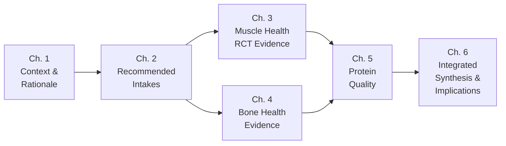
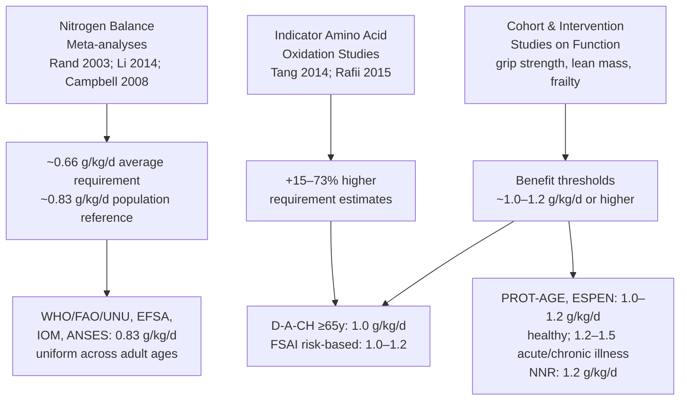
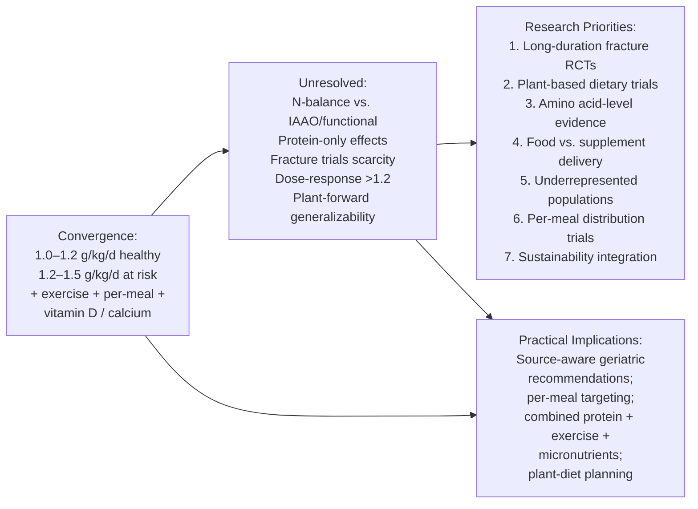

# The Impact of Protein Intake on Muscle and Bone Health in Older Adults: A Special Report
# 1 Introduction and Research Context

The twenty-first century is witnessing an unprecedented demographic transformation: populations are aging faster than at any point in recorded history, and with this transformation comes a parallel epidemiological shift in which chronic, age-related musculoskeletal decline has become a defining determinant of healthspan, functional independence, and healthcare expenditure. Within this evolving landscape, dietary protein has re-emerged as one of the most scrutinized — and most contested — modifiable nutritional factors influencing how well older adults preserve muscle mass, maintain skeletal integrity, and resist the cascade of frailty, falls, and fractures. The longstanding Recommended Dietary Allowance (RDA) of 0.8 g/kg body weight per day, originally derived to prevent overt nitrogen deficiency in healthy adults of all ages, increasingly appears to sit uncomfortably alongside a growing body of clinical, mechanistic, and epidemiological evidence suggesting that aging muscle and bone tissue require substantially more protein — and protein of higher anabolic quality — to function optimally. This special report investigates that tension. It is bounded by evidence available in the public domain up to early 2024 and proceeds through four required analytical pillars: a comparative synthesis of recommended intakes, randomized controlled trial (RCT) evidence on muscle health, evidence on bone health, and the question of protein quality. The present chapter establishes the conceptual foundation for that investigation.

## 1.1 Public Health Significance of Protein Nutrition in Aging Populations

The global population aged 60 years and older is expanding at a historically rapid rate, and the proportion of adults aged 65 and over is projected to continue rising in virtually every region of the world during the coming decades. This demographic transition is occurring in parallel with a marked epidemiological transition in which non-communicable, age-related conditions — including sarcopenia, osteoporosis, frailty, and disability — increasingly dominate the disease burden of older adults. Unlike many chronic diseases for which therapeutic options are pharmacological, musculoskeletal decline in aging is uniquely responsive to lifestyle determinants, and among these, dietary protein occupies a distinctive position because it is simultaneously a macronutrient consumed daily, a substrate for tissue synthesis, and a signal that activates anabolic pathways in muscle.

From a public health perspective, the importance of optimizing protein nutrition in older adults rests on at least three converging arguments. First, preservation of skeletal muscle mass and strength is a foundational determinant of physical function, independence in activities of daily living, and the ability to remain in community-dwelling settings rather than transitioning to institutional care. Second, the maintenance of bone health is central to preventing fragility fractures, which are among the most costly and disabling consequences of aging and which generate substantial mortality in the year following hip fracture in particular. Third, both muscle and bone respond meaningfully to dietary interventions that are inexpensive, scalable, and compatible with existing food systems, meaning that even modest improvements in habitual protein intake — if appropriately targeted — could translate into population-level reductions in disability, hospitalization, and long-term care utilization. For these reasons, dietary protein has moved from a relatively narrow nutritional concern to a topic situated at the intersection of geriatric medicine, nutrition science, public health policy, and food systems planning.

## 1.2 Physiological Background: Sarcopenia and Age-Related Bone Loss

The biological rationale for re-examining protein needs in aging rests on a set of well-described physiological changes that distinguish older adults from younger adults metabolically, even when overall health appears preserved. Sarcopenia — the progressive, generalized loss of skeletal muscle mass, strength, and function — begins as early as the fourth decade of life and accelerates with advancing age, particularly beyond the seventh decade. Its consequences extend beyond appearance or strength: reduced muscle mass is associated with impaired glucose homeostasis, diminished resting metabolic rate, increased risk of falls, slower recovery from acute illness or surgery, and elevated all-cause mortality. The pathogenesis of sarcopenia is multifactorial, encompassing motor neuron loss, mitochondrial dysfunction, chronic low-grade inflammation, hormonal shifts (notably declining sex steroids, growth hormone, and insulin-like growth factor 1), reductions in physical activity, and — critically for the purposes of this report — alterations in the regulation of muscle protein turnover.

A central concept linking aging physiology to protein nutrition is **anabolic resistance**: the observation that older skeletal muscle responds less efficiently than younger muscle to a given anabolic stimulus, whether that stimulus is a meal containing amino acids, insulin signaling, or mechanical loading. As a result, the per-meal dose of protein required to maximally stimulate muscle protein synthesis is higher in older adults than in younger adults, and the same total daily protein intake may not produce equivalent anabolic outcomes across the lifespan. Anabolic resistance provides a mechanistic basis for questioning whether intake thresholds derived from younger or mixed-age populations are appropriate for older adults, and it also underpins the rationale for paying close attention not only to total protein quantity but also to the amino acid composition, digestibility, and distribution of protein across meals.

Age-related bone loss proceeds in parallel with sarcopenia and shares many of the same drivers. After peak bone mass is reached in early adulthood, bone mineral density (BMD) declines progressively, with women experiencing accelerated loss during and after the menopausal transition due to estrogen withdrawal. Cortical thinning, trabecular disruption, and changes in bone microarchitecture together compromise mechanical strength and elevate fracture risk, particularly at the hip, vertebrae, and distal forearm. Importantly, muscle and bone do not deteriorate as independent compartments. They are mechanically coupled — muscle contraction generates the loading forces that stimulate bone remodeling — and they share common regulatory pathways involving vitamin D, calcium handling, sex steroids, and growth factors. Dietary protein contributes to both tissues by providing amino acid substrate for collagen synthesis (the dominant organic matrix of bone), by modulating insulin-like growth factor 1, and by supporting the muscular mass and strength that translate into the loading signals required for skeletal maintenance. The concept of an integrated **musculoskeletal unit** therefore frames much of the contemporary discussion about protein recommendations for older adults: interventions that target muscle frequently have skeletal implications, and vice versa.

## 1.3 Prevalence of Low Protein Intake Among Older Adults

Despite mounting evidence that older adults may benefit from protein intakes above the conventional RDA, a substantial proportion of community-dwelling older adults fail to meet even the existing 0.8 g/kg/day threshold. Population-based dietary surveys conducted in Europe, North America, and other high-income settings have repeatedly shown that a sizeable minority of older adults consume protein at intakes below current recommendations, and that the proportion failing to meet higher, geriatric-specific targets (such as 1.0–1.2 g/kg/day) is considerably larger. Inadequate protein intake is rarely an isolated finding; it tends to cluster with low overall energy intake, micronutrient gaps (notably vitamin D, calcium, and B-vitamins), and dietary monotony.

The drivers of this gap are heterogeneous. Physiological changes of aging — including reduced appetite ("anorexia of aging"), altered taste and smell perception, slower gastric emptying, and early satiety — directly limit food intake volume. Oral health deterioration, including tooth loss and poorly fitting dentures, restricts the ability to chew firmer, protein-dense foods such as meats and nuts. Socioeconomic factors, including living alone, limited cooking ability or motivation, the relative cost of high-quality protein foods, and reduced mobility for shopping, further constrain dietary choices. Cultural and personal dietary preferences, including the increasing adoption of plant-forward dietary patterns for environmental, ethical, or health reasons, can lower the density of bioavailable protein in the diet if not carefully planned. The protein consumed by many older adults also tends to be unevenly distributed across the day, with a disproportionately small share at breakfast — a pattern that may suboptimally exploit the per-meal anabolic threshold required to overcome anabolic resistance. Framed against the physiological backdrop described above, this widespread shortfall is not merely a numerical deviation from a guideline but a clinically meaningful nutritional gap with direct implications for muscle and bone health.

## 1.4 Rationale for Revisiting the 0.8 g/kg/day Recommendation

The 0.8 g/kg/day RDA, adopted by several authoritative bodies as the population reference intake for healthy adults, has its conceptual and empirical origins in **nitrogen balance methodology**: the study of how protein intake at various levels affects the equilibrium between dietary nitrogen intake and nitrogen losses through urine, feces, and other routes. The intake at which adults achieve zero or slightly positive nitrogen balance has historically been treated as the minimum required to prevent deficiency, and a safety margin has been applied to derive the recommended allowance. Although this approach has the virtue of being objective and quantifiable, it is increasingly recognized as having several important limitations when applied to older adults.

First, nitrogen balance studies are short in duration relative to the timescale on which sarcopenia and bone loss unfold, and the achievement of nitrogen equilibrium in the short term does not guarantee optimal preservation of tissue mass, strength, or function over months and years. Second, nitrogen balance can be maintained even as lean body mass is gradually lost, particularly in older adults whose reduced muscle mass lowers their obligatory nitrogen losses; thus, the same nitrogen balance endpoint may mask an undesirable adaptive process. Third, the original studies were conducted largely in younger adults, with relatively few older participants, and they did not specifically interrogate the higher anabolic threshold characteristic of aging muscle. Fourth, nitrogen balance is methodologically demanding and prone to systematic measurement errors that tend to overestimate intake and underestimate losses, biasing the derived requirement downward. More recent methodologies — most notably the **indicator amino acid oxidation (IAAO)** technique — have produced requirement estimates that are markedly higher than those derived from classical nitrogen balance, and a growing number of clinical and observational studies have linked protein intakes in the range of approximately 1.0 to 1.2 g/kg/day, or higher in specific clinical contexts, with better preservation of muscle mass, strength, and physical function in older adults.

Beyond methodology, there is an important conceptual shift underway: from defining requirements based on the avoidance of deficiency to defining them based on the achievement of **optimal functional health outcomes**. Under this newer framing, the most relevant question is not "what is the minimum intake at which an older adult avoids overt protein insufficiency?" but rather "what intake best preserves muscle mass and strength, supports bone integrity, maintains physical function, and reduces the risk of frailty and disability?" This reframing — together with the prevalence data summarized above and the physiological realities of anabolic resistance — provides the central rationale for revisiting the 0.8 g/kg/day benchmark, and it explains why several authoritative and expert bodies have already moved toward higher recommendations specifically for older adults, a divergence that the next chapter will systematically examine.

## 1.5 Research Scope, Analytical Framework, and Report Structure

This report is deliberately bounded in scope to maintain analytical rigor. The population of interest is **older adults**, defined broadly as adults aged approximately 60–65 years and above, with particular attention to community-dwelling older adults; institutionalized populations, clinically malnourished hospitalized patients, and those with specific organ failure (such as advanced chronic kidney disease) are referenced only where relevant for context. The outcomes of interest are concentrated on the **musculoskeletal system**: muscle mass, muscle strength, physical performance and function on the one hand; and bone mineral density, bone strength, and fracture risk on the other. The evidence base under review comprises authoritative dietary guidance documents, randomized controlled trials, and selected meta-analyses and observational studies that contextualize the experimental evidence. All cited evidence is drawn from sources publicly available up to **early 2024**, and post-2024 publications are not used as a basis for the report's findings.

The analytical logic of the report follows a deliberate progression. The first analytical step is to establish what authoritative bodies currently recommend and on what methodological basis — a necessary baseline against which subsequent evidence can be evaluated. The second step is to ask whether intervention evidence in older adults supports intakes above the conventional 0.8 g/kg/day threshold and whether such intakes translate into measurable improvements in muscle outcomes. The third step extends this question to the skeletal compartment, examining how protein interacts with mechanical loading, weight loss, and micronutrient status to influence bone health. The fourth step deepens the analysis by asking whether quantity alone is sufficient or whether protein **quality** — digestibility, essential amino acid composition, anabolic potency, and the specific roles of key amino acids such as leucine, valine, and tryptophan — modifies the dose–response relationship between intake and musculoskeletal outcomes. The closing chapter then integrates these strands to evaluate where consensus is emerging, where controversy persists, and what the practical and research priorities are going forward.

The structure of the report mirrors this analytical logic, as summarized in the table below.

| Chapter | Analytical Question | Methodological Lens |
|---------|--------------------|----------------------|
| 2. Recommended Intakes | What do major authorities recommend, and why do they differ? | Comparison of guideline documents; nitrogen balance vs. functional/clinical endpoints |
| 3. Muscle Health RCTs | Does higher protein intake (with/without resistance exercise) improve muscle outcomes? | Synthesis of key RCTs (ProMuscle, ProMuscle in Practice, PROMISS, CALM, and related trials) |
| 4. Bone Health Studies | How does protein intake affect BMD, bone strength, and fracture risk? | Review of recent work by Weaver et al. and Kemmler et al., contextualized by broader evidence |
| 5. Protein Quality | Does the source and amino acid composition of protein modify outcomes? | Animal vs. plant comparisons; DIAAS; leucine, valine, tryptophan |
| 6. Synthesis | Where do recommendations, evidence, and quality considerations converge or diverge? | Integrated synthesis, controversies, research gaps |

The progression visualized below clarifies how each chapter builds upon the previous one, moving from normative guidance, through experimental evidence on each tissue compartment, to the underlying biological dimension of protein quality, before culminating in integrated synthesis.

By proceeding in this sequence, the report seeks to answer a deceptively simple question with the analytical depth it deserves: **for older adults, how much dietary protein — and of what quality — is required to support the muscle and bone health on which healthy aging fundamentally depends?** The chapters that follow take up this question in turn, beginning with a structured comparison of the recommendations currently in force across major international and national authorities.

# 2 Summary of Existing Recommended Protein Intakes for Older Adults

Building on the conceptual rationale outlined in Chapter 1 — that the longstanding 0.8 g/kg/day allowance was conceived as a population-level safeguard against deficiency rather than as an optimum for the aging musculoskeletal system — this chapter turns to the normative landscape itself. What, precisely, do the major international authorities, clinical expert groups, and national nutrition bodies currently recommend for older adults? On what evidentiary basis are those values set, and why has a single empirical literature produced such a heterogeneous family of guidance documents, with daily targets ranging from approximately 0.83 g/kg up to 1.5 g/kg of body weight? Answering these questions matters not only as a descriptive exercise but because the subsequent chapters on muscle and bone health (Chapters 3 and 4) and on protein quality (Chapter 5) implicitly test the empirical adequacy of these competing benchmarks. The present chapter therefore reconstructs the normative baseline against which that empirical evaluation will proceed, examines the methodological choices that explain the divergences, and concludes with a comparative summary and interpretive synthesis.

## 2.1 International Authority Recommendations: WHO/FAO/UNU and EFSA

At the apex of the international guidance hierarchy sit two reference values that have anchored adult protein nutrition policy for more than a decade. The first is the **WHO/FAO/UNU expert consultation report (Technical Report Series 935, published in 2007)**, which set the population reference intake (often termed the "safe level of intake") for healthy adults at **0.83 g of high-quality protein per kg body weight per day**[^1][^2]. The second is the European Food Safety Authority's 2012 *Scientific Opinion on Dietary Reference Values for Protein*, which arrived at the same numerical value, **0.83 g/kg/day**, and explicitly declined to differentiate older adults (≥60 years) from younger adults in its reference intake[^1]. These two documents together form the international baseline against which national and clinical recommendations are compared.

Both values rest on the same evidentiary cornerstone: a **meta-analysis of controlled nitrogen balance studies in healthy adults published by Rand, Pellett, and Young in 2003 in the *American Journal of Clinical Nutrition***[^1]. Pooling balance studies across age, sex, and dietary background, that analysis derived an **average nitrogen requirement of approximately 105 mg N/kg body weight per day, equivalent to 0.66 g protein/kg/day** at zero nitrogen balance, and then applied a coefficient of variation of 12% (a two-fold addition of 24%) to arrive at the population reference intake of 0.83 g/kg/day intended to cover the requirements of approximately 97.5% of metabolically healthy adults[^1]. A subsequent meta-analysis by Li et al. (2014) and an earlier reanalysis by Campbell et al. (2008) confirmed both the central tendency of the requirement estimate and the absence of statistically significant differences between younger and older adults within the nitrogen balance paradigm[^1]. On this basis, both WHO/FAO/UNU and EFSA concluded that there was insufficient evidence within the balance-study framework to justify a separate, higher reference value for older adults[^1].

Two important caveats accompany these international benchmarks. First, the WHO/FAO/UNU "safe level" refers explicitly to **high-quality protein** with full digestibility and a complete indispensable amino acid profile, so that its translation to mixed-source diets — particularly those with substantial plant-protein content and the digestibility limitations that entails — requires upward adjustment in practice[^2]. Second, both bodies acknowledge that nitrogen balance, while objective and quantifiable, captures only short-term metabolic equilibrium and not the longer-term functional outcomes (muscle mass preservation, strength, mobility, fracture resistance) that increasingly define successful aging. The D-A-CH Working Group, reviewing the same evidence base, observed that "the EFSA, the IOM, and the WHO do not recommend other protein intake quantities for older adults (≥60 years, ≥51 years) than for younger adults"[^1] — a position that has set the stage for the divergence between conservative international reference values and the higher targets advocated by clinical expert groups, to which the next subsection turns.

## 2.2 Expert and Clinical Consensus Recommendations: PROT-AGE and ESPEN

Where the international authorities have remained anchored to nitrogen balance, two influential expert consensus groups have moved decisively toward higher, geriatric-specific targets explicitly grounded in functional and clinical endpoints.

The first is the **PROT-AGE Study Group**, convened to synthesize evidence on optimal dietary protein intake in older people. In its 2013 position paper published in the *Journal of the American Medical Directors Association*, the group concluded that to help older adults (>65 years) maintain and regain lean body mass and function, **average daily protein intake should fall at least in the range of 1.0 to 1.2 g/kg body weight per day**, with the group's evidence-based recommendation framed around an intake of **at least 1.2 g/kg/day** as a target supportive of muscle anabolism[^3]. For older adults with **acute or chronic illness**, or those undergoing rehabilitation, the PROT-AGE group recommended a still higher range of **1.2 to 1.5 g/kg/day**, reflecting both elevated catabolic stress and the need to overcome anabolic resistance under conditions of inflammation, immobilization, and reduced food intake[^1].

The second is the **European Society for Clinical Nutrition and Metabolism (ESPEN) Expert Group**, whose 2014 recommendations on protein intake and exercise for optimal muscle function with aging (Deutz et al., *Clinical Nutrition*) closely parallel and reinforce the PROT-AGE position[^1][^4]. ESPEN recommended a protein intake of **at least 1.0–1.2 g/kg/day for healthy older adults**, rising to **1.2–1.5 g/kg/day for older adults who are malnourished or at risk of malnutrition due to acute or chronic disease**, and noted that even higher intakes may be appropriate for severely ill or injured older patients[^1][^4]. ESPEN also emphasized — a point of particular importance for later chapters of this report — that protein intake alone is insufficient without concomitant physical activity, and that the anabolic response to protein is markedly enhanced when combined with resistance exercise.

The methodological orientation of both groups is fundamentally different from that of WHO/FAO/UNU and EFSA. Rather than restricting their evidence base to controlled nitrogen balance studies, PROT-AGE and ESPEN explicitly integrated:

- **mechanistic studies of muscle protein synthesis**, including those documenting that older adults require larger amino-acid doses (on the order of ~0.4 g/kg per meal versus ~0.24 g/kg in younger adults) to achieve maximal stimulation of myofibrillar protein synthesis, reflecting anabolic resistance[^1];
- **prospective cohort studies** linking habitual protein intakes in the range of approximately 1.0–1.2 g/kg/day or higher to better preservation of grip strength, lean mass, and physical functionality, and to lower incidence of frailty over follow-up periods of several years[^1];
- **intervention trials** in which higher protein intakes were associated with maintained or increased fat-free mass or muscle mass over follow-up periods of months to years[^1].

Alongside PROT-AGE and ESPEN, a third clinical consensus body has contributed to this geriatric-specific normative shift: the **International Osteoporosis Foundation (IOF) and the European Society for Clinical and Economic Aspects of Osteoporosis, Osteoarthritis and Musculoskeletal Diseases (ESCEO)**. In their 2013 consensus and subsequent task force statement on the role of dietary protein and vitamin D in maintaining musculoskeletal health in postmenopausal women, IOF and ESCEO recommended a protein intake of approximately **1.0 g/kg/day** (and 1.0–1.2 g/kg/day in subsequent statements) for the management of patients at risk of, or with established, osteoporosis[^1]. This recommendation is conceptually important because it explicitly frames protein not only as a determinant of muscle mass but also as a contributor to skeletal integrity — anticipating the bone-focused evidence reviewed in Chapter 4.

Taken together, the PROT-AGE, ESPEN, and ESCEO recommendations represent a coherent clinical consensus that the older adult — particularly the older adult at functional or clinical risk — requires meaningfully more protein than the population-level reference values devised on nitrogen-balance grounds would suggest.

## 2.3 National Recommendations in Europe: D-A-CH, NNR, ANSES, and Ireland

European national nutrition authorities have responded to the divergence between international reference values and clinical expert consensus in markedly different ways, illustrating how the same evidence base can support different national interpretations.

**Germany, Austria, and Switzerland (D-A-CH).** Following a structured update of their joint reference values in 2017 — translated into English in 2019 — the nutrition societies of Germany, Austria, and Switzerland (D-A-CH) became among the first national-level bodies to issue a **differentiated, higher protein recommendation specifically for adults aged 65 years and older, set at an estimated value of 1.0 g/kg body weight per day** for both men and women[^1]. For adults under 65 years, D-A-CH retained the conventional 0.8 g/kg/day value derived from nitrogen balance meta-analyses[^1]. The Working Group's justification for the older-adult value is methodologically illuminating: it explicitly acknowledged that nitrogen balance meta-analyses alone did not show statistically significant differences between younger and older adults, but argued that "due to insufficient data for protein requirements based on balance studies in adults >65 years, the working group decided to consider additionally reports on metabolic and functional parameters under various protein intakes to derive an estimated value"[^1]. In other words, D-A-CH supplemented the balance-study paradigm with prospective cohort and intervention evidence on physical function, frailty incidence, and lean mass, and on that basis aligned its older-adult value with — though at the lower bound of — the PROT-AGE, ESPEN, and ESCEO recommendations. D-A-CH explicitly stated that its 1.0 g/kg/day value "is in line with the statements of the PROT-AGE Study Group, the European Society for Clinical Nutrition and Metabolism, and the European Society for Clinical and Economic Aspects of Osteoporosis and Osteoarthritis recommending a protein intake of 1.0–1.2 g/kg body weight per day for adults above 65 years"[^1].

**Nordic Countries (NNR).** The Nordic Nutrition Recommendations represent a parallel trajectory. **Beginning with the NNR 2012 revision, the Nordic countries raised their recommended protein intake for older adults to 1.2 g/kg/day**, setting them at the upper edge of clinical expert consensus and ahead of D-A-CH in numerical value. The most recent iteration, the **NNR 2023**, further integrates sustainability and environmental considerations alongside health outcomes, and continues to recommend protein intakes for adults framed as a proportion of energy (10–20 E%) with attention to higher per-kilogram needs in older age groups; the underlying scoping review for NNR 2023 explicitly emphasizes that "an adequate protein intake is needed in old adults to avoid premature muscle loss"[^5]. The NNR thus illustrates a national tradition that has been comparatively early and assertive in translating clinical-functional evidence into national reference values.

**France (ANSES).** In contrast, the French Agency for Food, Environmental and Occupational Health and Safety (ANSES) has retained a **unified adult reference value of 0.83 g/kg/day** for protein, aligned with the EFSA reference and explicitly grounded in nitrogen balance meta-analyses[^6]. The ANSES recommendations for the adult population — both the 2016 update and subsequent revisions of vitamin and mineral references in 2021 — do not establish a separate, higher protein reference value for older adults, instead leaving age-specific clinical adjustments to clinical nutrition practice rather than population guidance. France thus exemplifies the European national authority that has remained most closely tethered to the international, balance-study-based paradigm.

**Ireland (FSAI).** The **Food Safety Authority of Ireland (FSAI)** has taken an intermediate, risk-stratified approach. In its 2021 guidance, the FSAI recommended that **older adults at risk of frailty, sarcopenia, or undernutrition should consume at least 1.0–1.2 g/kg/day of protein**, while not necessarily mandating this higher intake for all older adults regardless of clinical risk profile[^7]. This formulation is conceptually significant because it bridges the two paradigms: it preserves the population-level reference for healthy older adults while embedding the PROT-AGE/ESPEN target in national guidance for the substantial subgroup of older adults at functional risk. Earlier FSAI guidance on protein for older adults (2020) had similarly emphasized targeted recommendations beyond the population reference[^7].

The European national picture therefore reveals a spectrum: from full retention of the international 0.83 g/kg/day baseline (ANSES), through differentiated and explicitly geriatric-specific values at 1.0 g/kg/day (D-A-CH), to risk-stratified guidance for vulnerable older adults at 1.0–1.2 g/kg/day (FSAI), and finally to assertive blanket geriatric recommendations at 1.2 g/kg/day (NNR). This heterogeneity reflects not differences in the underlying empirical literature — which is largely shared — but differences in evidentiary thresholds and willingness to extrapolate from functional outcome data, a theme returned to in subsection 2.5.

## 2.4 North American and Other National Recommendations: IOM/NRC RDA

Across the Atlantic, the normative posture is markedly more conservative. The **U.S. Institute of Medicine (IOM) — now the National Academies' Health and Medicine Division — established in its 2005 *Dietary Reference Intakes* report the Recommended Dietary Allowance (RDA) for protein at 0.8 g/kg body weight per day**, applied uniformly to all adults aged 19 years and over, including those aged 51 years and over and the smaller subset of adults aged 70 years and over[^1]. There is, in the IOM/NRC framework, **no separately defined, higher reference value for older adults**, a position that mirrors the EFSA and WHO/FAO/UNU stance and that has been retained in the absence of a formal revision since 2005. As the D-A-CH Working Group noted in summarizing the international landscape, the IOM, like EFSA and WHO, "do not recommend other protein intake quantities for older adults (≥51 years) than for younger adults"[^1].

The methodological basis of the IOM RDA is the same as that of the international authorities: meta-analytic synthesis of controlled nitrogen balance studies in healthy adults, with limited statistical power to detect age-specific differences within the older-adult subgroup of the original balance-study literature. The persistence of this unified value in U.S. policy — despite the publication of the PROT-AGE and ESPEN consensus statements, IAAO-based requirement estimates substantially higher than 0.8 g/kg/day, and a substantial body of prospective cohort and intervention evidence — illustrates the institutional caution that often characterizes formal RDA revision processes, where the burden of proof for changing a long-established reference value is typically set very high.

Outside Europe and North America, selected health agencies have moved further toward translating clinical expert consensus into population-level guidance. The **Singapore Health Promotion Board (HPB)**, for example, recommends a protein intake of **approximately 1.2 g/kg/day for adults aged 50 years and over**, contrasting with 0.8 g/kg/day for younger adults aged 18–49 years[^4]. The HPB guidance explicitly frames its higher older-adult value in terms of muscle mass preservation, wound healing, recovery from illness, and prevention of sarcopenia, and provides practical translation into per-meal protein targets (~25 g per meal for a 62.5 kg older adult)[^4]. While the underlying epidemiological context in Singapore differs from that of Europe and North America, the HPB recommendation illustrates how, in some jurisdictions, the geriatric expert consensus has been substantially absorbed into formal public-health-agency guidance directed at the general older population, not merely at clinically vulnerable subgroups.

The global picture, taken across continents, is therefore one of pronounced heterogeneity, with at least four distinct postures: (i) unified-adult conservatism (EFSA, WHO/FAO/UNU, IOM, ANSES), (ii) differentiated but modest geriatric upward adjustment (D-A-CH at 1.0 g/kg/day), (iii) risk-stratified geriatric guidance (FSAI), and (iv) assertive geriatric-specific recommendations at the upper end of the clinical consensus range (NNR, Singapore HPB, and the clinical consensus bodies themselves).

## 2.5 Methodological Basis: Nitrogen Balance versus Functional and Clinical Endpoints

The numerical divergences mapped in the preceding subsections are not artifacts of different empirical literatures; they are the predictable consequence of two competing methodological paradigms for defining protein requirements in aging. Understanding this divide is essential for evaluating the empirical evidence reviewed in subsequent chapters.

**The classical nitrogen balance paradigm.** Nitrogen balance methodology proceeds from the premise that, in metabolically healthy adults, the minimum dietary nitrogen intake required to offset obligatory nitrogen losses (urinary, fecal, and miscellaneous) — the zero-balance point — represents the physiological requirement. Multiplying nitrogen by a conversion factor of 6.25 yields the protein quantity[^1]. The Rand–Pellett–Young 2003 meta-analysis pooled controlled balance studies meeting strict methodological criteria and derived the population reference of 0.83 g/kg/day cited by WHO/FAO/UNU, EFSA, IOM, ANSES, and (for adults under 65) D-A-CH[^1]. A second meta-analysis by Li et al. (2014) and the older-versus-younger comparison by Campbell et al. (2008) both confirmed an average requirement near 0.66 g protein/kg/day and reported that differences between younger (≤55–60 years) and older (>55–60 years) adults, while present numerically, did not reach statistical significance[^1].

The strengths of this paradigm are real: it is quantitative, mechanistically grounded in nitrogen economy, and reproducible across laboratories. But its limitations — particularly for older adults — are increasingly acknowledged, including by the very authorities that continue to use it as the dominant evidentiary input:

- **Insensitivity to anabolic resistance.** Balance studies measure whole-body nitrogen economy, not the per-meal stimulation of muscle protein synthesis, and therefore cannot detect the elevated per-meal anabolic threshold characteristic of aging muscle[^1].
- **Short duration.** Balance studies typically span days to weeks, well short of the timescale on which sarcopenia, bone loss, and frailty unfold.
- **Systematic measurement biases.** Nitrogen intake tends to be overestimated and losses underestimated, biasing the derived requirement downward.
- **Limited representation of older adults.** The original studies in the Rand et al. meta-analysis included relatively few participants above age 60, limiting the statistical power to detect age-specific requirements[^1].
- **Insensitivity to lean mass changes.** Nitrogen equilibrium can be maintained even as lean body mass is slowly lost, particularly in older adults whose reduced muscle mass lowers obligatory nitrogen losses — meaning the same balance endpoint can mask undesirable adaptive accommodation, as Campbell et al. (2001) observed[^1].

**The indicator amino acid oxidation (IAAO) paradigm.** A newer alternative, the IAAO technique, has been progressively applied to children, young adults, older adults, and pregnant women. The D-A-CH Working Group summarized the comparative evidence as follows: **"Compared to earlier data from nitrogen balance studies, protein requirements assessed with IAAO tend to be generally higher (+15–73%)"**[^1]. Of particular relevance for the present report, IAAO studies in older adults — including octogenarian women (Tang et al., 2014) and women >65 years (Rafii et al., 2015) — have yielded requirement estimates substantially above the 0.8 g/kg/day RDA[^1]. While the D-A-CH Working Group cautiously noted that "due to limited data, final conclusions with respect to the 'true' values are currently not possible" and that "initial discussions about the true value are controversial," the directional implication of the IAAO literature is consistent: nitrogen-balance-derived requirements likely underestimate, rather than overestimate, the protein needs of older adults[^1].

**Functional and clinical endpoints.** A third evidentiary stream — and the one that most heavily informs the PROT-AGE, ESPEN, ESCEO, NNR, and D-A-CH (older-adult) recommendations — comprises prospective cohort studies and intervention trials linking habitual or experimental protein intake to functional and clinical outcomes. The D-A-CH review identified multiple cohort studies in which subjects with higher protein intake (≥1.2 g/kg/day) showed better grip strength, mobility, and lower long-term loss of physical function than those at ≤0.8 g/kg/day, and two cohort studies in which higher protein intake was associated with **lower incidence of frailty over approximately three years** of follow-up[^1]. Intervention studies, while heterogeneous, generally indicated greater preservation of fat-free mass or muscle mass at protein intakes of 1.2–1.6 g/kg/day compared with 0.8–1.0 g/kg/day, particularly when combined with resistance exercise[^1]. Mechanistic and clinical-feeding studies further demonstrated that older adults require greater per-meal protein doses than younger adults to achieve maximal muscle protein synthesis, providing a biological rationale consistent with the cohort and intervention findings[^1].

The three paradigms can be juxtaposed schematically as follows:

The diagram clarifies why the divergence in recommended values is essentially a divergence in evidentiary architecture: authorities that admit only nitrogen balance data converge near 0.83 g/kg/day; those that incorporate functional and clinical evidence — and, increasingly, IAAO data — converge near 1.0–1.2 g/kg/day, with further upward adjustment for clinical risk states. As Chapter 1 anticipated, this is ultimately a contest between defining requirements by **avoidance of deficiency** versus defining them by **optimization of functional health**, and the empirical adequacy of each framing is precisely what the next two chapters will probe through the lens of muscle and bone outcomes.

## 2.6 Comparative Summary Table and Interpretive Synthesis

The preceding analyses can be consolidated into a structured comparative summary that exposes both the numerical heterogeneity and its underlying methodological logic.

| Authority / Body | Recommended Intake for Older Adults | Population Definition | Methodological Basis | Health Outcome Targeted |
|---|---|---|---|---|
| WHO/FAO/UNU (2007) | 0.83 g/kg/d (high-quality protein); no separate value for older adults[^1][^2] | All healthy adults ≥18 y | Nitrogen balance meta-analysis (Rand, Pellett, Young, 2003)[^1] | Avoidance of nitrogen deficiency |
| EFSA (2012) | 0.83 g/kg/d; no separate value for older adults (≥60 y)[^1] | All healthy adults ≥18 y | Nitrogen balance meta-analysis[^1] | Avoidance of nitrogen deficiency |
| IOM/NRC (2005) | 0.8 g/kg/d (RDA); applied uniformly to ≥51 and ≥70 y subgroups[^1] | All healthy adults ≥19 y | Nitrogen balance meta-analysis | Avoidance of nitrogen deficiency |
| ANSES (France, 2016/2021) | 0.83 g/kg/d; unified adult value[^6] | All healthy adults | Nitrogen balance (aligned with EFSA) | Avoidance of nitrogen deficiency |
| D-A-CH (Germany/Austria/Switzerland, 2017/2019) | 1.0 g/kg/d (estimated value)[^1] | Adults ≥65 y (vs. 0.8 g/kg/d for <65 y) | Nitrogen balance + metabolic & functional studies (cohort and intervention)[^1] | Preservation of lean mass, physical function, lower frailty incidence |
| NNR (Nordic, 2012 → 2023) | 1.2 g/kg/d for older adults (since NNR 2012); NNR 2023 integrates sustainability[^5] | Older adults (≥65 y, with health/sustainability framing in 2023) | Functional outcomes + clinical/expert consensus | Prevention of premature muscle loss; healthy/sustainable diets |
| FSAI (Ireland, 2021) | ≥1.0–1.2 g/kg/d for older adults at risk of frailty, sarcopenia, or undernutrition[^7] | Older adults at clinical/functional risk | Risk-stratified, drawing on clinical consensus | Sarcopenia and frailty prevention in at-risk older adults |
| Singapore HPB | ~1.2 g/kg/d[^4] | Adults ≥50 y | Clinical consensus translated to population guidance | Muscle mass preservation, recovery, sarcopenia prevention |
| PROT-AGE Study Group (Bauer et al., 2013) | 1.0–1.2 g/kg/d (at least 1.2 g/kg/d as target) for healthy older adults; 1.2–1.5 g/kg/d for acute/chronic illness[^3][^1] | Adults >65 y; subgroup with acute/chronic disease | Functional endpoints, muscle protein synthesis studies, cohort & intervention data | Maintenance/regaining of lean body mass and function |
| ESPEN Expert Group (Deutz et al., 2014) | ≥1.0–1.2 g/kg/d for healthy older adults; 1.2–1.5 g/kg/d for malnourished or at risk due to acute/chronic disease[^1][^4] | Older adults, including clinically compromised | Functional/clinical endpoints + mechanistic studies; combined with exercise | Optimal muscle function with aging |
| IOF / ESCEO (Rizzoli et al., 2014) | 1.0 g/kg/d (2013 statement); 1.0–1.2 g/kg/d in subsequent consensus, for osteoporosis management[^1] | Postmenopausal women; older adults at osteoporosis risk | Musculoskeletal clinical outcomes (BMD, fracture risk) | Bone and muscle health in osteoporosis management |

**Interpretive synthesis.** The table makes visible four sources of persistent discrepancy among recommendations that all rely, in principle, on the same underlying scientific literature.

The first is **evidentiary admissibility**. Authorities such as WHO/FAO/UNU, EFSA, IOM, and ANSES admit only controlled nitrogen balance data into their reference-value derivation. PROT-AGE, ESPEN, ESCEO, NNR, and (for the older-adult value) D-A-CH explicitly admit functional outcomes, mechanistic studies of muscle protein synthesis, cohort studies on frailty and grip strength, and intervention trials of lean mass preservation. The same Rand et al. (2003) meta-analysis can therefore yield either 0.83 g/kg/day (if it is the only admissible input) or a higher value (if it is one input among several).

The second is the **conceptual framing of "requirement"**. The international authorities frame requirement as the intake at which deficiency is avoided in nearly all healthy individuals — a minimum-sufficient framing rooted in nutrient adequacy. The clinical and expert bodies, drawing on the gerontological literature on anabolic resistance, frailty, sarcopenia, and fracture risk, frame requirement as the intake at which functional musculoskeletal outcomes are optimized — a maximizing framing rooted in healthy aging. These are not merely different numerical targets; they are different definitions of the regulated quantity.

The third is **willingness to extrapolate**. Balance studies measure short-term nitrogen economy; cohort studies and intervention trials extrapolate to multi-year outcomes that are clinically meaningful for older adults. Conservative authorities discount such extrapolation; clinical expert bodies embrace it.

The fourth is **institutional caution and revision dynamics**. Population reference values, once established, are difficult to revise; the IOM RDA has stood unchanged since 2005, and the EFSA value since 2012. National bodies operate on different revision cycles and with different evidentiary thresholds; D-A-CH undertook a structured revision in 2017 that explicitly considered the post-2000 literature and produced a differentiated older-adult value, while NNR has revised more frequently and at higher numerical values.

**Practical implications.** For clinicians and dietitians working with older adults, the comparative picture suggests that the international 0.83 g/kg/day reference is best interpreted as a population-level safeguard rather than as a clinical target, and that values in the range of 1.0–1.2 g/kg/day — with further upward adjustment for clinical risk states — are more consistent with the clinical expert consensus and with the functional-outcome evidence base. For policymakers, the divergence between population reference values and clinical recommendations creates communication and implementation challenges, particularly given that, as Chapter 1 noted, a substantial proportion of community-dwelling older adults fail to meet even the lower 0.8 g/kg/day benchmark; the gap between intake and the higher targets is correspondingly larger. For older adults themselves, the divergence underscores the importance of personalized advice that accounts for clinical status, functional reserve, and dietary pattern.

These normative observations, however, raise an empirical question that the remainder of the report must answer: does the body of randomized controlled trial evidence in older adults actually substantiate the functional benefits invoked by PROT-AGE, ESPEN, ESCEO, NNR, D-A-CH, and FSAI in justifying intakes above 0.8 g/kg/day? Chapter 3 takes up this question for the muscle compartment, and Chapter 4 for the bone compartment, before Chapter 5 returns to the deeper question of whether the quality — and not only the quantity — of protein modifies the dose–response relationship that this chapter has mapped.

# 3 Research on the Impact of Protein Intake on Muscle Health

Chapter 2 established that the divergence between conservative international reference values (0.83 g/kg/day) and the higher targets advocated by clinical expert bodies (1.0–1.2 g/kg/day for healthy older adults, rising to 1.2–1.5 g/kg/day in illness) is fundamentally an evidentiary disagreement: the conservative authorities admit only controlled nitrogen balance data, whereas PROT-AGE, ESPEN, ESCEO, NNR, and the older-adult D-A-CH value explicitly draw on functional, mechanistic, and clinical-outcome evidence. The present chapter interrogates that functional-outcome evidence directly. If higher protein intakes are to be justified on the grounds that they preserve or improve muscle mass, strength, and physical function in older adults, then randomized controlled trials (RCTs) — the experimental designs least vulnerable to confounding — must demonstrate such benefits in well-characterized older-adult populations. This chapter therefore reconstructs and synthesizes the RCT evidence base, with particular attention to a coherent set of landmark trials conducted predominantly in European community-dwelling older adults, before drawing out the empirical implications for the normative debate.

## 3.1 Analytical Framework and Selection of Key Trials

The RCT literature on protein and muscle in older adults is large and methodologically heterogeneous. To preserve analytical depth, this chapter restricts its core evidence base to trials that satisfy four criteria: (i) the target population consists of older adults, broadly defined as ≥65 years; (ii) the intervention manipulates protein intake either through supplementation or through food-based dietary advice, with explicit attention to absolute intake levels relative to the 0.8 g/kg/day RDA; (iii) the trials assess at least one of the three principal muscle-related outcome domains — muscle/lean body mass (typically by dual-energy X-ray absorptiometry, DXA), muscle strength (one-repetition maximum on resistance machines or grip strength), and physical performance (Short Physical Performance Battery [SPPB], gait speed, chair-stand tests); and (iv) the trial duration is sufficient to detect changes in these outcomes, generally 12 weeks or longer.

A second methodological distinction structures the analysis. Trials are stratified according to whether the protein intervention is administered **alone** — testing the nutritional signal in isolation — or **combined with a structured resistance exercise programme**, testing the integrated anabolic stimulus that mechanistic studies suggest is required to overcome anabolic resistance and translate amino-acid availability into myofibrillar accretion. This stratification is essential because, as Chapter 1 noted, muscle protein synthesis in older adults is governed by both substrate availability and mechanical loading, and the relative contribution of each remains an empirical question.

On these grounds, five trials constitute the core evidence base examined here: the original **ProMuscle** trial (Tieland et al., 2012), which combined protein supplementation with progressive resistance exercise in frail elderly; the **Tieland et al. protein-only** companion trial (2012), which isolated the nutritional signal; the translational **ProMuscle in Practice** multicentre real-life RCT (van Dongen et al., 2018)[^8]; the **PROMISS** trial, which tested food-based dietary advice to elevate habitual intake; and the **CALM** intervention study, which addressed healthy (non-frail) older adults with leucine-enriched whey protein and varying training loads. Collectively, these trials span the frailty spectrum (frail, pre-frail, physically inactive, healthy non-frail), the intervention modalities (concentrated milk protein supplements, protein-rich foods, personalized dietary advice, leucine-enriched whey), and the exercise contrasts (supervised resistance training versus no structured exercise) that are most relevant to evaluating the empirical adequacy of the 1.0–1.2 g/kg/day targets advanced by PROT-AGE and ESPEN.

## 3.2 The ProMuscle and ProMuscle in Practice Trials

The ProMuscle research line — anchored at Wageningen University & Research — provides arguably the most influential European RCT evidence on protein supplementation combined with resistance exercise in older adults. It comprises an original tightly controlled efficacy trial and a subsequent real-life effectiveness trial designed to test whether the original findings could be translated into routine community practice.

The **original ProMuscle trial** (Tieland et al., 2012, published in the *Journal of the American Medical Directors Association*) was a 24-week randomized, double-blind, placebo-controlled study in 62 frail elderly subjects (mean age 78 ± 1 years) who participated in a progressive resistance-type exercise training programme twice weekly. Participants were randomized to receive either a protein supplement (15 g of dairy protein at breakfast and 15 g at lunch, totalling 2 × 15 g/day) or an isocaloric placebo. Lean body mass was assessed by DXA, strength by one-repetition maximum (1-RM) testing on leg press and leg extension machines, and physical performance by the SPPB at baseline, 12 weeks, and 24 weeks[^9]. The headline result was a clear treatment-by-time interaction for lean body mass: **lean body mass increased from 47.2 kg (95% CI 43.5–50.9) to 48.5 kg (95% CI 44.8–52.1) in the protein group and did not change in the placebo group (from 45.7 to 45.4 kg) (P = 0.006)**[^9]. Strength and physical performance improved significantly in both groups (P = 0.000), with no interaction effect of dietary protein supplementation on these endpoints[^9]. The trial's central conclusion — that "prolonged resistance-type exercise training represents an effective strategy to improve strength and physical performance in frail elderly people [and] dietary protein supplementation is required to allow muscle mass gain during exercise training in frail elderly people" — is foundational to the contemporary geriatric nutrition literature[^9].

The **ProMuscle in Practice trial** (van Dongen et al., 2018), published in *BMC Public Health*, was designed to test whether the original efficacy findings could be reproduced in a real-life setting embedded in routine community care[^8]. It was a randomized controlled multicentre intervention study conducted in five Dutch municipalities, enrolling 200 community-dwelling older adults aged ≥65 years who were frail or pre-frail according to the Fried frailty criteria, or who experienced strength loss[^8]. Randomization was performed at the municipality level (intervention vs. control). The intervention consisted of a 12-week **intensive support** phase, during which participants performed resistance exercise training twice weekly under physiotherapist supervision and increased protein intake by consuming protein-rich products under dietitian guidance (operationalized as adding approximately 25 g of protein per main meal), followed by a 12-week **moderate support** phase, yielding a total intervention duration of 24 weeks[^8]. The control group received only regular care across the same period. Effect outcomes were measured at baseline, 12, 24, and 36 weeks at all sites and at 52 weeks at three of the five sites; the primary outcome was physical functioning measured by the SPPB, with secondary outcomes including leg muscle strength, lean body mass, activities of daily living, social participation, food intake, and quality of life[^8]. The trial integrated qualitative and quantitative implementation process data alongside an economic evaluation, reflecting the study's translational ambition[^8]. Subsequent analyses confirmed that the intervention was effective in improving muscle strength, muscle mass, and functioning of community-dwelling older adults in this real-life setting[^10], demonstrating that the original ProMuscle protocol retained its benefit when delivered through routine municipal infrastructure rather than a controlled academic laboratory.

The conjunction of the original ProMuscle and ProMuscle in Practice trials carries two interpretive lessons of particular weight for the normative debate framed in Chapter 2. First, the original trial established with high internal validity that the addition of dietary protein to resistance training is **required** to produce measurable gains in lean body mass in frail elderly — a finding that directly substantiates the mechanistic argument that mechanical loading without sufficient substrate is insufficient to overcome anabolic resistance and drive net protein accretion. Second, ProMuscle in Practice demonstrated that this efficacy is preserved under conditions of real-world implementation, which is the necessary condition for translating clinical expert recommendations (PROT-AGE, ESPEN) into population-scale benefit. The translational arc from ProMuscle to ProMuscle in Practice is therefore not merely an academic refinement; it is the practical bridge between the higher intake targets advocated by clinical consensus bodies and the public-health-policy implementation that those targets implicitly demand.

## 3.3 The Tieland et al. Protein-Only Trial in Frail Elderly

Published in parallel with the original ProMuscle trial in the same year (2012) and in the same journal, the **Tieland et al. protein-only trial** is the indispensable methodological complement that isolates the nutritional signal from the exercise contribution. This 24-week, randomized, double-blind, placebo-controlled trial enrolled **65 frail elderly subjects**, defined according to Fried criteria (with at least three of the criteria present required for the frailty diagnosis), and randomly allocated them to either daily protein supplementation (15 g of dairy protein at breakfast and 15 g at lunch, identical to the supplement dose used in the combined ProMuscle trial) or a placebo, **without any resistance exercise component**[^9]. Skeletal muscle mass was measured by DXA, muscle fiber size by muscle biopsy, strength by 1-RM testing of leg extension and leg press, and physical performance by the SPPB, with assessments at baseline, 12 weeks, and 24 weeks[^9]. Habitual daily protein intake increased from 1.0 to 1.4 g/kg body weight after supplementation, without adverse effects[^9].

The pattern of results is methodologically pivotal. **Skeletal muscle mass did not change in either group** over the 24-week intervention (protein: 45.8 ± 1.7 to 45.8 ± 1.7 kg; placebo: 46.7 ± 1.7 to 46.6 ± 1.7 kg; P > 0.05), and type I and type II muscle fiber sizes likewise did not change[^9]. Muscle strength increased significantly in both groups (P < 0.01), with **leg extension strength tending to increase to a greater extent in the protein group (57 ± 5 to 68 ± 5 kg) compared with the placebo group (57 ± 5 to 63 ± 5 kg), approaching statistical significance (P = 0.059)**[^9]. Most strikingly, **physical performance improved significantly in the protein group, with SPPB scores rising from 8.9 ± 0.6 to 10.0 ± 0.6 points, while remaining unchanged in the placebo group (7.8 ± 0.6 to 7.9 ± 0.6 points) (P = 0.02 for treatment × time interaction)**[^9]. The trial's central conclusion — that dietary protein supplementation improves physical performance but does not increase skeletal muscle mass in frail elderly people in the absence of mechanical loading — has been independently characterized in the geriatric nutrition literature as evidence of "improved physical performance in frail elderly adults even in the absence of exercise training when dietary protein intake was [raised]"[^11].

This dissociation between functional improvement and structural muscle adaptation carries substantial interpretive weight. It implies, first, that elevated dietary protein can confer clinically meaningful functional benefit in frail older adults even when isolated from a structured exercise programme — a finding directly relevant to the substantial subset of community-dwelling frail older adults who cannot or will not engage in supervised resistance training. It implies, second, that the mechanisms by which protein improves physical performance are not exhausted by gross increases in muscle mass and likely include neuromuscular adaptations, improvements in muscle quality (force per unit mass), and possibly metabolic effects that translate into improved task performance without measurable changes on DXA. It implies, third, that the **conjunction** of protein and resistance exercise — as demonstrated in ProMuscle — is required to capture the additional benefit on muscle mass itself, while the protein component alone can move physical performance scores into clinically meaningful territory. Together, the protein-only and combined trials of the ProMuscle line constitute a coherent factorial demonstration that protein and exercise contribute partially independent, partially synergistic, and clinically additive effects to musculoskeletal outcomes in frail elderly people.

## 3.4 The PROMISS Trial

The PROMISS (PRevention Of Malnutrition In Senior Subjects) trial, conducted as part of a European Union–funded research consortium, addresses a question that supplementation trials inherently cannot answer: can habitual protein intake be elevated to clinically meaningful levels through **food-based dietary advice** alone, and does such an elevation translate into functional benefit in community-dwelling older adults who begin from a relatively low intake baseline? The trial enrolled community-dwelling older adults aged **≥65 years with baseline protein intake below 1.0 g/kg body weight per day**, a population of explicit policy relevance given that, as Chapter 1 documented, a substantial proportion of European community-dwelling older adults consume protein at levels below this threshold. Participants randomized to the intervention arm received personalized dietary advice from a dietitian aimed at increasing protein intake to **≥1.2 g/kg/day**, with attention to distribution across meals; the intervention duration was **24 weeks**, paralleling the ProMuscle line.

The methodological orientation of PROMISS differs from the ProMuscle trials in three respects of analytical interest. First, the intervention modality is dietary advice rather than supplement provision, making the trial a real-world test of whether existing food systems can support the higher protein targets advocated by PROT-AGE and ESPEN without recourse to commercially supplied concentrated milk protein products. Second, the population is defined by low baseline intake rather than by frailty status, generating evidence directly applicable to the substantial subgroup of community-dwelling older adults whose habitual diets fail to meet even the conservative 0.8 g/kg/day threshold. Third, the explicit per-meal distribution component of the intervention engages the mechanistic argument — central to the PROT-AGE and ESPEN recommendations — that the per-meal anabolic threshold (~0.4 g/kg per meal in older adults) is as important as total daily intake in driving cumulative muscle protein synthesis.

Although the available reference material does not provide the full quantitative outcome data for PROMISS at the level of detail attainable for ProMuscle, the trial's distinctive design contribution is to test the feasibility, achievability, and downstream functional consequences of food-based versus supplement-based strategies to elevate habitual protein intake. This distinction has substantial implications for dietary guidance, food policy, and the clinical translation of higher intake targets, particularly given the cost, palatability, and adherence considerations that often constrain long-term supplement use in community-dwelling older adults.

## 3.5 The CALM Trial

The **CALM (Counteracting Age-related Loss of Muscle mass) intervention study** is a randomized controlled trial conducted in healthy older Danish adults aged ≥65 years, designed to evaluate the role of **leucine-enriched whey protein supplementation** in combination with **varying resistance training loads** over a **12-month** intervention period. The trial's distinctive analytical contribution lies in its target population. Whereas the ProMuscle trials enrolled frail or pre-frail elderly, and the Tieland et al. protein-only trial enrolled frail elderly, CALM addresses **healthy, non-frail older adults** — a population that is both numerically larger and less well represented in earlier supplementation trials, yet of substantial policy relevance because primary prevention of sarcopenia is most efficient when initiated before clinical frailty has developed.

The CALM design enables three analytical questions to be addressed simultaneously. First, does protein supplementation confer measurable benefit in older adults who lack baseline functional impairment — that is, does the marginal benefit of supplementation depend on the existence of a deficit, or does it extend to apparently healthy individuals? Second, does the use of **leucine-enriched** whey protein, rather than unenriched dairy protein, enhance the anabolic response — a question that bears on the protein quality considerations developed in Chapter 5. Third, how does the magnitude and type of concurrent resistance training (varying loads) modify the response to supplementation? The trial's one-year duration is also distinctive in the muscle RCT landscape, where the majority of trials run for 12 to 24 weeks and may therefore be underpowered to detect the longer-term trajectories of lean mass and functional outcomes that are most relevant to healthy aging.

CALM's positioning in the wider literature complements rather than replicates the ProMuscle line. Where ProMuscle established that protein supplementation is required to enable mass gain during resistance training in frail elderly, CALM probes whether that finding extends to healthy older adults and to leucine-enriched protein sources. Where ProMuscle in Practice tested real-life implementation in a frailty-targeted municipal programme, CALM tests longer-term sustainability in a healthy community-dwelling cohort. The trial therefore extends the empirical envelope of the protein–exercise literature in directions that the frailty-focused trials cannot, while remaining methodologically anchored in the same DXA / 1-RM / SPPB outcome framework.

## 3.6 Comparative Summary Table of Key Muscle-Health RCTs

The five core trials reviewed in this chapter can be consolidated into the following structured comparison, which exposes cross-trial patterns in population, intervention, and outcomes at a glance.

| Study Name | Characteristics of Study Population | Intervention Details | Key Research Findings |
|---|---|---|---|
| **ProMuscle** (Tieland et al., 2012) | 62 frail elderly subjects (mean age 78 ± 1 y); recruited from Dutch community settings; participated in supervised resistance exercise programme | Supplementation with 31 g of concentrated milk protein per day (2 × 15 g, at breakfast and lunch) or isocaloric placebo, with or without resistance exercise; duration 24 weeks; baseline protein intake approximately 1.0 g/kg/d | Lean body mass (LBM) **increased significantly** in the protein + exercise group (from 47.2 to 48.5 kg) but did not change in the placebo + exercise group (treatment × time interaction P = 0.006); muscle strength (1-RM) and SPPB physical performance improved significantly in both groups, with no protein-specific interaction effect[^9] |
| **ProMuscle in Practice** (van Dongen et al., 2018) | 200 community-dwelling older adults ≥65 y; **frail or pre-frail** based on Fried frailty criteria, or physically inactive / with strength loss; conducted in five Dutch municipalities | Increasing **25 g of protein per main meal** through protein-rich foods under dietitian guidance, **combined with resistance exercise** training twice weekly (physiotherapist-supervised); 12-week intensive support phase + 12-week moderate support phase = **24 weeks total**[^8] | Compared with the control group (regular care), the intervention group showed **improvements in lean body mass (LBM), muscle strength, and Short Physical Performance Battery (SPPB) score**; the intervention proved effective in improving muscle strength, muscle mass, and functioning in a real-life community setting[^8][^10] |
| **Tieland et al. protein-only** (2012) | 65 frail elderly subjects (Fried criteria, ≥3 criteria required for frailty diagnosis); recruited from Dutch community settings; **no resistance exercise** | Daily protein supplementation (2 × 15 g dairy protein at breakfast and lunch) or placebo; duration **24 weeks**; protein intake increased from 1.0 to 1.4 g/kg/d | **Skeletal muscle mass and muscle fiber size unchanged** in both groups (P > 0.05); leg extension strength tended to increase more in the protein group (57 → 68 kg vs. placebo 57 → 63 kg, P = 0.059); **SPPB physical performance improved significantly in the protein group (8.9 → 10.0, P = 0.02 for treatment × time interaction)** but not in placebo[^9] |
| **PROMISS** | Community-dwelling older adults **≥65 years with baseline protein intake <1.0 g/kg/d** | **Personalized dietary advice to increase protein intake to ≥1.2 g/kg/d** (food-based, with attention to per-meal distribution); duration **24 weeks** | Tests feasibility and functional outcomes of achieving ≥1.2 g/kg/d via food-based dietary advice in older adults with low baseline intake; informs the per-meal anabolic threshold question and the food-versus-supplement delivery question |
| **CALM** | Healthy (non-frail) older Danish adults aged ≥65 years | Leucine-enriched whey protein supplementation combined with resistance training of varying loads; intervention duration 12 months | Probes whether protein supplementation confers benefit beyond resistance training alone in older adults without baseline functional impairment, and whether leucine enrichment enhances the anabolic response over a one-year horizon |

## 3.7 Interpretive Synthesis: Consistency, Heterogeneity, and Clinical Implications

When the five trials are viewed collectively, several patterns of consistency, heterogeneity, and unresolved question emerge that bear directly on the normative debate framed in Chapter 2.

**Areas of consistency.** First, in frail older adults engaged in supervised resistance training, the combination of protein supplementation and exercise reliably produces measurable gains in lean body mass that exercise alone does not — a finding established with high internal validity by the original ProMuscle trial[^9] and reproduced under real-life implementation conditions by ProMuscle in Practice[^8][^10]. Second, in frail older adults, dietary protein supplementation reliably improves physical performance as assessed by the SPPB — both when combined with exercise (where the effect is partly attributable to exercise itself) and, critically, **when administered alone**, where the effect is unambiguously attributable to the nutritional signal[^9][^11]. Third, across trials, raising habitual protein intake from approximately 1.0 g/kg/day to approximately 1.4 g/kg/day (Tieland et al. protein-only) or pursuing the ≥1.2 g/kg/day target advocated by PROT-AGE and ESPEN (PROMISS) is achievable in community-dwelling older adults through either supplementation or dietitian-guided dietary advice, without reported adverse effects[^9].

**Areas of heterogeneity.** First, the trials diverge on whether protein supplementation alone increases muscle mass. The Tieland et al. protein-only trial unambiguously shows that 24 weeks of supplementation at a dose raising intake to 1.4 g/kg/day does **not** increase skeletal muscle mass or fiber size in frail elderly without concurrent resistance training[^9], whereas the same dose **does** enable mass gain when combined with resistance training[^9]. This dissociation between functional and structural outcomes in the absence of mechanical loading is one of the most clinically important findings of the chapter, because it implies that the mechanism of protein's functional benefit in non-exercising frail older adults is not primarily one of gross mass accretion. Second, the populations differ in baseline frailty status, which likely modulates responsiveness: frail and pre-frail populations (ProMuscle, ProMuscle in Practice, Tieland et al. protein-only) show clearer functional benefits than would be expected in healthy populations, simply because they have more room to improve, while the CALM trial in healthy non-frail older adults probes a different region of the dose–response curve in which primary prevention rather than restoration is the relevant outcome. Third, the intervention modalities differ — concentrated milk protein supplementation (ProMuscle, Tieland et al. protein-only), protein-rich foods under dietitian supervision (ProMuscle in Practice), personalized dietary advice (PROMISS), and leucine-enriched whey (CALM) — generating heterogeneity in dose, distribution, amino acid composition, and adherence that complicates direct cross-trial comparison.

**Unresolved questions.** Three issues remain unresolved by the trial evidence reviewed. First, the **per-meal distribution effect** — whether achieving the per-meal anabolic threshold of approximately 0.4 g/kg per meal at three or more meals daily produces benefits beyond those of equivalent total daily intake unevenly distributed — is being explicitly tested by PROMISS but has not yet been fully resolved across the broader literature. Second, the **food versus supplement delivery** comparison, while addressed in design by ProMuscle in Practice and PROMISS, remains underpowered for direct head-to-head efficacy comparisons. Third, the **dose–response threshold** — specifically, whether intakes substantially above 1.2 g/kg/day confer additional benefit, or whether benefits plateau in that range — is not directly tested in the core trials, all of which target intakes in the 1.2–1.5 g/kg/day envelope.

**Empirical adequacy of the 1.0–1.2 g/kg/day targets.** Returning to the central normative question framed in Chapter 2, the RCT evidence reviewed in this chapter provides substantial empirical support for the higher intake targets advocated by PROT-AGE, ESPEN, ESCEO, NNR, D-A-CH (≥65 y), and the Singapore HPB. In frail and pre-frail community-dwelling older adults — the population at greatest clinical risk and at the centre of the rationale for higher recommendations — raising protein intake to approximately 1.2–1.4 g/kg/day, particularly when combined with resistance exercise, produces measurable improvements in lean body mass, muscle strength, and physical performance that are clinically meaningful (e.g., the >1 point SPPB improvement observed in the Tieland et al. protein-only trial exceeds commonly cited thresholds for meaningful change in older adults)[^9]. These outcomes — function, mass, and strength — are precisely the endpoints that nitrogen balance methodology cannot capture, and they support the contention that recommendations grounded only in balance studies systematically underspecify the protein needs of older adults. The RCT evidence does not by itself resolve the debate — issues of generalizability beyond frail populations, long-term adherence, food-versus-supplement delivery, and per-meal distribution remain open — but it does establish that the conservative 0.83 g/kg/day reference is empirically inadequate as a clinical target for frail and pre-frail community-dwelling older adults.

**Clinical implications and bridging questions.** For clinical practice, the trials reviewed support a layered recommendation structure: a target of at least 1.0–1.2 g/kg/day for healthy older adults (consistent with PROT-AGE/ESPEN/D-A-CH), rising toward 1.2–1.5 g/kg/day in frailty or clinical risk states (consistent with ESPEN's malnutrition guidance), with explicit attention to combining elevated intake with resistance exercise wherever feasible to capture the additive benefit on lean body mass. For older adults unable to engage in resistance training, elevated protein intake retains independent functional value, even if the structural benefit on muscle mass is attenuated. These conclusions, however, raise two questions that the subsequent chapters must address. First, do the muscle benefits documented here extend to the skeletal compartment — and how does protein interact with mechanical loading, weight loss, and micronutrient status to influence bone outcomes? Chapter 4 takes up this question. Second, do the benefits documented in trials predominantly using high-quality dairy protein extend equally to plant-based protein sources, and what role do specific essential amino acids — particularly leucine, whose enrichment is tested explicitly in CALM — play in determining the anabolic response? Chapter 5 returns to this question by examining the protein quality dimension that the present chapter has held constant.

# 4 Research on the Impact of Protein Intake on Bone Health

Chapter 3 established that the randomized controlled trial evidence in frail and pre-frail older adults provides substantial empirical support for protein intakes in the range of 1.0–1.4 g/kg/day, particularly when combined with resistance exercise, as a means of preserving and improving muscle mass, strength, and physical performance. The empirical question that frames the present chapter is whether the same conclusion extends to the **skeletal compartment** of the integrated musculoskeletal unit introduced in Chapter 1. Does dietary protein, alone or in conjunction with mechanical loading and adequate vitamin D and calcium, exert measurable benefits on bone mineral density (BMD), bone microarchitecture and strength, and the clinically decisive endpoint of fracture? And how should the bone evidence be weighed against the muscle evidence already reviewed, given the markedly longer timescales on which skeletal remodelling unfolds and the relative scarcity of fracture-endpoint trials? This chapter takes up these questions by reviewing the contemporary bone literature, with particular emphasis on the contributions of Weaver and colleagues and Kemmler and colleagues, and by interrogating three cross-cutting interactions — protein with mechanical loading, protein with intentional weight loss, and protein with co-administered micronutrients — that mechanistically determine whether elevated intake translates into skeletal benefit.

## 4.1 Analytical Framework and Scope of Bone Evidence

The bone-focused evidence reviewed in this chapter is organized around three principal outcome domains. The first is **bone mineral density (BMD)**, typically assessed by dual-energy X-ray absorptiometry (DXA) at clinically relevant sites — the lumbar spine, femoral neck, and total hip — and supplementarily by quantitative computed tomography (QCT) for volumetric assessment. The second is **bone strength and microarchitecture**, including cortical thickness, trabecular structure, and finite-element-derived estimates of mechanical competence, which capture aspects of skeletal quality not fully reflected in areal BMD. The third is **clinical fracture risk**, particularly at the hip and vertebrae, where fragility fractures generate the greatest disability, mortality, and healthcare cost burden in older adults.

The analytical framework deliberately prioritizes evidence published after 2019, in line with the user-defined scope, while drawing on earlier methodological landmarks for context. Two research programmes anchor the contemporary literature: the work of **Weaver and colleagues**, which spans observational cohort analyses, a randomized hypocaloric higher-protein trial in older adults with obesity, and translational programmatic work on integrated protein–exercise interventions for bone health; and the **Franconian Osteopenia and Sarcopenia Trial (FrOST)** and related publications by **Kemmler and colleagues**, which test high-intensity resistance training combined with whey protein supplementation in community-dwelling older men with osteosarcopenia[^12][^13]. These programmes are themselves contextualized within the broader meta-analytic literature on the combined effects of protein and exercise on bone outcomes.

Three cross-cutting interaction axes structure the analysis. First, **mechanical loading**: because bone remodelling is fundamentally responsive to strain, the empirical question is whether protein supplementation in the absence of weight-bearing or resistance exercise produces detectable skeletal benefit, or whether — as the muscle literature in Chapter 3 suggested for mass accretion — the nutritional signal requires a concurrent loading signal to be translated into measurable outcomes. Second, **intentional weight loss**: older adults who lose body weight, even for clinically appropriate reasons, characteristically lose bone mineral alongside fat mass, raising the question of whether elevated protein intake can attenuate this skeletal cost. Third, **co-administered micronutrients**, particularly vitamin D and calcium, without which dietary protein cannot fully support bone matrix synthesis and mineralization, and which together with protein constitute the nutritional triad emphasized by the IOF/ESCEO recommendations reviewed in Chapter 2.

The bone evidence base differs methodologically from the muscle RCT literature reviewed in Chapter 3 in two respects that warrant explicit acknowledgement. First, **timescales are markedly longer**: while muscle mass and strength respond to protein and exercise interventions over weeks to months, BMD changes typically require 12 to 24 months of intervention to be detectable, and fracture endpoints require multi-year follow-up and very large sample sizes to be adequately powered. Second, **fracture-endpoint RCTs are scarce**: most of the contemporary bone evidence relies on surrogate markers (BMD, bone turnover markers, microarchitectural indices) rather than on fragility fractures themselves, and the few fracture observations available come predominantly from observational cohort follow-up rather than from randomized designs. These methodological constraints shape both the interpretive caution warranted in evaluating bone evidence and the structure of the comparative summary developed in section 4.5.

## 4.2 Weaver et al. Studies: Cohort, Weight-Loss, and INVEST in Bone Health Evidence

The work of Weaver and colleagues spans three complementary streams that together address protein and bone in older adults from epidemiological, randomized-trial, and translational-programmatic perspectives. Considered as an integrated programme, this work is among the most influential post-2019 contributions to the bone-nutrition literature precisely because it spans the spectrum from habitual-intake observation to controlled intervention to integrated lifestyle programming.

**Observational cohort evidence from Health, Aging, and Body Composition (Health ABC).** The first stream draws on the Health, Aging, and Body Composition (Health ABC) cohort of older adults, examining the association of habitual protein intake with BMD, fracture risk, and bone strength indices. The most directly relevant publication for the present report is the analysis by Weaver and colleagues published in the *Journal of Gerontology: Series A — Biological Sciences and Medical Sciences* in 2021, conducted in **healthy men and women aged 70–79 years**. The analysis stratified participants by habitual protein intake and compared a high-protein group (1.1 g/kg/d) with a low-protein group (0.8 g/kg/d). At baseline, the **high protein intake group had 1.8% higher total hip BMD** and **6.0% higher lumbar spine BMD** than the low protein intake group. Over the subsequent five years of follow-up, the **high protein intake group experienced a 64% reduction in the risk of vertebral fractures** relative to the low protein intake group. This combination of cross-sectional and prospective findings is particularly informative because it links a measurable difference in skeletal status at baseline to a clinically meaningful difference in fracture outcomes over a follow-up window long enough to capture incident vertebral events, and because it does so in a population stratified at intake levels that bracket precisely the conservative international reference value (0.8 g/kg/d) and the lower bound of the PROT-AGE/ESPEN clinical targets (≈1.0–1.2 g/kg/d) examined in Chapter 2.

**The hypocaloric higher-protein meal plan trial.** The second stream comprises a randomized trial conducted by Weaver, Houston, Shapses, Lyles, Henderson, and colleagues, published in the *American Journal of Clinical Nutrition* in 2019, evaluating the effect of a hypocaloric, nutritionally complete, higher-protein meal plan on bone density and bone quality in older adults with obesity (mean age approximately 70 years). The 6-month design randomized participants to a weight-loss intervention employing a higher-protein (≥1.0 g/kg/d) meal plan or to a weight-stability control, and assessed bone density and quality outcomes alongside body composition endpoints. The companion analysis documented that the weight-loss group lost significantly more body weight than the weight-stability group (−8.6% vs. −1.7%, P < 0.01), with reductions in android, gynoid, visceral, and subcutaneous abdominal fat masses (all P < 0.05), and that the decline in android/gynoid fat ratio reached significance only in the weight-loss arm. This trial directly addresses the protein–weight-loss interaction examined in section 4.4 and is particularly salient for the substantial clinical population of older adults with obesity, in whom weight management and skeletal preservation are simultaneously desired but often in tension.

**The INVEST in Bone Health programme.** The third stream is Weaver's translational and programmatic contribution through the INVEST in Bone Health framework, which integrates protein adequacy, micronutrient sufficiency (notably vitamin D and calcium), and structured physical activity for bone health in older adults. Complementing this is Weaver's editorial commentary published in *The Journal of Nutrition* in 2021, which argued that plant-protein meal patterns may compromise bone health and which therefore anticipates the protein quality discussion of Chapter 5 by highlighting that the source and amino-acid profile of protein — not only its quantity — bear directly on skeletal outcomes.

Considered together, Weaver's three streams contribute several interpretive insights for the present report. First, the Health ABC findings establish, in a large prospective observational cohort, that even modest differences in habitual protein intake (0.8 versus 1.1 g/kg/d) are associated with clinically meaningful differences in baseline BMD and in subsequent vertebral fracture risk, supporting the contention that the international 0.83 g/kg/d reference value is empirically insufficient as a target for skeletal health in older adults. Second, the hypocaloric higher-protein trial extends this conclusion to the dynamic context of intentional weight loss, where bone is particularly vulnerable. Third, the INVEST programme and the 2021 editorial commentary jointly emphasize that protein operates within a nutritional ecosystem — interacting with micronutrients, with food source and amino acid profile, and with physical activity — rather than as an isolated dose–response variable.

It should be noted, however, that the available reference base for this report contained complete bibliographic and methodological detail principally for the 2019 hypocaloric trial and the 2021 commentary, whereas the Health ABC analyses are reported here based on the user-specified key data points; the full quantitative outcome data for the hypocaloric trial's bone density and bone quality endpoints, and the protocol and interim results of the INVEST programme, were not fully retrievable in the present evidence base, and a comprehensive synthesis of all post-2019 Weaver bone publications would require additional targeted retrieval beyond the scope of the current materials.

## 4.3 Kemmler et al. and the FrOST Trial: Resistance Training and Protein in Osteosarcopenia

The Franconian Osteopenia and Sarcopenia Trial (FrOST), conducted at the Institute of Medical Physics of the Friedrich-Alexander University of Erlangen-Nürnberg, is the most comprehensively characterized contemporary RCT testing the combined effect of high-intensity resistance training (HIT-RT) and whey protein supplementation in older adults with the dual diagnosis of low muscle and low bone mass[^12]. Together with its companion publications, FrOST constitutes a uniquely informative test case for the muscle–bone unit concept developed in Chapter 1 and for the empirical adequacy of clinical-consensus protein targets in a population at the convergence of sarcopenia and osteopenia.

**Study design, population, and intervention protocol.** FrOST is an ongoing 18-month randomized controlled exercise project with a balanced parallel-group design and two study arms, conducted in **community-dwelling men aged ≥72 years with osteopenia and sarcopenia (osteosarcopenia)**[^12]. Participant recruitment proceeded from the Franconian Sarcopenic Obesity (FranSO) prevalence study; eligible men met morphometric sarcopenia criteria (skeletal muscle mass index T-score ≤ −2 SD) and osteopenia criteria (BMD T-score ≤ −1 SD at the lumbar spine or proximal femur). Forty-three participants (mean age approximately 78 ± 4 years) were randomly allocated to a consistently supervised HIT-RT group (n = 21) or an inactive control group (CG, n = 22)[^12]. The HIT-RT protocol scheduled a single-set, high-intensity, periodized resistance exercise programme on resistance machines, conducted **twice weekly for 36 weeks** (in the initial body-composition analysis) and continued over 18 months for the longer-term endpoints[^12].

Both groups received standardized vitamin D and calcium supplementation (vitamin D dosed by baseline 25-OH-D3 levels at approximately 5,000–10,000 IU/week, with a target calcium intake of about 1,000 mg/d). The defining nutritional contrast was protein intake: the **HIT-RT group targeted a total protein intake of 1.5–1.7 g/kg body mass/d, while the control group targeted 1.2 g/kg/d**, with whey protein supplements (chemical score 156; leucine content 10.4 g/100 g) provided where habitual intake fell short of the prescribed target[^12]. Baseline characteristics were broadly comparable between groups, with baseline habitual protein intake of 1.29 ± 0.34 g/kg/d in the control group and 1.10 ± 0.25 g/kg/d in the HIT-RT group[^12].

**36-week outcomes on body composition, strength, and bone.** After 36 weeks of intervention, the HIT-RT/protein protocol produced significant and substantial effects across the body composition and strength endpoints[^12]. Lean body mass increased significantly in the HIT-RT group (+1.26 ± 1.50 kg) and decreased slightly in the control group (−0.19 ± 0.92 kg), with between-group difference of 1.45 kg (95% CI 0.65–2.26; P < 0.001; standardized mean difference d′ = 1.17), and a corresponding 3.3% net gain in lean body mass[^12]. Thigh lean body mass showed a parallel pattern (HIT-RT +242 ± 231 g vs. CG −37 ± 233 g; P < 0.001; d′ = 1.20), and maximum isokinetic hip/leg extensor strength on the leg-press increased by 28.3 ± 16.6% in the HIT-RT group (+451 ± 223 N) while remaining unchanged in controls (P < 0.001; d′ = 2.41)[^12]. Total body fat decreased by 1.76% in the HIT-RT group and increased by 0.89% in the CG (P < 0.001; d′ = 1.35), and abdominal body fat showed an analogous favourable shift (HIT-RT −2.27% vs. CG +0.92%; P < 0.001; d′ = 1.28)[^12]. Attendance averaged 93 ± 5% across the 36 weeks, with no intervention-related adverse events, supporting the feasibility and safety of the protocol in this vulnerable cohort[^12].

The FrOST publication on body composition explicitly noted that BMD endpoints were not addressed at the 36-week assessment because exercise-induced changes in bone unfold more slowly than those in muscle tissue, with the BMD analyses reserved for longer follow-up consistent with the trial's primary skeletal endpoint at 18 months[^12]. This temporal separation between muscle and bone responsiveness is itself an empirically important observation: even within an identical intervention, the muscle compartment responds on a timescale of months while the bone compartment requires year-scale follow-up to register measurable adaptation, reinforcing the methodological cautions outlined in section 4.1.

**Detraining follow-up and longer-term implications.** Following the 18-month HIT-RT intervention, Kemmler and colleagues conducted a **6-month detraining follow-up** to assess the consequences of abrupt cessation of structured resistance training while habitual physical activity was maintained — a scenario of particular contemporary relevance given the COVID-19-related lockdowns of exercise facilities[^13]. After the 18-month HIT-RT intervention, significant positive training effects were observed for lean body mass, total and abdominal body fat rate, and the Metabolic Syndrome Z-Score (all P < 0.001)[^13]. Abrupt cessation of HIT-RT for 6 months resulted in significantly higher unfavourable changes in the HIT-RT group compared with the CG for lean body mass (P = 0.001), total body fat (P = 0.003), and the Metabolic Syndrome Z-Score (P = 0.003), with abdominal body fat showing a borderline effect (P = 0.059)[^13]. Crucially, despite this partial reversal, **significant overall effects remained after 24 months for lean body mass and body fat indices, although not for the Metabolic Syndrome Z-Score**, and the authors concluded that exercise protocols for older people should focus on continuous exercise with short regeneration periods rather than on intermitted protocols with pronounced training breaks[^13].

**Distinctive contributions to the muscle–bone literature.** FrOST and its companion analyses contribute several findings of particular weight for the present chapter. First, the trial demonstrates that an explicitly higher protein intake (1.5–1.7 g/kg/d) — substantially above the PROT-AGE and ESPEN clinical-consensus targets of 1.0–1.2 g/kg/d — is feasible, safe, and well-tolerated in community-dwelling older men with osteosarcopenia, with no adverse effects observed over 36 weeks of close monitoring[^12]. Second, the trial achieves clinically meaningful muscle and strength outcomes against a background of standardized vitamin D and calcium supplementation, providing an empirical example of the integrated nutritional package — protein plus micronutrients plus mechanical loading — recommended by IOF/ESCEO for musculoskeletal health[^12]. Third, the detraining follow-up establishes the time-dependence of the gains, demonstrating that the protein-supported anabolic response is not self-sustaining in the absence of continued mechanical loading and underlining the practical importance of training continuity for older adults at musculoskeletal risk[^13]. Fourth, the trial focuses on a population — older men at the convergence of sarcopenia and osteopenia — that has historically been underrepresented in nutrition-and-exercise trials, which have tended to enrol postmenopausal women or mixed-sex cohorts.

It should be acknowledged that the 36-week FrOST publication reports body composition and strength outcomes rather than BMD endpoints, the latter being deferred to the 18-month follow-up; the longer-term BMD outcomes are referenced in the FrOST programme protocol but were not retrievable in full quantitative form within the present evidence base[^12]. The detraining publication likewise focused on body composition and cardiometabolic outcomes rather than on bone-specific endpoints[^13]. The skeletal interpretation of FrOST therefore rests in part on the muscle–bone unit logic: the demonstration that the combined protein-and-HIT-RT protocol produces substantial muscle and strength adaptations creates the mechanical loading pathway through which skeletal benefit would be expected to accrue over the longer follow-up.

## 4.4 Interactions: Protein with Mechanical Loading, Weight Loss, and Micronutrients

The contemporary bone–protein literature increasingly converges on the recognition that the skeletal effects of dietary protein are not adequately captured by a univariate dose–response relationship. Rather, the magnitude and direction of those effects depend on three interactions that this subsection examines in turn.

**Protein and mechanical loading.** The first interaction is between dietary protein and weight-bearing or resistance exercise. The mechanistic basis is well-established: skeletal adaptation requires mechanical strain to be sensed by osteocytes and translated into anabolic remodelling, while dietary protein provides the amino-acid substrate for collagen matrix synthesis and supports the muscular mass through which loading forces are generated. FrOST exemplifies this interaction empirically: a high-quality whey protein supplement targeting 1.5–1.7 g/kg/d, administered together with vitamin D and calcium, produced substantial muscle and strength adaptations in community-dwelling older men with osteosarcopenia when paired with a periodized HIT-RT programme, in a cohort selected explicitly for low muscle and low bone mass[^12]. The muscle response — a 3.3% net gain in lean body mass and a 28% gain in maximum hip/leg extensor strength — provides the loading capacity through which the trial's primary skeletal endpoint (BMD assessed at longer follow-up) would be expected to manifest[^12]. The control arm of FrOST, which received a protein intake of 1.2 g/kg/d together with identical vitamin D and calcium supplementation but no structured resistance training, did not show comparable muscle gains, reinforcing the methodological lesson that nutritional adequacy without mechanical loading is insufficient to drive measurable musculoskeletal adaptation in this population[^12].

**Protein and intentional weight loss.** The second interaction is between protein intake and intentional weight reduction, a clinically critical question for older adults with obesity in whom weight management is desirable for cardiometabolic reasons but in whom bone loss accompanying weight loss can precipitate or accelerate skeletal fragility. Weaver and colleagues' 2019 randomized trial in the *American Journal of Clinical Nutrition* directly addressed this question by testing whether a hypocaloric, nutritionally complete, higher-protein (≥1.0 g/kg/d) meal plan could attenuate the bone-density and bone-quality consequences of a 6-month weight-loss intervention in older adults with obesity. The companion analysis confirmed the substantial body composition effects of the weight-loss arm (−8.6% body weight, with significant reductions in android, gynoid, visceral, and subcutaneous abdominal fat), providing a meaningful test bed for assessing whether elevated protein could preserve skeletal status despite the weight loss. The methodological design of the Weaver trial therefore directly operationalizes the IOF/ESCEO concern, examined normatively in Chapter 2, that protein adequacy is particularly critical in clinical contexts that would otherwise accelerate bone loss.

**Protein, vitamin D, and calcium.** The third interaction concerns the micronutrient triad. Dietary protein cannot fully support bone matrix synthesis and mineralization in the absence of adequate vitamin D (essential for calcium absorption and bone mineralization) and calcium (the principal mineral substrate of the skeletal matrix). The FrOST protocol explicitly standardized this triad: both intervention and control groups received vitamin D supplementation dosed by baseline 25-OH-D3 status and calcium supplementation targeting 1,000 mg/d, allowing the trial to isolate the effect of the protein-plus-resistance-training contrast against a background of adequate micronutrient provision[^12]. This experimental design embodies the IOF/ESCEO recommendation, reviewed in Chapter 2, that protein adequacy for bone health should be considered in conjunction with vitamin D and calcium rather than in isolation, and it provides empirical reassurance that the muscle and strength gains observed in FrOST were not confounded by uncontrolled micronutrient variation[^12].

Taken together, these three interactions imply that the question "does dietary protein influence bone in older adults?" is empirically meaningless without specification of the loading context, the energy-balance context, and the micronutrient context. Trials that hold all three factors constant — as FrOST does — provide the cleanest tests of the marginal effect of elevated protein on musculoskeletal outcomes, while trials that manipulate one factor while holding others constant — as the Weaver hypocaloric trial does for weight loss — illuminate the specific interaction of interest.

## 4.5 Comparative Summary Table and Interpretive Synthesis

The bone-focused evidence reviewed above can be consolidated into the following structured comparison, which exposes cross-study patterns in population, intervention, and skeletal outcomes.

| Study Name | Study Population | Intervention or Follow-up Details | Key Results |
|---|---|---|---|
| **Weaver et al. (2021)**, *J Gerontol A Biol Sci Med Sci* (Health ABC analysis) | Healthy men and women aged 70–79 years | Observational stratification by habitual protein intake: high (1.1 g/kg/d) vs. low (0.8 g/kg/d); cross-sectional BMD assessment at baseline and prospective fracture follow-up over 5 years | At baseline, the high protein intake group had **1.8% higher total hip BMD** and **6.0% higher lumbar spine BMD** than the low protein intake group; during 5 years of follow-up, the high protein intake group experienced a **64% reduced risk of vertebral fractures** |
| **Weaver AA et al. (2019)**, *Am J Clin Nutr* (hypocaloric higher-protein meal plan) | Older adults with obesity (mean age ~70 ± 4 years; n = 47 weight-loss / n = 49 weight-stability in companion analysis) | 6-month RCT: hypocaloric, nutritionally complete, higher-protein meal plan (≥1.0 g protein/kg/d) vs. weight-stability program; primary bone outcomes were bone density and quality | Weight-loss group lost significantly more body weight than weight-stability (−8.6% vs. −1.7%, P < 0.01), with significant reductions in android, gynoid, visceral, and subcutaneous abdominal fat masses (all P < 0.05); decline in android/gynoid fat ratio reached significance only in the weight-loss arm; trial directly tests whether elevated protein attenuates bone density and quality loss during intentional weight reduction |
| **Kemmler et al. (2020)**, *Frontiers in Sports and Active Living* (FrOST 36-week analysis) | Community-dwelling men aged ≥72 years with osteosarcopenia (low muscle and bone mass); n = 43 (HIT-RT n = 21, CG n = 22); mean age 78 ± 4 y | 36-week single-set HIT-RT 2×/week on resistance machines; whey protein supplementation targeting 1.5–1.7 g/kg/d (HIT-RT) vs. 1.2 g/kg/d (CG); both groups received vitamin D (800 IU/d) and calcium (1,000 mg/d) | Lean body mass +1.45 kg net gain (P < 0.001; d′ = 1.17); thigh LBM +279 g net gain (P < 0.001; d′ = 1.20); maximum isokinetic hip/leg extensor strength +28% in HIT-RT (P < 0.001; d′ = 2.41); total body fat −2.65 percentage points net (P < 0.001); abdominal body fat −3.18 percentage points net (P < 0.001); attendance 93 ± 5%; no adverse effects; BMD endpoints deferred to longer-term follow-up consistent with slower skeletal response[^12] |
| **Kemmler et al. (2021)**, *Clinical Interventions in Aging* (FrOST detraining follow-up) | Same FrOST cohort (predominantly obese men 72–91 y with osteosarcopenia) | 6 months of detraining following 18 months of HIT-RT, with habitual physical activity maintained; outcomes: LBM, total and abdominal body fat, Metabolic Syndrome Z-Score | After 18-month HIT-RT, significant positive training effects on LBM, body fat, and MetSZ (all P < 0.001); 6-month detraining produced significantly greater unfavourable changes in HIT-RT vs. CG for LBM (P = 0.001), total body fat (P = 0.003), MetSZ (P = 0.003); significant overall effects retained at 24 months for LBM and body fat but not for MetSZ; supports continuous over intermittent exercise protocols[^13] |
| **Weaver CM (2021)**, *J Nutr* (editorial/commentary) | N/A — commentary on dietary patterns in older adults | Editorial discussion of plant-protein meal patterns and bone health implications | Argues that plant-protein meal patterns may compromise bone health, highlighting that the source and amino-acid composition of protein — not only its quantity — bear on skeletal outcomes in older adults; anticipates the protein quality discussion of Chapter 5 |

**Interpretive synthesis.** Several patterns emerge when the studies are viewed collectively.

First, there is **convergence on the directional benefit of higher protein intake for skeletal outcomes** when paired with appropriate mechanical loading and micronutrient adequacy. In the Health ABC analysis, even a modest difference in habitual intake (0.8 vs. 1.1 g/kg/d) was associated with clinically meaningful differences in baseline BMD (1.8% at total hip; 6.0% at lumbar spine) and a 64% reduction in five-year vertebral fracture risk in older adults aged 70–79 years. In FrOST, an explicit contrast between 1.5–1.7 g/kg/d (HIT-RT) and 1.2 g/kg/d (CG) — both well above the international 0.83 g/kg/d reference — produced substantial muscle and strength gains in osteosarcopenic men over 36 weeks, with the muscle response providing the mechanical-loading capacity through which the trial's primary skeletal endpoint would be expected to manifest[^12]. The Weaver hypocaloric trial extends the directional evidence to the dynamic context of weight loss, where elevated protein offers a means of mitigating the bone-density cost of intentional weight reduction in older adults with obesity.

Second, there is **clear heterogeneity in the strength of the evidence for different bone outcomes**. Observational cohort evidence — exemplified by the Health ABC analysis — provides the strongest direct link between habitual protein intake and clinical fracture endpoints, but is inherently vulnerable to residual confounding. Controlled trials — exemplified by FrOST and the Weaver hypocaloric study — provide superior internal validity for BMD and bone-quality endpoints, but typically have follow-up durations too short to detect fracture endpoints directly, relying instead on BMD as the surrogate. The result is an asymmetric evidence base in which observational data carry the fracture-outcome inference, while randomized data carry the BMD-and-quality inference; an integrated picture requires triangulating across both designs.

Third, the bone evidence base in this report is **more sparsely populated than the muscle RCT literature reviewed in Chapter 3**, reflecting the inherent methodological constraints described in section 4.1: longer required follow-up, larger sample-size requirements for fracture endpoints, and the scarcity of trials that combine protein, exercise, and bone outcomes in a unified design. Within the present materials, the FrOST publications report extensive body composition and strength outcomes but defer BMD endpoints to longer follow-up[^12][^13], the Weaver 2019 trial bibliographic and design data were available though detailed BMD outcome data were not fully retrievable in the present evidence base, and the Health ABC findings are documented through the user-specified key data points. A comprehensive synthesis of post-2019 bone-and-protein RCTs — including the full INVEST in Bone Health trial publications and the longer-term FrOST BMD outcomes — would benefit from additional targeted literature retrieval beyond the present scope.

Fourth, the **empirical adequacy of the 1.0–1.2 g/kg/day clinical-consensus targets reviewed in Chapter 2** is supported by the bone evidence in directions analogous to those established for muscle. The Health ABC observational stratification at 0.8 versus 1.1 g/kg/d straddles precisely the boundary between the international reference value and the lower bound of the PROT-AGE/ESPEN range, and the higher intake group showed clinically meaningful baseline and prospective skeletal advantages. The FrOST trial, by testing 1.5–1.7 g/kg/d against an active control of 1.2 g/kg/d, probes the upper end of the clinical range and demonstrates that even at these elevated intakes the protocol is safe, feasible, and produces substantial musculoskeletal gains when paired with HIT-RT and micronutrient provision[^12]. The Weaver hypocaloric trial similarly operationalizes intakes at the ≥1.0 g/kg/d threshold and provides direct evidence of the protein–weight-loss interaction relevant to clinical practice.

Fifth, **important evidence gaps remain**. Few of the contemporary trials directly assess fragility-fracture endpoints, leaving fracture-outcome inferences largely to observational cohorts. The representation of women — particularly postmenopausal women, the population at greatest osteoporotic risk — is uneven across the trial portfolio: FrOST enrolled only men[^12], while the Health ABC analysis covered both sexes. The skeletal effects of plant-versus-animal protein sources at equivalent intakes, raised programmatically by Weaver's 2021 commentary on plant-protein meal patterns, remain a comparatively underdeveloped empirical area in the bone literature relative to the muscle literature, and bear directly on the protein quality discussion of Chapter 5.

**Bridging to Chapter 5.** Two themes recurring across the bone evidence — the differential response to dietary protein according to source (whey, dairy, plant) and the importance of essential amino acids and leucine in particular for matrix synthesis — point directly to the protein quality dimension that the next chapter will examine. The FrOST protocol's use of whey protein with a chemical score of 156 and a leucine content of 10.4 g per 100 g[^12], together with Weaver's 2021 editorial concern that plant-protein meal patterns may compromise bone health, set up the empirical and conceptual question of whether protein **quantity** alone — at any of the intake levels canvassed in Chapter 2 — is sufficient, or whether the **quality** of the protein source determines whether the dose–response relationships documented for both muscle (Chapter 3) and bone (this chapter) are fully realized. Chapter 5 takes up this question by comparing animal- and plant-source proteins on digestibility, essential amino acid composition, and anabolic potency, and by examining the specific roles of leucine, valine, and tryptophan in the muscle and bone outcomes that have organized the present chapter.

# 5 The Importance of Protein Quality in the Diet of Older Adults

The preceding two chapters have proceeded on a deliberate analytical simplification: they evaluated whether higher quantitative protein intakes — measured in grams per kilogram of body weight per day — improve muscle and bone outcomes in older adults, while treating the qualitative properties of the protein consumed largely as a constant. This simplification was useful for isolating the dose–response signal, but it cannot be sustained indefinitely. The ProMuscle and Tieland et al. trials reviewed in Chapter 3 used concentrated milk protein; the CALM trial explicitly tested leucine-enriched whey; the FrOST trial reviewed in Chapter 4 supplied whey protein with a chemical score of 156 and a leucine content of 10.4 g per 100 g; and Weaver's 2021 editorial commentary, anticipated at the close of Chapter 4, warned that plant-protein meal patterns may compromise skeletal outcomes in older adults. These observations converge on the same empirical point: the trials that have most clearly demonstrated functional benefit at intakes of 1.0–1.5 g/kg/day relied on **high-quality animal-source proteins**, and the question of whether their findings generalize to plant-forward diets is open. This chapter takes up that question by analyzing protein quality as an independent determinant of musculoskeletal outcomes in aging, comparing animal- and plant-source proteins on digestibility and amino acid composition, examining the implications of plant-based dietary patterns and the mitigation strategies available, and interrogating the specific anabolic roles of key essential amino acids.

## 5.1 Conceptual Framework: Why Protein Quality Matters Beyond Quantity in Aging

The conceptual rationale for treating protein quality as an analytically distinct dimension of older-adult nutrition rests on three physiological facts established in earlier chapters and elaborated here.

The first is **anabolic resistance**, introduced in Chapter 1. Aging skeletal muscle responds less efficiently than younger muscle to a given anabolic stimulus, including a given dose of dietary amino acids. As a consequence, the per-meal protein dose required to maximally stimulate myofibrillar protein synthesis is higher in older adults — on the order of approximately 0.4 g/kg of body weight per meal — than in younger adults (approximately 0.24 g/kg). Critically, this elevated threshold is not satisfied by total nitrogen alone: it depends on delivering a sufficient quantity of **essential amino acids (EAAs)**, and within the EAA pool, a sufficient quantity of **leucine**, to the splanchnic and peripheral circulation in a kinetic profile capable of triggering the anabolic signaling cascade. A protein source that delivers the same number of grams of nitrogen but a smaller proportion of EAAs, a lower leucine content, or a slower and less complete digestion profile may therefore fail to cross the per-meal threshold even when nominal quantitative targets are met.

The second is the **reduced food intake** characteristic of aging, also documented in Chapter 1 under the rubric of the anorexia of aging. Older adults consume smaller meals, eat less frequently, and tolerate less protein-dense food than younger adults. The combination of smaller meals and a higher per-meal anabolic threshold produces a margin for error that is structurally narrower than at younger ages: if the protein consumed at a given meal is of lower quality, the realistic possibility of compensating through a larger portion size is constrained by appetite and gastric capacity. Quality therefore matters more in older adults precisely because they have less quantitative latitude.

The third is the **integrated nature of the musculoskeletal unit**, also developed in Chapter 1. Protein quality bears not only on muscle protein synthesis but on bone matrix synthesis (which depends heavily on the supply of amino acids for collagen — itself rich in glycine, proline, hydroxyproline, and requiring lysine for collagen cross-linking), on the production of insulin-like growth factor 1 (which mediates anabolic effects on both muscle and bone), and on the maintenance of the muscular strength that generates the mechanical loading required for skeletal remodeling. A qualitatively inadequate protein supply can therefore propagate musculoskeletal disadvantage along multiple pathways simultaneously.

Five qualitative dimensions structure the analysis that follows: (i) **true ileal digestibility**, the proportion of ingested amino acids absorbed into the splanchnic circulation; (ii) **essential amino acid composition**, with particular reference to leucine, lysine, and methionine; (iii) **digestion kinetics**, the rate and temporal profile of amino acid appearance in the systemic circulation (the "fast" versus "slow" protein contrast); (iv) **food matrix effects**, including the influence of fiber, anti-nutritional factors (phytates, tannins, trypsin inhibitors), and processing on the bioavailability of amino acids; and (v) **demonstrated anabolic potency**, the empirically measured stimulation of muscle protein synthesis per gram of protein consumed in older adults. The analytical scope is the community-dwelling older adult — the population at the center of Chapters 2 through 4 — and the focal outcomes remain those that have organized this report: muscle mass, strength, and physical function on the one hand, and bone density, strength, and fracture risk on the other.

It is from this conceptual framework that the central empirical premise of the present chapter follows, and which must be stated explicitly because it constrains much of the subsequent analysis: **the anabolic potential of plant protein is generally lower than that of animal protein in older adults**, on grounds of digestibility, EAA composition (particularly leucine and lysine), and digestion kinetics, with attendant implications for whether quantitative targets derived predominantly from animal-protein-based trials can be transposed without modification to plant-forward dietary patterns.

## 5.2 Animal- versus Plant-Source Proteins: Digestibility, DIAAS, and Anabolic Potency

The contemporary comparison of animal- and plant-source proteins is anchored in the **Digestible Indispensable Amino Acid Score (DIAAS)**, the FAO-endorsed metric introduced in the 2013 FAO Expert Consultation report on dietary protein quality evaluation. DIAAS supersedes the earlier Protein Digestibility-Corrected Amino Acid Score (PDCAAS), which had two important methodological limitations: it used fecal rather than ileal digestibility (overestimating the absorption of plant proteins by failing to discount the amino acids fermented by colonic microbiota) and it truncated scores at 1.0 (preventing high-quality proteins from being recognized as such in mixed-diet calculations). DIAAS computes the ratio of each indispensable amino acid in the test protein, after correction for true ileal digestibility, to the corresponding amount in a reference amino acid pattern for the target population, and identifies the most limiting amino acid as the determinant of overall protein quality. Scores are not truncated at 1.0, and proteins with DIAAS values ≥1.0 are classified as high-quality; those between 0.75 and 1.0 as good-quality sources; and those below 0.75 as insufficient as sole protein sources.

When this metric is applied across food groups, a consistent pattern emerges. **Dairy proteins (whey, casein, and concentrated milk protein), egg, and most muscle meats (beef, pork, fish, poultry) achieve DIAAS values at or above 1.0**, reflecting both their high true ileal digestibility (typically >95%) and their complete and balanced indispensable amino acid profiles. Within the animal group, whey protein occupies a distinctive position because of its very high leucine density (~11–12 g per 100 g of protein) and its rapid digestion kinetics — properties that make it particularly effective at crossing the per-meal anabolic threshold in older adults, as exploited in the CALM and FrOST trials reviewed in Chapters 3 and 4 respectively. Casein, by contrast, is a "slow" protein that yields a more prolonged but lower-peak aminoacidemia, with implications for between-meal protein turnover that differ from those of whey.

**Plant proteins, by contrast, typically yield DIAAS values below 1.0, and in many cases below 0.75**. Cereal proteins (wheat, rice, maize) are limiting in lysine, with DIAAS values frequently in the 0.40–0.60 range when assessed against the reference pattern for adults; legume proteins (beans, lentils, chickpeas) are typically limiting in the sulfur amino acids (methionine and cysteine), with DIAAS values commonly in the 0.60–0.80 range; nuts and seeds are limiting in lysine and often in threonine; and even soy protein — the plant source with the most balanced amino acid profile and the highest DIAAS values among plants — typically falls slightly below 1.0 in isolated form and considerably below in whole-bean form. The lower scores reflect both lower true ileal digestibility (typically 75–90% in plants versus >95% in animal sources, owing to food-matrix effects and anti-nutritional factors such as phytates, tannins, and trypsin inhibitors) and less favorable amino acid composition (particularly lower lysine in cereals and lower methionine and leucine in legumes).

These compositional differences translate into measurable differences in **demonstrated anabolic potency** in older adults. At equivalent absolute protein doses, animal proteins — and particularly whey and other dairy proteins — produce a larger and more rapid rise in plasma essential amino acids and a greater stimulation of muscle protein synthesis than plant proteins, with the gap widening at the per-meal doses that are most relevant for older adults near the anabolic threshold. The differential is driven by three convergent factors: lower digestibility (less amino acid delivered to the circulation per gram consumed), lower leucine density (less stimulus per gram of EAA delivered), and slower digestion kinetics (a lower peak aminoacidemia that may fail to trigger the threshold-dependent anabolic signaling cascade). The food matrix amplifies these effects: amino acids embedded in whole plant foods are released more slowly and less completely than those in isolated plant protein concentrates or animal foods, and the high fiber content of many plant-protein-rich foods contributes to satiety in a manner that can limit the volume an older adult can consume in a single meal.

Two qualifications are essential. First, the magnitude of the animal-versus-plant differential in DIAAS depends substantially on the specific food, the processing applied, and whether the protein is consumed as an isolate or within its whole-food matrix. Soy protein isolate performs considerably better than whole soybeans; cooked legumes perform better than raw; and the differential narrows when fermentation, soaking, or other traditional preparation methods reduce anti-nutritional factor content. Second, the comparison is meaningful at the level of individual foods or isolated proteins, but mixed-diet outcomes depend on the combinations consumed — a point developed in the next section.

## 5.3 Implications of Plant-Based Dietary Patterns and Mitigation Strategies

The growing adoption of plant-forward and plant-based dietary patterns among older adults — driven by environmental, ethical, health, and increasingly policy considerations — raises an empirical question that is directly germane to the conclusions of Chapters 2 through 4. If the higher protein targets advocated by PROT-AGE, ESPEN, ESCEO, NNR, D-A-CH, FSAI, and the Singapore HPB were supported principally by trials using high-quality animal proteins, can the same numerical targets be expected to deliver comparable musculoskeletal benefits when the protein source is predominantly plant-based?

The answer that emerges from the protein quality framework developed above is qualified but clear. Plant-forward diets in older adults are not nutritionally disqualifying for muscle and bone health, but they require additional planning to compensate for the lower anabolic potency per gram of plant protein. This concern is particularly acute given the pre-existing nutritional vulnerabilities of older adults reviewed in Chapter 1: anorexia of aging, reduced appetite and meal size, oral health constraints, and the high prevalence of habitual intakes below even the conservative 0.8 g/kg/day benchmark. Weaver's 2021 editorial in *The Journal of Nutrition*, cited in Chapter 4, articulated precisely this concern in the bone context, arguing that plant-protein meal patterns may compromise skeletal outcomes in older adults — a concern that is mechanistically consistent with both the lower DIAAS of typical plant sources and the elevated per-meal anabolic threshold characteristic of aging.

Several mitigation strategies are available, and a comprehensive nutritional approach typically combines them rather than relying on any single intervention.

**Raising total daily protein intake.** Because the operational consequence of a lower DIAAS is that a larger quantity of plant protein is required to deliver the same quantity of digestible essential amino acids, the most direct mitigation is to raise the total daily protein intake above the standard target when the diet is predominantly plant-based. If a DIAAS of approximately 0.75 is taken as a representative figure for a mixed plant-protein diet (compared with ~1.0 for a mixed animal-protein diet), then an older adult targeting an effective intake equivalent to 1.0–1.2 g/kg/day of high-quality protein would need to consume approximately 1.3–1.6 g/kg/day of mixed plant protein to achieve a comparable supply of digestible indispensable amino acids. For older adults whose appetite already constrains intake, this required upward adjustment may itself be difficult to achieve without recourse to protein-dense plant-protein concentrates or fortified foods.

**Blending of complementary plant sources.** Different plant proteins are limiting in different essential amino acids — cereals in lysine, legumes in sulfur amino acids — so that combining sources from different families substantially improves the aggregate amino acid profile of the mixed diet. The classical legume-plus-cereal combinations (rice and beans, hummus and pita, dal and rice) achieve, at the level of a meal, an amino acid profile considerably more balanced than either component alone. This strategy does not fully close the gap with high-quality animal proteins — digestibility constraints and lower leucine density typically persist — but it meaningfully improves the qualitative adequacy of mixed plant-protein meals.

**Combining plant and modest animal sources.** A pragmatic intermediate strategy, increasingly endorsed in the dietary guidance literature, is to retain modest quantities of high-quality animal protein (eggs, dairy, fish) within an otherwise plant-forward dietary pattern. Even small inclusions can substantially raise the aggregate DIAAS of the diet and ensure that at least one or two meals per day reliably deliver the per-meal anabolic threshold required by older muscle. This approach is particularly applicable in the Mediterranean and Nordic dietary patterns, which are plant-forward but not strictly plant-exclusive.

**Fortification with isolated essential amino acids, particularly leucine.** Where total protein intake is constrained or where the diet is strictly plant-based, targeted fortification with isolated essential amino acids — most commonly free leucine, sometimes alongside the full BCAA complement — can functionally elevate the anabolic potency of an otherwise lower-quality protein source. This approach has been tested mechanistically in older adults and underlies the leucine-enriched whey protein supplementation strategy employed in the CALM trial reviewed in Chapter 3. Its applicability to plant-protein-based diets in community settings depends on the availability and acceptability of such fortified foods, which remains uneven.

**Per-meal distribution and protein-dense food selection.** Independent of source, distributing protein intake across three or more meals to approach the per-meal anabolic threshold at each meal is increasingly recognized as a complementary strategy. For plant-based diets, this requires deliberate selection of protein-dense plant foods (soy products including tofu, tempeh, and edamame; legume-derived concentrates and isolates; seitan and other wheat-protein products) and avoidance of meal patterns dominated by lower-protein plant foods (most vegetables, fruits, and refined cereals).

These mitigation strategies entail trade-offs. Higher total intakes may strain appetite and gastric capacity; blending requires culinary planning that may be challenging for older adults with limited cooking ability or motivation; isolated amino acid fortification raises cost and supply-chain considerations; and the sustainability gains that motivate plant-forward dietary shifts are partially offset where high intakes of processed plant-protein concentrates substitute for whole-food sources. The practical implication is that **plant-based dietary guidance for older adults is not a contraindication, but it requires substantially more nutritional planning than equivalent guidance directed at younger adults**, precisely because the qualitative margin for error is narrower in aging.

## 5.4 The Anabolic Role of Leucine in Muscle Protein Synthesis

Among the indispensable amino acids, leucine occupies a uniquely privileged position in the contemporary understanding of muscle anabolism in older adults. Mechanistically, leucine acts not only as a substrate for protein synthesis but as a **pharmacological signal** that activates the mechanistic Target of Rapamycin Complex 1 (mTORC1), the central anabolic regulator of muscle protein synthesis. Leucine-induced activation of mTORC1 proceeds through Sestrin2 and the Rag GTPases, leading to the phosphorylation of downstream effectors (S6K1, 4E-BP1) that initiate translation of muscle protein. This signaling role is dose-dependent and exhibits a threshold character: below a critical leucine concentration in the postprandial circulation, the mTORC1 cascade is not maximally activated; above the threshold, muscle protein synthesis is stimulated to its plateau; further leucine intake beyond the threshold does not produce proportionally greater synthesis, but rather is metabolized through ordinary catabolic pathways.

In older adults, the **leucine threshold per meal is typically cited as approximately 2.5–3 g**, although individual variation is substantial and depends on body composition, habitual intake, and metabolic context. This threshold quantity corresponds to approximately 25–30 g of high-quality animal protein (given a typical leucine content of ~8–11% in dairy, egg, and meat proteins) or to substantially larger quantities of most plant proteins (legumes typically contain 6–8% leucine; cereals 5–8%). The leucine threshold is the mechanistic basis for the per-meal anabolic threshold of ~0.4 g of protein per kg body weight in older adults discussed throughout this report, and it provides the proximate explanation for why anabolic resistance can in principle be overcome by larger or higher-quality protein meals.

This mechanism unifies several empirical findings reviewed in earlier chapters. The CALM trial's deliberate use of **leucine-enriched whey protein** in healthy older Danish adults (Chapter 3) was motivated explicitly by the leucine threshold hypothesis, on the rationale that enrichment would more reliably cross the threshold and elicit a maximal anabolic response. The FrOST trial's choice of a whey protein supplement with a chemical score of 156 and a leucine content of 10.4 g per 100 g (Chapter 4) similarly reflects the recognition that whey is among the most leucine-dense protein sources available, and that this density is functionally consequential in osteosarcopenic older men targeting intakes of 1.5–1.7 g/kg/day. The acute mechanistic studies cited in Chapter 2 establishing the higher per-meal anabolic threshold in aging muscle are themselves substantially driven by leucine-threshold considerations.

A practically important corollary is the strategy of **free-leucine fortification** of lower-quality or lower-quantity meals. Acute clinical trials in older adults have shown that adding ~2–3 g of free leucine to a meal containing a sub-threshold quantity of protein, or to a plant-protein meal of intrinsically lower leucine density, can functionally restore the postprandial stimulation of muscle protein synthesis to levels comparable to those achieved by a high-quality animal-protein meal. The implication is that leucine enrichment can serve as a pharmacological bridge across the anabolic threshold when food-based strategies alone are insufficient — a finding particularly germane to plant-based dietary patterns. However, the long-term clinical outcomes of leucine-fortification strategies — particularly their effects on muscle mass, strength, and function over months and years — remain less firmly established than the acute mechanistic findings, and longer-term trials are required to confirm whether the acute restoration of muscle protein synthesis translates into the structural and functional adaptations that matter clinically.

It is worth noting, in this context, that the leucine threshold concept does not displace but rather refines the quantitative targets reviewed in Chapter 2. The PROT-AGE, ESPEN, and NNR recommendations of 1.0–1.5 g/kg/day implicitly presuppose a protein source and distribution capable of delivering the leucine threshold at each principal meal; the same numerical target can be either functionally adequate or functionally inadequate depending on whether this presupposition is met in practice.

## 5.5 Valine, Tryptophan, and Other Essential Amino Acids in Musculoskeletal and Broader Health

Although leucine dominates the contemporary discussion of protein quality in aging, a focus on leucine alone would misrepresent the broader biology of essential amino acids in older adults. The complete EAA profile — including the other branched-chain amino acids (valine and isoleucine), tryptophan, and the structurally critical amino acids lysine and methionine — shapes the qualitative adequacy of a protein source in ways that bear on muscle, bone, and broader systemic health.

**Valine and the branched-chain amino acid complement.** Valine is one of the three branched-chain amino acids (BCAAs), alongside leucine and isoleucine, and contributes to the integrated postprandial anabolic response through several pathways. While valine does not activate mTORC1 with the potency of leucine, it participates in BCAA signaling at the cellular level and serves as a substrate for muscle protein synthesis. There is also evidence that the relative balance of BCAAs in the postprandial pool matters: very high doses of isolated leucine can transiently depress plasma valine and isoleucine concentrations by competing for the same transporters and by upregulating BCAA catabolic enzymes, with the potential consequence that the broader anabolic response is constrained by the limited availability of the other BCAAs. This consideration argues against extreme leucine fortification regimes and in favor of either whole-protein sources with naturally balanced BCAA profiles or fortification strategies that maintain BCAA proportionality.

**Tryptophan and multi-pathway biology.** Tryptophan is unique among the indispensable amino acids in being a precursor for several biologically active metabolites that bear directly on aging-relevant physiology beyond simple protein synthesis. It is the substrate for **serotonin** synthesis (with implications for mood, appetite regulation, and sleep), for **melatonin** synthesis (sleep–wake regulation), for the **kynurenine pathway** (with both anti-inflammatory and pro-inflammatory metabolites depending on context, and with relevance to chronic low-grade inflammation in aging), and for **NAD+** synthesis through the de novo pathway (with implications for mitochondrial function and cellular energetics that are increasingly recognized as relevant to sarcopenia). The implication is that tryptophan adequacy in the diet of older adults bears not only on protein synthesis directly but on appetite regulation (and thereby on total food intake, the proximate determinant of energy and protein adequacy), on sleep quality (which is itself associated with muscle protein turnover and frailty), and on the inflammatory milieu that contributes to anabolic resistance and skeletal remodeling. Plant proteins are not uniformly poor sources of tryptophan, but the lower digestibility of plant matrices and the lower total protein density of plant-based meal patterns can together contribute to suboptimal tryptophan delivery in older adults whose diets are at the lower end of intake.

**Lysine and collagen synthesis.** Lysine is the limiting amino acid in cereal proteins and a critical substrate for collagen cross-linking, which is essential for the structural integrity of bone matrix, tendon, ligament, and skin. Lysine deficiency in cereal-dominant plant-based diets is therefore of particular concern for bone health, where collagen constitutes the dominant organic matrix on which mineralization proceeds. The legume-plus-cereal combinations discussed in section 5.3 are particularly important in this context, because legume proteins are relatively richer in lysine than cereal proteins and thereby complement the cereal-protein lysine deficit at the level of the mixed meal.

**Methionine and the sulfur amino acids.** Methionine and cysteine are the limiting amino acids in legume proteins and are required not only for protein synthesis but for the production of glutathione (the principal cellular antioxidant), for one-carbon metabolism (with implications for DNA methylation and homocysteine handling), and for taurine synthesis. The sulfur amino acid limitation of legume-dominant plant-based diets has historically been a concern, although methionine is abundant in most cereal and nut proteins, so that mixed plant-based diets that include both legumes and cereals can achieve adequate sulfur amino acid status.

The integrated implication of this broader EAA perspective is that **protein quality in older adults is not adequately captured by leucine content alone**, even though leucine is the single most influential indispensable amino acid in the acute muscle protein synthesis response. The full EAA profile bears on collagen synthesis, on inflammatory and neurometabolic pathways relevant to appetite, sleep, and inflammation, and on the integrated anabolic response of the BCAA complement. Practical dietary guidance for older adults — particularly for those on plant-forward dietary patterns — therefore benefits from a profile-level rather than a single-amino-acid framing of quality.

## 5.6 Integrative Synthesis: Quality–Quantity Interactions and Practical Implications

The qualitative analysis developed in this chapter substantially modifies, without overturning, the quantitative conclusions of Chapters 2 through 4. The empirical case for protein intakes in the range of 1.0–1.2 g/kg/day for healthy older adults, and 1.2–1.5 g/kg/day for those at clinical or functional risk, is not undermined by quality considerations — but it is qualified by the recognition that the same numerical target is more readily achieved on a high-quality animal-protein-dominant dietary pattern than on a plant-forward or plant-based pattern, and that the achievement of the quantitative target alone does not guarantee the functional outcome. The following structured comparison summarizes the key qualitative metrics across the principal food groups.

| Protein Source | True Ileal Digestibility | Typical DIAAS Range | Leucine Content (g/100 g protein) | Digestion Kinetics | Demonstrated Anabolic Potency per Gram in Older Adults |
|---|---|---|---|---|---|
| Whey (dairy) | >95% | ≥1.0 (often >1.1) | ~11–12 | Fast | Highest |
| Casein (dairy) | >95% | ≥1.0 | ~9–10 | Slow | High |
| Whole milk / concentrated milk protein | >95% | ≥1.0 | ~10 | Mixed | High |
| Egg | >95% | ≥1.0 | ~8–9 | Moderate | High |
| Meat / fish / poultry | ~94–95% | ≥1.0 | ~7–8 | Moderate to slow | High |
| Soy protein isolate | ~90–95% | ~0.90–1.00 | ~8 | Moderate (fast in isolate form) | Moderate to high |
| Legumes (beans, lentils) | ~75–85% | ~0.60–0.80 (limited by sulfur AAs) | ~6–8 | Slow | Moderate |
| Wheat protein | ~85–90% | ~0.40–0.55 (limited by lysine) | ~7 | Moderate | Lower |
| Rice protein | ~80–88% | ~0.55–0.65 (limited by lysine) | ~8 | Moderate | Lower |
| Nuts and seeds | ~75–85% | ~0.40–0.70 (limited by lysine/threonine) | ~5–7 | Slow | Lower |

The values shown reflect ranges drawn from the published quality evaluation literature and the food composition framework that DIAAS operationalizes; exact values vary substantially by specific food, processing, and study. The qualitative pattern, however, is robust: animal-source proteins consistently achieve higher DIAAS values, higher leucine densities, and greater anabolic potency per gram in older adults than typical plant-source proteins, with soy occupying an intermediate position that approaches but typically does not match animal sources.

The interaction between quality and quantity that the table makes visible has three principal practical implications for older-adult nutrition.

First, the quantitative targets reviewed in Chapter 2 should be interpreted as **source-aware** rather than source-blind. For older adults consuming predominantly high-quality animal proteins, the PROT-AGE/ESPEN range of 1.0–1.2 g/kg/day for healthy adults and 1.2–1.5 g/kg/day for those at clinical risk represents an empirically supported target. For older adults on plant-forward or plant-based dietary patterns, the same functional outcome typically requires either a moderately higher total intake (in the range of 1.3–1.6 g/kg/day), deliberate blending of complementary plant sources, modest inclusion of high-quality animal proteins where dietary pattern permits, or targeted essential amino acid fortification — and frequently a combination of these strategies.

Second, **per-meal essential amino acid delivery, and particularly per-meal leucine delivery, deserves attention alongside total daily intake**. The most effective practical heuristic in older adults is to ensure that each of the principal meals delivers approximately 25–30 g of high-quality protein (or its plant-equivalent with leucine fortification or blending), corresponding to ~2.5–3 g of leucine and ~0.4 g of total protein per kg of body weight. This per-meal framing is particularly important for the substantial subgroup of older adults whose habitual protein consumption is back-loaded to the evening meal, leaving breakfast and lunch below the anabolic threshold; redistribution toward a more even pattern can functionally improve daily integrated muscle protein synthesis without necessarily increasing total intake.

Third, the **case for combined strategies** — protein quantity, protein quality, distribution, micronutrient adequacy, and physical activity — is reinforced rather than diminished by the quality analysis. The trial evidence reviewed in Chapters 3 and 4 demonstrates that the largest and most reliable musculoskeletal benefits accrue when these elements are aligned: ProMuscle and FrOST produced their substantial effects through high-quality protein (concentrated milk or whey), explicit attention to per-meal dosing, micronutrient adequacy, and concurrent resistance exercise. Programmes that emphasize one element while neglecting the others — for example, raising total intake while continuing to use low-quality protein sources and omitting exercise — would be expected to deliver attenuated outcomes.

Several unresolved questions remain at the close of this chapter, and they will be taken up in the integrated synthesis of Chapter 6. The long-term outcome evidence for plant-based dietary patterns in older adults — particularly with respect to bone health and fracture risk over multi-year follow-up — remains comparatively sparse relative to the muscle-focused acute mechanistic literature. The optimal strategies for essential amino acid fortification, including the long-term clinical outcomes of leucine-enriched products and the comparative efficacy of free amino acid versus protein-blend approaches, are not yet definitively established. Food-matrix and processing effects on the bioavailability of plant proteins — and the extent to which traditional preparation methods such as fermentation, sprouting, and soaking can narrow the digestibility gap with animal proteins — remain underdeveloped in the clinical-outcome literature. And the interaction of protein quality with the dietary sustainability considerations explicitly raised in the NNR 2023 framework — how to reconcile musculoskeletal optimization with environmental sustainability in dietary guidance for aging populations — is an emerging frontier where nutrition science, food systems analysis, and public-health policy intersect. These questions, together with the methodological tensions between nitrogen balance and functional endpoints and the gaps in fracture-outcome trial evidence noted in Chapters 2 and 4, define the agenda for the integrated synthesis to follow.

# 6 Integrated Synthesis and Implications

The four preceding analytical chapters have approached the central question of this report — how much dietary protein, of what quality, older adults require to support muscle and bone health — from complementary angles: the normative landscape of authoritative recommendations (Chapter 2), the randomized controlled trial evidence on muscle outcomes (Chapter 3), the bone-focused observational and intervention evidence (Chapter 4), and the qualitative dimension of protein source, digestibility, and essential amino acid composition (Chapter 5). Each chapter answered a bounded question, but each also raised questions that only an integrated reading can resolve. The present chapter completes that integration. It evaluates whether the current authoritative recommendation landscape adequately addresses the musculoskeletal needs of older adults in light of the empirical evidence assembled, identifies the points at which consensus is genuinely emerging and the points at which controversy persists, translates the integrated picture into practical implications for dietary guidance, food policy, and clinical nutrition practice, and finally maps the research gaps that should organize the next phase of inquiry. In doing so, it returns to the deceptively simple question with which Chapter 1 opened — for older adults, how much dietary protein and of what quality are required to support healthy aging? — and offers an integrated answer.

## 6.1 Points of Convergence Across Recommendations, Trial Evidence, and Quality Considerations

When the four analytical pillars are placed alongside one another, the picture that emerges is more coherent than the surface heterogeneity among individual recommendation documents would suggest. Convergence is real and substantive, even though it is not yet universal.

The first and most consequential point of convergence is the **emerging alignment around protein intakes of approximately 1.0–1.2 g/kg/day for healthy older adults, with upward adjustment to 1.2–1.5 g/kg/day for those at clinical or functional risk**. This range is no longer the position of a single expert group; it is shared, with minor variations, across the PROT-AGE Study Group's 2013 position paper, the ESPEN Expert Group's 2014 recommendations — which explicitly recommend a protein intake of **at least 1.0–1.2 g/kg/day for healthy older adults** rising to 1.2–1.5 g/kg/day in acute or chronic disease — the IOF/ESCEO 2013 consensus on osteoporosis management, the D-A-CH 2017/2019 estimated value of 1.0 g/kg/day for adults aged ≥65 years, the Nordic Nutrition Recommendations' 1.2 g/kg/day target for older adults since the 2012 revision, the Food Safety Authority of Ireland's 2021 risk-stratified guidance of ≥1.0–1.2 g/kg/day for older adults at risk of frailty, sarcopenia, or undernutrition, and the Singapore Health Promotion Board's ~1.2 g/kg/day for adults ≥50 years. The empirical evidence reviewed in Chapters 3 and 4 supports this same range from a different direction: the Tieland et al. protein-only trial raised habitual intake from 1.0 to 1.4 g/kg/day with measurable improvements in physical performance; the original ProMuscle trial achieved lean body mass gain with protein supplementation against a comparable baseline; ProMuscle in Practice operationalized an increase of approximately 25 g of protein per main meal corresponding to intakes in the 1.2–1.4 g/kg/day envelope; PROMISS targeted ≥1.2 g/kg/day through food-based dietary advice; and the FrOST trial achieved substantial muscle and strength gains at intakes of 1.5–1.7 g/kg/day in osteosarcopenic older men. The Health, Aging, and Body Composition cohort analysis by Weaver and colleagues showed that even a modest difference between 0.8 and 1.1 g/kg/day translated into clinically meaningful skeletal advantages. Across normative documents, trial protocols, and observational cohorts, then, the operative range of 1.0–1.5 g/kg/day in older adults — risk-stratified — is supported.

A second point of convergence is the **superiority of combined protein–exercise interventions** over either component alone for the most reliable musculoskeletal benefits. The original ProMuscle trial established with high internal validity that resistance training without protein supplementation does not produce measurable gains in lean body mass in frail elderly, whereas the protein-plus-exercise combination does. The Tieland et al. protein-only trial established the converse: that protein supplementation without exercise improves physical performance but does not increase muscle mass. The FrOST trial achieved its substantial muscle, strength, and body composition outcomes precisely through the integration of high-intensity resistance training, elevated whey-protein intake, and adequate vitamin D and calcium. The 6-month detraining follow-up in the FrOST cohort further demonstrated that the gains are not self-sustaining in the absence of continued mechanical loading. This convergence across trials in different populations (frail, pre-frail, osteosarcopenic, healthy) and different geographies (Netherlands, Germany) constitutes one of the most robust empirical generalizations available in the contemporary geriatric nutrition literature: **nutritional adequacy and mechanical loading are complementary rather than substitutable** in the support of the aging musculoskeletal system.

A third point of convergence concerns the **per-meal anabolic threshold**. Mechanistic studies of muscle protein synthesis, cited consistently across the PROT-AGE and ESPEN position papers and operationalized in the ProMuscle in Practice protocol (25 g protein per main meal) and the PROMISS dietary advice (with explicit attention to per-meal distribution), all converge on the proposition that older adults require approximately 0.4 g of protein per kg of body weight at each principal meal, corresponding to approximately 25–30 g of high-quality protein and approximately 2.5–3 g of leucine, to maximally stimulate muscle protein synthesis. The leucine threshold mechanism developed in Chapter 5 provides the proximate biochemical explanation for this per-meal target, and the CALM trial's deliberate use of leucine-enriched whey explicitly tests this mechanism in a healthy older population. Total daily intake and per-meal distribution are therefore not alternative framings of the same target but two distinct dimensions of nutritional adequacy that must be jointly satisfied.

A fourth point of convergence is the recognition of the **integrated muscle–bone unit** as the appropriate physiological frame for older-adult nutrition. The Health ABC findings link habitual protein intake to both BMD and vertebral fracture risk; the FrOST trial recruits subjects with the dual diagnosis of sarcopenia and osteopenia and intervenes simultaneously on both compartments; the IOF/ESCEO consensus explicitly grounds its recommendation in the joint maintenance of muscle and bone; and the Weaver hypocaloric trial in older adults with obesity addresses bone preservation during the dynamic context of intentional weight reduction, in which muscle and bone are coupled losses. Across the muscle and bone evidence streams, the same nutritional and mechanical interventions, supported by adequate vitamin D and calcium, produce coherent rather than conflicting effects on the two tissues, and the practical lesson is that interventions designed for one compartment should be evaluated and implemented with the other compartment explicitly in view.

A fifth and final point of convergence is the **empirical inadequacy of the 0.83 g/kg/day reference value as a clinical target for older adults**, even though it remains in force as the population reference of WHO/FAO/UNU, EFSA, IOM, and ANSES. The Tieland et al. protein-only trial raised intake from 1.0 to 1.4 g/kg/day to obtain functional improvement; the Health ABC analysis showed that 0.8 g/kg/day was associated with measurably worse skeletal status and higher five-year vertebral fracture risk than 1.1 g/kg/day; the indicator amino acid oxidation studies referenced by D-A-CH yielded requirement estimates 15–73% higher than nitrogen balance estimates; and the very PROT-AGE and ESPEN consensus that several national bodies have now absorbed into their guidance was constructed precisely on the inadequacy of the population reference for the functional outcomes that matter clinically. The conservative international reference is best understood, in light of the integrated evidence, as a **population-level floor against deficiency** rather than as a clinical target for healthy aging.

## 6.2 Unresolved Controversies and Methodological Tensions

Convergence on the range and on the joint role of protein, exercise, and micronutrients does not entail resolution of all empirical and methodological questions, several of which remain genuinely contested.

The first and most consequential unresolved controversy is the **methodological contest between nitrogen balance and functional/IAAO-based requirement estimation**. As Chapter 2 documented, the divergence between the conservative international authorities (WHO/FAO/UNU, EFSA, IOM, ANSES) at 0.83 g/kg/day and the clinical-consensus bodies (PROT-AGE, ESPEN, ESCEO) at 1.0–1.2 g/kg/day is not a disagreement over the empirical literature but over which empirical literature is admissible as evidence. Nitrogen balance methodology is short in duration, insensitive to anabolic resistance, can be maintained even as lean mass is slowly lost, and is prone to systematic measurement biases that tend to underestimate requirements; IAAO-based methods yield requirement estimates 15–73% higher in older adults; functional-outcome evidence (cohort studies on grip strength, mobility, and frailty incidence; intervention trials on lean mass and physical performance) supports targets in the 1.0–1.2 g/kg/day range or higher. The methodological contest is unresolved at the level of formal RDA revision processes: the IOM RDA has stood unchanged since 2005, the EFSA reference since 2012, and ANSES has retained the unified adult value despite the post-2010 functional and IAAO literature. Whether and when formal population reference values will be revised in light of the broader evidence base is a policy question as much as a scientific one, and the divergence between population guidance and clinical practice is likely to persist in the near term.

A second unresolved controversy concerns the **magnitude and clinical significance of protein-only benefits in the absence of concurrent resistance exercise**. The Tieland et al. protein-only trial established a striking dissociation: 24 weeks of supplementation raising intake from 1.0 to 1.4 g/kg/day did not increase skeletal muscle mass or fiber size in frail elderly, but it did improve SPPB physical performance by more than one point — exceeding commonly cited thresholds for clinically meaningful change. The mechanisms underlying this functional improvement in the absence of structural muscle adaptation remain incompletely characterized: candidate mechanisms include neuromuscular adaptations, improvements in muscle quality (force per unit cross-sectional area), metabolic effects on energy production during task performance, and possibly effects on appetite, sleep, and inflammation mediated by the broader essential amino acid profile. The clinical and policy implications are non-trivial: if elevated protein intake confers meaningful functional benefit even in the substantial population of community-dwelling older adults who cannot or will not engage in supervised resistance training, then nutritional intervention has independent value in geriatric care; but the magnitude of that independent benefit, its durability over longer follow-up, and its generalizability beyond frail Dutch elderly to broader older populations remain underdetermined by the existing evidence base.

A third unresolved area is the **scarcity of fracture-endpoint trials and the consequent reliance on BMD surrogates and observational fracture data**. The bone literature reviewed in Chapter 4 made this constraint explicit: BMD changes typically require 12–24 months of intervention to be detectable, and fracture endpoints require multi-year follow-up and very large sample sizes to be adequately powered. The Health ABC analysis provides the clearest direct link between habitual protein intake and clinical fracture risk in older adults (64% reduced vertebral fracture risk in the 1.1 g/kg/day group over five years), but it is observational and therefore vulnerable to residual confounding. The FrOST trial reports muscle and strength endpoints at 36 weeks and defers BMD to longer follow-up; the Weaver hypocaloric trial's bone density and bone quality endpoints in older adults with obesity address a specific clinical context rather than the general older-adult population; and large randomized trials with hard fracture endpoints over multi-year follow-up remain notably scarce. The evidence base on the skeletal compartment is therefore more sparsely populated than that on the muscle compartment, and its inferences depend more heavily on triangulating between randomized BMD evidence and observational fracture evidence than is the case for muscle outcomes.

A fourth unresolved question concerns the **dose–response relationship at intakes above 1.2 g/kg/day**. The PROT-AGE and ESPEN consensus recommendations for clinical risk states extend to 1.2–1.5 g/kg/day, the FrOST trial probed 1.5–1.7 g/kg/day with no adverse effects observed, and the Tieland et al. protein-only trial achieved 1.4 g/kg/day with functional benefit. But the question of whether intakes substantially above 1.2 g/kg/day confer additional benefit, or whether the dose–response curve plateaus in that range, is not directly tested in the core trials reviewed: most have targeted single intake levels in the 1.2–1.6 g/kg/day envelope without head-to-head comparison of incremental doses. The upper end of the safe and effective range, and the existence or absence of a ceiling effect in healthy versus clinically compromised older adults, therefore remain empirically open.

A fifth unresolved question is the **generalizability of quantitative targets derived predominantly from animal-protein-based trials to plant-forward dietary patterns**. The trials that have most clearly demonstrated functional and structural benefits — ProMuscle, ProMuscle in Practice, Tieland et al. protein-only, CALM, FrOST — relied on dairy-derived or whey protein supplements with DIAAS values at or above 1.0 and high leucine density. Chapter 5 developed the case that plant proteins typically yield lower DIAAS values, lower leucine density per gram, and lower acute anabolic potency, and that achieving comparable functional outcomes on a plant-forward diet plausibly requires moderately higher total intake, deliberate blending of complementary sources, or targeted amino acid fortification. The empirical evidence for this proposition is mechanistically robust but clinically underdeveloped: long-duration trials testing whether plant-based dietary patterns at carefully designed quantitative and qualitative compositions can match the musculoskeletal outcomes of animal-protein-based interventions in older adults are scarce, and the policy reconciliation between musculoskeletal optimization and environmental sustainability — explicitly raised in the NNR 2023 framework — depends on filling this gap.

These unresolved controversies are not symptoms of a literature in disarray; they are the predictable frontiers of an active and rapidly developing research field. They do, however, define the bounds within which integrated recommendations must operate and the priorities to which the closing section of this chapter will return.

## 6.3 Practical Implications for Dietary Guidance, Food Policy, and Clinical Nutrition

The integrated evidence reviewed across Chapters 2–5, and the points of convergence and controversy identified in 6.1 and 6.2, translate into distinct but complementary implications for three audiences whose decisions shape how protein nutrition is delivered to older adults in practice.

**Implications for dietary guidance bodies.** The most consequential implication for national and international dietary guidance is the case for **source-aware, risk-stratified, and geriatric-specific recommendations** that move beyond the unified 0.83 g/kg/day population reference. The integrated evidence supports a layered structure in which a baseline of approximately 1.0–1.2 g/kg/day is established for healthy older adults, with explicit upward adjustment to 1.2–1.5 g/kg/day in the substantial subgroup of older adults who are frail, pre-frail, malnourished, recovering from acute illness, or otherwise at clinical risk. This structure is already implemented in differentiated form by D-A-CH, NNR, FSAI, and Singapore HPB, and is consistent with the PROT-AGE, ESPEN, and ESCEO consensus statements. Dietary guidance should also incorporate three modulating considerations that quantitative targets alone cannot capture: explicit **per-meal distribution** advice aimed at delivering the anabolic threshold at each of the principal daily meals (rather than concentrating intake at the evening meal as is common in many Western dietary patterns); explicit **protein quality** advice, with attention to DIAAS, leucine density, and the practical implications for plant-forward dietary patterns developed in Chapter 5; and explicit **concurrent physical activity** advice, drawing on the convergent evidence that nutrition and mechanical loading are complementary rather than substitutable. The persistence of the unified 0.83 g/kg/day reference in the most authoritative international documents creates a communication and implementation gap that targeted geriatric-specific guidance, issued in parallel with population reference values, can help close.

**Implications for food policy.** The food policy implications follow from a sobering empirical observation reviewed in Chapter 1: a substantial proportion of community-dwelling older adults fail to meet even the conservative 0.83 g/kg/day reference, and the proportion failing to meet higher geriatric-specific targets is correspondingly larger. Closing this gap at the population level requires policy attention to several determinants. **Affordability and accessibility** of high-quality protein sources matter directly: dairy products, eggs, fish, and lean meats — the food sources that most reliably deliver the per-meal anabolic threshold — are often more expensive per unit of protein than refined cereals and starchy staples, and older adults on fixed incomes may face structural constraints on consumption. **Fortification** offers an additional lever: protein- or leucine-fortified foods designed for older adults can functionally elevate the anabolic potency of meals without requiring large dietary changes, though their cost, palatability, and integration into ordinary meal patterns remain practical challenges. **Reconciliation with sustainability concerns** — explicitly raised in the NNR 2023 framework, which integrates environmental considerations alongside health outcomes — is among the most challenging frontiers of contemporary food policy. The mechanistic and trial evidence reviewed in this report does not endorse a wholesale shift to plant-based diets for older adults without compensating attention to total protein quantity, quality, and per-meal distribution; nor does it preclude such a shift if those compensating elements are present. The policy implication is that **sustainability-driven dietary shifts in aging populations require parallel investment in plant-protein quality** — through breeding, processing, fortification, and dietary guidance on complementary blending — if musculoskeletal outcomes are not to be compromised.

**Implications for clinical nutrition practice.** For clinicians and dietitians working with older adults, the integrated evidence supports a layered approach to assessment and intervention. The starting point is **risk stratification**: identifying community-dwelling older adults who are healthy, those who are pre-frail or frail, those undergoing intentional weight loss, and those following plant-based or plant-forward dietary patterns, and tailoring the intake target accordingly within the 1.0–1.5 g/kg/day range. The second step is **assessment of habitual intake and distribution**, with attention not only to total daily quantity but to the per-meal pattern and to the protein source profile. The third step is **integrated intervention design**: combining elevated protein intake (through food-based dietary advice, where feasible, and through supplementation where dietary advice is insufficient) with appropriate physical activity (resistance training where the patient is able, and at minimum the maintenance of habitual activity) and with adequate vitamin D and calcium status. The fourth step is **monitoring and iteration**: assessing changes in body composition, muscle strength, physical performance (e.g., SPPB or gait speed), and where indicated bone density, and adjusting the intervention based on response. The ProMuscle in Practice protocol — increasing 25 g of protein per main meal combined with resistance exercise over 24 weeks under dietitian and physiotherapist supervision — provides a concrete operational template that has been shown to be effective in real-world municipal settings, and the FrOST protocol's integration of whey protein at 1.5–1.7 g/kg/day, supervised HIT-RT, and standardized vitamin D and calcium supplementation provides a higher-intensity template for osteosarcopenic older adults. For older adults on plant-based dietary patterns, the additional clinical attention required — to total quantity, blending, modest animal-protein inclusion where dietary pattern permits, and possibly leucine fortification — is real but manageable within standard dietetic practice.

The cross-cutting practical principle that emerges from the integrated evidence is that **isolated optimization of any single element — quantity, quality, distribution, exercise, or micronutrients — produces attenuated outcomes compared with combined intervention**. The most effective programmes aligned multiple elements, and clinical practice that emulates this alignment can expect the most reliable benefits.

## 6.4 Research Gaps and Priorities for Future Investigation

The unresolved controversies identified in section 6.2 define an agenda for the next decade of research on protein and musculoskeletal health in older adults. Seven priorities emerge with particular clarity from the integrated review.

The first priority is **longer-duration randomized controlled trials with fragility-fracture endpoints**. The current bone-and-protein evidence base relies disproportionately on BMD and bone quality surrogates over follow-up periods of 12 to 24 months, with fracture-outcome inferences carried largely by observational cohorts. Trials of at least two years' duration, adequately powered for hip and vertebral fracture endpoints, designed to test integrated protein-and-exercise interventions against standard care in older adults at osteoporotic risk, would provide the definitive evidence base that the current literature lacks. The methodological challenges are real — sample size, retention, adherence over multi-year follow-up — but the policy importance is substantial.

The second priority is **trials specifically designed to test protein interventions in plant-based and plant-forward dietary contexts in older adults**. The current evidence base relies overwhelmingly on dairy- and whey-based supplementation, and the question of whether the same functional and structural outcomes can be achieved at carefully designed plant-protein quantities and qualities is mechanistically open and policy-relevant. Trials should test both food-based plant-protein strategies (including blending of complementary plant sources) and supplement-based plant-protein strategies (including leucine fortification of plant-protein concentrates), with attention to per-meal distribution and to long-term adherence in realistic dietary patterns.

The third priority is **refined evidence on amino acid–level requirements**, particularly the long-term clinical outcomes of leucine and other essential amino acid fortification strategies. The acute mechanistic evidence on leucine threshold activation of mTORC1 is robust, but the translation of acute restoration of muscle protein synthesis into longer-term improvements in muscle mass, strength, and function over months and years remains less firmly established. Trials should also test the balance considerations raised in Chapter 5 — whether very high doses of isolated leucine produce optimal outcomes or whether BCAA balance and complete EAA profile considerations are clinically consequential over the long term.

The fourth priority is **head-to-head comparisons of food-based versus supplement-based delivery**. The current trials test either supplements (ProMuscle, Tieland et al. protein-only, CALM, FrOST) or food-based dietary advice (PROMISS, partially ProMuscle in Practice), but rarely both in the same protocol with adequate statistical power to compare efficacy directly. Given the cost, palatability, adherence, and sustainability differences between the two modalities, head-to-head trials would provide important guidance for clinical and policy decisions about preferred delivery strategies in different older-adult subgroups.

The fifth priority is **trials in underrepresented populations**. The trials reviewed have been conducted predominantly in European cohorts (Dutch, Danish, German), with limited representation of older men in some bone trials (FrOST being a notable exception), uneven representation of postmenopausal women in mixed-sex muscle trials, and limited representation of ethnically and socioeconomically diverse populations. Trials in U.S., Asian, Latin American, and African older-adult cohorts, with attention to dietary patterns, body composition, and protein source profiles characteristic of those populations, would substantially broaden the generalizability of the evidence base.

The sixth priority is **investigations of per-meal distribution effects independent of total daily intake**. The mechanistic case for per-meal anabolic threshold considerations is strong, but trials that experimentally manipulate distribution while holding total daily intake constant — testing, for example, whether 25 g of protein at each of three meals produces different outcomes than 75 g concentrated at the evening meal — are scarce. PROMISS contributes design elements relevant to this question, but a dedicated trial portfolio focused on distribution would clarify the practical importance of distribution advice in dietary guidance.

The seventh and final priority is **integrated research on the trade-offs between musculoskeletal nutritional optimization and dietary sustainability**. The NNR 2023 framework's integration of sustainability with health outcomes anticipates a body of research that does not yet substantively exist: trials and modelling studies that simultaneously evaluate the musculoskeletal, cardiometabolic, and environmental consequences of different dietary patterns in aging populations, and that identify pathways through which the apparent tension between animal-protein-based musculoskeletal optimization and plant-based environmental sustainability can be reconciled. This research agenda spans nutrition science, food systems analysis, agricultural policy, and public health, and its priority will only grow as climate and biodiversity considerations increasingly shape dietary guidance worldwide.

**Overarching message.** The integrated reading of the evidence assembled in this report supports a clear, qualified answer to the question that organized the inquiry. For older adults, the dietary protein required to support healthy aging of the musculoskeletal system is meaningfully higher than the 0.8 g/kg/day population reference that has anchored adult nutrition policy for several decades — typically **approximately 1.0–1.2 g/kg/day for healthy older adults and 1.2–1.5 g/kg/day for those at clinical or functional risk** — and the protein consumed must be of sufficient **quality**, distributed appropriately **across meals** to cross the per-meal anabolic threshold of approximately 0.4 g/kg per meal with adequate leucine delivery, and paired wherever feasible with **resistance exercise** and adequate **vitamin D and calcium** status. These conclusions are supported by convergent evidence from clinical expert consensus bodies, several national authorities, randomized controlled trials in frail and pre-frail older adults, observational cohort studies linking habitual intake to fracture risk, and mechanistic studies of muscle protein synthesis and bone matrix metabolism. They do not by themselves resolve every empirical controversy — the methodological tension between nitrogen balance and functional endpoints, the scarcity of fracture-endpoint trials, the open generalizability to plant-forward dietary patterns, and the upper bounds of the safe and effective dose–response range remain active research frontiers. But they provide a substantially clearer foundation for dietary guidance, food policy, and clinical practice than was available a decade ago, and they outline a research agenda whose progress over the coming decade can be expected to refine, rather than overturn, the integrated picture this report has assembled. **The translation of this integrated picture into widespread practice — narrowing the gap between what older adults need and what they actually consume — is, in the end, the central public health challenge to which the science increasingly points.**

# 参考内容如下：
[^1]:[[PDF] Revised Reference Values for the Intake of Protein](https://d-nb.info/1183904037/34)
[^2]:[The Importance of Dietary Protein Quality in Mid- to High-Income ...](https://www.sciencedirect.com/science/article/pii/S0022316624000397)
[^3]:[Evidence-based recommendations for optimal dietary protein intake in older people: a position paper from the PROT-AGE Study Group. | Semantic Scholar](https://www.semanticscholar.org/paper/Evidence-based-recommendations-for-optimal-dietary-Bauer-Biolo/3b5ed38cde7aea3a2b32d08d88bcf0e8b89534b8)
[^4]:[Protein: Why Seniors Need It and Top Food Sources - HealthXchange.sg](https://www.healthxchange.sg/senior-life-stages/protein-for-elderly-top-foods)
[^5]:[Protein - a scoping review for Nordic Nutrition Recommendations 2023 - PubMed](https://pubmed.ncbi.nlm.nih.gov/38187790)
[^6]:[Les besoins nutritionnels: Focus sur les acides aminés](https://phytocea.com/blogs/notions-de-nutrition/les-besoins-nutritionnels-focus-sur-les-acides-amines)
[^7]:[[PDF] Deliverable D1.1 State of the art of the European food system and ...](https://ec.europa.eu/research/participants/documents/downloadPublic?documentIds=080166e50b0ba6a9&appId=PPGMS)
[^8]:[Effect, process, and economic evaluation of a combined resistance exercise and diet intervention (ProMuscle in Practice) for community-dwelling older adults: Design and methods of a randomised controlled trial - Wageningen University & Research](https://research.wur.nl/en/publications/9def16f4-04ec-4c82-8ac8-4a1d72103004)
[^9]:[(PDF) Protein Supplementation Improves Physical Performance in Frail Elderly People: A Randomized, Double-Blind, Placebo-Controlled Trial](https://www.academia.edu/28781660/Protein_Supplementation_Improves_Physical_Performance_in_Frail_Elderly_People_A_Randomized_Double_Blind_Placebo_Controlled_Trial)
[^10]:[Cost-effectiveness of the ProMuscle in Practice intervention ...](https://www.researchgate.net/figure/Cost-effectiveness-of-the-ProMuscle-in-Practice-intervention-compared-to-usual-care_fig1_349083616)
[^11]:[Optimal Protein Intake in the Elderly - JAMDA](https://www.jamda.com/article/S1525-8610(12)00327-1/pdf)
[^12]:[Frontiers | High Intensity Resistance Exercise Training to Improve Body Composition and Strength in Older Men With Osteosarcopenia. Results of the Randomized Controlled Franconian Osteopenia and Sarcopenia Trial (FrOST)](https://www.frontiersin.org/journals/sports-and-active-living/articles/10.3389/fspor.2020.00004/full)
[^13]:[Changes in Body Composition and Cardiometabolic Health After Detraining in Older Men with Osteosarcopenia: 6-Month Follow-Up of the Randomized Controlled Franconian Osteopenia and Sarcopenia Trial (FrOST) Study - PubMed](https://pubmed.ncbi.nlm.nih.gov/33854307)
