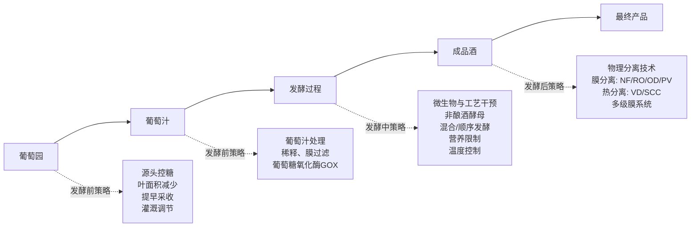
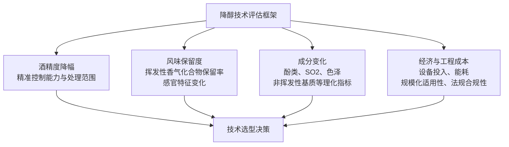
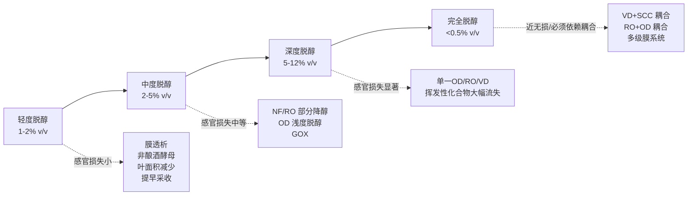

# 葡萄酒降醇技术全景研究：方法路径、作用机制及其对风味与品质的影响
# 1 研究背景与降醇技术总体框架

葡萄酒作为一种兼具农业属性与文化属性的传统饮品，其酒精度水平历来被视为反映年份、产区与酿造工艺的核心指标之一。然而，进入21世纪以来，全球葡萄酒行业正面临一个共同的结构性挑战：成品酒的实际酒精度呈现持续攀升趋势，部分干红葡萄酒的酒精度已由传统的12%–13%vol普遍上升至14%–15%vol，乃至更高。与此同时，全球消费市场又出现了与之方向相反的强烈信号——年轻消费者、女性群体以及健康导向人群正大规模转向低醇与无醇饮品。这一"供给端酒精度被动升高"与"需求端酒精度主动降低"的剪刀差，构成了葡萄酒降醇技术研发的根本驱动力，也促使学界与产业界系统性地构建起覆盖从葡萄园到瓶装酒全流程的降醇技术体系。本章将先剖析这一矛盾的双重成因，继而搭建按工艺介入时点划分的降醇技术总体框架，并提出贯穿全报告的评估维度，为后续各章的技术细节展开奠定逻辑基础。

## 1.1 葡萄酒酒精度上升的供给侧成因

葡萄酒酒精度的攀升首先是一个气候问题。在全球变暖背景下，葡萄藤的物候节律正发生系统性偏移，其连锁效应直接传导至最终成品酒的酒精含量。研究表明，气候变化对葡萄物候和葡萄成分产生了日益深远的影响，并最终影响葡萄酒酿造、葡萄酒微生物学与化学以及感官特性；其中最重要的气候变化相关效应包括**采收时间提前、采收期温度升高、葡萄糖分浓度增加导致葡萄酒酒精含量升高、酸度降低以及品种香气化合物的改变**[^1]。从全球范围观察，过去40年来，全球大多数葡萄酒产区的葡萄收获提前了2至3周，气温升高促进了物候进程，将葡萄成熟期推移到了夏季较温暖的时段[^2]。

这一物候偏移带来的核心后果在于**糖酸代谢失衡**。高温条件下，葡萄浆果中糖分（主要为葡萄糖与果糖）的积累速度显著加快，而苹果酸等有机酸则因呼吸作用加剧而被快速消耗，导致酿酒师在采收决策上陷入两难：若依据传统糖度指标采收，则酚类物质（单宁、花色苷等）尚未达到生理成熟；若等待酚类成熟度，则糖度往往已远超酿造适宜区间，进而在酒精发酵中产生高浓度乙醇。换言之，气候变化打破了糖成熟与酚类成熟之间原有的时序耦合，使"高酒精度"成为现代葡萄酒酿造中难以回避的副产品。

更值得警惕的是，在极端高温条件下，葡萄藤代谢可能受到抑制，导致代谢产物积累减少，这又会反向影响葡萄酒的香气与色泽；而高糖浓度的葡萄汁会引发酵母应激反应，导致**乙酸等发酵副产物的形成增加**；若不通过酸化加以控制，较高的pH值将显著改变葡萄汁与葡萄酒的微生物生态，增加腐败与感官劣化的风险[^1]。这意味着酒精度上升并非孤立现象，而是与酸度下降、微生物稳定性减弱、风味劣变等共同构成了一个相互交织的负面综合症。

从空间分布看，这一压力在地中海地区、加州沿海与低地、希腊等传统产区表现尤为突出。最新研究显示，由于气候变化带来的过度干旱和更频繁的热浪，西班牙、意大利、希腊和南加州沿海与低地地区**约90%的传统葡萄酒产区到本世纪末可能面临消失风险**；根据全球变暖程度，49%至70%的产区将面临经济上无法生存的"重大"风险，相反，11%至25%的现有葡萄种植区产量可能有所提高[^2]。这种"传统产区受损、新兴产区扩张"的格局重塑，使得在中低纬度温暖产区，**通过技术手段对成品酒进行酒精度修正已不再是可选项，而成为维持产品风格连续性与市场竞争力的必要工艺**。

虽然栽培层面的适应策略——如更换抗旱植物材料、调整培训系统、优化葡萄园管理——能够在一定升温幅度内发挥作用[^2]，但研究人员同时指出，这些调整可能不足以维持所有地区经济上可行的葡萄酒生产[^2]。这就为酿造工艺端的降醇技术留下了不可替代的应用空间，并直接催生了从葡萄汁预处理到成品酒后处理的多元技术路线。

## 1.2 低醇与无醇葡萄酒的消费需求与市场驱动

如果说供给侧的酒精度上升是一种"被动结果"，那么消费侧的低醇化趋势则是更具颠覆性的"主动选择"。这一趋势在全球范围内已形成清晰的市场数据轮廓。国际葡萄酒与烈酒研究所（IWSR）数据显示，**全球无醇葡萄酒市场从2018年至2023年的复合年增长率为7%，显著高于传统酒类市场的1%**；预计到2026年，全球无醇葡萄酒市场将从2022年的11亿美元增长至17亿美元，年均增长率接近8%[^3]。在区域上，欧洲、北美和亚太已成为无醇葡萄酒的主要市场，中东地区也呈现迅速增长趋势[^3]。

中国市场的转折尤其引人注目。受"禁酒令"等因素影响，酒饮低度化潮流加速来临，2025年被行业普遍称为我国无醇葡萄酒市场发展的"元年"[^4][^3]。具体数据显示，2025年我国低度低醇酒饮进口金额为9528万美元，**同比增长18.9%**，年均复合增长率大幅领先进口酒整体水平和主要酒类；包括无醇葡萄酒在内的无醇饮料进口额突破10亿美元关口[^4]。在更细分的时间窗口上，2025年1–6月我国对包含无醇葡萄酒在内的其他无酒精饮料进口量为1.55亿升、进口额为5.41亿美元，**进口量、额、价分别增长5.17%、26.94%和20.69%**；美团数据则显示2025年1–2月无醇葡萄酒同比增幅超过200%[^3]。

驱动这一市场扩容的，是多重消费侧力量的同向共振。下表系统梳理了主要驱动因素及其市场表现：

| 驱动维度 | 具体表现 | 市场数据/事实 |
|---------|---------|--------------|
| 健康意识提升 | Z世代和00后受短视频、WHO致癌报告、肝损伤科普影响，将酒精纳入"长期健康成本"考量 | 68%的消费者愿意为"低负担、好入口"的产品多掏钱[^5] |
| 人群结构变迁 | 女性消费占比与年轻群体渗透率显著提升 | 低度酒赛道女性消费占比65%，Z世代渗透率提升6%[^5] |
| 悦己型轻饮酒文化 | 居家微醺、下午茶、轻商务宴请等场景取代传统酒桌 | 天猫"微醺小酒柜"销量年增50%[^5] |
| 头部企业入局 | 国内外头部酒企集中布局无醇/低醇品类 | 张裕在2025年半年报中明确提出开发无醇葡萄酒；长城两款无醇产品进入测试阶段；富邑、干露、卡思黛乐、酩悦轩尼诗等国际品牌相继宣布入局[^4][^3] |
| 政策与法规支持 | 多国通过法规为低醇/无醇产品打开合规空间 | 英国2024年葡萄酒修正案（第2号）明确允许生产和销售无酒精和低酒精葡萄酒[^6] |
| 标准体系完善 | 国家标准对品类边界作出明确界定 | 我国GB/T 17204-2021《饮料酒术语和分类》首次将"无醇葡萄酒"定义为"酒精度小于0.5%vol的脱醇葡萄酒"[^3] |

从市场结构看，无醇/低醇葡萄酒抢占的**并非传统葡萄酒市场，而是水、茶、饮料等无酒精饮品市场**[^4]——这是理解其增长逻辑的关键。它意味着无醇葡萄酒并非传统葡萄酒的简单替代品，而是开拓出了一条与软饮、功能性饮料正面竞争的新赛道，对原料、工艺与风味设计提出了与传统酿造迥异的要求。预计未来3到5年，低醇、无醇葡萄酒因契合年轻消费者轻饮酒、悦己消费偏好，将继续保持双位数增长[^4]。

当然，市场扩张并非没有阻力。**消费者认知不足、价格瓶颈、标准缺失、有品类没品牌**仍是当前我国无醇葡萄酒发展需要解决的现实问题[^3]。早期进口无醇葡萄酒均价约80元，部分电商渠道单瓶零售价甚至达到150元以上[^3]，价格门槛长期抑制了大众化普及。此外，行业普遍反映"喝起来像果汁"的口感问题[^4]，也直接指向了降醇过程中风味损失这一核心技术瓶颈——这正是后续章节将重点剖析的"如何在降醇的同时保留葡萄酒典型性"这一关键命题。

供给侧的酒精度被动上升与消费侧的低醇主动选择，在产业链上形成了清晰的耦合关系：气候变化迫使酿酒师寻找降醇手段以维持传统产品风格，而消费市场则进一步要求技术能够批量产出**酒精度<0.5%vol的无醇产品**以及**部分降醇产品**——两类需求在工艺介入深度、设备投入与风味管理上存在显著差异，这就要求建立一个分层、分阶段的降醇技术框架。

## 1.3 降醇技术的分类体系与策略框架

基于上述需求的分层属性，当前学界与产业界普遍按**工艺介入时点**将降醇技术划分为三大策略：发酵前策略、发酵中策略与发酵后策略。这一分类逻辑的核心在于：乙醇是酵母将可发酵糖转化为乙醇与二氧化碳的代谢产物，因此降低成品酒乙醇含量在原理上有三条路径——**减少底物（糖）、改变转化效率（酵母代谢）、或在产物形成后将其分离**。三大策略恰好对应这三种思路。

**发酵前策略**的核心思路是在乙醇尚未生成之前就降低糖底物或调整葡萄原料特性，包括葡萄栽培层面的叶面积减少法（限制光合作用以减缓糖积累）、提早采收（在糖度尚未达到峰值时采摘）、生长调节剂使用与采收前灌溉，以及葡萄汁处理层面的葡萄汁稀释、膜过滤汁液处理和葡萄糖氧化酶（GOX）添加（将葡萄糖催化氧化为葡萄糖酸，从源头降低可发酵糖底物）。此类策略的优势在于"治本"，但受制于AOC等法定产区法规框架，且对葡萄酸度、酚类成熟度等品质参数存在潜在影响。

**发酵中策略**则通过微生物学与工艺参数干预降低乙醇得率，主要包括非酿酒酵母（如*Hanseniaspora uvarum*、*Candida zemplinina*、*Metschnikowia pulcherrima*、*Torulaspora delbrueckii*等）与酿酒酵母的顺序或混合发酵，利用非酿酒酵母较低的乙醇得率以及其β-葡萄糖苷酶等酶活性增强香气复杂度；此外还包括营养限制（控制可同化氮源以引导酵母代谢途径）与发酵温度控制（影响糖分转化效率与副产物生成）。该策略的核心权衡在于**降醇幅度、香气复杂度提升与发酵稳定性之间的平衡**。

**发酵后策略**则在乙醇已经形成之后通过物理分离手段将其脱除，包括膜分离类技术——纳滤（NF）、反渗透（RO）、渗透蒸馏（OD）、渗透汽化（Pervaporation, PV）以及**多级膜耦合系统**（如纳滤-渗透汽化NF-PV系统、反渗透-蒸发萃取RO-EP系统）——和热分离类技术——**真空蒸馏（VD）**与旋转锥柱（SCC）。其中，真空蒸馏在真空条件下（低于0.1巴）操作，将乙醇的蒸发温度降低至15–20°C，从而避免高温对热敏性香气化合物的破坏；多级膜系统则通过将不同分离机理串联，在协同提升风味保留与降醇精度方面展现出显著优势。值得指出的是，发酵后策略是目前唯一能够实现**无醇产品（<0.5%vol）**批量生产的工艺路线，因此在当前无醇葡萄酒市场快速扩张的背景下占据关键技术地位。

根据GB/T 17204-2021等标准，结合产业实践，三类策略的技术定位与目标酒精度区间可归纳如下：

| 策略类型 | 介入时点 | 典型工艺路线 | 适用目标产品 | 典型降醇能力 |
|---------|---------|------------|------------|-------------|
| 发酵前策略 | 葡萄园管理 / 葡萄汁预处理 | 叶面积减少、提早采收、葡萄汁稀释、GOX添加、膜过滤汁液处理 | 部分降醇葡萄酒 | 1%–2%vol削减为主 |
| 发酵中策略 | 酒精发酵过程中 | 非酿酒酵母混合/顺序发酵、营养限制、低温发酵 | 部分降醇/低醇葡萄酒 | 通常1%–3.5%vol削减 |
| 发酵后策略 | 成品酒后处理 | NF、RO、OD、PV、VD、SCC、多级膜系统 | 部分降醇 / 低醇（0.5%–7%vol）/ 无醇（<0.5%vol） | 可实现从轻度降醇到接近完全脱醇的全范围 |

从这一分类可以看到，**目标产品类型与技术选型之间存在清晰的对应关系**：以维持传统葡萄酒风格、仅降低1–2度的"部分降醇"产品，通常优先选用发酵前与发酵中策略以减少干预成本；而面向健康饮品市场、需要达到无醇标准（<0.5%vol）的产品，则必须依赖发酵后膜分离或热分离技术，部分场合还需要发酵前-中-后多策略协同。这一选型逻辑将贯穿后续各章的技术讨论。

## 1.4 降醇效果的关键评估维度

由于降醇技术种类繁多、机理差异显著，要在同一框架下对其进行横向比较，必须建立一套统一的评估维度。基于现有文献综述，影响降醇葡萄酒最终质量的因素既包括理化参数（如初始酒精含量、葡萄酒非挥发性基质的保留特性、香气组分的特性），也包括工艺参数（如降醇技术的选择、蒸馏温度、操作压力、膜的过滤性能与孔径等）[^7]。综合这些影响因素，本报告提出以下四维评估框架，作为后续章节比较各类降醇技术的统一基准：

**第一维度：酒精度降幅与精准控制能力**。该维度关注技术所能实现的酒精度削减范围（部分降醇1%–2%vol、低醇0.5%–7%vol、无醇<0.5%vol），以及对最终酒精度的精准调控能力。不同技术在这一维度上的表现差异极大：发酵前策略通常仅能实现1–2度的中等幅度降醇，而反渗透、渗透蒸馏等膜分离技术配合多级耦合可以实现从0.5%vol到任意目标酒精度的精准设定。

**第二维度：风味保留度**。这是降醇技术最具挑战性的评估维度。葡萄酒香气主要由酯类、萜烯类、高级醇、硫醇类等挥发性化合物构成，其中许多组分与乙醇在分子量、极性、沸点上接近，因此在脱醇过程中极易被同步带出。已有研究系统总结了过去十年中不同脱醇工艺对葡萄酒**色泽、二氧化硫、酚类组成、理想挥发性香气化合物损失以及感官特征**的影响[^7]。本报告将以挥发性香气化合物保留率与感官评价中的果香、花香、品种典型性等指标作为核心衡量标准。

**第三维度：成分变化**。除了挥发性香气，降醇过程对葡萄酒的非挥发性基质同样有显著影响，包括残糖、有机酸、单宁、花色苷与其他酚类化合物、甘油、二氧化硫以及色泽等理化指标的变化。这些组分共同决定了葡萄酒的酒体结构、口感平衡与陈年潜力，因此必须作为独立维度纳入评估。

**第四维度：经济与工程成本**。该维度涵盖设备初始投资、单位产品能耗、运行维护成本、规模化生产适用性以及法规合规性。从产业落地角度看，技术再先进，如果成本无法被产品溢价覆盖，则难以实现规模化推广。这一维度对于解释当前无醇葡萄酒面临的"价格瓶颈"问题[^3]、以及不同酒企在技术路线选择上的差异具有重要意义。

值得强调的是，这四个维度并非独立，而是存在显著的**权衡关系**：例如，提高酒精度降幅往往意味着更高的风味损失与能耗成本；而追求更高的风味保留率则可能限制降醇深度或大幅推高设备投入。任何一项降醇技术的"最优解"，都是在特定产品定位下对四个维度进行平衡的结果。**这一权衡逻辑将作为后续第2至第5章技术分析的隐含主线，并在第6章的综合评估与技术选型建议中得到系统呈现**。

综上，气候变化驱动的酒精度被动升高与消费市场拉动的低醇主动选择，共同构成了葡萄酒降醇技术研发的双重驱动力。围绕"减少糖底物—改变酵母代谢—分离已生成乙醇"三条核心思路，形成了发酵前、发酵中、发酵后三大策略，分别对应部分降醇、低醇与无醇等不同目标产品。本章建立的"四维评估框架"将作为后续技术分析的统一标尺，下一章将首先深入剖析发酵前策略，从葡萄园到葡萄汁全过程探讨源头控糖的技术路径及其品质影响。

# 2 发酵前降醇策略：从葡萄园到葡萄汁的源头控糖

承接第一章建立的"减少底物—改变转化—分离产物"三条核心降醇路径，本章聚焦其中第一条思路，即在酵母尚未将糖转化为乙醇之前，通过葡萄园栽培管理与葡萄汁预处理两个层面的干预，从源头降低可发酵糖含量或调整原料组分，从而在化学计量上限制乙醇的生成上限。这一策略最显著的特征在于其"治本"属性——它直接作用于乙醇生成的物质基础，而非在乙醇形成后再行剥离，因而在能耗与设备投入上相对友好；然而其代价同样鲜明：在气候变化加剧"糖成熟"与"酚类成熟"时序错位的大背景下，发酵前策略的每一项干预几乎都会对葡萄酒的酸度、酚类成熟度、香气前体物质与最终典型性产生级联影响，而这些副作用又会被法定产区（AOC）、国际葡萄与葡萄酒组织（OIV）以及各国食品安全法规所约束。本章将沿"葡萄园栽培管理—葡萄汁预处理"的双层逻辑展开，依次剖析叶面积减少、提早采收、生长调节剂与灌溉调节、葡萄汁稀释、膜过滤汁液处理以及葡萄糖氧化酶（GOX）酶法降糖六类典型路径，并在第一章建立的四维评估框架下进行横向比较，揭示发酵前策略"治本但受限"的内在特征。

## 2.1 葡萄园栽培层面的源头控糖路径

葡萄园层面的源头控糖，本质上是通过调控"源（leaves）—库（berries）"关系来重新分配光合产物的去向，其中**叶面积减少法（leaf area reduction，亦称defoliation或基部叶片移除）**是最具代表性也是研究最为系统的手段。其基础机理在于：葡萄浆果中绝大部分碳同化物经由韧皮部从叶片输入，而成熟期浆果中的糖、有机酸与次生代谢产物的积累正是基于这些进口碳源[^8]；因此，通过削减成熟叶片数量、降低单株光合作用总量，便可在化学计量上限制可发酵糖的累积速率，进而压低发酵后乙醇的上限。

然而，源-库操控对葡萄浆果与葡萄酒品质的影响远比"少叶=低糖"的线性逻辑复杂。一项针对赤霞珠（*Cabernet Sauvignon*）连续两个生长季的因子试验显示，研究者将叶片保留比例设置为100%、66%、33%三个水平，并与不同程度的疏果处理交叉组合，结果发现叶面积与果实质量的比例在生长季中倾向于相互补偿与交互，至采收时各处理间的叶面积或果实质量差异反而较预设值缩小；更值得关注的是，**叶面积减少强烈抑制了浆果质量，且这一效应即便在次年未再进行去叶处理的恢复季中依然存在**，表现出明显的滞后效应，浆果成熟指标（可溶性固形物、酸度与花色苷水平）也随之发生连带变化[^9]。这一结果意味着叶面积减少法并非可以"按需开关"的精确调节器，其对藤体储备碳库的扰动会跨越年度边界，给葡萄园的连续生产规划带来不确定性。

去叶时期与强度对香气前体物质的影响同样具有显著的非线性特征。一项针对长相思（*Sauvignon Blanc*）的研究将基部叶片移除强度设为半度（half basic, 50%）与全度（full basic, 100%）两档，分别在转色期前两周、转色期当周与转色期后两周实施，结果显示**半度去叶提高了葡萄与葡萄酒的pH值并降低了酒石酸含量；早期去叶处理增加了葡萄中大多数游离态与结合态单萜化合物的浓度；脱叶处理整体提高了葡萄酒中的总单萜含量，但全度去叶葡萄酒中的单萜含量显著低于半度去叶葡萄酒**[^10]。这一结果揭示出一个对降醇工艺设计极为关键的规律：去叶强度与香气品质之间存在"过犹不及"的非单调关系——适度去叶可同时实现降糖与香气增益，但过度去叶虽能进一步压低糖度，却会反过来损失萜烯类品种香气，从而抵消其在风味维度上的相对优势。

此外，去叶处理还会改变果穗区微气候，进而引发日灼风险。澳大利亚国家葡萄酒与葡萄产业研究中心（NWGIC）的研究指出，去叶时间的选择对减轻葡萄日灼损伤至关重要，**早期叶片移除有助于减少葡萄日灼**，研究者通过新南威尔士州Orange产区两个霞多丽（Chardonnay）葡萄园的试验，识别出能够最大限度降低日灼风险的最佳去叶时点[^11]。换言之，去叶在降糖之外还附带果穗暴露度、温度与紫外辐射的连带变化，必须在物候时点上进行精细调度。

综合上述证据，**叶面积减少法的典型降醇能力位于1–2%vol区间**，但其品质代价具有明显的"双向风险"特征：强度不足时降糖效果有限，强度过高则同时削弱萜烯类香气与花色苷积累、并使浆果质量出现跨年度滞后下降；时点过晚则可能错过对糖积累速率的有效干预窗口，时点过早又会增加日灼风险。这一复杂耦合关系也解释了为何源-库操控类技术虽然机理直接，却始终未能成为大规模降醇的主流工艺，而更多作为局部调节工具配合其他策略使用。

## 2.2 提早采收与采收期调控

如果说叶面积减少法是通过限制光合"输入"来控糖，那么**提早采收（early harvest）**则是通过缩短积累"时间窗"来直接锁定较低的可发酵糖底物。其原理最为直观：在浆果糖度尚未达到峰值时进行采收，使发酵起始的可发酵糖浓度即处于较低水平，进而在化学计量上限制最终乙醇生成量。在气候变化背景下，这一手段的现实意义被进一步放大。NASA与哈佛大学基于1600–2007年法国与瑞士葡萄收获日期的研究发现，**20世纪后半叶葡萄收获日期出现戏剧性提前，其驱动机制在气候与采收时点之间的连接关系上发生了根本变化**——1600–1980年间的提前采收主要出现在春夏温暖且干旱的年份，而1981–2007年间，即便在没有干旱的年份，气候变暖也持续推动采收日期提前[^12]。

然而，在气候变化已经"自然性地"推动采收提前的背景下，主动选择更早采收以降低酒精度，遭遇的核心难题正是第一章已提及的**"糖成熟"与"酚类成熟"时序错位**问题。葡萄浆果中糖分（己糖）、有机酸、次生代谢产物（花色苷、单宁等酚类化合物）的积累分别遵循各自的代谢节律，而气候变化打乱了它们之间原有的时序耦合[^8]。在传统温度条件下，糖度达到酿造适宜区间时酚类物质大致同步成熟；但在现代高温年份，若依据传统糖度指标采收则酚类尚未成熟，若等待酚类成熟则糖度已远超目标值。提早采收虽能有效压低糖底物，但其代价是**单宁青涩、花色苷不足、品种风味化合物尚未充分积累**，最终成品酒在感官上常表现为酒体单薄、青草味突出、果香与花香表达不充分。

在酸度维度上，提早采收则呈现明显的正向效应。早期采摘的葡萄通常保留更高的苹果酸与酒石酸含量、更低的pH值，这对当前在温暖产区普遍出现的"高pH—低酸度—微生物稳定性下降"问题构成了部分缓解。然而，过高的苹果酸又会增加苹乳发酵（MLF）阶段的工艺负担，并对最终葡萄酒的酸度平衡提出更精细的调配要求。

为缓解上述权衡，产业界发展出**双重采收（double harvest）/分批采收**的工艺变体：在同一葡萄园的不同物候时点分别进行两次采收，**第一次在糖度较低但酸度保留较好的早期阶段采摘以获取低糖高酸基酒，第二次在糖度与酚类同步成熟的晚期阶段采摘以获取风味浓郁的高糖基酒**，随后按目标酒精度将两批基酒进行混合调配。一项针对葡萄汁稀释与营养添加对葡萄酒酿造过程影响的研究在文献综述中明确提及了"连续采收（consecutive harvests）"作为低醇葡萄酒生产路径之一[^13]。这种工艺设计的本质，是将"降糖"与"风味成熟"在时间维度上解耦，再通过调配在产品维度上重新整合，能够在一定程度上同时满足降醇与典型性保留两项目标，但代价是采收作业次数翻倍、葡萄园与酒厂的协同管理复杂度大幅上升。

总体而言，提早采收的典型降醇能力同样在1–2%vol区间，其优势在于操作简单、不涉及外源添加物、可在大多数法规框架下合法执行；但其在酚类成熟度上的负面权衡，使其更适合作为**辅助性手段**而非独立的降醇方案，尤其在追求风味浓郁度的高端葡萄酒中需要审慎使用。

## 2.3 生长调节剂与采收前灌溉调节

除冠层管理与采收时点之外，葡萄园层面还可通过外源生长调节剂与水分管理对浆果代谢与糖分运输进行更细粒度的调控。其机理基础在于：浆果糖分积累依赖于韧皮部蔗糖装载与卸载、跨膜糖转运体活性以及己糖代谢酶的协同作用[^8]，理论上，针对这一代谢网络的任一节点进行干预，均可改变最终的糖积累水平。研究者曾尝试通过外源植物激素（如生长素、脱落酸类似物）干预蔗糖向己糖的转化或抑制韧皮部装载，以期在不显著影响酚类合成的前提下选择性降低糖积累；然而由于葡萄浆果代谢网络的高度冗余与反馈调节机制，外源调节剂的效果在不同品种、不同年份间稳定性不足，且大多数植物生长调节剂在葡萄酒原料生产中受到OIV与各国食品法规的严格限制，目前仍主要停留在研究阶段，尚未形成规模化产业应用。

**采收前灌溉调节**则是更具可操作性的实践路径。其逻辑在于：在浆果成熟末期通过补充灌溉适度增加浆果含水量，从而在不显著改变绝对糖量的前提下稀释单位体积葡萄汁中的糖浓度，最终降低发酵起始糖度；与之相反，亏缺灌溉（deficit irrigation）则倾向于浓缩糖分但同时强化酚类与花色苷的积累。因此，**采收前定向补水可视为一种"葡萄园中的稀释"**，其优势在于干预温和、成本低、不引入外源化学物质，但效果受土壤排水性、根系吸水能力与采收前气候条件影响较大，对最终糖度的精准调控较为困难，且在干旱压力下的传统产区（如西班牙、南意大利、希腊）可能面临水资源可获得性的限制。此外，过度补水还可能稀释花色苷与风味化合物，引发"水味"问题，与提早采收类似地损失风味浓郁度。

综合判断，生长调节剂与采收前灌溉调节属于**机理上可行、产业化程度较低**的降醇辅助手段，其在四维评估框架下的得分整体偏低——降幅有限（通常<1%vol）、风味影响不确定、成本中等、法规接受度因地区差异显著。在当前主流产业实践中，这两类措施更多与叶面积管理、采收时点决策协同使用，而非作为独立降醇方案。

## 2.4 葡萄汁稀释与膜过滤汁液处理

当干预环节从葡萄园转移至酒厂的葡萄汁预处理阶段，降醇的可控性与精准度显著提升。其中最简单也最具争议的方法即**葡萄汁稀释（juice dilution）**，其原理直接到无需赘述：向高糖度葡萄汁中加入定量饮用水，按比例稀释单位体积内的可发酵糖浓度，从而线性地压低发酵后乙醇生成量。澳大利亚相关法规允许在葡萄汁中加水**最高至7%（v/v）**，这一加水量大约可降低最终葡萄酒酒精度约**1%v/v**。

稀释法对发酵过程与终产品风味的影响已有系统研究。Gardner等人针对Lalvin EC1118™与Lalvin R2™两株商业酿酒酵母以及Lalvin VP41™苹乳乳酸菌，在实验室规模下考察了葡萄汁加水稀释及外源复合营养添加的影响，结果显示：**加水稀释并未抑制酒精发酵进程，反而缩短了发酵持续时间；对于苹乳发酵而言，稀释甚至使其能够在原本难以完成的条件下顺利完成；进一步添加复合有机营养可进一步缩短Lalvin R2™的酒精发酵时间，并在部分条件下减少苹乳发酵持续时间**[^13]。这一发现具有重要的工艺意义——它表明稀释不仅是一种降糖手段，同时也通过降低渗透压减轻了酵母与乳酸菌的胁迫，改善了发酵动力学。然而代价同样显著：**研究同时发现，稀释处理条件下完成发酵的葡萄酒中，对香气与风味有贡献的化合物浓度普遍较低；外源复合营养的添加也会进一步改变某些化合物的浓度**[^13]。换言之，稀释在线性降糖的同时，也对风味化合物的最终浓度产生了同等比例的稀释效应，使终酒在感官上呈现"轻盈但平淡"的特征。

为克服直接稀释的"水味"问题，产业界发展出**膜过滤汁液处理（membrane filtration of juice）**作为更精细的源头控糖手段。其核心思路是利用**纳滤（NF）与超滤（UF）**等压力驱动膜分离技术，选择性地从葡萄汁中分离出富糖渗透液，而将含香气前体物质、酚类、有机酸等大分子或带电组分保留在浓缩侧，再将脱糖后的渗透液重新与浓缩侧合并，从而在降低总糖浓度的同时尽可能保留风味浓度。**国际葡萄与葡萄酒组织（OIV）已于2012年通过Resolution OIV-OENO 450B-2012正式批准了这一膜过滤汁液处理技术**，为其在国际葡萄酒贸易框架下的合法使用奠定了基础。

商业化方面，**REDUX®**是这一技术路线的代表性产品，其工艺特征在于将**超滤（UF）与纳滤（NF）**两级膜串联使用：上游UF膜先将葡萄汁分离为含大分子（蛋白质、多酚、风味前体）的保留液与含小分子（糖、有机酸、水、香气化合物）的渗透液；下游NF膜再对UF渗透液进行二次分离，将糖分截留于浓缩侧并予以分离脱除，而将水、香气小分子等组分回流至上游保留液中重新混合。这一两级耦合设计的关键价值在于**风味化合物得以重新回到原始基质中，避免了直接稀释带来的全组分等比例下降**。在工艺参数上，**通过过滤处理约20–25%的葡萄汁体积，可使最终葡萄酒的酒精度降低约1–2%v/v**——这与提早采收、叶面积减少等栽培层措施的降醇能力处于同一区间，但风味保留度显著优于直接稀释。

膜过滤汁液处理与直接稀释在工艺定位与法规接受度上的差异，可归纳如下：直接稀释属于"外源添加"，部分国家与产区（尤其是欧盟AOC体系下的高端产区）将其视为变相加水而禁止使用；膜过滤汁液处理则属于"葡萄自身组分的内部再分配"，在OIV框架下获得了明确许可。这一差异决定了膜技术虽然设备投资与运行成本较高，但在国际市场的合规通行能力上具有不可替代的优势。

## 2.5 葡萄糖氧化酶（GOX）酶法降糖

与稀释或膜分离类"物理减糖"路径不同，**葡萄糖氧化酶（Glucose Oxidase, GOX，EC 1.1.3.4）**提供了一条"化学转化减糖"的新路径——它不是从葡萄汁中移除糖，而是在原位将葡萄糖催化氧化为**不可发酵的葡萄糖酸**，使可被酵母代谢为乙醇的底物在化学层面上"消失"。其底物特异性极高：GOX对β-D-葡萄糖表现出强烈的特异性，葡萄糖分子C(1)位上的羟基对酶的催化活性至关重要，且羟基处于β位时的活性比α位高约160倍[^14]。

GOX的催化反应在不同条件下呈现三种化学计量关系，可归纳如下[^14]：

$$\text{C}_6\text{H}_{12}\text{O}_6 + \text{O}_2 \rightarrow \text{C}_6\text{H}_{12}\text{O}_7 + \text{H}_2\text{O}_2$$

具体而言：（1）在没有过氧化氢酶存在时，每氧化1 mol葡萄糖消耗1 mol氧，生成1 mol葡萄糖酸内酯与1 mol过氧化氢；（2）在过氧化氢酶存在时，过氧化氢被分解，每氧化1 mol葡萄糖仅净消耗1/2 mol氧；（3）当体系同时存在乙醇与过氧化氢酶时，过氧化氢酶可用于乙醇的氧化，每氧化1 mol葡萄糖消耗1 mol氧[^14]。这一反应网络对葡萄汁端的GOX工艺设计具有直接指导意义——通常需要**配合过氧化氢酶（catalase）使用**，以分解反应生成的H₂O₂，避免其对葡萄汁中酚类、香气化合物以及后续接入的酵母细胞造成氧化损伤。

从葡萄酒酿造工艺的视角综合评估，GOX酶法降糖具有以下技术特征：

第一，**底物针对性强**。GOX仅作用于葡萄糖，而不能氧化果糖。由于葡萄汁中葡萄糖与果糖通常以接近1:1的比例存在，且果糖在大多数酵母中的发酵能力略弱于葡萄糖，单独使用GOX处理后剩余果糖仍可在发酵过程中转化为乙醇，因此其理论降醇上限并非全部糖量，而是大致对应葡萄糖比例的削减。

第二，**酸度同步上升**。葡萄糖被氧化为葡萄糖酸后，葡萄汁的有机酸构成发生显著改变，pH值下降、总酸上升。这一效应在温暖产区的高pH葡萄汁中可视为正向贡献——既降低了乙醇潜力，又强化了微生物稳定性，并部分弥补了气候变化导致的苹果酸损失；但在本就酸度偏高的冷凉产区，则可能造成口感过酸的副作用，需要后续工艺加以平衡。

第三，**氧气需求与SO₂相容性挑战**。GOX反应需要消耗分子氧或原子氧[^14]，因此实际操作中需向葡萄汁中持续通入空气或纯氧以维持反应进程，这就引入了**葡萄汁氧化褐变与香气前体物质氧化损失**的风险。同时，GOX反应中间产物H₂O₂具有强氧化性，即便配合过氧化氢酶进行分解，残余的氧化压力仍可能影响葡萄汁中的硫醇类香气前体与花色苷。此外，葡萄酒酿造中常用的SO₂作为抗氧化剂与抑菌剂，其本身具有还原性，会与GOX反应体系发生竞争性消耗，因此GOX处理通常需要在**SO₂添加之前**完成。

第四，**温和与可控**。相比膜分离与热分离类后处理技术，GOX在常温常压下即可完成反应，能耗极低，对设备投入要求小，是一种相对温和的源头降糖工具。其降醇潜力在合适的工艺条件下可达1–2%vol，与稀释、膜过滤、提早采收等手段处于同一区间。

GOX作为已被广泛应用于食品工业的成熟工业用酶（在葡萄酒、啤酒、果汁、奶粉等食品脱氧、面粉改良、防止食品褐变等方面均有应用基础）[^14]，其在葡萄酒降醇方向的产业化应用主要受限于法规接受度——多数产区对葡萄汁端外源酶处理需明确许可，且其引入的葡萄糖酸增量在不同法规下的标签披露要求亦有差异。

## 2.6 发酵前策略的综合比较与法规可行性

在完成上述六类发酵前路径的逐项剖析后，有必要在第一章建立的"四维评估框架"下进行横向比较，以揭示其相对优劣与协同潜力。下表对各路径的核心指标进行汇总：

| 技术路径 | 介入层面 | 典型降醇幅度 | 对酸度影响 | 对酚类/香气成熟度影响 | 法规可行性 |
|---------|---------|------------|----------|--------------------|-----------|
| 叶面积减少法 | 葡萄园冠层 | 1–2%vol | 弱正向（pH略有变化）[^10] | 适度去叶可增萜烯类香气，过度去叶则香气损失[^10][^9]；存在跨年度滞后效应[^9] | 普遍允许，属栽培管理 |
| 提早采收 | 采收时点 | 1–2%vol | 强正向（高苹果酸、低pH） | 酚类不足、青草味突出；可借双重/连续采收调配缓解[^13] | 完全允许 |
| 生长调节剂 | 浆果代谢 | <1%vol（不稳定） | 不确定 | 不确定，研究阶段为主 | 受OIV与各国法规严格限制 |
| 采收前灌溉调节 | 水分管理 | <1%vol | 弱稀释效应 | 过度补水会稀释花色苷与风味 | 普遍允许，受水资源约束 |
| 葡萄汁稀释 | 葡萄汁 | 7% v/v加水约降1% v/v | 弱稀释效应 | 香气化合物等比例下降[^13]；发酵动力学改善[^13] | 澳大利亚允许≤7% v/v；欧盟AOC普遍禁止 |
| 膜过滤汁液处理（UF+NF, REDUX®） | 葡萄汁 | 处理20–25%葡萄汁可降1–2% v/v | 影响较小（NF选择性截糖） | 风味化合物可回流原汁，保留度优于稀释 | OIV于2012年通过Resolution OIV-OENO 450B-2012批准 |
| 葡萄糖氧化酶（GOX） | 葡萄汁 | 1–2%vol | 正向但显著（葡萄糖酸增加、pH下降）[^14] | 需控制H₂O₂氧化压力；与SO₂存在相容性挑战 | 食品工业广泛应用[^14]；葡萄酒端需各产区单独许可 |

从这一横向比较中可以提炼出三条核心洞察。

**第一，发酵前策略的降醇能力存在明显的天花板。**几乎所有路径的典型降醇幅度都集中在1–2%vol区间，且随着降幅向2%vol以上推进，副作用呈非线性放大——叶面积过度减少损失萜烯香气[^10]、采收过早造成酚类不足、稀释过度引发"水味"、GOX处理时间过长引入氧化损伤。这意味着发酵前策略**几乎不可能独立支撑无醇产品（<0.5%vol）的生产**，其产品定位主要是"部分降醇"（削减1–2度以恢复传统风格）。

**第二，酸度与酚类成熟度存在结构性权衡。**大多数发酵前路径在压低糖度的同时倾向于保留或增加酸度——提早采收保留苹果酸、GOX生成葡萄糖酸[^14]、稀释降低单位体积酸量但同时降低绝对乙醇潜力。这一现象的产业意义在于：发酵前策略在温暖产区"高糖—低酸—高pH"的现代葡萄原料背景下，**不仅是降醇工具，同时也是酸度调控工具**，其对成品酒微生物稳定性与陈年潜力的改善作用应与降醇效应一并评估。然而代价是酚类与香气成熟度往往被同步削弱，需要后续发酵中策略（如非酿酒酵母增香）与发酵后策略（如多级膜系统精准回补）加以补偿。

**第三，法规边界是发酵前策略产业化推广的关键瓶颈。**栽培层面的措施（去叶、采收时点、灌溉）在所有产区均合法，因此具有最广泛的应用基础；而葡萄汁端的干预则面临差异化的合规挑战——直接稀释在澳大利亚被明确允许（≤7% v/v）但在欧盟传统AOC产区普遍受禁；膜过滤汁液处理因OIV于2012年通过Resolution OIV-OENO 450B-2012而获得国际合法性；GOX等酶法处理则需在各国食品法规与葡萄酒酿造规范下分别审批。这一法规分层决定了**同一项发酵前技术在不同市场的可行性差异极大**，跨国酒企在技术选型时必须将目标市场的法规框架纳入决策矩阵。

综合而言，发酵前策略呈现出"治本但受限"的核心特征：它直接作用于乙醇生成的物质基础，工艺温和、能耗低、对葡萄酒整体基质扰动较小，但降醇幅度有限、副作用复杂、法规边界差异显著，难以单独满足无醇与深度低醇产品的市场需求。这一边界恰恰为下一章将要分析的**发酵中降醇策略**留下了关键的衔接空间——当源头控糖的降幅达到1–2%vol的上限后，进一步压低乙醇就需要从酵母代谢层面入手，通过非酿酒酵母与酿酒酵母的混合或顺序发酵、营养限制以及温度控制等微生物学手段，在底物已部分降低的基础上进一步降低糖-醇转化效率，从而将降醇幅度推向2–3.5%vol的更深区间。

# 3 发酵中降醇策略：通过菌种与发酵参数调控乙醇生成

承接上一章对发酵前策略"治本但受限"特征的剖析——即源头控糖路径在降醇幅度上普遍触及1–2%vol的天花板，且进一步压低糖底物会引发酚类不足、香气稀释与法规边界冲突等连锁副作用——本章将研究视野从葡萄园与葡萄汁预处理推进至酒精发酵的核心环节。这一阶段的降醇逻辑发生了根本转变：不再追求"减少糖底物"，而是直接干预"糖-醇转化效率"本身，通过微生物学与工艺参数调控，使既定量的可发酵糖在代谢过程中更多地流向乙醇以外的副产物（甘油、有机酸、生物量、酯类等），从而压低单位糖的乙醇产率。这一思路在产业现实意义上具有不可替代性——它既能在发酵前策略的1–2%vol削减基础上叠加额外的1–2%vol降幅，又能在不显著扰动葡萄原料典型性的前提下，借助非酿酒酵母的独特酶谱与代谢产物对香气复杂度形成正向贡献，构成了介于发酵前源头控糖与发酵后物理脱醇之间的"中间地带"主力工艺。本章将沿"非酿酒酵母代谢学基础—顺序/混合发酵工艺设计—营养限制与氧化还原调控—发酵温度控制—综合评估"的逻辑链依次展开，揭示发酵中策略在降醇幅度、香气增益与发酵稳定性之间的核心权衡，并明确其作为"部分降醇与低醇产品主力工艺"的产业定位。

## 3.1 非酿酒酵母降醇的代谢机制与菌种谱系

要理解发酵中策略的降醇潜力，首先必须回到酵母糖代谢的代谢通路层面，剖析"为什么非酿酒酵母能产生比酿酒酵母更少的乙醇"这一基础性问题。在标准的酒精发酵中，酿酒酵母（*Saccharomyces cerevisiae*）展现出高度发酵性的糖酵解-乙醇通路：在厌氧条件下，几乎所有进入糖酵解的碳源都经丙酮酸脱羧、乙醛还原最终被转化为乙醇与CO₂，糖-醇转化效率接近理论上限。这一高度专一化的代谢取向正是数千年人工筛选的结果，却也恰恰构成了现代低醇葡萄酒生产的代谢瓶颈。

非酿酒酵母则呈现出截然不同的代谢分配格局。以**德尔布有孢圆酵母（*Torulaspora delbrueckii*）**为例，其与酿酒酵母相比，**呼吸作用对整体代谢的贡献更高，这反映在更高的生物量产率上**[^15]。这一现象的代谢学含义十分明确：当更多的碳源通过三羧酸循环被氧化为CO₂与水以支持细胞合成，而非经厌氧糖酵解被还原为乙醇时，单位糖底物的乙醇产率自然下降。换言之，非酿酒酵母在代谢通路层面"先天地"偏离了纯乙醇化路径，将一部分碳通量导向了生物量、甘油、有机酸与多种次级代谢产物。这种"代谢分流"是非酿酒酵母作为降醇工具的根本机理基础。

在具体菌种谱系上，目前研究最为充分、产业化潜力最高的非酿酒酵母可归纳为以下几类：

**葡萄汁有孢汉逊酵母（*Hanseniaspora uvarum*）与汉逊属其他菌种（如*Hanseniaspora osmophila*）**是葡萄表皮微生物群落中数量最丰富的非酿酒酵母之一。其在发酵初期的快速增殖能力与较低的乙醇得率使其成为顺序发酵的优选先发菌种之一[^16]。研究显示，葡萄汁有孢汉逊酵母在四株本土非酿酒酵母中表现出**最好的生长特性**，并能产生**较为丰富的香气物质，典型的发酵香气为乙酸乙酯、乙酸-3-甲基丁酯、辛酸乙酯、辛酸-3-甲基丁酯、乙酸-2-苯乙酯、辛酸和香茅醇，赋予葡萄酒复杂的果香和花香**[^17]。然而，*H. uvarum*亦以高挥发酸生成著称，工艺上必须通过严格的接种比例与时序控制加以约束。

**美极梅奇酵母（*Metschnikowia pulcherrima*）**因兼具抗菌活性、β-葡萄糖苷酶与果胶酶活性而成为近年研究热点。其能促进多酚和香气前体释放，同时降低乙醇含量，符合现代葡萄酒行业对低酒精度和高感官品质的需求[^18]。在模拟葡萄汁中单独发酵的对比研究中，美极梅奇酵母产生的发酵香气浓度最高，其中**具有玫瑰花香的苯乙醇对香气的贡献最大，另一重要香气物质为3-甲基丁醇**[^17]。

**德尔布有孢圆酵母（*Torulaspora delbrueckii*）**具有较高的SO₂耐受性（耐受70 ppm）、pH 3.5酸耐性，以及**高渗透压耐受性和低温耐受性**[^15]。其与酿酒酵母混合发酵能**显著增加发酵产品中乙酸酯类和乙酯类物质的含量，如丁酸乙酯、辛酸乙酯和癸酸乙酯，这些化合物可赋予产品浓郁的果香、花香和甜香**；同时混合发酵也显著提高了**L-苹果酸、L-乳酸、琥珀酸和草酸**等有机酸含量，并增加总酚和总黄酮等抗氧化物质含量，提升DPPH自由基清除能力[^15]。尤为重要的是，**德尔布有孢圆酵母的加入通常能降低挥发性酸特别是乙酸的含量，并减少部分高级醇的数量**[^15]，这一特性恰好弥补了汉逊属酵母高挥发酸的工艺短板，使其在多菌种联合应用中成为重要的"风味稳定器"。

**Starmerella bombicola（包括其曾用名*Candida zemplinina*相关菌株）**则以其强果糖偏好性著称。由于葡萄汁中葡萄糖与果糖通常以接近1:1的比例存在，而酿酒酵母对葡萄糖具有优先利用倾向，发酵后期残留果糖往往导致发酵不彻底；*S. bombicola*的果糖偏好特性恰好与酿酒酵母互补，在降醇的同时改善发酵完成度[^16]。

从香气酶学的视角看，**非酿酒酵母的真正价值不仅在于"少产乙醇"，更在于"多释香气"**。葡萄品种香气前体大多以糖苷结合态（glycosidic precursors）存在于葡萄浆果中，本身不具备香气活性，必须经**β-葡萄糖苷酶**水解释放游离萜烯类（如芳樟醇、香叶醇、香茅醇等）后方能显现品种典型性。研究显示，戴尔有孢圆酵母和酿酒酵母DV10在不同温度下均维持较高的β-葡萄糖苷酶活性，相应产生的品种香气成分含量也较高；而非酿酒酵母与酿酒酵母在单独发酵和混合发酵过程中都增加的香气成分包括：**浅白隐球酵母产生的乙酸异戊酯、金合欢醇和苯乙醇；葡萄汁有孢汉逊酵母产生的乙酸乙酯、乙酸异戊酯、乙酸-2-苯乙酯、金合欢醇、苯乙醇和香茅醇；美极梅奇酵母产生的乙酸乙酯、乙酸异戊酯和苯乙醇；戴尔有孢圆酵母产生的乙酸-2-苯乙酯、里那醇和苯乙醇**，进一步证明了非酿酒酵母对增加葡萄酒香气复杂性的贡献[^17]。

这一菌种-酶系-香气的对应关系揭示出发酵中策略相对于发酵前策略的关键优势：**降醇与增香并非零和博弈，而可以在合适的菌种组合下实现协同**——这正是后续顺序接种工艺设计的代谢学依据。

## 3.2 顺序接种与混合发酵的工艺设计与降醇-增香效果

非酿酒酵母虽具有较低乙醇得率与丰富酶谱，但其在葡萄酒酿造中的应用受到一个关键生理学约束：**对SO₂敏感、对葡萄果汁的发酵能力差且不耐乙醇**[^19]。在传统酿酒实践中，那些最初没有受SO₂抑制的非酿酒酵母在发酵过程中就死掉了，这一现象的根源在于SO₂和酒精的毒性[^19]。这意味着任何降醇工艺设计都必须直面一个核心问题：如何在非酿酒酵母乙醇耐受极限到来之前，使其完成尽可能多的代谢贡献，再由酿酒酵母接管完成发酵后段的高乙醇环境作业？围绕这一问题，产业界形成了两种主流工艺——**同时接种的混合发酵**与**时序错开的顺序接种**。

**同时接种**指在发酵起始即将非酿酒酵母与酿酒酵母按一定比例共同接入葡萄汁，依靠两类菌群在共培养体系中的自然竞争与互补完成发酵。这一模式工艺简单、操作风险较低，但由于酿酒酵母的强发酵性会快速消耗糖底物并积累乙醇，非酿酒酵母往往在生长起步阶段即受到抑制，其代谢贡献被显著压缩，降醇与增香效果均受到限制。

**顺序接种**则通过**先期接入非酿酒酵母、待其完成主导性代谢贡献后再接入酿酒酵母**的时序设计，最大化释放非酿酒酵母的工艺潜力。其核心工艺参数是两次接种之间的延迟时间窗口——延迟过短，非酿酒酵母未及充分增殖与产酶；延迟过长，则可能引发挥发酸过度累积或发酵停滞风险。

阿尔巴尼亚本土Kallmet葡萄酒的顺序接种试验为这一工艺设计提供了精确的量化证据。研究者设计了三组试验：Test A（*M. pulcherrima* 62接种48小时后添加*S. cerevisiae* F15）、Test B（72小时后添加）和Test C（仅接种*S. cerevisiae*作为对照），结果显示：

| 指标 | Test C（纯S. cerevisiae对照） | Test A（48h延迟接种） | Test B（72h延迟接种） |
|------|---------------|---------------|---------------|
| 最终乙醇含量 | 13.4% v/v | 12.0–12.3% v/v | **12.0% v/v** |
| 甘油 | 5.3 g/L | 6.1–6.4 g/L | 6.1–6.4 g/L |
| 总多酚 | 1105 mg/L | 1315–1479 mg/L | 1315–1479 mg/L |
| 花青素 | 131 mg/L | 148–181 mg/L | 148–181 mg/L |
| 挥发酸 | 0.7 g/L | 0.4 g/L | 0.4 g/L |
| 乙醛 | 19.3 mg/L | 5.6–11.6 mg/L | 5.6–11.6 mg/L |
| 芳樟醇（典型单萜） | 较低 | — | **115.0 μg/L** |
| 苯乙醇 | 较低 | — | **94.5 mg/L** |

在该试验体系中，*M. pulcherrima* 62在接种后48–72小时内增殖至10⁷ CFU/mL，随后被*S. cerevisiae*取代；所有试验均在10天内完成发酵，且*M. pulcherrima*未抑制*S. cerevisiae*活性[^18]。**Test B（72小时延迟接种）实现了从13.4%vol到12.0%vol、约1.4%vol的稳定降醇削减**，同时甘油浓度提升约17%、总多酚提升约19%–34%、花青素提升约13%–38%，挥发酸下降约43%、乙醛下降40%–71%。在挥发性化合物层面，Test B的苯乙醇（94.5 mg/L）、异丁醇（170.9 mg/L）和单萜类（如芳樟醇115.0 μg/L）浓度最高，显著高于对照组，这些化合物赋予葡萄酒玫瑰、香脂和热带水果香气；感官评价中，Test B在红色水果香、辛香感和整体评价中得分最高[^18]。**这一案例完整证实了顺序接种工艺在"降醇—增香—成分优化"三个维度上的同步正向贡献**，是迄今为止最具说服力的发酵中策略量化证据之一。

更广泛的多菌种比较研究表明，顺序接种的降醇能力并非*M. pulcherrima*所独有。**使用非酿酒酵母可使葡萄酒乙醇含量降低0.2%至2% v/v**，*Hanseniaspora osmophila*、*Hanseniaspora uvarum*、*Metschnikowia pulcherrima*、*Starmerella bombicola*与*Saccharomyces cerevisiae*的顺序发酵均显示出相对于纯*S. cerevisiae*对照的乙醇削减效果[^16]。这一降醇幅度区间（0.2%–2% v/v）虽与发酵前策略部分重叠，但其特殊价值在于**降醇过程同时伴随香气复杂度提升**，而非如稀释或提早采收般以风味损失为代价。

不同菌种组合还呈现出鲜明的**香气指纹特征**，可作为产品风格设计的工艺工具。综合玫瑰香葡萄汁顺序接种混合发酵的研究数据[^17]：

- **戴尔有孢圆酵母 × 酿酒酵母**：突出**乙酸异戊酯、里那醇和香叶醇**，赋予柑橘甜香与花香；
- **葡萄汁有孢汉逊酵母 × 酿酒酵母**：突出**乙酸乙酯、松油醇和香茅醇**，赋予复杂果香与花香；
- **美极梅奇酵母 × 酿酒酵母**：突出**乙酸-2-苯乙酯、金合欢醇和苯乙醇**，赋予玫瑰花香；
- **浅白隐球酵母 × 酿酒酵母**：产生**最高浓度的香气总量**，重要成分为己酸乙酯、辛酸乙酯、癸酸乙酯和9-癸烯酸乙酯；
- **纯酿酒酵母对照**：香气浓度最低，主要为辛酸和癸酸（脂肪酸为主，果香酯类不足）。

这一指纹差异的产业意义在于：**酿酒师可根据目标产品风格选择不同的非酿酒酵母组合，将降醇过程同时转化为风味设计过程**，这是发酵中策略相对于物理脱醇技术最难以替代的工艺优势。

需要指出的是，顺序接种工艺的稳定性高度依赖**酿酒酵母接管时点的精准把握**。接管过早会过度压缩非酿酒酵母的代谢贡献；接管过晚则可能因高糖、低乙醇环境下非酿酒酵母的过度增殖引发挥发酸累积或H₂S生成等异味问题。此外，葡萄汁的初始SO₂浓度、温度、营养水平均会显著影响两类菌群的竞争关系。研究显示，**SO₂浓度在50–100 ppm之间并未阻止非酿酒酵母在红葡萄酒发酵期间的生长；总体来说，SO₂浓度在0–50 ppm之间已成功地用于野生发酵**[^19]，这为顺序接种工艺的SO₂参数设计提供了实践参考区间。

## 3.3 营养限制与氧化还原调控对乙醇得率的引导

如果说非酿酒酵母联用是从"菌种"维度调控乙醇生成，那么营养限制与氧化还原调控则是从"代谢环境"维度对酵母碳通量分配进行二次干预。这一策略的核心思路在于：在不改变菌种的前提下，通过限制关键营养物质的可获得性，使酵母被迫减缓代谢、改变副产物分布，甚至提前终止发酵，从而在残糖与乙醇之间建立新的平衡点。

**酵母可同化氮（YAN）**是这一策略中最具操作性的调控杠杆。在葡萄酒酒精发酵过程中，酿酒酵母需要多种营养物质，包括碳源、氮源、生存因子和生长因子；其中**氮素是酵母生长主要的营养物质，是葡萄酒发酵所必需的营养物质之一，占酵母菌干重的12%**，是构成酵母细胞蛋白质、酶和核酸等的主要元素[^20]。葡萄醪中的可同化氮素由**游离α-氨基酸（脯氨酸除外）、小分子多肽和铵态氮**共同构成[^20]。从浓度区间看，葡萄醪含有较高浓度的含氮化合物，可溶性氮总量在0.1–1 g/L之间，其中包括铵离子（3–10%）、氨基酸（25–30%）、多肽（25–40%）和蛋白质（5–10%）；葡萄中的游离氨基酸总量在**22至1242 mg N/L**这一极宽的区间内变动，其中脯氨酸通常占氨基酸总量的30%，但由于酿酒酵母无法代谢脯氨酸，其并不计入YAN[^20]。

YAN对发酵进程的影响呈现明显的非线性特征。**低水平氮素可导致发酵迟缓或发酵不完全**，并可能引发**硫化氢的生成，进而形成"还原性"气味缺陷如臭蛋味与下水道气味**[^21]。这一现象的代谢学解释在于：当氮源不足时，酵母被迫从含硫氨基酸（半胱氨酸、甲硫氨酸）合成途径中获取氮，而该路径的副产物即为H₂S。生产中常采用向葡萄汁中添加含氮物质，如含有丰富游离氨基酸的有机营养、铵态氮等以防止氮素缺乏[^20]。

在工业实践中，**磷酸二铵（DAP）通常被用作无机氮补充剂以防止发酵迟缓，然而这可能导致葡萄醪中无机氮与有机氮天然比例的失衡，进而引发微生物稳定性问题；替代方案则是使用氨基酸混合物形式的有机氮，以在提升YAN水平、促进良好发酵的同时减少不良挥发性化合物的生成**[^21]。这一选择对降醇工艺设计具有特殊意义——有机氮形式的补充不仅能维持发酵稳定性，还能直接作为风味化合物前体被酵母代谢为高级醇、酯类等香气活性物质。宁夏的栽培试验进一步证实了这一规律：**酿酒葡萄转色期叶面喷施苯丙氨酸对葡萄形态、光合及酒样质量效果最好，能显著增加2种必需氨基酸与2种倍半萜的相对含量；硝酸铵钙主要能明显提高葡萄汁中酵母可同化氮含量及发酵量酵母可同化氮含量**[^22]。

将这一逻辑反向应用于降醇工艺，即可形成**"营养限制降醇"**策略的核心：通过精确控制YAN水平在临界值附近——既不至于完全停滞发酵导致大量残糖、又不至于使发酵彻底完成产生标准乙醇得率——使酵母在到达发酵中后期时因氮源耗尽而减缓代谢，部分糖底物以残糖形式保留而非全部转化为乙醇。这一思路在原理上构成了一种"主动制造发酵不完全"的工艺，**其本质是将葡萄汁中的可同化氮（YAN）可用性管理作为减缓或停止发酵的核心杠杆**。然而代价同样明显：发酵停滞或发酵停止仍是发酵问题中的主要问题，也是酿酒师关心的重大问题[^20]，残糖控制不当可能引发微生物再次发酵或污染风险，且H₂S等还原性硫化物的生成也可能损害感官品质。因此营养限制策略的成功高度依赖对YAN临界值的精确把握以及配套的稳定化处理。

更深入地，营养限制不仅作用于"氮"这一单一变量，而是与**氧化还原状态（redox state）**形成耦合调控关系。氧化还原状态是微生物活性中众所周知的关键工艺参数；在批式发酵培养条件下，使用不同的容器塞（Muller阀填充硫酸 vs 定义棉塞）可分别形成还原性与微好氧条件，**主发酵期间不同塞型间氧化还原电位的差异可达100 mV以上**；研究在180和400 mg N/L两个不同初始YAN水平、两株常用酿酒葡萄酒酵母条件下考察了该效应，发现**高级醇、酯类和脂肪酸的最终浓度因介质中氧化还原状态的不同而呈现显著差异**——具体而言，在还原性发酵条件下可观察到**酯类与中链脂肪酸的一致性增加，以及高级醇与异酸（isoacids）的下降**[^23]。

这一发现对降醇工艺的设计具有双重意义：

第一，**氧化还原状态本身即可作为风味调控杠杆**——在YAN水平既定的前提下，通过控制发酵容器的气密性与微氧供给，即可在不改变菌种与营养组成的条件下显著改变最终香气化合物分布；

第二，**YAN与氧化还原状态的协同设计**提供了更精细的工艺空间——例如，在限制性YAN（如180 mg N/L）配合还原性发酵条件下，可同时实现乙醇降低与酯类、中链脂肪酸的上升，从而在降醇过程中强化果香与花香表达，部分抵消因发酵不完全可能带来的风味损失。

需要强调的是，营养限制策略的发酵稳定性风险显著高于非酿酒酵母联用——一旦YAN控制过度，发酵停滞将引发残糖过高、微生物不稳定与H₂S累积等连锁问题；过度还原条件则可能加剧硫化物气味缺陷。因此该策略在产业实践中通常作为**精细化辅助工具**而非独立降醇方案使用，且需要配套严密的发酵动力学监控（如比重、糖度、N含量、氧化还原电位的实时跟踪）。

## 3.4 发酵温度控制与酶活性的协同调控

发酵温度是发酵中策略的第三个关键工艺参数，其作用机制具有独特的双重性：一方面通过改变酵母代谢速率与挥发性化合物的逸散行为间接影响乙醇得率与风味浓度；另一方面则通过显著改变非酿酒酵母关键香气酶的活性，直接调控品种香气与果香酯类的释放强度。这种"代谢速率—酶活性—香气释放"的三重耦合，使温度成为发酵中策略中最具操作灵活性的工艺杠杆。

从代谢速率角度看，低温发酵（典型8–18°C）通过整体减缓酵母代谢，延长发酵周期，**降低发酵过程中乙醇与挥发性香气化合物随CO₂逸散的损失**——在传统较高温度发酵（25–28°C）下，剧烈的CO₂释放会带走大量低分子量香气化合物（酯类、高级醇等），低温发酵则显著降低这一损失。同时，低温还会改变副产物分布，倾向于增加甘油、有机酸等代谢产物的合成比例，进一步压低乙醇相对得率。

但温度对发酵中策略最具创造性的贡献在于其对**非酿酒酵母胞外酶活性的精细调控**。针对玫瑰香葡萄汁顺序接种与模拟培养基单独发酵的系统研究揭示了温度-酶活-香气的复杂关系[^17]：

**第一，低温整体上利于β-葡萄糖苷酶活性的发挥。**研究显示**低温发酵提高了5个酵母菌株的胞外β-葡萄糖苷酶活性**[^17]。这一规律对降醇工艺具有直接价值——β-葡萄糖苷酶水解葡萄品种香气前体糖苷释放游离萜烯，是品种典型性表达的核心酶系；低温下其活性提升意味着即便发酵周期延长、乙醇得率下降，葡萄酒的品种香气表达反而得到强化。

**第二，不同菌株呈现差异化的温度响应模式。****戴尔有孢圆酵母和酿酒酵母DV10的β-葡萄糖苷酶活性在不同温度下都较高，相应产生的品种香气成分含量也较高；葡萄汁有孢汉逊酵母的β-葡萄糖苷酶活性和产生的品种香气含量较低；浅白隐球酵母在8°C时β-葡萄糖苷酶活性较低但品种香气产量较高，在18、28°C时β-葡萄糖苷酶活性和品种香气产量都较低；美极梅奇酵母在18、28°C时β-葡萄糖苷酶活性较低但品种香气产量较高，在8°C时β-葡萄糖苷酶活性和品种香气产量都较低**[^17]。

这一菌株-温度-酶活的非线性响应关系可整理如下：

| 菌株 | 8°C时β-葡萄糖苷酶活性 | 18/28°C时β-葡萄糖苷酶活性 | 推荐工艺温度区间 |
|------|---------------------|------------------------|----------------|
| 戴尔有孢圆酵母 | 较高 | 较高 | 全温域适用 |
| 葡萄汁有孢汉逊酵母 | 较低 | 较低 | 增香依赖其他酶系 |
| 浅白隐球酵母 | 较低（但品种香气高） | 较低（品种香气也低） | 倾向低温 |
| 美极梅奇酵母 | 较低（品种香气也低） | 较低（但品种香气高） | 倾向中高温 |
| 酿酒酵母 DV10 | 较高 | 较高 | 全温域适用 |

**第三，温度对酯酶活性的影响进一步扩展了风味调控空间。**研究表明，**低温发酵能提高酵母酯酶的活性**[^17]，这意味着低温不仅强化品种香气（萜烯类），还能同时增强发酵香气（酯类）的合成与稳定性，对降醇过程中可能出现的"酒体单薄"问题构成有效补偿。

这一系列发现使温度控制从单纯的"减缓代谢工具"升级为**"菌种-酶活-香气协同设计的精细化杠杆"**。在产业实践中，可针对不同菌种组合设计差异化的温度策略：以戴尔有孢圆酵母为先发菌种的顺序接种可在较低温度下运行以同时强化β-葡萄糖苷酶与酯酶活性；以美极梅奇酵母为先发菌种的体系则可能更适合中等温度区间以平衡β-葡萄糖苷酶活性与品种香气表达。

然而低温发酵的代价不容忽视。**发酵周期显著延长**——传统25–28°C发酵通常在7–10天完成，而12–15°C低温发酵可能需要14–21天甚至更长，这意味着发酵罐周转率下降、设备占用成本上升。同时，**发酵迟滞与停滞风险增加**——低温环境下酵母细胞活力下降，对营养限制更为敏感，一旦YAN不足或胁迫累积，发酵停滞概率显著上升。此外，长时间低温运行需要大功率制冷设备持续工作，**能耗成本**亦构成不可忽视的经济压力。

综合而言，温度控制策略的优化方向并非"越低越好"，而是**"温度-菌种-营养"三者协同设计**——根据目标产品风格选择主导菌种，根据菌种的温度-酶活响应特征确定发酵温度区间，再根据该温度下的酵母代谢需求调节YAN与氧化还原状态，最终形成完整的发酵中策略工艺包。

## 3.5 发酵中策略的综合评估与权衡

在系统剖析非酿酒酵母联用、营养限制与氧化还原调控、发酵温度控制三类发酵中策略后，有必要在第一章建立的四维评估框架（酒精度降幅与精准控制、风味保留度、成分变化、经济与工程成本）下进行横向比较，以揭示其相对优劣与协同空间。

下表对三类发酵中策略的核心指标进行汇总：

| 策略类型 | 典型降醇幅度 | 风味与成分变化 | 主要发酵稳定性风险 | 经济与法规可行性 |
|---------|------------|--------------|------------------|----------------|
| 非酿酒酵母联用（顺序/混合发酵） | **0.2%–2% v/v**[^16]（典型1.4% v/v）| 甘油、多酚、花青素提升；β-葡萄糖苷酶释放萜烯；酯类强化；挥发酸下降 | 非酿酒酵母低乙醇耐受性、接管时点风险、汉逊属高挥发酸风险 | 商业菌株广泛上市，法规接受度高 |
| 营养限制与氧化还原调控 | <1% v/v（与发酵不完全程度相关，不稳定） | 酯类与中链脂肪酸上升、高级醇下降（还原条件下）；可能伴残糖与H₂S风险 | 发酵停滞、H₂S生成、残糖微生物不稳定 | 成本低但工艺精度要求极高 |
| 低温发酵 | 间接降醇（减少香气逸散为主） | β-葡萄糖苷酶与酯酶活性提升；品种香气与果香酯类强化 | 发酵周期延长、发酵迟滞、能耗上升 | 制冷设备能耗高，无法规障碍 |

从这一比较中可提炼出三条核心洞察：

**第一，发酵中策略的降醇幅度上限约为3.5%vol，但稳定可实现的降幅在1–2% v/v区间。**单纯依靠非酿酒酵母联用的降醇能力在0.2%–2% v/v之间[^16]，叠加营养限制与温度协同设计或可推至2.5–3.5% v/v，但越接近上限，发酵稳定性风险与残糖控制难度越呈非线性放大。这一区间恰好衔接了发酵前策略的1–2%vol天花板，使"发酵前+发酵中"两阶段协同设计可实现3–5%vol的累积削减，覆盖了大多数"部分降醇"产品的目标区间。然而，**发酵中策略本质上无法独立实现无醇产品（<0.5%vol）的生产**——只要有酵母代谢糖产生乙醇，乙醇含量就必然处于一定水平，这构成了发酵中策略的核心局限。

**第二，发酵中策略相对于发酵前策略的核心优势在于"降醇—增香"的协同性。**与提早采收或稀释带来的酚类与香气损失不同，非酿酒酵母联用、低温发酵以及还原性发酵条件均能在降醇的同时强化萜烯类品种香气、酯类发酵香气与甘油、多酚等口感成分，这一特征使发酵中策略在追求风味浓郁度的中高端葡萄酒中具有特殊价值。Kallmet葡萄酒案例所展示的"乙醇降低1.4%vol的同时多酚提升19%–34%、花青素提升13%–38%、挥发酸下降43%"[^18]即是这一协同优势的标志性证据。

**第三，发酵中策略的核心权衡集中在"降醇深度—发酵稳定性"轴。**所有三类工艺均面临程度不同的发酵稳定性风险：非酿酒酵母联用面临接管时点的菌群竞争风险；营养限制面临发酵停滞与H₂S生成风险；低温发酵面临发酵迟滞与能耗代价。降醇幅度越深，对工艺精度的要求越高，发酵失败的概率也越大。这与发酵前策略"治本但有限"以及后续将讨论的发酵后策略"深度脱醇但能耗高"形成了清晰的工艺谱系——发酵中策略正是这一谱系中"中等降醇深度+中等工艺精度要求+显著风味增益"的典型代表。

从产业定位看，发酵中策略主要服务于**"部分降醇产品"（削减1–3度）与"低醇产品"（仍含一定酒精度，通常6%–10%vol区间）**，其与发酵前源头控糖的协同价值在于：发酵前1–2%vol的削减可降低发酵起始的乙醇生成压力，使非酿酒酵母能在更长时间内维持活性，从而进一步释放其降醇与增香潜力；其与发酵后深度脱醇的协同价值则在于：在膜分离或热分离之前先通过发酵中策略将乙醇降至10%vol左右，可显著降低后处理阶段的脱醇负荷与风味损失。

然而，对于真正的无醇葡萄酒市场（酒精度<0.5%vol）而言——这一市场恰恰是当前增长最快的细分赛道，2025年我国低度低醇酒饮进口金额同比增长18.9%，1–2月无醇葡萄酒同比增幅超过200%（如第一章所述）——发酵中策略已无法独立胜任。即便将所有发酵中策略推至极限，残余乙醇仍将远高于0.5%vol的法定阈值。这一边界自然引出了**发酵后物理分离技术**作为无醇产品生产的不可替代路径——通过纳滤、反渗透、渗透蒸馏、渗透汽化、真空蒸馏、旋转锥柱以及多级膜耦合系统等手段，在乙醇已经形成之后将其精准脱除至任意目标浓度，包括低于0.5%vol的无醇标准。这正是下一章将要深入剖析的发酵后降醇策略的核心议题。

# 4 发酵后降醇策略：膜分离与热分离技术的工艺机理

承接第二章发酵前策略1–2%vol的源头控糖天花板与第三章发酵中策略2–3.5%vol的微生物学调控边界，当目标产品要求酒精度进一步降低乃至达到**无醇标准（<0.5%vol）**时，工艺干预必须从乙醇尚未生成或正在生成的阶段，进一步推进至乙醇已经完全形成之后的成品酒后处理环节。这一阶段的降醇逻辑与前两章存在本质区别：不再追求"减少底物"或"改变转化效率"，而是通过物理分离手段将已经形成的乙醇分子从葡萄酒基质中精准剥离，因此其降醇能力理论上不存在上限，可覆盖从轻度部分降醇（1–2%vol削减）到接近完全脱醇（<0.5%vol）的全部产品区间。正是这一独特能力使发酵后策略成为**当前无醇葡萄酒市场快速扩张背景下不可替代的核心工艺路线**。然而，物理分离的代价同样鲜明——由于葡萄酒中的乙醇与众多关键香气化合物（酯类、萜烯类、高级醇、硫醇类等）在分子量、极性、沸点上高度接近，几乎所有发酵后分离技术都面临"乙醇被脱除时风味化合物同步流失"的根本性挑战。为此，本章将沿"膜分离技术原理—热分离技术原理—多级耦合系统—综合评估"的逻辑展开，分别剖析压力驱动型膜分离（NF、RO）、活度梯度驱动型膜分离（OD、PV、膜透析）以及热分离类技术（VD、SCC）的工作机理与降醇特性，重点揭示多级膜耦合与膜-热协同系统如何通过"分级分离-香气回填"机制突破单一技术的局限，最终在第一章四维评估框架下完成横向比较，为后续品质影响分析与技术选型决策奠定工艺机理基础。

## 4.1 膜分离技术的工艺原理与降醇机制

膜分离技术是发酵后降醇策略中最为多元的一大类工艺，其共同特征在于借助具有选择透过性的人工合成或天然高分子膜，在外加驱动力作用下实现乙醇与水及其他基质组分的差异化迁移。根据驱动力的物理本质，可将葡萄酒降醇相关的膜分离技术划分为**压力驱动型**（纳滤NF、反渗透RO）与**浓度/活度梯度驱动型**（渗透蒸馏OD、渗透汽化PV、膜透析MD）两大谱系，二者在膜结构、操作条件、能耗特征与对香气化合物的保留行为上呈现出系统性差异。

### 4.1.1 纳滤（NF）：基于孔径选择的分级截留

纳滤是介于超滤与反渗透之间的压力驱动膜分离技术，其核心特征在于**使用孔径为1–10纳米的半透膜进行分离**，这一孔径区间恰好位于葡萄酒中各类组分分子尺寸的关键分界线上：水分子（直径约0.27 nm）与乙醇分子（直径约0.44 nm）可顺利穿过膜孔进入渗透液一侧，而多酚、花色苷、单宁、糖类、有机酸盐等大分子或带电组分则被截留于浓缩侧。这一选择性使NF不仅能够脱除乙醇，还能在适当压力（通常10–30 bar）与温度（常温至略低于常温）条件下实现对葡萄酒基质的"分级筛选"。

NF的工艺优势在于其操作压力低于反渗透、对热敏组分友好、能耗相对适中；其局限则在于乙醇与水的孔径选择性差异有限，单级NF难以实现深度脱醇，通常需要配合渗透液的二次处理（如蒸馏脱醇后回流，或与渗透汽化串联）才能达到无醇标准。此外，NF在压力作用下对水的同步透过也意味着脱醇过程伴随葡萄酒体积的减少，需通过补水或多级循环加以补偿。

### 4.1.2 反渗透（RO）：高压驱动的致密膜分离

反渗透是当前葡萄酒后处理领域应用最广泛的膜分离技术之一，其工作原理是**通过施加超过渗透压的压力，使水和乙醇通过致密的膜**，而将糖、酸、多酚、色素等绝大多数溶质截留于浓缩侧。与NF的"孔径筛分"逻辑不同，RO膜在严格意义上属于"无孔致密膜"，乙醇与水的透过依赖于膜材料对小分子的溶解-扩散机制，因此其选择性更高、截留范围更广，但操作压力也相应大幅提升（通常40–80 bar甚至更高）[^19]。

RO对葡萄酒最终风味与品质的影响已有较系统的研究。针对NoLo（no- and low-alcohol）葡萄酒的评述指出，**反渗透在降低酒精度的同时也改变了葡萄酒的多酚结构，这种特定变化显著影响了葡萄酒的风味、香气与质地**；通过问卷调查与盲品测试，研究发现部分消费者偏好RO处理葡萄酒的细腻风味轮廓，但许多消费者在与传统葡萄酒并列比较时能够明确识别其在风味与香气上的细微差异，因此葡萄酒生产需要在脱醇、多酚完整性与消费者偏好之间寻求平衡[^19]。这一结论揭示了RO技术的核心权衡——其分离精度虽高，但单级RO的乙醇/水选择性并非绝对，部分挥发性香气化合物（特别是低分子量酯类与高级醇）会随渗透液一同流失，因此RO通常作为多级膜耦合系统的前置浓缩单元，而非独立的无醇产品生产工艺。

针对RO在调控葡萄酒酒精度与挥发酸方面的研究亦证实，该技术在维持其他理化指标稳定的前提下，可对乙醇与挥发性有机酸实现同步调控[^15]，这一特性使其在产品风格修正（如降低高酒精度年份的乙醇感、降低过高挥发酸缺陷）方面具有独特价值。

国内对RO的产业化定位也较为明确——脱醇葡萄酒主要工艺包括反渗透法、旋转锥柱法与真空蒸馏法三类，其中**反渗透法使用超细过滤膜分离酒精和水，再将去除酒精后的部分与葡萄酒重新混合，能较好保留葡萄酒的原始风味，是大多数酒厂的首选**[^24][^25]。

### 4.1.3 渗透蒸馏（OD）：低温低压下的蒸气压驱动相变

渗透蒸馏代表了一种与压力驱动膜分离截然不同的工艺逻辑。其核心特征在于**使用疏水性多孔膜（如聚丙烯、PVDF），在常压和环境温度下，利用蒸气压差选择性去除乙醇**。具体过程为：葡萄酒一侧的乙醇分子在膜表面气化进入膜孔（疏水膜阻止液态水进入），通过膜孔以蒸气形式迁移至另一侧的萃取液（通常为水或低乙醇浓度溶液），并在低蒸气压侧重新冷凝。由于乙醇在两侧液相中的活度差异驱动了这一蒸气压差，整个过程在不需要施加显著压力或加热的条件下即可自发进行。

OD的工艺优势极为突出：**常压、常温操作**使其对热敏性香气化合物的破坏降至最低；疏水膜的物理屏障避免了葡萄酒基质（糖、酸、多酚、色素）与萃取液的直接接触，因此非挥发性组分几乎完全保留于葡萄酒侧；通过控制萃取液的乙醇浓度，可灵活调节脱醇深度，理论上可将葡萄酒酒精度降至接近0%vol。

针对Aglianico红葡萄酒（初始酒精度15.46%与13.81% v/v）的渗透蒸馏感官研究为OD的风味影响提供了量化证据。研究者将葡萄酒部分脱醇至-2%、-3%、-5% v/v三个水平，通过三角测试与训练有素的感官小组评价发现：**当脱醇幅度达到5% v/v时，处理样品与未处理样品之间存在显著感官差异，对Aglianico红葡萄酒典型品质至关重要的红色水果、樱桃与辛香气调下降最为明显，且-5%脱醇葡萄酒比对照样品更显涩感；而在较低的脱醇程度（-2%、-3%）下，差异则相对轻微**[^18]。这一结果揭示了OD的核心规律——其脱醇深度与风味损失之间存在明显的非线性关系，浅度脱醇可基本保留感官特征，深度脱醇则不可避免地伴随关键品种香气与口感结构的削弱。

### 4.1.4 渗透汽化（Pervaporation, PV）：选择性吸附-扩散-脱附传质

渗透汽化是一种结合了膜分离与相变的混合型工艺，其核心特征在于**使用亲有机物膜，乙醇分子优先通过膜并以蒸汽形式被去除**。完整传质过程可分解为三个串联步骤：（1）乙醇与水在膜进料侧表面的选择性吸附——亲有机物膜（如PDMS、聚辛基甲基硅氧烷POMS等疏水性弹性体）对乙醇分子表现出比水更高的亲和力；（2）吸附后的分子在膜内沿浓度梯度扩散；（3）渗透侧维持真空或低分压条件，使分子在膜下游表面以蒸气形式脱附，再经冷凝收集。

PV相对于OD的关键差异在于其膜材料的"主动选择性"——亲有机物膜对乙醇的优先透过使乙醇/水分离系数（α）显著高于RO等致密膜，理论上可实现更高效的乙醇脱除；同时PV在常温至略升温（30–50°C）条件下运行，能耗低于传统蒸馏。围绕亲有机物渗透汽化膜材料的研究进展显示，**渗透汽化已被作为分离精油组分的新兴工艺加以探讨，其在食品工业中获取香气化合物的应用已较为成熟；其中壳聚糖基膜因其生物相容性与可设计性受到关注，可用于目标-有机物渗透汽化分离**[^17]。这一研究方向的延展也意味着PV不仅可用于脱醇，还可与其他分离目标（如香气浓缩、风味回收）相结合，构成更精细的工艺组合。

PV在葡萄酒降醇中的局限主要在于膜材料的耐久性与对葡萄酒复杂基质的适应性——长时间运行后膜表面易受多酚、蛋白质等组分污染，导致通量下降与选择性衰减，因此通常需要预过滤与定期清洗维护。

### 4.1.5 膜透析（Membrane Dialysis）：浓度梯度驱动的温和扩散

膜透析利用葡萄酒与透析液之间乙醇浓度梯度的自发扩散实现脱醇，其驱动力既不依赖外加压力，也不依赖蒸气压差，因此操作最为温和。一项针对相同年份白葡萄酒与红葡萄酒的膜透析部分脱醇对比研究提供了重要数据：**透析后白葡萄酒的乙醇削减为11.0 g/kg，红葡萄酒为13.4 g/kg，处理后两类葡萄酒的化学与感官特性可接受，但部分芳香化合物浓度有所下降**；研究结论指出，该部分脱醇技术对红葡萄酒的处理效果略优于白葡萄酒[^26]。这一数据点的产业意义在于——膜透析作为温和的部分脱醇手段，其对不同酒种的差异化适配性提示工艺选择需结合葡萄酒类型而非"一刀切"应用。

### 4.1.6 五类膜分离技术的横向比较

将上述五类膜分离技术的核心特征汇总，可清晰看出其工艺谱系的内在差异：

| 技术 | 驱动力 | 关键膜特征 | 操作条件 | 乙醇脱除特征 | 主要风味挑战 |
|------|--------|----------|---------|------------|------------|
| 纳滤NF | 压力差（10–30 bar） | 孔径1–10 nm半透膜 | 常温/略低温 | 中等选择性，需多级或联合 | 渗透液中小分子香气流失 |
| 反渗透RO | 压力差（40–80 bar） | 致密膜，溶解-扩散 | 常温/低温 | 较高选择性，水与乙醇共同透过 | 多酚结构变化，风味轮廓改变[^19] |
| 渗透蒸馏OD | 蒸气压差 | 疏水性多孔膜（聚丙烯、PVDF） | 常压、常温 | 灵活，可至近0%vol | 深度脱醇下品种香气与单宁感受损[^18] |
| 渗透汽化PV | 蒸气压差+选择吸附 | 亲有机物膜（PDMS等） | 30–50°C，真空侧 | 高乙醇/水选择性 | 膜污染与耐久性，运行成本 |
| 膜透析MD | 浓度梯度 | 半透膜，自然扩散 | 常温常压 | 温和，部分脱醇为主 | 芳香化合物部分下降，红/白酒响应不同[^26] |

从这一比较可提炼出膜分离技术的核心规律：**驱动力越强（如高压RO）选择性越高但能耗与风味损失风险越大；驱动力越温和（如膜透析）对基质扰动越小但脱醇深度有限**。这一规律构成了后续多级膜耦合系统设计的根本动机——通过将不同驱动力机制的膜技术串联，可在协同提升风味保留与降醇精度方面突破单一技术的局限。

## 4.2 热分离技术的工艺原理与降醇机制

与膜分离技术依赖物理屏障的"被动"选择性不同，热分离技术通过"主动"调控温度与压力相图，利用乙醇与水沸点差异实现分离。这一逻辑的传统形式即常压蒸馏，但常压下乙醇沸点78.4°C的工作温度对葡萄酒中绝大多数热敏性香气化合物构成毁灭性破坏，因此现代葡萄酒降醇所采用的热分离技术均基于"低温化"原则——通过真空降压或离心薄膜化等手段大幅降低工作温度，从而在脱醇的同时尽可能保护风味基质。当前主流的两类热分离技术为真空蒸馏（VD）与旋转锥柱（SCC）。

### 4.2.1 真空蒸馏（VD）：低温真空下的相变脱醇

真空蒸馏的核心工艺特征在于**在真空条件下（低于0.1巴）操作，将乙醇的蒸发温度降低至15–20°C**。这一温度区间相较常压蒸馏的78.4°C下降了近60°C，从根本上规避了热敏性香气化合物（如低分子量酯类、硫醇类）的高温降解风险。葡萄酒在真空蒸发器中受到温和加热并降压，乙醇与少量挥发性组分以蒸气形式被抽出并冷凝收集，脱醇后的葡萄酒基质则保留于蒸发釜中，必要时可补水恢复体积。

意大利博洛尼亚大学农业与食品科学系的Yogesh Kumar团队针对真空蒸馏对三类葡萄酒影响的系统研究为该工艺提供了迄今为止较为完整的实证数据。研究采用真空旋转蒸发仪（Hei-VAP Industrial）在**50°C、50 mbar条件下**对Riesling白葡萄酒、Pinot Noir桃红葡萄酒和Merlot红葡萄酒进行脱醇处理，分别获得部分脱醇样品（PDW，6% v/v乙醇）与完全脱醇样品（DW，≤0.5% v/v乙醇）；通过傅里叶变换红外光谱（FTIR）测定基本酿造参数，紫外-可见分光光度计测定色泽指标（L*、a*、b*、色强度、色调ΔE等），并通过顶空固相微萃取结合气相色谱-质谱（HS-SPME-GC-MS）定量挥发性化合物[^22]。

研究结果在多个维度上揭示了VD的工艺特征：

**第一，脱醇效率高、可达无醇标准。**真空蒸馏成功制备出符合欧盟与OIV"脱醇葡萄酒"定义（乙醇含量≤0.5% v/v）的DW样品，并同步生产了符合"部分脱醇葡萄酒"（>0.5% v/v且低于原酒类别最低酒精度）定义的PDW样品[^22]，证明VD在脱醇深度上具备覆盖从部分降醇到完全脱醇全范围的能力。

**第二，挥发性化合物损失显著。****脱醇过程导致挥发性化合物损失率达72–94%，但DW仍保持可接受的整体适口性**[^22]。这一数据极具警示意义——即便在50°C的温和条件下，真空蒸馏对葡萄酒发酵香气与品种香气的整体保留率不足30%，且白葡萄酒、桃红葡萄酒、红葡萄酒在挥发性化合物损失率上存在差异化表现，提示工艺参数需针对不同酒种进行优化。

**第三，色泽与非挥发性基质的连带变化。**研究系统揭示了VD对色泽参数与有机酸的影响规律，为脱醇葡萄酒的工艺优化提供了数据支撑[^22]。在另一项针对Isabella葡萄无醇酒酿造的研究中，真空蒸馏将乙醇含量从9.8%降至0.4% v/v，过程中**挥发酸、醛类与酯类浓度同步下降，但儿茶素、原花青素等酚类化合物的显著部分得以保留，这对维持葡萄酒的抗氧化活性具有重要意义；同时真空蒸馏还使甲醇含量降低约30%，提升了产品安全性**[^27]。然而代价是**酒石酸与苹果酸等有机酸浓度相对上升，对最终口感产生负面影响**[^27]，需通过添加葡萄汁低温浓缩液等手段进行口感调和。

VD的工艺局限主要集中在两点：其一，热分离过程不可避免地伴随挥发性化合物的同步流失，单次VD的风味保留率难以与渗透蒸馏等温和膜技术相比；其二，有机酸相对浓缩可能引发口感失衡，需要后期调配。这两点局限恰恰构成了后续VD+SCC等多级耦合系统的设计动机。

### 4.2.2 旋转锥柱（SCC）：离心薄膜与香气分级捕获

旋转锥柱代表了一种独特的"机械强化"热分离工艺。其核心结构由交替排列的固定锥与旋转锥组成，葡萄酒沿固定锥下行、被旋转锥的离心力甩成极薄液膜，同时蒸气从塔底逆流上升与液膜接触完成传质；这一离心薄膜化设计极大缩短了气液接触时间与传质距离，使脱醇过程能在低温低压下高效完成。从工程角度看，**旋转锥柱在食品工业中被广泛用于从浆液与液体中分离挥发性组分，其设计长期依赖经验程序与关联式**，其复杂的内部几何特征近年来通过计算流体力学（CFD）分析得到进一步揭示[^28]。

SCC在葡萄酒降醇中的标志性工艺特征是其**两阶段操作设计**：**第一阶段在约28°C下捕获挥发性香气，第二阶段在约38°C下高效去除酒精**。这一时序设计的工艺逻辑极为精巧——先在较低温度下将葡萄酒中最具品种典型性的低沸点芳香化合物分离收集并暂存，随后在较高温度下对剩余基质进行深度脱醇，最后再将第一阶段捕获的香气分子精准回填至脱醇基酒中，从而实现"香气-酒精-基酒"的三段式分离与重组。

商业化案例为SCC的工艺优势提供了量化证据。西班牙百年酒庄洛萨诺将"**低温真空蒸馏+旋转锥柱脱醇法**"作为其核心技术，并对工艺细节进行了详细披露：**全程低温真空环境，规避对葡萄酒中风味与香气物质的破坏；分离过程中，设备的冷凝装置精准捕获并暂时保存挥发性香气分子，待脱醇完成后再精准"回填"至酒液中，实现风味的无损复原；每一批产品经GC-MS（气相色谱-质谱联用仪）检测，确保酒精度稳定低于0.5% vol，同时保留98.7%以上的原始风味物质**[^21]。98.7%的风味物质保留率与前述VD单技术72–94%的挥发性化合物损失率形成鲜明对比，凸显了"VD+SCC"耦合工艺相对于单一热分离技术的巨大优势——这一对比也将在4.3节多级耦合系统中进一步展开。

国内消费端的认知亦将SCC定位为高品质脱醇工艺。脱醇葡萄酒三大主流工艺中，**旋转锥柱法在低温和真空条件下分离葡萄酒成分，再将去除酒精后的香气和液体重新混合，能很好地保留葡萄酒的风味和结构，堪称"温柔抽离"**[^24][^25]；相比之下，**真空蒸馏法虽然有效，但可能会损失部分风味，高端品牌较少单独采用**[^24]。

### 4.2.3 两类热分离技术的差异化定位

综合上述分析，VD与SCC在工艺特征与产品定位上呈现清晰的差异化分工：

| 维度 | 真空蒸馏（VD） | 旋转锥柱（SCC） |
|------|--------------|---------------|
| 工作温度 | 50°C左右（在50 mbar下）[^22]，可低至15–20°C（低于0.1 bar） | 两阶段28°C/38°C |
| 关键机制 | 真空降压下的整体相变蒸发 | 离心薄膜化+香气-酒精分级捕获 |
| 风味保留 | 挥发性化合物损失率72–94%[^22] | 风味物质保留可达98.7%（配合香气回填）[^21] |
| 对甲醇影响 | 甲醇含量可降低约30%[^27] | 主要分离乙醇，甲醇响应差异需进一步研究 |
| 对酚类影响 | 儿茶素、原花青素等酚类显著保留[^27] | 非挥发性酚类基本完整保留 |
| 设备投资 | 中等，旋转蒸发设备较成熟 | 较高，专用SCC设备需进口 |
| 适用产品 | 部分脱醇与完全脱醇基础产品 | 高端无醇葡萄酒，风味保留要求极高 |

这一差异化分工的核心洞察在于：**SCC通过工艺设计层面的"香气先分离后回填"机制，从根本上规避了VD"香气与乙醇同步流失"的内在矛盾**，因此尽管设备投资更高，但成为追求风味无损的高端无醇产品的首选工艺。这也解释了为何VD在产业实践中越来越多地作为"前置粗脱醇"单元与SCC串联使用，而非作为独立的脱醇工艺。

## 4.3 多级膜耦合与膜-热协同系统

单一膜分离或热分离技术在葡萄酒降醇中均存在难以独立克服的局限：膜分离技术（如NF、RO、OD）受限于膜选择性或脱醇深度，热分离技术（如VD）则面临挥发性化合物高比例流失。突破这些局限的核心路径，是将不同机理的分离技术串联或并联，形成**多级膜耦合系统**与**膜-热协同系统**，在工艺层面实现"分级分离-香气回填"的协同优化。

### 4.3.1 反渗透+渗透蒸馏（RO+OD）：两段式精准脱醇

针对红葡萄酒部分脱醇的RO+OD组合工艺研究为多级膜耦合的协同优势提供了关键实证。研究者将初始酒精度13.2% v/v的红葡萄酒通过**先经反渗透处理、随后再经渗透蒸馏处理的两段式工艺**，分别削减约-5%、-6%、-8% v/v的酒精度，并与单独使用OD技术处理的样品进行对比分析。结果显示，**通过RO与OD组合工艺获得的低醇葡萄酒在主要化学特性与挥发性化合物的保留方面均优于仅通过OD技术处理的样品**[^16]。

这一组合工艺的协同机理可从以下角度解读：

**第一，分工明确，各取所长。**RO作为前置单元承担"粗脱醇"任务，利用其较高的乙醇/水选择性快速将葡萄酒酒精度从13.2% v/v降至中间水平；随后OD作为后置精脱单元，凭借其常压常温与对热敏性香气友好的特性完成最终深度脱醇。这种"高效快脱+温和精脱"的分工设计，相比单独使用OD全程脱醇，显著缩短了葡萄酒与膜的接触时长，减少了膜污染累积与香气化合物在膜表面的非选择性吸附损失。

**第二，体积补偿与组分重组。**RO处理过程中分离出的渗透液（含水与乙醇）可在脱醇处理后回补至浓缩侧，部分恢复葡萄酒原有体积；OD则进一步剥离剩余乙醇至目标浓度，整个过程对葡萄酒非挥发性基质（糖、酸、酚类、色素）的扰动降至最低。

**第三，风味保留显著优于单一OD。**前述Aglianico红葡萄酒的单一OD研究显示，脱醇幅度达-5% v/v时即出现明显感官差异，红色水果、樱桃、辛香气调显著下降[^18]；而RO+OD组合工艺在同样-5%乃至更深的-6%、-8% v/v脱醇深度下，仍能实现优于单一OD的化学与挥发性化合物保留[^16]，证明多级耦合的协同价值不仅是"加和"，而是"乘积"。

### 4.3.2 纳滤-渗透汽化（NF-PV）与反渗透-蒸发萃取（RO-EP）：其他典型膜耦合系统

除RO+OD之外，产业界与学界还发展出多种多级膜耦合系统，其中**纳滤-渗透汽化（NF-PV）系统**与**反渗透-蒸发萃取（RO-EP）系统**是两个具有代表性的方向。NF-PV系统的设计逻辑是先利用NF对葡萄酒进行预过滤分离，截留多酚、色素等大分子组分于浓缩侧，再将含乙醇与小分子组分的渗透液送入PV单元，借助亲有机物膜的选择性吸附-扩散实现高效脱醇，最后将PV处理后的低乙醇渗透液回流至NF浓缩侧重组成低醇葡萄酒。RO-EP系统则利用RO进行初步乙醇浓缩，再以蒸发萃取（Evaporation-Pervaporation的耦合或类似工艺）完成精脱与挥发性组分回收。

这些耦合系统的共同设计哲学是**通过将不同分离机理串联，将葡萄酒的"分离"与"重组"在工艺层面解耦**——大分子基质始终保留于温和路径，小分子乙醇与香气在单独路径中精准处理后再回填，从而在协同提升风味保留与降醇精度方面展现出显著优势。

### 4.3.3 真空蒸馏+旋转锥柱：膜-热协同的商业化典范

膜-热协同的另一典型形态是热分离技术之间的串联，其中"低温真空蒸馏+旋转锥柱脱醇法"已在商业化层面得到充分验证。如4.2.2节所述，洛萨诺酒庄将这一组合工艺作为其无醇葡萄酒生产的核心技术，通过两段串联设计实现**酒精度稳定低于0.5% vol、原始风味物质保留率超过98.7%**[^21]的卓越表现。

这一组合工艺的协同价值可从以下维度理解：

**第一，"风味保卫战"的两层防线。**VD作为前置单元在50°C/50 mbar左右的温和真空条件下完成初步脱醇与大量乙醇的快速移除，同时利用真空环境本身的低温特性规避了高温对热敏性化合物的破坏；SCC则承担最后的精脱与香气回填任务，其两阶段28°C/38°C的设计使关键芳香分子在低温阶段被"时光倒流"式捕获并暂存，待脱醇完成后再精准回填，实现风味的"无损复原"[^21]。

**第二，数据化品质验证。**洛萨诺的工艺通过GC-MS对每批次产品进行检测，保留率超过98.7%的量化数据不仅是营销话术，更是可重复验证的工艺指标[^21]，这一标准远高于单一VD技术72–94%的挥发性化合物损失率[^22]，凸显了"VD+SCC"协同相较于单技术的代际性提升。

**第三，市场验证支撑技术路线。**洛萨诺无醇葡萄酒在中国市场累计进口量已超过1100万瓶[^21]，其中明星单品玛卡M90占34.65万瓶，证明该工艺组合不仅技术上可行，在产品风味与消费者接受度上也得到了大规模市场验证。

### 4.3.4 多级耦合系统的核心价值：分级分离-香气回填

综合RO+OD、NF-PV、RO-EP、VD+SCC等多种多级耦合系统的工艺特征，可提炼出其共同的核心机制——**"分级分离-香气回填"机制**：通过将葡萄酒中不同尺度、不同极性、不同热敏性的组分分配至最适合的分离单元处理，再在末端进行组分重组，从而在降醇深度与风味保留度两个维度上同步突破单一技术的工艺天花板。这一机制使发酵后策略真正具备了"在脱醇精度达到无醇标准（<0.5% vol）的同时保留绝大部分原始风味"的产业能力，构成了高端无醇葡萄酒商业化的核心工艺基础。

## 4.4 发酵后策略的综合比较与工艺权衡

在系统剖析膜分离类、热分离类与多级耦合系统三大类发酵后技术后，有必要在第一章建立的四维评估框架下进行横向比较，以揭示其相对优劣、适用场景与核心权衡。

下表对七类典型发酵后技术的核心指标进行汇总：

| 技术 | 酒精度降幅与精准度 | 风味保留度 | 成分变化特征 | 经济与工程成本 |
|------|------------------|----------|------------|--------------|
| 纳滤NF | 部分降醇为主，需联合工艺达无醇 | 中等，渗透液中小分子香气流失 | 多酚、糖、酸基本保留于浓缩侧 | 设备成熟，能耗中等 |
| 反渗透RO | 1–5% v/v可控削减，单技术难达无醇 | 中等偏下，多酚结构改变[^19] | 多酚、糖、酸保留，挥发酸可同步调控[^15] | 高压设备能耗较高，最广泛工业化[^24] |
| 渗透蒸馏OD | 灵活，可至近0% vol | 浅度脱醇佳，深度脱醇下品种香气与单宁感受损[^18] | 非挥发性基质几乎完全保留 | 常压常温能耗低，膜材料成本中等 |
| 渗透汽化PV | 高选择性，深度脱醇可行 | 较高（亲有机物膜对乙醇优先透过） | 多酚、酸基本保留 | 膜污染与耐久性挑战，运维成本高 |
| 膜透析MD | 部分脱醇（约11–13 g/kg）[^26] | 较高，部分芳香化合物下降；红/白酒差异化 | 化学与感官特性可接受[^26] | 工艺温和，能耗最低，但脱醇深度有限 |
| 真空蒸馏VD | 全范围覆盖，可达≤0.5% v/v[^22] | 挥发性化合物损失72–94%[^22]；酚类保留较好[^27] | 有机酸相对浓缩；甲醇下降约30%[^27] | 设备较成熟，规模化适用性强 |
| 旋转锥柱SCC | 全范围覆盖，可达<0.5% vol[^21] | 风味物质保留可达98.7%[^21] | 非挥发性基质完整保留 | 设备投资高，高端产品定位 |
| 多级耦合（RO+OD、VD+SCC等） | 全范围精准控制 | 显著优于单一技术[^16][^21] | 通过分级分离与香气回填实现成分完整保留 | 综合投资最高，但风味-降醇协同最优 |

从这一横向比较中可提炼出三条贯穿性的核心洞察：

**第一，发酵后策略是当前唯一能够实现无醇产品（<0.5% vol）批量生产的工艺路线。**这一结论由前两章的边界分析与本章的技术机理共同支撑——发酵前策略受限于1–2% vol的源头控糖天花板，发酵中策略受限于"只要酵母代谢糖必产生乙醇"的代谢学边界，唯有发酵后策略能够通过物理分离手段将乙醇从葡萄酒中精准剥离至任意目标浓度，包括欧盟与OIV定义的"脱醇葡萄酒"标准（≤0.5% v/v）。这一独特能力使发酵后策略在当前快速扩张的无醇葡萄酒市场中占据**不可替代的核心地位**。

**第二，"脱醇深度—风味保留度"的权衡是发酵后策略的核心矛盾，多级耦合是突破这一权衡的关键路径。**单一技术中，OD与PV在浅度脱醇下风味保留较优但深度脱醇下风味损失显著；RO在中等脱醇深度下广泛适用但多酚结构会发生改变；VD能达到无醇标准但挥发性化合物损失高达72–94%。多级耦合系统通过"分级分离-香气回填"机制，使风味保留度从单一技术的30%–80%量级跃升至98.7%量级[^21]，从根本上突破了"深度脱醇必然伴随严重风味损失"的工艺铁律。这一突破正是高端无醇葡萄酒能够商业化的核心技术基础。

**第三，发酵后策略与发酵前、发酵中策略的协同使用具有显著的工程经济价值。**虽然发酵后策略理论上可独立完成从13–15% vol到<0.5% vol的全程脱醇，但脱醇深度越大，能耗、风味损失与设备负荷均呈非线性上升。理性的工艺路线是采用"发酵前1–2% vol削减+发酵中1–2% vol削减+发酵后剩余脱醇至目标值"的三段协同设计——发酵前与发酵中策略将进入后处理单元的初始酒精度从13–15% vol降至10–11% vol，再由发酵后膜分离或热分离技术完成最后的精脱。这种协同设计可显著降低后处理负荷、减少风味损失、降低单位产品能耗，并在产品风格上获得更平衡的感官表达。

从产业定位看，发酵后策略的应用场景可按目标产品类型清晰分层：

- **部分降醇产品（削减1–3% v/v）**：膜透析、单级OD或单级RO即可胜任，工艺温和、成本可控；
- **低醇产品（0.5%–7% v/v）**：RO+OD等中等复杂度耦合工艺为主流选择；
- **无醇产品（<0.5% v/v）**：必须依赖VD、SCC或VD+SCC等深度脱醇工艺，高端产品几乎只能选择多级耦合系统。

值得注意的是，**消费端对脱醇葡萄酒的接受度仍受风味差异、价格门槛、品类认知等多重因素制约**——脱醇葡萄酒可能无法完全复制普通葡萄酒的复杂性，高品质脱醇酒选择有限且价格偏高[^24][^25]；零酒精葡萄酒虽然市场规模已达5.2亿美元并预计到2030年接近三倍增长[^29]，但侍酒师、酿酒师乃至早期消费者中仍存在"是否真正令人满意"的疑问，这一疑问的本质是脱醇工艺能否在风味、口感、结构上真正贴近传统葡萄酒[^29]。这意味着发酵后策略的工艺优化方向不仅是"能脱多干净"，更是"能保多少风味"——而这恰恰是多级耦合系统得以脱颖而出的根本原因。

综上，发酵后降醇策略作为葡萄酒降醇技术体系的"终端利器"，凭借其独特的全范围脱醇能力支撑了从部分降醇到无醇的全产品谱系，并通过多级耦合系统的工艺创新实现了"深度脱醇+高风味保留"的双重目标。然而，各类技术对挥发性香气、酚类、有机酸、色泽等具体成分的差异化影响以及最终感官属性的系统变化，仍需结合具体实验数据进行更精细的对比分析——这正是下一章将以系统化对比表格形式展开的核心议题，旨在为最终的技术选型决策提供完整的品质影响图谱。

# 5 降醇技术对葡萄酒成分与感官属性的影响对比

经过第二至第四章对发酵前、发酵中、发酵后三大策略的逐项技术机理剖析，本章承担起整篇报告"技术机理—品质影响—选型决策"三段式逻辑链条的中段枢纽功能。前四章已经从工艺原理与代谢机制层面分别揭示了13类主流降醇技术的工作方式与降醇能力，但若不将这些技术对葡萄酒最终品质的影响汇聚至同一比较框架下进行系统呈现，则难以为下一章的技术选型决策提供完整的判断依据。基于此，本章将以两张核心对比表格为骨架，沿"化学成分变化—感官属性变化—相对优劣与适用场景"三条主线展开横向比较：首先在化学成分维度系统标注各技术对糖、酸、酚类、酯类、萜烯类、花色苷、甘油等关键组分的影响方向与典型变化幅度；其次在感官属性维度对比各技术产生的典型香气、口感、典型性差异及其临界脱醇深度；最后基于双维对比结果归纳各技术在不同目标产品与葡萄酒类型下的最优适用场景。本章不再展开技术原理的重复阐述，而是聚焦于"工艺选择如何转化为最终品质表达"这一核心命题，力求为产业决策者提供一份完整、可对照、可操作的品质影响图谱。

## 5.1 化学成分维度的横向对比

葡萄酒的化学组分构成了其感官表达的物质基础——糖与酸构成口感骨架，单宁与花色苷决定酒体结构与色泽，酯类与萜烯类承载发酵香气与品种香气，甘油与高级醇影响口感圆润度，SO₂与甲醇则关系到产品稳定性与安全性。降醇过程对这些组分的扰动方向与幅度，是评估各技术品质影响的第一手客观证据。下表汇总了13类主流降醇技术对葡萄酒非挥发性与挥发性组分的具体改变。

| 技术名称 | 对葡萄酒成分的主要改变 |
|---------|---------------------|
| **叶面积减少法**（栽培层） | 浆果可溶性固形物（糖度）下降；花色苷水平变化（适度处理可提升）；适度去叶提升萜烯类（芳樟醇、香叶醇、香茅醇等）含量；半度去叶提升pH、降低酒石酸；存在跨年度浆果质量滞后效应；增加花青素、没食子酸、儿茶素、飞燕草素-3-葡萄糖苷、芍药素-3-葡萄糖苷等酚类化合物[^10][^9] |
| **提早采收**（栽培层） | 可发酵糖底物降低（1–2%vol削减潜力）；苹果酸与酒石酸保留较高，pH较低；类黄酮、儿茶素、表儿茶素与C13-降异戊二烯类化合物呈现可变响应（受品种与采收时点影响）；酚类与花色苷成熟度不足，单宁青涩 |
| **葡萄汁稀释**（葡萄汁层） | 单位体积糖、酸、酚类、风味化合物等比例下降；C6成分（1-己醇、顺-3-己烯醇等"青草味"化合物）相对上升；花色苷与黄烷醇浓度降低；发酵动力学改善，可缩短发酵周期并促进苹乳发酵完成；典型加水比例≤7% v/v可降1% v/v酒精度[^13] |
| **葡萄糖氧化酶（GOX）添加**（葡萄汁层） | 葡萄糖被氧化为葡萄糖酸（不可发酵），葡萄糖酸含量显著增加；总酸上升、pH下降；颜色稳定性下降、单宁水平降低；挥发性化合物组成改变；需控制H₂O₂氧化压力对花色苷与酚类的影响；果糖不受影响，残糖结构改变[^14][^30] |
| **非酿酒酵母**（发酵中） | 乙醇含量降低0.2–2% v/v（典型1.4% v/v）；甘油提升约17%（5.3→6.1–6.4 g/L）；总多酚提升19–34%（1105→1315–1479 mg/L）；花青素提升13–38%（131→148–181 mg/L）；挥发酸下降43%（0.7→0.4 g/L）；乙醛下降40–71%；酯类（乙酸异戊酯、乙酸-2-苯乙酯、辛酸乙酯、癸酸乙酯）与萜烯类（芳樟醇115.0 μg/L、香叶醇、香茅醇）显著增加；苯乙醇94.5 mg/L；有机酸（L-苹果酸、L-乳酸、琥珀酸、草酸）提升；颜色稳定性受多酚组成变化影响[^16][^15][^17][^18] |
| **营养限制与温度控制**（发酵中） | 还原性条件下酯类与中链脂肪酸上升、高级醇与异酸下降；低温下β-葡萄糖苷酶与酯酶活性提升，品种香气与果香酯类强化；YAN不足时H₂S生成风险增加；残糖控制不当时可能出现微生物稳定性问题[^17][^21][^23][^20] |
| **纳滤（NF）**（发酵后） | 多酚、花色苷、糖、有机酸盐保留于浓缩侧；水与乙醇透过膜进入渗透液；非挥发性基质基本保留；小分子香气化合物在渗透液中部分流失；适用于葡萄汁处理与酒后处理[^31] |
| **反渗透（RO）**（发酵后） | 乙醇与水共同透过致密膜；多酚结构发生改变，影响色泽、风味与质地；糖、酸、色素截留于浓缩侧；挥发酸可同步调控；部分挥发性香气化合物随渗透液流失[^19][^15][^31] |
| **渗透蒸馏（OD）**（发酵后） | 常压常温下乙醇通过疏水膜蒸气压驱动迁移；非挥发性基质（糖、酸、酚类、色素）几乎完全保留；浅度脱醇下挥发性化合物保留较佳；深度脱醇（-5% v/v以上）下品种香气与单宁感显著受损[^16][^18] |
| **渗透汽化（PV）**（发酵后） | 亲有机物膜对乙醇优先吸附与透过，乙醇/水分离系数较高；多酚、酸、糖基本保留；目标-有机物分离可同时回收特定香气化合物；膜污染下香气保留率随运行时间下降[^17] |
| **旋转锥柱（SCC）**（发酵后） | 两阶段（28°C捕获香气/38°C深度脱醇）分级处理；非挥发性基质完整保留；挥发性香气分子被独立捕获并回填，配合工艺保留率可达98.7%以上；甲醇响应需进一步研究；GC-MS可量化验证风味物质保留水平[^28][^32][^33] |
| **真空蒸馏（VD）**（发酵后） | 在50°C/50 mbar条件下可制备PDW（6% v/v）与DW（≤0.5% v/v）；挥发性化合物损失率72–94%；儿茶素、原花青素等酚类显著保留；甲醇含量下降约30%；酒石酸与苹果酸等有机酸相对浓缩；挥发酸、醛类、酯类同步下降[^27][^22] |
| **多级膜系统**（发酵后） | RO+OD组合在-5%、-6%、-8% v/v脱醇深度下主要化学特性与挥发性化合物保留均优于单一OD；NF-PV、RO-EP等耦合系统通过"分级分离-香气回填"实现非挥发性基质完整保留与挥发性化合物高效回收；VD+SCC组合可达酒精度<0.5% vol同时保留98.7%以上原始风味物质[^16][^32] |

从这一系统对比可提炼出三条贯穿性的成分变化规律。

**第一，发酵前与发酵中策略的成分扰动具有"原料端定向"特征，发酵后策略则具有"产物端选择"特征。**发酵前策略中，叶面积减少与提早采收直接改变浆果代谢路径，使糖、酚类、萜烯类的积累水平在原料层面发生改变；葡萄汁稀释与GOX则在原料组分既定的基础上对糖底物进行物理稀释或化学转化。这类干预的特点是**改变了葡萄酒的"基因"**——成分变化贯穿后续整个酿造过程。相比之下，发酵后策略不改变葡萄酒的原始组分构成，而是通过物理分离选择性脱除乙醇（连带部分挥发性化合物），其成分变化集中于**"乙醇及其同伴"的剥离比例**这一维度。

**第二，"降醇—增香"协同效应在发酵中策略中独具优势。**Kallmet案例展示了非酿酒酵母顺序接种在乙醇下降1.4% v/v的同时甘油提升17%、多酚提升19–34%、花青素提升13–38%、挥发酸下降43%、关键风味化合物全面提升的"五维同步优化"图谱[^18]——这是其他任何降醇策略难以匹敌的协同表现。营养限制与温度控制虽降醇幅度较小，但在还原性条件与低温下可同步强化酯类与品种香气，亦体现出发酵中策略的"工艺级风味设计"潜力[^17][^23]。

**第三，多级耦合系统在成分保留维度上的提升属于"代际跃迁"而非"线性改进"。**单一发酵后技术中，VD的挥发性化合物损失率高达72–94%[^22]；而VD+SCC耦合工艺的原始风味物质保留率可达98.7%以上[^21]，二者之间的差距是数量级的。这一跃迁源于"分级分离-香气回填"机制对单一技术"乙醇与香气同步流失"内在矛盾的根本性化解，是发酵后策略商业化的核心技术基础。

## 5.2 感官属性维度的横向对比

化学成分的变化最终需要通过感官评价才能转化为消费者可感知的产品差异。葡萄酒感官属性的核心维度包括香气复杂度（品种香气与发酵香气的相对强度）、果香与花香表达、酒体结构与口感厚度、单宁感与涩感、酸度平衡、整体平衡度与典型性保留度。下表系统对比13类降醇技术对这些感官维度的差异化影响。

| 技术名称 | 对感官属性的影响 |
|---------|----------------|
| **叶面积减少法** | 适度去叶（半度）提升萜烯类品种香气表达，**增强Istrian Malvasia和Pinot Noir等品种的香气**；全度去叶则香气表达反而下降；总体增强花香与品种典型性；过度处理可能伴随浆果质量与花色苷积累下降；增加花青素含量带来酒体结构强化[^10] |
| **提早采收** | 酸度感强化、清新度提升；**减少部分品种的植物性气息**（受品种差异影响）；酚类成熟度不足导致单宁青涩、酒体单薄；红色水果香与品种典型性表达不充分 |
| **葡萄汁稀释** | 整体风味浓度等比例稀释，呈现"水味"与酒体单薄；**产生更多草本风味**（C6成分相对突出）；果香与花香淡化；酸度感知减弱；典型性保留度降低[^13] |
| **葡萄糖氧化酶（GOX）添加** | **果味减弱，酸味增强，果香减少**；颜色稳定性下降影响视觉感官；单宁水平降低导致口感单薄；挥发性物质改变可能引入非典型香气；在高pH温暖产区可同步改善酸度平衡 |
| **非酿酒酵母** | **增强香气复杂性，增加果味，减少发酵香气主导**；玫瑰、香脂、热带水果香（苯乙醇、芳樟醇等）显著突出；不同菌种呈现差异化"香气指纹"（戴尔有孢圆酵母→柑橘甜香与花香；美极梅奇酵母→玫瑰花香；葡萄汁有孢汉逊酵母→复杂果香；浅白隐球酵母→甜香果香）；Kallmet试验中红色水果香、辛香感与整体评价得分最高[^19][^17][^18] |
| **营养限制与温度控制** | 低温下品种典型性强化、果香酯类突出；还原性条件下果香酯类增强而高级醇下降，酒体更清爽；过度限制可能引入H₂S还原性气味缺陷（臭蛋味、下水道气味）；发酵停滞风险下口感失衡[^21][^23] |
| **纳滤（NF）** | 部分降醇下整体感官保留较佳；小分子香气流失可能造成果香轻微下降；非挥发性基质保留维持酒体结构 |
| **反渗透（RO）** | 部分消费者偏好RO处理葡萄酒的细腻风味轮廓，但盲品测试中能识别其与传统葡萄酒的细微差异；多酚结构变化影响风味、香气与质地表达；适合产品风格修正而非深度脱醇[^19] |
| **渗透蒸馏（OD）** | 浅度脱醇（-2%、-3% v/v）下与原酒差异轻微；**-5% v/v脱醇深度下出现显著感官差异**，红色水果、樱桃、辛香气调明显下降，涩感增强；非挥发性基质保留维持酒体骨架，但品种典型性受损[^18] |
| **渗透汽化（PV）** | 乙醇/水高选择性下降醇过程对非乙醇组分扰动较小；目标-有机物膜可针对性回收特定香气化合物；运行稳定性影响长期感官一致性 |
| **旋转锥柱（SCC）** | 配合两阶段工艺与香气回填可实现风味"无损复原"；保留水果典型香气与适中的单宁口感；非挥发性基质完整保留下酒体结构与原酒接近；在中国市场1100万瓶累计销量验证了消费者接受度[^21][^32] |
| **真空蒸馏（VD）** | 挥发性化合物损失72–94%导致果香与花香大幅下降；酚类保留较好维持视觉色泽；有机酸相对浓缩可能引发酸感失衡；DW仍保持可接受的整体适口性，但与原酒感官差异显著；甲醇下降提升产品安全性[^27][^22] |
| **多级膜系统**（RO+OD、VD+SCC等） | RO+OD组合在-5%、-6%、-8% v/v深度脱醇下仍优于单一OD的感官表现；VD+SCC实现98.7%风味保留下的"果香—酒体—典型性"全维度近似原酒；适合高端无醇产品对感官无损的严苛要求[^16][^21] |

将各技术的感官表现按"脱醇深度—感官损失"关系进行整理，可形成一条贯穿全部策略的临界曲线规律：

从上图与对比表共同呈现的规律中可提炼出三条核心洞察。

**第一，感官损失存在明确的"临界脱醇深度"。**渗透蒸馏（OD）在Aglianico红葡萄酒上的研究清晰显示，-2%、-3% v/v脱醇深度下感官差异轻微，而**当脱醇幅度达到-5% v/v时，红色水果、樱桃与辛香气调显著下降，涩感增强**[^18]。这一"临界点"在不同技术中虽具体数值不同，但规律普适——当脱醇深度跨过某一阈值后，感官损失从"轻微差异"跃升至"显著差异"。这一规律对产业实践具有直接指导意义：若目标产品仅需部分降醇（-2%–-3% v/v），单一技术即可胜任；若目标脱醇深度跨过临界点，则必须考虑多级耦合或工艺协同。

**第二，发酵中策略的非酿酒酵母是唯一能够"主动增强典型性"的降醇手段。**与所有发酵前与发酵后策略"降醇必有损失"的逻辑不同，非酿酒酵母顺序接种不仅未损失典型性，反而通过β-葡萄糖苷酶水解品种香气前体、酯酶催化果香酯类合成、独特菌株代谢产生玫瑰花香与热带水果香等机制，使最终葡萄酒在香气复杂度上**优于纯酿酒酵母对照**[^19][^17][^18]。这一独特价值使非酿酒酵母在"降醇—增香"协同需求最强的中高端低醇产品市场占据不可替代的工艺地位。

**第三，红/白酒响应的差异化对工艺选型构成隐含约束。**膜透析研究显示该技术对红葡萄酒的处理效果略优于白葡萄酒[^26]；Aglianico红葡萄酒的OD研究显示红色水果香在-5% v/v脱醇深度下首当其冲受损[^18]；VD对Riesling、Pinot Noir、Merlot三类葡萄酒的挥发性化合物损失率存在差异化表现[^22]。这意味着**同一项降醇技术在不同酒种上的感官表现并非线性可推**，工艺选型必须结合葡萄酒类型的具体特征——对于以果香表达为核心的白葡萄酒，热分离技术的香气损失更具破坏性；对于以酒体结构与酚类为核心的红葡萄酒，OD与膜透析等温和工艺反而展现出相对优势。

## 5.3 相对优劣归纳与适用场景匹配

将成分维度与感官维度的对比结果结合产品目标与葡萄酒类型两个维度进行交叉分析，可形成完整的技术选型匹配图谱。下表按目标产品类型对各类降醇技术的相对优劣进行排序，并标注其最优适用场景。

| 目标产品类型 | 推荐主力技术 | 备选/辅助技术 | 不推荐独立使用的技术 |
|------------|------------|--------------|-------------------|
| **部分降醇产品**（削减1–2% v/v，维持传统风格） | 非酿酒酵母联用、膜透析、叶面积减少法、提早采收 | NF部分降醇、GOX（高pH温暖产区）、葡萄汁稀释（澳大利亚等允许产区） | VD、SCC单技术（设备投资过高） |
| **低醇产品**（0.5%–7% v/v，重构感官风格） | RO+OD耦合、OD单技术、发酵前+发酵中协同 | NF-PV耦合、SCC | 发酵前单技术（降幅不足） |
| **无醇产品**（<0.5% v/v，高端定位） | **VD+SCC耦合、多级膜系统** | SCC单技术（高端定位） | 发酵前、发酵中策略（无法独立达标） |

结合葡萄酒类型差异，进一步形成如下精细化匹配建议：

**对于白葡萄酒**——香气表达以品种萜烯类与发酵酯类为核心，对热分离技术的高温损失最为敏感。叶面积减少法（半度处理）可显著提升Sauvignon Blanc等品种的单萜表达[^10]；非酿酒酵母顺序接种可强化苯乙醇、芳樟醇等花香表达；发酵后策略首选OD与PV等温和膜技术；若需达到无醇标准，SCC的低温香气分级捕获工艺最为合适。

**对于桃红与红葡萄酒**——花色苷、单宁、酚类构成酒体核心。叶面积减少法可显著增加花青素含量[^10]；非酿酒酵母联用可同步提升多酚、花青素与有机酸；发酵后策略中膜透析对红葡萄酒响应略优[^26]；OD能完整保留非挥发性基质；VD可保留儿茶素、原花青素等酚类[^27]，但需注意-5% v/v以上深度脱醇下的涩感增强问题。

**对于温暖产区高pH原料**——GOX的"降醇+酸化"双重作用具有独特价值。葡萄糖被氧化为葡萄糖酸不仅压低了乙醇生成潜力，同时通过总酸上升与pH下降弥补了气候变化导致的酸度损失，是少数能"一举两得"的工艺选择。然而其颜色稳定性下降、单宁水平降低与"果味减弱、酸味增强"的感官代价要求工艺参数精细把控。

最后，将本章核心权衡关系归纳为以下三组横向对比，作为下一章技术选型决策的判断基础：

**第一组权衡：降醇深度 vs 风味保留。**在1–2% v/v削减区间，几乎所有技术均能维持可接受的风味表达；2–5% v/v削减区间是工艺选择的"分水岭"，单一发酵后技术开始出现显著感官差异，多级耦合的优势开始显现；5% v/v以上削减区间，单一技术几乎不可避免地伴随严重风味损失，多级耦合成为唯一可行的高品质路径。OD在-5% v/v时出现的临界感官差异[^18]、VD的72–94%挥发性化合物损失率[^22]、SCC配合香气回填的98.7%保留率[^21]，三个数据点共同勾勒出了这一权衡曲线的关键节点。

**第二组权衡：单一技术 vs 多级耦合。**两者在风味保留度上的差距是数量级的——单一VD的挥发性化合物损失72–94%意味着原始风味物质保留不足三成，而VD+SCC耦合的保留率超过98.7%[^21][^22]。这一**代际跃迁**而非"线性改进"的工艺优势，是高端无醇葡萄酒能够实现商业化的核心技术基础，也是产业链高端化转型的必经路径。

**第三组权衡：成本-效益 vs 不可替代价值。**部分技术虽然成本较高或工艺复杂，但具有不可替代的独特价值——GOX在高pH温暖产区的"降醇+酸化"协同、非酿酒酵母在"降醇+增香"协同、SCC在高端无醇产品的近无损风味保留——这些独特价值使其在特定场景下成为唯一最优选择，无法被其他更便宜的技术替代。

综上，本章通过化学成分与感官属性的双维系统对比，揭示了13类主流降醇技术在品质影响层面的差异化图谱：发酵前策略以"原料端定向改变"为特征，受栽培参数与法规边界约束；发酵中策略以"降醇—增香协同"为独特价值，是中高端低醇产品的工艺核心；发酵后策略覆盖从部分降醇到完全脱醇的全产品谱系，多级耦合系统通过"分级分离-香气回填"机制实现了感官无损的工业化无醇生产能力。**任何单一技术都不是普适最优解，理性的工艺选择必须基于目标产品定位、葡萄酒类型、原料特征与法规框架的四维匹配**——这一结论将为下一章的技术选型决策框架与多策略协同应用建议提供完整的品质影响依据。

# 6 综合评估与技术选型建议

经过前五章对葡萄酒酒精度上升的产业背景、发酵前/中/后三大降醇策略各自的工艺机理、以及13类主流技术对葡萄酒成分与感官属性差异化影响的层层剖析，本报告已构建起一幅完整的"机理—影响—权衡"图谱。然而，对于真正面对市场决策的酒企而言，分散于各章的技术评估结果仍需被整合为一份可操作的产业决策框架，回答三个核心命题：**面对特定产品定位，应当选择哪一类（或哪几类）技术？多策略如何协同设计才能实现工程经济与品质表达的双重最优？在气候变化加剧与无醇市场快速扩张的双重驱动下，技术研发的下一波突破将出现在哪里？**作为整篇报告的收束章节，本章将首先在第一章四维评估框架基础上扩展加入法规合规性与市场接受度两条产业化维度，形成六维综合评估矩阵；继而按目标产品类型分层提出差异化的技术组合建议；进而剖析"发酵前-中-后"三段协同设计的工程经济价值与衔接挑战；最后立足气候与市场的双重产业背景，展望未来研发方向，将技术机理研究转化为可落地的产业决策依据。

## 6.1 六维综合评估矩阵下的技术横向比较

第一章建立的"酒精度降幅—风味保留度—成分变化—经济与工程成本"四维评估框架，已能够覆盖技术本身的核心物理化学属性；然而当评估对象从"技术机理"延伸至"产业落地"，则必须引入两条新维度：**法规合规性**——任何降醇技术的应用必须落在OIV、欧盟、各国食品法规与AOC等地理标志体系所划定的合规边界之内；**市场接受度**——技术再先进，若最终产品在盲品测试中无法获得消费者认可，则其产业价值难以释放。本节即以这一六维矩阵为坐标系，对13类代表性技术进行最终横向比较。

下表汇总了三大策略下各代表性技术在六维矩阵下的综合表现。为便于产业决策者快速识别相对优劣，对每一维度采用"高—中—低"或具体数值的混合标注方式。

| 技术类别 | 代表性技术 | 降醇深度上限 | 风味保留度 | 成分扰动 | 经济成本 | 法规合规性 | 市场接受度 |
|---------|----------|------------|----------|---------|---------|----------|----------|
| **发酵前** | 叶面积减少法 | 1–2%vol | 中（适度处理可增萜烯） | 低（限于栽培参数） | 低（人工或机械化去叶） | 高（普遍允许）[^33] | 高（不改变原料属性） |
| **发酵前** | 提早采收 | 1–2%vol | 中下（酚类不足、青草味） | 中（酸度升高、单宁青涩） | 低（仅采收时点调整） | 高（完全允许） | 中（典型性表达受限） |
| **发酵前** | 葡萄汁稀释 | 约1%vol/7%v/v加水 | 低（等比例稀释"水味"） | 中（全组分稀释） | 低 | 中（澳大利亚允许、欧盟AOC普遍禁止） | 低（口感单薄） |
| **发酵前** | GOX添加 | 1–2%vol | 中下（果味减弱、酸味增强） | 高（葡萄糖酸增加、pH下降）[^30] | 中（酶制剂+过氧化氢酶+供氧） | 中（各产区单独许可） | 中 |
| **发酵前** | 膜过滤汁液处理（REDUX®） | 1–2%vol | 中上（NF选择性截糖） | 低（风味回流原汁） | 中高（UF+NF双级设备） | 高（OIV于2012年Resolution OIV-OENO 450B-2012批准） | 中上 |
| **发酵中** | 非酿酒酵母联用 | 0.2–2%v/v（典型1.4%v/v） | 高（"降醇—增香"协同） | 正向（甘油+17%、多酚+19–34%、挥发酸-43%） | 中（商业菌株成本+发酵管理）[^30] | 高（商业菌株广泛上市） | 高（典型性强化） |
| **发酵中** | 营养限制与温度控制 | <1%v/v（不稳定） | 中（还原条件下酯类提升） | 中（H₂S与残糖风险） | 中（低温能耗+发酵周期延长） | 高 | 中（风险控制要求高） |
| **发酵后** | 纳滤（NF） | 部分降醇为主 | 中（小分子香气流失） | 低（多酚保留浓缩侧）[^31] | 中（10–30 bar压力设备） | 高 | 中 |
| **发酵后** | 反渗透（RO） | 1–5%v/v | 中下（多酚结构改变） | 中（挥发酸可同步调控）[^31] | 中高（40–80 bar高压设备） | 高 | 中（盲品可识别差异） |
| **发酵后** | 渗透蒸馏（OD） | 灵活，可至近0%vol | 浅度脱醇高/-5%v/v以上显著下降 | 低（非挥发性基质完整保留） | 中（常温常压、膜材料中等） | 高 | 中上（浅度脱醇佳） |
| **发酵后** | 渗透汽化（PV） | 高选择性深度脱醇 | 中上（亲有机物膜优先透乙醇） | 低 | 中高（膜污染与运维成本） | 高 | 中（产业化程度较低） |
| **发酵后** | 真空蒸馏（VD） | <0.5%v/v | 低（挥发性化合物损失72–94%） | 中（甲醇下降30%、酸相对浓缩） | 中（设备较成熟）[^32] | 高（OIV"脱醇葡萄酒"路径） | 中（需配合调配） |
| **发酵后** | 旋转锥柱（SCC） | <0.5%vol | 极高（保留率可达98.7%） | 极低（非挥发性基质完整保留）[^32][^33] | 高（专用设备投资大） | 高 | 高（中国市场1100万瓶销量验证） |
| **发酵后** | 多级耦合（VD+SCC、RO+OD等） | 全范围精准控制 | 极高（"分级分离-香气回填"） | 极低 | 最高（多级设备综合投资）[^32] | 高 | 高（高端无醇产品首选） |

从这一六维比较中可提炼出三条贯穿性的核心结论。

**第一，没有一项技术能够在六个维度上同时实现最优——产业决策的本质是场景化的多维权衡。**叶面积减少法在成本与法规维度表现最佳，但降醇深度仅限于1–2%vol；SCC在风味保留与市场接受度上几乎无可挑剔，但其专用设备投资构成了显著的经济门槛；非酿酒酵母联用在"降醇—增香"协同维度独树一帜，但降醇能力同样受制于2%v/v左右的代谢边界；VD+SCC耦合系统能够支撑无醇产品的高端定位，但综合投资与运行复杂度也达到了全部技术的顶峰。**"没有普适最优解，只有场景最优解"**——这一结论既是六维比较的直接结果，也是后续产品分层选型建议的逻辑起点。

**第二，法规合规性的差异化分布对跨国市场布局构成隐含约束。**栽培层面的措施（叶面积减少、提早采收、灌溉调节）在全球范围内普遍合法，构成最广泛的应用基础；葡萄汁端的干预则呈现显著的产区差异化——直接稀释在澳大利亚被明确允许（≤7%v/v）但在欧盟AOC体系下普遍受禁，膜过滤汁液处理因OIV于2012年Resolution OIV-OENO 450B-2012而获得国际合法性，GOX等酶法处理则需各产区单独审批；发酵后策略中，所有主流物理分离技术在符合"脱醇葡萄酒"（≤0.5%v/v）定义[^33]的产品标签框架下均获得OIV与欧盟接受。这一法规分层意味着**跨国酒企的技术选型必须将目标市场的法规框架纳入决策矩阵**，同一项工艺在不同市场的可行性可能存在根本性差异。

**第三，市场接受度高度依赖于风味保留率而非降醇深度。**消费端的"喝起来像果汁"反馈以及盲品测试中"能识别细微差异"[^31]的现象，本质上指向同一个工艺挑战：脱醇过程中风味化合物的同步流失。这一规律解释了为何VD+SCC耦合工艺虽然投资最高，却成为高端无醇市场的首选——其98.7%的风味保留率使消费者难以在盲品中区分其与传统葡萄酒，从而支撑了产品溢价。相比之下，单一VD虽能达到无醇标准，但72–94%的挥发性化合物损失率使其产品在感官上与原酒差异显著，市场接受度受限。**风味保留率而非脱醇深度，才是决定无醇/低醇产品市场命运的关键技术指标**。

## 6.2 面向不同目标产品的技术选型建议

基于六维矩阵揭示的"场景最优解"原则，本节按当前市场上四类典型目标产品分层提出差异化的技术组合建议，明确每类产品的主力工艺、辅助工艺与不推荐独立使用的工艺。这一分层匹配的逻辑基础在于：目标产品的酒精度区间决定了降醇深度需求，产品风格定位决定了风味保留度优先级，产品价格段决定了可承担的技术投资水平，这三者共同框定了技术选型的可行域。

下表汇总了四类目标产品的技术选型建议矩阵。

| 目标产品类型 | 酒精度目标 | 主力工艺 | 辅助/协同工艺 | 不推荐独立使用 |
|------------|----------|---------|--------------|--------------|
| **部分降醇产品**（维持传统风格） | 削减1–2%vol，成品10–12%vol | 非酿酒酵母联用、叶面积减少、提早采收（双重采收调配）、膜透析、膜过滤汁液处理（REDUX®） | NF部分降醇、GOX（高pH温暖产区）、葡萄汁稀释（澳大利亚等允许产区） | VD、SCC单技术（设备投资过高、降醇深度过剩） |
| **低醇产品**（重构感官风格） | 0.5%–7%vol | 发酵前+发酵中协同+单级OD/RO，或RO+OD耦合 | NF-PV耦合、PV单技术 | 发酵前单技术（降幅不足）、纯VD（风味损失过大） |
| **无醇产品**（高端定位） | <0.5%vol | **VD+SCC耦合、多级膜耦合系统** | SCC单技术（高端定位） | 发酵前、发酵中策略（无法独立达标）、单一VD（风味保留不足） |
| **高端风味导向产品**（典型性敏感酒种） | 视产品定位 | SCC低温香气分级捕获、非酿酒酵母增香、RO+OD精脱 | OD浅度脱醇、膜透析 | VD单技术、葡萄汁稀释、过度去叶 |

对四类产品的技术选型逻辑可进一步展开如下。

**部分降醇产品**面向的是希望维持传统葡萄酒风格、仅削减1–2度以应对气候变化导致的过高酒精度的市场细分。这类产品的核心要求是"不让消费者察觉差异"，因此工艺必须温和且对葡萄酒典型性扰动最小。非酿酒酵母联用是这一定位下的最佳工艺——Kallmet试验展示的"乙醇下降1.4%v/v同时甘油提升17%、多酚提升19–34%、花青素提升13–38%"图谱完美契合"维持甚至强化典型性"的需求；膜透析作为温和的物理脱醇手段（白葡萄酒削减11.0 g/kg、红葡萄酒削减13.4 g/kg）同样适合这一区间；叶面积减少法（半度处理）则可在栽培层面同时实现降糖与品种香气增益。VD、SCC单技术对于这一区间的脱醇需求构成了"杀鸡用牛刀"的设备投资浪费，不推荐独立使用。

**低醇产品**（0.5%–7%vol）面向健康导向消费者，允许产品风格相对原酒发生一定重构。这一区间的脱醇深度（典型6–10%v/v削减）已超出发酵前+发酵中协同的能力上限，必须引入发酵后物理脱醇。RO+OD耦合工艺在这一区间表现最佳——RO作为前置粗脱醇单元快速将酒精度降至中间水平，OD作为后置精脱单元在常压常温下完成最终深度脱醇，整体在-5%、-6%、-8%v/v脱醇深度下主要化学特性与挥发性化合物保留均优于单一OD。理性的产业路径是采用"发酵前削减1–2%v/v+发酵中削减1–2%v/v+发酵后RO+OD完成剩余脱醇"的三段协同设计，以减少后处理负荷与累积风味损失（详见6.3节）。

**无醇产品**（<0.5%vol）的工艺选择已无可商榷地落入发酵后深度脱醇的工艺谱系——发酵前与发酵中策略受限于"只要有酵母代谢糖必产生乙醇"的代谢学边界，无法独立达标。在这一区间，VD+SCC耦合工艺凭借其98.7%以上的风味保留率成为高端定位的首选；多级膜耦合系统（NF-PV、RO-EP等）通过"分级分离-香气回填"机制提供另一种工艺路径[^32]。消费端的市场验证已支撑这一选型逻辑：洛萨诺无醇葡萄酒在中国市场1100万瓶的累计销量、配合GC-MS可量化的风味保留率，证明VD+SCC耦合是当前唯一能同时满足"无醇标准+高品质表达+规模化生产"三重需求的工艺组合。

**高端风味导向产品**——典型性高度敏感的酒种如Aglianico、Riesling、Pinot Noir等——对工艺选择提出了最严苛的要求。Aglianico红葡萄酒的渗透蒸馏研究已表明，**-5%v/v脱醇深度是品种香气损失的临界点**，红色水果、樱桃与辛香气调下降最为明显；这一规律意味着对于此类酒种，工艺设计必须将"脱醇深度跨越临界点"的风险降至最低。SCC低温香气分级捕获（两阶段28°C捕获/38°C深度脱醇）是首选，因其能在脱醇前独立捕获关键芳香分子并在脱醇后精准回填[^32];非酿酒酵母增香（如美极梅奇酵母对玫瑰花香的强化、戴尔有孢圆酵母对柑橘甜香的提升）则可作为发酵中阶段的风味增益手段。

进一步结合葡萄酒类型的精细化差异化建议如下：

**白葡萄酒**——以萜烯类品种香气与发酵酯类为核心，对热分离的高温损失最为敏感。叶面积减少法（半度处理）可显著提升Sauvignon Blanc等品种的单萜表达；非酿酒酵母顺序接种可强化苯乙醇、芳樟醇等花香表达；发酵后策略首选OD、PV、膜透析等温和技术；若需达到无醇标准，SCC的低温香气分级捕获工艺最为合适。

**桃红与红葡萄酒**——花色苷、单宁、酚类构成酒体核心，对非挥发性基质保留要求高。叶面积减少法可显著增加花青素含量；非酿酒酵母联用可同步提升多酚、花青素与有机酸；发酵后策略中膜透析对红葡萄酒响应略优；OD能完整保留非挥发性基质；VD虽能保留儿茶素、原花青素等酚类，但需注意-5%v/v以上深度脱醇下的涩感增强问题。

**温暖产区高pH原料**——气候变化驱动下的典型挑战。GOX的"降醇+酸化"双重作用具有不可替代的独特价值——葡萄糖被氧化为葡萄糖酸不仅压低了乙醇生成潜力，同时通过总酸上升与pH下降弥补了气候变化导致的酸度损失。然而其颜色稳定性下降、单宁水平降低与"果味减弱、酸味增强"的感官代价要求工艺参数精细把控，且通常需与SO₂添加时序解耦。

## 6.3 发酵前-中-后多策略协同应用路径

前五章的技术机理分析已揭示出一条清晰的"能力边界图谱"：**发酵前策略的源头控糖天花板约为1–2%vol，发酵中策略的代谢分流上限约为1–2%v/v（理论可推至2.5–3.5%v/v但发酵稳定性风险陡升），发酵后策略覆盖全范围但能耗与风味损失随脱醇深度非线性上升**。这一边界图谱直接催生了一个关键产业命题：**对于深度降醇需求（如目标酒精度<6%vol的低醇产品或<0.5%vol的无醇产品），是采用单一发酵后策略"一步到位"，还是采用"发酵前+发酵中+发酵后"的三段协同设计？**

从工程经济与品质表达双重视角出发，三段协同设计相对于"单策略到底"展现出显著优势，可归纳为以下四方面价值。

**第一，显著降低后处理负荷与单位产品能耗。**传统单一发酵后路径需要将葡萄酒从13–15%vol的初始酒精度一次性脱至目标值（如0.5%vol），意味着膜分离或热分离单元需要处理近12–14%v/v的乙醇移除量；而三段协同设计在进入后处理单元之前已通过发酵前削减1–2%vol、发酵中削减1–2%vol，将初始酒精度降至10–11%vol，使后处理负荷下降约25%–30%。这一负荷降低直接转化为膜面积需求减少、运行时间缩短、能耗下降，对于RO（40–80 bar高压驱动）、VD（真空泵能耗）等能耗密集型工艺尤为关键。

**第二，缩短膜接触时长与香气化合物的累积损失。**膜分离技术（特别是OD、PV）的运行时间与脱醇深度近似线性相关；脱醇深度每增加1%v/v，葡萄酒与膜的接触时长相应延长，挥发性香气化合物在膜表面的非选择性吸附与跨膜流失也累积增加。三段协同设计通过将初始酒精度预先降低，从根本上压缩了后处理阶段的运行时长，减少了膜污染累积，对应的累积风味损失也显著下降。这一机制与4.3节剖析的"RO+OD耦合优于单一OD"的协同逻辑在本质上一致——核心都是"减少温和分离单元所需承担的脱醇负荷"。

**第三，改善酸度与酚类成熟度的多维协同。**第二章已揭示，发酵前策略在压低糖度的同时倾向于保留或增加酸度——提早采收保留苹果酸、GOX生成葡萄糖酸；第三章Kallmet试验展示了发酵中策略在降醇的同时提升多酚、花青素、甘油等成分；第四章则揭示了发酵后真空蒸馏会导致酒石酸与苹果酸相对浓缩、单一OD在深度脱醇下伴随涩感增强。三段协同设计的多维价值正在于：**发酵前与发酵中策略提前完成的"组分优化"工作，能够在发酵后脱醇环节带来的扰动出现之前，为葡萄酒建立更稳健的成分基础**——更高的酚类成熟度、更平衡的有机酸结构、更丰富的香气前体储备，这些都将提升最终产品在脱醇后的感官表达稳定性。

**第四，"风味设计"与"风味保留"的双轨配合。**单一发酵后策略本质上是"风味保留"导向的——其工艺目标是在脱醇过程中尽可能少地损失原有风味；而发酵中策略（特别是非酿酒酵母联用）则是"风味设计"导向的——通过菌种选择主动塑造香气指纹。三段协同设计将这两条逻辑结合：发酵中策略提前在原酒中"植入"了所需的香气特征（如戴尔有孢圆酵母带来的柑橘甜香、美极梅奇酵母带来的玫瑰花香），发酵后策略则尽可能完整地保留这些已植入的风味。这种"先设计后保留"的组合，相比单一发酵后策略对原酒风味的被动接受，使最终产品的风味表达更具可控性与产品风格一致性。

然而，三段协同设计也面临三类工艺衔接挑战，构成了产业实践中需要应对的关键技术问题。

**第一，发酵前酸度调整对发酵中酵母活性的影响。**提早采收保留的高苹果酸与低pH、GOX产生的葡萄糖酸增量，均会显著改变发酵起始条件。非酿酒酵母（尤其是德尔布有孢圆酵母）虽具有pH 3.5的酸耐性，但过度的酸度积累仍可能影响其增殖速率与代谢产物分布；汉逊属酵母在低pH下的SO₂敏感性也会发生改变。因此，发酵前阶段的酸度调整必须与发酵中阶段的菌种选择进行联合设计，避免发酵动力学失衡。

**第二，发酵中残糖与香气状态对发酵后膜分离效率的影响。**营养限制策略可能产生一定量的残糖，这些残糖在发酵后膜分离过程中会改变葡萄酒的渗透压与膜污染特征；非酿酒酵母联用产生的酯类、萜烯类等小分子香气化合物，在后续NF、RO、OD处理中是首批被脱醇过程"带走"的目标对象。这意味着发酵中策略努力构建的香气复杂度，在发酵后阶段可能被部分抵消。理性的工艺设计应避免选用对小分子香气流失最严重的技术（如单一VD）作为衔接发酵中阶段的后处理单元，而优选OD、SCC、多级耦合等对挥发性化合物保留更友好的工艺。

**第三，多阶段质量监控与批次稳定性管理的工程要求。**三段协同设计意味着每一批葡萄酒在生产链上经历三次工艺干预，每一阶段都可能产生批次间波动（如葡萄园去叶强度的微小差异、酵母接种比例的浮动、膜污染累积速率的变化）。这要求酒企建立贯穿全流程的质量监控体系——从葡萄园的叶面积指数、采收时点的糖酸指标，到发酵罐的YAN与氧化还原电位、酵母细胞数动力学跟踪，再到膜分离单元的通量、选择性与GC-MS风味指纹检测——这套监控体系的建设成本与人力投入，构成了三段协同设计相对于单一策略的隐含工程负担。

综合而言，三段协同设计是当前面向无醇与深度低醇产品最具产业前景的工艺路径，其工程经济与品质表达优势已被RO+OD耦合、VD+SCC耦合等实证案例充分验证。但其落地仍需要酒企在工艺衔接、过程控制与质量管理三个维度建立相应能力，这也对应了未来研发方向中"智能化工艺集成"这一重要议题。

## 6.4 气候变化与消费升级双重驱动下的未来研发方向

立足全球变暖加剧供给侧酒精度被动上升、无醇葡萄酒市场以双位数年增长率快速扩张的双重产业背景，降醇技术的未来研发将沿四个主要方向展开。这些方向既是对当前技术局限的针对性回应，也是产业升级与可持续发展需求的必然延伸。

**第一，新型耐受性酵母的开发与代谢工程构建。**第三章已揭示，非酿酒酵母对葡萄果汁的发酵能力差且不耐乙醇构成了发酵中策略降醇深度的核心瓶颈[^30]——非酿酒酵母通常在乙醇浓度达到3–5%v/v时即受到抑制，难以贡献更深的代谢分流。未来研发方向包括：（1）针对葡萄表皮天然非酿酒酵母群落的系统性筛选，识别具有更高乙醇耐受性、更高渗透压耐受性、更低乙醇得率的优势菌株；（2）基于实验室定向进化（adaptive laboratory evolution, ALE）的菌株改良，通过持续的胁迫压力培养筛选出耐受性提升的非酿酒酵母变种；（3）基于代谢工程的低产乙醇酵母构建，通过定向改造糖酵解关键节点（如丙酮酸脱羧酶活性、甘油-3-磷酸脱氢酶过表达）使更多碳通量流向甘油等副产物。这一方向的核心目标是将发酵中策略的降醇能力从当前的1–2%v/v推升至3–5%v/v稳定区间，从而进一步减轻发酵后处理的负荷压力。

**第二，低能耗高选择性膜材料的创新。**当前主流膜分离技术面临三类共性问题：选择性—通量权衡、膜污染累积、运行能耗。未来研发方向涵盖：（1）亲有机物渗透汽化膜的进一步优化，提升乙醇/水分离系数与长期运行稳定性；（2）抗污染纳滤/反渗透膜的开发，通过表面亲水改性、电荷调节等手段降低多酚、蛋白质等组分的膜表面吸附，延长膜使用寿命；（3）生物基壳聚糖膜等新型膜材料在目标-有机物分离中的应用拓展，利用其生物相容性与可设计性实现更精细的分离选择性。这一方向的研发突破将直接降低发酵后策略的运行成本与能耗，使深度脱醇工艺的经济门槛进一步下移。

**第三，风味回补与香气重组技术的精细化突破。**SCC配合两阶段工艺已实现98.7%的原始风味物质保留率，但这一比例仍非100%，且不同酒种、不同年份的风味化合物分布存在显著差异，单一回填工艺难以普适。未来研发方向包括：（1）香气分级捕获-精准回填工艺的进一步优化，通过细化温度梯度与冷凝阶段提升不同沸点香气化合物的差异化捕获精度；（2）外源香气前体的合规添加路径研究，在OIV与各国法规框架下探索合法的风味补偿手段；（3）基于GC-MS指纹的风味数字化复原方法，通过建立葡萄酒香气化合物的数字档案，在脱醇后通过精准的成分调配实现风味的"数字化重现"。这一方向是高端无醇葡萄酒突破"喝起来像果汁"消费认知瓶颈的关键技术路径。

**第四，智能化工艺集成与可持续生产路径。**针对6.3节剖析的多阶段质量监控挑战，以及降醇生产链的整体能耗与碳足迹问题，未来研发方向涵盖：（1）基于计算流体力学（CFD）的SCC等设备内部几何优化，提升传质效率与能耗表现；（2）多级耦合系统的过程控制智能化，通过实时传感器网络与AI算法实现工艺参数的动态优化；（3）降醇副产物的循环利用——膜分离产生的渗透液富含乙醇与小分子香气，通过适当处理可作为葡萄汁衍生酒精与香气浓缩液原料，应用于食品级酒精、香精香料、低醇饮料等下游产品[^32]，从而实现"无废料"的可持续生产模式；（4）基于全生命周期评价（LCA）的碳足迹优化路径设计，将降醇技术选型与可再生能源、节水工艺相结合。

最后，回归产业落地视角，必须指出**未来研发方向的塑造并非纯粹由技术逻辑驱动，而是受到非技术性瓶颈的反向影响**。第一章已揭示的"消费者认知不足、价格瓶颈、标准缺失、有品类没品牌"四大现实问题，将持续塑造技术研发的优先级：消费者认知教育的深化将推动行业建立更完善的无醇/低醇葡萄酒品类标准与品鉴体系，反过来要求技术研发提供更可量化的风味保留率证据；价格门槛的突破要求降醇技术成本下降，这将驱动低成本膜材料与高效协同工艺的研发；标准体系的完善（如全球范围内"无醇葡萄酒"定义的统一）将为跨国市场布局提供更清晰的法规边界，进而影响技术选型的全球化适配能力[^34][^35]。

综上，本报告通过六章节的层层剖析，构建起一幅从气候与市场双重驱动的产业背景出发，经发酵前/中/后三大策略的工艺机理详解，到13类技术对葡萄酒成分与感官属性的差异化影响图谱，最终落脚于六维综合评估矩阵与场景化技术选型建议的完整研究框架。**报告的核心结论可凝练为三句话**：第一，葡萄酒降醇技术不存在普适最优解，理性的工艺选择必须基于"目标产品定位—葡萄酒类型—原料特征—法规框架—市场定位"的多维匹配；第二，"发酵前削减1–2%vol+发酵中削减1–2%vol+发酵后精脱至目标值"的三段协同设计是面向深度降醇产品最具产业前景的工艺路径，其工程经济与品质表达优势已被RO+OD、VD+SCC等实证案例充分验证；第三，在气候变化加剧与无醇市场快速扩张的双重驱动下，新型耐受性酵母、低能耗高选择性膜材料、风味回补技术与智能化工艺集成将构成未来研发的四大主要方向，而消费者认知教育、价格门槛突破、标准体系完善等非技术性瓶颈也将反向塑造技术研发的优先级。在这一立体的技术—产业—市场图景下，葡萄酒降醇技术正从"应对气候变化的工艺补丁"演变为"重塑全球葡萄酒产品谱系的核心技术能力"——这一演变的速度与深度，将决定下一代葡萄酒产业的竞争格局。

# 参考内容如下：
[^1]:[Climate change associated effects on grape and wine quality and production](http://europepmc.org/abstract/AGR/IND44424447)
[^2]:[全球葡萄酒的地理分布大变局](https://baijiahao.baidu.com/s?id=1795731202526125916&wfr=spider&for=pc)
[^3]:[头部品牌相继布局,我国无醇葡萄酒进入发展“元年”](https://baijiahao.baidu.com/s?id=1852460547883222418&wfr=spider&for=pc)
[^4]:[糖酒会观察:无醇低醇葡萄酒延续热度,标准、售价等难题待解](https://baijiahao.baidu.com/s?id=1860621157769806065&wfr=spider&for=pc)
[^5]:[低度、无醇是年轻人给酒企的“新考卷”](http://k.sina.com.cn/article_7857141524_1d452771401901uu6u.html)
[^6]:[英国通报2024年葡萄酒修正案第2号条例](https://www.samr.gov.cn/gjhzs/jsxmycs/dt/art/2024/art_cd7114ddc18e4ec497f80a5233f39657.html)
[^7]:[Dealcoholized Wine: A Scoping Review of Volatile and Non‑Volatile Profiles, Consumer Perception, and Health Bene](https://link.springer.com/content/pdf/10.1007/s11947-024-03336-w.pdf)
[^8]:[Advanced fractionation process for wine-based products diversification](http://link.springer.com/article/10.1007/s13197-020-04957-7)
[^9]:[Stripping Column](https://www.sciencedirect.com/topics/computer-science/stripping-column)
[^10]:[脱醇葡萄酒](https://mbd.baidu.com/newspage/data/dtlandingsuper?nid=dt_4333347678707284572)
[^11]:[葡糖氧化酶的抗氧化作用机制](https://wiki.antpedia.com/article-2745591)
[^12]:[健康生活新趋势:无醇、脱醇葡萄酒如何征服千万消费者?洛萨诺给出完美答案 ](https://k.sina.cn/article_1747383115_6826f34b020035v90.html)
[^13]:[西北农林科技大学陶永胜教授等:鲜食葡萄白兰地蒸馏过程中主要发酵香气物质馏出动力学研究 ](https://mp.weixin.qq.com/s?__biz=MzA3NTE0ODIxNQ==&mid=2649396762&idx=1&sn=4cefa81d6bb1c403b8c666a74cf793cb&chksm=876ac8c2b01d41d4a77f217075952b3fc84121b9f297cefbdc2a7a221c0c530660896b173cdc&scene=27)
[^14]:[教你认识葡萄酒的“口感”](https://weibo.com/ttarticle/p/show?id=2309404852023844536599)
[^15]:[Source-sink manipulation does not mitigate the effects of grapevine red blotch virus (GRBV) infection on fruit sugar and flavonoid accumulation in Cabernet-Sauvignon](http://doi.org/10.20870/oeno-one.2023.57.4.7598)
[^16]:[Metschnikowia pulcherrima与Saccharomyces cerevisiae顺序接种对Kallmet葡萄酒品质的调控机制及感官特性提升研究](https://www.ebiotrade.com/newsf/2025-8/20250827161445004.htm)
[^17]:[From acidity to sweetness: a comprehensive review of carbon accumulation in grape berries](https://www.qk.sjtu.edu.cn/mh/CN/PDF/10.1186/s43897-024-00100-8)
[^18]:[外源氮对酿酒葡萄生理及葡萄酒品质的影响](http://cdmd.cnki.com.cn/Article/CDMD-10749-1021150927.htm)
[^19]:[Source–Sink manipulations have major implications for grapevine berry and wine flavonoids and aromas that go beyond the changes in berry sugar accumulation - ScienceDirect](https://www.sciencedirect.com/science/article/pii/S096399692300371X)
[^20]:[The Spinning Cone Column: The system of choice for gentle alcohol removal from wine](https://www.verdictfoodservice.com/sponsored/the-system-of-choice-for-gentle-alcohol-removal-from-wine/?utm_medium=17-105415)
[^21]:[学者中心-维普官网](https://www.cqvip.com/author/54686966)
[^22]:[欧盟修订葡萄酒法规](http://bzy.scjg.jl.gov.cn/wto/yj/ckyj/202112/t20211217_632538.html)
[^23]:[Applications of Reverse Osmosis and Nanofiltration Membrane Process in Wine and Beer Industry](http://www.mdpi.com/2077-0375/15/5/140)
[^24]:[葡萄酒发酵中酵母对营养需求的研究进展](http://brew.angelyeast.com/contents/3493/65046.html)
[^25]:[真空蒸馏脱醇对葡萄酒理化特性、色泽及风味成分的影响研究](https://www.ebiotrade.com/newsf/2025-9/20250924083154270.htm)
[^26]:[Spinning cone column distillation of smoke-affected juice and wine](http://www.nstl.gov.cn/paper_detail.html?id=b7da08ebef4e90a40adf8462bb26b807)
[^27]:[SENSORY STUDY ON PARTIAL DEALCOHOLIZATION OF WINE BY OSMOTIC DISTILLATION PROCESS](http://www.researchgate.net/publication/228503244_Sensory_study_on_partial_dealcoholization_of_wine_by_osmotic_distillation_process)
[^28]:[YAN不足?发酵变慢](http://mbd.baidu.com/newspage/data/dtlandingsuper?nid=dt_5075447336523178617)
[^29]:[Redox effect on volatile compound formation in wine during fermentation by Saccharomyces cerevisiae](http://europepmc.org/abstract/med/23107710)
[^30]:[Glucose Oxidase](https://www.sciencedirect.com/topics/agricultural-and-biological-sciences/glucose-oxidase)
[^31]:[欧盟修订葡萄酒法规](http://www.fjbz.org.cn/ESacGov/WebSite/NewsView.aspx?ArticleID=13659)
[^32]:[Relevance of the production of non-alcoholic wines](https://www.bio-conferences.org/articles/bioconf/pdf/2023/13/bioconf_oiv2023_03017.pdf)
[^33]:[欧盟修订葡萄酒法规](http://www.xmis.org.cn/WTOTBT/TBTtb/59167.htm)
[^34]:[Beverage dealcoholization processes: Past, present, and future](http://www.sciencedirect.com/science/article/pii/S0924224417303813)
[^35]:[一个曾被忽略的大族群-葡萄酒中的非酿酒酵母(non-Saccharomyces)](https://blog.sina.com.cn/s/blog_68f82e8701017sp5.html)
