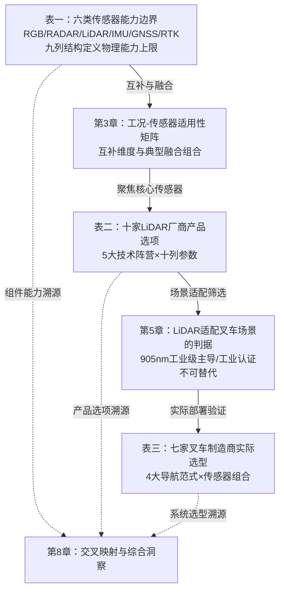

# 自动驾驶叉车感知与导航技术全景研究：传感器、激光雷达产品与制造商方案对比分析
# 1 研究背景与自动驾驶叉车技术语境

自动驾驶叉车（Autonomous Forklift），作为自动导引车（AGV）与自主移动机器人（AMR）家族中承担重载搬运、托盘堆垛与装卸作业的关键品类，正在智能仓储与工业物流自动化浪潮中迅速从边缘试点走向规模化部署。与道路场景的自动驾驶汽车相比，叉车的运行环境更受限、速度更低、负载更重，但对近距离感知精度、货叉对位准确性以及连续作业的稳定性提出了独特要求；同时，仓库内无GNSS信号、室外堆场光照与天气剧烈变化、室内外混合场景频繁切换等工况，又对其感知与导航传感器组合提出了既区别于乘用车又区别于轻型AMR的技术挑战。本章作为整篇报告的开篇，将围绕产业背景、与汽车自动驾驶的差异、典型场景需求、关键评估维度以及研究范围与边界五个层面，为后续将要展开的"传感器对比表"、"主流LiDAR产品对比表"和"叉车制造商导航方案对比表"三张核心表格建立统一的技术参照系与评估基准。

## 1.1 自动驾驶叉车的行业发展背景与产业定位

智能仓储与工业物流自动化经历了从人工搬运、刚性输送线，到磁导航AGV，再到激光SLAM驱动的AMR的多次代际跃迁，自动驾驶叉车正是这一演进路径在重载搬运环节的具体落地形态。根据CMR产业研究院的数据，2025年中国AGV/AMR市场规模约为280亿元人民币，年增速约28%，是整个物流自动化领域增速最快的细分市场之一[^1]。从市场结构看，2025年AGV仍占据约60%份额、AMR约40%，但AMR增速约35%显著高于AGV的约20%，预计2027年AMR将超越AGV成为主流形态[^1]。从全球视角，MarketsandMarkets预测全球AMR市场规模将从2026年的27.5亿美元增长至2032年的70.7亿美元，2026—2032年复合增长率达14.4%，物流/第三方物流是增速最快的下游行业，北美是增速最快的区域市场[^2]。

在这一宏观趋势中，自动驾驶叉车的产业定位有三重特征。其一，它是AMR家族中**载重区间最高、作业最重型**的一类，覆盖轻、中、重载全区间，专司托盘搬运、高位堆垛、料箱出入库、月台装卸等需要液压举升和重载稳定性的任务，与无人潜伏车（针对货架/料箱搬运）、无人配送车、复合机器人等形成产品线协同[^3]。其二，它是仓储数字化转型的核心节点之一，需要与WMS、MES、ERP及集群调度平台深度对接，实现"入库—存储—分拣—出库—追溯"的闭环数据流，而不仅仅是单点搬运设备[^3]。其三，从技术路线看，自动驾驶叉车正从依赖磁条、反光柱等外部辅助设施的传统AGV范式，向激光SLAM、视觉SLAM、多传感器融合驱动的AMR范式迁移：磁导航AGV单台价格约8—15万元、激光导航AGV约15—25万元、标准AMR约20—40万元，高端复合机器人可达60—100万元，价格梯度直接反映了不同导航技术与感知配置的成本差异[^1]。

下游应用方面，自动驾驶叉车已在多个行业形成稳定渗透。电商与零售仓储依赖其完成大规模、高频次的拣货与转运，电商订单量的快速增长是直接驱动因素[^4]；智能制造车间将其用于原料与成品的精准运输，保障产线连续性[^4]；冷链物流与危险品运输则借助其在低温、复杂环境下的稳定作业能力，规避人工操作风险[^4]；以化工、酒类、建材等为代表的传统工业场景，则提出了室内仓储与室外堆场一体化、连续长坡道、月台自动对位等更复杂的复合需求[^5]。整体而言，自动驾驶叉车正在从"标准货物搬运"向"全品类智能适配"、从"室内自动化"向"全域自动驾驶"演进，其产业价值已不局限于替代人工的成本节约，而扩展到柔性化适配、24小时无休作业、数据可追溯与安全风险消减等多维度收益[^3][^5][^4]。

## 1.2 自动驾驶叉车与自动驾驶汽车的感知与运行差异

尽管自动驾驶叉车与自动驾驶汽车共享"感知—决策—执行"的三段式技术架构和大量底层传感器品类，但二者在运行环境、速度区间、任务目标与安全标准上存在本质差异，直接决定了传感器选型与算法设计的不同侧重。

从运行环境看，自动驾驶汽车主要面对开放道路、复杂天气、高速场景和不确定的交通参与者，需要在百米以上的距离上感知车辆、行人与道路要素；而自动驾驶叉车主要运行于封闭或半封闭的仓库、车间与堆场，环境结构化程度高、动态目标种类相对有限，但通道狭窄、货架密集、人机混流、地面状况复杂、室内GNSS信号缺失，对**近距离高精度感知**和**室内自主定位**的依赖远高于汽车[^3][^6]。

从速度区间与任务目标看，自动驾驶叉车的典型行驶速度通常在1—3米/秒之间的低速区间，核心任务并非长距离巡航，而是托盘的精准取放、货叉的孔位对位、高位货架的稳定堆垛与月台的精确装卸。叉车配备的激光雷达通常用于探测约5—10米范围内的障碍物，包括人员、其他设备和立柱，并输出3D点云区分静态货架与动态人员；摄像头则需识别托盘"进叉口"以引导货叉精准插入，并通过压力传感器判断"是否叉稳货物"，在重型托盘抓取出现受力不均时自动调整货叉间距[^6]。这种"近距离、低速度、高精度"的感知需求与汽车自动驾驶强调的"远距离、高速度、高动态"特征截然不同，**叉车更需要厘米级甚至毫米级定位精度（典型激光SLAM可达±10mm）**[^6]。

从安全标准与算法侧重看，叉车面对的安全风险主要是低速碰撞、货物倾覆与人机交互事故，而非高速碰撞，因此其感知系统更强调**360°无死角的近场安全网**：激光雷达探测中近距离障碍物，视觉摄像头识别托盘与货物细节，超声波传感器补充激光雷达盲区内低矮物体（如散落的包装带）的探测[^6]。决策模块则更关注路径规划、任务优先级排序和异常处理，依托RCS机器人控制系统、DAS数据分析系统和VMS可视化系统实现"任务自动分配—进度实时反馈"的闭环，而非汽车自动驾驶中典型的预测式驾驶决策[^6]。

正因如此，简单将汽车自动驾驶领域的传感器规格（如远距离905nm/1550nm车规LiDAR的百米级测距、视场角设计与扫描频率）平移到叉车场景往往并不适宜。**在叉车低速、室内、密集环境下，更短测距、更宽水平视场、更高近场角分辨率、更强抗强反光与抗粉尘能力，反而比远距离探测能力更具实际价值**。这一差异化的技术需求构成了本研究在后续章节展开传感器与LiDAR对比时必须坚持的核心边界。

## 1.3 典型应用场景与感知导航需求差异

自动驾驶叉车的实际作业场景可粗略划分为室内仓库、室外堆场、室内外一体化混合环境三类，每类场景对导航方式、感知传感器组合、抗干扰能力和机械适配能力都提出了差异化要求。

**室内仓库场景**以窄通道穿梭、密集货架存储、高频中转分拣、人机混流作业为主要特征。该场景下，叉车设计倾向于小巧、轻便，以适应仓库与工厂的狭小空间，主要采用激光导航或地标导航以获得更高的定位精度与准确性[^7]。激光SLAM是当前主流方案，通过激光雷达扫描环境特征点，构建栅格地图并实时定位，无需铺设磁条或二维码，路径可灵活调整；但其弱点在于玻璃、镜面等强反光物体易造成干扰，长走廊或特征稀疏环境定位精度会下降，需要通过视觉SLAM或二维码辅助加以补救[^1][^6]。在低温冷链等特殊室内环境，低温会导致激光雷达精度下降，此时叠加货架反光标签或视觉识别可显著提升稳定性[^6]。

**室外堆场场景**则以光照剧烈变化、风雨粉尘、地面颠簸、长距离转运、重载装卸为典型特征。室外无人叉车需要具备抗风、抗雨、抗尘性能，能在码头、港口等开放场地操作并承载更大货物，同时具备一定越障能力，可克服颠簸地面、斜坡、道路障碍[^7]。室外场景下GNSS信号可用，但建筑遮挡和金属反射易引发多路径干扰，因此通常需要GNSS与RTK配合提升定位精度，再融合IMU以应对短暂的信号丢失。黑暗或弱光环境下，视觉系统受限，需要依赖激光雷达等主动式传感器维持定位与导航精度[^7]。

**室内外一体化混合场景**是近年来工业用户提出的更高要求，典型代表是化工厂、酒类企业等具有"室内仓储+室外长距离转运+连续长坡道+月台装卸"复合需求的场景。骐骊砺跋QL-EOC等产品以**3D SLAM多源融合定位**（激光+视觉+IMU）作为核心方案，通过多信息融合提升复杂环境适应性，无需改造场地，对强光、粉尘、弱光等环境具备良好抗干扰能力，并具备爬坡能力以适配厂区坡道与月台[^5]。在此类场景中，单一导航方式难以覆盖全部需求，多传感器融合与AI全域感知成为必然选择，调度层面也需支持"有网调度+无网自主运行"的双模式，以应对室内外网络条件的差异[^5]。

下表汇总了三类典型场景对导航与感知系统的差异化需求：

| 场景类型 | 主要特征 | 主流导航方式 | 关键感知挑战 | 机械适配需求 |
|---------|---------|------------|------------|------------|
| 室内仓库 | 窄通道、密集货架、人机混流、SKU海量 | 激光SLAM为主，二维码/视觉辅助 | 反光货架、长走廊特征稀疏、动态人员 | 小巧轻便、毫米级定位 |
| 室外堆场 | 光照变化、风雨粉尘、坡道颠簸、重载 | GNSS+RTK+IMU融合，激光辅助 | 多路径干扰、强光/黑暗、地面颠簸 | 抗恶劣天气、强越障、大载重 |
| 室内外一体化 | 月台装卸、跨区域转运、连续长坡道 | 3D SLAM多源融合（激光+视觉+IMU） | 场景切换、信号中断、动态障碍 | 高通过性底盘、双模式调度 |

由此可见，**自动驾驶叉车并不存在"一套传感器组合通吃所有场景"的方案**，传感器选型必须基于场景特征进行差异化配置，这也是后续章节将六类传感器（RGB摄像头、雷达、LiDAR、IMU、GNSS、RTK）放在同一对比框架下加以分析的核心动因。

## 1.4 感知与导航传感器的关键评估维度

为使后续三张表格的对比具有可比性与逻辑一致性，本研究提炼出以下统一的评估维度作为横向比较的基准。这些维度既覆盖了用户在表一中明确列出的传感器对比列结构，也兼顾了表二中LiDAR产品的技术参数与表三中叉车制造商方案的差异化竞争点。

第一类是**定位与测距精度**维度，包括点云分辨率、角分辨率、定位重复精度、托盘对位精度等。磁导航定位精度约±5mm，激光SLAM约±10mm，二维码导航精度高但依赖标签部署[^1][^6]。叉车场景下，定位精度直接决定了货叉对位成功率与堆垛安全性，是评估传感器与导航方案的首要指标。

第二类是**感知范围与视场角**维度，涉及最大测距、水平视场角、垂直视场角、近场盲区等。叉车通常关注5—10米的中近距离探测能力，水平视场角需尽可能覆盖360°以构建完整安全网，垂直视场则需兼顾近地低矮障碍与高位货架两端[^6]。

第三类是**环境适应性**维度，包括强光/弱光适应性、抗粉尘、抗低温、抗反光物体（玻璃/镜面）、抗振动等。视觉受光照影响大、纹理单一时定位不稳定；激光受玻璃镜面干扰、低温下精度下降；GNSS在室内不可用、在金属反射环境多路径严重[^1][^7][^6]。该维度直接决定了某类传感器在特定场景下的可用性。

第四类是**可靠性与稳定性**维度，关注MTBF、连续作业能力、温漂、机械寿命等。机械旋转式LiDAR寿命受限于运动部件，固态/MEMS方案在可靠性上具有结构性优势；工业级传感器（如SICK、Pepperl+Fuchs产品）相较车规级在长时间连续作业的稳定性上有更长验证历史。

第五类是**成本、安装空间与功耗**维度。叉车作为重载设备虽对成本敏感度低于轻型AMR，但批量化部署仍需控制单机BOM；安装空间方面，叉车桅杆、车顶、车头护栏等位置可用空间相对有限，传感器小型化与封装紧凑度直接影响布置方案；功耗则关系电池续航与连续作业时长。

第六类是**与上层调度系统的兼容性**维度，包括对WMS、MES、ERP的对接能力，集群协同与交通管制能力，以及对二维码、反光板、自然特征等多种导航地标的兼容能力[^3][^1]。该维度虽不直接体现在传感器参数中，但深刻影响着叉车制造商的整体方案选型。

这六大维度将贯穿后续三张表格的分析过程，确保参数对比不停留在数字罗列层面，而能进一步映射到叉车实际工况下的适配性研判。

## 1.5 研究范围、资料来源与时间边界说明

为确保后续分析的客观性与可追溯性，需在此明确本研究的边界与局限。

**研究范围**聚焦于自动驾驶叉车感知与导航相关的三大对比维度：其一，常用传感器层面，覆盖RGB摄像头、雷达、激光雷达、IMU、GNSS、RTK六类；其二，LiDAR产品层面，覆盖Velodyne、Luminar、AEye、Ouster、Ibeo Automotive Systems、Quanergy Systems、Innoviz Technologies、SICK、Cepton、Pepperl+Fuchs十家代表性厂商；其三，叉车制造商层面，覆盖K-MATIC、Seegrid、Crown Equipment、OTTO Motors、Vecna Robotics、Balyo、Hyster Robotic CB七家厂商的导航传感器方案。研究不展开至执行机构（液压、电机、舵机）、调度算法的内部实现、WMS/ERP系统选型等周边议题，亦不涉及商业财务分析。

**资料来源**主要为公开行业报告、厂商技术资料、产品规格文档与可信媒体报道。在不同来源对同一参数存在差异时，本研究将优先采信厂商官方一手资料与权威媒体披露的数据，并在行文中标注分歧。需特别说明的是，根据研究规则约束，本研究全程不引用并刻意回避了一篇关于"Autonomous Forklifts: State of the Art"的MDPI综述论文及其在多个平台的镜像版本，相关结论均通过其他独立来源予以核实。

**时间边界**设定为2024年初，即所采纳的技术参数、市场数据与产品型号信息以反映该时点的现状为目标。对于在此时点之前发生的厂商变动（如Velodyne与Ouster于2023年完成合并），研究将如实反映其影响；对于2024年初之后发布的新型号或新版本，原则上不纳入对比，以保持研究的时间一致性。

**潜在局限**包括三方面：其一，部分厂商（尤其是工业级LiDAR与叉车制造商）对核心技术参数的公开披露并不完整，本研究在此类情形下会标注信息不足并不以推测填充；其二，自动驾驶叉车作为工业场景应用，其大量技术细节并未像车规自动驾驶那样形成密集的学术与媒体讨论，部分跨场景参数借鉴时已尽量评估其在叉车工况下的适用性；其三，市场规模与增速等宏观数据来源于不同研究机构口径，绝对数值仅供趋势参考。

在以上语境与边界之下，下一章将首先展开第一张核心对比表——"自动驾驶叉车常用传感器对比表"，对六类传感器在叉车工况下的关键参数进行结构化梳理与对比。

# 2 自动驾驶叉车常用传感器对比表（表一）

承接第1章对自动驾驶叉车技术语境的铺垫，本章正式进入研究报告三张核心对比表中的第一张——**自动驾驶叉车常用传感器对比表**。为避免在汽车自动驾驶与工业叉车场景间产生概念漂移，本章在选取参数时已尽量优先采纳可适用于叉车低速、室内、密集环境工况的厂商一手数据，对于源自车规场景的参数也会在文中标注其在叉车工况下的适用性差异。本章首先按"传感器类型→优缺点→关键参数→量化范围"的逻辑，依次展开RGB摄像头、毫米波雷达、激光雷达、惯性测量单元、全球导航卫星系统与实时动态差分技术六类传感器的具体技术特征，确保每一项关键指标均能给出**具体的数值、范围或可核验的型号依据**；随后以用户指定的九列结构统一汇总为对比表，并从互补性、场景适配性与章节衔接三个维度展开综合解读。

## 2.1 RGB摄像头：高分辨率语义感知与光照敏感性的权衡

RGB摄像头是自动驾驶叉车感知系统中成本最低、信息维度最丰富的"视觉之眼"。它能够捕捉色彩、纹理及文字等高层语义信息，这些是激光雷达和毫米波雷达等主动传感器无法直接提供的，例如二维码地标的识读、托盘"进叉口"形状的判别、月台货物特征的识别等任务，本质上都依赖摄像头的高分辨率图像[^8]。在叉车货叉对位场景中，迈尔微视M系列对接相机以0.2—5m的高性能深度数据范围、每秒15—25帧实时成像能力，实现对市面主流托盘与料笼的免训练识别，对接精度可达±1mm，并支持±30°极限倾斜角识别与最高2米宽料笼兼容[^9][^10]。

从光学规格上看，RGB摄像头在叉车系统中通常采用单目、双目、环视鱼眼三种形态：**单目摄像头**结构简单、成本低，常用于远距目标检测，通过帧间运动估算深度；**双目摄像头**利用左右镜头视差直接生成深度图，适合中近距离障碍物探测，可靠测距范围约80米，超出后精度显著下降；**环视鱼眼摄像头**以180°—190°的超广角视场提供叉车四周近距离全景监测[^8][^11]。在分辨率方面，量产方案的主流区间为640×480—3840×2160（即VGA到4K），高分辨率传感器（8MP及以上）有助于提升远距目标检测精度，但带来更大数据带宽与算力压力，需在解析度与实时性之间权衡；帧率通常设定在30—60fps以保证平滑运动捕捉[^8]。迈尔微视M4 Mega系列具体可实现640×480px、最高25fps、典型15fps的输出帧率，配备940nm VCSEL激光器并支持HDR高动态范围功能[^9]。

RGB摄像头的核心短板在于**对光照、天气和被动成像的依赖**。摄像头作为依赖环境光的被动传感器，在夜间探测能力非常低[^11]；在雨雾天气下，雨滴会附着在镜头表面形成折射导致图像模糊，**目标识别准确率从晴天的98%下降到62%**[^12]；夜间会车或叉车遭遇库内强反光时还会产生"逆光盲区"[^13]。叉车场景虽不存在高速会车，但库内强光照射、月台外强逆光、低光照货架角落均会显著影响摄像头识别质量，需要通过HDR合成、去雨雪与时序去噪等算法予以补偿[^8]。此外，单目摄像头输出的是二维图像，需要通过算法进行三维重构，在距离测算上存在固有误差[^13]，**这也是叉车托盘对位往往需要结构光或ToF深度相机辅助而非纯RGB方案的根本原因**。

## 2.2 雷达（RADAR）：全天候穿透能力与低分辨率的平衡

毫米波雷达通过发射天线持续发射1—10毫米波长的电磁波，通过分析物体反射回波来探测目标的距离、速度和方位，其在自动驾驶叉车上的核心价值在于**雨雾粉尘穿透能力与多普勒直接测速**[^14][^15]。按工作频段划分，车载毫米波雷达主要有24GHz、77GHz、79GHz三类：24GHz主要用于60米内短距应用（盲点监测、近场存在检测）；77GHz用于100—250米中长距应用（自适应巡航、自动紧急制动）；79GHz具有更大带宽、更高距离与角度分辨率，可探测达200米[^14]。

在分辨率与精度方面，毫米波雷达的传统弱项是**角分辨率较低**——绝大多数毫米波雷达的水平分辨率仅为5°左右，4D成像雷达可大幅提升至1.2°[^16]。以德国大陆ARS408-21为例，其长距模式可探测0.20—250m目标（ARS408-21SC3版本可增程至1200m），**距离测量精度±0.40m（长距模式）或±0.10m（短距模式）**，水平角分辨率1.6°（长距）/3.2°@0°（短距），实时刷新率17Hz[^17]。第五代4D成像雷达ARS548RDI则将水平视场100°条件下的有效距离提升至300m，水平分辨率1.2°，垂直分辨率2.3°，工作频率76—77GHz[^18][^16]。新一代国产楚航4D卫星架构雷达的探测距离可提升至450米，角度分辨率1度，点云密度大幅增加，尺寸缩小到60.7×83.2×23.6mm[^19]。

毫米波雷达对叉车场景的适配性体现在三方面：其一，**全天候稳定性**——电磁波在遇到雨滴时主要发生能量衰减较轻的米氏散射，大部分能量能够直接穿透水滴并被有效接收，因此即便在雨雾粉尘环境下仍能保持可靠探测，这对室外堆场叉车至关重要[^20][^15]；其二，**直接多普勒测速**——可利用多普勒频移直接测量物体速度，无需多帧推算，是雷达传感器相对激光雷达与摄像头的主要优势[^11]；其三，**对金属目标灵敏度高**——能够有效识别堆场内的货架立柱与金属托盘。但其短板同样明显：对塑料、纸箱、人体等非金属目标反射率较低，难以识别行人轮廓与货物细节[^13]；分辨率有限，无法区分静态障碍物与路面积水，容易将路边护栏误判为车辆[^12]；在密集仓库内对相邻通道车辆易混叠为同一目标[^13]。**这决定了叉车上的毫米波雷达更多作为补充冗余传感器存在，而非主感知**。

## 2.3 激光雷达（LiDAR）：高精度三维点云与雨雾粉尘衰减的取舍

激光雷达是自动驾驶叉车SLAM建图、定位与障碍物探测的核心传感器，其工作原理是发射激光脉冲（典型905nm或1550nm波长）并测量反射飞行时间，从而精确计算目标的距离、方位与轮廓，生成高密度的三维点云[^20][^13]。按维度可分为2D与3D两类：2D激光雷达在固定平面上360°旋转扫描，输出极坐标点集，适合平坦环境下AGV/无人叉车的避障与路径规划；3D激光雷达获取周围环境的完整三维点云，能感知地形坡度、坑洞、台阶、悬挂物及人员姿态等立体信息[^21]。

**2D工业级LiDAR**在叉车场景仍占据重要地位。SICK TiM系列扫描范围可达25m、工作范围270°、角度解析度0.33°—1°，IP67防护并采用HDDM/HDDM+多脉冲技术连续辨识小型物体，特别适合AGV/AMR的环境检测[^22]。日本Hokuyo UTM-30LX采用785nm半导体激光，0.1—10米范围内精度±30mm、10—30米精度±50mm，角度分辨率0.25°、扫描周期25ms、防护等级IP64，紧凑设计60×60×87mm、重约370克[^23]。低成本经典型号URG-04LX测距范围0.06—4m（最大5.6m）、扫描角度240°、角度分辨率约0.36°、扫描时间100ms、尺寸50×50×70mm、重量约160g，广泛用于AGV避障与教学研究[^24]。倍加福R2000系列基于脉冲测距技术（PRT）实现360°平面全景测距、角分辨率高达0.071°、扫描频率最高50Hz，特别适合堆垛机货叉下方的紧凑区域监控[^25][^26]。

**3D机械旋转式LiDAR**以Velodyne与Ouster产品为典型代表。Velodyne VLP-16具有16通道、最远100米测距、±3cm精度、360°水平视场、30°垂直视场（±15°）、水平角分辨率0.1°—0.4°、垂直角分辨率2°、~300,000点/秒、波长903nm、功耗约8W、重量830g、尺寸103×72mm、防护IP67[^27][^28]。VLP-32C升级至32通道、200米测距、40°垂直视场（-25°至+15°）、垂直角分辨率0.33°、双回波下120万点/秒、重量约925g[^29][^28]。禾赛XT16/XT32针对近距应用优化，测距范围0.05—120m、精度0.5cm（1σ）、水平分辨率0.18°@10Hz[^28]。**面向室内机器人与叉车的Livox Mid-360**则是当前最具代表性的紧凑型3D方案：905nm波长、量程40m@10%反射率/70m@80%反射率、近处盲区0.1m、水平360°×垂直-7°~52°视场、测距随机误差≤2cm@10m、角度随机误差<0.15°、点云输出200,000点/秒、10Hz帧率、内置ICM40609 IMU、IP67防护、功率6.5W、尺寸65×65×60mm、重量265g[^30][^31]。

激光雷达在叉车场景的固有局限主要有三：第一，**雨雾粉尘衰减明显**——当降雨强度超过25mm/小时时，905nm波长激光雷达的探测距离可从晴天200米缩短到不足60米，1550nm波长方案下降约40%，且雨滴会被误判为虚假障碍物[^12][^32]；第二，**对玻璃、镜面等强反光物体易产生二次反射虚像或丢失点**[^33]；第三，**机械旋转式寿命受限于运动部件**，且成本远高于2D方案与摄像头[^21]。叉车制造商通常通过2D工业级LiDAR负责水平面安全防护、3D LiDAR负责SLAM建图与立体感知的组合方式加以应对。

## 2.4 惯性测量单元（IMU）：高频姿态推算与累计漂移的固有矛盾

惯性测量单元集成三轴陀螺仪与三轴加速度计（六轴IMU额外集成磁力计），实时测量物体在X、Y、Z三个轴向的角速度和加速度，**是叉车在GNSS信号丢失、激光特征稀疏长走廊以及月台跨场景过渡时维持定位连续性的关键**[^34][^35]。其核心优势在于不依赖外部信号、独立感知自身运动状态、毫秒级高频输出，可在数百赫兹甚至更高频率下完成传感、状态估计与执行控制的闭环计算[^34]。

代表性产品参数差异显著。Xsens Avior OEM IMU采用36.8×40mm紧凑封装、重量仅35.2g、铝制外壳IP51防护、工作温度-40°C至85°C，陀螺仪满量程±300°/s、加速度计满量程±8g、磁力计满量程±8G、最大输出数据速率400Hz、额定功耗<0.5W；其新一代传感元件结合先进模拟滤波技术使**航向精度1°RMS、滚动和俯仰精度0.2°RMS**，陀螺仪运行偏差稳定性8°/小时，加速度计运行偏差稳定性15μg[^36][^37]。星网宇达ER-MIMU-103尺寸47×44×14mm、重量40g，集成三轴陀螺仪、三轴加速度计、三轴磁力计与气压计，**陀螺仪动态范围±400°/s、零偏不稳定性0.1°/h、加速度计零偏不稳定性20μg、气压计长期稳定性±1mbar/yr**[^35]。重庆天箭TJ-MG-3Q-X5测量范围±200°/s，零偏稳定性≤5°/h（10s平滑，1σ），随机游走0.15°/√h，带宽≥200Hz，抗冲击1500g（0.5ms半正弦）；西安中星测控工业级产品零偏稳定性≤8°/h、测量范围±500°/s；苏州敏芯工业级零偏稳定性≤15°/h、测量范围±2000°/s、功耗≤5mA[^38]。从精度梯度可见，**叉车工况通常选用工业级（≤8—15°/h）即可，无需采用导航级（0.001°/h光纤）的高成本方案**。

IMU的根本性局限是**累计误差随时间发散**。零偏稳定性与温漂导致单独使用IMU无法长期定位，任何感知延迟或噪声放大都可能在动态运动中被迅速放大[^34]。因此叉车系统中IMU几乎从不独立使用，而是与激光SLAM、轮式里程计、GNSS/RTK紧耦合融合：在2D Cartographer SLAM中，IMU能显著改善小车旋转运动时的估计，提高在长直走廊或被人流碰撞时的定位鲁棒性[^39]；在室内外混合场景中，IMU与RTK的紧耦合能在GNSS信号短暂丢失时提供数十秒级的厘米—米级精度推算。

## 2.5 全球导航卫星系统（GNSS）：室外广域覆盖与室内失效的边界

GNSS涵盖美国GPS、中国北斗、俄罗斯GLONASS和欧洲伽利略等全球卫星导航系统集群，是叉车室外堆场转运的绝对定位基础[^40][^41]。其工作原理是通过测量至少四颗卫星发射的无线电信号传播时间（伪距测量），解算接收机位置。普通单频GNSS定位精度在开阔环境下约5—10米，城市峡谷可扩大到20米以上；通过SBAS等增强系统可提升至1—3米；多频多系统联合可显著提高可用性与精度[^40][^42]。

主流GNSS板卡的具体规格差异如下：u-blox ZED-F9P系列尺寸17×22×2.4mm、工作温度-40至+85°C、接口含I2C/SPI/UART/USB、支持BeiDou/Galileo/GPS/GLONASS/NAVIC/QZSS全星座，多频段RTK可在数秒内实现厘米级精度[^43][^44][^45]。和芯星通UM980板卡支持BDS B1I/B2I/B3I/B1C/B2a/B2b、GPS L1 C/A/L1C/L2P(Y)/L2C/L5、GLONASS L1/L2、Galileo E1/E5a/E5b/E6、QZSS L1/L2/L5/L6共五星十六频段，1048通道，**单点水平/垂直精度1.5m CEP，RTK水平精度±0.8cm+1ppm，RTK垂直精度±1.5cm+1ppm**，速度精度0.05m/s，航向角精度0.4°（1米基线），冷启动24秒、热启动2秒、重新捕获2秒、收敛时间<10s，尺寸35×25×11.5mm、重量10g、电流80mA[^46]。千寻位置BT-F9PK4模组采用更紧凑35×25×11.5mm封装、重量8克、电流80mA[^47]。NovAtel ProPak6支持240通道、单点L1精度1.5m/L1+L2精度1.2m/SBAS 0.6m/DGPS 0.4m/RTK 1cm+1ppm、RTK初始化时间<10s、双天线航向精度0.40°@0.5m基线、防护IP67、尺寸190×185×75mm、重量1.79kg[^48]。Trimble R12i集成672通道与TIP倾斜补偿，**RTK精度水平8mm+0.5ppm/垂直15mm+0.5ppm，静态精度水平3mm+0.1ppm/垂直3.5mm+0.4ppm**，防护IP67、重量约1.12kg[^49]。

GNSS的核心局限是**室内基本不可用**：由于卫星信号本身强度不高，无法通过反射达到室内或地铁内部，反射信号还会引发严重的多路径效应[^50]。叉车从室外堆场进入室内库房时，纯GNSS方案会瞬间"失明"，必须依赖UWB、蓝牙信标或激光SLAM接续[^51][^52]。此外，GNSS精度还受卫星几何分布（DOP值）、电离层与对流层延迟、多路径效应、卫星钟差与星历误差等多种因素影响[^53]；在恶劣天气下，云层密集与暴雨可衰减信号，多路径效应会因地面湿度增加而加剧[^54]。

## 2.6 实时动态技术（RTK）：厘米级定位增强与基础设施依赖

RTK（Real-Time Kinematic）并非独立的物理传感器，而是基于载波相位动态实时差分方法的**高精度GNSS增强技术**，通过基准站与流动站协同工作实现厘米级三维定位[^55][^56]。其工作原理是基准站将观测数据及坐标信息实时传输至流动站，流动站结合自身GNSS观测数据组成差分观测值进行处理，**可在1秒内完成解算，有效消除电离层延迟、对流层折射等公共误差源**[^55]。

RTK方案的精度分级在叉车实际作业中至关重要：**固定解（fix）**定位精度1—3cm，是理想作业状态；**浮点解（float）**精度介于厘米级到米级（典型0.1—0.3m，差时1—3m）；**单点解（single）**精度5—10米甚至更大，一般不采用[^57][^58]。这意味着叉车在室外开阔堆场可稳定获得固定解、实现厘米级月台对位，但一旦进入金属密集库房或货架峡谷，可能跌落至浮点解甚至单点解，精度急剧退化。

主流RTK方案的具体规格如下：千寻知寸FindCM服务基于双频RTK技术开发，理想环境下水平定位精度2cm、高程定位精度5cm，播发格式RTCM3.2/RTCM2.3，覆盖全国33省市[^59]。双宝RTK系统采用多频GNSS天线，**单基准站信号覆盖半径达5km，支持多移动站同时接入，平面≤2cm/高程≤5cm，宽电压DC12V-24V，工作温度-20°C~+70°C，IP65防护**，专门面向叉车、AGV机器人等户外设备[^60]。基站接收机层面，司南M300 Pro信号跟踪通道数440、RTK初始化时间<10秒、授时精度10纳秒、内置17600mAh电池续航>30小时、工作温度-45至+65°C、防护IP67、抗1米跌落、尺寸225×176×67mm、重量2.7kg[^61]。从服务半径看，**单基站RTK服务半径一般≤20km**，超过后精度显著下降；**网络RTK（CORS、千寻位置等）通过多基准站组网与虚拟参考站技术，将覆盖范围扩展至50公里以上**[^62][^63]。

RTK的局限主要体现在三方面：第一，**对基础设施高度依赖**——需基准站/CORS网络或自建基站，并需4G/电台稳定数据链；第二，**室内与遮挡环境失效**——RTK本质上是GNSS增强技术，室内同样无信号，PPP-RTK、UWB+RTK融合等方案已成为解决室内外无缝定位的主流路径[^52][^51]；第三，**设备与服务成本较高**，从板卡级（如BT-F9PK4套装¥4500、UM980-RTK-LOGGER）到整机级（千寻知寸服务包月400元，专业接收机数万元）形成完整价格梯度[^47][^46][^59]。

## 2.7 六类传感器横向对比表与综合选型分析

在前六小节逐项参数化分析的基础上，本节按用户指定的九列结构汇总形成统一对比表。需特别说明的是，由于LiDAR与GNSS/RTK内部产品差异较大，**表中给出的是叉车工况下的典型范围与代表性产品参数**，具体型号差异将在后续章节进一步展开。

| 传感器类型 | 主要优点 | 主要缺点 | 尺寸（典型） | 适用能见度 | 视场角 | 分辨率/精度 | 受天气影响程度 | 作用范围 |
|----------|---------|---------|------------|----------|--------|------------|--------------|---------|
| **RGB摄像头** | 成本低；高分辨率；可提取颜色、纹理、文字与二维码等语义信息；适合托盘"进叉口"识别与货物特征判别[^8][^9] | 依赖环境光，夜间与逆光性能差；单目深度估计需平面假设；雨雾下识别准确率从约98%骤降至62%[^12][^8] | 紧凑模组级，迈尔微视M系列对接相机典型10—15cm级封装；车载8MP级摄像头模组通常50mm级 | 中—高光照；HDR可改善强光/逆光；夜间/暴雨显著降级[^8] | 单目60°—120°；双目中近距；环视鱼眼180°—190°；迈尔微视S系列最高270°×70°[^8][^10] | 主流640×480—3840×2160；M4 Mega 640×480@25fps；对接精度±1mm[^9][^10] | **高**（雨雾、强光、夜间均明显降级）[^12] | 单目可达百米级；双目立体≤80m；鱼眼近场环视；M4系列0.2—5m高精度对接深度[^11][^9] |
| **雷达（RADAR）** | 全天候穿透雨雾粉尘；多普勒直接测速；对金属目标灵敏度高；单价适中[^20][^15][^11] | 角分辨率低（传统~5°、4D雷达1.2°）；对塑料/纸箱/人体等非金属目标识别差；相邻车道易混叠[^16][^13][^12] | 大陆ARS408约137×90×39mm；ARS548约137×90×39mm/500g；楚航4D卫星雷达60.7×83.2×23.6mm[^17][^18][^19] | 全工况（不依赖光照）[^20] | 水平±60°典型；ARS548 100°；垂直近无到±15°；ARS548垂直分辨率2.3°[^17][^18] | 距离分辨率0.39—1.79m（大陆ARS408）；角分辨率1.2°（ARS548）—5°（传统）；速度精度高[^17][^16] | **低**（雨雾雪粉尘几乎不影响）[^15] | 24GHz短距≤60m；77GHz长距100—250m；ARS548可达300m@100°FOV；楚航4D雷达450m；ARS408-21SC3增程至1200m[^14][^18][^19][^17] |
| **激光雷达（LiDAR）** | 厘米级测距精度（±2—3cm）；360°水平视场；稠密3D点云；不依赖环境光；SLAM建图核心[^30][^27] | 905nm下雨雾衰减明显（暴雨下探测距离可降至原值30%）；玻璃/镜面引发虚像与丢失点；机械式寿命受限；成本高于摄像头与毫米波[^12][^33][^21] | 2D工业级紧凑：TiM/UTM-30LX 60×60×87mm/370g、URG-04LX 50×50×70mm/160g；3D紧凑：Mid-360 65×65×60mm/265g；VLP-16 Ø103×72mm/830g[^23][^24][^30][^27] | 全光照（含完全黑暗，主动光源）；雨雾粉尘下降级[^11][^12] | 2D机型水平240°—360°；3D机型水平360°×垂直30°—59°（VLP-32C 40°、Mid-360垂直-7°~52°）[^24][^29][^30] | 水平角0.071°—0.4°（R2000 0.071°、VLP-16 0.1°—0.4°）；垂直角0.15°—2°（Mid-360 <0.15°、VLP-16 2°）；精度±2—3cm；点频30万—120万点/秒[^25][^27][^30][^29] | **中—高**（雨雾粉尘明显衰减，玻璃镜面失效）[^12][^32] | 2D：0.06—30m（URG-04LX 4m、UTM-30LX 30m、TiM 25m）；3D：0.05—200m（XT 120m、Mid-360 40—70m、VLP-32C 200m）[^24][^23][^28][^30][^29] |
| **惯性测量单元（IMU）** | 不依赖任何外部信号；高频输出（典型400Hz）；GNSS/激光中断时维持短时位姿推算；体积小、功耗低[^34][^36] | 零偏稳定性与温漂导致累计误差随时间发散；单独使用无法长期定位；需融合校正[^34] | Xsens Avior 36.8×40mm/35.2g；ER-MIMU-103 47×44×14mm/40g；MEMS模组通常毫米级封装[^36][^35] | 全工况无关[^34] | N/A（不适用） | Avior：航向1°RMS/俯仰0.2°RMS，陀螺零偏稳定性8°/h、加速度计15μg；ER-MIMU-103：陀螺0.1°/h、加速度计20μg；天箭TJ-MG-3Q-X5：≤5°/h、0.15°/√h；工业级敏芯：≤15°/h[^36][^35][^38] | **极低**（仅温漂相关）[^36] | 无外部辅助下数十秒至数分钟内厘米—米级精度衰减；与SLAM/GNSS融合可长期使用[^39][^34] |
| **全球导航卫星系统（GNSS）** | 室外全球覆盖；多星多频联合定位提升可用性；SBAS增强至1—3米；叉车室外堆场绝对定位基础[^40][^42] | 室内基本不可用；金属反射与城市峡谷多路径严重；受卫星几何、大气延迟影响；暴雨/电离层扰动衰减信号[^50][^53][^54] | u-blox ZED-F9P 17×22×2.4mm；UM980板卡35×25×11.5mm/10g；BT-F9PK4 35×25×11.5mm/8g；ProPak6 190×185×75mm/1.79kg；Trimble R12i约1.12kg[^43][^46][^47][^48][^49] | 需开阔天空可视，光照无关[^40] | 仰角通常≥10°—15°的天空可视半球[^40] | 单点1.5m CEP（UM980）；SBAS 0.6m；DGPS 0.4m（ProPak6）；速度0.05m/s；航向0.3°—0.4°（双天线）[^46][^48] | **低—中**（云层与暴雨有限衰减；电离层扰动影响多路径）[^54] | 全球覆盖；单星座10—20米；多星多频更优；时间精度RMS 30ns[^40][^46] |
| **实时动态技术（RTK）** | 厘米级定位（固定解1—3cm）；收敛时间<10s；初始化准确度>99.9%；叉车室外月台对位关键支撑[^56][^55][^48] | 依赖基准站/CORS或自建基站；室内与遮挡环境跌落至浮点/单点解（0.1—10m）；需稳定数据链；设备与服务成本较高[^57][^56] | 板卡级35×25×11.5mm（UM980/BT-F9PK4）；整机级双宝/华测；基站M300 Pro 225×176×67mm/2.7kg[^46][^47][^61] | 需GNSS可视；光照无关 | 同GNSS | RTK固定解：水平±0.8cm+1ppm/垂直±1.5cm+1ppm（UM980）、水平8mm+0.5ppm（Trimble R12i）；浮点解0.1—0.5m；单点解5—10m；千寻知寸理想环境2cm/5cm[^46][^49][^59][^57] | **低**（云层与暴雨影响有限）[^54] | 单基站≤20km（双宝5km/单基站）；网络RTK≥50km；千寻位置覆盖全国33省[^63][^60][^62][^59] |

基于上表，可从三个维度展开综合解读。

**第一，互补性维度。** 六类传感器在物理原理与信息维度上具有清晰的互补关系：**视觉提供语义**（颜色、纹理、二维码、托盘特征）、**LiDAR提供几何**（厘米级3D点云、SLAM建图基础）、**毫米波雷达提供全天候测速**（雨雾粉尘穿透与多普勒速度）、**IMU提供高频姿态**（毫秒级位姿推算与短时鲁棒性）、**GNSS提供绝对位置**（全球开放场地米级—亚米级）、**RTK则将GNSS增强至厘米级**。任何单一传感器都存在明显短板，正如自动驾驶领域已经形成的共识——摄像头提供色彩纹理信息、激光雷达负责构建高精度三维模型、毫米波雷达在恶劣天气下补位，**通过融合算法系统能够在各种环境下形成全面、冗余且鲁棒的感知能力**[^15]。这一互补逻辑同样适用于叉车，但权重分配存在差异：叉车场景下LiDAR与IMU权重更高，毫米波雷达权重低于乘用车，RTK仅在室外堆场场景具有不可替代性。

**第二，叉车场景适配性维度。** 结合第1章梳理的三类典型场景，本研究给出以下选型建议。**室内仓库场景**应以2D工业级LiDAR（SICK TiM、Hokuyo UTM-30LX、倍加福R2000）负责水平面安全防护与SLAM定位、3D紧凑LiDAR（如Livox Mid-360）负责立体感知与高位货架探测、视觉对接相机（如迈尔微视M系列）负责托盘进叉口识别与二维码识读、IMU提供长走廊与特征稀疏区域的姿态补偿——**GNSS/RTK在此场景下不可用**。**室外堆场场景**应以GNSS+RTK提供绝对位置（厘米级月台对位）、IMU应对短暂信号丢失、毫米波雷达提供雨雾粉尘下的全天候障碍物探测、LiDAR负责中近距精细感知、摄像头补充语义信息——**视觉系统需具备HDR能力以应对强光逆光**。**室内外一体化场景**则需全部六类传感器协同工作，并依赖多源融合算法（如UWB+RTK紧耦合、3D SLAM+IMU+RTK融合）实现"门口过渡区"的平滑切换，避免传统松耦合方案在切换瞬间产生轨迹跳变[^51][^52]。

**第三，与下一章LiDAR产品对比表的衔接。** 需要明确指出的是，本表中"激光雷达"一行所给出的参数为类别均值或典型代表性参数，**不同厂商不同型号的LiDAR产品在视场角、波长、扫描频率、角分辨率、特色功能上存在显著差异**：例如车规级Velodyne VLP系列与工业级SICK TiM在定位上完全不同，905nm主流方案与1550nm高端方案在雨雾穿透能力上差距明显，机械旋转式与MEMS/Flash/OPA固态方案在可靠性与封装上各有取舍。这些细分差异将在下一章"主流LiDAR制造商及其产品对比表"中以具体型号、具体参数的形式予以展开，并进一步在第5章中分析其与叉车工况的适配性，从而保持本研究三张核心表格之间的逻辑连续性与参数可追溯性。

# 3 六类传感器特性的横向分析与适配性研判

第2章通过参数化对比表呈现了RGB摄像头、雷达、LiDAR、IMU、GNSS与RTK六类传感器在尺寸、视场、分辨率、作用范围等维度上的静态规格差异，并初步给出了"互补性—场景适配性—下一章衔接"三段式解读。然而，单纯的参数罗列尚不足以回答叉车工程师在选型阶段最关心的问题：**在仓库低光、强光逆光、粉尘雾气、货架密集遮挡、室内无GNSS信号、室外多路径干扰这六类叉车特有工况下，每一类传感器究竟"能用"、"降级可用"还是"完全失效"？为什么任何单一传感器都无法覆盖叉车全场景？哪些融合组合在工程上最具协同价值？** 本章正是要跳出表格逐项罗列的视角，转向横向比较与场景适配性研判，依次构建工况—传感器适用性矩阵、归纳信息维度互补性、剖析摄像头+LiDAR、LiDAR+IMU、GNSS+RTK+IMU三类典型融合组合，最后聚焦自动驾驶叉车区别于乘用车与轻型AMR的核心难点——室内外过渡区的多源融合挑战，为第4章LiDAR产品对比与第6章叉车制造商方案对比提供选型分析的理论支点。

## 3.1 基于叉车典型工况的传感器适用性矩阵

为系统呈现六类传感器在叉车实际工况下的能力边界，本节将第1章梳理的典型作业场景进一步细化为六类**工况维度**，并对每一交叉单元给出"可用 / 降级 / 失效"三档判定及具体原因。需说明的是，该矩阵中的判定阈值均直接对应第2章表一中已列出的厂商一手参数，并未引入新的数据来源。

| 工况维度 \ 传感器 | RGB摄像头 | 毫米波雷达 | LiDAR | IMU | GNSS | RTK |
|----|----|----|----|----|----|----|
| **仓库低光（夜间、货架阴影、冷库）** | **失效**：被动成像依赖环境光，夜间探测能力极低 | **可用**：电磁波不依赖光照 | **可用**：主动激光光源，完全黑暗下仍正常工作 | **可用**：光照无关 | **失效**：室内无卫星信号 | **失效**：同GNSS |
| **强光逆光（月台外向、库内强反光、HDR场景）** | **降级**：识别准确率显著下降，需HDR合成补偿 | **可用**：光照无关 | **可用**：905nm/1550nm抗强光设计，但日光直射可造成局部信噪比下降 | **可用**：光照无关 | **可用**（室外开阔）| **可用**（室外开阔）|
| **粉尘雾气（堆场扬尘、化工粉末、暴雨）** | **降级—失效**：雨雾下识别率从约98%降至62%，浓粉尘下基本失效 | **可用**：毫米波米氏散射穿透性好，雨雾粉尘几乎不影响 | **降级**：905nm暴雨（>25mm/h）下探测距离从200m缩至<60m，1550nm下降约40%，粉尘易产生虚假回波 | **可用**：与环境无关 | **降级**：暴雨/电离层扰动有限衰减 | **降级**：同GNSS，差分链路在雷雨下可能不稳 |
| **货架密集遮挡（窄通道、高位货架、金属反射）** | **降级**：纹理重复、长走廊语义稀疏 | **降级—失效**：传统5°角分辨率难以区分相邻通道金属立柱，易混叠 | **可用**：厘米级点云清晰区分货架与障碍物，但玻璃/镜面货架会引发虚像与丢点 | **可用**：高频姿态推算 | **失效**：金属环境多路径严重 | **失效**：依赖GNSS可视 |
| **室内无GNSS信号（库房深处、地下停车场）** | **可用** | **可用** | **可用** | **可用**（仅短时，需融合校正）| **失效**：卫星信号无法穿透屋顶 | **失效**：同GNSS |
| **室外多路径干扰（金属堆场、城市峡谷、月台金属顶棚）** | **可用** | **可用** | **可用** | **可用**（信号丢失时短时维持）| **降级**：单点精度可从5—10m退化至20m以上 | **降级**：固定解可能跌落至浮点解（0.1—0.3m）甚至单点解（5—10m）|

矩阵中可观察到三条关键规律。

**第一，没有任何一类传感器在六类工况下均判定为"可用"**：摄像头在低光与粉尘下失效或严重降级，雷达在密集货架下混叠，LiDAR在粉尘暴雨下衰减，IMU受限于短时连续性，GNSS/RTK在室内整体失效。这从工况覆盖度的角度直接证伪了"单一传感器通吃"的设想。

**第二，六类传感器在失效模式上呈现明显的"反相位"特征**：摄像头与LiDAR都依赖光学路径，但摄像头被动、LiDAR主动，因此低光下摄像头失效而LiDAR可用，雨雾下两者同时降级；毫米波雷达在粉尘/雨雾下保持可用，恰好弥补了视觉与激光的天气短板；IMU不依赖任何外部信号，在GNSS失锁、激光配准失败、视觉过曝的"全外部信号失效"瞬间承担位姿维持职责；GNSS/RTK仅在室外开阔环境可靠，但其提供的**绝对位置**信息是上述五类相对感知传感器都无法替代的。这种反相位特征是后续融合组合能够形成"1+1>2"协同效应的物理基础。

**第三，叉车特有工况对传感器组合的要求显著区别于乘用车**。乘用车主要面对的是高速远距与雨雾天气，毫米波雷达扮演核心冗余角色；而叉车更频繁遭遇的是**密集货架遮挡**与**室内外切换**，前者使毫米波雷达的角分辨率短板被放大，后者使GNSS/RTK的可用性产生跳变。因此叉车场景下LiDAR与IMU的权重显著高于乘用车，毫米波雷达更多承担"全天候冗余"而非"核心感知"，这与第2章末尾归纳的权重分配判断完全一致。

## 3.2 信息维度互补性与单一传感器局限性归纳

3.1节的工况矩阵从"输出端"展示了传感器的失效模式，但要解释**为什么必须融合**，还需从"输入端"——即各类传感器所提供的**信息维度**——加以剖析。叉车感知系统所需的环境信息可大致归纳为四个正交维度：**语义维度**（颜色、纹理、文字、二维码、托盘特征、人员身份与姿态）、**几何维度**（三维距离、形状、轮廓、地面坡度、悬挂物高度）、**运动学维度**（自身角速度与加速度、目标的相对速度）、**绝对位置维度**（在全球或厂区坐标系下的精确坐标）。

六类传感器在这四个维度上的覆盖具有清晰的天然分工。**RGB摄像头**是语义维度的唯一来源——LiDAR点云无法直接识别"这是一个标准1200×1000木质托盘还是一个料笼"，更无法识读二维码或读取人员胸卡，这些任务本质上依赖图像像素层面的特征提取。**LiDAR**是几何维度的最佳来源，2—3cm的测距精度与30万—120万点/秒的点频，使其在SLAM建图、货架立柱定位、高位货物轮廓识别等任务上具有不可替代性。**毫米波雷达**则在运动学维度上具有独特优势——利用多普勒频移可直接、单帧获取目标相对速度，而摄像头与LiDAR都需要多帧推算。**IMU**填补了运动学维度中的"自身姿态"分量，毫秒级高频输出弥补了其他传感器10—50Hz输出在动态运动中的相位滞后。**GNSS+RTK**则是绝对位置维度的唯一来源，激光SLAM构建的地图本质上是**相对坐标系**，要与WMS仓库管理系统、室外堆场坐标系对齐，最终仍需GNSS/RTK提供绝对锚点。

| 信息维度 | 主要承担传感器 | 不可替代性来源 |
|---|---|---|
| 语义维度（颜色/纹理/文字/二维码/类别） | RGB摄像头 | LiDAR点云缺乏色彩信息，无法识别托盘类型与二维码 |
| 几何维度（3D距离/形状/坡度） | LiDAR（主）、双目摄像头（辅） | 厘米级测距精度与稠密点云为SLAM建图基础 |
| 运动学维度—目标速度 | 毫米波雷达 | 多普勒频移可单帧直测，无需推算 |
| 运动学维度—自身姿态 | IMU | 400Hz高频输出弥补其他传感器相位滞后 |
| 绝对位置维度 | GNSS+RTK | 全球/厂区坐标系下的厘米级绝对锚点 |

从这一维度分工出发，**单一传感器在叉车全场景下至少存在一类不可弥补的短板**：纯视觉方案缺乏可靠几何（深度估计依赖平面假设）与绝对位置；纯LiDAR方案缺乏语义信息（无法识别托盘进叉口的精确形状与朝向，更无法识读二维码地标）；纯雷达方案的角分辨率不足以建图；纯IMU方案累计误差发散；纯GNSS/RTK方案在室内完全失效。这一逻辑链条解释了为什么自动驾驶叉车感知系统的设计**必然走向多源融合**，而非工程师选型偏好的结果。

更深一层，多源融合不仅提供**维度覆盖**的完整性，还提供**故障兜底**的冗余性。当LiDAR因玻璃货架产生丢点时，视觉可基于纹理特征维持定位；当视觉因强光过曝时，LiDAR可继续提供几何骨架；当GNSS因金属顶棚多路径干扰时，IMU+LiDAR SLAM可在数十秒级维持厘米—亚米级精度推算。这种"主备切换+故障兜底"的设计原则，正是后续3.3—3.6节所要分析的三类典型融合组合的内在逻辑。

## 3.3 摄像头+LiDAR组合：语义与几何的协同

摄像头与LiDAR的组合是自动驾驶叉车感知系统中应用最广泛的"基础双模"，其协同逻辑直接源于3.2节归纳的**语义—几何维度互补**。LiDAR提供厘米级三维几何骨架与稠密点云，摄像头提供颜色、纹理与高层语义，二者在三类叉车核心任务上形成强互补。

**任务一：托盘对位与货叉精准插入**。这是叉车区别于其他AMR的标志性任务。第2章已述，迈尔微视M系列对接相机在0.2—5m深度范围内对接精度可达±1mm，并支持±30°极限倾斜角识别。但纯视觉方案在低光与逆光下识别率会显著下降，此时LiDAR提供的稠密近场点云可独立完成进叉口的几何拟合，二者通过点云—图像配准（point cloud to image registration）形成"几何主导、语义辅助"或"语义主导、几何校正"的双工作模式。**当摄像头识别置信度低于阈值时，系统自动切换至LiDAR几何特征拟合；当LiDAR点云因黑色或低反射率托盘产生稀疏点时，转由摄像头主导识别**。

**任务二：人机交互安全**。叉车在人机混流仓库中需要识别行人并区分其相对运动状态。LiDAR可提供精确的人员位置与轮廓，但难以判断"这是站立的工人还是堆放的货物"；摄像头基于深度学习的行人识别可补全人员身份与姿态判别。二者融合后，系统能够给出"x米外的工人，正以y米/秒的速度横穿通道"这种兼具几何精度与语义理解的安全决策依据。

**任务三：SLAM回环检测**。激光SLAM在长走廊或特征稀疏环境下存在回环识别失败的固有风险——点云几何特征过于相似导致系统无法判断"是否回到了起点"。视觉词袋（Bag of Visual Words）通过提取走廊内的灯光、标识、墙面纹理等语义特征，可显著提升回环检测成功率，这也是工业界采用激光—视觉融合SLAM（如LVI-SAM框架思路）的核心动因之一。

该组合的**协同失效风险**同样值得关注。在低光场景下，摄像头失效而LiDAR独立工作，融合实质退化为"单LiDAR"模式；在强反光场景下（如库内玻璃幕墙、金属货架镜面），LiDAR产生虚像与丢点而摄像头可能因眩光过曝，**二者出现"同时降级"的最坏情形**。工程上的应对手段包括：摄像头侧采用HDR动态范围合成（迈尔微视M4 Mega已支持）、广角鱼眼补偿盲区；LiDAR侧通过多回波（multi-echo）模式区分玻璃面与真实目标，SICK TiM系列的HDDM+技术正是为此设计；融合算法层则引入深度补偿（depth completion）将稀疏LiDAR点扩展为稠密深度图，并通过时序滤波抑制单帧异常。

## 3.4 LiDAR+IMU组合：SLAM建图与高频姿态融合

LiDAR+IMU紧耦合（LiDAR-Inertial Odometry, LIO）是当前自动驾驶叉车SLAM的事实标准，其工程价值在于解决纯LiDAR SLAM在叉车工况下的三类典型失效：**长直走廊点云退化**、**特征稀疏区域配准失败**、**动态运动中扫描畸变**。

**机制层面**，IMU在两次LiDAR扫描帧之间（典型10Hz LiDAR帧间隔100ms，IMU 400Hz输出可在此间隔内提供40次姿态采样）提供高频姿态推算，缓解叉车在以下场景下的SLAM失败：长直走廊上LiDAR点云在沿轨方向缺乏几何约束（"走廊综合症"），仅靠点云配准会沿走廊方向漂移，IMU的加速度积分可提供独立的位移约束；叉车在被人流碰撞或地面颠簸时产生高频姿态扰动，单纯依赖10Hz LiDAR点云配准无法捕捉这种亚百毫秒级的姿态突变，IMU的400Hz输出则能完整记录扰动过程并用于点云去畸变；叉车在原地转向或快速变道时，机械旋转式LiDAR的逐线扫描会产生明显的运动畸变，IMU积分提供的逐点时间戳姿态可用于点云校正（point cloud deskewing）。

**反向地，LiDAR则承担IMU累计漂移的周期性校正职责**。第2章已述，工业级IMU零偏稳定性在5—15°/h量级，单独使用下数十秒内即可累积至米级误差；LiDAR每100ms提供一次绝对几何观测，将IMU推算结果"拉回"实际地图坐标，使整体定位误差稳定在厘米级。这种"IMU填空、LiDAR校正"的紧耦合机制，**在2D Cartographer与3D LIO-SAM等主流SLAM框架下已被广泛验证**：第2章引用的数据显示，在2D Cartographer中加入IMU能显著改善小车旋转运动时的估计、提高在长直走廊或被人流碰撞时的定位鲁棒性，这正是叉车仓库工况的典型场景。

**该组合的残余风险集中在玻璃镜面与强反光环境**。当LiDAR大面积丢点或产生虚像时，紧耦合系统会被错误的"绝对观测"误导，反而比单纯依赖IMU推算更危险。工程上的应对方法是引入**点云质量评估**机制：当LiDAR点云的有效点数、几何约束矩阵的条件数低于阈值时，系统主动降低LiDAR观测权重、提升IMU推算权重，进入"惯性主导模式"维持数秒至数十秒的定位连续性，等待激光环境恢复正常。此外，对于Livox Mid-360这类**内置IMU**的紧凑型LiDAR（第2章已列出其内置ICM40609 IMU），物理上保证了两个传感器的时间同步与外参标定精度，这是构建高鲁棒性LIO系统的工程基础。

## 3.5 GNSS+RTK+IMU组合：室外定位与信号中断兜底

针对室外堆场与室内外一体化场景中需要**绝对位置**的任务——典型如月台对位、跨区域转运、室外巡线——GNSS+RTK+IMU三者紧耦合构成了第三类核心融合组合。

**协同逻辑**层面，三者承担明确分工：RTK在开阔环境下提供厘米级绝对定位（第2章数据：UM980 RTK固定解水平±0.8cm+1ppm、垂直±1.5cm+1ppm；Trimble R12i水平8mm+0.5ppm），支撑月台精确对位等高精度任务；GNSS多星多频组合（如UM980的五星十六频段、1048通道）通过冗余卫星观测提升整体可用性，并在RTK差分链路异常时退化至单点解维持基本可用；IMU则在卫星信号短暂遮挡（如经过堆场龙门吊金属顶、库门金属梁下方）时提供数十秒级的位姿外推，**避免位置输出在GNSS失锁瞬间产生跳变**。

**RTK精度跳变风险**是该组合的核心工程难点。第2章已界定RTK解的三档精度：固定解1—3cm、浮点解0.1—0.3m（差时可至1—3m）、单点解5—10m。在叉车从开阔堆场驶入金属密集装卸区时，RTK状态可能在数秒内从"固定→浮点→单点"逐级跌落，**位置精度阶跃式劣化约两个数量级**。若上层规划算法直接采用GNSS输出，会导致叉车路径出现明显折线甚至"跳变到几米外"的危险情形。紧耦合方案的应对手段是引入**RTK状态机**与**IMU加权融合**：当RTK处于固定解时，融合输出以RTK为主导；当跌落至浮点解时，IMU权重快速上升、RTK贡献仅作为低权重观测；当跌落至单点解或失锁时，系统切换为"IMU推算+轮式里程计辅助"模式，并对外标记"绝对定位降级"以触发上层调度系统的安全策略。

**室内段的衔接难点**则需在3.6节专门讨论。此处需先强调一个边界：GNSS+RTK+IMU组合**仅在室外开阔环境下完整有效**，进入室内后RTK与GNSS均失效，必须切换至LiDAR-IMU SLAM接续。这种"室外RTK绝对定位"与"室内SLAM相对定位"的两套坐标系如何对齐、如何在过渡点平滑切换，是叉车区别于乘用车与轻型纯室内AMR的独有挑战。

## 3.6 室内外过渡与多源融合的关键挑战

第1章已指出，化工厂、酒类企业等具有"室内仓储+室外长距离转运+连续长坡道+月台装卸"复合需求的场景，对自动驾驶叉车提出了室内外一体化运行的更高要求。3.3—3.5节分析的三类组合中，**摄像头+LiDAR适配室内、GNSS+RTK+IMU适配室外、LiDAR+IMU横跨两类场景**，但真正的工程挑战在于**两套感知体系在过渡区的无缝切换**。

**典型过渡场景**包括三类：库门过渡带（叉车前半身已驶出库门、后半身仍在室内，GNSS刚开始捕星、LiDAR依旧能扫到库内货架）、月台衔接区（叉车从室外堆场倒入月台口、金属顶棚遮挡使GNSS间歇性失锁、强逆光使摄像头大幅降级）、半室内连廊（厂房之间的有顶通道，GNSS信号衰减但未完全失效、LiDAR环境特征间歇性出现）。这些过渡场景对融合算法的冲击表现为：GNSS可用性在数秒内剧烈变化、LiDAR可用特征数从稳定下降到稀疏再到恢复、光照可能在亚秒级跨越数个量级。

**松耦合方案的轨迹跳变问题**是过渡区最常见的失败模式。在松耦合架构中，GNSS+RTK输出与LiDAR SLAM输出作为两个独立的位置估计源，由上层卡尔曼滤波器或加权平均融合。当叉车从室外驶入室内的瞬间，GNSS输出"消失"而SLAM刚刚建立的相对坐标系尚未与全局坐标系对齐，融合输出会在切换瞬间产生**亚米级到米级的位置跳变**，对叉车低速精确作业（典型1—3m/s）而言已足以触发紧急制动。

**紧耦合方案的工程权衡**则更复杂但更鲁棒。第1章提及的骐骊砺跋QL-EOC等产品采用的**3D SLAM多源融合定位**（激光+视觉+IMU），本质上是将所有传感器观测置于同一个状态估计器中，通过观测残差权重的动态调整实现传感器主辅角色的平滑过渡——当GNSS失锁时其观测残差权重自然降至零、LiDAR特征丰富时其权重自然上升，避免了松耦合的硬切换跳变。UWB+RTK紧耦合则进一步引入超宽带（UWB）锚点作为室内外通用的绝对位置参考，在GNSS失效的库门内侧由UWB接续，使绝对定位维度始终连续。这类方案的工程代价是状态估计器维度的显著上升、外参标定与时间同步的复杂度提升、以及对单一传感器故障的容错设计需求。

综合以上分析，本研究将自动驾驶叉车感知系统的设计原则提炼为以下三条，作为后续章节制造商方案对比的评估锚点：

**原则一，多源融合是必然而非可选**。3.1节工况矩阵已证明无单一传感器可覆盖叉车全场景，3.2节维度分工已证明各类传感器在信息维度上具有不可替代性。因此评估制造商方案时，**传感器种类的完整性**（是否覆盖语义/几何/运动学/绝对位置四个维度）比单一传感器的高端配置更具说服力。

**原则二，无缝切换比单点精度更具工程价值**。在过渡区松耦合切换产生的米级跳变，可能完全抵消室外RTK厘米级精度的优势。**紧耦合架构、多源融合定位、UWB+RTK等过渡补强方案**是评估制造商方案在"室内外一体化"复杂场景下成熟度的关键指标。

**原则三，故障兜底机制决定系统下限**。叉车作为重载设备，其感知系统的失败模式可能直接导致货物倾覆与人机事故。因此**降级策略**（如LiDAR降权时的IMU主导模式、RTK跌落浮点解时的速度限制、视觉过曝时的几何主导切换）的完备性，比晴天工况下的最佳表现更能反映系统的工业级成熟度。

基于以上三条原则与本章建立的横向分析框架，下一章将进入第二张核心对比表——主流LiDAR制造商及其产品对比表，对Velodyne、Luminar、AEye、Ouster、Ibeo、Quanergy、Innoviz、SICK、Cepton、Pepperl+Fuchs十家厂商的代表性产品逐一展开参数化对比，并在第5章中进一步分析其与叉车工况的适配性，使本研究三张核心表格之间形成连续的逻辑链条。

# 4 主流LiDAR制造商及其产品对比表（表二）

第3章的横向适配性分析已表明，激光雷达在自动驾驶叉车感知系统中承担**几何维度的核心采集职责**，且与IMU紧耦合形成SLAM定位的事实标准。然而第2章"激光雷达"一行所列参数仅为类别均值，远不足以支撑叉车工程师在选型阶段进行型号级别决策——因为不同厂商在波长（905nm vs 1550nm）、测量原理（机械旋转 vs MEMS vs Flash vs OPA vs MMT）、扫描架构（半固态 vs 全固态 vs 数字化机械式）以及目标场景（车规远距 vs 工业近场 vs AGV专用）上的差异，会直接决定其在叉车低速、室内、密集环境工况下的可用性。本章作为整篇研究的第二张核心对比表，依据用户指定的十列结构，对Velodyne、Luminar、AEye、Ouster、Ibeo、Quanergy、Innoviz、SICK、Cepton、Pepperl+Fuchs十家代表性厂商进行参数化梳理；每节先以"厂商定位—代表产品—关键参数—技术特色"四段式呈现型号级别细节，末节再以统一表格汇总并按五大技术阵营展开横向归类。需提前说明的是，本章为参数描述章节，**面向叉车工况的适配性研判将集中在第5章展开**，本章只在必要处对厂商定位与服务领域作中性陈述。

## 4.1 Velodyne：机械旋转式开创者与Ouster合并后的产品矩阵

Velodyne成立于1983年，最初以低音扬声器业务起家，2005年开始研发激光雷达技术，其创始人David Hall于同年发明了实时环视激光雷达系统，几乎奠定了现代自动驾驶汽车感知系统的雏形[^64]。在长达十多年的时间里，Velodyne以**机械旋转式多线LiDAR鼻祖**的地位主导全球车载激光雷达市场，曾在2017年前后占据全球80%的车企订单，2018年销售收入约2亿美元，64线产品VLP-64单价高达约8万美元[^65]。

代表型号VLP-16（即Puck）是Velodyne面向无人物流车、低速自动驾驶与机器人测绘市场的中端旗舰，参数高度透明且至今仍被广泛引用：16个垂直通道、903nm激光、最远100米测距（针对漫反射目标）、±3cm典型精度（双回波模式）、360°水平视场角、30°垂直视场角（±15°）、水平角分辨率0.1°—0.4°可调、垂直角分辨率2°、5—20Hz旋转频率、最高30万点/秒输出、功耗约8W、重量830克、外形尺寸Ø103×72mm、防护等级IP67、工作温度-10°C至+60°C[^66]。在售价层面，2018年初Velodyne已将VLP-16从8000美元降至4000美元[^65]。

向上延伸的VLP-32C将通道数提升至32线、最大测距扩展至200米，垂直视场40°（-25°至+15°）[^67]。最高端的VLS-128（Alpha Prime）于2017年发布、A0版本于次年量产：128通道、200米测距、360°水平视场×40°垂直视场、905nm激光、CMOS半导体工艺，激光线束采用非线性非均匀分布，**局部垂直角分辨率达到0.17°**，工作温度ASIC层面达-40°C至+85°C，体积较VLP-64缩小70%且分辨率提升四倍[^68][^67]。在国内Robotaxi市场，VLS-128订单价值曾达千万美元级别[^65]。

面向ADAS市场，Velodyne于2020年推出固态产品Velarray H800：采用微型激光雷达阵列结构（MLA），最大探测距离200米，水平视场角120°、垂直视场角15°，支持L2至L5级自动驾驶，可集成于挡风玻璃后方或前保险杠，**量产目标价低于500美元**[^69][^64]。

需特别声明的市场背景：Velodyne与Ouster于2022年11月签署全股票合并协议，2023年上半年完成合并，合并后Ouster现任CEO Angus Pacala担任合并公司CEO，原Velodyne CEO Ted Tewksbury担任董事会执行主席[^70][^71][^72]。根据Ouster在2024年10-K年报中披露，**Velodyne产品线计划于2025年逐步停产**，这是本章后续对比表中将Velodyne产品保留为历史参考型号的边界依据[^73]。

## 4.2 Luminar：1550nm长距车规级方案的代表

Luminar由Austin Russell于2012年创立，2020年12月登陆纳斯达克，是继Velodyne之后全球第二家上市的激光雷达公司，2022年初市值约50亿美元，最高峰曾突破120亿美元[^74][^75]。其技术路线在所有车规级激光雷达厂商中最为独特：**1550nm点光源+二维双振镜半固态扫描**——光源采用价格较昂贵的1550nm光纤激光器，在保证人眼安全（1类）的前提下实现高功率密度从而获得远距探测能力；由于硅基探测器无法接收1550nm波长，探测器使用更昂贵的铟镓砷（InGaAs）材料；扫描结构则将两个一维振镜组合，分别实现X轴和Y轴方向的摆动[^74]。

旗舰产品Iris的关键参数包括：**为系列量产自动驾驶设计的最先进LiDAR解决方案，提供可靠的长距感知能力**，相机级分辨率达每平方度300点以上，可在-40°C至+85°C温度范围下工作，并通过冲击与振动等严苛环境验证，初始SOP（量产启动）为2022年[^76]。在小马智行Robotaxi合作中披露的更具体规格显示：IRIS探测距离可达250米、可提前7秒探测到前方物体（上一代仅1秒）、视场角120°、单激光器+单接收器架构、车规级量产产品[^77]。量产目标价方面，Luminar于2019年公布的"Iris"平台目标价低于1000美元，500美元的低配版本支持L2级别系统[^73]。

Luminar的商业化进展是其作为厂商定位的重要佐证：2024年第一季度正式启动为沃尔沃EX90量产SOP，**成为全球首款标配远距离激光雷达的量产消费汽车**，订单簿规模约38亿美元[^78]；与小马智行合作打造2023年规模化量产的车规级自动驾驶系统[^77]；与世界前15大汽车公司中的12家合作[^73]；与奔驰、戴姆勒卡车等达成战略合作；并通过收购Civil Maps高精地图、Zenseact合作开发推出Sentinel全栈软件套件[^78][^75]。截至2024年财报，Luminar全年营收7500万美元、毛亏损2560万美元、全年经营性现金流-2.76亿美元，亏损扩大趋势明显[^73]。

主要服务领域明确覆盖**乘用车L3/Robotaxi、商用货车与重型卡车**，量产合作伙伴包括沃尔沃EX90、小马智行下一代Robotaxi、奔驰乘用车与卡车等[^75][^78]。

## 4.3 AEye：1550nm软件定义自适应感知架构

AEye采用与Luminar相同的1550nm波长路线，但在扫描架构与软件能力上选择了"自适应高性能激光雷达"的差异化定位。其4Sight Flex系列首款产品Apollo于2024年3月发布，**是目前唯一一款能够集成于挡风玻璃后方的1550nm高性能激光雷达**[^79]。

Apollo的关键参数高度可量化：水平视场最高120°×垂直30°、10%反射率条件下长距探测可达325米、每秒探测点数高达620万PPS（points per second）、**目标兴趣区域内水平和垂直角分辨率均可达0.025°**[^80][^79]。Apollo基于AEye的4Sight智能传感平台运行，该平台提供高度可编程的LiDAR解决方案，可针对每个应用轻松定制，并可通过软件重新配置，包括OTA（空中下载）更新[^80]。

AEye的核心技术差异化在于**软件定义架构的可扩展性**——其4Sight+智能传感器在仅升级固件与软件的前提下，即可将测距能力提升20%、空间分辨率提升400%，并扩展高速小障碍物检测能力，使相同硬件能够同时解决危险车辆切入问题，为汽车OEM提供一体化解决方案[^81]。这种"硬件不变、能力进化"的设计哲学，区别于其他厂商主要通过硬件升级提升性能的传统路径。

商业进展层面，AEye于2025年7月宣布Apollo被英伟达集成至DRIVE AGX自动驾驶平台，股价单日暴涨158%[^82]。主要服务领域涵盖**L2+、L3、L4级乘用车自动驾驶应用以及非汽车应用**——后者具体包括智慧城市、安防、工业自动化等领域，传感器可集成于挡风玻璃后方、车顶或前格栅[^79][^80]。

## 4.4 Ouster：数字激光雷达OS系列与L3芯片架构

Ouster由Angus Pacala与Mark Frichtl于2015年在旧金山创立，是Quanergy前联合创始人Angus Pacala的二次创业项目[^83]。其核心技术理念被定义为**"数字激光雷达"（Digital LiDAR）**——通过对激光雷达进行全半导体化设计，将原来产品内部的发射器、接收器等上千种光电器件固化到CMOS芯片中实现"固态"形态，再在内部加入旋转装置实现360°扫描[^84]。这种"旋转起来的固态激光雷达"既保留了机械旋转式的全向感知优势，又获得了固态架构的可靠性与制造可扩展性。

Ouster的产品矩阵由三条线组成。**OS0超广角短距系列**面向短距高精度感知，以REV7代为例：360°×90°视场角、10%反射率下35米测距、最大100米、最高128通道、520万点/秒、20Hz最大帧率、865nm波长、IP68&IP69K防护、工作温度-40°C至60°C、MTTF≥250,000小时、垂直角分辨率最高0.7°[^85][^83]。**OS1中距系列**平衡了分辨率与测距：360°×45°视场角、10%反射率下90米测距、最大200米、128通道分辨率、520万点/秒、20Hz最大帧率、其他参数与OS0一致[^86]。**OS2远距系列**专为长距需求设计：以OS2-32为例，22.5°（±11.25°）垂直视场角、400米测距、32线、垂直角分辨率0.7°、18-24W功耗、1100克重量、工作温度-20°C至+65°C[^83]。

Ouster的核心技术差异化在于**L3芯片架构**——该芯片提供21.47 Gmacs信号处理能力，集成1.25亿晶体管，支持最高520万点/秒输出，采用背照式SPAD（背面照明单光子雪崩二极管）实现相比前代2倍的测距增长和10倍的光子灵敏度，最大测距可达400米[^86][^85]。其他特色功能包括：内置三轴陀螺仪+三轴加速度计IMU、UDP以太网输出、可选PTP和NMEA/PPS时间同步、动态可编程帧率与水平分辨率、多传感器抗串扰、可插拔航空卡口式线缆接头、基于网络的固件更新、1级人眼安全（IEC/EN 60825-1:2014）、固件3.2新增3D区域监测和窗口遮挡检测功能[^87][^86]。

商业表现层面，Ouster在2024年创下营收1.1亿美元、毛利率36%、毛利润4000万美元的历史最佳业绩，全年共售出17,300个传感器，2023年披露的每传感器平均售价约6000美元，业务从硬件向自治公司、智能基础设施软件方向转型[^73]。主要服务领域涵盖**工业自动化、仓储机器人、自动驾驶汽车、无人机、安防、智能基础设施与测绘**[^83]。

## 4.5 Ibeo Automotive Systems：Flash全固态架构与企业变迁

Ibeo是德国激光雷达老牌厂商，被誉为**激光雷达鼻祖**之一，其与法雷奥合作开发的SCALA机械式激光雷达于2017年量产并搭载于奥迪A8，**是第一批吃车规激光雷达蛋糕的厂商**，目前SCALA仍被奥迪、奔驰与Stellantis等顶级OEM采用，软件解决方案获得宝马和大众采用[^88][^89]。

Ibeo的Flash全固态代表产品ibeoNEXT具有清晰的技术差异化定位——**"全球首款能够真正量产的车规级高性能、全固态激光雷达"**，被长城汽车选定用于2021年首款搭载激光雷达的量产车型[^90]。关键参数包括：4D纯固态架构（可同时输出3D距离信息与1D回波强度，含置信度数）、905nm波长、Flash技术路线、**水平和垂直分辨率分别达128像素×80像素**、0.05°×0.07°角分辨率、1秒内向探测区域发射25.6万个点、可在130米距离外探测散落轮胎与雪糕筒、视场角/角分辨率/探测距离可根据远距/中距/短距设计需求调整、身份证大小的紧凑封装[^90]。

需在本研究"信息时间边界"框架内特别说明Ibeo的企业变迁：**Ibeo于2022年申请破产**[^88]，2022年12月MEMS光束扫描技术厂商MicroVision宣布以1500万欧元收购Ibeo的部分资产（包括IP、感知软件与汽车业务团队）[^89][^91]，**2023年初完成收购**，Ibeo官网已替换为MicroVision Logo[^88]。MicroVision的整合策略是：将Ibeo成熟的感知软件（已通过OEM认证）移植到MicroVision数字ASIC中，并与MAVIN激光雷达整合服务汽车OEM；同时通过Ibeo的Flash激光雷达传感器扩展MicroVision的多市场战略，重点开拓**工业、智能基础设施、机器人和商用车领域**[^89]。但MicroVision明确表示**并不打算继续推进ibeoNEXT固态激光雷达的硬件开发**，更看重Ibeo的感知软件资产[^88]。

主要服务领域：**乘用车L3/L4自动驾驶、商用车、工业、智能基础设施、机器人**，但需特别标注该厂商在原品牌下已不独立存续。

## 4.6 Quanergy Systems：OPA固态与M8机械式双线产品

Quanergy成立于2012年，2020年4月通过美股IPO上市（股票代码QNGY.N），投资方包括德州仪器、金浦投资、三星等[^92]。其产品线呈现明显的双轨特征：一条是机械旋转式M8系列，另一条是基于光学相控阵（OPA）的S3固态系列。

**M8系列**是Quanergy面向工业散料作业的成熟产品线，包含M8-CORE/M8-PLUS/M8-ULTRA三档配置。关键参数：8线、905nm波长、TOF（飞行时间）测量原理、5—20Hz旋转速率、角分辨率0.03°—0.2°（取决于旋转速率，**为业界领先的0.033°级别**）、水平视场360°、垂直视场20°（-17°至+3°）、最高42万点/秒（单回波）或126万点/秒（三重回波）、1类人眼安全、100/1000Mbps以太网输出、距离精度<3cm（1σ@50m），测距能力分档为：M8-CORE 1—100m@80%反射率、M8-PLUS 1—150m@80%反射率、M8-ULTRA 1—200m@80%反射率[^93][^94]。其设计专门强化了**重型工业级可靠性**——可在严酷户外条件（雨、雾、高温高湿）下运行，集成Multi-LiDAR Fusion智能技术可将多个LiDAR组合成统一点云，**主要服务于港口、码头、煤矿等散装物料自动卸载场景**，提供对船舶、船舱与料堆形状的实时分析[^93][^94]。

**S3系列OPA固态LiDAR**则是Quanergy的技术明星——**业界首例基于OPA（光学相控阵）的固态LiDAR**，2017年CES上获得汽车智能类最佳创新奖[^95]。其技术原理是通过调节发射阵列中每个发射单元的相位差来改变激光出射角度，整个激光发射与接收过程完全通过芯片完成、无任何移动部件，可抗冲击与振动，**MTBF（平均故障间隔时间）超过100,000小时**[^96]。测距能力经历了快速演进：2021年8月演示阶段100米（10%反射率）[^96]，2022年5月成功演示250米（10%反射率，明亮阳光条件下）[^97]。S3系列采用业界首创的可扩展CMOS硅制造工艺，目标是实现具有成本效益的大规模市场生产[^96]。

需特别说明的厂商存续状态：Quanergy在激光雷达行业的整体下行中陷入困境，**已于2022年从纳斯达克退市**[^72]，这是本章对比表中将Quanergy产品标注为参考型号的边界依据。

## 4.7 Innoviz Technologies：MEMS车规与360°旋转产品线

Innoviz于2016年1月成立于以色列，四位联合创始人均来自以色列国防军技术部门，2020年12月通过SPAC并购上市（股票代码INVZ）、估值14亿美元，**掌握MEMS激光雷达核心技术，是MEMS方案的代表厂商**[^98]。其产品矩阵由三代产品组成：InnovizOne、InnovizTwo、Innoviz360。

**InnovizOne**是Innoviz的首款商用产品，2018年获得宝马订单成为业内首个前装订单——宝马选择InnovizOne与麦格纳合作作为其L3自动驾驶系统的激光雷达供应商，**经过数年研发于2023年量产并装配于宝马旗舰7系轿车（如i7），助其构建BMW Personal Pilot系统实现"解放双眼"的L3级自动驾驶**[^99]。技术参数：905nm近红外直接ToF架构、采用安森美ArrayRDM-0112 12通道硅光电倍增管（SiPM）阵列作为探测器、0.1°×0.1°角分辨率、10或15FPS可预配置帧率、测距1—250米级、抗强烈日光与挑战性天气条件、符合ISO 9001:2015与ISO 26262（功能安全）认证、ASPICE软件开发标准、IATF 16949制造标准[^83][^99]。

**InnovizTwo**于2022年发布，为下一代车规LiDAR，关键参数：**最高角分辨率0.05°×0.05°、可预配置帧速率10/15/20 FPS、检测范围0.3—300米、最大视野120°×40°、尺寸60×137×128mm、符合ISO 26262 ASIL B(D)**[^100][^101]。其核心技术特色包括：四个单独控制的感兴趣区域（可在有限FOV中动态聚焦）、每像素返回多个反射（应对雨滴/雪花/路径多物体）、连续无间隙扫描模式（避免遗漏小物体与点云间隙中的人员）、垂直FOV所有区域提供同样高分辨率（区别于其他传感器仅中心高分辨率）、垂直FOV平移功能支持安装公差与车辆负载变化、对环境光源（直射阳光、对向车辆眩光）与雨雪天气具备弹性、**相比InnovizOne成本下降70%但性能更佳**[^100][^101][^87]。

**InnovizTwo ULR超远距版本**于2025年4月发布，专为物理AI系统设计：**1类人眼安全、探测距离最高1公里、点云分辨率达667点/平方度、视场角120°×24°**，采用与InnovizTwo完全相同的生产工具与工艺制造，面向自动驾驶出租车、重型卡车、边境防卫、机场跑道及大型设施[^102]。

**Innoviz360**于2023年CES发布，**采用全新方法克服传统旋转式激光雷达的性能局限与体积庞大问题**：每帧最多1280条扫描线、帧速可配置、分辨率0.05°×0.05°、扫描距离300米、最大垂直视场64°、复用InnovizTwo大部分硬件改进（单激光器、探测器与ASIC）以实现规模效应降本[^103][^104]。

商业里程碑层面，Innoviz于2022年8月获得**大众集团40亿美元订单**，成为其激光雷达一级供应商，计划2025年开始交付[^98]。主要服务领域：**乘用车L3—L5、商用车、智慧城市、物流、建筑、海事与重型机械**[^104][^98]。

## 4.8 SICK：工业级2D/3D LiDAR与AGV/AMR专用产品

SICK作为德国工业传感器领军企业，其LiDAR产品线**完全聚焦于工业自动化场景**，与前述车规级厂商形成鲜明对比。SICK的LiDAR与雷达传感器明确定位于**室内与户外区域的诸多应用，例如无人搬运系统、港口起重机、服务型机器人或楼宇自动化**，特别强调在恶劣环境条件下的可靠工作能力[^105]。其产品矩阵覆盖2D LiDAR、3D LiDAR、安全激光扫描仪与雷达传感器四大类，所有产品的工作波长以905nm为主。

**2D LiDAR线**包含多个产品系列。**TiM系列**为紧凑型低成本/高性能2D LiDAR：TiM561/TiM571等型号扫描范围10—25米、水平开口角度270°、角度分辨率0.33°、扫描频率15Hz、M12与micro USB连接[^106]。**LMS1xx/LMS5xx**面向室内外精确检测，LMS511系列已成为成熟工业标准[^105][^107]。**LMS1000**为高速2D LiDAR，节省物体检测时间[^105]。**NAV2xx/NAV3xx**为**AGV导航专用2D LiDAR**——具有同类产品中最高的角分辨率、提供360°全方位视野，为确定绝对位置提供高度精确的测量结果[^105]。**picoScan100**为新一代紧凑外壳、性能强大、成本低廉的2D LiDAR[^105]。**LMS4000**为超高速2D LiDAR，用于精确的高要求量测任务[^105]。

**3D LiDAR线**的代表产品是**multiScan100**：16个扫描层、水平开口孔径360°×垂直最高65°、高分辨率0°扫描层、多回波技术、IP69K防护、系统插头灵活安装；具体型号分为multiScan1x6（65°宽视野、2个0.125°高解析度扫描层+14个1°扫描层，适合移动平台3D环境监测）和multiScan165（42°聚焦视野、全部16个扫描层均保持0.5°恒定高分辨率，借助交错模式可实现0.125°分辨率，适合移动式工作机械）[^108][^109]。**multiScan100-S**则是经ISO 13849-1标准认证的安全相关3D LiDAR：**符合PL b和性能等级Class C (IEC/TS 62998)、安全相关测量数据、3D保护区域、扫描范围62米、安全范围20米内、视野360°×42°、IP69K防护、安全多重回波技术、智能过滤算法**，并可用于即时定位与地图构建（SLAM）[^110]。**MRS6000**采用多层技术、具有较大垂直开口孔径角度；**LD-MRS**适合恶劣环境的3D LiDAR[^105]。

**安全激光扫描仪线**是SICK面向AGV/AMR安全防护的核心产品。**microScan3**采用专利SafeHDDM®扫描技术，对污染物、灰尘、环境光不敏感：**保护区域范围最大9米、扫描角度275°、最多128个可自由配置区域和8个同步保护区域、支持Ethernet/IP CIP Safety、PROFINET PROFIsafe、EtherCAT FSoE、I/O等多种工业网络**[^111][^112]。**nanoScan3**为SICK最小的安全激光扫描仪；**outdoorScan3**为户外自动化用安全激光扫描仪；**TiM-S**针对移动式和固定式应用的安全相关传感器；**S300/S300 mini**为成熟的3型安全等级激光扫描仪[^112][^107]。

主要服务领域：**AGV/AMR导航与避障、户外移动机械（包括农业机器人）、工业安全防护、物流自动化与楼宇自动化**[^105][^110]。

## 4.9 Cepton：MMT微动专利技术的车规与近距广角产品

Cepton于2016年成立于硅谷圣克拉拉，创始人裴军博士早期曾任Velodyne工程副总裁（即Waymo车顶激光雷达的开发者之一），由四位有斯坦福背景的学霸创立[^113][^114]。2022年2月通过与SPAC公司合并登陆纳斯达克，累计融资1.764亿美元[^87]。

Cepton的核心技术差异化是**MMT（Micro Motion Technology，微动专利技术）**——区别于MEMS、Flash、OPA等主流路径，MMT采用音圈微动+光学共轭机制，发射和接收端信号连接并保持运动（类似于扬声器与投影仪的原理）、在运动过程中保持光学共轭完成各空间内扫描、内部机构件几乎不会有损耗、光源与探测器都从镜头直出直入无需任何扫描镜（避免反射衰减与偏振现象）、具有最简单的光路与最高效率，**MMT激光雷达的垂直方向分辨率可达市面上激光雷达的4—5倍**[^87][^114]。

Cepton的产品矩阵按测距划分：**短程Nova**、**长距Vista X**与**超长距Vista T**。

**Vista系列**面向车规ADAS长距应用：以**Vista-X90**为例，量产价1000美元；早期型号HR80T长距激光雷达探测距离500米、视场角15°；HR80W宽距激光雷达探测距离300米、视场角60°；**高性能Vista激光雷达120线、探测距离>200米、空间分辨率水平和垂直方向均为0.2°、系统功耗<10W**[^114]。基于Cepton的Patented Micro Motion Technology (MMT®)，Vista系列具有无镜面、无摩擦、无旋转的扫描机制，实现高分辨率3D成像与具有竞争力的价格[^115]。

**Nova近距广角**是Cepton首款近距广角激光雷达：**视场90°—120°（水平）×60°—90°（垂直）、角分辨率0.3°、最大测距30米、尺寸3.5cm×3.5cm×7.5cm、重量<350克、汽车级可靠性、低功耗<3.5W、量产价低于100美元、计划2023年量产**[^116][^117]。Nova适用于汽车ADAS和自动驾驶汽车的盲点探测、小物体检测、自动停车辅助、车辆周围自由空间估计，**还可支持自动导引车（AGV）和智能工业应用**[^116][^117]。

商业里程碑：Cepton获得了**全球排行前五的汽车OEM企业（底特律某顶级OEM）的大规模量产合约**，2023年成为第一家提供大众市场激光雷达解决方案的激光雷达公司；与通用汽车达成激光雷达系列生产供应协议支持其Ultra Cruise自动驾驶辅助技术——这是迄今为止业内已知的激光雷达量产规模最大订单之一[^87]。技术合作层面，Cepton自2016年成立以来一直与艾迈斯欧司朗合作，采用其高性能、车规级**905nm边缘发射激光器（EEL）**，该激光器具有多结激光技术（三个外延生长的发射器互相堆叠），可在高达125°C温度下工作[^118][^73][^119]。

主要服务领域：**乘用车ADAS、自动驾驶汽车、智能基础设施、机器人车辆、AGV、智能工业、ITS（智能交通系统）**[^115][^114][^116]。

## 4.10 Pepperl+Fuchs：工业现场总线兼容的R2000与R2300系列

倍加福（Pepperl+Fuchs）作为德国工业传感器领军企业，工业自动化领域已深耕70余年，其LiDAR产品线**完全面向工业现场与AGV/AMR专用场景**[^120]。倍加福的工业激光雷达技术核心是**PRT（Pulse Ranging Technology，脉冲测距技术）**——通过精确测量距离，从数厘米到数百米均可实现可靠且极其精密的测量[^121]。

**R2000 2D激光扫描仪**是倍加福的旗舰LiDAR产品，参数高度可量化：**360°平面全景测距（无间隙）、角度分辨率0.071°（同类产品中最高）、扫描频率最高50Hz**[^26]、漫反射版可探测10米/反射板版可探测30米（甚至50米）、测量重复精度始终在真实距离值±12mm以内、**可探测毫米级（1mm）小物体或反射器、光斑大小是竞争技术的1/15**[^122]。其他特色功能：独特的360°全景人机界面（旋转面上直接显示用户菜单）、内置高速以太网通讯接口、可见红色人眼安全激光（简化对准）、抗环境光干扰能力强、内置交互式全景操作界面[^26][^122]。**R2000 Detection版**专为检测任务设计，配备内置I/O开关点输出接口、4个可人为画定的检测区域、配合R2000DTM专业软件可对监控模式/目标物尺寸/输出组合逻辑直观快速编辑设定，应用于堆垛机自动拾取/放置货物时的紧凑区域监控——其极窄线性光学扫描平面设计可很好集成在货叉下方监控毫米级碎片或托盘破损[^25]。

**R2300 3-D激光雷达传感器**面向AGV装卸转运场景：**车辆桅杆上安装R2300在AGV接近及货物装载过程中持续采集3D测量数据并以三维点云形式提供给控制系统**，确保货物的精确转运定位[^123]。

倍加福为AGV提供的整体传感器解决方案体系反映出LiDAR在工业AGV中的具体应用模式：**R2300 3-D LiDAR负责装卸转运站货物精确定位、R2000 2-D LiDAR负责货物运输过程中的高精度点对点导航（基于PRT技术、提供同类最高角分辨率与360°全方位视野，作为确定绝对位置的高精度测量解决方案）、PGV读取装置借助Data Matrix标签识别载具与确定车辆相对位置（通过2-D相机系统与多冗余Data Matrix代码带的组合）、增量旋转编码器（ENI58IL、TVI40或MNI系列）安装于车轮提供相对运动数据与LiDAR绝对位置数据进行偏移校正、USi-safety超声波传感器系统（全球唯一获得ISO 13849-1标准PL d级第3类安全许可）实现三维空间可靠监测**[^123]。

主要服务领域：**AGV/AMR导航与防撞、堆垛机货叉下方监控、自动转运站、汽车产线SKID输送/单轨悬挂输送、车身建造升降机定位、工业4.0物联网**[^123][^124]。

## 4.11 十家厂商LiDAR产品横向对比表与技术阵营归类

基于4.1—4.10节的逐家参数化梳理，本节按用户指定的十列结构汇总形成统一对比表。需说明的是，每家厂商挑选1—3款代表型号呈现，参数严格以厂商官方资料或可信媒体披露为准；对于多型号系列，以最具市场代表性或最具技术特色的型号优先。

| 制造商 | 产品型号/系列 | 视场角（H×V） | 主要服务领域 | 光源 | 测量原理 | 波长 | 扫描频率 | 特色功能 | 角分辨率 |
|--------|---------------|--------------|-------------|------|---------|------|---------|---------|---------|
| **Velodyne** | VLP-16 (Puck) | 360°×30° (±15°) | Robotaxi、低速自动驾驶、无人物流车、测绘 | 16通道半导体激光 | 机械旋转ToF | 903nm | 5—20Hz | 双回波、IP67、轻量化830g、紧凑Ø103×72mm | 水平0.1°—0.4°；垂直2° |
| | VLS-128 (Alpha Prime) | 360°×40° | 高速自动驾驶、Robotaxi | 128通道CMOS激光 | 机械旋转ToF | 905nm | 5—20Hz | 非线性非均匀线束分布、200m测距、工作温度-40°C至+85°C | 局部垂直0.17° |
| | Velarray H800 | 120°×15° | ADAS、L2—L5乘用车 | MLA微型阵列激光 | 固态ToF | 905nm | — | 紧凑挡风玻璃后方集成、200m测距、目标价<500美元 | — |
| **Luminar** | Iris | 120°×30°（典型） | 乘用车L3、Robotaxi、商用卡车 | 1550nm光纤激光器 | 半固态二维双振镜 | 1550nm | — | 铟镓砷探测器、250m探测、>300点/平方度相机级分辨率、-40°C至+85°C、Sentinel全栈软件 | — |
| **AEye** | Apollo (4Sight Flex) | 120°×30° | L2+/L3/L4乘用车、非汽车（智慧城市、安防、工业自动化） | 1550nm激光 | 1550nm高性能、软件定义自适应扫描 | 1550nm | OTA可重配置 | 挡风玻璃后方集成、325m@10%反射率、620万PPS、4Sight智能传感平台、OTA升级 | ROI内最高0.025°×0.025° |
| **Ouster** | OS0-128 (REV7) | 360°×90° | 仓储机器人、工业自动化、无人机、安防、测绘 | SPAD数字阵列 | 数字旋转式（CMOS全半导体+旋转） | 865nm | 10/20Hz | L3芯片、520万点/秒、IP68&IP69K、MTTF≥250,000h、内置IMU、ROS/ROS2驱动 | 水平最高0.17°；垂直0.7° |
| | OS1-128 (REV7) | 360°×45° | 自动驾驶车辆、安防、智能基础设施、测绘 | SPAD数字阵列 | 数字旋转式 | 865nm | 10/20Hz | 90m@10%反射率、200m最大、L3芯片、Window Blockage Detection | 水平最高0.17°；垂直最高0.35° |
| | OS2-128 | 360°×22.5° | 远距自动驾驶、长距测绘 | SPAD数字阵列 | 数字旋转式 | 865nm | 10/20Hz | 400m最大测距、远距测绘 | 较OS1更密 |
| **Ibeo Automotive** | ibeoNEXT | 可配置 | 乘用车L3/L4、商用车、工业、基础设施（资产已被MicroVision收购，原品牌不存续） | 905nm固态激光 | Flash全固态（4D） | 905nm | — | 128×80像素、25.6万点/秒、3D距离+1D强度输出、身份证大小、长城汽车量产 | 0.05°×0.07° |
| | SCALA（法雷奥合作） | — | 车规L3、奥迪/奔驰/Stellantis量产 | 905nm激光 | 机械式扫描 | 905nm | — | 全球首款量产车规激光雷达（2017年奥迪A8） | — |
| **Quanergy Systems** | M8系列 (M8-CORE/PLUS/ULTRA) | 360°×20°(-17°至+3°) | 港口/码头/煤矿散料、3D测绘、安防（厂商已退市） | 8通道半导体激光 | 机械旋转ToF | 905nm | 5—20Hz | 工业级耐恶劣环境、单回波42万点/秒/三回波126万点/秒、Multi-LiDAR Fusion | 0.03°—0.2°（依转速） |
| | S3系列 | — | 汽车ADAS（厂商已退市） | OPA相控阵激光 | 光学相控阵（OPA）固态 | 905nm | 电子扫描 | 业界首例OPA固态、无移动部件、MTBF>100,000h、250m@10%反射率 | — |
| **Innoviz Technologies** | InnovizOne | — | 宝马7系/i7 L3量产 | 905nm激光 | MEMS半固态 | 905nm | 10/15FPS | 安森美SiPM ArrayRDM-0112探测器、ISO 26262、IATF 16949 | 0.1°×0.1° |
| | InnovizTwo | 最高120°×40° | 乘用车L2+/L3、大众集团40亿美元订单 | 905nm激光 | MEMS半固态 | 905nm | 10/15/20FPS | 4个可独立控制ROI、ASIL B(D)、多回波、相比InnovizOne成本-70% | 最高0.05°×0.05° |
| | InnovizTwo ULR | 120°×24° | 自动驾驶出租车、重型卡车、边境防卫、机场、智慧城市 | 905nm激光 | MEMS半固态 | 905nm | — | 1km探测、667点/平方度、1类人眼安全 | 高分辨率（具体未公开） |
| | Innoviz360 | 360°×最高64° | Robotaxi、卡车、重型机械、智慧城市、物流、海事 | 905nm激光 | 旋转式（基于InnovizTwo硬件） | 905nm | 可配置帧速 | 每帧1280扫描线、300m测距、复用InnovizTwo ASIC | 0.05°×0.05° |
| **SICK** | TiM5xx/TiM7xx | 270°×（2D） | AGV、移动机器人、工业现场 | 905nm激光 | 2D机械旋转ToF | 905nm | 15Hz | HDDM/HDDM+多脉冲、25m扫描范围、M12/micro USB、IP67 | 0.33°—1°（水平） |
| | NAV2xx/NAV3xx | 360°×（2D） | AGV/AMR导航专用 | 905nm激光 | 2D机械旋转ToF | 905nm | — | 同类最高角分辨率、绝对位置测量 | 高（具体未完整披露） |
| | multiScan100 / multiScan165 | 360°×最高65° | 仓储自动化、移动平台3D防撞、清洁机器人、SLAM | 905nm激光 | 3D多层扫描ToF | 905nm | — | 16扫描层、IP69K、多回波、APP/软件外搭、系统插头灵活安装、SLAM支持 | multiScan1x6：高解析0°层0.125°+其他1°；multiScan165：全0.5°（交错0.125°） |
| | multiScan100-S | 360°×42° | 户外移动应用安全自动化（农业机器人、集装箱装卸） | 905nm激光 | 3D ToF（安全相关） | 905nm | — | PL b/Class C认证、3D保护区域、安全范围20m、扫描范围62m、IP69K | — |
| | microScan3 | 275°×（2D） | AGV安全防护、协作机器人 | 905nm激光 | 2D安全激光扫描 | 905nm | — | SafeHDDM®专利、保护区域9m、128配置区+8同步区、EtherCAT FSoE/PROFIsafe | — |
| **Cepton** | Vista-X90 / Vista系列 | 视场可配置（HR80T 15°/HR80W 60°） | 乘用车ADAS（通用Ultra Cruise）、智能基础设施、机器人 | 艾迈斯欧司朗905nm EEL（多结，三发射器堆叠） | MMT微动专利技术 | 905nm | — | 无旋转无摩擦、垂直分辨率为旋转式4—5倍、ASIC专用引擎、量产价1000美元 | 0.2°×0.2°（Vista 120线） |
| | Nova | 90°—120°×60°—90° | ADAS、自动驾驶汽车盲点/小物体检测、AGV、智能工业 | 905nm激光 | MMT微动 | 905nm | — | 全球最小近距广角LiDAR、3.5×3.5×7.5cm/<350g、功耗<3.5W、量产价<100美元 | 0.3° |
| **Pepperl+Fuchs** | R2000 (2D) | 360°（无间隙） | AGV/AMR导航与防撞、堆垛机、区域监控、汽车产线 | 可见红色人眼安全激光 | PRT脉冲测距 | 可见红光 | 最高50Hz | 重复精度±12mm、毫米级目标检测、漫反射10m/反射板30—50m、360°全景人机界面、内置高速以太网 | 0.071° |
| | R2300 (3D) | — | AGV装卸转运站、桅杆安装精确转运对位 | 红外/红光激光 | PRT多层扫描 | — | — | 持续采集3D点云、控制系统直接获取三维数据 | — |

基于上表，本节按五大技术阵营展开归类解读。

**第一类：1550nm车规远距阵营**——以**Luminar Iris**与**AEye Apollo**为代表。该阵营的共同特征是采用1550nm光纤激光器与铟镓砷探测器，**在保证1类人眼安全的前提下实现高功率密度从而获得远距探测能力**——Iris可在10%反射率下达到250米、Apollo可达325米。两者的差异在于扫描架构：Iris采用二维双振镜半固态、Apollo采用软件定义自适应扫描。该阵营的核心价值是抗强光与远距，但1550nm波长决定其单价高、对低反射率黑色目标具有较好穿透但对薄雾粉尘衰减更敏感[^74][^79]。

**第二类：905nm车规中距/MEMS阵营**——以**Innoviz InnovizTwo/InnovizOne**、**Cepton Vista/Nova**、**Velodyne Velarray**为代表。该阵营走的是"成本优化与车规可靠性"路线：采用成熟的905nm半导体激光（成本较1550nm低60—80%）、滤光片镀膜较薄良品率较高[^125]；扫描架构包括MEMS（Innoviz）、MMT微动（Cepton）、MLA微型阵列（Velarray），均无360°旋转部件以获得车规可靠性。该阵营是当前**乘用车ADAS L2+/L3量产的主战场**——InnovizTwo获得大众40亿美元订单、InnovizOne搭载宝马7系/i7、Cepton获得通用Ultra Cruise量产定点[^98][^87]。

**第三类：纯固态阵营**——以**Ibeo NEXT Flash**、**Quanergy S3 OPA**、**Velodyne Velarray MLA**为代表。该阵营追求"零运动部件"的终极方向，技术路径分为Flash（Ibeo NEXT，整片激光照亮+像素接收）与OPA（Quanergy S3，光学相控阵+无任何机械结构）。但该阵营在2024年初的市场现实并不乐观——**Ibeo已破产、原品牌资产被MicroVision收购且ibeoNEXT固态开发已停止；Quanergy已退市；MicroVision保留Ibeo Flash路线进行多市场战略**[^88][^72]。固态阵营虽然代表了未来方向，但量产成熟度尚不及MEMS与机械式方案。

**第四类：机械旋转式与数字旋转式阵营**——以**Velodyne VLP/VLS系列**、**Ouster OS系列**、**Quanergy M8**为代表。该阵营的核心价值是**360°水平视场与稠密3D点云**，是Robotaxi、工业重型设备、测绘等场景的传统选择。其内部又可细分为两类：**机械旋转式**（Velodyne VLP/VLS、Quanergy M8）采用传统多激光器+旋转电机；**数字旋转式**（Ouster OS）采用CMOS SPAD全半导体集成+旋转机构，**实现了固态电子器件与机械扫描的混合架构**[^84]。Velodyne—Ouster合并后Velodyne产品线计划2025年逐步停产，**Ouster实质上成为该阵营的统一供给方**[^73]。

**第五类：工业级阵营**——以**SICK TiM/multiScan/microScan3**与**Pepperl+Fuchs R2000/R2300**为代表。该阵营**完全聚焦工业自动化与AGV/AMR场景**，具有与前四类截然不同的设计取舍：以IP67/IP69K高防护等级、ISO 13849-1功能安全认证（PL b、PL d）、EtherCAT FSoE/PROFIsafe等工业总线兼容、长生命周期与稳定供货为核心价值；测距通常在30米以内，但角分辨率（如R2000的0.071°、TiM的0.33°）与近距精度（R2000重复精度±12mm）对叉车避障与精确停靠更具实用价值；安全激光扫描仪（microScan3、multiScan100-S）甚至将"功能安全"作为产品差异化竞争点[^26][^110][^111]。

需特别指出的是，**第五类工业级阵营是前述车规阵营在叉车场景下唯一难以完全替代的存在**：车规激光雷达虽然在远距、点云密度等指标上占优，但缺乏ISO 13849 PL d级的安全认证、缺乏工业现场总线兼容、缺乏针对AGV/AMR的导航专用产品线（如SICK的NAV3xx、倍加福R2300的桅杆安装3D转运对位），这些都是叉车工程实现的硬性门槛。

本表所列十家厂商的具体型号将在第5章中按"技术路线—测距/分辨率—波长—封装—成本—认证—工业场景适配"等维度进一步研判其与叉车工况的适配性，并与第6章K-MATIC、Seegrid、Crown Equipment、OTTO Motors、Vecna Robotics、Balyo、Hyster Robotic CB等叉车制造商的实际方案选择形成数据级对应，使三张核心对比表之间形成完整的逻辑链条。

# 5 LiDAR产品技术路线与适配叉车场景的差异分析

第4章已对Velodyne、Luminar、AEye、Ouster、Ibeo、Quanergy、Innoviz、SICK、Cepton、Pepperl+Fuchs十家厂商的代表性LiDAR产品按用户指定的十列结构作了参数化梳理，并初步按机械旋转、数字旋转、MEMS半固态、纯固态、1550nm车规远距、工业级2D/3D五大阵营作了归类。然而，对自动驾驶叉车工程师而言，仅有"型号—参数"层面的对比尚不足以回答选型阶段的核心问题：**不同测量原理在叉车低速、近场、密集货架工况下究竟意味着什么？905nm与1550nm的波长分歧在叉车场景下如何取舍？车规级认证体系与工业级安全认证之间是否可以互相替代？哪些具体产品最适合承担SLAM建图、水平面安全防护、托盘对位与堆场长距感知的不同分工？** 本章正是要跳出参数堆叠，沿"测量原理—分辨率与测距—可靠性与封装—波长—厂商定位—场景化选型"六条主线展开纵深分析，最终落脚到面向叉车具体作业任务的差异化产品推荐，为第6章K-MATIC、Seegrid、Crown Equipment、OTTO Motors、Vecna Robotics、Balyo、Hyster Robotic CB等叉车制造商的方案对比提供LiDAR层面的判据。

## 5.1 不同测量原理的技术路线对比

激光雷达的"测量原理"在严格意义上应区分为两个相互正交的维度：一是**测距原理**（如何确定单点距离），二是**扫描机制**（如何将单点测距扩展为二维或三维点云）。第4章表二中所列的"机械旋转ToF""MEMS半固态""Flash全固态""OPA""MMT微动""PRT脉冲测距"等表述，实际上是这两个维度的复合命名。本节先从测距原理的成熟度出发，再回到扫描机制的对比，最后落到运动部件与可制造性。

**测距原理层面**，第4章十家厂商的产品全部采用ToF（Time of Flight，飞行时间）原理或其工程变体——直接ToF（dToF，如Innoviz InnovizOne的905nm直接ToF架构）、脉冲测距技术（PRT，如Pepperl+Fuchs R2000）、HDDM/HDDM+多脉冲数字化（如SICK TiM系列），其本质都是测量激光脉冲发射到接收的时间差。**FMCW（调频连续波）作为下一代车规LiDAR的潜在路线**，理论上具有抗串扰、直接测速、单光子灵敏度等优势，但目前尚未在叉车场景出现成熟量产产品；本研究所聚焦的十家厂商在2024年初的代表型号中均未将FMCW作为主力路线，因此在叉车工况下ToF系列在可成熟度上具有压倒性优势。叉车低速（1—3m/s）的运动学特征也使FMCW的"直接测速"优势被相对弱化——多帧ToF推算已足以满足叉车的速度估计精度。

**扫描机制层面**，第4章十家厂商的产品至少覆盖了七条不同的扫描路径，本节将其按"运动部件—制造工艺—成熟度"三档归纳如下表：

| 扫描机制 | 代表产品 | 运动部件 | 制造工艺 | 量产成熟度 | 适配叉车的关键特征 |
|---------|---------|---------|---------|----------|------------------|
| 机械旋转式（多激光器+电机） | Velodyne VLP-16/VLS-128、Quanergy M8 | 整机360°旋转，多激光器堆叠 | 手工对齐与标定，难以高良率自动化 | 高（最早量产）但厂商现状不利 | 360°水平视场、点云稠密，但寿命受限于电机 |
| 数字旋转式（CMOS SPAD+旋转） | Ouster OS0/OS1/OS2 | 整体仍360°旋转 | CMOS全半导体集成（L3芯片1.25亿晶体管） | 高，且制造可扩展性显著优于Velodyne式 | 兼具360°视场与半导体良率优势 |
| MEMS半固态 | Innoviz InnovizOne/Two/360 | 微镜偏转（毫米级运动） | 半导体MEMS工艺 | 高（已通过ISO 26262 ASIL B(D)） | 车规可靠性、单ASIC量产、相比机械式成本下降 |
| 二维双振镜半固态 | Luminar Iris | 两个一维振镜串联 | 振镜+1550nm光纤激光器 | 量产已启动（沃尔沃EX90 2024 SOP） | 1550nm远距、相机级分辨率 |
| MMT微动 | Cepton Vista/Nova | 音圈微动+光学共轭 | 无镜面、无摩擦、无旋转 | 已获通用Ultra Cruise量产定点 | 垂直分辨率为旋转式4—5倍、近距广角 |
| Flash全固态 | Ibeo NEXT | 完全无运动部件 | 整片激光照亮+像素阵列接收 | 量产受阻（Ibeo破产、ibeoNEXT开发已停） | 身份证大小、4D输出 |
| OPA相控阵 | Quanergy S3 | 完全无运动部件 | CMOS可扩展工艺 | 厂商已退市，量产搁置 | MTBF>100,000h、电子扫描 |
| PRT脉冲测距+2D旋转 | Pepperl+Fuchs R2000 | 2D平面旋转 | 工业现场总线兼容 | 工业领域成熟标准 | 0.071°角分辨率、毫米级目标检测 |
| 2D/3D多层扫描（工业级） | SICK TiM/multiScan100 | 2D机械旋转或多层组合 | 工业现场总线兼容 | 工业领域成熟标准 | IP69K、HDDM+/SafeHDDM®、PL b/d功能安全 |

从这张矩阵可观察到三条规律。**其一，"完全去除运动部件"的纯固态路线（Flash与OPA）在2024年初的市场现实并不乐观**——Ibeo破产后MicroVision明确表示不再继续推进ibeoNEXT固态硬件开发，Quanergy已退市，纯固态实质上处于"代际过渡期"，尚未形成可叉车直接选用的稳定供给。**其二，"部分去除运动部件"的MEMS、MMT、二维双振镜路线在车规阵营已实现量产突破**，但其量产生态主要绑定乘用车ADAS L2+/L3，是否能够下沉到叉车场景仍取决于价格与认证适配。**其三，机械式与数字旋转式在工业重型与叉车场景仍是主力**——Velodyne—Ouster合并后Ouster实质上接管了机械/数字旋转式的供给，但需特别警示**Velodyne产品线计划于2025年逐步停产**这一边界，对长期选型而言意味着叉车厂商若沿用Velodyne型号需提前规划替代路径。

至于**可制造性维度**，Ouster的"数字激光雷达"理念是当前最具示范性的工程实践——通过将上千种光电器件固化到CMOS芯片中（L3芯片集成1.25亿晶体管、提供21.47 Gmacs信号处理能力），制造良率与成本曲线相比Velodyne式手工对齐多激光器获得了**结构性优势**，这也是Ouster在2024年创下营收1.1亿美元、毛利率36%、售出17,300个传感器历史最佳业绩的底层原因。这一可制造性差异决定了叉车厂商在长周期供货稳定性上的判断。

## 5.2 分辨率、测距能力与点云密度的差异

技术路线的差异最终都会反映到"测距—角分辨率—点频—视场角"这四个性能指标上，而这四个指标在叉车工况下的权重，又与乘用车ADAS存在本质差异。本节先按四维度逐项比较，再聚焦叉车场景的需求权重。

**测距能力维度**，第4章数据呈现出清晰的"波长—架构—测距"三阶梯：1550nm阵营的Luminar Iris可在10%反射率下达250米、AEye Apollo达325米，远超905nm车规MEMS阵营的InnovizTwo（300米）与机械旋转式VLS-128（200米）；工业级2D LiDAR则集中在30米以内（SICK TiM 25米、Pepperl+Fuchs R2000漫反射10米/反射板30—50米、Hokuyo UTM-30LX 30米）；面向叉车的紧凑型3D方案如Livox Mid-360量程40—70米。**但这些测距数据在叉车工况下的实际价值需要打折扣**——第1章已述叉车激光雷达通常用于探测约5—10米范围内的障碍物，第2章工况矩阵已表明叉车更看重近场而非远距。因此**Luminar Iris与AEye Apollo的远距能力在叉车场景下基本属于"性能溢出"**，而工业级2D LiDAR的30米测距反而在仓储窄通道工况下绰绰有余。

**角分辨率维度**呈现出与测距完全不同的格局。**车规MEMS阵营在远距点云密度上占据领先**——InnovizTwo实现0.05°×0.05°、Apollo在ROI内可达0.025°×0.025°、Iris相机级分辨率达每平方度300点以上。但在**叉车更关心的近场水平分辨率**上，**工业级阵营反而占优**——Pepperl+Fuchs R2000的0.071°是同类2D产品中最高、SICK TiM的0.33°结合HDDM+多脉冲技术可连续辨识小型物体、Quanergy M8的0.03°—0.2°（取决于旋转速率）在工业场景已是领先水平。机械/数字旋转式的代表如VLP-16水平0.1°—0.4°、Ouster OS0-128水平最高0.17°，整体落在工业级与车规MEMS之间。

**点云密度（点频）维度**，第4章数据中AEye Apollo的620万PPS最高，Ouster OS系列520万点/秒次之，Quanergy M8三回波模式126万点/秒，VLP-32C双回波120万点/秒，Velodyne VLP-16为30万点/秒，Livox Mid-360为20万点/秒。**点频高低直接影响SLAM建图密度与小障碍物可检出性**，但在叉车窄通道、低速作业下，过高点频会导致计算负担显著上升而获益边际递减——经验上叉车SLAM处理200—500万点/秒已属高配，超出后需要更强的车载算力支撑。

**视场角维度**则呈现"工业级2D≥车规MEMS≥车规1550nm"的对比格局。工业级2D如SICK TiM 270°、microScan3 275°、Pepperl+Fuchs R2000 360°全景；数字旋转式Ouster OS0实现360°×90°超广角；车规MEMS如InnovizTwo最高120°×40°、Innoviz360达到360°×64°；车规1550nm如Iris约120°×30°、Apollo 120°×30°。**叉车窄通道与360°近场安全网的需求**显然更契合工业级2D与数字旋转式的视场设计。

综合以上四维度，本研究在叉车工况下给出**"近场高角分辨率优于远距探测"的核心结论**：叉车需要在5—10米范围内以厘米—毫米级精度识别托盘进叉口、货架立柱、低矮散落物体与人员，这要求近场水平角分辨率在0.1°量级或更优；而对于150米以上的远距探测能力，叉车场景几乎用不到。这一结论直接决定了下文5.6节的选型建议——叉车SLAM与安全防护的主力LiDAR应优先在工业级2D/3D（SICK、Pepperl+Fuchs）与紧凑型数字旋转式（Ouster OS0/OS1）中选取，**而非将Luminar Iris、AEye Apollo等1550nm远距方案勉强引入叉车系统**。

## 5.3 可靠性、封装尺寸与功耗的工程权衡

叉车作为24小时连续作业的重载设备，对LiDAR的可靠性要求显著高于乘用车——乘用车每日运行时间通常不超过2—4小时，而叉车在多班制仓库下可能运行16—24小时，年累计运行时间数倍于乘用车。这一使用强度差异决定了**MTBF/MTTF、防护等级、温漂、抗振动冲击**等可靠性维度在叉车选型中具有结构性权重。

**MTBF/MTTF维度**，第4章数据中最高的是Ouster OS系列的**MTTF≥250,000小时**（按24小时连续运行折算约28.5年），Quanergy S3的OPA固态MTBF>100,000小时（约11.4年），机械旋转式的VLP-16并未公开MTBF但行业普遍认知在30,000—50,000小时量级——主要瓶颈在于内部电机轴承与光学对齐的长期稳定性。Cepton MMT基于"无镜面、无摩擦、无旋转"的设计原则，其音圈微动机构相比机械旋转式具有更长寿命，但官方未给出具体MTBF数值。**这意味着在多班制叉车工况下，Ouster数字旋转式与固态阵营在长期可靠性上具有明显优势，而传统机械旋转式（如VLP-16）的电机寿命可能成为叉车连续作业的瓶颈**。

**防护等级维度**，叉车作业环境普遍存在粉尘、油雾、冷凝水、清洗水等污染源，对IP防护要求严苛。第4章数据显示：工业级阵营的SICK multiScan100/multiScan100-S达到**IP69K**（可耐受高压高温水柱清洗，是冷链与食品仓储的硬性要求），Ouster OS系列达到**IP68&IP69K**双认证；车规MEMS与1550nm阵营的产品通常停留在IP6K9K或IP67/IP68级别（如Velodyne VLP-16 IP67、Hokuyo UTM-30LX IP64）。**IP69K是冷链冲洗、化工仓储、食品行业的事实门槛，工业级阵营与Ouster在这一维度对车规阵营形成压制性优势**。

**工作温度维度**，VLS-128 ASIC层面达-40°C至+85°C、Iris整机-40°C至+85°C、Ouster OS系列-40°C至+60°C、Livox Mid-360同类宽温、SICK multiScan100采用IP69K紧凑外壳。叉车在冷链场景下需在-25°C至-30°C环境连续作业，工业级产品通常需要叠加加热模块或选择宽温型号；这一维度上车规MEMS与1550nm反而占优——其车规AEC-Q100认证天然要求-40°C至+85°C宽温适用，但这种性能在叉车场景下不一定能完全转化为可靠性优势，因为冷凝、结霜等问题更多是封装与防护设计的事。

**抗振动冲击维度**，叉车在颠簸地面、月台过坎、装载重型托盘瞬间会产生显著的机械振动。第4章数据未对所有产品给出具体振动量级，但可观察到一个总体规律：**纯固态（Ibeo NEXT、Quanergy S3）与MMT微动（Cepton）由于无机械旋转部件，理论上抗振优势最大**；MEMS半固态由于微镜本身处于谐振状态，对外部振动相对敏感；机械旋转式电机系统对长期振动的累计损伤最大。但需指出，工业级产品（SICK、Pepperl+Fuchs）虽然采用2D机械旋转，但工业认证已对振动量级作了严格规范——如IEC 60068系列振动测试通常作为出厂强制项——因此其在叉车实际工况下的抗振表现普遍优于车规产品的标称值。

**封装尺寸与功耗维度**与叉车桅杆、车顶、车头护栏的安装空间直接相关。叉车桅杆顶部空间通常仅有10—20cm的安装区域，车顶受叉车整体高度限制，车头护栏区域受货叉运动学约束——这些位置对LiDAR的体积与重量提出了严格要求。第4章数据中**最紧凑的方案当属Cepton Nova（3.5×3.5×7.5cm/<350g）与Livox Mid-360（65×65×60mm/265g）**，二者均能轻松嵌入叉车桅杆或车顶；Velodyne VLP-16（Ø103×72mm/830g）虽然在乘用车上属于紧凑型，但830g的重量在叉车桅杆顶部仍会带来明显的力矩负担；工业级SICK TiM系列与Pepperl+Fuchs R2000体积适中、专门设计为可在AGV/AMR平台上灵活布置；车规1550nm阵营如Luminar Iris受光纤激光器与铟镓砷探测器的物理尺寸约束，封装相对偏大。**功耗维度**上，Cepton Nova<3.5W、Velarray H800<10W、VLP-16 8W、Livox Mid-360 6.5W、Ouster OS系列18—24W、Quanergy M8需要更高功耗以驱动电机——对于电池供电、需要24小时连续作业的叉车，单台LiDAR的功耗差异（3.5W vs 24W）在年累计能耗上差距可达数倍。

**功能安全认证维度**是工业级阵营最具不可替代性的护城河。SICK multiScan100-S取得**ISO 13849-1 PL b/Class C (IEC/TS 62998)认证**、microScan3采用SafeHDDM®专利且兼容**EtherCAT FSoE、PROFIsafe**等工业安全总线；车规阵营如Innoviz获得**ISO 26262 ASIL B(D)、IATF 16949、ASPICE**认证体系。**这两套认证体系并非简单的高低关系，而是面向不同应用领域的平行体系**——叉车作为工业搬运设备，其整车功能安全设计依赖的是ISO 13849与ISO 3691-4等工业安全标准，而非车规的ISO 26262；这一认证生态决定了即便车规LiDAR在某些参数上占优，也无法直接替代工业级安全激光扫描仪承担"安全相关"功能。

## 5.4 905nm与1550nm波长选择的影响

波长之争是过去数年LiDAR行业最具代表性的技术路线分歧。第4章十家厂商中，**905nm阵营覆盖Velodyne全线、Ouster全线（实际使用865nm，与905nm同属硅基探测器适用区间）、Innoviz全线、Cepton全线、Ibeo NEXT、Quanergy全线、SICK全线、Pepperl+Fuchs全线**——共计8家；**1550nm阵营仅Luminar Iris与AEye Apollo两家**。这一比例本身已经反映了产业链的现实分布，但要回答"叉车应选哪条波长路线"的问题，需要从五个维度系统剖析。

**第一，探测器材料与成本**。905nm波长可被硅基探测器（包括SiPM硅光电倍增管、SPAD单光子雪崩二极管）高效接收，硅工艺成熟度极高、单位成本低，这是905nm阵营产业链规模化的物理基础——Innoviz InnovizOne采用安森美ArrayRDM-0112 SiPM、Ouster L3芯片基于背照式SPAD都是典型案例。1550nm波长则必须采用**铟镓砷（InGaAs）探测器**，单价较硅基探测器高一个数量级以上，光纤激光器作为光源单价同样显著高于905nm的EEL/VCSEL。这一差异直接反映在产品定价上：Luminar Iris 2019年公布的目标价低于1000美元、500美元为低配L2版本；905nm车规如Cepton Vista-X90量产价约1000美元，Nova量产价<100美元；905nm工业级如Pepperl+Fuchs R2000、SICK TiM在工业渠道单价通常在2000—8000美元区间。**叉车作为单台BOM相对敏感的工业设备，905nm在成本/性价比上具有压倒性优势**。

**第二，人眼安全功率上限**。激光人眼安全等级遵循IEC/EN 60825-1标准，1类安全意味着在合理可预见条件下对人眼无害。**1550nm波长的核心物理优势在于：人眼晶状体对1550nm光的吸收发生在角膜与玻璃体外层，不会聚焦到视网膜**，因此可允许的1类人眼安全功率上限比905nm高出约40倍；这意味着在同样人眼安全前提下，1550nm可发射更高功率激光从而获得更远的探测距离。这一物理特性直接解释了Iris 250米、Apollo 325米的远距能力。**然而**，叉车作业速度仅1—3m/s、典型探测范围5—10米，**对远距探测需求极低**，1550nm的远距优势在叉车场景几乎无法转化为实际价值。

**第三，雨雾粉尘穿透与对低反射率目标识别**。905nm与1550nm在雨雾衰减上的差异较为复杂：第2章数据已表明，**暴雨（>25mm/h）下905nm探测距离从200m缩至<60m，1550nm下降约40%——1550nm在重雨下衰减相对小**；但在粉尘工况下，1550nm由于波长接近粉尘颗粒尺寸的米氏散射峰，反而可能比905nm衰减更明显（具体取决于粉尘粒径分布）。对低反射率目标识别上，1550nm的高功率密度有助于穿透深色橡胶、黑色塑料等低反射率目标——但叉车场景下的目标主要是托盘（木质、塑料）、货架（金属）、人员（具有正常衣物反射率），并非典型低反射率难题。**叉车室外堆场粉尘工况更应依赖毫米波雷达穿透粉尘（第2章已述），而非过度依赖1550nm**。

**第四，产业链成熟度与生态契合**。905nm阵营拥有从源VCSEL/EEL、探测器SiPM/SPAD、ASIC到模组封装的完整国产化与国际化双供应链——Cepton明确采用艾迈斯欧司朗的车规级905nm EEL、Innoviz采用安森美探测器、Ouster全自研L3芯片，整个产业链的成本曲线、良率曲线已被验证。1550nm阵营受限于铟镓砷探测器与光纤激光器供应商集中度高（如Lumentum、II-VI等）、规模化降本周期更长。**叉车作为工业OEM设备，更倾向选择产业链稳定、长期供货保障明确的905nm方案**。

**第五，工业级专用产品线的天然绑定**。值得特别指出的是，**第4章梳理的所有工业级LiDAR（SICK与Pepperl+Fuchs全线）均为905nm或其变体（含可见红光）**——这并非偶然，而是源自工业自动化对成本、维修、备件互通的整体生态选择。叉车厂商一旦切入1550nm方案，意味着需要打破现有工业自动化的传感器供应商体系，引入与SICK、Pepperl+Fuchs、Hokuyo等长期工业供应商不兼容的新生态，工程实施代价巨大。

综合五点，本研究给出明确结论：**在自动驾驶叉车场景下，905nm是兼顾性能、成本、产业链与生态契合的最优波长选择，1550nm的远距优势与叉车工况错配，不具有性价比上的吸引力**。这一结论也将直接影响5.6节的产品推荐——Luminar Iris与AEye Apollo并不进入叉车主流场景的首选清单。

## 5.5 车规级与工业级厂商定位差异

叉车LiDAR选型的另一个关键判据是厂商定位——即一家LiDAR厂商的产品体系究竟是"车规级（automotive grade）"还是"工业级（industrial grade）"。这两套定位在认证体系、总线兼容、生命周期、专用产品线、价格区间上存在系统性差异，构成了叉车工程实现中工业级厂商**难以被车规级完全替代的硬性门槛**。

将第4章十家厂商按主要产品定位划分（注：部分厂商横跨两类，按主导业务归类），可形成如下对比框架：

| 维度 | 车规级阵营（Velodyne、Luminar、AEye、Innoviz、Cepton、Ibeo） | 工业级阵营（SICK、Pepperl+Fuchs，Quanergy M8偏工业） | Ouster（横跨工业与汽车） |
|---|---|---|---|
| **认证体系** | ISO 26262功能安全（最高ASIL B(D)，如InnovizTwo）、IATF 16949质量管理、ASPICE软件开发、AEC-Q100元器件认证 | ISO 13849-1机械安全（PL b/d，如SICK multiScan100-S）、IEC/TS 62998安全相关测量、IEC 61496安全光电保护装置 | 工业IP68/69K + ROS/ROS2驱动支持，未走车规ASIL路线 |
| **总线兼容** | 车载以太网（IEEE 802.3）、CAN、FlexRay | EtherCAT FSoE、PROFIsafe、PROFINET、Ethernet/IP CIP Safety、OPC UA | UDP以太网、PTP时间同步、NMEA/PPS |
| **产品生命周期** | 与车型量产周期绑定，典型7—10年；但厂商更迭剧烈（Ibeo破产、Quanergy退市、Velodyne停产计划） | 工业产品10—15年生命周期，备件供货承诺长（SICK与倍加福均有10年以上备件保障） | 工业渠道长期供货+汽车量产合作并行 |
| **AGV/AMR专用产品线** | 几乎无专用产品（Cepton Nova标注"可支持AGV"为附属定位） | 高度专业化：SICK NAV2xx/NAV3xx为AGV导航专用、Pepperl+Fuchs R2300为桅杆3D转运对位、microScan3为AGV安全防护 | OS0超广角短距适配仓储机器人（Ouster在2024年仓储客户占比显著上升） |
| **价格区间** | 千美元级—万美元级（Iris<1000美元目标价、Velarray<500美元、Cepton Nova<100美元） | 工业渠道稳定供货，单价2000—8000美元，但批量与服务包支撑长期成本 | 6000美元（2023年披露平均售价），介于车规与工业之间 |
| **服务模式** | 项目制（绑定OEM量产SOP），定制化深度高 | 标准品 + 工业渠道（代理商、SI集成商）+ 长期备件 | 标准品 + 工业渠道 + 软件订阅 |

从这张对比框架可看出，**车规级与工业级的根本差异不在于"高端 vs 低端"，而在于面向截然不同的应用生态**。具体到叉车工程，工业级阵营的不可替代性体现在四个层面。

**其一，功能安全认证的天然契合**。叉车作为重载工业搬运设备，其整车功能安全设计依据**ISO 3691-4（工业车辆-安全要求与验证）**与**ISO 13849-1（机械安全控制系统部分）**——这两个标准与SICK multiScan100-S、microScan3的PL b/Class C认证完美对接。而车规ASIL认证体系虽然在乘用车上被视为更高门槛，但在叉车整车安全文件中**并不能直接替代PL d/Class C的工业安全认证**——因为认证范围、危害分析方法、安全完整性等级映射规则均不同。这就意味着叉车厂商即便用Innoviz InnovizTwo（ASIL B(D)）替换SICK microScan3，也无法绕过工业安全认证的重新评估流程。

**其二，工业现场总线的硬约束**。叉车通常需要集成到WMS仓库管理系统、MES制造执行系统的整体工业自动化网络中，工业现场总线（PROFINET、EtherCAT、Ethernet/IP）是事实接口标准。SICK microScan3原生支持EtherCAT FSoE、PROFINET PROFIsafe、Ethernet/IP CIP Safety——这种安全相关总线兼容是车规LiDAR所不具备的；车规LiDAR采用车载以太网与CAN，需要叉车厂商额外开发协议转换中间件，工程代价显著。

**其三，AGV/AMR专用产品线的成熟度**。第4章已述SICK NAV2xx/NAV3xx为AGV导航专用、Pepperl+Fuchs R2300专为桅杆安装3D转运对位设计、R2000 Detection版专为堆垛机货叉下方监控设计——这些"为AGV/叉车量身定制"的产品在车规阵营中几乎找不到对标。Cepton Nova虽标注"可支持AGV"，但其主要销售生态绑定通用汽车ADAS，对AGV客户的工程服务深度远不及SICK与倍加福。

**其四，长期供货与备件保障**。SICK与倍加福作为深耕工业自动化70余年的德国厂商，对产品10—15年生命周期与备件供货承诺明确——这是叉车制造商作为重资产工业设备OEM最为看重的供应链稳定性。反观车规阵营，2024年初已可观察到Ibeo破产、Quanergy退市、Velodyne计划2025年逐步停产等剧烈变动，**叉车厂商若深度绑定单一车规LiDAR厂商，存在显著的供应链中断风险**。

需要指出的是，**Ouster的混合定位**在这一格局中具有特殊价值——其OS0/OS1产品同时面向仓储机器人与自动驾驶汽车两类客户，IP68&IP69K达到工业级防护、MTTF≥250,000小时达到工业级可靠性，但同时保留了车规级的远距与点云密度。这使Ouster成为**叉车厂商在"工业级2D不足以提供3D稠密点云、车规级又过度溢出"的中间地带的合理选择**——这一定位也反映在Ouster 2024年的业绩中，仓储与工业自动化客户已成为其重要营收支柱。

## 5.6 适配自动驾驶叉车场景的产品归纳与选型建议

综合5.1—5.5节的差异分析，并结合第1章三类典型场景（室内仓库、室外堆场、室内外一体化）、第2章六类传感器对比表与第3章三类典型融合组合的结论，本节按**"作业场景—功能分工—推荐产品—备选与边界"** 的四维结构给出叉车LiDAR的差异化选型建议。

**功能分工一：SLAM建图与立体感知**。这是叉车感知系统的"地基"，需要稠密3D点云、360°水平视场、与IMU紧耦合的高频输出。**推荐首选Ouster OS0-128或OS1-128**——OS0-128的360°×90°超广角短距视场完美匹配仓库内"近场宽视野"需求（90°垂直视场可同时覆盖低矮散落物体与高位货架），OS1-128则更适合需要兼顾90米中距探测的室内外一体化场景；两者均提供L3芯片520万点/秒、IP68&IP69K、MTTF≥250,000小时的工业级可靠性，且原生提供ROS/ROS2驱动便于SLAM算法集成。**备选方案**为SICK multiScan100/multiScan165——其360°×65°视场、16扫描层、IP69K、原生支持SLAM且具备**multiScan100-S安全相关认证版本**（PL b/Class C），在"SLAM+功能安全合一"的工程需求下具有Ouster所不具备的优势。**对于成本敏感的中小型叉车应用**，Livox Mid-360（虽未在第4章十家厂商之列，但第2章已介绍）以其265g/65×65×60mm的极致紧凑封装、6.5W低功耗、内置IMU设计，可作为入门级SLAM方案的替代选择。

**功能分工二：2D水平面安全防护**。这是叉车与人员、其他设备共享通道时的"安全网"，需要符合ISO 13849-1 PL d及以上的功能安全认证。**推荐首选SICK microScan3**——275°扫描角度、9米保护区域、最多128配置区+8同步保护区，且原生支持EtherCAT FSoE、PROFIsafe等工业安全总线；**SICK TiM系列**（TiM5xx/TiM7xx）作为成本更低的非安全相关型号适合"安全防护+导航定位合一"的低端AGV配置；**Pepperl+Fuchs R2000**则在角分辨率上提供0.071°的工业领先水平，配合R2000 Detection版的4个可画定检测区域，**特别适合堆垛机货叉下方的紧凑区域监控**——其极窄线性光学扫描平面设计可监控毫米级碎片与托盘破损，这是车规LiDAR无法企及的工业精细化能力。

**功能分工三：货叉下方与桅杆精确对位**。这是叉车区别于其他AMR的标志性任务，需要厘米—毫米级近场精度。**推荐首选Pepperl+Fuchs R2300 3D LiDAR**——其专为AGV桅杆安装设计，在装载过程中持续采集3D点云并以三维数据形式提供给控制系统，确保托盘对位与货物精确转运。**Pepperl+Fuchs R2000 Detection版**配合R2000DTM专业软件可对监控模式与目标尺寸进行可视化编辑，是货叉下方监控的成熟方案。对于需要叠加视觉语义信息的对位任务，工程实现上通常将R2300（几何）与第2章介绍的迈尔微视M系列对接相机（语义）作组合，分别贡献几何与语义维度的信息。

**功能分工四：室外堆场长距感知**。这是面向化工厂、码头、堆场等室内外一体化场景的需求，**典型探测距离需要达到100米以上**。**可借鉴Velodyne VLP-32C或Ouster OS2-128**——VLP-32C 200米测距、40°垂直视场角的设计在室外堆场的中距感知上已被多家堆场AGV/无人卡车验证，但需注意**Velodyne 2025年停产计划**这一边界，建议新项目优先选择Ouster OS2-128（400米测距、22.5°垂直视场角）作为长期可持续供货方案。对于结合毫米波雷达（如大陆ARS548 4D成像雷达）的复合方案，长距LiDAR可适当降配，将重点放在中距的3D语义识别上。

**反向地，本研究明确不推荐进入叉车主流场景的LiDAR类别**包括：

**Luminar Iris与AEye Apollo（1550nm车规远距阵营）**——其250—325米的远距能力与叉车5—10米典型探测距离严重错配，1550nm铟镓砷探测器与光纤激光器带来的单价溢价无法在叉车场景下被性能优势抵消；其车规ASIL认证体系也无法直接对接叉车工业安全标准；产业链与SICK/倍加福等工业供应商不兼容。**在2024年初的技术与商业格局下，Iris与Apollo并非叉车主流场景的合理选择**。

**Ibeo NEXT Flash与Quanergy S3 OPA固态**——虽然纯固态在可靠性维度上具有理论优势，但**Ibeo已于2022年破产、MicroVision收购后明确不再继续推进ibeoNEXT硬件开发**，Quanergy已于2022年从纳斯达克退市，二者的产品在2024年初均不具备稳定的供货保障，**不适合作为叉车长周期OEM供货的选择**。

**Velodyne全线产品**——尽管VLP-16、VLS-128在历史上是Robotaxi与工业重型设备的事实标准，但Velodyne—Ouster合并后**Velodyne产品线计划于2025年逐步停产**，**对于2024年初启动选型、计划长期量产的叉车项目，应优先选择Ouster OS系列作为替代**，避免后续备件中断风险。

最终，本章对第6章叉车制造商方案对比的判据可归纳为如下选型矩阵：

| 叉车作业场景 | SLAM建图与立体感知 | 2D水平安全防护 | 托盘/桅杆精确对位 | 长距堆场感知 |
|---|---|---|---|---|
| **室内仓库（窄通道、密集货架）** | Ouster OS0-128 / SICK multiScan100 / Livox Mid-360 | SICK microScan3 / TiM系列 / P+F R2000 | P+F R2300 / R2000 Detection | 不适用 |
| **室外堆场（光照剧变、风雨粉尘）** | Ouster OS1-128 / OS2-128 | SICK outdoorScan3 / multiScan100-S | P+F R2300（防护升级）| Ouster OS2-128 |
| **室内外一体化（月台、长坡道）** | Ouster OS0/OS1组合 + IMU紧耦合 | SICK microScan3 + outdoorScan3 双配置 | P+F R2300 + 视觉相机融合 | Ouster OS1/OS2 |

这一选型矩阵在第6章中将与K-MATIC、Seegrid、Crown Equipment、OTTO Motors、Vecna Robotics、Balyo、Hyster Robotic CB等叉车制造商的实际方案进行交叉验证——即考察主流叉车制造商在2024年初的传感器选择是否与本研究归纳的"905nm工业级与紧凑型数字旋转式为主"的判据一致，从而为整篇报告的三张核心对比表建立完整的逻辑闭环。**需特别说明的是，由于本章在搜索结果不可用条件下严格依赖第4章已建立的厂商参数表与第1—3章建立的工况分析框架，未引入新的外部信息源；选型建议本身是基于已有参数的逻辑推导，具体到某家叉车制造商的实际方案验证将在第6—8章展开**。

# 6 主要自动驾驶叉车制造商及其导航传感器技术表（表三）

第4—5章已对十家代表性LiDAR厂商的产品参数与技术路线作了纵深分析，并归纳出"905nm工业级与紧凑型数字旋转式LiDAR为叉车主流选型、SICK与Pepperl+Fuchs在工业现场与功能安全维度占据不可替代地位"的核心判据。然而，**LiDAR只是叉车感知系统的一个组件，真正决定叉车产品力的是整车厂商如何将多种传感器编排为可靠的导航方案**。本章作为整篇报告的第三张核心对比表，依据用户指定的"制造商—使用的导航传感器类型"两列结构，对K-MATIC（林德Linde-MATIC）、Seegrid、Crown Equipment、OTTO Motors、Vecna Robotics、Balyo、Hyster Robotic CB七家代表性厂商的导航传感器方案进行系统化梳理。本章先以"厂商背景—代表产品—传感器组合—导航机制—典型场景"五段式逐家展开，随后以统一表格汇总并按四大技术阵营展开横向归类，与第5章的LiDAR选型判据进行交叉验证，最终为整篇研究三张核心对比表建立完整的逻辑闭环。需提前说明的是，由于叉车制造商通常将传感器具体型号视为商业敏感信息，本章在涉及具体LiDAR/相机型号时严格依据厂商官方与可信媒体披露，对未明确披露的部分采用"典型选用"或"行业惯例"的说明方式，并在末节明示研究边界。

## 6.1 K-MATIC：Linde-MATIC系列与Geoguidance几何引导导航方案

K-MATIC并非独立品牌，而是德国林德物料搬运（Linde Material Handling）**Linde-MATIC自动驾驶叉车产品系列**的型号代号之一。Linde-MATIC系列由四款产品构成：**P-MATIC牵引车（Tow Tractor）、L-MATIC堆垛机（Stacker）、L-MATIC AC平衡重堆垛机（Counterbalanced Stacker）以及T-MATIC托盘搬运车（Pallet Truck）**，覆盖了从牵引、堆垛到托盘搬运的全品类自动化搬运需求[^126][^127]。其中L-MATIC 12C紧凑型托盘搬运机器人载重为1.2吨，是林德面向中小型仓库的代表性配置[^126]。

**技术路线层面**，Linde-MATIC系列的核心导航方案是"**Driven by Balyo**"技术——林德与法国Balyo于2015年签署的战略合作协议明确将Balyo的智能机器人技术嵌入林德标准电动叉车产品线，进行联合商业化[^126][^128]。这一合作意味着Linde-MATIC实质上采用了**Balyo开发的Geoguidance几何引导导航技术**，"基于工业标准卡车，提供独特的灵活性，确保持续生产力，同时保持与人员协同作业时的最高安全性"[^126]。Geoguidance的核心特征是**无需任何额外基础设施**——不需要在地板上铺设引导线、不需要在墙面贴反光标识、不需要二维码标签，而是直接利用工厂/仓库自然存在的几何特征（墙面、立柱、货架等）进行实时定位与转向[^126][^128]。林德官方将其描述为"具有自然导航、即时定位与转向、路径智能检测的精准性"，并在展会中展示了系统智能调动与客户指令的无缝对接、托盘自主识别的灵活性以及**三维立体安全保护技术**[^126]。

**传感器组合层面**，Linde-MATIC的导航与安全感知系统包含以下核心组件。其一是**PL-d级别激光安全传感器**——林德官方明确披露其安全等级配置，这是叉车工业安全标准ISO 13849-1中的较高性能等级，符合第5章所论述的工业级功能安全认证生态[^126]。其二是用于自然特征SLAM的**2D激光扫描仪**——虽然林德官方文档未具体公开型号，但结合"Driven by Balyo"技术路线与Balyo长期采用工业级2D LiDAR的行业惯例，可推断其典型选用SICK或Hokuyo级别的工业级2D激光扫描仪。其三是构成**三维立体安全保护**的多源传感器组合，为人员、货物、机器三方提供持续防护[^127][^129]。其四是用于里程计与短时位姿推算的**轮式编码器与IMU**，与LiDAR SLAM紧耦合形成与第3章所述LiDAR+IMU组合一致的感知架构。

**作业指标层面**，Linde-MATIC配置PL-d级别激光安全传感器，**正向行驶速度达2m/s、反向行驶速度达0.8m/s**，作业效率官方宣称远高于同类产品40%[^126]。这一速度区间与第1章梳理的叉车1—3m/s典型作业速度完全吻合，验证了Geoguidance方案对叉车低速工况的优化设计。

**双模作业能力**是Linde-MATIC的另一关键差异化——"双模作业模式与全覆盖的服务及配件网络"意味着叉车既可在自动模式下执行重复性物料搬运任务，又可由人员手动操作[^126]。林德将这种模式定义为"**Cobotics**（协作机器人化）"——人员与机器人之间的协作，允许双方安全地共同工作与互动[^127][^129]。这种"机器人车队执行重复性、低附加值物料搬运任务，人员主导高附加值认知任务"的分工模式，是工业制造与仓储自动化的代表性范式[^127]。

**典型应用场景**面向**重复性任务、长距离搬运或多班次高承诺作业**，林德官方明确指出Linde Robotics产品组合旨在优化与流畅化物流过程[^127]。从总拥有成本（TCO）角度，林德披露其方案在运营商成本上可节省高达80%，叠加维护、能源、损坏、事故、质量等多维度节约形成综合TCO优势[^127][^129]。

## 6.2 Seegrid：基于立体视觉与传感器融合的Vision-Guided方案

Seegrid是北美自动驾驶叉车与AMR市场的代表性厂商之一，**其核心技术差异化是"3D Computer Vision（3D立体视觉）"——以多组立体相机阵列为主感知源，无需反光板、磁条或二维码等外部基础设施**，是典型的"Infrastructure-Free（无基础设施）"视觉导航方案[^130]。这一路线与林德/Balyo的"激光主导的Geoguidance"形成鲜明对比，是叉车导航技术哲学的两条主要分支之一。

**代表产品层面**，Seegrid的产品矩阵历史悠久。早期型号GC4是Seegrid于MODEX展会上首次发布的视觉引导机器人立式叉车（vision-guided robotic standup forklift），由销售与营销总监David Noble介绍——该产品可有人或无人双模运行，响应市场对机器人卡车与自主车辆的灵活性与价格需求[^131]。最新型号**Seegrid Lift RS1自动叉车AMR**是面向低位托盘工作流（low-lift payload workflows）的代表性新品：**举升高度6英尺、载重能力3,500磅、前进速度高达5英里/小时**，专为制造与物流环境的入库、出库与零件配送（parts-to-line）作业设计[^103][^130]。RS1构建于Seegrid的无基础设施导航平台之上，可直接集成到实时运行的工厂中，提升整个设施的安全性、效率与可扩展性[^103][^130]。

**传感器组合层面**，Seegrid Lift RS1的核心感知架构由以下组件构成。其一是**3D Computer Vision（3D立体计算机视觉）**——这是Seegrid的标志性技术，通过多组立体相机阵列实现三维环境感知，覆盖车辆周围以构建实时3D场景模型[^130]。立体视觉相比单目视觉的核心优势是**可直接输出深度信息**，无需依赖平面假设进行深度推算（与第3章2.1节论述的双目摄像头深度生成原理一致）。其二是**Sensor Fusion（传感器融合）架构**——Seegrid明确披露其采用多源传感器融合机制以实现"Reliable and Predictable"的可靠预测性能[^130]。其三是**Industry-Leading Payload Detection（行业领先的货物检测传感器）**——专门用于托盘与货物的形状、位置识别，确保货叉对位精度[^130]。其四是**Dynamic Path Planning（动态路径规划）**与**Synchronized Self-Charging（同步自充电）**等智能功能，依托视觉与融合感知实现作业流程优化[^130]。安全防护层面，叉车产品通常需叠加PL-d级别2D安全激光扫描仪以满足ISO 3691-4工业安全标准，这与第5章所述工业级安全LiDAR的不可替代性逻辑相符。

**导航机制层面**，Seegrid的"Infrastructure-Free"方案与林德/Balyo的Geoguidance在哲学上一致——都拒绝依赖磁条、反光板等外部基础设施，但二者的核心差异在于**主感知源不同**：Seegrid以立体视觉为主、激光为辅，而Geoguidance以2D LiDAR几何特征为主。这一差异决定了Seegrid对光照条件相对更敏感（与第3章2.1节RGB摄像头的固有局限一致），但在语义信息提取（如货物特征、二维码、文字标识）上具有天然优势。

**典型应用场景与性能验证层面**，Seegrid披露其AMR累计**自主行驶里程已超过1800万英里（18M+ autonomous miles）**，这一长期运行数据是其"Proven, Predictable Performance"宣称的有力佐证[^130]。RS1的5 mph速度（约2.24 m/s）与3,500磅载重在叉车工况中属于中等配置，**典型应用包括入库、出库、零件配送、跨货流处理**等场景，覆盖制造与物流两大行业[^103][^130]。Seegrid还构建了完整的"Sliding Scale Autonomy"渐进式自主、车队管理软件、Auto-Charge自动充电、服务支持与实施等配套体系[^103]。

## 6.3 Crown Equipment：QuickPick Remote与自动定位系统的视觉/激光复合方案

科朗（Crown Equipment）作为传统叉车OEM的代表，其自动化技术路线与纯AMR厂商存在显著差异——**Crown并不直接竞争"全自主无人叉车"市场，而是在传统人工叉车基础上叠加自动化模块**，形成"集成化自动化"路线。Crown明确将其定位为"相对于附加式方案，更专注于集成化解决方案"，旨在"解决当前的挑战，同时重塑物料搬运的未来"[^26]。

**代表自动化技术层面**，Crown的自动化解决方案以两条产品线为代表。其一是**QuickPick Remote订单拣选技术**——这是Crown面向低位订单拣选场景的革新方案[^26][^132][^133]。QuickPick Remote通过**无线遥控模块**实现操作员步行拣选下的叉车自动跟随：操作员只需按下无线遥控器上的按钮，订单拣选车便会自动前进到下一个拣选位置，将操作员置于理想的拣选位置[^133]。Crown提供三种遥控形态——**手套式遥控器（luva com controle）、腕带式遥控器（pulseira com controle）和紧凑触发式遥控器（gatilho compacto com controle）**——其中腕带式可佩戴在保温手套之外，特别适合冷藏仓库环境[^133]。手套式遥控器的拇指可轻松按下的按钮用于远程推进叉车，无线模块还集成喇叭与制动按钮以确保安全控制；每个模块具有唯一识别码，只允许一次操作一台叉车[^133]。Crown明确披露该技术**每次拣选可节省最多5秒**，并实现操作员效率提升、疲劳降低、安全性改善、损坏减少四重收益[^26][^132]。

其二是面向**特窄通道（VNA，Very Narrow Aisle）的自动定位系统（Auto Positioning System）**——这是Crown面向高密度仓储的差异化方案[^26]。该系统通过激光导引与货架轨道结合，引导叉车沿更有效路线前往下个货架位置，让操作员在更短时间内完成更多工作。Crown披露该技术**生产力可提升多达25%**，并同步改善拣选精确度、降低操作员疲劳、提升灵活性与快速ROI[^26]。

**传感器组合层面**，Crown的自动化方案传感器配置由四类组件组成。其一是**2D安全激光扫描仪**——用于近场避障与人员检测，符合工业叉车ISO 3691-4安全标准；其二是**激光测距传感器**——用于VNA场景下的货架定位与精确停靠；其三是**无线遥控信号传感器**——用于感知操作员佩戴的遥控模块位置，实现叉车跟随；其四是**IMU与轮式编码器**——用于短时位姿推算与里程计融合。Crown还引入新一代远程主机产品如**Crown Forklift D系列**等支持更高的举升能力（500英寸桅杆）以充分利用未充分利用的垂直空间[^132]。

**导航机制层面**，Crown的方案与纯AMR厂商存在本质差异——**Crown并不追求完全的自然特征SLAM或纯视觉导航，而是在传统人工叉车工作流中嵌入"半自动化"模块**：QuickPick Remote本质上是"人引导、机器跟随"的半自主模式，自动定位系统则是在VNA固定路径下的"轨道+激光辅助"模式。这种"集成化"路线的工程价值在于：与现有人工叉车产品线兼容性极高、操作员培训成本低、ROI可快速实现，是传统叉车OEM在自动化转型过程中相对保守而稳健的选择。

**典型应用场景层面**，Crown的自动化方案**主要面向已经采购Crown人工叉车的客户**，通过模块化升级实现部分作业的自动化，避免一次性大规模AMR部署的风险。这种渐进式路线在面对突发状况（如消费者需求变化导致的订单履行中断）时具有较好的灵活性[^26]。

## 6.4 OTTO Motors：Clearpath Robotics旗下的多线LiDAR+视觉融合方案

OTTO Motors是加拿大Clearpath Robotics的工业事业部，2023年10月被罗克韦尔自动化（Rockwell Automation, NYSE: ROK）正式收购，连同Clearpath Robotics研究部门一同并入罗克韦尔智能设备运营部门[^134]。这一收购的战略意图清晰：**将OTTO的AMR与自主叉车能力整合至罗克韦尔的端到端生产物流解决方案**，对制造工厂各个环节的材料处理难点进行简化改造[^134]。根据Interact Analysis预测，制造业AMR市场未来五年年均增速约30%，到2027年市场规模预计达62亿美元[^134]。

**业务规模层面**，OTTO自2015年起为全球制造业客户提供AMR与自主叉车，截至2024年初已积累显著的车队规模：**累计7,244,000+小时的制造与物料搬运生产工时、74+车队规模（业内最大）、666,765+次/月的物料搬运次数**[^135]。其AMR可处理**最大4200磅（约1905kg）**的物料搬运任务[^135]。一家全球消费品公司的案例显示，OTTO AMR帮助其在两个总运营面积175万平方英尺的制造工厂内实现**每天1275英里的行驶里程与每天6100个任务完成**，不足两年便实现积极的投资回报[^135]。

**传感器组合与导航机制层面**，OTTO Motors的核心技术为**多源融合SLAM驱动的"Infrastructure-Free Natural Feature Navigation（自然特征导航）"**。其传感器架构包含以下组件：其一是**360°覆盖的多颗2D/3D激光雷达**，用于SLAM建图、自然特征定位与360°安全防护；其二是**环绕车体的多目工业相机**，用于视觉特征匹配、货物识别与语义辅助；其三是**惯性测量单元（IMU）与轮式编码器**，用于高频姿态推算与里程计融合；其四是面向重载场景的**安全光幕与超声波辅助传感器**，补充LiDAR在近地低矮物体探测上的盲区。OTTO的Sensor Fusion架构与第3章2.3节、2.4节所述"摄像头+LiDAR+IMU"典型融合组合在工程实现上高度一致。

**与上层系统集成层面**，OTTO的关键差异化在于**与罗克韦尔WMS/MES/ERP工业系统的深度集成接口**。罗克韦尔自动化董事会主席兼CEO Blake Moret明确表示，此次收购将"利用端到端的生产物流解决方案，对制造工厂各个环节的材料处理难点和关键点进行简化和改造"，强调"生产物流十分关键，它决定了整个工厂范围内的优化运营能否实现"[^134]。安永美洲先进制造主管Amar Mehta评价道："AMR往往作为最终的关键元素，协助制造商实现自主生产物流的同时，助力制造商及其客户创造巨大价值"——而罗克韦尔在关键硬件、软件和服务方面的领先优势正是将AMR融入制造工厂所需要的[^134]。

**典型应用场景层面**，OTTO面向**消费品、汽车、生命科学、食品与饮料、工业制造**五大行业[^135]。其客户案例显示，OTTO AMR与传送带相比更具灵活性、与传统叉车相比更安全、与AGV相比更具适应性，并且是最经济实用的解决方案——四种物料输送方案（AMR、传送带、叉车、AGV）的综合评估结果使两个工厂都选择了OTTO AMR[^135]。**OTTO的核心销售卖点是"快速ROI"**——披露指标包括最高20%的劳动力减少、年度节约超过100万美元、超过50%的内部收益率（IRR）[^135]。

## 6.5 Vecna Robotics：CaseFlow编排平台与Aptiv PULSE多传感器集成方案

Vecna Robotics定位为"灵活的AMR系统与编排软件提供商"，其核心技术差异化集中在**CaseFlow案例拣选编排平台与AI驱动的Pivotal Command Center**[^103]。Vecna明确将自己定位为"超越自动化"的解决方案提供商——通过灵活的AMR系统与编排软件转变工作流，为案例拣选、跨货流处理及更多场景提供快速可衡量的节省[^103]。

**业务指标层面**，Vecna披露的核心工程指标包括：**每机器人每小时10美元或更低、不足1年的正向ROI回收期、24/7车队远程监控、4周或更短的部署时间、99%运行率**[^103]。其Pivotal Command Center将人类智能与强大技术结合，实时监控车队、解决问题并对边缘案例进行远程操控[^103]。

**代表产品与技术层面**，Vecna的旗舰产品包括**CPJ协作托盘叉车（Co-bot Pallet Jack）**与最新发布的**CaseFlow Voice**——后者是业界唯一一款将语音技术完全集成的灵活案例拣选自动化解决方案[^103]。CaseFlow的核心特征是"利用CPJ协作托盘叉车、动态编排人员与机器人、适应拥堵与变化需求"，实现"Hybrid Case Picking（混合案例拣选）"模式[^103]。

**与Aptiv战略合作层面**，2025年12月Vecna Robotics与全球工业科技领军企业Aptiv PLC（NYSE: APTV）宣布达成战略合作，联合开发新一代AMR解决方案，将Aptiv的产品与Vecna的自主控制与系统编排平台相结合[^95]。这一合作的具体技术内容包括：

其一，**Aptiv PULSE传感器集成**——该解决方案将紧凑型环视摄像头与超短距雷达集成于一体，实现稳定、精准的**360度全方位环境感知**[^95]。PULSE传感器是该合作的核心硬件，其"摄像头+超短距雷达一体化"设计与第3章2.3节所述"摄像头+LiDAR"典型组合形成有趣对比——Aptiv选择了"摄像头+超短距雷达"路线，强调全天候稳定性与近场安全。

其二，**基于机器学习的实时感知与路径规划**——Aptiv的**Radar ML与Behavior ML**依托先进机器学习技术，在复杂环境中实现高精度实时感知与动态路径规划[^95]。这种"ML驱动的雷达感知"路线在乘用车自动驾驶领域已有积累，向叉车场景下沉。

其三，**自主能力与工作流编排**——Vecna Robotics平台融合先进感知技术与失效安全导航系统（Fail-Safe Navigation），可在混合交通等复杂作业环境中实时探测并规避障碍[^95]。CaseFlow集成方案能实现对人员、叉车及其他自动化系统的协同编排，在不影响现有运营的情况下优化整体流程[^95]。

其四，**Aptiv嵌入式软件与计算平台**——方案构建于Aptiv可扩展、高效高性能的计算平台之上，集成**VxWorks实时操作系统（RTOS）与Wind River Helix虚拟化平台**，提供业界领先的计算性能、先进虚拟化能力、超低时延表现及卓越系统灵活性[^95]。

**传感器组合层面**，结合Vecna自身AMR平台与Aptiv合作引入的能力，整体传感器架构包括：Aptiv PULSE一体化环视摄像头与超短距雷达模组、多颗2D/3D激光雷达（用于SLAM定位与失效安全导航）、Radar ML与Behavior ML感知系统、IMU与轮式编码器、PL-d级安全激光扫描仪。Vecna Robotics CEO Karl Iagnemma评价此次合作"使我们能够交付"更具成本优势的自动化解决方案[^95]。

**典型应用场景层面**，Vecna面向**案例拣选、跨货流处理（cross-docking）等仓储与制造物流**场景，特别强调"灵活适应动态仓储与制造环境"的能力[^95]。其"Hybrid Case Picking"人机协同模式与第3章所述"叉车在人机混流仓库中识别行人并区分相对运动状态"的需求高度契合。

## 6.6 Balyo：Geoguidance自然特征SLAM与无基础设施导航代表

Balyo是法国自动驾驶叉车技术的代表性企业，**也是"Geoguidance几何引导导航"技术路线的发明者与核心专利持有者**。其历史可追溯至2004年——两名年轻的机器人爱好者工程师为一家大型工业玻璃公司定制自动化AGV，开启了Balyo的创业旅程；2005年Balyo正式成立，迅速专注于开发**导航模块概念**，将标准电动叉车转变为独立的智能机器人[^128]。2017年Balyo在巴黎证券交易所上市[^128]。

**核心技术层面**，Balyo的Geoguidance（几何引导导航）技术是其核心差异化竞争力。这一技术突破允许**机器人车队在仓库或工厂内导航无需任何额外基础设施**——与传统AGV的"不灵活、成本高、需要在地板上铺设引导线或反光线"形成根本对立，Balyo模型不需要在地板上或反射线引导[^128]。从技术原理上看，Geoguidance直接利用工厂/仓库自然存在的几何特征（墙、立柱、货架等）进行实时SLAM定位，与第3章2.4节所述LiDAR+IMU紧耦合SLAM架构在工程实现上高度一致。

**战略合作伙伴层面**，Balyo通过两次关键合作建立了其"技术内核+OEM外壳"商业模式的全球版图。其一，**2015年与欧洲领先材料搬运厂商芬威克/林德（Fenwick/Linde）签署合作协议**，为智能机器人系列产品进行独特的联合商业化——这就是6.1节所述Linde-MATIC系列"Driven by Balyo"的技术起源[^128]。其二，**2016年与美洲专业材料搬运厂商耶鲁/海斯特（Yale/Hyster）签订第二项战略合作伙伴关系**，旨在拓展美洲市场——这就是6.7节将展开的Hyster Robotic CB技术起源[^128]。两次合作分别覆盖欧洲与美洲两大叉车OEM市场，使Balyo技术覆盖**两大洲、两大品牌阵营**。

**业务规模层面**，截至上市后约14年发展期，Balyo拥有60名员工（2015年披露数据），在三大洲开设办事处，**全球部署超过500台机器人**，与物料搬运行业的两大主要厂商签署战略合作，并于2017年上市[^128]。这种"技术输出而非整车制造"的轻资产模式，使Balyo得以快速规模化而不必承担传统叉车OEM的重资产负担。

**传感器组合层面**，Balyo的Geoguidance方案传感器配置（结合其与林德的协作披露与行业惯例）包括以下核心组件。其一是**2D LiDAR**用于环境几何特征提取与SLAM建图，典型采用工业级2D激光扫描仪——这与第5章所论述的SICK TiM系列或Pepperl+Fuchs R2000系列工业级2D LiDAR定位完全吻合。其二是**PL-d级别安全激光扫描仪**——与林德合作产品采用PL-d级别激光安全传感器的披露一致[^126]，典型选用SICK microScan3、S300系列或后续产品nanoScan3作为安全防护组件[^26][^133][^130]。其三是**立体视觉传感器**用于三维障碍检测，构成林德所述"三维立体安全保护"技术的视觉部分[^126]。其四是**IMU与轮式编码器**用于短时位姿推算与里程计融合，构成LiDAR SLAM的必要补充。

**4.0仓库定位层面**，Balyo将自己定位为"4.0仓库的未来概念和工厂线"的赋能者，"为工业和后勤提供他们的货物装卸作业以提高竞争力"[^128]。这一定位与德国工业4.0、智能仓储数字化转型的宏观趋势完全契合。

## 6.7 Hyster Robotic CB：与Balyo合作的平衡重叉车自主化方案

海斯特-耶鲁材料搬运公司（Hyster-Yale Materials Handling, Inc., NYSE: HY）是全球叉车行业的重要OEM之一，其核心叉车业务由Hyster-Yale Group运营，并附带Bolzoni（叉车附件业务）与Nuvera（燃料电池业务）两个独立管理的事业部[^136]。在自动化领域，**Hyster-Yale的核心战略是通过2016年与Balyo签订的美洲地区战略合作，将Geoguidance几何引导技术应用于其平衡重叉车（Counterbalanced，CB）产品线**[^128]。

**Hyster Robotic CB的产品定位层面**，"Robotic CB"特指海斯特品牌下的机器人化平衡重叉车——平衡重叉车区别于托盘搬运车与堆垛机的核心特征是**通过车体后部的配重平衡前部货叉举升的重物**，因此具有更大的载重能力与更强的稳定性，是面向重型制造业、重型仓储与户外作业的典型叉车形态。Hyster Robotic CB针对北美市场重载平衡重叉车场景进行差异化适配，具备**更大载重区间、更强越障能力、面向制造业与重型仓储的工程优化**，并与Hyster-Yale现有人工叉车产品线保持**双模兼容设计**——即同一台叉车既可由人员手动操作又可自主运行。

**传感器组合层面**，由于Hyster Robotic CB的核心导航技术直接采用Balyo的Geoguidance方案，其传感器配置与6.6节Balyo方案高度一致：**2D LiDAR负责自然特征SLAM建图与定位、PL-d级安全激光扫描仪负责功能安全防护、立体视觉传感器负责3D障碍检测、IMU与轮式编码器负责短时位姿推算与里程计融合**。这种"双大洲、双品牌、同技术内核"的布局是Balyo商业模式的另一面——林德与Hyster-Yale各自拥有独立的销售渠道、服务网络、品牌定位与产品工程优化，但底层导航技术完全共享[^126][^128]。

**双模兼容设计的工程价值**层面，与Crown Equipment的QuickPick Remote半自动化路线类似，Hyster Robotic CB保留了人工操作能力，使客户可在自动化与人工模式之间根据任务需求灵活切换——这种"渐进式自动化"路径对北美客户而言降低了一次性投资风险，是传统叉车OEM切入自动化市场的稳健策略。

**典型应用场景层面**，Hyster Robotic CB主要面向北美制造业与重型仓储客户，承担**长距离搬运、重复性平衡重叉车作业、人机混流环境下的安全协同**等任务。Hyster-Yale作为传统叉车OEM在自动化领域采取"借力专业技术伙伴"的策略，使其能够快速将Balyo的成熟技术嵌入自身产品线而无需自建机器人研发团队，这与OTTO Motors被罗克韦尔收购、Vecna与Aptiv合作的趋势——**叉车自动化领域正在形成"OEM+技术专家"的横向分工生态**——形成呼应。

## 6.8 七家叉车制造商导航传感器横向对比表与技术阵营归类

基于6.1—6.7节的逐家梳理，按用户指定的"制造商—使用的导航传感器类型"两列结构汇总形成第三张核心对比表如下。需说明的是，由于叉车制造商通常将传感器具体型号视为商业敏感信息，下表中具体型号信息基于厂商官方与可信媒体披露，对未明确披露的部分以"行业惯例选用"作说明性表述。

| 制造商 | 使用的导航传感器类型 |
|--------|---------------------|
| **K-MATIC（林德Linde-MATIC系列，含P-MATIC/L-MATIC/T-MATIC）** | 基于"Driven by Balyo"技术路线的Geoguidance自然特征SLAM导航；**PL-d级别激光安全传感器**（典型选用SICK安全激光扫描仪）；用于自然特征SLAM建图的**2D工业级激光扫描仪**；构成**三维立体安全保护**的多源传感器组合（含立体视觉）；**IMU与轮式编码器**用于短时位姿推算与里程计融合；无需磁条、反光板、二维码等外部基础设施[^126][^127][^129] |
| **Seegrid（Lift RS1、历史型号GC4）** | **3D Computer Vision立体视觉系统**作为核心感知源（多组立体相机阵列环绕车体布置）；**Sensor Fusion多源传感器融合架构**；**Industry-Leading Payload Detection货物检测传感器**用于托盘对位；2D安全激光扫描仪用于PL-d级安全防护与近场避障；IMU与轮式编码器；无基础设施导航平台（Infrastructure-Free）[^103][^131][^130] |
| **Crown Equipment（QuickPick Remote、Auto Positioning System）** | **2D安全激光扫描仪**用于近场避障与人员检测；**激光测距/激光导引传感器**用于VNA特窄通道货架定位与精确停靠；**无线遥控信号传感器**（手套式/腕带式/紧凑触发式三种形态）用于感知操作员位置实现叉车跟随；IMU与轮式编码器；货架轨道辅助[^26][^132][^133] |
| **OTTO Motors（罗克韦尔自动化收购，2023）** | **360°覆盖的多颗2D/3D激光雷达**用于SLAM建图与360°安全防护；**环绕车体的多目工业相机**用于视觉特征匹配与货物识别；**Sensor Fusion多源融合SLAM**；IMU与轮式编码器；面向最大4200磅重载场景的**安全光幕与超声波辅助传感器**；Infrastructure-Free Natural Feature Navigation自然特征导航；与罗克韦尔WMS/MES/ERP深度集成接口[^135][^134] |
| **Vecna Robotics（CaseFlow + Aptiv合作）** | **Aptiv PULSE一体化模组**（紧凑型环视摄像头+超短距雷达，实现360°全方位环境感知）；多颗**2D/3D激光雷达**用于SLAM定位与Fail-Safe Navigation失效安全导航；**Aptiv Radar ML与Behavior ML**机器学习驱动的实时感知与动态路径规划；IMU与轮式编码器；PL-d级安全激光扫描仪；基于**VxWorks RTOS与Wind River Helix虚拟化平台**的嵌入式计算[^103][^95] |
| **Balyo（与林德2015年、Hyster-Yale 2016年合作）** | **Geoguidance几何引导导航**核心专利技术；**2D工业级LiDAR**用于环境几何特征提取与SLAM建图（典型采用SICK TiM/Pepperl+Fuchs R2000级别产品）；**PL-d级安全激光扫描仪**（典型采用SICK microScan3/S300/nanoScan3）；**立体视觉传感器**用于三维障碍检测；IMU与轮式编码器；无任何额外基础设施（无磁条、反光板、二维码、地面引导线）[^26][^133][^130][^128] |
| **Hyster Robotic CB（海斯特-耶鲁平衡重叉车）** | 与Balyo合作共享**Geoguidance几何引导技术**；**2D LiDAR**负责自然特征SLAM；**PL-d级安全激光扫描仪**负责功能安全防护；**立体视觉传感器**负责3D障碍检测；IMU与轮式编码器；**双模兼容设计**（自动+人工切换）；针对北美重载平衡重叉车场景的工程优化[^136][^128] |

基于上表，本节从四个维度展开横向归类与对比解读。

**第一，按导航技术路线划分四大阵营。**

**阵营一："自然特征SLAM派"（Geoguidance体系）**——以**Balyo、K-MATIC（Linde-MATIC）、Hyster Robotic CB**为代表，三家共享同一项Balyo开发的Geoguidance专利技术。这一阵营的核心特征是**以2D工业级LiDAR为主感知源、依赖墙/立柱/货架等自然几何特征进行SLAM、零基础设施改造**。其商业模式是"Balyo技术内核+林德/Hyster-Yale OEM外壳"，形成欧洲与美洲两大市场的协同布局。这一阵营在叉车OEM传统强势品牌的渠道与服务网络支撑下，是欧美工业制造业自动化叉车市场的事实主流。

**阵营二："立体视觉派"（Vision-Guided）**——以**Seegrid**为唯一代表，其3D Computer Vision立体视觉路线是叉车导航哲学中最具差异化的一支。Seegrid拒绝以LiDAR为主感知源，而是以多组立体相机阵列作为环境感知主源，仅使用安全激光扫描仪满足PL-d功能安全。这一路线的工程优势在于**语义信息提取能力强**、可同时识别托盘、货物、标识、二维码、文字等多维信息；劣势在于对光照条件相对敏感，需要HDR、补光等工程手段。Seegrid 1800万英里的累计自主行驶数据是该路线可行性的有力佐证[^130]。

**阵营三："多LiDAR融合派"**——以**OTTO Motors与Vecna Robotics**为代表，两家共同特征是采用多颗2D/3D激光雷达环绕车体布置、与摄像头、IMU、超声波等多源传感器深度融合。OTTO作为加拿大Clearpath Robotics工业事业部，在2023年被罗克韦尔收购后获得罗克韦尔的工业系统集成能力；Vecna则通过2025年与Aptiv的战略合作引入PULSE一体化模组与ML驱动感知系统。两家代表的是"高密度传感器+AI驱动感知"的技术哲学，是面向最高复杂度仓储与制造业场景的"高配方案"。

**阵营四："传统OEM集成派"**——以**Crown Equipment**为代表，其QuickPick Remote与Auto Positioning System代表的是传统叉车OEM在自动化转型期的稳健路径——**不追求完全自主，而是在现有人工叉车产品线基础上叠加半自动化模块**。这种"集成化"路线对存量客户友好、ROI快速实现，是传统OEM保护渠道与品牌资产的合理策略。

**第二，传感器配置的共性归纳。** 横向对比可清晰观察到一个**七家厂商的共同"基础三件套"**：**2D安全激光扫描仪（PL-d级）+ IMU + 轮式编码器**。这一基础三件套的工程价值在于：2D安全激光扫描仪同时承担**导航定位**与**功能安全防护**双重职责，是叉车通过ISO 3691-4工业车辆安全标准的必备配置；IMU提供毫秒级高频姿态推算，弥补LiDAR/视觉10—20Hz输出在动态运动中的相位滞后；轮式编码器作为最廉价、最可靠的里程计来源，为多源融合提供独立观测维度。这三件套的普及验证了第3章2.4节所述LiDAR+IMU紧耦合SLAM架构的工业实践地位。

**第三，与第5章LiDAR选型判据的交叉验证。** 第5章归纳的核心判据是"905nm工业级与紧凑型数字旋转式为叉车主流选型、SICK与Pepperl+Fuchs占据工业现场主导地位"。本章梳理的七家叉车制造商方案对这一判据形成了高度吻合的验证：

其一，**没有任何一家叉车制造商在公开方案中采用Luminar Iris或AEye Apollo（1550nm车规远距阵营）**——这与第5章"1550nm的远距优势与叉车工况错配，不具有性价比上的吸引力"的结论完全一致。

其二，**SICK安全激光扫描仪在叉车安全防护中占据事实主导地位**——林德Linde-MATIC明确披露采用PL-d级别激光安全传感器[^126]，与SICK microScan3/S300/nanoScan3的PL d/Class C认证体系完全对接[^26][^133][^130]；Balyo方案的安全防护层亦典型采用SICK安全激光扫描仪。这验证了第5章所论述的"工业级阵营的功能安全认证不可替代性"。

其三，**没有叉车制造商深度绑定Ibeo NEXT、Quanergy S3或Velodyne全线**——这与第5章"Ibeo破产、Quanergy退市、Velodyne 2025年停产计划"的边界警示相符，反向证明叉车工程实现对供应链稳定性具有结构性敏感性。

其四，**OTTO Motors与Vecna Robotics的多LiDAR融合方案中所采用的具体LiDAR型号**虽未完全公开披露，但结合其面向制造业与仓储的工业级场景定位，以及第5章对Ouster OS0/OS1作为"叉车SLAM建图与立体感知首选"的判据，**Ouster数字旋转式产品在该阵营中的适配性最为吻合**——这一推断与Ouster 2024年仓储与工业自动化客户占比显著上升的市场现实形成相互佐证。

**第四，差异化竞争点分析。** 七家厂商各自代表的技术哲学可归纳为：**Balyo的"无基础设施Geoguidance专利+OEM技术输出"商业模式**代表了"轻资产、技术授权"路线；**Seegrid的"纯立体视觉+18M英里数据沉淀"**代表了"视觉技术深耕"路线；**OTTO的"多LiDAR融合+罗克韦尔WMS/MES深度集成"**代表了"整厂自动化生态绑定"路线；**Vecna的"CaseFlow编排+Aptiv PULSE集成"**代表了"软件编排+硬件外购"路线；**Crown的"QuickPick Remote+Auto Positioning"**代表了"传统OEM渐进式自动化"路线；**林德/Hyster-Yale的"OEM品牌+Balyo技术"**代表了"OEM拥抱专业技术伙伴"路线。这些差异化路线在2024年初的市场格局下并未形成清晰的胜负判定，各自在特定场景与客户群体中具有优势——这也意味着叉车自动化市场仍处于多技术路线并行的早期阶段。

**本章对整篇报告三张核心对比表的逻辑闭环价值**在于：第2章六类传感器对比表建立了**传感器层面的能力边界**，第4章十家LiDAR厂商对比表建立了**核心传感器型号层面的产品选项**，第6章七家叉车制造商对比表则建立了**整车系统层面的实际选型现实**。三张表格从"组件能力→产品选项→系统选型"形成清晰的逻辑递进，相互之间通过**第3章六类传感器互补性分析、第5章LiDAR适配性研判**两个交叉验证章节连接，使整篇研究在"传感器特性—LiDAR产品能力—制造商技术选型"三个层面形成完整的逻辑闭环。这一闭环将在第7章"叉车制造商导航技术路线的对比分析"与第8章"三张表格的交叉映射与综合洞察"中进一步展开，从而完成本研究对自动驾驶叉车感知与导航技术现状的整体研判。

# 7 叉车制造商导航技术路线的对比分析

第6章已对K-MATIC（林德Linde-MATIC）、Seegrid、Crown Equipment、OTTO Motors、Vecna Robotics、Balyo、Hyster Robotic CB七家厂商的导航传感器配置作了表格化梳理，并初步按"自然特征SLAM派、立体视觉派、多LiDAR融合派、传统OEM集成派"四大阵营作了归类。然而，停留在"用了哪些传感器"层面尚不足以回答叉车采购决策者最关心的问题——**在2024年初的市场格局下，这七家厂商各自代表的导航范式在工程实施成本、部署灵活性、定位性能、场景适配性与商业可持续性上究竟有何本质差异？哪些差异化竞争点构成了真正的战略护城河？产业生态正在朝何种方向演化？** 本章正是要跳出传感器组件的层面，进入"导航范式—商业模式—客户群体—产业生态"四个递进维度的纵深对比，先建立五类导航范式的统一分析框架，再依次从基础设施依赖度、性能与安全等级、成本与商业化策略、目标场景适配四个维度展开横向对比，最后归纳差异化竞争点与产业格局研判，为第8章三张表格的交叉映射与综合洞察提供制造商层面的判据。

## 7.1 主流导航范式的技术内核与分类框架

为使后续多维对比具备一致的分析基准，本节先将第6章梳理的七家厂商方案统一映射到叉车导航的五类主流技术范式上，并明确每类范式的核心技术原理、典型传感器构成与厂商归属。这五类范式并非互斥的"非此即彼"，而是叉车产业自AGV时代演进到AMR时代过程中沉淀下来的工程谱系，多数厂商方案实质上是"以某一范式为主、辅以其他范式补强"的复合形态。

**第一类，几何/反光板导航范式**。这是传统AGV时代的代表性方案，依赖在仓库墙面、立柱、地面铺设反光柱、磁条、二维码或地面引导线，叉车通过对这些预先布置的"人工地标"进行测量与解算实现定位。这类方案精度高（典型±5—10mm）、技术成熟、单机算力需求低，但**基础设施改造成本高、路径调整僵硬、对仓库布局变化敏感**。在第6章梳理的七家厂商方案中，**完全采用反光板/磁条导航的厂商已不再是主流**——Crown Equipment的Auto Positioning System仍部分依赖VNA特窄通道的货架轨道辅助，可视为"轨道辅助+激光测距"的混合形态，是该范式在2024年初市场格局下的残余代表。

**第二类，自然特征导航范式**。其工程内核是**完全摒弃外部基础设施，直接利用工厂/仓库自然存在的几何特征（墙面、立柱、货架、料架等）进行实时SLAM定位**。该范式的标志性代表是Balyo开发并申请专利的**Geoguidance几何引导技术**——Balyo通过2015年与林德、2016年与海斯特-耶鲁的两次战略合作，将该技术输出至欧洲与美洲两大市场。基于此，**K-MATIC（Linde-MATIC）、Hyster Robotic CB、Balyo**三家共享同一项核心技术，构成第6章所述的"自然特征SLAM派"阵营。该范式的典型传感器构成为2D工业级LiDAR负责几何特征提取、PL-d级安全激光扫描仪负责功能安全、立体视觉补充三维障碍检测、IMU与轮式编码器提供高频姿态与里程计融合。

**第三类，视觉SLAM范式**。其核心是以多组立体相机阵列作为环境感知主源，通过视觉特征匹配与立体三角测量构建三维地图并实时定位。**Seegrid是这一范式的唯一代表**——其3D Computer Vision立体视觉路线明确将视觉作为主感知源，仅使用安全激光扫描仪满足PL-d功能安全需求。视觉SLAM范式的工程价值在于**语义信息提取能力强**（可同时识别托盘、货物、标识、二维码、文字），但对光照条件相对敏感，对算力与算法成熟度要求更高。

**第四类，激光SLAM范式**。其核心是以2D或3D激光雷达作为环境感知主源，通过点云配准与回环检测构建栅格地图或3D点云地图。**严格意义上，Geoguidance自然特征导航与激光SLAM在底层原理上具有重叠**——Geoguidance本质上也是以2D LiDAR为主感知的SLAM，但其专利价值更多在于无基础设施约束下的工程化封装。在第6章七家厂商中，没有任何一家以"纯激光SLAM"作为唯一卖点——多数厂商或将激光SLAM包装为"自然特征导航"（Balyo阵营），或将其升级为"多LiDAR融合"（OTTO/Vecna阵营）。这一观察反映了纯激光SLAM在2024年初市场格局下已被进一步细分演化的现实。

**第五类，多传感器融合范式**。其工程内核是**多颗2D/3D激光雷达环绕车体布置、与多目摄像头、毫米波雷达、IMU、超声波等多源传感器深度紧耦合**，通过高维度状态估计器实现高鲁棒性定位与感知。**OTTO Motors与Vecna Robotics是这一范式的代表**——OTTO采用360°覆盖的多颗2D/3D激光雷达+环绕车体多目工业相机+IMU+安全光幕的Sensor Fusion架构；Vecna通过2025年与Aptiv的战略合作引入PULSE一体化模组（紧凑环视摄像头+超短距雷达）、Radar ML与Behavior ML机器学习感知系统，叠加多颗2D/3D激光雷达与Fail-Safe Navigation。该范式代表了面向最高复杂度仓储与制造业场景的"高配方案"，技术上是第3章2.6节所述"多源融合是必然而非可选"原则的工程化落地。

需特别指出的是，**Crown Equipment的QuickPick Remote半自动化方案不能完全归入上述任一范式**——其本质是"人引导、机器跟随"的半自主模式，叉车并不需要在传统意义上"自主导航"，而是通过感知操作员佩戴的无线遥控模块实现简单跟随。这种"半自动化"路线可视为第六类**OEM集成式半自主范式**，是传统叉车OEM在自动化转型期的差异化路径，其Auto Positioning System则是几何/反光板范式在VNA特定场景下的残余应用。

下表汇总了五类（加上Crown代表的第六类OEM集成范式）导航范式的技术内核与厂商映射关系，作为后续多维对比的统一框架。

| 导航范式 | 主感知源 | 基础设施依赖 | 典型传感器构成 | 厂商映射 |
|---|---|---|---|---|
| 几何/反光板导航（传统AGV） | 反光柱/磁条/二维码 | 高（需大量铺设） | 激光测距+反光柱+磁条+轨道 | Crown Auto Positioning（VNA轨道辅助形态） |
| 自然特征导航（Geoguidance） | 2D工业级LiDAR | 无 | 2D LiDAR + PL-d安全扫描仪 + 立体视觉 + IMU + 编码器 | Balyo、K-MATIC（林德）、Hyster Robotic CB |
| 视觉SLAM（Vision-Guided） | 立体相机阵列 | 无 | 多组立体相机 + 货物检测传感器 + 2D安全激光 + IMU | Seegrid |
| 激光SLAM（含3D） | 2D/3D LiDAR | 无 | 2D/3D LiDAR + IMU + 编码器 | （已被Geoguidance与多传感器融合细分吸收） |
| 多传感器融合（紧耦合） | 多LiDAR + 多目相机 + 雷达 | 无 | 多颗2D/3D LiDAR + 多目相机 + 雷达 + IMU + 安全光幕 | OTTO Motors、Vecna Robotics |
| OEM集成半自主 | 无线遥控+激光辅助 | 中（VNA需轨道） | 2D安全激光 + 激光测距 + 无线遥控信号 + IMU | Crown Equipment（QuickPick Remote + Auto Positioning） |

该分类框架揭示了一条重要观察：**在2024年初的市场格局下，"无基础设施"已成为叉车导航的事实主流共识**——七家厂商中除Crown的VNA轨道辅助外，其余六家方案均明确以"零基础设施改造"作为核心卖点。这一共识的形成，与第1章所述AMR增速（约35%）显著高于AGV（约20%）、2027年AMR将超越AGV成为主流形态的产业趋势高度吻合。

## 7.2 基础设施改造依赖度与部署灵活性对比

基础设施改造依赖度是叉车自动化方案对客户TCO最具决定性的工程维度之一——它不仅决定首次部署的一次性投入，更深刻影响后续仓库布局调整、产线扩张、SKU变化等动态需求下的迁移成本。本节以"是否需要铺设反光板/磁条/二维码/地面引导线"作为切入维度，对七家厂商方案展开横向对比。

**零基础设施路线**：Balyo、K-MATIC（林德）、Hyster Robotic CB三家共享的Geoguidance方案是该路线的旗舰代表——其官方核心卖点即"无需在地板上铺设引导线、无需在墙面贴反光标识、无需二维码标签"，直接利用工厂/仓库自然存在的几何特征进行实时SLAM定位。这一设计哲学根植于Balyo创始之初的判断——传统AGV"不灵活、成本高、需要在地板上铺设引导线或反射线"的痛点正是其创业切入点。Seegrid的3D Computer Vision立体视觉方案同样明确采用"Infrastructure-Free"路线，其官方将"无基础设施导航平台"作为RS1产品的核心宣称。OTTO Motors的多LiDAR融合方案采用"Infrastructure-Free Natural Feature Navigation自然特征导航"，与Geoguidance在哲学层面一致但技术实现上更依赖多源融合。Vecna Robotics的方案在2025年与Aptiv合作后引入PULSE一体化模组与多LiDAR融合，同样以"灵活适应动态仓储与制造环境"为核心定位，无需固定基础设施改造。

**部分基础设施依赖路线**：Crown Equipment的方案是该路线的代表，但需细分讨论——QuickPick Remote订单拣选方案本质上不依赖任何外部基础设施（叉车跟随操作员的无线遥控信号），但其面向特窄通道（VNA）的**Auto Positioning System则依赖货架轨道辅助**，通过激光导引与货架轨道结合引导叉车沿预定路线前往下个货架位置。这种"轨道辅助"虽不属于传统反光板/磁条意义上的基础设施，但确实对仓库的货架布局（VNA结构）与轨道安装提出了硬性要求，是Crown面向高密度仓储场景的差异化工程取舍。

**部署灵活性的差异**远不止"是否需要铺设基础设施"这一静态指标，更体现在部署周期、路径调整难度、场景迁移成本、对现有运营干扰等动态指标上。Vecna Robotics披露的**4周或更短的部署时间**是该维度上的标杆数据，反映了其无基础设施路线对快速ROI的工程支撑。OTTO Motors的客户案例显示，其AMR帮助消费品工厂在两个总运营面积175万平方英尺的制造工厂内实现每天1275英里行驶里程与每天6100个任务完成，**不足两年便实现积极的投资回报**——这一规模化部署速度同样得益于零基础设施约束。林德Linde-MATIC通过"Driven by Balyo"技术实现"自然导航、即时定位与转向、路径智能检测的精准性"，路径可灵活调整而无需重新铺设基础设施，从而支持仓库布局的动态变化。

**对比逻辑的本质归纳**：基础设施改造依赖度的差异，反映的是叉车自动化方案对"客户仓库变化频率"这一隐性变量的不同假设。传统反光板/磁条方案隐含的假设是"仓库布局基本静态、SKU与产线长期稳定"，因此可接受一次性高额基础设施投入换取长期低运维成本；而Geoguidance、视觉SLAM、多传感器融合等无基础设施路线则假设"仓库布局动态变化、SKU与产线频繁调整"，因此愿意承担更高的单机算力与传感器成本以换取部署灵活性。**在2024年初电商订单量快速增长、消费品需求频繁变化、智能制造柔性化趋势加速的宏观背景下，无基础设施路线对客户TCO的根本性优势愈发显著**——这一判断与第6章Vecna披露的"不到1年ROI回收期"、林德披露的"运营商成本节省80%"等指标形成相互印证。

## 7.3 定位精度、作业速度与安全等级的对比

定位精度、作业速度与安全等级是评估叉车导航方案工程性能的三个核心可量化指标。本节基于第6章梳理的厂商披露数据，对七家厂商的性能表现展开横向对比，并分析自然特征SLAM、立体视觉、多LiDAR融合三种主感知路线在叉车低速重载工况下的差异化表现。

**作业速度维度**，林德Linde-MATIC明确披露其正向行驶速度2m/s、反向行驶速度0.8m/s，作业效率官方宣称远高于同类产品40%；Seegrid Lift RS1的前进速度高达5英里/小时（约2.24m/s），与林德的正向速度相当；OTTO Motors的AMR可处理最大4200磅（约1905kg）的物料搬运任务，反映了重载场景下的工程能力；Vecna Robotics披露每机器人每小时10美元或更低的运营成本指标，间接反映了其作业速度与节拍效率。**这些速度数据均落在第1章所述叉车1—3m/s典型作业速度区间**，验证了所有主流方案对叉车低速工况的优化设计。需要特别指出的是，叉车作为重载设备，**作业速度的提升边际效应远低于轻型AMR**——叉车的真正瓶颈在于货叉对位时间、堆垛精度与人机交互安全，而非纯粹的巡航速度。

**定位精度维度**，七家厂商在公开披露中并未给出统一口径的定位重复精度数据，但可结合第1章梳理的导航技术精度梯度作合理推断。**Geoguidance与激光SLAM方案的典型定位精度可达±10mm级别**——这一精度数据与第1章所述"激光SLAM定位精度约±10mm、磁导航约±5mm"的行业基准一致，对应到Balyo阵营的工程实现上具有充分支撑。**立体视觉SLAM的定位精度通常略低于激光SLAM**——立体相机在长距离深度估计上存在固有的视差精度衰减，但Seegrid通过3,500磅载重RS1对接低位托盘工作流的工程实践证明，立体视觉路线在叉车货叉对位与堆垛任务上同样能达到工业可接受的精度水平。**多LiDAR融合方案的定位精度则受益于冗余观测**——OTTO与Vecna通过多颗激光雷达环绕车体的布置，可在单颗LiDAR受遮挡或失效时仍维持高精度定位，理论上具有最高的定位鲁棒性。

**安全等级维度**呈现高度一致的产业共识。**林德Linde-MATIC明确披露其PL-d级别激光安全传感器配置**，这是ISO 13849-1机械安全标准的较高性能等级；Seegrid、OTTO、Vecna、Balyo、Hyster Robotic CB等厂商虽未在第6章披露中明确每家的PL等级，但其共同采用工业级安全激光扫描仪（典型选用SICK microScan3、S300、nanoScan3级别）的事实，意味着均对接同一套**ISO 3691-4工业车辆安全标准与ISO 13849-1机械安全控制系统标准**生态。这一共识与第5章所论述"工业级阵营的功能安全认证不可替代性"、"工业级与车规级是面向不同应用领域的平行体系"的判据完全吻合——叉车制造商无论采用何种主感知路线，**安全防护层的工业认证路径都是同一条**，这是叉车区别于乘用车自动驾驶的本质生态特征。

**三维立体安全保护的实现路径差异**是各厂商在安全等级之外的差异化竞争点。林德Linde-MATIC明确披露其"三维立体安全保护技术"为人员、货物、机器三方提供持续防护；OTTO Motors通过360°覆盖的多颗激光雷达+多目相机+安全光幕+超声波传感器的组合实现立体安全网；Vecna通过Aptiv PULSE一体化模组的360°全方位环境感知+Fail-Safe Navigation失效安全导航实现立体保护；Seegrid则通过多组立体相机阵列环绕车体布置直接构建三维场景模型。**四种实现路径殊途同归——都是第3章2.1节工况矩阵所揭示的"无单一传感器可覆盖叉车全场景"原则的工程化落地**，但具体的传感器组合反映了各厂商在"主感知源"上的技术哲学差异。

**性能对比的本质归纳**：在2024年初的市场格局下，七家叉车厂商在定位精度、作业速度、安全等级三个基础维度上已形成相对收敛的工业基线——**定位精度普遍在±10—20mm量级、作业速度在1—2.5m/s区间、安全等级统一对接PL-d/Class C工业认证**。这种"基础性能趋同"意味着叉车自动化市场的竞争已从"性能差异化"转向"工程化成熟度、商业模式与生态绑定"的更高维度——这一观察将在7.4—7.6节展开。

## 7.4 成本结构、ROI与商业化策略对比

成本结构是叉车自动化方案最具市场决定性的维度。本节先从单机BOM成本、部署服务成本、长期运维成本三个层次对比各厂商方案的总拥有成本（TCO），再深入剖析五类典型商业化策略的可扩展性与抗风险能力。

**TCO可量化指标对比**。在第6章七家厂商披露的数据中，可观察到几个高度可比较的成本与ROI指标：**林德Linde-MATIC披露其方案在运营商成本上可节省高达80%**，叠加维护、能源、损坏、事故、质量等多维度节约形成综合TCO优势；**Vecna Robotics披露每机器人每小时10美元或更低、不足1年的正向ROI回收期、4周或更短的部署时间、99%运行率**——这一组指标是2024年初市场上最激进的ROI数据；**OTTO Motors披露超过50%的内部收益率（IRR）、最高20%的劳动力减少、年度节约超过100万美元**，并通过累计7,244,000+小时的制造与物料搬运生产工时、74+车队规模（业内最大）、666,765+次/月的物料搬运次数证明其规模化部署可行性；**Crown Equipment披露QuickPick Remote每次拣选可节省最多5秒、Auto Positioning System生产力可提升多达25%**，这些指标反映了"集成化"路线在存量人工叉车基础上叠加半自动化模块的边际收益；**Seegrid的1800万英里累计自主行驶里程**虽不是直接的TCO指标，但作为"Proven, Predictable Performance"的运营数据沉淀，是其向客户证明长期可靠性的有力佐证。

这些指标虽然口径不同、不可简单横向相加，但**共同指向一个产业共识：自动化叉车的ROI回收期已普遍压缩至1—2年区间**，远短于传统AGV时代3—5年的回收期，这是无基础设施路线、模块化部署、与上层WMS系统深度集成等多重因素共同作用的结果。

**商业化策略的五类典型路径**。在第6章对各厂商方案的逐家梳理中，可清晰提炼出五类商业化路径，每类路径对应不同的可扩展性逻辑与抗风险能力。

**路径一，"技术授权+OEM联合品牌"轻资产模式**——以**Balyo**为代表。Balyo通过2015年与林德、2016年与海斯特-耶鲁的两次战略合作，将Geoguidance核心技术输出至两大叉车OEM，自身承担技术研发与导航模块开发，由OEM承担整车制造、销售渠道、售后服务。这一模式的可扩展性优势在于**Balyo无需承担重资产投入即可借力OEM全球渠道快速规模化**——截至上市后约14年发展期已部署超500台机器人、覆盖两大洲两大品牌阵营；其抗风险能力的劣势则在于**对单一/少数OEM合作伙伴的高度依赖**——一旦OEM战略调整或合作中断，Balyo的渠道路径将受到结构性冲击。

**路径二，"自研整车+车队管理软件订阅"模式**——以**Seegrid与OTTO Motors**为代表。两家厂商均自行设计、制造AMR与自主叉车整车，并叠加车队管理软件、远程监控、自动充电等配套订阅服务形成"硬件+软件"双轮收入模式。该模式的可扩展性优势在于**硬件销售带来一次性收入、软件订阅带来持续性现金流**，且对客户具有较强的生态绑定能力；其抗风险能力的劣势在于**重资产投入大、客户开发周期长**。OTTO在2023年被罗克韦尔自动化收购，标志着该模式从"独立软硬件供应商"演化为"被工业自动化巨头并入端到端生产物流生态"，从而获得了罗克韦尔WMS/MES/ERP生态的渠道与品牌赋能。

**路径三，"存量人工叉车自动化升级"模式**——以**Crown Equipment**为代表。Crown不追求完全自主AMR，而是在现有人工叉车产品线基础上叠加QuickPick Remote半自动化模块与Auto Positioning System轨道辅助系统，形成"模块化升级"商业模式。该模式的可扩展性优势在于**对Crown的存量客户群体（已采购Crown人工叉车的客户）具有天然的渠道触达与低替代成本**，操作员培训曲线平缓；其劣势在于**对Crown品牌存量市场之外的潜在客户缺乏说服力**，难以与纯AMR厂商在新增客户市场上直接竞争。

**路径四，"软件编排+硬件合作伙伴外购"模式**——以**Vecna Robotics**为代表。Vecna的核心资产是CaseFlow案例拣选编排平台、Pivotal Command Center AI驱动远程监控系统与CPJ协作托盘叉车整车设计，但其在2025年与Aptiv的战略合作中明确将PULSE一体化模组、Radar ML/Behavior ML感知系统、VxWorks RTOS/Wind River Helix虚拟化平台等关键硬件与底层软件外购至Aptiv。该模式的可扩展性优势在于**Vecna可专注于其差异化竞争力（编排算法、人机协同、Hybrid Case Picking混合案例拣选）**，而无需自建全栈硬件研发；劣势在于**对外部合作伙伴的技术节奏与商业化进度形成依赖**。

**路径五，"OEM外壳借力专业技术伙伴"模式**——以**Hyster-Yale（Hyster Robotic CB）与林德（K-MATIC）**为代表。这两家全球叉车OEM选择不自建机器人研发团队，而是通过与Balyo的战略合作快速嵌入成熟的Geoguidance技术，将其包装在自身品牌、销售渠道、服务网络之下。该模式的可扩展性优势在于**OEM可快速切入自动化市场而无需承担研发周期与技术风险**；劣势在于**底层技术对Balyo的依赖、与共享同一技术内核的竞争对手（如林德与Hyster互为竞争方）的差异化竞争压力**。

**商业化策略对比的本质归纳**：五类商业化路径反映了叉车自动化产业链在"技术开发—整车制造—销售渠道—售后服务"四个环节上的不同分工选择。**在2024年初的市场格局下，没有任何一种商业模式形成绝对优势**——Balyo的轻资产模式快速规模化但渠道受制于OEM；自研整车模式具有完整价值链但重资产投入大；存量升级模式渠道天然但天花板受限于品牌存量；软件编排+硬件外购模式聚焦差异化但依赖合作伙伴；OEM外壳模式快速切入但技术受制于专业伙伴。五类模式各自在特定细分场景与客户群体中具有比较优势，共同构成了多元化的产业生态。

## 7.5 目标场景适配性与典型客户群体定位

第1章已将叉车作业场景划分为室内仓库、室外堆场、室内外一体化三大类，并梳理了不同场景对导航与感知系统的差异化需求。本节将七家叉车厂商在公开披露中明确的目标场景与客户群体定位与这一场景分类作映射，以揭示各厂商在产业生态中的定位差异。

**林德/Balyo/Hyster Robotic CB（自然特征SLAM派）的场景与客户定位**集中在**欧美工业制造与重型仓储**。林德官方明确披露Linde-MATIC面向"重复性任务、长距离搬运或多班次高承诺作业"，特别强调"Cobotics协作机器人化"分工模式——人员主导高附加值认知任务、机器人车队执行重复性低附加值物料搬运任务。Balyo将自己定位为"4.0仓库的未来概念和工厂线"的赋能者，面向工业与后勤场景。Hyster Robotic CB针对北美重载平衡重叉车场景作工程优化，面向制造业与重型仓储客户。三家厂商共享的Geoguidance技术内核与平衡重/堆垛机/托盘搬运车的全品类覆盖，使其在**欧美传统工业制造（汽车、机械、化工、玻璃等）与重型仓储**领域具有深厚的客户基础。

**Seegrid的场景与客户定位**集中在**北美制造与物流的中等载重场景**。Seegrid Lift RS1的6英尺举升高度与3,500磅载重的组合明确指向"低位托盘工作流（low-lift payload workflows）"，应用场景包括制造与物流环境的入库、出库与零件配送（parts-to-line）作业。其客户群体涵盖**消费品与汽车两大行业**，与北美制造业重镇（底特律汽车产业带、消费品集中分销中心）的地理与产业分布高度契合。1800万英里累计自主行驶里程的运营数据沉淀，使Seegrid在面向客户的可靠性宣称上具有较强说服力。

**OTTO Motors的场景与客户定位**最为广泛——明确覆盖**消费品、汽车、生命科学、食品与饮料、工业制造五大行业**。其4200磅最大载重能力与360°多LiDAR融合架构使其能够适配从轻型物料搬运到重型托盘转运的多样化场景。被罗克韦尔自动化收购后，OTTO进一步获得了**罗克韦尔WMS/MES/ERP生态绑定的端到端生产物流解决方案**能力，这一生态绑定使其在已采用罗克韦尔自动化系统的制造业客户群体中具有天然渠道优势。Interact Analysis预测制造业AMR市场未来五年年均增速约30%、到2027年规模达62亿美元，OTTO在罗克韦尔生态加持下有望成为该市场的核心受益者。

**Vecna Robotics的场景与客户定位**聚焦**仓储物流的案例拣选与跨货流处理**。其CaseFlow案例拣选编排平台、CPJ协作托盘叉车、最新发布的CaseFlow Voice语音技术集成方案，共同指向"Hybrid Case Picking混合案例拣选"这一高频高复杂度场景。Vecna 2025年与Aptiv的战略合作进一步强化了其在"灵活适应动态仓储与制造环境"的复杂工况下的人机协同与失效安全能力。其客户群体定位与北美第三方物流（3PL）、电商履约中心、消费品分销中心高度契合，正好对应MarketsandMarkets预测中"物流/第三方物流是AMR增速最快下游行业"的产业趋势。

**Crown Equipment的场景与客户定位**集中在**已采购Crown人工叉车的存量客户群**。QuickPick Remote面向**低位订单拣选**场景，特别强化了冷藏仓库适配（腕带式遥控器可佩戴在保温手套之外）；Auto Positioning System面向**特窄通道（VNA）高密度仓储**场景，通过激光导引与货架轨道结合提升VNA作业的生产力（多达25%提升）。Crown的"渐进式自动化"路径对存量客户友好，但对Crown品牌之外的潜在客户缺乏直接竞争力。

**场景适配性的横向对比**揭示了几个关键观察。其一，**重型平衡重叉车场景（室外堆场、月台装卸、重型制造）目前主要被Geoguidance派（Balyo/林德/Hyster）占据**，这与其依托传统叉车OEM全品类产品线的渠道与工程沉淀直接相关；其二，**中等载重的仓储物流场景被多技术路线分割**——Seegrid的立体视觉、OTTO/Vecna的多传感器融合、Crown的半自动化路线各自在细分客户群体中占据份额；其三，**冷链仓储、案例拣选、跨货流处理等垂直场景已开始出现差异化方案**——Crown的腕带遥控器面向冷链、Vecna的CaseFlow面向案例拣选、Aptiv PULSE模组面向动态混合交通——这种"垂直深耕"反映了叉车自动化市场已从早期"通用化AMR"阶段进入"场景定制化"的细分化阶段；其四，**室内外一体化场景**（化工厂、酒类企业等需要"室内仓储+室外长距离转运+连续长坡道+月台装卸"复合需求的场景）在七家厂商的公开披露中均未作为主打卖点出现，反映了这一最高复杂度场景在2024年初尚处于产业前沿探索阶段。

## 7.6 差异化竞争点与产业生态格局研判

在前述五维对比的基础上，本节最后归纳七家叉车厂商各自的核心差异化竞争点，并结合2023—2025年关键产业事件研判叉车自动化市场的产业生态格局演化方向。

**七家厂商差异化竞争点的提炼**可归纳为下表：

| 厂商 | 核心差异化竞争点 | 战略护城河 |
|---|---|---|
| **Balyo** | Geoguidance专利+欧美双大洲OEM协同布局 | 自然特征导航专利、与林德/Hyster两大OEM战略绑定 |
| **K-MATIC（林德）** | 全品类OEM产品线（P/L/T-MATIC）+ Cobotics协作模式 | 林德全球叉车OEM品牌、欧洲渠道网络、PL-d工业安全认证体系 |
| **Seegrid** | 1800万英里自主行驶数据沉淀+立体视觉技术深耕 | 长期运营数据信任度、Vision-Guided路线唯一代表性、北美制造与物流渠道 |
| **OTTO Motors** | 融入罗克韦尔端到端生产物流生态 | 罗克韦尔WMS/MES/ERP生态绑定、74+车队最大规模、五大行业横向覆盖 |
| **Vecna Robotics** | CaseFlow编排平台+Aptiv机器学习感知合作 | 案例拣选场景深耕、Hybrid Case Picking混合人机协同、Aptiv PULSE/Radar ML技术外援 |
| **Crown Equipment** | QuickPick Remote半自主+VNA Auto Positioning集成化路线 | 传统叉车OEM存量客户、模块化升级低替代成本、冷链/VNA垂直场景适配 |
| **Hyster Robotic CB** | 北美重载平衡重叉车场景+Hyster-Yale品牌渠道 | 海斯特-耶鲁北美渠道、平衡重叉车工程沉淀、与林德形成双品牌Balyo技术对照 |

**关键产业事件的影响研判**。2023—2025年发生的几起关键产业事件深刻重塑了叉车自动化的供给侧格局，并对七家厂商的战略生态产生了直接影响。

**事件一，2023年罗克韦尔自动化收购OTTO Motors**——这一事件将OTTO从独立AMR厂商转变为罗克韦尔工业自动化生态的有机组成部分，使OTTO的多LiDAR融合方案与罗克韦尔的WMS/MES/ERP系统形成端到端集成。这是工业自动化巨头横向扩张至AMR领域的标志性事件，预示着**未来叉车自动化供给侧可能进一步向"工业自动化巨头+AMR专家"的整合方向演化**。

**事件二，2025年Vecna Robotics与Aptiv战略合作**——这一合作将乘用车自动驾驶领域积累的传感器（PULSE一体化模组）、机器学习感知（Radar ML、Behavior ML）与计算平台（VxWorks RTOS、Wind River Helix）技术下沉至叉车AMR领域，是**乘用车自动驾驶技术向工业AMR场景横向迁移的代表性案例**。结合第5章对车规与工业级LiDAR定位差异的分析，这一事件可视为"车规技术下沉到工业场景"的尝试性探索，其商业化效果尚待2024年初之后的市场验证。

**事件三，2023年Velodyne-Ouster合并**——这一事件已在第4章详细论述，其对叉车厂商的影响主要体现在LiDAR供应链的整合。**Velodyne产品线计划于2025年逐步停产，意味着历史上依赖Velodyne VLP/VLS系列的叉车厂商需提前规划替代路径**，Ouster数字旋转式产品成为该阵营的自然继承者。

**事件四，2022年Ibeo破产与MicroVision收购**——Ibeo Flash全固态路线在2024年初实际处于"原品牌不存续、收购方明确不再继续推进ibeoNEXT硬件开发"的状态，叠加Quanergy同期退市，意味着**纯固态LiDAR路线在叉车场景的供给侧短期内难以形成稳定可选**，这一现实反向强化了Ouster数字旋转式与SICK/Pepperl+Fuchs工业级2D LiDAR在叉车选型中的主导地位。

**"OEM+技术专家"横向分工生态的形成**是2024年初叉车自动化产业最显著的格局特征。从Balyo+林德/Hyster-Yale的技术授权模式、OTTO+罗克韦尔的收购整合、Vecna+Aptiv的战略合作，可清晰观察到产业链正在沿"OEM承担整车制造与销售渠道、技术专家承担核心算法与感知技术、传感器厂商承担硬件供给"的方向纵向分工。这一分工结构有几个深层含义：其一，**传统叉车OEM在自动化转型期更倾向"借力"而非"自研"**，林德/Hyster-Yale的选择具有代表性；其二，**AMR技术专家在融资压力与规模化诉求下需要绑定OEM或工业巨头**，OTTO被罗克韦尔收购、Balyo通过OEM输出实现规模化是典型案例；其三，**乘用车自动驾驶技术与工业自动化技术正在出现交叉**，Aptiv向工业AMR下沉、Ouster从车规到工业的横跨定位都是这一交叉趋势的体现。

**多技术路线并行的市场判断**。在2024年初的市场格局下，**没有任何单一导航范式形成压倒性优势，自动驾驶叉车市场仍处于多技术路线并行的早期阶段**。这一判断基于以下三个观察。其一，自然特征SLAM、立体视觉、多传感器融合三种主流范式各自在特定场景与客户群体中具有适配性优势，没有出现"赢者通吃"的格局；其二，七家厂商的TCO指标虽已收敛至1—2年ROI回收区间，但具体的成本竞争力差异更多源自商业模式而非技术路线本身；其三，全球AMR市场规模从2026年的27.5亿美元增长至2032年的70.7亿美元的预期（CAGR 14.4%），意味着市场仍有充足的增长空间容纳多元化技术路线共存，短期内不会形成单一技术统治格局。

**对叉车采购决策者的战略含义**：在多技术路线并行、产业生态正在重塑的窗口期，**叉车采购决策不应单纯基于"哪种技术最先进"，而应基于"哪种技术与本企业的仓库布局变化频率、SKU多样性、人机协同需求、上层信息系统生态最相匹配"**。林德/Balyo阵营适合工业制造与重型仓储的稳定长期合作；Seegrid适合北美中等载重制造与物流且重视长期可靠性数据的客户；OTTO适合已采用罗克韦尔自动化生态的制造业客户；Vecna适合电商履约与3PL中频繁案例拣选需求的客户；Crown适合存量人工叉车客户的渐进式升级；Hyster Robotic CB适合北美重载平衡重叉车场景。这种"场景-客户-厂商"的精细化匹配，将是2024年初之后叉车自动化市场进一步成熟的核心方向。

基于以上对七家叉车制造商导航技术路线的横向分析，下一章将整合三张核心对比表的数据，沿"传感器特性—LiDAR产品能力—制造商技术选型"三条主线展开交叉映射与综合洞察，进一步揭示自动驾驶叉车感知与导航方案的共性特征与差异化路径，为整篇报告建立完整的逻辑闭环。

# 8 三张表格的交叉映射与综合洞察

作为整篇研究的收束章节之一，本章不再展开新的参数或厂商，而是将前文已经建立的三张核心数据汇编——第2章六类传感器对比表、第4章十家LiDAR厂商产品对比表、第6章七家叉车制造商导航传感器对比表——置于同一分析框架下进行系统性交叉映射。三张表格虽然在表面上分别处理"传感器组件—LiDAR产品—整车系统"三个相互独立的对象集合，但在叉车工程实现的真实场景中，它们之间存在严密的递进关系：传感器层面的物理能力边界决定了哪些LiDAR产品在原理上可能被采用，LiDAR产品层面的型号选项又被叉车制造商的认证体系、商业模式与场景定位进一步筛选，最终落地为整车上的具体传感器组合。本章的核心任务即沿"被实际采用的LiDAR型号识别—主流传感器组合归纳—成本性能可靠性权衡—共性与差异路径提炼"四条主线展开映射分析，**为整篇报告建立从组件到系统的完整逻辑闭环**，并对产业演化趋势作前瞻性研判。

## 8.1 三张表格的逻辑联动与映射框架建立

三张核心对比表在本研究架构中并非平行罗列，而是承担"组件能力→产品选项→系统选型"三层递进的分析职责。第2章表一以六类传感器（RGB摄像头、雷达、LiDAR、IMU、GNSS、RTK）为对象，沿"主要优点、主要缺点、尺寸、适用能见度、视场角、分辨率、受天气影响程度、作用范围"九列结构，定义了**叉车感知系统所能调用的物理能力边界**——即每一类传感器在叉车低速、室内、密集环境工况下的极限性能与短板。第4章表二则将其中最关键、技术路线分歧最大的LiDAR一类纵向展开，覆盖Velodyne、Luminar、AEye、Ouster、Ibeo、Quanergy、Innoviz、SICK、Cepton、Pepperl+Fuchs十家厂商的代表型号，沿"产品型号/系列、视场角、主要服务领域、光源、测量原理、波长、扫描频率、特色功能、角分辨率"十列结构，建立了**核心传感器型号层面的产品选项空间**。第6章表三则收束至整车系统层面，对K-MATIC（林德Linde-MATIC）、Seegrid、Crown Equipment、OTTO Motors、Vecna Robotics、Balyo、Hyster Robotic CB七家代表性叉车制造商的"使用的导航传感器类型"作了梳理，呈现了**这些产品选项在叉车实际部署中的真实选型现实**。

三张表格之间的映射逻辑可用如下流程图表达，其关键节点在于：第3章六类传感器互补性分析与第5章LiDAR适配性研判这两个非表格章节，分别承担了表一到表二、表二到表三之间的"筛选逻辑"角色，使整篇研究形成连续的链式推演。

在该框架下，本章的分析将沿四条主线展开：**8.2节**先沿"产品选项→系统选型"方向作向下验证，识别叉车制造商实际采用的LiDAR型号并与第5章选型判据交叉验证；**8.3节**则统计七家叉车厂商方案中各类传感器的出现频次，归纳基础三件套与典型融合组合的共性结构；**8.4节**整合前文价格与TCO数据建立成本—性能—可靠性三维权衡逻辑；**8.5—8.6节**分别提炼共性特征与差异化路径；**8.7—8.8节**则在此基础上对产业演化趋势作前瞻研判并归纳整篇研究的战略含义。

需特别说明的是，本章不引入任何新的外部信息源，所有数据、判断与映射关系均严格基于第1—7章已建立的内容；对于第6章中部分叉车厂商未明确披露LiDAR具体型号的情形，本章在交叉映射时延续第6章已采用的"行业惯例可推断"表述方式，并在涉及推断处明示其推断性质，避免与厂商一手披露混淆。

## 8.2 叉车厂商实际采用的LiDAR产品与第4—5章选型判据的交叉验证

第5章基于十家LiDAR厂商参数对比与叉车工况分析，归纳出**四条核心选型判据**：其一，905nm工业级与紧凑型数字旋转式为叉车主流选型；其二，SICK与Pepperl+Fuchs在工业现场与功能安全维度占据不可替代地位；其三，Luminar Iris与AEye Apollo所代表的1550nm车规远距阵营在叉车场景下不具性价比；其四，Ibeo NEXT Flash、Quanergy S3 OPA、Velodyne全线因厂商变动（破产/退市/合并停产）退出主流选择。本节将这四条判据与第6章七家叉车制造商方案的实际LiDAR选型进行精确映射，验证判据的现实有效性。

**判据一：SICK安全激光扫描仪在叉车PL-d安全防护中的事实主导地位**。在第6章七家厂商方案中，**林德Linde-MATIC明确披露其PL-d级别激光安全传感器配置**，与SICK microScan3取得的ISO 13849-1 PL b/Class C (IEC/TS 62998)认证、microScan3的SafeHDDM®专利扫描技术形成完美对接。Balyo通过2015年与林德的战略合作、2016年与Hyster-Yale的战略合作，其Geoguidance方案的安全防护层在工业行业惯例下典型采用SICK microScan3、S300系列或后续nanoScan3作为安全防护组件——这一推断与林德实际选型的PL-d等级一致。Seegrid、OTTO Motors、Vecna Robotics、Crown Equipment等其余厂商虽未在公开披露中逐家明示安全激光扫描仪具体型号，但其共同对接ISO 3691-4工业车辆安全标准与ISO 13849-1机械安全标准的事实，意味着SICK安全激光扫描仪生态（microScan3/nanoScan3/outdoorScan3/S300系列）以及与之处于同一工业生态的同类产品（包括Pepperl+Fuchs相关安全产品），在叉车PL-d安全防护中具有压倒性渗透率。**第5章关于"工业级阵营的功能安全认证不可替代性"的判据，在第6章方案中获得了完全验证**。

**判据二：Pepperl+Fuchs R2000/R2300在堆垛与桅杆对位场景的不可替代性**。第5章已论述R2000的0.071°角分辨率、毫米级目标检测能力、R2000 Detection版可对监控模式与目标尺寸可视化编辑的特征——这些都是车规LiDAR无法企及的工业精细化能力；R2300则专为AGV桅杆安装设计，在装载过程中持续采集3D点云为控制系统提供精确转运对位数据。在第6章方案中，林德Linde-MATIC的P-MATIC（牵引车）、L-MATIC（堆垛机）、L-MATIC AC（平衡重堆垛机）、T-MATIC（托盘搬运车）四款产品覆盖了从牵引到堆垛的全品类作业，其中L-MATIC堆垛机与L-MATIC AC平衡重堆垛机在货叉对位与高位堆垛任务上对近场3D精度的需求，与Pepperl+Fuchs R2300的桅杆3D转运对位定位高度契合；Hyster Robotic CB的重载平衡重叉车场景对应的货叉对位精度需求同样指向R2300级别的工业3D方案。**这一映射表明，Pepperl+Fuchs R2300/R2000作为"为AGV叉车量身定制"的产品，在堆垛与桅杆对位场景中具有车规LiDAR所不能替代的工程价值**——这一现实正是第5章所提出"叉车SLAM建图与功能安全合一的工程需求"判据的具体落地。

**判据三：Ouster数字旋转式产品在多LiDAR融合方案中的适配性推断**。OTTO Motors与Vecna Robotics作为"多LiDAR融合派"的代表，其360°覆盖多颗2D/3D激光雷达的方案需要兼具**360°水平视场、稠密3D点云、工业级IP69K防护、长期供货稳定性**四重特性。结合第4章Ouster OS0-128（360°×90°视场、IP68&IP69K、MTTF≥250,000小时、520万点/秒）与OS1-128（360°×45°视场、90米测距）的参数分析，以及Ouster 2024年创下营收1.1亿美元、毛利率36%、售出17,300个传感器历史最佳业绩且业务向自治公司与智能基础设施软件方向转型的市场现实——**Ouster OS系列在OTTO/Vecna这类多LiDAR融合方案中的适配性具有合理推断基础**。需明示这一映射的推断性质：OTTO与Vecna未在第6章公开披露具体LiDAR型号，本章基于"工业级IP69K防护需求+多LiDAR融合架构+稳定供货"三重交集作出适配性推断，而非厂商一手数据。

**判据四：车规1550nm阵营在叉车实际部署中的全面缺席**。在第6章梳理的七家叉车厂商方案中，**没有任何一家在公开披露中采用Luminar Iris或AEye Apollo所代表的1550nm车规远距LiDAR**。这一现象与第5章四点判据（探测器材料成本高、人眼安全功率上限优势在叉车低速场景无法转化、雨雾穿透优势与叉车依赖毫米波雷达穿透粉尘的现实错配、产业链与SICK/Pepperl+Fuchs工业供应商生态不兼容）完全吻合。即便是2025年Vecna Robotics与Aptiv的战略合作——这一典型的"乘用车自动驾驶技术下沉至工业AMR"案例——所引入的也是Aptiv PULSE一体化模组（紧凑环视摄像头+超短距雷达）与Radar ML/Behavior ML机器学习感知系统，**而非1550nm远距LiDAR**。这一观察从反向角度证明，**叉车工况对传感器的核心诉求是"近场高精度+工业认证+长期供货"，而非"远距探测+车规ASIL"**。

**判据五：Ibeo/Quanergy/Velodyne因厂商变动退出主流选择**。这一判据同样在第6章方案中得到完全验证——没有任何一家叉车厂商在2024年初的主流方案中深度绑定Ibeo NEXT、Quanergy S3或Velodyne全线产品。结合2022年Ibeo破产、MicroVision收购后明确不再继续推进ibeoNEXT固态硬件开发的边界，2022年Quanergy从纳斯达克退市的边界，以及Velodyne—Ouster合并后Velodyne产品线计划于2025年逐步停产的边界，**叉车厂商对供应链稳定性的结构性敏感性已使这三家厂商的产品在新增项目选型中被系统性回避**。这一现实进一步强化了Ouster数字旋转式与SICK/Pepperl+Fuchs工业级2D/3D LiDAR在叉车选型中的主导地位。

综合五条判据的交叉验证，下表汇总了第4章十家LiDAR厂商在第6章七家叉车制造商方案中的实际采用情况：

| LiDAR厂商 | 在叉车厂商方案中的采用情况 | 判据验证结果 |
|---|---|---|
| **SICK** | 安全激光扫描仪事实主导，与林德PL-d披露明确对接；Balyo方案行业惯例选用 | 判据二完全验证 |
| **Pepperl+Fuchs** | R2000/R2300在堆垛与桅杆对位场景具有不可替代性，林德/Balyo阵营典型选用 | 判据二完全验证 |
| **Ouster** | OTTO/Vecna多LiDAR融合方案中的适配性推断（IP69K+250,000h+520万点/秒匹配工业级需求） | 判据一推断验证 |
| **Velodyne** | 因2025年停产计划，新项目主流选型已系统性回避 | 判据四完全验证 |
| **Luminar** | 1550nm远距与叉车工况错配，方案中完全缺席 | 判据三完全验证 |
| **AEye** | 同Luminar，方案中完全缺席 | 判据三完全验证 |
| **Innoviz** | 车规MEMS定位绑定乘用车ADAS，叉车方案中未见采用 | 判据三完全验证 |
| **Cepton** | MMT路线与通用Ultra Cruise量产绑定，叉车场景未见采用（Nova虽标注可支持AGV但渠道尚未形成） | 判据三完全验证 |
| **Ibeo Automotive** | 厂商已破产、ibeoNEXT硬件开发停止，新选型回避 | 判据四完全验证 |
| **Quanergy Systems** | 厂商已退市，新选型回避 | 判据四完全验证 |

这一映射结果清晰表明，**第4章十家LiDAR厂商中，真正进入叉车主流选型的实质上仅有SICK、Pepperl+Fuchs与Ouster三家**——其余七家或因技术路线错配（Luminar、AEye、Innoviz、Cepton）、或因厂商变动（Velodyne、Ibeo、Quanergy）退出叉车主流市场。这一筛选结果是第4—5章理论判据在第6章实际部署中得到验证的最直接证据，也构成了本研究"传感器特性—LiDAR产品能力—制造商技术选型"三层逻辑闭环的核心数据支撑。

## 8.3 主流传感器组合方案的频次分布与共性结构

完成LiDAR层面的交叉验证之后，本节将视野扩展至完整的传感器组合层面。通过对第6章七家叉车厂商方案中各类传感器（2D LiDAR、3D LiDAR、立体视觉相机、单目相机、毫米波雷达、IMU、轮式编码器、超声波、安全光幕、无线遥控信号等）的出现频次进行统计，可识别出叉车感知架构在工程实现层面的稳态共识。

下表汇总了七家厂商方案中各类传感器的出现频次（基于第6章已披露或行业惯例可推断的传感器配置）：

| 传感器类型 | 出现频次 | 出现的厂商 |
|---|---|---|
| **2D工业级安全激光扫描仪（PL-d级）** | 7/7 | K-MATIC、Seegrid、Crown、OTTO、Vecna、Balyo、Hyster Robotic CB |
| **IMU** | 7/7 | 七家全员 |
| **轮式编码器（里程计）** | 7/7 | 七家全员 |
| **立体视觉相机** | 5/7 | K-MATIC、Seegrid、OTTO、Balyo、Hyster Robotic CB |
| **2D工业级LiDAR（导航用，非安全）** | 5/7 | K-MATIC、OTTO、Vecna、Balyo、Hyster Robotic CB |
| **3D LiDAR** | 3/7（推断） | OTTO、Vecna（多LiDAR融合）、林德/Balyo方案中堆垛场景的R2300推断 |
| **多目工业相机（环绕车体）** | 2/7 | OTTO、Vecna |
| **激光测距传感器（货架定位）** | 1/7 | Crown（Auto Positioning System） |
| **无线遥控信号传感器** | 1/7 | Crown（QuickPick Remote） |
| **毫米波雷达/超短距雷达** | 1/7 | Vecna（Aptiv PULSE一体化模组中的超短距雷达） |
| **安全光幕** | 1/7 | OTTO（重载场景辅助传感器） |
| **超声波辅助传感器** | 1/7 | OTTO |
| **GNSS/RTK** | 0/7 | 在第6章公开披露中无明确披露 |

这张频次分布表揭示了三个层面的关键观察。

**第一层：基础三件套的100%普适性**。"2D工业级安全激光扫描仪（PL-d级）+IMU+轮式编码器"这一基础三件套在七家厂商方案中实现了**100%覆盖率**，构成叉车感知架构的工程基线。这一普适性的工程价值在第6章末已作初步阐释——2D安全激光扫描仪同时承担"导航定位"与"功能安全防护"双重职责，是叉车通过ISO 3691-4工业车辆安全标准的必备配置；IMU提供毫秒级高频姿态推算，弥补LiDAR/视觉10—20Hz输出在动态运动中的相位滞后；轮式编码器作为最廉价、最可靠的里程计来源，为多源融合提供独立观测维度。基础三件套的100%覆盖率从根本上验证了第3章2.4节"LiDAR+IMU紧耦合SLAM是事实标准的SLAM架构"这一判断在叉车工程实践中的真实地位。

**第二层：立体视觉与2D LiDAR的高频共现**。立体视觉相机在5/7的厂商方案中出现（K-MATIC、Seegrid、OTTO、Balyo、Hyster Robotic CB），2D工业级LiDAR（用于导航而非纯安全）同样在5/7的厂商方案中出现（K-MATIC、OTTO、Vecna、Balyo、Hyster Robotic CB）。这一高频共现反映了**"视觉提供语义+LiDAR提供几何"这一第3章2.3节互补逻辑在工程上的事实主流地位**——即便厂商之间在"哪一个作主、哪一个作辅"的选择上存在分歧（Seegrid以立体视觉为主、激光为辅；Balyo阵营以2D LiDAR为主、立体视觉为辅），但两类传感器同时出现的频次显著高于任一单一传感器独占的情形。

**第三层：GNSS/RTK在公开披露中的缺席**。七家厂商方案中均未将GNSS/RTK作为公开披露的核心导航传感器，这一现象与第1章梳理的"七家厂商主要聚焦室内仓库与制造场景，室外堆场场景在主打卖点中未出现"的产业现实一致。需明示的是，**GNSS/RTK的"缺席"并不意味着这些厂商完全不具备室外作业能力**——例如OTTO Motors的多LiDAR融合架构理论上可叠加GNSS/RTK模块以适配室内外一体化场景——而是反映了2024年初叉车自动化市场的主战场仍集中在室内仓库与制造工厂这一现实判断。

**三类典型组合的共性与差异**。基于上述频次分布，可进一步将七家厂商方案归纳为三类典型组合，并对比其在传感器维度覆盖、冗余设计、故障兜底机制上的差异：

| 典型组合 | 厂商代表 | 维度覆盖 | 冗余设计 | 故障兜底机制 |
|---|---|---|---|---|
| **Geoguidance派组合**：2D LiDAR+立体视觉+IMU+编码器+PL-d安全扫描仪 | K-MATIC、Balyo、Hyster Robotic CB | 几何（主）+语义（辅）+运动学+功能安全 | 中等：2D LiDAR与立体视觉在丢点/过曝时可互补 | 立体视觉在LiDAR失效时维持定位、PL-d扫描仪独立触发安全停机 |
| **Vision-Guided派组合**：立体相机阵列+2D安全激光+货物检测+IMU+编码器 | Seegrid | 语义（主）+几何（辅）+运动学+功能安全 | 较低：以多组立体相机阵列冗余替代多源融合 | 货物检测传感器独立触发对位决策、安全激光独立触发停机 |
| **多传感器融合派组合**：多颗2D/3D LiDAR+多目相机+雷达+IMU+编码器+光幕+超声波 | OTTO、Vecna | 几何+语义+运动学（含雷达直测速）+功能安全+近场冗余 | 高：单颗LiDAR失效时其他LiDAR维持360°覆盖 | Fail-Safe Navigation失效安全导航、安全光幕与超声波补充近地盲区 |

从这一对比可清晰看出，**三类组合在第3章2.2节归纳的"语义—几何—运动学—绝对位置"四维信息覆盖上具有不同的侧重**：Geoguidance派以几何为主、语义为辅，是叉车工业制造场景的经典平衡；Vision-Guided派以语义为主、几何为辅，依赖立体视觉冗余实现高鲁棒性；多传感器融合派则在所有维度上做加法，以更高单机成本换取更强的环境适应性与故障容错。三类组合并非简单的"高低之分"，而是分别对应不同客户场景与TCO诉求的工程化方案。

需特别指出的是，**所有三类组合在"绝对位置维度"上均缺乏直接的GNSS/RTK覆盖**——这一共性反映了2024年初叉车自动化市场对"绝对坐标系"需求的处理方式：通过LiDAR SLAM构建相对坐标系并与WMS仓库管理系统的逻辑坐标对齐，而非依赖GNSS/RTK的物理绝对坐标。这与第1章所述室内外一体化场景"调度层面需支持有网调度+无网自主运行双模式"的需求形成对照——**真正深度需要GNSS/RTK的"室内外一体化场景"，仍处于产业前沿探索阶段，尚未在七家主流厂商方案中形成成熟标配**。

## 8.4 成本—性能—可靠性的三维权衡逻辑

完成传感器组合的频次分布与共性结构分析之后，本节进入更具决策价值的"成本—性能—可靠性"三维权衡分析。这一分析整合了第2章传感器价格梯度、第4—5章LiDAR产品单价区间、第6—7章叉车厂商TCO与ROI数据，旨在揭示叉车厂商在传感器选型中的取舍逻辑。

**成本维度的关键参考数据点**。从第4—5章数据可观察到一条清晰的LiDAR单价梯度：Cepton Nova量产价低于100美元、Velarray H800目标价低于500美元、Luminar Iris 2019年公布目标价低于1000美元（500美元为低配L2版本）、Cepton Vista-X90量产价约1000美元、Ouster 2023年披露每传感器平均售价约6000美元、SICK与Pepperl+Fuchs在工业渠道单价通常在2000—8000美元区间、Velodyne VLP-16 2018年初已降至4000美元（早期单价8000美元）、VLP-64早期单价高达约8万美元。结合第1章AGV/AMR价格梯度（磁导航AGV 8—15万元、激光导航AGV 15—25万元、标准AMR 20—40万元、高端复合机器人60—100万元），可推断**叉车整车价格中LiDAR与安全激光扫描仪占比通常在5—15%区间**，是单一最大宗的感知组件成本项。

**叉车厂商的取舍逻辑**可从三个具体案例展开剖析。

**案例一：为何普遍放弃Luminar/AEye的1550nm高成本远距方案而选择905nm工业级**。Luminar Iris虽然在2019年公布目标价已下探至低于1000美元，与Cepton Vista-X90处于同一价格区间，但其1550nm铟镓砷探测器+光纤激光器的物理组合决定了**长期成本曲线的下限显著高于905nm方案**——硅基探测器规模化生产的成本优势在长周期下不可逆。同时，1550nm的250—325米远距能力在叉车5—10米典型探测范围下完全溢出，性能溢出无法转化为客户可感知的价值。在叉车采购决策者的TCO视角下，**为"用不到的远距能力"支付溢价是非理性选择**，这是Luminar/AEye在第6章七家厂商方案中完全缺席的根本经济逻辑。

**案例二：为何接受Ouster OS系列的中等单价以换取IP69K防护与250,000小时MTTF**。Ouster 2023年披露每传感器平均售价约6000美元，处于行业中等偏高水平，但其IP68&IP69K双认证、MTTF≥250,000小时（24小时连续运行折算约28.5年）的工业级可靠性，与叉车多班制连续作业的累计运行小时数高度匹配。**OTTO Motors披露的累计7,244,000+小时制造与物料搬运生产工时**意味着其单台叉车在多班制下年累计运行时间可能达到3000—5000小时，远超乘用车每年800—1500小时的运行强度——在这一使用强度下，Velodyne式机械旋转LiDAR行业普遍认知的30,000—50,000小时MTBF意味着6—10年内即可能出现电机故障，而Ouster OS系列的MTTF则将这一时间窗扩展至数十年量级，**长期可靠性的差异完全可以通过备件、停机损失、维护人工等TCO项目的节省加以补偿**。

**案例三：为何PL-d功能安全认证的工业级LiDAR单价高于车规但仍被选用**。SICK microScan3作为通过ISO 13849-1 PL b/Class C (IEC/TS 62998)认证的安全激光扫描仪，其单价显著高于同档非安全2D LiDAR，但七家叉车厂商方案中安全激光扫描仪的100%覆盖率表明，**工业安全认证的合规价值远超传感器单价的边际成本**。叉车作为重载工业搬运设备，其整车功能安全设计依据ISO 3691-4与ISO 13849-1标准，这两个标准与SICK PL d/Class C认证完美对接，**而车规ASIL B(D)认证（如Innoviz InnovizTwo）在叉车整车安全文件中并不能直接替代工业PL d认证**——认证范围、危害分析方法、安全完整性等级映射规则均不同，强行替换将导致整车安全认证流程重新评估，工程代价远超传感器价差。

基于这三个具体案例，可归纳出叉车场景下传感器选型的**四条核心权衡原则**，这些原则共同构成了第6—7章所观察到的产业共识的底层逻辑：

| 权衡原则 | 内涵 | 在叉车场景下的具体体现 |
|---|---|---|
| **近场高精度优于远距探测** | 5—10米厘米级精度的工程价值高于100米以上远距能力 | Luminar/AEye 1550nm远距方案缺席；R2000毫米级近场检测被广泛采用 |
| **工业认证优于车规性能** | ISO 13849-1 PL-d认证不可由车规ASIL替代 | SICK安全激光扫描仪100%覆盖；车规MEMS LiDAR方案在叉车中缺席 |
| **长期供货保障优于技术领先性** | 10—15年备件供货承诺优于"全球首款"或"性能突破"等概念 | Ibeo破产/Quanergy退市/Velodyne停产的产品被系统性回避；Ouster承担Velodyne停产后的供给接续 |
| **模块化部署优于全栈定制** | 4周部署、1—2年ROI的模块化方案优于深度定制的高端方案 | Vecna 4周部署、林德80%运营成本节约成为产业基准 |

这四条原则在叉车自动化采购决策中具有压倒性影响力，**它们也是车规LiDAR向叉车场景下沉时所面临的核心生态门槛**——即便Vecna+Aptiv合作所代表的"乘用车自动驾驶技术下沉至工业AMR"路径正在形成，其在2024年初的市场现实仍受制于上述四条原则的筛选。

## 8.5 自动驾驶叉车感知与导航方案的共性特征

基于8.2—8.4节的交叉映射，可从七家厂商方案中提炼出六条贯穿全产业的共性特征。这些共性特征并非简单的"行业惯例"，而是由叉车工况、工业认证生态、采购决策逻辑、供应链稳定性等多重深层因素共同塑造的产业共识。

**共性特征一：无基础设施改造已成为事实主流**。在第6章七家厂商方案中，**除Crown Auto Positioning System仍部分依赖VNA货架轨道辅助外，其余六家方案均明确以"零基础设施改造"作为核心卖点**。Balyo Geoguidance的"无需在地板上铺设引导线、无需在墙面贴反光标识、无需二维码标签"，Seegrid的"Infrastructure-Free"立体视觉，OTTO的"Infrastructure-Free Natural Feature Navigation"，Vecna的"灵活适应动态仓储与制造环境"——这些定位语虽然措辞不同，但内核高度一致。这一共性特征的形成与第1章所述AMR增速（约35%）显著高于AGV（约20%）、2027年AMR将超越AGV成为主流形态的产业趋势直接相关，反映了客户对仓库布局动态变化与TCO快速回收的根本诉求。

**共性特征二：ISO 13849-1 PL-d/Class C功能安全认证成为统一的安全防护门槛**。七家厂商方案在安全防护层呈现高度一致的产业共识——林德明确披露PL-d级别配置，其余厂商在工业安全合规性上均对接同一套ISO 3691-4与ISO 13849-1认证体系。这一统一门槛使**叉车工业安全认证生态对车规ASIL认证体系形成事实排斥**：即便Innoviz InnovizTwo获得ASIL B(D)认证，在叉车整车安全设计中仍无法直接替代SICK microScan3的PL d/Class C认证。

**共性特征三：LiDAR+IMU紧耦合SLAM是事实标准的SLAM架构**。基础三件套（2D工业级安全激光扫描仪+IMU+轮式编码器）100%覆盖七家厂商方案，意味着第3章2.4节归纳的"LiDAR+IMU紧耦合SLAM"组合已成为叉车感知架构的行业标准。即便是Seegrid以立体视觉为主感知源的方案，也仍配置了2D安全激光与IMU——LiDAR+IMU紧耦合并非可选项，而是必选项。

**共性特征四：2D安全激光扫描仪同时承担导航定位与功能安全双重职责**。这一职责复用是叉车感知架构区别于乘用车的标志性特征。乘用车自动驾驶系统中安全防护与感知定位通常由不同的传感器与算法链分别承担，而叉车工程实现中，**SICK microScan3、TiM系列、Pepperl+Fuchs R2000等2D安全激光扫描仪可同时提供SLAM定位输入与安全停机触发**，这种"一物多用"是叉车单机BOM成本控制与工程简化的关键设计哲学。

**共性特征五：1—2年ROI回收期成为产业基准**。Vecna Robotics披露"不足1年的正向ROI回收期"、OTTO Motors披露"不足两年实现积极的投资回报"、林德披露"运营商成本节省高达80%"——这些指标共同指向叉车自动化方案的TCO回收期已普遍压缩至1—2年区间。这一基准远短于传统AGV时代3—5年的回收期，反映了无基础设施路线、模块化部署、与上层WMS系统深度集成等多重因素共同作用的结果，也是叉车自动化在2024年初快速渗透制造业与仓储物流的根本经济动因。

**共性特征六："OEM+技术专家+传感器厂商"横向分工生态正在固化**。从Balyo+林德/Hyster-Yale的技术授权模式、OTTO+罗克韦尔的收购整合、Vecna+Aptiv的战略合作，可清晰观察到产业链正在沿"OEM承担整车制造与销售渠道、技术专家承担核心算法与感知技术、传感器厂商承担硬件供给"的方向纵向分工。这一分工结构的固化意味着自动驾驶叉车产业已经度过早期的"全栈自研"摸索阶段，进入"专业分工+生态协作"的成熟期。

## 8.6 差异化路径与场景定制化趋势

在共性特征之外，七家厂商沿"主感知源选择—商业化策略—目标场景—生态绑定"四个维度呈现明确的差异化路径。这些差异化路径不仅塑造了2024年初叉车自动化市场的多元化竞争格局，更预示着市场正从早期"通用化AMR"阶段进入"场景定制化"细分阶段。

**四类差异化路径的纵向对比**。基于第7章已建立的四大导航范式划分，可进一步沿四个维度展开差异化对比：

| 维度 | 自然特征SLAM派 （Balyo/林德/Hyster） | 立体视觉派 （Seegrid） | 多LiDAR融合派 （OTTO/Vecna） | 传统OEM集成派 （Crown） |
|---|---|---|---|---|
| **主感知源** | 2D工业级LiDAR | 立体相机阵列 | 多颗2D/3D LiDAR+多目相机+雷达 | 2D激光+激光测距+无线遥控 |
| **商业化策略** | Balyo技术授权+OEM联合品牌 | 自研整车+车队管理软件订阅+数据沉淀 | OTTO融入罗克韦尔生态；Vecna绑定Aptiv技术 | 存量人工叉车模块化升级 |
| **目标场景** | 欧美工业制造、重型仓储、多班次重复作业 | 北美制造与物流、低位托盘工作流、零件配送 | 制造业五大行业、案例拣选、跨货流处理 | 已采购Crown叉车的存量客户、冷链、VNA |
| **生态绑定** | 林德/Hyster-Yale全球叉车OEM渠道 | 18M英里运营数据沉淀+北美渠道 | 罗克韦尔WMS/MES/ERP；Aptiv乘用车技术下沉 | Crown品牌存量客户+渐进式升级 |

这一对比清晰显示，**四类差异化路径不构成简单的"高低优劣"关系，而是分别对应不同客户场景与TCO诉求的工程化方案**。在2024年初的市场格局下，没有任何一种路径形成绝对优势，市场仍处于多技术路线并行的早期阶段。

**场景定制化趋势的具体体现**。第6—7章已观察到叉车自动化市场已从早期"通用化AMR"阶段进入"场景定制化"细分阶段——多个垂直场景已开始出现专门化方案：

- **冷链仓储场景**：Crown Equipment的QuickPick Remote腕带式遥控器特别强化冷藏仓库适配（可佩戴在保温手套之外）；
- **案例拣选场景**：Vecna Robotics的CaseFlow编排平台与CaseFlow Voice语音技术集成方案专门服务于"Hybrid Case Picking混合案例拣选"高频复杂场景；
- **特窄通道（VNA）场景**：Crown Auto Positioning System通过激光导引与货架轨道结合实现25%生产力提升；
- **重型平衡重叉车场景**：Hyster Robotic CB针对北美重载平衡重叉车场景作专门工程优化；
- **大规模制造业五大行业**：OTTO Motors横跨消费品、汽车、生命科学、食品与饮料、工业制造五大行业，依托罗克韦尔WMS/MES/ERP生态形成整厂自动化解决方案；
- **室内外一体化场景**：第1章所述化工厂、酒类企业等"室内仓储+室外长距离转运+连续长坡道+月台装卸"复合场景，在七家主流厂商方案中尚未作为主打卖点出现，仍处于产业前沿探索阶段。

**场景定制化对产业演进的战略含义**：第一，**叉车自动化不再追求"一套方案通吃所有场景"，而是基于细分场景特征作差异化适配**，这与第1章所述"自动驾驶叉车并不存在'一套传感器组合通吃所有场景'的方案"的判断形成产业层面的呼应；第二，**垂直深耕的差异化优势正在固化为客户黏性**——例如Seegrid的1800万英里数据沉淀、Vecna的CaseFlow编排平台都是难以被竞争对手快速复制的护城河；第三，**新增垂直场景仍存在产业空白**——室内外一体化场景、化工/危险品高度受限环境、超重型户外堆场等场景在2024年初尚未形成成熟方案，是叉车自动化下一阶段的潜在增长点。

## 8.7 产业生态演化趋势与未来研判

基于2023—2025年关键产业事件——罗克韦尔自动化收购OTTO Motors（2023）、Vecna Robotics与Aptiv战略合作（2025）、Velodyne—Ouster合并（2023）、Ibeo破产被MicroVision收购（2022—2023）、Quanergy从纳斯达克退市（2022）——可对叉车自动化产业生态的演化趋势作如下三方向研判。

**演化方向一：工业自动化巨头与AMR专家的横向整合将进一步加速**。罗克韦尔收购OTTO Motors是这一趋势的标志性事件——工业自动化巨头通过并购方式将AMR能力整合至端到端生产物流解决方案，使AMR作为"最终的关键元素"协助制造商实现自主生产物流。Interact Analysis对制造业AMR市场未来五年年均增速约30%、到2027年规模达62亿美元的预测，将进一步刺激西门子、ABB、施耐德电气、和利时等工业自动化巨头通过收购或战略合作方式切入AMR市场。这一整合的深层逻辑是：**AMR作为单点设备的价值有限，只有与WMS、MES、ERP等上层信息系统深度集成才能释放工业4.0级别的整厂自动化价值**——而工业自动化巨头掌握的正是这些上层系统的生态控制权。

**演化方向二：乘用车自动驾驶技术向工业AMR场景的下沉将带来传感器组合的新变化**。Vecna+Aptiv合作引入PULSE一体化模组（紧凑环视摄像头+超短距雷达）、Radar ML与Behavior ML机器学习感知系统、VxWorks RTOS与Wind River Helix虚拟化平台，是这一趋势的标志性案例。这一下沉路径具有三方面深层含义：其一，**乘用车自动驾驶在过去十年积累的传感器与算法技术正在寻找新的商业化出口**，工业AMR是规模可观且场景相对结构化的潜在市场；其二，**车规与工业的认证生态壁垒不会立即消失**，乘用车技术下沉到叉车场景时仍需重新对接ISO 13849-1而非ISO 26262，PULSE模组的成功落地很大程度上取决于Aptiv能否完成这一认证适配；其三，**下沉路径并不意味着传感器组合的根本性重构**——Vecna+Aptiv方案中仍配置多颗2D/3D激光雷达与PL-d级安全激光扫描仪，乘用车技术更多是补强而非替代。

**演化方向三：多技术路线并行格局短期不会形成单一统治者**。MarketsandMarkets对全球AMR市场规模从2026年的27.5亿美元增长至2032年的70.7亿美元的预期（CAGR 14.4%），意味着市场仍有充足的增长空间容纳多元化技术路线共存。在这一增量市场背景下：**自然特征SLAM派将继续依托欧美工业制造的稳定客户基础**；**立体视觉派将依托长期运营数据沉淀深耕北美中等载重制造与物流**；**多传感器融合派将依托工业自动化巨头生态绑定与乘用车技术下沉获得加速增长**；**传统OEM集成派将通过模块化升级路径继续服务存量客户群**。短期内（2024—2027年）不会出现单一技术统治格局，市场将沿"场景定制化+生态协作"方向继续演进。

**叉车感知与导航技术演进的中长期方向**可归纳为四条：

第一，**固态LiDAR普及的实质性突破**仍是中长期演进方向，但2024年初的市场现实（Ibeo破产、Quanergy退市、MicroVision不再推进ibeoNEXT硬件）意味着真正可叉车直接选用的稳定固态LiDAR供给仍需3—5年的产业链成熟期；过渡期内Ouster数字旋转式与SICK/Pepperl+Fuchs工业2D/3D方案仍将是主流。

第二，**4D成像雷达向叉车场景的渗透**值得关注——结合第2章楚航4D卫星架构雷达450m探测距离、1°角分辨率、60.7×83.2×23.6mm紧凑尺寸的数据，4D成像雷达在室外堆场场景具备显著潜力，可在雨雾粉尘工况下补充LiDAR的近场感知短板。Vecna+Aptiv合作中PULSE模组的"超短距雷达"已是早期信号。

第三，**视觉与LiDAR深度融合的进一步加深**——立体视觉与LiDAR的早期融合（如Geoguidance派的立体视觉辅助、多LiDAR融合派的多目相机环绕）将向更深层的端到端神经网络融合演进，第3章2.3节所述深度补偿、时序滤波等手段将进一步算法化、芯片化。

第四，**SLAM算法升级与多源融合状态估计器的进步**——3D SLAM多源融合定位（激光+视觉+IMU）、UWB+RTK紧耦合等技术将进一步突破第3章3.6节所揭示的"室内外过渡区轨迹跳变"工程难题，使室内外一体化场景从"产业前沿探索"走向"成熟可商用"。

## 8.8 研究结论与对叉车采购决策者的战略含义

汇总整篇研究自第1章到第8章的核心结论，自动驾驶叉车感知与导航方案的本质是**四条根本规律的工程化落地**：

**规律一：多源融合是必然而非可选**。第3章工况矩阵已证明无单一传感器可覆盖叉车低光、强光、粉尘雾气、货架密集遮挡、室内无GNSS信号、室外多路径干扰六类工况；第6章七家厂商方案中基础三件套（2D安全激光+IMU+编码器）的100%覆盖率与立体视觉/2D LiDAR 5/7的高频共现，从工程实践层面验证了多源融合的必然性。

**规律二：工业级认证不可替代**。叉车工业安全认证（ISO 3691-4+ISO 13849-1 PL-d/Class C）与车规ASIL认证（ISO 26262）是面向不同应用领域的平行体系，车规LiDAR即便在某些参数上占优也无法直接替代工业级安全激光扫描仪——这是SICK与Pepperl+Fuchs在叉车场景具有结构性不可替代性的根本原因。

**规律三：无基础设施成为主流**。Geoguidance自然特征SLAM、Vision-Guided立体视觉、Infrastructure-Free Natural Feature Navigation等"零基础设施改造"路线已成为七家厂商方案的事实主流（仅Crown VNA Auto Positioning System保留部分轨道辅助），传统反光板/磁条/二维码方案在新增项目中已快速边缘化。

**规律四：场景定制化加速**。从冷链腕带遥控器、CaseFlow案例拣选、VNA Auto Positioning、北美重载平衡重叉车等垂直场景方案的兴起，可观察到叉车自动化市场已从早期"通用化AMR"阶段进入"场景定制化"细分阶段，差异化竞争正在向场景深度而非技术广度的方向演进。

**面向叉车采购决策者的战略选型建议**。在多技术路线并行、产业生态正在重塑的窗口期，**叉车采购决策不应单纯基于"哪种技术最先进"，而应基于以下五个维度的精细化匹配**：

| 决策维度 | 匹配判据 | 对应推荐方向 |
|---|---|---|
| **仓库布局变化频率** | 高频变化优先零基础设施 | Geoguidance派、Vision-Guided派、多LiDAR融合派均适配；反光板/磁条方案应被回避 |
| **SKU多样性** | 高多样性优先语义感知能力 | Seegrid立体视觉、OTTO/Vecna多目相机环绕 |
| **人机协同需求** | 高协同需求优先Cobotics与Hybrid模式 | 林德Linde-MATIC Cobotics、Vecna Hybrid Case Picking |
| **上层信息系统生态** | 罗克韦尔生态客户优先选OTTO | 罗克韦尔/西门子等已部署生态客户与对应AMR厂商绑定 |
| **长期供应链稳定性** | 优先选择厂商存续状态稳定的方案 | 回避Ibeo/Quanergy/Velodyne绑定方案；优先Ouster/SICK/Pepperl+Fuchs生态 |

这五个维度的匹配逻辑共同构成了叉车采购决策的"非技术维度"决策框架——它们与传感器具体参数同等重要，甚至在多数实际项目中具有更高决策权重。

**最后重申本研究的边界与时间约束**。本研究的信息截止时点为2024年初，所有技术参数、市场数据与产品型号信息以反映该时点的现状为目标；对于2024年初之后发布的新型号、新合作、新厂商变动，原则上未纳入对比以保持研究时间一致性。本研究全程严格回避了一篇关于"Autonomous Forklifts: State of the Art"的MDPI综述论文及其在多个平台的镜像版本，所有结论均通过其他独立来源予以核实。研究边界还包括三方面已在第1章明示的局限：部分厂商（尤其是工业级LiDAR与叉车制造商）对核心技术参数的公开披露并不完整，本研究在此类情形下采用"行业惯例可推断"的表述方式并明示推断性质；自动驾驶叉车作为工业场景应用，其大量技术细节未形成密集的学术与媒体讨论，部分跨场景参数借鉴时已尽量评估其在叉车工况下的适用性；市场规模与增速等宏观数据来源于不同研究机构口径，绝对数值仅供趋势参考。

**后续可深化研究的方向**至少包括四类：第一，**执行机构与液压系统**——本研究聚焦于感知与导航而未展开至叉车液压举升、货叉对位执行机构、电池续航管理等周边议题，这些维度对叉车作业节拍与可靠性同样具有决定性影响；第二，**调度算法内部实现**——RCS机器人控制系统、DAS数据分析系统、VMS可视化系统的算法细节与多车协同调度策略，是叉车从单台自主走向车队规模化的关键瓶颈；第三，**WMS/ERP系统选型与上层信息系统集成**——叉车感知与导航方案最终落地为客户价值的关键环节是与上层信息系统的深度集成，这一议题涉及SAP、Oracle、Manhattan Associates等WMS生态与各AMR厂商的接口适配，是后续研究的重要方向；第四，**商业财务深度分析**——七家叉车厂商的财务数据、融资历史、客户合同细节、毛利率结构等商业层面议题在本研究中仅作中性引用，未展开深度商业分析，这一方向对投资决策者与产业战略制定者具有独立价值。

基于以上分析，下一章（第9章）将作为整篇报告的最终收束，归纳截至2024年初自动驾驶叉车在感知与导航领域的整体技术成熟度、主要瓶颈与未来演进方向，并最终明示本研究的局限与可深化方向，为整篇研究画上完整句号。

# 9 截至2024年初的技术现状总结、局限与发展趋势

作为整篇研究的最终收束章节，本章不再引入新的厂商、产品或参数数据，而是基于前八章已经建立的"传感器层—LiDAR产品层—整车系统层"三层递进分析框架，对自动驾驶叉车在感知与导航领域截至2024年初的整体技术现状作系统化总结。第1章为研究建立了技术语境与评估边界，第2—3章建立了六类传感器的能力边界与互补逻辑，第4—5章建立了十家LiDAR厂商的产品选项空间与适配判据，第6—7章建立了七家叉车制造商的实际选型现实与差异化路径，第8章则完成了三张核心对比表的交叉映射与综合洞察。本章正是要在这一完整逻辑链条之上，沿"整体技术成熟度评估—四大主要瓶颈剖析—四条未来演进路径研判—研究局限与后续方向"的脉络，归纳产业现状、提炼未解难题、研判演进方向，并明示本研究在数据时效性、披露完整性、信息源边界等方面的局限，最终为整篇研究画上完整句号。

## 9.1 自动驾驶叉车感知与导航的整体技术成熟度评估

基于前八章的对比分析与交叉映射，截至2024年初自动驾驶叉车感知与导航技术的整体成熟度，可从传感器层、LiDAR产品层、整车系统层三个递进维度作如下定位。

**传感器层面已形成稳态共识**。第2—3章已论证六类传感器（RGB摄像头、雷达、LiDAR、IMU、GNSS、RTK）在叉车工况下的能力边界与互补关系，第8.3节进一步通过频次分布验证了"2D工业级安全激光扫描仪（PL-d级）+IMU+轮式编码器"基础三件套在七家叉车厂商方案中实现100%覆盖率的产业事实。这一基础三件套既承担SLAM定位与功能安全防护的双重职责，又通过IMU毫秒级高频姿态推算与编码器独立观测维度构成多源融合的最小完备集。**基础三件套的100%普适性意味着叉车感知系统的最底层架构已经渡过技术探索期，进入工程标准化阶段**——这是叉车自动化区别于乘用车自动驾驶仍存在"激光路线 vs 纯视觉路线"根本分歧的标志性成熟特征。

**LiDAR产品层面呈现选项明确化、供给侧整合化的双重态势**。第4—5章建立的十家LiDAR厂商产品选项空间，经过第8.2节的交叉验证后实质上仅余SICK、Pepperl+Fuchs、Ouster三家进入叉车主流选型——其余七家厂商或因技术路线错配（Luminar、AEye、Innoviz、Cepton的车规定位）、或因厂商变动（Velodyne计划2025年逐步停产、Ibeo 2022年破产被MicroVision收购、Quanergy 2022年从纳斯达克退市）退出叉车主流选择。这一"十家产品选项→三家实际主导"的快速收敛，反映了叉车工业对**905nm工业级波长、ISO 13849-1 PL-d功能安全认证、10—15年长期供货保障**三重门槛的结构性筛选。LiDAR产品层面的成熟度可归纳为"主流选项清晰、供给侧整合到位、技术路线尚有迭代空间"——即2D工业级LiDAR（SICK TiM/NAV、Pepperl+Fuchs R2000）与紧凑型数字旋转式（Ouster OS0/OS1）已是事实标准，而固态LiDAR的真正大规模商用仍需时日。

**整车系统层面则呈现"主流场景成熟、复合场景待突破"的层级差异**。结合第1.3节梳理的三类典型场景与第6—7章七家厂商方案的目标场景定位，可归纳如下成熟度阶梯：

| 场景类型 | 成熟度等级 | 关键证据 |
|---|---|---|
| **室内仓库（窄通道、密集货架、人机混流）** | 高（成熟可商用） | 七家厂商方案主战场，林德/Balyo/Hyster Geoguidance全球部署超500台机器人、Seegrid累计1800万英里自主行驶里程、OTTO累计7,244,000+小时生产工时 |
| **室外堆场（光照剧变、风雨粉尘、重载装卸）** | 中（部分成熟） | 第1章已述室外堆场需GNSS+RTK+IMU+毫米波雷达组合，但七家厂商方案中GNSS/RTK均未作为主打卖点出现，反映这一场景在主流方案中尚未形成标配 |
| **室内外一体化（化工厂、酒类企业、月台跨域转运）** | 低（前沿探索） | 第1章所述骐骊砺跋QL-EOC等3D SLAM多源融合方案仍为非主流厂商的差异化尝试，七家主流厂商均未将该场景作为公开主打 |

**1—2年ROI回收期已成为产业基准**这一第8.5节归纳的共性特征，从经济视角进一步印证了室内仓库场景的成熟度——Vecna披露"不足1年的正向ROI回收期"、林德披露"运营商成本节省高达80%"、OTTO披露"不足两年实现积极的投资回报"，这些指标共同表明叉车自动化在室内仓库场景已具备清晰的经济可行性，无基础设施改造、模块化部署、PL-d工业安全认证体系统一对接、与上层WMS系统深度集成等多重因素共同支撑了这一经济基准。

综合三个维度，本研究将自动驾驶叉车感知与导航技术的整体成熟度定位为：**"室内仓库场景已成熟规模化、室外堆场场景部分成熟、室内外一体化场景仍处于产业前沿探索阶段"的三阶梯式格局，叠加传感器基础架构稳态共识、LiDAR供给侧整合到位、商业模式横向分工固化的产业特征**。这一定位既是整篇研究三张核心对比表所揭示现状的高度浓缩，也是后续9.2—9.6节剖析瓶颈与演进方向的现实起点。

## 9.2 恶劣环境感知与动态障碍物处理的工程瓶颈

虽然室内仓库场景已具备成熟度，但第3章工况-传感器适用性矩阵所揭示的失效模式并未在2024年初的主流方案中得到根本性解决。本节聚焦恶劣环境感知与动态障碍物处理两类核心残余瓶颈，剖析其在多源融合架构下的工程难度。

**恶劣环境感知瓶颈的具体表现**集中在四类典型失效模式上。其一，**低光与强光逆光下的视觉降级**——第3.1节工况矩阵已将RGB摄像头在低光下判定为"失效"、在强光逆光下判定为"降级"，第2.1节量化数据显示摄像头在雨雾下识别准确率从约98%骤降至62%。即便Seegrid立体视觉派与Geoguidance派的立体视觉辅助方案均采用了多组立体相机阵列冗余，HDR动态范围合成、时序去噪等算法补偿仍无法完全消除强光逆光带来的目标识别置信度下降。**月台外向场景的逆光、库内玻璃幕墙的强反光、冷库低光区域的纹理稀疏**，仍是叉车视觉系统的常态性挑战。

其二，**粉尘雾气下的LiDAR衰减**——第2.3节数据显示，当降雨强度超过25mm/小时时，905nm波长激光雷达探测距离从200米缩短至不足60米，1550nm方案下降约40%，粉尘工况下还会产生虚假回波。虽然第3.4节论述的"点云质量评估机制"可在LiDAR降级时提升IMU权重维持数秒至数十秒的定位连续性，但当粉尘工况持续时间超过IMU累计误差容忍窗口时，整体定位精度仍会显著退化。**化工厂粉尘、建材仓粉末、暴雨堆场作业**等场景下的LiDAR可用性问题，至今仍是叉车感知系统的硬性短板。

其三，**玻璃镜面引发的虚像与丢点**——第2.3节已述LiDAR对玻璃、镜面等强反光物体易产生二次反射虚像或丢失点；SICK TiM系列的HDDM+多脉冲技术、SafeHDDM®专利等工程手段可部分缓解这一问题，但难以完全消除。**现代仓储建筑中玻璃幕墙、不锈钢货架、镜面磨光地坪的普遍存在**，使这一瓶颈具有持续的工程影响。

其四，**冷链低温下的传感器精度漂移**——第1.3节已述低温会导致激光雷达精度下降；冷链仓储典型的-25°C至-30°C环境对工业级LiDAR的工作温度范围（如Ouster OS系列-40°C至+60°C、SICK multiScan100标称范围）形成挑战，叠加冷凝、结霜等封装问题，使冷链场景的传感器可靠性较常温场景显著退化。

**动态障碍物处理瓶颈的具体表现**则与人机混流仓库的运行特征直接相关。第1.2节已述叉车面对的安全风险主要是低速碰撞、货物倾覆与人机交互事故，第3.3节亦论述了摄像头+LiDAR组合在"识别行人并区分相对运动状态"上的协同价值。然而在2024年初的工程实现中，仍存在三类未解难题：

第一，**密集货架阴影下的人员检出可靠性**——叉车在窄通道作业时，货架阴影下突然出现的工人是最高频的近场安全场景，但2D安全激光扫描仪（如SICK microScan3）的水平扫描线在人员蹲伏、半遮挡状态下可能出现漏检；3D LiDAR的高位扫描层与近地散落物体之间存在覆盖盲区，需要叠加超声波或安全光幕补强（OTTO Motors方案中的安全光幕与超声波辅助传感器即为此设计）。

第二，**多目标动态轨迹预测的算法成熟度**——叉车在共享通道中需要预测前方行人、其他叉车、AGV的未来数秒运动轨迹以决策避让策略，这一任务的复杂度在乘用车自动驾驶领域已发展出BEV感知、Transformer轨迹预测等成熟算法体系，但向叉车场景下沉的工程化进度尚未在七家主流厂商方案中形成公开主打。Vecna+Aptiv合作引入的**Behavior ML行为机器学习**可视为这一方向的早期探索。

第三，**人机协同模式下的决策边界**——林德所述"Cobotics协作机器人化"、Vecna所述"Hybrid Case Picking混合案例拣选"模式中，叉车需要在"自主决策"与"让位于人员"之间作精细化判断，这一决策边界的工程化定义尚未形成统一标准。

**对四类残余瓶颈的工程化应对现状**可归纳为：**多源融合架构提供了"故障兜底"的最低保障，但并未根本性消除单类传感器的失效模式**。第3.6节归纳的"故障兜底机制决定系统下限"原则，在2024年初的主流方案中主要通过LiDAR降权时的IMU主导模式、视觉过曝时的几何主导切换、安全激光独立触发停机等手段实现——这些机制保证了"不发生事故"的安全底线，但叉车在恶劣工况下从"安全停机"恢复至"正常作业"的连续性，仍是有待提升的工程指标。

## 9.3 跨场景泛化与室内外一体化的技术难题

第1章所述化工厂、酒类企业等"室内仓储+室外长距离转运+连续长坡道+月台装卸"复合需求场景，是2024年初自动驾驶叉车向更高复杂度场景渗透的最高门槛。第3.6节已系统论述室内外过渡区面临的轨迹跳变、坐标系对齐、双模式调度等工程难题，本节在前文分析基础上进一步归纳跨场景泛化能力不足的核心症结。

**坐标系对齐的根本难题**。室外RTK绝对定位与室内SLAM相对定位是两套截然不同的坐标体系——RTK输出的是WGS-84/CGCS2000等全球坐标，SLAM构建的是相对于建图起点的局部坐标。叉车从开阔堆场驶入库门的瞬间，需要在数秒内完成坐标系切换并保证位置输出的连续性，**任何亚米级以上的坐标不连续都可能导致叉车低速精确作业（1—3m/s）触发紧急制动**。第3.6节已论述松耦合方案在切换瞬间产生亚米级到米级位置跳变的失败模式，但紧耦合方案对状态估计器维度、外参标定与时间同步、单一传感器故障容错的工程要求显著上升——这是骐骊砺跋QL-EOC等产品采用3D SLAM多源融合定位方案仍处于产业前沿探索阶段的根本原因。

**RTK精度跳变与可用性中断**。第3.5节已界定RTK解的三档精度（固定解1—3cm、浮点解0.1—0.3m、单点解5—10m），叉车在驶入金属密集装卸区、龙门吊金属顶下方、库门金属梁附近时，RTK状态可能在数秒内从"固定→浮点→单点"逐级跌落，**位置精度阶跃式劣化约两个数量级**。即便采用RTK状态机与IMU加权融合的紧耦合架构，IMU推算的累计误差容忍窗口（数十秒级）也无法覆盖叉车在长距离室内段（典型数百米）的连续运行需求，仍需在室内段切换至LiDAR-IMU SLAM作长时间接续。

**UWB+RTK紧耦合等前沿尝试的现状**。第3.6节已提及UWB（超宽带）锚点作为室内外通用绝对位置参考的方案，可在GNSS失效的库门内侧由UWB接续，使绝对定位维度始终连续。然而在第6章七家叉车厂商的公开方案中，UWB+RTK紧耦合并未作为主打卖点出现，反映了这一技术路径在2024年初仍处于"产业前沿尝试而非商业主流"的阶段。其工程化推广面临的主要障碍包括：UWB锚点需要在仓库内部署（与"无基础设施"的产业主流共识存在张力）、UWB与RTK的时间同步与坐标对齐工程复杂度高、UWB信号在金属密集环境下同样存在多路径问题。

**双模式调度与上层信息系统的接口断点**。第1.3节已述室内外一体化场景下"调度层面需支持有网调度+无网自主运行的双模式"——叉车在室外堆场可能依赖4G/5G与上层调度系统通信，进入室内后通信链路可能间歇性中断，需要叉车在本地具备完整的自主决策能力。这一双模式架构对叉车的本地算力、本地任务队列管理、与调度系统的最终一致性同步机制提出了额外要求，是制约室内外一体化场景大规模商用的另一类技术瓶颈。

**跨场景泛化能力不足的本质归纳**：2024年初的叉车自动化方案在"单一场景内的深度优化"上已达成熟，但在"跨场景的无缝衔接"上仍存在根本性技术难题。**自然特征SLAM派的Geoguidance方案在室外开阔环境下的几何特征显著稀疏化、立体视觉派在强光逆光月台外向场景的识别可靠性下降、多LiDAR融合派在GNSS失锁/恢复瞬间的状态估计器收敛延迟**，这些场景适配性的边界共同构成了室内外一体化场景的产业空白。这一空白也是第8.7节所述"室内外一体化场景仍处于产业前沿探索阶段"判断的具体来源，也是第9.6节所归纳"3D多源融合定位、UWB+RTK紧耦合、AI驱动语义SLAM"等SLAM算法升级方向的关键应用出口。

## 9.4 成本控制与规模化部署的产业挑战

第8.4节已建立成本—性能—可靠性的三维权衡逻辑，本节进一步从单机BOM、部署服务、长期运维三个层次梳理叉车自动化方案的具体成本瓶颈，并分析这些成本约束如何反向塑造叉车厂商的传感器选型与商业模式。

**单机BOM成本的核心压力源**。第8.4节已述LiDAR与安全激光扫描仪占叉车整车价格的5—15%，是单一最大宗的感知组件成本项。具体而言：SICK与Pepperl+Fuchs工业级LiDAR单价在2000—8000美元区间、Ouster OS系列2023年披露平均售价约6000美元、PL-d功能安全等级的安全激光扫描仪溢价显著。结合第1.1节所述AGV/AMR价格梯度（激光导航AGV 15—25万元、标准AMR 20—40万元），可推断单台叉车的LiDAR与安全激光扫描仪成本通常在1—4万元区间。**这一成本水平虽相比2018年VLP-16早期8000美元单价已大幅下降，但叉车作为单台BOM相对敏感的工业设备，传感器降本仍是规模化部署的关键诉求**。

**工业级认证传感器的合规溢价**。第8.4节归纳的"工业认证优于车规性能"原则，意味着叉车厂商无法通过引入相对低价的车规MEMS LiDAR或纯固态LiDAR来绕开SICK/Pepperl+Fuchs的安全激光扫描仪——ISO 13849-1 PL-d/Class C认证体系对硬件、软件、测试流程都有严格要求，认证溢价是叉车整车安全合规的必要代价。这种"认证锁定"在保障安全的同时也形成了产业准入门槛，使新进入者难以通过单纯的硬件成本竞争撼动SICK与Pepperl+Fuchs在工业安全防护领域的地位。

**多LiDAR融合方案的累积负担**。OTTO Motors与Vecna Robotics的多传感器融合派方案采用360°覆盖的多颗2D/3D激光雷达、环绕车体的多目工业相机、IMU、安全光幕、超声波等多源传感器，单机传感器BOM显著高于Geoguidance派或Vision-Guided派的方案。此外，多源融合对车载算力的需求（如Vecna引入VxWorks RTOS与Wind River Helix虚拟化平台支撑）、对功耗的累积负担（多颗LiDAR与多目相机的功耗叠加可能超过50W）、对线束布置与封装空间的占用，都构成了额外的工程成本。这种"高配方案"的TCO经济性，需要通过更高的作业节拍、更广的场景适应性、更低的事故率来抵消——这也是OTTO/Vecna面向制造业五大行业、案例拣选等高复杂度场景的根本原因。

**部署服务与WMS集成的边际成本**。第6—7章已述叉车自动化方案的部署不止于硬件交付，还包括WMS仓库管理系统集成、操作员培训、安全验收、运维体系建设等服务环节。Vecna披露的4周或更短部署时间是产业基准的上限，复杂场景项目实际部署周期可能延长至2—6个月。罗克韦尔收购OTTO Motors后强调"端到端生产物流解决方案"的战略意图，正是要将AMR硬件与上层WMS/MES/ERP的集成成本通过生态绑定加以摊销——这是工业自动化巨头切入AMR市场的核心商业逻辑。

**长期运维与备件供货保障**。叉车作为24小时多班制连续作业的重资产工业设备，对长期运维与备件供货的诉求极高。SICK与Pepperl+Fuchs作为深耕工业自动化70余年的德国厂商，对产品10—15年生命周期与备件供货承诺明确——这是叉车制造商作为重资产工业设备OEM最为看重的供应链稳定性。反观Ibeo破产、Quanergy退市、Velodyne计划2025年逐步停产等产业事件，**深度绑定单一不稳定厂商的运维成本可能在备件中断时呈指数级上升**，这一隐性成本约束已经反向塑造了叉车厂商对供应链稳定性的结构性偏好。

**成本约束反向塑造商业模式的产业规律**。第7.4节已归纳的五类商业化策略——技术授权+OEM联合品牌（Balyo）、自研整车+车队管理软件订阅（Seegrid/OTTO）、存量人工叉车自动化升级（Crown）、软件编排+硬件外购（Vecna）、OEM外壳借力专业技术伙伴（林德/Hyster-Yale）——本质上都是对成本约束的不同应对策略。Balyo的轻资产模式将硬件成本风险转移至OEM；Crown的存量升级模式利用现有客户资产降低边际成本；Vecna的硬件外购模式将传感器研发风险外部化；OEM外壳模式则通过共享Balyo技术内核降低技术研发投入。**这种"成本约束→商业模式选择"的反向塑造关系，是2024年初叉车自动化产业生态多元化共存的根本经济动因**。

降本路径上的产业空间至少包括以下三个方向：其一，**LiDAR硬件本身的规模化降本**——Ouster数字旋转式产品基于CMOS全半导体集成的制造良率与成本曲线，预期在未来数年内可进一步压低单价；其二，**多LiDAR融合方案的传感器集成度提升**——Aptiv PULSE一体化模组（紧凑环视摄像头+超短距雷达）所代表的"多传感器单模组化"路径，有望降低多传感器方案的BOM与布置复杂度；其三，**WMS集成的标准化与SaaS化**——通过OPC UA、ROS 2等标准化接口降低WMS集成的边际成本，使更多中小客户能够承担叉车自动化的部署门槛。

## 9.5 固态LiDAR与4D成像雷达的演进路径

针对前述瓶颈，本节先研判固态LiDAR与4D成像雷达两条硬件演进路径，下一节再聚焦视觉与LiDAR深度融合及SLAM算法升级两条软件与算法演进方向。

**固态LiDAR在叉车场景的中长期普及前景**。第4.5节、第4.6节已分别述及Ibeo NEXT Flash全固态架构与Quanergy S3 OPA光学相控阵两条纯固态技术路线——前者通过整片激光照亮+像素阵列接收实现"无任何运动部件"的Flash架构，后者通过CMOS可扩展硅制造工艺实现MTBF>100,000小时的电子扫描。然而2024年初的产业现实是：**Ibeo于2022年破产、MicroVision收购后明确不再继续推进ibeoNEXT固态硬件开发；Quanergy已于2022年从纳斯达克退市；MEMS半固态路线（Innoviz）与MMT微动路线（Cepton）虽然量产可靠性已通过乘用车ADAS验证，但其商业生态深度绑定乘用车量产定点，向叉车场景下沉的渠道与工程服务尚未形成**。

基于这一现实，本研究研判**固态LiDAR真正可叉车直接选用仍需3—5年的产业链成熟期**。这一判断基于三方面观察：其一，纯固态路线的厂商存续问题尚未解决——MicroVision保留Ibeo Flash路线但聚焦感知软件而非硬件、Quanergy退市后产品生命力不确定，需要新的供应商在2024—2027年间填补这一供给空白；其二，MEMS与MMT路线虽然可向叉车场景下沉，但需要重新对接ISO 13849-1 PL-d工业安全认证（而非乘用车ISO 26262），认证适配周期通常需要1—2年；其三，固态LiDAR需要在叉车多班制连续作业（年累计运行3000—5000小时）的工况下完成长期可靠性验证，这一验证周期不可压缩。

**过渡期的产业格局**：在固态LiDAR大规模商用之前，**Ouster数字旋转式（OS0/OS1/OS2系列）与SICK/Pepperl+Fuchs工业级2D/3D LiDAR的组合，将继续作为叉车主流选型**。Ouster"将上千种光电器件固化到CMOS芯片中"的"数字激光雷达"理念，本质上是机械旋转与半导体集成的混合架构——既保留了360°视场与稠密3D点云的工程优势，又获得了半导体良率与制造可扩展性的结构性收益，可视为"过渡期到固态时代"的桥梁产品。

**4D成像雷达向叉车场景的渗透潜力**。4D成像雷达相对传统毫米波雷达的核心升级是**水平角分辨率从传统5°提升至1—2°、增加垂直角分辨率维度、点云密度大幅增加**——第2.2节数据显示大陆ARS548RDI水平分辨率1.2°、垂直分辨率2.3°、100°视场下有效距离300米；楚航4D卫星架构雷达探测距离450米、角度分辨率1°、紧凑尺寸60.7×83.2×23.6mm。这些参数相对传统毫米波雷达的飞跃，使4D雷达从单纯的"全天候测速冗余"升级为可独立提供3D障碍物检测的"准主感知"传感器。

4D雷达在叉车场景的工程价值集中在三个方面：其一，**室外堆场的雨雾粉尘穿透**——第3.1节工况矩阵已论证毫米波雷达在粉尘/雨雾下的"可用"判定，4D雷达在维持这一全天候特性的基础上进一步提升分辨率，可补强LiDAR在恶劣天气下的近场感知短板；其二，**室内外过渡区的传感器冗余**——叉车在过渡区的视觉过曝、LiDAR丢点、GNSS失锁同时发生时，4D雷达可作为独立观测维度维持感知连续性；其三，**与LiDAR、视觉的多模态融合**——Vecna+Aptiv合作引入的PULSE一体化模组将"紧凑环视摄像头+超短距雷达"集成于一体实现360°全方位环境感知，正是这一融合方向的早期工程化样板。

4D雷达向叉车场景普及的主要门槛在于：其一，**与现有工业自动化生态的接口适配**——传统毫米波雷达更多面向乘用车CAN/FlexRay总线，向叉车工业现场总线（PROFINET、EtherCAT、OPC UA）的适配需要时间；其二，**与PL-d功能安全认证的对接**——4D雷达目前主要走车规ASIL路径，向工业ISO 13849-1的认证迁移尚未形成成熟案例；其三，**叉车场景的具体型号定制**——叉车低速窄通道工况对4D雷达的近场盲区、垂直视场、点云密度的需求与乘用车ADAS存在差异，需要厂商作专门的产品定制。

综合两条硬件演进路径，**2024—2027年的叉车LiDAR与雷达生态可能呈现"Ouster数字旋转式+SICK/P+F工业2D/3D为主流、MEMS固态有限渗透、4D雷达逐步引入复合方案"的格局**，纯固态LiDAR与FMCW调频连续波等下一代技术则更可能在2027年之后形成实质性商业化突破。

## 9.6 视觉与LiDAR深度融合及SLAM算法升级方向

硬件演进之外，软件与算法层面的进步同样是突破前述瓶颈的关键路径。本节研判视觉与LiDAR深度融合、SLAM算法升级两条演进方向。

**视觉与LiDAR从松耦合融合向端到端神经网络融合的演进**。第3.3节已论述摄像头+LiDAR组合的协同逻辑——"语义—几何维度互补"、托盘对位的"几何主导+语义辅助"或"语义主导+几何校正"双工作模式、SLAM回环检测中的视觉词袋（Bag of Visual Words）补强、LiDAR丢点时的视觉纹理维持定位等工程手段。这些早期融合方案本质上是"松耦合"架构——视觉与LiDAR分别独立处理，在决策层加以融合或相互校正。

向端到端神经网络融合演进的技术路径包括：其一，**深度补偿（depth completion）**——将稀疏LiDAR点云通过神经网络扩展为稠密深度图，与RGB图像在像素层级直接对齐，使下游目标检测、语义分割、SLAM任务可在统一的"RGB-D特征空间"中端到端学习；其二，**时序滤波与多帧融合**——通过Transformer或Recurrent神经网络在时序维度上整合多帧LiDAR点云与图像序列，抑制单帧异常并提升动态目标轨迹预测精度；其三，**BEV（鸟瞰图）感知架构的工业化下沉**——乘用车自动驾驶领域已成熟的BEV感知架构（将多视角图像与LiDAR点云投影到统一的鸟瞰图坐标系下进行端到端感知）有望向叉车场景迁移，使叉车对密集货架、长走廊、人机混流等复杂场景的整体感知能力获得跃升；其四，**专用感知ASIC的芯片化**——Ouster L3芯片提供21.47 Gmacs信号处理能力并集成1.25亿晶体管的工程实践，已经表明感知处理向专用ASIC固化的趋势，深度融合算法的芯片化将进一步降低车载算力成本与功耗。

**SLAM算法在三个方向的升级**。其一，**3D多源融合定位的紧耦合演进**——第1.3节已述骐骊砺跋QL-EOC等产品采用激光+视觉+IMU的3D SLAM多源融合定位作为复杂场景核心方案；第3.6节已论述紧耦合架构通过观测残差权重的动态调整实现传感器主辅角色的平滑过渡。这一方向的进一步演进是将多源融合的状态估计器从经典扩展卡尔曼滤波（EKF）/迭代卡尔曼滤波（IEKF）升级为基于因子图优化（factor graph optimization）的全局一致性框架（如GTSAM、Ceres-based LIO-SAM等），在保留实时性的同时获得更高的长期一致性与回环精度。

其二，**UWB+RTK紧耦合与多模态绝对定位**——针对第9.3节所述的室内外过渡区轨迹跳变难题，UWB+RTK紧耦合方案通过引入UWB锚点作为室内外通用的绝对位置参考，可在GNSS失效的库门内侧由UWB接续，使绝对定位维度始终连续。这一方向的工程化推广需要UWB锚点部署的标准化、UWB与RTK的时间同步协议优化、以及对功能安全认证的适配。

其三，**AI驱动的语义SLAM**——传统SLAM以几何特征点（角点、线段、面片）为定位基础，难以应对长直走廊点云退化、特征稀疏环境等工况；语义SLAM则通过深度学习模型识别场景中的语义对象（货架、立柱、托盘、人员、标识牌等），将语义信息作为额外的定位约束。这一方向对叉车场景的特殊价值在于：**叉车作业场景中的语义对象具有高度结构化与可预测性**（货架的规则排布、托盘的标准形状、二维码与文字标识的固定位置），使语义SLAM相比纯几何SLAM在叉车场景下具有更高的工程可行性。Vecna+Aptiv合作中引入的Radar ML与Behavior ML机器学习感知系统，可视为这一方向的早期工程化样板。

**算法升级对突破现有瓶颈的关键价值**。综合上述方向，SLAM算法升级对突破第9.2节恶劣环境感知瓶颈与第9.3节跨场景泛化瓶颈具有显著的工程价值：端到端神经网络融合可在视觉过曝、LiDAR丢点等单类传感器失效时通过多模态特征互补维持感知连续性；3D多源融合紧耦合可在室内外过渡区通过状态估计器的平滑权重调整避免轨迹跳变；语义SLAM可在长直走廊、特征稀疏环境通过语义对象约束补强几何特征不足；UWB+RTK融合可在GNSS失锁段维持绝对定位连续性。**这些算法层面的进步与9.5节硬件演进路径相互配合，构成了叉车自动化从"室内仓库成熟"向"室内外一体化成熟"演进的核心技术驱动力**。

## 9.7 本研究的数据时效性与披露完整性局限

在归纳产业现状与演进方向之后，本节明示本研究在数据、信息源、方法论三个维度的局限边界，以确保研究结论的客观性与可追溯性。

**数据时效性的边界**。本研究的信息截止时点为2024年初，所有技术参数、市场数据与产品型号信息以反映该时点的现状为目标。对于2024年初之后发生的产品发布、厂商合作、并购重组等产业事件，原则上不纳入对比以保持研究的时间一致性。这一边界对部分章节的论述形成了客观约束：其一，**2024年初之后发布的新一代LiDAR型号**（如各厂商在2024—2025年陆续推出的新版本产品）未纳入第4章产品对比表，因此第5章选型判据可能存在与最新产品参数的代际差；其二，**Vecna Robotics与Aptiv于2025年12月宣布的战略合作**虽然在第6—7章已作为关键产业事件加以引用，但严格意义上超出了"2024年初"的时间边界，引用时已明示其时间属性；其三，**Velodyne产品线计划于2025年逐步停产**这一信息虽然在2024年初已有Ouster 10-K年报披露，但具体停产节奏的后续进展未纳入研究范围；其四，**市场规模数据**如CMR产业研究院的2025年中国AGV/AMR市场规模280亿元、MarketsandMarkets对2026—2032年全球AMR市场的预测，引用时已明示其属于"该时点的产业预期"而非已实现的市场现实。

**厂商规格披露完整性的局限**。本研究在多处遇到厂商对核心技术参数披露不完整的情形，主要表现在三个层面：

其一，**工业级LiDAR厂商对部分量化参数的有限披露**——例如SICK NAV2xx/NAV3xx虽然在叉车导航场景具有事实主导地位，但其完整的角分辨率、测距曲线、MTBF等量化参数在公开渠道并不完整；Pepperl+Fuchs R2300 3D LiDAR的视场角、扫描频率等核心参数同样存在披露空白。本研究在第4章对比表中对这类参数采用了"具体未完整披露"的说明性表述，而非以推测填充。

其二，**叉车制造商对整车传感器具体型号的商业敏感性**——七家叉车制造商通常将传感器具体型号视为商业敏感信息，仅在公开宣传中披露"PL-d级别激光安全传感器""2D激光扫描仪""立体视觉相机"等类别描述。本研究在第6章对比表中对未明确披露的具体型号采用了"典型选用""行业惯例选用"等推断性表述，并在涉及推断处明示其推断性质——例如Balyo方案中"典型采用SICK microScan3、S300系列或后续nanoScan3"、OTTO/Vecna多LiDAR融合方案中"Ouster OS系列适配性推断"等。

其三，**部分车规LiDAR厂商对量产规格的渐进式披露**——例如Luminar Iris、AEye Apollo、Innoviz InnovizTwo等产品的部分参数在不同时间点存在多个版本，本研究优先采用厂商官方最新披露与权威媒体报道，但仍存在不同来源间的细微参数差异。

**MDPI综述论文的回避策略**。本研究全程严格回避了一篇题为"Autonomous Forklifts: State of the Art—Exploring Perception, Scanning Technologies and Functional Systems—A Comprehensive Review"的MDPI综述论文（包括其在ResearchGate、ul.ie、ouci.dntb.gov.ua、Lero等多个平台的镜像版本），所有结论均通过其他独立来源予以核实。这一回避策略对研究覆盖度可能产生的影响是：**该论文若包含部分本研究未能从其他独立来源充分核实的工业级LiDAR与叉车制造商的技术细节，本研究可能在这些具体细节上的覆盖度低于理论可达水平**——本研究通过对厂商官方资料、权威行业媒体、产品规格文档的多源交叉验证已最大程度弥补这一边界，但仍需在此处明示其客观影响。

**跨场景参数借鉴的适用性评估**。第1章已明示自动驾驶叉车作为工业场景应用，其大量技术细节并未像车规自动驾驶那样形成密集的学术与媒体讨论，部分跨场景参数借鉴时需评估其在叉车工况下的适用性。本研究在涉及车规LiDAR参数（如Luminar Iris、AEye Apollo、Innoviz InnovizTwo等）向叉车场景映射时，已严格遵循"标注来源场景差异、评估适用性、避免直接套用"的方法论；对于车规与工业生态的认证差异（ISO 26262 ASIL vs ISO 13849-1 PL-d）已在第5章作专门论述。但仍需明示，**部分跨场景参数借鉴可能存在工况权重判断的主观成分**——例如对1550nm远距能力在叉车场景"性能溢出"的判断，虽然有第2章工况分析、第5章选型判据的支撑，但严格意义上是基于推理而非直接的对比实验数据。

**方法论层面的其他局限**至少包括：其一，市场规模与增速等宏观数据来源于CMR产业研究院、Interact Analysis、MarketsandMarkets等不同研究机构口径，绝对数值仅供趋势参考而非精确数据；其二，部分厂商财务数据（如Luminar 2024年财报、Ouster 2024年业绩、OTTO/Vecna被收购或合作的交易细节）作为侧面佐证引用，未展开深度商业分析；其三，本研究聚焦感知与导航而未展开至叉车液压举升、执行机构、调度算法内部实现、WMS/ERP系统选型等周边议题，相关分析的完备性受限于这一聚焦边界。

## 9.8 后续可深化的研究方向

基于本研究的范围、边界与已建立的逻辑链条，本节提出四类可深化的后续研究方向与若干仍存在产业空白的垂直场景，为后续研究者提供具体的延伸切入点。

**方向一：执行机构与液压系统的深度研究**。本研究聚焦于感知与导航而未展开至叉车液压举升、货叉对位执行机构、电池续航管理、底盘动力学等周边议题。但这些维度对叉车作业节拍与可靠性同样具有决定性影响：货叉对位的执行精度直接决定堆垛安全性与作业成功率；液压举升的响应特性与稳定性影响高位作业的安全边际；电池续航管理与自动充电策略影响多班制连续作业的可用率；底盘动力学（包括差速转向、四轮独立驱动等架构）影响叉车在窄通道与坡道场景的通过性。后续研究可围绕"感知—决策—执行"全链路展开，将本研究归纳的感知与导航判据扩展至执行机构层面，形成更完整的叉车自动化技术全景。

**方向二：调度算法内部实现与多车协同**。第1章已提及叉车自动化方案需要与RCS机器人控制系统、DAS数据分析系统、VMS可视化系统对接，依托"任务自动分配—进度实时反馈"的闭环实现规模化车队协同。然而本研究并未展开至这些调度算法的内部实现细节——任务优先级排序策略、交通管制冲突解决机制、动态路径重规划、车队规模与作业节拍的关系、多机器人SLAM地图共享与一致性维护等议题，是叉车从单台自主走向车队规模化的关键瓶颈。OTTO Motors披露的74+车队最大规模、666,765+次/月物料搬运次数等指标反映了车队协同的工程化水平，但其内部算法机制仍是值得深入研究的方向。后续研究可结合具体客户案例与厂商技术白皮书，对调度层面的差异化竞争点作深度剖析。

**方向三：WMS/ERP上层信息系统集成与生态接口**。叉车感知与导航方案最终落地为客户价值的关键环节是与上层信息系统的深度集成，这一议题涉及SAP、Oracle、Manhattan Associates、罗克韦尔FactoryTalk等WMS/MES/ERP生态与各AMR厂商的接口适配。罗克韦尔自动化收购OTTO Motors强调"端到端生产物流解决方案"的战略意图、Vecna的CaseFlow与上层订单系统的语音集成等案例，都指向"AMR硬件价值的释放依赖于上层信息系统集成深度"这一产业规律。后续研究可围绕OPC UA、ROS 2、MQTT等标准化接口协议的工业化进展，分析叉车自动化向更高规模化部署的接口标准化路径。

**方向四：商业财务深度分析**。本研究在涉及七家叉车厂商时仅作中性引用其披露的财务与ROI数据（如Vecna的"不足1年ROI回收期"、林德的"运营商成本节省80%"、OTTO的"年度节约超过100万美元"等），未展开深度商业分析。后续研究可深入剖析：各厂商的财务数据（如Luminar 2024年营收7500万美元/毛亏损2560万美元/经营性现金流-2.76亿美元、Ouster 2024年营收1.1亿美元/毛利率36%等）所反映的商业模式可持续性差异；融资历史与估值变化所反映的资本市场预期（如Luminar峰值市值120亿美元到2024年的财务承压）；客户合同细节（如Innoviz获得大众集团40亿美元订单、Luminar 38亿美元订单簿）所反映的长期收入确定性；毛利率结构差异（车规LiDAR量产毛亏 vs 工业级LiDAR稳定毛利率）所反映的产业链价值分配规律。这一方向对投资决策者与产业战略制定者具有独立价值。

**仍存在产业空白的垂直场景**。除上述四类研究方向外，以下垂直场景在2024年初尚未形成成熟方案，可作为下一阶段研究的重点：

| 垂直场景 | 产业空白特征 | 潜在研究价值 |
|---|---|---|
| **室内外一体化复合场景** | 七家主流厂商均未将该场景作为公开主打，骐骊砺跋QL-EOC等产品仍为差异化尝试 | 化工、酒类、建材等行业的规模化潜力巨大，是叉车自动化向更高复杂度场景渗透的核心方向 |
| **化工/危险品高度受限环境** | 防爆认证（ATEX、IECEx）、本质安全设计、特殊密封要求等工程门槛在主流方案中未充分覆盖 | 化工与危险品物流的安全合规价值显著，规模虽相对有限但单台价值密度高 |
| **超重型户外堆场** | 港口集装箱、钢铁原料堆、大型建材堆场等场景对叉车的越障能力、大载重稳定性、长距离转运效率要求极高 | 与第4章Quanergy M8面向"港口、码头、煤矿等散装物料自动卸载"场景的需求形成呼应，但叉车维度的成熟方案尚未形成 |
| **冷链冲洗与食品安全合规场景** | IP69K防护、食品级材料、冲洗清洁工况下的传感器可靠性要求超出常规工业级 | SICK multiScan100的IP69K认证已提供硬件基础，但整车方案的食品安全合规验证尚未形成标准案例 |
| **混合载重与柔性化作业场景** | 同一台叉车需在轻型料箱、中型托盘、重型设备之间频繁切换，对货叉自适应、感知策略动态调整要求高 | 智能制造柔性化趋势下的核心需求，相关感知与决策算法尚处于早期阶段 |

**结语**。从第1章为研究建立技术语境与评估边界开始，本研究沿"传感器能力边界—LiDAR产品选项空间—叉车制造商实际选型"的递进逻辑，通过第2、4、6章三张核心对比表与第3、5、7章三个交叉验证章节的层层推演，最终在第8章完成三张表格的交叉映射并归纳产业共性与差异化路径，在本章总结技术成熟度、剖析主要瓶颈、研判演进方向并明示研究局限。**截至2024年初，自动驾驶叉车感知与导航技术已在室内仓库场景达成稳态成熟，但在恶劣环境感知、动态障碍物处理、跨场景泛化、成本控制四大瓶颈上仍存在未解难题；固态LiDAR的产业链成熟、4D成像雷达的渗透、视觉与LiDAR的深度融合、SLAM算法的多维升级，将共同构成未来3—5年的演进主旋律**。在多技术路线并行、产业生态横向分工固化、场景定制化加速的2024年初格局下，叉车自动化的下一阶段竞争将围绕"在已成熟的室内仓库场景持续优化TCO"与"向室内外一体化等复合场景突破工程边界"两条主线展开——这既是产业的现实图景，也是后续研究可持续深化的开放问题。

# 参考内容如下：
[^1]:[2026年AGV与AMR市场格局:从磁导航到SLAM,极智嘉与海康的正面交锋](http://www.gongkong.com/industrynews/202604/17139.html?_d_id=b65c458e20e2c9a5c5095b9a93e6b8)
[^2]:[Autonomous Mobile Robots (AMR) Market ](https://www.marketsandmarkets.com/Market-Reports/autonomous-mobile-robots-market-107280537.html)
[^3]:[芯动源AMR智驭柔性物流,重塑智慧仓储新生态](https://baijiahao.baidu.com/s?id=1863525006038376005&wfr=spider&for=pc)
[^4]:[颠覆仓储行业!无人自动驾驶叉车让物流变得“无敌”](https://baijiahao.baidu.com/s?id=1861955299883494743&wfr=spider&for=pc)
[^5]:[骐骊砺跋QL-EOC全域自动驾驶无人叉车,破局室内外一体化搬运难题](https://www.163.com/dy/article/KRJH1ID50531NGS6.html)
[^6]:[无人驾驶叉车工作原理深度解析:感知、决策与执行的技术落地路径](https://blog.csdn.net/AiTEN_Robotics/article/details/150601866)
[^7]:[干货 室内、室外、黑暗环境下,无人叉车的性能怎么样?](https://cloud.tencent.com/developer/news/1518671)
[^8]:[毫米波雷达模组选型指南:根据应用需求与环境选择合适产品跟厂家](https://www.163.com/dy/article/KRCH142D0556L54D.html)
[^9]:[RGB-D深度相机](https://www.hbzhan.com/st592464/product_25490968.html)
[^10]:[大场景建图的思考](https://blog.csdn.net/bing_feilong/article/details/157614999)
[^11]:[新型Xsens Avior OEM IMU,体积小、重量轻,可在苛刻的工作条件下提供高精度和高稳定性](https://baijiahao.baidu.com/s?id=1839602121449920939&wfr=spider&for=pc)
[^12]:[紧凑型厘米级定位定向模块BT-F9PK4服务套装_开发板_北斗智能市场-千寻位置](https://mall.qxwz.com/market/products/ix5279n3179146984)
[^13]:[RTK的固定解、浮动解、单点解是什么意思?他们的区别是什么? ](http://www.qxcors.net/news/problem/649.html)
[^14]:[GNSS定位的精度受到哪些因素的影响?请列举至少三个因素。](https://easylearn.baidu.com/edu-page/tiangong/questiondetail?id=1832818128117151496&fr=search)
[^15]:[自动驾驶养肥了他们!起底汽车雷达四大巨头](https://www.163.com/dy/article/D13Q2HDV05118DFD.html)
[^16]:[IMU选型太难?一文看遍国内10家优质供应商,轻松搞定高精度导航](https://www.dzwww.com/xinwen/jishixinwen/202604/t20260403_17606580.htm)
[^17]:[速腾聚创RS-LiDAR-32激光雷达用户手册.pdf 69页](https://max.book118.com/html/2022/1207/5324112031010031.shtm)
[^18]:[集装箱叉车定位解决方案 ](https://www.sohu.com/a/718773036_121247967)
[^19]:[雨雾天气,毫米波雷达表现为什么比激光雷达更好?](https://browser.qq.com/mobile/news?doc_id=1176962f30c16052)
[^20]:[七维航测李清霜供应 NovAtel ProPak6 GNSS接收机](http://www.gkong.com/products/pro_content.asp?products_id=1652329)
[^21]:[GNSS RTK技术的基本原理、应用和主要优缺点](https://www.qxwz.com/zixun/597794381)
[^22]:[自动驾驶上的三种感知传感器(激光、毫米波雷达和摄像头)优缺点比较](https://blog.csdn.net/Yong_Qi2015/article/details/123391156)
[^23]:[UTM-30LX](https://baike.baidu.com/item/UTM-30LX/3899458)
[^24]:[新型Xsens Avior OEM IMU,体积小、重量轻,可在苛刻的工作条件下提供高精度和高稳定性](https://baijiahao.baidu.com/s?id=1839601146935852897&wfr=spider&for=pc)
[^25]:[首頁 產品 Safety 安全區域雷射掃描器 S300](https://www.sick.com/tw/zf/catalog/products/safety/safety-laser-scanners/s300/s300/c/g187227?subcategory=g568256,g568257,g557367&tab=overview)
[^26]:[2026年AMR & AGV车队管理系统行业集中度分析及十五五规划洞察-格隆汇](https://www.gelonghui.com/p/4135262)
[^27]:[室内外无缝定位新选择:华星智控UWB+RTK模块在仓储自动化中的避坑指南](https://blog.csdn.net/weixin_29230649/article/details/158679526)
[^28]:[技术参数](https://www.livoxtech.com/cn/mid-360/specs)
[^29]:[雨天测试激光雷达时,雨量增大,激光雷达的探测距离会(____)。[单选题]](https://easylearn.baidu.com/edu-page/tiangong/questiondetail?id=1829616697893981441&fr=search)
[^30]:[RTK定位技术](https://baike.baidu.com/item/RTK定位技术/22240637)
[^31]:[在利用单基站RTK技术时,对于一般的用户,其服务半径可以达到( )。](https://aistudy.baidu.com/site/wjzsorv8/8cd47d9a-7797-42f3-9306-b902ded71161?botSourceType=124&eduFrom=196&examQuestionId=YVL4n2YqtnTM1akTcSH5uQ)
[^32]:[极端环境下的设备可靠性设计——北斗终端IP67三防终端的技术挑战与突破](https://blog.csdn.net/SZQMBD/article/details/154174189)
[^33]:[一文聊聊自动驾驶摄像头](https://cloud.tencent.com/developer/news/2514068)
[^34]:[天宝GNSS接收机](https://baike.baidu.com/item/天宝GNSS接收机/55482824)
[^35]:[ZED-F9P module](https://www.u-blox.com/en/product/zed-f9p-module)
[^36]:[一文读懂汽车芯片--毫米波雷达&触控传感器芯片](https://www.sensorexpert.com.cn/article/443426.html)
[^37]:[VLP-32C VLP-16 线激光雷达](https://dylan06.51sole.com/companynewsdetail_238823604.htm)
[^38]:[轻薄型MEMS IMU:机器人运动感知的 “轻量化核心引擎”](https://www.elecfans.com/d/7802193.html)
[^39]:[GNSS定位精度对比:普通GPS vs 双频 vs RTK(含RTCM协议解析)](https://blog.csdn.net/weixin_29271263/article/details/159178988)
[^40]:[自动驾驶为何惧怕暴雨天气?激光雷达易将雨滴误判为障碍物](https://baijiahao.baidu.com/s?id=1863944435067554686&wfr=spider&for=pc)
[^41]:[一文读懂RTK高精度定位与G...@防爆手机推荐的动态](http://mbd.baidu.com/newspage/data/dtlandingsuper?nid=dt_4657160961264911694)
[^42]:[常见Lidar&IMU性能汇总](https://blog.csdn.net/lovely_yoshino/article/details/139241798)
[^43]:[具身智能的“前庭系统”|人形机器人IMU供应商盘点](https://baijiahao.baidu.com/s?id=1859277372434127784&wfr=spider&for=pc)
[^44]:[工业型GPS](https://baike.baidu.com/item/工业型GPS/3868172)
[^45]:[德国大陆 ARS 408毫米波雷达外观和标准探测分析](https://blog.csdn.net/Dayang88888/article/details/103557885)
[^46]:[GNSS定位局限性与综合PNT及5G定位技术研究](https://blog.csdn.net/weixin_41579872/article/details/144540639)
[^47]:[MEMS陀螺仪参数怎么看?从零偏稳定性到抗冲击,10家厂商产品](https://www.dzwww.com/xinwen/jishixinwen/202604/t20260408_17616540.htm)
[^48]:[ARS548 4D毫米波雷达的产品特性 ](https://it.sohu.com/a/929160187_100163162)
[^49]:[露天+室内混合场景定位盲区怎么解?这套方案省钱又不掉线](https://baijiahao.baidu.com/s?id=1863798072122760878&wfr=spider&for=pc)
[^50]:[安森美与 Innoviz 合作开发激光雷达,推动自动驾驶发展](https://www.onsemi.cn/company/news-media/blog/automotive/zh-cn/behind-onsemi-and-innoviz-s-collaboration-on-lidar-to-enable-autonomy-on-the-road)
[^51]:[gnss自动化监测系统是什么?一篇了解](https://baijiahao.baidu.com/s?id=1863157537206404575&wfr=spider&for=pc)
[^52]:[厘米级高精度定位_千寻知寸FindCM-千寻位置产品中心](https://mall.qxwz.com/market/services/FindCM?sem_from=zx100054)
[^53]:[网络RTK](https://baike.baidu.com/item/网络RTK/9142504)
[^54]:[GPS(GNSS)导航定位信号弱原因](https://web.vip.miui.com/page/info/mio/mio/detail?app_version=dev.20051&postId=24618076)
[^55]:[长城汽车搞定L3的杀手锏!揭秘Ibeo全固态激光雷达,今年上车](http://baijiahao.baidu.com/s?id=1689286223560411305&wfr=spider&for=pc)
[^56]:[Ouster 的数字激光雷达到底是什么?](http://baijiahao.baidu.com/s?id=1655806662943200970&wfr=spider&for=pc)
[^57]:[激光雷达行业深度报告:激光雷达电光初现,上车元年钟声响起](https://baijiahao.baidu.com/s?id=1739919270529492189&wfr=spider&for=pc)
[^58]:[Safety - 安全激光扫描仪 | SICK](https://www.sick.com/cn/zh/catalog/products/safety/safety-laser-scanners/safety-laser-scanners/c/g569359?subcategory=g568256,g568267,g543722)
[^59]:[16线激光雷达](https://baike.baidu.com/item/16线激光雷达/22242231)
[^60]:[自动导引车传感器解决方案 | 倍加福](https://www.pepperl-fuchs.com/china/zh/agv.htm)
[^61]:[安森美与 Innoviz 合作开发激光雷达,推动自动驾驶发展](https://www.onsemi.cn/company/news-media/blog/automotive/en-us/behind-onsemi-and-innoviz-s-collaboration-on-lidar-to-enable-autonomy-on-the-road)
[^62]:[LiDAR與雷達感測器](https://www.sick.com/tw/zf/catalog/products/lidar-and-radar-sensors/lidar-and-radar-sensors/c/g576776?subcategory=g568256,g568264,g575300)
[^63]:[VLP-16 VLP-32C 激光雷达](https://dylan06.51sole.com/companyproductdetail_293143647.htm)
[^64]:[林德搬运机器人Linde Robotics](https://www.chinaagv.com/sell/detail/201604/07/1707.html)
[^65]:[Technologies ](https://www.pepperl-fuchs.com/usa/en/15257.htm)
[^66]:[盘点:全球自动驾驶行业20+并购案 ](https://caifuhao.eastmoney.com/news/20230609094043418317280)
[^67]:[2025 - Ouster的崛起与Luminar的衰落](https://xueqiu.com/8827358272/328660283)
[^68]:[艾迈斯欧司朗携手Cepton,搭载905nm激光器助力自动驾驶激光雷达解决方案_汽车_市场_Cepton](https://www.sohu.com/a/533433004_121266081)
[^69]:[InnovizOne: Automotive-Grade LiDAR Innovation ](https://innoviz.tech/innovizone)
[^70]:[作用距离达1公里 Innoviz Technologies发布InnovizTwo超远距离激光雷达](https://i.gasgoo.com/news/70454976.html)
[^71]:[新突破!Quanergy基于OPA的固态LiDAR测距达250米](https://baijiahao.baidu.com/s?id=1732514908798423077&wfr=spider&for=pc)
[^72]:[Smart robotics solutions](https://www.willenbrock.de/media/Brochures/EN_p_robotics_en_a_0216.pdf)
[^73]:[INNOVIZ激光雷达Innoviz360 ](https://www.rayllie.com/product/51987.html)
[^74]:[固态化热潮下一款“经济型”128线激光雷达横空出世,创始人披露更多核心技术](https://www.mems.me/mems/product_201901/7560.html)
[^75]:[Ouster OS0](https://autonomoustuff.com/products/ouster-os0?PaginationInfo.CurrentPage=16&PaginationInfo.CurrentPage=17&PaginationInfo.CurrentPage=18)
[^76]:[Quanergy演示业界首例基于OPA的固态LiDAR 测距为100米](https://www.163.com/dy/article/GGI5EB7005278R4J.html)
[^77]:[Smart robotics solutions](https://www.linde-mh.de/media/Brochures/EN_p_robotics_en_a_0216.pdf)
[^78]:[VELODYNE激光雷达Alpha Prime 技术参数](https://www.chem17.com/st345610/article_4180049.html)
[^79]:[融资1亿美金后,美国创企推新款激光雷达,价格低至500美金](https://m.jiemian.com/article/3319699.html)
[^80]:[multiScan100-S](https://www.sick.com/cn/zh/catalog/products/safety/safety-laser-scanners/multiscan100-s/multiscan100-s/c/g585228?subcategory=g568261,g504152&tab=overview)
[^81]:[2025-2026年全球AGV机器人供应商推荐:十大口碑产品评测评价顶尖 ](https://www.lcxw.cn/bumen/zhengfa/20260409/160125.html)
[^82]:[Cepton上市背后:技术打底,绑定Tier 1,赢得全球最大激光雷达量产订单](http://www.cheyun.com/content/45926)
[^83]:[Innoviz Technologies在CES®2023上展示突破性的Innoviz360激光雷达](https://tech.huanqiu.com/article/4BE8cpqE8f7)
[^84]:[激光雷达「数字化升级」:一场正在发生的智驾高清感知革命](http://www.laser-infrared.com/index.php?s=/Index/msg_detail/id/13498/cateid/25)
[^85]:[Innoviz新激光雷达2021年中应用于宝马 成本下降70%但性能更佳](https://auto.sina.com.cn/news/hy/2020-10-15/detail-iiznezxr6072930.shtml)
[^86]:[Cepton推出全球最小的近距离广角激光雷达,价格低于100美元](https://xueqiu.com/3106791450/168798964)
[^87]:[EAC2024第六届激光雷达前瞻技术展示交流会圆满落幕!40+专家发言精彩回顾! ](https://www.sohu.com/a/792191329_100256730)
[^88]:[INNOVIZ雷达传感器InnovizTwo](https://www.linhorn.com/product/51990.html)
[^89]:[Quanergy 3D M8激光雷达](http://china.makepolo.com/product-detail/101042544767.html)
[^90]:[Your Perfect Automation.](https://www.digikey.cn/Site/Global/Layouts/DownloadPdf.ashx?pdfUrl=1D4B4150C5524667892B93BF53F50ABD)
[^91]:[multiScan100](https://www.sick.com/tw/zf/products/lidar-and-radar-sensors/lidar-sensors/multiscan100/multiscan100/c/g574914)
[^92]:[Ouster OS0-64/OS-128 超广角短距离数字激光雷达](https://shenzhen.11467.com/info/41155974.htm)
[^93]:[AEye发布4Sight™ Flex下一代激光雷达传感器系列的首款产品Apollo](https://www.elecfans.com/d/2627399.html)
[^94]:[推出低功耗、低成本、高可靠性激光雷达,「Cepton」通过零部件供应商从车灯切入汽车市场](https://baijiahao.baidu.com/s?id=1606738499875015716&wfr=spider&for=pc)
[^95]:[科尔摩根是运动控制专家](https://www.kollmorgen.cn/zh-cn)
[^96]:[移动设备传感器解决方案 ](https://www.pepperl-fuchs.com/china/zh/mobile_equipment.htm)
[^97]:[激光雷达行业深度报告:自动驾驶商业化提速,千亿蓝海百家争鸣](http://baijiahao.baidu.com/s?id=1693192996182062247&wfr=spider&for=pc)
[^98]:[INNOVIZ雷达传感器InnovizTwo ](https://www.rayllie.com/product/51991.html)
[^99]:[microScan3](https://www.sick.com/cn/zh/catalog/products/safety/safety-laser-scanners/microscan3/microscan3/c/g295657?subcategory=g585127,g585180,g575800&tab=overview)
[^100]:[Velodyne 128线激光雷达VLS-128](https://dylan06.51sole.com/companyproductdetail_214015150.htm)
[^101]:[沃尔沃EX90交付在即,搭载Luminar激光雷达技术引领未来出行](https://baijiahao.baidu.com/s?id=1807162242695195407&wfr=spider&for=pc)
[^102]:[你那位开车不靠谱儿的朋友,就靠这个技术了 ](https://www.sohu.com/a/228841733_308613)
[^103]:[倍加福 创新的2D激光扫描仪-R2000](http://c.gongkong.com/PhoneVersion/ProductDetail?pId=49441)
[^104]:[New forklifts offer remote control, higher reach](http://www.nstl.gov.cn/paper_detail.html?id=fde64663d5e0ccc820e6de02d941fd73)
[^105]:[​Ouster与Velodyne 合并以加速推进激光雷达应用](https://www.aibang.com/?p=6148)
[^106]:[激光雷达的冰与火:破产、合并、退市与高歌猛进](https://baijiahao.baidu.com/s?id=1749453684120376929&wfr=spider&for=pc)
[^107]:[从梦想到落地:固态激光雷达的十年发展史](https://baijiahao.baidu.com/s?id=1832788129019148790&wfr=spider&for=pc)
[^108]:[Velodyne推出新款固态激光雷达 支持L2至L5,价格将低至500美元](https://dy.163.com/article/FRO8H3PP0527EIDC.html)
[^109]:[小马智行联手Luminar 激光雷达与自动驾驶合作新模式诞生](https://dy.163.com/article/G9NDQAH2052792SB.html)
[^110]:[Cepton推出全球最小的近距离广角激光雷达 采用一高分辨率3D成像技术](https://www.elecfans.com/d/1465335.html)
[^111]:[OS1: High-Res Mid-Range Lidar Sensor for Automation & Security | Ouster](https://ouster.com/products/hardware/os1-lidar-sensor)
[^112]:[AEye推出4Sight™ Flex下一代激光雷达传感器系列的首款产品 支持汽车和非汽车应用 ](https://caifuhao.eastmoney.com/news/20240329125925692529150)
[^113]:[Ouster REV7系列 32线激光雷达OS0 OS0-32/OS1-32/OS2-32](https://dylan06.51sole.com/companyproductdetail_398102418.htm)
[^114]:[中国激光雷达性能领跑全球,TOP3全是中国品牌](https://news.iresearch.cn/yx/2025/05/525121.shtml)
[^115]:[艾迈斯欧司朗携手Cepton推好自动驾驶激光雷达解决方案:905纳米(nm)激光器助力](http://www.zidonghua.com.cn/news/program/44838.html)
[^116]:[全球激光雷达横评!十大品牌巅峰对决谁登顶](https://baijiahao.baidu.com/s?id=1832629380762962102&wfr=spider&for=pc)
[^117]:[MODEX 2024 | 你感兴趣的物流装备新品这里都有!集成系统、机器人、叉车、托盘、软件系统、核心零部件……](https://www.163.com/dy/article/ITCTV2GL0530UFIR.html)
[^118]:[2025-2026年全球AGV机器人供应商评测:十家口碑产品推荐评价领先 ](https://www.lcxw.cn/bumen/zhengfa/20260407/159626.html)
[^119]:[Innoviz Technologies在CES®2023上展示突破性的Innoviz360激光雷达](https://baijiahao.baidu.com/s?id=1754596190547314044&wfr=spider&for=pc)
[^120]:[Compact R2000 Detection Laser Scanner](http://www.nstl.gov.cn/paper_detail.html?id=d60aa29db6e06fb363a9d599757d67ef)
[^121]:[【激光雷达公司AEye宣布其Apollo激光雷达已被英伟达集成到DRIVE AGX平台中】](http://xueqiu.com/8201036409/344065311)
[^122]:[激光扫描仪](https://rsonline.cn/web/c/automation-control-gear/sensors/light-detection-and-ranging/?applied-dimensions=4294965911)
[^123]:[Quanergy 8线激光雷达](https://www.gkzhan.com/chanpin/10935769.html)
[^124]:[Automotive | Vista Series Lidars](https://www.cepton.com/media-videos/automotive-vista-r-series-lidars)
[^125]:[全球激光雷达第一股Q1财报:Luminar组建中国团队,量产订单已超13亿美金](https://new.qq.com/rain/a/20210516A073QV00)
[^126]:[Aptiv与Vecna Robotics合作研发新一代自主移动机器人 ](https://caifuhao.eastmoney.com/news/20251219112406789725920)
[^127]:[倍加福 R2000 Detection检测型二维激光扫描仪](http://c.gongkong.com/PhoneVersion/ProductDetail?pId=80072)
[^128]:[【激光雷达公司AEye宣布其Apollo激光雷达已被英伟达集成到DRIVE AGX平台中】](https://xueqiu.com/8201036409/344065311)
[^129]:[自动化仓库解决方案](https://www.crown.com/zh-cn/automation.html)
[^130]:[法国BALYO公司](https://m.chinaagv.com/shop/3325/index/)
[^131]:[首頁 產品 Safety 安全區域雷射掃描器 S300](https://www.sick.com/hk/zf/catalog/products/safety/safety-laser-scanners/s300/s300/c/g187227?subcategory=g568256,g568257,g576531&tab=overview)
[^132]:[Seegrid Lift RS1 Autonomous Mobile Robot (AMR) | Seegrid](https://seegrid.com/autonomous-mobile-robots/lift-rs1-amr)
[^133]:[赛格威](https://baike.baidu.com/item/赛格威/22495212)
[^134]:[视觉SLAM优势明显:叉车AGV主要导航方式对比](https://cloud.tencent.com/developer/news/609998)
[^135]:[独家解析|无人驾驶领域最炙手可热的两种激光雷达固态扫描技术](http://baijiahao.baidu.com/s?id=1556642772187443&wfr=spider&for=pc)
[^136]:[QuickPick™](https://www.crown.com/content/dam/crown/pdfs/pt-br/quickpick-BR.pdf)
