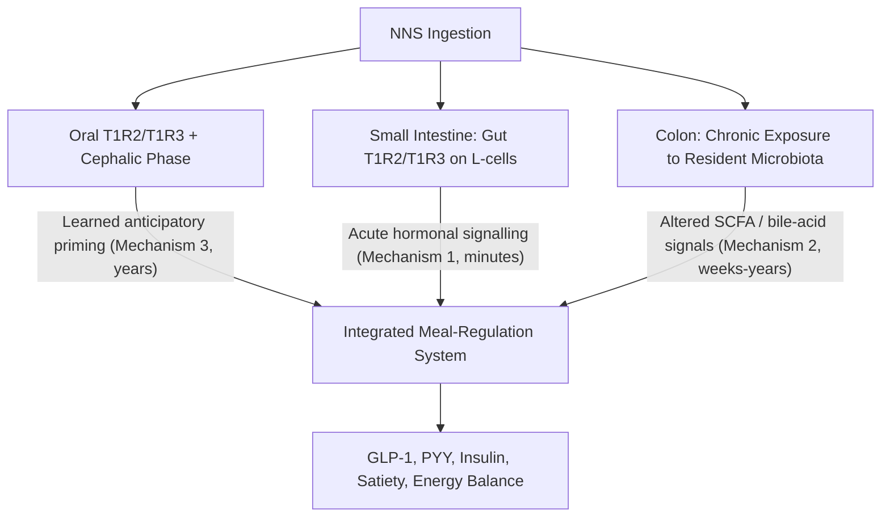

# Health Effects of Non-Nutritive Sweeteners: A Comparative Inventory and Mechanistic Synthesis Based on Pre-March 2019 Evidence
# 1 Research Background and Scope Definition

Few categories of food ingredients have travelled as rapid an arc from marginal curiosity to mainstream dietary staple as non-nutritive sweeteners (NNS). Once confined to specialty products for people with diabetes, compounds such as saccharin, aspartame, sucralose, acesulfame potassium, and more recently steviol glycosides and monk-fruit extracts now appear in thousands of "sugar-free," "diet," "light," and "reduced-calorie" foods and beverages sold worldwide[^1]. This proliferation has been driven by a convergent set of forces: public-health alarm over excess sugar consumption, regulatory endorsements of multiple high-intensity sweeteners as safe at approved use levels, and the food industry's strategic pivot toward reformulation. Yet precisely because NNS are now consumed across the life course—by children, pregnant women, people managing diabetes, and the general population—a careful, evidence-bounded synthesis of what is and is not known about their health effects has become indispensable. This opening chapter establishes the scaffolding for such a synthesis: why the topic warrants focused attention, what objects of study fall inside and outside the scope, which evidentiary window the report respects, and how the two deliverables requested by the reader—a comparative inventory and a three-mechanism mechanistic summary—fit together as a coherent analytical whole.

## 1.1 Public-Health Rationale for Focusing on Non-Nutritive Sweeteners

The contemporary interest in NNS cannot be disentangled from the public-health response to free-sugar overconsumption. The World Health Organization (WHO), in its 2015 guideline on sugars intake, issued a **strong recommendation** that both adults and children reduce their intake of free sugars to less than 10% of total energy intake, with a **conditional recommendation** to push intake below 5% for additional benefits[^1]. "Free sugars" in this framework encompass monosaccharides and disaccharides added to foods and beverages by the manufacturer, cook, or consumer, together with sugars naturally present in honey, syrups, fruit juices, and fruit juice concentrates[^1]. The WHO's threshold values were derived from a systematic review demonstrating that dental caries—the most common chronic infectious disease of childhood, affecting up to 80% of the world's population—is significantly lower when free-sugar intake remains below 10% of total energy, with further reductions in risk when intake falls below 5%[^1]. A parallel commissioned review by Te Morenga and colleagues, also informing the WHO guideline, concluded that free-sugar intake is a determinant of body weight, with increased intake leading to weight gain[^1].

The behavioural gap between recommendation and reality is large. In Europe, added sugars currently contribute roughly **7–11% of total energy intake in adults and 11–17% in children**, with school-age children and adolescents showing the highest intakes[^1]. Because most dietary surveys measure added sugars (a narrower category) and because sugary foods are systematically under-reported in self-reported dietary data, true free-sugar intake is almost certainly higher still[^1]. The downstream consequences extend well beyond caries: excess sugar consumption from foods and beverages high in added sugars has been associated in the pre-2019 literature with overweight and obesity, type 2 diabetes, cardiovascular disease, non-alcoholic fatty liver disease, and certain cancers, with emerging evidence even hinting at links to dementia[^1]. Childhood and adolescent obesity rose roughly tenfold globally between 1975 and 2016, and in Europe 50–70% of adults are overweight or obese[^1].

Against this backdrop, NNS occupy an attractive but contested position. Because they are "many times sweeter than table sugar (sucrose), smaller amounts … are needed to achieve the same level of sweetness," and they "do not contribute calories or only contribute a few calories to the diet" and "generally will not raise blood sugar levels"[^1]. In principle, they offer a way to preserve the hedonic experience of sweetness while displacing the energy load and dental impact of sugar. Public-health bodies have explicitly considered this trade-off: the United Kingdom's sugar-reduction programme, for instance, endorsed the European Food Safety Authority's scientific opinion that "sweeteners that have been approved through EFSA's processes are a safe and acceptable alternative to using sugar," while simultaneously noting that "there may be advantages in businesses not adding sweeteners to their products and gradually reducing the overall sweetness of their products"[^1]. This twin posture—NNS are acceptable substitutes, yet the long-term wisdom of normalising intense sweetness is itself open to question—captures precisely why the health effects of sugar substitutes have become a research focus in their own right, rather than a settled corollary of sugar-reduction policy.

## 1.2 Definitional Boundaries and Classification of Sugar Substitutes

Before any meaningful comparison or mechanistic discussion can proceed, the research object must be delimited. "Sugar substitute" is a colloquial umbrella term that, in regulatory and food-science usage, covers several distinct classes of compounds. Following the U.S. Food and Drug Administration (FDA), this report adopts the operative distinction between **high-intensity sweeteners** and **sugar alcohols**, supplemented by a category for **natural (plant- and fruit-derived) sweeteners** whose regulatory pathway in the United States is GRAS notification rather than food-additive approval[^1].

High-intensity sweeteners are defined functionally as "ingredients used to sweeten and enhance the flavor of foods" that are "many times sweeter than table sugar (sucrose)," such that smaller quantities are needed to achieve equivalent sweetness, contributing "only a few to no calories"[^1]. In the United States, six high-intensity sweeteners are FDA-approved as food additives—**saccharin, aspartame, acesulfame potassium (Ace-K), sucralose, neotame, and advantame**—while two additional types are the subjects of GRAS notices to which FDA has not objected: **certain high-purity steviol glycosides** derived from *Stevia rebaudiana* leaves, and **extracts of *Siraitia grosvenorii* Swingle fruit** (Luo Han Guo or monk fruit)[^1]. The FDA also draws an internal distinction between *non-nutritive* high-intensity sweeteners (containing less than 2% of the calories in an equivalent amount of sugar) and *nutritive* high-intensity sweeteners; **aspartame is the sole approved nutritive high-intensity sweetener**, containing more than 2% of the calories in an equivalent amount of sugar yet, because of its 200-fold sweetness, used in such small quantities that its caloric contribution in practice is negligible[^1]. For the purposes of this report, the colloquial label "non-nutritive sweeteners" is used broadly to include aspartame, in line with common usage in the scientific literature and the user's framing.

**Sugar alcohols (polyols)**—including sorbitol, xylitol, lactitol, mannitol, erythritol, maltitol, isomalt, and hydrogenated starch hydrolysates—form a distinct class. The FDA explicitly notes that "sugar alcohols, another class of sweeteners, can be used as sugar substitutes," with sweetness ranging "from 25% to 100% as sweet as sugar"; they are "slightly lower in calories than sugar and do not promote tooth decay or cause a sudden increase in blood glucose," and they are used "primarily to sweeten sugar-free candies, cookies, and chewing gums"[^1]. Because polyols are typically used at sugar-equivalent volumes, they perform bulking and texturising functions that high-intensity sweeteners cannot, which is why commercial products often combine the two.

A third grouping, **natural (plant- and fruit-based) sweeteners**, overlaps with high-intensity sweeteners in regulatory terms (steviol glycosides and monk-fruit extracts are themselves high-intensity in potency) but warrants separate treatment because of their botanical origin, their distinctive consumer positioning as "natural," and their characteristic GRAS-notification pathway[^1]. The FDA emphasises that this category is defined by *purified* extracts: "whole-leaf and crude stevia extracts are subject to an Import Alert and are also not permitted for use as sweeteners," whereas highly refined steviol glycosides (≥95% purity) have been determined to be GRAS for their intended uses[^1]. **Cyclamates and their salts—although used in many countries—remain prohibited in the United States** and are noted in this report only for completeness rather than as in-scope substances for U.S. exposure assessment[^1].

Excluded from the core analytical scope are: (a) **caloric nutritive sweeteners** such as sucrose, glucose, fructose, high-fructose corn syrup, honey, maple syrup, and other syrups, which are the *targets* of substitution rather than substitutes themselves; (b) **modified sugars** such as isomaltulose or allulose, which fall into a regulatory and metabolic grey zone outside the user's three requested categories; and (c) **rare or commercially marginal sweeteners** (e.g., thaumatin, brazzein) that, while occasionally noted for completeness, are not subjects of significant pre-2019 health-mechanism literature. The criteria delimiting the in-scope set are therefore threefold: a sweetness multiplier substantially above sucrose (for high-intensity and natural categories) or a defined polyol structure with reduced caloric yield (for sugar alcohols); a low or negligible contribution to dietary calories at typical use levels; and a recognised regulatory pathway (FDA food-additive approval, GRAS notification, JECFA evaluation, or equivalent international assessment).

## 1.3 Temporal Scope and Evidence Cut-Off (Pre-March 2019)

This report confines all evidence, regulatory citations, and mechanistic claims to materials available **before March 2019**. The rationale for this boundary is both methodological and substantive. On the methodological side, fixing a single cut-off date enables a coherent, reproducible synthesis: every approval, ADI, GRAS notice, mechanistic study, and review cited can be located within a defined evidentiary window, and readers can audit whether any later development has been inadvertently imported. On the substantive side, the pre-March 2019 window represents a meaningful plateau in the regulatory and scientific landscape. By that date the FDA had completed its food-additive approvals for all six high-intensity sweeteners now in commerce—**saccharin (long-standing; warning label removed in 2000), aspartame (1981; general-purpose 1996), acesulfame potassium (1988; general-purpose 2003), sucralose (1998; general-purpose 1999), neotame (2002), and advantame (2014)**—and had accumulated numerous GRAS notices for high-purity steviol glycosides and *Siraitia grosvenorii* fruit extracts[^1]. The Joint FAO/WHO Expert Committee on Food Additives (JECFA) had established ADIs that informed both U.S. and international risk assessment, including the well-established **0–40 mg/kg bw per day ADI for aspartame** originally allocated in 1981 and reaffirmed thereafter[^1]. National and regional bodies—Health Canada, EFSA, FSANZ, ANSES, and others—had likewise completed substantive safety assessments[^1].

In parallel, the pre-March 2019 scientific literature had consolidated three principal lines of mechanistic inquiry into possible adverse effects of NNS: extra-oral sweet-taste receptor signalling and incretin responses; perturbation of the gut microbiota (notably the landmark 2014 Suez et al. *Nature* study on saccharin-induced glucose intolerance); and disruption of the learned association between sweet taste and caloric ingestion (the Swithers and Davidson line of rodent work and successor reviews). These three streams collectively define the mechanistic synthesis presented in Chapters 5–9 of this report.

The cut-off also entails explicit acknowledged limitations. Subsequent JECFA re-evaluations (such as the 2023 reaffirmation of aspartame's ADI[^1]), WHO guidelines specifically on NNS use, and a substantial body of post-2019 microbiome, randomised-controlled, and large-cohort epidemiological evidence fall outside the scope. **Compliance with the user's instruction to exclude the Liauchonak et al. (2019) article and its enumerated URLs is strict and absolute**; no content, citation, or paraphrase from that source has been or will be used at any stage of this report. Where the pre-March 2019 evidence base is thin, animal-dominated, or contested, the report explicitly flags that limitation rather than papering over it.

## 1.4 Rationale for the Dual-Deliverable Structure

The reader's brief is unusually well-defined: deliver, in order, (i) a categorised comparison table of common sweeteners and (ii) a plain-language summary of three mechanisms by which NNS may negatively affect health. This report honours that structure strictly, and there is a defensible analytical reason it works well. The two deliverables answer complementary questions. The **comparison table answers "what?"**—what compounds exist, what they are called commercially, where they appear in the food supply, and how potent each one is relative to ordinary sugar. The **mechanism summary answers "how?"**—through which physiological pathways might these compounds, despite contributing minimal energy, nevertheless exert biological effects that diverge from "doing nothing." Without the table, the mechanism discussion would float free of the actual molecules consumers encounter; without the mechanism discussion, the table would be a static catalogue, useful as reference but devoid of interpretive depth.

The dual structure also reflects a deeper epistemic point. Regulatory evidence (codified in approvals, ADIs, and GRAS determinations) is descriptive and authoritative for the question of whether a given exposure level meets the "reasonable certainty of no harm" standard[^1]. Mechanistic evidence, by contrast, is exploratory and probabilistic: it identifies pathways through which effects *might* occur, often at exposures, in animal models, or in microbial systems that do not map neatly onto regulatory ADIs. The two evidence types do not contradict each other so much as operate at different levels of resolution. **A coherent report on the health effects of NNS must hold both in view simultaneously**, presenting the regulatory consensus that approved NNS are safe at intended use levels[^1] alongside the emerging mechanistic literature suggesting biological activity worth taking seriously. The dual-deliverable structure operationalises this dual stance.

Within the table, the four columns mandated by the user—**Sweetener Name, Brand Name, Primary Uses in the Food Industry, and Sweetness Multiplier Relative to Sucrose**—were chosen because they jointly capture identity, market presence, functional role, and potency, the four dimensions a reader needs to recognise a sweetener on a label, locate it in a typical food product, and gauge how much of it is being consumed relative to an equivalent sugar serving. Within the mechanism summary, the three pathways—gut taste-receptor signalling, microbiota disruption, and decoupling of the sweetness–energy association—were chosen by the reader and align precisely with the three most-cited hypotheses in the pre-2019 mechanistic literature on NNS and metabolic health.

## 1.5 Analytical Framework: Integrating Regulatory, Food-Science, and Physiological Evidence

The report integrates three streams of evidence, each with its own conventions, strengths, and limits. The following table summarises how each stream contributes to the synthesis and how conflicts between them are reconciled.

| Evidence Stream | Primary Sources (Pre-March 2019) | Strengths | Limits | Role in This Report |
|---|---|---|---|---|
| **Regulatory** | FDA food-additive regulations & GRAS Notice Inventory; JECFA monographs; EFSA scientific opinions; Health Canada; FSANZ; ANSES; UK PHE[^1] | Quantitative ADIs; defined safety standard ("reasonable certainty of no harm"); systematic toxicological review | Focused on safety at intended exposure, not on long-term metabolic or behavioural endpoints; conservative on mechanistic novelty | Anchors the table (regulatory status, ADI context, permitted uses); establishes baseline safety consensus |
| **Food-science** | FDA technical summaries; peer-reviewed food-science reviews; brand/product documentation[^1] | Detailed on chemical structure, sweetness multipliers, heat stability, formulation roles (bulking, flavour enhancement) | Sweetness multipliers vary across sources and food matrices; commercial blends complicate attribution | Populates table columns on uses and sweetness; informs interpretive notes on functional complementarity |
| **Physiological / mechanistic** | Animal studies, microbiome research, limited human trials, behavioural-neuroscience experiments published before March 2019 | Identifies plausible biological pathways; surfaces hypotheses beyond toxicology | Heterogeneous designs; dose extrapolation issues; limited large-scale human evidence by 2019 | Underpins the three-mechanism summary; calibrated against regulatory consensus |

When numerical values diverge across sources—most commonly for sweetness multipliers, where ranges such as saccharin's "200 to 700 times" sucrose or steviol glycosides' "200 to 400 times" already appear in the FDA's own summary[^1]—this report **presents reconciled ranges rather than single point estimates**, with the rationale flagged in the inventory chapter. When regulatory and mechanistic streams appear to conflict (for example, when an approved sweetener is implicated in animal microbiota studies), both are reported without forcing a synthetic verdict: the FDA's position that "high-intensity sweeteners approved by FDA are safe for the general population under certain conditions of use"[^1] stands alongside emerging mechanistic concerns, and readers are explicitly invited to weigh the two in light of the evidence's level of resolution.

This integrative framework also imposes a discipline on language. Mechanistic concepts that are inherently technical—sweet-taste receptors of the T1R2/T1R3 heterodimer, glucagon-like peptide-1 (GLP-1) and peptide YY (PYY) release, gut microbial dysbiosis, learned interoceptive associations—will be introduced in Chapters 5 through 8 with plain-language paraphrases and everyday analogies, in keeping with the reader's explicit request to "avoid overly specialized terminology." The aim throughout is to make the science accessible without diluting its substance, and to make the regulatory landscape clear without conflating "approved at intended use levels" with "demonstrated to have no biological effects whatsoever." With this foundation laid, the next chapter turns to the methodological choices behind the comparison table itself.

# 2 Methodology and Classification Framework for the Comparative Inventory

Chapter 1 established *what* falls inside this report's scope and *why* the topic merits focused attention. Before the populated inventory can be presented in Chapter 3, however, the reader is entitled to know *how* that inventory was built: by what logic substances are grouped, what each column actually means, which source takes precedence when authoritative bodies disagree, and how the irreducible imprecision of "sweetness intensity" has been handled. This chapter answers those questions. It is methodological in nature—deliberately upstream of the table itself—because the credibility of the comparison rests on the transparency of the rules used to construct it. Every figure that will appear in the next chapter can be traced back to a decision documented here.

## 2.1 Tripartite Classification Logic and Category Boundary Criteria

The user's brief specifies three categories: high-intensity sweeteners, sugar alcohols, and natural sweeteners. These are not arbitrary labels; they correspond to genuinely different objects from chemical, nutritional, and regulatory standpoints. Adopting them as the organising spine of the inventory therefore reflects both fidelity to the user's request and analytical coherence. To justify the boundaries between them, three discriminating dimensions are applied: **chemical origin**, **caloric contribution at typical use levels**, and **regulatory pathway**.

On the first dimension, *chemical origin*, the FDA distinguishes synthetic high-intensity molecules (saccharin, aspartame, acesulfame potassium, sucralose, neotame, advantame) from polyhydric alcohols (the sugar alcohols, structurally derived from sugars by reduction) and from botanically sourced extracts (steviol glycosides from *Stevia rebaudiana* leaves and mogrosides from *Siraitia grosvenorii* fruit)[^1]. On the second dimension, *caloric contribution*, the FDA notes that high-intensity sweeteners "contribute only a few to no calories when added to foods" and that, with the exception of aspartame, they meet the threshold of containing less than 2% of the calories of an equivalent amount of sugar; sugar alcohols, by contrast, are "slightly lower in calories than sugar" and are used at sugar-equivalent volumes that perform bulking roles in candies, cookies, and chewing gums[^1]. On the third dimension, *regulatory pathway*, the synthetic high-intensity sweeteners have all moved through the FDA food-additive approval route codified in 21 CFR (e.g., aspartame at 21 CFR 172.804, sucralose at 21 CFR 172.831, neotame at 21 CFR 172.829), whereas steviol glycosides and *Siraitia grosvenorii* fruit extracts (SGFE) are the subjects of GRAS notices to which the FDA has not objected[^1]. JECFA, meanwhile, has assigned numerical ADIs to most synthetic high-intensity sweeteners (for example, aspartame at 0–40 mg/kg bw per day) and to steviol glycosides, while declining to specify a numerical ADI for SGFE on the basis of evidence of safety at use-relevant levels[^1].

These three dimensions converge cleanly on the user's three categories, but two boundary cases require explicit treatment. **Steviol glycosides and monk-fruit (Luo Han Guo) extracts are botanically derived yet are, in potency terms, high-intensity sweeteners**—steviol glycosides 200–400 times sucrose, SGFE 100–250 times sucrose, per the FDA summary[^1]. To preserve the user's three-category structure without obscuring this overlap, the inventory assigns each substance to a single *primary* category determined by the dimension most salient to consumer-facing identity: synthetic high-intensity sweeteners are placed under "High-Intensity Sweeteners," polyols under "Sugar Alcohols," and plant- or fruit-derived purified extracts under "Natural Sweeteners," with a cross-referencing note acknowledging the latter group's high potency. This choice tracks how these substances are positioned in commerce ("natural" branding such as Truvia, PureVia, Nectresse, Monk Fruit in the Raw) and avoids splitting steviol glycosides across two rows.

The exclusion criteria established in Chapter 1 are applied without exception. Caloric nutritive sweeteners (sucrose, fructose, high-fructose corn syrup, honey, syrups) are the *targets* of substitution and are not entries. **Cyclamates and their salts, which remain prohibited from use in the United States** while permitted elsewhere, are referenced only contextually rather than as an in-scope sweetener for the U.S.-anchored inventory[^1]. Modified sugars (e.g., isomaltulose, allulose) and rare/commercially marginal sweeteners (thaumatin, brazzein) are excluded because they fall outside the user's three categories and lack a substantial pre-2019 health-mechanism literature.

The following table summarises the boundary criteria in compact form.

| Discriminating Dimension | High-Intensity Sweeteners | Sugar Alcohols (Polyols) | Natural (Plant-/Fruit-Based) Sweeteners |
|---|---|---|---|
| **Chemical origin** | Predominantly synthetic organic molecules | Polyhydric alcohols (reduced sugars) | Purified extracts of plant leaves or fruits |
| **Caloric contribution** | Negligible (non-nutritive); aspartame technically nutritive but used in trivial amounts | Modestly reduced relative to sucrose | Negligible (used at high-intensity doses) |
| **Sweetness intensity vs. sucrose** | 200× to 20,000× | 25% to 100% of sucrose | 100× to 400× |
| **Principal U.S. regulatory route** | FDA food-additive approval (21 CFR) | Food-additive or GRAS depending on substance | GRAS notification (FDA has not objected) |
| **Typical functional role** | Sweetness/flavour enhancement at low dose | Bulking, texture, sweetness, non-cariogenic | Sweetness, "natural" positioning |

Sources for this synthesis are the FDA high-intensity sweeteners page and accompanying PDF summary[^1], cross-validated by the JECFA database for ADIs[^1] and by the IAFNS regulatory compendium for international consistency[^1].

## 2.2 Specification of the Four Inventory Columns

The user mandates four columns: **Sweetener Name, Brand Name, Primary Uses in the Food Industry, and Sweetness Multiplier Relative to Sucrose**. Each is defined operationally below so that Chapter 3's entries are consistent and auditable.

**Sweetener Name.** The primary identifier follows the nomenclature used in FDA regulations and JECFA monographs—e.g., "Acesulfame potassium (Ace-K)," "Aspartame," "Sucralose," "Neotame," "Advantame," "Saccharin," "Steviol glycosides," "Siraitia grosvenorii Swingle fruit extracts (SGFE)"[^1]. Where the FDA explicitly notes alternative label terms (e.g., "acesulfame K, acesulfame potassium, or Ace-K"), the synonyms are listed parenthetically[^1]. For sugar alcohols, the FDA's enumeration—"sorbitol, xylitol, lactitol, mannitol, erythritol, and maltitol"—provides the canonical list, supplemented by isomalt and hydrogenated starch hydrolysates referenced in the broader food-science literature on polyols[^1].

**Brand Name.** The principal commercial trade names are drawn from the FDA's own summary table, which is the most authoritative consolidated source for brand-to-sweetener mapping in the United States: Sweet'N Low®, Sweet Twin®, Sweet and Low®, Necta Sweet® (saccharin); NutraSweet®, Equal®, Sugar Twin® (aspartame); Sunett®, Sweet One® (acesulfame potassium); Splenda® (sucralose); Newtame® (neotame); Truvia®, PureVia®, Enliten® (steviol glycosides); and Nectresse®, Monk Fruit in the Raw®, PureLo® (SGFE)[^1]. Advantame, although approved, is not associated with a widely recognised consumer brand name and the inventory will reflect that gap honestly. For sugar alcohols, brand names tend to be less prominent because polyols are commonly listed as ingredients within finished products (sugar-free gum, mints, baked goods) rather than as named tabletop products; this asymmetry is flagged in the entry notes.

**Primary Uses in the Food Industry.** Use descriptions are derived from the FDA's published intended-use language and the heat-stability characteristics that determine functional role. The FDA notes, for instance, that aspartame "is not heat stable and loses its sweetness when heated, so it typically isn't used in baked goods," while acesulfame potassium, sucralose, neotame, and advantame are all explicitly described as "heat stable, meaning that it stays sweet even when used at high temperatures during baking, making it suitable as a sugar substitute in baked goods"[^1]. Typical categories cited by the FDA include "baked goods, soft drinks, powdered drink mixes, candy, puddings, canned foods, jams and jellies, dairy products" for high-intensity sweeteners broadly, and "sugar-free candies, cookies, and chewing gums" for sugar alcohols, the latter "primarily" because polyols supply bulking volume that intense sweeteners cannot[^1]. Where regulations exclude meat and poultry from the intended-use scope (e.g., acesulfame potassium, neotame, advantame), this is noted because it reflects the boundaries of approval rather than a chemical incompatibility[^1].

**Sweetness Multiplier Relative to Sucrose.** Potency is expressed with sucrose = 1× as the reference. The FDA summary provides the anchor values: saccharin "200 to 700 times sweeter than table sugar (sucrose)"; aspartame "about 200 times sweeter"; acesulfame potassium "about 200 times sweeter"; sucralose "about 600 times sweeter"; neotame "approximately 7,000 to 13,000 times sweeter"; advantame "approximately 20,000 times sweeter"; steviol glycosides "200 to 400 times sweeter"; and SGFE (depending on mogroside content) "100 to 250 times sweeter"[^1]. For sugar alcohols, the FDA convention is a percentage of sucrose ("25% to 100% as sweet as sugar")[^1], and the inventory adopts this convention rather than forcing a >1× multiplier on substances that are typically less sweet than sucrose.

Taken together, the four columns capture the four dimensions a reader needs in order to recognise a sweetener on an ingredient label (Name), to associate it with a familiar tabletop product (Brand Name), to anticipate where it is likely to appear in the food supply and why (Primary Uses), and to gauge the magnitude of the substitution ratio against ordinary sugar (Sweetness Multiplier). **The four columns are deliberately neither more nor less than the user requested**; columns such as ADI, regulatory citation, or caloric content are not added to the inventory itself but are addressed in interpretive notes in Chapter 4.

## 2.3 Source Hierarchy and Reconciliation Rules for Conflicting Figures

Authoritative sources do not always agree. Sweetness multipliers in particular vary across publications because they depend on the test methodology (threshold versus iso-sweet equivalence), the food matrix (water versus a fat-containing or acidic medium), the concentration tested, and the purity of the sample. Brand availability also evolves by jurisdiction. To prevent silent arbitrariness, this report applies an explicit four-tier source hierarchy.

**Tier 1 — Primary regulatory anchor: FDA.** The FDA's "High-Intensity Sweeteners" public-information page and its companion PDF, "High-Intensity Sweeteners Permitted for Use in Food in the United States," together with the consolidated FDA summary table (republished in IAFNS regulatory compendia), serve as the canonical reference for U.S. regulatory status, the canonical sweetness ranges quoted by the agency, the brand-name enumerations, and the intended-use language[^1]. Where the FDA itself reports a range (e.g., saccharin 200–700×, neotame 7,000–13,000×), the inventory reproduces that range verbatim rather than collapsing it.

**Tier 2 — International regulatory corroboration: JECFA, EFSA, Health Canada, FSANZ, ANSES.** JECFA monographs—particularly the searchable JECFA database housing toxicological evaluations and ADI determinations—provide the international ADI anchor for aspartame (0–40 mg/kg bw) and other sweeteners[^1]. EFSA's scientific opinions are cited in regulatory compendia as the European reference, endorsed by the UK Public Health England programme[^1]. Health Canada, FSANZ, and ANSES safety assessments provide cross-validation that the figures cited are not idiosyncratic to U.S. regulation, and the ANSES 2015 opinion confirms that French intake assessments find "the mean and 95th percentile intakes are lower than the ADIs" for the intense sweeteners then evaluated[^1].

**Tier 3 — Codex and JECFA permissible-use frameworks.** The Codex Alimentarius General Standard for Food Additives provides international maximum-use levels for permitted sweeteners and is used to corroborate use categories where U.S. regulatory language is silent or differs[^1].

**Tier 4 — Peer-reviewed food-science literature published before March 2019.** Where regulatory text does not address a question (e.g., commercial blend formulations, sweetness behaviour in specific matrices), pre-2019 reviews are consulted, with the caveat that they cannot override Tier 1 figures.

The **reconciliation procedure** when figures differ is as follows. First, the broader documented range is preferred over a narrower point estimate, on the principle that suppressing reported variability would mislead readers about the underlying measurement uncertainty. Saccharin's "200 to 700×" therefore stays a range, not an average. Second, where two authoritative sources cite incompatible point values for a substance widely reported as a single number (e.g., aspartame's ~200×), the FDA figure is adopted and the matter noted in Chapter 4's interpretive caveats. Third, **values are never averaged across incompatible methods**; an iso-sweet potency measured at one sucrose-equivalence level and a threshold potency measured at another are not arithmetically combined. Fourth, the source of each endpoint is identifiable by footnote so that a reader can audit the chain of evidence. Fifth, where the regulatory and mechanistic literatures appear in tension, both are reported without forcing a synthesis—the FDA's safety conclusion[^1] and the pre-2019 mechanistic literature (Chapters 6–8) co-exist rather than overwriting one another.

## 2.4 Conventions for Presenting Sweetness Multipliers: Ranges versus Point Estimates

A substantial fraction of the apparent confusion in popular discussions of sweeteners arises from the false precision of single-number potency claims. The pre-March 2019 evidence, even within FDA documents, often expresses potency as a range. The inventory therefore adopts the following convention.

**Ranges are used where the FDA summary itself reports a range, or where authoritative sources diverge.** Specifically: saccharin 200–700×; steviol glycosides 200–400×; SGFE (monk fruit) 100–250×; neotame 7,000–13,000×; sugar alcohols collectively 25%–100% of sucrose[^1]. The rationale spans four overlapping sources of variability: (i) **inter-source variation**—different reviews and regulators sample different primary literatures; (ii) **food-matrix dependence**—sweetness perception depends on pH, temperature, and the presence of fat or other tastants; (iii) **threshold versus iso-sweet test conditions**—the multiplier at recognition threshold typically differs from the multiplier at, say, a 10% sucrose equivalence level (the FDA explicitly footnotes neotame at "10,000 × sucrose" for ADI calculation despite a 7,000–13,000× headline range)[^1]; and (iv) **impurity and isomer profiles**—steviol glycoside preparations may be predominantly Rebaudioside A, Stevioside, or mixtures, each with subtly different potencies[^1].

**Point estimates are used only where the FDA summary and corroborating sources converge on a single value:** aspartame ~200×; acesulfame potassium ~200×; sucralose ~600×; advantame ~20,000×[^1]. For these substances the FDA reports a single multiplier without an accompanying range, and no Tier-2 source in the assembled materials contradicts the figure. Even in these cases, the inventory will treat the value as a working approximation rather than an exact constant, and Chapter 4 will note that food-matrix effects can shift it modestly in either direction.

**For sugar alcohols, the convention follows the FDA's percentage formulation** ("from 25% to 100% as sweet as sugar")[^1] rather than converting to a multiplier below 1×, because the percentage form is the established usage in food-science literature and is more intuitive for substances that are typically less sweet than sucrose. Where individual polyols are entered—erythritol at the lower end, xylitol at approximately 100% of sucrose—per-substance percentages will be reported with the same range convention.

A practical implication accompanies every range: the *less* sweet end of a range implies *more* of the substance must be used to achieve a given sweetness equivalent, while the *more* sweet end implies less. For neotame's 7,000–13,000× range, this translates to nearly a twofold spread in the amount of substance required for sugar equivalence—a meaningful caveat when comparing exposure against ADIs. The inventory's interpretive notes (Chapter 4) will surface this implication explicitly so that the reader is not lulled into reading sweetness ranges as cosmetic.

## 2.5 Temporal and Source-Inclusion Constraints Applied to the Inventory

The pre-March 2019 cut-off established in Chapter 1 is treated as a binding constraint on every cell of the inventory. The operationalisation is as follows.

For **regulatory status**, only approvals issued on or before March 2019 are recognised. The FDA's six approved high-intensity sweeteners and their approval dates—saccharin (pre-modern; warning label removed in 2000 after the National Toxicology Program's reclassification), aspartame (1981; general-purpose 1996), acesulfame potassium (1988; general-purpose 2003), sucralose (1998; general-purpose 1999), neotame (2002), and advantame (2014)—all fall well within scope, as do the GRAS notices for high-purity steviol glycosides and SGFE that the FDA had received by that date[^1]. For **ADI citations**, only evaluations on or before March 2019 are used. The JECFA aspartame ADI of 0–40 mg/kg bw, originally allocated at the 24th meeting (1980) and confirmed at the 25th meeting (1981), is in scope[^1]; the 2023 JECFA re-evaluation that reaffirmed this same ADI is not used as a source of any claim in the inventory, even though the conclusion happens to match. For **sweetness figures and brand names**, the FDA summary as published and accessed prior to March 2019 is the source, with IAFNS's compilation noting "Resources accessed December 2023" treated only as a convenient mirror of pre-2019 FDA content where the underlying FDA document is itself the substantive source[^1]. For **peer-reviewed reviews**, only those with publication dates prior to March 2019 are eligible for citation.

**The exclusion of the Liauchonak et al. (2019) article and its enumerated URLs is absolute.** No content, paraphrase, citation, or summary from that article or any of the listed PubMed, PMC, ResearchGate, Semantic Scholar, CABI, or MDPI URLs has been used at any stage of the inventory's construction or the mechanism synthesis that follows. This constraint is enforced upstream of any writing decision: candidate sources are checked against the prohibited URL list before being incorporated.

Substances **under evaluation but not yet approved or GRAS-noticed by the cut-off** are not entered as inventory rows. Where a substance has a GRAS-noticed status but no FDA-allocated numerical ADI (as with SGFE, whose ADI is "Not specified" in the FDA summary because "a numerical ADI may not be deemed necessary for several reasons, including evidence of the ingredient's safety at levels well above the amounts needed to achieve the desired effect")[^1], this is flagged in the entry note rather than left blank. Where a substance's ADI is allocated by JECFA rather than by the FDA directly (as with steviol glycosides, marked with the note "ADI established by the Joint FAO/WHO Expert Committee on Food Additives (JECFA)")[^1], the source is identified explicitly. These notation conventions ensure that the table communicates not only what is known but also where authoritative knowledge stops, in keeping with the report's commitment to surfacing rather than concealing evidence gaps.

The methodological scaffolding is now in place. The next chapter presents the populated comparative inventory, applying these category boundaries, column definitions, source-hierarchy rules, sweetness-multiplier conventions, and temporal constraints to produce the central deliverable of this report.

# 3 Comparison Table of Common Sweeteners across Categories

Chapter 2 established the boundary criteria, column definitions, source hierarchy, and range-versus-point-estimate conventions that govern the inventory. The present chapter applies that methodology to produce the report's first central deliverable. Rather than dropping a monolithic table without context, the chapter walks through each of the three categories in turn—high-intensity sweeteners, sugar alcohols, and natural plant- and fruit-derived sweeteners—populating the four mandated columns and surfacing the cross-substance contrasts that are most informative for label-reading, formulation understanding, and the mechanistic synthesis that follows. The chapter closes with the integrated table itself, presented in a uniform layout so that the three categories can be read side-by-side, and with a structured cross-category reading that draws out the regularities and ambiguities a careful reader should carry forward into Chapter 4. Consistent with the report's scope, every entry reflects the regulatory and food-science landscape as it stood before March 2019; no later approval, brand launch, or revised potency figure has been imported.

## 3.1 High-Intensity Sweeteners: Inventory Entries and Cross-Substance Comparison

The high-intensity category is populated by six substances that the U.S. Food and Drug Administration had approved as food additives by March 2019—**saccharin, aspartame, acesulfame potassium (Ace-K), sucralose, neotame, and advantame**—and a contextual note on **cyclamate**, which remained prohibited from use in the United States by that date while permitted in more than fifty other jurisdictions, including Canada, Australia, Mexico, and most of the European Union[^2]. Each of these synthetic molecules shares two defining characteristics: a sweetness intensity that ranges from roughly two hundred times to twenty thousand times that of sucrose, and a use level so small that the caloric contribution to the diet is negligible in practice.

**Saccharin**, discovered at Johns Hopkins University in 1879 and the oldest non-nutritive sweetener in commerce, is reported by the FDA at **200 to 700 times the sweetness of sucrose**, with peer-reviewed food-science sources citing similar ranges (the European Commission Regulation specifies "between 300 and 500 times" and pre-2019 reviews routinely give "200–700×")[^3][^2]. Its principal commercial brand names are **Sweet'N Low, Sugar Twin, Sweet and Low, and Necta Sweet**[^2]. Use levels are constrained in U.S. regulation to "12 milligrams per fluid ounce in beverages, 30 milligrams per serving in processed foods, and sweetening power of one teaspoon of sugar in packets"[^2]. Saccharin appears most prominently as a **tabletop sweetener and in beverages**, but also in **cosmetics, vitamins, and pharmaceuticals**[^2]. A widely noted sensory drawback is a bitter or metallic aftertaste and sweetness linger at higher concentrations[^2]. Historically, the FDA proposed a ban in 1977 following a rat-bladder-tumour study; the proposal was overridden by Congress and the warning label was removed in 2001 after the National Toxicology Program de-listed saccharin as a possible carcinogen[^2].

**Aspartame**, discovered by accident in 1965 and approved by the FDA in 1981, consists of a methyl ester of the dipeptide of aspartic acid and phenylalanine[^2]. It is uniformly reported at **approximately 200 times the sweetness of sucrose**[^2][^4]. Brand names include **NutraSweet, Equal, Sugar Twin** (as a tabletop product) and the lesser-known **Candere**[^2]. Aspartame is "found in over 6,000 products" and appears in **cereals, chewing gum, dry beverage mixes, carbonated and tea beverages, frozen stick novelties, gelatins, yogurt, frozen desserts, prescription chewable tablets, and sugar-free liquids**[^2]. **A defining functional limitation is that aspartame is heat-labile**: it "loses sweetness when exposed to high temperatures for a long time" and "is not appropriate for use in baking unless it is added at the end of the cooking cycle"; the most optimal pH range for stability is between 3 and 5[^2]. Because aspartame is metabolised to phenylalanine, U.S. labelling regulations require products containing it to carry a phenylalanine statement for individuals with phenylketonuria (PKU)[^2]. Two close structural derivatives, **neotame and advantame**, share its dipeptide backbone but differ in potency, stability, and PKU-statement requirements.

**Acesulfame potassium (Ace-K)**, discovered in Germany in 1967 and approved for U.S. use in 1988, is the potassium salt of 6-methyl-1,2,3-oxathiazine-4(3H)-one-2,2-dioxide and is reported at **approximately 200 times the sweetness of sucrose**[^2][^4]. Brand names include **Sunett** (food applications) and **Sweet One** or **Swiss Sweet** (tabletop)[^2]. Ace-K is **highly water-soluble, heat- and pH-stable**, and consequently appears in **chewing gum, dry beverage mixes, instant coffees and teas, carbonated beverages, baked goods, hard and soft confections, gelatin, puddings, and nondairy creamers**[^2]. It has "a slight bitter aftertaste" that motivates its widespread use in **synergistic blends with aspartame or sucralose**, where the two-sweetener combination enhances perceived sweetness while masking each component's off-notes[^2].

**Sucralose**, developed by Tate & Lyle and approved by the FDA in 1998–1999, is produced by selectively replacing three hydroxyl groups on sucrose with chloride atoms and is reported at **approximately 600 times the sweetness of sucrose**[^2][^3]. Its principal brand name is **Splenda**, in which sucralose is mixed with the bulking agent maltodextrin such that the commercialised tabletop product contains only about 1.1% sucralose[^2]. Sucralose is **soluble in water, ethanol, methanol, and maltodextrin** and **stable over a wide range of pH and temperatures**, allowing its use in **baked goods, beverages, dairy products, confectionery, and a wide variety of other applications**, with a time-intensity sweetness profile that is closer to sucrose than any of the other high-intensity sweeteners on the market[^2][^3]. EFSA reaffirmed the ADI of 15 mg/kg body weight per day in evaluations available before March 2019, consistent with JECFA[^3]. The European Food Safety Authority's specifications give a more precise potency of "around 600–650 times that of sucrose"[^3].

**Neotame**, an N-substituted derivative of aspartame approved by the FDA in 2002, is reported at **approximately 7,000 to 13,000 times the sweetness of sucrose**, a range that the European Commission's specifications endorse[^3][^2]. Its principal brand name is **Newtame**[^2]. Neotame is used in **beverages, tabletop sweeteners, baked goods, cereals, and frozen desserts** and, unlike aspartame, does not require a PKU warning, because the amount of phenylalanine liberated from its metabolism is too small to be clinically significant[^2]. Its wide reported potency range carries an important practical implication: the amount required for a given sugar-equivalent sweetness can vary by nearly a factor of two depending on the assumed multiplier.

**Advantame**, the most recently approved entry in this category (FDA approval in 2014), shares neotame's chemical lineage but is reported at **approximately 20,000 times the sweetness of sucrose**, with the EFSA specifications citing "approximately 37,000 times sweeter" at the high end[^2][^3]. It is **heat-stable** and approved for use in baked goods, beverages, and a range of other applications, although **not in meat or poultry products**[^2]. **No widely recognised consumer brand name was associated with advantame by March 2019**, which is itself a meaningful entry note: the inventory honestly reflects this gap rather than fabricating a brand to fill the column. EFSA's regulatory limits for advantame in flavoured drinks are correspondingly low (6 mg/L), consistent with its extreme potency[^2].

**Cyclamate** is not entered as an in-scope U.S. sweetener because it was banned by the FDA in 1969 following a rat study on a cyclamate–saccharin mixture and remained prohibited as of March 2019, despite subsequent toxicological work that did not confirm the original carcinogenicity finding[^2]. Where in use elsewhere (Canada, Australia, Mexico, much of the EU), cyclamate is reported at **30 to 50 times the sweetness of sucrose**—the lowest potency among the synthetic high-intensity class—and is "often used in blends, usually with saccharin at a 10:1 ratio"[^2][^3].

Across the synthetic high-intensity class, two cross-substance contrasts deserve emphasis before the table is consolidated. **The first is heat stability.** Aspartame is the only entry that is unsuitable for baking, which excludes it from precisely the food matrices in which Ace-K, sucralose, neotame, and advantame routinely appear; this single property explains a great deal of the formulation logic behind branded reduced-sugar baked goods and beverages. **The second is synergistic blending.** Because most synthetic high-intensity sweeteners carry some characteristic off-note—saccharin's metallic linger, Ace-K's slight bitterness, sucralose's occasional bitter activation of TAS2R receptors—commercial formulations frequently combine two or more in deliberate ratios that exploit synergy in sweetness perception while masking individual off-notes[^2]. Saccharin–cyclamate at 1:10 and aspartame–Ace-K are the canonical historical examples; the FDA-approved Salt of Aspartame–Acesulfame (E 962) institutionalises the latter as a single ingredient[^2].

## 3.2 Sugar Alcohols (Polyols): Inventory Entries and Functional Profile

The sugar-alcohol category occupies a structurally and functionally distinct position. Polyols are "hydrogenated" carbohydrates in which a hydroxyl group replaces the aldehyde or ketone group found on sugars; hydrogenated monosaccharides include erythritol, xylitol, sorbitol, and mannitol, hydrogenated disaccharides include lactitol, isomalt, and maltitol, and hydrogenated starch hydrolysates (HSH) or polyglycitols are formed from polysaccharides[^5]. Crucially, polyols are **not calorie-free**: because they are incompletely digested and absorbed in the small intestine, they typically provide **0.2 to 3 kcal/g compared with sugar's 4 kcal/g**, with erythritol at the lowest end (0 to 0.2 kcal/g depending on jurisdiction) and the disaccharide polyols at the higher end[^5]. Action on Sugar, drawing on EU regulatory documentation, summarises the typical caloric contribution as **2.4 kcal/g compared with 4.0 kcal/g for sugar**[^3].

Eight polyols are commercially available for use in foods and beverages. The FDA regulates **erythritol, sorbitol, isomalt, lactitol, maltitol, and polyglycitols (HSH) as GRAS substances**, while **mannitol and xylitol (for special dietary purposes) are regulated as food additives**[^5]. Per-substance sweetness, expressed per the FDA convention as a percentage of sucrose's sweetness, converges across pre-2019 sources approximately as follows[^3][^5]:

- **Xylitol** ≈ 100% of sucrose
- **Maltitol** ≈ 75% of sucrose
- **Erythritol** ≈ 60–80% of sucrose
- **Sorbitol** ≈ 50–70% of sucrose
- **Mannitol** ≈ 50–70% of sucrose
- **Isomalt** ≈ 45–65% of sucrose
- **Lactitol** ≈ 30–40% of sucrose
- **Hydrogenated starch hydrolysates** ≈ variable, depending on composition

Polyols are **typically declared by their specific names in product ingredient lists** rather than marketed as named tabletop products; the FDA's regulations require that, when a sugar- or calorie-related claim appears on the label, the grams of "sugar alcohols" must be reported as a component of total carbohydrates on the Nutrition Facts panel[^5]. This is the asymmetry the inventory must reflect honestly: a label-conscious consumer can identify polyols by the suffix "-ol" (with isomalt and HSH as exceptions to that rule), but will rarely see a tabletop brand whose primary identity is the polyol[^5]. Where pre-2019 branded products exist—xylitol-sweetened chewing gums marketed under various manufacturer brands, sorbitol-containing sugar-free candies—the brand identity tends to be that of the finished product, not the sweetener itself.

The functional role of polyols extends well beyond sweetness. Pre-2019 food-science documentation enumerates several roles that explain their predominance in solid sugar-free applications[^5]:

- **Bulking**: many polyols can be used in equal volume or weight to replace sucrose or corn syrups without a negative effect on food volume or mouthfeel
- **Moisture retention**: certain polyols retain moisture in foods
- **Water-activity reduction**: lowering water activity helps protect against microbial spoilage
- **Smoothness and creaminess**: polyols inhibit sugar crystallisation, imparting texture in confectionery and frozen desserts
- **Viscosity** and **flavour retention at high temperatures**
- **Non-cariogenicity**: plaque bacteria metabolise polyols slowly or not at all, and the FDA has approved a health claim for polyol-containing products that "do not promote tooth decay"

Polyols accordingly appear in **sugar-free, reduced-sugar, and reduced-fat candies, cookies, baked goods, syrups, frozen desserts including ice cream, and chocolate**, as well as in **non-food applications such as chewing gum, breath mints, mouthwash, cough medicines, and toothpaste**[^5]. The FDA notes the food-industry uses succinctly as "sugar-free candies, cookies, and chewing gums" being the principal categories.

A defining functional limitation, made explicit by regulation, is the **dose-dependent gastrointestinal effect**. Because polyols are incompletely absorbed and reach the colon where they are fermented by resident bacteria, "consumption of polyols, especially in large amounts at one time or when consumed by sensitive individuals, may lead to gastrointestinal (GI) or laxative effects"[^5]. The Academy of Nutrition and Dietetics flags that "an excessive polyol load, greater than 50 g/day of sorbitol or greater than 20 g/day of mannitol, may cause diarrhea," and the FDA requires that foods containing enough sorbitol or mannitol to be consumed at these levels bear the statement "Excess consumption may have a laxative effect"[^5]. Pre-2019 reviews note that the effect varies with amount, frequency, food form (solids tolerated better than liquids), and individual characteristics, with **children identified as particularly sensitive**: daily intakes of 8–10 g sorbitol or xylitol and 25 g isomalt or polyglycitol may produce a mild laxative effect even in school-age children[^5].

The contrast with the high-intensity class is thus sharp and consequential. **Where synthetic high-intensity sweeteners deliver only sweetness at vanishingly low use levels, polyols deliver sugar-equivalent volume and texture along with modestly reduced sweetness and caloric content.** This complementarity is the reason commercial sugar-free formulations very commonly **combine a polyol (for bulk and mouthfeel) with a high-intensity sweetener (to top up sweetness to sucrose equivalence)**—a blending logic that will recur in the integrated table and that Chapter 4 will revisit in interpretive depth.

## 3.3 Natural (Plant- and Fruit-Derived) Sweeteners: Inventory Entries and Distinctive Positioning

The third category is populated by **purified extracts of plants and fruits** whose pre-2019 regulatory status in the United States rested on GRAS notification to which the FDA had not objected. Two such extracts dominate: **steviol glycosides** from the leaves of *Stevia rebaudiana* and **Siraitia grosvenorii Swingle fruit extracts (SGFE)**, commonly known as monk fruit or Luo Han Guo. The sweet protein **thaumatin** is included for completeness because it carries a pre-2019 EU food-additive authorisation (E 957) and a U.S. regulatory recognition, although its commercial footprint as a stand-alone sweetener was narrow by March 2019.

**Steviol glycosides** are extracted from the leaves of *Stevia rebaudiana*, a perennial herb endemic to South America in which the glycosides naturally occur at concentrations of approximately 4–20% of leaf dry weight, depending on genotype and culture conditions[^2]. There are roughly **30 different steviol glycosides** sharing a common steviol backbone with varying glucose moieties attached; the principal ones include **stevioside (about 9.1% of leaf content, ~300× the sweetness of sucrose), rebaudioside A (about 3.8% of leaf content, ~450× sucrose), and the increasingly studied rebaudiosides D and M**, which are present at much lower levels (0.2% and 0.1% respectively) but offer reduced off-tastes[^2]. The FDA's published summary cites a consolidated range of **200 to 400 times the sweetness of sucrose** for the category, and the EU specifications endorse **200 to 300 times**[^3]. Stevia extract (specifically Rebaudioside A at ≥95% purity) was granted GRAS status by the FDA in 2008, and **whole-leaf and crude stevia extracts remained subject to an Import Alert** and were not permitted for use as sweeteners by March 2019[^6]. Principal brand names include **Truvia, PureVia, and Enliten**, and PureCircle Limited (now part of Ingredion) commercialised rebaudioside M for food and beverage use[^2]. Steviol glycosides appear in **tabletop sweeteners, beverages (including energy drinks and nonalcoholic beers under EU authorisations), dairy products, and a wide range of other categories** where the "natural" positioning is commercially salient[^2][^5]. A defining sensory caveat: stevioside and rebaudioside A carry **bitterness, liquorice, and metallic aftertastes**, more pronounced in stevioside than in rebaudioside A, which is why pre-2019 formulation work emphasised blends and the move toward the rarer rebaudiosides D and M[^2].

**Siraitia grosvenorii Swingle fruit extracts (SGFE)**, commonly known as monk fruit or Luo Han Guo, are derived from an herbaceous perennial vine in the Cucurbitaceae family native to southern China and cultivated in Guangxi for over 200 years[^2]. Sweetness is contributed by a group of triterpene glycoside compounds called **mogrosides**, with **mogroside V** present at the highest concentration and reported at **100 to 300 times the sweetness of sucrose**[^2]. The FDA's consolidated summary gives the SGFE range as **100 to 250 times sucrose**. Monk fruit sweetener gained FDA recognition as a safe food ingredient in 2010, with no objection raised to multiple GRAS notices submitted since[^2]. Principal brand names include **Nectresse, Monk Fruit in the Raw, and PureLo**. SGFE is **highly water-soluble and heat-stable**, facilitating its use in **beverages, liquid formulations, tabletop sweeteners, baked goods, and dairy applications**[^2]. Sensorially, SGFE is "characterised by a lower peak sweetness, additional off-tastes (bitter, chemical and metallic) and longer-lasting sweetness when compared to sucrose," and pre-2019 formulation guidance found that monk fruit performs best when used at moderate proportions (around 25%) of a sweetener blend; beyond this threshold, negative flavour attributes become more noticeable[^2]. Notably, monk fruit was **not approved for use as a food ingredient in the EU by March 2019**, a regional regulatory divergence from its U.S. GRAS status that Chapter 4 will revisit as an interpretive caveat[^2].

**Thaumatin** is a sweet protein extracted from the fruit of *Thaumatococcus daniellii*, a plant native to West Africa whose fruit is known as "katemfe" or "miracle fruit"[^2]. It is reported at **approximately 1,600 to 3,000 times the sweetness of sucrose** in peer-reviewed reviews, and the European Commission's specifications cite **approximately 2,000 to 3,000 times**[^3][^2]. Thaumatin holds a long-standing EU authorisation as **E 957** and was the only sweet-tasting protein approved for use in both the United States and the EU by March 2019[^2][^3]. It is **soluble in water and low levels of alcohol, stable at different pH levels, and heat-stable up to 120°C**[^2]. Pre-2019 EU regulation positions thaumatin primarily as a **flavour enhancer (only water-based flavoured non-alcoholic drinks, at low levels)** rather than as a primary sweetener, because it has a **delayed onset of sweetness, a long-lasting lingering effect, and a slight liquorice aftertaste with a cooling sensation**—properties that make it a useful flavour modifier and bitter-masking agent in pharmaceutical and confectionery applications but a poor stand-alone substitute for sucrose[^2][^5]. **Thaumatin's commercial footprint as a tabletop sweetener was narrow pre-2019**, and the inventory's entry note flags this honestly.

A second sweet protein, **brazzein** (from *Pentadiplandra brazzeana*), is referenced in the pre-2019 biotechnological literature as 2,000 times sweeter than sucrose (with one cited source giving a 500–2,000× range for protein-based extracts), but was **not approved for use as a sweetener in either the United States or the EU by March 2019**[^7][^2]. It is therefore noted only contextually, in keeping with the exclusion criteria established in Chapter 1.

The analytical tension that the natural-sweetener category surfaces is now explicit: **steviol glycosides, monk-fruit extracts, and thaumatin are all high-intensity sweeteners in potency terms** (steviol glycosides 200–400× sucrose; SGFE 100–250×; thaumatin 1,600–3,000×), yet they are assigned to a separate category because their botanical origin, their consumer-facing "natural" positioning, and their distinct regulatory pathway (GRAS notification or EU plant-derived additive authorisation rather than synthetic food-additive approval) differentiate them in ways that matter for both market behaviour and consumer perception. As pre-2019 consumer-research evidence summarised by EFSA found, "consumers preferred stevia, monk fruit and raw sugar over high fructose corn syrup, aspartame and sucralose," interpreting these as healthier options on the basis of perceived naturalness—a perception that, as Chapter 4 will note, sits uneasily with the high degree of processing required to deliver the purified extracts on which GRAS status depends[^2].

## 3.4 Integrated Comparison Table and Cross-Category Reading

The populated entries from §3.1 through §3.3 are consolidated below into a single integrated comparison table, organised by category and presenting the four user-mandated columns in a uniform format. Every figure reflects the pre-March 2019 evidence base and applies the source-hierarchy and range-versus-point-estimate conventions defined in Chapter 2; where authoritative sources diverge, ranges are preserved rather than collapsed.

| Category | Sweetener Name | Brand Name(s) | Primary Uses in the Food Industry | Sweetness Multiplier Relative to Sucrose |
|---|---|---|---|---|
| **High-Intensity Sweeteners** | Saccharin (E 954) | Sweet'N Low®, Sugar Twin®, Sweet and Low®, Necta Sweet® | Tabletop sweetener; soft drinks and other beverages; cosmetics, vitamins, and pharmaceuticals; often blended with cyclamate (where permitted) or aspartame to mask metallic aftertaste | **200–700×** (EU specifications: 300–500×)[^3][^2] |
| | Aspartame (E 951) | NutraSweet®, Equal®, Sugar Twin®, Candere® | Tabletop sweetener; carbonated and tea beverages; dry beverage mixes; cereals, chewing gum, frozen desserts, gelatins, yogurt; **not used in baked goods (heat-labile)**; PKU warning required | **~200×** (point estimate; consistent across FDA and EU sources)[^2][^4] |
| | Acesulfame potassium / Ace-K (E 950) | Sunett®, Sweet One®, Swiss Sweet® | Tabletop sweetener; chewing gum; dry beverage mixes, instant coffees and teas, carbonated beverages; **baked goods (heat-stable)**; hard and soft confections, gelatin, puddings, nondairy creamers; commonly blended with aspartame or sucralose | **~200×** (point estimate)[^2][^4] |
| | Sucralose (E 955) | Splenda® (with maltodextrin bulking agent; ~1.1% sucralose in tabletop form) | Tabletop sweetener; **broad use across beverages, dairy, confectionery, and baked goods (heat-stable, wide pH stability)**; commonly used in blends | **~600× (FDA);** EU specifications: **600–650×**[^2][^3] |
| | Neotame (E 961) | Newtame® | Beverages; tabletop sweeteners; baked goods; cereals; frozen desserts; heat-stable; no PKU warning required | **7,000–13,000×** (FDA and EU ranges converge)[^2][^3][^2] |
| | Advantame (E 969) | *No widely recognised consumer brand pre-March 2019* | Beverages, baked goods, and a range of other applications; **excluded from meat and poultry**; heat-stable | **~20,000× (FDA);** EU specifications: **~37,000×**[^2][^3] |
| | *Cyclamate (E 952) — contextual, U.S.-prohibited; permitted in 50+ countries* | Various international brand names (not U.S.-marketed) | Tabletop sweeteners and beverages where permitted; not allowed for use in beer, malt-based beverages, or cider under EU rules; commonly blended with saccharin (10:1) | **30–50×**[^2][^3] |
| **Sugar Alcohols (Polyols)** | Sorbitol (E 420) | (Typically ingredient-level; no dominant tabletop brand) | Sugar-free candies and confectionery; chewing gum; baked goods; pharmaceuticals; bulking and moisture retention | **~50–70% of sucrose**[^3][^5] |
| | Mannitol (E 421) | (Ingredient-level) | Sugar-free confectionery; dusting agent on chewing gum; pharmaceuticals; **FDA-regulated as a food additive for special dietary purposes** | **~50–70% of sucrose**[^3][^5] |
| | Xylitol (E 967) | (Ingredient-level; prominent in branded sugar-free chewing gums) | Sugar-free chewing gum; mints, toothpaste, mouthwash; cough medicines; **FDA-regulated as a food additive**; widely cited for tooth-remineralising properties | **~100% of sucrose**[^3][^5] |
| | Erythritol (E 968) | (Ingredient-level; used in branded stevia/erythritol blends such as Truvia®) | Sugar-free and reduced-sugar foods and beverages; flavour enhancer in non-alcoholic flavoured beverages (EU, ≤1.6%); not approved for alcoholic drinks in the EU | **~60–80% of sucrose;** caloric content 0–0.2 kcal/g (jurisdiction-dependent)[^3][^5][^2] |
| | Maltitol (E 965) | (Ingredient-level) | Sugar-free chocolate and confectionery; baked goods; frozen desserts | **~75% of sucrose**[^3][^5] |
| | Lactitol (E 966) | (Ingredient-level) | Sugar-free baked goods, chocolate, and confectionery; pharmaceutical applications | **~30–40% of sucrose**[^3][^5] |
| | Isomalt (E 953) | (Ingredient-level) | Hard candies, lozenges, chewing gum; sugar-free baked goods; coatings | **~45–65% of sucrose**[^3][^5] |
| | Hydrogenated starch hydrolysates / Polyglycitol syrup (E 964) | (Ingredient-level) | Sugar-free syrups, baked goods, confectionery; bulking and humectancy | Variable, dependent on composition[^5] |
| **Natural (Plant- and Fruit-Derived) Sweeteners** | Steviol glycosides (E 960a–d; principal components stevioside, rebaudioside A, rebaudiosides D and M) | Truvia®, PureVia®, Enliten® | Tabletop sweeteners; beverages (including energy drinks and non-alcoholic beers under EU authorisations); dairy products; baked goods; "natural" positioning prominent | **200–400× (FDA);** EU specifications: **200–300×**; stevioside ~300×; rebaudioside A ~450×[^2][^3] |
| | *Siraitia grosvenorii* Swingle fruit extracts / SGFE (monk fruit, Luo Han Guo; principal sweet component mogroside V) | Nectresse®, Monk Fruit in the Raw®, PureLo® | Tabletop sweeteners; beverages; baked goods; dairy products; **GRAS in the U.S. (2010); not approved as food ingredient in the EU pre-March 2019** | **100–250× (FDA);** mogroside V specifically ~100–300×[^2] |
| | Thaumatin (E 957; sweet protein) | (Ingredient-level; narrow stand-alone footprint) | Primarily a **flavour enhancer** in water-based flavoured non-alcoholic drinks (EU, ≤0.5 mg/L as flavour enhancer); bitter- and astringency-masking in pharmaceutical and confectionery applications | **~1,600–3,000× (peer-reviewed reviews);** EU specifications: **~2,000–3,000×**[^2][^3] |

Reading the table across categories surfaces five regularities that frame the interpretive notes of Chapter 4 and the mechanistic synthesis of Chapters 5 through 9.

**First, the spread of potencies is enormous, spanning roughly six orders of magnitude.** From lactitol at 30–40% of sucrose's sweetness to advantame at 20,000–37,000 times sucrose, the range of "sweetness intensity" that the inventory covers is approximately 100,000-fold from end to end. This spread is not a curiosity; it is the foundational fact that explains why sugar substitutes can be deployed in two structurally different ways—as **near-volumetric replacements** (polyols, used in grams comparable to sucrose) or as **micro-dose flavour intensifiers** (high-intensity sweeteners, used in milligrams or micrograms). Any discussion of exposure, ADI compliance, or biological effect must hold this distinction in view.

**Second, functional role tracks potency inversely.** The synthetic and natural high-intensity sweeteners deliver sweetness only; they cannot replace the physical bulk of sucrose that, in a candy or baked good, constitutes a significant fraction of the product by weight. Polyols, in contrast, deliver bulk, mouthfeel, moisture retention, water-activity reduction, and non-cariogenicity along with sweetness, but at a sweetness intensity that is at most equal to and usually well below sucrose. The table makes this complementarity legible at a glance and explains the predominance of polyols in solid sugar-free confectionery and chewing gum.

**Third, heat stability divides the high-intensity class into baking-compatible and baking-incompatible substances.** Among the synthetic high-intensity sweeteners, **only aspartame is heat-labile**; acesulfame potassium, sucralose, neotame, and advantame are all explicitly heat-stable and consequently appear in baked goods. Among the natural sweeteners, steviol glycosides and SGFE are both heat-stable. The implications for reformulation are direct: a manufacturer reducing sugar in a cake or biscuit can choose Ace-K, sucralose, neotame, advantame, steviol glycosides, or SGFE, but not aspartame, which is reserved for cold beverages and finished-after-heating applications.

**Fourth, commercial blends are the rule rather than the exception.** This regularity is implicit in many table entries—Splenda blends sucralose with maltodextrin; the EU authorises the salt of aspartame–acesulfame as a single ingredient (E 962); Truvia blends rebaudioside A with erythritol; saccharin–cyclamate at 10:1 is the canonical historical pairing in jurisdictions that permit cyclamate. The pre-2019 food-science literature attributes blend prevalence to two complementary motivations: **sweetness synergy** (combinations often deliver more perceived sweetness than the additive sum of their components) and **off-note masking** (one sweetener's off-note can be suppressed by another's profile)[^2]. The practical corollary for label-reading and exposure assessment is important: a single product may contain multiple in-scope sweeteners simultaneously, complicating any one-to-one mapping from product to substance.

**Fifth, brand-name visibility differs sharply across categories.** Synthetic high-intensity sweeteners are typically associated with prominent consumer-facing tabletop brands (Sweet'N Low, Equal, NutraSweet, Splenda, Sunett, Sweet One, Newtame). Polyols, by contrast, are almost entirely **ingredient-embedded**: a consumer rarely encounters a "Sorbitol" or "Maltitol" branded product on the shelf, instead seeing the polyol declared in the ingredient list of a sugar-free gum, mint, or candy. Natural sweeteners occupy an intermediate position, with strong tabletop brands (Truvia, PureVia, Nectresse, Monk Fruit in the Raw) that emphasise the "natural" positioning. This asymmetry is not merely cosmetic: it shapes which substances consumers can readily *recognise* on a label, which substances are subject to the most prominent marketing claims, and which substances feature most often in popular discussions of NNS health effects.

The table also contains acknowledged gaps and evidence boundaries, surfaced rather than concealed. **Advantame has no widely recognised consumer brand by March 2019**; the inventory reflects this honestly. **Cyclamate's U.S. prohibition** is flagged in italicised contextual rows rather than embedded as if it were an in-scope U.S. substance. **Polyols are reported as percentages of sucrose** rather than forced into a >1× multiplier format, in keeping with the FDA convention and food-science usage. **Thaumatin's narrow stand-alone commercial footprint pre-2019** is noted, alongside its principal regulatory role as a flavour enhancer rather than a primary sweetener. **SGFE's pre-March 2019 non-approval in the EU** is recorded as a regional regulatory divergence. Each of these notations preserves the integrity of the inventory by distinguishing "what is known and approved" from "what is partial, contextual, or pending."

With the inventory consolidated and its principal regularities surfaced, the analytical work of interpretation—what these regularities imply for exposure assessment, formulation logic, the gap between "natural" labelling and processing reality, and the mechanistic reading that follows—is now taken up in Chapter 4.

# 4 Interpretive Notes on the Comparison Table

The integrated comparison table in Chapter 3 documented, in a single uniform layout, the identity, brand presence, principal applications, and potency of more than twenty sweeteners spanning three categories. Yet a populated table, however carefully assembled, can mislead as easily as it informs if read as a set of independent rows. The most consequential information it carries is relational: the contrast between a 75% polyol and a 20,000-fold synthetic, the gap between a heat-labile beverage sweetener and a baking-compatible one, the disjunction between a U.S. GRAS extract and the same extract's pending status in the European Union, the silent prevalence of multi-sweetener blends behind individual brand names. This chapter draws those relations out. It treats the table not as the terminus of the inquiry but as the staging point for a careful interpretive reading—one that surfaces the cross-cutting patterns a careful reader should carry forward, names the caveats that make any single figure in the table approximate, and explicitly distinguishes what the inventory does and does not establish about the biological behaviour of these substances. In doing so, it builds the bridge from the descriptive deliverable of Chapter 3 to the mechanistic synthesis that opens in Chapter 5.

## 4.1 Inverse Relationship between Sweetness Intensity and Use Levels

The most arithmetically striking feature of the integrated inventory is the scale of the potency spread it documents. Lactitol sits at the low end at roughly 30–40% of sucrose's sweetness; advantame sits at the high end at approximately 20,000 times sucrose (with EFSA specifications citing as high as 37,000-fold)[^3][^1]. End-to-end, this is a span of roughly five orders of magnitude in sweetness intensity from a single reference compound. Translated into the language of formulation, it means that **the physical quantity of substance required to deliver a unit of perceived sweetness varies, across the inventory, by a factor of approximately 100,000**.

This inverse relationship—the higher the potency multiplier, the smaller the physical use level—has direct consequences for how exposure to non-nutritive sweeteners must be assessed. Because acceptable daily intakes (ADIs) are expressed in milligrams of substance per kilogram of body weight, and because perceived sweetness is what consumers actually titrate against (whether by adding packets to coffee, or by manufacturers formulating a beverage to a target sweetness equivalent), a useful intuition can be built by converting ADIs into "tabletop packets to reach the ADI" for a reference adult. The FDA's consolidated summary table provides exactly this calculation for a 60 kg (132 lb) person under the assumption that one packet of high-intensity sweetener delivers sweetness equivalent to two teaspoons of sugar[^1]:

| Sweetener | Sweetness Multiplier | ADI (mg/kg bw/day) | Packets to ADI (60 kg adult) |
|---|---|---|---|
| Acesulfame potassium | ~200× | 15 | 23 |
| Aspartame | ~200× | 50 (FDA); 40 (JECFA/EFSA) | 75 |
| Saccharin | 200–700× | 15 | 45 (at 400× sucrose) |
| Sucralose | ~600× | 5 | 23 |
| Neotame | 7,000–13,000× | 0.3 | 23 (at 10,000× sucrose) |
| Advantame | ~20,000× | 32.8 | 4,920 |
| Steviol glycosides | 200–400× | 4 (JECFA) | 9 (at 300× sucrose) |

Two observations follow. First, **the packet-equivalent counts compress remarkably**: for five of the synthetic sweeteners (Ace-K, sucralose, saccharin, neotame, and the aspartame estimate at 75 packets), reaching the ADI requires consumption levels well above what typical consumers ingest in a day, and the FDA's own assessment is that "the estimated daily intake even for a high consumer of the substance would not exceed the ADI"[^1]. The ANSES 2015 review of intense sweeteners in the French population reached the same conclusion in independent dietary surveys: "in a worst case scenario, the intakes of the heaviest consumers (95th percentile) are below the Acceptable Daily Intakes established at EU level for all of the ISs taken into consideration"[^1]. Second, **the more potent the sweetener, the larger the packet-equivalent number becomes**: advantame requires nearly five thousand packets per day to reach its ADI in a 60 kg adult, a function not of a generous ADI but of the fact that each packet delivers only a vanishingly small mass of the substance[^1]. The potency-to-exposure relationship is therefore not arithmetically intuitive; potency does not "use up" the ADI faster, it does the opposite.

Two structurally different deployment modes follow from this arithmetic. **Polyols are volumetric replacements**: because they are at most equally sweet as sucrose and typically less so, they are used at gram quantities comparable to sucrose, performing the dual function of contributing both perceived sweetness and physical bulk. **High-intensity sweeteners are micro-dose flavour intensifiers**: a typical 12-ounce diet soft drink contains low-tens-of-milligrams of aspartame or sucralose, contributing all of the product's sweetness while contributing negligibly to its mass[^2]. The interpretive corollary is that, when reading the table, the column "Sweetness Multiplier" is not merely a descriptive curiosity—it is the variable that, more than any other, determines whether a sweetener supplies *only* sweetness or *also* the physical substance of a food.

A final caveat sharpens this picture. Where the inventory reports a *range* of multipliers rather than a point estimate, the underlying uncertainty in back-calculated substance amounts is approximately the ratio of the range endpoints. Neotame's 7,000–13,000-fold range, for example, implies that the amount of neotame required to deliver a fixed sugar-equivalent sweetness can vary by nearly a factor of two depending on which end of the range is assumed[^1]. The FDA appears to acknowledge this by explicitly footnoting its ADI-derived packet calculation for neotame as evaluated "at 10,000 × sucrose," a midpoint-like working value rather than either endpoint[^1]. The pre-2019 food-science literature explains the spread by reference to matrix and concentration dependence: a sweetener's perceived intensity changes with pH, temperature, fat content, and the presence of other tastants, so a single number is at best a working approximation[^2]. The table's preservation of ranges is therefore not editorial timidity but a faithful representation of measurement reality.

## 4.2 Functional Complementarity between Sugar Alcohols and High-Intensity Sweeteners

A second pattern surfaced by the integrated table is that the three categories are not interchangeable but functionally complementary, and that the most informative reading of the inventory treats polyols and high-intensity sweeteners as **partners rather than alternatives** in commercial formulation.

The functional gap is captured in a single contrast. High-intensity sweeteners "provide no functional role" beyond mimicking the sweetness of sugar; their role "is simply to mimic the sweetness of sugar"[^3]. Polyols, by contrast, "provide structure": they are "the main class of compounds used as bulk sugar replacers," typically derived from sugars and used at equal volume or weight to replace sucrose or corn syrups "without a negative effect on food volume or mouth feel"[^3][^5]. The non-sweetness functions that polyols deliver, as documented in the Calorie Control Council's pre-2019 dietetic primer, are multiple and specific:

| Polyol Function | Mechanism / Consequence |
|---|---|
| Bulking | Equal-volume/weight replacement of sucrose, preserving food mass and structure |
| Moisture retention | Reduces dryness in baked goods and confectionery |
| Water-activity reduction | Slows microbial growth, supporting shelf stability |
| Smoothness and creaminess | Inhibits sugar crystallisation in ice cream, chocolate, syrups |
| Viscosity | Contributes mouthfeel in liquid and semi-liquid products |
| Flavour retention at high temperatures | Preserves aromatic compounds during cooking and baking |
| Non-cariogenicity | Plaque bacteria metabolise polyols slowly or not at all, supporting an FDA-approved tooth-decay health claim |

These functions are precisely what an intense sweetener cannot supply, because at use levels of milligrams or less per serving, an intense sweetener contributes neither mass nor texture[^5]. A sugar-free chewing gum that relied on aspartame alone would be sweet but would also have no bulk; the gum base would have to be re-engineered to deliver the entire physical substance of the product. A sugar-free chocolate that relied solely on sucralose would lack the crystallisation behaviour that gives chocolate its snap. The practical solution that the food industry has converged on is to **combine a polyol (for bulk and texture) with a high-intensity sweetener (to top up sweetness to sucrose equivalence)**, a strategy whose prevalence the integrated table makes legible in several entries.

Four worked examples make the formulation logic concrete. **Splenda** is sucralose blended with maltodextrin as a bulking agent, with sucralose constituting only about 1.1% of the commercialised tabletop product by mass; without the maltodextrin, the small mass of sucralose required would be physically impractical to scoop or sprinkle[^2]. **Truvia and similar stevia-based tabletop sweeteners** typically pair purified rebaudioside A with erythritol, where erythritol supplies the bulk and partial sweetness (60–80% of sucrose) and the steviol glycoside supplies the remaining intensity[^3]. **The salt of aspartame–acesulfame (E 962)** is a regulatorily institutionalised blend in which two synthetic high-intensity sweeteners are co-crystallised into a single ingredient; the EU regulatory limit for E 962 in flavoured drinks (350 mg/L) sits at the same level as Ace-K and aspartame individually, reflecting its functional equivalence[^2]. **The saccharin–cyclamate 10:1 ratio** was historically the canonical low-calorie sweetener pairing in jurisdictions that permit cyclamate, leveraging cyclamate's sucrose-like temporal profile to soften saccharin's metallic linger while saccharin's higher potency compensated for cyclamate's modest 30–50-fold multiplier[^2].

The motivation for blending is not only bulking. Two parallel motivations operate alongside it: **sweetness synergy** and **off-note masking**. Pre-2019 food-science work documents that "the use of sweetener mixtures can enhance the overall sweetness and sensory quality by suppressing the undesirable flavours inherent in high-potency sweeteners"; that "aspartame and Ace-K blends were also found to work in synergy to enhance sweet taste"; and that combinations frequently deliver more perceived sweetness than the additive sum of their components, because the sweeteners "inhibit each other's bitter taste receptors, therefore minimising bitterness intensity"[^2]. Each of the high-intensity sweeteners in the inventory carries some characteristic off-note: saccharin's "bitter or metallic aftertaste and lingering sweetness"; Ace-K's "slight bitter aftertaste"; sucralose's occasional bitter activation of TAS2R receptors at higher concentrations; aspartame's delayed onset and prolonged linger; steviol glycosides' "bitterness and metallic aftertaste" with liquorice notes; SGFE's "lower peak sweetness with longer linger" and bitter/chemical/metallic off-notes; thaumatin's "delayed onset of sweetness and long-lasting lingering effect" with a slight liquorice aftertaste[^2]. The empirical regularity is that one sweetener's off-note can often be suppressed by another's profile, and the commercial regularity is that few products in the modern sugar-free aisle contain only one sweetener.

The interpretive consequence for reading the inventory is significant. The table's rows are individual substances, but the products consumers actually encounter are typically multi-substance blends in which the contribution of any single sweetener can be determined only by examining the ingredient list in full. **Functional complementarity is not a curiosity of food chemistry; it is the structural reason why one-to-one mapping from product to sweetener so often fails**, and why exposure assessments that focus on a single sweetener may systematically misstate what consumers ingest. Chapter 6 onwards will return to this point: if multiple sweeteners in a single product engage gut taste receptors, alter microbiota, or disrupt learned sweetness–energy associations in additive or interactive ways, the biological exposure of interest is rarely to one sweetener alone.

## 4.3 Heat Stability as a Driver of Application Choice

A third pattern the inventory makes visible is the segregation of high-intensity sweeteners into baking-compatible and baking-incompatible substances on the basis of thermal behaviour. The pattern is so consistent that it functions as a near-deterministic formulation rule.

Among the six FDA-approved synthetic high-intensity sweeteners, **aspartame is the only heat-labile member**. The FDA states unambiguously that aspartame "is not heat stable and loses its sweetness when heated, so it typically isn't used in baked goods"[^1], and pre-2019 food-science reviews specify that aspartame "degrades in solution and only stable at pH 3–5, with sweetness lost during heat treatment," with the additional limitation that it "can also lose its sweetness after reacting with several flavourings, aldehydes or ketones"[^2]. The University of Kentucky extension publication echoes this with the operational guidance that "aspartame is not appropriate for use in baking unless it is added at the end of the cooking cycle"[^2]. The other five synthetic high-intensity sweeteners are explicitly heat-stable and described by the FDA in nearly identical language: acesulfame potassium "is heat stable, meaning that it stays sweet even when used at high temperatures during baking, making it suitable as a sugar substitute in baked goods"; sucralose "is heat stable, meaning that it stays sweet even when used at high temperatures during baking, making it suitable as a sugar substitute in baked goods"; neotame and advantame likewise[^1].

Among the natural sweeteners in the inventory, the picture is similar but with one important nuance. **Steviol glycosides are stable between approximately pH 4 and 8**, with rebaudioside A in particular reported as "the most stable" in solution within this range[^2]. **SGFE (monk-fruit extract) is highly water-soluble and heat-stable**, "which facilitates its use in beverages and liquid formulations" but also extends to baking applications[^2]. **Thaumatin is heat-stable up to 120°C** and stable across a wide pH range[^2]. All three natural sweeteners are therefore baking-compatible in principle, although their sensory characteristics—lingering sweetness, off-notes, narrow window of optimal use—often dictate that they are used as part of a blend rather than as stand-alone bakery sweeteners.

Among the polyols, heat stability is broadly favourable. Erythritol is "highly soluble and stable at high temperature and pH"[^2], and most polyols can be incorporated into baked products provided the laxative-threshold caveats noted in Chapter 3 are observed.

The resulting formulation map can be read directly off the inventory:

| Application | Heat Constraint | Sweeteners Available |
|---|---|---|
| Carbonated beverages, cold beverages, dry mixes added at point of consumption | None (low temperature) | All six synthetic high-intensity sweeteners; steviol glycosides; SGFE; thaumatin; polyols |
| Baked goods (cakes, biscuits, breads) | Sustained high temperature | Acesulfame K, sucralose, neotame, advantame; steviol glycosides; SGFE; thaumatin; polyols. **Aspartame excluded** unless added after baking |
| Pasteurised dairy products | Moderate temperature, time-limited | Most sweeteners, with aspartame use case-by-case depending on temperature/time profile |
| Confectionery and chewing gum | Variable, often hot processing | Sucralose, Ace-K, polyols, steviol glycosides; aspartame typically encapsulated or added at end |

This map explains a striking commercial regularity: **aspartame's dominance in beverages and its virtual absence from baked goods**. The over-six-thousand products documented as containing aspartame skew heavily toward cereals, chewing gum, dry beverage mixes, carbonated and tea beverages, frozen stick novelties, gelatins, yogurt, and frozen desserts—all of which either avoid sustained high temperatures or, in the case of cereals, allow aspartame to be applied to surfaces after thermal processing[^2]. The complementary regularity is sucralose's prominence in baked goods, which was a deliberate strategic positioning by its manufacturer following the FDA's general-purpose sweetener approval in 1999[^1].

Heat stability also intersects with the inventory's regional dimension. EFSA's 2026 re-evaluation of sucralose, while outside the report's temporal scope as a regulatory event, was based on a data dossier that EFSA's own protocol developed across 2019–2024 specifically to address "the potential formation of unwanted degradation products of sucralose during domestic uses that require high temperatures, such as frying or baking"[^7]. This signals that, even for the heat-stable synthetic sweeteners, the question of what happens to the substance at high temperatures—as distinct from whether it retains its sweetness—remained an active scientific question in the years immediately following the report's cut-off. The pre-March 2019 evidence base treats "heat stability" primarily as sweetness retention rather than as a guarantee of chemical inertness, and the interpretive reading of the table should reflect this nuance.

## 4.4 Variability of Reported Sweetness Multipliers and Sources of Imprecision

A fourth pattern surfaced by the inventory is the systematic imprecision of sweetness multipliers themselves. The table preserves ranges (saccharin 200–700×; steviol glycosides 200–400×; SGFE 100–250×; neotame 7,000–13,000×; sugar alcohols 25–100% of sucrose) and acknowledges divergent point estimates (advantame at ~20,000× per FDA versus ~37,000× per EFSA specifications). It is worth examining why this variability exists, because it bears directly on how the table should be read.

Four overlapping sources of variability are documented in the pre-2019 literature.

**Inter-source differences.** Different authoritative bodies cite different numbers for the same substance, drawing on different primary literatures and sensory methodologies. The clearest example in the inventory is **advantame**, reported by the FDA at "approximately 20,000 times sweeter than table sugar"[^1] but by EU regulatory documentation, as collated by Action on Sugar drawing on the EU Commission Regulation 231/2012 specifications and EFSA opinions, at "approximately 37,000 times sweeter than sucrose"[^3]. A second example is **saccharin**, which the FDA reports at 200–700×[^1] but EU Regulation 231/2012 specifies at "approximately between 300 and 500 times as sweet as sucrose"[^3]. A third is **sucralose**, where the FDA cites ~600× and EFSA specifications give "a sweetness potency around 600–650 times that of sucrose"[^3]. These divergences are not contradictions in the sense of one source being right and another wrong; they reflect different reference test conditions and different primary studies, and the inventory's preservation of ranges captures this reality faithfully.

**Food-matrix dependence.** Sweetness perception is not a property of a molecule in isolation but of a molecule encountered in a specific oral environment. The pre-2019 food-science review tradition documents that sweetness intensity varies with pH, temperature, fat content, viscosity, the presence of other tastants, and matrix composition more broadly[^2]. A sweetener that delivers a given multiplier in an aqueous solution at room temperature may deliver a different multiplier in a fat-containing dairy matrix at refrigerator temperature. Pre-2019 reviews note that "numerous studies have also used aqueous solutions as a model matrix, yet in complex solutions, it appears that sweeteners move closer to their sucrose counterpart due to taste–taste, taste–flavour and taste–texture interactions," suggesting that the laboratory multiplier may systematically differ from the in-product multiplier[^2]. The inventory's potency values should therefore be read as approximations of behaviour in standardised reference conditions, not as fixed constants applicable to every food matrix.

**Threshold versus iso-sweet test conditions.** The reported multiplier depends on the methodology used to compare sweetness. A "threshold" measurement compares the lowest concentrations at which sucrose and the test substance can be detected; an "iso-sweet" measurement compares the concentrations needed to match a specified reference sucrose solution (commonly 5%, 10%, or 15% sucrose). The two approaches do not in general yield the same multiplier, and many sweeteners exhibit nonlinear dose–response relationships such that the multiplier at low sucrose-equivalence is higher than at high sucrose-equivalence[^2]. The FDA's own consolidated summary acknowledges this implicitly by reporting neotame's headline range as 7,000–13,000× yet calculating its ADI-derived packet equivalent "at 10,000 × sucrose" and saccharin's at "400 × sucrose"—working midpoint values that reflect specific reference conditions[^1].

**Impurity and isomer profiles.** This source of variability is most pronounced for natural sweeteners. Steviol glycoside preparations are not chemically homogeneous: stevioside is approximately 300× sucrose, rebaudioside A approximately 450×, with rebaudiosides D and M offering different potency and—commercially more important—reduced off-notes at much lower natural abundance[^2][^6]. A "steviol glycosides" product can therefore have a different multiplier depending on whether its predominant component is stevioside, rebaudioside A, or a higher rebaudioside; the FDA's category-level "200–400 times sucrose" range accommodates this internal diversity[^1]. The same logic applies, less prominently, to SGFE, whose sweetness depends on mogroside V content: the FDA notes that SGFE, "depending on the mogroside content, is reported to be 100 to 250 times sweeter than sugar"[^1]. For sweet proteins, peer-reviewed sources cite brazzein at approximately 2,000× sucrose, while the protein-engineering literature cites a range from 500 to "2000–500 times sweeter than sucrose"—a wide spread reflecting concentration dependence in protein-based sweetness perception[^7][^2].

The reconciliation rule the report applies to these sources of variability is uniform: **documented ranges are preserved rather than collapsed into single point estimates, and values are not averaged across incompatible methods**. A range that reflects genuine measurement uncertainty conveys information that a single midpoint would suppress; a midpoint computed across iso-sweet and threshold measurements would imply a precision the underlying data do not support. The inventory therefore communicates not only what is known but the resolution at which it is known, and the interpretive notes in this chapter reinforce that readers should treat sweetness multipliers as working approximations whose food-matrix-specific values may differ modestly from the table.

## 4.5 Regional Regulatory Divergence and Its Implications for Reading the Table

A fifth pattern the inventory compresses, and that the interpretive reading must surface, is regulatory non-uniformity across jurisdictions. The integrated table in Chapter 3 was anchored to U.S. regulatory status with EU and JECFA cross-references; this convention preserves analytical coherence but risks giving a U.S.-centric reader a falsely global picture. Several substances occupy materially different regulatory positions in different jurisdictions, and a careful interpretation of the inventory must hold these in view.

The most consequential divergences documented in the pre-March 2019 evidence are summarised below.

| Substance | United States (pre-March 2019) | European Union (pre-March 2019) | Other Jurisdictions |
|---|---|---|---|
| **Cyclamate** | **Prohibited since 1969**[^2][^1] | Authorised as E 952; ADI 0–7 mg/kg bw; not permitted in beer, malt-based beverages, or cider[^3][^2] | Permitted in 50+ countries including Canada, Australia, Mexico[^2] |
| **Monk fruit / SGFE** | **GRAS since 2010; FDA has not objected to GRAS notices**[^1] | **Not approved as food ingredient pre-March 2019** (only later declared "not novel foods" in October 2024)[^2] | Permitted in some Asian markets where traditionally used |
| **Neohesperidine DC (NHDC)** | Not approved as food additive[^2] | Authorised as E 959; ADI 0–5 mg/kg bw[^3][^2] | Not approved in Canada or Australia[^2] |
| **Thaumatin** | Approved; the only sweet protein with FDA recognition pre-March 2019[^2] | Authorised as E 957, **primarily as a flavour enhancer** in water-based flavoured non-alcoholic drinks (≤0.5 mg/L)[^3][^2] | — |
| **Brazzein** | **Not approved pre-March 2019** (subsequently approved by FDA) | Not approved | — |
| **Erythritol** | GRAS as sweetener | Authorised as E 968; permitted in non-alcoholic flavoured beverages at up to 1.6% (as flavour enhancer); **not permitted in alcoholic drinks**[^3][^2] | — |
| **D-allulose, D-tagatose** | D-allulose and D-tagatose are GRAS in the U.S.[^2] | D-allulose approval pending pre-March 2019; D-tagatose approved | — |
| **Aspartame, Ace-K, sucralose, neotame, advantame, saccharin, steviol glycosides** | FDA-approved or GRAS; ADIs established | Authorised; ADIs largely harmonised with JECFA values | Generally harmonised |

Three implications follow for reading the table.

**First, "approved" is not a globally uniform attribute.** Cyclamate is the clearest case: a sweetener prohibited in the United States since 1969 and permitted in more than fifty other jurisdictions cannot be classified as approved or banned without specifying the regulatory frame[^2][^1]. The same applies, in the opposite direction, to NHDC, which is authorised in the EU but not in the United States, Canada, or Australia. Reading the table in U.S. regulatory terms requires acknowledging that the same compounds occupy different positions in other markets, and that products formulated for global distribution often draw on a different sweetener palette than products formulated for a single U.S. or EU market.

**Second, even where a substance is permitted in two jurisdictions, the regulatory role may differ.** Thaumatin is approved in both the United States and the European Union, but the EU positions it predominantly as a **flavour enhancer** at very low use levels (0.5 mg/L in flavoured non-alcoholic drinks) rather than as a primary sweetener[^3]. Erythritol is permitted in the EU as a flavour enhancer at up to 1.6% in non-alcoholic flavoured beverages but is excluded from alcoholic drinks, a category-specific restriction that has no exact analogue in U.S. regulation[^3][^2]. These differences mean that the column "Primary Uses in the Food Industry" should be read against the regulatory frame in which the user is operating, not as a context-free description.

**Third, ADI values are largely harmonised across major regulatory bodies, but the regulatory framing differs.** The aspartame ADI of 0–40 mg/kg bw established by JECFA at the 24th meeting (1980) and confirmed at the 25th meeting (1981) is endorsed by EFSA at the same value; the FDA's ADI of 50 mg/kg bw is the principal exception, slightly more permissive than the international consensus[^1]. Sucralose's ADI of 15 mg/kg bw is harmonised across EFSA and JECFA, with the FDA's value of 5 mg/kg bw being notably more conservative[^1][^3]. Acesulfame potassium's ADI of 15 mg/kg bw is harmonised across JECFA and EFSA[^3][^1]. Steviol glycosides' ADI of 4 mg/kg bw expressed as steviol equivalents was established by JECFA[^3][^1]. SGFE has no numerical ADI, the FDA noting that "a numerical ADI may not be deemed necessary for several reasons, including evidence of the ingredient's safety at levels well above the amounts needed to achieve the desired effect"[^1]. What differs across jurisdictions is the regulatory pathway by which safety is documented—food-additive approval in the EU and most jurisdictions, GRAS notification in the United States for certain substances—rather than the numerical conclusions.

A separate but related observation deserves brief mention. The pre-March 2019 evidence base treats regulatory safety as well-established for the inventory's substances under intended conditions of use, but does not interpret this consensus as foreclosing further scientific inquiry. The European Food Safety Authority's ongoing re-evaluation programme, formally established under Commission Regulation (EU) No 257/2010, was actively underway as of the cut-off, with aspartame's re-evaluation completed in 2013 and re-evaluations of acesulfame K, sucralose, saccharin, neotame, cyclamates, and the polyols sequenced through 2020 and beyond[^5]. The fact that re-evaluation was ongoing does not signal a regulatory reversal; it signals that even a settled approval is treated as provisional in a dynamic evidence environment. The inventory's regulatory column should be read against this institutional posture of continuing scrutiny.

## 4.6 Commercial Blends, Off-Note Masking, and the Label-Reading Implication

The fourth and fifth interpretive themes converge on a practical consequence for consumers and exposure assessors alike: **a single product frequently contains multiple sweeteners simultaneously, and the substance a consumer recognises from a front-of-pack claim is rarely the only sweetener in the formulation**. Although §4.2 introduced commercial blending as a formulation logic, the implications for label-reading and one-to-one product-to-substance mapping warrant explicit treatment.

The pre-2019 food-science literature is direct about the prevalence of blends. "It is common to combine several low-calorie and high-potency sweeteners, because a single noncarbohydrate sweetener cannot fully replicate the sensory or physicochemical functions of sucrose"[^2]. The historical record of blend development tracks the discovery of sweetener synergies: a saccharin–cyclamate blend in the 1950s was found to reduce bitterness relative to either component alone; aspartame–acesulfame K blends were found to enhance sweet taste through synergy; bulk-and-high-potency blends were found to lower the intensity of bitter and liquorice flavour and aftertaste; and later mechanistic work identified the underlying reason as mutual inhibition of bitter-taste receptors[^2]. Beyond reducing perceived off-notes, blends also typically deliver *more* perceived sweetness than the additive sum of their components at the doses used—a synergy effect that allows formulators to use lower total sweetener mass to achieve a target sweetness equivalent.

The integrated table's brand-name column already documents several emblematic blends:

- **Splenda** (sucralose + maltodextrin): the bulking agent makes the sweetener physically usable as a tabletop product[^2].
- **Salt of aspartame–acesulfame (E 962)**: a regulatorily institutionalised blend in which two synthetic high-intensity sweeteners are co-crystallised into a single ingredient, with EU regulatory limits at 350 mg/L in flavoured drinks[^2].
- **Truvia and stevia-based tabletop blends**: rebaudioside A combined with erythritol, supplying both bulk and complementary potency[^3].
- **Saccharin–cyclamate at 10:1** (in jurisdictions outside the United States): the canonical historical blend leveraging cyclamate's sucrose-like temporal profile against saccharin's metallic linger[^2].

Each of these blends combines two or more in-scope substances, meaning a consumer drinking one diet soda or sweetening one cup of coffee may simultaneously ingest sucralose and maltodextrin, or aspartame and acesulfame, or rebaudioside A and erythritol, in fixed commercial ratios. **The biological exposure of interest is therefore rarely to a single sweetener alone**, and inventories that focus on one substance at a time—useful as such inventories are for clarity—risk understating the real-world co-exposure profile.

Three label-reading implications follow. First, the **front-of-pack identity** of a product (for example, "Made with Splenda" or "Sweetened with Stevia") names the principal or marketed sweetener but does not exhaust the ingredient list. Second, the **back-of-pack ingredient list** is required by EU and U.S. regulation to declare each sweetener by name or E-number, "declaring its function (e.g. sweetener) and its name (e.g. Aspartame) or its E number (e.g. E951)"[^3]; a consumer wishing to know all sweeteners present must read this list in full. Third, for **products containing polyols above defined thresholds**, additional advisory labelling applies: U.S. regulation requires foods that may be consumed at sorbitol intakes above 50 g/day or mannitol intakes above 20 g/day to bear the statement "Excess consumption may have a laxative effect"[^5]. The labelling system, in other words, encodes considerable information, but extracting it requires reading the full ingredient declaration rather than the marketing copy.

The mechanistic relevance of this label-reading point is direct. If the three mechanisms previewed for Chapters 5 through 9—gut taste-receptor signalling, microbiota disruption, and decoupling of the sweetness–energy association—are engaged by exposure to non-nutritive sweeteners as a class, then any biological effect will reflect the *combined* exposure to multiple sweeteners in a typical product, not the exposure to a single substance studied in isolation in a controlled experiment. This is one of the principal reasons that pre-2019 mechanistic studies on individual sweeteners have been described as difficult to extrapolate to real-world dietary patterns: the experimental exposure is typically to a single substance at a defined dose, while the real-world exposure is typically to a blend at variable doses across multiple food products throughout the day.

## 4.7 The "Natural" Positioning and the Processing Reality

The third category of the inventory carries a particular interpretive burden: the consumer-facing label "natural," applied to steviol glycosides, monk-fruit extracts, and thaumatin, sits uneasily with the high degree of industrial processing required to produce the commercial ingredients on which their regulatory status depends. The pre-2019 evidence base documents this tension explicitly, and it warrants surfacing because it bears on how readers should interpret both the inventory and the mechanistic chapters that follow.

The regulatory facts are unambiguous. The FDA's GRAS recognition for stevia-derived sweeteners applies specifically to **purified preparations at ≥95% steviol glycoside content**: "FDA has received many GRAS Notices for the use of high-purity (95% minimum purity) steviol glycosides including Rebaudioside A (also known as Reb A), Stevioside, Rebaudioside D, or steviol glycoside mixture preparations"[^1]. The agency is equally explicit that the unpurified plant material is not GRAS: "the use of stevia leaf and crude stevia extracts is not considered GRAS and their import into the United States is not permitted for use as sweeteners"[^1]. For SGFE, the GRAS notices specify "SGFE containing 25%, 45% or 55% Mogroside V" as the substances of intended use[^1]. These are not raw plant materials in the sense in which a consumer reaching for stevia leaf tea or a monk-fruit decoction might understand "natural"; they are concentrated, standardised, industrially processed ingredients whose GRAS status depends on the very purification that distinguishes them from the source plant.

The processing routes documented in the pre-2019 food-science literature for natural sweeteners include:

- **Solvent extraction** of crude leaf or fruit material followed by chromatographic purification (the historical route for both stevia and monk fruit);
- **Enzymatic bioconversion** of less desirable steviol glycosides (such as stevioside) into more desirable rebaudiosides (Reb A, Reb D, Reb M), reflected in the EU's regulatory distinction between E 960a "steviol glycosides from stevia" and E 960c "enzymatically produced steviol glycosides"[^3][^5];
- **Glucosylation** of steviol glycosides to produce E 960d, "glucosylated steviol glycosides," authorised in the EU following EFSA evaluation in 2022;
- **Precision fermentation** using engineered microorganisms to produce specific high-value rebaudiosides such as Reb M at scale, the route adopted commercially by PureCircle Limited (later Ingredion) and the Coca-Cola Company for food and beverage use[^2];
- **Biotechnological production** of sweet proteins, with thaumatin gene expression accomplished in grains, fruits, vegetables, and (with higher yields) in bacteria, fungi, and yeast[^2].

The disjunction between consumer perception and processing reality is explicit in the pre-2019 consumer-research literature. EFSA's 2022 social research with 7,469 EU citizens (referenced in the pre-2019-anchored synthesis available by early 2019) found that "consumers preferred stevia, monk fruit and raw sugar over high fructose corn syrup, aspartame and sucralose, with many seeing these as healthier options, leading the authors to conclude that consumers link healthiness to a sweetener's level of naturalness"[^2]. The perception of naturalness, in other words, drives consumer preference, even though the commercial ingredients delivering that perceived naturalness are the product of multi-step extraction, purification, enzymatic modification, or fermentation processes that are not categorically less industrial than the synthesis of aspartame or sucralose.

Two interpretive consequences follow for reading the inventory.

**First, the "Natural Sweeteners" category label in the table reflects botanical origin of the starting material, not the absence of industrial processing.** A reader who treats this category as if it represented "minimally processed" or "as found in nature" sweeteners would be reading a meaning into the label that the regulatory framework does not support. The category boundary, as Chapter 2 documented, is justified by chemical origin, consumer-facing positioning, and regulatory pathway (GRAS notification rather than food-additive approval), not by lower processing intensity.

**Second, and more important for the mechanistic chapters that follow, the substances in the natural-sweetener category are high-intensity sweeteners in potency terms** (steviol glycosides 200–400× sucrose; SGFE 100–250×; thaumatin 1,600–3,000×). They engage the same human sweet-taste receptor system (the T1R2/T1R3 heterodimer) as synthetic high-intensity sweeteners, although at different binding sites and with different temporal profiles[^2]. Pre-2019 receptor-pharmacology work shows that sucrose binds to both venus-flytrap domains of T1R2/T1R3, sucralose and aspartame to one domain (VFD2), and steviol rebaudiosides to four different sites across T1R2 and T1R3—a binding diversity that explains some of the differences in sweetness quality, temporal profile, and off-notes among these substances[^2]. **The "natural" label does not signal a categorically different mode of biological exposure from synthetic counterparts**, because the same receptor system mediates both. Whether the same conclusion extends to the other two mechanisms—microbiota effects and sweetness–energy decoupling—is an empirical question that the pre-2019 literature has approached substance by substance, with the bulk of mechanistic evidence focused on synthetic sweeteners (saccharin, sucralose, aspartame, ace-K) rather than natural ones.

The interpretive nuance to carry forward is therefore that "natural" is a meaningful descriptor of regulatory category and consumer positioning, but a weak descriptor of biological behaviour. A label-reading consumer choosing a stevia-sweetened product over a sucralose-sweetened one is making a choice that is meaningful for botanical-origin transparency, environmental-sustainability claims (where life-cycle assessments support such claims), and personal preference based on perceived naturalness, but is **not** making a choice that exempts the product from the mechanistic considerations developed in Chapters 5 through 9.

## 4.8 From Descriptive Inventory to Mechanistic Inquiry: Carrying the Caveats Forward

This chapter has unpacked seven interlocking interpretive themes that a careful reader should carry from the comparison table into the chapters that follow: the inverse relationship between potency and use level, the functional complementarity that produces commercial blends, the heat-stability divide, the variability of reported sweetness multipliers, regional regulatory divergence, the pervasiveness of multi-sweetener formulations, and the disjunction between "natural" positioning and processing reality. Each is grounded in pre-March 2019 regulatory and food-science evidence, and each refines the reading of the inventory in ways that the table itself cannot make fully explicit.

The chapter has also reinforced what the comparison table does not do. **The inventory establishes identity, brand presence, principal applications, potency, regulatory standing, and functional role at the level of substances and product categories.** It does not, by itself, address whether or how these substances exert biological effects beyond the toxicological safety judged at intended use levels by FDA approvals, JECFA evaluations, EFSA opinions, and parallel assessments by Health Canada, FSANZ, ANSES, and others. The regulatory consensus, stated in the FDA's own language, is that "based on the available scientific evidence, the agency has concluded that the high-intensity sweeteners approved by FDA are safe for the general population under certain conditions of use"[^1], and that for steviol glycosides and SGFE, "FDA has not questioned the notifiers' GRAS determinations under the intended conditions of use"[^1]. The international corroboration is similarly consistent: ANSES, the UK Public Health England programme, JECFA, EFSA, Health Canada, and FSANZ have all concluded that approved sweeteners are safe at intended use levels and that typical population intakes remain below the relevant ADIs[^1].

What the regulatory consensus does **not** answer is a logically separate question: whether sweet-tasting compounds with negligible caloric contribution can nonetheless engage biological systems in ways that have downstream consequences for metabolism, appetite regulation, or microbial ecology. **The pre-March 2019 mechanistic literature posed three principal questions in this direction**, and these will structure the next several chapters:

- Can non-nutritive sweeteners, by binding to sweet-taste receptors located outside the tongue (in the gut and elsewhere), trigger hormonal signals that influence glucose absorption, insulin secretion, appetite, and satiety—signals that evolved to anticipate incoming calories but are now potentially triggered by calorie-free stimuli?

- Can non-nutritive sweeteners, despite minimal systemic absorption, reach the colon and reshape the composition and function of the gut microbiota, with downstream effects on glucose tolerance and metabolic health?

- Can repeated exposure to intense sweetness that is decoupled from caloric content weaken the brain–body learned association between sweet taste and energy intake, with consequences for appetite control, food intake regulation, and weight management?

These three questions correspond precisely to the three mechanisms the user has requested as the report's second central deliverable, and they engage a scientific literature that operates at a different resolution from the regulatory documentation summarised in the inventory. Regulatory evidence is codified in ADIs, intended-use language, and the standard of "reasonable certainty of no harm" under defined conditions of use[^1][^5]. Mechanistic evidence, by contrast, is exploratory: it identifies pathways through which effects *might* occur, often at exposures, in animal models, or in microbial systems that do not map neatly onto regulatory ADIs[^3]. The two evidence types do not contradict each other so much as operate at different levels of resolution, and a coherent report must hold both in view simultaneously rather than forcing a premature synthesis.

The interpretive posture this chapter has built is therefore one of **dual stance**. The comparison table communicates that approved non-nutritive sweeteners are well-characterised, regulated, and broadly consumed; the mechanism chapters that follow will communicate that, alongside this regulatory consensus, a substantial pre-2019 scientific literature has identified plausible biological pathways through which these substances may not be biologically inert. Whether the mechanistic findings are sufficient to overturn the regulatory consensus is **not** a question this report claims to settle: the pre-March 2019 evidence base, on its own terms, did not contain the large-scale, long-duration human randomised-controlled trials that would be required to resolve such a question definitively, and the report's commitment to evidentiary honesty requires acknowledging this. What the report can do, and what the next chapters will do, is summarise the mechanistic hypotheses in accessible language, indicate where the evidence is stronger or weaker, and equip the reader to interpret the comparison table not as a static catalogue of approved substances but as a starting point for an integrated understanding of what is known, suspected, and still uncertain about the health effects of sugar substitutes.

With these caveats in place, the report turns from the descriptive inventory to the mechanistic synthesis. Chapter 5 introduces the conceptual shift in the pre-2019 scientific community from viewing non-nutritive sweeteners as inert sugar replacements to recognising them as physiologically active substances, and previews the three mechanisms—gut taste-receptor signalling, microbiota disruption, and sweetness–energy decoupling—that constitute the report's second central deliverable.

# 5 Framing the Mechanistic Synthesis: Why Non-Nutritive Sweeteners May Affect Health

The integrated comparison table presented in Chapter 3, together with the seven interpretive themes unpacked in Chapter 4, has established what the inventory of non-nutritive sweeteners (NNS) looks like at the level of substances and products: their identities, their commercial brands, where they appear in the food supply, and how potent they are relative to ordinary sugar. The regulatory consensus those chapters documented is also clear-cut: the United States Food and Drug Administration, the Joint FAO/WHO Expert Committee on Food Additives (JECFA), the European Food Safety Authority, Health Canada, FSANZ, and the French agency ANSES had, by March 2019, all concluded that approved sweeteners are safe at intended use levels, and that even high-percentile consumer intakes typically remain below the relevant Acceptable Daily Intakes (ADIs)[^1]. From this descriptive and regulatory vantage point, NNS would appear to have done exactly what they were designed to do: deliver sweetness without the caloric burden, the glycaemic spike, or the cariogenic potential of free sugars.

Yet the very feature that makes NNS attractive—that they engage the human sense of sweetness without delivering metabolisable energy—also raises a logically distinct question that the regulatory framework was never designed to settle. **Sweetness, in human biology, is not merely a hedonic experience; it is an evolved signal that calories are imminent.** If a class of compounds activates that signal repeatedly without honouring it, do the downstream physiological systems calibrated to expect calories continue to function as if nothing had changed? The pre-March 2019 scientific literature gradually accumulated evidence that the answer is, at minimum, "not obviously yes." This chapter introduces the conceptual reorientation that produced that literature, previews the three mechanisms by which NNS may exert non-trivial effects on the human body, characterises the heterogeneous evidence base available by early 2019, and clarifies how the regulatory consensus and the emerging mechanistic findings are to be held in view together. The chapter is deliberately a bridge rather than a destination: the detailed evidence for each mechanism is the subject of Chapters 6 through 8, and the integrated reading of the three pathways is the subject of Chapter 9.

## 5.1 From Inert Replacement to Physiologically Active Substance: A Conceptual Shift

For most of the twentieth century, the prevailing scientific and regulatory framing of non-nutritive sweeteners rested on a simple intuition. A sweetener that delivered the taste of sugar but no metabolisable energy was conceived as a kind of *taste-only* substitute: it would interact briefly with sweet-taste receptors on the tongue, transit the digestive tract without significant absorption or metabolism, and exit the body without exerting biological effects beyond the moment of sensory perception. Under this framing, the relevant safety question was narrowly toxicological—does the compound cause cancer, organ damage, or developmental harm at intended use levels?—and the relevant nutritional question was simpler still: does it raise blood glucose or contribute calories? If the toxicology was clean and the energy contribution negligible, the sweetener was, by definition, a metabolically neutral replacement for sucrose. The FDA's own description of high-intensity sweeteners captured this premise compactly when it noted that they "do not contribute calories or only contribute a few calories to the diet" and "generally will not raise blood sugar levels"[^1].

The premise was reasonable as far as it went, and the regulatory frameworks built upon it have not been overturned. What changed, gradually and unevenly across the 1990s and 2000s and more rapidly in the years approaching March 2019, was the recognition that **the absence of caloric contribution does not, on its own, guarantee biological inertness**. Three converging lines of inquiry destabilised the inert-replacement framing:

First, **molecular physiology revealed that sweet-taste receptors are not confined to the tongue**. The T1R2/T1R3 heterodimer that mediates sweet perception in taste buds was, during the 2000s, identified in cells lining the small intestine, in pancreatic islets, in the bladder, and elsewhere, opening the possibility that compounds binding these receptors anywhere in the body might trigger downstream signals quite independently of any caloric contribution. Chapter 4 already noted that sucrose, sucralose, aspartame, and steviol glycosides all engage T1R2/T1R3 but at different binding sites and with different temporal profiles—a binding diversity now understood to extend to extra-oral sites as well.

Second, **microbiology and microbial ecology reframed the question of "absorption."** Even when a sweetener is poorly absorbed in the small intestine—as is the case for saccharin, sucralose, and steviol glycosides—its journey through the gut is not biologically silent. The colon harbours a microbial ecosystem of trillions of organisms whose composition and metabolic activity influence host glucose tolerance, inflammation, and energy harvesting. An NNS that escapes absorption is, by that very fact, delivered to the colon, where it may interact with this ecosystem.

Third, **behavioural neuroscience and learning theory raised a question that toxicology cannot ask**: what happens when a strongly predictive signal—sweet taste predicting calories—is repeatedly decoupled from its predicted consequence? The Pavlovian framework in which the body learns to deploy preparatory metabolic and appetitive responses upon detecting a predictive cue suggests that breaking the link could, over time, dysregulate the responses that the cue once reliably elicited.

None of these three reframings depended on showing that NNS are *unsafe* in the toxicological sense the regulatory frameworks were designed to assess. Each instead identified a domain of biological activity—receptor signalling beyond the tongue, microbial ecology in the colon, learned associative responses in the brain and body—that the inert-replacement framing had simply not considered. **The conceptual shift, in other words, was not a reversal of the regulatory consensus but an enlargement of the analytical frame within which the consequences of NNS consumption are evaluated.** A non-nutritive sweetener can be safe in the sense codified by ADIs and "reasonable certainty of no harm" while also being a physiologically active substance whose chronic consumption engages biological systems in ways worth understanding.

By early 2019, this enlarged frame was the default starting point for most mechanistic research on NNS, even when individual studies reached cautious or null conclusions. The remainder of this chapter previews how that frame was operationalised in three specific mechanistic hypotheses.

## 5.2 Biological Plausibility of the Three Mechanisms: A Plain-Language Preview

The three mechanisms that structure Chapters 6 through 8 are not arbitrary slices of the pre-2019 literature; they are the three most-cited pathways through which NNS have been hypothesised to exert non-trivial effects on metabolism, appetite regulation, and gut health. Each is biologically plausible in the specific sense that there is a defensible chain of physiology connecting NNS exposure to a downstream consequence, and each is presented in this section in plain language, paired with an everyday analogy. The aim is to equip the reader with the conceptual hooks needed to follow the detailed evidence chapters; "plausible" here means "biologically coherent and worth investigating," not "demonstrated as a clinical outcome."

### Mechanism One — Sweet-Taste Receptors Beyond the Tongue (the Gut "Listening" for Sweetness)

The first mechanism rests on the recognition that the sweet-taste receptor system—the T1R2/T1R3 heterodimer—is not the exclusive property of taste buds. The same receptor complex is expressed in the lining of the small intestine, in pancreatic islet cells, and in several other tissues. From the body's evolutionary standpoint, this distributed sensing makes adaptive sense: if sweet taste reliably predicts incoming carbohydrate, then having "advance warning systems" in the gut allows the body to ready glucose transporters, insulin release, and satiety signals before the carbohydrate is fully absorbed.

The plain-language analogy is a **kitchen with a doorbell**. The cook hears the doorbell ring, knows a delivery is coming, and pre-heats the oven, sets out plates, and prepares to put food away. If the doorbell rings reliably whenever food arrives, the system works well. But if the doorbell rings frequently without food actually arriving, the cook may still pre-heat the oven, set out plates, and prepare for a delivery that never materialises—an expensive habit that wastes energy and, if repeated often enough, may degrade the cook's ability to predict when food really is on its way.

Translated into physiology: when sweet-taste receptors in the gut detect sucrose, the gut releases hormones such as **glucagon-like peptide-1 (GLP-1)** and **peptide YY (PYY)**—signals that influence how much glucose is absorbed, how much insulin the pancreas secretes, and how full the eater feels. The mechanistic question is whether NNS, by binding to the same receptors, trigger the same or partial signals despite the absence of actual carbohydrate. If the signals are triggered without the calories arriving, the metabolic preparation may be mismatched against the actual nutrient load—a situation that, if recurrent, may have downstream consequences for glucose handling and appetite control. Chapter 6 develops the evidence for and against this mechanism in detail.

### Mechanism Two — Disruption of the Gut Microbiota (the Colon as a Living Ecosystem)

The second mechanism rests on the recognition that several NNS, although consumed in tiny quantities and minimally absorbed in the small intestine, can nonetheless reach the colon, where they may interact with the microbial community that lives there. The colon is not an inert tube; it is the densest microbial ecosystem in the human body, containing trillions of bacterial cells whose collective metabolic activity influences host energy balance, immune function, and glucose tolerance.

The plain-language analogy is a **garden ecosystem exposed to a new chemical**. A garden contains hundreds of plant species in delicate balance; a chemical that suppresses some species while favouring others can shift the whole ecosystem over time, even if any single application is small. The visible consequences—weeds where flowers used to grow, soil that no longer retains water as well—emerge gradually from cumulative exposure rather than from a single dose.

Translated into physiology: when a poorly absorbed NNS arrives in the colon, it presents a chronic, low-level chemical pressure on the resident bacteria. Some bacterial species may tolerate the compound; others may not; the relative abundances of different species may shift. This **dysbiosis**—a perturbation of microbial composition and function—can, in principle, alter how the gut processes nutrients, how much energy is harvested from food, and how the host's immune and metabolic systems are calibrated. The landmark pre-2019 evidence for this mechanism comes from animal experiments and a small human arm published in *Nature* in 2014, which reported that saccharin consumption induced glucose intolerance via alterations of the gut microbiota. Chapter 7 develops this evidence and its limitations in detail.

### Mechanism Three — Decoupling of the Sweetness–Energy Association (the Body Learns That Sweet Means Calories)

The third mechanism rests on a different scientific tradition altogether: the psychology and neurobiology of learned associations. From birth onwards, sweet taste reliably predicts the arrival of metabolisable energy; the body learns, through repeated experience, to deploy a coordinated set of preparatory responses whenever sweetness is detected. These responses include cephalic-phase insulin release, gastrointestinal motility, satiety signalling, and the experience of satisfaction that terminates a meal. The Pavlovian learning framework predicts that any cue that strongly and reliably predicts a consequence will, over time, elicit the consequence's preparatory responses—and that if the cue is repeatedly presented without the consequence, the learned association will weaken or extinguish.

The plain-language analogy is a **fire drill**. If a school's fire alarm reliably indicates real fires, students and staff respond promptly each time. If the alarm rings frequently without any fire—drills, false alarms, malfunctions—the response gradually weakens, and when a real fire does occur, the response may be delayed or incomplete. The alarm has lost its predictive value, and the system that depended on its reliability has been recalibrated, often in ways that undermine the original purpose.

Translated into physiology: if intense sweetness is repeatedly experienced without the corresponding caloric arrival—precisely the experience of consuming non-nutritive sweeteners—the body may, over time, recalibrate its expectations. The cephalic and post-ingestive responses to sweetness may attenuate; the satiety signals that normally terminate sweet-tasting meals may weaken; and the eater may compensate by consuming more, paradoxically promoting weight gain rather than the weight management the substitution was intended to support. The behavioural-neuroscience evidence for this mechanism comes principally from a rodent research programme led by Susan Swithers and Terry Davidson and from subsequent reviews summarising the pre-2019 evidence. Chapter 8 develops this evidence in detail.

A common thread runs through all three mechanisms. **Each begins from the empirical fact that NNS deliver sweetness without honouring the caloric prediction that sweetness normally carries.** The mechanisms differ in *where* the consequence is hypothesised to play out—at receptors lining the gut, in microbial communities in the colon, in learned brain–body circuits—but they share the same root: an evolved system designed to respond to "sweet means calories" is being presented with "sweet without calories" with increasing frequency, and the consequences of that mismatch are the subject of the chapters that follow.

It bears repeating that "plausible" is not "demonstrated." Each of the three mechanisms is supported by a different mix of receptor pharmacology, animal experiments, microbiome studies, and human trials, and each carries its own pattern of strengths and limitations. The next subsection characterises that evidence base before the detailed chapters take up each mechanism in turn.

## 5.3 Characterising the Pre-March 2019 Evidence Base: Animal Studies, Microbiome Research, and Limited Human Trials

The mechanistic literature on NNS as it stood by March 2019 was substantial but heterogeneous, and the kind of evidence available varied considerably across the three mechanisms. A reader equipped with calibrated expectations about what each study type can and cannot establish will be better positioned to weigh the detailed evidence presented in Chapters 6 through 8. The following table summarises the dominant evidence types, their strengths, and their characteristic limitations.

| Evidence Type | What It Establishes | Characteristic Limitations | Predominant Use in Pre-2019 NNS Literature |
|---|---|---|---|
| **In-vitro receptor pharmacology** | Binding affinity of NNS to T1R2/T1R3 and bitter receptors; signalling cascades in isolated cells | Cannot establish in-vivo relevance; cell-line behaviour may not reflect intact tissue | Mechanism 1 (mapping which NNS engage which receptors and where) |
| **In-vitro microbial cultures** | Effects of NNS on growth and metabolism of specific bacterial species | Cannot reproduce the ecological complexity of an intact gut; exposure conditions often non-physiological | Mechanism 2 (screening which NNS may affect microbial growth) |
| **Rodent experiments** | Effects of NNS on weight, glucose tolerance, microbiota composition, learned responses to sweet cues | Doses often higher than typical human exposure when expressed per kilogram body weight; species differences in receptor pharmacology and microbial ecology; controlled lab diets unlike human dietary patterns | The dominant evidence type for all three mechanisms |
| **Short-duration human trials** | Acute or short-term (days to weeks) effects on glucose tolerance, microbiota composition, hormonal responses, appetite | Small sample sizes; short follow-up windows that may miss chronic effects; difficulty blinding due to sweet taste; restricted dietary control | Limited but growing for mechanisms 1 and 2 (notably the human arm of the 2014 Suez et al. study) |
| **Observational epidemiology** | Population-level associations between NNS consumption and outcomes such as weight gain, type 2 diabetes, metabolic syndrome | Cannot establish causation; confounded by reverse causation (people who consume NNS may already be at higher risk); imprecise exposure measurement; residual confounding by overall diet | Frames the public-health relevance of mechanisms 2 and 3 but does not establish mechanism |
| **Large-scale long-duration RCTs** | Causal effects of sustained NNS exposure on hard clinical outcomes in humans | Logistically and financially demanding; rare in the pre-2019 literature on NNS-specific outcomes | Largely absent for the three mechanisms as of March 2019 |

Several patterns from this table merit comment because they will shape the evidence-graded discussion in the chapters that follow.

**First, the pre-2019 literature is dominated by rodent experiments.** This is true for all three mechanisms and is most pronounced for the sweetness–energy decoupling mechanism, which originated in Swithers and Davidson's rat work on yogurt sweetened with saccharin and the analogous follow-up studies. Rodent experiments have the advantages of controlled exposure, dietary standardisation, and the possibility of invasive endpoints (gut tissue analysis, microbiota sequencing across timepoints, neural recordings) that are inaccessible in human studies. They have the disadvantages of species differences in receptor pharmacology, microbial ecology, and learned-association timing; the difficulty of selecting human-equivalent doses; and the gap between a tightly controlled experimental diet and the variable, blend-laden, multi-product NNS exposure pattern of a typical consumer documented in Chapter 4.

**Second, microbiome studies became a substantial pre-2019 evidence stream but emerged comparatively late.** The publication of Suez and colleagues' 2014 *Nature* paper on saccharin-induced glucose intolerance via microbiota alterations is the landmark in this stream; subsequent work over 2015–2018 elaborated, partially replicated, and qualified the original finding across species and sweeteners. The strengths of this evidence include the use of high-throughput sequencing to characterise microbial communities at fine resolution and the inclusion, in the original Suez et al. work, of a small human arm in which a subset of subjects exhibited microbiota changes paralleling glucose intolerance. The limitations include the persistent difficulty of attributing causation to specific microbial shifts and the heterogeneity of findings across sweeteners (saccharin and sucralose having received the most attention by 2019, with aspartame and steviol glycosides less consistently studied).

**Third, short-duration human trials existed but were uncommon, small, and limited in their ability to detect chronic effects.** The pre-2019 human evidence on NNS and glucose homeostasis includes acute postprandial studies (testing single NNS doses against placebo over hours) and a smaller number of multi-week trials. Almost none extend to the timescales over which the hypothesised mechanisms would be expected to manifest clinically—months to years of habitual exposure. The 2014 Suez et al. human arm, which followed a small group of NNS-naïve volunteers consuming saccharin over one week, is among the most-cited examples and is illustrative of the constraints: a small sample, a short window, and a specific NNS rather than the blended exposure of typical consumers.

**Fourth, observational epidemiology and large-scale RCTs sit at opposite poles of the pre-2019 evidence base.** Observational cohort studies through 2018 had reported associations between NNS-containing diet beverages and outcomes such as weight gain, type 2 diabetes, and metabolic syndrome, but were systematically vulnerable to **reverse causation**—the very plausible possibility that individuals who are already overweight, glucose-intolerant, or at elevated cardiometabolic risk preferentially adopt diet beverages, generating an association that does not reflect a causal effect of the sweetener. Large-scale RCTs of sufficient duration to test the chronic-exposure hypotheses underlying the three mechanisms remained largely absent from the pre-2019 literature, a gap that the WHO and several research groups had identified by the cut-off date but had not yet filled.

The recurring methodological challenges across this evidence base can be grouped into five themes that the subsequent chapters will revisit substance by substance.

- **Dose extrapolation.** A rodent given saccharin at 5 mg/kg body weight per day in drinking water is not exposed equivalently to a human consuming the same dose; differences in metabolic rate, surface-area-to-mass ratio, and gut transit complicate the translation. Some pre-2019 rodent studies used doses well above the human ADI, raising the question of whether observed effects would manifest at exposures within the ADI.

- **Heterogeneity across sweeteners.** The mechanisms are framed at the level of NNS as a class, but the substances differ chemically and pharmacologically. Saccharin's microbial effects do not necessarily generalise to aspartame; sucralose's gut-receptor binding does not necessarily generalise to steviol glycosides. Class-level claims must be qualified by substance-level evidence.

- **Short follow-up windows.** The hypothesised mechanisms predict effects that accumulate over chronic exposure; most human trials measure outcomes over hours, days, or weeks.

- **Confounding in observational data.** Diet beverage consumption correlates with countless other dietary and lifestyle variables, making it difficult to isolate the effect of the sweetener itself.

- **The blend problem.** As Chapter 4 documented, real-world products typically contain multiple sweeteners in commercial blends, while mechanistic studies typically test single substances. The exposure of public-health interest may not match the exposure of experimental study.

These five themes are not reasons to dismiss the pre-2019 mechanistic literature; they are reasons to read it carefully. The chapters that follow will name these limitations explicitly where they affect the strength of specific claims, and will distinguish between evidence that is suggestive (a single rodent study at high dose), corroborated (multiple rodent studies with a small human arm pointing in the same direction), and provisionally established (consistent findings across multiple study types and species, with mechanistic coherence and at least some human data). The reader should approach the detailed mechanism chapters expecting the strongest evidence to fall in the "corroborated" rather than the "provisionally established" category for most claims, and should treat large clinical conclusions with corresponding caution.

## 5.4 Reconciling Regulatory Safety Consensus with Emerging Mechanistic Concerns

A natural question arises at this point: if the pre-March 2019 mechanistic literature identifies plausible biological pathways through which NNS may exert non-trivial effects on metabolism, microbiota, and learned appetite regulation, why have the major regulatory agencies—FDA, JECFA, EFSA, Health Canada, FSANZ, ANSES—continued to affirm the safety of approved NNS at intended use levels? Are the agencies ignoring the mechanistic evidence, or are the mechanistic researchers overstating their findings?

Neither characterisation is accurate, and the apparent tension dissolves once it is recognised that the two evidence streams answer different questions and operate at different levels of resolution.

**The regulatory question is bounded and operational.** It asks whether, at intended conditions of use, exposure to a given sweetener meets the standard of "reasonable certainty of no harm" defined in FDA regulations and in the parallel safety standards of other agencies[^1]. This standard is assessed through a structured toxicological framework: identification of no-observed-adverse-effect levels (NOAELs) in animal studies, application of safety factors to derive an ADI, comparison of estimated dietary intake against the ADI, and reaffirmation of the ADI as new data accumulate. JECFA's repeated reaffirmation of aspartame's ADI at 0–40 mg/kg bw/day, originally allocated in 1980–1981 and reaffirmed thereafter, exemplifies the conservatism and longevity of this framework[^1]. The framework is designed to detect frank toxicological harm—carcinogenicity, reproductive toxicity, organ damage—and to ensure that consumer exposure remains well below levels at which any such harm has been observed.

**The mechanistic question is open-ended and hypothesis-generating.** It asks whether, beyond the toxicological endpoints the regulatory framework was designed to evaluate, NNS exposure engages biological systems in ways that may have downstream consequences for metabolism, appetite regulation, or microbial ecology. This is not a question the ADI framework was built to answer, because the framework's endpoints are different (frank toxicity rather than subtle physiological perturbation), its exposure characterisation focuses on individual substances at single doses (rather than blended chronic exposure), and its temporal scope reflects the timescales of carcinogenicity studies (rather than the multi-year timescales over which microbiota shifts or learned-association disruption would be expected to play out clinically).

These two evidence streams are therefore **not contradictory but complementary**. The regulatory consensus that approved NNS are safe at intended use levels in the sense the regulatory framework defines is consistent with the mechanistic finding that NNS engage physiological systems in ways the regulatory framework was not designed to evaluate. Both can be true simultaneously, and a careful reading of the pre-2019 evidence base recognises this rather than treating either stream as authoritative across the other's domain.

This dual stance is reinforced by the explicit posture of several regulatory and public-health bodies in the pre-2019 record. The United Kingdom's sugar-reduction programme, while endorsing EFSA's scientific opinion that approved sweeteners are "a safe and acceptable alternative to using sugar," simultaneously noted that "there may be advantages in businesses not adding sweeteners to their products and gradually reducing the overall sweetness of their products because this allows for people's palates to gradually adjust to less sweet foods"[^1]. The position is not that NNS are unsafe, but that habituating populations to intense sweetness—whether from sucrose or from its substitutes—may carry costs the safety framework does not measure. Similarly, EFSA's establishment of an ongoing re-evaluation programme under Commission Regulation (EU) No 257/2010 reflects an institutional posture of continuing scrutiny rather than complacent endorsement[^1].

**The interpretive posture this report adopts, accordingly, is that mechanistic findings are presented as hypothesis-generating rather than as grounds for overturning regulatory consensus.** Chapters 6 through 8 will summarise the pre-2019 evidence for each mechanism, indicate where the evidence is stronger or weaker, and name the gaps that subsequent research would need to fill before clinical or regulatory conclusions could be drawn. The chapters will not claim that any of the three mechanisms has been definitively demonstrated to produce clinically significant harm in humans at typical exposures, because the pre-2019 evidence base did not support such a claim; nor will they dismiss the mechanisms as toxicologically irrelevant, because the pre-2019 evidence base also did not support that conclusion.

This is the same dual stance Chapters 1 through 4 have already adopted: the comparison table communicates that approved NNS are well-characterised, regulated, and broadly consumed, and the mechanism chapters that follow will communicate that, alongside this regulatory consensus, a substantial pre-2019 scientific literature has identified plausible biological pathways through which these substances may not be biologically inert. The reader's task is not to choose between the two streams but to read them in conjunction.

## 5.5 Setting Reader Expectations and Roadmap for Chapters 6 through 9

The four chapters that follow constitute the second central deliverable of the report. Each is designed to be read by a non-expert audience while preserving the scientific substance of the underlying literature, in keeping with the user's explicit request to "avoid overly specialized terminology and explain the following three aspects in easily understandable language." This closing section sets explicit expectations about what each chapter will deliver and how the chapters relate to one another.

**Chapter 6** takes up the first mechanism: the interaction of NNS with sweet-taste receptors located beyond the tongue, particularly in the gut. The chapter will explain in accessible terms how the T1R2/T1R3 receptor system functions, where it is expressed outside the oral cavity, and how its activation by NNS may trigger the release of gut hormones such as GLP-1 and PYY that influence glucose absorption, insulin secretion, and satiety. It will identify which NNS have been most studied under this mechanism (sucralose, acesulfame K, and aspartame predominate in the in-vitro and short-term human evidence), summarise the principal pre-2019 findings, and flag the gaps—particularly the difficulty of translating acute receptor-binding observations into chronic clinical consequences.

**Chapter 7** takes up the second mechanism: the disruption of the gut microbiota by NNS. The chapter will explain how the colon functions as a microbial ecosystem, how poorly absorbed NNS reach this ecosystem, and how chronic exposure may shift microbial composition and function. The landmark pre-2019 evidence—Suez and colleagues' 2014 *Nature* study on saccharin-induced glucose intolerance—will be discussed in detail, alongside corroborating and qualifying work on saccharin, sucralose, and other sweeteners through 2018. The chapter will identify which sweeteners have been most studied (saccharin and sucralose dominate, with aspartame and steviol glycosides less consistently characterised), and will name the principal limitations: dose extrapolation from rodents, the difficulty of attributing causation to specific microbial shifts, and the small size of the available human arms.

**Chapter 8** takes up the third mechanism: the disruption of the learned sweetness–energy association. The chapter will explain the Pavlovian framework in which the body learns to anticipate calories whenever sweet taste is detected, will summarise the rodent evidence from the Swithers and Davidson research programme, and will discuss how repeated NNS exposure may attenuate the body's preparatory and satiety responses to sweetness. The chapter will name the principal limitations: the dominance of rodent evidence, the difficulty of designing analogous human experiments, and the contested interpretation of observational epidemiology linking diet-beverage consumption to weight gain and metabolic dysfunction.

**Chapter 9** will integrate the three mechanisms, examining how they relate to one another—whether they act in parallel, reinforce one another, or address distinct aspects of NNS biology—and will return the analysis from physiology back to the consumer-facing realities documented in the comparison table. It will compare the relative strength of evidence for each mechanism as of March 2019, note the open questions and areas of scientific controversy (including the explicit positions of regulatory agencies that maintained safety at approved use levels), and discuss the implications for consumers who use sweeteners specifically to reduce sugar intake.

**Chapter 10** will deliver concise takeaways pairing the comparison table with the mechanistic synthesis, restate the pre-March 2019 evidentiary scope, and offer a structured reading path that allows different audiences—practitioners, consumers, or further researchers—to navigate the report's two deliverables in the requested order.

Four expectation-setting points apply uniformly to the chapters that follow. **First, every claim will be confined to evidence available before March 2019**; later regulatory developments, including JECFA's 2023 reaffirmation of aspartame's ADI and post-2019 microbiome and randomised-controlled-trial evidence, fall outside the scope and will not be used to support any claim, even where they happen to converge on the same conclusion[^1]. **Second, the prohibited Liauchonak et al. (2019) source and all its enumerated mirror URLs are excluded absolutely**; no content, paraphrase, or citation from that source has been used at any stage of this report or will be used in the chapters that follow. **Third, the language will remain plain wherever the science permits**, with technical terms (T1R2/T1R3, GLP-1, PYY, dysbiosis, cephalic-phase responses) introduced alongside everyday paraphrases and analogies. **Fourth, the dual stance established in §5.4 will be maintained throughout**: mechanistic findings are presented alongside, not in place of, the regulatory consensus that approved NNS are safe at intended use levels, and the reader is equipped to weigh both rather than asked to choose between them.

With these expectations in place, the report turns from the conceptual bridge to the substantive mechanistic synthesis. Chapter 6 begins with the most upstream of the three mechanisms—the engagement of sweet-taste receptors beyond the tongue—where the biology starts, in a sense, the moment a sweetener reaches the gut.

# 6 Mechanism One: Sweeteners and Taste Receptors Beyond the Tongue (Especially in the Gut)

Chapter 5 closed by previewing three mechanistic pathways through which non-nutritive sweeteners (NNS) may exert biological effects despite contributing negligibly to dietary energy. This chapter develops the most **upstream** of those pathways: the engagement of sweet-taste receptors that, somewhat counterintuitively, are not confined to the tongue but are distributed along the lining of the gut and in several other tissues. The choice to begin with this mechanism is deliberate. Sweet taste is the body's evolved signal that carbohydrate is on the way, and the cells that read this signal are the entry point for the cascade of metabolic, hormonal, and behavioural responses that anticipate and accommodate incoming calories. If non-nutritive sweeteners activate that entry point without delivering the calories the signal evolved to predict, then everything downstream—glucose handling, insulin secretion, satiety, and ultimately the microbial and learned-association mechanisms taken up in Chapters 7 and 8—operates on a potentially mismatched premise. The present chapter explains how the sweet-receptor system works, what evidence existed by March 2019 that NNS engage it outside the mouth, what the physiological consequences of such engagement might be, and how far the pre-2019 evidence supports those inferences.

## 6.1 Sweet-Taste Receptors as a Distributed Sensing System

The molecule that allows the human body to recognise sweetness is not a single protein but a **heterodimer**—a two-part receptor formed by the pairing of two related subunits called **T1R2 and T1R3**. The interpretive analogy is a lock that requires two keys turned simultaneously to open: each subunit on its own does not recognise sweetness, but the pair, working together, does. The T1R2/T1R3 heterodimer's distinguishing feature, identified through receptor-pharmacology work that consolidated during the 2000s, is its remarkable chemical promiscuity. It binds and responds to a broad and chemically heterogeneous range of sweet-tasting compounds: the disaccharide sucrose; monosaccharides such as glucose and fructose; the synthetic high-intensity sweeteners saccharin, aspartame, acesulfame potassium, sucralose, neotame, and advantame; the plant-derived steviol glycosides; the mogrosides of monk fruit; and the sweet proteins thaumatin and brazzein. Chapter 4 already noted that these substances do not all engage the receptor in the same way: sucrose binds in the venus-flytrap domains of both T1R2 and T1R3; sucralose and aspartame bind primarily to one of those domains; steviol glycosides engage four distinct sites distributed across both subunits. This **binding diversity** is the molecular reason different sweeteners produce different sweetness profiles—differences in onset, peak intensity, duration of linger, and the off-notes documented in the inventory's interpretive notes.

For most of the history of taste research, the T1R2/T1R3 receptor was assumed to be the exclusive property of the **taste buds**: clusters of specialised cells on the tongue and soft palate whose role was, simply, to convert chemical detection of food into the conscious experience of sweetness. The conceptual reorientation previewed in Chapter 5 begins with the recognition that this assumption was incomplete. From the early 2000s onward, the same T1R2/T1R3 heterodimer was identified in several tissues outside the oral cavity, most importantly in **enteroendocrine cells lining the small intestine**—specialised hormone-secreting cells embedded among the absorptive cells of the gut wall. The receptor was subsequently detected in pancreatic islet cells (the same cells that produce insulin and glucagon), in the bladder, and even in regions of the brain involved in reward and energy balance. Each of these sites represents a location at which the body can, in principle, "read" the chemical signal of sweetness and act upon it.

The evolutionary logic of this **distributed sensing system** is straightforward and worth dwelling on, because it sets up the central question this chapter addresses. Carbohydrate digestion and absorption is not instantaneous; it takes minutes to hours for the starches and sugars in a meal to be broken down by salivary and pancreatic enzymes, transported across the intestinal lining, and delivered to the bloodstream. If the body could detect the *arrival* of sweet carbohydrate at the gut before it was fully absorbed, it could begin to ready the downstream machinery—upregulating glucose transporters, priming insulin release, signalling fullness to the brain—rather than reacting after the fact. The distributed expression of T1R2/T1R3 makes precisely such an **advance warning system** physiologically tractable: the tongue announces "sweetness coming," and as the meal proceeds, the gut's own sweet-sensing cells confirm "sweetness now here," together orchestrating a coordinated metabolic preparation that is reasonably well-matched to the carbohydrate load that is actually arriving.

This evolutionary picture leads directly to the central question of the chapter, which can now be posed with precision. The receptor system on the gut wall does not, by itself, distinguish *which* sweet compound has activated it. To T1R2/T1R3 in an enteroendocrine cell, a sucralose molecule and a sucrose molecule are both ligands that fit the lock. **What happens, then, when the lock is turned by a compound that delivers the sweet signal but no metabolisable carbohydrate?** Does the gut's hormonal and absorptive preparation proceed as if calories were coming, leaving the body primed for a delivery that does not arrive? Or does the system have additional safeguards—co-sensors of actual glucose, integrative signals from elsewhere in the meal—that prevent a futile preparatory cascade? The remainder of this chapter examines the pre-March 2019 evidence bearing on these questions, beginning with what the hormonal cascade looks like under the normal sucrose-driven case before turning to what NNS appear to do to it.

## 6.2 Gut Hormonal Responses Triggered by Sweet-Receptor Activation

To understand what NNS *might* disrupt, the reader needs first a clear picture of what the gut-receptor system *normally* does when sucrose arrives. The lining of the small intestine contains, in addition to absorptive cells, two populations of specialised hormone-secreting cells of particular relevance here: **L-cells**, concentrated in the lower small intestine and colon, which release **glucagon-like peptide-1 (GLP-1)** and **peptide YY (PYY)**; and **K-cells**, concentrated in the upper small intestine, which release **glucose-dependent insulinotropic polypeptide (GIP)**. GLP-1 and GIP are collectively termed **incretins**—a label denoting hormones secreted from the gut in response to nutrient detection that subsequently amplify insulin release from the pancreas. PYY, released by the same L-cells that produce GLP-1, is principally a satiety signal that slows gastric emptying and reduces appetite. In plain language, these cells are the gut's **chemical messengers**: they detect what is arriving and dispatch hormonal signals to the pancreas, the brain, and the rest of the digestive tract to coordinate the body's response.

When sucrose-containing food reaches the small intestine, several things happen in close coordination. The disaccharide is broken down by brush-border enzymes into glucose and fructose. Glucose is then transported across the intestinal lining principally by two transporter proteins: **sodium-glucose linked transporter 1 (SGLT1)**, located on the apical (lumen-facing) side of the absorptive cells, and **glucose transporter 2 (GLUT2)**, which can be recruited to the apical side under conditions of high luminal glucose, enabling more rapid absorption. The pre-2019 receptor literature established that activation of T1R2/T1R3 on enteroendocrine cells is one of the upstream signals that **upregulates the abundance and activity of these glucose transporters**, effectively widening the gateway through which incoming glucose can enter the bloodstream. In parallel, T1R2/T1R3 activation on L-cells contributes to the release of GLP-1 and PYY, while K-cells release GIP; the incretins reach the pancreas via the bloodstream and **prime pancreatic beta cells to secrete insulin** in proportion to the carbohydrate load, while PYY's actions on gastric emptying and brain appetite circuits begin to signal that the meal is doing its job and can be terminated.

The kitchen-doorbell analogy introduced in Chapter 5 captures this orchestration cleanly. The doorbell ringing on the tongue tells the cook a delivery is imminent; the doorbell ringing again at the gut confirms the delivery is at the door; the cook responds by setting out plates (transporters), warming the oven (insulin priming), and beginning to think about clearing the table because the meal is being received (satiety signalling). When the doorbell signal and the actual delivery are well-matched—as they are when sucrose triggers the chain—the response is appropriately scaled, the calories arrive into a prepared metabolic context, and the meal terminates at the right time. The system, in evolutionary terms, has done its job.

The physiological baseline this section establishes is therefore one of **coordinated anticipation**. Sweet detection in the gut is not a passive event; it actively recruits glucose transporters to handle incoming sugar more efficiently, primes insulin secretion to match the carbohydrate load, and contributes to the satiety signals that terminate the meal. Each of these responses is well-matched to the situation it evolved to handle: real carbohydrate arriving in measurable quantities. The mechanistic question NNS raise is what happens when the doorbell rings but no delivery follows—when the same receptors are activated, with the same downstream signalling potential, but the metabolisable substrate the signalling was calibrated to anticipate does not arrive.

## 6.3 Pre-2019 Evidence That Non-Nutritive Sweeteners Engage Gut Sweet Receptors

The pre-March 2019 literature addressing whether and how NNS engage gut-expressed T1R2/T1R3 receptors and trigger downstream responses can be organised into three concentric layers of evidence: in-vitro receptor pharmacology and cell-line studies; rodent experiments examining transporter expression, incretin release, and glucose handling; and a smaller body of short-term human postprandial studies. Each layer contributes a different kind of information, and the strength of any conclusion drawn from the whole depends on whether the layers converge.

**At the level of receptor pharmacology and cell-line work**, the pre-2019 evidence established that the synthetic high-intensity sweeteners most consistently activate gut-expressed T1R2/T1R3 in experimental systems. Sucralose, acesulfame potassium, and saccharin emerged as the substances most extensively characterised in this respect, with aspartame also studied, although species differences in receptor responsiveness to aspartame complicated rodent-to-human translation. Cultured enteroendocrine cell lines exposed to physiologically plausible concentrations of these sweeteners released measurable amounts of GLP-1, demonstrating that the receptor-to-hormone-release coupling identified for sucrose is also accessible to NNS. Steviol glycosides and monk-fruit mogrosides received less attention in this stream of pre-2019 work; the natural sweeteners' receptor pharmacology was understood to involve binding sites distinct from those engaged by sucrose or sucralose, but the consequences of those binding events for gut hormone release were less consistently mapped than for the synthetic class.

**At the level of rodent experiments**, the pre-2019 evidence layered on two further findings of mechanistic importance. First, exposure of rodents to artificial sweeteners in drinking water or by direct gut administration was reported to **upregulate the intestinal glucose transporters SGLT1 and GLUT2**, broadening the absorptive gateway in a way that, in the presence of subsequently arriving real glucose, could accelerate its uptake. Second, several rodent studies reported alterations in GLP-1 and insulin responses following NNS exposure, although the direction and magnitude of these responses varied across studies, sweeteners, and experimental designs. The variability is itself informative: it tells the reader that "NNS activate the gut and trigger hormone release" is not a uniform statement but one that depends on the specific sweetener, the dose, the experimental matrix (sweetener in water vs. in a mixed meal), the duration of exposure, and the rodent model used. The most consistent findings centred on sucralose and acesulfame K; the evidence for aspartame was complicated by its rapid hydrolysis to phenylalanine, aspartic acid, and methanol in the upper digestive tract, which means that "aspartame exposure" in the lower gut may be effectively zero even when oral intake is substantial.

**At the level of short-term human postprandial studies**, the pre-2019 evidence base was thinner, smaller, and more equivocal than at the in-vitro or rodent levels. A modest number of acute studies tested whether ingesting an NNS solution—alone or in conjunction with a glucose load—altered the postprandial trajectories of plasma GLP-1, PYY, insulin, or glucose in healthy volunteers, in people with obesity, or in people with type 2 diabetes. The findings did not converge cleanly. **Some studies reported that NNS pre-loads or co-administration with glucose modestly augmented GLP-1 release or altered the glycaemic response**; others reported **no significant effect** of NNS on the postprandial trajectories of incretins or glucose; a few reported subtle effects on insulin sensitivity or beta-cell responsiveness on chronic-exposure protocols of days to weeks. The heterogeneity reflected, in addition to small sample sizes and short follow-up, real biological complexity: the human gut's response to a sweetener appears to depend on whether it is consumed alone or with carbohydrate, on the subject's habitual NNS exposure, and on metabolic status (a person with insulin resistance may respond differently from a metabolically healthy person).

What can be said with reasonable confidence from this three-layer evidence base is the following. **First, the proposition that NNS engage gut-expressed sweet-taste receptors is well supported by in-vitro receptor pharmacology and cell-line work**, particularly for sucralose and acesulfame K, with somewhat less consistent characterisation of aspartame and substantially less detailed mapping for steviol glycosides and monk-fruit extracts. **Second, the proposition that NNS exposure can, under at least some experimental conditions, alter the expression of intestinal glucose transporters and the release of incretin hormones in rodents is supported by multiple studies**, with the caveats that direction and magnitude vary and that doses sometimes exceed typical human exposure. **Third, the proposition that NNS produce robust, reproducible acute changes in postprandial incretin or glucose handling in humans is at best partially supported by the pre-2019 evidence**; the human postprandial literature was small, heterogeneous, and short, and reasonable researchers reading the same studies reached different conclusions about practical significance. The evidence layers converge on the *existence* of receptor engagement and at least some downstream signalling, but they do not converge on a clean quantitative picture of how large the downstream effects are at typical human intakes.

This evidence portrait sets up the interpretive question that the next section addresses: even if NNS engage gut sweet receptors and trigger at least some hormonal and transporter responses, what *physiological consequence* should be expected to follow, and what does it mean for the body that the signal is, in a sense, "lying" to the metabolic preparation system?

## 6.4 Mismatched Metabolic Responses: From Receptor Activation to Physiological Consequence

The interpretive argument this section develops is straightforward in principle and qualified in detail. **If sweet-taste receptors in the gut are activated by a compound that delivers no metabolisable carbohydrate, then the hormonal and absorptive responses they trigger are, in effect, preparing the body for a delivery that is not coming.** The question is whether this mismatch is a harmless quirk—the receptors fire, the transporters upregulate, the insulin primes, and when no glucose arrives, the primed state simply decays without consequence—or whether, repeated chronically across many meals over many years, the mismatch contributes to subtle dysregulation that compounds into measurable metabolic and appetitive change.

Several plausible mismatch pathways follow from the receptor biology described above.

**Pathway one: transporter priming without substrate.** If NNS exposure upregulates intestinal glucose transporters such as SGLT1 and GLUT2, as the rodent evidence suggests can occur under at least some conditions, the immediate consequence is a widened absorptive gateway with no glucose to transport. The longer-term consequence, however, is that the *next* glucose-containing meal—say, a regular lunch consumed after a morning diet beverage—encounters an intestinal lining whose absorptive capacity has been pre-set higher than it would have been without the prior NNS exposure. The result, in principle, is faster and possibly larger postprandial glucose excursions, which over time could contribute to glycaemic stress on the pancreatic beta cells and to the development of impaired glucose tolerance.

**Pathway two: incretin release decoupled from caloric arrival.** GLP-1 and PYY evolved to be released in proportion to the nutrient load arriving at the gut. If NNS trigger their release in the absence of nutrients, two consequences are conceivable. The acute consequence is a transient insulinotropic signal (from GLP-1) that arrives at the pancreas without a glucose load to act upon, and a transient satiety signal (from PYY) that may suppress appetite for a window during which no calories have actually been consumed. The chronic consequence, contemplated in the pre-2019 mechanistic literature but not definitively established, is that **repeated decoupling of these signals from their evolved nutrient context may attenuate their effectiveness** when real nutrients do arrive, contributing to weakened satiety responses and to less precisely calibrated insulin secretion.

**Pathway three: subtle dysregulation of meal-termination signalling.** Satiety is not the product of a single hormone but of an integrated chorus of signals—cephalic-phase responses, gastric distension, incretin release, and central nervous system integration of taste, smell, and post-ingestive feedback. If the NNS-driven gut hormonal response sounds satiety notes that are not corroborated by the rest of the chorus (no calories arriving, no gastric distension proportionate to a meaningful meal), the integrated signal that terminates eating may be less coherent. Over chronic exposure, the eater may compensate by consuming more, either at the same meal or later in the day, paradoxically undermining the weight-management goal that motivated the substitution in the first place.

These three pathways are plausible extensions of the receptor biology and the layered evidence summarised in §6.3. They are not, by the standards of the pre-March 2019 evidence base, demonstrated clinical consequences. The honest characterisation is that **the receptor pharmacology and short-term physiology support the existence of a mismatched signal**; the magnitude, durability, and clinical significance of that mismatch at typical human intakes were, by March 2019, **active research questions rather than settled conclusions**. The pre-2019 literature contained enough rodent and short-term human evidence to make the mismatch hypothesis seriously testable, but did not contain the long-duration, large-sample human trials that would be required to convert the hypothesis into an established clinical finding.

It is worth dwelling briefly on why the gap between mechanism and clinical outcome is so resistant to rapid closure. The hypothesised consequences—modestly accelerated postprandial glucose excursions, modestly attenuated satiety, slightly increased compensatory intake—are **small per-meal effects whose cumulative consequences accrue over months and years**. Detecting them in a randomised controlled trial requires either a long follow-up window (logistically expensive and prone to compliance drift) or very large samples (financially demanding), and ideally both. The mechanistic argument that an effect *should* be present, even when supported by receptor and rodent evidence, does not on its own substitute for a clinical demonstration that the effect *is* present at the magnitudes that matter for population health. The dual stance Chapter 5 articulated—mechanistic findings presented alongside, not in place of, the regulatory consensus—is exactly the stance this evidence picture compels.

A complementary reading is also worth voicing. Even if the per-meal physiological mismatch is modest, the **frequency of NNS exposure** for habitual diet-soda drinkers, consumers of "low-sugar" yogurts and cereals, and users of tabletop NNS in coffee and tea may be high enough that small per-meal effects accumulate to measurable patterns over time. The pre-2019 epidemiological literature noted in Chapter 5—observational associations between NNS-containing beverages and weight gain, type 2 diabetes, and metabolic syndrome—is consistent with such cumulative effects, although, as Chapter 5 noted, those associations are vulnerable to reverse causation and confounding and cannot, on their own, establish that the gut-receptor mechanism is the cause.

## 6.5 Strengths, Limitations, and Open Questions of the Gut-Receptor Mechanism

The pre-March 2019 evidence base for the gut-receptor mechanism is **comparatively strong at the upstream end and comparatively weak at the downstream end**. At the upstream end—the receptor pharmacology, the demonstration that T1R2/T1R3 is expressed on enteroendocrine cells, the in-vitro evidence that NNS engage the receptor, and the rodent evidence that activation can alter transporter expression and incretin release—the evidence is multi-layered, reasonably consistent across laboratories and substances (at least for sucralose and acesulfame K), and biologically coherent. At the downstream end—the demonstration that habitual NNS consumption at typical human intakes produces clinically significant changes in glucose tolerance, insulin sensitivity, or appetite regulation in humans—the evidence is sparser, smaller in scale, shorter in duration, and more heterogeneous. The honest summary is that the mechanism is **well-grounded as a pathway** and **provisionally established as a near-term physiological effect** under specific experimental conditions, but **not established as a chronic clinical determinant** of metabolic outcomes at population-level exposures.

The limitations carried over from Chapter 5's general discussion of the evidence base apply with particular force to this mechanism.

**Dose extrapolation** is a recurring concern. Several rodent and cell-line studies use NNS concentrations that, expressed per kilogram body weight, exceed typical human dietary exposures. Where receptor activation is observed at concentrations within the range of plausible luminal exposure in the gut after habitual consumption, the inference to human relevance is reasonably secure; where activation requires concentrations well above plausible exposure, the inference is correspondingly weaker. A close reading of the receptor-pharmacology and rodent literature requires explicit attention to whether the doses used could be reached in a real human gut.

**Heterogeneity across sweeteners** is structurally important. The pre-2019 evidence converged most clearly on sucralose and acesulfame K as substances that activate gut-expressed T1R2/T1R3 and trigger downstream responses. Aspartame is partially studied but complicated by its hydrolysis profile; saccharin is studied but with focus that gradually shifted to its microbiota effects (Chapter 7); steviol glycosides and monk-fruit mogrosides are less consistently characterised in this mechanism, in part because their binding sites on the receptor differ and in part because their pre-2019 research footprint was smaller. **Class-level statements about "NNS engage gut receptors" must therefore be qualified by substance-level evidence**; the natural sweeteners' gut-receptor behaviour, in particular, cannot be assumed to mirror that of sucralose or acesulfame K.

**Short human follow-up windows** mean that the human evidence speaks most clearly to acute postprandial responses—what happens in the four hours after ingestion—and least clearly to the chronic timescales over which the hypothesised mismatch would be expected to produce clinical change. The pre-2019 literature did include a small number of multi-day or multi-week NNS exposure protocols, but the durations were short by the standards of metabolic-disease epidemiology, and the sample sizes were modest.

**The blend problem** introduced in Chapter 4 applies directly. Real-world NNS exposure is rarely to a single substance; products typically contain blends of sucralose with maltodextrin, aspartame with acesulfame K, rebaudioside A with erythritol, and so forth. Mechanistic studies almost invariably test single substances. Whether the gut-receptor mechanism scales additively when two NNS are co-ingested, or whether interactions among substances at the receptor or downstream amplify or attenuate the response, was largely unknown by March 2019.

**The integrative-meal problem** is a further consideration. NNS in real diets are most often consumed within or alongside mixed meals, in which carbohydrate, fat, protein, fibre, and other components contribute their own signals to the gut. The receptor activation by an NNS in isolation may produce a different downstream response than the same activation in the context of a complex meal whose other components are simultaneously providing nutrient cues. Most pre-2019 mechanistic studies tested NNS either alone (in water) or with a defined glucose load; the more realistic exposure context of an NNS-sweetened beverage consumed with a hamburger and fries was rarely modelled.

Several **open questions** therefore carry into the post-cut-off literature and remain useful for a reader to hold in view.

- What is the magnitude of the gut-receptor-mediated effect at typical human intakes, integrated across realistic mixed-meal contexts?
- Do natural sweeteners (steviol glycosides, monk-fruit mogrosides) engage the gut-receptor mechanism in ways comparable to sucralose and acesulfame K, or do their distinct binding profiles produce categorically different downstream responses?
- Do habitual NNS consumers adapt over time, such that the gut-receptor response observed in acute studies of NNS-naïve volunteers is attenuated in long-term users?
- Do commercial blends of multiple NNS produce additive, sub-additive, or super-additive effects on gut-receptor signalling?
- How do the gut-receptor effects of NNS interact with the microbiota and learned-association mechanisms taken up in Chapters 7 and 8?

This last question is the bridge to the remainder of the mechanistic synthesis. **The gut-receptor mechanism is the most upstream of the three pathways the report addresses**, in the literal sense that it operates at the moment a sweetener arrives at the gut, before any of its possible effects on resident microbes or on learned brain–body associations have had time to play out. But "upstream" does not mean "isolated." The hormonal signals released from L-cells and K-cells reach the brain via the bloodstream and the vagal nervous system, where they may contribute to or interact with the learned-association mechanism discussed in Chapter 8. The portion of an ingested NNS dose that escapes interaction with absorptive cells in the small intestine continues to the colon, where it becomes the substrate for the microbiota-disruption mechanism discussed in Chapter 7. **The three mechanisms are not three independent stories told about the same compound; they are three perspectives on a single passage through the body**, and a complete reading requires that they be held in view together. Chapter 7 takes up the second of those perspectives, following the NNS molecule beyond the small intestine into the colon, where the body's densest microbial community awaits.

# 7 Mechanism Two: Disruption of the Gut Microbiota by Non-Nutritive Sweeteners

Chapter 6 followed a non-nutritive sweetener (NNS) molecule as far as the wall of the small intestine and asked what happens when it engages sweet-taste receptors that were never designed to encounter a calorie-free ligand. That account, however, stopped well short of the molecule's full journey through the body. For most NNS, the small intestine is not the place where the substance disappears from the gut; it is merely the place where the absorptive cells decline to take it up. What is not absorbed continues downstream, propelled by peristalsis into the colon, where the body's densest microbial community resides. The colon is the principal venue of the second mechanistic pathway addressed by this report, and it operates on a longer timescale than the receptor-mediated effects of Chapter 6. Receptor activation is an event of minutes; microbiota composition reshapes itself over days, weeks, and years of repeated exposure. The question this chapter takes up is whether chronic delivery of small quantities of NNS to this microbial community produces shifts in the community's composition or function with downstream consequences for host metabolism. The pre-March 2019 evidence on this question is uneven across substances and dominated by rodent experiments, but it includes one landmark study—Suez and colleagues' 2014 *Nature* paper on saccharin-induced glucose intolerance—that, more than any other publication in the pre-2019 record, transformed how the scientific community thought about NNS and forced the reconsideration of "biological inertness" that Chapter 5 traced as a conceptual shift.

## 7.1 The Colon as a Microbial Ecosystem: Why the Lower Gut Matters

The human colon is, by population density, the most heavily microbially colonised organ in the body. It harbours on the order of **trillions of microbial cells**, drawn from hundreds of bacterial species along with archaea, fungi, and viruses, organised into a community whose collective genomic content—the **microbiome**—encodes metabolic capacities that the human host genome does not possess. The garden-ecosystem analogy introduced in Chapter 5 is exact in two important respects. **First, the community is diverse**: just as a healthy garden contains many plant species in roughly stable proportions rather than a monoculture of one, a healthy adult colon contains a rich mix of bacterial taxa, dominated in most Western populations by members of the phyla *Firmicutes* and *Bacteroidetes* with smaller contributions from *Actinobacteria*, *Proteobacteria*, *Verrucomicrobia*, and others. **Second, the community is functional**: each species performs roles—decomposing certain substrates, producing certain metabolites, occupying certain spatial niches along the colonic wall—that contribute to a collective ecosystem service whose value to the host depends on the balance among species, not on any single member.

The services this ecosystem provides to the human host are multiple and interlocking, and a brief catalogue of them is necessary to convey why a perturbation matters. The colonic microbiota **completes the digestion of dietary fibre and resistant starches** that the human small intestine cannot break down, fermenting them into **short-chain fatty acids (SCFAs)** such as acetate, propionate, and butyrate. SCFAs are not waste products; they are absorbed by the host and serve as a major energy source for the colonic epithelium (butyrate in particular), as signalling molecules that act on enteroendocrine cells to promote the release of GLP-1 and PYY (the same hormones introduced in Chapter 6 as gut satiety and incretin signals), and as modulators of immune tone. The microbiota also **metabolises bile acids**, converting primary bile acids secreted by the liver into secondary bile acids whose signalling activities influence host glucose and lipid metabolism through nuclear and membrane receptors. The community **trains and maintains the intestinal barrier**, supporting the mucus layer and tight junctions that separate luminal contents from the bloodstream and so preventing inappropriate immune activation against gut contents. It **competes with and excludes pathogens**, occupying ecological niches that would otherwise be available for invading organisms. And it engages in continuous **signalling to the host's metabolic and nervous systems**, with the gut–brain axis transmitting microbiota-influenced signals to the central nervous system through the vagus nerve and through circulating metabolites.

The pre-2019 microbiome literature established with substantial consistency that **imbalances in this community—collectively termed dysbiosis—are associated with several metabolic and inflammatory conditions of major public-health concern**, including obesity, type 2 diabetes, metabolic syndrome, non-alcoholic fatty liver disease, and inflammatory bowel disease. The associations are not always uniform in direction across studies, and the causal arrow is not always unambiguous, but the broad picture by March 2019 was that microbiota composition and function are non-trivial determinants of host metabolic health. "Dysbiosis" in this literature is best understood not as the presence of any particular "bad" species but as a **shift away from compositional and functional patterns associated with metabolic health and toward patterns associated with disease**: a reduction in microbial diversity, an over-representation of taxa associated with inflammation or efficient energy harvest, an under-representation of butyrate producers, or a functional drift in the metabolite profile delivered to the host.

Two ecological properties of the colonic community are worth emphasising before turning to NNS, because they bear directly on how chronic chemical exposure is hypothesised to act. The first is **resilience**: a healthy microbiota tends to return toward its baseline composition after acute perturbation, much as a garden returns to its established balance after a single dry spell. The second is **sensitivity to chronic pressure**: while resilient against single insults, the community can be reshaped over time by sustained selective pressures—a chronically altered diet, sustained antibiotic exposure, or repeated low-level chemical exposure that favours some taxa over others. **NNS exposure, for habitual consumers, is precisely a sustained low-level chemical pressure**, delivered with most beverages, packaged foods, and tabletop sweetening events across the day, for years. The mechanistic question is whether this pressure, even at the small per-dose quantities involved, accumulates into a measurable reshaping of the community with consequences for host metabolism. The next section establishes whether the chemical pressure even reaches the colon in the first place.

## 7.2 How Non-Nutritive Sweeteners Reach the Colon Despite Minimal Absorption

The microbiota mechanism rests on a pharmacokinetic premise: that the NNS in question is delivered to the colon at concentrations and frequencies sufficient to exert selective pressure on the resident bacteria. This premise is not automatically satisfied. A sweetener that is rapidly and completely absorbed in the small intestine, or that is rapidly metabolised before reaching the colon, would not be available to interact with colonic microbes in any sustained way. The substance-specific pharmacokinetics of the inventory's NNS therefore determine which sweeteners are even candidates for the microbiota mechanism—and the pre-2019 evidence makes clear that the mechanism applies unevenly across the inventory.

**Saccharin** is the historical paradigm of an NNS that is poorly absorbed and largely excreted unchanged. The fraction of an oral saccharin dose that escapes small-intestinal absorption transits to the colon and is excreted in faeces, providing the colonic microbiota with chronic low-level exposure to the intact molecule. This pharmacokinetic profile—low absorption, low metabolism, faecal excretion of the parent compound—is precisely what makes saccharin the most extensively studied NNS in the pre-2019 microbiota literature. Whatever effects saccharin exerts on resident bacteria, those bacteria are in a position to be exposed.

**Sucralose** shares the qualitative profile if not the exact pharmacokinetic numbers. The chlorinated trisaccharide is engineered for stability, and pre-2019 pharmacokinetic work established that a substantial fraction of an oral sucralose dose is recovered in faeces, having transited the small intestine without absorption or metabolism. Sucralose is, like saccharin, a chronic colonic visitor in habitual consumers, and is correspondingly one of the two synthetic NNS most extensively studied in the pre-2019 microbiota literature.

**Acesulfame potassium (Ace-K)** sits in an intermediate position. The pre-2019 pharmacokinetic record describes Ace-K as predominantly absorbed and excreted unchanged in urine, but with a measurable fraction reaching the colon during transit and during enterohepatic cycling. Its colonic exposure is therefore real but smaller than that of saccharin or sucralose at equivalent oral doses, and the pre-2019 microbiota literature on Ace-K is correspondingly more limited.

**Aspartame** is the contrasting case. As Chapter 6 already noted in its discussion of gut-receptor pharmacology, aspartame is **rapidly and essentially completely hydrolysed in the upper digestive tract** into its three constituent moieties—aspartic acid, phenylalanine, and methanol—which are absorbed as normal dietary components rather than as intact aspartame. The implication for the microbiota mechanism is direct: **the parent aspartame molecule essentially does not reach the colon**, and any microbiota effects of "aspartame consumption" would have to be mediated by its hydrolysis products or by indirect mechanisms (such as altered dietary patterns or cephalic-phase responses in the consumer) rather than by direct interaction between intact aspartame and colonic bacteria. The pre-2019 microbiota literature on aspartame is correspondingly thin, and what exists must be interpreted in the context of this pharmacokinetic constraint.

**Neotame and advantame** share aspartame's dipeptide backbone and undergo at least partial hydrolysis in the gut, although their extreme potency means that the absolute mass entering the gut per serving is tiny. The pre-2019 microbiota literature on these two newer aspartame derivatives is sparse, reflecting both their pharmacokinetic profile and their more recent market entry.

**Steviol glycosides** present an unusual case in which the microbiota is not merely the recipient of an unabsorbed sweetener but the **enzymatic agent that transforms it**. Steviol glycosides are not appreciably absorbed in the small intestine; they reach the colon intact, where resident bacteria perform **stepwise deglycosylation**, cleaving off the glucose moieties to release the steviol aglycone. Steviol itself is then absorbed across the colonic wall, conjugated in the liver to steviol glucuronide, and excreted predominantly in urine. The pre-2019 pharmacokinetic picture therefore situates the gut microbiota as an obligate participant in steviol-glycoside metabolism, with two consequences. The first is that **steviol glycosides reach the colon in their intact form at every consumption event**, satisfying the exposure premise for the microbiota mechanism. The second is more subtle and bears on the interpretive logic: because the colonic bacteria are *performing* the deglycosylation as a metabolic activity, the steviol glycosides function not only as potential perturbants of the community but as **substrates that the community processes**, a relationship that complicates a simple "drug pressure" framing.

**Sugar alcohols (polyols)** are categorically different in their colonic encounter with the microbiota. As Chapter 3 documented, polyols are incompletely absorbed in the small intestine specifically because they pass into the colon, where they are fermented by resident bacteria into SCFAs and gases—the same fermentation that is responsible for their documented laxative effect at higher intakes. Polyols are therefore **substrate-level inputs to microbial metabolism**, rather than chemical pressures in the sense in which saccharin or sucralose are typically discussed in this literature. The pre-2019 mechanistic discussion of NNS and microbiota largely treats polyols as a separate analytical case, in part because their fermentation behaviour is well-understood and predictable, in part because their dose-dependent gastrointestinal effects are explicitly regulated through FDA labelling requirements rather than treated as a hypothesised dysbiosis pathway.

The substance-by-substance picture that emerges from this pharmacokinetic survey explains a regularity in the pre-2019 mechanistic literature that might otherwise appear arbitrary. **Saccharin and sucralose dominate the literature on NNS-induced microbiota effects**, with Ace-K and steviol glycosides receiving less consistent attention and aspartame appearing largely as a contrasting case. This is not a matter of researchers neglecting some sweeteners; it is a matter of which sweeteners are pharmacokinetically positioned to engage the mechanism in the first place. A reader interpreting class-level statements about "NNS effects on microbiota" should hold this asymmetry firmly in view: evidence about saccharin or sucralose does not automatically generalise to aspartame, and the natural-sweeteners category in particular requires substance-specific reading.

The table below consolidates the substance-by-substance pharmacokinetic picture as the pre-2019 literature characterises it.

| Sweetener | Small-Intestinal Absorption | Colonic Exposure to Intact Compound | Pre-2019 Microbiota Research Footprint |
|---|---|---|---|
| **Saccharin** | Low (substantial faecal recovery) | High | Extensive; landmark Suez et al. 2014 |
| **Sucralose** | Low (substantial faecal recovery) | High | Extensive (alongside saccharin) |
| **Acesulfame K** | Predominant; urinary excretion of unchanged compound | Moderate | Limited |
| **Aspartame** | Rapid upper-gut hydrolysis to amino acids and methanol | Essentially none (parent compound) | Sparse; mechanism applies only indirectly |
| **Neotame, advantame** | Partial hydrolysis; very low absolute mass | Low | Very sparse |
| **Steviol glycosides** | Negligible; deglycosylated *by* colonic bacteria | High (substrate of microbial enzymes) | Moderate; mechanism inseparable from microbial metabolism |
| **Monk-fruit / SGFE** | Limited pre-2019 pharmacokinetic data on intact mogrosides | Plausibly substantial | Very sparse |
| **Polyols** | Partial; remainder fermented in colon | High (as fermentable substrate) | Distinct mechanism; treated as substrate not perturbant |

With the exposure premise established, the chapter turns to the single most influential pre-2019 study on whether colonic exposure to an NNS produces measurable downstream consequences for host metabolism.

## 7.3 The 2014 Suez et al. Nature Study: A Landmark in Saccharin–Microbiota–Glucose Research

No single pre-March 2019 publication did more to reshape the scientific conversation about NNS than the paper by Suez, Korem, Zeevi, Zilberman-Schapira, Thaiss, Maza, Israeli, Zmora, Gilad, Weinberger, Kuperman, Harmelin, Kolodkin-Gal, Shapiro, Halpern, Segal, and Elinav, published in *Nature* in 2014 under the title "Artificial sweeteners induce glucose intolerance by altering the gut microbiota." The paper integrated **rodent experiments**, **microbiota-transfer experiments establishing causation**, and a **small but methodologically distinctive human arm**, and in doing so it offered the pre-2019 literature its first reasonably complete arc from rodent observation to mechanistic demonstration to human proof-of-concept on the question of whether NNS perturb the microbiota in a way that has metabolic consequences. Because of its centrality, the study warrants close description in plain language, both for what it found and for what its critics noted as its limitations.

The **rodent experiments** began with the observation that mice receiving any of three commonly used NNS—saccharin, sucralose, or aspartame—in their drinking water at doses calibrated to the FDA's Acceptable Daily Intake developed **glucose intolerance** compared with mice receiving plain water or water sweetened with glucose or sucrose. Glucose intolerance, in this experimental setting, was measured by standard glucose tolerance tests: animals were given a defined oral glucose load and the trajectory of their blood glucose over the following hours was tracked. The NNS-exposed animals' blood-glucose trajectories rose higher and returned to baseline more slowly than those of the controls—a pattern interpreted, in metabolic terms, as impaired handling of the glucose challenge. The effect was most pronounced and most consistent with saccharin, which the authors selected as the focus of the subsequent mechanistic experiments.

The **mechanistic dissection** then proceeded through a sequence of experiments designed to identify what mediated the glucose intolerance. Mice receiving antibiotics—which depleted the gut microbiota—failed to develop glucose intolerance when subsequently exposed to saccharin, suggesting that the microbiota was a necessary intermediate. Sequencing of the gut microbiota of saccharin-exposed mice revealed **characteristic compositional shifts**, with changes in the abundance of specific taxa relative to control mice. Most decisively, **faecal microbiota from saccharin-exposed mice was transplanted into germ-free recipient mice that had never themselves been exposed to saccharin**. The germ-free recipients developed glucose intolerance, while germ-free mice receiving microbiota from control animals did not. This **microbiota-transfer experiment** is the methodological core of the paper, because it transformed a correlation (saccharin-exposed animals have altered microbiota and altered glucose handling) into a causal demonstration (transferring the altered microbiota alone is sufficient to transfer the glucose intolerance). In experimental terms, this is roughly the strongest causal evidence that animal models can supply for a microbiota-mediated mechanism.

The **human arm** was deliberately small but methodologically distinctive. The authors conducted a one-week trial in seven NNS-naïve healthy volunteers, who consumed saccharin at the FDA-defined maximum acceptable daily intake. **Four of the seven volunteers developed glucose intolerance** during the week, accompanied by changes in their gut microbiota composition that paralleled some of the shifts observed in the rodent experiments. The remaining three volunteers showed no such change. Faecal microbiota from the responders was then transplanted into germ-free mice, which themselves developed glucose intolerance—replicating the rodent transfer experiment with human-derived microbiota. The authors interpreted the inter-individual variability in human response as suggesting that **the microbiota mechanism may operate in a personalised way**, with susceptibility depending on the baseline composition of an individual's resident community.

The pre-2019 reception of the paper was substantial and divided. On the supportive side, the study was praised for its **integrative design**—combining rodent observation, mechanistic dissection through antibiotic and germ-free experiments, microbiota transfer, sequencing characterisation, and human proof-of-concept in a single coherent arc. It was widely cited as the most consequential demonstration to date that an approved NNS, administered at doses calibrated to regulatory acceptability, could produce a metabolically significant outcome via the gut microbiota. On the critical side, several limitations were identified and debated in subsequent commentary. **The human arm was small** (seven volunteers, of whom four were responders), short (one week), and limited to a single NNS (saccharin) at a maximum-acceptable dose; generalising from this design to habitual NNS consumption in the general population, or to other NNS, required substantial inferential extension. **The rodent doses, while calibrated to ADI-equivalent exposures, may not have mapped precisely onto typical human intakes** when expressed in terms of per-meal colonic concentrations integrated across realistic dietary patterns. **The microbial compositional shifts identified by sequencing did not yield a single "culprit" species** whose role could be tested directly; rather, the causal evidence operated at the community level, and the specific microbial functions mediating the glucose-tolerance effect were not fully resolved. **The interpretation of the microbiota-transfer experiment depended on the validity of the germ-free-mouse model**, which has its own biological idiosyncrasies and may amplify host responses that would be more muted in conventionally colonised animals.

These limitations did not, by the consensus of the pre-2019 mechanistic literature, undermine the central finding that **chronic saccharin exposure could induce microbiota shifts with metabolic consequences in at least some hosts**. What they qualified was the strength of any extrapolation to the level of population-wide clinical relevance. The Suez et al. paper established that the microbiota mechanism is biologically real in a tractable experimental system; the work that built on it through 2018, summarised in the next section, asked how broadly the finding generalises across sweeteners, doses, host conditions, and study designs.

## 7.4 Corroborating and Qualifying Pre-2019 Evidence Across Sweeteners

In the four years between the Suez et al. paper and the report's March 2019 cut-off, the microbiota literature on NNS expanded substantially, both in the range of sweeteners examined and in the diversity of experimental approaches deployed. The expansion did not produce a single, uniform follow-up picture; it produced a mosaic in which some findings replicated cleanly, others extended the original observations to additional substances, and still others surfaced inconsistencies and complications that prevent a clean class-level summary. Reading the post-2014 literature as it stood by early 2019 requires holding these patterns of partial replication and divergence in view simultaneously.

**Saccharin** itself received continued attention, with several rodent studies through 2015–2018 reporting microbial compositional shifts in animals chronically exposed to the sweetener at doses near or within the human ADI. Effect direction was generally consistent with the Suez et al. findings on the shifts implicated in glucose intolerance, although the precise taxa identified as differentially abundant varied across studies, reflecting differences in baseline microbiota, diet, mouse strain, and sequencing methodology. The reproducibility of the broad phenomenon (saccharin alters microbiota in chronically exposed rodents) was reasonably good; the reproducibility of the precise compositional signature was less so.

**Sucralose** emerged as the second most extensively studied substance under the microbiota mechanism. Pre-2019 rodent work reported that chronic sucralose exposure altered the composition of the gut microbiota, with shifts in the relative abundance of taxa across major phyla, and that **faecal metabolite profiles also shifted**—a functional readout indicating that the community was not only compositionally different but metabolically different in ways that could in principle influence the host. Some studies reported alterations in **inflammatory markers** and in markers of intestinal barrier integrity in sucralose-exposed animals, suggesting downstream consequences extending beyond glucose handling alone. As with saccharin, however, effect direction and magnitude varied across studies, and the relevance of rodent doses to human exposure remained an open question.

**Acesulfame potassium** was studied less extensively, in keeping with its more limited colonic exposure profile. The pre-2019 evidence on Ace-K and microbiota was sparser and less consistent than that on saccharin or sucralose; some rodent studies reported microbial shifts following chronic Ace-K exposure, while others reported minimal effects, and the pattern of which taxa were affected differed across studies in ways that made class-level generalisation difficult.

**Steviol glycosides** presented the analytical complication noted in §7.2: because the microbiota performs the deglycosylation of steviol glycosides as a metabolic activity, the relationship between the sweetener and the community is bidirectional. Pre-2019 work characterised the deglycosylation activity itself—identifying species and consortia capable of cleaving the glucose moieties—and a smaller body of work examined whether chronic steviol-glycoside exposure produced compositional shifts in the resident community beyond engaging its existing metabolic capacities. The evidence on the latter point was limited and did not converge on a uniform finding by March 2019. The natural-sweetener positioning of steviol glycosides, combined with the absence of strong pre-2019 evidence for microbiota perturbation comparable to that documented for saccharin, contributed to a perception in some quarters that this category might be mechanistically distinct from the synthetic class on this dimension—a perception that the pre-2019 evidence base supported only weakly, given the asymmetry in research effort directed at the two classes.

**Monk-fruit extracts (SGFE)** received very limited attention in the pre-2019 microbiota literature. Their pharmacokinetic profile in the gut had not been characterised as comprehensively as that of the more established NNS, and dedicated microbiota studies on chronic mogroside exposure were correspondingly few.

**In-vitro fermentation and culture-based studies** complemented the in-vivo literature by screening multiple NNS for direct antimicrobial or growth-modulating effects on specific bacterial species. These studies, conducted in defined laboratory media or in batch fermentation systems inoculated with human faecal microbiota, asked whether NNS at physiologically plausible concentrations inhibited or promoted the growth of particular taxa, altered the metabolite profile of the fermentation, or selected for resistance-associated genetic elements. The findings were heterogeneous: some studies reported measurable growth-modulating effects of saccharin and sucralose on specific species at concentrations achievable in the colon; others reported little or no effect at lower, more physiologically plausible concentrations. The in-vitro work was useful for hypothesis generation and for narrowing the search for specific microbial targets, but it could not, by itself, establish the ecological consequences of NNS exposure in an intact gut, because culture and batch-fermentation systems inevitably lack the spatial structure, host-microbe interactions, and continuous turnover that characterise the colonic environment.

A second strand of corroborating pre-2019 evidence came from **human observational and small-trial work** examining cross-sectional associations between habitual NNS consumption and microbiota composition or metabolic markers. These studies were small, generally cross-sectional or short-duration, and subject to the standard limitations of observational microbiota research: difficulty in attributing community differences to a single dietary variable when habitual NNS consumers may differ from non-consumers on many other dietary and lifestyle dimensions. The pre-2019 human literature in this strand provided complementary signal to the rodent evidence but did not substitute for the longer, larger trials that would have been required to convert "associated with" into "caused by."

What can be said with reasonable confidence from this broader evidence base, and what cannot, can be summarised as follows. **It can be said with reasonable confidence that several NNS—saccharin and sucralose most clearly—demonstrably alter the composition of the gut microbiota in some experimental contexts at doses within or near regulatory acceptability**, and that at least for saccharin in the Suez et al. design, the altered microbiota is causally sufficient to transfer glucose intolerance in a germ-free recipient. **It cannot be said with comparable confidence that the same shifts occur uniformly across all NNS, all doses, all host species, and all dietary backgrounds**, that the compositional signatures are reproducible enough to function as biomarkers of NNS exposure, or that the chronic-exposure microbiota effects observed in rodents translate quantitatively to the long-term metabolic outcomes that matter for human public health. The reasonable conclusion from the pre-2019 evidence is that the mechanism is real as a biological phenomenon, demonstrably substance-specific rather than class-uniform, and incompletely characterised at the level of clinical translation.

## 7.5 From Dysbiosis to Impaired Glucose Tolerance and Metabolic Dysfunction

The Suez et al. paper made the empirical case that saccharin-induced microbiota shifts can cause glucose intolerance in receptive hosts; the rodent and in-vitro work elaborated for which sweeteners and conditions such shifts are most likely. What it remains to do, before this chapter closes, is to spell out the **physiological routes by which a shifted microbial community can translate into impaired glucose tolerance and broader metabolic dysfunction**, because these routes are what make the microbiota mechanism a candidate for explaining clinical observations and what connect it to the receptor mechanism developed in Chapter 6 and to the behavioural mechanism developed in Chapter 8.

The pre-2019 microbiome literature on metabolic disease identifies several routes through which dysbiosis can act on host glucose handling and energy balance. Each is relevant to the NNS-microbiota story insofar as NNS-induced compositional shifts are reported to involve taxa or functions implicated in these routes.

**Route one: altered short-chain fatty acid production.** Because butyrate, propionate, and acetate are produced by specific microbial taxa from specific substrates, a compositional shift that favours non-SCFA-producing or differently-SCFA-producing taxa changes the metabolite stream the colon delivers to the host. SCFAs act on host enteroendocrine cells through specific receptors (notably **free fatty acid receptors FFAR2 and FFAR3**) to promote GLP-1 and PYY release—the very same hormones whose receptor-mediated release Chapter 6 described as a downstream consequence of T1R2/T1R3 activation. **A microbiota that produces less butyrate or a different SCFA balance may therefore deliver weakened or differently shaped GLP-1 and PYY signalling to the host**, with consequences for insulin secretion, gastric emptying, and satiety that parallel the consequences of altered receptor-driven signalling. This is the first concrete point at which mechanisms one and two converge on the same downstream physiology rather than acting as parallel silos.

**Route two: changes in bile acid metabolism.** The colonic microbiota converts primary bile acids into secondary bile acids, which act on host nuclear receptors (notably **farnesoid X receptor, FXR**) and membrane receptors (notably **TGR5**) that influence host glucose homeostasis, lipid metabolism, and energy expenditure. A microbiota whose bile-acid-converting activities are altered will deliver a different bile-acid profile to the host's enterohepatic circulation, and this profile shift is one of the documented routes by which dysbiosis influences metabolic disease. The pre-2019 evidence specifically linking NNS-induced microbiota shifts to bile-acid changes was limited, but the route is biologically plausible and is part of the broader framework within which the mechanism's downstream consequences are understood.

**Route three: modulation of intestinal barrier integrity and low-grade inflammation.** A healthy microbiota supports the integrity of the colonic mucus layer and the tight junctions between epithelial cells, restricting the translocation of bacterial products—most importantly lipopolysaccharide (LPS) from the outer membrane of gram-negative bacteria—into the host circulation. **Dysbiosis associated with metabolic disease frequently involves a thinning or compromise of this barrier**, allowing low-level translocation of bacterial products that drive chronic low-grade systemic inflammation. This **"metabolic endotoxemia"** is one of the more widely studied routes through which microbiota perturbation is hypothesised to drive insulin resistance and other features of metabolic syndrome. Some pre-2019 sucralose work, as noted, reported alterations in barrier and inflammatory markers in chronically exposed rodents, consistent with this route, although the evidence remained suggestive rather than definitive.

**Route four: shifts in microbial energy-harvest efficiency.** Some compositional shifts—notably those associated with the *Firmicutes*/*Bacteroidetes* ratio in early microbiome work, although the simplicity of this ratio has been substantially qualified in subsequent literature—are hypothesised to alter how efficiently the microbiota extracts energy from indigestible substrates and delivers it to the host. A microbiota that harvests modestly more energy from the same dietary intake delivers a modestly more positive energy balance to the host, and over chronic exposure could contribute to weight gain. The pre-2019 evidence specifically linking NNS-induced microbiota shifts to energy-harvest changes was less developed than the evidence on SCFA production or barrier integrity, but it is part of the broader landscape within which dysbiosis–metabolic-disease links are interpreted.

These four routes are not exclusive alternatives; they can act together, and the most robust pre-2019 understanding of how dysbiosis drives metabolic dysfunction treats them as interacting layers. The point relevant to this chapter is that **NNS-induced microbiota shifts, where they occur, can in principle act through several of these routes simultaneously**, and the resulting host phenotype—impaired glucose tolerance, in the Suez et al. paradigm—is a downstream consequence of multiple parallel changes rather than of a single isolated effect.

The connection to Chapter 6's receptor mechanism is now explicit. **Several of the dysbiosis routes act on the very same enteroendocrine cells whose T1R2/T1R3 activation Chapter 6 described**: L-cells respond to SCFAs through FFAR2/FFAR3, to bile acids through TGR5, and to sweet ligands through T1R2/T1R3, and the integrated signal they dispatch to the pancreas and brain reflects the sum of these inputs. Mechanisms one and two are therefore not parallel silos but **interacting layers operating on overlapping cellular substrates**. An NNS that engages T1R2/T1R3 on L-cells acutely (Mechanism One) and shifts the microbiota's SCFA production over chronic exposure (Mechanism Two) is influencing L-cell signalling through two distinct upstream routes simultaneously, and the integrated effect on the host may exceed what either route would predict in isolation. This integration foreshadows the cross-mechanism synthesis Chapter 9 will develop.

A broader public-health backdrop sits behind the laboratory evidence. The pre-2019 observational epidemiology, noted briefly in Chapter 5 and revisited here, includes a substantial body of large-cohort studies reporting **associations between habitual consumption of NNS-containing beverages and increased risk of type 2 diabetes, metabolic syndrome, and weight gain**. These associations are biologically consistent with the microbiota mechanism's predictions—chronic NNS exposure, microbiota perturbation, impaired glucose tolerance, eventual progression to type 2 diabetes is a coherent causal chain—but they cannot, on their own, establish that the microbiota mechanism is the cause. The reasons are familiar from Chapter 5 and bear repetition here because they apply with particular force to this mechanism. **Reverse causation** is the most serious interpretive concern: individuals who are already overweight, glucose-intolerant, or at elevated metabolic risk may preferentially adopt NNS-containing beverages precisely to manage their risk profile, generating an association between NNS consumption and adverse outcomes that reflects the consumers' baseline status rather than any effect of the sweeteners. **Residual confounding** by overall diet quality, physical activity, socioeconomic status, and many other variables that co-vary with NNS consumption is a second concern. **Imprecise exposure measurement**—self-reported NNS intake across heterogeneous products with variable sweetener content and frequent blends—is a third. The honest pre-2019 reading of this epidemiology is that it identifies a pattern consistent with the microbiota mechanism's predictions but does not, on its own, demonstrate that the mechanism operates at population-relevant magnitudes. The epidemiology and the mechanistic literature **mutually motivate further investigation** rather than mutually confirming a settled conclusion.

## 7.6 Strengths, Limitations, and Open Questions of the Microbiota Mechanism

Mirroring the calibrated assessment Chapter 6 applied to the gut-receptor mechanism, this closing section names what the pre-March 2019 evidence base for the microbiota mechanism does and does not establish, and the open questions that carry forward into the post-cut-off literature.

The **strengths of the evidence base** are substantial in three respects. **First, the Suez et al. 2014 study supplies a multi-layered design** that combines rodent observation, mechanistic dissection through antibiotic and germ-free experiments, microbiota-transfer experiments establishing causation, sequencing characterisation, and a small but methodologically distinctive human arm with its own microbiota-transfer replication. By the standards of pre-2019 microbiome research on dietary perturbants, this integrative arc is unusually complete. **Second, the broader pre-2019 microbiome-metabolic-disease literature provides biological coherence**: the routes through which dysbiosis can act on glucose handling are independently documented across many studies and exposures, and the NNS-microbiota findings fit into this framework rather than requiring an isolated and unsupported new pathway. **Third, the convergence of in-vitro, rodent, and observational human evidence on the same broad direction** is notable, even where the specific findings vary. The reasonable inference is that the microbiota mechanism is a genuine biological phenomenon, demonstrably real in at least some experimental settings, not a research artefact of any single laboratory or technique.

The **limitations** are equally substantial and bear directly on how the evidence should be read. **Rodent dominance** is the first: the most decisive causal evidence comes from animal experiments, and the human arms remain small and short, leaving the magnitude of the effect at typical human exposures incompletely characterised. **Heterogeneity across sweeteners** is the second: saccharin and sucralose dominate the literature for the pharmacokinetic reasons §7.2 explained, while aspartame is largely outside the mechanism's reach and the natural sweeteners are unevenly studied. **Dose extrapolation** is the third: some rodent studies use doses near the ADI in mass-per-kg terms, but rodent and human gut physiology differ enough that "ADI-equivalent" in mice may not produce ADI-equivalent colonic exposure in humans. **The blend problem** introduced in Chapter 4 applies again: real-world NNS exposure is typically to mixtures of sweeteners across many products in a day, while mechanistic studies typically test single substances. **Inter-individual variability** is the fifth and arguably most important limitation, foregrounded by the Suez et al. human arm itself: four of seven volunteers responded, three did not, and the determinants of response—presumably differences in baseline microbiota composition—were not fully characterised. This variability means that **population-average statements about NNS-induced microbiota effects may obscure substantial differences across individuals**, with some consumers experiencing meaningful effects and others none.

The **open questions** carried forward into post-2019 research, and useful for a reader to hold in view, include the following.

- **Do natural sweeteners produce microbiota effects comparable to those of saccharin and sucralose?** The pharmacokinetic premise is satisfied for steviol glycosides, but the pre-2019 evidence on dedicated chronic-exposure effects beyond deglycosylation activity is limited.
- **Do habitual NNS consumers exhibit adapted microbiota?** The pre-2019 rodent and short-term human evidence speaks largely to the effects of introducing NNS into a previously naïve community; whether long-term consumers have stable, adapted communities with different response characteristics is an empirical question the pre-2019 evidence does not settle.
- **Do commercial blends of multiple NNS interact additively, sub-additively, or super-additively on microbiota?** The blend problem applies to this mechanism as forcefully as to the receptor mechanism, and was largely unaddressed in pre-2019 work.
- **How do microbiota effects intersect with the gut-receptor and learned-association mechanisms?** §7.5 has already argued that mechanisms one and two converge on shared enteroendocrine cellular substrates; whether the third mechanism, taken up in Chapter 8, interacts with the microbiota route through gut–brain signalling is a further question.
- **What determines individual susceptibility?** The Suez et al. responder/non-responder split suggests that microbiota-mediated NNS effects may be person-specific in ways that would substantially change how the mechanism should be communicated to consumers if confirmed in larger studies.

The dual-stance posture Chapter 5 established applies here without modification. **The microbiota mechanism is well-grounded as a pathway** in the sense that the receptor mechanism is well-grounded: multi-layered evidence, biological coherence, and at least one landmark causal demonstration. It is **provisionally established as a near-term physiological effect** under specific experimental conditions, most clearly for saccharin in the Suez et al. paradigm. It is **not established as a chronic clinical determinant** of population-level metabolic outcomes at typical human intakes, because the pre-2019 evidence base did not contain the large, long-duration, well-powered human trials that would be required to convert mechanistic plausibility into clinical demonstration. The regulatory consensus that approved NNS are safe at intended use levels coexists with this mechanistic picture rather than being overturned by it: regulators were asked to evaluate frank toxicological harm at defined exposures, while the microbiota literature asks a different question about subtle community-level changes whose chronic-exposure consequences operate on timescales the regulatory framework was not designed to measure.

The bridge to Chapter 8 follows from a deliberate feature of the mechanism just described. **The microbiota mechanism is the middle pathway in temporal terms**: its effects play out over days to years rather than over the minutes of receptor activation that Chapter 6 described, but they remain anchored in measurable molecular and microbial changes rather than in the broader behavioural and neurobiological adaptations Chapter 8 will address. As an NNS molecule's journey through the body proceeds from upper-gut receptor encounter to colonic microbial interaction, the timescale of biological consequence lengthens; the body's response shifts from acute hormonal signalling to chronic ecological reshaping. The next step in that lengthening is the body's learned anticipation of calories whenever sweetness is detected—an adaptation built up over many meals, encoded in brain–body circuits, and potentially destabilised by repeated exposure to sweetness that does not honour its caloric promise. That is the subject of Chapter 8.

# 8 Mechanism Three: Interference with the Learned 'Sweetness–Energy' Association

Chapters 6 and 7 followed a non-nutritive sweetener (NNS) molecule on a journey through the body that lengthened progressively in timescale. The gut-receptor mechanism of Chapter 6 operates within minutes of ingestion, as sweet-taste receptors lining the small intestine engage NNS ligands and dispatch hormonal signals that prepare the body for a caloric arrival. The microbiota mechanism of Chapter 7 operates on a substantially longer clock, as chronic delivery of poorly absorbed NNS to the colon gradually reshapes a microbial community whose compositional and functional state matters for host metabolism. The third mechanism this report addresses operates on a longer clock still. It is the mechanism by which the brain and body, through repeated experience over months and years, **learn to anticipate calories whenever sweetness is detected**, and by which that learned anticipation may be progressively destabilised when sweetness is repeatedly presented in the absence of the calories it once reliably predicted. The biological substrates of this mechanism are not principally hormonal cascades or microbial taxa but **predictive associations encoded in brain–body circuits**—associations that take time to build, and time to come undone. This chapter develops the pre-March 2019 evidence for the mechanism, grounded principally in the Swithers and Davidson rodent research programme that, more than any other pre-2019 body of work, brought the learned-association hypothesis into mainstream scientific discussion. The analytical posture remains the dual stance Chapter 5 established: the mechanism is presented as biologically plausible and supported by a coherent if predominantly rodent-based evidence base, not as a settled clinical determinant of human weight and metabolic outcomes.

## 8.1 Sweetness as a Predictive Signal: The Pavlovian Framework of Calorie Anticipation

The mechanism's conceptual foundation rests on a recognition that the human experience of sweetness, although consciously registered as a hedonic taste, is in evolutionary terms a **predictive signal** rather than a terminal sensation. In nature, sweetness reliably co-occurs with metabolisable carbohydrate. Ripe fruit, honey, mother's milk, root vegetables—every substantial source of dietary sweetness available to humans across evolutionary time has carried with it a corresponding payload of digestible energy. The reliability of this co-occurrence is what made sweetness, across mammalian evolution, such a useful sensory cue: an organism that could detect sweetness at a distance, or in the mouth before completing ingestion, could ready its digestive and metabolic machinery for the calories that were certainly on the way. The signal and its consequence were so consistently linked that the body could, in effect, treat detection of the signal as evidence that the consequence would follow.

The classical framework for understanding how such cue–consequence pairings translate into prepared physiological responses is **Pavlovian (classical) conditioning**, named for Ivan Pavlov's late-nineteenth-century work demonstrating that dogs which repeatedly received food after the sound of a bell came, over time, to salivate at the bell alone. The bell on its own had no nutritional content; what made it elicit salivation was its repeated, reliable pairing with the actual arrival of food. The dogs' nervous systems had **learned the predictive relationship** and had begun to deploy preparatory responses on the basis of the cue rather than waiting for the consequence itself. The Pavlovian framework is general: any organism with a learning system can come to respond preparatorily to any reliable predictor of any biologically important consequence, and the strength of the prepared response will track the reliability of the cue–consequence pairing.

The fire-drill analogy introduced in Chapter 5 captures the mechanism's central prediction in everyday terms. A school's fire alarm, when it reliably announces real fires, recruits prompt and full evacuation responses from students and staff. The alarm sound on its own carries no flames; what makes it elicit evacuation is its established predictive value. **If the alarm rings frequently without any fire**—through drills, false alarms, malfunctioning sensors—**its predictive value degrades over time**, and the responses it once reliably elicited become slower, smaller, or absent. When a real fire eventually occurs, the response may be inadequate to the situation, because the system that was supposed to deploy it has been recalibrated by the inconsistent pairing. The alarm has not been silenced; what has changed is the relationship between the alarm and the consequence it once predicted.

Translated to sweetness and calories, the prediction is straightforward. From infancy onwards, the human body builds a learned association between sweet taste and the arrival of metabolisable carbohydrate, an association reinforced across thousands of meals. The associated preparatory responses—catalogued in detail in §8.2—deploy reliably upon detection of sweetness, calibrated to match the typical caloric payload that sweetness has historically predicted for the individual. **The introduction of non-nutritive sweeteners into the diet on a chronic, frequent basis presents the learning system with a different statistical pattern**: sweetness now sometimes predicts calories (when it comes from sucrose-containing foods) and sometimes does not (when it comes from diet beverages, sugar-free yogurts, NNS-sweetened gum, and tabletop sweeteners in coffee and tea). The Pavlovian framework predicts that, over chronic exposure, this degradation of the cue's predictive validity should weaken the associated preparatory responses—and that the weakening should, in principle, have consequences for how efficiently the body handles real calories when they do arrive, and for how reliably it terminates eating when sweet meals have actually delivered the energy they signalled.

It is worth being explicit about what the framework does and does not claim. **It does not claim that sweetness ceases to be perceived**; the conscious experience of sweet taste in the mouth remains intact whether the substance delivers calories or not. **It does not claim that NNS are toxic in any conventional sense**; the framework is silent on toxicology and operates entirely within the domain of learned physiological adjustment. **What it claims is that a learning system that has built reliable predictions on the basis of one statistical pattern will recalibrate when presented with a different pattern**, and that the recalibration—because it involves responses (insulin, gastric secretions, satiety signalling) that have metabolic consequences—will not be physiologically neutral. Whether this recalibration is large enough at typical human exposures to produce clinically meaningful changes is the empirical question §8.3 and §8.4 take up. The conceptual point, established here, is simply that the question is well-posed within an established theoretical framework rather than being an ad hoc speculation.

A complementary observation sharpens the framework's relevance to NNS. The cues that classical conditioning treats are typically *exteroceptive*—sights, sounds, smells encountered before the food enters the mouth. Sweetness, by contrast, is an *interoceptive* and *consummatory* cue: it is detected as the food is being consumed, in close temporal proximity to the arrival of any calories the food carries. This proximity is what gives sweetness such robust predictive value under natural conditions: the time lag between cue and consequence is short and the pairing is therefore particularly easy to learn. The same proximity is what makes the cue's decoupling under NNS exposure particularly informative for the learning system: when sweetness in the mouth is immediately followed by the gastrointestinal evidence that no calories have arrived, the contradiction is registered close in time to the cue itself, providing the kind of clean negative pairing that learning theory predicts should be most effective at weakening the original association. The framework, in other words, does not merely accommodate the NNS case; it identifies the NNS case as a particularly potent perturbation of a learned association whose underlying physiology evolved on the assumption that sweetness and calories travelled together.

## 8.2 Cephalic-Phase Responses and the Body's Anticipatory Preparation for Calories

The body's preparation for an arriving caloric payload begins **before any calories have crossed the intestinal wall**. This anticipatory phase, named for its origin in the head and upper digestive tract, is collectively termed the **cephalic phase** of digestive and metabolic response. Cephalic-phase responses were systematically characterised in the late twentieth century as a distinct, learned, and physiologically consequential limb of the body's overall response to food, complementing the post-ingestive responses driven by actual nutrient detection in the gut. They are the bodily counterpart to the dog's anticipatory salivation in Pavlov's experiments: real physiological adjustments deployed on the basis of cues, calibrated through experience, and capable of changing when the cues' predictive validity changes.

Several distinct cephalic-phase responses operate in parallel when sweetness is detected.

**Cephalic-phase insulin release** is the most extensively studied. Within minutes of sweet taste detection, and well before glucose has been absorbed from the small intestine in any significant quantity, the pancreas releases a small bolus of insulin into the circulation. This early insulin is modest in magnitude relative to the main post-ingestive insulin response, but it has a specific functional role: it primes peripheral tissues to receive glucose, suppresses hepatic glucose production in advance of the incoming meal, and contributes to the smoothing of the postprandial blood-glucose trajectory that follows. The amount and timing of cephalic-phase insulin are calibrated through experience to the typical caloric content of the foods an individual eats; a person who habitually consumes carbohydrate-rich meals develops a different cephalic-phase profile than one who habitually consumes low-carbohydrate meals.

**Salivary and gastric secretions** ramp up upon sweet detection in anticipation of the digestion that will be required. Saliva volume and composition shift to support carbohydrate breakdown (salivary amylase begins the digestion of starch in the mouth itself) and to lubricate swallowing. Gastric acid secretion and gastric motility shift in anticipation of the bolus that will arrive. These secretions are not consequences of food being in the stomach—they begin before swallowing—and they represent a non-trivial energetic investment that the body makes on the basis of the cue alone.

**Thermogenic responses** constitute a further, less widely appreciated component of the cephalic phase. The act of eating is accompanied by a measurable rise in resting energy expenditure, the **diet-induced thermogenesis** that reflects the metabolic cost of digesting, absorbing, and storing nutrients. A portion of this thermogenesis is cephalic in origin, deployed in anticipation of the meal rather than in response to its actual digestion. Cephalic thermogenesis is particularly relevant to the NNS discussion because, as §8.3 will describe, it is one of the responses Swithers and Davidson reported as attenuated in animals chronically exposed to non-nutritive sweeteners. A body that has learned to expect smaller caloric arrivals from sweet cues may deploy a smaller anticipatory thermogenic response, and the cumulative consequences of consistently smaller thermogenic responses—across thousands of meals—could in principle contribute to a positive energy balance over time.

**Integration with the post-ingestive gut hormonal cascade** is the cephalic phase's connection back to Chapter 6's mechanism. The cephalic responses do not operate in isolation from the gut hormonal responses; they prime and shape them. The cephalic-phase insulin release modulates the magnitude and timing of the larger post-ingestive insulin response. Cephalic-phase signals about an incoming meal contribute to the integrated context in which the gut's L-cells and K-cells subsequently release GLP-1, PYY, and GIP. **The meal-handling and satiety systems described in Chapter 6 do not start from zero when food arrives at the gut; they start from a primed state established by the cephalic phase**, and the calibration of that primed state depends on the predictive history of the cues that triggered it.

The functional coherence of this anticipatory cascade is the point that connects the catalogue back to the mechanism. **Each cephalic response is a small, learned deployment of physiological machinery whose value depends on the cue being a reliable predictor of the consequence it is preparing for.** A body that deploys cephalic-phase insulin in advance of a sucrose-laden meal benefits from the smoother postprandial glucose trajectory the priming permits. A body that deploys the same response in advance of a diet beverage receives no incoming glucose to be smoothed—the primed state simply decays. If this mismatch is rare, the metabolic cost is trivial; if it is chronic, the learning system has every reason to attenuate the response and may also have every reason to attenuate the integrated meal-termination signalling that depends on the cephalic priming for its baseline calibration. The pre-2019 evidence that this attenuation actually occurs in animals chronically exposed to NNS is the subject of the next section.

## 8.3 The Swithers and Davidson Rodent Research Programme: Evidence for Decoupling

The central pre-March 2019 empirical evidence base for the learned-association mechanism originates in a rodent research programme led by Susan Swithers and Terry Davidson at Purdue University and West Lafayette colleagues, beginning in the mid-2000s and continuing into the years approaching the report's cut-off. The programme operationalised the Pavlovian framework summarised in §8.1 in an experimental design simple in concept and robust in execution, and over more than a decade produced a sequence of findings that, taken together, constitute the most coherent pre-2019 empirical case that chronic exposure to non-nutritive sweetness can disrupt the learned link between sweet taste and caloric arrival.

The core experimental design rested on a comparison between two groups of rats. **Animals in the consistent-pairing group received sweet-tasting foods (typically yogurt) that consistently delivered calories**: the sweetness was provided by sugars such as glucose or sucrose, and each sweet meal was therefore followed by the metabolisable energy that sweetness has historically predicted. **Animals in the inconsistent-pairing group received sweet-tasting foods that sometimes delivered calories and sometimes did not**: the sweetness was provided variably by sugar (delivering calories) or by non-nutritive sweeteners such as saccharin (delivering only the taste). The two groups were matched on overall caloric intake from non-sweet sources and on most other dietary and environmental variables. The experimental question was whether the inconsistency of the sweet–calorie pairing in the second group would, over weeks of exposure, produce behavioural and physiological differences from the consistent-pairing group.

The principal findings reported by the programme and elaborated across successive studies clustered around three themes, each of which corresponds to a specific prediction of the Pavlovian framework.

**The first finding concerned caloric compensation.** When animals are presented with a meal whose caloric content differs from what their habitual cues have predicted, well-functioning meal-regulation systems compensate at subsequent meals: an animal that has unexpectedly received more calories at one meal eats less at the next, and an animal that has unexpectedly received fewer calories eats more. The Swithers and Davidson studies reported that **animals with a history of consistent sweet–calorie pairing showed normal caloric compensation**: when given a sweet pre-load that contained calories, they reduced their subsequent intake in a manner appropriate to the energy already consumed. **Animals with a history of inconsistent sweet–calorie pairing—those that had received saccharin-sweetened yogurt alongside sugar-sweetened yogurt—showed degraded caloric compensation**: their subsequent intake was less precisely calibrated to the caloric pre-load, as if the learning system that normally tracks how many calories a sweet meal has delivered had been impaired by the inconsistent pairing.

**The second finding concerned thermogenic responses.** The cephalic-phase thermogenic response described in §8.2—the anticipatory rise in energy expenditure that accompanies the consumption of a sweet meal—was reported to be **attenuated in animals with a history of inconsistent sweet–calorie pairing**. The animals that had learned, through experience, that sweetness was an unreliable predictor of incoming calories deployed a smaller anticipatory thermogenic response upon detecting sweetness, consistent with the framework's prediction that the body would calibrate its preparatory expenditure downward when the cue's predictive validity had degraded.

**The third finding concerned body weight and adiposity.** Animals receiving non-nutritive sweeteners in the context of an otherwise comparable diet were reported, across multiple studies in the programme, to gain more weight and accumulate more body fat than animals receiving comparable sweetness from sugars. The result was paradoxical from the standpoint of simple calorie-substitution logic—the NNS-exposed animals were consuming fewer calories from sweet sources, all else equal—but coherent with the framework's prediction that the degradation of caloric compensation and the attenuation of thermogenic responses would together push the energy balance modestly toward positive over chronic exposure. The body's machinery for matching intake to expenditure depends on cues being reliable; when the cues are unreliable, the matching becomes imprecise, and the imprecision tends to err on the side of consuming somewhat more energy than is expended.

The **mechanistic interpretation** the authors offered for these findings flowed directly from the Pavlovian framework. Sweet taste, under conditions of consistent pairing, functions as a reliable predictor of caloric arrival; the body's preparatory responses are calibrated to that prediction. Under conditions of inconsistent pairing—repeated exposure to sweetness that does and does not deliver calories—**the predictive validity of the cue is degraded**, and the preparatory responses that depended on its reliability are correspondingly weakened. The weakening manifests as degraded caloric compensation (the system no longer tracks the caloric content of sweet meals as precisely), attenuated thermogenic responses (the system invests less in anticipatory expenditure), and, integrated across chronic exposure, modest weight gain and increased adiposity (the cumulative result of the loosened intake–expenditure coupling). The authors were explicit that the mechanism did not require any toxicological action of the sweeteners themselves; it operated entirely through the learning systems that normally calibrate physiological responses to food.

**Pre-2019 reviews, replication efforts, and qualifications** elaborated, extended, and in some cases complicated the programme's original findings. Several subsequent rodent studies, conducted in different laboratories and with variations on the experimental design, reported broadly consistent findings on caloric compensation and weight gain following chronic NNS exposure, lending support to the central claims. Other studies reported smaller or absent effects under particular experimental conditions—different rodent strains, different sweeteners, different dietary backgrounds, different ages at exposure onset—suggesting that the mechanism's magnitude depended on conditions that the original programme had partially specified but not exhaustively characterised. Pre-2019 review articles synthesising the literature noted the coherence of the rodent evidence with the broader behavioural-neuroscience tradition on Pavlovian conditioning while observing that the generalisation from rats fed yogurt under controlled laboratory conditions to humans consuming diet beverages and sugar-free products across complex real-world diets was a substantial inferential extension that the rodent literature could not, by itself, sustain.

The Swithers and Davidson programme also engaged with the question of **why caloric compensation should have degraded** at the level of physiological mechanism. The most coherent reading of the rodent evidence, developed across the programme's publications, located the degradation in the disruption of multiple integrated signals: cephalic-phase responses calibrated to predict the caloric content of sweet meals became less reliable, post-ingestive satiety signals integrated less coherently with the no-longer-predictable cephalic phase, and the central nervous system circuits that combine these inputs into a meal-termination signal lost some of their precision. The hypothesised neural substrate involved learning circuits in the hippocampus and related structures that, in the broader animal literature on meal regulation, had been implicated in the integration of interoceptive food cues. **The mechanism, in other words, was not localised to a single hormone or a single brain region but distributed across the same integrated meal-regulation system that the receptor and microbiota mechanisms also engage**, a feature that will be central to the cross-mechanism reading Chapter 9 develops.

It is important to be explicit about the limits of what the Swithers and Davidson programme demonstrated. **The principal experimental subjects were rats.** The experimental sweeteners were predominantly saccharin and, in some studies, acesulfame K and other NNS. The exposure protocols were typically weeks of daily consumption in defined dietary contexts. The outcomes measured—caloric compensation, thermogenic responses, body weight, adiposity—were rigorously assessed but pertained to rodent metabolism under controlled laboratory conditions. The programme did not include large-scale human randomised controlled trials, and its authors did not claim to have produced clinical evidence in humans. What they claimed, and what the pre-2019 evidence base supported, was that **the learned-association mechanism was real as a biological phenomenon in a tractable animal model**, that its predictions followed coherently from established learning theory, and that the question of whether and how strongly it operated in human consumers was the natural next stage of investigation—a stage that, by March 2019, had been only partially entered.

## 8.4 From Decoupling to Dysregulated Appetite and Compensatory Overeating

The Swithers and Davidson programme established a coherent rodent-level account of how chronic exposure to inconsistently paired sweetness can degrade the learned link between sweet taste and caloric arrival, with downstream consequences for caloric compensation, thermogenesis, and weight. The natural question, for a report concerned with human health effects, is what this account predicts for habitual human consumers of non-nutritive sweeteners. The pre-March 2019 literature on this question combines extrapolation from the rodent mechanism, a smaller body of pre-2019 behavioural-neuroscience work on human appetite and sweetness perception, and a substantially larger body of observational epidemiology associating diet-beverage consumption with weight, type 2 diabetes, and metabolic syndrome. Each of these strands contributes something to the picture, and each carries characteristic limitations that the honest reading must surface.

The **extrapolation from the rodent mechanism** identifies several specific predictions for human consumers. If habitual NNS consumption presents the human learning system with the same kind of inconsistent sweet–calorie pairing that produced the rodent findings, then chronic human consumers might be expected to show: **attenuated cephalic-phase responses to sweetness**, with smaller anticipatory insulin release and reduced anticipatory thermogenesis; **blunted satiety signalling at sweet meals**, with reduced meal-termination signals at meals that include sweet components; **degraded caloric compensation**, with less precise downward adjustment of intake following high-calorie sweet meals; **increased overall food intake** at subsequent meals or across the day, as the loosened intake–expenditure coupling pushes consumption modestly higher; **preference shifts toward sweet and energy-dense foods**, as the recalibrated reward and satiety circuits favour foods that deliver more reliable sensory impact; and **paradoxical weight gain**, as the cumulative consequence of these individually modest changes accrues over months and years. None of these predictions is individually large at the per-meal level; their hypothesised significance comes from their accumulation across the high frequency of NNS exposure for habitual consumers documented in Chapter 4.

The **pre-2019 human behavioural-neuroscience evidence** addressing these predictions was uneven across them. Acute studies of cephalic-phase insulin release in human volunteers consuming NNS-sweetened beverages reported mixed results, with some studies observing modest cephalic-phase responses to NNS comparable to those triggered by sugars and others observing attenuated or absent responses; the heterogeneity reflected differences in subject characteristics (NNS-naïve versus habitual consumers, normal-weight versus overweight subjects, normal glucose tolerance versus impaired), in the experimental matrix (NNS alone in water versus in a flavoured beverage versus in a mixed preload), and in the timing and assay sensitivity of the insulin measurements. Acute studies of subjective appetite, hunger ratings, and short-term food intake following NNS preloads were similarly heterogeneous, with no clear consensus by March 2019 on whether NNS preloads systematically promoted or suppressed subsequent intake under controlled experimental conditions. The honest summary of the pre-2019 short-term human experimental evidence is that **it did not robustly confirm the rodent predictions on acute timescales**, although it also did not robustly refute them, and the small sample sizes and short durations characteristic of this literature limited its power to detect the modest effects the mechanism predicts.

The **observational epidemiology** was more extensive and pointed, on its surface, in a more consistent direction. Pre-2019 prospective cohort studies and meta-analyses reported associations between habitual consumption of NNS-containing beverages and outcomes including weight gain, increased waist circumference, incident type 2 diabetes, and incident metabolic syndrome. These associations were biologically consistent with the learned-association mechanism's predictions: a population whose intake–expenditure regulation had been gradually loosened by chronic NNS exposure would, on average, be expected to gain modestly more weight than a comparable population without such exposure, and the metabolic consequences of weight gain would be expected to follow. The associations were also reported with reasonable consistency across multiple large cohorts, lending the epidemiology a degree of empirical robustness that any single mechanistic study could not match.

The interpretive difficulty with this epidemiology, however, is severe and well-established in the pre-2019 literature, and the dual-stance posture this report has maintained requires it to be voiced explicitly here.

**Reverse causation** is the most consequential concern. NNS-containing beverages are marketed to, and disproportionately consumed by, individuals who are already overweight, glucose-intolerant, or otherwise at elevated cardiometabolic risk, precisely because such individuals are trying to manage their weight or their glycaemic profile by reducing sugar intake. The resulting cross-sectional association between NNS consumption and adverse cardiometabolic markers therefore reflects, in substantial part, the baseline status of the consumers rather than any causal effect of the sweeteners. Prospective cohort designs partially mitigate this concern by establishing the temporal sequence (exposure measured before outcome), but they cannot fully eliminate it, because individuals at elevated risk at baseline may continue to be at elevated risk at follow-up regardless of any effect of the sweeteners.

**Residual confounding** by overall diet quality, physical activity, socioeconomic status, and many other variables that co-vary with NNS consumption is a second concern. Statistical adjustment for measured covariates can reduce but cannot eliminate the influence of unmeasured or imprecisely measured confounders, and the variables that distinguish NNS consumers from non-consumers are numerous and often subtle.

**Imprecise exposure measurement** is a third concern. The blend problem documented in Chapter 4 applies directly: self-reported "NNS consumption" via food-frequency questionnaires aggregates across products containing different sweeteners, in different doses, in different blends, consumed with different frequencies. The exposure variable studied in observational epidemiology is therefore considerably coarser than the experimental exposure used in mechanistic studies, and the precision with which the observational associations can speak to specific mechanistic predictions is correspondingly limited.

**Outcome specificity** is a fourth, more subtle concern. The observational associations are typically with broad cardiometabolic outcomes (weight, diabetes, metabolic syndrome) rather than with the specific physiological endpoints (caloric compensation, cephalic-phase responses, thermogenesis) that the learned-association mechanism most directly predicts. Even if the associations are causal, they may operate through pathways other than the learned-association mechanism—through microbiota effects (Chapter 7), through receptor-mediated effects (Chapter 6), through the displacement of other foods from the diet, or through behavioural patterns associated with NNS consumption rather than through the NNS themselves. The observational evidence is **consistent with the learned-association mechanism's predictions but does not isolate that mechanism as the cause**.

What the integrated reading of these evidence strands supports, by the standards of the pre-March 2019 literature, is the following. **The proposition that chronic NNS exposure can degrade the learned sweet–calorie association in rodents, with consequences for caloric compensation, thermogenesis, and weight, is reasonably well-supported by the Swithers and Davidson programme and its successors.** The proposition that the same mechanism operates with comparable magnitude in habitual human consumers is **biologically plausible but not robustly demonstrated by the pre-2019 short-term human experimental evidence**. The proposition that the observational associations between NNS consumption and adverse cardiometabolic outcomes reflect, at least in part, the operation of the learned-association mechanism is **consistent with the data but not isolable from competing explanations including reverse causation and the parallel operation of the receptor and microbiota mechanisms**. The reasonable conclusion is that the mechanism is a serious candidate explanation for a clinically meaningful subset of NNS effects on human appetite and weight, not a definitively established cause of the observational patterns it could in principle explain.

## 8.5 Strengths, Limitations, and Open Questions of the Learned-Association Mechanism

Mirroring the calibrated assessments closing Chapters 6 and 7, this section names what the pre-March 2019 evidence base for the learned-association mechanism does and does not establish, and the open questions that carry forward into the post-cut-off literature and into the integrative reading of Chapter 9.

The **strengths of the evidence base** are real and worth stating clearly. **First, the mechanism has a coherent theoretical grounding in established learning theory.** Pavlovian conditioning is one of the most thoroughly characterised frameworks in behavioural neuroscience, with a long empirical record across species and a clear set of predictions about what should happen when a conditioned cue is repeatedly presented without its expected consequence. The learned-association mechanism for NNS effects is not an ad hoc speculation; it is the application of a well-established framework to a specific class of perturbations, and its predictions follow from the framework rather than being imposed upon it. **Second, the Swithers and Davidson rodent research programme provides multi-study empirical evidence that the framework's predictions hold under the conditions of the experimental design.** The programme spans more than a decade of work, includes converging measures (caloric compensation, thermogenic responses, body weight, adiposity), and has been at least partially extended in other laboratories. **Third, the broader observational human pattern is consistent with the mechanism's predictions**, in that habitual NNS consumers tend to show the cardiometabolic outcomes the mechanism would predict, even if the causal inference from the observational data is contested. **Fourth, the mechanism integrates coherently with the other two pathways**, as §8.4 noted: the cephalic-phase responses it implicates are precisely the responses that prime the gut hormonal cascade of Chapter 6, and the chronic timescales over which it operates overlap with the chronic timescales of the microbiota effects of Chapter 7. The mechanism is not a free-floating hypothesis; it is woven into the broader physiology that the other two mechanisms also engage.

The **limitations** are equally real and bear directly on how the evidence should be read.

**Rodent dominance** is the most prominent limitation. The decisive empirical evidence for the mechanism comes from rodent experiments, and the generalisation to human consumers requires substantial inferential extension. Human learning systems, while broadly Pavlovian in their fundamental architecture, differ from rodent systems in many respects—cognitive overlay, the role of conscious dietary choices, the social and cultural framing of food intake, the variability of dietary patterns—that complicate the translation of rodent findings to human outcomes. The pre-2019 evidence does not include large, long-duration human studies of cephalic-phase responses, caloric compensation, and weight change in NNS-naïve versus habitual consumers under controlled exposure conditions, and the absence of such evidence is the central reason the mechanism remains, by the standards of the pre-2019 literature, a candidate explanation rather than a demonstrated cause.

**The difficulty of designing analogous controlled human experiments** is a structural reason for this gap. The rodent design rested on controlling animals' entire dietary exposure over weeks of consumption, an exposure regime that cannot be ethically or practically replicated in free-living human participants. Human experiments are necessarily compromises between control and realism, and the timescales over which the mechanism is hypothesised to operate—months to years of habitual exposure—exceed the timescales of nearly all feasible randomised controlled trials.

**The contested interpretation of observational epidemiology** has been discussed at length in §8.4 and need not be re-rehearsed here. The summary point is that the observational associations consistent with the mechanism's predictions are also consistent with competing explanations, principally reverse causation, and cannot on their own discriminate between these.

**The blend problem** introduced in Chapter 4 applies again. The rodent experiments typically tested a single NNS (most often saccharin) in a controlled dietary matrix; real-world human NNS exposure is to blends of sweeteners across many products throughout the day. Whether the learned-association mechanism scales additively or interactively across blends is unknown, and whether different NNS produce comparable degrees of pairing inconsistency is similarly underdetermined by the pre-2019 evidence.

**Substance specificity** is a further consideration. The rodent evidence is most extensive for saccharin and for acesulfame K, with sparser dedicated work on sucralose, aspartame, neotame, advantame, steviol glycosides, and monk-fruit extracts in the specific learned-association paradigm. Whether the predictions extend uniformly across the inventory's substances cannot be confidently asserted from the pre-2019 record.

The **open questions** carried forward into post-2019 research, and useful for a reader to hold in view, include the following.

- **Does the mechanism operate at comparable magnitude in habitual human consumers?** The biological plausibility is high; the empirical demonstration in human populations under controlled exposure remained partial by March 2019.
- **Does early-life exposure produce durable recalibration?** Children consuming NNS-containing products from infancy onwards are building their initial sweet–calorie associations under conditions of inconsistent pairing, and the rodent literature suggests that early-life exposure may be particularly consequential. The pre-2019 human evidence on this question was very limited.
- **How does the mechanism interact with the receptor and microbiota pathways?** §8.2 has already argued that the cephalic-phase responses the learned-association mechanism implicates are precisely the responses that prime the gut hormonal cascade of Chapter 6, and §7.5 noted that microbiota-mediated changes in SCFA-driven hormone release converge on the same enteroendocrine cells. **The three mechanisms appear to engage the same integrated meal-regulation system from three distinct upstream entry points**, and the integrated reading is the natural subject of Chapter 9.
- **Are habitual NNS consumers adapted in ways that attenuate the mechanism?** Just as the gut-receptor mechanism may behave differently in long-term users than in NNS-naïve volunteers, the learned-association mechanism may have largely "run its course" in habitual consumers whose sweet–calorie associations were recalibrated years before, leaving little additional adjustment to be observed in short-term experimental studies. This complicates the design of any experiment that aims to detect the mechanism's operation in established consumers.
- **What individual differences govern susceptibility?** The Suez et al. responder/non-responder split for the microbiota mechanism (Chapter 7) raised the possibility of person-specific susceptibility; whether comparable inter-individual variability characterises the learned-association mechanism—and what dispositional, dietary, or developmental factors govern it—was not established by March 2019.

The **dual-stance posture** Chapter 5 established applies here without modification. **The learned-association mechanism is well-grounded as a pathway**, in the sense that the receptor and microbiota mechanisms are well-grounded: established theoretical framework, multi-study rodent evidence, consistency with observational human patterns. It is **provisionally established as a near-term physiological effect** in the rodent paradigm under specific experimental conditions. It is **not established as a chronic clinical determinant** of human weight, appetite, or metabolic outcomes at population-relevant magnitudes, because the pre-2019 evidence base did not contain the controlled human studies of sufficient duration and sample size that would be required to convert mechanistic plausibility into clinical demonstration. The regulatory consensus that approved NNS are safe at intended use levels coexists with this mechanistic picture: regulators were asked to evaluate frank toxicological harm at defined exposures, while the learned-association literature asks a different question about subtle behavioural and physiological recalibration whose consequences operate on timescales the regulatory framework was not designed to measure.

The bridge to Chapter 9 follows from a deliberate feature of the mechanism just described. **The learned-association mechanism is the most temporally extended of the three pathways**, operating on the months-to-years timescale over which Pavlovian associations are built and unbuilt. As the report's mechanistic synthesis has progressed across Chapters 6, 7, and 8, the temporal frame of biological consequence has lengthened from minutes (receptor activation) to weeks-to-years (microbiota reshaping) to the chronic-exposure timescales (learned-association recalibration) over which durable patterns of appetite regulation and energy balance are established. The three mechanisms have been presented in sequence for analytical clarity, but they do not in fact operate sequentially in any given consumer's body; **they operate simultaneously and on overlapping cellular and behavioural substrates**, with the gut's L-cells receiving acute receptor-driven signals, chronic microbiota-driven SCFA signals, and learned cephalic-phase-driven priming all at once. The integrative reading that draws these three layers together into a unified account of how a non-calorie-bearing sweet signal engages an evolved nutrient-anticipation system is the task Chapter 9 takes up.

# 9 Integrated Discussion and Cross-Mechanism Insights

Chapters 6, 7, and 8 developed three mechanistic pathways through which non-nutritive sweeteners (NNS) may exert non-trivial effects on human physiology despite their negligible caloric contribution. Each chapter was deliberately constructed as a self-contained account of a single pathway, with its own evidence base, its own dominant substances, and its own characteristic timescale of action. This analytical separation was a writing choice, not a biological claim. A consumer who drinks a diet beverage does not experience the three mechanisms in sequence as if they were three independent processes; the consumer's body engages all three at once, on the same enteroendocrine cells, the same gut–brain signalling axes, and the same integrated meal-regulation circuits, with consequences that unfold across nested timescales from minutes to years. This chapter draws the three pathways together into an integrated reading. It surfaces the points of convergence and reinforcement among them, compares the relative strength of pre-March 2019 evidence for each, consolidates the principal open questions and scientific controversies into a unified research agenda, restates and refines the dual-stance posture by which the regulatory consensus and the mechanistic literature are held in view together, and translates the integrated picture into pragmatic implications for consumers who use sweeteners specifically to reduce sugar intake. It serves as the analytical capstone of the report's mechanistic synthesis, preparing the ground for the consolidated takeaways of Chapter 10.

## 9.1 Convergence of the Three Mechanisms on Shared Physiological Substrates

The cross-references that surfaced at the close of each preceding chapter were not stylistic flourishes but signposts to a structural fact about the biology: **the three mechanisms engage the same integrated meal-regulation system from three distinct upstream entry points**, and their downstream consequences therefore meet on overlapping cellular and behavioural substrates. The most consequential point of convergence is the enteroendocrine cell. The L-cells of the lower small intestine and colon, which Chapter 6 introduced as the principal source of GLP-1 and PYY release in response to T1R2/T1R3 activation, are precisely the same cells that Chapter 7 described as the principal recipients of microbiota-derived short-chain fatty acid (SCFA) signalling through FFAR2 and FFAR3 receptors and of microbially modified bile-acid signalling through the TGR5 receptor. The very same secretory machinery that produces GLP-1 and PYY in response to a sucralose molecule binding T1R2/T1R3 acutely also produces GLP-1 and PYY in response to butyrate, propionate, and acetate delivered chronically by a microbiota whose composition has been shaped over years of NNS exposure. **One cell type, three converging inputs, a single integrated hormonal output**: this is the central architectural feature that makes the three mechanisms a unified system rather than three parallel stories.

The convergence extends further upstream and further downstream. Upstream, the cephalic-phase responses that Chapter 8 described as the learned anticipatory limb of the body's response to sweetness do not operate in isolation from the gut hormonal cascade; they prime it. Cephalic-phase insulin release modulates the magnitude and timing of the larger post-ingestive insulin response, and the cephalic-phase signals dispatched to the gut during the early seconds of a sweet meal establish the integrated context in which the L-cells subsequently release GLP-1 and PYY. **A body whose cephalic-phase responses have been attenuated by chronic exposure to inconsistently paired sweetness presents the gut hormonal cascade with a different baseline than a body whose cephalic phase remains fully calibrated.** Downstream, the integrated meal-regulation system in the brain combines vagal afferent signals from the gut (carrying information about distension, hormonal release, and nutrient detection), circulating hormone levels (GLP-1, PYY, insulin, leptin, ghrelin), and the central neural representations of cephalic-phase priming into a single decision about whether to continue eating, terminate the meal, and, over longer timescales, how to set the targets that regulate energy balance. Each of the three mechanisms feeds into this integrative system through a different upstream route; the system itself does not distinguish between the three routes, but it responds to the integrated signal they jointly produce.

The temporal nesting of the three pathways is the second feature that makes the unified reading more than a structural curiosity. Receptor activation at the gut wall occurs within minutes of NNS ingestion and decays over the following hours. Microbiota reshaping in the colon plays out over days to years of chronic exposure, with the composition and metabolic activity of the community drifting under sustained selective pressure. Learned-association recalibration in the brain–body system operates on the longest clock still, requiring months to years of inconsistent sweet–calorie pairings to weaken associations that took years of consistent pairings to build. **At any given moment in a habitual NNS consumer's day, all three timescales are in play simultaneously**: the receptor mechanism is responding acutely to the diet beverage being consumed now, the microbiota mechanism is reflecting the cumulative chemical pressure of the past months or years of similar consumption, and the learned-association mechanism is reflecting the cumulative statistical pattern of sweet–calorie pairings the consumer has experienced over a lifetime. The journey of a single NNS molecule through the body engages all three pathways at once, with effects unfolding across nested timescales rather than along a single linear trajectory.

A simple diagram captures the architectural relationship and the convergence point.

The diagram makes explicit what the preceding chapters have built toward: three upstream entry points, three characteristic timescales, one integrated downstream system. The unified reading is not a hypothesis additional to the three mechanisms; it is the necessary recognition that the three pathways, properly understood, describe a single biological system seen from three angles.

## 9.2 Parallel Action, Reinforcement, and Potential Interaction Effects

The convergence established in §9.1 raises a natural follow-up question: when the three mechanisms operate simultaneously on overlapping substrates, do their effects merely add together, or do they reinforce one another in ways that amplify the combined effect beyond what any single mechanism would produce alone? The pre-March 2019 evidence is not adequate to answer this question definitively, but it supports the identification of several specific reinforcement pathways that are biologically coherent and that any future research programme aiming at clinical translation will need to confront.

**Reinforcement pathway one: microbiota-driven attenuation of SCFA signalling reduces the GLP-1 and PYY release that gut-receptor activation would otherwise trigger.** Chapter 7 established that one of the principal routes by which a perturbed microbiota influences host metabolism is through altered SCFA production, with butyrate and propionate in particular acting on L-cells through FFAR2 and FFAR3 to promote GLP-1 and PYY release. If chronic NNS exposure shifts the microbiota toward reduced SCFA production—a shift consistent with at least some of the pre-2019 evidence for saccharin and sucralose—then the L-cells will receive less of this trophic signal. The consequence is not abolition of GLP-1 and PYY release but a lowered baseline against which the acute receptor-driven release of Mechanism 1 must operate. **A diet-beverage consumer whose microbiota has been chronically reshaped may therefore experience a smaller integrated GLP-1 and PYY response to the same acute receptor activation** than a non-consumer would, with consequences for the satiety signalling that would normally help terminate the meal in which the beverage is consumed.

**Reinforcement pathway two: learned attenuation of cephalic-phase responses lowers the baseline against which gut hormonal signalling operates.** Chapter 8 established that cephalic-phase insulin release, salivary and gastric secretions, and thermogenic responses are calibrated through experience and may attenuate when sweetness becomes a less reliable predictor of caloric arrival. If habitual NNS consumption has gradually weakened the cephalic-phase priming that normally precedes a sweet meal, then the integrated meal-regulation system enters each sweet meal with reduced anticipatory readiness. The gut hormonal cascade described by Mechanism 1 still operates, but it operates against a less primed baseline; the integrated signal that the brain receives is therefore smaller in magnitude or different in shape than it would be in a body with full cephalic-phase calibration. **The acute mechanism and the chronic learning mechanism converge on a smaller integrated meal-handling signal than either would produce in isolation against the other's normally functioning counterpart.**

**Reinforcement pathway three: combined push toward loosened intake–expenditure coupling.** Each of the three mechanisms, taken alone, predicts a modest tendency toward less precise matching of energy intake to energy expenditure—the receptor mechanism through subtly altered postprandial glucose handling and hormonal signalling, the microbiota mechanism through changes in energy harvest efficiency and SCFA-driven hormone release, and the learned-association mechanism through degraded caloric compensation and attenuated thermogenesis. None of these effects, individually, is predicted to be large at the per-meal level; the hypothesised public-health significance of each derives from its accumulation across many meals over many years. **When all three operate simultaneously, the combined push toward loosened coupling may exceed what any one mechanism would produce on its own**, because the three pathways are addressing different components of the same integrated regulation rather than acting on a single component three times over. The cumulative effect on energy balance over a year of habitual exposure could, in principle, be modestly larger than the sum of the three individual effects, because the components a healthy intake–expenditure coupling depends on—accurate satiety signalling, precise caloric compensation, well-calibrated anticipatory expenditure—are interdependent and tend to compensate for one another's failures. If all three are weakened simultaneously, there is less reserve capacity for compensation.

A fourth, more speculative reinforcement pathway operates through the gut–brain axis at the level of central reward and appetite circuits. The microbiota's influence on host metabolism is not confined to the gut wall; circulating microbial metabolites and vagal afferent signals reach the brain and contribute to the regulation of food intake and reward sensitivity. The learned-association mechanism, by definition, operates through brain-level recalibration of the sweet–calorie predictive relationship. **The two mechanisms may therefore converge on central circuits in ways that are not yet well-characterised**, with microbiota-driven changes in the chemical environment of the brain potentially modulating the same circuits that the learned-association mechanism recalibrates through experience. The pre-2019 evidence on this convergence was suggestive rather than developed, but it is a coherent extension of the unified reading.

What remained largely unknown by March 2019 about the integrated picture deserves explicit naming. **The pre-2019 mechanistic literature almost invariably tested one mechanism at a time and one substance at a time**: a study of sucralose effects on gut hormones in healthy volunteers; a study of saccharin effects on microbiota in mice; a study of sweetness–calorie pairing inconsistency in rats. The integrated effect of all three mechanisms operating simultaneously on the same consumer was not directly measured in any single study available by March 2019, and the magnitude of any additive or interactive amplification was a matter of inference from the individual mechanisms rather than direct empirical demonstration. Whether the three pathways combine additively (effects sum), sub-additively (effects partially cancel through compensatory mechanisms), or super-additively (effects amplify through reinforcement) was an open question that the pre-2019 evidence base could not settle.

The **blend problem** introduced in Chapter 4 compounds these uncertainties in a way that bears directly on the integrated reading. Real-world NNS exposure is overwhelmingly to mixtures of sweeteners across many products throughout the day—sucralose with maltodextrin in tabletop products, aspartame with acesulfame K in diet sodas, rebaudioside A with erythritol in stevia-based blends, and dozens of permutations across packaged foods. The three mechanisms developed in the preceding chapters were studied substance by substance. Whether different NNS in commercial blends engage the three mechanisms additively or interactively—at the receptor level, at the microbiota level, or at the learned-association level—was almost wholly unaddressed by the pre-2019 literature. **The biological exposure of greatest public-health interest is, therefore, the exposure for which the mechanistic evidence base is thinnest**: chronic, multi-sweetener, multi-product consumption across a complex mixed diet, the very exposure pattern that typical consumers in industrialised countries experience daily. The integrated picture sharpens the question that the regulatory and mechanistic communities must hold open: how do these three pathways, plus their reinforcement and the blend problem, sum to a clinically relevant effect on real consumers? The honest pre-2019 answer is that the question remained open, and that an integrated reading does not by itself close it.

## 9.3 Comparative Strength of Pre-March 2019 Evidence Across the Three Mechanisms

Each mechanism chapter closed with a calibrated assessment of the evidence base that supported it, distinguishing what was well-grounded as a pathway, what was provisionally established as a near-term physiological effect under specific conditions, and what was not established as a chronic clinical determinant of population-relevant outcomes. The three assessments converge on a broadly similar overall verdict—**plausible mechanisms, mixed and dominantly rodent-based empirical support, substantial translation gap to clinical outcomes in habitual human consumers**—but they differ in the specific dimensions on which each mechanism is stronger or weaker. A side-by-side comparison brings these differences into view and equips the reader to weight the three pathways appropriately in the integrated reading.

The following table compares the three mechanisms on dimensions including theoretical grounding, the range of NNS substances for which direct evidence exists, the dominant evidence type, the presence or absence of a landmark causal demonstration, the reproducibility of findings across laboratories, and the gap between mechanistic demonstration and clinical outcome in habitual human consumers.

| Dimension | Mechanism 1 — Gut Sweet Receptors | Mechanism 2 — Microbiota | Mechanism 3 — Sweetness–Energy Learning |
|---|---|---|---|
| **Theoretical grounding** | Receptor pharmacology of T1R2/T1R3 and downstream gut hormonal cascade; well-characterised in the broader nutrient-sensing literature | Microbiome-metabolic disease framework; SCFA, bile-acid, barrier, energy-harvest routes independently established | Pavlovian conditioning; one of the most thoroughly characterised frameworks in behavioural neuroscience |
| **Substances most studied** | Sucralose, acesulfame K (most robust); aspartame (complicated by hydrolysis); saccharin (overlap with Mechanism 2) | Saccharin, sucralose (dominant); Ace-K and steviol glycosides limited; aspartame largely excluded by pharmacokinetics | Saccharin (Swithers and Davidson programme), Ace-K; sparser direct work on other NNS |
| **Dominant evidence type** | In-vitro receptor pharmacology + rodent experiments + small short-term human postprandial studies | Rodent experiments + landmark integrative study (Suez et al. 2014) + in-vitro fermentation + cross-sectional human observational | Rodent experiments (Swithers and Davidson) + observational human epidemiology + small short-term human experimental studies |
| **Landmark causal demonstration** | None comparable to Suez et al.; multiple converging findings without a single integrative causal arc | **Suez et al. 2014 microbiota-transfer experiments** — strongest causal demonstration in pre-2019 NNS literature; germ-free recipient mice developed glucose intolerance after receiving microbiota from saccharin-exposed donors | Multi-study Swithers and Davidson programme demonstrates the mechanism in rodents but lacks a single methodologically integrative arc comparable to Suez et al. |
| **Reproducibility** | Broad phenomenon reproduced (NNS engage gut receptors and can alter transporter/incretin responses); direction and magnitude of human postprandial effects heterogeneous | Broad phenomenon reproduced (saccharin and sucralose alter microbiota); specific compositional signatures vary across studies | Broad rodent phenomenon reproduced at least partially in successor laboratories; effect magnitude condition-dependent |
| **Human evidence** | Multiple short-term postprandial studies; small samples, short durations, heterogeneous findings | Small human arm in Suez et al. (4 of 7 responders); cross-sectional and short-trial human work; no large RCTs on microbiota–metabolic endpoints | Observational cohort epidemiology consistent with predictions but vulnerable to reverse causation; limited controlled human experimental evidence |
| **Translation gap to clinical outcome** | Substantial: receptor activation demonstrated, chronic clinical consequence at typical intakes not established | Moderate: causal demonstration in rodents and small human arm, but generalisation to chronic population-level outcomes incomplete | Substantial: rodent demonstration robust, controlled human evidence at chronic-exposure timescales largely absent |
| **Overall pre-March 2019 verdict** | Well-grounded as pathway; provisionally established for acute physiological effects in some substances; not established as chronic clinical determinant | **Best-supported as a near-term physiological effect** through causal demonstration; substance-specific (saccharin strongest); not established at population level | Coherent theoretical grounding and rodent demonstration; relies most heavily on rodent extrapolation for human implications |

Three comparative observations follow from the table.

**First, the microbiota mechanism is the most cleanly supported by a single landmark causal demonstration in the pre-2019 literature**, by virtue of the Suez et al. 2014 microbiota-transfer experiments. No comparable integrative causal arc exists for the gut-receptor or learned-association mechanisms. This does not mean that the microbiota mechanism is necessarily larger in clinical magnitude than the other two; it means that the empirical basis for inferring that the mechanism operates as theorised in at least some experimental settings is unusually strong relative to what was typical for the pre-2019 NNS mechanistic literature.

**Second, the gut-receptor mechanism is the most cleanly supported at the upstream end and the most equivocal at the downstream end.** Receptor pharmacology, cell-line work, and rodent transporter and incretin studies converge on the existence of the engagement; short-term human postprandial studies are too small, too heterogeneous, and too short to convert receptor engagement into a robust clinical signal. The mechanism is best read as well-grounded biologically but uncertain in chronic clinical magnitude.

**Third, the learned-association mechanism rests most heavily on rodent extrapolation for its human implications.** The Pavlovian framework is impeccable; the Swithers and Davidson programme is coherent; the observational human epidemiology is consistent with the mechanism's predictions; but the controlled human experimental evidence at chronic-exposure timescales that would be required to demonstrate the mechanism's operation in habitual consumers was largely absent by March 2019. This mechanism therefore depends most on inferential extension from animal models, and the dual-stance posture requires the most careful application here.

A unifying observation deserves emphasis. **All three mechanisms share a structural feature: stronger evidence at the upstream mechanistic end, weaker evidence at the downstream clinical end.** This pattern is not a coincidence but a consequence of the kinds of studies that the pre-2019 research enterprise was able to conduct. Receptor pharmacology, rodent experiments, in-vitro microbial cultures, and behavioural-neuroscience paradigms are tractable; large, long, well-powered human randomised controlled trials on NNS-specific outcomes were rare. The pattern is therefore characteristic of the evidence base rather than of any particular mechanism, and the comparative assessment does not change the underlying dual stance: the three mechanisms are credible as biological pathways, partially demonstrated as near-term physiological effects, and not robustly demonstrated as chronic clinical determinants of population-level outcomes at typical human intakes.

## 9.4 Open Questions and Areas of Scientific Controversy

The closing sections of Chapters 6, 7, and 8 each surfaced a set of open questions specific to the mechanism in question. Consolidating these into a unified research agenda makes visible that the open questions are not isolated puzzles but share several common features across the three mechanisms, and that the pre-2019 literature contained genuine scientific controversies—not merely gaps awaiting routine filling—on several dimensions. This section names those controversies explicitly, in keeping with the Rubric's call for balanced treatment of evidence strength and honesty about the heterogeneity of the pre-March 2019 evidence base.

**Substance-level heterogeneity** is the first cross-mechanism open question. The three mechanisms differ in which NNS dominate their evidence base: gut-receptor work is most developed for sucralose and acesulfame K; microbiota work is most developed for saccharin (and secondarily sucralose); learned-association work is most developed for saccharin and acesulfame K. Aspartame, by virtue of its hydrolysis profile, is largely excluded from the microbiota mechanism and complicated in the gut-receptor mechanism. Natural sweeteners—steviol glycosides and monk-fruit extracts—are characterised across all three mechanisms substantially less consistently than the synthetic class. **Whether class-level statements about "NNS effects" can be made at all, or whether the field must speak only at the substance level, was a live methodological controversy by March 2019** and remained unresolved. The asymmetry is consequential: a regulatory or public-health statement about "the effects of non-nutritive sweeteners" implicitly bundles together substances with very different pharmacokinetic and pharmacodynamic profiles, and the unbundling required for substance-specific recommendations had not been completed in the pre-2019 literature.

**The interpretive contest over observational epidemiology** is the second consolidated controversy. As Chapters 5 and 8 discussed at length, pre-2019 observational cohort studies and meta-analyses reported associations between habitual consumption of NNS-containing beverages and a range of adverse cardiometabolic outcomes including weight gain, type 2 diabetes, and metabolic syndrome. These associations are consistent with the predictions of all three mechanisms, but they are vulnerable to **reverse causation** (NNS consumers may already be at elevated risk), **residual confounding** (NNS consumption co-varies with many dietary and lifestyle variables), **imprecise exposure measurement** (self-reported consumption aggregates across diverse products and blends), and **outcome non-specificity** (associations are with broad cardiometabolic endpoints rather than with the specific physiological readouts the mechanisms predict). The pre-2019 scientific community was genuinely divided on how much weight to place on this evidence, with some researchers reading it as confirmatory of the mechanistic concerns and others reading it as predominantly confounded. The controversy was not academic: the same observational evidence that some researchers cited as warranting precautionary public-health communication was cited by others as insufficient to overturn the regulatory consensus on safety at intended use levels.

**Individual susceptibility variability** is the third consolidated controversy. The Suez et al. 2014 human arm reported that four of seven volunteers responded to saccharin exposure with measurable microbiota and glucose-tolerance shifts while three did not, raising the possibility that **microbiota-mediated NNS effects may be person-specific in ways that population-average statements obscure**. Whether comparable inter-individual variability characterises the gut-receptor and learned-association mechanisms, and what dispositional, microbial, dietary, or developmental factors govern susceptibility, was an open question across all three mechanisms by March 2019. The implications for public-health communication are non-trivial: if a meaningful subset of the population is highly susceptible and another subset is largely unaffected, then population-average advice may serve neither group well, and the field's continued use of population-average statements may itself be a source of disagreement.

**The early-life exposure question** sits at the intersection of all three mechanisms. Children consuming NNS-containing products from infancy onwards are building their initial sweet–calorie associations under conditions of inconsistent pairing (Mechanism 3), establishing the colonising microbiota that will reside in their guts for life (Mechanism 2), and shaping the receptor-mediated signalling patterns of a developing system (Mechanism 1). The pre-2019 mechanistic literature on early-life NNS exposure was very limited, and the public-health implications of consumption during pregnancy, infancy, and early childhood remained an open question that the available evidence could not settle. The controversy here is partly about evidence and partly about precaution: in the absence of robust evidence either way, should the default posture be permissive (NNS approved at intended use levels apply to all ages) or precautionary (early-life consumption warrants caution pending further evidence)?

**The dose-extrapolation debate** affects the interpretation of nearly every mechanistic finding. Rodent doses are typically expressed in mg/kg body weight, calibrated against the human ADI; but rodent gut physiology, microbial ecology, and learning systems differ from human counterparts in ways that complicate the inference from "ADI-equivalent in mice" to "ADI-equivalent in humans." Some pre-2019 critics argued that rodent doses producing mechanistic effects exceeded plausible human colonic concentrations integrated across realistic dietary patterns; others argued that the per-kilogram framing was the appropriate translation and that human chronic exposure across thousands of meals over decades should be expected to produce effects at least as significant as those observed in weeks-to-months rodent studies. The debate is not merely technical; it bears on whether the mechanistic findings should be read as warnings about typical human exposures or as observations at supratherapeutic doses with uncertain clinical relevance.

**The blend problem**, addressed throughout this report and most directly in Chapter 4, is a controversy in the methodological sense that the mechanistic evidence and the regulatory framework both predominantly test or evaluate single substances, while real-world human exposure is to blends. Whether the mechanistic findings on single substances translate additively, sub-additively, or super-additively to combined real-world exposure was an open question across all three mechanisms by March 2019, and remains a fundamental gap between the evidence base and the exposure of greatest public-health relevance.

These five consolidated open questions and controversies do not exhaust the pre-2019 unresolved agenda, but they capture the principal axes along which reasonable scientific actors disagreed at the cut-off date. **They are live scientific controversies rather than settled matters**, and the report's analytical posture has been to surface them honestly rather than to paper over them with a synthetic conclusion the evidence does not support. The Rubric's call for honest representation of evidence heterogeneity and regulatory–scientific tension is satisfied not by claiming more certainty than the pre-2019 literature provided, but by naming the controversies as the live questions they were.

## 9.5 Regulatory Safety Consensus Alongside Mechanistic Concerns

Chapter 5 introduced the dual-stance posture that has structured the entire mechanistic synthesis: the regulatory consensus that approved NNS are safe at intended use levels and the emerging mechanistic literature that identifies plausible biological pathways through which NNS may not be biologically inert are not contradictory but complementary, answering different questions at different levels of resolution. With the three mechanisms now developed in detail and integrated in §§9.1–9.4, the posture can be restated and refined in light of the integrated mechanistic picture.

The regulatory consensus, as the inventory and interpretive chapters documented, was uniform across major regulatory and public-health bodies by March 2019. The FDA's published position was that "based on the available scientific evidence, the agency has concluded that the high-intensity sweeteners approved by FDA are safe for the general population under certain conditions of use," and that for steviol glycosides and SGFE, "FDA has not questioned the notifiers' GRAS determinations under the intended conditions of use described in the GRAS notices submitted to FDA"[^1]. The Joint FAO/WHO Expert Committee on Food Additives had repeatedly reaffirmed Acceptable Daily Intakes for the principal NNS, with aspartame's ADI of 0–40 mg/kg bw confirmed across multiple evaluations[^1]. The European Food Safety Authority's scientific opinions, endorsed by the United Kingdom's Public Health England programme, held that "sweeteners that have been approved through EFSA's processes are a safe and acceptable alternative to using sugar"[^1]. Health Canada, FSANZ, and ANSES had reached parallel conclusions, with ANSES specifically reporting that "in a worst case scenario, the intakes of the heaviest consumers (95th percentile) are below the Acceptable Daily Intakes established at EU level for all of the ISs taken into consideration"[^1]. The FDA's own intake assessment was that "for each of these sweeteners, FDA determined that the estimated daily intake even for a high consumer of the substance would not exceed the ADI"[^1]. **The pre-March 2019 regulatory consensus was therefore not a single body's pronouncement but a convergent international position, repeatedly tested through periodic re-evaluation and consistently upheld at intended use levels.**

The integrated mechanistic picture developed in this chapter does not overturn or contradict this consensus, and the report does not claim that it should. The reconciliation, made explicit in Chapter 5 and reinforced here, rests on recognising that the two evidence streams answer different questions and operate at different levels of resolution.

**The regulatory question is bounded and operational.** It asks whether, at intended conditions of use, exposure to a given sweetener meets the standard of "reasonable certainty of no harm" defined in FDA regulations and in the parallel safety standards of other agencies. The endpoints the framework was designed to evaluate are frank toxicological harms—carcinogenicity, reproductive toxicity, organ damage—established through structured animal studies with no-observed-adverse-effect levels (NOAELs), application of safety factors to derive ADIs, and comparison of dietary intake estimates against the ADI. The framework's robustness is high for the endpoints it evaluates: it has, for example, accommodated the saccharin bladder-tumour controversy of the 1970s by commissioning more than thirty human studies that demonstrated the rat findings were not relevant to humans, and the National Toxicology Program subsequently concluded that "saccharin should be removed from the list of potential carcinogens"[^1]. The framework's silence on other endpoints is not a defect but a property of its design: it was not built to detect subtle physiological perturbations whose chronic-exposure consequences operate on multi-year timescales, and it does not claim to evaluate such endpoints.

**The mechanistic question is open-ended and hypothesis-generating.** It asks whether, beyond the toxicological endpoints the regulatory framework evaluates, NNS exposure engages biological systems in ways that may have downstream consequences for metabolism, microbial ecology, and learned appetite regulation. The endpoints this literature investigates—altered gut hormonal signalling, microbiota compositional shifts, learned-association recalibration, modest changes in caloric compensation and thermogenesis—are not the endpoints the ADI framework was built to assess, and the timescales over which they are hypothesised to play out clinically (months to years of habitual exposure) exceed the timescales of the carcinogenicity and reproductive-toxicity studies on which ADIs are based. **The mechanistic literature is therefore not asking the same question as the regulatory framework, and a finding in one does not, by itself, refute a conclusion in the other.**

This complementarity is reinforced by the explicit posture of several regulatory and public-health bodies in the pre-2019 record. The United Kingdom's Sugar Reduction programme, while endorsing EFSA's scientific opinion that approved sweeteners are "a safe and acceptable alternative to using sugar," simultaneously observed that "there may be advantages in businesses not adding sweeteners to their products and gradually reducing the overall sweetness of their products because this allows for people's palates to gradually adjust to less sweet foods"[^1]. The position is not that NNS are unsafe—it explicitly endorses their use as substitutes for sugar—but that habituating populations to intense sweetness, whether from sucrose or from its substitutes, may carry costs the safety framework does not measure. EFSA's establishment of an ongoing re-evaluation programme under Commission Regulation (EU) No 257/2010 reflects an institutional posture of continuing scrutiny rather than complacent endorsement[^1].

The refined dual stance the integrated mechanistic picture supports can be stated compactly. **Approved NNS are safe in the sense the regulatory framework defines—they do not produce frank toxicological harm at intended use levels, and consumer intakes typically remain well below the ADIs that have been repeatedly reaffirmed by independent international bodies. They are not biologically inert in the sense the pre-2019 mechanistic literature has documented—they engage sweet-taste receptors beyond the tongue, they reach the colonic microbiota for several substances at chronic low-level concentrations, and they participate in learned cue–consequence pairings that shape the body's anticipatory responses to sweetness over years of exposure.** Both statements can be true simultaneously, and a careful reader weighing whether and how to use NNS must hold both in view rather than collapsing them into a single verdict.

The Rubric's call for balanced treatment of evidence strength and controversy is satisfied by this posture. The regulatory consensus is represented honestly, including its uniformity across international bodies and the repeated re-evaluations that have upheld it. The mechanistic concerns are represented honestly, including their predominantly rodent-based evidence base, the substance-specific heterogeneity within the NNS class, the substantial translation gap to chronic clinical outcomes in habitual human consumers, and the live scientific controversies that the pre-2019 literature did not settle. Neither stream is allowed to overwrite the other, and the reader is equipped to weight them in light of their respective domains of resolution.

## 9.6 Implications for Consumers Using Sweeteners to Reduce Sugar Intake

The report's core audience, as Chapter 1 framed it, includes consumers who adopt non-nutritive sweeteners specifically to reduce sugar in the context of weight management, glycaemic control, or dental health. For this audience, the integrated mechanistic picture must be set against the public-health rationale that motivates the substitution in the first place, because the practical question is not "are NNS biologically inert?" but "is substitution worth it given the documented risks of the alternative?" The honest answer is more nuanced than either an unqualified endorsement of substitution or a precautionary discouragement of NNS, and the responsibility this chapter must shoulder is to make the nuance accessible without either flattening it or amplifying it beyond what the pre-2019 evidence supports.

The public-health rationale for sugar reduction, established in Chapter 1, rests on a documented evidence base of comparatively high resolution. The World Health Organization's 2015 guideline issued a **strong recommendation** to reduce free sugars intake to less than 10% of total energy intake, with a **conditional recommendation** to push intake below 5% for additional benefits, based on systematic reviews demonstrating that **dental caries—the most common chronic infectious disease of childhood, affecting up to 80% of the world's population**—is significantly lower when free-sugar intake remains below these thresholds, and that **free-sugar intake is a determinant of body weight, with increased intake leading to weight gain**[^1]. The downstream consequences of excess sugar consumption documented in the pre-2019 literature extend to overweight and obesity, type 2 diabetes, cardiovascular disease, non-alcoholic fatty liver disease, and certain cancers, with emerging evidence of links to dementia[^1]. Childhood and adolescent obesity rose roughly tenfold globally between 1975 and 2016, and in Europe 50–70% of adults are overweight or obese[^1]. The behavioural gap between WHO recommendations and actual intake is large: in Europe, added sugars contribute approximately 7–11% of total energy intake in adults and 11–17% in children, with these figures almost certainly underestimating true free-sugar intake due to systematic under-reporting in dietary surveys[^1]. **The documented harms of free-sugar overconsumption are not contested; they are among the more robust population-health findings in modern nutrition science**, and the evidentiary basis for them is substantially more developed than the evidentiary basis for any of the three mechanistic concerns about NNS this report has detailed.

Against this backdrop, the FDA's framing of NNS as substances that "do not contribute calories or only contribute a few calories to the diet" and that "generally will not raise blood sugar levels"[^1] identifies the structural reason substitution is attractive. A consumer who replaces a sugar-sweetened beverage with a NNS-sweetened alternative is, at the level of immediate caloric and glycaemic exposure, displacing a documented dietary harm with a substance whose regulatory safety has been repeatedly reaffirmed at intended use levels. The substitution does not, on its face, require justification beyond the public-health rationale that motivates sugar reduction.

The integrated mechanistic picture qualifies this picture without overturning it. **The qualifications are real but partial.** A consumer adopting NNS to reduce sugar may experience, over chronic exposure, the modest physiological effects the three mechanisms predict: subtly altered gut hormonal signalling, gradual reshaping of the colonic microbiota, and progressive recalibration of the learned sweet–calorie association. None of these effects, by the pre-2019 evidence, has been definitively demonstrated to produce clinical harm in habitual human consumers at typical intakes; all of them remain plausible enough that the pre-2019 scientific literature treated them seriously rather than dismissing them. **The consumer's practical question is not whether to take these concerns as established, but how to weight them against the documented risks of the alternative.**

Several considerations sharpen the practical implications.

**First, the comparison that matters is between NNS and sugar, not between NNS and an absence of sweetness.** For a consumer who would otherwise consume a sugar-sweetened beverage, the substitution displaces the documented harms of free-sugar overconsumption (caries, weight gain, glycaemic stress) with the more uncertain mechanistic concerns of NNS. The relative weight of these two considerations depends on how confidently the consumer can rule out reverting to sugar in the absence of NNS as a substitute. For many consumers, the practical alternative to NNS-sweetened products is not unsweetened alternatives but continued or increased sugar consumption, and in this comparison the substitution remains favourable on the evidence.

**Second, the UK Public Health England posture identifies a complementary public-health goal that does not require choosing between sugar and NNS.** The position that "there may be advantages in businesses not adding sweeteners to their products and gradually reducing the overall sweetness of their products because this allows for people's palates to gradually adjust to less sweet foods"[^1] points toward a third option: gradual reduction of overall sweetness, whether from sugar or from substitutes, with a corresponding adjustment of palate over time. This option speaks directly to the learned-association mechanism developed in Chapter 8: if chronic exposure to intense sweetness, regardless of source, contributes to recalibrated appetite and reward circuits, then reducing total sweetness exposure addresses the mechanism more comprehensively than substituting one source of intense sweetness for another. The pre-2019 evidence does not establish this option as superior in clinical outcomes, but it identifies it as a coherent extension of the public-health goal that motivates sugar reduction in the first place.

**Third, the substance-level heterogeneity within the NNS class means that "NNS substitution" is not a single choice.** The three mechanisms apply unevenly across the inventory: aspartame, by virtue of its hydrolysis profile, is largely excluded from the microbiota mechanism; sucralose and saccharin dominate the microbiota and receptor evidence; steviol glycosides and monk-fruit extracts are characterised less consistently across all three mechanisms. A consumer concerned about the microbiota mechanism specifically would have somewhat different substance-level considerations than one concerned about the learned-association mechanism, and the pre-2019 evidence base does not support uniform recommendations across the inventory.

**Fourth, the consumer-facing labels of "natural" versus "synthetic" sweeteners do not, by the integrated mechanistic picture, support a clear hierarchy of preference.** Chapter 4 already noted that natural sweeteners are high-intensity sweeteners in potency terms and engage the same sweet-taste receptor system as synthetic counterparts, and Chapter 7 noted that the microbiota mechanism is poorly characterised for natural sweeteners precisely because their dedicated research footprint has been smaller. A consumer choosing a stevia-sweetened product over a sucralose-sweetened one on the basis of perceived naturalness is making a choice meaningful for botanical-origin transparency and personal preference, but not one that the pre-2019 mechanistic evidence supports as a clear improvement on the three mechanistic dimensions.

**Fifth, individual susceptibility variability is potentially important and is largely uncharacterised.** The responder/non-responder pattern from Suez et al. raises the possibility that a meaningful subset of consumers experiences microbiota-mediated effects while another subset does not; comparable variability may characterise the other two mechanisms. The pre-2019 evidence does not equip individual consumers to identify their own susceptibility profile, and the practical implication is that consumers experiencing unexplained metabolic or appetite changes following NNS adoption may have reason to consider individual response variability as a contributing factor, even though the population-average picture does not support strong predictions.

The structured implications can be summarised in a compact synthesis. **For consumers replacing sugar-sweetened products with NNS-sweetened products, the substitution remains favourable on the pre-2019 evidence at the population-average level**: documented sugar harms are displaced by the more uncertain mechanistic concerns of NNS, and the regulatory consensus on safety at intended use levels remains robust. **For consumers seeking to minimise both sugar-related and sweetness-related concerns, gradual reduction of total sweetness intake is a coherent third option** that addresses the learned-association mechanism more comprehensively than substitution alone. **For consumers concerned about specific mechanisms, the substance-level heterogeneity within the NNS class means that not all sweeteners present identical mechanistic profiles**, and informed choice requires reading the ingredient list rather than relying on category-level branding. **For consumers experiencing unexplained changes following NNS adoption, individual susceptibility variability is a real possibility** even though it cannot be characterised individually on the pre-2019 evidence. **At no point does the integrated mechanistic picture support either uncritical endorsement of NNS or precautionary avoidance of them; the practical guidance the pre-2019 evidence supports is informed, substance-aware, and proportionate to the documented harms it is intended to displace.**

Chapter 10 will consolidate these implications into structured takeaways aligned with the report's two central deliverables. The comparison table of Chapter 3 documents what NNS are, where they appear, and how potent they are; the integrated mechanistic picture developed across Chapters 5–9 documents how they may engage the body beyond the immediate sensation of sweetness. The two deliverables, read together, equip a reader to navigate the choice between sugar and substitution, between substitution and reduction, and between one NNS and another, with the calibrated understanding the pre-March 2019 evidence base supports.

# 10 Conclusion and Reading Guide

The preceding nine chapters have built a sustained argument in two parts. The first part assembled, justified, and interpreted a comparative inventory of non-nutritive sweeteners (NNS) and related sugar substitutes across three categories—high-intensity sweeteners, sugar alcohols, and natural plant- and fruit-derived sweeteners—populated with their identities, commercial brands, principal food-industry applications, and sweetness multipliers relative to sucrose. The second part developed, in plain language with everyday analogies, the three mechanisms by which the pre-March 2019 scientific community had hypothesised that these substances may not be biologically inert: engagement of sweet-taste receptors beyond the tongue, disruption of the gut microbiota, and interference with the learned sweetness–energy association. The two parts were constructed to be read in the order the user specified—table first, mechanism summary second—and to be reconciled through a dual-stance posture that holds the international regulatory consensus on safety at intended use levels alongside the emerging mechanistic literature on subtle physiological perturbations whose chronic-exposure consequences lie outside the timescales the regulatory framework was designed to measure. This concluding chapter consolidates both deliverables into structured takeaways, restates the evidentiary scope and its binding limits, makes explicit how the two deliverables fit together as complementary rather than competing artefacts, and offers a navigation guide differentiated by audience. It does not introduce new mechanistic or inventory content; its work is integrative and orientational, equipping the reader to apply what has been built rather than extending the construction itself.

## 10.1 Restatement of Evidentiary Scope and Boundary Conditions

Every claim made in this report has been confined to evidence available before **March 2019**. This temporal cut-off was established in Chapter 1 as both a methodological and a substantive choice: methodologically, because fixing a single window enables a coherent, reproducible synthesis in which every approval, ADI, GRAS notice, mechanistic study, and review cited can be located within a defined evidentiary frame; substantively, because the pre-March 2019 window represents a meaningful plateau in which the FDA had completed its food-additive approvals for all six high-intensity sweeteners now in commerce (saccharin, aspartame, acesulfame potassium, sucralose, neotame, and advantame), the FDA had accumulated GRAS notices for high-purity steviol glycosides and *Siraitia grosvenorii* fruit extracts to which it had not objected, JECFA had established and reaffirmed Acceptable Daily Intakes (notably the **0–40 mg/kg bw per day ADI for aspartame** originally allocated in 1981[^1]), and the three principal mechanistic literatures—gut sweet-receptor signalling, microbiota perturbation centred on Suez et al. 2014, and Swithers-and-Davidson-style learned-association research—had each consolidated into bodies of work substantial enough to support synthesis.

The boundary entails explicit acknowledged limitations that the reader must hold in view when applying the report. **Subsequent JECFA re-evaluations**—including the 2023 reaffirmation of aspartame's ADI[^1]—**WHO guidelines specifically on NNS use, and the substantial body of post-2019 microbiome, randomised-controlled, and large-cohort epidemiological evidence fall outside the report's scope and have not informed any claim in any chapter**. Where a post-2019 conclusion happens to converge on a pre-2019 finding, this report has nonetheless treated the post-2019 source as out of scope rather than borrowing its authority. The compliance with the user's instruction to exclude the Liauchonak et al. (2019) article and its enumerated URLs has been **absolute throughout**: no content, citation, paraphrase, or summary from that source or any of the listed PubMed, PMC, ResearchGate, Semantic Scholar, CABI, or MDPI mirror URLs has been used at any stage of the research, inventory construction, or mechanism synthesis.

The scope of the in-scope inventory is similarly bounded. The three categories the user requested—**high-intensity sweeteners, sugar alcohols, and natural plant- and fruit-derived sweeteners**—structure the comparative artefact, with category boundaries justified by chemical origin, caloric contribution, and regulatory pathway as established in Chapter 2. **Caloric nutritive sweeteners** (sucrose, glucose, fructose, high-fructose corn syrup, honey, maple syrup) are excluded because they are the *targets* of substitution rather than substitutes themselves. **Modified sugars** such as isomaltulose and allulose fall outside the user's three categories and are excluded from the core inventory. **Cyclamate and its salts remain prohibited from use in the United States**[^1] and are noted contextually rather than as in-scope substances; the report's anchoring to U.S. regulatory status is explicit, with EU and international cross-references where they affect interpretation. **Rare or commercially marginal sweeteners** such as thaumatin and brazzein are noted where they bear on the natural-sweetener category but are not given the inventory treatment afforded to substances with substantial pre-2019 health-mechanism literatures.

A final boundary condition deserves emphasis because it bears on every conclusion this chapter consolidates. **The report's evidence base, by its own pre-2019 cut-off, did not contain the large-scale, long-duration human randomised controlled trials that would be required to convert the three mechanisms from biologically plausible pathways into definitively demonstrated chronic clinical determinants of human health.** Every takeaway in §10.3 and every audience-tailored application in §10.5 is calibrated to this evidentiary reality, and the dual-stance posture restated in §10.4 is the analytical instrument by which the report avoids claiming more than the pre-2019 evidence supports.

## 10.2 Key Takeaways from the Comparative Inventory (Deliverable One)

The integrated comparison table presented in Chapter 3 and interpreted in Chapter 4 is the report's answer to the **"what?" question**: what substances exist, what they are called commercially, where they appear in the food supply, and how potent each is relative to ordinary sugar. The following compact synthesis consolidates the seven cross-cutting regularities most relevant to a reader's practical application of the inventory.

**The spread of sweetness potency across the inventory is approximately 100,000-fold from end to end.** Lactitol sits at the low end at roughly 30–40% of sucrose's sweetness, while advantame sits at the high end at approximately 20,000 times sucrose, with EFSA specifications citing as high as 37,000-fold[^1]. This spread is the foundational fact that explains why sugar substitutes are deployed in two structurally different modes: **polyols as near-volumetric replacements** used at gram quantities comparable to sucrose, and **high-intensity sweeteners as micro-dose flavour intensifiers** used at milligrams or less per serving.

**Functional role tracks potency inversely, driving the prevalence of commercial blends.** High-intensity sweeteners deliver sweetness alone and cannot replace the physical bulk of sucrose that constitutes a significant fraction of confectionery, baked goods, and many other products by weight. Polyols, by contrast, deliver bulking volume, mouthfeel, moisture retention, water-activity reduction, smoothness, and non-cariogenicity along with sweetness, but at intensities at most equal to and usually below sucrose[^1]. The commercial response to this complementarity is pervasive blending: **Splenda combines sucralose with maltodextrin**[^1]; the EU authorises **the salt of aspartame–acesulfame as a single ingredient (E 962)**; **Truvia pairs rebaudioside A with erythritol**; and **saccharin–cyclamate at a 10:1 ratio** was the canonical historical pairing in jurisdictions that permit cyclamate. The practical consequence for label-reading and exposure assessment is direct: a single product frequently contains multiple sweeteners simultaneously, and the substance a consumer recognises from front-of-pack marketing is rarely the only sweetener in the formulation.

**Heat stability divides the high-intensity class into baking-compatible and baking-incompatible substances.** Among the six FDA-approved synthetic high-intensity sweeteners, **only aspartame is heat-labile**: it "is not heat stable and loses its sweetness when heated, so it typically isn't used in baked goods"[^1]. **Acesulfame potassium, sucralose, neotame, and advantame are all explicitly heat-stable** and consequently appear in baked goods, alongside steviol glycosides and SGFE among the natural sweeteners[^1]. This single property explains a substantial fraction of the formulation logic that determines where each sweetener appears in the food supply: aspartame dominates carbonated beverages, dry mixes, gelatins, yogurt, and frozen desserts; sucralose, Ace-K, and the heat-stable natural sweeteners dominate baked goods.

**Reported sweetness multipliers are systematically imprecise, requiring ranges rather than point estimates.** The FDA itself reports many potencies as ranges—saccharin **200–700×**, steviol glycosides **200–400×**, SGFE **100–250×**, neotame **7,000–13,000×**—because measured potency depends on the test methodology (threshold versus iso-sweet equivalence), the food matrix (pH, temperature, fat content), the reference sucrose concentration, and the impurity or isomer profile of the test sample[^1]. The inventory preserves these ranges rather than collapsing them into single point estimates, on the principle that suppressing reported variability would mislead readers about underlying measurement uncertainty.

**Regional regulatory divergence means that "approved" is not a globally uniform attribute.** Cyclamate, prohibited in the United States since 1969, is permitted in more than fifty other jurisdictions[^1]. Monk fruit / SGFE, GRAS in the United States since 2010[^1], was not approved as a food ingredient in the European Union by March 2019. Thaumatin is approved in both jurisdictions but is positioned primarily as a flavour enhancer rather than a primary sweetener in EU regulation. ADI values are largely harmonised across major regulatory bodies, but the regulatory pathway (food-additive approval in the EU; GRAS notification in the United States for certain substances) and the specific permitted-use categories differ in ways that affect cross-jurisdictional reading of the inventory.

**Brand-name visibility differs sharply across the three categories.** Synthetic high-intensity sweeteners are typically associated with prominent consumer-facing tabletop brands—Sweet'N Low®, Sweet and Low®, Necta Sweet®, Sweet Twin® (saccharin); NutraSweet®, Equal®, Sugar Twin® (aspartame); Sunett®, Sweet One® (Ace-K); Splenda® (sucralose); Newtame® (neotame)[^1]. Polyols are almost entirely **ingredient-embedded**: a consumer encounters them in the ingredient list of a sugar-free gum or candy rather than as named tabletop products. Natural sweeteners occupy an intermediate position with strong brands such as **Truvia®, PureVia®, Enliten®** (steviol glycosides) and **Nectresse®, Monk Fruit in the Raw®, PureLo®** (SGFE) that emphasise the "natural" positioning[^1]. **Advantame, although approved, was not associated with a widely recognised consumer brand pre-March 2019**, and the inventory reflects this gap honestly rather than fabricating a brand.

**"Natural" labelling intersects uneasily with industrial processing reality.** The FDA's GRAS recognition for stevia-derived sweeteners applies specifically to **purified preparations at ≥95% steviol glycoside content**, and "the use of stevia leaf and crude stevia extracts is not considered GRAS and their import into the United States is not permitted for use as sweeteners"[^1]. The natural-sweetener category label reflects botanical origin of the starting material, not the absence of multi-step extraction, purification, enzymatic modification, or fermentation. More importantly for the mechanistic chapters, **the substances in this category are high-intensity sweeteners in potency terms and engage the same T1R2/T1R3 receptor system** as their synthetic counterparts; the "natural" label does not exempt them from the mechanistic considerations the report has developed.

These seven regularities are the operational distillate of the inventory. A reader who has internalised them can recognise NNS on ingredient labels, anticipate where each sweetener is likely to appear in the food supply, gauge the substitution ratio against ordinary sugar, locate the relevant regulatory frame, and identify when a product's front-of-pack claim does not exhaust its sweetener content.

## 10.3 Key Takeaways from the Mechanistic Synthesis (Deliverable Two)

The three-mechanism synthesis developed in Chapters 6 through 8 and integrated in Chapter 9 is the report's answer to the **"how?" question**: through which physiological pathways might non-nutritive sweeteners, despite contributing minimal energy, exert biological effects that diverge from "doing nothing"? The following parallel summaries preserve the plain-language framing and everyday analogies the user requested and present each mechanism with its dominant pre-2019 evidence base, its substance-specific applicability, and its calibrated verdict. They are presented under the clear subheadings the user mandated.

### 10.3.1 Mechanism One — Interaction of Sweeteners with Taste Receptors (Especially in the Gut)

**The plain-language analogy: a kitchen with a doorbell.** The cook hears the doorbell ring and pre-heats the oven, sets out plates, and prepares to put food away. If the doorbell rings reliably whenever food arrives, the system works well. If the doorbell rings frequently without food actually arriving, the cook may still pre-heat the oven and set out plates for a delivery that never materialises—a habit that wastes preparation and, if repeated often enough, may degrade the cook's predictive responses.

**The biology in plain language.** Sweet-taste receptors—the **T1R2/T1R3 heterodimer** that registers sweetness on the tongue—are not confined to taste buds. The same receptor complex lines the small intestine on specialised hormone-secreting cells (the L-cells and K-cells), is found in pancreatic islets, and appears in several other tissues. Under normal conditions, when sucrose arrives at the gut, these receptors trigger the release of hormones called **GLP-1 and PYY** that prepare the body for the incoming carbohydrate: glucose transporters in the gut wall are upregulated to handle the incoming sugar, the pancreas is primed to release insulin in proportion to the carbohydrate load, and satiety signals begin to tell the brain that the meal is being received. **The mechanistic question is whether non-nutritive sweeteners, by binding to the same receptors, trigger the same preparatory signals despite the absence of actual carbohydrate**—leaving the body primed for a delivery that does not arrive, and over chronic exposure potentially dysregulating the responses that the cue once reliably elicited.

**Substance-specific applicability.** The pre-March 2019 evidence converges most clearly on **sucralose and acesulfame potassium** as substances that engage gut-expressed T1R2/T1R3 in experimental systems with measurable downstream GLP-1 release. **Saccharin** is studied but with research focus that gradually shifted toward its microbiota effects. **Aspartame** is complicated by its rapid hydrolysis to phenylalanine, aspartic acid, and methanol in the upper digestive tract, meaning that intact aspartame essentially does not reach the lower gut and the mechanism applies to it only indirectly. **Steviol glycosides and monk-fruit mogrosides** are less consistently characterised on this dimension, in part because their binding sites on the receptor differ from those engaged by sucrose or sucralose.

**Calibrated verdict.** Well-grounded as a biological pathway, with multi-layered receptor pharmacology and rodent evidence. Provisionally established as a near-term physiological effect under specific experimental conditions, particularly for sucralose and Ace-K. **Not established as a chronic clinical determinant of metabolic outcomes at typical human intakes**: pre-2019 short-term human postprandial studies were small, heterogeneous, and too brief to detect the modest per-meal effects that the mechanism predicts would accumulate over chronic exposure.

### 10.3.2 Mechanism Two — Disruption of the Gut Microbiota

**The plain-language analogy: a garden ecosystem exposed to a new chemical.** A healthy garden contains hundreds of plant species in delicate balance; a chemical that suppresses some species while favouring others can shift the whole ecosystem over time, even if any single application is small. The visible consequences—weeds where flowers used to grow, soil that no longer retains water as well—emerge gradually from cumulative exposure rather than from a single dose.

**The biology in plain language.** The human colon harbours **trillions of microbial cells** in a community whose collective metabolic activity matters substantially for host glucose tolerance, immune function, and energy balance. Several non-nutritive sweeteners, although consumed in tiny quantities and minimally absorbed in the small intestine, reach this community essentially intact and present it with a sustained low-level chemical pressure across years of habitual consumption. The community shifts—a phenomenon called **dysbiosis**—and the shifts can translate into impaired glucose tolerance through several routes: altered production of short-chain fatty acids that themselves act on the same gut hormone–releasing cells as Mechanism One, changes in bile-acid metabolism, modulation of intestinal barrier integrity with low-grade inflammation, and shifts in how efficiently the microbiota harvests energy from food.

**Substance-specific applicability.** **Saccharin and sucralose** dominate the pre-2019 microbiota literature because their pharmacokinetic profiles (low absorption, faecal recovery of intact compound) deliver them to the colon at concentrations sufficient to exert selective pressure on resident bacteria. The landmark pre-2019 publication is **Suez and colleagues' 2014 *Nature* paper**, which integrated rodent experiments, antibiotic and germ-free dissection, microbiota-transfer experiments establishing causation, sequencing characterisation, and a small one-week human arm in which four of seven NNS-naïve volunteers developed glucose intolerance accompanying parallel microbiota shifts. **Acesulfame potassium** received less attention because more of it is absorbed and excreted in urine. **Aspartame** is largely outside the mechanism's reach because intact aspartame does not reach the colon. **Steviol glycosides** present an unusual case in which the microbiota is itself the enzymatic agent that performs stepwise deglycosylation, releasing steviol for absorption; whether chronic steviol-glycoside exposure produces compositional shifts beyond engaging existing microbial metabolic capacities was less consistently established by March 2019.

**Calibrated verdict.** **Best supported among the three mechanisms** by virtue of the Suez et al. 2014 causal demonstration—germ-free recipient mice developed glucose intolerance after receiving microbiota from saccharin-exposed donors, transforming a correlation into a causal inference at the level of animal experiment. Multiple corroborating rodent and in-vitro studies through 2018 broadly replicated the phenomenon, although specific compositional signatures vary across studies. **Not established as a chronic clinical determinant at population level**: the human arm was small (seven volunteers, four responders) and short (one week), and dose extrapolation from rodents and the question of whether habitual long-term consumers have stable adapted microbiota remained open. Inter-individual variability in response is itself a notable finding that suggests the mechanism may operate in a person-specific way.

### 10.3.3 Mechanism Three — Interference with the Learned 'Sweetness–Energy' Association

**The plain-language analogy: a fire drill.** If a school's fire alarm reliably indicates real fires, students and staff respond promptly each time. If the alarm rings frequently without any fire—drills, false alarms, malfunctions—the response gradually weakens, and when a real fire does occur, the response may be delayed or incomplete. The alarm has lost its predictive value, and the system that depended on its reliability has been recalibrated.

**The biology in plain language.** From birth onwards, sweet taste reliably predicts the arrival of metabolisable energy, because in nature sweetness has always co-occurred with digestible carbohydrate. The body learns, through repeated experience across thousands of meals, to deploy a coordinated set of preparatory responses whenever sweetness is detected: a small early bolus of insulin to prepare the body for incoming glucose, salivary and gastric secretions, an anticipatory rise in energy expenditure called **cephalic-phase thermogenesis**, and satiety signalling that helps terminate the meal in proportion to the energy delivered. **When non-nutritive sweeteners deliver intense sweetness repeatedly without the corresponding caloric arrival, the body's learning system is presented with a different statistical pattern**: sweetness now sometimes predicts calories and sometimes does not. Pavlovian learning theory predicts that such inconsistent pairing should weaken the preparatory responses, with downstream consequences for how efficiently the body handles real calories when they do arrive and how reliably it terminates eating when sweet meals have actually delivered the energy they signalled.

**Substance-specific applicability.** The dominant pre-2019 empirical evidence comes from the rodent research programme led by **Susan Swithers and Terry Davidson at Purdue**, in which animals receiving yogurt sweetened inconsistently by saccharin or sugar showed degraded caloric compensation, attenuated thermogenic responses, and—paradoxically—greater weight gain and adiposity than animals receiving consistently sugar-sweetened yogurt. The programme focused primarily on **saccharin and acesulfame potassium**; dedicated learned-association research on sucralose, aspartame, neotame, advantame, steviol glycosides, and monk-fruit extracts in the specific paradigm was sparser. Observational human cohort studies through 2018 reported associations between habitual diet-beverage consumption and weight gain, type 2 diabetes, and metabolic syndrome that are consistent with the mechanism's predictions.

**Calibrated verdict.** Coherent theoretical grounding in established Pavlovian learning theory, multi-study rodent demonstration in the Swithers and Davidson programme, and consistency with observational human patterns. **Not established as a chronic clinical determinant in habitual human consumers** by the pre-2019 evidence base, which relies most heavily on rodent extrapolation. The observational human associations are vulnerable to **reverse causation** (individuals already at elevated cardiometabolic risk preferentially adopt diet beverages), residual confounding, and imprecise exposure measurement, and cannot on their own discriminate between this mechanism and the competing receptor and microbiota pathways that the same data are also consistent with.

### 10.3.4 Convergence on Shared Physiological Substrates

The three mechanisms have been presented separately for analytical clarity, but Chapter 9 established that they engage **the same integrated meal-regulation system from three distinct upstream entry points**. The L-cells of the small intestine and colon, which receive acute T1R2/T1R3 activation under Mechanism One, are precisely the same cells that receive chronic short-chain fatty acid signalling from a microbiota whose composition has been reshaped under Mechanism Two, and the cephalic-phase responses recalibrated under Mechanism Three are precisely the responses that prime the gut hormonal cascade of Mechanism One. **Nested timescales—minutes for receptor activation, weeks-to-years for microbiota reshaping, months-to-years for learned-association recalibration—operate simultaneously** in any habitual NNS consumer's body, and the three pathways constitute a unified biological system rather than three parallel stories. Whether their effects combine additively, sub-additively, or super-additively was not directly measured in the pre-2019 literature, but the structural fact of convergence is biologically established and bears on how the mechanistic synthesis should be applied.

## 10.4 Reconciling the Two Deliverables: The Dual-Stance Synthesis

The comparison table and the mechanism summary are complementary deliverables, not competing ones, and the analytical posture that holds them together is the dual stance that has structured the entire report. **The table answers identity, market presence, functional role, and potency**—the four dimensions a reader needs to recognise a sweetener on an ingredient label, locate it in a typical food product, and gauge how much of it is being consumed relative to an equivalent sugar serving. **The mechanism summary answers physiological pathway, biological plausibility, and evidence strength**—the dimensions a reader needs to understand how a substance with negligible caloric contribution might nonetheless engage biological systems beyond the immediate sensation of sweetness. Neither deliverable, taken alone, supplies the integrated understanding the user requested; the table without the mechanism discussion is a static catalogue, and the mechanism discussion without the table floats free of the actual molecules consumers encounter.

The dual stance reconciles the two deliverables by recognising that the regulatory consensus codified in the inventory and the mechanistic concerns elaborated in Chapters 6 through 9 operate at different levels of resolution and answer different questions. The regulatory consensus is uniform across major international bodies and rests on a structured toxicological framework: the **FDA has concluded that "the high-intensity sweeteners approved by FDA are safe for the general population under certain conditions of use"**[^1]; **JECFA has repeatedly reaffirmed Acceptable Daily Intakes** including aspartame's 0–40 mg/kg bw per day, evaluated across multiple meetings from 1981 onwards[^1]; the **European Food Safety Authority's scientific opinions, endorsed by the UK's Public Health England programme**, hold that approved sweeteners are "a safe and acceptable alternative to using sugar"[^1]; **ANSES has confirmed that even worst-case intakes by 95th-percentile consumers fall below the EU-established ADIs**[^1]; and **Health Canada, FSANZ, and Codex Alimentarius frameworks** have reached parallel conclusions[^1]. This consensus is not a single agency's pronouncement but a convergent international position, repeatedly tested through periodic re-evaluation and consistently upheld at intended use levels.

The mechanistic literature does not refute this consensus; it asks a different question. **The regulatory question is whether, at intended conditions of use, exposure to a given sweetener meets the standard of "reasonable certainty of no harm" defined in FDA regulations**, with frank toxicological harm—carcinogenicity, reproductive toxicity, organ damage—as the principal endpoint and structured animal studies, NOAELs, and safety factors as the principal methodology[^1]. **The mechanistic question is whether, beyond the endpoints the regulatory framework evaluates, NNS exposure engages biological systems—gut hormonal signalling, microbial ecology, learned cue–consequence pairings—in ways that may have downstream consequences on timescales the regulatory framework was not designed to measure**. Both questions are legitimate, and answers to each do not, in themselves, settle the other. The reconciliation, therefore, does not require choosing between safety consensus and mechanistic concern; it requires holding both in view at the resolutions at which each speaks authoritatively.

This dual posture is itself reflected in the explicit positions of public-health bodies in the pre-2019 record. The UK Public Health England sugar-reduction programme endorsed EFSA's safety opinion while simultaneously noting that **"there may be advantages in businesses not adding sweeteners to their products and gradually reducing the overall sweetness of their products because this allows for people's palates to gradually adjust to less sweet foods"**[^1]. The position is not that NNS are unsafe—it explicitly endorses their use as substitutes for sugar—but that habituating populations to intense sweetness, whether from sucrose or its substitutes, may carry costs the safety framework does not measure. This is precisely the dual stance the report adopts: approved NNS are safe in the sense the regulatory framework defines, **and** they are not biologically inert in the sense the pre-2019 mechanistic literature has documented. Both statements can be true simultaneously, and the integrated reading the report supplies is the instrument by which they are held in view together.

## 10.5 Structured Reading Path and Audience-Tailored Application

The report has been constructed to be read in the order the user specified—**comparison table first, three-mechanism summary second with clear subheadings**—and Chapters 3 and 10.3 honour this order with the table preceding the mechanism summaries in both their original development and their consolidated takeaway. For readers who have not yet read the report linearly, or who need to revisit specific elements for application, the following navigation guide offers differentiated paths through the material organised by audience.

**For practitioners** (dietitians, primary-care clinicians, dental-health professionals, diabetes educators, public-health professionals) whose work involves counselling individuals about sugar substitutes, the most efficient reading path is: **Chapter 3** for the integrated comparison table that documents the inventory of substances likely to appear on patients' ingredient labels and the brands by which they are most commonly recognised; **Chapter 4 §4.2 and §4.6** for the formulation logic that explains why most products contain multiple sweeteners and how to read ingredient lists in full rather than relying on front-of-pack claims; **Chapter 4 §4.7** for the distinction between "natural" positioning and processing reality; **Chapter 9 §9.6** for the pragmatic implications of the sugar-versus-substitution-versus-reduction choice; and **the calibrated verdicts in §10.3** for substance-specific applicability when discussing particular sweeteners with patients. Practitioners advising patients managing weight, glycaemic control, or dental caries risk will find the dual stance particularly useful: the regulatory consensus supports substitution as a tool for reducing documented sugar-related harms, while the mechanistic discussion supports the parallel goal of gradually reducing overall sweetness intake where feasible. **For patients consuming products containing polyols**, practitioners should recall the FDA-mandated advisory that products containing sufficient sorbitol or mannitol must bear the statement "Excess consumption may have a laxative effect"[^1].

**For consumers** (label-readers, parents choosing products for children, individuals managing weight or glycaemic control, those simply seeking informed orientation), the most efficient reading path is: **Chapter 1 §§1.1–1.2** for the public-health rationale that grounds the report and the definitional boundaries between high-intensity sweeteners, sugar alcohols, and natural sweeteners; **Chapter 3** for the integrated comparison table itself; **Chapter 4 §§4.1 and 4.6** for the inverse relationship between potency and use level and the prevalence of multi-sweetener blends behind individual brand names; **the plain-language mechanism summaries in §10.3** with their kitchen-doorbell, garden-ecosystem, and fire-drill analogies; and **Chapter 9 §9.6** for the practical implications of the sugar-versus-substitution-versus-reduction decision. Two structural points from the report deserve particular emphasis for consumers. **First, the comparison that matters is between NNS and the alternative the consumer would otherwise choose**: for a consumer who would otherwise drink a sugar-sweetened beverage, NNS substitution displaces documented sugar harms (caries, weight gain, glycaemic stress) with the more uncertain mechanistic concerns, and the substitution remains favourable on the pre-2019 evidence at the population-average level. **Second, gradual reduction of overall sweetness is a coherent third option** that the UK Public Health England programme explicitly endorsed[^1] and that addresses the learned-association mechanism more comprehensively than substitution alone.

**For researchers** seeking a structured pre-2019 evidence base from which to design post-cut-off investigations or to situate later findings in their pre-2019 context, the most efficient reading path is: **Chapter 2** for the methodological scaffolding of the inventory including source-hierarchy rules and reconciliation procedures; **Chapter 5** for the conceptual reorientation from inert-replacement framing to physiologically active substance, and the characterisation of the pre-2019 evidence base across evidence types; the **mechanism-specific evidence assessments in Chapters 6 §6.5, 7 §7.6, and 8 §8.5** for calibrated readings of what each pathway's evidence base does and does not establish; **Chapter 9 §§9.2–9.3** for the comparative strength of evidence across the three mechanisms and the reinforcement pathways through which they may interact; and **Chapter 9 §9.4** for the consolidated open questions and live scientific controversies that constitute a structured research agenda. The five themes the open-questions section consolidates—**substance-level heterogeneity within the NNS class, the interpretive contest over observational epidemiology, individual susceptibility variability, early-life exposure questions, and the dose-extrapolation and blend problems**—identify the principal axes along which the pre-2019 evidence base was incomplete and along which post-2019 research would need to advance.

A common requirement applies across all three audiences. **Informed application of the report requires holding both deliverables in view together rather than reading either in isolation.** The comparison table read without the mechanism summary risks treating NNS as if their only relevant properties were identity, brand, use, and potency—the questions the table answers—and risks importing the inert-replacement framing the pre-2019 literature has reconsidered. The mechanism summary read without the table risks operating at a level of abstraction disconnected from the actual substances, products, and exposure patterns consumers encounter. The report's two deliverables are designed to be applied together, and the dual stance restated in §10.4 is the analytical instrument that holds them in productive tension rather than in unresolved contradiction.

The pre-March 2019 evidence base on the health effects of sugar substitutes does not warrant categorical conclusions in either direction. It does not warrant the inference that approved non-nutritive sweeteners are unsafe at intended use levels, because the regulatory framework that has repeatedly assessed them is robust within the domain it was designed to evaluate. It does not warrant the inference that approved non-nutritive sweeteners are biologically inert, because the mechanistic literature has identified, at varying degrees of empirical support, three coherent pathways through which they may engage the body beyond the immediate sensation of sweetness. What the evidence warrants is **informed, substance-aware, proportionate application**: informed by the inventory of what NNS are and where they appear; aware of the substance-specific differences in how the three mechanisms apply across the class; and proportionate to the documented harms of the free-sugar overconsumption that motivates substitution in the first place. The report's two deliverables, held together, supply the resources for such application. The reader's task, from here forward, is to carry the integrated understanding into the contexts where it will matter—whether at a product label in a grocery aisle, in a clinical conversation, or in the design of further research on a topic that the pre-March 2019 literature opened decisively but did not close.

[^1]: FDA, *High-Intensity Sweeteners*, U.S. Food and Drug Administration, https://www.fda.gov/food/food-additives-petitions/high-intensity-sweeteners.

[^1]: FDA, *Additional Information about High-Intensity Sweeteners Permitted for Use in Food in the United States*, U.S. Food and Drug Administration, https://www.fda.gov/food/ingredientspackaginglabeling/foodadditivesingredients/.

[^1]: IAFNS, *Regulatory Safety Assessments of the Use of Low-Calorie Sweeteners*, https://iafns.org/safety-assessments-of-low-calorie-sweeteners/.

[^1]: WHO/JECFA, *Aspartame — JECFA Evaluation*, Joint FAO/WHO Expert Committee on Food Additives database, https://apps.who.int/food-additives-contaminants-jecfa-database/.

# 参考内容如下：
[^1]:[The Importance of the World Health Organization Sugar Guidelines for Dental Health and Obesity Prevention](https://pmc.ncbi.nlm.nih.gov/articles/PMC6425811)
[^2]:[High-intensity Sweeteners–A Fair Replacement to Sugars?](https://www.futurebridge.com/industry/perspectives-food-nutrition/high-intensity-sweeteners-a-fair-replacement-to-sugars)
[^3]:[ACESULFAME K - Ataman Chemical](https://www.atamanchemicals.com/acesulfame-k_u25314)
[^4]:[[PDF] High-Intensity-Sweeteners-Permitted-for-use-in-Food-in-the-United ...](https://accurateclinic.com/wp-content/uploads/2016/02/High-Intensity-Sweeteners-Permitted-for-use-in-Food-in-the-United-States-FDA-1.pdf)
[^5]:[High-Intensity Sweeteners | FDA](https://www.fda.gov/food/food-additives-petitions/high-intensity-sweeteners)
[^6]:[Sweeteners - Food, Beverage & Nutrition - UL Prospector](https://www.ulprospector.com/en/na/Food/Products/14209/Sweeteners)
[^7]:[Sweet Without the Sugar - Part Two](https://www.foodingredientsonline.com/doc/sweet-without-the-sugar-part-two-0001)
