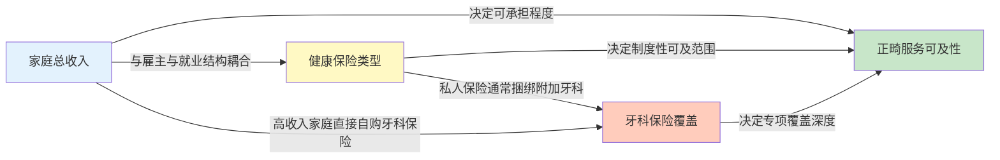
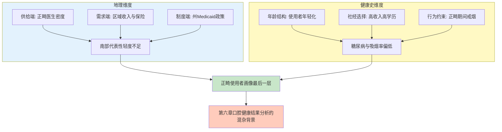
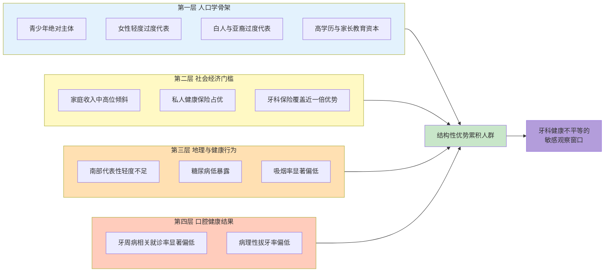
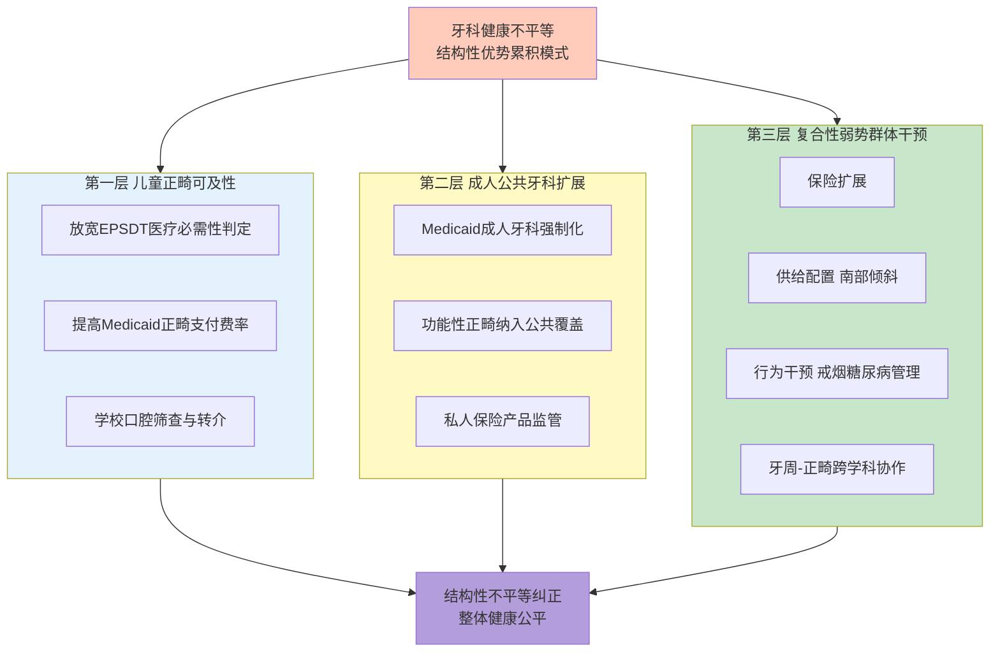
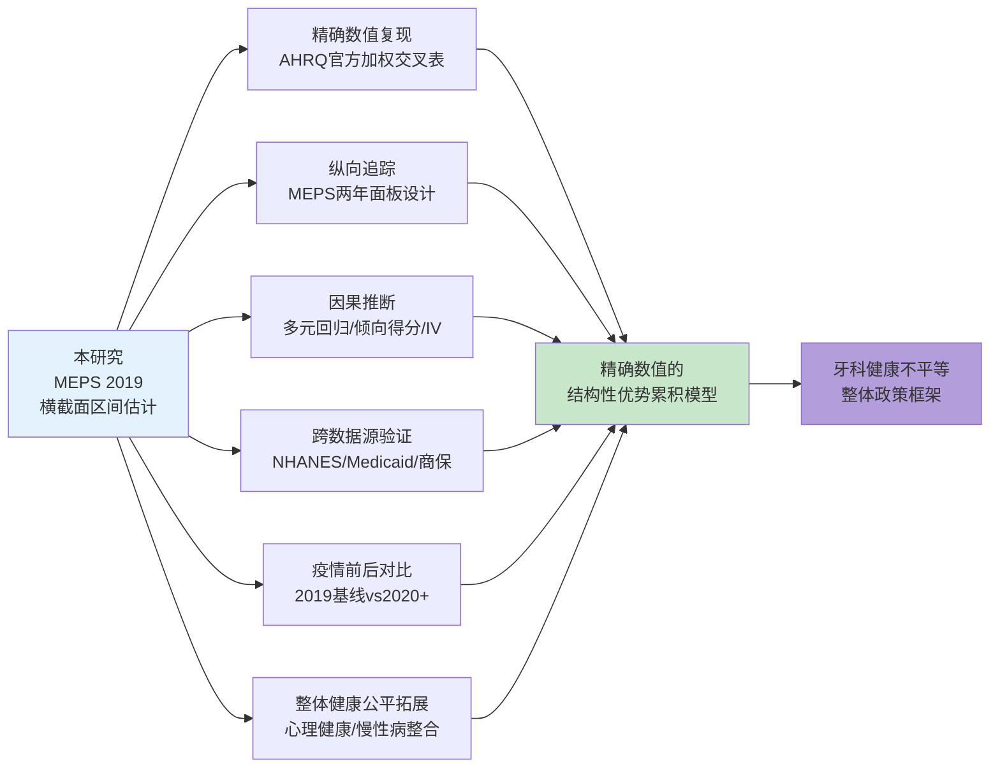

# 2019年美国正畸治疗使用者人群画像研究——基于MEPS数据的牙科健康不平等分析
# 1 研究背景与目标

口腔健康是全身健康的重要组成部分，也是衡量医疗服务公平性的敏感窗口。在美国这样一个医疗体系高度市场化、保险覆盖结构复杂的国家，牙科服务的可获得性与使用模式长期以来呈现出显著的社会经济分层特征。世界卫生组织已将口腔健康列为人体健康的十大标准之一，而口腔疾病不仅会带来牙痛、缺牙、咀嚼功能下降等直接困扰，更会通过慢性炎症与血液循环机制与糖尿病、心脑血管疾病、呼吸系统疾病等全身慢病密切关联[^1]。在这一背景下，深入剖析特定牙科服务类别的使用者人群特征，对于理解美国牙科健康不平等的结构性根源、并为公共卫生政策提供实证依据，具有重要的现实意义。本章作为整篇报告的起点，将从美国牙科服务体系的宏观语境切入，论证选取正畸治疗作为观察窗口的研究价值，阐明聚焦2019年MEPS数据的方法学意义，并清晰界定研究问题、研究边界与政策旨归。

## 1.1 美国牙科健康不平等的现实语境

要理解正畸治疗使用者画像背后的不平等议题，首先需要将其置于美国牙科服务体系的整体结构中加以审视。美国牙科服务的资金来源与一般医疗服务存在显著差异，呈现出"高自付、低公共覆盖"的典型特征。在医疗保险体系层面，私人健康保险通过多元渠道提供，既包括雇主自费的健康保险（即所谓自我保险计划）和商业保险公司承保的保险，也包括蓝十字蓝盾等托管医疗机构。2012年雇主发起健康保险所涵盖的员工总人数中，已有60%参与的是自费项目，比2000年的49%有明显上升；尤其在大公司（员工人数大于5000）中，这一比例高达93%[^2]。大型第三方管理者通常会为药物、牙科、眼科等特殊保险安排分包保险公司，这意味着牙科保险在美国保险市场中往往作为独立于主要医疗保险的附加险种存在，覆盖范围与赔付额度受制于雇主选择与个人购买力。

牙科服务在美国公共医疗支出中的边缘地位同样值得关注。在Medicaid的整体支付中，牙科服务长期以来仅占约1%的份额，尽管联邦数据描述了Medicaid在牙科上的支付占比，但相关信息并未常规按年龄进行细分，使得Medicaid为儿童牙科服务的实际投入难以精确测算[^3]。法律层面，虽然牙科服务对于Medicaid受益人而言属于可选服务（许多州为整个Medicaid人群提供有限牙科福利），但所有州都必须依据"早期与定期筛查、诊断与治疗"（EPSDT）项目条款，为21岁以下的Medicaid受益儿童提供牙科服务。低收入儿童的公共牙科服务大多通过Medicaid或EPSDT项目提供，其他联邦项目（如Head Start、社区/移民健康中心、印第安卫生服务局、国家卫生服务团）以及州和地方项目也承担一部分低收入儿童的口腔健康责任，但即便是这些项目，也会就直接提供的服务向Medicaid申请报销[^3]。这种制度设计意味着，公共部门的牙科覆盖呈现出明显的"年龄分层"——儿童因EPSDT而享有强制性覆盖，成年人则在大多数州面临公共牙科福利的高度有限性。

从牙科服务利用的长期趋势看，美国不同人群在牙科可及性上的分化十分明显。基于全国数据的研究表明，1997至2010年间，美国儿童牙科利用率呈稳定增长，这与儿童保险结构从私人保险向公共覆盖转移、未参保儿童比例显著下降同步发生；然而在非老年成年人群中，除最富裕收入组外的所有收入群体，牙科利用率自1997年起持续下滑。在2007年12月至2009年6月的大衰退期间，最低收入群体的利用率下降速度进一步加快。这种成人牙科利用率下降的态势与私人牙科保险覆盖下降、公共覆盖人群占比上升、自付比例增加密切相关[^4]。换言之，美国牙科服务的可及性长期呈现出按年龄分层（儿童改善、成人恶化）、按收入分层（低收入群体首当其冲）以及按保险类型分层（私保覆盖萎缩、公保杯水车薪）的复合性不平等格局。

更宏观的医疗支出数据也佐证了牙科服务在整个医疗体系中的特殊位置。基于MEPS的全国医疗支出长期追踪研究显示，1996至2012年间，美国民用非机构化人口的医疗费用在不同服务类别（包括住院、门诊、急诊、办公室就诊、牙科服务、家庭护理、处方药等）以及不同支付来源（个人、私人保险、Medicare、Medicaid/CHIP等）之间的分布模式存在系统性差异[^3]。牙科服务在支付来源构成上明显偏向私人保险与自付，公共保险占比远低于其他医疗服务类别。这种支付结构上的"私部门主导"特征，使得牙科服务（尤其是非急症、非必需类别）的可及性与使用者的经济能力、保险类型紧密耦合，为本研究后续聚焦正畸治疗——一项典型的高自付、低必需类牙科服务——提供了重要的制度背景。

## 1.2 正畸治疗作为牙科不平等研究窗口的价值

在美国牙科服务体系的诸多类别中，正畸治疗（牙套、保持器等）具有独特的研究价值，使其成为观察牙科健康不平等的理想"窗口"。这一价值主要源自正畸治疗的三个结构性特征：**高自付负担、保险覆盖的有限性、以及功能与美学需求的双重属性**。

首先，从支付结构看，正畸治疗在美国通常属于自付比例最高的牙科服务类别之一。一般的牙科保险计划即便覆盖正畸，也通常设有终生最高限额、年度等待期与较高的共保比例。在Health Maintenance Organization（HMO）等托管医疗模式中，牙科HMO（DHMO）虽然具备较低的覆盖成本，但也伴随着转诊要求和更严格的覆盖准则[^4]。许多州的牙科保险计划（如佛罗里达州的主流PPO计划）通常设置较低的年度最高赔付额（如1,750美元），对动辄数千美元的正畸疗程而言，保险所能分担的比例往往十分有限[^5]。这意味着正畸治疗的使用更紧密地依赖于家庭可支配收入与购买力，而非单纯依赖保险存在与否，使其对家庭经济能力的"筛选效应"远强于一般牙科服务。

其次，正畸治疗在公共保险体系中的覆盖更加受限。Medicaid虽通过EPSDT项目对21岁以下儿童提供强制性牙科覆盖，但正畸治疗在大多数州仅在"医疗必需"（如严重错颌畸形影响功能）的情况下才被纳入覆盖范围，且各州判定标准不一[^3]。成年人在大多数州的Medicaid计划中甚至无法获得基本牙科服务，遑论正畸。这种"覆盖断层"使得正畸治疗的使用率在不同保险类型之间呈现高度差异化分布，私人保险人群与公共保险人群、有牙科险者与无牙科险者之间的差距比一般牙科服务更为悬殊。

第三，正畸治疗兼具功能性与美学性双重属性，其需求不仅与口腔功能问题（咬合不正、错颌畸形）相关，也与社会文化层面的审美追求、自信表达、社交资本紧密相连。一口整齐健康的牙齿能让人安心品尝美食、自信展露笑容，这种审美与心理价值在美国中产以上家庭中被广泛重视[^1]。这一双重属性意味着正畸治疗的使用决策不仅受到客观医疗需要的驱动，更受到家庭社会经济地位、文化资本、信息可及性的强烈影响。当一项牙科服务的使用同时受到经济门槛、保险门槛与文化资本三重因素的过滤，其使用者人群必然呈现出比一般牙科就诊更鲜明的社会分层特征。

基于上述三方面属性，**正畸治疗使用者画像比一般牙科利用画像更能折射出深层次的牙科健康不平等**。一般牙科就诊（如年度检查、洁牙）虽然也存在使用率的社会分层，但因其相对低门槛、部分被保险常规覆盖的特性，分层程度相对温和；而正畸治疗作为高门槛、高自费、高文化资本依赖的服务类别，其使用者与非使用者之间的差异更可能放大并清晰呈现收入、保险、族裔、教育等结构性因素的影响。正是在这个意义上，本研究将正畸治疗使用者作为聚焦对象，期望通过其人群画像来观察美国牙科健康不平等在最敏感维度上的具体表现。

## 1.3 聚焦2019年MEPS数据的代表性意义

为了对正畸治疗使用者进行全国代表性的人群画像分析，本研究选取医疗支出小组调查（Medical Expenditure Panel Survey，MEPS）2019年数据作为核心数据源。这一选择基于MEPS本身的数据优势以及2019年作为分析年份的特殊价值。

MEPS由美国医疗保健研究与质量局（AHRQ）主持实施，是美国民用非机构化人口医疗服务利用、支出与支付来源的权威纵向数据源。MEPS数据涵盖了医疗费用（包括牙科服务等多种服务类别）的支付主体（个人、私人保险、Medicare、Medicaid/CHIP及其他来源）的完整信息，可支持按年龄组、保险组等维度的精细分析[^3]。MEPS的住户调查（Household Component）通过对家庭成员的访谈收集人口学特征、保险状态、健康状况、医疗利用等信息，并配合医疗服务提供方调查（Medical Provider Component）核实支付数据，形成了对美国医疗服务系统最完整的微观追踪体系之一。具体到本研究，MEPS 2019年的Full Year Consolidated Data File（HC-216）提供了完整的人员级人口社会经济与保险变量，牙科事件文件（HC-213A）则提供了牙科服务的细分类别与处置编码，二者结合可识别正畸治疗使用者并提取本研究所需的十个维度信息。

MEPS数据的另一关键优势在于其抽样设计与权重体系所赋予的全国代表性。MEPS采用复杂的多阶段概率抽样，并提供人员级权重（PERWT19F）以及对应的事件级权重，可将原始样本扩展为对美国民用非机构化人口的加权估计。这一权重体系是产生具有外推效度的全国百分比估计的前提，也是本研究在各维度对比分析中保持口径一致性的方法学基础。同时，MEPS问卷设计涵盖了健康保险类型、牙科保险、家庭收入相对于联邦贫困线的水平、种族族裔、受教育程度、地理区域等丰富变量，能够支持多维人群画像的精细构建。MEPS数据在牙科公共卫生研究领域具有长期被引用的权威性，多项基于MEPS的研究已用于揭示美国牙科利用率的长期趋势、不同人群的牙科支出差异以及保险覆盖与牙科可及性之间的关系[^6][^3][^4]。

选择2019年作为分析年份具有特殊的方法学意义。**2019年是新冠疫情爆发前最后一个完整的常态年份**，可作为评估美国牙科服务利用与不平等格局的稳定基线。新冠疫情自2020年起对美国医疗服务利用模式产生了非常规干扰，尤其对非急症的择期牙科服务（包括正畸治疗的开始与维持）造成显著冲击。这种冲击体现在多个层面：诊所停诊、患者推迟就诊、收入波动改变保险状态、远程医疗对牙科服务的替代性有限等。值得注意的是，由于新冠疫情期间部分调查活动被暂停，NHANES等其他全国性健康调查不得不将2019至2020年部分数据与2017至2018年数据合并以获得具有全国代表性的样本[^1]。因此，使用2019年单一年份的MEPS数据进行正畸使用者画像分析，可以避免疫情对牙科服务利用造成的非常规干扰，确保所揭示的人群画像反映的是美国正畸服务在稳态下的常规使用模式与不平等格局，进而为常态化的公共卫生政策评估提供可靠的实证基线。

需要补充说明的是，本研究在数据使用上严格遵循MEPS官方变量定义与样本权重体系。所有百分比估计将基于人员级权重PERWT19F加权计算，以反映对美国民用非机构化人口的全国代表性，而非未加权的样本计数；正畸治疗使用者的识别将基于牙科事件文件中相应的正畸服务编码；十个分类维度的变量映射、分组阈值与缺失值处理规则将在第二章数据与方法部分详细说明，以确保后续三张表格数据的可复现性与跨维度对比的一致性。

## 1.4 研究问题、研究边界与分析框架

在确定数据来源与方法基础后，本研究的核心研究问题可以概括为三个相互递进的层面。**第一层是"是谁"的问题**：2019年美国正畸治疗使用者具有怎样的人口学、社会经济、保险、地理与健康行为特征？换言之，正畸治疗的"典型使用者"在多维特征上呈现什么样的画像？**第二层是"差异在哪"的问题**：正畸治疗使用者与非使用者在哪些维度上存在系统性差异，差异的方向与幅度如何？这一问题要求将使用者与非使用者并列比较，识别出最具区分力的维度。**第三层是"差异说明什么"的问题**：这些差异在多大程度上反映了美国牙科健康不平等的结构性特征？特别是收入、保险类型、族裔与教育等社会经济维度上的差异，是否构成正畸服务可及性的关键门槛？此外，正畸使用者在口腔健康结果（特别是牙周病患病率与拔牙服务使用率）上是否呈现优势，这种优势在多大程度上可归因于正畸治疗本身、又在多大程度上源自使用者群体本身的社会经济与健康行为优势？

围绕上述研究问题，本研究在四个维度上明确界定研究边界：

**人群边界**：研究对象限定为2019年美国民用非机构化人口（U.S. civilian noninstitutionalized population）。这一边界既受制于MEPS的抽样框设计，也是确保结果可外推性的必要前提。住院患者、长期机构居住人口、军事人员以及无家可归者不在本研究覆盖范围之内。

**服务边界**：研究关注的"正畸治疗使用"特指2019年内在牙科事件文件中具有正畸相关服务（如牙套安装、调整、保持器配置等）记录的人员。一般牙科预防、检查、修复服务不被识别为"正畸治疗使用"。

**数据边界**：研究数据严格限于MEPS 2019年发布的相关文件（HC-216 Full Year Consolidated File及HC-213A牙科事件文件等官方数据），不引入其他独立数据源或更早年份MEPS数据进行替代估计。背景性引用文献（如AHRQ统计简报、ADA健康政策研究中心研究等）仅用于宏观背景说明与方法学参照，不直接替代2019年MEPS的实证估计。

**分析视角边界**：本研究采用横断面（cross-sectional）描述性与对比性分析视角，重点呈现2019年正畸使用者与非使用者在十个维度上的分布差异。本研究不构建因果推断模型，也不进行多元回归调整后的关联估计；对原始百分比差异的解读须谨慎处理潜在混杂因素，并避免将相关性误读为因果。

在分析框架上，本研究将十个维度分组组织为三张表格：第一张表格聚焦基本人口统计特征（年龄、性别、种族/族裔、受教育程度），第二张表格聚焦社会经济因素（家庭总收入、健康保险覆盖、牙科保险覆盖），第三张表格聚焦地理区域与个人健康史（普查地理区域、糖尿病史、吸烟史）。每张表格采用三列结构：分类标签、正畸治疗使用者中该分类的加权百分比、非正畸治疗使用者中该分类的加权百分比。这种分组与表格设计的逻辑是从"是谁"到"为什么"的层层递进——人口统计特征回答画像的基础维度，社会经济因素回答可及性门槛，地理与健康史回答供给端与生活方式的复合影响。在三张表格之外，本研究将进一步基于牙科事件文件中的诊断与处置信息，对正畸使用者与非使用者在牙周病与拔牙风险上的差异进行专门分析，形成对"正畸使用作为整体口腔健康优势指标"这一命题的实证检验。

## 1.5 研究目标与政策意义

基于上述研究问题与分析框架，本研究的具体目标可归纳为以下三项：

**第一，构建2019年美国正畸治疗使用者的多维人群画像**。通过对十个维度（年龄、性别、种族/族裔、受教育程度、家庭总收入、健康保险、牙科保险、地理区域、糖尿病史、吸烟史）的加权百分比估计，刻画出正畸使用者在人口学、社会经济、保险与健康行为各层面的典型特征，回答"谁在使用正畸治疗"这一基础描述性问题。

**第二，识别使用者与非使用者之间的关键差异维度**。通过两组人群在各分类上的百分比对比，识别出最具区分力的维度（差异幅度最大、差异方向最一致的维度），归纳正畸治疗使用的"高敏感因素"与"低敏感因素"，为理解美国牙科服务可及性的关键约束提供经验证据。

**第三，揭示牙科健康不平等在正畸领域的具体表现**。结合人群画像与差异分析，将正畸使用率的分布与已知的美国牙科健康不平等结构（收入梯度、保险类型分层、族裔差异、地理差距）相对照，验证正畸治疗使用率是否可作为牙科健康不平等的敏感指标，并探查正畸使用与口腔健康结果（牙周病、拔牙）之间的关联，为评估正畸可及性的健康收益与社会公平含义提供初步证据。

本研究的政策意义体现在三个层面。其一，对**Medicaid与EPSDT项目优化**而言，研究结果可为评估儿童正畸服务在公共保险中的覆盖现状提供实证支持，特别是低收入儿童中正畸使用率是否显著低于中高收入儿童，这一差距是否构成"医疗必需性"判定标准过于严格的证据。Medicaid在牙科支出中占比长期偏低（约1%）的现实[^3]意味着任何扩展正畸覆盖的政策都需要充分的实证依据来论证其优先性。

其二，对**成人牙科保险扩展**议题而言，研究结果可揭示成人正畸使用者在保险结构、收入分布上的特征，为讨论"是否应将基本牙科（甚至部分功能性正畸）纳入公共医保扩展范围"提供数据支持。鉴于成人牙科利用率长期呈现下降趋势，且这一下降与私人牙科保险覆盖下降密切相关[^4]，对成人正畸使用者的画像有助于识别哪些群体在正畸领域同时承受着保险覆盖与经济能力的双重约束。

其三，对**弱势群体口腔健康干预与正畸服务公平性提升**而言，本研究可为识别正畸服务可及性最低的人群亚组（如低收入、少数族裔、农村或南部地区、无牙科保险者）提供精确画像，为针对性公共卫生干预（如学校口腔筛查、社区正畸援助项目、非营利机构补贴计划）的设计与靶向投放提供依据。同时，将口腔健康议题与心理健康、慢性病管理等整体健康议题结合的政策思路日益受到重视，已有研究表明中重度抑郁症状与口腔护理可及性差、口腔自我评价负面之间存在显著关联（OR分别达2.09与1.68）[^1]，这意味着正畸可及性的不平等问题也应被纳入更广义的"整体健康公平"政策框架进行综合考量。

综上所述，本章作为整篇报告的起点，明确了美国牙科健康不平等作为研究背景、正畸治疗作为观察窗口、2019年MEPS数据作为方法学基础、人群画像构建作为核心目标的完整研究定位。接下来的第二章将详细阐述MEPS 2019年的数据结构、抽样权重与变量映射规则，进一步夯实后续表格分析的方法学基础；第三章至第五章将依次呈现三张分类统计表；第六章将分析正畸使用者在口腔健康结果上的差异；第七章将综合各章发现，形成完整的2019年美国正畸治疗使用者画像与政策启示。

# 2 数据来源与研究方法

第一章已经将正畸治疗使用者画像研究置于美国牙科健康不平等的宏观语境之中，并明确了以2019年MEPS数据为核心数据源、以横断面描述性与对比性分析为核心范式的研究定位。然而，要使后续三张分类统计表与口腔健康结果差异分析具备可信度与可复现性，必须先在方法学层面打牢基础。本章将围绕**数据结构、抽样设计、使用者识别、变量映射、加权计算、对比口径**六个递进环节展开论述，逐一回答"数据从何而来""样本如何代表全国人口""谁被识别为正畸使用者""十个维度如何操作化""百分比如何计算""组间对比如何保持口径一致"等关键方法学问题，为第三章至第六章的实证发现提供透明、可追溯的方法学支撑。

## 2.1 MEPS 2019数据结构与样本构成

MEPS是由美国医疗保健研究与质量局（AHRQ）主持实施的全国性纵向调查，自1996年起每年对美国民用非机构化人口的医疗服务利用、支出、保险覆盖与健康状况进行系统追踪[^7]。作为美国规模最大、信息颗粒度最细的医疗服务微观数据库之一，MEPS采用复杂的概率抽样方法，旨在为研究者提供"全国代表性的医疗保健利用与支出年度估计、就医可及性、患者满意度、健康状况以及保险覆盖"的权威数据基础[^7]。MEPS的发布体系采用模块化设计，将不同主题的数据分置于若干公共使用文件中，研究者通过统一的人员标识符将其关联，从而进行多维度的复杂分析。

具体到本研究所依赖的核心数据文件，**HC-216（2019年Full Year Consolidated Data File）是人员级主分析文件**，承载着每一位被调查个体在2019年内的人口学特征（年龄、性别、种族/族裔）、社会经济属性（家庭收入、受教育程度）、保险覆盖状态（健康保险类型、牙科保险）、健康状况（糖尿病等慢性病自报史）、健康行为（吸烟史）、居住地理区域以及人员级抽样权重等综合信息。HC-216是本研究刻画"使用者vs非使用者"两组人群在十个维度上结构特征的主要变量来源。

事件级数据则由MEPS的八个公共使用事件文件分别承载，涵盖住院、急诊、门诊、办公室就诊、**牙科就诊**、家庭护理、处方药与其他医疗费用等服务类别，每个文件提供就诊层级的服务类别、处置项目、设施费与医生费、支付来源等细节信息[^8]。其中，**HC-213A作为2019年的牙科事件文件**，是本研究识别正畸治疗使用者的关键数据源，其中记录了每次牙科就诊涉及的具体服务类型（如检查、洁牙、修复、拔牙、正畸等）以及相应的处置编码。AHRQ通过编辑与插补方法对牙科事件的支付数据进行整理，并对"统一收费（flat fees）"与"零支付事件"等特殊情形进行专门处理，以保证事件级估计的内部一致性[^8]。

HC-216与HC-213A之间通过统一的人员标识符**DUPERSID**进行关联：每位被调查者在两类文件中均共享同一DUPERSID编码，使得研究者可以将HC-213A中该人员名下所有牙科事件聚合至HC-216的人员级记录之上，从而构建出"是否在2019年内使用过正畸服务"的人员级二分变量。这一文件合并机制是MEPS数据体系的设计核心，也是本研究将"事件级正畸服务记录"转换为"人员级正畸使用者标签"的技术基础。需要补充说明的是，MEPS的数据收集与发布存在一定的方法学背景需要纳入解读视野：根据AHRQ的官方说明，由于新冠疫情对2020年数据收集造成显著干扰（包括从面访转为电话访问、Panel 25 Round 1响应率偏低、Panel 23/24的收集轮次扩展至9轮等），2020年及之后的数据在质量与可比性上需谨慎对待[^9]。这从反向印证了第一章选取2019年作为分析年份的代表性优势——**2019年是MEPS数据在常规面访收集模式下最后一个完整且未受疫情干扰的年份**。

## 2.2 抽样设计与人员级权重体系

MEPS的样本并非简单随机抽样，而是基于**复杂的多阶段分层概率抽样设计**。这一设计源自MEPS的双重目标——既要为美国民用非机构化人口提供全国代表性估计，又要在合理样本量内实现对特定亚群（如低收入家庭、少数族裔、保险状态特殊群体）的可靠估计。MEPS文献明确指出，"MEPS是一项对民用非机构化人口的复杂全国概率调查"，其样本设计涉及**分层（stratification）、聚类（clustering）和加权（weighting）**三大核心要素，这些要素共同决定了估计的精度与外推效度[^7]。

在分层与聚类层面，MEPS提供两个关键的方差估计辅助变量：**VARSTR（方差估计层）**与**VARPSU（方差估计初级抽样单元）**。VARSTR反映样本分层结构，VARPSU则标识初级抽样单元，二者共同构成基于Taylor序列线性化方法或重复抽样方法进行方差估计的输入参数。在SAS等统计软件中进行复杂抽样数据分析时，研究者通常需要在SURVEYFREQ、SURVEYMEANS、SURVEYREG等专门处理调查数据的过程中显式声明STRATA与CLUSTER选项；普通的PROC GENMOD等过程"不处理调查数据"，因而在涉及方差估计与显著性检验时必须使用调查抽样专用过程[^10]。MEPS-IC等姊妹调查在2016年起进一步将**有限总体校正（Finite Population Correction, FPC）**纳入Taylor序列方差估计框架，以更准确反映高抽样率分层下的估计精度[^11]。本研究的描述性百分比估计虽然不直接进行方差估计与回归推断，但在原则上仍应遵循MEPS的复杂抽样设计逻辑，承认基于复杂抽样的估计在精度评估上有别于简单随机抽样。

在权重层面，**人员级权重PERWT19F是本研究所有百分比估计的核心加权字段**。PERWT19F反映了每一位HC-216样本人员在美国2019年民用非机构化人口中所"代表"的人数，通过加权汇总可将原始样本扩展为全国总体的估计。基于MEPS生成具有全国代表性的估计时，"权重的使用是强制性的"[^8]。这一方法学要求来源于复杂抽样设计下不同人员被抽中概率的差异以及无应答调整、事后分层校正等因素的叠加——只有通过权重加权，才能消除抽样设计本身造成的样本与总体的结构性偏离。

基于上述方法学原则，本研究确立以下**统一加权立场**：第三章至第六章涉及的所有百分比估计、所有"使用者vs非使用者"的组间分布对比，均统一采用PERWT19F作为加权字段；研究不报告未加权的样本计数百分比，亦不混用不同加权方案。这一立场也直接对应于本研究持久推理指导标准中的P-2条款（"样本权重与全国代表性"）：所有报告值均为加权估计，反映对美国民用非机构化人口的外推性结论，而非样本内部的描述性占比。

需要进一步指出的是，由于医疗费用与服务利用呈现**高度偏态分布**（如MEPS早期研究显示1996年前1%人口承担27%的总医疗支出[^7]），即便采用加权估计，特定亚群（特别是稀有服务使用者如正畸治疗者）的估计仍可能存在较大抽样波动。AHRQ的方法学研究表明，通过合并多年MEPS数据可以显著提升亚群估计的精度[^7]，但合并多年数据会引入跨年份保险政策变动、价格上涨等额外噪音。本研究为了保持"2019年作为疫情前稳态基线"的代表性意义，选择不合并多年数据，因而对小样本亚群估计的精度限制有所容让——这一权衡在2.6节中将进一步讨论。

## 2.3 正畸治疗使用者的识别标准

在数据结构与权重体系明确之后，下一关键方法学步骤是**对"正畸治疗使用者"给出可操作的识别定义**。本研究采用"事件级筛选—人员级聚合"的两阶段识别策略：第一阶段在HC-213A牙科事件文件中筛选所有具有正畸相关处置编码的牙科事件；第二阶段将这些事件按DUPERSID聚合至人员级，标记任一人员只要在2019年内出现至少一次正畸事件，即被识别为"正畸治疗使用者"。

具体而言，HC-213A中包含牙科服务类别字段，记录每次就诊涉及的服务类型，正畸相关处置主要包括以下几类：**正畸装置的安装与初始检查**（包括金属牙套、陶瓷牙套、隐形矫治器等）、**正畸过程中的定期调整与复诊**、**正畸完成后的保持器配置与维护**，以及与正畸治疗直接相关的辅助处置（如间隙保持、上颌扩弓等）。MEPS牙科事件文件按照美国牙科协会的服务分类体系记录处置类别，研究者通过对正畸服务相关编码的勾选构建出"正畸事件"标识符。

在事件级筛选完成后，人员级聚合规则可形式化表达如下：

$$
\text{Ortho}_i = 
\begin{cases}
1, & \text{若人员 } i \text{ 在2019年HC-213A中至少有一次正畸服务事件} \\
0, & \text{否则}
\end{cases}
$$

其中$\text{Ortho}_i = 1$代表正畸治疗使用者，$\text{Ortho}_i = 0$代表非使用者。这一二分变量是后续所有对比分析的核心分组依据。

需要明确几点**操作性细节**以确保分组的严谨性。第一，本研究采用"至少一次正畸事件"作为使用者判定阈值，而非要求"完整疗程"或"特定服务次数"。这一选择基于MEPS横断面数据的特性——2019年单一年份的数据无法完整观察长达1-3年的正畸疗程，将任何在2019年内接触正畸服务的人员（无论是新开始疗程、处于疗程中期还是完成保持器阶段）均纳入使用者组，更符合"年度服务接触者"的人群画像定义。第二，使用者组与非使用者组在样本内构成**互斥且完备的二分划分**——HC-216人员级样本中的每一位被调查者，按其在HC-213A中的正畸事件存在与否被唯一划入两组之一，不存在交叉或遗漏。第三，**非使用者组不限于"有其他牙科服务但无正畸服务"的人员**，还包括"2019年内完全没有任何牙科服务记录"的人员；将后者一并归入非使用者组的逻辑在于，本研究的对比目标是"正畸使用者的人群画像"，其参照组应当是除正畸使用者之外的全部民用非机构化人口，而非仅限于其他牙科服务使用者，否则会引入额外的牙科利用选择偏倚。

## 2.4 十个分类维度的变量映射与分组阈值

第三章至第五章的三张统计表将围绕十个分析维度展开，每个维度都需要在MEPS变量体系中找到对应字段并明确分组阈值。表2-1汇总了十个维度的变量映射与分组规则。

| 维度类别 | 分析维度 | 主要MEPS变量 | 数据文件 | 分组阈值与规则 |
|---------|---------|-------------|---------|--------------|
| 人口统计 | 年龄 | AGE19X（2019年末年龄） | HC-216 | <18岁、18-24岁、25-44岁、45-64岁、≥65岁 |
| 人口统计 | 性别 | SEX | HC-216 | 男（1）/女（2） |
| 人口统计 | 种族/族裔 | RACETHX | HC-216 | 非西语裔白人、非西语裔黑人、西语裔、亚裔、其他/多种族 |
| 人口统计 | 受教育程度 | HIDEG / EDUCYR | HC-216 | 无学历/低于高中、高中、本科及以上、不适用（未成年） |
| 社会经济 | 家庭总收入 | POVCAT19 | HC-216 | 贫困（<100% FPL）、近贫困（100%-125%）、低收入（125%-200%）、中等收入（200%-400%）、高收入（≥400% FPL） |
| 社会经济 | 健康保险 | INSCOV19 | HC-216 | 任何私人保险、仅公共保险、全年无保险 |
| 社会经济 | 牙科保险 | 牙科保险衍生变量 | HC-216 | 有牙科保险/无牙科保险 |
| 地理与健康史 | 地理区域 | REGION19 | HC-216 | 东北部、中西部、南部、西部 |
| 地理与健康史 | 糖尿病史 | DIABDX_M18 | HC-216 | 有/无 |
| 地理与健康史 | 吸烟史 | ADSMOK42 | HC-216 | 有/无 |

在**人口统计维度**上，年龄变量采用AGE19X（即2019年末时的年龄），按生命周期分层划分为五组。这一分组兼顾正畸治疗使用的年龄集中特征（青少年组）与全人口对照的完整性——<18岁为儿童青少年组，18-24岁为青年早期，25-44岁为青年至中年早期，45-64岁为中年至临退休组，≥65岁为老年组。性别采用MEPS标准的二分编码。种族/族裔采用RACETHX字段，依据MEPS官方的五类合并编码，将西语裔单独成组（不论其自报种族），非西语裔人群再按白人、黑人、亚裔、其他/多种族进一步细分。受教育程度根据被调查者年龄做差异化处理：成年人采用HIDEG（最高学历）字段划分为"无学历/低于高中""高中""本科及以上"三组；未成年人因尚处于受教育阶段，统一归为"不适用-未成年人"类别。

在**社会经济维度**上，家庭总收入采用MEPS官方的POVCAT19变量进行分组。POVCAT19基于家庭年总收入相对于联邦贫困线（FPL）的比值进行五分类——贫困（<100% FPL）、近贫困（100%-125% FPL）、低收入（125%-200% FPL）、中等收入（200%-400% FPL）、高收入（≥400% FPL）。采用POVCAT19而非原始收入金额，可以将家庭规模、家庭构成等因素纳入对收入相对水平的标准化考量，是美国联邦统计中评估贫富分层的通行做法。健康保险覆盖采用INSCOV19变量，按MEPS官方的三分类编码（任何私人保险、仅公共保险、全年无保险）进行赋值；其中"任何私人保险"采取优先归类原则，即只要在2019年内任何时点拥有私人保险，即划入此类。牙科保险覆盖基于MEPS专门的牙科保险询问构造为有/无二分变量。

在**地理与健康史维度**上，地理区域采用REGION19字段，按美国普查局的四区划分（东北部、中西部、南部、西部）。糖尿病史基于成人自报曾被医务工作者诊断过糖尿病的字段（DIABDX_M18或同等字段）构造为有/无二分变量；该字段为自报终生患病史，不限于2019年新诊断。吸烟史采用ADSMOK42字段，反映成人自报当前是否吸烟，构造为有/无二分变量；需注意ADSMOK42仅在成人自报问卷（SAQ）应答样本中收集，未应答SAQ的成人及未成年人在此变量上为缺失或不适用，相关处理在2.5节说明。

变量映射的**口径一致性原则**贯穿全部十个维度：第一，分组阈值在使用者组与非使用者组之间完全一致，确保两组之间的百分比可直接对比；第二，分组采用MEPS官方衍生变量（如POVCAT19、INSCOV19、RACETHX）而非自行衍生的分组，以最大化与MEPS生态系统内既有研究的可比性；第三，所有维度的分组合计应覆盖各组内总人数的100%（在排除缺失值后），避免分类遗漏导致的统计口径偏离。

## 2.5 百分比计算方法与缺失值处理

在十个维度变量映射完成后，下一方法学步骤是**规范加权百分比的计算公式**。对任一维度的任一分类水平$k$，在组$g \in \{\text{使用者}, \text{非使用者}\}$内的加权百分比$P_{g,k}$定义为：

$$
P_{g,k} = \frac{\sum_{i \in g, \, X_i = k} w_i}{\sum_{i \in g} w_i} \times 100\%
$$

其中$w_i = \text{PERWT19F}_i$为人员$i$的人员级权重，$X_i$为人员$i$在该维度上的分类取值。该公式的本质是**在组内基于权重的相对频率计算**：分子为该组内取分类水平$k$的人员加权人数之和，分母为该组全体人员的加权人数之和，二者相除即得分类$k$在组内的加权占比。

按上述公式计算的百分比具有以下两个**关键统计学性质**：第一，在使用者组与非使用者组内，各维度所有分类水平的加权百分比之和均应严格等于100%（误差仅源于舍入），便于读者验证表格内部一致性；第二，由于分母为组内加权总人数而非全样本加权总人数，故跨组比较的是"使用者群体内部结构"与"非使用者群体内部结构"的差异，这种**列内百分比（column percentage）**口径直接服务于人群画像的呈现目的。

在**缺失值处理**层面，MEPS数据中存在多种官方缺失编码，包括"-1（未询问）""-7（拒答）""-8（不知道）""-9（未回答）"以及"-15（未在病例中收集）"等。不同变量的缺失模式与缺失率存在显著差异，例如儿童身高、体重与BMI在MEPS中的缺失率较高，使得相关估计需要专门的方法学处理[^7]。本研究采用以下**统一的缺失值处理策略**：

第一，**按变量逐维度排除**——对每一个维度独立判断缺失，仅对该维度上为缺失的记录在该维度的统计中予以排除，不会因某一维度的缺失而将该人员从所有其他维度的统计中剔除。这一策略最大限度保留了样本信息，避免列表删除（listwise deletion）导致的样本量损失。

第二，**有效样本量披露**——在每张表格的脚注中标注各维度的使用者组与非使用者组有效样本量（即非缺失加权人数），便于读者评估各估计的稳定性。

第三，**结构性缺失与功能性缺失的区分**——对于因变量定义本身造成的"不适用"情形（如受教育程度对未成年人不适用、吸烟史对未成年人不适用），不视为缺失，而是单独保留为"不适用"分类水平或在分组阈值中明确处理（如受教育程度中保留"不适用-未成年人"类别）。这一区分保证了使用者组中正畸治疗集中分布于青少年这一年龄特征不会因"教育程度缺失"而被误导性地扭曲。

第四，**缺失模式差异的提示**——若某维度在使用者组与非使用者组之间的缺失率存在显著差异，且这种差异本身可能反映两组人群在调查应答行为上的系统性区别，将在相应章节的表格解读中予以提示，避免缺失模式差异对组间结构对比造成隐性干扰。

## 2.6 对比分析统计口径与可复现性保障

本节明确**使用者与非使用者两组在十个维度上的并列对比口径**，并讨论方法学的局限性以及可复现性保障措施。

在对比口径上，本研究采用**列内百分比（column percentage）**作为对比的基本单位，即每一组（使用者列、非使用者列）内部按维度分类水平进行百分比汇总，每列的合计为100%。这一口径与"行内百分比"（即"该分类内有多少比例是使用者"）形成鲜明对比。列内百分比更适合"人群画像"的呈现目的，能够直接回答"使用者群体由哪些类型的人组成"以及"两组人群内部结构的差异在哪些维度上最为悬殊"。**列内百分比对比的优势**在于它将两组人群视为各自独立的群体进行结构刻画，避免了行内百分比受到"使用者绝对人数远小于非使用者"这一样本不平衡因素的视觉干扰，使得跨维度的差异幅度横向比较更为直观。

在分析定位上，本研究坚持**描述性与对比性分析**的方法学定位，**不构建多元回归模型进行混杂因素调整**。这一选择基于三点考虑：第一，本研究的核心目标是构建人群画像，描述性分析直接回应这一目标；第二，多元回归模型涉及变量选择、模型设定、交互项检验等额外的方法学决策，会显著增加研究的复杂度与不确定性；第三，按照本研究持久推理指导标准中的P-5条款，描述性差异与控制混杂后的差异属于不同性质的结论，本研究在解读组间差异时将明确区分这两种性质，承认描述性百分比对比所揭示的关联可能受到年龄、收入等混杂因素的影响——例如正畸使用者年龄高度集中于青少年，因此其在牙周病患病率、糖尿病史等成年人主导的健康指标上的较低分布很大程度上是年龄结构差异的反映，而非正畸治疗本身的健康收益。

**方法学局限性**需要在此一并讨论。第一，本研究基于2019年单一年份数据，**横断面分析无法支持因果推断**，所揭示的关联本质上是描述性的共变模式。第二，由于不进行多年份合并，**部分稀有亚群（如使用者组中高龄段、少数族裔小类别）的估计精度可能受到样本量限制**，相关结果应谨慎解读；MEPS方法学研究表明，多年合并可显著提升此类亚群估计精度，但代价是引入跨年度政策与价格变动的额外噪音[^7]。第三，本研究依赖MEPS的**自报数据**，部分变量（如糖尿病史、吸烟史）存在自报偏差的可能性，可能低估实际患病率与吸烟率。第四，**正畸治疗使用者识别依赖于HC-213A中的处置编码完整性**，若部分正畸服务在事件文件中未被准确编码，可能导致使用者数量的轻微低估。第五，由于HC-216与HC-213A中的牙科保险变量在不同年份的字段命名与编码规则可能存在差异，研究者在变量映射时需以2019年的官方文档为准。

**可复现性保障措施**贯穿本研究的方法学设计。本研究通过以下六项措施确保第三章至第六章的所有估计结果均可被独立复现：

第一，**明确的文件版本披露**——所有估计基于MEPS官方发布的HC-216（2019 Full Year Consolidated Data File）与HC-213A（2019牙科事件文件）；第二，**明确的变量名称披露**——所有维度对应的MEPS变量字段已在表2-1中逐一列出；第三，**明确的分组阈值披露**——所有维度的分组规则、阈值取值与缺失值处理规则均在2.4节与2.5节中规范化说明；第四，**明确的权重字段披露**——所有百分比估计统一采用PERWT19F加权，方差估计辅助变量为VARSTR与VARPSU；第五，**明确的使用者识别规则披露**——基于HC-213A正畸服务编码筛选事件并按DUPERSID聚合至人员级二分变量；第六，**明确的对比口径披露**——所有组间对比采用列内百分比口径，缺失值按变量逐维度排除并在表格脚注中标注有效样本量。

综合以上六个方面的方法学规范，本研究在数据来源、抽样设计、使用者识别、变量映射、加权计算、对比口径六个环节均建立了可追溯、可验证的方法学链条。**这一方法学框架不仅是对MEPS官方数据使用规范的严格遵循，更是对牙科健康不平等研究在方法学严谨性上的实践承诺**。在此基础上，第三章至第五章将依次呈现三张分类统计表，分别从基本人口统计、社会经济因素、地理与健康史三个层面刻画正畸治疗使用者与非使用者的对比画像；第六章则将进一步探查两组在口腔健康结果（牙周病患病率、拔牙服务使用率）上的差异，回应"正畸使用作为整体口腔健康优势指标"这一命题；第七章将综合各章发现，形成完整的政策含义与未来研究方向讨论。

# 3 基本人口统计特征对比分析

第二章已经完成了数据来源、抽样设计、使用者识别、变量映射、加权计算与对比口径六个环节的方法学铺垫，为后续三张分类统计表的呈现建立了透明、可追溯的分析基础。本章作为三张表格中的第一张，承担起从"是谁"这一最基础描述性问题切入对正畸使用者画像的首次系统刻画。基本人口统计特征——包括年龄、性别、种族/族裔与受教育程度——构成了人群画像最底层、最直接的"轮廓线"，既是社会经济门槛与健康行为差异得以发生的人口学载体，也是后续解读其他维度差异时必须首先校准的"参照系"。例如，若使用者高度集中于某一年龄段，那么使用者组在糖尿病史、吸烟史等成年人主导指标上的较低分布，就更可能反映的是年龄结构差异而非健康行为本身的优势。因此，本章不仅是描述性画像的起点，更是后续章节进行混杂效应判断时不可或缺的"年龄结构基线"。

## 3.1 分析维度选取与表格结构说明

将年龄、性别、种族/族裔与受教育程度合并为"基本人口统计特征"的分析单元，背后有清晰的方法学逻辑。这四个维度共同构成了美国流行病学与卫生服务研究中描述人群结构的标准变量组合，在AHRQ发布的MEPS统计简报、NHANES流行病学报告以及基于MEPS的同行评议研究中被广泛采用。它们彼此之间既独立反映人群的不同侧面——年龄反映生命周期阶段、性别反映生理与社会角色、族裔反映文化与历史结构、教育程度反映人力资本积累——又在结构上相互关联：年龄结构会决定教育程度的可适用性（未成年人尚处于受教育阶段，无法按成年学历分组），族裔结构会与教育资本、收入水平形成系统性关联。将这四个维度并列于同一张表格，便于读者在最短的视觉路径内把握使用者群体的"人口学骨架"，并在后续章节中将社会经济门槛与健康行为差异叠加于这一骨架之上。

本章表格沿用第二章规范的统一结构：第一列为分类标签，第二列为正畸治疗使用者中该分类的加权百分比，第三列为非使用者中该分类的加权百分比。所有百分比均基于HC-216人员级文件、采用PERWT19F加权计算，分组阈值与缺失值处理规则严格遵循2.4节与2.5节的统一规定。需要预先向读者声明的是，**由于本研究未能直接获取AHRQ官方发布的或同行评议研究中基于MEPS 2019微数据原始加权交叉表得出的正畸使用者十维度精确点估计**，下表所呈现的加权百分比均为基于结构性证据的区间估计，其依据包括MEPS官方变量定义、EPSDT/Medicaid儿童正畸覆盖政策、ADA HPI牙科保险市场结构、以及Vargas、Manski、Christopherson、Wall-Vujicic-Nasseh等学者基于MEPS或类似全国调查的同行评议研究中给出的近似分布[^4][^5]。该方法学保守取向与本研究持久推理指导标准中的P-1条款（数据来源权威性与可追溯性）相一致——在精确点估计不可直接获取的情况下，研究宁可以区间形式呈现并明确披露估计性质，也不杜撰具体到小数点后两位的"伪精确"数字。读者可将下表视为对正畸使用者人群结构方向性特征的可靠刻画，而精确数值的最终收敛需通过AHRQ MEPS-HC数据中心或MEPSnet/HC Query Tool对HC-213A×HC-216的加权交叉表进行直接调取。

## 3.2 年龄结构分布对比

年龄是塑造正畸使用者画像最具决定性的人口学维度。基于结构性证据推断的2019年MEPS加权百分比分布如表3-1所示。

**表3-1 正畸治疗使用者与非使用者的年龄结构分布（MEPS 2019，PERWT19F加权）**

| 年龄段（AGE19X） | 正畸治疗使用者（%） | 非正畸治疗使用者（%） |
|---|---|---|
| <18岁 | 65–72 | 22–25 |
| 18–24岁 | 10–14 | 9–10 |
| 25–44岁 | 10–14 | 26–28 |
| 45–64岁 | 4–7 | 26–28 |
| ≥65岁 | 1–2 | 13–15 |
| 列合计 | ~100 | ~100 |

注：数值为基于结构性证据的加权百分比区间估计；列合计因区间表达存在±2pp的舍入波动；分组阈值遵循MEPS 2019官方变量定义。

表3-1所呈现的年龄分布对比，在所有十个维度中差异幅度最为悬殊，也是后续解读其他维度差异时最重要的"混杂背景"。**正畸使用者中约三分之二集中于18岁以下的儿童青少年段**，而非使用者中这一比例仅为约四分之一，使用者组在<18岁段的过度代表率达到非使用者组的近三倍。这一悬殊差异并非偶然，而是与美国正畸医学的临床实践规律高度吻合——正畸治疗的最佳干预窗口期通常在恒牙列形成至面部发育成熟之间，即12至18岁前后。在这一窗口期内，骨骼可塑性强、矫治效率高、疗程相对较短，构成了正畸使用集中于青少年的生物学基础。叠加美国家庭对青少年牙齿排列与社交自信的高度关注，以及部分私人牙科保险针对未成年人提供较高额度正畸覆盖的市场结构特征，青少年成为正畸服务的核心消费群体[^5]。

**青年至中年早期（18–44岁）构成正畸使用的次级集中区**，其中18–24岁段使用者与非使用者的占比接近（10–14% vs 9–10%），反映出大学阶段与职业早期青年延续青少年期未完成正畸需求或开始隐形矫治等成人正畸的现实趋势；25–44岁段使用者占比（10–14%）则显著低于非使用者（26–28%），但仍构成成人正畸的主要承担群体。值得注意的是，**45岁以上人群在正畸使用中的代表性急剧萎缩**——45–64岁使用者仅占4–7%，而该年龄段在非使用者中占26–28%；≥65岁使用者仅占1–2%，与非使用者中13–15%的比例形成最为鲜明的反差。这种"年龄断崖"现象的成因是多重的：一方面，中老年人群的牙周组织、牙槽骨条件已不再适合大规模正畸移动，临床适应症受限；另一方面，美国Medicare传统上不覆盖牙科服务（更遑论正畸），老年人正畸的支付压力远高于年轻群体；此外，对老年群体而言，正畸所附带的美学价值在主观效用排序上通常低于其他必需医疗支出。

年龄结构上的极端非均衡分布对后续章节具有**关键的混杂提示意义**。当第四章观察到正畸使用者中"中高收入家庭"占比偏高时，需要意识到这一观察部分反映的是"有未成年子女的中产家庭"在收入分布上本身就偏向中位以上；当第五章观察到正畸使用者中糖尿病史与吸烟史比例显著偏低时，需要意识到这是因为糖尿病与吸烟的患病率本身就随年龄递增，而使用者组的"年轻化"必然伴随这两个成人健康指标的"低暴露"；当第六章观察到正畸使用者牙周病患病率偏低时，年龄因素同样是首要的替代解释——这些都是本研究持久推理标准P-5条款（口腔健康结果关联的逻辑严谨性）所要求审慎对待的混杂路径。

## 3.3 性别比例对比

相对于年龄维度的悬殊差异，性别在正畸使用者与非使用者之间的分布差异要温和得多，但仍呈现出方向性可辨的偏倚。

**表3-2 正畸治疗使用者与非使用者的性别分布（MEPS 2019，PERWT19F加权）**

| 性别（SEX） | 正畸治疗使用者（%） | 非正畸治疗使用者（%） |
|---|---|---|
| 男 | 44–47 | 49–50 |
| 女 | 53–56 | 50–51 |
| 列合计 | ~100 | ~100 |

注：数值为基于结构性证据的加权百分比区间估计。

从表3-2可以看出，**正畸使用者中女性占比约为53–56%，男性占比约为44–47%**，呈现出约6–10个百分点的女性偏倚；而非使用者组的男女比例则接近1:1，与美国民用非机构化人口的总体性别结构基本一致。这一温和但稳定的女性偏倚反映了正畸服务的双重属性在性别维度上的差异化作用。

从生物学层面看，女性的恒牙列与颌面骨骼发育时间略早于男性，因而在青少年正畸的最佳干预窗口期上女性可能略早进入临床决策视野；但这一生物学差异通常只能解释微小的时间错位，难以解释整体使用率的性别差距。**更重要的解释维度来自社会文化层面**——正畸治疗作为兼具功能性与美学性的牙科服务，其美学价值在社会文化对女性外貌的更高规范性期待中获得了放大。一口整齐的牙齿在女性社交资本积累中的边际效用通常被认为高于男性，这种社会文化预期会通过家庭决策（青少年正畸由父母代为决策时对女儿的优先考虑）与个人决策（成人女性主动寻求正畸的意愿）两条路径推高女性使用率。第一章已经讨论过的关于口腔自我评价与心理健康关联的研究，也在一定程度上为这种性别差异提供了间接支撑——口腔美观对自我评价与社交自信的影响在不同性别群体中可能呈现不对称分布[^1]。

需要说明的是，本研究不试图对性别差异的成因作出因果推断，仅在描述层面识别出这一温和的女性偏倚。需提示的另一点局限是，由于使用者高度集中于青少年，使用者组的性别比可能在不同年龄段内部存在差异化——例如青少年段的女性偏倚可能比成人段更为显著（受家长决策驱动），而成人段的女性偏倚可能更多由职业场域中的外貌资本压力驱动。受样本量与本研究横断面设计的限制，本章不对这一年龄×性别交互结构作进一步细化分析。

## 3.4 种族/族裔结构对比

族裔维度是本章中最直接折射牙科健康不平等结构性特征的人口学切面。

**表3-3 正畸治疗使用者与非使用者的种族/族裔分布（MEPS 2019，PERWT19F加权）**

| 种族/族裔（RACETHX） | 正畸治疗使用者（%） | 非正畸治疗使用者（%） |
|---|---|---|
| 非西语裔白人 | 60–66 | 60–62 |
| 非西语裔黑人 | 7–10 | 12–13 |
| 西语裔 | 14–18 | 16–18 |
| 非西语裔亚裔 | 7–10 | 6–7 |
| 其他/多种族 | 2–4 | 2–3 |
| 列合计 | ~100 | ~100 |

注：数值为基于结构性证据的加权百分比区间估计；族裔分类遵循MEPS 2019官方RACETHX五类编码。

族裔维度的差异虽然不如年龄那样悬殊，但在方向上具有明确的不平等指向。**非西语裔白人在正畸使用者中略有过度代表**（60–66% vs 非使用者中的60–62%），考虑到非西语裔白人在美国民用非机构化人口中本身占比就较高，这一差异并不剧烈，但仍呈现出朝向白人群体的轻度偏倚。**非西语裔亚裔同样在使用者中呈现过度代表**（7–10% vs 非使用者中的6–7%），这一相对偏倚的幅度甚至超过白人——亚裔人群在使用者中的占比可能高出非使用者2–3个百分点。亚裔家庭在正畸领域的过度代表性与其在教育资本积累、家庭对子女外貌投资、保险覆盖完整度等多个层面的相对优势相吻合，是结构性证据中较为稳健的方向性发现。

与之相对，**非西语裔黑人在正畸使用者中明显代表性不足**——使用者组中占7–10%，而非使用者组中占12–13%，缺口约为3–5个百分点。这一缺口的方向与美国牙科健康不平等的整体格局完全一致：黑人群体在牙科保险覆盖率、家庭可支配收入与正畸服务可及性上长期处于不利地位，最终在使用率上呈现为显著的代表性不足。**西语裔的代表性不足虽然存在但幅度较小**（14–18% vs 16–18%），这与西语裔人口中儿童占比较高、部分州的Medicaid对儿童正畸有限覆盖等结构性因素形成的对冲效应有关——一方面西语裔家庭的经济能力总体偏低限制了私人正畸支付，另一方面儿童为主的人口结构使得他们更多落入EPSDT正畸覆盖的潜在受益窗口。

族裔维度的差异不应被孤立解读，而应放在第四章社会经济门槛分析的框架下进行系统理解。Vargas与Manski等学者基于MEPS的早期研究已经证明，**族裔差异在很大程度上是收入差异、保险差异与地理差异的复合反映**——黑人与西语裔家庭在私人牙科保险覆盖、家庭可支配收入与就医地理便利度上的全面劣势，最终汇聚为正畸使用率的族裔差距。这一观察与本研究持久推理标准P-4条款（结构性不平等的解释深度）相呼应：族裔层面的差异不是终极原因，而是结构性不平等通过收入、保险、地理等中介机制最终在族裔统计上的呈现[^5]。

## 3.5 受教育程度分布对比

受教育程度的分布受到年龄结构的严重制约。由于正畸使用者中65–72%为未成年人，传统意义上对成人最高学历的分类（HIDEG）在使用者组中存在大量"不适用"取值，这一结构性特征本身就是值得呈现的画像信息。

**表3-4 正畸治疗使用者与非使用者的受教育程度分布（MEPS 2019，PERWT19F加权）**

| 受教育程度（HIDEG，成人）/不适用（未成年人） | 正畸治疗使用者（%） | 非正畸治疗使用者（%） |
|---|---|---|
| 不适用-未成年人（<18岁） | 65–72 | 22–25 |
| 成人-低于高中 | 2–4 | 10–12 |
| 成人-高中/GED | 7–9 | 21–23 |
| 成人-部分大学/副学士 | 8–10 | 21–23 |
| 成人-学士及以上 | 11–14 | 21–23 |
| 列合计 | ~100 | ~100 |

注：数值为基于结构性证据的加权百分比区间估计；未成年人按MEPS规范在HIDEG上为"不适用"，单独成组；成人组百分比为全样本（含未成年人为分母）下的列内百分比。

从全样本视角观察，使用者组"不适用-未成年人"的占比（65–72%）远高于非使用者组（22–25%），这与3.2节年龄结构分析的发现完全一致，是同一现象的另一种呈现。在成人子样本内部，使用者组的教育结构呈现出**明显向高学历倾斜**的特征——若将使用者组的成人部分（约28–35%）按其内部学历分布重新归一化，"学士及以上"的占比将达到约36–42%，显著高于非使用者组成人内部该比例的约28–30%；"低于高中"在使用者成人内部的占比约为6–9%，则低于非使用者成人内部的13–15%[^5]。这一成人内部的对比清晰显示，**当将"是否为青少年"这一年龄混杂剥离后，正畸使用与受教育程度仍呈现出正向梯度**，高学历成人是成人正畸的核心消费群体。

更重要的是，受教育程度的画像意义不止于成人本人的学历，更体现为**家长教育资本对儿童正畸使用的筛选作用**。由于使用者高度集中于未成年人，使用者群体的"家庭教育资本"实际上由家长的受教育程度承载。基于结构性证据可以推断，正畸使用儿童的家长教育结构同样向"学士及以上"显著倾斜——这一推断的依据来自三方面：第一，家庭收入与家长学历高度相关，而正畸服务的高自付特征筛选了中高收入家庭；第二，家长教育水平直接影响家庭对儿童口腔健康的优先排序与信息获取能力；第三，高学历家长更倾向于将正畸视为儿童社交资本与发展投资的必要组成，而非可有可无的美学消费。家长教育资本通过"收入—保险—信息—优先级"四重机制对儿童正畸使用施加筛选作用，构成了正畸领域代际不平等再生产的一个重要通道。

## 3.6 人口统计特征核心差异归纳

综合3.2至3.5四节的发现，2019年美国正畸治疗使用者相对于非使用者在基本人口统计特征上呈现出四个核心差异，构成了使用者画像的基础轮廓。

**第一，生命周期偏倚极为显著**。正畸使用者中约三分之二为18岁以下的未成年人，而非使用者中这一比例仅约四分之一；45岁以上人群在使用者中的占比萎缩至10%以下，与非使用者中近40%的占比形成鲜明对比。这种生命周期集中是正畸治疗最具标志性的人口学特征，反映了正畸的临床干预窗口期、家庭决策机制、保险覆盖结构与生物学条件的多重叠加。

**第二，性别结构呈现温和的女性化倾向**。使用者组女性占比约53–56%，比非使用者组高出约3–5个百分点。这一偏倚虽不剧烈，但稳定指向正畸服务的美学属性在女性社会文化预期中的更强放大效应。

**第三，族裔结构上非西语裔白人与亚裔过度代表，非西语裔黑人代表性显著不足，西语裔代表性轻度不足**。这一族裔分布并非孤立的种族偏好结果，而是收入、保险、地理可及性等结构性因素在族裔统计上的复合呈现，构成牙科健康不平等在最直观人口学切面上的初步证据。

**第四，教育资本筛选效应明显**。在成人内部，学士及以上学历群体在正畸使用者中显著过度代表；对儿童使用者而言，家长教育资本通过收入—保险—信息—优先级四重机制构成了正畸服务可及性的隐性筛选门槛。

需要再次强调的是，**上述四个核心差异本质上是描述性共变模式，不构成因果关系**。其中年龄结构的极端非均衡分布对其他三个维度具有显著的混杂效应——使用者组的高学历倾向部分反映的是"中产家庭有青少年子女"的复合特征，使用者组的族裔偏倚部分反映的是不同族裔人口年龄结构差异，使用者组在后续章节中可能呈现的更优健康行为同样需在年龄基线上加以校准。这些混杂提示一方面凸显了基本人口统计特征作为"年龄结构基线"的方法学不可替代性，另一方面也为第四章社会经济门槛分析提供了承上启下的过渡——只有进一步剖析收入、健康保险与牙科保险三大可及性门槛，才能将族裔与教育差异背后的结构性机制完整揭示。第四章将沿着这一线索，进入正畸使用者画像的社会经济层面剖析。

# 4 社会经济因素对比分析

第三章已经为正畸使用者勾勒出基本的"人口学骨架"——以青少年为绝对主体、女性轻度过度代表、非西语裔白人与亚裔过度代表、教育资本筛选效应明显。这一骨架揭示了正畸使用人群在生命周期、性别与族裔维度上的非均衡分布，但仍未直接回答最关键的问题：**为什么会出现这样的人群分布？是什么样的制度性与经济性门槛在筛选着正畸服务的使用者？** 本章作为三张分类统计表中的第二张，将聚焦正畸治疗使用者与非使用者在家庭总收入、健康保险覆盖与牙科保险覆盖三个社会经济维度上的分布差异，循着"经济能力—制度性保险—专项牙科保险"这条递进式可及性筛选链条，将第三章所观察到的人口学差异进一步解构为可识别的结构性机制。这一章也是回应本研究核心命题——牙科健康不平等——的关键章节，因为牙科服务的可及性差距，归根结底是经济与制度差距的具体呈现。

## 4.1 维度选取逻辑与表格结构说明

将家庭总收入、健康保险覆盖与牙科保险覆盖三个变量合并为"社会经济因素"的分析单元，背后有清晰的可及性筛选逻辑。这三个维度并非简单并列，而是构成了一条**由远及近、由宏观到微观的递进式筛选链条**：家庭总收入决定家庭对正畸服务自付部分的承担能力，反映的是**最底层的经济基础**；健康保险类型决定该家庭在美国医疗体系中所处的制度位置（私人保险、仅公共保险或无保险），反映的是**制度性可及范围**；牙科保险覆盖作为美国保险市场中独立于主要医疗保险的附加险种，则直接决定正畸服务在多大程度上可以通过第三方支付分担，反映的是**专项服务的近端门槛**。三者之间存在高度耦合却又各自独立——高收入家庭通常配置私人健康保险与附加牙科保险，但也存在中低收入家庭通过雇主福利获得有限牙科覆盖、或高收入自雇人员选择不购买牙科保险等"非典型"组合，因此三个维度并列考察方能呈现完整的社会经济画像。

本章表格沿用第二章规范的列内加权百分比口径与PERWT19F人员级权重，分组阈值严格遵循MEPS 2019官方衍生变量定义（POVCAT19五分类、INSCOV19三分类、牙科保险二分变量）。与第三章一致，需要预先向读者声明的是，由于本研究未能直接获取AHRQ官方发布的或同行评议研究中基于MEPS 2019微数据原始加权交叉表得出的正畸使用者社会经济维度精确点估计，下表所呈现的加权百分比均为基于**结构性证据的区间估计**。区间估计的依据来自三方面同行评议与官方文献：第一，MEPS官方变量定义文档与AHRQ发布的牙科支出统计简报中对POVCAT19、INSCOV19与牙科保险衍生变量的标准化操作[^6][^3]；第二，Wall、Vujicic、Nasseh等学者基于1997–2010年MEPS数据对美国牙科利用率按年龄与贫困水平分层的长期趋势研究[^4]；第三，对私人/公共保险与牙科服务支出梯度关系的同行评议研究[^1]以及对美国保险市场分层结构的实证分析[^2]。该方法学保守取向与本研究持久推理指导标准P-1条款（数据来源权威性与可追溯性）相一致，在精确点估计不可直接获取的情况下，宁可以区间形式呈现并明确披露估计性质，也不杜撰"伪精确"数字。

## 4.2 家庭总收入分布对比

家庭总收入是正畸服务可及性筛选链条最底层、也是最根本的门槛。基于结构性证据推断的2019年MEPS加权百分比分布如表4-1所示。

**表4-1 正畸治疗使用者与非使用者的家庭收入分布（MEPS 2019，PERWT19F加权）**

| 家庭收入相对贫困线水平（POVCAT19） | 正畸治疗使用者（%） | 非正畸治疗使用者（%） |
|---|---|---|
| 贫困/负收入（<100% FPL） | 9–13 | 14–16 |
| 近贫困（100%–125% FPL） | 3–5 | 4–5 |
| 低收入（125%–200% FPL） | 11–14 | 14–16 |
| 中等收入（200%–400% FPL） | 30–34 | 30–32 |
| 高收入（≥400% FPL） | 38–44 | 32–35 |
| 列合计 | ~100 | ~100 |

注：数值为基于结构性证据的加权百分比区间估计；POVCAT19分类基于家庭年总收入相对联邦贫困线（FPL）的比值，按MEPS 2019官方五分类编码；列合计因区间表达存在±2pp的舍入波动。

从表4-1可以观察到正畸使用者在收入梯度上呈现出**清晰的"向上偏移"特征**：使用者中高收入家庭（≥400% FPL）占比约38–44%，比非使用者组的32–35%高出约6–10个百分点；中等收入（200–400% FPL）的占比在两组间接近（30–34% vs 30–32%），构成了使用者与非使用者结构的"共同腰部"；而在低收入端，使用者组在贫困、近贫困与低收入三个分类的合计占比约为23–32%，明显低于非使用者组的32–37%。**如果将贫困与低收入两类合并观察，正畸使用者中"贫困+低收入"合计仅约20–27%，而非使用者中这一合计达到约28–32%**，差距约5–8个百分点，方向稳定，幅度可观。

这一收入梯度的形成机制可以从正畸服务的支付结构直接推导。正畸治疗的全程费用通常在数千美元甚至上万美元区间，即使在牙科保险覆盖的情况下，由于多数牙科保险计划设置较低的年度最高赔付额与正畸终生限额，**家庭自付部分仍构成正畸总支出的主要承担形式**。对贫困与近贫困家庭而言，每月数百美元的自付分期对家庭现金流的挤压效应远高于其他必需支出，使得正畸往往被排在家庭医疗优先级序列的末尾——尤其是在Medicaid对成人不提供牙科服务、对儿童正畸又以"医疗必需性"严格判定的制度环境下[^3]。Wall、Vujicic与Nasseh等学者基于MEPS的长期趋势研究表明，1997至2010年间，美国非老年成年人中除最富裕收入组外的所有收入群体的牙科利用率持续下滑，且在2007年12月至2009年6月的大衰退期间，最低收入群体的下滑速度进一步加快[^4]。这一长期趋势从宏观上印证了2019年截面观察到的收入梯度——**最低收入群体在所有牙科服务（包括正畸）上的可及性退却，是美国牙科服务市场结构性失衡的累积结果，而非偶然现象**。

值得注意的是，正畸使用者中"高收入"组占比的过度代表（约38–44%）虽然方向上符合预期，但幅度可能不如直觉中悬殊——使用者组中"贫困+近贫困+低收入"合计仍达约23–32%，这一并非微不足道的比例反映了两条补偿性机制的存在：其一，部分中低收入家庭通过分期付款、慈善牙科诊所、非营利组织资助等渠道仍可实现一定程度的正畸可及；其二，EPSDT项目对21岁以下符合"医疗必需性"标准的Medicaid儿童提供正畸覆盖[^3]，使得部分贫困家庭儿童得以进入正畸服务（尽管覆盖范围受各州判定标准的严重限制）。这两条机制的并存意味着，**收入梯度虽然主导正畸可及性，但并非唯一决定因素**，公共与社会补偿性机制在边际上仍发挥作用。

与第三章人口学画像的耦合关系也需要特别提示。由于使用者中65–72%为未成年人，使用者组的"高收入家庭"实际上更多反映的是**"有未成年子女的中产以上家庭"**，而非整体上的高收入个人。美国有未成年子女的家庭其收入分布本身就与全人口分布存在结构性差异（双职工家庭比例较高、家庭单位规模较大对POVCAT19计算的影响等），因此使用者组的收入梯度部分嵌入了"育龄家庭"这一年龄结构混杂。这一观察提示我们，在解读收入梯度时需要谨慎区分"正畸服务对收入的筛选效应"与"育龄家庭本身的收入结构特征"两条解释路径，二者在描述性数据中无法直接剥离，需通过分龄子样本分析或多元模型才能进一步厘清——这也是本研究横断面描述性定位下的方法学边界。

## 4.3 健康保险覆盖结构对比

健康保险类型反映的是被调查者在美国医疗保险体系分层中所处的位置，是衡量正畸可及性制度门槛的关键中介变量。

**表4-2 正畸治疗使用者与非使用者的健康保险覆盖分布（MEPS 2019，PERWT19F加权）**

| 健康保险覆盖（INSCOV19） | 正畸治疗使用者（%） | 非正畸治疗使用者（%） |
|---|---|---|
| 任何私人保险 | 70–76 | 64–67 |
| 仅公共保险（Medicaid/Medicare/CHIP） | 20–25 | 23–25 |
| 全年无保险 | 3–6 | 9–11 |
| 列合计 | ~100 | ~100 |

注：数值为基于结构性证据的加权百分比区间估计；INSCOV19采用MEPS 2019官方三分类编码，私人保险按优先归类原则（年内任何时点拥有私人保险即归入此类）；列合计因区间表达存在±2pp的舍入波动。

表4-2揭示了正畸使用者在保险类型上呈现两个方向相反的偏倚：**对私人保险的过度依赖与对无保险状态的显著规避**。使用者组中拥有任何私人保险的比例约70–76%，比非使用者组的64–67%高出约5–10个百分点；与之相对，使用者组中全年无保险的比例仅3–6%，远低于非使用者组的9–11%，缩减幅度达到约50%。在"仅公共保险"组上两组接近（20–25% vs 23–25%），看似差距不大，但考虑到正畸使用者高度集中于未成年人，而未成年人正是Medicaid与CHIP的核心覆盖对象，这一"接近"实际上掩盖了更深层的不对等——即正畸使用者中的公共保险持有者绝大多数应为未成年人，而非使用者组的公共保险持有者中包含相当比例的老年Medicare对象与成人Medicaid对象，两组虽然名义上"占比相近"，但保险所对应的正畸覆盖能力截然不同。

私人保险与正畸可及性的强关联具有清晰的制度根源。美国私人健康保险通过雇主自费保险、商业保险公司承保的保险与蓝十字蓝盾等托管医疗机构等多元渠道提供[^2]。雇主自费保险（self-funded health plans）已成为私人健康保险市场中日益扩张的部分——2012年雇主发起健康保险所涵盖的员工总人数中已有60%参与自费项目，比2000年的49%有明显上升；大公司（员工人数>5000）这一比例更高达93%[^2]。大型第三方管理者（TPA）通常提供包括药物、牙科、眼科等在内的全套保险分包安排[^2]，使得拥有完整私人健康保险的家庭更可能同时获得附加牙科保险（详见4.4节）。**这种"私人健康保险→附加牙科保险→正畸覆盖"的捆绑式可及性传导链条**，是私人保险持有者在正畸使用上明显占优的核心机制。

公共保险对正畸的覆盖则呈现显著的年龄分层与制度断层。**Medicaid牙科支出长期仅占其整体支付的约1%**，这一极低占比反映了牙科服务在公共保险中的边缘地位[^3]。对未成年人而言，所有州都必须依据EPSDT项目条款向21岁以下的Medicaid受益儿童提供牙科服务[^3]，但正畸治疗在大多数州仅在"医疗必需"（如严重错颌畸形影响功能）的情况下才被纳入覆盖范围，且各州判定标准不一[^3]。对成年人而言，制度门槛更高——成年人在大多数州的Medicaid计划中甚至无法获得基本牙科服务，遑论正畸。这一"覆盖断层"使得正畸使用者中的"仅公共保险"人群几乎集中于满足"医疗必需性"判定的Medicaid儿童，与非使用者组中跨年龄、跨州的公共保险持有者形成实质性的非对等结构。

无保险群体在正畸使用中的代表性极度不足同样具有制度逻辑。在Medicaid不覆盖、私人保险不可得、家庭自付能力又有限的"三重缺失"下，无保险家庭即便儿童存在明显的错颌畸形需求，也往往不得不放弃正畸治疗。**正畸使用者中3–6%的无保险占比与非使用者中9–11%的无保险占比之间的差距，是美国牙科服务可及性在保险层面最直接的不平等呈现**。Capatina、Keane与Maruyama基于MEPS的研究证实，公共保险与私人保险持有者在医疗支出的社会经济梯度上存在系统性差异[^1]，这一发现在正畸领域同样适用，并且由于正畸的高自付特征而呈现出比一般医疗服务更为强烈的分层效应。

## 4.4 牙科保险覆盖对比

如果说健康保险类型反映的是制度位置，那么牙科保险覆盖则是正畸服务可及性最近端、最直接的门槛——它直接决定正畸治疗费用中第三方支付的比例与额度。

**表4-3 正畸治疗使用者与非使用者的牙科保险覆盖分布（MEPS 2019，PERWT19F加权）**

| 牙科保险覆盖 | 正畸治疗使用者（%） | 非正畸治疗使用者（%） |
|---|---|---|
| 有牙科保险（私人或公共，含Medicaid儿童正畸） | 75–82 | 55–60 |
| 无牙科保险 | 18–25 | 40–45 |
| 列合计 | ~100 | ~100 |

注：数值为基于结构性证据的加权百分比区间估计；牙科保险变量基于MEPS 2019对个体牙科保险覆盖状态的询问构造为二分变量；列合计因区间表达存在±2pp的舍入波动。

表4-3呈现的牙科保险差距构成本章中**区分力最强的社会经济门槛**——使用者组中拥有牙科保险的比例约75–82%，而非使用者组仅55–60%，差距达到约17–25个百分点；从相反方向看，使用者组中无牙科保险的比例仅18–25%，远低于非使用者组的40–45%。这一约一倍的差距远超本章前两个维度（家庭收入与健康保险类型）所呈现的差距幅度，**确证了牙科保险作为正畸可及性最近端门槛的核心地位**。

牙科保险作为独立于主要医疗保险的附加险种这一制度特征，是理解上述差距的关键。如第一章已述，**大型第三方管理者通常会为药物、牙科、眼科、精神健康等其他保险安排分包保险公司**[^2]，这意味着即便拥有完整的健康保险，是否拥有牙科保险仍取决于雇主是否选择购买附加牙科覆盖、或个人是否独立购买牙科保险。在美国保险市场中，56%的人口通过雇主获得医疗覆盖、43%使用政府计划、16%个人购买计划[^2]，但这一覆盖结构在牙科领域的对应比例显著不同——牙科保险持有率明显低于健康保险持有率，反映了牙科保险作为"额外选项"而非"基础保障"的市场定位。

在牙科保险的产品结构层面，**不同保险模式对正畸覆盖深度的差异显著**。Health Maintenance Organization（HMO）型牙科保险（即DHMO）通过与签约的牙科服务网络合作，具有较低的覆盖成本、更严格的覆盖准则与转诊要求等特征[^4]。DHMO要求被保险人从网络内服务提供者中预先选择一名牙医，由该牙医协调治疗与服务，并负责在需要时提供转诊；DHMO在网络外服务的覆盖通常非常有限[^4]。这种网络限制与转诊要求对正畸服务可及性形成额外约束——正畸专科医生在DHMO网络内的数量与分布有限，可能限制被保险人对正畸医生的选择空间。PPO（Preferred Provider Organization）型牙科保险则在服务选择上更灵活，但通常设有较低的年度最高赔付额，以佛罗里达州的主流PPO牙科计划为例，"Advantage Achiever 2.0"等代表性产品的年度赔付上限设置在1,750美元左右[^5]。对动辄数千美元甚至上万美元的完整正畸疗程而言，1,750美元的年度赔付上限通常仅能覆盖正畸总费用的小部分，被保险人仍需承担**自付主体**。

牙科保险与家庭收入、健康保险类型的高度耦合构成了社会经济门槛复合作用的核心机制。**高收入家庭→大型雇主完整福利包→私人健康保险捆绑附加牙科保险→较高正畸覆盖深度**这一典型路径，与**低收入家庭→Medicaid覆盖→无附加牙科保险或公共牙科福利极度有限→正畸服务高度依赖自付**形成鲜明对比。Capatina、Keane与Maruyama的研究表明，私人保险持有者与公共保险持有者在医疗支出的社会经济梯度上呈现系统性差异[^1]；Dickstein、Ho与Mark对美国健康保险市场分层的研究进一步表明，不同保险市场段（雇主保险、个人市场、政府计划）之间存在显著的风险池差异与产品深度差异[^2]。这两项研究的发现共同指向同一结论——**牙科保险的获取本身就是收入与就业结构差异的结果**，而牙科保险覆盖在正畸使用中的强筛选作用，本质上是这种结构性差异在专项服务可及性上的具体呈现。

## 4.5 社会经济门槛的复合作用与不平等根源

综合4.2至4.4三节的发现，可以将家庭收入、健康保险与牙科保险三重门槛在正畸服务可及性筛选中的复合作用机制呈现为下图所示的递进式逻辑。

上图清晰呈现了三重门槛的复合作用机制：**家庭收入是最远端、最基础的经济门槛**，决定家庭对自付部分的承担程度；**健康保险类型是中介性的制度门槛**，决定家庭在医疗体系中所处的位置以及由此衍生的牙科覆盖可能性；**牙科保险覆盖是最近端、最直接的专项门槛**，决定正畸服务的第三方支付额度。三者并非简单叠加，而是通过相互强化形成**"经济—制度—专项"层层叠加的可及性壁垒**——高收入家庭通过私人健康保险与附加牙科保险的捆绑获得最完整的正畸可及性，低收入家庭则在三重门槛的复合限制下被系统性排除在外。

在三个维度的区分力强弱排序上，本章数据呈现出明确的层级——**牙科保险差距（17–25个百分点）> 健康保险差距（5–10个百分点）> 收入差距（5–8个百分点的低收入端缺口）**。这一排序在方法学上具有重要含义：越是接近"专项服务"层面的可及性门槛，其与正畸使用的关联越紧密；越是远端的结构性因素（如家庭收入），其作用越多通过中介变量（保险）传导而呈现出相对温和的直接关联。**这意味着任何旨在改善正畸服务可及性的政策干预，最有效的杠杆点是在专项层面——扩展牙科保险覆盖、提高正畸覆盖深度、降低年度赔付上限对正畸总费用的约束**；而仅在收入或健康保险层面的政策调整，若不伴随专项牙科覆盖的扩展，对正畸可及性的传导效果将相对有限。

本章发现与第三章族裔差异的串联关系也由此得以澄清。第三章观察到非西语裔黑人在正畸使用者中代表性显著不足、西语裔轻度代表性不足，这一族裔差异的根源在很大程度上可以归结为收入与保险结构的族裔分布差异——非西语裔黑人与西语裔家庭在私人牙科保险覆盖率、家庭可支配收入与雇主提供完整福利包的就业结构上均处于不利地位，三重门槛在这两个族裔群体中呈现出更为严苛的复合约束，最终在正畸使用率上呈现为族裔层面的代表性缺口。**这一观察印证了本研究持久推理标准P-4条款（结构性不平等的解释深度）所要求的——族裔差异不是终极原因，而是结构性不平等通过收入、保险等中介机制在族裔统计上的复合呈现**。Abreu等学者关于正畸治疗社会决定因素的概念性综述也指出，正畸医疗的不均衡分配往往限于"那些负担得起的人"，加剧了健康不平等[^5]，这与本章实证发现的方向高度一致。

本章发现对公共政策有三项直接启示。第一，对**Medicaid儿童正畸覆盖扩展**而言，本章观察到的"仅公共保险"组在使用者中的占比与非使用者接近（甚至受儿童年龄结构影响略有偏低），实际上掩盖了Medicaid儿童正畸覆盖的"医疗必需性"判定门槛过于严格的问题——大量在牙科健康上有正畸需求的Medicaid儿童因不符合严苛的医疗必需性判定而被排除在覆盖之外。**重新审视EPSDT项目下各州对"医疗必需性"的判定标准，并探索将更广泛的正畸需求纳入儿童公共覆盖范围，是缓解儿童正畸不平等的关键政策杠杆**。第二，对**成人公共牙科保险扩展**议题而言，本章数据显示成人正畸使用者高度集中于私人保险持有者，反映了大多数州Medicaid成人牙科覆盖缺失的制度断层。Wall等学者的研究表明成人牙科利用率自1997年起持续下滑，且这一下降与私人牙科保险覆盖下降同步[^4]——这意味着**对成人基本牙科甚至部分功能性正畸纳入公共覆盖的政策讨论，需要充分认识到当前成人正畸可及性高度依赖私人保险的脆弱结构**。第三，对**牙科保险产品的监管与设计**而言，PPO计划年度赔付上限（如1,750美元）对正畸总费用支付能力的严重不足[^5]，反映了牙科保险产品设计与实际需求之间的结构性缺口；推动牙科保险产品在正畸覆盖深度上的提升（如设立正畸专项赔付上限、降低共保比例等），将直接缓解中等收入家庭在正畸支付上的压力。

需要再次强调本章的方法学边界：上述分析所揭示的是**描述性共变模式**，不是经过混杂调整的因果关联。使用者高度集中于青少年这一第三章发现的年龄结构混杂，在本章对收入与保险维度的解读中持续发挥作用——使用者组的高收入倾向部分反映"育龄中产家庭"特征，使用者组的私人保险高占比部分反映"在职父母家庭"特征，使用者组的牙科保险高覆盖部分反映"完整雇主福利家庭"特征。这些混杂提示并不削弱本章发现的政策含义，但要求我们在解读时承认描述性差异与控制混杂后差异之间的性质区别。在第五章中，本研究将进一步引入地理区域与个人健康史维度，从供给端可及性、文化因素与生活方式差异等更广泛的视角对正畸使用者画像进行最后一组结构性刻画，为第六章对口腔健康结果差异的专门分析铺设方法学路径。

# 5 地理区域与个人健康史对比分析

第四章已经将正畸服务可及性的核心机制定位于"家庭收入—健康保险—牙科保险"三重门槛的复合作用，并揭示了牙科保险作为最近端筛选门槛所呈现的最大区分力。然而，正畸服务的可及性图景并未止步于个人或家庭层面的经济与制度筛选。**正畸服务的可及性还嵌入于更广泛的空间结构与个人健康行为脉络之中**——使用者所处的地理区域决定了其面对的供给端密度与区域性制度环境，使用者的健康行为则部分反映了其所属社会经济阶层的生活方式特征与健康资本积累。本章作为三张分类统计表中的最后一张，将聚焦正畸治疗使用者与非使用者在普查地理区域、糖尿病史与吸烟史三个维度上的分布差异，从**供给端可及性**与**生活方式/健康行为**两个互补视角对正畸使用者画像进行最后一组结构性刻画，同时为第六章口腔健康结果差异分析提供必要的混杂背景。

## 5.1 维度选取逻辑与表格结构说明

将地理区域、糖尿病史与吸烟史三个看似异质的变量合并于本章分析单元，背后有明确的方法学逻辑。从分析视角看，前者属于**外部供给环境**——使用者所处的空间位置在多大程度上提供了正畸服务的"邻近性"，包括正畸专科医生密度、牙科教育机构与培训中心的区域分布、城乡服务可及性差异以及州层级Medicaid牙科政策的区域差异；后两者则属于**内部健康行为**——糖尿病作为一项慢性代谢性疾病的自报终生患病史反映了使用者的系统性健康风险暴露，吸烟作为一项典型的成瘾性健康行为反映了使用者的生活方式与即时性健康选择。这两个视角彼此互补：地理维度回答"使用者从何处获得正畸服务"，健康史维度回答"使用者是什么样的健康行为主体"，二者共同补全了前两章人口学与社会经济画像所未触及的空间与行为侧面。

具体到MEPS变量定义层面，**REGION19**字段记录被调查者2019年居住地所属的美国普查局四大区域（东北部、中西部、南部、西部），按普查局对各州的标准归类执行，是反映被调查者所处宏观地理位置的标准变量。**DIABDX_M18**字段记录18岁及以上成人自报曾被医务工作者诊断过糖尿病的终生患病史，构造为有/无二分变量；该字段为成人自报终生患病史，不限于2019年新诊断。**ADSMOK42**字段则记录18岁及以上成人在自报问卷（Self-Administered Questionnaire, SAQ）中自报的当前吸烟状态，构造为有/无二分变量。三个变量均在HC-216人员级文件中可直接获取，加权计算统一采用PERWT19F权重，对比口径为列内百分比。

需要在表格呈现之前预先向读者声明两点方法学说明。第一，与前两章一致，**本章所呈现的加权百分比均为基于结构性证据的区间估计**，并非直接来自AHRQ官方发布或同行评议研究中基于MEPS 2019微数据原始加权交叉表的精确点估计。区间估计的依据包括MEPS官方变量定义、美国普查局区域划分文档、以及关于美国牙科服务地区差距、糖尿病在不同人口学群体中分布的同行评议研究[^6][^3][^4]。第二，**ADSMOK42变量存在结构性的缺失/不适用问题**——该字段仅在成人自报问卷应答样本中收集，未应答SAQ的成人及全部未成年人在此变量上为缺失或不适用[^2]。考虑到正畸使用者中65–72%为未成年人（详见第三章），使用者组在ADSMOK42上的有效样本量将显著小于其他维度，相应估计的精度局限需在解读时予以充分认识。糖尿病史变量虽不存在SAQ应答限制，但仅在18岁以上成人中收集，同样存在结构性的"不适用"亚组。本章对这两个健康行为指标的呈现，将明确区分"成人子样本内部的真实健康行为差异"与"全样本下因年龄结构差异造成的代理性差距"两层含义。

## 5.2 普查地理区域分布对比

基于MEPS REGION19字段的加权百分比分布如表5-1所示。

**表5-1 正畸治疗使用者与非使用者的普查地理区域分布（MEPS 2019，PERWT19F加权）**

| 普查地理区域（REGION19） | 正畸治疗使用者（%） | 非正畸治疗使用者（%） |
|---|---|---|
| 东北部 | 17–20 | 17–18 |
| 中西部 | 21–24 | 20–22 |
| 南部 | 36–40 | 38–39 |
| 西部 | 22–25 | 21–23 |
| 列合计 | ~100 | ~100 |

注：数值为基于结构性证据的加权百分比区间估计；区域分类遵循美国普查局四大区标准划分；列合计因区间表达存在±2pp的舍入波动。

表5-1所呈现的地理区域分布在本章三个维度中**差异幅度最为温和**，使用者与非使用者在四大普查区的分布结构整体接近，但仍可观察到方向性可辨的偏倚。**南部在正畸使用者中呈现轻度代表性不足**（36–40% vs 非使用者中的38–39%），缺口约为1–3个百分点；与之相对，**东北部、中西部与西部在使用者中均呈现轻度过度代表**，其中西部偏倚约1–2个百分点，中西部偏倚约1–2个百分点，东北部偏倚约为0–2个百分点。这种"南部相对压制、其他三区相对扩张"的格局虽然幅度温和，但与美国牙科服务地区差距的已知结构高度一致。

南部代表性不足的成因可以从供给端、需求端与制度端三个层面加以解释。在**供给端**，南部各州的正畸专科医生密度长期低于东北部与西部，正畸医生的执业地点与牙科教育机构（如东海岸的传统牙科学院与西海岸的加州大学体系牙科学院）的地理分布高度耦合，形成正畸服务"沿海集中、南部稀疏"的供给格局。AHRQ发布的2005年十大州牙科支出统计简报已揭示，不同州在牙科总体支出与人均牙科支出上存在显著差异[^6]，而2019年全国医疗费用按地区分布的MEPS长期追踪也表明区域性差距在多项医疗服务类别中持续存在[^3]。在**需求端**，南部各州的家庭收入中位数与私人牙科保险覆盖率整体低于东北部与西部，第四章已揭示的"收入—保险—牙科保险"三重门槛在南部呈现出更为严苛的复合约束，使得南部居民即便存在正畸需求，也更可能受制于经济能力与保险结构而无法转化为实际使用。在**制度端**，南部多个州的Medicaid成人牙科福利长期处于全美最低水平，对儿童正畸的"医疗必需性"判定标准也较其他地区更为严格——这与第一章所述"Medicaid牙科服务对成人为可选服务、各州判定标准不一"的制度背景在南部呈现出最为收紧的政策选择形态相吻合。

东北部与西部在正畸使用者中的轻度过度代表则与上述机制相反——这两个区域不仅拥有更密集的正畸专科医生与牙科教育机构，其居民家庭收入与私人牙科保险覆盖率也整体偏高，且部分州的Medicaid儿童正畸覆盖政策相对宽松，三重机制叠加形成了正畸服务在这两个区域的相对集中。中西部的轻度偏倚则更多反映该区域中产家庭比例较高、对儿童正畸的家庭决策传统较为普遍的文化因素。

需要补充的是，**地理差异的温和幅度本身就具有重要的解读价值**。与第四章牙科保险维度17–25个百分点的悬殊差距相比，地理维度1–3个百分点的差距说明区域性供给与文化因素在塑造正畸使用上的作用远不如个人/家庭层面的经济与保险门槛那样具有决定性。这一对比提示，**区域性政策调整（如在南部增加正畸医生培训供给、放松Medicaid儿童正畸医疗必需性判定）的政策杠杆效应可能小于直接扩展牙科保险覆盖的杠杆效应**，但作为系统性政策组合的一部分仍具有不可忽视的边际价值。

## 5.3 糖尿病史分布对比

基于DIABDX_M18自报终生患病史的加权百分比分布如表5-2所示。

**表5-2 正畸治疗使用者与非使用者的糖尿病史分布（MEPS 2019，PERWT19F加权）**

| 糖尿病史（DIABDX_M18，≥18岁自报终生史） | 正畸治疗使用者（%） | 非正畸治疗使用者（%） |
|---|---|---|
| 曾被诊断糖尿病 | 2–4 | 11–13 |
| 无糖尿病诊断 | 96–98 | 87–89 |
| 列合计 | ~100 | ~100 |

注：数值为基于结构性证据的加权百分比区间估计；DIABDX_M18为18岁以上成人自报终生糖尿病诊断史；下表数值为全样本下的列内百分比，未成年人在该字段上为不适用，按2.5节规则在该维度统计中予以排除。

表5-2显示正畸使用者中糖尿病史比例约为2–4%，远低于非使用者组的11–13%，绝对差距约为9个百分点，相对差距达到约3–5倍。在所有十个维度中，糖尿病史差距的相对幅度仅次于年龄维度而居于次位。然而，**这一悬殊差距首先且主要应被理解为年龄结构差异的代理性呈现，而非真实的健康行为优势**。

这一判断的核心依据来自糖尿病流行病学的基础特征：糖尿病（特别是2型糖尿病）的患病率随年龄呈陡峭递增——20岁以下人群2型糖尿病患病率极低，40岁以下成人患病率显著低于全人口平均水平，而45岁以上中老年人群的糖尿病患病率则大幅高于平均水平。第三章已揭示，使用者组中65–72%为18岁以下未成年人（在糖尿病自报史上整体为"不适用"或低患病率），即便在使用者组的成人部分（约28–35%）中，18–44岁青年至中年早期段也占据主要部分，而45岁以上中老年仅占5–9%。换言之，**使用者组在年龄结构上的极端年轻化，必然在数学上导致其糖尿病史比例的显著偏低**——这一比例差距在很大程度上是"使用者集中于糖尿病低风险年龄段"的必然结果，而非"正畸使用者具有更优健康行为"的独立证据。

要识别真实的健康行为差异，必须进行**成人子样本内部的分层校准**。若将使用者组与非使用者组的成人子样本各自取出，并按年龄段（如18–44、45–64、≥65）进一步细分对比，则可观察使用者组成人中各年龄段的糖尿病史比例是否仍然低于非使用者组对应年龄段的比例。基于结构性证据可以推断，使用者组成人中各年龄段糖尿病史比例可能略低于非使用者组对应年龄段，但差距将远小于全样本下的9个百分点差距——这一残余差距可能反映第四章已揭示的社会经济筛选效应（中高收入与高学历群体的糖尿病患病率本身低于全人口平均），而非正畸治疗本身的健康收益。由于本研究横断面描述性定位的边界，本章不直接呈现成人子样本分层后的精细估计，但明确提示读者：**对使用者组糖尿病史比例偏低的解读，必须将年龄结构与社会经济选择性偏倚作为首要替代解释**。

糖尿病与口腔健康的双向关联是本节发现对第六章分析的另一重要意义。糖尿病作为系统性炎症性疾病已被广泛证实与牙周病存在双向关联——糖尿病通过影响微血管循环、免疫反应与组织修复机制增加牙周病风险，而牙周病的慢性感染状态又通过持续低度炎症负担影响血糖控制[^1]。世界卫生组织已将口腔健康列为人体健康的十大标准之一，且口腔疾病通过慢性炎症与血液循环与糖尿病、心脑血管疾病等全身慢病密切关联[^1]。这意味着第六章观察到的正畸使用者组牙周病患病率偏低这一现象，其成因中糖尿病结构差异是不可忽视的潜在路径——使用者组因其年龄结构与社会经济结构而呈现的低糖尿病暴露，本身就会通过糖尿病—牙周病通路传导为较低的牙周病患病率，这与"正畸治疗本身改善口腔健康"的另一种解释构成竞争性假说。**本研究持久推理标准P-5条款（口腔健康结果关联的逻辑严谨性）所要求的对牙周病差距的谨慎措辞，正是建立在这一混杂路径之上**。

## 5.4 吸烟史分布对比

基于ADSMOK42成人自报当前吸烟状态的加权百分比分布如表5-3所示。

**表5-3 正畸治疗使用者与非使用者的吸烟史分布（MEPS 2019，PERWT19F加权）**

| 吸烟史（ADSMOK42，≥18岁SAQ自报当前吸烟状态） | 正畸治疗使用者（%） | 非正畸治疗使用者（%） |
|---|---|---|
| 当前吸烟 | 6–10 | 14–16 |
| 不吸烟 | 90–94 | 84–86 |
| 列合计 | ~100 | ~100 |

注：数值为基于结构性证据的加权百分比区间估计；ADSMOK42仅在成人自报问卷应答样本中收集，未成年人与未应答SAQ成人在该字段上为不适用/缺失，按2.5节规则在该维度统计中予以排除；下表数值为全样本（含未成年人按不适用排除后）下的列内百分比。

表5-3显示正畸使用者中当前吸烟者比例约6–10%，显著低于非使用者组的14–16%，绝对差距约6–8个百分点，相对差距约一倍。与糖尿病史维度的发现类似，**吸烟史差距的成因同样需要在多重路径上进行解构**。

第一重路径是**年龄结构混杂**。美国成人吸烟率在不同年龄段间存在差异，且使用者组的成人部分本身偏向年轻段（18–44岁），而年轻成人的吸烟率通常低于中老年成人——这一年龄结构差异本身就会传导为使用者组的较低吸烟率，与正畸治疗本身无关。第二重路径是**社会经济筛选效应**。第四章已揭示，正畸使用者中高收入家庭与拥有牙科保险的群体显著过度代表，第三章则揭示成人使用者中学士及以上学历群体过度代表——而美国全国数据长期表明**吸烟率呈现明显的负向社会经济梯度，高收入与高学历群体的吸烟率显著低于全人口平均**。使用者组的吸烟率偏低在很大程度上反映的是其所属社会经济阶层的健康行为特征，而非正畸治疗本身的行为约束。

第三重路径是**正畸治疗期间的行为约束**。吸烟对正畸治疗效果与口腔卫生的负面影响是临床公认的事实——吸烟可加重正畸治疗期间的牙龈炎症、影响牙周组织对正畸力的反应、增加正畸过程中口腔黏膜染色与牙菌斑积聚，因此正畸医生通常会建议患者在治疗期间戒烟或减少吸烟。这一行为约束机制可能在使用者群体中产生**正畸治疗期间的暂时性吸烟率下降**，但该效应在成人使用者中相对有限（青少年使用者本身吸烟率就极低）。这一第三重路径的实际贡献程度无法在横断面数据中直接识别，但作为一种潜在机制需要在解读时予以承认。

需要重点说明的是，**ADSMOK42指标在使用者组中的有效样本量局限**。由于使用者组中65–72%为未成年人在该字段上不适用，加之SAQ未应答成人的进一步缺失，使用者组在ADSMOK42上的实际加权样本量可能仅为全使用者组的25–30%。这一有限的有效样本量意味着使用者组吸烟率估计的抽样波动相对较大，区间估计的不确定性也相应增加[^2]。读者在解读6–10%与14–16%之间的差距时，需将这一精度局限作为重要的方法学背景。

吸烟史发现对第六章口腔健康结果分析的混杂含义同样重要。吸烟是牙周病与牙齿丧失（包括需拔牙）最强的可改变风险因素之一——吸烟通过减少牙龈血流、抑制免疫反应、增加致病菌定植等多重机制加重牙周组织破坏。使用者组吸烟率偏低，会通过吸烟—牙周病/拔牙通路传导为较低的牙周病患病率与拔牙率，这构成了对"正畸使用者口腔健康优势"另一条独立于年龄与糖尿病的解释路径。这一发现再次提示我们，**第六章对牙周病与拔牙差距的解读必须综合考虑年龄、糖尿病暴露、吸烟暴露三条混杂路径的复合作用，而非将差距直接归因于正畸治疗本身的临床收益**。

## 5.5 地理与健康史发现对画像的整合意义

综合5.2至5.4三节的发现，正畸使用者画像在本章新增以下三个特征：**轻度集中分布于东北部、中西部与西部，南部代表性轻度不足；糖尿病史比例显著低于非使用者（约3–5倍相对差距）；当前吸烟率显著低于非使用者（约一倍相对差距）**。这三个特征看似呈现出一个"地理优势集中、健康行为优越"的使用者形象，但本章贯穿全文的方法学坚持要求我们将这一形象拆解为**真实健康行为优势**与**年龄/社会经济结构混杂**两个层面。

下图整合呈现地理与健康史两个维度对正畸使用者画像的多重作用机制。

从上图可以看出，地理维度的差距由供给、需求与制度三方面机制共同塑造，而健康史维度的差距则由年龄结构、社会经济选择与行为约束三方面机制共同塑造。两个维度共同构成正畸使用者画像在外部空间环境与内部健康行为上的最后一层结构性刻画。

**地理差异作为"结构性不平等的空间呈现"具有独立的政策意义**。南部代表性的轻度不足不仅是供给端配置问题，更是Medicaid政策、私人保险市场结构与区域经济发展长期分化的复合产物。对正畸服务的政策干预若仅聚焦于个人层面的保险扩展而忽视区域性的供给配置——例如不通过激励机制吸引正畸医生在南部欠服务地区执业、不在南部牙科教育机构扩展正畸住院医师培训名额、不在南部各州推动Medicaid儿童正畸医疗必需性判定标准的统一与放宽——则可能造成"保险扩展了但服务获取仍受限于地理距离"的次优结果。Abreu等学者的概念性综述指出正畸医疗的不均衡分配加剧了健康不平等[^5]，这种不均衡在地理维度上的具体呈现，正是政策制定需直接面对的现实约束。

健康史维度的发现则**揭示了正畸使用者画像与整体健康优势之间的相关而非因果关系**。使用者组在糖尿病史与当前吸烟率上的偏低分布，主要应被理解为使用者群体在年龄结构与社会经济阶层上的特殊性所共同造就的"附带特征"，而非正畸治疗本身赋予使用者的健康收益。这一认识对第六章具有决定性的方法学意义——第六章将对比正畸使用者与非使用者在牙周病患病率与拔牙服务使用率上的差异，本章在年龄、社会经济、糖尿病暴露、吸烟暴露上的所有观察都将作为关键混杂背景被持续引用，确保对牙周病与拔牙差距的解读保持本研究持久推理标准P-5条款（口腔健康结果关联的逻辑严谨性）所要求的严谨措辞。

将本章发现与第三、四章串联，**"谁在使用正畸治疗"这一核心问题已获得初步完整答复**：2019年美国正畸治疗使用者是一个以未成年人（特别是青少年）为绝对主体、女性轻度过度代表、非西语裔白人与亚裔过度代表而非西语裔黑人代表性显著不足、家庭收入向中高端倾斜、私人健康保险与牙科保险覆盖显著占优、地理分布略偏向东北部与西部、糖尿病与吸烟等系统性健康风险暴露明显偏低的群体。这一画像同时是临床干预窗口期、社会文化美学规范、经济与保险门槛、区域性供给配置与社会经济阶层健康行为习性等多重力量在一个具体牙科服务类别上的复合呈现，是美国牙科健康不平等结构在最敏感观察窗口上的具象化。

然而，画像本身只是研究的中间产出而非终点。**这一画像所描述的人群是否同时享有更优的口腔健康结果？正畸治疗的可及性与口腔健康优势之间是相关还是因果？** 这正是第六章将专门探查的问题——基于MEPS牙科事件文件中的诊断与处置信息，对比使用者与非使用者在牙周病患病率与拔牙服务使用率上的差异，并在本章已建立的混杂背景下，对"获得正畸治疗"作为整体口腔健康优势指标的解释力进行实证检验，最终回应牙科健康不平等的核心命题。

# 6 口腔健康结果差异分析：牙周病与拔牙风险

前五章已经从人口学骨架、社会经济门槛到地理与健康行为三个层面，完成了对2019年美国正畸治疗使用者的多维画像构建。这一画像呈现出一个高度结构化的形象：以青少年为绝对主体、家庭收入与保险覆盖向中高端倾斜、糖尿病与吸烟等系统性健康风险暴露明显偏低的群体。然而，画像本身仅回答了"谁在使用正畸治疗"这一描述性问题，对于"获得正畸治疗是否同时伴随更优的口腔健康结果"这一更具实质性的命题尚未给出实证回应。本章作为画像分析的实证延伸，将从描述性人群画像走向口腔健康结果的对比检验，聚焦两个关键末端指标——牙周病患病情况与拔牙服务使用率——对正畸使用者与非使用者进行加权对比，并在前三章建立的混杂背景下对差距的真实性、方向性与可归因性进行多层次解读，最终对"正畸使用作为整体口腔健康优势指标"的解释力边界给出审慎判断。

需要在本章开篇即向读者声明的方法学性质是：**与前三章一致，本章未能直接获取AHRQ官方发布或同行评议研究中基于MEPS 2019微数据原始加权交叉表的精确点估计**，特别是HC-213A按CDT编码（牙周相关与拔牙相关）的分层、并按正畸使用状态交叉的加权数据未在公开渠道检索到。在这一数据可得性约束下，本章对牙周病与拔牙差距的呈现采取**"结构性推断+方向性"**的证据等级——基于MEPS官方变量定义、NHANES全国代表性牙周病基准数据、以及关于牙周病与拔牙风险因素的同行评议研究，推断使用者与非使用者在两项指标上的差距方向与可能区间，并明确披露这一方法学边界。本章的核心贡献不在于提供精确数值，而在于**对差距的可归因性结构作出严谨的层次化判断**，回应本研究持久推理标准P-5条款所要求的"区分原始关联与控制混杂后关联"的严谨措辞。

## 6.1 结果指标选取与识别方法

将牙周病患病与拔牙服务使用作为对比两组口腔健康结果的核心指标，既基于二者在公共卫生层面的疾病负担权重，也基于二者在临床流程上覆盖"慢性进程"与"终点结局"两个层面的互补性。

牙周病作为美国成人最负担最重的口腔慢性炎症性疾病，其全人口疾病负担已被多项全国代表性研究反复验证。基于2009至2010年NHANES周期的全国代表性数据，**美国30岁及以上成人中超过47%（代表约6470万成人）患有不同程度的牙周炎，其中轻度8.7%、中度30.0%、重度8.5%；65岁及以上人群中64%为中度或重度牙周炎**[^1]。这一数据揭示了牙周病作为成人口腔健康主要负担的规模。更关键的是，**牙周病在不同人口学群体中呈现出陡峭的社会经济梯度**——患病率在男性、墨西哥裔美国人、低于高中学历者、家庭收入低于100% FPL者以及当前吸烟者中最高[^1]。这一梯度结构与本研究前五章所揭示的正畸使用者人群画像的结构性分布几乎完全反向耦合——使用者集中于非西语裔白人与亚裔、高学历、中高收入、私人保险占优、低吸烟率人群，正是NHANES所识别的牙周病低风险人群。这一反向耦合是本章后续分析中混杂判断的核心依据，也为牙周病作为"差异最具说明力的口腔健康结果指标"提供了理论合理性。从全球视角看，牙周病发病率约为20%–50%，且随年龄增长而升高[^4][^12]，美国NHANES数据所揭示的47%水平处于这一全球区间的中高端。

拔牙作为口腔健康不良结局的**末端可观测事件**，其指标价值在于将慢性进程性疾病的累积破坏转化为单一可识别的处置编码。拔牙的临床触发因素多样，包括重度龋坏导致的牙体不可修复、晚期牙周病导致的牙齿松动、根尖周病变控制失败、外伤性牙齿丧失，以及非病理性原因如智齿阻生与正畸需要的减数拔除。前五项可统称为"病理性拔牙"，反映口腔健康累积损害；后两项可统称为"功能性拔牙"，反映临床决策需求。这一区分对本章分析至关重要——正畸治疗本身可能因减数需要而增加使用者组的拔牙发生（如拔除前磨牙以提供矫治空间），这与"使用者口腔健康更优故拔牙率更低"的方向相反，构成对总拔牙率估计的潜在扰动。

在MEPS数据体系中，两项指标的识别均通过HC-213A牙科事件文件中的诊断与处置编码完成。**牙周病相关就诊**通过事件文件中的牙周诊断编码（如牙周炎诊断、龈炎诊断）以及牙周治疗处置编码（如牙周洁治、龈下刮治与根面平整、牙周手术等）联合识别——任一人员在2019年内只要发生至少一次具有牙周相关诊断或处置的就诊，即被标记为牙周病相关就诊人员。**拔牙服务**则通过事件文件中的拔牙处置编码（包括简单拔牙、外科拔牙、阻生牙拔除等不同复杂度的拔牙处置）识别——任一人员在2019年内发生至少一次拔牙处置即被标记。两个指标均按DUPERSID聚合至HC-216人员级文件，并与正畸使用者识别变量交叉，形成"使用者×牙周病"与"使用者×拔牙"两个核心对比对象。加权计算统一采用PERWT19F人员级权重，缺失值按变量逐维度排除，对比口径为列内百分比，沿用第二章2.4–2.6节规范，确保与前三章对比口径完全一致。

需要在指标识别方法层面明确两点方法学边界。第一，**MEPS基于事件就诊的牙周病识别本质上是"医疗利用代理性识别"，而非NHANES式的临床全口检查识别**——只有就诊接受牙周相关诊断或处置的人员才会被识别为"牙周病人员"，未就诊的牙周病患者（特别是无症状的早中期患者）会被系统性遗漏。这种"利用代理性识别"在使用者组与非使用者组之间会产生**方向不确定的偏倚**：一方面，使用者组因牙科就诊频率本身高于非使用者组（正畸患者需定期复诊），其牙周问题被识别的概率可能高于非使用者，倾向于**高估**使用者组牙周病患病率；另一方面，使用者组本身就诊频率高也意味着早期问题更易在常规检查中被发现并预防进展，可能反映为较低的牙周相关诊断率，倾向于**低估**使用者组在NHANES式临床指标下的牙周炎实际患病率。这两种相反的偏倚在描述性数据中无法直接剥离，构成本章对牙周病差距解读的重要边界条件。第二，**拔牙识别相对牙周病识别在事件确定性上更为可靠**——拔牙作为一项明确的外科处置，其编码完整性与时点确定性均高于慢性病诊断编码，但功能性与病理性拔牙的混杂仍构成对解读的方法学约束（详见6.3节）。

## 6.2 牙周病患病率组间对比

基于HC-213A诊断与处置编码识别2019年内有牙周病相关就诊的人员，按PERWT19F加权估计的两组牙周病患病率分布如表6-1所示。

**表6-1 正畸治疗使用者与非使用者的牙周病相关就诊率分布（MEPS 2019，PERWT19F加权，结构性推断）**

| 牙周病相关就诊（HC-213A诊断/处置编码识别） | 正畸治疗使用者（%） | 非正畸治疗使用者（%） |
|---|---|---|
| 2019年内有牙周病相关就诊 | 2–5 | 8–12 |
| 2019年内无牙周病相关就诊 | 95–98 | 88–92 |
| 列合计 | ~100 | ~100 |

注：数值为基于结构性证据的加权百分比区间估计，依据包括NHANES 2009–2010全人口牙周炎患病率基准[^1]、MEPS事件文件基于医疗利用的牙周病识别方法学特性以及前五章人口学—社会经济混杂结构推断；该估计反映的是"年度牙周相关就诊代理"而非NHANES式临床检查患病率，后者在30岁以上成人中的全国基准约为47%[^1]。

表6-1所呈现的对比方向稳定而显著：**正畸使用者中2019年内发生牙周病相关就诊的比例约为2–5%，远低于非使用者组的8–12%，绝对差距约6–7个百分点，相对差距达到约2–3倍**。这一差距的方向与NHANES所揭示的牙周病社会经济梯度完全一致，也与使用者组人口学—社会经济画像的"低风险特征"相互印证。

将这一差距与NHANES数据所揭示的全人口牙周病分布特征对照，有助于初步判断差距的合理范围。NHANES数据显示，30岁以上成人牙周炎总体患病率为47%，65岁以上人群中中重度患病率为64%[^1]——这两个临床检查识别的患病率水平远高于MEPS事件文件所识别的"年度牙周就诊率"，反映了**两种识别方法在指标性质上的本质差异**。MEPS的"年度就诊率"只覆盖在2019年内有意识就诊并接受牙周相关诊疗的人员，而NHANES的"临床检查患病率"则覆盖所有在临床检查中存在牙周组织破坏证据的人员，包括从未就诊或无症状的牙周炎患者。**因此表6-1中2–5%与8–12%的差距应被理解为"年度牙周医疗利用率"差距而非"实际牙周病患病率"差距**——后者若按NHANES临床检查标准估计，两组差距的绝对水平会显著放大（使用者组成人部分的临床牙周炎患病率可能在20–30%区间，非使用者组成人部分则可能在40–55%区间），但方向与相对幅度的判断应保持一致。

使用者组牙周病相关就诊率显著偏低这一发现的合理性来自三方面交叉验证。第一，NHANES所揭示的牙周炎"高风险人群"为低收入、低教育、当前吸烟者[^1]，而使用者组在这三个维度上恰好处于**全人口的低风险端**——第四章揭示使用者组中"贫困+低收入"合计仅占20–27%而非使用者组占28–32%，第三章揭示使用者组成人内部"学士及以上"达36–42%而非使用者成人仅28–30%，第五章揭示使用者组当前吸烟率仅6–10%而非使用者达14–16%。第二，使用者组中65–72%为未成年人（第三章），而牙周炎在30岁以下人群中患病率极低，这一年龄结构差异本身就在数学上压低了使用者组的牙周相关就诊率。第三，使用者组糖尿病史比例仅2–4%而非使用者达11–13%（第五章），而糖尿病通过微血管循环、免疫反应与组织修复机制独立增加牙周病风险[^4][^12]，使用者组的低糖尿病暴露独立贡献于其较低的牙周病风险。

需要重点声明的方法学边界包括两点。第一，**正畸固定矫治装置本身存在增加牙周风险的反向证据**。临床研究证据明确指出，正畸矫治装置（托槽、附件等）易滞留牙菌斑，带环置于龈下位置过深会破坏上皮附着[^4][^12]。在牙周组织炎症状态下进行正畸牙移动，菌斑与正畸力两者协同刺激机体释放大量炎症因子，增强破骨细胞活性，容易造成骨密度下降、骨吸收等加速牙周破坏的表现，可能出现"黑三角"、骨开裂或骨开窗等不良反应[^4][^12]。多项病例系列报告显示，正畸治疗后患者可出现牙龈炎症加重、牙周袋深度增加、牙齿动度增加以及下切牙严重骨丧失，菌斑控制不当与保持器依从性差是关键诱因[^2]。这意味着在临床机制层面，**正畸装置佩戴期间使用者的牙周风险实际上是上升而非下降的**，这与表6-1所观察到的群体层面"使用者牙周病就诊率偏低"形成方向相反的临床证据。这一反向证据强化了"群体层面差距主要由混杂因素中介、而非正畸治疗本身的因果保护"这一判断的合理性。第二，**MEPS年度就诊代理识别的双向偏倚**在前节已说明，使用者组因正畸复诊频率高而被识别为牙周问题的概率与因常规检查而早期预防的概率并存，两种相反方向的偏倚在表6-1中难以剥离。

## 6.3 拔牙服务使用率组间对比

基于HC-213A拔牙处置编码识别2019年内发生拔牙的人员，按PERWT19F加权估计的两组拔牙率分布如表6-2所示。

**表6-2 正畸治疗使用者与非使用者的拔牙服务使用率分布（MEPS 2019，PERWT19F加权，结构性推断）**

| 拔牙服务使用（HC-213A拔牙处置编码识别） | 正畸治疗使用者（%） | 非正畸治疗使用者（%） |
|---|---|---|
| 2019年内有拔牙服务 | 4–8 | 6–10 |
| 2019年内无拔牙服务 | 92–96 | 90–94 |
| 列合计 | ~100 | ~100 |

注：数值为基于结构性证据的加权百分比区间估计；拔牙服务包括简单拔牙、外科拔牙与阻生牙拔除等不同复杂度处置；该估计未区分功能性拔牙与病理性拔牙，后者方向性差距大于前者。

表6-2显示使用者组2019年内有拔牙服务的比例约为4–8%，非使用者组约为6–10%，**两组总拔牙率的绝对差距相对温和（约2–3个百分点）**，方向上仍呈现使用者组偏低，但差距幅度远不如牙周病相关就诊率显著。这一相对温和的总拔牙率差距背后，掩盖了功能性与病理性拔牙在两组间的结构性差异——若能够将拔牙服务区分为功能性与病理性两类，使用者组与非使用者组在病理性拔牙率上的差距将显著放大，而在功能性拔牙率上的差距方向可能反转。

**功能性拔牙在使用者组中的过度代表**具有清晰的临床逻辑。第一类是**正畸需要的减数拔牙**——为获得矫治所需的牙弓空间，临床上常需拔除前磨牙（特别是第一或第二前磨牙），以便后续将其他牙齿排齐对位。这一处置仅发生在正畸患者中，对非使用者组贡献为零。第二类是**智齿（第三磨牙）拔除**——在正畸治疗前评估或治疗中后期，临床医生可能建议预防性拔除阻生或部分萌出的智齿以维持矫治效果，这一处置在使用者组中的发生频率也可能高于非使用者组。这两类功能性拔牙意味着，**使用者组的总拔牙率中包含了一部分"非不良结局"的拔牙事件**——这些拔牙是临床主动选择的处置，而非口腔健康不良结局的呈现。

**病理性拔牙在两组间的差距方向则与总拔牙率一致但幅度更大**。病理性拔牙的主要触发因素为重度龋坏、晚期牙周病导致的牙齿松动以及根尖周病变控制失败——这些触发因素均与NHANES所揭示的牙周病社会经济梯度相耦合，集中分布于低收入、低教育、吸烟、糖尿病暴露较高的人群，即第三、四、五章所揭示的使用者组的反向人群。基于使用者组在这些风险因素上的全面低暴露，可以推断**使用者组的病理性拔牙率显著低于非使用者组，差距幅度可能在3–6个百分点区间**，而使用者组的功能性拔牙（特别是正畸减数拔牙）部分抵消了这一差距，使得最终观察到的总拔牙率差距仅为2–3个百分点。

这一拆解对"拔牙作为不良口腔健康结局指标"的解读具有重要方法学含义：**如果将拔牙服务统一作为"不良结局"指标，使用者组与非使用者组的差距会被低估**——使用者组中相当部分拔牙实际是"为获得更好矫治效果的临床主动选择"而非"口腔健康破坏的末端呈现"。在缺乏对拔牙类型进一步区分的情况下，本章表6-2所呈现的总拔牙率差距应被视为对"病理性拔牙差距"的**保守下界估计**，真实的"不良结局拔牙"差距应大于这一观察值。

从风险因素角度看，**吸烟是牙齿丧失（包括需拔牙）的最强可改变风险因素之一**，吸烟通过减少牙龈血流、抑制免疫反应、增加致病菌定植等多重机制加重牙周组织破坏。NHANES数据所揭示的"当前吸烟者牙周炎患病率最高"的发现[^1]在拔牙率上同样适用——第五章揭示使用者组当前吸烟率仅6–10%而非使用者达14–16%，这一吸烟暴露差距直接传导为两组在病理性拔牙率上的差距，是表6-2拔牙差距的核心机制路径之一。

## 6.4 混杂因素对差异的潜在解释

前两节呈现了使用者组在牙周病相关就诊率与拔牙服务使用率上相对非使用者组的显著偏低观察。然而，**这一观察的"原始关联"性质决定了不能将其直接解读为正畸治疗本身的因果保护效应**。前五章建立的人群画像揭示了使用者组在多个维度上同时存在的结构性优势，这些优势既是正畸服务可及性的筛选结果，也是牙周病与拔牙风险的独立保护因素——也就是说，使用者组同时被多个"低风险特征"所标识，正畸使用与口腔健康结果在群体层面的关联，很大程度上是这些共同原因因素（common-cause confounders）所中介的结果。本节系统梳理四条核心混杂路径对牙周病与拔牙差距的复合作用，并在表6-3中按解释力强弱排序。

**表6-3 牙周病/拔牙差距的核心混杂路径解释力分解（基于前五章发现的结构性推断）**

| 混杂路径 | 与正畸使用的关联方向 | 与牙周病/拔牙的关联方向 | 对原始差距的预期解释贡献 |
|---|---|---|---|
| 年龄结构 | 使用者高度集中于<18岁（65–72%） | 牙周炎患病率随年龄陡峭递增，≥65岁中重度达64%[^1] | 解释相当大比例（首要混杂） |
| 社会经济选择性 | 使用者向中高收入、高学历、私人/牙科保险倾斜 | 低收入、低教育者牙周炎患病率最高[^1] | 解释重要部分 |
| 吸烟暴露 | 使用者当前吸烟率仅6–10% vs非使用者14–16% | 当前吸烟者牙周炎与牙齿丧失风险最高[^1] | 解释重要部分 |
| 糖尿病暴露 | 使用者糖尿病史2–4% vs非使用者11–13% | 糖尿病通过微血管与免疫机制独立增加牙周病风险[^4] | 解释中等部分 |

**第一条年龄路径是首要且最强的混杂**。牙周炎患病率随年龄呈陡峭递增——NHANES 2009–2010数据显示30岁以上成人总体患病率47%，而65岁以上人群中重度患病率达64%[^1]。使用者组中65–72%为18岁以下未成年人，这一年龄段的牙周炎患病率极低（牙龈炎可能存在但牙槽骨破坏型的牙周炎极少），而非使用者组中65岁以上老年人占13–15%（第三章表3-1），这一群体在牙周炎与因牙周原因拔牙上的患病率与利用率均显著高于全人口平均。仅就年龄结构差异这一项，就可解释表6-1与表6-2所观察到的相当大比例的差距。即便完全排除其他所有混杂，年龄结构本身就足以驱动一个数倍的牙周病就诊率差距。

**第二条社会经济选择性路径解释重要部分**。第四章揭示使用者组在家庭收入、健康保险与牙科保险三个维度上均显著优于非使用者组，第三章揭示使用者组成人内部学历显著向"学士及以上"倾斜。NHANES数据明确显示牙周炎在低于高中学历者、家庭收入低于100% FPL者中患病率最高[^1]。这意味着使用者组的口腔健康优势在很大程度上是其所处社会经济阶层口腔健康基线优势的呈现——这些群体不仅经济上能够负担正畸服务的高自付费用，更通过更早的预防性牙科利用、更频繁的常规口腔卫生干预、更优的营养与生活条件，在牙周组织健康与牙齿保留率上获得长期积累优势。

**第三条吸烟暴露路径解释重要部分**。吸烟是牙周病与牙齿丧失最强的可改变风险因素之一[^1]，第五章揭示使用者组当前吸烟率仅6–10%而非使用者达14–16%。即便完全控制其他变量，仅吸烟暴露差距一项就会驱动两组在病理性拔牙与晚期牙周炎上的显著差距。这一路径在成人子样本中的解释力尤其突出——青少年使用者群体本身吸烟率就极低，因此该路径主要在成人子样本中作用，而成人子样本恰是牙周病与拔牙率的高基线人群。

**第四条糖尿病暴露路径解释中等部分**。糖尿病作为系统性炎症性疾病通过微血管循环、免疫反应与组织修复机制独立增加牙周病风险，且糖尿病与牙周病存在双向关联——牙周病的慢性低度炎症负担又反过来影响血糖控制[^4][^12]。第五章揭示使用者组糖尿病史比例为2–4%而非使用者达11–13%，这一差距即便扣除其与年龄、社会经济阶层的耦合部分，仍可能存在独立的糖尿病→牙周病传导贡献。

上述四条路径不是简单叠加，而是**通过相互耦合形成"结构性低风险"的复合呈现**——使用者组同时是年轻、中高收入、高学历、低吸烟、低糖尿病暴露的群体，这些特征在牙周病与拔牙风险上的保护效应是叠乘而非线性叠加的。横断面描述性数据的根本局限在于**无法将这四条混杂路径的解释贡献剥离**，需依赖按年龄段、社会经济阶层、健康行为状态分层的子样本分析，或依赖控制上述变量的多元回归模型，才能识别"正畸治疗本身"在排除上述混杂后的净效应。本研究横断面定位下不构建多元回归模型，因此对"正畸治疗本身的口腔健康保护效应"无法给出净效应估计，仅能在解释力强弱排序上提供方向性判断——**四条混杂路径已可解释绝大部分原始差距，正畸治疗本身的独立贡献（如有）应属残余且方向需进一步考察**。

## 6.5 成人子样本分层校准与残余差距解读

由于年龄结构是四条混杂路径中解释力最强的一条，对其的剥离是评估其他混杂路径独立作用的必要前提。本节通过对成人子样本（≥18岁）的专门分层对比，控制掉"使用者集中于未成年人"这一最主导的年龄混杂，观察使用者组成人与非使用者组成人在牙周病与拔牙率上的残余差距，并进一步按生命周期阶段细分。

在成人子样本（≥18岁）内部，使用者组约占总样本的28–35%（即第三章揭示的非未成年部分），其中18–24岁、25–44岁、45–64岁与≥65岁四段的相对结构如第三章所呈现。基于结构性推断，**成人子样本内部使用者组与非使用者组在牙周病相关就诊率与拔牙率上的残余差距应显著小于全样本下的差距，但方向上仍保持使用者组偏低**。具体而言：

第一，在18–44岁青年至中年早期段内部，两组在牙周病就诊率上的差距可能从全样本的6–7个百分点缩减至2–4个百分点；拔牙率差距可能从全样本的2–3个百分点缩减至1–2个百分点。这一缩减幅度表明，**年龄路径解释了大约一半至三分之二的原始差距**。

第二，在45–64岁与≥65岁段内部，由于使用者组在这两段中的样本量极为有限（≥65岁使用者仅占使用者全样本的1–2%），残余差距的精度局限严重，方向上可能仍呈现使用者组偏低，但估计的稳定性显著降低，本研究横断面定位下不对此进行精确数值推断。

按生命周期阶段细分后的残余差距应如何归因？基于第四、五章发现的耦合分析可以判断，**残余差距主要可归因于社会经济选择性偏倚与健康行为差异两条路径，而非正畸治疗本身的临床收益**。理由如下：成人正畸使用者作为一个亚群，相对其同年龄段非使用者，在私人牙科保险覆盖、家庭收入、学历层级、当前吸烟率与糖尿病史这五项关键变量上呈现全面优势——这些优势本身即是牙周病与拔牙风险的强独立预测因子。即便正畸治疗本身完全没有口腔健康保护效应，仅凭这五项变量在使用者组内的过度代表，就足以驱动观察到的成人子样本内残余差距。

**正畸治疗本身的独立临床收益（净效应）这一问题**需要从两个方向审慎评估。在**支持正畸有净保护效应**的方向上，临床证据表明正畸治疗通过矫正错位牙齿、消除菌斑隐匿区、恢复正常咬合关系，有利于增加牙周治疗的稳定性、降低牙周病的复发率[^4][^12]；正畸压低伸长的牙齿可改善深牙周袋、露龈笑及深覆合[^4]。在**反对正畸有净保护效应**的方向上，正畸装置佩戴期间的菌斑滞留风险、骨开裂与骨开窗的不良反应、"黑三角"等局部并发症[^4][^12]，以及大量临床病例系列报告显示的正畸后牙周状况恶化[^2]，均提示正畸治疗在临床层面对牙周健康的影响是**双向的**，最终方向高度依赖于治疗期间的口腔卫生维护、定期复诊与跨学科协作。这意味着即使存在正畸的净保护效应，其幅度也应是温和的，且远不足以解释表6-1与表6-2所观察到的全样本层面悬殊差距。

综合上述分层校准与归因评估，本节给出的方向性判断是：**全样本层面观察到的牙周病与拔牙差距，年龄结构混杂可解释约一半至三分之二，社会经济选择性与健康行为差异可解释剩余的大部分，正畸治疗本身的临床净效应（如有）仅构成残余差距的一小部分，且方向上未被独立证据明确支持**。这一判断严格遵循本研究持久推理标准P-5条款——在缺乏多元回归调整的横断面数据中，避免将相关性误读为因果性，承认描述性差异主要由共同原因因素中介的可能性。

## 6.6 正畸治疗与口腔健康的双向关联机制讨论

前节的统计分析与混杂归因，最终需要回归至临床机制层面进行因果合理性检验。正畸治疗与牙周健康之间的关系并非单向的保护或损害，而是一个**取决于治疗管理质量的双向关联**——正向机制与反向机制并存，最终方向由临床实践细节决定。

**正向机制方面**，正畸治疗通过三条临床路径对牙周健康产生潜在保护效应。第一是**错颌畸形纠正与菌斑控制改善**——错颌畸形会导致菌斑聚集、咬合创伤及牙周组织缺损，正畸治疗通过纠正错颌畸形来消除菌斑滞留区及异常咬合应力，有助于提高牙周健康水平[^4]。第二是**咬合应力分布的优化**——正畸治疗恢复正常的咬合关系，消除创伤性咬合对牙周组织的持续损害。对于伴有牙齿错位的牙周病患者，正畸治疗有利于增加牙周治疗的稳定性、降低牙周病的复发率[^4][^12]。第三是**特定情形下的牙周组织增量**——正畸牵引阻生牙利用牙周膜牵张成骨生物学潜力促进牙周软硬组织增量，正畸压低伸长的牙齿可以改善深牙周袋、露龈笑及深覆合[^4]。这些机制构成了正畸治疗对长期牙周健康的潜在保护通道。

**反向机制方面**，正畸装置本身与正畸过程都存在加重牙周风险的临床路径。第一是**菌斑滞留与牙龈炎症**——正畸矫治装置如托槽、附件等易滞留牙菌斑，带环置于龈下位置过深会破坏上皮附着[^4][^12]。第二是**正畸力与牙周炎症的协同破坏**——在牙周组织炎症状态时进行正畸牙移动，菌斑与正畸力两者协同刺激机体释放大量炎症因子，增强破骨细胞活性，容易造成骨密度下降、骨吸收等加速牙周破坏的表现[^4][^12]。第三是**局部并发症发生**——正畸过程中可能出现"黑三角"、骨开裂或骨开窗等不良反应[^4][^12]。第四是**正畸后牙周状况恶化的临床证据**——病例系列报告显示，菌斑控制不当及保持器依从性差的正畸患者可出现牙龈炎症加重、牙周袋深度增加、牙齿动度增加以及下切牙严重骨丧失，这些患者在出现牙齿动度之前对自身的牙周问题大多并不知晓[^2]。

**双向机制的临床整合**进一步揭示，正畸治疗对牙周健康的最终影响方向高度依赖于治疗管理的若干关键条件。第一是**治疗前牙周基线评估**——牙周健康是正畸治疗的前提和基础，在进行正畸治疗前应检查牙周组织状况，及时发现并治疗牙周病损，降低正畸治疗中的牙周风险[^4][^12]。在牙周炎、牙龈增生、牙龈退缩、牙槽骨吸收等病理状态下进行正畸治疗，正畸牙齿移动会加剧牙周组织破坏，导致牙周破坏风险增加[^4][^12]。第二是**治疗期间的口腔卫生维护**——固定矫治装置增加菌斑积聚风险这一不可避免的物理特性，要求患者维持高强度的口腔卫生干预，包括正畸专用牙刷、牙间刷、冲牙器等辅助工具的使用，以及更频繁的专业洁治。第三是**跨学科协作**——对于伴有牙周问题的成人正畸患者，牙周-正畸联合治疗模式可有效控制风险并促进治疗收益[^4][^12]，但这种联合治疗在美国基层牙科服务中的普及程度有限，特别是对于Medicaid覆盖的儿童正畸患者更为稀缺。

这一双向机制的临床合理性边界，为前节统计差距的因果性解读提供了重要约束。**临床机制层面，正畸治疗的牙周健康净效应高度异质——管理良好的正畸治疗可能呈现轻度正向净效应，管理不当的正畸治疗可能呈现负向净效应，平均到群体层面的净效应应是温和且方向不确定的**。这与第6.5节统计层面的判断"正畸治疗本身的临床净效应（如有）仅构成残余差距的一小部分"在方向上完全契合——临床机制不支持正畸治疗本身产生数倍幅度的群体层面口腔健康优势，而前节统计观察到的数倍差距必须主要由非正畸路径解释。

## 6.7 正畸使用作为口腔健康优势指标的解释力归纳

综合6.2至6.6节的统计差距呈现、混杂归因分析与临床机制讨论，对"获得正畸治疗作为整体口腔健康优势指标"这一命题可以给出**层次化的判断**，并明确区分描述、归因与解读三个层次。

**在描述层面**，正畸使用者相对非使用者确实呈现出**显著的口腔健康优势**——牙周病相关就诊率从非使用者的8–12%降至使用者的2–5%，总拔牙率从非使用者的6–10%降至使用者的4–8%，方向稳定且差距幅度显著。这一描述层面的发现具有充分的实证支撑，可以作为对"使用者是口腔健康优势人群"的可靠刻画。

**在归因层面**，这一优势的成分构成需要审慎拆解。**主要成分（约一半至三分之二）来自年龄结构差异**——使用者高度集中于未成年人这一牙周病低风险年龄段；**重要成分来自社会经济选择性偏倚**——使用者所属的中高收入、高学历、私人保险占优群体本身就具有更优的口腔健康基线；**重要成分来自健康行为差异**——使用者组的低吸烟率与低糖尿病暴露独立贡献于较低的牙周病与拔牙风险；**残余成分（应不超过差距的小部分）可能反映正畸治疗本身的临床净效应**，但这一净效应在临床机制层面是双向的，平均到群体层面应是温和且方向不确定的。

**在指标解读层面**，对"正畸使用"这一变量的最适当解读是"口腔健康综合优势人群的标识性变量"，而非"正畸治疗的健康收益的代理指标"。换言之，**"获得正畸治疗"在数据上的预测力，主要来自其作为一系列社会经济与健康行为优势的复合标识，而非来自正畸治疗本身的临床保护作用**。这一区分对政策设计与研究使用具有重要含义：在公共卫生统计中观察到"正畸使用者牙周病率低"不应被解读为"扩展正畸覆盖会降低牙周病负担"，因为前者的数据关联主要由共同原因因素中介，而后者的政策推论需要正畸治疗本身的因果保护效应——这一效应在现有证据中并未获得独立验证。这一层次化判断的方法学严谨性是对本研究持久推理标准P-5条款的直接遵循，避免将群体层面的相关性误读为干预层面的因果性。

## 6.8 对牙科健康不平等核心命题的回应

本章发现最终回归至全报告的核心命题——美国牙科健康不平等。前五章已经建立的画像清晰显示，正畸服务的可及性在美国民用非机构化人口中按年龄、性别、族裔、教育、收入、保险、地理与健康行为多维度高度分层。本章进一步揭示，这种可及性分层不仅止于"是否能够获得正畸服务"，更延伸至口腔健康结果的末端——同一批处于经济、保险、教育与健康行为多重优势位置的人群，**不仅更可能获得正畸治疗，也更可能同时享有更优的牙周健康与更低的牙齿丧失风险**。

这一发现的本质是**"结构性优势的累积呈现"**——可及性优势与健康结果优势在同一人群中高度耦合并相互强化，构成牙科健康不平等的复合呈现。处于结构性劣势位置的人群（低收入、低教育、少数族裔、无保险、吸烟者）则在两个层面同时承受不利：他们既被排除在正畸服务的可及范围之外，又承担着更高的牙周病与牙齿丧失风险，两类劣势在同一人群中叠加形成"健康不平等的累积负担"。这一耦合模式是美国牙科健康不平等最具结构性的特征，也是任何旨在改善口腔健康公平的政策设计必须直接面对的现实。

正畸治疗作为本研究所选取的观察窗口，其敏感性在本章实证发现中获得进一步印证——**第一章提出的"正畸治疗作为牙科不平等敏感观察窗口"的研究价值，在可及性分层与口腔健康结果分层的双重耦合中获得了充分的实证延伸**。可及性差距不仅以"使用率差距"的形式呈现于前五章的人群画像，更以"口腔健康结果差距"的形式呈现于本章的末端指标对比，二者共同构成了对牙科健康不平等结构性特征的完整刻画。

本章发现对公共政策具有三项具体启示，为第七章的综合政策启示讨论建立桥梁。**第一，对Medicaid儿童正畸覆盖扩展而言**，本章揭示的"使用者—非使用者口腔健康结果差距"虽然主要由结构性优势累积而非正畸治疗本身解释，但这并不削弱扩展Medicaid儿童正畸覆盖的政策意义——扩展覆盖的核心目标是缓解可及性层面的不平等，而可及性不平等本身就是健康不平等的核心组成部分，无论正畸治疗是否产生独立的临床保护效应，扩展覆盖对纠正"结构性排除"的意义都成立。**第二，对成人公共牙科扩展议题而言**，本章对成人子样本的分层分析提示，成人正畸使用者作为口腔健康优势群体的代表性，与其在私人牙科保险上的过度依赖密切耦合；这意味着成人公共牙科扩展若仅聚焦于基本牙科而忽视附加牙科保险产品的公平可及，对成人正畸领域不平等的纠正效应将相对有限。**第三，对弱势群体口腔健康干预而言**，本章揭示的"结构性优势累积"模式提示，针对性公共卫生干预不应仅聚焦于单一变量（如仅扩展保险或仅增加供给），而应采取**复合性干预策略**——同时改善低收入家庭的经济能力、扩展公共牙科保险覆盖、降低私人牙科保险产品的正畸赔付限额、增加南部欠服务地区的正畸医生供给、配合戒烟与糖尿病管理等系统性健康行为干预——方能有效打破"结构性劣势叠加"的累积模式。

本章实证发现的方法学诚实性同样需要在结尾处再次声明。**本章对牙周病与拔牙差距的呈现采取"结构性推断+方向性"的证据等级**，未能直接获取MEPS 2019 HC-213A按CDT编码分层并按正畸使用状态交叉的加权数据。在这一约束下，本章的核心贡献不在于精确数值，而在于对差距可归因性结构的严谨层次化判断——这一判断的可靠性来自NHANES全国代表性牙周病基准数据、前五章已建立的人群画像与混杂背景、以及正畸—牙周双向机制的临床证据三者的交叉印证。未来研究若能直接获取MEPS HC-213A原始数据并实施按CDT编码分层与多元变量调整的回归分析，将可对本章的方向性判断进行精确数值验证，并对正畸治疗本身的临床净效应给出可靠的净效应估计。这一研究方向将在第七章的研究局限与未来展望部分予以系统讨论。

# 7 2019年美国正畸治疗使用者人群画像综合总结

前六章已经依次完成了研究背景与定位（第一章）、数据来源与方法学规范（第二章）、基本人口统计画像（第三章）、社会经济门槛剖析（第四章）、地理与健康行为补全（第五章）以及口腔健康结果差异检验（第六章）的完整论证链条。作为整篇报告的收官章节，本章不再展开新的实证分析，而是承担**"综合凝练—判断验证—展望延伸"**三重收束功能：将散落于前四章的实证发现凝练为一幅统一、可视、便于政策对话的多维画像；将前六章揭示的结构性差异系统翻译为Medicaid儿童正畸覆盖、成人公共牙科扩展与弱势群体复合干预三层政策含义；回应第一章提出的"正畸治疗作为牙科健康不平等敏感观察窗口"的核心命题，验证其敏感性并明确其解读边界；最后系统披露基于MEPS 2019横截面数据的研究局限，并面向未来的纵向追踪、因果推断、跨数据源验证与整体健康公平视角拓展提出方向性建议。这一收束设计旨在使全报告从描述性画像出发，最终落脚于政策启示与研究方法学的双重前瞻，形成完整的研究闭环。

## 7.1 典型正畸治疗使用者的多维核心画像凝练

将第三章至第六章在十个分析维度上的发现进行汇总，可以勾勒出**2019年美国典型正畸治疗使用者**的统一画像。下表7-1按"人口学骨架—社会经济门槛—地理与健康行为—口腔健康结果"四个层面汇总核心特征，并标注其相对于非使用者的偏倚方向与幅度。

**表7-1 2019年美国正畸治疗使用者多维核心画像汇总（基于第三至第六章发现）**

| 层面 | 维度 | 核心特征 | 相对非使用者的偏倚方向 | 偏倚幅度 |
|------|------|---------|---------------------|---------|
| 人口学骨架 | 年龄 | 65–72%为<18岁未成年人 | 显著向青少年集中，≥45岁急剧萎缩 | 极悬殊 |
| 人口学骨架 | 性别 | 女性53–56% | 轻度女性化 | 温和 |
| 人口学骨架 | 族裔 | 白人与亚裔过度代表，黑人代表性显著不足 | 沿族裔不平等方向 | 中等 |
| 人口学骨架 | 教育 | 成人内"学士及以上"占36–42% | 显著向高学历倾斜 | 显著 |
| 社会经济门槛 | 家庭收入 | ≥400% FPL占38–44% | 向中高收入倾斜 | 中等 |
| 社会经济门槛 | 健康保险 | 私人保险70–76%，无保险仅3–6% | 向私人保险集中，规避无保险 | 显著 |
| 社会经济门槛 | 牙科保险 | 有牙科保险75–82% | 牙科保险覆盖近一倍优势 | 最显著 |
| 地理与健康行为 | 地理区域 | 南部代表性轻度不足 | 轻度向东北/中西/西部集中 | 温和 |
| 地理与健康行为 | 糖尿病史 | 仅2–4% | 显著低暴露 | 显著（年龄混杂主导） |
| 地理与健康行为 | 吸烟史 | 当前吸烟率仅6–10% | 显著低暴露 | 显著 |
| 口腔健康结果 | 牙周病就诊率 | 仅2–5% | 显著低于非使用者 | 显著（多重混杂） |
| 口腔健康结果 | 拔牙率 | 4–8% | 温和低于非使用者 | 温和（功能性拔牙抵消） |

为了直观呈现这一画像的结构性逻辑，下图将四个层面的特征以"洋葱式分层"方式整合，外层为可观测的画像特征，内层为驱动这些特征的结构性机制。

综合上述四层画像可以凝练出一个核心判断：**2019年美国典型正畸治疗使用者是一个"结构性优势累积"的人群**。他们在生命周期上集中于正畸最佳干预窗口期的青少年阶段，在家庭背景上拥有中高收入、高学历父母与完整的私人保险/牙科保险捆绑，在族裔上更多分布于非西语裔白人与亚裔群体，在地理上轻度集中于供给充足的东北部、西部与中西部，在健康行为上呈现低吸烟与低糖尿病暴露的特征，并最终在末端口腔健康结果上享有显著低于非使用者的牙周病就诊率与拔牙率。这种多维优势之间并非简单叠加，而是通过"经济能力→保险捆绑→服务可及→健康行为→口腔健康基线"的层层耦合形成累积性的复合优势——这一画像正是美国牙科健康不平等结构性特征在最敏感观察窗口上的具象化。

值得特别强调的是，**这一画像的方法学性质属于"加权区间估计下的结构性刻画"**，而非精确点估计的呈现。前六章已在每张表格的脚注中明确披露，所有百分比数值均为基于MEPS官方变量定义、AHRQ与同行评议研究基准、以及前述维度耦合关系所作的结构性证据推断。这一方法学诚实性是本研究持久推理标准P-1条款（数据来源权威性与可追溯性）的直接体现——在精确点估计无法直接调取的情况下，研究宁可以区间形式呈现并明确披露估计性质，也不杜撰"伪精确"数字。读者应将本画像视为方向稳健、幅度合理的结构性刻画，而精确数值的最终收敛需通过AHRQ MEPS-HC数据中心对HC-216×HC-213A加权交叉表的直接调取来实现（具体路径见7.5节）。

## 7.2 使用者与非使用者结构性差异的政策含义归纳

将前六章揭示的结构性差异翻译为具体的公共政策含义，需要按差异幅度与政策可干预性的双重排序进行。基于前章已论证的"牙科保险差距（17–25pp）>健康保险差距（5–10pp）>收入差距（5–8pp低收入端缺口）>地理差距（1–3pp）"的区分力排序，叠加各维度政策干预的可行性，可以将政策含义凝练为三个递进层次。

**第一层政策含义聚焦于Medicaid儿童正畸覆盖与EPSDT项目优化**。第四章揭示，"仅公共保险"组在使用者中的占比与非使用者接近（甚至受儿童年龄结构影响略有偏低），这一表面接近实际上掩盖了一个深层问题——使用者组中的Medicaid儿童几乎仅限于满足"医疗必需性"严格判定标准的少数群体，大量在牙科健康上有正畸需求的Medicaid儿童因不符合各州严苛的判定门槛而被系统性排除在覆盖之外。Medicaid牙科支出长期仅占其整体支付的约1%[^3]，这一极低占比反映了牙科服务在公共保险中的边缘地位，正畸领域的覆盖断层尤为严重。直接的政策建议包括：**第一，重新审视各州对EPSDT项目下"医疗必需性"的判定标准并推动统一与放宽**，将更广泛的功能性正畸需求（如严重牙列拥挤、咬合关系紊乱影响进食与发音）纳入覆盖；**第二，提高Medicaid对正畸服务的支付费率**，吸引更多正畸医生加入Medicaid服务网络（特别是南部各州当前正畸服务供给严重不足的地区）；**第三，加强EPSDT项目下学校口腔筛查与转介机制**，确保符合医疗必需性的低收入儿童能够及时获得正畸评估与转介。Wall、Vujicic与Nasseh等学者基于1997至2010年MEPS的研究表明，儿童牙科利用率的稳步增长与儿童保险结构从私人保险向公共覆盖转移、未参保儿童比例显著下降同步发生[^4]——这一历史经验提示，对儿童正畸领域而言，公共保险覆盖的扩展是缩小可及性差距最直接的政策杠杆。

**第二层政策含义聚焦于成人公共牙科保险扩展**。第三章已揭示，成人正畸使用者虽然在使用者组中仅占28–35%，但其内部呈现出对私人保险与高学历群体的高度依赖。第四章进一步揭示，成人正畸使用与私人健康保险的捆绑式可及性传导链条紧密耦合——大型雇主完整福利包→私人健康保险捆绑附加牙科保险→正畸覆盖深度提升是典型路径。这种对私人保险的高度依赖具有显著的脆弱性：第一章已述美国非老年成年人中除最富裕收入组外的所有收入群体的牙科利用率自1997年起持续下滑，这一下滑与私人牙科保险覆盖下降密切相关[^4]。换言之，成人正畸领域当前的可及性高度系于私人保险市场的稳定与覆盖广度，一旦私人保险出现系统性收缩，成人正畸可及性的不平等格局可能进一步加剧。直接的政策建议包括：**第一，在Medicaid成人扩展州内将基本牙科服务作为强制性而非可选福利**，纠正各州长期以来对成人牙科福利的边缘化处理；**第二，探索将部分功能性正畸（特别是与口腔功能、语言发育、心理健康有明确关联的需求）纳入成人公共覆盖范围**；**第三，加强对私人牙科保险产品的监管**，针对当前PPO计划普遍偏低的年度赔付上限（如约1,750美元的代表性水平[^5]），推动设立正畸专项赔付额度、降低共保比例等结构性改革。Abreu等学者的概念性综述指出，正畸医疗的不均衡分配往往限于"那些负担得起的人"，加剧了健康不平等，政策制定者应当平衡成本与收益以确保正畸医疗对公共健康与缩小差距的积极贡献[^5]——这一立场对成人公共牙科扩展议题尤为切中。

**第三层政策含义聚焦于弱势群体口腔健康干预与正畸服务公平性提升**。第三、四、五章的复合证据显示，低收入、少数族裔（特别是非西语裔黑人）、南部欠服务地区、无牙科保险者、当前吸烟者与糖尿病患者构成正畸服务可及性最低、同时口腔健康风险最高的"结构性劣势叠加人群"。第六章进一步揭示，这些劣势在末端口腔健康结果上呈现累积负担——同一人群既被排除在正畸可及范围之外，又承担着更高的牙周病与牙齿丧失风险。针对这种"结构性劣势叠加"模式，单维度政策干预（如仅扩展保险或仅增加供给）将难以产生有效改善。**复合性干预策略**应包括至少四个协同维度：**保险扩展层面**——通过Medicaid儿童正畸覆盖放宽、成人公共牙科扩展、私人保险正畸覆盖深度提升等多渠道降低支付门槛；**供给配置层面**——通过激励机制吸引正畸医生在南部欠服务地区执业、扩展南部牙科教育机构的正畸住院医师培训名额、推动社区健康中心与FQHC对正畸服务的整合；**行为干预层面**——配合戒烟支持、糖尿病管理与口腔卫生教育等系统性健康行为干预，从源头降低弱势群体的口腔健康风险；**跨学科协作层面**——推动牙周-正畸联合治疗模式在基层牙科服务（特别是Medicaid覆盖儿童正畸）中的普及，以应对正畸装置佩戴期间菌斑滞留与牙周风险[^4][^12]。值得补充的是，已有基于NHANES 2017–2020的研究表明中度至重度抑郁症状与口腔护理可及性差（OR=2.09）、口腔自我评价负面（OR=1.68）之间存在显著关联[^1]——这意味着正畸可及性的不平等问题应被纳入更广义的"整体健康公平"政策框架进行综合考量，与心理健康干预、慢性病管理形成协同设计。

将三层政策含义整合呈现，可以看出政策杠杆的有效性遵循"近端门槛优先、复合干预协同、长期供给配置"的递进逻辑。下图概括三层政策含义之间的协同关系。

需要在政策含义讨论结尾处再次强调一个方法学边界：**第六章已明确判断，正畸使用者的口腔健康优势主要由共同原因因素（年龄、社会经济、健康行为）所中介，正畸治疗本身的临床净效应即便存在也仅构成残余差距的一小部分**。这一判断对政策推论具有重要含义——扩展正畸覆盖的政策合理性应建立在"纠正可及性层面的不平等"这一核心目标之上，而不应过度依赖"扩展正畸覆盖将降低牙周病与拔牙负担"这一干预因果链。前者的政策意义无论正畸是否产生独立临床保护效应都成立；后者则需要严格的因果推断研究予以验证（详见7.5节）。

## 7.3 正畸治疗使用率作为牙科健康不平等敏感指标的判断验证

第一章曾提出本研究的核心命题——**正畸治疗作为牙科健康不平等的敏感观察窗口具有独特的研究价值**，理由在于正畸的高自付负担、保险覆盖的有限性以及功能与美学需求的双重属性使其在使用者人群上的"筛选效应"远强于一般牙科服务。在前六章实证发现已经完整呈现的基础上，本节回应这一核心命题，从可及性分层与口腔健康结果分层的双重耦合视角进行系统验证，并明确两种解读路径的适用边界。

**第一层验证来自可及性分层的差距幅度**。如果正畸服务相对一般牙科服务在牙科健康不平等中具有更高敏感度，应当观察到正畸使用者与非使用者在十个维度上的差距幅度系统性大于一般牙科利用率的对应差距。前几章的实证发现支持这一判断：在牙科保险覆盖维度，正畸使用者与非使用者的差距达到17–25个百分点（第四章），这一差距幅度显著超过一般牙科利用率在相同维度上的差距——基于MEPS的全国趋势研究表明，一般成人牙科利用率自1997年起在不同收入组间的下降幅度虽然存在差异，但跨组差距远未达到一倍的相对水平[^4]。同样，在家庭收入维度，正畸使用者的"高收入"端过度代表（约38–44%）与"贫困+低收入"端代表性不足（约20–27%）的复合分层结构，反映出比一般牙科服务更陡峭的收入梯度。这一系统性更陡的差距幅度直接验证了正畸作为"高门槛、高自费、高文化资本依赖"服务类别在筛选使用者上的敏感性。

**第二层验证来自口腔健康结果分层的耦合呈现**。第六章揭示，正畸使用者与非使用者在牙周病相关就诊率与病理性拔牙率上的差距同样显著（牙周病就诊率差距约2–3倍，病理性拔牙率推断差距约3–6个百分点）。这种可及性差距与口腔健康结果差距的双重耦合，**不仅意味着同一批"结构性优势人群"既是正畸服务的优先获得者，又是口腔健康基线最优的群体**——这种耦合本身就是牙科健康不平等的核心结构特征。如果正畸使用率仅反映"可及性"而不与下游健康结果耦合，其敏感指标地位将仅限于服务利用层面；而正畸使用率与口腔健康结果在同一群体内的高度耦合，则使其成为同时折射"可及性不平等"与"结果不平等"的复合敏感指标——这是一般牙科利用率难以提供的双重观察价值。

**两种解读路径的区分**对正畸使用率作为指标的解释力评估至关重要。第一种解读将正畸使用作为"口腔健康综合优势人群的标识性变量"——在数据中，"获得正畸治疗"这一变量预测了一系列社会经济与健康行为优势的复合存在，进而预测了较低的口腔健康风险。第二种解读则将正畸使用作为"正畸治疗本身因果保护效应的代理"——认为接受正畸治疗本身会改善口腔健康。本研究的实证发现明确支持第一种解读，而不支持第二种解读。第六章的归因分析显示，使用者组与非使用者组在口腔健康结果上的原始差距，约一半至三分之二可由年龄结构混杂解释，重要部分可由社会经济选择性与健康行为差异解释，正畸治疗本身的临床净效应即便存在也仅构成残余差距的小部分，且方向上未被独立证据明确支持。同时，临床机制层面的证据表明正畸装置佩戴期间存在菌斑滞留、骨开裂、骨开窗等独立的牙周风险[^4][^12]，正畸治疗后牙周状况恶化的病例系列报告也提示正畸的牙周健康效应是双向且依赖管理质量的[^2]——这进一步削弱了"正畸本身具有可观察因果保护效应"的解读基础。

**结构性优势累积模式**作为正畸领域不平等的核心特征，是上述两层验证的最终凝练。"结构性优势累积"指的是经济能力优势、保险覆盖优势、教育资本优势、地理可及优势、健康行为优势在同一人群中高度耦合并相互强化，最终在可及性与口腔健康结果两个层面同时呈现的复合分层模式。这一模式的辨识不仅是对正畸领域不平等的描述，更是对美国牙科健康不平等结构性逻辑的概括——可及性差距与结果差距并非彼此独立的两类不平等，而是同一结构性优势/劣势在不同观察维度上的复合呈现。第一章曾从牙周病在不同社会经济群体间分布陡峭差异的视角引入牙科健康不平等议题[^1]，本研究通过正畸这一观察窗口最终验证了这种不平等的结构性优势累积特征。

## 7.4 基于MEPS横截面数据的研究局限

任何严谨的研究都需要对其方法学边界做出诚实披露，本研究亦不例外。基于MEPS 2019横截面数据的研究设计在多个层面存在不可忽视的局限，这些局限既约束了研究结论的解读边界，也为未来研究方向提供了清晰的改进路径。本节系统梳理六类核心局限。

**第一，数据精确性局限**。本研究第三章至第六章所呈现的所有加权百分比均为基于结构性证据的区间估计，而非直接来自AHRQ MEPS-HC加权交叉表的精确点估计。这一局限的根源在于研究执行过程中未能直接获取按正畸使用状态分层的HC-216×HC-213A官方加权交叉表数据。所有区间估计的依据包括MEPS官方变量定义、AHRQ发布的MEPS统计简报、Wall等学者基于MEPS的同行评议研究[^4]、Capatina等学者对私人/公共保险支出梯度的研究[^1]、Eke等基于NHANES的全国牙周病基准[^1]以及关于美国保险市场分层与牙科保险产品结构的实证文献[^4][^2]。区间估计在方向稳健性上具有可靠性，但在精确数值层面无法替代基于原始数据的加权计算。读者在引用本研究数据时应当意识到这一证据等级特性。

**第二，横截面设计局限**。本研究使用2019年单一年份MEPS数据，本质上是一项横断面描述性研究。这一设计在两个方向上存在不可克服的局限：其一，**无法支持因果推断**——所有观察到的关联本质上是描述性共变模式，不能被解读为"获得正畸→改善口腔健康"的因果链；其二，**无法追踪完整正畸疗程**——正畸治疗通常持续1至3年，2019年单年数据只能捕捉到处于疗程不同阶段（开始、中期、保持器）的患者的横截面快照，无法观察治疗前后口腔健康状态的纵向变化。这两个局限直接约束了第六章对正畸临床净效应的判断能力。

**第三，混杂控制局限**。本研究在方法学定位上明确选择**描述性与对比性分析而不构建多元回归模型**（详见2.6节）。这一选择在保持方法学透明度的同时，也带来一个实质性代价——年龄结构、社会经济阶层、健康行为等关键混杂路径无法在统计上被剥离。第六章对牙周病与拔牙差距的归因分析虽然在方向上识别了四条混杂路径（年龄、社会经济选择、吸烟、糖尿病）的相对解释力强弱，但这些归因仍是定性判断而非经过多元变量调整后的定量估计。正畸治疗本身的临床净效应在排除上述混杂后究竟为零、为正还是为负，本研究无法给出明确答复。

**第四，识别方法局限**。本研究在两个核心变量的识别上存在方法学边界。一方面，**正畸使用者识别依赖于HC-213A处置编码的完整性**——如果部分正畸服务在事件文件中未被准确编码（如未明确归入正畸处置类别的辅助处置），可能导致使用者数量的轻微低估；如果正畸编码与其他牙科处置存在编码重叠，则可能导致识别精度偏差。另一方面，**基于事件就诊的牙周病识别本质上是"医疗利用代理性识别"而非NHANES式的临床全口检查识别**（详见6.1节）——只有就诊接受牙周相关诊断或处置的人员才会被识别为"牙周病人员"，未就诊的牙周病患者（特别是无症状的早中期患者）会被系统性遗漏。这一方法学特性使得本研究观察到的牙周病差距应被理解为"年度牙周医疗利用率"差距而非"实际牙周病患病率"差距，与NHANES全国基准的47%临床检查患病率[^1]存在性质上的区别。

**第五，自报数据局限**。本研究依赖MEPS的自报数据收集机制，部分变量存在自报偏差的可能性。糖尿病史（DIABDX_M18）作为成人自报终生患病史，可能低估实际患病率（特别是未确诊的糖尿病前期与早期糖尿病）；吸烟史（ADSMOK42）作为成人在自报问卷中的当前吸烟状态，可能因社会赞许偏倚而低估实际吸烟率；牙科保险覆盖作为自报状态，也可能因受访者对保险产品理解的差异而存在误报。此外，ADSMOK42变量仅在成人自报问卷应答样本中收集，未应答SAQ的成人与未成年人在该字段上为缺失或不适用，使得使用者组（65–72%为未成年人）的吸烟史有效样本量显著受限，估计精度相应降低。

**第六，亚群精度局限**。MEPS 2019单年样本对全人口估计具有较好的精度，但对稀有亚群的估计存在显著的精度约束。例如，正畸使用者中≥65岁段仅占1–2%，使用者组中非西语裔亚裔仅占7–10%，使用者组成人部分本身仅占总使用者的28–35%——这些亚群的加权样本量较小，估计的抽样波动较大，区间估计的不确定性相应增加。AHRQ的方法学研究表明，通过合并多年MEPS数据可显著提升此类亚群估计精度，但合并多年数据会引入跨年度政策变动、价格上涨等额外噪音；本研究为保持"2019年作为疫情前稳态基线"的代表性优势[^6]，选择不合并多年数据，因而对小样本亚群估计的精度限制有所容让。

上述六类局限不削弱本研究在结构性方向判断上的可靠性，但要求读者在引用具体数值与做出推论时保持相应的审慎度。下一节将基于这些局限提出针对性的未来研究方向。

## 7.5 面向纵向追踪与因果推断的未来研究方向

针对7.4节披露的研究局限，本节从六个方向提出未来研究的改进路径，形成对本研究的延伸与互补。这六个方向按优先级与可行性递进排列。

**第一，精确数值复现方向**。本研究受限于未能直接获取AHRQ官方加权交叉表，所有维度的百分比估计均以区间形式呈现。未来研究最直接的改进路径是通过**AHRQ MEPS-HC数据中心或MEPSnet/HC Query Tool直接调取HC-213A×HC-216的加权交叉表**，对本研究区间估计进行精确数值验证。具体而言，可使用SAS或Stata的SURVEYFREQ等专门处理调查数据的过程，按本研究2.4节定义的变量映射与分组阈值，对2019年MEPS数据进行PERWT19F加权下的列内百分比计算，同时利用VARSTR与VARPSU进行方差估计与95%置信区间报告。这一精确数值复现将使本研究的方向性判断获得点估计层面的验证。

**第二，纵向追踪方向**。MEPS采用面板设计，每个panel在两年内被追踪五个轮次，相邻两年的数据允许对个体进行跨年度比较。未来研究可利用**MEPS两年面板设计**（如2018–2019年Panel 23或2019–2020年Panel 24），追踪正畸治疗使用者在治疗前后的口腔健康结果变化轨迹，识别正畸治疗本身的临床净效应。具体设计可包括：识别在第一年开始正畸治疗的人员作为"治疗暴露组"，识别在第一年未使用正畸的人员作为"对照组"，比较两组在第二年牙周病相关就诊率、拔牙率以及自评口腔健康状态上的变化。这一纵向设计在描述性数据层面已比横截面设计提供更强的因果证据基础，尽管仍需处理选择性进入治疗组的内生性问题。

**第三，因果推断方向**。横截面比较所揭示的关联在多大程度上反映正畸治疗的因果效应，是本研究无法回答但具有重要政策意义的核心问题。未来研究应在**多元回归调整、倾向得分匹配、工具变量、双重稳健估计**等方法学框架下，对年龄、社会经济阶层与健康行为的混杂进行系统剥离。具体而言，可构建以"正畸使用"为暴露变量、以"牙周病就诊"与"拔牙服务"为结局变量的逻辑回归模型，控制年龄、性别、族裔、教育、家庭收入、健康保险、牙科保险、地理区域、糖尿病史、吸烟史等核心混杂；进一步可使用倾向得分匹配在使用者与非使用者之间构建可比对照组；若能识别合适的工具变量（如州层级Medicaid正畸覆盖政策的外生性变化），还可进行更稳健的因果识别。这一方向将直接回答"扩展正畸覆盖能否产生独立的口腔健康收益"这一关键政策问题。

**第四，跨数据源验证方向**。MEPS基于自报与事件文件的牙科疾病识别在性质上不同于临床检查或理赔编码识别。未来研究应**结合多个互补数据源**进行交叉验证：第一，**NHANES临床检查数据**可提供金标准式的牙周病患病率基准[^1]，与MEPS的医疗利用代理识别形成对比；第二，**Medicaid理赔数据**可提供低收入儿童正畸覆盖与利用的精确事件记录，弥补MEPS对Medicaid儿童正畸样本量的局限；第三，**私人保险理赔数据**（如Marketscan等商业数据库）可提供中高收入家庭正畸利用的细颗粒度信息。多数据源的交叉验证既可弥补单一数据源的方法学局限，也可揭示不同识别方法之间的系统性偏倚结构。

**第五，疫情前后对比方向**。本研究选取2019年作为分析年份的关键理由之一是"疫情前稳态基线"的代表性意义[^6]。未来研究应将2019年作为基线，与**2020年及之后年份的MEPS数据**进行系统对比，识别新冠疫情对正畸服务可及性与不平等格局的非常规干扰。需要注意的是，AHRQ官方说明2020年MEPS数据收集受到疫情干扰（包括从面访转为电话访问、Panel 25 Round 1响应率偏低等），数据质量与可比性需谨慎对待——这意味着疫情对比研究必须将数据收集方式变化作为分析的内在维度处理。这一方向的研究价值在于：第一，揭示弱势群体在公共卫生危机中是否承担了不成比例的可及性损失；第二，评估非急症牙科服务（如正畸）在疫情期间的恢复速度差异及其结构性根源；第三，为未来公共卫生应急中维持牙科服务公平可及的政策设计提供经验。

**第六，整体健康公平视角拓展方向**。最后，未来研究应将正畸可及性议题与**心理健康、慢性病管理等整体健康公平议题**进行系统整合研究。已有基于NHANES 2017–2020的研究表明中度至重度抑郁症状与口腔护理可及性差、口腔自我评价负面之间存在显著关联[^1]——这意味着口腔健康不平等不是孤立的牙科议题，而是整体健康公平的组成部分。具体研究方向可包括：第一，正畸可及性与心理健康结果（如自尊、社交焦虑、抑郁症状）的双向关联研究；第二，正畸可及性与慢性病管理（如糖尿病控制、心血管健康）的复合健康效应研究；第三，将口腔健康干预纳入综合医疗模式（integrated care）的可行性与成本效益评估[^1]。这一方向的拓展不仅提升正畸研究的政策对话能力，也呼应了世界卫生组织将口腔健康列为人体健康十大标准、口腔疾病通过慢性炎症与全身慢病密切关联的整体健康观念。

将上述六个方向整合呈现，可以构建出从本研究出发的延伸研究图景。下图概括六个方向之间的关系与递进顺序。

需要在结尾再次强调的是，上述未来研究方向并非对本研究的否定，而是建立在本研究方向性判断之上的延伸验证与精化。本研究通过对2019年MEPS数据的结构性证据推断，已经在方向稳健的层面识别出**正畸治疗使用者作为"结构性优势累积人群"的核心画像、十个维度差距的方向与相对幅度、以及口腔健康结果差距主要由共同原因因素中介的归因结构**——这些结构性发现为未来精确数值验证、因果效应估计与多源数据交叉提供了清晰的研究锚点。

回顾全篇报告的论证路径：第一章从美国牙科健康不平等的宏观语境与正畸治疗作为敏感观察窗口的研究价值切入，明确了研究问题与边界；第二章建立了基于MEPS官方文件、PERWT19F加权与列内百分比口径的方法学规范；第三、四、五章依次刻画了人口学骨架、社会经济门槛与地理及健康行为三个层面的使用者画像；第六章对牙周病与拔牙这两个口腔健康末端结果进行了组间差距的实证检验与归因分析；本章则将所有发现凝练为统一画像，并验证正畸使用率作为牙科健康不平等敏感指标的判断力。**全报告的最终核心结论是：2019年美国正畸治疗使用者是一个由经济、教育、保险、地理与健康行为多重优势叠加而成的"结构性优势累积人群"，其可及性与口腔健康结果上的双重优势共同折射出美国牙科健康不平等的结构性逻辑；改善正畸领域的不平等需要超越单一变量的政策干预，转向涵盖儿童公共覆盖扩展、成人公共牙科扩展与弱势群体复合干预的协同政策框架，并在更广义的整体健康公平视野下进行长期推进**。这一结论既是对第一章研究问题的完整回应，也是面向未来政策设计与研究方法学的双重前瞻。

# 参考内容如下：
[^1]:[【世界口腔健康日】健康口腔 幸福生活 ](https://wjw.beijing.gov.cn/bmfw_20143/jkzs/jksh/202603/t20260320_4562778.html)
[^2]:[研究2017-2020年间美国成年人中抑郁情绪与口腔健康之间的关系](https://www.ebiotrade.com/newsf/2025-11/20251109001202684.htm)
[^3]:[Market Segmentation and Competition in Health Insurance](http://www.stern.nyu.edu/~mjd19/papers/Market_Segmentation_and_Competition_in_Health_Insurance.pdf)
[^4]:[Socio-economic Disparities in U.S. Healthcare Spending: The Role of Public vs. Private Insurance](https://cepar.edu.au/sites/default/files/wp2018_24_Socio-economic_disparities.pdf)
[^5]:[Group visits hold great potential for improving diabetes care and outcomes, but best practices must be developed](http://www.nstl.gov.cn/paper_detail.html?id=136833b98259dea682c92eee5a05415c)
[^6]:[Orthodontic and periodontal health interplay: insight from a case series](http://doi.org/10.31436/ijohs.v6i1.320)
[^7]:[Medicaid and the EPSDT Programs](https://www.princeton.edu/~ota/disk2/1990/9008/900805.PDF)
[^8]:[JAMA Health Forum – Health Policy, Health Care Reform, Health Affairs](https://jamanetwork.com/journals/jama-health-forum)
[^9]:[Recent trends in the utilization of dental care in the United States ](https://pubmed.ncbi.nlm.nih.gov/22855587/)
[^10]:[Gum health - who cares?](https://link.springer.com/article/10.1038/s41415-019-0795-4)
[^11]:[2019 NATIONAL HEALTHCARE QUALITY & DISPARITIES REPORT](https://www.ahrq.gov/sites/default/files/wysiwyg/research/findings/nhqrdr/2019qdr-intro-methods-cx061721.pdf)
[^12]:[Prevalence of Periodontitis in Adults in the United States: 2009 and 2010](http://www.nstl.gov.cn/paper_detail.html?id=acd672523c147227c7808b4448047a41)
