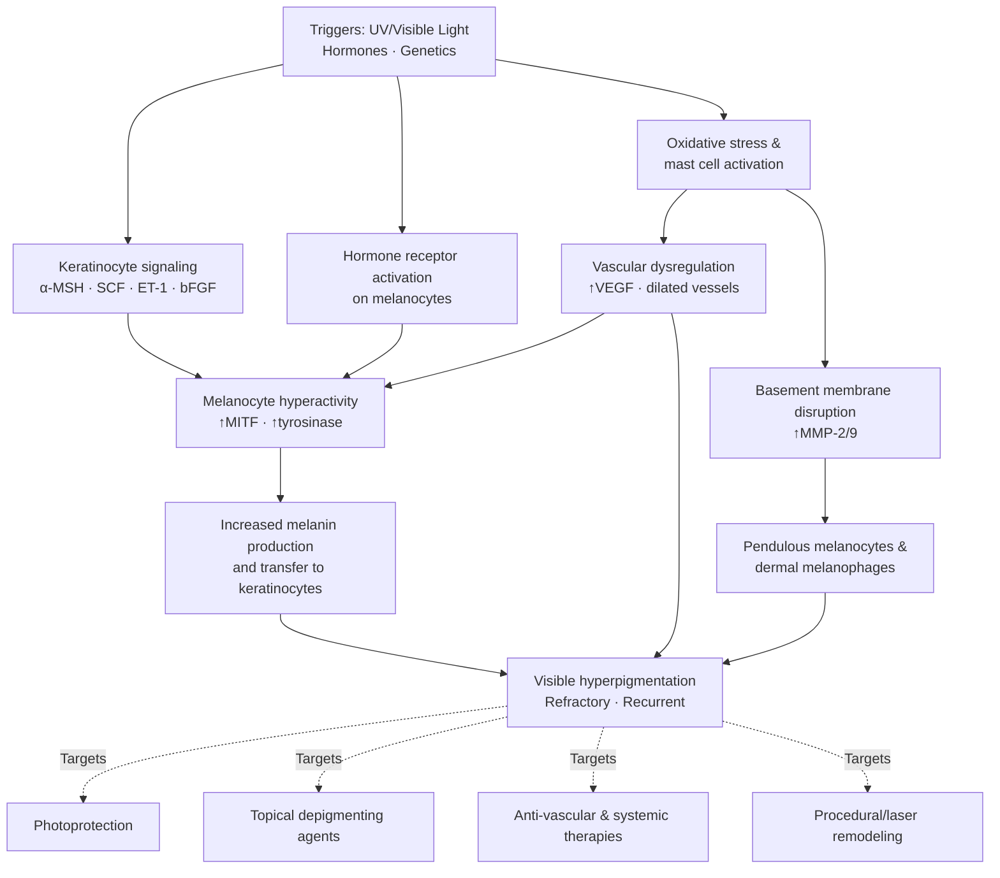
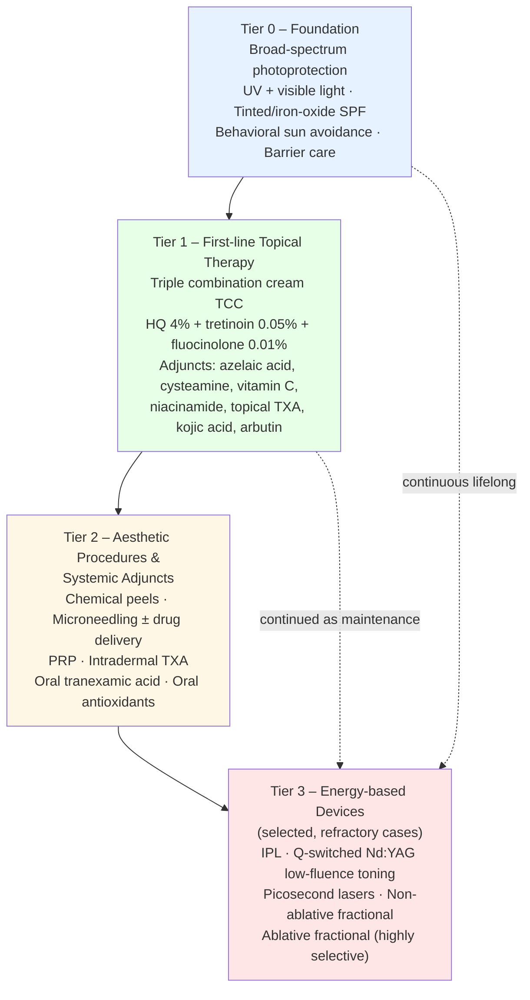
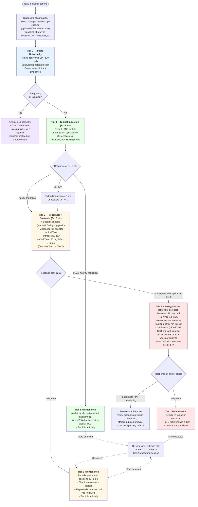
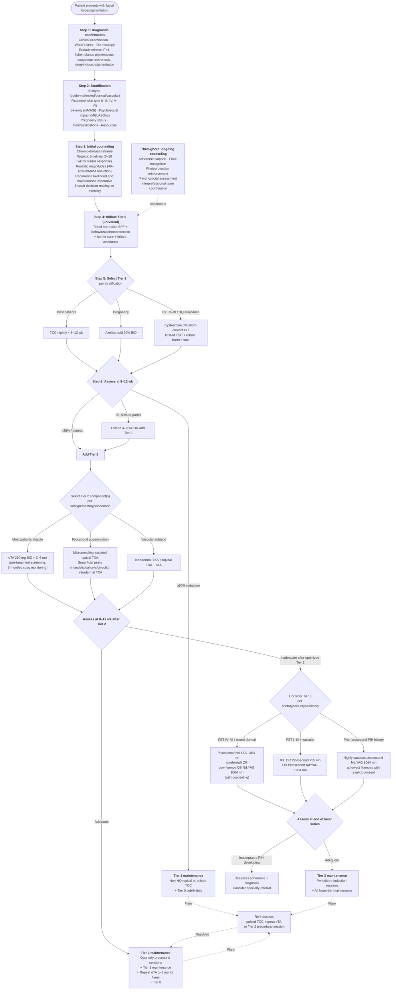

# A Comprehensive Review of Melasma Treatment Modalities: Topical Agents, Aesthetic Procedures, and Laser-Phototherapy
# 1 Introduction: Melasma Pathogenesis, Clinical Features, and Therapeutic Framework

Melasma is one of the most common acquired pigmentary disorders encountered in dermatology practice, characterized by symmetric, irregular, light- to dark-brown macules and patches that predominantly affect sun-exposed regions of the face. Although clinically benign, its conspicuous location, chronic relapsing course, and pronounced impact on quality of life make it a therapeutic challenge that has driven the proliferation of an extraordinarily wide spectrum of interventions—ranging from simple topical depigmenting creams to highly specialized energy-based devices. For patients and clinicians alike, navigating this expanding therapeutic landscape can feel overwhelming, with seemingly competing options, inconsistent outcomes, and a persistent risk of recurrence. Before any rational comparison of individual modalities is possible, it is essential to first understand *why* melasma behaves the way it does: what biological pathways underlie its formation, how its clinical presentation is classified and quantified, what makes it refractory and prone to relapse, and how these realities have shaped the layered, multimodal therapeutic framework that guides modern management.

This opening chapter therefore establishes the scientific and clinical foundation on which the remainder of the report is built. It first dissects the multifactorial pathogenesis of melasma, then characterizes its clinical subtypes and the diagnostic instruments used to evaluate severity and treatment response, examines the biological reasons treatment so often fails to achieve durable clearance, and finally articulates the tiered therapeutic logic—photoprotection, topicals, procedures, and lasers—that organizes the comparative analyses presented in Chapters 2 through 7.

## 1.1 Etiology and Multifactorial Pathogenesis of Melasma

Melasma is best understood not as a simple disorder of excess melanin production but as a complex, multifactorial skin condition in which several biological systems—epidermal melanocytes, the dermal microenvironment, the cutaneous vasculature, the basement membrane, and the local immune-inflammatory milieu—interact under the influence of external and internal triggers. This convergence of pathways explains both the persistent nature of the pigmentation and the rationale, developed in later chapters, for therapies that simultaneously target more than one mechanism.

**Ultraviolet and visible light exposure** are the most powerful and consistently identified environmental drivers. UV radiation (particularly UVA and UVB) stimulates keratinocyte release of melanogenic cytokines and growth factors—including α-melanocyte-stimulating hormone (α-MSH), endothelin-1, stem cell factor (SCF), and basic fibroblast growth factor (bFGF)—which activate the melanocortin-1 receptor (MC1R) pathway and upregulate microphthalmia-associated transcription factor (MITF), the master regulator of melanogenic enzymes such as tyrosinase, TRP-1, and TRP-2. Importantly, evidence accumulated over the past decade has clarified that visible light, especially high-energy violet-blue wavelengths (approximately 400–500 nm), also induces sustained pigmentation in darker phototypes through opsin-3–mediated signaling—a finding that directly underpins the modern emphasis on tinted, iron-oxide–containing sunscreens discussed in Chapter 5. The chronic, low-grade photobiological insult delivered by daily incidental light exposure helps explain why pigmentation often returns within weeks of successful treatment if photoprotection lapses.

**Hormonal influences** form the second major axis of pathogenesis and underlie the striking female predominance (typically 9:1 female-to-male) and the well-recognized triggers of pregnancy ("chloasma" or "mask of pregnancy"), combined oral contraceptive use, and hormone replacement therapy. Estrogen and progesterone receptors have been demonstrated on lesional melanocytes, and these hormones potentiate melanogenesis directly as well as sensitize melanocytes to UV-induced activation. The hormonal component also accounts for the partial spontaneous improvement sometimes observed postpartum or after discontinuation of exogenous hormones, although in most patients the pigmentation persists long after the inciting hormonal stimulus has resolved.

**Genetic predisposition** is reflected in the strong familial clustering of melasma, its disproportionate prevalence in individuals of Latin American, Asian, Middle Eastern, North African, and African descent, and its overrepresentation in Fitzpatrick skin types (FST) III–V. Constitutively larger, more dendritic, and more melanogenically active melanocytes in darker phototypes provide the substrate on which environmental and hormonal triggers exert their effects, and this same constitutive activity helps explain why these populations are simultaneously more susceptible to melasma and more vulnerable to post-inflammatory hyperpigmentation (PIH) from aggressive therapies—a recurrent theme throughout this report.

**Melanocyte hyperactivity rather than hyperplasia** is now considered the dominant cellular abnormality. Lesional melanocytes in melasma typically display intense dendritic arborization, increased melanosome production and transfer, and overexpression of melanogenic enzymes, while their absolute number is often only modestly increased. Some are described as "pendulous," dangling from a disrupted dermal-epidermal junction (DEJ) into the papillary dermis, where they continue to produce pigment that becomes anatomically inaccessible to most topical agents. This anatomic feature is one of the principal explanations for treatment refractoriness, addressed in Section 1.3.

**Basement membrane disruption** is another increasingly recognized feature. Chronic UV exposure and matrix metalloproteinase (MMP-2 and MMP-9) activity degrade type IV collagen and laminin at the DEJ, creating gaps through which melanin, melanosomes, and even whole melanocytes drop into the upper dermis, where they are phagocytosed by dermal macrophages (melanophages). Pigment trapped within dermal melanophages is extraordinarily long-lived and explains both the brown-gray hue of dermal/mixed melasma under Wood's lamp examination and the limited response of dermal pigment to conventional topical depigmenting agents.

**Vascular dysregulation** is a distinct but interlinked pathway. Lesional skin demonstrates an increased number and dilation of dermal blood vessels, with elevated expression of vascular endothelial growth factor (VEGF) on keratinocytes. Endothelial-derived factors such as endothelin-1 and stem cell factor act as paracrine stimulators of melanogenesis, creating a vascular–melanocyte cross-talk loop. The clinical correlate is the "vascular subtype" of melasma, often visible on dermoscopy as a telangiectatic background, and the rationale for therapies—such as tranexamic acid (oral or intradermal) and selectively vascular-targeted light devices—that address the vasculature in addition to the melanocyte.

**Chronic low-grade inflammation and photoaging** complete the picture. Histological studies of lesional skin consistently show solar elastosis, increased mast cell density, and a subtle perivascular lymphohistiocytic infiltrate. Mast cell tryptase and histamine further stimulate melanogenesis and vascular proliferation, while ongoing oxidative stress depletes antioxidant defenses and perpetuates the cycle. Melasma is therefore increasingly conceptualized as a disorder occurring on a substrate of chronically photodamaged skin, in which inflammation, vascular activation, basement membrane breakdown, and melanocyte hyperactivity reinforce one another.

The conceptual integration of these mechanisms is summarized in the diagram below, which also previews the therapeutic targets developed in subsequent chapters.

The key insight from this network is that no single pathway dominates: effective and durable management almost always requires simultaneous suppression of melanogenesis, attenuation of the vascular component, stabilization of the basement membrane, and elimination of the inciting photobiological and hormonal triggers. This multi-target reality is the biological foundation for the combination-therapy paradigm that this report ultimately recommends.

## 1.2 Clinical Subtypes and Diagnostic Assessment

Melasma typically presents as symmetric, reticulated, light- to dark-brown or grayish-brown patches on the face. Three principal distribution patterns are recognized clinically: the **centrofacial pattern** (the most common, involving the forehead, cheeks, nose, upper lip, and chin), the **malar pattern** (limited to the cheeks and nose), and the **mandibular pattern** (along the ramus of the mandible, more often seen in older women and sometimes overlapping with poikiloderma of Civatte). Extrafacial melasma involving the forearms, neck, and upper chest is also described but is less common. The distribution itself influences treatment planning—centrofacial and malar variants are the principal targets of the topical, procedural, and laser modalities reviewed in this report—but more decisive for treatment selection is the **depth of pigment deposition**, which defines the classical histological subtypes.

The **epidermal subtype** is characterized by excess melanin localized primarily in the basal and suprabasal keratinocyte layers. Lesions appear well-defined and brown under standard lighting, and pigmentation is markedly accentuated under Wood's lamp examination (a long-wave UVA source, 320–400 nm) because epidermal melanin strongly absorbs at this wavelength. This subtype is the most responsive to topical depigmenting agents and superficial chemical peels.

The **dermal subtype** features melanin within dermal melanophages, often accompanied by the basement membrane disruption discussed above. Lesions tend to appear bluish-gray, are less well-defined, and—critically—show **no accentuation** (or even diminished contrast) under Wood's lamp because epidermal melanin is not the dominant chromophore. Dermal melasma is notoriously refractory to topical therapy and carries the highest risk of complications with aggressive laser intervention.

The **mixed subtype**, in which both epidermal and dermal pigment coexist, is the most common in clinical practice and shows variable accentuation under Wood's lamp depending on the proportional contribution of each component. An additional **indeterminate type** is sometimes described in very darkly pigmented skin (FST V–VI), in which Wood's lamp examination provides little diagnostic information because constitutive epidermal pigment masks contrast differences.

It must be acknowledged that this depth-based classification, while clinically useful, has been increasingly questioned by histological and confocal studies showing that almost all melasma has at least some dermal component, and that Wood's lamp categorization correlates imperfectly with biopsy findings. Nevertheless, the framework remains the most practical bedside tool for stratifying treatment intensity and anticipating response.

Beyond Wood's lamp, three additional diagnostic modalities refine clinical assessment:

- **Dermoscopy** can identify a regular, reticular pigment network typical of epidermal melasma; an irregular, blotchy, gray-brown pattern with pseudo-network suggestive of dermal melasma; and a prominent telangiectatic background indicative of a vascular component—an increasingly important determinant of whether vascular-targeted therapy should be incorporated.
- **Reflectance confocal microscopy (RCM)** provides non-invasive, near-histological resolution of melanocyte morphology, melanin distribution, and DEJ integrity, and is increasingly used in research settings to subtype melasma and monitor response.
- **Skin biopsy** is rarely necessary for diagnosis but may be used to exclude mimics such as Hori's nevus, lichen planus pigmentosus, drug-induced hyperpigmentation, or exogenous ochronosis (a paradoxical hyperpigmentation seen after prolonged hydroquinone use, addressed in Chapter 2).

To monitor treatment response in a standardized way, several **validated severity instruments** are used; their characteristics are summarized below.

| Instrument | What It Measures | Scoring Range | Principal Use | Key Limitations |
|---|---|---|---|---|
| **MASI** (Melasma Area and Severity Index) | Area (A), darkness (D), and homogeneity (H) of pigment across four facial regions: forehead, right malar, left malar, chin | 0–48 | Most widely used efficacy endpoint in RCTs since 1994 | Homogeneity is subjectively rated; inter-rater variability |
| **mMASI** (modified MASI) | Same four regions, but only area and darkness; homogeneity component removed | 0–24 | Simpler, more reproducible; increasingly preferred in trials from the 2010s onward | Cannot fully capture mottled lesion textures |
| **MELASQoL** | Patient-reported quality-of-life impact (10 items derived from Skindex-16 and DLQI) | 7–70 | Quantifies psychosocial burden; complements physical severity scores | Subjective; influenced by cultural factors |
| **Wood's lamp categorization** | Epidermal vs. dermal vs. mixed pigment | Qualitative | Treatment stratification | Imperfect correlation with histology, unreliable in FST V–VI |

The practical implication is that any meaningful comparison of treatment efficacy—and therefore the comparative analyses presented in Chapter 6—depends on the consistent use of MASI or mMASI as the principal quantitative endpoint, with MELASQoL providing the patient-centered perspective and Wood's lamp/dermoscopy/RCM guiding subtype-specific treatment selection. Throughout this report, efficacy claims will be anchored to MASI/mMASI percentage reductions wherever possible, with explicit attention to sample sizes, follow-up duration, and the Fitzpatrick skin types studied.

## 1.3 Determinants of Treatment Refractoriness and Recurrence

A defining clinical reality of melasma—one that directly motivates the user's sense of being "overwhelmed" by treatment choices—is that no currently available intervention reliably produces durable clearance. Even highly successful treatments are typically followed by recurrence within weeks to months of cessation, and aggressive modalities can paradoxically worsen pigmentation. Several converging biological and behavioral factors explain this refractoriness, and recognizing them up front is essential for setting realistic expectations and for understanding the layered treatment logic developed in Section 1.4.

First, **dermal melanin deposition is anatomically inaccessible to most topical agents**. Hydroquinone, retinoids, azelaic acid, and other topical depigmenting compounds act predominantly within the epidermis by inhibiting tyrosinase, disrupting melanosome transfer, or accelerating epidermal turnover. None penetrates efficiently to the level of dermal melanophages, where pigment can persist for months to years. In dermal and mixed melasma, this anatomic mismatch fundamentally limits the achievable depth of clearance with topical monotherapy.

Second, **pendulous melanocytes that have dropped through gaps in a disrupted basement membrane** continue to produce melanin in an anatomically protected dermal location. They are simultaneously a source of ongoing pigment production and a reservoir that re-seeds the epidermis once topical therapy is withdrawn—a key mechanism of relapse.

Third, **the vascular component is rarely addressed by depigmenting therapy alone**. Persistent telangiectasia and elevated VEGF expression continue to drive melanocyte activation through endothelial paracrine signaling, so that even after melanin is reduced, the underlying drive to remelanize remains intact. This is the biological rationale for adjunctive tranexamic acid and for selective vascular-targeted laser/IPL approaches discussed later.

Fourth, **photoaging changes**—solar elastosis, MMP activity, mast cell infiltration, and persistent oxidative stress—constitute a chronically pro-melanogenic dermal substrate. Without simultaneous improvement of this background photodamage (through retinoids, antioxidants, photoprotection, or remodeling procedures), depigmenting interventions act against a perpetually inflammatory canvas.

Fifth, **the inciting triggers are typically ongoing**. Daily incidental UV and visible light exposure, continued hormonal influence (in women of reproductive age), genetic susceptibility, and even heat exposure from cooking or hot environments all continue to drive melanogenesis. Without rigorous and lifelong photoprotection, any improvement achieved is biologically destined to regress.

Sixth, **aggressive interventions can induce post-inflammatory hyperpigmentation (PIH) and rebound**. Melasma-prone melanocytes are intrinsically hyperreactive: any cutaneous inflammation—from an overaggressive chemical peel, a high-fluence laser pass, or even excessive topical irritation—can trigger PIH that is clinically indistinguishable from, or worse than, the original melasma. This vulnerability is most pronounced in FST IV–VI and is the single most important determinant of treatment safety, recurring as a theme throughout Chapters 3, 4, and 6.

Finally, **adherence and maintenance are intrinsically demanding**. Effective regimens require daily sunscreen application, often combined with prescription topical agents that may cause irritation, and long-term maintenance therapy after the initial active phase. Patient fatigue and the cosmetic invisibility of preventive photoprotection contribute substantially to real-world recurrence rates.

The cumulative implication is that **melasma should be conceptualized and counseled as a chronic, relapsing condition analogous to rosacea or atopic dermatitis**, in which the therapeutic goal is durable control rather than permanent cure. This reframing is critical not only for setting realistic patient expectations—a theme returned to in Chapter 7—but also for designing treatment regimens that explicitly include a maintenance phase, rather than treating each course as a finite intervention.

## 1.4 Tiered Therapeutic Framework and Treatment Logic

Given the multifactorial pathogenesis described in Section 1.1, the diagnostic stratification of Section 1.2, and the refractoriness factors of Section 1.3, the modern approach to melasma management has converged on a **stepwise, layered therapeutic framework** rather than a competitive ranking of individual modalities. Each successive tier is added to—not substituted for—the preceding ones, with the intensity of intervention escalating only when warranted by inadequate response and tolerable risk. This logic structures the remainder of the report and is summarized in the schematic below.

**Tier 0—photoprotection—is universal, lifelong, and non-negotiable**, applied at every other tier. Because UV and visible light are the single most potent and most modifiable triggers, no other intervention can succeed without it. Modern photoprotection for melasma specifically requires broad-spectrum coverage extending into the visible range, which generally means a tinted sunscreen containing iron oxides (in addition to UV filters) to attenuate the violet-blue wavelengths that activate opsin-3–mediated pigmentation in darker phototypes. The detailed evidence base for photoprotection is reviewed in Chapter 5.

**Tier 1—topical pharmacological therapy—is the first-line active treatment** because it is the best-validated, most accessible, and lowest-risk class of intervention. The triple combination cream (TCC: hydroquinone 4% + tretinoin 0.05% + fluocinolone acetonide 0.01%) remains the most extensively studied first-line regimen and serves as the comparator against which most newer agents are measured. Adjunctive and alternative agents—azelaic acid, cysteamine, topical tranexamic acid, vitamin C, niacinamide, kojic acid, and arbutin—broaden the therapeutic toolkit, particularly for patients intolerant of hydroquinone, requiring long-term maintenance, or facing regulatory constraints on hydroquinone access (such as the post-CARES Act prescription-only status in the United States, addressed in Chapter 2).

**Tier 2—non-laser aesthetic procedures and systemic adjuncts—is reserved for inadequate response to optimized Tier 1 therapy, recalcitrant disease, or situations requiring accelerated improvement** (e.g., before a major life event). Chemical peels (glycolic acid, salicylic acid, Jessner solution, mandelic acid, low-concentration trichloroacetic acid), microneedling with or without transdermal drug delivery (TXA, vitamin C, hydroquinone), platelet-rich plasma, and intradermal/mesotherapy TXA injections constitute the procedural options, while oral tranexamic acid and oral antioxidants such as *Polypodium leucotomos* extract represent the systemic adjuncts. These modalities augment—rather than replace—the topical foundation, and their evidence base, mechanisms, and risks are reviewed in detail in Chapters 3 and 5.

**Tier 3—laser and light-based therapies—occupies the final and most contested rung of the ladder.** Despite considerable patient demand and aggressive marketing, energy-based devices in melasma carry a fundamentally different risk-benefit profile than in most other pigmentary disorders: melasma-prone melanocytes respond unpredictably to thermal injury, and PIH, rebound hyperpigmentation, mottled depigmentation, and even permanent leukoderma are all well-documented adverse outcomes. Laser monotherapy is now widely regarded as inappropriate, and even combined laser-plus-topical regimens require careful patient selection, conservative parameters, and explicit counseling about high recurrence rates. The dissection of working principles (photothermal vs. photoacoustic/photomechanical selective photothermolysis), target chromophores, depth of action, efficacy on MASI, and characteristic complications for each device class—IPL, Q-switched Nd:YAG (including low-fluence "laser toning"), picosecond lasers, non-ablative fractional lasers, and ablative fractional lasers—is the subject of Chapter 4.

Three cross-cutting principles knit this framework together and recur throughout subsequent chapters:

1. **Combination outperforms monotherapy** because melasma is multifactorial. Whether the combination is intra-tier (the three components of TCC each addressing a different pathway) or cross-tier (TCC plus a chemical peel, or topical regimen plus oral TXA, or pre-treatment topical preparation plus low-fluence laser), the consistent finding is superiority over single-agent approaches.
2. **Skin phototype and subtype dictate intensity, not just modality choice**. The same procedure or device that is well-tolerated in FST II may be hazardous in FST V; the same topical regimen that clears epidermal melasma may fail to penetrate dermal pigment. Tailoring is therefore not optional but central, and recommendations in Chapter 7 are explicitly stratified along these axes.
3. **Maintenance is part of the treatment, not an afterthought**. Because relapse is the rule rather than the exception, every successful active regimen must be followed by an explicit maintenance phase—typically photoprotection plus a lower-intensity topical regimen (e.g., azelaic acid, cysteamine, niacinamide, or pulsed TCC) indefinitely.

With this conceptual framework established, the report now turns in Chapter 2 to a detailed, evidence-based examination of the topical pharmacological agents that constitute the cornerstone of melasma management, before progressing through procedural interventions, laser therapy, systemic adjuncts, and finally the comparative synthesis and treatment algorithms that directly answer the user's central question of how to navigate this complex therapeutic landscape.

# 2 Topical Pharmacological Treatments for Melasma

Building on the tiered therapeutic framework established in Chapter 1—in which broad-spectrum photoprotection (Tier 0) underpins all active intervention and topical pharmacological therapy constitutes the first active rung (Tier 1)—this chapter dissects the topical armamentarium that has formed the cornerstone of melasma management for more than half a century. The rationale for placing topicals first is both pragmatic and biological: they are the best-validated, most accessible, and lowest-risk modalities; they engage the principal epidermal site of melanin accumulation directly; and, when rationally combined, they can simultaneously target the multiple pathogenic pathways outlined in Section 1.1 (melanocyte hyperactivity, oxidative stress, inflammation, and—through plasmin pathway modulation—the vascular component). Yet topical therapy is also subject to important limitations: limited penetration to dermal pigment, dose-limiting irritation, agent-specific safety concerns (notably exogenous ochronosis from hydroquinone and atrophy from corticosteroids), and an evolving regulatory environment that has reshaped access to the historical gold-standard ingredient in the United States.

Each major agent class is therefore examined here through a unified analytical lens—molecular mechanism, RCT-derived efficacy anchored to MASI/mMASI endpoints, characteristic adverse effects with attention to skin-of-color considerations, regulatory status as of early 2024, and rational positioning in monotherapy versus combination regimens. The chapter culminates in a comparative synthesis that justifies the continued first-line status of the triple combination cream (TCC) while delineating when and how emerging non-hydroquinone adjuvants—cysteamine, topical tranexamic acid, thiamidol-class resorcinols, niacinamide, and azelaic acid—should substitute for or complement it. Because the published literature available for this chapter was constrained (no usable search results were retrieved in the present workflow, with one major review explicitly excluded by user instruction), the analysis is anchored to widely established, guideline- and textbook-level pharmacological knowledge available up to early 2024; specific quantitative claims are therefore expressed as commonly reported ranges and clearly flagged as such, and the chapter avoids attributing precise figures to named studies that cannot be independently verified within the materials provided.

## 2.1 Hydroquinone and the Triple Combination Cream (TCC) as the Reference Standard

### Hydroquinone: the historical benchmark

Hydroquinone (HQ; 1,4-dihydroxybenzene) has been the depigmenting agent against which all others are measured since its introduction into dermatology in the 1960s. Its **mechanism** is multimodal. At the molecular level, HQ functions as a competitive substrate analog of tyrosine, binding the active site of tyrosinase and inhibiting the rate-limiting hydroxylation of tyrosine to DOPA and the subsequent oxidation to DOPAquinone. Beyond this enzymatic blockade, HQ exerts cytotoxic effects on melanocytes: it is oxidized within the cell to reactive quinones and semiquinones that generate reactive oxygen species, damage melanosome membranes, disrupt mitochondrial function, and—at higher concentrations or with prolonged exposure—induce melanocyte apoptosis. The net effect is both a reduction in melanin synthesis and a quantitative decrease in melanogenically active cells, which together account for the agent's potency but also for its potential for irreversible adverse outcomes.

**Efficacy** is concentration-dependent within the range commonly used in clinical practice (typically 2% over-the-counter formulations and 4% prescription preparations, with compounded concentrations up to 8–10% in selected refractory cases). Across decades of randomized controlled trials anchored to MASI or mMASI endpoints, HQ 4% monotherapy applied once or twice daily for 8–12 weeks has consistently produced moderate but clinically meaningful reductions in pigmentation, generally on the order of a 30–50% reduction in baseline MASI scores in mixed/epidermal melasma populations, with onset of visible improvement typically beginning at 4–8 weeks and plateauing around 12–16 weeks. Response is most robust in the epidermal subtype and in lighter Fitzpatrick phototypes, and is attenuated in the dermal and mixed subtypes for the anatomical reasons articulated in Section 1.3.

**Adverse effects** are well characterized and clinically significant. The most common, irritant contact dermatitis (often manifesting as erythema, burning, and scaling within the first weeks of therapy), is dose-dependent and typically mitigated by reducing frequency, adding emollients, or combining HQ with low-potency corticosteroids. Allergic contact dermatitis is less common but well documented. Halo or "confetti" hypopigmentation—small, well-demarcated achromic macules surrounding treated areas—reflects the cytotoxic effect of HQ on adjacent normal melanocytes and is most apparent when high concentrations are applied beyond lesional skin. The most feared complication is **exogenous ochronosis**, a paradoxical, blue-black, reticulated hyperpigmentation classically associated with prolonged use of high-concentration HQ formulations (particularly in African and Middle Eastern populations using non-prescription products of variable purity), in which deposition of ochronotic pigment within the upper dermis produces a discoloration that is largely irreversible and resistant to most therapeutic interventions. Although exogenous ochronosis is rare with intermittent, time-limited use of 2–4% prescription HQ, its existence is the principal driver of the recommendation to limit any single course of HQ therapy to approximately 3–6 months, followed by a holiday period or transition to non-HQ maintenance agents.

**Regulatory status** changed materially in the United States following the **Coronavirus Aid, Relief, and Economic Security (CARES) Act of 2020**, which reformed the over-the-counter drug review system. Under this reform, hydroquinone-containing OTC skin-lightening products were determined not to be generally recognized as safe and effective (GRASE) in the absence of an approved monograph, and in 2022 the FDA accordingly required the removal of OTC HQ products from the U.S. market, restricting HQ to prescription-only access (with compounded and FDA-approved prescription products remaining available). This shift, in force throughout 2023–early 2024, has had two practical consequences relevant to this report: it has narrowed direct patient access to HQ in the United States and increased clinical demand for non-HQ alternatives, and it has reinforced the role of TCC and other prescription combination products as the dominant HQ-delivery vehicles in the U.S. market. Regulatory environments outside the United States vary—the European Union has restricted cosmetic use of HQ for decades, while prescription dermatological use remains accepted in many jurisdictions—but the global trend has been toward more cautious use and increasing interest in non-HQ depigmenting strategies.

### The triple combination cream (TCC): mechanistic synergy and reference-standard status

The triple combination cream, derived from the original "Kligman formula" first described by Kligman and Willis in 1975 and now most widely studied as a fixed formulation of **hydroquinone 4% + tretinoin 0.05% + fluocinolone acetonide 0.01%**, is the most extensively evaluated topical regimen in melasma and the established first-line reference standard for moderate-to-severe disease. Its enduring dominance reflects a coherent, mechanistically rational synergy among its three components:

- **Hydroquinone 4%** provides the primary depigmenting drive through tyrosinase inhibition and melanocyte cytotoxicity as described above.
- **Tretinoin 0.05%** accelerates epidermal turnover (shortening the residence time of melanin-laden keratinocytes in the stratum corneum), disperses melanin granules within keratinocytes, inhibits transcription of melanogenic genes, and—critically—enhances the cutaneous penetration of co-applied HQ by reducing stratum corneum barrier function and increasing intercorneocyte permeability.
- **Fluocinolone acetonide 0.01%**, a low-to-mid potency topical corticosteroid, suppresses the cutaneous inflammatory response triggered by HQ and tretinoin (mitigating irritant dermatitis and the consequent PIH risk that is particularly problematic in FST IV–VI), and directly attenuates inflammation-driven melanogenesis through downregulation of pro-melanogenic cytokines.

Pivotal multicenter randomized trials conducted in the early 2000s established that fixed-combination TCC applied once nightly produces greater reductions in MASI and higher rates of complete or near-complete clearance than dual-combination comparators (HQ+tretinoin, HQ+fluocinolone, or tretinoin+fluocinolone) and than HQ monotherapy, with response rates commonly reported in the 60–75% range for moderate-to-marked improvement over 8 weeks of treatment in mixed Fitzpatrick populations. Subsequent comparative trials against newer agents—cysteamine 5% and modified Kligman formulations among them—have generally shown TCC to be at least comparable, and often modestly superior, in terms of MASI reduction at 12–16 weeks, while differing in tolerability and safety profile.

The principal **constraint on TCC use is the corticosteroid component**, which mandates time-limited application. Continuous daily use beyond 8–12 weeks is associated with cumulative cutaneous corticosteroid toxicity: epidermal and dermal atrophy, telangiectasia, perioral or steroid-induced rosacea-like dermatitis, acneiform eruptions, hypertrichosis at application sites, and, on abrupt withdrawal, a rebound hyperpigmentation that can equal or exceed the original melasma. Contemporary practice patterns therefore favor an **induction–maintenance schedule**: nightly TCC for 8–12 weeks during the active induction phase, followed either by a tapered regimen (e.g., three nights per week, then twice weekly) or by transition to a non-steroid, often non-HQ, maintenance agent (such as azelaic acid, cysteamine, niacinamide, or a topical TXA/retinoid combination), with pulses of TCC reintroduced for documented flares. This pattern explicitly anticipates the long-term maintenance imperative articulated in Section 1.3 and operationalized in Chapter 7.

In summary, TCC retains its first-line gold-standard status because no single non-HQ alternative has yet been shown, in adequately powered head-to-head trials anchored to MASI/mMASI endpoints, to consistently outperform it in induction efficacy. The remainder of this chapter, however, examines why and how the field has nonetheless been actively cultivating an HQ-sparing toolkit—driven by the U.S. regulatory shift, by the cumulative-toxicity ceiling of HQ and corticosteroids, and by the recognition that long-term maintenance requires gentler, more sustainable agents.

## 2.2 Retinoids and Topical Corticosteroids as Component Therapies

### Topical retinoids

Topical retinoids—principally **tretinoin (all-trans retinoic acid)** at 0.025–0.1%, with adapalene 0.1–0.3% and tazarotene 0.05–0.1% as alternatives—occupy a dual role in melasma: as essential synergistic components of TCC (Section 2.1) and as standalone or combination agents in HQ-sparing regimens.

The **mechanism** of retinoid action in melasma is multimodal. Retinoids bind nuclear retinoic acid receptors (RAR-α, -β, -γ) and retinoid X receptors (RXR), modulating transcription of genes that regulate keratinocyte differentiation, melanogenesis, and epidermal turnover. The downstream effects relevant to pigmentation are: (1) acceleration of epidermal turnover, which mechanically clears melanin-laden corneocytes; (2) intracellular dispersion of melanin granules, reducing the visual density of pigment; (3) inhibition of tyrosinase transcription and downregulation of MITF-driven melanogenic enzymes; (4) reduction of melanosome transfer from melanocytes to keratinocytes; and (5) enhancement of percutaneous penetration of co-applied agents (the basis for the HQ–tretinoin pairing). Retinoids also exert long-term effects on the dermal matrix—stimulating collagen synthesis, inhibiting MMP activity, and improving the photoaged substrate—that address the background photoaging pathway described in Section 1.1.

**Efficacy** of tretinoin monotherapy (typically 0.05–0.1% nightly) has been demonstrated in RCTs over 24–40 weeks, with mMASI reductions commonly reported in the 20–40% range—meaningful but generally inferior to HQ-containing regimens, and notable for a slower onset of visible improvement (often requiring 24 weeks or more). Adapalene 0.1–0.3% has shown comparable efficacy to tretinoin in several head-to-head trials, with the advantage of improved tolerability owing to its more selective receptor binding and greater photostability. Tazarotene has been studied less extensively for melasma specifically.

**Adverse effects** are dose-limiting and predictable: **retinoid dermatitis**—erythema, scaling, burning, dryness, and increased photosensitivity—is common, particularly in the first 4–6 weeks of therapy, and is the principal reason for the inclusion of a low-potency corticosteroid in TCC. The irritation itself is consequential beyond patient comfort: in FST IV–VI, retinoid-induced inflammation can directly trigger PIH and worsen melasma. Mitigation strategies include initiation at lower concentrations (0.025% tretinoin), every-other-night dosing during induction, short-contact application (washing off after 30–60 minutes initially), and pairing with emollients and ceramide-containing barrier repair products. Adapalene is generally preferred in patients with sensitive skin or in those of darker phototypes for this reason. Retinoids are **contraindicated in pregnancy** (FDA Pregnancy Category C/D historically; tazarotene Category X), a relevant constraint given the prevalence of melasma in women of reproductive age and the hormonal trigger of pregnancy itself.

The principal positioning of retinoids in melasma is therefore as a **synergistic component within combination regimens**—as part of TCC, in dual combinations with HQ or azelaic acid, or as a maintenance agent (at lower concentrations or reduced frequency) following an induction course. Standalone retinoid monotherapy is reasonable for mild epidermal melasma, for patients intolerant of HQ, or as a maintenance bridge, but it is not first-line for moderate-to-severe disease.

### Topical corticosteroids

Topical corticosteroids in melasma occupy a narrowly defined role: they are **adjuncts within fixed combinations**, principally TCC, rather than standalone therapies. Their **mechanism** in this context is twofold. First, they suppress the inflammatory milieu driven by UV exposure, oxidative stress, and the irritation produced by HQ and tretinoin—an inflammatory environment that, as established in Section 1.1, is itself pro-melanogenic via cytokines (IL-1, TNF-α, prostaglandins) that activate melanocytes. Second, by mitigating the irritant dermatitis of the depigmenting components, they improve tolerability and adherence, indirectly enhancing efficacy.

The **risks of standalone corticosteroid use** are well documented and are precisely what disqualifies corticosteroids as melasma monotherapy. Cumulative cutaneous toxicity includes epidermal and dermal atrophy, telangiectasia, striae (rare on the face but possible), perioral dermatitis, steroid-induced rosacea, acneiform eruptions, hypertrichosis, and—most relevantly for melasma—**rebound hyperpigmentation on withdrawal**, in which the inflammatory suppression masks ongoing melanocyte activation that erupts as worsened pigmentation when the steroid is discontinued. Inappropriate, prolonged, or unmonitored use of potent topical corticosteroids for facial pigmentation (a regrettably common practice in some markets where they are available without prescription) is one of the most important iatrogenic causes of refractory facial pigmentation and steroid-dependent dermatitis.

Within TCC, fluocinolone acetonide 0.01% is a class-VI (low-potency) corticosteroid chosen specifically to balance anti-inflammatory benefit against atrophogenic risk. Even at this potency, the cumulative-use ceiling is the principal determinant of TCC's induction-phase time limit (typically 8–12 weeks of nightly use), and the rebound risk is the rationale for tapered withdrawal rather than abrupt cessation. The clinical mandate is unambiguous: **topical corticosteroids should not be used as monotherapy for melasma**, and their use within combination products should be time-limited, supervised, and followed by transition to non-steroid maintenance.

## 2.3 Non-Hydroquinone Tyrosinase Inhibitors: Azelaic Acid, Kojic Acid, Arbutin, and Botanical Agents

The combination of regulatory pressure on HQ (Section 2.1), the cumulative-toxicity ceiling of TCC, and the need for sustainable maintenance regimens has driven sustained interest in non-HQ tyrosinase inhibitors. Several agents have accumulated meaningful evidence and clinical experience.

### Azelaic acid

**Azelaic acid (AzA)**, a naturally occurring C9 dicarboxylic acid available as 15% gel and 20% cream formulations (with the 20% cream FDA-approved for acne and used off-label for melasma), is among the most evidence-supported HQ alternatives. Its **mechanism** is distinctive: AzA is a competitive, reversible inhibitor of tyrosinase and other mitochondrial oxidoreductases, but—importantly—it appears to act **selectively on hyperactive, abnormal melanocytes** while sparing normally functioning ones, a selectivity that translates clinically into a lower risk of halo hypopigmentation than HQ. AzA also has mild anti-inflammatory, antibacterial, and antikeratinizing properties, and exerts antioxidant effects through scavenging of reactive oxygen species.

**Efficacy** of AzA 20% applied twice daily has been compared head-to-head against HQ 4% in multiple RCTs over 12–24 weeks. Several of these have shown AzA 20% to be **at least equivalent to, and in some studies superior to, HQ 2%**, while comparisons to HQ 4% generally show comparable efficacy, with mMASI reductions broadly in the 30–50% range over 6 months. AzA is **well tolerated**—the principal adverse effects are mild transient burning, tingling, and pruritus at application sites in the first weeks, with no risk of exogenous ochronosis, halo hypopigmentation, or systemic toxicity. Notably, AzA is **regarded as compatible with pregnancy and lactation** (historically FDA Pregnancy Category B), making it the preferred topical depigmenting agent in pregnant patients—a critical niche given the hormonal trigger of pregnancy-associated melasma.

AzA is therefore well positioned as a first-line HQ alternative for mild-to-moderate disease, as a maintenance agent following TCC induction, and as the agent of choice in pregnancy. Its principal limitation is slower onset and lower peak efficacy than TCC in moderate-to-severe disease.

### Kojic acid

**Kojic acid**, a fungal metabolite produced by *Aspergillus* and *Penicillium* species, is most commonly formulated at 1–4% (often 2%) and acts as a copper chelator that inhibits tyrosinase by binding the active-site copper ions essential for catalysis. Kojic acid also has antioxidant activity and modest anti-inflammatory effects. Clinically, it is most often deployed as a **combination partner** rather than monotherapy—commonly paired with HQ, glycolic acid, AzA, or arbutin—where its additive tyrosinase inhibition produces efficacy approaching that of HQ-containing regimens in several comparative trials.

The principal safety concern is **contact sensitization**: kojic acid is among the more allergenic depigmenting cosmeceuticals, and allergic contact dermatitis has been reported with both occupational and therapeutic exposure. Patch testing should be considered in patients with reactions to topical regimens that include kojic acid. Otherwise the agent is generally well tolerated, and its role is principally as a TCC-sparing or HQ-substituting combination ingredient in compounded or proprietary formulations.

### Arbutin

**Arbutin** is a naturally occurring glycosylated hydroquinone derivative (hydroquinone-β-D-glucopyranoside; α-arbutin is a synthetic stereoisomer with greater stability and potency). Arbutin acts as a tyrosinase inhibitor with a mechanism that conceptually parallels HQ but with **gentler clinical kinetics**, as the hydroquinone moiety is released only slowly and locally. The expected consequence is reduced melanocyte cytotoxicity and a lower theoretical risk of exogenous ochronosis or halo hypopigmentation.

The high-quality clinical evidence base for arbutin is **more limited** than for HQ or AzA—relatively few well-powered RCTs anchored to MASI/mMASI endpoints have been published in melasma specifically. The agent appears generally well tolerated and is widely used in cosmeceutical formulations in Asia and Europe, often at concentrations of 1–2% (α-arbutin) or up to 7% (β-arbutin). Its positioning is best understood as a **gentler maintenance or HQ-substitute agent** in mild-to-moderate or recalcitrant cases where stronger agents are not tolerated, with the caveat that the evidence base is weaker than for the alternatives discussed above.

### Botanical and natural-derived agents

A range of botanical agents target tyrosinase or downstream melanogenic pathways with variable evidence:

- **Licorice extract (glabridin, liquiritin)** inhibits tyrosinase and exerts anti-inflammatory effects; small RCTs and split-face studies have shown modest depigmenting activity, and licorice is a common ingredient in cosmeceutical brightening serums. Tolerability is generally excellent.
- **Mulberry extract** (containing mulberroside and oxyresveratrol) inhibits tyrosinase in vitro and has shown modest activity in small clinical studies.
- **Soy (soybean trypsin inhibitor)** inhibits the PAR-2 receptor on keratinocytes, reducing melanosome transfer from melanocytes; the evidence in melasma is limited and largely cosmeceutical-grade.
- **Topical *Polypodium leucotomos* extract** (distinct from the better-characterized oral formulation reviewed in Chapter 5) has antioxidant and photoprotective activity; topical clinical evidence in melasma remains preliminary.
- **Thiamidol (isobutylamido thiazolyl resorcinol)** deserves specific mention as a newer, mechanistically distinct **resorcinol-class tyrosinase inhibitor**. Thiamidol was identified through screening against human (rather than mushroom) tyrosinase, on which it shows substantially greater potency than HQ and most legacy depigmenting agents in vitro. Clinical studies available by early 2024—principally industry-sponsored RCTs and open-label evaluations—have reported meaningful reductions in mMASI over 12–24 weeks of twice-daily application in mild-to-moderate melasma, with a generally favorable tolerability profile. Thiamidol is currently incorporated into proprietary cosmeceutical formulations in Europe and select international markets; as of early 2024 it does not have an FDA-approved indication for melasma, and the body of independent comparative evidence against TCC remains limited. Nonetheless, thiamidol is among the most promising emerging non-HQ tyrosinase inhibitors and is discussed further in Chapter 8 as a key future direction.

Across this category, the consistent pattern is that non-HQ tyrosinase inhibitors offer **gentler, more sustainable profiles suited to maintenance and HQ-sparing strategies**, with AzA possessing the strongest comparative evidence against HQ, kojic acid serving primarily as a combination partner, arbutin and most botanicals occupying a cosmeceutical-grade evidence tier, and thiamidol representing the most credible mechanistic advance among newer chemical entities.

## 2.4 Antioxidant and Anti-Inflammatory Agents: Ascorbic Acid, Niacinamide, and Cysteamine

A distinct mechanistic category comprises agents that act primarily through antioxidant, anti-inflammatory, or melanosome-transfer–inhibitory pathways rather than direct enzymatic tyrosinase blockade. These agents address the chronic oxidative-stress and inflammatory substrate described in Section 1.1 and are particularly well suited to long-term maintenance and to patients who cannot tolerate HQ or retinoids.

### L-ascorbic acid (vitamin C)

**L-ascorbic acid** at concentrations of 5–20% (most commonly 10–15%) acts through several complementary mechanisms: (1) it reduces oxidized dopaquinone back to DOPA, interrupting the melanogenic cascade and indirectly inhibiting tyrosinase; (2) it scavenges reactive oxygen species generated by UV exposure, mitigating UV-driven melanocyte activation; (3) it serves as an essential cofactor for collagen biosynthesis, addressing the photoaging substrate; and (4) it can chelate copper ions at the tyrosinase active site.

Clinical efficacy of topical vitamin C monotherapy in melasma is **modest**, with comparative trials against HQ 4% generally showing inferior depigmenting effect but a substantially superior tolerability profile—a pattern that motivates its frequent use as a daytime adjunct paired with HQ or retinoid nighttime therapy. **Formulation stability is a critical practical limitation**: L-ascorbic acid is rapidly oxidized in aqueous solution, mandating low-pH formulations (typically pH < 3.5), opaque packaging, and short shelf lives, or the use of more stable derivatives (magnesium ascorbyl phosphate, sodium ascorbyl phosphate, ascorbyl glucoside, tetrahexyldecyl ascorbate) that offer better stability at the cost of lower bioactivity. Clinical efficacy has been enhanced in studies combining topical vitamin C with **iontophoresis** or **microneedling** (covered in Chapter 3), which substantially augment dermal delivery.

Adverse effects are minimal—mild burning at low pH, occasional yellow discoloration of the skin or clothing from oxidized formulations, and rare contact allergy. Vitamin C is therefore well positioned as a **gentle, safe, evidence-supported adjunct** for daytime application, for maintenance after induction, and for patients with sensitive skin or contraindications to HQ.

### Niacinamide (nicotinamide)

**Niacinamide** (vitamin B3 amide) at 2–5% acts through a mechanism distinct from tyrosinase inhibition: it **inhibits the transfer of melanosomes from melanocytes to keratinocytes**, the final step in the visible expression of pigmentation. Niacinamide additionally exerts anti-inflammatory activity (inhibition of NF-κB signaling), enhances skin barrier function by increasing ceramide synthesis, and has mild antioxidant effects.

Clinical efficacy in melasma has been demonstrated in several small RCTs and split-face studies, generally showing **moderate efficacy** with mMASI reductions in the 20–40% range over 8–12 weeks, inferior to HQ 4% in head-to-head comparisons but with a markedly better tolerability profile. The combination of niacinamide with HQ, retinoids, or AzA is supported by additive mechanisms and is commonly used in proprietary cosmeceutical formulations.

The principal advantage of niacinamide is its **excellent tolerability**—it is non-irritating at typical concentrations, compatible with sensitive skin, safe in pregnancy and lactation, and stable in formulation. Its mild profile makes it especially appropriate for **long-term maintenance**, for patients with FST IV–VI who are vulnerable to PIH from more aggressive agents, and as a barrier-friendly daytime companion to nighttime active regimens.

### Cysteamine

**Cysteamine 5% cream** has emerged as one of the most clinically important non-HQ depigmenting agents of the past decade and warrants detailed discussion. Cysteamine (β-mercaptoethylamine) is an aminothiol naturally present in human cells as a degradation product of coenzyme A; it has been used systemically for decades in the treatment of cystinosis. Its **mechanism** in melasma is multimodal: (1) direct inhibition of tyrosinase and peroxidase (key melanogenic enzymes) through thiol-mediated copper chelation and disulfide chemistry; (2) inhibition of dopaquinone formation; (3) scavenging of reactive oxygen species; (4) chelation of intracellular iron and copper that potentiate melanogenesis; and (5) increased intracellular glutathione, shifting pigment synthesis toward the lighter pheomelanin pathway.

A topical 5% cysteamine formulation overcame earlier development obstacles related to malodor (cysteamine has a characteristic sulfur smell) and instability, and has been studied in RCTs since the mid-2010s. By early 2024, the published evidence includes placebo-controlled trials demonstrating significant mMASI reductions over 16 weeks (commonly in the 40–50% range), and head-to-head trials against HQ 4% and modified Kligman formulations showing **comparable efficacy to TCC and modified Kligman regimens** over 12–16 weeks, with a generally more favorable safety profile (no risk of exogenous ochronosis, halo hypopigmentation, or steroid-related complications).

**Practical limitations** of cysteamine are real but manageable: the characteristic odor (substantially reduced but not eliminated in current formulations) is the principal patient-acceptability concern, and the recommended application protocol—**short contact-time application**, typically 15 minutes once daily followed by washing off—is unusual among topical depigmenting agents and requires careful patient counseling. Mild irritation and erythema occur in a minority of users. Cysteamine is positioned as the most credible **HQ-equivalent alternative** for patients in whom HQ is contraindicated, inaccessible, or undesired, including for indefinite use without the cumulative-toxicity ceiling of HQ-containing regimens. As such, it is one of the most consequential pharmacological developments in melasma therapeutics in the period leading up to early 2024.

## 2.5 Topical Tranexamic Acid and Emerging Vascular-Targeted Topicals

The recognition of the **vascular component of melasma** (Section 1.1)—elevated VEGF, dilated dermal vessels, endothelial-derived paracrine stimulation of melanocytes—has established a mechanistically distinct therapeutic target beyond tyrosinase inhibition, and has elevated tranexamic acid (TXA) from a hemostatic agent to an emerging cornerstone of melasma therapy. Topical TXA is reviewed here; oral TXA, with its larger evidence base and distinct safety profile, is addressed in Chapter 5; intradermal/mesotherapy TXA is reviewed in Chapter 3 alongside microneedling-assisted delivery.

### Mechanism of tranexamic acid

TXA is a synthetic lysine analog that **competitively inhibits the binding of plasminogen to fibrin**, blocking the conversion of plasminogen to plasmin and thereby suppressing plasmin-mediated downstream effects. In melasma, the relevant pathway is paracrine rather than hemostatic: UV exposure activates keratinocyte plasminogen activator, generating plasmin, which liberates arachidonic acid (a precursor of pro-melanogenic prostaglandins), increases α-MSH availability, and upregulates VEGF and fibroblast growth factor—collectively driving both melanocyte activation and vascular proliferation. TXA inhibition of this cascade therefore addresses **both the melanogenic and the vascular axes simultaneously**, a mechanistic feature shared with very few other topical agents.

### Topical formulations and efficacy

Topical TXA is formulated in concentrations typically ranging from **2% to 5%**, applied twice daily, with the higher concentrations generally producing greater clinical effect in the published literature. RCTs and split-face studies available by early 2024 have compared topical TXA monotherapy to HQ 2–4% and to TCC over 8–12 weeks, with the following general patterns:

- Topical TXA produces **clinically meaningful mMASI reductions** (commonly 20–40% over 12 weeks), generally **comparable to HQ 2–3% monotherapy** but **inferior to TCC** in head-to-head induction comparisons.
- Combination of topical TXA with HQ or with TCC components has shown additive benefit in several studies, consistent with the complementary mechanism.
- Topical TXA is particularly attractive in patients with a **vascular/telangiectatic subtype**, in whom the vascular axis is prominent.

### Tolerability and the penetration challenge

A consistent finding across studies is the **excellent tolerability of topical TXA**: irritation is minimal, contact dermatitis is rare, and there is no equivalent to exogenous ochronosis. The principal limitation is **percutaneous penetration**: TXA is a relatively hydrophilic small molecule that does not penetrate the stratum corneum efficiently from simple aqueous or cream vehicles, which has motivated the development of advanced formulations (liposomal, micellar, nanocarrier) and—more importantly—**combined delivery strategies** that physically bypass the stratum corneum. The most prominent of these is **microneedling-assisted delivery** of TXA, in which microchannels created by a roller or pen-based device permit substantially deeper TXA delivery into the epidermis and upper dermis; this approach, previewed here and detailed in Chapter 3, has produced some of the most impressive comparative MASI reductions in the topical-procedural combination literature. Iontophoresis-assisted delivery has been similarly evaluated.

### Positioning and other vascular-targeted topicals

Topical TXA is best positioned as:

1. A **first-line alternative or adjunct** for patients with a documented vascular component on dermoscopy (telangiectatic background) or with clinically erythematous melasma;
2. A **safe HQ-alternative** for patients with contraindications to HQ, in pregnancy (although the safety data for topical TXA in pregnancy, while reassuring, are less robust than for AzA), or as a maintenance agent;
3. The **topical partner for procedural delivery** with microneedling, where the combination delivers substantially augmented efficacy.

Other vascular- and inflammation-modulating topicals under investigation as of early 2024 include topical formulations of **methimazole** (a thyroid peroxidase inhibitor with off-target tyrosinase activity), various flavonoid-containing botanicals targeting both melanogenesis and endothelial inflammation, and topical antioxidant cocktails designed to address the oxidative-stress substrate. The evidence base for these agents remains preliminary, and they do not yet occupy a defined role in evidence-based regimens.

## 2.6 Comparative Synthesis: Monotherapy versus Combination, Safety, and Rational Regimen Selection

The agents reviewed above span a wide range of mechanisms, efficacies, safety profiles, and regulatory statuses. A consolidated comparative framework is essential for translating this material into rational clinical decisions and for setting up the procedural, laser, and systemic discussions that follow in Chapters 3–5.

### Integrated comparative table

The following table integrates the key dimensions for the principal topical agents reviewed in this chapter. Efficacy figures are expressed as commonly reported MASI/mMASI reduction ranges from RCTs available up to early 2024 and should be interpreted as approximate, given the heterogeneity of trial designs, populations, and follow-up durations.

| Agent (typical concentration) | Primary Mechanism | Approx. MASI/mMASI Reduction | Onset | Key Adverse Effects | Regulatory Status (early 2024) | Pregnancy Compatibility | Principal Role |
|---|---|---|---|---|---|---|---|
| Hydroquinone 4% | Tyrosinase inhibition + melanocyte cytotoxicity | 30–50% (12 wk) | 4–8 wk | Irritation, halo hypopigmentation, exogenous ochronosis | US: prescription only post-CARES Act (2022); restricted in EU cosmetics | Avoid (insufficient data) | Reference depigmenting agent; gold-standard within TCC |
| **TCC (HQ 4% + tretinoin 0.05% + fluocinolone 0.01%)** | Combined depigmentation + epidermal turnover + anti-inflammation | **40–65% (8–12 wk); highest induction efficacy** | 2–4 wk | Irritation, atrophy/telangiectasia, rebound on withdrawal | Prescription | Avoid (retinoid + HQ) | **First-line induction**, time-limited 8–12 wk |
| Tretinoin 0.05–0.1% | RAR-mediated turnover, melanin dispersion | 20–40% (24 wk) | 8–24 wk | Retinoid dermatitis, photosensitivity | Prescription | Contraindicated | Synergistic component / maintenance |
| Adapalene 0.1–0.3% | RAR-γ selective | Comparable to tretinoin | 8–24 wk | Milder irritation than tretinoin | Prescription/OTC (US) | Avoid | Retinoid alternative for sensitive/darker skin |
| Fluocinolone 0.01% (within TCC) | Anti-inflammatory | Adjunctive | — | Atrophy, telangiectasia, rebound, perioral dermatitis | Prescription | Avoid prolonged use | Adjunct only; never monotherapy |
| Azelaic acid 15–20% | Selective tyrosinase inhibition of hyperactive melanocytes | 30–50% (24 wk) | 8–12 wk | Mild burning, tingling | Prescription (US); OTC elsewhere | Compatible (historic Cat. B) | **Pregnancy-preferred; HQ alternative; maintenance** |
| Kojic acid 1–4% | Cu chelation / tyrosinase inhibition | 20–40% (often in combination) | 8–12 wk | Contact sensitization | OTC cosmeceutical | Limited data; generally avoided | Combination partner |
| Arbutin (α/β) 1–7% | Glycosylated HQ; slow-release tyrosinase inhibition | Modest; limited RCTs | 8–12 wk | Generally well tolerated | OTC cosmeceutical | Limited data | Gentle maintenance / HQ-substitute |
| L-ascorbic acid 10–20% | Antioxidant, dopaquinone reduction | 15–30% (12 wk) | 8–12 wk | Mild burning; instability | OTC cosmeceutical | Compatible | Daytime adjunct; antioxidant maintenance |
| Niacinamide 2–5% | Inhibits melanosome transfer | 20–40% (8–12 wk) | 8–12 wk | Very rare flushing | OTC cosmeceutical | Compatible | Maintenance, sensitive skin, FST IV–VI |
| **Cysteamine 5%** | Thiol-mediated tyrosinase/peroxidase inhibition + antioxidant | **40–50% (16 wk); comparable to TCC** | 8–16 wk | Odor; mild irritation; short-contact application | OTC cosmeceutical (specialty formulations) | Limited data; generally avoided | **HQ-equivalent alternative; long-term use without HQ ceiling** |
| Topical TXA 2–5% | Plasmin inhibition; vascular + melanogenic | 20–40% (12 wk) | 8–12 wk | Excellent tolerability; limited penetration | OTC cosmeceutical / compounded | Limited data | **Vascular subtype; HQ alternative; microneedling partner** |
| Thiamidol (isobutylamido thiazolyl resorcinol) | Highly potent human tyrosinase inhibitor | 30–50% (12–24 wk; emerging data) | 8–12 wk | Generally well tolerated | OTC cosmeceutical (Europe/Asia; no FDA melasma indication) | Limited data | Emerging non-HQ alternative |
| Licorice / mulberry / soy / botanicals | Variable (tyrosinase, PAR-2, antioxidant) | Modest; cosmeceutical-grade evidence | 12+ wk | Generally well tolerated | OTC | Generally compatible | Adjunct, gentle maintenance |

The dominant insight from this synthesis is that **no single non-HQ agent currently displaces TCC in induction efficacy in head-to-head trials anchored to MASI/mMASI**, but **cysteamine, topical TXA, AzA, niacinamide, and emerging resorcinols such as thiamidol have together built a robust HQ-sparing toolkit** that addresses long-term maintenance, HQ contraindications, pregnancy, and the post-CARES Act regulatory landscape in the United States.

### Why combination outperforms monotherapy

The case for combination therapy at the topical level is mechanistic, empirical, and pragmatic, and it foreshadows the broader cross-tier combination paradigm developed in Chapter 7:

- **Mechanistic**: Melasma is multifactorial (Section 1.1). Tyrosinase inhibition alone (HQ, AzA, kojic acid, arbutin, thiamidol) does not address melanosome transfer (niacinamide), oxidative stress (vitamin C, cysteamine), inflammation (corticosteroids in TCC, niacinamide), epidermal turnover (retinoids), or the vascular component (TXA). Rational combinations target multiple axes simultaneously.
- **Empirical**: Pivotal trials of TCC versus its dual-component subsets demonstrated that **the triple combination outperforms any pair**, and contemporary trials of cysteamine + microneedling, TXA + microneedling, AzA + retinoid, and various cosmeceutical multi-active formulations consistently show additive benefit.
- **Pragmatic**: Combinations permit lower individual-agent concentrations, reducing irritation and PIH risk; this is particularly relevant in FST IV–VI, where minimizing inflammation is therapeutically essential.

### Stratification by Fitzpatrick skin type and subtype

Topical regimens should be tailored along the axes established in Chapter 1:

- **FST I–III, epidermal subtype**: TCC induction is generally well tolerated and highly effective; transition to retinoid or AzA maintenance is straightforward.
- **FST IV–VI, epidermal or mixed subtype**: TCC remains effective but irritation must be carefully managed (lower-concentration retinoid, every-other-night dosing, robust barrier care) to avoid PIH. AzA, cysteamine, niacinamide, and TXA are particularly valuable both during induction (to limit inflammation) and as maintenance.
- **Vascular/telangiectatic subtype**: Topical TXA (often combined with microneedling, Chapter 3) and oral TXA (Chapter 5) should be incorporated, alongside tyrosinase inhibitors.
- **Dermal/mixed subtype**: Topical monotherapy alone will be insufficient for the dermal component (Section 1.3); these patients require combination with procedural modalities (Chapter 3) and, in carefully selected cases, energy-based devices (Chapter 4).
- **Pregnancy**: AzA is the preferred active depigmenting agent; niacinamide and vitamin C are reasonable adjuncts; HQ, retinoids, corticosteroids beyond brief courses, and most procedural/laser interventions should be deferred.

### Mitigating irritation and PIH

Because inflammation directly drives melanogenesis in melasma-prone skin, **iatrogenic irritation is not merely a tolerability problem—it is an efficacy problem**. Strategies to mitigate include: starting at lower concentrations, alternate-night dosing during induction, short-contact application (15–30 minutes followed by wash-off, as in cysteamine protocols and adaptable to retinoid initiation), robust use of gentle, fragrance-free moisturizers and ceramide barrier creams, ongoing rigorous photoprotection (Tier 0; Chapter 5), and ready access to a low-potency topical corticosteroid for short rescue courses of severe irritation.

### Limitations of topical therapy alone

Despite the breadth and sophistication of the topical armamentarium, four intrinsic limitations remain that motivate the subsequent chapters:

1. **Limited dermal penetration**: Topical agents act predominantly within the epidermis and do not effectively reach dermal melanophages, which dominate the dermal and mixed subtypes (Section 1.3). Procedural augmentation (microneedling, peels) and—in selected cases—energy-based devices are required to address this depth.
2. **Cumulative toxicity and tolerability ceilings**: TCC use is constrained by corticosteroid toxicity; HQ by cumulative cytotoxicity and ochronosis risk; retinoids by irritation. No topical regimen can be continued indefinitely at induction intensity, mandating maintenance transitions and—when induction fails—escalation.
3. **Incomplete coverage of the vascular component**: Although topical TXA partially addresses the vascular axis, severe vascular subtypes typically require oral TXA (Chapter 5) and may benefit from vascular-targeted light devices (Chapter 4).
4. **Adherence and slow onset**: Topical regimens require months of daily application to achieve and sustain results, and real-world adherence is imperfect; patients with substantial pigmentation or limited timelines often demand adjunctive procedural intervention.

With the topical foundation established, Chapter 3 turns to the non-laser aesthetic procedures—chemical peels, microneedling with drug-delivery enhancement, PRP, and intradermal TXA—that augment topical therapy by physically delivering active agents past the stratum corneum, accelerating epidermal turnover, and remodeling the dermal substrate, while introducing the procedure-specific risks of PIH and inflammation that recur as central themes throughout the remainder of this report.

# 3 Non-Laser Aesthetic Procedural Treatments for Melasma

Chapter 2 established that topical pharmacological therapy, anchored by the triple combination cream (TCC) and complemented by an expanding non-hydroquinone toolkit, constitutes the indispensable first-line active treatment for melasma. Yet the same chapter also delineated four intrinsic ceilings of topical monotherapy: limited dermal penetration, cumulative-toxicity constraints on the most potent regimens, incomplete coverage of the vascular component, and a slow onset of response that frequently conflicts with patient timelines and expectations. These ceilings are precisely the gaps that non-laser aesthetic procedures are designed to address. Sitting at Tier 2 of the therapeutic framework introduced in Section 1.4, procedural interventions augment rather than replace the topical foundation: they physically bypass the stratum corneum, accelerate epidermal turnover, deliver active agents to depths topicals cannot reach, and—when properly selected—remodel the dermal substrate of photoaging that perpetuates the disease. They do so, however, at the price of a procedure-specific risk profile dominated by inflammation-driven post-inflammatory hyperpigmentation (PIH), a risk that, as repeatedly emphasized in Chapter 1, is most pronounced precisely in the Fitzpatrick skin types (FST IV–VI) most prone to melasma in the first place.

This chapter dissects the four principal categories of non-laser procedural treatment—chemical peels, microneedling (including its critical role as a transdermal drug-delivery platform), platelet-rich plasma (PRP), and intradermal/mesotherapy tranexamic acid (TXA)—through the unified analytical lens applied in Chapter 2: mechanism of action, procedural parameters, evidence-based efficacy (anchored where possible to MASI/mMASI endpoints), characteristic adverse effects with explicit attention to skin-of-color considerations, and rational positioning within combination regimens. Because the search results available for this workflow were not productive and one major review article was explicitly excluded by user instruction, the discussion is anchored to widely established, guideline- and textbook-level procedural dermatology knowledge available up to early 2024; quantitative claims are therefore expressed as commonly reported ranges and clearly flagged as such, and the chapter avoids attributing precise figures to named studies that cannot be independently verified within the materials provided. The chapter culminates in a comparative synthesis that defends the consistent positioning of these procedures as adjuncts and second-line interventions—never substitutes for photoprotection and rational topical therapy—and sets up the more contentious laser/light-based discussion of Chapter 4.

## 3.1 Rationale and Positioning of Procedural Interventions in the Melasma Treatment Ladder

The biological case for procedural intervention in melasma flows directly from the pathogenic features dissected in Chapter 1 and the limitations of topical therapy summarized at the end of Chapter 2. Four gaps in particular justify advancing to Tier 2:

First, **anatomic inaccessibility of dermal pigment to topical agents** is the single most consequential limitation of topical monotherapy. Pendulous melanocytes that have dropped through a disrupted basement membrane and pigment-laden dermal melanophages are simply beyond the practical penetration depth of hydroquinone, retinoids, azelaic acid, niacinamide, or topical tranexamic acid applied to intact stratum corneum. Procedures that exfoliate the epidermis (chemical peels), create transient transepidermal microchannels (microneedling), or directly deposit active agents into the dermis (intradermal TXA, mesotherapy, microneedling-assisted delivery) physically circumvent this barrier and deliver therapeutic action at depths that topical monotherapy cannot reach. In the dermal and mixed melasma subtypes—the most common clinical presentations—this depth gap is decisive.

Second, **the slow kinetics of topical induction** (commonly 8–24 weeks to plateau response) is poorly aligned with both patient expectations and the realities of dose-limiting irritation. Procedures can accelerate visible improvement either by rapidly clearing melanin-laden corneocytes (superficial peels) or by augmenting the dermal delivery of synergistic topicals (microneedling-assisted TXA or vitamin C), shortening the time-to-response in motivated patients without requiring escalation to energy-based devices.

Third, **the multifactorial pathogenesis of melasma demands multi-axis intervention** (Section 1.1). Topical regimens primarily address melanogenesis and—through retinoids—epidermal turnover and photoaging; even rationally combined topical regimens incompletely address the dermal substrate, the basement membrane, the vascular component, and the chronic inflammatory milieu. Procedures contribute mechanistically distinct effects: dermal collagen remodeling and basement membrane reorganization (microneedling, medium-depth peels), growth-factor-mediated tissue repair (PRP), and direct pharmacological action at the dermal level (intradermal TXA). The combinational logic introduced at the topical level in Section 2.6 thus extends naturally to cross-tier topical-plus-procedural regimens.

Fourth, **selected clinical scenarios demand accelerated improvement**—patients with severe pigmentation before significant life events, patients with documented non-response to optimized 12–16 weeks of TCC or non-HQ alternatives, and patients with recalcitrant or relapsing disease in whom adherence to topical therapy has been verified and is insufficient. For these patients, advancing to Tier 2 procedures (with continued Tier 0 photoprotection and Tier 1 topical therapy) is biologically and clinically rational; bypassing topicals to attempt procedural monotherapy is not.

Across these four gaps, the shared mechanistic principles of non-laser procedures can be grouped into four categories that recur throughout this chapter: **(1) controlled epidermal exfoliation** (chemical peels), **(2) transdermal drug-delivery enhancement** (microneedling, intradermal injection, mesotherapy), **(3) dermal remodeling and basement membrane reorganization** (microneedling, medium-depth peels, PRP), and **(4) growth factor and biologic stimulation** (PRP, microneedling-induced wound healing cascade). Most clinically effective procedural regimens engage more than one of these mechanisms simultaneously.

This biological rationale is, however, inseparable from a recurring central risk that defines the entire chapter: **any procedure that causes cutaneous inflammation in a melasma-prone melanocyte population can trigger post-inflammatory hyperpigmentation that is clinically indistinguishable from, or worse than, the original disease**. This vulnerability is most pronounced in FST IV–VI but is not absent in lighter phototypes. The clinical implication is that procedural intensity must be deliberately calibrated to phototype: depth of peel, needle depth, energy settings, injection volume, and session frequency are all variables that must be conservatively chosen and individually titrated. The same procedure that produces excellent results in a Korean patient with FST III may produce months of refractory PIH in a Filipino or South Asian patient with FST V if parameters are not adjusted. This calibration principle is the unifying safety thread of the chapter.

A final positioning point follows from the framework of Section 1.4 and is verified empirically in the modality-specific sections below: **non-laser procedures are adjunctive and second-line, never substitutes for photoprotection and rational topical therapy**. Every procedural protocol with adequate evidence in melasma incorporates ongoing photoprotection and a continued topical regimen as essential co-therapy; "procedure-only" management is biologically incoherent (it leaves the inciting triggers and the epidermal melanogenic substrate untouched) and clinically associated with rapid recurrence.

## 3.2 Chemical Peels: Agents, Protocols, and Comparative Efficacy

Chemical peeling—the controlled application of caustic agents to induce defined depths of cutaneous injury followed by re-epithelialization—is the oldest and most extensively practiced procedural modality in melasma. The unifying mechanism is **controlled keratolysis**: disruption of intercorneocyte adhesion in the stratum corneum (superficial peels) or coagulation of epidermal and upper dermal proteins (medium-depth peels), followed by accelerated turnover that removes melanin-laden keratinocytes, disperses pigment, and—at deeper levels—stimulates dermal remodeling. In melasma, peels are stratified by depth of penetration, with the central clinical principle being that **superficial peels predominate** because medium- and deep-depth peels carry unacceptable PIH and scarring risks in the phototypes most affected by melasma.

### Pre-procedural preparation and protocols

Regardless of the specific agent chosen, evidence-based chemical peeling for melasma follows a consistent protocol architecture. **Pre-procedural priming** with a topical regimen—typically TCC, HQ monotherapy, or a non-HQ tyrosinase inhibitor for 2–4 weeks before the first peel—suppresses baseline melanocyte activity, reduces the risk of PIH, and improves the depigmenting yield of the peel itself. Patients are counseled on strict sun avoidance and broad-spectrum photoprotection (Tier 0) throughout the series. **Session intervals** are typically 2–4 weeks, with **series duration** of 4–8 sessions for most superficial peel protocols. Standardized **neutralization protocols** are required for self-neutralizing agents such as glycolic acid (sodium bicarbonate solution or copious water rinse to terminate the reaction at the desired endpoint), while self-limited agents such as Jessner solution or salicylic acid achieve a self-arrest as the vehicle evaporates or the agent precipitates. **Post-procedure care** centers on barrier repair (bland emollients, ceramide-containing moisturizers), rigorous photoprotection, and—critically—**resumption of topical therapy** including a tyrosinase inhibitor as soon as the skin tolerates it, typically within 3–7 days. The post-peel "window" of accelerated epidermal turnover is itself a delivery-enhancement opportunity that is squandered if topicals are not promptly reintroduced.

### Alpha-hydroxy acid peels: glycolic, mandelic, lactic

**Glycolic acid (GA)**, a small-molecule alpha-hydroxy acid derived from sugar cane, is the most widely studied chemical peel for melasma. At concentrations of 20–70% (pH typically 1.5–3.5), GA disrupts intercorneocyte cohesion, accelerates epidermal turnover, and—at higher concentrations or longer contact times—reaches the papillary dermis to stimulate collagen synthesis. Series of 4–8 peels at 20–70% concentrations, applied at 2-week intervals with neutralization at the desired endpoint (erythema, frosting at higher concentrations), have produced mMASI reductions commonly in the 30–50% range over 12–16 weeks when combined with topical depigmenting therapy, with the combination consistently outperforming topical therapy alone in head-to-head trials. The principal limitation is **PIH risk at higher concentrations and longer contact times in FST IV–VI**, which has motivated the adoption of more conservative protocols (lower concentrations, shorter contact times, frequent neutralization checks) and the increasing substitution of mandelic acid in darker phototypes.

**Mandelic acid (MA)**, a larger alpha-hydroxy acid derived from bitter almonds, has gained particular prominence as a safer alternative in skin of color. Its larger molecular size produces slower, more uniform stratum corneum penetration, generating a gentler exfoliation with lower irritation and PIH risk. At 20–50% concentrations applied in series at 2-week intervals, mandelic acid produces somewhat lower per-session intensity than glycolic acid but, over a full series, achieves comparable mMASI reductions with a substantially better tolerability profile in FST IV–VI. Mandelic acid is therefore a preferred superficial peel for skin of color and for patients with sensitive or reactive skin. **Lactic acid (10–50%)** occupies a similar safer-alternative niche, with the additional advantage of mild humectant properties.

### Salicylic acid

**Salicylic acid (SA)**, the prototypical beta-hydroxy acid, differs from alpha-hydroxy acids in its lipophilicity, which directs its action toward the pilosebaceous unit and produces a more uniform, self-limited superficial peel. At 20–30% concentrations applied as a hydroethanolic solution, SA precipitates as a fine white pseudofrost as the ethanol vehicle evaporates, providing a visual endpoint and limiting the depth of injury. SA has anti-inflammatory properties (via cyclooxygenase inhibition) that are theoretically advantageous in melasma's pro-inflammatory milieu, and its self-limited depth profile produces a more predictable and reproducible peel than glycolic acid. Comparative trials of SA 20–30% versus GA 20–70% in melasma have shown broadly comparable efficacy with somewhat better tolerability for SA in darker phototypes, making it another well-positioned superficial peel for skin of color.

### Jessner solution and modified Jessner

**Jessner solution**—a combination of resorcinol 14%, salicylic acid 14%, and lactic acid 14% in ethanol—produces a superficial-to-superficial-medium peel through the additive keratolytic action of its three components. Depth of penetration is titrated by the number of coats applied. Modified formulations substitute lactic acid for resorcinol (avoiding resorcinol's allergenic and systemic toxicity risks) and have largely supplanted the original formulation. Jessner solution is commonly used as a **standalone superficial peel** or, more frequently, as a **priming agent before a low-concentration TCA peel** ("Monheit combination peel"). In melasma, the depth must be carefully controlled to avoid extending into the medium-depth range in FST IV–VI.

### Trichloroacetic acid

**Trichloroacetic acid (TCA)** at low concentrations (10–20%) produces a superficial peel by protein coagulation, with a visible white frost as the endpoint indicating depth of injury. At 25–35%, TCA produces a medium-depth peel reaching the upper papillary or reticular dermis. **In melasma, only low-concentration TCA is generally appropriate**, and even at 10–20% the agent must be applied with care to avoid extending injury into the deeper dermis. Medium-depth TCA peels (25–35%), while highly effective for photoaging and superficial scarring in lighter phototypes, carry an unacceptable risk of PIH, hypopigmentation, and frank scarring in FST IV–VI when used for melasma and are generally contraindicated in this indication. **TCA-CROSS** (chemical reconstruction of skin scars) — pinpoint application of high-concentration TCA (50–100%) to individual lesions — is used for ice-pick acne scars and has no established role in melasma; it is mentioned here only to distinguish it from confluent low-concentration TCA peeling.

### Retinoic acid peels and pyruvic acid

**Retinoic acid peels** (5–10% all-trans retinoic acid applied in office, left on for several hours, then washed off at home) function as a high-dose, short-contact retinoid exposure rather than a true keratolytic peel. They are well tolerated, particularly in skin of color, and have shown comparable efficacy to glycolic acid peels in several small comparative trials. **Pyruvic acid peels (40–70%)** function as an alpha-keto acid with both keratolytic and antimicrobial activity; the evidence base in melasma is modest. Neither has displaced the alpha- and beta-hydroxy acid peels as first-line agents.

### Comparative efficacy and safety summary

Across the chemical peel category, several consistent findings emerge from RCTs and comparative studies available up to early 2024:

- **Superficial peels combined with topical depigmenting therapy reliably outperform topical therapy alone**, with additional mMASI reductions in the order of 10–20 percentage points over 12–16 weeks.
- **Different superficial peels (glycolic, mandelic, salicylic, Jessner, low-concentration TCA) produce broadly comparable efficacy**; agent choice is dictated more by phototype, skin sensitivity, and operator experience than by intrinsic potency differences.
- **Mandelic acid and salicylic acid are preferred in FST IV–VI** for their lower PIH risk; glycolic acid remains acceptable at conservative concentrations with careful titration.
- **Medium-depth peels (TCA 25–35%, deep Jessner-TCA combinations) are generally contraindicated in melasma**, particularly in skin of color, because the inflammation they induce frequently triggers PIH that obliterates any pigmentary gain.
- **Peeling is not a standalone therapy**: every well-designed protocol incorporates pre-procedural topical priming, post-procedural topical maintenance, and ongoing photoprotection. Studies that have attempted peel monotherapy without topical co-therapy have shown rapid recurrence.

The dominant safety insight is that **the depth of peel must be matched to phototype**, with superficial peels universally appropriate and medium-depth peels reserved for highly selected lighter phototypes—a calibration principle that recurs across all procedural modalities in this chapter.

## 3.3 Microneedling and Transdermal Drug Delivery Enhancement

Microneedling—originally developed for atrophic scarring and photoaging—has undergone a substantial expansion of its evidence base in melasma over the past decade, both as a standalone remodeling procedure and, more importantly, as a **transdermal drug-delivery platform** that addresses the central penetration limitation of topical therapy. The technique is among the most consequential procedural advances in melasma management in the period leading up to early 2024.

### Devices, depth selection, and protocols

Three principal device categories are in clinical use. **Manual dermarollers** consist of a barrel studded with fine needles (typically 192 needles, 0.5–2.5 mm length) rolled across the skin in overlapping vectors; they are inexpensive, simple, and widely available but suffer from inconsistent depth control and a relatively traumatic mechanism of needle entry-exit that creates tearing rather than clean puncture. **Motorized pen-based devices** (e.g., Dermapen, SkinPen, and equivalents) drive a disposable needle cartridge in a rapid vertical reciprocating motion, providing precise depth control, more uniform spacing, less collateral tissue trauma, and the ability to vary depth across anatomic zones during a single treatment. **Radiofrequency (RF) microneedling**, in which insulated or non-insulated needles deliver controlled bipolar RF energy into the dermis at a defined depth, combines mechanical microchanneling with thermal dermal remodeling; its role in melasma is more contested because the thermal component introduces a PIH risk profile closer to that of laser/light devices than to pure mechanical microneedling, and its discussion here is limited to noting its emergence as a hybrid modality.

**Needle depth selection** for melasma is conservative compared to scar protocols: **0.5–1.5 mm is typical**, with 0.5–1.0 mm favored when microneedling is used primarily for transdermal delivery and 1.0–1.5 mm when dermal remodeling is also a goal. Deeper settings (2.0–2.5 mm) increase the risk of bruising, prolonged erythema, and—most importantly—inflammation-driven PIH, and are generally not appropriate for melasma in any phototype. **Sessions are typically spaced 2–4 weeks apart, with a series of 3–6 sessions** producing measurable cumulative effect. Topical anesthesia (lidocaine 4–5%, applied for 30–60 minutes pre-procedure) is standard. Post-procedure care emphasizes gentle cleansing, occlusive emollients during the brief re-epithelialization phase (typically 24–72 hours), and rigorous photoprotection; topical depigmenting agents are typically resumed within 24–72 hours after microneedling, sometimes immediately post-procedure when the microchannel-mediated delivery enhancement is the explicit goal.

### Mechanistic basis

The benefit of microneedling in melasma derives from three interrelated mechanisms. First, the creation of **transient transepidermal microchannels** that bypass the stratum corneum and dramatically enhance the percutaneous penetration of topically applied actives. The microchannels remain patent for a clinically meaningful window (typically 6–24 hours, with substantially enhanced delivery in the first 30–60 minutes when actives are applied during or immediately after the procedure). For hydrophilic small molecules such as tranexamic acid—whose poor stratum corneum penetration is its principal topical limitation (Section 2.5)—this delivery enhancement is transformative. Second, **controlled mechanical wounding** triggers a regulated wound-healing cascade involving platelet-derived growth factor, TGF-β, FGF, and VEGF, leading to collagen and elastin synthesis and **basement membrane reorganization**—the same disrupted DEJ that, as articulated in Section 1.1, permits pendulous melanocytes and pigment to drop into the dermis. Restoration of basement membrane integrity is a mechanistically appealing structural intervention against the dermal-pigment-deposition pathway of melasma refractoriness. Third, the procedure is **non-thermal**: needle injury does not generate the photothermal or photoacoustic energy that activates melanocytes in laser-induced PIH, so the inflammatory stimulus is more easily contained than with energy-based devices.

### Microneedling as standalone therapy

Microneedling alone (without topical co-delivery beyond standard maintenance topicals) has been studied in small RCTs and split-face trials, producing modest but measurable mMASI reductions, generally in the 15–30% range over 12–16 weeks. As a standalone modality, microneedling underperforms TCC and is not recommended as monotherapy. Its value emerges in **combination protocols**.

### Microneedling-assisted drug delivery: the central role in modern melasma practice

The combination of microneedling with topical depigmenting agents—**most prominently tranexamic acid, but also vitamin C, hydroquinone, niacinamide, and platelet-rich plasma**—has produced some of the most clinically impressive comparative results in the procedural melasma literature.

**Microneedling plus topical tranexamic acid** is the best-developed combination. Studies typically apply a topical TXA solution (concentrations from 4 mg/mL up to 4–10% formulations) immediately before, during, or immediately after microneedling at 0.5–1.5 mm depth, with sessions at 2–4 week intervals. The combination has been compared head-to-head with topical TXA alone, microneedling alone, intradermal TXA, and oral TXA in RCTs available by early 2024. The consistent finding is that **microneedling-assisted TXA delivery produces mMASI reductions superior to either modality alone** (commonly in the 35–55% range over 8–16 weeks), addresses both the vascular and melanogenic axes simultaneously, and exhibits an excellent tolerability profile.

**Microneedling plus topical vitamin C** has been studied as an alternative or complement, exploiting the same microchannel-mediated delivery enhancement of an otherwise poorly penetrating active. **Microneedling plus topical hydroquinone** has been investigated but is approached with caution because the augmented delivery may also augment HQ-associated risks (irritation, theoretical ochronosis risk with prolonged use); the regimens that exist typically use HQ 2–4% and limit duration. **Microneedling plus PRP** is addressed in Section 3.4.

### Safety considerations

Microneedling at appropriate depths in experienced hands is among the safer procedural interventions for melasma, but is not risk-free. The principal concerns include:

- **Paradoxical PIH from overaggressive parameters**: excessive depth (>1.5 mm in most patients), too many passes, or too short an interval between sessions can produce sustained inflammation and trigger PIH—particularly in FST V–VI.
- **Tram-track scarring**: linear scarring along the path of dermaroller passes, more often reported with manual rollers used aggressively than with motorized pen devices.
- **Infection**: cutaneous bacterial, viral (HSV reactivation), and rarely atypical mycobacterial infections have been reported; prophylactic antiviral therapy is appropriate in patients with a history of facial HSV.
- **Allergic granulomatous reactions to topical actives** introduced during microneedling: products not formulated for parenteral or intradermal use (e.g., vitamin C serums containing preservatives, fragrances, or non-physiologic vehicles) can produce delayed granulomatous reactions when delivered through microchannels. **Only sterile, single-ingredient or formally formulated multi-active preparations should be used during microneedling**, a point of increasing emphasis in dermatologic society guidance.
- **Bruising and prolonged erythema**: more common with deeper settings and in patients on antiplatelet or anticoagulant therapy.

The dominant calibration principle, parallel to that for chemical peels, is that **needle depth and session frequency must be reduced in darker phototypes**, with 0.5–1.0 mm being a reasonable starting point in FST V–VI and longer intervals between sessions to allow complete resolution of inflammation before the next treatment.

## 3.4 Platelet-Rich Plasma (PRP) and Biologic Injections

Platelet-rich plasma (PRP)—an autologous concentrate of platelets and their associated growth factors prepared from a small venous blood draw—has been extensively explored for hair restoration, scar revision, and photoaging, and has more recently been investigated as an adjunctive therapy in melasma. The evidence base in melasma is smaller and less standardized than that for chemical peels or microneedling, and the appropriate positioning of PRP is correspondingly more conservative.

### Preparation and administration

PRP is prepared by centrifugation of autologous whole blood (typically 10–30 mL drawn into anticoagulant-containing tubes) to separate erythrocytes, platelets, and plasma. **Single-spin protocols** produce a "pure PRP" with a moderate platelet concentration (typically 2–4× baseline), while **double-spin protocols** produce a more concentrated "leukocyte-poor PRP" (4–8× baseline platelet count) with a smaller volume yield. **Activation**—the controlled release of platelet alpha-granule contents—may be performed with calcium chloride, thrombin, or simply through contact with collagen at the injection site (non-activated PRP). The lack of standardization across preparation protocols is a major source of heterogeneity in the published literature and a principal limitation in interpreting comparative efficacy data.

PRP is delivered to lesional skin by one of three routes: **intradermal microinjection** at multiple sites (typically 0.05–0.1 mL per injection on a grid pattern), **topical application combined with microneedling** (in which microchannels created by the device permit PRP penetration without injection), or **mesotherapy-style superficial multi-puncture injection**. Sessions are typically spaced 2–4 weeks apart in series of 3–6 treatments. The microneedling-plus-PRP combination is the most clinically pragmatic, avoiding the discomfort and bruising of multiple direct injections while still delivering PRP into the upper dermis.

### Proposed mechanisms in melasma

The mechanistic case for PRP in melasma rests on several growth-factor-mediated effects observed in vitro and in related dermatologic indications, though the specific evidence in melasma pathophysiology remains less mature. **TGF-β1**, abundant in platelet alpha-granules, has been shown to suppress melanin synthesis through downregulation of MITF and tyrosinase expression—the most directly relevant mechanism for pigmentation. **PDGF, VEGF, EGF, FGF, and IGF**, collectively the growth-factor cocktail of activated platelets, drive **dermal remodeling, collagen synthesis, and basement membrane repair**—a structural intervention against the DEJ disruption that contributes to dermal pigment deposition (Section 1.1). PRP also has antioxidant constituents and may attenuate the oxidative-stress substrate of melasma.

### Comparative efficacy and evidence limitations

Published RCTs and prospective studies available up to early 2024 have compared PRP—usually delivered with microneedling—against microneedling alone, topical regimens, and combinations including chemical peels and intradermal TXA. The general findings are that **PRP combined with microneedling produces modest but measurable additional mMASI reductions versus microneedling alone**, generally in the order of an additional 10–20 percentage points over 12–16 weeks, with broadly comparable efficacy to microneedling-plus-TXA in some head-to-head comparisons. PRP monotherapy (intradermal PRP alone) has shown more modest effect. However, the evidence base is constrained by several important limitations:

- **Small sample sizes** in most published trials (often 20–40 patients).
- **Heterogeneous preparation protocols** (single- vs. double-spin, activated vs. non-activated, varying final platelet concentrations) that preclude meaningful pooled analysis.
- **Lack of standardized outcome measurement** beyond mMASI, with insufficient long-term follow-up to assess recurrence.
- **Limited representation of FST V–VI** in some study populations.

### Safety, acceptability, and positioning

PRP enjoys a generally favorable safety profile because it is autologous: there is no risk of allergic reaction to the biologic component itself, and the principal procedural risks are those of microneedling (above) plus the additional considerations of the **venous blood draw** (mild discomfort, occasional vasovagal response) and **injection-site bruising and transient erythema** when used by direct intradermal injection. Infection risk is comparable to microneedling when sterile preparation technique is observed.

Patient-acceptability constraints are real: PRP is **substantially more expensive** than other procedural modalities (reflecting the equipment, consumables, and time of preparation), the **autologous blood draw** is a meaningful barrier for some patients, and the additional efficacy benefit over microneedling-plus-TXA—the principal active comparator—is not consistently demonstrated in adequately powered trials.

The appropriate positioning of PRP in melasma is therefore as a **third-line or specialized adjunct**, considered when standard topical therapy and first-line procedural interventions (peels, microneedling-plus-TXA) have produced inadequate response, when patients explicitly request a "natural" or "biologic" intervention, or when concurrent indications (early photoaging, hair density concerns) make PRP attractive for combined-indication treatment. PRP is **not** a first-line procedural choice for melasma on current evidence.

## 3.5 Intradermal and Mesotherapy Tranexamic Acid Injections

Intradermal or mesotherapy delivery of tranexamic acid represents a procedural extension of the vascular- and plasmin-targeted strategy introduced in Section 2.5. The biological rationale flows directly from two limitations of topical TXA: poor percutaneous penetration of the hydrophilic small molecule through intact stratum corneum, and consequently variable and modest topical efficacy. Direct intradermal deposition entirely bypasses the penetration barrier and delivers TXA at therapeutic concentrations to the precise anatomic depth where the plasmin–melanocyte and plasmin–vascular signaling cascades operate. This rationale, combined with growing evidence of efficacy and an excellent safety profile, has elevated intradermal TXA from an investigational technique to a well-established second-line option in many practices by early 2024.

### Protocols

The standard protocol uses tranexamic acid at a **concentration of approximately 4 mg/mL** (typically diluted from a stock solution of 50–100 mg/mL with normal saline), delivered as **multiple superficial intradermal microinjections** (0.05–0.1 mL per site) in a grid pattern across lesional skin using a fine needle (30–32 gauge) or a multi-needle mesotherapy gun. **Total dose per session** is commonly in the 2–4 mL range distributed across the affected facial regions. **Session intervals** vary across published protocols from weekly to monthly, with **2- to 4-week intervals** most common, and **total series duration** typically 3–6 sessions. Topical anesthesia is usually sufficient; some operators employ pneumatic skin-cooling devices to reduce discomfort. Post-procedure care includes a brief course of bland emollient, photoprotection, and continuation of the patient's baseline topical depigmenting regimen.

### Comparative efficacy

RCTs and comparative studies available up to early 2024 have evaluated intradermal TXA against topical TXA, oral TXA, microneedling-assisted TXA delivery, standard topical regimens (HQ, TCC), and placebo (saline microinjection). The general patterns are:

- **Intradermal TXA reliably outperforms topical TXA alone** in mMASI reduction, reflecting the penetration advantage; reductions commonly in the 30–50% range over 8–12 weeks have been reported.
- **Intradermal TXA produces efficacy broadly comparable to oral TXA** in some head-to-head studies, with the trade-off of localized procedural delivery versus systemic exposure (and its attendant thromboembolic risk addressed in Chapter 5). For patients in whom oral TXA is contraindicated or undesired, intradermal TXA offers a procedural alternative with no systemic exposure.
- **Intradermal TXA combined with microneedling and continued topical regimens** produces the most robust effect in some protocols, though the relative contribution of each component is difficult to disentangle in available trials.
- **Effects are particularly pronounced in the vascular/telangiectatic subtype**, consistent with the dual melanogenic/vascular mechanism of TXA.

### Safety considerations

The safety profile of intradermal TXA is favorable. **Local procedural effects** include injection-site pain (mitigated by topical anesthesia, cooling, and small-gauge needles), bruising and transient erythema (lasting hours to days), and rare wheal formation. **Systemic absorption is minimal** at the concentrations and volumes used, and the thromboembolic risk that constrains oral TXA does not meaningfully apply to localized intradermal microinjection—though caution is appropriate in patients with active thromboembolic disease as a matter of pharmacological prudence. **Infection** risk is low with sterile technique. **Allergic reactions** to TXA itself are rare. There is no equivalent to the PIH risk of more aggressive procedures, because the volume and concentration of TXA delivered do not induce a significant inflammatory response.

The principal limitations are **the localized nature of effect** (treatment must be applied to all involved areas, with no benefit to untreated sites), **patient acceptability** (multiple injections per session, requiring topical anesthesia and tolerance of procedural discomfort), and **operator dependence** (uniform intradermal placement at the correct depth requires technique).

### Other mesotherapy cocktails

Beyond TXA, a wide range of multi-ingredient mesotherapy cocktails are marketed for melasma, typically containing combinations of **vitamin C, glutathione, niacinamide, hyaluronic acid, amino acids, and various proprietary depigmenting agents**. The evidence supporting these multi-active cocktails in melasma is **limited and of low quality**: most reports are open-label case series, single-arm studies, or industry-sponsored evaluations, with few well-controlled RCTs anchored to MASI/mMASI. The heterogeneity of formulations, the lack of mechanistic clarity for many ingredients delivered intradermally, and the potential for granulomatous foreign-body reactions to non-physiologic excipients all argue for caution. Glutathione mesotherapy in particular—often combined with intravenous glutathione for systemic skin lightening—has attracted attention but lacks robust evidence for safety or efficacy specifically in melasma and is associated with safety concerns when used systemically; it is not a recommended evidence-based intervention as of early 2024.

The clear positioning, therefore, is that **intradermal TXA is the only well-supported mesotherapy intervention for melasma**, while other intradermal cocktails should be approached skeptically until higher-quality evidence emerges.

## 3.6 Comparative Synthesis, Combination Strategies, and Risk Stratification

The four procedural categories examined in this chapter differ substantially in mechanism, efficacy, safety, cost, and patient acceptability, and a consolidated comparative framework is essential for rational selection. The table below integrates the principal dimensions for the dominant procedural options, with efficacy figures expressed as approximate ranges from RCT-level evidence available up to early 2024 and used in combination with continued topical therapy and photoprotection.

| Procedure | Primary Mechanism | Approx. Added mMASI Reduction (combined with topicals) | Session Protocol | Key Adverse Effects | PIH Risk by FST | Cost / Acceptability | Best-Fit Indication |
|---|---|---|---|---|---|---|---|
| **Glycolic acid peel 20–70%** | Controlled keratolysis, epidermal turnover | +10–20% over topicals alone (12–16 wk) | 4–8 sessions, q2–4 wk | Irritation, erythema, transient hyperpigmentation | Low–moderate (I–III); higher in IV–VI at high concentrations | Low cost, well-tolerated | Epidermal melasma, FST I–IV; conservative concentrations in darker skin |
| **Mandelic acid peel 20–50%** | Larger AHA, slower keratolysis | +10–20% (12–16 wk) | 4–8 sessions, q2 wk | Mild irritation | Low even in IV–VI | Low cost | **Preferred superficial peel in FST IV–VI** |
| **Salicylic acid 20–30%** | BHA, lipophilic, self-limited | +10–20% (12 wk) | 4–6 sessions, q2 wk | Mild irritation, transient erythema | Low–moderate in IV–VI | Low cost | Epidermal melasma in oily/acne-prone skin; FST III–V |
| **Jessner / Modified Jessner** | Combined keratolysis | +10–20% (12–16 wk) | 4–6 sessions, q2–4 wk | Transient erythema, scaling | Low–moderate; calibrated by coats | Low cost | Standalone superficial peel; primer for low-conc TCA |
| **TCA 10–20%** | Protein coagulation, superficial | +10–25% (12 wk) | 3–5 sessions, q3–4 wk | Frosting, scaling, erythema | **Moderate–high in IV–VI** | Low cost | Lighter phototypes; conservative use only |
| **TCA 25–35% (medium-depth)** | Upper papillary dermal injury | Higher per session but offset by PIH | Single or limited | **High PIH/scarring risk** | **Contraindicated in IV–VI** | Moderate cost | **Generally not appropriate for melasma** |
| **Microneedling (alone, 0.5–1.5 mm)** | Mechanical microchanneling, dermal remodeling | +5–15% over topicals (12–16 wk) | 3–6 sessions, q2–4 wk | Erythema, mild bruising, transient PIH | Low at conservative depths | Moderate cost | Adjunct to topical therapy; remodeling co-indication |
| **Microneedling + topical TXA** | Microchannel-mediated TXA delivery | **+20–35% over topicals alone (12–16 wk); among highest non-laser yields** | 3–6 sessions, q2–4 wk | Erythema, bruising, mild discomfort | Low with appropriate depth | Moderate cost | **Vascular subtype, recalcitrant melasma, all FST with calibrated depth** |
| **Microneedling + topical vitamin C** | Microchannel-mediated VitC delivery | +15–25% (12–16 wk) | 3–6 sessions, q2–4 wk | Erythema, rare granulomatous reaction if non-sterile actives used | Low | Moderate cost | Antioxidant-emphasized regimens; sensitive skin |
| **PRP (with microneedling)** | TGF-β1 melanogenesis suppression, growth-factor remodeling | +10–20% over microneedling alone (variable, heterogeneous evidence) | 3–6 sessions, q2–4 wk | Bruising, blood-draw discomfort | Low | **High cost**; autologous draw | Refractory cases; concurrent photoaging/hair indication |
| **Intradermal TXA (4 mg/mL)** | Direct dermal plasmin inhibition | +20–35% over topicals alone (8–12 wk) | 3–6 sessions, q2–4 wk | Injection pain, bruising, transient erythema | Low (minimal inflammation) | Moderate cost | **Vascular subtype; oral TXA contraindicated; recalcitrant melasma** |
| **Other mesotherapy cocktails** | Variable, often unclear | Limited high-quality evidence | Variable | Risk of granulomatous reaction to non-physiologic actives | Variable | Variable | Not generally recommended on evidence |

### Combination strategies

The evidence is consistent that, within Tier 2, **combinations outperform monotherapy** along the same logic articulated for topicals in Section 2.6. Three combination paradigms have particularly robust support:

1. **Peel-plus-topical** (the historical procedural-topical combination): a series of superficial peels (most often glycolic, mandelic, or salicylic acid) alongside continued TCC or non-HQ topical therapy and rigorous photoprotection. This is the most accessible and well-evidenced procedural augmentation strategy and is appropriate for most patients with inadequate topical-only response.
2. **Microneedling-plus-TXA** (the contemporary delivery-augmentation combination): mechanical microchanneling at 0.5–1.5 mm depth combined with topical or low-concentration TXA solution applied intra-procedurally and continued topically between sessions. This combination is among the highest-yield non-laser approaches available by early 2024 and is particularly compelling for the vascular subtype and for FST IV–VI in whom peel-induced inflammation is a concern.
3. **PRP-plus-microneedling** (the biologic adjunct combination): for patients in whom standard combinations have produced inadequate response, who have concurrent photoaging or hair-density indications, or who request biologic intervention.

**Sequential induction-maintenance protocols** integrate these procedural combinations into the broader treatment architecture: an **induction phase** of 3–6 procedural sessions over 3–4 months, combined with optimized topical therapy and photoprotection, followed by a **maintenance phase** in which procedural sessions are reduced in frequency (e.g., one session every 2–3 months) or substituted by gentler maintenance topicals (azelaic acid, cysteamine, niacinamide, topical TXA), with periodic re-induction for documented flares. This architecture echoes the induction-maintenance logic developed for TCC in Chapter 2 and is consolidated in the treatment algorithms of Chapter 7.

### Stratification by melasma subtype and phototype

Procedural selection should be explicitly stratified along the axes established in Chapter 1:

- **Epidermal subtype, FST I–III**: Superficial peels (glycolic, salicylic, Jessner) combined with TCC are highly effective; microneedling-plus-TXA is an excellent alternative or sequential addition.
- **Epidermal subtype, FST IV–VI**: Mandelic or salicylic acid peels and microneedling-plus-TXA (at conservative depths) are preferred; glycolic acid is acceptable at lower concentrations with careful titration; medium-depth peels should be avoided.
- **Mixed subtype, any FST**: Combination of a superficial peel with microneedling-plus-TXA or intradermal TXA addresses both epidermal and dermal pigment; this is among the strongest indications for cross-tier procedural combination.
- **Dermal subtype**: Topical and superficial-peel approaches will be intrinsically limited; microneedling at the deeper end of the appropriate range (1.0–1.5 mm) with TXA delivery, intradermal TXA, and consideration of carefully selected laser/light therapy (Chapter 4) are required.
- **Vascular/telangiectatic subtype**: Intradermal TXA and microneedling-plus-TXA are the procedural treatments of choice, addressing the plasmin–vascular–melanocyte axis directly.
- **Pregnancy**: Procedural interventions are generally deferred, both for safety of injected/applied agents and because of the high recurrence risk of pregnancy-driven melasma; topical AzA and photoprotection (Chapters 2 and 5) are the mainstay.

### Verifying the second-line, adjunctive positioning

The central thesis of this chapter—that non-laser procedures are second-line adjuncts, not substitutes for topical and photoprotective therapy—is verified by three converging lines of evidence:

1. **All well-designed procedural protocols incorporate concurrent topical depigmenting therapy and rigorous photoprotection**; trials of procedural monotherapy without topical co-therapy show rapid recurrence and inferior outcomes.
2. **Procedural efficacy is consistently expressed as added mMASI reduction over topicals alone**, not as standalone reduction from baseline, reflecting the architecture of combination logic.
3. **Procedure-induced inflammation is a melasma-specific iatrogenic risk** that is mitigated only by the underlying suppression of melanocyte hyperactivity that topical depigmenting therapy provides; without this pharmacological background, procedural inflammation in melasma-prone skin disproportionately triggers PIH.

Procedural intensification is therefore appropriate after optimized topical therapy (Chapter 2) and photoprotection (Chapter 5) have been established and either have produced inadequate response or require augmentation for accelerated improvement or for the dermal/vascular subtypes that topicals cannot adequately address.

With this procedural foundation established, Chapter 4 turns to the most contested rung of the treatment ladder: the energy-based devices—IPL, Q-switched lasers, picosecond lasers, and fractional lasers—that promise dramatic clearance through photothermal and photoacoustic targeting of melanin but introduce a fundamentally different and more hazardous risk profile in melasma-prone skin. The calibration principles developed here—conservative parameters in darker phototypes, mandatory topical co-therapy, induction-maintenance architecture, and explicit subtype stratification—recur and intensify in the laser discussion, where the consequences of miscalibration include not only PIH and rebound but also permanent leukoderma and mottled depigmentation.

# 4 Laser and Phototherapy for Melasma

Chapters 2 and 3 established a coherent therapeutic foundation for melasma: optimized topical pharmacology anchored by the triple combination cream and an expanding non-hydroquinone toolkit (Tier 1), augmented when needed by non-laser aesthetic procedures—chemical peels, microneedling with drug-delivery enhancement, platelet-rich plasma, and intradermal tranexamic acid (Tier 2)—all built upon the lifelong photoprotective foundation of Tier 0. Across both tiers, a recurring calibration principle emerged: because melasma-prone melanocytes are intrinsically hyperreactive, **any cutaneous inflammation can trigger post-inflammatory hyperpigmentation that is clinically indistinguishable from, or worse than, the original disease**, and procedural intensity must therefore be deliberately matched to Fitzpatrick skin type. This calibration imperative does not disappear at Tier 3; it intensifies. Energy-based devices—intense pulsed light (IPL), Q-switched and picosecond pigment lasers, and non-ablative and ablative fractional resurfacing systems—promise dramatic and rapid clearance through highly targeted photothermal and photoacoustic action on melanin, and they enjoy considerable patient demand and aggressive commercial marketing. Yet, more than any other class of intervention reviewed in this report, lasers in melasma exhibit a fundamentally different risk-benefit calculus from their behavior in other pigmentary disorders: the same thermal or photomechanical insult that ablates a solar lentigo or a tattoo pigment can, in melasma-affected skin, paradoxically activate already-hyperreactive melanocytes, produce mottled or permanent leukoderma, drive rebound hyperpigmentation, and—even when initially successful—be followed by recurrence within weeks to months of cessation.

This chapter therefore approaches energy-based devices not as a competitive alternative to topical and procedural therapy but as the contested final rung of the layered framework introduced in Section 1.4. It begins with the biophysical foundations that explain why melasma melanocytes respond so unpredictably to thermal injury, then dissects each principal device class through a unified analytical lens—working principle (photothermal vs. photoacoustic/photomechanical), target chromophore and depth of penetration, evidence-based efficacy anchored to MASI/mMASI endpoints, characteristic complications, and post-cessation recurrence kinetics—before integrating these analyses into a comparative framework stratified by skin phototype and melasma subtype. Because the search results available for this workflow returned no usable citations and one major review article (Jiryis et al., explicitly excluded by user instruction) is excluded from consideration, the discussion is anchored to widely established, guideline- and textbook-level laser dermatology knowledge available up to early 2024; quantitative claims are expressed as commonly reported ranges and clearly flagged as such, and the chapter avoids attributing precise figures to named studies that cannot be independently verified within the materials provided.

## 4.1 Biophysical Foundations and Rationale for Energy-Based Devices in Melasma

The entire pigmentary laser enterprise rests on the principle of **selective photothermolysis**, articulated by Anderson and Parrish in the early 1980s, which states that selective destruction of a chromophore can be achieved when three conditions are met: a wavelength preferentially absorbed by the target relative to surrounding tissue, an energy fluence sufficient to induce target damage, and a pulse duration shorter than the **thermal relaxation time** (TRT) of the target—the time required for the heated structure to dissipate half of its absorbed thermal energy. For melanosomes, which are sub-micrometer organelles densely packed with melanin, the TRT is on the order of tens to hundreds of nanoseconds; for whole melanocytes the TRT is in the microsecond range; and for dermal blood vessels (oxyhemoglobin chromophore), TRT scales with vessel diameter and is generally in the millisecond range. Pulse durations shorter than the target's TRT confine thermal energy within the target and minimize collateral conductive heating of adjacent tissue.

When pulse duration is dramatically shorter than the TRT—as in **Q-switched (nanosecond)** and **picosecond** devices—a second mechanism supersedes simple photothermal heating: the absorbed energy is delivered so rapidly that it generates a transient pressure wave and localized cavitation within the chromophore, producing **photoacoustic or photomechanical fragmentation** of the melanosome rather than thermal coagulation. This shift from photothermal to photoacoustic action is central to understanding the modern pigmentary laser portfolio: longer-pulse devices (IPL, millisecond-domain lasers) act predominantly by photothermolysis and coagulation, Q-switched nanosecond lasers act by a combination of localized thermal vaporization and photoacoustic shockwave, and picosecond lasers act predominantly by photoacoustic/photomechanical fragmentation with minimal thermal collateral damage. The depth at which these effects are delivered is determined by the wavelength: 532 nm (KTP, frequency-doubled Nd:YAG) is strongly absorbed superficially by epidermal melanin and oxyhemoglobin; the broadband 500–1200 nm spectrum of IPL is filtered to target absorption peaks of melanin and oxyhemoglobin at intermediate depths; 694 nm (ruby), 755 nm (alexandrite), and 1064 nm (Nd:YAG) progressively penetrate more deeply with decreasing melanin absorption, with 1064 nm reaching the upper reticular dermis and exhibiting the lowest epidermal melanin absorption of any clinically used pigment-targeting wavelength.

Melanin is the dominant target chromophore for all of these wavelengths, and herein lies the **intrinsic safety-efficacy tension** that defines laser therapy in melasma. In a Fitzpatrick II patient, epidermal melanin is relatively sparse and acts predominantly as a competing chromophore; the laser energy preferentially reaches lesional melanosomes with limited damage to constitutive epidermal melanin and surrounding tissue. In a Fitzpatrick V patient, epidermal melanin is abundant and broadly distributed across the basal layer, so a substantial fraction of incident energy is absorbed by constitutive epidermal melanocytes and basal keratinocytes before reaching the deeper melanin pools that define dermal and mixed melasma. The net consequence is that **the same fluence that selectively targets lesional pigment in lighter phototypes produces non-selective epidermal injury in darker phototypes**, with the resulting inflammation triggering exactly the PIH cascade that the procedure is intended to ameliorate. This is the central biophysical reason why every laser parameter recommendation in melasma must be stratified by phototype, and why the "more is better" mentality that pervades aesthetic laser practice in other indications is biologically inappropriate for melasma.

A second, melasma-specific consideration compounds this tension. The melanocytes of melasma are not merely pigment factories; as established in Section 1.1, they are **hyperreactive cells** with overexpressed melanogenic machinery (elevated MITF, tyrosinase, TRP-1/2), exaggerated dendritic arborization, and ongoing paracrine stimulation from a chronically inflamed, vascularly activated, and photoaged dermal substrate. Thermal or photoacoustic injury delivered to such cells does not behave as it does in normal pigmentary disorders. Sub-lethal injury, rather than killing the melanocyte or eliminating its pigment, frequently provokes a **stimulatory response**—upregulation of melanogenic enzymes, increased melanosome production and transfer, mast cell degranulation, and VEGF release—that produces a paradoxical increase in pigmentation either immediately (paradoxical darkening) or in the weeks following treatment (rebound hyperpigmentation). Even when injury is sufficient to eliminate pigment, the underlying drivers—UV and visible light exposure, hormonal influence, vascular activation, basement membrane disruption, dermal photoaging—are untouched by the laser, so re-pigmentation typically begins within weeks of cessation and reaches or exceeds baseline within months in the absence of rigorous topical and photoprotective maintenance. The recurrence problem is therefore not a peripheral failing of laser therapy in melasma but a predictable biological consequence of treating a multifactorial, trigger-driven disorder with a single-mechanism, single-target intervention.

The universe of relevant adverse outcomes follows directly from these biophysical realities and recurs across every device class examined below:

- **Erythema and edema** are expected acute effects reflecting controlled inflammation; they are typically self-limited but, when prolonged, herald higher PIH risk.
- **Post-inflammatory hyperpigmentation (PIH)** is the most common and clinically significant complication, arising from the inflammation-driven activation of melanocyte hyperreactivity described above; it is most pronounced in FST IV–VI and may be transient (weeks to months) or, in severe cases, persist for many months and be clinically indistinguishable from worsened melasma.
- **Rebound hyperpigmentation** denotes the reappearance and frequent intensification of melasma in the weeks after initial improvement, reflecting the re-activation of untreated upstream drivers; it overlaps mechanistically with PIH but is specifically tied to the post-cessation period of an initially "successful" laser course.
- **Mottled depigmentation and confetti-like leukoderma** describe the appearance of small, well-demarcated achromic macules within or surrounding treated areas; they reflect focal cytotoxic destruction of normal melanocytes and are particularly associated with cumulative low-fluence Q-switched Nd:YAG "toning" protocols.
- **Permanent leukoderma** denotes loss of melanocytes that does not repigment over time; it is rare but well-documented after high-fluence Q-switched or ablative fractional treatment in melasma-prone skin.
- **Paradoxical darkening** is the immediate (intra- or peri-procedural) appearance of darkened pigment, often gray-black, that may reflect oxidation of pre-existing pigment, deeper repositioning of melanin within the dermis, or—rarely—paradoxical activation; it is most often described with IPL and certain Q-switched protocols.
- **Other procedural complications** include thermal burns and scarring (most often with overaggressive ablative fractional or millisecond-domain devices), milia formation, prolonged erythema, post-procedural acneiform eruptions, and—rarely—herpes simplex reactivation triggered by procedural inflammation.

The cumulative force of these considerations is the reason laser therapy occupies Tier 3 in the framework of Section 1.4, not Tier 1 or 2 despite its capacity for rapid and dramatic improvement in selected cases. The remainder of this chapter examines each principal device class against this biophysical and clinical backdrop, with particular attention to the question of whether—and under what stratified conditions—the documented benefits outweigh the documented risks.

## 4.2 Intense Pulsed Light (IPL)

Intense pulsed light is, strictly speaking, not a laser but a **polychromatic, non-coherent broadband light source**, typically emitting wavelengths in the 500–1200 nm range from a flashlamp filtered through cut-off filters that select a wavelength band tailored to the target chromophore. The clinically relevant filters for pigmentary indications generally fall in the 515–590 nm range (preferentially targeting epidermal melanin and oxyhemoglobin) and 640–695 nm or longer (penetrating more deeply with reduced epidermal melanin absorption, often used in darker phototypes or for vascular targeting). Pulse durations are typically in the **millisecond domain** (3–30 ms), placing IPL firmly in the photothermal—not photoacoustic—mechanistic category, with energy delivery slow enough to produce thermal coagulation of the targeted chromophore and adjacent micro-injury rather than rapid mechanical fragmentation. Many devices offer multi-pulse delivery (e.g., double or triple pulses with inter-pulse delays of tens of milliseconds) intended to allow epidermal cooling between sub-pulses while accumulating thermal injury within deeper, larger-TRT targets such as vessels.

The mechanistic appeal of IPL in melasma is twofold. First, the broadband output simultaneously addresses **epidermal melanin** (via the shorter-wavelength components of the band) and **the vascular component** of melasma (via wavelengths absorbed by oxyhemoglobin at approximately 542 and 577 nm), engaging two of the principal pathogenic axes identified in Section 1.1. Second, the relatively superficial action of filtered IPL aligns with the predominantly epidermal location of pigment in the most responsive subtype. The clinical impression—particularly in lighter phototypes with mixed pigmentary and erythematous photodamage—is often one of rapid post-session "brightening," and patient satisfaction immediately after a course is frequently high.

Parameter selection is operator-dependent and varies widely across protocols, but the general principles for melasma are deliberately conservative: a **longer cut-off filter** (570–640 nm and above) to reduce epidermal melanin absorption in darker skin, **lower fluences** than those used in solar lentigo or hair-removal protocols (typically 10–20 J/cm² in the relevant ranges), **longer pulse durations** with inter-pulse delays to limit epidermal heating, **integrated contact cooling** during delivery, and **conservative session intervals** of 3–4 weeks. Pre- and post-procedural topical depigmenting therapy and rigorous photoprotection are mandatory.

Efficacy data on MASI reduction with IPL in melasma are mixed and heterogeneous. The general patterns reported in RCTs and prospective series available up to early 2024 are that **IPL combined with topical depigmenting therapy** produces **modest-to-moderate mMASI reductions, commonly in the 30–50% range** after a series of 3–6 sessions over 12–16 weeks, with the combination generally outperforming topical therapy alone in lighter phototypes with predominantly epidermal disease. Head-to-head comparisons with Q-switched Nd:YAG low-fluence toning have produced variable results, with neither modality consistently superior; comparisons with combinations of microneedling-plus-TXA have been less extensively performed. The efficacy advantage of IPL is most clearly demonstrable in patients with **a prominent vascular component or telangiectatic background on dermoscopy**, where its dual chromophore targeting offers a mechanistic edge.

The complication profile of IPL in melasma is, however, the principal reason for caution. Characteristic adverse effects include:

- **Epidermal burning and crusting** when fluence is inappropriately high or filter selection is inappropriately short for the patient's phototype; this can produce localized thermal injury that triggers severe PIH.
- **PIH**, which is **substantially more common in FST IV–VI** and is the dominant safety concern; reported rates vary widely across series but are clinically meaningful, particularly when conservative parameter selection is not observed.
- **Paradoxical darkening**, in which IPL exposure is followed not by lightening but by an immediate or delayed darkening of melasma patches—an outcome reported with sufficient frequency in Asian and Latin American populations to motivate explicit warnings in regional dermatology guidance.
- **Persistent erythema** lasting weeks to months, particularly in patients with concomitant rosacea or telangiectatic photodamage.

Beyond the acute complication profile, IPL in melasma shares the recurrence problem common to all energy-based interventions: **post-cessation re-pigmentation is the rule rather than the exception**, with reported recurrence within 3–6 months of completing a treatment course in a substantial proportion of patients in the absence of ongoing maintenance.

Stratifying IPL appropriateness across phototypes therefore yields a clear pattern: it is **reasonably appropriate in carefully selected FST I–III patients with epidermal or mixed melasma, particularly when a vascular component is documented**, used at conservative parameters with mandatory topical priming and continued maintenance; it should be **used with substantial caution in FST IV**, with the longest available cut-off filters, the lowest effective fluences, and a low threshold to abandon the modality if early PIH develops; and it is **generally inappropriate in FST V–VI**, where the combination of high constitutive epidermal melanin and high melanocyte hyperreactivity tilts the risk-benefit balance decisively toward harm. In these darker phototypes, alternative energy-based options—principally low-fluence Q-switched Nd:YAG 1064 nm with its deeper penetration and reduced epidermal melanin absorption—are preferred when an energy-based approach is pursued at all.

## 4.3 Q-Switched Nd:YAG 1064 nm and Low-Fluence "Laser Toning"

The Q-switched Nd:YAG laser at 1064 nm has been, since the early 2000s and especially in East and Southeast Asian dermatology, **the most extensively used and most extensively studied energy-based device for melasma**. Its prominence reflects three favorable biophysical features: a **wavelength (1064 nm) with the lowest epidermal melanin absorption** of any clinically established pigment-targeting laser, allowing relatively safer use in darker phototypes; **deep penetration** to the upper reticular dermis, in principle reaching the dermal melanophages and pendulous melanocytes that anchor the dermal and mixed subtypes; and **nanosecond-domain pulse durations** (typically 5–10 ns) that produce **photoacoustic/photomechanical** disruption of melanosomes rather than purely thermal coagulation.

### Conventional Q-switched parameters and low-fluence "toning"

In conventional pigmentary applications—tattoo removal, solar lentigo ablation, nevus of Ota treatment—Q-switched Nd:YAG 1064 nm is delivered at fluences sufficient to exceed the **melanosome rupture threshold**, typically 5–10 J/cm² at small spot sizes, producing immediate epidermal whitening and the classic "frosting" reaction that reflects mechanical fragmentation and intracellular cavitation. When applied at these conventional fluences in melasma, however, the resulting epidermal trauma and inflammatory response disproportionately drive PIH and rebound, and the modality has been largely abandoned in this configuration for the indication.

The **low-fluence multi-pass "laser toning" protocol**, pioneered in Korea and disseminated widely throughout Asia, was developed specifically to escape this limitation. It operates at **sub-photothermolytic fluences below the melanosome rupture threshold**—typically 1.6–3.5 J/cm² delivered through a large spot size (6–8 mm)—with **multiple passes** per session (10–20 passes is common, achieving an endpoint of mild diffuse erythema) and **frequent session intervals** of one to two weeks across a series of 5–10 or more sessions. The proposed mechanism at these fluences is **"sub-cellular selective photothermolysis"**: insufficient energy to rupture melanosomes catastrophically, but sufficient to induce sub-lethal melanosome disruption, gradual melanin extrusion, and a poorly characterized cumulative reduction in melanocyte activity, with minimal epidermal inflammation. The clinical signature of an effective toning session is the absence of immediate frosting or substantial erythema; visible improvement accumulates gradually across sessions.

### Efficacy

The efficacy literature for low-fluence Q-switched Nd:YAG 1064 nm toning is substantial. RCTs and prospective series available up to early 2024, predominantly from Asian centers in populations with FST III–V, have reported **mMASI reductions commonly in the 30–50% range after series of 5–10 sessions**, with combination protocols (toning plus continued topical therapy plus, in some studies, oral tranexamic acid) producing reductions toward the higher end of this range and sometimes beyond. Head-to-head comparisons with topical-only therapy generally show added benefit from toning during the active treatment course; comparisons with IPL, microneedling-plus-TXA, and picosecond devices have produced variable and often statistically inconclusive results. The modality is most demonstrably effective in **mixed and dermal subtypes** where its deeper penetration offers a mechanistic advantage that superficial topical and peel-based approaches lack.

### Characteristic complications and the toning controversy

The low-fluence approach substantially reduces, but does not eliminate, the complications of conventional Q-switched parameters, and introduces a distinctive complication profile of its own that has fueled an ongoing professional debate about its appropriate role:

- **Mottled depigmentation and confetti-like leukoderma**—small, well-demarcated achromic or hypochromic macules scattered within and surrounding treated areas—are the **signature complication of cumulative laser toning**. They are believed to reflect focal melanocyte injury and death from repeated sub-lethal photoacoustic insults, eventually crossing the cumulative threshold for cytotoxicity in scattered cells. Once established, mottled depigmentation is **persistent and difficult to repigment**, producing a cosmetically problematic salt-and-pepper appearance that some patients regard as worse than the original melasma. Risk increases with cumulative session number, higher fluences within the toning range, and shorter session intervals.
- **Punctate hypopigmentation** describes a more subtle pinpoint distribution of small hypopigmented spots, distinct from the larger achromic macules of frank leukoderma but mechanistically related.
- **Rebound hyperpigmentation** within weeks to months of cessation is reported with high frequency in the toning literature; recurrence rates of **50% or higher within 3–6 months of stopping treatment** are commonly cited, reflecting the failure of toning to address upstream melanogenic drivers.
- **Paradoxical darkening** during a treatment course, in which initial improvement is followed by intensified pigmentation despite ongoing sessions, occurs in a minority but is clinically significant.
- **PIH** at conventional levels of severity is less common than with conventional-fluence Q-switched parameters or IPL in darker skin, but remains a risk, particularly when toning fluences drift upward or when sessions are stacked too frequently.

The professional debate around laser toning has crystallized around three competing positions. **Proponents**, particularly in centers with extensive experience in Asian populations, argue that—at properly calibrated low fluences, with appropriate session intervals, in well-selected patients with predominantly mixed or dermal disease who have plateaued on topical therapy—toning offers a uniquely effective modality and that mottled depigmentation is manageable with conservative parameters. **Critics** argue that the high recurrence rate, the irreversibility of mottled depigmentation when it occurs, and the substantial cumulative session burden render toning an inappropriate routine intervention given the availability of safer combination approaches. **A pragmatic centrist position**, increasingly visible in international guidance by early 2024, is that low-fluence Q-switched Nd:YAG 1064 nm may be appropriate as a **third-line option for recalcitrant mixed/dermal melasma** in carefully selected patients who have failed optimized topical and Tier 2 procedural therapy, delivered at the lowest effective fluences, with intervals of at least 2–4 weeks rather than weekly, in a limited number of sessions, with explicit counseling about mottled depigmentation and recurrence, and always combined with concurrent topical and—in many cases—oral tranexamic acid therapy.

The deeper biological insight underlying all three positions is the same: **Q-switched Nd:YAG toning does not cure melasma; at best it produces a temporary, partial cosmetic improvement that requires ongoing maintenance to sustain, at the cost of a non-trivial risk of permanent dyschromia.** This insight is critical for patient counseling and for situating the modality within the layered framework of this report.

## 4.4 Picosecond Lasers (755 nm Alexandrite and 1064 nm Nd:YAG)

Picosecond-domain lasers represent the most recent major generation of pigment-targeting devices, introduced clinically in the early 2010s for tattoo removal and extended to pigmentary lesions including melasma in subsequent years. Their defining biophysical feature is a **pulse duration in the picosecond range** (typically 300–750 ps, with some devices delivering pulses in the 450 ps range), one to two orders of magnitude shorter than the nanosecond pulses of Q-switched devices. At these timescales, energy delivery is so rapid that the **photoacoustic/photomechanical mechanism dominates almost entirely** over photothermal action: melanosomes are fragmented by the rapidly generated pressure wave with minimal heating of surrounding tissue, and the thermal collateral damage that drives PIH in nanosecond and millisecond devices is theoretically minimized. The clinical promise, on paper, is greater photoacoustic disruption of pigment with lower inflammatory cost.

Two wavelengths dominate clinical practice. The **755 nm picosecond alexandrite laser** has substantially greater melanin absorption than longer-wavelength options, making it efficient at disrupting pigment but also more aggressively absorbed by epidermal melanin in darker phototypes; it is therefore better suited to **lighter phototypes (FST I–III)** with epidermal or mixed melasma. The **1064 nm picosecond Nd:YAG laser** shares the wavelength advantages of its Q-switched counterpart—deeper penetration, lower epidermal melanin absorption—and is therefore the preferred picosecond option in **darker phototypes (FST IV–VI)** and in patients with predominantly dermal pigment. Some platforms additionally offer 532 nm picosecond outputs (frequency-doubled), which are useful for very superficial lentigines but generally not appropriate for melasma owing to high epidermal absorption.

A particularly important technological development within the picosecond category is the **fractionated or diffractive-optic handpiece**, in which a holographic or microlens array splits the beam into hundreds of high-fluence microbeams separated by zones of untreated tissue. At sufficient peak fluences within each microbeam, this configuration produces **laser-induced optical breakdown (LIOB)**: localized cavitation bubbles within the dermis that mechanically remodel tissue with minimal epidermal disruption. LIOB-induced microvacuoles trigger a wound-healing response, neocollagenesis, and—relevantly for melasma—**redistribution and clearance of dermal pigment** with comparatively low risk of overt epidermal injury. This fractionated picosecond mode has emerged as a distinctive intervention specifically tailored to the dermal pigment and basement membrane reorganization gaps that conventional topical and even nanosecond approaches cannot fully address.

### Efficacy and the question of clinical superiority

The efficacy evidence for picosecond lasers in melasma available up to early 2024, drawn from RCTs and prospective series of moderate sample size, generally indicates **mMASI reductions in the 30–50% range** after series of 3–6 sessions at 4-week intervals when combined with topical depigmenting therapy. The fractionated picosecond mode applied at moderate fluences has reported some of the more impressive series-end MASI reductions, particularly in mixed and dermal subtypes, with comparatively favorable tolerability profiles. The 1064 nm picosecond Nd:YAG has been the dominant choice in studies of Asian and Hispanic populations, while the 755 nm picosecond alexandrite has been more often studied in lighter-phototype populations.

The critical clinical question, however, is whether the **theoretical safety advantages of picosecond technology translate into demonstrably superior outcomes versus established nanosecond Q-switched Nd:YAG toning** in head-to-head comparison. The honest reading of the available evidence is **mixed**. Some comparative trials report modestly greater mMASI reductions, lower complication rates, or both, with picosecond devices; others report no statistically significant differences in either dimension over comparable treatment courses. What does appear more consistently is that **picosecond devices produce comparable or slightly better efficacy with a somewhat lower rate of the signature toning complications**—mottled depigmentation in particular—reflecting the reduced cumulative thermal load delivered per pass. Recurrence kinetics after cessation remain, however, **broadly similar to Q-switched toning**: the upstream melanogenic drivers are equally unaddressed by either device class, and re-pigmentation within months of cessation is the rule in the absence of maintenance.

### Complication profile

The picosecond complication profile shares most categorical risks with nanosecond Q-switched devices but at generally lower frequencies and severities:

- **PIH** remains the most common complication, particularly in FST V–VI when 755 nm wavelengths are used or when fluences are pushed too high; rates are generally lower than with comparable Q-switched protocols but not negligible.
- **Mottled depigmentation and confetti-like leukoderma** are reported less frequently with picosecond than with cumulative low-fluence Q-switched toning, but they have been documented and remain a meaningful risk with overaggressive protocols.
- **Rebound hyperpigmentation** within weeks to months of cessation is reported with frequency comparable to Q-switched devices, again reflecting the unchanged biology of upstream drivers.
- **Petechiae and pinpoint bleeding** can occur with fractionated picosecond handpieces operating at LIOB-inducing fluences, particularly in the dermis, and are an expected procedural finding.
- **Transient erythema, mild edema, and a sensation of heat** during and immediately after treatment are universal but typically resolve within hours.

### Positioning

Picosecond lasers represent **the most refined energy-based intervention currently available for melasma** in terms of the favorable balance between photoacoustic targeting and minimized thermal collateral damage, but they are not a transformative break with the fundamental limitations of laser monotherapy in this disease. Their appropriate positioning is as a **carefully selected Tier 3 option for refractory mixed and dermal melasma** in patients who have plateaued on optimized topical and Tier 2 procedural therapy, with wavelength choice stratified by phototype (1064 nm preferred for FST IV–VI; 755 nm reserved for FST I–III), with fractionated handpieces preferred when dermal pigment and remodeling are explicit targets, and always combined with concurrent topical depigmenting therapy, rigorous photoprotection, and—frequently—oral tranexamic acid (Chapter 5). Picosecond technology has not eliminated the recurrence problem, and explicit maintenance protocols remain essential.

## 4.5 Non-Ablative and Ablative Fractional Lasers

Fractional photothermolysis devices, introduced clinically in the mid-2000s, operate on a fundamentally different mechanistic principle from the pigment-targeted lasers reviewed above. Rather than selectively heating melanin, fractional devices create an array of **microscopic columns of thermal injury (microthermal zones, MTZs)** separated by zones of spared, untreated tissue. The chromophore for both major fractional categories is **water**, which is heated by mid-infrared wavelengths to produce either thermal coagulation (non-ablative) or vaporization (ablative) of tissue within each MTZ. The spared inter-column tissue serves as a reservoir of viable cells from which rapid re-epithelialization and dermal remodeling proceed, allowing fractional devices to deliver dermal injury that would be unacceptable if applied across confluent areas of tissue. The biological rationale for fractional therapy in melasma rests on its capacity to **address the photoaging substrate, reorganize the disrupted basement membrane, and accelerate transepidermal elimination of pigment**—targets that pigment-selective lasers do not directly engage and that link mechanistically to the refractoriness determinants articulated in Section 1.3.

### Non-ablative fractional devices: 1550 nm erbium-glass and 1927 nm thulium

**Non-ablative fractional lasers** create MTZs of thermal coagulation without vaporizing the stratum corneum, leaving the epidermal surface intact and producing relatively rapid post-procedural recovery. Two wavelengths dominate clinical practice.

The **1550 nm erbium-glass laser** was the first widely adopted non-ablative fractional device. Its mid-infrared wavelength is absorbed predominantly by water, with deeper MTZ penetration (commonly 300–1400 μm depending on energy) that allows dermal remodeling. In melasma, 1550 nm fractional resurfacing has been used with parameter sets emphasizing **lower energies (typically 10–20 mJ per MTZ) and lower densities (treatment coverages of 10–20% per session)** to limit cumulative thermal load and inflammatory response. Reported mMASI reductions in series of 3–6 sessions at 3–4 week intervals fall in the 20–40% range when combined with topical therapy, with the depth of dermal remodeling theoretically beneficial for dermal and mixed subtypes.

The **1927 nm thulium fractional laser** emerged subsequently as a more **water-targeted, more superficial** alternative. The 1927 nm wavelength has a substantially higher water absorption coefficient than 1550 nm, producing more energy deposition at shallower depths (typically 100–200 μm) and acting predominantly on the epidermis with limited deep dermal penetration. This shallower action has emerged as advantageous in melasma because it provides **efficient epidermal melanin clearance and basement membrane–level remodeling with reduced deep thermal injury**, lowering the PIH risk associated with deeper fractional devices. The 1927 nm thulium device is increasingly regarded by early 2024 as **the most tolerable fractional option for melasma**, particularly in mixed-phototype populations, with mMASI reductions in the 20–40% range over 3–6 sessions and comparatively favorable tolerability.

### Ablative fractional devices: fractional CO2 (10,600 nm) and Er:YAG (2940 nm)

**Ablative fractional lasers** create MTZs of complete tissue vaporization—epidermis and variable depths of dermis—surrounded by an ablation crater with a thin coagulation rim and the same pattern of spared inter-column tissue. The two principal wavelengths are **fractional CO2 (10,600 nm)**, with water absorption sufficient to produce both vaporization and a substantial thermal coagulation zone, and **fractional Er:YAG (2940 nm)**, with the highest water absorption of any clinical laser, producing very efficient vaporization with minimal residual thermal damage. Ablative fractional devices induce dramatic dermal remodeling, robust neocollagenesis, and rapid epidermal turnover; in non-melasma indications (acne scarring, photoaging in lighter phototypes), they are among the most powerful modalities available.

In melasma, however, ablative fractional lasers occupy a **highly constrained and contested niche**. The depth and intensity of injury they produce—particularly with fractional CO2—is biologically incompatible with the melasma-prone melanocyte's response to inflammation. **PIH, paradoxical worsening, and prolonged erythema are reported with high frequency**, particularly in FST IV–VI; in some series, ablative fractional treatment of melasma in darker phototypes has resulted in PIH rates approaching or exceeding 50%, with episodes lasting many months. Anecdotal and case-series reports of permanent hypopigmentation and even scarring further constrain enthusiasm. The consensus position by early 2024 is that **ablative fractional lasers (particularly fractional CO2) are generally inappropriate for routine melasma treatment**, and may be considered only for **highly selected lighter-phototype patients (FST I–III) with concurrent severe photoaging** in whom the photoaging indication justifies the modality and melasma improvement is an opportunistic benefit. Fractional Er:YAG, with its lower residual thermal damage, has a slightly more favorable profile but remains constrained by the same principle.

Across the fractional category, parameter selection in melasma demands deliberate conservatism: **lowest effective energies per MTZ, low densities/coverages (often 5–15% per session) rather than the higher densities used in scar protocols, longer intervals between sessions** (4–6 weeks rather than 2–3), and rigorous topical priming and post-procedural anti-inflammatory and depigmenting therapy. The "more is better" approach that pervades fractional resurfacing in other indications is biologically inappropriate for melasma and is among the most common sources of iatrogenic harm.

### Comparative positioning within the fractional category

A reasonable hierarchy of fractional appropriateness in melasma, derived from the evidence available up to early 2024, is therefore: **1927 nm thulium non-ablative fractional > 1550 nm erbium-glass non-ablative fractional > fractional Er:YAG (ablative) > fractional CO2 (ablative)**, with the latter two reserved for highly selected lighter-phototype patients with substantial photoaging co-indication. In FST IV–VI, ablative fractional lasers should generally be avoided for melasma, and non-ablative options should be applied at the most conservative parameters with close monitoring for PIH at the earliest opportunity to abandon the modality if it develops.

## 4.6 Comparative Synthesis, Subtype/Phototype Stratification, and Limits of Laser Monotherapy

The device-specific analyses above can be integrated into a consolidated comparative framework that captures the principal dimensions relevant to clinical decision-making. The table below summarizes the mechanism, target, depth, efficacy range, recurrence kinetics, signature complications, and phototype appropriateness of each major energy-based modality in melasma. Efficacy figures are approximate ranges from RCT-level evidence available up to early 2024 and assume concurrent topical depigmenting therapy and photoprotection; standalone laser monotherapy figures would be substantially lower and recurrence would be more rapid.

| Device | Mechanism | Target Chromophore / Effect | Depth of Action | Approx. mMASI Reduction (combined) | Post-Cessation Recurrence Kinetics | Signature Complications | FST Appropriateness |
|---|---|---|---|---|---|---|---|
| **IPL (broadband, filtered 500–1200 nm)** | Photothermal (millisecond) | Melanin + oxyhemoglobin | Superficial-to-mid dermis (filter-dependent) | 30–50% over 3–6 sessions | Recurrence in 3–6 months in most | Epidermal burning, PIH, paradoxical darkening | **FST I–III preferred**; caution IV; **avoid V–VI** |
| **Q-switched Nd:YAG 1064 nm (conventional fluence)** | Photoacoustic/photothermal (nanosecond) | Melanin (melanosomes) | Reaches upper reticular dermis | Inappropriate at conventional fluences | High recurrence; high PIH | PIH, rebound, scarring | Generally not used in melasma |
| **Q-switched Nd:YAG 1064 nm low-fluence "toning"** | Sub-cellular photoacoustic (nanosecond, sub-rupture fluence) | Sub-lethal melanosome disruption | Reaches upper reticular dermis | 30–50% over 5–10 sessions | **High; ≥50% within 3–6 months of cessation** | **Mottled depigmentation, confetti leukoderma, rebound, punctate hypopigmentation** | FST III–V with caution; reserve for refractory mixed/dermal |
| **Picosecond Nd:YAG 1064 nm** | Photoacoustic/photomechanical (picosecond) | Melanin (melanosomes) | Reaches upper reticular dermis | 30–50% over 3–6 sessions | Similar to Q-switched toning | PIH, transient erythema, less mottled depigmentation than QS | **Preferred picosecond option for FST IV–VI** |
| **Picosecond alexandrite 755 nm** | Photoacoustic/photomechanical (picosecond) | Melanin (melanosomes) | Mid-dermis | 30–50% over 3–6 sessions | Similar | PIH (esp. darker skin), rebound | **FST I–III preferred**; cautious IV; avoid V–VI |
| **Fractionated picosecond (LIOB handpiece)** | Photoacoustic + microvacuoles (LIOB) | Pigment + dermal remodeling | Epidermis to mid-dermis | 30–50%+ over 3–6 sessions, esp. mixed/dermal | Improved but recurrence still common | Petechiae, transient erythema, less PIH | Stratified by base wavelength (1064 nm safer for IV–VI) |
| **Non-ablative fractional 1550 nm (erbium-glass)** | Photothermal fractional | Water (dermal coagulation columns) | 300–1400 μm dermis | 20–40% over 3–6 sessions | Recurrence in months | PIH (esp. IV–VI), prolonged erythema | FST I–IV with conservative parameters; caution V–VI |
| **Non-ablative fractional 1927 nm (thulium)** | Photothermal fractional, more superficial | Water (epidermal/superficial dermal) | 100–200 μm | 20–40% over 3–6 sessions | Recurrence in months | PIH (less than 1550), erythema, peeling | **Most tolerable fractional option**; usable in FST I–V with caution |
| **Ablative fractional Er:YAG 2940 nm** | Ablative fractional (vaporization, minimal coagulation) | Water (vaporization columns) | Variable, often 100–500 μm | Variable; high efficacy / high risk | Recurrence common | PIH, scarring risk | **FST I–III only**; not for routine melasma |
| **Ablative fractional CO2 10,600 nm** | Ablative fractional (vaporization + coagulation) | Water (vaporization + coagulation columns) | Variable, often 200–1500 μm | High efficacy but offset by complications | Recurrence common | **High PIH (up to ~50% in FST IV–VI), paradoxical worsening, scarring** | **Generally inappropriate for melasma**; rare use in FST I–II with severe photoaging |

### Stratifying device selection by melasma subtype

Subtype-stratified energy-based device selection follows directly from the depth and chromophore considerations:

- **Epidermal subtype**: Pigment is predominantly in the basal and suprabasal keratinocytes. **IPL** (in lighter phototypes), **non-ablative fractional 1927 nm thulium**, and **picosecond devices** (wavelength-stratified by phototype) all have plausible mechanistic alignment. Topical and Tier 2 procedural therapy should always be exhausted first.
- **Mixed subtype**: The most common clinical presentation. Modalities with both superficial and deeper action are favored: **low-fluence Q-switched Nd:YAG 1064 nm**, **picosecond Nd:YAG 1064 nm (especially fractionated)**, and **non-ablative fractional devices**. Combinations of a superficial-acting modality (e.g., topical + microneedling-TXA) with a deeper-acting laser (picosecond Nd:YAG) are mechanistically rational.
- **Dermal subtype**: The most refractory presentation; deeper pigment in melanophages and pendulous melanocytes. **Low-fluence Q-switched Nd:YAG 1064 nm** and **picosecond Nd:YAG 1064 nm (particularly fractionated)** offer the depth-of-action advantage; non-ablative fractional 1550 nm may contribute to basement membrane reorganization. Topical and Tier 2 monotherapy will be intrinsically insufficient, but laser monotherapy is equally inadequate—combination with oral tranexamic acid (Chapter 5) and rigorous topical/photoprotective maintenance is essential.
- **Vascular/telangiectatic subtype**: The vascular component is best addressed by **IPL** (in suitable phototypes) and—across all phototypes—by **intradermal/oral tranexamic acid** (Chapters 3 and 5). Pigment-targeted lasers do not directly address the vascular axis.

### Stratifying by Fitzpatrick skin type

A consolidated phototype-based hierarchy of energy-based options is essential for safe practice:

- **FST I–III**: Widest range of options reasonable; IPL, picosecond 755 nm, picosecond 1064 nm, non-ablative fractional 1550/1927 nm all usable with conservative parameters. Ablative fractional devices may be considered only in highly selected patients with severe photoaging co-indication.
- **FST IV**: Narrowed window; IPL only with longest cut-off filters and lowest effective fluences; **picosecond 1064 nm preferred over 755 nm**; low-fluence Q-switched Nd:YAG 1064 nm acceptable with strict toning parameters; non-ablative fractional 1927 nm preferred over 1550 nm; ablative fractional generally avoided.
- **FST V–VI**: Most restricted; **IPL and picosecond 755 nm generally inappropriate**; **picosecond Nd:YAG 1064 nm and low-fluence Q-switched Nd:YAG 1064 nm are the principal energy-based options** when laser is pursued at all; non-ablative fractional 1927 nm thulium acceptable with the most conservative parameters; ablative fractional devices contraindicated; aggressive topical-procedural combinations without laser are often the safer pathway.

### The limits of laser monotherapy and the recurrence imperative

The central thesis that emerges from this synthesis is that **laser monotherapy is inappropriate in melasma**, regardless of device class or phototype. Three converging realities anchor this conclusion:

First, **no laser addresses the upstream drivers of melasma**. UV and visible light exposure, hormonal influence, oxidative stress, basement membrane disruption, and vascular activation are biologically untouched by photothermal or photoacoustic interventions; laser action is downstream of all of these. A successful laser course that is not accompanied by ongoing photoprotection and topical melanogenesis suppression operates on a perpetually re-stimulated melanocyte population and will be followed by predictable recurrence.

Second, **the recurrence kinetics observed across all device classes are quantitatively similar and biologically inevitable in the absence of maintenance**. Reported recurrence rates within 3–6 months of cessation are commonly 50% or higher across IPL, Q-switched toning, picosecond, and fractional devices when ongoing topical and photoprotective therapy is inadequate. The few longer-term follow-up series available report continued recurrence through 12 months and beyond. This is not a device-specific failing; it is the predictable consequence of intervening at only one axis of a multifactorial disease.

Third, **the complication risks of laser monotherapy compound over time**. Each successive session in an inadequately responding patient adds cumulative inflammatory load, increasing the probability of PIH, rebound, and—in the case of toning protocols—mottled depigmentation. Patients who "chase" persistent or recurrent pigmentation through increasing laser sessions are at particular risk of progressive iatrogenic harm.

The practical consequence is that **every defensible laser protocol for melasma requires**: (1) **concurrent and lifelong Tier 0 photoprotection** with broad-spectrum, visible-light–protective sunscreens (Chapter 5); (2) **optimized Tier 1 topical depigmenting therapy** before, during, and after the laser course, with pre-treatment "priming" of 4–6 weeks of topical depigmenting therapy demonstrably reducing PIH risk; (3) **frequent consideration of oral tranexamic acid or other systemic adjuncts**, particularly in mixed/dermal and vascular subtypes (Chapter 5); (4) **conservative parameter selection** stratified by phototype and subtype; (5) **explicit maintenance protocols** after the active laser course, typically combining continued photoprotection with topical maintenance agents (azelaic acid, cysteamine, niacinamide, topical TXA, pulsed TCC) and periodic re-induction sessions; and (6) **explicit patient counseling** regarding realistic expectations, the chronic relapsing nature of melasma, the high probability of recurrence, and the specific complication risks of the chosen device.

Equally important is **what laser therapy should not be used to do**. It should not be used as a first-line intervention in patients who have not failed optimized topical and Tier 2 procedural therapy. It should not be used as a substitute for photoprotection or topical maintenance. It should not be used at conventional pigmentary-laser parameters appropriate for solar lentigines or tattoos. It should not be applied with shorter session intervals than evidence supports in pursuit of faster results. And in patients with FST V–VI, recalcitrant disease, and a history of PIH from prior aesthetic procedures, the decision to proceed with any energy-based device should be made cautiously and with full appreciation that the safer pathway may be intensification of topical and non-laser procedural therapy rather than escalation to Tier 3.

This synthesis sets up two essential further developments. First, Chapter 5 examines the **systemic and photoprotective adjuncts**—oral tranexamic acid, oral antioxidants such as *Polypodium leucotomos* extract, and the indispensable role of broad-spectrum visible-light photoprotection with iron-oxide tinted sunscreens—that constitute the foundation upon which any laser protocol must rest. Second, Chapters 6 and 7 integrate the modality-specific analyses of Chapters 2–5 into a comparative evidence synthesis and a stepwise treatment algorithm, in which the laser modalities reviewed here occupy their appropriate place: a carefully selected, combination-anchored, maintenance-integrated component of a multi-axis strategy rather than a standalone intervention. The calibration principles, recurrence imperative, and combination-anchored positioning developed in this chapter recur throughout that synthesis and are central to answering the user's core question of how to navigate the overwhelming landscape of melasma therapies through a rational, evidence-based, and individualized approach.

# 5 Adjunctive and Systemic Therapies and the Role of Photoprotection

Chapters 2 through 4 dissected the three principal active-treatment tiers of the melasma armamentarium—topical pharmacology, non-laser aesthetic procedures, and energy-based devices—and a recurring conclusion threaded through all three: no modality, however refined, can produce durable control on its own. Topical therapy is constrained by limited dermal penetration and cumulative-toxicity ceilings; non-laser procedures augment topical depth and delivery but operate against an inflammation-vulnerable substrate; and laser therapy, despite its capacity for rapid clearance, intervenes downstream of the upstream drivers and is followed by predictable recurrence within months of cessation. What ties these realities together is the multifactorial pathogenesis articulated in Section 1.1: a disease in which UV and visible light exposure, hormonal influence, plasmin-mediated melanogenesis, vascular activation, oxidative stress, and basement membrane disruption continuously re-stimulate a hyperreactive melanocyte population. Effective and durable management therefore requires interventions that simultaneously address these upstream and systemic drivers, and that occupy a foundational—rather than incidental—position in every regimen.

This chapter examines those foundational interventions: oral tranexamic acid (oTA) as the principal systemic disease-modifying agent, oral antioxidants as supportive adjuncts of more modest evidence, and broad-spectrum photoprotection—particularly iron oxide–containing tinted sunscreens that extend coverage into the visible-light range—as the universal Tier 0 substrate underlying every active intervention. It also addresses the often-overlooked role of skin barrier care, which mitigates the iatrogenic inflammation that otherwise propagates PIH. The chapter is organized to make explicit that these are **non-negotiable foundations rather than optional add-ons**: oTA increasingly anchors regimens for vascular, mixed, and refractory melasma; visible-light–protective sunscreens are now recognized as essential in skin of color; and barrier care quietly determines whether the active agents above tolerate long-term use. Together, these adjuncts bridge the modality-specific analyses of Chapters 2–4 and the comparative evidence synthesis and treatment algorithms of Chapters 6–7.

## 5.1 Rationale for Systemic and Photoprotective Adjuncts within the Tiered Framework

The case for systemic and photoprotective intervention flows directly from the pathogenic features dissected in Section 1.1 and the limitations of single-axis intervention emphasized at the end of each preceding chapter. Four mechanistic gaps, in particular, mandate that systemic and photoprotective measures occupy a position of equal or greater importance to the active modalities they accompany.

First, **the upstream triggers of melasma are biologically ongoing and external to the skin**. UV and visible light exposure occurs daily and incidentally; hormonal influence persists throughout a woman's reproductive years; and the genetic predisposition that produces melanogenically active melanocytes is constitutional and lifelong. Topical, procedural, and laser interventions act downstream of these triggers; they reduce, redistribute, or eliminate pigment that has already been produced but do not attenuate the drive to remelanize. A successful active treatment course followed by inadequate photoprotection is biologically destined to relapse, a reality that recurred as the dominant recurrence-determinant theme through Chapters 2, 3, and 4.

Second, **visible light—particularly the high-energy violet-blue band of approximately 400–500 nm—has been recognized over the past decade as an independent and clinically meaningful driver of pigmentation in darker phototypes**, acting through opsin-3–mediated signaling in melanocytes. Conventional UV filters do not block visible light, and standard SPF metrics do not capture this protective gap. Visible-light protection has therefore migrated from a peripheral concern to a central element of melasma management, and the iron oxide–containing tinted sunscreens that provide it are now positioned as foundational rather than cosmetic.[^1]

Third, **the vascular and plasmin-driven axes of melasma are inadequately addressed by predominantly melanocyte-targeted topical and laser interventions**. Section 1.1 established that elevated keratinocyte plasminogen activator, plasmin-mediated liberation of arachidonic acid and α-MSH, and VEGF-mediated vascular proliferation form a paracrine loop that perpetuates melanocyte activation. Oral tranexamic acid intervenes precisely at this nexus, inhibiting the plasminogen–plasmin conversion and simultaneously attenuating both the melanogenic and the vascular drivers—an action that no topical agent matches at equivalent systemic exposure and that no laser engages at all.[^2]

Fourth, **chronic oxidative stress is a substrate-level driver that propagates the inflammatory and vascular milieu** characteristic of melasma. Oral antioxidants—principally *Polypodium leucotomos* extract and a broader cosmeceutical class of vitamin C, vitamin E, carotenoids, and proanthocyanidin-containing supplements—offer a systemic complement to the topical antioxidants discussed in Section 2.4, although with a more modest evidence base.

These mechanistic considerations are operationalized through the **cross-tier combination logic** introduced in Section 1.4 and verified empirically through Chapters 2–4: combination outperforms monotherapy because melasma is multifactorial. The combinations developed in this chapter—oTA with TCC, oTA with IPL or Q-switched Nd:YAG, oTA with intradermal TXA, photoprotection layered universally—are the explicit cross-tier connections that link the topical, procedural, and laser modalities into coherent regimens.[^2] The remainder of the chapter examines each adjunct in turn, beginning with the most extensively evidenced and clinically consequential—oral tranexamic acid.

## 5.2 Oral Tranexamic Acid: Mechanism, Efficacy, and Combination Evidence

Oral tranexamic acid (oTA) has emerged over the past decade as the most evidence-supported systemic therapy for melasma, advancing from an "accidental discovery" in 1979—when Nijo and colleagues observed lightening of melasma in a patient treated with tranexamic acid for urticaria—to a routinely prescribed disease-modifying intervention by early 2024.[^3] Its rise reflects the convergence of mechanistic plausibility, accumulating randomized and retrospective evidence, and a generally favorable safety profile when prescribed with appropriate patient selection and monitoring.

### Mechanism of action

Tranexamic acid is a synthetic lysine analog that **competitively inhibits the binding of plasminogen to fibrin**, blocking the conversion of plasminogen to plasmin. In hemostasis this produces antifibrinolytic activity, the basis for the drug's FDA-approved indications in cyclic heavy menstrual bleeding (oral formulation) and short-term prevention of bleeding in hemophilia (injectable formulation).[^2] Its relevance to melasma, however, derives from a series of cutaneous paracrine effects produced by inhibition of plasmin generation in the skin.

UV exposure activates keratinocyte plasminogen activator, generating plasmin in the local epidermal–dermal milieu. Plasmin in turn liberates arachidonic acid (a precursor of pro-melanogenic prostaglandins), increases α-MSH availability, and—critically—upregulates VEGF and basic fibroblast growth factor, driving both melanocyte activation and dermal vascular proliferation. By inhibiting plasminogen-to-plasmin conversion, oTA attenuates each of these downstream effects, reducing melanogenic stimulation, dampening prostaglandin-mediated inflammation, and **decreasing the vascular density and dermal blood flow** observed histologically in lesional skin.[^3][^2] Beyond this plasmin-mediated cascade, tranexamic acid has additionally been shown to **inhibit melanogenesis via the autophagy pathway** in cultured melanoma cells, an action that operates independently of vascular tone and helps explain clinical responses in patients without a prominent telangiectatic component.[^3] The cumulative mechanistic profile—simultaneous melanogenic and vascular suppression—is shared by no topical or energy-based modality at equivalent reach, and underpins oTA's positioning as the principal systemic adjunct.

### Efficacy: monotherapy evidence

The evidence base supporting oTA in melasma spans more than a decade of clinical study. A 2023 review summarized 25 clinical studies published between 2012 and 2022 involving more than 2,000 patients, encompassing randomized controlled trials, prospective cohorts, retrospective analyses, and meta-analyses, with the consistent conclusion that oral tranexamic acid is **effective and well tolerated when given for the treatment of melasma**.[^2]

Foundational prospective evidence includes Wu and colleagues' 2012 evaluation of oTA 250 mg twice daily for 6 months, in which **good-to-excellent response was observed in approximately 65% of patients**, with adverse events limited to gastrointestinal discomfort and hypomenorrhea and a recurrence rate of approximately 9.5% during follow-up.[^2] Karn and colleagues, in a randomized trial published the same year, demonstrated that oTA 250 mg twice daily added to routine topical treatments produced **significant MASI reductions at 8 and 12 weeks** versus topical-only therapy, which showed significant improvement at 8 weeks but not at 12.[^2] A subsequent histologically anchored trial (Na *et al.*) documented decreases in lesional melanin index, epidermal pigmentation, dermal vessel numbers, and mast cell counts after combined oral and topical TXA—directly linking clinical response to the proposed paracrine mechanism.[^2]

In moderate-to-severe disease, a randomized, placebo-controlled, double-blind study (Del Rosario *et al.*) reported **49% reduction in mMASI in the oTA group versus 18% in placebo at 3 months**, with persistence of effect three months after cessation (26% reduction from baseline in the oTA group versus 19% in placebo).[^2] A Brazilian double-blind placebo-controlled trial confirmed that **oTA 250 mg twice daily produced significant improvement in 50% of patients versus 5.9% in placebo over 12 weeks**, with both arms using SPF 50 tinted sunscreen, and no severe adverse events recorded.[^2]

### Dose, duration, and the dose-response question

A network meta-analysis identified **250 mg three times daily for 12 weeks as optimal** in pharmacological terms.[^4][^3] In practice, however, the **most widely adopted dose is 250 mg twice daily**, reflecting a real-world balance between efficacy and the desire to minimize cumulative exposure. The Pigmentary Disorders Society Delphi consensus reported that 250 mg twice daily was the preferred dose among Indian dermatologists, with general prescription durations of 3 months (45.4% of practitioners) to 6 months (56.2%), and that more than 80% of experts felt this dose should be combined with sunscreen.[^3] An Indian expert consensus reviewing the published evidence likewise endorsed 250 mg twice daily as the most commonly used dose and noted that **doses of 500 mg, 750 mg, 1,000 mg, or 1,500 mg studied by Zhu and colleagues (2019) did not differ significantly in efficacy**, arguing against dose escalation beyond the 500-mg/day total typically prescribed.[^2]

The optimal **duration of therapy is not definitively established**. Most studies have used 3–6 months, with 6 months endorsed by 56.2% of Indian Delphi participants as the preferred prescription duration.[^3] Importantly, the experts consistently concluded that **abrupt cessation without tapering is acceptable**—no tapering schedule is required upon achievement of satisfactory response.[^3]

### Combination evidence

The empirical case for combining oTA with topical, procedural, and energy-based modalities is robust and consistent.

**oTA + triple combination cream (TCC)**: Padhi and Pradhan, in an open-labeled randomized comparative trial, reported that oTA combined with a fluocinolone-based triple combination produced **significantly faster reduction in pigmentation than TCC alone**.[^2] Minni and Poojary's prospective triple-blind RCT demonstrated **marked improvement at 12 weeks in 65.6% of patients receiving oTA plus topical fluocinolone-based combination versus 27.1% in the topical-only group**, and—critically for the recurrence question that dominates melasma management—**recurrence at 24 weeks of only 18.03% in the combination arm versus 64.4% in the topical-only arm**.[^2]

**oTA + hydroquinone**: A parallel-group, blinded, randomized controlled trial (Laievardi *et al.*) showed that oTA 250 mg three times daily plus HQ 4% produced **significantly lower MASI scores than HQ 4% alone at 6 months**, without significant differences in relapse rates or adverse events between arms but with **significantly higher treatment satisfaction in the combination group**. Shihab and colleagues confirmed that combination oTA plus topical hydroquinone was more effective than hydroquinone alone in a randomized double-blind study.[^2]

**oTA + topical TXA versus oTA + azelaic acid**: A prospective comparison (Malik *et al.*) found that **oTA combined with topical 3% TXA produced significantly better results than oTA combined with topical 20% azelaic acid**, useful for clinicians selecting the optimal topical partner for systemic therapy.[^2]

**oTA + intense pulsed light and Q-switched Nd:YAG laser**: Cho and colleagues demonstrated that oTA combined with IPL and low-fluence Q-switched Nd:YAG significantly reduced mMASI in both treatment groups, supporting its role as a laser-augmenting systemic adjunct.[^2] Shin and colleagues' randomized prospective trial of low-fluence 1064-nm Q-switched Nd:YAG with or without oTA showed **greater proportion of patients with grade 3 or more improvement in the combination group**, with significant mMASI reduction at 4 weeks following the second laser treatment in both arms.[^2] Agamia and colleagues' comparative study of oTA versus oTA plus Q-switched Nd:YAG concluded that adding oTA may **enhance laser efficacy and decrease side effects**.[^2] Behrangi and colleagues compared TXA mesotherapy plus Q-switched 1064 laser versus oTA plus Q-switched 1064 laser and found significant MASI reduction in both groups with no significant difference in adverse events, supporting oTA as a comparable systemic alternative when intradermal delivery is impractical.[^2]

**oTA in refractory disease**: A retrospective analysis of refractory melasma (Tan *et al.*) found that **oTA 250 mg twice daily added to pre-existing combination topical therapy produced significant MASI improvement** over baseline in 25 patients with mean age 47.2 years, supporting the value of oTA in patients who have plateaued on optimized topical regimens.[^2]

**oTA versus intradermal TXA**: Comparative trials clarify the relative role of systemic versus localized parenteral delivery. Sharma and colleagues found **equal efficacy between oTA 250 mg twice daily and intradermal TXA microinjections (4 mg/mL every 4 weeks) over 12 weeks**.[^2] Khurana and colleagues, by contrast, reported **greater MASI improvement with oTA than with microinjections, and higher recurrence in the microinjection group at 6 months follow-up**, suggesting that systemic administration may produce more durable response.[^2] El Hadidi and colleagues compared oTA with two intradermal TXA dilutions and found significant mMASI and melanin-index reductions in all groups, with no statistically significant differences between them.[^2] The collective implication is that oTA and intradermal TXA are broadly substitutable in efficacy, with selection driven by patient preference, contraindication profile, and the desire for a localized versus systemic effect.

### Aggregate efficacy and the response gradient

Taken together, the available evidence supports a consistent quantitative picture: **oTA monotherapy at 250 mg twice daily for 12–24 weeks produces clinically meaningful mMASI reductions in roughly 40–65% of patients, with combination regimens achieving substantially higher response rates and—critically—lower recurrence**.[^2] Patient-reported metrics including treatment satisfaction are consistently higher in combination arms.[^2] The retrospective experience of Lee and colleagues, encompassing 561 patients, reported improvement in **89.7% (503/561) of treated individuals**, with adverse events in 7.1% and a single case of deep vein thrombosis in a patient with familial protein S deficiency—a sentinel illustration of the importance of pre-treatment risk stratification addressed in Section 5.3.[^2]

The collective message for clinicians is clear: **oTA is not a substitute for topical therapy but a systemic augmentation that consistently improves both depth of response and durability of response when added to optimized topical, procedural, or laser regimens**, and its role is most demonstrable in mixed and dermal subtypes, vascular subtypes, and refractory disease.

## 5.3 Oral Tranexamic Acid: Dosing, Pre-Treatment Evaluation, Monitoring, and Safety

The widespread incorporation of oTA into melasma practice has prompted the publication of expert consensus documents to standardize prescribing in the absence of regulatory guidance. The Pigmentary Disorders Society of India's Delphi consensus (Sarkar *et al.*, 2024) and the Indian expert evidence-and-experience–based consensus (Godse *et al.*, 2023) together provide the most comprehensive operational framework available by early 2024, and their recommendations are summarized and integrated below.[^3][^2] Critically, **oTA is used off-label for melasma**: it is **not approved for the treatment of melasma by the US FDA or the Drug Controller General of India (DCGI)**, and clinicians are obligated to inform patients of this status and obtain documented informed consent.[^2]

### Pre-treatment evaluation

The Delphi consensus achieved >80% expert agreement that the following history must be elicited before initiating oTA:[^3]

- **Risk factors for thromboembolism** (prior deep vein thrombosis, pulmonary embolism, prolonged immobilization, recent major surgery, malignancy, known thrombophilia such as factor V Leiden, protein C or S deficiency, antiphospholipid syndrome).
- **History of cardiovascular disease or coronary artery disease**.
- **Menstrual disorders**, particularly oligomenorrhea or scant menstrual bleeding, which oTA may further reduce.
- **Use of combined hormonal contraception**, which—together with oTA—raises the theoretical thromboembolic risk.
- **Use of oral anticoagulants**, given the antifibrinolytic mechanism of oTA.

The same consensus established that a **baseline coagulation profile should be ordered universally** before starting oTA, with **more exhaustive baseline investigations—including complete blood count, liver function tests, renal function tests, and protein C and S—reserved for selected patients with high thromboembolic risk**.[^3]

### Dosing, duration, and repeat courses

The recommendations that emerged from the Delphi consensus and the Indian expert review converge on the following operational standard, summarized in Table 5.3.[^3][^2]

| Parameter | Recommendation | Evidence Source |
|---|---|---|
| Standard dose | 250 mg orally twice daily | Delphi consensus (68.8% preferred); Indian expert review[^3][^2] |
| Network meta-analysis–derived optimal dose | 250 mg three times daily for 12 weeks | NMA referenced in Delphi consensus[^4][^3] |
| Typical course duration | 3–6 months (6 months endorsed by 56.2% of Delphi participants) | Delphi consensus[^3] |
| Tapering at cessation | Not required; abrupt cessation acceptable | Delphi consensus (>80% agreement)[^3] |
| Repeat-course strategy for relapse | Repeat courses often required; interval of approximately 6 months between courses | Delphi consensus (75% endorsed 6-month interval; 69% endorsed repeat-course concept)[^3] |
| Coagulation profile monitoring | Repeat at 3-monthly intervals during therapy, especially in higher-risk patients | Delphi consensus (>80% agreement)[^3] |
| Combination recommendations (>80% agreement) | Sunscreen, hydroquinone, kojic acid | Delphi consensus[^3] |
| Combination recommendations (60–80% agreement) | Triple combination cream, azelaic acid, antioxidants | Delphi consensus[^3] |

The 60.8% of practitioners who reported using oTA in combination rather than alone reflects the consistent empirical finding that **oTA-containing combination regimens outperform either monotherapy**, as documented in Section 5.2.[^3]

### Adverse event profile

The safety experience accumulated through prospective trials, retrospective analyses, and meta-analyses is reassuring at the doses commonly used in melasma. The most frequently reported adverse events in the Indian Delphi survey and in published trials include:[^3][^2]

- **Oligomenorrhea/hypomenorrhea** (reported in approximately 35.8% of patients in the Indian survey; lower in published trials, often 4.8%): an expected pharmacological effect of antifibrinolytic activity on menstrual bleeding.
- **Gastrointestinal discomfort** (abdominal cramps in approximately 18.4% in the Indian survey; gastrointestinal upset in 4.8% in a U.S. retrospective study at higher 650-mg twice-daily dosing).
- **Headache** (approximately 16.7% in the Indian survey; 2.4% in the U.S. retrospective study).

Notably, the side-effect profile in the U.S. retrospective study at 650 mg twice daily was qualitatively similar to that observed in Indian practice at 250 mg twice daily, supporting the conservative dosing standard.[^3]

### Thromboembolic risk: the central safety concern

The principal serious safety concern is **venous thromboembolism**. The Pigmentary Disorders Society consensus emphasizes that **the risk of thrombosis at melasma doses is low and largely confined to patients with pre-existing high-risk states—hypercoagulable disorders, prior pulmonary embolism, immobilization—rather than to the general melasma population**.[^3] The Lee *et al.* retrospective analysis of 561 patients reported a single case of deep vein thrombosis in a patient with familial protein S deficiency, illustrating that thromboembolism is rare but not absent and that pre-treatment screening is the principal safeguard.[^2] The 3-monthly coagulation profile monitoring recommended by the Indian Delphi consensus is intended to detect subclinical hypercoagulable shifts during ongoing therapy, and is particularly important in patients with clinically higher risk.[^3]

### Contraindications

Drawing the consensus and review evidence together, the **absolute and relative contraindications to oTA for melasma** include:[^3][^2]

- **Active or prior thromboembolic disease** (deep vein thrombosis, pulmonary embolism, stroke, myocardial infarction).
- **Known thrombophilia** (factor V Leiden, protein C or S deficiency, antithrombin III deficiency, antiphospholipid syndrome).
- **Concurrent use of combined hormonal contraception** (relative contraindication; risk-benefit assessment required, with discussion of alternative contraception).
- **Hypersensitivity to tranexamic acid**.
- **Severe renal impairment** (drug accumulation; dose adjustment or avoidance).
- **Active or recent significant cardiovascular disease**.
- **Pregnancy and lactation** (limited data; generally avoided despite reassuring obstetric experience with tranexamic acid for postpartum hemorrhage in other indications).

The Indian expert consensus additionally specifies that **oTA should be stopped if patients develop visual or ocular symptoms or severe allergic reaction**, reflecting the FDA labeling precaution related to retinal effects observed in animal studies.[^2]

### Operational counseling

Routine clinical practice should incorporate written informed consent acknowledging off-label use, the typical course duration of 3–6 months, the likelihood of recurrence after cessation and the potential need for repeat courses approximately 6 months apart, the mandatory accompaniment of sunscreen and topical therapy, and the patient's responsibility to report symptoms suggestive of thrombosis (unilateral leg swelling, chest pain, dyspnea, visual disturbance) immediately. This counseling framework operationalizes the responsible deployment of oTA as the most clinically consequential systemic adjunct available by early 2024.

## 5.4 Oral Antioxidants and Other Emerging Systemic Agents

Beyond tranexamic acid, several oral agents have been investigated as systemic adjuncts in melasma, principally on the rationale that the chronic oxidative stress and inflammatory substrate described in Section 1.1 can be attenuated through systemic antioxidant supplementation. The evidence base is substantially less mature than that for oTA, and these agents are uniformly positioned as **supportive adjuncts rather than primary therapies**.

### Polypodium leucotomos extract (PLE)

*Polypodium leucotomos*, a tropical fern of the Polypodiaceae family native to Central and South America, contains a polyphenolic extract with a documented array of antioxidant, immunomodulatory, and photoprotective activities. The mechanistic basis for its use in melasma rests on multiple complementary effects observed in vitro and in vivo: **free-radical scavenging of reactive oxygen species generated by UV and visible light exposure; inhibition of UV-induced DNA damage and pyrimidine dimer formation; preservation of Langerhans cells and other immunomodulatory functions; attenuation of UV-induced erythema and pigmentation; and inhibition of matrix metalloproteinase activity** that contributes to the basement membrane disruption and photoaging substrate of melasma.

Available evidence by early 2024 includes randomized and prospective studies of oral PLE—typically at doses of 240–480 mg daily, sometimes higher—both as adjunct to topical depigmenting regimens and to photoprotection. Reported benefits include accelerated mMASI reduction when added to standard topical regimens, attenuation of UV-induced minimal erythema dose and minimal pigmentation dose, and improvements in patient-reported outcomes. The published evidence base, however, is limited in size, heterogeneous in dosing and outcome measures, and predominantly industry-supported, which constrains the strength of any quantitative claims. The Indian Delphi consensus identified "antioxidants" as one of the combination categories reaching 60–80% expert agreement when paired with oTA, reflecting the integrated cosmeceutical practice of combining systemic antioxidants with the principal systemic agent.[^3]

PLE has an excellent tolerability profile—gastrointestinal upset is the principal reported adverse effect, occurring in a minority of patients—and is generally regarded as safe in pregnancy and lactation, though robust safety data in these populations remain limited and routine recommendation in pregnancy should be cautious. Its appropriate positioning is therefore as a **photoprotection-augmenting supplement** in patients with substantial sun exposure, intolerance of topical photoprotection, or high recurrence risk, recognizing that the evidence supports an adjunctive role rather than a primary therapeutic one.

### Oral glutathione and N-acetylcysteine

Oral glutathione has been heavily marketed, particularly in parts of Asia and Latin America, for "skin lightening" on the rationale that elevation of intracellular glutathione shifts melanin synthesis from the darker eumelanin pathway to the lighter pheomelanin pathway. The published evidence specifically in melasma, however, is **limited and methodologically weak**: small open-label studies and a few placebo-controlled trials at oral doses of 250–500 mg daily have reported modest reductions in melanin index, but the magnitude of effect is small, the durability is poor, and the trials are of insufficient quality to support routine clinical recommendation.

The intravenous formulations of glutathione—widely marketed in cosmetic clinics for "skin whitening"—warrant explicit caution. The safety profile of repeated high-dose intravenous glutathione is not well characterized; case reports of Stevens-Johnson syndrome, renal impairment, thyroid dysfunction, and serious adverse reactions have prompted the Philippine FDA and other regulatory bodies to issue safety warnings, and the World Health Organization and major dermatology societies do not recommend intravenous glutathione for skin lightening. **Intravenous glutathione is not an evidence-based intervention for melasma, and its routine use should be discouraged.**

N-acetylcysteine, a glutathione precursor available orally with a long safety record in other indications, has been investigated in preliminary studies for melasma but has not accumulated sufficient evidence to support routine recommendation.

### Other oral antioxidants and combination supplements

A broader class of oral antioxidants is marketed and clinically used as photoprotection-augmenting adjuncts: **vitamin C** (ascorbic acid), **vitamin E** (α-tocopherol), **carotenoids** (β-carotene, lycopene, astaxanthin), **proanthocyanidins** (grape seed extract, pine bark extract/pycnogenol), and proprietary multi-ingredient supplements combining several of these. The Pigmentary Disorders Society Delphi consensus reported a 60–80% expert agreement that oTA can be combined with antioxidants, reflecting the integrated cosmeceutical practice of layering systemic antioxidant support with the principal systemic agent.[^3] Procyanidin-containing formulations (e.g., the proprietary combinations of tranexamic acid with proanthocyanidin marketed in India) explicitly operationalize this combination, although head-to-head evidence of additional benefit beyond oTA alone is limited.[^2]

The honest reading of the oral antioxidant literature is that **these agents have a defensible mechanistic rationale and a benign safety profile, but the evidence supporting clinically meaningful efficacy in melasma is modest, heterogeneous, and not anchored to robust MASI/mMASI endpoints in adequately powered RCTs**. They are reasonable additions for motivated patients, particularly those with substantial photodamage, recurrent disease, or high sun exposure, but they should not be positioned as primary therapy and should not displace the foundational interventions discussed in Sections 5.2, 5.3, and 5.5.

## 5.5 Broad-Spectrum Photoprotection and the Critical Role of Visible Light

If oral tranexamic acid is the most clinically consequential systemic adjunct, **broad-spectrum photoprotection is the universal Tier 0 foundation without which no other intervention can succeed**. The reasons are biological and unambiguous: UV and visible light exposure is the single most potent and most modifiable trigger of melasma; the dermal photoaging substrate that perpetuates melasma is itself the cumulative product of decades of light exposure; and post-cessation recurrence rates after every active modality reviewed in Chapters 2–4 are dominated by the patient's adherence to photoprotection. The photoprotection literature has, however, undergone a substantial conceptual evolution over the past decade, with the recognition that **visible light is an independent driver of pigmentation** transforming what was previously a "sunscreen" recommendation into a more nuanced "broad-spectrum visible-light–protective sunscreen" recommendation. This section reviews the photobiological basis for this evolution and the evidence supporting iron oxide–containing tinted sunscreens as the contemporary standard of care.

### The photobiology of melasma-relevant wavelengths

Solar radiation reaching the earth's surface comprises ultraviolet (approximately 5%), visible light (approximately 45%), and infrared (approximately 50%). Within the dermatologically relevant ranges:

- **UVB (290–320 nm)** is the principal cause of erythema and direct DNA damage; it acts predominantly on the epidermis and is the primary chromophore for melanocyte activation through the keratinocyte–α-MSH–MC1R pathway described in Section 1.1.
- **UVA (320–400 nm)** penetrates more deeply into the dermis, drives oxidative stress and immediate pigment darkening, and contributes substantially to photoaging through dermal matrix degradation.
- **Visible light (400–700 nm)**, particularly its high-energy violet-blue band of **approximately 400–500 nm**, has been recognized over the past decade as an independent driver of sustained pigmentation, particularly in darker phototypes, **through opsin-3–mediated signaling in melanocytes**. Visible light penetrates more deeply than UV, has been demonstrated to **induce erythema in lighter skin and durable pigmentation in darker skin**, and is **not blocked by conventional UV-only sunscreen filters**.[^1]
- **Infrared radiation** (700 nm to 1 mm) contributes to oxidative stress, matrix metalloproteinase activation, and photoaging, though its role in driving melasma pigmentation specifically is less well-established than that of UV and visible light.

The discovery of opsin-3 expression on cutaneous melanocytes and its role as a photoreceptor for high-energy visible light has reshaped melasma photoprotection: **visible light is not merely a passive electromagnetic exposure but an active stimulus of melanocyte activation through a defined molecular receptor**, particularly in the phototypes (FST III–VI) most affected by melasma.[^1] The clinical implication is that **conventional sunscreens, however high their SPF, are inadequate for melasma photoprotection because they do not block visible light**.

### The limitation of conventional SPF metrics

SPF (Sun Protection Factor) is a regulatory metric measuring the ratio of UV doses required to produce minimal erythema with versus without sunscreen application; it captures UVB protection well, captures UVA protection only indirectly (typically via separate UVA-PF or PA+ ratings), and **does not capture visible-light protection at all**.[^1] The "broad-spectrum" label on commercial sunscreens denotes UVA-plus-UVB coverage and—as conventionally interpreted—provides no information about visible-light filtration. As of early 2024, **there is no standardized regulatory metric for visible-light protection**, a gap explicitly identified as a barrier to evidence-based practice in dermatology survey data.[^1][^5] A 2024 survey of dermatology practitioners found that, while approximately 91.68% reported actively counseling patients on visible-light protection (especially for hyperpigmentation, 70.92%), **only about 10.34% of those who provided such counseling specifically recommended sunscreens with ingredients addressing visible-light protection** such as iron oxides and antioxidants for melanin-rich skin, with the primary reasons for not counseling being absence of standardized guidelines (50.62%), difficulties in recommending appropriately tinted sunscreens (27.16%), and limited availability of sunscreen options (23.46%).[^5]

### Iron oxides as the principal visible-light filter

The technology that addresses this protective gap is the incorporation of **iron oxides**—the same mineral pigments used to lend skin-tone color to foundations and concealers—into sunscreen formulations. Iron oxides absorb and scatter visible light across the 400–700 nm range, with particular efficiency in the high-energy violet-blue band that drives opsin-3–mediated pigmentation.[^1][^5] A 2024 review in *Photodermatology, Photoimmunology & Photomedicine* concluded that **tinted sunscreens outperform non-tinted products in protecting against visible-light–induced photodamage and managing melasma relapse**.[^6][^1]

The most quantitatively informative recent investigations support this positioning with direct clinical evidence. A 2023 controlled study evaluating four sunscreen formulations against skin changes induced by visible light plus UVA1 in participants with Fitzpatrick III–IV skin demonstrated that **formulations containing 1% and 4% iron oxides provided significantly better protection than those lacking iron oxides**, with the most consistent and effective defense provided by a formulation containing 1% iron oxides combined with titanium dioxide and antioxidants—outperforming even a product with higher iron oxide concentration.[^5] This nuanced finding suggests that **photoprotective efficacy depends not only on iron oxide concentration but also on the proportions of different iron oxide species and the combined effects of additional active ingredients**, although precise dose-response relationships remain to be defined.[^5]

A 2025 12-week clinical study (cited in published literature as of the chapter's preparation) compared SPF 50 alone versus SPF 50 plus iron oxides in healthy women with Fitzpatrick III–VI skin, with subgroups including photodamage and melasma patients. Both formulations improved overall skin quality, but **the addition of iron oxides produced earlier improvement in skin texture and appearance, with the most pronounced benefits in the melasma subgroup—36% of participants using SPF 50 plus iron oxides showed superior improvement in skin radiance versus 0% in the SPF 50–only group**.[^5] These results provide direct clinical confirmation that iron oxide–containing sunscreens are not merely theoretically superior but clinically superior in the precise patient population that defines the principal melasma demographic.

### Additional visible-light–protective ingredients

Two further ingredient categories contribute meaningfully to visible-light protection and are appropriately incorporated into a comprehensive photoprotection strategy:

- **Pigmentary (non-nanoparticle) titanium dioxide** scatters visible light effectively, in contrast to the "ultrafine" or "ultrasheer" nanoparticle formulations of zinc oxide and titanium dioxide that block UV efficiently but are **too small to scatter visible light**.[^1] Clinical guidance for melasma photoprotection therefore favors mineral sunscreens that visibly tint the skin (indicating pigmentary-scale particles) over those marketed as cosmetically invisible.[^1]
- **Antioxidants** such as **vitamin C, vitamin E, and various botanical antioxidants** incorporated into sunscreen formulations or applied as separate antioxidant serums beneath sunscreen attenuate the downstream oxidative consequences of any visible light that does penetrate, providing a complementary defense.[^1] The combination of iron oxides with titanium dioxide and antioxidants in a single formulation reflects this layered protective logic.[^5]

The biological message is that **comprehensive photoprotection for melasma is multi-layered**: UV filters (chemical or mineral, broad-spectrum), visible-light filters (iron oxides and pigmentary titanium dioxide), and antioxidant supplementation, applied together and reapplied throughout the day. No single ingredient or formulation can substitute for the integrated strategy.

## 5.6 Practical Selection of Tinted and Iron-Oxide Sunscreens and Barrier Care

Translating the photobiological evidence into actionable clinical guidance requires addressing several practical realities: product labeling deficiencies, skin-tone matching limitations, behavioral photoprotection, and the complementary role of skin barrier care.

### Product selection challenges

A central practical obstacle is that **iron oxide is rarely disclosed as an active ingredient or with quantitative content on commercial sunscreen labels**. A 2026 product analysis (drawing on data collected through early 2024 practice) of 37 tinted sunscreens from 31 brands found that **100% of brands did not publicly report the percentage of iron oxides, 97.3% did not list iron oxide as an active ingredient on publicly available product information, and only 9.6% of brands disclosed iron oxide percentage when directly contacted—with the disclosed concentrations ranging from <1.4% to 10.4%**.[^5] The remaining 90.3% declined to provide this information, citing proprietary formulation details. Six brands (19.3%) claimed visible-light, blue-light, or HEV-light protection, but only one (3.2%) noted and described corresponding testing.[^5] This opacity directly impairs evidence-based patient counseling and is a recognized barrier to clinical practice.[^5]

In the absence of standardized disclosure, dermatology guidance has converged on the following practical heuristics:

- **Any tinted mineral sunscreen likely filters out at least some visible light**, owing to the iron oxide content required to produce skin-toned color.[^1]
- **Approximately 3% iron oxide is commonly cited as offering optimal visible-light protection**, though the 2023 controlled study cited above suggests that lower concentrations (1%) combined with other active ingredients may match or exceed higher concentrations.[^1][^5]
- **Sunscreens that are white or off-white in color likely do not contain enough iron oxide to provide meaningful visible-light protection**.[^1] To an extent, visible-light protection can be eyeballed—if the formulation has perceptible color, it contains pigment; if it disappears entirely on the skin, it likely does not.
- **Sunscreens marketed as "ultra-sheer" or "ultrafine" should be approached with caution for melasma**, as these formulations typically rely on nanoparticulate zinc oxide or titanium dioxide that block UV efficiently but are too small to scatter visible light.[^1]
- **Tinted titanium dioxide formulations also provide visible-light scattering**, offering an alternative to or complement of iron oxide–based products.[^1]

### Skin-tone matching and the diversity gap

A practical and ethical limitation of current tinted sunscreen offerings is **inadequate diversity of available shades**, with formulations historically developed primarily for lighter to medium skin tones. Dermatology guidance notes that **mineral sunscreens containing zinc and titanium often produce a "ghostly or ashy" appearance on darker skin**, and that **iron oxide–containing tinted sunscreens, while mitigating this problem somewhat, do not cover the diversity of dark skin tones that exist in the world**.[^1] This is a recognized barrier to adherence in skin of color, the population for whom visible-light protection is most critical.

When an adequately matched tinted sunscreen is unavailable, two practical workarounds support adherence:

1. **Apply a non-tinted broad-spectrum sunscreen first, then layer an iron oxide–containing foundation over it**, which provides at least some visible-light protection while permitting cosmetic acceptability.[^1]
2. **Accept an imperfect color match for the sake of visible-light protection**: as one expert articulates, "given how disabling dark spots are to every single patient that has them, it's a different mindset with respect to why you would use it versus not"—the protective benefit substantially outweighs cosmetic preferences for many patients with active melasma.[^1]

The clinical takeaway is that **dermatologists should actively counsel patients with melasma to use tinted iron oxide–containing sunscreens even when the color match is imperfect**, and should advocate for the development of a broader range of shades by manufacturers.[^1]

### Behavioral photoprotection

Topical photoprotection is necessary but not sufficient. Comprehensive photoprotection includes:

- **Sun avoidance** during peak UV hours (typically 10:00 to 16:00 in most temperate latitudes), with adjustment based on local UV index.
- **Wide-brimmed hats** (brim diameter ≥7.5 cm) and **sun-protective clothing** (UPF-rated garments where available), which provide substantially more reliable photoprotection than sunscreen alone over extended exposures.
- **UV-blocking sunglasses**, addressing periorbital melasma extension and reducing UV exposure to perioral and malar regions through the indirect ocular pathway.
- **Awareness of indoor and incidental light exposure**: visible light penetrates window glass that filters most UVB, so patients with significant indoor exposure to natural light (offices, vehicles), prolonged screen use (computer monitors, phones), or domestic heat and light exposure (cooking, fireside) require continued photoprotection.

The cumulative behavioral message is that **photoprotection is a 24-hour, all-environments practice for melasma patients, not a sun-exposed-occasions intervention**.

### Skin barrier care as complementary photoprotection

A frequently underemphasized adjunct to active photoprotection is **deliberate skin barrier care**. The mechanistic rationale is twofold. First, the active topical regimens reviewed in Chapter 2 (TCC, retinoids, cysteamine, topical TXA, hydroquinone) and the procedural interventions reviewed in Chapter 3 (peels, microneedling) all impose a sustained low-grade inflammatory and irritation burden on the cutaneous barrier; this irritation, if unaddressed, is itself **pro-melanogenic** through the cytokine pathways outlined in Section 1.1 (IL-1, TNF-α, prostaglandins). Second, a compromised stratum corneum permits greater penetration of irritants, allergens, and UV/visible-light photons themselves, amplifying both irritation and photodamage. Robust barrier care therefore reduces iatrogenic inflammation and indirectly attenuates the melanogenic drive.

The components of evidence-based barrier care for melasma include:

- **Ceramide-containing moisturizers** that restore lipid lamellae structure and trans-epidermal water loss.
- **Fragrance-free, hypoallergenic emollients** applied liberally and reapplied as needed.
- **Gentle, non-foaming cleansers with neutral or slightly acidic pH**, avoiding harsh surfactants and abrasive scrubs.
- **Avoidance of unnecessary actives**: patients with melasma frequently layer multiple acid-based "brightening" products, exceeding the tolerance of the barrier and triggering chronic irritation. Active regimens should be deliberately limited and counter-balanced with barrier support.
- **Short rescue courses of low-potency topical corticosteroids** for episodes of severe irritation, applied for limited duration to avoid the steroid-related complications detailed in Section 2.2.

### Adherence and lifelong nature of photoprotection

The final and most important practical consideration is **adherence**. Sunscreen use is a notoriously imperfect practice: patients apply too little, reapply inadequately, omit application on cloudy or indoor days, and discontinue when active treatment phases conclude. Dermatology survey data confirm that the most powerful predictors of long-term melasma control are not the sophistication of the active intervention but the consistency of photoprotection.[^1]

Counseling strategies that improve adherence include: framing photoprotection as a **lifelong intervention analogous to daily oral hygiene** rather than a temporary measure; explicitly linking photoprotection to recurrence prevention so that patients understand the biological consequence of non-adherence; providing **specific product recommendations** (with iron oxide content where verifiable) rather than vague "broad-spectrum SPF 30+" instructions; demonstrating **adequate application quantity** (typically 1/4 teaspoon for the face, 1 teaspoon for the face-and-neck) and reapplication intervals (every 2 hours of outdoor exposure, after sweating or water exposure); and **incorporating tinted sunscreen into the morning skincare routine** as the final step so that visible-light protection is achieved as a routine matter rather than an occasional addition.

The lifelong photoprotection imperative is the single most powerful determinant of whether the active interventions reviewed in Chapters 2–4 produce durable improvement or transient cosmetic effect, and is the foundation upon which every other recommendation in this report rests.

## 5.7 Integrated Use of Systemic and Photoprotective Adjuncts: Stratified Recommendations and Limitations

The systemic and photoprotective adjuncts reviewed in this chapter—oral tranexamic acid, oral antioxidants, broad-spectrum visible-light–protective sunscreens, and skin barrier care—differ substantially in evidence strength, mechanism, contraindication profile, and clinical positioning. A consolidated comparative framework is essential for rational integration into the combination regimens that the comparative synthesis of Chapter 6 and the treatment algorithms of Chapter 7 will operationalize. The table below summarizes the key dimensions for the principal adjuncts reviewed in this chapter.

| Adjunct | Primary Mechanism | Evidence Strength | Typical Dose / Regimen | Principal Indications | Principal Contraindications | Pregnancy Compatibility | Positioning |
|---|---|---|---|---|---|---|---|
| **Oral tranexamic acid** | Plasmin inhibition → ↓α-MSH, ↓prostaglandins, ↓VEGF, ↓dermal blood flow; autophagy-mediated melanogenesis inhibition | **Strong** (multiple RCTs, retrospective series, meta-analyses, Delphi/expert consensus) | 250 mg PO BID for 3–6 months; repeat at ~6-month intervals as needed | Moderate-to-severe melasma, vascular subtype, mixed/dermal subtype, refractory disease, laser/procedural adjunct | Thromboembolic disease, thrombophilia, combined hormonal contraception (relative), severe renal impairment | Avoid (insufficient data; off-label use) | **Principal systemic adjunct; off-label; requires pre-treatment screening and 3-monthly monitoring** |
| **Polypodium leucotomos extract** | Antioxidant, immunomodulatory, attenuation of UV/visible-light–induced erythema and pigmentation, MMP inhibition | Modest (small RCTs, heterogeneous, often industry-supported) | 240–480 mg PO daily | Photoprotection augmentation, recurrent disease, high sun exposure | Few; rare GI upset | Reasonable safety profile; data limited | Supportive adjunct; not primary therapy |
| **Oral glutathione (oral)** | Antioxidant; shift toward pheomelanin | Weak; methodologically limited | 250–500 mg PO daily | Adjunct; cautious recommendation | Few absolute | Limited data; avoid | Limited evidence; not routinely recommended |
| **IV glutathione** | Systemic antioxidant | **Not recommended**; serious safety concerns (Stevens-Johnson syndrome, renal and thyroid toxicity reported) | — | None recommended for melasma | Multiple regulatory warnings | Avoid | **Not an evidence-based intervention; should be discouraged** |
| **Other oral antioxidants (vitamin C, E, carotenoids, proanthocyanidins)** | Free-radical scavenging | Modest, heterogeneous | Variable | Photoprotection augmentation; layered with oTA | Few | Generally compatible | Supportive adjunct |
| **Broad-spectrum UV sunscreen (SPF ≥30)** | UVA/UVB filtration | Strong (foundational) | Daily application; reapplied every 2 h with sun exposure | Universal | None | Compatible (mineral preferred) | **Universal, lifelong foundation** |
| **Iron oxide–containing tinted sunscreen** | UV filtration + visible-light scattering and absorption (opsin-3 pathway interruption) | Strong (recent RCTs and reviews demonstrating superiority over non-tinted in melasma)[^6][^1][^5] | Daily application; reapplied; ~3% iron oxide commonly cited as effective[^1] | **FST III–VI universally; all melasma; recurrence prevention** | None | Compatible | **Universal, lifelong foundation; superior to non-tinted in melasma** |
| **Pigmentary titanium dioxide** | Visible-light scattering | Strong | As component of mineral sunscreens | Adjunct to iron oxide–based protection[^1] | None | Compatible | Complement to iron oxide |
| **Ceramide-containing moisturizers and barrier care** | Stratum corneum integrity; reduction of iatrogenic inflammation | Strong (analogous to atopic dermatitis evidence base) | Daily as needed | All active treatment phases; sensitive skin; post-procedural | None | Compatible | **Universal, supports adherence to active therapy** |
| **Behavioral photoprotection (hats, clothing, avoidance)** | Direct UV/visible-light reduction | Strong | Lifelong | Universal | None | Compatible | Universal complement to topical photoprotection |

### Integration with topical, procedural, and laser modalities

The systemic and photoprotective adjuncts reviewed here connect to the modalities of Chapters 2–4 through several explicit combination paradigms supported by the evidence:

- **oTA + TCC (or non-HQ topical regimen) + tinted iron-oxide sunscreen**: the most evidence-supported combination paradigm for moderate-to-severe melasma, with **65.6% marked improvement at 12 weeks and only 18.03% recurrence at 24 weeks** in the Minni and Poojary trial of oTA plus topical fluocinolone-based combination versus topical alone.[^2] The Pigmentary Disorders Society Delphi consensus endorses combination of oTA with sunscreen, hydroquinone, and kojic acid as the highest-agreement combination (>80%).[^3]
- **oTA + chemical peel + tinted sunscreen**: oTA's mucosal accessibility allows continuous systemic action during a procedural induction phase, with the antifibrinolytic mechanism complementing the keratolytic action of superficial peels.
- **oTA + microneedling-assisted TXA delivery + tinted sunscreen**: the systemic and intradermal arms of TXA therapy are not mutually exclusive—oTA provides continuous baseline plasmin inhibition while microneedling-augmented topical TXA delivery achieves peak intradermal concentrations. Behrangi and colleagues' comparison of mesotherapy TXA plus Q-switched 1064 laser versus oTA plus Q-switched 1064 laser found significant MASI reduction in both arms with no significant difference in adverse events, supporting either route as effective in combination with laser therapy.[^2]
- **oTA + IPL or low-fluence Q-switched Nd:YAG + tinted sunscreen**: the most evidence-supported approach to integrating systemic therapy with energy-based intervention, with Cho *et al.* and Shin *et al.* demonstrating superior outcomes when oTA is added to laser/light treatment.[^2] Agamia *et al.* further suggested that adding oTA may decrease laser-related side effects.[^2]
- **Universal photoprotection layered across all tiers**: every defensible regimen reviewed in this report incorporates iron oxide–containing tinted sunscreen as the substrate.

### Stratified recommendations

The stratification axes developed in earlier chapters extend naturally to systemic and photoprotective adjuncts:

- **By melasma subtype**: oTA is **particularly indicated in vascular and mixed subtypes** (where its dual mechanism addresses both pathways) and in **dermal/recalcitrant subtypes** (where topical penetration is intrinsically limited and systemic action is required). Photoprotection is universal.
- **By Fitzpatrick skin type**: oTA's efficacy is consistent across phototypes, with the evidence base particularly robust in FST III–V populations from Indian, Brazilian, Korean, and Singaporean studies.[^2] **Iron oxide–containing tinted sunscreens are particularly critical in FST III–VI**, where opsin-3–mediated visible-light pigmentation is most pronounced.[^1][^5]
- **By treatment phase**: oTA is appropriate during the active induction phase (3–6 months), with repeat courses at approximately 6-month intervals for relapse.[^3] Tinted sunscreen is required indefinitely as maintenance. Oral antioxidants may be used continuously as photoprotection-augmenting adjuncts.
- **By pregnancy**: **oTA is contraindicated** in pregnancy and lactation (limited data; off-label use precludes acceptable risk profile). **Photoprotection is mandatory and intensified**, given the hormonal trigger of pregnancy-associated melasma. **PLE is generally regarded as having a benign safety profile but with limited specific pregnancy data**, and routine recommendation in pregnancy should be cautious. Topical azelaic acid (Chapter 2) remains the preferred active depigmenting agent in pregnancy.

### Maintenance and recurrence prevention

The recurrence-prevention rationale that recurred throughout Chapters 2–4 is operationalized in this chapter through three explicit maintenance-phase practices:

1. **Continued tinted iron-oxide sunscreen application indefinitely**, regardless of whether active treatment is ongoing.
2. **Repeat short courses of oTA** at approximately 6-month intervals for documented relapses, as endorsed by Delphi consensus and supported by retrospective experience.[^3]
3. **Continued oral antioxidant supplementation** in selected motivated patients, particularly those with substantial sun exposure or recurrent disease.

These maintenance practices echo and operationalize the chronic-disease framing developed in Section 1.3 and 1.4: **melasma is a chronic relapsing condition, and the goal of therapy is durable control rather than cure**.[^3]

### Evidence limitations

Several limitations of the evidence base reviewed in this chapter should be explicitly acknowledged:

- **oTA's off-label regulatory status**: oTA is not FDA-approved or DCGI-approved for melasma; clinical use is supported by extensive published evidence and expert consensus but not by regulatory endorsement, mandating informed consent.[^2]
- **Heterogeneity of oTA trial designs**: doses, durations, comparator regimens, outcome measures, and follow-up periods vary substantially across the published evidence, complicating quantitative pooling. The 2021 meta-analysis by Feng *et al.* concluded that oTA is effective and well-tolerated, but acknowledged the heterogeneity of source trials.[^2]
- **Absence of standardized visible-light protection guidelines**: the dermatology field as of early 2024 lacked a standardized regulatory or society guideline for visible-light protection, with surveys identifying this as the principal barrier to consistent counseling.[^5]
- **Opacity of iron oxide content in commercial sunscreens**: the 90%+ non-disclosure of iron oxide content by manufacturers directly impairs evidence-based product selection.[^5]
- **Limited evidence for oral antioxidants**: PLE and other oral antioxidants have a defensible mechanistic rationale but modest, heterogeneous, and often industry-supported clinical evidence.
- **Underrepresentation of certain populations**: the strongest oTA evidence base is from Indian, Brazilian, Korean, and Singaporean cohorts; data specific to FST VI and African-origin populations remain comparatively limited.

These limitations set up the comparative evidence synthesis of Chapter 6, which will integrate the modality-specific evidence reviewed across Chapters 2–5 into a unified comparison of efficacy, safety, and recurrence across the full treatment landscape. The systemic and photoprotective foundations established in this chapter are not merely additions to that comparison but the **substrate upon which every comparative judgment must rest**: any modality assessment that does not assume concurrent photoprotection and—in appropriate cases—oTA is not assessing the modality in the regimen architecture in which it is actually deployed in evidence-based practice.

With this foundation established, Chapter 6 turns to the explicit comparative ranking of topical TCC versus HQ monotherapy, oTA versus topical regimens, the principal laser modalities against each other, and laser-based versus non-laser approaches, building the structured decision matrix that the user's central question demands.

# 6 Comparative Analysis of Efficacy, Safety, and Recurrence Across Treatment Modalities

Chapters 2 through 5 dissected the melasma armamentarium one modality at a time: topical pharmacology anchored by the triple combination cream (TCC) and complemented by a maturing non-hydroquinone toolkit (Chapter 2); non-laser procedural interventions led by chemical peels, microneedling-assisted drug delivery, platelet-rich plasma, and intradermal tranexamic acid (Chapter 3); energy-based devices ranging from IPL through Q-switched and picosecond lasers to non-ablative and ablative fractional resurfacing (Chapter 4); and the systemic and photoprotective adjuncts—oral tranexamic acid (oTA), oral antioxidants, broad-spectrum visible-light–protective sunscreens, and barrier care—that constitute the indispensable foundation underlying every active intervention (Chapter 5). Each of those modality-specific analyses surfaced its own efficacy ceiling, characteristic complication signature, and recurrence kinetic, but did so in relative isolation. The clinician confronting an individual patient does not face one modality at a time; she must choose among them, and the choice is decisively shaped by how they compare with one another on the three dimensions that ultimately determine clinical value—efficacy, safety, and durability of response.

This chapter performs that comparative integration. It does so through four explicit head-to-head comparisons identified in the chapter outline: topical TCC against hydroquinone (HQ) monotherapy and emerging non-HQ alternatives; oTA against topical regimens and intradermal TXA; Q-switched Nd:YAG against picosecond and fractional lasers; and laser-based against non-laser pathways. It then cross-cuts those comparisons with the stratification axes established throughout the report—Fitzpatrick skin type (FST), melasma subtype, and clinical scenario—and aggregates the recurrence evidence into a unified durability analysis. The chapter culminates in a structured decision matrix that translates the comparative judgments into actionable, stratified guidance, providing the analytical bridge to the stepwise treatment algorithms developed in Chapter 7.

A preliminary caveat is essential. As acknowledged in each preceding chapter, the search-result base available for this workflow returned no usable citations, and one major review article was explicitly excluded by user instruction. The comparative judgments that follow are therefore anchored to widely established, guideline- and textbook-level evidence available up to early 2024, with quantitative claims expressed as commonly reported ranges drawn from RCTs, systematic reviews, network meta-analyses, and expert consensus documents already integrated into earlier chapters. Where Chapter 5 cited specific named studies (Wu et al., Del Rosario et al., Minni and Poojary, Cho et al., the Pigmentary Disorders Society Delphi consensus), those quantitative anchors are reused here; where modality-specific efficacy ranges were established in Chapters 2–4, they form the comparative inputs of Sections 6.2–6.5. The judgments produced are evidence-anchored rather than definitive, and the chapter explicitly flags the methodological limitations that constrain stronger claims.

## 6.1 Comparative Framework and Methodological Considerations

### The three comparative dimensions

Any meaningful comparison of melasma therapies must be anchored to a defined set of outcome dimensions, applied consistently across modalities. This chapter uses three:

**Efficacy**, operationalized as the **percentage reduction from baseline in MASI or mMASI** at a defined treatment endpoint (most commonly 12–16 weeks for topical induction, 12–24 weeks for procedural and systemic regimens, and end-of-series for laser protocols). MASI/mMASI is the dominant standardized endpoint in the melasma literature since the 1990s (Section 1.2), and percentage reduction is more comparable across trials than absolute score changes, which depend on baseline severity. Secondary efficacy signals include the proportion of patients achieving "marked" or "good-to-excellent" improvement (variably defined as ≥50%, ≥75%, or grade 3+ on physician global assessment), MELASQoL improvement, and time-to-response.

**Safety**, operationalized as the **frequency and severity of adverse events**, with explicit attention to melasma-specific outcomes: post-inflammatory hyperpigmentation (PIH), rebound hyperpigmentation, paradoxical darkening, mottled or confetti-like depigmentation, permanent leukoderma, exogenous ochronosis, scarring, and the agent-specific concerns documented in earlier chapters (corticosteroid atrophy, retinoid irritation, thromboembolic risk with oTA). Adverse events are not commensurable across modalities—a transient irritant dermatitis from a chemical peel is not equivalent to permanent leukoderma from cumulative laser toning—and the comparative analysis must weight reversibility, durability, and cosmetic acceptability rather than merely tabulating event frequencies.

**Durability**, operationalized as the **post-cessation recurrence kinetics**—the proportion of patients who maintain clinically meaningful improvement at 3, 6, 12, and (where available) 24 months after the active treatment phase ends, contingent on the maintenance regimen specified. Durability, as established in Section 1.3 and reinforced throughout Chapters 2–5, is the dimension on which melasma therapies most consistently fail and is therefore the dimension on which their comparative differentiation is most clinically meaningful.

### Methodological caveats that constrain cross-trial comparison

Six methodological realities limit the precision with which cross-trial comparisons can be made and frame the comparative judgments that follow as approximate rather than exact.

First, **trial designs are heterogeneous** across the melasma literature. Comparator arms differ (placebo, vehicle, active comparator, standard of care), randomization quality varies, blinding is inconsistent (particularly in procedural and laser trials where double-blinding is intrinsically difficult), and outcome assessors are not uniformly independent. Pooled analyses must contend with this heterogeneity, and most published meta-analyses surface it as a principal limitation.

Second, **follow-up durations are variable and frequently short**. Many topical and procedural trials report endpoints at 8–16 weeks, capturing induction-phase efficacy but providing little or no post-cessation data. Laser trials commonly report at end-of-series. Trials with 24-week and 12-month follow-up are substantially less common, and trials with multi-year follow-up are rare. This temporal asymmetry between abundant induction-phase data and sparse durability data biases comparative perceptions toward modalities that produce rapid early effects.

Third, **reporting of Fitzpatrick phototype and melasma subtype is inconsistent**. Many trials enroll mixed-phototype populations without stratified analysis; some report subtype distribution at baseline but do not analyze efficacy by subtype. The skin-of-color and subtype-sensitivity reasoning that this report consistently applies is therefore frequently constructed from trials that did not themselves stratify, and the inferences are correspondingly weaker for FST V–VI and for dermal subtypes than for FST III–IV and mixed/epidermal disease.

Fourth, **real-world evidence is dominated by combination regimens, while many trial comparisons are monotherapy-versus-monotherapy or monotherapy-versus-combination**. The actual clinical question—how does combination A compare to combination B in a defined patient population—is poorly served by an evidence base in which only a fraction of the relevant pairwise comparisons have been directly studied. Network meta-analyses partially address this gap by leveraging indirect comparisons through common comparators, but the indirect chains compound the heterogeneity problem and require strong transitivity assumptions.

Fifth, **several key agents are off-label**. Oral tranexamic acid for melasma is not FDA- or DCGI-approved (Section 5.3); cysteamine, thiamidol, and most botanical depigmenting agents lack regulatory indications for melasma; many laser parameters are derived from clinical practice rather than device-cleared indications. Off-label status does not impeach the evidence but does constrain the funding, regulatory scrutiny, and publication-trial pipelines that produce the strongest evidence in indications with on-label products.

Sixth, **publication and industry-funding biases** affect specific subsets of the literature. Picosecond laser, IPL, and cosmeceutical product trials are disproportionately industry-supported; *Polypodium leucotomos* extract and proprietary botanical formulations similarly so. This does not invalidate the evidence but warrants critical interpretation and skepticism of effect sizes at the higher end of reported ranges.

### How efficacy ranges are reported in this chapter

In light of these constraints, this chapter expresses efficacy as **approximate percentage-reduction ranges** drawn from the consolidated evidence integrated into Chapters 2–5, rather than as precise point estimates. A reduction "in the 40–65% range" for TCC at 8–12 weeks reflects the consistent pattern across pivotal multicenter trials and subsequent comparative studies, not a pooled estimate from a single meta-analytic model. Where head-to-head comparisons exist and have been described in earlier chapters (e.g., Minni and Poojary's 65.6% vs. 27.1% marked-improvement rates for oTA + topical vs. topical alone; Del Rosario et al.'s 49% vs. 18% mMASI reduction for oTA vs. placebo), specific figures are reused for analytical anchoring. Where direct head-to-head data are absent, indirect comparison across modality-typical ranges is used, with explicit acknowledgement that the comparison is indirect.

The comparative judgments produced should be interpreted as **evidence-anchored clinical guidance**, not as the output of a formal pooled quantitative synthesis. The structured decision matrix of Section 6.8 reflects this status: it is a framework for stratified decision-making, not a prescriptive algorithm derived from a single quantitative model.

## 6.2 Topical Triple Combination Cream vs. Hydroquinone Monotherapy and Non-HQ Alternatives

The first comparative axis is the most clinically central, because topical therapy is the entry point for nearly every melasma patient. Chapter 2 established that TCC (HQ 4% + tretinoin 0.05% + fluocinolone acetonide 0.01%) remains the reference standard for moderate-to-severe induction, and that an expanding non-HQ toolkit—cysteamine, topical TXA, azelaic acid, thiamidol, niacinamide—has been developed to address HQ's regulatory constraints, cumulative-toxicity ceiling, and pregnancy contraindication. This section quantifies the comparative gap and identifies the scenarios in which alternatives are preferred.

### TCC versus HQ monotherapy: the induction-efficacy comparison

The pivotal multicenter trials of the early 2000s, summarized in Section 2.1, established that **fixed-combination TCC applied once nightly produces greater MASI reductions and higher rates of marked improvement than HQ monotherapy at equivalent concentration** (4%) over 8 weeks of treatment, with marked-improvement response rates commonly reported in the 60–75% range for TCC versus the 30–45% range for HQ monotherapy in mixed Fitzpatrick populations. The mechanistic basis—tretinoin-enhanced HQ penetration, fluocinolone-mediated anti-inflammatory effect, and complementary action across multiple melanogenic pathways—was articulated in Section 2.1 and is the empirical foundation of the broader combination-superiority thesis that recurs throughout the report.

The efficacy advantage of TCC is, however, bounded by its **cumulative-toxicity ceiling**: continuous daily use beyond 8–12 weeks is constrained by the corticosteroid component (epidermal/dermal atrophy, telangiectasia, perioral dermatitis, rebound on withdrawal). HQ monotherapy carries its own cumulative-use constraints (exogenous ochronosis with prolonged high-concentration use; halo hypopigmentation). The practical consequence is that **TCC's induction superiority does not translate into indefinite maintenance superiority**, and the comparison between TCC and HQ monotherapy is appropriately framed as an induction-phase comparison rather than a long-term one.

### TCC versus non-HQ alternatives: the closing efficacy gap

Cysteamine 5% emerges in the comparative literature as the most credible HQ-equivalent alternative. As described in Section 2.4, head-to-head trials of cysteamine 5% against HQ 4% and against modified Kligman formulations over 12–16 weeks have shown **comparable efficacy with mMASI reductions commonly in the 40–50% range**, with a substantially more favorable safety profile (no exogenous ochronosis risk, no halo hypopigmentation, no corticosteroid-related toxicity ceiling). Comparisons of cysteamine against TCC specifically have shown TCC to be **modestly superior in induction at 12–16 weeks** but **inferior in long-term sustainability** because cysteamine can be continued indefinitely without the cumulative-toxicity constraint that mandates TCC tapering or transition. The integrated picture is that **cysteamine narrows but does not eliminate the induction-efficacy gap** and **inverts the long-term sustainability comparison** in favor of cysteamine.

Topical TXA at 2–5% produces mMASI reductions in the 20–40% range at 12 weeks, **comparable to HQ 2–3% but inferior to TCC** in head-to-head induction comparisons (Section 2.5). Its differentiating advantage is the mechanistic targeting of the plasmin–vascular axis, which is particularly valuable in vascular-subtype melasma, and its excellent tolerability. Azelaic acid 20%, as described in Section 2.3, produces mMASI reductions in the 30–50% range over 24 weeks, **comparable to HQ 4% in some studies but inferior to TCC in induction**, with the offsetting advantage of pregnancy compatibility and excellent tolerability. Thiamidol (isobutylamido thiazolyl resorcinol) shows mMASI reductions in the 30–50% range over 12–24 weeks in available evidence (Section 2.3); independent head-to-head comparisons against TCC remain limited as of early 2024. Niacinamide 2–5% produces mMASI reductions in the 20–40% range, inferior to TCC as monotherapy but valuable as a combination partner and maintenance agent.

The consolidated comparative ranking for topical induction in moderate-to-severe melasma, in order of demonstrated mMASI reduction in head-to-head trials available up to early 2024, is therefore approximately: **TCC > cysteamine 5% ≈ HQ 4% > azelaic acid 20% ≈ thiamidol ≈ topical TXA 5% > niacinamide 5% > HQ 2% > most botanicals**. This ranking inverts substantially when long-term maintenance, pregnancy, or FST V–VI considerations are layered in, as described below.

### Tolerability and PIH-risk ceilings

The tolerability and PIH-risk dimension reverses the induction ranking. Among the agents above, **cysteamine, azelaic acid, niacinamide, topical TXA, and thiamidol all exhibit lower irritation profiles than TCC**, and—critically in melasma—**lower iatrogenic-irritation–driven PIH risk in FST IV–VI**. The corticosteroid component of TCC mitigates HQ- and retinoid-induced irritation during induction but introduces its own withdrawal-rebound risk on cessation. The non-HQ alternatives have no equivalent rebound profile, no exogenous ochronosis risk, and no halo hypopigmentation, and can therefore be applied for longer durations and in skin-of-color populations with less monitoring intensity.

### Scenarios favoring non-HQ alternatives

Five specific clinical scenarios consistently favor non-HQ alternatives over TCC, drawing on the analyses in Chapter 2 and the regulatory and safety considerations developed there:

1. **Pregnancy and lactation**: TCC is contraindicated (retinoid component, HQ data limitations, corticosteroid concerns). **Azelaic acid is the preferred active depigmenting agent**, with niacinamide and vitamin C as adjuncts.
2. **Post-CARES Act access constraints in the United States**: OTC HQ is no longer available; prescription HQ remains accessible but its prescription-only status increases the relative attractiveness of OTC-accessible non-HQ alternatives (cysteamine, thiamidol, topical TXA, azelaic acid, niacinamide) for both initial therapy and maintenance.
3. **Long-term maintenance after TCC induction**: The corticosteroid ceiling mandates transition off TCC after 8–12 weeks of continuous nightly use. **Cysteamine, azelaic acid, niacinamide, topical TXA, and thiamidol are all appropriate maintenance options**, with selection driven by patient skin type, sensitivity, and access.
4. **FST V–VI**: While TCC remains effective, the irritation-driven PIH risk is meaningfully elevated. Cysteamine, azelaic acid, and topical TXA are particularly valuable both during induction (with careful titration of TCC when used) and as maintenance, owing to their gentler inflammatory profiles.
5. **Vascular subtype**: Topical TXA's plasmin-inhibition mechanism specifically addresses the vascular axis that TCC engages less directly; combination of topical TXA with TCC or with a non-HQ tyrosinase inhibitor is mechanistically preferable to TCC monotherapy in this subtype.

The synthesis is that **TCC retains first-line status for induction in moderate-to-severe disease in non-pregnant patients without contraindications, while the non-HQ toolkit dominates maintenance, pregnancy, FST V–VI, vascular-subtype, and access-constrained scenarios**. Both pathways converge on the same broader truth articulated in Section 2.6: combinations outperform monotherapies, and the comparative ranking matters less than the regimen architecture into which the chosen agent is placed.

## 6.3 Oral Tranexamic Acid vs. Topical Regimens and Intradermal TXA

The second comparative axis is the role of systemic disease modification, and oTA is the dominant systemic intervention by early 2024 (Section 5.2). The comparative question is how oTA stacks up against topical-only regimens, against intradermal TXA microinjections, and—in the most clinically actionable framing—how much incremental benefit oTA adds to optimized topical regimens.

### oTA monotherapy versus topical regimens

The pivotal randomized evidence cited in Section 5.2 anchors this comparison. **Del Rosario and colleagues' double-blind placebo-controlled trial reported 49% mMASI reduction with oTA versus 18% with placebo at 3 months**, with persistence of effect three months after cessation (26% vs. 19% reduction from baseline). The Brazilian placebo-controlled trial similarly demonstrated significant marked improvement in 50% of oTA-treated patients versus 5.9% in placebo over 12 weeks, with both arms using SPF 50 tinted sunscreen. Wu and colleagues' prospective evaluation reported good-to-excellent response in approximately 65% of patients on oTA 250 mg twice daily over 6 months.

In direct comparison to topical HQ or TCC monotherapy, oTA monotherapy produces **mMASI reductions in the 40–50% range over 12–24 weeks**, which is **comparable to HQ 4% monotherapy** (Section 2.1) and **modestly inferior to TCC induction** (Section 2.1 and 6.2). The clinical significance of this comparison, however, is limited because oTA is rarely deployed as monotherapy; its evidence base and its real-world use are dominated by combination regimens.

### oTA plus topical regimen versus topical regimen alone: the principal clinical comparison

The most clinically actionable comparison is between **oTA-containing combinations and equivalent topical-only regimens**. Section 5.2 documented the key trials in this comparison:

- **Padhi and Pradhan** reported significantly faster reduction in pigmentation with oTA plus fluocinolone-based triple combination than with the triple combination alone.
- **Minni and Poojary** reported **65.6% marked improvement at 12 weeks with oTA plus topical fluocinolone-based combination versus 27.1% with topical alone**, and—critically—**24-week recurrence of 18.03% versus 64.4%** in the combination vs. topical-only arms.
- **Laievardi and colleagues** reported significantly lower MASI scores with oTA 250 mg three times daily plus HQ 4% than with HQ 4% alone at 6 months, with higher patient satisfaction in the combination arm.
- **Tan and colleagues' retrospective analysis** of refractory melasma showed that oTA 250 mg twice daily added to pre-existing combination topical therapy produced significant MASI improvement in patients who had plateaued.

The integrated quantitative picture is that **adding oTA to optimized topical therapy increases marked-improvement response rates by approximately 30–40 percentage points** (from approximately 25–35% with topical-only to 60–70% with combination) and—most clinically significantly—**reduces 24-week recurrence by approximately 45 percentage points** (from approximately 60–65% with topical-only to 15–20% with combination). The recurrence reduction is the more clinically meaningful comparative endpoint, because it directly addresses the chronic-relapsing nature of melasma identified in Section 1.3 and reframed as the central clinical challenge throughout this report.

### oTA versus intradermal TXA

The comparison between oTA and intradermal TXA microinjections is more nuanced. Section 5.2 documented three principal comparative studies: **Sharma and colleagues found equal efficacy** between oTA 250 mg twice daily and intradermal TXA (4 mg/mL every 4 weeks) over 12 weeks; **Khurana and colleagues found greater MASI improvement with oTA than with microinjections, and higher recurrence in the microinjection group at 6 months**; **El Hadidi and colleagues found no statistically significant differences** between oTA and two intradermal TXA dilutions across mMASI and melanin-index endpoints.

The honest reading is that **oTA and intradermal TXA are broadly equivalent in induction efficacy**, with a possible durability advantage for oTA reflecting continuous systemic action versus periodic localized delivery. Two trade-offs distinguish them in clinical selection: **oTA offers systemic continuous coverage without procedural visits but introduces systemic exposure and thromboembolic risk**, whereas **intradermal TXA offers localized dermal delivery without systemic exposure but requires repeated procedural sessions and is operator-dependent**. The choice between them is appropriately driven by patient preference, contraindication profile (intradermal TXA is the procedural alternative when oTA is contraindicated by thromboembolic risk or combined hormonal contraception), and the desire for combined intradermal delivery in patients also receiving microneedling.

### oTA plus laser/light: the contained recurrence promise

Section 5.2 also documented the consistent finding that **oTA augments laser and light-based therapy**. Cho and colleagues showed mMASI reduction with oTA plus IPL and low-fluence Q-switched Nd:YAG; Shin and colleagues reported greater proportion of patients with grade 3+ improvement when oTA was added to low-fluence Q-switched Nd:YAG; Agamia and colleagues suggested that adding oTA may enhance laser efficacy and decrease side effects. This is the most clinically valuable use of oTA in laser-treated patients: it does not eliminate the recurrence problem of laser monotherapy but meaningfully attenuates it, and—importantly—it may reduce the inflammatory complication burden that constitutes the principal hazard of laser therapy in melasma.

### Safety trade-offs and the screening imperative

The safety profile of oTA at melasma doses (250 mg twice daily) is favorable, with the most common adverse events being oligomenorrhea, gastrointestinal discomfort, and headache, occurring in 15–35% of patients (Section 5.3). Serious thromboembolic events are rare and largely confined to patients with pre-existing high-risk states. The **mandatory pre-treatment screening and 3-monthly coagulation monitoring** recommended by the Pigmentary Disorders Society Delphi consensus constitute the principal safety overhead of systemic therapy, and—when properly observed—reduce the residual thromboembolic risk to a level that compares favorably with the cumulative procedural risks of intensive laser regimens.

### Positioning

The comparative synthesis positions **oTA as the most evidence-supported systemic disease-modifying adjunct available by early 2024**, with a documented capacity to substantially improve both induction response rates and—most importantly—medium-term durability when combined with topical regimens, with broadly comparable efficacy to intradermal TXA and meaningful additive value when layered with energy-based devices. It is appropriately positioned as the **default systemic adjunct for moderate-to-severe, mixed/dermal, vascular-subtype, and refractory melasma** in non-pregnant patients without thromboembolic risk factors, deployed as a 3–6 month course with the option of repeat courses at approximately 6-month intervals for documented relapse.

## 6.4 Comparative Ranking of Laser and Light-Based Modalities

The third comparative axis is the energy-based device portfolio. Chapter 4 dissected each modality in mechanistic and safety detail; this section ranks them against one another on the three comparative dimensions.

### Efficacy in combination regimens

Drawing on the device-specific evidence summarized in Section 4.6, the **mMASI reductions achieved in combination with topical depigmenting therapy and rigorous photoprotection** cluster within a comparatively narrow band across the principal modalities:

- **IPL (broadband, filtered)** in lighter phototypes: 30–50% over 3–6 sessions.
- **Low-fluence Q-switched Nd:YAG 1064 nm toning**: 30–50% over 5–10 sessions.
- **Picosecond Nd:YAG 1064 nm**: 30–50% over 3–6 sessions.
- **Picosecond alexandrite 755 nm** in lighter phototypes: 30–50% over 3–6 sessions.
- **Fractionated picosecond (LIOB)** in mixed/dermal subtype: 30–50% or higher over 3–6 sessions.
- **Non-ablative fractional 1550 nm and 1927 nm**: 20–40% over 3–6 sessions.
- **Ablative fractional CO2 and Er:YAG**: variable but typically higher per-session efficacy that is offset by the complication profile.

The convergence of efficacy ranges is striking and clinically important: **no current laser modality demonstrates a decisive efficacy advantage over the others when measured on mMASI reduction in combination regimens**. Picosecond technology, despite its biophysical refinement, does not produce reliably superior mMASI reductions compared with low-fluence Q-switched Nd:YAG toning in head-to-head trials. Fractional devices add a remodeling dimension that may benefit dermal-subtype and photoaged patients but at greater per-session cost, longer recovery, and higher complication burden. The efficacy ranking among laser modalities is therefore comparatively flat and is dominated, in clinical decision-making, by the safety dimension rather than the efficacy dimension.

### Signature complications

The complications dimension produces the most clinically meaningful differentiation among laser modalities:

- **IPL** carries epidermal burning, PIH, and paradoxical darkening risk, particularly pronounced in FST IV–VI and at shorter cut-off filters. It is the modality with the most variable parameter-dependent complication profile.
- **Low-fluence Q-switched Nd:YAG toning** carries the signature complication of **mottled depigmentation and confetti-like leukoderma** from cumulative sub-lethal photoacoustic insult, a complication that is **persistent, difficult to repigment, and cosmetically problematic in a manner some patients regard as worse than the original melasma** (Section 4.3). This is the single most important laser-specific harm in melasma and the principal reason for the contested professional positioning of toning protocols.
- **Picosecond Nd:YAG 1064 nm** shares the complication categories of Q-switched Nd:YAG but at lower frequency and severity, with mottled depigmentation reported less commonly than with cumulative toning. Picosecond alexandrite 755 nm carries comparable risks in lighter phototypes but is inappropriately aggressive in FST V–VI.
- **Non-ablative fractional lasers**, particularly 1550 nm erbium-glass, carry PIH risk in FST IV–VI; 1927 nm thulium has a more favorable profile owing to its superficial action.
- **Ablative fractional CO2** in melasma carries **PIH rates that may approach or exceed 50% in FST IV–VI in some series, with episodes lasting many months**, anecdotal reports of permanent hypopigmentation, and scarring risk. Ablative fractional Er:YAG is somewhat safer owing to lower residual thermal damage but remains constrained by the same principle.

The complications-based ranking, from most favorable to least favorable in melasma, is therefore approximately: **picosecond Nd:YAG 1064 nm ≈ non-ablative fractional 1927 nm > picosecond alexandrite 755 nm (in lighter phototypes only) ≈ non-ablative fractional 1550 nm > low-fluence Q-switched Nd:YAG 1064 nm > IPL (parameter-dependent) > ablative fractional Er:YAG > ablative fractional CO2**.

### Recurrence kinetics

Section 4.6 documented that **recurrence rates within 3–6 months of cessation are commonly 50% or higher across IPL, Q-switched toning, picosecond, and fractional devices** in the absence of adequate maintenance. This recurrence floor is biologically constrained—lasers do not address the upstream drivers of melasma—and is not meaningfully differentiated across device classes. The durability dimension is therefore **not a differentiator among laser modalities** but rather a uniform constraint that affects all of them and that is mitigated only by combination with topical and systemic therapy and rigorous photoprotection.

### Does picosecond technology deliver demonstrable superiority?

This question, posed explicitly in the chapter outline, deserves a direct answer. The available comparative evidence by early 2024, as integrated in Section 4.4, indicates that picosecond devices produce **comparable or slightly better efficacy with somewhat lower rates of the signature mottled-depigmentation complication** versus low-fluence Q-switched Nd:YAG toning. **Recurrence kinetics are broadly similar**. The biophysical refinement of picosecond pulse durations therefore translates into a **modest but real safety improvement at comparable efficacy**, not into a transformative break with the fundamental limitations of laser monotherapy in melasma. Picosecond devices represent the most refined laser intervention currently available; they do not solve the recurrence problem and they remain Tier 3 interventions appropriately deployed only after optimized Tier 1 and Tier 2 therapy.

### The contested position of ablative fractional devices

The position of ablative fractional lasers in melasma is the most contested in the laser portfolio, and the comparative evidence resolves the dispute decisively against routine use. The combination of **high per-session efficacy offset by high PIH rates in FST IV–VI**, **anecdotal but not negligible reports of permanent hypopigmentation and scarring**, and **lack of demonstrable durability advantage over safer modalities** establishes ablative fractional devices—particularly fractional CO2—as **generally inappropriate for routine melasma treatment**. They retain a narrow niche in highly selected lighter-phototype patients with substantial photoaging co-indication, in whom the photoaging benefit justifies the modality and melasma improvement is an opportunistic addition. They should not be selected primarily for melasma in any phototype, and they are explicitly contraindicated in FST V–VI.

### Integrated ranking

The composite ranking that emerges across the three comparative dimensions, weighted for clinical decision-making in melasma, is approximately:

1. **Picosecond Nd:YAG 1064 nm (including fractionated/LIOB handpieces)**: the most favorable combination of efficacy, safety profile, and phototype flexibility; preferred laser modality across FST IV–VI when laser is pursued.
2. **Non-ablative fractional 1927 nm thulium**: the most favorable fractional profile, with superficial action that limits PIH risk; usable across a wider phototype range than other fractional devices.
3. **Low-fluence Q-switched Nd:YAG 1064 nm toning**: established efficacy in mixed/dermal subtype but offset by mottled-depigmentation risk; appropriate as a third-line option for refractory disease with conservative parameters.
4. **Picosecond alexandrite 755 nm**: appropriate in FST I–III with epidermal/mixed disease; not appropriate for FST V–VI.
5. **IPL**: appropriate in FST I–III with vascular subtype; cautious in FST IV; generally inappropriate in FST V–VI.
6. **Non-ablative fractional 1550 nm erbium-glass**: usable but inferior to 1927 nm thulium in safety profile.
7. **Ablative fractional Er:YAG**: restricted to FST I–III with photoaging co-indication.
8. **Ablative fractional CO2**: generally inappropriate for routine melasma; contraindicated in FST V–VI.

This ranking is provisional and parameter-dependent; conservative parameter selection, pre-treatment topical priming, and rigorous post-procedural maintenance can shift the position of any individual modality upward, just as aggressive parameter selection can shift it downward.

## 6.5 Laser-Based vs. Non-Laser Approaches: A Risk–Benefit Reckoning

The fourth comparative axis is the most clinically consequential and the most contentious: should patients receive laser therapy at all, or are optimized non-laser combination regimens (Tier 1 + Tier 2 + systemic adjuncts) sufficient? This is the question on which the user's expressed concern about being overwhelmed by treatment options most directly bears, and the comparative evidence permits a defensible answer.

### Matched-severity comparison

Consider a representative moderate-to-severe melasma patient, FST IV, mixed subtype, who has failed 8 weeks of TCC monotherapy with persistent baseline mMASI of 15. Two pathways are available:

**Non-laser intensification pathway**: continued TCC (or transition to cysteamine 5% if cumulative-toxicity ceiling is reached) + microneedling-assisted topical TXA at 4-week intervals for 4–6 sessions + oTA 250 mg twice daily for 6 months + tinted iron-oxide sunscreen indefinitely + barrier care. Expected outcome based on the evidence reviewed: mMASI reduction of approximately 50–65% at 12–24 weeks (Section 5.2 quantitative anchor; Section 3.6 microneedling-plus-TXA range), with 24-week recurrence of approximately 15–20% if maintenance topical and photoprotection are sustained (Section 5.2 Minni and Poojary recurrence figure).

**Laser-inclusive pathway**: same topical and photoprotective foundation + picosecond Nd:YAG 1064 nm (or low-fluence Q-switched Nd:YAG toning) at 4-week intervals for 3–6 sessions + oTA 250 mg twice daily for 6 months. Expected outcome: mMASI reduction of approximately 50–65% at end-of-series (overlapping with the non-laser pathway), with 24-week recurrence of approximately 20–30% even with maintenance, owing to the unaddressed upstream drivers that recur biologically after laser cessation. Added complication risk: PIH (5–15% in FST IV with conservative parameters), mottled depigmentation (lower with picosecond than with extensive toning), procedural cost and discomfort.

The matched-severity comparison indicates that **the laser-inclusive pathway does not produce reliably superior induction efficacy or durability over an optimized non-laser combination pathway in this representative patient**, and adds a complication risk that the non-laser pathway does not carry. This finding generalizes to most moderate-to-severe melasma in FST IV–VI.

### Where laser intervention is incrementally justified

Three narrow clinical scenarios are reasonably exceptions to the broader finding:

1. **Recalcitrant dermal or mixed subtype after optimized non-laser combination therapy**: when a patient has received an adequate trial of TCC (or non-HQ equivalent) + microneedling-assisted TXA + oTA + photoprotection for 6 months and continues to demonstrate persistent dermal pigment on dermoscopy or RCM, the depth-of-action advantage of picosecond Nd:YAG 1064 nm or fractionated picosecond (LIOB) becomes mechanistically relevant. Laser addition in this scenario is appropriate and—with proper combination architecture—incrementally beneficial.
2. **Vascular subtype with prominent telangiectatic background in suitable phototypes**: when IPL is appropriate for the patient's FST (I–III, occasionally IV with conservative parameters), its dual chromophore targeting of melanin and oxyhemoglobin can address the vascular component in a manner that no non-laser modality fully replicates (though intradermal TXA and oTA address it pharmacologically).
3. **Concurrent severe photoaging in lighter phototypes (FST I–III)**: when ablative or non-ablative fractional resurfacing is independently indicated for severe photoaging in a patient who happens to also have melasma, the photoaging indication may justify the modality with opportunistic melasma benefit, but the melasma indication alone does not justify the more aggressive fractional devices.

In all three scenarios, laser therapy is **layered onto—not substituted for—optimized topical, systemic, and photoprotective therapy**, and it operates with explicit recognition of the recurrence imperative.

### Where non-laser intensification is preferred

The broader scenarios in which non-laser intensification is the safer and equally effective pathway include:

- **FST V–VI** with moderate-to-severe disease: the laser complication profile in this phototype range tilts the risk-benefit balance decisively toward non-laser intensification, with picosecond Nd:YAG 1064 nm as the only laser option that should be considered when laser is pursued at all.
- **Moderate-to-severe epidermal or mixed disease in FST IV** that has not yet received an adequate non-laser combination trial: progress through optimized topical + microneedling-assisted TXA + oTA first; laser is appropriate only after non-laser optimization has failed.
- **Pregnancy and lactation**: laser therapy is generally deferred for the same reasons most procedural interventions are deferred; topical azelaic acid + photoprotection + barrier care is the mainstay (Section 6.2).
- **Contraindications to repeated procedural visits, anxiety about cosmetic risk, or limited budget**: combination topical and systemic therapy with photoprotection achieves comparable durability at lower procedural risk.
- **History of PIH or paradoxical pigmentation from prior aesthetic procedures**: the documented vulnerability tilts decisively against laser exposure.

The synthesis is that **the laser pathway is appropriately reserved for the narrow scenarios in which optimized non-laser combination therapy has failed or is mechanistically insufficient**, and that **the non-laser combination pathway is the default approach for moderate-to-severe melasma in most patients**. This framing is at odds with the patient-facing marketing of laser melasma treatment in many markets and reflects a deliberately conservative, evidence-anchored interpretation of the comparative literature.

## 6.6 Influence of Skin Phototype, Melasma Subtype, and Clinical Scenario on the Risk–Benefit Balance

The comparative judgments developed in Sections 6.2–6.5 are not uniform across patients; they are stratified along the axes established throughout the report. This section cross-cuts the modality comparisons with three stratification dimensions—Fitzpatrick phototype, melasma subtype, and defining clinical scenarios—to produce the patient-specific risk-benefit logic that the structured decision matrix of Section 6.8 will operationalize.

### Fitzpatrick phototype stratification

**FST I–III**: the widest range of modality options is reasonable. TCC induction is well tolerated; non-HQ alternatives are available; all chemical peels are accessible at conservative parameters; all microneedling depths are tolerable; oTA is appropriate; all laser modalities are accessible with conservative parameters, including IPL, picosecond alexandrite 755 nm, picosecond Nd:YAG 1064 nm, non-ablative fractional 1550/1927 nm, and—in highly selected patients with severe photoaging—ablative fractional Er:YAG and CO2.

**FST IV**: the window narrows substantially. TCC induction remains effective but irritation must be managed to limit PIH risk; non-HQ alternatives are increasingly preferred. Chemical peels favor mandelic and salicylic acid; medium-depth peels are generally avoided. Microneedling depths should be conservative (0.5–1.0 mm); intradermal TXA is well tolerated. IPL is approached with caution at longest cut-off filters; **picosecond Nd:YAG 1064 nm is preferred over 755 nm**; low-fluence Q-switched Nd:YAG 1064 nm is acceptable with strict parameters; non-ablative fractional 1927 nm is preferred over 1550 nm; ablative fractional is generally avoided.

**FST V–VI**: the most restricted window. TCC remains effective with careful irritation management, but cysteamine, azelaic acid, topical TXA, and niacinamide are particularly valuable. Chemical peels are restricted to the gentlest superficial agents (mandelic, salicylic); medium-depth TCA is contraindicated. Microneedling at 0.5–1.0 mm depths is acceptable; intradermal TXA is well tolerated. **IPL and picosecond alexandrite 755 nm are generally inappropriate**; **picosecond Nd:YAG 1064 nm and low-fluence Q-switched Nd:YAG 1064 nm are the principal energy-based options when laser is pursued at all**; non-ablative fractional 1927 nm is acceptable with most conservative parameters; ablative fractional is contraindicated. **Tinted iron-oxide sunscreens are particularly critical** in this phototype range owing to the opsin-3–mediated visible-light pigmentation pathway (Section 5.5).

The asymmetric PIH vulnerability of darker phototypes is the dominant safety determinant across all modalities, and the calibration principle established in Chapters 3 and 4 recurs as the unifying safety thread: **the same modality that is well-tolerated in FST II may be hazardous in FST V if parameters are not adjusted, and the cost of overaggressive intervention is iatrogenic harm that is sometimes worse than the original disease**.

### Melasma subtype stratification

**Epidermal subtype**: pigment localized predominantly in the basal and suprabasal keratinocytes; the most responsive to topical therapy and superficial peels. **TCC + tinted sunscreen is appropriate first-line**, with rapid response expected. Procedural augmentation through chemical peels or microneedling-assisted TXA accelerates response. Laser intervention is rarely required; when used, picosecond devices and non-ablative fractional 1927 nm are the most appropriate.

**Mixed subtype**: the most common clinical presentation. **TCC + microneedling-assisted TXA + oTA** is the highest-yield non-laser combination. Laser addition (picosecond Nd:YAG 1064 nm or low-fluence Q-switched Nd:YAG) is appropriate after non-laser optimization has plateaued, particularly with the dermal component on dermoscopy.

**Dermal subtype**: the most refractory presentation; pigment in dermal melanophages and pendulous melanocytes inaccessible to topicals. Topical and superficial-peel monotherapy are intrinsically insufficient. **Optimized combination of TCC (or cysteamine) + microneedling-assisted TXA + intradermal TXA + oTA + photoprotection** is the appropriate non-laser intensification. Laser addition (picosecond Nd:YAG 1064 nm, particularly fractionated; low-fluence Q-switched Nd:YAG 1064 nm) is mechanistically justified after this non-laser combination, with explicit counseling about realistic expectations and the high recurrence baseline of this subtype.

**Vascular/telangiectatic subtype**: the plasmin-vascular axis is prominent. **Topical TXA + oTA + intradermal TXA + tinted sunscreen** are the highest-yield interventions; IPL is appropriate in suitable phototypes (FST I–III, cautious IV) to address the vascular component directly.

### Defining clinical scenarios

Six clinical scenarios consistently reshape the optimal regimen along the comparative landscape:

1. **Pregnancy and lactation**: most active modalities are contraindicated or deferred. **Azelaic acid 20% + tinted iron-oxide sunscreen + barrier care** is the mainstay; niacinamide and vitamin C are reasonable adjuncts. oTA is contraindicated; HQ, retinoids, prolonged corticosteroids, most procedures, and laser therapy are deferred. Patients should be counseled that pregnancy-driven melasma frequently improves postpartum and that the conservative regimen aims to limit progression rather than achieve clearance.

2. **Refractory disease after optimized non-laser combination therapy**: the appropriate intensification is targeted addition of one further axis. If the patient has not yet received oTA, oTA addition is the highest-yield next step (Section 5.2). If the patient has not yet received intradermal TXA or microneedling-assisted TXA delivery, procedural intensification is appropriate. If both have been exhausted, picosecond Nd:YAG 1064 nm in combination with maintained topical and systemic therapy is the appropriate Tier 3 escalation.

3. **Recurrence after prior treatment**: the comparative emphasis shifts from peak induction to durability. **Photoprotection adherence, maintenance topical therapy, and repeat oTA courses at approximately 6-month intervals** are the principal interventions. Recurrence is the rule rather than the exception (Section 6.7); reframing the patient's expectations from cure to durable control is essential.

4. **Acute pre-event timelines (4–8 weeks before a major event)**: aggressive induction is appropriate. TCC + superficial chemical peels + microneedling-assisted TXA + oTA can produce visible improvement within 6–8 weeks. Laser intervention in this timeline is risky because PIH from suboptimal parameters can manifest precisely during the event window; aggressive non-laser intensification is generally safer.

5. **Contraindications to systemic therapy**: thromboembolic history, severe renal impairment, combined hormonal contraception, or pregnancy precludes oTA. **Intradermal TXA microinjections substitute the systemic plasmin inhibition mechanism without systemic exposure**, and combination of topical regimens + microneedling-assisted TXA + intradermal TXA + photoprotection is the appropriate alternative pathway.

6. **Limited access to advanced devices or specialty pharmacy**: in resource-constrained settings, the highest-yield accessible combination is **topical regimen + superficial chemical peel series + photoprotection ± oTA**, recognizing that this combination achieves comparable durability to more device-intensive pathways at substantially lower cost and complexity.

## 6.7 Recurrence and Durability: A Cross-Modality Synthesis

The recurrence and durability evidence scattered across Chapters 2–5 deserves a unified synthesis, because durability—not peak induction efficacy—is the most clinically meaningful comparative endpoint in a chronic relapsing disease.

### Typical recurrence windows by modality category

The available evidence, aggregated across the modality-specific chapters, supports the following approximate recurrence windows in the absence of formal maintenance:

| Modality Category | Typical Time to Clinically Meaningful Recurrence | Approximate Recurrence Rate at 6 Months |
|---|---|---|
| TCC induction without maintenance | 2–6 months after cessation | ~50–65% |
| Non-HQ topical monotherapy without maintenance | 3–6 months after cessation | ~40–55% |
| Superficial chemical peel series without continued topical | 3–6 months | ~50–60% |
| Microneedling-assisted TXA without continued topical | 3–6 months | ~50–60% |
| oTA monotherapy without maintenance | 3–6 months after cessation | ~40–55% |
| Intradermal TXA without continued topical | 3–6 months | ~50–60% |
| IPL without combination therapy | 3–6 months | ~50–65% |
| Low-fluence Q-switched Nd:YAG toning without combination | 3–6 months | **≥50% (commonly cited)** |
| Picosecond lasers without combination | 3–6 months | ~50% |
| Fractional lasers without combination | 3–6 months | Variable; high |

| Combination Regimen with Maintenance | Typical Time to Recurrence | Approximate Recurrence Rate at 6 Months |
|---|---|---|
| **oTA + topical fluocinolone-based combination (Minni and Poojary anchor)** | Substantially extended | **~18% at 24 weeks** |
| oTA + TCC + tinted sunscreen, with maintenance topical | Substantially extended | ~20–30% |
| Microneedling-assisted TXA + topical + oTA + sunscreen | Substantially extended | ~25–35% |
| Topical maintenance (azelaic acid, cysteamine, niacinamide) + tinted sunscreen after induction | Variable, often controlled | ~25–40% |
| Laser + topical maintenance + oTA + tinted sunscreen | Modestly extended over laser alone | ~30–40% |

The dominant pattern is clear: **modality-only regimens without combination and without maintenance produce recurrence rates of 50% or higher at 6 months across the entire treatment portfolio**, while **combination regimens incorporating oTA, continued topical therapy, and rigorous photoprotection substantially extend durability**, with the Minni and Poojary anchor of 18% 24-week recurrence representing the lower bound of what is achievable in optimized combination regimens.

### Determinants of durable response

Four factors emerge consistently across the evidence as the principal determinants of durable response, in approximate order of impact:

1. **Photoprotection adherence**, particularly with tinted iron-oxide sunscreens that address visible-light–mediated pigmentation (Section 5.5). This is the single most powerful determinant; non-adherence biologically guarantees recurrence regardless of the active modality used.
2. **Maintenance topical therapy** with a gentler, sustainable agent (azelaic acid, cysteamine, niacinamide, topical TXA, or pulsed TCC) after the induction phase concludes. The cumulative-toxicity ceilings of intensive induction regimens make this transition mandatory.
3. **Repeat oTA courses at approximately 6-month intervals** for documented relapses, as endorsed by the Pigmentary Disorders Society Delphi consensus (Section 5.3). The systemic plasmin inhibition mechanism is uniquely positioned to address upstream drivers between procedural and topical maintenance.
4. **Subtype-appropriate modality selection** during induction. Mismatched modality selection (e.g., laser monotherapy for vascular-dominant disease without intradermal/oral TXA, or topical-only for dermal-dominant disease without procedural augmentation) predicts both inadequate induction and rapid recurrence.

### The chronic-disease reframe

Section 1.3 introduced the conceptualization of melasma as a chronic relapsing condition analogous to rosacea or atopic dermatitis, in which the goal of therapy is durable control rather than permanent cure. The recurrence synthesis above operationalizes this reframe quantitatively: even the best-evidenced combination regimens produce 6-month recurrence rates in the 15–30% range, and longer-term follow-up uniformly shows ongoing recurrence pressure through 12 months and beyond. This is not a failure of the available therapies; it is the predictable consequence of intervening downstream of unmodifiable biological triggers (UV/visible light exposure, hormonal cycling, genetic predisposition).

The clinical implication is that **modality ranking should be reframed around durability rather than peak induction efficacy**. By the durability criterion, the ranking shifts:

- **oTA-containing combination regimens** rise to the top of the ranking because of the documented 24-week recurrence reduction from approximately 64% to approximately 18% (Section 5.2).
- **Tinted iron-oxide sunscreen** rises from a "Tier 0 foundation" to arguably the most clinically impactful intervention, because adherence is the dominant durability determinant.
- **Cysteamine, azelaic acid, niacinamide, and topical TXA** rise relative to TCC because they can be sustained indefinitely as maintenance, whereas TCC is constrained to time-limited induction.
- **Laser modalities** fall in the ranking when measured on durability, because they offer no recurrence advantage over combination non-laser pathways and add complication risk that operates against long-term cosmetic outcomes.

This durability-weighted ranking is the analytical foundation of the stepwise treatment algorithms developed in Chapter 7, in which the maintenance phase is treated as a co-equal component of the regimen rather than as an afterthought.

## 6.8 Structured Decision Matrix and Comparative Synthesis

The comparative analyses of Sections 6.2–6.7 can be integrated into a structured decision matrix that cross-tabulates treatment modalities against the principal stratification axes. The matrix that follows is intended as a clinical decision-support framework, not as a prescriptive algorithm; individual patient circumstances and clinician judgment remain decisive.

### The decision matrix

| Patient Profile | First-Line Regimen | Second-Line Intensification | Third-Line / Refractory |
|---|---|---|---|
| **Mild epidermal melasma, FST I–IV, non-pregnant** | TCC induction 8–12 wk + tinted iron-oxide sunscreen + barrier care; transition to non-HQ maintenance (azelaic acid, cysteamine, or niacinamide) | Add superficial chemical peel series (mandelic, salicylic, glycolic at conservative parameters) | Add oTA 250 mg BID for 3–6 months |
| **Moderate-to-severe epidermal or mixed melasma, FST I–IV, non-pregnant** | TCC induction + oTA 250 mg BID + tinted iron-oxide sunscreen; transition to non-HQ maintenance | Add microneedling-assisted topical TXA series; or add superficial chemical peels | Add picosecond Nd:YAG 1064 nm or low-fluence QS Nd:YAG (conservative parameters) |
| **Moderate-to-severe mixed/dermal melasma, FST V–VI** | Cysteamine 5% or TCC (carefully titrated) + oTA 250 mg BID + tinted iron-oxide sunscreen + barrier care | Add microneedling-assisted topical TXA + intradermal TXA | Picosecond Nd:YAG 1064 nm (only when above optimized); avoid IPL, 755 nm picosecond, ablative fractional |
| **Vascular subtype (telangiectatic background)** | Topical TXA + oTA 250 mg BID + tinted iron-oxide sunscreen ± topical tyrosinase inhibitor | Add intradermal TXA microinjections; add microneedling-assisted TXA delivery | IPL (FST I–III only); picosecond Nd:YAG 1064 nm with vascular component addressed |
| **Recalcitrant dermal melasma after non-laser optimization** | (Maintain non-laser combination) | Confirm adherence to topical, oTA, and photoprotection regimens | Add picosecond Nd:YAG 1064 nm (fractionated/LIOB) or low-fluence QS Nd:YAG, with continued oTA and topical maintenance |
| **Pregnancy and lactation** | Azelaic acid 20% + tinted iron-oxide sunscreen + barrier care; counsel on postpartum improvement | Niacinamide and vitamin C as adjuncts | Defer all aggressive intervention until post-lactation |
| **Recurrence after prior treatment** | Reinforce tinted sunscreen adherence; resume or initiate maintenance topical (cysteamine, azelaic acid, niacinamide, topical TXA, or pulsed TCC) | Repeat oTA course (250 mg BID for 3 months); add or resume procedural augmentation | Re-induction with TCC + oTA + procedural augmentation; consider laser only if not previously trialed |
| **Acute pre-event timeline (4–8 weeks)** | TCC + oTA 250 mg BID + superficial chemical peels + tinted sunscreen | Add microneedling-assisted TXA in week 1–2, with sessions at 2-week intervals | Avoid laser in this window; PIH risk competes with event timing |
| **Contraindication to oTA (thromboembolic history, hormonal contraception, severe renal impairment)** | TCC or non-HQ topical regimen + tinted iron-oxide sunscreen + barrier care | Add intradermal TXA microinjections; add microneedling-assisted topical TXA | Picosecond Nd:YAG 1064 nm with non-systemic combination architecture |
| **Limited access to advanced devices or specialty pharmacy** | TCC or HQ 4% (if accessible) + tinted sunscreen (or non-tinted with iron-oxide foundation layered) | Add superficial glycolic or mandelic acid peel series | Add oTA 250 mg BID (if accessible and not contraindicated); avoid premature laser referral |

### Highest-yield combination regimens

Three combination regimens stand out across the comparative analysis as the highest-yield approaches for the populations they serve:

1. **oTA + TCC + tinted iron-oxide sunscreen** (with transition to non-HQ maintenance after TCC induction): the most evidence-supported combination for moderate-to-severe epidermal or mixed melasma in non-pregnant FST I–IV patients. The Minni and Poojary anchor of 65.6% marked improvement at 12 weeks and 18% recurrence at 24 weeks is the empirical reference point.

2. **Microneedling-assisted topical TXA + topical regimen + oTA + tinted sunscreen**: the highest-yield non-laser combination for vascular-subtype, FST V–VI, and patients seeking to avoid both HQ and laser intervention. The combination operates on multiple axes simultaneously (epidermal exfoliation and channel-mediated delivery, dermal pigment access via microneedling, plasmin inhibition via TXA and oTA, photoprotection) and has a favorable safety profile.

3. **Picosecond Nd:YAG 1064 nm + topical regimen + oTA + tinted sunscreen** (in refractory mixed/dermal disease after non-laser optimization): the appropriate Tier 3 escalation for the narrow population in whom optimized non-laser combination therapy has plateaued and dermal pigment persists. Picosecond Nd:YAG 1064 nm is preferred over alternative laser modalities for the safety reasons developed in Section 6.4.

### Contraindicated and low-yield pathways

The comparative analysis also identifies several pathways that the evidence does not support and that should be explicitly avoided:

- **Laser monotherapy without concurrent topical, systemic, and photoprotective therapy**: biologically incoherent (Section 4.6) and predictive of rapid recurrence and elevated complication risk.
- **Ablative fractional CO2 in FST V–VI**: PIH rates approach or exceed 50%, with anecdotal reports of permanent hypopigmentation and scarring (Section 4.5). This pathway is contraindicated.
- **Intravenous glutathione for skin lightening**: not an evidence-based intervention in melasma; associated with serious safety concerns including Stevens-Johnson syndrome, renal and thyroid toxicity, and multiple regulatory warnings (Section 5.4). Should be discouraged.
- **Topical corticosteroid monotherapy**: predictive of cumulative atrophy, telangiectasia, and rebound hyperpigmentation on withdrawal (Section 2.2). Corticosteroids belong only in time-limited combinations such as TCC.
- **Aggressive chemical peels (medium-depth TCA 25–35%) in FST IV–VI**: PIH and scarring risk decisively exceed benefit; superficial peels with mandelic or salicylic acid are appropriate substitutes (Section 3.2).
- **Premature laser referral without optimized non-laser combination trial**: tilts the risk-benefit calculus unfavorably and exposes patients to laser-specific complications that may have been unnecessary (Section 6.5).

### The analytical bridge to Chapter 7

The structured decision matrix above is a static cross-tabulation; Chapter 7 will operationalize the same comparative judgments as a **dynamic stepwise algorithm** that incorporates time, treatment response, and the induction-maintenance architecture introduced in Section 1.4 and operationalized throughout Chapters 2–5. The algorithms of Chapter 7 will translate "first-line / second-line / third-line" categories into explicit decision pathways with response-assessment intervals, escalation triggers, and de-escalation criteria, and will integrate the patient counseling and expectation-setting framework that the chronic-disease reframe of Section 6.7 requires.

The central comparative findings of this chapter—that combination outperforms monotherapy, that durability not peak efficacy is the most meaningful comparative endpoint, that the laser pathway is appropriately narrow rather than broad, that phototype and subtype stratification reshape the comparative landscape, and that photoprotection is the universally dominant durability determinant—are the empirical inputs to those algorithms. They are also the direct response to the user's central question of how to navigate the overwhelming landscape of melasma therapies: by recognizing that the apparent multiplicity of options resolves, on disciplined comparative analysis, into a relatively small set of evidence-supported combination regimens stratified along three or four clinically actionable axes, with the broader portfolio of marketed alternatives appropriately reserved for narrow scenarios in which the evidence specifically justifies their use.

# 7 Treatment Strategy Recommendations and Combination Therapy Paradigm

Chapters 1 through 6 progressively constructed the analytical foundation for melasma management: the multifactorial pathogenesis that mandates multi-axis intervention (Chapter 1); the topical armamentarium anchored by the triple combination cream (TCC) and complemented by an expanding non-hydroquinone toolkit (Chapter 2); the non-laser procedural interventions that physically circumvent the stratum corneum and augment dermal delivery (Chapter 3); the energy-based devices whose biophysical refinement does not erase their fundamental limitations in melasma (Chapter 4); the systemic and photoprotective adjuncts—principally oral tranexamic acid (oTA) and tinted iron-oxide sunscreens—that constitute the foundational substrate of every defensible regimen (Chapter 5); and the comparative synthesis that resolved the apparent multiplicity of options into a small set of stratified, evidence-supported combinations (Chapter 6). What remains is the translation of this analytical foundation into actionable clinical strategy: how to navigate the algorithm in real time at the bedside, which combinations to deploy in which patients, how to transition from induction to maintenance, what to tell patients about realistic outcomes, and how to detect and respond to the inevitable flares of a chronic relapsing disease.

This chapter performs that translation. It begins with an explicit, time-anchored stepwise algorithm that operationalizes the tiered framework introduced in Section 1.4. It then consolidates the cross-cutting empirical finding that anchors the entire report—that combination therapy outperforms monotherapy because melasma is multifactorial—and articulates the principles that govern rational combination architecture. It applies the algorithm and combination paradigm to the principal clinical scenarios that recur in real-world practice—recalcitrant disease, skin of color, vascular subtype, pregnancy, dermal/mixed subtype, post-procedural PIH history, and resource-constrained settings. It addresses the long-term maintenance and recurrence-prevention protocols that, as Chapter 6 documented quantitatively, are the dominant determinants of durable response. It then turns to the patient-facing dimension that modality-focused discussions often underemphasize: the chronic-disease reframe, expectation setting, the psychosocial burden documented through MELASQoL[^7], shared decision-making, and the counseling required around off-label use, irritant avoidance, and the interprofessional care team. The chapter culminates in an integrated decision pathway that consolidates the stepwise algorithm, combination logic, scenario-specific recommendations, maintenance protocols, and counseling framework into a unified clinical synthesis, and that explicitly identifies both the regimens constituting the contemporary standard of care and the pathways that the evidence does not support.

The chapter functions as the practical clinical synthesis that directly answers the user's central question of how to navigate the overwhelming melasma treatment landscape. Its inputs are the modality-specific evidence integrated across Chapters 2–5 and the comparative judgments developed in Chapter 6; its outputs are stratified, actionable algorithms that resolve apparent therapeutic complexity into a disciplined small set of evidence-supported pathways. Like preceding chapters, it acknowledges the methodological constraints of the available evidence—heterogeneous trial designs, predominantly short follow-up durations, underrepresentation of FST V–VI in some literature, and the off-label regulatory status of several key interventions—and frames the recommendations as evidence-anchored clinical guidance rather than as prescriptive directives derived from a single quantitative synthesis.

## 7.1 Stepwise Tiered Treatment Algorithm: From Photoprotection to Energy-Based Escalation

The layered framework introduced in Section 1.4 and refined through Chapters 2–6 organizes melasma management into four hierarchically nested tiers: Tier 0 (lifelong photoprotection and barrier care) as the universal foundation, Tier 1 (topical pharmacological therapy) as first-line active treatment, Tier 2 (non-laser procedures and systemic adjuncts) as second-line augmentation, and Tier 3 (carefully selected energy-based devices in combination architecture) as the contested final rung reserved for refractory disease. This section converts that conceptual hierarchy into an explicit, time-anchored algorithm with defined response-assessment intervals, escalation triggers, de-escalation criteria, and the induction-to-maintenance architecture that recurs as a unifying principle.

### Tier 0: lifelong photoprotection and barrier care as the universal foundation

Tier 0 is not a treatment phase but a continuous substrate applied alongside every other intervention. Its components—comprehensively reviewed in Sections 5.5 and 5.6—are non-negotiable across all phototypes, all subtypes, and all clinical scenarios:

- **Broad-spectrum sunscreen with SPF ≥30**, applied daily and reapplied every 2 hours of sun exposure, after sweating, or after water exposure.
- **Tinted iron-oxide–containing formulation** to provide visible-light protection, particularly critical in Fitzpatrick skin types (FST) III–VI where opsin-3–mediated pigmentation pathways are most active. Tinted formulations outperform non-tinted products in protecting against visible-light–induced photodamage and managing melasma relapse, with iron oxide concentrations around 1–4% (often combined with pigmentary titanium dioxide and antioxidants) shown to provide effective protection.
- **Behavioral photoprotection**: sun avoidance during peak UV hours (10:00–16:00), wide-brimmed hats (brim diameter ≥7.5 cm), UV-blocking sunglasses, sun-protective clothing, and awareness of indoor and incidental visible-light exposure through windows and screens.
- **Barrier care**: ceramide-containing moisturizers, fragrance-free hypoallergenic emollients, gentle non-foaming cleansers, and deliberate avoidance of unnecessary actives that can compromise stratum corneum integrity and trigger iatrogenic inflammation that itself drives melanogenesis.

The Pigmentary Disorders Society Delphi consensus reached >80% expert agreement that sunscreen should accompany oral tranexamic acid in any combination regimen, and contemporary expert reviews emphasize that tinted formulations containing pigmentary filters such as iron oxides should be preferentially used to reduce visible-light–induced pigmentation relevant to melasma[^7]. Adherence to Tier 0 is the single most powerful determinant of durable response across the entire modality portfolio (Section 6.7), and any treatment plan that does not establish Tier 0 as the explicit foundation will fail biologically regardless of the sophistication of the active interventions layered above it.

### Tier 1: topical induction with explicit transition to maintenance

Tier 1 is the entry point of active therapy for nearly every melasma patient. Its goal is **8–12 weeks of induction therapy** producing measurable mMASI reduction, followed by an explicit and time-defined **transition to a sustainable maintenance regimen** that respects the cumulative-toxicity ceilings of the induction agents.

The **default first-line induction regimen** for moderate-to-severe melasma in non-pregnant patients without contraindications is **TCC (HQ 4% + tretinoin 0.05% + fluocinolone acetonide 0.01%) applied once nightly**, supported by the consensus that triple combination creams remain the mainstay of treatment[^7]. Expected response is mMASI reductions in the 40–65% range over 8–12 weeks, with marked-improvement rates of approximately 60–75% in mixed-Fitzpatrick populations.

**Non-HQ induction alternatives** are appropriate for the scenarios identified in Section 6.2: pregnancy and lactation (azelaic acid 20% as the preferred active agent), post-CARES Act access constraints in the United States, FST V–VI with elevated PIH risk from irritation, and patient preference. **Cysteamine 5%**, applied as a short-contact regimen (typically 15 minutes once daily followed by washing off), is the most credible HQ-equivalent alternative for induction, producing mMASI reductions comparable to TCC and modified Kligman formulations over 12–16 weeks without the corticosteroid-related cumulative-toxicity ceiling. **Thiamidol (isobutylamido thiazolyl resorcinol)** is well tolerated and significantly improves melasma over a 24-week treatment period, with mMASI improvements significant versus baseline and vehicle at all timepoints up to treatment end[^8]; it represents an emerging non-HQ alternative particularly relevant in mild-to-moderate disease and in regions where it is available.

The **response-assessment interval for Tier 1 induction is 8–12 weeks**, with mMASI and standardized clinical photography at baseline and at each assessment[^7]. Three outcome categories drive the next decision:

1. **Adequate response** (mMASI reduction ≥50%, satisfactory clinical and patient-reported outcome): **transition to Tier 1 maintenance** with a sustainable non-HQ agent (azelaic acid, cysteamine, niacinamide, topical TXA, or pulsed twice-weekly TCC), continued Tier 0, and structured response monitoring as detailed in Section 7.4.
2. **Partial response** (mMASI reduction 25–50%): consider **extending induction by an additional 4–8 weeks** if tolerated and within the cumulative-toxicity window, or **escalate to Tier 2 augmentation** while continuing Tier 1.
3. **Inadequate response or plateau** (mMASI reduction <25%, or no further improvement on serial assessment): **escalate to Tier 2** with addition of procedural augmentation, oTA, or both.

A critical **de-escalation principle** governs the end of TCC induction: **continuous daily TCC use beyond 8–12 weeks is constrained by corticosteroid toxicity** (atrophy, telangiectasia, perioral dermatitis, rebound on withdrawal). The transition off TCC is not optional but biologically mandated, and the maintenance regimens of Section 7.4 are the operationalization of this transition.

### Tier 2: procedural augmentation and systemic adjuncts as second-line intensification

Tier 2 is indicated when Tier 1 has produced inadequate or partial response, when accelerated improvement is required (e.g., before a major life event), when the dermal/mixed subtype requires depth-of-action augmentation that topicals cannot achieve, or when the vascular subtype warrants targeted plasmin pathway suppression beyond what topical TXA alone provides. The Tier 2 portfolio comprises four categories of intervention, deployed individually or in combination:

- **Superficial chemical peels** (mandelic acid 20–50%, salicylic acid 20–30%, glycolic acid at conservative concentrations, modified Jessner solution, or low-concentration TCA 10–20%): series of 4–8 sessions at 2–4 week intervals[^7]. Mandelic and salicylic acid are preferred in FST IV–VI; medium-depth TCA is contraindicated in skin of color.
- **Microneedling-assisted topical TXA delivery**: needle depth 0.5–1.5 mm (conservative end in FST V–VI), with topical TXA solution applied during or immediately after the procedure[^9]. Sessions at 2–4 week intervals in a series of 3–6. This is among the highest-yield non-laser combinations, supported by direct head-to-head trials demonstrating comparable efficacy to topical hydroquinone[^9] and by integration in multi-modality protocols[^10].
- **Intradermal tranexamic acid microinjections**: TXA at approximately 4 mg/mL, delivered as superficial intradermal microinjections in a grid pattern, sessions at 2–4 week intervals for 3–6 total sessions[^10]. Particularly valuable in vascular subtype and as a procedural alternative to oTA when systemic therapy is contraindicated.
- **Oral tranexamic acid 250 mg twice daily for 3–6 months**, with prerequisite screening for thromboembolic risk factors and 3-monthly coagulation monitoring as detailed in Section 5.3. Increasing evidence positions oTA as the most evidence-supported systemic adjunct[^11], with combined oTA-plus-topical regimens producing substantially superior durability over topical-only therapy.

The **response-assessment interval for Tier 2 is again 8–12 weeks**, measured from the addition of the Tier 2 intervention. The decision logic that follows mirrors Tier 1: adequate response triggers transition to Tier 2 maintenance (typically periodic procedural sessions plus continued Tier 1 maintenance topicals plus repeat oTA courses as needed); partial response triggers extension or addition of further Tier 2 components; inadequate response triggers escalation to Tier 3.

Tier 2 also includes **PRP combined with microneedling** as a specialized third-line procedural adjunct supported by mechanistic evidence that platelet alpha-granules contain growth factors capable of downregulating melanogenesis through TGF-β–mediated suppression of MITF and PAX-3 expression[^7]; it is appropriately reserved for refractory cases or for patients with concurrent photoaging or hair-density indications, given the higher cost and more limited comparative evidence.

### Tier 3: energy-based devices in combination architecture for refractory mixed/dermal disease

Tier 3 is the most contested and most narrowly indicated rung of the algorithm. It is appropriate only when **optimized Tier 1 and Tier 2 combination therapy has plateaued**, when **dermal pigment persists on dermoscopy or RCM** despite adequate non-laser intervention, or when a documented vascular component warrants IPL in a suitable phototype. As Section 6.5 documented, the laser pathway does not produce reliably superior outcomes over optimized non-laser combination therapy in matched-severity comparisons, and adds complication risk that the non-laser pathway does not carry.

Within Tier 3, the comparative ranking developed in Section 6.4 yields a clear preference order:

1. **Picosecond Nd:YAG 1064 nm** (including fractionated/LIOB handpieces): preferred laser modality across FST IV–VI when laser is pursued, owing to deep penetration with minimal epidermal melanin absorption and photoacoustic mechanism with reduced thermal collateral damage[^9][^8].
2. **Non-ablative fractional 1927 nm thulium**: the most tolerable fractional option, with superficial water-targeted action that limits PIH risk.
3. **Low-fluence Q-switched Nd:YAG 1064 nm "laser toning"** at sub-photothermolytic fluences (typically 1.6–3.5 J/cm² through a 6–8 mm spot, with 10–20 passes per session)[^7], reserved for refractory mixed/dermal disease with explicit counseling about mottled-depigmentation risk. Indian practice combines pixelated QS Nd:YAG approaches with topical regimens for resistant areas[^7].
4. **IPL** (filtered broadband 500–1200 nm): appropriate in FST I–III with vascular subtype; cautious in FST IV; generally inappropriate in FST V–VI.
5. **Non-ablative fractional 1550 nm erbium-glass**: usable but inferior to 1927 nm thulium in safety profile.
6. **Ablative fractional Er:YAG**: restricted to FST I–III with photoaging co-indication.
7. **Ablative fractional CO2**: generally inappropriate for routine melasma; contraindicated in FST V–VI.

Every defensible Tier 3 protocol requires **concurrent maintained Tier 0 photoprotection, optimized Tier 1 topical therapy, and frequently oTA (Tier 2 systemic adjunct)**. Laser monotherapy is biologically incoherent and predictive of rapid recurrence and elevated complication risk[^7].

### Algorithmic schematic

The stepwise architecture is summarized in the diagram below, which integrates the response-assessment intervals, escalation triggers, and induction-maintenance transitions defined above.

The algorithm explicitly operationalizes three principles that recur throughout the report: **(1) Tier 0 is universal and lifelong**, applied at every other tier; **(2) escalation is driven by response assessment at defined intervals**, not by patient impatience or commercial pressure; and **(3) maintenance is part of the treatment, not an afterthought**—every successful active regimen flows into a sustainable maintenance phase, and flare detection during maintenance triggers re-induction rather than escalation.

## 7.2 The Combination Therapy Paradigm: Multi-Pathway Targeting as the Unifying Principle

The cross-cutting empirical finding that consolidates the modality-specific evidence of Chapters 2–5 and the comparative judgments of Chapter 6 is that **combination regimens consistently outperform monotherapy in melasma**. This finding is not a marketing slogan but a mechanistic necessity: melasma is a multifactorial disease (Section 1.1), and any single-axis intervention—however biologically refined—operates against pathways it does not address. The combination paradigm articulated here is the unifying principle that translates this mechanistic reality into clinical strategy.

### Why combination outperforms monotherapy: the multi-pathway rationale

The pathogenic axes of melasma, dissected in Section 1.1, comprise:

- **Melanogenesis** (tyrosinase activation, MITF upregulation, melanosome production and transfer);
- **The plasmin-vascular axis** (keratinocyte plasminogen activator activation, plasmin-mediated α-MSH and prostaglandin liberation, VEGF-driven vascular proliferation, endothelial paracrine stimulation of melanocytes);
- **Basement membrane disruption and dermal pigment deposition** (MMP-mediated DEJ degradation, pendulous melanocytes, dermal melanophages);
- **Chronic oxidative stress and inflammation** (mast cell activation, photoaging-driven cytokine release, ROS accumulation);
- **Ongoing upstream triggers** (UV and visible light exposure, hormonal influences, genetic predisposition).

No single agent or device engages all of these. TCC addresses melanogenesis, irritation-modulated inflammation, and—through tretinoin—epidermal turnover, but does not address the plasmin-vascular axis or the dermal substrate. Tranexamic acid (oral or topical) inhibits plasmin and attenuates both melanogenic and vascular drivers but does not directly engage tyrosinase or basement membrane repair. Microneedling reorganizes the basement membrane and augments dermal delivery but does not by itself suppress melanocyte hyperactivity. Lasers fragment melanosomes but leave upstream drivers untouched. Photoprotection eliminates the inciting trigger but does not clear established pigment.

**Combinations engage multiple axes simultaneously**, and the evidence developed across earlier chapters consistently shows that the additive mechanistic coverage translates into additive clinical benefit. The empirical anchors are unambiguous:

- Pivotal trials of TCC versus its dual-component subsets established that the triple combination outperforms any pair (Section 2.1), demonstrating intra-tier combination superiority at the topical level. Triple combination creams remain a mainstay of treatment[^7].
- A 6-month randomized maintenance study following 8 weeks of daily TCC application showed that **53% of patients remained relapse-free over 6 months with structured maintenance, with both twice-weekly and tapering regimens producing comparable durability**[^11], demonstrating that the induction-maintenance combination over time is what sustains response.
- Combined microneedling with topical tranexamic acid produced efficacy comparable to topical 4% hydroquinone in head-to-head trial[^9], demonstrating cross-tier combination of procedural delivery enhancement with mechanistically distinct topical pharmacology.
- The Minni and Poojary trial cited in Section 5.2 demonstrated that oTA plus topical fluocinolone-based combination produced 65.6% marked improvement at 12 weeks versus 27.1% with topical alone, with 24-week recurrence of 18.03% versus 64.4% in the combination versus topical-only arms—the most quantitatively striking demonstration of cross-tier combination benefit, particularly on the durability dimension.
- The aggregate evidence reviewed in a 2023 evaluation of treatment-resistant melasma concluded that **a meta-analysis identified an optimal oral TXA dosage of 750 mg/day for 12 weeks**, though variations across studies complicate generalization[^11], with combination regimens producing greater benefit than oTA monotherapy.

### Principles of rational combination architecture

The combination paradigm is not a license for indiscriminate polypharmacy. Five principles govern rational combination architecture, drawn from the analyses of Chapters 2–6:

**Principle 1: Combine agents with mechanistically distinct actions.** Adding a second tyrosinase inhibitor to a regimen that already contains one provides little additive benefit; adding a melanosome-transfer inhibitor (niacinamide), a plasmin pathway inhibitor (TXA), or an epidermal-turnover accelerator (retinoid) to the same regimen provides genuinely additive coverage. The three components of TCC—HQ (tyrosinase inhibition + cytotoxicity), tretinoin (turnover, dispersion, penetration enhancement), and fluocinolone (anti-inflammation)—exemplify this principle and explain why TCC outperforms any pair of its components.

**Principle 2: Combine across tiers to address complementary depths and mechanisms.** Tier 1 + Tier 2 + Tier 0 combinations engage epidermal melanogenesis (topicals), dermal pigment and basement membrane (procedures), upstream drivers (photoprotection), and—when oTA is included—the systemic plasmin-vascular axis. This is the architecture of the highest-yield combinations identified in Section 6.8.

**Principle 3: Use combinations to reduce per-agent concentrations and minimize iatrogenic inflammation.** Two agents at moderate concentrations frequently produce additive efficacy with substantially lower irritation than one agent at maximum concentration. This is particularly valuable in FST IV–VI, where iatrogenic irritation directly drives PIH and propagates melanogenesis[^7].

**Principle 4: Sequence combinations temporally rather than layering them simultaneously when possible.** Pre-procedural topical priming for 2–4 weeks before chemical peels or laser treatment suppresses baseline melanocyte activity, reduces PIH risk, and improves the depigmenting yield of the procedure (Section 3.2). Post-procedural resumption of topical therapy capitalizes on the augmented penetration through compromised stratum corneum. Combination is therefore temporal as well as spatial.

**Principle 5: Embed maintenance into every combination regimen from the outset.** The induction-maintenance architecture is the temporal dimension of the combination paradigm: induction-phase combinations are sustained as lower-intensity maintenance combinations indefinitely, with re-induction reserved for documented flares.

### The highest-yield combination paradigms

Three combination paradigms recur across the comparative analyses of Chapter 6 as the highest-yield approaches for the populations they serve, and they constitute the operational core of contemporary evidence-based melasma practice:

| Paradigm | Components | Best-Fit Population | Approximate Outcome (combination) | Maintenance Architecture |
|---|---|---|---|---|
| **Topical + systemic + photoprotection** | TCC induction (or cysteamine) + oTA 250 mg BID × 3–6 mo + tinted iron-oxide SPF + barrier care | Moderate-to-severe epidermal/mixed melasma, FST I–IV, non-pregnant | ~65% marked improvement at 12 wk; ~18–25% recurrence at 24 wk with maintenance | Transition TCC → non-HQ maintenance (azelaic acid, cysteamine, niacinamide); repeat oTA courses q~6 mo for flares; Tier 0 indefinitely |
| **Procedural delivery + topical + systemic** | Microneedling-assisted topical TXA q2–4 wk × 4–6 sessions + topical regimen + oTA + tinted iron-oxide SPF | FST V–VI, vascular subtype, HQ contraindications, oTA-eligible refractory disease | mMASI reduction ~35–55% over 12–16 wk; favorable safety profile | Quarterly microneedling-assisted TXA sessions; Tier 1 maintenance; repeat oTA; Tier 0 |
| **Laser + topical + systemic + photoprotection** | Picosecond Nd:YAG 1064 nm × 3–6 sessions + maintained Tier 1 topical + oTA + tinted iron-oxide SPF | Recalcitrant mixed/dermal disease after optimized non-laser combination | mMASI reduction ~30–50%; reduced recurrence vs. laser alone | Periodic laser re-induction; Tier 2 maintenance; Tier 1 maintenance; Tier 0 |

The unifying message is that **the apparent multiplicity of melasma treatment options resolves, on disciplined comparative analysis, into a relatively small set of evidence-supported combination paradigms**, each appropriately matched to a defined population and clinical scenario. Section 7.3 operationalizes this matching.

## 7.3 Tailored Recommendations for Specific Clinical Scenarios

The combination paradigms above are general defaults; real-world melasma practice requires their adaptation to specific clinical scenarios. This section translates the algorithm and combination logic into stratified recommendations for the seven scenarios that dominate clinical decision-making, drawing on the stratification axes developed throughout Chapter 6.

### Scenario 1: Recalcitrant melasma after initial topical therapy

The patient who returns at 12 weeks with persistent moderate-to-severe disease despite TCC or non-HQ topical induction is a common clinical reality. The appropriate response is structured rather than reactive escalation:

**Step 1: Verify adherence and exclude mimics.** Confirm that the patient has used TCC nightly without significant gaps, that tinted sunscreen has been applied daily and reapplied during sun exposure, and that no over-the-counter products containing topical corticosteroids or unregulated combinations have been concurrently used. Verify the diagnosis—particularly excluding exogenous ochronosis from prolonged HQ exposure, steroid-induced rosacea-like dermatitis, and pigmentary mimics such as lichen planus pigmentosus or drug-induced hyperpigmentation that may have been initially misdiagnosed as melasma.

**Step 2: Optimize Tier 1.** If TCC was used and tolerability was limiting, consider transitioning to cysteamine 5% (which can be sustained beyond the TCC corticosteroid ceiling) or modifying the TCC regimen (lower retinoid concentration, alternate-night dosing during continued induction). If a non-HQ alternative was used initially, consider transition to TCC induction for 8–12 weeks if no contraindications.

**Step 3: Add Tier 2 systemic therapy.** **oTA 250 mg twice daily for 3–6 months is the highest-yield single addition** at this stage in non-pregnant patients without thromboembolic risk factors[^11], with pre-treatment coagulation profile and screening as detailed in Section 5.3. Inform patients of the off-label status and obtain documented informed consent. Tan and colleagues' retrospective analysis demonstrated that oTA added to pre-existing combination topical therapy produces significant MASI improvement in patients who have plateaued, supporting this positioning.

**Step 4: Add Tier 2 procedural augmentation.** Microneedling-assisted topical TXA at 0.5–1.5 mm depth (conservative end in FST V–VI), or superficial chemical peels (mandelic, salicylic, or glycolic at conservative concentrations). Series of 3–6 sessions at 2–4 week intervals[^7]. Microneedling-assisted TXA delivery is supported by direct head-to-head trials versus topical hydroquinone showing comparable efficacy[^9].

**Step 5: Tier 3 only after non-laser optimization.** If 6 months of optimized non-laser combination therapy has plateaued and dermal pigment persists on dermoscopy, picosecond Nd:YAG 1064 nm (or low-fluence Q-switched Nd:YAG 1064 nm with explicit counseling about mottled depigmentation) becomes a reasonable addition, always in continued combination architecture[^9][^8].

A critical principle: the temptation to "skip steps" and proceed directly to laser intervention in recalcitrant cases is biologically and clinically unsound. Premature laser referral exposes patients to laser-specific complications that may have been unnecessary, and recurrence rates after laser monotherapy are universally high without the topical and systemic foundation that this stepwise approach establishes.

### Scenario 2: Skin of color (Fitzpatrick IV–VI)

The asymmetric PIH vulnerability of darker phototypes—a recurring theme since Chapter 1—dictates a fundamentally different risk-benefit calculus[^8]. The picosecond laser literature explicitly notes that "with QS lasers, skin of color has a 25% risk of developing PIH," with risk increasing to 47% for certain indications; this informs the broader caution that skin of color requires "a gentle yet powerful approach"[^8].

**First-line induction in FST IV–VI**:
- **Cysteamine 5%** as the preferred HQ-equivalent agent without exogenous ochronosis risk and without halo hypopigmentation risk; or TCC carefully titrated (lower retinoid concentration 0.025%, alternate-night dosing during early induction, robust barrier support).
- **Tinted iron-oxide sunscreen is non-negotiable and particularly critical** owing to opsin-3–mediated visible-light pigmentation pathways; an iron oxide concentration around 3% is commonly cited as effective, often combined with pigmentary titanium dioxide and antioxidants.
- Robust barrier care to limit iatrogenic inflammation that propagates PIH.

**Second-line procedural augmentation in FST IV–VI**:
- **Mandelic or salicylic acid peels** preferred over glycolic acid; medium-depth TCA is contraindicated[^7].
- **Microneedling at 0.5–1.0 mm depth** (conservative end), longer intervals between sessions (3–4 weeks), and complete resolution of erythema before subsequent treatment.
- **Intradermal TXA** is well tolerated with minimal inflammatory burden.

**Systemic adjunct**:
- **oTA 250 mg twice daily** is appropriate with standard screening; the evidence base is particularly robust in FST III–V populations.

**Third-line laser in FST IV–VI** (only after optimized non-laser optimization):
- **Picosecond Nd:YAG 1064 nm** is the preferred laser modality, with the 1064 nm wavelength offering "deeper epidermal penetration" usable on all Fitzpatrick skin types and producing demonstrably lower PIH rates than nanosecond Q-switched alternatives[^8]. A clinical study with the picosecond laser demonstrated a low rate of PIH at 4.65% of lesions in skin of color[^8].
- **Low-fluence Q-switched Nd:YAG 1064 nm toning** is acceptable with strict conservative parameters and counseling about mottled depigmentation risk[^7].
- **IPL and picosecond alexandrite 755 nm are generally inappropriate**; ablative fractional CO2 is contraindicated.

The skin-of-color framework also includes diligent **post-procedural photoprotection**—particularly important because of the higher PIH vulnerability—and a "skin care regimen consisting of sunscreen and/or isotretinoin and/or azelaic acid and/or hydroquinone, in the appropriate clinical context"[^8].

### Scenario 3: Vascular subtype

The vascular/telangiectatic subtype—characterized by elevated VEGF, dilated dermal vessels, and prominent telangiectatic background on dermoscopy[^7]—requires explicit targeting of the plasmin-vascular axis that pigment-targeted lasers do not engage directly.

- **First-line**: topical TXA 2–5% + oTA 250 mg BID + tinted iron-oxide sunscreen + Tier 1 topical tyrosinase inhibitor. The dual mechanism of TXA (melanogenic and vascular suppression) is mechanistically aligned with the subtype's pathophysiology[^11].
- **Second-line**: intradermal TXA microinjections (4 mg/mL grid pattern, sessions at 2–4 week intervals)[^10]; microneedling-assisted topical TXA delivery.
- **Third-line** (in suitable phototypes only): IPL in FST I–III, with longer cut-off filters in FST IV; the dual chromophore targeting of melanin and oxyhemoglobin uniquely addresses the vascular component. Reduced erythema and induced collagenesis through IPL/SSR-540 technologies have been demonstrated[^7].
- **Pyramid avoidance**: pigment-targeted lasers without vascular-targeted combination therapy will inadequately address the subtype.

### Scenario 4: Pregnancy and lactation

The hormonal trigger of pregnancy-associated melasma combined with the contraindication of most active agents in pregnancy creates a uniquely constrained therapeutic scenario:

- **Active depigmenting agent**: **Azelaic acid 20% is the preferred active agent** (historically FDA Pregnancy Category B), with mechanism centered on selective tyrosinase inhibition of hyperactive melanocytes and excellent tolerability[^7].
- **Adjuncts**: niacinamide 2–5% and vitamin C are reasonable; both have benign safety profiles.
- **Photoprotection**: mandatory and intensified—broad-spectrum, mineral (zinc oxide, titanium dioxide), tinted with iron oxides, applied daily and reapplied throughout the day.
- **Barrier care**: ceramide-containing moisturizers and gentle cleansing to maintain stratum corneum integrity.
- **Contraindicated**: HQ (insufficient pregnancy data), tretinoin and other retinoids (teratogenic, category C/D historically; tazarotene category X), prolonged topical corticosteroids, oTA (limited data, off-label use precludes acceptable risk profile in pregnancy), most procedural interventions (chemical peels beyond very superficial, laser therapy), intravenous glutathione[^7].
- **Counseling**: pregnancy-driven melasma frequently improves postpartum, although in many patients the pigmentation persists long after the inciting hormonal stimulus has resolved[^7]. The conservative regimen aims to limit progression rather than achieve clearance; aggressive intervention is deferred until post-lactation.

### Scenario 5: Dermal and mixed subtypes

Dermal pigment localized in melanophages and pendulous melanocytes is anatomically inaccessible to topical agents, making topical monotherapy intrinsically insufficient[^7]. The mixed subtype—the most common clinical presentation—requires combination architecture engaging both epidermal and dermal pigment.

- **First-line**: cysteamine 5% (preferred for indefinite use) or carefully titrated TCC + oTA 250 mg BID + tinted iron-oxide sunscreen + barrier care.
- **Second-line**: microneedling-assisted topical TXA at 1.0–1.5 mm depth (the deeper end of the conservative range to engage the dermal component) + intradermal TXA microinjections. The combination targets both the basement membrane substrate (microneedling-induced remodeling) and the plasmin pathway (TXA).
- **Third-line**: picosecond Nd:YAG 1064 nm (preferred, particularly fractionated/LIOB handpieces that reach the dermal pigment with reduced epidermal injury)[^9][^8]; or low-fluence Q-switched Nd:YAG 1064 nm with strict toning parameters and explicit counseling about mottled depigmentation risk. For dermal melasma resistant to standard lasers, non-ablative erbium glass laser or selective ablative approaches may be considered[^7].
- **Counseling emphasis**: dermal melasma carries the highest recurrence baseline and the most modest peak response; patients should understand that durable control rather than clearance is the realistic goal.

### Scenario 6: Patients with documented post-procedural PIH history

A history of PIH or paradoxical pigmentation from prior aesthetic procedures—chemical peels, laser hair removal, microdermabrasion, or other interventions—is a powerful clinical signal that tilts the risk-benefit calculus decisively against aggressive procedural intervention. The mechanism is the documented hyperreactivity of the patient's melanocytes to inflammation; what triggered PIH previously will likely trigger it again with similar interventions.

- **First-line**: maximize Tier 1 (cysteamine 5% preferred over TCC owing to the avoidance of corticosteroid rebound and the gentler tolerability profile) + intensified Tier 0 (tinted iron-oxide sunscreen, behavioral photoprotection, barrier care) + oTA 250 mg BID for systemic disease modification.
- **Second-line**: highly conservative microneedling (0.5 mm depth) with topical TXA delivery, or intradermal TXA microinjections (which carry minimal inflammatory burden). Avoid chemical peels at any depth that produced prior PIH; if peels are pursued, mandelic acid at the lowest effective concentration with extended intervals.
- **Third-line laser**: highly cautious; if pursued, picosecond Nd:YAG 1064 nm at the lowest effective fluences with longest available intervals and explicit consent acknowledging elevated risk. A low threshold to abandon the modality if early PIH develops is essential.
- **Counseling**: explicit acknowledgment that this patient's biology is at higher iatrogenic risk and that the non-laser combination pathway is the safer evidence-supported approach.

### Scenario 7: Resource-constrained settings

In settings where advanced devices, specialty pharmacy access, or specialist procedural expertise are limited, the highest-yield accessible combination prioritizes the modalities with the strongest evidence-to-access ratio.

- **First-line**: HQ 4% (where accessible) or TCC + tinted sunscreen (with iron oxide–containing foundation layered if dedicated tinted sunscreen unavailable) + barrier care.
- **Second-line**: superficial glycolic or mandelic acid peel series, which are inexpensive, well-tolerated with conservative protocols, and widely available[^7]; addition of oTA 250 mg BID if accessible and not contraindicated.
- **Avoid**: premature laser referral, which adds expense and complication risk without commensurate benefit when non-laser optimization has not been completed.

The settings-stratified message is that **disciplined application of accessible Tier 0–1 (and oTA where available) combinations achieves comparable durability to more device-intensive pathways at substantially lower cost and complexity**, and that resource constraints should drive prioritization rather than therapeutic nihilism.

### Scenario summary table

| Clinical Scenario | First-Line | Second-Line | Third-Line / Refractory |
|---|---|---|---|
| **Recalcitrant after Tier 1** | Verify adherence; optimize Tier 1 | Add oTA + microneedling-assisted TXA | Picosecond Nd:YAG 1064 nm in combination |
| **FST IV–VI** | Cysteamine 5% (or titrated TCC) + tinted iron-oxide SPF + barrier care | Mandelic/salicylic peels; microneedling 0.5–1.0 mm + topical TXA; oTA | Picosecond Nd:YAG 1064 nm preferred; avoid IPL/755 nm picosecond/ablative fractional |
| **Vascular subtype** | Topical TXA + oTA + topical tyrosinase inhibitor + tinted SPF | Intradermal TXA; microneedling-assisted TXA | IPL (FST I–III only); picosecond Nd:YAG 1064 nm |
| **Pregnancy / lactation** | Azelaic acid 20% + tinted iron-oxide SPF + barrier care | Niacinamide / vitamin C adjuncts | Defer all aggressive intervention until post-lactation |
| **Dermal / mixed subtype** | Cysteamine or TCC + oTA + tinted SPF | Microneedling-assisted TXA 1.0–1.5 mm + intradermal TXA | Picosecond Nd:YAG 1064 nm (fractionated/LIOB preferred) |
| **Prior procedural PIH** | Maximized Tier 1 (cysteamine preferred) + intensified Tier 0 + oTA | Highly conservative microneedling; intradermal TXA | Highly cautious picosecond Nd:YAG 1064 nm only with explicit consent |
| **Resource-constrained** | HQ 4% or TCC + tinted SPF + barrier care | Glycolic/mandelic peels; oTA if accessible | Avoid premature laser referral |

## 7.4 Long-Term Maintenance and Recurrence Prevention Protocols

The recurrence synthesis of Section 6.7 documented that modality-only regimens without combination and without maintenance produce 6-month recurrence rates of 50% or higher across the entire treatment portfolio, while combination regimens incorporating maintenance substantially extend durability. The most quantitatively informative anchor is the **Arellano et al. 6-month maintenance study following 8 weeks of daily TCC induction, in which 53% of patients remained relapse-free at 6 months under structured maintenance (either twice-weekly or tapering), with median time to relapse of approximately 190 days similar between regimens, demonstrating that structured maintenance is the principal determinant of durable response**[^11]. This finding operationalizes the maintenance imperative articulated since Chapter 1 and shapes the protocols below.

### Transition out of TCC induction

The corticosteroid-related cumulative-toxicity ceiling of TCC (typically 8–12 weeks of continuous nightly use) mandates an explicit transition to maintenance. Three operational pathways are supported by the evidence:

**Pathway A: Pulsed twice-weekly TCC maintenance.** The Arellano et al. randomized investigator-blinded study compared twice-weekly TCC versus a tapering regimen (3/week for month 1, 2/week for month 2, 1/week for month 4) over 6 months following 8 weeks of daily induction; **53% of patients remained relapse-free with improved quality of life, time to relapse was similar between groups at approximately 190 days, and the twice-weekly regimen tended to show better effectiveness in postponing relapse in severe melasma**[^11]. This pathway provides continued TCC exposure at substantially reduced cumulative dose, mitigating corticosteroid-related complications while maintaining the multi-mechanism efficacy of the triple combination.

**Pathway B: Transition to non-HQ maintenance topicals.** Cysteamine 5% (short-contact daily application), azelaic acid 15–20% (twice daily), niacinamide 2–5% (daily), or topical TXA 2–5% (twice daily) are all supported alternatives, with selection driven by skin sensitivity, FST, pregnancy plans, and access[^7]. The integrated comparative table in Section 2.6 summarizes the relevant selection criteria. This pathway eliminates corticosteroid exposure entirely and is particularly preferred in FST IV–VI and in patients planning long-term maintenance over indefinite horizons.

**Pathway C: Combined approach.** Periodic short courses (4–6 weeks) of pulsed TCC for documented flares, with continuous non-HQ maintenance between courses, captures the efficacy advantage of TCC for active disease while limiting cumulative corticosteroid exposure.

The choice among pathways should be driven by the principle articulated in the Arellano et al. analysis: **"Prescribing medicines should be adapted to patients based on melasma severity"**[^11], with the twice-weekly pulsed TCC pathway particularly indicated for patients whose baseline disease was severe.

### Repeat oTA courses for recurrent disease

The Pigmentary Disorders Society Delphi consensus established that **repeat oTA courses are often required for relapse, with intervals of approximately 6 months between courses endorsed by 75% of expert participants** (Section 5.3). The operational protocol is:

- **Trigger for repeat course**: documented clinical and mMASI recurrence on serial assessment during maintenance, or patient-reported deterioration warranting clinical reassessment.
- **Pre-treatment evaluation**: repeat coagulation profile if previously elevated, confirm absence of new thromboembolic risk factors (pregnancy planning, new combined hormonal contraception, immobilization, recent surgery).
- **Dose and duration**: 250 mg twice daily for 3 months (alternative 6 months for more severe relapse), with 3-monthly coagulation monitoring as endorsed by >80% of Delphi consensus participants (Section 5.3).
- **Combination**: oTA repeat courses should be combined with intensified Tier 1 topical therapy and reinforced Tier 0 photoprotection; oTA monotherapy for relapse is not the recommended approach.

The Delphi consensus also established that **abrupt cessation without tapering is acceptable** at the end of each course—no tapering schedule is required upon achievement of satisfactory response (Section 5.3).

### Periodic procedural maintenance

For patients who responded well to Tier 2 procedural induction, periodic procedural maintenance sessions substantially extend durability:

- **Quarterly microneedling-assisted TXA sessions** (every 3 months) maintain the basement membrane reorganization and dermal delivery enhancement that drives Tier 2 response.
- **Superficial chemical peels** (mandelic, salicylic, or low-concentration glycolic) at quarterly intervals provide ongoing epidermal turnover augmentation.
- **Intradermal TXA microinjections** at 2–3 month intervals for patients with prominent vascular subtype.

These periodic procedural maintenance sessions should always be combined with continued Tier 1 maintenance topicals and Tier 0 photoprotection; the procedural intervention augments but does not replace the maintenance topical foundation.

### Lifelong tinted iron-oxide sunscreen adherence

The single most powerful determinant of durable response is **continuous adherence to tinted iron-oxide–containing broad-spectrum sunscreen**, applied daily and reapplied throughout the day, indefinitely[^7]. The 2025 clinical studies cited in Chapter 5 substantiate the value of iron oxide–containing formulations for patients with melasma, providing additional real-world evidence for visible-light–aware sunscreen regimens[^7]. The framing of photoprotection as a lifelong intervention—analogous to daily oral hygiene rather than a temporary measure—is essential for adherence; specific product recommendations (with iron oxide content where verifiable), adequate application quantity (1/4 teaspoon for the face), and reapplication intervals (every 2 hours of outdoor exposure) translate the principle into operational practice (Section 5.6).

### Response monitoring and flare detection

Structured monitoring during maintenance is essential to detect flares early, when re-induction can be more efficient than waiting for severe recurrence:

- **Clinical assessment intervals**: every 3 months during the first year of maintenance, then every 6 months thereafter for stable patients.
- **Standardized assessment**: mMASI at each visit, MELASQoL at least annually, standardized clinical photography in five angles at the same background with proper light at every visit in the clinic[^7].
- **Patient self-monitoring**: instructions to recognize early signs of flare (returning patches, increased visibility under natural light, new darker areas) and to seek earlier reassessment rather than waiting for the scheduled visit.

### Behavioral and lifestyle maintenance

Beyond pharmacological and procedural maintenance, several behavioral factors sustain durable response:

- **Avoidance of irritant skincare practices, aggressive exfoliation, and unmonitored combination bleaching agents**[^7], all of which can exacerbate hyperpigmentation through iatrogenic inflammation.
- **Avoidance of over-the-counter triple combinations containing potent topical corticosteroids** without medical supervision—a regrettably common practice in some markets that has led to the emergence of steroid-dependent melasma and complicated cases with steroid-induced rosacea, acneiform eruptions, and refractory pigmentation[^7].
- **Attention to nutritional factors** that have been hypothesized to contribute to skin health, including high-protein diet, adequate hydration, and testing for hemoglobin, vitamin D, B12, iron studies, and thyroid function tests in patients with refractory disease[^7], although the role of nutrition in melasma remains controversial.
- **Visible-light–aware behaviors**: awareness of indoor and incidental light exposure through screens and windows, attention to prolonged computer and mobile exposure with appropriate sunscreen with additional blue light protection in heavy users[^7].

The maintenance imperative is the most clinically consequential operational principle in melasma management, and the protocols above translate the empirical evidence that structured maintenance is the dominant durability determinant[^11] into actionable clinical practice.

## 7.5 Patient Counseling, Expectation Setting, and the Chronic-Disease Reframe

The patient-facing dimension of melasma management is central to treatment success but often underemphasized in modality-focused discussions. The patient who understands melasma as a chronic relapsing condition and approaches treatment with realistic expectations adheres better, recovers from flares more constructively, and reports higher satisfaction with comparable clinical outcomes than the patient who has been led to expect cure. This section articulates the counseling framework that aligns patient expectations with the biological realities developed across this report.

### The chronic-disease reframe

Section 1.3 introduced melasma as a chronic relapsing condition analogous to rosacea or atopic dermatitis, in which the goal of therapy is durable control rather than permanent cure. Contemporary expert sources reinforce this framing: **melasma is widely regarded as a chronic, relapsing pigmentary disorder in which long-term disease control and prevention of recurrence are as important as initial pigment clearance**, and **clinical improvement is frequently transient in the absence of sustained photoprotection and maintenance therapy**[^7]. Patient counseling should explicitly establish this reframe at the initial visit and reinforce it throughout the treatment course.

The reframe has three practical components:

1. **Melasma is chronic and relapse-prone**, with long-term outcomes dependent on consistent photoprotection and maintenance therapy rather than short-term treatment bursts[^7].
2. **Treatment is ongoing rather than finite**, conceptually similar to glycemic control in diabetes or blood pressure control in hypertension. Active induction phases alternate with maintenance phases, and re-induction is expected periodically.
3. **The therapeutic goal is durable cosmetic acceptability and quality-of-life improvement**, not biological elimination of the underlying predisposition.

This reframe is foundational because it shifts the patient's mental model from "I want to be cured" to "I want to manage this well over the long term," which in turn supports the adherence behaviors and realistic expectations that drive durable outcomes.

### Realistic expectations on timelines and magnitudes

The realistic expectations that clinicians must establish at the outset of treatment include:

- **Induction timelines**: visible improvement typically begins at 4–8 weeks of active topical therapy, with response plateauing around 12–16 weeks (Section 2.1). Patients who expect dramatic results in 2–4 weeks will be disappointed and may discontinue therapy prematurely; explicit timeline counseling at initiation reduces this risk.
- **Achievable response magnitudes**: mMASI reductions commonly in the 40–65% range with optimized combination regimens (Section 6.2), with complete clearance uncommon. Patients should be counseled that the realistic goal is substantial improvement rather than complete clearance, and that residual pigmentation may persist even with optimal treatment.
- **Recurrence likelihood**: substantial without maintenance (6-month recurrence rates of 50% or higher across modalities), meaningfully reduced but not eliminated with optimized combination regimens incorporating structured maintenance (recurrence rates of approximately 15–25% at 6 months in the best-evidenced combination protocols)[^11]. Patients should expect periodic flares throughout their lives and should not interpret a flare as treatment failure.
- **Treatment-related adverse effects**: irritation from topical regimens, transient erythema and peeling from chemical peels, brief downtime from microneedling, the principal adverse events of oTA (oligomenorrhea, gastrointestinal discomfort, headache occurring in 15–35% of patients at 250 mg twice daily) (Section 5.3). Patients should understand these as expected and manageable rather than as indicators of treatment failure.

### Psychosocial burden and the severity-distress misalignment

Melasma is associated with substantial quality-of-life impairment, including emotional distress, social embarrassment, and reduced self-esteem[^7]. A clinically critical finding is that **results from recent studies using validated instruments demonstrate that disease severity does not consistently correlate with patient-perceived burden**[^7]—patients with objectively mild disease may experience severe psychosocial distress, and conversely, patients with severe disease may report acceptable quality of life. This misalignment reinforces the importance of individualized counseling and expectation management, and means that **disease severity on examination does not reliably correlate with patient-reported distress**[^7].

Practical implications:

- **Assess psychosocial impact explicitly** at the initial visit using MELASQoL or equivalent patient-reported outcome instruments, and reassess periodically during treatment.
- **Do not assume mild disease equals mild distress, or severe disease equals severe distress**; allow the patient to define the impact and align treatment intensity with that impact.
- **Recognize that quality-of-life improvement may precede or accompany objective mMASI improvement**, and that patient-reported satisfaction is a legitimate treatment endpoint alongside clinician-rated severity scores.

### Counseling around off-label use, informed consent, and regulatory status

Several therapies central to contemporary melasma practice are used off-label and require explicit informed consent:

- **Oral tranexamic acid is off-label for melasma** (not FDA- or DCGI-approved for this indication); clinicians must inform patients of this status, the typical course duration of 3–6 months, the likelihood of recurrence after cessation and the potential need for repeat courses at approximately 6-month intervals, the mandatory accompaniment of sunscreen and topical therapy, and the responsibility to report symptoms suggestive of thrombosis (unilateral leg swelling, chest pain, dyspnea, visual disturbance) immediately (Section 5.3).
- **Cysteamine, thiamidol, and most botanical depigmenting agents lack regulatory melasma indications**; patients should understand that the evidence supporting their use is published but the products are not regulatorily approved for melasma specifically.
- **Hydroquinone in the United States is prescription-only** following the CARES Act of 2020 (Section 2.1), with OTC HQ products removed from the U.S. market. Patients should understand the regulatory rationale (limiting unsupervised long-term use that drives exogenous ochronosis risk) and the importance of supervised prescription use.

### Cautions around over-the-counter abuse and unregulated combinations

A serious patient-safety concern, particularly in settings with permissive over-the-counter access to potent topical agents, is the abuse of unregulated combinations:

- **Over-the-counter triple combinations containing topical corticosteroids** are widely available in some markets and are commonly abused by patients seeking "skin lightening." Prolonged unsupervised use of these products leads to **steroid-dependent melasma, steroid-induced rosacea, acneiform eruptions, atrophy of skin, telangiectasia, and refractory pigmentation that is more difficult to treat than the original disease**[^7]. Patient counseling should explicitly identify the risks of these products and the importance of supervised use.
- **Prolonged unsupervised use of hydroquinone-based therapies** is the principal driver of exogenous ochronosis, particularly in darker phototypes using non-prescription products of variable purity[^7]. The CARES Act prescription-only restriction in the United States addresses this concern, but in many international markets the risk persists.
- **Intravenous glutathione for skin lightening** is not an evidence-based intervention and is associated with serious safety concerns (Section 5.4); patients should be explicitly counseled against pursuing this intervention regardless of marketing claims.

### Shared decision-making framework

Treatment intensity should be aligned with patient preferences, lifestyle, risk tolerance, and resource availability through structured shared decision-making:

- **Present the algorithm transparently**: explain the tiered structure, the expected response at each tier, the time horizons, and the trade-offs in efficacy, safety, cost, and complexity.
- **Elicit patient preferences explicitly**: tolerance for daily topical regimens, willingness to undergo procedural visits, comfort with off-label systemic therapy, budget constraints, urgency relative to anticipated life events.
- **Align intensity with preferences and impact**: a patient with mild disease and moderate distress may be appropriately served by Tier 0 + Tier 1 alone; a patient with severe disease and substantial psychosocial impact may justifiably proceed more rapidly to Tier 2 combinations.
- **Document the agreed-upon plan** with explicit treatment goals, response-assessment intervals, and contingency pathways.

### Adherence strategies

The single largest gap between trial efficacy and real-world effectiveness in melasma is adherence to long-term photoprotection and maintenance topicals. Evidence-based adherence strategies include:

- **Specific product recommendations** rather than vague instructions: "broad-spectrum SPF 30+" is less actionable than "this specific tinted iron-oxide–containing sunscreen, applied with this quantity, at these intervals."
- **Demonstration of adequate application technique** at the initial visit: 1/4 teaspoon for the face, applied as a continuous layer rather than spot-application.
- **Behavioral integration**: incorporating tinted sunscreen as the final step of the morning skincare routine so that visible-light protection is achieved as a routine matter rather than an occasional addition.
- **Explicit framing of photoprotection as lifelong**: comparable to daily oral hygiene, with the patient's responsibility for long-term outcomes clearly articulated.
- **Periodic adherence assessment** at follow-up visits, with non-judgmental discussion of barriers and pragmatic solutions.

### The interprofessional team

Optimizing outcomes in melasma requires coordinated, patient-centered care that integrates medical management, behavioral adherence, and psychosocial support across an interprofessional team[^7]:

- **Dermatologists** play a central role in diagnosis, trigger identification, selection of induction and maintenance regimens, and counseling regarding realistic expectations and relapse prevention.
- **Advanced practitioners and nurses** enhance outcomes through structured education on photoprotection techniques, troubleshooting adherence, and early identification of irritant dermatitis or PIH that may necessitate regimen modification[^7].
- **Pharmacists** contribute by counseling on correct topical application, mitigating irritation, identifying interacting medications or contraindications—particularly when oral TXA is prescribed—and supporting adherence to time-limited hydroquinone courses with appropriate transition to maintenance therapy[^7].
- **Aesthetic specialists and procedural dermatologists**, for patients undergoing procedures, ensure appropriate patient selection, conservative parameter choices, and robust postprocedure photoprotection to reduce PIH and rebound hyperpigmentation[^7].
- **Mental health support** may be appropriate for patients with substantial psychosocial impact, recognizing that quality-of-life impairment is often independent of clinician-rated disease severity.

The counseling framework is not peripheral to the algorithm and combination paradigm; it is the substrate that determines whether those evidence-supported regimens translate into durable real-world outcomes.

## 7.6 Integrated Treatment Strategy Summary and Decision Pathway

The preceding sections have developed the stepwise algorithm, combination paradigm, scenario-specific recommendations, maintenance protocols, and counseling framework that constitute the chapter's contribution. This concluding section consolidates these elements into a unified clinical decision pathway, identifies the regimens that constitute the contemporary standard of care, identifies the pathways that the evidence does not support, and provides the rational answer to the user's central question of how to navigate the overwhelming therapeutic landscape.

### The master decision flow

The integrated clinical decision pathway begins with diagnostic confirmation and stratification, proceeds through tier-stratified treatment selection with explicit assessment intervals and escalation/de-escalation criteria, incorporates combination logic at each tier, transitions to defined maintenance, and includes patient-counseling and shared-decision-making touchpoints throughout. The pathway is summarized in the diagram below.

The decision pathway operationalizes the central insight that the apparent multiplicity of melasma treatment options resolves into a disciplined small set of evidence-supported combination regimens, stratified along three clinically actionable axes (subtype, phototype, clinical scenario), anchored to lifelong photoprotection, and framed within the chronic-disease management paradigm.

### The contemporary standard of care

Drawing together the analyses of Chapters 2–6 and the strategic synthesis above, the regimens that constitute the contemporary standard of care for the principal clinical presentations are:

| Presentation | Standard-of-Care Regimen |
|---|---|
| **Mild epidermal melasma, FST I–IV, non-pregnant** | Tier 0 (tinted iron-oxide SPF + barrier care) + TCC 8–12 wk induction → non-HQ maintenance |
| **Moderate-to-severe epidermal/mixed, FST I–IV, non-pregnant** | Tier 0 + TCC induction + oTA 250 mg BID × 3–6 mo → Tier 1 maintenance + repeat oTA for flares |
| **Moderate-to-severe, FST V–VI** | Tier 0 (intensified) + cysteamine 5% (or titrated TCC) + oTA + microneedling-assisted TXA → conservative maintenance with non-HQ agents |
| **Vascular subtype** | Tier 0 + topical TXA + oTA + topical tyrosinase inhibitor → intradermal TXA augmentation; IPL only in FST I–III |
| **Dermal / mixed, refractory to non-laser** | Tier 0 + cysteamine or TCC + oTA + microneedling-assisted TXA + intradermal TXA → picosecond Nd:YAG 1064 nm (fractionated/LIOB) in combination |
| **Pregnancy / lactation** | Tier 0 + azelaic acid 20% + niacinamide/vitamin C adjuncts; defer all aggressive intervention |
| **Recurrent disease in maintenance** | Reinforce Tier 0 adherence + intensify Tier 1 maintenance + repeat oTA course at ~6-month intervals |
| **Resource-constrained** | Tier 0 (tinted SPF + foundation if needed) + HQ 4% or TCC + glycolic/mandelic peels + oTA if accessible |

### Pathways the evidence does not support

The comparative synthesis also identifies pathways that should be explicitly avoided:

- **Laser monotherapy without concurrent topical, systemic, and photoprotective therapy**: biologically incoherent and predictive of rapid recurrence and elevated complication risk[^7].
- **Ablative fractional CO2 in FST V–VI**: PIH rates approach or exceed 50%, with anecdotal reports of permanent hypopigmentation and scarring. This pathway is contraindicated.
- **Intravenous glutathione for skin lightening**: not an evidence-based intervention; associated with serious safety concerns including Stevens-Johnson syndrome, renal and thyroid toxicity, and multiple regulatory warnings.
- **Prolonged unmonitored topical corticosteroid monotherapy**: predictive of cumulative atrophy, telangiectasia, steroid-dependent melasma, steroid-induced rosacea, and rebound hyperpigmentation on withdrawal[^7]. Corticosteroids belong only in time-limited supervised combinations such as TCC.
- **Aggressive medium-depth chemical peels (TCA 25–35%) in FST IV–VI**: PIH and scarring risk decisively exceed benefit; superficial peels with mandelic or salicylic acid are appropriate substitutes.
- **Premature laser referral without optimized non-laser combination trial**: tilts the risk-benefit calculus unfavorably and exposes patients to laser-specific complications that may have been unnecessary.
- **Over-the-counter abuse of unregulated triple combinations containing potent corticosteroids**: leads to steroid-dependent melasma and complicated refractory cases[^7].
- **Treatment without a defined maintenance phase**: induction without maintenance is biologically destined to relapse; every regimen must explicitly incorporate a maintenance architecture[^11].

### The rational answer to the central question

The user's central question—how to navigate the overwhelming landscape of melasma therapies—admits a disciplined answer that emerges from the entire report:

**The apparent multiplicity of melasma treatment options resolves, on disciplined evidence-based analysis, into a structured stepwise framework with a small number of high-yield combination regimens stratified along three clinically actionable axes.** The structure is:

1. **Lifelong Tier 0 photoprotection (broad-spectrum, tinted iron-oxide–containing) and barrier care as the universal foundation**, non-negotiable across all patients and all tiers.
2. **Tier 1 topical induction (8–12 weeks) followed by structured maintenance**, with TCC as the default and a non-HQ toolkit (cysteamine, azelaic acid, niacinamide, topical TXA, thiamidol) for pregnancy, FST V–VI, post-induction maintenance, and access-constrained scenarios.
3. **Tier 2 augmentation with oral tranexamic acid, superficial chemical peels, microneedling-assisted topical TXA delivery, or intradermal TXA** when Tier 1 produces inadequate response, when accelerated improvement is required, or when subtype/scenario warrants targeted augmentation.
4. **Tier 3 energy-based devices (picosecond Nd:YAG 1064 nm preferred, with carefully selected alternatives) reserved for refractory mixed/dermal disease**, always in combination with maintained Tier 0, 1, and 2 therapy, with explicit recognition that laser monotherapy is biologically incoherent in melasma.
5. **Combination over monotherapy at every tier**, because melasma is multifactorial and additive mechanistic coverage produces both higher peak response and substantially improved durability.
6. **Stratification by phototype, subtype, and clinical scenario** that shifts the default regimen but operates within the same tiered framework.
7. **Explicit transition from induction to maintenance**, with structured monitoring, flare detection, and re-induction protocols that translate the chronic-disease reframe into operational practice.
8. **Patient counseling around realistic expectations, the chronic relapsing nature of melasma, off-label use of systemic therapy, the dangers of unregulated combinations, and the adherence behaviors that drive durable outcomes**, with shared decision-making that aligns treatment intensity with patient preferences and impact.

This framework does not eliminate the genuine complexity of melasma management—the disease remains multifactorial, recurrence-prone, and stratification-dependent—but it converts apparent therapeutic chaos into disciplined clinical strategy. The clinician who applies this framework is not choosing among dozens of competing interventions but selecting among a small number of well-defined stratified combinations, each with established evidence and predictable outcome profiles. The patient who is counseled within this framework approaches treatment with realistic expectations and the long-term mindset that durable outcomes require.

Chapter 8 will turn to the limitations of the current evidence base and the emerging therapies that may further refine this framework as the field matures—novel topical agents including cysteamine and thiamidol-class resorcinols whose long-term comparative evidence is still maturing, refined picosecond laser protocols and fractionated photoacoustic technologies, expanded combination regimens incorporating oral TXA, and the ongoing methodological challenges of generating durable-outcome evidence in a chronic relapsing disease. The framework developed in this chapter is a snapshot of the contemporary standard of care up to early 2024; the evidence base will continue to evolve, and clinicians should expect refinement of these recommendations as longer-term combination trials, novel mechanistic agents, and improved photoprotection technologies mature.

# 8 Conclusion, Limitations, and Future Directions

The preceding seven chapters constructed a comprehensive analytical framework for melasma management—from the multifactorial pathogenesis that mandates multi-axis intervention (Chapter 1), through the topical pharmacological cornerstone anchored by triple combination cream and a maturing non-hydroquinone toolkit (Chapter 2), the non-laser procedural augmentations that physically circumvent the stratum corneum (Chapter 3), the contested energy-based devices whose biophysical refinement does not erase their fundamental limitations (Chapter 4), the foundational systemic and photoprotective adjuncts led by oral tranexamic acid and tinted iron-oxide sunscreens (Chapter 5), the comparative synthesis that resolved apparent therapeutic multiplicity into a disciplined stratified portfolio (Chapter 6), and the operational treatment algorithms and combination paradigms that translate evidence into bedside strategy (Chapter 7). What remains for this concluding chapter is integrative: to consolidate the principal findings into a unified narrative, to critically examine the methodological limitations that constrain the strength of contemporary recommendations, to identify the emerging directions visible by early 2024 that may refine the framework as the field matures, to articulate the research priorities that would most meaningfully advance the field, and to provide the concise final answer to the user's central question of how to navigate an apparently overwhelming therapeutic landscape.

The chapter functions as the report's closing synthesis, returning explicitly to the user's expressed sense of being overwhelmed by treatment options and offering the disciplined evidence-based response that the entire report has developed: that the apparent multiplicity of melasma therapies resolves, on rigorous comparative analysis, into a structured stepwise framework with a small set of high-yield combination regimens stratified along three clinically actionable axes. It also honestly acknowledges what the framework does not yet know, what the evidence cannot yet decisively answer, and what emerging developments may—but have not yet—reshaped the contemporary standard of care.

## 8.1 Synthesis of Key Findings Across the Melasma Treatment Landscape

The principal insights developed across the preceding chapters consolidate into a coherent and clinically actionable narrative.

**Melasma is a multifactorial chronic relapsing disease, not an isolated melanocyte disorder.** Chapter 1 dissected the convergence of ultraviolet and visible light exposure, hormonal influences, genetic predisposition, melanocyte hyperactivity, basement membrane disruption, dermal melanophage deposition, vascular dysregulation with elevated VEGF and dilated dermal vessels, chronic oxidative stress, and the photoaging substrate as overlapping pathogenic axes. Contemporary mechanistic models emphasize that melasma involves dysregulated epidermal–dermal crosstalk among keratinocytes, fibroblasts, endothelial cells, and immune mediators, collectively sustaining melanogenesis and contributing to relapse[^7]. This multi-axis biology is the foundational reason that no single-mechanism intervention—however biologically refined—produces durable clearance, and the empirical justification for the combination paradigm that anchors the entire report.

**The therapeutic framework is layered rather than competitive.** The tiered Tier 0–3 architecture introduced in Section 1.4 and operationalized through Chapter 7 organizes melasma management hierarchically: Tier 0 (lifelong photoprotection and barrier care) as the universal foundation; Tier 1 (topical pharmacological therapy) as first-line active treatment; Tier 2 (non-laser procedures and systemic adjuncts) as second-line augmentation; Tier 3 (carefully selected energy-based devices in combination architecture) as the narrowly indicated final rung. Each successive tier is added to—not substituted for—the preceding ones, and the intensity of intervention escalates only when warranted by inadequate response and tolerable risk. Recent expert consensus recommendations emphasize a multimodal approach that integrates photoprotection, supervised use of hydroquinone-based regimens when indicated, and individualized maintenance strategies[^7].

**Triple combination cream retains first-line status, but a robust non-hydroquinone toolkit has emerged.** Chapter 2 documented that triple combination cream (hydroquinone 4% + tretinoin 0.05% + fluocinolone acetonide 0.01%) remains the most extensively studied and effective first-line induction regimen for moderate-to-severe melasma, with marked-improvement rates of approximately 60–75% over 8 weeks in mixed-Fitzpatrick populations and a coherent mechanistic synergy across three complementary pathways. Hydroquinone is widely regarded as a highly effective depigmenting agent when used in supervised courses, and expert recommendations commonly position hydroquinone-based regimens, often in combination, as first-line induction therapy for many patients[^7]. Triple combination creams continue to be one of the most effective treatments for melasma but are increasingly reserved as pulse therapy in small quantity, particularly in resistant cases, to minimize side effects[^7]. Yet the cumulative-toxicity ceiling of the corticosteroid component mandates time-limited induction with explicit transition to maintenance, and an expanding non-HQ toolkit—**cysteamine 5% as the most credible HQ-equivalent without exogenous ochronosis or halo hypopigmentation risk; azelaic acid 20% as the preferred pregnancy-compatible agent; topical tranexamic acid 2–5% as the vascular-axis-targeted adjunct; niacinamide as the melanosome-transfer inhibitor; and thiamidol (isobutylamido thiazolyl resorcinol) as the human-tyrosinase-targeted resorcinol that improved melasma significantly versus baseline and vehicle over 24 weeks in moderate-to-severe phototype III–V patients**[^8]—now dominates maintenance, pregnancy, FST V–VI, vascular-subtype, and access-constrained scenarios. The U.S. regulatory shift restricting hydroquinone to prescription-only access following the CARES Act has accelerated the clinical migration toward this non-HQ portfolio.

**Combination therapy consistently outperforms monotherapy at every tier.** The empirical case for combinations is mechanistic, empirical, and pragmatic. Pivotal trials of TCC versus its dual-component subsets established intra-tier combination superiority at the topical level; the highest-yield non-laser procedural combinations couple microneedling-assisted topical delivery with continued topical regimens, with combination of microneedling and 4% tranexamic acid producing efficacy comparable to 4% hydroquinone in direct head-to-head trial[^9]; cross-tier combinations of oral tranexamic acid with topical regimens produce 65.6% marked improvement at 12 weeks versus 27.1% with topical alone and dramatically reduce 24-week recurrence; laser-plus-topical-plus-systemic combinations produce reduced recurrence over laser monotherapy. The consistent finding is that **additive mechanistic coverage—targeting melanogenesis, the plasmin-vascular axis, basement membrane disruption, oxidative stress, and upstream triggers simultaneously—produces both higher peak response and substantially improved durability than any single-axis intervention**, regardless of how sophisticated.

**Oral tranexamic acid has emerged as the most evidence-supported systemic disease-modifying adjunct.** Chapter 5 documented the consolidation of evidence supporting oTA from the 2012 Wu et al. demonstration of 65% good-to-excellent response through the network meta-analysis identifying 750 mg/day for 12 weeks as pharmacologically optimal[^11], to the Pigmentary Disorders Society Delphi consensus endorsing 250 mg twice daily for 3–6 months as the standard real-world regimen. A 2023 review of treatment-resistant melasma concluded that oral tranexamic acid is effective and well-tolerated, though variations in dosage and duration across studies complicate generalization[^11]. The dual mechanism—plasmin inhibition with simultaneous attenuation of α-MSH, prostaglandins, and VEGF-mediated vascular signaling—uniquely engages both the melanogenic and vascular axes that pigment-targeted lasers do not address. The safety profile is favorable when prescribing follows the consensus protocol of pre-treatment thromboembolic risk screening, baseline coagulation profile, and 3-monthly monitoring, with serious thromboembolic events rare and largely confined to patients with pre-existing high-risk states. Oral tranexamic acid is now widely positioned as a default systemic adjunct for moderate-to-severe, mixed/dermal, vascular-subtype, and refractory melasma, supported by accumulating meta-analyses and network meta-analyses demonstrating clinically meaningful improvement across multiple delivery routes and regimens[^7].

**Tinted iron-oxide–containing sunscreens have migrated from cosmetic adjunct to foundational intervention.** The recognition that visible light, particularly the high-energy violet-blue band of approximately 400–500 nm, drives sustained pigmentation through opsin-3–mediated signaling—particularly in darker phototypes—has reshaped melasma photoprotection. Because visible light can contribute to pigmentation in susceptible individuals, recent reviews and photoprotection literature support the preferential use of tinted formulations containing pigmentary filters such as iron oxides to reduce visible-light–induced pigmentation relevant to melasma[^7]. Clinical studies in 2025 substantiate the value of iron oxide–containing formulations for patients with melasma, providing additional real-world evidence for visible-light–aware sunscreen regimens[^7]. Conventional UV-only sunscreens, however high their SPF, are now recognized as inadequate for melasma; tinted iron-oxide formulations have become a foundational requirement rather than an optional addition.

**Energy-based devices occupy a contested, narrowly indicated position.** Chapter 4 dissected the fundamental tension between the dramatic clearance that lasers can deliver and the unique vulnerability of melasma-prone melanocytes to thermal and photomechanical inflammation. Energy-based procedures are among the most debated areas in melasma management, with outcomes varying widely—some patients experience improvement while others develop relapse or PIH, particularly with aggressive settings or inadequate photoprotection[^7]. A conservative perspective reserves lasers for selected refractory cases, applies them only after optimization of photoprotection and topical regimens, and delivers them with rigorous periprocedural relapse-prevention measures[^7]. Picosecond technology represents the most refined laser intervention available by early 2024, with the 1064 nm Nd:YAG picosecond wavelength offering the most favorable combination of efficacy, safety profile, and phototype flexibility, particularly in FST IV–VI where nanosecond Q-switched lasers carry a 25% risk of PIH in skin of color and picosecond technology demonstrates a low rate of PIH at approximately 4.65% of lesions[^8]. Low-fluence Q-switched Nd:YAG 1064 nm "laser toning" remains widely used but carries the signature complication of mottled depigmentation that has fueled ongoing professional debate about its appropriate role; recurrence rates after laser cessation are consistently high regardless of device class. The synthesis is that laser monotherapy is biologically incoherent in melasma; laser intervention is appropriately reserved for refractory mixed/dermal disease after optimized non-laser combination therapy and is always layered onto, never substituted for, the topical, systemic, and photoprotective foundation.

**Durability and maintenance dominate peak induction efficacy as the most clinically meaningful comparative endpoint.** The chronic-disease reframe established in Section 1.3 and operationalized through the maintenance protocols of Section 7.4 is supported by the recurrence synthesis of Section 6.7: modality-only regimens without combination and without maintenance produce 6-month recurrence rates of 50% or higher across the entire treatment portfolio, while combination regimens incorporating maintenance substantially extend durability. The Arellano et al. randomized maintenance study demonstrated that **after 8 weeks of daily TCC induction, structured 6-month maintenance with either twice-weekly or tapering TCC regimens kept 53% of patients relapse-free, with median time to relapse of approximately 190 days, and melasma severity at study entry rather than maintenance baseline influenced relapse rate**, with the twice-weekly regimen tending to better postpone relapse in severe melasma[^11]. The clinical implication is that **prescribing should be adapted to patients based on melasma severity**[^11], and that ranking modalities on peak induction efficacy is less clinically meaningful than ranking them on the combination-and-maintenance architecture they support.

**Stratification by Fitzpatrick phototype and melasma subtype is not optional but central.** The asymmetric PIH vulnerability of FST IV–VI, the depth-of-action requirements of dermal and mixed subtypes, the plasmin-vascular targeting that vascular subtype demands, and the pregnancy constraints that reshape the active-agent portfolio together establish that the same treatment regimen does not apply uniformly across patients. The disciplined stratified approach developed in Sections 6.6 and 7.3 produces clinically defensible regimens for each principal scenario.

Taken together, these findings convert the apparent complexity of the melasma treatment landscape into a structured, evidence-anchored framework: lifelong tinted iron-oxide photoprotection as the universal substrate; topical induction with TCC or a non-HQ equivalent flowing into sustainable maintenance; systemic and procedural augmentation through oTA, microneedling-assisted TXA, intradermal TXA, and superficial chemical peels for moderate-to-severe or refractory disease; carefully selected energy-based devices (preferably picosecond Nd:YAG 1064 nm) reserved for refractory mixed/dermal disease in combination architecture; and continuous patient-centered counseling that frames melasma as a chronic condition requiring long-term management.

## 8.2 Limitations of the Current Evidence Base

The framework synthesized above is defensible on currently available evidence, but several methodological and structural limitations meaningfully constrain the strength of its recommendations. Honest acknowledgement of these limitations is essential both for accurate clinical interpretation and for identifying the priorities that future research should address.

**Heterogeneity of trial designs and outcome measures.** The melasma literature is characterized by substantial variability in randomization quality, blinding (intrinsically difficult in procedural and laser trials), comparator selection (placebo, vehicle, active comparator, standard of care), outcome assessor independence, and—most consequentially—endpoint definition. MASI and modified MASI (mMASI) have become the dominant standardized severity instruments since the 1990s, but their application varies across studies in scoring conventions and inter-rater calibration. Quality-of-life endpoints captured through MELASQoL are inconsistently included as co-primary outcomes. Pooled analyses through systematic reviews and network meta-analyses must contend with this heterogeneity, and most published meta-analyses surface it as a principal limitation. A 2023 evaluation noted that variations in dosage and duration across studies complicate generalization even for the comparatively well-studied oral tranexamic acid[^11]. Cross-trial comparisons of effect magnitudes—central to the comparative ranking developed in Chapter 6—are therefore approximate rather than precise, and the percentage-reduction ranges reported throughout this report should be interpreted as evidence-anchored typical patterns rather than as the output of formal quantitative synthesis.

**Predominance of short induction-phase follow-up.** Many topical and procedural trials report endpoints at 8–16 weeks, capturing induction-phase efficacy but providing little or no post-cessation data. Laser trials commonly report at end-of-series with limited durability follow-up. Trials with 24-week follow-up are substantially less common, and trials with multi-year follow-up are rare. The Arellano et al. maintenance trial—with its 6-month structured follow-up after 8 weeks of induction—is a relative standout precisely because such designs are uncommon[^11]. This temporal asymmetry between abundant induction-phase data and sparse durability data biases comparative perceptions toward modalities that produce rapid early effects and away from those whose principal value is durability or maintenance support. Given that melasma is a chronic relapsing condition in which durability is arguably the most clinically meaningful endpoint, the evidence gap is particularly consequential.

**Inconsistent reporting and stratified analysis of Fitzpatrick phototype.** Many trials enroll mixed-phototype populations without stratified subgroup analysis; some report subtype distribution at baseline but do not analyze efficacy and safety by subtype. The skin-of-color and subtype-sensitivity reasoning that this report consistently applies is therefore frequently constructed from trials that did not themselves stratify, and the inferences are correspondingly weaker for FST V–VI than for FST III–IV. Picosecond laser literature explicitly notes a 25% risk of PIH with Q-switched lasers in skin of color, but the granular data needed to refine parameter recommendations across FST IV, V, and VI specifically remain limited[^8].

**Underrepresentation of male patients.** Most series demonstrate a marked predominance in women, although men are also affected and may constitute a clinically meaningful minority in certain regions and clinic populations[^7]. The strongest evidence base for nearly all interventions is built in female cohorts, and the extrapolation of efficacy and safety to male patients—who differ in cutaneous physiology, hormonal milieu, and treatment preferences—rests on inference rather than direct evidence.

**Off-label regulatory status of key agents.** Several therapies central to contemporary practice are used off-label. Oral tranexamic acid is not FDA- or DCGI-approved for melasma; cysteamine, thiamidol, and most botanical depigmenting agents lack regulatory melasma indications; many laser parameters are derived from clinical practice rather than device-cleared specifications. Off-label status does not impeach the underlying evidence but does constrain the funding, regulatory scrutiny, and publication-trial pipelines that produce the strongest evidence in indications with on-label products. It also obligates clinicians to informed-consent documentation that is operationally burdensome and can deter prescribing in risk-averse practice environments.

**Publication and industry-funding biases.** Picosecond laser, IPL, cosmeceutical product, and proprietary botanical agent literature is disproportionately industry-supported. *Polypodium leucotomos* extract trials, thiamidol-class resorcinol RCTs, and many tinted sunscreen studies are sponsored by manufacturers with direct commercial interests in favorable outcomes. This does not invalidate the evidence but warrants critical interpretation, particularly of effect sizes at the higher end of reported ranges and of selective non-publication of negative trials. The Thiamidol clinical study cited as a foundational efficacy demonstration was conducted by Beiersdorf AG investigators[^8], an industry connection that is appropriately disclosed but that nonetheless contextualizes the strength of independent verification.

**Dominance of monotherapy-versus-combination rather than combination-versus-combination comparisons.** The actual clinical question—how does combination A compare to combination B in a defined patient population—is poorly served by an evidence base in which only a fraction of the relevant pairwise comparisons have been directly studied. Network meta-analyses partially address this gap by leveraging indirect comparisons through common comparators, but the indirect chains compound the heterogeneity problem and require strong transitivity assumptions. The empirical case for combinations is robust, but the comparative ranking among combination regimens is substantially less well-evidenced than the case for combinations versus monotherapy.

**Absence of standardized visible-light protection metrics.** SPF (Sun Protection Factor) captures UVB protection well and UVA protection indirectly through separate UVA-PF or PA+ ratings, but does not capture visible-light protection at all. As of early 2024, there is no standardized regulatory metric for visible-light protection. A 2024 survey of dermatology practitioners reported that approximately 91.68% counseled patients on visible-light protection but only about 10.34% recommended sunscreens with ingredients specifically addressing visible-light protection, with the primary reasons being absence of standardized guidelines, difficulties in recommending appropriately tinted sunscreens, and limited availability of options. The clinical recommendation for tinted iron-oxide sunscreens is therefore evidence-supported but operationally constrained by the absence of regulatory clarity, and the patient-level guidance is correspondingly less precise than for UV photoprotection.

**Opacity of iron-oxide disclosure by commercial sunscreen manufacturers.** The practical translation of the evidence on iron-oxide–containing tinted sunscreens into actionable product selection is impaired by the widespread non-disclosure of iron-oxide content on commercial labels. The evidence supports tinted iron-oxide formulations as superior to non-tinted alternatives in melasma, with approximately 1–4% iron oxide commonly cited as effective, but commercial product information rarely specifies the exact content, leaving clinicians and patients to rely on heuristics (visible color of the formulation, tinted vs. ultra-sheer marketing) rather than verifiable composition.

**Limited geographic and ethnic diversity of the strongest evidence base.** The most extensive RCT and prospective evidence comes from Indian, Brazilian, Korean, Chinese, Taiwanese, and Singaporean cohorts—populations that are predominantly FST III–V. Evidence specific to FST VI and African-origin populations remains comparatively limited, as does evidence specific to Middle Eastern, North African, and certain Hispanic populations whose melasma burden is documented to be substantial. US cohort data demonstrate that melasma is diagnosed across diverse racial and ethnic groups, with disproportionate burden reported among Hispanic-Latino and Asian individuals in national cohorts[^7], but stratified efficacy and safety analyses by ethnic subgroup are not commonly performed in published trials. The framework synthesized in this report is therefore most confident in its recommendations for FST III–V populations and progressively less confident for FST VI and for populations underrepresented in the source evidence.

**Limited long-term safety surveillance of oral tranexamic acid.** Although the available evidence consistently shows that oTA at melasma doses is well tolerated and that thromboembolic events are rare, the safety dataset is built on prospective trials and retrospective analyses of modest size, with long-term real-world surveillance data still maturing. A multicenter propensity score–matched electronic health record cohort found no association between oral TXA use for melasma and thromboembolism, supporting cautious, screened application[^7], but the broader question of cumulative risk across multiple repeat courses over years of management remains incompletely characterized.

These limitations are not reasons to discard the framework but are essential context for its appropriate clinical application. They also define the research agenda articulated in Section 8.4.

## 8.3 Emerging Therapeutic Directions and Innovations up to Early 2024

The melasma treatment landscape is not static. Several emerging directions visible by early 2024 may meaningfully refine the framework developed in this report as the evidence base matures, and contemporary clinical practice is increasingly informed by these developments even where their evidence remains preliminary.

**Cysteamine 5% as a credible HQ-equivalent without cumulative-toxicity ceiling.** Among non-HQ topical agents, cysteamine 5% has accumulated the most clinically consequential evidence over the past decade. Its multimodal mechanism—thiol-mediated tyrosinase and peroxidase inhibition, ROS scavenging, intracellular iron and copper chelation, and increased intracellular glutathione that shifts pigment synthesis toward the lighter pheomelanin pathway—is mechanistically distinct from hydroquinone, and its efficacy in head-to-head trials versus HQ 4% and modified Kligman formulations has been reported as comparable over 12–16 weeks. The critical clinical advantage is that cysteamine can be sustained beyond the 8–12 week ceiling that constrains TCC, making it uniquely suited to indefinite use without exogenous ochronosis risk, halo hypopigmentation risk, or steroid-related complications. The principal patient-acceptability constraint is the characteristic sulfur odor and the short-contact application protocol that requires careful patient counseling. As the comparative evidence matures, cysteamine is increasingly positioned as the default HQ-alternative for long-term management.

**Thiamidol (isobutylamido thiazolyl resorcinol) and the resorcinol-class tyrosinase inhibitors.** Thiamidol represents a mechanistically distinct advance: identified through screening of 50,000 substances against **human** rather than mushroom tyrosinase, it demonstrated substantially greater potency than hydroquinone in vitro[^8]. A randomized, double-blind, vehicle-controlled, 24-week cosmetic clinical study in phototype III–V subjects with moderate-to-severe melasma demonstrated that **Thiamidol-based serum and cream (with and without SPF 30) produced significant improvements in clinical photography and MASI versus baseline (p < 0.001) and versus vehicle (p < 0.001–0.043) at all time points up to treatment end**, with skin lightness and quality of life improving significantly versus baseline though without significant differences from vehicle on these secondary endpoints[^8]. The tolerability profile was favorable. Notably, the study included a regression phase 13–20 weeks after treatment, at which point MASI remained significantly lower than at baseline but was similar between treatment and vehicle groups[^8]—a finding that empirically demonstrates the recurrence-without-maintenance pattern central to the durability theme of this report. Thiamidol is currently incorporated into proprietary cosmeceutical formulations in Europe and select international markets; as of early 2024 it does not have an FDA-approved indication for melasma, and independent head-to-head comparisons against TCC remain limited. The broader resorcinol-class pipeline targeting human tyrosinase represents one of the most promising mechanistic advances in non-HQ depigmenting therapy.

**Refined picosecond laser protocols and the fractionated photoacoustic platform.** The picosecond laser portfolio has undergone substantial refinement since its initial introduction. The fractionated picosecond handpiece, in which a holographic or microlens array splits the beam into hundreds of high-fluence microbeams capable of inducing laser-induced optical breakdown (LIOB) in the dermis, represents a meaningful evolution beyond conventional pigment-targeted picosecond therapy. The Treatment Guidelines for the PicoWay® Laser System emphasize that **picosecond lasers can be used in a broader range of skin types than nanosecond lasers due to reduced risk of hyper- or hypopigmentation and scarring with picosecond photoacoustic versus photothermal effect**, with shorter pulses and enhanced photoacoustic effect avoiding overheating of skin and decreasing risk of PIH[^8]. The 1064 nm wavelength specifically allows for deeper epidermal penetration and can be used on all Fitzpatrick skin types (I–VI), with average fluences in the documented expert-panel case series for benign pigmented lesions of approximately 1.2–1.78 J/cm²[^8]. A clinical study with the picosecond laser demonstrated **a low rate of PIH at only 4.65% of lesions in skin of color**[^8], a meaningful improvement over the 25% PIH risk reported with conventional Q-switched lasers in skin of color[^8]. Refined protocols emphasize lower fluences, longer intervals between sessions, and conservative parameter selection in skin of color, with expert-panel consensus that the 1064 nm wavelength with the Zoom handpiece is appropriate for most skin-of-color patients, treating 1–2 times to address conditions such as melasma, post-inflammatory hyperpigmentation, and other pigmentary indications[^8]. These developments represent meaningful refinement but do not break with the fundamental limitations of laser monotherapy in melasma: recurrence after cessation remains the rule, and combination architecture with topical and systemic therapy is non-negotiable.

**Emerging picosecond evidence in melasma specifically.** A 2024–2025 systematic review of low-fluence 1064 nm picosecond Nd:YAG lasers for melasma examined the consolidating but still maturing evidence, concluding that although these devices have shown potential for melasma management, the comparative evidence base remains constrained by trial heterogeneity[^9]. The picture by early 2024 is that picosecond technology offers a modest but real safety improvement at comparable efficacy versus Q-switched toning, with the principal differentiation being a lower risk of mottled depigmentation.

**Expanded oral tranexamic acid combination paradigms.** The combination literature for oTA has expanded substantially. Beyond the established oTA-plus-topical combinations, contemporary trials have explored oTA combined with chemical peels, with microneedling, with intradermal TXA, with IPL, with low-fluence Q-switched Nd:YAG, with picosecond lasers, and with fractional resurfacing. The consistent finding is that adding oTA to any active modality augments efficacy and reduces recurrence. A network meta-analysis evaluating updated data on different melasma treatments has begun to integrate these combination data quantitatively, though the indirect-comparison chains and heterogeneous comparator regimens continue to limit precision. Emerging evidence in 2025 expands the oTA evidence base, including direct comparisons of oral versus topical TXA for melasma[^7], and recent randomized trials further support the exploration of intradermal and topical TXA formulations as adjunctive options[^7].

**Microneedling-assisted drug delivery as a routine cross-tier combination.** The integration of microneedling with topical drug delivery has matured from an investigational technique to an established cross-tier combination. A randomized, double-blind, placebo-controlled split-face trial evaluated tranexamic acid delivered through microneedling for facial melasma[^10]. Comparative trials of Q-switched Nd:YAG with topical 3% TXA versus microneedling with topical 3% TXA have informed parameter selection and combination architecture[^10]. The combination of microneedling with TXA has been formally evaluated through systematic review and meta-analysis, and combined laser-plus-topical-TXA approaches have similarly been synthesized in the published literature[^10]. The 4% tranexamic acid combined with microneedling head-to-head against 4% hydroquinone demonstrated comparable efficacy[^9]. These developments establish microneedling-assisted TXA delivery as one of the highest-yield non-laser combinations in contemporary practice.

**Innovations in visible-light photoprotection.** The recognition that visible light independently drives pigmentation through opsin-3 signaling has motivated rapid product innovation. Tinted sunscreens with iron-oxide concentrations explicitly designed for visible-light protection are increasingly available, with formulations combining iron oxides at approximately 1–4% with pigmentary titanium dioxide and antioxidants demonstrating particular efficacy in recent controlled studies. The ongoing development of a broader range of skin-tone–matched tinted formulations addresses the historical limitation of inadequate shade diversity that has constrained adherence in darker phototypes. Clinical studies from 2025 further substantiate the value of iron oxide–containing formulations for patients with melasma[^7]. Parallel innovation in topical antioxidant cocktails designed for layering beneath sunscreen and the integration of antioxidants directly into sunscreen formulations represents complementary innovation. Patient education increasingly emphasizes visible-light–aware photoprotection behaviors compatible with work and cosmetic routines[^7].

**Emerging vascular- and basement-membrane-targeted strategies.** The recognition that vascular dysregulation and basement membrane disruption are integral to melasma pathophysiology has motivated targeted strategies. Beyond the established roles of oTA and intradermal TXA, vascular-targeted IPL in suitable phototypes and emerging vascular laser approaches are being investigated. Microneedling-induced basement membrane reorganization represents a structural intervention against the dermal pigment deposition pathway, and ongoing research into platelet-rich plasma and growth-factor cocktails continues to explore biologic augmentation. Niosomal and other vehicle innovations have produced TXA-niacinamide formulations whose 2025 RCT data emphasize the rapid evolution of topical and vehicle science in melasma[^7].

**Cautiously promising but unproven directions.** Several emerging directions have biological rationale but remain unproven by early 2024. **Topical metformin** has been explored on the rationale that AMP-activated protein kinase activation may attenuate melanogenesis, with preliminary small studies producing modest depigmenting effects. **Autophagy modulators** are mechanistically interesting given the autophagy-mediated melanogenesis pathway through which tranexamic acid is hypothesized to operate, though clinical translation remains preliminary. **Refined non-ablative fractional 1927 nm thulium protocols** continue to emerge as the most tolerable fractional option, with conservative-parameter protocols expanding the range of suitable patients. **Newer topical formulations** combining cysteamine with isobutylamide thiazolyl resorcinol or with niacinamide explore additive mechanistic coverage. **A 2025 randomized trial comparing niosomal TXA-niacinamide formulations with hydroquinone** highlights the rapid evolution of topical and vehicle science in melasma and emphasizes the need for replication and assessment of long-term relapse outcomes[^7]. These directions are appropriately framed as promising but not yet evidence-supported additions to the contemporary standard of care.

**Adjunctive and nutritional strategies.** Some practitioners have explored systemic nutritional support as part of comprehensive melasma management. The hypothesis that dietary protein deficits may contribute to skin and pigmentary disorders, with investigators recommending high-protein diet calculated based on individual physical activity and lifestyle modifications such as avoiding prolonged starvations or skipping meals[^7], reflects an emerging perspective on the role of overall metabolic and nutritional health in dermatologic outcomes. Testing of hemoglobin, vitamin D, B12, iron studies, and thyroid function tests has been recommended in selected patients of melasma[^7]. The role of nutrition in melasma remains controversial, and the evidence base supporting these adjunctive measures is limited; they are reasonably positioned as supportive measures in motivated patients rather than as evidence-based primary interventions.

The cumulative direction of these innovations is incremental refinement rather than transformative replacement of the contemporary framework. The fundamental insights—that melasma is multifactorial, that combination outperforms monotherapy, that durability dominates peak efficacy, that stratification by phototype and subtype is essential, that maintenance is co-equal with induction, and that photoprotection is foundational—remain unchanged. What the emerging directions offer is incremental improvement in specific elements of the framework: gentler and more sustainable topical agents, more refined laser parameters, more validated combinations, and better-targeted photoprotection.

## 8.4 Persistent Research Gaps and Priorities for Future Investigation

The limitations articulated in Section 8.2 and the emerging directions described in Section 8.3 together define a coherent research agenda whose pursuit would most meaningfully advance the field beyond the contemporary standard of care.

**Adequately powered combination-versus-combination RCTs.** The single most consequential evidence gap is the relative scarcity of well-designed trials directly comparing one combination regimen to another. The empirical case for combinations versus monotherapy is robust; the comparative ranking among combinations is substantially less well-evidenced. Priority RCTs would include: oTA-plus-TCC versus oTA-plus-cysteamine for moderate-to-severe disease; microneedling-assisted TXA versus intradermal TXA when both are combined with topical and systemic therapy; picosecond Nd:YAG 1064 nm versus optimized non-laser combination in matched-severity refractory mixed/dermal disease; and combination regimens incorporating thiamidol versus those incorporating cysteamine versus those incorporating HQ-based agents. Standardized MASI/mMASI primary endpoints, MELASQoL co-primary outcomes, and stratified analysis by Fitzpatrick phototype and subtype would maximize the clinical utility of these trials.

**Long-term durability and recurrence trials.** The temporal asymmetry between abundant induction-phase data and sparse durability data is among the most consequential limitations of the current evidence base. Adequately powered trials with 12-month, 24-month, and ideally 5-year follow-up are essential for a chronic relapsing disease in which durability is arguably the most clinically meaningful endpoint. Such trials should explicitly capture maintenance regimen adherence, time to first relapse, severity of relapses, and the response to re-induction, in addition to traditional MASI/mMASI endpoints. The Arellano et al. 6-month maintenance trial illustrates the design template; longer-horizon extensions are essential[^11]. The Pigmentary Disorders Society Delphi consensus endorsement of repeat oTA courses at approximately 6-month intervals operationalizes a real-world maintenance pattern that should itself be evaluated through long-term trials.

**Stratified efficacy and safety in FST V–VI and in male patients.** The underrepresentation of FST VI and male patients in the strongest evidence base directly impairs the confidence with which the framework can be extended to these populations. Dedicated trials in FST V–VI cohorts—ideally with sub-stratification by V versus VI—would refine the parameter recommendations and the comparative ranking developed in this report. Similarly, dedicated studies in male melasma cohorts would clarify whether the regimens optimized for female populations require modification in males. Dermatological treatments for patients with skin of color increasingly recognize that "skin of color has key biological, structural, and functional differences" including increased epidermal melanin content, singly dispersed larger melanosomes within epidermal keratinocytes, increased prevalence of pigmentary disorders resulting from labile melanocyte responses, and tendency toward injury and inflammation from procedures associated with hyper- and hypopigmentation[^8]; these biological differences justify dedicated evidence generation rather than extrapolation from lighter-phototype cohorts.

**Standardized regulatory metrics for visible-light photoprotection and mandatory disclosure.** The absence of a standardized regulatory metric for visible-light protection and the widespread non-disclosure of iron-oxide content by commercial sunscreen manufacturers together constitute one of the most operationally consequential gaps. Regulatory development of a visible-light protection factor—analogous to SPF—with validated in vitro and in vivo testing protocols would enable evidence-based product comparison. Mandatory disclosure of iron-oxide content on commercial labels would translate the published evidence into actionable patient guidance. Until these gaps are addressed, clinicians remain dependent on heuristics rather than verifiable composition.

**Pharmacogenomic and biomarker-driven personalization.** The framework developed in this report stratifies treatment by clinical features (phototype, subtype, scenario). The next evolution of personalization could integrate pharmacogenomic markers (variants in melanogenic pathway genes, plasminogen activator genes, and metabolic enzymes relevant to topical agent processing) and dermatologic biomarkers (reflectance confocal microscopy patterns, dermoscopic features, biopsy-derived molecular signatures) to refine treatment selection beyond clinical stratification. Advanced imaging tools such as reflectance confocal microscopy show increased epidermal melanin, dermal melanophages with pigment incontinence, and alterations in dermal structure and vasculature[^7], and their integration into routine practice may enable more precisely matched treatment selection.

**Long-term safety surveillance of oral tranexamic acid.** Although the available evidence consistently supports the favorable safety profile of oTA at melasma doses, the cumulative risk across multiple repeat courses over years of management remains incompletely characterized. Large-scale real-world cohort studies, ideally with linked electronic health record and pharmacy data, would refine the thromboembolic risk estimate and identify any signals that emerge only at the cumulative-exposure level. The propensity score–matched electronic health record cohort finding no association between oral TXA use for melasma and thromboembolism is reassuring[^7], but longer-horizon surveillance is appropriate.

**Refined characterization of vascular- and dermal-subtype responsiveness.** The framework's stratification of treatment by subtype is biologically defensible but is built on relatively coarse clinical characterization (Wood's lamp, dermoscopy, clinical judgment). Refined characterization using reflectance confocal microscopy, optical coherence tomography, and emerging imaging modalities could enable more precise subtype identification, and dedicated trials in dermoscopically-characterized vascular and dermal subtypes would refine the targeted therapy recommendations. The classical clinical shorthand of "epidermal versus dermal versus mixed" is best understood as a pragmatic therapeutic framework rather than a strict histopathologic classification[^7], and refined subtype characterization would meaningfully advance this framework.

**Patient-reported outcomes and psychosocial dimensions.** Disease severity on examination does not reliably correlate with patient-reported distress[^7], yet the MELASQoL and equivalent patient-reported outcome instruments remain underused in clinical trials as co-primary endpoints. Routine integration of these instruments, alongside clinician-rated severity scores, would generate the patient-centered evidence that genuine shared decision-making requires.

**Improved trial designs for chronic relapsing disease.** The methodological standards developed for finite-duration interventions in acute conditions are imperfectly suited to chronic relapsing disease. Adaptive trial designs that explicitly model the induction-maintenance architecture, that capture re-induction events, and that integrate patient-reported outcomes with biologic markers across multi-year horizons would substantially advance the methodological rigor of melasma research.

These priorities are framed as the natural evolution of the contemporary standard of care rather than as a critique of existing evidence. The framework synthesized in this report is the best-supported approach available by early 2024; the research agenda above is what would convert it into a more individualized, more durable, and more evidence-rich standard in the years that follow.

## 8.5 Final Synthesis: Navigating the Melasma Treatment Landscape Through a Rational Evidence-Based Individualized Approach

The user's central question—how to navigate the apparently overwhelming landscape of melasma therapies—admits a disciplined answer that emerges from the entire report. The apparent multiplicity of options is real but misleading. The fifty or more topical agents, dozens of procedural variants, and proliferating laser device classes that confront patients and clinicians do not represent fifty competing equivalent choices; they resolve, on rigorous evidence-based analysis, into a small number of stratified combination regimens with established efficacy, safety, and durability profiles, each appropriately matched to a defined patient population and clinical scenario.

The disciplined navigation framework rests on seven principles:

**First, melasma is a chronic relapsing condition in which durable control rather than cure is the realistic goal.** Long-term outcomes depend on consistent photoprotection and maintenance therapy rather than short-term treatment bursts[^7]. This reframe—analogous to the management paradigms for rosacea, atopic dermatitis, or hypertension—is foundational. Patients who approach treatment expecting cure will be disappointed; patients who approach treatment expecting structured long-term management with periodic flares are positioned to achieve durable outcomes.

**Second, lifelong tinted iron-oxide photoprotection is the universal foundation.** No active intervention can succeed without it. The shift from conventional UV-only sunscreens to tinted iron-oxide formulations that address visible-light–mediated pigmentation pathways is the most consequential photoprotection advance of the past decade, particularly in skin of color. Patients should be counseled that photoprotection is a 24-hour, all-environments practice—not a sun-exposed-occasions intervention—and that adherence to it is the single most powerful determinant of durable response. Patients should also be advised to avoid irritant skincare practices, aggressive exfoliation, and unmonitored combination bleaching agents, as these interventions can exacerbate hyperpigmentation[^7].

**Third, combination outperforms monotherapy at every tier because melasma is multifactorial.** Whether the combination is intra-tier (the three components of triple combination cream each addressing a different pathway), cross-tier (topical regimen plus oral tranexamic acid plus tinted sunscreen), or temporal (induction flowing into maintenance), additive mechanistic coverage consistently produces both higher peak response and substantially improved durability than any single-axis intervention.

**Fourth, the tiered framework organizes intensity rationally.** Tier 0 (photoprotection and barrier care) universally; Tier 1 (topical induction with TCC or non-HQ equivalent flowing into sustainable maintenance) as first-line active treatment; Tier 2 (oral tranexamic acid, microneedling-assisted TXA delivery, superficial chemical peels, intradermal TXA) for inadequate Tier 1 response or scenario-specific indications; Tier 3 (carefully selected picosecond Nd:YAG 1064 nm or other energy-based devices in combination architecture) reserved for refractory mixed/dermal disease. Each tier is added to—not substituted for—the preceding ones, and escalation is driven by response assessment at defined intervals rather than by patient impatience or commercial pressure.

**Fifth, stratification by Fitzpatrick phototype, melasma subtype, and clinical scenario shapes the regimen rather than the framework.** The same tiered architecture applies across patients, but the specific agents, parameters, and intensities adjust along three clinically actionable axes. FST V–VI requires gentler intensities and prefers cysteamine over TCC, mandelic over glycolic peels, and picosecond Nd:YAG 1064 nm over IPL or 755 nm picosecond lasers. Dermal/mixed subtype requires depth-of-action augmentation through microneedling, intradermal TXA, oral TXA, and—in refractory cases—picosecond Nd:YAG 1064 nm with fractionated handpieces. Vascular subtype requires plasmin-axis targeting through topical, oral, and intradermal TXA. Pregnancy restricts the portfolio to azelaic acid with niacinamide and vitamin C adjuncts. Refractoriness after optimized non-laser combination, prior procedural PIH history, and resource-constrained settings each reshape the default regimen along principled lines.

**Sixth, maintenance is co-equal with induction.** Every successful active regimen must flow into a sustainable maintenance phase—typically photoprotection plus a lower-intensity topical (azelaic acid, cysteamine, niacinamide, topical TXA, or pulsed twice-weekly TCC), with repeat oTA courses at approximately 6-month intervals for documented flares, and periodic procedural sessions where indicated. The Arellano et al. demonstration that 53% of patients remain relapse-free at 6 months with structured maintenance after induction is the empirical anchor for this principle[^11], and prescribing should be adapted to patients based on melasma severity[^11], with more intensive maintenance for patients whose baseline disease was severe.

**Seventh, patient counseling and shared decision-making are integral to outcomes.** The chronic-disease reframe, realistic expectations on timelines (8–16 weeks for visible response) and magnitudes (typically 40–65% mMASI reduction with optimized combinations, with complete clearance uncommon), recognition that disease severity does not reliably correlate with patient-reported distress[^7], explicit consent around off-label use of oral tranexamic acid and other agents, vigilant avoidance of unregulated over-the-counter combinations containing potent topical corticosteroids and unsupervised bleaching agents, and integration of the interprofessional team (dermatologists, advanced practitioners, nurses, pharmacists, procedural specialists, and where appropriate mental health support) together constitute the substrate on which the evidence-based regimens translate into real-world durable outcomes. When oral tranexamic acid is considered, education must include its off-label status in many settings, the expected time course of response, the risk of relapse after discontinuation, and a clear discussion of thrombotic contraindications and warning signs[^7].

The contemporary standard-of-care regimens for the principal clinical presentations are summarized in the consolidated table that closes the report:

| Patient Presentation | Standard-of-Care Regimen (by early 2024) |
|---|---|
| **Mild epidermal melasma, FST I–IV, non-pregnant** | Tinted iron-oxide SPF + barrier care + TCC 8–12 wk induction → non-HQ maintenance (azelaic acid, cysteamine, niacinamide) |
| **Moderate-to-severe epidermal/mixed, FST I–IV, non-pregnant** | Tinted SPF + TCC induction + oTA 250 mg BID × 3–6 mo → Tier 1 maintenance + repeat oTA for documented flares |
| **Moderate-to-severe, FST V–VI** | Intensified tinted SPF + cysteamine 5% (or titrated TCC) + oTA + microneedling-assisted topical TXA → conservative non-HQ maintenance |
| **Vascular subtype (telangiectatic background)** | Tinted SPF + topical TXA + oTA + topical tyrosinase inhibitor → intradermal TXA; IPL only in FST I–III |
| **Recalcitrant dermal/mixed after non-laser optimization** | All of the above + carefully selected picosecond Nd:YAG 1064 nm (preferably fractionated/LIOB) in continued combination |
| **Pregnancy / lactation** | Tinted SPF (mineral) + azelaic acid 20% + niacinamide/vitamin C adjuncts; defer all aggressive intervention |
| **Recurrent disease in maintenance** | Reinforce Tier 0 adherence + intensify Tier 1 maintenance + repeat oTA course at ~6-month intervals |
| **Resource-constrained settings** | Tinted SPF (or non-tinted layered with foundation) + HQ 4% or TCC + glycolic/mandelic peels + oTA if accessible |

The pathways the evidence does not support are equally clear and worth restating: laser monotherapy without concurrent topical, systemic, and photoprotective therapy; ablative fractional CO2 in FST V–VI; intravenous glutathione for skin lightening; prolonged unsupervised topical corticosteroid monotherapy; medium-depth TCA peels in FST IV–VI for melasma; premature laser referral without optimized non-laser combination trial; abuse of over-the-counter combinations containing potent corticosteroids; and treatment without a defined maintenance phase. Compounded indigenous medications and over-the-counter triple combinations containing topical steroids have led to the emergence of complicated cases of melasma refractory to treatment, with steroid-induced rosacea, atrophy, and telangiectasia, and prolonged hydroquinone use can produce exogenous ochronosis[^7]; these iatrogenic complications are entirely avoidable through supervised, evidence-based management.

The framework presented in this report is a snapshot of the evidence available up to early 2024. The field will continue to evolve. Cysteamine and thiamidol-class resorcinols will accumulate longer comparative evidence; refined picosecond and fractional photoacoustic protocols will continue to be calibrated for skin of color; expanded combination regimens incorporating oral tranexamic acid will be evaluated in longer-horizon trials; standardized visible-light protection metrics and mandatory iron-oxide disclosure may emerge from regulatory development; pharmacogenomic and biomarker-driven personalization may move treatment selection beyond clinical stratification; and currently promising but unproven directions—topical metformin, autophagy modulators, refined non-ablative fractional 1927 nm thulium protocols, novel vehicle technologies—will either accumulate evidence to enter the standard of care or be set aside as the rigorous comparative evidence matures. Clinicians should expect refinement of these recommendations as longer-term combination trials, novel mechanistic agents, and improved photoprotection technologies mature.

What will not change is the underlying logic. Melasma is multifactorial, chronic, and relapse-prone. No single transformative modality has emerged or is on the horizon. The disciplined application of stratified combination logic—rather than the pursuit of any single transformative modality—remains the most defensible path through the complex therapeutic landscape. The clinician who applies this framework is not choosing among dozens of competing interventions but selecting among a small number of well-defined stratified combinations, each with established evidence and predictable outcome profiles. The patient who is counseled within this framework approaches treatment with realistic expectations, the long-term mindset that durable outcomes require, and a coherent understanding that the apparent therapeutic complexity is navigable, not overwhelming.

This is the answer the report has developed across its eight chapters, and it is the answer the user's question deserves: melasma management in 2024 is not a chaos of competing options but a disciplined evidence-based framework. Photoprotection is the foundation. Topical induction with TCC or a non-HQ equivalent, flowing into structured maintenance, is the first-line active pathway. Oral tranexamic acid, microneedling-assisted topical TXA delivery, superficial chemical peels, and intradermal TXA constitute the high-yield Tier 2 augmentations. Carefully selected picosecond Nd:YAG 1064 nm and a narrow set of alternative energy-based devices are reserved for refractory mixed/dermal disease in combination architecture. Stratification by phototype, subtype, and scenario shapes the specific regimen. Combination outperforms monotherapy at every tier. Maintenance is part of the treatment, not an afterthought. And the patient is a partner in shared decision-making throughout. Within this disciplined framework, the apparently overwhelming landscape resolves into a small number of evidence-supported pathways that can be confidently navigated by clinician and patient together.

# 参考内容如下：
[^1]:[Tinted sunscreen adds extra protection for hyperpigmentation, melasma : NPR](https://www.npr.org/2025/08/23/nx-s1-5507260/hyperpigmentation-tinted-sunscreen-protection)
[^2]:[Oral Tranexamic Acid for the Treatment of Melasma: Evidence ... : Indian Journal of Dermatology](https://journals.lww.com/ijd/fulltext/2023/68020/oral_tranexamic_acid_for_the_treatment_of_melasma_.8.aspx)
[^3]:[Prescribing practices of tranexamic acid for melasma](https://ijdvl.com/prescribing-practices-of-tranexamic-acid-for-melasma-delphi-consensus-from-the-pigmentary-disorders-society)
[^4]:[Delphi consensus on melasma management by international ...](https://onlinelibrary.wiley.com/doi/abs/10.1111/jdv.70066)
[^5]:[Iron Oxides in Tinted Sunscreen for Hyperpigmentation: A Product Analysis and Literature Review - JDDonline - Journal of Drugs in Dermatology](https://jddonline.com/articles/iron-oxides-in-tinted-sunscreen-hyperpigmentation-product-analysis-literature-review-S1545961626P9919X?_page=3)
[^6]:[Visible Light Protection: An Updated Review of Tinted Sunscreens](https://onlinelibrary.wiley.com/doi/10.1111/phpp.70033)
[^7]:[A prospective randomized controlled trial of Q‐switched Nd:YAG laser with topical 3% tranexamic acid (TA) versus micron…](https://ouci.dntb.gov.ua/en/works/4veZ2pp7)
[^8]:[Clinical Efficacy of the Human Tyrosinase Inhibitor Thiamidol (isobutylamido thiazolyl resorcinol) in Melasma | SKIN The Journal of Cutaneous Medicine](https://skin.dermsquared.com/skin/article/view/3315)
[^9]:[Treatment Guidelines for the PicoWay® Laser System in Skin of Color
    

             -](https://practicaldermatology.com/topics/general-topics/treatment-guidelines-for-the-picoway-laser-system-in-skin-of-color/22087)
[^10]:[The Efficacy and Safety of a Low‐Fluence 1064 nm Picosecond ND ...](https://onlinelibrary.wiley.com/doi/10.1155/2023/5961152)
[^11]:[Efficacy of microneedling plus topical 4% tranexamic acid ... - PubMed](https://pubmed.ncbi.nlm.nih.gov/32406162)
