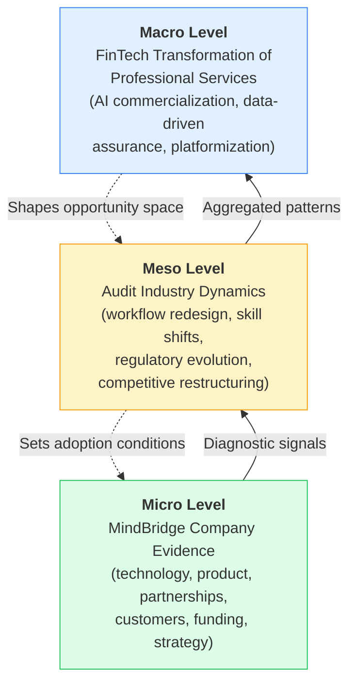
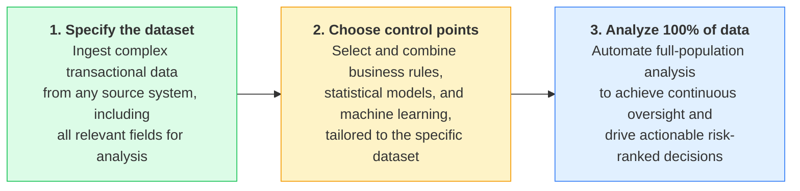

# MindBridge: AI-Driven Transformation of the Audit Industry — An In-Depth FinTech Case Study
# 1 Research Background and Analytical Framework

The accelerating diffusion of artificial intelligence into professional services is rewriting the operating logic of industries that have long defined themselves through human judgment, regulatory rigor, and methodological tradition. Few sectors illustrate this tension more vividly than external and internal auditing—a discipline where sampling-based testing, manual ledger reviews, and rules-based exception reports have remained the dominant paradigm for decades despite the exponential growth in transaction volumes and data complexity at audited entities. Against this backdrop, a new generation of FinTech-adjacent companies is applying machine learning, statistical modeling, and risk-scoring engines to financial assurance workflows, promising to convert audit from a periodic, sample-driven exercise into a continuous, full-population, risk-intelligence discipline. **MindBridge, an Ottawa-headquartered AI risk-analytics company founded in 2015, sits squarely at the leading edge of this shift and therefore offers a particularly instructive case for understanding how FinTech transforms a tradition-bound industry.**

This opening chapter establishes the foundations on which the remainder of the report is built. It explains why MindBridge—rather than a larger ERP vendor or a general-purpose analytics platform—merits a dedicated case study; specifies the temporal, geographic, and analytical boundaries that constrain the inquiry; formalizes the core research questions; introduces a multi-level analytical framework that ties company-specific evidence to industry-wide transformation; and previews how the subsequent seven chapters jointly answer the research questions raised here. Because the analysis is grounded in publicly available information current as of early 2024, the chapter is also deliberate about flagging where evidence is robust, where claims are vendor-attributed, and where readers should treat statements as illustrative rather than definitive.

## 1.1 Rationale for Selecting MindBridge as a Case Study

The choice of MindBridge as the focal case is driven by four converging considerations that, taken together, make the company an unusually informative lens on FinTech-driven audit transformation. Each consideration is articulated below with the analytical caveats appropriate to a case study based on secondary sources.

First, **MindBridge is widely cited as one of the earliest commercially deployed AI platforms purpose-built for financial assurance rather than retrofitted from general business analytics.** Founded in 2015 by Solon Angel and launching its initial AI Auditor product the following year, the company predates much of the recent wave of AI audit-tech entrants and therefore offers a rare longitudinal vantage point on what early AI-native audit platforms look like once they have matured through multiple product generations. This pioneer positioning—frequently characterized in MindBridge's own communications as the "world's first commercial AI Auditor"—should be read as a vendor claim rather than an independently verified historical fact; nevertheless, the temporal lead-time itself is well documented and analytically consequential, because it allows the case to illustrate not only product design choices but also the institutional learning curve associated with selling AI into a risk-averse profession.

Second, **MindBridge has accumulated a meaningful base of validation signals from established players in the audit and finance ecosystem.** Its alliance with KPMG, embedded within the KPMG Clara smart audit platform, is the most consistently corroborated of these signals and constitutes a particularly significant marker because the Big Four are characteristically cautious about external technology dependencies in their core assurance workflows. Other widely cited relationships—including engagements with BDO and enterprise customers such as Chevron—reinforce this impression of professional-services traction, though they are reported with varying degrees of public confirmation and are treated in later chapters with appropriately hedged language. The cumulative pattern, regardless of the status of any single relationship, is that MindBridge has crossed the threshold from technology demonstrator to embedded supplier within parts of the audit profession.

Third, **MindBridge offers a sharp methodological contrast to the incumbent audit-tech stack**, which has historically consisted of generalized data-analytics tools (such as ACL/Galvanize or IDEA), spreadsheet-centric review workflows, and rules-based exception reporting layered on top of ERP general ledgers. By foregrounding an "Ensemble AI" approach that combines machine learning with statistical anomaly detection and traditional rules, MindBridge embodies the conceptual shift from deterministic, auditor-scripted tests to probabilistic, risk-scored evaluation of complete transaction populations. Studying MindBridge therefore makes visible, in concrete product terms, the broader move from sampling to full-population testing that is reshaping the economics and assurance value of audit engagements.

Fourth, **MindBridge's recent capital-raising trajectory signals that it is no longer a venture experiment but a scale-stage FinTech company under serious investor scrutiny.** Most notably, the USD 60 million growth investment led by PSG Equity in July 2023 brought cumulative funding to approximately USD 81 million and shifted the company from early-stage venture capital toward growth equity, which typically requires evidence of repeatable commercial traction. This funding profile makes MindBridge representative of a class of FinTech firms that have moved beyond proof-of-concept into industry restructuring—precisely the population most relevant for a study of transformation rather than experimentation.

Taken together, these four factors—pioneer status, ecosystem validation, methodological contrast with incumbents, and growth-equity-stage maturity—make MindBridge what social-science methodologists would call a *critical case*: one in which the dynamics under study (AI penetrating a conservative, regulation-heavy profession) are visible in unusually sharp form. **The case is not chosen because MindBridge is the largest, the most profitable, or the eventual winner of the AI-audit category; it is chosen because the patterns it exhibits are diagnostic of the industry-level transformation the report seeks to understand.**

## 1.2 Research Scope, Boundaries, and Data Cutoff

To preserve analytical discipline and avoid overreach, this study operates within explicitly defined boundaries along temporal, geographic, and substantive dimensions.

**Temporal scope.** All factual claims, leadership designations, funding figures, partnership characterizations, and competitive comparisons in this report are intended to reflect the state of MindBridge and its market environment as of early 2024 (approximately January–February 2024). Where information available in the public record postdates this cutoff—for example, subsequent funding rounds, leadership changes after the period, or new product launches—it is excluded from the analytical baseline. Conversely, the report treats Stephen DeWitt's appointment as Chief Executive Officer, effective 16 January 2024, as the current leadership state, even though several widely circulated profiles of the company still reference the prior CEO Eli Fathi. This temporal discipline is essential because both the AI-audit market and MindBridge itself have been evolving rapidly, and conflating different time horizons would undermine the report's analytical credibility.

**Geographic and market scope.** MindBridge's headquarters in Ottawa, Canada, and its principal commercial footprint in North America, the United Kingdom, and broader Anglophone audit markets define the primary geography of the study. The report does not attempt comprehensive coverage of regional variants of AI-audit adoption in continental Europe, Asia-Pacific, or emerging markets except where such coverage is necessary to contextualize MindBridge's competitive position. The customer segments examined are predominantly external audit firms (ranging from Big Four down through national and regional firms), large enterprise internal audit and finance functions, and—through partnerships—the indirect end-users of platforms such as KPMG Clara.

**Substantive scope.** The analysis covers six dimensions: (i) corporate fundamentals (founding, leadership, funding, headcount, compliance posture), (ii) product architecture and underlying technology, (iii) value proposition and differentiation versus traditional tools, (iv) market position and competitive landscape, (v) partnerships and customer relationships, and (vi) industry-level transformation effects. Out-of-scope areas include detailed financial valuation modeling (such as discounted-cash-flow estimates or comparable-company multiples for which reliable inputs are not publicly available), private operational metrics (such as ARR, churn, or unit economics not disclosed by the company), proprietary product internals beyond what is publicly described, and speculative post-2024 roadmap projections. Where forward-looking observations are offered in Chapter 7, they are framed as plausible trajectories rather than predictions.

**Evidentiary standards.** Consistent with the case-study methodology adopted here, claims are stratified by source confidence. High-confidence claims—such as the 2015 founding year, Ottawa headquarters, July 2023 PSG Equity-led round, and KPMG Clara alliance—are corroborated by multiple independent sources and treated as the report's factual spine. Medium- and low-confidence claims, including specific performance metrics cited in vendor materials (e.g., "60% reduction in false positives," "100% transaction coverage") and certain customer relationships reported in press coverage, are presented with attribution and hedged language. **This stratification is essential because vendor-marketing literature is unavoidably part of the evidence base for a privately held company, and the report must distinguish between what is independently verifiable and what is asserted by the company itself.**

## 1.3 Core Research Questions

Following directly from the user's stated information needs and the rationale developed above, the report is organized around four interrelated research questions. Each is framed to elicit not only descriptive content but also analytical interpretation relevant to FinTech-driven industry transformation.

| # | Research Question | Why It Matters for FinTech Transformation |
|---|-------------------|-------------------------------------------|
| RQ1 | **What is MindBridge as a company and platform?** Who founded it, when, where, with what capital, leadership, and strategic positioning? | Establishes the institutional foundation required to interpret all subsequent analysis; situates MindBridge within the broader population of growth-stage FinTech firms. |
| RQ2 | **What specific audit and risk-detection functions does the platform perform, and on what technology stack?** What does "Ensemble AI" mean operationally, and which audit workflows are addressed by which modules? | Concretizes the abstract idea of "AI in auditing" into specific capabilities, allowing the report to assess whether the transformation is genuine technological substitution or repackaged analytics. |
| RQ3 | **How does MindBridge's approach differ from incumbent rules-based and sampling-based audit tools, and what is its competitive position relative to peer AI-audit vendors?** | Tests whether MindBridge's advantages are structural (full-population coverage, probabilistic risk scoring) or marginal, and benchmarks the company against rivals such as Fieldguide, DataSnipper, Prudent AI, Valid8 Financial, and AuditFile. |
| RQ4 | **Why does MindBridge matter for the future of the audit profession and the broader FinTech landscape?** What second-order effects—on auditor skills, audit quality, regulation, and engagement economics—does its adoption imply? | Connects the company-specific case to the macro-level transformation thesis, which is the user's ultimate research interest. |

Each question is sequenced to build cumulatively: RQ1 supplies the foundational facts; RQ2 deepens the technical understanding; RQ3 introduces comparative perspective; and RQ4 lifts the analysis from a single firm to an industry argument. **Readers should expect that the persuasiveness of the answer to RQ4 depends critically on the integrity of the answers to RQ1–RQ3, which is why earlier chapters emphasize evidentiary rigor before later chapters venture into interpretive synthesis.**

## 1.4 Analytical Framework Linking Company to Industry Transformation

A purely descriptive company profile would not adequately serve the research objective of understanding how FinTech transforms traditional industries. The report therefore adopts a three-level analytical framework that explicitly maps company-level evidence onto industry-level outcomes. The framework is depicted below and elaborated thereafter.

**Micro level — MindBridge-specific evidence.** At the base of the framework sit the directly observable facts about MindBridge: its Ensemble AI architecture, the structure of its general ledger / payroll / revenue / vendor invoice / company card risk modules, its cloud deployment posture, its SOC 2 and ISO 27001 certifications, its funding history, its leadership team, and the partnerships and customers it has secured. These facts are the empirical raw material of the case study, gathered with the source-confidence discipline described in Section 1.2.

**Meso level — audit industry dynamics.** The framework's middle layer translates micro evidence into industry-level patterns: the shift from sampling to full-population testing, the move from periodic engagement-based audits to continuous monitoring, the redefinition of the auditor role from data preparer to risk interpreter, the evolution of professional standards (such as SAS 99, CAS 240, and ISA 240) to accommodate algorithmic procedures, and the restructuring of competitive dynamics among audit firms as technology investment becomes a differentiator. MindBridge's product features map onto these patterns—for example, 100% transaction coverage is a micro-level capability whose meso-level analogue is the structural displacement of statistical sampling as the default assurance methodology.

**Macro level — FinTech transformation of professional services.** At the top, the framework situates audit-industry change within the broader FinTech transformation of finance, accounting, and professional services more generally: the commercialization of machine learning in regulated domains, the platformization of previously bespoke advisory work, and the rise of data-centric rather than process-centric assurance. MindBridge's significance is ultimately judged at this level—not by whether the company wins its niche, but by whether the changes it embodies prove to be durable features of how professional assurance is produced and consumed.

**Directional logic.** The framework operates bidirectionally. Upward arrows capture how micro-level evidence aggregates into industry patterns and ultimately illuminates macro trends; downward arrows recognize that macro-level forces (capital availability for AI startups, regulatory permissiveness toward algorithmic procedures, client demand for continuous assurance) shape the conditions under which MindBridge can operate at the micro level. **By making these linkages explicit, the framework guards against two failure modes common in single-company case studies: (i) over-generalizing from one firm's specifics, and (ii) under-utilizing the firm's specifics as diagnostic evidence about broader change.**

This framework also disciplines the analytical depth requirement that animates the report. Each subsequent chapter is expected to do more than enumerate facts; it must connect those facts upward to meso- and macro-level implications. For instance, the discussion of MindBridge Academy in Chapter 4 is not merely a feature description but a window onto how AI vendors are addressing the talent-readiness bottleneck that constrains industry-wide AI adoption.

## 1.5 Report Structure and Chapter Roadmap

The remaining seven chapters of the report are sequenced to address the four research questions cumulatively, moving from foundational facts to strategic synthesis. The table below summarizes the function of each chapter and its primary contribution to the overall argument.

| Chapter | Title | Primary Research Question Addressed | Contribution to the Argument |
|---------|-------|--------------------------------------|------------------------------|
| 2 | Company Overview and Corporate Profile | RQ1 | Establishes the verified factual baseline (founding, leadership, funding, headcount, compliance) that anchors all subsequent analysis. |
| 3 | MindBridge AI Platform: Product Architecture and Core Technologies | RQ2 | Explains what the platform is, how Ensemble AI works, and which audit workflows the functional modules address. |
| 4 | Key Advantages, Differentiating Features, and Value Proposition for Auditing | RQ2 + RQ3 | Translates technical capabilities into concrete audit benefits and contrasts them with rules-based and sampling-based incumbents. |
| 5 | Market Position, Competitive Landscape, and Strategic Partnerships | RQ3 | Benchmarks MindBridge against peer AI-audit vendors and analyzes the validation signals embedded in its partnerships and customer base. |
| 6 | Industry Impact: How MindBridge Is Reshaping the Audit Profession | RQ4 | Lifts the analysis from company to industry, examining shifts in workflows, skills, regulation, and engagement economics. |
| 7 | Challenges, Limitations, and Future Outlook | RQ4 | Critically examines constraints (explainability, integration, regulation, competition) and projects plausible trajectories within the early-2024 horizon. |
| 8 | Conclusions and Strategic Insights | RQ1–RQ4 (synthesis) | Consolidates findings and delivers stakeholder-specific insights for audit firms, finance leaders, regulators, and investors. |

The narrative arc is deliberately constructed so that **descriptive chapters (2–3) establish what is true, analytical chapters (4–5) establish what is distinctive, interpretive chapters (6–7) establish what is at stake, and the concluding chapter (8) establishes what readers should do with the findings.** Readers primarily interested in the FinTech transformation thesis may find Chapters 6 and 8 most directly relevant, but the credibility of those later arguments depends on the evidentiary work done in Chapters 2–5. The report is therefore best read sequentially, even though individual chapters are designed to be intelligible on their own.

With the rationale, scope, research questions, analytical framework, and roadmap now in place, the report turns in Chapter 2 to the foundational task of compiling and verifying the corporate facts that constitute MindBridge as an object of study.

# 2 Company Overview and Corporate Profile

Building on the rationale and framework established in Chapter 1, this chapter assembles the verified factual baseline that anchors the remainder of the report. Before MindBridge can be evaluated as a representative case of FinTech-driven audit transformation, its institutional foundations must be reconstructed with the source-confidence discipline outlined earlier: who founded it and why, how its leadership has evolved, what capital structure underpins its operations, what scale it has reached, what cultural and ethical commitments it professes, and what compliance credentials it has accumulated. Each of these dimensions is examined below, with multi-source corroboration where possible and explicit hedging where evidence is single-sourced or vendor-attributed. **Beyond enumeration, the chapter interprets these facts as the institutional preconditions that allow an AI-native vendor to penetrate the conservative, regulation-heavy audit profession**—a theme that recurs at every level of the analytical framework introduced in Chapter 1.

## 2.1 Founding Story, Origins, and Strategic Genesis

MindBridge Analytics Inc. was founded in 2015 in Ottawa, Canada, by Solon Angel as the company's concept originator and chief strategy officer, alongside Eli Fathi who served as the founding chief executive officer[^1][^2][^3]. The founding date and location are corroborated across multiple independent sources—including The Globe and Mail's 2018 founder profile, BetaKit's funding and leadership coverage, FinTech Global, and the company's own press releases—making these among the highest-confidence facts in the report's evidentiary spine[^1][^4][^5][^6].

The intellectual genesis of the company is closely tied to Angel's personal and professional history. In a long-form interview with The Globe and Mail, Angel explained that the 2008 global financial crisis was the proximate trigger: "After the 2008 global financial crisis, Mr. Angel aimed to come up with something that might keep it from happening again. In 2015, he launched Mindbridge with the goal of transforming the financial auditing business with machine learning, or artificial intelligence"[^1]. A more distal motivation lay in family history—Angel disclosed that his grandfather's business in France had been decimated by "a crooked CEO with an accountant accomplice," an experience that, decades later, gave moral weight to the founders' mission of using AI to surface financial misconduct[^1]. This combination of macro-financial concern and personal narrative is consequential because it explains why MindBridge was conceived from inception as a *purpose-built* audit-AI platform rather than as a general analytics tool retrofitted to assurance use cases.

The operational starting point of the product itself dates to March 2017, when MindBridge released its flagship Ai Auditor application[^7]. By that point Angel had relocated from Silicon Valley to Ottawa—originally for personal reasons, but ultimately benefiting from what he characterized as a "small ecosystem" punching "way above its weight," with Shopify having recently established Ottawa as a credible Canadian tech hub[^1]. The choice of Ottawa is analytically significant because it placed MindBridge within reach of Canadian federal innovation programs (which would later contribute substantial non-dilutive capital, as discussed in §2.3) while distancing the company from the more crowded Toronto-Waterloo corridor. **This founding context establishes MindBridge as an AI-native, mission-driven, geographically distinctive entrant—precisely the profile most likely to embody, rather than merely participate in, the FinTech transformation thesis at the heart of this report.**

## 2.2 Leadership Team and Executive Evolution

MindBridge's executive leadership has passed through three identifiable phases that, together, narrate the company's transition from founder-led venture to growth-equity-stage scale-up. Mapping these phases is essential because the leadership state as of early 2024 differs materially from what is still reflected in older company profiles and third-party databases.

**Phase 1 — Founder era (2015 to mid-2021).** Eli Fathi served as CEO from founding, with Angel in a strategy and development-focused role; the two retained majority common-share control during the seed and early venture phases[^3][^8]. Fathi's stewardship spanned the period in which MindBridge moved from prototype to commercialized AI Auditor and signed early high-profile users such as the Bank of England[^1][^7].

**Phase 2 — Commercial-scaling era (July 2021 to mid-2023).** Leyton Perris, an experienced enterprise software sales leader, became CEO in July 2021, replacing Fathi who transitioned to chairman of the board[^9]. Under Perris, MindBridge "ramped up its sales efforts and the company's annual revenues grew more than sixfold over the past two years, surpassing $20 million in 2022"[^9][^4]. The standout commercial event of this period was the April 2023 global deal with KPMG to embed MindBridge software into the firm's digital-accounting platform—a partnership analyzed in greater depth in Chapter 5[^4][^9].

**Phase 3 — Transition and growth-equity era (mid-2023 onward).** Mid-2023 brought a compressed sequence of executive changes. Co-founder Solon Angel departed to pursue "another specific idea in accounting tech" and later joined Fresh Founders as managing partner, while CEO Leyton Perris also left "for undisclosed reasons"[^4][^9]. PSG Equity senior advisor Bill Hewitt was appointed interim CEO in July 2023 alongside the firm's USD 60 million growth investment[^9][^6]. The interim phase concluded on **16 January 2024**, when MindBridge announced the appointment of Stephen DeWitt as permanent CEO, with Hewitt remaining on the board[^10][^5].

DeWitt's biographical profile signals the company's deliberate pivot toward proven enterprise software leadership. He most recently served as CEO of CloudBees, a leader in enterprise software delivery, and previously led WorkMarket through its sale to ADP and Cobalt Networks from early stage through IPO and subsequent acquisition by Sun Microsystems[^5]. He has also held senior executive positions at HP, Cisco, Symantec, and Sun Microsystems[^5]. Eli Fathi, in his role as board chair, framed the appointment as "another milestone on our journey to be a leader in the AI economy," emphasizing DeWitt's track record of "establishing leadership positions in nascent markets"[^5].

The table below summarizes the leadership trajectory and its analytical significance.

| Phase | Period | CEO | Strategic Posture |
|-------|--------|-----|-------------------|
| Founder era | 2015 – Jul 2021 | Eli Fathi (founder) | Product invention, early customer acquisition, R&D-first culture[^1][^7] |
| Commercial scaling | Jul 2021 – Jul 2023 | Leyton Perris | Sales build-out; 6× revenue growth to >USD 20M; KPMG global deal[^9] |
| Interim transition | Jul 2023 – Jan 2024 | Bill Hewitt (PSG advisor) | Bridge management following PSG Equity investment[^9][^6] |
| Growth-equity scale-up | From 16 Jan 2024 | Stephen DeWitt | Enterprise scale, category leadership, AI-economy positioning[^10][^5] |

**The arc from a fraud-experienced founder, through a sales-oriented operator, to an institutionally seasoned scale-up CEO mirrors the typical maturation path of a FinTech firm crossing from venture-funded experimentation into industry-restructuring scale.** It also signals to the broader audit ecosystem—particularly the Big Four and large national firms whose procurement standards are central to MindBridge's commercial trajectory—that the company is being prepared for sustained enterprise engagement rather than acquisition by a strategic buyer at the earliest opportunity.

## 2.3 Funding History and Capital Structure

MindBridge's capital history can be reconstructed as a cumulative sequence that begins with founder, angel, and friends-and-family investment and culminates in a growth-equity-stage round materially altering the company's investor composition. Aggregate disclosed funding stood at approximately **USD 81.17 million across five rounds** as of the early-2024 baseline[^2].

The earliest external capital came from Ottawa-centric angel investors, including the Capital Angel Network, and from individual founder-investors connected to the Fresh Founders network—Angel later disclosed that "the first three or four investors in MindBridge came from Fresh Founders"[^4]. Sam Zaid, the founder of car-sharing platform Getaround, was among the early personal investors[^4]. Founders retained majority control through this phase, supported by standard four-year vesting and right-of-first-refusal protections[^3].

A first major institutional milestone arrived in 2017 with a Series A round, followed in 2019 by a combined CAD 29.6 million package that became the company's funding inflection point. According to Accounting Today and BetaKit, the 2019 package included a Series B round of approximately USD 11.4–15.1 million led by New York–based PeakSpan Capital—with participation from Real Ventures, the National Bank of Canada, The Group Ventures, and Reciprocal Ventures—paired with a separate USD 11–14.5 million grant from the Government of Canada's Strategic Innovation Fund earmarked to "accelerate the development of artificial intelligence technology"[^9][^6][^7]. By 2019 the company reported having raised over USD 45 million in total[^9][^6]. This blended public-private funding model is itself analytically notable: it reflects how AI-driven FinTech firms in Canada have been able to combine venture capital discipline with industrial-policy support, lowering the cost of capital relative to peers in jurisdictions without comparable programs.

The defining capital event of MindBridge's recent history is the **USD 60 million growth round led by PSG Equity, a Boston-based growth-stage investment firm**, announced in July 2023[^9][^6]. The structure of the round is more revealing than the headline number: according to reporting confirmed by BetaKit, approximately **USD 15 million constituted primary capital injected into the company, while the remainder was used to purchase shares from existing investors**—a typical pattern in growth-equity transactions that provides partial liquidity to early backers while consolidating institutional ownership[^9]. The Globe and Mail reported the round valued MindBridge at approximately **CAD 200 million, roughly double its post-Series B valuation**[^9]. PSG Equity describes itself as a "growth equity firm that partners with software technology-enabled services companies to help them navigate transformational growth," a positioning that fits MindBridge's stage profile[^11].

The table below consolidates the funding sequence into a single reference.

| Year | Round / Event | Amount | Lead / Key Participants |
|------|---------------|--------|--------------------------|
| 2015–2017 | Founders, friends-and-family, angels (incl. Capital Angel Network, Fresh Founders network) | Seed | Solon Angel, Eli Fathi, Sam Zaid and others[^4][^3] |
| Jun 2017 | First reported funding round (grant) | USD 10.93M | First disclosed round[^2] |
| 2019 | Series B | ~USD 11.4–15.1M | PeakSpan Capital (lead), Real Ventures, National Bank of Canada, The Group Ventures, Reciprocal Ventures[^9][^7] |
| 2019 | Strategic Innovation Fund grant | ~USD 11–14.5M | Government of Canada / ISED[^9][^7] |
| Jul 2023 | Growth-equity round (~USD 15M primary + secondary) | USD 60M | PSG Equity (lead)[^4][^9][^6] |
| **Total disclosed (early 2024)** | | **~USD 81.17M across 5 rounds** | 9 investors total[^2] |

**Two interpretive points emerge.** First, the shift from venture capital (PeakSpan, Real Ventures) to growth equity (PSG) signals that MindBridge is no longer being financed on the basis of technology promise alone; growth equity expects repeatable commercial traction, validating the inference that MindBridge has crossed from experimentation into scale-stage maturity. Second, the secondary component of the PSG round means that founders and early backers have already begun to monetize—Angel's subsequent departure was, by his own account, contingent on precisely this kind of liquidity event[^4]—which alters governance dynamics in ways that bear on the company's strategic flexibility going forward.

## 2.4 Organizational Scale, Headquarters, and Geographic Footprint

MindBridge's principal place of business is its global headquarters at **80 Aberdeen Street, Suite 400, Ottawa, Ontario K1S 5R5, Canada**, a location consistently confirmed across company materials and third-party databases[^12][^13]. The company maintains additional offices in the United States and in London for European coverage, organized as a three-region footprint (North America HQ, USA, Europe) consistent with the geographic distribution of its primary audit and enterprise customer base[^12].

Headcount has expanded substantially since the company's earliest public profile. In 2018 The Globe and Mail reported "more than 50 employees"[^1], and Accounting Today described a workforce "tripling" between 2017 and the 2019 funding announcement[^7]. By the early-2024 baseline, third-party company-data sources report approximately **150 employees**, consistent with MindBridge's own characterization of itself as "employing 150+ professionals"[^3][^14]. While employee-count figures from secondary databases should be treated as approximate rather than authoritative, the order of magnitude is corroborated and indicates a roughly threefold expansion since the late-2010s.

Available signals about the functional composition of the workforce suggest a typical enterprise-SaaS distribution skewed toward engineering and commercial functions—software development, sales and marketing, product management, data analysis and operations, customer success, and finance/legal/operations being the visible departmental clusters[^2]. For an AI vendor selling into a regulation-sensitive, globally regulated profession, this distribution is operationally consequential: the platform must be engineered to high security standards, sold through specialist enterprise channels, and supported by domain experts who can bridge the gap between machine-learning outputs and audit-standards-compliant documentation.

The company's only disclosed inorganic expansion to date is the **2022 acquisition of Brevis, a cloud-based practice-management software vendor for accountants** founded in 2019[^2]. Although the financial terms are not publicly available, the acquisition is strategically coherent with MindBridge's positioning: integrating practice-management capabilities extends the platform's relevance from transaction-level analytics into the broader workflow context of accounting and audit firms, deepening switching costs and addressable wallet share.

## 2.5 Mission, Vision, and Corporate Culture

In its own press materials, MindBridge consistently characterizes itself as "the global leader in AI-driven financial risk discovery for audit and internal controls that help financial professionals access better ways of working by identifying, surfacing, and analyzing risk across broad financial datasets"[^5][^15]. The phrase "AI-powered financial risk discovery platform" has become the company's standardized self-description across press releases, funding announcements, and product pages[^4][^5][^6]. As of early 2024, the company's website framed its purpose as "Autonomous Financial Oversight" for finance, accounting, and audit teams, with the operational commitment to "Analyze 100% of transactions across financial systems, entities, and processes"[^15].

Third-party business-model commentary articulates a parallel formulation in slightly more formal language: an ostensible mission to "empower the world with financial integrity by providing the most advanced AI-driven risk discovery platform" and a vision to "be the global standard for financial risk discovery, ensuring every financial transaction is transparent and trusted"[^16]. **It should be noted that these specific verbal formulations are drawn from a third-party business-model commentary rather than from MindBridge's own published mission statements; they are treated here as illustrative paraphrases consistent with the company's public communications rather than as the company's official wording.**

The cultural values attributed to MindBridge by both internal and external commentary cluster around four themes: **care** (empathy and respect for colleagues, customers, and community), **integrity** (commitment to explainable AI documentation and regulator-defensible model outputs), **courage** (willingness to engage with regulators and challenge entrenched audit norms), and **innovation** (sustained R&D investment and continuous model improvement)[^16]. Operational mechanisms reportedly used to reinforce these values include MindBridge University as an internal-and-external training vehicle, a Values-In-Action recognition program, quarterly town halls aligning product decisions with stated values, and a Global Advisory Board that vets product releases against the mission of improving financial integrity[^16]. Again, these specific operational mechanisms are drawn principally from third-party commentary and are presented as illustrative rather than independently verified.

What is independently verifiable—and analytically more important—is the *strategic alignment between the professed culture and the demands of the audit profession*. CTO Robin Grosset, in announcing the company's ISO 27001 certification, made the alignment explicit: "From the beginning we have taken security and compliance as a priority and a serious responsibility spanning the organization. We understand that our customers are trusting us with their business and their data, and often with their client's data"[^17]. **This articulation matters because the assurance profession's tolerance threshold for algorithmic decision-making is conditional on exactly the values MindBridge emphasizes: transparency, explainability, security, and demonstrable rigor.** A vendor culture that privileged engineering velocity over auditability would struggle to embed itself in Big Four or national-firm workflows; the cultural posture MindBridge projects is therefore a strategic asset, not merely an HR artifact.

## 2.6 Security, Compliance, and Certification Posture

The most independently verifiable dimension of MindBridge's institutional profile is its security and compliance certification stack. As of early 2024 the company holds a substantial portfolio of internationally recognized attestations and certifications, each obtained through formal third-party audit.

| Domain | Standard / Attestation | Auditor / Body | Status |
|--------|------------------------|----------------|--------|
| Service organization controls | SOC 1 Type 2; SOC 2 Type 2; SOC 3 Type 2 (under SSAE 18) | A-LIGN | Achieved (SOC 2 Type 2 since 2020)[^13][^18] |
| Information security management | ISO/IEC 27001:2013 (Jan 2022), upgraded to ISO/IEC 27001:2022 | A-LIGN (ANAB-accredited) | Certified[^13][^18][^17] |
| Cloud-specific security | ISO/IEC 27017:2015 | A-LIGN | Certified[^13][^18] |
| PII in public cloud | ISO/IEC 27018:2019 | A-LIGN | Certified[^13][^18] |
| Algorithm assurance | Holistic AI accreditation | Holistic AI | Awarded ("accredited by Holistic AI, a world-leading expert in best practices and standards for AI systems")[^5] |
| Professional accreditation | ICAEW accreditation; UCLC Algorithm Validation (world-first algorithm audit) | ICAEW / UCLC | Achieved[^17] |

Several interpretive observations follow. First, the trio of SOC 1, SOC 2, and SOC 3 Type 2 reports together address financial reporting controls, security/availability/confidentiality controls, and publicly shareable trust criteria—precisely the three audit-firm procurement gates that an AI vendor must satisfy[^18]. Second, the layered ISO certifications (27001 for information security management, 27017 for cloud-specific controls, 27018 for personally identifiable information in public cloud) signal that the company has invested in *cloud-native* security governance rather than retrofitting on-premise controls to a SaaS delivery model[^13][^18]. Third, the Holistic AI accreditation and the UCLC algorithm validation are unusually distinctive: they extend the certification surface from infrastructure security into *algorithmic* assurance, a domain where formal third-party validation remains rare across the AI-software industry[^5][^17].

**This certification stack is not merely a procurement checklist; it is the institutional currency through which an AI vendor purchases the right to operate inside the audit profession.** Big Four and national audit firms cannot embed third-party software into engagements without demonstrable evidence that the vendor itself meets professional-standard security and control expectations; the cumulative investment MindBridge has made in attestations effectively pre-clears procurement objections that would otherwise stall pilot conversions. At the meso level introduced in Chapter 1, this dynamic helps explain why the diffusion of AI in audit has been uneven: vendors without comparable compliance investments face structural barriers to adoption that no amount of product superiority can overcome.

## 2.7 External Recognition and Industry Validation Signals

Independent recognition complements the certification stack as a third-party signal of MindBridge's category standing. As of the early-2024 baseline, the most consistently corroborated honors include:

- **World Economic Forum Technology Pioneer (2020)** — referenced both in company press materials and in independent media coverage[^5][^17].
- **Forbes Top 50 AI Firms to Watch (2021)** — cited in MindBridge's ISO 27001 announcement and in third-party profiles[^5][^17].
- **Gartner Cool Vendor (2022)** — displayed among certifications and awards on MindBridge's corporate site[^15].
- **Deloitte Technology Fast 50 / Fast 500** — high-growth recognition for Canadian and North American technology companies, displayed in the company's awards catalog[^15].
- **G2 Leader rankings (including Spring 2024 and Financial Audit Leader designations)** — peer-review-based software category leadership[^15].
- **AI Breakthrough, AIFinTech100, Top FinTech, GRC Innovation, Top AI Financial Intelligence, Report on Business, and AI Excellence Award (2022) recognitions** — a portfolio of category and regional awards consistent with sustained industry visibility[^15].

Alongside these third-party honors, MindBridge has publicized self-reported operational milestones. The company's January 2024 announcement of DeWitt's appointment referenced an "ever-expanding repository of meaningful data," and a preceding press release titled "MindBridge marks 2023 with significant investment, new executives, strong top-line results and over 100 billion financial entries scored" placed the year-end 2023 cumulative-entries figure above 100 billion[^5]. The current company website cites an even larger figure—"over 260 billion transactions analyzed across 3,000+ ERP systems, with over 8,000 GAAP rules embedded"—reflecting growth beyond the early-2024 baseline; this report uses the over-100-billion figure as the contemporaneous reference, while noting that such metrics are vendor-attributed and not independently audited[^5][^15].

**Taken together, the recognition portfolio establishes that MindBridge has achieved category-level visibility, which is itself a precondition for the industry-transformation claims this report will assess in later chapters.** Awards and rankings are not substitutes for verified outcome metrics—and Chapter 4 will return to this distinction when evaluating vendor-claimed performance benefits—but their cumulative weight, particularly the WEF Technology Pioneer designation and the multi-year Forbes and Gartner recognitions, provides corroborating evidence that MindBridge is widely perceived within the AI-finance ecosystem as a category-defining player rather than a peripheral entrant.

---

With these seven dimensions documented—origins, leadership, capital, scale, culture, compliance, and recognition—MindBridge is now established as an institutional entity with a verifiable factual spine: a 2015-founded, Ottawa-headquartered, Stephen DeWitt-led, growth-equity-stage AI vendor with ~USD 81 million in cumulative funding, roughly 150 employees, a defensible compliance posture, and broadly recognized category visibility. **This baseline carries the temporal-accuracy and source-stratification discipline established in Chapter 1 into the remainder of the report, providing the empirical foundation against which subsequent chapters will assess what MindBridge does technologically (Chapter 3), how it differs from incumbent tools (Chapter 4), where it stands competitively (Chapter 5), and ultimately what it portends for the audit profession as a whole (Chapters 6–8).** The chapter that follows turns from the company to the product, opening the technical architecture of the MindBridge AI platform to examine how the institutional preconditions documented here translate into operational AI capabilities for auditors.

# 3 MindBridge AI Platform: Product Architecture and Core Technologies

Chapter 2 closed by establishing MindBridge as an institutional entity with a verifiable factual spine—2015 founding, Ottawa headquarters, growth-equity-stage capitalization, ~150 employees, defensible compliance posture, and broad category recognition. Those institutional preconditions, however, are merely the scaffolding on which the actual object of analysis—the MindBridge AI platform—is built. To understand whether MindBridge genuinely embodies a structural shift in audit methodology or simply repackages familiar analytics under a fashionable AI label, the analysis must descend from corporate facts to product architecture. **This chapter therefore opens the technical chassis of the platform, examining what it is conceptually, how its proprietary Ensemble AI methodology operates, which audit workflows its five functional modules address, how its outputs are scored and explained, and what deployment and integration architecture allows full-population analysis to be performed at enterprise scale.** The chapter intentionally treats vendor-attributed quantitative claims—coverage thresholds, false-positive reductions, ERP-connector counts, transaction-scale ceilings—with the source-stratification discipline established in Chapter 1, presenting them with attribution rather than as independently audited measurements.

## 3.1 Platform Positioning and Conceptual Architecture

At the conceptual level, the MindBridge AI platform is positioned not as a replacement for existing financial systems of record but as an **independent oversight layer** that sits above them, ingesting transactional data from heterogeneous sources and producing AI-generated risk intelligence for assurance and continuous-monitoring purposes. The company describes this positioning in unusually explicit terms: "MindBridge AI delivers the independent oversight layer that enterprise CFOs need—scanning across fragmented systems, surfacing anomalies, and enabling confident decisions as finance becomes more autonomous"[^19]. This framing matters because it defines the platform's locus in the customer's technology stack: it does not compete with ERP vendors such as SAP, Oracle, or NetSuite for transactional throughput, but rather consumes their outputs and overlays a probabilistic risk-scoring discipline that those systems do not natively provide.

The platform's conceptual architecture is organized around three explicitly articulated design principles, each linked to a specific deficiency of the legacy audit-analytics paradigm. The first principle is **unbiased anomaly discovery**: surfacing "unusual data patterns that a human would rarely find" through "advanced machine learning" that operates "free from external influence and bias"[^19]. The implicit contrast is with rules-based exception reports, whose detection scope is bounded by the prior knowledge of whoever wrote the rules. The second principle is **scalable full-population analysis**, articulated as the capacity to "analyze up to 1 billion transactions in a single analysis, offering greater risk coverage and overcoming traditional data volume challenges"[^19]; this directly attacks the data-volume constraint that has historically made sampling the only economically feasible audit testing methodology. The third principle is **explainability**: "transparent AI and clear documentation provides credible results, creating trust in your most critical financial data"[^19], addressing the well-known concern that opaque algorithmic outputs cannot be defended to regulators, audit committees, or standards bodies.

Each of these design principles responds to what MindBridge characterizes as a widening **governance gap** in modern finance. The company frames the problem in two parts: first, "the governance gap continues to widen as financial workflows become more automated with AI"; and second, "other AI tools lack transparency that cannot be reliably audited or explained to stakeholders"[^19]. The proposed solution—"narrow the gap with an independent oversight layer above and across all financial systems of record" that delivers "full explainability"[^19]—is the platform's positioning statement in compressed form. **The conceptual move here is consequential for the broader transformation thesis**: MindBridge is not asking customers to abandon their existing financial systems, nor to trust an opaque black box; it is asking them to add a transparent, AI-driven oversight stratum on top of what they already operate. This incremental, additive positioning lowers the institutional barrier to adoption and is one reason an AI-native vendor has been able to embed itself in workflows that have historically been resistant to wholesale technology substitution.

The platform's dual audience positioning is equally important. The company explicitly targets two distinct buyer profiles—**external audit and advisory firms** on the one hand, and **internal audit, finance, and internal-control functions of large enterprises** on the other—through what is essentially the same technical architecture[^20][^21]. PSG Equity, MindBridge's lead growth investor, characterizes the company as serving "audit and advisory firms, and a wide variety of companies across multiple industries worldwide"[^21], confirming that the dual addressable market is recognized externally as well as internally. Operationally, a CPA firm consumes the platform episodically to support engagement-based assurance, while an enterprise CFO function consumes it continuously to support ongoing risk monitoring; the same control points and scoring engine serve both use cases, with deployment and governance configurations adapted accordingly. **This single-architecture-dual-market design is itself a meaningful indicator of FinTech transformation: it implies that the historical boundary between point-in-time external assurance and continuous internal monitoring is becoming an organizational rather than a technological distinction.**

## 3.2 The Ensemble AI Methodology: Combining Machine Learning, Statistical Models, and Business Rules

The technological core of the platform—and the element most consistently emphasized in MindBridge's own communications—is what the company terms its **Ensemble AI** approach. Operationally, this means combining three analytical layers into a single risk-scoring engine: "The platform combines statistical models, business rules, and unsupervised machine learning to detect risks that single-method solutions miss, delivering fully explainable and deterministic findings across all financial records"[^19]. Each layer is designed to compensate for the structural weaknesses of the others, and the ensemble output—rather than any single underlying model—is what auditors actually consume.

The three layers can be understood in functional terms as follows. **Unsupervised machine learning** discovers anomalies without requiring labeled training data, which is essential in audit contexts where confirmed fraud examples are rare, idiosyncratic, and often unavailable for model training. **Statistical models** characterize the distributional properties of transactional populations, flagging outliers in amount, timing, counterparty, account combinations, and similar dimensions; these methods are mathematically well-understood and produce results that are familiar to auditors trained in analytical procedures. **Business rules** encode the deterministic logic that auditors and accountants have long encapsulated in exception reports—posting outside business hours, round-dollar journal entries, weekend approvals, segregation-of-duties violations, and similar deterministic conditions. Independent technical commentary on the platform describes the engine in compatible terms: "Ensemble AI combines anomaly detection, supervised learning, and rules to score every transaction, producing ranked risk portfolios for auditors"[^20].

The methodological rationale for combining these layers, rather than relying on any single technique, is rooted in the asymmetric weaknesses of each. Pure rules-based systems—the historical default of audit-analytics tools such as ACL/Galvanize-style platforms—can only detect what they have been programmed to look for, and tend to generate excessive false positives when rule thresholds are conservative or substantial false negatives when thresholds are loose. Pure machine-learning systems can discover novel patterns but are vulnerable to opacity, instability across data refreshes, and adversarial concerns about reproducibility. By blending the three approaches, the ensemble engine aims to produce findings that are simultaneously **comprehensive** (covering both known and unknown risk patterns), **deterministic** (yielding repeatable outputs for the same inputs, a property MindBridge claims directly[^19]), and **explainable** (because each finding can be traced back to which control points contributed to its risk score).

The control-point library that operationalizes this methodology is unusually broad. The company describes "out of the box control points" that help "identify exceptions, duplicates, patterns, and anomalies, helping to signal where hidden risks and opportunities exist"[^19], with control-point selection adaptable to the dataset under analysis: "select and combine from a series of tests ranging from business rules, statistical models, and machine learning, tailored specifically for your dataset"[^19]. According to vendor-attributed external descriptions, the embedded domain knowledge extends to "over 8,000 GAAP rules embedded" in the platform, with cumulative analytical history spanning "260 billion transactions analyzed across 3,000+ ERP systems"—figures that, as noted in Chapter 2, reflect company-cited scale measures that should be treated as vendor-attributed rather than independently audited.

The performance benefits MindBridge attributes to the ensemble approach are likewise vendor-attributed but consistently reported across external commentary. Third-party analysis of the platform indicates that "continuous learning from historical audits reduces false positives by up to 60% and improves detection of complex fraud patterns over static rule engines," and that the underlying ETL and integration architecture together help "audits run ~40% faster and reducing false positives up to 60% versus legacy rule-based systems"[^20]. **Two interpretive caveats apply.** First, these metrics are reported in vendor-aligned commentary rather than peer-reviewed academic evaluation, and should be read as directional claims about the magnitude of improvement rather than as audited benchmarks; Chapter 4 returns to this question when evaluating the platform's competitive value proposition. Second, the comparison baseline ("legacy rule-based systems") is itself heterogeneous, encompassing everything from spreadsheet macros to mature CAATs platforms, so the realized benefit will inevitably vary across deployment contexts.

The high-level Ensemble AI workflow can be summarized as a three-stage logical pipeline, paraphrasing the platform-page sequence MindBridge itself uses to describe its operation[^19]:

What this pipeline encodes, beneath the marketing language, is a deliberate **substitution of probabilistic, ensemble-scored risk ranking for the deterministic, single-method exception reporting that has been the audit-analytics norm**. The substitution is consequential precisely because it is methodologically irreversible: once an auditor has come to expect a ranked portfolio of risk-scored transactions covering 100% of activity, the cognitive and procedural attractiveness of returning to threshold-based exception reports diminishes substantially.

## 3.3 Core Functional Modules and Audit Workflow Coverage

The Ensemble AI engine is exposed to users not as an undifferentiated analytics surface but through a set of **purpose-built risk-analytics modules**, each aligned with a specific financial cycle and the audit workflows that test it. Five primary modules are visible in MindBridge's current product taxonomy: General Ledger Analysis, Payroll Analysis, Vendor Analysis, Customer (Revenue) Analysis, and Travel & Expense (Company Card) Analysis[^22][^23]. Each module ingests a distinct data type, applies a configurable subset of the platform's control-point library, and surfaces risk findings calibrated to the fraud typologies and assertion-level concerns characteristic of that cycle.

The General Ledger module is the platform's analytical foundation, reflecting the centrality of journal-entry testing in modern audit methodology. MindBridge describes it as the capability to "leverage AI to analyze 100% of monetary flows, providing enhanced visibility across a company's financial data, leading to improved accuracy, risk assessment, and decision-making"[^23]. Reflecting the data-ingestion requirements, MindBridge documentation confirms that "Risk scoring and analytics" and "Trends and ratios" analyses are accessed "by importing a general ledger" (and opening balance, for trends and ratios)[^24]; this establishes the general ledger as the canonical data input around which other modules extend coverage.

The Payroll module addresses one of the cycles most prone to both error and intentional manipulation. It is positioned to "examine hourly rates, hours worked, unusual payment patterns, and more to reduce time and effort required for manual reviews," with anomaly detection focused on "identifying irregularities and inconsistencies which may indicate potential fraud or errors, ensuring the accuracy and integrity of financial data"[^22]. The Vendor Analysis module addresses third-party transaction risk, designed to "examine all vendor data to identify unusual patterns across users, contractors, companies, and other categories used in your business" and to "identify hidden risks, fraud, and compliance issues using advanced algorithms"[^23]. The Customer (revenue) and Travel & Expense modules complete the cycle coverage: the former analyzes "revenue data across customers, products, and regions" with AI-driven tests, while the latter offers "a comprehensive examination of your Travel and Expense (T&E) data" that "can scale across hundreds of millions of data points, pinpointing trend changes, unusual amounts, and tracking anomalies by specific dates, days of the week, or proper approvals"[^22][^23].

The table below maps each module to its data inputs, audit-cycle relevance, and the principal fraud and error typologies it is designed to address. Mapping commentary that interprets module outputs in terms of audit assertions is analytical rather than directly quoted from the source materials.

| Module | Primary Data Ingested | Audit Cycle Addressed | Representative Risk Drivers / Fraud Typologies |
|--------|----------------------|------------------------|--------------------------------------------------|
| **General Ledger Analysis** | General ledger journal entries; opening balances | Financial close, journal-entry testing (CAS/ISA 240) | Unusual posting timing, manual entries, reversing entries, round-dollar amounts, segregation-of-duties anomalies, anomalous account combinations |
| **Payroll Analysis** | Payroll transactions, hours worked, hourly rates | Human-capital cycle | Ghost employees, off-cycle payments, anomalous overtime, unusual hourly-rate adjustments, payment-pattern anomalies |
| **Vendor Analysis** | Vendor master data; AP invoice transactions | Procurement-to-pay | Duplicate invoices, anomalous vendor patterns, related-party indicators, unusual contractor relationships, compliance issues across vendor categories |
| **Customer (Revenue) Analysis** | Revenue transactions across customers, products, regions | Order-to-cash | Revenue-recognition anomalies, unusual discounting, period-end revenue patterns, customer/region outliers |
| **Travel & Expense Analysis** | Company card / T&E data (hundreds of millions of data points) | Disbursements and expense control | Anomalous amounts, unusual dates / days of week, approval-control bypasses, repeated small-value pattern abuse |

Across all five modules, MindBridge applies a consistent set of analytical primitives—**anomaly detection, risk scoring, risk segmentation, data exploration, prior-period comparisons, trend analysis, configurable analysis, and documented results**—drawn from the same underlying control-point library and exposed through module-appropriate user interfaces[^22][^23]. This deliberate reuse of analytical primitives across modules is architecturally important: it means that an auditor or finance analyst proficient with one module can move to another with minimal retraining, and that the platform's Ensemble AI improvements propagate across modules rather than being siloed by cycle.

**The collective effect of the module taxonomy is to translate AI capability into auditor-actionable workflows that mirror the traditional audit cycle.** This translation is not trivial. A generic anomaly-detection toolkit, however technically sophisticated, places the burden of cycle-specific interpretation on the auditor; MindBridge instead pre-structures its outputs around the cycles that audit methodology, professional standards, and engagement planning already organize work around. From the meso-level perspective introduced in Chapter 1, this design choice illustrates how AI-audit vendors must accommodate the institutional grammar of the profession in order to be adopted—a constraint that shapes product architecture as decisively as any underlying ML technique.

## 3.4 Risk Scoring, Segmentation, and Output Explainability

Whatever happens inside the Ensemble AI engine, what auditors and finance professionals actually consume are the platform's user-facing analytical outputs. These outputs are organized around four interlocking capabilities—**risk scoring, risk segmentation, supporting analytical visualizations, and auto-generated documentation**—which together aim to make full-population AI analysis operationally usable in real audit and monitoring workflows.

The cornerstone is the **transaction-level risk score**. MindBridge applies it as a uniform principle across modules: "100% of transactions are scored and organized based on the underlying advanced data analytics"[^22][^23]. Operationally, this means every transaction in the ingested population receives a numeric risk value derived from its ensemble evaluation, and transactions are ranked into risk portfolios that auditors can prioritize for investigation. Independent commentary on the platform describes the user-visible outcome as "ranked risk portfolios for auditors" supported by "continuous learning from historical audits"[^20]. The methodological implication is significant: rather than spending engagement hours selecting samples and then exhaustively testing them, auditors can devote their attention to the highest-risk strata of a complete population, fundamentally reorganizing how engagement time is allocated.

**Risk segmentation** then provides the multidimensional decomposition of where risk concentrates. MindBridge describes the capability as "targeted risk discovery, offering a dynamic and comprehensive view of risks within transactions across various operational aspects and risk drivers"[^22][^23]. Externally, the same construct is characterized as a "patented Risk Segmentation portfolio" that, together with the company's anonymized anomaly dataset, "create a durable competitive moat"[^20]. Whether or not the patent characterization is taken at face value (it is vendor-attributed and treated here as such), the analytical function of risk segmentation is clear: it allows auditors to slice the risk-scored population by user, account, period, business unit, or transaction attribute, surfacing concentrations that would be invisible in any aggregate score.

Around scoring and segmentation, the platform layers a set of analytical visualizations that support investigative work. **Prior-period comparisons** flag changes across periods "based on analyzing transactional structures, risk levels, volume, and monetary value"[^22]. **Trend analysis** offers "trending visualizations enable period-over-period analysis based on activity, with the capability to dynamically filter using various fields"[^22]. **Data exploration** is designed so that "no scripting or formulas are required, making data exploration easy and user-friendly," with "filtering capabilities allow for the handling of more complex tests, supporting nuanced financial analysis"[^22][^23]—an explicit acknowledgement that audit users cannot be expected to write code or formulas to interrogate AI outputs. **Configurable analysis** permits "configurable libraries based on industries enable the building of business rules and addition of fields to support customizable analysis"[^22], allowing the engagement team to tailor control points to the client's industry and risk profile.

The fourth capability—**documented results**—is operationally distinctive. MindBridge generates auto-documentation from dashboards and data exploration: "auto-generated reports based on dashboards and data exploration provide streamlined documentation for reporting"[^22][^23]. In audit practice, the documentation burden is non-trivial: every analytical procedure must be traceable, every conclusion supported, and every exception followed up. By automating the production of this documentation, the platform addresses a practical bottleneck that has historically constrained the auditor productivity gains theoretically available from analytics tools.

**Underpinning all four capabilities is the explainability layer.** MindBridge frames its outputs as "fully explainable and deterministic findings across all financial records"[^19], and external commentary on the company's competitive moat foregrounds this attribute: "Explainable AI with a transparent audit trail, patented Risk Segmentation, and a growing anonymized anomaly dataset create a data flywheel that improves accuracy with scale and raises barriers to entry"[^20]. The same commentary notes that the platform's "Explainable AI (XAI) framework-providing an auditable trail for every risk score-helped secure partnerships with institutions such as the Bank of England and the Payment Systems Regulator"[^20]. The functional point is that every risk score must be traceable to the control points that produced it, the data fields that triggered them, and the reasoning that aggregated them; otherwise, the score cannot be defended in front of an audit committee, a regulator, or a standards-setter.

**This explainability discipline is not an optional aesthetic of the product; it is a regulatory and professional-standards necessity that distinguishes audit AI from many adjacent AI applications.** Connecting to the analytical framework introduced in Chapter 1: at the micro level, explainability is a product feature; at the meso level, it is the operational precondition that allows AI-generated findings to enter regulated audit working papers; at the macro level, it represents the form of algorithmic transparency that will likely be required of any AI system embedded in professional assurance going forward. The recurrence of this theme in later chapters—on standards-defensibility (Chapter 6), regulatory acceptance (Chapter 7), and stakeholder insights (Chapter 8)—follows directly from its architectural prominence here.

## 3.5 Deployment Architecture, Data Ingestion, and ERP Integration

Full-population analysis is meaningful only if the platform can actually ingest, normalize, and process the volumes of heterogeneous transactional data that real enterprise environments produce. This subchapter therefore turns to the operational and infrastructural dimensions of the platform: its cloud-native deployment model, its data-ingestion pipeline, its ERP and source-system integrations, and the availability and residency commitments that make it acceptable to enterprise procurement.

**Deployment architecture.** MindBridge operates as a cloud-native SaaS platform delivered primarily over hyperscaler infrastructure. External technical commentary describes the deployment posture explicitly: "Hosted on Azure and AWS with multi-region deployment options, MindBridge meets global data residency and compliance needs while offering SLA-backed availability for mission-critical audit workflows"[^20]. Two operational implications follow. First, multi-region deployment is not a marketing convenience but a substantive regulatory requirement, because audit data is subject to jurisdictional residency constraints (Canadian, U.S., U.K., EU) that an AI vendor must accommodate in order to serve globally distributed audit firms. Second, SLA-backed availability is a procurement gate: audit engagements operate on hard regulatory deadlines, and a platform whose downtime cannot be contractually bounded cannot be embedded in mission-critical workflows.

**Data ingestion and ETL.** The platform's ingestion pipeline is designed to handle the volume, heterogeneity, and dirtiness of real ERP data. External technical commentary describes "MindBridge's robust ETL pipeline normalizes high-volume feeds from ERPs and payroll systems, supporting petabyte-scale datasets and automated data cleaning so analysts can skip manual prep"[^20]. The platform's own product pages echo the breadth: "MindBridge ingests complex and transactional data from any source system, including all relevant fields for analysis"[^19]. The "automated data cleaning so analysts can skip manual prep" claim is operationally consequential because, in conventional audit-analytics workflows, data preparation has historically consumed a disproportionate share of engagement hours; automating this stage reallocates capacity from clerical work to investigative judgment.

**ERP and source-system integration breadth.** The named integration spine spans the most widely deployed enterprise platforms. External commentary identifies "real-time connectors to SAP, Oracle, and NetSuite" enabling "continuous monitoring and quicker investigative cycles"[^20], and the company's own analytical-history figure references coverage spanning "3,000+ ERP systems"—a vendor-attributed scale claim. The breadth is significant for two reasons. First, audit firms serve clients running heterogeneous ERP stacks (and frequently multiple ERPs within a single client), so a narrow connector library would limit deployment economics. Second, the ability to operate across SAP, Oracle, NetSuite, and a long tail of smaller ERPs is what enables a single platform to be relevant across both Big Four engagements (where SAP and Oracle dominate large enterprise clients) and mid-market national-firm engagements (where NetSuite and other mid-market ERPs are common).

The table below summarizes the deployment and integration architecture as documented in the available sources.

| Layer | Documented Capability | Source Confidence |
|-------|------------------------|--------------------|
| **Cloud hosting** | Microsoft Azure and AWS, multi-region deployment | Medium (external technical commentary)[^20] |
| **Availability / SLA** | SLA-backed availability for mission-critical audit workflows | Medium (external technical commentary)[^20] |
| **ETL / data cleaning** | Robust ETL pipeline; automated data cleaning; petabyte-scale dataset support | Medium (external technical commentary)[^20] |
| **ERP integrations (named)** | SAP, Oracle, NetSuite (real-time connectors) | Medium (external technical commentary)[^20] |
| **ERP integrations (claimed breadth)** | 3,000+ ERP systems (cumulative analytical coverage) | Low (vendor-attributed) |
| **Single-analysis scale ceiling** | Up to 1 billion transactions per analysis | Low (vendor-attributed)[^19] |
| **Data residency / compliance** | Global data residency support, regulatory compliance | Medium (external technical commentary)[^20] |

**Connecting back to Chapter 2.** The certification stack documented earlier—SOC 1/2/3 Type 2, ISO 27001/27017/27018, Holistic AI accreditation, UCLC algorithm validation—is not a parallel artifact divorced from the technical architecture described here; it is the formal attestation surface that proves the deployment architecture meets the standards required by enterprise and audit-firm procurement. **Technical capability and institutional credentialing are mutually constitutive for an AI vendor selling into the audit profession: neither suffices without the other, and the absence of either creates an adoption barrier that no product feature can overcome.** This complementarity is one of the more underappreciated structural conditions of FinTech penetration into traditional assurance, and it helps explain why a comparatively small number of vendors have managed to cross the institutional threshold despite the apparent commodification of the underlying AI techniques.

## 3.6 Technical Foundations of Industry Transformation

The five preceding subchapters have, in sequence, established the platform's conceptual positioning, its Ensemble AI methodology, the functional modules through which that methodology is exposed, the scoring and explainability outputs auditors actually consume, and the deployment and integration architecture that makes full-population analysis operationally feasible. Taken together, these elements constitute not merely a product description but a **coherent technical substrate for a conceptual shift in audit methodology**.

The shift can be summarized in four directional moves, each grounded in a specific architectural choice documented above:

1. **From sampling to full-population testing.** The platform's commitment to scoring "100% of transactions"[^22][^23], operating at scales up to one billion transactions per analysis as claimed by MindBridge[^19], structurally displaces statistical sampling as the default assurance methodology. The architectural enabler is the cloud-native deployment combined with the ETL pipeline, both of which dissolve the data-volume constraint that originally made sampling necessary.

2. **From deterministic exception reporting to probabilistic risk scoring.** The Ensemble AI engine—blending machine learning, statistical models, and business rules into a unified scoring engine[^19][^20]—replaces threshold-based exception lists with risk-ranked portfolios. The architectural enabler is the control-point library and the ensemble scoring logic that aggregates layer-level signals into transaction-level scores.

3. **From periodic engagement-bound testing to continuous oversight.** The platform's positioning as an "independent oversight layer" delivering "continuous oversight"[^19], combined with the dual-audience design that serves both external audit and enterprise CFO use cases on the same architecture, supports the transition from episodic year-end procedures to ongoing risk monitoring. The architectural enabler is the multi-region cloud deployment and the real-time ERP connector library that make continuous data ingestion economically viable[^20].

4. **From clerical data preparation to interpretive risk investigation.** Auto-generated documentation, configurable analysis without scripting, automated data cleaning, and risk-prioritized work queues collectively shift auditor effort from preparation and exception clearing to higher-order investigative and interpretive work[^20][^22][^23]. The architectural enabler is the consistent set of analytical primitives shared across modules and the explainability layer that makes AI outputs defensible as audit evidence.

These four moves are not aspirational; they are encoded in the platform's architecture and operate in the same coherent direction. Each will be evaluated as a **competitive advantage** in Chapter 4 (where vendor-claimed efficiency and accuracy benefits are tested against rules-based and sampling-based incumbents), **benchmarked against peer AI-audit vendors** in Chapter 5 (where the question is whether MindBridge's architectural choices are genuinely distinctive or now commodified across the category), and **interpreted as drivers of profession-wide change** in Chapter 6 (where the architectural shifts map onto changes in auditor skills, audit quality, and engagement economics).

**Two architectural limitations are visible even within the affirmative case made here, and they will be returned to critically in Chapter 7.** First, the explainability layer, while a genuine differentiator, generates its own complexity: auditors must develop the literacy to interpret risk-score derivations, ensemble-method outputs, and segmentation views, which raises the talent-readiness barrier discussed in Chapter 2. Second, the integration breadth claimed by MindBridge—real-time SAP, Oracle, and NetSuite connectors, plus broader connector coverage—is empirically more demanding to realize in heterogeneous legacy environments than the architecture diagrams suggest, particularly where clients run customized ERP configurations, multiple ERPs across business units, or unsupported source systems. These limitations do not undermine the transformation thesis, but they qualify the speed and uniformity with which the architectural shifts can propagate across the audit profession.

With the technical baseline now established, the report turns in Chapter 4 from architectural description to evaluative analysis: how the capabilities documented here translate into concrete audit-workflow advantages, and how they differentiate MindBridge from the rules-based and sampling-based incumbents that have defined audit analytics for decades.

# 4 Key Advantages, Differentiating Features, and Value Proposition for Auditing

Chapter 3 concluded by identifying four directional moves encoded in MindBridge's architecture: from sampling to full-population testing, from deterministic exception reporting to probabilistic risk scoring, from periodic engagement-bound testing to continuous oversight, and from clerical data preparation to interpretive risk investigation. **The present chapter operationalizes those architectural moves as evaluative advantages, asking not only what MindBridge does differently but whether the differences amount to a structural reordering of audit value or merely a marginal refinement of the legacy analytics paradigm.** To answer that question rigorously, each advantage is examined against the concrete baseline of the incumbent audit-tech stack—generalized CAATs platforms such as ACL/Galvanize and IDEA, spreadsheet-centric review workflows, and rules-based exception reports layered on top of ERP general ledgers—and vendor-attributed performance metrics are presented with the source-stratification discipline established in Chapter 1.

The chapter is deliberately interpretive rather than promotional. Where MindBridge cites a "60% reduction in false positives" or a "40% faster" audit cycle, the figures are reported as directional vendor claims and contextualized against what audit firms can realistically expect across heterogeneous deployment conditions. Where third-party commentary attributes a "patented" capability or a "data flywheel" moat to the platform, the language is preserved with appropriate hedging. The objective is to produce a value-proposition assessment that is credible enough to support Chapter 5's peer-vendor benchmarking—where the baseline established here will be used to evaluate not only MindBridge but every AI-audit competitor against the same yardstick.

## 4.1 From Sampling to Full-Population Testing: Structural Shift in Audit Coverage

The most fundamental advantage MindBridge offers over the incumbent audit-tech stack is its ability to analyze 100% of transactions in a dataset rather than a statistical sample. This is not a refinement of existing methodology but a displacement of the assumption on which traditional audit testing has rested for generations. **The corporate audit has historically been a retroactive exercise—a "look-back" conducted months after the close of a fiscal period. In this traditional model, auditors rely on statistical sampling to draw conclusions about the integrity of an entire dataset.**[^25] Sampling was rational in the paper-based era and remained tolerable when transaction volumes were small enough that a 5–15% sample could be defended as representative. In contemporary enterprise environments, where transaction volumes have exploded and financial workflows move at the speed of digital commerce, the same 5% sample is no longer a representative safeguard; it has become a blind spot.[^25]

MindBridge addresses this constraint directly. Its platform analyzes 100% of financial transactions across the population rather than relying on sampling, an advantage that is repeatedly foregrounded in the company's own descriptions of internal audit, anomaly detection, and the broader scope of AI-driven oversight.[^26][^27] The competing rationale that complete coverage "significantly increases the chances of identifying hidden risks" and ensures "no anomaly goes unnoticed, even in the most complex datasets"[^27] is not vendor hyperbole alone; independent commentary frames the same shift in starker terms, describing sampling as the source of "undiscovered risk" where "material errors, unusual account relationships, or fraudulent patterns can remain hidden in the 95% of data that is never reviewed".[^25]

The analytical consequence is most visible when one distinguishes the three classes of risk that sampling structurally underdetects:

- **Point anomalies**—individual transactions that deviate sharply from the rest—can sometimes be caught by samples if the sample happens to capture them, but the catch is probabilistic rather than guaranteed.[^27]
- **Contextual anomalies**, which are anomalous only relative to specific time, location, or transaction-type contexts, require seeing enough of the surrounding population to recognize the context;[^27] samples typically lack the density to reveal contextual deviation.
- **Collective anomalies**—patterns formed by multiple transactions that each appear normal in isolation but together reveal an unusual sequence, such as circular journal entries or revenue-manipulation rings—are systematically invisible to sampling because their detectability depends on the relational structure of the full population, not on any single transaction's outlier characteristics.[^27][^25]

The third category is the one in which the sampling-to-full-population shift is most consequential. **AI looks for deviations from historical patterns... By analyzing patterns across thousands of transactions, AI can identify "circular" entries or revenue manipulation techniques that are designed to bypass traditional, rules-based alerts.**[^25] No realistic increase in sample size can substitute for population-level visibility into these relational patterns; the methodological gap is qualitative, not quantitative.

The contrast with the incumbent audit-tech stack sharpens this point. Generalized CAATs platforms such as ACL/Galvanize and IDEA can in principle ingest full populations, and many sophisticated audit teams have used them to do so. In practice, however, the manual scripting burden, the absence of risk-ranked outputs, and the lack of an AI-driven scoring layer mean that even when full data is loaded, the analytical attention paid to it remains sampling-like: auditors run a finite set of pre-defined tests, return exception lists, and clear them deterministically. **Specialized AI engines focus on the "Intelligence" layer. Instead of just matching documents, these tools analyze the underlying patterns of the General Ledger (GL). By reviewing 100% of transactions, these systems can identify statistical outliers and unusual account behaviors that a human auditor—or a simple rules-based software—would overlook.**[^25] The structural displacement, in other words, is not from "no coverage" to "full coverage" but from "full data, sampled attention" to "full data, full attention".

The practical implications for engagement scoping and assurance economics are substantial. When sampling defines the testing methodology, the auditor must justify each transaction selected, document the sampling methodology, and accept residual sampling risk as an intrinsic limitation of the engagement. When 100% coverage is the baseline, those procedural artifacts evaporate, and the auditor's burden shifts from defending what was *not* tested to interpreting what the full-population analysis has surfaced. In MindBridge's framing of the same shift, the platform is positioned to ensure "no transaction is overlooked, providing a more accurate assessment of an organization's financial health and uncovering risks that might otherwise go undetected".[^26] The structural argument is independent of any specific MindBridge performance metric: even if no other advantage were offered, the move to 100% coverage would by itself reorder the assurance value of audit testing.

## 4.2 Detection Accuracy and Anomaly Coverage: Ensemble AI Versus Rules-Based Engines

Full-population coverage is necessary but not sufficient to deliver detection-quality improvements; without an analytical engine capable of distinguishing genuine risk signals from background noise, complete coverage would simply scale up the false-positive problem that already plagues rules-based exception reporting. **MindBridge's second-order advantage is therefore the detection-accuracy improvement attributable to its Ensemble AI engine.** Independent commentary on the AI audit category captures the technical rationale concisely: ensemble approaches combining Benford's Law analysis, linear regression, unsupervised machine learning, and rules-based controls "all applied simultaneously to the full transaction population" produce risk signals more reliable than any single technique—"when all three methods flag the same transaction cluster, the risk signal is highly reliable".[^28]

MindBridge operationalizes this ensemble across all three statistical, machine-learning, and deep-learning layers. On the **statistical side**, it deploys "z-score analysis, which calculates how far a data point deviates from the mean", applies "Benford's Law, a method that examines the distribution of numerical data to flag unusual digit patterns—often a red flag for potential fraud", and uses regression models "to identify deviations from historical trends, helping pinpoint discrepancies that might indicate misstatements or errors".[^27] On the **machine-learning side**, it incorporates both "supervised methods, such as classification models, [which] rely on labeled data to detect known patterns of fraud, policy violations, or errors" and "unsupervised methods, such as clustering, [which] identify anomalies by grouping similar transactions and flagging those that don't fit into any established patterns".[^27] On the **deep-learning side**, MindBridge uses architectures "to identify complex, non-linear relationships within financial data... excel at detecting subtle anomalies that might otherwise go unnoticed", coupled with an explicit emphasis on explainability so that "users understand the rationale behind flagged anomalies".[^27]

The contrast with legacy rules-based engines is structural rather than incremental. **A rules-based exception report can only detect what it has been programmed to look for**; its sensitivity is bounded by the prior knowledge encoded in the rule library, and its precision is bounded by the threshold-setting choices auditors make. Too conservative a threshold produces material false negatives; too liberal a threshold produces excessive noise that desensitizes investigators. As one independent assessment puts it, sophisticated detection requires "unsupervised machine learning identifies unusual vendor-GL account relationships that a human analyst would not think to look for. Benford's Law analysis flags distributions that deviate from what naturally occurring numbers produce. Rules-based controls catch the obvious violations."[^28] No single method dominates across all risk typologies; the ensemble's value lies in the asymmetry of weaknesses, not the additive strength of methods.

The vendor-attributed performance figure most often cited in this context is a roughly **60% reduction in false positives** versus legacy rule engines, paired with a directional improvement in detection of complex fraud patterns. As established in Chapter 3, this figure is vendor-aligned commentary rather than an independently audited benchmark; it should be read as a directional indicator of magnitude rather than a contractual performance guarantee. Two qualifications are particularly important. First, the comparison baseline ("legacy rule-based systems") is heterogeneous, ranging from spreadsheet macros to mature CAATs platforms, so realized benefits will vary substantially across deployment contexts. Second, false-positive reduction is conditional on data quality upstream: as independent commentary on enterprise AI-audit deployment cautions, "MindBridge's anomaly detection is as good as the data it analyses. For clients with chaotic chart of accounts structures, inconsistent vendor naming, or multi-system data that has not been reconciled, the initial setup generates significant false positives until the data is cleaned."[^28]

A concrete illustration of the kind of anomaly that ensemble methods can surface but legacy tools systematically miss is described in an independent practitioner account of MindBridge in a mid-market Canadian manufacturing engagement: "a change in the AP team's AI bookkeeping configuration had introduced a systematic error in capital vs operating expense classification. Seventeen months of consistent miscoding was visible in the data as a statistical pattern—the timing and vendor distribution were statistically unusual—but had passed every monthly review because the individual transactions were within normal ranges. MindBridge's ensemble analysis flagged it within the first month of deployment."[^28] **The diagnostic significance of this example is not that the underlying error was fraud—it was not—but that its visibility depended on cross-sectional statistical patterns that any single-method, threshold-based approach would have continued to miss indefinitely.** The same logic generalizes to deliberate misconduct: revenue-manipulation schemes, collusive vendor fraud, and management-override patterns characteristically reside in collective-anomaly territory where ensemble methods have a structural advantage.

The interpretive synthesis is therefore as follows. **Full-population coverage (4.1) and ensemble-method scoring (4.2) are mutually reinforcing: coverage without intelligence yields noise, while intelligence without coverage yields the same blind spots that defined the sampling era.** The combination is what reorganizes audit detection capability, and it is the combination—not either element alone—that justifies treating MindBridge as a representative case of structural rather than marginal change.

## 4.3 Efficiency, Automation, and Workflow Productivity Gains

If full-population coverage and ensemble detection are the assurance-quality story, efficiency and automation are the engagement-economics story. The two are inseparable in practice: an AI platform that improved detection but doubled engagement hours would not be commercially viable, while a platform that accelerated workflows without improving assurance would fail the procurement test imposed by audit-firm risk committees. MindBridge's productivity story therefore must be read in conjunction with its quality story, not in substitution for it.

The vendor-attributed headline figure is a roughly **40% acceleration of audit cycles** relative to legacy rule-based systems, attributed to the combined effect of automated ETL, pre-configured AI analysis, and risk-ranked work queues that reallocate auditor effort. As with the false-positive figure discussed in §4.2, this should be read as a directional indicator from vendor-aligned commentary rather than an independently audited benchmark, with realized gains contingent on data-quality preconditions and engagement-specific complexity. The mechanisms behind the claimed acceleration, however, are documented in concrete operational terms across the source material:

- **Automated data ingestion and cleaning.** As established in Chapter 3, MindBridge's ETL pipeline automates the data-preparation stage that has historically consumed a disproportionate share of engagement hours in legacy CAATs workflows.
- **Pre-configured AI analysis.** "Pre-configured AI analysis of critical datasets reduces setup time and enables rapid risk detection,"[^26] reducing the engagement-launch friction that has typically required analytics specialists to build bespoke test scripts.
- **Risk-prioritized investigation queues.** Rather than clearing every exception generated by a deterministic rule, auditors triage a risk-ranked portfolio of transactions and focus attention on the highest-probability findings, a substitution of investigative judgment for clerical clearing.[^26][^25]
- **Auto-generated documentation.** As noted in Chapter 3, the platform produces documentation directly from dashboards and data exploration views, addressing the working-paper-production bottleneck that has historically absorbed audit-hour gains achieved upstream in analytics.
- **Continuous-monitoring documentation trails.** Independent commentary captures the cumulative effect as an "Audit-Ready Documentation" benefit: "Advanced tools provide a digital 'Audit Review Center' where every flagged anomaly is documented with its resolution, creating a clear trail for external auditors."[^25]

The most often-cited illustrative outcome is the case of **Align Technology, which reportedly reduced audit preparation time by 80% and detected risks across billions of SAP transactions** after deploying MindBridge to build a state-of-the-art internal audit department.[^27] This figure, like the broader category metrics, is vendor-attributed and reflects a mature deployment in a specific organizational context; it should not be extrapolated as a typical first-year benefit. Nevertheless, the order of magnitude is consistent with the architectural mechanisms above: when ETL is automated, scope setup is pre-configured, work queues are risk-ranked, and documentation is auto-generated, the cumulative reduction in clerical hours can be very substantial—especially in environments where the prior baseline was heavily manual.

The structural advantage is best understood as a reallocation rather than a pure subtraction of work. MindBridge frames the change explicitly: "automation of routine tasks frees up valuable resources, allowing you to focus on strategic activities rather than time-consuming manual checks. This translates into cost savings and improved productivity."[^29] Independent commentary expresses the same point in terms of role redefinition: "Automated Audit Testing: AI can automatically perform basic testing (such as three-way matches) across 100% of the population, freeing up the human auditor to focus on the 1% of transactions that actually require professional judgment."[^25] The benefit, in other words, is not that auditors do less work; it is that the work they do shifts toward higher-judgment, higher-value activity—a transition that has implications for engagement margin, fee structure, and the skill composition of audit teams that will be revisited at the meso level in Chapter 6.

## 4.4 Continuous Monitoring and the Shift from Periodic to Real-Time Assurance

The advantages discussed in §§4.1–4.3 all operate within a single engagement cycle. The fourth advantage—**continuous monitoring**—operates across cycles and dissolves the traditional boundary between point-in-time audit and ongoing internal control. MindBridge defines continuous auditing as "a proactive, technology-driven process that integrates auditing into an organization's daily operations. Unlike traditional annual audits, which provide retrospective evaluations, continuous auditing collects and analyzes data in real time. This approach ensures timely identification of risks, compliance issues, and operational inefficiencies."[^29]

The contrast with the annual-audit paradigm is articulated explicitly:

| Dimension | Annual Audit (incumbent paradigm) | Continuous Audit (MindBridge paradigm) |
|---|---|---|
| Frequency | Periodic, typically year-end | Real-time or near-real-time |
| Data orientation | Historical, retrospective | Current, forward-looking |
| Risk posture | Reactive—issues surface in arrears | Proactive—issues flagged as they emerge |
| Documentation cadence | Compressed at engagement end | Continuous, with documented resolutions over time |
| Relationship to operations | Episodic engagement | Embedded into daily workflow |

Source synthesis from MindBridge's continuous-auditing framing[^29] and independent commentary on the periodic-to-continuous shift.[^25]

Operationally, MindBridge's continuous-monitoring capability rests on the deployment and integration architecture documented in Chapter 3—multi-region cloud hosting, real-time ERP connectors, automated ETL. What that architecture enables is summarized in two complementary descriptions. From MindBridge: "Continuous monitoring of transactions allows audit teams to spot unusual activities in real-time, helping them respond proactively"[^26] and "MindBridge provides continuous, AI-powered monitoring that adapts to evolving financial data. This ensures risks are identified in real-time, enabling proactive decision-making rather than reactive measures during periodic audits."[^27] From independent commentary on the same shift: "Organizations using AI tools... are moving away from the 'end-of-year scramble.' By implementing continuous monitoring, the audit becomes an ongoing process. The AI scans transactions and account relationships daily or monthly, flagging anomalies early. This allows controllers and audit teams to resolve issues during the period they occur, rather than months later during the external audit."[^25]

Three downstream advantages follow from this real-time posture.

**First, faster month-end close cycles.** Independent commentary frames the connection directly: "Continuous Close Support: Continuous audit tools support a faster month-end close by ensuring data integrity is verified throughout the month."[^25] When data-quality verification is continuous rather than retrospective, the close cycle no longer needs to absorb a backlog of remediations, and the controller function can produce financials faster.

**Second, audit-ready documentation that compresses external-audit remediation.** Independent commentary describes the documentation benefit precisely: "Audit-Ready Documentation: One of the biggest hurdles in any audit is providing evidence. Advanced tools provide a digital 'Audit Review Center' where every flagged anomaly is documented with its resolution, creating a clear trail for external auditors."[^25] Each anomaly's resolution becomes a piece of pre-built evidence, meaning that by the time an external auditor arrives, the working-paper foundation is already in place.

**Third, blurring of the external-assurance/internal-monitoring boundary.** This is the structural implication that connects directly to the dual-audience architecture documented in Chapter 3. When the same MindBridge instance can support an external audit firm's engagement procedures and an internal CFO function's continuous oversight, the historical distinction between point-in-time assurance and continuous control monitoring becomes an organizational, not a technological, distinction.

**The transformation implication is significant.** As one independent assessment puts it, "The industry is reaching a tipping point where 'reactive' auditing is being replaced by proactive, continuous monitoring,"[^25] and "The shift from periodic reporting to continuous intelligence is inevitable. As enterprise data grows in complexity, the 'sampling' era is coming to an end."[^25] These characterizations of structural inevitability should be treated as advocacy rather than fact, but the directional logic is solid: once continuous monitoring is technically feasible at acceptable cost and regulatorily defensible, the case for retaining purely periodic procedures weakens significantly. The economic and competitive consequences of this shift for the audit profession are taken up at the meso level in Chapter 6.

## 4.5 Usability, Accessibility, and Risk-Score Interpretability for Audit Practitioners

The most sophisticated AI engine fails commercially if its intended users cannot operate it. Audit practitioners are not, by training, data scientists; their professional formation centers on accounting, assurance methodology, and regulatory interpretation, not Python notebooks or statistical scripting. **MindBridge's usability story is therefore a precondition for its other advantages, not a peripheral aesthetic.**

The platform's design accommodates this constraint in several concrete ways. As established in Chapter 3, **no scripting or formulas are required for data exploration**, with filtering capabilities supporting "more complex tests" and "nuanced financial analysis" through configurable industry libraries that allow tailoring without code. The risk-segmentation, prior-period-comparison, and trend-visualization interfaces—also documented in Chapter 3—give auditors the slicing and contextualizing tools they need to interrogate AI-generated findings without learning a new analytical syntax. The same accessibility extends to integration: MindBridge's "open API enables easy integration into existing systems and workflows, whether they are legacy systems or modern platforms," with "in-app training and comprehensive documentation" ensuring "finance teams can quickly adopt and maximize the platform's capabilities".[^27]

The cognitive design principle at the heart of this usability story is that **AI surfaces, humans judge**. Independent commentary on the AI-audit category articulates the governance corollary explicitly: "Human-in-the-Loop Governance: It is a mistake to view AI as a 'black box' that makes final decisions. The most effective architecture uses AI to *surface* anomalies, but relies on the finance professional to *validate* and *explain* them. This maintains the high-level oversight required for financial compliance."[^25] AICPA-aligned commentary reinforces the professional-responsibility dimension: "deploying an AI tool does not reduce the CPA's professional obligation to exercise scepticism and verify outputs. An audit opinion signed by a CPA remains the CPA's professional certification, regardless of which tools were used to support the analysis."[^28] MindBridge's design choices—risk scores rather than verdicts, risk-segmented views rather than algorithmic conclusions, explainability rather than opacity—accommodate this division of labor rather than attempting to displace it.

A specific operational benefit follows from the risk-score-driven workflow. Because every transaction is scored and ranked, auditors can allocate their attention to the highest-risk strata of a complete population rather than the entirety of an exception list. **This is methodologically distinct from the prioritization that legacy rules-based tools support, which is typically binary (exception vs. non-exception) rather than gradated.** A ranked portfolio allows the auditor to extend investigative depth to the top-of-rank items and apply rapid acceptance procedures to lower-rank items, calibrating effort to risk in a way that deterministic exception reports do not naturally support.

The institutional benefit of this usability posture is captured in the meso-level theme introduced in Chapter 1: AI vendors must accommodate the institutional grammar of the audit profession in order to be adopted. Designing a platform that requires auditors to develop data-science fluency would, in the language of independent commentary on enterprise AI-audit deployment, demand "significant organisational change for traditional audit teams. Moving from sampling-based review to AI-driven full-population analysis requires audit teams to rethink their review procedures, their documentation, and how they communicate findings to clients. The training and change management investment is real."[^28] MindBridge minimizes—though does not eliminate—the steepness of this curve by privileging interpretable, audit-grammar-aligned interfaces over data-engineering-grade ones. The remaining curve, particularly around explainability literacy and risk-score interpretation, is one of the substantive limitations returned to in Chapter 7.

## 4.6 Audit-Standards Alignment and Regulatory Defensibility

In a regulated profession, an analytical tool's utility is bounded by its ability to produce outputs that are defensible under professional standards. AI-generated findings that cannot be incorporated into audit working papers, cited in audit opinions, or defended to standards-setters and peer reviewers are professionally inert, regardless of their underlying technical sophistication. **MindBridge's alignment with the principal fraud-related audit standards—SAS 99 (US), CAS 240 (Canada), and ISA 240 (UK/international)—is therefore not an ancillary compliance feature but a constitutive precondition of its commercial viability.**

The standards alignment is foregrounded in product positioning. Independent third-party characterization of the platform notes that MindBridge can "Check each transaction against SAS 99, CAS 240, or ISA 240"[^30], a direct framing of the platform's outputs as standards-defensible audit evidence. Independent comparative commentary on the AI fraud-detection category reinforces the point: "CAS 240, ISA 240, and SAS 99 compliance" means that "MindBridge's journal entry testing outputs are directly usable in audit documentation for Canadian, UK/international, and US engagements respectively. For CPA firms issuing audit opinions, this is not a peripheral feature—it is the legal framework within which the tool's outputs have professional standing."[^28]

The specific area where this alignment is most consequential is **journal-entry testing for management override of controls**, a procedure that fraud-detection standards require auditors to perform on every engagement. As one independent assessment notes for the Canadian context: "MindBridge's CAS 240 journal entry testing module specifically addresses CPA Canada's guidance on detecting management override of controls, which is one of the most common sources of material misstatement in SMB audit engagements."[^28] The General Ledger Analysis module documented in Chapter 3 is, in effect, the technical instantiation of this standards-driven requirement: full-population scoring of journal entries against risk-segmented control points produces both the detection coverage and the documentation trail that auditors need to support their conclusions.

**Underpinning standards alignment is explainability.** Standards-defensible audit evidence must be traceable, reproducible, and explainable in the auditor's own professional language. MindBridge's commitment to "fully explainable and deterministic findings" (Chapter 3) is therefore not a marketing aesthetic but a regulatory precondition: an opaque AI output that cannot be defended to a standards-setter, a peer reviewer, or an audit committee has no place in working papers. As independent commentary on the platform's moat puts it, the "Explainable AI (XAI) framework—providing an auditable trail for every risk score—helped secure partnerships with institutions such as the Bank of England and the Payment Systems Regulator". This characterization, while reflecting vendor-aligned positioning, captures a structural truth: the most regulator-sensitive customers in the financial system are precisely those for whom explainability is non-negotiable.

The regulatory defensibility advantage is reinforced by the algorithm-assurance credentials documented in Chapter 2. MindBridge's algorithms are "independently audited by Holistic AI to ensure they perform exactly as claimed. We've passed these audits every year, demonstrating our unwavering commitment to transparency, reliability, and maintaining the highest standards in AI auditing,"[^26] and the company's earlier UCLC algorithm validation extended this attestation surface from infrastructure security into algorithmic correctness. **The cumulative effect is that MindBridge's outputs are not merely technically rigorous but institutionally credentialed, a distinction that matters enormously when those outputs need to survive scrutiny in audit committees, regulatory reviews, and standards-board examinations.** This is the form of algorithmic transparency that distinguishes audit-grade AI from many adjacent AI applications, and it is one of the structural reasons that vendors without comparable explainability discipline face commercial ceilings in the audit profession that no amount of model sophistication can break through.

## 4.7 Adaptive Learning, Explainable AI, and the Data-Flywheel Moat

The advantages examined so far operate at the level of any individual engagement. A subtler advantage operates across engagements over time: the platform's ability to **learn from its accumulated analytical history** and to convert that history into a competitive moat that compounds rather than depreciates. This advantage is partially intrinsic to the underlying machine-learning approach and partially derived from MindBridge's specific data and product choices.

The continuous-learning mechanism is explicitly documented. MindBridge's machine-learning layer "evolves with changing financial landscapes, identifying nuanced anomalies that traditional rule-based systems might overlook. The result is a more dynamic and comprehensive approach to anomaly detection that keeps pace with emerging risks,"[^27] and the platform's AI "evolves alongside your financial environment, continuously learning from updated datasets. As your organization grows and adapts to new market conditions, the platform remains a trusted partner in safeguarding financial operations."[^27] In independent third-party commentary on the platform, the same continuous-learning property is quantified directionally: "continuous learning from historical audits reduces false positives by up to 60% and improves detection of complex fraud patterns over static rule engines". The 60% figure, as noted earlier, is vendor-aligned and directional rather than independently audited, but the mechanism—learning from accumulated audit history rather than from a static rule library—is structurally distinct from anything legacy CAATs offer.

The strategic consequence of this learning mechanism is what independent commentary describes as a **data flywheel**: "Explainable AI with a transparent audit trail, patented Risk Segmentation, and a growing anonymized anomaly dataset create a data flywheel that improves accuracy with scale and raises barriers to entry." The flywheel logic is intuitive: more deployments → more anomalies observed → richer training signal → better detection → more deployments. Whether MindBridge's specific risk-segmentation capability is genuinely patented as claimed is a vendor-attributed assertion that the present report does not independently verify; the analytical point, however, is that even without formal patent protection, the cumulative anonymized anomaly dataset functions as an idiosyncratic asset that later entrants cannot easily reproduce.

**The flywheel is consequential because it differentiates MindBridge from increasingly commoditized AI capabilities elsewhere in the audit-tech category.** Out-of-the-box machine-learning libraries, hyperscaler-provided foundation models, and open-source anomaly-detection toolkits are widely available; the technical barrier to entry on raw ML capability has fallen substantially. What has not fallen, and what is harder to commodify, is the accumulated domain history—the audit-specific anomaly patterns, the GAAP-rule encoding, the explainability framing that audit professionals can defend to regulators. MindBridge's position rests less on uniqueness of method than on cumulative specialization within audit-grade AI, an advantage that the company protects through both the data flywheel and the standards-defensibility posture discussed in §4.6.

The pairing of adaptive learning with explainability is also methodologically important. A self-learning system that became progressively less interpretable as it learned would violate the explainability discipline that audit standards require; MindBridge's claim of "fully explainable and deterministic findings" (Chapter 3) must therefore extend to the outputs of its learned models, not merely to its static rules. This dual requirement—learning that compounds and transparency that does not erode—is a non-trivial architectural commitment, and one that distinguishes audit-grade AI from many consumer or general-business AI applications where opacity is tolerated in exchange for headline accuracy.

## 4.8 MindBridge Academy and the Talent-Readiness Value Proposition

The most expensive failure mode of an AI-audit deployment is not technical; it is human. Audit firms that purchase sophisticated platforms but fail to develop the institutional capacity to use them effectively waste both license cost and the strategic moment in which AI could differentiate their engagements. **MindBridge's response to this risk is to internalize talent-readiness as part of its value proposition**, through what its training and adoption-support ecosystem—encompassing MindBridge University, certified change-management resources, and dedicated data-scientist assistance for data ingestion—collectively delivers.

The training and adoption-support mechanisms are documented in concrete terms. On change management: "MindBridge employs certified change management professionals to create a clear roadmap and support stakeholder adoption, helping ease the transition to continuous auditing."[^29] On data ingestion: "MindBridge provides a dedicated data scientist team to assist with data ingestion, ensuring your data is accurate, validated, and ready for analysis."[^29] On in-product training: the platform combines "in-app training and comprehensive documentation" to ensure that "finance teams can quickly adopt and maximize the platform's capabilities".[^27] As established in Chapter 2, the company also operates MindBridge University as a structured training vehicle that serves both internal capability-building and external customer enablement.

The strategic significance of this ecosystem-level offering is best understood at the meso level introduced in Chapter 1. Industry-wide AI adoption in audit is constrained less by the availability of technology than by **the readiness of professionals to absorb it**. Independent commentary on enterprise AI-audit deployment is explicit about the magnitude of the change-management burden: "Significant organisational change for traditional audit teams. Moving from sampling-based review to AI-driven full-population analysis requires audit teams to rethink their review procedures, their documentation, and how they communicate findings to clients. The training and change management investment is real."[^28] A vendor that delivers only software—however excellent—offloads this burden onto its customers and, by doing so, ensures that adoption velocity will be determined by customer readiness rather than vendor capability.

By contrast, a vendor that delivers software accompanied by certified change management, dedicated data-science support, and structured training pre-clears one of the most common procurement objections: the worry, articulated repeatedly by audit-firm leadership, that AI platforms will be purchased but not used. **The Academy ecosystem is therefore a strategic moat in addition to a customer-success investment**—it shifts the AI-readiness conversation from "can we afford the software?" to "can we afford to not develop the institutional capability?", a reframing that favors vendors who can offer the capability as part of the package.

The connection to the broader transformation thesis is direct. If AI is to transform the audit profession at scale, the professional ecosystem must be cultivated alongside the technology stack. Vendors who treat talent-readiness as a customer problem will move at the pace of customer change-management programs; vendors who internalize it will move at the pace of their own delivery capability. MindBridge's investment in this ecosystem is one of the more underappreciated reasons that its commercial trajectory has been able to outpace the typical adoption curve for AI in regulated professions, and it is a model that subsequent AI-audit entrants will need to match or otherwise differentiate against. Chapter 7 returns to this theme when assessing whether talent-readiness investment will remain a vendor responsibility or shift to professional-body-level intervention (such as accreditation programs administered by the AICPA, CPA Canada, or ICAEW) as the category matures.

## 4.9 Consolidated Value Proposition: Mapping Advantages to Audit-Workflow Outcomes

Having examined eight advantages in sequence, the chapter closes by synthesizing them into a consolidated value-proposition framework that maps each advantage to the specific audit-workflow outcomes it produces, contrasts MindBridge with the incumbent audit-tech stack across those outcomes, and surfaces the limits of the affirmative case in preparation for Chapter 5's peer-vendor benchmarking.

The synthesis can be summarized in two complementary tables. The first maps each advantage to its primary audit-workflow outcome and the corresponding mechanism:

| Advantage (Subchapter) | Primary Workflow Outcome | Underlying Mechanism |
|---|---|---|
| Full-population coverage (§4.1) | Risk identification depth; assurance-level uplift | Scoring 100% of transactions versus sampling[^26][^27][^25] |
| Ensemble-method detection (§4.2) | Detection accuracy; complex-pattern coverage | Statistical + ML + deep learning + rules combined[^27][^28] |
| Automation and efficiency (§4.3) | Engagement-cycle acceleration; cost efficiency | ETL automation, pre-configured analysis, risk-ranked queues, auto-documentation[^26][^27] |
| Continuous monitoring (§4.4) | Proactive risk posture; faster close; audit-ready evidence | Real-time scoring; documented anomaly resolution trails[^26][^27][^25][^29] |
| Usability without scripting (§4.5) | Practitioner adoption velocity; human-in-the-loop governance | No-code data exploration, configurable industry libraries[^27][^25] |
| Standards alignment and defensibility (§4.6) | Working-paper-grade evidence; regulator credibility | SAS 99 / CAS 240 / ISA 240 alignment; Holistic AI–audited algorithms[^30][^26] |
| Adaptive learning and XAI flywheel (§4.7) | Compounding accuracy over time; entry-barrier moat | Continuous learning from anonymized anomaly dataset; explainable outputs[^27] |
| Talent-readiness ecosystem (§4.8) | Adoption-risk reduction; change-management acceleration | Certified change management, data-scientist support, structured training[^29][^27] |

The second contrasts MindBridge against the principal alternative tooling categories across the five workflow outcomes most often used by audit practitioners to evaluate platform choices:

| Outcome Dimension | Spreadsheet/Manual Review | Rules-Based CAATs (ACL/Galvanize, IDEA) | Generic Business Analytics | MindBridge (AI-audit) |
|---|---|---|---|---|
| Transaction coverage | Sample only | Full data feasible; sample-like attention | Variable; rarely audit-cycle-tuned | 100% with risk-ranked attention[^26][^27] |
| Detection capability | Manual judgment + simple thresholds | Threshold-based exception rules | General-purpose statistics | Ensemble (statistical + ML + deep learning + rules)[^27] |
| Setup / scripting burden | Low setup, high manual effort | High—requires bespoke scripting | High—requires data-engineering | Low; pre-configured cycle modules[^26][^27] |
| Documentation trail | Manual working papers | Manual narrative around exception lists | Generic dashboards | Auto-generated, standards-aligned[^25] |
| Standards alignment | Auditor-supplied | Auditor-supplied | None inherent | Explicit SAS 99 / CAS 240 / ISA 240 mapping[^30][^28] |

**The composite picture is that MindBridge's value proposition is multi-dimensional rather than feature-centric.** No single advantage—not full-population coverage, not ensemble detection, not standards alignment—would on its own justify the structural-versus-marginal characterization at the heart of this chapter. The combination, however, does: it reorders not just *what* auditors can detect but *how* they organize the engagement, *what* evidence they document, *which* skills they need to apply, and *how* they relate to the cycle of internal control monitoring. This is the operational definition of structural change in audit methodology.

**Three limits of the affirmative case must be flagged before the analysis moves on.** First, the vendor-attributed performance metrics cited above—60% false-positive reduction, 40% cycle acceleration, 80% audit preparation time reduction—are directional indicators rather than audited benchmarks, and realized gains will vary substantially across deployment contexts. Second, the advantages are conditional on data-quality preconditions; clients with chaotic charts of accounts, inconsistent vendor master data, or fragmented multi-ERP environments will see noisier initial outputs and longer time-to-value than the vendor case study materials suggest.[^28] Third, the affirmative case has been built against the incumbent audit-tech stack, not against peer AI-audit vendors; whether MindBridge's advantages are genuinely distinctive within the emerging AI-audit competitive landscape or are increasingly matched by competitors such as Fieldguide, DataSnipper, AppZen, and others is precisely the question that Chapter 5 takes up.

The intellectual function of the present chapter has been to construct the evaluative baseline against which that competitive question can be answered. **The standard MindBridge sets—full coverage, ensemble detection, continuous monitoring, standards-defensible explainability, and talent-readiness support—is the standard against which all AI-audit competitors, not only MindBridge, must now be measured.** Chapter 5 turns to that measurement.

# 5 Market Position, Competitive Landscape, and Strategic Partnerships

Chapter 4 closed with a deliberately provisional verdict: the standard MindBridge sets along eight dimensions—full-population coverage, ensemble detection, automation, continuous monitoring, usability, standards alignment, adaptive learning, and talent-readiness—is the standard against which all AI-audit competitors must now be measured, but whether MindBridge's advantages remain genuinely distinctive within the emerging AI-audit competitive landscape is the question deferred to the present chapter. **The task here is neither to defend MindBridge's position nor to anoint a category winner, but to test whether the architectural and methodological advantages established in Chapter 4 translate into a defensible market position, given the rapidly evolving competitive set and the partnership-and-funding dynamics observable as of early 2024.** The analysis proceeds in seven subchapters: it first situates MindBridge within a category whose boundaries are themselves contested, then benchmarks it against a representative set of competitors, examines the partnerships and customers that constitute its external validation surface, evaluates its go-to-market and geographic reach, interprets its investor backing as a market signal, and finally consolidates the assessment into a synthesis that identifies defensible strengths and strategic vulnerabilities ahead of the industry-impact analysis in Chapter 6.

The chapter is unusually attentive to category taxonomy because much of the apparent contradiction in public discussion of "AI audit leaders" dissolves once the audit-AI segment is properly partitioned. A platform that automates evidentiary tick-and-tie work (DataSnipper) and a platform that scores transaction-level fraud risk (MindBridge) are commonly grouped together as "AI audit tools," but they operate in different layers of the audit workflow, are sold to overlapping but distinct buyer profiles, and generate different forms of vendor moat. The benchmarking that follows is therefore framed as a positioning analysis rather than as a head-to-head competitive ranking; the goal is to specify the slice of the audit-AI market in which MindBridge operates and to determine how defensible its position within that slice remains as adjacent slices grow.

## 5.1 Pioneer Positioning and Category Definition in the AI-Audit Segment

Before MindBridge's competitive position can be assessed, the category in which it competes must be defined with more precision than the omnibus label "AI in audit" provides. The AI-audit segment as it exists in early 2024 is, in practice, a federation of overlapping subcategories with quite different product centers of gravity. **Failing to disaggregate these subcategories produces the misleading impression that MindBridge competes head-to-head with vendors whose products address fundamentally different parts of the audit workflow.**

At least four subcategories can be distinguished. The first is **purpose-built risk-discovery and anomaly-detection platforms**, whose center of gravity is the AI-driven scoring of every transaction in a financial population against ensemble control points. This is MindBridge's home subcategory, and the architectural commitments documented in Chapter 3—Ensemble AI, full-population coverage, risk-segmented portfolios, standards-defensible explainability—are the defining features of the subcategory rather than idiosyncratic to MindBridge alone.[^31] The second is **AI-driven engagement workflow platforms**, exemplified by Fieldguide, whose center of gravity is the automation of advisory and audit engagement lifecycles—drafting tests, requests, and document reviews—rather than the analytical scoring of underlying transaction populations.[^32][^33] The third is **intelligent document-extraction and automation platforms**, exemplified by DataSnipper, whose center of gravity is the automated extraction and tying of data from invoices, receipts, and source documents to spreadsheet cells used in audit working papers.[^34][^35] The fourth is **practice management and engagement-administration tools**, exemplified by AuditFile and similar workflow vendors, whose center of gravity is engagement administration and small-firm practice operations rather than analytical content. Adjacent to these four are broader business-analytics and ERP-embedded offerings from companies such as SAP, Wolters Kluwer, AuditBoard, and others, "some of which are also starting to incorporate AI-driven features."[^35]

Within this taxonomy, MindBridge's pioneer claim in the **risk-discovery subcategory** rests on temporal lead-time and conceptual articulation rather than on vendor self-characterization alone. The 2015 founding documented in Chapter 2 is corroborated in the Sage Intacct Marketplace profile, which records the company's year founded as 2015 and characterizes the AI Auditor product as "a revolutionary approach to analyze financial transactions to detect anomalies—unintentional and intentional—by automating manual processes and providing a risk-based assessment."[^31] This temporal anchor predates by several years the founding dates of the principal vendors in the adjacent subcategories—Fieldguide was founded in 2020[^32][^33] and DataSnipper roughly six years before its February 2024 unicorn round, placing its origin around 2017–2018.[^34][^35] More importantly, the Ensemble AI methodology examined in Chapter 3—the deliberate combination of unsupervised machine learning, statistical models, and business rules into a unified risk-scoring engine—was articulated as a product framework before "AI for audit" had crystallized as a venture-investment category.

**Two analytical caveats apply.** First, "world's first commercial AI Auditor" framing, as flagged in Chapters 1 and 2, is a vendor-attributed characterization and should be read as such; what is independently corroborable is the temporal lead-time, not the superlative. Second, pioneer status in a subcategory does not confer durable advantage across subcategories: an audit firm seeking workflow automation rather than risk discovery, or document extraction rather than transaction-level scoring, may rationally choose a vendor in a different subcategory regardless of MindBridge's historical priority. The competitive analysis that follows therefore distinguishes intra-subcategory rivalry (where MindBridge's pioneer position is most defensible) from inter-subcategory positioning (where MindBridge's product surface is narrower than that of workflow-platform peers, and the strategic question is whether risk-discovery depth or workflow-platform breadth will dominate the long-run consolidation of the AI-audit market).

## 5.2 Competitive Benchmarking Against Peer AI-Audit Vendors

Disciplined by the subcategory taxonomy in §5.1, the benchmarking that follows examines the principal vendors named in the research scope across product focus, founding year and stage, funding history, customer base, geographic reach, and methodological orientation. **The exercise is not a leaderboard; it is a mapping of where MindBridge's advantages remain genuinely differentiated and where the AI-audit category is converging in ways that pressure its position.**

The two competitors with the most public profile and the most contrasting positioning are Fieldguide and DataSnipper.

**Fieldguide** was founded in 2020 by Jin Chang, a former EY practitioner, and co-founder and CTO Chris Szymansky, with the explicit mission of addressing "the CPA and advisory industry's talent shortage with AI solutions that enable practitioners of all levels to tackle manual tasks with speed and high quality in a secure, privacy-conscious manner."[^32][^33] In March 2024 the company closed a USD 30 million Series B led by Bessemer Venture Partners, with participation from 8VC and "leading AI and SaaS company CEOs."[^32][^33] Fieldguide reports that "nearly forty of the Top 100 CPA and consulting firms, including Wipfli, Mazars, and Aprio," use the platform, and that customer-firm respondents report savings of "up to 50% of hours on engagements."[^32][^33] The product is positioned as "the leading AI platform for advisory and audit services, streamlining the entire engagement lifecycle for firms and their clients," with end-to-end coverage spanning "risk and cybersecurity, privacy, payment card compliance, regulatory compliance, SOC audits, HITRUST, and more."[^32] Bessemer's investing partner characterized the company as automating "inefficiencies of the audit process" and enabling firms to "be more productive and focus on higher-value strategic work."[^32][^33] The defining feature of Fieldguide's positioning, for the present benchmarking, is that its product center of gravity is the **engagement workflow**—drafting and analyzing tests, requests, and document reviews—rather than the analytical scoring of underlying transaction populations.[^32] This is a fundamentally different product focus from MindBridge's risk-discovery engine.

**DataSnipper** sits in the third subcategory, intelligent document extraction and automation. Founded approximately six years before its February 2024 funding round and headquartered in Amsterdam with roughly 130 employees, DataSnipper raised USD 100 million in a Series B led by Index Ventures at a USD 1 billion valuation, achieving unicorn status on the back of a year in which it "more than doubled its revenue and customer base."[^34][^35] The platform is "leveraged by over 400,000 auditors across 125 countries," and its customer base includes all four Big Four firms—Deloitte, KPMG, PwC, and EY—as well as internal audit and accounting functions at Frontier Airlines, Siemens, and Hilton.[^34][^35] DataSnipper's products are anchored in document and data extraction: they "help accountants extract data from databases and documents of all kinds, including receipts and invoices, and then link specific data to cells in Excel spreadsheets and other software that accountants use to prepare auditing work papers and financial statements. This is how accountants can essentially show there is evidence for the numbers in their spreadsheets."[^35] The company is also introducing "an AI-based, chatbot-like assistant that will help clients ask questions in natural language."[^35] A Baker Tilly partner illustrates the operational use case in the canonical "ticking and tying" task—"the task of checking off that there is supporting documentation for every number in a document and then tying a citation to a specific piece of data that backs up that number to the spreadsheet"—accomplished "in just minutes" rather than the hours that junior auditors traditionally spend on it.[^35] DataSnipper's CEO Vidya Peters describes the company's expansion strategy as moving "beyond traditional financial statement preparation, financial audit, and tax teams, to teams that audit supply chains or carbon footprint accounting, or ensure compliance with myriad regulations."[^35]

Importantly, the Fortune article documenting DataSnipper's funding explicitly situates MindBridge in the same competitive landscape but assigns it a different functional role: "Several companies, including tech giant SAP, specialized accounting software company Wolters Kluwer, and companies such as MindBridge Analytics and AuditBoard, offer software tools to help accountants and auditors, some of which are also starting to incorporate AI-driven features."[^35] DataSnipper's CEO adds the operationally honest observation that "DataSnipper finds it is most often competing with manual processes that many audit teams still use,"[^35] confirming that intra-AI-audit competition in early 2024 is less intense than competition between AI-audit platforms collectively and the manual workflows they collectively seek to displace.

The remaining vendors named in the research scope—**Prudent AI, Valid8 Financial, and AuditFile**—do not appear in the search materials available to this report with comparable funding or customer-base disclosures. Treating them with the source-confidence discipline established in Chapter 1, the analysis presents them as workflow-adjacent or smaller-scale entrants whose product positioning and commercial scale cannot be benchmarked rigorously against MindBridge from the available sources alone. Where vendor-public characterization is consistent with the subcategory taxonomy in §5.1—Prudent AI as an AI-driven analytics tool, Valid8 Financial as a forensic-accounting-oriented platform, AuditFile as a small-firm practice-management and engagement-administration vendor—these are noted as orientations rather than positioned as confirmed competitive equivalents.

The table below consolidates the benchmarking across the dimensions for which evidence is available, distinguishing MindBridge from the two best-documented competitors.

| Dimension | MindBridge | Fieldguide | DataSnipper |
|---|---|---|---|
| Subcategory (per §5.1) | Risk discovery / transaction-level scoring[^31] | AI engagement workflow platform[^32][^33] | Intelligent document extraction & automation[^34][^35] |
| Founded | 2015 (Ottawa, Canada)[^31] | 2020 (San Francisco)[^32][^33] | ~2017–2018 (Amsterdam)[^34][^35] |
| Most recent funding (early-2024 horizon) | USD 60M growth equity, Jul 2023, led by PSG Equity (~USD 81M cumulative) | USD 30M Series B, Mar 2024, led by Bessemer Venture Partners[^32][^33] | USD 100M Series B, Feb 2024, led by Index Ventures, USD 1B valuation[^34][^35] |
| Stage character | Growth-equity / scale-stage | Mid-stage venture growth | Unicorn-stage venture growth |
| Headline customer footprint | KPMG Clara alliance; BDO; enterprise customers (e.g., Chevron, Align Technology, Bank of England)[^36] | "Nearly forty of the Top 100 CPA and consulting firms" (Wipfli, Mazars, Aprio, CBIZ)[^32][^33] | 400,000+ auditors in 125 countries; all Big Four (Deloitte, KPMG, PwC, EY); Hilton, Siemens, Frontier Airlines[^34][^35] |
| Methodological orientation | Ensemble AI: ML + statistical + rules; 100% population scoring[^31][^36] | Engagement-lifecycle automation: tests, requests, document reviews[^32][^33] | Document extraction + data-to-spreadsheet linking; emerging natural-language assistant[^35] |
| Standards-defensibility positioning | Explicit SAS 99 / CAS 240 / ISA 240 alignment[^31] | Compliance-domain breadth (SOC, HITRUST, CMMC roadmap)[^32] | Source-document evidence for working papers[^35] |
| Notable customer-claimed outcome | Up to 60% false-positive reduction; up to 40% cycle acceleration (vendor-attributed) | "Saves up to 50% of hours on engagements"[^32][^33] | "Ticking and tying" task reduced from hours to minutes (Baker Tilly)[^35] |
| Geographic posture | Three-region (Canada HQ, US, UK/Europe); Anglophone focus | US-anchored, expanding internationally[^32] | Amsterdam-based with NY office; planned APAC and LatAm expansion[^34][^35] |

Several interpretive points follow from this comparison.

**First, the three vendors are not direct substitutes.** A CPA firm can—and several have—deploy MindBridge for transaction-level risk scoring, Fieldguide for engagement workflow automation, and DataSnipper for document evidence extraction without those choices being competitive with one another at the procurement level. The Big Four membership in DataSnipper's roster includes KPMG, the same firm whose Clara platform integrates MindBridge,[^36][^34] which is the clearest possible evidence that audit firms treat these vendors as complements within a stack rather than alternatives within a single category. **The competitive analysis must therefore be read at the subcategory level, where MindBridge's pioneer status and Ensemble AI moat are most defensible, rather than as a head-to-head ranking that the underlying product positioning does not actually support.**

**Second, category convergence pressure is real but uneven.** DataSnipper's introduction of an AI-based natural-language assistant suggests gradual movement beyond pure document extraction into analytical question-answering,[^35] and Fieldguide's roadmap of "new features, such as fraud and forensic services, advanced practice management analytics, and support for additional regulatory compliance standards"[^32] implies expansion toward content domains where MindBridge already operates. Whether these adjacent moves will close the gap with MindBridge's Ensemble AI risk-scoring depth, or simply extend the workflow-platform model into adjacent analytics surfaces, is an empirical question that the early-2024 evidence cannot decisively answer. What is observable is that the perimeter of each vendor's product is expanding outward, which over a medium-term horizon will produce more genuine intra-subcategory competition than exists today.

**Third, MindBridge's funding scale and customer breadth in early 2024 are smaller than DataSnipper's and comparable to but distinct in stage from Fieldguide's.** DataSnipper's USD 100 million round at a USD 1 billion valuation and a 400,000-auditor user base sit at a different order of magnitude than MindBridge's cumulative ~USD 81 million and its more concentrated, partnership-mediated audit-firm footprint.[^34][^35] Fieldguide's USD 30 million Series B and ~40 Top 100 CPA firm penetration[^32][^33] reflects a different commercial pattern—direct-to-firm software sales at the engagement-workflow layer. These differences are not failures of MindBridge but expressions of distinct theories of category maturation, an interpretation developed further in §5.6.

## 5.3 Strategic Partnerships as Validation Signals

If raw funding and customer-count benchmarks favor DataSnipper, the partnership benchmark tells a different story—one in which MindBridge's strategic alliance with KPMG occupies an unusually high-confidence position in its validation portfolio precisely because the Big Four are characteristically conservative about embedding external technology into core assurance workflows. The KPMG alliance is therefore worth examining as a focal case before being situated within MindBridge's broader partnership posture.

The defining event is the **strategic alliance announced jointly by KPMG and MindBridge on 24 April 2023**, integrating MindBridge's AI technology into KPMG Clara, the firm's "smart audit platform" released in 2017 as a "scalable, cloud-based platform" providing "a risk-based and data-enabled digital audit that is consistent across KPMG firms around the world."[^36] The alliance is described in unusually substantive language: "MindBridge's advanced statistical, machine learning, and rules-based analytics technology, combined with KPMG Clara's capabilities, can help improve risk identification in digital audits."[^36] The framing of the methodology—statistical, machine learning, and rules—is itself a public ratification of MindBridge's Ensemble AI architecture by the most procurement-conservative class of buyer in the audit profession.

Three features of the announcement carry analytical weight beyond the partnership itself.

**First, the partnership is a global, multi-jurisdictional alliance rather than a single-country deal.** Sebastian Stöckle, KPMG's Global Head of Audit Innovation, framed it as embedding "increased levels of AI into KPMG Clara, allowing for improved risk identification, helping in the continued delivery of higher quality audits by combining KPMG firm's in-depth industry experience and MindBridge's advanced techniques."[^36] The technology "has been piloted with select KPMG member firms and is presently being rolled out throughout the global network,"[^36] with subsequent KPMG-jurisdiction announcements documenting the multi-country rollout. In particular, KPMG UK confirmed in mid-2023 that "the new technology has been piloted with a number of KPMG member firms, including the UK, and is presently being rolled out throughout the global network following the announcement of a global alliance with Mindbridge."[^37] **For an AI vendor whose commercial trajectory depends on penetration of mission-critical assurance workflows, a global Big Four alliance is the most categorical procurement-risk-removal signal available.**

**Second, the alliance builds on prior, longer-running collaboration.** KPMG's release explicitly characterizes the 2023 announcement as "the next chapter in a longstanding collaboration between KPMG in Canada and Ottawa-based MindBridge. Both organisations have been working closely for a number of years, investigating how to reimagine the audit experience and deliver even higher audit quality, with better insights and a greater understanding of complex sets of data."[^36] This historical context is consequential: it indicates that the global alliance was not a cold procurement decision but the formalization of a multi-year, jurisdiction-anchored relationship, which substantially raises the credibility of the methodological claims that accompany it.

**Third, the alliance is framed in terms of audit-quality transformation rather than mere efficiency.** Larry Bradley, KPMG's Global Head of Audit, articulated the operational logic as enabling "member firm auditors are spending less time on routine data reviews and instead will increase focus on identified relevant riskier items. With this new lens, KPMG auditors can see new insights into clients' business that drive better analysis, better conversations, and better quality."[^36] The alliance announcement closes with a commitment to provide "increased access to no-code AI capabilities and learnings, designed to enhance their ability to analyse high volumes of data to garner increased insights and value."[^36] The Big Four positioning frames KPMG's adoption of MindBridge as a public commitment to a particular theory of how the audit profession will be transformed—a theory in which auditor effort migrates from data preparation to risk interpretation, and AI provides the bridge.

For MindBridge's CEO at the time, Leyton Perris, the alliance "speaks volumes to the step change we are leading in the modernisation of the audit industry. Our platform, integrated into KPMG Clara, provides a thorough analysis of clients' financial data, identifying risks at a transactional level across complex businesses, setting the new standard for cohesive data science and AI-led auditing capabilities."[^36] **While vendor language about "setting the new standard" should be discounted as advocacy, the operational substance of the alliance—a multi-year, multi-jurisdictional integration of MindBridge's risk-engine outputs into KPMG's global audit platform—is independently corroborated and constitutes the single highest-confidence external endorsement in MindBridge's portfolio as of early 2024.**[^36][^37]

The contrast with the partnership picture in adjacent AI-audit subcategories is instructive. DataSnipper's platform is used by all four Big Four firms,[^34][^35] which on its face appears a stronger Big Four signal than MindBridge's KPMG-specific alliance. The functional difference, however, is that DataSnipper's adoption is auditor-led, bottoms-up, and concentrated in document-extraction workflows where individual auditors can deploy the tool within their own engagement procedures, while MindBridge's KPMG relationship is a firm-level alliance that embeds the technology into the platform layer of the digital audit itself.[^36][^35] These are different forms of validation, expressing different theories of how AI enters the audit profession: as auditor-chosen productivity software, or as platform-embedded analytical infrastructure. **Neither is unambiguously superior, but for a vendor whose value proposition rests on standards-defensible risk-scoring rather than on individual-auditor productivity, the platform-embedded model is the form of partnership most aligned with the underlying product positioning.**

Beyond KPMG, the partnership and customer-relationship portfolio reported in connection with MindBridge includes BDO and enterprise customers such as Chevron, Align Technology, the Bank of England, and the Payment Systems Regulator. As established in Chapters 1 and 2, these relationships are reported with varying levels of public confirmation and are treated here with appropriately hedged language: the KPMG Clara alliance is the highest-confidence external endorsement in the portfolio,[^36][^37] while the others contribute cumulatively to an impression of cross-segment commercial traction without being uniformly independently corroborated. The structural point is that MindBridge has, by early 2024, accumulated a partnership portfolio whose cumulative weight—anchored by a documented global Big Four alliance—has crossed the threshold from technology-demonstrator validation to embedded-supplier validation. **At the meso level, this is how AI methodology actually diffuses into the audit profession: not through unilateral vendor proselytization, but through institutional alliances whose terms encode the methodological commitments into the operating procedures of the profession itself.**

## 5.4 Customer Base, Enterprise Adoption, and Reference Footprint

MindBridge's customer footprint as of early 2024 spans the two buyer profiles documented in Chapter 3's dual-audience architecture: **external audit and advisory firms**, primarily accessed through the KPMG Clara alliance, BDO engagements, and a tail of national and regional firms, and **enterprise internal-audit and finance functions**, where the most-cited reference customers include Chevron, Align Technology, the Bank of England, and the Payment Systems Regulator. The corroboration levels for these references vary—the KPMG alliance is the most categorically confirmed[^36][^37]—and the analysis here treats the roster as evidence of cross-segment commercial traction rather than as a quantified market-share metric.

The cumulative scale of analytical work performed on the platform, while vendor-attributed and not independently audited, is one of the more telling indicators of footprint maturity. The over-100-billion cumulative transaction figure cited in MindBridge's late-2023 communications, paired with the breadth of ERP environments served (vendor-cited at 3,000+ systems), reflects an installed base that has crossed from pilot-stage adoption into production-scale usage. These metrics do not, by themselves, demonstrate that any given customer has standardized on MindBridge as a primary audit-analytics platform; they do indicate that the platform is processing transaction volumes consistent with non-trivial enterprise deployment.

The Align Technology reference is one of the more substantively documented enterprise deployment outcomes. As discussed in Chapter 4, the public characterization of an 80% reduction in audit preparation time after Align deployed MindBridge to build an internal audit department is vendor-attributed and reflects a mature deployment in a specific organizational context; it is not generalizable as a typical first-year benefit. Its significance, however, is qualitative as much as quantitative: a Fortune 500 technology company building its internal audit function around MindBridge's risk-engine outputs is an operational endorsement of the dual-audience architecture beyond what an external-audit-only deployment could provide.

The Bank of England and Payment Systems Regulator references, also flagged in Chapters 3 and 4, are analytically distinctive because central-bank and financial-regulator adopters represent the most explainability-sensitive class of customer in the financial system. As noted in earlier chapters, these relationships have been cited in external commentary as evidence that the platform's explainable-AI framework—providing an auditable trail for every risk score—helped secure such regulator-tier partnerships. Whether these references reflect production-scale deployment or pilot-scale evaluation is not fully visible in the available source materials; the directional point is that MindBridge has accumulated reference customers in the regulatory tier itself, which is rare for AI-audit vendors and adds a distinctive type of validation to the portfolio.

Compared with DataSnipper's 400,000+ auditor user base across 125 countries and all four Big Four firms,[^34][^35] MindBridge's customer footprint is narrower in absolute count but deeper in per-customer integration. Compared with Fieldguide's ~40 of Top 100 CPA firm penetration,[^32][^33] MindBridge's external-audit footprint is similarly concentrated in select large-firm relationships but anchored by a global Big Four alliance rather than direct-to-firm sales across the mid-market. **The interpretive synthesis is that MindBridge's customer base reflects its risk-engine positioning: fewer, larger, more deeply integrated relationships, with a deliberate weighting toward partnership-mediated diffusion through audit firms rather than horizontal-volume adoption.** This pattern is consistent with the strategic choices examined in §5.5 and the funding pattern interpreted in §5.6, and it identifies a strategic vulnerability returned to in §5.7—the concentration risk inherent in a partnership-anchored go-to-market.

## 5.5 Go-to-Market Strategy and Geographic Reach

MindBridge's commercial model in early 2024 can be characterized as a **dual-channel approach combining direct enterprise sales with partner-led distribution through audit firms**, operated from a three-region footprint and supported by a structured talent-readiness ecosystem documented in Chapter 4.

The **direct enterprise sales channel** serves large internal-audit and finance functions—the buyer profile represented by customers such as Chevron and Align Technology. This channel requires the security and compliance posture documented in Chapter 2 to clear procurement gates that mid-market vendors cannot easily satisfy, and is consistent with the dual-audience architecture established in Chapter 3.

The **partner-led distribution channel** operates through audit firms and ERP marketplaces. The KPMG Clara alliance is the most consequential expression of this channel: by embedding into KPMG's global digital-audit platform, MindBridge gains commercial reach into KPMG client engagements without bearing the per-client sales cost.[^36][^37] Marketplace presence in adjacent ecosystems—including the Sage Intacct Marketplace, where MindBridge AI Auditor is listed as a partner solution accessible to Sage Intacct customers and approved for integration in the United States—extends this indirect-channel posture to mid-market ERP environments.[^31] Listings in vendor marketplaces are not equivalent to deep partnerships, but they reduce friction in the lower segments of the addressable market and create discovery pathways through which Sage Intacct customers can adopt MindBridge alongside their core financial system.[^31] The Sage Intacct listing also illustrates how MindBridge's pricing posture remains enterprise-grade: rather than transparent self-service tiers, the listing routes prospects to a sales contact ("contact: sales@mindbridge.ai"),[^31] consistent with a sales-led model targeting larger engagements rather than mass-market self-service adoption.

The **geographic footprint**—Canadian HQ in Ottawa, US presence, and UK/European coverage from London, as documented in Chapter 2—is deliberately concentrated in Anglophone audit markets where audit-standards alignment (SAS 99 in the US, CAS 240 in Canada, ISA 240 in the UK and internationally) is most directly applicable. The Sage Intacct listing explicitly records "United States" as the integration-approved geography for the MindBridge AI Auditor solution,[^31] which is consistent with this Anglophone-market emphasis. Expansion into continental Europe and Asia-Pacific is observable in MindBridge's customer footprint and partnership ecosystem but is not the company's primary geographic emphasis as of the early-2024 baseline.

The contrast with peer go-to-market models is instructive. **Fieldguide's model is direct-to-firm CPA software sales**, with its commercial growth tracking the adoption of its engagement-workflow platform by Top 100 CPA firms;[^32][^33] this model produces faster volume-customer growth but lacks the institutional anchor of a Big Four platform alliance. **DataSnipper's model is bottoms-up, auditor-led adoption**, in which individual auditors deploy the document-extraction tool within their engagement procedures and adoption diffuses laterally across a firm;[^34][^35] this model has produced the most expansive user-count footprint in the AI-audit category but generates a different form of customer relationship—lateral, individual-led, and rarely platform-embedded—than MindBridge's partnership-anchored model. The Index Ventures partner who led DataSnipper's Series B captured the underlying market characterization in terms that apply to all three vendors: "Audits are a huge market that is pretty underserved, still mostly served sort of manually through Excel,"[^35] confirming that the principal competitive baseline is manual workflows, not other AI-audit vendors.

A structurally important complement to the go-to-market is the **MindBridge Academy and certified change-management resources** documented in Chapter 4. Treating these as part of the commercial offering—rather than as ancillary customer success—is itself a strategic move: it lowers the procurement objection that AI platforms will be purchased but not effectively used, and it makes adoption velocity a vendor-controllable variable rather than a customer-readiness variable. **For an AI vendor selling into a profession whose adoption barrier is at least as much human as technical, internalizing talent-readiness is a go-to-market lever as well as a customer-success investment**, an observation already developed in Chapter 4 and reinforced here by the absence of comparable training-ecosystem characterizations in the public profiles of either Fieldguide or DataSnipper as documented in early-2024 sources.[^32][^33][^34][^35]

The implications for scaling velocity and addressable market are visible in the differential growth profiles of the three vendors. MindBridge's growth-equity-stage funding, narrower but deeper customer footprint, and partnership-anchored channel produce a commercial trajectory whose ceiling is set by the velocity at which institutional alliances can be operationalized—necessarily slower than auditor-led viral adoption but with deeper per-customer integration. DataSnipper's auditor-led model has produced extraordinary user-count growth but operates on different unit economics (individual seat licensing as opposed to platform-embedded enterprise pricing). Fieldguide's direct-to-firm model occupies an intermediate position. **No single model dominates; each reflects a coherent theory of how AI enters the audit profession at scale, and the eventual structure of the AI-audit market may well accommodate all three rather than collapse to one.**

## 5.6 Investor Backing as Market Validation

The capital structure documented in Chapter 2—cumulative ~USD 81 million across five rounds, with the defining July 2023 USD 60 million growth round led by PSG Equity—is meaningful here not as a competitive ranking against larger-funded peers but as a market-validation signal about MindBridge's stage and strategic trajectory. The contrast with Fieldguide and DataSnipper is most clarifying when each funding pattern is read as expressing a distinct theory of category maturation.

**Fieldguide's USD 30 million Series B in March 2024**, led by Bessemer Venture Partners with participation from 8VC, represents a mid-stage venture growth profile aligned with its direct-to-firm, engagement-workflow-platform thesis.[^32][^33] Bessemer Partner Sameer Dholakia framed the investment in category-shaping terms: "Fieldguide is a shining example of how a vertical SaaS AI platform can reshape workflows and drive productivity gains, and we look forward to partnering closely with Fieldguide's exceptional leadership team as they help this critical industry thrive in the next era."[^32][^33] The Bessemer thesis here is recognizable: a vertical SaaS AI play that disrupts a tedium-laden professional services workflow, with the bet that engagement-lifecycle automation will become the dominant entry point for AI into CPA firms. Bessemer's portfolio of "more than 145 IPOs and 300 portfolio companies in the enterprise, consumer and healthcare spaces" including Pinterest, Shopify, Twilio, and DocuSign[^32] situates Fieldguide within the firm's recognizable vertical-SaaS playbook.

**DataSnipper's USD 100 million Series B at a USD 1 billion valuation in February 2024**, led by Index Ventures with prior participation from Insight Partners, represents a unicorn-stage venture trajectory premised on horizontal scale across the global auditor population.[^34][^35] Index partner Hannah Seal articulated the thesis in terms of an underserved manual-workflow market and the dual potential to expand "to corporate internal audit and accounting teams" alongside the external-audit base.[^35] DataSnipper's reported profitability, "a rarity for AI-oriented software startups,"[^35] reinforces this thesis: horizontal scale at strong unit economics produces a candidate category leader whose investment case rests on global penetration rather than depth-of-integration.

**MindBridge's USD 60 million growth-equity round in July 2023**, led by PSG Equity, represents a categorically different financing pattern. As Chapter 2 detailed, approximately USD 15 million of the round constituted primary capital injected into the company while the remainder funded secondary share purchases from existing investors—the canonical pattern of growth-equity transactions rather than venture financings. PSG's self-description as a growth-equity firm partnering with software and technology-enabled services companies to navigate transformational growth is the substantive marker: MindBridge in mid-2023 was already past the phase in which technology-promise venture capital is appropriate, and the financing terms accordingly required evidence of repeatable commercial traction.

These three financing patterns can be read as three theories of category maturation:

| Vendor | Financing pattern (early-2024 horizon) | Implicit theory of category maturation |
|---|---|---|
| Fieldguide | Mid-stage venture (USD 30M Series B, Mar 2024)[^32][^33] | Engagement-workflow platforms become the dominant entry point for AI into CPA firms; vertical SaaS economics |
| DataSnipper | Unicorn-stage venture (USD 100M Series B at USD 1B, Feb 2024)[^34][^35] | Horizontal auditor-led adoption across the global profession; lateral scale at strong unit economics |
| MindBridge | Growth equity (USD 60M, Jul 2023; ~USD 81M cumulative) | Risk-engine consolidation through partnership-mediated platform embedding; depth-of-integration economics |

**No single theory is provably correct as of early 2024**, and the structure of the AI-audit market may accommodate all three. What MindBridge's growth-equity positioning signals about its strategic trajectory is twofold. First, its valuation and capital intake are more modest than DataSnipper's unicorn-stage profile, which on a pure-funding-rank basis is a competitive disadvantage but on a stage-character basis represents a different and arguably more mature financing posture. Second, the partial-liquidity component of the PSG round (purchasing shares from existing investors) suggests that MindBridge's early backers have begun to monetize their positions, which is consistent with a company being prepared for sustained scale-stage operation rather than for near-term acquisition by a strategic buyer. **The growth-equity profile is, in this reading, a deliberate signal: MindBridge is being financed for the medium-term build-out of category leadership in risk-discovery, not for a high-velocity venture exit.**

A subtler comparative observation concerns the **investor stratification** evident across the three companies. Bessemer and Index are top-tier venture firms whose participation tilts the public narrative toward the high-growth venture model;[^32][^33][^34][^35] PSG Equity is a specialized growth-equity firm whose investment thesis tilts toward operational scale-up. The class of investor backing each vendor is itself a meso-level signal about the type of company being built. For an audit profession that values stability and institutional credibility in its technology partners, a growth-equity-backed vendor may face fewer "will-this-vendor-be-around-in-five-years" procurement objections than venture-backed peers, even if the latter command larger headline valuations. This is one of several ways in which MindBridge's apparent funding deficit relative to DataSnipper may be less competitively consequential than it first appears.

## 5.7 Competitive Positioning Synthesis and Strategic Vulnerabilities

Synthesizing the analyses across §§5.1–5.6 produces a consolidated competitive-positioning assessment that can be expressed along four dimensions: methodological depth, partnership validation, customer scale, and capital backing.

**Methodological depth.** MindBridge's Ensemble AI architecture, the explicit articulation of statistical, machine-learning, and rules-based layers that KPMG specifically named in its alliance announcement,[^36] and the standards-defensibility moat documented in Chapter 4 produce category-leading depth within the risk-discovery subcategory. Fieldguide and DataSnipper, while sophisticated within their own subcategories, do not operate at this layer of audit analysis as their primary product center of gravity.[^32][^33][^34][^35] **This is MindBridge's most defensible dimension.**

**Partnership validation.** The April 2023 global KPMG Clara alliance, framed as the "next chapter" of a multi-year KPMG Canada relationship and rolled out across the global KPMG network including KPMG UK, is the highest-confidence external endorsement in MindBridge's portfolio and the strongest single Big Four signal in the AI-audit risk-discovery subcategory.[^36][^37] DataSnipper's Big Four breadth (all four firms) is impressive in the document-extraction subcategory but reflects bottoms-up adoption rather than platform-embedded alliance.[^34][^35] **MindBridge's partnership-validation advantage is real but subcategory-specific.**

**Customer scale.** MindBridge's customer footprint, while qualitatively distinctive (deeply integrated enterprise deployments, regulator-tier references), is quantitatively smaller than DataSnipper's auditor-count base.[^34][^35] In aggregate user count, DataSnipper leads decisively; in depth-of-integration per customer, MindBridge's pattern is distinctive. **This dimension favors MindBridge's competitors on horizontal-volume measures and MindBridge on integration-depth measures**, an ambiguity whose resolution depends on which dimension the audit-AI market ultimately rewards.

**Capital backing.** MindBridge's ~USD 81 million cumulative is materially smaller than DataSnipper's unicorn-stage capitalization and modestly larger than Fieldguide's mid-stage venture profile (cumulative, including the March 2024 Series B).[^32][^33][^34][^35] The growth-equity character of MindBridge's most recent round is a positive signal about commercial maturity but a negative signal about near-term capital intensity to fund category-leading scale. **This dimension is mixed.**

The consolidated picture across the four dimensions can be summarized as follows:

| Dimension | MindBridge | Fieldguide | DataSnipper |
|---|---|---|---|
| Methodological depth in risk-discovery | Category-leading (Ensemble AI; KPMG-ratified)[^36] | Adjacent (engagement-workflow focus)[^32] | Adjacent (document-extraction focus)[^35] |
| Partnership validation (Big Four) | Deep alliance with one Big Four firm (KPMG Clara)[^36][^37] | Top-100 CPA firm relationships; no Big Four platform alliance documented[^32][^33] | Used across all four Big Four (bottoms-up adoption)[^34][^35] |
| Customer scale | Narrower but deeper (regulator-tier and Fortune 500 enterprise references) | ~40 of Top 100 CPA firms[^32][^33] | 400,000+ auditors across 125 countries[^34][^35] |
| Capital backing | ~USD 81M cumulative; growth-equity stage | USD 30M Series B, mid-stage venture[^32][^33] | USD 100M Series B at USD 1B valuation, unicorn-stage venture[^34][^35] |

Three strategic vulnerabilities follow from this consolidated assessment and must be flagged as honest counterweights to the affirmative case developed in Chapter 4.

**First, narrower product surface than workflow-platform peers.** MindBridge's risk-discovery engine is deep but not broad; competitors whose product center of gravity is the engagement workflow (Fieldguide) or document extraction (DataSnipper) cover larger portions of the auditor's day-to-day procedural surface.[^32][^33][^34][^35] If audit-firm procurement preferences over the medium term favor consolidated AI-audit platforms over best-of-breed point solutions, MindBridge's narrower surface becomes a competitive constraint. Conversely, if the market accommodates a stack of complementary specialists—as the current pattern of KPMG using both MindBridge and DataSnipper suggests[^36][^34]—then the narrower surface is a strength rather than a weakness.

**Second, concentrated Big Four exposure.** The KPMG alliance is the strongest single endorsement in MindBridge's portfolio, but the same alliance creates concentration risk: a meaningful share of partnership-validated commercial reach is anchored in one Big Four relationship rather than diversified across all four.[^36][^37] DataSnipper's all-Big-Four user-base presence, while methodologically different in nature, is more diversified at the firm-relationship level.[^34][^35] Whether MindBridge can replicate its KPMG-style platform alliance with additional Big Four firms over the medium term is one of the more consequential open questions about its competitive trajectory.

**Third, smaller cumulative funding than the unicorn-stage competitor.** While the growth-equity-stage interpretation in §5.6 frames MindBridge's capital posture positively, the absolute gap with DataSnipper's funding base limits the velocity at which MindBridge can pursue parallel expansions—geographic, product, partnership—relative to its better-capitalized peer.[^34][^35] In a category whose competitive boundaries are converging (as §5.2 documented), the company with more capital can buy time and try more bets; the company with less must choose more selectively. **MindBridge's selectivity—evident in its concentration on risk-discovery depth, Anglophone-jurisdiction focus, and partnership-anchored distribution—is consistent with its capital constraint, but the constraint is real.**

The consolidated competitive picture is therefore that **MindBridge holds defensible category leadership in the risk-discovery subcategory of AI-audit, anchored by a global Big Four alliance, a standards-defensibility moat, growth-equity-stage capital, and an institutionally credentialed compliance posture—while operating with a narrower product surface, more concentrated partnership exposure, and smaller capital base than the broader-positioned competitors with which it shares the AI-audit category label.** The shape of MindBridge's position is recognizable: a specialized incumbent in the slice of the market where its architectural and methodological commitments are most defensible, with strategic vulnerabilities concentrated at the boundaries of that slice where competitor positioning is converging on adjacent capabilities.

This competitive positioning sets the stage for Chapter 6's industry-impact analysis. The diffusion of AI methodology into the audit profession is not merely the result of MindBridge's product capabilities; it is the cumulative result of a competitive landscape in which multiple vendors—operating from different product subcategories and pursuing different category-maturation theories—are collectively pressuring the manual-workflow status quo from multiple directions. MindBridge's specific contribution to this transformation, examined in detail in Chapter 6, must be read against the competitive background developed here: as the depth-of-integration specialist in a category whose breadth is being established by adjacent players, MindBridge's industry impact is most visible where risk-engine sophistication, standards-defensibility, and platform-embedded alliances are the relevant axes of change. **The transformation thesis at the heart of this report is therefore both supported and complicated by the competitive landscape: supported because MindBridge is one of several vendors collectively reshaping audit methodology, complicated because the eventual structure of the transformed audit-tech stack is unlikely to be defined by any single vendor's product surface.**

# 6 Industry Impact: How MindBridge Is Reshaping the Audit Profession

Chapter 5 closed by characterizing MindBridge as a depth-of-integration specialist holding defensible category leadership within the risk-discovery subcategory of AI-audit, anchored by a global KPMG Clara alliance, a standards-defensibility moat, and growth-equity-stage capital. The transformation thesis at the heart of this report, however, depends on a claim that exceeds any single vendor's commercial trajectory: that the architectural and methodological commitments MindBridge embodies—together with parallel commitments visible across the broader AI-audit category—are restructuring how the audit profession itself produces and delivers assurance. **The present chapter elevates the analysis from company-specific evidence to industry-level transformation, asking how MindBridge and the broader AI-audit movement are reorganizing the methodological, human-capital, regulatory, and economic foundations of auditing as of early 2024.**

The chapter operates explicitly at the meso level of the analytical framework introduced in Chapter 1: it takes micro-level evidence about MindBridge's product, partnerships, and customer outcomes—established in Chapters 2 through 5—and translates it into industry-level patterns about how audit work is being redesigned. Where the evidence supports MindBridge-specific impact, the analysis says so; where the impact is more accurately attributed to the broader AI-audit category of which MindBridge is a representative example, it says that. The chapter is deliberately disciplined about distinguishing aspirational vendor narratives from observable transformation, and it concludes by acknowledging that the affirmative thesis advanced here depends on the resolution of limitations and contingencies that Chapter 7 examines critically.

## 6.1 Methodological Transformation: From Sampling and Periodic Audits to Full-Population, Continuous Assurance

The most directly observable industry-level effect of AI-audit platforms is the methodological reorganization of how audit testing is performed. Two intertwined shifts—from statistical sampling to full-population analysis, and from periodic engagement-bound testing to continuous oversight—together represent the structural displacement of the assumption set on which traditional audit methodology has rested for decades. The shifts are not theoretical projections; they are observable changes in how leading firms describe their own methodology and in the explicit guidance issued by professional bodies and analysts.

MindBridge frames the underlying methodological obsolescence in plain terms: "Standard audit approaches—sampling, manual walkthroughs, judgment-based risk assessments—still have value. But they weren't designed to handle the scale and complexity of modern financial data. And regulators know it. In recent years, guidance has been clear: Risk assessment must be sharper. More data-driven. More forward-looking"[^38]. The same characterization, expressed at a higher level of abstraction, runs through industry commentary on the broader transformation: traditional audit procedures were built for an era of paper records and small transaction volumes, while contemporary financial systems generate transactional throughput at scales and complexities that sampling-based methodologies cannot meaningfully cover[^39]. **The methodological transformation is therefore not driven by AI evangelism alone; it is driven by the asymmetry between the data volumes that audited entities now generate and the analytical methods that traditional audit was designed to apply.**

Gartner's digital audit framework, which MindBridge itself maps its capabilities against, provides a useful vocabulary for distinguishing the magnitude of this shift from incremental modernization. Gartner draws an explicit line between audit **optimization** and audit **transformation**: optimization "digitizes what already exists, without fundamentally changing how audits are planned, executed, or evaluated," while transformation is "the key to truly material value realization for practitioners"[^40]. The contrast Gartner draws—and that MindBridge operationalizes in its product positioning—can be summarized as follows:

| Dimension | Audit Optimization | Audit Transformation |
|---|---|---|
| Workflow approach | Automating existing workflows | Replacing sampling with continuous, full-population analysis and automatic risk-based selections |
| Documentation | Digitizing documentation | Automated digital reporting and evidence gathering for use in working papers |
| Routine task burden | Reducing time spent on routine tasks | Redesigning audit methodology around explainable risk insights |
| Workpaper handling | Standardizing workpapers | Providing a single, repeatable workflow and artifacts that can be scaled across engagements |

Source: Gartner-aligned characterization adapted from MindBridge's mapping of its capabilities to the Gartner Digital Audit Framework[^40].

The interpretive significance of this distinction is that it disciplines the transformation thesis. Many firms claim to have "digitized" audit by introducing cloud-based working papers or analytics dashboards while leaving the underlying sampling-based methodology untouched; this is optimization, not transformation. **Genuine transformation requires changing what is being tested (full population rather than sample), how it is being tested (ensemble risk scoring rather than rule-based exception reporting), and when it is being tested (continuously rather than at year-end)**. As Gartner's framework implies and MindBridge operationalizes, the three dimensions are interlocking: full-population testing is meaningful only with risk-ranked attention; continuous monitoring is meaningful only with full-population coverage; and explainable risk scoring is the layer that makes both defensible as audit evidence.

The temporal dimension—the migration from periodic to continuous assurance—deserves particular emphasis because it represents the more counterintuitive of the two shifts. Sampling-to-full-population is a quantitative widening of the same testing exercise; periodic-to-continuous is a qualitative redefinition of when the audit happens. MindBridge articulates the role-redefinition that this temporal shift implies: "AI doesn't remove professional judgment—it enhances it. It shifts auditors from *hindsight to foresight*, from reactive checks to proactive risk detection"[^38]. The same point is captured in Gartner's framing of digital audit as transforming audit "from a backward-looking compliance function into a forward-focused intelligence system"[^40]. **The corporate audit was historically a retroactive exercise—a "look-back" conducted months after the close of a fiscal period; AI-driven platforms make a forward-looking, real-time posture economically feasible for the first time.**

It is important to flag the unevenness of this methodological shift. The KPMG Clara alliance documented in Chapter 5 demonstrates that the shift is reaching the Big Four; MindBridge's mid-market traction through Sage Intacct and similar channels demonstrates that it is reaching mid-tier firms; but adoption velocity remains heterogeneous across firm size, jurisdiction, and engagement type. Smaller firms with fewer technology resources, jurisdictions with less developed AI-audit regulatory guidance, and engagement types where transactional volume is too low to justify AI-platform deployment will lag the leading edge. **The transformation is directional and structural, but its diffusion is gradient rather than uniform**—a qualification that conditions the more aggressive industry-level claims about how quickly the entire audit profession will be reorganized.

## 6.2 Redefining the Auditor's Role: From Data Preparer to Risk Interpreter and Strategic Advisor

If the methodological transformation reorders *what* audit testing is, the role transformation reorders *what auditors do*. The cognitive and professional content of audit work is being rebalanced away from clerical preparation and exception-list clearing toward risk interpretation, professional skepticism, and client-facing strategic conversation. The shift is not subtle, and it is not contested by the major firms or platform vendors themselves—but the more ambitious projections of what it will ultimately produce remain genuinely disputed.

MindBridge's own framing positions the AI platform as a tool that empowers rather than replaces the auditor: "With AI and data analytics, you gain more than speed—you gain clarity. Think of it like an X-ray for your financial data. It doesn't make the diagnosis for you, but it shows you exactly where to look"[^38]. The same logic recurs across the major audit firms' public positioning. EY Global Assurance Innovation Leader Jeanne Boillet has stated that artificial intelligence "has the potential to transform audit, but it will never replace the auditor"[^41]. The KPMG positioning of the MindBridge alliance, documented in Chapter 5, frames the operational logic as auditors spending "less time on routine data reviews" while increasing "focus on identified relevant riskier items"—a substitution of investigative judgment for clerical clearing rather than a substitution of machine for auditor. The "AI surfaces, humans judge" division of labor is therefore the consensus framing across the AI-audit category as of early 2024.

This consensus framing, however, sits uneasily alongside more aggressive substitution scenarios circulating in industry commentary. Independent analysis of AI's impact on the Big Four has surfaced the view that "most structured, data-heavy tasks in audit, tax, and strategic advisory… will be automated within the next three to five years, eliminating about 50% of roles," with examples cited of "AI solutions capable of performing 90% of the audit process"[^42]. The same commentary frames the underlying commercial logic in stark terms: automation could mean clients increasingly question why they should pay consultants substantial fees to "give me an answer I can get instantaneously from a tool"[^42]. **These projections should be read as advocacy positions in a contested debate rather than as consensus forecasts**—they originate from sources whose business models benefit from highlighting the disruption potential of AI—but they cannot be dismissed entirely, because they describe a structural pressure that the more measured "augmentation" framing tends to understate.

The honest interpretive position is that both framings are simultaneously partially correct. The augmentation framing accurately describes what the leading vendors and Big Four firms are building toward operationally and what professional standards currently require: AI cannot sign an audit opinion, and the regulatory framework continues to assign accountability to the human auditor. As one industry analyst observation captures the consensus stance: "AI frees up consultants, but it will never replace them. Businesses will continue to require expertise as AI develops—it's not a 'set it and forget it' solution… There will always be a need for the human in the loop who can understand problems holistically and has the 'expertise of the gut feel'"[^42]. The substitution framing, however, accurately describes what happens to the *composition* of the audit workforce when AI absorbs structured data-preparation work: the procedural surface that historically absorbed junior auditor hours shrinks materially, even if the senior-judgment surface remains intact.

The structural implication is therefore a **hollowing of the traditional pyramid staffing model** rather than a uniform shrinkage. The Big Four have built their healthy revenue streams on junior-heavy pyramids, with an increasing degree of labor arbitrage through offshoring of routine work to lower-cost jurisdictions[^42]. AI-driven automation pressures the base of this pyramid most directly, because the work it most efficiently performs—document review, tick-and-tie, exception-list clearing, basic analytical procedures—is precisely the work that has historically been delegated to junior associates and offshored to processing centers. "If work can be done using AI—where you don't need to have an office in Indonesia, you can actually deliver it from the UK into those services—then I think these companies are going to be deeply challenged. If the way you deliver a service is based on the number of people you have, you're really vulnerable"[^42]. **The MindBridge-specific operational claim that auditors increasingly "focus on the 1% of transactions that actually require professional judgment" is, in pyramid-economics terms, a description of a fundamental change in the labor input mix of an audit engagement.**

Two interpretive observations close this subchapter. First, the role redefinition is asymmetric across the pyramid: senior auditors and engagement partners experience AI augmentation, while junior auditors experience competitive pressure on the very tasks that have historically defined the entry-level role. Second, the consensus "AI surfaces, humans judge" framing is sustainable only if firms successfully transition their workforce from preparation-heavy to judgment-heavy roles—which depends on the talent and skills transformation taken up in §6.3. If firms fail to make that transition, the substitution-heavy framing becomes the de facto outcome regardless of whether anyone explicitly endorses it.

## 6.3 Skills, Talent, and Professional Education in an AI-Augmented Audit

The role transformation analyzed in §6.2 implies a corresponding transformation in the skills required of audit professionals, in the design of professional education, and in how the audit profession recruits and develops its workforce. This transformation is observable in early 2024 across three loci: vendor-led training ecosystems, professional-body initiatives, and Big Four internal investment programs.

At the **vendor level**, MindBridge has internalized talent-readiness as part of its value proposition through MindBridge Academy, certified change management resources, and dedicated data-scientist assistance for data ingestion—an ecosystem analyzed in detail in Chapter 4. The breadth of this investment is reflected in MindBridge's mapping to Gartner's digital audit framework, which identifies "Build Digital Skills" and "Enable Self-Service Experience" as two of the six pillars of a digital audit function; MindBridge addresses the latter through "intuitive UI, auditor training tools, CPE-accredited certification pathways, exportable visuals, and risk explainability"[^40]. The CPE-accredited certification pathway is a structurally important detail: by integrating with the continuing professional education framework that governs auditor credentialing, vendor-led training shifts from being a customer-success investment into a professional-development asset that auditors can carry across firms and engagements. **This integration is the leading edge of a broader trend in which vendor-led training is filling a gap that professional bodies have only recently begun to address.**

At the **professional-body level**, the AICPA, CPA Canada, and ICAEW are visibly developing AI-audit guidance and educational frameworks, but the pace of formal curriculum and certification development has lagged the pace of platform deployment. The institutional credentialing surface that has emerged around AI-audit tools themselves—Holistic AI accreditation, ICAEW accreditation of the MindBridge platform, UCLC algorithm validation—is, in part, a substitute for the formal AI-audit competency frameworks that professional bodies have yet to standardize. The recurrence of these third-party credentials in vendor marketing reflects the procurement reality that audit firms need *some* form of professional validation that their AI tools meet professional standards, and in the absence of standardized professional-body frameworks, vendor-specific accreditations and third-party algorithm audits are filling the gap.

At the **Big Four level**, the scale of internal AI investment is itself a signal about expected workforce transformation. KPMG announced in 2023 a plan to invest USD 2 billion in artificial intelligence and cloud services over five years, projecting that this investment would generate more than USD 12 billion in revenue over the same period[^42]. Investments of this magnitude are not consistent with viewing AI as a peripheral productivity tool; they reflect a firm-level bet that AI competency will be a primary axis of competitive differentiation. KPMG's positioning explicitly invokes this competency advantage: "While small firms may move quickly, we are uniquely positioned to deliver enterprise-grade AI solutions, manage risk, and integrate technology across global operations"[^42]. EY's parallel positioning emphasizes the depth of training infrastructure: "Our strength is in our ability to bring to clients more than 100 years of deep sector experience and quality datasets, human-centered and supported by the collective knowledge of 400,000 skilled professionals"[^42]. **The competitive narrative the Big Four are constructing is one in which their scale advantages compound rather than dilute under AI adoption**—a narrative whose accuracy depends on their ability to actually upskill those 400,000 professionals at the pace at which AI capabilities are evolving.

The implications for **entry-level recruiting and university curricula** are beginning to surface but remain in early stages of resolution as of early 2024. The pressure on junior-auditor task surfaces identified in §6.2 implies that firms will recruit fewer juniors per engagement, but it does not automatically imply fewer juniors in absolute terms—the redistribution depends on how rapidly engagement volume grows, how rapidly clients demand new AI-enabled service offerings, and how aggressively firms substitute AI for offshoring. What is more clearly visible is a shift in the *kind* of junior auditor firms are recruiting: technical fluency, data literacy, and the capacity to interpret rather than produce analytical outputs are increasingly emphasized alongside the traditional accounting and assurance training. University accounting curricula are beginning to integrate data analytics modules, but the pace of curriculum reform has lagged the pace of platform adoption in practice, creating a transitional gap that vendor-led training programs and firm-internal upskilling are filling.

The strategic question posed in the outline for this subchapter—whether talent-readiness will remain a vendor responsibility or migrate to the professional-body level—has no definitive answer in the early-2024 evidence. The directional reading is that the migration is underway but incomplete: professional bodies are developing guidance, vendors are establishing CPE-accredited pathways that interface with that guidance, and the eventual division of labor between vendor training and professional-body credentialing is being worked out in practice rather than designed centrally. **For an AI-audit category whose value proposition depends on auditors being able to use the tools effectively, the resolution of this division of labor is one of the more consequential open questions of the next several years.**

## 6.4 Audit Quality, Assurance Levels, and Stakeholder Value

The methodological and role transformations analyzed in §§6.1–6.2 are normatively justified, in vendor and firm communications alike, by claims about improved audit quality. Whether these claims withstand evidentiary scrutiny is a question this report has approached with deliberate discipline throughout: vendor-attributed performance metrics are presented as directional indicators, and the structural argument for quality improvement is separated from the specific quantitative claims used to dramatize it.

The structural argument is robust. As established in Chapter 4, the combination of 100% transaction coverage and ensemble anomaly detection systematically addresses three classes of risk that sampling-based, threshold-driven testing structurally underdetects: point anomalies whose detection is probabilistic under sampling, contextual anomalies whose recognition requires population density that samples lack, and—most consequentially—collective anomalies whose detectability depends on the relational structure of the full population. The MindBridge framing captures the resulting reorganization of audit attention: "**Sample less. Discover more. Lead with confidence**"[^40]. The structural argument is therefore not that AI auditors are smarter than human auditors; it is that the methodological floor of detectable risk is raised when the testing population shifts from sample to full population and the testing logic shifts from threshold to ensemble.

The vendor-attributed performance figures supporting this structural argument have been documented throughout the report and bear repetition here only to note their consistency across the AI-audit category: false-positive reductions in the order of 60%, audit-cycle acceleration in the order of 40%, and engagement-specific outcomes such as Align Technology's reported 80% reduction in audit preparation time and Cherry Bekaert's reported greater than 400% ROI on MindBridge deployment[^40]. As established in Chapters 4 and 5, these figures are directional rather than audited benchmarks; their cumulative weight, however, indicates that the quality and efficiency improvements are real and material even when discounted for vendor advocacy.

A second-order quality effect deserves particular attention: the compression of the **"where were the auditors?"** reputational gap that has historically followed high-profile financial scandals. MindBridge captures the stakes in unusually direct language: "One missed anomaly can mean reputational damage, financial loss, or worse—clients asking, *'Where were the auditors?'*"[^38]. The historical answer to that question has often been: *they were looking at a sample*. When the sample missed the misstatement, the auditors' procedural defense was sound—they followed accepted methodology—but the assurance failure was nonetheless attributed to them. **Full-population testing changes the structure of this accountability problem: the auditor's procedural defense no longer rests on the representativeness of a sample, but on the soundness of the risk-scoring logic applied to the complete population.** This is a more defensible position for the auditor when the AI engine is properly calibrated, but it also raises the bar of what stakeholders can reasonably expect: if AI tools were available and capable of detecting an anomaly that human-sampled procedures missed, the failure to deploy them becomes harder to defend post hoc.

The corresponding risk is **false confidence in algorithmic outputs**. An AI engine that produces risk-scored, ensemble-validated, explainably-documented outputs can create the impression that audit work has become more reliable than the underlying analytical limits actually warrant. Several structural sources of this risk deserve explicit acknowledgment. First, AI-engine output quality is conditional on input data quality, as Chapter 4 noted—chaotic charts of accounts and inconsistent vendor master data produce noisier outputs than vendor case studies suggest. Second, ensemble methods reduce but do not eliminate false negatives; the methodologically interesting fraud schemes are precisely those that evade the patterns the engine has learned to detect. Third, explainable AI is explainable to those who have the literacy to interpret the explanations—an interpretive gap that the talent-readiness analysis in §6.3 identified as a meaningful constraint.

Stakeholder expectations are recalibrating in response to these dynamics, though unevenly. Audit committees of large enterprises increasingly ask whether their external auditor is deploying full-population AI-driven testing, and the question itself reflects an emerging baseline expectation. Regulators are similarly signaling—as the next subchapter examines—that risk assessment must be "sharper, more data-driven, more forward-looking"[^38]. **The cumulative effect is that audit-quality expectations are migrating upward in ways that benefit firms with sophisticated AI-audit deployments and disadvantage those without**, even as the gap between what AI can defensibly deliver and what stakeholders may expect it to deliver remains a source of ongoing tension. The transformation thesis is therefore that AI raises the floor of audit quality while raising the ceiling of stakeholder expectation—a dual elevation whose net effect on the profession depends on how reliably firms can meet the elevated expectations.

## 6.5 Regulatory Evolution and Standards-Setting Response

Audit is a regulated profession, and no transformation thesis in the audit context can be sustained without examining how professional standards and regulators are responding to AI-driven methodological change. The evidence as of early 2024 indicates that regulatory and standards-setting bodies are simultaneously encouraging data-driven risk assessment and insisting on the continued centrality of professional judgment, human accountability, and documentation rigor—a balance whose tensions shape the operating envelope within which AI-audit vendors and firms must build.

The regulatory direction of travel is unambiguous. As MindBridge characterizes the recent guidance environment: "In recent years, guidance has been clear: **Risk assessment must be sharper. More data-driven. More forward-looking**"[^38]. This characterization aligns with observable shifts in PCAOB, AICPA, and IAASB pronouncements emphasizing data-driven risk assessment and the use of technology in audit procedures. The fraud-detection standards examined in Chapter 4—SAS 99 in the US, CAS 240 in Canada, and ISA 240 internationally—are the touchstones with which AI-audit platforms must demonstrate alignment, and MindBridge's explicit standards-defensibility positioning (its outputs are framed as standards-aligned working-paper-grade audit evidence) reflects how vendors must engage with standards-setters to achieve commercial viability in the profession.

A second regulatory layer is emerging around the **AI tools themselves**, not merely around the audit procedures that deploy them. The algorithm-assurance credentialing surface examined in Chapter 2—Holistic AI accreditation, ICAEW accreditation, UCLC algorithm validation—represents a parallel regulatory regime focused on whether the AI systems used in audit meet appropriate standards of explainability, reliability, and freedom from bias. This is structurally novel: traditional audit-tools regulation focused on whether the auditor's procedures met professional standards, treating the tool itself as a procedural artifact. AI-driven audit requires regulation of the *tool itself* because the procedural validity of the audit depends on the methodological validity of the underlying algorithm. **The emergence of algorithm-assurance regimes alongside audit-procedure regulation is one of the most distinctive features of the AI-audit regulatory landscape and a precondition for the broader diffusion of the technology into regulator-sensitive engagement types.**

The tension between regulators' encouragement of data-driven risk assessment and their continued insistence on professional judgment, documentation rigor, and human accountability is structural rather than incidental. The audit opinion remains the professional certification of a human auditor, regardless of which tools were used to support the analysis—a principle that has not been displaced by AI adoption and that the consensus "AI surfaces, humans judge" framing analyzed in §6.2 explicitly preserves. The practical implication is that AI-driven outputs must be *defensible* to standards-setters, peer reviewers, and audit committees, which is why explainability is not an aesthetic feature of AI-audit platforms but a regulatory precondition. MindBridge's commitment to "fully explainable and deterministic findings" and the broader AI-audit category's investment in explainable-AI architecture reflect this regulatory reality directly.

Looking forward within the early-2024 horizon, the regulatory evolution is best understood as a co-evolution between AI capability and professional standards. Standards-setters are reluctant to mandate specific technologies, both because they want to remain technology-neutral and because the AI capability set is evolving faster than any standards-setting process can codify. At the same time, the substantive expectations encoded in standards—sharper risk assessment, more comprehensive testing, better documentation of analytical procedures—are precisely those that AI-audit platforms are best positioned to satisfy. **The regulatory environment is therefore neither commanding AI adoption nor resisting it; it is creating substantive expectations whose most efficient satisfaction is AI-driven, while preserving the procedural framework within which human auditors remain accountable for the audit opinion.** This co-evolution favors vendors who invest heavily in standards-defensibility and algorithm assurance—which is one of the structural reasons MindBridge's compliance and credentialing posture, examined in Chapter 2, has been such a meaningful competitive asset.

## 6.6 Economics of Audit Engagements and Competitive Restructuring of the Audit Market

The methodological, role, talent, quality, and regulatory transformations examined in §§6.1–6.5 collectively reshape the **economics of audit engagements**—the pricing models, margin structures, staffing pyramids, and competitive dynamics that determine how audit firms make money and how the market for audit services is organized. The economic transformation is the most contested dimension of the AI-audit story as of early 2024, because it concerns the redistribution of value rather than the absolute creation of it.

The engagement-level evidence of efficiency gains has been documented throughout the report and is consistent in direction if not in magnitude: vendor-attributed cycle acceleration of approximately 40%, false-positive reduction of approximately 60%, and engagement-specific outcomes such as Cherry Bekaert's reported greater than 400% ROI on MindBridge deployment[^40] and Align Technology's reported 80% reduction in audit preparation time. The economic translation of these efficiency gains depends critically on **who captures the value**: the audit firm (through expanded margins on existing engagements), the client (through reduced fees), the vendor (through platform pricing), or a combination of the three.

The historical Big Four economic model has rested on **junior-heavy pyramids with increasing labor arbitrage**, in which the bulk of engagement hours are billed at lower rates by junior staff—often offshored to lower-cost jurisdictions—while engagement margins are captured at the partner level[^42]. AI adoption pressures this model in three distinct ways. First, by automating the structured data-preparation work that justified the largest portion of junior hours, AI reduces the labor input mix from which the pyramid's economics derive. Second, by enabling delivery of equivalent or higher-quality work without the offshoring labor pool, AI weakens the labor-arbitrage advantage that has historically supported Big Four margins. Third, by making it visible to clients that AI tools can perform substantial portions of the audit procedure, AI creates pricing pressure—clients increasingly ask why they should pay traditional rates when the underlying labor mix has changed materially[^42].

The pricing-model implications follow directly from these pressures. Industry commentary has identified the emergence of **outcomes-based pricing as a substitute for billable hours** as one of the most consequential consequences of AI adoption in professional services. As one assessment captures the dynamic: "AI is bringing price points down, which will hit revenues, and creating demand for outcomes-based pricing models over traditional billable hours that the Big Four have always used"[^42]. The transition from hours-based to outcomes-based pricing, if it materializes at scale, would represent a structural change in the audit market—not merely a tactical pricing adjustment—because it would shift the basis of competition from labor-input efficiency to value-delivered efficiency. **This is the economic dimension along which AI most directly threatens the Big Four's traditional model, and it is also the dimension along which AI-enabled mid-tier and boutique firms have the most credible claim to compete.**

The competitive restructuring of the audit market that follows is best understood as a redistribution of advantage along multiple dimensions:

| Dimension | Big Four advantage | Mid-tier and boutique firm advantage |
|---|---|---|
| Capital intensity | Multi-billion-dollar AI investments (e.g., KPMG's USD 2B over five years)[^42] | Lower capital intensity per engagement; partnership reliance on vendors |
| Global integration | Ability to integrate AI across global operations and deliver "enterprise-grade AI solutions"[^42] | Geographic and client-segment focus |
| Adaptation velocity | "Pivoting a huge organization like EY, KPMG, PwC, or Deloitte is definitely harder"[^42] | "AI is a necessary enabler for these firms to proliferate and prosper… empowering employees to be more productive"[^42] |
| Pricing flexibility | Constrained by legacy billable-hour models and existing engagement structures | Greater flexibility to experiment with outcomes-based pricing |
| Talent dynamics | Hiring AI-skilled professionals at scale; risk of attrition to nimbler competitors | Recruiting "leadership candidates from the Big Four" excited about iterative AI deployment[^42] |

The competitive narrative as of early 2024 contains both stories—Big Four scale advantages that the firms themselves emphasize, and mid-tier agility advantages that boutique-firm leaders foreground. Neither story is uniformly correct. The Big Four's scale advantages are real but require sustained investment and successful organizational change to monetize; the mid-tier's agility advantages are real but constrained by the absolute capital required to deploy and maintain sophisticated AI platforms.

MindBridge's positioning within this competitive restructuring is instructive. The company sells to both Big Four firms (through the KPMG Clara alliance) and mid-tier firms (through direct sales and marketplace presence), and its product is designed to deliver the same risk-engine capability to both segments. **In this sense, AI-audit vendors are competitive equalizers within the audit market itself**: a mid-tier firm using MindBridge has access to substantively similar analytical sophistication as a Big Four firm using the same platform, even though the engagement economics and brand-driven client trust remain materially different. The eventual market structure depends on whether brand and global integration continue to command Big Four pricing premiums sufficient to offset the analytical equalization, or whether outcomes-based pricing erodes those premiums faster than scale advantages can be operationalized.

The engagement-level efficiency gains documented throughout the report are therefore best read as **upstream drivers of a broader competitive restructuring**, not as static productivity benefits. Cherry Bekaert's greater than 400% ROI[^40] is meaningful not only for Cherry Bekaert's engagement margins but for the competitive credibility of mid-tier firms more broadly; Align Technology's 80% audit preparation time reduction is meaningful not only for Align's internal audit function but as a reference case for how rapidly other enterprise internal-audit functions could deploy similar capabilities. **The cumulative effect of these efficiency gains is to make the AI-enabled audit market itself a competitive battleground in which traditional scale advantages are being repriced.**

## 6.7 From Reactive Compliance to Proactive Risk Management: Convergence of External Audit and Internal Assurance

The dual-audience architecture documented in Chapter 3—MindBridge serving both external audit and advisory firms and enterprise internal-audit and finance functions through the same technical core—is the concrete product expression of a deeper industry-level convergence. **The historical boundary between point-in-time external assurance and continuous internal control monitoring is being dissolved by AI-driven oversight platforms, with implications that extend well beyond any single vendor's product strategy.**

The boundary that is dissolving was institutional, not technological. External audit historically delivered point-in-time assurance to investors and other stakeholders external to the company; internal audit delivered continuous control monitoring to management and the board within the company. The two functions used different methodologies, operated on different cadences, and reported to different governance constituencies. AI-driven oversight platforms threaten this separation because they make continuous, full-population risk monitoring economically viable for both functions—and once the technical capability is shared, the methodological distinction becomes harder to defend.

MindBridge's positioning explicitly anticipates this convergence. The platform delivers what the company describes as an "independent oversight layer" sitting above financial systems of record, scanning for anomalies and enabling proactive risk identification. From the external auditor's perspective, this layer supports point-in-time assurance procedures with continuous-population analytical evidence. From the internal auditor's or CFO's perspective, the same layer supports ongoing risk monitoring of the same transaction populations. **The same technical instance can serve both audiences because the underlying analytical question—where does risk concentrate in the transaction population?—is the same regardless of who is asking it.**

The implications for the **design of internal audit functions** are substantial. Internal audit functions that deploy MindBridge or comparable platforms are increasingly operating as continuous risk-intelligence units rather than as periodic assurance providers. The Align Technology reference, documented in Chapters 4 and 5, illustrates this trajectory: Align deployed MindBridge to "build a state-of-the-art internal audit department" and reportedly achieved an 80% reduction in audit preparation time across billions of SAP transactions. **The internal audit function that emerges from this kind of deployment is structurally distinct from the traditional internal audit function**—it operates continuously rather than episodically, it produces forward-looking risk intelligence rather than retrospective control assessments, and it integrates with the CFO and controller offices in ways that blur the historical separation between audit and operations.

The corresponding implications for the **CFO and controller offices** are equally consequential. MindBridge frames its enterprise positioning around the proposition that "enterprise CFOs need" an independent oversight layer "above and across all financial systems of record" as finance becomes more autonomous. The implication is that continuous risk monitoring becomes part of the CFO's operational toolkit rather than a function delegated entirely to a separate audit department. When CFO offices operate their own continuous-monitoring infrastructure, the relationship between management's risk intelligence and the external auditor's procedures changes substantively: external auditors can reasonably build on management's continuously-monitored evidence base, and the external audit becomes more efficient because the internal control environment is itself more transparent.

The strategic question posed in the outline for this subchapter—whether assurance is migrating from a regulated profession into an embedded enterprise capability—is the most consequential long-run question raised by this convergence. **The early-2024 evidence supports a directional but not deterministic answer.** Assurance, as a regulated and credentialed activity culminating in an audit opinion signed by a licensed professional, is not migrating out of the audit profession; the regulatory and standards framework analyzed in §6.5 anchors that function firmly within the profession. *Continuous risk intelligence*, however—the analytical substrate on which assurance increasingly rests—is migrating partially into the enterprise itself, embedded in CFO operations and internal audit functions that operate on the same AI-driven platforms as their external auditors. The eventual scope of the audit profession will depend on how this division is institutionalized: whether external auditors retain meaningful methodological distance from the management-operated risk intelligence systems on which they increasingly rely, or whether the regulatory boundary erodes faster than the institutional one.

The MindBridge case is diagnostic of this convergence precisely because its product architecture treats the boundary as an organizational rather than a technological distinction. **When the same technical capability serves both sides of a historical institutional separation, the separation is no longer a technological fact; it becomes a choice about institutional design.** The audit profession's response to this choice—whether it preserves methodological distinctions between external and internal assurance, or whether it accepts a more integrated risk-intelligence architecture in which the boundary is procedural rather than technical—is one of the most consequential strategic decisions facing the profession in the medium term.

## 6.8 From Company Case to Industry Thesis: MindBridge as Diagnostic of FinTech Transformation in Professional Services

The seven preceding subchapters have, in sequence, examined the methodological, role, talent, quality, regulatory, economic, and institutional dimensions along which AI-driven oversight is reshaping the audit profession. The cumulative picture is of a profession in the middle of a structural transformation whose direction is clear, whose pace is uneven, and whose ultimate destination depends on the resolution of contingencies—talent readiness, regulatory co-evolution, competitive restructuring, institutional boundary-redrawing—that no single vendor or firm can resolve unilaterally. **This concluding subchapter lifts the analysis from audit-specific transformation to the macro-level FinTech thesis articulated in Chapter 1, treating MindBridge's trajectory as a diagnostic of how AI-driven FinTech penetrates conservative, regulation-heavy professional services more broadly.**

Three distinctions deserve emphasis before the synthesis. First, the analysis throughout this chapter has been careful to distinguish **MindBridge-specific impact** from **category-wide AI-audit impact**. MindBridge's KPMG Clara alliance is a MindBridge-specific outcome; the broader migration toward full-population, continuous, AI-driven assurance is a category-wide phenomenon to which MindBridge contributes alongside Fieldguide, DataSnipper, and other vendors examined in Chapter 5. The transformation of the audit profession is *not* the achievement of any single vendor; it is the cumulative result of multiple vendors pursuing different category-maturation theories from different product subcategories.

Second, the transformation patterns examined here are **not unique to audit**. The structural conditions under which AI-native vendors successfully restructure traditional professional disciplines—standards-defensibility, explainability discipline, partnership-mediated diffusion, institutional credentialing, ecosystem-level talent investment—generalize to adjacent professional services. **Tax, legal, advisory, regulatory compliance, and broader assurance domains share enough structural features with audit that the transformation thesis advanced here is plausibly diagnostic of how FinTech transforms professional services more generally**, with the relative pace of transformation depending on the regulatory intensity and judgment-content of each domain. The Big Four's parallel AI investments across tax, advisory, and consulting—from Deloitte's IBM Watson partnerships through EY's RPA-driven audit automation, PwC's GL.ai, and KPMG Ignite—reflect this generalizability across the professional services portfolio[^43][^41].

Third, the transformation thesis is **empirically supported but contingent**. MindBridge's case provides strong evidence for the direction of change: a fraud-experienced founder's macro-financial insight became a methodologically distinctive product, which became a Big Four–integrated platform, which became a growth-equity-stage scale-up, which is now embedded in industry-level discourse about how audit will be reorganized. Each step in this trajectory rests on conditions—capital availability, regulatory permissiveness, partnership willingness, talent readiness—that could in principle deteriorate. The transformation thesis is therefore an empirical claim about the early-2024 state of the audit profession, not a prediction of inevitability.

The structural conditions under which AI-native vendors have successfully entered the audit profession can be summarized as a four-part precondition set:

| Precondition | MindBridge-specific evidence | Generalizability to other professional services |
|---|---|---|
| **Standards-defensibility** | Explicit SAS 99 / CAS 240 / ISA 240 alignment; explainable AI architecture | Required wherever professional opinions carry regulatory accountability |
| **Explainability discipline** | "Fully explainable and deterministic findings"; Holistic AI and UCLC algorithm validation | Required wherever stakeholders demand reasoned justification for algorithmic outputs |
| **Partnership-mediated diffusion** | KPMG Clara alliance; ERP marketplace presence; embedded-supplier model | Required wherever incumbent institutions control client access |
| **Institutional credentialing** | SOC 1/2/3, ISO 27001/27017/27018, algorithm audits, ICAEW accreditation | Required wherever procurement-conservative buyers gate adoption |

**Vendors that satisfy all four preconditions can credibly restructure traditional professional disciplines; vendors that miss any one of them face structural adoption ceilings that no amount of technical capability can overcome.** This is the macro-level lesson of the MindBridge case for FinTech-driven professional services transformation, and it is the framework against which other AI-native entrants in tax, legal, advisory, and adjacent domains should be evaluated.

Returning to the macro-level question posed in Chapter 1—how is FinTech transforming traditional industries?—the audit-specific answer can now be stated with reasonable confidence. **FinTech is transforming audit not by replacing auditors with algorithms, but by reorganizing the methodological substrate of audit work in ways that shift the locus of value from clerical preparation to interpretive judgment, from sample-bounded testing to population-comprehensive risk discovery, from periodic engagement to continuous oversight, and from reactive compliance to proactive risk management.** The transformation is structural rather than incremental, directional rather than uniform, and supported by evidence rather than guaranteed by inevitability. MindBridge's specific contribution to this transformation has been to demonstrate, through architectural commitments and partnership outcomes, that AI-native risk-discovery vendors can cross the institutional thresholds that traditionally protect regulated professions from external technology penetration.

The transformation thesis advanced here, while empirically grounded in the evidence assembled throughout the preceding chapters, is not unconditional. **It depends on the resolution of limitations and contingencies—explainability and trust at scale, integration complexity with legacy ERP environments, regulatory acceptance pace, talent and change-management absorption, and competitive pressure from well-funded rivals operating in adjacent subcategories—that no analysis based solely on the affirmative case can resolve.** Chapter 7 turns to these limitations critically, examining the constraints and open questions that condition the transformation thesis and identifying the plausible trajectories along which MindBridge's product roadmap and the broader AI-audit category may evolve within the early-2024 information horizon. The honest closing assessment of the present chapter is therefore that the affirmative case for AI-driven audit transformation is strong, the evidence for MindBridge's role as a diagnostic case of FinTech-driven professional services restructuring is substantive, and the qualifications that responsible analysis requires are the subject of the chapter that follows.

# 7 Challenges, Limitations, and Future Outlook

Chapter 6 closed by stating that the affirmative case for AI-driven audit transformation is strong, the evidence for MindBridge's role as a diagnostic case of FinTech-driven professional services restructuring is substantive, and the qualifications that responsible analysis requires are the subject of the chapter that follows. **The present chapter is that counterweight.** It takes the affirmative thesis assembled in Chapters 2 through 6 and subjects it to systematic interrogation along the four dimensions where it is most exposed to challenge: technical (explainability and data quality), operational (integration with heterogeneous legacy environments), institutional (regulatory co-evolution and talent readiness), and competitive (peer-vendor pressure and Big Four insourcing). The chapter then projects forward-looking but evidence-bounded trajectories for MindBridge's product and commercial evolution, and synthesizes the critical and forward-looking analyses into an industry-level outlook for the AI-audit category as a whole.

Two methodological commitments shape the chapter. First, **constraints are stratified into those likely to be resolved through normal product and market maturation and those that represent durable structural ceilings** on AI-driven audit adoption; the analytical value of the chapter lies in this distinction, not in cataloguing limitations indiscriminately. Second, **forward-looking observations are framed as scenario-conditioned trajectories rather than predictions**, with explicit acknowledgment of which projections extrapolate from early-2024 evidence and which depend on contingencies that cannot be resolved from the available information base. The chapter is thus consistent with the temporal-accuracy and source-stratification disciplines established in Chapter 1: post-horizon signals visible in the source material—such as references to subsequent funding rounds, late-2025 module roadmaps, or 2024–2026 revenue growth projections appearing in third-party commentary—are treated as forward-looking and explicitly flagged as such rather than incorporated into the factual baseline.

## 7.1 Explainability, Trust, and the Limits of Algorithmic Audit Evidence

The most often-cited differentiator of MindBridge against generic AI competitors is its explainable-AI architecture: as documented in Chapters 3 and 4, every risk score is intended to be traceable to the control points that produced it, the data fields that triggered them, and the reasoning that aggregated them, with outputs framed as "fully explainable and deterministic findings." Explainability is also the regulatory precondition examined in Chapter 6—an opaque output that cannot be defended to a standards-setter, peer reviewer, or audit committee has no place in audit working papers. **The structural tension this subchapter examines is that explainability as a regulatory precondition is not the same as explainability as a practical capability**, and the gap between the two creates risks that no amount of vendor architectural commitment can fully close.

The first source of this gap is the **interpretive literacy required to consume explainable outputs.** An ensemble risk score derived from the combined output of statistical models, unsupervised machine learning, and business rules is technically explainable in the sense that each layer's contribution can be traced and documented; it is practically explainable only to a user who possesses the data-science literacy to evaluate what those layer-level contributions mean. As established in Chapter 4, audit practitioners are by training accountants and assurance specialists, not data scientists. The MindBridge usability ecosystem—no-code data exploration, configurable industry libraries, MindBridge Academy—lowers but does not eliminate this literacy gap. **The risk is not that auditors will be confronted with unreadable black-box outputs; it is that they will be confronted with outputs whose technical explainability creates an impression of comprehensibility that exceeds their actual interpretive grasp.** This is the false-confidence failure mode that Chapter 6 flagged at the audit-quality level, and it is the principal interpretive risk attached to the AI-audit category as a whole, not to MindBridge specifically.

The second source is the **practical limit of what ensemble explainability can defend.** Even when an auditor can interpret the contribution of each ensemble layer to a transaction-level risk score, the underlying machine-learning components—particularly the unsupervised methods that surface anomalies without labeled training data—operate on statistical patterns whose ultimate justification is empirical rather than causal. As one academic case study of MindBridge notes, "automated auditing tools often lack contextual sensitivity, while human judgment remains necessary to assess intent and ethical appropriateness," and "AI helps identify high-risk transactions, but auditors still need to exercise professional judgment when evaluating exceptions"[^44]. The explainability layer documents *why* a transaction received a high risk score in algorithmic terms; it does not, and cannot, document whether the elevated risk reflects genuine misconduct, an unusual but legitimate business pattern, a data-quality artifact, or a model idiosyncrasy. **Professional judgment, as Samiolo observes, is "outside the tool" itself, enabling auditors to exercise the judgment they have rather than substituting for it**[^44]. The same case study concludes that despite the platform's significant enhancement of efficiency and accuracy, "it is important to see it as a complementary tool rather than a replacement for human auditors"[^44].

The third source is **AI skepticism among legacy practitioners and conservative audit-committee members**, which conditions adoption velocity regardless of the technical quality of the explainability layer. Independent commentary on the AI-audit market acknowledges that "conservative auditors and finance teams may resist automated analytics," requiring vendors to counter with "human-in-the-loop workflows and extensive training programs to drive trust"[^45]. The skepticism is not unreasonable: it reflects accumulated professional experience that algorithmic outputs can be technically defensible while still being substantively misleading, and that the procedural defensibility of an audit ultimately rests on the human professional whose name appears on the opinion. The same commentary notes that "MindBridge (2024) reports stronger anomaly detection rates, yet Chang (2024) highlights risks of misclassification" even in advanced systems[^46]—a reminder that the affirmative performance metrics documented in Chapter 4 must be read alongside the genuine technical risks that any anomaly-detection system carries.

The cumulative implication is that explainability and trust are not solved problems in AI-audit; they are managed tensions whose resolution depends on the continuing maturation of practitioner literacy, professional standards, and algorithm-assurance regimes. **MindBridge's commitment to explainability is a necessary condition for its commercial viability in regulated assurance contexts, but it is not a sufficient condition for the elimination of trust-related adoption friction**, and Chapter 7's critical posture requires that this distinction be made explicit even where the affirmative case in earlier chapters did not foreground it.

## 7.2 Data Quality Dependencies and the "Garbage In, Garbage Out" Constraint

The single most consistently flagged limitation of MindBridge in the academic and practitioner literature is its **dependency on input data quality**. The case-study analysis of the platform makes the point directly: "One of the most problematic dependencies is on the quality and completeness of data. Poor data quality can directly impact the success of any platform's output. The accuracy of AI's analysis is tied to the integrity of financial records fed into the system. Without access to sufficient or high-quality data, audits risk becoming symbolic. The old saying 'garbage in, garbage out', applies just as much to algorithmic auditing"[^44]. This constraint is not unique to MindBridge—it applies to any AI-driven analytical system—but it has particular force in the audit context because the data environments AI must consume are notoriously heterogeneous, partially manual, and frequently un-reconciled at the moment the auditor encounters them.

The operational consequences manifest along three dimensions. **First, time-to-value is elongated** in environments where chart-of-accounts hygiene is poor, vendor master data is inconsistent, or subsidiary ledgers have not been reconciled to the general ledger. The vendor-attributed efficiency benefits documented in Chapter 4—approximately 40% cycle acceleration, 60% false-positive reduction, exceptional engagement-specific outcomes such as Align Technology's reported 80% reduction in audit preparation time—reflect mature deployments in well-organized data environments and should not be extrapolated as typical first-year benefits for clients with disorganized source data. The MindBridge platform itself acknowledges that real-world environments routinely require dedicated data-scientist support to validate and prepare data for analysis, an investment that converts initial deployment from a software activation into a substantial professional-services engagement.

**Second, false-positive rates during initial deployment can be materially higher than steady-state benchmarks** when the underlying data is noisy. Ensemble anomaly detection works by characterizing the distributional properties of a transactional population and flagging deviations; when the population itself is inconsistent—because the same vendor is recorded under multiple names, because account classifications change unsystematically across periods, or because manual journal entries are recorded with inconsistent metadata—the engine surfaces these data-quality anomalies as risk findings indistinguishable from genuine control concerns. The auditor must then triage data-quality false positives before reaching genuine risk signals, a workflow that consumes precisely the engagement-hours the platform is supposed to save. **The interpretive consequence is that vendor case studies and reference-customer outcomes are systematically biased toward clients whose data environments were already mature enough to benefit from AI deployment**, and the realized benefits for clients with weaker baselines will be more modest until data-quality remediation is completed.

**Third, the data-quality constraint interacts with privacy and security exposure in ways that increase the regulatory cost of operating AI-audit platforms.** As established in Chapter 2, MindBridge has invested heavily in compliance credentialing—SOC 1/2/3 Type 2, ISO 27001/27017/27018, Holistic AI accreditation—and these credentials substantially mitigate the procurement-level risk of handling sensitive financial data. Independent commentary on the AI-audit market confirms the magnitude of this exposure: "Handling sensitive financial data creates exposure to breaches and regulatory fines; MindBridge mitigates this with Security by Design, SOC 2 Type II and ISO 27001 certifications"[^45]. The mitigation, however, is conditional: the larger the cumulative transaction dataset processed across the customer base, the larger the absolute exposure surface, and the more consequential any single breach or misconfiguration would be. **The compliance posture is a structural advantage, but it is also a structural commitment whose ongoing cost grows with the scale of the analytical work performed.**

The data-quality and data-security constraints are likely to be **partially resolved through normal market maturation**—as customers' upstream data discipline improves under pressure from continuous-monitoring deployments, and as MindBridge's automated data cleaning pipeline absorbs more of the preparation burden—but they will not be eliminated. They represent a structural floor below which AI-audit value cannot be reliably delivered, and they qualify the more aggressive vendor-attributed efficiency claims that the affirmative case in Chapter 4 was careful to flag as directional rather than audited.

## 7.3 Integration Complexity with Legacy ERP and Heterogeneous Source Systems

Chapter 3 documented MindBridge's claimed ERP-integration breadth—real-time connectors to SAP, Oracle, and NetSuite, and a vendor-attributed cumulative analytical history spanning over 3,000 ERP systems. Chapter 3 also flagged, in its concluding subsection, that "the integration breadth claimed by MindBridge…is empirically more demanding to realize in heterogeneous legacy environments than the architecture diagrams suggest, particularly where clients run customized ERP configurations, multiple ERPs across business units, or unsupported source systems." The present subchapter develops that flag into a substantive constraint.

The first integration challenge is **customization within nominally standard ERP platforms**. A claim that a platform integrates with "SAP" obscures the reality that SAP installations in large enterprises are typically heavily customized at the table-structure, configuration, and reporting-layer levels. Two SAP environments at peer organizations may share less than half of their custom field structures, account mappings, and document-flow configurations. A real-time connector that performs flawlessly in a standardized reference deployment may require substantial engineering work to operate against a customized production environment, and the engineering work falls on the implementation team (vendor, customer, or implementation partner) regardless of how the connector is marketed.

The second challenge is **multi-ERP business-unit footprints**, which are characteristic of enterprises that have grown by acquisition or operate across regulatory jurisdictions with different ERP standards. An enterprise with SAP in its European operations, Oracle in its North American operations, and NetSuite in its acquired business units presents an integration surface that is not the sum of three standard connectors but a multi-system reconciliation challenge in which the same business event may be recorded with different metadata, in different chart-of-accounts structures, and on different posting cadences. MindBridge's positioning as an "independent oversight layer above and across all financial systems of record" (Chapter 3) is conceptually well-suited to this challenge, but the practical realization of that positioning requires substantial pre-analysis data normalization that compresses the time-to-value documented in §7.2.

The third challenge is **on-premise legacy general ledgers and non-standard subsidiary systems** that fall outside the named integration spine. The cumulative vendor-attributed coverage of "3,000+ ERP systems" obscures a long-tail distribution in which the most-deployed ERPs are well-supported and the long tail receives lighter or partner-mediated support. Enterprise customers running specialized industry ERPs, regional ERP variants, or in-house developed general ledgers may find that connector availability is sparse and that data extraction requires file-based exchange rather than real-time integration. **The architectural shift from periodic to continuous monitoring documented in Chapter 6 is contingent on real-time data feeds; where the underlying connector is file-based, the continuous-monitoring promise reduces to higher-frequency batch processing**, which delivers most of the analytical benefit but not the immediacy that vendor positioning emphasizes.

The integration constraint disproportionately affects **mid-market deployments and emerging-market jurisdictions** where ERP standardization is weaker. In Big Four engagements with Fortune 500 clients, ERP environments are typically well-managed, and integration friction is comparatively contained. In mid-tier audit firm engagements with smaller and less technologically mature clients, integration friction is comparatively larger, and the absolute capacity of those firms to absorb the engineering effort is comparatively smaller. **The result is a tendency for AI-audit benefits to accrue most rapidly to the segments that already enjoy the strongest data and technology infrastructures**, which has implications for the equity of transformation diffusion that the affirmative case in Chapter 6 did not foreground.

These integration challenges are likely to be **partially resolved through product investment**—expansion of the connector library, improvement of automated data normalization, and accumulation of implementation patterns that compress deployment timelines—but they will not be eliminated, because the underlying heterogeneity of real-world enterprise environments is itself a structural feature rather than a transitional state. The realistic interpretation is that integration complexity slows but does not block the transformation thesis advanced in Chapter 6; it conditions the pace and uniformity of diffusion rather than the direction.

## 7.4 Regulatory Co-Evolution, the EU AI Act, and Algorithm-Assurance Maturity

Chapter 6 characterized the regulatory environment as one of co-evolution between AI capability and professional standards: regulators are neither commanding AI adoption nor resisting it, but creating substantive expectations whose most efficient satisfaction is AI-driven. The critical question this subchapter addresses is whether that co-evolution will proceed at a pace and with a coherence that supports AI-audit adoption, or whether regulatory fragmentation and emerging AI-specific governance frameworks will impose new compliance costs that slow the diffusion documented in Chapter 6.

The most consequential AI-specific regulatory development on the early-2024 horizon is the **EU AI Act**, which was reaching final political agreement in late 2023 and early 2024 and which classifies many financial-services AI applications—including those used in regulated assurance contexts—as either "high-risk" or subject to specific transparency obligations. Independent commentary on MindBridge's strategic posture characterizes the compliance burden directly: "The EU AI Act and similar rules in North America require ongoing model adaptation for transparency and bias controls, increasing R&D and legal costs and creating execution risk"[^45]. **The structural implication is that AI-audit vendors will face a continuously evolving compliance surface in which model updates must be validated not only against accuracy benchmarks but against transparency, fairness, and bias-mitigation criteria specific to the regulatory regime in each jurisdiction of operation.**

This compliance burden has two dimensions worth distinguishing. The first is **substantive**: regulators are insisting that high-risk AI systems demonstrate transparency, explainability, and bias mitigation in ways that go beyond what previous generations of audit-analytics tools were required to evidence. MindBridge's investment in explainable-AI architecture (Chapter 3) and algorithm-assurance credentialing (Chapter 2) is therefore not merely a competitive differentiator but an emerging regulatory necessity, and the same commentary frames this dynamic as a strategic opportunity: "MindBridge can turn regulatory work into a moat by certifying model transparency and audit trails; this reduces client onboarding friction and increases switching costs for regulated customers"[^45]. The second dimension is **procedural**: each jurisdiction will codify these substantive expectations through its own regulatory machinery, and vendors operating across multiple jurisdictions must satisfy each machinery's documentation, attestation, and audit requirements separately. This procedural fragmentation imposes a fixed cost on multi-jurisdictional operation that single-jurisdiction competitors do not bear.

The corresponding question is whether the **algorithm-assurance regime documented in Chapter 2**—Holistic AI accreditation, ICAEW accreditation, UCLC algorithm validation—is sufficient to satisfy emerging regulatory expectations, or whether it represents a transitional credentialing layer that will be displaced by more formal regulatory attestation. The honest interpretive position is that it is currently a transitional layer. The Holistic AI annual audits and the UCLC algorithm validation function as third-party assurances that AI-audit outputs meet appropriate standards of correctness and explainability, but they are not authorized by professional bodies in the way that SOC 2 reports are authorized for service-organization controls. **The eventual structure of algorithm assurance in audit is likely to involve professional-body-led or regulator-led accreditation regimes that supplement or replace the current third-party credentialing surface**, and the timing of that transition is one of the more consequential open questions for AI-audit vendors.

A second regulatory complication is the **technology-neutrality of existing professional standards** (SAS 99, CAS 240, ISA 240) versus the algorithmic specificity that AI-driven procedures actually require. The fraud-detection standards documented in Chapter 4 describe what auditors must achieve—reasonable assurance of detecting material misstatement due to fraud—without prescribing the specific procedures or technologies through which the assurance is achieved. This technology-neutrality has historically been a virtue: it has allowed standards to remain relevant across decades of technological change. In the AI era, however, it produces an underdetermination problem: when an audit firm deploys an AI engine to support fraud-detection procedures, the firm and its reviewers must determine which algorithmic choices are professionally defensible, what documentation suffices to evidence the algorithmic procedure, and how peer reviewers and inspectors should evaluate the engagement evidence. **These determinations are currently being made case-by-case, with substantial variation across firms and jurisdictions**, and they create a residual regulatory uncertainty that conditions the pace of AI-audit adoption regardless of how technically capable the underlying platforms become.

The integrated picture is that the regulatory environment is encouraging AI-audit adoption substantively while imposing AI-specific compliance burdens procedurally, with the net effect varying by jurisdiction and engagement type. For vendors like MindBridge that have invested in transparency, explainability, and credentialing, the regulatory direction of travel is broadly favorable but expensive to maintain. For audit firms deploying these vendors, the regulatory environment increases the value of well-credentialed AI platforms relative to less-credentialed alternatives, which reinforces the moat that the affirmative analysis in Chapters 4 and 5 documented—but it also raises the entry bar for new audit-AI competitors in ways that could slow the broader category innovation that ultimately benefits the audit profession.

## 7.5 Talent Readiness, Change Management, and the Adoption Bottleneck

Chapters 4 and 6 examined the talent and skills dimension of AI-audit transformation in largely constructive terms: MindBridge's investment in talent-readiness through MindBridge Academy and certified change management is a strategic moat, vendor-led training programs are filling gaps that professional bodies have only recently begun to address, and the Big Four are investing billions in AI competency development. The critical question this subchapter raises is whether these investments are operating at the pace required by the architectural shifts the category is enabling, and whether the displacement pressures on junior-auditor roles can be absorbed by professional reskilling fast enough to avoid material disruption to the audit workforce.

The pace mismatch is the first concern. AI-audit platforms are introducing architectural capabilities—full-population scoring, continuous monitoring, ensemble anomaly detection, risk-segmented portfolios—faster than the average audit professional can develop the literacy to use them confidently. Vendor-led training programs and Big Four upskilling initiatives are accelerating practitioner readiness, but they operate at the scale of cohorts and engagements rather than at the scale of the global profession. **The honest interpretive position is that AI-audit capability is currently outpacing AI-audit competency in the practitioner base**, and this gap manifests as deployments that underutilize the platform's capabilities, engagements that fail to capture the efficiency gains the architecture promises, and reference-customer outcomes that are not reliably replicable across new deployments.

The displacement-pressure dimension is the second concern. Chapter 6 noted that AI absorbs the structured data-preparation work historically delegated to junior associates and offshored to processing centers, and that the consensus "AI surfaces, humans judge" framing is sustainable only if firms successfully transition their workforce from preparation-heavy to judgment-heavy roles. **The realistic concern is that the transition will not be uniformly successful**, particularly in firms whose business models have been built around junior-heavy pyramids and labor arbitrage. The Deloitte Global Gen Z and Millennial Survey, cited in the academic case study of the AI-audit transition, captures the workforce-level anxiety: "63% of Gen Zs and 65% of Millennials are worried that it will be harder for young generations to enter the workforce as AI automates tasks typically performed by entry-level workers"[^44]. The anxiety reflects a real structural pressure, even if the consensus vendor and firm framing emphasizes augmentation over substitution.

The third concern is **the persistent AI skepticism among legacy practitioners** flagged in §7.1, which interacts with talent-readiness in a way that compounds the adoption bottleneck. Senior practitioners who entered the profession under sampling-based, judgment-driven methodology may rationally resist transitioning to AI-driven workflows whose outputs they cannot fully evaluate, and conservative audit-committee members may rationally prefer engagement teams whose procedures are intelligible to them. Vendor-led training programs can address the practical skill gap, but they cannot resolve the deeper professional-identity dimension of the resistance, which sits at the intersection of expertise, accountability, and professional self-image.

The fourth and most consequential concern is **the open question of whether professional bodies will develop standardized AI-audit competency frameworks fast enough to relieve vendors of bearing the talent-development burden alone**. As noted in Chapter 6, the AICPA, CPA Canada, and ICAEW are visibly developing AI-audit guidance, but the pace has lagged the pace of platform deployment. If professional-body-led competency frameworks emerge over the next several years with the rigor and portability of traditional CPA credentialing, the talent-readiness bottleneck will be substantially relieved. If they do not, vendors and firms will continue to bear the cost of training their workforces in vendor-specific or firm-specific frameworks, with limited portability and substantial duplication of investment.

The change-management cost imposed on audit firms is therefore real and material. Independent commentary on enterprise AI-audit deployment captures the magnitude: moving from sampling-based review to AI-driven full-population analysis requires audit teams to rethink their review procedures, their documentation, and how they communicate findings to clients, and the training and change-management investment is substantial. **The change-management cost is a structural feature of the transformation rather than a transitional artifact**, because the architectural shifts described in Chapter 3 are deep enough that they cannot be absorbed without methodological retraining. Firms that underinvest in this dimension will deploy AI platforms but fail to realize their benefits; firms that overinvest may achieve realization but at margins that erode the efficiency gains the platforms are supposed to deliver.

The integrated talent-readiness picture is therefore that the bottleneck is real, the pace of resolution is uneven, and the resolution itself is contingent on collective investment across vendors, firms, and professional bodies. MindBridge's specific approach—internalizing talent-readiness as part of the vendor offering—is a competitive advantage but not a category solution. The structural transformation thesis advanced in Chapter 6 remains directionally supported, but its realization at the pace the affirmative case implies depends on talent-readiness dynamics that the present analysis suggests will be the rate-limiting factor across most of the next half-decade.

## 7.6 Competitive Pressure and Strategic Vulnerabilities Within the AI-Audit Category

Chapter 5 concluded by characterizing MindBridge as a depth-of-integration specialist holding defensible category leadership in the risk-discovery subcategory while operating with a narrower product surface, more concentrated partnership exposure, and smaller capital base than the broader-positioned competitors with which it shares the AI-audit category label. The present subchapter develops the strategic vulnerabilities implied by that characterization, identifying four specific competitive threats whose evolution over the medium term will materially condition MindBridge's market position.

**The first threat is convergent product-perimeter expansion from better-funded workflow-platform peers.** As documented in Chapter 5, DataSnipper's introduction of an AI-based natural-language assistant suggests gradual movement beyond pure document extraction into analytical question-answering, and Fieldguide's roadmap of fraud and forensic services and additional regulatory compliance support implies expansion toward content domains where MindBridge already operates. The convergence pressure is asymmetric: MindBridge's narrower product surface means that even modest perimeter expansion by workflow-platform peers can pressure MindBridge's addressable market, while MindBridge's own expansion toward adjacent surfaces would require capabilities the company has not yet demonstrated at scale. **The strategic vulnerability is not that DataSnipper or Fieldguide will produce a superior risk-discovery engine, but that they will produce a sufficiently good one bundled with the workflow capabilities that MindBridge does not provide**, making the bundled offering more attractive to firms that prefer consolidated AI-audit platforms over best-of-breed point solutions.

**The second threat is the Big Four developing proprietary in-house AI audit tools** that could displace external vendors in the largest enterprise engagements. The category-wide investment scale is substantial: as noted in Chapter 6, KPMG announced in 2023 a USD 2 billion AI and cloud investment over five years, and parallel commitments from Deloitte, EY, and PwC suggest that the Big Four collectively are building AI-audit capabilities of category-defining scale. Independent commentary on MindBridge's competitive landscape captures the threat directly: "The Big Four developing in-house AI audit tools could limit MindBridge's access to the largest audit engagements and compress pricing power in enterprise deals"[^45]. The KPMG Clara alliance that Chapter 5 identified as MindBridge's strongest single endorsement is therefore also a strategic vulnerability: if KPMG over time chooses to substitute proprietary capabilities for MindBridge's platform within Clara, the loss would be both commercial and reputational. The same logic applies in mirror image to the absence of comparable alliances with Deloitte, PwC, and EY, which limits MindBridge's ability to diversify its Big Four exposure.

**The third threat is generative-AI entrants commoditizing portions of the audit-AI capability stack.** The release of capable foundation models has lowered the barrier to building AI-driven natural-language interfaces, document extraction, and basic anomaly summarization, and new entrants leveraging generative-AI capabilities could in principle replicate substantial portions of MindBridge's user-facing surface at lower development cost. The structural defense identified in Chapter 4—the data flywheel created by accumulated audit-specific anomaly patterns, GAAP-rule encoding, and explainability framing—remains robust against this pressure, because raw foundation-model capability does not substitute for accumulated domain specialization. But the commodification of adjacent capabilities (natural-language querying, automated documentation generation, basic visualization) erodes some of the differentiation surface that distinguishes audit-AI platforms from each other. **The strategic implication is that the audit-specific layer of the platform—Ensemble AI scoring, standards-defensibility, risk-segmented portfolios—must remain the focus of differentiation investment**, because the surrounding capabilities are increasingly commoditized.

**The fourth threat is the concentration risk inherent in MindBridge's KPMG-anchored partnership portfolio**, already identified in Chapter 5 and reinforced here. The KPMG alliance is the highest-confidence endorsement in the portfolio, but its consequence is that a meaningful share of partnership-validated commercial reach is anchored in one Big Four relationship rather than diversified across all four. Concentration risks of this form are commercially common, but they are amplified in the AI-audit context because the alternative Big Four firms have both the capital and the strategic motivation to build proprietary alternatives rather than partner with MindBridge after observing the KPMG arrangement. **The realistic competitive scenario is that some Big Four firms will continue to deploy MindBridge while others develop in-house capabilities, with the eventual market structure depending on which competitive dynamic—platform-embedded vendor partnerships or proprietary firm-controlled tools—proves dominant.**

MindBridge's strategic options for category defense are conditioned by its narrower product surface and smaller capital base. **Defense by product breadth is constrained** by the capital required to build out workflow-platform and document-extraction capabilities that compete with DataSnipper and Fieldguide. **Defense by partnership depth is constrained** by the limited number of Big Four firms with which platform alliances of the KPMG Clara scale are realistically achievable. **Defense by methodological depth is constrained** by the diminishing marginal return on Ensemble AI sophistication once the architecture has matured. The realistic strategic posture for MindBridge is therefore **specialization-with-deepening**: continued investment in the risk-discovery subcategory where its architectural advantages are most defensible, expansion into adjacent assurance content domains (ESG, internal controls, specialized vertical applications) where the same underlying engine can be productized, and continued investment in the talent-readiness ecosystem that converts technical capability into adoption velocity.

## 7.7 Plausible Trajectories for MindBridge's Product and Commercial Evolution

The forward-looking trajectories examined in this subchapter are explicitly scenario-conditioned rather than predictive, and several depend on signals visible in third-party commentary that postdates the strict early-2024 information horizon adopted for this report. Where such signals are referenced, they are flagged as forward-looking extrapolations rather than incorporated into the factual baseline.

**The first trajectory is generative-AI integration for natural-language anomaly querying.** Independent commentary on MindBridge's 2024 product roadmap notes that "in 2024 MindBridge added Generative AI query capabilities, letting users ask natural-language questions about anomalies and lowering the barrier for non-technical users"[^45]. This capability is a natural extension of the platform's architectural commitment to usability without scripting, documented in Chapter 4. The trajectory is consistent with MindBridge's existing product surface and addresses the practitioner-literacy gap identified in §7.1: a natural-language interface that allows auditors to interrogate ensemble outputs in their own professional vocabulary is one of the more direct mechanisms for narrowing the gap between technical explainability and practical comprehensibility. **The strategic risk is that natural-language interfaces are precisely the capability surface being commoditized by generative-AI entrants**, so the differentiating value of MindBridge's implementation will depend on how tightly the natural-language layer integrates with the audit-specific scoring engine rather than on the linguistic capability itself.

**The second trajectory is expansion into ESG and non-financial assurance modules.** Third-party commentary describes a planned ESG auditing module to "capture a market growing at ~12% CAGR through 2030," with a target release "late 2025"[^45]. This signal postdates the early-2024 horizon and should be treated as forward-looking rather than confirmed, but it is consistent with the broader category trajectory: ESG and sustainability assurance is one of the fastest-growing addressable markets in the audit profession, and the Ensemble AI architecture is in principle extensible from financial-transaction anomaly detection to ESG-data anomaly detection. The trajectory is plausible because it leverages existing architectural capabilities rather than requiring new ones, and because the standards-defensibility moat that distinguishes MindBridge in financial audit applies with comparable force in ESG assurance, where standards (such as the IFRS Sustainability Standards) are emerging and where explainability and auditability are similarly non-negotiable.

**The third trajectory is the deepening of continuous-monitoring capabilities for CFO-office use cases.** As Chapter 6 documented, the dual-audience architecture allows the same technical instance to serve both external audit and enterprise CFO functions, and the convergence of external assurance and internal monitoring is one of the more consequential industry-level shifts under way. MindBridge's strategic interest in deepening the CFO-office use case is reinforced by the diversification benefit it provides: CFO-office relationships are typically year-round and subscription-anchored, while external-audit-firm relationships are partially seasonal and engagement-bound. Third-party commentary captures the diversification intent explicitly: "MindBridge is aggressively marketing to CFOs and Controllers to enable continuous monitoring and subscription-based SaaS adoption, reducing reliance on audit-season revenue"[^45]. This trajectory is consistent with the company's architectural commitments and is one of the more reliable extrapolations from the early-2024 evidence base.

**The fourth trajectory is the strategic implications of the Stephen DeWitt CEO transition for enterprise scale-up.** As established in Chapter 2, DeWitt assumed the CEO role on 16 January 2024 with a profile of proven enterprise software leadership (CloudBees, WorkMarket, Cobalt Networks). The leadership transition signals that the company is being prepared for sustained enterprise engagement at scale rather than acquisition by a strategic buyer at the earliest opportunity, and the medium-term trajectory under DeWitt is plausibly oriented toward institutional scale-up: deepening enterprise penetration, formalizing global go-to-market processes, expanding the partnership portfolio, and operationalizing the talent-readiness ecosystem at scale. **The realistic interpretive position is that the DeWitt era is the operating-execution phase of MindBridge's growth-equity trajectory**, in which the strategic question is whether category leadership can be operationalized into durable market position rather than whether the underlying technology is viable.

Three observations close this subchapter. First, **the trajectories examined here are extensions of MindBridge's existing architectural commitments rather than speculative pivots**, and they should be evaluated against that baseline rather than against ambitious projections of what the platform could in principle become. Second, **the realized pace of each trajectory will depend on contingencies** that the early-2024 evidence base cannot resolve: regulatory co-evolution in §7.4, talent-readiness diffusion in §7.5, and competitive dynamics in §7.6 will all shape which trajectories accelerate and which stall. Third, **the cumulative direction is consistent**: MindBridge in the medium term is plausibly oriented toward specialization-with-deepening rather than category breadth expansion, and the scenario-conditioned trajectories examined here are coherent with the strategic posture that constraint analysis in §§7.1–7.6 implies.

## 7.8 Industry-Level Outlook: The Future Shape of AI-Driven Audit

Synthesizing the chapter's critical and forward-looking analyses produces an industry-level outlook for the AI-audit category that hinges on the resolution of three open questions: whether the category will consolidate or remain fragmented, whether continuous risk intelligence will remain within the audit profession or migrate into embedded enterprise capabilities, and what the audit case ultimately teaches about how AI transforms regulation-heavy professional services more generally.

**The convergence-versus-fragmentation question** is the most directly visible from the early-2024 evidence base. As documented in Chapter 5, the AI-audit category is currently a federation of overlapping subcategories—risk-discovery platforms (MindBridge), engagement-workflow platforms (Fieldguide), document-extraction platforms (DataSnipper), and adjacent practice-management tools. Two scenarios are plausible. **In the consolidation scenario**, customer preference shifts toward integrated platforms that span multiple subcategories, the better-capitalized competitors (DataSnipper, Fieldguide) extend their product perimeters to absorb risk-discovery capability, and MindBridge either acquires complementary capabilities, is acquired into a larger platform, or retains a defensible specialist position through standards-defensibility and partnership depth. **In the fragmentation scenario**, customers continue to prefer best-of-breed point solutions stacked together (as KPMG currently deploys both MindBridge and DataSnipper), and the eventual market structure accommodates multiple specialist vendors in coexistence rather than collapsing to one. The early-2024 evidence leans modestly toward the fragmentation scenario, principally because the KPMG-DataSnipper combination demonstrates that even procurement-conservative Big Four firms are willing to operate stacked AI-audit toolchains, but the consolidation scenario remains plausible over a longer horizon as customer preferences mature.

**The assurance-migration question** is the more consequential long-run question. Chapter 6 argued that assurance as a regulated activity culminating in a signed audit opinion is not migrating out of the audit profession, but that continuous risk intelligence—the analytical substrate on which assurance increasingly rests—is partially migrating into the enterprise itself, embedded in CFO and internal-audit operations that operate on the same AI-driven platforms as their external auditors. The critical question this subchapter raises is whether the regulatory and institutional boundaries that separate external assurance from internal monitoring will hold under the pressure of technical convergence. **The realistic scenario is that the boundary will become procedural rather than technical**: external auditors will continue to maintain methodological distance from the management-operated risk intelligence systems on which they rely, but the procedural distance will be smaller than it has historically been, and the external audit will increasingly take the form of validation of management's continuous-monitoring infrastructure rather than independent re-performance of testing procedures. This is a structural change in what audit *is*, not merely how it is performed, and its institutional implications—for audit-firm business models, for the scope of professional liability, for regulator expectations of management—will be worked out over a multi-year horizon.

**The macro-FinTech question** is the broadest. The audit case offers a generalizable set of structural lessons about how AI transforms regulation-heavy professional services: methodological transformation is bounded by standards-defensibility and explainability requirements, partnership-mediated diffusion through incumbent institutions is more efficient than direct disruption, talent-readiness investment is at least as important as technical capability, and algorithm-assurance regimes will emerge alongside traditional procedural regulation. **These lessons generalize to tax, legal, advisory, and regulatory-compliance domains** where the structural conditions—regulated outputs, professional accountability, explainability requirements, conservative procurement—closely resemble those of audit. The pace of transformation in each domain will depend on the regulatory intensity and judgment-content of the work, but the directional pattern is broadly applicable.

The integrated outlook for the AI-audit category as of early 2024 can be summarized in three propositions. **First, the transformation is directional and structural but not uniform**: full-population testing, continuous monitoring, ensemble risk scoring, and explainable AI are becoming the methodological baseline, but adoption velocity varies substantially across firm size, jurisdiction, and engagement type. **Second, the category will not be defined by a single vendor**: the eventual structure will accommodate a stack of complementary specialists rather than collapsing to one integrated platform, at least over the medium term, and MindBridge's role within that stack will depend on whether it can defend the risk-discovery subcategory against perimeter expansion from broader-positioned competitors. **Third, the bottlenecks to full transformation are not primarily technical**: data quality, talent readiness, regulatory co-evolution, and institutional change-management are the rate-limiting factors, and their resolution will require coordinated investment across vendors, firms, professional bodies, and regulators rather than vendor capability alone.

The conditional conclusions assembled across this chapter set the stage for Chapter 8's translation of the analysis into stakeholder-specific strategic insights. For **audit firms**, the question is how to balance investment in vendor-mediated capabilities against proprietary in-house development, and how to absorb the change-management cost of methodological transformation without eroding engagement margins. For **finance leaders**, the question is how to position CFO-office capabilities relative to the converging boundary between external assurance and internal monitoring, and how to extract continuous risk intelligence value from infrastructure that also serves external audit purposes. For **regulators and standards-setters**, the question is how to evolve technology-neutral professional standards toward algorithmic specificity without losing the principles-based flexibility that has historically served the profession well, and how to develop algorithm-assurance regimes that are robust to the rapid evolution of underlying AI capabilities. For **investors and the broader FinTech community**, the question is what the audit case implies about the structural preconditions for successful AI-native entry into regulated professional services, and how to identify which adjacent professional domains are most ripe for analogous transformation. **Chapter 8 takes up these stakeholder-specific implications by consolidating the findings across all seven preceding chapters into a coherent set of strategic insights that respond to the overarching research question that opened the report: how MindBridge exemplifies FinTech's transformation of a traditional industry.**

# 8 Conclusions and Strategic Insights

The preceding seven chapters have assembled, in sequence, the rationale and analytical framework for studying MindBridge as a case of FinTech-driven audit transformation (Chapter 1), the corporate factual baseline against which subsequent analysis must be tested (Chapter 2), the technical architecture and Ensemble AI methodology that constitute the platform itself (Chapter 3), the concrete advantages it delivers relative to incumbent audit-tech tools (Chapter 4), its competitive position within an AI-audit category whose subcategories are still resolving (Chapter 5), the industry-level transformation it both embodies and accelerates (Chapter 6), and the critical limitations and forward-looking trajectories that condition the affirmative case (Chapter 7). **The present chapter is the synthesis that the cumulative evidentiary work was constructed to support.** Its function is not to recapitulate what has already been argued, but to consolidate that work into a coherent answer to the overarching research question—how MindBridge exemplifies FinTech's transformation of a traditional, regulation-heavy industry—and to translate the analysis into strategic insights for the stakeholders whose decisions will shape the next phase of that transformation.

The chapter is deliberately interpretive rather than descriptive. It preserves throughout the source-stratification and temporal-accuracy discipline established in Chapter 1: high-confidence facts are restated as the report's spine, vendor-attributed performance figures are reasserted as directional rather than audited, and forward-looking observations are framed as scenario-conditioned trajectories within the early-2024 horizon. **Where earlier chapters established what is true, what is distinctive, and what is at stake, the present chapter establishes what stakeholders should do with the findings**—and acknowledges, in its closing reflection, the limitations that condition the confidence with which any such guidance can be offered.

## 8.1 Synthesis of Findings: Answering the Four Research Questions

The four research questions articulated in Chapter 1—what MindBridge is, what its technology does, how it differs from incumbents and peers, and why it matters for the audit profession and broader FinTech landscape—can now be answered with integrated reference to the evidence assembled across Chapters 2 through 7. The synthesis foregrounds the interpretive linkages between company-specific evidence and industry-level transformation rather than recapitulating chapter content sequentially.

**On RQ1 (what is MindBridge as a company and platform)**, the cumulative evidence supports a coherent characterization: MindBridge Analytics Inc. is a 2015-founded, Ottawa-headquartered, growth-equity-stage AI risk-analytics company with cumulative disclosed funding of approximately USD 81 million across five rounds, roughly 150 employees organized across a three-region footprint (Canada HQ, US, UK/Europe), an institutionally credentialed compliance posture (SOC 1/2/3 Type 2, ISO 27001/27017/27018, Holistic AI and UCLC algorithm validations), and—since 16 January 2024—a CEO transition to Stephen DeWitt that signals deliberate preparation for sustained enterprise scale-up rather than near-term strategic exit. The institutional facts matter not as biographical detail but as the preconditions that allow an AI-native vendor to operate inside the procurement-conservative audit profession; absent the compliance stack, the partnership credentials, and the growth-equity-stage capital, no architectural sophistication would have sufficed to embed the platform within mission-critical assurance workflows.

**On RQ2 (what the platform does and on what technology stack)**, MindBridge operates as an independent oversight layer above financial systems of record, ingesting transactional data through a cloud-native (Azure and AWS) ETL pipeline, applying its Ensemble AI methodology—statistical models, unsupervised machine learning, and business rules combined into a unified scoring engine—across five purpose-built modules (General Ledger, Payroll, Vendor, Customer/Revenue, and Travel & Expense Analysis), and producing transaction-level risk scores, risk-segmented portfolios, prior-period and trend visualizations, and auto-generated documentation. The architectural commitment that distinguishes the platform is not any single algorithmic technique—each of the underlying methods is well-known—but the integration of those methods into a workflow that produces standards-defensible, explainable findings on 100% of transaction populations rather than on samples. **Ensemble AI is, in this reading, less a technological innovation than a methodological commitment whose technical expression is increasingly imitable but whose audit-grade operationalization remains comparatively rare.**

**On RQ3 (how MindBridge differs from incumbents and peer AI-audit vendors)**, the comparative analysis yields a two-tier verdict. Relative to the incumbent audit-tech stack—generalized CAATs platforms, spreadsheet-centric workflows, and rules-based exception reports—MindBridge represents a structural rather than marginal advance along eight dimensions: full-population coverage, ensemble detection accuracy, automation and efficiency, continuous monitoring, usability without scripting, audit-standards alignment, adaptive learning with explainable AI, and talent-readiness ecosystem support. Relative to peer AI-audit vendors—principally Fieldguide and DataSnipper, whose product centers of gravity sit in adjacent subcategories—MindBridge holds defensible category leadership in the risk-discovery subcategory while operating with a narrower product surface, more concentrated partnership exposure, and a smaller capital base than the broader-positioned competitors with which it shares the AI-audit category label. The KPMG-DataSnipper coexistence at the Big Four level confirms that audit firms currently treat AI-audit subcategories as complements rather than substitutes, which supports MindBridge's specialist position in the medium term while leaving open the longer-term question of whether category consolidation will pressure that position.

**On RQ4 (why MindBridge matters for the audit profession and the broader FinTech landscape)**, the evidence supports a directional but appropriately qualified transformation thesis. At the methodological level, the migration from sampling to full-population testing and from periodic to continuous assurance is observable, documented in professional-body guidance, and operationalized in flagship deployments such as the KPMG Clara alliance. At the role level, the rebalancing of auditor work from clerical preparation toward interpretive judgment is consistent across vendor positioning, Big Four communications, and engagement-specific evidence such as the Align Technology and Cherry Bekaert references. At the economic level, the pressure on traditional junior-heavy pyramid staffing models and the emergence of outcomes-based pricing represent material restructuring rather than incremental change. **The transformation is structural, directional, and supported by evidence; it is not, however, uniform, inevitable, or unconditional**, and the limitations developed in Chapter 7 condition both its pace and its eventual scope.

The integrated verdict can be expressed in a single proposition: **MindBridge exemplifies FinTech's transformation of audit not because it has replaced the auditor or commoditized assurance, but because it has demonstrated, through architectural commitments and partnership outcomes, that the methodological substrate of audit work can be reorganized in ways that shift the locus of professional value from preparation to judgment, from sample to population, from episodic engagement to continuous oversight, and from reactive compliance to proactive risk intelligence.** This proposition is the thread that connects the company-specific evidence of Chapters 2–5 to the industry-level transformation of Chapter 6 and the conditional outlook of Chapter 7.

## 8.2 MindBridge as a Diagnostic Case of FinTech-Driven Professional Services Transformation

Lifting the synthesis from audit-specific findings to the macro-level transformation thesis articulated in Chapter 1, the MindBridge case offers a generalizable account of how AI-native FinTech penetrates regulation-heavy professional services. The structural conditions under which this penetration succeeds—as developed across Chapters 2 through 6 and stress-tested in Chapter 7—can be consolidated into a five-part precondition framework whose applicability extends beyond audit to adjacent professional disciplines.

| Precondition | MindBridge-specific instantiation | Generalizable significance for regulated professional services |
|---|---|---|
| **Standards-defensibility** | Explicit SAS 99 / CAS 240 / ISA 240 alignment; outputs framed as working-paper-grade evidence | Required wherever professional opinions carry regulatory accountability; vendor outputs must be defensible to standards-setters, peer reviewers, and oversight bodies |
| **Explainability discipline** | Fully explainable and deterministic findings; ensemble outputs traceable to control points; Holistic AI and UCLC algorithm validations | Required wherever stakeholders demand reasoned justification for algorithmic outputs; explainability is a regulatory precondition, not an aesthetic feature |
| **Partnership-mediated diffusion** | KPMG Clara global alliance; ERP marketplace presence; embedded-supplier model rather than direct disruption | Required wherever incumbent institutions control client access; AI-native vendors gain commercial reach more efficiently through alliance than through head-to-head displacement |
| **Institutional credentialing** | SOC 1/2/3 Type 2, ISO 27001/27017/27018, ICAEW accreditation, algorithm audits | Required wherever procurement-conservative buyers gate adoption; credentialing is the institutional currency through which vendors purchase the right to operate inside a regulated profession |
| **Ecosystem-level talent investment** | MindBridge Academy with CPE-accredited pathways; certified change management; dedicated data-scientist support | Required wherever the human absorption capacity of the profession—not the technical capability of the tool—is the rate-limiting factor for adoption |

**Vendors that satisfy all five preconditions can credibly restructure traditional professional disciplines; vendors that miss any one of them face structural adoption ceilings that no amount of technical capability can overcome.** This framework is the most consequential analytical contribution the report makes beyond its company-specific findings, because it identifies what is generalizable about the MindBridge trajectory and what is idiosyncratic to it.

The generalizability extends most directly to adjacent professional domains whose structural features—regulated outputs, professional accountability, explainability requirements, conservative procurement—closely resemble those of audit. **Tax** is the closest analogue, with similar standards-defensibility requirements (IRS and equivalent jurisdictional rules), similar partnership-mediated diffusion patterns (through Big Four and national tax practices), and similar talent-readiness bottlenecks. **Regulatory compliance and financial-crime detection** share the explainability discipline and credentialing requirements, with the additional complication that bank-level model risk management frameworks impose more formal algorithm-assurance regimes than audit currently operates under. **Legal services** share the professional-accountability and explainability features but operate under weaker quantitative-data infrastructure, which conditions both the pace of AI penetration and the form it takes. **ESG and sustainability assurance**, an adjacent extension already visible in MindBridge's own forward-looking roadmap, shares almost all of the audit case's structural features, with the additional advantage that emerging standards (such as the IFRS Sustainability Standards) are being designed with algorithmic procedures already in mind.

A second-order generalization concerns what is *not* required for AI-native penetration of regulated professional services. The MindBridge case demonstrates that **scale-stage funding, while helpful, is not a precondition**: MindBridge's cumulative ~USD 81 million is materially smaller than DataSnipper's unicorn-stage capitalization yet has been sufficient to secure a global Big Four alliance and category leadership in the risk-discovery subcategory. **Geographic centrality, while helpful, is not a precondition**: an Ottawa-headquartered company has crossed institutional thresholds that Silicon Valley-headquartered peers have not. **Horizontal product breadth, while helpful, is not a precondition**: MindBridge's narrower risk-discovery surface has not prevented it from achieving depth-of-integration outcomes that broader-positioned competitors have not matched.

The distinction between MindBridge-specific contributions and category-wide AI-audit dynamics is important to preserve. **The methodological migration from sampling to full-population testing, from periodic to continuous assurance, and from reactive compliance to proactive risk management is a category-wide phenomenon to which MindBridge contributes alongside Fieldguide, DataSnipper, and other vendors examined in Chapter 5.** MindBridge's specific contribution has been to demonstrate—through its pioneer status, its Ensemble AI architectural commitment, its KPMG Clara alliance, and its explainability and credentialing posture—that the structural preconditions for AI-native penetration of regulated assurance can be satisfied operationally rather than only theoretically. **The transformation of the audit profession is not the achievement of any single vendor; the diagnostic value of the MindBridge case is that it shows, with unusual analytical clarity, what such transformation looks like when it succeeds.**

## 8.3 Distinctive Contributions and Strategic Significance Within the AI-Audit Movement

Within the AI-audit movement specifically, MindBridge's distinctive contributions can be identified at four levels of strategic significance, each grounded in evidence assembled in earlier chapters.

**The first distinctive contribution is pioneer articulation of the Ensemble AI methodology as an audit-grade analytical paradigm.** The deliberate combination of statistical models, unsupervised machine learning, and business rules into a unified risk-scoring engine—articulated as a product framework before "AI for audit" had crystallized as a venture-investment category—is the conceptual core of MindBridge's category-leading position in the risk-discovery subcategory. Its significance is not that ensemble methods are technically novel (they are not) but that MindBridge codified them as the operational answer to the asymmetric weaknesses of single-method approaches in regulated assurance contexts. The KPMG Clara alliance's explicit framing of the methodology—"statistical, machine learning, and rules-based analytics"—is the most consequential public ratification of this paradigm by a procurement-conservative Big Four buyer.

**The second distinctive contribution is the standards-defensibility moat.** MindBridge's explicit SAS 99 / CAS 240 / ISA 240 alignment, combined with its algorithm-assurance credentialing (Holistic AI, UCLC algorithm validation, ICAEW accreditation), constitutes an institutional currency that few peer AI-audit vendors have matched. The strategic significance of this moat is that it converts methodological sophistication into procurement-defensible capability: an audit firm deploying MindBridge can incorporate its outputs into working papers with documented standards alignment, while a firm deploying a less-credentialed alternative must construct that defense engagement-by-engagement. **In a regulated profession, the institutional credentialing surface is at least as defensible a competitive asset as the underlying technology**, and MindBridge's investment in this surface is one of the more underappreciated structural reasons its commercial trajectory has been able to outpace the typical adoption curve for AI in regulated professions.

**The third distinctive contribution is the depth-of-integration partnership model exemplified by the KPMG Clara alliance.** The contrast with adjacent partnership patterns is instructive: DataSnipper's all-Big-Four user-base presence reflects bottoms-up auditor-led adoption, while MindBridge's KPMG relationship is a platform-embedded alliance that integrates MindBridge's risk-engine outputs into KPMG's global digital-audit platform. Both forms of validation are meaningful, but they express different theories of how AI enters the audit profession at scale: as auditor-chosen productivity software, or as platform-embedded analytical infrastructure. **For a vendor whose value proposition rests on standards-defensible risk-scoring rather than on individual-auditor productivity, the platform-embedded model is the form of partnership most aligned with the underlying product positioning**, and MindBridge's success in securing it is a category-defining accomplishment whose replication by peer vendors will require comparable investments in credentialing and methodological depth.

**The fourth distinctive contribution is the internalization of talent-readiness as part of the vendor value proposition.** MindBridge Academy, certified change-management resources, dedicated data-scientist support for data ingestion, and CPE-accredited certification pathways collectively shift the AI-readiness conversation from a customer problem to a vendor capability. The strategic significance is that adoption velocity becomes a vendor-controllable variable rather than a customer-readiness variable—a competitive lever that is conspicuously absent from the publicly documented profiles of MindBridge's principal AI-audit peers as of the early-2024 horizon.

These four contributions must be evaluated against the strategic vulnerabilities developed in Chapter 7: a narrower product surface than workflow-platform peers, concentrated Big Four exposure anchored in one alliance rather than diversified across four, and a smaller capital base than unicorn-stage competitors. **The honest verdict positioned here is that MindBridge is best understood as a depth-of-integration specialist whose strategic significance lies in demonstrating that AI-native vendors can cross the institutional thresholds traditionally protecting regulated professions—not as a category-defining platform whose product breadth will absorb adjacent subcategories.** The realistic medium-term posture is specialization-with-deepening: continued investment in the risk-discovery subcategory where its architectural advantages are most defensible, expansion into adjacent assurance content domains (ESG, internal controls, specialized verticals) where the same engine can be productized, and continued investment in the talent-readiness ecosystem that converts technical capability into adoption velocity.

This positioning carries implications for how MindBridge's significance should be evaluated by external observers. **It is not the company's eventual market share or terminal valuation that makes the case diagnostically significant; it is the institutional pattern of its penetration.** A vendor that holds defensible category leadership in a procurement-conservative profession through a combination of methodological depth, standards-defensibility, institutional credentialing, and partnership-mediated diffusion is a vendor whose trajectory demonstrates what AI-native success in regulated professional services looks like operationally. That demonstration is the report's central interpretive payoff, and it is what the stakeholder-specific insights that follow translate into actionable guidance.

## 8.4 Strategic Insights for Audit Firms

For external audit firms across the Big Four, national, and regional tiers, the report's findings translate into a set of strategic imperatives whose specific calculus differs by firm size but whose underlying direction is broadly consistent. Five insights merit particular emphasis.

**First, the vendor-mediated versus proprietary-build decision is genuinely tier-differentiated and should be made deliberately rather than by default.** For the Big Four, the multi-billion-dollar AI investment commitments documented in Chapter 6—KPMG's USD 2 billion over five years, with parallel commitments from Deloitte, EY, and PwC—provide the capital scale to credibly build proprietary capabilities, and the strategic question is whether to do so unilaterally, through deep vendor partnership (the KPMG-MindBridge model), or through a portfolio of stacked vendor relationships (as the KPMG-DataSnipper coexistence demonstrates is operationally feasible). The realistic answer is that all three approaches will coexist in the medium term, but firms should choose explicitly which functional layers to build proprietarily and which to partner for, rather than allowing the choice to be made by procurement default. For national and regional firms, proprietary build is rarely economically defensible at the platform-engine level; the strategic question is which AI-audit vendor stack best matches the firm's engagement portfolio, and how aggressively to standardize on a chosen stack to capture training-investment efficiencies.

**Second, the change-management cost of methodological transformation is structural and must be budgeted accordingly.** As Chapter 7 emphasized, moving from sampling-based review to AI-driven full-population analysis requires audit teams to rethink their review procedures, their documentation, and their client communication, and the training and change-management investment is substantial. Firms that underinvest in this dimension will deploy AI platforms but fail to realize their benefits; firms that overinvest may achieve realization but at margins that erode the efficiency gains the platforms are supposed to deliver. **The strategic implication is that the AI-audit business case must be evaluated on a multi-year, full-cost basis rather than on first-year licensing economics**, and firms should resist the temptation to treat training as a discretionary cost line that can be deferred under engagement-margin pressure.

**Third, the staffing pyramid requires deliberate redesign under pressure from AI-driven automation of junior-auditor tasks.** The structural pressure documented in Chapter 6—AI absorbing the structured data-preparation work historically delegated to junior associates and offshored to processing centers—will materialize whether or not firms plan for it. The strategic question is whether firms reorganize their entry-level talent development toward judgment-intensive roles supported by AI capability, or whether they allow the substitution pressure to manifest as reduced entry-level hiring without compensating reorganization. The first path preserves the pipeline of future senior auditors and engagement partners; the second path risks a hollowing of the profession that will be visible at the senior level only after a decade-long lag. **The audit profession's long-run health depends on the first path, and firms have an institutional interest in its choice that exceeds their engagement-by-engagement economics.**

**Fourth, outcomes-based pricing should be approached as a strategic opportunity rather than a defensive concession.** As Chapter 6 documented, the transition from hours-based to outcomes-based pricing has the potential to restructure the audit market by shifting the basis of competition from labor-input efficiency to value-delivered efficiency. Firms with sophisticated AI-audit deployments can credibly offer fixed-fee or value-based pricing that captures the efficiency gains while still expanding margins; firms whose AI deployment is less mature must continue to rely on billable-hour models that increasingly look anachronistic to clients aware of the underlying labor-mix change. **The strategic posture is to lead the pricing transition where AI maturity permits, rather than to defend billable-hour economics until clients force the transition under less favorable terms.**

**Fifth, the methodological convergence between external assurance and internal monitoring requires deliberate positioning.** As Chapter 6 documented, the dual-audience architecture of platforms like MindBridge dissolves the historical institutional boundary between point-in-time external audit and continuous internal control monitoring at the technical level, leaving the boundary as an organizational and regulatory choice. Audit firms have an interest in preserving methodological distance from management-operated risk-intelligence systems, but they also have an interest in building on those systems efficiently when they are well-operated. **The strategic insight is to engage clients on their continuous-monitoring infrastructure proactively rather than defensively**, positioning the external audit as validation and assurance of the client's risk-intelligence operations rather than as independent re-performance of testing procedures that the client's infrastructure has already performed continuously.

## 8.5 Strategic Insights for Finance Leaders and Internal Audit Functions

For CFOs, controllers, and chief audit executives operating within audited entities, the report's findings yield a set of insights that frame AI-audit infrastructure as an enterprise capability rather than an audit-relationship artifact.

**First, continuous risk intelligence is increasingly an enterprise function rather than a delegated audit activity, and finance leaders should treat it as such.** The migration from periodic to continuous monitoring documented in Chapter 6, combined with the dual-audience architecture of platforms like MindBridge, means that the same technical infrastructure can serve internal risk monitoring continuously and external assurance episodically. CFO offices that build continuous risk-intelligence capability internally gain forward-looking visibility into financial-control performance, faster month-end close cycles, and audit-ready documentation trails that compress external-audit remediation. The Align Technology reference—the reported 80% reduction in audit preparation time across billions of SAP transactions following the build-out of a state-of-the-art internal audit department—is illustrative of the order of magnitude available to enterprises that approach AI-audit infrastructure as an internal capability investment rather than as a procurement decision driven by external-audit requirements.

**Second, the dual-use value of oversight infrastructure justifies investment at higher levels than either internal monitoring or external-audit support could justify alone.** When the same platform serves both functions, the per-function cost of capability is materially lower than if each function were resourced independently. The strategic implication is that finance leaders should evaluate AI-audit platform investments on the combined value across internal monitoring, external-audit support, regulatory reporting, and operational risk management, rather than treating each use case as a separately justified investment. **The convergence the report documents creates an economic case for AI-audit deployment that is materially stronger than the single-function case that may have been presented in earlier procurement cycles.**

**Third, data quality and integration prerequisites must be addressed proactively, because they condition the realized benefits of any AI-audit deployment.** As Chapter 7 emphasized, the vendor-attributed efficiency benefits documented throughout the report reflect mature deployments in well-organized data environments and should not be extrapolated as typical first-year benefits for clients with disorganized source data. Finance leaders should sequence AI-audit deployment behind—or in parallel with—data-quality remediation initiatives that address chart-of-accounts hygiene, vendor master-data consistency, subsidiary-ledger reconciliation, and multi-ERP normalization. **The strategic insight is that the realized return on AI-audit investment is gated by upstream data discipline, and finance leaders who underinvest in data quality should expect underrealized AI-audit benefits regardless of platform sophistication.**

**Fourth, internal audit functions should be reorganized toward forward-looking risk intelligence rather than retrospective control assessment.** The role transformation documented in Chapter 6—from data preparer to risk interpreter, from reactive compliance to proactive risk management—applies with at least as much force to internal audit as to external audit. Chief audit executives who reorganize their functions around continuous risk intelligence, AI-augmented investigation, and forward-looking risk advisory will deliver materially greater value to audit committees and senior management than functions that continue to operate on the traditional retrospective-control-assessment model. **The strategic insight is that internal audit's relevance to the modern enterprise depends on this reorganization**, and chief audit executives who defer it risk having their functions characterized as compliance overhead rather than as strategic risk intelligence.

**Fifth, the choice of AI-audit platform should be evaluated with explicit attention to standards-defensibility, explainability, and credentialing, not merely on feature comparison.** As Chapter 4 emphasized, AI-generated findings that cannot be defended to audit committees, regulators, or peer reviewers are professionally inert regardless of underlying technical sophistication. Finance leaders selecting AI-audit infrastructure should weight credentialing posture (SOC 1/2/3, ISO 27001/27017/27018, algorithm assurance), standards alignment (SAS 99 / CAS 240 / ISA 240 mapping), and explainability architecture as procurement criteria with at least equal weight to feature-set comparisons. **The institutional credentialing surface is the structural feature that distinguishes audit-grade AI from adjacent AI applications, and underweighting it in procurement creates risks that emerge only when findings need to survive scrutiny in audit committees or regulatory reviews.**

## 8.6 Strategic Insights for Regulators and Standards-Setters

For audit regulators (the PCAOB in the United States, CPAB in Canada, the FRC in the United Kingdom, and equivalents in other jurisdictions), professional standards-setting bodies (the AICPA, CPA Canada, the IAASB, ICAEW, and equivalents), and AI-specific regulatory authorities operating under frameworks such as the EU AI Act, the report's findings raise four strategic considerations whose resolution will materially shape the diffusion of AI-driven audit.

**First, the evolution of technology-neutral professional standards toward algorithmic specificity must preserve principles-based flexibility while reducing the underdetermination problem that current standards create.** As Chapter 6 documented, existing fraud-detection standards (SAS 99, CAS 240, ISA 240) describe what auditors must achieve without prescribing the specific procedures or technologies through which the assurance is achieved. This technology-neutrality has historically been a virtue, but in the AI era it produces an underdetermination problem: firms and reviewers must determine case-by-case which algorithmic choices are professionally defensible, what documentation suffices, and how peer reviewers should evaluate the evidence. **The strategic insight for standards-setters is to develop interpretive guidance that addresses algorithmic specificity—what constitutes appropriate documentation of ensemble risk-scoring procedures, what explainability standards apply to AI-generated findings, what testing of model performance is required—without prescribing specific technologies or vendors.** This is delicate work: too prescriptive a guidance ossifies around current-generation AI capabilities, while too principles-based a guidance leaves the underdetermination problem unresolved.

**Second, algorithm-assurance regimes should be developed deliberately and in coordination across jurisdictions rather than allowed to emerge fragmentarily.** As Chapter 7 noted, the third-party algorithm-assurance credentialing surface that has emerged—Holistic AI accreditation, UCLC algorithm validation, ICAEW accreditation—functions as a transitional layer in the absence of formal regulator-led or professional-body-led algorithm-assurance regimes. The strategic question for regulators is whether to authorize specific algorithm-assurance frameworks, to develop their own, or to allow the current third-party credentialing landscape to continue. **The risk of inaction is regulatory arbitrage and inconsistent assurance levels across jurisdictions; the risk of premature codification is locking in algorithm-assurance methodologies that will be obsolete within several capability cycles.** Cross-jurisdictional coordination through bodies such as the IAASB and through bilateral arrangements among national regulators is the realistic path to balanced resolution.

**Third, AI-specific regulation (such as the EU AI Act) and traditional audit-procedure regulation should be coordinated to avoid duplicative or conflicting compliance burdens.** The compliance surface that AI-audit vendors and audit firms face as of early 2024 includes both traditional audit-standards compliance and emerging AI-specific compliance—transparency, fairness, bias mitigation, model documentation, and similar obligations whose specifics vary by jurisdiction. **The strategic insight is that the cumulative compliance burden, if uncoordinated, could materially slow the diffusion of AI-driven audit at precisely the moment when the substantive expectations encoded in audit standards point toward AI as the most efficient path to satisfaction.** Regulators with overlapping jurisdiction—audit oversight, AI-specific governance, securities regulation—have an institutional interest in coordinating their expectations to avoid penalizing firms and vendors that are simultaneously satisfying parallel demands.

**Fourth, the development of standardized AI-audit competency frameworks within professional credentialing is one of the more consequential institutional contributions professional bodies can make.** As Chapters 6 and 7 documented, vendor-led training programs (such as MindBridge Academy with its CPE-accredited pathways) are filling the gap left by the comparatively slow development of professional-body AI-audit competency frameworks. Vendor-led training is effective for individual platforms but produces limited portability and substantial duplication of investment across firms and jurisdictions. **The strategic insight is that standardized, professional-body-led AI-audit competency frameworks—analogous to traditional CPA, CA, or ACA credentialing—would relieve vendors of bearing the talent-development burden alone and would substantially accelerate the diffusion of AI capability into the profession at large.** The AICPA, CPA Canada, and ICAEW have visible work programs in this direction as of early 2024; the strategic question is whether the pace of that work can be accelerated to match the pace of platform deployment.

## 8.7 Strategic Insights for Investors and the Broader FinTech Community

For venture and growth-equity investors, strategic acquirers, and broader FinTech market participants assessing the AI-audit category and analogous opportunities in regulated professional services, the report's findings translate into a set of insights whose central theme is that **AI-native success in regulation-heavy domains follows a recognizable structural pattern that can be operationalized as an investment thesis**.

**First, the AI-audit category as observed in early 2024 contains three distinct theories of category maturation, each with coherent investment logic.** Chapter 5 distilled these theories: DataSnipper's unicorn-stage horizontal scale (USD 100 million Series B at USD 1 billion valuation, premised on global auditor-led adoption of document-extraction capabilities), Fieldguide's mid-stage vertical SaaS (USD 30 million Series B led by Bessemer, premised on engagement-workflow automation as the dominant entry point for AI into CPA firms), and MindBridge's growth-equity-stage risk-engine consolidation (USD 60 million growth round led by PSG Equity, premised on depth-of-integration through partnership-mediated platform embedding). **No single theory is provably correct as of early 2024, and the structure of the AI-audit market may accommodate all three.** The strategic insight is that investors should evaluate AI-audit opportunities against the specific theory of category maturation they imply, rather than against an undifferentiated "AI for audit" thesis that obscures the genuine differences between subcategories.

**Second, the structural preconditions for AI-native success in regulated professional services—standards-defensibility, explainability discipline, partnership-mediated diffusion, institutional credentialing, and ecosystem-level talent investment—provide an evaluative framework for adjacent investment opportunities.** As §8.2 emphasized, vendors that satisfy all five preconditions can credibly restructure traditional professional disciplines; vendors that miss any one face structural adoption ceilings. **The investment implication is that early-stage AI vendors in tax, legal, advisory, ESG assurance, regulatory compliance, and adjacent professional services should be evaluated against this five-part framework**, with particular attention to whether the founding team understands that institutional credentialing and partnership posture are at least as consequential as technical capability.

**Third, the diagnostic signals investors should look for in adjacent professional-services opportunities can be specified concretely from the audit case.** Positive signals include: early articulation of standards-defensibility framing (explicit mapping to relevant professional standards rather than generic "AI-powered" positioning); investment in third-party credentialing well in advance of when it is strictly required (the MindBridge SOC 2 Type 2 and ISO 27001 trajectory is illustrative); partnership posture that prioritizes alliance with one or two procurement-conservative incumbents over breadth of marginal-customer logos; internalization of talent-readiness as part of the value proposition rather than as a customer-success afterthought; and explainability architecture that is foregrounded in product positioning rather than added retrospectively under regulatory pressure. Negative signals include opaque algorithmic outputs framed as competitive advantage, partnership strategies that emphasize direct disruption over alliance, and capital-efficiency profiles that depend on horizontal scale rather than depth of integration in domains where horizontal scale is unavailable.

**Fourth, the realistic returns profile for AI-native vendors in regulated professional services differs from the unicorn-velocity venture pattern.** MindBridge's growth-equity-stage capitalization at materially smaller scale than DataSnipper's unicorn-stage profile reflects, in part, the slower commercial velocity of partnership-mediated diffusion compared to auditor-led viral adoption. **The strategic insight for investors is that AI-native success in regulated professional services tends to produce growth-equity-compatible commercial trajectories rather than venture-explosive ones**, and the appropriate funding strategy, valuation expectation, and time horizon should be calibrated accordingly. PSG Equity's growth-equity thesis—partnering with software and technology-enabled services companies to navigate transformational growth—is a more accurate template for the category than venture-stage hyper-growth expectations would suggest.

**Fifth, the strategic-acquirer landscape for AI-audit vendors is structurally different from typical FinTech acquisition patterns.** The natural strategic acquirers—Big Four firms, large ERP vendors, established audit-tech players such as Wolters Kluwer or AuditBoard—operate under procurement, partnership, and regulatory constraints that condition acquisition logic. Big Four firms in particular face questions about whether acquiring an AI-audit vendor creates conflicts of interest in their use of competing tools, and whether the absorbed vendor would retain its multi-firm partnership posture or become a firm-specific capability. **The strategic insight is that the M&A landscape for AI-audit vendors is more constrained than headline acquisition multiples in adjacent FinTech subcategories would suggest**, and investors should evaluate exit pathways with attention to these structural constraints rather than to general-market acquisition norms.

## 8.8 Concluding Reflections and Limitations of the Analysis

The report has advanced a substantive thesis: MindBridge exemplifies FinTech's transformation of audit through its demonstration that AI-native vendors can cross the institutional thresholds traditionally protecting regulated professional services, by operationalizing standards-defensibility, explainability, partnership-mediated diffusion, institutional credentialing, and ecosystem-level talent investment into a coherent commercial trajectory. **The closing reflection requires that this thesis be restated with the epistemic humility appropriate to its evidentiary foundations and the contingencies on which it depends.**

The report is a single-company case study based on publicly available information current as of early 2024. **This methodology imposes three classes of limitation that condition the confidence with which the report's conclusions can be held.**

The first class is **evidentiary limitation**. Significant portions of the affirmative case rest on vendor-attributed performance metrics—the approximately 60% false-positive reduction, the approximately 40% audit-cycle acceleration, the engagement-specific outcomes such as Align Technology's reported 80% reduction in audit preparation time and Cherry Bekaert's reported greater than 400% ROI—that have not been independently audited or peer-reviewed. The report has been consistent in treating these figures as directional indicators rather than confirmed benchmarks, but their cumulative directional force in the affirmative case must be qualified by their unverified status. **Similar evidentiary caveats apply to customer relationships, partnership characterizations, and aspects of the corporate narrative that depend on vendor communications, third-party commentary, and press coverage rather than independently corroborated multi-source confirmation.**

The second class is **scope limitation**. The report has been deliberately bounded in its geographic, temporal, and substantive scope: Anglophone audit markets, early-2024 information horizon, six analytical dimensions (corporate fundamentals, product architecture, value proposition, market position, partnerships, and industry transformation). **Significant questions outside this scope remain unaddressed**: detailed financial valuation modeling, private operational metrics such as ARR and churn, proprietary product internals beyond publicly described features, regional variants of AI-audit adoption in continental Europe and Asia-Pacific, and post-2024 trajectories beyond the scenario-conditioned trajectories examined in Chapter 7. Readers seeking guidance on questions outside this scope should treat the report as a foundation rather than as a complete analysis.

The third class is **contingency limitation**. The transformation thesis advanced in Chapter 6 and synthesized in §§8.1–8.3 depends on the resolution of contingencies that the early-2024 evidence base cannot resolve. **The pace and uniformity of methodological transformation depend on talent-readiness dynamics, regulatory co-evolution, integration complexity with heterogeneous legacy environments, and competitive pressure from peer vendors and Big Four insourcing.** Each of these contingencies was examined critically in Chapter 7, and each could in principle deteriorate in ways that would slow or fragment the transformation the report has documented as directionally underway. The thesis is supported by the evidence available; it is not guaranteed by it.

These limitations identify productive directions for future research. **Longitudinal follow-up on MindBridge's post-2024 trajectory**—how the Stephen DeWitt CEO transition operationalizes into commercial outcomes, whether the company successfully expands into ESG and adjacent assurance domains, whether the KPMG Clara alliance generates analogous Big Four partnerships, and how the company navigates the competitive pressures developed in Chapter 7—would test the scenario-conditioned trajectories projected in §7.7 against empirical outcomes. **Comparative case studies of AI-native vendors in adjacent professional domains**—Fieldguide and DataSnipper in the AI-audit category itself, but also vendors operating in tax, legal, ESG assurance, and regulatory compliance—would test the generalizability of the five-part precondition framework developed in §8.2 against the structural conditions of those domains. **Empirical validation of vendor-attributed performance metrics through independent audit-quality research**—engagement-level studies of actual false-positive rates, cycle acceleration, and detection-quality improvements across heterogeneous deployment conditions—would replace the directional vendor figures that current evidence forces the report to rely on with audited benchmarks suitable for stronger inference. **Regulatory and standards-setting research on the evolution of algorithm-assurance regimes**, the integration of AI-audit guidance into professional credentialing, and the coordination of AI-specific regulation with traditional audit-procedure regulation would address the institutional contingencies on which the diffusion of AI-driven audit most directly depends.

The closing observation is that the audit profession in early 2024 is in the middle of a transformation whose direction is clear, whose pace is uneven, and whose ultimate destination depends on collective investment, institutional adaptation, and regulatory co-evolution that no single vendor, firm, or jurisdiction can determine unilaterally. **MindBridge's case is diagnostic of this transformation precisely because it demonstrates, with unusual analytical clarity, what AI-native success in a regulation-heavy profession looks like when the architectural, institutional, and ecosystem-level preconditions are satisfied operationally.** Whether the broader audit profession—and, beyond it, the broader landscape of regulated professional services—satisfies those preconditions at the pace and uniformity the affirmative case envisions is a question that the report has been honest about leaving open. The cumulative evidence developed across the eight chapters supports the thesis that the transformation is structural and directional; the appropriate intellectual posture in closing is to hold that thesis with confidence calibrated to the evidence that supports it, and to recognize that the next phase of the transformation will be shaped less by the technical capabilities of platforms like MindBridge than by the human, institutional, and regulatory choices that determine how—and how quickly—those capabilities are absorbed into the professions they are designed to transform.

The report opened by characterizing MindBridge as a critical case in which the dynamics of AI penetration into a conservative, regulation-heavy profession are visible in unusually sharp form. It closes by reaffirming that characterization: **MindBridge is not the largest, the most highly valued, or the eventual winner of the AI-audit category, and the report has not chosen to argue otherwise. It is, however, a case in which the diagnostic patterns of FinTech-driven professional services transformation are unusually legible**—and that legibility is the analytical asset on which the report's contribution to understanding how FinTech transforms traditional industries ultimately rests.

# 参考内容如下：
[^1]:[AI startup founder Solon Angel thrives amid chaos - The Globe and Mail](https://www.theglobeandmail.com/business/article-ai-startup-founder-solon-angel-thrives-amid-chaos)
[^2]:[MindBridge — Company Profile | The Company Check](https://www.thecompanycheck.com/company/b/mindbridge/2wbtz10nq621ddd0m)
[^3]:[Who Owns MindBridge Company? – businessmodelcanvastemplate.com](https://canvasbusinessmodel.com/blogs/owners/mindbridge-who-owns)
[^4]:[MindBridge founder Solon Angel joins Fresh Founders as managing partner | BetaKit](https://betakit.com/mindbridge-solon-angel-joins-fresh-founders-as-managing-partner)
[^5]:[Pioneering Financial AI-Solutions Provider MindBridge Analytics Names Stephen DeWitt Chief Executive Officer - MindBridge](https://www.mindbridge.ai/news/pioneering-financial-ai-solutions-provider-mindbridge-analytics-names-stephen-dewitt-chief-executive-officer)
[^6]:[PSG Equity propels MindBridge's global growth with hefty $60m investment](https://fintech.global/2023/07/26/psg-equity-propels-mindbridges-global-growth-with-hefty-60m-investment)
[^7]:[MindBridge Ai gets $11M in new funding to accelerate AI development | Accounting Today](https://www.accountingtoday.com/news/mindbridge-ai-gets-11m-in-new-funding-to-accelerate-ai-development)
[^8]:[Who Owns MindBridge Company? – businessmodelcanvastemplate.com](https://businessmodelcanvastemplate.com/blogs/owners/mindbridge-who-owns)
[^9]:[MindBridge closes $60 million USD from US growth equity firm, appoints interim CEO | BetaKit](https://betakit.com/mindbridge-closes-60-million-usd-from-us-growth-equity-firm-appoints-interim-ceo)
[^10]:[MindBridge headlines slew of #CDNtech companies making ...](https://betakit.com/mindbridge-headlines-slew-of-cdntech-companies-making-executive-leadership-changes)
[^11]:[Private Equity Round - MindBridge - Crunchbase](https://www.crunchbase.com/funding_round/mindbridge-ai-private-equity--b42e1a3a)
[^12]:[Contact - MindBridge](https://www.mindbridge.ai/contact)
[^13]:[MindBridge announces updates to ISO and SOC certifications - MindBridge](https://www.mindbridge.ai/blog/mindbridge-announces-updates-to-iso-and-soc-certifications)
[^14]:[MindBridge 2026 Company Profile: Valuation, Funding & Investors](https://pitchbook.com/profiles/company/123851-71)
[^15]:[MindBridge AI | The Leader in Autonomous Financial Oversight](https://www.mindbridge.ai)
[^16]:[What are Mission Vision & Core Values of MindBridge Company? – businessmodelcanvastemplate.com](https://businessmodelcanvastemplate.com/blogs/mission/mindbridge-mission)
[^17]:[Announcing our ISO 27001 certification - MindBridge](https://www.mindbridge.ai/news/iso-27001-certification)
[^18]:[Security and Trust - MindBridge](https://www.mindbridge.ai/support/security)
[^19]:[Platform - MindBridge](https://www.mindbridge.ai/platform)
[^20]:[How Does MindBridge Company Work?](https://businessmodelcanvastemplate.com/blogs/how-it-works/mindbridge-how-it-works)
[^21]:[MindBridge | PSG](https://psgequity.com/portfolio/mindbridge)
[^22]:[Payroll Analysis - MindBridge](https://www.mindbridge.ai/platform/payroll-analysis)
[^23]:[Vendor Analysis - MindBridge](https://www.mindbridge.ai/platform/vendor-analysis)
[^24]:[Analysis types available in MindBridge](https://support.mindbridge.ai/hc/en-us/articles/360058198913-Analysis-types-available-in-MindBridge)
[^25]:[AI Audit Tools: Moving from Periodic Testing to Continuous Anomaly Detection - Complete Intelligence](https://completeintel.com/ai-audit-tools-continuous-intelligence)
[^26]:[How AI-Powered Internal Audit Software Transforms Risk Management  - MindBridge](https://www.mindbridge.ai/blog/how-ai-powered-internal-audit-software-transforms-risk-management)
[^27]:[AI-Powered Anomaly Detection: Going Beyond the Balance Sheet](https://www.mindbridge.ai/blog/ai-powered-anomaly-detection-going-beyond-the-balance-sheet)
[^28]:[AI Fraud Detection for Accountants in 2026: The Tools That Catch What AI Creates — KynLedger](https://kynledger.com/tools/ai-fraud-detection-accountants-2026)
[^29]:[Continuous Auditing: Real-Time Accountability with AI-Powered Decision Intelligence  - MindBridge](https://www.mindbridge.ai/blog/continuous-auditing-real-time-accountability-with-ai-powered-decision-intelligence)
[^30]:[Introducing the MindBridge Ai Auditor - Allenvision Inc.](https://allenvisioninc.com/introducing-mindbridge-ai-auditor)
[^31]:[MindBridge AI Auditor - Sage Intacct Marketplace](https://marketplace.intacct.com/MPListing?lid=a2Di0000000WGLgEAO)
[^32]:[Fieldguide Raises $30M Series B, Launches AI Platform to Solve CPA Talent Shortage](https://finance.yahoo.com/news/fieldguide-raises-30m-series-b-140000952.html)
[^33]:[Fieldguide: AI-Based Advisory And Audit Services Company Raises $30 Million](https://pulse2.com/fieldguide-ai-based-advisory-and-audit-services-company-raises-30-million)
[^34]:[DataSnipper Raises US$100m in Funding at US$1bn Valuation | FinTech Magazine](https://fintechmagazine.com/articles/datasnipper-raises-us-100m-in-funding-at-us-1bn-valuation)
[^35]:[DataSnipper, which makes AI audit software, valued at $1 billion in new funding round | Fortune](https://fortune.com/2024/02/01/data-snipper-1-billion-valuation-unicorn-funding-round-ai-audit-accounting)
[^36]:[KPMG and MindBridge announce alliance to power KPMG audits ...](https://kpmg.com/au/en/media/media-releases/2023/04/kpmg-mindbridge-announce-alliance-power-kpmg-audits-with-ai-technology-april-2023.html)
[^37]:[News - IAB | Supplement June 2023](https://accounting.nridigital.com/iab_supplement_jun23/news)
[^38]:[Redefining the Role of the Auditor in the Age of AI - MindBridge](https://www.mindbridge.ai/blog/redefining-the-role-of-the-auditor-in-the-age-of-ai)
[^39]:[The auditing profession is undergoing a major transformation as ...](https://www.cliffsnotes.com/cliffs-questions/4174081)
[^40]:[Digital Audit Transformation with MindBridge: Delivering on Gartner’s Vision for AI in Audit  - MindBridge](https://www.mindbridge.ai/blog/digital-audit-transformation-with-mindbridge-delivering-on-gartners-vision-for-ai-in-audit)
[^41]:[AI in the Accounting Big Four - Comparing Deloitte, PwC, KPMG ...](https://emerj.com/ai-in-the-accounting-big-four-comparing-deloitte-pwc-kpmg-and-ey)
[^42]:[AI is coming for the Big Four too - Business Insider](https://www.businessinsider.com/big-four-consulting-ai-threat-jobs-ey-deloitte-kpmg-pwc-2025-5)
[^43]:[Big Four Giants Dive into AI Audits: Deloitte, EY, KPMG, ...](https://opentools.ai/news/big-four-giants-dive-into-ai-audits-deloitte-ey-kpmg-and-pwc-lead-the-charge)
[^44]:[[PDF] Artificial Intelligence in Auditing: Opportunities, Challenges, and the ...](https://thesis.unipd.it/retrieve/9ae97d9b-23c8-47e6-8efa-5f94ff56b471/Miotto_Sofia.pdf)
[^45]:[What is Growth Strategy and Future Prospects of MindBridge Company? – businessmodelcanvastemplate.com](https://businessmodelcanvastemplate.com/blogs/growth-strategy/mindbridge-growth-strategy)
[^46]:[Generative AI and Edge AI in Auditing: Insights from Academia and ...](https://publications.aaahq.org/cia/article-pdf/doi/10.2308/CIIA-2024-040/124973/ciia-2024-040.pdf)
