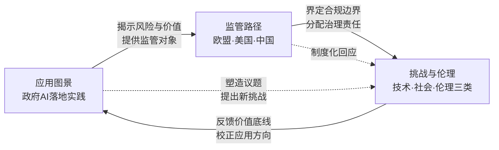
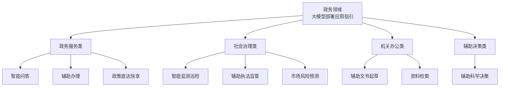
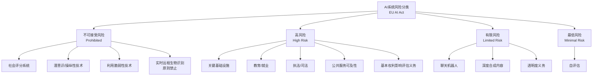
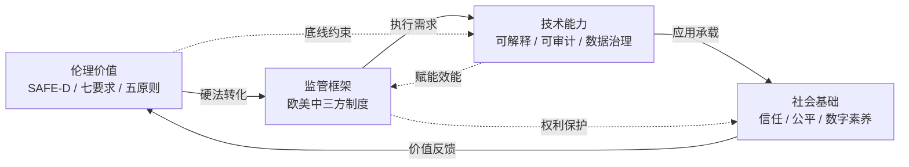

# 人工智能赋能政府决策：应用图景、全球监管路径与挑战伦理审视（2019-2023）
# 1 研究背景与综述框架

## 1.1 议题兴起的时代背景与现实紧迫性

2019年至2023年的五年，是人工智能（Artificial Intelligence, AI）从专业技术领域跃升为全球公共治理核心议题的关键窗口期。这一时期内，几个具有标志性意义的事件共同推动了AI进入政府决策的中心舞台。其一，2019年5月，经济合作与发展组织（OECD）正式通过了世界上首份政府间的AI政策指导方针——《OECD人工智能原则》，确立了"包容性增长与福祉""尊重法治、人权与民主价值""透明度与可解释性""稳健性、安全性与可靠性"以及"问责制"五大原则，并配套提出投资研发、构建包容生态、打造灵活政策环境、培养人力资源与加强国际合作五项政府行动建议[^1]。截至该原则更新前，已有包括欧盟成员国在内的47个国家和地区接受了这一原则，使之成为全球AI治理的首块基石[^1]。其二，2022年底以ChatGPT为代表的生成式人工智能（Generative AI）爆发性扩散，迅速重塑了各国对AI能力边界的认知；OECD亦因此在部长会议上决定修订其人工智能原则，以更直接的方式回应隐私、知识产权、安全以及信息完整性等问题，明确提出对可能造成严重伤害的AI系统须建立"修改、修复和/或安全停用"机制，并对生成式AI带来的误导与歪曲信息问题作出专门回应[^1]。

与技术跃迁同步发生的，是全球数字政府转型的加速。联合国经济和社会事务部2022年发布的《电子政务调查报告》（E-Government Survey 2022）以"数字政府的未来"为副标题，将各国政府的数字化能力建设置于经济、社会与环境政策协调的全球框架之内进行系统评估，反映出联合国系统对数字政府演进的高度关注[^2]。在欧盟层面，截至2024年底，27个成员国中已有24个正式出台国家人工智能战略，其余国家亦处于制定过程中；约半数成员国在2023—2024年间专门针对生成式AI的兴起对既有战略进行了修订，更新内容集中于扩大算力基础设施、强化公私合作以及识别生成式AI带来的新型风险[^3]。这一从战略对齐向执行深化与应用扩散的政策转型，清晰地表明AI不再是各国政府数字化议程中的边缘技术，而已成为重塑公共治理形态的战略性工具。

将上述宏观趋势叠加于公共治理本身复杂性持续上升的背景之上——疫情应对、气候变化、社会分化与跨境危机使传统行政模式承受空前压力——便可理解为何在2019—2023年间，全球各国政府不约而同地将AI视为提升决策效能、应对公共危机的关键抓手。**研究AI赋能政府决策的时代紧迫性正源于此：技术能力的非线性跃迁、治理需求的结构性升级与国际规则的形成期窗口在同一时段交汇，使得对这一议题的系统综述既具有学术价值，更具有政策意义。**

## 1.2 研究边界、核心问题与分析视角

本报告将研究时间范围严格限定于2019—2023年。选择这一时间窗口具有明确的合理性：起点2019年是OECD首部人工智能原则发布、全球首次形成政府间AI政策共识的年份[^1]；终点2023年则覆盖了ChatGPT全球扩散后的首个完整政策响应周期，包括欧盟《人工智能法案》接近定稿、美国相关行政命令出台、中国《生成式人工智能服务管理暂行办法》施行等关键节点。这一区间恰好构成从"原则共识"到"规则落地"、从"判别式AI"到"生成式AI"的完整演进闭环，是观察AI与政府决策互动关系最具代表性的时段。

在对象范围上，本报告聚焦于**政府决策场景**而非泛公共服务。这意味着研究关注的核心并非AI作为一般技术工具在政府部门的部署，而是其参与、辅助乃至替代政府公权力运作的过程——包括行政决策、司法裁判辅助、公共安全决断、社会治理研判等具有公共权威属性的环节。具体的政务聊天机器人、公共安防中的人脸识别、智慧交通中的自动驾驶等案例之所以被纳入考察，正是因为它们或直接承载行政服务交付的决策功能，或在公共安全与公共资源配置中发挥准决策作用。

围绕这一边界，本报告提出三个贯穿全文的核心研究问题：第一，AI在政府决策中究竟如何应用？其作用机理在哪些环节实现了对传统行政流程的实质性重塑？第二，面对AI带来的不确定性与风险，欧盟、美国、中国三大经济体分别采取了何种监管路径？这些路径背后的价值取向与制度逻辑有何异同？第三，AI嵌入政府决策引发了哪些技术、社会与伦理层面的挑战？现有的治理工具与伦理框架能否对其作出有效回应？

在方法论上，本研究采用**系统性文献综述与多源案例比较相结合**的路径，资料来源涵盖国际组织（OECD、联合国）官方文件、欧美中三方一手立法与政策文本、权威媒体的案例报道与同行评审文献，并通过结构化比较分析揭示制度差异背后的深层逻辑。

## 1.3 AI相较传统信息化技术对政府决策的颠覆性意义

要理解AI对政府决策的特殊意义，必须将其与既有的电子政务、数据驱动决策范式做出清晰区分。传统电子政务的核心在于**业务流程的数字化迁移**：纸质表单转为电子表单、人工窗口转为在线门户、统计报表转为可视化仪表盘。其决策逻辑本质上仍是"人作决策、机辅执行"——计算机系统加快了信息传递与处理速度，但决策权威与判断主体始终归属于公务员个人或行政机关。即便是更进一步的"数据驱动决策"模式，其本质仍是为决策者提供更丰富、更及时的数据支撑，决策的因果推断与价值权衡环节并未被机器接管。

AI的颠覆性恰恰发生在这一关键边界上。**AI系统通过自主学习从海量数据中提炼出人类难以显性表达的规律，能够进行预测推断、模式识别乃至内容生成，从而直接进入了过去由人类专属占据的"判断"与"生成"环节。** 这一能力跃迁带来了至少四重结构性冲击。其一，决策权配置发生位移：当算法在福利审核、风险评估或案件分流中给出高置信度建议时，公务员的实际裁量空间往往被压缩，"机器建议、人类签字"的形式合规可能掩盖实质上的算法决策。其二，行政裁量的边界变得模糊：传统行政法理论建立在自然人理性与价值判断之上，而AI的统计推断既非纯粹机械执行也非自主理性，难以纳入既有的裁量基准体系。其三，问责链条出现断裂：当决策结果可归因于训练数据、算法设计、部署方式与现场操作的复合因素时，传统"行为—结果—责任人"的线性问责模型面临失灵。其四，公民权利保障面临新形式的挑战：算法"黑箱"使行政相对人难以理解决策依据，从而削弱了申辩权、陈述权与司法救济权的实质效力。

正因如此，OECD在2024年修订其人工智能原则时，专门强化了"针对可能造成严重伤害或表现出不良行为的AI系统，需要有强大的机制和保障来修改、修复和/或安全地停用"的条款，并明确"在AI的全生命周期内强调负责任的商业行为"以及"明确为实现透明度以及披露要求所需要公开的相关信息"[^1]。这些修订所针对的恰恰是AI区别于传统信息化技术的独特风险表面。**这意味着AI的政府应用不能简单沿用既有电子政务治理范式，而必须建立专门的、贯穿AI系统全生命周期的治理与伦理框架。** 这一判断构成本报告后续展开监管比较与挑战分析的根本前提。

## 1.4 "应用—监管—挑战"三主线分析框架

基于上述背景与议题界定，本报告构建"应用图景—监管路径—伦理挑战"三位一体的分析框架，并将三条主线置于一条递进的逻辑链条之上加以组织。

下图勾勒了三条主线之间的内在逻辑关系：

第一条主线"**应用图景**"对应报告第2章。它考察AI在政府决策中的具体落地形态，包括政务聊天机器人在政民互动中的角色、人脸识别在公共安全场景中的部署、自动驾驶与车路云一体化在智慧交通治理中的应用，以及政务大模型与智慧司法等新兴方向。**应用图景不仅是后续讨论的事实基础，更是监管与伦理讨论的对象界定**——没有清晰的应用谱系，监管设计将沦为空中楼阁，伦理审视也无从锚定具体场景。

第二条主线"**监管路径**"对应报告第3章。它聚焦欧盟、美国与中国三大经济体在AI治理上的制度回应，比较欧盟基于风险分级的事前程序监管、美国以行政命令与市场修正为主的创新优先路径、中国以国家战略引导与场景化敏捷治理为特征的综合模式。**监管路径是连接应用与挑战的治理中介**：它一方面将分散的应用实践纳入统一的合规框架，另一方面将抽象的伦理挑战转化为可执行的法律义务与制度安排。

第三条主线"**挑战与伦理**"对应报告第4至6章，分别从技术、社会与伦理三个层次展开。技术挑战聚焦数据质量、系统集成、算力供给、可解释性等限制AI规模化落地的硬约束；社会挑战考察就业冲击、信任建立、数字鸿沟与权力再分配等社会结构性议题；伦理挑战则深入算法黑箱、训练数据偏见、问责机制失灵、隐私保护等价值底线问题。**这一主线是应用扩张与监管设计共同指向的价值原点**：技术与制度的所有努力，最终都需在保障公民基本权利与公共利益的伦理坐标上接受检验。

三条主线由此构成"**实践—规则—价值**"的递进式分析逻辑：实践揭示问题，规则回应问题，价值审视规则与实践能否守住底线。这一框架不仅为本报告各章节提供统一的概念坐标，也使得对中国及其他国家政府AI建设的启示性思考能够在结尾章节自然收束。

## 1.5 全球治理图景与本研究的定位

将本研究置于2019—2023年全球AI治理的整体图景中加以定位，有助于明确其增量贡献。这一时期的全球治理呈现出**多层次、多主体、多路径并进**的特征。在国际组织层面，OECD于2019年发布首部政府间AI原则、2024年完成关键修订，构成了全球AI治理最重要的"软法"基础[^1]；联合国系统通过《电子政务调查报告》持续追踪各国数字政府发展，将AI能力建设纳入更广泛的可持续发展评估框架[^2]；2025年7月发布的《人工智能全球治理行动计划》进一步呼吁各方在"向善为民、尊重主权、发展导向、安全可控、公平普惠、开放合作"原则基础上推进全球AI发展与治理，强调推动AI在自动驾驶、智慧城市等场景的深度应用，加快全球清洁电力、智能算力、数据中心等基础设施建设，并积极维护个人隐私和数据安全[^4]。在区域层面，欧盟通过《人工智能协调行动计划》及其实施评估，推动27个成员国在战略制定、治理结构、监测评估等维度的协同，尽管成员国在治理成熟度、监测评估能力、资源配置上仍存在结构性差异，跨境协同不足与政策执行碎片化问题突出[^3]。

下表汇总了构成本研究背景坐标的若干关键全球治理文件：

| 时间 | 文件/事件 | 发布主体 | 核心要点 |
|------|----------|---------|---------|
| 2019 | OECD人工智能原则（首版） | OECD | 五项原则+五项政府行动建议，首份政府间AI政策指南[^1] |
| 2022 | 《电子政务调查报告》 | 联合国经社部 | 评估各国数字政府能力，提出数字政府未来方向[^2] |
| 至2024年底 | 欧盟人工智能协调行动计划实施进展 | OECD评估 | 27个成员国中24国已出台国家AI战略；约半数因生成式AI兴起修订战略[^3] |
| 2024 | OECD人工智能原则修订 | OECD | 强化对生成式AI、安全停用机制、信息完整性、可持续发展的回应[^1] |
| 2025 | 《人工智能全球治理行动计划》 | 2025世界AI大会暨高级别会议 | 呼吁向善为民、安全可控、公平普惠、开放合作的全球治理路径[^4] |

从这一图景中可以看出，既有全球治理讨论已较为充分地覆盖了AI技术原则、产业生态、国家战略协同与基础设施建设等议题，但**对"政府自身使用AI"这一特定场景——即AI如何嵌入公共权力的实际运作、如何重塑行政决策与公民权利关系——的系统综述仍相对薄弱**。这正是本报告希望填补的研究空间：通过聚焦政府决策场景，将分散于不同政策文件、不同国家实践与不同学科讨论中的相关洞见整合为一个连贯的分析体系，并通过"应用—监管—挑战"三主线框架揭示技术、制度与价值之间的深层张力。

需要说明的是，本研究的资料基础在覆盖广度与深度上仍存在客观局限：可获取的权威评估多集中于欧盟与OECD体系，对部分国家具体监管实践的一手文本访问受限；同时，2024年以后生成式AI与智能体（AI Agent）技术的快速演进已超出本报告设定的2019—2023年时间窗口，对其影响的讨论将主要在结论章节作为前瞻议题展开。在此约束下，本报告致力于在现有证据基础上提供尽可能严谨、客观且具有比较深度的综述，并在行文中坦诚说明所依据证据的来源与限度，以使读者能够准确判断各项论断的可信范围。

# 2 人工智能在政府运作中的作用：从效率工具到治理范式重塑

承接第1章对AI区别于传统电子政务的"判断—生成"能力跃迁的论述，本章将焦点从概念辨析转向应用图景的实证刻画。2019—2023年间，AI在政府运作中的应用已从早期的实验性试点扩展至多场景规模化部署，并开始触及行政与司法的核心环节。本章将首先界定AI赋能政府运作的三大功能维度，进而通过政务聊天机器人、公共安防人脸识别、智慧交通与自动驾驶、政务大模型与智慧司法四类典型场景的横向比较，揭示AI在不同决策环节中的作用机理；最后回应一个具有理论意义的命题：AI应用是否正在推动政府从"数字政府"向"数智政府"的范式跃迁。需要事先说明的是，本章选取的案例既包括中国深圳福田、广州越秀、成都锦江等较为成熟的实践，也包括纽约MyCity聊天机器人关停、英国警方人脸识别偏见等典型反面案例，以期在正反两面的对照中保持论述的客观性。

## 2.1 AI赋能政府运作的三大功能维度

要系统理解AI在政府运作中的作用，需先在功能层面对其作用边界作出结构性界定。综合2019—2023年间各国实践，AI对政府运作的赋能集中体现在数据处理、公共服务交付、政策制定与决策辅助三个层次，三者构成由内而外、由后台到前台的赋能链条。

**第一层是数据处理维度。** 政务领域长期面临数据量大、来源异构、结构不一的痛点。AI通过自然语言处理、知识图谱、计算机视觉等技术，实现海量政务数据的归集、清洗与结构化。中国国家网信办等部门发布的《政务领域人工智能大模型部署应用指引》将"资料检索"明确列为机关办公类参考场景，强调利用知识图谱构建和信息检索等技术准确理解工作人员检索需求，实现政务信息快速检索、精准定位、多维分析[^5]。在地方实践中，广州越秀区"艾小越"政务私聊机器人正是通过"知识建模、抽取、清洗、消歧和关联"，依托近7000条办事事项知识目录构建政务知识图谱，并在后续迭代中嵌入星火、通义千问、"小律同学"等多个大模型以提升语义理解的准确性[^6]。这一层赋能的本质是将分散于各部门、各文件、各业务流程中的隐性知识转化为可被机器调用的结构化资产。

**第二层是公共服务交付维度。** AI重塑了政民互动的接口与服务响应模式。传统政务服务受限于人手不足、工作时间约束和信息回复不及时等问题，AI智能客服与办事助手实现了7×24小时全天候服务[^6][^7]。深圳福田区上线的"福小i"实现政务咨询响应时间缩短至20秒内、线上办事效率提升40%、好评率超过99%[^8]；广州"艾小越"接入越秀区洪桥街道、大塘街道450个居民微信群后，每天为超过3.3万位居民主动推送最新防疫信息[^7]。这一维度的核心特征是**服务交付主体由"人"向"人机协同"乃至"机器优先"转变**，前台咨询、表单预填、辅助审核等环节越来越多由AI承担。

**第三层是政策制定与决策辅助维度。** 这是AI对政府运作触及最深、争议也最大的层面。《政务领域人工智能大模型部署应用指引》在社会治理类场景中明确列举了"智能监测巡检""辅助执法监管""市场风险预测"等典型应用，要求运用生成式时间序列分析模型和异常检测算法对各类市场数据进行监测和深度分析，捕捉市场动向，预测可能出现的市场风险，并及时发出预警，为政府管理和社会治理提供支撑[^5]。深圳福田区"民生诉求助手"通过AI实现类案分析报告一键生成，数据处理时长由两周压缩至一天，群众满意率从48%提升至70%以上[^8]；广州12345热线通过DeepSeek大模型构建"消费创新商机洞察"和"企业画像动态辅助分析"两大数据产品，依托每月超20万条实时动态工单数据，覆盖劳动纠纷与预警、价格与服务承诺、施工违规等20余个关键维度的企业信用动态分析[^9]。**这意味着AI已开始从外围辅助走向政策研判与风险预警的核心环节，参与到本属于公务员专业判断的领域之中。**

三大维度并非孤立存在，而是构成"数据处理—服务交付—决策辅助"的递进链条：数据处理是基础，服务交付是直接触达公民的应用面，决策辅助则代表AI最深层的赋能形态。下文四类典型场景的比较，将循着这一功能框架展开。

## 2.2 政务聊天机器人：政民互动接口的智能化重构

政务聊天机器人是AI在政府运作中应用最早、最广、最易观察的形态。它处于政民互动的接口位置，既承担公共服务交付职能，也越来越多地嵌入诉求分拨、政策匹配等辅助决策环节。2019—2023年间，全球各级政府部署的政务聊天机器人在技术路线、知识库治理与人机协同闭环上呈现出明显分化。

### 2.2.1 中国地方实践：从RPA+知识库到大模型驱动

广州越秀区"艾小越"是中国地方政务机器人的代表案例。该机器人由越秀区政务服务数据管理局主导，2021年起在"越秀政务"微信公众号、普通微信、企业微信端部署上线，采用RPA（机器人流程自动化）与人工智能结合的技术方案：内置AI学习算法可识别普通话、粤语等不同语音及不同语序的表达，依托近7000条办事事项知识目录构建政务知识图谱；针对暂无法答复的问题，平台配置"留言板"服务，后台联动"越秀先锋"平台自动流转至"粤政易"各线口工作群进行人工处置，处理结果返回用户并同步填充至知识库，实现系统的自我学习与能力提升[^6][^7]。在大模型时代，"艾小越"先后接入DeepSeek、星火、通义千问以及法律咨询专用的"小律同学"等多个大模型，业务覆盖惠企政策、便民服务等8000余事项[^6]。截至2025年4月，该机器人已覆盖超过33.3万名居民，并入选《中国地方法治发展报告No.11（2025）》典型案例，是广州市政府透明度连续三年位居全国第一的重要支撑之一[^10]。

深圳福田区的实践则在大模型驱动方向上走得更远。2025年初，福田区上线70名"AI数智员工"，覆盖政务服务全链条、满足240个业务场景使用，并构建"需求—训练—场景应用—迭代"的闭环生态体系。在公文处理方面，AI数智员工格式修正准确率超过95%、审核时间缩短90%、错误率控制在5%以内；执法文书生成助手可将执法笔录秒级转化为文书初稿；民生诉求分拨准确率从70%跃升至95%，个性化定制生成时间从5天压缩至分钟级[^11][^12]。福田区上线了"民生诉求助手""AI督办助手""福小i"等43类AI数智员工，并提出"制度为基、场景为锚、安全为盾、产业为链"的AI创新路径，以100%国产模型及算力为安全合规底线[^8][^13]。

### 2.2.2 国际比较：纽约MyCity的关停与英国GOV.UK Chat的渐进调试

与中国案例形成鲜明对比的是西方部分政务机器人的失败教训。纽约市MyCity Business AI聊天机器人作为时任市长亚当斯《纽约市人工智能行动计划》（2023年10月发布）的旗舰项目推出，集成超过2000个纽约市商业网页和文章，旨在为企业主和创业者提供有关法规合规、商业激励措施、避免违规罚款等问题的可信答案[^14][^15]。然而，本地新闻媒体The Markup在测试中发现，该机器人**告诉房东可以拒绝接受住房补助的租户、可以随意设定高租金、企业可以无现金运营（尽管市议会2020年通过了要求企业接受现金的法案）、雇主可以拿走员工小费等违法建议**[^15][^16]。这些错误信息在政策合规这一对准确性要求极高的场景下构成了重大隐患。该机器人年均花费约50万美元，最终在新政府上任后被关停[^15]。

英国政府数字服务部门（GDS）开发的GOV.UK Chat则展示了一条更为审慎的渐进路径。GDS对该聊天机器人进行了两次公开试点：第一次于2024年底在GOV.UK网站的少数页面上进行，第二次于2025年秋季在GOV.UK应用程序中进行。试点显示答案准确率从76%提高到了90%，部分归功于大语言模型的进步，部分归功于GDS自身在数据科学方面的工作[^17]。GDS的关键设计决策包括：将回答严格限定于GOV.UK网站材料并附来源链接；用户提出模棱两可的问题时聊天机器人可要求澄清而非拒绝答复；公开试点包括508次试图欺骗服务提供不当或有害响应的尝试，但均未成功[^17]。然而，GDS也承认重要权衡：用户希望获得比平均10.7秒响应时间更快的答案，"今年，最新版本的前沿模型比以前的版本更强大，但也更慢。对我们来说，准确性是最重要的，因此GOV.UK Chat的响应速度比我们理想中的要慢"[^17]。这一表态揭示了政务聊天机器人在准确性与响应速度之间的根本性权衡。

新加坡卫生部、教育部、财政部等机构在大模型时代之前部署的Ask Jamie虚拟客服助手则提供了另一类教训：2020年疫情期间，该助手在被询问"儿子确诊冠病该怎么办"时回复"要正确使用安全套进行安全性行为，或者在伴侣怀孕期间戒欲"等完全答非所问的内容，该服务被紧急撤下以进行系统检查[^18]。日本横须贺市2023年4月起在政府业务中尝试采用ChatGPT，成为日本首个使用ChatGPT的地方政府，约4000名公务员参与试运行进行"会议记录""政策制定"等公务测试；测试显示10.9%的公务员表示工作效率得到大幅提升、71.6%表示有提升，但日本数字化转型大臣河野太郎本人即承认"我问ChatGPT，河野太郎是谁？答案居然是日本首相……所以你需要小心（人工智能）"[^19][^20][^21]。

### 2.2.3 比较与启示

将上述案例并置比较，可以提炼出三个关键差异维度：

| 维度 | 广州"艾小越"/深圳福田"AI数智员工" | 纽约MyCity | 英国GOV.UK Chat | 新加坡Ask Jamie/日本横须贺 |
|------|----------------------------|-----------|----------------|------------------------|
| **技术路线** | RPA+本地知识库+多大模型组合 | 微软Azure大模型+本地商业网页 | Bedrock+Claude+严格限定语料 | 早期NLP→近期ChatGPT试点 |
| **知识库治理** | 近7000条办事事项目录+持续闭环迭代 | 2000+商业网页直接接入 | 仅限GOV.UK网站材料+来源链接 | 早期较弱→大模型时代仍在探索 |
| **失误处置机制** | 留言板+"越秀先锋"人工兜底 | 缺乏有效兜底，错误广泛传播 | 模糊问题要求澄清+508次对抗测试 | 错误暴露后紧急撤下 |
| **典型结果** | 覆盖33万+居民，入选法治蓝皮书 | 因频繁错误信息被关停 | 准确率76%→90%，渐进推广 | 系统检查改进 |

这一比较揭示了几个深层规律。**其一，知识库的边界设定与质量治理是政务聊天机器人成败的核心**：英国GOV.UK Chat严格将语料限定于政府官方网站并附来源链接的做法，与纽约MyCity直接接入商业网页且缺乏严格审核形成鲜明对比，结果差异显著。**其二，人机协同闭环的设计决定了系统能否在错误暴露后自我修复**：广州"艾小越"通过"粤政易"工作群将无法答复的问题流转至人工处置并将结果回填知识库，构成了正向反馈循环；而纽约MyCity在错误被外部媒体曝光后才被发现问题，缺乏自我纠错机制。**其三，准确性与响应速度的权衡需要明确的价值排序**：GDS的表态"对我们来说，准确性是最重要的"反映了一种成熟的价值判断，这一判断在政务场景中尤为关键，因为聊天机器人的回答不再是单纯的信息检索结果，而是越来越多地被公民作为决策依据。

正是在这一意义上，政务聊天机器人已经从"信息检索助手"演变为"政务决策辅助者"——它的输出直接影响公民的合规判断与权利行使。这一角色演进也使得其失误的后果远比一般商业聊天机器人严重，构成了第6章伦理挑战分析的重要场景之一。

## 2.3 公共安防中的人脸识别与视频监控：群体性治理工具的双面性

如果说政务聊天机器人代表了AI在政民互动接口上的低风险应用，那么公共安防中的人脸识别与视频监控则代表了AI对公共权力运作触及最深、争议最大的另一极。这一领域的应用直接关涉公民人身自由、隐私权与平等保护，其"效率提升"与"系统性偏见"之间的内在张力构成了AI政府应用的最尖锐冲突。

### 2.3.1 中国"雪亮工程"：群防群治的视频监控网络

中国的"雪亮工程"是以县、乡、村三级综治中心为指挥平台、以综治信息化为支撑、以网格化管理为基础、以公共安全视频监控联网应用为重点的"群众性治安防控工程"。该工程最早可追溯至2016年的全国综治"江西会议"，被纳入"十三五"规划，目标是到2020年基本实现"全域覆盖、全网共享、全时可用、全程可控"的公共安全视频监控建设联网应用[^22]。2018年，"推进农村'雪亮工程'建设"首次被写入中央一号文件，平安乡村建设进一步提速[^22]。在地方实践中，安徽阜南县建设的"数字乡村建设项目-乡村公共视频联网工程"项目拟安装各类监控设备9373台，实现全县重要区域95%以上的覆盖率；2023年以来，县公安局运用视频监控成功破获各类案件200余起、布控各类违法车辆80余辆、协助群众求助700余次[^23]。广西桂林市兴安县则部署了264个人像卡口和10路高空鹰眼，结合5G智能摄像头进行视频结构化分析[^24]。

雪亮工程的特征在于其**群防群治的治理逻辑**——通过发动社会力量和广大群众共同监看视频监控，把治安防范措施延伸到群众身边[^22]。这与西方将人脸识别主要作为执法机构内部工具的部署模式形成显著差异。需要指出的是，可获取的资料主要聚焦于雪亮工程在治安效能与群众安全感方面的正面叙事，对其中人脸识别算法的具体偏见水平、误报率、数据治理与隐私保护机制的公开评估文献相对有限，这一信息不对称本身值得关注。

### 2.3.2 英国警方回溯式人脸识别：算法偏见的"百倍误报率"

英国警方使用的"回溯式人脸识别系统"则成为AI在公共安防领域系统性偏见问题的标志性案例。该系统将一张可疑的"探测图像"投入超过1900万张拘留照片的警察国家数据库进行比对[^25][^26]。2024年9月，英国国家物理实验室（NPL）的权威审查报告披露了刺眼的数据：**在特定运行参数下，该系统对黑人女性的错误匹配率几乎是白人女性的100倍**[^25][^26]。

面对这一铁证，英国全国警察局长委员会（NPCC）在2024年9月收到报告后，下令提高系统的"潜在匹配置信阈值"，相当于给系统加了一道"安全闸"。但这一"公平版本"仅试行了一个月——提高阈值后，系统能给出的"潜在匹配结果"搜索比例从56%骤降至14%，各地警队纷纷抱怨"线索大幅减少""曾经行之有效的战术手段，现在只能产生极其有限的效益"。在效率指标压力下，那个旨在保护少数族裔和女性的"安全闸"被强行撤掉，系统被调回了"高效"但充满歧视性偏见的版本[^25][^26]。

伦敦警察厅前独立审查员彼得·福西教授一针见血地指出核心问题："面部识别技术是否只有在用户默许种族和性别偏见存在的前提下，才具有实用价值？"他明确警告："便利性不足以成为凌驾于基本权利之上的理由，此类主张很可能经不起法律的严格审查"[^25][^27]。福西教授进一步质疑伦敦警察厅基于2023年NPL报告所声称的"无偏见"立场，认为"伦敦警察厅关于NPL报告中不存在偏见的说法并未得到该报告事实的证实"[^27]。

### 2.3.3 美国冤狱与城市禁令：算法误判的人权代价

美国一系列因AI面部识别误判导致的冤狱案例则展示了该技术失败的人权代价。2025年7月，居住在田纳西州的祖母Angela Lipps被警方根据北达科他州法戈市一起银行诈骗案的AI面部识别结果错误逮捕，**尽管她从未去过北达科他州也不认识任何北达科他州的人，仍在监狱被关押近163天**，期间失去房子、车子、宠物等所有财物；直到她的律师调用银行记录证明案发时她在1900公里外的田纳西州买披萨，指控才被撤销[^28][^29]。无独有偶，2023年密歇根州32岁的非裔母亲Porcha Woodruff在怀孕八个月时因警方人脸识别技术出错被错误逮捕，被指控抢劫和劫持汽车，律师在诉讼中认为警方所依赖的人脸识别技术"不值得信任"，"这种技术存在固有缺陷和不可靠性，特别是在试图识别黑人时"[^30]。

这些案例引发了美国部分城市的强烈反弹。**2019年5月，旧金山成为全球首个对人脸识别技术发出禁令的城市，通过《停止秘密监控条例》禁止所有政府部门（包括警察局）使用人脸识别技术**[^31][^32]。马萨诸塞州的萨默维尔市和加州奥克兰市随后跟进了类似立法。2020年9月，俄勒冈州波特兰市更进一步通过了"迄今最激进的人脸识别市政禁令"——不仅禁止波特兰所有市政部门使用人脸识别技术，还禁止私人公司在公共场所使用这项技术[^33]。波特兰市议会作出这一决定的依据之一是2019年下半年国际权威人脸识别供应商测试（FRVT）的研究结果："与白脸相比，这些算法中的许多算法错误识别黑脸或东亚脸的照片的可能性要高10到100倍"[^33]。

值得关注的是旧金山在禁令出台后的一个意味深长的转折：2019年6月，即在5月禁令出台仅一个月后，旧金山地区检察官办公室宣布将使用一个"减少偏见的工具"——基于AI技术自动修改警方报告中可能透露嫌疑人种族信息的字段（如种族描述、眼睛颜色、头发颜色、人名、地点和社区），以防止检察官在决定是否起诉时受到种族偏见影响[^31]。这一"用AI对抗AI偏见"的做法揭示了一个深层悖论：**人脸识别的禁令并不意味着AI退出公共安防，而是引发了关于"何种AI应用、在何种环节、以何种方式介入公共权力"的更精细讨论**。

### 2.3.4 双面性的内在张力

将上述案例对照分析，可以揭示公共安防中AI应用的内在张力。下表汇总了两类典型部署模式的核心对比：

| 对比维度 | 中国"雪亮工程"模式 | 西方人脸识别监管模式 |
|---------|------------------|-------------------|
| **部署逻辑** | 群防群治+全域覆盖 | 执法机构内部工具+特许或禁止 |
| **效能宣示** | 破案率提升、群众安全感增强 | 案件侦破效率、线索匹配比例 |
| **争议焦点** | 公开评估较少，隐私关切相对边缘 | 算法偏见、误报率、人权侵犯 |
| **回应路径** | 持续扩面+技术升级 | 城市禁令（旧金山、波特兰）+特许使用立法建议 |

更深层的张力在于：**人脸识别在效率指标上的有效性恰恰建立在对历史拘留数据的学习上，而这些数据本身就反映了执法权力运行中既有的结构性不公**。英国警方系统对黑人女性误报率近百倍的事实，与英国警方在街头拦截、搜查、拘留行动中对黑人和亚裔群体执法比例本就异常偏高的历史互为镜像——算法忠实地复制了现实中的不公，并用技术语言重新包装为"客观匹配"[^26]。这构成了一个根本性的两难：**如果剔除偏见会让系统"失效"，那所谓"高效"不过是建立在对特定群体的系统性误伤之上**。这一张力将在第6章伦理挑战中作更系统的分析。

## 2.4 智慧交通与自动驾驶：从单车智能到车路云一体化的治理新形态

智慧交通与自动驾驶是AI在政府运作中应用最具未来感的领域之一。与政务聊天机器人和人脸识别不同，这一领域的政府角色发生了更根本的位移——从传统的交通管理者转变为场景提供者、规则制定者、基础设施投资者与数据使用者。2019—2023年间，中国与美国分别走出了"车路云一体化"与"单车智能"两条具有标志意义的技术路径，并由此形成了不同的政企协同模式。

### 2.4.1 中国路径：北京示范区与成都锦江的"车路云一体化"

2020年9月，北京市正式启动全球首个网联云控式高级别自动驾驶示范区建设。截至2023年3月，示范区内测试企业达19家、入网车辆数量达578辆、累计自动驾驶里程达到1449万公里；自动驾驶乘用车无人化和商业化服务超过134万人次，无人配送服务超过130万单[^34][^35]。在政策层面，《北京市智能网联汽车管理条例》已纳入2023年度市人大立法工作计划，聚焦全无人、高速公路、无人接驳等场景累计出台10项行业代表性管理政策；在标准化方面，搭建"车-路-云-网-图-安全"示范区标准体系，累计完成示范区标准20项[^34][^35]。北京市高级别自动驾驶示范区工作办公室主任孔磊2023年表示，将在已建成的60平方公里基础上扩展至100平方公里，逐步完成全市500平方公里的示范区扩区建设，并打造经开区全域高品质出行体验[^36]。

成都锦江区的实践则展示了中心城区的另一种路径。2024年7月成都入选国家级"车路云一体化"试点城市后，锦江于11月启动基础设施建设，到2025年7月完成锦江大道和白鹭湾科技生态园环线13公里道路、48个路口的数智化改造，仅用9个月时间[^37]。锦江大道与锦华路的路口成为成都首个数据驱动自适应信号控制试点——**这个路口的红绿灯取消了读秒倒计时，改由后台流量逻辑和算法动态调整配时，单路口通行效率可提升15%以上**[^37]。2024年12月，锦江区出台成都市中心城区首个《低速无人车示范道路测试、示范应用和示范运营管理指南》，为低速无人车上路扫清合规障碍，并投放4台无人清扫车和1台无人物流车[^37]。

成都自动驾驶公交则将这一图景延伸至公共交通。自2025年12月29日起，成都自动驾驶公交1号线正式投入运营，全长9公里、整点发车、中途停靠5个站点、设有13个红绿灯，所有路口和站点都设置了提前减速[^38][^39]。成都公交集团梳理出60项自动营运场景，建立"技术赋能+流程管控+人工兜底"三重保障体系，并牵头制定多项运营标准，形成"成都模式"[^38]。在阿里云、必控科技等企业集中的未来科技城片区，定制专线实现"地铁+自动驾驶公交"无缝换乘，将原本40多分钟的通勤路缩短至25分钟[^38]。**值得关注的是，方向盘前的工作人员身份从"驾驶员"变成了"安全员"——这一角色的微妙转变直接体现了AI对劳动分工的重塑**[^39]。

苏州金龙作为商用车自动驾驶的代表企业，其海格L4级自动驾驶巴士在苏州工业园区常态化运营，累计自动驾驶商业运行里程超百万公里、接待乘客数十万人次，并已在上海、天津、浙江、江苏等省市实现示范运行与商业化运营[^40][^41]。

### 2.4.2 美国路径：Waymo的单车智能与"坑洼数据"反向赋能

与中国"车路云一体化"的重投入模式相对，美国以Waymo为代表的企业坚持**单车智能路线**——通过多传感器融合、激光雷达、毫米波雷达和摄像头的硬件配置加上预先绘制的高精地图，依靠车辆本身完成感知与决策[^42]。截至2025年前后，Waymo的完全无人驾驶付费服务已覆盖旧金山、洛杉矶、凤凰城、奥斯汀、亚特兰大、迈阿密等多座城市[^42][^43]。

更具治理启示意义的是Waymo的"坑洼数据"试点项目。Waymo启动了一个向三个城市（奥斯汀、凤凰城和旧金山）开放其坑洼数据库的项目，合作方包括Google旗下的Waze导航应用。市政官员可以直接登录平台查看实时更新的道路损坏热力图，精确到具体街区和严重程度分级[^44]。Waymo政策开发与研究经理Arielle Fleisher描述其运作方式："我们不是在派专人拿着小本本记，而是每辆车都在自动'打卡'"——Waymo的传感器（摄像头、雷达、加速度计）会在每次颠簸时记录路面异常[^44]。**Waymo的车队每天在奥斯汀行驶约10万英里，相当于把全城主干道扫描了数遍**；与传统市政巡查依赖滞后的市民投诉或人力密集的专业巡检相比，Waymo的数据是"这个坑在过去72小时内扩大了37%"这种预测性维护数据[^44]。

这一案例展示了一种新型的政企数据协同模式：**自动驾驶企业从政府的被监管对象转变为政府治理能力的反向供应方**。Fleisher将其描述为"robotaxi可以是城市基础设施的合作伙伴，而不仅仅是占用道路资源的商业实体"，背后是Waymo在多个运营城市遭遇监管摩擦后释放善意、争取宽松监管的公关算盘[^44]。

### 2.4.3 治理职能的位移与协同模式的浮现

将中美两条路径并置比较，可以观察到智慧交通与自动驾驶领域政府治理职能的多重位移：

| 角色维度 | 传统交通管理者 | 智慧交通/自动驾驶治理者 |
|---------|--------------|---------------------|
| **基础设施** | 道路、信号、标识 | 路侧设备、云控平台、5G专网、高精地图 |
| **规则制定** | 通行规则、驾照管理 | L3/L4准入、示范区管理办法、安全员制度 |
| **场景提供** | 不直接介入 | 主动划定示范道路、开放测试场景 |
| **数据使用** | 单向监管获取 | 双向协同：监管数据+企业反哺数据 |
| **责任配置** | 驾驶员主责 | L3级首次将责任主体从驾驶员转向车企 |

**2026年4月，中国已在上海、深圳、武汉等23个城市开放L3级自动驾驶试点路段，覆盖高速公路、城市快速路等场景，责任主体首次从驾驶员转向车企**[^42]。这是一个具有里程碑意义的法律转向——它意味着AI不仅承担了驾驶决策，也开始承担与决策对应的法律责任。这一责任配置的转变也对第6章将要讨论的"问责机制失灵"问题提供了一个特殊语境：当事故责任能够被清晰地归属于车企时，AI决策的问责链条似乎得到了某种程度的修复；但这种修复仅适用于自动驾驶等少数能够清晰界定责任主体的场景，对更广泛的政府AI决策场景启示有限。

新加坡的实践提供了另一个观察样本。2018年，新加坡发布了全球首批自动驾驶国家标准；2025年7月成立的自动驾驶部署委员会成员囊括文远知行、Waymo以及Grab和康福德高的首席执行官[^45]。针对榜鹅Robotaxi项目，新加坡政府新增了1万公里自动驾驶里程/路线的道路能力验证期，以及为期7个连续自然日的评估期；在正式对外运营前要求设置受邀乘客体验期[^45]。这种"逐步开放、不大跨步跃迁"的监管哲学，与中国"先示范、后铺开"和美国"市场先行、事后修正"形成了第三种政府介入模式。

## 2.5 政务大模型与智慧司法：决策辅助走向核心政务环节

政务大模型与智慧司法是AI走入政府决策核心的标志性场景。如果说前述政务聊天机器人主要服务于政民互动接口、人脸识别介入公共安防的执法启动环节、自动驾驶重塑交通治理，那么政务大模型和AI司法辅助则直接触及**公文起草、执法文书、案件分析、判决辅助**等公权力行使的核心。

### 2.5.1 政务大模型的制度框架：中国《指引》的四类场景

中国《政务领域人工智能大模型部署应用指引》系统梳理了大模型在政务领域的四类参考场景[^5]：

这一框架将AI大模型从政务服务这一相对外围的环节，逐步推进至社会治理监测、机关内部办公直至辅助科学决策的最核心环节。指引强调"统筹高质量发展和高水平安全""坚持系统谋划、集约发展""以人为本、规范应用"等基本原则[^5]。

### 2.5.2 深圳福田"AI数智员工"：240个场景的覆盖深度

深圳福田区的"AI数智员工"实践是上述四类场景的综合落地。前文已述其在公文处理、执法文书生成、民生诉求分拨等方面的核心指标。在更细的层面，福田区构建了"应用中心、智能体中心、算力中心、网络联接、终端平台、空间载体"在内的完整数字福田超级智能体生态，把基层工作"痛点"作为AI赋能"靶点"[^8]。

具体而言，**"AI督办助手"以"AI+编码"为核心驱动，创新构建覆盖"办文、办会、办事"的政务办公智能体体系，通过智慧化手段精简环节30%，单个任务工单生成时间从5分钟缩短至10秒，拟办意见生成时间从5分钟缩短至30秒**[^8]。新华社报道指出，福田区首批上线的70名"AI数智员工"覆盖政务服务全链条、满足240个业务场景使用[^11][^12]。深圳市政务服务和数据管理局副局长王耀文表示，希望通过以DeepSeek为代表的大模型应用实现政务智能化转型："一是创新政府服务模式，优化营商环境，提升公众满意度；二是优化政府工作流程，提升政府管理的效率和工作质量；三是以人工智能赋能产业发展，营造良好的创新生态"[^11]。专家则评价，通过"人机协同、数智驱动"的新型工作模式，有助于实现从"替代人力"到"激活人力"的价值跃迁——"AI不是'岗位威胁'，而是重塑竞争力的杠杆"[^11]。

### 2.5.3 智慧司法的多层应用：从普法解读到审判辅助

司法领域的AI应用具有特殊的敏感性，因为它直接关涉公民的人身自由与财产权利。2019—2023年间，中国智慧法院建设呈现出由浅入深的多层应用图景。

在最高人民法院层面，2023年新闻局结合人工智能领域最新技术推出两款人机交互式对话产品——首位人工智能虚拟司法助手"正义"和首位报告解读AI数字人"林开开"，向5000多位全国人大代表、全国政协委员呈现科技感十足的人机交互式对话产品。"正义"依托完善的AIGC引擎，可在非常短的时间内零代码部署出一个高端智能交互型数字人[^46][^47]。这一层应用主要服务于普法与信息传达，尚未直接触及裁判核心。

在地方法院层面，2023年法制日报社举办的"政法智能化建设技术装备及成果展"汇集了大量智慧法院创新案例，包括四川省成都市武侯区人民法院的"数字化劳动力：RPA智能法官助手"、山东省高级人民法院的"法官智能助手"、辽宁省锦州市中级人民法院的"数字化劳动力智能办案辅助平台"、贵州省高级人民法院的"贵州法院大数据案件智能评查"、山东省高级人民法院的"山东省法院常用民事案由类案智审平台"、广东省佛山市南海区人民法院的"法院数字机器人管理中心"等[^47]。这些案例呈现出AI从司法事务性辅助（如卷宗整理、文书生成）逐步走向类案检索、智能评查等准判断性环节的演进。

更具突破意义的是深圳市中级人民法院审判大模型在福田的落地应用——**通过人工智能技术辅助类案检索、文书生成、风险预警，有效提升司法审判效率与公正性**[^13]。迪博技术作为国家级专精特新小巨人企业，同步展示人工智能辅助审判系统，覆盖立案、阅卷、审判全流程，统一裁判尺度、提升办案效率，已在多地法院落地应用[^13]。

### 2.5.4 决策辅助的边界辨析

政务大模型与智慧司法应用最关键的理论问题是：**AI在多大程度上"辅助"了决策，又在多大程度上"替代"了决策？**

从公开资料看，中国《政务领域人工智能大模型部署应用指引》始终坚持"为工作人员提供高效辅助""提供针对性案件办理建议"等表述[^5]，深圳福田的实践亦强调"AI生成、人工审核"的协同模式与"配合'监护人'审核修改"的兜底机制[^8]。新华社相关报道也将其定位为"人机协同、数智驱动"的新型工作模式而非完全替代[^11]。

然而，第1章已经指出的"机器建议、人类签字"风险在大模型应用场景中尤为突出。当AI公文生成的准确率达到95%、执法文书秒级生成、民生诉求分拨准确率达到95%时，**人工审核环节实质上承担多大的审查负担、能否真正发现剩余5%的错误，是一个有待经验性研究回答的开放问题**。这一议题将构成第6章伦理挑战分析的核心切入点之一。

## 2.6 作用机理：前台—后台分工重塑、人机协同与精准决策

在前述四类典型场景比较的基础上，可以从中提炼出AI赋能政府运作的四重共性作用机理。这些机理超越具体应用场景，构成AI对公共管理流程进行实质性重塑的基本范式。

**第一重机理是"前台—后台"分工重塑。** AI承担7×24小时全天候前台咨询与初筛，公务员则聚焦后台复杂处置与最终决断。这一分工模式在政务聊天机器人场景中表现最为典型：广州"艾小越"作为"网格员""智能导办员"承担前台政策咨询与办事指引，无法答复的问题通过"留言板—越秀先锋—粤政易工作群"的链路自动流转至后台人工处置[^6][^7]；深圳福田"福小i"实现政务咨询响应时间缩短至20秒内的同时，复杂事项依然由公务员介入处理[^8]。**这一分工模式的核心价值在于将公务员从重复性、信息检索型工作中解放出来，使其能够集中精力处理需要价值判断、特殊裁量的复杂个案。**

**第二重机理是人机协同模式的多样化分化。** 不同场景下AI与人类的协同形态存在重大差异，主要可归纳为三种典型形态：

| 协同形态 | 典型场景 | AI角色 | 人类角色 | 主要风险 |
|---------|---------|--------|---------|---------|
| **AI辅助、人类决断** | 政务咨询、公文起草 | 生成建议或初稿 | 实质审核与确认 | 审核流于形式 |
| **AI建议、人类签字** | 福利审核、执法文书 | 给出高置信度结论 | 程序性签字 | 实质决策权位移 |
| **AI执行、人类监控** | 自动驾驶、自适应信号灯 | 实时决策与执行 | 异常情况兜底 | 人类反应滞后 |

成都自动驾驶公交中"驾驶员变安全员"的角色转变[^39]、深圳福田AI数智员工"配合'监护人'审核修改"的设计[^8]、苏州金龙自动驾驶巴士的安全员制度[^40]都体现了不同形态的人机协同。**值得警惕的是英国警方人脸识别案例所揭示的"确认性偏误"——当系统在几毫秒内将成千上万个潜在匹配结果呈现在眼前时，警员潜意识地倾向于相信系统给出的结果，将本应严肃的"核查"环节变成了走形式的"勾选"**[^25]。这种从"AI建议、人类签字"滑向实质上的算法决策的风险，构成了人机协同模式中最深层的隐忧。

**第三重机理是基于大数据画像的精准决策。** 从广州12345热线大模型对39个核心行业、6039家代表性企业、3947个重点消费领域的精准识别[^9]，到深圳福田AI对民生诉求实现类案分析报告一键生成[^8]，再到《政务领域人工智能大模型部署应用指引》所设想的"政策找人""政策找企业"算法模型[^5]，AI支撑的精准决策意味着政府治理从基于普遍规则的标准化处置转向基于个体画像的差异化精准处置。**这种转变的积极意义在于使政策更贴近个体需求，但也带来了基于画像的歧视性对待、数据画像滥用、政策"内卷化"等新风险**。

**第四重机理是个性化服务的延伸。** 突破传统"一刀切"政务服务的边界，AI使得场景化、定制化的政府服务成为可能。深圳福田"我要开店"系列"一件事"集成服务、广州"艾小越"接入"粤省事""粤商通""穗好办"等平台并上线疫情防控、加装电梯、社会保险、港澳服务、就业创业、异地就医指引等专项服务[^6][^8]、Waymo坑洼数据反向赋能市政[^44]，都是AI推动政务服务个性化的典型例证。然而，个性化服务对底层数字能力的依赖也加剧了数字鸿沟问题——不具备智能终端使用能力的弱势群体可能反而被"个性化"边缘化，这一议题将在第5章社会挑战中作进一步分析。

四重机理共同指向一个深层判断：**AI对政府运作的影响已远超效率工具范畴，开始触及行政流程的核心架构与决策权配置**。这正是下一节范式跃迁讨论的事实基础。

## 2.7 从"数字政府"到"数智政府"：范式跃迁的迹象与限度

回到本章最初提出的核心命题：AI应用是否构成对既有"数字政府"范式的实质性超越？综合前述四类场景的实证分析，本节将给出兼顾跃迁迹象与限度的双面回答。

### 2.7.1 范式跃迁的迹象

跃迁迹象首先体现在**决策权配置的位移**。第1章已指出，AI区别于传统信息化技术的关键在于直接进入了"判断"与"生成"环节。本章梳理的实践案例集中印证了这一判断：深圳福田AI数智员工已覆盖240个业务场景[^11]、广州12345热线运用大模型实现企业信用动态多维分析[^9]、最高人民法院"正义"AI助手与深圳中院审判大模型的部署[^13][^46]，都意味着AI正在从过去单纯的信息处理工具升级为决策建议的实质生成者。

跃迁迹象其次体现在**判断环节的机器化**。英国警方人脸识别系统在嫌疑人筛选这一原本依赖警员专业判断的环节中起决定性作用，并在阈值调整后仍维持系统性偏见[^25][^26]；深圳福田执法文书生成助手将执法笔录秒级转化为文书初稿[^8]；成都锦江自适应信号控制取消读秒倒计时、由算法动态调整配时[^37]——这些都是过去需要人类判断、现在由算法实时完成的环节。

跃迁迹象再次体现在**治理模式从被动响应转向主动预测**。《政务领域人工智能大模型部署应用指引》明确要求运用生成式时间序列分析模型和异常检测算法预测可能出现的市场风险，并及时发出预警[^5]；Waymo坑洼数据从被动巡检转向"过去72小时内扩大了37%"的预测性维护[^44]；福田AI实现民生诉求类案分析报告一键生成，数据处理时长由两周压缩至一天[^8]——治理时序由滞后响应大幅前移至预测干预。

跃迁迹象还体现在**政府角色的多重位移**。前述智慧交通分析已经显示，政府从单纯的交通管理者转变为场景提供者、规则制定者、数据使用者与基础设施投资者[^37][^34]。这一角色转变在更广泛的政府AI建设中也得到了印证：深圳福田提出"制度为基、场景为锚、安全为盾、产业为链"路径并发布"福田场景超市"提供1044个应用场景[^8][^13]，将场景供给本身作为治理工具。

### 2.7.2 范式跃迁的限度

然而，范式跃迁的迹象不应被夸大。一系列国际反面案例集中暴露了跃迁的限度：

**其一，技术可靠性瓶颈仍然根本性地存在。** 纽约市MyCity AI聊天机器人因频繁提供错误信息（包括违反法律的房东建议、违反市议会决议的无现金运营建议等）最终被关停[^15][^16]；新加坡Ask Jamie在疫情期间对儿子确诊冠病的咨询给出"使用安全套"的荒诞回复[^18]；甚至前沿的GOV.UK Chat也仍存在准确性与响应速度之间难以两全的根本性权衡[^17]。这些失败提醒人们，**所谓"数智政府"在底层技术上远未达到可在政务核心场景大规模无监督部署的可靠程度**。

**其二，问责机制缺失构成跃迁的制度短板。** 澳大利亚"Robodebt"自动债务索偿系统案例提供了一个尖锐警示：2015年推出的该系统使用收入平均算法对Centrelink福利金申请者进行自动判定，**导致联邦政府非法要求43.3万人偿还近20亿澳元的债务，其中38.1万人被错误讨回7.51亿澳元；2021年政府与受害者达成和解，赔偿金高达18亿澳元**；2023年皇家委员会调查显示其核心是"共谋和不诚实"，前总理莫里森"放任内阁被误导"[^48][^49][^50]。荷兰SyRI（System Risk Indication）系统因被荷兰法院依据人权法判定违反基本权利保护要求而被叫停，被视为以人权为基础评估数字福利国家技术使用的标志性案例[^51]。**这些案例表明，当AI走入福利审核等高风险决策场景时，传统行政法的问责框架往往不足以约束算法权力的扩张。**

**其三，公民信任受损与社会反弹形成跃迁的政治约束。** 旧金山、波特兰等城市的人脸识别禁令、英国NPL报告披露偏见后的公众压力[^25][^27][^33]、纽约市议会通过法案要求成立特别工作组调查算法偏见[^52]等案例表明，公众对算法决策的接受度并非自动随技术进步而提升，反而可能因高调失败案例而出现倒退。**正如波特兰市议会成员所指出："任何人都不应该因为技术算法误判了无辜的人而被不公平地推入刑事司法系统"**[^33]——这种价值判断为AI在公共权力领域的进一步扩张设置了实质性约束。

**其四，"21种公平定义"的内在数学张力构成范式跃迁的理论限度。** ProPublica对COMPAS再犯预测系统的调查显示，**该系统在它的算法里，黑人与白人的分数分布明显不同：黑人更有可能被误判（被预测为高风险却没有再犯），白人则更有可能被漏判**[^53][^54][^52]。然而，COMPAS母公司Northpointe（现Equivant）以另一种公平定义（预测正确率）反驳了ProPublica的偏见指控。统计学家很快发现：**如果两个群体之间本身用来训练模型的数据存在差异，那么在统计上各种"公平"的定义就是不可兼得的**[^53][^54]。普林斯顿计算机系教授Arvind Narayanan的《21种公平定义及其政治性》报告系统地证明了这一点。这意味着即使技术上达到了完美执行，"公平"本身的定义就需要价值层面的政治抉择——而这一抉择恰恰是算法本身无法回答的。

### 2.7.3 应用扩张与制度滞后的张力

综合上述分析，本章提出的核心判断是：**2019—2023年间，AI在政府运作中的应用层面已经显示出明显的范式跃迁迹象——从效率工具走向治理结构的实质性重塑；但制度层面的回应（监管框架、问责机制、伦理保障）相对滞后，跃迁仍处于"应用奔跑、制度跟进"的非均衡状态**。

这一应用与制度的非均衡构成了第3章监管路径比较的核心张力背景。欧盟、美国、中国三大经济体面对相似的AI技术冲击，但走出了显著不同的制度回应路径——欧盟试图通过《人工智能法案》的风险分级监管在"应用奔跑"前建立闸门；美国偏重通过事后市场修正与执法手段处理具体失败案例（如旧金山、波特兰禁令所代表的城市级反应）；中国则通过国家战略引导与场景化敏捷治理并行的方式探索发展与安全的平衡。三种路径的异同与得失，将在下一章作系统比较。

更进一步，应用扩张与制度滞后的张力也直接通向第4至6章对挑战与伦理的讨论。当**AI在政务核心场景中的部署速度超过技术成熟度、超过问责机制建立、超过公民信任养成时**，技术挑战（如算法可靠性、数据质量）、社会挑战（如就业冲击、信任建立、数字鸿沟）与伦理挑战（如算法黑箱、训练数据偏见、问责失灵）就不再是可选议题，而成为决定范式跃迁能否走向负责任的"数智政府"——而非陷入"算法利维坦"——的关键变量。

# 3 政府中人工智能的监管框架：欧盟、美国与中国的比较分析

第2章的实证刻画揭示了一个关键张力：AI在政府运作中的应用层面已展现出明显的范式跃迁迹象，但制度层面的回应——包括监管框架、问责机制与伦理保障——相对滞后，跃迁仍处于"应用奔跑、制度跟进"的非均衡状态。本章正是要回应这一张力背后的核心问题：在2019—2023年间，全球三大经济体——欧盟、美国与中国——分别走出了怎样的AI监管路径？这些路径背后的价值取向与制度逻辑有何根本差异？它们对"政府自身使用AI"这一特殊场景作出了怎样的规范回应？

监管框架的比较之所以具有特殊意义，是因为它不仅是技术治理的工具选择问题，更深层地反映了不同政治经济体在创新与权利、效率与公平、中央与地方、本国与国际之间的根本性取舍。三大经济体几乎同时面对相似的AI技术冲击与生成式AI爆发的政策窗口，却选择了显著不同的制度回应——这本身就构成了观察"技术如何被治理"以及"治理如何回应技术"的最具说明力的自然实验。本章将首先分别剖析欧盟、美国与中国三方的监管框架内核，进而通过结构化比较揭示三者在价值导向、监管工具与政府使用AI规范上的根本差异，最后将比较置于国际多边治理的图景中，为后续第4至6章对AI挑战与伦理的讨论提供制度坐标。

## 3.1 欧盟：基于风险分级的事前程序监管路径

欧盟在2019—2023年间走出了一条以**基本权利保护为价值锚点、以风险分级为操作框架、以事前合规义务为执行支柱**的AI监管路径。这一路径不仅在制度形态上呈现为全球首部综合性AI法典，更在监管哲学上确立了"先合规、后上市"的硬法范式，与美国的事后修正模式和中国的场景化敏捷治理形成了鲜明对比。

### 3.1.1 价值奠基：从《可信AI伦理指南》到七项关键要求

欧盟AI监管框架的价值根基奠定于2019年4月8日。**这一天，由欧盟委员会任命的人工智能高级别专家组（AI HLEG）正式发布《可信AI伦理指南》（Ethics Guidelines for Trustworthy AI）**[^55]。该指南此前以草案形式于2018年12月公开征询，收到了超过500份意见反馈[^55]。指南确立了可信AI的三大属性：**合法（lawful）——尊重所有适用法律法规；伦理（ethical）——尊重伦理原则与价值；鲁棒（robust）——既包括技术维度，也兼顾社会环境**[^55]。

在此三大属性基础上，指南提出了AI系统应满足的七项关键要求：**人类自主与监督（强调通过人在环、人在环上、人指挥三种机制确保AI赋权人类而非取代人类）、技术鲁棒性与安全性、隐私与数据治理、透明度、多样性—非歧视—公平性、社会与环境福祉、问责制**[^55]。专家组在2020年7月任期结束前进一步发布了《可信AI评估清单》（ALTAI），将上述伦理指南转化为可操作的自我评估工具[^56]。**这一从"原则—关键要求—评估清单"的递进式工具链，构成了欧盟AI监管的伦理基础与方法论起点**——它使得抽象的人权原则能够被翻译为具体的技术验证流程，为后续《人工智能法案》的硬法转化提供了制度蓝本。

### 3.1.2 立法落地：《人工智能法案》的四级风险分类

欧盟委员会于2021年4月正式提出《人工智能法案》（AI Act）立法提案，建立了基于风险的AI分类系统[^57]。法案的核心架构是将AI系统及其应用按风险等级划分为四个层级，针对不同等级配置差异化的监管强度。这一架构经过2022年12月欧洲理事会一般方法版本、2023年6月欧洲议会以499票赞成、28票反对、93票弃权通过谈判授权[^58]、2023年12月8日欧洲议会与欧洲理事会36小时谈判达成的初步协议[^59]等关键节点的迭代演进，最终成型为全球首部综合性AI法律。

下图呈现了《人工智能法案》四级风险分类的核心架构：

**最严厉的"不可接受风险"层级直接将相关AI实践纳入禁止清单**。议员们在2023年6月通过的谈判授权中，将社会评分系统——即"基于社会行为、社会经济地位、个人特征对人员进行分类"的系统——明确列入禁令；同时将"实时远程生物识别系统"从最初的高风险类别上调至禁止类别，这意味着公司未来不能利用AI技术在欧盟国家的公共场合进行人脸识别[^58][^60]。议员们还实质性地扩充了禁令清单，将"部署潜意识或刻意操纵性技术""利用人员脆弱性"等侵入性与歧视性AI使用纳入禁止范畴[^60]。**这一禁令清单的存在意义远超技术管制本身——它构成了欧盟对"公权力可以使用AI做什么"的明确底线设定，与第2章所讨论的中国"雪亮工程"群防群治模式形成了鲜明的价值对照**。

"高风险"类别覆盖了AI在关键基础设施、教育与职业培训、就业与劳动力管理、基本私人与公共服务可及性、执法、移民与边境管理、司法与民主进程等领域的应用。**针对这一类别，2023年12月初步协议在欧盟委员会最初提案基础上的一项关键创新是：要求高风险AI系统的部署者在投入使用前进行基本权利影响评估**[^59]。这一要求对政府自身使用AI构成了直接约束——当公共部门部署涉及福利审核、执法预测、教育评估等高风险AI时，必须事前对其可能造成的基本权利侵害作出系统评估。第2章所讨论的澳大利亚"Robodebt"案例若发生在欧盟AI法案框架下，理论上将受到这一评估义务的事前拦截。

### 3.1.3 生成式AI与通用AI的特殊规制

ChatGPT在2022年底引爆全球后，欧盟立法者意识到原有四级风险框架对通用AI（General-Purpose AI, GPAI）覆盖不足。2023年6月议会版本与2023年12月初步协议先后对此作出回应。**议员们对通用AI提出新的透明度要求：基于这些模型的生成式AI必须对AI生成的内容进行标注以帮助用户识别"深度伪造信息"，必须披露用于训练模型的数据，声明是否使用受版权保护的材料训练模型**[^58]。

更具创新性的是2023年12月初步协议引入的"系统性风险"概念。欧盟委员会于12月14日发布的法案问答明确指出："**以OpenAI的GPT-4和Google DeepMind的Gemini作为捕捉对象，目前认为使用总计计算能力超过10²⁵ FLOPs训练的通用人工智能模型被认为具有系统性风险（systemic risk），因为使用更大计算能力训练的模型往往更强大**"[^59]。具有系统性风险的模型的提供者需要承担更多义务，包括风险评估和减轻风险、报告严重事件、进行尖端测试和模型评估、确保网络安全，并提供其模型的能源消耗信息[^59]。**这一基于算力阈值的量化识别标准，是全球首次在硬法层面对"前沿模型"作出可操作的法律界定，标志着AI监管从功能性分类向技术性参数化的实质演进**。

### 3.1.4 GDPR第22条与算法可解释性：欧盟AI监管的另一支柱

在《人工智能法案》之外，**欧盟AI监管还有一根重要支柱——《通用数据保护条例》（GDPR）第22条关于自动化个人决策的规则**。GDPR第15条赋予数据主体访问控制者所持有其个人数据的权利，并规定若数据主体受到完全自动化决策的影响，控制者需提供"关于所涉逻辑的有意义信息，以及此类处理对其产生的重要意义和预期后果"[^61]。学术界对第22条究竟应被理解为"禁止"还是"数据主体权利"存在长期争论，对此问题的不同回答将对个人和使用此类决策系统的企业或公共机构产生深远影响[^62]。

2023年欧洲法院（CJEU）就奥地利维也纳行政法院请求的预先裁决作出了重要判决。该案涉及一名奥地利消费者因自动化信用评估而被拒绝移动通信合同的争议[^61]。CJEU首先解决了"关于所涉逻辑的有意义信息"在自动化决策场景下的构成问题：**"仅提供复杂数学公式（如算法）或对自动化决策所有步骤的详细描述均无法满足该要求，因为这些方式均无法构成足够简明且可理解的解释"**[^61]。换言之，控制者必须以数据主体能够理解的形式提供解释——这构成了对算法可解释性的法律层面操作化定义。

法院进一步处理了商业秘密与披露义务之间的张力。当信息披露可能涉及商业秘密泄露时，控制者必须向法院或监管机构披露相关信息，由后者权衡后决定是否需向数据主体披露[^61]。**这一裁决的深远意义在于：它明确了商业秘密保护不能自动凌驾于GDPR的披露义务之上，为算法黑箱的法律穿透提供了制度通道**——这一通道同样适用于政府部署的自动化决策系统。

### 3.1.5 执行机制与"布鲁塞尔效应"

《人工智能法案》通过后，违规公司可能被处以高达3000万欧元或公司全球年收入6%的罚款[^58]。对于谷歌、微软等大型科技公司而言，这一罚款可能高达数十亿欧元。**法案配套的执行架构包括：欧洲AI委员会、欧盟AI Office、成员国通知机构与市场监管机构以及欧盟数据库注册系统；高风险AI系统须经符合性评估并加贴CE标志，部署后须接受市场后监测，严重事件须在15天内报告**。

法案第2条明确规定其适用于第三国提供商及其输出在欧盟使用的情形，这一域外效力条款使得欧盟AI法案具有显著的"布鲁塞尔效应"——通过覆盖4.5亿消费者的欧盟单一市场约束力，影响全球AI开发者的合规行为，进而成为事实上的全球标准。微软发言人明确表示："我们认为AI需要立法监管、国际层面的协调努力，同时也需要开发公司采取自愿行动"，微软和IBM对欧盟最新举措表示欢迎[^58]。**这种大型科技公司的"主动拥抱"态度与"布鲁塞尔效应"的预期相互印证，反映了欧盟通过单一市场规模将本土监管转化为全球标准的制度自信**。

### 3.1.6 张力与限度：松绑谈判的破裂

然而欧盟事前合规范式并非没有内在张力。2025年4月最后一个周二，欧盟理事会与欧洲议会代表们围绕《人工智能法》一揽子修正案——业内称"AI综合法案"——的谈判从早上坐到深夜最终空手而散[^63]。这一名义上的"竞争力措施"旨在通过削减企业合规负担帮助欧洲公司追赶美国和亚洲对手，核心动作包括将《人工智能法》高风险系统的核心义务生效日期从2026年8月2日推迟至2027年12月2日（独立系统）和2028年8月2日（嵌入式系统）[^63]。

谈判焦点集中在嵌入式AI系统是否应当豁免于《人工智能法》额外要求的问题上。欧洲议会首席谈判代表迈克尔·麦克纳马拉警告，将AI治理完全移交行业法规结果可能是**"去监管化而非简化"**[^63]。40多个公民社会组织联名致信议会，指出拟议修改削弱了《人工智能法》在生物识别系统、学校用AI、医疗AI三个敏感领域的基本权利保护[^63]。**这场谈判的破裂揭示了欧盟事前合规范式的内在限度：当全球技术竞争压力与本土产业焦虑叠加时，即便是以基本权利保护为价值锚点的硬法体系，也面临"松绑—倒退"的政治拉锯**。这一张力将在3.5节关于全球监管竞争的讨论中进一步展开。

## 3.2 美国：创新优先与分散式事后修正模式

与欧盟的横向综合立法形成鲜明对比，美国在2019—2023年间走出了一条**以行政命令为骨架、以软法框架为方法、以分散式执法为机制、以联邦—州两级博弈为结构**的AI监管路径。这一路径在表面上呈现为"碎片化"，但其内在逻辑是创新自由与权利保护之间的动态平衡——而这种平衡本身又因2025年的政府更替经历了戏剧性的政策摆动。

### 3.2.1 起点：特朗普一期的《美国AI倡议》与研发战略

美国联邦层面对AI的政策回应可追溯至特朗普第一任期。**2019年2月11日，特朗普签署第13859号行政令，确立了"美国人工智能倡议"，作为维持美国AI领导地位的全政府方案**[^64]。该倡议要求联邦机构在年度预算和规划过程中优先考虑AI研发投资。2019年6月，国家科学技术委员会人工智能特别委员会发布《国家人工智能研究和发展战略计划：2019年更新》，明确了联邦AI研发投资的关键优先事项[^64]。

这一阶段的政策特征是**以促进创新和保持国际竞争力为核心、以战略协调而非合规约束为工具**。美国政府将AI视为"未来产业"的代表，强调通过联邦投资、人才吸引、跨机构协同等方式塑造全球技术领导地位，而对AI本身的风险与权利冲击则较少作出直接的规范性回应。

### 3.2.2 价值转向：拜登政府的《AI权利法案蓝图》

2022年10月4日，美国白宫科技政策办公室（OSTP）发布《人工智能权利法案蓝图》，标志着美国AI政策从单纯的创新促进向权利保护维度的实质性延伸[^65][^66]。蓝图反映了拜登政府对私营公司和政府机构鼓励采用AI技术的原则设想，以减轻涉及数据隐私、算法歧视和自动化系统使用的风险。

蓝图确立的五项原则构成了美国版的可信AI价值框架：

| 原则 | 核心内容 | 关键要求 |
|------|---------|---------|
| **建立安全和有效的系统** | 保护个人免受不安全或无效AI系统侵害 | 与各方专家磋商、部署前测试、风险识别与缓解、持续监控；可包括不部署或停止使用的可能性 |
| **算法歧视保护** | 公平方式使用和设计系统 | 主动公平评估、代表性数据使用、防止人口特征代理、可及性保障、差异测试与缓解、清晰组织监督 |
| **数据隐私** | 默认将隐私保护构建到AI系统中 | 尊重个人对数据收集、使用、访问、传输和删除的决定；改变"通知—选择"做法；健康、就业、教育、刑事司法、金融领域数据应受额外保护 |
| **通知与解释** | 清晰、及时和可访问 | 数据主体应被告知正在与自动化系统交互、决策依据与影响 |
| **替代方案与退出机制** | 自动系统失败时的兜底 | 设计退出机制、人工替代、考虑因素 |

[^65][^66][^67]

**值得注意的是，蓝图本身并非具有法律约束力的硬法，而是一份"原则与相关做法形成的相互交叉、防止潜在不利的应对措施"**[^65]。它的功能是为联邦机构、私营公司在政策、实践或技术设计过程中提供参考，而非直接施加合规义务。这种以"原则—参考做法"为内核的软法形态，与欧盟AI法案以"风险分级—合规义务—罚款"为内核的硬法形态构成根本性差异。

### 3.2.3 技术框架的方法论支柱：NIST AI RMF 1.0

如果说《AI权利法案蓝图》代表了美国AI监管的价值层，那么2023年1月26日NIST正式公布的《人工智能风险管理框架》（AI RMF 1.0）则构成了其方法论层[^68]。该框架明确为"非强制性的指导性文件"，旨在指导组织机构在开发和部署AI系统时降低安全风险、避免产生偏见和其他负面后果、提高AI可信度。

AI RMF的核心是**Govern-Map-Measure-Manage（治理—映射—测量—管理）持续循环**[^68]：

- **治理功能**：完善政策、流程与问责机制；优先考虑雇员多样性、平等性、包容性；建设风险预警管理团队；完善第三方供应链风险的解决机制；
- **映射功能**：明确系统运行的相关背景因素；进行系统分类；了解功能、目标用途与成本收益；将风险与收益映射到系统组件；评估对个人、群体、组织、社会的影响；
- **测量功能**：采用定量、定性或混合工具对AI风险作分析、评估、测试和控制；评估系统可信性特征；完善特定风险识别跟踪机制；
- **管理功能**：基于映射和测量结果对风险作判定、排序和响应；制定最大化收益与最小化负面影响策略；管理第三方风险；完善风险响应和恢复机制[^68]。

**这一过程导向的风险管理方法，与欧盟法案的"刚性分级+清单义务"形成了哲学上的根本差异**——它不预设系统的风险等级，而是要求开发者通过持续循环过程动态识别、测量并管理风险，本质上是将合规责任从立法者的事前界定转移到了开发者的过程化自治。

### 3.2.4 拜登行政命令：100余项行动的全政府动员

NIST AI RMF发布9个月后，美国AI监管在拜登政府任内迎来了里程碑式的硬政策回应。**2023年10月30日，拜登签署《关于安全、可靠、值得信赖地开发和使用人工智能的行政命令》（E.O. 14110），白宫将其定性为"具有里程碑意义"的政策**[^69][^70]。该行政令是美国迄今为止最全面的AI监管原则，标志着美国政府在定义AI监管和问责制方面的关键一步[^71]。

行政令的核心要求包括：要求美国最强AI系统的研发人员需与政府分享其安全测试结果及其他关键信息；完善相关标准和测试工具；制定严密的合成生物检查新标准；建立检测AI生成内容和验证官方内容的标准和最佳实践；建立先进的网络安全计划；研发制定"国家安全备忘录"指导AI和安全方面的进一步行动[^70]。在AI行政令的要求下，2023年11月美国商务部在NIST内成立了美国人工智能安全研究所（AISI），旨在研究AI系统风险，包括具有国防应用的系统[^71]。

2024年10月底美国政府发布了行政命令一年取得的主要成就情况说明，显示联邦机构在五大方面共采取了100多项行动：管理安全风险、保护工人与消费者及隐私和民权、促进负责任创新、扩大政府使用AI、加强国际领导力[^72]。**这一从总统行政令到100多项具体行动的转化效率，反映了美国"以行政权统筹联邦机构"的治理路径——绕开国会立法僵局，通过总统权力直接对联邦官僚机器作出统一指挥**。

### 3.2.5 OMB备忘录M-24-10：政府自身使用AI的最低底线

针对联邦政府自身使用AI的规范要求，**2024年3月，美国白宫管理和预算办公室（OMB）发布《推进联邦机构使用人工智能的治理、创新和风险管理》指导意见（备忘录M-24-10），确定了各联邦机构必须遵守的最低AI风险管理实践**[^71][^73][^74]。这一备忘录是美国对"政府自身使用AI"作出的最直接、最具操作性的规范。

备忘录侧重三个方面：

**一是加强AI治理**。所有联邦机构均需指定一名首席人工智能官（CAIO）并召集高级官员来协调和管理因使用AI而出现的问题，且必须提交合规性计划和AI用例清单[^71][^74]。

**二是推进负责任的AI创新**。所有联邦机构均需识别和消除负责任地使用AI的障碍，并在整个机构中完善AI集成[^71]。

**三是管理AI使用带来的风险**。备忘录评估定义了"**影响权利**"和"**影响安全**"的AI使用范围——"影响权利"的AI包括那些影响"公民权利、平等机会或申请关键政府资源的能力"的AI，"影响安全"的AI包括那些影响"人类生命和福祉、气候或环境、关键基础设施或战略资产或资源"的AI。所有使用"影响权利"或"影响安全"的AI产品的机构需在2024年12月1日之前实施必要的风险管理实践，并终止对AI的不合规使用[^71]。

**M-24-10的制度创新意义在于：它创造了一套介于"硬法"与"纯软法"之间的过渡形态——通过行政权对联邦机构施加强制性义务，但又不通过国会立法约束私营部门**。然而正如观察者所指出，"虽然OMB的上述措施仅针对联邦政府自身对AI的使用，但考虑到政府是大规模采购私营部门AI系统的一方，政府自身的AI风险管理实践也将影响私营部门AI系统的开发"[^71]。2024年10月，OMB又发布了对负责任地采购AI的指导意见（备忘录M-24-18）[^71][^73]，进一步将联邦采购权作为间接监管私营部门的杠杆。

国土安全部（DHS）作为联邦执法部门的代表，已分别于2024年9月和2025年9月发布了针对OMB M-24-10与后续M-25-21的合规计划，并在2023年9月发布过《139-06 国土安全部组成部分获取和使用人工智能与机器学习技术》指令、2025年1月发布过《139-08 人工智能使用与获取》指令[^75]。**这一系列文件的密集发布反映了联邦机构对内部AI使用规范化的真实推进**。

### 3.2.6 联邦立法僵局与州法填补

在联邦层面综合性AI立法长期停滞的背景下，美国州层面与城市层面成为AI监管的活跃前沿。**2019年8月9日，伊利诺伊州议会通过《人工智能视频面试法案》（Artificial Intelligence Video Interview Act）并于2020年1月1日生效，成为美国所有州中首个针对AI招聘工具的专门法案**[^76][^77]。法案要求雇主在视频面试中使用AI技术之前完成三项义务：**面试之前通知应聘者AI可能用于分析视频面试；执行可解释性要求即向应聘者解释AI工具如何运行以及评判依据；获得应聘者同意**[^76][^77]。同时，应聘者拥有面试视频删除权，招聘企业必须在30天内满足删除请求，并应指示收到视频副本的其他人也予以删除[^77]。**值得注意的是，该法案的适用范围不限于伊利诺伊州居民，而是适用于应聘伊利诺伊州州内所有工作职位的所有应聘者**[^77]——这一域外效力条款使得地方立法对全美雇主产生了实际约束力。

然而法案的批评者也指出其局限性："**这个法案针对的AI种类非常有限，而且也没有对企业如何使用AI提出任何要求，很难说这个法案的实施能起到多大程度的实际作用**"——法案谈到了用来分析视频的AI工具，但用来评价面试者的AI工具远不止和视频分析相关的那些；而且法案也没法确保当应聘者要求不要让AI工具评价时，企业是否还会公正地考虑[^76]。这一批评准确地揭示了美国州法填补模式的内在限度：单点突破式立法难以应对AI系统的复合性与场景多样性。

如第2章已述，旧金山在2019年5月成为全球首个对人脸识别技术发出禁令的城市，波特兰市于2020年9月通过了"迄今最激进的人脸识别市政禁令"。**这些城市层面的禁令与州层面的专项立法共同构成了美国"由下而上"的AI监管补充体系**——在联邦层面综合立法缺位的情况下，地方政府通过对具体技术、具体场景的针对性立法填补监管空白。

### 3.2.7 2025年的去监管化转向

**2025年1月20日，特朗普就任美国第47任总统当日便签署行政令，废除了拜登政府颁布的67项行政命令，其中包括AI领域最具里程碑意义的E.O. 14110**[^78][^79]。这一废除标志着美国AI政策从"强监管"转向"去监管化"[^79]。"被废除的行政命令将先前政府嵌入联邦政府每个机构和办公室的深度不受欢迎的、通胀的、非法的和激进的做法予以撤销"[^78]。

2025年7月23日，白宫发布了长达28页的《赢得AI竞赛：美国AI行动计划》，标志着特朗普AI领域总体规划思路逐渐成型[^80]。**该计划以"加速创新""建设AI基础设施""引领国际外交与安全"三大支柱为核心，囊括超过90项具体行动，清晰地勾勒出一条"去监管—基建扩张—全栈输出+意识形态把关"的路线**[^80]。计划开宗明义地将AI竞赛类比为20世纪的"太空竞赛"，宣称其胜负将"开启人类繁荣、经济竞争力和国家安全的新黄金时代"[^80]。

更引人注目的是，该计划首次将国内的文化战争议程正式嵌入国家技术战略。通过同日签署的《防止联邦政府中的觉醒AI》行政令，将"反顶层意识形态偏见"明确写入联邦政府采购条款，要求政府合同商提供的大语言模型必须"客观且无自上而下的意识形态偏见"[^80]。**这一举措使《行动计划》演变为一个"技术—产业—安全—文化"四位一体的综合性国家战略，预示着未来的AI竞争不仅是技术和经济的较量，更是价值观和叙事的全球博弈**[^80]。

### 3.2.8 美国模式的内在逻辑

将上述演进置于整体逻辑中审视，美国AI监管模式呈现出几个鲜明特征：**其一，以行政权而非立法权为主要工具**——总统行政令、OMB备忘录、机构指引共同构成监管骨架，国会综合性立法长期缺位；**其二，以"软法+技术框架"为方法**——NIST RMF的过程化风险管理替代了硬性合规清单；**其三，以联邦采购权间接影响私营部门**——通过政府作为大规模AI采购方的市场地位塑造行业实践；**其四，以政党更迭为节奏的强政策摆动**——E.O. 14110的诞生与撤销最典型地展示了这种摆动；**其五，以州法与城市禁令填补联邦真空**。这种"分散式事后修正"模式的优势在于灵活性与创新友好性，但其代价是政策连续性的脆弱性与跨州合规的碎片化。

## 3.3 中国：国家战略引导下的场景化敏捷治理

中国在2019—2023年间走出了一条**以国家战略为统揽、以伦理规范为底线、以场景化部门规章为抓手、以备案评估为执行工具**的AI监管路径。这一路径不像欧盟那样以单一综合法典为载体，也不像美国那样以总统行政令为支柱，而是呈现出**"顶层战略—伦理规范—专项规章—部门指引"四层联动**的独特结构，体现了"包容审慎、分类分级"的敏捷治理哲学。

### 3.3.1 顶层设计：《新一代人工智能发展规划》

中国AI监管的顶层框架可追溯至2017年7月8日国务院印发的《新一代人工智能发展规划》（国发〔2017〕35号）[^81]。规划以战略性视角对AI的国际竞争、经济发展、社会建设与不确定性挑战作出系统判断，明确指出"人工智能发展的不确定性带来新挑战——人工智能是影响面广的颠覆性技术，可能带来改变就业结构、冲击法律与社会伦理、侵犯个人隐私"等问题[^81]。**虽然该规划早于本研究主要时间窗口，但作为整个2019—2023年间中国AI政策展开的母体性文件，它确立了"发展促进与风险防范并重"的基本框架**——这一框架直接塑造了后续所有专项立法的价值取向。

### 3.3.2 伦理规范的底线：《新一代人工智能伦理规范》

2021年9月25日，国家新一代人工智能治理专业委员会发布了《新一代人工智能伦理规范》[^82]。规范提出了**增进人类福祉、促进公平公正、保护隐私安全、确保可控可信、强化责任担当、提升伦理素养六项基本伦理要求**，并对人工智能管理、研发、供应、使用四类特定活动作出18项具体伦理要求[^82]。

值得注意的是，规范明确将"管理活动"列为四类活动之首，要求"推动敏捷治理。尊重人工智能发展规律，充分认识人工智能的潜力与局限，持续优化治理机制和方式，在战略决策、制度建设、资源配置过程中，不脱离实际、不急功近利，有序推动人工智能健康和可持续发展"[^82]。**"敏捷治理"作为治理哲学的明确提出，构成了中国AI监管区别于欧盟事前合规和美国事后修正的第三种路径标签**——它强调监管者自身要随技术发展持续优化、保持响应能力，而非以静态规则约束动态技术。

### 3.3.3 算法治理的三部曲：从算法推荐到深度合成再到生成式AI

中国AI监管的核心规章呈现为一条清晰的"算法治理三部曲"，三部规章在主体、对象、工具上层层递进，构成了对AI不同发展阶段技术形态的针对性回应。

**第一部：《互联网信息服务算法推荐管理规定》**。该规定于2021年12月31日由国家网信办、工信部、公安部、国家市场监督管理总局联合公布，自2022年3月1日起施行[^83][^84]。规定第二条明确"应用算法推荐技术，是指利用**生成合成类、个性化推送类、排序精选类、检索过滤类、调度决策类**等算法技术向用户提供信息"[^83]——这一类型化界定本身就反映了对算法应用场景的精细化把握。规定要求服务提供者落实算法安全主体责任，建立健全算法机制机理审核、科技伦理审查、用户注册、信息发布审核、数据安全和个人信息保护、反电信网络诈骗、安全评估监测、安全事件应急处置等管理制度和技术措施[^83]。

**第二部：《互联网信息服务深度合成管理规定》**。该规定于2022年11月25日由国家网信办、工信部、公安部联合公布，自2023年1月10日起施行[^85]。规定从深度合成技术的角度建立了三项基础性制度——**深度合成内容标识、安全评估、算法备案**。规定要求深度合成服务提供者落实信息安全主体责任，建立健全用户注册、算法机制机理审核、科技伦理审查、信息发布审核、数据安全、个人信息保护、反电信网络诈骗、应急处置等管理制度[^85]。规定还要求服务提供者基于移动电话号码、身份证件号码、统一社会信用代码或者国家网络身份认证公共服务等方式，依法对深度合成服务使用者进行真实身份信息认证，不得向未进行真实身份信息认证的使用者提供信息发布服务[^85]。

**第三部：《生成式人工智能服务管理暂行办法》**。2023年7月由国家网信办等七部门联合公布，2023年8月15日正式施行，是我国首部针对生成式AI的专门性监管规章[^86][^87]。**办法从服务提供者、内容标注、训练数据处理、用户权益保护、个人信息保护等维度作出系统规定**，其中第十七条明确要求具有舆论属性或者社会动员能力的生成式AI服务提供者，应当按照《互联网信息服务算法推荐管理规定》履行备案和变更、注销备案手续，并进行安全评估[^87]。**办法确立了"包容审慎"的监管原则，强调在规范发展的同时促进技术应用，但这一原则并非放松合规要求，而是要求企业将合规内化为产品设计的必要环节**[^87]。

下表概括了三部规章的核心架构对比：

| 维度 | 算法推荐管理规定（2022.3） | 深度合成管理规定（2023.1） | 生成式AI暂行办法（2023.8） |
|------|--------------------|--------------------|--------------------|
| **规制对象** | 五类算法推荐技术 | 深度合成技术 | 生成式AI服务 |
| **核心工具** | 算法机制机理审核+科技伦理审查+安全评估 | 内容标识+真实身份认证+安全评估+算法备案 | 训练数据合规+内容审核+算法备案+安全评估 |
| **价值导向** | 主流价值导向+反沉迷+反过度消费 | 反虚假信息+真实身份认证 | 包容审慎+分类分级 |
| **责任主体** | 算法推荐服务提供者 | 深度合成服务提供者+技术支持者+使用者 | 生成式AI服务提供者 |

[^87][^83][^85]

这一"三部曲"的演进显示出鲜明的**问题导向与场景化**特征：每一部规章都针对当时最突出的技术形态作出专门回应——算法推荐回应信息流分发问题、深度合成回应换脸与伪造问题、生成式AI回应大模型爆发问题。**这种"小步快跑"的立法节奏与欧盟一次性出台综合性法典的路径形成了鲜明对照**，反映了"敏捷治理"哲学在立法形态上的具体落实。

### 3.3.4 政府自身使用AI的规范：政务大模型部署指引

正如第2章已述，中国对政府自身使用AI的规范集中体现在《政务领域人工智能大模型部署应用指引》中。指引梳理了政务服务类、社会治理类、机关办公类、辅助决策类四类参考场景，强调"统筹高质量发展和高水平安全""坚持系统谋划、集约发展""以人为本、规范应用"等基本原则。**这一指引的制度特征是：将政务AI部署纳入既有的"国家政策—部门规章—操作指引"垂直传导体系，而非通过独立的"政府AI法案"作出专门约束**——这与欧盟通过《人工智能法案》对公共部门施加基本权利影响评估义务、美国通过OMB M-24-10对联邦机构施加CAIO制度形成了三种各异的政府自身AI使用规范化路径。

### 3.3.5 执行机制：备案系统与"清朗"专项行动

中国AI监管的执行机制具有典型的"行政化"特征。**算法备案制度构成了中国AI监管最具特色的工具之一**——它不是欧盟AI Act那种以"市场准入合规评估"为核心的事前许可，也不是美国的"事后市场修正"，而是一种介于二者之间的**"事前备案+事后监督"复合机制**。

**国家网信办密集开展算法备案与安全评估，2025年"清朗·整治AI技术滥用"专项行动雷霆出击**，我国生成式AI监管体系已从制度构建期迈入执法深化期[^87]。这一专项行动模式是中国互联网治理的成熟工具，将其延伸到AI领域反映了对场景化、动态化执法需求的回应。

### 3.3.6 中国模式的内在逻辑

将上述监管谱系综合分析，可以归纳出中国AI监管模式的几个鲜明特征：**其一，以"统筹发展与安全"为价值底色**——不同于欧盟的基本权利优先，中国监管框架始终将发展与安全并置；**其二，以"包容审慎、分类分级"为操作原则**——既避免过早收紧扼杀创新，也避免完全放任引发系统性风险；**其三，以场景化部门规章为主要载体**——拒绝单一综合性立法路径，转而以问题导向的专项规章逐步覆盖；**其四，以算法备案与安全评估为核心执行工具**——既非欧盟的事前合规评估，也非美国的事后诉讼，而是行政化的事前披露+事后监督；**其五，以"敏捷治理"为方法论自觉**——明确要求监管者自身随技术演进持续优化。

需要客观说明的是，本报告所收集的资料对中国监管框架的具体执行细节（如各部规章下的算法备案具体数量、安全评估的通过率与不通过率、行政处罚案例的详细情况）覆盖相对有限。这一信息不对称本身反映了中国监管执行的"过程性"与"内部性"特征——与欧盟法案的高度公开化、美国行政令的高调宣示形成对照。

## 3.4 三方比较：价值导向、监管工具与政府使用AI规范的异同

在分别剖析欧盟、美国与中国三方AI监管框架的基础上，本节将进行结构化的横向比较。比较将围绕**价值导向、政策文件形态、监管工具、风险路径、政府自身使用AI的规范要求、域外效力、执行机制**七大维度展开，并进一步揭示三方差异背后的深层逻辑张力。

### 3.4.1 七维度系统比较

下表呈现了欧盟、美国、中国在2019—2023年间形成的AI监管框架的系统比较：

| 比较维度 | 欧盟（EU） | 美国（US） | 中国（CN） |
|---------|----------|-----------|-----------|
| **价值导向** | 基本权利保护优先；"以人为本"的可信AI；伦理—合法—鲁棒三支柱 | 创新自由与权利保护双轨切换；拜登侧重"安全、可靠、可信"，特朗普侧重"减少监管壁垒、维持美国领导地位" | 发展与安全统筹；包容审慎、分类分级；敏捷治理 |
| **核心政策文件** | ① 可信AI伦理指南（2019） ② AI法案（2024） ③ GDPR第22、15条 ④ ALTAI评估清单（2020） | ① E.O. 13859（2019） ② AI权利法案蓝图（2022） ③ NIST AI RMF 1.0（2023） ④ E.O. 14110（2023，2025被撤销） ⑤ OMB M-24-10（2024） | ① 新一代AI发展规划（2017） ② 新一代AI伦理规范（2021） ③ 算法推荐管理规定（2022） ④ 深度合成管理规定（2023） ⑤ 生成式AI暂行办法（2023） |
| **立法形态** | 横向综合硬法（单一法典） | 软法+行政命令+部门备忘录+州法填补 | 纵向场景化规章（小步快跑） |
| **监管工具** | 风险分级清单义务+CE合格评估+欧盟数据库注册+监管沙盒 | 过程化风险管理（NIST RMF的Govern-Map-Measure-Manage循环）+联邦采购权间接影响 | 算法备案+安全评估+内容标识+"清朗"专项行动 |
| **风险路径** | 四级刚性分类（不可接受/高/有限/最低）+GPAI算力阈值（10²⁵ FLOPs） | 过程性风险管理+"影响权利"与"影响安全"分类（OMB M-24-10） | 分级分类（依据舆论属性/社会动员能力/用户规模等多元指标） |
| **政府使用AI约束** | 禁止公共社会评分+公共空间生物识别原则禁止+高风险部署须基本权利影响评估 | OMB M-24-10要求各联邦机构指定CAIO、提交合规计划与AI用例清单 | 政务领域大模型部署应用指引+伦理规范"正确行权用权"要求 |
| **域外效力** | 强域外效力（覆盖第三国提供商；最高罚款全球营收6%）；"布鲁塞尔效应" | 弱域外效力（以国际多边合作+出口管制+技术标准间接影响） | 弱域外效力（主要规制境内服务；通过全球AI治理倡议参与国际规则） |
| **执行机制** | 欧洲AI委员会+EU AI Office+成员国市场监管机构 | 联邦：商务部/NIST/AISI+OMB+各部委分领域执法 州层：碎片化执法 | 国家网信办主导+多部门联合+算法备案系统+"清朗"专项行动 |

[^58][^65][^59][^69][^87][^71][^83][^70][^60][^68][^73][^85][^82][^80]

### 3.4.2 三方差异的深层逻辑

上述七维度比较揭示了三方监管框架的若干结构性差异，背后是不同政治经济体的深层逻辑。

**第一，立法形态差异反映了中央集权能力与立法共识形成机制的根本不同**。欧盟尽管是多国联合体，但通过《人工智能法案》一次性形成横向综合立法的能力恰恰反映了其单一市场逻辑——只有统一规则才能避免27个成员国之间的监管套利，进而维护单一市场的完整性。美国联邦层面综合立法的长期停滞则反映了两党政治极化下立法共识形成的困难，迫使行政权与州权填补真空。中国"小步快跑"的部门规章模式则反映了行政主导的立法体制下，对快速演进技术作出"敏捷"回应的制度灵活性。

**第二，监管工具差异背后是对"规则—风险—责任"分配方式的根本性选择**。欧盟将合规责任前置到立法者——通过明确的分级清单告诉企业"什么该做、什么不该做"；美国将合规责任分散到开发者——通过NIST RMF要求其在过程中自我识别风险；中国将合规责任行政化到备案与评估机制——既给企业明确的程序义务，又保留监管者的事后裁量空间。**这三种模式分别对应了不同的"国家—市场—社会"关系图式**——欧盟的强国家立法+弱企业自治、美国的弱国家立法+强企业自治、中国的强行政监管+企业程序合规。

**第三，对政府自身使用AI的规范要求差异最具启示性**。欧盟通过禁止性条款（禁止社会评分、限制生物识别）+基本权利影响评估，从公民权利角度对公共部门施加硬约束，呼应了第2章所讨论的旧金山、波特兰等城市的人脸识别禁令逻辑；美国通过CAIO制度+合规计划+用例清单，从内部治理流程角度建立联邦机构AI使用的最低底线；中国通过政务大模型部署应用指引+伦理规范"正确行权用权"，从积极引导政府使用AI的角度提出场景化规范。**这三种规范路径的差异反映了三方对"政府使用AI"性质的不同理解**——欧盟视其为对公民基本权利的潜在威胁、美国视其为联邦官僚体系的现代化议题、中国视其为推动智能政务发展的内在需要。

### 3.4.3 三方模式对"机器建议、人类签字"风险的回应能力

第2章曾提出一个关键风险：在AI辅助决策的人机协同模式中，"机器建议、人类签字"的形式合规可能掩盖实质上的算法决策。三方监管模式对这一风险的回应能力存在显著差异：

**欧盟回应最为直接**。GDPR第22条对完全自动化决策的规则、CJEU关于"关于所涉逻辑的有意义信息"的可解释性裁决[^61]、AI法案第14条对高风险AI"人类监督"的明确要求、对部署者基本权利影响评估的义务[^59]——这一系列规则共同构成了对算法决策权位移的多层防护。**特别值得指出的是，CJEU明确"仅提供复杂数学公式或对自动化决策所有步骤的详细描述均无法满足要求"**[^61]——这一裁决直接针对了"形式上提供解释、实质上仍是黑箱"的合规规避策略。

**美国回应较为分散**。AI权利法案蓝图的"通知与解释"原则、OMB M-24-10对"影响权利"AI的特别风险管理要求构成了相关回应，但由于蓝图本身非具有法律约束力的硬法，其实际约束力依赖于各机构的自觉落实[^65][^71]。州层面伊利诺伊州《AI视频面试法案》的"可解释性要求"也是对这一风险的回应，但其局限正如批评者指出的——"没有对企业如何使用AI提出任何要求"[^76]。

**中国回应以算法机制机理审核为核心**。算法推荐管理规定要求"定期审核、评估、验证算法机制机理、模型、数据和应用结果等"[^83]，深度合成管理规定要求"算法机制机理审核"[^85]——这些要求都指向算法决策的内部机制透明化。但与欧盟CJEU的可解释性裁决相比，**中国规则更侧重于监管者对算法机制的事前掌握，而非数据主体获得"有意义的解释"的权利**。

下表汇总三方对"机器建议、人类签字"风险的回应工具：

| 回应工具 | 欧盟 | 美国 | 中国 |
|---------|------|------|------|
| **可解释性要求** | GDPR第15条+CJEU可解释性裁决+AI Act透明度条款 | AI权利法案蓝图"通知与解释"+伊利诺伊州AI面试法案 | 算法推荐规定第十二条公开透明原则+算法备案 |
| **人类监督要求** | AI Act第14条"人在环/人在环上/人指挥" | NIST RMF治理功能+OMB M-24-10 | 伦理规范"确保可控可信"原则 |
| **数据主体权利** | GDPR第22条自动化决策权利 | 州层面分散的隐私法 | 个人信息保护法相关条款 |
| **公共部门特别约束** | 基本权利影响评估义务 | CAIO制度+合规计划 | 政务大模型部署应用指引 |

**这一比较揭示，三方虽都意识到了算法决策权位移的风险，但回应工具的硬度、可诉性与实际约束力存在显著差异**。这一差异为第6章伦理挑战分析中关于问责机制失灵的讨论提供了制度坐标。

## 3.5 监管竞争、互鉴与全球协调的走向

将三方监管框架的比较置于全球治理的整体图景中，可以发现2019—2023年间AI监管呈现出**单边塑造、双边对话、多边协调**三层并行的复杂动态。监管的"布鲁塞尔效应"、美欧贸易和技术委员会（TTC）的术语对齐、OECD AI原则的更新、G7广岛AI进程、UNESCO伦理建议书、联合国大会首份AI决议、布莱切利宣言与全球AI安全峰会等，共同构成了AI全球治理的多中心拼图。

### 3.5.1 单边塑造："布鲁塞尔效应"与监管输出

欧盟AI法案的域外效力条款使其在制定全球AI规则方面具有突出的影响力。媒体观察指出，**"在AI领域的监管方面，欧盟一直走在世界前列。欧盟试图将自己定位为"全球AI规则制定者**[^58]"。这种"布鲁塞尔效应"通过单一市场规模约束力将欧盟规则转化为事实上的全球标准——任何希望进入欧盟市场的AI服务提供商都必须遵守AI法案的合规要求，进而塑造其全球产品架构。

支振锋的研究指出，**"在布鲁塞尔效应的激励下，许多国家都在提出人工智能立法的议程。通过率先制定人工智能专门法律，来塑造全球人工智能监管立法的标杆，特别是通过对大型数字信息平台的法律监管及其遵从与合规，输出本国人工智能监管的相关制度、标准和价值，以期获得先发优势"**[^88]。这一观察揭示了AI监管单边塑造背后的地缘政治竞争逻辑——监管规则本身已成为大国博弈的战略资源。

### 3.5.2 双边对话：美欧TTC框架下的术语对齐

在欧美关系层面，**2024年4月5日，欧盟与美国发表联合声明，宣布将加强在AI领域的合作伙伴关系**[^89][^90]。声明称合作旨在共同商讨如何让AI既安全又有用，双方决定共同开展用AI造福人类的研究项目；同时**欧美双方将致力于更新一系列关键AI术语，并提供"双方共同接受的定义"，为AI标准化工作奠定关键基础**[^89][^90]。此次声明是美国—欧盟贸易和技术委员会（TTC）第六次会议的主要成果。

**TTC框架下的术语对齐努力具有特殊意义**——它揭示了即便在监管哲学根本不同的两大经济体之间，技术层面的标准协调仍是必要的合作基础。这种"原则层面竞争、技术层面合作"的双轨格局，构成了西方阵营内部AI治理的核心机制。

### 3.5.3 多边协调：从OECD到G7到联合国

在多边层面，AI治理呈现出多个国际组织同时推进、相互呼应的"制度复合体"格局。

**OECD层面**。OECD AI原则最初于2019年通过，并于2024年5月更新[^91]。原则确立了五项可信AI的负责任管理原则：包容性增长与福祉、尊重法治和人权与民主价值、透明度与可解释性、稳健性—安全性与保障、问责制[^91]。**截至2024年5月更新前，已有47个遵守方签署了该原则**[^91]。OECD AI原则的特殊意义在于：欧盟、欧洲委员会、美国、联合国等司法管辖区在其立法、监管框架及指南中采用了经合组织对AI系统及生命周期的定义，使其成为各国AI规则之间的"互操作性桥梁"[^91]。

**G7层面**。**2023年10月30日，七国集团领导人就《人工智能国际指导原则》和广岛AI进程下的《人工智能开发者自愿行为准则》达成一致**[^3]。这些原则和自愿行为准则将在国际层面上补充《欧盟人工智能法案》的规则，为开发AI的组织提供详细和实用的指导。欧盟委员会主席冯德莱恩表示，"欧盟已经是《人工智能法案》的监管领跑者，也正在为全球层面的人工智能治理做出贡献"[^3]。

**UNESCO层面**。**2021年11月25日，联合国教科文组织发布了《人工智能伦理建议书》，这是全球首个针对人工智能伦理制定的规范框架，共193个成员国正式采用这一道德框架**[^92]。建议书的关键特点包括：要求各国采取行动通过确保透明度、代理权和对个人数据的控制来确保个人数据的安全；**明令禁止使用人工智能系统进行社会评分和大规模监控**；强调"成员国应考虑到最终责任和问责制必须在人类本身，人工智能技术本身不应被赋予法律人格"；通过道德影响评估帮助国家和公司评估AI系统对个人、社会和环境的影响[^92]。**这一建议书在禁止社会评分这一点上与欧盟AI法案的立场高度一致，反映了多边规则与欧盟单边规则之间的相互呼应**。

**联合国大会层面**。**2024年3月21日，联合国大会通过了由美国提出的人工智能监管决议，鼓励各国在AI发展过程中保障人权、保护个人数据隐私并管控风险**[^74]。决议提出了"安全、可靠和值得信赖"的国际AI治理标准，聚焦数字权利与普遍人权的一致性、减少数字鸿沟和可持续发展三个方面[^74]。决议限定对象为"非军用的人工智能系统"，并强调对人工智能领域"人权保护"的强调[^74]。**这是联合国首份AI决议，其形成过程"经历了较长的协商和谈判过程，并最终以协商一致的方式通过"**——美国启动决议谈判后与各国进行了数百小时的双边对话，并接受了120个国家的意见[^74]。

**联合国人工智能高级别咨询机构**。**2023年10月，联合国秘书长古特雷斯组建了人工智能高级别咨询机构，该机构由来自33个国家的39名专家组成**[^93]。机构于2023年12月发布《以人为本的人工智能治理》中期报告，2024年9月发布最终报告《为人类治理人工智能》（Governing AI for Humanity）[^93][^89]。最终报告提出了七项关键建议：成立联合国前沿人工智能科学小组、开展持续政策对话、建立AI标准化与交换机制、成立人工智能能力发展网络、构建全球人工智能基金、构建全球数据框架、在联合国秘书处下成立专门的人工智能办公室[^89]。

**布莱切利全球AI安全峰会**。**2023年11月1日至2日，首届全球人工智能安全峰会在英国布莱切利园召开，来自中国、美国、英国等28个国家及欧盟的代表，以及谷歌、微软、腾讯、阿里巴巴等科技企业和学术机构参会**[^2][^94]。会议核心成果是与会方共同签署了《布莱切利宣言》，承诺以安全、负责任的方式推动AI发展[^2][^94]。**宣言写道："我们申明，为了所有人的利益，人工智能应该以安全、以人为中心、值得信赖和负责任的方式设计、开发、部署和使用"**，并特别呼吁人们关注OpenAI、Meta和谷歌等公司正在开发的大型语言模型可能因滥用而造成的具体威胁，同意通过国际合作建立AI监管方法[^94]。**英国媒体将此评价为"罕见的全球团结表现"**——在地缘政治高度紧张的背景下，28国共同签署声明本身就是值得记录的成就[^94]。

### 3.5.4 中国的全球治理参与

在国际多边治理图景中，中国的参与立场具有特殊意义。**2023年中国发布《全球人工智能治理倡议》**，倡议"智能向善、协同共治"等原则。2025年中国进一步发布《人工智能全球治理行动计划》，提出"向善为民、尊重主权、发展导向、安全可控、公平普惠、开放合作"等原则。中国科技部副部长吴朝晖率团出席布莱切利峰会并联署《布莱切利宣言》[^94]，中国学者曾毅与张凌寒入选联合国人工智能高级别咨询机构[^93]——这些参与构成了中国在国际AI治理中"协同共治"立场的具体表达。

### 3.5.5 全球协调的现实困难

尽管多边治理努力密集涌现，但其现实约束同样显著。**联合国人工智能高级别咨询机构的中期报告就明确指出："全球人工智能治理赤字"**——"尽管人工智能正在改变我们的世界，但其发展和回报目前集中在少数国家的少数私营部门行为者身上，其危害也分布不均"[^93]。

更深层的困难在于：**多边规则的形成依赖于价值共识，而欧美中三方在基本权利保护、创新自由、发展安全统筹之间存在的价值排序差异，本质上难以通过技术性协调消弭**。OECD AI原则更新、G7广岛AI进程、联合国大会决议等多边努力的实质成就主要在于**最低公约数的共识**——禁止用于大规模监控、保护人权、缩小数字鸿沟等——而对真正具有约束力的规则形成仍处于早期。

**美国的态度转向对全球协调形成了直接冲击**。2024年美国大选和欧洲议会选举之后，特朗普新政府和新一届欧盟委员会对于人工智能均表现出了放松监管与重视创新的态度转向[^71][^73]。2025年美国发布的《赢得AI竞赛：美国AI行动计划》以"加速创新""建设AI基础设施""引领国际外交与安全"为支柱，与多边协调路径形成了明显张力[^80]。

### 3.5.6 监管竞争背后的地缘政治逻辑

将上述全球图景综合分析，可以揭示AI监管竞争背后的深层地缘政治逻辑。**AI不仅是技术议题，更是关乎国家竞争力与全球规则话语权的战略议题**。欧盟通过《人工智能法案》巩固"全球规则制定者"地位；美国通过联邦行政命令与州法填补构建灵活治理体系，并通过《美国AI行动计划》主张"AI竞赛"领导地位；中国通过场景化敏捷治理探索"发展与安全统筹"的第三种路径，并通过《全球AI治理倡议》参与国际规则塑造。

支振锋的研究指出："**在主要大国间，人工智能综合性统一立法相关议题颇有'认知域塑造'的特点。有些大国已经并不讳言自身在人工智能立法上的消极态度，但却希望他国对人工智能强化监管与立法**"[^88]。这一观察揭示了一个深刻的悖论：**AI监管不仅是规范问题，也是国家战略博弈的工具——通过推动他国监管而保持本国创新优势，可能成为某些大国的隐性策略**。

监管竞争背后的另一个动态是布莱切利宣言所代表的"罕见的全球团结"：在AI带来的存在性风险面前，即便地缘政治高度紧张的28国仍能就基本原则达成共识。**这种"高度风险时的低度共识"与"低度风险时的高度竞争"并存，构成了AI全球治理的真实面貌**。

## 3.6 小结：从制度比较到挑战审视

本章对欧盟、美国与中国三大经济体在2019—2023年间形成的AI监管框架进行了系统比较，并将比较置于全球多边治理的图景中。综合分析揭示了几个核心判断：

**其一，三方监管模式形成了价值导向、立法形态、监管工具的多维差异**。欧盟以基本权利保护为价值锚点、以综合性硬法为载体、以风险分级清单义务为工具；美国以创新自由为价值锚点、以行政命令与软法为载体、以过程化风险管理为工具；中国以发展与安全统筹为价值底色、以场景化部门规章为载体、以算法备案与安全评估为工具。

**其二，三方对政府自身使用AI的规范要求呈现三种不同路径**。欧盟通过禁止性条款+基本权利影响评估施加硬约束；美国通过CAIO制度+合规计划建立联邦机构最低底线；中国通过政务大模型部署应用指引+伦理规范作出引导性规范。

**其三，全球AI治理已形成"单边塑造—双边对话—多边协调"三层并行的复杂动态**。"布鲁塞尔效应"通过单一市场规模塑造全球标准；美欧TTC框架下的术语对齐构成双边协调；OECD原则、G7广岛进程、UNESCO建议书、联合国大会决议、布莱切利宣言共同构成多边治理拼图。

**其四，监管竞争背后是地缘政治博弈逻辑**。AI监管不仅是技术治理问题，更是国家竞争力与全球规则话语权的战略议题。三方监管模式的差异最终反映了不同政治经济体在创新与权利、效率与公平、本国与国际之间的根本性取舍。

需要特别强调的是，**三方监管框架虽形态各异，但都面临一个共同的根本困境：制度回应的速度难以追赶技术演进的速度**。第2章揭示的"应用奔跑、制度跟进"非均衡状态，在本章的制度比较中得到了进一步印证——欧盟AI法案制定过程历时三年多，期间ChatGPT的出现迫使法案在最后阶段紧急加入通用AI条款；美国E.O. 14110从签署到撤销仅一年三个月；中国生成式AI暂行办法是在ChatGPT爆发后半年内紧急出台的过渡性规章。**这种"立法响应—技术演进"的赛跑构成了2024年以后AI监管必须面对的持续性挑战，也是本报告后续章节关于AI挑战与伦理审视的制度背景**。

监管框架的比较固然揭示了三方在工具与机制上的丰富差异，但工具和机制最终都要在具体应用场景中接受检验。**当算法在福利审核中给出"应当拒绝"的高置信度建议时，欧盟的基本权利影响评估、美国的CAIO制度、中国的算法备案能否真正阻止形式合规下的实质不公？当人脸识别系统对黑人女性的误报率近百倍时，欧盟禁止令、美国城市禁令、中国的算法机制机理审核能否构成有效屏障？当生成式AI在政务核心场景中产生幻觉时，三方监管能否避免类似纽约MyCity的灾难性失败？** 这些追问将监管制度的讨论自然引向第4至6章对AI挑战与伦理的系统审视。

正是带着这些追问，我们将进入对政府AI落地的技术挑战、社会挑战与伦理挑战的深入分析——它们将共同检验本章梳理的监管框架在面对真实政府AI应用场景时的实际回应能力。

# 4 政府AI落地的技术挑战

第3章对欧盟、美国与中国三方监管框架的比较揭示了一个核心张力：制度回应的速度难以追赶技术演进的速度。然而，更深层的问题在于，即便监管框架已经搭建起合规义务、风险分级、备案评估等多重工具，其在政府AI落地实践中能否真正生效，最终仍取决于底层技术能力是否成熟。**当遗留系统集成困难、数据孤岛纵横、模型幻觉频发、算法黑箱难以穿透时，监管工具的执行就会在技术层面遭遇"失灵"——基本权利影响评估难以评估一个连开发者都解释不清的模型、算法备案难以备案一个无法被审计的黑箱、CAIO的合规计划也难以约束一个权限失控的智能体**。本章正是要从政府AI系统的底层支撑能力出发，系统剖析数据、算力、模型、可解释性与基础设施五大维度的技术性硬约束，并揭示这些技术约束如何与第2章所述的"应用奔跑、制度跟进"非均衡状态相互交织。需要事先说明的是，本章所讨论的技术挑战并非独立存在的工程问题，而是与制度安排、组织结构、人员能力深度耦合的复合性挑战；纯粹的技术应对路径有其内在限度，本章末节将就此作出初步判断。

## 4.1 遗留系统集成与数据孤岛：AI规模化落地的底层障碍

政府部门长期形成的条块分割信息系统，是AI规模化部署面临的第一道底层障碍。这一障碍的形成具有深刻的历史路径依赖：过去二十余年间，各级政府部门按照"一部门一系统"乃至"一业务一系统"的逻辑，建设了海量基于不同技术架构、不同数据标准、不同接口协议的信息系统。当AI大模型要求跨域、跨模态、跨层级的数据归集与统一调度时，这些遗留系统的存量基础便成为难以绕开的工程性约束。

**数据孤岛问题的严峻程度已在多个调研中得到量化呈现**。相关调研显示，**73%的企业存在跨部门数据孤岛现象，数据标准不统一导致模型训练效率下降40%以上**；某零售企业尝试搭建智能选品模型时发现，销售、库存、供应链数据格式差异巨大，**清洗后可用数据不足原始量的30%**[^95]。虽然这一数据来自企业场景，但政府部门的数据孤岛状况通常更为严峻——部门间的条块分割具有更强的体制性根源，数据共享不仅涉及技术接口，还涉及职责权属、保密层级与利益博弈。**以医疗行业为例，单个患者生命周期可产生高达1100TB的数据，但这些数据常被不同科室和系统割裂，难以综合利用；政务、金融、工业等领域同样面临多源数据整合、实时处理和安全合规的多重挑战**[^95]。

数据孤岛对AI政府应用的直接冲击体现在四个层面：**其一，模型训练受限**——数据不全、数据质量参差不齐，影响大模型训练效果；**其二，推理效率低下**——多系统割裂导致模型推理链路冗长、响应速度慢；**其三，业务创新受阻**——数据难以流通，智能应用难以跨部门、跨系统协同创新；**其四，安全合规风险**——数据流转不透明，安全审计与合规管理难度大[^95]。这四个层面的影响相互叠加，共同构成了政务大模型从"实验室"走向"规模化部署"的最大底层阻力。

在技术应对路径上，**中间件作为连接底层AI模型与上层业务应用的"智能调度中枢"**，正逐步成为打破数据孤岛、实现多系统集成、释放数据要素价值的关键技术[^95]。其核心价值体现在多模态数据处理与多模型架构兼容上——支持文本、图像、语音、视频等多模态数据的统一接入、预处理和对齐，提升跨模态AI模型的训练和推理效率；同时通过智能调度和动态路由技术，根据输入特征、业务需求和系统负载，自动选择最优子模型或处理路径[^95]。天枢InterGPT等创新中间件在政务、医疗、工业等领域的落地实践显示出这一技术路径的可行性。

将这一技术挑战与第2章广州"艾小越"、深圳福田"AI数智员工"的成功案例相对照，可以发现一个清晰的规律：**集成能力差距直接决定了AI落地的天花板**。广州"艾小越"之所以能够覆盖8000余事项并接入"粤省事""粤商通""穗好办"等多平台，关键在于其依托近7000条办事事项知识目录构建了统一的政务知识图谱，并形成了"留言板—越秀先锋—粤政易工作群"的跨系统人工兜底链路；深圳福田"AI数智员工"覆盖240个业务场景的背后，是"应用中心、智能体中心、算力中心、网络联接、终端平台、空间载体"在内的完整数字福田超级智能体生态。**没有这一底层集成能力的预先铺垫，任何政务大模型的部署都将沦为孤立的应用试点，无法形成跨场景、跨部门的规模化效能**。这也解释了为何在中国27个城市27个部门已开启政务大模型实践探索的整体进展中[^96]，各地的应用深度与广度呈现出显著的分化。

## 4.2 政务数据质量、标准化与共享确权瓶颈

如果说遗留系统集成是AI政府应用的"管道"问题，那么政务数据的质量、标准化与共享确权则是更深层的"燃料"问题。AI大模型的能力上限在很大程度上由训练数据与推理数据的质量决定——即便管道畅通，劣质燃料也无法驱动高质量决策。

### 4.2.1 数据质量与场景适配的双重短板

吴培熠、申红梅、梁正基于"数据-场景"双驱动视角对政务大模型的多案例研究揭示了核心瓶颈：**政务大模型的效能实现需以高质量数据整合、跨部门协同机制及技术适配能力为支撑，但实践中面临数据壁垒、隐私安全风险、模型可靠性不足等挑战**[^96]。研究通过数字政务人"小浦"、"如如"文旅大模型、"京策"政策大模型、社工AI助手"小鲸"四个典型案例发现，**政务大模型在多个应用场景中展现出广阔前景，但仍然面临模型幻觉、数据质量不足、场景开发滞后等治理挑战**[^96]。

数据质量问题的根源是多维的。一方面，政务数据本身存在采集不规范、跨部门描述不一致、历史数据陈旧、字段定义模糊等结构性缺陷；另一方面，**大量企业（与政府部门）依赖公开数据集训练模型，导致应用功能高度相似。以智能客服为例，多数模型只能处理标准化问答，面对复杂业务场景时准确率不足60%**[^95]。这种"数据贫血"现象使得即便采用相同技术架构，也难以产生差异化价值——这一规律同样适用于政务大模型场景。

### 4.2.2 中国《政务数据共享条例》的制度安排与执行难点

针对数据共享与确权的制度性瓶颈，**中国于2024年公布的《政务数据共享条例》构建了较为完整的制度框架**。条例确立了"统筹协调、标准统一、依法共享、合理使用、安全可控"的基本原则，并将政务数据按共享属性明确划分为**无条件共享、有条件共享和不予共享三类**[^97]。

在管理体制上，条例采取了多层级垂直治理结构：**国务院政务数据共享主管部门负责统筹推进全国政务数据共享工作；县级以上地方人民政府政务数据共享主管部门负责统筹推进本行政区域内政务数据共享工作；国务院各部门负责本部门政务数据共享工作**[^97]。同时要求政府部门"明确本部门政务数据共享工作机构"，并设定了具体职责——组织编制本部门政务数据目录、组织提出或处理共享申请、确保数据符合共享标准规范、组织开展安全性评估等[^97]。

在目录管理层面，条例规定**政务数据实行统一目录管理**，政府部门编制政务数据目录"应当依法开展保密风险、个人信息保护影响等评估，并经部门负责人审核同意"；政务数据目录应当明确"数据目录名称、数据项、提供单位、数据格式、数据更新频率以及共享属性、共享方式、使用条件、数据分类分级等信息"[^97]。这一目录管理机制将数据治理从粗放式的"共享/不共享"二元判断细化为多维度的属性配置。

下表汇总了《政务数据共享条例》的核心制度安排：

| 制度维度 | 具体安排 | 执行要点 |
|---------|---------|---------|
| **共享属性分类** | 无条件共享、有条件共享、不予共享 | 通过目录明示属性 |
| **目录管理** | 国家与地方两级目录编制 | 含数据项、格式、更新频率、共享方式等 |
| **评估义务** | 保密风险评估+个人信息保护影响评估 | 编制目录前置义务 |
| **责任主体** | 政府部门承担共享主体责任 | 设立专门工作机构 |
| **安全保障** | 数据安全和个人信息保护制度 | 开展共享安全性评估 |

然而，这一制度框架在执行层面面临显著难点。**第一，确权困难**——政务数据的产权属性长期模糊，"数源—使用—监管"三方权责仍处于灰色地带，部门之间的共享激励严重不足。**第二，评估成本高**——保密风险评估与个人信息保护影响评估的双重义务要求大量专业能力，对基层政府构成实质性负担。**第三，标准落地难**——条例要求"国家建立政务数据共享标准体系"，但跨部门、跨层级的标准统一在技术与体制层面均存在长期博弈。**第四，安全合规风险贯穿全流程**——条例本身明确要求"履行政务数据安全保护义务，不得危害国家安全、公共利益，不得损害公民、法人和其他组织的合法权益"[^97]，但这一原则性要求在算法时代的具体边界（如训练数据使用是否构成"使用其他政府部门的政务数据"）仍有大量解释空间。

### 4.2.3 隐私安全与数据治理的耦合性约束

吴培熠等学者的研究进一步揭示了数据质量问题与隐私安全风险的耦合性[^96]。在政务大模型场景下，数据质量提升的需求与隐私保护的约束之间存在内在张力：要提升模型在政策匹配、舆情分析、社会治理等场景的精准度，就需要更广泛、更深入的数据归集与画像；而画像精细化本身又意味着对公民隐私的更深介入。**对此，敏捷治理因其动态响应、多元协同与灵活适配等特性，成为技术应用与风险防控的突破口**[^96]——具体策略包括提升数据质量、保障数据安全、明确场景范围等。

将这一数据治理短板与第3章所述的监管工具相联系，可以发现一个关键的协同需求：**欧盟AI法案的基本权利影响评估、中国《政务数据共享条例》的双重评估义务、美国OMB M-24-10对"影响权利"AI的特别风险管理要求——这些监管工具的实际效力都建立在数据治理能力之上**。若一个部门连自己的数据目录、数据流向、数据使用方都说不清，那么任何"评估"都将沦为形式合规。这构成了制度—技术协同治理的最基础环节。

## 4.3 算力供给的区域不平衡与异构调度难题

算力是AI政府应用的底层物质基础，其供给状况直接决定政府AI部署的能力边界。2019—2023年间，全球AI算力消耗呈指数级增长，而算力供给的区域不平衡与调度低效问题在政务场景中尤为突出。

### 4.3.1 算力消耗激增与浪费并存

**据IDC预测，2025年全球AI算力消耗将较2023年增长700%，其中高达48%的算力被浪费在非最优的数据处理与调度环节**[^95]。这一惊人的浪费比例揭示了一个反直觉的现实：算力短缺与算力浪费同时存在，根源在于数据流转不畅、模型调用低效、算力资源分配不均。**数据流转不畅、模型调用低效、算力资源分配不均，成为制约AI大模型落地的主要瓶颈**[^95]。

异构算力调度难题进一步加剧了这一问题。CPU、GPU、NPU等不同架构的算力资源在不同业务场景下具有不同的适用性——大模型训练对GPU高度依赖、推理服务可在NPU等专用芯片上获得更优能效、传统数据处理则更适合CPU。**中间件在异构算力调度、安全合规、行业集成等方面发挥着不可替代的作用**[^95]，但调度本身的算法成熟度、跨厂商兼容性、负载预测准确性等都构成持续的技术挑战。

### 4.3.2 区域不平衡与算力自主可控诉求

在区域分布层面，算力资源呈现出向中心城市集中的强烈趋势。北京、上海、广州、深圳、成都等一线及新一线城市拥有从政务云、智算中心到大模型部署平台的完整算力栈，而中西部地区、东部基层政府则面临算力获取的实质性门槛。这种区域不平衡与第2章所揭示的政务大模型应用分化呈现出高度相关——**截至2024年10月，全国至少已有14个城市（包括北京、上海、广州、深圳、无锡、南京、淮安、杭州、天津、成都、西安等）的27个部门开启了政务大模型的实践探索**[^96]，这一分布本身就是算力与综合数字能力区域分化的直接映射。

更值得关注的是算力自主可控诉求与监管合规要求的耦合。深圳福田区在"AI数智员工"实践中明确将"100%国产模型及算力为安全合规底线"作为关键设计原则。这一选择不仅是技术或商业层面的考量，更直接呼应了第3章所述的中国监管框架对"统筹发展和安全"的价值取向。**算力自主可控不仅是产业安全问题，也是政务数据主权与监管合规的物质前提**——若政务核心数据通过算力部署架构上传至境外或难以审计的云端，则算法备案、安全评估等监管工具将在物理层面遭遇穿透性挑战。

### 4.3.3 与三方监管竞争的呼应

将算力议题与第3章美欧中三方监管竞争中关于AI基础设施战略的部分相呼应，可以揭示算力供给的政治经济学意义。欧盟AI法案以10²⁵ FLOPs为算力阈值识别"具有系统性风险"的通用AI模型；美国《赢得AI竞赛：美国AI行动计划》以"建设AI基础设施"为三大支柱之一；中国则通过算力自主可控、东数西算等战略推进算力基础设施布局。**三方监管竞争背后是算力基础设施竞争——监管规则的实际约束力取决于本国是否拥有可被监管的算力基底**。这一现实使得算力议题已远超技术工程范畴，成为政府AI能力与监管能力的共同基础。

## 4.4 模型可靠性、幻觉与政务核心场景的适配困难

如果说数据与算力是AI政府应用的"地基"问题，那么大模型本身的可靠性短板则直接威胁应用层的核心场景。在2019—2023年间，大模型从突破性能力跃迁到大规模部署的过程中，幻觉问题、合规失真、算法黑箱等技术短板一直未能根本解决，这些短板在政务核心场景中可能引发远比商业场景更严重的后果。

### 4.4.1 政务场景下幻觉问题的特殊危害

第2章已分析了纽约MyCity、新加坡Ask Jamie、横须贺ChatGPT试点等典型失败案例，本节将其与系统性的技术短板分析相结合。**通用大模型容易出现"猜答案"的情况，造成政策理解偏差、条款误判、给出错误建议等问题，而算法黑箱导致结论不可解释、不可复核、不可留痕，也让智能体难以切入政府采购关键业务环节**[^96]。

这一问题在政府采购等高合规要求场景中尤为突出。科大讯飞企业数字化业务群副总裁汤熙指出：**通用大模型的"幻觉"问题难以避免，如果AI智能体没有针对政府采购法规、行业细则做专项微调，就会出现法规政策错误解读、合规条款遗漏、采购需求设置偏差等问题**[^96]。政府采购涉及海量敏感信息、全流程需严守法定程序，AI幻觉在这一场景下不仅是用户体验问题，更可能直接导致重大法律后果与公共资金损失。

吴培熠等学者的研究将这一问题置于政务大模型治理的核心位置：**政务大模型应用受限于数据质量不足、模型幻觉及场景开发滞后等问题**；**实践中面临数据壁垒、隐私安全风险、模型可靠性不足等挑战**[^96]。这意味着幻觉问题不是孤立的技术缺陷，而是与数据治理、场景开发、可靠性保障等多个维度相互交织的系统性挑战。

### 4.4.2 "数据-场景"双驱动框架下的场景开发滞后

吴培熠等学者基于"数据-场景"双驱动视角的分析揭示，**政务大模型的效能实现需以高质量数据整合、跨部门协同机制及技术适配能力为支撑**[^96]。其中"场景开发滞后"是一个常被忽视的技术挑战——它不仅指应用场景数量的不足，更指场景与技术能力之间的精细匹配不足。一个高质量的政务大模型场景需要包含明确的业务流程、清晰的输入输出规范、可量化的质量评估指标、配套的人工兜底机制等多重要素，这些要素的构建本身就是高度专业化的工程。

落地难题在更广泛的AI应用中具有普遍性。**麦肯锡研究指出，仅有23%的AI项目能真正实现规模化应用，技术方案与业务需求脱节是主因**[^95]。某制造企业投入百万搭建的预测性维护系统，因未充分考虑设备维保流程，最终沦为数据展示工具——**这种"技术本位"的实施思路，使得AI应用难以融入企业核心业务链条**[^95]。同样的逻辑适用于政务大模型：脱离具体政务流程的大模型部署，最终只能停留在"演示效果"而无法形成可持续的业务价值。

### 4.4.3 技术应对路径与"机器建议、人类签字"风险

针对模型可靠性问题，业界与学界已探索出多条技术应对路径：领域微调、检索增强生成（RAG）、知识图谱融合、人工兜底等。**博思数采科技有限公司智能采购研发中心副总经理林镇勋强调："AI辅助决策无法取代采购人、代理机构、评审专家和监管部门的法定责任。政采AI智能体应用必须坚守底线：可以提建议，但不能在无监督的情况下下结论；可以提效率，但不能突破合规红线"**[^96]。

然而正如第2章已经指出，**人机协同的"AI生成、人工审核"模式本身蕴含着深层风险**。当AI公文生成准确率达到95%、执法文书秒级生成、民生诉求分拨准确率达到95%时，人工审核环节的实质审查能力可能被边际化。汤熙进一步指出：**政府采购的评审、预警、打分等核心决策环节，必须做到可审计、可追溯、可负责，全程保证人工能够有效监督、及时纠偏**[^96]。这一表述在原则层面回应了"机器建议、人类签字"的风险，但在技术实现层面如何确保"人工有效监督"——而非沦为程序性签字——仍是悬而未决的挑战。这一问题将在第6章伦理挑战中作更系统的展开。

## 4.5 算法可解释性与可审计性的技术局限

当AI进入政府决策核心环节时，可解释性与可审计性成为合规性的关键技术前提。然而，可解释性本身在大模型时代正面临前所未有的技术挑战，这一挑战与第3章监管工具之间形成了显著张力。

### 4.5.1 "黑箱"问题在政务核心场景的合规失灵

清华大学公共管理学院政府法制研究中心主任陈天昊从政务法治与系统安全角度提出，**通用大模型容易出现"猜答案"的情况，造成政策理解偏差、条款误判、给出错误建议等问题，而算法黑箱导致结论不可解释、不可复核、不可留痕，也让智能体难以切入政府采购关键业务环节**[^96]。"不可解释、不可复核、不可留痕"三个并列短语精确地刻画了算法黑箱在政务核心场景中的合规失灵——它直接对应着政府采购、行政审批等场景对"可审计、可追溯、可负责"的根本要求。

这一技术性失灵与第3章所述的监管工具形成尖锐张力。欧盟GDPR第22条要求对完全自动化决策提供"关于所涉逻辑的有意义信息"；CJEU在2023年裁决中进一步明确"仅提供复杂数学公式（如算法）或对自动化决策所有步骤的详细描述均无法满足该要求"；中国《互联网信息服务算法推荐管理规定》要求"定期审核、评估、验证算法机制机理、模型、数据和应用结果"；美国NIST RMF的Govern-Map-Measure-Manage循环以"映射"为关键环节要求理解系统的运行背景。**这一系列监管工具都假设算法的内在机制是可被理解、可被审查的——但大模型的端到端深度学习架构使这一假设在技术层面遭遇根本挑战**。

### 4.5.2 可解释AI的现有路径与大模型时代的新困难

可解释AI（XAI）领域已发展出多条技术路径，包括特征重要性分析、注意力可视化、代理模型、对抗性解释、反事实解释等。这些方法在传统机器学习模型（如决策树、线性回归、随机森林等）上取得了较好效果，但在大语言模型场景下面临系统性困难。**大模型参数规模的指数级增长——从GPT-2的15亿参数到GPT-3的1750亿参数再到更大规模的模型——使得传统可解释性方法在物理上已难以实施**。即便强行应用，所获得的解释也往往是局部的、近似的、难以为非技术决策者所理解的。

更深层的困难在于：大模型的能力涌现本身是难以预测的。一个在训练阶段未被显性教授的能力可能在某些场景中突然涌现，而其涌现机制连开发者本身也难以解释。这种"训练—涌现—部署"的链条使得"开发者透明"成为一种悖论性要求——开发者也未必完全理解自己模型的所有行为模式。

### 4.5.3 评审、预警、打分场景的合规鸿沟

在政府采购等具体场景中，可解释性的技术局限直接转化为合规鸿沟。**林镇勋指出："政府采购文件、预算、供应商信息、评审数据等均属于高度敏感信息，在AI智能体应用过程中，很容易发生数据外泄、越权调用、违规二次训练等安全问题"**[^96]。当评审、预警、打分等核心决策环节由AI辅助完成时，监督者面临一个根本性困境：要么相信AI的输出而无法解释依据，要么要求AI给出解释而无法验证解释的真实性。

这一鸿沟为第6章问责机制失灵的分析提供了直接的技术基础。**当问责的前提（理解决策依据）在技术层面无法实现时，传统行政法"行为—结果—责任人"的线性问责模型必然失灵**。即便监管框架要求"可审计、可追溯、可负责"，技术能力的缺失使这一要求在执行层面悬空。这也是吴培熠等学者将"敏捷治理"作为政务大模型治理突破口的根本理由[^96]——传统的事前刚性合规假设技术是可控、可解释的，而当这一假设动摇时，治理范式本身需要随技术演进持续调整。

## 4.6 AI基础设施成熟度与智能体安全的新型风险

如果说前述五个维度的挑战主要关涉政府AI应用的"运行能力"，那么AI基础设施的成熟度则关涉政府AI的"承载能力"。2019—2023年间，政务大模型、统一数字身份、API平台、AI智能体等新型AI基础设施的快速涌现，既带来了能力跃迁的机会，也催生了前所未有的新型安全风险。

### 4.6.1 政务大模型基础设施的区域分化

政务大模型的基础设施部署进展呈现出明显的区域分化。**截至2024年10月，全国至少已有14个城市（包括北京、上海、广州、深圳、无锡、南京、淮安、杭州、天津、成都、西安等）的27个部门开启了政务大模型的实践探索**[^96]。这一分布表面上反映了应用进展，背后则映射出政务大模型基础设施能力的差距：拥有自建大模型能力、配套算力基础、专业团队与数据治理体系的城市能够走向深度应用，而能力薄弱的城市则只能依赖第三方API或简单接入。

中国政策层面也对此作出了战略回应。**《"数据要素×三年行动计划（2024—2026年）》首次明确"数据×大模型"的协同机制；《国务院关于加强数字政府建设的指导意见》提出"打造主动式、多层次创新服务场景"**[^96]。**各地政府也积极出台相关政策，推动政务大模型在实际场景中的具体部署。例如，北京、上海、金华、成都等城市已将大模型技术应用于行政审批、智能问答、信息录入等多个场景中，显著提升了服务效能和公众满意度**[^96]。但战略层面的统筹推进无法立即填平区域分化——基础设施能力的形成需要长期的投入与积累。

### 4.6.2 AI智能体的"超级入口"风险

AI智能体作为政务AI的新兴形态，其安全风险已成为2024—2025年间最受关注的政府AI议题之一。**AI智能体OpenClaw因存在默认高权限、插件投毒、提示词注入、远程代码执行、公网裸奔等多项高中危安全漏洞，被国家互联网应急中心、工业和信息化部网络安全威胁和漏洞信息共享平台连续发布风险预警，引发全行业对智能体安全的高度关注**[^96]。

OpenClaw事件并非孤例，它揭示的是智能体架构本身的系统性风险。陈天昊指出：**"政府部门引入并部署具备自主行动能力的AI智能体，必须防范个案层面的失控被规模化放大为系统性危机。为实现工作流闭环，智能体往往需要被授予跨系统底层高级权限，这个拥有高权限的超级入口，一旦遭遇恶意指令注入或网络攻击，就会突破现有安全隔离防线，直接影响政府内网稳定与对外公共服务的正常供给"**[^96]。**"超级入口"这一概念精确刻画了智能体安全的核心矛盾——智能体的能力越强、工作流闭环度越高，其权限也必然越大，相应的攻击面也越大**。

下表汇总了AI智能体应用中的核心安全风险类型：

| 风险类型 | 具体表现 | 来源场景 |
|---------|---------|---------|
| **数据安全风险** | 越权篡改、误删或泄露海量政务数据[^96] | 数据处理与上下文环境不可控 |
| **权限管控风险** | 跨系统高级权限被滥用[^96] | 恶意指令注入、网络攻击 |
| **算法可靠性风险** | 政策理解偏差、条款误判[^96] | 通用大模型未经专项微调 |
| **算法黑箱风险** | 结论不可解释、不可复核、不可留痕[^96] | 端到端深度学习模型 |
| **责任边界风险** | 替代法定决策、人机责任不清[^96] | 人机协同模式设计不当 |
| **部署架构风险** | 终端裸奔、数据主权旁落 | 部署模式不规范 |

### 4.6.3 "最小权限原则"的执行难度

针对智能体超级入口风险，业界已提出"最小权限原则"作为关键应对。**科大讯飞企业数字化业务群副总裁汤熙表示：工业和信息化部近期发布的防范建议中也着重强调了"最小权限原则"，这对智能体权限管理、操作审计提出了极高要求，必须搭建起完善的数据安全、隐私保护、合规治理体系，才能有效防范权限滥用风险**[^96]。

然而"最小权限"在执行层面面临内在矛盾：智能体的核心价值在于跨系统、跨流程的自主完成任务，而这种自主性必然要求较高的权限；若严格限制权限，则智能体将退化为传统脚本工具，丧失其作为"智能体"的核心能力。**这一权衡需要在"业务自主性"与"权限可控性"之间找到精细的平衡点**——而这一平衡点的确定本身需要丰富的工程经验、明确的业务理解与持续的安全审计。

奇安信人工智能公司CEO龚玉山进一步聚焦部署环节的系统性风险与数据主权旁落问题[^96]。当政府AI智能体被部署在公网裸奔的终端、或通过未经审计的云服务调用时，所谓的"数据不出境""算力自主可控"等监管要求都将在物理层面遭遇穿透。

### 4.6.4 与三方监管框架的执行性鸿沟

将AI基础设施成熟度问题与第3章三方监管框架相对照，可以揭示一个深层执行性鸿沟。欧盟AI法案对高风险AI部署者的基本权利影响评估、美国OMB M-24-10对联邦机构CAIO制度与合规计划的要求、中国《政务领域人工智能大模型部署应用指引》的四类场景规范——**这些监管工具都假设基础设施层面已具备可被治理的稳定形态。但当AI智能体本身存在"默认高权限、插件投毒、提示词注入、远程代码执行、公网裸奔"等多项基础性漏洞时，更高层的合规义务就如同建在流沙上**。

林镇勋的判断准确揭示了这一鸿沟：**"政府采购运用AI智能体，可以提效率，绝不能破底线；可以给建议，绝不能在无监督的情况下下结论。只有把安全风险关进制度的'笼子'，让智能运行在合规轨道上，才能真正用好这把'双刃剑'"**[^96]。"制度的笼子"需要技术能力的支撑——而当技术本身存在系统性漏洞时，制度的有效性必然受限。

## 4.7 技术应对路径与制度—技术协同的限度

综合前述六类技术挑战，可以归纳出当前可行的技术应对路径，并对其内在限度作出初步判断。

在技术应对路径层面，至少有六条值得关注的方向。**第一，中间件与多系统集成**——通过天枢InterGPT等创新中间件实现多模态数据处理、异构算力调度、安全合规、行业集成等核心能力的统一中介[^95]，破解数据孤岛与系统割裂。**第二，统一政务数据目录与质量治理**——基于《政务数据共享条例》的目录管理机制，配套数据清洗、标准化、确权机制[^97]。**第三，混合算力调度与国产化替代**——通过CPU/GPU/NPU异构调度提升算力效率，通过国产模型与算力的协同满足安全合规要求。**第四，领域微调与RAG增强**——通过政府采购法规、行业细则的专项微调降低幻觉风险[^96]，通过检索增强生成将大模型输出锚定于可验证的知识源。**第五，可解释性工具链建设**——在大模型时代探索新型可解释性方法，至少满足"算法机制机理审核"等监管要求的最低门槛。**第六，智能体安全沙箱与权限分级管控**——基于"最小权限原则"重构智能体架构，配套操作审计、权限分级、应急隔离等安全机制[^96]。

然而，技术应对的内在限度同样不容忽视。**技术挑战的根本破解既需要技术本身的成熟，也需要与制度、组织、人员的同步演进**。具体而言：

**其一，技术与制度必须协同发力**。中间件可以打通数据管道，但若部门间缺乏共享激励则数据仍不流通；可解释性工具可以提升透明度，但若没有可解释性的法律刚性要求则技术投入难以持续。第3章所述的算法备案、基本权利影响评估、CAIO制度等监管工具，必须与技术能力建设同步推进，才能形成"制度有要求、技术有支撑、执行有抓手"的完整闭环。

**其二，技术与组织必须协同演进**。技术工具的最终使用者是政府工作人员，其专业能力、流程理解、责任意识决定了技术能否真正落地。深圳福田"AI数智员工"构建的"应用中心、智能体中心、算力中心、网络联接、终端平台、空间载体"完整生态之所以有效，关键在于将技术部署与组织架构、岗位设计、培训体系等同步推进。

**其三，技术与价值必须协同校准**。"敏捷治理因其动态响应、多元协同与灵活适配等特性，成为技术应用与风险防控的突破口"[^96]——但敏捷治理本身需要明确的价值锚点。若价值不清，敏捷将退化为机会主义；若价值过紧，敏捷将退化为僵化合规。

将这一判断置于全报告的整体逻辑中，可以提炼出本章的核心结论：**技术挑战不是孤立的工程问题，而是与制度、组织、人员深度耦合的复合性挑战；纯粹的技术应对路径有其内在限度，必须置于"制度—技术协同治理"的更大框架中加以审视**。这一判断既呼应了第3章关于"应用奔跑、制度跟进"非均衡状态的揭示，也为第5章对社会挑战的讨论（其中跨部门协同、岗位替代、培训缺位等议题与本章技术挑战形成深度交叉）以及第6章对伦理挑战的讨论（其中可解释性、问责机制、算法偏见等议题与本章技术挑战形成因果链条）提供了技术性事实基础。

更进一步，2024年以后生成式AI与AI智能体技术的加速演进，使技术挑战与制度回应之间的赛跑将持续加剧。**当智能体从单点工具演进为跨系统自主行动者、当大模型从专用场景拓展至通用决策辅助、当多模态能力从文本扩展至音视频与具身智能时，本章所讨论的六类技术挑战将以新的形态重现，而制度回应也需要同步进化**。这一持续动态构成了政府AI迈向负责任智能化转型的根本性挑战，也是后续章节讨论必须时刻参照的技术基础。

# 5 政府AI落地的社会挑战

第4章对数据、算力、模型、可解释性与基础设施五大维度技术挑战的剖析揭示了一个深层规律：技术约束从来不是孤立的工程问题，而是与制度安排、组织结构、人员能力深度耦合的复合性挑战。**当我们将视线从政府AI系统的"地基"层面进一步上抬，便会发现一片更为辽阔也更为复杂的社会承受地形——即便假设技术挑战在工程层面已被逐一克服，AI嵌入政府决策所引发的社会冲击仍构成范式跃迁能否顺利完成的实质性约束**。岗位结构性洗牌引发的公务员焦虑、公众对算法决策日益分化的信任态势、数字鸿沟在弱势群体身上的代际累积、大型AI企业对政府权威的结构性侵蚀、深度伪造犯罪对"眼见为实"认知基底的破坏——这些社会层面的张力在2019—2023年间已经从个别现象演变为系统性议题，并对第3章所述的三方监管框架的社会基础提出了根本性追问。

本章将沿六条主线展开分析：自动化对公务员队伍的结构性冲击、公众对算法决策的信任危机、数字鸿沟与弱势群体的智能政务排斥、平台依赖与权力再分配、AI滥用引发的新型社会安全焦虑，以及政社关系再整合的路径。需要在开篇说明的是，本章所讨论的社会挑战与第4章技术挑战、第6章伦理挑战之间存在多重交叉——例如算法偏见既是技术问题也是社会公平问题、深度伪造既是社会安全问题也是程序正义问题。本章将聚焦其社会维度，将相同议题的伦理审视留待第6章作系统展开。

## 5.1 自动化替代与"机器换人"焦虑：公务员队伍的结构性冲击

公务员岗位的自动化替代是AI政府应用最直观、最具情感张力的社会议题。它不仅涉及数百万从业者的职业前景，也关涉公共部门人力资本的整体配置与服务模式的根本重塑。2019—2023年间，围绕这一议题形成了两种截然不同的话语框架——西方话语侧重"替代规模"与"成本节约"的量化预测，中国话语则强调"辅助而非替代"的人机协同定位。两种话语背后是不同的政府治理传统、劳动力市场结构与社会保障体系，但都共同指向公务员队伍正在经历的结构性洗牌。

### 5.1.1 西方话语：替代规模的量化预测

英国"改革"（Reform）智库2017年发表的报告勾勒了一幅极具冲击力的图景：**90%的英国公务员实际上做的是"无意义"的工作；基于AI技术进步，机器人未来可能取代英国公共部门近25万个岗位，到2030年这类技术可能取代政府中多达13万名行政人员，每年节省约26亿英镑；在英国各级医疗系统中新技术应用将逐步取代约11.4万个各类行政和前台接待工作职位，每年节省约17亿英镑**[^98]。牛津大学的研究则给出更为激进的预测——**在未来十年中英国将有超过86万个公务员岗位被机器人替代，节省约170亿英镑的人事费用**；其中地方政府的8.7万个行政职缺，将在15年内下降至4000左右[^98]。德勤研究员Mike Turley进一步指出，政府自动化的另一好处是可以帮助政府腾出大量房地产，因为行政部门占用相当大比例的办公空间[^98]。

麦肯锡《2030自动化与就业》报告将这一替代预测置于更广阔的视野中。报告指出，**目前的技术理论上可以代替一半的人类有偿工作，但只有约5%的工作可以完全被自动化技术代替；事实上有60%的职业（至少1/3工作内容）面临着被技术替代的可能性**[^99]。报告强调，到2030年依据行业的不同将会有0~30%的工作被自动化取代，**其中受影响最大的是固定场景中的物理操作，以及数据的收集和处理两个领域**——这使得"抵押贷款审核、辅助的法律工作、会计和办公室行政工作"等一大类工作面临替代[^99]。**这一类工作恰恰是政府行政部门的核心日常构成**，与"改革"智库报告所指向的行政岗位替代逻辑高度吻合。

值得注意的是，这些预测在话语层面具有明显的"效率优先"色彩。"改革"智库高级研究员亚历山大·希契科克的表述具有代表性——**任何工作职位的撤销都是需要谨慎处理的敏感问题，机器人等技术的快速推广并取代人类工作可能会引起争议，但"这么做带来的好处是会使公共服务变得更好，更安全，更智能及更具性价比"**[^98]。德勤的论述同样侧重"机器人当公务员的好处，就是它将成为真正的'公仆'，任劳任怨甚至可以24小时服务，也不会有怠忽职守或是贪腐问题"[^98]。这种以"成本节约+消除人性弱点"为核心的话语框架，将公务员替代问题转化为相对纯粹的效率与廉洁议题，对替代过程中的社会成本（如失业冲击、技能转型、社会保障压力）则相对淡化。

### 5.1.2 中国话语：从"AI公务员"热议到"监护人"机制

中国语境下的同一议题呈现出明显不同的话语形态。**深圳市福田区2025年初推出的70名AI数智员工引发了广泛关注，"AI公务员"上岗一度登上热搜，"AI公务员"是否会取代人类公务员也被热议**[^100]。面对这一公共关切，福田区政数局局长罗耿彪明确回应：**"AI数智员工是公务员的助手，在工作中辅助开展公共管理和提供公共服务"；他强调"AI数智员工不能单独决策，每个数智员工均有监护人，在监护人指导下开展工作，由监护人负责"**[^100]。

"监护人"机制的制度设计在第2章已有铺垫，本节将其置于"机器换人"话语框架下作进一步审视。该机制至少包含三个层次的含义：**其一，AI被明确定位为"助手"而非"独立决策者"——这是话语层面对替代焦虑的直接回应；其二，"每个数智员工均有监护人"建立了人—机一对一的责任配对，避免AI责任主体的悬空；其三，"由监护人负责"在法律责任配置层面将最终责任主体锁定为自然人公务员**。这一机制与第3章所讨论的中国监管框架对"统筹发展与安全"的取向高度一致——既肯定AI赋能政府的发展价值，又通过明确的责任配对机制守住人类负责的底线。

中国其他地方实践也呈现出类似话语框架。汕尾市政数局政务服务科科长李俊敏在描述AI在12345热线的应用时使用的也是"智能意图理解、智能辅助填单、智能分类分拨和智能知识挖掘"等表述，强调AI是"识别群众意图，然后实时调取知识库得到答复"的辅助工具而非独立决断者[^100]。**专家在评价深圳福田实践时进一步将这一定位提升为"人机协同、数智驱动"的新型工作模式——"AI不是'岗位威胁'，而是重塑竞争力的杠杆"，关键在于实现"从'替代人力'到'激活人力'的价值跃迁"**[^100]。

### 5.1.3 角色位移的三种形态

抛开话语差异，从就业结构变动的实证角度审视，AI对公务员岗位的影响可归纳为三种位移形态：

**第一种是基层重复性岗位的实质性替代**。麦肯锡报告所指出的"数据收集和处理"领域以及"抵押贷款审核、辅助的法律工作、会计和办公室行政工作"在政府部门的对应岗位——包括基层数据录入、表单审核、政策咨询前台、档案管理等——确实存在实质性的替代压力[^99]。第2章已展示的深圳福田AI数智员工在公文处理上实现"格式修正准确率超过95%、审核时间缩短90%"、广州12345热线智能意图理解使"70%以上咨询类工单"实现自动应答的事实，意味着相应岗位的人力需求正在显著收缩。

**第二种是专业判断岗位的辅助化**。仲裁员、审批官员、政策研究人员等岗位并未被完全替代，但其工作模式从"独立完成"转向"AI辅助+人工审定"。第2章所示场景中，"仲裁员上传庭审笔录、劳动能力鉴定书、工伤认定书等信息，核实关键信息有无疏漏，之后AI数智员工很快就能生成劳动仲裁裁决书的初稿。一个原本需要耗费仲裁员半天时间的仲裁书，AI数智员工几分钟就做到了"[^100]——仲裁员的角色并未消失，但其时间配置、能力要求与价值贡献结构已发生根本变化。

**第三种是新型岗位的涌现**。"监护人"本身即是一种全新的岗位形态，它要求公务员既懂业务又懂AI、既能审核生成结果又能识别模型偏差、既能在日常使用中持续提供反馈又能在异常情况下及时介入。除此之外，数据治理岗、提示工程师、AI伦理审查员、智能体安全运维等岗位也在逐步涌现。这些新型岗位的形成虽然不能完全抵消基层岗位的萎缩，但确实改变了"AI替代公务员"的简单叙事——更准确的描述是**AI正在重塑公务员的岗位结构、技能要求与价值贡献模式**。

下表汇总了三种角色位移形态的核心特征：

| 位移形态 | 典型岗位 | 影响机制 | 焦虑特征 |
|---------|---------|---------|---------|
| **实质性替代** | 基层数据录入、政策咨询前台、档案管理 | AI完全胜任标准化任务 | 直接失业风险 |
| **辅助化转型** | 仲裁员、审批官员、政策研究 | AI生成初稿、人工审定 | 专业价值稀释、岗位重要性下降 |
| **新型岗位涌现** | AI监护人、数据治理岗、伦理审查员 | 新能力需求催生新岗位 | 转型压力、能力鸿沟 |

### 5.1.4 "激活人力"话语背后的深层重构

"从替代人力到激活人力"的话语虽具有积极意义，但其背后是公务员队伍内部更深层的结构重构。**这一重构至少包括三个维度**：

**一是岗位结构再分层**。原本相对扁平的基层行政岗位将向"高端专业+AI监护+基础运维"的分层结构演化，岗位间的能力门槛与价值贡献差距将显著拉大。麦肯锡报告指出的"管理人员、应用技术专家和社会工作者"受替代影响较小的判断[^99]，意味着公务员队伍内部将出现"能力越复合、越受AI保护"的分化趋势。

**二是技能要求升级**。AI时代的公务员需要同时具备业务专长、数据素养、AI协作能力与伦理判断能力。这一复合要求对既有公务员的培训体系构成实质性挑战——传统的政务培训以制度文件解读、办事流程培训为核心，而AI时代所需的培训涉及数据治理、提示工程、模型局限性认知、人机协同设计等全新内容。

**三是职业认同重塑**。当AI能够秒级生成执法文书、分钟级生成仲裁裁决书初稿、95%准确率分拨民生诉求时，原本以"专业判断"和"经验积累"为核心的公务员职业认同将面临深刻冲击。"我做的工作AI也能做"的认知一旦扩散，将不可避免地侵蚀职业自尊与工作意义感。这一心理层面的重塑虽难以量化，但对公务员队伍的整体士气与服务质量具有深远影响。

需要客观说明的是，2019—2023年间针对中国公务员队伍AI替代焦虑的系统性调研文献相对有限，可获取资料主要集中于英国"改革"智库、牛津大学、麦肯锡等机构的量化预测以及深圳福田等地方实践的官方话语。**这一信息不对称本身值得关注——它既反映了中国语境下"辅助而非替代"话语框架的成功塑造，也提示我们对真实社会承受能力的研判仍需更多实证基础**。

## 5.2 公众对算法决策的信任危机与接受度分化

如果说公务员替代焦虑主要发生在政府内部，那么公众对算法决策的信任态势则直接关涉政府AI的社会基础——任何不被公众信任的AI部署，无论其技术多么先进、监管多么完备，都将在合法性层面面临根本性追问。2019—2023年间，公众对算法决策的信任呈现出**整体下行、群体分化、场景差异**的三重特征，这一信任态势已经成为限制政府AI规模化部署的实质性约束。

### 5.2.1 信任赤字的量化呈现

皮尤研究中心的民调数据为公众信任态势提供了较为系统的量化基础。**一项覆盖全美50州的最新民调显示，76%的美国成年人表示不信任人工智能系统做出影响其生活的决策**[^101]。该调查访问了10,248名18岁及以上美国居民，误差范围为±1.4个百分点[^101]。在具体维度上，**68%的受访者担忧AI将导致大规模裁员，尤其在客服、运输和行政支持岗位；其中42%认为自身所在行业"极有可能"在未来五年内被自动化显著冲击；71%的受访者表示"非常或比较担心"AI系统在未经明确同意的情况下收集和使用其个人数据**[^101]。

更具治理意义的是关于政府关键领域AI使用的态度：**超过六成（63%）受访者反对在信贷审批、医疗诊断或司法量刑等关键领域使用完全自动化的AI系统，主要理由是"无法理解其判断依据"和"缺乏有效申诉机制"**[^101]。这一数据直接呼应了第2章所讨论的MyCity聊天机器人关停、英国警方人脸识别偏见等失败案例所积累的负面社会记忆——公众对AI决策的疑虑并非抽象的技术恐惧，而是基于具体失败案例形成的理性警惕。

关于开发者动机的态度同样意味深长：**仅29%的受访者相信科技公司开发AI时"优先考虑公众利益"，而57%认为其首要目标是"利润最大化"或"市场主导地位"**[^101]。该调查结果较皮尤2024年同类调查上升了9个百分点，**当时有67%的受访者表达对AI决策的不信任，表明公众疑虑在过去两年呈持续上升趋势**[^101]。这一上升趋势反映了一个深层规律——**技术进步并不自动转化为公众信任的提升，反而可能因失败案例的累积、对开发者动机的怀疑、对算法不透明性的持续担忧而出现信任倒退**。

### 5.2.2 信任危机的三层成因

公众信任危机的成因可归纳为三个相互交织的层面：

**第一层是决策透明度缺失**。皮尤调查中受访者反对自动化AI决策的两大理由——"无法理解其判断依据"和"缺乏有效申诉机制"[^101]——精确刻画了透明度缺失对信任的根本性侵蚀。这一缺失既源于第4章所述算法可解释性的技术局限，也源于第3章三方监管框架在透明度义务执行上的不均衡。当公民面对一个无法解释、无法申诉的算法决策时，其对程序正义的基本期待便无从满足，信任也就失去了制度依托。

**第二层是对开发者动机的怀疑**。这一怀疑在OpenAI 2023年的内部治理风波中获得了戏剧性的体现。**OpenAI首席科学家Ilya Sutskever以消失消息的形式向另外三位董事秘密传递了约70页的内部文件汇编，其中一份专门针对Altman的备忘录以一份清单开篇，标题为"Sam持续展现出……"，第一条即是："撒谎。"**[^102] **"他被赋予了人类的未来"，"但他不值得信任"——这是知情董事对《纽约客》记者作出的判断**[^102]。AI政策专家Helen Toner与企业家Tasha McCauley收到这批文件时，"视之为印证：这两位女性已经各自形成了类似判断"[^102]。

更具警示意义的是这一信任危机的连续性。Altman在Loopt时期就有"夸大其词"的记录，"Loopt时期，已有员工对他的夸大其词感到困惑"；曾被投资者安排担任Altman"监护人"的资深员工Mark Jacobstein后来将这种习惯描述为"'我认为我也许能做到'和'我已经做到了'之间的界限模糊"[^102]。**当一家"掌握重塑文明技术的公司冲向万亿估值"，"围绕Sam Altman的核心问题却只有一个：信任"**[^102]——这一判断不仅关涉OpenAI一家公司，更折射出整个AI产业头部企业可信度问题对公众信任的系统性影响。当公众对AI核心人物的可信度产生质疑时，对其产品在政府决策中的部署自然也会保持警惕。

**第三层是具体失败案例的累积冲击**。第2章已详细分析的纽约MyCity关停、英国警方人脸识别对黑人女性误报率近百倍、澳大利亚Robodebt导致43.3万人被错误追讨近20亿澳元等案例，已经在公众记忆中形成了一个持续累积的"AI失败档案"。这些案例的共同特征是：失败发生在政府场景或具有公共属性的服务中、受害者多为相对弱势的个体或群体、错误的纠正往往滞后于伤害的发生。**这种"政府部门—弱势受害者—滞后救济"的三元组合，使得每一个失败案例都对公众信任产生远超商业AI失败的负面冲击**。

### 5.2.3 信任分化的群体差异

公众信任的另一个关键特征是其在不同人群间的显著分化。皮尤调查样本"按年龄、性别、教育程度、种族及地理区域进行加权，使其与美国人口普查局2025年最新人口结构保持一致"[^101]，这一加权方法的存在本身说明信任态势在不同群体间存在系统性差异。海外学术前沿的研究进一步揭示了这一分化的复杂性：**Zhang Yang等学者在2023年第3期《广播与电子媒体杂志》指出，人们逐渐意识到算法影响人类的机制，并认为拥有一定的算法知识可以帮助人们抵御系统推荐中的算法偏见，但这似乎只对男性用户有效**[^103]。基于对新浪微博1693位用户的分层抽样问卷和不同性别间的结构方程建模研究验证，**关键原因或许是与男性相比，女性，尤其是受过良好教育的年轻女性，更乐意在平台建立"社交连接"，这让女性用户更容易被算法全方位捕捉**[^103]。**这一研究将"算法偏见视为一种新的数字鸿沟"**[^103]——这一视角对理解信任分化具有重要启示。

### 5.2.4 信任赤字对监管框架社会基础的影响

将信任态势与第3章所述的三方监管框架相对照，可以发现一个深层的协同需求：**监管工具的实际效力不仅取决于其法律约束力，也取决于其能否回应公众信任关切**。

欧盟AI法案对高风险AI的基本权利影响评估义务、GDPR第22条对自动化决策的可解释性要求、CJEU关于"有意义信息"的裁决，都可被理解为对"无法理解判断依据"这一信任成因的制度性回应。中国《互联网信息服务算法推荐管理规定》对"算法机制机理审核"的要求、《政务领域人工智能大模型部署应用指引》对"人机协同"的强调、深圳福田"监护人"机制对责任主体的明确锁定，则可被理解为对"缺乏有效申诉机制"和"算法不可控"的回应。美国OMB M-24-10对"影响权利"AI的特别风险管理要求，则将信任关切转化为联邦机构内部的合规义务。

然而，监管工具的实际执行力与公众信任的恢复之间存在显著时滞。即便监管框架在制度层面已经搭建完整，公众信任的实际恢复仍需经历"成功案例累积—失败案例减少—社会记忆更新"的长期过程。**皮尤调查显示2024年至2026年间公众疑虑反而上升9个百分点**[^101]的事实表明，这一恢复过程并非自动发生，反而可能因新增的失败案例而进一步恶化。这构成了政府AI推进的根本性社会约束——技术与制度的所有努力，最终都需在公众信任的"软土壤"上扎根生长。

## 5.3 数字鸿沟与弱势群体的智能政务排斥

AI赋能政务服务的扩张过程中，一个常被忽视但具有深远意义的社会议题是：**技术越精细，未被纳入数据画像与智能服务体系的群体便越被边缘化**。这一悖论在2019—2023年间随着智能政务的普及而日益凸显，其中老年群体作为最大的弱势群体面临最为系统性的"智能政务排斥"。

### 5.3.1 数字鸿沟的人口规模与结构特征

中国老年群体的数字鸿沟问题在规模上具有典型意义。**截至2022年底，我国60周岁及以上老年人口28004万人，占总人口的19.8%；根据第七次全国人口普查数据，我国80周岁以上的老年人口达到3580万人，且呈现增长趋势**[^104]。在数字接入维度上，**截至2022年12月，我国60周岁及以上非网民群体占非网民总体的比例为37.4%，是非网民群体的主要群体**[^104]。**其中，年龄大、不会拼音、经济条件差是导致多数老年人不使用互联网的主要原因；一些子女担心父母遭遇电信诈骗，也不会鼓励和支持家中老人使用互联网**[^104]。

这一规模与结构特征在政务服务场景中具有直接含义：**当政务服务越来越多地通过智能终端、AI聊天机器人、生物识别等数字渠道交付时，近三成老年人在物理上已经无法获取相关服务**。第2章所讨论的广州"艾小越"覆盖33.3万居民、深圳福田"福小i"实现政务咨询响应时间缩短至20秒等成就背后，是这些智能服务对"会使用智能手机的老年人+所有中青年群体"的隐性预设——这一预设本身就将相当比例的老年人口排除在了服务对象之外。

### 5.3.2 数字鸿沟在政务场景的三重表现

数字鸿沟在政务场景中至少呈现三个层面的具体表现：

**第一是设备与连接鸿沟**。部分老年群体并不使用互联网或没有智能手机等电子设备，不具备获取数字公共服务的基本条件[^104]。这一层面的鸿沟具有"物理性"——没有终端、没有网络、没有数字账户的老年人，连最基础的数字服务入口都无法触及。

**第二是能力与素养鸿沟**。即便拥有智能终端，老年人在使用过程中仍面临双重约束。**"老年人的生理机能退化对其使用和学习数字产品及服务造成了极大限制。老年人感官的退化，如视力模糊、听觉及触觉的下降等，使其在人机交互过程中面临诸多困难，导致其对智能设备的使用意愿下降"**[^104]。同时，**"老年人认知水平和记忆力的衰退使其学习效率大幅下降，面对功能日益丰富的各类数字产品和服务，无法像年轻人一样快速掌握其使用方法、学习数字技能，导致其数字素养提升缓慢"**[^104]。

**第三是内容与场景鸿沟**。从社会层面看，**老年群体的数字鸿沟问题"是由于在市场主导下的现代信息科技未将老年人设为数字设备和信息内容的主要目标群体，因社会转型引致的结构张力使得老年人在与现代科技的互动过程中处于明显弱势地位的现象"**[^104]。这一层面的鸿沟具有结构性——产品设计、内容生产、服务流程的默认假设都是为中青年用户优化的，老年人即便拥有终端、具备基础能力，仍然在"内容相关性"和"场景适配性"上被系统性排斥。**"数字公共服务覆盖度不足，老年人接触和了解数字公共服务的渠道有限。我国不同地区之间还存在一定程度的数字鸿沟，东部沿海地区及部分主要城市的数字化建设较为完善，而大多数中西部地区的数字化建设则相对落后，诸如智慧医疗、智慧养老、电子政务等数字公共服务的覆盖范围有限"**[^104]。

### 5.3.3 中国国务院的政策响应：传统与智能并行

针对老年群体数字鸿沟问题，**国务院办公厅印发了《关于切实解决老年人运用智能技术困难的实施方案》**，明确提出"坚持传统服务方式与智能化服务创新并行，为老年人提供更周全、更贴心、更直接的便利化服务"[^105]。该方案确立了分阶段目标：**"到2020年年底前，集中力量推动各项传统服务兜底保障到位，抓紧出台实施一批解决老年人运用智能技术最迫切问题的有效措施；到2021年年底前，围绕老年人高频服务事项，推动老年人享受智能化服务更加普遍，传统服务方式更加完善；到2022年年底前，老年人享受智能化服务水平显著提升、便捷性不断提高，线上线下服务更加高效协同，解决老年人面临的'数字鸿沟'问题的长效机制基本建立"**[^105]。

方案聚焦7类高频事项和服务场景提出了20条具体举措[^105]。在"健康码"管理方面，方案明确"在新冠肺炎疫情低风险地区，除机场、铁路车站、长途客运站、码头和出入境口岸等特殊场所外，一般不用查验'健康码'；对需查验'健康码'的情形，通过技术手段将疫情防控相关信息自动整合到'健康码'，简化操作以适合老年人使用，优化代办代查等服务"；同时强调"各地不得将'健康码'作为人员通行的唯一凭证，对老年人等群体可采取凭有效身份证件登记、持纸质证明通行、出示'通信行程卡'作为辅助行程证明等替代措施"[^105]。在打车出行方面，方案要求"保持巡游出租车扬召服务"、"引导网约车平台公司优化约车软件，增设'一键叫车'功能，鼓励提供电召服务，对老年人订单优先派车"[^105]。

**这一方案的核心制度智慧在于"传统服务方式与智能化服务创新并行"——它没有将数字化作为唯一路径，而是承认在相当长时期内传统服务方式仍将是老年群体的主要依赖**。这一思路与第2章所讨论的"个性化服务延伸"机理形成了重要的张力——AI推动的个性化服务越精细，对底层数字能力的依赖也越深；若不通过制度安排明确保留传统服务通道，"个性化"便可能演变为对弱势群体的系统性排斥。

### 5.3.4 数字鸿沟的多维度复合形态

老年群体只是数字鸿沟最显著的一个维度，更深层的鸿沟呈现出多维度复合形态。**Joiner Alexánder Hoyos Muñoz等在2023年1月《信息科学杂志》对849篇文章进行的统计分析揭示了近几年国际上数字鸿沟及数字包容研究的主要趋势**："出版物数量在2021年出现明显增加，这与新冠疫情加剧了数字鸿沟对教育、卫生和工作等方面的影响有关"；"美国和澳大利亚在数字鸿沟/数字包容领域发表成果最多，分别为116和94篇，但所有国家的相关研究在社会科学总产出的占比均低于0.2%，拉丁美洲国家占比最低，该地区内数字鸿沟对社会和经济的影响还未得到充分关注"[^103]。

Aaron Shaw等学者在2023年第11期《信息、传播与社会》对零工经济参与分层的研究进一步揭示了数字鸿沟在劳动市场维度的表现：**"零工经济在理论上促进了灵活的、数字中介的就业选择，但美国两大零工平台Amazon Mechanical Turk和Task Rabbit的用户数据显示，参与零工经济的工人往往更年轻、受过高等教育、居住在中等收入地区，拥有更熟练的互联网技能"**[^103]。这一发现意味着即便在数字经济新形态中，参与机会本身仍向高数字能力群体集中。

将上述发现与前述老年群体数字鸿沟相结合，可以勾勒出数字鸿沟的多维度复合形态——它在年龄维度（老年vs中青年）、性别维度（女性更易被算法捕捉）、地区维度（东部vs中西部）、教育维度（高教育vs低教育）、族裔维度（主流vs少数族裔）上同时存在，并相互叠加形成系统性的"被智能政务排斥"群体。**这一群体的政务服务可及性问题不仅是公平问题，更直接关涉政府治理的合法性基础——若政府智能化的全部红利都集中流向已具备数字能力的群体，那么AI政府将成为加剧社会分化的引擎而非促进公平的工具**。

### 5.3.5 个性化服务的悖论性影响

第2章所讨论的"个性化服务延伸"机理在数字鸿沟视角下呈现出深层悖论。当AI支撑的政府服务从"标准化"走向"个性化"时，其优化对象本质上是已经被数据系统所"看见"的个体——具有完整数字身份、活跃数字行为、可被画像捕捉的用户。**对于那些从未进入数字系统、没有数字行为轨迹、无法被算法画像的弱势群体而言，"个性化"反而意味着更深的不可见性**。

这一悖论的政策含义是深远的。它意味着政府AI建设必须同时推进两条相互独立的轨道：**一条轨道是技术与算法的精细化，致力于提升智能政务对已联网群体的服务质量；另一条轨道则是制度与人工的兜底化，致力于保障传统服务方式对未联网群体的有效覆盖**。国务院方案"传统服务方式与智能化服务创新并行"的设计恰恰体现了这一双轨思维，但其在执行层面的实际效果——传统服务通道是否被持续维护、代办代查服务是否被充分供给、纸质证明的等效性是否被各地一致接受——仍需持续监测。

## 5.4 平台依赖与权力再分配：大型AI企业对政府权威的侵蚀

AI赋能政府的另一个深层社会议题是大型AI企业崛起所引发的政府—平台权力关系重构。**当政府的算力、模型、技术专业能力越来越依赖少数头部企业时，谁在监管谁、谁在塑造谁的边界已经变得模糊**。2019—2023年间，这一议题从抽象的"市场集中度"问题演变为具体的"AGI钥匙集中"治理风险，并对第3章所述的三方监管框架的实际有效性提出了根本性追问。

### 5.4.1 "AGI钥匙集中"的治理风险

OpenAI 2023年内部治理风波为这一议题提供了最具说明力的窗口。**"2023年被解雇又迅速复职的五天权力风暴，没有澄清问题，反而加深疑问：当资本、员工与技术力量集体站队，一位CEO是否已经超越了任何实质性约束？"**[^102] 这一追问的深刻之处在于：当资本（投资者）、员工（核心技术人员）、产品力量（用户与客户）集体绑定于一位领导者时，传统的董事会监督、监管约束、社会监督等机制都将在"集体绑定"面前失效——这是一种新型的"结构性不可治理"。

更具警示意义的是OpenAI业务方向的演变。**"OpenAI正深入军方、中东资本与敏感国家基础设施领域，而公司内部安全承诺却被削弱，'安全'甚至从核心业务中消失。理想主义外壳，正在被现实利益重塑"**[^102]。这一演变直接关涉政府治理——当头部AI企业开始深入军方与国家基础设施时，它不再是单纯的商业实体，而成为带有准公共属性的关键基础设施供应方。**"问题因此升级——这不只是个人诚信，而是结构性风险：当AGI的钥匙集中在少数人手中，而其可信度存疑，人类是否还拥有'刹车权'？"**[^102]

这一"刹车权"问题在政府AI部署场景中尤为尖锐。当政府的政务大模型、智慧司法系统、公共安防AI在底层架构上依赖少数头部企业的基础模型时，企业层面的任何决策——模型升级、API调整、服务定价、内容政策变化——都将直接传导至政府服务能力。**Brookings关于基础模型市场集中度的研究为这一担忧提供了理论支撑**——研究指出基础模型市场存在显著的集中化趋势，少数头部企业凭借资金、算力、数据的复合优势形成了实质性的市场主导[^47]。

### 5.4.2 政府对平台的多重依赖

政府对大型AI企业的依赖在2019—2023年间已形成多重结构：

**算力依赖**。第4章所讨论的算力供给区域不平衡问题在这一视角下呈现出新含义——大量地方政府的政务大模型部署实际上依赖少数云服务商的算力供给。当头部企业的算力中心面临容量约束、价格上涨或服务中断时，依赖其供给的政府部门将首当其冲。

**模型依赖**。第2章所示的众多地方政务大模型实际上接入了第三方基础模型——天津、广州、南宁、汕尾、梅州、呼和浩特等多个地市将12345热线平台系统接入DeepSeek[^100]。这种"政务应用层+第三方基础模型层"的架构在效率上具有显著优势，但也使政府服务的核心能力被嵌入到企业的产品演进路径中。

**数据反哺依赖**。第2章已详细讨论的Waymo坑洼数据反向赋能市政案例展示了一种新型依赖关系——**"我们不是在派专人拿着小本本记，而是每辆车都在自动'打卡'"，Waymo政策开发与研究经理Arielle Fleisher将其描述为"robotaxi可以是城市基础设施的合作伙伴，而不仅仅是占用道路资源的商业实体"**。这种"企业数据反哺政府"的模式在治理效率上具有吸引力，但也带来了"政府治理能力是否将被企业的数据供给意愿所左右"的隐忧。

**技术专业能力依赖**。当AI技术快速演进时，政府部门的技术能力往往落后于头部企业。这种能力差距在具体政策执行中转化为对企业技术专家的实质性依赖——监管规则的制定咨询、合规评估的技术判断、安全事件的应急响应都在不同程度上需要企业技术专家的参与。

### 5.4.3 自愿承诺作为软法约束的尝试与限度

面对平台权力扩张，政府试图通过"自愿承诺"机制建立软法约束。2023年7月21日，**美国白宫宣布七大AI企业已与拜登政府签署协议，承诺采取自愿监管措施管理AI技术开发风险，包括展开安全测试、为AI生成内容添加数字水印等。这"七巨头"分别是谷歌、亚马逊、脸书母公司Meta、微软、AI企业Anthropic、Inflection和ChatGPT母公司OpenAI**[^106]。具体承诺内容包括：**"在发布AI产品前，先由独立专家进行内外部安全测试；定期公开报告AI的能力和局限性，及其适当和不适当应用的领域；同意开发数字水印系统等强大技术机制，确保帮助用户识别AI生成内容；优先研究AI可能带来的社会风险，以避免偏见与歧视、保护隐私"**[^106]。

然而媒体观察明确指出了这一承诺机制的内在局限：**"这项自愿协议并不具有约束力，其不包括具体的截止日期或报告要求，用词也偏宽泛，政府机构可能在后续监管上面临困难。事实上，如果上述企业不遵守承诺，被授权监督履行的美国联邦贸易委员会也只能诉诸消费者保护法"**[^106]。纽约大学斯特恩商业与人权中心副主任保罗·巴雷特进一步表示：**"今天宣布的自愿承诺是不可执行的，这就是为什么，国会与白宫一起迅速制定立法，要求透明度、隐私保护和加强对生成式人工智能构成的广泛风险的研究至关重要"**[^107]。

NYT专栏作者Kevin Roose对"8大承诺"的解读则更为具体地揭示了软法约束的限度。以"承诺1：公司承诺在发布人工智能系统之前，对其进行内部和外部安全测试"为例：**"这些人工智能公司在发布之前都已经对其模型进行了安全测试——通常称为'红队测试'。从某种程度上来说，这并不是一个真正的新承诺，它很模糊。没有提供有关需要进行何种测试或由谁进行测试的详细信息"**[^108]。以"承诺2：公司承诺在整个行业以及与政府、民间社会和学术界分享有关管理人工智能风险的信息"为例：**"这个承诺也有点模糊。其中一些公司已经发布了有关其人工智能模型的信息——通常是在学术论文或企业博客文章中。但他们有时也会以安全问题为由隐瞒信息。当OpenAI今年发布最新的人工智能模型GPT-4时，它打破了行业惯例，选择不透露其训练数据量或模型有多大（称为'参数'的指标）"**[^108]。

OpenAI首席执行官Sam Altman在2023年5月美国国会听证会上的表态进一步揭示了"AI企业主动求监管"话语背后的复杂动机。**Altman提出了三点建议："成立一个新的政府机构，负责大型AI模型的授权，并撤销不符合政府标准的公司的相关许可证；为AI模型建立一套安全标准，包括对其危险性的评估；需要独立的专家，对模型在各种指标上的表现进行独立审计"**[^109]。然而正如观察者所指出，**"值得注意的是，阿尔特曼的提议中没有提到要求人工智能模型提供培训数据的透明度"**[^109]——这恰好是最可能损害头部企业商业利益的合规要求。这一回避反映了一个深层规律：**当头部AI企业主导监管设计时，监管规则很容易在形式合规与实质保护之间产生系统性偏差**——这是"监管俘获"问题在AI时代的新形态。

### 5.4.4 数字主权与监管主权的新议题

平台权力扩张与监管软法约束的限度共同将一个更深层的议题推上前台——**数字主权与监管主权在AI时代的新议题**。

数字主权问题主要体现为：当一国的政务核心服务依赖境外或跨境AI基础设施时，该国对自身公共数据、公民信息、关键决策环节的实际控制权将被实质削弱。这一议题在中国语境下转化为"政务数据不出境""算力自主可控""国产模型替代"等具体政策诉求，第2章所讨论的深圳福田"100%国产模型及算力为安全合规底线"即是这一诉求的具体落实。

监管主权问题则体现为：当头部AI企业的影响力跨越国境时，单一国家的监管框架往往难以对其形成实质约束。欧盟AI法案通过"市场准入合规"建立了一定程度的域外效力，但即便如此，**"在AI领域的监管方面，欧盟一直走在世界前列。欧盟试图将自己定位为'全球AI规则制定者'"** 的表述本身就反映了一种竞争性——各国都试图通过监管规则的话语权争夺塑造全球AI治理格局[^49]。

这一议题对政府AI治理的根本含义是：**政府AI建设不能仅作为单纯的技术与服务议题来处理，而必须置于"数字主权—监管主权—产业自主"的综合框架中加以考量**。深圳福田"制度为基、场景为锚、安全为盾、产业为链"路径中对"产业链"维度的强调，正是这一综合考量的具体体现。

## 5.5 AI滥用与新型社会安全焦虑：从换脸诈骗到深度伪造

如果说前四节讨论的社会挑战主要发生在政府AI建设的"正向部署"侧，那么AI被滥用于电信诈骗、深度伪造、虚假信息制造等新型违法犯罪所引发的社会安全焦虑则发生在"反向滥用"侧。**这一反向滥用直接挑战了传统反诈与内容治理体系的能力边界，将政府从"AI部署者"重新定位为"AI滥用应对者"**，并对政府承担社会安全责任的方式提出了根本性追问。

### 5.5.1 AI换脸/拟声诈骗："眼见不再为实"的认知危机

AI换脸/拟声诈骗在2019—2023年间已从零星案例演变为系统性的犯罪形态。**香港奥雅纳2亿港元跨国诈骗案是其中最具标志性的事件**——**"一家跨国公司香港分部的职员受邀参加总部首席财务官发起的'多人视频会议'，并按照要求先后转账多次，将2亿港元转账到了5个本地银行账户内"；"警方调查得知，这起案件中所谓的视频会议中只有受害人一个人是'真人'，其他'参会人员'都是经过'AI换脸'后的诈骗人员"**[^99]。香港网络安全及科技罪案调查科网络安全组署理高级警司陈纯青描述道："这名受害员工在收到据称来自该公司驻英国首席财务官（CFO）的信息后，原本怀疑是一封钓鱼诈骗邮件，因为内容涉及秘密交易；然而，在和诈骗分子视频通话后，这名员工就打消了起初的怀疑，因为在场的其他人看起来和听起来都和他认识的同事一模一样"[^99]。

奥雅纳作为"全球最大的工程顾问公司之一，在全球设有34个办事处，拥有18,500名员工"，"参与的许多地标建筑、幕墙工程，在国际上都享有盛誉，如悉尼歌剧院、巴黎蓬皮杜中心"[^101]——这样一家具有完善内控的跨国公司仍被深度伪造攻破，揭示了AI诈骗对企业与个人传统认知防线的根本性冲击。

中国境内的同类案例同样触目惊心。**2023年4月20日，福州市某科技公司法人代表郭先生10分钟内被骗430万元——"郭先生的好友突然通过微信视频联系他，自己的朋友在外地竞标，需要430万保证金，且需要公对公账户过账，想要借郭先生公司的账户走账。基于对好友的信任，加上已经视频聊天核实了身份，郭先生没有核实钱款是否到账，就分两笔把430万转到了好友朋友的银行卡上"**[^105]。**幸运的是，"接到报警后，福州、包头两地警银迅速启动止付机制，成功止付拦截336.84万元，但仍有93.16万元被转移"**[^105]。

更具说明力的是同期发生的多起案例——**2022年2月浙江温州陈先生被"好友"诈骗近5万元、2021年杭州小陈被AI换脸合成不雅视频遭敲诈勒索、2020年上海某公司高管因对方使用AI换脸与人工生成语音技术被诈骗150万元**[^105]。央视网报道显示：**"2022年至2024年初，中国共发生'AI换脸'类诈骗案近百起，累计给人民群众造成经济损失高达2亿元"；"现在的AI技术不仅能完美复刻样貌和声音，连细微的表情变化都能模仿，诈骗成功率惊人。更可怕的是，这些'非法换脸技术'正在非法渠道明码标价，5000元就能买到全套作案工具包，犯罪门槛大幅降低"**[^102]。

这些案例所揭示的核心议题是**"眼见不再为实"的认知危机**——人类社会数千年来建立的"亲眼所见"作为基本认知基础的信任结构正在被AI技术从底层瓦解。在政府治理层面，这一危机直接转化为传统反诈宣传、身份核验、视频取证等基础治理工具的能力衰减。

### 5.5.2 老年群体作为重点目标的脆弱性

AI诈骗在受害群体分布上呈现出鲜明的"瞄准弱势"特征。**长青研究社的研究指出："此类深度伪造技术正被披上商业外衣进行扩散。短视频平台上，有很多博主专门利用假视频吸引中老年流量：幼童说着'人生哲理'，智者老人传授'养生秘诀'，外国人用蹩脚中文夸'中国制造'……这些看似荒诞的内容，却在中老年群体中收获了大量粉丝。当粉丝积累到一定数量，这些账号就会华丽转身，开始兜售各类商品"**[^102]。

老年群体的脆弱性具有多重根源。**北京晚报记者利用三款不同软件分别生成一段语音，又录制了一段真人语音，随机向10位老人进行测试。结果显示，参与测试的老人都没能在四段语音中成功辨别出AI伪造**[^102]——这一实证测试直接证明老年人在AI诈骗面前的辨识能力近乎归零。**《2023年度中国精神心理健康》蓝皮书数据显示，相当比例的老年人存在抑郁情绪，尤其是空巢或者与子女分居的老人。在情感缺失的状态下，诈骗分子往往就趁虚而入，打着"亲情"的幌子，口口声声叫着"爸爸妈妈"，却把黑手伸向了老年人的钱袋子，令老人将骗子误作情感依托，最终深陷骗局难以自拔**[^102]。

这一现象将本章5.3节所讨论的数字鸿沟议题与5.5节的AI滥用议题深度耦合——**老年群体不仅在智能政务服务的获取端被边缘化，也在AI滥用的伤害承受端首当其冲，形成了"获益少+受害多"的双重剥夺**。这种双重剥夺对政府"老年友好型社会"建设构成了根本性挑战。

### 5.5.3 AI伪造信息与社会稳定

AI滥用对社会稳定的冲击在2023年5月的"五角大楼爆炸图"事件中获得了戏剧性体现。**"当地时间5月22日上午，一张显示五角大楼附近发生爆炸的图片在推特上疯传，之后美股出现明显下跌。美国国防部紧急出面辟谣"**[^110]。该图片在福布斯报道中得到进一步刻画：**"该图像具有由AI生成的所有特征，仍被许多带有蓝色复选标记的经过认证的账户分享。图片开始在推特上流传的瞬间，美国股市出现了明显下跌。道琼斯工业平均指数在上午10点06分到10点10分之间下跌了约80点"**[^111]。**推特公司事后披露："虚假图片对股市产生了真实的影响——引起了500亿美元的市值变动"**[^112]。

更值得关注的是平台治理工具的应对滞后。**推特在事件后宣布扩展其社区笔记系统以标记被篡改和伪造的图像，但这一功能仍处于测试阶段，仅适用于包含单个图像的推文**[^112]。**推特社区笔记团队提醒道："新功能在匹配图片时可能会出现误报或漏报，'我们会努力调整这个功能，让它覆盖更多图片，同时避免错误匹配'"**[^112]。这种"事件冲击在前、平台治理在后"的滞后性，意味着AI伪造对社会稳定的冲击在一段相当长的时期内将持续以"打了再补"的方式回应。

雷军AI语音二次创作引发的"造谣边界"争议则呈现出另一种社会冲击形态。**"现在网络上，大部分雷军AI语音，都是网友们用他的声音说的一些很过分的话，什么'远程操控小米手机炸死你'或者'我开小米SU7撞死你全家'。这些话相当极端。不了解的人，会认为真是雷军说的，已经涉及到造谣的问题"**[^113]。这一现象揭示了AI语音二次创作在"娱乐"与"造谣"之间的边界模糊性——技术使用者可能并无明确造谣意图，但AI生成内容的高度逼真使其被部分受众误认为真实陈述，进而产生造谣效果。**这种"无意造谣"的现象对传统建立在"造谣意图—传播行为—社会危害"线性框架上的内容治理体系构成了挑战**。

### 5.5.4 AI伪造与民主进程

AI伪造对民主进程的冲击在2023—2025年间已演变为系统性议题。**2023年10月斯洛伐克议会选举期间，亲欧盟的进步斯洛伐克党与亲俄的方向党展开角逐，在投票前48小时的选举噤声期，一段人工智能伪造的语音在全网迅速传播。造假目标针对进步斯洛伐克党主席米哈尔·希梅奇卡，伪造内容包括承认向罗姆族选民花钱买票、宣称胜选后将啤酒价格翻倍、密谋操纵选举流程等。该音频以内部录音泄露的名义，在WhatsApp、Telegram、Facebook等平台病毒式扩散，几乎覆盖全体选民，采用实时生成、即时传播的方式，效果接近直播爆料，普通人难以辨别"**[^106]。最终结果是**"进步斯洛伐克党以微弱差距落败，尽管已确认音频为人工智能伪造，但由于相关法律存在空白，没有任何政党或主体因此受到处罚"**[^106]。

**2023年8月波兰大选期间，反对党公民纲领党在竞选广告中截取现任总理莫拉维茨基的真实视频片段，通过AI换脸与语音合成，让他"说出"反对党预设的内容，全程未标注AI生成，直接在电视台与网络平台轮播投放**[^106]。**最终该反对党公开道歉并承认使用AI生成内容，欧盟也借此加速推进AI监管法案，明确要求政治类广告必须标注AI使用情况**[^106]。

美国2024年大选中AI介入更为系统。**"早在拜登还未退选时，就出现了'AI拜登'扰乱新罕布什尔州初选的事件。据相关报道，一些选民在今年1月21日先后接到了用拜登的合成声线打来的电话，要求各位选民将票留到11月的最终选举，并声称如果参与该场党内初选，后续就不能再参与最终的选举"**[^114]。事后调查显示这一行为来自民主党总统竞选人菲利普斯的政治顾问克莱默——**"克莱默承认是自己雇佣了卡本特，请卡本特通过AI软件炮制出了拜登的声线并策划了本次电话风波，打给选民只是为了'提醒民众防范AI遭误导性应用'"**[^114]。**美国联邦通信委员会主席杰西卡·罗森沃塞尔表示："近年来，机器人电话中使用的AI生成语音变得越来越先进，这些语音可以模仿名人、政治候选人，甚至亲密家人的声音，从而制造虚假信息，误导公众"**[^113]。2024年2月1日，**罗森沃塞尔提议把使用AI生成的语音拨打机器人电话定为非法**[^115]。

更具戏剧性的是**2024年7月26日，马斯克在自家平台X上分享了一段关于哈里斯的深度伪造视频，并配文"This is amazing"和一个大笑的表情包。在这个视频里，有很多哈里斯竞选团队先前的竞选广告素材，还有一段足以挑起美国性别和种族矛盾的哈里斯旁白："我是女性，也是有色人种，如果你们批评我说的任何话，那你就是性别歧视和种族主义者"。这段视频观看量在三天内破亿，并引起轩然大波。事实上，这个视频并非由哈里斯本人拍摄，而是由生成式人工智能合成，同时配以合成的哈里斯声线，相当逼真。但马斯克并未在帖子里标注该视频是伪造的**[^114]。

**2025年5月阿根廷立法选举前夕，社交媒体上突然出现AI深度伪造视频，伪造前总统马克里宣布其政党候选人退选并转而支持其他竞选者；2025年8月印尼爆发由AI伪造视频引发的全国性社会动荡，不法分子利用深度伪造技术篡改财政部长公开讲话，捏造其发表'教师是国家负担'的极端言论；示威活动迅速升级为暴力冲突，多地出现冲击公共建筑、洗劫官员住宅等严重事件，造成人员伤亡与社会秩序失控**[^106]。

### 5.5.5 治理工具的"竞速"

面对AI滥用的快速演进，治理工具的应对呈现出"技术检测+法律规制+公众教育"三轨竞速的格局。

在技术检测层面，**麻省理工学院2025年报告指出："全球深度伪造视频数量每六个月翻三倍，其中96%涉及色情，4%瞄准政治、金融与司法。更可怕的是，AI生成语音的'音色克隆'误差率已降至0.7%，低于人耳分辨阈值"**[^104]。英国Accelerated Capability Environment（ACE）等机构在2024年推进了深度伪造检测的合作[^107]，**加州大学伯克利分校开发的"深度伪造DNA检测"技术通过分析视频像素级的光流异常，识别准确率达98.3%，但需嵌入芯片级硬件，成本高昂**[^104]。

在法律规制层面，三大经济体的回应路径各异。**中国《互联网信息服务深度合成管理规定》已于2023年1月10日起施行**[^115]，**"《规定》强调深度合成服务提供者需要对深度合成内容进行显著标识，任何组织和个人不得采用技术手段删除、篡改、隐匿相关标识"**[^115]。美国州层面，**田纳西州2024年7月1日生效的《确保肖像、声音和图像安全法》（ELVIS Act）"明确了未经权利人同意不得对任何人的包括声音在内的个人形象权客体进行AI克隆"；伊利诺伊州州长于2024年8月9日签署了HB4875法案，该州成为美国第二个保护个人形象权以防止AI技术侵害的州**[^116]。欧盟AI法案则在第3(60)条对深度伪造作出了专门定义[^117]。

值得注意的是OpenAI等头部企业的自律回应：**"在竞选活动中，政界人士及其竞选团队不得使用该公司的AI工具，用户也被禁止创建假扮政治候选人或政府机构和官员的聊天机器人"；"此次伪造拜登语音所用的工具背后是语音克隆初创公司ElevenLabs，该公司也已暂停利用AI'深度伪造'技术发布信息的账户，并警告不得将克隆声音用于欺诈、歧视、发表仇恨言论或任何触犯法律之事"**[^115]。

在公众教育层面，**芬兰将"AI识骗"纳入小学课程，学生需完成"找出伪造视频"的互动游戏。2024年调查显示，该国16岁青少年识别深度伪造的正确率从31%提升至74%**[^104]。中国包头警方等地方反诈机构则推广了一系列具体的民间防范方法——**"普通人又该如何防范AI换脸骗局？用一根手指在面部来回晃动，如果面部出现扭曲、变形，就一定要注意了"**[^118]；提倡"强制视频核验""设置反诈暗号""拒绝隐私授权""报警前置"等具体反诈策略[^119]。

下表汇总了三轨竞速的核心特征：

| 治理工具 | 代表性进展 | 主要限度 |
|---------|----------|---------|
| **技术检测** | 伯克利"深度伪造DNA检测"准确率98.3%、ACE国际合作、平台水印 | 嵌入芯片级硬件成本高昂；攻击者绕过更新快于检测更新 |
| **法律规制** | 中国深度合成规定、美国ELVIS Act/HB4875、欧盟AI法案 | 跨境管辖困难；执法滞后；处罚力度有限 |
| **公众教育** | 芬兰小学AI识骗课程、中国反诈宣传、"反诈暗号" | 教育覆盖率有限；老年群体难以有效触达 |

这一三轨竞速的整体格局揭示了一个深层困境：**AI滥用的技术能力跃迁速度远超过单一治理工具的应对速度**。**"五年前，制作一段逼真的换脸视频还需要好莱坞级别的特效团队和百万美元预算；如今，开源模型'DeepFaceLab'搭配一张消费级显卡，就能在24小时内完成"**[^104]。当攻击门槛断崖式下降而治理工具仍处于线性升级时，社会安全焦虑的累积便难以避免。这一现实对政府治理提出了根本性追问——**当传统的"安全责任由政府承担"的隐含契约在AI时代遭遇技术能力的根本性挑战时，政府承担社会安全责任的方式本身需要重新构建**。

## 5.6 政社关系再整合：信任重建与治理共同体的构建

前五节分析所揭示的多重社会挑战——岗位替代焦虑、信任危机、数字鸿沟、平台权力扩张、AI滥用——并非孤立存在，而是相互交织、累积放大，共同对2019—2023年间的政社关系构成了系统性张力。本节将在前五节分析的基础上，从整合性视角审视AI时代政社关系再调整的需求与路径，并将社会挑战分析自然衔接至第6章对伦理挑战的深入剖析。

### 5.6.1 多重信任损耗的系统性累积

前五节所讨论的多重挑战在信任维度上呈现出累积叠加效应：**公众对算法决策的不信任**（5.2节皮尤调查所示76%）、**对开发者动机的怀疑**（5.4节OpenAI内部"撒谎"争议）、**对深度伪造的恐慌**（5.5节奥雅纳2亿港元、五角大楼500亿美元市值波动）、**对岗位被取代的焦虑**（5.1节"86万公务员被替代"预测）、**对数字排斥的不满**（5.3节37.4%老年非网民群体）——这五重信任损耗不是简单加和，而是相互强化形成系统性的政社关系张力。

这一系统性张力的危险在于：**任何单一议题的局部改善都难以扭转整体信任态势**。即便算法可解释性技术取得突破，也无法直接缓解深度伪造引发的认知危机；即便深度伪造检测技术成熟，也无法直接消除数字鸿沟对弱势群体的排斥。**多重信任损耗的解决需要在制度、社会、产业、国际四个层面同时推进**——这是构建治理共同体的根本必要性。

### 5.6.2 制度层面：透明度强化与监管协同

制度层面的回应核心在于透明度强化与监管协同。**英国中央数字与数据办公室（CDDO）2024年1月18日发布的《生成式人工智能框架》定义了十大原则**，其中"开放合作"原则明确要求"向公众公开算法，标识并公布在公共服务中使用人工智能工具的地方。可参考英国算法透明度记录标准（ATRS），该标准提供了一种标准化的方式来记录信息公共部门正在使用的算法工具"[^52]。

ATRS标准的意义在于将抽象的"透明度"原则转化为具体的、可被公众查询的算法记录机制——它使得公民能够在统一平台上了解政府部门正在使用的AI工具的目的、能力、局限性、决策影响等关键信息。这一机制呼应了第3章所述的欧盟AI法案透明度义务、中国算法备案制度、美国OMB M-24-10的AI用例清单要求，共同构成了"透明度建设三方共识"——尽管三方监管哲学差异显著，但在"政府使用AI需要向公众透明"这一基本原则上呈现出趋同。

布莱切利宣言所强调的多维治理要求进一步充实了这一共识。**宣言提出："我们欢迎相关国际力量通过现有论坛和其他相关倡议，审视和应对AI系统潜在影响的努力，以及对保护人权、透明度和解释性、公平性、问责制、监管、安全性、适当的人类监督、伦理、偏见缓解、隐私和数据保护等问题的重视"**[^120]。"透明度、问责制、监管、安全性、适当的人类监督"作为多维并列的治理要素，反映了对单一维度治理工具不足以回应复合性社会挑战的清醒认识。

### 5.6.3 社会层面：公众数字素养建设

社会层面的回应核心在于公众数字素养建设。**芬兰小学AI识骗课程使16岁青少年识别深度伪造的正确率从31%提升至74%**[^104]——这一案例证明了系统性教育投入对公众认知能力提升的实际效果。中国语境下的反诈宣传、社区警方的具体识别方法（"用一根手指在面部来回晃动"[^118]）、民间形成的"反诈暗号"实践[^119]，则代表了另一种"自下而上"的数字素养建设路径。

需要清醒认识的是，公众数字素养建设面临三重内在限度。**其一，覆盖率限制**——教育资源向已具备基础素养的群体集中，最需要被覆盖的老年人、低教育群体反而最难被有效触达。**其二，更新速度限制**——AI技术演进速度远超过教育内容更新速度，当公众刚学会识别上一代深度伪造时，新一代技术已经使原有识别方法失效。**其三，结构性限制**——公众数字素养建设本质上是将"识别AI滥用"的责任转嫁给公众，这种"个人责任化"的逻辑掩盖了系统性治理责任的不足。**因此，公众数字素养建设必须与制度治理、技术防护协同推进，而不能作为单一应对路径**。

### 5.6.4 产业层面：伦理自律与水印系统

产业层面的回应核心在于伦理自律。第5.4节已详细讨论的白宫七大AI巨头2023年自愿承诺，其内容包括"采用新的水印系统，以确保用户能够分辨人工智能生成的内容"[^119]。**OpenAI首席执行官阿尔特曼当时表示，"很乐意在不久后"展示OpenAI在水印方面所做的工作；谷歌技术人员也在2023年5月发布的博客文章中透露公司正在开发AI生成内容的数字水印技术**[^106]。

水印系统的实际效力受到多重限制。**"Meta宣布推出'AI水印'试图标记合成内容时，黑客仅用72小时便破解算法"**[^104]——这一事实表明水印系统作为单一技术防护手段的脆弱性。**首尔人工智能峰会2024年5月宣布的Frontier AI Safety Commitments是产业自律的进一步尝试**[^108]，该承诺侧重于头部模型的安全测试与风险评估，但其约束力同样依赖于企业的自愿遵守。

伦理自律的根本限度在于其"自愿性"——当企业商业利益与社会责任发生冲突时，自律承诺往往难以提供有效约束。这正是为何白宫自愿承诺被广泛批评为"不可执行"[^107]、为何巴雷特等学者呼吁"国会与白宫一起迅速制定立法"[^107]的根本原因。**产业自律可以作为治理工具箱中的一部分，但不能作为治理体系的核心支柱**。

### 5.6.5 国际层面：多边协调与协作网络

国际层面的回应核心在于多边协调与协作网络。第3章已详细讨论的布莱切利宣言、首尔人工智能峰会、巴黎人工智能行动峰会构成了2023—2025年间国际AI治理的三个里程碑。**首届布莱切利人工智能安全峰会"28国及欧盟在人工智能安全风险认知与议题上达到当时政府层面最广泛的共识"**[^108]，**这一共识"取得的背后是与各国政府和科技界长达半年多的沟通，才推进了这个极具不确定性的议题上取得共同认知"**[^108]。

中国学者曾毅在布莱切利峰会上的发言精准刻画了国际AI安全协作网络的必要性——**"我们认为每个国家都应该成立自己的人工智能安全机构。但这还不够，我们还需要建立一个涵盖全世界的人工智能安全协作网络，以期能够解决不可预知的进展和不可预知的失败。另外，这次会议我们有28国参加，我们希望能够进一步提升会议的包容性，下届能够有40国，再下届也许可以是60国"**[^108]。**"会后过去一年多的时间，我们看到至少十余个国家成立了人工智能安全专门的机构，韩国首尔人工智能峰会上实际已经成立了国际人工智能安全研究所网络（International Network of AISI），却将中国排除在外。而这个会议系列的包容性在首尔峰会并没有增加，直至巴黎人工智能行动峰会，正式参与的国家达到了80国以上"**[^108]。

国际多边协调的现实进展与制约同样值得关注。**"国家层面人工智能安全制度的建设每个国家都有不同的选择，建立单一国家级人工智能安全研究所的国家，目前已然需要面对如何解决国内人工智能安全相关机构之间竞争与协同的问题"**[^108]——这一观察揭示了多边协调不仅面临国家间的地缘政治张力，也面临国家内部多机构协同的复杂性。

### 5.6.6 治理共同体的构建：多元主体协同

将上述四个层面的回应路径综合审视，可以发现一个核心规律：**任何单一主体——无论是政府、企业还是公众——都无法独立应对AI时代政社关系的多重张力，治理共同体的构建必须依靠政府、企业、公众、学术与公民社会的多元协同**。

这一多元协同至少包括四个具体维度：**其一，政府与企业的协同**——通过监管框架明确企业责任边界，通过自愿承诺、产业标准建立伦理底线；**其二，政府与公众的协同**——通过透明度建设、申诉机制、数字素养教育重建公众信任；**其三，企业与公众的协同**——通过水印标识、隐私保护、产品设计的公民友好化建立产业责任；**其四，国际多边协同**——通过布莱切利—首尔—巴黎峰会序列、AISI网络、联合国大会决议构建跨国治理共识。

这一多元协同的根本难点在于：**各主体的利益取向、能力禀赋、价值偏好存在系统性差异**——政府追求公共秩序、企业追求商业利益、公众追求权利保护、学术追求理性反思。如何在这些差异中找到协同的最大公约数，是治理共同体能否真正构建的关键。第3章所讨论的"AI监管不仅是技术治理问题，更是国家竞争力与全球规则话语权的战略议题"在此再次得到印证——治理共同体的构建本身就是政治经济博弈的过程，而非纯粹技术性的工具组合。

### 5.6.7 衔接伦理挑战：从社会底线到价值审视

本章对六大社会挑战的分析最终汇聚为一个根本判断：**当社会信任、社会公平与社会安全这三大底线议题受到系统性冲击时，单纯的技术应对与制度合规已不足以回应，必须深入到伦理价值层面进行系统审视**。

具体而言，第5.1节公务员替代焦虑背后是劳动权与人的尊严的伦理议题；第5.2节信任危机背后是程序正义与知情权的伦理议题；第5.3节数字鸿沟背后是平等权与社会包容的伦理议题；第5.4节平台权力扩张背后是公共权力性质与民主问责的伦理议题；第5.5节AI滥用与社会安全焦虑背后是个人尊严、隐私权与公共秩序的伦理议题；第5.6节治理共同体构建背后则是公平、透明、问责等核心伦理原则的具体落实问题。**这些伦理维度的议题构成了第6章系统分析的核心内容**——算法黑箱与可解释性、训练数据偏见与歧视、自动化决策的问责机制、生物识别与隐私保护、公务员独立判断权的伦理保障——这些深层伦理审视将为本报告完整的"应用—监管—挑战"三主线分析提供最后的价值坐标。

需要在章末再次强调的是，本章六节所讨论的社会挑战与第4章技术挑战、第6章伦理挑战之间存在深度交叉。技术挑战是社会冲击的物质前提（如算力区域不平衡加剧地区数字鸿沟、算法可解释性局限放大公众信任危机），社会挑战是伦理审视的现实基础（如岗位替代焦虑提出劳动伦理诉求、AI滥用催生隐私伦理反思），三者共同构成政府AI落地的复合性挑战图景。**正是这一复合性使得"负责任的政府智能化转型"无法通过任何单一维度的修补达成，必须在技术能力、社会承受、伦理价值的三维坐标系中持续平衡推进**——这一判断将在第7章总结与展望中作进一步系统化的归纳。

# 6 政府AI落地的伦理挑战

第4章对技术挑战的剖析与第5章对社会挑战的审视已经勾勒出政府AI落地的复合性困境——技术约束限制了AI能做什么、社会承受决定了AI被允许做什么，而本章要回答的则是一个更具规范性的根本问题：**AI在政府决策中应当做什么、不应当做什么、以及当其作为不可避免时应当如何被约束**。这一伦理审视不是技术与社会分析之外的附加层，而是后两者的价值评判标尺。当算法可解释性的技术局限（第4章）转化为公民"无法理解判断依据"的程序性侵害、当数字鸿沟的社会现象（第5章）放大为弱势群体在福利审核中的系统性不公时，挑战的性质就从"如何做得更好"演化为"是否在道义上可被接受"。

本章将沿六条主线展开：算法黑箱与可解释性缺失对程序正义的冲击、训练数据偏见在司法量刑与福利审核高风险场景中的歧视放大、自动化决策下问责机制的失灵、生物识别与隐私保护的伦理边界、AI对法官与公务员独立判断权的潜在侵蚀，以及对前述五大挑战的制度化回应路径。需要事先说明的是，本章所讨论的伦理议题并非孤立的"道德反思"，而是与前述章节所揭示的技术、社会、监管议题深度耦合的复合性挑战；伦理回应路径的有效性最终取决于其能否与技术能力、社会基础、监管工具协同推进。

## 6.1 算法黑箱与可解释性缺失：程序正义的根本性挑战

程序正义是现代法治的核心价值之一——它要求公权力的行使在程序上具有透明性、可参与性与可救济性。算法黑箱的特殊伦理冲击在于：**它不仅在结果层面可能产生不公，更在程序层面从根本上抽空了程序正义赖以成立的认知前提**。当公民既无法理解决策依据，也无法实质性陈述申辩，更无法在司法救济中获得有效审查时，程序正义便沦为形式上的空壳。

### 6.1.1 程序正义传统要求的认知前提

现代行政法与司法程序对程序正义的传统要求至少包括三个层次：**说明理由**——决策者须向相对人陈述决策依据；**陈述申辩**——相对人有权对决策提出异议并提交证据；**司法救济**——独立的司法机关可对决策的合法性进行审查。这三个层次都内在地预设了一个认知前提：**决策的依据是可被理解、可被表达、可被审查的**。在传统行政决策中，这一前提通过自然人决策者的理性可表达性得到满足——即便决策包含主观判断，决策者也可以通过文字、口头表述等方式将其内在推理外化为可被审视的理由。

算法黑箱从根本上动摇了这一认知前提。第4章已揭示，**大模型参数规模的指数级增长——从GPT-2的15亿参数到GPT-3的1750亿参数再到更大规模的模型——使得传统可解释性方法在物理上已难以实施**；更深层的困难在于大模型能力涌现的不可预测性使得"开发者透明"本身成为悖论。当一个算法决策连其开发者都难以完整解释时，将其作为公权力行使依据无疑触及了程序正义的底线。

### 6.1.2 CJEU"有意义信息"裁决的法理标准

针对这一伦理困境，欧盟法院在2023年作出的预先裁决提供了具有里程碑意义的法理回应。第3章已述，CJEU在审理奥地利消费者因自动化信用评估被拒绝移动通信合同案件时明确指出："**仅提供复杂数学公式（如算法）或对自动化决策所有步骤的详细描述均无法满足该要求，因为这些方式均无法构成足够简明且可理解的解释**"[^121]。这一裁决在伦理层面的深远意义在于：它将"可解释性"从技术性概念转化为可诉的法律标准，并明确了"形式解释"不能替代"实质解释"——控制者不能通过披露技术性细节来规避向公民提供有意义说明的义务。

CJEU进一步处理了商业秘密与披露义务之间的张力——当信息披露可能涉及商业秘密泄露时，控制者必须向法院或监管机构披露相关信息，由后者权衡后决定是否需向数据主体披露。**这一安排在伦理层面回应了一个核心张力：公民的知情权与企业的商业利益之间应如何排序**。CJEU的回答是清晰的——商业秘密保护不能自动凌驾于GDPR的披露义务之上，至少在监管机构与法院层面，算法黑箱必须接受穿透性审查。

### 6.1.3 算法行政争议司法审查的现实困境

然而在执行层面，算法行政争议的司法审查仍面临系统性困境。李婷的研究指出：**"由于法律规范不健全，算法行政争议的司法审查存在回避算法合法性评价、实质审查要素不统一、举证责任分配不均衡的问题"**[^122]。这三重困境共同削弱了司法救济对算法行政的实质约束力。

**回避算法合法性评价**意味着法官在面对涉及算法决策的行政诉讼时，倾向于绕开对算法本身的合法性审查，转而聚焦行政程序的表面合规性。这一倾向的根源既有法官对算法技术的认知局限，也有传统行政诉讼审查框架对"算法"这一新型决策载体的不适应。其结果是：即便算法存在结构性缺陷，行政相对人也难以通过司法途径获得救济。

**实质审查要素不统一**则反映了算法行政诉讼缺乏统一的审查标准。截至2024年6月14日，中国裁判文书网已发布关于非现场方式执法的判决书115份，主要争议集中于设置自动化系统的合法性与科学性、自动化系统结论的准确性、自动化执法设备的公示与标识的合理性等方面[^122]。但各级法院在审查这些要素时的具体路径与标准尚未形成统一规范，导致同类案件可能因法院差异而产生显著不同的判决结果。

**举证责任分配不均衡**则是程序正义层面最具实质冲击的问题。在传统行政诉讼中，行政机关对其决策的合法性负有相应举证责任；但在算法行政场景下，由于算法的技术复杂性，行政相对人往往难以提出有效质疑，而行政机关则可能以"算法黑箱""商业秘密""技术中立"等理由规避实质举证。这种举证责任的隐性倒置使得程序正义在算法时代面临根本性挑战。

### 6.1.4 人权司法方法的理论回应

针对上述司法审查困境，李婷提出"人权司法方法"作为理论回应。**人权司法方法是指在司法审查中将人权保障原则的实施作为裁判理由的法律适用方法**[^122]。其核心价值在于"调和法的安定性与技术的发展性之间的冲突"——传统法律规则因其安定性要求难以快速回应算法技术的快速演进，而人权保障原则作为更高位阶的规范则可通过解释性适用为法官提供裁判依据。

李婷指出，**人权司法方法的运用有利于促进抽象的宪法原则向具体的裁判规则转化，将人权保障要求落实为人权保障实践。在算法行政争议化解中运用人权司法方法，完善司法审查规则，可以有效缓解法的安定性与技术的发展性之间的张力，平衡算法带来的公共利益增长与个体和群体权利限制之间的冲突**[^122]。这一理论路径与CJEU"有意义信息"裁决形成了有意义的呼应——两者都在不同制度框架下尝试通过更高位阶的规范性资源（基本权利、人权保障）穿透算法的技术性外壳。

下表汇总了算法黑箱对程序正义三层要求的冲击及其制度回应：

| 程序正义要求 | 算法黑箱的冲击 | 制度回应路径 |
|------------|--------------|------------|
| **说明理由** | 决策依据无法以"足够简明且可理解"的方式陈述 | CJEU"有意义信息"标准；GDPR第15条 |
| **陈述申辩** | 相对人难以对未知机制的决策提出实质性异议 | 算法影响评估前置；申诉机制设计 |
| **司法救济** | 法院回避算法合法性评价；举证责任隐性倒置 | 人权司法方法；专门审查规则 |

需要清醒认识的是，无论是CJEU的法理标准、人权司法方法的理论建构，还是中国裁判文书网所记录的115份相关判决书，都仍处于"在挑战面前摸索回应"的早期阶段。**算法黑箱对程序正义的冲击不会因任何单一制度回应而消解，它将作为AI时代法治建设的持续性议题伴随政府智能化转型全过程**——这一判断为后续节次对其他伦理挑战的分析提供了基本基调。

## 6.2 训练数据偏见与歧视放大：从COMPAS到福利审核的高风险场景

如果说算法黑箱主要在程序维度冲击伦理底线，那么训练数据偏见则在实体维度对平等权与非歧视原则构成系统性挑战。**算法歧视的特殊危险在于：它将历史性、结构性的社会不平等以"客观计算"的外观重新呈现，使受害者在面对带有"数据驱动"光环的歧视时更难提出质疑**。2019—2023年间，司法量刑、福利审核、执法预测三类高风险场景已积累了足够触目惊心的案例，足以将算法歧视从抽象的"潜在风险"提升为具体的"现实危害"。

### 6.2.1 COMPAS再犯预测系统："21种公平"的数学不可兼得

COMPAS再犯预测系统是算法歧视最具说明力的标志性案例。**2016年5月，美国普利策奖得主非盈利性新闻机构ProPublica调研了佛罗里达州布劳沃德县的重新犯罪风险评估情况，将被逮捕的一万余人的风险评估结论与实际发生的重新犯罪率进行比较，公开声称应用于美国司法实践中的犯罪风险评估系统COMPAS存在种族歧视——"系统在正确预测白人或者黑人的重新犯罪率方面是正确的，但是黑人比白人被评估为高风险结论的概率高两倍"**[^51]。

更为具体的偏见特征体现在误判与漏判的对称性失衡上：**尽管COMPAS的正确预测率达到了61%，但在它的系统里，黑人与白人的分数分布明显不同。黑人更有可能被误判，即被预测为高风险却没有再犯，白人则更有可能被漏判，即被预测为低风险却再次犯罪。不同种族间的误判（false positive）和漏判（false negative）率的差距可以高达50%**[^53]。当一个公民因算法的"统计推断"而失去保释机会或被赋予更长刑期时，其受到的伤害是真实且不可逆的——而背后的"客观计算"反而使其难以获得有效救济。

COMPAS事件的特殊伦理意义还在于其引发的"21种公平定义"争议。**在ProPublica报道发布之后，COMPAS的母公司Northpointe重新在ProPublica的数据上运行了自己的算法，并争论道：他们的系统是"公平"的，公平依据是，在他们的算法里，无论黑人白人，预测为高风险的被告再次犯罪的概率都是相同的——即采取的公平定义是高风险的预测正确率（predictive parity）**[^53]。普林斯顿计算机系教授Arvind Narayanan后续在《21种公平定义及其政治性》报告中系统证明了一个数学事实：**如果两个群体之间本身用来训练模型的数据存在差异（在COMPAS的例子里，黑人的总体再犯率比白人要高），那么在统计上各种"公平"的定义就是不可兼得的——"你不可能兼而有之。如果你想在一个方面做到公平，那么在另一种听起来合理的定义下，你必然是不公平的"**[^53][^54]。

这一数学不可兼得性的伦理含义是深远的。**它意味着即便技术上达到了完美执行，"公平"本身的定义就需要价值层面的政治抉择——而这一抉择恰恰是算法本身无法回答的**。换言之，算法歧视不是单纯的技术故障，而是社会价值排序通过技术载体的具体表达。马皑与宋业臻的研究进一步指出：**"'算法歧视'的成因是复杂的、多层次的。结合传统算法规制的分析框架，从问题建构维度和模型设计维度，能够对人工智能犯罪风险评估'算法歧视'的成因进行深入分析"**[^51]。这种多层次成因要求算法歧视的规制也必须从单一技术修补走向贯穿"问题建构—数据采集—模型设计—部署应用"全链条的系统治理。

### 6.2.2 澳大利亚Robodebt：自动化福利审核的系统性灾难

如果说COMPAS揭示了算法歧视的统计学复杂性，那么澳大利亚"Robodebt"案则展示了自动化福利审核失败的人道灾难规模。**澳大利亚联邦政府在2015年推出了自动债务索偿系统，使用一个自动化系统来判定是否有人获得了过高的Centrelink福利金，涉及的福利项目包括就业津贴、青少年津贴、学徒工津贴、育儿津贴以及残障辅助津贴**[^49][^50]。

这一系统的算法逻辑存在根本性缺陷。**Robodebt scheme所使用的收入平均算法（Income averaging）是通过将申请人的收入详细信息在Centrelink上的自我报告，并将其与其他政府记录（如ATO的税收详细信息）进行比较来进行的。如果系统怀疑您的收入超过您向Centrelink声明的收入，则开始自动进行债务通知流程**[^48]。悉尼大学法学教授Terry Carney对此尖锐评论：**"使用年度平均值来评估短期补助申请是不合理的——假设Bradman的平均成绩为99.94，则每次报告收入时都会被自动计算为99.94，这是小学生才犯的数学错误，真是太荒谬了"**[^48]。

灾难的规模更具警示意义。**一起集体诉讼显示，联邦政府非法要求43.3万人偿还近20亿澳元的债务。这其中，38.1万人被联邦政府错误地讨回了7.51亿澳元。2021年，联邦政府与机器人债务的受害者达成和解，赔偿金高达18亿澳元**[^49][^50]。更深层的伦理冲击体现在举证责任的实质倒置——**"一旦发出自动通知，收件人就必须证明自己没有欠政府的钱，即使他们是算术错误的受害者"**[^48]。这一倒置直接违背了行政法关于"行政机关对其决定负有举证责任"的基本原则，将本应由算法承担的错误后果转嫁给了最难以举证的弱势福利受领者。

2023年皇家委员会的调查最终揭示了Robodebt失败的深层原因。**皇家委员会公布了机器人债务的最终调查报告，调查显示机器人债务的核心是"共谋和不诚实"，前总理莫里森"放任内阁被误导"。委员会还建议，对相关人员提起民事和刑事诉讼**[^49][^50]。**"机器人债务皇家专员Catherine Holmes在长达1000页的报告中表示，前总理莫里森在机器人债务的合法性问题上'放任内阁被误导'"**[^50]。这一调查结果的伦理冲击之深在于：**算法失败的背后不仅是技术缺陷，更是政治领导人对算法局限的知情放任**——当政府高层为了节省开支或政绩压力而容忍明显有缺陷的算法继续运行时，算法歧视便从技术伦理问题升格为政治问责问题。

### 6.2.3 荷兰SyRI系统：欧洲人权法对数字福利国家的标志性回应

荷兰SyRI（System Risk Indication）系统则提供了欧洲法律对算法福利歧视的标志性回应。SyRI是荷兰政府用于打击社会保障欺诈的风险指标系统，通过整合多个政府部门的数据进行风险画像，识别可能存在欺诈的福利申请者。**这一系统因被荷兰法院依据人权法判定违反基本权利保护要求而被叫停**[^51]。Bekker的研究将其置于"数字福利国家"（digital welfare states）的全球框架中加以审视——**"公共当局越来越多地使用新技术来提供公共服务，全球范围内有许多联合国所称'数字福利国家'的例子。尽管政府认为新技术使其服务更高效、更具成本效益，但许多人对公民被'监视'表达了担忧"**[^51]。

SyRI案的特殊意义在于其成为**"全球首批以人权为基础评估打击社会保障欺诈中使用新技术的法院案例之一。该案例可作为人权如何为以负责任方式使用新技术的公共当局提供相关指导、并确保这些技术有助于所有公民经济和社会福祉的范例"**[^51]。联合国关于极端贫困与人权的特别报告员在2019年10月11日提交联合国大会的报告中亦专门讨论了数字福利国家的人权挑战。这一案例的法理逻辑与第3章所述欧盟《人工智能法案》对高风险AI部署者的基本权利影响评估义务一脉相承——**当算法应用于福利分配、信用评估、风险画像等涉及公民基本权利的场景时，单纯的技术合规与行政合法性不足以构成正当性基础，必须接受人权法的实质审查**。

### 6.2.4 三案例的比较与伦理共性

将COMPAS、Robodebt、SyRI三个标志性案例并置比较，可以揭示算法歧视的若干伦理共性：

| 案例 | 应用场景 | 受害规模 | 核心伦理冲击 | 制度回应 |
|------|---------|---------|-----------|---------|
| **COMPAS** | 美国司法再犯预测 | 数千至数万被告 | 种族偏见的"客观化"；"21种公平"不可兼得 | 学术辩论；部分州审慎使用 |
| **Robodebt** | 澳大利亚福利审核 | 43.3万人被错误追讨 | 举证倒置；政治共谋；弱势群体首当其冲 | 18亿澳元和解；皇家委员会调查 |
| **SyRI** | 荷兰社保欺诈识别 | 整体福利申请群体 | 数字监视；基本权利侵害 | 法院依人权法判定违法 |

三个案例的伦理共性至少包括四点：**其一，受害群体的不对称性**——算法歧视的受害者集中于种族少数族裔、低收入群体、福利依赖者等本就处于社会弱势位置的群体，呈现出"既有不平等被算法放大"的累积效应；**其二，技术外观与社会本质的分离**——算法以"客观计算""数据驱动"的技术外观运行，但其本质是社会既有偏见的统计性重现；**其三，纠错成本的不对称性**——制造算法决策的成本极低（一次系统部署可覆盖数十万决策），但纠正错误决策的成本极高（个体申诉、集体诉讼、政府调查、和解赔偿）；**其四，事后救济的滞后性**——从受害发生到救济实现往往需要多年时间，期间已造成的人身、财产、名誉损害难以完全恢复。

马皑与宋业臻就此提出了规制路径的探索方向：**"对算法规制的算法公开、个人数据赋权、研发过程规制与审核，进行特定场景下的路径探索，为走出人工智能犯罪风险评估所面临的'算法歧视'困境提供理论支撑"**[^51]。这一多维度规制路径既呼应了第3章所述的算法备案、安全评估、基本权利影响评估等监管工具，也指向了下一节将要讨论的问责机制重构。**算法歧视的根本治理需要在"问题建构—数据采集—模型设计—部署应用"全链条上同时发力，单一环节的局部修补难以应对其结构性根源**。

## 6.3 自动化决策下的问责机制失灵与责任主体模糊

第1章已经指出，AI对政府决策的颠覆性意义之一在于**问责链条出现断裂——当决策结果可归因于训练数据、算法设计、部署方式与现场操作的复合因素时，传统"行为—结果—责任人"的线性问责模型面临失灵**。本节将这一抽象判断置于具体场景中作伦理审视，揭示问责失灵的多重表现形态及其对公共治理合法性的深层挑战。

### 6.3.1 责任链条断裂的复合归因

自动化决策的问责困境根源于责任的多源归因。一个AI决策的最终输出涉及至少六类潜在责任主体：**模型开发者**（训练数据选择、算法架构设计、参数调优）、**数据提供者**（数据质量、数据完整性、数据合法性）、**模型部署者**（场景适配、阈值设置、系统集成）、**业务使用者**（提示设计、结果采信、人工兜底）、**监管机构**（备案审核、影响评估、合规监督）、**政府决策者**（政策选择、采购决策、问责制度设计）。当一个具体决策产生不公或错误时，这六类主体的责任如何划分？传统行政法的"行为—结果—责任人"线性模型难以提供清晰答案。

Robodebt案为这一复合归因问题提供了具体注脚。在该案中，**算法本身存在根本性的统计错误（收入平均算法的不合理）、政治领导人对其合法性存疑却放任继续（莫里森"放任内阁被误导"）、43.3万受害者难以获得即时救济**[^49][^50]——多重责任主体的同时存在并未带来更强的问责，反而因责任的弥散而出现了"集体性逃责"现象。皇家委员会最终对相关人员"提起民事和刑事诉讼"的建议虽具有重要意义[^49]，但其滞后性（事件发生2015年至和解2021年至调查报告2023年）也揭示了问责机制对算法时代复合责任的根本性不适应。

### 6.3.2 "机器建议、人类签字"风险的伦理实质

第2章已揭示"机器建议、人类签字"作为AI辅助决策中最深层的隐忧。第4章进一步指出，当AI公文生成准确率达到95%、执法文书秒级生成、民生诉求分拨准确率达到95%时，人工审核环节的实质审查能力可能被边际化。本节将这一现象的伦理实质作系统剖析。

**"机器建议、人类签字"的伦理实质是责任的形式化转移**——名义上，最终决策仍由人类作出并承担责任；实质上，由于AI建议的高置信度与高密度，人类决策者难以对每一项建议进行实质审查，签字行为逐渐沦为程序性的合规步骤。这种实质决策权位移的危险在于：**它在保留传统问责形式的同时抽空了问责的实质内容**——当事后追究责任时，签字的公务员可以辩称自己"只是采信了AI建议"，而AI开发者可以辩称"决策最终是由人类作出的"，结果是无人真正承担实质责任。

英国警方人脸识别案例为这一伦理实质提供了具体注脚。第2章已指出，**"当系统在几毫秒内将成千上万个潜在匹配结果呈现在眼前时，警员潜意识地倾向于相信系统给出的结果，将本应严肃的'核查'环节变成了走形式的'勾选'"**。这种"确认性偏误"（confirmation bias）在AI辅助决策场景中具有系统性——人类决策者面对高置信度、高频率的算法建议时，其独立判断能力会被持续侵蚀，最终形成"形式上人在环、实质上算法决策"的扭曲架构。

Brussels Privacy Hub的工作论文提出了对这一伦理困境的批判性观察：**"GDPR第22条已经成为一项无法执行的二级权利，沿袭了其直接前身——1995年数据保护指令第15条的命运。那么，为何欧洲政策制定者依赖强制性的人类干预作为自动化决策系统的治理机制？我们的方法旨在摆脱将人类干预视为个人权利的观点，转向将其视为GDPR问责文化一部分的程序性权利"**[^121]。这一观点的深刻之处在于：它认识到将人类干预作为单独的个人权利存在执行困境，必须将其嵌入更广泛的问责文化与数据保护影响评估（DPIA）机制中，才能避免"人类干预"沦为形式化的合规步骤。

### 6.3.3 自动驾驶L3级责任主体转移的有限启示

第2章末尾提及一个具有理论意义的制度创新：**2026年4月，中国已在上海、深圳、武汉等23个城市开放L3级自动驾驶试点路段，覆盖高速公路、城市快速路等场景，责任主体首次从驾驶员转向车企**。这一责任配置的转变在表面上似乎为算法决策问责提供了制度突破，但其对更广泛政府AI场景的启示是有限的。

L3级责任转移之所以可能，在于自动驾驶具有几个特殊属性：**事故事件的明确边界**（碰撞、违章等事件具有清晰的时空标识）、**责任主体的明确性**（车企作为统一的产品制造者）、**因果链条的相对清晰**（车辆行为可通过传感器与日志追溯）、**赔偿能力的明确性**（车企的保险与资产可承担赔偿）。这四个属性使得自动驾驶能够将传统的驾驶员责任清晰地转移至车企。

然而，绝大多数政府AI场景并不具备上述属性。福利审核的错误可能积累数年才被发现（Robodebt直至2017—2018年错误才被广泛揭露）；司法量刑的"错误"本身难以界定（量刑差异是否构成歧视？）；政务大模型的幻觉建议未必直接导致可识别的损害；执法预测的偏见可能仅在统计意义上呈现而难以归因到具体案件。这些场景的复杂性使得"L3式责任转移"难以简单复制。

更深层的限制在于：**自动驾驶责任转移依然依赖于"事件—因果—责任主体"的可追溯性，而绝大多数政府AI决策的因果链条恰恰难以清晰追溯**。当一个公民因综合的算法画像被分类为"高风险福利申请者"时，这一画像背后涉及的数据点可能来自多个部门、多个时点、多个算法环节，任何"L3式"的责任主体清晰化都将面临根本困难。

### 6.3.4 制度回应：从加拿大AIA到UNESCO建议书

对问责失灵的制度回应在2019—2023年间已形成多个具有标志性的制度安排，但它们各自的回应能力与限度需要清醒认识。

**加拿大《自动化决策指令》（Directive on Automated Decision-Making）于2019年4月1日生效，2020年4月1日起强制执行**[^123]。该指令的目标是"确保自动化决策系统的使用方式能够降低对客户、部门和加拿大社会的风险，并使其根据加拿大法律做出更高效、准确、一致和可解释的决策"，其预期结果包括"各部门做出的决策是数据驱动且负责任的，并符合程序公平和正当程序要求；对行政决策的影响得到评估并减少负面结果"[^123]。

更具操作性的是加拿大对AIA（算法影响评估）的制度化要求。**加拿大移民、难民和公民部（IRCC）在扩大自动化技术使用以加快加拿大经验类移民工作许可处理时明确说明：根据加拿大财政委员会关于自动化决策指令政策，已经完成了算法影响评估（algorithmic impact assessment，简称AIA），以评估用于处理IEC工作许可申请的工具。AIA评估将这些系统的影响级别归类为中等，并采取了许多措施来减轻可能的风险。这些措施包括审查潜在的歧视影响、工具设计中内置的隐私和安全因素，以及官员推翻工具决定的能力**[^124]。

这一制度安排的伦理意义体现在三个层面：**其一**，AIA作为事前评估机制使得算法风险在部署前就受到系统审视；**其二**，"官员推翻工具决定的能力"作为兜底机制保留了人类的最终决断权——**"自动化工具不会拒绝或建议拒绝应用程序；申请资格未被自动批准的，仍可在工作人员审查后手动批准。只有IRCC官员可以拒绝申请"**[^124]；**其三**，加拿大政府明确表态"政府致力于以符合加拿大行政法核心原则的方式使用人工智能，如透明度、问责性、合法性和程序公平性"[^124]——将算法治理嵌入既有行政法原则而非另起炉灶。

**UNESCO 2021年《人工智能伦理建议书》提供了更具规范高度的回应**。第3章已述，建议书"强调'成员国应考虑到最终责任和问责制必须在人类本身，人工智能技术本身不应被赋予法律人格'"。这一原则在伦理层面具有奠基性意义——它明确否定了"算法责任主体化"的可能，将问责锚定在自然人或法人这一传统主体之上。同时建议书"通过道德影响评估帮助国家和公司评估AI系统对个人、社会和环境的影响"，提供了与加拿大AIA类似的事前评估工具。

**欧盟AI法案第14条对高风险AI系统的人类监督要求**则构成了对问责失灵的硬法回应。该条款要求高风险AI系统的设计与部署应使得"自然人能够有效地监督"，包括理解系统能力、识别异常、决定不使用或不依赖系统输出、推翻系统输出等。这一要求与GDPR第22条对自动化决策的规则、CJEU"有意义信息"裁决共同构成了欧盟对问责失灵的多层防护。

下表汇总了三大代表性制度回应及其能力与限度：

| 制度回应 | 核心机制 | 回应能力 | 内在限度 |
|---------|---------|---------|---------|
| **加拿大AIA+指令** | 事前算法影响评估+官员推翻权 | 将评估嵌入行政流程；保留人类决断 | 评估质量依赖执行者能力；"中等影响"分级仍允许部署 |
| **UNESCO建议书** | 责任主体锚定自然人；道德影响评估 | 规范高度高；明确否定算法主体化 | 软法约束；缺乏强制执行机制 |
| **欧盟AI法案第14条** | 高风险系统人类监督；理解—识别—推翻 | 硬法约束；条文具体可执行 | 监督的"实质化"仍依赖技术可解释性；执行成本高 |

需要强调的是，上述制度回应的有效性最终都受制于一个根本约束：**问责机制的实质有效性取决于人类监督者能否真正理解、评估、推翻算法输出**。而这一能力本身又依赖于第4章所述的算法可解释性技术能力的发展。当可解释性技术本身仍存在系统性局限时，问责制度的"硬法外壳+软实质"困境便难以根本破解——这一困境为下一节对隐私权、生物识别保护的讨论提供了一个共同的伦理基调：制度回应必须与技术能力、社会基础协同推进，单一维度的制度修补难以独立守住伦理底线。

## 6.4 公民隐私权与生物识别信息保护的伦理边界

如果说前三节所讨论的伦理挑战主要关涉决策本身的程序性与实体性问题，那么隐私权与生物识别保护则触及更基础的伦理命题——**公民作为独立个体的身份完整性与生活私密性能否在AI技术全方位渗透的政府治理中得到保障**。2019—2023年间，人脸识别、视频监控、政务数据画像等技术的政府部署已经将"匿名性"这一现代社会的基本伦理预设推向边缘，构成了AI政府应用最受争议的伦理战场。

### 6.4.1 生物识别信息的特殊敏感性与不可撤回性

生物识别信息与传统隐私信息相比具有几个特殊属性：**其一，不可更改性**——人脸、虹膜、指纹等生物特征与个人身份绑定终身，一旦泄露或被滥用无法通过"更换"加以补救；**其二，无意识采集性**——公共空间的人脸识别系统可在公民未明确知情、未主动配合的情况下完成识别，与传统需要主动配合的身份认证存在根本差异；**其三，跨场景关联性**——同一生物特征可被用于安防、支付、出行、医疗等多个场景，形成对个体的全方位画像；**其四，群体可识别性**——生物特征不仅可识别个体身份，也可识别族裔、性别、年龄等敏感属性，从而构成结构性歧视的基础。

这四重属性使得生物识别信息在伦理上具有比传统个人信息更高的敏感性。第2章已经详细分析的英国警方回溯式人脸识别"对黑人女性的错误匹配率几乎是白人女性的100倍"、美国Angela Lipps被错误关押近163天、Porcha Woodruff怀孕八个月时因人脸识别错误被逮捕等案例，已经具体地证明了生物识别滥用对公民基本权利的实质性侵害。**当一个错误匹配可能导致一个公民失去自由、家园、宠物和近163天人生时，"高效便利"的技术理由不足以构成正当化基础**——这正是伦敦警察厅前独立审查员彼得·福西教授尖锐质疑的核心："面部识别技术是否只有在用户默许种族和性别偏见存在的前提下，才具有实用价值？"

### 6.4.2 公共空间监控对"匿名性"的瓦解

现代社会的一个隐性伦理预设是公共空间的"匿名性"——公民在街道、广场、公园等公共空间的日常活动不会被系统性记录、识别与画像。这一匿名性虽非绝对权利，但构成了公民免受持续监视、自由表达不同生活方式、参与政治抗议等多项基本自由的基础条件。**AI驱动的公共空间大规模视频监控从根本上瓦解了这一预设**——当遍布城市的摄像头能够实时识别、追踪、画像每一个公民的活动轨迹时，匿名性作为伦理预设便不复存在。

第2章已分析的中国"雪亮工程"代表了大规模视频监控的一种部署形态。该工程通过群防群治逻辑实现"全域覆盖、全网共享、全时可用、全程可控"。从治理效能角度看，雪亮工程在治安改善、案件侦破、群众安全感提升等方面确实产生了可见成效。但从伦理审视角度看，这一部署形态对公共空间匿名性的伦理预设构成了根本性挑战。第2章已坦诚指出："**可获取的资料主要聚焦于雪亮工程在治安效能与群众安全感方面的正面叙事，对其中人脸识别算法的具体偏见水平、误报率、数据治理与隐私保护机制的公开评估文献相对有限，这一信息不对称本身值得关注**"——这种信息不对称本身就是伦理审视所应关注的对象。

美国旧金山、波特兰等城市的人脸识别禁令则代表了对这一伦理冲击的反向回应。**2019年5月，旧金山成为全球首个对人脸识别技术发出禁令的城市，通过《停止秘密监控条例》禁止所有政府部门（包括警察局）使用人脸识别技术**。**2020年9月，波特兰市更进一步通过了"迄今最激进的人脸识别市政禁令"——不仅禁止波特兰所有市政部门使用人脸识别技术，还禁止私人公司在公共场所使用这项技术**。这些禁令的伦理逻辑是明确的：**当一项技术在准确性、公平性、问责性等多个维度都难以满足基本伦理要求时，禁止使用本身就是一种合理的回应**。

### 6.4.3 国际伦理共识：UNESCO与欧盟AI法案的趋同

值得关注的是，对生物识别监控的伦理底线在国际层面已形成显著共识。**UNESCO《人工智能伦理建议书》明令禁止使用人工智能系统进行社会评分和大规模监控**[^53]——这是首份由193个成员国正式采用的全球性AI伦理框架对生物识别监控作出的明确禁令。

欧盟AI法案则将这一伦理共识转化为具体的法律义务。第3章已述，欧盟《人工智能法案》将"实时远程生物识别系统"从最初的高风险类别上调至禁止类别，明确"公司未来不能利用AI技术在欧盟国家的公共场合进行人脸识别"。**这一立法决定的伦理基础正是对"匿名性"作为公民基本自由前提的承认**——即便允许某些有限例外（如严重恐怖袭击场景下的紧急使用），原则禁止本身就是对生物识别监控伦理底线的明确划定。

中国监管层面对生物识别的态度则呈现出更为复杂的格局。**《互联网信息服务深度合成管理规定》要求服务提供者基于移动电话号码、身份证件号码、统一社会信用代码或者国家网络身份认证公共服务等方式，依法对深度合成服务使用者进行真实身份信息认证**——这一要求虽然是为打击深度伪造等新型违法犯罪，但客观上加强了网络空间的身份识别能力。**与欧盟AI法案的禁止性条款相比，中国监管框架更侧重于通过身份认证、内容标识等手段管理生物识别技术的使用边界，而非作出全面禁令**。这一差异反映了三方监管框架在生物识别议题上的价值排序差异，但同时也使得"如何在身份认证需求与公共空间匿名性之间寻求平衡"成为持续性的伦理议题。

### 6.4.4 政务数据画像精细化与隐私的内在张力

生物识别只是政务数据画像的一个维度。在更广泛的政务大模型应用中，数据画像的精细化与公民隐私保护之间存在内在张力。第4章已经揭示，**要提升模型在政策匹配、舆情分析、社会治理等场景的精准度，就需要更广泛、更深入的数据归集与画像；而画像精细化本身又意味着对公民隐私的更深介入**。

这一张力在《政务数据共享条例》的执行中具体呈现。条例确立的"无条件共享、有条件共享、不予共享"三类分级要求政府部门在编制目录前进行"保密风险评估+个人信息保护影响评估"的双重义务。但在实际执行中，这一双重义务的落实程度依赖于评估能力、执行决心、监督机制等多重因素。当政务大模型的应用扩张速度超过隐私评估能力建设速度时，"先用起来再说"的隐性逻辑便难以避免。

更深层的伦理问题在于：**政务数据画像的"合法性"与"正当性"未必一致**。一项政务数据使用可能完全符合现行法律规定（合法性），但其精细化程度仍可能超出公民对"政府如何使用我的数据"的合理预期（正当性）。这种合法性与正当性的差距构成了隐私保护伦理审视的核心场域。**第3章所述的欧盟基本权利影响评估、中国《政务数据共享条例》的双重评估义务、美国OMB M-24-10对"影响权利"AI的特别风险管理，最终都需要在合法性之外回应正当性问题**——而正当性的判断标准本身又依赖于公民对政府数据治理的信任程度（第5章信任议题）。

### 6.4.5 隐私伦理的双轨困境

综合本节分析，可以提炼出AI政府应用中隐私伦理的双轨困境：**其一，治理效能与隐私保护的权衡**——更广泛的数据归集与画像有助于提升治理精准度，但也加深了对公民隐私的介入；**其二，技术演进与制度回应的赛跑**——生物识别、行为识别、情感计算等新技术不断扩展隐私介入的边界，而制度回应往往滞后于技术演进**。

这一双轨困境对政府AI建设的核心启示是：**隐私保护不能作为治理效能的"剩余项"或"补丁层"来处理，而必须作为系统设计的内置原则**。第6.6节将要讨论的SAFE-D原则中的"数据管理（Data stewardship）"原则、欧盟可信AI七项关键要求中的"隐私与数据治理"维度、OECD原则中的"以人为本"取向，都体现了将隐私保护内嵌于AI设计的伦理共识。这一共识的具体落实——从概念层面的肯定到工程层面的"隐私by design"——构成了AI政府应用伦理建设的长期任务。

## 6.5 AI对法官与公务员独立判断权的潜在侵蚀

在前述算法黑箱、训练数据偏见、问责失灵、隐私保护四大伦理议题之外，还有一个相对隐性但具有根本意义的伦理挑战——**AI对法官、公务员等公权力主体独立判断权的潜在侵蚀**。这一议题之所以隐性，在于它不像算法歧视、Robodebt灾难那样有触目惊心的具体事件，而是通过日常使用中的"潜移默化"逐步发生；它之所以根本，在于法官与公务员的独立判断权恰恰是现代法治的核心价值之一，一旦被侵蚀，整个公共治理的合法性基础便将动摇。

### 6.5.1 "确认性偏误"的伦理机制

"确认性偏误"（confirmation bias）是认知心理学的经典概念，指人类倾向于接受与既有判断一致的信息、拒绝与既有判断冲突的信息。在AI辅助决策场景中，确认性偏误以一种特殊形态运作：**当算法给出高置信度建议时，决策者潜意识倾向于相信系统结果，使本应严肃的核查滑向走形式的勾选**。

这一机制在多个具体场景中已得到印证。第2章详细讨论的英国警方人脸识别案例展示了警员如何在算法的"高效"建议面前逐渐放弃独立判断；第4章揭示的95%准确率下人工审核的实质化困境则展示了行政场景中同样的机制。**当一项算法的准确率被宣称为95%时，人类决策者将剩余5%错误进行实质审查的认知动力会被系统性削弱——这不是个别决策者的责任懈怠，而是人类认知架构与高置信度算法交互的必然结果**。

更深层的伦理冲击在于，确认性偏误的运作具有自我强化的螺旋特征。当一个决策者长期采信算法建议且未遭遇明显错误时，其对算法的信任会持续增强；信任增强又会导致其审查环节进一步松懈；审查松懈进一步使得隐藏的算法偏见或错误难以被发现，直至积累至灾难性事件爆发。**Robodebt案中政府高层对算法的长期采信、英国警方在NPL报告披露偏见后仍因效率压力撤回"安全闸"的决定，都是这一螺旋的具体表现**。

### 6.5.2 法官独立判断权与公务员自由裁量权的伦理意涵

法官独立判断权与公务员自由裁量权作为现代法治的核心价值，其伦理意涵具有深远性。**法官独立判断权的伦理基础在于：每一个案件涉及具体的当事人、具体的事实、具体的价值权衡，这些复杂性无法完全被任何预先设定的规则或算法所穷尽，必须由具有独立人格、专业判断、伦理意识的法官在个案中作出**。同样，**公务员自由裁量权的伦理基础在于：行政决策需要在法律框架内对个案情境作出适应性回应，这种回应必须基于自然人决策者对当事人困境的理解、对公共利益的权衡、对程序公正的把握**。

第2章所讨论的智慧司法多层应用——从最高法"正义"AI助手的普法解读，到地方法院的"数字化劳动力""法官智能助手""类案智审平台"，再到深圳中院审判大模型——展示了AI辅助司法的多层渗透。这些应用在原则层面始终强调"辅助"而非"替代"，但当类案检索、文书生成、风险预警等核心辅助环节的准确率持续提升时，法官独立判断的实际空间会被逐步压缩。**当一位法官面对AI系统给出的高置信度类案分析、量刑建议、风险评估时，他能否真正保持独立判断？还是逐渐演变为"采信算法建议+签字确认"的程序性角色？**

这一问题在2023年法制日报社的智慧法院创新案例集中可被具体观察。**"运用AI技术智能讲解最高人民法院工作"项目"基于AIGC、多模态交互、3D数字人建模、自然语言处理等人工智能领域前沿技术"，推出"首位人工智能虚拟司法助手'正义'、首位报告解读AI数字人'林开开'"**[^46]。此外清单中包括"数字化劳动力：RPA智能法官助理"（四川成都武侯区）、"法官智能助手"（山东济南历城区）、"数字化劳动力智能办案辅助平台"（辽宁锦州）、"贵州法院大数据案件智能评查"、"山东省法院常用民事案由类案智审平台"等案例[^47]。这些应用的快速扩张本身是司法智能化建设的积极进展，但其对法官独立判断权的累积影响需要持续的伦理审视。

### 6.5.3 "AI不能单独决策"原则的伦理价值与执行困难

针对独立判断权侵蚀风险，已有多项制度安排提出了"AI不能单独决策"的伦理原则。第2章已详细讨论的深圳福田"监护人机制"明确规定"AI数智员工不能单独决策，每个数智员工均有监护人，在监护人指导下开展工作，由监护人负责"；中国《政务领域人工智能大模型部署应用指引》始终坚持"为工作人员提供高效辅助""提供针对性案件办理建议"的定位——**"为工作人员提供高效辅助，为公众和企业提供便捷服务"**[^5]。

这些原则的伦理价值在于：**它们在制度设计层面明确否定了AI作为独立决策主体的可能，将最终决断权牢牢锁定在自然人公务员手中**。这一锁定既符合UNESCO建议书"最终责任和问责制必须在人类本身"的原则，也符合现代法治对人类作为最终决策主体的根本预设。

然而，"AI不能单独决策"原则在执行层面面临系统性困难。**第一，原则的形式化风险**——当原则要求"由监护人负责"但监护人面对数百项AI建议每项都缺乏深入审查能力时，"负责"便沦为程序性签字；**第二，激励机制的反向作用**——当采信AI建议的工作效率显著高于独立判断时，组织对"效率"的鼓励本身就在变相鼓励对AI的过度依赖；**第三，能力门槛的实际限制**——独立判断需要决策者具备识别AI建议错误的专业能力，但当AI建议在大多数情况下准确时，决策者的相应识别能力反而可能因长期不用而萎缩。

### 6.5.4 加拿大对招聘场景AI使用的指导原则：可借鉴的具体范例

加拿大对招聘场景中AI使用的指导原则提供了一个对人类判断权伦理保护的具体范例。该指导明确要求招聘经理在使用AI时必须：**"理解你计划使用的AI系统；能够解释你在任命过程中所做的决定（特别是对于非正式讨论或追索目的）；验证AI生成的想法和建议，以确保AI生成的内容准确且相关，这包括审查和……"**[^5]。指导还明确强调："**作为招聘经理，你对任命过程中所做的所有决定负责。你还负责确保下放的任命和与任命相关的权力得到尊重**"[^5]。

这一指导原则的特殊伦理意义在于其将"理解—解释—验证"三个动词作为人类判断权的具体执行要求。**"理解"要求决策者对AI系统的能力与局限有真实把握，而非将其作为"黑箱工具"使用**；**"解释"要求决策者能够将决策过程外化为可被审视的理由，而非简单援引"AI建议如此"**；**"验证"要求决策者对AI建议进行实质审查而非程序性接受**。这三个动词构成了对"确认性偏误"的具体抵御机制。

将这一指导原则与第3章所述的加拿大《自动化决策指令》、AIA制度相结合，可以看出加拿大在政府AI使用规范方面形成了一个较为完整的伦理保护链条——**事前评估（AIA）+部署中规范（指令）+使用中指导（招聘指导）+事后审查（行政诉讼）**。这一链条虽非完美，但其完整性为其他国家政府AI建设提供了有意义的参考。

### 6.5.5 独立判断权侵蚀的长期伦理影响

将本节分析综合审视，AI对法官与公务员独立判断权的潜在侵蚀具有几个长期伦理影响维度：

**对个案公正的影响**。当独立判断权被压缩时，每一个具体案件的当事人面对的不再是一位有专业能力、伦理意识的自然人决策者，而是一个"算法建议+程序性签字"的复合体。这种复合体在统计意义上可能提升整体效率，但对每一个具体当事人而言，其受到的是否是真正"个性化"的公正决策便存疑。

**对决策者职业认同的影响**。第5章已经讨论了AI对公务员队伍的结构性冲击。在伦理层面，独立判断权的压缩进一步侵蚀了法官与公务员的职业认同。**当一位法官或公务员发现自己的核心价值贡献（独立判断）正在被算法逐步替代时，其职业意义感与责任意识都将面临深刻挑战**——这种心理层面的侵蚀虽难以量化，但对司法系统与行政系统的长期健康具有深远影响。

**对法治传承的影响**。法官与公务员的独立判断能力不是天生具备的，而是通过长期的专业训练、经验积累、伦理熏陶逐步培育的。当AI辅助决策在新一代法官与公务员的职业起点就已普及时，独立判断能力的培育路径本身将发生改变——他们可能成为"善于使用AI"的决策者，但未必是"具备独立判断"的决策者。**这一代际转变对法治传承的长远影响是本节讨论中最隐性也最深远的议题**。

针对上述长期影响，唯一可能的伦理回应路径是将"独立判断权保护"作为AI政府应用建设的明确价值锚点，通过制度设计（如加拿大三动词指导）、培训体系（专门强化独立判断能力的培训）、组织文化（对独立判断的正向激励）等多重渠道加以守护。这一守护任务不会自然完成，必须作为政府智能化转型的内嵌目标持续推进。

## 6.6 SAFE-D框架、人类在环与算法透明度登记：伦理回应的制度化路径

本章前五节分别从程序正义、平等权、问责、隐私、独立判断五个维度剖析了政府AI落地的伦理挑战。本节将系统梳理对这些挑战的制度化回应路径，包括伦理原则框架、人类在环机制、算法透明度登记与伦理影响评估四类工具，并最终归纳出"四维协同"的整体性判断，自然过渡至第7章对中国及全球启示的综合归纳。

### 6.6.1 伦理原则框架：SAFE-D与多元体系的互补

伦理原则框架是AI伦理回应的最高层规范资源。在国际范围内，已形成多个具有影响力的原则体系，其中英国图灵研究所提出的SAFE-D原则因其简洁性与可操作性而广受关注。

**SAFE-D原则源自2019年发布的英国公共部门AI使用建议**。图灵研究所伦理与责任创新研究中心主任David Leslie教授在介绍这一原则时表示："**安全原则是一套实用的原则，或可操作的规范目标，可以在人工智能设计中操作，开发部署实践和研究实践，确保负责任值得信赖的科研创新活动。安全原则本身，来自一些正在进行的研究和合作在过去的几年里，在阿兰·图灵研究所的公共政策项目中，特别是在我们与欧洲委员会的合作关系中，我们撰写了零草案。人权理事会承担即将进行的人权、民主和法治影响评估，人工智能系统和安全原则，都是影响评估的一部分**"[^123]。

SAFE-D原则的具体内容包括五个维度：**Safety（安全）**——"确保系统保持完整性，在任何企图破坏系统的情况下。可靠性涉及系统在野外运行时能够保[持稳定]"[^123]；**Accountability（问责）**——确保有明确的责任主体；**Fairness（公平）**——避免歧视与不公平结果；**Explainability（可解释性）**——决策过程可被理解；**Data stewardship（数据管理）**——数据的负责任使用。

将SAFE-D与其他主流伦理原则体系作横向比较，可以发现显著的互补性。**欧盟可信AI七项关键要求**包括人类自主与监督、技术鲁棒性与安全性、隐私与数据治理、透明度、多样性—非歧视—公平性、社会与环境福祉、问责制——其覆盖维度比SAFE-D更广，特别突出了"人类自主与监督"作为独立维度，呼应了第6.5节对独立判断权的伦理关切。**OECD五项原则**——包容性增长与福祉、尊重法治与人权与民主价值、透明度与可解释性、稳健性—安全性、问责制——则更突出了价值层面的"包容性增长"与"民主价值"维度。**中国《新一代人工智能伦理规范》六项要求**——增进人类福祉、促进公平公正、保护隐私安全、确保可控可信、强化责任担当、提升伦理素养——将"提升伦理素养"作为独立维度，反映了对从业者伦理能力建设的关切。

下表汇总四大伦理原则体系的比较：

| 原则体系 | 安全 | 问责 | 公平 | 可解释 | 数据治理 | 人类自主 | 福祉 | 伦理素养 |
|---------|-----|-----|-----|-------|--------|--------|------|---------|
| **SAFE-D（图灵）** | ✓ | ✓ | ✓ | ✓ | ✓ | | | |
| **欧盟可信AI七要求** | ✓ | ✓ | ✓ | ✓ | ✓ | ✓ | ✓ | |
| **OECD五原则** | ✓ | ✓ | | ✓ | | | ✓ | |
| **中国新一代伦理规范** | ✓ | ✓ | ✓ | | ✓ | | ✓ | ✓ |

这一比较揭示几个关键观察：**其一**，安全、问责、公平、可解释、数据治理五个维度构成了AI伦理的"最大公约数"；**其二**，欧盟体系最为全面，将人类自主明确列为独立维度，反映了欧洲对基本权利保护的优先排序；**其三**，中国体系特别强调"提升伦理素养"，反映了对从业者层面伦理建设的重视；**其四**，OECD作为政府间组织，特别强调"包容性增长"与"民主价值"，反映了多边治理的价值取向。

需要清醒认识的是，**伦理原则的"广泛共识"未必转化为"实质趋同"**。第3章已经揭示，三方监管框架在价值导向（基本权利保护vs创新自由vs发展安全统筹）、监管工具（清单义务vs诉讼修正vs场景化规则）等维度仍存在根本性差异。原则层面的共识与执行层面的差异共存，构成了AI伦理回应的复杂现实。

图灵研究所将SAFE-D原则嵌入研究伦理审查的实践提供了一个具体的落实范例。**该研究所"公司治理和研究伦理经理"Victoria Kwan负责"在研究伦理审查中，将这些原则运用到一个端到端过程中"**[^123]。这一端到端嵌入意味着伦理原则不再是抽象的宣言，而是贯穿研究全生命周期的具体审查工具。

### 6.6.2 人类在环机制的三种形态及其法律化

针对算法黑箱与问责失灵等伦理挑战，"人类在环"（human-in-the-loop）机制是最广受讨论的回应工具。欧盟可信AI七项关键要求对此作出了精细的分类：**人在环（human-in-the-loop）**——决策的每一步都需要人类介入；**人在环上（human-on-the-loop）**——人类对决策过程进行监督但不必每步介入；**人指挥（human-in-command）**——人类对系统整体的部署与停用具有最终决定权。这三种形态对应了人类介入算法的不同强度，使监管者能够根据具体场景的风险水平选择适当的介入要求。

人类在环机制的法律化在欧盟AI法案与GDPR第22条中得到了最系统的表达。**GDPR第22条规定个体有权不受完全自动化决策的影响，要求在符合条件的自动化决策场景中保留人类干预的可能；AI法案第14条进一步要求高风险AI系统的设计应使得自然人能够"有效地监督"**。这两条款共同构成了欧盟对人类在环机制的硬法落实。

然而，将人类在环机制神圣化为"伦理万能药"会忽视其内在限度。Brussels Privacy Hub的工作论文提出了具有批判性的观察：**"GDPR要求人类在自动化决策（ADM）中以不同方式进行干预。在欧盟未来AI监管的人类监督要求中也可以找到类似的人类干预机制。然而，第22条已成为一项无法执行的二级权利，沿袭了其直接前身——1995年数据保护指令第15条的命运。那么，为何欧洲政策制定者依赖强制性的人类干预作为自动化决策系统的治理机制？我们的方法旨在摆脱将人类干预视为个人权利的观点，转向将其视为GDPR问责文化一部分的程序性权利"**[^121]。

更深刻的是该论文的核心判断："**让人类有意义地介入自动化决策的核心理念，是帮助控制者遵守法规并证明合规。然而，仅靠人类干预不足以实现对这些系统的适当人类监督。没有人类治理，人类干预将无法发挥作用。这就是为什么数据保护影响评估（DPIA）应在引入人类干预之前以及系统整个生命周期中发挥关键作用**"[^121]。这一观点的伦理意义在于：**它将"人类在环"从孤立的个体权利转化为系统性的治理机制——人类干预的有效性不取决于个体决策者的能力或意愿，而取决于其嵌入的整体问责文化与评估机制**。

将这一批判性观察与第6.3节所讨论的问责失灵相结合，可以提炼出一个关键判断：**人类在环机制如果脱离了人类治理与影响评估的支撑，便容易沦为形式合规的工具，而非实质的伦理保护**。这一判断为下一小节对算法透明度登记的讨论提供了承接。

### 6.6.3 算法透明度登记：从英国ATRS到中国算法备案

算法透明度登记作为伦理回应工具，其核心机制是通过强制性的算法信息公开，使公民、监管者、研究者能够对政府AI使用形成基本认知。这一工具在2019—2023年间已发展出多种制度形态。

**英国算法透明度记录标准（Algorithmic Transparency Recording Standard, ATRS）**是其中最具代表性的案例。第5章已经介绍，英国《生成式人工智能框架》"开放合作"原则明确要求"向公众公开算法，标识并公布在公共服务中使用人工智能工具的地方。可参考英国算法透明度记录标准（ATRS），该标准提供了一种标准化的方式来记录信息公共部门正在使用的算法工具"[^52]。ATRS的特殊价值在于其将算法透明度从抽象原则转化为标准化的记录格式——使得跨部门、跨场景的算法信息能够被统一汇集与比较。

**中国算法备案制度**则代表了另一种形态。第3章已述，《互联网信息服务算法推荐管理规定》、《互联网信息服务深度合成管理规定》、《生成式人工智能服务管理暂行办法》三部规章共同确立了算法备案制度。**该制度的特征是"事前备案+事后监督"——服务提供者在投入运营前向监管机构备案算法信息，监管机构据此进行后续监督**。这一制度与英国ATRS的根本差异在于：ATRS侧重"向公众公开"，备案制度侧重"向监管机构披露"。两种路径在透明度的受益主体（公众vs监管）与执行机制（自愿公开vs强制备案）上存在显著差异。

**欧盟AI法案的数据库注册系统**则将透明度登记与高风险AI的合规评估深度整合。第3章已述，欧盟AI法案要求高风险AI系统须经符合性评估并加贴CE标志，部署后须接受市场后监测，严重事件须在15天内报告。这一架构使得透明度登记不仅是信息披露工具，更是合规执行的基础设施。

下表汇总三种透明度登记制度的对比：

| 制度 | 主要受益主体 | 执行机制 | 信息公开程度 | 与合规执行的关联 |
|------|------------|---------|-----------|--------------|
| **英国ATRS** | 公众与公民社会 | 标准化记录 | 高（公开可查） | 较为独立 |
| **中国算法备案** | 监管机构 | 强制备案 | 中（监管知悉） | 紧密关联 |
| **欧盟AI数据库** | 公众+监管 | 强制注册 | 高（数据库公开） | 嵌入合规架构 |

三种制度的共同伦理价值在于：**它们都打破了算法决策的"完全黑箱"状态，使公民、监管者或研究者能够对政府AI使用形成基本认知**。然而其内在限度也需要清醒认识：**透明度登记本身不能解决算法可解释性的技术局限——即便一个算法被完整登记，其内在决策机制仍可能因技术复杂性而难以被理解**。透明度作为伦理工具的有效性最终仍依赖于可解释性技术的发展，这一依赖构成了透明度登记制度的根本性约束。

### 6.6.4 伦理影响评估：AIA、FRIA与道德影响评估的功能与限度

伦理影响评估作为预防性伦理工具，在2019—2023年间发展出多种形态。**加拿大算法影响评估（AIA）**已在第6.3节作了详细讨论，其核心机制是将AI系统按影响级别归类（低、中、高、极高），并按级别配置相应的风险管理措施。**欧盟AI法案的基本权利影响评估（FRIA）**则要求高风险AI部署者在投入使用前进行评估，重点关注AI对基本权利的潜在影响。**UNESCO建议书的道德影响评估（Ethical Impact Assessment）**则提供了更具规范高度但执行约束较弱的评估框架。

这些评估工具的共同价值在于：**它们在AI系统投入使用前就将伦理审视前置化，避免事后救济的滞后性与高成本**。Robodebt案的教训为这一前置审视的必要性提供了反证——如果该系统在2015年部署前接受过实质性的算法影响评估，43.3万人被错误追讨的灾难原本可能被预防。

然而伦理影响评估的内在限度同样不容忽视：**其一，评估质量依赖于评估者的能力**——一个形式化的评估比一个深入的评估在合规性上可能是等效的，但在伦理保护上则差异巨大；**其二，评估结果的处置依赖于决策者的意愿**——即便评估识别出严重伦理风险，最终是否部署仍由决策者决定，评估本身不构成阻断；**其三，评估的覆盖范围有限**——并非所有AI应用都被纳入强制评估的范围，"门槛之下"的应用可能产生累积性影响而难以被发现。

### 6.6.5 四维协同：伦理回应必须嵌入综合治理体系

将本章六节的分析综合审视，可以提炼出对AI政府落地伦理挑战的整体性判断：**伦理回应必须与第3章监管框架、第4章技术能力、第5章社会基础协同推进，单一伦理工具无法独立守住价值底线**。

这一"四维协同"判断的具体含义包括：**其一**，伦理原则需要监管框架的硬法转化才能形成实质约束——SAFE-D、欧盟七要求、OECD五原则等若没有AI法案、GDPR、伦理规范等监管文本的承接，将停留在宣言层面；**其二**，监管工具需要技术能力的支撑才能真正生效——基本权利影响评估、算法备案、CAIO制度等监管要求都依赖于第4章所述的可解释性、可审计性等技术能力；**其三**，技术能力的发展需要社会信任的土壤——任何AI技术的部署都需要公众的接受与信任，第5章所揭示的信任危机若不能缓解，技术能力的发展将持续遭遇社会阻力；**其四**，社会基础的建设需要伦理价值的引导——公众对AI的接受不会因技术进步而自动提升，反而可能因伦理失败案例的累积而出现倒退，因此伦理建设是社会基础建设的内在维度。

下图勾勒了"伦理—监管—技术—社会"四维协同的概念关系：

这一概念关系揭示了AI政府应用治理的复杂性——任何单一维度的修补都难以独立达成"负责任的政府智能化转型"。**当我们讨论算法黑箱时，我们既在讨论一个技术问题（可解释性局限），也在讨论一个监管问题（透明度义务执行），更在讨论一个伦理问题（程序正义保护）；当我们讨论训练数据偏见时，我们既在讨论数据治理问题（第4章），也在讨论社会不平等问题（第5章），更在讨论平等权伦理问题（本章）**。

正是基于这一四维协同判断，本报告将在第7章对全报告的核心发现作系统归纳，并基于跨区域比较提炼对中国及其他国家推进政府AI建设的启示性思考。第7章将特别关注：在"应用奔跑、制度跟进"的非均衡状态下，技术、制度、社会、伦理四维如何能够实现更加协同的演进？在生成式AI与AI智能体技术加速演进的2024年以后，本报告所剖析的伦理挑战将以何种新形态重现？三方监管框架的比较经验如何能够为后续政府AI建设提供借鉴？这些问题的系统回答构成本报告的最终收束。

需要在本章末尾再次强调的是，本章所讨论的五大伦理挑战与前述四章所剖析的应用图景、监管框架、技术挑战、社会挑战之间存在深度内在关联。**伦理挑战不是这一治理图景的"附加层"，而是其价值底色**——它决定了所有应用扩张、制度设计、技术演进、社会调整最终所应服务的价值目标。当一个具体的算法歧视事件发生时，技术维度审视其训练数据，社会维度审视其受害群体，监管维度审视其合规边界，而伦理维度则审视其是否触及了"公民作为平等主体"的基本价值底线。这一价值底线的守护——通过SAFE-D等原则框架、人类在环等机制、透明度登记等工具、影响评估等程序——构成了政府AI迈向负责任智能化转型的最终防线。

# 7 结论与展望：迈向负责任的政府智能化转型

经过对2019—2023年间人工智能赋能政府决策这一议题的系统综述，本报告所建构的"应用图景—监管路径—挑战伦理"三主线分析框架已经在前六章中得到了实证性展开。**当我们从具体的案例剖析、制度比较、风险审视中抽身而出，回望全报告所呈现的整体图景时，一个根本性的判断逐渐清晰——AI赋能政府决策不是单纯的技术升级议题，而是公共治理范式在数字时代经历深层重构的标志性进程**。本章作为全报告的收束章节，将在前六章分析基础上完成从"实证刻画—制度比较—挑战审视"到"规范判断—战略启示—前瞻展望"的价值升华：首先归纳三大主线的核心发现，进而提炼贯穿全报告的深层张力，基于跨区域比较为中国及其他国家提供启示性思考，前瞻2024年以后新一代技术对政府治理的潜在影响，并指出未来研究值得深化的议题。需要在开篇说明的是，本章的判断与展望严格立足于前六章所确立的证据基础与论证逻辑，对超出本报告时间窗口（2019—2023）与证据范围的趋势研判将作为前瞻性议题加以处理，并坦诚说明相应的判断边界。

## 7.1 三大主线的核心发现归纳

本报告所确立的"应用图景—监管路径—挑战伦理"三主线分析框架，最终汇聚为若干贯穿全报告的核心发现。这些发现既是对前六章分析的浓缩呈现，也是后续战略启示与前瞻展望的逻辑前提。

**在应用图景维度，第2章的实证刻画揭示了一个清晰的范式跃迁迹象**——AI在政府运作中的应用已从早期的实验性试点扩展至政务咨询、公共安防、智慧交通、政务大模型与智慧司法等多场景的规模化部署，并开始触及行政与司法的核心环节。广州"艾小越"覆盖33.3万居民并入选《中国地方法治发展报告No.11（2025）》典型案例[^3]、深圳福田"AI数智员工"覆盖政务服务全链条满足240个业务场景、成都自动驾驶公交1号线正式投入运营、最高人民法院"正义"AI助手与深圳中院审判大模型的部署，共同勾勒出AI从外围辅助走向决策核心的演进图景。**与此同时，纽约MyCity聊天机器人因频繁错误信息被关停、英国警方人脸识别对黑人女性误报率近百倍、美国Angela Lipps被错误关押近163天等反面案例又揭示了这一跃迁的内在限度**。本报告由此得出的关键判断是：**2019—2023年间，AI在政府运作中的应用层面已经显示出明显的范式跃迁迹象——从效率工具走向治理结构的实质性重塑；但制度层面的回应相对滞后，跃迁仍处于"应用奔跑、制度跟进"的非均衡状态**。这一"应用奔跑、制度跟进"的非均衡命题构成了本报告所有后续分析的事实基础。

**在监管路径维度，第3章的比较分析揭示了欧盟、美国、中国三大经济体走出的三条迥异路径**。欧盟以基本权利保护为价值锚点，通过2019年《可信AI伦理指南》—2021年《人工智能法案》提案—2024年法案通过的递进式建构，确立了基于风险分级的事前合规范式；同时通过GDPR第22条与CJEU"有意义信息"裁决形成可解释性的法理标准。美国在2019年特朗普一期《美国AI倡议》—2022年《AI权利法案蓝图》—2023年NIST AI RMF与E.O. 14110—2024年OMB M-24-10的演进中确立了以行政命令为骨架、以软法框架为方法、以分散式执法为机制的创新优先路径；然而2025年E.O. 14110被废除与《美国AI行动计划》发布标志着政策的戏剧性摆动。中国通过《新一代人工智能发展规划》—《新一代人工智能伦理规范》—《算法推荐管理规定》—《深度合成管理规定》—《生成式人工智能服务管理暂行办法》的"算法治理三部曲"演进，形成了以国家战略引导、伦理规范底线、场景化部门规章、备案评估执行为四层联动的敏捷治理模式。**三方监管的"最大公约数"在OECD原则、UNESCO建议书、G7广岛AI进程、布莱切利宣言、联合国大会决议等多边机制中得到呈现**——47个国家和地区接受OECD AI原则[^1]、193个成员国一致通过UNESCO伦理建议书[^92]、28个国家及欧盟共同签署《布莱切利宣言》[^2][^94]——这些成就标志着AI全球治理在禁止社会评分与大规模监控、保护人权、缩小数字鸿沟等基本原则上已形成实质共识。但本报告也清醒指出："**多边规则的形成依赖于价值共识，而欧美中三方在基本权利保护、创新自由、发展安全统筹之间存在的价值排序差异，本质上难以通过技术性协调消弭**"。

**在挑战伦理维度，第4至6章的三层审视揭示了技术、社会、伦理三类挑战的深度耦合**。技术挑战中，数据孤岛、政务数据质量与共享确权瓶颈、算力供给区域不平衡、模型幻觉、算法可解释性局限、AI智能体"超级入口"风险构成了六大硬约束。社会挑战中，公务员队伍结构性洗牌、公众算法决策信任危机（皮尤调查显示76%美国成年人不信任AI决策）、数字鸿沟（中国60岁以上非网民占非网民总体37.4%）、平台依赖与"AGI钥匙集中"、AI滥用引发的新型安全焦虑（香港奥雅纳2亿港元跨国诈骗案、五角大楼爆炸假图引发500亿美元市值变动）共同构成系统性张力。伦理挑战中，算法黑箱对程序正义的根本性冲击、训练数据偏见在COMPAS再犯预测、Robodebt福利审核（43.3万人被错误追讨近20亿澳元）、SyRI社保识别等场景的歧视放大、问责机制失灵与责任主体模糊、生物识别与隐私保护的伦理边界、AI对法官与公务员独立判断权的潜在侵蚀，构成了对AI政府应用的最深层规范性追问。

**贯穿三类挑战的核心机制是"机器建议、人类签字"的实质决策权位移风险**——当AI公文生成准确率达到95%、执法文书秒级生成、民生诉求分拨准确率达到95%、英国警方人脸识别系统在毫秒间提供成千上万潜在匹配时，名义上的"人在环"可能滑向实质上的"算法决策+程序性签字"。本报告对这一风险的回应路径汇聚为"**四维协同**"治理范式的整体性判断——伦理回应必须与监管框架、技术能力、社会基础协同推进，单一维度的修补难以独立守住价值底线。**这一"四维协同"判断超越了任何单一原则、单一工具、单一国家的回应，构成本报告对"负责任的政府智能化转型"最具规范意义的整体性命题**。

## 7.2 AI赋能政府决策的总体趋势与深层张力

从全报告的整体图景中，可以提炼出四对贯穿性的深层张力。这些张力既不是简单的"对立矛盾"，也不是机械的"两难选择"，而是AI赋能政府决策过程中根本性的、需要持续平衡的价值与利益结构。

**第一对张力是效率提升与公平保障的张力**。AI在政府运作中的核心吸引力源于其卓越的效率提升潜力——深圳福田AI数智员工使公文审核时间缩短90%、广州12345热线大模型实现20余个关键维度的企业信用动态分析、成都锦江自适应信号控制使单路口通行效率提升15%以上、Waymo每辆车每天在奥斯汀行驶约10万英里完成实时坑洼数据采集。然而这一效率优势的代价往往以公平为筹码。英国警方人脸识别"安全闸"撤除案例最尖锐地揭示了这一张力——提高置信阈值后系统能给出的"潜在匹配结果"搜索比例从56%骤降至14%，各地警队抱怨"线索大幅减少"，结果是旨在保护少数族裔和女性的"安全闸"被强行撤掉，系统被调回了"高效"但充满歧视性偏见的版本。**这一案例的深层警示在于：当效率作为唯一评价标准时，公平保障的边界随时可能因效率压力而被突破**。麦肯锡《2030自动化与就业》报告所揭示的"60%的职业（至少1/3工作内容）面临着被技术替代的可能性"也将这一张力延伸到了就业公平维度。

**第二对张力是技术创新与监管约束的张力**。在全球技术竞争压力下，监管约束本身正面临反向施压。欧盟AI法案松绑谈判于2025年4月破裂的事件极具说明力——名义上的"竞争力措施"旨在通过削减企业合规负担帮助欧洲公司追赶美国和亚洲对手，核心动作包括将AI法案高风险系统的核心义务生效日期推迟近两年；欧洲议会首席谈判代表迈克尔·麦克纳马拉警告将AI治理完全移交行业法规结果可能是"**去监管化而非简化**"；40多个公民社会组织联名指出拟议修改削弱了在生物识别系统、学校用AI、医疗AI三个敏感领域的基本权利保护。**这一谈判破裂揭示了即便是以基本权利保护为价值锚点的硬法体系，也面临"松绑—倒退"的政治拉锯**。美国2025年从E.O. 14110被废除到《赢得AI竞赛：美国AI行动计划》以"加速创新""建设AI基础设施""引领国际外交与安全"为三大支柱的转向，更将这一张力推向了"去监管化"的极端。支振锋的研究尖锐指出："**在主要大国间，人工智能综合性统一立法相关议题颇有'认知域塑造'的特点。有些大国已经并不讳言自身在人工智能立法上的消极态度，但却希望他国对人工智能强化监管与立法**"——这一观察揭示了监管约束本身已成为大国博弈的战略资源。

**第三对张力是权力集中与权力分布的张力**。AI技术的本质特征使其呈现出双重的权力效应。一方面，AI赋能政府治理使公权力可以更精细地穿透社会肌理——从雪亮工程的"全域覆盖、全网共享、全时可用、全程可控"到政务大模型支撑下的"政策找人""政策找企业"精准画像，公权力在数据维度获得前所未有的延伸。另一方面，AI技术能力的高度集中又使政府越来越依赖少数头部企业的算力、模型、技术专业能力，形成"政府治理能力被企业的数据供给意愿所左右"的反向依赖。OpenAI 2023年内部治理风波所揭示的"AGI钥匙集中"风险——"**当资本、员工与技术力量集体站队，一位CEO是否已经超越了任何实质性约束**"——将这一张力推向了对人类整体"刹车权"的根本追问。Brookings对基础模型市场集中度的研究、华盛顿邮报披露的Anthropic Claude深度嵌入美以对伊朗军事打击的报道[^1]，都印证了头部AI企业从单纯商业实体演变为带有准公共属性的关键基础设施供应方的趋势。**当政府的智慧法院系统、政务大模型、公共安防AI在底层架构上依赖少数头部企业时，监管主权与数字主权的关系便不再是抽象议题，而成为政府治理合法性的物质前提**。

**第四对张力是技术演进与制度回应的张力**。三方监管框架对生成式AI的应急性回应深刻揭示了这一张力。欧盟AI法案制定过程历时三年多，期间ChatGPT的出现迫使法案在最后阶段紧急加入通用AI条款，并基于10²⁵ FLOPs的算力阈值识别"系统性风险"；美国E.O. 14110从签署到撤销仅一年三个月；中国生成式AI暂行办法是在ChatGPT爆发后半年内紧急出台的过渡性规章。**这种"立法响应—技术演进"的赛跑暴露出制度工具在加速演进的技术面前的内在局限**。第4章所揭示的"AI智能体OpenClaw存在默认高权限、插件投毒、提示词注入、远程代码执行、公网裸奔等多项高中危安全漏洞"事件，进一步说明当新型技术形态涌现时，既有监管框架往往难以即时回应。麻省理工学院2025年报告指出"全球深度伪造视频数量每六个月翻三倍""AI生成语音的'音色克隆'误差率已降至0.7%，低于人耳分辨阈值"——技术演进的非线性跃迁与制度回应的渐进性建设之间的赛跑，将作为AI时代政府治理的持续性命题伴随未来若干年的政府智能化进程。

下表汇总四对深层张力的核心特征：

| 深层张力 | 代表性表现 | 张力实质 | 平衡线索 |
|---------|----------|---------|---------|
| **效率vs公平** | 英国警方"安全闸"撤除；麦肯锡60%职业部分自动化预测 | 效率压力压倒公平底线 | 将公平保障作为不可突破的约束条件 |
| **创新vs监管** | 欧盟AI法案松绑谈判破裂；美国E.O. 14110废除 | 全球竞争压力反向施压监管 | 在监管设计中内嵌创新友好机制 |
| **集中vs分布** | "AGI钥匙集中"风险；政府对头部企业多重依赖 | 政府主权被技术依赖侵蚀 | 算力自主+多元供给+反垄断 |
| **演进vs回应** | 生成式AI对监管框架的应急性冲击 | 技术加速与制度渐进的赛跑 | 敏捷治理+原则灵活+定期检视 |

**这四对张力之间并非彼此孤立，而是相互交织、相互放大**。效率压力可以瓦解公平保障，技术创新可以反向施压监管，权力集中可以扭曲技术演进的方向，技术演进的不可预测性又可以使任何静态平衡随时被打破。这种"四维交织"的复杂性意味着，**任何试图通过单一原则、单一工具、单一国家行动来一劳永逸地平衡AI治理的努力都将面临根本性的困难**——这是"四维协同"治理范式之所以必要的根本理由。

## 7.3 对中国推进政府AI建设的启示性思考

基于三方监管比较与中国实践案例的综合审视，可以对中国推进政府AI建设提炼出若干针对性启示。需要预先说明的是，这些启示是基于本报告所呈现的证据基础与分析逻辑所作的规范性思考，而非对中国具体政策的直接干预性建议；其价值在于为后续制度建设提供一个跨区域比较的参照系。

**第一项启示是强化政府自身使用AI的专门规范**。中国《政务领域人工智能大模型部署应用指引》已经梳理了政务服务、社会治理、机关办公、辅助决策四类参考场景，并提出"统筹高质量发展和高水平安全""以人为本、规范应用"等基本原则。然而与欧盟AI法案对高风险AI部署者的基本权利影响评估义务、美国OMB M-24-10对联邦机构CAIO制度与合规计划的要求相比，中国对政府自身使用AI的专门规范在"事前评估义务"的细化程度上仍有提升空间。**特别是在福利审核、执法预测、司法辅助等高风险场景中，可以考虑借鉴加拿大算法影响评估（AIA）的分级评估机制，在部署前对算法的潜在歧视影响、隐私影响、独立判断权影响等维度作出系统评估**。Robodebt案"43.3万人被错误追讨近20亿澳元"的灾难为这一前置评估的必要性提供了反证——一个有效的事前评估机制原本可能预防这一灾难。

**第二项启示是完善算法备案制度的公开维度**。中国算法备案制度作为"事前备案+事后监督"的复合机制，在监管者掌握算法信息方面具有显著优势。但与英国算法透明度记录标准（ATRS）"向公众公开算法，标识并公布在公共服务中使用人工智能工具的地方"的设计相比，中国备案制度在"公众可及性"维度仍有完善空间。**借鉴ATRS的标准化记录格式，使公众、研究者、公民社会能够对政府部门使用的AI工具形成基本认知，将进一步充实算法备案制度的透明度内涵**。这一完善既符合中国《互联网信息服务算法推荐管理规定》"算法机制机理审核"的内在精神，也呼应了第6章所述的"将算法决策的'完全黑箱'状态打破"的伦理诉求。

**第三项启示是深化"监护人"机制等人机协同安排**。深圳福田"监护人"机制——"AI数智员工不能单独决策，每个数智员工均有监护人，在监护人指导下开展工作，由监护人负责"——是中国语境下对"机器建议、人类签字"风险作出的具有原创性的制度设计。这一机制在原则层面回应了UNESCO建议书"最终责任和问责制必须在人类本身"的国际伦理共识。**然而在执行层面，"监护人"机制的实质有效性仍需通过具体细则加以保障**：监护人的能力门槛与培训要求、对AI建议的实质审查程序、对算法错误的识别与申诉路径、对监护人的责任配置与监督机制等。加拿大对招聘场景AI使用的"理解—解释—验证"三动词指导原则为这一深化提供了具体范例——这三个动词将抽象的"由监护人负责"转化为可操作的执行要求。

**第四项启示是在敏捷治理与权利保障之间寻求更精细的平衡**。"敏捷治理"作为中国AI监管的方法论自觉，强调监管者自身随技术演进持续优化的能力，是对欧盟事前合规与美国事后修正之外的第三种治理哲学。这一哲学的优势在于灵活性与响应能力，但其内在限度在于：**若价值锚点不够清晰，敏捷可能退化为机会主义；若评估机制不够稳健，灵活可能掩盖实质的权利侵害**。在包容审慎原则下补强对基本权利影响的实质评估，特别是在生物识别、自动化福利审核、执法预测等高风险场景中建立类似欧盟基本权利影响评估的实质审查机制，将使敏捷治理在守住权利底线的同时保持其灵活优势。第6章所讨论的荷兰SyRI案被荷兰法院依据人权法判定违反基本权利保护要求而被叫停的案例，为权利保障作为治理底线的不可替代性提供了直接证据。

**第五项启示是统筹推进数据治理、算力自主、模型可解释性等技术能力建设**。第4章已经揭示，监管工具的实际效力建立在技术能力之上——欧盟AI法案的基本权利影响评估、中国《政务数据共享条例》的双重评估义务、美国OMB M-24-10对"影响权利"AI的特别风险管理要求，都需要技术能力的协同支撑。深圳福田"100%国产模型及算力为安全合规底线"的设计、"制度为基、场景为锚、安全为盾、产业为链"的综合路径，为这一统筹推进提供了地方实践范例。**在更宏观层面，"东数西算"工程、政务大模型基础设施建设、数据要素市场化配置改革等战略部署需要在"监管目标—技术能力—产业生态"的统一框架下加以协同**。第4章所揭示的"43.3万人被错误追讨"等灾难性案例提示我们：脱离技术能力支撑的监管要求容易沦为形式合规，而脱离监管引导的技术发展又容易偏离公共利益方向——两者必须协同推进。

**第六项启示是积极参与国际AI治理多边协商**。中国已通过2023年《全球人工智能治理倡议》、2025年《人工智能全球治理行动计划》深度参与全球AI治理。**《人工智能全球治理行动计划》提出的"向善为民、尊重主权、发展导向、安全可控、公平普惠、开放合作"原则**[^4]，与OECD AI原则、UNESCO建议书、G7广岛AI进程等多边机制构成了互补关系。中国学者曾毅、张凌寒入选联合国人工智能高级别咨询机构[^93]、中国科技部副部长吴朝晖率团出席布莱切利峰会并联署《布莱切利宣言》[^2][^94]，体现了中国在国际AI治理中"协同共治"立场的具体表达。**未来中国可以进一步推动联合国人工智能高级别咨询机构最终报告所建议的"前沿AI科学小组""全球AI能力发展网络""全球AI基金""全球数据框架"等机制的实质化建设**[^93][^89]，特别是在缩小南北方"智能鸿沟"、推动全球南方接触和应用AI、共建跨国开源社区等议题上发挥更具建设性的作用。

## 7.4 对其他国家及全球治理的启示

跨区域比较的经验不仅对中国具有启示意义，对其他国家与全球治理同样具有参考价值。基于本报告所呈现的证据基础与分析逻辑，可对其他国家与全球治理提出若干启示性思考。

**对欧盟而言**，需在基本权利保护与产业竞争力之间寻求更精细的平衡。2025年4月欧盟AI法案松绑谈判破裂的事件揭示，欧盟引以为豪的"基本权利保护优先"价值锚点正面临全球技术竞争的反向施压。**40多个公民社会组织联名指出拟议修改削弱了在生物识别系统、学校用AI、医疗AI三个敏感领域的基本权利保护——这一警示提示欧盟在追赶美国和亚洲对手的产业焦虑下，需警惕"实质性去监管化"对其全球规则制定者地位的内在侵蚀**。"布鲁塞尔效应"的有效性建立在欧盟规则对基本权利保护的可信承诺之上，一旦这一承诺因松绑压力而动摇，欧盟所积累的全球治理话语权也将随之削弱。更具建设性的路径或许在于：在保持高风险AI分级监管基本架构的同时，通过监管沙盒、合规简化、中小企业豁免等机制降低合规成本，而非整体延迟核心义务。

**对美国而言**，需在创新自由与政策连续性之间建立更稳定的制度安排。2021—2025年间美国AI政策呈现出剧烈的政党更迭节奏——拜登政府的E.O. 14110从签署到被特朗普政府废除仅一年三个月、白宫AI七大企业自愿承诺被批评为"不可执行"、《赢得AI竞赛：美国AI行动计划》将"反顶层意识形态偏见"正式写入联邦政府采购条款。**这种政策摆动对国际信任与盟友协调能力构成了系统性损耗**——当美欧贸易和技术委员会（TTC）第六次会议刚刚就"双方共同接受的定义"达成共识[^89][^90]时，下一次政党更迭可能使共识基础再次动摇。OpenAI围绕Sam Altman的信任危机以及Anthropic Claude深度嵌入军事打击的争议，进一步加剧了国际社会对美国AI产业自律能力的疑虑[^1]。**减少政策摆动的可能路径在于：通过国会综合性立法将AI治理基础规则纳入硬法层面，而非仅依赖总统行政令；通过两党共识机制保障AI治理基本原则的连续性；通过联邦—州协同框架避免地方治理的过度碎片化**。

**对全球南方国家而言**，需在借鉴三方监管经验的同时立足本土治理传统。本报告所剖析的欧美中三方监管模式都根植于各自的政治经济体制与法律传统——欧盟的横向综合立法体现了多国联合体的单一市场逻辑、美国的分散式事后修正反映了联邦制下的州权与行政权博弈、中国的场景化敏捷治理对应着行政主导的立法体制。**全球南方国家在借鉴这些经验时，需避免简单移植，而应在深入理解三方模式背后制度逻辑的基础上，立足本土治理传统进行选择性吸收与本土化创新**。OECD《人工智能协调行动计划》的实施评估[^3]揭示，即便在欧盟27个成员国内部，"治理成熟度、监测评估能力、资源配置上仍存在结构性差异，跨境协同不足、政策执行碎片化问题突出，企业AI采用率偏低且中小企业应用滞后，人才缺口等问题亟待解决"——这提示我们简单的制度移植难以跨越深层的能力差距。

更具实质意义的是缩小"智能鸿沟"的全球行动。**联合国人工智能高级别咨询机构所建议的"全球AI能力发展网络""全球AI基金""全球数据框架"等机制**[^93][^89]，**以及《人工智能全球治理行动计划》所呼吁的"支持各国特别是全球南方结合自身国情发展人工智能技术和服务，助力全球南方真正接触和应用人工智能，推动人工智能包容普惠发展"**[^4]，为缩小智能鸿沟提供了多边治理的基本框架。这一框架的实质化需要发达国家在算力共享、数据开源、人才培训、技术援助等维度作出更具诚意的投入，而非将全球南方仅作为AI技术的消费市场或数据来源。

**对全球治理而言**，需推进多边机制的实质协同。本报告所剖析的OECD原则、UNESCO建议书、G7广岛AI进程、布莱切利—首尔—巴黎峰会序列、联合国大会决议、联合国人工智能高级别咨询机构最终报告等多边机制，已构成"多中心拼图"格局[^4]。**这一格局的下一阶段任务是将"高度风险时的低度共识"转化为可执行的国际规则**。具体而言，至少有四个方向值得推进：

其一是技术标准的实质对齐。OECD对AI系统及生命周期的定义已被欧盟、欧洲委员会、美国、联合国等司法管辖区采用[^1][^91]，为各国规则之间的"互操作性桥梁"提供了基础；美欧TTC框架下"双方共同接受的定义"的协调努力也指向了同一方向[^89][^90]。这一技术标准对齐可以进一步扩展到风险评估方法、模型测试基准、安全事件报告等维度。

其二是国际AI安全协作网络的扩容。**布莱切利峰会确立的"识别共同关注的风险、建立对这些风险的科学理解、制定减轻这些风险的跨国政策"双管齐下议程**[^94]，**通过2024年韩国首尔峰会、2025年法国巴黎峰会得到了延续——正式参与的国家从布莱切利的28国扩展到首尔的更多、再到巴黎的80国以上**。然而韩国首尔人工智能峰会成立的国际人工智能安全研究所网络（International Network of AISI）将中国排除在外的事实，提示我们多边协调仍面临地缘政治张力。中国学者曾毅所呼吁的"建立一个涵盖全世界的人工智能安全协作网络，以期能够解决不可预知的进展和不可预知的失败"具有重要价值——任何排他性的安全协作网络都难以应对AI带来的全球性风险。

其三是禁止性规则的国际趋同。UNESCO建议书"明令禁止使用人工智能系统进行社会评分和大规模监控"[^92]、欧盟AI法案将社会评分系统与实时远程生物识别列入禁止类别——这些禁止性规则在保护人类基本权利底线方面已形成跨区域的最低共识。**推进这一共识在更多国家的硬法转化，将构成全球AI治理最具实质意义的进展之一**。

其四是发展援助与能力共享的机制化。**联合国人工智能高级别咨询机构最终报告**[^89]**所建议的"全球AI能力发展网络""全球AI基金""全球数据框架"等机制以及《人工智能全球治理行动计划》对"加快全球清洁电力、新一代网络、智能算力、数据中心等基础设施建设""推动统一算力标准体系建设"的呼吁**[^4]，为这一机制化提供了可能的制度抓手。**当全球治理从原则宣言走向能力共享，AI技术作为"造福人类的国际公共产品"的承诺才能从口号转化为现实**[^4]。

## 7.5 生成式AI与AI智能体的前瞻性影响

本报告所设定的研究时间窗口为2019—2023年，但2024年以后生成式AI与AI智能体技术的加速演进已经显著扩展了AI在政府决策中的应用边界。基于本报告所确立的分析框架，对这些新兴技术对政府治理的潜在影响作出有限的前瞻性研判，并指出其与本报告所识别的核心挑战之间的关联演变。需要预先说明的是，本节研判超出了本报告主要证据基础所对应的时间窗口，相应判断应被理解为基于既有分析的合理外推而非确定性预测。

**生成式AI对政务文书、政策解读、公共传播等环节的深层重塑**是最为显著的趋势之一。第2章所揭示的深圳福田AI数智员工"格式修正准确率超过95%、审核时间缩短90%"、广州12345热线大模型实现20余个关键维度的企业信用动态分析、深圳中院审判大模型辅助类案检索文书生成风险预警等场景，已经预示了生成式AI对政务核心环节的渗透潜力。**这一渗透将随着多模态能力的发展而进一步扩展——从文本生成扩展至语音、图像、视频乃至具身交互**。然而生成式AI的核心局限——幻觉、合规失真、深度伪造放大——也将以新的形态在政务场景中重现。纽约MyCity"告诉房东可以拒绝接受住房补助的租户""告诉企业可以无现金运营"的失败、新加坡Ask Jamie在疫情期间荒诞答非所问的应对、奥雅纳2亿港元跨国诈骗案、五角大楼爆炸假图引发500亿美元市值波动等案例，将随着生成式AI能力跃迁而以更隐蔽、更逼真、更难辨识的形态重现。

**AI智能体将使政务流程从"人机协同"走向"人在环上"乃至"人指挥"**。第4章所讨论的AI智能体OpenClaw因"默认高权限、插件投毒、提示词注入、远程代码执行、公网裸奔等多项高中危安全漏洞"被国家互联网应急中心发布风险预警的事件，已经预示了智能体技术的双重特征——能力跃迁与风险跃迁并存。陈天昊关于"政府部门引入并部署具备自主行动能力的AI智能体，必须防范个案层面的失控被规模化放大为系统性危机""为实现工作流闭环，智能体往往需要被授予跨系统底层高级权限，这个拥有高权限的超级入口，一旦遭遇恶意指令注入或网络攻击，就会突破现有安全隔离防线，直接影响政府内网稳定与对外公共服务的正常供给"的判断，将作为智能体时代政府AI治理的核心命题持续存在。

**"超级入口"风险与权限失控问题将成为新的治理焦点**。当智能体获得跨系统、跨流程的自主行动能力时，传统的"AI生成、人工审核"模式将面临根本性挑战——人工审核者不再可能对智能体的每一项中间决策进行实质审查，而只能对其最终行动结果加以监督。这种"事前控制"向"事后追溯"的转变将对欧盟可信AI七项关键要求中的"人在环""人在环上""人指挥"三种形态的实际执行提出新的考验。**工业和信息化部所强调的"最小权限原则"在智能体时代将面临内在张力——智能体的核心价值在于跨系统、跨流程的自主完成任务，而这种自主性必然要求较高的权限；若严格限制权限，则智能体将退化为传统脚本工具，丧失其作为"智能体"的核心能力**。

**多模态智能、具身智能、AGI的渐进涌现将进一步挑战现有监管框架的适应性**。第3章所讨论的欧盟AI法案以10²⁵ FLOPs为算力阈值识别"具有系统性风险"的通用AI模型——这一基于算力的量化识别标准在多模态智能时代是否仍然适用？当智能体被赋予具身能力（如自动驾驶机器人、政务服务机器人）时，欧盟AI法案对"实时远程生物识别系统"的禁止与对自动驾驶L3级"责任主体首次从驾驶员转向车企"的中国实践之间将形成怎样的制度互动？当AGI的渐进涌现使AI的能力边界变得日益不可预测时，UNESCO建议书所确立的"最终责任和问责制必须在人类本身"的原则将面临怎样的执行挑战？这些问题没有现成答案，需要监管框架在"敏捷治理"哲学下持续演进。**欧洲理事会2024年9月开放签署的《人工智能与人权、民主和法治框架公约》作为首个具有法律约束力的跨国AI条约框架，以及联合国大会2025年8月设立的"人工智能独立国际科学小组"和"人工智能治理全球对话"机制**[^91]**，为这一持续演进提供了新的制度平台**。

**本报告所识别的五大伦理挑战将在新技术语境下出现强化与变形**。算法黑箱将因大模型参数规模的指数级增长而进一步加深——CJEU"有意义信息"标准在万亿参数级智能体面前将面临更严峻的执行挑战；训练数据偏见将因多模态数据的复杂性而呈现新形态——COMPAS式的统计性偏见可能被多模态智能体的"行为模式偏见"所替代；问责机制失灵将因智能体的自主行动能力而进一步加剧——L3级自动驾驶责任主体转移的有限启示在更广泛的智能体场景中将面临根本困难；隐私保护将因具身智能与情感计算的发展而触及新边界——"匿名性"作为公共空间伦理预设的瓦解将从视频监控扩展到行为识别、情感识别、神经识别等更深维度；独立判断权侵蚀将因智能体的"超级入口"特征而呈现新形态——当智能体能够自主完成跨流程任务时，法官与公务员的独立判断空间可能从"压缩"走向"被绕过"。

**"四维协同"治理范式在新技术语境下的延续意义与调整方向**构成了本节研判的最终落脚点。本报告所确立的"伦理—监管—技术—社会"四维协同框架在生成式AI与AI智能体时代仍具有根本意义——任何单一维度的修补都难以应对新兴技术带来的复合性挑战。然而这一框架的具体执行将面临新的调整：**伦理原则需要从应对判别式AI的"算法解释""数据治理"扩展到应对生成式AI的"内容真实性""价值对齐"以及应对AI智能体的"自主性约束""权限边界"**；**监管框架需要在2019—2023年间确立的算法备案、风险分级、影响评估等工具基础上发展出针对智能体的"权限管理""行为审计""紧急停用"等新工具**；**技术能力需要从可解释AI、数据治理、可信计算扩展到价值对齐、智能体安全、AGI风险评估等新前沿**；**社会基础需要从公众算法素养、数字鸿沟弥合扩展到对智能体时代"人机分工"的社会接受度建设以及对"超级智能"潜在风险的公众理性认知**。

## 7.6 未来研究值得深化的议题

基于本报告所发现的研究空白与证据局限，可提出未来研究值得深化的若干议题。这些议题的深入将为构建更加成熟的"负责任政府智能化转型"理论与实践框架提供持续支撑。

**议题一：中国政务大模型实际执行效果的实证研究**。本报告在第3章已经坦诚指出，"本报告所收集的资料对中国监管框架的具体执行细节（如各部规章下的算法备案具体数量、安全评估的通过率与不通过率、行政处罚案例的详细情况）覆盖相对有限"。这一信息不对称本身反映了中国监管执行的"过程性"与"内部性"特征。未来研究可重点关注：算法备案数量与类型的分布特征、安全评估的具体通过率与不通过原因、"清朗"专项行动的处罚案例汇总、政务大模型部署的全国分布与应用深度等维度。这一实证基础的充实将使中国监管模式的国际比较从原则层面走向执行层面。

**议题二："机器建议、人类签字"实质决策权位移程度的经验性测量**。本报告在第2、4、6章均反复强调这一风险机制，但其在具体场景中的真实程度仍主要基于个案与理论推断。未来研究可通过对具体政务大模型应用场景的过程追踪——监护人对AI建议的实际审查时间、对AI建议的修改率与拒绝率、对算法错误的识别能力等——对实质决策权位移程度作出经验性测量。深圳福田AI数智员工已上线超过两年，广州"艾小越"已运营多年，这些场景为纵向追踪研究提供了较好的实证基础。

**议题三：大规模视频监控系统在隐私保护、算法偏见、数据治理等维度的独立第三方评估**。本报告在第2章已经坦诚指出"可获取的资料主要聚焦于雪亮工程在治安效能与群众安全感方面的正面叙事，对其中人脸识别算法的具体偏见水平、误报率、数据治理与隐私保护机制的公开评估文献相对有限"。与英国NPL对警方人脸识别系统作出"对黑人女性的错误匹配率几乎是白人女性的100倍"的独立评估相比，中国大规模视频监控系统在国际可比的独立第三方评估方面仍存在显著差距。这一评估的推进既具学术价值，也具治理价值——它将为雪亮工程等大规模监控系统的优化提供客观依据。

**议题四：AI智能体在政务核心场景中"超级入口"风险的系统性安全评估**。AI智能体OpenClaw的安全漏洞事件已经预示了智能体时代政府AI安全的复杂性。未来研究可对智能体在政务核心场景中的部署架构、权限管理、操作审计、应急隔离等维度作出系统性评估，识别"超级入口"风险的具体形态、识别可能的攻击向量、提出可操作的安全防护建议。这一研究将为"最小权限原则"的具体落地提供学术支撑。

**议题五：生成式AI在政府决策中幻觉率、合规失真、问责机制的纵向追踪**。纽约MyCity、新加坡Ask Jamie、横须贺ChatGPT试点、英国GOV.UK Chat等案例已经提供了生成式AI在政务场景中失败的丰富样本，但对其幻觉率、合规失真、问责处置等维度的纵向追踪仍较为有限。未来研究可建立标准化的评估框架，对不同国家、不同场景的生成式AI政务应用进行长期追踪，识别幻觉率的演变趋势、合规失真的主要形态、问责机制的实际执行效果，为生成式AI政务应用的优化提供持续证据。

**议题六：欧美中三方监管框架实际执行差异的比较实证研究**。第3章所建构的七维度系统比较框架（价值导向、立法形态、监管工具、风险路径、政府使用AI约束、域外效力、执行机制）为这一比较实证研究提供了概念基础。未来研究可在每个维度上展开具体的执行差异测量——欧盟AI法案的合规成本与中小企业实际承担、美国OMB M-24-10的联邦机构合规率、中国算法备案的具体类型与数量分布——使三方监管比较从制度文本走向执行效果。

**议题七：AGI及超级智能潜在风险的法律治理前瞻研究**。布莱切利宣言所强调"鉴于人工智能快速且不确定的变化速度，以及技术投资加速的背景下，我们确信加深对这些潜在风险的理解以及应对风险的行动尤为紧迫"[^94]、联合国人工智能高级别咨询机构最终报告所建议的"前沿人工智能科学小组"、AGI法律治理研究的全球立法演进等议题，共同指向了AGI及超级智能潜在风险的法律治理前瞻研究的紧迫性。未来研究可在"责任、人格与主体地位、风险分级与安全审查、可解释性与透明度、数据权与隐私、跨境监管与执法、伦理与人权"等七类核心维度上，对AGI/超级智能引发的法律挑战与应对矩阵作出更系统的研究[^4]。

**议题八：缩小智能鸿沟的全球行动机制研究**。本报告在第5章所讨论的数字鸿沟议题（中国60岁以上非网民占非网民总体37.4%、东西部数字化建设差距、零工经济参与的数字能力门槛）以及在第7.4节所讨论的全球南方智能鸿沟议题，共同指向了缩小智能鸿沟的全球行动机制的重要性。未来研究可对联合国"全球AI能力发展网络""全球AI基金""全球数据框架"等建议的实质化推进路径、对发达国家与发展中国家在AI能力共享上的具体合作模式、对老年群体与弱势群体的AI友好化产品设计等维度作出深入研究。

以上八项议题既相互独立又彼此关联，共同构成了"负责任的政府智能化转型"理论与实践框架的持续完善方向。**本报告对2019—2023年间AI赋能政府决策的系统综述，既是这一持续探索的阶段性总结，也是后续研究的起点**。

回望全报告所呈现的整体图景，可以提炼出对"负责任的政府智能化转型"最具规范意义的整体性判断：**这一转型不是技术、不是制度、不是社会、不是伦理任何单一维度可以独立完成的工程，而是需要四维协同推进的系统性变革；它不是2019—2023年五年间可以完结的进程，而是将作为公共治理在数字时代的根本性命题持续伴随未来若干十年的演进；它不是任何单一国家可以独立解决的议题，而是需要在跨区域比较、多边协调、全球共治的框架下持续探索的全球性挑战**。在效率提升与公平保障、技术创新与监管约束、权力集中与权力分布、技术演进与制度回应这四对深层张力之间持续寻求动态平衡，在欧盟事前合规、美国分散修正、中国敏捷治理三种监管模式之间持续相互借鉴，在SAFE-D等原则框架、人类在环等机制、透明度登记等工具、影响评估等程序之间持续协同推进——这正是本报告所确立的"四维协同"治理范式的核心要义，也是政府智能化转型迈向"负责任"方向的根本路径。

正如《布莱切利宣言》所申明的："**人工智能应该以安全、以人为中心、值得信赖和负责任的方式设计、开发、部署和使用**"[^2][^94]——这一价值承诺既是2019—2023年间全球AI治理所积累的最低共识，也是未来政府智能化转型必须时刻坚守的价值底线。当技术能力的跃迁不可避免、制度回应的滞后难以根除、社会基础的重建需要长期投入、伦理审视的边界不断扩展时，对这一价值底线的持续守护——通过技术能力的稳健建设、监管框架的灵活演进、社会基础的协同重构、伦理价值的深度内化——构成了人类社会在AI时代守护自身尊严与共同未来的最终凭据。

# 参考内容如下：
[^1]:[OECD AI原则(全文翻译) ](https://mp.weixin.qq.com/s?__biz=MzI5Nzc5MTI3MQ==&mid=2247544193&idx=3&sn=8ca20ab5274c2ba2c5ab9a823623078c&chksm=ed5a0b2755ff9086fb4068ace81f1195c933969b1eaf6f878ef8a6ee47aca2ed459ef51cb7b4&scene=27)
[^2]:[AI治理全球化](https://baike.baidu.com/item/AI治理全球化/67196018)
[^3]:[人工智能伦理问题建议书](https://baike.baidu.com/item/人工智能伦理问题建议书/59299514)
[^4]:[联合国教科文组织发布《人工智能伦理建议书》](http://www.casisd.cn/zkcg/ydkb/kjzcyzxkb/2022/zczxkb202202/202206/t20220606_6458039.html)
[^5]:[互动交流 - 广州市人民政府门户网站](https://www.gz.gov.cn/hdjl/index.html)
[^6]:[纽约市人工智能行动计划](https://baike.baidu.com/item/纽约市人工智能行动计划/63624241)
[^7]:[邢会强丨人脸识别的法律规制](http://www.socio-legal.sjtu.edu.cn/wxzy/info.aspx?itemid=3724)
[^8]:[“AI数智员工”如何助力政务智能化?](http://www.xinhuanet.com/20250223/f775260987f94493906eed24619538d6/c.html)
[^9]:[全球剧本!教科文组织这样解锁文化科技融合新玩法](https://baijiahao.baidu.com/s?id=1863160856520043126&wfr=spider&for=pc)
[^10]:[【AI大事纪:首个全球AI声明,中国等28国美欧罕见全球一致】](https://weibo.com/ttarticle/p/show?id=2309404966819839475866)
[^11]:[美国《人工智能行政命令》出台一年主要执行情况](https://gdtbt.org.cn/html/note-392042.html)
[^12]:[守住AI“不言恶语专业做事”底线](https://baijiahao.baidu.com/s?id=1864031249686393408&wfr=spider&for=pc)
[^13]:[2022年北京市高级别自动驾驶示范区建设发展报告发布](https://tradeinservices.mofcom.gov.cn/article/lingyu/jsmyi/202305/148772.html)
[^14]:[广东重磅发布!23个“AI+”典型案例抢先看](https://baijiahao.baidu.com/s?id=1863677081576316190&wfr=spider&for=pc)
[^15]:[HMRC: Ask HMRC online ](https://www.gov.uk/algorithmic-transparency-records/hmrc-ask-hmrc-online)
[^16]:[E-Government Survey 2022](https://unpan.un.org/sites/default/files/resource/2023/Web%20version%20E-Government%202022%20November%2010.pdf)
[^17]:[Ethics guidelines for trustworthy AI ](https://digital-strategy.ec.europa.eu/en/library/ethics-guidelines-trustworthy-ai)
[^18]:[比亚迪包揽新加坡多项销量冠军,助力当地全面电动化](https://baijiahao.baidu.com/s?id=1861350993110116698&wfr=spider&for=pc)
[^19]:[警方人脸识别出错 一美国妇女被错捕](https://zzwb.zznews.gov.cn/content/c1634413.html)
[^20]:[美国白宫发布人工智能权利法案蓝图 ](https://mp.weixin.qq.com/s?__biz=MzA3NTYzNjEwMw==&mid=2650920689&idx=1&sn=225d27515a124a7a37b87b1a366ae2cf&chksm=8498fa19b3ef730ff5145768c67cea02cd839125943f1d94a2b6ddb8fa47caab14a6e72eefef&scene=27)
[^21]:[通用人工智能治理:欧盟《人工智能法案》作出最新回应——附法案中文翻译](https://new.qq.com/rain/a/20231226A01VCP00)
[^22]:[大模型提升英国政务聊天机器人准确性但响应变慢](https://cloud.tencent.com/developer/article/2644222)
[^23]:[蘑菇车联MOGOBUS摘得消博会“全球好礼”创新大奖,锻造中国自动驾驶出海的“硬通货”](https://baijiahao.baidu.com/s?id=1862527134203013674&wfr=spider&for=pc)
[^24]:[2022年北京市高级别自动驾驶示范区建设发展报告发布](https://tradeinservices.mofcom.gov.cn/article/lingyu/jsmyi/202305/148772.html&wd=&eqid=e9060f7400001598000000056464cba0)
[^25]:[The Guardian Top News|专家驳斥伦敦警察厅关于研究支持无偏见实时人脸识别技术使用的说法](https://baijiahao.baidu.com/s?id=1841238906360901980&wfr=spider&for=pc)
[^26]:[AII in AI!深圳福田打造AI赋能政务新路径](https://baijiahao.baidu.com/s?id=1863700860792941980&wfr=spider&for=pc)
[^27]:[安徽阜南:“雪亮工程”为平安阜南建设添“慧眼”](https://content-static.cctvnews.cctv.com/snow-book/index.html?item_id=14812983175571093136)
[^28]:[美总统签署首项人工智能行政令](http://ecas.cas.cn/xxkw/kbcd/201115_144054/ml/xxhzlyzc/202311/t20231122_4986710.html)
[^29]:[互联网信息服务算法推荐管理规定 ](https://metc.stdu.edu.cn/gz/qtzd/241-hu-lian-wang-xin-xi-fu-wu-suan-fa-tui-jian-guan-li-gui-ding)
[^30]:[THE NATIONAL ARTIFICIAL INTELLIGENCE RESEARCH AND DEVELOPMENT STRATEGIC PLAN: 2019 UPDATE](https://trumpwhitehouse.archives.gov/wp-content/uploads/2019/06/National-AI-Research-and-Development-Strategic-Plan-2019-Update-June-2019.pdf)
[^31]:[“肉测”成都自动驾驶公交:提前免费预约,一人一座,一趟车有14个名额 - 国际在线移动版](https://sc.cri.cn/2026-01-07/119aec9a-011c-4611-b477-6719a791af0a.html)
[^32]:[苏州金龙自动驾驶加速落地 多场景应用领跑行业](http://news.10jqka.com.cn/20260429/c676365051.shtml)
[^33]:[AI Act: a step closer to the first rules on Artificial Intelligence ](https://www.europarl.europa.eu/news/en/press-room/20230505IPR84904/ai-act-a-step-closer-to-the-first-rules-on-artificial-intelligence)
[^34]:[High-level expert group on artificial intelligence](https://digital-strategy.ec.europa.eu/en/policies/expert-group-ai)
[^35]:[AI代理失控怎么办?一套"玻璃箱"审计体系,让自主决策全程可追溯](https://www.163.com/dy/article/KRJFC8620511ALHJ.html)
[^36]:[美国颁布《关于安全、可靠、值得信赖地开发和使用人工智能的行政命令》](https://lib.njmu.edu.cn/info/1191/2908.htm)
[^37]:[无人驾驶出租车美国超3000辆,中国是多少?出租车司机会消失吗?](https://www.163.com/dy/article/KRMQ15JF055616YL.html)
[^38]:[被AI诬陷入狱160天,美国大姐跌入斩杀线](https://baijiahao.baidu.com/s?id=1863783444969862387&wfr=spider&for=pc)
[^39]:[迄今最激进的人脸识别禁令来了,企业在公共场所也不得使用](http://baijiahao.baidu.com/s?id=1677439341725056165&wfr=spider&for=pc)
[^40]:[国务院关于印发新一代人工智能发展规划的通知](https://baike.baidu.com/item/国务院关于印发新一代人工智能发展规划的通知/22036812)
[^41]:[【AIIG观察第104期】美国白宫发布《人工智能权利法案蓝图》 ](https://mp.weixin.qq.com/s?__biz=MzU4MzYxOTIwOQ==&mid=2247494355&idx=2&sn=8b3a40e695f92c4db12c254f41de89f9&chksm=fda4ed35cad3642364354dc82b64a03ddb0f648e0eb598b77cd366befbe5b37a6c59ce0a0787&scene=27)
[^42]:[互联网信息服务算法推荐管理规定](https://baike.baidu.com/item/互联网信息服务算法推荐管理规定/58386339)
[^43]:[EU AI Act: first regulation on artificial intelligence](https://www.europarl.europa.eu/news/en/headlines/society/20201015STO89417/ai-rules-what-the-european-parliament-wants)
[^44]:[Information and Technology Management ](https://www.dhs.gov/publication/information-and-technology-management)
[^45]:[欧盟AI法谈判为何谈崩了?](https://www.163.com/dy/article/KRMRJJQH05561FZG.html)
[^46]:[广州市政府透明度实现“三连冠”,“优化营商环境”得分全国第一](https://baijiahao.baidu.com/s?id=1863714771469692591&wfr=spider&for=pc)
[^47]:[算法偏见侦探](https://baijiahao.baidu.com/s?id=1620646681192785415&wfr=spider&for=pc)
[^48]:[AI PM 进阶笔记【5】:RAG总翻车?90%的坑都在“离线准备”和“重排序”](https://www.woshipm.com/?p=6323544)
[^49]:[互动交流 - 广州市人民政府门户网站](https://www.gz.gov.cn/hdjl/)
[^50]:[全球AI创新治理|欧盟人工智能协调计划的实施进展:来自OECD的评估](https://fddi.fudan.edu.cn/b9/8d/c21253a768397/page.htm)
[^51]:[AI行业领域的毒瘤,行业的混乱皆因这些镰刀的不择手段_技术_Grok_ChatGPT](https://www.sohu.com/a/833244421_614331)
[^52]:[“任何阻碍AI加速发展的动机都被削弱了”](https://view.inews.qq.com/a/20260427A05W8A00)
[^53]:[人工智能全球治理行动计划(全文) ](https://at.china-embassy.gov.cn/chn/zgwj/202507/t20250726_11677803.htm)
[^54]:[经济合作与发展组织OECD更新其主导发布的人工智能原则](https://lib.njmu.edu.cn/info/1191/2909.htm)
[^55]:[中间件与多系统集成:打破数据孤岛,推动AI规模化落地](https://blog.csdn.net/yuntongliangda/article/details/148202679)
[^56]:[美国观察|特朗普的人工智能发展战略:颠覆与重塑](https://fddi.fudan.edu.cn/_t2515/f0/e8/c21253a717032/page.htm)
[^57]:[人类公务员要被取代了?](https://baijiahao.baidu.com/s?id=1826431652546697603&wfr=spider&for=pc)
[^58]:[美国家标准与技术研究院发布《人工智能风险管理框架》](http://www.ecas.cas.cn/xxkw/kbcd/201115_129633/ml/xxhzlyzc/202303/t20230327_4939694.html)
[^59]:[CJEU:商业秘密保护并不能自动凌驾于GDPR的披露义务之上](http://www.gxipo.net/gx/zs/gjdt/20250424/53501.html)
[^60]:[Al“变脸”奥雅纳CFO实施诈骗,公司损失2亿港元 ](https://news.sohu.com/a/780463192_121123888)
[^61]:[廖一恒:你以为你在投票选总统,其实AI早帮你选好了](https://baijiahao.baidu.com/s?id=1807593489564531817&wfr=spider&for=pc)
[^62]:[帮助老年人跨越数字鸿沟](https://baijiahao.baidu.com/s?id=1792563798988671337&wfr=spider&for=pc)
[^63]:[雷军,可能有点心烦......](https://36kr.com/p/2987598429774338)
[^64]:[“五角大楼附近爆炸”图疯传!美媒:又是AI图!](https://wap.peopleapp.com/article/7094851/6946130)
[^65]:[学习时报:协同治理人工智能短剧“偷脸”乱象](https://baijiahao.baidu.com/s?id=1864029642951627699&wfr=spider&for=pc)
[^66]:[美国观察|联大首份人工智能决议出炉:技术监管的美国角色与全球未来](https://fddi.fudan.edu.cn/_t2515/34/c2/c21253a668866/page.htm)
[^67]:[人工智能视频面试法案](https://baike.baidu.com/item/人工智能视频面试法案/24242238)
[^68]:[76%美国人不信任AI做关键决策,皮尤最新民调揭示公众对就业、隐私与算法透明度的深层担忧 ](https://post.smzdm.com/p/avg8xex9/)
[^69]:[受权发布|政务数据共享条例](https://baijiahao.baidu.com/s?id=1833905334469463547&wfr=spider&for=pc)
[^70]:[AI假造五角大楼爆炸图片致股市波动 推特开启众包事实核查](http://henan.china.com.cn/legal/2023-06/02/content_42393937.htm)
[^71]:[英国打算用机器人取代“办证大厅”公务员](https://weibo.com/ttarticle/p/show?id=2309404079902486870143)
[^72]:[美国观察|“势在必得的竞争”:《美国AI行动计划》全局解析](https://fddi.fudan.edu.cn/56/52/c21253a742994/page.htm)
[^73]:[当“眼见”不再“为实”——深度伪造技术撕裂社会信任的裂缝](https://baijiahao.baidu.com/s?id=1855083840524474264&wfr=spider&for=pc)
[^74]:[ChatGPT's Altman pleads to US Senate for AI rules](http://ex.chinadaily.com.cn/exchange/partners/70/rss/channel/www/columns/y38633/stories/WS6463a515a310b6054fad34ee.html)
[^75]:[欺诈者使用Deepfake技术在复杂的公司骗局中窃取了2500万美元](https://news.futunn.com/post/37611178)
[^76]:[ChatGPT之父出席听证会,拥抱AI监管](https://36kr.com/p/2261303776964997)
[^77]:[Innovating to detect deepfakes and protect the public ](https://www.gov.uk/government/case-studies/innovating-to-detect-deepfakes-and-protect-the-public)
[^78]:[互联网信息服务深度合成管理规定 ](https://www.cac.gov.cn/2022-12/11/c_1672221949354811.htm)
[^79]:[AI换脸骗走2亿港币!专家支招:做这个动作 ](https://mp.weixin.qq.com/s?__biz=MzU1NTcxODQ0OQ==&mid=2247882376&idx=1&sn=14438608bd791f8ce6c158f2b88cb08c&chksm=fa058112d1963e352246afa3802930e1815736374feea572d356e7c12857f317b6dbb7636acb&scene=27)
[^80]:[AI学会“换脸”,疯狂围猎老人](http://k.sina.com.cn/article_7857201856_1d45362c001904plhg.html)
[^81]:[Article 22 GDPR on Automated Individual Decision-Making: Prohibition or Data Subject Right?](http://doi.org/10.21552/edpl/2022/2/6)
[^82]:[海外学术前沿(第十七期)| 重思数字不平等 ](https://mp.weixin.qq.com/s?__biz=MjM5MjEwODQ2Nw==&mid=2649937898&idx=2&sn=74f6473ee22ab1ddb916adbc857b0be8&chksm=bead2d3689daa4201ccda83aadcff460572e99c054d037ea341419af8362aff0ee882c070d20&scene=27)
[^83]:[塔荐| 麦肯锡报告:到2030年,自动化和人工智能的发展将对就业产生怎样的影响?](https://cloud.tencent.com/developer/article/1083611)
[^84]:[真假难辨:再议AI深度伪造(Deepfake)之法律边界 ](https://mp.weixin.qq.com/s?__biz=MzA4NDMzNjMyNQ==&mid=2653385189&idx=1&sn=04caaf269aed139699251349e1792783&chksm=8531f9c4e925f3211b765b3ba3bf3be8b7ba79c678f67b9b42b6d5ae1c5fa22c707c3476faa1&scene=27)
[^85]:[注意!有人“偷脸”10分钟骗走430万元 ](https://mp.weixin.qq.com/s?__biz=MzA5NjA3NDQyOA==&mid=2653240675&idx=2&sn=afe774e065b3f776c96451258c764fb0&chksm=8b6432b0bc13bba697b040af070e02222ac0304ecac9fa6e0f3f1a1ff2c9613da3b7ebc98280&scene=27)
[^86]:[《新一代人工智能伦理规范》发布 ](https://www.most.gov.cn/kjbgz/202109/t20210926_177063.html)
[^87]:[从跟风“养虾”到理性选择如何守牢安全底线](https://baijiahao.baidu.com/s?id=1863865656072064605&wfr=spider&for=pc)
[^88]:[中国等28个国家发布《布莱切利宣言》,鼓励AI以安全方式发展](https://baijiahao.baidu.com/s?id=1781525151384308362&wfr=spider&for=pc)
[^89]:[综合资料](https://chinawto.mofcom.gov.cn/article/ap/p/202404/20240403491406.shtml)
[^90]:[欧盟与美国发表联合声明,宣布将加强在AI领域的合作伙伴关系](https://baijiahao.baidu.com/s?id=1795582317626616053&wfr=spider&for=pc)
[^91]:[联合国发布《GOVERNING AI FOR HUMANITY正式报告》【AI战略洞察】 ](https://mp.weixin.qq.com/s?__biz=MzU4MzYxOTIwOQ==&mid=2247513109&idx=1&sn=048ee663b30e762a651fd7096bfbc094&chksm=fda4b3f3cad33ae54431d994f33a864c42f5a561d5bb03677c0378e8a946d666655580dd4d8c&scene=27)
[^92]:[联合国权威发布:《为人类治理人工智能》](https://mp.weixin.qq.com/s?__biz=MzI1OTExNDY1NQ==&mid=2651609843&idx=1&sn=bf6e371a64b0ea56addaefab34ff905b&chksm=f0c7fcad8f37f22ab1867231a3f845ddda018db3e420d81934d5a74e3ed5aa9890aba513396d&scene=27)
[^93]:[美国与欧盟宣布加强人工智能领域的合作伙伴关系](https://sw.beijing.gov.cn/zt/mymcyd/smdtx/202406/t20240619_3721269.html)
[^94]:[联合国人工智能高级别咨询机构](https://baike.baidu.com/item/联合国人工智能高级别咨询机构/63659034)
[^95]:[2023智慧法院创新案例、方案、产品、论文 ](https://mp.weixin.qq.com/s?__biz=MzA5NzA3OTEyNg==&mid=2650150326&idx=2&sn=f89bc46521e1e6f6cfe2e4a97c37cc75&chksm=88a4ef8fbfd3669915b30da13e40b68db909ff769f22db3995c0185eb88db63cee140039bbcc&scene=27)
[^96]:[Fundamental Rights in Digital Welfare States: The Case of SyRI in the Netherlands](https://link.springer.com/chapter/10.1007/978-94-6265-403-7_24)
[^97]:[马皑  宋业臻|人工智能犯罪风险评估“算法歧视”现象及其规制路径](http://baijiahao.baidu.com/s?id=1749716010808837761&wfr=spider&for=pc)
[^98]:[Pew Research Center | Nonpartisan, nonadvocacy, public opinion polling and data-driven social science research](https://www.pewresearch.org/)
[^99]:[【Deep Dive: AI Webinar】将SAFE-D原则应用于开源人工智能中](https://blog.csdn.net/kaiyuanshe/article/details/135856649)
[^100]:[HUMANS IN THE GDPR AND AIA GOVERNANCE OF AUTOMATED AND ALGORITHMIC SYSTEMS. ESSENTIAL PRE-REQUISITES AGAINST ABDICATING RESPONS](https://brusselsprivacyhub.eu/publications/BPH-Working-Paper-VOL8-N32.pdf)
[^101]:[政务领域人工智能大模型部署应用指引 ](https://www.gov.cn/lianbo/bumen/202510/content_7043861.htm)
[^102]:[AI社会学︱算法的21种“公平”,你要哪一种?](https://www.thepaper.cn/newsDetail_forward_8264351)
[^103]:[推动人工智能安全发展](http://www.xinhuanet.com/tech/20240103/da71ac3a00a34af588b9b515084d6739/c.html)
[^104]:[澳洲政府向43万澳人非法讨债!“机器人债务”调查报告出炉;少先偷包再偷车!Gungahlin两个健身房接连被盗 ](https://news.sohu.com/a/695790741_121124573)
[^105]:[EU AI Act](https://aidesignacademy.eu/)
[^106]:[The ethics of artificial intelligence: Issues and initiatives](https://www.europarl.europa.eu/RegData/etudes/STUD/2020/634452/EPRS_STU(2020)634452_EN.pdf)
[^107]:[Predictive Policing in 2025: A Scenario](https://nectar.northampton.ac.uk/13452/7/Macnish_etal_Springer_2020_Predictive_Policing_In_2025_A_Scenario.pdf)
[^108]:[英《生成式人工智能框架》定义十大原则](http://ecas.cas.cn/xxkw/kbcd/201115_144999/ml/xxhzlyzc/202403/t20240307_5007814.html)
[^109]:[自然语言处理实战第二版(MEAP)(四)(5)-阿里云开发者社区](https://developer.aliyun.com/article/1518001)
[^110]:[李婷|算法行政争议的人权司法方法:理论证成与实施路径 ](https://mp.weixin.qq.com/s?__biz=MzUzNjk4NDI1Ng==&mid=2247494507&idx=1&sn=ed8b09805e71f4811073dc3019d87087&chksm=fb4e0cb0612229c6b3f10bb35723fff067120dbe95e6dff4367df439743a62748b86db15d638&scene=27)
[^111]:[欧盟《人工智能法》正式发布,AI迎来监管新篇章-人工智能专题 ](https://m.sohu.com/sa/797541683_121199210)
[^112]:[Numbers, Facts and Trends Shaping Your World](https://www.pewresearch.org/?hubs_content-cta=Free%2525252525252520Landing%2525252525252520Page%2525252525252520Builder)
[^113]:[What!?澳洲又要发钱了??这回是政府欠你的钱……](https://www.163.com/dy/article/FDT49EKR0514DIDM.html)
[^114]:[加拿大签证疑似又“龟速”,移民局“吹风”用AI审核签证及我的解读](https://weibo.com/ttarticle/p/show?id=2309404966938487947597)
[^115]:[创新案例之“运用AI技术智能讲解最高人民法院工作”](https://baijiahao.baidu.com/s?id=1779822351444517246&wfr=spider&for=pc)
[^116]:[政府向43万澳人非法讨债!“机器人债务”调查报告出炉,前总理莫里森被指“放任内阁被误导”](https://mp.weixin.qq.com/s?__biz=MzIxNjQyNzU5NQ==&idx=3&mid=2247710557&sn=05a0ae614bdf3c93481ce792562698d4)
[^117]:[微信公众平台](https://mp.weixin.qq.com/s?__biz=MzA5ODMxNzYwNw==&mid=2649592994&idx=4&sn=5d63d7b20a50560e8ea47b35867b72bd&chksm=892d52f74ac5a35edfc25ec06e40640b895e067897fece57fb9852b2a3676a4d4e4b84782f9d&scene=27)
[^118]:[Numbers, Facts and Trends Shaping Your World](https://www.pewresearch.org/pubs/2167/rich-poor-social-conflict-class)
[^119]:[欧盟《人工智能法案》下AI系统数据保护合规性反思:GDPR协同与监管创新路径](https://m.ebiotrade.com/newsf/2025-9/20250918104204303.htm)
[^120]:[科学网—让算法远离偏见](https://news.sciencenet.cn/sbhtmlnews/2018/8/338310.shtm)
[^121]:[三连冠!广州市政府透明度连续三年位居全国第一](https://baijiahao.baidu.com/s?id=1863691177922721322&wfr=spider&for=pc)
[^122]:[广州12345热线大数据产品全国首发](https://www.gz.gov.cn/zwfw/zxfw/ggfw/content/mpost_10287364.html)
[^123]:[广州市越秀区人民政府门户网站](https://www.yuexiu.gov.cn/zwgk/yxqzczxzhfwpt/)
[^124]:[七国集团就《人工智能指导原则》和《行为准则》达成一致](https://gdtbt.org.cn/html/note-368453.html)
